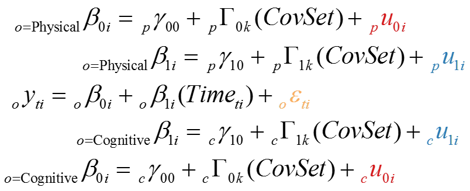

[](http://www.ialsa.org/)
[.](https://github.com/IALSA/IALSA-2015-Portland/edit/master/README.md)  
Quick links: [news](#news), [projects](#projects), [tools](#tools), [log](#log), [participants](#participants)  [.](https://github.com/IALSA/IALSA-2015-Portland/edit/master/README.md)

#Concurrent decline of body and mind  

IALSA-2015-Portland workshop performs a **coordinated analysis with replication (CAR)** of concomitant decline of physical and cognitive functioning during later adulthood.  
 
Submitted models vary in respect to their:  
 - ```study_name``` - (*e.g.* eas, satsa)  in which it was estimated  
 - ```model_number```: (u0, u1, u2, b0, b1, b2) alphanumeric of model form (u,b) and shape (int0rcept, s1ope, qua2radic )   
 - ```subgroup```: (female, male) subsets on which models are estimated    
 - ```model_type```: (0, a, ae, aeh, aehplus, full), a.k.a. *CovSet*, *Predictor Set* 
 - ```physical_measure``` - (*e.g.*  grip, gait, pek)    
 - ```cognitive_measure``` - (*e.g.*  block, digits, animals)   

*Currently, the model space includes linear models only (u1, b1), but other specification will be added as flexibility of reporting system increases*   
The following fou4 graphs cross-tab the **counts** of submitted models with *Cognitive Measures*:   

 [](https://github.com/IALSA/IALSA-2015-Portland/blob/master/reports/model_space/Model-Space-5D.md)  
The numbers in the cells count models of that specification. Each color adds up to 100%. "univar" indicates univariate growth models fitting either cognitive or physical process. 
 
Any model counted in the above graph can be specified with a form nested within the general **specification**:  
[](./reports/model_specification/README.md)  
</br>
The **covariance structure** will be given as
[](./reports/model_specification/README.md)  
For  details see [model specification](./reports/model_specification/README.md).  


##News
 -  
 - Scatters of Factor Scores: graphs explained in the [issue #100](https://github.com/IALSA/IALSA-2015-Portland/issues/100)
 - [Reminder](./projects/physical/reminder_160915.md) has been sent to those who did not yet provided Table 1, measure descriptions, or PxP models.   
 - [Description of measures](./studies/measures.md) have been added. Still many missing item documentations.
 - Announcing [Physical Track](https://github.com/IALSA/IALSA-2015-Portland/blob/master/projects/physical/announce.md)
 - [A Collaborative Modeling Framework for Multi-Study Coordinated Analyses](http://htmlpreview.github.io/?https://raw.githubusercontent.com/IALSA/IALSA-2015-Portland/master/talks/2015_presentations/22_July/A%20Collaborative%20Modeling%20Framework%20for%20Multi-Study%20Coordinated%20Analyses.html#/), *Wellcome Trust Conference*, July 22, 2015  
 - [dashboard](http://shiny.ouhsc.edu/IALSA-2015-Portland/shiny/dashboard)  


##Tools  
Analytic tools available to the workshop participants include dynamic **reports** and interactive **apps**. Both reports and apps are regenerated with each new influx of model submissions.  

###Reports 
 - [Rename and collapse](https://github.com/IALSA/IALSA-2015-Portland/blob/master/reports/rename_collapse/Track_renaming.md)  gives account of how model filename elements (subgroup, model_type, cognitive_measure, etc.) are corrected, renamed, and reclassified. Incorporates the results of Teleconference 1 on Jun 12.    
 - [Model Counts](http://htmlpreview.github.io/?https://github.com/IALSA/IALSA-2015-Portland/blob/master/reports/basic/counts.html)  and  [Model Essentials](http://htmlpreview.github.io/?https://github.com/IALSA/IALSA-2015-Portland/blob/master/reports/basic/essentials.html)  give basic tabled view of data in model space.   
 - Current status update for each study:
 [EAS](http://htmlpreview.github.io/?https://github.com/IALSA/IALSA-2015-Portland/blob/master/reports/individual/eas.html), [ELSA](http://htmlpreview.github.io/?https://github.com/IALSA/IALSA-2015-Portland/blob/master/reports/individual/elsa.html), [HABC](http://htmlpreview.github.io/?https://github.com/IALSA/IALSA-2015-Portland/blob/master/reports/individual/habc.html), 
 [ILSE](http://htmlpreview.github.io/?https://github.com/IALSA/IALSA-2015-Portland/blob/master/reports/individual/ilse.html), [NAS](http://htmlpreview.github.io/?https://github.com/IALSA/IALSA-2015-Portland/blob/master/reports/individual/nas.html) , 
 [NuAge](http://htmlpreview.github.io/?https://github.com/IALSA/IALSA-2015-Portland/blob/master/reports/individual/nuage.html),  [OCTO-Twin](http://htmlpreview.github.io/?https://github.com/IALSA/IALSA-2015-Portland/blob/master/reports/individual/octo.html),
 [RADC](http://htmlpreview.github.io/?https://github.com/IALSA/IALSA-2015-Portland/blob/master/reports/individual/radc.html),
 [SATSA](http://htmlpreview.github.io/?https://github.com/IALSA/IALSA-2015-Portland/blob/master/reports/individual/satsa.html)  
 - [model_space](https://github.com/IALSA/IALSA-2015-Portland/blob/master/reports/model_space/README.md) is a series of reports that tries to understand how best to organize our models for the analysis, in which model (not individual) is the primary unit .   
 - [reproduce](./scripts/utility/reproduce.R) script that re-generates all these reports.   
 - [scripts README](./scripts/README.md) overview scripts that replicates data preparation  
 
###Apps  
 - [dashboard](http://shiny.ouhsc.edu/IALSA-2015-Portland/shiny/dashboard)  
 - [pivot tables](http://shiny.ouhsc.edu/IALSA-2015-Portland/shiny/pivotTable) for basic exploration in the space of the submitted models


 

## Participants
| Study | Contact |
| :---- | :------ |
| [EAS](http://htmlpreview.github.io/?https://github.com/IALSA/IALSA-2015-Portland/blob/master/reports/individual/eas.html) | [measures](./EAS/measures.md |
| [ELSA](http://htmlpreview.github.io/?https://github.com/IALSA/IALSA-2015-Portland/blob/master/reports/individual/elsa.html) | [Annie Robitaille](mailto:annie.g.robitaille@gmail.com) |
| [HABC](http://htmlpreview.github.io/?https://github.com/IALSA/IALSA-2015-Portland/blob/master/reports/individual/habc.html) | [Chenkai Wu](mailto:chenkai.wu2010@gmail.com) |
| [ILSE](http://htmlpreview.github.io/?https://github.com/IALSA/IALSA-2015-Portland/blob/master/reports/individual/ilse.html) | [Philipp Handschuh](mailto:philipp.handschuh@uni-ulm.de) |
| [NAS](http://htmlpreview.github.io/?https://github.com/IALSA/IALSA-2015-Portland/blob/master/reports/individual/nas.html) | [Lewina Lee](mailto:lewina@bu.edu) |
| [NuAge](http://htmlpreview.github.io/?https://github.com/IALSA/IALSA-2015-Portland/blob/master/reports/individual/nuage.html) | [Valerie Jarry ](mailto:valerie.jarry@umontreal.ca ) |
| [OCTO-Twin](http://htmlpreview.github.io/?https://github.com/IALSA/IALSA-2015-Portland/blob/master/reports/individual/octo.html) | [Marcus Praetorius](mailto:marcus.praetorius@psy.gu.se) |
| [RADC](http://htmlpreview.github.io/?https://github.com/IALSA/IALSA-2015-Portland/blob/master/reports/individual/radc.html) | [Cassandra Brown](mailto:clb@uvic.ca) |
| [SATSA](http://htmlpreview.github.io/?https://github.com/IALSA/IALSA-2015-Portland/blob/master/reports/individual/satsa.html) | [Deborah Finkel](mailto:dfinkel@ius.edu) |


### Contact IALSA team

 - [Andrey Koval](mailto:andkov@uvic.ca)  
 - [Andrea Piccinin](mailto:piccinin@uvic.ca)   
 - [Graciela Muniz](mailto:gm299@cam.ac.uk)  


### Background

The current repository analyzes the results of the IALSA Analysis Workshop ([pdf overview](https://www.dropbox.com/s/a8zmh70ybedyec6/IALSA%20Feb%202015%20Workshop%20Overview.pdf?dl=0)) that was  held in Portland, Oregon from Monday February 23rd (8:30am) to Wednesday February 25th (12:30pm), 2015. 

The primary aim of the workshop was to examine associations between changes in physical functioning (i.e., grip strength, pulmonary function, chair stands, walking speed) and cognitive functioning (i.e., measures of speed, memory, reasoning, executive functioning) in multiple-study comparative framework. Bivariate growth processes were estimated to evaluate dynamic associations in change and variation within and across these domains and in relation to sample and individual differences in age, lifestyle, and health outcomes. The results from these analyses will extend recent systematic reviews and meta-analyses (e.g., [Clouston et al., 2012, Epidemiological Reviews](https://www.dropbox.com/s/vfe7u2ez5oxp3ev/Clouston_2013_Epidemiol%20Rev.pdf?dl=0) and will be submitted for publication as a set of independent brief reports, capped by a literature review/overview of analysis and completed with a research synthesis summary.

##Projects

Our current goals include publication of papers investigating the following fi5e associations:  

- Association between changes in [**pulmonary**](./projects/pulmonary/README.md) function and changes in cognitive function
- Association between changes in [**grip**](./projects/grip/README.md) strength and changes in cognitive function    
- Association between changes in [**gait**](./projects/gait/README.md) and changes in cognitive function  
- Associations between [**physical-cognitive**](./projects/physical-cognitive/README.md) variables, within and across domains  
- Associations among rates of change in [**physical**](./projects/physical/README.md) capability variables 

See [projects](./projects/README.md) page for a detailed overview of these five projects.


##Log 

The agenda and outcomes of each teleconference following the Portland workshop  
 - Announcing [Physical Track](https://github.com/IALSA/IALSA-2015-Portland/blob/master/projects/physical/announce.md)  

 - [Teleconference #3, 10-July-2015](./log.md)

 - [Teleconference #2, 26-June-2015](./log.md)

 - [Teleconference #1, 12-June-2015](./log.md#New) 


  
# Table of Contents
 - [news](#news)
 - [projects](#projects)  
 - [tools](#tools)
 - [log](#log)
 - [participants](#participants)
  [.](https://github.com/IALSA/IALSA-2015-Portland/edit/master/README.md)
