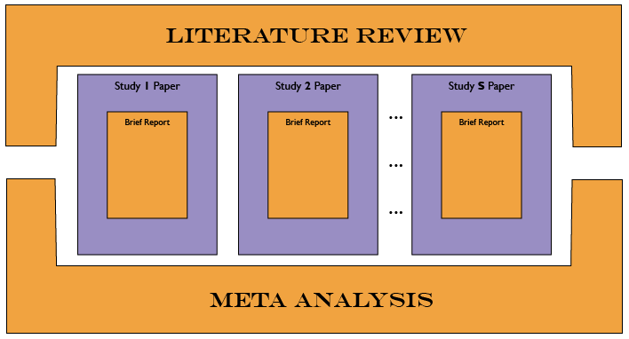

## Planned Projects

Our current goals include publication of papers investigating the following fi5e associations:  

- Association between changes in [**pulmonary**](./projects/pulmonary/README.md) function and changes in cognitive function
- Association between changes in [**grip**](./projects/grip/README.md) strength and changes in cognitive function    
- Association between changes in [**gait**](./projects/gait/README.md) and changes in cognitive function  
- Associations between [**physical-cognitive**](./projects/physical-cognitive/README.md) variables, within and across domains  
- Associations among rates of change in [**physical**](./projects/physical/README.md) capability variables 

Each of the projects ideally will result in a special issue publication, consisting of two overarching papers and one smaller paper for each study. 

[CLICK TO ADD DESCRIPTION](https://github.com/IALSA/IALSA-2015-Portland/edit/master/projects/README.md)

##1.Pulmonary
*PLEASE ADD ONE PARAGRAPH OF DESCRIPTION*  
Association between changes in [**pulmonary**](./pulmonary/README.md) function and changes in cognitive function

##2.Grip
*PLEASE ADD ONE PARAGRAPH OF DESCRIPTION*  
Association between changes in [**grip**](./grip/README.md) strength and changes in cognitive function    

##3.Gait
*PLEASE ADD ONE PARAGRAPH OF DESCRIPTION*  
Association between changes in [**gait**](./gait/README.md) and changes in cognitive function  

##4.Cognitive
*PLEASE ADD ONE PARAGRAPH OF DESCRIPTION*  
Associations between [**cognitive**](./cognitive/README.md) variables, within and across domains  

##5.Physical
Associations among rates of change in [**physical**](./physical/README.md) capability variables 

Here we focus on bivariate associations among trajectories of the physical measures. Given the limitations for publication in IEJ and because there are fewer physical than cognitive measures, a **multi-authored single paper** will be the format for this set of results. The paper will provide information regarding the extent to which various physical functions decline together within individuals, as opposed to declining in isolation, with different losses in different individuals.

##Manuscripts in Development
- [Portland-physical-cognitive](https://github.com/IALSA/Portland-physical-cognitive) repo follow the physical-cognitive track, evaluating the longitudinal models in which physical and cognitive outcomes form a bivariate linear structure. 

