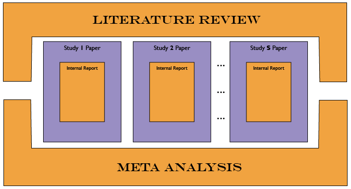

Project description
----

## Resources for the **grip** project

  - [Losing One’s Grip: A Bivariate Growth Curve Model of Grip Strength and Nonverbal Reasoning From Age 79 to 87 Years in the Lothian Birth Cohort 1921](http://psychsocgerontology.oxfordjournals.org/content/early/2011/07/08/geronb.gbr059.full)(Deary et al, 2011)
