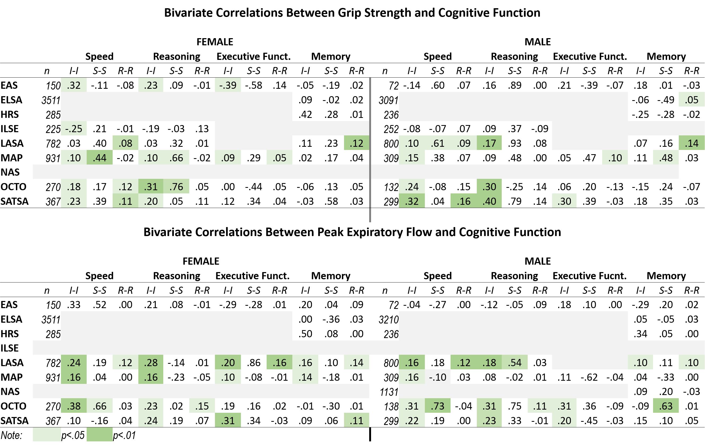

  

##Multivariate Change in Physical and Cognitive Functioning: Associations in Nine IALSA-Affiliated Longitudinal Studies

## Introduction
Evidence is increasing that physical functions and cognition are interrelated in older adults. 
A systematic review by Clouston et al. (2013) identified few longitudinal studies evaluating associations between changes in physical and cognitive functions, and noted considerable variation in the design, measures, analysis, and covariates. 
Understanding the link between within-person change and variation in physical and cognitive functioning is important for early detection and for interventions to help maintain functional independence.

####Objectives
To evaluate associations between changes in grip strength and peak expiratory flow and changes in speed of processing, reasoning, memory and EF
To evaluate replicability of the results.

##Methods
Samples:  (Individuals with dementia excluded)
- Einstein Aging Study (EAS)
- English Long’l Study of Ageing (ELSA)
- Health and Retirement Study (HRS)
- Interdisciplinary Long’l Study of Adult Dev’t (ILSE)
- Long’l Aging Study Amsterdam (LASA)
- Memory and Aging Project (MAP)
- Veteran’s Affairs Normative Aging Study (VA-NAS)
- Origins of Variance in the Oldest-Old (OCTO-Twin)
- Swedish Adoption Twin Study of Aging (SATSA)

####Measures:   
* Physical:
 - Grip Strength 
 - Peak Expiratory Flow 

* Cognitive: 
 - Reasoning: Block design, Raven’s Matrices
 - Speed: Symbol Digit Modality
 - Memory: Digit Span Forward, World List Recall, Logical/Prose Memory
 - Executive Function: Digit Span Backward, Trails B

* Analytic Method:  
 - Bivariate latent growth models estimate associations between individual differences in initial status, rate of linear change, and time-specific variation.
 - Initial status and rate of change were regressed on Baseline Age, Education, Height, Smoking History, Cardiovascular Disease and Diabetes. 

##Changes in Physical and Cognitive functioning   
* Across the 3 to 11 occasions measured over 6-19 years in the participating studies,   
 - Grip Strength & Peak Expiratory Flow declined as a function of time in more than half of the studies.  
 - Only Digit Span Backward declines in women were statistically significant in more than 50% of studies.  
 - Adjusting for predictors, individual differences in rate of change were often no longer statistically significant.  

## Association between changes in phsycial and cognitive functioning  
* Intercept–intercept (I-I) associations were weak but consistent. 
* Slope-slope associations (S-S) were inconsistent, varying from zero to moderate or high. 
* Within-person dynamics among time-specific variation (R-R) were mainly not statistically significant. 

