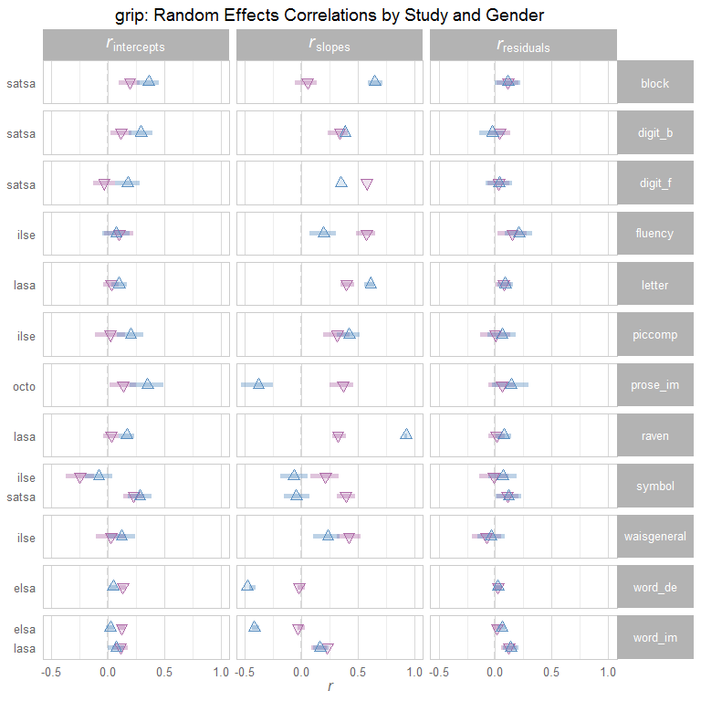
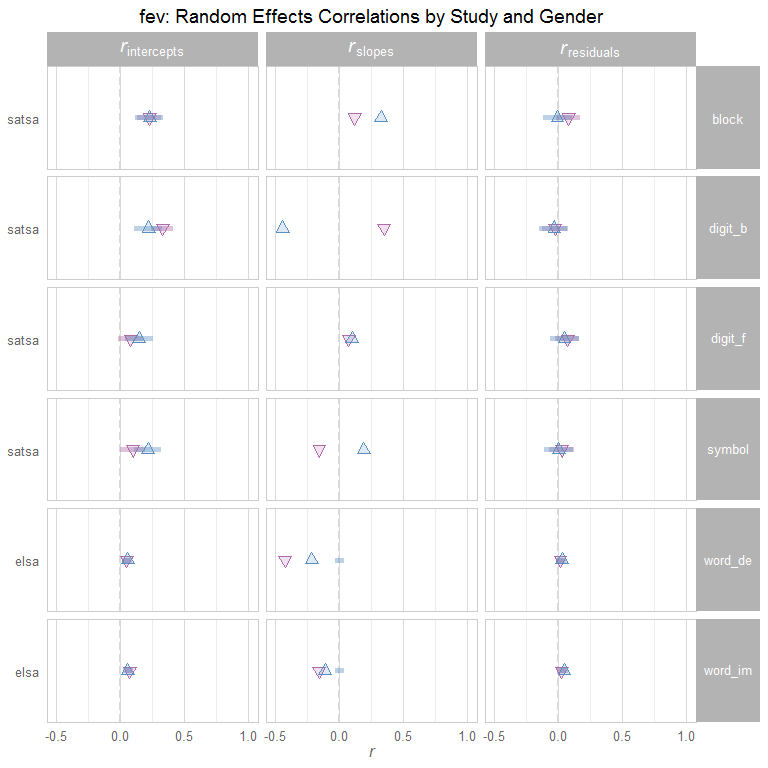
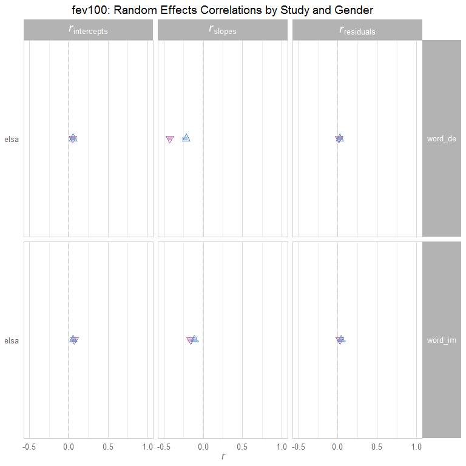
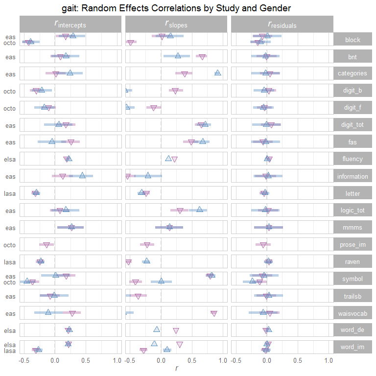
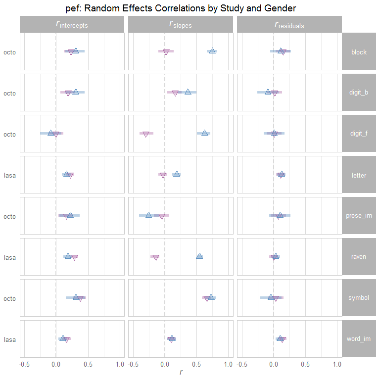

# Correlation Report #1
Date: `r Sys.Date()`  

This report contains a searchable table, followed by publication-ready tables.

<!--  Set the working directory to the repository's base directory; this assumes the report is nested inside of two directories.-->


<!-- Set the report-wide options, and point to the external code file. -->


<!-- Load the sources.  Suppress the output when loading sources. --> 


<!-- Load 'sourced' R files.  Suppress the output when loading packages. --> 


<!-- Load any global functions and variables declared in the R file.  Suppress the output. --> 


<!-- Declare any global functions specific to a Rmd output.  Suppress the output. --> 


<!-- Load the datasets.   -->


<!-- Tweak the datasets.   -->


# Summary

### Notes 
1. All available models are contained in the dynamic table, while only the 'aehplus' models are shown in the static tables.

### Unanswered Questions

1. How should we handle entries that are entirely missing?
1. How should we handle entries containing null/NA results?

### Answered Questions


# Dynamic Table

<!--html_preserve--><div id="htmlwidget-1490" style="width:100%;height:auto;" class="datatables html-widget"></div>
<script type="application/json" data-for="htmlwidget-1490">{"x":{"filter":"top","filterHTML":"<tr>\n  <td>\u003c/td>\n  <td data-type=\"factor\" style=\"vertical-align: top;\">\n    <div class=\"form-group has-feedback\" style=\"margin-bottom: auto;\">\n      <input type=\"search\" placeholder=\"All\" class=\"form-control\" style=\"width: 100%;\"/>\n      <span class=\"glyphicon glyphicon-remove-circle form-control-feedback\">\u003c/span>\n    \u003c/div>\n    <div style=\"width: 100%; display: none;\">\n      <select multiple=\"multiple\" style=\"width: 100%;\">\n        <option value=\"eas\">eas\u003c/option>\n        <option value=\"elsa\">elsa\u003c/option>\n        <option value=\"hrs\">hrs\u003c/option>\n        <option value=\"ilse\">ilse\u003c/option>\n        <option value=\"lasa\">lasa\u003c/option>\n        <option value=\"map\">map\u003c/option>\n        <option value=\"nuage\">nuage\u003c/option>\n        <option value=\"octo\">octo\u003c/option>\n        <option value=\"satsa\">satsa\u003c/option>\n      \u003c/select>\n    \u003c/div>\n  \u003c/td>\n  <td data-type=\"factor\" style=\"vertical-align: top;\">\n    <div class=\"form-group has-feedback\" style=\"margin-bottom: auto;\">\n      <input type=\"search\" placeholder=\"All\" class=\"form-control\" style=\"width: 100%;\"/>\n      <span class=\"glyphicon glyphicon-remove-circle form-control-feedback\">\u003c/span>\n    \u003c/div>\n    <div style=\"width: 100%; display: none;\">\n      <select multiple=\"multiple\" style=\"width: 100%;\">\n        <option value=\"fev\">fev\u003c/option>\n        <option value=\"fev100\">fev100\u003c/option>\n        <option value=\"gait\">gait\u003c/option>\n        <option value=\"grip\">grip\u003c/option>\n        <option value=\"pef\">pef\u003c/option>\n        <option value=\"tug\">tug\u003c/option>\n      \u003c/select>\n    \u003c/div>\n  \u003c/td>\n  <td data-type=\"factor\" style=\"vertical-align: top;\">\n    <div class=\"form-group has-feedback\" style=\"margin-bottom: auto;\">\n      <input type=\"search\" placeholder=\"All\" class=\"form-control\" style=\"width: 100%;\"/>\n      <span class=\"glyphicon glyphicon-remove-circle form-control-feedback\">\u003c/span>\n    \u003c/div>\n    <div style=\"width: 100%; display: none;\">\n      <select multiple=\"multiple\" style=\"width: 100%;\">\n        <option value=\"analogies\">analogies\u003c/option>\n        <option value=\"block\">block\u003c/option>\n        <option value=\"bnt\">bnt\u003c/option>\n        <option value=\"bstory_de\">bstory_de\u003c/option>\n        <option value=\"bstory_im\">bstory_im\u003c/option>\n        <option value=\"categories\">categories\u003c/option>\n        <option value=\"digit_b\">digit_b\u003c/option>\n        <option value=\"digit_f\">digit_f\u003c/option>\n        <option value=\"digit_o\">digit_o\u003c/option>\n        <option value=\"digit_tot\">digit_tot\u003c/option>\n        <option value=\"fas\">fas\u003c/option>\n        <option value=\"fig_id\">fig_id\u003c/option>\n        <option value=\"fig_logic\">fig_logic\u003c/option>\n        <option value=\"fig_mem\">fig_mem\u003c/option>\n        <option value=\"fluency\">fluency\u003c/option>\n        <option value=\"ideas\">ideas\u003c/option>\n        <option value=\"information\">information\u003c/option>\n        <option value=\"letter\">letter\u003c/option>\n        <option value=\"line\">line\u003c/option>\n        <option value=\"logic_de\">logic_de\u003c/option>\n        <option value=\"logic_im\">logic_im\u003c/option>\n        <option value=\"logic_tot\">logic_tot\u003c/option>\n        <option value=\"matrices\">matrices\u003c/option>\n        <option value=\"mir\">mir\u003c/option>\n        <option value=\"mmms\">mmms\u003c/option>\n        <option value=\"nart\">nart\u003c/option>\n        <option value=\"num_comp\">num_comp\u003c/option>\n        <option value=\"piccomp\">piccomp\u003c/option>\n        <option value=\"prose_im\">prose_im\u003c/option>\n        <option value=\"psif\">psif\u003c/option>\n        <option value=\"raven\">raven\u003c/option>\n        <option value=\"rotate\">rotate\u003c/option>\n        <option value=\"serial7\">serial7\u003c/option>\n        <option value=\"symbol\">symbol\u003c/option>\n        <option value=\"synonyms\">synonyms\u003c/option>\n        <option value=\"tics\">tics\u003c/option>\n        <option value=\"trailsb\">trailsb\u003c/option>\n        <option value=\"waisgeneral\">waisgeneral\u003c/option>\n        <option value=\"waisvocab\">waisvocab\u003c/option>\n        <option value=\"word_de\">word_de\u003c/option>\n        <option value=\"word_im\">word_im\u003c/option>\n        <option value=\"word_rec\">word_rec\u003c/option>\n      \u003c/select>\n    \u003c/div>\n  \u003c/td>\n  <td data-type=\"factor\" style=\"vertical-align: top;\">\n    <div class=\"form-group has-feedback\" style=\"margin-bottom: auto;\">\n      <input type=\"search\" placeholder=\"All\" class=\"form-control\" style=\"width: 100%;\"/>\n      <span class=\"glyphicon glyphicon-remove-circle form-control-feedback\">\u003c/span>\n    \u003c/div>\n    <div style=\"width: 100%; display: none;\">\n      <select multiple=\"multiple\" style=\"width: 100%;\">\n        <option value=\"female\">female\u003c/option>\n        <option value=\"male\">male\u003c/option>\n      \u003c/select>\n    \u003c/div>\n  \u003c/td>\n  <td data-type=\"factor\" style=\"vertical-align: top;\">\n    <div class=\"form-group has-feedback\" style=\"margin-bottom: auto;\">\n      <input type=\"search\" placeholder=\"All\" class=\"form-control\" style=\"width: 100%;\"/>\n      <span class=\"glyphicon glyphicon-remove-circle form-control-feedback\">\u003c/span>\n    \u003c/div>\n    <div style=\"width: 100%; display: none;\">\n      <select multiple=\"multiple\" style=\"width: 100%;\">\n        <option value=\"0\">0\u003c/option>\n        <option value=\"a\">a\u003c/option>\n        <option value=\"ae\">ae\u003c/option>\n        <option value=\"aeh\">aeh\u003c/option>\n        <option value=\"aehplus\">aehplus\u003c/option>\n        <option value=\"full\">full\u003c/option>\n      \u003c/select>\n    \u003c/div>\n  \u003c/td>\n  <td data-type=\"character\" style=\"vertical-align: top;\">\n    <div class=\"form-group has-feedback\" style=\"margin-bottom: auto;\">\n      <input type=\"search\" placeholder=\"All\" class=\"form-control\" style=\"width: 100%;\"/>\n      <span class=\"glyphicon glyphicon-remove-circle form-control-feedback\">\u003c/span>\n    \u003c/div>\n  \u003c/td>\n  <td data-type=\"character\" style=\"vertical-align: top;\">\n    <div class=\"form-group has-feedback\" style=\"margin-bottom: auto;\">\n      <input type=\"search\" placeholder=\"All\" class=\"form-control\" style=\"width: 100%;\"/>\n      <span class=\"glyphicon glyphicon-remove-circle form-control-feedback\">\u003c/span>\n    \u003c/div>\n  \u003c/td>\n  <td data-type=\"character\" style=\"vertical-align: top;\">\n    <div class=\"form-group has-feedback\" style=\"margin-bottom: auto;\">\n      <input type=\"search\" placeholder=\"All\" class=\"form-control\" style=\"width: 100%;\"/>\n      <span class=\"glyphicon glyphicon-remove-circle form-control-feedback\">\u003c/span>\n    \u003c/div>\n  \u003c/td>\n  <td data-type=\"character\" style=\"vertical-align: top;\">\n    <div class=\"form-group has-feedback\" style=\"margin-bottom: auto;\">\n      <input type=\"search\" placeholder=\"All\" class=\"form-control\" style=\"width: 100%;\"/>\n      <span class=\"glyphicon glyphicon-remove-circle form-control-feedback\">\u003c/span>\n    \u003c/div>\n  \u003c/td>\n\u003c/tr>","caption":"<caption>Random Effects Growth Curve Model Solution\u003c/caption>","data":[["1","2","3","4","5","6","7","8","9","10","11","12","13","14","15","16","17","18","19","20","21","22","23","24","25","26","27","28","29","30","31","32","33","34","35","36","37","38","39","40","41","42","43","44","45","46","47","48","49","50","51","52","53","54","55","56","57","58","59","60","61","62","63","64","65","66","67","68","69","70","71","72","73","74","75","76","77","78","79","80","81","82","83","84","85","86","87","88","89","90","91","92","93","94","95","96","97","98","99","100","101","102","103","104","105","106","107","108","109","110","111","112","113","114","115","116","117","118","119","120","121","122","123","124","125","126","127","128","129","130","131","132","133","134","135","136","137","138","139","140","141","142","143","144","145","146","147","148","149","150","151","152","153","154","155","156","157","158","159","160","161","162","163","164","165","166","167","168","169","170","171","172","173","174","175","176","177","178","179","180","181","182","183","184","185","186","187","188","189","190","191","192","193","194","195","196","197","198","199","200","201","202","203","204","205","206","207","208","209","210","211","212","213","214","215","216","217","218","219","220","221","222","223","224","225","226","227","228","229","230","231","232","233","234","235","236","237","238","239","240","241","242","243","244","245","246","247","248","249","250","251","252","253","254","255","256","257","258","259","260","261","262","263","264","265","266","267","268","269","270","271","272","273","274","275","276","277","278","279","280","281","282","283","284","285","286","287","288","289","290","291","292","293","294","295","296","297","298","299","300","301","302","303","304","305","306","307","308","309","310","311","312","313","314","315","316","317","318","319","320","321","322","323","324","325","326","327","328","329","330","331","332","333","334","335","336","337","338","339","340","341","342","343","344","345","346","347","348","349","350","351","352","353","354","355","356","357","358","359","360","361","362","363","364","365","366","367","368","369","370","371","372","373","374","375","376","377","378","379","380","381","382","383","384","385","386","387","388","389","390","391","392","393","394","395","396","397","398","399","400","401","402","403","404","405","406","407","408","409","410","411","412","413","414","415","416","417","418","419","420","421","422","423","424","425","426","427","428","429","430","431","432","433","434","435","436","437","438","439","440","441","442","443","444","445","446","447","448","449","450","451","452","453","454","455","456","457","458","459","460","461","462","463","464","465","466","467","468","469","470","471","472","473","474","475","476","477","478","479","480","481","482","483","484","485","486","487","488","489","490","491","492","493","494","495","496","497","498","499","500","501","502","503","504","505","506","507","508","509","510","511","512","513","514","515","516","517","518","519","520","521","522","523","524","525","526","527","528","529","530","531","532","533","534","535","536","537","538","539","540","541","542","543","544","545","546","547","548","549","550","551","552","553","554","555","556","557","558","559","560","561","562","563","564","565","566","567","568","569","570","571","572","573","574","575","576","577","578","579","580","581","582","583","584","585","586","587","588","589","590","591","592","593","594","595","596","597","598","599","600","601","602","603","604","605","606","607","608","609","610","611","612","613","614","615","616","617","618","619","620","621","622","623","624","625","626","627","628","629","630","631","632","633","634","635","636","637","638","639","640","641","642","643","644","645","646","647","648","649","650","651","652","653","654","655","656","657","658","659","660","661","662","663","664","665","666","667","668","669","670","671","672","673","674","675","676","677","678","679","680","681","682","683","684","685","686","687","688","689","690","691","692","693","694","695","696","697","698","699","700","701","702","703","704","705","706","707","708","709","710","711","712","713","714","715","716","717","718","719","720","721","722","723","724","725","726","727","728","729","730","731","732","733","734","735","736","737","738","739","740","741","742","743","744","745","746","747","748","749","750","751","752","753","754","755","756","757","758","759","760","761","762","763","764","765","766","767","768","769","770","771","772","773","774","775","776","777","778","779","780","781","782","783","784","785","786","787","788","789","790","791","792","793","794","795","796","797","798","799","800","801","802","803","804","805","806","807","808","809","810","811","812","813","814","815","816","817","818","819","820","821","822","823","824","825","826","827","828","829","830","831","832","833","834","835","836","837","838","839","840","841","842","843","844","845","846","847","848","849","850","851","852","853","854","855","856","857","858","859","860","861","862","863","864","865","866","867","868","869","870","871","872","873","874","875","876","877","878","879","880","881","882","883","884","885","886","887","888","889","890","891","892","893","894","895","896","897","898","899","900","901","902","903","904","905","906","907","908","909","910","911","912","913","914","915","916","917","918","919","920","921","922","923","924","925","926","927","928","929","930","931","932","933","934","935","936","937","938","939","940","941","942","943","944","945","946","947","948","949","950","951","952","953","954","955","956","957","958","959","960","961","962","963","964","965","966","967","968","969","970","971","972","973","974","975","976","977","978","979","980","981","982","983","984","985","986","987"],["eas","eas","eas","eas","eas","eas","eas","eas","eas","eas","eas","eas","eas","eas","eas","eas","eas","eas","eas","eas","eas","eas","eas","eas","eas","eas","eas","eas","eas","eas","eas","eas","eas","eas","eas","eas","eas","eas","eas","eas","eas","eas","eas","eas","eas","eas","eas","eas","eas","eas","eas","eas","eas","eas","eas","eas","eas","eas","eas","eas","eas","eas","eas","eas","eas","eas","eas","eas","eas","eas","eas","eas","eas","eas","eas","eas","eas","eas","eas","eas","eas","eas","eas","eas","eas","eas","eas","eas","eas","eas","eas","eas","eas","eas","eas","eas","eas","eas","eas","eas","eas","eas","eas","eas","eas","eas","eas","eas","eas","eas","eas","eas","eas","eas","eas","eas","eas","eas","eas","eas","eas","eas","eas","eas","eas","eas","eas","eas","eas","eas","eas","eas","eas","eas","eas","eas","eas","eas","eas","eas","eas","eas","eas","eas","eas","eas","eas","eas","eas","eas","eas","eas","eas","eas","eas","eas","eas","eas","eas","eas","eas","eas","eas","eas","eas","eas","eas","eas","eas","eas","eas","eas","eas","eas","eas","eas","eas","eas","eas","eas","eas","eas","eas","eas","eas","eas","eas","eas","eas","eas","eas","eas","eas","eas","eas","eas","eas","eas","eas","eas","eas","eas","eas","eas","eas","eas","eas","eas","eas","eas","eas","eas","eas","eas","eas","eas","eas","eas","eas","eas","eas","eas","eas","eas","eas","eas","eas","eas","eas","eas","eas","eas","eas","eas","eas","eas","eas","eas","eas","eas","eas","eas","eas","eas","eas","eas","eas","eas","eas","eas","eas","eas","eas","eas","eas","elsa","elsa","elsa","elsa","elsa","elsa","elsa","elsa","elsa","elsa","elsa","elsa","elsa","elsa","elsa","elsa","elsa","elsa","hrs","hrs","hrs","hrs","hrs","hrs","hrs","hrs","hrs","hrs","hrs","hrs","hrs","hrs","hrs","hrs","hrs","hrs","hrs","hrs","hrs","hrs","hrs","hrs","hrs","hrs","hrs","hrs","hrs","hrs","hrs","hrs","hrs","hrs","hrs","hrs","hrs","hrs","hrs","hrs","hrs","hrs","hrs","hrs","hrs","hrs","hrs","hrs","hrs","hrs","hrs","hrs","hrs","hrs","hrs","hrs","hrs","hrs","hrs","hrs","hrs","hrs","hrs","hrs","hrs","hrs","hrs","hrs","hrs","hrs","hrs","hrs","ilse","ilse","ilse","ilse","ilse","ilse","ilse","ilse","ilse","ilse","ilse","ilse","ilse","ilse","ilse","ilse","ilse","ilse","ilse","ilse","ilse","ilse","ilse","ilse","ilse","ilse","ilse","ilse","ilse","ilse","ilse","ilse","ilse","ilse","ilse","ilse","ilse","lasa","lasa","lasa","lasa","lasa","lasa","lasa","lasa","lasa","lasa","lasa","lasa","lasa","lasa","lasa","lasa","lasa","lasa","map","map","map","map","map","map","map","map","map","map","map","map","map","map","map","map","map","map","map","map","map","map","map","map","map","map","map","map","map","map","map","map","map","map","map","map","map","map","map","map","map","map","map","map","map","map","map","map","map","map","map","map","map","map","map","map","map","map","map","map","map","map","map","map","map","map","map","map","map","map","map","map","map","map","map","map","map","map","map","map","map","map","map","map","map","map","map","map","map","map","map","map","map","map","map","map","map","map","map","map","map","map","map","map","map","map","map","map","map","map","map","map","map","map","map","map","map","map","map","map","map","map","map","map","map","map","map","map","map","map","map","map","map","map","map","map","map","map","map","map","map","map","map","map","map","map","map","map","map","map","map","map","map","map","map","map","map","map","map","map","map","map","map","map","map","map","map","map","map","map","map","map","map","map","map","map","map","map","map","map","map","map","map","map","map","map","map","map","map","map","map","map","map","map","map","map","map","map","map","map","map","map","map","map","map","map","map","map","map","map","map","map","map","map","map","map","map","map","map","map","map","map","map","map","map","map","map","map","map","map","map","map","map","map","map","map","map","map","map","map","map","map","map","map","map","map","map","map","map","map","map","map","map","map","map","map","map","map","map","map","map","map","map","map","map","map","map","map","map","map","map","map","map","map","map","map","map","map","map","map","map","map","map","map","map","map","map","map","map","map","map","map","map","map","map","map","map","map","nuage","nuage","nuage","nuage","nuage","nuage","octo","octo","octo","octo","octo","octo","octo","octo","octo","octo","octo","octo","octo","octo","octo","octo","octo","octo","octo","octo","octo","octo","octo","octo","octo","octo","octo","octo","octo","octo","octo","octo","octo","octo","octo","octo","octo","octo","octo","octo","octo","octo","octo","octo","octo","octo","octo","octo","octo","octo","octo","octo","octo","octo","octo","octo","octo","octo","octo","octo","octo","octo","octo","octo","octo","octo","octo","octo","octo","octo","octo","octo","octo","octo","octo","octo","octo","octo","octo","octo","octo","octo","octo","octo","octo","octo","octo","octo","octo","octo","octo","octo","octo","octo","octo","octo","octo","octo","octo","octo","octo","octo","octo","octo","octo","octo","octo","octo","octo","octo","octo","octo","octo","octo","octo","octo","octo","octo","octo","octo","octo","satsa","satsa","satsa","satsa","satsa","satsa","satsa","satsa","satsa","satsa","satsa","satsa","satsa","satsa","satsa","satsa","satsa","satsa","satsa","satsa","satsa","satsa","satsa","satsa","satsa","satsa","satsa","satsa","satsa","satsa","satsa","satsa","satsa","satsa","satsa","satsa","satsa","satsa","satsa","satsa","satsa","satsa","satsa","satsa","satsa","satsa","satsa","satsa","satsa","satsa","satsa","satsa","satsa","satsa","satsa","satsa","satsa","satsa","satsa","satsa","satsa","satsa","satsa","satsa","satsa","satsa","satsa","satsa","satsa","satsa","satsa","satsa","satsa","satsa","satsa","satsa","satsa","satsa","satsa","satsa","satsa","satsa","satsa","satsa","satsa","satsa","satsa","satsa","satsa","satsa","satsa","satsa","satsa","satsa","satsa","satsa","satsa","satsa","satsa","satsa","satsa","satsa","satsa","satsa","satsa","satsa","satsa","satsa","satsa","satsa","satsa","satsa","satsa","satsa","satsa","satsa","satsa","satsa","satsa","satsa","satsa","satsa","satsa","satsa","satsa","satsa","satsa","satsa","satsa","satsa","satsa","satsa","satsa","satsa","satsa","satsa","satsa","satsa","satsa","satsa","satsa","satsa","satsa","satsa","satsa","satsa","satsa","satsa","satsa","satsa","satsa","satsa","satsa","satsa","satsa","satsa","satsa","satsa","satsa","satsa","satsa","satsa"],["gait","gait","gait","gait","gait","gait","gait","gait","gait","gait","gait","gait","gait","gait","gait","gait","gait","gait","gait","gait","gait","gait","gait","gait","gait","gait","gait","gait","gait","gait","gait","gait","gait","gait","gait","gait","gait","gait","gait","gait","gait","gait","gait","gait","gait","gait","gait","gait","gait","gait","gait","gait","gait","gait","gait","gait","gait","gait","gait","gait","gait","gait","gait","gait","gait","gait","gait","gait","gait","gait","gait","gait","gait","gait","gait","gait","gait","gait","gait","gait","gait","gait","gait","gait","gait","gait","gait","gait","gait","gait","gait","gait","gait","gait","gait","gait","gait","gait","gait","gait","gait","gait","gait","gait","gait","gait","gait","gait","gait","gait","grip","grip","grip","grip","grip","grip","grip","grip","grip","grip","grip","grip","grip","grip","grip","grip","grip","grip","grip","grip","grip","grip","grip","grip","grip","grip","grip","grip","grip","grip","grip","grip","grip","grip","grip","grip","grip","grip","grip","grip","grip","grip","grip","grip","grip","grip","grip","grip","grip","grip","grip","grip","grip","grip","grip","grip","grip","grip","grip","grip","grip","grip","grip","grip","grip","grip","grip","grip","grip","grip","grip","grip","grip","grip","grip","grip","grip","grip","grip","grip","grip","grip","grip","grip","grip","grip","grip","grip","grip","grip","grip","grip","grip","grip","grip","grip","grip","grip","grip","grip","grip","grip","grip","grip","grip","grip","grip","grip","grip","pef","pef","pef","pef","pef","pef","pef","pef","pef","pef","pef","pef","pef","pef","pef","pef","pef","pef","pef","pef","pef","pef","pef","pef","pef","pef","pef","pef","pef","pef","pef","pef","pef","pef","pef","pef","fev","fev","fev","fev","fev100","fev100","fev100","fev100","gait","gait","gait","gait","gait","gait","grip","grip","grip","grip","gait","gait","gait","gait","gait","gait","gait","gait","gait","gait","gait","gait","gait","gait","gait","gait","gait","gait","gait","gait","gait","gait","gait","gait","grip","grip","grip","grip","grip","grip","grip","grip","grip","grip","grip","grip","grip","grip","grip","grip","grip","grip","grip","grip","grip","grip","grip","grip","pef","pef","pef","pef","pef","pef","pef","pef","pef","pef","pef","pef","pef","pef","pef","pef","pef","pef","pef","pef","pef","pef","pef","pef","grip","grip","grip","grip","grip","grip","grip","grip","tug","tug","tug","tug","tug","tug","tug","tug","tug","tug","tug","tug","tug","tug","tug","tug","tug","tug","tug","tug","tug","tug","tug","tug","tug","tug","tug","tug","tug","gait","gait","gait","gait","gait","gait","grip","grip","grip","grip","grip","grip","pef","pef","pef","pef","pef","pef","fev","fev","fev","fev","fev","fev","fev","fev","fev","fev","fev","fev","fev","fev","fev","fev","fev","fev","fev","fev","fev","fev","fev","fev","fev","fev","fev","fev","fev","fev","fev","fev","fev","fev","fev","fev","fev","fev","fev","fev","fev","fev","fev","fev","fev","fev","fev","fev","fev","fev","fev","fev","fev","fev","fev","fev","fev","fev","fev","fev","fev","fev","fev","fev","fev","fev","fev","fev","fev","fev","fev","fev","fev","fev","fev","fev","fev","fev","fev","fev","fev","fev","fev","fev","fev","fev","fev","fev","fev","fev","fev","fev","fev","fev","fev","fev","fev","fev","fev","fev","fev","fev","fev","fev","fev","fev","fev","fev","fev","fev","fev","fev","fev","fev","fev","fev","fev","fev","fev","fev","fev","fev","fev","fev","fev","fev","fev","fev","fev","fev","fev","fev","fev","fev","fev","fev","fev","fev","fev","fev","fev","fev","fev","fev","fev","fev","fev","fev","fev","fev","grip","grip","grip","grip","grip","grip","grip","grip","grip","grip","grip","grip","grip","grip","grip","grip","grip","grip","grip","grip","grip","grip","grip","grip","grip","grip","grip","grip","grip","grip","grip","grip","grip","grip","grip","grip","grip","grip","grip","grip","grip","grip","grip","grip","grip","grip","grip","grip","grip","grip","grip","grip","grip","grip","grip","grip","grip","grip","grip","grip","grip","grip","grip","grip","grip","grip","grip","grip","grip","grip","grip","grip","grip","grip","grip","grip","grip","grip","grip","grip","grip","grip","grip","grip","grip","grip","grip","grip","grip","grip","grip","grip","grip","grip","grip","grip","grip","grip","grip","grip","grip","grip","grip","grip","grip","grip","grip","grip","grip","grip","grip","grip","grip","grip","grip","grip","grip","grip","grip","grip","grip","grip","grip","grip","grip","grip","grip","grip","grip","grip","grip","grip","grip","grip","grip","grip","grip","grip","grip","grip","grip","grip","grip","grip","grip","grip","grip","grip","grip","grip","grip","grip","grip","grip","gait","gait","gait","gait","gait","gait","gait","gait","gait","grip","grip","grip","grip","grip","grip","grip","grip","grip","grip","grip","grip","grip","grip","grip","grip","grip","grip","grip","grip","grip","grip","grip","grip","grip","grip","grip","grip","grip","grip","grip","grip","grip","grip","grip","grip","grip","grip","grip","grip","grip","grip","grip","grip","grip","grip","grip","grip","grip","grip","grip","grip","grip","grip","grip","grip","grip","grip","pef","pef","pef","pef","pef","pef","pef","pef","pef","pef","pef","pef","pef","pef","pef","pef","pef","pef","pef","pef","pef","pef","pef","pef","pef","pef","pef","pef","pef","pef","pef","pef","pef","pef","pef","pef","pef","pef","pef","pef","pef","pef","pef","pef","pef","pef","pef","pef","pef","pef","pef","pef","pef","pef","fev","fev","fev","fev","fev","fev","fev","fev","fev","fev","fev","fev","fev","fev","fev","fev","fev","fev","fev","fev","fev","fev","fev","fev","fev","fev","fev","fev","fev","fev","fev","fev","fev","fev","fev","fev","fev","fev","fev","fev","fev","fev","fev","fev","fev","fev","fev","fev","fev","fev","fev","fev","fev","fev","fev","fev","fev","fev","fev","fev","fev","fev","fev","fev","fev","fev","fev","fev","fev","fev","fev","fev","fev","fev","fev","fev","fev","fev","fev","fev","fev","fev","fev","fev","fev","fev","fev","fev","fev","fev","fev","fev","fev","fev","fev","fev","fev","fev","fev","fev","fev","fev","fev","fev","fev","fev","fev","fev","fev","fev","grip","grip","grip","grip","grip","grip","grip","grip","grip","grip","grip","grip","grip","grip","grip","grip","grip","grip","grip","grip","grip","grip","grip","grip","grip","grip","grip","grip","grip","grip","grip","grip","grip","grip","grip","grip","grip","grip","grip","grip","grip","grip","grip","grip","grip","grip","grip","grip","grip","grip","grip","grip"],["block","block","block","block","block","block","block","block","block","block","bnt","bnt","bnt","bnt","bnt","bnt","bnt","bnt","bnt","bnt","categories","categories","categories","categories","categories","categories","categories","categories","categories","categories","digit_tot","digit_tot","digit_tot","digit_tot","digit_tot","digit_tot","digit_tot","digit_tot","digit_tot","digit_tot","fas","fas","fas","fas","fas","fas","fas","fas","fas","fas","information","information","information","information","information","information","information","information","information","information","logic_tot","logic_tot","logic_tot","logic_tot","logic_tot","logic_tot","logic_tot","logic_tot","logic_tot","logic_tot","mmms","mmms","mmms","mmms","mmms","mmms","mmms","mmms","mmms","mmms","symbol","symbol","symbol","symbol","symbol","symbol","symbol","symbol","symbol","symbol","trailsb","trailsb","trailsb","trailsb","trailsb","trailsb","trailsb","trailsb","trailsb","trailsb","waisvocab","waisvocab","waisvocab","waisvocab","waisvocab","waisvocab","waisvocab","waisvocab","waisvocab","waisvocab","block","block","block","block","block","block","block","block","block","block","bnt","bnt","bnt","bnt","bnt","bnt","bnt","bnt","bnt","bnt","categories","categories","categories","categories","categories","categories","categories","categories","categories","categories","digit_tot","digit_tot","digit_tot","digit_tot","digit_tot","digit_tot","digit_tot","digit_tot","digit_tot","digit_tot","fas","fas","fas","fas","fas","fas","fas","fas","fas","fas","information","information","information","information","information","information","information","information","information","information","logic_tot","logic_tot","logic_tot","logic_tot","logic_tot","logic_tot","logic_tot","logic_tot","logic_tot","mmms","mmms","mmms","mmms","mmms","mmms","mmms","mmms","mmms","mmms","symbol","symbol","symbol","symbol","symbol","symbol","symbol","symbol","symbol","symbol","trailsb","trailsb","trailsb","trailsb","trailsb","trailsb","trailsb","trailsb","trailsb","trailsb","waisvocab","waisvocab","waisvocab","waisvocab","waisvocab","waisvocab","waisvocab","waisvocab","waisvocab","waisvocab","block","block","block","block","block","block","block","digit_tot","digit_tot","digit_tot","digit_tot","digit_tot","digit_tot","digit_tot","digit_tot","digit_tot","fas","symbol","symbol","symbol","symbol","symbol","symbol","symbol","symbol","symbol","symbol","trailsb","trailsb","trailsb","trailsb","trailsb","trailsb","trailsb","trailsb","trailsb","word_de","word_de","word_im","word_im","word_de","word_de","word_im","word_im","fluency","fluency","word_de","word_de","word_im","word_im","word_de","word_de","word_im","word_im","serial7","serial7","serial7","serial7","serial7","serial7","tics","tics","tics","tics","tics","tics","word_de","word_de","word_de","word_de","word_de","word_de","word_im","word_im","word_im","word_im","word_im","word_im","serial7","serial7","serial7","serial7","serial7","serial7","tics","tics","tics","tics","tics","tics","word_de","word_de","word_de","word_de","word_de","word_de","word_im","word_im","word_im","word_im","word_im","word_im","serial7","serial7","serial7","serial7","serial7","serial7","tics","tics","tics","tics","tics","tics","word_de","word_de","word_de","word_de","word_de","word_de","word_im","word_im","word_im","word_im","word_im","word_im","fluency","fluency","piccomp","piccomp","symbol","symbol","waisgeneral","waisgeneral","block","block","block","block","block","block","fluency","fluency","fluency","fluency","fluency","piccomp","piccomp","piccomp","piccomp","piccomp","piccomp","symbol","symbol","symbol","symbol","symbol","symbol","waisgeneral","waisgeneral","waisgeneral","waisgeneral","waisgeneral","waisgeneral","letter","letter","raven","raven","word_im","word_im","letter","letter","raven","raven","word_im","word_im","letter","letter","raven","raven","word_im","word_im","bnt","bnt","bnt","bnt","bnt","bnt","bnt","bnt","bstory_de","bstory_de","bstory_de","bstory_de","bstory_de","bstory_de","bstory_de","bstory_de","bstory_im","bstory_im","bstory_im","bstory_im","bstory_im","bstory_im","bstory_im","bstory_im","categories","categories","categories","categories","categories","categories","categories","categories","digit_b","digit_b","digit_b","digit_b","digit_b","digit_b","digit_b","digit_b","digit_f","digit_f","digit_f","digit_f","digit_f","digit_f","digit_f","digit_f","digit_o","digit_o","digit_o","digit_o","digit_o","digit_o","digit_o","digit_o","ideas","ideas","ideas","ideas","ideas","ideas","ideas","ideas","line","line","line","line","line","line","line","line","logic_de","logic_de","logic_de","logic_de","logic_de","logic_de","logic_de","logic_de","logic_im","logic_im","logic_im","logic_im","logic_im","logic_im","logic_im","matrices","matrices","matrices","matrices","matrices","matrices","matrices","matrices","mmms","mmms","mmms","mmms","mmms","mmms","mmms","nart","nart","nart","nart","nart","nart","nart","nart","num_comp","num_comp","num_comp","num_comp","num_comp","num_comp","num_comp","num_comp","symbol","symbol","symbol","symbol","symbol","symbol","symbol","symbol","word_de","word_de","word_de","word_de","word_de","word_de","word_de","word_de","word_im","word_im","word_im","word_im","word_im","word_im","word_im","word_im","word_rec","word_rec","word_rec","word_rec","word_rec","word_rec","word_rec","word_rec","bnt","bnt","bnt","bnt","bnt","bnt","bnt","bstory_de","bstory_de","bstory_de","bstory_de","bstory_de","bstory_de","bstory_de","bstory_de","bstory_im","bstory_im","bstory_im","bstory_im","bstory_im","bstory_im","bstory_im","bstory_im","categories","categories","categories","categories","categories","categories","categories","categories","digit_b","digit_b","digit_b","digit_b","digit_b","digit_b","digit_b","digit_b","digit_f","digit_f","digit_f","digit_f","digit_f","digit_f","digit_f","digit_f","digit_o","digit_o","digit_o","digit_o","digit_o","digit_o","digit_o","digit_o","ideas","ideas","ideas","ideas","ideas","ideas","ideas","ideas","line","line","line","line","line","line","line","line","logic_de","logic_de","logic_de","logic_de","logic_de","logic_de","logic_de","logic_de","logic_im","logic_im","logic_im","logic_im","logic_im","logic_im","logic_im","logic_im","matrices","matrices","matrices","matrices","matrices","matrices","matrices","matrices","mmms","mmms","mmms","mmms","mmms","mmms","mmms","mmms","nart","nart","nart","nart","nart","nart","nart","num_comp","num_comp","num_comp","num_comp","num_comp","num_comp","num_comp","symbol","symbol","symbol","symbol","symbol","symbol","symbol","symbol","word_de","word_de","word_de","word_de","word_de","word_de","word_de","word_de","word_im","word_im","word_im","word_im","word_im","word_im","word_im","word_im","word_rec","word_rec","word_rec","word_rec","word_rec","word_rec","word_rec","mmms","mmms","mmms","mmms","mmms","mmms","block","block","digit_b","digit_b","digit_f","digit_f","prose_im","symbol","symbol","block","block","block","block","block","block","digit_b","digit_b","digit_b","digit_b","digit_b","digit_b","digit_f","digit_f","digit_f","digit_f","digit_f","digit_f","fig_logic","fig_logic","fig_logic","fig_logic","fig_logic","fig_logic","information","information","information","information","mir","mir","mir","mir","mir","mir","mmms","mmms","mmms","mmms","prose_im","prose_im","prose_im","prose_im","prose_im","prose_im","psif","psif","psif","psif","symbol","symbol","symbol","symbol","symbol","symbol","synonyms","synonyms","synonyms","synonyms","block","block","block","block","block","block","digit_b","digit_b","digit_b","digit_b","digit_b","digit_b","digit_f","digit_f","digit_f","digit_f","digit_f","digit_f","fig_logic","fig_logic","fig_logic","fig_logic","information","information","information","information","mir","mir","mir","mir","mmms","mmms","mmms","mmms","prose_im","prose_im","prose_im","prose_im","prose_im","prose_im","psif","psif","psif","psif","symbol","symbol","symbol","symbol","symbol","symbol","synonyms","synonyms","synonyms","synonyms","analogies","analogies","analogies","analogies","analogies","analogies","analogies","analogies","analogies","analogies","block","block","block","block","block","block","block","block","block","block","digit_b","digit_b","digit_b","digit_b","digit_b","digit_b","digit_b","digit_b","digit_b","digit_b","digit_b","digit_b","digit_f","digit_f","digit_f","digit_f","digit_f","digit_f","digit_f","digit_f","digit_f","digit_f","digit_f","digit_f","fig_id","fig_id","fig_id","fig_id","fig_id","fig_id","fig_mem","fig_mem","fig_mem","fig_mem","fig_mem","fig_mem","fig_mem","fig_mem","fig_mem","fig_mem","information","information","information","information","information","information","information","information","information","information","mmms","mmms","mmms","mmms","mmms","mmms","mmms","mmms","mmms","mmms","rotate","rotate","rotate","rotate","rotate","rotate","rotate","rotate","rotate","rotate","symbol","symbol","symbol","symbol","symbol","symbol","symbol","symbol","symbol","symbol","synonyms","synonyms","synonyms","synonyms","synonyms","synonyms","synonyms","synonyms","synonyms","synonyms","analogies","analogies","analogies","analogies","analogies","analogies","analogies","analogies","block","block","digit_b","digit_b","digit_f","digit_f","fig_id","fig_id","fig_id","fig_id","fig_id","fig_id","information","information","information","information","information","information","information","information","mmms","mmms","mmms","mmms","mmms","mmms","mmms","mmms","symbol","symbol","symbol","symbol","symbol","symbol","symbol","symbol","synonyms","synonyms","synonyms","synonyms","synonyms","synonyms","synonyms","synonyms"],["female","female","female","female","female","male","male","male","male","male","female","female","female","female","female","male","male","male","male","male","female","female","female","female","female","male","male","male","male","male","female","female","female","female","female","male","male","male","male","male","female","female","female","female","female","male","male","male","male","male","female","female","female","female","female","male","male","male","male","male","female","female","female","female","female","male","male","male","male","male","female","female","female","female","female","male","male","male","male","male","female","female","female","female","female","male","male","male","male","male","female","female","female","female","female","male","male","male","male","male","female","female","female","female","female","male","male","male","male","male","female","female","female","female","female","male","male","male","male","male","female","female","female","female","female","male","male","male","male","male","female","female","female","female","female","male","male","male","male","male","female","female","female","female","female","male","male","male","male","male","female","female","female","female","female","male","male","male","male","male","female","female","female","female","female","male","male","male","male","male","female","female","female","female","female","male","male","male","male","female","female","female","female","female","male","male","male","male","male","female","female","female","female","female","male","male","male","male","male","female","female","female","female","female","male","male","male","male","male","female","female","female","female","female","male","male","male","male","male","female","female","female","female","male","male","male","female","female","female","female","male","male","male","male","male","male","female","female","female","female","female","male","male","male","male","male","female","female","female","female","female","male","male","male","male","female","male","female","male","female","male","female","male","female","male","female","male","female","male","female","male","female","male","female","female","female","male","male","male","female","female","female","male","male","male","female","female","female","male","male","male","female","female","female","male","male","male","female","female","female","male","male","male","female","female","female","male","male","male","female","female","female","male","male","male","female","female","female","male","male","male","female","female","female","male","male","male","female","female","female","male","male","male","female","female","female","male","male","male","female","female","female","male","male","male","female","male","female","male","female","male","female","male","female","female","female","male","male","male","female","female","female","male","male","female","female","female","male","male","male","female","female","female","male","male","male","female","female","female","male","male","male","female","male","female","male","female","male","female","male","female","male","female","male","female","male","female","male","female","male","female","female","female","female","male","male","male","male","female","female","female","female","male","male","male","male","female","female","female","female","male","male","male","male","female","female","female","female","male","male","male","male","female","female","female","female","male","male","male","male","female","female","female","female","male","male","male","male","female","female","female","female","male","male","male","male","female","female","female","female","male","male","male","male","female","female","female","female","male","male","male","male","female","female","female","female","male","male","male","male","female","female","female","male","male","male","male","female","female","female","female","male","male","male","male","female","female","female","female","male","male","male","female","female","female","female","male","male","male","male","female","female","female","female","male","male","male","male","female","female","female","female","male","male","male","male","female","female","female","female","male","male","male","male","female","female","female","female","male","male","male","male","female","female","female","female","male","male","male","male","female","female","female","male","male","male","male","female","female","female","female","male","male","male","male","female","female","female","female","male","male","male","male","female","female","female","female","male","male","male","male","female","female","female","female","male","male","male","male","female","female","female","female","male","male","male","male","female","female","female","female","male","male","male","male","female","female","female","female","male","male","male","male","female","female","female","female","male","male","male","male","female","female","female","female","male","male","male","male","female","female","female","female","male","male","male","male","female","female","female","female","male","male","male","male","female","female","female","female","male","male","male","male","female","female","female","male","male","male","male","female","female","female","female","male","male","male","female","female","female","female","male","male","male","male","female","female","female","female","male","male","male","male","female","female","female","female","male","male","male","male","female","female","female","male","male","male","male","female","female","female","male","male","male","female","male","female","male","female","male","female","female","male","female","female","female","male","male","male","female","female","female","male","male","male","female","female","female","male","male","male","female","female","female","male","male","male","female","female","male","male","female","female","female","male","male","male","female","female","male","male","female","female","female","male","male","male","female","female","male","male","female","female","female","male","male","male","female","female","male","male","female","female","female","male","male","male","female","female","female","male","male","male","female","female","female","male","male","male","female","female","male","male","female","female","male","male","female","female","male","male","female","female","male","male","female","female","female","male","male","male","female","female","male","male","female","female","female","male","male","male","female","female","male","male","female","female","female","female","female","male","male","male","male","male","female","female","female","female","female","male","male","male","male","male","female","female","female","female","female","female","male","male","male","male","male","male","female","female","female","female","female","female","male","male","male","male","male","male","female","female","female","male","male","male","female","female","female","female","female","male","male","male","male","male","female","female","female","female","female","male","male","male","male","male","female","female","female","female","female","male","male","male","male","male","female","female","female","female","female","male","male","male","male","male","female","female","female","female","female","male","male","male","male","male","female","female","female","female","female","male","male","male","male","male","female","female","female","female","male","male","male","male","female","male","female","male","female","male","female","female","female","male","male","male","female","female","female","female","male","male","male","male","female","female","female","female","male","male","male","male","female","female","female","female","male","male","male","male","female","female","female","female","male","male","male","male"],["a","ae","aeh","aehplus","full","a","ae","aeh","aehplus","full","a","ae","aeh","aehplus","full","a","ae","aeh","aehplus","full","a","ae","aeh","aehplus","full","a","ae","aeh","aehplus","full","a","ae","aeh","aehplus","full","a","ae","aeh","aehplus","full","a","ae","aeh","aehplus","full","a","ae","aeh","aehplus","full","a","ae","aeh","aehplus","full","a","ae","aeh","aehplus","full","a","ae","aeh","aehplus","full","a","ae","aeh","aehplus","full","a","ae","aeh","aehplus","full","a","ae","aeh","aehplus","full","a","ae","aeh","aehplus","full","a","ae","aeh","aehplus","full","a","ae","aeh","aehplus","full","a","ae","aeh","aehplus","full","a","ae","aeh","aehplus","full","a","ae","aeh","aehplus","full","a","ae","aeh","aehplus","full","a","ae","aeh","aehplus","full","a","ae","aeh","aehplus","full","a","ae","aeh","aehplus","full","a","ae","aeh","aehplus","full","a","ae","aeh","aehplus","full","a","ae","aeh","aehplus","full","a","ae","aeh","aehplus","full","a","ae","aeh","aehplus","full","a","ae","aeh","aehplus","full","a","ae","aeh","aehplus","full","a","ae","aeh","aehplus","full","a","ae","aeh","aehplus","full","a","ae","aehplus","full","a","ae","aeh","aehplus","full","a","ae","aeh","aehplus","full","a","ae","aeh","aehplus","full","a","ae","aeh","aehplus","full","a","ae","aeh","aehplus","full","a","ae","aeh","aehplus","full","a","ae","aeh","aehplus","full","a","ae","aeh","aehplus","full","ae","aeh","aehplus","full","ae","aeh","aehplus","a","ae","aeh","aehplus","a","ae","aeh","aehplus","full","a","a","ae","aeh","aehplus","full","a","ae","aeh","aehplus","full","a","ae","aeh","aehplus","full","ae","aeh","aehplus","full","aehplus","aehplus","aehplus","aehplus","aehplus","aehplus","aehplus","aehplus","aehplus","aehplus","aehplus","aehplus","aehplus","aehplus","aehplus","aehplus","aehplus","aehplus","a","aeh","aehplus","a","aeh","aehplus","a","aeh","aehplus","a","aeh","aehplus","a","aeh","aehplus","a","aeh","aehplus","a","aeh","aehplus","a","aeh","aehplus","a","aeh","aehplus","a","aeh","aehplus","a","aeh","aehplus","a","aeh","aehplus","a","aeh","aehplus","a","aeh","aehplus","a","aeh","aehplus","a","aeh","aehplus","a","aeh","aehplus","a","aeh","aehplus","a","aeh","aehplus","a","aeh","aehplus","a","aeh","aehplus","a","aeh","aehplus","a","aeh","aehplus","a","aeh","aehplus","aehplus","aehplus","aehplus","aehplus","aehplus","aehplus","aehplus","aehplus","a","aeh","aehplus","a","aeh","aehplus","a","aeh","aehplus","a","aeh","a","aeh","aehplus","a","aeh","aehplus","a","aeh","aehplus","a","aeh","aehplus","a","aeh","aehplus","a","aeh","aehplus","aehplus","aehplus","aehplus","aehplus","aehplus","aehplus","aehplus","aehplus","aehplus","aehplus","aehplus","aehplus","aehplus","aehplus","aehplus","aehplus","aehplus","aehplus","a","ae","aeh","aehplus","a","ae","aeh","aehplus","a","ae","aeh","aehplus","a","ae","aeh","aehplus","a","ae","aeh","aehplus","a","ae","aeh","aehplus","a","ae","aeh","aehplus","a","ae","aeh","aehplus","a","ae","aeh","aehplus","a","ae","aeh","aehplus","a","ae","aeh","aehplus","a","ae","aeh","aehplus","a","ae","aeh","aehplus","a","ae","aeh","aehplus","a","ae","aeh","aehplus","a","ae","aeh","aehplus","a","ae","aeh","aehplus","a","ae","aeh","aehplus","a","ae","aeh","aehplus","a","ae","aeh","aehplus","ae","aeh","aehplus","a","ae","aeh","aehplus","a","ae","aeh","aehplus","a","ae","aeh","aehplus","a","ae","aeh","aehplus","ae","aeh","aehplus","a","ae","aeh","aehplus","a","ae","aeh","aehplus","a","ae","aeh","aehplus","a","ae","aeh","aehplus","a","ae","aeh","aehplus","a","ae","aeh","aehplus","a","ae","aeh","aehplus","a","ae","aeh","aehplus","a","ae","aeh","aehplus","a","ae","aeh","aehplus","a","ae","aeh","aehplus","a","ae","aeh","aehplus","a","aeh","aehplus","a","ae","aeh","aehplus","a","ae","aeh","aehplus","a","ae","aeh","aehplus","a","ae","aeh","aehplus","a","ae","aeh","aehplus","a","ae","aeh","aehplus","a","ae","aeh","aehplus","a","ae","aeh","aehplus","a","ae","aeh","aehplus","a","ae","aeh","aehplus","a","ae","aeh","aehplus","a","ae","aeh","aehplus","a","ae","aeh","aehplus","a","ae","aeh","aehplus","a","ae","aeh","aehplus","a","ae","aeh","aehplus","a","ae","aeh","aehplus","a","ae","aeh","aehplus","a","ae","aeh","aehplus","a","ae","aeh","aehplus","a","ae","aeh","aehplus","a","ae","aeh","aehplus","a","ae","aeh","aehplus","a","ae","aeh","aehplus","a","ae","aeh","aehplus","a","aeh","aehplus","a","ae","aeh","aehplus","a","ae","aeh","aehplus","a","aeh","aehplus","a","ae","aeh","aehplus","a","ae","aeh","aehplus","a","ae","aeh","aehplus","a","ae","aeh","aehplus","a","ae","aeh","aehplus","a","ae","aeh","aehplus","a","ae","aeh","a","ae","aeh","aehplus","a","aeh","aehplus","a","aeh","aehplus","aehplus","aehplus","aehplus","aehplus","aehplus","aehplus","aehplus","aehplus","aehplus","a","aeh","aehplus","a","aeh","aehplus","a","aeh","aehplus","a","aeh","aehplus","a","aeh","aehplus","a","aeh","aehplus","a","aeh","aehplus","a","aeh","aehplus","a","aeh","a","aeh","a","aeh","aehplus","a","aeh","aehplus","a","aeh","a","aeh","a","aeh","aehplus","a","aeh","aehplus","a","aeh","a","aeh","a","aeh","aehplus","a","aeh","aehplus","a","aeh","a","aeh","a","aeh","aehplus","a","aeh","aehplus","a","aeh","aehplus","a","aeh","aehplus","a","aeh","aehplus","a","aeh","aehplus","a","aeh","a","aeh","a","aeh","a","aeh","a","aeh","a","aeh","a","aeh","a","aeh","a","aeh","aehplus","a","aeh","aehplus","a","aeh","a","aeh","a","aeh","aehplus","a","aeh","aehplus","a","aeh","a","aeh","0","a","ae","aeh","aehplus","0","a","ae","aeh","aehplus","0","a","ae","aeh","aehplus","0","a","ae","aeh","aehplus","0","a","ae","aeh","aehplus","aehplus","0","a","ae","aeh","aehplus","aehplus","0","a","ae","aeh","aehplus","aehplus","0","a","ae","aeh","aehplus","aehplus","a","ae","aeh","a","ae","aeh","0","a","ae","aeh","aehplus","0","a","ae","aeh","aehplus","0","a","ae","aeh","aehplus","0","a","ae","aeh","aehplus","0","a","ae","aeh","aehplus","0","a","ae","aeh","aehplus","0","a","ae","aeh","aehplus","0","a","ae","aeh","aehplus","0","a","ae","aeh","aehplus","0","a","ae","aeh","aehplus","0","a","ae","aeh","aehplus","0","a","ae","aeh","aehplus","a","ae","aeh","aehplus","a","ae","aeh","aehplus","aehplus","aehplus","aehplus","aehplus","aehplus","aehplus","a","ae","aeh","a","ae","aeh","a","ae","aeh","aehplus","a","ae","aeh","aehplus","a","ae","aeh","aehplus","a","ae","aeh","aehplus","a","ae","aeh","aehplus","a","ae","aeh","aehplus","a","ae","aeh","aehplus","a","ae","aeh","aehplus"],["563","563","150","150","150","350","350","72","72","72","594","594","150","150","150","376","376","72","72","72","593","593","150","150","150","376","376","72","72","72","595","595","150","150","150","379","379","72","72","72","572","572","150","150","150","358","358","72","72","72","524","524","130","130","130","352","352","70","70","70","554","554","150","150","150","350","350","72","72","72","383","383","72","72","72","383","383","72","72","72","592","592","150","150","150","377","377","72","72","72","580","580","150","150","150","368","368","72","72","72","594","594","150","150","150","377","377","72","72","72","563","563","150","150","150","350","350","72","72","72","594","594","150","150","150","376","376","72","72","72","593","593","150","150","150","376","376","72","72","72","595","595","150","150","150","379","379","72","72","72","571","571","150","150","150","358","358","72","72","72","538","538","145","145","145","353","353","72","72","72","554","554","150","150","150","349","349","72","72","600","600","150","150","150","383","383","72","72","72","592","592","150","150","150","377","377","72","72","72","580","580","150","150","150","368","368","72","72","72","594","594","150","150","150","377","377","72","72","72","563","150","150","150","350","72","72","595","595","150","150","379","379","72","72","72","358","592","592","150","150","150","377","377","72","72","72","580","580","150","150","150","368","72","72","72","3,511","3,091","3,511","3,091","3,511","3,091","3,511","3,091","3,510","3,090","3,510","3,090","3,510","3,088","3,511","3,091","3,511","3,091","370","370","370","318","318","318","370","370","370","318","318","318","370","370","370","318","318","318","370","370","370","318","318","318","641","641","641","507","507","507","641","641","641","507","507","507","641","641","641","507","507","507","641","641","641","507","507","507","715","715","715","535","535","535","715","715","715","535","535","535","715","715","715","535","535","535","715","715","715","535","535","535","225","252","225","252","225","252","225","252","228","226","225","253","253","252","228","226","225","253","253","228","226","225","253","253","252","228","226","225","253","253","252","228","226","225","253","253","252","782","800","782","800","782","800","782","800","782","800","782","800","782","800","782","800","782","800","1,010","1,010","1,010","1,010","351","351","351","351","1,010","1,010","1,010","1,010","351","351","351","351","1,010","1,010","1,010","1,010","351","351","351","351","1,010","1,010","1,010","1,010","351","351","351","351","1,010","1,010","1,010","1,010","351","351","351","351","1,010","1,010","1,010","1,010","351","351","351","351","1,010","1,010","1,010","1,010","351","351","351","351","1,010","1,010","1,010","1,010","351","351","351","351","1,010","1,010","951","1,010","351","351","327","351","1,010","1,010","1,010","1,010","351","351","351","351","1,010","1,010","1,010","351","351","351","351","1,010","1,010","1,010","1,010","351","351","351","351","1,010","1,010","1,010","1,010","351","351","351","1,010","1,010","1,010","1,010","351","351","351","351","1,010","1,010","1,010","1,010","351","351","351","351","1,010","1,010","1,010","1,010","351","351","351","351","1,010","1,010","1,010","1,010","351","351","351","351","1,010","1,010","1,010","1,010","351","351","351","351","1,010","1,010","1,010","1,010","351","351","351","351","1,010","1,010","1,010","351","351","351","351","1,010","1,010","1,010","1,010","351","351","351","351","1,010","1,010","1,010","1,010","351","351","351","351","1,010","1,010","1,010","1,010","351","351","351","351","1,010","1,010","1,010","1,010","351","351","351","351","1,010","1,010","1,010","1,010","351","351","351","351","1,010","1,010","1,010","1,010","351","351","351","351","1,010","1,010","1,010","1,010","351","351","351","351","1,010","1,010","1,010","1,010","351","351","351","351","1,010","1,010","1,010","1,010","351","351","351","351","1,010","1,010","1,010","1,010","351","351","351","351","1,010","1,010","1,010","1,010","351","351","351","351","1,010","1,010","1,010","1,010","351","351","351","351","1,010","1,010","1,010","351","351","351","351","1,010","1,010","1,010","1,010","351","351","351","1,010","1,010","1,010","1,010","351","351","351","351","1,010","1,010","1,010","1,010","351","351","351","351","1,010","1,010","1,010","1,010","351","351","351","351","1,010","1,010","1,010","351","351","351","351","939","934","934","851","847","847","272","137","275","139","275","139","268","265","134","303","275","274","158","139","139","305","276","275","161","139","139","306","276","275","161","139","139","302","274","273","157","138","138","305","275","162","140","303","273","272","159","139","139","311","276","164","140","302","273","272","161","139","139","298","271","156","138","299","272","271","156","138","138","301","273","157","139","293","272","271","151","136","136","299","276","275","158","138","138","300","276","275","158","138","138","284","268","146","133","301","275","156","138","293","271","153","137","311","276","164","140","289","268","267","153","136","136","268","254","135","127","278","264","263","142","133","133","280","265","142","132","512","507","485","476","408","347","347","341","338","300","512","512","490","477","408","347","347","341","338","299","512","512","490","478","409","410","347","347","341","338","299","300","512","512","490","478","409","410","347","347","341","338","299","300","509","487","478","347","341","338","512","512","490","478","410","347","347","341","337","299","512","512","490","479","411","347","347","341","338","300","512","511","489","480","412","347","346","341","338","300","512","512","490","476","408","347","347","341","337","299","512","508","486","477","408","347","347","341","338","299","512","509","487","478","410","347","347","341","338","300","508","486","477","410","347","341","338","300","409","298","409","299","409","299","508","486","477","347","341","338","510","488","479","411","347","341","338","300","511","489","480","412","347","341","338","300","508","486","477","409","347","341","338","299","508","486","477","410","347","341","338","300"],["  0.25(0.08),p&lt;.01","  0.22(0.08),p=.01","  0.26(0.14),p=.06","  0.17(0.16),p=.28","  0.14(0.17),p=.40","  0.40(0.11),p&lt;.01","  0.40(0.12),p&lt;.01","  0.28(0.30),p=.34","  0.29(0.37),p=.43","  0.25(0.43),p=.56","  0.17(0.10),p=.10","  0.13(0.11),p=.23","  0.25(0.17),p=.15","  0.09(0.18),p=.63","  0.05(0.19),p=.79","  0.20(0.12),p=.11","  0.20(0.13),p=.13","  0.21(0.28),p=.43","  0.17(0.38),p=.64","  0.19(0.40),p=.63","  0.20(0.09),p=.02","  0.17(0.09),p=.06","  0.11(0.13),p=.41","  0.01(0.13),p=.93","  0.00(0.14),p=.99","  0.27(0.14),p=.04","  0.25(0.15),p=.09","  0.22(0.32),p=.50","  0.24(0.38),p=.52","  0.20(0.41),p=.63","  0.31(0.09),p&lt;.01","  0.29(0.09),p&lt;.01","  0.28(0.13),p=.04","  0.18(0.16),p=.29","  0.24(0.18),p=.18","  0.30(0.12),p=.02","  0.28(0.13),p=.03","  0.11(0.32),p=.74","  0.06(0.37),p=.87","  0.02(0.40),p=.97","  0.34(0.08),p&lt;.01","  0.33(0.08),p&lt;.01","  0.37(0.12),p&lt;.01","  0.26(0.14),p=.06","  0.27(0.15),p=.07","  0.30(0.11),p=.01","  0.29(0.11),p=.01"," -0.04(0.23),p=.87"," -0.05(0.29),p=.86"," -0.10(0.33),p=.76","  0.08(0.09),p=.38","  0.06(0.10),p=.59","  0.22(0.18),p=.23","  0.12(0.22),p=.58","  0.13(0.22),p=.57","  0.16(0.16),p=.34","  0.12(0.18),p=.52","  0.45(0.36),p=.20","  0.44(0.44),p=.32","  0.47(0.50),p=.35","  0.14(0.09),p=.14","  0.09(0.10),p=.35","  0.11(0.14),p=.43","  0.08(0.15),p=.60","  0.09(0.16),p=.58","  0.25(0.14),p=.07","  0.21(0.15),p=.17","  0.19(0.30),p=.53","  0.17(0.36),p=.62","  0.17(0.40),p=.67","  0.42(0.19),p=.03","  0.42(0.20),p=.04","  0.29(0.51),p=.57","  0.26(0.63),p=.67","  0.22(0.78),p=.77","  0.42(0.19),p=.03","  0.42(0.20),p=.04","  0.29(0.51),p=.57","  0.26(0.63),p=.67","  0.22(0.78),p=.77","  0.32(0.08),p&lt;.01","  0.29(0.08),p&lt;.01","  0.28(0.12),p=.03","  0.18(0.15),p=.24","  0.19(0.17),p=.28","  0.47(0.10),p&lt;.01","  0.49(0.11),p&lt;.01","  0.08(0.27),p=.77","  0.01(0.29),p=.97"," -0.03(0.34),p=.92"," -0.24(0.11),p=.03"," -0.21(0.11),p=.06"," -0.21(0.17),p=.21"," -0.08(0.19),p=.68"," -0.19(0.21),p=.38"," -0.37(0.15),p=.01"," -0.36(0.16),p=.03"," -0.02(0.37),p=.96"," -0.01(0.47),p=.97","  0.03(0.46),p=.95","  0.31(0.08),p&lt;.01","  0.28(0.09),p&lt;.01","  0.32(0.12),p=.01","  0.28(0.13),p=.03","  0.24(0.14),p=.09","  0.12(0.13),p=.36","  0.08(0.14),p=.59"," -0.07(0.26),p=.78"," -0.11(0.37),p=.76"," -0.14(0.42),p=.74","--,p=  ----","--,p=  ----","--,p=  ----","--,p=  ----","--,p=  ----","--,p=  ----","--,p=  ----","--,p=  ----","--,p=  ----","--,p=  ----","--,p=  ----","--,p=  ----","--,p=  ----","--,p=  ----","--,p=  ----","--,p=  ----","--,p=  ----","--,p=  ----","--,p=  ----","--,p=  ----","--,p=  ----","--,p=  ----","--,p=  ----","--,p=  ----","--,p=  ----","--,p=  ----","--,p=  ----","--,p=  ----","--,p=  ----","--,p=  ----","--,p=  ----","--,p=  ----","--,p=  ----","--,p=  ----","--,p=  ----","--,p=  ----","--,p=  ----","--,p=  ----","--,p=  ----","--,p=  ----","--,p=  ----","--,p=  ----","--,p=  ----","--,p=  ----","--,p=  ----","--,p=  ----","--,p=  ----","--,p=  ----","--,p=  ----","--,p=  ----","--,p=  ----","--,p=  ----","--,p=  ----","--,p=  ----","--,p=  ----","--,p=  ----","--,p=  ----","--,p=  ----","--,p=  ----","--,p=  ----","--,p=  ----","--,p=  ----","--,p=  ----","--,p=  ----","--,p=  ----","--,p=  ----","--,p=  ----","--,p=  ----","--,p=  ----","--,p=  ----","--,p=  ----","--,p=  ----","--,p=  ----","--,p=  ----","--,p=  ----","--,p=  ----","--,p=  ----","--,p=  ----","--,p=  ----","--,p=  ----","--,p=  ----","--,p=  ----","--,p=  ----","--,p=  ----","--,p=  ----","--,p=  ----","--,p=  ----","--,p=  ----","--,p=  ----","--,p=  ----","--,p=  ----","--,p=  ----","--,p=  ----","--,p=  ----","--,p=  ----","--,p=  ----","--,p=  ----","--,p=  ----","--,p=  ----","--,p=  ----","--,p=  ----","--,p=  ----","--,p=  ----","--,p=  ----","--,p=  ----","--,p=  ----","--,p=  ----","--,p=  ----","--,p=  ----","--,p=  ----","--,p=  ----","--,p=  ----","--,p=  ----","--,p=  ----","--,p=  ----","--,p=  ----","--,p=  ----","--,p=  ----","--,p=  ----","--,p=  ----","--,p=  ----","--,p=  ----","--,p=  ----","--,p=  ----","--,p=  ----","--,p=  ----","--,p=  ----","--,p=  ----","--,p=  ----","--,p=  ----","--,p=  ----","--,p=  ----","--,p=  ----","--,p=  ----","--,p=  ----","--,p=  ----","--,p=  ----","--,p=  ----","--,p=  ----","--,p=  ----","--,p=  ----","--,p=  ----","--,p=  ----","--,p=  ----","--,p=  ----","  0.05(0.04),p=.25","  0.06(0.04),p=.16","  0.07(0.04),p=.09","  0.06(0.04),p=.15","  0.05(0.04),p=.24","  0.06(0.04),p=.15","  0.07(0.04),p=.08","  0.06(0.04),p=.15","  0.19(0.03),p&lt;.01","  0.22(0.04),p&lt;.01","  0.21(0.04),p&lt;.01","  0.23(0.04),p&lt;.01","  0.22(0.04),p&lt;.01","  0.21(0.04),p&lt;.01","  0.13(0.03),p&lt;.01","  0.05(0.04),p=.20","  0.12(0.04),p&lt;.01","  0.02(0.04),p=.57","--,p=  ----","--,p=  ----","--,p=  ----","--,p=  ----","--,p=  ----","--,p=  ----","--,p=  ----","--,p=  ----","--,p=  ----","--,p=  ----","--,p=  ----","--,p=  ----","--,p=  ----","--,p=  ----","--,p=  ----","--,p=  ----","--,p=  ----","--,p=  ----","--,p=  ----","--,p=  ----","--,p=  ----","--,p=  ----","--,p=  ----","--,p=  ----","--,p=  ----","--,p=  ----","--,p=  ----","--,p=  ----","--,p=  ----","--,p=  ----","--,p=  ----","--,p=  ----","--,p=  ----","--,p=  ----","--,p=  ----","--,p=  ----","--,p=  ----","--,p=  ----","--,p=  ----","--,p=  ----","--,p=  ----","--,p=  ----","--,p=  ----","--,p=  ----","--,p=  ----","--,p=  ----","--,p=  ----","--,p=  ----","--,p=  ----","--,p=  ----","--,p=  ----","--,p=  ----","--,p=  ----","--,p=  ----","--,p=  ----","--,p=  ----","--,p=  ----","--,p=  ----","--,p=  ----","--,p=  ----","--,p=  ----","--,p=  ----","--,p=  ----","--,p=  ----","--,p=  ----","--,p=  ----","--,p=  ----","--,p=  ----","--,p=  ----","--,p=  ----","--,p=  ----","--,p=  ----","  0.10(0.11),p=.35","  0.07(0.10),p=.47","  0.02(0.11),p=.85","  0.20(0.11),p=.06"," -0.25(0.09),p=.01"," -0.08(0.10),p=.41","  0.03(0.09),p=.75","  0.12(0.11),p=.25","--,p=  ----","--,p=  ----","--,p=  ----","--,p=  ----","--,p=  ----","--,p=  ----","--,p=  ----","--,p=  ----","--,p=  ----","--,p=  ----","--,p=  ----","--,p=  ----","--,p=  ----","--,p=  ----","--,p=  ----","--,p=  ----","--,p=  ----","--,p=  ----","--,p=  ----","--,p=  ----","--,p=  ----","--,p=  ----","--,p=  ----","--,p=  ----","--,p=  ----","--,p=  ----","--,p=  ----","--,p=  ----","--,p=  ----"," -0.32(0.12),p=.01"," -0.30(0.21),p=.15"," -0.25(0.15),p=.10"," -0.23(0.19),p=.23"," -0.31(0.18),p=.08"," -0.27(0.20),p=.17","  0.03(0.06),p=.59","  0.10(0.05),p=.05","  0.03(0.07),p=.66","  0.17(0.05),p&lt;.01","  0.11(0.07),p=.10","  0.07(0.06),p=.25","  0.22(0.04),p&lt;.01","  0.16(0.04),p&lt;.01","  0.29(0.05),p&lt;.01","  0.18(0.05),p&lt;.01","  0.16(0.05),p&lt;.01","  0.10(0.05),p=.04","--,p=  ----","--,p=  ----","--,p=  ----","--,p=  ----","--,p=  ----","--,p=  ----","--,p=  ----","--,p=  ----","--,p=  ----","--,p=  ----","--,p=  ----","--,p=  ----","--,p=  ----","--,p=  ----","--,p=  ----","--,p=  ----","--,p=  ----","--,p=  ----","--,p=  ----","--,p=  ----","--,p=  ----","--,p=  ----","--,p=  ----","--,p=  ----","--,p=  ----","--,p=  ----","--,p=  ----","--,p=  ----","--,p=  ----","--,p=  ----","--,p=  ----","--,p=  ----","--,p=  ----","--,p=  ----","--,p=  ----","--,p=  ----","--,p=  ----","--,p=  ----","--,p=  ----","--,p=  ----","--,p=  ----","--,p=  ----","--,p=  ----","--,p=  ----","--,p=  ----","--,p=  ----","--,p=  ----","--,p=  ----","--,p=  ----","--,p=  ----","--,p=  ----","--,p=  ----","--,p=  ----","--,p=  ----","--,p=  ----","--,p=  ----","--,p=  ----","--,p=  ----","--,p=  ----","--,p=  ----","--,p=  ----","--,p=  ----","--,p=  ----","--,p=  ----","--,p=  ----","--,p=  ----","--,p=  ----","--,p=  ----","--,p=  ----","--,p=  ----","--,p=  ----","--,p=  ----","--,p=  ----","--,p=  ----","--,p=  ----","--,p=  ----","--,p=  ----","--,p=  ----","--,p=  ----","--,p=  ----","--,p=  ----","--,p=  ----","--,p=  ----","--,p=  ----","--,p=  ----","--,p=  ----","--,p=  ----","--,p=  ----","--,p=  ----","--,p=  ----","--,p=  ----","--,p=  ----","--,p=  ----","--,p=  ----","--,p=  ----","--,p=  ----","--,p=  ----","--,p=  ----","--,p=  ----","--,p=  ----","--,p=  ----","--,p=  ----","--,p=  ----","--,p=  ----","--,p=  ----","--,p=  ----","--,p=  ----","--,p=  ----","--,p=  ----","--,p=  ----","--,p=  ----","--,p=  ----","--,p=  ----","--,p=  ----","--,p=  ----","--,p=  ----","--,p=  ----","--,p=  ----","--,p=  ----","--,p=  ----","--,p=  ----","--,p=  ----","--,p=  ----","--,p=  ----","--,p=  ----","--,p=  ----","--,p=  ----","--,p=  ----","--,p=  ----","--,p=  ----","--,p=  ----","--,p=  ----","--,p=  ----","--,p=  ----","--,p=  ----","--,p=  ----","--,p=  ----","--,p=  ----","--,p=  ----","--,p=  ----","--,p=  ----","--,p=  ----","--,p=  ----","--,p=  ----","--,p=  ----","--,p=  ----","--,p=  ----","--,p=  ----","--,p=  ----","--,p=  ----","--,p=  ----","--,p=  ----","--,p=  ----","--,p=  ----","--,p=  ----","--,p=  ----","--,p=  ----","--,p=  ----","--,p=  ----","--,p=  ----","--,p=  ----","--,p=  ----","--,p=  ----","--,p=  ----","--,p=  ----","--,p=  ----","--,p=  ----","--,p=  ----","--,p=  ----","--,p=  ----","--,p=  ----","--,p=  ----","--,p=  ----","--,p=  ----","--,p=  ----","--,p=  ----","--,p=  ----","--,p=  ----","--,p=  ----","--,p=  ----","--,p=  ----","--,p=  ----","--,p=  ----","--,p=  ----","--,p=  ----","--,p=  ----","--,p=  ----","--,p=  ----","--,p=  ----","--,p=  ----","--,p=  ----","--,p=  ----","--,p=  ----","--,p=  ----","--,p=  ----","--,p=  ----","--,p=  ----","--,p=  ----","--,p=  ----","--,p=  ----","--,p=  ----","--,p=  ----","--,p=  ----","--,p=  ----","--,p=  ----","--,p=  ----","--,p=  ----","--,p=  ----","--,p=  ----","--,p=  ----","--,p=  ----","--,p=  ----","--,p=  ----","--,p=  ----","--,p=  ----","--,p=  ----","--,p=  ----","--,p=  ----","--,p=  ----","--,p=  ----","--,p=  ----","--,p=  ----","--,p=  ----","--,p=  ----","--,p=  ----","--,p=  ----","--,p=  ----","--,p=  ----","--,p=  ----","--,p=  ----","--,p=  ----","--,p=  ----","--,p=  ----","--,p=  ----","--,p=  ----","--,p=  ----","--,p=  ----","--,p=  ----","--,p=  ----","--,p=  ----","--,p=  ----","--,p=  ----","--,p=  ----","--,p=  ----","--,p=  ----","--,p=  ----","--,p=  ----","--,p=  ----","--,p=  ----","--,p=  ----","--,p=  ----","--,p=  ----","--,p=  ----","--,p=  ----","--,p=  ----","--,p=  ----","--,p=  ----","--,p=  ----","--,p=  ----","--,p=  ----","--,p=  ----","--,p=  ----","--,p=  ----","--,p=  ----","--,p=  ----","--,p=  ----","--,p=  ----","--,p=  ----","--,p=  ----","--,p=  ----","--,p=  ----","--,p=  ----","--,p=  ----","--,p=  ----","--,p=  ----","--,p=  ----","--,p=  ----","--,p=  ----","--,p=  ----","--,p=  ----","--,p=  ----","--,p=  ----","--,p=  ----","--,p=  ----","--,p=  ----","--,p=  ----","--,p=  ----","--,p=  ----","--,p=  ----","--,p=  ----","--,p=  ----","--,p=  ----","--,p=  ----","--,p=  ----","--,p=  ----","--,p=  ----","--,p=  ----","--,p=  ----","--,p=  ----","--,p=  ----","--,p=  ----","--,p=  ----","--,p=  ----","--,p=  ----"," -0.43(0.12),p&lt;.01"," -0.40(0.13),p&lt;.01"," -0.30(0.10),p&lt;.01"," -0.22(0.20),p=.29"," -0.11(0.08),p=.18"," -0.17(0.17),p=.31"," -0.14(0.12),p=.24"," -0.37(0.14),p=.01"," -0.46(0.14),p&lt;.01","--,p=  ----","--,p=  ----","--,p=  ----","--,p=  ----","--,p=  ----","--,p=  ----","--,p=  ----","--,p=  ----","--,p=  ----","--,p=  ----","--,p=  ----","--,p=  ----","--,p=  ----","--,p=  ----","--,p=  ----","--,p=  ----","--,p=  ----","--,p=  ----","--,p=  ----","--,p=  ----","--,p=  ----","--,p=  ----","--,p=  ----","--,p=  ----","--,p=  ----","--,p=  ----","--,p=  ----","--,p=  ----","--,p=  ----","--,p=  ----","--,p=  ----","--,p=  ----","--,p=  ----","--,p=  ----","--,p=  ----","--,p=  ----","--,p=  ----","--,p=  ----","--,p=  ----","--,p=  ----","  0.14(0.07),p=.07","--,p=  ----","--,p=  ----","  0.35(0.10),p&lt;.01","--,p=  ----","--,p=  ----","--,p=  ----","--,p=  ----","--,p=  ----","--,p=  ----","--,p=  ----","--,p=  ----","--,p=  ----","--,p=  ----","--,p=  ----","--,p=  ----","--,p=  ----","--,p=  ----","--,p=  ----","--,p=  ----","  0.23(0.09),p=.01","--,p=  ----","--,p=  ----","  0.30(0.11),p&lt;.01","--,p=  ----","--,p=  ----","  0.19(0.12),p=.13","--,p=  ----","--,p=  ----","  0.30(0.13),p=.02","--,p=  ----","--,p=  ----"," -0.00(0.10),p=.96","--,p=  ----","--,p=  ----"," -0.09(0.13),p=.50","--,p=  ----","--,p=  ----","--,p=  ----","--,p=  ----","--,p=  ----","--,p=  ----","--,p=  ----","--,p=  ----","--,p=  ----","--,p=  ----","--,p=  ----","--,p=  ----","--,p=  ----","--,p=  ----","--,p=  ----","--,p=  ----","--,p=  ----","--,p=  ----","  0.16(0.09),p=.08","--,p=  ----","--,p=  ----","  0.22(0.13),p=.09","--,p=  ----","--,p=  ----","--,p=  ----","--,p=  ----","--,p=  ----","--,p=  ----","  0.38(0.08),p&lt;.01","--,p=  ----","--,p=  ----","  0.31(0.10),p&lt;.01","--,p=  ----","--,p=  ----","--,p=  ----","--,p=  ----","--,p=  ----","--,p=  ----","--,p=  ----","--,p=  ----","--,p=  ----","--,p=  ----","--,p=  ----","--,p=  ----","--,p=  ----","--,p=  ----","--,p=  ----","--,p=  ----","--,p=  ----","--,p=  ----","  0.23(0.09),p=.01","--,p=  ----","--,p=  ----","--,p=  ----","--,p=  ----","  0.23(0.08),p&lt;.01","--,p=  ----","--,p=  ----","--,p=  ----","--,p=  ----","  0.33(0.10),p&lt;.01","--,p=  ----","--,p=  ----","--,p=  ----","--,p=  ----","--,p=  ----","  0.22(0.10),p=.02","--,p=  ----","--,p=  ----","--,p=  ----","--,p=  ----","--,p=  ----","  0.08(0.10),p=.42","--,p=  ----","--,p=  ----","--,p=  ----","--,p=  ----","--,p=  ----","  0.15(0.11),p=.17","--,p=  ----","--,p=  ----","--,p=  ----","--,p=  ----","--,p=  ----","--,p=  ----","--,p=  ----","--,p=  ----","--,p=  ----","--,p=  ----","--,p=  ----","--,p=  ----","--,p=  ----","--,p=  ----","--,p=  ----","--,p=  ----","--,p=  ----","--,p=  ----","--,p=  ----","--,p=  ----","--,p=  ----","--,p=  ----","--,p=  ----","--,p=  ----","--,p=  ----","--,p=  ----","--,p=  ----","--,p=  ----","--,p=  ----","--,p=  ----","--,p=  ----","--,p=  ----","--,p=  ----","--,p=  ----","--,p=  ----","--,p=  ----","--,p=  ----","--,p=  ----","--,p=  ----","--,p=  ----","--,p=  ----","--,p=  ----","--,p=  ----","--,p=  ----","--,p=  ----","--,p=  ----","--,p=  ----","--,p=  ----","--,p=  ----","--,p=  ----","--,p=  ----","  0.10(0.08),p=.23","--,p=  ----","--,p=  ----","--,p=  ----","--,p=  ----","  0.21(0.08),p=.01","--,p=  ----","--,p=  ----","--,p=  ----","--,p=  ----","--,p=  ----","--,p=  ----","--,p=  ----","--,p=  ----","--,p=  ----","--,p=  ----","--,p=  ----","--,p=  ----","--,p=  ----","--,p=  ----","--,p=  ----","--,p=  ----","--,p=  ----","--,p=  ----","  0.20(0.09),p=.03","  0.36(0.09),p&lt;.01","  0.12(0.13),p=.35","  0.29(0.13),p=.02"," -0.03(0.11),p=.77","  0.18(0.13),p=.17","--,p=  ----","--,p=  ----","--,p=  ----","--,p=  ----","--,p=  ----","--,p=  ----","--,p=  ----","--,p=  ----","--,p=  ----","--,p=  ----","--,p=  ----","--,p=  ----","--,p=  ----","--,p=  ----","--,p=  ----","--,p=  ----","--,p=  ----","--,p=  ----","--,p=  ----","--,p=  ----","--,p=  ----","--,p=  ----","--,p=  ----","--,p=  ----","--,p=  ----","  0.23(0.10),p=.02","--,p=  ----","--,p=  ----","--,p=  ----","  0.28(0.09),p&lt;.01","--,p=  ----","--,p=  ----","--,p=  ----","--,p=  ----","--,p=  ----","--,p=  ----","--,p=  ----","--,p=  ----"],["  0.30(0.26),p=.26","  0.46(0.31),p=.14","  0.03(0.63),p=.96","  0.02(0.67),p=.98","  0.01(0.69),p=.99","  0.39(0.70),p=.58","  0.40(0.78),p=.61","  0.22(3.38),p=.95","  0.15(7.19),p=.98","  0.17(4.41),p=.97","  0.54(0.58),p=.35","  0.56(0.56),p=.32","  0.69(0.49),p=.16","  0.67(0.49),p=.18","  0.67(0.52),p=.20","  0.36(1.70),p=.83","  0.38(1.79),p=.83","  0.33(2.26),p=.88","  0.27(2.80),p=.92","  0.37(3.62),p=.92","  0.38(0.19),p=.04","  0.38(0.20),p=.05","  0.36(0.38),p=.35","  0.38(0.44),p=.39","  0.42(0.46),p=.36","  0.45(0.58),p=.44","  0.34(0.68),p=.62","  0.60(0.88),p=.50","  0.92(1.14),p=.42","  0.72(1.16),p=.54","  0.47(0.27),p=.08","  0.55(0.29),p=.06","  0.65(0.35),p=.06","  0.65(0.40),p=.10","  0.67(0.39),p=.09","  0.18(0.64),p=.78","  0.08(0.70),p=.91","  0.79(1.12),p=.48","  0.71(1.50),p=.63","  0.68(1.64),p=.68","  0.79(0.32),p=.01","  0.89(0.34),p=.01","  0.74(0.76),p=.33","  0.49(0.61),p=.42","  0.53(0.66),p=.42","  0.78(0.76),p=.30","  0.74(0.80),p=.36","  0.34(1.91),p=.86","  0.68(2.69),p=.80","  0.66(3.39),p=.84"," -0.26(0.35),p=.46"," -0.29(0.38),p=.45"," -0.54(1.01),p=.59"," -0.54(1.41),p=.70"," -0.53(1.53),p=.73","  0.70(0.75),p=.35","  0.86(0.92),p=.35"," -0.16(4.64),p=.97"," -0.21(8.37),p=.98"," -0.22(10.86),p=.98","  0.20(0.34),p=.55","  0.20(0.35),p=.58","  0.28(0.68),p=.68","  0.31(0.76),p=.68","  0.40(0.92),p=.66","  0.00(0.58),p=.99"," -0.25(0.74),p=.74","  0.20(1.26),p=.87","  0.62(2.40),p=.80","  0.60(3.36),p=.86"," -0.03(1.34),p=.98"," -0.02(1.42),p=.99","  0.11(1.67),p=.95","  0.14(3.05),p=.96","  0.39(4.77),p=.93"," -0.03(1.34),p=.98"," -0.02(1.42),p=.99","  0.11(1.67),p=.95","  0.14(3.05),p=.96","  0.39(4.77),p=.93","  0.53(0.20),p=.01","  0.61(0.21),p&lt;.01","  0.79(0.57),p=.17","  0.79(0.61),p=.19","  0.78(0.61),p=.20","  0.32(0.49),p=.51","  0.23(0.57),p=.69","  0.84(0.87),p=.33","  0.82(1.14),p=.47","  0.73(1.35),p=.59"," -0.34(0.65),p=.60"," -0.31(0.65),p=.64"," -0.23(1.07),p=.83"," -0.37(1.68),p=.82"," -0.38(1.84),p=.84"," -0.67(0.56),p=.23"," -0.52(0.54),p=.33"," -0.71(0.92),p=.44"," -0.65(1.70),p=.70"," -0.44(2.31),p=.85","  0.75(0.43),p=.08","  0.74(0.47),p=.12","  0.86(0.66),p=.19","  0.86(0.75),p=.26","  0.87(0.78),p=.26"," -0.20(0.54),p=.70"," -0.31(0.58),p=.60"," -0.38(2.05),p=.85"," -0.61(3.05),p=.84"," -0.60(3.28),p=.86","--,p=  ----","--,p=  ----","--,p=  ----","--,p=  ----","--,p=  ----","--,p=  ----","--,p=  ----","--,p=  ----","--,p=  ----","--,p=  ----","--,p=  ----","--,p=  ----","--,p=  ----","--,p=  ----","--,p=  ----","--,p=  ----","--,p=  ----","--,p=  ----","--,p=  ----","--,p=  ----","--,p=  ----","--,p=  ----","--,p=  ----","--,p=  ----","--,p=  ----","--,p=  ----","--,p=  ----","--,p=  ----","--,p=  ----","--,p=  ----","--,p=  ----","--,p=  ----","--,p=  ----","--,p=  ----","--,p=  ----","--,p=  ----","--,p=  ----","--,p=  ----","--,p=  ----","--,p=  ----","--,p=  ----","--,p=  ----","--,p=  ----","--,p=  ----","--,p=  ----","--,p=  ----","--,p=  ----","--,p=  ----","--,p=  ----","--,p=  ----","--,p=  ----","--,p=  ----","--,p=  ----","--,p=  ----","--,p=  ----","--,p=  ----","--,p=  ----","--,p=  ----","--,p=  ----","--,p=  ----","--,p=  ----","--,p=  ----","--,p=  ----","--,p=  ----","--,p=  ----","--,p=  ----","--,p=  ----","--,p=  ----","--,p=  ----","--,p=  ----","--,p=  ----","--,p=  ----","--,p=  ----","--,p=  ----","--,p=  ----","--,p=  ----","--,p=  ----","--,p=  ----","--,p=  ----","--,p=  ----","--,p=  ----","--,p=  ----","--,p=  ----","--,p=  ----","--,p=  ----","--,p=  ----","--,p=  ----","--,p=  ----","--,p=  ----","--,p=  ----","--,p=  ----","--,p=  ----","--,p=  ----","--,p=  ----","--,p=  ----","--,p=  ----","--,p=  ----","--,p=  ----","--,p=  ----","--,p=  ----","--,p=  ----","--,p=  ----","--,p=  ----","--,p=  ----","--,p=  ----","--,p=  ----","--,p=  ----","--,p=  ----","--,p=  ----","--,p=  ----","--,p=  ----","--,p=  ----","--,p=  ----","--,p=  ----","--,p=  ----","--,p=  ----","--,p=  ----","--,p=  ----","--,p=  ----","--,p=  ----","--,p=  ----","--,p=  ----","--,p=  ----","--,p=  ----","--,p=  ----","--,p=  ----","--,p=  ----","--,p=  ----","--,p=  ----","--,p=  ----","--,p=  ----","--,p=  ----","--,p=  ----","--,p=  ----","--,p=  ----","--,p=  ----","--,p=  ----","--,p=  ----","--,p=  ----","--,p=  ----","--,p=  ----","--,p=  ----","--,p=  ----","--,p=  ----","--,p=  ----"," -0.43(1.05),p=.68"," -0.22(0.39),p=.58"," -0.16(0.43),p=.71"," -0.11(0.18),p=.53"," -0.43(0.41),p=.29"," -0.22(0.33),p=.51"," -0.16(0.33),p=.63"," -0.11(0.17),p=.52","  0.22(0.16),p=.18","  0.12(0.25),p=.63","  0.24(0.22),p=.27"," -0.07(0.21),p=.74","  0.30(0.19),p=.11"," -0.11(0.14),p=.44"," -0.02(0.57),p=.97"," -0.48(0.42),p=.26"," -0.03(0.28),p=.91"," -0.42(0.34),p=.22","--,p=  ----","--,p=  ----","--,p=  ----","--,p=  ----","--,p=  ----","--,p=  ----","--,p=  ----","--,p=  ----","--,p=  ----","--,p=  ----","--,p=  ----","--,p=  ----","--,p=  ----","--,p=  ----","--,p=  ----","--,p=  ----","--,p=  ----","--,p=  ----","--,p=  ----","--,p=  ----","--,p=  ----","--,p=  ----","--,p=  ----","--,p=  ----","--,p=  ----","--,p=  ----","--,p=  ----","--,p=  ----","--,p=  ----","--,p=  ----","--,p=  ----","--,p=  ----","--,p=  ----","--,p=  ----","--,p=  ----","--,p=  ----","--,p=  ----","--,p=  ----","--,p=  ----","--,p=  ----","--,p=  ----","--,p=  ----","--,p=  ----","--,p=  ----","--,p=  ----","--,p=  ----","--,p=  ----","--,p=  ----","--,p=  ----","--,p=  ----","--,p=  ----","--,p=  ----","--,p=  ----","--,p=  ----","--,p=  ----","--,p=  ----","--,p=  ----","--,p=  ----","--,p=  ----","--,p=  ----","--,p=  ----","--,p=  ----","--,p=  ----","--,p=  ----","--,p=  ----","--,p=  ----","--,p=  ----","--,p=  ----","--,p=  ----","--,p=  ----","--,p=  ----","--,p=  ----","  0.58(0.72),p=.43","  0.19(0.76),p=.80","  0.32(0.63),p=.61","  0.42(0.41),p=.29","  0.21(0.30),p=.48"," -0.07(0.36),p=.85","  0.42(0.42),p=.32","  0.23(1.11),p=.83","--,p=  ----","--,p=  ----","--,p=  ----","--,p=  ----","--,p=  ----","--,p=  ----","--,p=  ----","--,p=  ----","--,p=  ----","--,p=  ----","--,p=  ----","--,p=  ----","--,p=  ----","--,p=  ----","--,p=  ----","--,p=  ----","--,p=  ----","--,p=  ----","--,p=  ----","--,p=  ----","--,p=  ----","--,p=  ----","--,p=  ----","--,p=  ----","--,p=  ----","--,p=  ----","--,p=  ----","--,p=  ----","--,p=  ----"," -0.24(0.11),p=.02"," -0.32(0.14),p=.02"," -0.53(0.18),p&lt;.01"," -0.23(0.16),p=.15"," -0.28(0.19),p=.13","  0.10(0.49),p=.85","  0.40(0.93),p=.67","  0.61(0.41),p=.13","  0.32(1.66),p=.85","  0.93(0.69),p=.18","  0.23(2.09),p=.91","  0.16(0.80),p=.84"," -0.03(0.30),p=.92","  0.18(0.12),p=.13"," -0.14(0.45),p=.75","  0.54(0.19),p&lt;.01","  0.10(0.57),p=.86","  0.11(0.44),p=.80","--,p=  ----","--,p=  ----","--,p=  ----","--,p=  ----","--,p=  ----","--,p=  ----","--,p=  ----","--,p=  ----","--,p=  ----","--,p=  ----","--,p=  ----","--,p=  ----","--,p=  ----","--,p=  ----","--,p=  ----","--,p=  ----","--,p=  ----","--,p=  ----","--,p=  ----","--,p=  ----","--,p=  ----","--,p=  ----","--,p=  ----","--,p=  ----","--,p=  ----","--,p=  ----","--,p=  ----","--,p=  ----","--,p=  ----","--,p=  ----","--,p=  ----","--,p=  ----","--,p=  ----","--,p=  ----","--,p=  ----","--,p=  ----","--,p=  ----","--,p=  ----","--,p=  ----","--,p=  ----","--,p=  ----","--,p=  ----","--,p=  ----","--,p=  ----","--,p=  ----","--,p=  ----","--,p=  ----","--,p=  ----","--,p=  ----","--,p=  ----","--,p=  ----","--,p=  ----","--,p=  ----","--,p=  ----","--,p=  ----","--,p=  ----","--,p=  ----","--,p=  ----","--,p=  ----","--,p=  ----","--,p=  ----","--,p=  ----","--,p=  ----","--,p=  ----","--,p=  ----","--,p=  ----","--,p=  ----","--,p=  ----","--,p=  ----","--,p=  ----","--,p=  ----","--,p=  ----","--,p=  ----","--,p=  ----","--,p=  ----","--,p=  ----","--,p=  ----","--,p=  ----","--,p=  ----","--,p=  ----","--,p=  ----","--,p=  ----","--,p=  ----","--,p=  ----","--,p=  ----","--,p=  ----","--,p=  ----","--,p=  ----","--,p=  ----","--,p=  ----","--,p=  ----","--,p=  ----","--,p=  ----","--,p=  ----","--,p=  ----","--,p=  ----","--,p=  ----","--,p=  ----","--,p=  ----","--,p=  ----","--,p=  ----","--,p=  ----","--,p=  ----","--,p=  ----","--,p=  ----","--,p=  ----","--,p=  ----","--,p=  ----","--,p=  ----","--,p=  ----","--,p=  ----","--,p=  ----","--,p=  ----","--,p=  ----","--,p=  ----","--,p=  ----","--,p=  ----","--,p=  ----","--,p=  ----","--,p=  ----","--,p=  ----","--,p=  ----","--,p=  ----","--,p=  ----","--,p=  ----","--,p=  ----","--,p=  ----","--,p=  ----","--,p=  ----","--,p=  ----","--,p=  ----","--,p=  ----","--,p=  ----","--,p=  ----","--,p=  ----","--,p=  ----","--,p=  ----","--,p=  ----","--,p=  ----","--,p=  ----","--,p=  ----","--,p=  ----","--,p=  ----","--,p=  ----","--,p=  ----","--,p=  ----","--,p=  ----","--,p=  ----","--,p=  ----","--,p=  ----","--,p=  ----","--,p=  ----","--,p=  ----","--,p=  ----","--,p=  ----","--,p=  ----","--,p=  ----","--,p=  ----","--,p=  ----","--,p=  ----","--,p=  ----","--,p=  ----","--,p=  ----","--,p=  ----","--,p=  ----","--,p=  ----","--,p=  ----","--,p=  ----","--,p=  ----","--,p=  ----","--,p=  ----","--,p=  ----","--,p=  ----","--,p=  ----","--,p=  ----","--,p=  ----","--,p=  ----","--,p=  ----","--,p=  ----","--,p=  ----","--,p=  ----","--,p=  ----","--,p=  ----","--,p=  ----","--,p=  ----","--,p=  ----","--,p=  ----","--,p=  ----","--,p=  ----","--,p=  ----","--,p=  ----","--,p=  ----","--,p=  ----","--,p=  ----","--,p=  ----","--,p=  ----","--,p=  ----","--,p=  ----","--,p=  ----","--,p=  ----","--,p=  ----","--,p=  ----","--,p=  ----","--,p=  ----","--,p=  ----","--,p=  ----","--,p=  ----","--,p=  ----","--,p=  ----","--,p=  ----","--,p=  ----","--,p=  ----","--,p=  ----","--,p=  ----","--,p=  ----","--,p=  ----","--,p=  ----","--,p=  ----","--,p=  ----","--,p=  ----","--,p=  ----","--,p=  ----","--,p=  ----","--,p=  ----","--,p=  ----","--,p=  ----","--,p=  ----","--,p=  ----","--,p=  ----","--,p=  ----","--,p=  ----","--,p=  ----","--,p=  ----","--,p=  ----","--,p=  ----","--,p=  ----","--,p=  ----","--,p=  ----","--,p=  ----","--,p=  ----","--,p=  ----","--,p=  ----","--,p=  ----","--,p=  ----","--,p=  ----","--,p=  ----","--,p=  ----","--,p=  ----","--,p=  ----","--,p=  ----","--,p=  ----","--,p=  ----","--,p=  ----","--,p=  ----","--,p=  ----","--,p=  ----","--,p=  ----","--,p=  ----","--,p=  ----","--,p=  ----","--,p=  ----","--,p=  ----","--,p=  ----","--,p=  ----","--,p=  ----","--,p=  ----","--,p=  ----","--,p=  ----","--,p=  ----","--,p=  ----","--,p=  ----","--,p=  ----","--,p=  ----","--,p=  ----","--,p=  ----","--,p=  ----","--,p=  ----","--,p=  ----","--,p=  ----","--,p=  ----","--,p=  ----","--,p=  ----","--,p=  ----","--,p=  ----","--,p=  ----","--,p=  ----","--,p=  ----","--,p=  ----","--,p=  ----","--,p=  ----","--,p=  ----","--,p=  ----","--,p=  ----","--,p=  ----","--,p=  ----","--,p=  ----","--,p=  ----","--,p=  ----","--,p=  ----","--,p=  ----","--,p=  ----","--,p=  ----","--,p=  ----","--,p=  ----"," -0.49(0.61),p=.42"," -0.73(2.42),p=.76","  0.23(0.45),p=.60"," -0.59(0.86),p=.50"," -0.12(0.18),p=.50"," -0.56(0.64),p=.39"," -0.23(0.08),p&lt;.01"," -0.41(0.46),p=.37","  0.00(0.98),p=.99","--,p=  ----","--,p=  ----","--,p=  ----","--,p=  ----","--,p=  ----","--,p=  ----","--,p=  ----","--,p=  ----","--,p=  ----","--,p=  ----","--,p=  ----","--,p=  ----","--,p=  ----","--,p=  ----","--,p=  ----","--,p=  ----","--,p=  ----","--,p=  ----","--,p=  ----","--,p=  ----","--,p=  ----","--,p=  ----","--,p=  ----","--,p=  ----","--,p=  ----","--,p=  ----","--,p=  ----","--,p=  ----","--,p=  ----","--,p=  ----","--,p=  ----","--,p=  ----","--,p=  ----","--,p=  ----","--,p=  ----","--,p=  ----","--,p=  ----","--,p=  ----","--,p=  ----","--,p=  ----","  0.37(0.35),p=.29","--,p=  ----","--,p=  ----"," -0.38(2.68),p=.89","--,p=  ----","--,p=  ----","--,p=  ----","--,p=  ----","--,p=  ----","--,p=  ----","--,p=  ----","--,p=  ----","--,p=  ----","--,p=  ----","--,p=  ----","--,p=  ----","--,p=  ----","--,p=  ----","--,p=  ----","--,p=  ----","  0.02(0.34),p=.96","--,p=  ----","--,p=  ----","  0.75(0.17),p&lt;.01","--,p=  ----","--,p=  ----","  0.16(0.50),p=.75","--,p=  ----","--,p=  ----","  0.36(0.41),p=.37","--,p=  ----","--,p=  ----"," -0.30(0.27),p=.27","--,p=  ----","--,p=  ----","  0.63(0.17),p&lt;.01","--,p=  ----","--,p=  ----","--,p=  ----","--,p=  ----","--,p=  ----","--,p=  ----","--,p=  ----","--,p=  ----","--,p=  ----","--,p=  ----","--,p=  ----","--,p=  ----","--,p=  ----","--,p=  ----","--,p=  ----","--,p=  ----","--,p=  ----","--,p=  ----"," -0.05(0.35),p=.88","--,p=  ----","--,p=  ----"," -0.26(0.53),p=.62","--,p=  ----","--,p=  ----","--,p=  ----","--,p=  ----","--,p=  ----","--,p=  ----","  0.66(0.18),p&lt;.01","--,p=  ----","--,p=  ----","  0.73(0.15),p&lt;.01","--,p=  ----","--,p=  ----","--,p=  ----","--,p=  ----","--,p=  ----","--,p=  ----","--,p=  ----","--,p=  ----","--,p=  ----","--,p=  ----","--,p=  ----","--,p=  ----","--,p=  ----","--,p=  ----","--,p=  ----","--,p=  ----","--,p=  ----","--,p=  ----","  0.12(0.24),p=.62","--,p=  ----","--,p=  ----","--,p=  ----","--,p=  ----","  0.32(0.25),p=.20","--,p=  ----","--,p=  ----","--,p=  ----","--,p=  ----","  0.35(0.27),p=.19","--,p=  ----","--,p=  ----","--,p=  ----","--,p=  ----","--,p=  ----"," -0.44(0.86),p=.60","--,p=  ----","--,p=  ----","--,p=  ----","--,p=  ----","--,p=  ----","  0.07(0.64),p=.91","--,p=  ----","--,p=  ----","--,p=  ----","--,p=  ----","--,p=  ----","  0.10(0.92),p=.92","--,p=  ----","--,p=  ----","--,p=  ----","--,p=  ----","--,p=  ----","--,p=  ----","--,p=  ----","--,p=  ----","--,p=  ----","--,p=  ----","--,p=  ----","--,p=  ----","--,p=  ----","--,p=  ----","--,p=  ----","--,p=  ----","--,p=  ----","--,p=  ----","--,p=  ----","--,p=  ----","--,p=  ----","--,p=  ----","--,p=  ----","--,p=  ----","--,p=  ----","--,p=  ----","--,p=  ----","--,p=  ----","--,p=  ----","--,p=  ----","--,p=  ----","--,p=  ----","--,p=  ----","--,p=  ----","--,p=  ----","--,p=  ----","--,p=  ----","--,p=  ----","--,p=  ----","--,p=  ----","--,p=  ----","--,p=  ----","--,p=  ----","--,p=  ----","--,p=  ----","--,p=  ----","--,p=  ----","--,p=  ----","--,p=  ----","--,p=  ----","--,p=  ----"," -0.16(0.20),p=.43","--,p=  ----","--,p=  ----","--,p=  ----","--,p=  ----","  0.19(0.33),p=.57","--,p=  ----","--,p=  ----","--,p=  ----","--,p=  ----","--,p=  ----","--,p=  ----","--,p=  ----","--,p=  ----","--,p=  ----","--,p=  ----","--,p=  ----","--,p=  ----","--,p=  ----","--,p=  ----","--,p=  ----","--,p=  ----","--,p=  ----","--,p=  ----","  0.05(0.38),p=.89","  0.65(0.39),p=.10","  0.34(0.33),p=.31","  0.39(1.05),p=.71","  0.58(0.84),p=.49","  0.35(0.87),p=.69","--,p=  ----","--,p=  ----","--,p=  ----","--,p=  ----","--,p=  ----","--,p=  ----","--,p=  ----","--,p=  ----","--,p=  ----","--,p=  ----","--,p=  ----","--,p=  ----","--,p=  ----","--,p=  ----","--,p=  ----","--,p=  ----","--,p=  ----","--,p=  ----","--,p=  ----","--,p=  ----","--,p=  ----","--,p=  ----","--,p=  ----","--,p=  ----","--,p=  ----","  0.39(0.28),p=.17","--,p=  ----","--,p=  ----","--,p=  ----"," -0.05(0.41),p=.91","--,p=  ----","--,p=  ----","--,p=  ----","--,p=  ----","--,p=  ----","--,p=  ----","--,p=  ----","--,p=  ----"],[" -0.02(0.05),p=.72"," -0.02(0.05),p=.73"," -0.06(0.08),p=.41"," -0.07(0.08),p=.36"," -0.07(0.08),p=.38"," -0.05(0.07),p=.50"," -0.05(0.07),p=.50","  0.01(0.13),p=.91","  0.01(0.15),p=.95","  0.00(0.16),p=.98","  0.02(0.07),p=.76","  0.02(0.07),p=.77"," -0.01(0.11),p=.93"," -0.00(0.12),p=.97","  0.00(0.12),p=.99","  0.03(0.06),p=.60","  0.03(0.06),p=.61"," -0.04(0.14),p=.80"," -0.02(0.20),p=.91"," -0.03(0.21),p=.89","  0.01(0.05),p=.86","  0.01(0.06),p=.91","  0.06(0.11),p=.57","  0.05(0.11),p=.66","  0.04(0.12),p=.71"," -0.02(0.07),p=.72"," -0.02(0.07),p=.75"," -0.03(0.14),p=.85"," -0.02(0.17),p=.90"," -0.02(0.21),p=.91","  0.05(0.05),p=.37","  0.04(0.05),p=.39","  0.07(0.08),p=.39","  0.07(0.08),p=.40","  0.07(0.09),p=.44"," -0.01(0.08),p=.86"," -0.01(0.08),p=.84","  0.00(0.15),p=.98"," -0.01(0.18),p=.96"," -0.01(0.21),p=.98"," -0.00(0.06),p=.98"," -0.00(0.06),p=.96"," -0.07(0.07),p=.34"," -0.07(0.08),p=.40"," -0.07(0.08),p=.40","  0.04(0.07),p=.61","  0.03(0.07),p=.65"," -0.01(0.17),p=.97"," -0.02(0.22),p=.93"," -0.00(0.26),p=.99"," -0.01(0.05),p=.81"," -0.01(0.05),p=.81"," -0.02(0.09),p=.87"," -0.02(0.11),p=.87"," -0.01(0.12),p=.92"," -0.13(0.06),p=.04"," -0.13(0.07),p=.05","  0.02(0.12),p=.88","  0.02(0.19),p=.90","  0.03(0.24),p=.91","  0.05(0.06),p=.34","  0.05(0.06),p=.35","  0.03(0.08),p=.75","  0.02(0.10),p=.83","  0.02(0.09),p=.87"," -0.02(0.07),p=.75"," -0.02(0.08),p=.82"," -0.02(0.13),p=.90"," -0.02(0.19),p=.90"," -0.03(0.24),p=.91","  0.01(0.08),p=.91","  0.01(0.08),p=.92","  0.03(0.15),p=.84","  0.03(0.16),p=.85","  0.03(0.20),p=.86","  0.01(0.08),p=.91","  0.01(0.08),p=.92","  0.03(0.15),p=.84","  0.03(0.16),p=.85","  0.03(0.20),p=.86","  0.01(0.05),p=.86","  0.01(0.05),p=.82"," -0.08(0.09),p=.37"," -0.08(0.10),p=.44"," -0.07(0.10),p=.49","  0.04(0.06),p=.48","  0.04(0.06),p=.48"," -0.06(0.17),p=.74"," -0.05(0.22),p=.83"," -0.03(0.24),p=.90"," -0.01(0.06),p=.88"," -0.01(0.06),p=.87"," -0.01(0.09),p=.88"," -0.01(0.10),p=.94"," -0.00(0.11),p=.97","  0.13(0.07),p=.05","  0.13(0.07),p=.06","  0.02(0.11),p=.86","  0.03(0.14),p=.84","  0.02(0.17),p=.90"," -0.01(0.06),p=.83"," -0.01(0.06),p=.83","  0.04(0.09),p=.64","  0.05(0.10),p=.65","  0.06(0.10),p=.55"," -0.05(0.08),p=.53"," -0.05(0.08),p=.57"," -0.06(0.17),p=.72"," -0.06(0.22),p=.78"," -0.06(0.22),p=.78","--,p=  ----","--,p=  ----","--,p=  ----","--,p=  ----","--,p=  ----","--,p=  ----","--,p=  ----","--,p=  ----","--,p=  ----","--,p=  ----","--,p=  ----","--,p=  ----","--,p=  ----","--,p=  ----","--,p=  ----","--,p=  ----","--,p=  ----","--,p=  ----","--,p=  ----","--,p=  ----","--,p=  ----","--,p=  ----","--,p=  ----","--,p=  ----","--,p=  ----","--,p=  ----","--,p=  ----","--,p=  ----","--,p=  ----","--,p=  ----","--,p=  ----","--,p=  ----","--,p=  ----","--,p=  ----","--,p=  ----","--,p=  ----","--,p=  ----","--,p=  ----","--,p=  ----","--,p=  ----","--,p=  ----","--,p=  ----","--,p=  ----","--,p=  ----","--,p=  ----","--,p=  ----","--,p=  ----","--,p=  ----","--,p=  ----","--,p=  ----","--,p=  ----","--,p=  ----","--,p=  ----","--,p=  ----","--,p=  ----","--,p=  ----","--,p=  ----","--,p=  ----","--,p=  ----","--,p=  ----","--,p=  ----","--,p=  ----","--,p=  ----","--,p=  ----","--,p=  ----","--,p=  ----","--,p=  ----","--,p=  ----","--,p=  ----","--,p=  ----","--,p=  ----","--,p=  ----","--,p=  ----","--,p=  ----","--,p=  ----","--,p=  ----","--,p=  ----","--,p=  ----","--,p=  ----","--,p=  ----","--,p=  ----","--,p=  ----","--,p=  ----","--,p=  ----","--,p=  ----","--,p=  ----","--,p=  ----","--,p=  ----","--,p=  ----","--,p=  ----","--,p=  ----","--,p=  ----","--,p=  ----","--,p=  ----","--,p=  ----","--,p=  ----","--,p=  ----","--,p=  ----","--,p=  ----","--,p=  ----","--,p=  ----","--,p=  ----","--,p=  ----","--,p=  ----","--,p=  ----","--,p=  ----","--,p=  ----","--,p=  ----","--,p=  ----","--,p=  ----","--,p=  ----","--,p=  ----","--,p=  ----","--,p=  ----","--,p=  ----","--,p=  ----","--,p=  ----","--,p=  ----","--,p=  ----","--,p=  ----","--,p=  ----","--,p=  ----","--,p=  ----","--,p=  ----","--,p=  ----","--,p=  ----","--,p=  ----","--,p=  ----","--,p=  ----","--,p=  ----","--,p=  ----","--,p=  ----","--,p=  ----","--,p=  ----","--,p=  ----","--,p=  ----","--,p=  ----","--,p=  ----","--,p=  ----","--,p=  ----","--,p=  ----","--,p=  ----","--,p=  ----","--,p=  ----","--,p=  ----","  0.01(0.03),p=.56","  0.03(0.03),p=.27","  0.02(0.02),p=.28","  0.05(0.02),p=.06","  0.01(0.02),p=.54","  0.03(0.02),p=.25","  0.02(0.02),p=.24","  0.05(0.02),p=.06","  0.04(0.02),p=.04","  0.00(0.02),p=.89"," -0.02(0.02),p=.35","  0.03(0.02),p=.16","  0.02(0.02),p=.18"," -0.00(0.02),p=.94","  0.02(0.02),p=.30","  0.02(0.02),p=.33","  0.02(0.02),p=.49","  0.06(0.02),p=.02","--,p=  ----","--,p=  ----","--,p=  ----","--,p=  ----","--,p=  ----","--,p=  ----","--,p=  ----","--,p=  ----","--,p=  ----","--,p=  ----","--,p=  ----","--,p=  ----","--,p=  ----","--,p=  ----","--,p=  ----","--,p=  ----","--,p=  ----","--,p=  ----","--,p=  ----","--,p=  ----","--,p=  ----","--,p=  ----","--,p=  ----","--,p=  ----","--,p=  ----","--,p=  ----","--,p=  ----","--,p=  ----","--,p=  ----","--,p=  ----","--,p=  ----","--,p=  ----","--,p=  ----","--,p=  ----","--,p=  ----","--,p=  ----","--,p=  ----","--,p=  ----","--,p=  ----","--,p=  ----","--,p=  ----","--,p=  ----","--,p=  ----","--,p=  ----","--,p=  ----","--,p=  ----","--,p=  ----","--,p=  ----","--,p=  ----","--,p=  ----","--,p=  ----","--,p=  ----","--,p=  ----","--,p=  ----","--,p=  ----","--,p=  ----","--,p=  ----","--,p=  ----","--,p=  ----","--,p=  ----","--,p=  ----","--,p=  ----","--,p=  ----","--,p=  ----","--,p=  ----","--,p=  ----","--,p=  ----","--,p=  ----","--,p=  ----","--,p=  ----","--,p=  ----","--,p=  ----","  0.15(0.08),p=.06","  0.21(0.07),p&lt;.01","  0.00(0.08),p=.91","  0.06(0.08),p=.32"," -0.01(0.07),p=.86","  0.06(0.08),p=.40"," -0.08(0.08),p=.31"," -0.04(0.08),p=.65","--,p=  ----","--,p=  ----","--,p=  ----","--,p=  ----","--,p=  ----","--,p=  ----","--,p=  ----","--,p=  ----","--,p=  ----","--,p=  ----","--,p=  ----","--,p=  ----","--,p=  ----","--,p=  ----","--,p=  ----","--,p=  ----","--,p=  ----","--,p=  ----","--,p=  ----","--,p=  ----","--,p=  ----","--,p=  ----","--,p=  ----","--,p=  ----","--,p=  ----","--,p=  ----","--,p=  ----","--,p=  ----","--,p=  ----"," -0.05(0.02),p=.02"," -0.03(0.04),p=.43","  0.03(0.04),p=.40","  0.02(0.03),p=.38"," -0.02(0.02),p=.21"," -0.01(0.03),p=.77","  0.08(0.03),p&lt;.01","  0.09(0.03),p=.01","  0.01(0.03),p=.70","  0.07(0.03),p=.02","  0.12(0.03),p&lt;.01","  0.14(0.03),p&lt;.01","  0.11(0.03),p&lt;.01","  0.12(0.03),p&lt;.01","  0.00(0.03),p=.85","  0.03(0.03),p=.25","  0.14(0.02),p&lt;.01","  0.10(0.03),p&lt;.01","--,p=  ----","--,p=  ----","--,p=  ----","--,p=  ----","--,p=  ----","--,p=  ----","--,p=  ----","--,p=  ----","--,p=  ----","--,p=  ----","--,p=  ----","--,p=  ----","--,p=  ----","--,p=  ----","--,p=  ----","--,p=  ----","--,p=  ----","--,p=  ----","--,p=  ----","--,p=  ----","--,p=  ----","--,p=  ----","--,p=  ----","--,p=  ----","--,p=  ----","--,p=  ----","--,p=  ----","--,p=  ----","--,p=  ----","--,p=  ----","--,p=  ----","--,p=  ----","--,p=  ----","--,p=  ----","--,p=  ----","--,p=  ----","--,p=  ----","--,p=  ----","--,p=  ----","--,p=  ----","--,p=  ----","--,p=  ----","--,p=  ----","--,p=  ----","--,p=  ----","--,p=  ----","--,p=  ----","--,p=  ----","--,p=  ----","--,p=  ----","--,p=  ----","--,p=  ----","--,p=  ----","--,p=  ----","--,p=  ----","--,p=  ----","--,p=  ----","--,p=  ----","--,p=  ----","--,p=  ----","--,p=  ----","--,p=  ----","--,p=  ----","--,p=  ----","--,p=  ----","--,p=  ----","--,p=  ----","--,p=  ----","--,p=  ----","--,p=  ----","--,p=  ----","--,p=  ----","--,p=  ----","--,p=  ----","--,p=  ----","--,p=  ----","--,p=  ----","--,p=  ----","--,p=  ----","--,p=  ----","--,p=  ----","--,p=  ----","--,p=  ----","--,p=  ----","--,p=  ----","--,p=  ----","--,p=  ----","--,p=  ----","--,p=  ----","--,p=  ----","--,p=  ----","--,p=  ----","--,p=  ----","--,p=  ----","--,p=  ----","--,p=  ----","--,p=  ----","--,p=  ----","--,p=  ----","--,p=  ----","--,p=  ----","--,p=  ----","--,p=  ----","--,p=  ----","--,p=  ----","--,p=  ----","--,p=  ----","--,p=  ----","--,p=  ----","--,p=  ----","--,p=  ----","--,p=  ----","--,p=  ----","--,p=  ----","--,p=  ----","--,p=  ----","--,p=  ----","--,p=  ----","--,p=  ----","--,p=  ----","--,p=  ----","--,p=  ----","--,p=  ----","--,p=  ----","--,p=  ----","--,p=  ----","--,p=  ----","--,p=  ----","--,p=  ----","--,p=  ----","--,p=  ----","--,p=  ----","--,p=  ----","--,p=  ----","--,p=  ----","--,p=  ----","--,p=  ----","--,p=  ----","--,p=  ----","--,p=  ----","--,p=  ----","--,p=  ----","--,p=  ----","--,p=  ----","--,p=  ----","--,p=  ----","--,p=  ----","--,p=  ----","--,p=  ----","--,p=  ----","--,p=  ----","--,p=  ----","--,p=  ----","--,p=  ----","--,p=  ----","--,p=  ----","--,p=  ----","--,p=  ----","--,p=  ----","--,p=  ----","--,p=  ----","--,p=  ----","--,p=  ----","--,p=  ----","--,p=  ----","--,p=  ----","--,p=  ----","--,p=  ----","--,p=  ----","--,p=  ----","--,p=  ----","--,p=  ----","--,p=  ----","--,p=  ----","--,p=  ----","--,p=  ----","--,p=  ----","--,p=  ----","--,p=  ----","--,p=  ----","--,p=  ----","--,p=  ----","--,p=  ----","--,p=  ----","--,p=  ----","--,p=  ----","--,p=  ----","--,p=  ----","--,p=  ----","--,p=  ----","--,p=  ----","--,p=  ----","--,p=  ----","--,p=  ----","--,p=  ----","--,p=  ----","--,p=  ----","--,p=  ----","--,p=  ----","--,p=  ----","--,p=  ----","--,p=  ----","--,p=  ----","--,p=  ----","--,p=  ----","--,p=  ----","--,p=  ----","--,p=  ----","--,p=  ----","--,p=  ----","--,p=  ----","--,p=  ----","--,p=  ----","--,p=  ----","--,p=  ----","--,p=  ----","--,p=  ----","--,p=  ----","--,p=  ----","--,p=  ----","--,p=  ----","--,p=  ----","--,p=  ----","--,p=  ----","--,p=  ----","--,p=  ----","--,p=  ----","--,p=  ----","--,p=  ----","--,p=  ----","--,p=  ----","--,p=  ----","--,p=  ----","--,p=  ----","--,p=  ----","--,p=  ----","--,p=  ----","--,p=  ----","--,p=  ----","--,p=  ----","--,p=  ----","--,p=  ----","--,p=  ----","--,p=  ----","--,p=  ----","--,p=  ----","--,p=  ----","--,p=  ----","--,p=  ----","--,p=  ----","--,p=  ----","--,p=  ----","--,p=  ----","--,p=  ----","--,p=  ----","--,p=  ----","--,p=  ----","--,p=  ----","--,p=  ----","--,p=  ----","--,p=  ----","--,p=  ----","--,p=  ----","--,p=  ----","--,p=  ----","--,p=  ----","--,p=  ----","--,p=  ----","--,p=  ----","--,p=  ----","--,p=  ----","--,p=  ----","--,p=  ----","--,p=  ----","--,p=  ----","--,p=  ----","--,p=  ----","--,p=  ----","--,p=  ----","--,p=  ----","--,p=  ----","--,p=  ----","--,p=  ----","--,p=  ----","--,p=  ----","--,p=  ----","--,p=  ----","--,p=  ----","--,p=  ----","--,p=  ----","--,p=  ----","--,p=  ----","--,p=  ----","--,p=  ----","--,p=  ----","--,p=  ----","--,p=  ----","--,p=  ----","--,p=  ----","--,p=  ----","--,p=  ----","--,p=  ----","--,p=  ----","--,p=  ----"," -0.15(0.05),p&lt;.01"," -0.10(0.09),p=.27","  0.03(0.06),p=.58"," -0.04(0.11),p=.69"," -0.04(0.04),p=.27"," -0.06(0.07),p=.40"," -0.06(0.04),p=.11"," -0.12(0.08),p=.15"," -0.23(0.09),p=.01","--,p=  ----","--,p=  ----","--,p=  ----","--,p=  ----","--,p=  ----","--,p=  ----","--,p=  ----","--,p=  ----","--,p=  ----","--,p=  ----","--,p=  ----","--,p=  ----","--,p=  ----","--,p=  ----","--,p=  ----","--,p=  ----","--,p=  ----","--,p=  ----","--,p=  ----","--,p=  ----","--,p=  ----","--,p=  ----","--,p=  ----","--,p=  ----","--,p=  ----","--,p=  ----","--,p=  ----","--,p=  ----","--,p=  ----","--,p=  ----","--,p=  ----","--,p=  ----","--,p=  ----","--,p=  ----","--,p=  ----","--,p=  ----","--,p=  ----","--,p=  ----","--,p=  ----","--,p=  ----","  0.06(0.07),p=.38","--,p=  ----","--,p=  ----","  0.14(0.09),p=.14","--,p=  ----","--,p=  ----","--,p=  ----","--,p=  ----","--,p=  ----","--,p=  ----","--,p=  ----","--,p=  ----","--,p=  ----","--,p=  ----","--,p=  ----","--,p=  ----","--,p=  ----","--,p=  ----","--,p=  ----","--,p=  ----","  0.15(0.06),p=.01","--,p=  ----","--,p=  ----","  0.11(0.06),p=.07","--,p=  ----","--,p=  ----","  0.02(0.05),p=.74","--,p=  ----","--,p=  ----"," -0.09(0.08),p=.27","--,p=  ----","--,p=  ----","  0.01(0.05),p=.81","--,p=  ----","--,p=  ----","  0.01(0.06),p=.85","--,p=  ----","--,p=  ----","--,p=  ----","--,p=  ----","--,p=  ----","--,p=  ----","--,p=  ----","--,p=  ----","--,p=  ----","--,p=  ----","--,p=  ----","--,p=  ----","--,p=  ----","--,p=  ----","--,p=  ----","--,p=  ----","--,p=  ----","--,p=  ----","  0.08(0.06),p=.21","--,p=  ----","--,p=  ----","  0.10(0.12),p=.41","--,p=  ----","--,p=  ----","--,p=  ----","--,p=  ----","--,p=  ----","--,p=  ----","  0.03(0.06),p=.54","--,p=  ----","--,p=  ----"," -0.04(0.08),p=.60","--,p=  ----","--,p=  ----","--,p=  ----","--,p=  ----","--,p=  ----","--,p=  ----","--,p=  ----","--,p=  ----","--,p=  ----","--,p=  ----","--,p=  ----","--,p=  ----","--,p=  ----","--,p=  ----","--,p=  ----","--,p=  ----","--,p=  ----","--,p=  ----","  0.08(0.04),p=.04","--,p=  ----","--,p=  ----","--,p=  ----","--,p=  ----"," -0.01(0.05),p=.88","--,p=  ----","--,p=  ----","--,p=  ----","--,p=  ----"," -0.03(0.05),p=.59","--,p=  ----","--,p=  ----","--,p=  ----","--,p=  ----","--,p=  ----"," -0.03(0.04),p=.40","--,p=  ----","--,p=  ----","--,p=  ----","--,p=  ----","--,p=  ----","  0.07(0.04),p=.07","--,p=  ----","--,p=  ----","--,p=  ----","--,p=  ----","--,p=  ----","  0.05(0.05),p=.36","--,p=  ----","--,p=  ----","--,p=  ----","--,p=  ----","--,p=  ----","--,p=  ----","--,p=  ----","--,p=  ----","--,p=  ----","--,p=  ----","--,p=  ----","--,p=  ----","--,p=  ----","--,p=  ----","--,p=  ----","--,p=  ----","--,p=  ----","--,p=  ----","--,p=  ----","--,p=  ----","--,p=  ----","--,p=  ----","--,p=  ----","--,p=  ----","--,p=  ----","--,p=  ----","--,p=  ----","--,p=  ----","--,p=  ----","--,p=  ----","--,p=  ----","--,p=  ----","--,p=  ----","--,p=  ----","--,p=  ----","--,p=  ----","--,p=  ----","--,p=  ----","--,p=  ----","--,p=  ----","--,p=  ----","--,p=  ----","--,p=  ----","--,p=  ----","--,p=  ----","--,p=  ----","--,p=  ----","--,p=  ----","--,p=  ----","--,p=  ----","--,p=  ----","  0.03(0.04),p=.50","--,p=  ----","--,p=  ----","--,p=  ----","--,p=  ----","  0.00(0.05),p=.99","--,p=  ----","--,p=  ----","--,p=  ----","--,p=  ----","--,p=  ----","--,p=  ----","--,p=  ----","--,p=  ----","--,p=  ----","--,p=  ----","--,p=  ----","--,p=  ----","--,p=  ----","--,p=  ----","--,p=  ----","--,p=  ----","--,p=  ----","--,p=  ----","  0.11(0.04),p&lt;.01","  0.11(0.04),p=.01","  0.04(0.03),p=.27"," -0.03(0.05),p=.59","  0.03(0.03),p=.32","  0.03(0.05),p=.47","--,p=  ----","--,p=  ----","--,p=  ----","--,p=  ----","--,p=  ----","--,p=  ----","--,p=  ----","--,p=  ----","--,p=  ----","--,p=  ----","--,p=  ----","--,p=  ----","--,p=  ----","--,p=  ----","--,p=  ----","--,p=  ----","--,p=  ----","--,p=  ----","--,p=  ----","--,p=  ----","--,p=  ----","--,p=  ----","--,p=  ----","--,p=  ----","--,p=  ----","  0.11(0.04),p&lt;.01","--,p=  ----","--,p=  ----","--,p=  ----","  0.12(0.05),p=.01","--,p=  ----","--,p=  ----","--,p=  ----","--,p=  ----","--,p=  ----","--,p=  ----","--,p=  ----","--,p=  ----"]],"container":"<table class=\"cell-border stripe\">\n  <thead>\n    <tr>\n      <th> \u003c/th>\n      <th>study name\u003c/th>\n      <th>process a\u003c/th>\n      <th>process b\u003c/th>\n      <th>subgroup\u003c/th>\n      <th>model type\u003c/th>\n      <th>n\u003c/th>\n      <th>r intercept\u003c/th>\n      <th>r slope\u003c/th>\n      <th>r residual\u003c/th>\n    \u003c/tr>\n  \u003c/thead>\n\u003c/table>","options":{"pageLength":6,"autoWidth":true,"order":[],"orderClasses":false,"columnDefs":[{"orderable":false,"targets":0}],"orderCellsTop":true,"lengthMenu":[6,10,25,50,100]}},"evals":[],"jsHooks":[]}</script><!--/html_preserve-->

# Static Tables
The 'aehplus' model (with covariates *a*ge, *e*ducation, *h*ealth, and others) is shown for each combination of

* study,
* process, and
* gender.


##  eas 

<table>
 <thead>
  <tr>
   <th style="text-align:left;"> Processes </th>
   <th style="text-align:left;"> Gender </th>
   <th style="text-align:right;"> $n$ </th>
   <th style="text-align:right;"> $r_{intercepts}$ </th>
   <th style="text-align:right;"> $r_{slopes}$ </th>
   <th style="text-align:right;"> $r_{residuals}$ </th>
  </tr>
 </thead>
<tbody>
  <tr>
   <td style="text-align:left;"> gait vs block </td>
   <td style="text-align:left;"> female </td>
   <td style="text-align:right;"> 150 </td>
   <td style="text-align:right;"> 0.17(0.16),$p$=.28 </td>
   <td style="text-align:right;"> 0.02(0.67),$p$=.98 </td>
   <td style="text-align:right;"> -0.07(0.08),$p$=.36 </td>
  </tr>
  <tr>
   <td style="text-align:left;"> gait vs block </td>
   <td style="text-align:left;"> male </td>
   <td style="text-align:right;"> 72 </td>
   <td style="text-align:right;"> 0.29(0.37),$p$=.43 </td>
   <td style="text-align:right;"> 0.15(7.19),$p$=.98 </td>
   <td style="text-align:right;"> 0.01(0.15),$p$=.95 </td>
  </tr>
  <tr>
   <td style="text-align:left;"> gait vs bnt </td>
   <td style="text-align:left;"> female </td>
   <td style="text-align:right;"> 150 </td>
   <td style="text-align:right;"> 0.09(0.18),$p$=.63 </td>
   <td style="text-align:right;"> 0.67(0.49),$p$=.18 </td>
   <td style="text-align:right;"> -0.00(0.12),$p$=.97 </td>
  </tr>
  <tr>
   <td style="text-align:left;"> gait vs bnt </td>
   <td style="text-align:left;"> male </td>
   <td style="text-align:right;"> 72 </td>
   <td style="text-align:right;"> 0.17(0.38),$p$=.64 </td>
   <td style="text-align:right;"> 0.27(2.80),$p$=.92 </td>
   <td style="text-align:right;"> -0.02(0.20),$p$=.91 </td>
  </tr>
  <tr>
   <td style="text-align:left;"> gait vs categories </td>
   <td style="text-align:left;"> female </td>
   <td style="text-align:right;"> 150 </td>
   <td style="text-align:right;"> 0.01(0.13),$p$=.93 </td>
   <td style="text-align:right;"> 0.38(0.44),$p$=.39 </td>
   <td style="text-align:right;"> 0.05(0.11),$p$=.66 </td>
  </tr>
  <tr>
   <td style="text-align:left;"> gait vs categories </td>
   <td style="text-align:left;"> male </td>
   <td style="text-align:right;"> 72 </td>
   <td style="text-align:right;"> 0.24(0.38),$p$=.52 </td>
   <td style="text-align:right;"> 0.92(1.14),$p$=.42 </td>
   <td style="text-align:right;"> -0.02(0.17),$p$=.90 </td>
  </tr>
  <tr>
   <td style="text-align:left;"> gait vs digit_tot </td>
   <td style="text-align:left;"> female </td>
   <td style="text-align:right;"> 150 </td>
   <td style="text-align:right;"> 0.18(0.16),$p$=.29 </td>
   <td style="text-align:right;"> 0.65(0.40),$p$=.10 </td>
   <td style="text-align:right;"> 0.07(0.08),$p$=.40 </td>
  </tr>
  <tr>
   <td style="text-align:left;"> gait vs digit_tot </td>
   <td style="text-align:left;"> male </td>
   <td style="text-align:right;"> 72 </td>
   <td style="text-align:right;"> 0.06(0.37),$p$=.87 </td>
   <td style="text-align:right;"> 0.71(1.50),$p$=.63 </td>
   <td style="text-align:right;"> -0.01(0.18),$p$=.96 </td>
  </tr>
  <tr>
   <td style="text-align:left;"> gait vs fas </td>
   <td style="text-align:left;"> female </td>
   <td style="text-align:right;"> 150 </td>
   <td style="text-align:right;"> 0.26(0.14),$p$=.06 </td>
   <td style="text-align:right;"> 0.49(0.61),$p$=.42 </td>
   <td style="text-align:right;"> -0.07(0.08),$p$=.40 </td>
  </tr>
  <tr>
   <td style="text-align:left;"> gait vs fas </td>
   <td style="text-align:left;"> male </td>
   <td style="text-align:right;"> 72 </td>
   <td style="text-align:right;"> -0.05(0.29),$p$=.86 </td>
   <td style="text-align:right;"> 0.68(2.69),$p$=.80 </td>
   <td style="text-align:right;"> -0.02(0.22),$p$=.93 </td>
  </tr>
  <tr>
   <td style="text-align:left;"> gait vs information </td>
   <td style="text-align:left;"> female </td>
   <td style="text-align:right;"> 130 </td>
   <td style="text-align:right;"> 0.12(0.22),$p$=.58 </td>
   <td style="text-align:right;"> -0.54(1.41),$p$=.70 </td>
   <td style="text-align:right;"> -0.02(0.11),$p$=.87 </td>
  </tr>
  <tr>
   <td style="text-align:left;"> gait vs information </td>
   <td style="text-align:left;"> male </td>
   <td style="text-align:right;"> 70 </td>
   <td style="text-align:right;"> 0.44(0.44),$p$=.32 </td>
   <td style="text-align:right;"> -0.21(8.37),$p$=.98 </td>
   <td style="text-align:right;"> 0.02(0.19),$p$=.90 </td>
  </tr>
  <tr>
   <td style="text-align:left;"> gait vs logic_tot </td>
   <td style="text-align:left;"> female </td>
   <td style="text-align:right;"> 150 </td>
   <td style="text-align:right;"> 0.08(0.15),$p$=.60 </td>
   <td style="text-align:right;"> 0.31(0.76),$p$=.68 </td>
   <td style="text-align:right;"> 0.02(0.10),$p$=.83 </td>
  </tr>
  <tr>
   <td style="text-align:left;"> gait vs logic_tot </td>
   <td style="text-align:left;"> male </td>
   <td style="text-align:right;"> 72 </td>
   <td style="text-align:right;"> 0.17(0.36),$p$=.62 </td>
   <td style="text-align:right;"> 0.62(2.40),$p$=.80 </td>
   <td style="text-align:right;"> -0.02(0.19),$p$=.90 </td>
  </tr>
  <tr>
   <td style="text-align:left;"> gait vs mmms </td>
   <td style="text-align:left;"> female </td>
   <td style="text-align:right;"> 72 </td>
   <td style="text-align:right;"> 0.26(0.63),$p$=.67 </td>
   <td style="text-align:right;"> 0.14(3.05),$p$=.96 </td>
   <td style="text-align:right;"> 0.03(0.16),$p$=.85 </td>
  </tr>
  <tr>
   <td style="text-align:left;"> gait vs mmms </td>
   <td style="text-align:left;"> male </td>
   <td style="text-align:right;"> 72 </td>
   <td style="text-align:right;"> 0.26(0.63),$p$=.67 </td>
   <td style="text-align:right;"> 0.14(3.05),$p$=.96 </td>
   <td style="text-align:right;"> 0.03(0.16),$p$=.85 </td>
  </tr>
  <tr>
   <td style="text-align:left;"> gait vs symbol </td>
   <td style="text-align:left;"> female </td>
   <td style="text-align:right;"> 150 </td>
   <td style="text-align:right;"> 0.18(0.15),$p$=.24 </td>
   <td style="text-align:right;"> 0.79(0.61),$p$=.19 </td>
   <td style="text-align:right;"> -0.08(0.10),$p$=.44 </td>
  </tr>
  <tr>
   <td style="text-align:left;"> gait vs symbol </td>
   <td style="text-align:left;"> male </td>
   <td style="text-align:right;"> 72 </td>
   <td style="text-align:right;"> 0.01(0.29),$p$=.97 </td>
   <td style="text-align:right;"> 0.82(1.14),$p$=.47 </td>
   <td style="text-align:right;"> -0.05(0.22),$p$=.83 </td>
  </tr>
  <tr>
   <td style="text-align:left;"> gait vs trailsb </td>
   <td style="text-align:left;"> female </td>
   <td style="text-align:right;"> 150 </td>
   <td style="text-align:right;"> -0.08(0.19),$p$=.68 </td>
   <td style="text-align:right;"> -0.37(1.68),$p$=.82 </td>
   <td style="text-align:right;"> -0.01(0.10),$p$=.94 </td>
  </tr>
  <tr>
   <td style="text-align:left;"> gait vs trailsb </td>
   <td style="text-align:left;"> male </td>
   <td style="text-align:right;"> 72 </td>
   <td style="text-align:right;"> -0.01(0.47),$p$=.97 </td>
   <td style="text-align:right;"> -0.65(1.70),$p$=.70 </td>
   <td style="text-align:right;"> 0.03(0.14),$p$=.84 </td>
  </tr>
  <tr>
   <td style="text-align:left;"> gait vs waisvocab </td>
   <td style="text-align:left;"> female </td>
   <td style="text-align:right;"> 150 </td>
   <td style="text-align:right;"> 0.28(0.13),$p$=.03 </td>
   <td style="text-align:right;"> 0.86(0.75),$p$=.26 </td>
   <td style="text-align:right;"> 0.05(0.10),$p$=.65 </td>
  </tr>
  <tr>
   <td style="text-align:left;"> gait vs waisvocab </td>
   <td style="text-align:left;"> male </td>
   <td style="text-align:right;"> 72 </td>
   <td style="text-align:right;"> -0.11(0.37),$p$=.76 </td>
   <td style="text-align:right;"> -0.61(3.05),$p$=.84 </td>
   <td style="text-align:right;"> -0.06(0.22),$p$=.78 </td>
  </tr>
  <tr>
   <td style="text-align:left;"> grip vs block </td>
   <td style="text-align:left;"> female </td>
   <td style="text-align:right;"> 150 </td>
   <td style="text-align:right;"> --,$p$=  ---- </td>
   <td style="text-align:right;"> --,$p$=  ---- </td>
   <td style="text-align:right;"> --,$p$=  ---- </td>
  </tr>
  <tr>
   <td style="text-align:left;"> grip vs block </td>
   <td style="text-align:left;"> male </td>
   <td style="text-align:right;"> 72 </td>
   <td style="text-align:right;"> --,$p$=  ---- </td>
   <td style="text-align:right;"> --,$p$=  ---- </td>
   <td style="text-align:right;"> --,$p$=  ---- </td>
  </tr>
  <tr>
   <td style="text-align:left;"> grip vs bnt </td>
   <td style="text-align:left;"> female </td>
   <td style="text-align:right;"> 150 </td>
   <td style="text-align:right;"> --,$p$=  ---- </td>
   <td style="text-align:right;"> --,$p$=  ---- </td>
   <td style="text-align:right;"> --,$p$=  ---- </td>
  </tr>
  <tr>
   <td style="text-align:left;"> grip vs bnt </td>
   <td style="text-align:left;"> male </td>
   <td style="text-align:right;"> 72 </td>
   <td style="text-align:right;"> --,$p$=  ---- </td>
   <td style="text-align:right;"> --,$p$=  ---- </td>
   <td style="text-align:right;"> --,$p$=  ---- </td>
  </tr>
  <tr>
   <td style="text-align:left;"> grip vs categories </td>
   <td style="text-align:left;"> female </td>
   <td style="text-align:right;"> 150 </td>
   <td style="text-align:right;"> --,$p$=  ---- </td>
   <td style="text-align:right;"> --,$p$=  ---- </td>
   <td style="text-align:right;"> --,$p$=  ---- </td>
  </tr>
  <tr>
   <td style="text-align:left;"> grip vs categories </td>
   <td style="text-align:left;"> male </td>
   <td style="text-align:right;"> 72 </td>
   <td style="text-align:right;"> --,$p$=  ---- </td>
   <td style="text-align:right;"> --,$p$=  ---- </td>
   <td style="text-align:right;"> --,$p$=  ---- </td>
  </tr>
  <tr>
   <td style="text-align:left;"> grip vs digit_tot </td>
   <td style="text-align:left;"> female </td>
   <td style="text-align:right;"> 150 </td>
   <td style="text-align:right;"> --,$p$=  ---- </td>
   <td style="text-align:right;"> --,$p$=  ---- </td>
   <td style="text-align:right;"> --,$p$=  ---- </td>
  </tr>
  <tr>
   <td style="text-align:left;"> grip vs digit_tot </td>
   <td style="text-align:left;"> male </td>
   <td style="text-align:right;"> 72 </td>
   <td style="text-align:right;"> --,$p$=  ---- </td>
   <td style="text-align:right;"> --,$p$=  ---- </td>
   <td style="text-align:right;"> --,$p$=  ---- </td>
  </tr>
  <tr>
   <td style="text-align:left;"> grip vs fas </td>
   <td style="text-align:left;"> female </td>
   <td style="text-align:right;"> 150 </td>
   <td style="text-align:right;"> --,$p$=  ---- </td>
   <td style="text-align:right;"> --,$p$=  ---- </td>
   <td style="text-align:right;"> --,$p$=  ---- </td>
  </tr>
  <tr>
   <td style="text-align:left;"> grip vs fas </td>
   <td style="text-align:left;"> male </td>
   <td style="text-align:right;"> 72 </td>
   <td style="text-align:right;"> --,$p$=  ---- </td>
   <td style="text-align:right;"> --,$p$=  ---- </td>
   <td style="text-align:right;"> --,$p$=  ---- </td>
  </tr>
  <tr>
   <td style="text-align:left;"> grip vs information </td>
   <td style="text-align:left;"> female </td>
   <td style="text-align:right;"> 145 </td>
   <td style="text-align:right;"> --,$p$=  ---- </td>
   <td style="text-align:right;"> --,$p$=  ---- </td>
   <td style="text-align:right;"> --,$p$=  ---- </td>
  </tr>
  <tr>
   <td style="text-align:left;"> grip vs information </td>
   <td style="text-align:left;"> male </td>
   <td style="text-align:right;"> 72 </td>
   <td style="text-align:right;"> --,$p$=  ---- </td>
   <td style="text-align:right;"> --,$p$=  ---- </td>
   <td style="text-align:right;"> --,$p$=  ---- </td>
  </tr>
  <tr>
   <td style="text-align:left;"> grip vs logic_tot </td>
   <td style="text-align:left;"> female </td>
   <td style="text-align:right;"> 150 </td>
   <td style="text-align:right;"> --,$p$=  ---- </td>
   <td style="text-align:right;"> --,$p$=  ---- </td>
   <td style="text-align:right;"> --,$p$=  ---- </td>
  </tr>
  <tr>
   <td style="text-align:left;"> grip vs logic_tot </td>
   <td style="text-align:left;"> male </td>
   <td style="text-align:right;"> 72 </td>
   <td style="text-align:right;"> --,$p$=  ---- </td>
   <td style="text-align:right;"> --,$p$=  ---- </td>
   <td style="text-align:right;"> --,$p$=  ---- </td>
  </tr>
  <tr>
   <td style="text-align:left;"> grip vs mmms </td>
   <td style="text-align:left;"> female </td>
   <td style="text-align:right;"> 150 </td>
   <td style="text-align:right;"> --,$p$=  ---- </td>
   <td style="text-align:right;"> --,$p$=  ---- </td>
   <td style="text-align:right;"> --,$p$=  ---- </td>
  </tr>
  <tr>
   <td style="text-align:left;"> grip vs mmms </td>
   <td style="text-align:left;"> male </td>
   <td style="text-align:right;"> 72 </td>
   <td style="text-align:right;"> --,$p$=  ---- </td>
   <td style="text-align:right;"> --,$p$=  ---- </td>
   <td style="text-align:right;"> --,$p$=  ---- </td>
  </tr>
  <tr>
   <td style="text-align:left;"> grip vs symbol </td>
   <td style="text-align:left;"> female </td>
   <td style="text-align:right;"> 150 </td>
   <td style="text-align:right;"> --,$p$=  ---- </td>
   <td style="text-align:right;"> --,$p$=  ---- </td>
   <td style="text-align:right;"> --,$p$=  ---- </td>
  </tr>
  <tr>
   <td style="text-align:left;"> grip vs symbol </td>
   <td style="text-align:left;"> male </td>
   <td style="text-align:right;"> 72 </td>
   <td style="text-align:right;"> --,$p$=  ---- </td>
   <td style="text-align:right;"> --,$p$=  ---- </td>
   <td style="text-align:right;"> --,$p$=  ---- </td>
  </tr>
  <tr>
   <td style="text-align:left;"> grip vs trailsb </td>
   <td style="text-align:left;"> female </td>
   <td style="text-align:right;"> 150 </td>
   <td style="text-align:right;"> --,$p$=  ---- </td>
   <td style="text-align:right;"> --,$p$=  ---- </td>
   <td style="text-align:right;"> --,$p$=  ---- </td>
  </tr>
  <tr>
   <td style="text-align:left;"> grip vs trailsb </td>
   <td style="text-align:left;"> male </td>
   <td style="text-align:right;"> 72 </td>
   <td style="text-align:right;"> --,$p$=  ---- </td>
   <td style="text-align:right;"> --,$p$=  ---- </td>
   <td style="text-align:right;"> --,$p$=  ---- </td>
  </tr>
  <tr>
   <td style="text-align:left;"> grip vs waisvocab </td>
   <td style="text-align:left;"> female </td>
   <td style="text-align:right;"> 150 </td>
   <td style="text-align:right;"> --,$p$=  ---- </td>
   <td style="text-align:right;"> --,$p$=  ---- </td>
   <td style="text-align:right;"> --,$p$=  ---- </td>
  </tr>
  <tr>
   <td style="text-align:left;"> grip vs waisvocab </td>
   <td style="text-align:left;"> male </td>
   <td style="text-align:right;"> 72 </td>
   <td style="text-align:right;"> --,$p$=  ---- </td>
   <td style="text-align:right;"> --,$p$=  ---- </td>
   <td style="text-align:right;"> --,$p$=  ---- </td>
  </tr>
  <tr>
   <td style="text-align:left;"> pef vs block </td>
   <td style="text-align:left;"> female </td>
   <td style="text-align:right;"> 150 </td>
   <td style="text-align:right;"> --,$p$=  ---- </td>
   <td style="text-align:right;"> --,$p$=  ---- </td>
   <td style="text-align:right;"> --,$p$=  ---- </td>
  </tr>
  <tr>
   <td style="text-align:left;"> pef vs block </td>
   <td style="text-align:left;"> male </td>
   <td style="text-align:right;"> 72 </td>
   <td style="text-align:right;"> --,$p$=  ---- </td>
   <td style="text-align:right;"> --,$p$=  ---- </td>
   <td style="text-align:right;"> --,$p$=  ---- </td>
  </tr>
  <tr>
   <td style="text-align:left;"> pef vs digit_tot </td>
   <td style="text-align:left;"> female </td>
   <td style="text-align:right;"> 150 </td>
   <td style="text-align:right;"> --,$p$=  ---- </td>
   <td style="text-align:right;"> --,$p$=  ---- </td>
   <td style="text-align:right;"> --,$p$=  ---- </td>
  </tr>
  <tr>
   <td style="text-align:left;"> pef vs digit_tot </td>
   <td style="text-align:left;"> male </td>
   <td style="text-align:right;"> 72 </td>
   <td style="text-align:right;"> --,$p$=  ---- </td>
   <td style="text-align:right;"> --,$p$=  ---- </td>
   <td style="text-align:right;"> --,$p$=  ---- </td>
  </tr>
  <tr>
   <td style="text-align:left;"> pef vs symbol </td>
   <td style="text-align:left;"> female </td>
   <td style="text-align:right;"> 150 </td>
   <td style="text-align:right;"> --,$p$=  ---- </td>
   <td style="text-align:right;"> --,$p$=  ---- </td>
   <td style="text-align:right;"> --,$p$=  ---- </td>
  </tr>
  <tr>
   <td style="text-align:left;"> pef vs symbol </td>
   <td style="text-align:left;"> male </td>
   <td style="text-align:right;"> 72 </td>
   <td style="text-align:right;"> --,$p$=  ---- </td>
   <td style="text-align:right;"> --,$p$=  ---- </td>
   <td style="text-align:right;"> --,$p$=  ---- </td>
  </tr>
  <tr>
   <td style="text-align:left;"> pef vs trailsb </td>
   <td style="text-align:left;"> female </td>
   <td style="text-align:right;"> 150 </td>
   <td style="text-align:right;"> --,$p$=  ---- </td>
   <td style="text-align:right;"> --,$p$=  ---- </td>
   <td style="text-align:right;"> --,$p$=  ---- </td>
  </tr>
  <tr>
   <td style="text-align:left;"> pef vs trailsb </td>
   <td style="text-align:left;"> male </td>
   <td style="text-align:right;"> 72 </td>
   <td style="text-align:right;"> --,$p$=  ---- </td>
   <td style="text-align:right;"> --,$p$=  ---- </td>
   <td style="text-align:right;"> --,$p$=  ---- </td>
  </tr>
</tbody>
</table>


##  elsa 

<table>
 <thead>
  <tr>
   <th style="text-align:left;"> Processes </th>
   <th style="text-align:left;"> Gender </th>
   <th style="text-align:right;"> $n$ </th>
   <th style="text-align:right;"> $r_{intercepts}$ </th>
   <th style="text-align:right;"> $r_{slopes}$ </th>
   <th style="text-align:right;"> $r_{residuals}$ </th>
  </tr>
 </thead>
<tbody>
  <tr>
   <td style="text-align:left;"> fev vs word_de </td>
   <td style="text-align:left;"> female </td>
   <td style="text-align:right;"> 3,511 </td>
   <td style="text-align:right;"> 0.05(0.04),$p$=.25 </td>
   <td style="text-align:right;"> -0.43(1.05),$p$=.68 </td>
   <td style="text-align:right;"> 0.01(0.03),$p$=.56 </td>
  </tr>
  <tr>
   <td style="text-align:left;"> fev vs word_de </td>
   <td style="text-align:left;"> male </td>
   <td style="text-align:right;"> 3,091 </td>
   <td style="text-align:right;"> 0.06(0.04),$p$=.16 </td>
   <td style="text-align:right;"> -0.22(0.39),$p$=.58 </td>
   <td style="text-align:right;"> 0.03(0.03),$p$=.27 </td>
  </tr>
  <tr>
   <td style="text-align:left;"> fev vs word_im </td>
   <td style="text-align:left;"> female </td>
   <td style="text-align:right;"> 3,511 </td>
   <td style="text-align:right;"> 0.07(0.04),$p$=.09 </td>
   <td style="text-align:right;"> -0.16(0.43),$p$=.71 </td>
   <td style="text-align:right;"> 0.02(0.02),$p$=.28 </td>
  </tr>
  <tr>
   <td style="text-align:left;"> fev vs word_im </td>
   <td style="text-align:left;"> male </td>
   <td style="text-align:right;"> 3,091 </td>
   <td style="text-align:right;"> 0.06(0.04),$p$=.15 </td>
   <td style="text-align:right;"> -0.11(0.18),$p$=.53 </td>
   <td style="text-align:right;"> 0.05(0.02),$p$=.06 </td>
  </tr>
  <tr>
   <td style="text-align:left;"> fev100 vs word_de </td>
   <td style="text-align:left;"> female </td>
   <td style="text-align:right;"> 3,511 </td>
   <td style="text-align:right;"> 0.05(0.04),$p$=.24 </td>
   <td style="text-align:right;"> -0.43(0.41),$p$=.29 </td>
   <td style="text-align:right;"> 0.01(0.02),$p$=.54 </td>
  </tr>
  <tr>
   <td style="text-align:left;"> fev100 vs word_de </td>
   <td style="text-align:left;"> male </td>
   <td style="text-align:right;"> 3,091 </td>
   <td style="text-align:right;"> 0.06(0.04),$p$=.15 </td>
   <td style="text-align:right;"> -0.22(0.33),$p$=.51 </td>
   <td style="text-align:right;"> 0.03(0.02),$p$=.25 </td>
  </tr>
  <tr>
   <td style="text-align:left;"> fev100 vs word_im </td>
   <td style="text-align:left;"> female </td>
   <td style="text-align:right;"> 3,511 </td>
   <td style="text-align:right;"> 0.07(0.04),$p$=.08 </td>
   <td style="text-align:right;"> -0.16(0.33),$p$=.63 </td>
   <td style="text-align:right;"> 0.02(0.02),$p$=.24 </td>
  </tr>
  <tr>
   <td style="text-align:left;"> fev100 vs word_im </td>
   <td style="text-align:left;"> male </td>
   <td style="text-align:right;"> 3,091 </td>
   <td style="text-align:right;"> 0.06(0.04),$p$=.15 </td>
   <td style="text-align:right;"> -0.11(0.17),$p$=.52 </td>
   <td style="text-align:right;"> 0.05(0.02),$p$=.06 </td>
  </tr>
  <tr>
   <td style="text-align:left;"> gait vs fluency </td>
   <td style="text-align:left;"> female </td>
   <td style="text-align:right;"> 3,510 </td>
   <td style="text-align:right;"> 0.19(0.03),$p$&lt;.01 </td>
   <td style="text-align:right;"> 0.22(0.16),$p$=.18 </td>
   <td style="text-align:right;"> 0.04(0.02),$p$=.04 </td>
  </tr>
  <tr>
   <td style="text-align:left;"> gait vs fluency </td>
   <td style="text-align:left;"> male </td>
   <td style="text-align:right;"> 3,090 </td>
   <td style="text-align:right;"> 0.22(0.04),$p$&lt;.01 </td>
   <td style="text-align:right;"> 0.12(0.25),$p$=.63 </td>
   <td style="text-align:right;"> 0.00(0.02),$p$=.89 </td>
  </tr>
  <tr>
   <td style="text-align:left;"> gait vs word_de </td>
   <td style="text-align:left;"> female </td>
   <td style="text-align:right;"> 3,510 </td>
   <td style="text-align:right;"> 0.21(0.04),$p$&lt;.01 </td>
   <td style="text-align:right;"> 0.24(0.22),$p$=.27 </td>
   <td style="text-align:right;"> -0.02(0.02),$p$=.35 </td>
  </tr>
  <tr>
   <td style="text-align:left;"> gait vs word_de </td>
   <td style="text-align:left;"> male </td>
   <td style="text-align:right;"> 3,090 </td>
   <td style="text-align:right;"> 0.23(0.04),$p$&lt;.01 </td>
   <td style="text-align:right;"> -0.07(0.21),$p$=.74 </td>
   <td style="text-align:right;"> 0.03(0.02),$p$=.16 </td>
  </tr>
  <tr>
   <td style="text-align:left;"> gait vs word_im </td>
   <td style="text-align:left;"> female </td>
   <td style="text-align:right;"> 3,510 </td>
   <td style="text-align:right;"> 0.22(0.04),$p$&lt;.01 </td>
   <td style="text-align:right;"> 0.30(0.19),$p$=.11 </td>
   <td style="text-align:right;"> 0.02(0.02),$p$=.18 </td>
  </tr>
  <tr>
   <td style="text-align:left;"> gait vs word_im </td>
   <td style="text-align:left;"> male </td>
   <td style="text-align:right;"> 3,088 </td>
   <td style="text-align:right;"> 0.21(0.04),$p$&lt;.01 </td>
   <td style="text-align:right;"> -0.11(0.14),$p$=.44 </td>
   <td style="text-align:right;"> -0.00(0.02),$p$=.94 </td>
  </tr>
  <tr>
   <td style="text-align:left;"> grip vs word_de </td>
   <td style="text-align:left;"> female </td>
   <td style="text-align:right;"> 3,511 </td>
   <td style="text-align:right;"> 0.13(0.03),$p$&lt;.01 </td>
   <td style="text-align:right;"> -0.02(0.57),$p$=.97 </td>
   <td style="text-align:right;"> 0.02(0.02),$p$=.30 </td>
  </tr>
  <tr>
   <td style="text-align:left;"> grip vs word_de </td>
   <td style="text-align:left;"> male </td>
   <td style="text-align:right;"> 3,091 </td>
   <td style="text-align:right;"> 0.05(0.04),$p$=.20 </td>
   <td style="text-align:right;"> -0.48(0.42),$p$=.26 </td>
   <td style="text-align:right;"> 0.02(0.02),$p$=.33 </td>
  </tr>
  <tr>
   <td style="text-align:left;"> grip vs word_im </td>
   <td style="text-align:left;"> female </td>
   <td style="text-align:right;"> 3,511 </td>
   <td style="text-align:right;"> 0.12(0.04),$p$&lt;.01 </td>
   <td style="text-align:right;"> -0.03(0.28),$p$=.91 </td>
   <td style="text-align:right;"> 0.02(0.02),$p$=.49 </td>
  </tr>
  <tr>
   <td style="text-align:left;"> grip vs word_im </td>
   <td style="text-align:left;"> male </td>
   <td style="text-align:right;"> 3,091 </td>
   <td style="text-align:right;"> 0.02(0.04),$p$=.57 </td>
   <td style="text-align:right;"> -0.42(0.34),$p$=.22 </td>
   <td style="text-align:right;"> 0.06(0.02),$p$=.02 </td>
  </tr>
</tbody>
</table>


##  hrs 

<table>
 <thead>
  <tr>
   <th style="text-align:left;"> Processes </th>
   <th style="text-align:left;"> Gender </th>
   <th style="text-align:right;"> $n$ </th>
   <th style="text-align:right;"> $r_{intercepts}$ </th>
   <th style="text-align:right;"> $r_{slopes}$ </th>
   <th style="text-align:right;"> $r_{residuals}$ </th>
  </tr>
 </thead>
<tbody>
  <tr>
   <td style="text-align:left;"> gait vs serial7 </td>
   <td style="text-align:left;"> female </td>
   <td style="text-align:right;"> 370 </td>
   <td style="text-align:right;"> --,$p$=  ---- </td>
   <td style="text-align:right;"> --,$p$=  ---- </td>
   <td style="text-align:right;"> --,$p$=  ---- </td>
  </tr>
  <tr>
   <td style="text-align:left;"> gait vs serial7 </td>
   <td style="text-align:left;"> male </td>
   <td style="text-align:right;"> 318 </td>
   <td style="text-align:right;"> --,$p$=  ---- </td>
   <td style="text-align:right;"> --,$p$=  ---- </td>
   <td style="text-align:right;"> --,$p$=  ---- </td>
  </tr>
  <tr>
   <td style="text-align:left;"> gait vs tics </td>
   <td style="text-align:left;"> female </td>
   <td style="text-align:right;"> 370 </td>
   <td style="text-align:right;"> --,$p$=  ---- </td>
   <td style="text-align:right;"> --,$p$=  ---- </td>
   <td style="text-align:right;"> --,$p$=  ---- </td>
  </tr>
  <tr>
   <td style="text-align:left;"> gait vs tics </td>
   <td style="text-align:left;"> male </td>
   <td style="text-align:right;"> 318 </td>
   <td style="text-align:right;"> --,$p$=  ---- </td>
   <td style="text-align:right;"> --,$p$=  ---- </td>
   <td style="text-align:right;"> --,$p$=  ---- </td>
  </tr>
  <tr>
   <td style="text-align:left;"> gait vs word_de </td>
   <td style="text-align:left;"> female </td>
   <td style="text-align:right;"> 370 </td>
   <td style="text-align:right;"> --,$p$=  ---- </td>
   <td style="text-align:right;"> --,$p$=  ---- </td>
   <td style="text-align:right;"> --,$p$=  ---- </td>
  </tr>
  <tr>
   <td style="text-align:left;"> gait vs word_de </td>
   <td style="text-align:left;"> male </td>
   <td style="text-align:right;"> 318 </td>
   <td style="text-align:right;"> --,$p$=  ---- </td>
   <td style="text-align:right;"> --,$p$=  ---- </td>
   <td style="text-align:right;"> --,$p$=  ---- </td>
  </tr>
  <tr>
   <td style="text-align:left;"> gait vs word_im </td>
   <td style="text-align:left;"> female </td>
   <td style="text-align:right;"> 370 </td>
   <td style="text-align:right;"> --,$p$=  ---- </td>
   <td style="text-align:right;"> --,$p$=  ---- </td>
   <td style="text-align:right;"> --,$p$=  ---- </td>
  </tr>
  <tr>
   <td style="text-align:left;"> gait vs word_im </td>
   <td style="text-align:left;"> male </td>
   <td style="text-align:right;"> 318 </td>
   <td style="text-align:right;"> --,$p$=  ---- </td>
   <td style="text-align:right;"> --,$p$=  ---- </td>
   <td style="text-align:right;"> --,$p$=  ---- </td>
  </tr>
  <tr>
   <td style="text-align:left;"> grip vs serial7 </td>
   <td style="text-align:left;"> female </td>
   <td style="text-align:right;"> 641 </td>
   <td style="text-align:right;"> --,$p$=  ---- </td>
   <td style="text-align:right;"> --,$p$=  ---- </td>
   <td style="text-align:right;"> --,$p$=  ---- </td>
  </tr>
  <tr>
   <td style="text-align:left;"> grip vs serial7 </td>
   <td style="text-align:left;"> male </td>
   <td style="text-align:right;"> 507 </td>
   <td style="text-align:right;"> --,$p$=  ---- </td>
   <td style="text-align:right;"> --,$p$=  ---- </td>
   <td style="text-align:right;"> --,$p$=  ---- </td>
  </tr>
  <tr>
   <td style="text-align:left;"> grip vs tics </td>
   <td style="text-align:left;"> female </td>
   <td style="text-align:right;"> 641 </td>
   <td style="text-align:right;"> --,$p$=  ---- </td>
   <td style="text-align:right;"> --,$p$=  ---- </td>
   <td style="text-align:right;"> --,$p$=  ---- </td>
  </tr>
  <tr>
   <td style="text-align:left;"> grip vs tics </td>
   <td style="text-align:left;"> male </td>
   <td style="text-align:right;"> 507 </td>
   <td style="text-align:right;"> --,$p$=  ---- </td>
   <td style="text-align:right;"> --,$p$=  ---- </td>
   <td style="text-align:right;"> --,$p$=  ---- </td>
  </tr>
  <tr>
   <td style="text-align:left;"> grip vs word_de </td>
   <td style="text-align:left;"> female </td>
   <td style="text-align:right;"> 641 </td>
   <td style="text-align:right;"> --,$p$=  ---- </td>
   <td style="text-align:right;"> --,$p$=  ---- </td>
   <td style="text-align:right;"> --,$p$=  ---- </td>
  </tr>
  <tr>
   <td style="text-align:left;"> grip vs word_de </td>
   <td style="text-align:left;"> male </td>
   <td style="text-align:right;"> 507 </td>
   <td style="text-align:right;"> --,$p$=  ---- </td>
   <td style="text-align:right;"> --,$p$=  ---- </td>
   <td style="text-align:right;"> --,$p$=  ---- </td>
  </tr>
  <tr>
   <td style="text-align:left;"> grip vs word_im </td>
   <td style="text-align:left;"> female </td>
   <td style="text-align:right;"> 641 </td>
   <td style="text-align:right;"> --,$p$=  ---- </td>
   <td style="text-align:right;"> --,$p$=  ---- </td>
   <td style="text-align:right;"> --,$p$=  ---- </td>
  </tr>
  <tr>
   <td style="text-align:left;"> grip vs word_im </td>
   <td style="text-align:left;"> male </td>
   <td style="text-align:right;"> 507 </td>
   <td style="text-align:right;"> --,$p$=  ---- </td>
   <td style="text-align:right;"> --,$p$=  ---- </td>
   <td style="text-align:right;"> --,$p$=  ---- </td>
  </tr>
  <tr>
   <td style="text-align:left;"> pef vs serial7 </td>
   <td style="text-align:left;"> female </td>
   <td style="text-align:right;"> 715 </td>
   <td style="text-align:right;"> --,$p$=  ---- </td>
   <td style="text-align:right;"> --,$p$=  ---- </td>
   <td style="text-align:right;"> --,$p$=  ---- </td>
  </tr>
  <tr>
   <td style="text-align:left;"> pef vs serial7 </td>
   <td style="text-align:left;"> male </td>
   <td style="text-align:right;"> 535 </td>
   <td style="text-align:right;"> --,$p$=  ---- </td>
   <td style="text-align:right;"> --,$p$=  ---- </td>
   <td style="text-align:right;"> --,$p$=  ---- </td>
  </tr>
  <tr>
   <td style="text-align:left;"> pef vs tics </td>
   <td style="text-align:left;"> female </td>
   <td style="text-align:right;"> 715 </td>
   <td style="text-align:right;"> --,$p$=  ---- </td>
   <td style="text-align:right;"> --,$p$=  ---- </td>
   <td style="text-align:right;"> --,$p$=  ---- </td>
  </tr>
  <tr>
   <td style="text-align:left;"> pef vs tics </td>
   <td style="text-align:left;"> male </td>
   <td style="text-align:right;"> 535 </td>
   <td style="text-align:right;"> --,$p$=  ---- </td>
   <td style="text-align:right;"> --,$p$=  ---- </td>
   <td style="text-align:right;"> --,$p$=  ---- </td>
  </tr>
  <tr>
   <td style="text-align:left;"> pef vs word_de </td>
   <td style="text-align:left;"> female </td>
   <td style="text-align:right;"> 715 </td>
   <td style="text-align:right;"> --,$p$=  ---- </td>
   <td style="text-align:right;"> --,$p$=  ---- </td>
   <td style="text-align:right;"> --,$p$=  ---- </td>
  </tr>
  <tr>
   <td style="text-align:left;"> pef vs word_de </td>
   <td style="text-align:left;"> male </td>
   <td style="text-align:right;"> 535 </td>
   <td style="text-align:right;"> --,$p$=  ---- </td>
   <td style="text-align:right;"> --,$p$=  ---- </td>
   <td style="text-align:right;"> --,$p$=  ---- </td>
  </tr>
  <tr>
   <td style="text-align:left;"> pef vs word_im </td>
   <td style="text-align:left;"> female </td>
   <td style="text-align:right;"> 715 </td>
   <td style="text-align:right;"> --,$p$=  ---- </td>
   <td style="text-align:right;"> --,$p$=  ---- </td>
   <td style="text-align:right;"> --,$p$=  ---- </td>
  </tr>
  <tr>
   <td style="text-align:left;"> pef vs word_im </td>
   <td style="text-align:left;"> male </td>
   <td style="text-align:right;"> 535 </td>
   <td style="text-align:right;"> --,$p$=  ---- </td>
   <td style="text-align:right;"> --,$p$=  ---- </td>
   <td style="text-align:right;"> --,$p$=  ---- </td>
  </tr>
</tbody>
</table>


##  ilse 

<table>
 <thead>
  <tr>
   <th style="text-align:left;"> Processes </th>
   <th style="text-align:left;"> Gender </th>
   <th style="text-align:right;"> $n$ </th>
   <th style="text-align:right;"> $r_{intercepts}$ </th>
   <th style="text-align:right;"> $r_{slopes}$ </th>
   <th style="text-align:right;"> $r_{residuals}$ </th>
  </tr>
 </thead>
<tbody>
  <tr>
   <td style="text-align:left;"> grip vs fluency </td>
   <td style="text-align:left;"> female </td>
   <td style="text-align:right;"> 225 </td>
   <td style="text-align:right;"> 0.10(0.11),$p$=.35 </td>
   <td style="text-align:right;"> 0.58(0.72),$p$=.43 </td>
   <td style="text-align:right;"> 0.15(0.08),$p$=.06 </td>
  </tr>
  <tr>
   <td style="text-align:left;"> grip vs fluency </td>
   <td style="text-align:left;"> male </td>
   <td style="text-align:right;"> 252 </td>
   <td style="text-align:right;"> 0.07(0.10),$p$=.47 </td>
   <td style="text-align:right;"> 0.19(0.76),$p$=.80 </td>
   <td style="text-align:right;"> 0.21(0.07),$p$&lt;.01 </td>
  </tr>
  <tr>
   <td style="text-align:left;"> grip vs piccomp </td>
   <td style="text-align:left;"> female </td>
   <td style="text-align:right;"> 225 </td>
   <td style="text-align:right;"> 0.02(0.11),$p$=.85 </td>
   <td style="text-align:right;"> 0.32(0.63),$p$=.61 </td>
   <td style="text-align:right;"> 0.00(0.08),$p$=.91 </td>
  </tr>
  <tr>
   <td style="text-align:left;"> grip vs piccomp </td>
   <td style="text-align:left;"> male </td>
   <td style="text-align:right;"> 252 </td>
   <td style="text-align:right;"> 0.20(0.11),$p$=.06 </td>
   <td style="text-align:right;"> 0.42(0.41),$p$=.29 </td>
   <td style="text-align:right;"> 0.06(0.08),$p$=.32 </td>
  </tr>
  <tr>
   <td style="text-align:left;"> grip vs symbol </td>
   <td style="text-align:left;"> female </td>
   <td style="text-align:right;"> 225 </td>
   <td style="text-align:right;"> -0.25(0.09),$p$=.01 </td>
   <td style="text-align:right;"> 0.21(0.30),$p$=.48 </td>
   <td style="text-align:right;"> -0.01(0.07),$p$=.86 </td>
  </tr>
  <tr>
   <td style="text-align:left;"> grip vs symbol </td>
   <td style="text-align:left;"> male </td>
   <td style="text-align:right;"> 252 </td>
   <td style="text-align:right;"> -0.08(0.10),$p$=.41 </td>
   <td style="text-align:right;"> -0.07(0.36),$p$=.85 </td>
   <td style="text-align:right;"> 0.06(0.08),$p$=.40 </td>
  </tr>
  <tr>
   <td style="text-align:left;"> grip vs waisgeneral </td>
   <td style="text-align:left;"> female </td>
   <td style="text-align:right;"> 225 </td>
   <td style="text-align:right;"> 0.03(0.09),$p$=.75 </td>
   <td style="text-align:right;"> 0.42(0.42),$p$=.32 </td>
   <td style="text-align:right;"> -0.08(0.08),$p$=.31 </td>
  </tr>
  <tr>
   <td style="text-align:left;"> grip vs waisgeneral </td>
   <td style="text-align:left;"> male </td>
   <td style="text-align:right;"> 252 </td>
   <td style="text-align:right;"> 0.12(0.11),$p$=.25 </td>
   <td style="text-align:right;"> 0.23(1.11),$p$=.83 </td>
   <td style="text-align:right;"> -0.04(0.08),$p$=.65 </td>
  </tr>
  <tr>
   <td style="text-align:left;"> tug vs block </td>
   <td style="text-align:left;"> female </td>
   <td style="text-align:right;"> 225 </td>
   <td style="text-align:right;"> --,$p$=  ---- </td>
   <td style="text-align:right;"> --,$p$=  ---- </td>
   <td style="text-align:right;"> --,$p$=  ---- </td>
  </tr>
  <tr>
   <td style="text-align:left;"> tug vs block </td>
   <td style="text-align:left;"> male </td>
   <td style="text-align:right;"> 252 </td>
   <td style="text-align:right;"> --,$p$=  ---- </td>
   <td style="text-align:right;"> --,$p$=  ---- </td>
   <td style="text-align:right;"> --,$p$=  ---- </td>
  </tr>
  <tr>
   <td style="text-align:left;"> tug vs fluency </td>
   <td style="text-align:left;"> female </td>
   <td style="text-align:right;"> 225 </td>
   <td style="text-align:right;"> --,$p$=  ---- </td>
   <td style="text-align:right;"> --,$p$=  ---- </td>
   <td style="text-align:right;"> --,$p$=  ---- </td>
  </tr>
  <tr>
   <td style="text-align:left;"> tug vs piccomp </td>
   <td style="text-align:left;"> female </td>
   <td style="text-align:right;"> 225 </td>
   <td style="text-align:right;"> --,$p$=  ---- </td>
   <td style="text-align:right;"> --,$p$=  ---- </td>
   <td style="text-align:right;"> --,$p$=  ---- </td>
  </tr>
  <tr>
   <td style="text-align:left;"> tug vs piccomp </td>
   <td style="text-align:left;"> male </td>
   <td style="text-align:right;"> 252 </td>
   <td style="text-align:right;"> --,$p$=  ---- </td>
   <td style="text-align:right;"> --,$p$=  ---- </td>
   <td style="text-align:right;"> --,$p$=  ---- </td>
  </tr>
  <tr>
   <td style="text-align:left;"> tug vs symbol </td>
   <td style="text-align:left;"> female </td>
   <td style="text-align:right;"> 225 </td>
   <td style="text-align:right;"> --,$p$=  ---- </td>
   <td style="text-align:right;"> --,$p$=  ---- </td>
   <td style="text-align:right;"> --,$p$=  ---- </td>
  </tr>
  <tr>
   <td style="text-align:left;"> tug vs symbol </td>
   <td style="text-align:left;"> male </td>
   <td style="text-align:right;"> 252 </td>
   <td style="text-align:right;"> --,$p$=  ---- </td>
   <td style="text-align:right;"> --,$p$=  ---- </td>
   <td style="text-align:right;"> --,$p$=  ---- </td>
  </tr>
  <tr>
   <td style="text-align:left;"> tug vs waisgeneral </td>
   <td style="text-align:left;"> female </td>
   <td style="text-align:right;"> 225 </td>
   <td style="text-align:right;"> --,$p$=  ---- </td>
   <td style="text-align:right;"> --,$p$=  ---- </td>
   <td style="text-align:right;"> --,$p$=  ---- </td>
  </tr>
  <tr>
   <td style="text-align:left;"> tug vs waisgeneral </td>
   <td style="text-align:left;"> male </td>
   <td style="text-align:right;"> 252 </td>
   <td style="text-align:right;"> --,$p$=  ---- </td>
   <td style="text-align:right;"> --,$p$=  ---- </td>
   <td style="text-align:right;"> --,$p$=  ---- </td>
  </tr>
</tbody>
</table>


##  lasa 

<table>
 <thead>
  <tr>
   <th style="text-align:left;"> Processes </th>
   <th style="text-align:left;"> Gender </th>
   <th style="text-align:right;"> $n$ </th>
   <th style="text-align:right;"> $r_{intercepts}$ </th>
   <th style="text-align:right;"> $r_{slopes}$ </th>
   <th style="text-align:right;"> $r_{residuals}$ </th>
  </tr>
 </thead>
<tbody>
  <tr>
   <td style="text-align:left;"> gait vs letter </td>
   <td style="text-align:left;"> female </td>
   <td style="text-align:right;"> 782 </td>
   <td style="text-align:right;"> -0.32(0.12),$p$=.01 </td>
   <td style="text-align:right;"> -0.24(0.11),$p$=.02 </td>
   <td style="text-align:right;"> -0.05(0.02),$p$=.02 </td>
  </tr>
  <tr>
   <td style="text-align:left;"> gait vs letter </td>
   <td style="text-align:left;"> male </td>
   <td style="text-align:right;"> 800 </td>
   <td style="text-align:right;"> -0.30(0.21),$p$=.15 </td>
   <td style="text-align:right;"> -0.32(0.14),$p$=.02 </td>
   <td style="text-align:right;"> -0.03(0.04),$p$=.43 </td>
  </tr>
  <tr>
   <td style="text-align:left;"> gait vs raven </td>
   <td style="text-align:left;"> female </td>
   <td style="text-align:right;"> 782 </td>
   <td style="text-align:right;"> -0.25(0.15),$p$=.10 </td>
   <td style="text-align:right;"> -0.53(0.18),$p$&lt;.01 </td>
   <td style="text-align:right;"> 0.03(0.04),$p$=.40 </td>
  </tr>
  <tr>
   <td style="text-align:left;"> gait vs raven </td>
   <td style="text-align:left;"> male </td>
   <td style="text-align:right;"> 800 </td>
   <td style="text-align:right;"> -0.23(0.19),$p$=.23 </td>
   <td style="text-align:right;"> -0.23(0.16),$p$=.15 </td>
   <td style="text-align:right;"> 0.02(0.03),$p$=.38 </td>
  </tr>
  <tr>
   <td style="text-align:left;"> gait vs word_im </td>
   <td style="text-align:left;"> female </td>
   <td style="text-align:right;"> 782 </td>
   <td style="text-align:right;"> -0.31(0.18),$p$=.08 </td>
   <td style="text-align:right;"> -0.28(0.19),$p$=.13 </td>
   <td style="text-align:right;"> -0.02(0.02),$p$=.21 </td>
  </tr>
  <tr>
   <td style="text-align:left;"> gait vs word_im </td>
   <td style="text-align:left;"> male </td>
   <td style="text-align:right;"> 800 </td>
   <td style="text-align:right;"> -0.27(0.20),$p$=.17 </td>
   <td style="text-align:right;"> 0.10(0.49),$p$=.85 </td>
   <td style="text-align:right;"> -0.01(0.03),$p$=.77 </td>
  </tr>
  <tr>
   <td style="text-align:left;"> grip vs letter </td>
   <td style="text-align:left;"> female </td>
   <td style="text-align:right;"> 782 </td>
   <td style="text-align:right;"> 0.03(0.06),$p$=.59 </td>
   <td style="text-align:right;"> 0.40(0.93),$p$=.67 </td>
   <td style="text-align:right;"> 0.08(0.03),$p$&lt;.01 </td>
  </tr>
  <tr>
   <td style="text-align:left;"> grip vs letter </td>
   <td style="text-align:left;"> male </td>
   <td style="text-align:right;"> 800 </td>
   <td style="text-align:right;"> 0.10(0.05),$p$=.05 </td>
   <td style="text-align:right;"> 0.61(0.41),$p$=.13 </td>
   <td style="text-align:right;"> 0.09(0.03),$p$=.01 </td>
  </tr>
  <tr>
   <td style="text-align:left;"> grip vs raven </td>
   <td style="text-align:left;"> female </td>
   <td style="text-align:right;"> 782 </td>
   <td style="text-align:right;"> 0.03(0.07),$p$=.66 </td>
   <td style="text-align:right;"> 0.32(1.66),$p$=.85 </td>
   <td style="text-align:right;"> 0.01(0.03),$p$=.70 </td>
  </tr>
  <tr>
   <td style="text-align:left;"> grip vs raven </td>
   <td style="text-align:left;"> male </td>
   <td style="text-align:right;"> 800 </td>
   <td style="text-align:right;"> 0.17(0.05),$p$&lt;.01 </td>
   <td style="text-align:right;"> 0.93(0.69),$p$=.18 </td>
   <td style="text-align:right;"> 0.07(0.03),$p$=.02 </td>
  </tr>
  <tr>
   <td style="text-align:left;"> grip vs word_im </td>
   <td style="text-align:left;"> female </td>
   <td style="text-align:right;"> 782 </td>
   <td style="text-align:right;"> 0.11(0.07),$p$=.10 </td>
   <td style="text-align:right;"> 0.23(2.09),$p$=.91 </td>
   <td style="text-align:right;"> 0.12(0.03),$p$&lt;.01 </td>
  </tr>
  <tr>
   <td style="text-align:left;"> grip vs word_im </td>
   <td style="text-align:left;"> male </td>
   <td style="text-align:right;"> 800 </td>
   <td style="text-align:right;"> 0.07(0.06),$p$=.25 </td>
   <td style="text-align:right;"> 0.16(0.80),$p$=.84 </td>
   <td style="text-align:right;"> 0.14(0.03),$p$&lt;.01 </td>
  </tr>
  <tr>
   <td style="text-align:left;"> pef vs letter </td>
   <td style="text-align:left;"> female </td>
   <td style="text-align:right;"> 782 </td>
   <td style="text-align:right;"> 0.22(0.04),$p$&lt;.01 </td>
   <td style="text-align:right;"> -0.03(0.30),$p$=.92 </td>
   <td style="text-align:right;"> 0.11(0.03),$p$&lt;.01 </td>
  </tr>
  <tr>
   <td style="text-align:left;"> pef vs letter </td>
   <td style="text-align:left;"> male </td>
   <td style="text-align:right;"> 800 </td>
   <td style="text-align:right;"> 0.16(0.04),$p$&lt;.01 </td>
   <td style="text-align:right;"> 0.18(0.12),$p$=.13 </td>
   <td style="text-align:right;"> 0.12(0.03),$p$&lt;.01 </td>
  </tr>
  <tr>
   <td style="text-align:left;"> pef vs raven </td>
   <td style="text-align:left;"> female </td>
   <td style="text-align:right;"> 782 </td>
   <td style="text-align:right;"> 0.29(0.05),$p$&lt;.01 </td>
   <td style="text-align:right;"> -0.14(0.45),$p$=.75 </td>
   <td style="text-align:right;"> 0.00(0.03),$p$=.85 </td>
  </tr>
  <tr>
   <td style="text-align:left;"> pef vs raven </td>
   <td style="text-align:left;"> male </td>
   <td style="text-align:right;"> 800 </td>
   <td style="text-align:right;"> 0.18(0.05),$p$&lt;.01 </td>
   <td style="text-align:right;"> 0.54(0.19),$p$&lt;.01 </td>
   <td style="text-align:right;"> 0.03(0.03),$p$=.25 </td>
  </tr>
  <tr>
   <td style="text-align:left;"> pef vs word_im </td>
   <td style="text-align:left;"> female </td>
   <td style="text-align:right;"> 782 </td>
   <td style="text-align:right;"> 0.16(0.05),$p$&lt;.01 </td>
   <td style="text-align:right;"> 0.10(0.57),$p$=.86 </td>
   <td style="text-align:right;"> 0.14(0.02),$p$&lt;.01 </td>
  </tr>
  <tr>
   <td style="text-align:left;"> pef vs word_im </td>
   <td style="text-align:left;"> male </td>
   <td style="text-align:right;"> 800 </td>
   <td style="text-align:right;"> 0.10(0.05),$p$=.04 </td>
   <td style="text-align:right;"> 0.11(0.44),$p$=.80 </td>
   <td style="text-align:right;"> 0.10(0.03),$p$&lt;.01 </td>
  </tr>
</tbody>
</table>


##  map 

<table>
 <thead>
  <tr>
   <th style="text-align:left;"> Processes </th>
   <th style="text-align:left;"> Gender </th>
   <th style="text-align:right;"> $n$ </th>
   <th style="text-align:right;"> $r_{intercepts}$ </th>
   <th style="text-align:right;"> $r_{slopes}$ </th>
   <th style="text-align:right;"> $r_{residuals}$ </th>
  </tr>
 </thead>
<tbody>
  <tr>
   <td style="text-align:left;"> fev vs bnt </td>
   <td style="text-align:left;"> female </td>
   <td style="text-align:right;"> 1,010 </td>
   <td style="text-align:right;"> --,$p$=  ---- </td>
   <td style="text-align:right;"> --,$p$=  ---- </td>
   <td style="text-align:right;"> --,$p$=  ---- </td>
  </tr>
  <tr>
   <td style="text-align:left;"> fev vs bnt </td>
   <td style="text-align:left;"> male </td>
   <td style="text-align:right;"> 351 </td>
   <td style="text-align:right;"> --,$p$=  ---- </td>
   <td style="text-align:right;"> --,$p$=  ---- </td>
   <td style="text-align:right;"> --,$p$=  ---- </td>
  </tr>
  <tr>
   <td style="text-align:left;"> fev vs bstory_de </td>
   <td style="text-align:left;"> female </td>
   <td style="text-align:right;"> 1,010 </td>
   <td style="text-align:right;"> --,$p$=  ---- </td>
   <td style="text-align:right;"> --,$p$=  ---- </td>
   <td style="text-align:right;"> --,$p$=  ---- </td>
  </tr>
  <tr>
   <td style="text-align:left;"> fev vs bstory_de </td>
   <td style="text-align:left;"> male </td>
   <td style="text-align:right;"> 351 </td>
   <td style="text-align:right;"> --,$p$=  ---- </td>
   <td style="text-align:right;"> --,$p$=  ---- </td>
   <td style="text-align:right;"> --,$p$=  ---- </td>
  </tr>
  <tr>
   <td style="text-align:left;"> fev vs bstory_im </td>
   <td style="text-align:left;"> female </td>
   <td style="text-align:right;"> 1,010 </td>
   <td style="text-align:right;"> --,$p$=  ---- </td>
   <td style="text-align:right;"> --,$p$=  ---- </td>
   <td style="text-align:right;"> --,$p$=  ---- </td>
  </tr>
  <tr>
   <td style="text-align:left;"> fev vs bstory_im </td>
   <td style="text-align:left;"> male </td>
   <td style="text-align:right;"> 351 </td>
   <td style="text-align:right;"> --,$p$=  ---- </td>
   <td style="text-align:right;"> --,$p$=  ---- </td>
   <td style="text-align:right;"> --,$p$=  ---- </td>
  </tr>
  <tr>
   <td style="text-align:left;"> fev vs categories </td>
   <td style="text-align:left;"> female </td>
   <td style="text-align:right;"> 1,010 </td>
   <td style="text-align:right;"> --,$p$=  ---- </td>
   <td style="text-align:right;"> --,$p$=  ---- </td>
   <td style="text-align:right;"> --,$p$=  ---- </td>
  </tr>
  <tr>
   <td style="text-align:left;"> fev vs categories </td>
   <td style="text-align:left;"> male </td>
   <td style="text-align:right;"> 351 </td>
   <td style="text-align:right;"> --,$p$=  ---- </td>
   <td style="text-align:right;"> --,$p$=  ---- </td>
   <td style="text-align:right;"> --,$p$=  ---- </td>
  </tr>
  <tr>
   <td style="text-align:left;"> fev vs digit_b </td>
   <td style="text-align:left;"> female </td>
   <td style="text-align:right;"> 1,010 </td>
   <td style="text-align:right;"> --,$p$=  ---- </td>
   <td style="text-align:right;"> --,$p$=  ---- </td>
   <td style="text-align:right;"> --,$p$=  ---- </td>
  </tr>
  <tr>
   <td style="text-align:left;"> fev vs digit_b </td>
   <td style="text-align:left;"> male </td>
   <td style="text-align:right;"> 351 </td>
   <td style="text-align:right;"> --,$p$=  ---- </td>
   <td style="text-align:right;"> --,$p$=  ---- </td>
   <td style="text-align:right;"> --,$p$=  ---- </td>
  </tr>
  <tr>
   <td style="text-align:left;"> fev vs digit_f </td>
   <td style="text-align:left;"> female </td>
   <td style="text-align:right;"> 1,010 </td>
   <td style="text-align:right;"> --,$p$=  ---- </td>
   <td style="text-align:right;"> --,$p$=  ---- </td>
   <td style="text-align:right;"> --,$p$=  ---- </td>
  </tr>
  <tr>
   <td style="text-align:left;"> fev vs digit_f </td>
   <td style="text-align:left;"> male </td>
   <td style="text-align:right;"> 351 </td>
   <td style="text-align:right;"> --,$p$=  ---- </td>
   <td style="text-align:right;"> --,$p$=  ---- </td>
   <td style="text-align:right;"> --,$p$=  ---- </td>
  </tr>
  <tr>
   <td style="text-align:left;"> fev vs digit_o </td>
   <td style="text-align:left;"> female </td>
   <td style="text-align:right;"> 1,010 </td>
   <td style="text-align:right;"> --,$p$=  ---- </td>
   <td style="text-align:right;"> --,$p$=  ---- </td>
   <td style="text-align:right;"> --,$p$=  ---- </td>
  </tr>
  <tr>
   <td style="text-align:left;"> fev vs digit_o </td>
   <td style="text-align:left;"> male </td>
   <td style="text-align:right;"> 351 </td>
   <td style="text-align:right;"> --,$p$=  ---- </td>
   <td style="text-align:right;"> --,$p$=  ---- </td>
   <td style="text-align:right;"> --,$p$=  ---- </td>
  </tr>
  <tr>
   <td style="text-align:left;"> fev vs ideas </td>
   <td style="text-align:left;"> female </td>
   <td style="text-align:right;"> 1,010 </td>
   <td style="text-align:right;"> --,$p$=  ---- </td>
   <td style="text-align:right;"> --,$p$=  ---- </td>
   <td style="text-align:right;"> --,$p$=  ---- </td>
  </tr>
  <tr>
   <td style="text-align:left;"> fev vs ideas </td>
   <td style="text-align:left;"> male </td>
   <td style="text-align:right;"> 351 </td>
   <td style="text-align:right;"> --,$p$=  ---- </td>
   <td style="text-align:right;"> --,$p$=  ---- </td>
   <td style="text-align:right;"> --,$p$=  ---- </td>
  </tr>
  <tr>
   <td style="text-align:left;"> fev vs line </td>
   <td style="text-align:left;"> female </td>
   <td style="text-align:right;"> 1,010 </td>
   <td style="text-align:right;"> --,$p$=  ---- </td>
   <td style="text-align:right;"> --,$p$=  ---- </td>
   <td style="text-align:right;"> --,$p$=  ---- </td>
  </tr>
  <tr>
   <td style="text-align:left;"> fev vs line </td>
   <td style="text-align:left;"> male </td>
   <td style="text-align:right;"> 351 </td>
   <td style="text-align:right;"> --,$p$=  ---- </td>
   <td style="text-align:right;"> --,$p$=  ---- </td>
   <td style="text-align:right;"> --,$p$=  ---- </td>
  </tr>
  <tr>
   <td style="text-align:left;"> fev vs logic_de </td>
   <td style="text-align:left;"> female </td>
   <td style="text-align:right;"> 1,010 </td>
   <td style="text-align:right;"> --,$p$=  ---- </td>
   <td style="text-align:right;"> --,$p$=  ---- </td>
   <td style="text-align:right;"> --,$p$=  ---- </td>
  </tr>
  <tr>
   <td style="text-align:left;"> fev vs logic_de </td>
   <td style="text-align:left;"> male </td>
   <td style="text-align:right;"> 351 </td>
   <td style="text-align:right;"> --,$p$=  ---- </td>
   <td style="text-align:right;"> --,$p$=  ---- </td>
   <td style="text-align:right;"> --,$p$=  ---- </td>
  </tr>
  <tr>
   <td style="text-align:left;"> fev vs logic_im </td>
   <td style="text-align:left;"> female </td>
   <td style="text-align:right;"> 1,010 </td>
   <td style="text-align:right;"> --,$p$=  ---- </td>
   <td style="text-align:right;"> --,$p$=  ---- </td>
   <td style="text-align:right;"> --,$p$=  ---- </td>
  </tr>
  <tr>
   <td style="text-align:left;"> fev vs logic_im </td>
   <td style="text-align:left;"> male </td>
   <td style="text-align:right;"> 351 </td>
   <td style="text-align:right;"> --,$p$=  ---- </td>
   <td style="text-align:right;"> --,$p$=  ---- </td>
   <td style="text-align:right;"> --,$p$=  ---- </td>
  </tr>
  <tr>
   <td style="text-align:left;"> fev vs matrices </td>
   <td style="text-align:left;"> female </td>
   <td style="text-align:right;"> 1,010 </td>
   <td style="text-align:right;"> --,$p$=  ---- </td>
   <td style="text-align:right;"> --,$p$=  ---- </td>
   <td style="text-align:right;"> --,$p$=  ---- </td>
  </tr>
  <tr>
   <td style="text-align:left;"> fev vs matrices </td>
   <td style="text-align:left;"> male </td>
   <td style="text-align:right;"> 351 </td>
   <td style="text-align:right;"> --,$p$=  ---- </td>
   <td style="text-align:right;"> --,$p$=  ---- </td>
   <td style="text-align:right;"> --,$p$=  ---- </td>
  </tr>
  <tr>
   <td style="text-align:left;"> fev vs mmms </td>
   <td style="text-align:left;"> female </td>
   <td style="text-align:right;"> 1,010 </td>
   <td style="text-align:right;"> --,$p$=  ---- </td>
   <td style="text-align:right;"> --,$p$=  ---- </td>
   <td style="text-align:right;"> --,$p$=  ---- </td>
  </tr>
  <tr>
   <td style="text-align:left;"> fev vs mmms </td>
   <td style="text-align:left;"> male </td>
   <td style="text-align:right;"> 351 </td>
   <td style="text-align:right;"> --,$p$=  ---- </td>
   <td style="text-align:right;"> --,$p$=  ---- </td>
   <td style="text-align:right;"> --,$p$=  ---- </td>
  </tr>
  <tr>
   <td style="text-align:left;"> fev vs nart </td>
   <td style="text-align:left;"> female </td>
   <td style="text-align:right;"> 1,010 </td>
   <td style="text-align:right;"> --,$p$=  ---- </td>
   <td style="text-align:right;"> --,$p$=  ---- </td>
   <td style="text-align:right;"> --,$p$=  ---- </td>
  </tr>
  <tr>
   <td style="text-align:left;"> fev vs nart </td>
   <td style="text-align:left;"> male </td>
   <td style="text-align:right;"> 351 </td>
   <td style="text-align:right;"> --,$p$=  ---- </td>
   <td style="text-align:right;"> --,$p$=  ---- </td>
   <td style="text-align:right;"> --,$p$=  ---- </td>
  </tr>
  <tr>
   <td style="text-align:left;"> fev vs num_comp </td>
   <td style="text-align:left;"> female </td>
   <td style="text-align:right;"> 1,010 </td>
   <td style="text-align:right;"> --,$p$=  ---- </td>
   <td style="text-align:right;"> --,$p$=  ---- </td>
   <td style="text-align:right;"> --,$p$=  ---- </td>
  </tr>
  <tr>
   <td style="text-align:left;"> fev vs num_comp </td>
   <td style="text-align:left;"> male </td>
   <td style="text-align:right;"> 351 </td>
   <td style="text-align:right;"> --,$p$=  ---- </td>
   <td style="text-align:right;"> --,$p$=  ---- </td>
   <td style="text-align:right;"> --,$p$=  ---- </td>
  </tr>
  <tr>
   <td style="text-align:left;"> fev vs symbol </td>
   <td style="text-align:left;"> female </td>
   <td style="text-align:right;"> 1,010 </td>
   <td style="text-align:right;"> --,$p$=  ---- </td>
   <td style="text-align:right;"> --,$p$=  ---- </td>
   <td style="text-align:right;"> --,$p$=  ---- </td>
  </tr>
  <tr>
   <td style="text-align:left;"> fev vs symbol </td>
   <td style="text-align:left;"> male </td>
   <td style="text-align:right;"> 351 </td>
   <td style="text-align:right;"> --,$p$=  ---- </td>
   <td style="text-align:right;"> --,$p$=  ---- </td>
   <td style="text-align:right;"> --,$p$=  ---- </td>
  </tr>
  <tr>
   <td style="text-align:left;"> fev vs word_de </td>
   <td style="text-align:left;"> female </td>
   <td style="text-align:right;"> 1,010 </td>
   <td style="text-align:right;"> --,$p$=  ---- </td>
   <td style="text-align:right;"> --,$p$=  ---- </td>
   <td style="text-align:right;"> --,$p$=  ---- </td>
  </tr>
  <tr>
   <td style="text-align:left;"> fev vs word_de </td>
   <td style="text-align:left;"> male </td>
   <td style="text-align:right;"> 351 </td>
   <td style="text-align:right;"> --,$p$=  ---- </td>
   <td style="text-align:right;"> --,$p$=  ---- </td>
   <td style="text-align:right;"> --,$p$=  ---- </td>
  </tr>
  <tr>
   <td style="text-align:left;"> fev vs word_im </td>
   <td style="text-align:left;"> female </td>
   <td style="text-align:right;"> 1,010 </td>
   <td style="text-align:right;"> --,$p$=  ---- </td>
   <td style="text-align:right;"> --,$p$=  ---- </td>
   <td style="text-align:right;"> --,$p$=  ---- </td>
  </tr>
  <tr>
   <td style="text-align:left;"> fev vs word_im </td>
   <td style="text-align:left;"> male </td>
   <td style="text-align:right;"> 351 </td>
   <td style="text-align:right;"> --,$p$=  ---- </td>
   <td style="text-align:right;"> --,$p$=  ---- </td>
   <td style="text-align:right;"> --,$p$=  ---- </td>
  </tr>
  <tr>
   <td style="text-align:left;"> fev vs word_rec </td>
   <td style="text-align:left;"> female </td>
   <td style="text-align:right;"> 1,010 </td>
   <td style="text-align:right;"> --,$p$=  ---- </td>
   <td style="text-align:right;"> --,$p$=  ---- </td>
   <td style="text-align:right;"> --,$p$=  ---- </td>
  </tr>
  <tr>
   <td style="text-align:left;"> fev vs word_rec </td>
   <td style="text-align:left;"> male </td>
   <td style="text-align:right;"> 351 </td>
   <td style="text-align:right;"> --,$p$=  ---- </td>
   <td style="text-align:right;"> --,$p$=  ---- </td>
   <td style="text-align:right;"> --,$p$=  ---- </td>
  </tr>
  <tr>
   <td style="text-align:left;"> grip vs bnt </td>
   <td style="text-align:left;"> female </td>
   <td style="text-align:right;"> 1,010 </td>
   <td style="text-align:right;"> --,$p$=  ---- </td>
   <td style="text-align:right;"> --,$p$=  ---- </td>
   <td style="text-align:right;"> --,$p$=  ---- </td>
  </tr>
  <tr>
   <td style="text-align:left;"> grip vs bnt </td>
   <td style="text-align:left;"> male </td>
   <td style="text-align:right;"> 351 </td>
   <td style="text-align:right;"> --,$p$=  ---- </td>
   <td style="text-align:right;"> --,$p$=  ---- </td>
   <td style="text-align:right;"> --,$p$=  ---- </td>
  </tr>
  <tr>
   <td style="text-align:left;"> grip vs bstory_de </td>
   <td style="text-align:left;"> female </td>
   <td style="text-align:right;"> 1,010 </td>
   <td style="text-align:right;"> --,$p$=  ---- </td>
   <td style="text-align:right;"> --,$p$=  ---- </td>
   <td style="text-align:right;"> --,$p$=  ---- </td>
  </tr>
  <tr>
   <td style="text-align:left;"> grip vs bstory_de </td>
   <td style="text-align:left;"> male </td>
   <td style="text-align:right;"> 351 </td>
   <td style="text-align:right;"> --,$p$=  ---- </td>
   <td style="text-align:right;"> --,$p$=  ---- </td>
   <td style="text-align:right;"> --,$p$=  ---- </td>
  </tr>
  <tr>
   <td style="text-align:left;"> grip vs bstory_im </td>
   <td style="text-align:left;"> female </td>
   <td style="text-align:right;"> 1,010 </td>
   <td style="text-align:right;"> --,$p$=  ---- </td>
   <td style="text-align:right;"> --,$p$=  ---- </td>
   <td style="text-align:right;"> --,$p$=  ---- </td>
  </tr>
  <tr>
   <td style="text-align:left;"> grip vs bstory_im </td>
   <td style="text-align:left;"> male </td>
   <td style="text-align:right;"> 351 </td>
   <td style="text-align:right;"> --,$p$=  ---- </td>
   <td style="text-align:right;"> --,$p$=  ---- </td>
   <td style="text-align:right;"> --,$p$=  ---- </td>
  </tr>
  <tr>
   <td style="text-align:left;"> grip vs categories </td>
   <td style="text-align:left;"> female </td>
   <td style="text-align:right;"> 1,010 </td>
   <td style="text-align:right;"> --,$p$=  ---- </td>
   <td style="text-align:right;"> --,$p$=  ---- </td>
   <td style="text-align:right;"> --,$p$=  ---- </td>
  </tr>
  <tr>
   <td style="text-align:left;"> grip vs categories </td>
   <td style="text-align:left;"> male </td>
   <td style="text-align:right;"> 351 </td>
   <td style="text-align:right;"> --,$p$=  ---- </td>
   <td style="text-align:right;"> --,$p$=  ---- </td>
   <td style="text-align:right;"> --,$p$=  ---- </td>
  </tr>
  <tr>
   <td style="text-align:left;"> grip vs digit_b </td>
   <td style="text-align:left;"> female </td>
   <td style="text-align:right;"> 1,010 </td>
   <td style="text-align:right;"> --,$p$=  ---- </td>
   <td style="text-align:right;"> --,$p$=  ---- </td>
   <td style="text-align:right;"> --,$p$=  ---- </td>
  </tr>
  <tr>
   <td style="text-align:left;"> grip vs digit_b </td>
   <td style="text-align:left;"> male </td>
   <td style="text-align:right;"> 351 </td>
   <td style="text-align:right;"> --,$p$=  ---- </td>
   <td style="text-align:right;"> --,$p$=  ---- </td>
   <td style="text-align:right;"> --,$p$=  ---- </td>
  </tr>
  <tr>
   <td style="text-align:left;"> grip vs digit_f </td>
   <td style="text-align:left;"> female </td>
   <td style="text-align:right;"> 1,010 </td>
   <td style="text-align:right;"> --,$p$=  ---- </td>
   <td style="text-align:right;"> --,$p$=  ---- </td>
   <td style="text-align:right;"> --,$p$=  ---- </td>
  </tr>
  <tr>
   <td style="text-align:left;"> grip vs digit_f </td>
   <td style="text-align:left;"> male </td>
   <td style="text-align:right;"> 351 </td>
   <td style="text-align:right;"> --,$p$=  ---- </td>
   <td style="text-align:right;"> --,$p$=  ---- </td>
   <td style="text-align:right;"> --,$p$=  ---- </td>
  </tr>
  <tr>
   <td style="text-align:left;"> grip vs digit_o </td>
   <td style="text-align:left;"> female </td>
   <td style="text-align:right;"> 1,010 </td>
   <td style="text-align:right;"> --,$p$=  ---- </td>
   <td style="text-align:right;"> --,$p$=  ---- </td>
   <td style="text-align:right;"> --,$p$=  ---- </td>
  </tr>
  <tr>
   <td style="text-align:left;"> grip vs digit_o </td>
   <td style="text-align:left;"> male </td>
   <td style="text-align:right;"> 351 </td>
   <td style="text-align:right;"> --,$p$=  ---- </td>
   <td style="text-align:right;"> --,$p$=  ---- </td>
   <td style="text-align:right;"> --,$p$=  ---- </td>
  </tr>
  <tr>
   <td style="text-align:left;"> grip vs ideas </td>
   <td style="text-align:left;"> female </td>
   <td style="text-align:right;"> 1,010 </td>
   <td style="text-align:right;"> --,$p$=  ---- </td>
   <td style="text-align:right;"> --,$p$=  ---- </td>
   <td style="text-align:right;"> --,$p$=  ---- </td>
  </tr>
  <tr>
   <td style="text-align:left;"> grip vs ideas </td>
   <td style="text-align:left;"> male </td>
   <td style="text-align:right;"> 351 </td>
   <td style="text-align:right;"> --,$p$=  ---- </td>
   <td style="text-align:right;"> --,$p$=  ---- </td>
   <td style="text-align:right;"> --,$p$=  ---- </td>
  </tr>
  <tr>
   <td style="text-align:left;"> grip vs line </td>
   <td style="text-align:left;"> female </td>
   <td style="text-align:right;"> 1,010 </td>
   <td style="text-align:right;"> --,$p$=  ---- </td>
   <td style="text-align:right;"> --,$p$=  ---- </td>
   <td style="text-align:right;"> --,$p$=  ---- </td>
  </tr>
  <tr>
   <td style="text-align:left;"> grip vs line </td>
   <td style="text-align:left;"> male </td>
   <td style="text-align:right;"> 351 </td>
   <td style="text-align:right;"> --,$p$=  ---- </td>
   <td style="text-align:right;"> --,$p$=  ---- </td>
   <td style="text-align:right;"> --,$p$=  ---- </td>
  </tr>
  <tr>
   <td style="text-align:left;"> grip vs logic_de </td>
   <td style="text-align:left;"> female </td>
   <td style="text-align:right;"> 1,010 </td>
   <td style="text-align:right;"> --,$p$=  ---- </td>
   <td style="text-align:right;"> --,$p$=  ---- </td>
   <td style="text-align:right;"> --,$p$=  ---- </td>
  </tr>
  <tr>
   <td style="text-align:left;"> grip vs logic_de </td>
   <td style="text-align:left;"> male </td>
   <td style="text-align:right;"> 351 </td>
   <td style="text-align:right;"> --,$p$=  ---- </td>
   <td style="text-align:right;"> --,$p$=  ---- </td>
   <td style="text-align:right;"> --,$p$=  ---- </td>
  </tr>
  <tr>
   <td style="text-align:left;"> grip vs logic_im </td>
   <td style="text-align:left;"> female </td>
   <td style="text-align:right;"> 1,010 </td>
   <td style="text-align:right;"> --,$p$=  ---- </td>
   <td style="text-align:right;"> --,$p$=  ---- </td>
   <td style="text-align:right;"> --,$p$=  ---- </td>
  </tr>
  <tr>
   <td style="text-align:left;"> grip vs logic_im </td>
   <td style="text-align:left;"> male </td>
   <td style="text-align:right;"> 351 </td>
   <td style="text-align:right;"> --,$p$=  ---- </td>
   <td style="text-align:right;"> --,$p$=  ---- </td>
   <td style="text-align:right;"> --,$p$=  ---- </td>
  </tr>
  <tr>
   <td style="text-align:left;"> grip vs matrices </td>
   <td style="text-align:left;"> female </td>
   <td style="text-align:right;"> 1,010 </td>
   <td style="text-align:right;"> --,$p$=  ---- </td>
   <td style="text-align:right;"> --,$p$=  ---- </td>
   <td style="text-align:right;"> --,$p$=  ---- </td>
  </tr>
  <tr>
   <td style="text-align:left;"> grip vs matrices </td>
   <td style="text-align:left;"> male </td>
   <td style="text-align:right;"> 351 </td>
   <td style="text-align:right;"> --,$p$=  ---- </td>
   <td style="text-align:right;"> --,$p$=  ---- </td>
   <td style="text-align:right;"> --,$p$=  ---- </td>
  </tr>
  <tr>
   <td style="text-align:left;"> grip vs mmms </td>
   <td style="text-align:left;"> female </td>
   <td style="text-align:right;"> 1,010 </td>
   <td style="text-align:right;"> --,$p$=  ---- </td>
   <td style="text-align:right;"> --,$p$=  ---- </td>
   <td style="text-align:right;"> --,$p$=  ---- </td>
  </tr>
  <tr>
   <td style="text-align:left;"> grip vs mmms </td>
   <td style="text-align:left;"> male </td>
   <td style="text-align:right;"> 351 </td>
   <td style="text-align:right;"> --,$p$=  ---- </td>
   <td style="text-align:right;"> --,$p$=  ---- </td>
   <td style="text-align:right;"> --,$p$=  ---- </td>
  </tr>
  <tr>
   <td style="text-align:left;"> grip vs nart </td>
   <td style="text-align:left;"> female </td>
   <td style="text-align:right;"> 1,010 </td>
   <td style="text-align:right;"> --,$p$=  ---- </td>
   <td style="text-align:right;"> --,$p$=  ---- </td>
   <td style="text-align:right;"> --,$p$=  ---- </td>
  </tr>
  <tr>
   <td style="text-align:left;"> grip vs nart </td>
   <td style="text-align:left;"> male </td>
   <td style="text-align:right;"> 351 </td>
   <td style="text-align:right;"> --,$p$=  ---- </td>
   <td style="text-align:right;"> --,$p$=  ---- </td>
   <td style="text-align:right;"> --,$p$=  ---- </td>
  </tr>
  <tr>
   <td style="text-align:left;"> grip vs num_comp </td>
   <td style="text-align:left;"> female </td>
   <td style="text-align:right;"> 1,010 </td>
   <td style="text-align:right;"> --,$p$=  ---- </td>
   <td style="text-align:right;"> --,$p$=  ---- </td>
   <td style="text-align:right;"> --,$p$=  ---- </td>
  </tr>
  <tr>
   <td style="text-align:left;"> grip vs num_comp </td>
   <td style="text-align:left;"> male </td>
   <td style="text-align:right;"> 351 </td>
   <td style="text-align:right;"> --,$p$=  ---- </td>
   <td style="text-align:right;"> --,$p$=  ---- </td>
   <td style="text-align:right;"> --,$p$=  ---- </td>
  </tr>
  <tr>
   <td style="text-align:left;"> grip vs symbol </td>
   <td style="text-align:left;"> female </td>
   <td style="text-align:right;"> 1,010 </td>
   <td style="text-align:right;"> --,$p$=  ---- </td>
   <td style="text-align:right;"> --,$p$=  ---- </td>
   <td style="text-align:right;"> --,$p$=  ---- </td>
  </tr>
  <tr>
   <td style="text-align:left;"> grip vs symbol </td>
   <td style="text-align:left;"> male </td>
   <td style="text-align:right;"> 351 </td>
   <td style="text-align:right;"> --,$p$=  ---- </td>
   <td style="text-align:right;"> --,$p$=  ---- </td>
   <td style="text-align:right;"> --,$p$=  ---- </td>
  </tr>
  <tr>
   <td style="text-align:left;"> grip vs word_de </td>
   <td style="text-align:left;"> female </td>
   <td style="text-align:right;"> 1,010 </td>
   <td style="text-align:right;"> --,$p$=  ---- </td>
   <td style="text-align:right;"> --,$p$=  ---- </td>
   <td style="text-align:right;"> --,$p$=  ---- </td>
  </tr>
  <tr>
   <td style="text-align:left;"> grip vs word_de </td>
   <td style="text-align:left;"> male </td>
   <td style="text-align:right;"> 351 </td>
   <td style="text-align:right;"> --,$p$=  ---- </td>
   <td style="text-align:right;"> --,$p$=  ---- </td>
   <td style="text-align:right;"> --,$p$=  ---- </td>
  </tr>
  <tr>
   <td style="text-align:left;"> grip vs word_im </td>
   <td style="text-align:left;"> female </td>
   <td style="text-align:right;"> 1,010 </td>
   <td style="text-align:right;"> --,$p$=  ---- </td>
   <td style="text-align:right;"> --,$p$=  ---- </td>
   <td style="text-align:right;"> --,$p$=  ---- </td>
  </tr>
  <tr>
   <td style="text-align:left;"> grip vs word_im </td>
   <td style="text-align:left;"> male </td>
   <td style="text-align:right;"> 351 </td>
   <td style="text-align:right;"> --,$p$=  ---- </td>
   <td style="text-align:right;"> --,$p$=  ---- </td>
   <td style="text-align:right;"> --,$p$=  ---- </td>
  </tr>
  <tr>
   <td style="text-align:left;"> grip vs word_rec </td>
   <td style="text-align:left;"> male </td>
   <td style="text-align:right;"> 351 </td>
   <td style="text-align:right;"> --,$p$=  ---- </td>
   <td style="text-align:right;"> --,$p$=  ---- </td>
   <td style="text-align:right;"> --,$p$=  ---- </td>
  </tr>
</tbody>
</table>


##  nuage 

<table>
 <thead>
  <tr>
   <th style="text-align:left;"> Processes </th>
   <th style="text-align:left;"> Gender </th>
   <th style="text-align:right;"> $n$ </th>
   <th style="text-align:right;"> $r_{intercepts}$ </th>
   <th style="text-align:right;"> $r_{slopes}$ </th>
   <th style="text-align:right;"> $r_{residuals}$ </th>
  </tr>
 </thead>
<tbody>
  <tr>
   <td style="text-align:left;"> grip vs mmms </td>
   <td style="text-align:left;"> female </td>
   <td style="text-align:right;"> 934 </td>
   <td style="text-align:right;"> --,$p$=  ---- </td>
   <td style="text-align:right;"> --,$p$=  ---- </td>
   <td style="text-align:right;"> --,$p$=  ---- </td>
  </tr>
  <tr>
   <td style="text-align:left;"> grip vs mmms </td>
   <td style="text-align:left;"> male </td>
   <td style="text-align:right;"> 847 </td>
   <td style="text-align:right;"> --,$p$=  ---- </td>
   <td style="text-align:right;"> --,$p$=  ---- </td>
   <td style="text-align:right;"> --,$p$=  ---- </td>
  </tr>
</tbody>
</table>


##  octo 

<table>
 <thead>
  <tr>
   <th style="text-align:left;"> Processes </th>
   <th style="text-align:left;"> Gender </th>
   <th style="text-align:right;"> $n$ </th>
   <th style="text-align:right;"> $r_{intercepts}$ </th>
   <th style="text-align:right;"> $r_{slopes}$ </th>
   <th style="text-align:right;"> $r_{residuals}$ </th>
  </tr>
 </thead>
<tbody>
  <tr>
   <td style="text-align:left;"> gait vs block </td>
   <td style="text-align:left;"> female </td>
   <td style="text-align:right;"> 272 </td>
   <td style="text-align:right;"> -0.43(0.12),$p$&lt;.01 </td>
   <td style="text-align:right;"> -0.49(0.61),$p$=.42 </td>
   <td style="text-align:right;"> -0.15(0.05),$p$&lt;.01 </td>
  </tr>
  <tr>
   <td style="text-align:left;"> gait vs block </td>
   <td style="text-align:left;"> male </td>
   <td style="text-align:right;"> 137 </td>
   <td style="text-align:right;"> -0.40(0.13),$p$&lt;.01 </td>
   <td style="text-align:right;"> -0.73(2.42),$p$=.76 </td>
   <td style="text-align:right;"> -0.10(0.09),$p$=.27 </td>
  </tr>
  <tr>
   <td style="text-align:left;"> gait vs digit_b </td>
   <td style="text-align:left;"> female </td>
   <td style="text-align:right;"> 275 </td>
   <td style="text-align:right;"> -0.30(0.10),$p$&lt;.01 </td>
   <td style="text-align:right;"> 0.23(0.45),$p$=.60 </td>
   <td style="text-align:right;"> 0.03(0.06),$p$=.58 </td>
  </tr>
  <tr>
   <td style="text-align:left;"> gait vs digit_b </td>
   <td style="text-align:left;"> male </td>
   <td style="text-align:right;"> 139 </td>
   <td style="text-align:right;"> -0.22(0.20),$p$=.29 </td>
   <td style="text-align:right;"> -0.59(0.86),$p$=.50 </td>
   <td style="text-align:right;"> -0.04(0.11),$p$=.69 </td>
  </tr>
  <tr>
   <td style="text-align:left;"> gait vs digit_f </td>
   <td style="text-align:left;"> female </td>
   <td style="text-align:right;"> 275 </td>
   <td style="text-align:right;"> -0.11(0.08),$p$=.18 </td>
   <td style="text-align:right;"> -0.12(0.18),$p$=.50 </td>
   <td style="text-align:right;"> -0.04(0.04),$p$=.27 </td>
  </tr>
  <tr>
   <td style="text-align:left;"> gait vs digit_f </td>
   <td style="text-align:left;"> male </td>
   <td style="text-align:right;"> 139 </td>
   <td style="text-align:right;"> -0.17(0.17),$p$=.31 </td>
   <td style="text-align:right;"> -0.56(0.64),$p$=.39 </td>
   <td style="text-align:right;"> -0.06(0.07),$p$=.40 </td>
  </tr>
  <tr>
   <td style="text-align:left;"> gait vs prose_im </td>
   <td style="text-align:left;"> female </td>
   <td style="text-align:right;"> 268 </td>
   <td style="text-align:right;"> -0.14(0.12),$p$=.24 </td>
   <td style="text-align:right;"> -0.23(0.08),$p$&lt;.01 </td>
   <td style="text-align:right;"> -0.06(0.04),$p$=.11 </td>
  </tr>
  <tr>
   <td style="text-align:left;"> gait vs symbol </td>
   <td style="text-align:left;"> female </td>
   <td style="text-align:right;"> 265 </td>
   <td style="text-align:right;"> -0.37(0.14),$p$=.01 </td>
   <td style="text-align:right;"> -0.41(0.46),$p$=.37 </td>
   <td style="text-align:right;"> -0.12(0.08),$p$=.15 </td>
  </tr>
  <tr>
   <td style="text-align:left;"> gait vs symbol </td>
   <td style="text-align:left;"> male </td>
   <td style="text-align:right;"> 134 </td>
   <td style="text-align:right;"> -0.46(0.14),$p$&lt;.01 </td>
   <td style="text-align:right;"> 0.00(0.98),$p$=.99 </td>
   <td style="text-align:right;"> -0.23(0.09),$p$=.01 </td>
  </tr>
  <tr>
   <td style="text-align:left;"> grip vs block </td>
   <td style="text-align:left;"> female </td>
   <td style="text-align:right;"> 274 </td>
   <td style="text-align:right;"> --,$p$=  ---- </td>
   <td style="text-align:right;"> --,$p$=  ---- </td>
   <td style="text-align:right;"> --,$p$=  ---- </td>
  </tr>
  <tr>
   <td style="text-align:left;"> grip vs block </td>
   <td style="text-align:left;"> male </td>
   <td style="text-align:right;"> 139 </td>
   <td style="text-align:right;"> --,$p$=  ---- </td>
   <td style="text-align:right;"> --,$p$=  ---- </td>
   <td style="text-align:right;"> --,$p$=  ---- </td>
  </tr>
  <tr>
   <td style="text-align:left;"> grip vs digit_b </td>
   <td style="text-align:left;"> female </td>
   <td style="text-align:right;"> 275 </td>
   <td style="text-align:right;"> --,$p$=  ---- </td>
   <td style="text-align:right;"> --,$p$=  ---- </td>
   <td style="text-align:right;"> --,$p$=  ---- </td>
  </tr>
  <tr>
   <td style="text-align:left;"> grip vs digit_b </td>
   <td style="text-align:left;"> male </td>
   <td style="text-align:right;"> 139 </td>
   <td style="text-align:right;"> --,$p$=  ---- </td>
   <td style="text-align:right;"> --,$p$=  ---- </td>
   <td style="text-align:right;"> --,$p$=  ---- </td>
  </tr>
  <tr>
   <td style="text-align:left;"> grip vs digit_f </td>
   <td style="text-align:left;"> female </td>
   <td style="text-align:right;"> 275 </td>
   <td style="text-align:right;"> --,$p$=  ---- </td>
   <td style="text-align:right;"> --,$p$=  ---- </td>
   <td style="text-align:right;"> --,$p$=  ---- </td>
  </tr>
  <tr>
   <td style="text-align:left;"> grip vs digit_f </td>
   <td style="text-align:left;"> male </td>
   <td style="text-align:right;"> 139 </td>
   <td style="text-align:right;"> --,$p$=  ---- </td>
   <td style="text-align:right;"> --,$p$=  ---- </td>
   <td style="text-align:right;"> --,$p$=  ---- </td>
  </tr>
  <tr>
   <td style="text-align:left;"> grip vs fig_logic </td>
   <td style="text-align:left;"> female </td>
   <td style="text-align:right;"> 273 </td>
   <td style="text-align:right;"> --,$p$=  ---- </td>
   <td style="text-align:right;"> --,$p$=  ---- </td>
   <td style="text-align:right;"> --,$p$=  ---- </td>
  </tr>
  <tr>
   <td style="text-align:left;"> grip vs fig_logic </td>
   <td style="text-align:left;"> male </td>
   <td style="text-align:right;"> 138 </td>
   <td style="text-align:right;"> --,$p$=  ---- </td>
   <td style="text-align:right;"> --,$p$=  ---- </td>
   <td style="text-align:right;"> --,$p$=  ---- </td>
  </tr>
  <tr>
   <td style="text-align:left;"> grip vs mir </td>
   <td style="text-align:left;"> female </td>
   <td style="text-align:right;"> 272 </td>
   <td style="text-align:right;"> --,$p$=  ---- </td>
   <td style="text-align:right;"> --,$p$=  ---- </td>
   <td style="text-align:right;"> --,$p$=  ---- </td>
  </tr>
  <tr>
   <td style="text-align:left;"> grip vs mir </td>
   <td style="text-align:left;"> male </td>
   <td style="text-align:right;"> 139 </td>
   <td style="text-align:right;"> --,$p$=  ---- </td>
   <td style="text-align:right;"> --,$p$=  ---- </td>
   <td style="text-align:right;"> --,$p$=  ---- </td>
  </tr>
  <tr>
   <td style="text-align:left;"> grip vs prose_im </td>
   <td style="text-align:left;"> female </td>
   <td style="text-align:right;"> 272 </td>
   <td style="text-align:right;"> 0.14(0.07),$p$=.07 </td>
   <td style="text-align:right;"> 0.37(0.35),$p$=.29 </td>
   <td style="text-align:right;"> 0.06(0.07),$p$=.38 </td>
  </tr>
  <tr>
   <td style="text-align:left;"> grip vs prose_im </td>
   <td style="text-align:left;"> male </td>
   <td style="text-align:right;"> 139 </td>
   <td style="text-align:right;"> 0.35(0.10),$p$&lt;.01 </td>
   <td style="text-align:right;"> -0.38(2.68),$p$=.89 </td>
   <td style="text-align:right;"> 0.14(0.09),$p$=.14 </td>
  </tr>
  <tr>
   <td style="text-align:left;"> grip vs symbol </td>
   <td style="text-align:left;"> female </td>
   <td style="text-align:right;"> 271 </td>
   <td style="text-align:right;"> --,$p$=  ---- </td>
   <td style="text-align:right;"> --,$p$=  ---- </td>
   <td style="text-align:right;"> --,$p$=  ---- </td>
  </tr>
  <tr>
   <td style="text-align:left;"> grip vs symbol </td>
   <td style="text-align:left;"> male </td>
   <td style="text-align:right;"> 138 </td>
   <td style="text-align:right;"> --,$p$=  ---- </td>
   <td style="text-align:right;"> --,$p$=  ---- </td>
   <td style="text-align:right;"> --,$p$=  ---- </td>
  </tr>
  <tr>
   <td style="text-align:left;"> pef vs block </td>
   <td style="text-align:left;"> female </td>
   <td style="text-align:right;"> 271 </td>
   <td style="text-align:right;"> 0.23(0.09),$p$=.01 </td>
   <td style="text-align:right;"> 0.02(0.34),$p$=.96 </td>
   <td style="text-align:right;"> 0.15(0.06),$p$=.01 </td>
  </tr>
  <tr>
   <td style="text-align:left;"> pef vs block </td>
   <td style="text-align:left;"> male </td>
   <td style="text-align:right;"> 136 </td>
   <td style="text-align:right;"> 0.30(0.11),$p$&lt;.01 </td>
   <td style="text-align:right;"> 0.75(0.17),$p$&lt;.01 </td>
   <td style="text-align:right;"> 0.11(0.06),$p$=.07 </td>
  </tr>
  <tr>
   <td style="text-align:left;"> pef vs digit_b </td>
   <td style="text-align:left;"> female </td>
   <td style="text-align:right;"> 275 </td>
   <td style="text-align:right;"> 0.19(0.12),$p$=.13 </td>
   <td style="text-align:right;"> 0.16(0.50),$p$=.75 </td>
   <td style="text-align:right;"> 0.02(0.05),$p$=.74 </td>
  </tr>
  <tr>
   <td style="text-align:left;"> pef vs digit_b </td>
   <td style="text-align:left;"> male </td>
   <td style="text-align:right;"> 138 </td>
   <td style="text-align:right;"> 0.30(0.13),$p$=.02 </td>
   <td style="text-align:right;"> 0.36(0.41),$p$=.37 </td>
   <td style="text-align:right;"> -0.09(0.08),$p$=.27 </td>
  </tr>
  <tr>
   <td style="text-align:left;"> pef vs digit_f </td>
   <td style="text-align:left;"> female </td>
   <td style="text-align:right;"> 275 </td>
   <td style="text-align:right;"> -0.00(0.10),$p$=.96 </td>
   <td style="text-align:right;"> -0.30(0.27),$p$=.27 </td>
   <td style="text-align:right;"> 0.01(0.05),$p$=.81 </td>
  </tr>
  <tr>
   <td style="text-align:left;"> pef vs digit_f </td>
   <td style="text-align:left;"> male </td>
   <td style="text-align:right;"> 138 </td>
   <td style="text-align:right;"> -0.09(0.13),$p$=.50 </td>
   <td style="text-align:right;"> 0.63(0.17),$p$&lt;.01 </td>
   <td style="text-align:right;"> 0.01(0.06),$p$=.85 </td>
  </tr>
  <tr>
   <td style="text-align:left;"> pef vs prose_im </td>
   <td style="text-align:left;"> female </td>
   <td style="text-align:right;"> 267 </td>
   <td style="text-align:right;"> 0.16(0.09),$p$=.08 </td>
   <td style="text-align:right;"> -0.05(0.35),$p$=.88 </td>
   <td style="text-align:right;"> 0.08(0.06),$p$=.21 </td>
  </tr>
  <tr>
   <td style="text-align:left;"> pef vs prose_im </td>
   <td style="text-align:left;"> male </td>
   <td style="text-align:right;"> 136 </td>
   <td style="text-align:right;"> 0.22(0.13),$p$=.09 </td>
   <td style="text-align:right;"> -0.26(0.53),$p$=.62 </td>
   <td style="text-align:right;"> 0.10(0.12),$p$=.41 </td>
  </tr>
  <tr>
   <td style="text-align:left;"> pef vs symbol </td>
   <td style="text-align:left;"> female </td>
   <td style="text-align:right;"> 263 </td>
   <td style="text-align:right;"> 0.38(0.08),$p$&lt;.01 </td>
   <td style="text-align:right;"> 0.66(0.18),$p$&lt;.01 </td>
   <td style="text-align:right;"> 0.03(0.06),$p$=.54 </td>
  </tr>
  <tr>
   <td style="text-align:left;"> pef vs symbol </td>
   <td style="text-align:left;"> male </td>
   <td style="text-align:right;"> 133 </td>
   <td style="text-align:right;"> 0.31(0.10),$p$&lt;.01 </td>
   <td style="text-align:right;"> 0.73(0.15),$p$&lt;.01 </td>
   <td style="text-align:right;"> -0.04(0.08),$p$=.60 </td>
  </tr>
</tbody>
</table>


##  satsa 

<table>
 <thead>
  <tr>
   <th style="text-align:left;"> Processes </th>
   <th style="text-align:left;"> Gender </th>
   <th style="text-align:right;"> $n$ </th>
   <th style="text-align:right;"> $r_{intercepts}$ </th>
   <th style="text-align:right;"> $r_{slopes}$ </th>
   <th style="text-align:right;"> $r_{residuals}$ </th>
  </tr>
 </thead>
<tbody>
  <tr>
   <td style="text-align:left;"> fev vs analogies </td>
   <td style="text-align:left;"> female </td>
   <td style="text-align:right;"> 408 </td>
   <td style="text-align:right;"> --,$p$=  ---- </td>
   <td style="text-align:right;"> --,$p$=  ---- </td>
   <td style="text-align:right;"> --,$p$=  ---- </td>
  </tr>
  <tr>
   <td style="text-align:left;"> fev vs analogies </td>
   <td style="text-align:left;"> male </td>
   <td style="text-align:right;"> 300 </td>
   <td style="text-align:right;"> --,$p$=  ---- </td>
   <td style="text-align:right;"> --,$p$=  ---- </td>
   <td style="text-align:right;"> --,$p$=  ---- </td>
  </tr>
  <tr>
   <td style="text-align:left;"> fev vs block </td>
   <td style="text-align:left;"> female </td>
   <td style="text-align:right;"> 408 </td>
   <td style="text-align:right;"> 0.23(0.09),$p$=.01 </td>
   <td style="text-align:right;"> 0.12(0.24),$p$=.62 </td>
   <td style="text-align:right;"> 0.08(0.04),$p$=.04 </td>
  </tr>
  <tr>
   <td style="text-align:left;"> fev vs block </td>
   <td style="text-align:left;"> male </td>
   <td style="text-align:right;"> 299 </td>
   <td style="text-align:right;"> 0.23(0.08),$p$&lt;.01 </td>
   <td style="text-align:right;"> 0.32(0.25),$p$=.20 </td>
   <td style="text-align:right;"> -0.01(0.05),$p$=.88 </td>
  </tr>
  <tr>
   <td style="text-align:left;"> fev vs digit_b </td>
   <td style="text-align:left;"> female </td>
   <td style="text-align:right;"> 409 </td>
   <td style="text-align:right;"> 0.33(0.10),$p$&lt;.01 </td>
   <td style="text-align:right;"> 0.35(0.27),$p$=.19 </td>
   <td style="text-align:right;"> -0.03(0.05),$p$=.59 </td>
  </tr>
  <tr>
   <td style="text-align:left;"> fev vs digit_b </td>
   <td style="text-align:left;"> female </td>
   <td style="text-align:right;"> 410 </td>
   <td style="text-align:right;"> --,$p$=  ---- </td>
   <td style="text-align:right;"> --,$p$=  ---- </td>
   <td style="text-align:right;"> --,$p$=  ---- </td>
  </tr>
  <tr>
   <td style="text-align:left;"> fev vs digit_b </td>
   <td style="text-align:left;"> male </td>
   <td style="text-align:right;"> 299 </td>
   <td style="text-align:right;"> 0.22(0.10),$p$=.02 </td>
   <td style="text-align:right;"> -0.44(0.86),$p$=.60 </td>
   <td style="text-align:right;"> -0.03(0.04),$p$=.40 </td>
  </tr>
  <tr>
   <td style="text-align:left;"> fev vs digit_b </td>
   <td style="text-align:left;"> male </td>
   <td style="text-align:right;"> 300 </td>
   <td style="text-align:right;"> --,$p$=  ---- </td>
   <td style="text-align:right;"> --,$p$=  ---- </td>
   <td style="text-align:right;"> --,$p$=  ---- </td>
  </tr>
  <tr>
   <td style="text-align:left;"> fev vs digit_f </td>
   <td style="text-align:left;"> female </td>
   <td style="text-align:right;"> 409 </td>
   <td style="text-align:right;"> 0.08(0.10),$p$=.42 </td>
   <td style="text-align:right;"> 0.07(0.64),$p$=.91 </td>
   <td style="text-align:right;"> 0.07(0.04),$p$=.07 </td>
  </tr>
  <tr>
   <td style="text-align:left;"> fev vs digit_f </td>
   <td style="text-align:left;"> female </td>
   <td style="text-align:right;"> 410 </td>
   <td style="text-align:right;"> --,$p$=  ---- </td>
   <td style="text-align:right;"> --,$p$=  ---- </td>
   <td style="text-align:right;"> --,$p$=  ---- </td>
  </tr>
  <tr>
   <td style="text-align:left;"> fev vs digit_f </td>
   <td style="text-align:left;"> male </td>
   <td style="text-align:right;"> 299 </td>
   <td style="text-align:right;"> 0.15(0.11),$p$=.17 </td>
   <td style="text-align:right;"> 0.10(0.92),$p$=.92 </td>
   <td style="text-align:right;"> 0.05(0.05),$p$=.36 </td>
  </tr>
  <tr>
   <td style="text-align:left;"> fev vs digit_f </td>
   <td style="text-align:left;"> male </td>
   <td style="text-align:right;"> 300 </td>
   <td style="text-align:right;"> --,$p$=  ---- </td>
   <td style="text-align:right;"> --,$p$=  ---- </td>
   <td style="text-align:right;"> --,$p$=  ---- </td>
  </tr>
  <tr>
   <td style="text-align:left;"> fev vs fig_mem </td>
   <td style="text-align:left;"> female </td>
   <td style="text-align:right;"> 410 </td>
   <td style="text-align:right;"> --,$p$=  ---- </td>
   <td style="text-align:right;"> --,$p$=  ---- </td>
   <td style="text-align:right;"> --,$p$=  ---- </td>
  </tr>
  <tr>
   <td style="text-align:left;"> fev vs fig_mem </td>
   <td style="text-align:left;"> male </td>
   <td style="text-align:right;"> 299 </td>
   <td style="text-align:right;"> --,$p$=  ---- </td>
   <td style="text-align:right;"> --,$p$=  ---- </td>
   <td style="text-align:right;"> --,$p$=  ---- </td>
  </tr>
  <tr>
   <td style="text-align:left;"> fev vs information </td>
   <td style="text-align:left;"> female </td>
   <td style="text-align:right;"> 411 </td>
   <td style="text-align:right;"> --,$p$=  ---- </td>
   <td style="text-align:right;"> --,$p$=  ---- </td>
   <td style="text-align:right;"> --,$p$=  ---- </td>
  </tr>
  <tr>
   <td style="text-align:left;"> fev vs information </td>
   <td style="text-align:left;"> male </td>
   <td style="text-align:right;"> 300 </td>
   <td style="text-align:right;"> --,$p$=  ---- </td>
   <td style="text-align:right;"> --,$p$=  ---- </td>
   <td style="text-align:right;"> --,$p$=  ---- </td>
  </tr>
  <tr>
   <td style="text-align:left;"> fev vs mmms </td>
   <td style="text-align:left;"> female </td>
   <td style="text-align:right;"> 412 </td>
   <td style="text-align:right;"> --,$p$=  ---- </td>
   <td style="text-align:right;"> --,$p$=  ---- </td>
   <td style="text-align:right;"> --,$p$=  ---- </td>
  </tr>
  <tr>
   <td style="text-align:left;"> fev vs mmms </td>
   <td style="text-align:left;"> male </td>
   <td style="text-align:right;"> 300 </td>
   <td style="text-align:right;"> --,$p$=  ---- </td>
   <td style="text-align:right;"> --,$p$=  ---- </td>
   <td style="text-align:right;"> --,$p$=  ---- </td>
  </tr>
  <tr>
   <td style="text-align:left;"> fev vs rotate </td>
   <td style="text-align:left;"> female </td>
   <td style="text-align:right;"> 408 </td>
   <td style="text-align:right;"> --,$p$=  ---- </td>
   <td style="text-align:right;"> --,$p$=  ---- </td>
   <td style="text-align:right;"> --,$p$=  ---- </td>
  </tr>
  <tr>
   <td style="text-align:left;"> fev vs rotate </td>
   <td style="text-align:left;"> male </td>
   <td style="text-align:right;"> 299 </td>
   <td style="text-align:right;"> --,$p$=  ---- </td>
   <td style="text-align:right;"> --,$p$=  ---- </td>
   <td style="text-align:right;"> --,$p$=  ---- </td>
  </tr>
  <tr>
   <td style="text-align:left;"> fev vs symbol </td>
   <td style="text-align:left;"> female </td>
   <td style="text-align:right;"> 408 </td>
   <td style="text-align:right;"> 0.10(0.08),$p$=.23 </td>
   <td style="text-align:right;"> -0.16(0.20),$p$=.43 </td>
   <td style="text-align:right;"> 0.03(0.04),$p$=.50 </td>
  </tr>
  <tr>
   <td style="text-align:left;"> fev vs symbol </td>
   <td style="text-align:left;"> male </td>
   <td style="text-align:right;"> 299 </td>
   <td style="text-align:right;"> 0.21(0.08),$p$=.01 </td>
   <td style="text-align:right;"> 0.19(0.33),$p$=.57 </td>
   <td style="text-align:right;"> 0.00(0.05),$p$=.99 </td>
  </tr>
  <tr>
   <td style="text-align:left;"> fev vs synonyms </td>
   <td style="text-align:left;"> female </td>
   <td style="text-align:right;"> 410 </td>
   <td style="text-align:right;"> --,$p$=  ---- </td>
   <td style="text-align:right;"> --,$p$=  ---- </td>
   <td style="text-align:right;"> --,$p$=  ---- </td>
  </tr>
  <tr>
   <td style="text-align:left;"> fev vs synonyms </td>
   <td style="text-align:left;"> male </td>
   <td style="text-align:right;"> 300 </td>
   <td style="text-align:right;"> --,$p$=  ---- </td>
   <td style="text-align:right;"> --,$p$=  ---- </td>
   <td style="text-align:right;"> --,$p$=  ---- </td>
  </tr>
  <tr>
   <td style="text-align:left;"> grip vs analogies </td>
   <td style="text-align:left;"> female </td>
   <td style="text-align:right;"> 410 </td>
   <td style="text-align:right;"> --,$p$=  ---- </td>
   <td style="text-align:right;"> --,$p$=  ---- </td>
   <td style="text-align:right;"> --,$p$=  ---- </td>
  </tr>
  <tr>
   <td style="text-align:left;"> grip vs analogies </td>
   <td style="text-align:left;"> male </td>
   <td style="text-align:right;"> 300 </td>
   <td style="text-align:right;"> --,$p$=  ---- </td>
   <td style="text-align:right;"> --,$p$=  ---- </td>
   <td style="text-align:right;"> --,$p$=  ---- </td>
  </tr>
  <tr>
   <td style="text-align:left;"> grip vs block </td>
   <td style="text-align:left;"> female </td>
   <td style="text-align:right;"> 409 </td>
   <td style="text-align:right;"> 0.20(0.09),$p$=.03 </td>
   <td style="text-align:right;"> 0.05(0.38),$p$=.89 </td>
   <td style="text-align:right;"> 0.11(0.04),$p$&lt;.01 </td>
  </tr>
  <tr>
   <td style="text-align:left;"> grip vs block </td>
   <td style="text-align:left;"> male </td>
   <td style="text-align:right;"> 298 </td>
   <td style="text-align:right;"> 0.36(0.09),$p$&lt;.01 </td>
   <td style="text-align:right;"> 0.65(0.39),$p$=.10 </td>
   <td style="text-align:right;"> 0.11(0.04),$p$=.01 </td>
  </tr>
  <tr>
   <td style="text-align:left;"> grip vs digit_b </td>
   <td style="text-align:left;"> female </td>
   <td style="text-align:right;"> 409 </td>
   <td style="text-align:right;"> 0.12(0.13),$p$=.35 </td>
   <td style="text-align:right;"> 0.34(0.33),$p$=.31 </td>
   <td style="text-align:right;"> 0.04(0.03),$p$=.27 </td>
  </tr>
  <tr>
   <td style="text-align:left;"> grip vs digit_b </td>
   <td style="text-align:left;"> male </td>
   <td style="text-align:right;"> 299 </td>
   <td style="text-align:right;"> 0.29(0.13),$p$=.02 </td>
   <td style="text-align:right;"> 0.39(1.05),$p$=.71 </td>
   <td style="text-align:right;"> -0.03(0.05),$p$=.59 </td>
  </tr>
  <tr>
   <td style="text-align:left;"> grip vs digit_f </td>
   <td style="text-align:left;"> female </td>
   <td style="text-align:right;"> 409 </td>
   <td style="text-align:right;"> -0.03(0.11),$p$=.77 </td>
   <td style="text-align:right;"> 0.58(0.84),$p$=.49 </td>
   <td style="text-align:right;"> 0.03(0.03),$p$=.32 </td>
  </tr>
  <tr>
   <td style="text-align:left;"> grip vs digit_f </td>
   <td style="text-align:left;"> male </td>
   <td style="text-align:right;"> 299 </td>
   <td style="text-align:right;"> 0.18(0.13),$p$=.17 </td>
   <td style="text-align:right;"> 0.35(0.87),$p$=.69 </td>
   <td style="text-align:right;"> 0.03(0.05),$p$=.47 </td>
  </tr>
  <tr>
   <td style="text-align:left;"> grip vs information </td>
   <td style="text-align:left;"> female </td>
   <td style="text-align:right;"> 411 </td>
   <td style="text-align:right;"> --,$p$=  ---- </td>
   <td style="text-align:right;"> --,$p$=  ---- </td>
   <td style="text-align:right;"> --,$p$=  ---- </td>
  </tr>
  <tr>
   <td style="text-align:left;"> grip vs information </td>
   <td style="text-align:left;"> male </td>
   <td style="text-align:right;"> 300 </td>
   <td style="text-align:right;"> --,$p$=  ---- </td>
   <td style="text-align:right;"> --,$p$=  ---- </td>
   <td style="text-align:right;"> --,$p$=  ---- </td>
  </tr>
  <tr>
   <td style="text-align:left;"> grip vs mmms </td>
   <td style="text-align:left;"> female </td>
   <td style="text-align:right;"> 412 </td>
   <td style="text-align:right;"> --,$p$=  ---- </td>
   <td style="text-align:right;"> --,$p$=  ---- </td>
   <td style="text-align:right;"> --,$p$=  ---- </td>
  </tr>
  <tr>
   <td style="text-align:left;"> grip vs mmms </td>
   <td style="text-align:left;"> male </td>
   <td style="text-align:right;"> 300 </td>
   <td style="text-align:right;"> --,$p$=  ---- </td>
   <td style="text-align:right;"> --,$p$=  ---- </td>
   <td style="text-align:right;"> --,$p$=  ---- </td>
  </tr>
  <tr>
   <td style="text-align:left;"> grip vs symbol </td>
   <td style="text-align:left;"> female </td>
   <td style="text-align:right;"> 409 </td>
   <td style="text-align:right;"> 0.23(0.10),$p$=.02 </td>
   <td style="text-align:right;"> 0.39(0.28),$p$=.17 </td>
   <td style="text-align:right;"> 0.11(0.04),$p$&lt;.01 </td>
  </tr>
  <tr>
   <td style="text-align:left;"> grip vs symbol </td>
   <td style="text-align:left;"> male </td>
   <td style="text-align:right;"> 299 </td>
   <td style="text-align:right;"> 0.28(0.09),$p$&lt;.01 </td>
   <td style="text-align:right;"> -0.05(0.41),$p$=.91 </td>
   <td style="text-align:right;"> 0.12(0.05),$p$=.01 </td>
  </tr>
  <tr>
   <td style="text-align:left;"> grip vs synonyms </td>
   <td style="text-align:left;"> female </td>
   <td style="text-align:right;"> 410 </td>
   <td style="text-align:right;"> --,$p$=  ---- </td>
   <td style="text-align:right;"> --,$p$=  ---- </td>
   <td style="text-align:right;"> --,$p$=  ---- </td>
  </tr>
  <tr>
   <td style="text-align:left;"> grip vs synonyms </td>
   <td style="text-align:left;"> male </td>
   <td style="text-align:right;"> 300 </td>
   <td style="text-align:right;"> --,$p$=  ---- </td>
   <td style="text-align:right;"> --,$p$=  ---- </td>
   <td style="text-align:right;"> --,$p$=  ---- </td>
  </tr>
</tbody>
</table>

# Forest Plots
Forest plots of the 'aehplus' model are shown for each combination of physical & cognitive variable.

<!-- -->

## Physical Variable:  fev 
<!-- -->

## Physical Variable:  fev100 
<!-- -->

## Physical Variable:  gait 
<!-- -->

## Physical Variable:  grip 
<!-- -->

## Physical Variable:  pef 
<!-- -->

# Session Information
For the sake of documentation and reproducibility, the current report was rendered on a system using the following software.


```
Report rendered by koval_000 at 2016-06-29, 08:08 -0700
```

```
R version 3.2.5 (2016-04-14)
Platform: x86_64-w64-mingw32/x64 (64-bit)
Running under: Windows 10 x64 (build 10586)

locale:
[1] LC_COLLATE=English_United States.1252  LC_CTYPE=English_United States.1252    LC_MONETARY=English_United States.1252
[4] LC_NUMERIC=C                           LC_TIME=English_United States.1252    

attached base packages:
[1] stats     graphics  grDevices utils     datasets  methods   base     

other attached packages:
[1] ggplot2_2.1.0 magrittr_1.5  knitr_1.12.3 

loaded via a namespace (and not attached):
 [1] Rcpp_0.12.5      munsell_0.4.3    colorspace_1.2-6 R6_2.1.2         highr_0.5.1      stringr_1.0.0   
 [7] plyr_1.8.3       dplyr_0.4.3      tools_3.2.5      parallel_3.2.5   DT_0.1.40        grid_3.2.5      
[13] gtable_0.2.0     DBI_0.4-1        htmltools_0.3.5  lazyeval_0.1.10  yaml_2.1.13      digest_0.6.9    
[19] assertthat_0.1   reshape2_1.4.1   readr_0.2.2      formatR_1.3      tidyr_0.4.1      htmlwidgets_0.6 
[25] evaluate_0.9     rmarkdown_0.9.6  labeling_0.3     stringi_1.0-1    scales_0.4.0     jsonlite_0.9.20 
```
