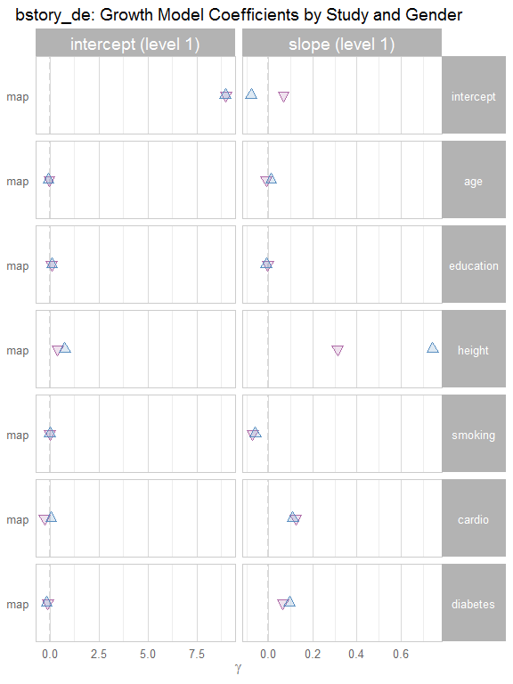
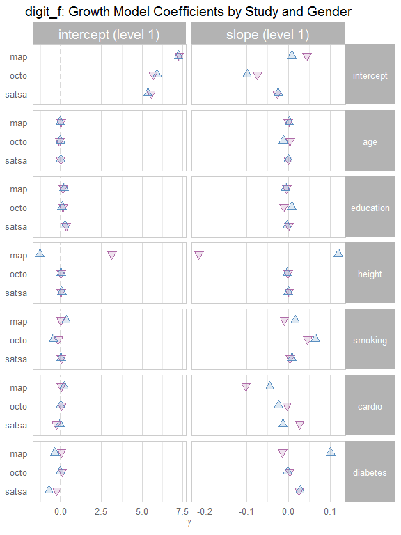
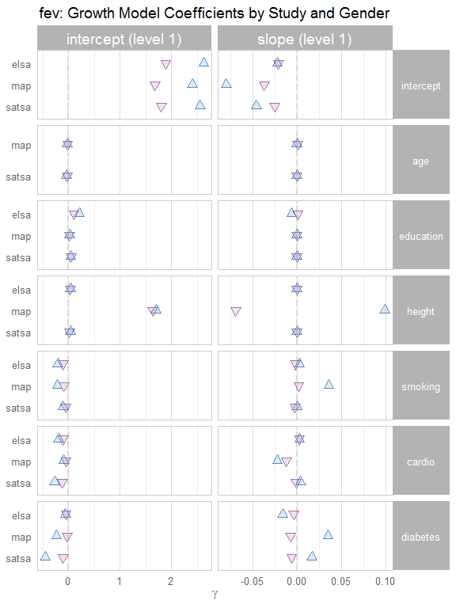
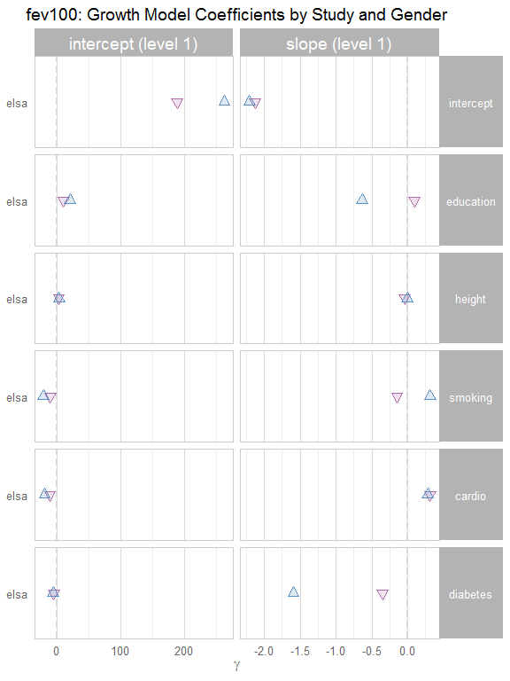
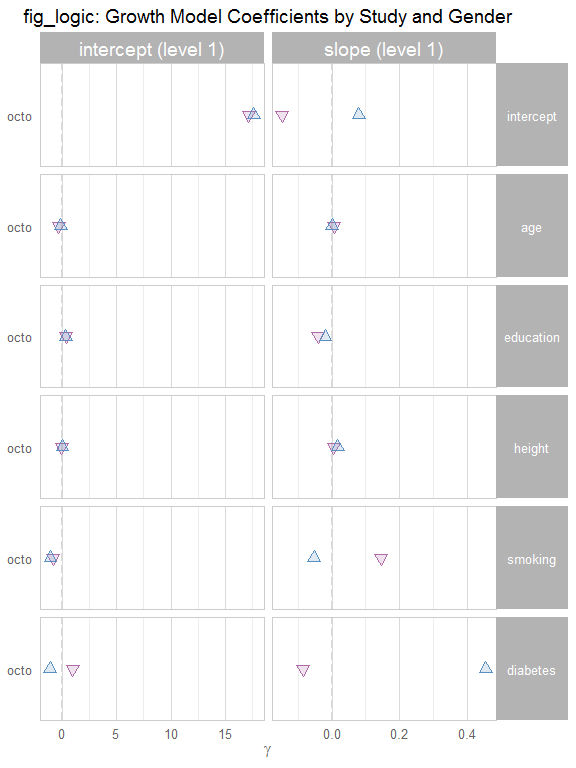
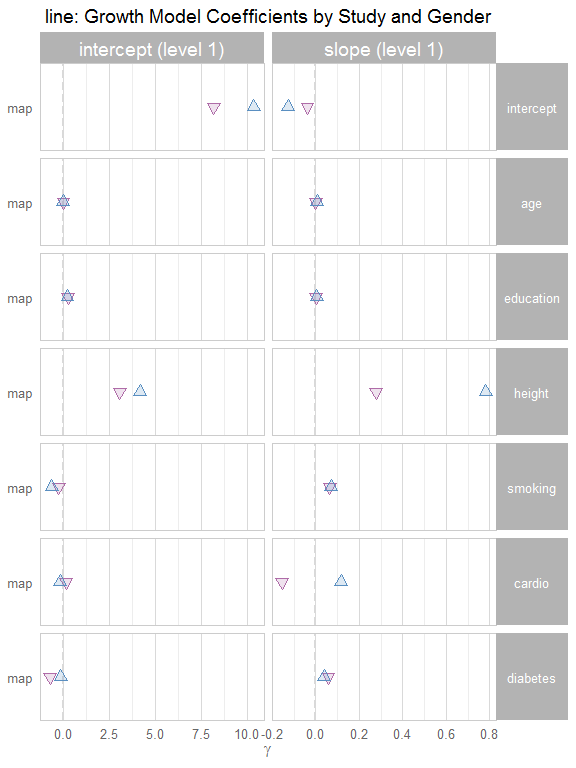
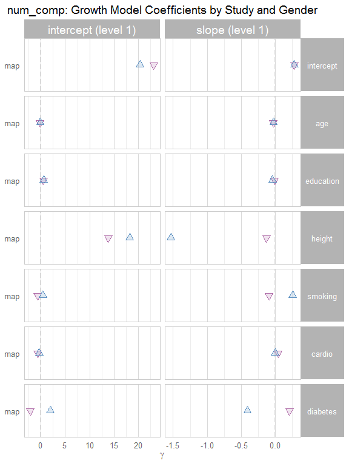
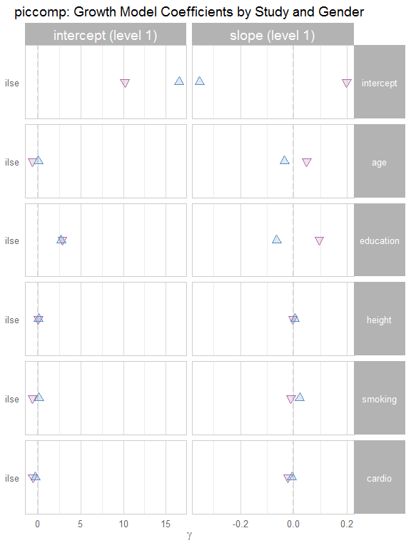
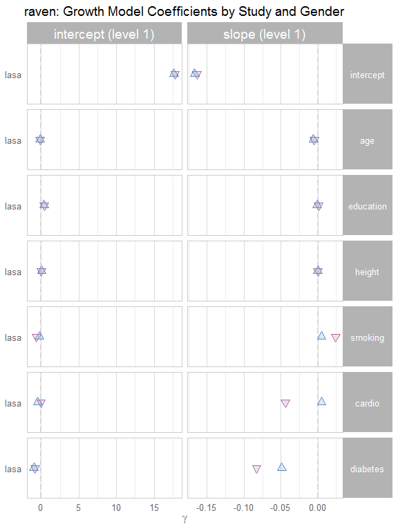
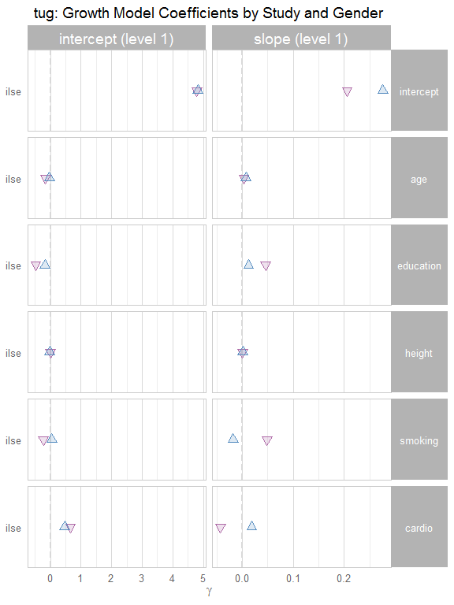

# Growth Curve Report #1
Date: `r Sys.Date()`  

This report contains a searchable table, followed by publication-ready tables.

<!--  Set the working directory to the repository's base directory; this assumes the report is nested inside of two directories.-->


<!-- Set the report-wide options, and point to the external code file. -->


<!-- Load the sources.  Suppress the output when loading sources. --> 


<!-- Load 'sourced' R files.  Suppress the output when loading packages. --> 


<!-- Load any global functions and variables declared in the R file.  Suppress the output. --> 


<!-- Declare any global functions specific to a Rmd output.  Suppress the output. --> 


<!-- Load the datasets.   -->


<!-- Tweak the datasets.   -->


# Summary

### Notes 
1. All available models are contained in the dynamic table, while only the 'aehplus' models are shown in the static tables.

### Unanswered Questions

1. How should we handle entries that are entirely missing?
1. How should we handle entries containing null/NA results?

### Answered Questions

# Dynamic Table -Long (and filtered)

This table has a few filters on it already, so it won't clog your computer with 117,600 rows.  It's only `model_type=="aehplus" & subgroup=="female" & process_a=="gait"`.

<!--html_preserve--><div id="htmlwidget-7049" style="width:100%;height:auto;" class="datatables html-widget"></div>
<script type="application/json" data-for="htmlwidget-7049">{"x":{"data":[["1","2","3","4","5","6","7","8","9","10","11","12","13","14","15","16","17","18","19","20","21","22","23","24","25","26","27","28","29","30","31","32","33","34","35","36","37","38","39","40","41","42","43","44","45","46","47","48","49","50","51","52","53","54","55","56","57","58","59","60","61","62","63","64","65","66","67","68","69","70","71","72","73","74","75","76","77","78","79","80","81","82","83","84","85","86","87","88","89","90","91","92","93","94","95","96","97","98","99","100","101","102","103","104","105","106","107","108","109","110","111","112","113","114","115","116","117","118","119","120","121","122","123","124","125","126","127","128","129","130","131","132","133","134","135","136","137","138","139","140","141","142","143","144","145","146","147","148","149","150","151","152","153","154","155","156","157","158","159","160","161","162","163","164","165","166","167","168","169","170","171","172","173","174","175","176","177","178","179","180","181","182","183","184","185","186","187","188","189","190","191","192","193","194","195","196","197","198","199","200","201","202","203","204","205","206","207","208","209","210","211","212","213","214","215","216","217","218","219","220","221","222","223","224","225","226","227","228","229","230","231","232","233","234","235","236","237","238","239","240","241","242","243","244","245","246","247","248","249","250","251","252","253","254","255","256","257","258","259","260","261","262","263","264","265","266","267","268","269","270","271","272","273","274","275","276","277","278","279","280","281","282","283","284","285","286","287","288","289","290","291","292","293","294","295","296","297","298","299","300","301","302","303","304","305","306","307","308","309","310","311","312","313","314","315","316","317","318","319","320","321","322","323","324","325","326","327","328","329","330","331","332","333","334","335","336","337","338","339","340","341","342","343","344","345","346","347","348","349","350","351","352","353","354","355","356","357","358","359","360","361","362","363","364","365","366","367","368","369","370","371","372","373","374","375","376","377","378","379","380","381","382","383","384","385","386","387","388","389","390","391","392","393","394","395","396","397","398","399","400","401","402","403","404","405","406","407","408","409","410","411","412","413","414","415","416","417","418","419","420","421","422","423","424","425","426","427","428","429","430","431","432","433","434","435","436","437","438","439","440","441","442","443","444","445","446","447","448","449","450","451","452","453","454","455","456","457","458","459","460","461","462","463","464","465","466","467","468","469","470","471","472","473","474","475","476","477","478","479","480","481","482","483","484","485","486","487","488","489","490","491","492","493","494","495","496","497","498","499","500","501","502","503","504","505","506","507","508","509","510","511","512","513","514","515","516","517","518","519","520","521","522","523","524","525","526","527","528","529","530","531","532","533","534","535","536","537","538","539","540","541","542","543","544","545","546","547","548","549","550","551","552","553","554","555","556","557","558","559","560","561","562","563","564","565","566","567","568","569","570","571","572","573","574","575","576","577","578","579","580","581","582","583","584","585","586","587","588","589","590","591","592","593","594","595","596","597","598","599","600","601","602","603","604","605","606","607","608","609","610","611","612","613","614","615","616","617","618","619","620","621","622","623","624","625","626","627","628","629","630","631","632","633","634","635","636","637","638","639","640","641","642","643","644","645","646","647","648","649","650","651","652","653","654","655","656","657","658","659","660","661","662","663","664","665","666","667","668","669","670","671","672","673","674","675","676","677","678","679","680","681","682","683","684","685","686","687","688","689","690","691","692","693","694","695","696","697","698","699","700","701","702","703","704","705","706","707","708","709","710","711","712","713","714","715","716","717","718","719","720","721","722","723","724","725","726","727","728","729","730","731","732","733","734","735","736","737","738","739","740","741","742","743","744","745","746","747","748","749","750","751","752","753","754","755","756","757","758","759","760","761","762","763","764","765","766","767","768","769","770","771","772","773","774","775","776","777","778","779","780","781","782","783","784","785","786","787","788","789","790","791","792","793","794","795","796","797","798","799","800","801","802","803","804","805","806","807","808","809","810","811","812","813","814","815","816","817","818","819","820","821","822","823","824","825","826","827","828","829","830","831","832","833","834","835","836","837","838","839","840","841","842","843","844","845","846","847","848","849","850","851","852","853","854","855","856","857","858","859","860","861","862","863","864","865","866","867","868","869","870","871","872","873","874","875","876","877","878","879","880","881","882","883","884","885","886","887","888","889","890","891","892","893","894","895","896","897","898","899","900","901","902","903","904","905","906","907","908","909","910","911","912","913","914","915","916","917","918","919","920","921","922","923","924","925","926","927","928","929","930","931","932","933","934","935","936","937","938","939","940","941","942","943","944","945","946","947","948","949","950","951","952","953","954","955","956","957","958","959","960","961","962","963","964","965","966","967","968","969","970","971","972","973","974","975","976","977","978","979","980","981","982","983","984","985","986","987","988","989","990","991","992","993","994","995","996","997","998","999","1000","1001","1002","1003","1004","1005","1006","1007","1008","1009","1010","1011","1012","1013","1014","1015","1016","1017","1018","1019","1020","1021","1022","1023","1024","1025","1026","1027","1028","1029","1030","1031","1032","1033","1034","1035","1036","1037","1038","1039","1040","1041","1042","1043","1044","1045","1046","1047","1048","1049","1050","1051","1052","1053","1054","1055","1056","1057","1058","1059","1060","1061","1062","1063","1064","1065","1066","1067","1068","1069","1070","1071","1072","1073","1074","1075","1076","1077","1078","1079","1080","1081","1082","1083","1084","1085","1086","1087","1088","1089","1090","1091","1092","1093","1094","1095","1096","1097","1098","1099","1100","1101","1102","1103","1104","1105","1106","1107","1108","1109","1110","1111","1112","1113","1114","1115","1116","1117","1118","1119","1120","1121","1122","1123","1124","1125","1126","1127","1128","1129","1130","1131","1132","1133","1134","1135","1136","1137","1138","1139","1140","1141","1142","1143","1144","1145","1146","1147","1148","1149","1150","1151","1152","1153","1154","1155","1156","1157","1158","1159","1160","1161","1162","1163","1164","1165","1166","1167","1168","1169","1170","1171","1172","1173","1174","1175","1176","1177","1178","1179","1180","1181","1182","1183","1184","1185","1186","1187","1188","1189","1190","1191","1192","1193","1194","1195","1196","1197","1198","1199","1200","1201","1202","1203","1204","1205","1206","1207","1208","1209","1210","1211","1212","1213","1214","1215","1216","1217","1218","1219","1220","1221","1222","1223","1224","1225","1226","1227","1228","1229","1230","1231","1232","1233","1234","1235","1236","1237","1238","1239","1240","1241","1242","1243","1244","1245","1246","1247","1248","1249","1250","1251","1252","1253","1254","1255","1256","1257","1258","1259","1260","1261","1262","1263","1264","1265","1266","1267","1268","1269","1270","1271","1272","1273","1274","1275","1276","1277","1278","1279","1280","1281","1282","1283","1284","1285","1286","1287","1288","1289","1290","1291","1292","1293","1294","1295","1296","1297","1298","1299","1300","1301","1302","1303","1304","1305","1306","1307","1308","1309","1310","1311","1312","1313","1314","1315","1316","1317","1318","1319","1320","1321","1322","1323","1324","1325","1326","1327","1328","1329","1330","1331","1332","1333","1334","1335","1336","1337","1338","1339","1340","1341","1342","1343","1344","1345","1346","1347","1348","1349","1350","1351","1352","1353","1354","1355","1356","1357","1358","1359","1360","1361","1362","1363","1364","1365","1366","1367","1368","1369","1370","1371","1372","1373","1374","1375","1376","1377","1378","1379","1380","1381","1382","1383","1384","1385","1386","1387","1388","1389","1390","1391","1392","1393","1394","1395","1396","1397","1398","1399","1400","1401","1402","1403","1404","1405","1406","1407","1408","1409","1410","1411","1412","1413","1414","1415","1416","1417","1418","1419","1420","1421","1422","1423","1424","1425","1426","1427","1428","1429","1430","1431","1432","1433","1434","1435","1436","1437","1438","1439","1440","1441","1442","1443","1444","1445","1446","1447","1448","1449","1450","1451","1452","1453","1454","1455","1456","1457","1458","1459","1460","1461","1462","1463","1464","1465","1466","1467","1468","1469","1470","1471","1472","1473","1474","1475","1476","1477","1478","1479","1480","1481","1482","1483","1484","1485","1486","1487","1488","1489","1490","1491","1492","1493","1494","1495","1496","1497","1498","1499","1500","1501","1502","1503","1504","1505","1506","1507","1508","1509","1510","1511","1512","1513","1514","1515","1516","1517","1518","1519","1520","1521","1522","1523","1524","1525","1526","1527","1528","1529","1530","1531","1532","1533","1534","1535","1536","1537","1538","1539","1540","1541","1542","1543","1544","1545","1546","1547","1548","1549","1550","1551","1552","1553","1554","1555","1556","1557","1558","1559","1560","1561","1562","1563","1564","1565","1566","1567","1568","1569","1570","1571","1572","1573","1574","1575","1576","1577","1578","1579","1580","1581","1582","1583","1584","1585","1586","1587","1588","1589","1590","1591","1592","1593","1594","1595","1596","1597","1598","1599","1600","1601","1602","1603","1604","1605","1606","1607","1608","1609","1610","1611","1612","1613","1614","1615","1616","1617","1618","1619","1620","1621","1622","1623","1624","1625","1626","1627","1628","1629","1630","1631","1632","1633","1634","1635","1636","1637","1638","1639","1640","1641","1642","1643","1644","1645","1646","1647","1648","1649","1650","1651","1652","1653","1654","1655","1656","1657","1658","1659","1660","1661","1662","1663","1664","1665","1666","1667","1668","1669","1670","1671","1672","1673","1674","1675","1676","1677","1678","1679","1680","1681","1682","1683","1684","1685","1686","1687","1688","1689","1690","1691","1692","1693","1694","1695","1696","1697","1698","1699","1700","1701","1702","1703","1704","1705","1706","1707","1708","1709","1710","1711","1712","1713","1714","1715","1716","1717","1718","1719","1720","1721","1722","1723","1724","1725","1726","1727","1728","1729","1730","1731","1732","1733","1734","1735","1736","1737","1738","1739","1740","1741","1742","1743","1744","1745","1746","1747","1748","1749","1750","1751","1752","1753","1754","1755","1756","1757","1758","1759","1760","1761","1762","1763","1764","1765","1766","1767","1768","1769","1770","1771","1772","1773","1774","1775","1776","1777","1778","1779","1780","1781","1782","1783","1784","1785","1786","1787","1788","1789","1790","1791","1792","1793","1794","1795","1796","1797","1798","1799","1800","1801","1802","1803","1804","1805","1806","1807","1808","1809","1810","1811","1812","1813","1814","1815","1816","1817","1818","1819","1820","1821","1822","1823","1824","1825","1826","1827","1828","1829","1830","1831","1832","1833","1834","1835","1836","1837","1838","1839","1840","1841","1842","1843","1844","1845","1846","1847","1848","1849","1850","1851","1852","1853","1854","1855","1856","1857","1858","1859","1860","1861","1862","1863","1864","1865","1866","1867","1868","1869","1870","1871","1872","1873","1874","1875","1876","1877","1878","1879","1880","1881","1882","1883","1884","1885","1886","1887","1888","1889","1890","1891","1892","1893","1894","1895","1896","1897","1898","1899","1900","1901","1902","1903","1904","1905","1906","1907","1908","1909","1910","1911","1912","1913","1914","1915","1916","1917","1918","1919","1920","1921","1922","1923","1924","1925","1926","1927","1928","1929","1930","1931","1932","1933","1934","1935","1936","1937","1938","1939","1940","1941","1942","1943","1944","1945","1946","1947","1948","1949","1950","1951","1952","1953","1954","1955","1956","1957","1958","1959","1960","1961","1962","1963","1964","1965","1966","1967","1968","1969","1970","1971","1972","1973","1974","1975","1976","1977","1978","1979","1980","1981","1982","1983","1984","1985","1986","1987","1988","1989","1990","1991","1992","1993","1994","1995","1996","1997","1998","1999","2000","2001","2002","2003","2004","2005","2006","2007","2008","2009","2010","2011","2012","2013","2014","2015","2016","2017","2018","2019","2020","2021","2022","2023","2024","2025","2026","2027","2028","2029","2030","2031","2032","2033","2034","2035","2036","2037","2038","2039","2040","2041","2042","2043","2044","2045","2046","2047","2048","2049","2050","2051","2052","2053","2054","2055","2056","2057","2058","2059","2060","2061","2062","2063","2064","2065","2066","2067","2068","2069","2070","2071","2072","2073","2074","2075","2076","2077","2078","2079","2080","2081","2082","2083","2084","2085","2086","2087","2088","2089","2090","2091","2092","2093","2094","2095","2096","2097","2098","2099","2100","2101","2102","2103","2104","2105","2106","2107","2108","2109","2110","2111","2112","2113","2114","2115","2116","2117","2118","2119","2120","2121","2122","2123","2124","2125","2126","2127","2128","2129","2130","2131","2132","2133","2134","2135","2136","2137","2138","2139","2140","2141","2142","2143","2144","2145","2146","2147","2148","2149","2150","2151","2152","2153","2154","2155","2156","2157","2158","2159","2160","2161","2162","2163","2164","2165","2166","2167","2168","2169","2170","2171","2172","2173","2174","2175","2176","2177","2178","2179","2180","2181","2182","2183","2184","2185","2186","2187","2188","2189","2190","2191","2192","2193","2194","2195","2196","2197","2198","2199","2200","2201","2202","2203","2204","2205","2206","2207","2208","2209","2210","2211","2212","2213","2214","2215","2216","2217","2218","2219","2220","2221","2222","2223","2224","2225","2226","2227","2228","2229","2230","2231","2232","2233","2234","2235","2236","2237","2238","2239","2240","2241","2242","2243","2244","2245","2246","2247","2248","2249","2250","2251","2252","2253","2254","2255","2256","2257","2258","2259","2260","2261","2262","2263","2264","2265","2266","2267","2268","2269","2270","2271","2272","2273","2274","2275","2276","2277","2278","2279","2280","2281","2282","2283","2284","2285","2286","2287","2288","2289","2290","2291","2292","2293","2294","2295","2296","2297","2298","2299","2300","2301","2302","2303","2304","2305","2306","2307","2308","2309","2310","2311","2312","2313","2314","2315","2316","2317","2318","2319","2320","2321","2322","2323","2324","2325","2326","2327","2328","2329","2330","2331","2332","2333","2334","2335","2336","2337","2338","2339","2340","2341","2342","2343","2344","2345","2346","2347","2348","2349","2350","2351","2352","2353","2354","2355","2356","2357","2358","2359","2360","2361","2362","2363","2364","2365","2366","2367","2368","2369","2370","2371","2372","2373","2374","2375","2376","2377","2378","2379","2380","2381","2382","2383","2384","2385","2386","2387","2388","2389","2390","2391","2392","2393","2394","2395","2396","2397","2398","2399","2400","2401","2402","2403","2404","2405","2406","2407","2408","2409","2410","2411","2412","2413","2414","2415","2416","2417","2418","2419","2420","2421","2422","2423","2424","2425","2426","2427","2428","2429","2430","2431","2432","2433","2434","2435","2436","2437","2438","2439","2440","2441","2442","2443","2444","2445","2446","2447","2448","2449","2450","2451","2452","2453","2454","2455","2456","2457","2458","2459","2460","2461","2462","2463","2464","2465","2466","2467","2468","2469","2470","2471","2472","2473","2474","2475","2476","2477","2478","2479","2480","2481","2482","2483","2484","2485","2486","2487","2488","2489","2490","2491","2492","2493","2494","2495","2496","2497","2498","2499","2500","2501","2502","2503","2504","2505","2506","2507","2508","2509","2510","2511","2512","2513","2514","2515","2516","2517","2518","2519","2520","2521","2522","2523","2524","2525","2526","2527","2528","2529","2530","2531","2532","2533","2534","2535","2536","2537","2538","2539","2540","2541","2542","2543","2544","2545","2546","2547","2548","2549","2550","2551","2552","2553","2554","2555","2556","2557","2558","2559","2560","2561","2562","2563","2564","2565","2566","2567","2568","2569","2570","2571","2572","2573","2574","2575","2576","2577","2578","2579","2580","2581","2582","2583","2584","2585","2586","2587","2588","2589","2590","2591","2592","2593","2594","2595","2596","2597","2598","2599","2600","2601","2602","2603","2604","2605","2606","2607","2608","2609","2610","2611","2612","2613","2614","2615","2616","2617","2618","2619","2620","2621","2622","2623","2624","2625","2626","2627","2628","2629","2630","2631","2632","2633","2634","2635","2636","2637","2638","2639","2640","2641","2642","2643","2644","2645","2646","2647","2648","2649","2650","2651","2652","2653","2654","2655","2656","2657","2658","2659","2660","2661","2662","2663","2664","2665","2666","2667","2668","2669","2670","2671","2672","2673","2674","2675","2676","2677","2678","2679","2680","2681","2682","2683","2684","2685","2686","2687","2688","2689","2690","2691","2692","2693","2694","2695","2696","2697","2698","2699","2700","2701","2702","2703","2704","2705","2706","2707","2708","2709","2710","2711","2712","2713","2714","2715","2716","2717","2718","2719","2720","2721","2722","2723","2724","2725","2726","2727","2728","2729","2730","2731","2732","2733","2734","2735","2736","2737","2738","2739","2740","2741","2742","2743","2744","2745","2746","2747","2748","2749","2750","2751","2752","2753","2754","2755","2756","2757","2758","2759","2760","2761","2762","2763","2764","2765","2766","2767","2768","2769","2770","2771","2772","2773","2774","2775","2776","2777","2778","2779","2780","2781","2782","2783","2784","2785","2786","2787","2788","2789","2790","2791","2792","2793","2794","2795","2796","2797","2798","2799","2800","2801","2802","2803","2804","2805","2806","2807","2808","2809","2810","2811","2812","2813","2814","2815","2816","2817","2818","2819","2820","2821","2822","2823","2824","2825","2826","2827","2828","2829","2830","2831","2832","2833","2834","2835","2836","2837","2838","2839","2840","2841","2842","2843","2844","2845","2846","2847","2848","2849","2850","2851","2852","2853","2854","2855","2856","2857","2858","2859","2860","2861","2862","2863","2864","2865","2866","2867","2868","2869","2870","2871","2872","2873","2874","2875","2876","2877","2878","2879","2880","2881","2882","2883","2884","2885","2886","2887","2888","2889","2890","2891","2892","2893","2894","2895","2896","2897","2898","2899","2900","2901","2902","2903","2904","2905","2906","2907","2908","2909","2910","2911","2912","2913","2914","2915","2916","2917","2918","2919","2920","2921","2922","2923","2924","2925","2926","2927","2928","2929","2930","2931","2932","2933","2934","2935","2936","2937","2938","2939","2940","2941","2942","2943","2944","2945","2946","2947","2948","2949","2950","2951","2952","2953","2954","2955","2956","2957","2958","2959","2960","2961","2962","2963","2964","2965","2966","2967","2968","2969","2970","2971","2972","2973","2974","2975","2976","2977","2978","2979","2980","2981","2982","2983","2984","2985","2986","2987","2988","2989","2990","2991","2992","2993","2994","2995","2996","2997","2998","2999","3000","3001","3002","3003","3004","3005","3006","3007","3008","3009","3010","3011","3012","3013","3014","3015","3016","3017","3018","3019","3020","3021","3022","3023","3024","3025","3026","3027","3028","3029","3030","3031","3032","3033","3034","3035","3036","3037","3038","3039","3040","3041","3042","3043","3044","3045","3046","3047","3048","3049","3050","3051","3052","3053","3054","3055","3056","3057","3058","3059","3060","3061","3062","3063","3064","3065","3066","3067","3068","3069","3070","3071","3072","3073","3074","3075","3076","3077","3078","3079","3080","3081","3082","3083","3084","3085","3086","3087","3088","3089","3090","3091","3092","3093","3094","3095","3096","3097","3098","3099","3100","3101","3102","3103","3104","3105","3106","3107","3108","3109","3110","3111","3112","3113","3114","3115","3116","3117","3118","3119","3120","3121","3122","3123","3124","3125","3126","3127","3128","3129","3130","3131","3132","3133","3134","3135","3136"],["eas","eas","eas","eas","eas","eas","eas","eas","eas","eas","eas","elsa","elsa","elsa","elsa","hrs","hrs","hrs","hrs","hrs","lasa","lasa","lasa","octo","octo","octo","octo","octo","eas","eas","eas","eas","eas","eas","eas","eas","eas","eas","eas","elsa","elsa","elsa","elsa","hrs","hrs","hrs","hrs","hrs","lasa","lasa","lasa","octo","octo","octo","octo","octo","eas","eas","eas","eas","eas","eas","eas","eas","eas","eas","eas","elsa","elsa","elsa","elsa","hrs","hrs","hrs","hrs","hrs","lasa","lasa","lasa","octo","octo","octo","octo","octo","eas","eas","eas","eas","eas","eas","eas","eas","eas","eas","eas","elsa","elsa","elsa","elsa","hrs","hrs","hrs","hrs","hrs","lasa","lasa","lasa","octo","octo","octo","octo","octo","eas","eas","eas","eas","eas","eas","eas","eas","eas","eas","eas","elsa","elsa","elsa","elsa","hrs","hrs","hrs","hrs","hrs","lasa","lasa","lasa","octo","octo","octo","octo","octo","eas","eas","eas","eas","eas","eas","eas","eas","eas","eas","eas","elsa","elsa","elsa","elsa","hrs","hrs","hrs","hrs","hrs","lasa","lasa","lasa","octo","octo","octo","octo","octo","eas","eas","eas","eas","eas","eas","eas","eas","eas","eas","eas","elsa","elsa","elsa","elsa","hrs","hrs","hrs","hrs","hrs","lasa","lasa","lasa","octo","octo","octo","octo","octo","eas","eas","eas","eas","eas","eas","eas","eas","eas","eas","eas","elsa","elsa","elsa","elsa","hrs","hrs","hrs","hrs","hrs","lasa","lasa","lasa","octo","octo","octo","octo","octo","eas","eas","eas","eas","eas","eas","eas","eas","eas","eas","eas","elsa","elsa","elsa","elsa","hrs","hrs","hrs","hrs","hrs","lasa","lasa","lasa","octo","octo","octo","octo","octo","eas","eas","eas","eas","eas","eas","eas","eas","eas","eas","eas","elsa","elsa","elsa","elsa","hrs","hrs","hrs","hrs","hrs","lasa","lasa","lasa","octo","octo","octo","octo","octo","eas","eas","eas","eas","eas","eas","eas","eas","eas","eas","eas","elsa","elsa","elsa","elsa","hrs","hrs","hrs","hrs","hrs","lasa","lasa","lasa","octo","octo","octo","octo","octo","eas","eas","eas","eas","eas","eas","eas","eas","eas","eas","eas","elsa","elsa","elsa","elsa","hrs","hrs","hrs","hrs","hrs","lasa","lasa","lasa","octo","octo","octo","octo","octo","eas","eas","eas","eas","eas","eas","eas","eas","eas","eas","eas","elsa","elsa","elsa","elsa","hrs","hrs","hrs","hrs","hrs","lasa","lasa","lasa","octo","octo","octo","octo","octo","eas","eas","eas","eas","eas","eas","eas","eas","eas","eas","eas","elsa","elsa","elsa","elsa","hrs","hrs","hrs","hrs","hrs","lasa","lasa","lasa","octo","octo","octo","octo","octo","eas","eas","eas","eas","eas","eas","eas","eas","eas","eas","eas","elsa","elsa","elsa","elsa","hrs","hrs","hrs","hrs","hrs","lasa","lasa","lasa","octo","octo","octo","octo","octo","eas","eas","eas","eas","eas","eas","eas","eas","eas","eas","eas","elsa","elsa","elsa","elsa","hrs","hrs","hrs","hrs","hrs","lasa","lasa","lasa","octo","octo","octo","octo","octo","eas","eas","eas","eas","eas","eas","eas","eas","eas","eas","eas","elsa","elsa","elsa","elsa","hrs","hrs","hrs","hrs","hrs","lasa","lasa","lasa","octo","octo","octo","octo","octo","eas","eas","eas","eas","eas","eas","eas","eas","eas","eas","eas","elsa","elsa","elsa","elsa","hrs","hrs","hrs","hrs","hrs","lasa","lasa","lasa","octo","octo","octo","octo","octo","eas","eas","eas","eas","eas","eas","eas","eas","eas","eas","eas","elsa","elsa","elsa","elsa","hrs","hrs","hrs","hrs","hrs","lasa","lasa","lasa","octo","octo","octo","octo","octo","eas","eas","eas","eas","eas","eas","eas","eas","eas","eas","eas","elsa","elsa","elsa","elsa","hrs","hrs","hrs","hrs","hrs","lasa","lasa","lasa","octo","octo","octo","octo","octo","eas","eas","eas","eas","eas","eas","eas","eas","eas","eas","eas","elsa","elsa","elsa","elsa","hrs","hrs","hrs","hrs","hrs","lasa","lasa","lasa","octo","octo","octo","octo","octo","eas","eas","eas","eas","eas","eas","eas","eas","eas","eas","eas","elsa","elsa","elsa","elsa","hrs","hrs","hrs","hrs","hrs","lasa","lasa","lasa","octo","octo","octo","octo","octo","eas","eas","eas","eas","eas","eas","eas","eas","eas","eas","eas","elsa","elsa","elsa","elsa","hrs","hrs","hrs","hrs","hrs","lasa","lasa","lasa","octo","octo","octo","octo","octo","eas","eas","eas","eas","eas","eas","eas","eas","eas","eas","eas","elsa","elsa","elsa","elsa","hrs","hrs","hrs","hrs","hrs","lasa","lasa","lasa","octo","octo","octo","octo","octo","eas","eas","eas","eas","eas","eas","eas","eas","eas","eas","eas","elsa","elsa","elsa","elsa","hrs","hrs","hrs","hrs","hrs","lasa","lasa","lasa","octo","octo","octo","octo","octo","eas","eas","eas","eas","eas","eas","eas","eas","eas","eas","eas","elsa","elsa","elsa","elsa","hrs","hrs","hrs","hrs","hrs","lasa","lasa","lasa","octo","octo","octo","octo","octo","eas","eas","eas","eas","eas","eas","eas","eas","eas","eas","eas","elsa","elsa","elsa","elsa","hrs","hrs","hrs","hrs","hrs","lasa","lasa","lasa","octo","octo","octo","octo","octo","eas","eas","eas","eas","eas","eas","eas","eas","eas","eas","eas","elsa","elsa","elsa","elsa","hrs","hrs","hrs","hrs","hrs","lasa","lasa","lasa","octo","octo","octo","octo","octo","eas","eas","eas","eas","eas","eas","eas","eas","eas","eas","eas","elsa","elsa","elsa","elsa","hrs","hrs","hrs","hrs","hrs","lasa","lasa","lasa","octo","octo","octo","octo","octo","eas","eas","eas","eas","eas","eas","eas","eas","eas","eas","eas","elsa","elsa","elsa","elsa","hrs","hrs","hrs","hrs","hrs","lasa","lasa","lasa","octo","octo","octo","octo","octo","eas","eas","eas","eas","eas","eas","eas","eas","eas","eas","eas","elsa","elsa","elsa","elsa","hrs","hrs","hrs","hrs","hrs","lasa","lasa","lasa","octo","octo","octo","octo","octo","eas","eas","eas","eas","eas","eas","eas","eas","eas","eas","eas","elsa","elsa","elsa","elsa","hrs","hrs","hrs","hrs","hrs","lasa","lasa","lasa","octo","octo","octo","octo","octo","eas","eas","eas","eas","eas","eas","eas","eas","eas","eas","eas","elsa","elsa","elsa","elsa","hrs","hrs","hrs","hrs","hrs","lasa","lasa","lasa","octo","octo","octo","octo","octo","eas","eas","eas","eas","eas","eas","eas","eas","eas","eas","eas","elsa","elsa","elsa","elsa","hrs","hrs","hrs","hrs","hrs","lasa","lasa","lasa","octo","octo","octo","octo","octo","eas","eas","eas","eas","eas","eas","eas","eas","eas","eas","eas","elsa","elsa","elsa","elsa","hrs","hrs","hrs","hrs","hrs","lasa","lasa","lasa","octo","octo","octo","octo","octo","eas","eas","eas","eas","eas","eas","eas","eas","eas","eas","eas","elsa","elsa","elsa","elsa","hrs","hrs","hrs","hrs","hrs","lasa","lasa","lasa","octo","octo","octo","octo","octo","eas","eas","eas","eas","eas","eas","eas","eas","eas","eas","eas","elsa","elsa","elsa","elsa","hrs","hrs","hrs","hrs","hrs","lasa","lasa","lasa","octo","octo","octo","octo","octo","eas","eas","eas","eas","eas","eas","eas","eas","eas","eas","eas","elsa","elsa","elsa","elsa","hrs","hrs","hrs","hrs","hrs","lasa","lasa","lasa","octo","octo","octo","octo","octo","eas","eas","eas","eas","eas","eas","eas","eas","eas","eas","eas","elsa","elsa","elsa","elsa","hrs","hrs","hrs","hrs","hrs","lasa","lasa","lasa","octo","octo","octo","octo","octo","eas","eas","eas","eas","eas","eas","eas","eas","eas","eas","eas","elsa","elsa","elsa","elsa","hrs","hrs","hrs","hrs","hrs","lasa","lasa","lasa","octo","octo","octo","octo","octo","eas","eas","eas","eas","eas","eas","eas","eas","eas","eas","eas","elsa","elsa","elsa","elsa","hrs","hrs","hrs","hrs","hrs","lasa","lasa","lasa","octo","octo","octo","octo","octo","eas","eas","eas","eas","eas","eas","eas","eas","eas","eas","eas","elsa","elsa","elsa","elsa","hrs","hrs","hrs","hrs","hrs","lasa","lasa","lasa","octo","octo","octo","octo","octo","eas","eas","eas","eas","eas","eas","eas","eas","eas","eas","eas","elsa","elsa","elsa","elsa","hrs","hrs","hrs","hrs","hrs","lasa","lasa","lasa","octo","octo","octo","octo","octo","eas","eas","eas","eas","eas","eas","eas","eas","eas","eas","eas","elsa","elsa","elsa","elsa","hrs","hrs","hrs","hrs","hrs","lasa","lasa","lasa","octo","octo","octo","octo","octo","eas","eas","eas","eas","eas","eas","eas","eas","eas","eas","eas","elsa","elsa","elsa","elsa","hrs","hrs","hrs","hrs","hrs","lasa","lasa","lasa","octo","octo","octo","octo","octo","eas","eas","eas","eas","eas","eas","eas","eas","eas","eas","eas","elsa","elsa","elsa","elsa","hrs","hrs","hrs","hrs","hrs","lasa","lasa","lasa","octo","octo","octo","octo","octo","eas","eas","eas","eas","eas","eas","eas","eas","eas","eas","eas","elsa","elsa","elsa","elsa","hrs","hrs","hrs","hrs","hrs","lasa","lasa","lasa","octo","octo","octo","octo","octo","eas","eas","eas","eas","eas","eas","eas","eas","eas","eas","eas","elsa","elsa","elsa","elsa","hrs","hrs","hrs","hrs","hrs","lasa","lasa","lasa","octo","octo","octo","octo","octo","eas","eas","eas","eas","eas","eas","eas","eas","eas","eas","eas","elsa","elsa","elsa","elsa","hrs","hrs","hrs","hrs","hrs","lasa","lasa","lasa","octo","octo","octo","octo","octo","eas","eas","eas","eas","eas","eas","eas","eas","eas","eas","eas","elsa","elsa","elsa","elsa","hrs","hrs","hrs","hrs","hrs","lasa","lasa","lasa","octo","octo","octo","octo","octo","eas","eas","eas","eas","eas","eas","eas","eas","eas","eas","eas","elsa","elsa","elsa","elsa","hrs","hrs","hrs","hrs","hrs","lasa","lasa","lasa","octo","octo","octo","octo","octo","eas","eas","eas","eas","eas","eas","eas","eas","eas","eas","eas","elsa","elsa","elsa","elsa","hrs","hrs","hrs","hrs","hrs","lasa","lasa","lasa","octo","octo","octo","octo","octo","eas","eas","eas","eas","eas","eas","eas","eas","eas","eas","eas","elsa","elsa","elsa","elsa","hrs","hrs","hrs","hrs","hrs","lasa","lasa","lasa","octo","octo","octo","octo","octo","eas","eas","eas","eas","eas","eas","eas","eas","eas","eas","eas","elsa","elsa","elsa","elsa","hrs","hrs","hrs","hrs","hrs","lasa","lasa","lasa","octo","octo","octo","octo","octo","eas","eas","eas","eas","eas","eas","eas","eas","eas","eas","eas","elsa","elsa","elsa","elsa","hrs","hrs","hrs","hrs","hrs","lasa","lasa","lasa","octo","octo","octo","octo","octo","eas","eas","eas","eas","eas","eas","eas","eas","eas","eas","eas","elsa","elsa","elsa","elsa","hrs","hrs","hrs","hrs","hrs","lasa","lasa","lasa","octo","octo","octo","octo","octo","eas","eas","eas","eas","eas","eas","eas","eas","eas","eas","eas","elsa","elsa","elsa","elsa","hrs","hrs","hrs","hrs","hrs","lasa","lasa","lasa","octo","octo","octo","octo","octo","eas","eas","eas","eas","eas","eas","eas","eas","eas","eas","eas","elsa","elsa","elsa","elsa","hrs","hrs","hrs","hrs","hrs","lasa","lasa","lasa","octo","octo","octo","octo","octo","eas","eas","eas","eas","eas","eas","eas","eas","eas","eas","eas","elsa","elsa","elsa","elsa","hrs","hrs","hrs","hrs","hrs","lasa","lasa","lasa","octo","octo","octo","octo","octo","eas","eas","eas","eas","eas","eas","eas","eas","eas","eas","eas","elsa","elsa","elsa","elsa","hrs","hrs","hrs","hrs","hrs","lasa","lasa","lasa","octo","octo","octo","octo","octo","eas","eas","eas","eas","eas","eas","eas","eas","eas","eas","eas","elsa","elsa","elsa","elsa","hrs","hrs","hrs","hrs","hrs","lasa","lasa","lasa","octo","octo","octo","octo","octo","eas","eas","eas","eas","eas","eas","eas","eas","eas","eas","eas","elsa","elsa","elsa","elsa","hrs","hrs","hrs","hrs","hrs","lasa","lasa","lasa","octo","octo","octo","octo","octo","eas","eas","eas","eas","eas","eas","eas","eas","eas","eas","eas","elsa","elsa","elsa","elsa","hrs","hrs","hrs","hrs","hrs","lasa","lasa","lasa","octo","octo","octo","octo","octo","eas","eas","eas","eas","eas","eas","eas","eas","eas","eas","eas","elsa","elsa","elsa","elsa","hrs","hrs","hrs","hrs","hrs","lasa","lasa","lasa","octo","octo","octo","octo","octo","eas","eas","eas","eas","eas","eas","eas","eas","eas","eas","eas","elsa","elsa","elsa","elsa","hrs","hrs","hrs","hrs","hrs","lasa","lasa","lasa","octo","octo","octo","octo","octo","eas","eas","eas","eas","eas","eas","eas","eas","eas","eas","eas","elsa","elsa","elsa","elsa","hrs","hrs","hrs","hrs","hrs","lasa","lasa","lasa","octo","octo","octo","octo","octo","eas","eas","eas","eas","eas","eas","eas","eas","eas","eas","eas","elsa","elsa","elsa","elsa","hrs","hrs","hrs","hrs","hrs","lasa","lasa","lasa","octo","octo","octo","octo","octo","eas","eas","eas","eas","eas","eas","eas","eas","eas","eas","eas","elsa","elsa","elsa","elsa","hrs","hrs","hrs","hrs","hrs","lasa","lasa","lasa","octo","octo","octo","octo","octo","eas","eas","eas","eas","eas","eas","eas","eas","eas","eas","eas","elsa","elsa","elsa","elsa","hrs","hrs","hrs","hrs","hrs","lasa","lasa","lasa","octo","octo","octo","octo","octo","eas","eas","eas","eas","eas","eas","eas","eas","eas","eas","eas","elsa","elsa","elsa","elsa","hrs","hrs","hrs","hrs","hrs","lasa","lasa","lasa","octo","octo","octo","octo","octo","eas","eas","eas","eas","eas","eas","eas","eas","eas","eas","eas","elsa","elsa","elsa","elsa","hrs","hrs","hrs","hrs","hrs","lasa","lasa","lasa","octo","octo","octo","octo","octo","eas","eas","eas","eas","eas","eas","eas","eas","eas","eas","eas","elsa","elsa","elsa","elsa","hrs","hrs","hrs","hrs","hrs","lasa","lasa","lasa","octo","octo","octo","octo","octo","eas","eas","eas","eas","eas","eas","eas","eas","eas","eas","eas","elsa","elsa","elsa","elsa","hrs","hrs","hrs","hrs","hrs","lasa","lasa","lasa","octo","octo","octo","octo","octo","eas","eas","eas","eas","eas","eas","eas","eas","eas","eas","eas","elsa","elsa","elsa","elsa","hrs","hrs","hrs","hrs","hrs","lasa","lasa","lasa","octo","octo","octo","octo","octo","eas","eas","eas","eas","eas","eas","eas","eas","eas","eas","eas","elsa","elsa","elsa","elsa","hrs","hrs","hrs","hrs","hrs","lasa","lasa","lasa","octo","octo","octo","octo","octo","eas","eas","eas","eas","eas","eas","eas","eas","eas","eas","eas","elsa","elsa","elsa","elsa","hrs","hrs","hrs","hrs","hrs","lasa","lasa","lasa","octo","octo","octo","octo","octo","eas","eas","eas","eas","eas","eas","eas","eas","eas","eas","eas","elsa","elsa","elsa","elsa","hrs","hrs","hrs","hrs","hrs","lasa","lasa","lasa","octo","octo","octo","octo","octo","eas","eas","eas","eas","eas","eas","eas","eas","eas","eas","eas","elsa","elsa","elsa","elsa","hrs","hrs","hrs","hrs","hrs","lasa","lasa","lasa","octo","octo","octo","octo","octo","eas","eas","eas","eas","eas","eas","eas","eas","eas","eas","eas","elsa","elsa","elsa","elsa","hrs","hrs","hrs","hrs","hrs","lasa","lasa","lasa","octo","octo","octo","octo","octo","eas","eas","eas","eas","eas","eas","eas","eas","eas","eas","eas","elsa","elsa","elsa","elsa","hrs","hrs","hrs","hrs","hrs","lasa","lasa","lasa","octo","octo","octo","octo","octo","eas","eas","eas","eas","eas","eas","eas","eas","eas","eas","eas","elsa","elsa","elsa","elsa","hrs","hrs","hrs","hrs","hrs","lasa","lasa","lasa","octo","octo","octo","octo","octo","eas","eas","eas","eas","eas","eas","eas","eas","eas","eas","eas","elsa","elsa","elsa","elsa","hrs","hrs","hrs","hrs","hrs","lasa","lasa","lasa","octo","octo","octo","octo","octo","eas","eas","eas","eas","eas","eas","eas","eas","eas","eas","eas","elsa","elsa","elsa","elsa","hrs","hrs","hrs","hrs","hrs","lasa","lasa","lasa","octo","octo","octo","octo","octo","eas","eas","eas","eas","eas","eas","eas","eas","eas","eas","eas","elsa","elsa","elsa","elsa","hrs","hrs","hrs","hrs","hrs","lasa","lasa","lasa","octo","octo","octo","octo","octo","eas","eas","eas","eas","eas","eas","eas","eas","eas","eas","eas","elsa","elsa","elsa","elsa","hrs","hrs","hrs","hrs","hrs","lasa","lasa","lasa","octo","octo","octo","octo","octo","eas","eas","eas","eas","eas","eas","eas","eas","eas","eas","eas","elsa","elsa","elsa","elsa","hrs","hrs","hrs","hrs","hrs","lasa","lasa","lasa","octo","octo","octo","octo","octo","eas","eas","eas","eas","eas","eas","eas","eas","eas","eas","eas","elsa","elsa","elsa","elsa","hrs","hrs","hrs","hrs","hrs","lasa","lasa","lasa","octo","octo","octo","octo","octo","eas","eas","eas","eas","eas","eas","eas","eas","eas","eas","eas","elsa","elsa","elsa","elsa","hrs","hrs","hrs","hrs","hrs","lasa","lasa","lasa","octo","octo","octo","octo","octo","eas","eas","eas","eas","eas","eas","eas","eas","eas","eas","eas","elsa","elsa","elsa","elsa","hrs","hrs","hrs","hrs","hrs","lasa","lasa","lasa","octo","octo","octo","octo","octo","eas","eas","eas","eas","eas","eas","eas","eas","eas","eas","eas","elsa","elsa","elsa","elsa","hrs","hrs","hrs","hrs","hrs","lasa","lasa","lasa","octo","octo","octo","octo","octo","eas","eas","eas","eas","eas","eas","eas","eas","eas","eas","eas","elsa","elsa","elsa","elsa","hrs","hrs","hrs","hrs","hrs","lasa","lasa","lasa","octo","octo","octo","octo","octo","eas","eas","eas","eas","eas","eas","eas","eas","eas","eas","eas","elsa","elsa","elsa","elsa","hrs","hrs","hrs","hrs","hrs","lasa","lasa","lasa","octo","octo","octo","octo","octo","eas","eas","eas","eas","eas","eas","eas","eas","eas","eas","eas","elsa","elsa","elsa","elsa","hrs","hrs","hrs","hrs","hrs","lasa","lasa","lasa","octo","octo","octo","octo","octo","eas","eas","eas","eas","eas","eas","eas","eas","eas","eas","eas","elsa","elsa","elsa","elsa","hrs","hrs","hrs","hrs","hrs","lasa","lasa","lasa","octo","octo","octo","octo","octo","eas","eas","eas","eas","eas","eas","eas","eas","eas","eas","eas","elsa","elsa","elsa","elsa","hrs","hrs","hrs","hrs","hrs","lasa","lasa","lasa","octo","octo","octo","octo","octo","eas","eas","eas","eas","eas","eas","eas","eas","eas","eas","eas","elsa","elsa","elsa","elsa","hrs","hrs","hrs","hrs","hrs","lasa","lasa","lasa","octo","octo","octo","octo","octo","eas","eas","eas","eas","eas","eas","eas","eas","eas","eas","eas","elsa","elsa","elsa","elsa","hrs","hrs","hrs","hrs","hrs","lasa","lasa","lasa","octo","octo","octo","octo","octo","eas","eas","eas","eas","eas","eas","eas","eas","eas","eas","eas","elsa","elsa","elsa","elsa","hrs","hrs","hrs","hrs","hrs","lasa","lasa","lasa","octo","octo","octo","octo","octo","eas","eas","eas","eas","eas","eas","eas","eas","eas","eas","eas","elsa","elsa","elsa","elsa","hrs","hrs","hrs","hrs","hrs","lasa","lasa","lasa","octo","octo","octo","octo","octo","eas","eas","eas","eas","eas","eas","eas","eas","eas","eas","eas","elsa","elsa","elsa","elsa","hrs","hrs","hrs","hrs","hrs","lasa","lasa","lasa","octo","octo","octo","octo","octo","eas","eas","eas","eas","eas","eas","eas","eas","eas","eas","eas","elsa","elsa","elsa","elsa","hrs","hrs","hrs","hrs","hrs","lasa","lasa","lasa","octo","octo","octo","octo","octo","eas","eas","eas","eas","eas","eas","eas","eas","eas","eas","eas","elsa","elsa","elsa","elsa","hrs","hrs","hrs","hrs","hrs","lasa","lasa","lasa","octo","octo","octo","octo","octo","eas","eas","eas","eas","eas","eas","eas","eas","eas","eas","eas","elsa","elsa","elsa","elsa","hrs","hrs","hrs","hrs","hrs","lasa","lasa","lasa","octo","octo","octo","octo","octo","eas","eas","eas","eas","eas","eas","eas","eas","eas","eas","eas","elsa","elsa","elsa","elsa","hrs","hrs","hrs","hrs","hrs","lasa","lasa","lasa","octo","octo","octo","octo","octo","eas","eas","eas","eas","eas","eas","eas","eas","eas","eas","eas","elsa","elsa","elsa","elsa","hrs","hrs","hrs","hrs","hrs","lasa","lasa","lasa","octo","octo","octo","octo","octo","eas","eas","eas","eas","eas","eas","eas","eas","eas","eas","eas","elsa","elsa","elsa","elsa","hrs","hrs","hrs","hrs","hrs","lasa","lasa","lasa","octo","octo","octo","octo","octo","eas","eas","eas","eas","eas","eas","eas","eas","eas","eas","eas","elsa","elsa","elsa","elsa","hrs","hrs","hrs","hrs","hrs","lasa","lasa","lasa","octo","octo","octo","octo","octo","eas","eas","eas","eas","eas","eas","eas","eas","eas","eas","eas","elsa","elsa","elsa","elsa","hrs","hrs","hrs","hrs","hrs","lasa","lasa","lasa","octo","octo","octo","octo","octo","eas","eas","eas","eas","eas","eas","eas","eas","eas","eas","eas","elsa","elsa","elsa","elsa","hrs","hrs","hrs","hrs","hrs","lasa","lasa","lasa","octo","octo","octo","octo","octo","eas","eas","eas","eas","eas","eas","eas","eas","eas","eas","eas","elsa","elsa","elsa","elsa","hrs","hrs","hrs","hrs","hrs","lasa","lasa","lasa","octo","octo","octo","octo","octo","eas","eas","eas","eas","eas","eas","eas","eas","eas","eas","eas","elsa","elsa","elsa","elsa","hrs","hrs","hrs","hrs","hrs","lasa","lasa","lasa","octo","octo","octo","octo","octo","eas","eas","eas","eas","eas","eas","eas","eas","eas","eas","eas","elsa","elsa","elsa","elsa","hrs","hrs","hrs","hrs","hrs","lasa","lasa","lasa","octo","octo","octo","octo","octo"],["trailsb","categories","fas","information","waisvocab","bnt","digit_tot","logic_tot","mmms","block","symbol","word_de","word_de","fluency","word_im","word_de","word_de","word_im","serial7","tics","letter","word_im","raven","block","digit_b","digit_f","symbol","prose_im","trailsb","categories","fas","information","waisvocab","bnt","digit_tot","logic_tot","mmms","block","symbol","word_de","word_de","fluency","word_im","word_de","word_de","word_im","serial7","tics","letter","word_im","raven","block","digit_b","digit_f","symbol","prose_im","trailsb","categories","fas","information","waisvocab","bnt","digit_tot","logic_tot","mmms","block","symbol","word_de","word_de","fluency","word_im","word_de","word_de","word_im","serial7","tics","letter","word_im","raven","block","digit_b","digit_f","symbol","prose_im","trailsb","categories","fas","information","waisvocab","bnt","digit_tot","logic_tot","mmms","block","symbol","word_de","word_de","fluency","word_im","word_de","word_de","word_im","serial7","tics","letter","word_im","raven","block","digit_b","digit_f","symbol","prose_im","trailsb","categories","fas","information","waisvocab","bnt","digit_tot","logic_tot","mmms","block","symbol","word_de","word_de","fluency","word_im","word_de","word_de","word_im","serial7","tics","letter","word_im","raven","block","digit_b","digit_f","symbol","prose_im","trailsb","categories","fas","information","waisvocab","bnt","digit_tot","logic_tot","mmms","block","symbol","word_de","word_de","fluency","word_im","word_de","word_de","word_im","serial7","tics","letter","word_im","raven","block","digit_b","digit_f","symbol","prose_im","trailsb","categories","fas","information","waisvocab","bnt","digit_tot","logic_tot","mmms","block","symbol","word_de","word_de","fluency","word_im","word_de","word_de","word_im","serial7","tics","letter","word_im","raven","block","digit_b","digit_f","symbol","prose_im","trailsb","categories","fas","information","waisvocab","bnt","digit_tot","logic_tot","mmms","block","symbol","word_de","word_de","fluency","word_im","word_de","word_de","word_im","serial7","tics","letter","word_im","raven","block","digit_b","digit_f","symbol","prose_im","trailsb","categories","fas","information","waisvocab","bnt","digit_tot","logic_tot","mmms","block","symbol","word_de","word_de","fluency","word_im","word_de","word_de","word_im","serial7","tics","letter","word_im","raven","block","digit_b","digit_f","symbol","prose_im","trailsb","categories","fas","information","waisvocab","bnt","digit_tot","logic_tot","mmms","block","symbol","word_de","word_de","fluency","word_im","word_de","word_de","word_im","serial7","tics","letter","word_im","raven","block","digit_b","digit_f","symbol","prose_im","trailsb","categories","fas","information","waisvocab","bnt","digit_tot","logic_tot","mmms","block","symbol","word_de","word_de","fluency","word_im","word_de","word_de","word_im","serial7","tics","letter","word_im","raven","block","digit_b","digit_f","symbol","prose_im","trailsb","categories","fas","information","waisvocab","bnt","digit_tot","logic_tot","mmms","block","symbol","word_de","word_de","fluency","word_im","word_de","word_de","word_im","serial7","tics","letter","word_im","raven","block","digit_b","digit_f","symbol","prose_im","trailsb","categories","fas","information","waisvocab","bnt","digit_tot","logic_tot","mmms","block","symbol","word_de","word_de","fluency","word_im","word_de","word_de","word_im","serial7","tics","letter","word_im","raven","block","digit_b","digit_f","symbol","prose_im","trailsb","categories","fas","information","waisvocab","bnt","digit_tot","logic_tot","mmms","block","symbol","word_de","word_de","fluency","word_im","word_de","word_de","word_im","serial7","tics","letter","word_im","raven","block","digit_b","digit_f","symbol","prose_im","trailsb","categories","fas","information","waisvocab","bnt","digit_tot","logic_tot","mmms","block","symbol","word_de","word_de","fluency","word_im","word_de","word_de","word_im","serial7","tics","letter","word_im","raven","block","digit_b","digit_f","symbol","prose_im","trailsb","categories","fas","information","waisvocab","bnt","digit_tot","logic_tot","mmms","block","symbol","word_de","word_de","fluency","word_im","word_de","word_de","word_im","serial7","tics","letter","word_im","raven","block","digit_b","digit_f","symbol","prose_im","trailsb","categories","fas","information","waisvocab","bnt","digit_tot","logic_tot","mmms","block","symbol","word_de","word_de","fluency","word_im","word_de","word_de","word_im","serial7","tics","letter","word_im","raven","block","digit_b","digit_f","symbol","prose_im","trailsb","categories","fas","information","waisvocab","bnt","digit_tot","logic_tot","mmms","block","symbol","word_de","word_de","fluency","word_im","word_de","word_de","word_im","serial7","tics","letter","word_im","raven","block","digit_b","digit_f","symbol","prose_im","trailsb","categories","fas","information","waisvocab","bnt","digit_tot","logic_tot","mmms","block","symbol","word_de","word_de","fluency","word_im","word_de","word_de","word_im","serial7","tics","letter","word_im","raven","block","digit_b","digit_f","symbol","prose_im","trailsb","categories","fas","information","waisvocab","bnt","digit_tot","logic_tot","mmms","block","symbol","word_de","word_de","fluency","word_im","word_de","word_de","word_im","serial7","tics","letter","word_im","raven","block","digit_b","digit_f","symbol","prose_im","trailsb","categories","fas","information","waisvocab","bnt","digit_tot","logic_tot","mmms","block","symbol","word_de","word_de","fluency","word_im","word_de","word_de","word_im","serial7","tics","letter","word_im","raven","block","digit_b","digit_f","symbol","prose_im","trailsb","categories","fas","information","waisvocab","bnt","digit_tot","logic_tot","mmms","block","symbol","word_de","word_de","fluency","word_im","word_de","word_de","word_im","serial7","tics","letter","word_im","raven","block","digit_b","digit_f","symbol","prose_im","trailsb","categories","fas","information","waisvocab","bnt","digit_tot","logic_tot","mmms","block","symbol","word_de","word_de","fluency","word_im","word_de","word_de","word_im","serial7","tics","letter","word_im","raven","block","digit_b","digit_f","symbol","prose_im","trailsb","categories","fas","information","waisvocab","bnt","digit_tot","logic_tot","mmms","block","symbol","word_de","word_de","fluency","word_im","word_de","word_de","word_im","serial7","tics","letter","word_im","raven","block","digit_b","digit_f","symbol","prose_im","trailsb","categories","fas","information","waisvocab","bnt","digit_tot","logic_tot","mmms","block","symbol","word_de","word_de","fluency","word_im","word_de","word_de","word_im","serial7","tics","letter","word_im","raven","block","digit_b","digit_f","symbol","prose_im","trailsb","categories","fas","information","waisvocab","bnt","digit_tot","logic_tot","mmms","block","symbol","word_de","word_de","fluency","word_im","word_de","word_de","word_im","serial7","tics","letter","word_im","raven","block","digit_b","digit_f","symbol","prose_im","trailsb","categories","fas","information","waisvocab","bnt","digit_tot","logic_tot","mmms","block","symbol","word_de","word_de","fluency","word_im","word_de","word_de","word_im","serial7","tics","letter","word_im","raven","block","digit_b","digit_f","symbol","prose_im","trailsb","categories","fas","information","waisvocab","bnt","digit_tot","logic_tot","mmms","block","symbol","word_de","word_de","fluency","word_im","word_de","word_de","word_im","serial7","tics","letter","word_im","raven","block","digit_b","digit_f","symbol","prose_im","trailsb","categories","fas","information","waisvocab","bnt","digit_tot","logic_tot","mmms","block","symbol","word_de","word_de","fluency","word_im","word_de","word_de","word_im","serial7","tics","letter","word_im","raven","block","digit_b","digit_f","symbol","prose_im","trailsb","categories","fas","information","waisvocab","bnt","digit_tot","logic_tot","mmms","block","symbol","word_de","word_de","fluency","word_im","word_de","word_de","word_im","serial7","tics","letter","word_im","raven","block","digit_b","digit_f","symbol","prose_im","trailsb","categories","fas","information","waisvocab","bnt","digit_tot","logic_tot","mmms","block","symbol","word_de","word_de","fluency","word_im","word_de","word_de","word_im","serial7","tics","letter","word_im","raven","block","digit_b","digit_f","symbol","prose_im","trailsb","categories","fas","information","waisvocab","bnt","digit_tot","logic_tot","mmms","block","symbol","word_de","word_de","fluency","word_im","word_de","word_de","word_im","serial7","tics","letter","word_im","raven","block","digit_b","digit_f","symbol","prose_im","trailsb","categories","fas","information","waisvocab","bnt","digit_tot","logic_tot","mmms","block","symbol","word_de","word_de","fluency","word_im","word_de","word_de","word_im","serial7","tics","letter","word_im","raven","block","digit_b","digit_f","symbol","prose_im","trailsb","categories","fas","information","waisvocab","bnt","digit_tot","logic_tot","mmms","block","symbol","word_de","word_de","fluency","word_im","word_de","word_de","word_im","serial7","tics","letter","word_im","raven","block","digit_b","digit_f","symbol","prose_im","trailsb","categories","fas","information","waisvocab","bnt","digit_tot","logic_tot","mmms","block","symbol","word_de","word_de","fluency","word_im","word_de","word_de","word_im","serial7","tics","letter","word_im","raven","block","digit_b","digit_f","symbol","prose_im","trailsb","categories","fas","information","waisvocab","bnt","digit_tot","logic_tot","mmms","block","symbol","word_de","word_de","fluency","word_im","word_de","word_de","word_im","serial7","tics","letter","word_im","raven","block","digit_b","digit_f","symbol","prose_im","trailsb","categories","fas","information","waisvocab","bnt","digit_tot","logic_tot","mmms","block","symbol","word_de","word_de","fluency","word_im","word_de","word_de","word_im","serial7","tics","letter","word_im","raven","block","digit_b","digit_f","symbol","prose_im","trailsb","categories","fas","information","waisvocab","bnt","digit_tot","logic_tot","mmms","block","symbol","word_de","word_de","fluency","word_im","word_de","word_de","word_im","serial7","tics","letter","word_im","raven","block","digit_b","digit_f","symbol","prose_im","trailsb","categories","fas","information","waisvocab","bnt","digit_tot","logic_tot","mmms","block","symbol","word_de","word_de","fluency","word_im","word_de","word_de","word_im","serial7","tics","letter","word_im","raven","block","digit_b","digit_f","symbol","prose_im","trailsb","categories","fas","information","waisvocab","bnt","digit_tot","logic_tot","mmms","block","symbol","word_de","word_de","fluency","word_im","word_de","word_de","word_im","serial7","tics","letter","word_im","raven","block","digit_b","digit_f","symbol","prose_im","trailsb","categories","fas","information","waisvocab","bnt","digit_tot","logic_tot","mmms","block","symbol","word_de","word_de","fluency","word_im","word_de","word_de","word_im","serial7","tics","letter","word_im","raven","block","digit_b","digit_f","symbol","prose_im","trailsb","categories","fas","information","waisvocab","bnt","digit_tot","logic_tot","mmms","block","symbol","word_de","word_de","fluency","word_im","word_de","word_de","word_im","serial7","tics","letter","word_im","raven","block","digit_b","digit_f","symbol","prose_im","trailsb","categories","fas","information","waisvocab","bnt","digit_tot","logic_tot","mmms","block","symbol","word_de","word_de","fluency","word_im","word_de","word_de","word_im","serial7","tics","letter","word_im","raven","block","digit_b","digit_f","symbol","prose_im","trailsb","categories","fas","information","waisvocab","bnt","digit_tot","logic_tot","mmms","block","symbol","word_de","word_de","fluency","word_im","word_de","word_de","word_im","serial7","tics","letter","word_im","raven","block","digit_b","digit_f","symbol","prose_im","trailsb","categories","fas","information","waisvocab","bnt","digit_tot","logic_tot","mmms","block","symbol","word_de","word_de","fluency","word_im","word_de","word_de","word_im","serial7","tics","letter","word_im","raven","block","digit_b","digit_f","symbol","prose_im","trailsb","categories","fas","information","waisvocab","bnt","digit_tot","logic_tot","mmms","block","symbol","word_de","word_de","fluency","word_im","word_de","word_de","word_im","serial7","tics","letter","word_im","raven","block","digit_b","digit_f","symbol","prose_im","trailsb","categories","fas","information","waisvocab","bnt","digit_tot","logic_tot","mmms","block","symbol","word_de","word_de","fluency","word_im","word_de","word_de","word_im","serial7","tics","letter","word_im","raven","block","digit_b","digit_f","symbol","prose_im","trailsb","categories","fas","information","waisvocab","bnt","digit_tot","logic_tot","mmms","block","symbol","word_de","word_de","fluency","word_im","word_de","word_de","word_im","serial7","tics","letter","word_im","raven","block","digit_b","digit_f","symbol","prose_im","trailsb","categories","fas","information","waisvocab","bnt","digit_tot","logic_tot","mmms","block","symbol","word_de","word_de","fluency","word_im","word_de","word_de","word_im","serial7","tics","letter","word_im","raven","block","digit_b","digit_f","symbol","prose_im","trailsb","categories","fas","information","waisvocab","bnt","digit_tot","logic_tot","mmms","block","symbol","word_de","word_de","fluency","word_im","word_de","word_de","word_im","serial7","tics","letter","word_im","raven","block","digit_b","digit_f","symbol","prose_im","trailsb","categories","fas","information","waisvocab","bnt","digit_tot","logic_tot","mmms","block","symbol","word_de","word_de","fluency","word_im","word_de","word_de","word_im","serial7","tics","letter","word_im","raven","block","digit_b","digit_f","symbol","prose_im","trailsb","categories","fas","information","waisvocab","bnt","digit_tot","logic_tot","mmms","block","symbol","word_de","word_de","fluency","word_im","word_de","word_de","word_im","serial7","tics","letter","word_im","raven","block","digit_b","digit_f","symbol","prose_im","trailsb","categories","fas","information","waisvocab","bnt","digit_tot","logic_tot","mmms","block","symbol","word_de","word_de","fluency","word_im","word_de","word_de","word_im","serial7","tics","letter","word_im","raven","block","digit_b","digit_f","symbol","prose_im","trailsb","categories","fas","information","waisvocab","bnt","digit_tot","logic_tot","mmms","block","symbol","word_de","word_de","fluency","word_im","word_de","word_de","word_im","serial7","tics","letter","word_im","raven","block","digit_b","digit_f","symbol","prose_im","trailsb","categories","fas","information","waisvocab","bnt","digit_tot","logic_tot","mmms","block","symbol","word_de","word_de","fluency","word_im","word_de","word_de","word_im","serial7","tics","letter","word_im","raven","block","digit_b","digit_f","symbol","prose_im","trailsb","categories","fas","information","waisvocab","bnt","digit_tot","logic_tot","mmms","block","symbol","word_de","word_de","fluency","word_im","word_de","word_de","word_im","serial7","tics","letter","word_im","raven","block","digit_b","digit_f","symbol","prose_im","trailsb","categories","fas","information","waisvocab","bnt","digit_tot","logic_tot","mmms","block","symbol","word_de","word_de","fluency","word_im","word_de","word_de","word_im","serial7","tics","letter","word_im","raven","block","digit_b","digit_f","symbol","prose_im","trailsb","categories","fas","information","waisvocab","bnt","digit_tot","logic_tot","mmms","block","symbol","word_de","word_de","fluency","word_im","word_de","word_de","word_im","serial7","tics","letter","word_im","raven","block","digit_b","digit_f","symbol","prose_im","trailsb","categories","fas","information","waisvocab","bnt","digit_tot","logic_tot","mmms","block","symbol","word_de","word_de","fluency","word_im","word_de","word_de","word_im","serial7","tics","letter","word_im","raven","block","digit_b","digit_f","symbol","prose_im","trailsb","categories","fas","information","waisvocab","bnt","digit_tot","logic_tot","mmms","block","symbol","word_de","word_de","fluency","word_im","word_de","word_de","word_im","serial7","tics","letter","word_im","raven","block","digit_b","digit_f","symbol","prose_im","trailsb","categories","fas","information","waisvocab","bnt","digit_tot","logic_tot","mmms","block","symbol","word_de","word_de","fluency","word_im","word_de","word_de","word_im","serial7","tics","letter","word_im","raven","block","digit_b","digit_f","symbol","prose_im","trailsb","categories","fas","information","waisvocab","bnt","digit_tot","logic_tot","mmms","block","symbol","word_de","word_de","fluency","word_im","word_de","word_de","word_im","serial7","tics","letter","word_im","raven","block","digit_b","digit_f","symbol","prose_im","trailsb","categories","fas","information","waisvocab","bnt","digit_tot","logic_tot","mmms","block","symbol","word_de","word_de","fluency","word_im","word_de","word_de","word_im","serial7","tics","letter","word_im","raven","block","digit_b","digit_f","symbol","prose_im","trailsb","categories","fas","information","waisvocab","bnt","digit_tot","logic_tot","mmms","block","symbol","word_de","word_de","fluency","word_im","word_de","word_de","word_im","serial7","tics","letter","word_im","raven","block","digit_b","digit_f","symbol","prose_im","trailsb","categories","fas","information","waisvocab","bnt","digit_tot","logic_tot","mmms","block","symbol","word_de","word_de","fluency","word_im","word_de","word_de","word_im","serial7","tics","letter","word_im","raven","block","digit_b","digit_f","symbol","prose_im","trailsb","categories","fas","information","waisvocab","bnt","digit_tot","logic_tot","mmms","block","symbol","word_de","word_de","fluency","word_im","word_de","word_de","word_im","serial7","tics","letter","word_im","raven","block","digit_b","digit_f","symbol","prose_im","trailsb","categories","fas","information","waisvocab","bnt","digit_tot","logic_tot","mmms","block","symbol","word_de","word_de","fluency","word_im","word_de","word_de","word_im","serial7","tics","letter","word_im","raven","block","digit_b","digit_f","symbol","prose_im","trailsb","categories","fas","information","waisvocab","bnt","digit_tot","logic_tot","mmms","block","symbol","word_de","word_de","fluency","word_im","word_de","word_de","word_im","serial7","tics","letter","word_im","raven","block","digit_b","digit_f","symbol","prose_im","trailsb","categories","fas","information","waisvocab","bnt","digit_tot","logic_tot","mmms","block","symbol","word_de","word_de","fluency","word_im","word_de","word_de","word_im","serial7","tics","letter","word_im","raven","block","digit_b","digit_f","symbol","prose_im","trailsb","categories","fas","information","waisvocab","bnt","digit_tot","logic_tot","mmms","block","symbol","word_de","word_de","fluency","word_im","word_de","word_de","word_im","serial7","tics","letter","word_im","raven","block","digit_b","digit_f","symbol","prose_im","trailsb","categories","fas","information","waisvocab","bnt","digit_tot","logic_tot","mmms","block","symbol","word_de","word_de","fluency","word_im","word_de","word_de","word_im","serial7","tics","letter","word_im","raven","block","digit_b","digit_f","symbol","prose_im","trailsb","categories","fas","information","waisvocab","bnt","digit_tot","logic_tot","mmms","block","symbol","word_de","word_de","fluency","word_im","word_de","word_de","word_im","serial7","tics","letter","word_im","raven","block","digit_b","digit_f","symbol","prose_im","trailsb","categories","fas","information","waisvocab","bnt","digit_tot","logic_tot","mmms","block","symbol","word_de","word_de","fluency","word_im","word_de","word_de","word_im","serial7","tics","letter","word_im","raven","block","digit_b","digit_f","symbol","prose_im","trailsb","categories","fas","information","waisvocab","bnt","digit_tot","logic_tot","mmms","block","symbol","word_de","word_de","fluency","word_im","word_de","word_de","word_im","serial7","tics","letter","word_im","raven","block","digit_b","digit_f","symbol","prose_im","trailsb","categories","fas","information","waisvocab","bnt","digit_tot","logic_tot","mmms","block","symbol","word_de","word_de","fluency","word_im","word_de","word_de","word_im","serial7","tics","letter","word_im","raven","block","digit_b","digit_f","symbol","prose_im","trailsb","categories","fas","information","waisvocab","bnt","digit_tot","logic_tot","mmms","block","symbol","word_de","word_de","fluency","word_im","word_de","word_de","word_im","serial7","tics","letter","word_im","raven","block","digit_b","digit_f","symbol","prose_im","trailsb","categories","fas","information","waisvocab","bnt","digit_tot","logic_tot","mmms","block","symbol","word_de","word_de","fluency","word_im","word_de","word_de","word_im","serial7","tics","letter","word_im","raven","block","digit_b","digit_f","symbol","prose_im","trailsb","categories","fas","information","waisvocab","bnt","digit_tot","logic_tot","mmms","block","symbol","word_de","word_de","fluency","word_im","word_de","word_de","word_im","serial7","tics","letter","word_im","raven","block","digit_b","digit_f","symbol","prose_im","trailsb","categories","fas","information","waisvocab","bnt","digit_tot","logic_tot","mmms","block","symbol","word_de","word_de","fluency","word_im","word_de","word_de","word_im","serial7","tics","letter","word_im","raven","block","digit_b","digit_f","symbol","prose_im","trailsb","categories","fas","information","waisvocab","bnt","digit_tot","logic_tot","mmms","block","symbol","word_de","word_de","fluency","word_im","word_de","word_de","word_im","serial7","tics","letter","word_im","raven","block","digit_b","digit_f","symbol","prose_im","trailsb","categories","fas","information","waisvocab","bnt","digit_tot","logic_tot","mmms","block","symbol","word_de","word_de","fluency","word_im","word_de","word_de","word_im","serial7","tics","letter","word_im","raven","block","digit_b","digit_f","symbol","prose_im","trailsb","categories","fas","information","waisvocab","bnt","digit_tot","logic_tot","mmms","block","symbol","word_de","word_de","fluency","word_im","word_de","word_de","word_im","serial7","tics","letter","word_im","raven","block","digit_b","digit_f","symbol","prose_im","trailsb","categories","fas","information","waisvocab","bnt","digit_tot","logic_tot","mmms","block","symbol","word_de","word_de","fluency","word_im","word_de","word_de","word_im","serial7","tics","letter","word_im","raven","block","digit_b","digit_f","symbol","prose_im","trailsb","categories","fas","information","waisvocab","bnt","digit_tot","logic_tot","mmms","block","symbol","word_de","word_de","fluency","word_im","word_de","word_de","word_im","serial7","tics","letter","word_im","raven","block","digit_b","digit_f","symbol","prose_im","trailsb","categories","fas","information","waisvocab","bnt","digit_tot","logic_tot","mmms","block","symbol","word_de","word_de","fluency","word_im","word_de","word_de","word_im","serial7","tics","letter","word_im","raven","block","digit_b","digit_f","symbol","prose_im","trailsb","categories","fas","information","waisvocab","bnt","digit_tot","logic_tot","mmms","block","symbol","word_de","word_de","fluency","word_im","word_de","word_de","word_im","serial7","tics","letter","word_im","raven","block","digit_b","digit_f","symbol","prose_im","trailsb","categories","fas","information","waisvocab","bnt","digit_tot","logic_tot","mmms","block","symbol","word_de","word_de","fluency","word_im","word_de","word_de","word_im","serial7","tics","letter","word_im","raven","block","digit_b","digit_f","symbol","prose_im","trailsb","categories","fas","information","waisvocab","bnt","digit_tot","logic_tot","mmms","block","symbol","word_de","word_de","fluency","word_im","word_de","word_de","word_im","serial7","tics","letter","word_im","raven","block","digit_b","digit_f","symbol","prose_im","trailsb","categories","fas","information","waisvocab","bnt","digit_tot","logic_tot","mmms","block","symbol","word_de","word_de","fluency","word_im","word_de","word_de","word_im","serial7","tics","letter","word_im","raven","block","digit_b","digit_f","symbol","prose_im","trailsb","categories","fas","information","waisvocab","bnt","digit_tot","logic_tot","mmms","block","symbol","word_de","word_de","fluency","word_im","word_de","word_de","word_im","serial7","tics","letter","word_im","raven","block","digit_b","digit_f","symbol","prose_im","trailsb","categories","fas","information","waisvocab","bnt","digit_tot","logic_tot","mmms","block","symbol","word_de","word_de","fluency","word_im","word_de","word_de","word_im","serial7","tics","letter","word_im","raven","block","digit_b","digit_f","symbol","prose_im","trailsb","categories","fas","information","waisvocab","bnt","digit_tot","logic_tot","mmms","block","symbol","word_de","word_de","fluency","word_im","word_de","word_de","word_im","serial7","tics","letter","word_im","raven","block","digit_b","digit_f","symbol","prose_im","trailsb","categories","fas","information","waisvocab","bnt","digit_tot","logic_tot","mmms","block","symbol","word_de","word_de","fluency","word_im","word_de","word_de","word_im","serial7","tics","letter","word_im","raven","block","digit_b","digit_f","symbol","prose_im","trailsb","categories","fas","information","waisvocab","bnt","digit_tot","logic_tot","mmms","block","symbol","word_de","word_de","fluency","word_im","word_de","word_de","word_im","serial7","tics","letter","word_im","raven","block","digit_b","digit_f","symbol","prose_im","trailsb","categories","fas","information","waisvocab","bnt","digit_tot","logic_tot","mmms","block","symbol","word_de","word_de","fluency","word_im","word_de","word_de","word_im","serial7","tics","letter","word_im","raven","block","digit_b","digit_f","symbol","prose_im","trailsb","categories","fas","information","waisvocab","bnt","digit_tot","logic_tot","mmms","block","symbol","word_de","word_de","fluency","word_im","word_de","word_de","word_im","serial7","tics","letter","word_im","raven","block","digit_b","digit_f","symbol","prose_im","trailsb","categories","fas","information","waisvocab","bnt","digit_tot","logic_tot","mmms","block","symbol","word_de","word_de","fluency","word_im","word_de","word_de","word_im","serial7","tics","letter","word_im","raven","block","digit_b","digit_f","symbol","prose_im","trailsb","categories","fas","information","waisvocab","bnt","digit_tot","logic_tot","mmms","block","symbol","word_de","word_de","fluency","word_im","word_de","word_de","word_im","serial7","tics","letter","word_im","raven","block","digit_b","digit_f","symbol","prose_im","trailsb","categories","fas","information","waisvocab","bnt","digit_tot","logic_tot","mmms","block","symbol","word_de","word_de","fluency","word_im","word_de","word_de","word_im","serial7","tics","letter","word_im","raven","block","digit_b","digit_f","symbol","prose_im","trailsb","categories","fas","information","waisvocab","bnt","digit_tot","logic_tot","mmms","block","symbol","word_de","word_de","fluency","word_im","word_de","word_de","word_im","serial7","tics","letter","word_im","raven","block","digit_b","digit_f","symbol","prose_im","trailsb","categories","fas","information","waisvocab","bnt","digit_tot","logic_tot","mmms","block","symbol","word_de","word_de","fluency","word_im","word_de","word_de","word_im","serial7","tics","letter","word_im","raven","block","digit_b","digit_f","symbol","prose_im","trailsb","categories","fas","information","waisvocab","bnt","digit_tot","logic_tot","mmms","block","symbol","word_de","word_de","fluency","word_im","word_de","word_de","word_im","serial7","tics","letter","word_im","raven","block","digit_b","digit_f","symbol","prose_im","trailsb","categories","fas","information","waisvocab","bnt","digit_tot","logic_tot","mmms","block","symbol","word_de","word_de","fluency","word_im","word_de","word_de","word_im","serial7","tics","letter","word_im","raven","block","digit_b","digit_f","symbol","prose_im","trailsb","categories","fas","information","waisvocab","bnt","digit_tot","logic_tot","mmms","block","symbol","word_de","word_de","fluency","word_im","word_de","word_de","word_im","serial7","tics","letter","word_im","raven","block","digit_b","digit_f","symbol","prose_im","trailsb","categories","fas","information","waisvocab","bnt","digit_tot","logic_tot","mmms","block","symbol","word_de","word_de","fluency","word_im","word_de","word_de","word_im","serial7","tics","letter","word_im","raven","block","digit_b","digit_f","symbol","prose_im","trailsb","categories","fas","information","waisvocab","bnt","digit_tot","logic_tot","mmms","block","symbol","word_de","word_de","fluency","word_im","word_de","word_de","word_im","serial7","tics","letter","word_im","raven","block","digit_b","digit_f","symbol","prose_im","trailsb","categories","fas","information","waisvocab","bnt","digit_tot","logic_tot","mmms","block","symbol","word_de","word_de","fluency","word_im","word_de","word_de","word_im","serial7","tics","letter","word_im","raven","block","digit_b","digit_f","symbol","prose_im","trailsb","categories","fas","information","waisvocab","bnt","digit_tot","logic_tot","mmms","block","symbol","word_de","word_de","fluency","word_im","word_de","word_de","word_im","serial7","tics","letter","word_im","raven","block","digit_b","digit_f","symbol","prose_im","trailsb","categories","fas","information","waisvocab","bnt","digit_tot","logic_tot","mmms","block","symbol","word_de","word_de","fluency","word_im","word_de","word_de","word_im","serial7","tics","letter","word_im","raven","block","digit_b","digit_f","symbol","prose_im","trailsb","categories","fas","information","waisvocab","bnt","digit_tot","logic_tot","mmms","block","symbol","word_de","word_de","fluency","word_im","word_de","word_de","word_im","serial7","tics","letter","word_im","raven","block","digit_b","digit_f","symbol","prose_im","trailsb","categories","fas","information","waisvocab","bnt","digit_tot","logic_tot","mmms","block","symbol","word_de","word_de","fluency","word_im","word_de","word_de","word_im","serial7","tics","letter","word_im","raven","block","digit_b","digit_f","symbol","prose_im","trailsb","categories","fas","information","waisvocab","bnt","digit_tot","logic_tot","mmms","block","symbol","word_de","word_de","fluency","word_im","word_de","word_de","word_im","serial7","tics","letter","word_im","raven","block","digit_b","digit_f","symbol","prose_im"],[150,150,150,130,150,150,150,150,72,150,150,3510,3510,3510,3510,370,370,370,370,370,782,782,782,272,275,275,265,268,150,150,150,130,150,150,150,150,72,150,150,3510,3510,3510,3510,370,370,370,370,370,782,782,782,272,275,275,265,268,150,150,150,130,150,150,150,150,72,150,150,3510,3510,3510,3510,370,370,370,370,370,782,782,782,272,275,275,265,268,150,150,150,130,150,150,150,150,72,150,150,3510,3510,3510,3510,370,370,370,370,370,782,782,782,272,275,275,265,268,150,150,150,130,150,150,150,150,72,150,150,3510,3510,3510,3510,370,370,370,370,370,782,782,782,272,275,275,265,268,150,150,150,130,150,150,150,150,72,150,150,3510,3510,3510,3510,370,370,370,370,370,782,782,782,272,275,275,265,268,150,150,150,130,150,150,150,150,72,150,150,3510,3510,3510,3510,370,370,370,370,370,782,782,782,272,275,275,265,268,150,150,150,130,150,150,150,150,72,150,150,3510,3510,3510,3510,370,370,370,370,370,782,782,782,272,275,275,265,268,150,150,150,130,150,150,150,150,72,150,150,3510,3510,3510,3510,370,370,370,370,370,782,782,782,272,275,275,265,268,150,150,150,130,150,150,150,150,72,150,150,3510,3510,3510,3510,370,370,370,370,370,782,782,782,272,275,275,265,268,150,150,150,130,150,150,150,150,72,150,150,3510,3510,3510,3510,370,370,370,370,370,782,782,782,272,275,275,265,268,150,150,150,130,150,150,150,150,72,150,150,3510,3510,3510,3510,370,370,370,370,370,782,782,782,272,275,275,265,268,150,150,150,130,150,150,150,150,72,150,150,3510,3510,3510,3510,370,370,370,370,370,782,782,782,272,275,275,265,268,150,150,150,130,150,150,150,150,72,150,150,3510,3510,3510,3510,370,370,370,370,370,782,782,782,272,275,275,265,268,150,150,150,130,150,150,150,150,72,150,150,3510,3510,3510,3510,370,370,370,370,370,782,782,782,272,275,275,265,268,150,150,150,130,150,150,150,150,72,150,150,3510,3510,3510,3510,370,370,370,370,370,782,782,782,272,275,275,265,268,150,150,150,130,150,150,150,150,72,150,150,3510,3510,3510,3510,370,370,370,370,370,782,782,782,272,275,275,265,268,150,150,150,130,150,150,150,150,72,150,150,3510,3510,3510,3510,370,370,370,370,370,782,782,782,272,275,275,265,268,150,150,150,130,150,150,150,150,72,150,150,3510,3510,3510,3510,370,370,370,370,370,782,782,782,272,275,275,265,268,150,150,150,130,150,150,150,150,72,150,150,3510,3510,3510,3510,370,370,370,370,370,782,782,782,272,275,275,265,268,150,150,150,130,150,150,150,150,72,150,150,3510,3510,3510,3510,370,370,370,370,370,782,782,782,272,275,275,265,268,150,150,150,130,150,150,150,150,72,150,150,3510,3510,3510,3510,370,370,370,370,370,782,782,782,272,275,275,265,268,150,150,150,130,150,150,150,150,72,150,150,3510,3510,3510,3510,370,370,370,370,370,782,782,782,272,275,275,265,268,150,150,150,130,150,150,150,150,72,150,150,3510,3510,3510,3510,370,370,370,370,370,782,782,782,272,275,275,265,268,150,150,150,130,150,150,150,150,72,150,150,3510,3510,3510,3510,370,370,370,370,370,782,782,782,272,275,275,265,268,150,150,150,130,150,150,150,150,72,150,150,3510,3510,3510,3510,370,370,370,370,370,782,782,782,272,275,275,265,268,150,150,150,130,150,150,150,150,72,150,150,3510,3510,3510,3510,370,370,370,370,370,782,782,782,272,275,275,265,268,150,150,150,130,150,150,150,150,72,150,150,3510,3510,3510,3510,370,370,370,370,370,782,782,782,272,275,275,265,268,150,150,150,130,150,150,150,150,72,150,150,3510,3510,3510,3510,370,370,370,370,370,782,782,782,272,275,275,265,268,150,150,150,130,150,150,150,150,72,150,150,3510,3510,3510,3510,370,370,370,370,370,782,782,782,272,275,275,265,268,150,150,150,130,150,150,150,150,72,150,150,3510,3510,3510,3510,370,370,370,370,370,782,782,782,272,275,275,265,268,150,150,150,130,150,150,150,150,72,150,150,3510,3510,3510,3510,370,370,370,370,370,782,782,782,272,275,275,265,268,150,150,150,130,150,150,150,150,72,150,150,3510,3510,3510,3510,370,370,370,370,370,782,782,782,272,275,275,265,268,150,150,150,130,150,150,150,150,72,150,150,3510,3510,3510,3510,370,370,370,370,370,782,782,782,272,275,275,265,268,150,150,150,130,150,150,150,150,72,150,150,3510,3510,3510,3510,370,370,370,370,370,782,782,782,272,275,275,265,268,150,150,150,130,150,150,150,150,72,150,150,3510,3510,3510,3510,370,370,370,370,370,782,782,782,272,275,275,265,268,150,150,150,130,150,150,150,150,72,150,150,3510,3510,3510,3510,370,370,370,370,370,782,782,782,272,275,275,265,268,150,150,150,130,150,150,150,150,72,150,150,3510,3510,3510,3510,370,370,370,370,370,782,782,782,272,275,275,265,268,150,150,150,130,150,150,150,150,72,150,150,3510,3510,3510,3510,370,370,370,370,370,782,782,782,272,275,275,265,268,150,150,150,130,150,150,150,150,72,150,150,3510,3510,3510,3510,370,370,370,370,370,782,782,782,272,275,275,265,268,150,150,150,130,150,150,150,150,72,150,150,3510,3510,3510,3510,370,370,370,370,370,782,782,782,272,275,275,265,268,150,150,150,130,150,150,150,150,72,150,150,3510,3510,3510,3510,370,370,370,370,370,782,782,782,272,275,275,265,268,150,150,150,130,150,150,150,150,72,150,150,3510,3510,3510,3510,370,370,370,370,370,782,782,782,272,275,275,265,268,150,150,150,130,150,150,150,150,72,150,150,3510,3510,3510,3510,370,370,370,370,370,782,782,782,272,275,275,265,268,150,150,150,130,150,150,150,150,72,150,150,3510,3510,3510,3510,370,370,370,370,370,782,782,782,272,275,275,265,268,150,150,150,130,150,150,150,150,72,150,150,3510,3510,3510,3510,370,370,370,370,370,782,782,782,272,275,275,265,268,150,150,150,130,150,150,150,150,72,150,150,3510,3510,3510,3510,370,370,370,370,370,782,782,782,272,275,275,265,268,150,150,150,130,150,150,150,150,72,150,150,3510,3510,3510,3510,370,370,370,370,370,782,782,782,272,275,275,265,268,150,150,150,130,150,150,150,150,72,150,150,3510,3510,3510,3510,370,370,370,370,370,782,782,782,272,275,275,265,268,150,150,150,130,150,150,150,150,72,150,150,3510,3510,3510,3510,370,370,370,370,370,782,782,782,272,275,275,265,268,150,150,150,130,150,150,150,150,72,150,150,3510,3510,3510,3510,370,370,370,370,370,782,782,782,272,275,275,265,268,150,150,150,130,150,150,150,150,72,150,150,3510,3510,3510,3510,370,370,370,370,370,782,782,782,272,275,275,265,268,150,150,150,130,150,150,150,150,72,150,150,3510,3510,3510,3510,370,370,370,370,370,782,782,782,272,275,275,265,268,150,150,150,130,150,150,150,150,72,150,150,3510,3510,3510,3510,370,370,370,370,370,782,782,782,272,275,275,265,268,150,150,150,130,150,150,150,150,72,150,150,3510,3510,3510,3510,370,370,370,370,370,782,782,782,272,275,275,265,268,150,150,150,130,150,150,150,150,72,150,150,3510,3510,3510,3510,370,370,370,370,370,782,782,782,272,275,275,265,268,150,150,150,130,150,150,150,150,72,150,150,3510,3510,3510,3510,370,370,370,370,370,782,782,782,272,275,275,265,268,150,150,150,130,150,150,150,150,72,150,150,3510,3510,3510,3510,370,370,370,370,370,782,782,782,272,275,275,265,268,150,150,150,130,150,150,150,150,72,150,150,3510,3510,3510,3510,370,370,370,370,370,782,782,782,272,275,275,265,268,150,150,150,130,150,150,150,150,72,150,150,3510,3510,3510,3510,370,370,370,370,370,782,782,782,272,275,275,265,268,150,150,150,130,150,150,150,150,72,150,150,3510,3510,3510,3510,370,370,370,370,370,782,782,782,272,275,275,265,268,150,150,150,130,150,150,150,150,72,150,150,3510,3510,3510,3510,370,370,370,370,370,782,782,782,272,275,275,265,268,150,150,150,130,150,150,150,150,72,150,150,3510,3510,3510,3510,370,370,370,370,370,782,782,782,272,275,275,265,268,150,150,150,130,150,150,150,150,72,150,150,3510,3510,3510,3510,370,370,370,370,370,782,782,782,272,275,275,265,268,150,150,150,130,150,150,150,150,72,150,150,3510,3510,3510,3510,370,370,370,370,370,782,782,782,272,275,275,265,268,150,150,150,130,150,150,150,150,72,150,150,3510,3510,3510,3510,370,370,370,370,370,782,782,782,272,275,275,265,268,150,150,150,130,150,150,150,150,72,150,150,3510,3510,3510,3510,370,370,370,370,370,782,782,782,272,275,275,265,268,150,150,150,130,150,150,150,150,72,150,150,3510,3510,3510,3510,370,370,370,370,370,782,782,782,272,275,275,265,268,150,150,150,130,150,150,150,150,72,150,150,3510,3510,3510,3510,370,370,370,370,370,782,782,782,272,275,275,265,268,150,150,150,130,150,150,150,150,72,150,150,3510,3510,3510,3510,370,370,370,370,370,782,782,782,272,275,275,265,268,150,150,150,130,150,150,150,150,72,150,150,3510,3510,3510,3510,370,370,370,370,370,782,782,782,272,275,275,265,268,150,150,150,130,150,150,150,150,72,150,150,3510,3510,3510,3510,370,370,370,370,370,782,782,782,272,275,275,265,268,150,150,150,130,150,150,150,150,72,150,150,3510,3510,3510,3510,370,370,370,370,370,782,782,782,272,275,275,265,268,150,150,150,130,150,150,150,150,72,150,150,3510,3510,3510,3510,370,370,370,370,370,782,782,782,272,275,275,265,268,150,150,150,130,150,150,150,150,72,150,150,3510,3510,3510,3510,370,370,370,370,370,782,782,782,272,275,275,265,268,150,150,150,130,150,150,150,150,72,150,150,3510,3510,3510,3510,370,370,370,370,370,782,782,782,272,275,275,265,268,150,150,150,130,150,150,150,150,72,150,150,3510,3510,3510,3510,370,370,370,370,370,782,782,782,272,275,275,265,268,150,150,150,130,150,150,150,150,72,150,150,3510,3510,3510,3510,370,370,370,370,370,782,782,782,272,275,275,265,268,150,150,150,130,150,150,150,150,72,150,150,3510,3510,3510,3510,370,370,370,370,370,782,782,782,272,275,275,265,268,150,150,150,130,150,150,150,150,72,150,150,3510,3510,3510,3510,370,370,370,370,370,782,782,782,272,275,275,265,268,150,150,150,130,150,150,150,150,72,150,150,3510,3510,3510,3510,370,370,370,370,370,782,782,782,272,275,275,265,268,150,150,150,130,150,150,150,150,72,150,150,3510,3510,3510,3510,370,370,370,370,370,782,782,782,272,275,275,265,268,150,150,150,130,150,150,150,150,72,150,150,3510,3510,3510,3510,370,370,370,370,370,782,782,782,272,275,275,265,268,150,150,150,130,150,150,150,150,72,150,150,3510,3510,3510,3510,370,370,370,370,370,782,782,782,272,275,275,265,268,150,150,150,130,150,150,150,150,72,150,150,3510,3510,3510,3510,370,370,370,370,370,782,782,782,272,275,275,265,268,150,150,150,130,150,150,150,150,72,150,150,3510,3510,3510,3510,370,370,370,370,370,782,782,782,272,275,275,265,268,150,150,150,130,150,150,150,150,72,150,150,3510,3510,3510,3510,370,370,370,370,370,782,782,782,272,275,275,265,268,150,150,150,130,150,150,150,150,72,150,150,3510,3510,3510,3510,370,370,370,370,370,782,782,782,272,275,275,265,268,150,150,150,130,150,150,150,150,72,150,150,3510,3510,3510,3510,370,370,370,370,370,782,782,782,272,275,275,265,268,150,150,150,130,150,150,150,150,72,150,150,3510,3510,3510,3510,370,370,370,370,370,782,782,782,272,275,275,265,268,150,150,150,130,150,150,150,150,72,150,150,3510,3510,3510,3510,370,370,370,370,370,782,782,782,272,275,275,265,268,150,150,150,130,150,150,150,150,72,150,150,3510,3510,3510,3510,370,370,370,370,370,782,782,782,272,275,275,265,268,150,150,150,130,150,150,150,150,72,150,150,3510,3510,3510,3510,370,370,370,370,370,782,782,782,272,275,275,265,268,150,150,150,130,150,150,150,150,72,150,150,3510,3510,3510,3510,370,370,370,370,370,782,782,782,272,275,275,265,268,150,150,150,130,150,150,150,150,72,150,150,3510,3510,3510,3510,370,370,370,370,370,782,782,782,272,275,275,265,268,150,150,150,130,150,150,150,150,72,150,150,3510,3510,3510,3510,370,370,370,370,370,782,782,782,272,275,275,265,268,150,150,150,130,150,150,150,150,72,150,150,3510,3510,3510,3510,370,370,370,370,370,782,782,782,272,275,275,265,268,150,150,150,130,150,150,150,150,72,150,150,3510,3510,3510,3510,370,370,370,370,370,782,782,782,272,275,275,265,268,150,150,150,130,150,150,150,150,72,150,150,3510,3510,3510,3510,370,370,370,370,370,782,782,782,272,275,275,265,268,150,150,150,130,150,150,150,150,72,150,150,3510,3510,3510,3510,370,370,370,370,370,782,782,782,272,275,275,265,268,150,150,150,130,150,150,150,150,72,150,150,3510,3510,3510,3510,370,370,370,370,370,782,782,782,272,275,275,265,268,150,150,150,130,150,150,150,150,72,150,150,3510,3510,3510,3510,370,370,370,370,370,782,782,782,272,275,275,265,268,150,150,150,130,150,150,150,150,72,150,150,3510,3510,3510,3510,370,370,370,370,370,782,782,782,272,275,275,265,268,150,150,150,130,150,150,150,150,72,150,150,3510,3510,3510,3510,370,370,370,370,370,782,782,782,272,275,275,265,268,150,150,150,130,150,150,150,150,72,150,150,3510,3510,3510,3510,370,370,370,370,370,782,782,782,272,275,275,265,268,150,150,150,130,150,150,150,150,72,150,150,3510,3510,3510,3510,370,370,370,370,370,782,782,782,272,275,275,265,268,150,150,150,130,150,150,150,150,72,150,150,3510,3510,3510,3510,370,370,370,370,370,782,782,782,272,275,275,265,268,150,150,150,130,150,150,150,150,72,150,150,3510,3510,3510,3510,370,370,370,370,370,782,782,782,272,275,275,265,268,150,150,150,130,150,150,150,150,72,150,150,3510,3510,3510,3510,370,370,370,370,370,782,782,782,272,275,275,265,268,150,150,150,130,150,150,150,150,72,150,150,3510,3510,3510,3510,370,370,370,370,370,782,782,782,272,275,275,265,268,150,150,150,130,150,150,150,150,72,150,150,3510,3510,3510,3510,370,370,370,370,370,782,782,782,272,275,275,265,268,150,150,150,130,150,150,150,150,72,150,150,3510,3510,3510,3510,370,370,370,370,370,782,782,782,272,275,275,265,268],[110.036,110.596,109.603,109.787,109.774,111.421,109.876,110.347,105.724,110.351,109.427,0.826,0.826,0.826,0.826,0.791,0.791,0.791,0.792,0.793,7.756,7.772,7.775,10.261,10.274,10.294,10.258,10.306,8.268,7.95,8.327,8.61,8.365,8.179,7.853,8.684,12.963,7.894,8.403,0.009,0.009,0.009,0.009,0.025,0.025,0.025,0.025,0.025,0.173,0.173,0.175,0.449,0.446,0.455,0.481,0.461,13.309,13.912,13.163,12.751,13.123,13.622,13.992,12.707,8.156,13.979,13.023,92.374,92.374,92.429,92.42,31.936,31.936,31.97,32.086,32.213,44.787,44.981,44.437,22.839,23.02,22.649,21.308,22.376,0,0,0,0,0,0,0,0,0,0,0,0,0,0,0,0,0,0,0,0,0,0,0,0,0,0,0,0,-3.507,-3.985,-3.103,-3.181,-3.226,-4.448,-3.295,-3.655,-1.644,-4.009,-3.045,-0.012,-0.012,-0.012,-0.012,-0.029,-0.029,-0.029,-0.029,-0.03,0.423,0.419,0.417,0.525,0.552,0.53,0.513,0.56,2.526,2.605,2.435,2.647,2.683,2.745,2.365,2.581,5.959,2.389,2.837,0.001,0.001,0.001,0.001,0.005,0.005,0.005,0.005,0.005,0.049,0.05,0.05,0.365,0.428,0.403,0.28,0.357,-1.388,-1.53,-1.274,-1.202,-1.203,-1.621,-1.393,-1.416,-0.276,-1.678,-1.073,-10.625,-10.625,-10.558,-10.698,-5.755,-5.755,-5.703,-5.664,-5.986,8.629,8.411,8.294,1.439,1.291,1.316,1.834,1.567,0.165,0.126,0.203,0.229,0.229,0.105,0.164,0.157,0.783,0.093,0.283,0,0,0,0,0,0,0,0,0,0,0,0,0.15,0.197,0.188,0.067,0.117,-1.567,-1.559,-1.536,-1.554,-1.545,-1.568,-1.598,-1.591,-0.461,-1.56,-1.521,null,null,null,null,-0.01,-0.01,-0.01,-0.01,-0.01,0.136,0.136,0.136,0.329,0.322,0.316,0.326,0.309,0.556,0.528,0.487,0.517,0.506,0.5,0.491,0.486,0.561,0.444,0.506,null,null,null,null,0.002,0.002,0.002,0.002,0.002,0.019,0.019,0.02,0.091,0.092,0.092,0.092,0.089,-2.816,-2.953,-3.154,-3.006,-3.054,-3.136,-3.256,-3.272,-0.821,-3.509,-3.004,null,null,null,null,-5.756,-5.756,-5.75,-5.727,-5.637,7.03,7.015,6.935,3.617,3.503,3.44,3.537,3.485,0.005,0.003,0.002,0.003,0.002,0.002,0.001,0.001,0.412,0,0.003,null,null,null,null,0,0,0,0,0,0,0,0,0,0,0.001,0,0,-0.046,-0.064,-0.054,-0.058,-0.065,-0.034,-0.035,-0.042,-0.108,-0.03,-0.062,null,null,null,null,-0.001,-0.001,-0.001,-0.001,-0.001,0.036,0.036,0.036,0.007,-0.009,-0.006,-0.008,-0.008,0.166,0.131,0.131,0.147,0.133,0.137,0.129,0.126,0.192,0.11,0.154,null,null,null,null,0,0,0,0,0,0.006,0.006,0.006,0.065,0.054,0.053,0.057,0.044,-0.279,-0.489,-0.414,-0.391,-0.484,-0.25,-0.27,-0.332,-0.563,-0.271,-0.404,null,null,null,null,-2.946,-2.946,-2.88,-3.015,-3.298,5.92,5.794,5.632,0.112,-0.169,-0.114,-0.143,-0.18,0.781,0.625,0.679,0.696,0.629,0.803,0.787,0.74,0.574,0.787,0.686,null,null,null,null,0.003,0.003,0.004,0.003,0.001,0,0,0,0.91,0.865,0.909,0.886,0.857,0.401,0.372,0.344,0.4,0.413,0.315,0.462,0.431,0.67,0.398,0.414,0.091,0.091,0.092,0.091,0.014,0.014,0.014,0.014,0.014,-0.049,-0.05,-0.051,-0.304,-0.31,-0.309,-0.311,-0.315,0.824,0.798,0.809,0.838,0.797,0.809,0.789,0.853,0.955,0.831,0.83,0.01,0.01,0.01,0.01,0.004,0.004,0.004,0.004,0.004,0.036,0.036,0.036,0.126,0.125,0.125,0.126,0.126,0.486,0.467,0.425,0.477,0.519,0.389,0.585,0.506,0.701,0.478,0.499,9.282,9.282,9.33,9.256,3.913,3.913,3.896,3.947,3.871,-1.361,-1.375,-1.399,-2.417,-2.473,-2.464,-2.47,-2.504,0.627,0.641,0.671,0.633,0.604,0.697,0.558,0.613,0.483,0.632,0.618,0,0,0,0,0,0,0,0,0,0.173,0.169,0.162,0.016,0.013,0.014,0.014,0.012,0.093,0.146,0.077,0.092,0.085,0.162,0.066,0.1,-0.267,0.105,0.06,0,0,0,0,0.001,0.001,0.002,0.001,0.002,-0.006,-0.006,-0.006,-0.027,-0.029,-0.027,-0.026,-0.028,0.262,0.276,0.26,0.29,0.281,0.253,0.267,0.272,0.308,0.256,0.25,0.001,0.001,0.001,0.001,0.001,0.001,0.001,0.001,0.001,0.007,0.007,0.007,0.058,0.065,0.062,0.048,0.049,0.354,0.528,0.295,0.317,0.301,0.641,0.246,0.368,-0.866,0.409,0.24,-0.053,-0.053,-0.136,0.047,1.894,1.894,1.911,1.593,2.175,-0.883,-0.853,-0.811,-0.459,-0.442,-0.435,-0.537,-0.569,0.724,0.598,0.768,0.752,0.763,0.522,0.805,0.713,0.386,0.682,0.811,0.958,0.958,0.892,0.963,0.058,0.058,0.056,0.111,0.03,0.377,0.394,0.417,0.646,0.659,0.664,0.591,0.569,0.034,0.069,0.063,0.028,0.059,0.019,0.032,0.036,0.09,0.055,0.051,0.006,0.006,0.006,0.005,0.165,0.165,0.166,0.159,0.165,-0.021,-0.021,-0.021,-0.044,-0.041,-0.043,-0.045,-0.045,0.365,0.344,0.33,0.358,0.344,0.323,0.338,0.328,0.451,0.318,0.333,0.001,0.001,0.001,0.001,0.19,0.19,0.19,0.191,0.19,0.018,0.018,0.018,0.052,0.053,0.053,0.053,0.053,0.093,0.199,0.191,0.079,0.171,0.058,0.095,0.108,0.2,0.173,0.155,7.067,7.067,7.074,7.027,0.868,0.868,0.87,0.831,0.87,-1.143,-1.187,-1.184,-0.847,-0.788,-0.808,-0.852,-0.845,0.926,0.842,0.848,0.937,0.864,0.954,0.924,0.914,0.841,0.862,0.877,0,0,0,0,0.385,0.385,0.384,0.406,0.384,0.253,0.235,0.236,0.397,0.431,0.419,0.394,0.398,0.064,0.055,0.066,0.068,0.06,0.075,0.066,0.074,0.028,0.052,0.064,0,0,0,0,-0.039,-0.039,-0.04,-0.033,-0.038,0.01,0.01,0.01,0.009,0.01,0.008,0.007,0.013,0.082,0.073,0.074,0.069,0.067,0.067,0.07,0.08,0.2,0.063,0.074,0,0,0,0,0.044,0.044,0.045,0.045,0.045,0.003,0.004,0.003,0.026,0.03,0.027,0.026,0.025,0.783,0.749,0.897,0.989,0.9,1.117,0.937,0.928,0.142,0.823,0.866,-1.438,-1.438,-1.516,-1.54,-0.882,-0.882,-0.898,-0.721,-0.85,2.759,2.744,2.756,0.35,0.335,0.309,0.286,0.498,0.434,0.454,0.37,0.323,0.368,0.264,0.349,0.353,0.887,0.411,0.387,0.15,0.15,0.13,0.124,0.378,0.378,0.369,0.471,0.395,0.006,0.006,0.006,0.726,0.738,0.757,0.775,0.618,3.05,2.985,3.336,3.018,3.303,2.678,3.21,2.985,-1.544,3.085,3.129,-0.033,-0.033,-0.033,-0.033,-0.042,-0.042,-0.041,-0.037,-0.042,0.287,0.29,0.294,0.043,0.034,0.041,0.025,0.05,4.037,4.102,3.892,4.238,4.359,4.334,3.924,3.412,6.505,3.093,3.852,0.009,0.009,0.009,0.009,0.039,0.039,0.039,0.039,0.039,0.278,0.28,0.279,0.734,0.743,0.741,0.758,0.747,0.756,0.728,0.857,0.712,0.758,0.618,0.818,0.875,-0.237,0.997,0.812,-3.526,-3.526,-3.511,-3.521,-1.071,-1.071,-1.062,-0.942,-1.079,1.03,1.038,1.054,0.059,0.045,0.055,0.033,0.067,0.45,0.467,0.391,0.476,0.449,0.537,0.413,0.382,0.812,0.319,0.417,0,0,0,0,0.284,0.284,0.288,0.346,0.281,0.303,0.299,0.292,0.953,0.964,0.956,0.973,0.946,-0.261,-0.214,-0.336,-0.316,-0.328,-0.072,-0.383,-0.253,0.932,-0.288,-0.29,0,0,0,0,0.003,0.003,0.002,-0.002,0.004,0.075,0.074,0.069,0.08,0.06,0.053,0.076,0.036,1.252,1.208,1.353,1.153,1.232,1.181,1.334,1.147,2.4,1.127,1.394,0.001,0.001,0.001,0.001,0.009,0.009,0.009,0.009,0.009,0.052,0.053,0.053,0.212,0.23,0.206,0.155,0.182,-0.208,-0.177,-0.249,-0.274,-0.266,-0.061,-0.287,-0.221,0.388,-0.256,-0.208,0.182,0.182,0.053,0.1,0.376,0.376,0.268,-0.26,0.412,1.45,1.395,1.317,0.378,0.259,0.259,0.491,0.196,0.835,0.86,0.804,0.784,0.79,0.951,0.774,0.825,0.698,0.798,0.835,0.856,0.856,0.958,0.92,0.707,0.707,0.789,0.795,0.681,0.147,0.163,0.188,0.706,0.796,0.796,0.623,0.844,-5.043,-4.682,-4.568,-4.683,-5.054,-5.806,-5.314,-4.745,-4.145,-5.104,-4.834,-0.083,-0.083,-0.084,-0.084,-0.035,-0.035,-0.034,-0.033,-0.034,1.157,1.16,1.16,0.775,0.732,0.712,0.757,0.706,7.411,7.191,8.164,9.092,7.557,6.956,8.647,6.809,10.796,6.528,7.427,0.016,0.016,0.016,0.016,0.024,0.024,0.024,0.024,0.024,0.345,0.344,0.345,0.507,0.509,0.511,0.533,0.519,-0.681,-0.651,-0.559,-0.515,-0.669,-0.835,-0.615,-0.697,-0.384,-0.782,-0.651,-5.341,-5.341,-5.355,-5.38,-1.44,-1.44,-1.426,-1.372,-1.401,3.353,3.371,3.365,1.528,1.438,1.392,1.422,1.36,0.496,0.515,0.576,0.607,0.504,0.404,0.539,0.486,0.701,0.434,0.515,0,0,0,0,0.15,0.15,0.154,0.17,0.161,0.001,0.001,0.001,0.126,0.151,0.164,0.155,0.174,-0.035,0.21,-0.075,-0.052,-0.106,0.769,0.119,0.202,1.28,-0.158,-0.002,-0.002,-0.002,-0.002,-0.002,0.001,0.001,0.001,-0.001,0,0.014,0.01,0.011,-0.17,-0.203,-0.207,-0.172,-0.204,2.006,2.482,2.355,2.802,2.18,1.985,2.424,2.051,3.71,1.905,2.161,0.002,0.002,0.002,0.002,0.005,0.005,0.005,0.005,0.005,0.059,0.06,0.06,0.215,0.25,0.242,0.245,0.234,-0.018,0.084,-0.032,-0.018,-0.048,0.387,0.049,0.098,0.345,-0.083,-0.001,-0.955,-0.955,-1.082,-0.997,0.199,0.199,0.125,-0.15,-0.009,0.237,0.165,0.181,-0.789,-0.814,-0.852,-0.702,-0.871,0.986,0.933,0.975,0.985,0.961,0.699,0.961,0.922,0.73,0.934,0.999,0.339,0.339,0.279,0.319,0.843,0.843,0.901,0.881,0.993,0.813,0.869,0.856,0.43,0.416,0.394,0.483,0.384,-18.851,-19.043,-18.624,-18.571,-18.631,-18.96,-18.724,-18.914,-4.759,-18.936,-18.775,-0.134,-0.134,-0.133,-0.135,-0.06,-0.06,-0.06,-0.06,-0.061,1.818,1.825,1.853,1.501,1.564,1.612,1.606,1.635,6.199,5.802,5.907,6.808,6.083,7.023,5.609,6.244,8.319,6.278,6.317,0.021,0.021,0.021,0.021,0.026,0.026,0.026,0.026,0.026,0.863,0.863,0.863,1.428,1.442,1.458,1.448,1.369,-3.041,-3.282,-3.153,-2.728,-3.063,-2.7,-3.338,-3.029,-0.572,-3.016,-2.972,-6.348,-6.348,-6.328,-6.431,-2.279,-2.279,-2.297,-2.308,-2.326,2.107,2.115,2.148,1.051,1.085,1.105,1.109,1.194,0.002,0.001,0.002,0.006,0.002,0.007,0.001,0.002,0.567,0.003,0.003,0,0,0,0,0.023,0.023,0.022,0.021,0.02,0.035,0.034,0.032,0.293,0.278,0.269,0.267,0.233,0.609,0.918,0.751,0.521,0.57,0.382,0.582,0.672,0.162,0.669,0.649,0.001,0.001,0.001,0.001,0,0,0,0,0.001,0.152,0.147,0.133,0.979,1.032,1.03,0.946,1.116,2.337,2.034,2.094,2.174,2.398,2.819,2.063,2.099,3.172,1.945,2.873,0.002,0.002,0.002,0.002,0.006,0.006,0.006,0.006,0.006,0.155,0.156,0.157,0.963,1.049,1.051,0.786,1.004,0.261,0.452,0.359,0.24,0.238,0.135,0.282,0.32,0.051,0.344,0.226,0.554,0.554,0.443,0.468,-0.011,-0.011,-0.013,0.017,0.19,0.976,0.942,0.851,1.017,0.984,0.98,1.204,1.111,0.794,0.652,0.72,0.811,0.812,0.892,0.778,0.749,0.959,0.731,0.821,0.58,0.58,0.658,0.64,0.991,0.991,0.989,0.986,0.849,0.329,0.346,0.395,0.309,0.325,0.327,0.229,0.267,162.47,38.659,30.452,13.23,34.767,10.773,13.539,18.275,26.678,18.93,41.226,3.924,3.924,17.645,5.305,3.944,3.944,5.116,2.262,9.004,24.298,21.107,17.798,14.652,3.858,5.677,28.227,11.147,17.859,2.864,3.55,2.106,3.201,0.622,0.901,2.088,0.878,2.296,3.255,0.06,0.06,0.18,0.053,0.19,0.19,0.157,0.194,0.141,0.353,0.274,0.175,0.775,0.132,0.124,1.194,0.398,9.097,13.498,8.577,6.282,10.863,17.315,15.028,8.753,30.377,8.247,12.665,65.359,65.359,98.212,101.012,20.767,20.767,32.677,11.675,63.671,68.78,76.906,101.594,18.906,29.22,45.722,23.637,27.988,0,0,0,0,0,0,0,0,0,0,0,0,0,0,0,0,0,0,0,0,0,0,0,0,0,0,0,0,3.437,-0.835,0.417,0.243,0.329,-0.049,0.297,-0.092,-0.057,0.805,0.324,-0.057,-0.057,-0.084,-0.047,-0.005,-0.005,-0.057,-0.035,-0.069,-0.35,-0.309,-0.164,-0.22,-0.088,-0.078,-0.132,-0.042,5.007,0.776,0.709,0.578,0.721,0.162,0.181,0.443,0.294,0.472,0.616,0.009,0.009,0.026,0.009,0.031,0.031,0.027,0.029,0.025,0.021,0.027,0.016,0.12,0.027,0.021,0.197,0.071,0.686,-1.076,0.588,0.42,0.456,-0.305,1.644,-0.209,-0.195,1.706,0.527,-6.481,-6.481,-3.187,-5.413,-0.164,-0.164,-2.15,-1.21,-2.769,-16.663,-11.4,-10.197,-1.836,-3.326,-3.627,-0.67,-0.594,0.492,0.282,0.557,0.674,0.648,0.761,0.1,0.835,0.845,0.088,0.598,0,0,0.001,0,0.87,0.87,0.032,0.226,0.006,0,0,0,0.066,0.001,0,0.503,0.552,1.772,-0.345,-0.343,-0.132,-0.148,-0.057,-0.068,-0.125,-0.001,-0.147,-0.406,null,null,null,null,-0.086,-0.086,-0.064,-0.008,-0.029,-0.333,-0.282,-0.152,-0.608,-0.097,-0.08,-0.807,-0.247,1.395,0.187,0.267,0.145,0.272,0.053,0.069,0.127,0.04,0.158,0.253,null,null,null,null,0.011,0.011,0.009,0.011,0.007,0.028,0.024,0.014,0.141,0.025,0.021,0.27,0.079,1.27,-1.847,-1.286,-0.914,-0.544,-1.082,-0.983,-0.991,-0.026,-0.929,-1.605,null,null,null,null,-7.674,-7.674,-7.166,-0.733,-3.951,-11.958,-11.942,-10.906,-4.305,-3.907,-3.784,-2.99,-3.12,0.204,0.065,0.199,0.361,0.586,0.279,0.326,0.322,0.979,0.353,0.108,null,null,null,null,0,0,0,0.464,0,0,0,0,0,0,0,0.003,0.002,0.218,-0.031,-0.065,0.004,-0.043,-0.006,-0.017,-0.014,-0.003,-0.038,-0.051,null,null,null,null,-0.007,-0.007,-0.007,-0.01,-0.009,-0.014,-0.004,-0.005,-0.003,0.009,0.003,-0.009,0.025,0.315,0.044,0.042,0.036,0.045,0.011,0.014,0.03,0.015,0.027,0.034,null,null,null,null,0.002,0.002,0.002,0.002,0.002,0.002,0.002,0.001,0.027,0.006,0.004,0.046,0.018,0.69,-0.712,-1.56,0.106,-0.953,-0.547,-1.241,-0.463,-0.195,-1.423,-1.493,null,null,null,null,-3.177,-3.177,-4.205,-5.625,-4.114,-7.461,-1.618,-3.604,-0.102,1.584,0.799,-0.192,1.409,0.49,0.477,0.119,0.915,0.341,0.584,0.214,0.644,0.845,0.155,0.135,null,null,null,null,0.001,0.001,0,0,0,0,0.106,0,0.919,0.113,0.425,0.848,0.159,-6.998,0.716,1.276,0.877,1.863,0.274,0.287,0.711,0.059,0.881,1.763,0.992,0.992,3.343,0.773,0.138,0.138,0.118,0.226,0.121,0.846,0.482,0.398,0.779,0.119,0.137,1.747,0.466,2.037,0.286,0.361,0.25,0.334,0.064,0.087,0.215,0.06,0.243,0.339,0.065,0.065,0.201,0.055,0.027,0.027,0.021,0.024,0.022,0.068,0.054,0.032,0.193,0.038,0.027,0.376,0.103,-3.435,2.505,3.538,3.512,5.575,4.264,3.286,3.304,0.998,3.632,5.205,15.287,15.287,16.613,13.961,5.082,5.082,5.555,9.47,5.437,12.475,8.928,12.446,4.047,3.091,5.142,4.639,4.546,0.001,0.012,0,0,0,0,0.001,0.001,0.318,0,0,0,0,0,0,0,0,0,0,0,0,0,0,0,0.002,0,0,0,-0.249,0.076,0.022,-0.033,-0.001,-0.004,-0.022,0.011,0.003,-0.073,-0.05,0.007,0.007,0.026,0.014,-0.01,-0.01,-0.003,-0.01,-0.001,-0.004,-0.006,0.002,-0.038,0,-0.012,-0.04,-0.048,0.515,0.067,0.07,0.059,0.071,0.02,0.023,0.04,0.018,0.054,0.073,0.009,0.009,0.028,0.009,0.005,0.005,0.004,0.004,0.004,0.004,0.005,0.003,0.034,0.007,0.005,0.062,0.021,-0.483,1.13,0.318,-0.551,-0.008,-0.2,-0.955,0.282,0.162,-1.356,-0.683,0.73,0.73,0.932,1.556,-2.17,-2.17,-0.755,-2.371,-0.218,-1.061,-1.194,0.663,-1.119,0.023,-2.357,-0.651,-2.321,0.629,0.258,0.75,0.582,0.994,0.841,0.34,0.778,0.871,0.175,0.494,0.465,0.465,0.351,0.12,0.03,0.03,0.45,0.018,0.828,0.289,0.232,0.507,0.263,0.982,0.018,0.515,0.02,0.118,-0.099,-0.116,-0.009,-0.058,0.004,0.027,0.084,0.002,-0.014,0.054,0.018,0.018,0.099,0.01,-0.228,-0.228,0.078,1.061,0.259,0.081,0.014,0.009,-0.023,-0.004,0.008,0.07,0.013,0.903,0.142,0.175,0.082,0.158,0.03,0.047,0.101,0.036,0.109,0.202,0.005,0.005,0.016,0.004,1.251,1.251,0.976,1.265,0.853,0.033,0.027,0.017,0.067,0.013,0.01,0.115,0.038,0.131,-0.699,-0.665,-0.113,-0.363,0.119,0.569,0.838,0.058,-0.13,0.265,3.72,3.72,6.337,2.37,-0.182,-0.182,0.08,0.838,0.304,2.429,0.519,0.51,-0.345,-0.306,0.769,0.611,0.353,0.896,0.485,0.506,0.91,0.716,0.905,0.57,0.402,0.953,0.897,0.791,0,0,0,0.018,0.856,0.856,0.936,0.402,0.761,0.015,0.604,0.61,0.73,0.76,0.442,0.541,0.724,-0.008,0.004,0.001,0.004,0.012,0.001,-0.012,-0.004,-0.001,-0.009,0.006,0.001,0.001,-0.004,0.001,0.129,0.129,0.221,0.168,0.072,-0.001,0.003,-0.001,0.012,0.001,-0.002,0.011,0.006,0.223,0.032,0.024,0.029,0.028,0.01,0.008,0.02,0.012,0.022,0.031,0.001,0.001,0.002,0.001,0.178,0.178,0.138,0.177,0.186,0.002,0.003,0.001,0.009,0.003,0.002,0.018,0.008,-0.037,0.137,0.043,0.131,0.452,0.073,-1.501,-0.219,-0.087,-0.418,0.183,1.021,1.021,-1.682,1.094,0.725,0.725,1.597,0.95,0.388,-0.437,1.258,-0.369,1.352,0.432,-0.996,0.611,0.747,0.97,0.891,0.966,0.896,0.651,0.942,0.133,0.827,0.93,0.676,0.855,0.307,0.307,0.092,0.274,0.468,0.468,0.11,0.342,0.698,0.662,0.208,0.712,0.177,0.666,0.319,0.541,0.455,-11.489,0.742,2.909,0.281,1.121,0.453,0.417,0.622,-0.221,1.531,2.34,-0.178,-0.178,-0.064,-0.065,0.589,0.589,0.399,0.643,-0.167,-0.641,-0.503,-0.682,-1.211,-0.33,-0.153,-0.745,0.22,8.296,1.387,1.562,0.811,1.257,0.255,0.502,1.094,0.406,1.409,2.276,0.061,0.061,0.191,0.053,0.49,0.49,0.26,0.363,0.237,0.545,0.488,0.285,0.947,0.192,0.144,1.722,0.493,-1.385,0.535,1.863,0.347,0.892,1.777,0.831,0.569,-0.544,1.086,1.028,-2.936,-2.936,-0.335,-1.224,1.204,1.204,1.533,1.77,-0.704,-1.175,-1.032,-2.395,-1.279,-1.717,-1.059,-0.433,0.446,0.166,0.593,0.062,0.729,0.373,0.076,0.406,0.57,0.586,0.277,0.304,0.003,0.003,0.738,0.221,0.229,0.229,0.125,0.077,0.482,0.24,0.302,0.017,0.201,0.086,0.289,0.665,0.656,-0.375,0.095,-0.068,-0.002,-0.021,0.01,-0.023,-0.013,0.064,-0.103,0.03,0.013,0.013,-0.04,0.001,-0.241,-0.241,-0.195,-0.149,0.084,0.011,-0.043,0.024,0.012,0.049,0.045,-0.389,-0.094,2.704,0.387,0.377,0.379,0.38,0.111,0.139,0.311,0.124,0.259,0.397,0.009,0.009,0.027,0.008,0.067,0.067,0.065,0.084,0.057,0.031,0.04,0.021,0.147,0.029,0.028,0.282,0.098,-0.139,0.246,-0.182,-0.006,-0.054,0.088,-0.168,-0.042,0.512,-0.398,0.076,1.429,1.429,-1.5,0.068,-3.589,-3.589,-3.02,-1.768,1.471,0.363,-1.061,1.134,0.079,1.647,1.583,-1.381,-0.961,0.89,0.806,0.856,0.995,0.957,0.93,0.866,0.967,0.608,0.691,0.94,0.153,0.153,0.133,0.945,0,0,0.003,0.077,0.141,0.717,0.289,0.257,0.937,0.1,0.114,0.167,0.336,26.906,1.117,-2.007,0.717,3.331,-0.832,-0.329,0.298,0.063,-0.406,-5.157,-0.118,-0.118,-0.227,-0.149,-0.239,-0.239,-0.209,-0.141,-0.004,-1.046,-0.587,-0.036,-0.028,0.057,0.052,1.235,0.229,24.007,3.229,3.831,2.11,4.092,0.569,1.072,2.674,0.632,2.262,6.402,0.121,0.121,0.353,0.102,0.189,0.189,0.14,0.175,0.107,0.546,0.474,0.293,0.819,0.145,0.124,1.295,0.427,1.121,0.346,-0.524,0.34,0.814,-1.463,-0.307,0.111,0.1,-0.179,-0.806,-0.975,-0.975,-0.641,-1.459,-1.267,-1.267,-1.492,-0.809,-0.04,-1.917,-1.236,-0.123,-0.035,0.391,0.418,0.953,0.536,0.262,0.729,0.6,0.734,0.416,0.144,0.759,0.911,0.92,0.858,0.421,0.329,0.329,0.521,0.145,0.205,0.205,0.136,0.419,0.968,0.055,0.216,0.902,0.972,0.696,0.676,0.34,0.592,-2.06,-0.04,0.057,-0.275,-0.632,0.211,-0.11,0.255,-0.031,-0.05,0.11,0.002,0.002,-0.045,-0.001,-0.016,-0.016,-0.011,-0.042,-0.01,0.01,-0.003,-0.04,-0.142,-0.034,-0.004,-0.741,-0.072,10.587,0.869,0.876,0.385,0.904,0.187,0.305,0.712,0.331,0.714,0.769,0.018,0.018,0.048,0.016,0.034,0.034,0.025,0.03,0.025,0.037,0.044,0.024,0.126,0.029,0.023,0.198,0.088,-0.195,-0.045,0.065,-0.714,-0.699,1.133,-0.362,0.358,-0.092,-0.071,0.143,0.094,0.094,-0.936,-0.074,-0.465,-0.465,-0.436,-1.401,-0.377,0.275,-0.057,-1.671,-1.127,-1.15,-0.174,-3.733,-0.815,0.846,0.964,0.948,0.475,0.484,0.257,0.717,0.72,0.926,0.944,0.886,0.925,0.925,0.349,0.941,0.642,0.642,0.663,0.161,0.706,0.783,0.954,0.095,0.26,0.25,0.862,0,0.415,31.433,-5.159,-7.13,-2.634,-4.855,-1.634,-1.598,-1.149,-0.09,-4.385,-6.677,-0.362,-0.362,-0.616,-0.317,-0.38,-0.38,-0.238,0.261,0.064,-0.793,-0.979,-0.838,0.993,-0.089,0.088,-3.061,-1.76,17.483,2.307,2.774,1.35,2.441,0.515,0.702,1.903,0.455,2.586,2.948,0.155,0.155,0.499,0.139,0.211,0.211,0.165,0.181,0.112,1,0.763,0.57,2.464,0.296,0.262,3.348,1.147,1.798,-2.237,-2.57,-1.951,-1.989,-3.173,-2.276,-0.604,-0.199,-1.696,-2.265,-2.328,-2.328,-1.235,-2.271,-1.805,-1.805,-1.441,1.446,0.572,-0.793,-1.283,-1.47,0.403,-0.3,0.336,-0.915,-1.535,0.072,0.025,0.01,0.051,0.047,0.002,0.023,0.546,0.843,0.09,0.024,0.02,0.02,0.217,0.023,0.071,0.071,0.149,0.148,0.567,0.428,0.2,0.142,0.687,0.764,0.737,0.36,0.125,2.438,0.056,0.504,-0.224,-0.14,-0.037,0.063,-0.084,0.029,0.177,-0.279,-0.002,-0.002,-0.141,-0.002,-0.007,-0.007,0.008,-0.056,0.002,-0.095,-0.042,-0.083,-0.041,0.041,-0.005,1.375,0.098,4.441,0.669,0.54,0.499,0.484,0.125,0.144,0.397,0.142,0.379,0.705,0.02,0.02,0.073,0.021,0.036,0.036,0.026,0.036,0.027,0.088,0.071,0.054,0.264,0.056,0.047,0.494,0.198,0.549,0.083,0.933,-0.449,-0.289,-0.292,0.436,-0.211,0.201,0.466,-0.395,-0.094,-0.094,-1.939,-0.109,-0.199,-0.199,0.324,-1.547,0.091,-1.071,-0.586,-1.557,-0.156,0.73,-0.099,2.782,0.498,0.583,0.934,0.351,0.654,0.773,0.77,0.663,0.833,0.841,0.641,0.693,0.925,0.925,0.052,0.914,0.842,0.842,0.746,0.122,0.928,0.284,0.558,0.119,0.876,0.466,0.921,0.005,0.619],["a","a","a","a","a","a","a","a","a","a","a","a","a","a","a","a","a","a","a","a","a","a","a","a","a","a","a","a","a","a","a","a","a","a","a","a","a","a","a","a","a","a","a","a","a","a","a","a","a","a","a","a","a","a","a","a","a","a","a","a","a","a","a","a","a","a","a","a","a","a","a","a","a","a","a","a","a","a","a","a","a","a","a","a","a","a","a","a","a","a","a","a","a","a","a","a","a","a","a","a","a","a","a","a","a","a","a","a","a","a","a","a","a","a","a","a","a","a","a","a","a","a","a","a","a","a","a","a","a","a","a","a","a","a","a","a","a","a","a","a","a","a","a","a","a","a","a","a","a","a","a","a","a","a","a","a","a","a","a","a","a","a","a","a","a","a","a","a","a","a","a","a","a","a","a","a","a","a","a","a","a","a","a","a","a","a","a","a","a","a","a","a","a","a","a","a","a","a","a","a","a","a","a","a","a","a","a","a","a","a","a","a","a","a","a","a","a","a","a","a","a","a","a","a","a","a","a","a","a","a","a","a","a","a","a","a","a","a","a","a","a","a","a","a","a","a","a","a","a","a","a","a","a","a","a","a","a","a","a","a","a","a","a","a","a","a","a","a","a","a","a","a","a","a","a","a","a","a","a","a","a","a","a","a","a","a","a","a","a","a","a","a","a","a","a","a","a","a","a","a","a","a","a","a","a","a","a","a","a","a","a","a","a","a","a","a","a","a","a","a","a","a","a","a","a","a","a","a","a","a","a","a","a","a","a","a","a","a","a","a","a","a","a","a","a","a","a","a","a","a","a","a","a","a","a","a","a","a","a","a","a","a","a","a","a","a","a","a","a","a","a","a","a","a","a","a","a","a","a","a","a","a","a","a","a","a","a","a","a","a","a","a","a","a","a","a","a","a","a","a","a","a","a","a","a","a","a","a","a","a","a","a","a","a","a","a","a","a","a","a","a","a","a","a","a","a","a","a","a","a","a","a","a","a","a","a","a","a","a","a","a","a","a","a","a","a","a","a","a","a","a","a","a","a","a","a","a","a","a","a","a","a","a","a","a","a","a","a","a","a","a","a","a","a","a","a","a","a","a","a","a","a","a","a","a","a","a","a","a","a","a","a","a","a","a","a","a","a","a","a","a","a","a","a","a","a","a","a","a","a","a","a","a","a","a","a","a","a","a","a","a","a","a","a","a","a","a","a","a","a","a","a","a","a","a","a","a","a","a","a","a","a","a","a","a","a","a","a","a","a","a","a","a","a","a","a","a","a","a","a","a","a","a","a","a","a","a","a","a","a","a","a","a","a","a","a","a","a","a","a","a","a","a","a","a","a","a","a","a","a","a","a","a","a","a","a","a","a","a","a","a","a","a","a","a","a","a","a","a","a","a","a","a","a","a","a","a","a","a","a","a","a","a","a","a","a","a","a","a","a","a","a","a","a","a","a","a","a","a","a","a","a","a","a","a","a","a","a","a","a","a","a","a","a","a","a","a","a","a","a","a","a","a","a","a","a","a","a","a","a","a","a","a","a","a","a","a","a","a","a","a","a","a","a","a","a","a","a","a","a","a","a","a","a","a","a","a","a","a","a","a","a","a","a","a","a","a","a","a","a","a","a","a","a","a","a","a","a","a","a","a","a","a","a","a","a","a","a","a","a","a","a","a","a","a","a","a","a","a","a","a","a","a","a","a","a","a","a","a","a","a","a","a","a","a","a","a","a","a","a","a","a","a","a","a","a","a","a","a","a","a","a","a","a","a","a","a","a","a","a","a","a","a","a","a","a","a","a","a","a","a","a","a","a","a","a","a","a","a","a","a","a","a","a","a","a","a","a","a","a","a","a","a","a","a","a","a","a","a","a","a","a","a","a","a","a","a","a","a","a","a","a","a","a","a","a","a","a","a","a","a","a","a","a","a","a","a","a","a","a","a","a","a","a","a","a","a","a","a","a","a","a","a","a","a","a","a","a","a","a","a","a","a","a","a","a","a","a","a","a","a","a","a","a","a","a","a","a","a","a","a","a","a","a","a","a","a","a","a","a","a","a","a","a","a","a","a","a","a","a","a","a","a","a","a","a","a","a","a","a","a","a","a","a","a","a","a","a","a","a","a","a","a","a","a","a","a","a","a","a","a","a","a","a","a","a","a","a","a","a","a","a","a","a","a","a","a","a","a","a","a","a","a","a","a","a","a","a","a","a","a","a","a","a","a","a","a","a","a","a","a","a","a","a","a","a","a","a","a","a","a","a","a","a","a","a","a","a","a","a","a","a","a","a","a","a","a","a","a","a","a","a","a","a","a","a","a","a","a","a","a","a","a","a","a","a","a","a","a","a","a","a","a","a","a","a","a","a","a","a","a","a","a","a","a","a","a","a","a","a","a","a","a","a","a","a","a","a","a","a","a","a","a","a","a","a","a","a","a","a","a","a","a","a","a","a","a","a","a","a","a","a","a","a","a","a","a","a","a","a","a","a","a","a","a","a","a","a","a","a","a","a","a","a","a","a","a","a","a","a","a","a","a","a","a","a","a","a","a","a","a","a","a","a","a","a","a","a","a","a","a","a","a","a","a","a","a","a","a","a","a","a","a","a","a","a","a","a","a","a","a","a","a","a","a","a","a","a","a","a","a","a","a","a","a","a","a","a","a","a","a","a","a","a","a","a","a","a","a","a","a","a","a","a","a","a","a","a","a","a","a","a","a","a","a","a","a","a","a","a","a","a","a","a","a","a","a","a","a","a","a","a","a","a","a","a","a","a","a","a","a","a","a","a","a","a","a","a","a","a","a","a","a","a","a","a","a","a","a","a","a","a","a","a","a","a","a","a","a","a","a","a","a","a","a","a","a","a","a","a","a","a","a","a","a","a","a","a","a","a","a","a","a","a","a","a","a","a","a","a","a","a","a","a","a","a","a","a","a","a","a","a","a","a","a","a","a","a","a","a","a","a","a","a","a","a","a","a","a","a","a","a","a","a","a","a","a","a","a","a","a","a","a","a","a","a","a","a","a","a","a","a","a","a","a","a","a","a","a","a","a","a","a","a","a","a","a","a","a","a","a","a","a","a","a","a","a","a","a","a","a","a","a","a","a","a","a","a","a","a","a","a","a","a","a","a","a","a","a","a","a","a","a","a","a","a","a","a","a","a","a","a","a","a","a","a","a","a","a","a","a","a","a","a","a","a","a","a","a","a","a","a","a","a","a","a","a","a","a","a","a","a","a","a","a","a","a","a","a","a","a","a","a","a","a","a","a","a","a","a","a","a","a","a","a","a","a","a","a","a","a","a","a","a","a","a","a","a","a","a","a","a","a","a","a","a","a","a","a","a","a","a","a","a","a","a","a","a","a","a","a","a","a","a","a","a","a","a","a","a","a","a","a","a","a","a","a","a","a","a","a","a","a","a","a","a","a","a","a","a","a","a","a","a","a","a","a","a","a","a","a","a","a","a","a","a","a","a","a","a","a","a","a","a","a","a","a","a","a","a","a","a","a","a","a","a","a","a","a","a","a","a","a","a","a","a","a","a","a","a","a","a","a","a","a","a","a","a","b","b","b","b","b","b","b","b","b","b","b","b","b","b","b","b","b","b","b","b","b","b","b","b","b","b","b","b","b","b","b","b","b","b","b","b","b","b","b","b","b","b","b","b","b","b","b","b","b","b","b","b","b","b","b","b","b","b","b","b","b","b","b","b","b","b","b","b","b","b","b","b","b","b","b","b","b","b","b","b","b","b","b","b","b","b","b","b","b","b","b","b","b","b","b","b","b","b","b","b","b","b","b","b","b","b","b","b","b","b","b","b","b","b","b","b","b","b","b","b","b","b","b","b","b","b","b","b","b","b","b","b","b","b","b","b","b","b","b","b","b","b","b","b","b","b","b","b","b","b","b","b","b","b","b","b","b","b","b","b","b","b","b","b","b","b","b","b","b","b","b","b","b","b","b","b","b","b","b","b","b","b","b","b","b","b","b","b","b","b","b","b","b","b","b","b","b","b","b","b","b","b","b","b","b","b","b","b","b","b","b","b","b","b","b","b","b","b","b","b","b","b","b","b","b","b","b","b","b","b","b","b","b","b","b","b","b","b","b","b","b","b","b","b","b","b","b","b","b","b","b","b","b","b","b","b","b","b","b","b","b","b","b","b","b","b","b","b","b","b","b","b","b","b","b","b","b","b","b","b","b","b","b","b","b","b","b","b","b","b","b","b","b","b","b","b","b","b","b","b","b","b","b","b","b","b","b","b","b","b","b","b","b","b","b","b","b","b","b","b","b","b","b","b","b","b","b","b","b","b","b","b","b","b","b","b","b","b","b","b","b","b","b","b","b","b","b","b","b","b","b","b","b","b","b","b","b","b","b","b","b","b","b","b","b","b","b","b","b","b","b","b","b","b","b","b","b","b","b","b","b","b","b","b","b","b","b","b","b","b","b","b","b","b","b","b","b","b","b","b","b","b","b","b","b","b","b","b","b","b","b","b","b","b","b","b","b","b","b","b","b","b","b","b","b","b","b","b","b","b","b","b","b","b","b","b","b","b","b","b","b","b","b","b","b","b","b","b","b","b","b","b","b","b","b","b","b","b","b","b","b","b","b","b","b","b","b","b","b","b","b","b","b","b","b","b","b","b","b","b","b","b","b","b","b","b","b","b","b","b","b","b","b","b","b","b","b","b","b","b","b","b","b","b","b","b","b","b","b","b","b","b","b","b","b","b","b","b","b","b","b","b","b","b","b","b","b","b","b","b","b","b","b","b","b","b","b","b","b","b","b","b","b","b","b","b","b","b","b","b","b","b","b","b","b","b","b","b","b","b","b","b","b","b","b","b","b","b","b","b","b","b","b","b","b","b","b","b","b","b","b","b","b","b","b","b","b","b","b","b","b","b","b","b","b","b","b","b","b","b","b","b","b","b","b","b","b","b","b","b","b","b","b","b","b","b","b","b","b","b","b","b","b","b","b","b","b","b","b","b","b","b","b","b","b","b","b","b","b","b","b","b","b","b","b","b","b","b","b","b","b","b","b","b","b","b","b","b","b","b","b","b","b","b","b","b","b","b","b","b","b","b","b","b","b","b","b","b","b","b","b","b","b","b","b","b","b","b","b","b","b","b","b","b","b","b","b","b","b","b","b","b","b","b","b","b","b","b","b","b","b","b","b","b","b","b","b","b","b","b","b","b","b","b","b","b","b","b","b","b","b","b","b","b","b","b","b","b","b","b","b","b","b","b","b","b","b","b","b","b","b","b","b","b","b","b","b","b","b","b","b","b","b","b","b","b","b","b","b","b","b","b","b","b","b","b","b","b","b","b","b","b","b","b","b","b","b","b","b","b","b","b","b","b","b","b","b","b","b","b","b","b","b","b","b","b","b","b","b","b","b","b","b","b","b","b","b","b","b","b","b","b","b","b","b","b","b","b","b","b","b","b","b","b","b","b","b","b","b","b","b","b","b","b","b","b","b","b","b","b","b","b","b","b","b","b","b","b","b","b","b","b","b","b","b","b","b","b","b","b","b","b","b","b","b","b","b","b","b","b","b","b","b","b","b","b","b","b","b","b","b","b","b","b","b","b","b","b","b","b","b","b","b","b","b","b","b","b","b","b","b","b","b","b","b","b","b","b","b","b","b","b","b","b","b","b","b","b","b","b","b","b","b","b","b","b","b","b","b","b","b","b","b","b","b","b","b","b","b","b","b","b","b","b","b","b","b","b","b","b","b","b","b","b","b","b","b","b","b","b","b","b","b","b","b","b","b","b","b","b","b","b","b","b","b","b","b","b","b","b","b","b","b","b","b","b","b","b","b","b","b","b","b","b","b","b","b","b","b","b","b","b","b","b","b","b","b","b","b","b","b","b","b","b","b","b","b","b","b","b","b","b","b","b","b","b","b","b","b","b","b","b","b","b","b","b","b","b","b","b","b","b","b","b","b","b","b","b","b","b","b","b","b","b","b","b","b","b","b","b","b","b","b","b","b","b","b","b","b","b","b","b","b","b","b","b","b","b","b","b","b","b","b","b","b","b","b","b","b","b","b","b","b","b","b","b","b","b","b","b","b","b","b","b","b","b","b","b","b","b","b","b","b","b","b","b","b","b","b","b","b","b","b","b","b","b","b","b","b","b","b","b","b","b","b","b","b","b","b","b","b","b","b","b","b","b","b","b","b","b","b","b","b","b","b","b","b","b","b","b","b","b","b","b","b","b","b","b","b","b","b","b","b","b","b","b","b","b","b","b","b","b","b","b","b","b","b","b","b","b","b","b","b","b","b","b","b","b","b","b","b","b","b","b","b","b","b","b","b","b","b","b","b","b","b","b","b","b","b","b","b","b","b","b","b","b","b","b","b","b","b","b","b","b","b","b","b","b","b","b","b","b","b","b","b","b","b","b","b","b","b","b","b","b","b","b","b","b","b","b","b","b","b","b","b","b","b","b","b","b","b","b","b","b","b","b","b","b","b","b","b","b","b","b","b","b","b","b","b","b","b","b","b","b","b","b","b","b","b","b","b","b","b","b","b","b","b","b","b","b","b","b","b","b","b","b","b","b","b","b","b","b","b","b","b","b","b","b","b","b","b","b","b","b","b","b","b","b","b","b","b","b","b","b","b","b","b","b","b","b","b","b","b","b","b","b","b","b","b","b","b","b","b","b","b","b","b","b","b","b","b","b","b","b","b","b","b","b","b","b","b","b","b","b","b","b","b","b","b","b","b","b","b","b","b","b","b","b","b","b","b","b","b","b","b","b","b","b","b","b","b","b","b","b","b","b","b","b","b","b","b","b","b","b","b","b","b","b","b","b","b","b","b","b","b","b","b","b","b","b","b","b","b","b","b","b","b","b","b","b","b","b","b","b","b","b","b","b","b","b","b","b","b","b","b","b","b","b","b","b","b","b","b","b","b","b","b","b","b","b","b","b","b","b","b","b","b","b","b","b","b","b","b","b","b","b","b","b","b","b","b","b","b","b","b","b","b","b","b","b","b","b","b","b","b","b","b","b","b","b","b","b","b","b","b","b","b","b","b","b","b","b","b","b","b","b","b","b","b","b","b","b","b","b","b","b","b","b","b","b","b","b","b","b","b","b","b","b"],["00","00","00","00","00","00","00","00","00","00","00","00","00","00","00","00","00","00","00","00","00","00","00","00","00","00","00","00","00","00","00","00","00","00","00","00","00","00","00","00","00","00","00","00","00","00","00","00","00","00","00","00","00","00","00","00","00","00","00","00","00","00","00","00","00","00","00","00","00","00","00","00","00","00","00","00","00","00","00","00","00","00","00","00","00","00","00","00","00","00","00","00","00","00","00","00","00","00","00","00","00","00","00","00","00","00","00","00","00","00","00","00","10","10","10","10","10","10","10","10","10","10","10","10","10","10","10","10","10","10","10","10","10","10","10","10","10","10","10","10","10","10","10","10","10","10","10","10","10","10","10","10","10","10","10","10","10","10","10","10","10","10","10","10","10","10","10","10","10","10","10","10","10","10","10","10","10","10","10","10","10","10","10","10","10","10","10","10","10","10","10","10","10","10","10","10","10","10","10","10","10","10","10","10","10","10","10","10","10","10","10","10","10","10","10","10","10","10","10","10","10","10","10","10","01","01","01","01","01","01","01","01","01","01","01","01","01","01","01","01","01","01","01","01","01","01","01","01","01","01","01","01","01","01","01","01","01","01","01","01","01","01","01","01","01","01","01","01","01","01","01","01","01","01","01","01","01","01","01","01","01","01","01","01","01","01","01","01","01","01","01","01","01","01","01","01","01","01","01","01","01","01","01","01","01","01","01","01","01","01","01","01","01","01","01","01","01","01","01","01","01","01","01","01","01","01","01","01","01","01","01","01","01","01","01","01","11","11","11","11","11","11","11","11","11","11","11","11","11","11","11","11","11","11","11","11","11","11","11","11","11","11","11","11","11","11","11","11","11","11","11","11","11","11","11","11","11","11","11","11","11","11","11","11","11","11","11","11","11","11","11","11","11","11","11","11","11","11","11","11","11","11","11","11","11","11","11","11","11","11","11","11","11","11","11","11","11","11","11","11","11","11","11","11","11","11","11","11","11","11","11","11","11","11","11","11","11","11","11","11","11","11","11","11","11","11","11","11","02","02","02","02","02","02","02","02","02","02","02","02","02","02","02","02","02","02","02","02","02","02","02","02","02","02","02","02","02","02","02","02","02","02","02","02","02","02","02","02","02","02","02","02","02","02","02","02","02","02","02","02","02","02","02","02","02","02","02","02","02","02","02","02","02","02","02","02","02","02","02","02","02","02","02","02","02","02","02","02","02","02","02","02","02","02","02","02","02","02","02","02","02","02","02","02","02","02","02","02","02","02","02","02","02","02","02","02","02","02","02","02","12","12","12","12","12","12","12","12","12","12","12","12","12","12","12","12","12","12","12","12","12","12","12","12","12","12","12","12","12","12","12","12","12","12","12","12","12","12","12","12","12","12","12","12","12","12","12","12","12","12","12","12","12","12","12","12","12","12","12","12","12","12","12","12","12","12","12","12","12","12","12","12","12","12","12","12","12","12","12","12","12","12","12","12","12","12","12","12","12","12","12","12","12","12","12","12","12","12","12","12","12","12","12","12","12","12","12","12","12","12","12","12","03","03","03","03","03","03","03","03","03","03","03","03","03","03","03","03","03","03","03","03","03","03","03","03","03","03","03","03","03","03","03","03","03","03","03","03","03","03","03","03","03","03","03","03","03","03","03","03","03","03","03","03","03","03","03","03","03","03","03","03","03","03","03","03","03","03","03","03","03","03","03","03","03","03","03","03","03","03","03","03","03","03","03","03","03","03","03","03","03","03","03","03","03","03","03","03","03","03","03","03","03","03","03","03","03","03","03","03","03","03","03","03","13","13","13","13","13","13","13","13","13","13","13","13","13","13","13","13","13","13","13","13","13","13","13","13","13","13","13","13","13","13","13","13","13","13","13","13","13","13","13","13","13","13","13","13","13","13","13","13","13","13","13","13","13","13","13","13","13","13","13","13","13","13","13","13","13","13","13","13","13","13","13","13","13","13","13","13","13","13","13","13","13","13","13","13","13","13","13","13","13","13","13","13","13","13","13","13","13","13","13","13","13","13","13","13","13","13","13","13","13","13","13","13","04","04","04","04","04","04","04","04","04","04","04","04","04","04","04","04","04","04","04","04","04","04","04","04","04","04","04","04","04","04","04","04","04","04","04","04","04","04","04","04","04","04","04","04","04","04","04","04","04","04","04","04","04","04","04","04","04","04","04","04","04","04","04","04","04","04","04","04","04","04","04","04","04","04","04","04","04","04","04","04","04","04","04","04","04","04","04","04","04","04","04","04","04","04","04","04","04","04","04","04","04","04","04","04","04","04","04","04","04","04","04","04","14","14","14","14","14","14","14","14","14","14","14","14","14","14","14","14","14","14","14","14","14","14","14","14","14","14","14","14","14","14","14","14","14","14","14","14","14","14","14","14","14","14","14","14","14","14","14","14","14","14","14","14","14","14","14","14","14","14","14","14","14","14","14","14","14","14","14","14","14","14","14","14","14","14","14","14","14","14","14","14","14","14","14","14","14","14","14","14","14","14","14","14","14","14","14","14","14","14","14","14","14","14","14","14","14","14","14","14","14","14","14","14","05","05","05","05","05","05","05","05","05","05","05","05","05","05","05","05","05","05","05","05","05","05","05","05","05","05","05","05","05","05","05","05","05","05","05","05","05","05","05","05","05","05","05","05","05","05","05","05","05","05","05","05","05","05","05","05","05","05","05","05","05","05","05","05","05","05","05","05","05","05","05","05","05","05","05","05","05","05","05","05","05","05","05","05","05","05","05","05","05","05","05","05","05","05","05","05","05","05","05","05","05","05","05","05","05","05","05","05","05","05","05","05","15","15","15","15","15","15","15","15","15","15","15","15","15","15","15","15","15","15","15","15","15","15","15","15","15","15","15","15","15","15","15","15","15","15","15","15","15","15","15","15","15","15","15","15","15","15","15","15","15","15","15","15","15","15","15","15","15","15","15","15","15","15","15","15","15","15","15","15","15","15","15","15","15","15","15","15","15","15","15","15","15","15","15","15","15","15","15","15","15","15","15","15","15","15","15","15","15","15","15","15","15","15","15","15","15","15","15","15","15","15","15","15","06","06","06","06","06","06","06","06","06","06","06","06","06","06","06","06","06","06","06","06","06","06","06","06","06","06","06","06","06","06","06","06","06","06","06","06","06","06","06","06","06","06","06","06","06","06","06","06","06","06","06","06","06","06","06","06","06","06","06","06","06","06","06","06","06","06","06","06","06","06","06","06","06","06","06","06","06","06","06","06","06","06","06","06","06","06","06","06","06","06","06","06","06","06","06","06","06","06","06","06","06","06","06","06","06","06","06","06","06","06","06","06","16","16","16","16","16","16","16","16","16","16","16","16","16","16","16","16","16","16","16","16","16","16","16","16","16","16","16","16","16","16","16","16","16","16","16","16","16","16","16","16","16","16","16","16","16","16","16","16","16","16","16","16","16","16","16","16","16","16","16","16","16","16","16","16","16","16","16","16","16","16","16","16","16","16","16","16","16","16","16","16","16","16","16","16","16","16","16","16","16","16","16","16","16","16","16","16","16","16","16","16","16","16","16","16","16","16","16","16","16","16","16","16","00","00","00","00","00","00","00","00","00","00","00","00","00","00","00","00","00","00","00","00","00","00","00","00","00","00","00","00","00","00","00","00","00","00","00","00","00","00","00","00","00","00","00","00","00","00","00","00","00","00","00","00","00","00","00","00","00","00","00","00","00","00","00","00","00","00","00","00","00","00","00","00","00","00","00","00","00","00","00","00","00","00","00","00","00","00","00","00","00","00","00","00","00","00","00","00","00","00","00","00","00","00","00","00","00","00","00","00","00","00","00","00","10","10","10","10","10","10","10","10","10","10","10","10","10","10","10","10","10","10","10","10","10","10","10","10","10","10","10","10","10","10","10","10","10","10","10","10","10","10","10","10","10","10","10","10","10","10","10","10","10","10","10","10","10","10","10","10","10","10","10","10","10","10","10","10","10","10","10","10","10","10","10","10","10","10","10","10","10","10","10","10","10","10","10","10","10","10","10","10","10","10","10","10","10","10","10","10","10","10","10","10","10","10","10","10","10","10","10","10","10","10","10","10","01","01","01","01","01","01","01","01","01","01","01","01","01","01","01","01","01","01","01","01","01","01","01","01","01","01","01","01","01","01","01","01","01","01","01","01","01","01","01","01","01","01","01","01","01","01","01","01","01","01","01","01","01","01","01","01","01","01","01","01","01","01","01","01","01","01","01","01","01","01","01","01","01","01","01","01","01","01","01","01","01","01","01","01","01","01","01","01","01","01","01","01","01","01","01","01","01","01","01","01","01","01","01","01","01","01","01","01","01","01","01","01","11","11","11","11","11","11","11","11","11","11","11","11","11","11","11","11","11","11","11","11","11","11","11","11","11","11","11","11","11","11","11","11","11","11","11","11","11","11","11","11","11","11","11","11","11","11","11","11","11","11","11","11","11","11","11","11","11","11","11","11","11","11","11","11","11","11","11","11","11","11","11","11","11","11","11","11","11","11","11","11","11","11","11","11","11","11","11","11","11","11","11","11","11","11","11","11","11","11","11","11","11","11","11","11","11","11","11","11","11","11","11","11","02","02","02","02","02","02","02","02","02","02","02","02","02","02","02","02","02","02","02","02","02","02","02","02","02","02","02","02","02","02","02","02","02","02","02","02","02","02","02","02","02","02","02","02","02","02","02","02","02","02","02","02","02","02","02","02","02","02","02","02","02","02","02","02","02","02","02","02","02","02","02","02","02","02","02","02","02","02","02","02","02","02","02","02","02","02","02","02","02","02","02","02","02","02","02","02","02","02","02","02","02","02","02","02","02","02","02","02","02","02","02","02","12","12","12","12","12","12","12","12","12","12","12","12","12","12","12","12","12","12","12","12","12","12","12","12","12","12","12","12","12","12","12","12","12","12","12","12","12","12","12","12","12","12","12","12","12","12","12","12","12","12","12","12","12","12","12","12","12","12","12","12","12","12","12","12","12","12","12","12","12","12","12","12","12","12","12","12","12","12","12","12","12","12","12","12","12","12","12","12","12","12","12","12","12","12","12","12","12","12","12","12","12","12","12","12","12","12","12","12","12","12","12","12","03","03","03","03","03","03","03","03","03","03","03","03","03","03","03","03","03","03","03","03","03","03","03","03","03","03","03","03","03","03","03","03","03","03","03","03","03","03","03","03","03","03","03","03","03","03","03","03","03","03","03","03","03","03","03","03","03","03","03","03","03","03","03","03","03","03","03","03","03","03","03","03","03","03","03","03","03","03","03","03","03","03","03","03","03","03","03","03","03","03","03","03","03","03","03","03","03","03","03","03","03","03","03","03","03","03","03","03","03","03","03","03","13","13","13","13","13","13","13","13","13","13","13","13","13","13","13","13","13","13","13","13","13","13","13","13","13","13","13","13","13","13","13","13","13","13","13","13","13","13","13","13","13","13","13","13","13","13","13","13","13","13","13","13","13","13","13","13","13","13","13","13","13","13","13","13","13","13","13","13","13","13","13","13","13","13","13","13","13","13","13","13","13","13","13","13","13","13","13","13","13","13","13","13","13","13","13","13","13","13","13","13","13","13","13","13","13","13","13","13","13","13","13","13","04","04","04","04","04","04","04","04","04","04","04","04","04","04","04","04","04","04","04","04","04","04","04","04","04","04","04","04","04","04","04","04","04","04","04","04","04","04","04","04","04","04","04","04","04","04","04","04","04","04","04","04","04","04","04","04","04","04","04","04","04","04","04","04","04","04","04","04","04","04","04","04","04","04","04","04","04","04","04","04","04","04","04","04","04","04","04","04","04","04","04","04","04","04","04","04","04","04","04","04","04","04","04","04","04","04","04","04","04","04","04","04","14","14","14","14","14","14","14","14","14","14","14","14","14","14","14","14","14","14","14","14","14","14","14","14","14","14","14","14","14","14","14","14","14","14","14","14","14","14","14","14","14","14","14","14","14","14","14","14","14","14","14","14","14","14","14","14","14","14","14","14","14","14","14","14","14","14","14","14","14","14","14","14","14","14","14","14","14","14","14","14","14","14","14","14","14","14","14","14","14","14","14","14","14","14","14","14","14","14","14","14","14","14","14","14","14","14","14","14","14","14","14","14","05","05","05","05","05","05","05","05","05","05","05","05","05","05","05","05","05","05","05","05","05","05","05","05","05","05","05","05","05","05","05","05","05","05","05","05","05","05","05","05","05","05","05","05","05","05","05","05","05","05","05","05","05","05","05","05","05","05","05","05","05","05","05","05","05","05","05","05","05","05","05","05","05","05","05","05","05","05","05","05","05","05","05","05","05","05","05","05","05","05","05","05","05","05","05","05","05","05","05","05","05","05","05","05","05","05","05","05","05","05","05","05","15","15","15","15","15","15","15","15","15","15","15","15","15","15","15","15","15","15","15","15","15","15","15","15","15","15","15","15","15","15","15","15","15","15","15","15","15","15","15","15","15","15","15","15","15","15","15","15","15","15","15","15","15","15","15","15","15","15","15","15","15","15","15","15","15","15","15","15","15","15","15","15","15","15","15","15","15","15","15","15","15","15","15","15","15","15","15","15","15","15","15","15","15","15","15","15","15","15","15","15","15","15","15","15","15","15","15","15","15","15","15","15","06","06","06","06","06","06","06","06","06","06","06","06","06","06","06","06","06","06","06","06","06","06","06","06","06","06","06","06","06","06","06","06","06","06","06","06","06","06","06","06","06","06","06","06","06","06","06","06","06","06","06","06","06","06","06","06","06","06","06","06","06","06","06","06","06","06","06","06","06","06","06","06","06","06","06","06","06","06","06","06","06","06","06","06","06","06","06","06","06","06","06","06","06","06","06","06","06","06","06","06","06","06","06","06","06","06","06","06","06","06","06","06","16","16","16","16","16","16","16","16","16","16","16","16","16","16","16","16","16","16","16","16","16","16","16","16","16","16","16","16","16","16","16","16","16","16","16","16","16","16","16","16","16","16","16","16","16","16","16","16","16","16","16","16","16","16","16","16","16","16","16","16","16","16","16","16","16","16","16","16","16","16","16","16","16","16","16","16","16","16","16","16","16","16","16","16","16","16","16","16","16","16","16","16","16","16","16","16","16","16","16","16","16","16","16","16","16","16","16","16","16","16","16","16"],["est","est","est","est","est","est","est","est","est","est","est","est","est","est","est","est","est","est","est","est","est","est","est","est","est","est","est","est","se","se","se","se","se","se","se","se","se","se","se","se","se","se","se","se","se","se","se","se","se","se","se","se","se","se","se","se","wald","wald","wald","wald","wald","wald","wald","wald","wald","wald","wald","wald","wald","wald","wald","wald","wald","wald","wald","wald","wald","wald","wald","wald","wald","wald","wald","wald","pval","pval","pval","pval","pval","pval","pval","pval","pval","pval","pval","pval","pval","pval","pval","pval","pval","pval","pval","pval","pval","pval","pval","pval","pval","pval","pval","pval","est","est","est","est","est","est","est","est","est","est","est","est","est","est","est","est","est","est","est","est","est","est","est","est","est","est","est","est","se","se","se","se","se","se","se","se","se","se","se","se","se","se","se","se","se","se","se","se","se","se","se","se","se","se","se","se","wald","wald","wald","wald","wald","wald","wald","wald","wald","wald","wald","wald","wald","wald","wald","wald","wald","wald","wald","wald","wald","wald","wald","wald","wald","wald","wald","wald","pval","pval","pval","pval","pval","pval","pval","pval","pval","pval","pval","pval","pval","pval","pval","pval","pval","pval","pval","pval","pval","pval","pval","pval","pval","pval","pval","pval","est","est","est","est","est","est","est","est","est","est","est","est","est","est","est","est","est","est","est","est","est","est","est","est","est","est","est","est","se","se","se","se","se","se","se","se","se","se","se","se","se","se","se","se","se","se","se","se","se","se","se","se","se","se","se","se","wald","wald","wald","wald","wald","wald","wald","wald","wald","wald","wald","wald","wald","wald","wald","wald","wald","wald","wald","wald","wald","wald","wald","wald","wald","wald","wald","wald","pval","pval","pval","pval","pval","pval","pval","pval","pval","pval","pval","pval","pval","pval","pval","pval","pval","pval","pval","pval","pval","pval","pval","pval","pval","pval","pval","pval","est","est","est","est","est","est","est","est","est","est","est","est","est","est","est","est","est","est","est","est","est","est","est","est","est","est","est","est","se","se","se","se","se","se","se","se","se","se","se","se","se","se","se","se","se","se","se","se","se","se","se","se","se","se","se","se","wald","wald","wald","wald","wald","wald","wald","wald","wald","wald","wald","wald","wald","wald","wald","wald","wald","wald","wald","wald","wald","wald","wald","wald","wald","wald","wald","wald","pval","pval","pval","pval","pval","pval","pval","pval","pval","pval","pval","pval","pval","pval","pval","pval","pval","pval","pval","pval","pval","pval","pval","pval","pval","pval","pval","pval","est","est","est","est","est","est","est","est","est","est","est","est","est","est","est","est","est","est","est","est","est","est","est","est","est","est","est","est","se","se","se","se","se","se","se","se","se","se","se","se","se","se","se","se","se","se","se","se","se","se","se","se","se","se","se","se","wald","wald","wald","wald","wald","wald","wald","wald","wald","wald","wald","wald","wald","wald","wald","wald","wald","wald","wald","wald","wald","wald","wald","wald","wald","wald","wald","wald","pval","pval","pval","pval","pval","pval","pval","pval","pval","pval","pval","pval","pval","pval","pval","pval","pval","pval","pval","pval","pval","pval","pval","pval","pval","pval","pval","pval","est","est","est","est","est","est","est","est","est","est","est","est","est","est","est","est","est","est","est","est","est","est","est","est","est","est","est","est","se","se","se","se","se","se","se","se","se","se","se","se","se","se","se","se","se","se","se","se","se","se","se","se","se","se","se","se","wald","wald","wald","wald","wald","wald","wald","wald","wald","wald","wald","wald","wald","wald","wald","wald","wald","wald","wald","wald","wald","wald","wald","wald","wald","wald","wald","wald","pval","pval","pval","pval","pval","pval","pval","pval","pval","pval","pval","pval","pval","pval","pval","pval","pval","pval","pval","pval","pval","pval","pval","pval","pval","pval","pval","pval","est","est","est","est","est","est","est","est","est","est","est","est","est","est","est","est","est","est","est","est","est","est","est","est","est","est","est","est","se","se","se","se","se","se","se","se","se","se","se","se","se","se","se","se","se","se","se","se","se","se","se","se","se","se","se","se","wald","wald","wald","wald","wald","wald","wald","wald","wald","wald","wald","wald","wald","wald","wald","wald","wald","wald","wald","wald","wald","wald","wald","wald","wald","wald","wald","wald","pval","pval","pval","pval","pval","pval","pval","pval","pval","pval","pval","pval","pval","pval","pval","pval","pval","pval","pval","pval","pval","pval","pval","pval","pval","pval","pval","pval","est","est","est","est","est","est","est","est","est","est","est","est","est","est","est","est","est","est","est","est","est","est","est","est","est","est","est","est","se","se","se","se","se","se","se","se","se","se","se","se","se","se","se","se","se","se","se","se","se","se","se","se","se","se","se","se","wald","wald","wald","wald","wald","wald","wald","wald","wald","wald","wald","wald","wald","wald","wald","wald","wald","wald","wald","wald","wald","wald","wald","wald","wald","wald","wald","wald","pval","pval","pval","pval","pval","pval","pval","pval","pval","pval","pval","pval","pval","pval","pval","pval","pval","pval","pval","pval","pval","pval","pval","pval","pval","pval","pval","pval","est","est","est","est","est","est","est","est","est","est","est","est","est","est","est","est","est","est","est","est","est","est","est","est","est","est","est","est","se","se","se","se","se","se","se","se","se","se","se","se","se","se","se","se","se","se","se","se","se","se","se","se","se","se","se","se","wald","wald","wald","wald","wald","wald","wald","wald","wald","wald","wald","wald","wald","wald","wald","wald","wald","wald","wald","wald","wald","wald","wald","wald","wald","wald","wald","wald","pval","pval","pval","pval","pval","pval","pval","pval","pval","pval","pval","pval","pval","pval","pval","pval","pval","pval","pval","pval","pval","pval","pval","pval","pval","pval","pval","pval","est","est","est","est","est","est","est","est","est","est","est","est","est","est","est","est","est","est","est","est","est","est","est","est","est","est","est","est","se","se","se","se","se","se","se","se","se","se","se","se","se","se","se","se","se","se","se","se","se","se","se","se","se","se","se","se","wald","wald","wald","wald","wald","wald","wald","wald","wald","wald","wald","wald","wald","wald","wald","wald","wald","wald","wald","wald","wald","wald","wald","wald","wald","wald","wald","wald","pval","pval","pval","pval","pval","pval","pval","pval","pval","pval","pval","pval","pval","pval","pval","pval","pval","pval","pval","pval","pval","pval","pval","pval","pval","pval","pval","pval","est","est","est","est","est","est","est","est","est","est","est","est","est","est","est","est","est","est","est","est","est","est","est","est","est","est","est","est","se","se","se","se","se","se","se","se","se","se","se","se","se","se","se","se","se","se","se","se","se","se","se","se","se","se","se","se","wald","wald","wald","wald","wald","wald","wald","wald","wald","wald","wald","wald","wald","wald","wald","wald","wald","wald","wald","wald","wald","wald","wald","wald","wald","wald","wald","wald","pval","pval","pval","pval","pval","pval","pval","pval","pval","pval","pval","pval","pval","pval","pval","pval","pval","pval","pval","pval","pval","pval","pval","pval","pval","pval","pval","pval","est","est","est","est","est","est","est","est","est","est","est","est","est","est","est","est","est","est","est","est","est","est","est","est","est","est","est","est","se","se","se","se","se","se","se","se","se","se","se","se","se","se","se","se","se","se","se","se","se","se","se","se","se","se","se","se","wald","wald","wald","wald","wald","wald","wald","wald","wald","wald","wald","wald","wald","wald","wald","wald","wald","wald","wald","wald","wald","wald","wald","wald","wald","wald","wald","wald","pval","pval","pval","pval","pval","pval","pval","pval","pval","pval","pval","pval","pval","pval","pval","pval","pval","pval","pval","pval","pval","pval","pval","pval","pval","pval","pval","pval","est","est","est","est","est","est","est","est","est","est","est","est","est","est","est","est","est","est","est","est","est","est","est","est","est","est","est","est","se","se","se","se","se","se","se","se","se","se","se","se","se","se","se","se","se","se","se","se","se","se","se","se","se","se","se","se","wald","wald","wald","wald","wald","wald","wald","wald","wald","wald","wald","wald","wald","wald","wald","wald","wald","wald","wald","wald","wald","wald","wald","wald","wald","wald","wald","wald","pval","pval","pval","pval","pval","pval","pval","pval","pval","pval","pval","pval","pval","pval","pval","pval","pval","pval","pval","pval","pval","pval","pval","pval","pval","pval","pval","pval","est","est","est","est","est","est","est","est","est","est","est","est","est","est","est","est","est","est","est","est","est","est","est","est","est","est","est","est","se","se","se","se","se","se","se","se","se","se","se","se","se","se","se","se","se","se","se","se","se","se","se","se","se","se","se","se","wald","wald","wald","wald","wald","wald","wald","wald","wald","wald","wald","wald","wald","wald","wald","wald","wald","wald","wald","wald","wald","wald","wald","wald","wald","wald","wald","wald","pval","pval","pval","pval","pval","pval","pval","pval","pval","pval","pval","pval","pval","pval","pval","pval","pval","pval","pval","pval","pval","pval","pval","pval","pval","pval","pval","pval","est","est","est","est","est","est","est","est","est","est","est","est","est","est","est","est","est","est","est","est","est","est","est","est","est","est","est","est","se","se","se","se","se","se","se","se","se","se","se","se","se","se","se","se","se","se","se","se","se","se","se","se","se","se","se","se","wald","wald","wald","wald","wald","wald","wald","wald","wald","wald","wald","wald","wald","wald","wald","wald","wald","wald","wald","wald","wald","wald","wald","wald","wald","wald","wald","wald","pval","pval","pval","pval","pval","pval","pval","pval","pval","pval","pval","pval","pval","pval","pval","pval","pval","pval","pval","pval","pval","pval","pval","pval","pval","pval","pval","pval","est","est","est","est","est","est","est","est","est","est","est","est","est","est","est","est","est","est","est","est","est","est","est","est","est","est","est","est","se","se","se","se","se","se","se","se","se","se","se","se","se","se","se","se","se","se","se","se","se","se","se","se","se","se","se","se","wald","wald","wald","wald","wald","wald","wald","wald","wald","wald","wald","wald","wald","wald","wald","wald","wald","wald","wald","wald","wald","wald","wald","wald","wald","wald","wald","wald","pval","pval","pval","pval","pval","pval","pval","pval","pval","pval","pval","pval","pval","pval","pval","pval","pval","pval","pval","pval","pval","pval","pval","pval","pval","pval","pval","pval","est","est","est","est","est","est","est","est","est","est","est","est","est","est","est","est","est","est","est","est","est","est","est","est","est","est","est","est","se","se","se","se","se","se","se","se","se","se","se","se","se","se","se","se","se","se","se","se","se","se","se","se","se","se","se","se","wald","wald","wald","wald","wald","wald","wald","wald","wald","wald","wald","wald","wald","wald","wald","wald","wald","wald","wald","wald","wald","wald","wald","wald","wald","wald","wald","wald","pval","pval","pval","pval","pval","pval","pval","pval","pval","pval","pval","pval","pval","pval","pval","pval","pval","pval","pval","pval","pval","pval","pval","pval","pval","pval","pval","pval","est","est","est","est","est","est","est","est","est","est","est","est","est","est","est","est","est","est","est","est","est","est","est","est","est","est","est","est","se","se","se","se","se","se","se","se","se","se","se","se","se","se","se","se","se","se","se","se","se","se","se","se","se","se","se","se","wald","wald","wald","wald","wald","wald","wald","wald","wald","wald","wald","wald","wald","wald","wald","wald","wald","wald","wald","wald","wald","wald","wald","wald","wald","wald","wald","wald","pval","pval","pval","pval","pval","pval","pval","pval","pval","pval","pval","pval","pval","pval","pval","pval","pval","pval","pval","pval","pval","pval","pval","pval","pval","pval","pval","pval","est","est","est","est","est","est","est","est","est","est","est","est","est","est","est","est","est","est","est","est","est","est","est","est","est","est","est","est","se","se","se","se","se","se","se","se","se","se","se","se","se","se","se","se","se","se","se","se","se","se","se","se","se","se","se","se","wald","wald","wald","wald","wald","wald","wald","wald","wald","wald","wald","wald","wald","wald","wald","wald","wald","wald","wald","wald","wald","wald","wald","wald","wald","wald","wald","wald","pval","pval","pval","pval","pval","pval","pval","pval","pval","pval","pval","pval","pval","pval","pval","pval","pval","pval","pval","pval","pval","pval","pval","pval","pval","pval","pval","pval","est","est","est","est","est","est","est","est","est","est","est","est","est","est","est","est","est","est","est","est","est","est","est","est","est","est","est","est","se","se","se","se","se","se","se","se","se","se","se","se","se","se","se","se","se","se","se","se","se","se","se","se","se","se","se","se","wald","wald","wald","wald","wald","wald","wald","wald","wald","wald","wald","wald","wald","wald","wald","wald","wald","wald","wald","wald","wald","wald","wald","wald","wald","wald","wald","wald","pval","pval","pval","pval","pval","pval","pval","pval","pval","pval","pval","pval","pval","pval","pval","pval","pval","pval","pval","pval","pval","pval","pval","pval","pval","pval","pval","pval","est","est","est","est","est","est","est","est","est","est","est","est","est","est","est","est","est","est","est","est","est","est","est","est","est","est","est","est","se","se","se","se","se","se","se","se","se","se","se","se","se","se","se","se","se","se","se","se","se","se","se","se","se","se","se","se","wald","wald","wald","wald","wald","wald","wald","wald","wald","wald","wald","wald","wald","wald","wald","wald","wald","wald","wald","wald","wald","wald","wald","wald","wald","wald","wald","wald","pval","pval","pval","pval","pval","pval","pval","pval","pval","pval","pval","pval","pval","pval","pval","pval","pval","pval","pval","pval","pval","pval","pval","pval","pval","pval","pval","pval","est","est","est","est","est","est","est","est","est","est","est","est","est","est","est","est","est","est","est","est","est","est","est","est","est","est","est","est","se","se","se","se","se","se","se","se","se","se","se","se","se","se","se","se","se","se","se","se","se","se","se","se","se","se","se","se","wald","wald","wald","wald","wald","wald","wald","wald","wald","wald","wald","wald","wald","wald","wald","wald","wald","wald","wald","wald","wald","wald","wald","wald","wald","wald","wald","wald","pval","pval","pval","pval","pval","pval","pval","pval","pval","pval","pval","pval","pval","pval","pval","pval","pval","pval","pval","pval","pval","pval","pval","pval","pval","pval","pval","pval","est","est","est","est","est","est","est","est","est","est","est","est","est","est","est","est","est","est","est","est","est","est","est","est","est","est","est","est","se","se","se","se","se","se","se","se","se","se","se","se","se","se","se","se","se","se","se","se","se","se","se","se","se","se","se","se","wald","wald","wald","wald","wald","wald","wald","wald","wald","wald","wald","wald","wald","wald","wald","wald","wald","wald","wald","wald","wald","wald","wald","wald","wald","wald","wald","wald","pval","pval","pval","pval","pval","pval","pval","pval","pval","pval","pval","pval","pval","pval","pval","pval","pval","pval","pval","pval","pval","pval","pval","pval","pval","pval","pval","pval","est","est","est","est","est","est","est","est","est","est","est","est","est","est","est","est","est","est","est","est","est","est","est","est","est","est","est","est","se","se","se","se","se","se","se","se","se","se","se","se","se","se","se","se","se","se","se","se","se","se","se","se","se","se","se","se","wald","wald","wald","wald","wald","wald","wald","wald","wald","wald","wald","wald","wald","wald","wald","wald","wald","wald","wald","wald","wald","wald","wald","wald","wald","wald","wald","wald","pval","pval","pval","pval","pval","pval","pval","pval","pval","pval","pval","pval","pval","pval","pval","pval","pval","pval","pval","pval","pval","pval","pval","pval","pval","pval","pval","pval","est","est","est","est","est","est","est","est","est","est","est","est","est","est","est","est","est","est","est","est","est","est","est","est","est","est","est","est","se","se","se","se","se","se","se","se","se","se","se","se","se","se","se","se","se","se","se","se","se","se","se","se","se","se","se","se","wald","wald","wald","wald","wald","wald","wald","wald","wald","wald","wald","wald","wald","wald","wald","wald","wald","wald","wald","wald","wald","wald","wald","wald","wald","wald","wald","wald","pval","pval","pval","pval","pval","pval","pval","pval","pval","pval","pval","pval","pval","pval","pval","pval","pval","pval","pval","pval","pval","pval","pval","pval","pval","pval","pval","pval","est","est","est","est","est","est","est","est","est","est","est","est","est","est","est","est","est","est","est","est","est","est","est","est","est","est","est","est","se","se","se","se","se","se","se","se","se","se","se","se","se","se","se","se","se","se","se","se","se","se","se","se","se","se","se","se","wald","wald","wald","wald","wald","wald","wald","wald","wald","wald","wald","wald","wald","wald","wald","wald","wald","wald","wald","wald","wald","wald","wald","wald","wald","wald","wald","wald","pval","pval","pval","pval","pval","pval","pval","pval","pval","pval","pval","pval","pval","pval","pval","pval","pval","pval","pval","pval","pval","pval","pval","pval","pval","pval","pval","pval","est","est","est","est","est","est","est","est","est","est","est","est","est","est","est","est","est","est","est","est","est","est","est","est","est","est","est","est","se","se","se","se","se","se","se","se","se","se","se","se","se","se","se","se","se","se","se","se","se","se","se","se","se","se","se","se","wald","wald","wald","wald","wald","wald","wald","wald","wald","wald","wald","wald","wald","wald","wald","wald","wald","wald","wald","wald","wald","wald","wald","wald","wald","wald","wald","wald","pval","pval","pval","pval","pval","pval","pval","pval","pval","pval","pval","pval","pval","pval","pval","pval","pval","pval","pval","pval","pval","pval","pval","pval","pval","pval","pval","pval","est","est","est","est","est","est","est","est","est","est","est","est","est","est","est","est","est","est","est","est","est","est","est","est","est","est","est","est","se","se","se","se","se","se","se","se","se","se","se","se","se","se","se","se","se","se","se","se","se","se","se","se","se","se","se","se","wald","wald","wald","wald","wald","wald","wald","wald","wald","wald","wald","wald","wald","wald","wald","wald","wald","wald","wald","wald","wald","wald","wald","wald","wald","wald","wald","wald","pval","pval","pval","pval","pval","pval","pval","pval","pval","pval","pval","pval","pval","pval","pval","pval","pval","pval","pval","pval","pval","pval","pval","pval","pval","pval","pval","pval"]],"container":"<table class=\"cell-border stripe\">\n  <thead>\n    <tr>\n      <th> \u003c/th>\n      <th>study_name\u003c/th>\n      <th>process_b\u003c/th>\n      <th>subject_count\u003c/th>\n      <th>value\u003c/th>\n      <th>process\u003c/th>\n      <th>coefficient\u003c/th>\n      <th>stat\u003c/th>\n    \u003c/tr>\n  \u003c/thead>\n\u003c/table>","options":{"pageLength":6,"autoWidth":true,"columnDefs":[{"className":"dt-right","targets":[3,4]},{"orderable":false,"targets":0}],"order":[],"orderClasses":false,"orderCellsTop":true,"lengthMenu":[6,10,25,50,100]},"callback":null,"caption":"<caption>Growth Curve Model Solution --Long Format\u003c/caption>","filter":"top","filterHTML":"<tr>\n  <td>\u003c/td>\n  <td data-type=\"factor\" style=\"vertical-align: top;\">\n    <div class=\"form-group has-feedback\" style=\"margin-bottom: auto;\">\n      <input type=\"search\" placeholder=\"All\" class=\"form-control\" style=\"width: 100%;\"/>\n      <span class=\"glyphicon glyphicon-remove-circle form-control-feedback\">\u003c/span>\n    \u003c/div>\n    <div style=\"width: 100%; display: none;\">\n      <select multiple=\"multiple\" style=\"width: 100%;\">\n        <option value=\"eas\">eas\u003c/option>\n        <option value=\"elsa\">elsa\u003c/option>\n        <option value=\"hrs\">hrs\u003c/option>\n        <option value=\"lasa\">lasa\u003c/option>\n        <option value=\"octo\">octo\u003c/option>\n      \u003c/select>\n    \u003c/div>\n  \u003c/td>\n  <td data-type=\"factor\" style=\"vertical-align: top;\">\n    <div class=\"form-group has-feedback\" style=\"margin-bottom: auto;\">\n      <input type=\"search\" placeholder=\"All\" class=\"form-control\" style=\"width: 100%;\"/>\n      <span class=\"glyphicon glyphicon-remove-circle form-control-feedback\">\u003c/span>\n    \u003c/div>\n    <div style=\"width: 100%; display: none;\">\n      <select multiple=\"multiple\" style=\"width: 100%;\">\n        <option value=\"block\">block\u003c/option>\n        <option value=\"bnt\">bnt\u003c/option>\n        <option value=\"categories\">categories\u003c/option>\n        <option value=\"digit_b\">digit_b\u003c/option>\n        <option value=\"digit_f\">digit_f\u003c/option>\n        <option value=\"digit_tot\">digit_tot\u003c/option>\n        <option value=\"fas\">fas\u003c/option>\n        <option value=\"fluency\">fluency\u003c/option>\n        <option value=\"information\">information\u003c/option>\n        <option value=\"letter\">letter\u003c/option>\n        <option value=\"logic_tot\">logic_tot\u003c/option>\n        <option value=\"mmms\">mmms\u003c/option>\n        <option value=\"prose_im\">prose_im\u003c/option>\n        <option value=\"raven\">raven\u003c/option>\n        <option value=\"serial7\">serial7\u003c/option>\n        <option value=\"symbol\">symbol\u003c/option>\n        <option value=\"tics\">tics\u003c/option>\n        <option value=\"trailsb\">trailsb\u003c/option>\n        <option value=\"waisvocab\">waisvocab\u003c/option>\n        <option value=\"word_de\">word_de\u003c/option>\n        <option value=\"word_im\">word_im\u003c/option>\n      \u003c/select>\n    \u003c/div>\n  \u003c/td>\n  <td data-type=\"integer\" style=\"vertical-align: top;\">\n    <div class=\"form-group has-feedback\" style=\"margin-bottom: auto;\">\n      <input type=\"search\" placeholder=\"All\" class=\"form-control\" style=\"width: 100%;\"/>\n      <span class=\"glyphicon glyphicon-remove-circle form-control-feedback\">\u003c/span>\n    \u003c/div>\n    <div style=\"display: none; position: absolute; width: 200px;\">\n      <div data-min=\"72\" data-max=\"3510\">\u003c/div>\n      <span style=\"float: left;\">\u003c/span>\n      <span style=\"float: right;\">\u003c/span>\n    \u003c/div>\n  \u003c/td>\n  <td data-type=\"number\" style=\"vertical-align: top;\">\n    <div class=\"form-group has-feedback\" style=\"margin-bottom: auto;\">\n      <input type=\"search\" placeholder=\"All\" class=\"form-control\" style=\"width: 100%;\"/>\n      <span class=\"glyphicon glyphicon-remove-circle form-control-feedback\">\u003c/span>\n    \u003c/div>\n    <div style=\"display: none; position: absolute; width: 200px;\">\n      <div data-min=\"-19.043\" data-max=\"162.47\">\u003c/div>\n      <span style=\"float: left;\">\u003c/span>\n      <span style=\"float: right;\">\u003c/span>\n    \u003c/div>\n  \u003c/td>\n  <td data-type=\"factor\" style=\"vertical-align: top;\">\n    <div class=\"form-group has-feedback\" style=\"margin-bottom: auto;\">\n      <input type=\"search\" placeholder=\"All\" class=\"form-control\" style=\"width: 100%;\"/>\n      <span class=\"glyphicon glyphicon-remove-circle form-control-feedback\">\u003c/span>\n    \u003c/div>\n    <div style=\"width: 100%; display: none;\">\n      <select multiple=\"multiple\" style=\"width: 100%;\">\n        <option value=\"a\">a\u003c/option>\n        <option value=\"b\">b\u003c/option>\n      \u003c/select>\n    \u003c/div>\n  \u003c/td>\n  <td data-type=\"factor\" style=\"vertical-align: top;\">\n    <div class=\"form-group has-feedback\" style=\"margin-bottom: auto;\">\n      <input type=\"search\" placeholder=\"All\" class=\"form-control\" style=\"width: 100%;\"/>\n      <span class=\"glyphicon glyphicon-remove-circle form-control-feedback\">\u003c/span>\n    \u003c/div>\n    <div style=\"width: 100%; display: none;\">\n      <select multiple=\"multiple\" style=\"width: 100%;\">\n        <option value=\"00\">00\u003c/option>\n        <option value=\"01\">01\u003c/option>\n        <option value=\"02\">02\u003c/option>\n        <option value=\"03\">03\u003c/option>\n        <option value=\"04\">04\u003c/option>\n        <option value=\"05\">05\u003c/option>\n        <option value=\"06\">06\u003c/option>\n        <option value=\"10\">10\u003c/option>\n        <option value=\"11\">11\u003c/option>\n        <option value=\"12\">12\u003c/option>\n        <option value=\"13\">13\u003c/option>\n        <option value=\"14\">14\u003c/option>\n        <option value=\"15\">15\u003c/option>\n        <option value=\"16\">16\u003c/option>\n      \u003c/select>\n    \u003c/div>\n  \u003c/td>\n  <td data-type=\"factor\" style=\"vertical-align: top;\">\n    <div class=\"form-group has-feedback\" style=\"margin-bottom: auto;\">\n      <input type=\"search\" placeholder=\"All\" class=\"form-control\" style=\"width: 100%;\"/>\n      <span class=\"glyphicon glyphicon-remove-circle form-control-feedback\">\u003c/span>\n    \u003c/div>\n    <div style=\"width: 100%; display: none;\">\n      <select multiple=\"multiple\" style=\"width: 100%;\">\n        <option value=\"est\">est\u003c/option>\n        <option value=\"pval\">pval\u003c/option>\n        <option value=\"se\">se\u003c/option>\n        <option value=\"wald\">wald\u003c/option>\n      \u003c/select>\n    \u003c/div>\n  \u003c/td>\n\u003c/tr>"},"evals":[],"jsHooks":[]}</script><!--/html_preserve-->


# Dynamic Table -Long (and collapsed and filtered)

This table collapses the multiple process estimates down to one.  It's a middleman for the table discussed here: https://github.com/IALSA/IALSA-2015-Portland/issues/134

This table has a few filters on it already, so it won't clog your computer with 34832 rows.  It's only `model_type=="aehplus" & subgroup=="female"`.

<!--html_preserve--><div id="htmlwidget-3378" style="width:100%;height:auto;" class="datatables html-widget"></div>
<script type="application/json" data-for="htmlwidget-3378">{"x":{"data":[["1","2","3","4","5","6","7","8","9","10","11","12","13","14","15","16","17","18","19","20","21","22","23","24","25","26","27","28","29","30","31","32","33","34","35","36","37","38","39","40","41","42","43","44","45","46","47","48","49","50","51","52","53","54","55","56","57","58","59","60","61","62","63","64","65","66","67","68","69","70","71","72","73","74","75","76","77","78","79","80","81","82","83","84","85","86","87","88","89","90","91","92","93","94","95","96","97","98","99","100","101","102","103","104","105","106","107","108","109","110","111","112","113","114","115","116","117","118","119","120","121","122","123","124","125","126","127","128","129","130","131","132","133","134","135","136","137","138","139","140","141","142","143","144","145","146","147","148","149","150","151","152","153","154","155","156","157","158","159","160","161","162","163","164","165","166","167","168","169","170","171","172","173","174","175","176","177","178","179","180","181","182","183","184","185","186","187","188","189","190","191","192","193","194","195","196","197","198","199","200","201","202","203","204","205","206","207","208","209","210","211","212","213","214","215","216","217","218","219","220","221","222","223","224","225","226","227","228","229","230","231","232","233","234","235","236","237","238","239","240","241","242","243","244","245","246","247","248","249","250","251","252","253","254","255","256","257","258","259","260","261","262","263","264","265","266","267","268","269","270","271","272","273","274","275","276","277","278","279","280","281","282","283","284","285","286","287","288","289","290","291","292","293","294","295","296","297","298","299","300","301","302","303","304","305","306","307","308","309","310","311","312","313","314","315","316","317","318","319","320","321","322","323","324","325","326","327","328","329","330","331","332","333","334","335","336","337","338","339","340","341","342","343","344","345","346","347","348","349","350","351","352","353","354","355","356","357","358","359","360","361","362","363","364","365","366","367","368","369","370","371","372","373","374","375","376","377","378","379","380","381","382","383","384","385","386","387","388","389","390","391","392","393","394","395","396","397","398","399","400","401","402","403","404","405","406","407","408","409","410","411","412","413","414","415","416","417","418","419","420","421","422","423","424","425","426","427","428","429","430","431","432","433","434","435","436","437","438","439","440","441","442","443","444","445","446","447","448","449","450","451","452","453","454","455","456","457","458","459","460","461","462","463","464","465","466","467","468","469","470","471","472","473","474","475","476","477","478","479","480","481","482","483","484","485","486","487","488","489","490","491","492","493","494","495","496","497","498","499","500","501","502","503","504","505","506","507","508","509","510","511","512","513","514","515","516","517","518","519","520","521","522","523","524","525","526","527","528","529","530","531","532","533","534","535","536","537","538","539","540","541","542","543","544","545","546","547","548","549","550","551","552","553","554","555","556","557","558","559","560","561","562","563","564","565","566","567","568","569","570","571","572","573","574","575","576","577","578","579","580","581","582","583","584","585","586","587","588","589","590","591","592","593","594","595","596","597","598","599","600","601","602","603","604","605","606","607","608","609","610","611","612","613","614","615","616","617","618","619","620","621","622","623","624","625","626","627","628","629","630","631","632","633","634","635","636","637","638","639","640","641","642","643","644","645","646","647","648","649","650","651","652","653","654","655","656","657","658","659","660","661","662","663","664","665","666","667","668","669","670","671","672","673","674","675","676","677","678","679","680","681","682","683","684","685","686","687","688","689","690","691","692","693","694","695","696","697","698","699","700","701","702","703","704","705","706","707","708","709","710","711","712","713","714","715","716","717","718","719","720","721","722","723","724","725","726","727","728","729","730","731","732","733","734","735","736","737","738","739","740","741","742","743","744","745","746","747","748","749","750","751","752","753","754","755","756","757","758","759","760","761","762","763","764","765","766","767","768","769","770","771","772","773","774","775","776","777","778","779","780","781","782","783","784","785","786","787","788","789","790","791","792","793","794","795","796","797","798","799","800","801","802","803","804","805","806","807","808","809","810","811","812","813","814","815","816","817","818","819","820","821","822","823","824","825","826","827","828","829","830","831","832","833","834","835","836","837","838","839","840","841","842","843","844","845","846","847","848","849","850","851","852","853","854","855","856","857","858","859","860","861","862","863","864","865","866","867","868","869","870","871","872","873","874","875","876","877","878","879","880","881","882","883","884","885","886","887","888","889","890","891","892","893","894","895","896","897","898","899","900","901","902","903","904","905","906","907","908","909","910","911","912","913","914","915","916","917","918","919","920","921","922","923","924","925","926","927","928","929","930","931","932","933","934","935","936","937","938","939","940","941","942","943","944","945","946","947","948","949","950","951","952","953","954","955","956","957","958","959","960","961","962","963","964","965","966","967","968","969","970","971","972","973","974","975","976","977","978","979","980","981","982","983","984","985","986","987","988","989","990","991","992","993","994","995","996","997","998","999","1000","1001","1002","1003","1004","1005","1006","1007","1008","1009","1010","1011","1012","1013","1014","1015","1016","1017","1018","1019","1020","1021","1022","1023","1024","1025","1026","1027","1028","1029","1030","1031","1032","1033","1034","1035","1036","1037","1038","1039","1040","1041","1042","1043","1044","1045","1046","1047","1048","1049","1050","1051","1052","1053","1054","1055","1056","1057","1058","1059","1060","1061","1062","1063","1064","1065","1066","1067","1068","1069","1070","1071","1072","1073","1074","1075","1076","1077","1078","1079","1080","1081","1082","1083","1084","1085","1086","1087","1088","1089","1090","1091","1092","1093","1094","1095","1096","1097","1098","1099","1100","1101","1102","1103","1104","1105","1106","1107","1108","1109","1110","1111","1112","1113","1114","1115","1116","1117","1118","1119","1120","1121","1122","1123","1124","1125","1126","1127","1128","1129","1130","1131","1132","1133","1134","1135","1136","1137","1138","1139","1140","1141","1142","1143","1144","1145","1146","1147","1148","1149","1150","1151","1152","1153","1154","1155","1156","1157","1158","1159","1160","1161","1162","1163","1164","1165","1166","1167","1168","1169","1170","1171","1172","1173","1174","1175","1176","1177","1178","1179","1180","1181","1182","1183","1184","1185","1186","1187","1188","1189","1190","1191","1192","1193","1194","1195","1196","1197","1198","1199","1200","1201","1202","1203","1204","1205","1206","1207","1208","1209","1210","1211","1212","1213","1214","1215","1216","1217","1218","1219","1220","1221","1222","1223","1224","1225","1226","1227","1228","1229","1230","1231","1232","1233","1234","1235","1236","1237","1238","1239","1240","1241","1242","1243","1244","1245","1246","1247","1248","1249","1250","1251","1252","1253","1254","1255","1256","1257","1258","1259","1260","1261","1262","1263","1264","1265","1266","1267","1268","1269","1270","1271","1272","1273","1274","1275","1276","1277","1278","1279","1280","1281","1282","1283","1284","1285","1286","1287","1288","1289","1290","1291","1292","1293","1294","1295","1296","1297","1298","1299","1300","1301","1302","1303","1304","1305","1306","1307","1308","1309","1310","1311","1312","1313","1314","1315","1316","1317","1318","1319","1320","1321","1322","1323","1324","1325","1326","1327","1328","1329","1330","1331","1332","1333","1334","1335","1336","1337","1338","1339","1340","1341","1342","1343","1344","1345","1346","1347","1348","1349","1350","1351","1352","1353","1354","1355","1356","1357","1358","1359","1360","1361","1362","1363","1364","1365","1366","1367","1368","1369","1370","1371","1372","1373","1374","1375","1376","1377","1378","1379","1380","1381","1382","1383","1384","1385","1386","1387","1388","1389","1390","1391","1392","1393","1394","1395","1396","1397","1398","1399","1400","1401","1402","1403","1404","1405","1406","1407","1408","1409","1410","1411","1412","1413","1414","1415","1416","1417","1418","1419","1420","1421","1422","1423","1424","1425","1426","1427","1428","1429","1430","1431","1432","1433","1434","1435","1436","1437","1438","1439","1440","1441","1442","1443","1444","1445","1446","1447","1448","1449","1450","1451","1452","1453","1454","1455","1456","1457","1458","1459","1460","1461","1462","1463","1464","1465","1466","1467","1468","1469","1470","1471","1472","1473","1474","1475","1476","1477","1478","1479","1480","1481","1482","1483","1484","1485","1486","1487","1488","1489","1490","1491","1492","1493","1494","1495","1496","1497","1498","1499","1500","1501","1502","1503","1504","1505","1506","1507","1508","1509","1510","1511","1512","1513","1514","1515","1516","1517","1518","1519","1520","1521","1522","1523","1524","1525","1526","1527","1528","1529","1530","1531","1532","1533","1534","1535","1536","1537","1538","1539","1540","1541","1542","1543","1544","1545","1546","1547","1548","1549","1550","1551","1552","1553","1554","1555","1556","1557","1558","1559","1560","1561","1562","1563","1564","1565","1566","1567","1568","1569","1570","1571","1572","1573","1574","1575","1576","1577","1578","1579","1580","1581","1582","1583","1584","1585","1586","1587","1588","1589","1590","1591","1592","1593","1594","1595","1596","1597","1598","1599","1600","1601","1602","1603","1604","1605","1606","1607","1608","1609","1610","1611","1612","1613","1614","1615","1616","1617","1618","1619","1620","1621","1622","1623","1624","1625","1626","1627","1628","1629","1630","1631","1632","1633","1634","1635","1636","1637","1638","1639","1640","1641","1642","1643","1644","1645","1646","1647","1648","1649","1650","1651","1652","1653","1654","1655","1656","1657","1658","1659","1660","1661","1662","1663","1664","1665","1666","1667","1668","1669","1670","1671","1672","1673","1674","1675","1676","1677","1678","1679","1680","1681","1682","1683","1684","1685","1686","1687","1688","1689","1690","1691","1692","1693","1694","1695","1696","1697","1698","1699","1700","1701","1702","1703","1704","1705","1706","1707","1708","1709","1710","1711","1712","1713","1714","1715","1716","1717","1718","1719","1720","1721","1722","1723","1724","1725","1726","1727","1728","1729","1730","1731","1732","1733","1734","1735","1736","1737","1738","1739","1740","1741","1742","1743","1744","1745","1746","1747","1748","1749","1750","1751","1752","1753","1754","1755","1756","1757","1758","1759","1760","1761","1762","1763","1764","1765","1766","1767","1768","1769","1770","1771","1772","1773","1774","1775","1776","1777","1778","1779","1780","1781","1782","1783","1784","1785","1786","1787","1788","1789","1790","1791","1792","1793","1794","1795","1796","1797","1798","1799","1800","1801","1802","1803","1804","1805","1806","1807","1808","1809","1810","1811","1812","1813","1814","1815","1816","1817","1818","1819","1820","1821","1822","1823","1824","1825","1826","1827","1828","1829","1830","1831","1832","1833","1834","1835","1836","1837","1838","1839","1840","1841","1842","1843","1844","1845","1846","1847","1848","1849","1850","1851","1852","1853","1854","1855","1856","1857","1858","1859","1860","1861","1862","1863","1864","1865","1866","1867","1868","1869","1870","1871","1872","1873","1874","1875","1876","1877","1878","1879","1880","1881","1882","1883","1884","1885","1886","1887","1888","1889","1890","1891","1892","1893","1894","1895","1896","1897","1898","1899","1900","1901","1902","1903","1904","1905","1906","1907","1908","1909","1910","1911","1912","1913","1914","1915","1916","1917","1918","1919","1920","1921","1922","1923","1924","1925","1926","1927","1928","1929","1930","1931","1932","1933","1934","1935","1936","1937","1938","1939","1940","1941","1942","1943","1944","1945","1946","1947","1948","1949","1950","1951","1952","1953","1954","1955","1956","1957","1958","1959","1960","1961","1962","1963","1964","1965","1966","1967","1968","1969","1970","1971","1972","1973","1974","1975","1976","1977","1978","1979","1980","1981","1982","1983","1984","1985","1986","1987","1988","1989","1990","1991","1992","1993","1994","1995","1996","1997","1998","1999","2000","2001","2002","2003","2004","2005","2006","2007","2008","2009","2010","2011","2012","2013","2014","2015","2016","2017","2018","2019","2020","2021","2022","2023","2024","2025","2026","2027","2028","2029","2030","2031","2032","2033","2034","2035","2036","2037","2038","2039","2040","2041","2042","2043","2044","2045","2046","2047","2048","2049","2050","2051","2052","2053","2054","2055","2056","2057","2058","2059","2060","2061","2062","2063","2064","2065","2066","2067","2068","2069","2070","2071","2072","2073","2074","2075","2076","2077","2078","2079","2080","2081","2082","2083","2084","2085","2086","2087","2088","2089","2090","2091","2092","2093","2094","2095","2096","2097","2098","2099","2100","2101","2102","2103","2104","2105","2106","2107","2108","2109","2110","2111","2112","2113","2114","2115","2116","2117","2118","2119","2120","2121","2122","2123","2124","2125","2126","2127","2128","2129","2130","2131","2132","2133","2134","2135","2136","2137","2138","2139","2140","2141","2142","2143","2144","2145","2146","2147","2148","2149","2150","2151","2152","2153","2154","2155","2156","2157","2158","2159","2160","2161","2162","2163","2164","2165","2166","2167","2168","2169","2170","2171","2172","2173","2174","2175","2176","2177","2178","2179","2180","2181","2182","2183","2184","2185","2186","2187","2188","2189","2190","2191","2192","2193","2194","2195","2196","2197","2198","2199","2200","2201","2202","2203","2204","2205","2206","2207","2208","2209","2210","2211","2212","2213","2214","2215","2216","2217","2218","2219","2220","2221","2222","2223","2224","2225","2226","2227","2228","2229","2230","2231","2232","2233","2234","2235","2236","2237","2238","2239","2240","2241","2242","2243","2244","2245","2246","2247","2248","2249","2250","2251","2252","2253","2254","2255","2256","2257","2258","2259","2260","2261","2262","2263","2264","2265","2266","2267","2268","2269","2270","2271","2272","2273","2274","2275","2276","2277","2278","2279","2280","2281","2282","2283","2284","2285","2286","2287","2288","2289","2290","2291","2292","2293","2294","2295","2296","2297","2298","2299","2300","2301","2302","2303","2304","2305","2306","2307","2308","2309","2310","2311","2312","2313","2314","2315","2316","2317","2318","2319","2320","2321","2322","2323","2324","2325","2326","2327","2328","2329","2330","2331","2332","2333","2334","2335","2336","2337","2338","2339","2340","2341","2342","2343","2344","2345","2346","2347","2348","2349","2350","2351","2352","2353","2354","2355","2356","2357","2358","2359","2360","2361","2362","2363","2364","2365","2366","2367","2368","2369","2370","2371","2372","2373","2374","2375","2376","2377","2378","2379","2380","2381","2382","2383","2384","2385","2386","2387","2388","2389","2390","2391","2392","2393","2394","2395","2396","2397","2398","2399","2400","2401","2402","2403","2404","2405","2406","2407","2408","2409","2410","2411","2412","2413","2414","2415","2416","2417","2418","2419","2420","2421","2422","2423","2424","2425","2426","2427","2428","2429","2430","2431","2432","2433","2434","2435","2436","2437","2438","2439","2440","2441","2442","2443","2444","2445","2446","2447","2448","2449","2450","2451","2452","2453","2454","2455","2456","2457","2458","2459","2460","2461","2462","2463","2464","2465","2466","2467","2468","2469","2470","2471","2472","2473","2474","2475","2476","2477","2478","2479","2480","2481","2482","2483","2484","2485","2486","2487","2488","2489","2490","2491","2492","2493","2494","2495","2496","2497","2498","2499","2500","2501","2502","2503","2504","2505","2506","2507","2508","2509","2510","2511","2512","2513","2514","2515","2516","2517","2518","2519","2520","2521","2522","2523","2524","2525","2526","2527","2528","2529","2530","2531","2532","2533","2534","2535","2536","2537","2538","2539","2540","2541","2542","2543","2544","2545","2546","2547","2548","2549","2550","2551","2552","2553","2554","2555","2556","2557","2558","2559","2560","2561","2562","2563","2564","2565","2566","2567","2568","2569","2570","2571","2572","2573","2574","2575","2576","2577","2578","2579","2580","2581","2582","2583","2584","2585","2586","2587","2588","2589","2590","2591","2592","2593","2594","2595","2596","2597","2598","2599","2600","2601","2602","2603","2604","2605","2606","2607","2608","2609","2610","2611","2612","2613","2614","2615","2616","2617","2618","2619","2620","2621","2622","2623","2624","2625","2626","2627","2628","2629","2630","2631","2632","2633","2634","2635","2636","2637","2638","2639","2640","2641","2642","2643","2644","2645","2646","2647","2648","2649","2650","2651","2652","2653","2654","2655","2656","2657","2658","2659","2660","2661","2662","2663","2664","2665","2666","2667","2668","2669","2670","2671","2672","2673","2674","2675","2676","2677","2678","2679","2680","2681","2682","2683","2684","2685","2686","2687","2688","2689","2690","2691","2692","2693","2694","2695","2696","2697","2698","2699","2700","2701","2702","2703","2704","2705","2706","2707","2708","2709","2710","2711","2712","2713","2714","2715","2716","2717","2718","2719","2720","2721","2722","2723","2724","2725","2726","2727","2728","2729","2730","2731","2732","2733","2734","2735","2736","2737","2738","2739","2740","2741","2742","2743","2744","2745","2746","2747","2748","2749","2750","2751","2752","2753","2754","2755","2756","2757","2758","2759","2760","2761","2762","2763","2764","2765","2766","2767","2768","2769","2770","2771","2772","2773","2774","2775","2776","2777","2778","2779","2780","2781","2782","2783","2784","2785","2786","2787","2788","2789","2790","2791","2792","2793","2794","2795","2796","2797","2798","2799","2800","2801","2802","2803","2804","2805","2806","2807","2808","2809","2810","2811","2812","2813","2814","2815","2816","2817","2818","2819","2820","2821","2822","2823","2824","2825","2826","2827","2828","2829","2830","2831","2832","2833","2834","2835","2836","2837","2838","2839","2840","2841","2842","2843","2844","2845","2846","2847","2848","2849","2850","2851","2852","2853","2854","2855","2856","2857","2858","2859","2860","2861","2862","2863","2864","2865","2866","2867","2868","2869","2870","2871","2872","2873","2874","2875","2876","2877","2878","2879","2880","2881","2882","2883","2884","2885","2886","2887","2888","2889","2890","2891","2892","2893","2894","2895","2896","2897","2898","2899","2900","2901","2902","2903","2904","2905","2906","2907","2908","2909","2910","2911","2912","2913","2914","2915","2916","2917","2918","2919","2920","2921","2922","2923","2924","2925","2926","2927","2928","2929","2930","2931","2932","2933","2934","2935","2936","2937","2938","2939","2940","2941","2942","2943","2944","2945","2946","2947","2948","2949","2950","2951","2952","2953","2954","2955","2956","2957","2958","2959","2960","2961","2962","2963","2964","2965","2966","2967","2968","2969","2970","2971","2972","2973","2974","2975","2976","2977","2978","2979","2980","2981","2982","2983","2984","2985","2986","2987","2988","2989","2990","2991","2992","2993","2994","2995","2996","2997","2998","2999","3000","3001","3002","3003","3004","3005","3006","3007","3008","3009","3010","3011","3012","3013","3014","3015","3016","3017","3018","3019","3020","3021","3022","3023","3024","3025","3026","3027","3028","3029","3030","3031","3032","3033","3034","3035","3036","3037","3038","3039","3040","3041","3042","3043","3044","3045","3046","3047","3048","3049","3050","3051","3052","3053","3054","3055","3056","3057","3058","3059","3060","3061","3062","3063","3064","3065","3066","3067","3068","3069","3070","3071","3072","3073","3074","3075","3076","3077","3078","3079","3080","3081","3082","3083","3084","3085","3086","3087","3088","3089","3090","3091","3092","3093","3094","3095","3096","3097","3098","3099","3100","3101","3102","3103","3104","3105","3106","3107","3108","3109","3110","3111","3112","3113","3114","3115","3116","3117","3118","3119","3120","3121","3122","3123","3124","3125","3126","3127","3128","3129","3130","3131","3132","3133","3134","3135","3136","3137","3138","3139","3140","3141","3142","3143","3144","3145","3146","3147","3148","3149","3150","3151","3152","3153","3154","3155","3156","3157","3158","3159","3160","3161","3162","3163","3164","3165","3166","3167","3168","3169","3170","3171","3172","3173","3174","3175","3176","3177","3178","3179","3180","3181","3182","3183","3184","3185","3186","3187","3188","3189","3190","3191","3192","3193","3194","3195","3196","3197","3198","3199","3200","3201","3202","3203","3204","3205","3206","3207","3208","3209","3210","3211","3212","3213","3214","3215","3216","3217","3218","3219","3220","3221","3222","3223","3224","3225","3226","3227","3228","3229","3230","3231","3232","3233","3234","3235","3236","3237","3238","3239","3240","3241","3242","3243","3244","3245","3246","3247","3248","3249","3250","3251","3252","3253","3254","3255","3256","3257","3258","3259","3260","3261","3262","3263","3264","3265","3266","3267","3268","3269","3270","3271","3272","3273","3274","3275","3276","3277","3278","3279","3280","3281","3282","3283","3284","3285","3286","3287","3288","3289","3290","3291","3292","3293","3294","3295","3296","3297","3298","3299","3300","3301","3302","3303","3304","3305","3306","3307","3308","3309","3310","3311","3312","3313","3314","3315","3316","3317","3318","3319","3320","3321","3322","3323","3324","3325","3326","3327","3328","3329","3330","3331","3332","3333","3334","3335","3336","3337","3338","3339","3340","3341","3342","3343","3344","3345","3346","3347","3348","3349","3350","3351","3352","3353","3354","3355","3356","3357","3358","3359","3360","3361","3362","3363","3364","3365","3366","3367","3368","3369","3370","3371","3372","3373","3374","3375","3376","3377","3378","3379","3380","3381","3382","3383","3384","3385","3386","3387","3388","3389","3390","3391","3392","3393","3394","3395","3396","3397","3398","3399","3400","3401","3402","3403","3404","3405","3406","3407","3408","3409","3410","3411","3412","3413","3414","3415","3416","3417","3418","3419","3420","3421","3422","3423","3424","3425","3426","3427","3428","3429","3430","3431","3432","3433","3434","3435","3436","3437","3438","3439","3440","3441","3442","3443","3444","3445","3446","3447","3448","3449","3450","3451","3452","3453","3454","3455","3456","3457","3458","3459","3460","3461","3462","3463","3464","3465","3466","3467","3468","3469","3470","3471","3472","3473","3474","3475","3476","3477","3478","3479","3480","3481","3482","3483","3484","3485","3486","3487","3488","3489","3490","3491","3492","3493","3494","3495","3496","3497","3498","3499","3500","3501","3502","3503","3504","3505","3506","3507","3508","3509","3510","3511","3512","3513","3514","3515","3516","3517","3518","3519","3520","3521","3522","3523","3524","3525","3526","3527","3528","3529","3530","3531","3532","3533","3534","3535","3536","3537","3538","3539","3540","3541","3542","3543","3544","3545","3546","3547","3548","3549","3550","3551","3552","3553","3554","3555","3556","3557","3558","3559","3560","3561","3562","3563","3564","3565","3566","3567","3568","3569","3570","3571","3572","3573","3574","3575","3576","3577","3578","3579","3580","3581","3582","3583","3584","3585","3586","3587","3588","3589","3590","3591","3592","3593","3594","3595","3596","3597","3598","3599","3600","3601","3602","3603","3604","3605","3606","3607","3608","3609","3610","3611","3612","3613","3614","3615","3616","3617","3618","3619","3620","3621","3622","3623","3624","3625","3626","3627","3628","3629","3630","3631","3632","3633","3634","3635","3636","3637","3638","3639","3640","3641","3642","3643","3644","3645","3646","3647","3648","3649","3650","3651","3652","3653","3654","3655","3656","3657","3658","3659","3660","3661","3662","3663","3664","3665","3666","3667","3668","3669","3670","3671","3672","3673","3674","3675","3676","3677","3678","3679","3680","3681","3682","3683","3684","3685","3686","3687","3688","3689","3690","3691","3692","3693","3694","3695","3696","3697","3698","3699","3700","3701","3702","3703","3704","3705","3706","3707","3708","3709","3710","3711","3712","3713","3714","3715","3716","3717","3718","3719","3720","3721","3722","3723","3724","3725","3726","3727","3728","3729","3730","3731","3732","3733","3734","3735","3736","3737","3738","3739","3740","3741","3742","3743","3744","3745","3746","3747","3748","3749","3750","3751","3752","3753","3754","3755","3756","3757","3758","3759","3760","3761","3762","3763","3764","3765","3766","3767","3768","3769","3770","3771","3772","3773","3774","3775","3776","3777","3778","3779","3780","3781","3782","3783","3784","3785","3786","3787","3788","3789","3790","3791","3792","3793","3794","3795","3796","3797","3798","3799","3800","3801","3802","3803","3804","3805","3806","3807","3808","3809","3810","3811","3812","3813","3814","3815","3816","3817","3818","3819","3820","3821","3822","3823","3824","3825","3826","3827","3828","3829","3830","3831","3832","3833","3834","3835","3836","3837","3838","3839","3840","3841","3842","3843","3844","3845","3846","3847","3848","3849","3850","3851","3852","3853","3854","3855","3856","3857","3858","3859","3860","3861","3862","3863","3864","3865","3866","3867","3868","3869","3870","3871","3872","3873","3874","3875","3876","3877","3878","3879","3880","3881","3882","3883","3884","3885","3886","3887","3888","3889","3890","3891","3892","3893","3894","3895","3896","3897","3898","3899","3900","3901","3902","3903","3904","3905","3906","3907","3908","3909","3910","3911","3912","3913","3914","3915","3916","3917","3918","3919","3920","3921","3922","3923","3924","3925","3926","3927","3928","3929","3930","3931","3932","3933","3934","3935","3936","3937","3938","3939","3940","3941","3942","3943","3944","3945","3946","3947","3948","3949","3950","3951","3952","3953","3954","3955","3956","3957","3958","3959","3960","3961","3962","3963","3964","3965","3966","3967","3968","3969","3970","3971","3972","3973","3974","3975","3976","3977","3978","3979","3980","3981","3982","3983","3984","3985","3986","3987","3988","3989","3990","3991","3992","3993","3994","3995","3996","3997","3998","3999","4000","4001","4002","4003","4004","4005","4006","4007","4008","4009","4010","4011","4012","4013","4014","4015","4016","4017","4018","4019","4020","4021","4022","4023","4024","4025","4026","4027","4028","4029","4030","4031","4032","4033","4034","4035","4036","4037","4038","4039","4040","4041","4042","4043","4044","4045","4046","4047","4048","4049","4050","4051","4052","4053","4054","4055","4056","4057","4058","4059","4060","4061","4062","4063","4064","4065","4066","4067","4068","4069","4070","4071","4072","4073","4074","4075","4076","4077","4078","4079","4080","4081","4082","4083","4084","4085","4086","4087","4088","4089","4090","4091","4092","4093","4094","4095","4096","4097","4098","4099","4100","4101","4102","4103","4104","4105","4106","4107","4108","4109","4110","4111","4112","4113","4114","4115","4116","4117","4118","4119","4120","4121","4122","4123","4124","4125","4126","4127","4128","4129","4130","4131","4132","4133","4134","4135","4136","4137","4138","4139","4140","4141","4142","4143","4144","4145","4146","4147","4148","4149","4150","4151","4152","4153","4154","4155","4156","4157","4158","4159","4160","4161","4162","4163","4164","4165","4166","4167","4168","4169","4170","4171","4172","4173","4174","4175","4176","4177","4178","4179","4180","4181","4182","4183","4184","4185","4186","4187","4188","4189","4190","4191","4192","4193","4194","4195","4196","4197","4198","4199","4200","4201","4202","4203","4204","4205","4206","4207","4208","4209","4210","4211","4212","4213","4214","4215","4216","4217","4218","4219","4220","4221","4222","4223","4224","4225","4226","4227","4228","4229","4230","4231","4232","4233","4234","4235","4236","4237","4238","4239","4240","4241","4242","4243","4244","4245","4246","4247","4248","4249","4250","4251","4252","4253","4254","4255","4256","4257","4258","4259","4260","4261","4262","4263","4264","4265","4266","4267","4268","4269","4270","4271","4272","4273","4274","4275","4276","4277","4278","4279","4280","4281","4282","4283","4284","4285","4286","4287","4288","4289","4290","4291","4292","4293","4294","4295","4296","4297","4298","4299","4300","4301","4302","4303","4304","4305","4306","4307","4308","4309","4310","4311","4312","4313","4314","4315","4316","4317","4318","4319","4320","4321","4322","4323","4324","4325","4326","4327","4328","4329","4330","4331","4332","4333","4334","4335","4336","4337","4338","4339","4340","4341","4342","4343","4344","4345","4346","4347","4348","4349","4350","4351","4352","4353","4354","4355","4356","4357","4358","4359","4360","4361","4362","4363","4364","4365","4366","4367","4368","4369","4370","4371","4372","4373","4374","4375","4376","4377","4378","4379","4380","4381","4382","4383","4384","4385","4386","4387","4388","4389","4390","4391","4392","4393","4394","4395","4396","4397","4398","4399","4400","4401","4402","4403","4404","4405","4406","4407","4408","4409","4410","4411","4412","4413","4414","4415","4416","4417","4418","4419","4420","4421","4422","4423","4424","4425","4426","4427","4428","4429","4430","4431","4432","4433","4434","4435","4436","4437","4438","4439","4440","4441","4442","4443","4444","4445","4446","4447","4448","4449","4450","4451","4452","4453","4454","4455","4456","4457","4458","4459","4460","4461","4462","4463","4464","4465","4466","4467","4468","4469","4470","4471","4472","4473","4474","4475","4476","4477","4478","4479","4480","4481","4482","4483","4484","4485","4486","4487","4488","4489","4490","4491","4492","4493","4494","4495","4496","4497","4498","4499","4500","4501","4502","4503","4504","4505","4506","4507","4508","4509","4510","4511","4512","4513","4514","4515","4516","4517","4518","4519","4520","4521","4522","4523","4524","4525","4526","4527","4528","4529","4530","4531","4532","4533","4534","4535","4536","4537","4538","4539","4540","4541","4542","4543","4544","4545","4546","4547","4548","4549","4550","4551","4552","4553","4554","4555","4556","4557","4558","4559","4560","4561","4562","4563","4564","4565","4566","4567","4568","4569","4570","4571","4572","4573","4574","4575","4576","4577","4578","4579","4580","4581","4582","4583","4584","4585","4586","4587","4588","4589","4590","4591","4592","4593","4594","4595","4596","4597","4598","4599","4600","4601","4602","4603","4604","4605","4606","4607","4608","4609","4610","4611","4612","4613","4614","4615","4616","4617","4618","4619","4620","4621","4622","4623","4624","4625","4626","4627","4628","4629","4630","4631","4632","4633","4634","4635","4636","4637","4638","4639","4640","4641","4642","4643","4644","4645","4646","4647","4648","4649","4650","4651","4652","4653","4654","4655","4656","4657","4658","4659","4660","4661","4662","4663","4664","4665","4666","4667","4668","4669","4670","4671","4672","4673","4674","4675","4676","4677","4678","4679","4680","4681","4682","4683","4684","4685","4686","4687","4688","4689","4690","4691","4692","4693","4694","4695","4696","4697","4698","4699","4700","4701","4702","4703","4704","4705","4706","4707","4708","4709","4710","4711","4712","4713","4714","4715","4716","4717","4718","4719","4720","4721","4722","4723","4724","4725","4726","4727","4728","4729","4730","4731","4732","4733","4734","4735","4736","4737","4738","4739","4740","4741","4742","4743","4744","4745","4746","4747","4748","4749","4750","4751","4752","4753","4754","4755","4756","4757","4758","4759","4760","4761","4762","4763","4764","4765","4766","4767","4768","4769","4770","4771","4772","4773","4774","4775","4776","4777","4778","4779","4780","4781","4782","4783","4784","4785","4786","4787","4788","4789","4790","4791","4792","4793","4794","4795","4796","4797","4798","4799","4800","4801","4802","4803","4804","4805","4806","4807","4808","4809","4810","4811","4812","4813","4814","4815","4816"],["eas","eas","eas","eas","eas","eas","eas","eas","eas","eas","eas","eas","eas","eas","eas","eas","eas","eas","eas","eas","eas","eas","eas","eas","eas","eas","eas","eas","eas","eas","eas","eas","eas","eas","eas","eas","eas","eas","eas","eas","eas","eas","eas","eas","eas","eas","eas","eas","eas","eas","eas","eas","eas","eas","eas","eas","eas","eas","eas","eas","eas","eas","eas","eas","eas","eas","eas","eas","eas","eas","eas","eas","eas","eas","eas","eas","eas","eas","eas","eas","eas","eas","eas","eas","eas","eas","eas","eas","eas","eas","eas","eas","eas","eas","eas","eas","eas","eas","eas","eas","eas","eas","eas","eas","eas","eas","eas","eas","eas","eas","eas","eas","eas","eas","eas","eas","eas","eas","eas","eas","eas","eas","eas","eas","eas","eas","eas","eas","eas","eas","eas","eas","eas","eas","eas","eas","eas","eas","eas","eas","eas","eas","eas","eas","eas","eas","eas","eas","eas","eas","eas","eas","eas","eas","eas","eas","eas","eas","eas","eas","eas","eas","eas","eas","eas","eas","eas","eas","eas","eas","eas","eas","eas","eas","eas","eas","eas","eas","eas","eas","eas","eas","eas","eas","eas","eas","eas","eas","eas","eas","eas","eas","eas","eas","eas","eas","eas","eas","eas","eas","eas","eas","eas","eas","eas","eas","eas","eas","eas","eas","eas","eas","eas","eas","eas","eas","eas","eas","eas","eas","eas","eas","eas","eas","eas","eas","eas","eas","eas","eas","eas","eas","eas","eas","eas","eas","eas","eas","eas","eas","eas","eas","eas","eas","eas","eas","eas","eas","eas","eas","eas","eas","eas","eas","eas","eas","eas","eas","eas","eas","eas","eas","eas","eas","eas","eas","eas","eas","eas","eas","eas","eas","eas","eas","eas","eas","eas","eas","eas","eas","eas","eas","eas","eas","eas","eas","eas","eas","eas","eas","eas","eas","eas","eas","eas","eas","eas","eas","eas","eas","eas","eas","eas","eas","eas","eas","eas","eas","eas","eas","eas","eas","eas","eas","eas","eas","eas","eas","eas","eas","eas","eas","eas","eas","eas","eas","eas","eas","eas","eas","eas","eas","eas","eas","eas","eas","eas","eas","eas","eas","eas","eas","eas","eas","eas","eas","eas","eas","eas","eas","eas","eas","eas","eas","eas","eas","eas","eas","eas","eas","eas","eas","eas","eas","eas","eas","eas","eas","eas","eas","eas","eas","eas","eas","eas","eas","eas","eas","eas","eas","eas","eas","eas","eas","eas","eas","eas","eas","eas","eas","eas","eas","eas","eas","eas","eas","eas","eas","eas","eas","eas","eas","eas","eas","eas","eas","eas","eas","eas","eas","eas","eas","eas","eas","eas","eas","eas","eas","eas","eas","eas","eas","eas","eas","eas","eas","eas","eas","eas","eas","eas","eas","eas","eas","eas","eas","eas","eas","eas","eas","eas","eas","eas","eas","eas","eas","eas","eas","eas","eas","eas","eas","eas","eas","eas","eas","eas","eas","eas","eas","eas","eas","eas","eas","eas","eas","eas","eas","eas","eas","eas","eas","eas","eas","eas","eas","eas","eas","eas","eas","eas","eas","eas","eas","eas","eas","eas","eas","eas","eas","eas","eas","eas","eas","eas","eas","eas","eas","eas","eas","eas","eas","eas","eas","eas","eas","eas","eas","eas","eas","eas","eas","eas","eas","eas","eas","eas","eas","eas","eas","eas","eas","eas","eas","eas","eas","eas","eas","eas","eas","eas","eas","eas","eas","eas","eas","eas","eas","eas","eas","eas","eas","eas","eas","eas","eas","eas","eas","eas","eas","eas","eas","eas","eas","eas","eas","eas","eas","eas","eas","eas","eas","eas","eas","eas","eas","eas","eas","eas","eas","eas","eas","eas","eas","eas","eas","eas","eas","eas","eas","eas","eas","eas","eas","eas","eas","eas","eas","eas","eas","eas","eas","eas","eas","eas","eas","eas","eas","eas","eas","eas","eas","eas","eas","eas","eas","eas","eas","eas","eas","eas","eas","eas","eas","eas","eas","eas","eas","eas","eas","eas","eas","eas","eas","eas","eas","eas","eas","eas","eas","eas","eas","eas","eas","eas","eas","eas","eas","eas","eas","eas","eas","eas","eas","eas","eas","eas","eas","eas","eas","eas","eas","eas","eas","eas","eas","eas","eas","eas","eas","eas","eas","eas","eas","eas","eas","eas","eas","eas","eas","eas","eas","eas","eas","eas","eas","eas","eas","eas","eas","eas","eas","eas","eas","eas","eas","eas","eas","eas","eas","eas","eas","eas","eas","eas","eas","eas","eas","eas","eas","eas","eas","eas","eas","eas","eas","eas","eas","eas","eas","eas","eas","eas","eas","eas","eas","eas","eas","eas","eas","eas","eas","eas","eas","eas","eas","eas","eas","eas","eas","eas","eas","eas","eas","eas","eas","eas","eas","eas","eas","eas","eas","eas","eas","eas","eas","eas","eas","eas","eas","eas","eas","eas","eas","eas","eas","eas","eas","eas","eas","eas","eas","eas","eas","eas","eas","eas","eas","eas","eas","eas","eas","eas","eas","eas","eas","eas","eas","eas","eas","eas","eas","eas","eas","elsa","elsa","elsa","elsa","elsa","elsa","elsa","elsa","elsa","elsa","elsa","elsa","elsa","elsa","elsa","elsa","elsa","elsa","elsa","elsa","elsa","elsa","elsa","elsa","elsa","elsa","elsa","elsa","elsa","elsa","elsa","elsa","elsa","elsa","elsa","elsa","elsa","elsa","elsa","elsa","elsa","elsa","elsa","elsa","elsa","elsa","elsa","elsa","elsa","elsa","elsa","elsa","elsa","elsa","elsa","elsa","elsa","elsa","elsa","elsa","elsa","elsa","elsa","elsa","elsa","elsa","elsa","elsa","elsa","elsa","elsa","elsa","elsa","elsa","elsa","elsa","elsa","elsa","elsa","elsa","elsa","elsa","elsa","elsa","elsa","elsa","elsa","elsa","elsa","elsa","elsa","elsa","elsa","elsa","elsa","elsa","elsa","elsa","elsa","elsa","elsa","elsa","elsa","elsa","elsa","elsa","elsa","elsa","elsa","elsa","elsa","elsa","elsa","elsa","elsa","elsa","elsa","elsa","elsa","elsa","elsa","elsa","elsa","elsa","elsa","elsa","elsa","elsa","elsa","elsa","elsa","elsa","elsa","elsa","elsa","elsa","elsa","elsa","elsa","elsa","elsa","elsa","elsa","elsa","elsa","elsa","elsa","elsa","elsa","elsa","elsa","elsa","elsa","elsa","elsa","elsa","elsa","elsa","elsa","elsa","elsa","elsa","elsa","elsa","elsa","elsa","elsa","elsa","elsa","elsa","elsa","elsa","elsa","elsa","elsa","elsa","elsa","elsa","elsa","elsa","elsa","elsa","elsa","elsa","elsa","elsa","elsa","elsa","elsa","elsa","elsa","elsa","elsa","elsa","elsa","elsa","elsa","elsa","elsa","elsa","elsa","elsa","elsa","elsa","elsa","elsa","elsa","elsa","elsa","elsa","elsa","elsa","elsa","elsa","elsa","elsa","elsa","elsa","elsa","elsa","elsa","elsa","elsa","elsa","elsa","elsa","elsa","elsa","elsa","elsa","elsa","elsa","elsa","elsa","elsa","elsa","elsa","elsa","elsa","elsa","elsa","elsa","elsa","elsa","elsa","elsa","elsa","elsa","elsa","elsa","elsa","elsa","elsa","elsa","elsa","elsa","elsa","elsa","elsa","elsa","elsa","elsa","elsa","elsa","elsa","elsa","elsa","elsa","elsa","elsa","elsa","elsa","elsa","elsa","elsa","elsa","elsa","elsa","elsa","elsa","elsa","elsa","elsa","elsa","elsa","elsa","elsa","elsa","elsa","elsa","elsa","elsa","elsa","elsa","elsa","elsa","elsa","elsa","elsa","elsa","elsa","elsa","elsa","elsa","elsa","elsa","elsa","elsa","elsa","elsa","elsa","elsa","elsa","elsa","elsa","elsa","elsa","elsa","elsa","elsa","elsa","elsa","elsa","elsa","elsa","elsa","elsa","elsa","elsa","elsa","elsa","elsa","elsa","elsa","elsa","elsa","elsa","elsa","elsa","elsa","elsa","elsa","elsa","elsa","elsa","elsa","elsa","elsa","elsa","elsa","elsa","elsa","elsa","elsa","elsa","elsa","elsa","elsa","elsa","elsa","elsa","elsa","elsa","elsa","elsa","elsa","elsa","elsa","elsa","elsa","elsa","elsa","elsa","elsa","elsa","elsa","elsa","elsa","elsa","elsa","elsa","elsa","elsa","elsa","elsa","elsa","elsa","elsa","elsa","elsa","elsa","elsa","hrs","hrs","hrs","hrs","hrs","hrs","hrs","hrs","hrs","hrs","hrs","hrs","hrs","hrs","hrs","hrs","hrs","hrs","hrs","hrs","hrs","hrs","hrs","hrs","hrs","hrs","hrs","hrs","hrs","hrs","hrs","hrs","hrs","hrs","hrs","hrs","hrs","hrs","hrs","hrs","hrs","hrs","hrs","hrs","hrs","hrs","hrs","hrs","hrs","hrs","hrs","hrs","hrs","hrs","hrs","hrs","hrs","hrs","hrs","hrs","hrs","hrs","hrs","hrs","hrs","hrs","hrs","hrs","hrs","hrs","hrs","hrs","hrs","hrs","hrs","hrs","hrs","hrs","hrs","hrs","hrs","hrs","hrs","hrs","hrs","hrs","hrs","hrs","hrs","hrs","hrs","hrs","hrs","hrs","hrs","hrs","hrs","hrs","hrs","hrs","hrs","hrs","hrs","hrs","hrs","hrs","hrs","hrs","hrs","hrs","hrs","hrs","hrs","hrs","hrs","hrs","hrs","hrs","hrs","hrs","hrs","hrs","hrs","hrs","hrs","hrs","hrs","hrs","hrs","hrs","hrs","hrs","hrs","hrs","hrs","hrs","hrs","hrs","hrs","hrs","hrs","hrs","hrs","hrs","hrs","hrs","hrs","hrs","hrs","hrs","hrs","hrs","hrs","hrs","hrs","hrs","hrs","hrs","hrs","hrs","hrs","hrs","hrs","hrs","hrs","hrs","hrs","hrs","hrs","hrs","hrs","hrs","hrs","hrs","hrs","hrs","hrs","hrs","hrs","hrs","hrs","hrs","hrs","hrs","hrs","hrs","hrs","hrs","hrs","hrs","hrs","hrs","hrs","hrs","hrs","hrs","hrs","hrs","hrs","hrs","hrs","hrs","hrs","hrs","hrs","hrs","hrs","hrs","hrs","hrs","hrs","hrs","hrs","hrs","hrs","hrs","hrs","hrs","hrs","hrs","hrs","hrs","hrs","hrs","hrs","hrs","hrs","hrs","hrs","hrs","hrs","hrs","hrs","hrs","hrs","hrs","hrs","hrs","hrs","hrs","hrs","hrs","hrs","hrs","hrs","hrs","hrs","hrs","hrs","hrs","hrs","hrs","hrs","hrs","hrs","hrs","hrs","hrs","hrs","hrs","hrs","hrs","hrs","hrs","hrs","hrs","hrs","hrs","hrs","hrs","hrs","hrs","hrs","hrs","hrs","hrs","hrs","hrs","hrs","hrs","hrs","hrs","hrs","hrs","hrs","hrs","hrs","hrs","hrs","hrs","hrs","hrs","hrs","hrs","hrs","hrs","hrs","hrs","hrs","hrs","hrs","hrs","hrs","hrs","hrs","hrs","hrs","hrs","hrs","hrs","hrs","hrs","hrs","hrs","hrs","hrs","hrs","hrs","hrs","hrs","hrs","hrs","hrs","hrs","hrs","hrs","hrs","hrs","hrs","hrs","hrs","hrs","hrs","hrs","hrs","hrs","hrs","hrs","hrs","hrs","hrs","hrs","hrs","hrs","hrs","hrs","hrs","hrs","hrs","hrs","hrs","hrs","hrs","hrs","hrs","hrs","hrs","hrs","hrs","hrs","hrs","hrs","hrs","hrs","hrs","hrs","hrs","hrs","hrs","hrs","hrs","hrs","hrs","hrs","hrs","hrs","hrs","hrs","hrs","hrs","hrs","hrs","hrs","hrs","hrs","hrs","hrs","hrs","hrs","hrs","hrs","hrs","ilse","ilse","ilse","ilse","ilse","ilse","ilse","ilse","ilse","ilse","ilse","ilse","ilse","ilse","ilse","ilse","ilse","ilse","ilse","ilse","ilse","ilse","ilse","ilse","ilse","ilse","ilse","ilse","ilse","ilse","ilse","ilse","ilse","ilse","ilse","ilse","ilse","ilse","ilse","ilse","ilse","ilse","ilse","ilse","ilse","ilse","ilse","ilse","ilse","ilse","ilse","ilse","ilse","ilse","ilse","ilse","ilse","ilse","ilse","ilse","ilse","ilse","ilse","ilse","ilse","ilse","ilse","ilse","ilse","ilse","ilse","ilse","ilse","ilse","ilse","ilse","ilse","ilse","ilse","ilse","ilse","ilse","ilse","ilse","ilse","ilse","ilse","ilse","ilse","ilse","ilse","ilse","ilse","ilse","ilse","ilse","ilse","ilse","ilse","ilse","ilse","ilse","ilse","ilse","ilse","ilse","ilse","ilse","ilse","ilse","ilse","ilse","ilse","ilse","ilse","ilse","ilse","ilse","ilse","ilse","ilse","ilse","ilse","ilse","ilse","ilse","ilse","ilse","ilse","ilse","ilse","ilse","ilse","ilse","ilse","ilse","ilse","ilse","ilse","ilse","ilse","ilse","ilse","ilse","ilse","ilse","ilse","ilse","ilse","ilse","ilse","ilse","ilse","ilse","ilse","ilse","ilse","ilse","ilse","ilse","ilse","ilse","ilse","ilse","ilse","ilse","ilse","ilse","ilse","ilse","ilse","ilse","ilse","ilse","ilse","ilse","ilse","ilse","ilse","ilse","ilse","ilse","ilse","ilse","ilse","ilse","ilse","ilse","ilse","ilse","ilse","ilse","ilse","ilse","ilse","ilse","ilse","ilse","ilse","ilse","ilse","ilse","ilse","ilse","ilse","ilse","ilse","ilse","ilse","ilse","ilse","ilse","ilse","ilse","ilse","ilse","ilse","ilse","ilse","ilse","ilse","ilse","ilse","ilse","ilse","ilse","ilse","ilse","ilse","ilse","ilse","ilse","ilse","ilse","ilse","ilse","ilse","ilse","ilse","ilse","ilse","ilse","ilse","ilse","ilse","ilse","ilse","ilse","ilse","ilse","ilse","ilse","ilse","ilse","ilse","ilse","ilse","ilse","ilse","ilse","ilse","ilse","ilse","ilse","ilse","ilse","ilse","ilse","ilse","ilse","ilse","ilse","ilse","ilse","ilse","ilse","ilse","ilse","ilse","ilse","ilse","ilse","ilse","ilse","ilse","ilse","ilse","ilse","ilse","ilse","ilse","ilse","ilse","ilse","ilse","ilse","ilse","ilse","ilse","ilse","ilse","ilse","ilse","ilse","ilse","ilse","ilse","ilse","ilse","ilse","ilse","ilse","ilse","ilse","ilse","ilse","ilse","ilse","ilse","ilse","ilse","ilse","ilse","ilse","ilse","ilse","ilse","ilse","ilse","ilse","ilse","ilse","ilse","ilse","ilse","ilse","ilse","ilse","ilse","ilse","ilse","ilse","ilse","ilse","ilse","ilse","ilse","ilse","ilse","ilse","ilse","ilse","ilse","ilse","ilse","ilse","ilse","ilse","ilse","ilse","ilse","ilse","ilse","ilse","ilse","ilse","ilse","ilse","ilse","ilse","ilse","ilse","ilse","ilse","ilse","ilse","ilse","ilse","ilse","ilse","ilse","ilse","ilse","ilse","ilse","ilse","ilse","ilse","ilse","ilse","ilse","ilse","lasa","lasa","lasa","lasa","lasa","lasa","lasa","lasa","lasa","lasa","lasa","lasa","lasa","lasa","lasa","lasa","lasa","lasa","lasa","lasa","lasa","lasa","lasa","lasa","lasa","lasa","lasa","lasa","lasa","lasa","lasa","lasa","lasa","lasa","lasa","lasa","lasa","lasa","lasa","lasa","lasa","lasa","lasa","lasa","lasa","lasa","lasa","lasa","lasa","lasa","lasa","lasa","lasa","lasa","lasa","lasa","lasa","lasa","lasa","lasa","lasa","lasa","lasa","lasa","lasa","lasa","lasa","lasa","lasa","lasa","lasa","lasa","lasa","lasa","lasa","lasa","lasa","lasa","lasa","lasa","lasa","lasa","lasa","lasa","lasa","lasa","lasa","lasa","lasa","lasa","lasa","lasa","lasa","lasa","lasa","lasa","lasa","lasa","lasa","lasa","lasa","lasa","lasa","lasa","lasa","lasa","lasa","lasa","lasa","lasa","lasa","lasa","lasa","lasa","lasa","lasa","lasa","lasa","lasa","lasa","lasa","lasa","lasa","lasa","lasa","lasa","lasa","lasa","lasa","lasa","lasa","lasa","lasa","lasa","lasa","lasa","lasa","lasa","lasa","lasa","lasa","lasa","lasa","lasa","lasa","lasa","lasa","lasa","lasa","lasa","lasa","lasa","lasa","lasa","lasa","lasa","lasa","lasa","lasa","lasa","lasa","lasa","lasa","lasa","lasa","lasa","lasa","lasa","lasa","lasa","lasa","lasa","lasa","lasa","lasa","lasa","lasa","lasa","lasa","lasa","lasa","lasa","lasa","lasa","lasa","lasa","lasa","lasa","lasa","lasa","lasa","lasa","lasa","lasa","lasa","lasa","lasa","lasa","lasa","lasa","lasa","lasa","lasa","lasa","lasa","lasa","lasa","lasa","lasa","lasa","lasa","lasa","lasa","lasa","lasa","lasa","lasa","lasa","lasa","lasa","lasa","lasa","lasa","lasa","lasa","lasa","lasa","lasa","lasa","lasa","lasa","lasa","lasa","lasa","lasa","lasa","lasa","lasa","lasa","lasa","lasa","lasa","lasa","lasa","lasa","lasa","lasa","lasa","lasa","lasa","lasa","lasa","lasa","lasa","lasa","lasa","lasa","lasa","lasa","lasa","lasa","lasa","lasa","lasa","lasa","lasa","lasa","lasa","lasa","lasa","lasa","lasa","lasa","lasa","lasa","lasa","lasa","lasa","lasa","lasa","lasa","lasa","lasa","lasa","lasa","lasa","lasa","lasa","lasa","lasa","lasa","lasa","lasa","lasa","lasa","lasa","lasa","lasa","lasa","lasa","lasa","lasa","lasa","lasa","lasa","lasa","lasa","lasa","lasa","lasa","lasa","lasa","lasa","lasa","lasa","lasa","lasa","lasa","lasa","lasa","lasa","lasa","lasa","lasa","lasa","lasa","lasa","lasa","lasa","lasa","lasa","lasa","lasa","lasa","lasa","lasa","map","map","map","map","map","map","map","map","map","map","map","map","map","map","map","map","map","map","map","map","map","map","map","map","map","map","map","map","map","map","map","map","map","map","map","map","map","map","map","map","map","map","map","map","map","map","map","map","map","map","map","map","map","map","map","map","map","map","map","map","map","map","map","map","map","map","map","map","map","map","map","map","map","map","map","map","map","map","map","map","map","map","map","map","map","map","map","map","map","map","map","map","map","map","map","map","map","map","map","map","map","map","map","map","map","map","map","map","map","map","map","map","map","map","map","map","map","map","map","map","map","map","map","map","map","map","map","map","map","map","map","map","map","map","map","map","map","map","map","map","map","map","map","map","map","map","map","map","map","map","map","map","map","map","map","map","map","map","map","map","map","map","map","map","map","map","map","map","map","map","map","map","map","map","map","map","map","map","map","map","map","map","map","map","map","map","map","map","map","map","map","map","map","map","map","map","map","map","map","map","map","map","map","map","map","map","map","map","map","map","map","map","map","map","map","map","map","map","map","map","map","map","map","map","map","map","map","map","map","map","map","map","map","map","map","map","map","map","map","map","map","map","map","map","map","map","map","map","map","map","map","map","map","map","map","map","map","map","map","map","map","map","map","map","map","map","map","map","map","map","map","map","map","map","map","map","map","map","map","map","map","map","map","map","map","map","map","map","map","map","map","map","map","map","map","map","map","map","map","map","map","map","map","map","map","map","map","map","map","map","map","map","map","map","map","map","map","map","map","map","map","map","map","map","map","map","map","map","map","map","map","map","map","map","map","map","map","map","map","map","map","map","map","map","map","map","map","map","map","map","map","map","map","map","map","map","map","map","map","map","map","map","map","map","map","map","map","map","map","map","map","map","map","map","map","map","map","map","map","map","map","map","map","map","map","map","map","map","map","map","map","map","map","map","map","map","map","map","map","map","map","map","map","map","map","map","map","map","map","map","map","map","map","map","map","map","map","map","map","map","map","map","map","map","map","map","map","map","map","map","map","map","map","map","map","map","map","map","map","map","map","map","map","map","map","map","map","map","map","map","map","map","map","map","map","map","map","map","map","map","map","map","map","map","map","map","map","map","map","map","map","map","map","map","map","map","map","map","map","map","map","map","map","map","map","map","map","map","map","map","map","map","map","map","map","map","map","map","map","map","map","map","map","map","map","map","map","map","map","map","map","map","map","map","map","map","map","map","map","map","map","map","map","map","map","map","map","map","map","map","map","map","map","map","map","map","map","map","map","map","map","map","map","map","map","map","map","map","map","map","map","map","map","map","map","map","map","map","map","map","map","map","map","map","map","map","map","map","map","map","map","map","map","map","map","map","map","map","map","map","map","map","map","map","map","map","map","map","map","map","map","map","map","map","map","map","map","map","map","map","map","map","map","map","map","map","map","map","map","map","map","map","map","map","map","map","map","map","map","map","map","map","map","map","map","map","map","map","map","map","map","map","map","map","map","map","map","map","map","map","map","map","map","map","map","map","map","map","map","map","map","map","map","map","map","map","map","map","map","map","map","map","map","map","map","map","map","map","map","map","map","map","map","map","map","map","map","map","map","map","map","map","map","map","map","map","map","map","map","map","map","map","map","map","map","map","map","map","map","map","map","map","map","map","map","map","map","map","map","map","map","map","map","map","map","map","map","map","map","map","map","map","map","map","map","map","map","map","map","map","map","map","map","map","map","map","map","map","map","map","map","map","map","map","map","map","map","map","map","map","map","map","map","map","map","map","map","map","map","map","map","map","map","map","map","map","map","map","map","map","map","map","map","map","map","map","map","map","map","map","map","map","map","map","map","map","map","map","map","map","map","map","map","map","map","map","map","map","map","map","map","map","map","map","map","map","map","map","map","map","map","map","map","map","map","map","map","map","map","map","map","map","map","map","map","map","map","map","map","map","map","map","map","map","map","map","map","map","map","map","map","map","map","map","map","map","map","map","map","map","map","map","map","map","map","map","map","map","map","map","map","map","map","map","map","map","map","map","map","map","map","map","map","map","map","map","map","map","map","map","map","map","map","map","map","map","map","map","map","map","map","map","map","map","map","map","map","map","map","map","map","map","map","map","map","map","map","map","map","map","map","map","map","map","map","map","map","map","map","map","map","map","map","map","map","map","map","map","map","map","map","map","map","map","map","map","map","map","map","map","map","map","map","map","map","map","map","map","map","map","map","map","map","map","map","map","map","map","map","map","map","map","map","map","map","map","map","map","map","map","map","map","map","map","map","map","map","map","map","map","map","map","map","map","map","map","map","map","map","map","map","map","map","map","map","map","map","map","map","map","map","map","map","map","map","map","map","map","map","map","map","map","map","map","map","map","map","map","map","map","map","map","map","map","map","map","map","map","map","map","map","map","map","map","map","map","map","map","map","map","map","map","map","map","map","map","map","map","map","map","map","map","map","map","map","map","map","map","map","map","map","map","map","map","map","map","map","map","map","map","map","map","map","map","map","map","map","map","map","map","map","map","map","map","map","map","map","map","map","map","map","map","map","map","map","map","map","map","map","map","map","map","map","map","map","map","map","map","map","map","map","map","map","map","map","map","map","map","map","map","map","map","map","map","map","map","map","map","map","map","map","map","map","map","map","map","map","map","map","map","map","map","map","map","map","map","map","map","map","map","map","map","map","map","map","map","map","map","map","map","map","map","map","map","map","map","map","map","map","map","map","map","map","map","map","map","nuage","nuage","nuage","nuage","nuage","nuage","nuage","nuage","nuage","nuage","nuage","nuage","nuage","nuage","nuage","nuage","nuage","nuage","nuage","nuage","nuage","nuage","nuage","nuage","nuage","nuage","nuage","nuage","nuage","nuage","nuage","nuage","nuage","nuage","nuage","nuage","nuage","nuage","nuage","nuage","nuage","nuage","nuage","nuage","nuage","nuage","nuage","nuage","nuage","nuage","nuage","nuage","nuage","nuage","nuage","nuage","nuage","nuage","nuage","nuage","nuage","nuage","nuage","nuage","nuage","nuage","nuage","nuage","nuage","nuage","nuage","nuage","nuage","nuage","nuage","nuage","nuage","nuage","nuage","nuage","nuage","nuage","nuage","nuage","nuage","nuage","nuage","nuage","nuage","nuage","nuage","nuage","nuage","nuage","nuage","nuage","nuage","nuage","nuage","nuage","nuage","nuage","nuage","nuage","nuage","nuage","nuage","nuage","nuage","nuage","nuage","nuage","octo","octo","octo","octo","octo","octo","octo","octo","octo","octo","octo","octo","octo","octo","octo","octo","octo","octo","octo","octo","octo","octo","octo","octo","octo","octo","octo","octo","octo","octo","octo","octo","octo","octo","octo","octo","octo","octo","octo","octo","octo","octo","octo","octo","octo","octo","octo","octo","octo","octo","octo","octo","octo","octo","octo","octo","octo","octo","octo","octo","octo","octo","octo","octo","octo","octo","octo","octo","octo","octo","octo","octo","octo","octo","octo","octo","octo","octo","octo","octo","octo","octo","octo","octo","octo","octo","octo","octo","octo","octo","octo","octo","octo","octo","octo","octo","octo","octo","octo","octo","octo","octo","octo","octo","octo","octo","octo","octo","octo","octo","octo","octo","octo","octo","octo","octo","octo","octo","octo","octo","octo","octo","octo","octo","octo","octo","octo","octo","octo","octo","octo","octo","octo","octo","octo","octo","octo","octo","octo","octo","octo","octo","octo","octo","octo","octo","octo","octo","octo","octo","octo","octo","octo","octo","octo","octo","octo","octo","octo","octo","octo","octo","octo","octo","octo","octo","octo","octo","octo","octo","octo","octo","octo","octo","octo","octo","octo","octo","octo","octo","octo","octo","octo","octo","octo","octo","octo","octo","octo","octo","octo","octo","octo","octo","octo","octo","octo","octo","octo","octo","octo","octo","octo","octo","octo","octo","octo","octo","octo","octo","octo","octo","octo","octo","octo","octo","octo","octo","octo","octo","octo","octo","octo","octo","octo","octo","octo","octo","octo","octo","octo","octo","octo","octo","octo","octo","octo","octo","octo","octo","octo","octo","octo","octo","octo","octo","octo","octo","octo","octo","octo","octo","octo","octo","octo","octo","octo","octo","octo","octo","octo","octo","octo","octo","octo","octo","octo","octo","octo","octo","octo","octo","octo","octo","octo","octo","octo","octo","octo","octo","octo","octo","octo","octo","octo","octo","octo","octo","octo","octo","octo","octo","octo","octo","octo","octo","octo","octo","octo","octo","octo","octo","octo","octo","octo","octo","octo","octo","octo","octo","octo","octo","octo","octo","octo","octo","octo","octo","octo","octo","octo","octo","octo","octo","octo","octo","octo","octo","octo","octo","octo","octo","octo","octo","octo","octo","octo","octo","octo","octo","octo","octo","octo","octo","octo","octo","octo","octo","octo","octo","octo","octo","octo","octo","octo","octo","octo","octo","octo","octo","octo","octo","octo","octo","octo","octo","octo","octo","octo","octo","octo","octo","octo","octo","octo","octo","octo","octo","octo","octo","octo","octo","octo","octo","octo","octo","octo","octo","octo","octo","octo","octo","octo","octo","octo","octo","octo","octo","octo","octo","octo","octo","octo","octo","octo","octo","octo","octo","octo","octo","octo","octo","octo","octo","octo","octo","octo","octo","octo","octo","octo","octo","octo","octo","octo","octo","octo","octo","octo","octo","octo","octo","octo","octo","octo","octo","octo","octo","octo","octo","octo","octo","octo","octo","octo","octo","octo","octo","octo","octo","octo","octo","octo","octo","octo","octo","octo","octo","octo","octo","octo","octo","octo","octo","octo","octo","octo","octo","octo","octo","octo","octo","octo","octo","octo","octo","octo","octo","octo","octo","octo","octo","octo","octo","octo","octo","octo","octo","octo","octo","octo","octo","octo","octo","octo","octo","octo","octo","octo","octo","octo","octo","octo","octo","octo","octo","octo","octo","octo","octo","octo","octo","octo","octo","octo","octo","octo","octo","octo","octo","octo","octo","octo","octo","octo","octo","octo","octo","octo","octo","octo","octo","octo","octo","octo","octo","octo","octo","octo","octo","octo","octo","octo","octo","octo","octo","octo","octo","octo","octo","octo","octo","octo","octo","octo","octo","octo","octo","octo","octo","satsa","satsa","satsa","satsa","satsa","satsa","satsa","satsa","satsa","satsa","satsa","satsa","satsa","satsa","satsa","satsa","satsa","satsa","satsa","satsa","satsa","satsa","satsa","satsa","satsa","satsa","satsa","satsa","satsa","satsa","satsa","satsa","satsa","satsa","satsa","satsa","satsa","satsa","satsa","satsa","satsa","satsa","satsa","satsa","satsa","satsa","satsa","satsa","satsa","satsa","satsa","satsa","satsa","satsa","satsa","satsa","satsa","satsa","satsa","satsa","satsa","satsa","satsa","satsa","satsa","satsa","satsa","satsa","satsa","satsa","satsa","satsa","satsa","satsa","satsa","satsa","satsa","satsa","satsa","satsa","satsa","satsa","satsa","satsa","satsa","satsa","satsa","satsa","satsa","satsa","satsa","satsa","satsa","satsa","satsa","satsa","satsa","satsa","satsa","satsa","satsa","satsa","satsa","satsa","satsa","satsa","satsa","satsa","satsa","satsa","satsa","satsa","satsa","satsa","satsa","satsa","satsa","satsa","satsa","satsa","satsa","satsa","satsa","satsa","satsa","satsa","satsa","satsa","satsa","satsa","satsa","satsa","satsa","satsa","satsa","satsa","satsa","satsa","satsa","satsa","satsa","satsa","satsa","satsa","satsa","satsa","satsa","satsa","satsa","satsa","satsa","satsa","satsa","satsa","satsa","satsa","satsa","satsa","satsa","satsa","satsa","satsa","satsa","satsa","satsa","satsa","satsa","satsa","satsa","satsa","satsa","satsa","satsa","satsa","satsa","satsa","satsa","satsa","satsa","satsa","satsa","satsa","satsa","satsa","satsa","satsa","satsa","satsa","satsa","satsa","satsa","satsa","satsa","satsa","satsa","satsa","satsa","satsa","satsa","satsa","satsa","satsa","satsa","satsa","satsa","satsa","satsa","satsa","satsa","satsa","satsa","satsa","satsa","satsa","satsa","satsa","satsa","satsa","satsa","satsa","satsa","satsa","satsa","satsa","satsa","satsa","satsa","satsa","satsa","satsa","satsa","satsa","satsa","satsa","satsa","satsa","satsa","satsa","satsa","satsa","satsa","satsa","satsa","satsa","satsa","satsa","satsa","satsa","satsa","satsa","satsa","satsa","satsa","satsa","satsa","satsa","satsa","satsa","satsa","satsa","satsa","satsa","satsa","satsa","satsa","satsa","satsa","satsa","satsa","satsa","satsa","satsa","satsa","satsa","satsa","satsa","satsa","satsa","satsa","satsa","satsa","satsa","satsa","satsa","satsa","satsa","satsa","satsa","satsa","satsa","satsa","satsa","satsa","satsa","satsa","satsa","satsa","satsa","satsa","satsa","satsa","satsa","satsa","satsa","satsa","satsa","satsa","satsa","satsa","satsa","satsa","satsa","satsa","satsa","satsa","satsa","satsa","satsa","satsa","satsa","satsa","satsa","satsa","satsa","satsa","satsa","satsa","satsa","satsa","satsa","satsa","satsa","satsa","satsa","satsa","satsa","satsa","satsa","satsa","satsa","satsa","satsa","satsa","satsa","satsa","satsa","satsa","satsa","satsa","satsa","satsa","satsa","satsa","satsa","satsa","satsa","satsa","satsa","satsa","satsa","satsa","satsa","satsa","satsa","satsa","satsa","satsa","satsa","satsa","satsa","satsa","satsa","satsa","satsa","satsa","satsa","satsa","satsa","satsa","satsa","satsa","satsa","satsa","satsa","satsa","satsa","satsa","satsa","satsa","satsa","satsa","satsa","satsa","satsa","satsa","satsa","satsa","satsa","satsa","satsa","satsa","satsa","satsa","satsa","satsa","satsa","satsa","satsa","satsa","satsa","satsa","satsa","satsa","satsa","satsa","satsa","satsa","satsa","satsa","satsa","satsa","satsa","satsa","satsa","satsa","satsa","satsa","satsa","satsa","satsa","satsa","satsa","satsa","satsa","satsa","satsa","satsa","satsa","satsa","satsa","satsa","satsa","satsa","satsa","satsa","satsa","satsa","satsa","satsa","satsa","satsa","satsa","satsa","satsa","satsa","satsa","satsa","satsa","satsa","satsa","satsa","satsa","satsa","satsa","satsa","satsa","satsa","satsa","satsa","satsa","satsa","satsa","satsa","satsa","satsa","satsa","satsa","satsa","satsa","satsa","satsa","satsa","satsa","satsa","satsa","satsa","satsa","satsa","satsa","satsa","satsa","satsa","satsa","satsa","satsa","satsa","satsa","satsa","satsa","satsa","satsa","satsa","satsa","satsa","satsa","satsa","satsa","satsa","satsa","satsa","satsa","satsa","satsa","satsa","satsa","satsa","satsa","satsa","satsa","satsa","satsa","satsa","satsa","satsa","satsa","satsa","satsa","satsa","satsa","satsa","satsa","satsa","satsa","satsa","satsa","satsa","satsa","satsa","satsa","satsa","satsa","satsa","satsa","satsa","satsa","satsa","satsa","satsa","satsa","satsa","satsa","satsa","satsa","satsa","satsa","satsa","satsa","satsa","satsa","satsa","satsa","satsa","satsa","satsa","satsa","satsa","satsa","satsa","satsa","satsa","satsa","satsa","satsa","satsa","satsa","satsa","satsa","satsa","satsa","satsa","satsa","satsa","satsa","satsa","satsa","satsa","satsa","satsa","satsa","satsa","satsa","satsa","satsa","satsa","satsa","satsa","satsa","satsa","satsa","satsa","satsa","satsa","satsa","satsa","satsa","satsa","satsa","satsa","satsa","satsa","satsa","satsa","satsa","satsa","satsa","satsa","satsa","satsa","satsa","satsa","satsa","satsa","satsa","satsa","satsa","satsa","satsa","satsa","satsa","satsa","satsa","satsa","satsa","satsa","satsa","satsa","satsa","satsa","satsa","satsa","satsa","satsa","satsa","satsa","satsa","satsa","satsa","satsa","satsa","satsa","satsa","satsa","satsa","satsa","satsa","satsa","satsa","satsa","satsa","satsa","satsa","satsa","satsa","satsa","satsa","satsa","satsa","satsa","satsa","satsa","satsa","satsa"],["block","block","block","block","block","block","block","block","block","block","block","block","block","block","block","block","block","block","block","block","block","block","block","block","block","block","block","block","block","block","block","block","block","block","block","block","block","block","block","block","block","block","block","block","block","block","block","block","block","block","block","block","block","block","block","block","bnt","bnt","bnt","bnt","bnt","bnt","bnt","bnt","bnt","bnt","bnt","bnt","bnt","bnt","bnt","bnt","bnt","bnt","bnt","bnt","bnt","bnt","bnt","bnt","bnt","bnt","bnt","bnt","bnt","bnt","bnt","bnt","bnt","bnt","bnt","bnt","bnt","bnt","bnt","bnt","bnt","bnt","bnt","bnt","bnt","bnt","bnt","bnt","bnt","bnt","bnt","bnt","bnt","bnt","bnt","bnt","categories","categories","categories","categories","categories","categories","categories","categories","categories","categories","categories","categories","categories","categories","categories","categories","categories","categories","categories","categories","categories","categories","categories","categories","categories","categories","categories","categories","categories","categories","categories","categories","categories","categories","categories","categories","categories","categories","categories","categories","categories","categories","categories","categories","categories","categories","categories","categories","categories","categories","categories","categories","categories","categories","categories","categories","digit_tot","digit_tot","digit_tot","digit_tot","digit_tot","digit_tot","digit_tot","digit_tot","digit_tot","digit_tot","digit_tot","digit_tot","digit_tot","digit_tot","digit_tot","digit_tot","digit_tot","digit_tot","digit_tot","digit_tot","digit_tot","digit_tot","digit_tot","digit_tot","digit_tot","digit_tot","digit_tot","digit_tot","digit_tot","digit_tot","digit_tot","digit_tot","digit_tot","digit_tot","digit_tot","digit_tot","digit_tot","digit_tot","digit_tot","digit_tot","digit_tot","digit_tot","digit_tot","digit_tot","digit_tot","digit_tot","digit_tot","digit_tot","digit_tot","digit_tot","digit_tot","digit_tot","digit_tot","digit_tot","digit_tot","digit_tot","fas","fas","fas","fas","fas","fas","fas","fas","fas","fas","fas","fas","fas","fas","fas","fas","fas","fas","fas","fas","fas","fas","fas","fas","fas","fas","fas","fas","fas","fas","fas","fas","fas","fas","fas","fas","fas","fas","fas","fas","fas","fas","fas","fas","fas","fas","fas","fas","fas","fas","fas","fas","fas","fas","fas","fas","gait","gait","gait","gait","gait","gait","gait","gait","gait","gait","gait","gait","gait","gait","gait","gait","gait","gait","gait","gait","gait","gait","gait","gait","gait","gait","gait","gait","gait","gait","gait","gait","gait","gait","gait","gait","gait","gait","gait","gait","gait","gait","gait","gait","gait","gait","gait","gait","gait","gait","gait","gait","gait","gait","gait","gait","grip","grip","grip","grip","grip","grip","grip","grip","grip","grip","grip","grip","grip","grip","grip","grip","grip","grip","grip","grip","grip","grip","grip","grip","grip","grip","grip","grip","grip","grip","grip","grip","grip","grip","grip","grip","grip","grip","grip","grip","grip","grip","grip","grip","grip","grip","grip","grip","grip","grip","grip","grip","grip","grip","grip","grip","information","information","information","information","information","information","information","information","information","information","information","information","information","information","information","information","information","information","information","information","information","information","information","information","information","information","information","information","information","information","information","information","information","information","information","information","information","information","information","information","information","information","information","information","information","information","information","information","information","information","information","information","information","information","information","information","logic_tot","logic_tot","logic_tot","logic_tot","logic_tot","logic_tot","logic_tot","logic_tot","logic_tot","logic_tot","logic_tot","logic_tot","logic_tot","logic_tot","logic_tot","logic_tot","logic_tot","logic_tot","logic_tot","logic_tot","logic_tot","logic_tot","logic_tot","logic_tot","logic_tot","logic_tot","logic_tot","logic_tot","logic_tot","logic_tot","logic_tot","logic_tot","logic_tot","logic_tot","logic_tot","logic_tot","logic_tot","logic_tot","logic_tot","logic_tot","logic_tot","logic_tot","logic_tot","logic_tot","logic_tot","logic_tot","logic_tot","logic_tot","logic_tot","logic_tot","logic_tot","logic_tot","logic_tot","logic_tot","logic_tot","logic_tot","mmms","mmms","mmms","mmms","mmms","mmms","mmms","mmms","mmms","mmms","mmms","mmms","mmms","mmms","mmms","mmms","mmms","mmms","mmms","mmms","mmms","mmms","mmms","mmms","mmms","mmms","mmms","mmms","mmms","mmms","mmms","mmms","mmms","mmms","mmms","mmms","mmms","mmms","mmms","mmms","mmms","mmms","mmms","mmms","mmms","mmms","mmms","mmms","mmms","mmms","mmms","mmms","mmms","mmms","mmms","mmms","pef","pef","pef","pef","pef","pef","pef","pef","pef","pef","pef","pef","pef","pef","pef","pef","pef","pef","pef","pef","pef","pef","pef","pef","pef","pef","pef","pef","pef","pef","pef","pef","pef","pef","pef","pef","pef","pef","pef","pef","pef","pef","pef","pef","pef","pef","pef","pef","pef","pef","pef","pef","pef","pef","pef","pef","symbol","symbol","symbol","symbol","symbol","symbol","symbol","symbol","symbol","symbol","symbol","symbol","symbol","symbol","symbol","symbol","symbol","symbol","symbol","symbol","symbol","symbol","symbol","symbol","symbol","symbol","symbol","symbol","symbol","symbol","symbol","symbol","symbol","symbol","symbol","symbol","symbol","symbol","symbol","symbol","symbol","symbol","symbol","symbol","symbol","symbol","symbol","symbol","symbol","symbol","symbol","symbol","symbol","symbol","symbol","symbol","trailsb","trailsb","trailsb","trailsb","trailsb","trailsb","trailsb","trailsb","trailsb","trailsb","trailsb","trailsb","trailsb","trailsb","trailsb","trailsb","trailsb","trailsb","trailsb","trailsb","trailsb","trailsb","trailsb","trailsb","trailsb","trailsb","trailsb","trailsb","trailsb","trailsb","trailsb","trailsb","trailsb","trailsb","trailsb","trailsb","trailsb","trailsb","trailsb","trailsb","trailsb","trailsb","trailsb","trailsb","trailsb","trailsb","trailsb","trailsb","trailsb","trailsb","trailsb","trailsb","trailsb","trailsb","trailsb","trailsb","waisvocab","waisvocab","waisvocab","waisvocab","waisvocab","waisvocab","waisvocab","waisvocab","waisvocab","waisvocab","waisvocab","waisvocab","waisvocab","waisvocab","waisvocab","waisvocab","waisvocab","waisvocab","waisvocab","waisvocab","waisvocab","waisvocab","waisvocab","waisvocab","waisvocab","waisvocab","waisvocab","waisvocab","waisvocab","waisvocab","waisvocab","waisvocab","waisvocab","waisvocab","waisvocab","waisvocab","waisvocab","waisvocab","waisvocab","waisvocab","waisvocab","waisvocab","waisvocab","waisvocab","waisvocab","waisvocab","waisvocab","waisvocab","waisvocab","waisvocab","waisvocab","waisvocab","waisvocab","waisvocab","waisvocab","waisvocab","fev","fev","fev","fev","fev","fev","fev","fev","fev","fev","fev","fev","fev","fev","fev","fev","fev","fev","fev","fev","fev","fev","fev","fev","fev","fev","fev","fev","fev","fev","fev","fev","fev","fev","fev","fev","fev","fev","fev","fev","fev","fev","fev","fev","fev","fev","fev","fev","fev","fev","fev","fev","fev","fev","fev","fev","fev100","fev100","fev100","fev100","fev100","fev100","fev100","fev100","fev100","fev100","fev100","fev100","fev100","fev100","fev100","fev100","fev100","fev100","fev100","fev100","fev100","fev100","fev100","fev100","fev100","fev100","fev100","fev100","fev100","fev100","fev100","fev100","fev100","fev100","fev100","fev100","fev100","fev100","fev100","fev100","fev100","fev100","fev100","fev100","fev100","fev100","fev100","fev100","fev100","fev100","fev100","fev100","fev100","fev100","fev100","fev100","fluency","fluency","fluency","fluency","fluency","fluency","fluency","fluency","fluency","fluency","fluency","fluency","fluency","fluency","fluency","fluency","fluency","fluency","fluency","fluency","fluency","fluency","fluency","fluency","fluency","fluency","fluency","fluency","fluency","fluency","fluency","fluency","fluency","fluency","fluency","fluency","fluency","fluency","fluency","fluency","fluency","fluency","fluency","fluency","fluency","fluency","fluency","fluency","fluency","fluency","fluency","fluency","fluency","fluency","fluency","fluency","gait","gait","gait","gait","gait","gait","gait","gait","gait","gait","gait","gait","gait","gait","gait","gait","gait","gait","gait","gait","gait","gait","gait","gait","gait","gait","gait","gait","gait","gait","gait","gait","gait","gait","gait","gait","gait","gait","gait","gait","gait","gait","gait","gait","gait","gait","gait","gait","gait","gait","gait","gait","gait","gait","gait","gait","grip","grip","grip","grip","grip","grip","grip","grip","grip","grip","grip","grip","grip","grip","grip","grip","grip","grip","grip","grip","grip","grip","grip","grip","grip","grip","grip","grip","grip","grip","grip","grip","grip","grip","grip","grip","grip","grip","grip","grip","grip","grip","grip","grip","grip","grip","grip","grip","grip","grip","grip","grip","grip","grip","grip","grip","word_de","word_de","word_de","word_de","word_de","word_de","word_de","word_de","word_de","word_de","word_de","word_de","word_de","word_de","word_de","word_de","word_de","word_de","word_de","word_de","word_de","word_de","word_de","word_de","word_de","word_de","word_de","word_de","word_de","word_de","word_de","word_de","word_de","word_de","word_de","word_de","word_de","word_de","word_de","word_de","word_de","word_de","word_de","word_de","word_de","word_de","word_de","word_de","word_de","word_de","word_de","word_de","word_de","word_de","word_de","word_de","word_im","word_im","word_im","word_im","word_im","word_im","word_im","word_im","word_im","word_im","word_im","word_im","word_im","word_im","word_im","word_im","word_im","word_im","word_im","word_im","word_im","word_im","word_im","word_im","word_im","word_im","word_im","word_im","word_im","word_im","word_im","word_im","word_im","word_im","word_im","word_im","word_im","word_im","word_im","word_im","word_im","word_im","word_im","word_im","word_im","word_im","word_im","word_im","word_im","word_im","word_im","word_im","word_im","word_im","word_im","word_im","gait","gait","gait","gait","gait","gait","gait","gait","gait","gait","gait","gait","gait","gait","gait","gait","gait","gait","gait","gait","gait","gait","gait","gait","gait","gait","gait","gait","gait","gait","gait","gait","gait","gait","gait","gait","gait","gait","gait","gait","gait","gait","gait","gait","gait","gait","gait","gait","gait","gait","gait","gait","gait","gait","gait","gait","grip","grip","grip","grip","grip","grip","grip","grip","grip","grip","grip","grip","grip","grip","grip","grip","grip","grip","grip","grip","grip","grip","grip","grip","grip","grip","grip","grip","grip","grip","grip","grip","grip","grip","grip","grip","grip","grip","grip","grip","grip","grip","grip","grip","grip","grip","grip","grip","grip","grip","grip","grip","grip","grip","grip","grip","pef","pef","pef","pef","pef","pef","pef","pef","pef","pef","pef","pef","pef","pef","pef","pef","pef","pef","pef","pef","pef","pef","pef","pef","pef","pef","pef","pef","pef","pef","pef","pef","pef","pef","pef","pef","pef","pef","pef","pef","pef","pef","pef","pef","pef","pef","pef","pef","pef","pef","pef","pef","pef","pef","pef","pef","serial7","serial7","serial7","serial7","serial7","serial7","serial7","serial7","serial7","serial7","serial7","serial7","serial7","serial7","serial7","serial7","serial7","serial7","serial7","serial7","serial7","serial7","serial7","serial7","serial7","serial7","serial7","serial7","serial7","serial7","serial7","serial7","serial7","serial7","serial7","serial7","serial7","serial7","serial7","serial7","serial7","serial7","serial7","serial7","serial7","serial7","serial7","serial7","serial7","serial7","serial7","serial7","serial7","serial7","serial7","serial7","tics","tics","tics","tics","tics","tics","tics","tics","tics","tics","tics","tics","tics","tics","tics","tics","tics","tics","tics","tics","tics","tics","tics","tics","tics","tics","tics","tics","tics","tics","tics","tics","tics","tics","tics","tics","tics","tics","tics","tics","tics","tics","tics","tics","tics","tics","tics","tics","tics","tics","tics","tics","tics","tics","tics","tics","word_de","word_de","word_de","word_de","word_de","word_de","word_de","word_de","word_de","word_de","word_de","word_de","word_de","word_de","word_de","word_de","word_de","word_de","word_de","word_de","word_de","word_de","word_de","word_de","word_de","word_de","word_de","word_de","word_de","word_de","word_de","word_de","word_de","word_de","word_de","word_de","word_de","word_de","word_de","word_de","word_de","word_de","word_de","word_de","word_de","word_de","word_de","word_de","word_de","word_de","word_de","word_de","word_de","word_de","word_de","word_de","word_im","word_im","word_im","word_im","word_im","word_im","word_im","word_im","word_im","word_im","word_im","word_im","word_im","word_im","word_im","word_im","word_im","word_im","word_im","word_im","word_im","word_im","word_im","word_im","word_im","word_im","word_im","word_im","word_im","word_im","word_im","word_im","word_im","word_im","word_im","word_im","word_im","word_im","word_im","word_im","word_im","word_im","word_im","word_im","word_im","word_im","word_im","word_im","word_im","word_im","word_im","word_im","word_im","word_im","word_im","word_im","block","block","block","block","block","block","block","block","block","block","block","block","block","block","block","block","block","block","block","block","block","block","block","block","block","block","block","block","block","block","block","block","block","block","block","block","block","block","block","block","block","block","block","block","block","block","block","block","block","block","block","block","block","block","block","block","fluency","fluency","fluency","fluency","fluency","fluency","fluency","fluency","fluency","fluency","fluency","fluency","fluency","fluency","fluency","fluency","fluency","fluency","fluency","fluency","fluency","fluency","fluency","fluency","fluency","fluency","fluency","fluency","fluency","fluency","fluency","fluency","fluency","fluency","fluency","fluency","fluency","fluency","fluency","fluency","fluency","fluency","fluency","fluency","fluency","fluency","fluency","fluency","fluency","fluency","fluency","fluency","fluency","fluency","fluency","fluency","grip","grip","grip","grip","grip","grip","grip","grip","grip","grip","grip","grip","grip","grip","grip","grip","grip","grip","grip","grip","grip","grip","grip","grip","grip","grip","grip","grip","grip","grip","grip","grip","grip","grip","grip","grip","grip","grip","grip","grip","grip","grip","grip","grip","grip","grip","grip","grip","grip","grip","grip","grip","grip","grip","grip","grip","piccomp","piccomp","piccomp","piccomp","piccomp","piccomp","piccomp","piccomp","piccomp","piccomp","piccomp","piccomp","piccomp","piccomp","piccomp","piccomp","piccomp","piccomp","piccomp","piccomp","piccomp","piccomp","piccomp","piccomp","piccomp","piccomp","piccomp","piccomp","piccomp","piccomp","piccomp","piccomp","piccomp","piccomp","piccomp","piccomp","piccomp","piccomp","piccomp","piccomp","piccomp","piccomp","piccomp","piccomp","piccomp","piccomp","piccomp","piccomp","piccomp","piccomp","piccomp","piccomp","piccomp","piccomp","piccomp","piccomp","symbol","symbol","symbol","symbol","symbol","symbol","symbol","symbol","symbol","symbol","symbol","symbol","symbol","symbol","symbol","symbol","symbol","symbol","symbol","symbol","symbol","symbol","symbol","symbol","symbol","symbol","symbol","symbol","symbol","symbol","symbol","symbol","symbol","symbol","symbol","symbol","symbol","symbol","symbol","symbol","symbol","symbol","symbol","symbol","symbol","symbol","symbol","symbol","symbol","symbol","symbol","symbol","symbol","symbol","symbol","symbol","tug","tug","tug","tug","tug","tug","tug","tug","tug","tug","tug","tug","tug","tug","tug","tug","tug","tug","tug","tug","tug","tug","tug","tug","tug","tug","tug","tug","tug","tug","tug","tug","tug","tug","tug","tug","tug","tug","tug","tug","tug","tug","tug","tug","tug","tug","tug","tug","tug","tug","tug","tug","tug","tug","tug","tug","waisgeneral","waisgeneral","waisgeneral","waisgeneral","waisgeneral","waisgeneral","waisgeneral","waisgeneral","waisgeneral","waisgeneral","waisgeneral","waisgeneral","waisgeneral","waisgeneral","waisgeneral","waisgeneral","waisgeneral","waisgeneral","waisgeneral","waisgeneral","waisgeneral","waisgeneral","waisgeneral","waisgeneral","waisgeneral","waisgeneral","waisgeneral","waisgeneral","waisgeneral","waisgeneral","waisgeneral","waisgeneral","waisgeneral","waisgeneral","waisgeneral","waisgeneral","waisgeneral","waisgeneral","waisgeneral","waisgeneral","waisgeneral","waisgeneral","waisgeneral","waisgeneral","waisgeneral","waisgeneral","waisgeneral","waisgeneral","waisgeneral","waisgeneral","waisgeneral","waisgeneral","waisgeneral","waisgeneral","waisgeneral","waisgeneral","gait","gait","gait","gait","gait","gait","gait","gait","gait","gait","gait","gait","gait","gait","gait","gait","gait","gait","gait","gait","gait","gait","gait","gait","gait","gait","gait","gait","gait","gait","gait","gait","gait","gait","gait","gait","gait","gait","gait","gait","gait","gait","gait","gait","gait","gait","gait","gait","gait","gait","gait","gait","gait","gait","gait","gait","grip","grip","grip","grip","grip","grip","grip","grip","grip","grip","grip","grip","grip","grip","grip","grip","grip","grip","grip","grip","grip","grip","grip","grip","grip","grip","grip","grip","grip","grip","grip","grip","grip","grip","grip","grip","grip","grip","grip","grip","grip","grip","grip","grip","grip","grip","grip","grip","grip","grip","grip","grip","grip","grip","grip","grip","letter","letter","letter","letter","letter","letter","letter","letter","letter","letter","letter","letter","letter","letter","letter","letter","letter","letter","letter","letter","letter","letter","letter","letter","letter","letter","letter","letter","letter","letter","letter","letter","letter","letter","letter","letter","letter","letter","letter","letter","letter","letter","letter","letter","letter","letter","letter","letter","letter","letter","letter","letter","letter","letter","letter","letter","pef","pef","pef","pef","pef","pef","pef","pef","pef","pef","pef","pef","pef","pef","pef","pef","pef","pef","pef","pef","pef","pef","pef","pef","pef","pef","pef","pef","pef","pef","pef","pef","pef","pef","pef","pef","pef","pef","pef","pef","pef","pef","pef","pef","pef","pef","pef","pef","pef","pef","pef","pef","pef","pef","pef","pef","raven","raven","raven","raven","raven","raven","raven","raven","raven","raven","raven","raven","raven","raven","raven","raven","raven","raven","raven","raven","raven","raven","raven","raven","raven","raven","raven","raven","raven","raven","raven","raven","raven","raven","raven","raven","raven","raven","raven","raven","raven","raven","raven","raven","raven","raven","raven","raven","raven","raven","raven","raven","raven","raven","raven","raven","word_im","word_im","word_im","word_im","word_im","word_im","word_im","word_im","word_im","word_im","word_im","word_im","word_im","word_im","word_im","word_im","word_im","word_im","word_im","word_im","word_im","word_im","word_im","word_im","word_im","word_im","word_im","word_im","word_im","word_im","word_im","word_im","word_im","word_im","word_im","word_im","word_im","word_im","word_im","word_im","word_im","word_im","word_im","word_im","word_im","word_im","word_im","word_im","word_im","word_im","word_im","word_im","word_im","word_im","word_im","word_im","bnt","bnt","bnt","bnt","bnt","bnt","bnt","bnt","bnt","bnt","bnt","bnt","bnt","bnt","bnt","bnt","bnt","bnt","bnt","bnt","bnt","bnt","bnt","bnt","bnt","bnt","bnt","bnt","bnt","bnt","bnt","bnt","bnt","bnt","bnt","bnt","bnt","bnt","bnt","bnt","bnt","bnt","bnt","bnt","bnt","bnt","bnt","bnt","bnt","bnt","bnt","bnt","bnt","bnt","bnt","bnt","bstory_de","bstory_de","bstory_de","bstory_de","bstory_de","bstory_de","bstory_de","bstory_de","bstory_de","bstory_de","bstory_de","bstory_de","bstory_de","bstory_de","bstory_de","bstory_de","bstory_de","bstory_de","bstory_de","bstory_de","bstory_de","bstory_de","bstory_de","bstory_de","bstory_de","bstory_de","bstory_de","bstory_de","bstory_de","bstory_de","bstory_de","bstory_de","bstory_de","bstory_de","bstory_de","bstory_de","bstory_de","bstory_de","bstory_de","bstory_de","bstory_de","bstory_de","bstory_de","bstory_de","bstory_de","bstory_de","bstory_de","bstory_de","bstory_de","bstory_de","bstory_de","bstory_de","bstory_de","bstory_de","bstory_de","bstory_de","bstory_im","bstory_im","bstory_im","bstory_im","bstory_im","bstory_im","bstory_im","bstory_im","bstory_im","bstory_im","bstory_im","bstory_im","bstory_im","bstory_im","bstory_im","bstory_im","bstory_im","bstory_im","bstory_im","bstory_im","bstory_im","bstory_im","bstory_im","bstory_im","bstory_im","bstory_im","bstory_im","bstory_im","bstory_im","bstory_im","bstory_im","bstory_im","bstory_im","bstory_im","bstory_im","bstory_im","bstory_im","bstory_im","bstory_im","bstory_im","bstory_im","bstory_im","bstory_im","bstory_im","bstory_im","bstory_im","bstory_im","bstory_im","bstory_im","bstory_im","bstory_im","bstory_im","bstory_im","bstory_im","bstory_im","bstory_im","categories","categories","categories","categories","categories","categories","categories","categories","categories","categories","categories","categories","categories","categories","categories","categories","categories","categories","categories","categories","categories","categories","categories","categories","categories","categories","categories","categories","categories","categories","categories","categories","categories","categories","categories","categories","categories","categories","categories","categories","categories","categories","categories","categories","categories","categories","categories","categories","categories","categories","categories","categories","categories","categories","categories","categories","digit_b","digit_b","digit_b","digit_b","digit_b","digit_b","digit_b","digit_b","digit_b","digit_b","digit_b","digit_b","digit_b","digit_b","digit_b","digit_b","digit_b","digit_b","digit_b","digit_b","digit_b","digit_b","digit_b","digit_b","digit_b","digit_b","digit_b","digit_b","digit_b","digit_b","digit_b","digit_b","digit_b","digit_b","digit_b","digit_b","digit_b","digit_b","digit_b","digit_b","digit_b","digit_b","digit_b","digit_b","digit_b","digit_b","digit_b","digit_b","digit_b","digit_b","digit_b","digit_b","digit_b","digit_b","digit_b","digit_b","digit_f","digit_f","digit_f","digit_f","digit_f","digit_f","digit_f","digit_f","digit_f","digit_f","digit_f","digit_f","digit_f","digit_f","digit_f","digit_f","digit_f","digit_f","digit_f","digit_f","digit_f","digit_f","digit_f","digit_f","digit_f","digit_f","digit_f","digit_f","digit_f","digit_f","digit_f","digit_f","digit_f","digit_f","digit_f","digit_f","digit_f","digit_f","digit_f","digit_f","digit_f","digit_f","digit_f","digit_f","digit_f","digit_f","digit_f","digit_f","digit_f","digit_f","digit_f","digit_f","digit_f","digit_f","digit_f","digit_f","digit_o","digit_o","digit_o","digit_o","digit_o","digit_o","digit_o","digit_o","digit_o","digit_o","digit_o","digit_o","digit_o","digit_o","digit_o","digit_o","digit_o","digit_o","digit_o","digit_o","digit_o","digit_o","digit_o","digit_o","digit_o","digit_o","digit_o","digit_o","digit_o","digit_o","digit_o","digit_o","digit_o","digit_o","digit_o","digit_o","digit_o","digit_o","digit_o","digit_o","digit_o","digit_o","digit_o","digit_o","digit_o","digit_o","digit_o","digit_o","digit_o","digit_o","digit_o","digit_o","digit_o","digit_o","digit_o","digit_o","fev","fev","fev","fev","fev","fev","fev","fev","fev","fev","fev","fev","fev","fev","fev","fev","fev","fev","fev","fev","fev","fev","fev","fev","fev","fev","fev","fev","fev","fev","fev","fev","fev","fev","fev","fev","fev","fev","fev","fev","fev","fev","fev","fev","fev","fev","fev","fev","fev","fev","fev","fev","fev","fev","fev","fev","grip","grip","grip","grip","grip","grip","grip","grip","grip","grip","grip","grip","grip","grip","grip","grip","grip","grip","grip","grip","grip","grip","grip","grip","grip","grip","grip","grip","grip","grip","grip","grip","grip","grip","grip","grip","grip","grip","grip","grip","grip","grip","grip","grip","grip","grip","grip","grip","grip","grip","grip","grip","grip","grip","grip","grip","ideas","ideas","ideas","ideas","ideas","ideas","ideas","ideas","ideas","ideas","ideas","ideas","ideas","ideas","ideas","ideas","ideas","ideas","ideas","ideas","ideas","ideas","ideas","ideas","ideas","ideas","ideas","ideas","ideas","ideas","ideas","ideas","ideas","ideas","ideas","ideas","ideas","ideas","ideas","ideas","ideas","ideas","ideas","ideas","ideas","ideas","ideas","ideas","ideas","ideas","ideas","ideas","ideas","ideas","ideas","ideas","line","line","line","line","line","line","line","line","line","line","line","line","line","line","line","line","line","line","line","line","line","line","line","line","line","line","line","line","line","line","line","line","line","line","line","line","line","line","line","line","line","line","line","line","line","line","line","line","line","line","line","line","line","line","line","line","logic_de","logic_de","logic_de","logic_de","logic_de","logic_de","logic_de","logic_de","logic_de","logic_de","logic_de","logic_de","logic_de","logic_de","logic_de","logic_de","logic_de","logic_de","logic_de","logic_de","logic_de","logic_de","logic_de","logic_de","logic_de","logic_de","logic_de","logic_de","logic_de","logic_de","logic_de","logic_de","logic_de","logic_de","logic_de","logic_de","logic_de","logic_de","logic_de","logic_de","logic_de","logic_de","logic_de","logic_de","logic_de","logic_de","logic_de","logic_de","logic_de","logic_de","logic_de","logic_de","logic_de","logic_de","logic_de","logic_de","logic_im","logic_im","logic_im","logic_im","logic_im","logic_im","logic_im","logic_im","logic_im","logic_im","logic_im","logic_im","logic_im","logic_im","logic_im","logic_im","logic_im","logic_im","logic_im","logic_im","logic_im","logic_im","logic_im","logic_im","logic_im","logic_im","logic_im","logic_im","logic_im","logic_im","logic_im","logic_im","logic_im","logic_im","logic_im","logic_im","logic_im","logic_im","logic_im","logic_im","logic_im","logic_im","logic_im","logic_im","logic_im","logic_im","logic_im","logic_im","logic_im","logic_im","logic_im","logic_im","logic_im","logic_im","logic_im","logic_im","matrices","matrices","matrices","matrices","matrices","matrices","matrices","matrices","matrices","matrices","matrices","matrices","matrices","matrices","matrices","matrices","matrices","matrices","matrices","matrices","matrices","matrices","matrices","matrices","matrices","matrices","matrices","matrices","matrices","matrices","matrices","matrices","matrices","matrices","matrices","matrices","matrices","matrices","matrices","matrices","matrices","matrices","matrices","matrices","matrices","matrices","matrices","matrices","matrices","matrices","matrices","matrices","matrices","matrices","matrices","matrices","mmms","mmms","mmms","mmms","mmms","mmms","mmms","mmms","mmms","mmms","mmms","mmms","mmms","mmms","mmms","mmms","mmms","mmms","mmms","mmms","mmms","mmms","mmms","mmms","mmms","mmms","mmms","mmms","mmms","mmms","mmms","mmms","mmms","mmms","mmms","mmms","mmms","mmms","mmms","mmms","mmms","mmms","mmms","mmms","mmms","mmms","mmms","mmms","mmms","mmms","mmms","mmms","mmms","mmms","mmms","mmms","nart","nart","nart","nart","nart","nart","nart","nart","nart","nart","nart","nart","nart","nart","nart","nart","nart","nart","nart","nart","nart","nart","nart","nart","nart","nart","nart","nart","nart","nart","nart","nart","nart","nart","nart","nart","nart","nart","nart","nart","nart","nart","nart","nart","nart","nart","nart","nart","nart","nart","nart","nart","nart","nart","nart","nart","num_comp","num_comp","num_comp","num_comp","num_comp","num_comp","num_comp","num_comp","num_comp","num_comp","num_comp","num_comp","num_comp","num_comp","num_comp","num_comp","num_comp","num_comp","num_comp","num_comp","num_comp","num_comp","num_comp","num_comp","num_comp","num_comp","num_comp","num_comp","num_comp","num_comp","num_comp","num_comp","num_comp","num_comp","num_comp","num_comp","num_comp","num_comp","num_comp","num_comp","num_comp","num_comp","num_comp","num_comp","num_comp","num_comp","num_comp","num_comp","num_comp","num_comp","num_comp","num_comp","num_comp","num_comp","num_comp","num_comp","symbol","symbol","symbol","symbol","symbol","symbol","symbol","symbol","symbol","symbol","symbol","symbol","symbol","symbol","symbol","symbol","symbol","symbol","symbol","symbol","symbol","symbol","symbol","symbol","symbol","symbol","symbol","symbol","symbol","symbol","symbol","symbol","symbol","symbol","symbol","symbol","symbol","symbol","symbol","symbol","symbol","symbol","symbol","symbol","symbol","symbol","symbol","symbol","symbol","symbol","symbol","symbol","symbol","symbol","symbol","symbol","word_de","word_de","word_de","word_de","word_de","word_de","word_de","word_de","word_de","word_de","word_de","word_de","word_de","word_de","word_de","word_de","word_de","word_de","word_de","word_de","word_de","word_de","word_de","word_de","word_de","word_de","word_de","word_de","word_de","word_de","word_de","word_de","word_de","word_de","word_de","word_de","word_de","word_de","word_de","word_de","word_de","word_de","word_de","word_de","word_de","word_de","word_de","word_de","word_de","word_de","word_de","word_de","word_de","word_de","word_de","word_de","word_im","word_im","word_im","word_im","word_im","word_im","word_im","word_im","word_im","word_im","word_im","word_im","word_im","word_im","word_im","word_im","word_im","word_im","word_im","word_im","word_im","word_im","word_im","word_im","word_im","word_im","word_im","word_im","word_im","word_im","word_im","word_im","word_im","word_im","word_im","word_im","word_im","word_im","word_im","word_im","word_im","word_im","word_im","word_im","word_im","word_im","word_im","word_im","word_im","word_im","word_im","word_im","word_im","word_im","word_im","word_im","word_rec","word_rec","word_rec","word_rec","word_rec","word_rec","word_rec","word_rec","word_rec","word_rec","word_rec","word_rec","word_rec","word_rec","word_rec","word_rec","word_rec","word_rec","word_rec","word_rec","word_rec","word_rec","word_rec","word_rec","word_rec","word_rec","word_rec","word_rec","word_rec","word_rec","word_rec","word_rec","word_rec","word_rec","word_rec","word_rec","word_rec","word_rec","word_rec","word_rec","word_rec","word_rec","word_rec","word_rec","word_rec","word_rec","word_rec","word_rec","word_rec","word_rec","word_rec","word_rec","word_rec","word_rec","word_rec","word_rec","grip","grip","grip","grip","grip","grip","grip","grip","grip","grip","grip","grip","grip","grip","grip","grip","grip","grip","grip","grip","grip","grip","grip","grip","grip","grip","grip","grip","grip","grip","grip","grip","grip","grip","grip","grip","grip","grip","grip","grip","grip","grip","grip","grip","grip","grip","grip","grip","grip","grip","grip","grip","grip","grip","grip","grip","mmms","mmms","mmms","mmms","mmms","mmms","mmms","mmms","mmms","mmms","mmms","mmms","mmms","mmms","mmms","mmms","mmms","mmms","mmms","mmms","mmms","mmms","mmms","mmms","mmms","mmms","mmms","mmms","mmms","mmms","mmms","mmms","mmms","mmms","mmms","mmms","mmms","mmms","mmms","mmms","mmms","mmms","mmms","mmms","mmms","mmms","mmms","mmms","mmms","mmms","mmms","mmms","mmms","mmms","mmms","mmms","block","block","block","block","block","block","block","block","block","block","block","block","block","block","block","block","block","block","block","block","block","block","block","block","block","block","block","block","block","block","block","block","block","block","block","block","block","block","block","block","block","block","block","block","block","block","block","block","block","block","block","block","block","block","block","block","digit_b","digit_b","digit_b","digit_b","digit_b","digit_b","digit_b","digit_b","digit_b","digit_b","digit_b","digit_b","digit_b","digit_b","digit_b","digit_b","digit_b","digit_b","digit_b","digit_b","digit_b","digit_b","digit_b","digit_b","digit_b","digit_b","digit_b","digit_b","digit_b","digit_b","digit_b","digit_b","digit_b","digit_b","digit_b","digit_b","digit_b","digit_b","digit_b","digit_b","digit_b","digit_b","digit_b","digit_b","digit_b","digit_b","digit_b","digit_b","digit_b","digit_b","digit_b","digit_b","digit_b","digit_b","digit_b","digit_b","digit_f","digit_f","digit_f","digit_f","digit_f","digit_f","digit_f","digit_f","digit_f","digit_f","digit_f","digit_f","digit_f","digit_f","digit_f","digit_f","digit_f","digit_f","digit_f","digit_f","digit_f","digit_f","digit_f","digit_f","digit_f","digit_f","digit_f","digit_f","digit_f","digit_f","digit_f","digit_f","digit_f","digit_f","digit_f","digit_f","digit_f","digit_f","digit_f","digit_f","digit_f","digit_f","digit_f","digit_f","digit_f","digit_f","digit_f","digit_f","digit_f","digit_f","digit_f","digit_f","digit_f","digit_f","digit_f","digit_f","fig_logic","fig_logic","fig_logic","fig_logic","fig_logic","fig_logic","fig_logic","fig_logic","fig_logic","fig_logic","fig_logic","fig_logic","fig_logic","fig_logic","fig_logic","fig_logic","fig_logic","fig_logic","fig_logic","fig_logic","fig_logic","fig_logic","fig_logic","fig_logic","fig_logic","fig_logic","fig_logic","fig_logic","fig_logic","fig_logic","fig_logic","fig_logic","fig_logic","fig_logic","fig_logic","fig_logic","fig_logic","fig_logic","fig_logic","fig_logic","fig_logic","fig_logic","fig_logic","fig_logic","fig_logic","fig_logic","fig_logic","fig_logic","fig_logic","fig_logic","fig_logic","fig_logic","fig_logic","fig_logic","fig_logic","fig_logic","gait","gait","gait","gait","gait","gait","gait","gait","gait","gait","gait","gait","gait","gait","gait","gait","gait","gait","gait","gait","gait","gait","gait","gait","gait","gait","gait","gait","gait","gait","gait","gait","gait","gait","gait","gait","gait","gait","gait","gait","gait","gait","gait","gait","gait","gait","gait","gait","gait","gait","gait","gait","gait","gait","gait","gait","grip","grip","grip","grip","grip","grip","grip","grip","grip","grip","grip","grip","grip","grip","grip","grip","grip","grip","grip","grip","grip","grip","grip","grip","grip","grip","grip","grip","grip","grip","grip","grip","grip","grip","grip","grip","grip","grip","grip","grip","grip","grip","grip","grip","grip","grip","grip","grip","grip","grip","grip","grip","grip","grip","grip","grip","mir","mir","mir","mir","mir","mir","mir","mir","mir","mir","mir","mir","mir","mir","mir","mir","mir","mir","mir","mir","mir","mir","mir","mir","mir","mir","mir","mir","mir","mir","mir","mir","mir","mir","mir","mir","mir","mir","mir","mir","mir","mir","mir","mir","mir","mir","mir","mir","mir","mir","mir","mir","mir","mir","mir","mir","pef","pef","pef","pef","pef","pef","pef","pef","pef","pef","pef","pef","pef","pef","pef","pef","pef","pef","pef","pef","pef","pef","pef","pef","pef","pef","pef","pef","pef","pef","pef","pef","pef","pef","pef","pef","pef","pef","pef","pef","pef","pef","pef","pef","pef","pef","pef","pef","pef","pef","pef","pef","pef","pef","pef","pef","prose_im","prose_im","prose_im","prose_im","prose_im","prose_im","prose_im","prose_im","prose_im","prose_im","prose_im","prose_im","prose_im","prose_im","prose_im","prose_im","prose_im","prose_im","prose_im","prose_im","prose_im","prose_im","prose_im","prose_im","prose_im","prose_im","prose_im","prose_im","prose_im","prose_im","prose_im","prose_im","prose_im","prose_im","prose_im","prose_im","prose_im","prose_im","prose_im","prose_im","prose_im","prose_im","prose_im","prose_im","prose_im","prose_im","prose_im","prose_im","prose_im","prose_im","prose_im","prose_im","prose_im","prose_im","prose_im","prose_im","symbol","symbol","symbol","symbol","symbol","symbol","symbol","symbol","symbol","symbol","symbol","symbol","symbol","symbol","symbol","symbol","symbol","symbol","symbol","symbol","symbol","symbol","symbol","symbol","symbol","symbol","symbol","symbol","symbol","symbol","symbol","symbol","symbol","symbol","symbol","symbol","symbol","symbol","symbol","symbol","symbol","symbol","symbol","symbol","symbol","symbol","symbol","symbol","symbol","symbol","symbol","symbol","symbol","symbol","symbol","symbol","analogies","analogies","analogies","analogies","analogies","analogies","analogies","analogies","analogies","analogies","analogies","analogies","analogies","analogies","analogies","analogies","analogies","analogies","analogies","analogies","analogies","analogies","analogies","analogies","analogies","analogies","analogies","analogies","analogies","analogies","analogies","analogies","analogies","analogies","analogies","analogies","analogies","analogies","analogies","analogies","analogies","analogies","analogies","analogies","analogies","analogies","analogies","analogies","analogies","analogies","analogies","analogies","analogies","analogies","analogies","analogies","block","block","block","block","block","block","block","block","block","block","block","block","block","block","block","block","block","block","block","block","block","block","block","block","block","block","block","block","block","block","block","block","block","block","block","block","block","block","block","block","block","block","block","block","block","block","block","block","block","block","block","block","block","block","block","block","digit_b","digit_b","digit_b","digit_b","digit_b","digit_b","digit_b","digit_b","digit_b","digit_b","digit_b","digit_b","digit_b","digit_b","digit_b","digit_b","digit_b","digit_b","digit_b","digit_b","digit_b","digit_b","digit_b","digit_b","digit_b","digit_b","digit_b","digit_b","digit_b","digit_b","digit_b","digit_b","digit_b","digit_b","digit_b","digit_b","digit_b","digit_b","digit_b","digit_b","digit_b","digit_b","digit_b","digit_b","digit_b","digit_b","digit_b","digit_b","digit_b","digit_b","digit_b","digit_b","digit_b","digit_b","digit_b","digit_b","digit_f","digit_f","digit_f","digit_f","digit_f","digit_f","digit_f","digit_f","digit_f","digit_f","digit_f","digit_f","digit_f","digit_f","digit_f","digit_f","digit_f","digit_f","digit_f","digit_f","digit_f","digit_f","digit_f","digit_f","digit_f","digit_f","digit_f","digit_f","digit_f","digit_f","digit_f","digit_f","digit_f","digit_f","digit_f","digit_f","digit_f","digit_f","digit_f","digit_f","digit_f","digit_f","digit_f","digit_f","digit_f","digit_f","digit_f","digit_f","digit_f","digit_f","digit_f","digit_f","digit_f","digit_f","digit_f","digit_f","fev","fev","fev","fev","fev","fev","fev","fev","fev","fev","fev","fev","fev","fev","fev","fev","fev","fev","fev","fev","fev","fev","fev","fev","fev","fev","fev","fev","fev","fev","fev","fev","fev","fev","fev","fev","fev","fev","fev","fev","fev","fev","fev","fev","fev","fev","fev","fev","fev","fev","fev","fev","fev","fev","fev","fev","fig_mem","fig_mem","fig_mem","fig_mem","fig_mem","fig_mem","fig_mem","fig_mem","fig_mem","fig_mem","fig_mem","fig_mem","fig_mem","fig_mem","fig_mem","fig_mem","fig_mem","fig_mem","fig_mem","fig_mem","fig_mem","fig_mem","fig_mem","fig_mem","fig_mem","fig_mem","fig_mem","fig_mem","fig_mem","fig_mem","fig_mem","fig_mem","fig_mem","fig_mem","fig_mem","fig_mem","fig_mem","fig_mem","fig_mem","fig_mem","fig_mem","fig_mem","fig_mem","fig_mem","fig_mem","fig_mem","fig_mem","fig_mem","fig_mem","fig_mem","fig_mem","fig_mem","fig_mem","fig_mem","fig_mem","fig_mem","grip","grip","grip","grip","grip","grip","grip","grip","grip","grip","grip","grip","grip","grip","grip","grip","grip","grip","grip","grip","grip","grip","grip","grip","grip","grip","grip","grip","grip","grip","grip","grip","grip","grip","grip","grip","grip","grip","grip","grip","grip","grip","grip","grip","grip","grip","grip","grip","grip","grip","grip","grip","grip","grip","grip","grip","information","information","information","information","information","information","information","information","information","information","information","information","information","information","information","information","information","information","information","information","information","information","information","information","information","information","information","information","information","information","information","information","information","information","information","information","information","information","information","information","information","information","information","information","information","information","information","information","information","information","information","information","information","information","information","information","mmms","mmms","mmms","mmms","mmms","mmms","mmms","mmms","mmms","mmms","mmms","mmms","mmms","mmms","mmms","mmms","mmms","mmms","mmms","mmms","mmms","mmms","mmms","mmms","mmms","mmms","mmms","mmms","mmms","mmms","mmms","mmms","mmms","mmms","mmms","mmms","mmms","mmms","mmms","mmms","mmms","mmms","mmms","mmms","mmms","mmms","mmms","mmms","mmms","mmms","mmms","mmms","mmms","mmms","mmms","mmms","rotate","rotate","rotate","rotate","rotate","rotate","rotate","rotate","rotate","rotate","rotate","rotate","rotate","rotate","rotate","rotate","rotate","rotate","rotate","rotate","rotate","rotate","rotate","rotate","rotate","rotate","rotate","rotate","rotate","rotate","rotate","rotate","rotate","rotate","rotate","rotate","rotate","rotate","rotate","rotate","rotate","rotate","rotate","rotate","rotate","rotate","rotate","rotate","rotate","rotate","rotate","rotate","rotate","rotate","rotate","rotate","symbol","symbol","symbol","symbol","symbol","symbol","symbol","symbol","symbol","symbol","symbol","symbol","symbol","symbol","symbol","symbol","symbol","symbol","symbol","symbol","symbol","symbol","symbol","symbol","symbol","symbol","symbol","symbol","symbol","symbol","symbol","symbol","symbol","symbol","symbol","symbol","symbol","symbol","symbol","symbol","symbol","symbol","symbol","symbol","symbol","symbol","symbol","symbol","symbol","symbol","symbol","symbol","symbol","symbol","symbol","symbol","synonyms","synonyms","synonyms","synonyms","synonyms","synonyms","synonyms","synonyms","synonyms","synonyms","synonyms","synonyms","synonyms","synonyms","synonyms","synonyms","synonyms","synonyms","synonyms","synonyms","synonyms","synonyms","synonyms","synonyms","synonyms","synonyms","synonyms","synonyms","synonyms","synonyms","synonyms","synonyms","synonyms","synonyms","synonyms","synonyms","synonyms","synonyms","synonyms","synonyms","synonyms","synonyms","synonyms","synonyms","synonyms","synonyms","synonyms","synonyms","synonyms","synonyms","synonyms","synonyms","synonyms","synonyms","synonyms","synonyms"],["00","00","00","00","01","01","01","01","02","02","02","02","03","03","03","03","04","04","04","04","05","05","05","05","06","06","06","06","10","10","10","10","11","11","11","11","12","12","12","12","13","13","13","13","14","14","14","14","15","15","15","15","16","16","16","16","00","00","00","00","01","01","01","01","02","02","02","02","03","03","03","03","04","04","04","04","05","05","05","05","06","06","06","06","10","10","10","10","11","11","11","11","12","12","12","12","13","13","13","13","14","14","14","14","15","15","15","15","16","16","16","16","00","00","00","00","01","01","01","01","02","02","02","02","03","03","03","03","04","04","04","04","05","05","05","05","06","06","06","06","10","10","10","10","11","11","11","11","12","12","12","12","13","13","13","13","14","14","14","14","15","15","15","15","16","16","16","16","00","00","00","00","01","01","01","01","02","02","02","02","03","03","03","03","04","04","04","04","05","05","05","05","06","06","06","06","10","10","10","10","11","11","11","11","12","12","12","12","13","13","13","13","14","14","14","14","15","15","15","15","16","16","16","16","00","00","00","00","01","01","01","01","02","02","02","02","03","03","03","03","04","04","04","04","05","05","05","05","06","06","06","06","10","10","10","10","11","11","11","11","12","12","12","12","13","13","13","13","14","14","14","14","15","15","15","15","16","16","16","16","00","00","00","00","01","01","01","01","02","02","02","02","03","03","03","03","04","04","04","04","05","05","05","05","06","06","06","06","10","10","10","10","11","11","11","11","12","12","12","12","13","13","13","13","14","14","14","14","15","15","15","15","16","16","16","16","00","00","00","00","01","01","01","01","02","02","02","02","03","03","03","03","04","04","04","04","05","05","05","05","06","06","06","06","10","10","10","10","11","11","11","11","12","12","12","12","13","13","13","13","14","14","14","14","15","15","15","15","16","16","16","16","00","00","00","00","01","01","01","01","02","02","02","02","03","03","03","03","04","04","04","04","05","05","05","05","06","06","06","06","10","10","10","10","11","11","11","11","12","12","12","12","13","13","13","13","14","14","14","14","15","15","15","15","16","16","16","16","00","00","00","00","01","01","01","01","02","02","02","02","03","03","03","03","04","04","04","04","05","05","05","05","06","06","06","06","10","10","10","10","11","11","11","11","12","12","12","12","13","13","13","13","14","14","14","14","15","15","15","15","16","16","16","16","00","00","00","00","01","01","01","01","02","02","02","02","03","03","03","03","04","04","04","04","05","05","05","05","06","06","06","06","10","10","10","10","11","11","11","11","12","12","12","12","13","13","13","13","14","14","14","14","15","15","15","15","16","16","16","16","00","00","00","00","01","01","01","01","02","02","02","02","03","03","03","03","04","04","04","04","05","05","05","05","06","06","06","06","10","10","10","10","11","11","11","11","12","12","12","12","13","13","13","13","14","14","14","14","15","15","15","15","16","16","16","16","00","00","00","00","01","01","01","01","02","02","02","02","03","03","03","03","04","04","04","04","05","05","05","05","06","06","06","06","10","10","10","10","11","11","11","11","12","12","12","12","13","13","13","13","14","14","14","14","15","15","15","15","16","16","16","16","00","00","00","00","01","01","01","01","02","02","02","02","03","03","03","03","04","04","04","04","05","05","05","05","06","06","06","06","10","10","10","10","11","11","11","11","12","12","12","12","13","13","13","13","14","14","14","14","15","15","15","15","16","16","16","16","00","00","00","00","01","01","01","01","02","02","02","02","03","03","03","03","04","04","04","04","05","05","05","05","06","06","06","06","10","10","10","10","11","11","11","11","12","12","12","12","13","13","13","13","14","14","14","14","15","15","15","15","16","16","16","16","00","00","00","00","01","01","01","01","02","02","02","02","03","03","03","03","04","04","04","04","05","05","05","05","06","06","06","06","10","10","10","10","11","11","11","11","12","12","12","12","13","13","13","13","14","14","14","14","15","15","15","15","16","16","16","16","00","00","00","00","01","01","01","01","02","02","02","02","03","03","03","03","04","04","04","04","05","05","05","05","06","06","06","06","10","10","10","10","11","11","11","11","12","12","12","12","13","13","13","13","14","14","14","14","15","15","15","15","16","16","16","16","00","00","00","00","01","01","01","01","02","02","02","02","03","03","03","03","04","04","04","04","05","05","05","05","06","06","06","06","10","10","10","10","11","11","11","11","12","12","12","12","13","13","13","13","14","14","14","14","15","15","15","15","16","16","16","16","00","00","00","00","01","01","01","01","02","02","02","02","03","03","03","03","04","04","04","04","05","05","05","05","06","06","06","06","10","10","10","10","11","11","11","11","12","12","12","12","13","13","13","13","14","14","14","14","15","15","15","15","16","16","16","16","00","00","00","00","01","01","01","01","02","02","02","02","03","03","03","03","04","04","04","04","05","05","05","05","06","06","06","06","10","10","10","10","11","11","11","11","12","12","12","12","13","13","13","13","14","14","14","14","15","15","15","15","16","16","16","16","00","00","00","00","01","01","01","01","02","02","02","02","03","03","03","03","04","04","04","04","05","05","05","05","06","06","06","06","10","10","10","10","11","11","11","11","12","12","12","12","13","13","13","13","14","14","14","14","15","15","15","15","16","16","16","16","00","00","00","00","01","01","01","01","02","02","02","02","03","03","03","03","04","04","04","04","05","05","05","05","06","06","06","06","10","10","10","10","11","11","11","11","12","12","12","12","13","13","13","13","14","14","14","14","15","15","15","15","16","16","16","16","00","00","00","00","01","01","01","01","02","02","02","02","03","03","03","03","04","04","04","04","05","05","05","05","06","06","06","06","10","10","10","10","11","11","11","11","12","12","12","12","13","13","13","13","14","14","14","14","15","15","15","15","16","16","16","16","00","00","00","00","01","01","01","01","02","02","02","02","03","03","03","03","04","04","04","04","05","05","05","05","06","06","06","06","10","10","10","10","11","11","11","11","12","12","12","12","13","13","13","13","14","14","14","14","15","15","15","15","16","16","16","16","00","00","00","00","01","01","01","01","02","02","02","02","03","03","03","03","04","04","04","04","05","05","05","05","06","06","06","06","10","10","10","10","11","11","11","11","12","12","12","12","13","13","13","13","14","14","14","14","15","15","15","15","16","16","16","16","00","00","00","00","01","01","01","01","02","02","02","02","03","03","03","03","04","04","04","04","05","05","05","05","06","06","06","06","10","10","10","10","11","11","11","11","12","12","12","12","13","13","13","13","14","14","14","14","15","15","15","15","16","16","16","16","00","00","00","00","01","01","01","01","02","02","02","02","03","03","03","03","04","04","04","04","05","05","05","05","06","06","06","06","10","10","10","10","11","11","11","11","12","12","12","12","13","13","13","13","14","14","14","14","15","15","15","15","16","16","16","16","00","00","00","00","01","01","01","01","02","02","02","02","03","03","03","03","04","04","04","04","05","05","05","05","06","06","06","06","10","10","10","10","11","11","11","11","12","12","12","12","13","13","13","13","14","14","14","14","15","15","15","15","16","16","16","16","00","00","00","00","01","01","01","01","02","02","02","02","03","03","03","03","04","04","04","04","05","05","05","05","06","06","06","06","10","10","10","10","11","11","11","11","12","12","12","12","13","13","13","13","14","14","14","14","15","15","15","15","16","16","16","16","00","00","00","00","01","01","01","01","02","02","02","02","03","03","03","03","04","04","04","04","05","05","05","05","06","06","06","06","10","10","10","10","11","11","11","11","12","12","12","12","13","13","13","13","14","14","14","14","15","15","15","15","16","16","16","16","00","00","00","00","01","01","01","01","02","02","02","02","03","03","03","03","04","04","04","04","05","05","05","05","06","06","06","06","10","10","10","10","11","11","11","11","12","12","12","12","13","13","13","13","14","14","14","14","15","15","15","15","16","16","16","16","00","00","00","00","01","01","01","01","02","02","02","02","03","03","03","03","04","04","04","04","05","05","05","05","06","06","06","06","10","10","10","10","11","11","11","11","12","12","12","12","13","13","13","13","14","14","14","14","15","15","15","15","16","16","16","16","00","00","00","00","01","01","01","01","02","02","02","02","03","03","03","03","04","04","04","04","05","05","05","05","06","06","06","06","10","10","10","10","11","11","11","11","12","12","12","12","13","13","13","13","14","14","14","14","15","15","15","15","16","16","16","16","00","00","00","00","01","01","01","01","02","02","02","02","03","03","03","03","04","04","04","04","05","05","05","05","06","06","06","06","10","10","10","10","11","11","11","11","12","12","12","12","13","13","13","13","14","14","14","14","15","15","15","15","16","16","16","16","00","00","00","00","01","01","01","01","02","02","02","02","03","03","03","03","04","04","04","04","05","05","05","05","06","06","06","06","10","10","10","10","11","11","11","11","12","12","12","12","13","13","13","13","14","14","14","14","15","15","15","15","16","16","16","16","00","00","00","00","01","01","01","01","02","02","02","02","03","03","03","03","04","04","04","04","05","05","05","05","06","06","06","06","10","10","10","10","11","11","11","11","12","12","12","12","13","13","13","13","14","14","14","14","15","15","15","15","16","16","16","16","00","00","00","00","01","01","01","01","02","02","02","02","03","03","03","03","04","04","04","04","05","05","05","05","06","06","06","06","10","10","10","10","11","11","11","11","12","12","12","12","13","13","13","13","14","14","14","14","15","15","15","15","16","16","16","16","00","00","00","00","01","01","01","01","02","02","02","02","03","03","03","03","04","04","04","04","05","05","05","05","06","06","06","06","10","10","10","10","11","11","11","11","12","12","12","12","13","13","13","13","14","14","14","14","15","15","15","15","16","16","16","16","00","00","00","00","01","01","01","01","02","02","02","02","03","03","03","03","04","04","04","04","05","05","05","05","06","06","06","06","10","10","10","10","11","11","11","11","12","12","12","12","13","13","13","13","14","14","14","14","15","15","15","15","16","16","16","16","00","00","00","00","01","01","01","01","02","02","02","02","03","03","03","03","04","04","04","04","05","05","05","05","06","06","06","06","10","10","10","10","11","11","11","11","12","12","12","12","13","13","13","13","14","14","14","14","15","15","15","15","16","16","16","16","00","00","00","00","01","01","01","01","02","02","02","02","03","03","03","03","04","04","04","04","05","05","05","05","06","06","06","06","10","10","10","10","11","11","11","11","12","12","12","12","13","13","13","13","14","14","14","14","15","15","15","15","16","16","16","16","00","00","00","00","01","01","01","01","02","02","02","02","03","03","03","03","04","04","04","04","05","05","05","05","06","06","06","06","10","10","10","10","11","11","11","11","12","12","12","12","13","13","13","13","14","14","14","14","15","15","15","15","16","16","16","16","00","00","00","00","01","01","01","01","02","02","02","02","03","03","03","03","04","04","04","04","05","05","05","05","06","06","06","06","10","10","10","10","11","11","11","11","12","12","12","12","13","13","13","13","14","14","14","14","15","15","15","15","16","16","16","16","00","00","00","00","01","01","01","01","02","02","02","02","03","03","03","03","04","04","04","04","05","05","05","05","06","06","06","06","10","10","10","10","11","11","11","11","12","12","12","12","13","13","13","13","14","14","14","14","15","15","15","15","16","16","16","16","00","00","00","00","01","01","01","01","02","02","02","02","03","03","03","03","04","04","04","04","05","05","05","05","06","06","06","06","10","10","10","10","11","11","11","11","12","12","12","12","13","13","13","13","14","14","14","14","15","15","15","15","16","16","16","16","00","00","00","00","01","01","01","01","02","02","02","02","03","03","03","03","04","04","04","04","05","05","05","05","06","06","06","06","10","10","10","10","11","11","11","11","12","12","12","12","13","13","13","13","14","14","14","14","15","15","15","15","16","16","16","16","00","00","00","00","01","01","01","01","02","02","02","02","03","03","03","03","04","04","04","04","05","05","05","05","06","06","06","06","10","10","10","10","11","11","11","11","12","12","12","12","13","13","13","13","14","14","14","14","15","15","15","15","16","16","16","16","00","00","00","00","01","01","01","01","02","02","02","02","03","03","03","03","04","04","04","04","05","05","05","05","06","06","06","06","10","10","10","10","11","11","11","11","12","12","12","12","13","13","13","13","14","14","14","14","15","15","15","15","16","16","16","16","00","00","00","00","01","01","01","01","02","02","02","02","03","03","03","03","04","04","04","04","05","05","05","05","06","06","06","06","10","10","10","10","11","11","11","11","12","12","12","12","13","13","13","13","14","14","14","14","15","15","15","15","16","16","16","16","00","00","00","00","01","01","01","01","02","02","02","02","03","03","03","03","04","04","04","04","05","05","05","05","06","06","06","06","10","10","10","10","11","11","11","11","12","12","12","12","13","13","13","13","14","14","14","14","15","15","15","15","16","16","16","16","00","00","00","00","01","01","01","01","02","02","02","02","03","03","03","03","04","04","04","04","05","05","05","05","06","06","06","06","10","10","10","10","11","11","11","11","12","12","12","12","13","13","13","13","14","14","14","14","15","15","15","15","16","16","16","16","00","00","00","00","01","01","01","01","02","02","02","02","03","03","03","03","04","04","04","04","05","05","05","05","06","06","06","06","10","10","10","10","11","11","11","11","12","12","12","12","13","13","13","13","14","14","14","14","15","15","15","15","16","16","16","16","00","00","00","00","01","01","01","01","02","02","02","02","03","03","03","03","04","04","04","04","05","05","05","05","06","06","06","06","10","10","10","10","11","11","11","11","12","12","12","12","13","13","13","13","14","14","14","14","15","15","15","15","16","16","16","16","00","00","00","00","01","01","01","01","02","02","02","02","03","03","03","03","04","04","04","04","05","05","05","05","06","06","06","06","10","10","10","10","11","11","11","11","12","12","12","12","13","13","13","13","14","14","14","14","15","15","15","15","16","16","16","16","00","00","00","00","01","01","01","01","02","02","02","02","03","03","03","03","04","04","04","04","05","05","05","05","06","06","06","06","10","10","10","10","11","11","11","11","12","12","12","12","13","13","13","13","14","14","14","14","15","15","15","15","16","16","16","16","00","00","00","00","01","01","01","01","02","02","02","02","03","03","03","03","04","04","04","04","05","05","05","05","06","06","06","06","10","10","10","10","11","11","11","11","12","12","12","12","13","13","13","13","14","14","14","14","15","15","15","15","16","16","16","16","00","00","00","00","01","01","01","01","02","02","02","02","03","03","03","03","04","04","04","04","05","05","05","05","06","06","06","06","10","10","10","10","11","11","11","11","12","12","12","12","13","13","13","13","14","14","14","14","15","15","15","15","16","16","16","16","00","00","00","00","01","01","01","01","02","02","02","02","03","03","03","03","04","04","04","04","05","05","05","05","06","06","06","06","10","10","10","10","11","11","11","11","12","12","12","12","13","13","13","13","14","14","14","14","15","15","15","15","16","16","16","16","00","00","00","00","01","01","01","01","02","02","02","02","03","03","03","03","04","04","04","04","05","05","05","05","06","06","06","06","10","10","10","10","11","11","11","11","12","12","12","12","13","13","13","13","14","14","14","14","15","15","15","15","16","16","16","16","00","00","00","00","01","01","01","01","02","02","02","02","03","03","03","03","04","04","04","04","05","05","05","05","06","06","06","06","10","10","10","10","11","11","11","11","12","12","12","12","13","13","13","13","14","14","14","14","15","15","15","15","16","16","16","16","00","00","00","00","01","01","01","01","02","02","02","02","03","03","03","03","04","04","04","04","05","05","05","05","06","06","06","06","10","10","10","10","11","11","11","11","12","12","12","12","13","13","13","13","14","14","14","14","15","15","15","15","16","16","16","16","00","00","00","00","01","01","01","01","02","02","02","02","03","03","03","03","04","04","04","04","05","05","05","05","06","06","06","06","10","10","10","10","11","11","11","11","12","12","12","12","13","13","13","13","14","14","14","14","15","15","15","15","16","16","16","16","00","00","00","00","01","01","01","01","02","02","02","02","03","03","03","03","04","04","04","04","05","05","05","05","06","06","06","06","10","10","10","10","11","11","11","11","12","12","12","12","13","13","13","13","14","14","14","14","15","15","15","15","16","16","16","16","00","00","00","00","01","01","01","01","02","02","02","02","03","03","03","03","04","04","04","04","05","05","05","05","06","06","06","06","10","10","10","10","11","11","11","11","12","12","12","12","13","13","13","13","14","14","14","14","15","15","15","15","16","16","16","16","00","00","00","00","01","01","01","01","02","02","02","02","03","03","03","03","04","04","04","04","05","05","05","05","06","06","06","06","10","10","10","10","11","11","11","11","12","12","12","12","13","13","13","13","14","14","14","14","15","15","15","15","16","16","16","16","00","00","00","00","01","01","01","01","02","02","02","02","03","03","03","03","04","04","04","04","05","05","05","05","06","06","06","06","10","10","10","10","11","11","11","11","12","12","12","12","13","13","13","13","14","14","14","14","15","15","15","15","16","16","16","16","00","00","00","00","01","01","01","01","02","02","02","02","03","03","03","03","04","04","04","04","05","05","05","05","06","06","06","06","10","10","10","10","11","11","11","11","12","12","12","12","13","13","13","13","14","14","14","14","15","15","15","15","16","16","16","16","00","00","00","00","01","01","01","01","02","02","02","02","03","03","03","03","04","04","04","04","05","05","05","05","06","06","06","06","10","10","10","10","11","11","11","11","12","12","12","12","13","13","13","13","14","14","14","14","15","15","15","15","16","16","16","16","00","00","00","00","01","01","01","01","02","02","02","02","03","03","03","03","04","04","04","04","05","05","05","05","06","06","06","06","10","10","10","10","11","11","11","11","12","12","12","12","13","13","13","13","14","14","14","14","15","15","15","15","16","16","16","16","00","00","00","00","01","01","01","01","02","02","02","02","03","03","03","03","04","04","04","04","05","05","05","05","06","06","06","06","10","10","10","10","11","11","11","11","12","12","12","12","13","13","13","13","14","14","14","14","15","15","15","15","16","16","16","16","00","00","00","00","01","01","01","01","02","02","02","02","03","03","03","03","04","04","04","04","05","05","05","05","06","06","06","06","10","10","10","10","11","11","11","11","12","12","12","12","13","13","13","13","14","14","14","14","15","15","15","15","16","16","16","16","00","00","00","00","01","01","01","01","02","02","02","02","03","03","03","03","04","04","04","04","05","05","05","05","06","06","06","06","10","10","10","10","11","11","11","11","12","12","12","12","13","13","13","13","14","14","14","14","15","15","15","15","16","16","16","16","00","00","00","00","01","01","01","01","02","02","02","02","03","03","03","03","04","04","04","04","05","05","05","05","06","06","06","06","10","10","10","10","11","11","11","11","12","12","12","12","13","13","13","13","14","14","14","14","15","15","15","15","16","16","16","16","00","00","00","00","01","01","01","01","02","02","02","02","03","03","03","03","04","04","04","04","05","05","05","05","06","06","06","06","10","10","10","10","11","11","11","11","12","12","12","12","13","13","13","13","14","14","14","14","15","15","15","15","16","16","16","16","00","00","00","00","01","01","01","01","02","02","02","02","03","03","03","03","04","04","04","04","05","05","05","05","06","06","06","06","10","10","10","10","11","11","11","11","12","12","12","12","13","13","13","13","14","14","14","14","15","15","15","15","16","16","16","16","00","00","00","00","01","01","01","01","02","02","02","02","03","03","03","03","04","04","04","04","05","05","05","05","06","06","06","06","10","10","10","10","11","11","11","11","12","12","12","12","13","13","13","13","14","14","14","14","15","15","15","15","16","16","16","16","00","00","00","00","01","01","01","01","02","02","02","02","03","03","03","03","04","04","04","04","05","05","05","05","06","06","06","06","10","10","10","10","11","11","11","11","12","12","12","12","13","13","13","13","14","14","14","14","15","15","15","15","16","16","16","16","00","00","00","00","01","01","01","01","02","02","02","02","03","03","03","03","04","04","04","04","05","05","05","05","06","06","06","06","10","10","10","10","11","11","11","11","12","12","12","12","13","13","13","13","14","14","14","14","15","15","15","15","16","16","16","16","00","00","00","00","01","01","01","01","02","02","02","02","03","03","03","03","04","04","04","04","05","05","05","05","06","06","06","06","10","10","10","10","11","11","11","11","12","12","12","12","13","13","13","13","14","14","14","14","15","15","15","15","16","16","16","16","00","00","00","00","01","01","01","01","02","02","02","02","03","03","03","03","04","04","04","04","05","05","05","05","06","06","06","06","10","10","10","10","11","11","11","11","12","12","12","12","13","13","13","13","14","14","14","14","15","15","15","15","16","16","16","16","00","00","00","00","01","01","01","01","02","02","02","02","03","03","03","03","04","04","04","04","05","05","05","05","06","06","06","06","10","10","10","10","11","11","11","11","12","12","12","12","13","13","13","13","14","14","14","14","15","15","15","15","16","16","16","16","00","00","00","00","01","01","01","01","02","02","02","02","03","03","03","03","04","04","04","04","05","05","05","05","06","06","06","06","10","10","10","10","11","11","11","11","12","12","12","12","13","13","13","13","14","14","14","14","15","15","15","15","16","16","16","16","00","00","00","00","01","01","01","01","02","02","02","02","03","03","03","03","04","04","04","04","05","05","05","05","06","06","06","06","10","10","10","10","11","11","11","11","12","12","12","12","13","13","13","13","14","14","14","14","15","15","15","15","16","16","16","16","00","00","00","00","01","01","01","01","02","02","02","02","03","03","03","03","04","04","04","04","05","05","05","05","06","06","06","06","10","10","10","10","11","11","11","11","12","12","12","12","13","13","13","13","14","14","14","14","15","15","15","15","16","16","16","16","00","00","00","00","01","01","01","01","02","02","02","02","03","03","03","03","04","04","04","04","05","05","05","05","06","06","06","06","10","10","10","10","11","11","11","11","12","12","12","12","13","13","13","13","14","14","14","14","15","15","15","15","16","16","16","16","00","00","00","00","01","01","01","01","02","02","02","02","03","03","03","03","04","04","04","04","05","05","05","05","06","06","06","06","10","10","10","10","11","11","11","11","12","12","12","12","13","13","13","13","14","14","14","14","15","15","15","15","16","16","16","16","00","00","00","00","01","01","01","01","02","02","02","02","03","03","03","03","04","04","04","04","05","05","05","05","06","06","06","06","10","10","10","10","11","11","11","11","12","12","12","12","13","13","13","13","14","14","14","14","15","15","15","15","16","16","16","16"],["est","pval","se","wald","est","pval","se","wald","est","pval","se","wald","est","pval","se","wald","est","pval","se","wald","est","pval","se","wald","est","pval","se","wald","est","pval","se","wald","est","pval","se","wald","est","pval","se","wald","est","pval","se","wald","est","pval","se","wald","est","pval","se","wald","est","pval","se","wald","est","pval","se","wald","est","pval","se","wald","est","pval","se","wald","est","pval","se","wald","est","pval","se","wald","est","pval","se","wald","est","pval","se","wald","est","pval","se","wald","est","pval","se","wald","est","pval","se","wald","est","pval","se","wald","est","pval","se","wald","est","pval","se","wald","est","pval","se","wald","est","pval","se","wald","est","pval","se","wald","est","pval","se","wald","est","pval","se","wald","est","pval","se","wald","est","pval","se","wald","est","pval","se","wald","est","pval","se","wald","est","pval","se","wald","est","pval","se","wald","est","pval","se","wald","est","pval","se","wald","est","pval","se","wald","est","pval","se","wald","est","pval","se","wald","est","pval","se","wald","est","pval","se","wald","est","pval","se","wald","est","pval","se","wald","est","pval","se","wald","est","pval","se","wald","est","pval","se","wald","est","pval","se","wald","est","pval","se","wald","est","pval","se","wald","est","pval","se","wald","est","pval","se","wald","est","pval","se","wald","est","pval","se","wald","est","pval","se","wald","est","pval","se","wald","est","pval","se","wald","est","pval","se","wald","est","pval","se","wald","est","pval","se","wald","est","pval","se","wald","est","pval","se","wald","est","pval","se","wald","est","pval","se","wald","est","pval","se","wald","est","pval","se","wald","est","pval","se","wald","est","pval","se","wald","est","pval","se","wald","est","pval","se","wald","est","pval","se","wald","est","pval","se","wald","est","pval","se","wald","est","pval","se","wald","est","pval","se","wald","est","pval","se","wald","est","pval","se","wald","est","pval","se","wald","est","pval","se","wald","est","pval","se","wald","est","pval","se","wald","est","pval","se","wald","est","pval","se","wald","est","pval","se","wald","est","pval","se","wald","est","pval","se","wald","est","pval","se","wald","est","pval","se","wald","est","pval","se","wald","est","pval","se","wald","est","pval","se","wald","est","pval","se","wald","est","pval","se","wald","est","pval","se","wald","est","pval","se","wald","est","pval","se","wald","est","pval","se","wald","est","pval","se","wald","est","pval","se","wald","est","pval","se","wald","est","pval","se","wald","est","pval","se","wald","est","pval","se","wald","est","pval","se","wald","est","pval","se","wald","est","pval","se","wald","est","pval","se","wald","est","pval","se","wald","est","pval","se","wald","est","pval","se","wald","est","pval","se","wald","est","pval","se","wald","est","pval","se","wald","est","pval","se","wald","est","pval","se","wald","est","pval","se","wald","est","pval","se","wald","est","pval","se","wald","est","pval","se","wald","est","pval","se","wald","est","pval","se","wald","est","pval","se","wald","est","pval","se","wald","est","pval","se","wald","est","pval","se","wald","est","pval","se","wald","est","pval","se","wald","est","pval","se","wald","est","pval","se","wald","est","pval","se","wald","est","pval","se","wald","est","pval","se","wald","est","pval","se","wald","est","pval","se","wald","est","pval","se","wald","est","pval","se","wald","est","pval","se","wald","est","pval","se","wald","est","pval","se","wald","est","pval","se","wald","est","pval","se","wald","est","pval","se","wald","est","pval","se","wald","est","pval","se","wald","est","pval","se","wald","est","pval","se","wald","est","pval","se","wald","est","pval","se","wald","est","pval","se","wald","est","pval","se","wald","est","pval","se","wald","est","pval","se","wald","est","pval","se","wald","est","pval","se","wald","est","pval","se","wald","est","pval","se","wald","est","pval","se","wald","est","pval","se","wald","est","pval","se","wald","est","pval","se","wald","est","pval","se","wald","est","pval","se","wald","est","pval","se","wald","est","pval","se","wald","est","pval","se","wald","est","pval","se","wald","est","pval","se","wald","est","pval","se","wald","est","pval","se","wald","est","pval","se","wald","est","pval","se","wald","est","pval","se","wald","est","pval","se","wald","est","pval","se","wald","est","pval","se","wald","est","pval","se","wald","est","pval","se","wald","est","pval","se","wald","est","pval","se","wald","est","pval","se","wald","est","pval","se","wald","est","pval","se","wald","est","pval","se","wald","est","pval","se","wald","est","pval","se","wald","est","pval","se","wald","est","pval","se","wald","est","pval","se","wald","est","pval","se","wald","est","pval","se","wald","est","pval","se","wald","est","pval","se","wald","est","pval","se","wald","est","pval","se","wald","est","pval","se","wald","est","pval","se","wald","est","pval","se","wald","est","pval","se","wald","est","pval","se","wald","est","pval","se","wald","est","pval","se","wald","est","pval","se","wald","est","pval","se","wald","est","pval","se","wald","est","pval","se","wald","est","pval","se","wald","est","pval","se","wald","est","pval","se","wald","est","pval","se","wald","est","pval","se","wald","est","pval","se","wald","est","pval","se","wald","est","pval","se","wald","est","pval","se","wald","est","pval","se","wald","est","pval","se","wald","est","pval","se","wald","est","pval","se","wald","est","pval","se","wald","est","pval","se","wald","est","pval","se","wald","est","pval","se","wald","est","pval","se","wald","est","pval","se","wald","est","pval","se","wald","est","pval","se","wald","est","pval","se","wald","est","pval","se","wald","est","pval","se","wald","est","pval","se","wald","est","pval","se","wald","est","pval","se","wald","est","pval","se","wald","est","pval","se","wald","est","pval","se","wald","est","pval","se","wald","est","pval","se","wald","est","pval","se","wald","est","pval","se","wald","est","pval","se","wald","est","pval","se","wald","est","pval","se","wald","est","pval","se","wald","est","pval","se","wald","est","pval","se","wald","est","pval","se","wald","est","pval","se","wald","est","pval","se","wald","est","pval","se","wald","est","pval","se","wald","est","pval","se","wald","est","pval","se","wald","est","pval","se","wald","est","pval","se","wald","est","pval","se","wald","est","pval","se","wald","est","pval","se","wald","est","pval","se","wald","est","pval","se","wald","est","pval","se","wald","est","pval","se","wald","est","pval","se","wald","est","pval","se","wald","est","pval","se","wald","est","pval","se","wald","est","pval","se","wald","est","pval","se","wald","est","pval","se","wald","est","pval","se","wald","est","pval","se","wald","est","pval","se","wald","est","pval","se","wald","est","pval","se","wald","est","pval","se","wald","est","pval","se","wald","est","pval","se","wald","est","pval","se","wald","est","pval","se","wald","est","pval","se","wald","est","pval","se","wald","est","pval","se","wald","est","pval","se","wald","est","pval","se","wald","est","pval","se","wald","est","pval","se","wald","est","pval","se","wald","est","pval","se","wald","est","pval","se","wald","est","pval","se","wald","est","pval","se","wald","est","pval","se","wald","est","pval","se","wald","est","pval","se","wald","est","pval","se","wald","est","pval","se","wald","est","pval","se","wald","est","pval","se","wald","est","pval","se","wald","est","pval","se","wald","est","pval","se","wald","est","pval","se","wald","est","pval","se","wald","est","pval","se","wald","est","pval","se","wald","est","pval","se","wald","est","pval","se","wald","est","pval","se","wald","est","pval","se","wald","est","pval","se","wald","est","pval","se","wald","est","pval","se","wald","est","pval","se","wald","est","pval","se","wald","est","pval","se","wald","est","pval","se","wald","est","pval","se","wald","est","pval","se","wald","est","pval","se","wald","est","pval","se","wald","est","pval","se","wald","est","pval","se","wald","est","pval","se","wald","est","pval","se","wald","est","pval","se","wald","est","pval","se","wald","est","pval","se","wald","est","pval","se","wald","est","pval","se","wald","est","pval","se","wald","est","pval","se","wald","est","pval","se","wald","est","pval","se","wald","est","pval","se","wald","est","pval","se","wald","est","pval","se","wald","est","pval","se","wald","est","pval","se","wald","est","pval","se","wald","est","pval","se","wald","est","pval","se","wald","est","pval","se","wald","est","pval","se","wald","est","pval","se","wald","est","pval","se","wald","est","pval","se","wald","est","pval","se","wald","est","pval","se","wald","est","pval","se","wald","est","pval","se","wald","est","pval","se","wald","est","pval","se","wald","est","pval","se","wald","est","pval","se","wald","est","pval","se","wald","est","pval","se","wald","est","pval","se","wald","est","pval","se","wald","est","pval","se","wald","est","pval","se","wald","est","pval","se","wald","est","pval","se","wald","est","pval","se","wald","est","pval","se","wald","est","pval","se","wald","est","pval","se","wald","est","pval","se","wald","est","pval","se","wald","est","pval","se","wald","est","pval","se","wald","est","pval","se","wald","est","pval","se","wald","est","pval","se","wald","est","pval","se","wald","est","pval","se","wald","est","pval","se","wald","est","pval","se","wald","est","pval","se","wald","est","pval","se","wald","est","pval","se","wald","est","pval","se","wald","est","pval","se","wald","est","pval","se","wald","est","pval","se","wald","est","pval","se","wald","est","pval","se","wald","est","pval","se","wald","est","pval","se","wald","est","pval","se","wald","est","pval","se","wald","est","pval","se","wald","est","pval","se","wald","est","pval","se","wald","est","pval","se","wald","est","pval","se","wald","est","pval","se","wald","est","pval","se","wald","est","pval","se","wald","est","pval","se","wald","est","pval","se","wald","est","pval","se","wald","est","pval","se","wald","est","pval","se","wald","est","pval","se","wald","est","pval","se","wald","est","pval","se","wald","est","pval","se","wald","est","pval","se","wald","est","pval","se","wald","est","pval","se","wald","est","pval","se","wald","est","pval","se","wald","est","pval","se","wald","est","pval","se","wald","est","pval","se","wald","est","pval","se","wald","est","pval","se","wald","est","pval","se","wald","est","pval","se","wald","est","pval","se","wald","est","pval","se","wald","est","pval","se","wald","est","pval","se","wald","est","pval","se","wald","est","pval","se","wald","est","pval","se","wald","est","pval","se","wald","est","pval","se","wald","est","pval","se","wald","est","pval","se","wald","est","pval","se","wald","est","pval","se","wald","est","pval","se","wald","est","pval","se","wald","est","pval","se","wald","est","pval","se","wald","est","pval","se","wald","est","pval","se","wald","est","pval","se","wald","est","pval","se","wald","est","pval","se","wald","est","pval","se","wald","est","pval","se","wald","est","pval","se","wald","est","pval","se","wald","est","pval","se","wald","est","pval","se","wald","est","pval","se","wald","est","pval","se","wald","est","pval","se","wald","est","pval","se","wald","est","pval","se","wald","est","pval","se","wald","est","pval","se","wald","est","pval","se","wald","est","pval","se","wald","est","pval","se","wald","est","pval","se","wald","est","pval","se","wald","est","pval","se","wald","est","pval","se","wald","est","pval","se","wald","est","pval","se","wald","est","pval","se","wald","est","pval","se","wald","est","pval","se","wald","est","pval","se","wald","est","pval","se","wald","est","pval","se","wald","est","pval","se","wald","est","pval","se","wald","est","pval","se","wald","est","pval","se","wald","est","pval","se","wald","est","pval","se","wald","est","pval","se","wald","est","pval","se","wald","est","pval","se","wald","est","pval","se","wald","est","pval","se","wald","est","pval","se","wald","est","pval","se","wald","est","pval","se","wald","est","pval","se","wald","est","pval","se","wald","est","pval","se","wald","est","pval","se","wald","est","pval","se","wald","est","pval","se","wald","est","pval","se","wald","est","pval","se","wald","est","pval","se","wald","est","pval","se","wald","est","pval","se","wald","est","pval","se","wald","est","pval","se","wald","est","pval","se","wald","est","pval","se","wald","est","pval","se","wald","est","pval","se","wald","est","pval","se","wald","est","pval","se","wald","est","pval","se","wald","est","pval","se","wald","est","pval","se","wald","est","pval","se","wald","est","pval","se","wald","est","pval","se","wald","est","pval","se","wald","est","pval","se","wald","est","pval","se","wald","est","pval","se","wald","est","pval","se","wald","est","pval","se","wald","est","pval","se","wald","est","pval","se","wald","est","pval","se","wald","est","pval","se","wald","est","pval","se","wald","est","pval","se","wald","est","pval","se","wald","est","pval","se","wald","est","pval","se","wald","est","pval","se","wald","est","pval","se","wald","est","pval","se","wald","est","pval","se","wald","est","pval","se","wald","est","pval","se","wald","est","pval","se","wald","est","pval","se","wald","est","pval","se","wald","est","pval","se","wald","est","pval","se","wald","est","pval","se","wald","est","pval","se","wald","est","pval","se","wald","est","pval","se","wald","est","pval","se","wald","est","pval","se","wald","est","pval","se","wald","est","pval","se","wald","est","pval","se","wald","est","pval","se","wald","est","pval","se","wald","est","pval","se","wald","est","pval","se","wald","est","pval","se","wald","est","pval","se","wald","est","pval","se","wald","est","pval","se","wald","est","pval","se","wald","est","pval","se","wald","est","pval","se","wald","est","pval","se","wald","est","pval","se","wald","est","pval","se","wald","est","pval","se","wald","est","pval","se","wald","est","pval","se","wald","est","pval","se","wald","est","pval","se","wald","est","pval","se","wald","est","pval","se","wald","est","pval","se","wald","est","pval","se","wald","est","pval","se","wald","est","pval","se","wald","est","pval","se","wald","est","pval","se","wald","est","pval","se","wald","est","pval","se","wald","est","pval","se","wald","est","pval","se","wald","est","pval","se","wald","est","pval","se","wald","est","pval","se","wald","est","pval","se","wald","est","pval","se","wald","est","pval","se","wald","est","pval","se","wald","est","pval","se","wald","est","pval","se","wald","est","pval","se","wald","est","pval","se","wald","est","pval","se","wald","est","pval","se","wald","est","pval","se","wald","est","pval","se","wald","est","pval","se","wald","est","pval","se","wald","est","pval","se","wald","est","pval","se","wald","est","pval","se","wald","est","pval","se","wald","est","pval","se","wald","est","pval","se","wald","est","pval","se","wald","est","pval","se","wald","est","pval","se","wald","est","pval","se","wald","est","pval","se","wald","est","pval","se","wald","est","pval","se","wald","est","pval","se","wald","est","pval","se","wald","est","pval","se","wald","est","pval","se","wald","est","pval","se","wald","est","pval","se","wald","est","pval","se","wald","est","pval","se","wald","est","pval","se","wald","est","pval","se","wald","est","pval","se","wald","est","pval","se","wald","est","pval","se","wald","est","pval","se","wald","est","pval","se","wald","est","pval","se","wald","est","pval","se","wald","est","pval","se","wald","est","pval","se","wald","est","pval","se","wald","est","pval","se","wald","est","pval","se","wald","est","pval","se","wald","est","pval","se","wald","est","pval","se","wald","est","pval","se","wald","est","pval","se","wald","est","pval","se","wald","est","pval","se","wald","est","pval","se","wald","est","pval","se","wald","est","pval","se","wald","est","pval","se","wald","est","pval","se","wald","est","pval","se","wald","est","pval","se","wald","est","pval","se","wald","est","pval","se","wald","est","pval","se","wald","est","pval","se","wald","est","pval","se","wald","est","pval","se","wald","est","pval","se","wald","est","pval","se","wald","est","pval","se","wald","est","pval","se","wald","est","pval","se","wald","est","pval","se","wald","est","pval","se","wald","est","pval","se","wald","est","pval","se","wald","est","pval","se","wald","est","pval","se","wald","est","pval","se","wald","est","pval","se","wald","est","pval","se","wald","est","pval","se","wald","est","pval","se","wald","est","pval","se","wald","est","pval","se","wald","est","pval","se","wald","est","pval","se","wald","est","pval","se","wald","est","pval","se","wald","est","pval","se","wald","est","pval","se","wald","est","pval","se","wald","est","pval","se","wald","est","pval","se","wald","est","pval","se","wald","est","pval","se","wald","est","pval","se","wald","est","pval","se","wald","est","pval","se","wald","est","pval","se","wald","est","pval","se","wald","est","pval","se","wald","est","pval","se","wald","est","pval","se","wald","est","pval","se","wald","est","pval","se","wald","est","pval","se","wald","est","pval","se","wald","est","pval","se","wald","est","pval","se","wald","est","pval","se","wald","est","pval","se","wald","est","pval","se","wald","est","pval","se","wald","est","pval","se","wald","est","pval","se","wald","est","pval","se","wald","est","pval","se","wald","est","pval","se","wald","est","pval","se","wald","est","pval","se","wald","est","pval","se","wald","est","pval","se","wald","est","pval","se","wald","est","pval","se","wald","est","pval","se","wald","est","pval","se","wald","est","pval","se","wald","est","pval","se","wald","est","pval","se","wald","est","pval","se","wald","est","pval","se","wald","est","pval","se","wald","est","pval","se","wald","est","pval","se","wald","est","pval","se","wald","est","pval","se","wald","est","pval","se","wald","est","pval","se","wald","est","pval","se","wald","est","pval","se","wald","est","pval","se","wald","est","pval","se","wald","est","pval","se","wald","est","pval","se","wald","est","pval","se","wald","est","pval","se","wald","est","pval","se","wald","est","pval","se","wald","est","pval","se","wald","est","pval","se","wald","est","pval","se","wald","est","pval","se","wald","est","pval","se","wald","est","pval","se","wald","est","pval","se","wald","est","pval","se","wald","est","pval","se","wald","est","pval","se","wald","est","pval","se","wald","est","pval","se","wald","est","pval","se","wald","est","pval","se","wald","est","pval","se","wald","est","pval","se","wald","est","pval","se","wald","est","pval","se","wald","est","pval","se","wald","est","pval","se","wald","est","pval","se","wald","est","pval","se","wald","est","pval","se","wald","est","pval","se","wald","est","pval","se","wald","est","pval","se","wald","est","pval","se","wald","est","pval","se","wald","est","pval","se","wald","est","pval","se","wald","est","pval","se","wald","est","pval","se","wald","est","pval","se","wald","est","pval","se","wald","est","pval","se","wald","est","pval","se","wald","est","pval","se","wald","est","pval","se","wald","est","pval","se","wald","est","pval","se","wald","est","pval","se","wald","est","pval","se","wald","est","pval","se","wald","est","pval","se","wald","est","pval","se","wald","est","pval","se","wald","est","pval","se","wald","est","pval","se","wald","est","pval","se","wald","est","pval","se","wald","est","pval","se","wald","est","pval","se","wald","est","pval","se","wald","est","pval","se","wald","est","pval","se","wald","est","pval","se","wald","est","pval","se","wald","est","pval","se","wald","est","pval","se","wald","est","pval","se","wald","est","pval","se","wald","est","pval","se","wald","est","pval","se","wald","est","pval","se","wald","est","pval","se","wald","est","pval","se","wald","est","pval","se","wald","est","pval","se","wald","est","pval","se","wald","est","pval","se","wald","est","pval","se","wald","est","pval","se","wald","est","pval","se","wald","est","pval","se","wald","est","pval","se","wald","est","pval","se","wald","est","pval","se","wald","est","pval","se","wald","est","pval","se","wald","est","pval","se","wald","est","pval","se","wald","est","pval","se","wald","est","pval","se","wald","est","pval","se","wald","est","pval","se","wald","est","pval","se","wald","est","pval","se","wald","est","pval","se","wald","est","pval","se","wald","est","pval","se","wald","est","pval","se","wald","est","pval","se","wald","est","pval","se","wald","est","pval","se","wald","est","pval","se","wald","est","pval","se","wald","est","pval","se","wald","est","pval","se","wald","est","pval","se","wald","est","pval","se","wald","est","pval","se","wald","est","pval","se","wald","est","pval","se","wald","est","pval","se","wald","est","pval","se","wald","est","pval","se","wald","est","pval","se","wald","est","pval","se","wald","est","pval","se","wald","est","pval","se","wald","est","pval","se","wald","est","pval","se","wald","est","pval","se","wald","est","pval","se","wald","est","pval","se","wald","est","pval","se","wald","est","pval","se","wald","est","pval","se","wald","est","pval","se","wald","est","pval","se","wald","est","pval","se","wald","est","pval","se","wald","est","pval","se","wald","est","pval","se","wald","est","pval","se","wald","est","pval","se","wald","est","pval","se","wald","est","pval","se","wald","est","pval","se","wald","est","pval","se","wald","est","pval","se","wald","est","pval","se","wald","est","pval","se","wald","est","pval","se","wald","est","pval","se","wald","est","pval","se","wald","est","pval","se","wald","est","pval","se","wald","est","pval","se","wald","est","pval","se","wald","est","pval","se","wald","est","pval","se","wald","est","pval","se","wald","est","pval","se","wald","est","pval","se","wald","est","pval","se","wald","est","pval","se","wald","est","pval","se","wald","est","pval","se","wald","est","pval","se","wald","est","pval","se","wald","est","pval","se","wald","est","pval","se","wald","est","pval","se","wald","est","pval","se","wald","est","pval","se","wald","est","pval","se","wald","est","pval","se","wald","est","pval","se","wald","est","pval","se","wald","est","pval","se","wald","est","pval","se","wald","est","pval","se","wald","est","pval","se","wald","est","pval","se","wald","est","pval","se","wald","est","pval","se","wald","est","pval","se","wald","est","pval","se","wald","est","pval","se","wald","est","pval","se","wald","est","pval","se","wald","est","pval","se","wald","est","pval","se","wald","est","pval","se","wald","est","pval","se","wald","est","pval","se","wald","est","pval","se","wald","est","pval","se","wald","est","pval","se","wald","est","pval","se","wald","est","pval","se","wald","est","pval","se","wald","est","pval","se","wald","est","pval","se","wald","est","pval","se","wald","est","pval","se","wald","est","pval","se","wald","est","pval","se","wald","est","pval","se","wald","est","pval","se","wald","est","pval","se","wald","est","pval","se","wald","est","pval","se","wald","est","pval","se","wald","est","pval","se","wald","est","pval","se","wald","est","pval","se","wald","est","pval","se","wald","est","pval","se","wald","est","pval","se","wald","est","pval","se","wald","est","pval","se","wald","est","pval","se","wald","est","pval","se","wald","est","pval","se","wald","est","pval","se","wald","est","pval","se","wald","est","pval","se","wald","est","pval","se","wald","est","pval","se","wald","est","pval","se","wald","est","pval","se","wald","est","pval","se","wald","est","pval","se","wald","est","pval","se","wald","est","pval","se","wald","est","pval","se","wald","est","pval","se","wald","est","pval","se","wald","est","pval","se","wald","est","pval","se","wald","est","pval","se","wald","est","pval","se","wald","est","pval","se","wald","est","pval","se","wald","est","pval","se","wald","est","pval","se","wald","est","pval","se","wald","est","pval","se","wald","est","pval","se","wald","est","pval","se","wald","est","pval","se","wald","est","pval","se","wald","est","pval","se","wald","est","pval","se","wald","est","pval","se","wald","est","pval","se","wald","est","pval","se","wald","est","pval","se","wald","est","pval","se","wald","est","pval","se","wald","est","pval","se","wald","est","pval","se","wald","est","pval","se","wald","est","pval","se","wald","est","pval","se","wald","est","pval","se","wald","est","pval","se","wald","est","pval","se","wald","est","pval","se","wald","est","pval","se","wald","est","pval","se","wald","est","pval","se","wald","est","pval","se","wald","est","pval","se","wald","est","pval","se","wald","est","pval","se","wald","est","pval","se","wald","est","pval","se","wald","est","pval","se","wald","est","pval","se","wald","est","pval","se","wald","est","pval","se","wald","est","pval","se","wald","est","pval","se","wald","est","pval","se","wald","est","pval","se","wald","est","pval","se","wald","est","pval","se","wald","est","pval","se","wald","est","pval","se","wald","est","pval","se","wald","est","pval","se","wald","est","pval","se","wald","est","pval","se","wald","est","pval","se","wald","est","pval","se","wald","est","pval","se","wald","est","pval","se","wald","est","pval","se","wald","est","pval","se","wald","est","pval","se","wald","est","pval","se","wald","est","pval","se","wald","est","pval","se","wald","est","pval","se","wald","est","pval","se","wald","est","pval","se","wald","est","pval","se","wald","est","pval","se","wald","est","pval","se","wald","est","pval","se","wald","est","pval","se","wald","est","pval","se","wald","est","pval","se","wald","est","pval","se","wald","est","pval","se","wald","est","pval","se","wald","est","pval","se","wald","est","pval","se","wald","est","pval","se","wald","est","pval","se","wald","est","pval","se","wald","est","pval","se","wald","est","pval","se","wald","est","pval","se","wald","est","pval","se","wald","est","pval","se","wald","est","pval","se","wald","est","pval","se","wald","est","pval","se","wald","est","pval","se","wald","est","pval","se","wald","est","pval","se","wald","est","pval","se","wald","est","pval","se","wald","est","pval","se","wald","est","pval","se","wald","est","pval","se","wald","est","pval","se","wald","est","pval","se","wald","est","pval","se","wald","est","pval","se","wald","est","pval","se","wald","est","pval","se","wald","est","pval","se","wald","est","pval","se","wald","est","pval","se","wald","est","pval","se","wald","est","pval","se","wald","est","pval","se","wald","est","pval","se","wald","est","pval","se","wald","est","pval","se","wald","est","pval","se","wald","est","pval","se","wald","est","pval","se","wald","est","pval","se","wald","est","pval","se","wald","est","pval","se","wald","est","pval","se","wald","est","pval","se","wald","est","pval","se","wald","est","pval","se","wald","est","pval","se","wald","est","pval","se","wald","est","pval","se","wald","est","pval","se","wald","est","pval","se","wald","est","pval","se","wald","est","pval","se","wald","est","pval","se","wald","est","pval","se","wald","est","pval","se","wald","est","pval","se","wald","est","pval","se","wald","est","pval","se","wald","est","pval","se","wald","est","pval","se","wald","est","pval","se","wald","est","pval","se","wald","est","pval","se","wald","est","pval","se","wald","est","pval","se","wald","est","pval","se","wald","est","pval","se","wald","est","pval","se","wald","est","pval","se","wald","est","pval","se","wald","est","pval","se","wald","est","pval","se","wald","est","pval","se","wald","est","pval","se","wald","est","pval","se","wald","est","pval","se","wald","est","pval","se","wald","est","pval","se","wald","est","pval","se","wald","est","pval","se","wald","est","pval","se","wald","est","pval","se","wald","est","pval","se","wald","est","pval","se","wald","est","pval","se","wald","est","pval","se","wald","est","pval","se","wald","est","pval","se","wald","est","pval","se","wald","est","pval","se","wald","est","pval","se","wald","est","pval","se","wald","est","pval","se","wald","est","pval","se","wald","est","pval","se","wald","est","pval","se","wald","est","pval","se","wald","est","pval","se","wald","est","pval","se","wald","est","pval","se","wald","est","pval","se","wald","est","pval","se","wald","est","pval","se","wald","est","pval","se","wald","est","pval","se","wald","est","pval","se","wald","est","pval","se","wald","est","pval","se","wald","est","pval","se","wald","est","pval","se","wald","est","pval","se","wald","est","pval","se","wald","est","pval","se","wald","est","pval","se","wald","est","pval","se","wald","est","pval","se","wald","est","pval","se","wald","est","pval","se","wald","est","pval","se","wald","est","pval","se","wald","est","pval","se","wald","est","pval","se","wald","est","pval","se","wald","est","pval","se","wald","est","pval","se","wald","est","pval","se","wald","est","pval","se","wald","est","pval","se","wald","est","pval","se","wald","est","pval","se","wald","est","pval","se","wald","est","pval","se","wald","est","pval","se","wald","est","pval","se","wald","est","pval","se","wald","est","pval","se","wald","est","pval","se","wald","est","pval","se","wald","est","pval","se","wald","est","pval","se","wald","est","pval","se","wald","est","pval","se","wald","est","pval","se","wald","est","pval","se","wald","est","pval","se","wald","est","pval","se","wald","est","pval","se","wald","est","pval","se","wald","est","pval","se","wald","est","pval","se","wald","est","pval","se","wald","est","pval","se","wald","est","pval","se","wald","est","pval","se","wald","est","pval","se","wald","est","pval","se","wald","est","pval","se","wald","est","pval","se","wald","est","pval","se","wald","est","pval","se","wald","est","pval","se","wald","est","pval","se","wald","est","pval","se","wald","est","pval","se","wald","est","pval","se","wald","est","pval","se","wald","est","pval","se","wald","est","pval","se","wald","est","pval","se","wald","est","pval","se","wald","est","pval","se","wald","est","pval","se","wald","est","pval","se","wald","est","pval","se","wald"],[150,150,150,150,150,150,150,150,150,150,150,150,150,150,150,150,150,150,150,150,150,150,150,150,150,150,150,150,150,150,150,150,150,150,150,150,150,150,150,150,150,150,150,150,150,150,150,150,150,150,150,150,150,150,150,150,150,150,150,150,150,150,150,150,150,150,150,150,150,150,150,150,150,150,150,150,150,150,150,150,150,150,150,150,150,150,150,150,150,150,150,150,150,150,150,150,150,150,150,150,150,150,150,150,150,150,150,150,150,150,150,150,150,150,150,150,150,150,150,150,150,150,150,150,150,150,150,150,150,150,150,150,150,150,150,150,150,150,150,150,150,150,150,150,150,150,150,150,150,150,150,150,150,150,150,150,150,150,150,150,150,150,150,150,150,150,150,150,150,150,150,150,150,150,150,150,150,150,150,150,150,150,150,150,150,150,150,150,150,150,150,150,150,150,150,150,150,150,150,150,150,150,150,150,150,150,150,150,150,150,150,150,150,150,150,150,150,150,150,150,150,150,150,150,150,150,150,150,150,150,150,150,150,150,150,150,150,150,150,150,150,150,150,150,150,150,150,150,150,150,150,150,150,150,150,150,150,150,150,150,150,150,150,150,150,150,150,150,150,150,150,150,150,150,150,150,150,150,150,150,150,150,150,150,150,150,150,150,150,150,150,150,150,150,150,150,150,150,150,150,150,150,150,150,150,150,150,150,150,150,150,150,150,150,150,150,150,150,150,150,150,150,150,150,150,150,150,150,150,150,150,150,150,150,150,150,150,150,150,150,150,150,150,150,150,150,150,150,150,150,150,150,150,150,150,150,150,150,150,150,150,150,150,150,150,150,150,150,150,150,150,150,150,150,150,150,150,150,150,150,150,150,150,150,150,150,150,150,150,150,150,150,137,137,137,137,137,137,137,137,137,137,137,137,137,137,137,137,137,137,137,137,137,137,137,137,137,137,137,137,137,137,137,137,137,137,137,137,137,137,137,137,137,137,137,137,137,137,137,137,137,137,137,137,137,137,137,137,150,150,150,150,150,150,150,150,150,150,150,150,150,150,150,150,150,150,150,150,150,150,150,150,150,150,150,150,150,150,150,150,150,150,150,150,150,150,150,150,150,150,150,150,150,150,150,150,150,150,150,150,150,150,150,150,111,111,111,111,111,111,111,111,111,111,111,111,111,111,111,111,111,111,111,111,111,111,111,111,111,111,111,111,111,111,111,111,111,111,111,111,111,111,111,111,111,111,111,111,111,111,111,111,111,111,111,111,111,111,111,111,150,150,150,150,150,150,150,150,150,150,150,150,150,150,150,150,150,150,150,150,150,150,150,150,150,150,150,150,150,150,150,150,150,150,150,150,150,150,150,150,150,150,150,150,150,150,150,150,150,150,150,150,150,150,150,150,150,150,150,150,150,150,150,150,150,150,150,150,150,150,150,150,150,150,150,150,150,150,150,150,150,150,150,150,150,150,150,150,150,150,150,150,150,150,150,150,150,150,150,150,150,150,150,150,150,150,150,150,150,150,150,150,150,150,150,150,150,150,150,150,150,150,150,150,150,150,150,150,150,150,150,150,150,150,150,150,150,150,150,150,150,150,150,150,150,150,150,150,150,150,150,150,150,150,150,150,150,150,150,150,150,150,150,150,150,150,150,150,150,150,150,150,150,150,150,150,150,150,150,150,150,150,150,150,150,150,150,150,150,150,150,150,150,150,150,150,150,150,150,150,150,150,150,150,150,150,150,150,150,150,150,150,150,150,150,150,150,150,150,150,150,150,150,150,3511,3511,3511,3511,3511,3511,3511,3511,3511,3511,3511,3511,3511,3511,3511,3511,3511,3511,3511,3511,3511,3511,3511,3511,3511,3511,3511,3511,3511,3511,3511,3511,3511,3511,3511,3511,3511,3511,3511,3511,3511,3511,3511,3511,3511,3511,3511,3511,3511,3511,3511,3511,3511,3511,3511,3511,3511,3511,3511,3511,3511,3511,3511,3511,3511,3511,3511,3511,3511,3511,3511,3511,3511,3511,3511,3511,3511,3511,3511,3511,3511,3511,3511,3511,3511,3511,3511,3511,3511,3511,3511,3511,3511,3511,3511,3511,3511,3511,3511,3511,3511,3511,3511,3511,3511,3511,3511,3511,3511,3511,3511,3511,3510,3510,3510,3510,3510,3510,3510,3510,3510,3510,3510,3510,3510,3510,3510,3510,3510,3510,3510,3510,3510,3510,3510,3510,3510,3510,3510,3510,3510,3510,3510,3510,3510,3510,3510,3510,3510,3510,3510,3510,3510,3510,3510,3510,3510,3510,3510,3510,3510,3510,3510,3510,3510,3510,3510,3510,3510,3510,3510,3510,3510,3510,3510,3510,3510,3510,3510,3510,3510,3510,3510,3510,3510,3510,3510,3510,3510,3510,3510,3510,3510,3510,3510,3510,3510,3510,3510,3510,3510,3510,3510,3510,3510,3510,3510,3510,3510,3510,3510,3510,3510,3510,3510,3510,3510,3510,3510,3510,3510,3510,3510,3510,3511,3511,3511,3511,3511,3511,3511,3511,3511,3511,3511,3511,3511,3511,3511,3511,3511,3511,3511,3511,3511,3511,3511,3511,3511,3511,3511,3511,3511,3511,3511,3511,3511,3511,3511,3511,3511,3511,3511,3511,3511,3511,3511,3511,3511,3511,3511,3511,3511,3511,3511,3511,3511,3511,3511,3511,3511,3511,3511,3511,3511,3511,3511,3511,3511,3511,3511,3511,3511,3511,3511,3511,3511,3511,3511,3511,3511,3511,3511,3511,3511,3511,3511,3511,3511,3511,3511,3511,3511,3511,3511,3511,3511,3511,3511,3511,3511,3511,3511,3511,3511,3511,3511,3511,3511,3511,3511,3511,3511,3511,3511,3511,3511,3511,3511,3511,3511,3511,3511,3511,3511,3511,3511,3511,3511,3511,3511,3511,3511,3511,3511,3511,3511,3511,3511,3511,3511,3511,3511,3511,3511,3511,3511,3511,3511,3511,3511,3511,3511,3511,3511,3511,3511,3511,3511,3511,3511,3511,3511,3511,3511,3511,3511,3511,3511,3511,3511,3511,370,370,370,370,370,370,370,370,370,370,370,370,370,370,370,370,370,370,370,370,370,370,370,370,370,370,370,370,370,370,370,370,370,370,370,370,370,370,370,370,370,370,370,370,370,370,370,370,370,370,370,370,370,370,370,370,641,641,641,641,641,641,641,641,641,641,641,641,641,641,641,641,641,641,641,641,641,641,641,641,641,641,641,641,641,641,641,641,641,641,641,641,641,641,641,641,641,641,641,641,641,641,641,641,641,641,641,641,641,641,641,641,715,715,715,715,715,715,715,715,715,715,715,715,715,715,715,715,715,715,715,715,715,715,715,715,715,715,715,715,715,715,715,715,715,715,715,715,715,715,715,715,715,715,715,715,715,715,715,715,715,715,715,715,715,715,715,715,641,641,641,641,641,641,641,641,641,641,641,641,641,641,641,641,641,641,641,641,641,641,641,641,641,641,641,641,641,641,641,641,641,641,641,641,641,641,641,641,641,641,641,641,641,641,641,641,641,641,641,641,641,641,641,641,641,641,641,641,641,641,641,641,641,641,641,641,641,641,641,641,641,641,641,641,641,641,641,641,641,641,641,641,641,641,641,641,641,641,641,641,641,641,641,641,641,641,641,641,641,641,641,641,641,641,641,641,641,641,641,641,641,641,641,641,641,641,641,641,641,641,641,641,641,641,641,641,641,641,641,641,641,641,641,641,641,641,641,641,641,641,641,641,641,641,641,641,641,641,641,641,641,641,641,641,641,641,641,641,641,641,641,641,641,641,641,641,641,641,641,641,641,641,641,641,641,641,641,641,641,641,641,641,641,641,641,641,641,641,641,641,641,641,641,641,641,641,641,641,641,641,641,641,641,641,641,641,641,641,641,641,641,641,641,641,641,641,641,641,641,641,641,641,225,225,225,225,225,225,225,225,225,225,225,225,225,225,225,225,225,225,225,225,225,225,225,225,225,225,225,225,225,225,225,225,225,225,225,225,225,225,225,225,225,225,225,225,225,225,225,225,225,225,225,225,225,225,225,225,225,225,225,225,225,225,225,225,225,225,225,225,225,225,225,225,225,225,225,225,225,225,225,225,225,225,225,225,225,225,225,225,225,225,225,225,225,225,225,225,225,225,225,225,225,225,225,225,225,225,225,225,225,225,225,225,225,225,225,225,225,225,225,225,225,225,225,225,225,225,225,225,225,225,225,225,225,225,225,225,225,225,225,225,225,225,225,225,225,225,225,225,225,225,225,225,225,225,225,225,225,225,225,225,225,225,225,225,225,225,225,225,225,225,225,225,225,225,225,225,225,225,225,225,225,225,225,225,225,225,225,225,225,225,225,225,225,225,225,225,225,225,225,225,225,225,225,225,225,225,225,225,225,225,225,225,225,225,225,225,225,225,225,225,225,225,225,225,225,225,225,225,225,225,225,225,225,225,225,225,225,225,225,225,225,225,225,225,225,225,225,225,225,225,225,225,225,225,225,225,225,225,225,225,225,225,225,225,225,225,225,225,225,225,225,225,225,225,225,225,225,225,225,225,225,225,225,225,225,225,225,225,225,225,225,225,225,225,225,225,225,225,225,225,225,225,225,225,225,225,225,225,225,225,225,225,225,225,225,225,225,225,225,225,225,225,225,225,225,225,225,225,225,225,225,225,225,225,225,225,225,225,225,225,225,225,225,225,225,225,225,225,225,225,225,225,225,225,225,225,225,225,225,225,225,225,225,225,225,225,225,225,225,225,225,225,225,225,225,225,225,225,225,225,225,225,225,225,225,225,225,225,225,225,225,225,782,782,782,782,782,782,782,782,782,782,782,782,782,782,782,782,782,782,782,782,782,782,782,782,782,782,782,782,782,782,782,782,782,782,782,782,782,782,782,782,782,782,782,782,782,782,782,782,782,782,782,782,782,782,782,782,782,782,782,782,782,782,782,782,782,782,782,782,782,782,782,782,782,782,782,782,782,782,782,782,782,782,782,782,782,782,782,782,782,782,782,782,782,782,782,782,782,782,782,782,782,782,782,782,782,782,782,782,782,782,782,782,782,782,782,782,782,782,782,782,782,782,782,782,782,782,782,782,782,782,782,782,782,782,782,782,782,782,782,782,782,782,782,782,782,782,782,782,782,782,782,782,782,782,782,782,782,782,782,782,782,782,782,782,782,782,782,782,782,782,782,782,782,782,782,782,782,782,782,782,782,782,782,782,782,782,782,782,782,782,782,782,782,782,782,782,782,782,782,782,782,782,782,782,782,782,782,782,782,782,782,782,782,782,782,782,782,782,782,782,782,782,782,782,782,782,782,782,782,782,782,782,782,782,782,782,782,782,782,782,782,782,782,782,782,782,782,782,782,782,782,782,782,782,782,782,782,782,782,782,782,782,782,782,782,782,782,782,782,782,782,782,782,782,782,782,782,782,782,782,782,782,782,782,782,782,782,782,782,782,782,782,782,782,782,782,782,782,782,782,782,782,782,782,782,782,782,782,782,782,782,782,782,782,782,782,782,782,782,782,782,782,782,782,782,782,782,782,782,782,782,782,782,782,782,782,1010,1010,1010,1010,1010,1010,1010,1010,1010,1010,1010,1010,1010,1010,1010,1010,1010,1010,1010,1010,1010,1010,1010,1010,1010,1010,1010,1010,1010,1010,1010,1010,1010,1010,1010,1010,1010,1010,1010,1010,1010,1010,1010,1010,1010,1010,1010,1010,1010,1010,1010,1010,1010,1010,1010,1010,1010,1010,1010,1010,1010,1010,1010,1010,1010,1010,1010,1010,1010,1010,1010,1010,1010,1010,1010,1010,1010,1010,1010,1010,1010,1010,1010,1010,1010,1010,1010,1010,1010,1010,1010,1010,1010,1010,1010,1010,1010,1010,1010,1010,1010,1010,1010,1010,1010,1010,1010,1010,1010,1010,1010,1010,1010,1010,1010,1010,1010,1010,1010,1010,1010,1010,1010,1010,1010,1010,1010,1010,1010,1010,1010,1010,1010,1010,1010,1010,1010,1010,1010,1010,1010,1010,1010,1010,1010,1010,1010,1010,1010,1010,1010,1010,1010,1010,1010,1010,1010,1010,1010,1010,1010,1010,1010,1010,1010,1010,1010,1010,1010,1010,1010,1010,1010,1010,1010,1010,1010,1010,1010,1010,1010,1010,1010,1010,1010,1010,1010,1010,1010,1010,1010,1010,1010,1010,1010,1010,1010,1010,1010,1010,1010,1010,1010,1010,1010,1010,1010,1010,1010,1010,1010,1010,1010,1010,1010,1010,1010,1010,1010,1010,1010,1010,1010,1010,1010,1010,1010,1010,1010,1010,1010,1010,1010,1010,1010,1010,1010,1010,1010,1010,1010,1010,1010,1010,1010,1010,1010,1010,1010,1010,1010,1010,1010,1010,1010,1010,1010,1010,1010,1010,1010,1010,1010,1010,1010,1010,1010,1010,1010,1010,1010,1010,1010,1010,1010,1010,1010,1010,1010,1010,1010,1010,1010,1010,1010,1010,1010,1010,1010,1010,1010,1010,1010,1010,1010,1010,1010,1010,1010,1010,1010,1010,1010,1010,1010,1010,1010,1010,1010,1010,1010,1010,1010,1010,1010,1010,1010,1010,1010,1010,1010,1010,1010,1010,1010,1010,1010,1010,1010,1010,1010,1010,1010,1010,1010,1010,1010,1010,1010,1010,1010,1010,1010,1010,1010,1010,1010,1010,1010,1010,1010,1010,1010,1010,1010,1010,1010,1010,1010,1010,1010,1010,1010,1010,1010,1010,1010,1010,1010,1010,1010,1010,1010,1010,1010,1010,1010,1010,1010,1010,1010,1010,1010,1010,1010,1010,1010,1010,1010,1010,1010,1010,1010,1010,1010,1010,1010,1010,1010,1010,1010,1010,1010,1010,1010,1010,1010,1010,1010,1010,1010,1010,1010,1010,1010,1010,1010,1010,1010,1010,1010,1010,1010,1010,1010,1010,1010,1010,1010,1010,1010,1010,1010,1010,1010,1010,1010,1010,1010,1010,1010,1010,1010,1010,1010,1010,1010,1010,1010,1010,1010,1010,1010,1010,1010,1010,1010,1010,1010,1010,1010,1010,1010,1010,1010,1010,1010,1010,1010,1010,1010,1010,1010,1010,1010,1010,1010,1010,1010,1010,1010,1010,1010,1010,1010,1010,1010,1010,1010,1010,1010,1010,1010,1010,1010,1010,1010,1010,1010,1010,1010,1010,1010,1010,1010,1010,1010,1010,1010,1010,1010,1010,1010,1010,1010,1010,1010,1010,1010,1010,1010,1010,1010,1010,1010,1010,1010,1010,1010,1010,1010,1010,1010,1010,1010,1010,1010,1010,1010,1010,1010,1010,1010,1010,1010,1010,1010,1010,1010,1010,1010,1010,1010,1010,1010,1010,1010,1010,1010,1010,1010,1010,1010,1010,1010,1010,1010,1010,1010,1010,1010,1010,1010,1010,1010,1010,1010,1010,1010,1010,1010,1010,1010,1010,1010,1010,1010,1010,1010,1010,1010,1010,1010,1010,1010,1010,1010,1010,1010,1010,1010,1010,1010,1010,1010,1010,1010,1010,1010,1010,1010,1010,1010,1010,1010,1010,1010,1010,1010,1010,1010,1010,1010,1010,1010,1010,1010,1010,1010,1010,1010,1010,1010,1010,1010,1010,1010,1010,1010,1010,1010,1010,1010,1010,1010,1010,1010,1010,1010,1010,1010,1010,1010,1010,1010,1010,1010,1010,1010,1010,1010,1010,1010,1010,1010,1010,1010,1010,1010,1010,1010,1010,1010,1010,1010,1010,1010,1010,1010,1010,1010,1010,1010,1010,1010,1010,1010,1010,1010,1010,1010,1010,1010,1010,1010,1010,1010,1010,1010,1010,1010,1010,1010,1010,1010,1010,1010,1010,1010,1010,1010,1010,1010,1010,1010,1010,1010,1010,1010,1010,1010,1010,1010,1010,1010,1010,1010,1010,1010,1010,1010,1010,1010,1010,1010,1010,1010,1010,1010,1010,1010,1010,1010,1010,1010,1010,1010,1010,1010,1010,1010,1010,1010,1010,1010,1010,1010,1010,1010,1010,1010,1010,1010,1010,1010,1010,1010,1010,1010,1010,1010,1010,1010,1010,1010,1010,1010,1010,1010,1010,1010,1010,1010,1010,1010,1010,1010,1010,1010,1010,1010,1010,1010,1010,1010,1010,1010,1010,1010,1010,1010,1010,1010,1010,1010,1010,1010,1010,1010,1010,1010,1010,1010,1010,1010,1010,1010,1010,1010,1010,1010,1010,1010,1010,1010,1010,1010,1010,1010,1010,1010,1010,1010,1010,1010,1010,1010,1010,1010,1010,1010,1010,1010,1010,1010,1010,1010,1010,1010,1010,1010,1010,1010,1010,1010,1010,1010,1010,1010,1010,1010,1010,1010,1010,1010,1010,1010,1010,1010,1010,1010,1010,1010,1010,1010,1010,1010,1010,1010,1010,1010,1010,1010,1010,1010,1010,1010,1010,1010,1010,1010,1010,1010,1010,1010,1010,1010,1010,1010,1010,1010,1010,1010,1010,1010,1010,1010,1010,1010,1010,1010,1010,1010,1010,1010,1010,1010,1010,1010,1010,1010,1010,1010,1010,1010,1010,1010,1010,1010,1010,1010,1010,1010,1010,1010,1010,1010,1010,1010,1010,1010,1010,1010,1010,1010,1010,1010,1010,1010,1010,1010,1010,1010,1010,1010,1010,1010,1010,1010,1010,1010,1010,1010,1010,1010,1010,1010,1010,1010,1010,1010,1010,1010,1010,1010,1010,1010,1010,1010,1010,1010,1010,1010,1010,1010,1010,1010,1010,1010,1010,1010,1010,1010,1010,1010,1010,1010,1010,1010,1010,1010,1010,1010,1010,1010,1010,1010,1010,1010,1010,1010,1010,1010,1010,1010,1010,1010,1010,1010,1010,1010,1010,1010,1010,1010,1010,1010,1010,1010,1010,1010,1010,1010,1010,1010,1010,1010,1010,1010,1010,1010,1010,1010,1010,1010,1010,1010,1010,1010,1010,1010,1010,1010,1010,1010,1010,1010,1010,1010,1010,1010,1010,1010,1010,1010,1010,1010,1010,1010,1010,1010,1010,1010,1010,1010,1010,1010,1010,1010,1010,1010,1010,1010,1010,1010,1010,1010,1010,1010,1010,1010,1010,1010,1010,1010,1010,1010,1010,1010,1010,1010,1010,1010,1010,1010,1010,1010,1010,1010,1010,1010,1010,1010,1010,1010,1010,1010,1010,1010,1010,1010,1010,1010,1010,1010,1010,1010,1010,1010,1010,1010,1010,1010,1010,1010,1010,1010,1010,1010,1010,1010,1010,1010,1010,1010,1010,1010,1010,1010,1010,1010,1010,1010,1010,1010,1010,1010,1010,1010,1010,1010,1010,1010,1010,1010,1010,1010,1010,1010,1010,1010,1010,1010,1010,1010,1010,934,934,934,934,934,934,934,934,934,934,934,934,934,934,934,934,934,934,934,934,934,934,934,934,934,934,934,934,934,934,934,934,934,934,934,934,934,934,934,934,934,934,934,934,934,934,934,934,934,934,934,934,934,934,934,934,934,934,934,934,934,934,934,934,934,934,934,934,934,934,934,934,934,934,934,934,934,934,934,934,934,934,934,934,934,934,934,934,934,934,934,934,934,934,934,934,934,934,934,934,934,934,934,934,934,934,934,934,934,934,934,934,272,272,272,272,272,272,272,272,272,272,272,272,272,272,272,272,272,272,272,272,272,272,272,272,272,272,272,272,272,272,272,272,272,272,272,272,272,272,272,272,272,272,272,272,272,272,272,272,272,272,272,272,272,272,272,272,275,275,275,275,275,275,275,275,275,275,275,275,275,275,275,275,275,275,275,275,275,275,275,275,275,275,275,275,275,275,275,275,275,275,275,275,275,275,275,275,275,275,275,275,275,275,275,275,275,275,275,275,275,275,275,275,275,275,275,275,275,275,275,275,275,275,275,275,275,275,275,275,275,275,275,275,275,275,275,275,275,275,275,275,275,275,275,275,275,275,275,275,275,275,275,275,275,275,275,275,275,275,275,275,275,275,275,275,275,275,275,275,273,273,273,273,273,273,273,273,273,273,273,273,273,273,273,273,273,273,273,273,273,273,273,273,273,273,273,273,273,273,273,273,273,273,273,273,273,273,273,273,273,273,273,273,273,273,273,273,273,273,273,273,273,273,273,273,272,272,272,272,272,272,272,272,272,272,272,272,272,272,272,272,272,272,272,272,272,272,272,272,272,272,272,272,272,272,272,272,272,272,272,272,272,272,272,272,272,272,272,272,272,272,272,272,272,272,272,272,272,272,272,272,272,272,272,272,272,272,272,272,272,272,272,272,272,272,272,272,272,272,272,272,272,272,272,272,272,272,272,272,272,272,272,272,272,272,272,272,272,272,272,272,272,272,272,272,272,272,272,272,272,272,272,272,272,272,272,272,272,272,272,272,272,272,272,272,272,272,272,272,272,272,272,272,272,272,272,272,272,272,272,272,272,272,272,272,272,272,272,272,272,272,272,272,272,272,272,272,272,272,272,272,272,272,272,272,272,272,272,272,272,272,272,272,271,271,271,271,271,271,271,271,271,271,271,271,271,271,271,271,271,271,271,271,271,271,271,271,271,271,271,271,271,271,271,271,271,271,271,271,271,271,271,271,271,271,271,271,271,271,271,271,271,271,271,271,271,271,271,271,270,270,270,270,270,270,270,270,270,270,270,270,270,270,270,270,270,270,270,270,270,270,270,270,270,270,270,270,270,270,270,270,270,270,270,270,270,270,270,270,270,270,270,270,270,270,270,270,270,270,270,270,270,270,270,270,265,265,265,265,265,265,265,265,265,265,265,265,265,265,265,265,265,265,265,265,265,265,265,265,265,265,265,265,265,265,265,265,265,265,265,265,265,265,265,265,265,265,265,265,265,265,265,265,265,265,265,265,265,265,265,265,409,409,409,409,409,409,409,409,409,409,409,409,409,409,409,409,409,409,409,409,409,409,409,409,409,409,409,409,409,409,409,409,409,409,409,409,409,409,409,409,409,409,409,409,409,409,409,409,409,409,409,409,409,409,409,409,408,408,408,408,408,408,408,408,408,408,408,408,408,408,408,408,408,408,408,408,408,408,408,408,408,408,408,408,408,408,408,408,408,408,408,408,408,408,408,408,408,408,408,408,408,408,408,408,408,408,408,408,408,408,408,408,409,409,409,409,409,409,409,409,409,409,409,409,409,409,409,409,409,409,409,409,409,409,409,409,409,409,409,409,409,409,409,409,409,409,409,409,409,409,409,409,409,409,409,409,409,409,409,409,409,409,409,409,409,409,409,409,409,409,409,409,409,409,409,409,409,409,409,409,409,409,409,409,409,409,409,409,409,409,409,409,409,409,409,409,409,409,409,409,409,409,409,409,409,409,409,409,409,409,409,409,409,409,409,409,409,409,409,409,409,409,409,409,409,409,409,409,409,409,409,409,409,409,409,409,409,409,409,409,409,409,409,409,409,409,409,409,409,409,409,409,409,409,409,409,409,409,409,409,409,409,409,409,409,409,409,409,409,409,409,409,409,409,409,409,409,409,409,409,410,410,410,410,410,410,410,410,410,410,410,410,410,410,410,410,410,410,410,410,410,410,410,410,410,410,410,410,410,410,410,410,410,410,410,410,410,410,410,410,410,410,410,410,410,410,410,410,410,410,410,410,410,410,410,410,409,409,409,409,409,409,409,409,409,409,409,409,409,409,409,409,409,409,409,409,409,409,409,409,409,409,409,409,409,409,409,409,409,409,409,409,409,409,409,409,409,409,409,409,409,409,409,409,409,409,409,409,409,409,409,409,411,411,411,411,411,411,411,411,411,411,411,411,411,411,411,411,411,411,411,411,411,411,411,411,411,411,411,411,411,411,411,411,411,411,411,411,411,411,411,411,411,411,411,411,411,411,411,411,411,411,411,411,411,411,411,411,412,412,412,412,412,412,412,412,412,412,412,412,412,412,412,412,412,412,412,412,412,412,412,412,412,412,412,412,412,412,412,412,412,412,412,412,412,412,412,412,412,412,412,412,412,412,412,412,412,412,412,412,412,412,412,412,408,408,408,408,408,408,408,408,408,408,408,408,408,408,408,408,408,408,408,408,408,408,408,408,408,408,408,408,408,408,408,408,408,408,408,408,408,408,408,408,408,408,408,408,408,408,408,408,408,408,408,408,408,408,408,408,408,408,408,408,408,408,408,408,408,408,408,408,408,408,408,408,408,408,408,408,408,408,408,408,408,408,408,408,408,408,408,408,408,408,408,408,408,408,408,408,408,408,408,408,408,408,408,408,408,408,408,408,408,408,408,408,410,410,410,410,410,410,410,410,410,410,410,410,410,410,410,410,410,410,410,410,410,410,410,410,410,410,410,410,410,410,410,410,410,410,410,410,410,410,410,410,410,410,410,410,410,410,410,410,410,410,410,410,410,410,410,410],[18.919,0,2.296,7.628,-0.148,0.353,0.158,-0.929,0.872,0,0.243,3.306,-0.014,0.897,0.109,-0.13,1.52,0.277,1.409,1.037,-0.406,0.858,2.262,-0.179,-4.397,0.065,2.383,-1.845,0.776,0.065,0.441,1.665,-0.041,0.138,0.027,-1.485,-0.073,0.155,0.048,-1.423,-0.012,0.626,0.022,-0.488,-0.106,0.683,0.259,-0.408,-0.071,0.923,0.714,-0.097,0.176,0.641,0.379,0.4,10.773,0,0.622,15.491,-0.057,0.279,0.052,-1.082,0.265,0,0.064,3.75,0.004,0.858,0.03,0.119,0.445,0.055,0.232,1.777,-0.832,0.067,0.441,-1.832,-1.644,0,0.454,-3.623,-0.081,0.626,0.162,-0.488,-0.007,0.46,0.01,-0.738,-0.004,0.841,0.019,-0.2,0,0.942,0.008,-0.011,0.01,0.891,0.106,0.088,0.197,0.257,0.185,1.069,-0.037,0.77,0.12,-0.292,38.492,0,2.703,13.498,-0.35,0.065,0.187,-1.847,0.716,0.012,0.286,2.505,-0.101,0.485,0.142,-0.699,0.742,0.527,1.284,0.535,0.997,0.729,2.995,0.333,-5.159,0.025,2.289,-2.237,-0.835,0.275,0.667,-1.093,-0.031,0.477,0.042,-0.712,0.069,0.258,0.063,1.096,0.004,0.881,0.032,0.137,0.059,0.806,0.387,0.151,-0.04,0.951,0.644,-0.045,-0.027,0.934,0.654,-0.041,13.539,0,0.901,14.144,-0.074,0.269,0.067,-1.105,0.28,0.001,0.087,2.946,0.024,0.558,0.045,0.479,0.399,0.406,0.502,0.739,-0.345,0.705,0.913,-0.378,-1.598,0.023,0.702,-2.276,0.21,0.1,0.181,1.04,-0.017,0.214,0.014,-1.241,-0.022,0.338,0.021,-0.958,-0.012,0.133,0.008,-1.501,-0.023,0.866,0.123,-0.168,-0.111,0.677,0.246,-0.416,0.053,0.663,0.144,0.342,30.397,0,3.55,7.983,-0.347,0.199,0.267,-1.286,1.276,0,0.353,3.538,-0.116,0.506,0.175,-0.665,2.909,0.062,1.562,1.822,-2.024,0.553,3.41,-0.593,-7.13,0.009,2.711,-2.603,0.417,0.501,0.69,0.588,-0.065,0.068,0.035,-1.828,0.021,0.75,0.065,0.318,-0.001,0.966,0.022,-0.043,-0.082,0.832,0.377,-0.212,0.057,0.912,0.704,0.065,0.462,0.351,0.54,0.847,105.724,0,7.853,8.156,-1.598,0,0.444,-3.509,0.315,0.483,0.789,0.389,0.019,0.841,0.318,0.058,-1.544,0.319,3.093,-0.237,-5.806,0.404,6.528,-0.835,-19.043,0.001,5.609,-3.338,-4.448,0.093,2.365,-1.678,-0.108,0.574,0.11,-0.563,-0.267,0.386,0.25,-0.866,0.028,0.264,0.063,0.142,-0.383,0.698,1.127,-0.287,-0.158,0.699,1.905,-0.083,0.162,0.652,1.945,0.051,18.432,0,1.573,10.116,0.045,0.565,0.118,0.386,-0.157,0.291,0.145,-1.055,0.198,0.004,0.072,2.447,0.917,0.185,0.728,0.945,0.018,0.867,2.106,0.008,-2.273,0.157,1.568,-1.416,-2.514,0,0.419,-5.694,-0.067,0.044,0.027,-2.016,0.086,0.006,0.039,1.884,-0.011,0.526,0.017,-0.634,-0.028,0.881,0.239,-0.083,0.165,0.435,0.465,0.206,0.129,0.377,0.326,0.361,13.095,0,2.004,6.282,-0.137,0.306,0.134,-1.023,0.877,0,0.236,3.512,-0.016,0.835,0.076,-0.208,0.281,0.708,0.811,0.347,0.717,0.607,1.507,0.34,-2.634,0.05,1.315,-1.96,0.243,0.619,0.578,0.42,0.004,0.819,0.034,0.106,-0.041,0.463,0.056,-0.734,0.004,0.807,0.027,0.131,-0.01,0.977,0.341,-0.029,-0.275,0.45,0.315,-0.756,-0.296,0.588,0.499,-0.542,18.17,0,2.053,8.753,-0.125,0.314,0.124,-1.006,0.711,0.001,0.215,3.278,0.084,0.402,0.101,0.838,0.622,0.56,1.094,0.569,0.268,0.911,2.674,0.084,-1.149,0.546,1.898,-0.604,-0.092,0.835,0.443,-0.209,-0.014,0.634,0.03,-0.476,0.009,0.778,0.039,0.222,-0.005,0.805,0.02,-0.247,-0.03,0.919,0.292,-0.101,0.255,0.715,0.712,0.358,-0.11,0.782,0.397,-0.277,25.989,0,0.388,30.377,-0.006,0.851,0.032,-0.188,0.059,0.012,0.039,0.998,0.002,0.605,0.019,0.058,-0.221,0.392,0.251,-0.544,-0.103,0.751,0.323,-0.317,-0.186,0.608,0.363,-0.513,-0.057,0.292,0.092,-0.195,-0.006,0.334,0.006,-0.965,-0.004,0.574,0.008,-0.562,-0.003,0.506,0.005,-0.665,-0.008,0.608,0.052,-0.16,-0.038,0.621,0.077,-0.494,0.022,0.785,0.082,0.201,338.879,0,25.147,13.16,-4.466,0.012,1.772,-2.521,-2.202,0.413,2.563,-0.818,0.256,0.69,1.206,0.212,-0.642,0.967,13.178,-0.042,-23.261,0.437,28.876,-0.778,-26.562,0.279,24.531,-1.083,-30.345,0,5.906,-5.138,0.097,0.527,0.433,0.156,0.384,0.303,0.719,0.407,0.568,0.022,0.26,1.679,1.737,0.468,2.628,0.353,2.323,0.718,9.396,0.231,-2.342,0.798,6.697,-0.256,40.609,0,3.138,11.959,-0.406,0.108,0.253,-1.605,1.725,0,0.339,4.899,0.052,0.768,0.189,0.265,2.186,0.263,1.953,1.028,-5.157,0.403,6.022,-0.837,-6.73,0.009,2.539,-2.629,0.238,0.379,0.575,0.415,-0.064,0.086,0.032,-1.719,-0.061,0.438,0.067,-0.775,0.002,0.855,0.027,0.073,0.03,0.835,0.345,0.076,0,0.886,0.575,0,-0.279,0.562,0.471,-0.579,161.176,0,17.859,7.605,1.772,0.166,1.325,1.251,-7.225,0.001,2.037,-3.435,0.105,0.867,0.834,0.118,-11.542,0.166,8.293,-1.385,26.852,0.081,15.579,1.121,30.412,0.062,16.678,1.771,2.913,0.44,5.007,0.47,0.176,0.49,0.291,0.578,-0.3,0.615,0.515,-0.503,-0.031,0.89,0.21,-0.139,-0.476,0.856,2.618,-0.182,-2.231,0.767,6.477,-0.297,2.438,0.519,4.416,0.549,34.767,0,3.201,10.74,-0.148,0.586,0.272,-0.544,1.832,0,0.33,5.553,-0.058,0.716,0.155,-0.363,1.119,0.373,1.257,0.779,3.331,0.39,3.935,0.814,-4.855,0.047,2.433,-1.989,0.242,0.648,0.721,0.323,-0.044,0.341,0.045,-0.953,-0.001,0.822,0.066,-0.008,0.01,0.651,0.025,0.412,-0.021,0.957,0.365,-0.054,-0.652,0.484,0.904,-0.699,-0.174,0.742,0.484,-0.329,1.885,0,0.017,112.092,null,null,null,null,0.102,0,0.018,5.686,0.028,0,0.001,18.815,-0.109,0,0.017,-6.409,-0.112,0,0.031,-3.623,-0.052,0.173,0.038,-1.364,-0.021,0,0.002,-11.046,null,null,null,null,0.001,0.619,0.002,0.411,0,0.023,0,-2.28,-0.002,0.443,0.002,-0.767,0.003,0.489,0.005,0.669,-0.004,0.528,0.006,-0.632,188.492,0,1.681,112.085,null,null,null,null,10.173,0,1.789,5.686,2.756,0,0.146,18.814,-10.893,0,1.699,-6.408,-11.189,0,3.088,-3.623,-5.218,0.173,3.826,-1.364,-2.132,0,0.193,-11.048,null,null,null,null,0.085,0.618,0.207,0.411,-0.039,0.023,0.017,-2.28,-0.153,0.443,0.199,-0.767,0.308,0.489,0.459,0.669,-0.352,0.527,0.557,-0.632,17.645,0,0.18,98.212,null,null,null,null,3.343,0,0.201,16.613,0.099,0,0.016,6.337,-0.064,0.738,0.191,-0.335,-0.227,0.521,0.353,-0.641,-0.616,0.217,0.499,-1.235,-0.084,0.001,0.026,-3.187,null,null,null,null,0.026,0.351,0.028,0.932,-0.004,0.092,0.002,-1.682,-0.04,0.133,0.027,-1.5,-0.045,0.349,0.048,-0.936,-0.141,0.052,0.073,-1.939,0.826,0,0.009,92.374,null,null,null,null,0.091,0,0.01,9.256,0.005,0,0.001,7.027,-0.033,0,0.009,-3.526,-0.084,0,0.016,-5.38,-0.135,0,0.021,-6.431,-0.012,0,0.001,-10.698,null,null,null,null,0,0.892,0.001,-0.136,0,0.124,0,-1.54,0,0.856,0.001,0.053,-0.002,0.279,0.002,-1.082,0.001,0.58,0.002,0.443,20.254,0,0.176,115.196,null,null,null,null,0.993,0,0.189,5.239,0.214,0,0.015,14.625,-0.173,0.321,0.175,-0.992,-1.539,0,0.337,-4.572,-1.422,0,0.397,-3.58,-0.294,0,0.019,-15.363,null,null,null,null,-0.015,0.448,0.02,-0.758,-0.003,0.049,0.001,-1.972,0.001,0.947,0.018,0.053,0.057,0.125,0.038,1.491,0.005,0.908,0.042,0.112,3.887,0,0.06,64.344,null,null,null,null,0.992,0,0.065,15.243,0.016,0,0.005,3.348,-0.21,0.001,0.061,-3.418,-0.121,0.316,0.12,-1.003,-0.38,0.017,0.155,-2.397,-0.057,0,0.008,-6.481,null,null,null,null,-0.005,0.465,0.008,-0.578,0,0.307,0.001,-0.378,0.013,0.052,0.008,1.429,-0.01,0.536,0.015,-0.619,-0.002,0.62,0.019,-0.094,5.291,0,0.053,99.303,null,null,null,null,0.73,0,0.055,12.91,0.008,0.018,0.004,1.947,-0.065,0.221,0.053,-1.224,-0.205,0.047,0.102,-1.983,-0.329,0.019,0.139,-2.349,-0.047,0,0.008,-5.413,null,null,null,null,0.014,0.078,0.008,1.556,0.001,0.262,0.001,1.094,-0.004,0.563,0.007,-0.578,-0.001,0.724,0.015,-0.074,-0.002,0.55,0.019,-0.109,0.791,0,0.025,31.936,-0.01,0,0.002,-5.756,0.014,0,0.004,3.871,0.159,0.384,0.19,0.831,-0.042,0.281,0.039,-1.079,-0.035,0.15,0.024,-1.44,-0.061,0.02,0.026,-2.326,-0.03,0,0.005,-5.986,-0.001,0.001,0,-3.298,0.001,0.03,0.001,1.593,-0.04,0.369,0.044,-0.898,-0.002,0.681,0.009,-0.26,-0.001,0.843,0.005,-0.15,0,0.849,0.006,-0.013,23.623,0,0.889,26.397,-0.288,0,0.069,-4.115,0.219,0.227,0.183,1.192,9.89,0.105,6.118,1.612,-2.007,0.061,1.066,-1.872,-1.782,0.016,0.736,-2.414,-1.167,0.097,0.694,-1.658,-0.274,0.136,0.184,-1.491,0.001,0.898,0.015,0.043,-0.055,0.154,0.038,-1.424,1.817,0.146,1.262,1.416,0.101,0.59,0.219,0.438,-0.035,0.826,0.159,-0.22,0.027,0.719,0.148,0.18,256.721,0,6.155,41.684,-3.834,0,0.243,-15.79,4.29,0,0.9,4.76,100.206,0.028,45.726,2.184,-47.129,0,8.791,-5.361,-9.679,0.145,6.632,-1.459,7.462,0.275,7.001,1.066,-2.339,0.069,1.276,-1.82,-0.261,0,0.045,-5.729,-0.09,0.64,0.189,-0.468,4.717,0.46,7.126,0.661,0.556,0.668,1.678,0.332,-0.633,0.617,1.259,-0.5,-1.443,0.255,1.26,-1.138,2.222,0,0.146,11.675,-0.008,0.464,0.005,-0.733,0.225,0,0.02,9.47,0.676,0.299,0.898,0.697,0.229,0.058,0.177,1.274,-0.226,0.149,0.148,-1.443,0.044,0.148,0.157,0.281,-0.08,0,0.02,-3.912,-0.01,0,0.001,-10.621,-0.01,0.002,0.003,-3.049,0.166,0.126,0.121,0.95,-0.149,0.001,0.031,-3.224,-0.042,0.161,0.023,-1.401,-0.056,0.122,0.026,-1.547,8.022,0,0.141,28.475,-0.029,0,0.007,-3.951,0.121,0,0.022,4.956,0.259,0.448,0.853,0.304,-0.167,0.004,0.237,-0.704,-0.328,0.121,0.107,-1.549,0.007,0.567,0.112,0.036,-0.124,0.006,0.025,-2.769,-0.009,0,0.002,-4.114,-0.017,0.006,0.004,-2.759,0.072,0.478,0.186,0.388,-0.229,0.003,0.057,-3.003,-0.028,0.548,0.025,-0.601,0.002,0.191,0.027,0.091,3.583,0,0.138,20.767,-0.086,0,0.005,-12.199,0.138,0,0.021,5.082,-0.228,0.211,0.863,-0.182,0.19,0.229,0.179,1.059,-0.494,0.003,0.155,-3.008,-0.38,0.06,0.156,-1.881,-0.038,0.091,0.022,-1.691,-0.007,0,0.001,-5.885,-0.01,0.029,0.003,-2.182,-0.085,0.468,0.137,-0.513,-0.241,0,0.029,-3.589,-0.016,0.515,0.026,-0.465,-0.037,0.235,0.028,-1.187,4.75,0,0.114,32.677,-0.064,0,0.005,-10.868,0.118,0,0.017,5.555,0.078,0.198,0.69,0.08,0.013,0.125,0.143,0.094,-0.34,0.007,0.118,-2.694,-0.238,0.109,0.123,-1.604,-0.083,0,0.02,-4.079,-0.007,0,0.001,-6.172,-0.003,0.45,0.003,-0.755,0.039,0.11,0.126,0.273,-0.195,0.003,0.024,-3.02,-0.018,0.416,0.022,-0.814,-0.032,0.192,0.022,-1.306,19.531,0,4.805,4.065,-0.642,0.335,0.666,-0.965,5.609,0,1.148,4.885,-0.006,0.951,0.103,-0.061,-2.393,0.043,1.184,-2.021,1.009,0.415,1.237,0.816,null,null,null,null,-0.168,0.702,0.441,-0.382,0.021,0.735,0.061,0.338,-0.029,0.776,0.103,-0.284,0.001,0.889,0.009,0.139,-0.023,0.825,0.103,-0.221,0.106,0.353,0.114,0.929,null,null,null,null,24.107,0,5.142,4.474,-0.682,0.334,0.706,-0.966,6.277,0,1.291,4.858,-0.036,0.735,0.107,-0.338,0.143,0.904,1.241,0.115,-0.964,0.498,1.423,-0.678,null,null,null,null,-0.18,0.724,0.488,-0.353,-0.008,0.909,0.066,-0.114,0.117,0.3,0.121,0.945,0.008,0.354,0.009,0.829,0.007,0.952,0.121,0.058,-0.006,0.963,0.135,-0.047,null,null,null,null,87.3585,0,13.392,6.168,2.7575,0.104,1.794,1.469,-3.05,0.388,3.508,-0.864,0.63,0.046,0.317,1.942,-4.991,0.189,3.772,-1.312,1.838,0.6375,4.317,0.424,null,null,null,null,-7.092,0.002,2.212,-3.161,-0.63,0.04,0.306,-2.049,0.617,0.189,0.489,1.244,-0.016,0.711,0.042,-0.371,0.3145,0.51,0.536,0.5855,-0.184,0.768,0.626,-0.295,null,null,null,null,10.1625,0.002,3.0105,3.494,-0.668,0.2775,0.411,-1.4175,2.8495,0.0005,0.816,3.4545,0.0215,0.614,0.0645,0.173,-0.655,0.356,0.738,-1.0065,-0.607,0.461,0.8185,-0.737,null,null,null,null,0.198,0.526,0.2865,0.6865,0.0475,0.238,0.0385,1.218,0.095,0.3975,0.0795,1.0835,-0.004,0.076,0.0065,-0.435,-0.011,0.384,0.074,-0.106,-0.0215,0.463,0.0775,-0.2565,null,null,null,null,38.15,0,6.489,5.661,-0.621,0.495,0.904,-0.683,8.899,0,1.567,5.672,0.065,0.605,0.125,0.457,-0.154,0.921,1.512,-0.099,-0.792,0.671,1.862,-0.425,null,null,null,null,0.018,0.931,0.372,0.048,0.056,0.273,0.051,1.075,-0.096,0.328,0.098,-0.978,0.004,0.494,0.007,0.59,-0.064,0.508,0.096,-0.662,-0.028,0.786,0.101,-0.271,null,null,null,null,4.778,0.001,1.517,2.901,-0.16,0.462,0.208,-0.736,-0.488,0.188,0.361,-1.318,0.007,0.748,0.026,0.274,-0.234,0.525,0.368,-0.635,0.649,0.095,0.397,1.543,null,null,null,null,0.186,0.272,0.189,0.968,0,0.883,0.027,0.018,0.044,0.353,0.052,0.8,-0.001,0.862,0.003,-0.174,0.039,0.316,0.047,0.8,-0.044,0.402,0.052,-0.839,null,null,null,null,11.999,0,2.199,5.395,-0.079,0.795,0.304,-0.26,4.266,0,0.703,6.068,0.047,0.312,0.047,1.005,-0.286,0.632,0.592,-0.479,-0.069,0.915,0.64,-0.107,null,null,null,null,0.34,0.032,0.164,1.989,0.04,0.069,0.023,1.692,-0.021,0.687,0.052,-0.403,0.002,0.541,0.003,0.574,0.011,0.813,0.047,0.232,-0.039,0.427,0.049,-0.794,null,null,null,null,7.756,0,0.173,44.437,0.136,0,0.019,6.935,-0.051,0.162,0.036,-1.399,-0.021,0.235,0.018,-1.187,0.287,0.292,0.278,1.03,1.157,0.001,0.344,3.353,1.818,0.032,0.863,2.107,0.417,0,0.049,8.294,0.036,0,0.006,5.632,-0.006,0.377,0.007,-0.883,0.01,0.006,0.003,2.744,0.069,0.147,0.052,1.317,0.01,0.813,0.059,0.165,0.133,0.329,0.155,0.851,19.422,0,0.285,67.994,-0.307,0,0.025,-12.407,0.084,0.132,0.058,1.457,0.166,0,0.029,5.707,-0.59,0.253,0.516,-1.143,-0.364,0.408,0.439,-0.827,-1.943,0.011,0.767,-2.528,-0.288,0,0.03,-9.483,-0.011,0,0.003,-4.093,-0.004,0.362,0.005,-0.911,-0.002,0.387,0.003,-0.865,-0.048,0.325,0.049,-0.985,-0.03,0.444,0.04,-0.765,-0.049,0.556,0.083,-0.589,23.532,0,0.353,61.856,-0.383,0,0.028,-12.498,0.792,0,0.068,11.117,0.08,0.003,0.033,2.427,-0.641,0.24,0.544,-1.175,-1.386,0.016,0.543,-2.399,-1.572,0.132,1,-1.508,-0.378,0,0.021,-16.663,-0.014,0,0.002,-7.461,-0.008,0.059,0.004,-1.89,-0.004,0.159,0.002,-1.408,0.008,0.717,0.031,0.258,0.004,0.28,0.037,0.095,-0.131,0.17,0.088,-1.371,351.995,0,4.511,77.915,-4.511,0,0.357,-12.638,3.074,0,0.869,3.533,2.519,0,0.41,6.139,-30.728,0,6.877,-4.468,-12.355,0.093,7.35,-1.681,-3.834,0.758,12.461,-0.307,-3.804,0,0.359,-10.504,-0.137,0,0.03,-4.56,-0.086,0.183,0.065,-1.332,-0.039,0.191,0.03,-1.307,-0.843,0.074,0.467,-1.789,0.025,0.895,0.519,0.048,-0.929,0.412,1.134,-0.82,17.291,0,0.175,92.634,-0.178,0,0.014,-11.91,0.398,0,0.032,12.167,0.007,0.61,0.017,0.37,-0.682,0.017,0.283,-2.395,-0.065,0.83,0.293,-0.215,-1.137,0.044,0.561,-2.018,-0.173,0,0.016,-10.197,-0.005,0,0.001,-3.604,0,0.507,0.003,0.022,-0.001,0.712,0.001,-0.369,0.016,0.257,0.021,0.694,-0.06,0.08,0.024,-1.752,-0.084,0.119,0.054,-1.557,21.041,0,0.274,68.195,-0.379,0,0.024,-13.269,0.475,0,0.054,8.155,0.014,0.281,0.027,0.519,-1.266,0.018,0.488,-2.362,-0.703,0.184,0.474,-1.33,-0.979,0.2,0.763,-1.283,-0.478,0,0.027,-13.592,-0.004,0.106,0.002,-1.618,-0.01,0.14,0.005,-1.474,0.003,0.208,0.003,0.913,-0.043,0.289,0.04,-1.061,-0.003,0.639,0.044,-0.057,-0.095,0.368,0.071,-0.9,13.471,0,0.165,81.67,-0.023,0,0.005,-4.329,0.094,0,0.016,5.957,2.691,0,0.668,4.027,-0.01,0.9,0.077,-0.126,-0.119,0.586,0.219,-0.544,-0.374,0.028,0.17,-2.2,0.094,0.015,0.039,2.414,-0.002,0.151,0.002,-1.438,-0.007,0.055,0.004,-1.916,-0.294,0.054,0.153,-1.924,-0.003,0.908,0.023,-0.116,0.028,0.604,0.054,0.518,0.042,0.349,0.047,0.905,8.976,0,0.158,56.887,-0.027,0,0.007,-3.864,0.09,0,0.017,5.299,0.375,0.543,0.682,0.548,0.002,0.946,0.099,0.02,-0.267,0.218,0.217,-1.231,-0.114,0.476,0.159,-0.713,0.065,0.287,0.064,1.016,-0.011,0,0.003,-3.655,-0.004,0.549,0.007,-0.599,0.312,0.303,0.303,1.025,-0.075,0.086,0.044,-1.716,0.122,0.16,0.088,1.385,0.063,0.377,0.075,0.836,9.373,0,0.156,59.968,-0.026,0,0.007,-3.914,0.077,0,0.016,4.781,0.836,0.237,0.707,1.182,0.031,0.744,0.095,0.327,-0.128,0.512,0.195,-0.656,0.128,0.392,0.15,0.855,-0.033,0.594,0.062,-0.533,-0.004,0.102,0.003,-1.633,0.006,0.338,0.006,0.959,0.239,0.356,0.259,0.922,-0.047,0.224,0.038,-1.216,-0.03,0.701,0.077,-0.384,-0.001,0.982,0.054,-0.023,32.915,0,0.764,43.011,-0.263,0,0.033,-7.892,0.782,0,0.082,9.601,12.725,0,3.534,3.598,-1.499,0.001,0.461,-3.249,-1.517,0.051,0.776,-1.954,-0.655,0.401,0.779,-0.84,-0.054,0.8,0.213,-0.253,-0.03,0.002,0.01,-3.109,-0.001,0.941,0.026,-0.037,0.255,0.759,0.965,0.264,0.115,0.345,0.133,0.87,-0.219,0.419,0.27,-0.808,-0.09,0.705,0.237,-0.378,5.187,0,0.182,28.436,0.003,0.663,0.008,0.435,0.153,0,0.019,8.078,3.159,0,0.82,3.854,0.003,0.976,0.11,0.031,-0.613,0.001,0.182,-3.371,0.039,0.85,0.204,0.189,-0.007,0.895,0.054,-0.131,0.001,0.782,0.002,0.276,-0.005,0.326,0.005,-0.982,0.119,0.626,0.245,0.488,0.003,0.932,0.034,0.085,0.21,0.002,0.068,3.088,-0.032,0.646,0.07,-0.46,7.278,0,0.199,36.538,0.004,0.548,0.007,0.591,0.138,0,0.02,6.794,3.127,0,0.816,3.83,0.004,0.966,0.11,0.033,0.027,0.898,0.218,0.125,0.037,0.842,0.192,0.194,0.043,0.449,0.057,0.746,-0.001,0.705,0.002,-0.379,-0.005,0.402,0.006,-0.839,-0.222,0.389,0.257,-0.862,-0.011,0.731,0.031,-0.344,-0.102,0.105,0.063,-1.623,-0.015,0.787,0.056,-0.27,6.501,0,0.159,40.696,-0.004,0.521,0.006,-0.642,0.116,0,0.017,6.855,1.677,0.004,0.59,2.844,-0.064,0.447,0.084,-0.761,-0.11,0.469,0.152,-0.723,-0.137,0.368,0.152,-0.9,0.068,0.146,0.048,1.408,-0.003,0.123,0.002,-1.541,-0.006,0.229,0.005,-1.202,0.195,0.333,0.214,0.907,-0.038,0.212,0.03,-1.249,-0.073,0.26,0.064,-1.125,0.059,0.183,0.044,1.325,1.675,0,0.035,48.122,-0.023,0,0.002,-14.337,0.012,0,0.004,3.383,1.626,0,0.216,7.485,-0.093,0,0.023,-3.984,-0.062,0.209,0.049,-1.255,-0.035,0.364,0.038,-0.908,-0.038,0,0.009,-4.172,0.001,0.066,0,1.689,0,0.899,0.001,-0.073,-0.075,0.074,0.04,-1.789,0.002,0.606,0.005,0.296,-0.013,0.11,0.008,-1.598,-0.007,0.461,0.01,-0.737,1.675,0,0.035,34.683,-0.594,0,0.002,-14.289,0.012,0,0.004,2.953,1.632,0,0.216,7.509,-0.092,0,0.023,-3.944,-0.06,0.222,0.049,-1.22,-0.148,0.384,0.038,-0.871,-0.511,0,0.009,-4.035,-0.023,0.055,0,-1.921,-0.07,0.032,0.001,-2.145,-1.304,0.074,0.041,-1.789,-0.02,0.659,0.005,-0.115,-0.012,0.152,0.008,-1.434,-0.317,0.259,0.01,-1.128,7.562,0,0.056,135.23,0.004,0.112,0.003,1.568,0.016,0.003,0.005,2.998,0.376,0.096,0.233,1.609,-0.031,0.312,0.03,-1.012,-0.05,0.421,0.062,-0.805,-0.115,0.07,0.063,-1.809,0.018,0.334,0.019,0.959,0,0.623,0.001,-0.492,-0.002,0.371,0.002,-0.894,0.062,0.394,0.086,0.717,0.018,0.117,0.012,1.52,0.019,0.443,0.025,0.752,0.017,0.428,0.022,0.762,8.156,0,0.297,27.42,-0.013,0.261,0.011,-1.123,0.24,0,0.029,8.143,3.033,0.017,1.28,2.37,-0.278,0.086,0.162,-1.719,0.113,0.696,0.316,0.357,-0.736,0.012,0.291,-2.527,-0.039,0.642,0.084,-0.464,0,0.982,0.004,-0.005,0.002,0.799,0.008,0.216,0.268,0.426,0.362,0.734,0.062,0.17,0.048,1.285,-0.155,0.073,0.086,-1.795,0.057,0.488,0.086,0.668,8.492,0,0.372,22.831,-0.104,0,0.016,-6.358,0.341,0,0.038,8.989,5.508,0,1.538,3.579,-0.058,0.797,0.225,-0.257,-0.297,0.563,0.513,-0.578,-0.399,0.267,0.359,-1.11,0.272,0.022,0.123,2.22,-0.015,0.003,0.005,-2.949,0.025,0.044,0.013,1.914,0.251,0.611,0.556,0.452,-0.091,0.195,0.07,-1.295,-0.023,0.878,0.15,-0.153,0.11,0.342,0.119,0.916,10.194,0,0.372,27.381,-0.095,0,0.016,-5.88,0.335,0,0.037,9.167,4.363,0.002,1.423,3.061,-0.205,0.353,0.221,-0.929,-0.356,0.475,0.499,-0.714,-0.273,0.443,0.356,-0.766,0.259,0.022,0.116,2.221,-0.01,0.047,0.005,-1.99,0.009,0.392,0.012,0.764,0.219,0.643,0.514,0.425,-0.049,0.458,0.066,-0.743,0.068,0.605,0.142,0.478,0.199,0.1,0.121,1.639,9.751,0,0.261,37.317,-0.044,0,0.01,-4.247,0.323,0,0.025,12.752,4.094,0,1.165,3.51,-0.003,0.983,0.145,-0.021,-0.391,0.156,0.275,-1.42,-0.337,0.186,0.255,-1.324,0.032,0.688,0.087,0.374,-0.011,0.002,0.004,-3.164,-0.003,0.744,0.009,-0.326,0.354,0.307,0.364,0.973,-0.014,0.759,0.045,-0.307,-0.009,0.937,0.109,-0.079,0.01,0.846,0.08,0.124,27.659,0,0.158,174.327,-0.042,0,0.007,-5.992,0.153,0,0.017,9.236,1.531,0.013,0.628,2.438,-0.091,0.321,0.091,-0.992,-0.129,0.438,0.166,-0.776,-0.059,0.725,0.167,-0.352,0.05,0.418,0.071,0.697,-0.008,0.002,0.003,-3.076,-0.014,0.054,0.007,-1.924,-0.018,0.941,0.251,-0.074,0.018,0.557,0.038,0.476,0.064,0.296,0.068,0.947,0.037,0.58,0.071,0.517,5.043,0,0.222,22.748,0.052,0,0.008,6.124,0.332,0,0.022,15.202,3.52,0,0.874,4.029,0.094,0.449,0.125,0.749,-0.096,0.731,0.28,-0.344,-0.654,0.005,0.234,-2.789,0.04,0.364,0.045,0.886,-0.002,0.326,0.002,-0.982,-0.001,0.861,0.004,-0.176,0.028,0.825,0.156,0.177,0.004,0.859,0.023,0.176,-0.029,0.551,0.049,-0.596,-0.022,0.643,0.048,-0.464,23.141,0,0.766,30.199,-0.179,0,0.03,-6.029,0.519,0,0.079,6.558,13.768,0,2.923,4.71,-0.692,0.095,0.415,-1.668,-0.709,0.398,0.839,-0.845,-2.162,0.004,0.751,-2.88,0.276,0.089,0.163,1.696,-0.032,0,0.008,-4.232,-0.014,0.427,0.018,-0.794,-0.165,0.818,0.718,-0.23,-0.099,0.33,0.101,-0.974,0.036,0.818,0.181,0.201,0.202,0.324,0.21,0.963,35.432,0,1.049,33.738,-0.368,0,0.041,-8.907,1.015,0,0.104,9.798,14.691,0,3.91,3.753,-0.779,0.163,0.558,-1.395,-1.379,0.246,1.188,-1.161,-3.063,0.003,1.013,-3.023,0.499,0.017,0.217,2.298,-0.055,0,0.011,-4.992,-0.046,0.053,0.023,-1.938,2.146,0.047,1.08,1.983,-0.171,0.233,0.142,-1.193,0.129,0.589,0.254,0.508,-0.278,0.303,0.268,-1.029,5.567,0,0.202,27.481,-0.063,0,0.009,-7.284,0.135,0,0.021,6.292,2.735,0.001,0.862,3.173,-0.339,0.004,0.119,-2.856,-0.461,0.103,0.282,-1.63,-0.094,0.626,0.193,-0.488,0.124,0.028,0.058,2.156,-0.008,0.001,0.003,-3.184,0.001,0.768,0.007,0.217,0.095,0.71,0.28,0.336,-0.012,0.74,0.036,-0.331,0.018,0.757,0.069,0.266,-0.023,0.659,0.052,-0.441,16.826,0,0.387,43.471,-0.114,0,0.016,-7.009,0.357,0,0.04,8.987,5.106,0.002,1.623,3.144,-0.611,0.006,0.221,-2.767,-0.669,0.186,0.506,-1.322,0.116,0.772,0.416,0.278,0.404,0.001,0.122,3.321,-0.015,0.003,0.005,-3.004,-0.005,0.734,0.014,-0.34,-0.04,0.939,0.516,-0.077,-0.046,0.543,0.076,-0.608,-0.023,0.884,0.154,-0.146,0.074,0.554,0.129,0.569,9.753,0,0.089,108.986,-0.015,0,0.004,-4.076,0.012,0.193,0.009,1.301,0.595,0.177,0.441,1.349,-0.063,0.204,0.049,-1.271,-0.19,0.252,0.165,-1.146,0.018,0.855,0.099,0.182,0.007,0.805,0.026,0.246,-0.002,0.078,0.001,-1.764,0,0.882,0.003,0.149,0.158,0.188,0.12,1.315,0.002,0.915,0.016,0.107,0.026,0.303,0.025,1.031,-0.003,0.893,0.024,-0.134,60.5655,0,1.122,53.968,-0.939,0,0.113,-8.3085,0.008,0.9525,0.132,0.06,-10.9545,0.171,8.0005,-1.369,1.216,0.226,1.005,1.21,2.8445,0.026,1.279,2.2245,0.0155,0.9935,1.8785,0.0085,-2.183,0,0.285,-7.6695,0.018,0.5265,0.029,0.6335,-0.019,0.574,0.034,-0.5615,-0.9435,0.639,2.0115,-0.4695,0.4665,0.0585,0.2465,1.8905,-0.547,0.0765,0.3085,-1.7725,-0.493,0.3165,0.492,-1.002,61.15,0,0.197,304.784,-0.1495,0,0.021,-7.2305,0.217,0,0.022,8.3925,3.4515,0.43,1.3435,1.789,0.072,0.568,0.171,0.1535,-0.125,0.459,0.2115,-0.8585,-0.5525,0.2565,0.325,-1.3705,-0.271,0.0105,0.092,-2.7555,-0.04,0.002,0.01,-3.652,0.004,0.6735,0.0105,0.421,-0.319,0.7405,0.7435,-0.261,0.074,0.3555,0.079,0.924,-0.064,0.6615,0.1025,-0.4095,0.0005,0.8625,0.14,0.0795,14.652,0,0.713,18.906,-0.608,0,0.138,-4.305,0.775,0,0.193,3.986,-0.023,0.73,0.065,-0.345,-1.364,0.029,0.503,-2.177,-0.218,0.784,0.795,-0.274,0.993,0.473,2.315,0.403,-0.317,0.001,0.098,-3.235,-0.003,0.608,0.023,-0.102,-0.044,0.186,0.033,-1.322,0.011,0.101,0.008,1.352,0.012,0.364,0.088,0.079,-0.18,0.123,0.117,-1.542,-0.113,0.592,0.195,-0.536,3.858,0,0.131,29.22,-0.097,0,0.025,-3.936,0.114,0.002,0.038,2.739,-0.004,0.748,0.013,-0.322,-0.33,0.086,0.094,-1.717,0.057,0.688,0.144,0.391,-0.095,0.748,0.295,-0.321,-0.093,0,0.026,-3.555,0.008,0.113,0.006,1.324,0,0.596,0.007,-0.024,0.001,0.575,0.003,0.432,0.008,0.1,0.013,0.593,-0.035,0.231,0.029,-1.199,0.029,0.377,0.052,0.556,5.675,0,0.112,45.722,-0.08,0,0.021,-3.784,0.131,0,0.027,4.671,0.007,0.442,0.01,0.735,-0.154,0.285,0.077,-1.069,0.052,0.669,0.124,0.418,0.081,0.737,0.262,0.309,-0.078,0,0.019,-3.627,0.002,0.425,0.004,0.449,-0.013,0.013,0.005,-2.487,-0.002,0.319,0.002,-0.996,0.006,0.082,0.014,0.402,-0.005,0.842,0.023,-0.2,-0.005,0.907,0.044,-0.099,17.148,0,0.402,42.697,-0.314,0.001,0.091,-3.433,0.362,0.009,0.139,2.608,-0.017,0.719,0.046,-0.36,-0.814,0.013,0.329,-2.476,null,null,null,null,0.969,0.288,0.912,1.062,-0.147,0.049,0.075,-1.966,0.006,0.768,0.02,0.295,-0.041,0.198,0.032,-1.286,0.005,0.539,0.009,0.615,0.145,0.053,0.075,1.935,null,null,null,null,-0.085,0.647,0.185,-0.458,10.258,0,0.446,21.308,0.309,0,0.089,3.44,-0.315,0.012,0.125,-2.504,-0.045,0.394,0.052,-0.852,0.025,0.946,0.734,0.033,0.706,0.126,0.507,1.36,1.501,0.233,1.369,1.051,0.513,0.067,0.28,1.291,-0.009,0.857,0.044,-0.18,-0.029,0.569,0.048,-0.569,0.007,0.618,0.025,0.286,0.036,0.623,0.155,0.196,-0.207,0.384,0.215,-0.871,0.946,0.229,0.786,0.98,9.154,0,0.225,37.338,-0.158,0,0.042,-3.661,0.173,0.004,0.068,2.547,0.092,0,0.023,4.045,-0.528,0.028,0.17,-2.202,-0.168,0.507,0.252,-0.664,-0.009,0.928,0.499,-0.017,-0.339,0,0.034,-9.896,-0.005,0.555,0.007,-0.59,-0.011,0.315,0.01,-1.005,-0.002,0.466,0.003,-0.729,0.004,0.616,0.023,0.161,0.001,0.982,0.037,0.022,-0.061,0.531,0.097,-0.626,7.812,0,0.205,38.063,-0.16,0.002,0.051,-3.17,0.04,0.553,0.067,0.594,-0.014,0.489,0.02,-0.693,-0.058,0.686,0.144,-0.405,null,null,null,null,0.296,0.494,0.433,0.684,-0.053,0.298,0.051,-1.041,-0.02,0.153,0.014,-1.43,-0.004,0.851,0.02,-0.188,0.004,0.447,0.006,0.761,-0.011,0.816,0.049,-0.232,null,null,null,null,0.032,0.777,0.114,0.283,327.356,0,8.749,37.124,-6.385,0.001,1.883,-3.39,5.511,0.029,2.648,2.08,2.608,0.006,0.983,2.639,-35.268,0.005,12.644,-2.779,2.085,0.767,10.129,0.205,1.949,0.806,16.338,0.117,-7.214,0,1.399,-5.135,0.809,0.005,0.346,2.266,-0.265,0.564,0.452,-0.576,-0.218,0.254,0.191,-1.141,-3.726,0.071,2.029,-1.808,-2.842,0.089,1.611,-1.699,3.436,0.253,3.307,1.021,11.136,0,0.365,27.957,-0.253,0.002,0.079,-3.12,0.458,0,0.102,4.288,0.012,0.724,0.038,0.302,-0.065,0.591,0.223,-0.292,0.215,0.58,0.426,0.504,-1.804,0.114,1.14,-1.58,-0.097,0.085,0.056,-1.72,0.022,0.144,0.016,1.252,-0.048,0.02,0.02,-2.321,0.006,0.37,0.007,0.745,-0.13,0.178,0.043,-1.347,-0.073,0.397,0.086,-0.847,0.071,0.557,0.135,0.467,28.227,0,1.187,23.637,-0.824,0.002,0.265,-3.035,1.662,0,0.372,4.017,0.07,0.476,0.114,0.611,-0.745,0.523,0.96,-0.638,0.936,0.34,1.267,0.739,-3.061,0.36,3.154,-0.915,-0.478,0.004,0.167,-2.859,-0.009,0.848,0.044,-0.192,-0.051,0.433,0.062,-0.785,0.011,0.427,0.018,0.56,-0.389,0.167,0.143,-1.381,-0.782,0,0.187,-4.193,1.067,0,0.439,2.205,13.137,0,0.3,43.793,-0.117,0,0.021,-5.429,1.756,0,0.233,7.29,0.032,0.308,0.032,0.979,0.499,0.179,0.379,1.318,-0.561,0.377,0.635,-0.883,-0.861,0.362,0.944,-0.912,-0.118,0,0.025,-4.682,-0.005,0.015,0.002,-2.436,0.014,0.389,0.019,0.743,-0.001,0.833,0.003,-0.211,0.004,0.833,0.033,0.121,0.073,0.212,0.06,1.218,0.047,0.693,0.118,0.211,16.488,0,0.52,31.672,-0.287,0,0.042,-6.797,2.204,0,0.504,4.366,0.085,0.165,0.062,1.369,0.111,0.862,0.782,0.142,-0.019,0.986,1.102,-0.018,-5.471,0.016,2.272,-2.408,-0.367,0,0.034,-10.764,-0.015,0,0.003,-5.252,0.016,0.49,0.031,0.522,-0.003,0.457,0.004,-0.744,-0.007,0.884,0.046,-0.146,0.037,0.618,0.088,0.424,0.079,0.584,0.163,0.482,3.667,0,0.095,37.779,-0.012,0.15,0.008,-1.438,0.496,0,0.102,4.691,0.011,0.34,0.012,0.899,0.244,0.116,0.161,1.513,0.008,0.87,0.206,0.039,0.117,0.312,0.318,0.303,-0.044,0,0.01,-4.521,-0.002,0.022,0.001,-2.286,-0.009,0.273,0.008,-1.096,0.001,0.372,0.001,0.806,0.005,0.646,0.012,0.412,0.022,0.271,0.02,1.064,-0.016,0.635,0.034,-0.474,5.549,0,0.096,57.59,-0.012,0.123,0.007,-1.542,0.32,0,0.086,3.61,0.003,0.753,0.01,0.244,0.031,0.786,0.124,0.251,-0.284,0.213,0.224,-1.244,-0.255,0.466,0.339,-0.729,-0.028,0,0.007,-3.96,-0.001,0.123,0.001,-1.542,-0.001,0.873,0.005,-0.16,0.001,0.074,0.001,1.717,0.003,0.705,0.009,0.349,0.026,0.058,0.014,1.863,0.023,0.678,0.063,0.334,1.797,0,0.034,50.771,-0.032,0,0.003,-12.482,0.04,0.161,0.032,1.209,0.016,0,0.003,4.581,-0.057,0.198,0.044,-1.287,-0.126,0.044,0.061,-2.014,-0.122,0.2,0.095,-1.282,-0.028,0,0.003,-9.027,0,0.117,0,0.678,0,0.912,0.002,-0.077,0,0.403,0,0.49,-0.003,0.454,0.003,-0.749,-0.002,0.823,0.008,-0.224,-0.006,0.622,0.013,-0.493,20.455,0,0.338,60.555,-0.085,0.001,0.026,-3.26,1.251,0,0.333,3.76,0.015,0.712,0.039,0.369,0.526,0.278,0.485,1.085,0.549,0.392,0.642,0.856,-0.967,0.515,1.485,-0.651,-0.178,0,0.028,-6.3,-0.013,0,0.002,-5.748,-0.002,0.942,0.024,-0.073,-0.001,0.742,0.003,-0.33,-0.068,0.054,0.036,-1.925,0.004,0.929,0.048,0.089,-0.149,0.327,0.152,-0.98,21.455,0,0.446,46.892,-0.193,0,0.034,-5.532,0.285,0.351,0.385,0.741,0.148,0.003,0.053,2.747,0.216,0.649,0.618,0.35,-2.302,0.005,0.795,-2.82,-2.043,0.219,1.642,-1.23,-0.574,0,0.041,-13.784,-0.013,0,0.003,-3.933,0.018,0.485,0.033,0.535,-0.001,0.9,0.004,-0.125,0.021,0.583,0.053,0.389,0.004,0.818,0.071,0.054,-0.456,0.121,0.214,-1.551,27.862,0,0.566,48.973,-0.04,0.385,0.046,-0.868,4.01,0,0.778,5.141,0.015,0.833,0.071,0.206,1.069,0.275,0.992,1.074,-2.04,0.068,1.118,-1.825,0.373,0.83,1.747,0.211,-0.286,0,0.046,-6.224,-0.025,0,0.003,-7.181,-0.03,0.531,0.047,-0.626,0.003,0.544,0.005,0.527,0.037,0.524,0.061,0.6,0.084,0.339,0.091,0.915,-0.168,0.356,0.179,-0.923,28.055,0,0.137,203.671,-0.031,0.012,0.012,-2.521,0.319,0.082,0.185,1.715,-0.012,0.554,0.02,-0.592,-0.069,0.794,0.263,-0.261,-0.111,0.672,0.26,-0.424,-0.524,0.294,0.499,-1.049,-0.289,0,0.026,-11.093,-0.014,0,0.002,-5.552,0.008,0.755,0.029,0.272,0.002,0.547,0.003,0.582,0.039,0.322,0.04,0.978,0.015,0.713,0.048,0.309,0.122,0.274,0.112,1.032,41.527,0,1.57,26.454,-0.661,0,0.112,-5.929,0.901,0.455,1.206,0.747,0.196,0.226,0.162,1.21,0.866,0.652,1.92,0.451,1.929,0.471,2.676,0.721,-8.578,0.406,10.316,-0.832,-0.965,0,0.113,-8.559,-0.035,0,0.008,-4.388,0.186,0.011,0.073,2.542,-0.017,0.115,0.011,-1.575,-0.129,0.275,0.118,-1.091,0.075,0.79,0.281,0.266,-0.8,0.4,0.952,-0.841,34.494,0,0.737,46.343,-0.696,0,0.061,-11.376,3.294,0,0.702,4.692,0.174,0.048,0.088,1.975,0.949,0.405,1.189,0.798,-1.818,0.237,1.537,-1.182,-7.005,0.012,2.799,-2.502,-0.827,0,0.063,-13.056,-0.023,0,0.005,-4.891,0.053,0.221,0.043,1.199,-0.001,0.847,0.006,-0.193,-0.064,0.402,0.076,-0.837,-0.018,0.907,0.156,-0.117,-0.199,0.744,0.563,-0.327,17.713,0,0.34,52.055,-0.039,0.188,0.029,-1.315,2.692,0,0.472,5.645,0.038,0.4,0.047,0.818,1.092,0.073,0.61,1.775,-1.599,0.058,0.844,-1.894,-2.174,0.043,1.07,-2.022,-0.126,0,0.02,-6.298,-0.007,0,0.002,-4.375,0,0.922,0.025,0.016,0.001,0.653,0.002,0.42,-0.007,0.807,0.029,-0.244,0.059,0.223,0.05,1.176,0.129,0.406,0.155,0.743],[18.992,0,2.49,8.247,-0.142,0.406,0.171,-0.831,0.881,0.001,0.264,3.632,-0.01,0.934,0.116,-0.083,1.538,0.3,1.484,1.086,-0.358,0.887,2.656,-0.143,-4.385,0.091,2.597,-1.692,0.815,0.096,0.472,1.849,-0.037,0.179,0.028,-1.344,-0.068,0.175,0.054,-1.356,-0.009,0.676,0.024,-0.418,-0.098,0.724,0.278,-0.353,-0.05,0.944,0.767,-0.071,0.182,0.689,0.44,0.466,10.821,0,0.699,17.315,-0.054,0.292,0.053,-1.053,0.274,0,0.071,4.264,0.005,0.905,0.03,0.179,0.453,0.076,0.255,1.917,-0.807,0.144,0.569,-1.463,-1.634,0.002,0.515,-3.173,-0.049,0.761,0.167,-0.305,-0.006,0.584,0.011,-0.547,0.001,0.957,0.02,0.054,0.001,0.991,0.01,0.073,0.015,0.93,0.111,0.137,0.211,0.285,0.187,1.133,-0.028,0.817,0.125,-0.232,38.659,0,2.864,14.241,-0.345,0.074,0.196,-1.787,0.725,0.012,0.288,2.515,-0.099,0.493,0.147,-0.685,0.812,0.593,1.387,0.632,1.117,0.739,3.229,0.346,-5.005,0.029,2.307,-2.187,-0.729,0.282,0.776,-1.076,-0.029,0.491,0.044,-0.689,0.076,0.273,0.067,1.13,0.005,0.891,0.035,0.149,0.095,0.88,0.393,0.246,0.04,0.964,0.869,0.062,0.056,0.967,0.669,0.083,13.686,0,0.965,15.028,-0.068,0.326,0.069,-0.983,0.287,0.003,0.095,3.286,0.027,0.632,0.05,0.586,0.417,0.46,0.54,0.831,-0.329,0.762,1.104,-0.303,-1.581,0.053,0.823,-1.934,0.297,0.299,0.202,1.644,-0.013,0.409,0.016,-0.825,-0.018,0.404,0.023,-0.835,-0.01,0.28,0.01,-1.08,-0.013,0.92,0.139,-0.1,-0.102,0.759,0.362,-0.306,0.063,0.732,0.156,0.436,30.452,0,3.808,8.577,-0.343,0.223,0.285,-1.218,1.276,0,0.361,3.621,-0.113,0.554,0.191,-0.592,2.933,0.068,1.61,1.863,-2.007,0.6,3.831,-0.524,-7.057,0.01,2.774,-2.57,0.464,0.557,0.709,0.673,-0.064,0.119,0.042,-1.56,0.022,0.75,0.07,0.318,0.001,0.966,0.024,0.043,-0.068,0.856,0.389,-0.182,0.078,0.948,0.876,0.11,0.504,0.397,0.546,0.933,111.421,0,12.963,13.992,-0.461,0.412,0.561,-0.821,0.67,0.697,0.955,0.701,0.09,0.954,0.451,0.2,3.336,0.812,6.505,0.997,-4.145,0.701,10.796,-0.384,-4.759,0.567,8.319,-0.572,-1.644,0.783,5.959,-0.276,-0.03,0.803,0.192,-0.25,0.162,0.811,0.308,0.641,0.075,0.887,0.2,1.117,0.932,0.951,2.4,0.388,1.28,0.999,3.71,0.387,0.918,0.959,3.172,0.452,18.766,0,1.828,11.829,0.071,0.7,0.133,0.576,-0.127,0.391,0.155,-0.859,0.215,0.014,0.085,2.899,0.989,0.345,1.036,1.324,0.369,0.993,2.848,0.168,-2.048,0.247,1.801,-1.158,-2.237,0,0.505,-4.533,-0.05,0.146,0.039,-1.455,0.108,0.06,0.051,2.758,0.002,0.908,0.021,0.126,0.044,0.996,0.343,0.15,0.431,0.836,0.951,0.781,0.288,0.718,0.445,0.883,13.23,0,2.106,6.534,-0.132,0.361,0.145,-0.914,0.883,0,0.25,3.748,-0.009,0.91,0.082,-0.113,0.308,0.729,0.821,0.375,0.775,0.734,2.11,0.515,-2.578,0.051,1.35,-1.951,0.303,0.674,0.61,0.497,0.008,0.915,0.036,0.229,-0.033,0.582,0.059,-0.551,0.007,0.896,0.029,0.245,-0.002,0.995,0.379,-0.006,-0.238,0.475,0.385,-0.714,-0.224,0.654,0.547,-0.449,18.275,0,2.088,8.853,-0.125,0.322,0.127,-0.991,0.714,0.001,0.218,3.304,0.086,0.402,0.102,0.838,0.653,0.57,1.119,0.583,0.298,0.933,3.182,0.111,-1.107,0.56,1.903,-0.583,-0.023,0.959,0.443,-0.052,-0.014,0.644,0.03,-0.463,0.011,0.824,0.04,0.282,-0.004,0.827,0.022,-0.219,-0.013,0.967,0.311,-0.042,0.275,0.72,0.754,0.365,-0.084,0.833,0.399,-0.211,26.678,0,0.878,66.981,-0.001,0.979,0.04,-0.026,0.1,0.318,0.06,2.524,0.01,0.953,0.036,0.517,0.215,0.586,0.406,0.856,0.063,0.92,0.632,0.1,-0.09,0.843,0.455,-0.199,0.097,0.845,0.294,1.054,-0.003,0.845,0.015,-0.195,0.003,0.871,0.018,0.162,-0.001,0.93,0.012,-0.087,0.064,0.873,0.124,0.512,-0.031,0.926,0.331,-0.092,0.029,0.841,0.142,0.272,347.878,0,25.992,13.834,-4.135,0.024,1.876,-2.258,-1.628,0.556,2.856,-0.589,0.485,0.832,1.283,0.399,-0.14,0.993,15.66,-0.009,-21.315,0.522,33.262,-0.641,-22.929,0.375,25.827,-0.888,-25.209,0.003,8.419,-2.994,0.277,0.876,0.624,0.632,0.741,0.684,0.942,1.031,0.684,0.093,0.407,2.297,1.966,0.724,4.919,0.727,3.51,0.818,12.125,0.362,-0.311,0.971,9.131,-0.036,41.394,0,3.396,13.193,-0.379,0.167,0.274,-1.383,1.789,0,0.365,5.205,0.061,0.791,0.207,0.295,2.341,0.304,2.276,1.119,-4.95,0.543,8.136,-0.608,-6.674,0.024,2.948,-2.265,0.6,0.678,0.682,0.88,-0.051,0.135,0.037,-1.493,-0.03,0.65,0.078,-0.454,0.006,0.942,0.04,0.183,0.093,0.94,0.448,0.209,0.11,1,1.339,0.143,-0.255,0.693,0.705,-0.395,163.084,0,21.445,9.097,1.834,0.211,1.447,1.385,-6.926,0.001,2.22,-3.255,0.139,0.906,0.903,0.167,-11.38,0.268,10.43,-1.107,27.201,0.262,24.007,1.746,31.433,0.077,17.483,1.863,4.405,0.639,6.203,0.772,0.218,0.563,0.34,0.69,-0.107,0.862,0.617,-0.174,-0.005,0.983,0.225,-0.022,-0.316,0.908,2.728,-0.116,-1.923,0.846,10.587,-0.195,2.851,0.583,4.555,0.646,34.945,0,3.254,10.863,-0.147,0.599,0.279,-0.526,1.863,0,0.334,5.575,-0.053,0.734,0.158,-0.34,1.121,0.436,1.436,0.892,3.381,0.416,4.092,0.859,-4.777,0.05,2.441,-1.964,0.329,0.747,0.748,0.456,-0.043,0.341,0.047,-0.952,0.015,0.994,0.071,0.225,0.012,0.68,0.028,0.452,-0.017,0.962,0.38,-0.047,-0.632,0.577,1.169,-0.558,-0.14,0.773,0.529,-0.289,1.885,0,0.017,112.115,null,null,null,null,0.102,0,0.018,5.687,0.028,0,0.001,18.828,-0.109,0,0.017,-6.407,-0.112,0,0.031,-3.613,-0.051,0.186,0.038,-1.321,-0.021,0,0.002,-10.972,null,null,null,null,0.001,0.681,0.002,0.497,0,0.03,0,-2.175,-0.001,0.471,0.002,-0.721,0.003,0.503,0.005,0.691,-0.003,0.536,0.006,-0.619,188.513,0,1.682,112.106,null,null,null,null,10.175,0,1.789,5.687,2.757,0,0.146,18.828,-10.886,0,1.7,-6.406,-11.162,0,3.09,-3.613,-5.056,0.186,3.826,-1.321,-2.125,0,0.194,-10.975,null,null,null,null,0.103,0.681,0.207,0.499,-0.037,0.029,0.017,-2.177,-0.144,0.471,0.199,-0.72,0.318,0.504,0.461,0.691,-0.347,0.536,0.56,-0.619,17.645,0,0.18,98.212,null,null,null,null,3.343,0,0.201,16.613,0.099,0,0.016,6.337,-0.064,0.738,0.191,-0.335,-0.227,0.521,0.353,-0.641,-0.616,0.217,0.499,-1.235,-0.084,0.001,0.026,-3.187,null,null,null,null,0.026,0.351,0.028,0.932,-0.004,0.092,0.002,-1.682,-0.04,0.133,0.027,-1.5,-0.045,0.349,0.048,-0.936,-0.141,0.052,0.073,-1.939,0.826,0,0.009,92.429,null,null,null,null,0.092,0,0.01,9.33,0.006,0,0.001,7.074,-0.033,0,0.009,-3.511,-0.083,0,0.016,-5.341,-0.133,0,0.021,-6.328,-0.012,0,0.001,-10.558,null,null,null,null,0,0.963,0.001,0.047,0,0.15,0,-1.438,0,0.958,0.001,0.182,-0.002,0.339,0.002,-0.955,0.001,0.658,0.002,0.554,20.255,0,0.176,115.218,null,null,null,null,0.994,0,0.19,5.244,0.214,0,0.015,14.628,-0.171,0.328,0.175,-0.978,-1.537,0,0.337,-4.564,-1.42,0,0.397,-3.573,-0.294,0,0.019,-15.342,null,null,null,null,-0.014,0.479,0.02,-0.708,-0.003,0.056,0.001,-1.908,0.001,0.958,0.018,0.067,0.058,0.136,0.038,1.534,0.005,0.911,0.042,0.116,3.924,0,0.06,65.359,null,null,null,null,1.003,0,0.066,15.287,0.018,0.001,0.005,3.72,-0.178,0.003,0.061,-2.936,-0.118,0.329,0.121,-0.975,-0.362,0.02,0.159,-2.328,-0.041,0,0.009,-5.214,null,null,null,null,0.007,0.565,0.009,0.73,0.001,0.72,0.001,1.021,0.015,0.153,0.009,1.944,0.002,0.925,0.018,0.094,0.01,0.925,0.02,0.496,5.305,0,0.053,101.012,null,null,null,null,0.773,0,0.057,13.961,0.01,0.052,0.004,2.37,-0.037,0.494,0.054,-0.684,-0.149,0.145,0.103,-1.459,-0.317,0.023,0.14,-2.271,-0.036,0,0.009,-4.642,null,null,null,null,0.014,0.12,0.009,1.76,0.001,0.274,0.001,1.121,0.001,0.945,0.008,0.068,0.005,0.941,0.016,0.353,0.011,0.914,0.021,0.597,0.793,0,0.025,32.213,-0.01,0,0.002,-5.637,0.014,0,0.004,3.947,0.166,0.406,0.191,0.87,-0.037,0.346,0.039,-0.942,-0.033,0.17,0.024,-1.372,-0.06,0.023,0.026,-2.279,-0.029,0,0.005,-5.664,-0.001,0.004,0,-2.88,0.002,0.111,0.001,2.175,-0.033,0.471,0.045,-0.721,0.004,0.795,0.009,0.412,0.001,0.993,0.005,0.199,0.001,0.991,0.006,0.19,23.66,0,0.895,26.617,-0.286,0,0.071,-4.043,0.222,0.233,0.185,1.209,9.909,0.107,6.138,1.62,-1.988,0.063,1.074,-1.859,-1.768,0.017,0.74,-2.394,-1.129,0.105,0.704,-1.62,-0.246,0.193,0.191,-1.302,0.002,0.965,0.017,0.129,-0.053,0.172,0.04,-1.365,1.844,0.157,1.302,1.454,0.122,0.661,0.23,0.539,-0.019,0.908,0.164,-0.115,0.054,0.857,0.15,0.36,256.954,0,6.161,41.708,-3.826,0,0.244,-15.727,4.327,0,0.901,4.804,100.886,0.029,45.888,2.202,-47.013,0,8.795,-5.346,-9.629,0.147,6.639,-1.452,7.648,0.286,7.006,1.092,-2.097,0.1,1.288,-1.644,-0.251,0,0.047,-5.489,-0.047,0.805,0.193,-0.247,5.267,0.509,7.196,0.739,0.722,0.74,1.689,0.429,-0.573,0.649,1.266,-0.455,-1.255,0.319,1.273,-0.997,2.262,0,0.194,15.201,-0.001,0.814,0.011,-0.235,0.228,0,0.024,11.467,1.061,0.486,1.265,1.038,0.643,0.203,0.363,1.896,-0.141,0.419,0.175,-0.809,0.261,0.779,0.181,1.446,-0.035,0.226,0.029,-1.21,-0.009,0,0.002,-5.625,-0.009,0.018,0.004,-2.371,0.202,0.342,0.177,1.53,-0.086,0.077,0.084,-1.768,-0.019,0.413,0.03,-0.818,-0.023,0.385,0.036,-0.869,9.004,0,0.282,63.671,0.053,0.002,0.016,3.254,0.151,0,0.03,5.699,0.889,0.761,1.271,0.759,1.052,0.482,0.365,2.886,-0.004,0.968,0.212,-0.04,0.111,0.971,0.218,0.572,-0.069,0.111,0.049,-1.593,0.009,0.002,0.003,3.356,-0.001,0.828,0.006,-0.218,0.19,0.698,0.268,0.71,0.084,0.141,0.079,1.471,-0.002,0.958,0.047,-0.052,0.059,0.928,0.045,1.307,3.944,0,0.19,26.001,-0.062,0,0.011,-7.674,0.164,0,0.027,7.982,1.223,0.856,1.251,1.25,0.589,0.29,0.49,1.204,-0.239,0.205,0.189,-1.267,-0.231,0.17,0.211,-1.371,-0.005,0.87,0.031,-0.164,-0.005,0.001,0.002,-3.177,-0.007,0.062,0.005,-1.866,0.129,0.608,0.178,0.725,-0.075,0.01,0.067,-2.56,0.019,0.903,0.034,0.651,-0.007,0.842,0.036,-0.199,5.116,0,0.157,41.704,-0.046,0,0.009,-7.166,0.154,0,0.021,9.198,0.996,0.936,0.976,1.288,0.399,0.925,0.26,1.533,-0.183,0.136,0.14,-1.492,-0.091,0.484,0.165,-0.699,-0.057,0.032,0.027,-2.15,-0.005,0,0.002,-4.205,-0.001,0.87,0.004,-0.164,0.221,0.785,0.142,1.597,-0.04,0.102,0.065,-1.636,0.005,0.843,0.025,0.198,0.008,0.746,0.026,0.324,19.531,0,4.805,4.065,-0.642,0.335,0.666,-0.965,5.609,0,1.148,4.885,-0.006,0.951,0.103,-0.061,-2.393,0.043,1.184,-2.021,1.009,0.415,1.237,0.816,null,null,null,null,-0.168,0.702,0.441,-0.382,0.021,0.735,0.061,0.338,-0.029,0.776,0.103,-0.284,0.001,0.889,0.009,0.139,-0.023,0.825,0.103,-0.221,0.106,0.353,0.114,0.929,null,null,null,null,24.117,0,5.391,4.688,-0.679,0.364,0.747,-0.908,6.297,0,1.296,4.863,-0.036,0.747,0.11,-0.322,0.149,0.909,1.249,0.12,-0.96,0.5,1.423,-0.675,null,null,null,null,-0.172,0.737,0.537,-0.336,-0.006,0.925,0.072,-0.095,0.126,0.345,0.124,1.037,0.008,0.407,0.009,0.926,0.007,0.954,0.129,0.061,-0.006,0.967,0.138,-0.042,null,null,null,null,88.572,0,14.241,6.614,2.913,0.142,1.91,1.624,-3.031,0.403,3.647,-0.836,0.636,0.052,0.325,1.999,-4.874,0.199,3.806,-1.285,2.033,0.672,4.45,0.471,null,null,null,null,-6.393,0.006,2.326,-2.7665,-0.542,0.0905,0.32,-1.6925,0.654,0.213,0.52,1.313,-0.014,0.745,0.045,-0.325,0.363,0.5585,0.551,0.659,-0.118,0.855,0.652,-0.183,null,null,null,null,10.163,0.002,3.0445,3.5425,-0.668,0.283,0.4155,-1.4035,2.8535,0.0005,0.8305,3.5295,0.0215,0.629,0.067,0.182,-0.654,0.3765,0.7655,-0.95,-0.6065,0.4645,0.823,-0.7315,null,null,null,null,0.1985,0.547,0.2935,0.72,0.048,0.252,0.0395,1.2605,0.0965,0.428,0.0815,1.1125,-0.0035,0.0775,0.0065,-0.431,-0.011,0.41,0.078,-0.0674999999999999,-0.021,0.48,0.083,-0.2035,null,null,null,null,38.183,0,6.739,5.885,-0.618,0.512,0.946,-0.657,8.917,0,1.569,5.689,0.065,0.647,0.143,0.517,-0.136,0.928,1.545,-0.09,-0.79,0.673,1.877,-0.422,null,null,null,null,0.033,0.962,0.385,0.086,0.058,0.282,0.054,1.096,-0.09,0.365,0.099,-0.906,0.005,0.555,0.007,0.684,-0.064,0.508,0.097,-0.661,-0.025,0.822,0.109,-0.225,null,null,null,null,4.855,0.004,1.647,3.2,-0.148,0.49,0.228,-0.69,-0.4725,0.255,0.42,-1.139,0.008,0.784,0.027,0.321,-0.203,0.6,0.395,-0.524,0.667,0.123,0.421,1.671,null,null,null,null,0.208,0.333,0.1985,1.098,0.004,0.986,0.0275,0.147,0.048,0.424,0.055,0.93,0,0.901,0.003,-0.124,0.049,0.424,0.051,1.004,-0.041,0.451,0.055,-0.753,null,null,null,null,12.016,0,2.227,5.458,-0.077,0.801,0.306,-0.252,4.269,0,0.704,6.068,0.048,0.315,0.047,1.011,-0.284,0.636,0.605,-0.473,-0.069,0.918,0.669,-0.103,null,null,null,null,0.353,0.047,0.171,2.148,0.042,0.091,0.024,1.816,-0.019,0.725,0.053,-0.352,0.002,0.566,0.004,0.611,0.011,0.816,0.049,0.236,-0.039,0.446,0.051,-0.761,null,null,null,null,7.775,0,0.175,44.981,0.136,0,0.02,7.03,-0.049,0.173,0.036,-1.361,-0.021,0.253,0.018,-1.143,0.294,0.303,0.28,1.054,1.16,0.001,0.345,3.371,1.853,0.035,0.863,2.148,0.423,0,0.05,8.629,0.036,0,0.006,5.92,-0.006,0.417,0.007,-0.811,0.01,0.006,0.004,2.759,0.075,0.188,0.053,1.45,0.014,0.869,0.06,0.237,0.152,0.395,0.157,0.976,19.445,0,0.286,68.287,-0.306,0,0.025,-12.329,0.087,0.145,0.058,1.507,0.167,0,0.029,5.725,-0.581,0.261,0.517,-1.124,-0.337,0.443,0.441,-0.767,-1.939,0.012,0.77,-2.523,-0.278,0,0.03,-9.21,-0.011,0,0.003,-3.942,-0.004,0.393,0.005,-0.854,-0.002,0.418,0.003,-0.81,-0.047,0.337,0.049,-0.96,-0.022,0.586,0.04,-0.544,-0.046,0.584,0.084,-0.547,24.298,0,0.38,68.78,-0.333,0,0.031,-11.958,0.852,0,0.071,12.549,0.106,0.015,0.036,2.936,-0.585,0.282,0.58,-1.076,-1.025,0.059,0.578,-1.887,-0.708,0.481,1.042,-0.705,-0.335,0,0.029,-12.825,-0.011,0,0.003,-4.123,0,0.951,0.005,0.061,0,0.864,0.003,-0.171,0.015,0.797,0.043,0.363,0.06,0.924,0.055,1.079,0.036,0.753,0.116,0.315,352.088,0,4.518,78.036,-4.499,0,0.357,-12.612,3.078,0,0.87,3.541,2.529,0,0.411,6.153,-30.548,0,6.889,-4.435,-12.324,0.094,7.363,-1.674,-3.722,0.766,12.489,-0.298,-3.766,0,0.363,-10.448,-0.133,0,0.03,-4.391,-0.085,0.189,0.065,-1.314,-0.037,0.215,0.03,-1.24,-0.803,0.086,0.472,-1.719,0.069,0.962,0.522,0.132,-0.854,0.457,1.152,-0.744,17.815,0,0.187,101.594,-0.152,0,0.015,-10.906,0.411,0,0.034,12.673,0.009,0.711,0.019,0.51,-0.568,0.06,0.302,-1.878,-0.036,0.902,0.302,-0.123,-0.832,0.142,0.57,-1.47,-0.157,0,0.022,-7.137,-0.002,0.213,0.002,-1.246,0.002,0.983,0.003,0.663,0,0.913,0.002,0.215,0.024,0.488,0.03,1.134,-0.04,0.095,0.034,-1.671,-0.063,0.407,0.075,-0.829,21.442,0,0.314,76.906,-0.282,0,0.029,-11.942,0.506,0,0.062,8.928,0.033,0.604,0.03,1.078,-0.459,0.352,0.536,-0.931,-0.587,0.216,0.529,-1.236,-0.938,0.236,0.81,-1.186,-0.29,0,0.035,-9.614,0.005,0.962,0.003,1.443,-0.003,0.616,0.007,-0.501,0.003,0.361,0.003,1.258,0.037,0.525,0.058,0.636,0.027,0.972,0.057,0.469,-0.042,0.558,0.105,-0.586,13.472,0,0.165,81.674,-0.023,0,0.005,-4.323,0.094,0,0.016,5.967,2.696,0,0.669,4.029,-0.008,0.915,0.077,-0.107,-0.119,0.588,0.219,-0.542,-0.372,0.029,0.17,-2.188,0.094,0.016,0.039,2.432,-0.002,0.154,0.002,-1.427,-0.007,0.059,0.004,-1.886,-0.29,0.057,0.153,-1.9,-0.002,0.937,0.023,-0.079,0.028,0.605,0.054,0.519,0.044,0.366,0.047,0.937,8.977,0,0.158,56.973,-0.027,0,0.007,-3.85,0.09,0,0.017,5.31,0.415,0.584,0.684,0.608,0.007,0.984,0.099,0.068,-0.263,0.225,0.217,-1.214,-0.111,0.488,0.16,-0.693,0.069,0.31,0.065,1.065,-0.011,0,0.003,-3.637,-0.004,0.605,0.007,-0.517,0.314,0.305,0.306,1.031,-0.072,0.102,0.044,-1.636,0.124,0.166,0.088,1.405,0.066,0.403,0.075,0.883,9.373,0,0.156,59.968,-0.026,0,0.007,-3.914,0.077,0,0.016,4.781,0.836,0.237,0.707,1.182,0.031,0.744,0.095,0.327,-0.128,0.512,0.195,-0.656,0.128,0.392,0.15,0.855,-0.033,0.594,0.062,-0.533,-0.004,0.102,0.003,-1.633,0.006,0.338,0.006,0.959,0.239,0.356,0.259,0.922,-0.047,0.224,0.038,-1.216,-0.03,0.701,0.077,-0.384,-0.001,0.982,0.054,-0.023,32.919,0,0.765,43.072,-0.262,0,0.033,-7.872,0.783,0,0.082,9.601,12.737,0,3.537,3.604,-1.488,0.001,0.461,-3.226,-1.504,0.053,0.776,-1.938,-0.636,0.414,0.779,-0.816,-0.038,0.858,0.215,-0.179,-0.029,0.003,0.01,-3.015,0.002,0.97,0.026,0.074,0.3,0.792,0.976,0.307,0.126,0.384,0.133,0.944,-0.21,0.437,0.271,-0.778,-0.076,0.749,0.239,-0.32,5.187,0,0.182,28.436,0.003,0.663,0.008,0.435,0.153,0,0.019,8.078,3.159,0,0.82,3.854,0.003,0.976,0.11,0.031,-0.613,0.001,0.182,-3.371,0.039,0.85,0.204,0.189,-0.007,0.895,0.054,-0.131,0.001,0.782,0.002,0.276,-0.005,0.326,0.005,-0.982,0.119,0.626,0.245,0.488,0.003,0.932,0.034,0.085,0.21,0.002,0.068,3.088,-0.032,0.646,0.07,-0.46,7.278,0,0.199,36.54,0.005,0.554,0.007,0.601,0.138,0,0.02,6.797,3.132,0,0.817,3.834,0.005,0.974,0.11,0.043,0.028,0.9,0.218,0.128,0.038,0.846,0.192,0.199,0.043,0.456,0.057,0.757,-0.001,0.713,0.002,-0.368,-0.005,0.411,0.006,-0.822,-0.208,0.419,0.257,-0.809,-0.01,0.751,0.031,-0.318,-0.102,0.106,0.063,-1.617,-0.015,0.794,0.056,-0.262,6.501,0,0.16,40.772,-0.004,0.534,0.006,-0.622,0.116,0,0.017,6.864,1.695,0.004,0.59,2.874,-0.061,0.466,0.084,-0.73,-0.107,0.484,0.153,-0.699,-0.136,0.371,0.152,-0.894,0.07,0.159,0.048,1.455,-0.003,0.138,0.002,-1.484,-0.006,0.259,0.005,-1.129,0.208,0.364,0.215,0.968,-0.036,0.235,0.03,-1.187,-0.07,0.271,0.065,-1.101,0.059,0.185,0.044,1.332,1.679,0,0.035,48.47,-0.023,0,0.002,-14.252,0.013,0.001,0.004,3.493,1.641,0,0.218,7.563,-0.089,0,0.023,-3.855,-0.058,0.243,0.05,-1.168,-0.031,0.424,0.038,-0.8,-0.036,0,0.01,-3.799,0.001,0.091,0,1.838,0,0.999,0.001,0.127,-0.067,0.11,0.042,-1.599,0.003,0.767,0.005,0.515,-0.009,0.318,0.009,-0.999,-0.006,0.553,0.01,-0.593,43.729,0,1.26,48.338,-0.023,0,0.05,-11.766,0.386,0.003,0.129,3.486,39.568,0,4.247,9.344,0.383,0.592,0.669,0.574,0.61,0.751,1.406,0.435,-0.005,0.997,1.215,-0.004,-0.037,0.238,0.324,-1.179,0.001,0.102,0.012,1.768,0,0.999,0.034,0.057,-0.072,0.397,1.19,-0.847,0.021,1,0.172,0.441,0.154,0.718,0.292,0.529,-0.006,0.553,0.282,-0.593,7.563,0,0.056,135.626,0.004,0.117,0.003,1.588,0.016,0.003,0.005,3.018,0.392,0.108,0.235,1.665,-0.03,0.326,0.03,-0.983,-0.05,0.422,0.062,-0.802,-0.114,0.072,0.063,-1.797,0.018,0.338,0.019,0.966,0,0.658,0.001,-0.443,-0.002,0.374,0.002,-0.889,0.073,0.474,0.086,0.852,0.018,0.129,0.012,1.566,0.019,0.452,0.025,0.768,0.018,0.446,0.022,0.793,8.157,0,0.297,27.423,-0.012,0.274,0.011,-1.094,0.24,0,0.029,8.144,3.067,0.018,1.281,2.394,-0.273,0.091,0.162,-1.691,0.124,0.721,0.316,0.391,-0.734,0.012,0.291,-2.519,-0.038,0.654,0.084,-0.448,0,0.996,0.004,0.023,0.002,0.829,0.008,0.254,0.288,0.463,0.365,0.795,0.066,0.199,0.048,1.372,-0.153,0.074,0.086,-1.786,0.06,0.504,0.086,0.694,8.493,0,0.372,22.843,-0.104,0,0.016,-6.34,0.342,0,0.038,9.011,5.514,0,1.541,3.581,-0.053,0.812,0.225,-0.238,-0.291,0.571,0.514,-0.567,-0.391,0.276,0.36,-1.088,0.281,0.026,0.123,2.29,-0.015,0.005,0.005,-2.821,0.026,0.056,0.013,2.014,0.285,0.651,0.56,0.508,-0.085,0.224,0.07,-1.216,-0.018,0.902,0.15,-0.123,0.114,0.36,0.12,0.951,10.196,0,0.372,27.383,-0.095,0,0.016,-5.849,0.335,0,0.037,9.186,4.398,0.002,1.425,3.092,-0.202,0.361,0.221,-0.914,-0.351,0.483,0.499,-0.702,-0.269,0.45,0.356,-0.755,0.267,0.026,0.117,2.294,-0.009,0.066,0.005,-1.838,0.01,0.445,0.012,0.855,0.239,0.671,0.515,0.463,-0.045,0.493,0.066,-0.685,0.074,0.633,0.143,0.517,0.2,0.101,0.122,1.645,9.752,0,0.261,37.367,-0.044,0,0.01,-4.206,0.323,0,0.025,12.776,4.099,0,1.166,3.517,0.002,0.99,0.145,0.013,-0.383,0.164,0.275,-1.391,-0.333,0.191,0.255,-1.307,0.035,0.709,0.087,0.402,-0.011,0.002,0.004,-3.143,-0.002,0.792,0.009,-0.263,0.373,0.331,0.365,1.021,-0.01,0.833,0.046,-0.211,-0.008,0.94,0.11,-0.075,0.016,0.901,0.08,0.195,27.661,0,0.159,174.687,-0.041,0,0.007,-5.961,0.154,0,0.017,9.259,1.55,0.015,0.628,2.47,-0.087,0.34,0.091,-0.954,-0.123,0.46,0.166,-0.739,-0.055,0.741,0.167,-0.331,0.057,0.486,0.071,0.81,-0.008,0.004,0.003,-2.863,-0.013,0.074,0.007,-1.785,0.018,0.945,0.255,0.069,0.023,0.634,0.038,0.588,0.071,0.344,0.068,1.044,0.04,0.605,0.072,0.554,5.044,0,0.222,22.75,0.052,0,0.009,6.125,0.332,0,0.022,15.213,3.558,0,0.874,4.073,0.095,0.454,0.125,0.757,-0.092,0.743,0.28,-0.328,-0.652,0.005,0.234,-2.781,0.041,0.376,0.045,0.907,-0.002,0.326,0.002,-0.982,-0.001,0.889,0.004,-0.139,0.035,0.86,0.158,0.222,0.004,0.86,0.023,0.178,-0.029,0.553,0.049,-0.593,-0.022,0.645,0.048,-0.461,23.145,0,0.766,30.21,-0.178,0,0.03,-6.007,0.519,0,0.079,6.56,13.804,0,2.928,4.715,-0.679,0.102,0.415,-1.635,-0.696,0.407,0.84,-0.829,-2.156,0.004,0.751,-2.869,0.278,0.09,0.164,1.7,-0.032,0,0.008,-4.198,-0.014,0.442,0.018,-0.768,-0.102,0.887,0.721,-0.142,-0.09,0.373,0.101,-0.89,0.042,0.841,0.181,0.23,0.207,0.336,0.21,0.986,35.457,0,1.05,33.786,-0.367,0,0.041,-8.86,1.018,0,0.104,9.827,14.847,0,3.915,3.797,-0.767,0.169,0.558,-1.374,-1.327,0.265,1.19,-1.115,-3.055,0.003,1.014,-3.012,0.52,0.022,0.218,2.38,-0.055,0,0.011,-4.938,-0.042,0.072,0.024,-1.8,2.15,0.047,1.084,1.988,-0.16,0.26,0.144,-1.126,0.139,0.611,0.257,0.541,-0.267,0.32,0.27,-0.994,5.567,0,0.203,27.504,-0.063,0,0.009,-7.274,0.135,0,0.021,6.298,2.752,0.002,0.863,3.188,-0.339,0.004,0.119,-2.849,-0.458,0.105,0.283,-1.621,-0.092,0.634,0.193,-0.476,0.128,0.031,0.058,2.197,-0.008,0.002,0.003,-3.135,0.002,0.829,0.007,0.295,0.104,0.737,0.283,0.372,-0.009,0.803,0.036,-0.249,0.021,0.79,0.069,0.309,-0.021,0.682,0.052,-0.41,16.828,0,0.387,43.473,-0.113,0,0.016,-6.999,0.357,0,0.04,8.996,5.109,0.002,1.625,3.146,-0.608,0.006,0.221,-2.754,-0.664,0.19,0.506,-1.312,0.121,0.781,0.417,0.29,0.413,0.001,0.122,3.385,-0.015,0.003,0.005,-2.964,-0.003,0.808,0.014,-0.243,-0.031,0.953,0.523,-0.059,-0.039,0.604,0.076,-0.519,-0.022,0.887,0.155,-0.142,0.076,0.569,0.13,0.592,9.753,0,0.089,108.986,-0.015,0,0.004,-4.076,0.012,0.193,0.009,1.301,0.595,0.177,0.441,1.349,-0.063,0.204,0.049,-1.271,-0.19,0.252,0.165,-1.146,0.018,0.855,0.099,0.182,0.007,0.805,0.026,0.246,-0.002,0.078,0.001,-1.764,0,0.882,0.003,0.149,0.158,0.188,0.12,1.315,0.002,0.915,0.016,0.107,0.026,0.303,0.025,1.031,-0.003,0.893,0.024,-0.134,60.5655,0,1.122,53.968,-0.939,0,0.113,-8.3085,0.008,0.9525,0.132,0.06,-10.9545,0.171,8.0005,-1.369,1.216,0.226,1.005,1.21,2.8445,0.026,1.279,2.2245,0.0155,0.9935,1.8785,0.0085,-2.183,0,0.285,-7.6695,0.018,0.5265,0.029,0.6335,-0.019,0.574,0.034,-0.5615,-0.9435,0.639,2.0115,-0.4695,0.4665,0.0585,0.2465,1.8905,-0.547,0.0765,0.3085,-1.7725,-0.493,0.3165,0.492,-1.002,61.15,0,0.197,304.784,-0.1495,0,0.021,-7.2305,0.217,0,0.022,8.3925,3.4515,0.43,1.3435,1.789,0.072,0.568,0.171,0.1535,-0.125,0.459,0.2115,-0.8585,-0.5525,0.2565,0.325,-1.3705,-0.271,0.0105,0.092,-2.7555,-0.04,0.002,0.01,-3.652,0.004,0.6735,0.0105,0.421,-0.319,0.7405,0.7435,-0.261,0.074,0.3555,0.079,0.924,-0.064,0.6615,0.1025,-0.4095,0.0005,0.8625,0.14,0.0795,14.955,0,0.775,20.964,-0.59,0,0.15,-3.991,0.875,0,0.214,4.093,-0.007,0.921,0.067,-0.099,-1.096,0.201,0.961,-1.279,-0.028,0.972,0.819,-0.035,1.661,0.687,2.464,0.717,-0.192,0.068,0.12,-1.828,0.012,0.919,0.027,0.513,-0.036,0.269,0.034,-1.106,0.013,0.177,0.009,1.638,0.08,0.937,0.147,0.907,-0.142,0.26,0.126,-1.127,0.071,0.876,0.264,0.365,3.859,0,0.132,29.35,-0.096,0,0.028,-3.491,0.119,0.006,0.042,3.102,-0.004,0.789,0.013,-0.268,-0.119,0.207,0.192,-1.261,0.058,0.696,0.145,0.401,-0.073,0.804,0.296,-0.248,-0.085,0.001,0.027,-3.253,0.009,0.186,0.006,1.584,0.004,0.982,0.007,0.53,0.001,0.666,0.003,0.56,0.049,0.553,0.029,1.647,-0.034,0.25,0.029,-1.15,0.049,0.578,0.056,0.883,5.678,0,0.124,50.483,-0.078,0,0.022,-3.532,0.137,0,0.028,5.156,0.008,0.462,0.01,0.769,-0.036,0.646,0.144,-0.459,0.053,0.676,0.124,0.427,0.088,0.758,0.262,0.336,-0.068,0,0.021,-3.514,0.003,0.653,0.004,0.799,-0.01,0.06,0.005,-1.883,-0.002,0.382,0.002,-0.874,0.049,0.687,0.028,1.74,-0.004,0.862,0.023,-0.174,0.006,0.969,0.048,0.117,17.148,0,0.402,42.697,-0.314,0.001,0.091,-3.433,0.362,0.009,0.139,2.608,-0.017,0.719,0.046,-0.36,-0.814,0.013,0.329,-2.476,null,null,null,null,0.969,0.288,0.912,1.062,-0.147,0.049,0.075,-1.966,0.006,0.768,0.02,0.295,-0.041,0.198,0.032,-1.286,0.005,0.539,0.009,0.615,0.145,0.053,0.075,1.935,null,null,null,null,-0.085,0.647,0.185,-0.458,10.306,0,0.481,23.02,0.329,0.001,0.092,3.617,-0.304,0.016,0.126,-2.417,-0.041,0.431,0.053,-0.788,0.05,0.973,0.758,0.067,0.775,0.174,0.533,1.528,1.635,0.293,1.458,1.194,0.56,0.197,0.428,1.834,0.007,0.91,0.065,0.112,-0.026,0.664,0.065,-0.435,0.013,0.775,0.03,0.498,0.08,0.844,0.23,0.491,-0.17,0.483,0.25,-0.702,1.116,0.327,1.051,1.204,9.193,0,0.246,40.763,-0.154,0.001,0.045,-3.466,0.211,0.011,0.074,2.859,0.094,0,0.023,4.12,-0.364,0.095,0.317,-1.667,-0.168,0.507,0.252,-0.664,0.045,0.986,0.528,0.09,-0.335,0,0.039,-8.6,-0.002,0.771,0.008,-0.291,-0.008,0.429,0.011,-0.791,-0.002,0.567,0.003,-0.572,0.012,0.872,0.045,0.502,0.001,0.982,0.037,0.022,-0.05,0.62,0.103,-0.496,7.812,0,0.205,38.063,-0.16,0.002,0.051,-3.17,0.04,0.553,0.067,0.594,-0.014,0.489,0.02,-0.693,-0.058,0.686,0.144,-0.405,null,null,null,null,0.296,0.494,0.433,0.684,-0.053,0.298,0.051,-1.041,-0.02,0.153,0.014,-1.43,-0.004,0.851,0.02,-0.188,0.004,0.447,0.006,0.761,-0.011,0.816,0.049,-0.232,null,null,null,null,0.032,0.777,0.114,0.283,328.186,0,8.824,37.511,-6.149,0.001,1.899,-3.258,5.769,0.038,2.695,2.179,2.708,0.008,0.992,2.747,-34.618,0.007,12.815,-2.719,3.026,0.838,10.234,0.296,4.016,0.907,16.718,0.246,-7.006,0,1.424,-4.921,0.977,0.023,0.366,2.803,-0.163,0.718,0.474,-0.361,-0.208,0.289,0.197,-1.061,-3.192,0.12,2.092,-1.556,-2.697,0.108,1.693,-1.605,4.096,0.307,3.661,1.144,11.342,0,0.398,31.101,-0.246,0.004,0.089,-2.848,0.477,0,0.111,4.546,0.013,0.762,0.04,0.353,0.265,0.77,0.493,0.538,0.236,0.614,0.427,0.553,-1.76,0.136,1.185,-1.492,-0.039,0.577,0.071,-0.557,0.025,0.211,0.018,1.46,-0.041,0.04,0.021,-2.057,0.007,0.456,0.008,0.896,-0.006,0.889,0.098,-0.14,-0.062,0.472,0.088,-0.719,0.112,0.64,0.198,0.587,29.087,0,1.194,24.48,-0.804,0.004,0.284,-2.906,1.747,0,0.424,4.639,0.081,0.541,0.12,0.713,-0.613,0.68,1.722,-0.412,1.235,0.46,1.295,0.953,-2.409,0.445,3.348,-0.764,-0.095,0.622,0.197,-0.494,0.001,0.983,0.046,0.022,-0.016,0.809,0.067,-0.241,0.014,0.576,0.021,0.794,-0.09,0.529,0.282,-0.629,-0.741,0,0.198,-3.733,1.761,0.027,0.494,4.011,13.141,0,0.3,43.824,-0.115,0,0.022,-5.371,1.758,0,0.241,7.546,0.033,0.328,0.033,1.02,0.536,0.187,0.399,1.344,-0.558,0.385,0.643,-0.869,-0.733,0.448,0.966,-0.758,-0.118,0,0.026,-4.539,-0.005,0.024,0.002,-2.256,0.017,0.457,0.02,0.862,0,0.975,0.003,-0.032,0.007,0.904,0.034,0.211,0.076,0.223,0.061,1.249,0.054,0.833,0.255,0.395,16.499,0,0.521,31.702,-0.285,0,0.043,-6.6,2.226,0,0.505,4.417,0.086,0.171,0.062,1.389,0.139,0.887,0.8,0.174,-0.016,0.989,1.177,-0.013,-5.339,0.03,2.458,-2.172,-0.363,0,0.035,-10.478,-0.014,0,0.003,-5.033,0.021,0.602,0.031,0.691,-0.002,0.536,0.004,-0.619,-0.006,0.9,0.046,-0.126,0.047,0.671,0.093,0.499,0.098,0.63,0.179,0.548,3.672,0,0.097,38.599,-0.011,0.166,0.008,-1.385,0.51,0,0.108,4.868,0.012,0.369,0.013,0.955,0.26,0.13,0.167,1.571,0.034,0.969,0.211,0.163,0.321,0.762,0.385,1.011,-0.043,0,0.01,-4.289,-0.001,0.045,0.001,-2.002,-0.008,0.304,0.008,-1.027,0.001,0.42,0.001,0.894,0.006,0.681,0.012,0.459,0.022,0.288,0.021,1.101,-0.01,0.761,0.034,-0.304,5.552,0,0.096,57.905,-0.011,0.14,0.008,-1.477,0.321,0,0.089,3.736,0.003,0.807,0.011,0.314,0.035,0.802,0.127,0.272,-0.274,0.221,0.228,-1.225,-0.171,0.642,0.409,-0.464,-0.028,0,0.007,-3.953,-0.001,0.167,0.001,-1.382,0,0.95,0.005,-0.063,0.001,0.086,0.001,1.784,0.003,0.727,0.009,0.378,0.027,0.063,0.014,1.899,0.028,0.739,0.075,0.415,1.802,0,0.035,52.409,-0.032,0,0.003,-12.172,0.045,0.227,0.033,1.401,0.016,0,0.003,4.841,-0.053,0.234,0.045,-1.189,-0.113,0.068,0.064,-1.824,-0.094,0.564,0.172,-0.578,-0.025,0,0.003,-7.826,0,0.498,0,1.567,0,1,0.002,0.11,0,0.624,0,0.837,-0.002,0.653,0.004,-0.45,-0.001,0.912,0.009,-0.11,-0.002,0.863,0.035,-0.172,20.455,0,0.338,60.555,-0.085,0.001,0.026,-3.26,1.251,0,0.333,3.76,0.015,0.712,0.039,0.369,0.526,0.278,0.485,1.085,0.549,0.392,0.642,0.856,-0.967,0.515,1.485,-0.651,-0.178,0,0.028,-6.3,-0.013,0,0.002,-5.748,-0.002,0.942,0.024,-0.073,-0.001,0.742,0.003,-0.33,-0.068,0.054,0.036,-1.925,0.004,0.929,0.048,0.089,-0.149,0.327,0.152,-0.98,21.506,0,0.459,48.133,-0.19,0,0.035,-5.43,0.362,0.458,0.4,0.933,0.155,0.006,0.054,2.952,0.287,0.726,0.638,0.454,-2.158,0.008,0.849,-2.663,-1.109,0.525,1.793,-0.636,-0.567,0,0.047,-12.14,-0.012,0,0.003,-3.653,0.023,0.593,0.034,0.698,0,0.989,0.004,0.107,0.029,0.698,0.055,0.549,0.016,0.957,0.074,0.231,-0.298,0.231,0.381,-1.198,27.865,0,0.569,49.262,-0.038,0.416,0.047,-0.813,4.031,0,0.784,5.152,0.015,0.837,0.073,0.21,1.083,0.283,0.996,1.092,-2.037,0.073,1.136,-1.793,0.376,0.833,1.769,0.215,-0.282,0,0.046,-6.195,-0.024,0,0.003,-7.144,-0.028,0.557,0.048,-0.588,0.003,0.598,0.005,0.607,0.039,0.549,0.061,0.637,0.087,0.36,0.092,0.955,-0.165,0.377,0.191,-0.883,28.058,0,0.138,204.173,-0.031,0.012,0.012,-2.52,0.321,0.086,0.186,1.737,-0.011,0.572,0.02,-0.565,-0.06,0.824,0.27,-0.223,-0.099,0.702,0.261,-0.382,-0.521,0.315,0.519,-1.004,-0.289,0,0.026,-11.002,-0.014,0,0.003,-5.39,0.009,0.785,0.029,0.313,0.002,0.561,0.003,0.603,0.039,0.328,0.04,0.99,0.018,0.758,0.049,0.368,0.122,0.302,0.118,1.093,41.527,0,1.57,26.454,-0.661,0,0.112,-5.929,0.901,0.455,1.206,0.747,0.196,0.226,0.162,1.21,0.866,0.652,1.92,0.451,1.929,0.471,2.676,0.721,-8.578,0.406,10.316,-0.832,-0.965,0,0.113,-8.559,-0.035,0,0.008,-4.388,0.186,0.011,0.073,2.542,-0.017,0.115,0.011,-1.575,-0.129,0.275,0.118,-1.091,0.075,0.79,0.281,0.266,-0.8,0.4,0.952,-0.841,34.502,0,0.744,46.818,-0.694,0,0.062,-11.17,3.32,0,0.706,4.702,0.175,0.048,0.088,1.977,1.015,0.425,1.219,0.832,-1.813,0.24,1.543,-1.175,-6.881,0.018,2.919,-2.357,-0.822,0,0.064,-12.778,-0.023,0,0.005,-4.862,0.054,0.231,0.045,1.225,0,0.988,0.007,-0.015,-0.056,0.459,0.077,-0.741,-0.014,0.934,0.169,-0.083,-0.184,0.896,1.518,-0.131,17.721,0,0.34,52.118,-0.038,0.192,0.029,-1.304,2.71,0,0.48,5.706,0.039,0.413,0.047,0.842,1.092,0.076,0.615,1.791,-1.576,0.063,0.847,-1.861,-2.048,0.056,1.075,-1.914,-0.124,0,0.02,-6.189,-0.007,0,0.002,-4.185,0.003,0.987,0.026,0.098,0.001,0.674,0.002,0.449,-0.007,0.815,0.029,-0.233,0.062,0.24,0.051,1.218,0.13,0.458,0.175,0.83],[0.0021,null,0.0406,0.0397,-0.0221,0.0723,0.0395,-0.0565,0.0056,0.866,0.0472,0.053,-0.1688,0.0212,0.0363,-0.2213,0.0059,0.0403,0.026,0.0235,-0.0632,0.0182,0.0804,-0.128,-0.0014,0.1796,0.0478,-0.05,0.0254,0.1939,0.0358,0.0555,-0.0538,0.1309,0.0209,-0.0499,-0.0405,0.0634,0.0622,-0.0258,-0.1478,0.0388,0.0509,-0.0789,-0.0395,0.0311,0.0392,-0.0758,-0.176,0.0113,0.0375,-0.1541,0.018,0.0378,0.0754,0.0785,0.0031,null,0.0824,0.0786,-0.0382,0.0322,0.0135,-0.0192,0.0236,null,0.0733,0.0907,0.1571,0.0377,0,0.2847,0.0126,0.2267,0.0668,0.0536,-0.0216,0.5161,0.1792,-0.1584,-0.0043,1.4142,0.089,-0.0936,-0.3481,0.1376,0.0215,-0.3264,-0.1088,0.168,0.0673,-0.2102,-2.357,0.0912,0.0363,-2.4603,1.4142,0.0358,0.1571,1.916,0.2828,0.0303,0.0326,0.308,0.0485,0.0731,0.0076,0.0411,-0.1958,0.0419,0.0289,-0.1619,0.0031,null,0.0409,0.0379,-0.0102,0.0916,0.0332,-0.0233,0.0088,0,0.0049,0.0028,-0.0141,0.0116,0.0245,-0.0143,0.0637,0.0833,0.0545,0.1175,0.0803,0.0096,0.0532,0.0271,-0.0214,0.1048,0.0055,-0.016,-0.0958,0.0178,0.1068,-0.0111,-0.0471,0.0205,0.0329,-0.0232,0.0683,0.0399,0.0435,0.0216,0.1571,0.008,0.0633,0.0593,0.3306,0.0621,0.0109,0.3384,null,0.0096,0.2103,8.9012,4.0476,0.0245,0.016,4.1753,0.0055,null,0.0343,0.0305,-0.0428,0.0957,0.0169,-0.0586,0.0124,0.5,0.0446,0.0546,0.0595,0.0677,0.0532,0.1056,0.0222,0.0632,0.037,0.0587,-0.0244,0.0432,0.0993,-0.1281,-0.0054,0.3872,0.0823,-0.0895,0.1757,0.5036,0.0569,0.2282,-0.1333,0.3083,0.0753,-0.2097,-0.1,0.1041,0.0455,-0.0766,-0.1019,0.3905,0.1111,-0.1634,-0.2745,0.0326,0.062,-0.2586,-0.0458,0.0571,0.1906,-0.1522,0.0873,0.0497,0.0403,0.1231,0.0013,null,0.0496,0.0507,-0.0082,0.0804,0.0461,-0.0384,0,null,0.0158,0.0164,-0.0185,0.064,0.0618,-0.0821,0.0058,0.0653,0.0214,0.0157,-0.006,0.0576,0.0822,-0.0874,-0.0073,0.0744,0.0162,-0.009,0.0754,0.0749,0.0192,0.0953,-0.011,0.3857,0.1286,-0.1119,0.0329,0,0.0524,0,null,0,0.0615,null,-0.132,0.0201,0.0222,-0.1077,0.22,0.0274,0.154,0.3637,0.0615,0.087,0.0078,0.0683,0.0131,null,0.1665,0.127,-0.2274,3.1319,0.0653,-0.2464,0.2193,0.0919,0.0551,0.1642,0.4324,0.0469,0.1059,0.3799,0.5286,0.2763,0.2084,0.4659,-0.0884,0.1552,0.158,-0.193,-0.2418,3.1393,0.1171,-0.273,-0.2152,0.8323,0.3562,-0.2973,-0.4013,0.1098,0.1587,-0.2799,1.7517,0.1926,0.0647,1.5209,0.2127,0.3922,0.4672,0.3003,-2.2657,0.0765,0.269,-1.1725,2.2593,0.1125,0.2184,2.2602,0.3315,0.1056,0.1731,0.4125,0.0055,null,0.0523,0.0525,0.1379,0.072,0.0358,0.1313,-0.0603,0.0923,0.0174,-0.0675,0.0201,0.4515,0.0507,0.0464,0.0245,0.1743,0.1045,0.1171,0.5116,0.0449,0.094,0.5495,-0.0342,0.136,0.044,-0.0579,-0.037,null,0.0576,-0.0797,-0.0969,0.5258,0.0987,-0.1084,0.0687,0.6105,0.0774,0.1124,-0.6143,0.1408,0.083,-0.6315,5.7492,0.0404,0.1077,4.5411,0.2528,0.2412,0.2353,0.3587,0.2561,0.179,0.0963,0.3043,0.0073,null,0.0351,0.0278,-0.0263,0.1166,0.0558,-0.0796,0.0048,null,0.0407,0.046,-0.396,0.0608,0.0537,-0.4185,0.0648,0.0207,0.0087,0.0548,0.055,0.1339,0.2358,0.2895,-0.0152,0.014,0.0186,-0.0033,0.1554,0.0602,0.0381,0.1188,0.4714,0.0783,0.0404,0.5192,-0.1529,0.161,0.0369,-0.2014,0.3857,0.0739,0.0505,0.4288,-0.9428,0.0129,0.0746,-0.9293,-0.102,0.0382,0.1414,-0.0404,-0.1958,0.0752,0.0649,-0.1327,0.0041,null,0.012,0.008,0,0.0178,0.0169,-0.0106,0.003,0,0.0098,0.0056,0.0166,0,0.007,0,0.0344,0.0125,0.016,0.0172,0.075,0.0169,0.1227,0.1958,-0.0263,0.0179,0.0019,-0.025,-0.8485,0.0977,0,-0.8507,0,0.0111,0,-0.0196,0.1414,0.0406,0.0179,0.1684,-0.1571,0.0191,0.0673,-0.085,-0.5591,0.036,0.0446,-0.5835,0.0534,0.0049,0.0405,0.0137,-0.1895,0.0447,0.0036,-0.1913,0.0185,null,0.5474,0.5317,-1.0102,0.0989,0.1571,-1.0706,0.3647,1.3114,0.3,0.6127,0.9428,0.3159,0.4371,1.1289,-102.7662,0.2805,0.3336,6.3458,-5.869,0.143,0.4576,-2.7176,-0.4919,0.229,0.1591,-0.6237,5.4447,0.6878,0.7401,2.0563,-0.4714,0.6129,0.6061,-0.9387,-9.8995,0.2907,0.5439,-2.5597,-0.7071,0.4176,0.5823,-1.087,1.8183,0.253,0.5785,2.6999,-0.1435,0.2788,0.8804,-0.9702,0.1941,0.0487,0.3788,0.2123,0.011,null,0.0148,0.0225,-0.0321,0.2857,0.0233,-0.052,-0.131,0.141,0.0448,-0.1394,0.2571,0.0867,0.0279,0.2509,-0.5391,0.0131,0.0792,-0.5689,-0.0403,0.0783,0.0658,-0.0812,-0.0669,0.1319,0.0237,-0.0831,-0.0768,2,0.1462,-0.2148,0.4441,0.2114,0.1788,0.5662,0.2673,0.4194,0.1277,0.3437,0.0837,0.6363,0.2201,0.1267,0.0521,0.1973,0.2844,0.2956,0.205,0.0551,0.1193,0.2007,-1.0032,0.0859,0.1308,-0.9076,0.0101,null,0.0396,0.0491,-0.038,0.2221,0.0401,-0.0745,0.0183,null,0.0377,0.0327,0.0849,0.015,0.0466,0.0545,0.039,0.0722,0.0781,0.0425,-0.0206,0.1672,0.1644,-0.1656,-0.0047,0.4875,0.0745,-0.0743,0.4883,0.2806,0.0865,0.3996,-0.1208,0.2504,0.0733,-0.0733,-0.3344,0.2083,0.0758,-0.2594,0.4949,0.0492,0.2038,0.4195,0.6931,0.0633,0.1298,0.5745,1.0257,0.0614,0.444,0.9338,-0.0464,0.1044,0.2161,-0.189,0.006,null,0.0919,0.0896,0.0173,0.125,0.0441,0.0557,-0.0221,0,0.0496,-0.0279,0.1422,0.0228,0.0408,0.1831,-0.0072,0.2869,0.1369,-0.1218,0.007,0.5386,0.2158,0.2202,0.0167,0.1086,0.0237,0.0261,0.2111,0.1971,0.1066,0.2421,0.1068,0.0711,0.0777,0.093,-0.4574,0.1976,0.0935,-0.477,-0.9698,0.0531,0.0371,-0.9646,-0.208,0.0298,0.0216,-0.23,-0.0745,0.0564,0.2572,-0.22,0.0784,0.0594,0.0166,0.0848,0.0036,null,0.0116,0.0081,-0.0048,0.0155,0.018,-0.0238,0.0119,null,0.0085,0.0028,-0.0637,0.0176,0.0136,-0.0463,0.0013,0.1101,0.094,0.0956,0.0105,0.0456,0.0277,0.038,-0.0115,0.0437,0.0023,-0.0089,0.2155,0.1004,0.026,0.2415,-0.0163,0,0.0307,-0.0007,1.6162,0.1339,0.0516,1.5185,0.1286,0.0308,0.08,0.0655,-0.1489,0.0037,0.0285,-0.098,-0.022,0.124,0.1808,-0.1586,-0.1531,0.0289,0.0628,-0.0915,0,null,0,0.0001,null,null,null,null,0,null,0,0.0001,0,null,0,0.0005,0,null,0,-0.0002,0,null,0,-0.002,-0.0137,0.0512,0,-0.0226,0,null,0,-0.0048,null,null,null,null,0,0.0674,0,0.1339,null,0.1868,null,-0.0333,-0.4714,0.0433,0,-0.0437,0,0.02,0,0.0229,-0.202,0.0106,0,-0.0147,0.0001,null,0.0004,0.0001,null,null,null,null,0.0001,null,0,0.0001,0.0003,null,0,0.0005,-0.0005,null,0.0004,-0.0002,-0.0017,null,0.0005,-0.002,-0.0223,0.0512,0,-0.0226,-0.0023,null,0.0037,-0.0047,null,null,null,null,0.1354,0.0686,0,0.1368,-0.0372,0.1632,0,-0.0327,-0.0429,0.0433,0,-0.0447,0.0226,0.0214,0.0031,0.0229,-0.0101,0.012,0.0038,-0.0147,null,null,null,null,null,null,null,null,null,null,null,null,null,null,null,null,null,null,null,null,null,null,null,null,null,null,null,null,null,null,null,null,null,null,null,null,null,null,null,null,null,null,null,null,null,null,null,null,null,null,null,null,null,null,null,null,0,null,0,0.0003,null,null,null,null,0.0063,null,0,0.004,0.1019,null,0,0.0036,0,null,0,-0.0022,-0.0069,null,0,-0.0037,-0.0075,null,0,-0.0086,0,null,0,-0.0066,null,null,null,null,null,0.0423,0,-1.9359,null,0.1011,null,-0.0356,null,0.0566,0,0.5847,0,0.0978,0,-0.064,0,0.0652,0,0.1192,0,null,0,0.0001,null,null,null,null,0.0007,null,0.0037,0.0007,0,null,0,0.0001,-0.0082,0.0153,0,-0.0101,-0.0009,null,0,-0.0012,-0.001,null,0,-0.0014,0,null,0,-0.001,null,null,null,null,-0.0488,0.0473,0,-0.0482,0,0.0943,0,-0.0233,0,0.0082,0,0.165,0.0123,0.0596,0,0.0201,0,0.0023,0,0.0248,0.0047,null,0,0.0078,null,null,null,null,0.0055,null,0.0076,0.0014,0.0606,0.6667,0,0.0538,-0.0785,0.6667,0,-0.0729,-0.0118,0.0195,0.0042,-0.0135,-0.024,0.0845,0.0127,-0.0144,-0.1734,null,0.0606,-0.1136,null,null,null,null,-3,0.0921,0.0606,-2.6133,2,0.3331,0,-37.967,0.069,0.6495,0.0606,0.1411,-0.867,0.2969,0.0952,-0.814,0.867,0.2118,0.026,0.8526,0.0013,null,0,0.0085,null,null,null,null,0.029,null,0.0177,0.0399,0.1176,0.3878,0,0.1017,-0.3182,0.3186,0.0093,-0.3246,-0.1466,0.6806,0.0049,-0.1412,-0.0184,0.1,0.0036,-0.0166,-0.1373,null,0.0606,-0.0778,null,null,null,null,0,0.2348,0.0606,0.0596,0,0.0213,0,0.0115,-0.9091,0.2781,0.069,-0.7794,0.9027,0.1152,0.0328,0.9209,0.8387,0.2735,0.0513,0.8458,0.0012,null,0,0.0039,0,null,0,-0.0096,0,null,0,0.0082,0.0196,0.0278,0.0026,0.0223,-0.0588,0.1033,0,-0.0623,-0.024,0.0552,0,-0.0212,-0.0083,0.06,0,-0.0086,-0.0171,null,0,-0.025,0,0.4576,null,-0.0606,0.3849,0.5331,0,0.1257,-0.0829,0.1152,0.0112,-0.0959,1.5028,0.0775,0,1.5681,3.8297,0.0704,0,3.7295,2,0.0733,0,2.1232,0.0007,null,0.0031,0.0036,-0.0035,null,0.0117,-0.0079,0.0057,0.011,0.0052,0.0059,0.0009,0.0094,0.0015,0.0022,-0.0042,0.0132,0.0034,-0.003,-0.0042,0.0308,0.0023,-0.0036,-0.0159,0.0351,0.0061,-0.0104,-0.0515,0.1567,0.0165,-0.0686,0.4,0.0328,0.0645,0.5511,-0.0151,0.0507,0.0209,-0.0196,0.0061,0.0314,0.0129,0.0116,0.0842,0.0491,0.0239,0.0885,-0.3089,0.0484,0.0128,-0.3289,0.3402,0.0766,0.0055,0.3369,0.0004,null,0.0004,0.0003,-0.0009,null,0.0021,-0.0017,0.0036,null,0.0006,0.0039,0.0028,0.0177,0.0015,0.0035,-0.0012,null,0.0002,-0.0013,-0.0025,0.0066,0.0005,-0.0024,0.0105,0.0167,0.0003,0.0103,-0.0514,0.1594,0.0048,-0.0486,-0.0181,null,0.022,-0.018,-0.2644,0.0939,0.0091,-0.2595,0.0458,0.0417,0.0043,0.0467,0.1115,0.0459,0.0027,0.109,-0.0457,0.0227,0.0023,-0.0432,-0.0588,0.0964,0.0045,-0.0551,0.0089,null,0.1546,0.1349,-0.9014,0.2869,0.4383,-0.4978,0.0067,null,0.0961,0.0956,0.2203,0.2367,0.1862,0.1998,0.5345,0.6995,0.4439,0.1997,-0.2368,0.6522,0.0859,-0.297,0.6631,0.8978,0.0716,0.629,-0.3894,1.7206,0.1997,-0.5048,-0.0619,null,0.433,-0.3159,-0.0597,1.1691,0.1732,-0.1339,0.1132,0.5333,0.207,0.2332,-0.2851,1.5459,0.6089,-0.2882,-0.3907,0.4592,0.1475,-0.2611,-0.4107,0.6575,0.1692,-0.2833,0.0659,null,0.3295,0.465,1.9657,1,0.3894,5.1968,0.1211,null,0.1535,0.0703,0.5299,0.3035,0.1957,0.421,1.1396,1.6538,0.2114,1.2577,-0.8568,1.1855,0.3259,-0.8328,0.8585,0.3089,0.3178,0.7869,-0.3266,1.4786,0.3242,-0.284,3.4641,1,0.2165,5.5558,-0.8362,1.5746,0.2165,-0.7884,0.488,0.1936,0.1853,0.3423,-1.4627,1.6092,0.1632,-1.7291,-0.9987,0.2805,0.3035,-0.804,0.8253,0.9702,0.2489,0.7784,0.0495,null,0.1808,0.1209,-0.1767,null,0.4383,-0.2266,0.086,null,0.1506,0.2227,1.3461,0.6363,0.1932,1.209,0.6972,0.1242,0.6231,0.0712,-0.3929,1.1718,0.104,-0.429,-0.2479,0.6038,0.1622,-0.1632,-0.7017,1.1406,0.1763,-0.7485,-0.1667,1.7321,0.433,-0.2995,-0.2165,0.4654,0.25,-0.0864,2.8872,0.1423,0.1321,2.7223,-0.6891,1.0785,0.5156,-0.1761,-6.12665791276017e+016,0.2881,0.1362,26.7956,-0.6928,0.6047,0.1276,-0.694,0.0391,null,0.1832,0.13,-0.182,null,0.3646,-0.2051,0.1348,null,0.126,0.247,0.8133,0.7789,0.181,0.8126,1.3969,0.7,0.348,1.2076,-0.3449,0.8021,0.087,-0.3535,-0.4326,0.8326,0.1615,-0.3865,-0.194,1.7321,0.181,-0.3237,-0.2038,null,0.433,-0.1978,-0.5,0.3713,0.1732,-0.6029,0.6617,0.998,0.0615,0.6589,-0.9437,0.8337,0.603,-0.3665,-1.4737,0.3346,0.0645,-1.4583,-1.715,0.5592,0.0833,-1.6532,null,null,null,null,null,null,null,null,null,null,null,null,null,null,null,null,null,null,null,null,null,null,null,null,null,null,null,null,null,null,null,null,null,null,null,null,null,null,null,null,null,null,null,null,null,null,null,null,null,null,null,null,null,null,null,null,0.0003,null,0.0334,0.033,-0.0031,0.0608,0.0399,-0.0438,0.0022,null,0.0027,0.0007,0,0.0115,0.0196,-0.0343,0.0291,0.0039,0.0045,0.0301,-0.0029,0.0028,0,-0.0031,null,null,null,null,-0.0321,0.0126,0.0676,-0.0349,-0.202,0.0123,0.0615,-0.1286,0.0524,0.0987,0.0173,0.0656,0,0.0985,0,0.0782,0,0.0015,0.0453,0.0357,0,0.0029,0.0155,-0.0795,null,null,null,null,0.0061,null,0.0273,0.0303,0.0244,0.1353,0.0288,0.0466,-0.003,0.0157,0.0161,-0.0135,0.0041,0.0552,0.0114,0.0125,-0.0101,0.0212,0.0041,-0.0085,0.0423,0.0222,0.0134,0.044,null,null,null,null,-0.0451,0.4554,0.0238,-0.0553,-0.0659,0.3168,0.0249,-0.0789,0.0258,0.0581,0.0277,0.0259,-0.0565,0.0229,0.0317,-0.0634,0.0652,0.0391,0.0149,0.052,-0.1847,0.0443,0.0178,-0.2019,null,null,null,null,0,0,0.0079,0.0097,0,0.0139,0.0077,-0.007,0.001,0,0.0125,0.0152,0,0.0171,0.0269,0.0359,-0.0011,0.0396,0.0259,-0.0408,-0.0006,0.0053,0.0039,-0.0053,null,null,null,null,0.0018,0.0277,0.0171,0.0337,0.0074,0.0404,0.0181,0.0243,0.0111,0.0523,0.0176,0.0187,-0.0943,0.0138,0,-0.0065,0,0.0463,0.0372,-0.3138,-0.0166,0.0255,0.0485,-0.1629,null,null,null,null,0.0006,null,0.0267,0.0274,-0.0034,0.0239,0.0321,-0.0274,0.0014,null,0.0009,0.0021,0,0.0474,0.095,0.0871,-0.0878,0.0054,0.0153,-0.0673,-0.0018,0.0021,0.0057,-0.005,null,null,null,null,0.4159,0.0232,0.0243,0.401,0.0248,0.0229,0.0404,0.0137,-0.0456,0.0755,0.0072,-0.054,0.1571,0.0822,0,0.1043,0,0,0.0073,-0.0011,-0.08,0.0317,0.0539,-0.1312,null,null,null,null,0.0065,0.4626,0.0379,0.0436,-0.0303,0.0213,0.0381,-0.0236,-0.0124,0.1269,0.0594,-0.0561,0.0721,0.0221,0.0207,0.0749,-0.0563,0.0489,0.0282,-0.0684,0.0117,0.1041,0.0235,0.0313,null,null,null,null,0.0466,0.0732,0.0222,0.0449,0.5797,0.0422,0.0083,0.4911,0.0371,0.0744,0.0262,0.0602,-2.2361,0.0191,0,-0.1486,0.0885,0.1296,0.0289,0.0883,-0.0282,0.0475,0.0247,-0.0427,null,null,null,null,0.001,null,0.0089,0.0082,-0.0181,0.0053,0.0046,-0.0221,0.0005,null,0.001,0,0.0149,0.0068,0,0.0042,-0.005,0.0045,0.0154,-0.0089,0,0.0023,0.0313,-0.0269,null,null,null,null,0.0265,0.2685,0.0296,0.0544,0.0345,0.1945,0.0301,0.05,-0.0707,0.0381,0.0135,-0.0955,0,0.0319,0.202,0.0442,0,0.0026,0.0295,0.0121,0,0.0308,0.0283,-0.03,null,null,null,null,0.0013,null,0.0066,0.0062,0,null,0.0299,0.0073,-0.02,0.0331,0,-0.0139,0,0.0419,0,-0.021,0.0121,0.0187,0.0036,0.0117,0.0015,0,0.0017,0.0027,0.0101,0.0454,0,0.0102,0.0073,null,0.0116,0.0201,0,null,0,0.025,0,0.0507,0,-0.0426,0,0,0.1732,0.0029,0.0442,0.1245,0.011,0.0482,0.1784,0.0346,0.0097,0.1945,0.0684,0.0961,0.0064,0.07,0.0006,null,0.002,0.0023,-0.0019,null,0,-0.0036,0.0179,0.047,0,0.0169,0.0035,null,0,0.0016,-0.0084,0.0169,0.0011,-0.0095,-0.0385,0.0413,0.0023,-0.0377,-0.0011,0.0509,0.002,-0.001,-0.0178,null,0,-0.0162,0,null,0,-0.0195,0,0.0461,0,-0.037,0,0.0432,0,-0.0376,-0.0121,0.0185,0,-0.013,-0.1575,0.138,0,-0.1746,-0.0369,0.0264,0.0069,-0.0399,0.0179,null,0.0431,0.0597,-0.0826,null,0.0597,-0.0256,0.0398,null,0.0251,0.0669,0.1655,0.6298,0.0509,0.1129,-0.0489,0.0847,0.0369,-0.0479,-0.1758,0.5482,0.0349,-0.139,-0.4649,0.542,0.0228,-0.4395,-0.0616,null,0.1711,-0.13,-0.1206,null,0.2474,-0.2843,-1,1.0695,0.1332,-1.0164,-1.249,0.6464,0.2474,-0.9689,0.3099,0.0584,0.1884,0.1763,1.2465,0.5111,0.2259,1.0848,-1.3877,0.768,0.1462,-1.2686,0.0001,null,0.0009,0.0008,-0.0013,null,0,-0.0011,0.0007,null,0.0007,0.0012,0.002,null,0.0014,0.0012,-0.003,null,0.0009,-0.0038,-0.0013,0.0062,0.0009,-0.0021,-0.0154,0.0053,0.0012,-0.0152,-0.0052,null,0.0058,-0.0028,-0.0148,null,0,-0.019,-0.0067,0.0165,0,-0.0068,-0.0263,0.0594,0,-0.0267,-0.0245,0.075,0.0062,-0.02,0.5629,0.0382,0.0029,0.5579,-0.0433,0.0523,0.0083,-0.0487,0.0169,null,0.0371,0.052,-0.0915,null,0.0403,-0.0509,0.0169,null,0.0353,0.0204,0.1506,0.0839,0.0654,0.1867,-0.0947,0.7425,0.036,-0.128,-0.3666,0.0473,0.0176,-0.3431,-0.1864,0.5135,0.0084,-0.1889,-0.0487,null,0.1637,-0.1807,-0.433,1.7079,0.3464,-0.4683,1,0.3144,0,1.0439,-1.7321,0.1234,0.3464,-21.2264,0.2165,0.3057,0.1916,0.2602,-0.2205,0.0868,0.189,-0.0237,-0.1545,0.7609,0.1931,-0.3171,0.0101,null,0.0773,0.0645,-0.1708,null,0.1125,-0.0566,0.0333,null,0.0815,0.0463,0.5174,0.3705,0.0539,0.443,-0.611,0.8042,0.0522,-0.554,-0.1009,0.0865,0.06,-0.0406,-0.0234,0.0854,0.03,-0.042,-0.2883,null,0.1318,-0.1727,13.5277,1.1889,0.2474,-36.2007,-0.5545,0.7667,0.2038,-0.4742,0,0.2699,0,0.1756,-3.353,0.2866,0.2183,-2.2457,2.3235,0.219,0.1341,2.3761,-0.4706,0.2105,0.2185,-0.2398,0.0001,null,0,0,0,null,0,-0.001,0,null,0,0.0012,0.0013,null,0.0011,0.0004,-0.1571,0.0117,0,-0.1153,0,0.0024,0,-0.0026,-0.0038,0.0248,0,-0.0039,0,0.0456,0,0.0053,0,0.0139,0,-0.0054,0,0.0496,0,-0.0112,-0.0097,0.0382,0,-0.0089,-0.2828,0.0222,0,-0.2683,0,0.0012,0,0.0014,0.0329,0.0336,0,0.0246,0.0001,null,0,0.0011,0,null,0,-0.0026,0,null,0,0.0015,0.0716,0.0514,0.0021,0.0734,0.7857,0.0278,0,0.7714,-0.0107,0.0223,0,-0.0098,-0.0189,0.0176,0.0044,-0.0201,0.0422,0.0545,0.011,0.0333,0,null,0,-0.0035,0,0.0686,0,-0.1039,0.0045,0.0047,0.007,0.0041,-0.0289,0.1204,0,-0.0338,0.0115,0.026,0,0.0101,0.0329,0.0471,0,0.0387,0,null,0,0,0,null,0,0,0,null,0,0,0,0,0,0,0,0,0,0,0,0,0,0,0,0,0,0,0,0,0,0,0,0,0,0,0,0,0,0,0,0,0,0,0,0,0,0,0,0,0,0,0,0,0,0,0.0001,null,0.0009,0.001,-0.0027,null,0,-0.0018,0.0009,null,0,0,0.0007,null,0.0006,0.0012,-0.0052,0,0,-0.005,-0.0061,0.0272,0,-0.0058,-0.0208,0.0226,0,-0.0205,-0.246,0.0495,0.0066,-0.2422,-0.024,0.2828,0,-0.0217,4.2426,0.0215,0,4.2426,0.1147,0.0301,0.008,0.1065,0.0645,0.0757,0,0.0577,-0.0297,0.0297,0.0026,-0.0268,-0.1193,0.0428,0.0059,-0.1175,0,null,0,0,0,0,0,0,0,null,0,0,0,null,0,0,0,0,0,0,0,0,0,0,0,0,0,0,0,0,0,0,0,0,0,0,0,0,0,0,0,0,0,0,0,0,0,0,0,0,0,0,0,0,0,0,0,null,0,0,0.1571,0.0077,0,0.0119,0,null,0,0.0003,0.0011,null,0.0009,0.0007,0.1571,0.0058,0,0.1861,0.0257,0.0016,0,0.0168,0.0189,0.0034,0,0.018,0,0.0109,0,0.0104,0,0.008,0,-0.0208,0,0.0157,0,-0.0145,-0.046,0.0525,0,-0.0449,-0.0673,0.0191,0,-0.0555,0,0.0067,0,-0.0026,0,0.0063,0,-0.0213,0,null,0.0044,0.0013,0,0.0174,0,-0.0224,0,null,0,0.0009,0.0075,0,0,0.0074,-0.0339,0.0294,0,-0.0294,-0.0196,0.0223,0.0046,-0.0239,-0.0052,0.0057,0,-0.0047,0.0205,0.0603,0,0.0232,0,0.0813,0,-0.0266,0,0.0869,0,-0.0443,0.0456,0.0629,0.0033,0.046,-0.0382,0.0728,0,-0.036,-0.0297,0.0293,0.011,-0.0152,0,0.0077,0,0.0037,0.0007,null,0,0.002,0,null,0,-0.0016,0.026,0.3524,0,0.0094,0.0024,null,0.0035,0.0031,-0.0091,null,0,-0.0071,-0.0184,0.0371,0.0097,-0.018,-0.0331,0.0409,0,-0.0343,-0.016,null,0.0346,-0.0221,0,0.0731,null,0.0189,null,0.0274,0,0.9796,-0.0342,0.1095,0.0112,-0.0307,0.1118,0.0593,0,0.1418,-0.0756,0.2793,0.0389,-0.084,-0.0747,0.0493,0,-0.0589,0.3482,null,0.3525,0.1208,-0.348,null,0.3475,-0.0668,0.3505,0.3036,0.3512,0.0522,0.3469,null,0.343,0.0634,0.4688,0.364,0.3498,26.9326,0.4177,0.2392,0.3494,2.5324,-0.7283,0.203,0.351,-2.0065,-0.3357,0.3894,0.3524,-0.5555,-0.384,0.2016,0.3638,-0.7931,-0.365,2.1044,0.3516,-0.3711,-0.3445,0.2843,0.3497,-0.2334,-2.4299,0.1024,0.3519,6.8984,0.4155,0.2702,0.3526,2.4225,-0.3569,0.2084,0.3493,-0.1258,0.0001,null,0,0.0021,0,0.0309,0,0.009,0,0,0,0.0047,0.0295,0.0832,0.006,0.0242,-0.0232,0.031,0,-0.0206,0,0.0017,0,-0.0026,-0.0062,0.0199,0,-0.0047,0,0.0084,0,0.0051,null,0.0386,0,-0.0741,0,0.0057,0,-0.004,0.1152,0.1303,0,0.1217,0,0.069,0,0.0211,0,0.0142,0,0.0149,0.0404,0.0291,0,0.0282,0.0001,null,0,0.0001,-0.0566,0.0344,0,-0.0185,0,null,0,0.0001,0.0079,0.0404,0.0006,0.0071,-0.0128,0.0399,0,-0.0116,0.0656,0.025,0,0.0643,-0.0019,0,0,-0.0022,-0.0184,0.0131,0,-0.0248,null,0.01,0,2.1999,0,0.0261,0,0.1143,0.0509,0.0589,0.0058,0.0564,0.0442,0.1111,0,0.0463,-0.0092,0.0096,0,-0.0036,0.0363,0.0228,0,0.027,0.0001,null,0,0.0004,0,null,0,-0.002,0.0021,null,0,0.0017,0.0008,null,0.0014,0.0004,-0.0637,0.0132,0,-0.0543,-0.0144,0.01,0.0014,-0.0136,-0.0143,0.0234,0.002,-0.0142,0.023,0.1179,0,0.022,0,0.3536,0,-0.0314,0.0277,0.1697,0,0.036,0.0897,0.0448,0.0051,0.0825,-0.0482,0.0979,0,-0.0445,-0.1725,0.0191,0,-0.1537,0.0253,0.0363,0.0059,0.0265,0.0001,null,0,0.0001,0,null,0,-0.0037,0,null,0,0.0015,0.0056,0,0.001,0.0071,-0.0104,0.0158,0,-0.0115,-0.01,0.0118,0,-0.012,-0.0104,0.0111,0,-0.0102,0.0215,0.1179,0.0061,0.0229,-0.0744,0.2378,0,-0.0562,0.0744,0.0895,0,0.0795,0.0618,0.0301,0.0014,0.0605,-0.0602,0.052,0,-0.0574,0.0598,0.032,0.005,0.0554,0.0035,0.007,0.0058,0.0026,0.0001,null,0,0.0009,0,null,0,-0.0069,0,null,0,0.0013,0.0009,null,0.0006,0.0014,-7.0711,0.005,0,-6.0104,-0.0146,0.0354,0,-0.0146,-0.0084,0.0188,0,-0.0091,0.0633,0.0213,0,0.051,0,0,0,-0.0047,-0.2828,0.0442,0,-0.1513,0.037,0.0532,0.0019,0.034,-0.2357,0.0657,0.0155,-0.2621,-0.0832,0.0023,0.0065,-0.0367,0.3264,0.0445,0,0.3148,0.0001,null,0.0045,0.0015,-0.017,null,0,-0.0037,0.0046,null,0,0.0018,0.0087,0.101,0,0.0092,-0.0318,0.0407,0,-0.0276,-0.0337,0.0346,0,-0.0345,-0.0496,0.0154,0,-0.0435,0.0925,0.1064,0,0.106,0,0.4714,0,-0.0507,-0.0524,0.221,0,-0.053,null,0.003,0.0112,-40.4465,0.1725,0.0914,0,0.1489,0.0733,0.1061,0,0.0689,0.0551,0.0298,0.0099,0.0489,0.0001,null,0,0.0001,0,null,0.0832,0.0001,0,null,0,0.0005,0.0076,null,0,0.0077,0.0075,0.0078,0,0.0075,-0.0301,0.0115,0,-0.0337,-0.0022,0,0,-0.002,0.0175,0.0229,0,0.0166,0,0,0,0,0,0.0226,0,-0.1661,0.1571,0.0294,0.009,0.1595,0,0.0008,0,0.008,0,0.0026,0,-0.0036,0,0.0022,0,-0.0046,0.0001,null,0,0.0003,-0.004,null,0,-0.0026,0,null,0,0.0002,0.0018,null,0.0012,0.0008,-0.0134,0.0503,0,-0.0141,-0.0131,0.0158,0.0008,-0.0135,-0.002,0,0,-0.0027,0.0051,0.0079,0.0043,0.0017,0,null,0,-0.0057,0,0.0244,0,-0.0235,-0.3337,0.0572,0.0029,-0.3345,-0.0673,0.0865,0,-0.0637,0.1088,0.0196,0,0.0952,0.0173,0.0257,0,0.0167,0.0005,null,0.0007,0.001,-0.0019,null,0,-0.0037,0.0021,null,0,0.0021,0.0075,null,0.0009,0.0082,-0.011,0.0256,0,-0.0107,-0.0272,0.0526,0.0012,-0.0286,-0.0018,0,0.0007,-0.0026,0.0291,0.1813,0.0033,0.0248,0,null,0,-0.0077,-0.0643,0.215,0.0301,-0.0522,0.0013,0,0.0026,0.0018,-0.047,0.0775,0.0099,-0.0409,0.0528,0.0259,0.0083,0.0445,-0.0285,0.0386,0.0053,-0.0245,0,null,0.0035,0.0006,0,null,0,-0.001,0,null,0,0.0007,0.0044,0.4714,0.0008,0.0033,0,0,0,-0.0017,-0.0046,0.0136,0.0025,-0.0039,-0.0152,0.009,0,-0.0176,0.0224,0.0719,0,0.0133,0,0.4714,0,-0.011,0.4714,0.054,0,0.2154,0.064,0.0264,0.0075,0.0719,-0.202,0.0577,0,-0.1999,0.1088,0.0302,0,0.1058,-0.0643,0.0243,0,-0.0515,0.0001,null,0,0,-0.0062,null,0,-0.001,0,null,0,0.0007,0.0004,0,0.0009,0.0004,-0.0035,0,0,-0.0033,-0.0053,0.015,0,-0.0054,0.0298,0.0082,0.0017,0.0299,0.0156,0,0,0.0135,0,0,0,-0.0095,-0.3536,0.0679,0,-0.2353,-0.1793,0.0105,0.0095,-0.1872,-0.1165,0.0752,0,-0.1117,-0.0314,0.0024,0.0046,-0.0196,0.0189,0.0189,0.0055,0.028,null,null,null,null,null,null,null,null,null,null,null,null,null,null,null,null,null,null,null,null,null,null,null,null,null,null,null,null,null,null,null,null,null,null,null,null,null,null,null,null,null,null,null,null,null,null,null,null,null,null,null,null,null,null,null,null,null,null,null,null,null,null,null,null,null,null,null,null,null,null,null,null,null,null,null,null,null,null,null,null,null,null,null,null,null,null,null,null,null,null,null,null,null,null,null,null,null,null,null,null,null,null,null,null,null,null,null,null,null,null,null,null,null,null,null,null,null,null,null,null,null,null,null,null,null,null,null,null,null,null,null,null,null,null,null,null,null,null,null,null,null,null,null,null,null,null,null,null,null,null,null,null,null,null,null,null,null,null,null,null,null,null,null,null,null,null,null,null,0.0102,null,0.042,0.0523,-0.0151,null,0.0437,-0.0411,0.0699,null,0.0591,0.0133,-0.5159,0.1191,0.0174,-0.5324,-0.1099,0.6933,0.3241,-0.2971,null,null,null,null,0.2505,0.1869,0.0342,0.278,-0.2699,0.8471,0.1044,-0.3522,1.3707,0.2077,0.0949,1.2658,-0.1058,0.1934,0.0171,-0.1024,0.0833,0.2784,0.0693,0.1077,0.6863,0.4372,0.2617,0.879,null,null,null,null,-3.3514,0.1957,0.1627,-4.1499,0.0001,null,0.0044,0.0025,-0.006,null,0.0666,-0.0659,0.0226,0.6928,0.0587,0.0693,0,0.0275,0,-0.0929,-0.4657,0.5384,0.353,-0.1655,null,null,null,null,-0.1328,0.0374,0.002,-0.1297,-0.0456,0.866,0.0219,-0.0466,0.0693,0.2534,0,0.0895,1.7321,0.2609,0,1.7421,0,0.0737,0,0.1287,0.6649,0.9934,0.3903,0.4616,null,null,null,null,0.2538,0.2126,0.0383,0.2263,0.0003,null,0.0577,0.0579,-0.0127,null,0.0271,-0.0382,0.0257,null,0.0211,0.0553,0.0753,0.0229,0,0.0237,-0.5934,0.5097,0.3179,-0.4051,null,null,null,null,0.0453,0.0146,0,0.0449,-0.0697,null,0.0568,-0.0163,0.2165,0.2152,0,0.278,-0.1309,0.851,0,-0.1418,0,0.107,0,-0.0737,0.7127,1.1566,0.3464,0.589,null,null,null,null,5.5678,0.0349,0.0449,5.7568,null,null,null,null,null,null,null,null,null,null,null,null,null,null,null,null,null,null,null,null,null,null,null,null,null,null,null,null,null,null,null,null,null,null,null,null,null,null,null,null,null,null,null,null,null,null,null,null,null,null,null,null,null,null,null,null,0.002,null,0.0303,0.0301,0.025,2.2361,0.0143,0.0188,-0.0128,0.1075,0.0044,-0.0127,-0.0384,0.04,0.0085,-0.0343,0.2462,0.0109,0.0119,0.2541,0.0399,0.1168,0.0206,0.0444,0.0334,0.0824,0.0247,0.0477,0.0363,0.3719,0.1536,0.1489,-1.3929,0.0276,0.1386,-1.2203,-0.0416,0.0688,0.1354,-0.1242,0.2449,0.0851,0.0718,0.2342,0.2928,0.1171,0.1476,0.3716,-0.0968,0.0923,0.0578,-0.0821,0.0631,0.1455,0.1127,0.0912,0.0013,null,0.0324,0.0294,-0.0099,2.8284,0.019,-0.0158,0.0617,0.4525,0.0265,0.0374,0.0082,null,0,0.0064,-0.1425,0.611,0.2746,-0.0858,null,null,null,null,0.5745,0.0225,0.0199,0.566,-0.0047,null,0.0483,-0.0442,-0.2714,0.1091,0.0449,-0.2534,-0.1125,0.1201,0.0487,-0.0877,0,0.0746,0,-0.087,0.29,0.1179,0.2858,0.3718,null,null,null,null,-0.0776,0.0544,0.0194,-0.0842,null,null,null,null,null,null,null,null,null,null,null,null,null,null,null,null,null,null,null,null,null,null,null,null,null,null,null,null,null,null,null,null,null,null,null,null,null,null,null,null,null,null,null,null,null,null,null,null,null,null,null,null,null,null,null,null,0.001,null,0.0038,0.0041,-0.0162,0,0.0038,-0.018,0.0205,0.1159,0.0072,0.0217,0.0155,0.1521,0.0034,0.0179,-0.0074,0.1179,0.0052,-0.0092,0.1608,0.0387,0.0039,0.1598,0.2442,0.046,0.0093,0.249,-0.0121,null,0.0071,-0.0178,0.0739,0.6887,0.0207,0.0839,-0.2038,0.1136,0.018,-0.2064,-0.019,0.0503,0.0113,-0.0291,-0.0601,0.1943,0.0121,-0.0611,-0.0221,0.075,0.0199,-0.0215,0.074,0.0841,0.0393,0.0485,0.0088,null,0.042,0.0536,-0.0129,0.4,0.0613,-0.0432,0.0179,null,0.0417,0.0256,0.0408,0.0237,0.026,0.0741,0.9305,0.1244,0.3171,1.3167,null,null,null,null,-0.0109,0.0799,0.0184,-0.0253,-0.4999,0.5385,0.1097,-0.6436,0.0589,0.1832,0.048,0.0675,-0.0642,0.275,0.0282,-0.0495,0.08,0.0959,0.0645,0.0922,-0.6464,0.8338,0.3225,-0.5953,null,null,null,null,0.187,0.0585,0.1626,0.0982,0.0155,null,0.0032,0.0177,-0.0133,0.3333,0.0361,-0.022,0.0249,null,0.0741,0.0735,0.0821,0.0655,0.0276,0.0777,-0.0971,0.1391,0.2937,-0.2526,null,null,null,null,-0.1266,0.1062,0.0343,-0.0926,-0.899,0.8713,0.0877,-0.9825,-1.3727,0.0761,0.0222,-1.4012,-0.5018,0.3376,0.0389,-0.507,0.1239,0.1514,0.0912,0.1879,-0.5908,0.5772,0.335,-0.3666,null,null,null,null,0.2482,1.3467,0.062,0.3075,0.0002,null,0,0.0005,-0.0122,null,0.0329,-0.0076,0.0008,null,0.0239,0.0244,0.0218,0.0445,0.0218,0.029,0.0506,0.0309,0.0364,0.0138,-0.0038,0.0148,0.0089,-0.0113,-0.1136,0.1502,0.0163,-0.1304,0,null,0.0277,-0.0219,0,0.3264,0,-0.0543,0.1369,0.1137,0.0363,0.1049,-1.4142,0.1111,0,-1.0417,0.3857,0.0578,0.0211,0.3834,0.0285,0.0358,0.0117,0.0178,0.098,0.1297,0.5194,0.4294,0.0005,null,0.0014,0.0007,-0.0049,null,0.0166,-0.0208,0.007,null,0.0014,0.0082,0.0083,0.0253,0,0.0103,0.1584,0.0202,0.0161,0.1432,-0.1212,0.0021,0.0465,-0.2281,-0.0173,0.4304,0.0556,-0.0729,-0.0077,null,0.0205,-0.019,-0.0488,null,0,-0.0301,0.1911,0.145,0,0.197,-0.2828,0.1125,0,-0.1297,-0.1088,0.0127,0,-0.104,0.1684,0.0581,0.0391,0.1149,0.1518,0.0536,0.0662,0.0906,0.0007,null,0.0104,0.0108,-0.0495,0.0523,0,-0.0196,0.0143,null,0.0304,0.0186,0.0495,0.0448,0.0456,0.0322,0.0318,0.0625,0.0195,0.0211,0.6297,0.0538,0.0121,0.6202,0.5755,0.4136,0.1034,0.6921,-0.0133,null,0,-0.0291,-0.433,0.3475,0,-0.0755,-0.0666,0.0552,0,-0.033,0,0.0615,0,0.052,0.1083,0.0264,0,0.0543,0,0.0306,0.0284,0.0171,-0.2474,0.1042,0,-0.2309,0.0003,null,0,0.0031,-0.0495,0.0684,0.0753,-0.0222,0.0018,null,0.0197,0.0189,0,0.0348,0.0541,0.1252,0.0637,0.011,0.0137,0.0448,-0.0179,0.02,0.0092,-0.0087,-0.2067,0.1626,0.0948,-0.2203,0,null,0,-0.001,0,0.1653,0,-0.0635,-1.7321,0.0478,0,-0.5824,0,0.0845,0,0.0221,0,0.0174,0,0.0447,0.0219,0.0415,0,0.0099,0.0993,0.043,0.0894,0.1088,0.0008,null,0.0149,0.012,0,null,0,-0.0078,0.0355,0.0942,0.0159,0.0396,0,null,0,0.0189,-0.0238,0.0595,0.0111,-0.0279,-0.0262,0.1229,0.0121,-0.0244,-0.0791,0.3256,0.2145,-0.22,-0.0355,null,0,-0.041,null,0.5812,null,0.178,null,0.0274,0,1.9223,null,0.124,null,0.1614,-0.2131,0.1129,0.1015,-0.131,-0.3635,0.0359,0.0477,-0.2344,-0.2453,0.1008,0.42,-0.3256,null,null,null,null,null,null,null,null,null,null,null,null,null,null,null,null,null,null,null,null,null,null,null,null,null,null,null,null,null,null,null,null,null,null,null,null,null,null,null,null,null,null,null,null,null,null,null,null,null,null,null,null,null,null,null,null,0.0009,null,0.0104,0.0097,-0.0059,null,0.0101,-0.0079,0.0781,0.0836,0.011,0.0794,0.0206,0.1981,0.0087,0.024,0.1034,0.0419,0.0099,0.0991,-0.0229,0.1839,0.0209,-0.0221,-0.3028,0.4095,0.0273,-0.3142,-0.004,null,0.0412,-0.0371,-0.0275,null,0,-0.026,0.0939,0.0733,0.0139,0.0937,-2.8284,0.031,0,47.4032,0.1033,0.0595,0.014,0.1106,0.4123,0.0554,0.0165,0.4131,-0.2042,0.2072,0.2466,-0.0761,0.0001,null,0.0037,0.0042,-0.0363,0.0547,0.0152,-0.0463,0.0037,null,0.0054,0.0015,0,0.0034,0.0196,0.0136,0.0092,0.0203,0.0028,0.0118,-0.001,0.0501,0.0113,-0.0125,0.0057,0.0026,0.0088,0.0133,-0.01,null,0,-0.0033,-0.0289,null,0,-0.0037,-0.0488,0.0338,0.0149,-0.0443,0,0.0669,0,0.0998,0.0372,0.0329,0,0.0423,0.0248,0.0425,0.0077,0.0303,-0.0127,0.0405,0.0459,-0.0313,0.0001,null,0.0051,0.0017,0,0,0,-0.0003,0.0044,0.0337,0.0038,0.009,-0.0615,0.0226,0,-0.033,-0.0987,0.0262,0.0186,-0.111,-0.0808,0.0309,0.0027,-0.0737,-0.0041,0.0488,0.0278,-0.031,0,null,0,-0.0058,0,null,0.2828,-0.0209,0.0832,0.0275,0,0.0991,0,0.0179,0,0.0251,0,0.0131,0,0.0086,0.1286,0.0433,0.0146,0.1232,0,0.0687,0.0369,0.0406,null,null,null,null,null,null,null,null,null,null,null,null,null,null,null,null,null,null,null,null,null,null,null,null,null,null,null,null,null,null,null,null,null,null,null,null,null,null,null,null,null,null,null,null,null,null,null,null,null,null,null,null,null,null,null,null,0.0002,null,0.0067,0.0072,-0.002,null,0.0115,-0.0129,0.0056,null,0.004,0.0015,0.0041,0,0,0.0007,0.0475,0.0341,0.0176,0.0295,-0.0019,0.0089,0.0028,-0.0042,-0.0126,0.2828,0.0297,-0.0422,-0.0043,null,0.0111,-0.0152,0,null,0,-0.0042,0.0132,0.0313,0.0321,0.0152,-1.4142,0.1087,0.1088,-1.2102,-0.0943,0.0936,0.0092,-0.086,-0.1768,0.0207,0.0566,-0.2404,-0.0554,0.1311,0.649,-0.6052,0.0003,null,0,0.0009,-0.0184,0.0149,0,-0.0059,0.0047,null,0.0119,0.0076,0.0184,0.0226,0,0.0204,0,0.0285,0.0058,0.0063,-0.0102,0.0584,0.0025,-0.0124,-0.0422,0.1857,0.0033,-0.0388,-0.0113,null,0,-0.0123,0,null,0,-0.0314,1.4142,0.0482,0.0277,1.0172,0,0.0224,0,0.0472,0,0.007,0,-0.0326,0.0351,0.0519,0.014,0.0248,0.0055,0.0851,0.0857,0.0782],[18.93,0,2.41,7.85,-0.147,0.369,0.165,-0.898,0.88,0.001,0.264,3.331,-0.013,0.906,0.109,-0.118,1.531,0.292,1.442,1.054,-0.379,0.884,2.444,-0.146,-4.394,0.09,2.586,-1.696,0.805,0.088,0.466,1.706,-0.038,0.155,0.028,-1.423,-0.073,0.171,0.053,-1.368,-0.01,0.658,0.022,-0.443,-0.103,0.691,0.261,-0.398,-0.066,0.932,0.727,-0.086,0.177,0.653,0.403,0.45,10.797,0,0.6605,16.403,-0.0555,0.2855,0.0525,-1.0675,0.2695,0,0.0675,4.007,0.0045,0.8815,0.03,0.149,0.449,0.0655,0.2435,1.847,-0.8195,0.1055,0.505,-1.6475,-1.639,0.001,0.4845,-3.398,-0.065,0.6935,0.1645,-0.3965,-0.0065,0.522,0.0105,-0.6425,-0.0015,0.899,0.0195,-0.073,0.0005,0.9665,0.009,0.031,0.0125,0.9105,0.1085,0.1125,0.204,0.271,0.186,1.101,-0.0325,0.7935,0.1225,-0.262,38.5755,0,2.7835,13.8695,-0.3475,0.0695,0.1915,-1.817,0.7205,0.012,0.287,2.51,-0.1,0.489,0.1445,-0.692,0.777,0.56,1.3355,0.5835,1.057,0.734,3.112,0.3395,-5.082,0.027,2.298,-2.212,-0.782,0.2785,0.7215,-1.0845,-0.03,0.484,0.043,-0.7005,0.0725,0.2655,0.065,1.113,0.0045,0.886,0.0335,0.143,0.077,0.843,0.39,0.1985,0,0.9575,0.7565,0.0085,0.0145,0.9505,0.6615,0.021,13.643,0,0.932,14.681,-0.072,0.299,0.069,-1.038,0.283,0.002,0.09,3.142,0.026,0.57,0.047,0.569,0.41,0.427,0.516,0.794,-0.334,0.759,1.072,-0.307,-1.591,0.047,0.797,-1.984,0.243,0.194,0.187,1.299,-0.015,0.335,0.016,-0.964,-0.02,0.34,0.022,-0.955,-0.012,0.172,0.009,-1.367,-0.019,0.875,0.129,-0.158,-0.11,0.717,0.305,-0.362,0.057,0.705,0.149,0.378,30.4245,0,3.679,8.28,-0.345,0.211,0.276,-1.252,1.276,0,0.357,3.5795,-0.1145,0.53,0.183,-0.6285,2.921,0.065,1.586,1.8425,-2.0155,0.5765,3.6205,-0.5585,-7.0935,0.0095,2.7425,-2.5865,0.4405,0.529,0.6995,0.6305,-0.0645,0.0935,0.0385,-1.694,0.0215,0.75,0.0675,0.318,0,0.966,0.023,0,-0.075,0.844,0.383,-0.197,0.0675,0.93,0.79,0.0875,0.483,0.374,0.543,0.89,109.876,0,8.327,13.163,-1.559,0.002,0.506,-3.054,0.401,0.627,0.824,0.486,0.051,0.877,0.338,0.155,3.05,0.449,4.037,0.758,-4.834,0.515,7.427,-0.651,-18.775,0.002,6.244,-3.029,-3.295,0.165,2.605,-1.388,-0.054,0.696,0.133,-0.391,0.092,0.724,0.267,0.317,0.064,0.37,0.073,0.897,-0.288,0.804,1.232,-0.221,-0.002,0.961,2.18,-0.001,0.609,0.794,2.174,0.261,18.599,0,1.666,11.198,0.06,0.631,0.125,0.48,-0.141,0.351,0.151,-0.933,0.207,0.006,0.074,2.742,0.944,0.312,0.945,1.01,0.248,0.916,2.429,0.105,-2.129,0.191,1.605,-1.308,-2.35,0,0.473,-5.03,-0.063,0.05,0.033,-1.958,0.098,0.022,0.045,2.286,-0.006,0.749,0.019,-0.32,-0.001,0.963,0.296,-0.005,0.321,0.539,0.575,0.614,0.191,0.639,0.378,0.47,13.1625,0,2.055,6.408,-0.1345,0.3335,0.1395,-0.9685,0.88,0,0.243,3.63,-0.0125,0.8725,0.079,-0.1605,0.2945,0.7185,0.816,0.361,0.746,0.6705,1.8085,0.4275,-2.606,0.0505,1.3325,-1.9555,0.273,0.6465,0.594,0.4585,0.006,0.867,0.035,0.1675,-0.037,0.5225,0.0575,-0.6425,0.0055,0.8515,0.028,0.188,-0.006,0.986,0.36,-0.0175,-0.2565,0.4625,0.35,-0.735,-0.26,0.621,0.523,-0.4955,18.2225,0,2.0705,8.803,-0.125,0.318,0.1255,-0.9985,0.7125,0.001,0.2165,3.291,0.085,0.402,0.1015,0.838,0.6375,0.565,1.1065,0.576,0.283,0.922,2.928,0.0975,-1.128,0.553,1.9005,-0.5935,-0.0575,0.897,0.443,-0.1305,-0.014,0.639,0.03,-0.4695,0.01,0.801,0.0395,0.252,-0.0045,0.816,0.021,-0.233,-0.0215,0.943,0.3015,-0.0715,0.265,0.7175,0.733,0.3615,-0.097,0.8075,0.398,-0.244,26.3335,0,0.633,48.679,-0.0035,0.915,0.036,-0.107,0.0795,0.165,0.0495,1.761,0.006,0.779,0.0275,0.2875,-0.003,0.489,0.3285,0.156,-0.02,0.8355,0.4775,-0.1085,-0.138,0.7255,0.409,-0.356,0.02,0.5685,0.193,0.4295,-0.0045,0.5895,0.0105,-0.58,-0.0005,0.7225,0.013,-0.2,-0.002,0.718,0.0085,-0.376,0.028,0.7405,0.088,0.176,-0.0345,0.7735,0.204,-0.293,0.0255,0.813,0.112,0.2365,344.9055,0,25.827,13.2925,-4.2805,0.0205,1.828,-2.314,-2.124,0.436,2.748,-0.779,0.4595,0.715,1.2235,0.3655,-0.4405,0.975,15.45,-0.031,-22.004,0.459,30.234,-0.7405,-26.185,0.3035,25.4415,-1.029,-28.6275,0,6.969,-4.1085,0.16,0.736,0.4865,0.3385,0.7085,0.349,0.756,0.937,0.5935,0.0395,0.281,2.0605,1.8985,0.5595,3.338,0.585,2.864,0.7905,9.889,0.266,-0.552,0.942,8.6585,-0.0735,41.226,0,3.255,12.665,-0.404,0.129,0.266,-1.519,1.763,0,0.348,4.949,0.054,0.783,0.202,0.276,2.34,0.285,2.189,1.069,-5.039,0.421,6.402,-0.806,-6.677,0.014,2.745,-2.451,0.324,0.598,0.616,0.527,-0.054,0.094,0.034,-1.673,-0.05,0.494,0.073,-0.683,0.006,0.887,0.031,0.141,0.032,0.926,0.397,0.093,0.051,0.929,0.769,0.089,-0.273,0.627,0.525,-0.486,162.47,0,19.41,8.304,1.81,0.204,1.395,1.27,-6.998,0.001,2.042,-3.391,0.118,0.896,0.884,0.131,-11.489,0.17,8.296,-1.372,26.906,0.162,19.192,1.399,31.072,0.072,17.17,1.798,3.437,0.492,5.709,0.686,0.196,0.544,0.315,0.607,-0.249,0.629,0.596,-0.483,-0.008,0.97,0.223,-0.037,-0.375,0.89,2.704,-0.139,-2.06,0.77,7.644,-0.292,2.623,0.565,4.441,0.576,34.856,0,3.2275,10.8015,-0.1475,0.5925,0.2755,-0.535,1.8475,0,0.332,5.564,-0.0555,0.725,0.1565,-0.3515,1.12,0.4045,1.3465,0.8355,3.356,0.403,4.0135,0.8365,-4.816,0.0485,2.437,-1.9765,0.2855,0.6975,0.7345,0.3895,-0.0435,0.341,0.046,-0.9525,0.007,0.908,0.0685,0.1085,0.011,0.6655,0.0265,0.432,-0.019,0.9595,0.3725,-0.0505,-0.642,0.5305,1.0365,-0.6285,-0.157,0.7575,0.5065,-0.309,1.885,0,0.017,112.1035,null,null,null,null,0.102,0,0.018,5.6865,0.028,0,0.001,18.8215,-0.109,0,0.017,-6.408,-0.112,0,0.031,-3.618,-0.0515,0.1795,0.038,-1.3425,-0.021,0,0.002,-11.009,null,null,null,null,0.001,0.65,0.002,0.454,0,0.0265,0,-2.2275,-0.0015,0.457,0.002,-0.744,0.003,0.496,0.005,0.68,-0.0035,0.532,0.006,-0.6255,188.5025,0,1.6815,112.0955,null,null,null,null,10.174,0,1.789,5.6865,2.7565,0,0.146,18.821,-10.8895,0,1.6995,-6.407,-11.1755,0,3.089,-3.618,-5.137,0.1795,3.826,-1.3425,-2.1285,0,0.1935,-11.0115,null,null,null,null,0.094,0.6495,0.207,0.455,-0.038,0.026,0.017,-2.2285,-0.1485,0.457,0.199,-0.7435,0.313,0.4965,0.46,0.68,-0.3495,0.5315,0.5585,-0.6255,17.645,0,0.18,98.212,null,null,null,null,3.343,0,0.201,16.613,0.099,0,0.016,6.337,-0.064,0.738,0.191,-0.335,-0.227,0.521,0.353,-0.641,-0.616,0.217,0.499,-1.235,-0.084,0.001,0.026,-3.187,null,null,null,null,0.026,0.351,0.028,0.932,-0.004,0.092,0.002,-1.682,-0.04,0.133,0.027,-1.5,-0.045,0.349,0.048,-0.936,-0.141,0.052,0.073,-1.939,0.826,0,0.009,92.42,null,null,null,null,0.091,0,0.01,9.282,0.006,0,0.001,7.067,-0.033,0,0.009,-3.521,-0.084,0,0.016,-5.355,-0.134,0,0.021,-6.348,-0.012,0,0.001,-10.625,null,null,null,null,0,0.958,0.001,-0.053,0,0.13,0,-1.516,0,0.92,0.001,0.1,-0.002,0.319,0.002,-0.997,0.001,0.64,0.002,0.468,20.2545,0,0.176,115.207,null,null,null,null,0.9935,0,0.1895,5.2415,0.214,0,0.015,14.6265,-0.172,0.3245,0.175,-0.985,-1.538,0,0.337,-4.568,-1.421,0,0.397,-3.5765,-0.294,0,0.019,-15.3525,null,null,null,null,-0.0145,0.4635,0.02,-0.733,-0.003,0.0525,0.001,-1.94,0.001,0.9525,0.018,0.06,0.0575,0.1305,0.038,1.5125,0.005,0.9095,0.042,0.114,3.887,0,0.06,64.353,null,null,null,null,1.003,0,0.066,15.2445,0.016,0.001,0.005,3.35,-0.2095,0.001,0.061,-3.416,-0.1205,0.317,0.12,-1.001,-0.38,0.017,0.159,-2.396,-0.0415,0,0.008,-5.228,null,null,null,null,-0.005,0.564,0.008,-0.576,0,0.713,0.001,-0.358,0.015,0.0525,0.008,1.9385,-0.0095,0.5505,0.015,-0.5965,0.0095,0.6325,0.019,0.478,5.291,0,0.053,99.323,null,null,null,null,0.73,0,0.057,12.911,0.008,0.051,0.004,1.954,-0.037,0.489,0.054,-0.6925,-0.205,0.0475,0.103,-1.981,-0.329,0.019,0.14,-2.348,-0.0365,0,0.008,-4.6695,null,null,null,null,0.014,0.0785,0.008,1.7595,0.001,0.264,0.001,1.116,-0.004,0.58,0.007,-0.553,0.004,0.783,0.015,0.276,0.011,0.5655,0.019,0.5745,0.7915,0,0.025,32.028,-0.01,0,0.002,-5.7385,0.014,0,0.004,3.9045,0.165,0.3845,0.19,0.869,-0.0415,0.286,0.039,-1.0665,-0.034,0.1575,0.024,-1.4135,-0.06,0.0215,0.026,-2.3025,-0.029,0,0.005,-5.729,-0.001,0.003,0,-2.9805,0.0015,0.057,0.001,1.9025,-0.0385,0.3865,0.045,-0.866,0.0025,0.748,0.009,0.322,0.0005,0.891,0.005,0.058,0,0.9875,0.006,0.003,23.6255,0,0.8925,26.4715,-0.286,0,0.07,-4.1005,0.221,0.229,0.1835,1.2025,9.9015,0.107,6.136,1.6135,-1.994,0.062,1.0685,-1.8685,-1.775,0.016,0.7385,-2.405,-1.132,0.1035,0.697,-1.6275,-0.249,0.191,0.1895,-1.3075,0.001,0.9535,0.015,0.058,-0.054,0.167,0.039,-1.3815,1.8335,0.1535,1.2775,1.4285,0.109,0.6205,0.2235,0.4955,-0.026,0.872,0.161,-0.161,0.0315,0.8325,0.149,0.2115,256.7485,0,6.1585,41.7015,-3.831,0,0.243,-15.7615,4.311,0,0.9005,4.7875,100.521,0.028,45.8355,2.1955,-47.124,0,8.794,-5.3585,-9.6665,0.1455,6.635,-1.4565,7.596,0.2785,7.0025,1.0845,-2.1335,0.096,1.2805,-1.6635,-0.2575,0,0.045,-5.615,-0.066,0.7285,0.19,-0.3465,4.953,0.49,7.144,0.69,0.6845,0.685,1.6835,0.4055,-0.588,0.641,1.2615,-0.4665,-1.388,0.2755,1.269,-1.0915,2.243,0,0.155,14.458,-0.003,0.583,0.006,-0.55,0.226,0,0.021,10.722,0.933,0.402,0.97,0.838,0.335,0.077,0.18,1.77,-0.213,0.149,0.157,-1.442,0.204,0.224,0.167,1.216,-0.075,0.001,0.022,-3.341,-0.009,0,0.001,-10.293,-0.01,0.003,0.003,-2.989,0.168,0.172,0.132,1.366,-0.105,0.005,0.033,-2.795,-0.028,0.257,0.024,-1.134,-0.042,0.151,0.029,-1.437,8.078,0,0.25,32.361,0.045,0.001,0.015,3.068,0.15,0,0.027,5.437,0.849,0.484,1.119,0.7,0.818,0.011,0.321,2.544,-0.281,0.137,0.189,-1.486,0.064,0.612,0.193,0.508,-0.078,0.006,0.045,-2.748,0.009,0.001,0.003,3.039,-0.011,0.048,0.006,-1.974,0.109,0.666,0.253,0.432,-0.221,0.004,0.073,-2.898,-0.01,0.706,0.042,-0.377,0.052,0.194,0.04,1.299,3.693,0,0.144,25.613,-0.067,0,0.006,-10.799,0.152,0,0.021,7.249,0.631,0.465,0.979,0.731,0.2,0.282,0.186,1.076,-0.293,0.059,0.164,-1.892,-0.294,0.071,0.168,-1.805,-0.034,0.168,0.025,-1.378,-0.006,0,0.001,-5.4,-0.007,0.03,0.004,-2.17,0.071,0.604,0.167,0.519,-0.087,0.004,0.03,-2.862,-0.003,0.642,0.029,-0.122,-0.021,0.45,0.031,-0.755,4.835,0,0.118,40.907,-0.049,0,0.005,-9.761,0.145,0,0.017,8.303,0.631,0.36,0.773,0.916,0.047,0.761,0.154,0.304,-0.209,0.12,0.126,-1.555,-0.197,0.149,0.13,-1.441,-0.08,0,0.02,-4.071,-0.005,0,0.001,-5.944,-0.002,0.512,0.003,-0.656,0.16,0.204,0.138,1.271,-0.045,0.087,0.026,-1.712,-0.011,0.663,0.024,-0.436,-0.011,0.619,0.024,-0.497,19.531,0,4.805,4.065,-0.642,0.335,0.666,-0.965,5.609,0,1.148,4.885,-0.006,0.951,0.103,-0.061,-2.393,0.043,1.184,-2.021,1.009,0.415,1.237,0.816,null,null,null,null,-0.168,0.702,0.441,-0.382,0.021,0.735,0.061,0.338,-0.029,0.776,0.103,-0.284,0.001,0.889,0.009,0.139,-0.023,0.825,0.103,-0.221,0.106,0.353,0.114,0.929,null,null,null,null,24.112,0,5.2665,4.581,-0.6805,0.349,0.7265,-0.937,6.287,0,1.2935,4.8605,-0.036,0.741,0.1085,-0.33,0.146,0.9065,1.245,0.1175,-0.962,0.499,1.423,-0.6765,null,null,null,null,-0.176,0.7305,0.5125,-0.3445,-0.007,0.917,0.069,-0.1045,0.1215,0.3225,0.1225,0.991,0.008,0.3805,0.009,0.8775,0.007,0.953,0.125,0.0595,-0.006,0.965,0.1365,-0.0445,null,null,null,null,87.692,0,13.70575,6.3815,2.8015,0.1325,1.8475,1.5035,-3.039,0.394,3.5645,-0.8525,0.63175,0.04725,0.31825,1.984,-4.92425,0.1935,3.7985,-1.2995,1.9725,0.6545,4.352,0.4475,null,null,null,null,-6.663,0.0035,2.2775,-2.9375,-0.577,0.065,0.3135,-1.8435,0.6395,0.20325,0.4955,1.27275,-0.01525,0.721,0.04325,-0.3565,0.3325,0.5405,0.5435,0.6115,-0.144,0.8235,0.639,-0.2235,null,null,null,null,10.16275,0.002,3.0275,3.51825,-0.668,0.28025,0.41325,-1.4105,2.8515,0.0005,0.82325,3.492,0.0215,0.6215,0.06575,0.1775,-0.6545,0.36625,0.75175,-0.97825,-0.60675,0.46275,0.82075,-0.73425,null,null,null,null,0.19825,0.5365,0.29,0.70325,0.04775,0.245,0.039,1.23925,0.09575,0.41275,0.0805,1.098,-0.00375,0.07675,0.0065,-0.433,-0.011,0.397,0.076,-0.08675,-0.02125,0.4715,0.08025,-0.23,null,null,null,null,38.1665,0,6.614,5.773,-0.6195,0.5035,0.925,-0.67,8.908,0,1.568,5.6805,0.065,0.626,0.134,0.487,-0.145,0.9245,1.5285,-0.0945,-0.791,0.672,1.8695,-0.4235,null,null,null,null,0.0255,0.9465,0.3785,0.067,0.057,0.2775,0.0525,1.0855,-0.093,0.3465,0.0985,-0.942,0.0045,0.5245,0.007,0.637,-0.064,0.508,0.0965,-0.6615,-0.0265,0.804,0.105,-0.248,null,null,null,null,4.787,0.0035,1.62,2.9605,-0.158,0.4805,0.2235,-0.7055,-0.478,0.2035,0.375,-1.2725,0.008,0.757,0.026,0.31,-0.23,0.551,0.385,-0.597,0.656,0.104,0.404,1.624,null,null,null,null,0.206,0.299,0.198,1.038,0.003,0.915,0.027,0.106,0.046,0.385,0.053,0.869,0,0.882,0.003,-0.148,0.048,0.328,0.049,0.979,-0.043,0.412,0.052,-0.8205,null,null,null,null,12.0075,0,2.213,5.4265,-0.078,0.798,0.305,-0.256,4.2675,0,0.7035,6.068,0.0475,0.3135,0.047,1.008,-0.285,0.634,0.5985,-0.476,-0.069,0.9165,0.6545,-0.105,null,null,null,null,0.3465,0.0395,0.1675,2.0685,0.041,0.08,0.0235,1.754,-0.02,0.706,0.0525,-0.3775,0.002,0.5535,0.0035,0.5925,0.011,0.8145,0.048,0.234,-0.039,0.4365,0.05,-0.7775,null,null,null,null,7.772,0,0.173,44.787,0.136,0,0.019,7.015,-0.05,0.169,0.036,-1.375,-0.021,0.236,0.018,-1.184,0.29,0.299,0.279,1.038,1.16,0.001,0.345,3.365,1.825,0.034,0.863,2.115,0.419,0,0.05,8.411,0.036,0,0.006,5.794,-0.006,0.394,0.007,-0.853,0.01,0.006,0.003,2.756,0.074,0.163,0.053,1.395,0.011,0.856,0.06,0.181,0.147,0.346,0.156,0.942,19.43,0,0.285,68.22,-0.306,0,0.025,-12.331,0.085,0.138,0.058,1.482,0.167,0,0.029,5.715,-0.582,0.26,0.517,-1.125,-0.352,0.423,0.44,-0.801,-1.94,0.011,0.768,-2.527,-0.282,0,0.03,-9.234,-0.011,0,0.003,-3.982,-0.004,0.392,0.005,-0.856,-0.002,0.417,0.003,-0.812,-0.048,0.329,0.049,-0.976,-0.025,0.536,0.04,-0.62,-0.046,0.58,0.084,-0.554,24.256,0,0.353,68.661,-0.333,0,0.028,-11.962,0.846,0,0.068,12.475,0.081,0.015,0.033,2.429,-0.633,0.275,0.545,-1.091,-1.046,0.055,0.546,-1.917,-0.793,0.428,1.004,-0.793,-0.35,0,0.023,-14.784,-0.013,0,0.002,-6.28,-0.004,0.289,0.004,-1.061,-0.001,0.662,0.002,-0.437,0.011,0.727,0.032,0.349,0.01,0.783,0.039,0.275,-0.095,0.284,0.095,-1.071,352.054,0,4.518,77.939,-4.504,0,0.357,-12.619,3.075,0,0.87,3.535,2.525,0,0.411,6.151,-30.618,0,6.887,-4.444,-12.336,0.094,7.357,-1.677,-3.751,0.763,12.468,-0.301,-3.795,0,0.362,-10.494,-0.135,0,0.03,-4.494,-0.086,0.185,0.065,-1.324,-0.038,0.206,0.03,-1.264,-0.819,0.08,0.467,-1.752,0.032,0.95,0.52,0.062,-0.909,0.43,1.148,-0.789,17.798,0,0.176,101.434,-0.153,0,0.014,-10.932,0.401,0,0.032,12.446,0.007,0.705,0.017,0.379,-0.659,0.02,0.285,-2.331,-0.036,0.902,0.293,-0.124,-0.838,0.138,0.563,-1.482,-0.164,0,0.018,-9.601,-0.005,0.002,0.002,-3.061,0.001,0.803,0.003,0.249,0,0.83,0.002,0.11,0.024,0.42,0.023,0.807,-0.044,0.086,0.026,-1.717,-0.083,0.124,0.055,-1.537,21.107,0,0.277,75.826,-0.289,0,0.024,-12.187,0.482,0,0.054,8.709,0.015,0.587,0.028,0.543,-0.503,0.302,0.493,-1.032,-0.6,0.213,0.482,-1.246,-0.975,0.228,0.791,-1.205,-0.309,0,0.03,-11.4,0,0.149,0.002,0.048,-0.006,0.232,0.005,-1.194,0.003,0.33,0.003,0.974,-0.033,0.427,0.041,-0.794,-0.002,0.954,0.048,-0.036,-0.048,0.527,0.076,-0.633,13.4715,0,0.165,81.672,-0.023,0,0.005,-4.326,0.094,0,0.016,5.962,2.6935,0,0.6685,4.028,-0.009,0.9075,0.077,-0.1165,-0.119,0.587,0.219,-0.543,-0.373,0.0285,0.17,-2.194,0.094,0.0155,0.039,2.423,-0.002,0.1525,0.002,-1.4325,-0.007,0.057,0.004,-1.901,-0.292,0.0555,0.153,-1.912,-0.0025,0.9225,0.023,-0.0975,0.028,0.6045,0.054,0.5185,0.043,0.3575,0.047,0.921,8.9765,0,0.158,56.93,-0.027,0,0.007,-3.857,0.09,0,0.017,5.3045,0.395,0.5635,0.683,0.578,0.0045,0.965,0.099,0.044,-0.265,0.2215,0.217,-1.2225,-0.1125,0.482,0.1595,-0.703,0.067,0.2985,0.0645,1.0405,-0.011,0,0.003,-3.646,-0.004,0.577,0.007,-0.558,0.313,0.304,0.3045,1.028,-0.0735,0.094,0.044,-1.676,0.123,0.163,0.088,1.395,0.0645,0.39,0.075,0.8595,9.373,0,0.156,59.968,-0.026,0,0.007,-3.914,0.077,0,0.016,4.781,0.836,0.237,0.707,1.182,0.031,0.744,0.095,0.327,-0.128,0.512,0.195,-0.656,0.128,0.392,0.15,0.855,-0.033,0.594,0.062,-0.533,-0.004,0.102,0.003,-1.633,0.006,0.338,0.006,0.959,0.239,0.356,0.259,0.922,-0.047,0.224,0.038,-1.216,-0.03,0.701,0.077,-0.384,-0.001,0.982,0.054,-0.023,32.917,0,0.7645,43.0415,-0.2625,0,0.033,-7.882,0.7825,0,0.082,9.601,12.731,0,3.5355,3.601,-1.4935,0.001,0.461,-3.2375,-1.5105,0.052,0.776,-1.946,-0.6455,0.4075,0.779,-0.828,-0.046,0.829,0.214,-0.216,-0.0295,0.0025,0.01,-3.062,0.0005,0.9555,0.026,0.0185,0.2775,0.7755,0.9705,0.2855,0.1205,0.3645,0.133,0.907,-0.2145,0.428,0.2705,-0.793,-0.083,0.727,0.238,-0.349,5.187,0,0.182,28.436,0.003,0.663,0.008,0.435,0.153,0,0.019,8.078,3.159,0,0.82,3.854,0.003,0.976,0.11,0.031,-0.613,0.001,0.182,-3.371,0.039,0.85,0.204,0.189,-0.007,0.895,0.054,-0.131,0.001,0.782,0.002,0.276,-0.005,0.326,0.005,-0.982,0.119,0.626,0.245,0.488,0.003,0.932,0.034,0.085,0.21,0.002,0.068,3.088,-0.032,0.646,0.07,-0.46,7.278,0,0.199,36.539,0.0045,0.551,0.007,0.596,0.138,0,0.02,6.7955,3.1295,0,0.8165,3.832,0.0045,0.97,0.11,0.038,0.0275,0.899,0.218,0.1265,0.0375,0.844,0.192,0.1965,0.043,0.4525,0.057,0.7515,-0.001,0.709,0.002,-0.3735,-0.005,0.4065,0.006,-0.8305,-0.215,0.404,0.257,-0.8355,-0.0105,0.741,0.031,-0.331,-0.102,0.1055,0.063,-1.62,-0.015,0.7905,0.056,-0.266,6.501,0,0.1595,40.734,-0.004,0.5275,0.006,-0.632,0.116,0,0.017,6.8595,1.686,0.004,0.59,2.859,-0.0625,0.4565,0.084,-0.7455,-0.1085,0.4765,0.1525,-0.711,-0.1365,0.3695,0.152,-0.897,0.069,0.1525,0.048,1.4315,-0.003,0.1305,0.002,-1.5125,-0.006,0.244,0.005,-1.1655,0.2015,0.3485,0.2145,0.9375,-0.037,0.2235,0.03,-1.218,-0.0715,0.2655,0.0645,-1.113,0.059,0.184,0.044,1.3285,1.677,0,0.035,48.274,-0.023,0,0.002,-14.295,0.012,0.001,0.004,3.429,1.633,0,0.217,7.536,-0.092,0,0.023,-3.955,-0.06,0.226,0.049,-1.21,-0.032,0.399,0.038,-0.843,-0.037,0,0.009,-4.049,0.001,0.076,0,1.775,0,0.963,0.001,0.043,-0.069,0.091,0.041,-1.689,0.002,0.687,0.005,0.403,-0.012,0.147,0.008,-1.452,-0.007,0.51,0.01,-0.659,43.696,0,1.258,34.734,-0.591,0,0.05,-11.795,0.383,0.003,0.129,2.976,39.3855,0,4.2305,9.3125,0.3665,0.5815,0.668,0.549,0.542,0.6975,1.4005,0.3875,-0.035,0.97,1.212,-0.0375,-0.4045,0.2025,0.317,-1.275,-0.023,0.0595,0.012,-1.885,-0.068,0.039,0.033,-2.065,-1.1645,0.315,1.178,-1.005,-0.006,0.957,0.171,-0.0325,0.1285,0.6435,0.2895,0.4405,-0.2855,0.3085,0.28,-1.019,7.5625,0,0.056,135.428,0.004,0.1145,0.003,1.578,0.016,0.003,0.005,3.008,0.384,0.102,0.234,1.637,-0.0305,0.319,0.03,-0.9975,-0.05,0.4215,0.062,-0.8035,-0.1145,0.071,0.063,-1.803,0.018,0.336,0.019,0.9625,0,0.6405,0.001,-0.4675,-0.002,0.3725,0.002,-0.8915,0.0675,0.434,0.086,0.7845,0.018,0.123,0.012,1.543,0.019,0.4475,0.025,0.76,0.0175,0.437,0.022,0.7775,8.1565,0,0.297,27.4215,-0.0125,0.2675,0.011,-1.1085,0.24,0,0.029,8.1435,3.05,0.0175,1.2805,2.382,-0.2755,0.0885,0.162,-1.705,0.1185,0.7085,0.316,0.374,-0.735,0.012,0.291,-2.523,-0.0385,0.648,0.084,-0.456,0,0.989,0.004,0.009,0.002,0.814,0.008,0.235,0.278,0.4445,0.3635,0.7645,0.064,0.1845,0.048,1.3285,-0.154,0.0735,0.086,-1.7905,0.0585,0.496,0.086,0.681,8.4925,0,0.372,22.837,-0.104,0,0.016,-6.349,0.3415,0,0.038,9,5.511,0,1.5395,3.58,-0.0555,0.8045,0.225,-0.2475,-0.294,0.567,0.5135,-0.5725,-0.395,0.2715,0.3595,-1.099,0.2765,0.024,0.123,2.255,-0.015,0.004,0.005,-2.885,0.0255,0.05,0.013,1.964,0.268,0.631,0.558,0.48,-0.088,0.2095,0.07,-1.2555,-0.0205,0.89,0.15,-0.138,0.112,0.351,0.1195,0.9335,10.195,0,0.372,27.382,-0.095,0,0.016,-5.8645,0.335,0,0.037,9.1765,4.3805,0.002,1.424,3.0765,-0.2035,0.357,0.221,-0.9215,-0.3535,0.479,0.499,-0.708,-0.271,0.4465,0.356,-0.7605,0.263,0.024,0.1165,2.2575,-0.0095,0.0565,0.005,-1.914,0.0095,0.4185,0.012,0.8095,0.229,0.657,0.5145,0.444,-0.047,0.4755,0.066,-0.714,0.071,0.619,0.1425,0.4975,0.1995,0.1005,0.1215,1.642,9.7515,0,0.261,37.342,-0.044,0,0.01,-4.2265,0.323,0,0.025,12.764,4.0965,0,1.1655,3.5135,-0.0005,0.9865,0.145,-0.004,-0.387,0.16,0.275,-1.4055,-0.335,0.1885,0.255,-1.3155,0.0335,0.6985,0.087,0.388,-0.011,0.002,0.004,-3.1535,-0.0025,0.768,0.009,-0.2945,0.3635,0.319,0.3645,0.997,-0.012,0.796,0.0455,-0.259,-0.0085,0.9385,0.1095,-0.077,0.013,0.8735,0.08,0.1595,27.66,0,0.1585,174.507,-0.0415,0,0.007,-5.9765,0.1535,0,0.017,9.2475,1.5405,0.014,0.628,2.454,-0.089,0.3305,0.091,-0.973,-0.126,0.449,0.166,-0.7575,-0.057,0.733,0.167,-0.3415,0.0535,0.452,0.071,0.7535,-0.008,0.003,0.003,-2.9695,-0.0135,0.064,0.007,-1.8545,0,0.943,0.253,-0.0025,0.0205,0.5955,0.038,0.532,0.0675,0.32,0.068,0.9955,0.0385,0.5925,0.0715,0.5355,5.0435,0,0.222,22.749,0.052,0,0.0085,6.1245,0.332,0,0.022,15.2075,3.539,0,0.874,4.051,0.0945,0.4515,0.125,0.753,-0.094,0.737,0.28,-0.336,-0.653,0.005,0.234,-2.785,0.0405,0.37,0.045,0.8965,-0.002,0.326,0.002,-0.982,-0.001,0.875,0.004,-0.1575,0.0315,0.8425,0.157,0.1995,0.004,0.8595,0.023,0.177,-0.029,0.552,0.049,-0.5945,-0.022,0.644,0.048,-0.4625,23.143,0,0.766,30.2045,-0.1785,0,0.03,-6.018,0.519,0,0.079,6.559,13.786,0,2.9255,4.7125,-0.6855,0.0985,0.415,-1.6515,-0.7025,0.4025,0.8395,-0.837,-2.159,0.004,0.751,-2.8745,0.277,0.0895,0.1635,1.698,-0.032,0,0.008,-4.215,-0.014,0.4345,0.018,-0.781,-0.1335,0.8525,0.7195,-0.186,-0.0945,0.3515,0.101,-0.932,0.039,0.8295,0.181,0.2155,0.2045,0.33,0.21,0.9745,35.4445,0,1.0495,33.762,-0.3675,0,0.041,-8.8835,1.0165,0,0.104,9.8125,14.769,0,3.9125,3.775,-0.773,0.166,0.558,-1.3845,-1.353,0.2555,1.189,-1.138,-3.059,0.003,1.0135,-3.0175,0.5095,0.0195,0.2175,2.339,-0.055,0,0.011,-4.965,-0.044,0.0625,0.0235,-1.869,2.148,0.047,1.082,1.9855,-0.1655,0.2465,0.143,-1.1595,0.134,0.6,0.2555,0.5245,-0.2725,0.3115,0.269,-1.0115,5.567,0,0.2025,27.4925,-0.063,0,0.009,-7.279,0.135,0,0.021,6.295,2.7435,0.0015,0.8625,3.1805,-0.339,0.004,0.119,-2.8525,-0.4595,0.104,0.2825,-1.6255,-0.093,0.63,0.193,-0.482,0.126,0.0295,0.058,2.1765,-0.008,0.0015,0.003,-3.1595,0.0015,0.7985,0.007,0.256,0.0995,0.7235,0.2815,0.354,-0.0105,0.7715,0.036,-0.29,0.0195,0.7735,0.069,0.2875,-0.022,0.6705,0.052,-0.4255,16.827,0,0.387,43.472,-0.1135,0,0.016,-7.004,0.357,0,0.04,8.9915,5.1075,0.002,1.624,3.145,-0.6095,0.006,0.221,-2.7605,-0.6665,0.188,0.506,-1.317,0.1185,0.7765,0.4165,0.284,0.4085,0.001,0.122,3.353,-0.015,0.003,0.005,-2.984,-0.004,0.771,0.014,-0.2915,-0.0355,0.946,0.5195,-0.068,-0.0425,0.5735,0.076,-0.5635,-0.0225,0.8855,0.1545,-0.144,0.075,0.5615,0.1295,0.5805,9.753,0,0.089,108.986,-0.015,0,0.004,-4.076,0.012,0.193,0.009,1.301,0.595,0.177,0.441,1.349,-0.063,0.204,0.049,-1.271,-0.19,0.252,0.165,-1.146,0.018,0.855,0.099,0.182,0.007,0.805,0.026,0.246,-0.002,0.078,0.001,-1.764,0,0.882,0.003,0.149,0.158,0.188,0.12,1.315,0.002,0.915,0.016,0.107,0.026,0.303,0.025,1.031,-0.003,0.893,0.024,-0.134,60.5655,0,1.122,53.968,-0.939,0,0.113,-8.3085,0.008,0.9525,0.132,0.06,-10.9545,0.171,8.0005,-1.369,1.216,0.226,1.005,1.21,2.8445,0.026,1.279,2.2245,0.0155,0.9935,1.8785,0.0085,-2.183,0,0.285,-7.6695,0.018,0.5265,0.029,0.6335,-0.019,0.574,0.034,-0.5615,-0.9435,0.639,2.0115,-0.4695,0.4665,0.0585,0.2465,1.8905,-0.547,0.0765,0.3085,-1.7725,-0.493,0.3165,0.492,-1.002,61.15,0,0.197,304.784,-0.1495,0,0.021,-7.2305,0.217,0,0.022,8.3925,3.4515,0.43,1.3435,1.789,0.072,0.568,0.171,0.1535,-0.125,0.459,0.2115,-0.8585,-0.5525,0.2565,0.325,-1.3705,-0.271,0.0105,0.092,-2.7555,-0.04,0.002,0.01,-3.652,0.004,0.6735,0.0105,0.421,-0.319,0.7405,0.7435,-0.261,0.074,0.3555,0.079,0.924,-0.064,0.6615,0.1025,-0.4095,0.0005,0.8625,0.14,0.0795,14.808,0,0.752,19.69,-0.598,0,0.141,-4.27,0.779,0,0.194,4.047,-0.017,0.795,0.067,-0.26,-1.211,0.156,0.947,-1.42,-0.123,0.878,0.807,-0.1545,1.348,0.564,2.334,0.578,-0.22,0.066,0.105,-1.836,0.008,0.733,0.023,0.341,-0.038,0.263,0.034,-1.119,0.012,0.167,0.008,1.383,0.062,0.666,0.143,0.432,-0.161,0.1915,0.1215,-1.3345,-0.041,0.715,0.21,-0.156,3.858,0,0.131,29.34,-0.097,0,0.025,-3.907,0.118,0.002,0.038,3.091,-0.004,0.76,0.013,-0.306,-0.323,0.09,0.19,-1.698,0.0575,0.692,0.1445,0.396,-0.089,0.764,0.296,-0.3,-0.088,0.001,0.026,-3.326,0.008,0.139,0.006,1.481,0,0.981,0.007,0.023,0.001,0.615,0.003,0.503,0.045,0.12,0.029,1.557,-0.0345,0.2405,0.029,-1.1745,0.041,0.466,0.055,0.73,5.677,0,0.124,45.76,-0.079,0,0.021,-3.768,0.137,0,0.027,5.142,0.008,0.457,0.01,0.743,-0.153,0.289,0.144,-1.059,0.0525,0.6725,0.124,0.4225,0.082,0.753,0.262,0.314,-0.075,0,0.021,-3.548,0.003,0.519,0.004,0.645,-0.012,0.018,0.005,-2.357,-0.002,0.319,0.002,-0.996,0.045,0.114,0.028,1.583,-0.0045,0.852,0.023,-0.187,0.002,0.921,0.047,0.039,17.148,0,0.402,42.697,-0.314,0.001,0.091,-3.433,0.362,0.009,0.139,2.608,-0.017,0.719,0.046,-0.36,-0.814,0.013,0.329,-2.476,null,null,null,null,0.969,0.288,0.912,1.062,-0.147,0.049,0.075,-1.966,0.006,0.768,0.02,0.295,-0.041,0.198,0.032,-1.286,0.005,0.539,0.009,0.615,0.145,0.053,0.075,1.935,null,null,null,null,-0.085,0.647,0.185,-0.458,10.274,0,0.455,22.649,0.322,0,0.092,3.503,-0.31,0.014,0.126,-2.47,-0.044,0.398,0.053,-0.845,0.041,0.956,0.743,0.055,0.732,0.155,0.511,1.422,1.606,0.269,1.442,1.105,0.53,0.15,0.365,1.439,-0.008,0.886,0.054,-0.143,-0.027,0.646,0.058,-0.459,0.009,0.738,0.026,0.335,0.06,0.796,0.206,0.259,-0.203,0.416,0.242,-0.814,1.03,0.309,1.004,1.017,9.162,0,0.225,40.667,-0.1575,0,0.044,-3.5835,0.2085,0.0045,0.073,2.8415,0.092,0,0.023,4.0615,-0.373,0.0295,0.1705,-2.1745,-0.168,0.507,0.252,-0.664,0.0405,0.935,0.5,0.081,-0.338,0,0.0345,-9.7785,-0.003,0.7015,0.008,-0.383,-0.01,0.345,0.011,-0.9445,-0.002,0.4955,0.003,-0.681,0.0085,0.731,0.024,0.3435,0.001,0.982,0.037,0.022,-0.056,0.586,0.101,-0.544,7.812,0,0.205,38.063,-0.16,0.002,0.051,-3.17,0.04,0.553,0.067,0.594,-0.014,0.489,0.02,-0.693,-0.058,0.686,0.144,-0.405,null,null,null,null,0.296,0.494,0.433,0.684,-0.053,0.298,0.051,-1.041,-0.02,0.153,0.014,-1.43,-0.004,0.851,0.02,-0.188,0.004,0.447,0.006,0.761,-0.011,0.816,0.049,-0.232,null,null,null,null,0.032,0.777,0.114,0.283,327.585,0,8.778,37.296,-6.298,0.001,1.887,-3.316,5.636,0.036,2.662,2.091,2.632,0.008,0.988,2.659,-35.138,0.006,12.755,-2.75,2.722,0.788,10.17,0.269,3.405,0.839,16.59,0.204,-7.039,0,1.407,-4.998,0.948,0.008,0.357,2.658,-0.24,0.6,0.458,-0.525,-0.212,0.275,0.195,-1.092,-3.357,0.098,2.051,-1.654,-2.746,0.094,1.68,-1.673,3.835,0.27,3.58,1.102,11.15,0,0.3975,28.044,-0.247,0.002,0.079,-3.106,0.4635,0,0.1025,4.492,0.012,0.758,0.038,0.3085,0.2375,0.63,0.4925,0.482,0.229,0.592,0.427,0.536,-1.777,0.121,1.1445,-1.5505,-0.043,0.5395,0.0705,-0.613,0.0245,0.155,0.017,1.4225,-0.045,0.0295,0.0205,-2.18,0.006,0.4505,0.008,0.755,-0.109,0.2665,0.096,-1.1255,-0.072,0.415,0.087,-0.815,0.093,0.6095,0.1895,0.5115,28.462,0,1.188,23.975,-0.807,0.003,0.27,-2.99,1.703,0,0.376,4.471,0.081,0.498,0.115,0.678,-0.689,0.665,1.672,-0.433,1.0855,0.4,1.281,0.846,-2.572,0.416,3.16,-0.814,-0.132,0.503,0.193,-0.67,-0.003,0.951,0.045,-0.061,-0.04,0.515,0.065,-0.651,0.012,0.541,0.018,0.611,-0.302,0.272,0.274,-1.099,-0.7615,0,0.1925,-3.963,1.375,0.005,0.484,2.782,13.139,0,0.3,43.8085,-0.116,0,0.0215,-5.4,1.757,0,0.237,7.418,0.0325,0.318,0.0325,0.9995,0.5175,0.183,0.389,1.331,-0.5595,0.381,0.639,-0.876,-0.797,0.405,0.955,-0.835,-0.118,0,0.0255,-4.6105,-0.005,0.0195,0.002,-2.346,0.0155,0.423,0.0195,0.8025,-0.0005,0.904,0.003,-0.1215,0.0055,0.8685,0.0335,0.166,0.0745,0.2175,0.0605,1.2335,0.0505,0.763,0.1865,0.303,16.4935,0,0.5205,31.687,-0.286,0,0.0425,-6.6985,2.215,0,0.5045,4.3915,0.0855,0.168,0.062,1.379,0.125,0.8745,0.791,0.158,-0.0175,0.9875,1.1395,-0.0155,-5.405,0.023,2.365,-2.29,-0.365,0,0.0345,-10.621,-0.0145,0,0.003,-5.1425,0.0185,0.546,0.031,0.6065,-0.0025,0.4965,0.004,-0.6815,-0.0065,0.892,0.046,-0.136,0.042,0.6445,0.0905,0.4615,0.0885,0.607,0.171,0.515,3.668,0,0.096,38.26,-0.012,0.162,0.008,-1.398,0.506,0,0.107,4.765,0.012,0.344,0.013,0.946,0.253,0.129,0.166,1.517,0.02,0.922,0.208,0.098,0.142,0.708,0.38,0.375,-0.043,0,0.01,-4.315,-0.001,0.043,0.001,-2.021,-0.009,0.283,0.008,-1.073,0.001,0.39,0.001,0.86,0.005,0.665,0.012,0.432,0.022,0.278,0.02,1.085,-0.016,0.642,0.034,-0.465,5.55,0,0.096,57.606,-0.012,0.127,0.008,-1.524,0.321,0,0.089,3.624,0.003,0.776,0.011,0.285,0.032,0.8,0.127,0.253,-0.279,0.22,0.227,-1.226,-0.247,0.532,0.367,-0.625,-0.028,0,0.007,-3.953,-0.001,0.166,0.001,-1.386,0,0.949,0.005,-0.064,0.001,0.086,0.001,1.718,0.003,0.706,0.009,0.377,0.026,0.061,0.014,1.873,0.025,0.711,0.067,0.37,1.7995,0,0.035,51.547,-0.032,0,0.003,-12.3245,0.042,0.1865,0.032,1.3215,0.016,0,0.003,4.7865,-0.055,0.2165,0.044,-1.237,-0.123,0.049,0.062,-1.9715,-0.11,0.313,0.109,-1.0105,-0.025,0,0.003,-8.0635,0,0.143,0,1.4655,0,0.9525,0.002,0.048,0,0.5335,0,0.6235,-0.002,0.497,0.004,-0.6785,-0.001,0.871,0.008,-0.1625,-0.006,0.753,0.015,-0.315,20.455,0,0.338,60.555,-0.085,0.001,0.026,-3.26,1.251,0,0.333,3.76,0.015,0.712,0.039,0.369,0.526,0.278,0.485,1.085,0.549,0.392,0.642,0.856,-0.967,0.515,1.485,-0.651,-0.178,0,0.028,-6.3,-0.013,0,0.002,-5.748,-0.002,0.942,0.024,-0.073,-0.001,0.742,0.003,-0.33,-0.068,0.054,0.036,-1.925,0.004,0.929,0.048,0.089,-0.149,0.327,0.152,-0.98,21.489,0,0.4505,47.681,-0.1905,0,0.035,-5.47,0.312,0.432,0.3915,0.7855,0.1495,0.005,0.053,2.809,0.2545,0.6875,0.631,0.4025,-2.2215,0.0065,0.808,-2.7255,-1.5775,0.3695,1.685,-0.926,-0.5685,0,0.043,-13.3125,-0.013,0,0.003,-3.7825,0.0215,0.518,0.033,0.6465,0,0.932,0.004,0.025,0.0255,0.6375,0.054,0.4715,0.0115,0.874,0.0725,0.159,-0.384,0.1525,0.2565,-1.4315,27.8635,0,0.5675,49.1175,-0.039,0.4005,0.0465,-0.8405,4.0205,0,0.781,5.1465,0.015,0.835,0.072,0.208,1.076,0.279,0.994,1.083,-2.0385,0.0705,1.127,-1.809,0.3745,0.8315,1.758,0.213,-0.284,0,0.046,-6.2095,-0.0245,0,0.003,-7.1625,-0.029,0.544,0.0475,-0.607,0.003,0.571,0.005,0.567,0.038,0.5365,0.061,0.6185,0.0855,0.3495,0.0915,0.935,-0.1665,0.3665,0.185,-0.903,28.0565,0,0.1375,203.922,-0.031,0.012,0.012,-2.5205,0.32,0.084,0.1855,1.726,-0.0115,0.563,0.02,-0.5785,-0.0645,0.809,0.2665,-0.242,-0.105,0.687,0.2605,-0.403,-0.5225,0.3045,0.509,-1.0265,-0.289,0,0.026,-11.0475,-0.014,0,0.0025,-5.471,0.0085,0.77,0.029,0.2925,0.002,0.554,0.003,0.5925,0.039,0.325,0.04,0.984,0.0165,0.7355,0.0485,0.3385,0.122,0.288,0.115,1.0625,41.527,0,1.57,26.454,-0.661,0,0.112,-5.929,0.901,0.455,1.206,0.747,0.196,0.226,0.162,1.21,0.866,0.652,1.92,0.451,1.929,0.471,2.676,0.721,-8.578,0.406,10.316,-0.832,-0.965,0,0.113,-8.559,-0.035,0,0.008,-4.388,0.186,0.011,0.073,2.542,-0.017,0.115,0.011,-1.575,-0.129,0.275,0.118,-1.091,0.075,0.79,0.281,0.266,-0.8,0.4,0.952,-0.841,34.498,0,0.7405,46.5805,-0.695,0,0.0615,-11.273,3.307,0,0.704,4.697,0.1745,0.048,0.088,1.976,0.982,0.415,1.204,0.815,-1.8155,0.2385,1.54,-1.1785,-6.943,0.015,2.859,-2.4295,-0.8245,0,0.0635,-12.917,-0.023,0,0.005,-4.8765,0.0535,0.226,0.044,1.212,-0.0005,0.9175,0.0065,-0.104,-0.06,0.4305,0.0765,-0.789,-0.016,0.9205,0.1625,-0.1,-0.1915,0.82,1.0405,-0.229,17.717,0,0.34,52.0865,-0.0385,0.19,0.029,-1.3095,2.701,0,0.476,5.6755,0.0385,0.4065,0.047,0.83,1.092,0.0745,0.6125,1.783,-1.5875,0.0605,0.8455,-1.8775,-2.111,0.0495,1.0725,-1.968,-0.125,0,0.02,-6.2435,-0.007,0,0.002,-4.28,0.0015,0.9545,0.0255,0.057,0.001,0.6635,0.002,0.4345,-0.007,0.811,0.029,-0.2385,0.0605,0.2315,0.0505,1.197,0.1295,0.432,0.165,0.7865]],"container":"<table class=\"cell-border stripe\">\n  <thead>\n    <tr>\n      <th> \u003c/th>\n      <th>study_name\u003c/th>\n      <th>process\u003c/th>\n      <th>coefficient\u003c/th>\n      <th>stat\u003c/th>\n      <th>subject_count\u003c/th>\n      <th>spread_lower\u003c/th>\n      <th>spread_upper\u003c/th>\n      <th>cv\u003c/th>\n      <th>value\u003c/th>\n    \u003c/tr>\n  \u003c/thead>\n\u003c/table>","options":{"pageLength":8,"autoWidth":true,"columnDefs":[{"className":"dt-right","targets":[5,6,7,8,9]},{"orderable":false,"targets":0}],"order":[],"orderClasses":false,"orderCellsTop":true,"lengthMenu":[8,10,25,50,100]},"callback":null,"caption":"<caption>Growth Curve Model Solution --Collapsed Format\u003c/caption>","filter":"top","filterHTML":"<tr>\n  <td>\u003c/td>\n  <td data-type=\"factor\" style=\"vertical-align: top;\">\n    <div class=\"form-group has-feedback\" style=\"margin-bottom: auto;\">\n      <input type=\"search\" placeholder=\"All\" class=\"form-control\" style=\"width: 100%;\"/>\n      <span class=\"glyphicon glyphicon-remove-circle form-control-feedback\">\u003c/span>\n    \u003c/div>\n    <div style=\"width: 100%; display: none;\">\n      <select multiple=\"multiple\" style=\"width: 100%;\">\n        <option value=\"eas\">eas\u003c/option>\n        <option value=\"elsa\">elsa\u003c/option>\n        <option value=\"hrs\">hrs\u003c/option>\n        <option value=\"ilse\">ilse\u003c/option>\n        <option value=\"lasa\">lasa\u003c/option>\n        <option value=\"map\">map\u003c/option>\n        <option value=\"nuage\">nuage\u003c/option>\n        <option value=\"octo\">octo\u003c/option>\n        <option value=\"satsa\">satsa\u003c/option>\n      \u003c/select>\n    \u003c/div>\n  \u003c/td>\n  <td data-type=\"factor\" style=\"vertical-align: top;\">\n    <div class=\"form-group has-feedback\" style=\"margin-bottom: auto;\">\n      <input type=\"search\" placeholder=\"All\" class=\"form-control\" style=\"width: 100%;\"/>\n      <span class=\"glyphicon glyphicon-remove-circle form-control-feedback\">\u003c/span>\n    \u003c/div>\n    <div style=\"width: 100%; display: none;\">\n      <select multiple=\"multiple\" style=\"width: 100%;\">\n        <option value=\"analogies\">analogies\u003c/option>\n        <option value=\"block\">block\u003c/option>\n        <option value=\"bnt\">bnt\u003c/option>\n        <option value=\"bstory_de\">bstory_de\u003c/option>\n        <option value=\"bstory_im\">bstory_im\u003c/option>\n        <option value=\"categories\">categories\u003c/option>\n        <option value=\"digit_b\">digit_b\u003c/option>\n        <option value=\"digit_f\">digit_f\u003c/option>\n        <option value=\"digit_o\">digit_o\u003c/option>\n        <option value=\"digit_tot\">digit_tot\u003c/option>\n        <option value=\"fas\">fas\u003c/option>\n        <option value=\"fev\">fev\u003c/option>\n        <option value=\"fev100\">fev100\u003c/option>\n        <option value=\"fig_logic\">fig_logic\u003c/option>\n        <option value=\"fig_mem\">fig_mem\u003c/option>\n        <option value=\"fluency\">fluency\u003c/option>\n        <option value=\"gait\">gait\u003c/option>\n        <option value=\"grip\">grip\u003c/option>\n        <option value=\"ideas\">ideas\u003c/option>\n        <option value=\"information\">information\u003c/option>\n        <option value=\"letter\">letter\u003c/option>\n        <option value=\"line\">line\u003c/option>\n        <option value=\"logic_de\">logic_de\u003c/option>\n        <option value=\"logic_im\">logic_im\u003c/option>\n        <option value=\"logic_tot\">logic_tot\u003c/option>\n        <option value=\"matrices\">matrices\u003c/option>\n        <option value=\"mir\">mir\u003c/option>\n        <option value=\"mmms\">mmms\u003c/option>\n        <option value=\"nart\">nart\u003c/option>\n        <option value=\"num_comp\">num_comp\u003c/option>\n        <option value=\"pef\">pef\u003c/option>\n        <option value=\"piccomp\">piccomp\u003c/option>\n        <option value=\"prose_im\">prose_im\u003c/option>\n        <option value=\"raven\">raven\u003c/option>\n        <option value=\"rotate\">rotate\u003c/option>\n        <option value=\"serial7\">serial7\u003c/option>\n        <option value=\"symbol\">symbol\u003c/option>\n        <option value=\"synonyms\">synonyms\u003c/option>\n        <option value=\"tics\">tics\u003c/option>\n        <option value=\"trailsb\">trailsb\u003c/option>\n        <option value=\"tug\">tug\u003c/option>\n        <option value=\"waisgeneral\">waisgeneral\u003c/option>\n        <option value=\"waisvocab\">waisvocab\u003c/option>\n        <option value=\"word_de\">word_de\u003c/option>\n        <option value=\"word_im\">word_im\u003c/option>\n        <option value=\"word_rec\">word_rec\u003c/option>\n      \u003c/select>\n    \u003c/div>\n  \u003c/td>\n  <td data-type=\"factor\" style=\"vertical-align: top;\">\n    <div class=\"form-group has-feedback\" style=\"margin-bottom: auto;\">\n      <input type=\"search\" placeholder=\"All\" class=\"form-control\" style=\"width: 100%;\"/>\n      <span class=\"glyphicon glyphicon-remove-circle form-control-feedback\">\u003c/span>\n    \u003c/div>\n    <div style=\"width: 100%; display: none;\">\n      <select multiple=\"multiple\" style=\"width: 100%;\">\n        <option value=\"00\">00\u003c/option>\n        <option value=\"01\">01\u003c/option>\n        <option value=\"02\">02\u003c/option>\n        <option value=\"03\">03\u003c/option>\n        <option value=\"04\">04\u003c/option>\n        <option value=\"05\">05\u003c/option>\n        <option value=\"06\">06\u003c/option>\n        <option value=\"10\">10\u003c/option>\n        <option value=\"11\">11\u003c/option>\n        <option value=\"12\">12\u003c/option>\n        <option value=\"13\">13\u003c/option>\n        <option value=\"14\">14\u003c/option>\n        <option value=\"15\">15\u003c/option>\n        <option value=\"16\">16\u003c/option>\n      \u003c/select>\n    \u003c/div>\n  \u003c/td>\n  <td data-type=\"factor\" style=\"vertical-align: top;\">\n    <div class=\"form-group has-feedback\" style=\"margin-bottom: auto;\">\n      <input type=\"search\" placeholder=\"All\" class=\"form-control\" style=\"width: 100%;\"/>\n      <span class=\"glyphicon glyphicon-remove-circle form-control-feedback\">\u003c/span>\n    \u003c/div>\n    <div style=\"width: 100%; display: none;\">\n      <select multiple=\"multiple\" style=\"width: 100%;\">\n        <option value=\"est\">est\u003c/option>\n        <option value=\"pval\">pval\u003c/option>\n        <option value=\"se\">se\u003c/option>\n        <option value=\"wald\">wald\u003c/option>\n      \u003c/select>\n    \u003c/div>\n  \u003c/td>\n  <td data-type=\"integer\" style=\"vertical-align: top;\">\n    <div class=\"form-group has-feedback\" style=\"margin-bottom: auto;\">\n      <input type=\"search\" placeholder=\"All\" class=\"form-control\" style=\"width: 100%;\"/>\n      <span class=\"glyphicon glyphicon-remove-circle form-control-feedback\">\u003c/span>\n    \u003c/div>\n    <div style=\"display: none; position: absolute; width: 200px;\">\n      <div data-min=\"111\" data-max=\"3511\">\u003c/div>\n      <span style=\"float: left;\">\u003c/span>\n      <span style=\"float: right;\">\u003c/span>\n    \u003c/div>\n  \u003c/td>\n  <td data-type=\"number\" style=\"vertical-align: top;\">\n    <div class=\"form-group has-feedback\" style=\"margin-bottom: auto;\">\n      <input type=\"search\" placeholder=\"All\" class=\"form-control\" style=\"width: 100%;\"/>\n      <span class=\"glyphicon glyphicon-remove-circle form-control-feedback\">\u003c/span>\n    \u003c/div>\n    <div style=\"display: none; position: absolute; width: 200px;\">\n      <div data-min=\"-47.129\" data-max=\"351.995\">\u003c/div>\n      <span style=\"float: left;\">\u003c/span>\n      <span style=\"float: right;\">\u003c/span>\n    \u003c/div>\n  \u003c/td>\n  <td data-type=\"number\" style=\"vertical-align: top;\">\n    <div class=\"form-group has-feedback\" style=\"margin-bottom: auto;\">\n      <input type=\"search\" placeholder=\"All\" class=\"form-control\" style=\"width: 100%;\"/>\n      <span class=\"glyphicon glyphicon-remove-circle form-control-feedback\">\u003c/span>\n    \u003c/div>\n    <div style=\"display: none; position: absolute; width: 200px;\">\n      <div data-min=\"-47.013\" data-max=\"352.088\">\u003c/div>\n      <span style=\"float: left;\">\u003c/span>\n      <span style=\"float: right;\">\u003c/span>\n    \u003c/div>\n  \u003c/td>\n  <td data-type=\"number\" style=\"vertical-align: top;\">\n    <div class=\"form-group has-feedback\" style=\"margin-bottom: auto;\">\n      <input type=\"search\" placeholder=\"All\" class=\"form-control\" style=\"width: 100%;\"/>\n      <span class=\"glyphicon glyphicon-remove-circle form-control-feedback\">\u003c/span>\n    \u003c/div>\n    <div style=\"display: none; position: absolute; width: 200px;\">\n      <div data-min=\"-61266579127601736\" data-max=\"Inf\">\u003c/div>\n      <span style=\"float: left;\">\u003c/span>\n      <span style=\"float: right;\">\u003c/span>\n    \u003c/div>\n  \u003c/td>\n  <td data-type=\"number\" style=\"vertical-align: top;\">\n    <div class=\"form-group has-feedback\" style=\"margin-bottom: auto;\">\n      <input type=\"search\" placeholder=\"All\" class=\"form-control\" style=\"width: 100%;\"/>\n      <span class=\"glyphicon glyphicon-remove-circle form-control-feedback\">\u003c/span>\n    \u003c/div>\n    <div style=\"display: none; position: absolute; width: 200px;\">\n      <div data-min=\"-47.124\" data-max=\"352.054\">\u003c/div>\n      <span style=\"float: left;\">\u003c/span>\n      <span style=\"float: right;\">\u003c/span>\n    \u003c/div>\n  \u003c/td>\n\u003c/tr>"},"evals":[],"jsHooks":[]}</script><!--/html_preserve-->


# Dynamic Table -Wide

Intercept and slope have been condensed (so each cell has 'est', 'se', and 'pval') and placed side-by-side.

<!--html_preserve--><div id="htmlwidget-1850" style="width:100%;height:auto;" class="datatables html-widget"></div>
<script type="application/json" data-for="htmlwidget-1850">{"x":{"data":[["1","2","3","4","5","6","7","8","9","10","11","12","13","14","15","16","17","18","19","20","21","22","23","24","25","26","27","28","29","30","31","32","33","34","35","36","37","38","39","40","41","42","43","44","45","46","47","48","49","50","51","52","53","54","55","56","57","58","59","60","61","62","63","64","65","66","67","68","69","70","71","72","73","74","75","76","77","78","79","80","81","82","83","84","85","86","87","88","89","90","91","92","93","94","95","96","97","98","99","100","101","102","103","104","105","106","107","108","109","110","111","112","113","114","115","116","117","118","119","120","121","122","123","124","125","126","127","128","129","130","131","132","133","134","135","136","137","138","139","140","141","142","143","144","145","146","147","148","149","150","151","152","153","154","155","156","157","158","159","160","161","162","163","164","165","166","167","168","169","170","171","172","173","174","175","176","177","178","179","180","181","182","183","184","185","186","187","188","189","190","191","192","193","194","195","196","197","198","199","200","201","202","203","204","205","206","207","208","209","210","211","212","213","214","215","216","217","218","219","220","221","222","223","224","225","226","227","228","229","230","231","232","233","234","235","236","237","238","239","240","241","242","243","244","245","246","247","248","249","250","251","252","253","254","255","256","257","258","259","260","261","262","263","264","265","266","267","268","269","270","271","272","273","274","275","276","277","278","279","280","281","282","283","284","285","286","287","288","289","290","291","292","293","294","295","296","297","298","299","300","301","302","303","304","305","306","307","308","309","310","311","312","313","314","315","316","317","318","319","320","321","322","323","324","325","326","327","328","329","330","331","332","333","334","335","336","337","338","339","340","341","342","343","344","345","346","347","348","349","350","351","352","353","354","355","356","357","358","359","360","361","362","363","364","365","366","367","368","369","370","371","372","373","374","375","376","377","378","379","380","381","382","383","384","385","386","387","388","389","390","391","392","393","394","395","396","397","398","399","400","401","402","403","404","405","406","407","408","409","410","411","412","413","414","415","416","417","418","419","420","421","422","423","424","425","426","427","428","429","430","431","432","433","434","435","436","437","438","439","440","441","442","443","444","445","446","447","448","449","450","451","452","453","454","455","456","457","458","459","460","461","462","463","464","465","466","467","468","469","470","471","472","473","474","475","476","477","478","479","480","481","482","483","484","485","486","487","488","489","490","491","492","493","494","495","496","497","498","499","500","501","502","503","504","505","506","507","508","509","510","511","512","513","514","515","516","517","518","519","520","521","522","523","524","525","526","527","528","529","530","531","532","533","534","535","536","537","538","539","540","541","542","543","544","545","546","547","548","549","550","551","552","553","554","555","556","557","558","559","560","561","562","563","564","565","566","567","568","569","570","571","572","573","574","575","576","577","578","579","580","581","582","583","584","585","586","587","588","589","590","591","592","593","594","595","596","597","598","599","600","601","602","603","604","605","606","607","608","609","610","611","612","613","614","615","616","617","618","619","620","621","622","623","624","625","626","627","628","629","630","631","632","633","634","635","636","637","638","639","640","641","642","643","644","645","646","647","648","649","650","651","652","653","654","655","656","657","658","659","660","661","662","663","664","665","666","667","668","669","670","671","672","673","674","675","676","677","678","679","680","681","682","683","684","685","686","687","688","689","690","691","692","693","694","695","696","697","698","699","700","701","702","703","704","705","706","707","708","709","710","711","712","713","714","715","716","717","718","719","720","721","722","723","724","725","726","727","728","729","730","731","732","733","734","735","736","737","738","739","740","741","742","743","744","745","746","747","748","749","750","751","752","753","754","755","756","757","758","759","760","761","762","763","764","765","766","767","768","769","770","771","772","773","774","775","776","777","778","779","780","781","782","783","784","785","786","787","788","789","790","791","792","793","794","795","796","797","798","799","800","801","802","803","804","805","806","807","808","809","810","811","812","813","814","815","816","817","818","819","820","821","822","823","824","825","826","827","828","829","830","831","832","833","834","835","836","837","838","839","840","841","842","843","844","845","846","847","848","849","850","851","852","853","854","855","856","857","858","859","860","861","862","863","864","865","866","867","868","869","870","871","872","873","874","875","876","877","878","879","880","881","882","883","884","885","886","887","888","889","890","891","892","893","894","895","896","897","898","899","900","901","902","903","904","905","906","907","908","909","910","911","912","913","914","915","916","917","918","919","920","921","922","923","924","925","926","927","928","929","930","931","932","933","934","935","936","937","938","939","940","941","942","943","944","945","946","947","948","949","950","951","952","953","954","955","956","957","958","959","960","961","962","963","964","965","966","967","968","969","970","971","972","973","974","975","976","977","978","979","980","981","982","983","984","985","986","987","988","989","990","991","992","993","994","995","996","997","998","999","1000","1001","1002","1003","1004","1005","1006","1007","1008","1009","1010","1011","1012","1013","1014","1015","1016","1017","1018","1019","1020","1021","1022","1023","1024","1025","1026","1027","1028","1029","1030","1031","1032","1033","1034","1035","1036","1037","1038","1039","1040","1041","1042","1043","1044","1045","1046","1047","1048","1049","1050","1051","1052","1053","1054","1055","1056","1057","1058","1059","1060","1061","1062","1063","1064","1065","1066","1067","1068","1069","1070","1071","1072","1073","1074","1075","1076","1077","1078","1079","1080","1081","1082","1083","1084","1085","1086","1087","1088","1089","1090","1091","1092","1093","1094","1095","1096","1097","1098","1099","1100","1101","1102","1103","1104","1105","1106","1107","1108","1109","1110","1111","1112","1113","1114","1115","1116","1117","1118","1119","1120","1121","1122","1123","1124","1125","1126","1127","1128","1129","1130","1131","1132","1133","1134","1135","1136","1137","1138","1139","1140","1141","1142","1143","1144","1145","1146","1147","1148","1149","1150","1151","1152","1153","1154","1155","1156","1157","1158","1159","1160","1161","1162","1163","1164","1165","1166","1167","1168","1169","1170","1171","1172","1173","1174","1175","1176","1177","1178","1179","1180","1181","1182","1183","1184","1185","1186","1187","1188","1189","1190","1191","1192","1193","1194","1195","1196","1197","1198","1199","1200","1201","1202","1203","1204","1205","1206","1207","1208","1209","1210","1211","1212","1213","1214","1215","1216","1217","1218","1219","1220","1221","1222","1223","1224","1225","1226","1227","1228","1229","1230","1231","1232","1233","1234","1235","1236","1237","1238","1239","1240","1241","1242","1243","1244","1245","1246","1247","1248","1249","1250","1251","1252","1253","1254","1255","1256","1257","1258","1259","1260","1261","1262","1263","1264","1265","1266","1267","1268","1269","1270","1271","1272","1273","1274","1275","1276","1277","1278","1279","1280","1281","1282","1283","1284","1285","1286","1287","1288","1289","1290","1291","1292","1293","1294","1295","1296","1297","1298","1299","1300","1301","1302","1303","1304","1305","1306","1307","1308","1309","1310","1311","1312","1313","1314","1315","1316","1317","1318","1319","1320","1321","1322","1323","1324","1325","1326","1327","1328","1329","1330","1331","1332","1333","1334","1335","1336","1337","1338","1339","1340","1341","1342","1343","1344","1345","1346","1347","1348","1349","1350","1351","1352","1353","1354","1355","1356","1357","1358","1359","1360","1361","1362","1363","1364","1365","1366","1367","1368","1369","1370","1371","1372","1373","1374","1375","1376","1377","1378","1379","1380","1381","1382","1383","1384","1385","1386","1387","1388","1389","1390","1391","1392","1393","1394","1395","1396","1397","1398","1399","1400","1401","1402","1403","1404","1405","1406","1407","1408","1409","1410","1411","1412","1413","1414","1415","1416","1417","1418","1419","1420","1421","1422","1423","1424","1425","1426","1427","1428","1429","1430","1431","1432","1433","1434","1435","1436","1437","1438","1439","1440","1441","1442","1443","1444","1445","1446","1447","1448","1449","1450","1451","1452","1453","1454","1455","1456","1457","1458","1459","1460","1461","1462","1463","1464","1465","1466","1467","1468","1469","1470","1471","1472","1473","1474","1475","1476","1477","1478","1479","1480","1481","1482","1483","1484","1485","1486","1487","1488","1489","1490","1491","1492","1493","1494","1495","1496","1497","1498","1499","1500","1501","1502","1503","1504","1505","1506","1507","1508","1509","1510","1511","1512","1513","1514","1515","1516","1517","1518","1519","1520","1521","1522","1523","1524","1525","1526","1527","1528","1529","1530","1531","1532","1533","1534","1535","1536","1537","1538","1539","1540","1541","1542","1543","1544","1545","1546","1547","1548","1549","1550","1551","1552","1553","1554","1555","1556","1557","1558","1559","1560","1561","1562","1563","1564","1565","1566","1567","1568","1569","1570","1571","1572","1573","1574","1575","1576","1577","1578","1579","1580","1581","1582","1583","1584","1585","1586","1587","1588","1589","1590","1591","1592","1593","1594","1595","1596","1597","1598","1599","1600","1601","1602","1603","1604","1605","1606","1607","1608","1609","1610","1611","1612","1613","1614","1615","1616","1617","1618","1619","1620","1621","1622","1623","1624","1625","1626","1627","1628","1629","1630","1631","1632","1633","1634","1635","1636","1637","1638","1639","1640","1641","1642","1643","1644","1645","1646","1647","1648","1649","1650","1651","1652","1653","1654","1655","1656","1657","1658","1659","1660","1661","1662","1663","1664","1665","1666","1667","1668","1669","1670","1671","1672","1673","1674","1675","1676","1677","1678","1679","1680","1681","1682","1683","1684","1685","1686","1687","1688","1689","1690","1691","1692","1693","1694","1695","1696","1697","1698","1699","1700","1701","1702","1703","1704","1705","1706","1707","1708","1709","1710","1711","1712","1713","1714","1715","1716","1717","1718","1719","1720","1721","1722","1723","1724","1725","1726","1727","1728","1729","1730","1731","1732","1733","1734","1735","1736","1737","1738","1739","1740","1741","1742","1743","1744","1745","1746","1747","1748","1749","1750","1751","1752","1753","1754","1755","1756","1757","1758","1759","1760","1761","1762","1763","1764","1765","1766","1767","1768","1769","1770","1771","1772","1773","1774","1775","1776","1777","1778","1779","1780","1781","1782","1783","1784","1785","1786","1787","1788","1789","1790","1791","1792","1793","1794","1795","1796","1797","1798","1799","1800","1801","1802","1803","1804","1805","1806","1807","1808","1809","1810","1811","1812","1813","1814","1815","1816","1817","1818","1819","1820","1821","1822","1823","1824","1825","1826","1827","1828","1829","1830","1831","1832","1833","1834","1835","1836","1837","1838","1839","1840","1841","1842","1843","1844","1845","1846","1847","1848","1849","1850","1851","1852","1853","1854","1855","1856","1857","1858","1859","1860","1861","1862","1863","1864","1865","1866","1867","1868","1869","1870","1871","1872","1873","1874","1875","1876","1877","1878","1879","1880","1881","1882","1883","1884","1885","1886","1887","1888","1889","1890","1891","1892","1893","1894","1895","1896","1897","1898","1899","1900","1901","1902","1903","1904","1905","1906","1907","1908","1909","1910","1911","1912","1913","1914","1915","1916","1917","1918","1919","1920","1921","1922","1923","1924","1925","1926","1927","1928","1929","1930","1931","1932","1933","1934","1935","1936","1937","1938","1939","1940","1941","1942","1943","1944","1945","1946","1947","1948","1949","1950","1951","1952","1953","1954","1955","1956","1957","1958","1959","1960","1961","1962","1963","1964","1965","1966","1967","1968","1969","1970","1971","1972","1973","1974","1975","1976","1977","1978","1979","1980","1981","1982","1983","1984","1985","1986","1987","1988","1989","1990","1991","1992","1993","1994","1995","1996","1997","1998","1999","2000","2001","2002","2003","2004","2005","2006","2007","2008","2009","2010","2011","2012","2013","2014","2015","2016","2017","2018","2019","2020","2021","2022","2023","2024","2025","2026","2027","2028","2029","2030","2031","2032","2033","2034","2035","2036","2037","2038","2039","2040","2041","2042","2043","2044","2045","2046","2047","2048","2049","2050","2051","2052","2053","2054","2055","2056","2057","2058","2059","2060","2061","2062","2063","2064","2065","2066","2067","2068","2069","2070","2071","2072","2073","2074","2075","2076","2077","2078","2079","2080","2081","2082","2083","2084","2085","2086","2087","2088","2089","2090","2091","2092","2093","2094","2095","2096","2097","2098","2099","2100","2101","2102","2103","2104","2105","2106","2107","2108","2109","2110","2111","2112","2113","2114","2115","2116","2117","2118","2119","2120","2121","2122","2123","2124","2125","2126","2127","2128","2129","2130","2131","2132","2133","2134","2135","2136","2137","2138","2139","2140","2141","2142","2143","2144","2145","2146","2147","2148","2149","2150","2151","2152","2153","2154","2155","2156","2157","2158","2159","2160","2161","2162","2163","2164","2165","2166","2167","2168","2169","2170","2171","2172","2173","2174","2175","2176","2177","2178","2179","2180","2181","2182","2183","2184","2185","2186","2187","2188","2189","2190","2191","2192","2193","2194","2195","2196","2197","2198","2199","2200","2201","2202","2203","2204","2205","2206","2207","2208","2209","2210","2211","2212","2213","2214","2215","2216","2217","2218","2219","2220","2221","2222","2223","2224","2225","2226","2227","2228","2229","2230","2231","2232","2233","2234","2235","2236","2237","2238","2239","2240","2241","2242","2243","2244","2245","2246","2247","2248","2249","2250","2251","2252","2253","2254","2255","2256","2257","2258","2259","2260","2261","2262","2263","2264","2265","2266","2267","2268","2269","2270","2271","2272","2273","2274","2275","2276","2277","2278","2279","2280","2281","2282","2283","2284","2285","2286","2287","2288","2289","2290","2291","2292","2293","2294","2295","2296","2297","2298","2299","2300","2301","2302","2303","2304","2305","2306","2307","2308","2309","2310","2311","2312","2313","2314","2315","2316","2317","2318","2319","2320","2321","2322","2323","2324","2325","2326","2327","2328","2329","2330","2331","2332","2333","2334","2335","2336","2337","2338","2339","2340","2341","2342","2343","2344","2345","2346","2347","2348","2349","2350","2351","2352","2353","2354","2355","2356","2357","2358","2359","2360","2361","2362","2363","2364","2365","2366","2367","2368","2369","2370","2371","2372","2373","2374","2375","2376","2377","2378","2379","2380","2381","2382","2383","2384","2385","2386","2387","2388","2389","2390","2391","2392","2393","2394","2395","2396","2397","2398","2399","2400","2401","2402","2403","2404","2405","2406","2407","2408","2409","2410","2411","2412","2413","2414","2415","2416","2417","2418","2419","2420","2421","2422","2423","2424","2425","2426","2427","2428","2429","2430","2431","2432","2433","2434","2435","2436","2437","2438","2439","2440","2441","2442","2443","2444","2445","2446","2447","2448","2449","2450","2451","2452","2453","2454","2455","2456","2457","2458","2459","2460","2461","2462","2463","2464","2465","2466","2467","2468","2469","2470","2471","2472","2473","2474","2475","2476","2477","2478","2479","2480","2481","2482","2483","2484","2485","2486","2487","2488","2489","2490","2491","2492","2493","2494","2495","2496","2497","2498","2499","2500","2501","2502","2503","2504","2505","2506","2507","2508","2509","2510","2511","2512","2513","2514","2515","2516","2517","2518","2519","2520","2521","2522","2523","2524","2525","2526","2527","2528","2529","2530","2531","2532","2533","2534","2535","2536","2537","2538","2539","2540","2541","2542","2543","2544","2545","2546","2547","2548","2549","2550","2551","2552","2553","2554","2555","2556","2557","2558","2559","2560","2561","2562","2563","2564","2565","2566","2567","2568","2569","2570","2571","2572","2573","2574","2575","2576","2577","2578","2579","2580","2581","2582","2583","2584","2585","2586","2587","2588","2589","2590","2591","2592","2593","2594","2595","2596","2597","2598","2599","2600","2601","2602","2603","2604","2605","2606","2607","2608","2609","2610","2611","2612","2613","2614","2615","2616","2617","2618","2619","2620","2621","2622","2623","2624","2625","2626","2627","2628","2629","2630","2631","2632","2633","2634","2635","2636","2637","2638","2639","2640","2641","2642","2643","2644","2645","2646","2647","2648","2649","2650","2651","2652","2653","2654","2655","2656","2657","2658","2659","2660","2661","2662","2663","2664","2665","2666","2667","2668","2669","2670","2671","2672","2673","2674","2675","2676","2677","2678","2679","2680","2681","2682","2683","2684","2685","2686","2687","2688","2689","2690","2691","2692","2693","2694","2695","2696","2697","2698","2699","2700","2701","2702","2703","2704","2705","2706","2707","2708","2709","2710","2711","2712","2713","2714","2715","2716","2717","2718","2719","2720","2721","2722","2723","2724","2725","2726","2727","2728","2729","2730","2731","2732","2733","2734","2735","2736","2737","2738","2739","2740","2741","2742","2743","2744","2745","2746","2747","2748","2749","2750","2751","2752","2753","2754","2755","2756","2757","2758","2759","2760","2761","2762","2763","2764","2765","2766","2767","2768","2769","2770","2771","2772","2773","2774","2775","2776","2777","2778","2779","2780","2781","2782","2783","2784","2785","2786","2787","2788","2789","2790","2791","2792","2793","2794","2795","2796","2797","2798","2799","2800","2801","2802","2803","2804","2805","2806","2807","2808","2809","2810","2811","2812","2813","2814","2815","2816","2817","2818","2819","2820","2821","2822","2823","2824","2825","2826","2827","2828","2829","2830","2831","2832","2833","2834","2835","2836","2837","2838","2839","2840","2841","2842","2843","2844","2845","2846","2847","2848","2849","2850","2851","2852","2853","2854","2855","2856","2857","2858","2859","2860","2861","2862","2863","2864","2865","2866","2867","2868","2869","2870","2871","2872","2873","2874","2875","2876","2877","2878","2879","2880","2881","2882","2883","2884","2885","2886","2887","2888","2889","2890","2891","2892","2893","2894","2895","2896","2897","2898","2899","2900","2901","2902","2903","2904","2905","2906","2907","2908","2909","2910","2911","2912","2913","2914","2915","2916","2917","2918","2919","2920","2921","2922","2923","2924","2925","2926","2927","2928","2929","2930","2931","2932","2933","2934","2935","2936","2937","2938","2939","2940","2941","2942","2943","2944","2945","2946","2947","2948","2949","2950","2951","2952","2953","2954","2955","2956","2957","2958","2959","2960","2961","2962","2963","2964","2965","2966","2967","2968","2969","2970","2971","2972","2973","2974","2975","2976","2977","2978","2979","2980","2981","2982","2983","2984","2985","2986","2987","2988","2989","2990","2991","2992","2993","2994","2995","2996","2997","2998","2999","3000","3001","3002","3003","3004","3005","3006","3007","3008","3009","3010","3011","3012","3013","3014","3015","3016","3017","3018","3019","3020","3021","3022","3023","3024","3025","3026","3027","3028","3029","3030","3031","3032","3033","3034","3035","3036","3037","3038","3039","3040","3041","3042","3043","3044","3045","3046","3047","3048","3049","3050","3051","3052","3053","3054","3055","3056","3057","3058","3059","3060","3061","3062","3063","3064","3065","3066","3067","3068","3069","3070","3071","3072","3073","3074","3075","3076","3077","3078","3079","3080","3081","3082","3083","3084","3085","3086","3087","3088","3089","3090","3091","3092","3093","3094","3095","3096","3097","3098","3099","3100","3101","3102","3103","3104","3105","3106","3107","3108","3109","3110","3111","3112","3113","3114","3115","3116","3117","3118","3119","3120","3121","3122","3123","3124","3125","3126","3127","3128","3129","3130","3131","3132","3133","3134","3135","3136","3137","3138","3139","3140","3141","3142","3143","3144","3145","3146","3147","3148","3149","3150","3151","3152","3153","3154","3155","3156","3157","3158","3159","3160","3161","3162","3163","3164","3165","3166","3167","3168","3169","3170","3171","3172","3173","3174","3175","3176","3177","3178","3179","3180","3181","3182","3183","3184","3185","3186","3187","3188","3189","3190","3191","3192","3193","3194","3195","3196","3197","3198","3199","3200","3201","3202","3203","3204","3205","3206","3207","3208","3209","3210","3211","3212","3213","3214","3215","3216","3217","3218","3219","3220","3221","3222","3223","3224","3225","3226","3227","3228","3229","3230","3231","3232","3233","3234","3235","3236","3237","3238","3239","3240","3241","3242","3243","3244","3245","3246","3247","3248","3249","3250","3251","3252","3253","3254","3255","3256","3257","3258","3259","3260","3261","3262","3263","3264","3265","3266","3267","3268","3269","3270","3271","3272","3273","3274","3275","3276","3277","3278","3279","3280","3281","3282","3283","3284","3285","3286","3287","3288","3289","3290","3291","3292","3293","3294","3295","3296","3297","3298","3299","3300","3301","3302","3303","3304","3305","3306","3307","3308","3309","3310","3311","3312","3313","3314","3315","3316","3317","3318","3319","3320","3321","3322","3323","3324","3325","3326","3327","3328","3329","3330","3331","3332","3333","3334","3335","3336","3337","3338","3339","3340","3341","3342","3343","3344","3345","3346","3347","3348","3349","3350","3351","3352","3353","3354","3355","3356","3357","3358","3359","3360","3361","3362","3363","3364","3365","3366","3367","3368","3369","3370","3371","3372","3373","3374","3375","3376","3377","3378","3379","3380","3381","3382","3383","3384","3385","3386","3387","3388","3389","3390","3391","3392","3393","3394","3395","3396","3397","3398","3399","3400","3401","3402","3403","3404","3405","3406","3407","3408","3409","3410","3411","3412","3413","3414","3415","3416","3417","3418","3419","3420","3421","3422","3423","3424","3425","3426","3427","3428","3429","3430","3431","3432","3433","3434","3435","3436","3437","3438","3439","3440","3441","3442","3443","3444","3445","3446","3447","3448","3449","3450","3451","3452","3453","3454","3455","3456","3457","3458","3459","3460","3461","3462","3463","3464","3465","3466","3467","3468","3469","3470","3471","3472","3473","3474","3475","3476","3477","3478","3479","3480","3481","3482","3483","3484","3485","3486","3487","3488","3489","3490","3491","3492","3493","3494","3495","3496","3497","3498","3499","3500","3501","3502","3503","3504","3505","3506","3507","3508","3509","3510","3511","3512","3513","3514","3515","3516","3517","3518","3519","3520","3521","3522","3523","3524","3525","3526","3527","3528","3529","3530","3531","3532","3533","3534","3535","3536","3537","3538","3539","3540","3541","3542","3543","3544","3545","3546","3547","3548","3549","3550","3551","3552","3553","3554","3555","3556","3557","3558","3559","3560","3561","3562","3563","3564","3565","3566","3567","3568","3569","3570","3571","3572","3573","3574","3575","3576","3577","3578","3579","3580","3581","3582","3583","3584","3585","3586","3587","3588","3589","3590","3591","3592","3593","3594","3595","3596","3597","3598","3599","3600","3601","3602","3603","3604","3605","3606","3607","3608","3609","3610","3611","3612","3613","3614","3615","3616","3617","3618","3619","3620","3621","3622","3623","3624","3625","3626","3627","3628","3629","3630","3631","3632","3633","3634","3635","3636","3637","3638","3639","3640","3641","3642","3643","3644","3645","3646","3647","3648","3649","3650","3651","3652","3653","3654","3655","3656","3657","3658","3659","3660","3661","3662","3663","3664","3665","3666","3667","3668","3669","3670","3671","3672","3673","3674","3675","3676","3677","3678","3679","3680","3681","3682","3683","3684","3685","3686","3687","3688","3689","3690","3691","3692","3693","3694","3695","3696","3697","3698","3699","3700","3701","3702","3703","3704","3705","3706","3707","3708","3709","3710","3711","3712","3713","3714","3715","3716","3717","3718","3719","3720","3721","3722","3723","3724","3725","3726","3727","3728","3729","3730","3731","3732","3733","3734","3735","3736","3737","3738","3739","3740","3741","3742","3743","3744","3745","3746","3747","3748","3749","3750","3751","3752","3753","3754","3755","3756","3757","3758","3759","3760","3761","3762","3763","3764","3765","3766","3767","3768","3769","3770","3771","3772","3773","3774","3775","3776","3777","3778","3779","3780","3781","3782","3783","3784","3785","3786","3787","3788","3789","3790","3791","3792","3793","3794","3795","3796","3797","3798","3799","3800","3801","3802","3803","3804","3805","3806","3807","3808","3809","3810","3811","3812","3813","3814","3815","3816","3817","3818","3819","3820","3821","3822","3823","3824","3825","3826","3827","3828","3829","3830","3831","3832","3833","3834","3835","3836","3837","3838","3839","3840","3841","3842","3843","3844","3845","3846","3847","3848","3849","3850","3851","3852","3853","3854","3855","3856","3857","3858","3859","3860","3861","3862","3863","3864","3865","3866","3867","3868","3869","3870","3871","3872","3873","3874","3875","3876","3877","3878","3879","3880","3881","3882","3883","3884","3885","3886","3887","3888","3889","3890","3891","3892","3893","3894","3895","3896","3897","3898","3899","3900","3901","3902","3903","3904","3905","3906","3907","3908","3909","3910","3911","3912","3913","3914","3915","3916","3917","3918","3919","3920","3921","3922","3923","3924","3925","3926","3927","3928","3929","3930","3931","3932","3933","3934","3935","3936","3937","3938","3939","3940","3941","3942","3943","3944","3945","3946","3947","3948","3949","3950","3951","3952","3953","3954","3955","3956","3957","3958","3959","3960","3961","3962","3963","3964","3965","3966","3967","3968","3969","3970","3971","3972","3973","3974","3975","3976","3977","3978","3979","3980","3981","3982","3983","3984","3985","3986","3987","3988","3989","3990","3991","3992","3993","3994","3995","3996","3997","3998","3999","4000","4001","4002","4003","4004","4005","4006","4007","4008","4009","4010","4011","4012","4013","4014","4015","4016","4017","4018","4019","4020","4021","4022","4023","4024","4025","4026","4027","4028","4029","4030","4031","4032","4033","4034","4035","4036","4037","4038","4039","4040","4041","4042","4043","4044","4045","4046","4047","4048","4049","4050","4051","4052","4053","4054","4055","4056","4057","4058","4059","4060","4061","4062","4063","4064","4065","4066","4067","4068","4069","4070","4071","4072","4073","4074","4075","4076","4077","4078","4079","4080","4081","4082","4083","4084","4085","4086","4087","4088","4089","4090","4091","4092","4093","4094","4095","4096","4097","4098","4099","4100","4101","4102","4103","4104","4105","4106","4107","4108","4109","4110","4111","4112","4113","4114","4115","4116","4117","4118","4119","4120","4121","4122","4123","4124","4125","4126","4127","4128","4129","4130","4131","4132","4133","4134","4135","4136","4137","4138","4139","4140","4141","4142","4143","4144","4145","4146","4147","4148","4149","4150","4151","4152","4153","4154","4155","4156","4157","4158","4159","4160","4161","4162","4163","4164","4165","4166","4167","4168","4169","4170","4171","4172","4173","4174","4175","4176","4177","4178","4179","4180","4181","4182","4183","4184","4185","4186","4187","4188","4189","4190","4191","4192","4193","4194","4195","4196","4197","4198","4199","4200","4201","4202","4203","4204","4205","4206","4207","4208","4209","4210","4211","4212","4213","4214","4215","4216","4217","4218","4219","4220","4221","4222","4223","4224","4225","4226","4227","4228","4229","4230","4231","4232","4233","4234","4235","4236","4237","4238","4239","4240","4241","4242","4243","4244","4245","4246","4247","4248","4249","4250","4251","4252","4253","4254","4255","4256","4257","4258","4259","4260","4261","4262","4263","4264","4265","4266","4267","4268","4269","4270","4271","4272","4273","4274","4275","4276","4277","4278","4279","4280","4281","4282","4283","4284","4285","4286","4287","4288","4289","4290","4291","4292","4293","4294","4295","4296","4297","4298","4299","4300","4301","4302","4303","4304","4305","4306","4307","4308","4309","4310","4311","4312","4313","4314","4315","4316","4317","4318","4319","4320","4321","4322","4323","4324","4325","4326","4327","4328","4329","4330","4331","4332","4333","4334","4335","4336","4337","4338","4339","4340","4341","4342","4343","4344","4345","4346","4347","4348","4349","4350","4351","4352","4353","4354"],["eas","eas","eas","eas","eas","eas","eas","eas","eas","eas","eas","eas","eas","eas","eas","eas","eas","eas","eas","eas","eas","eas","eas","eas","eas","eas","eas","eas","eas","eas","eas","eas","eas","eas","eas","eas","eas","eas","eas","eas","eas","eas","eas","eas","eas","eas","eas","eas","eas","eas","eas","eas","eas","eas","eas","eas","eas","eas","eas","eas","eas","eas","eas","eas","eas","eas","eas","eas","eas","eas","eas","eas","eas","eas","eas","eas","eas","eas","eas","eas","eas","eas","eas","eas","eas","eas","eas","eas","eas","eas","eas","eas","eas","eas","eas","eas","eas","eas","eas","eas","eas","eas","eas","eas","eas","eas","eas","eas","eas","eas","eas","eas","eas","eas","eas","eas","eas","eas","eas","eas","eas","eas","eas","eas","eas","eas","eas","eas","eas","eas","eas","eas","eas","eas","eas","eas","eas","eas","eas","eas","eas","eas","eas","eas","eas","eas","eas","eas","eas","eas","eas","eas","eas","eas","eas","eas","eas","eas","eas","eas","eas","eas","eas","eas","eas","eas","eas","eas","eas","eas","eas","eas","eas","eas","eas","eas","eas","eas","eas","eas","eas","eas","eas","eas","eas","eas","eas","eas","eas","eas","eas","eas","eas","eas","eas","eas","eas","eas","eas","eas","eas","eas","eas","eas","eas","eas","eas","eas","eas","eas","eas","eas","eas","eas","eas","eas","eas","eas","eas","eas","eas","eas","eas","eas","eas","eas","eas","eas","eas","eas","eas","eas","eas","eas","eas","eas","eas","eas","eas","eas","eas","eas","eas","eas","eas","eas","eas","eas","eas","eas","eas","eas","eas","eas","eas","eas","eas","eas","eas","eas","eas","eas","eas","eas","eas","eas","eas","eas","eas","eas","eas","eas","eas","eas","eas","eas","eas","eas","eas","eas","eas","eas","eas","eas","eas","eas","eas","eas","eas","eas","eas","eas","eas","eas","eas","eas","eas","eas","eas","eas","eas","eas","eas","eas","eas","eas","eas","eas","eas","eas","eas","eas","eas","eas","eas","eas","eas","eas","eas","eas","eas","eas","eas","eas","eas","eas","eas","eas","eas","eas","eas","eas","eas","eas","eas","eas","eas","eas","eas","eas","eas","eas","eas","eas","eas","eas","eas","eas","eas","eas","eas","eas","eas","eas","eas","eas","eas","eas","eas","eas","eas","eas","eas","eas","eas","eas","eas","eas","eas","eas","eas","eas","eas","eas","eas","eas","eas","eas","eas","eas","eas","eas","eas","eas","eas","eas","eas","eas","eas","eas","eas","eas","eas","eas","eas","eas","eas","eas","eas","eas","eas","eas","eas","eas","eas","eas","eas","eas","eas","eas","eas","eas","eas","eas","eas","eas","eas","eas","eas","eas","eas","eas","eas","eas","eas","eas","eas","eas","eas","eas","eas","eas","eas","eas","eas","eas","eas","eas","eas","eas","eas","eas","eas","eas","eas","eas","eas","eas","eas","eas","eas","eas","eas","eas","eas","eas","eas","eas","eas","eas","eas","eas","eas","eas","eas","eas","eas","eas","eas","eas","eas","eas","eas","eas","eas","eas","eas","eas","eas","eas","eas","eas","eas","eas","eas","eas","eas","eas","eas","eas","eas","eas","eas","eas","eas","eas","eas","eas","eas","eas","eas","eas","eas","eas","eas","eas","eas","eas","eas","eas","eas","eas","eas","eas","eas","eas","eas","eas","eas","eas","eas","eas","eas","eas","eas","eas","eas","eas","eas","eas","eas","eas","eas","eas","eas","eas","eas","eas","eas","eas","eas","eas","eas","eas","eas","eas","eas","eas","eas","eas","eas","eas","eas","eas","eas","eas","eas","eas","eas","eas","eas","eas","eas","eas","eas","eas","eas","eas","eas","eas","eas","eas","eas","eas","eas","eas","eas","eas","eas","eas","eas","eas","eas","eas","eas","eas","eas","eas","eas","eas","eas","eas","eas","eas","eas","eas","eas","eas","eas","eas","eas","eas","eas","eas","eas","eas","eas","eas","eas","eas","eas","eas","eas","eas","eas","eas","eas","eas","eas","eas","eas","eas","eas","eas","eas","eas","eas","eas","eas","eas","eas","eas","eas","eas","eas","eas","eas","eas","eas","eas","eas","eas","eas","eas","eas","eas","eas","eas","eas","eas","eas","eas","eas","eas","eas","eas","eas","eas","eas","eas","eas","eas","eas","eas","eas","eas","eas","eas","eas","eas","eas","eas","eas","eas","eas","eas","eas","eas","eas","eas","eas","eas","eas","eas","eas","eas","eas","eas","eas","eas","eas","eas","eas","eas","eas","eas","eas","eas","eas","eas","eas","eas","eas","eas","eas","eas","eas","eas","eas","eas","eas","eas","eas","eas","eas","eas","eas","eas","eas","eas","eas","eas","eas","eas","eas","eas","eas","eas","eas","eas","eas","eas","eas","eas","eas","eas","eas","eas","eas","eas","eas","eas","eas","eas","eas","eas","eas","eas","eas","eas","eas","eas","eas","eas","eas","eas","eas","eas","eas","eas","eas","eas","eas","eas","eas","eas","eas","eas","eas","eas","eas","eas","eas","eas","eas","eas","eas","eas","eas","eas","eas","eas","eas","eas","eas","eas","eas","eas","eas","eas","eas","eas","eas","eas","eas","eas","eas","eas","eas","eas","eas","eas","eas","eas","eas","eas","eas","eas","eas","eas","eas","eas","eas","eas","eas","eas","eas","eas","eas","eas","eas","eas","eas","eas","eas","eas","eas","eas","eas","eas","eas","eas","eas","eas","eas","eas","eas","eas","eas","eas","eas","eas","eas","eas","eas","eas","eas","eas","eas","eas","eas","eas","eas","eas","eas","eas","eas","eas","eas","eas","eas","eas","eas","eas","eas","eas","eas","eas","eas","eas","eas","eas","eas","eas","eas","eas","eas","eas","eas","eas","eas","eas","eas","eas","eas","eas","eas","eas","eas","eas","eas","eas","eas","eas","eas","eas","eas","eas","eas","eas","eas","eas","eas","eas","eas","eas","eas","eas","eas","eas","eas","eas","eas","eas","eas","eas","eas","eas","eas","eas","eas","eas","eas","eas","eas","eas","eas","eas","eas","eas","eas","eas","eas","eas","eas","eas","eas","eas","eas","eas","eas","eas","eas","eas","eas","eas","eas","eas","eas","eas","eas","eas","eas","eas","eas","eas","eas","eas","eas","eas","eas","eas","eas","eas","eas","eas","eas","eas","eas","eas","eas","eas","eas","eas","eas","eas","eas","eas","eas","eas","elsa","elsa","elsa","elsa","elsa","elsa","elsa","elsa","elsa","elsa","elsa","elsa","elsa","elsa","elsa","elsa","elsa","elsa","elsa","elsa","elsa","elsa","elsa","elsa","elsa","elsa","elsa","elsa","elsa","elsa","elsa","elsa","elsa","elsa","elsa","elsa","elsa","elsa","elsa","elsa","elsa","elsa","elsa","elsa","elsa","elsa","elsa","elsa","elsa","elsa","elsa","elsa","elsa","elsa","elsa","elsa","elsa","elsa","elsa","elsa","elsa","elsa","elsa","elsa","elsa","elsa","elsa","elsa","elsa","elsa","elsa","elsa","elsa","elsa","elsa","elsa","elsa","elsa","elsa","elsa","elsa","elsa","elsa","elsa","elsa","elsa","elsa","elsa","elsa","elsa","elsa","elsa","elsa","elsa","elsa","elsa","elsa","elsa","hrs","hrs","hrs","hrs","hrs","hrs","hrs","hrs","hrs","hrs","hrs","hrs","hrs","hrs","hrs","hrs","hrs","hrs","hrs","hrs","hrs","hrs","hrs","hrs","hrs","hrs","hrs","hrs","hrs","hrs","hrs","hrs","hrs","hrs","hrs","hrs","hrs","hrs","hrs","hrs","hrs","hrs","hrs","hrs","hrs","hrs","hrs","hrs","hrs","hrs","hrs","hrs","hrs","hrs","hrs","hrs","hrs","hrs","hrs","hrs","hrs","hrs","hrs","hrs","hrs","hrs","hrs","hrs","hrs","hrs","hrs","hrs","hrs","hrs","hrs","hrs","hrs","hrs","hrs","hrs","hrs","hrs","hrs","hrs","hrs","hrs","hrs","hrs","hrs","hrs","hrs","hrs","hrs","hrs","hrs","hrs","hrs","hrs","hrs","hrs","hrs","hrs","hrs","hrs","hrs","hrs","hrs","hrs","hrs","hrs","hrs","hrs","hrs","hrs","hrs","hrs","hrs","hrs","hrs","hrs","hrs","hrs","hrs","hrs","hrs","hrs","hrs","hrs","hrs","hrs","hrs","hrs","hrs","hrs","hrs","hrs","hrs","hrs","hrs","hrs","hrs","hrs","hrs","hrs","hrs","hrs","hrs","hrs","hrs","hrs","hrs","hrs","hrs","hrs","hrs","hrs","hrs","hrs","hrs","hrs","hrs","hrs","hrs","hrs","hrs","hrs","hrs","hrs","hrs","hrs","hrs","hrs","hrs","hrs","hrs","hrs","hrs","hrs","hrs","hrs","hrs","hrs","hrs","hrs","hrs","hrs","hrs","hrs","hrs","hrs","hrs","hrs","hrs","hrs","hrs","hrs","hrs","hrs","hrs","hrs","hrs","hrs","hrs","hrs","hrs","hrs","hrs","hrs","hrs","hrs","hrs","hrs","hrs","hrs","hrs","hrs","hrs","hrs","hrs","hrs","hrs","hrs","hrs","hrs","hrs","hrs","hrs","hrs","hrs","hrs","hrs","hrs","hrs","hrs","hrs","hrs","hrs","hrs","hrs","hrs","hrs","hrs","hrs","hrs","hrs","hrs","hrs","hrs","hrs","hrs","hrs","hrs","hrs","hrs","hrs","hrs","hrs","hrs","hrs","hrs","hrs","hrs","hrs","hrs","hrs","hrs","hrs","hrs","hrs","hrs","hrs","hrs","hrs","hrs","hrs","hrs","hrs","hrs","hrs","hrs","hrs","hrs","hrs","hrs","hrs","hrs","hrs","hrs","hrs","hrs","hrs","hrs","hrs","hrs","ilse","ilse","ilse","ilse","ilse","ilse","ilse","ilse","ilse","ilse","ilse","ilse","ilse","ilse","ilse","ilse","ilse","ilse","ilse","ilse","ilse","ilse","ilse","ilse","ilse","ilse","ilse","ilse","ilse","ilse","ilse","ilse","ilse","ilse","ilse","ilse","ilse","ilse","ilse","ilse","ilse","ilse","ilse","ilse","ilse","ilse","ilse","ilse","ilse","ilse","ilse","ilse","ilse","ilse","ilse","ilse","ilse","ilse","ilse","ilse","ilse","ilse","ilse","ilse","ilse","ilse","ilse","ilse","ilse","ilse","ilse","ilse","ilse","ilse","ilse","ilse","ilse","ilse","ilse","ilse","ilse","ilse","ilse","ilse","ilse","ilse","ilse","ilse","ilse","ilse","ilse","ilse","ilse","ilse","ilse","ilse","ilse","ilse","ilse","ilse","ilse","ilse","ilse","ilse","ilse","ilse","ilse","ilse","ilse","ilse","ilse","ilse","ilse","ilse","ilse","ilse","ilse","ilse","ilse","ilse","ilse","ilse","ilse","ilse","ilse","ilse","ilse","ilse","ilse","ilse","ilse","ilse","ilse","ilse","ilse","ilse","ilse","ilse","ilse","ilse","ilse","ilse","ilse","ilse","ilse","ilse","ilse","ilse","ilse","ilse","ilse","ilse","ilse","ilse","ilse","ilse","ilse","ilse","ilse","ilse","ilse","ilse","ilse","ilse","ilse","ilse","ilse","ilse","ilse","ilse","ilse","ilse","ilse","ilse","ilse","ilse","ilse","ilse","ilse","ilse","ilse","ilse","ilse","ilse","ilse","ilse","ilse","ilse","ilse","ilse","ilse","ilse","ilse","ilse","ilse","ilse","ilse","ilse","ilse","ilse","ilse","ilse","ilse","ilse","ilse","ilse","ilse","ilse","ilse","ilse","ilse","ilse","ilse","ilse","ilse","ilse","ilse","ilse","ilse","ilse","ilse","ilse","ilse","ilse","ilse","ilse","ilse","ilse","ilse","ilse","ilse","ilse","ilse","ilse","ilse","ilse","ilse","ilse","ilse","ilse","ilse","ilse","ilse","ilse","ilse","ilse","ilse","ilse","ilse","ilse","ilse","ilse","ilse","ilse","ilse","ilse","ilse","ilse","ilse","ilse","ilse","ilse","ilse","ilse","ilse","ilse","lasa","lasa","lasa","lasa","lasa","lasa","lasa","lasa","lasa","lasa","lasa","lasa","lasa","lasa","lasa","lasa","lasa","lasa","lasa","lasa","lasa","lasa","lasa","lasa","lasa","lasa","lasa","lasa","lasa","lasa","lasa","lasa","lasa","lasa","lasa","lasa","lasa","lasa","lasa","lasa","lasa","lasa","lasa","lasa","lasa","lasa","lasa","lasa","lasa","lasa","lasa","lasa","lasa","lasa","lasa","lasa","lasa","lasa","lasa","lasa","lasa","lasa","lasa","lasa","lasa","lasa","lasa","lasa","lasa","lasa","lasa","lasa","lasa","lasa","lasa","lasa","lasa","lasa","lasa","lasa","lasa","lasa","lasa","lasa","map","map","map","map","map","map","map","map","map","map","map","map","map","map","map","map","map","map","map","map","map","map","map","map","map","map","map","map","map","map","map","map","map","map","map","map","map","map","map","map","map","map","map","map","map","map","map","map","map","map","map","map","map","map","map","map","map","map","map","map","map","map","map","map","map","map","map","map","map","map","map","map","map","map","map","map","map","map","map","map","map","map","map","map","map","map","map","map","map","map","map","map","map","map","map","map","map","map","map","map","map","map","map","map","map","map","map","map","map","map","map","map","map","map","map","map","map","map","map","map","map","map","map","map","map","map","map","map","map","map","map","map","map","map","map","map","map","map","map","map","map","map","map","map","map","map","map","map","map","map","map","map","map","map","map","map","map","map","map","map","map","map","map","map","map","map","map","map","map","map","map","map","map","map","map","map","map","map","map","map","map","map","map","map","map","map","map","map","map","map","map","map","map","map","map","map","map","map","map","map","map","map","map","map","map","map","map","map","map","map","map","map","map","map","map","map","map","map","map","map","map","map","map","map","map","map","map","map","map","map","map","map","map","map","map","map","map","map","map","map","map","map","map","map","map","map","map","map","map","map","map","map","map","map","map","map","map","map","map","map","map","map","map","map","map","map","map","map","map","map","map","map","map","map","map","map","map","map","map","map","map","map","map","map","map","map","map","map","map","map","map","map","map","map","map","map","map","map","map","map","map","map","map","map","map","map","map","map","map","map","map","map","map","map","map","map","map","map","map","map","map","map","map","map","map","map","map","map","map","map","map","map","map","map","map","map","map","map","map","map","map","map","map","map","map","map","map","map","map","map","map","map","map","map","map","map","map","map","map","map","map","map","map","map","map","map","map","map","map","map","map","map","map","map","map","map","map","map","map","map","map","map","map","map","map","map","map","map","map","map","map","map","map","map","map","map","map","map","map","map","map","map","map","map","map","map","map","map","map","map","map","map","map","map","map","map","map","map","map","map","map","map","map","map","map","map","map","map","map","map","map","map","map","map","map","map","map","map","map","map","map","map","map","map","map","map","map","map","map","map","map","map","map","map","map","map","map","map","map","map","map","map","map","map","map","map","map","map","map","map","map","map","map","map","map","map","map","map","map","map","map","map","map","map","map","map","map","map","map","map","map","map","map","map","map","map","map","map","map","map","map","map","map","map","map","map","map","map","map","map","map","map","map","map","map","map","map","map","map","map","map","map","map","map","map","map","map","map","map","map","map","map","map","map","map","map","map","map","map","map","map","map","map","map","map","map","map","map","map","map","map","map","map","map","map","map","map","map","map","map","map","map","map","map","map","map","map","map","map","map","map","map","map","map","map","map","map","map","map","map","map","map","map","map","map","map","map","map","map","map","map","map","map","map","map","map","map","map","map","map","map","map","map","map","map","map","map","map","map","map","map","map","map","map","map","map","map","map","map","map","map","map","map","map","map","map","map","map","map","map","map","map","map","map","map","map","map","map","map","map","map","map","map","map","map","map","map","map","map","map","map","map","map","map","map","map","map","map","map","map","map","map","map","map","map","map","map","map","map","map","map","map","map","map","map","map","map","map","map","map","map","map","map","map","map","map","map","map","map","map","map","map","map","map","map","map","map","map","map","map","map","map","map","map","map","map","map","map","map","map","map","map","map","map","map","map","map","map","map","map","map","map","map","map","map","map","map","map","map","map","map","map","map","map","map","map","map","map","map","map","map","map","map","map","map","map","map","map","map","map","map","map","map","map","map","map","map","map","map","map","map","map","map","map","map","map","map","map","map","map","map","map","map","map","map","map","map","map","map","map","map","map","map","map","map","map","map","map","map","map","map","map","map","map","map","map","map","map","map","map","map","map","map","map","map","map","map","map","map","map","map","map","map","map","map","map","map","map","map","map","map","map","map","map","map","map","map","map","map","map","map","map","map","map","map","map","map","map","map","map","map","map","map","map","map","map","map","map","map","map","map","map","map","map","map","map","map","map","map","map","map","map","map","map","map","map","map","map","map","map","map","map","map","map","map","map","map","map","map","map","map","map","map","map","map","map","map","map","map","map","map","map","map","map","map","map","map","map","map","map","map","map","map","map","map","map","map","map","map","map","map","map","map","map","map","map","map","map","map","map","map","map","map","map","map","map","map","map","map","map","map","map","map","map","map","map","map","map","map","map","map","map","map","map","map","map","map","map","map","map","map","map","map","map","map","map","map","map","map","map","map","map","map","map","map","map","map","map","map","map","map","map","map","map","map","map","map","map","map","map","map","map","map","map","map","map","map","map","map","map","map","map","map","map","map","map","map","map","map","map","map","map","map","map","map","map","map","map","map","map","map","map","map","map","map","map","map","map","map","map","map","map","map","map","map","map","map","map","map","map","map","map","map","map","map","map","map","map","map","map","map","map","map","map","map","map","map","map","map","map","map","map","map","map","map","map","map","map","map","map","map","map","map","map","map","map","map","map","map","map","map","map","map","map","map","map","map","map","map","map","map","map","map","map","map","map","map","map","map","map","map","map","map","map","map","map","map","map","map","map","map","map","map","map","map","map","map","map","map","map","map","map","map","map","map","map","map","map","map","map","map","map","map","map","map","map","map","map","map","map","map","map","map","map","map","map","map","map","map","map","map","map","map","map","map","map","map","map","map","map","map","map","map","map","map","map","map","map","map","map","map","map","map","map","map","map","map","map","map","map","map","map","map","map","map","map","nuage","nuage","nuage","nuage","nuage","nuage","nuage","nuage","nuage","nuage","nuage","nuage","nuage","nuage","nuage","nuage","nuage","nuage","nuage","nuage","nuage","nuage","nuage","nuage","nuage","nuage","nuage","nuage","nuage","nuage","nuage","nuage","nuage","nuage","nuage","nuage","nuage","nuage","nuage","nuage","nuage","nuage","nuage","nuage","nuage","nuage","nuage","nuage","nuage","nuage","nuage","nuage","nuage","nuage","nuage","nuage","nuage","nuage","nuage","nuage","nuage","nuage","nuage","nuage","nuage","nuage","nuage","nuage","nuage","nuage","nuage","nuage","nuage","nuage","nuage","nuage","nuage","nuage","nuage","nuage","nuage","nuage","nuage","nuage","octo","octo","octo","octo","octo","octo","octo","octo","octo","octo","octo","octo","octo","octo","octo","octo","octo","octo","octo","octo","octo","octo","octo","octo","octo","octo","octo","octo","octo","octo","octo","octo","octo","octo","octo","octo","octo","octo","octo","octo","octo","octo","octo","octo","octo","octo","octo","octo","octo","octo","octo","octo","octo","octo","octo","octo","octo","octo","octo","octo","octo","octo","octo","octo","octo","octo","octo","octo","octo","octo","octo","octo","octo","octo","octo","octo","octo","octo","octo","octo","octo","octo","octo","octo","octo","octo","octo","octo","octo","octo","octo","octo","octo","octo","octo","octo","octo","octo","octo","octo","octo","octo","octo","octo","octo","octo","octo","octo","octo","octo","octo","octo","octo","octo","octo","octo","octo","octo","octo","octo","octo","octo","octo","octo","octo","octo","octo","octo","octo","octo","octo","octo","octo","octo","octo","octo","octo","octo","octo","octo","octo","octo","octo","octo","octo","octo","octo","octo","octo","octo","octo","octo","octo","octo","octo","octo","octo","octo","octo","octo","octo","octo","octo","octo","octo","octo","octo","octo","octo","octo","octo","octo","octo","octo","octo","octo","octo","octo","octo","octo","octo","octo","octo","octo","octo","octo","octo","octo","octo","octo","octo","octo","octo","octo","octo","octo","octo","octo","octo","octo","octo","octo","octo","octo","octo","octo","octo","octo","octo","octo","octo","octo","octo","octo","octo","octo","octo","octo","octo","octo","octo","octo","octo","octo","octo","octo","octo","octo","octo","octo","octo","octo","octo","octo","octo","octo","octo","octo","octo","octo","octo","octo","octo","octo","octo","octo","octo","octo","octo","octo","octo","octo","octo","octo","octo","octo","octo","octo","octo","octo","octo","octo","octo","octo","octo","octo","octo","octo","octo","octo","octo","octo","octo","octo","octo","octo","octo","octo","octo","octo","octo","octo","octo","octo","octo","octo","octo","octo","octo","octo","octo","octo","octo","octo","octo","octo","octo","octo","octo","octo","octo","octo","octo","octo","octo","octo","octo","octo","octo","octo","octo","octo","octo","octo","octo","octo","octo","octo","octo","octo","octo","octo","octo","octo","octo","octo","octo","octo","octo","octo","octo","octo","octo","octo","octo","octo","octo","octo","octo","octo","octo","octo","octo","octo","octo","octo","octo","octo","octo","octo","octo","octo","octo","octo","octo","octo","octo","octo","octo","octo","octo","octo","octo","octo","octo","octo","octo","octo","octo","octo","octo","octo","octo","octo","octo","octo","octo","octo","octo","octo","octo","octo","octo","octo","octo","octo","octo","octo","octo","octo","octo","octo","octo","octo","octo","octo","octo","octo","octo","octo","octo","octo","octo","octo","octo","octo","octo","octo","octo","octo","octo","octo","octo","octo","octo","octo","octo","octo","octo","octo","octo","octo","octo","octo","octo","octo","octo","octo","octo","octo","octo","octo","octo","octo","octo","octo","octo","octo","octo","octo","octo","octo","octo","octo","octo","octo","octo","octo","octo","octo","octo","octo","octo","octo","octo","octo","octo","octo","octo","octo","octo","octo","octo","octo","octo","octo","octo","octo","octo","octo","octo","octo","octo","octo","octo","octo","octo","octo","octo","octo","octo","octo","octo","octo","octo","octo","octo","octo","octo","octo","octo","octo","octo","octo","octo","octo","octo","octo","octo","octo","octo","octo","octo","octo","satsa","satsa","satsa","satsa","satsa","satsa","satsa","satsa","satsa","satsa","satsa","satsa","satsa","satsa","satsa","satsa","satsa","satsa","satsa","satsa","satsa","satsa","satsa","satsa","satsa","satsa","satsa","satsa","satsa","satsa","satsa","satsa","satsa","satsa","satsa","satsa","satsa","satsa","satsa","satsa","satsa","satsa","satsa","satsa","satsa","satsa","satsa","satsa","satsa","satsa","satsa","satsa","satsa","satsa","satsa","satsa","satsa","satsa","satsa","satsa","satsa","satsa","satsa","satsa","satsa","satsa","satsa","satsa","satsa","satsa","satsa","satsa","satsa","satsa","satsa","satsa","satsa","satsa","satsa","satsa","satsa","satsa","satsa","satsa","satsa","satsa","satsa","satsa","satsa","satsa","satsa","satsa","satsa","satsa","satsa","satsa","satsa","satsa","satsa","satsa","satsa","satsa","satsa","satsa","satsa","satsa","satsa","satsa","satsa","satsa","satsa","satsa","satsa","satsa","satsa","satsa","satsa","satsa","satsa","satsa","satsa","satsa","satsa","satsa","satsa","satsa","satsa","satsa","satsa","satsa","satsa","satsa","satsa","satsa","satsa","satsa","satsa","satsa","satsa","satsa","satsa","satsa","satsa","satsa","satsa","satsa","satsa","satsa","satsa","satsa","satsa","satsa","satsa","satsa","satsa","satsa","satsa","satsa","satsa","satsa","satsa","satsa","satsa","satsa","satsa","satsa","satsa","satsa","satsa","satsa","satsa","satsa","satsa","satsa","satsa","satsa","satsa","satsa","satsa","satsa","satsa","satsa","satsa","satsa","satsa","satsa","satsa","satsa","satsa","satsa","satsa","satsa","satsa","satsa","satsa","satsa","satsa","satsa","satsa","satsa","satsa","satsa","satsa","satsa","satsa","satsa","satsa","satsa","satsa","satsa","satsa","satsa","satsa","satsa","satsa","satsa","satsa","satsa","satsa","satsa","satsa","satsa","satsa","satsa","satsa","satsa","satsa","satsa","satsa","satsa","satsa","satsa","satsa","satsa","satsa","satsa","satsa","satsa","satsa","satsa","satsa","satsa","satsa","satsa","satsa","satsa","satsa","satsa","satsa","satsa","satsa","satsa","satsa","satsa","satsa","satsa","satsa","satsa","satsa","satsa","satsa","satsa","satsa","satsa","satsa","satsa","satsa","satsa","satsa","satsa","satsa","satsa","satsa","satsa","satsa","satsa","satsa","satsa","satsa","satsa","satsa","satsa","satsa","satsa","satsa","satsa","satsa","satsa","satsa","satsa","satsa","satsa","satsa","satsa","satsa","satsa","satsa","satsa","satsa","satsa","satsa","satsa","satsa","satsa","satsa","satsa","satsa","satsa","satsa","satsa","satsa","satsa","satsa","satsa","satsa","satsa","satsa","satsa","satsa","satsa","satsa","satsa","satsa","satsa","satsa","satsa","satsa","satsa","satsa","satsa","satsa","satsa","satsa","satsa","satsa","satsa","satsa","satsa","satsa","satsa","satsa","satsa","satsa","satsa","satsa","satsa","satsa","satsa","satsa","satsa","satsa","satsa","satsa","satsa","satsa","satsa","satsa","satsa","satsa","satsa","satsa","satsa","satsa","satsa","satsa","satsa","satsa","satsa","satsa","satsa","satsa","satsa","satsa","satsa","satsa","satsa","satsa","satsa","satsa","satsa","satsa","satsa","satsa","satsa","satsa","satsa","satsa","satsa","satsa","satsa","satsa","satsa","satsa","satsa","satsa","satsa","satsa","satsa","satsa","satsa","satsa","satsa","satsa","satsa","satsa","satsa","satsa","satsa","satsa","satsa","satsa","satsa","satsa","satsa","satsa","satsa","satsa","satsa","satsa","satsa","satsa","satsa","satsa","satsa","satsa","satsa","satsa","satsa","satsa","satsa","satsa","satsa","satsa","satsa","satsa","satsa","satsa","satsa","satsa","satsa","satsa","satsa","satsa","satsa","satsa","satsa","satsa","satsa","satsa","satsa","satsa","satsa","satsa","satsa","satsa","satsa","satsa","satsa","satsa","satsa","satsa","satsa","satsa","satsa","satsa","satsa","satsa","satsa","satsa","satsa","satsa","satsa","satsa","satsa","satsa","satsa","satsa","satsa","satsa","satsa","satsa","satsa","satsa","satsa","satsa","satsa","satsa","satsa","satsa","satsa","satsa","satsa","satsa","satsa","satsa","satsa","satsa","satsa","satsa","satsa","satsa","satsa","satsa","satsa","satsa","satsa","satsa","satsa","satsa","satsa","satsa","satsa","satsa","satsa","satsa","satsa","satsa","satsa","satsa","satsa","satsa","satsa","satsa","satsa","satsa","satsa","satsa","satsa","satsa","satsa","satsa","satsa","satsa","satsa","satsa","satsa","satsa","satsa","satsa","satsa","satsa","satsa","satsa","satsa","satsa","satsa","satsa","satsa","satsa","satsa","satsa","satsa","satsa","satsa","satsa","satsa","satsa","satsa","satsa","satsa","satsa","satsa","satsa","satsa","satsa","satsa","satsa","satsa","satsa","satsa","satsa","satsa","satsa","satsa","satsa","satsa","satsa","satsa","satsa","satsa","satsa","satsa","satsa","satsa","satsa","satsa","satsa","satsa","satsa","satsa","satsa","satsa","satsa","satsa","satsa","satsa","satsa","satsa","satsa","satsa","satsa","satsa","satsa","satsa","satsa","satsa","satsa","satsa","satsa","satsa","satsa","satsa","satsa","satsa","satsa","satsa","satsa","satsa","satsa","satsa","satsa","satsa","satsa","satsa","satsa","satsa","satsa","satsa","satsa","satsa","satsa","satsa","satsa","satsa","satsa","satsa","satsa","satsa","satsa","satsa","satsa","satsa","satsa","satsa","satsa","satsa","satsa","satsa","satsa","satsa","satsa","satsa","satsa","satsa","satsa","satsa","satsa","satsa","satsa","satsa","satsa","satsa","satsa","satsa","satsa","satsa","satsa","satsa","satsa","satsa","satsa","satsa","satsa","satsa","satsa","satsa","satsa","satsa","satsa","satsa","satsa","satsa","satsa","satsa","satsa","satsa","satsa","satsa","satsa","satsa","satsa","satsa","satsa","satsa","satsa","satsa","satsa","satsa","satsa","satsa","satsa","satsa","satsa","satsa","satsa","satsa","satsa","satsa","satsa","satsa","satsa","satsa","satsa","satsa","satsa","satsa","satsa","satsa","satsa","satsa","satsa","satsa","satsa","satsa","satsa","satsa","satsa","satsa","satsa","satsa","satsa","satsa","satsa","satsa","satsa","satsa","satsa","satsa","satsa","satsa","satsa","satsa","satsa","satsa","satsa","satsa","satsa","satsa","satsa","satsa","satsa","satsa","satsa","satsa","satsa","satsa","satsa","satsa","satsa","satsa","satsa","satsa","satsa","satsa","satsa","satsa","satsa","satsa","satsa","satsa","satsa","satsa","satsa","satsa","satsa","satsa","satsa","satsa","satsa","satsa","satsa","satsa","satsa","satsa","satsa","satsa","satsa","satsa","satsa","satsa","satsa","satsa","satsa","satsa","satsa","satsa","satsa","satsa","satsa","satsa","satsa","satsa","satsa","satsa","satsa","satsa","satsa","satsa","satsa","satsa","satsa","satsa","satsa","satsa","satsa","satsa","satsa","satsa","satsa","satsa","satsa","satsa","satsa","satsa","satsa","satsa","satsa","satsa","satsa","satsa","satsa","satsa","satsa","satsa","satsa","satsa","satsa","satsa","satsa","satsa","satsa","satsa","satsa","satsa","satsa","satsa","satsa","satsa","satsa","satsa","satsa","satsa","satsa","satsa","satsa","satsa","satsa","satsa","satsa","satsa","satsa","satsa","satsa","satsa","satsa","satsa","satsa","satsa"],["block","block","block","block","block","block","block","block","block","block","block","block","block","block","block","block","block","block","block","block","block","block","block","block","block","block","block","block","block","block","block","block","block","block","block","block","block","block","block","block","block","block","block","block","block","block","block","block","block","block","block","block","block","block","block","block","block","block","block","block","block","block","block","block","block","block","block","block","block","block","bnt","bnt","bnt","bnt","bnt","bnt","bnt","bnt","bnt","bnt","bnt","bnt","bnt","bnt","bnt","bnt","bnt","bnt","bnt","bnt","bnt","bnt","bnt","bnt","bnt","bnt","bnt","bnt","bnt","bnt","bnt","bnt","bnt","bnt","bnt","bnt","bnt","bnt","bnt","bnt","bnt","bnt","bnt","bnt","bnt","bnt","bnt","bnt","bnt","bnt","bnt","bnt","bnt","bnt","bnt","bnt","bnt","bnt","bnt","bnt","bnt","bnt","bnt","bnt","bnt","bnt","bnt","bnt","bnt","bnt","categories","categories","categories","categories","categories","categories","categories","categories","categories","categories","categories","categories","categories","categories","categories","categories","categories","categories","categories","categories","categories","categories","categories","categories","categories","categories","categories","categories","categories","categories","categories","categories","categories","categories","categories","categories","categories","categories","categories","categories","categories","categories","categories","categories","categories","categories","categories","categories","categories","categories","categories","categories","categories","categories","categories","categories","categories","categories","categories","categories","categories","categories","categories","categories","categories","categories","categories","categories","categories","categories","digit_tot","digit_tot","digit_tot","digit_tot","digit_tot","digit_tot","digit_tot","digit_tot","digit_tot","digit_tot","digit_tot","digit_tot","digit_tot","digit_tot","digit_tot","digit_tot","digit_tot","digit_tot","digit_tot","digit_tot","digit_tot","digit_tot","digit_tot","digit_tot","digit_tot","digit_tot","digit_tot","digit_tot","digit_tot","digit_tot","digit_tot","digit_tot","digit_tot","digit_tot","digit_tot","digit_tot","digit_tot","digit_tot","digit_tot","digit_tot","digit_tot","digit_tot","digit_tot","digit_tot","digit_tot","digit_tot","digit_tot","digit_tot","digit_tot","digit_tot","digit_tot","digit_tot","digit_tot","digit_tot","digit_tot","digit_tot","digit_tot","digit_tot","digit_tot","digit_tot","digit_tot","digit_tot","digit_tot","digit_tot","digit_tot","digit_tot","digit_tot","digit_tot","digit_tot","digit_tot","fas","fas","fas","fas","fas","fas","fas","fas","fas","fas","fas","fas","fas","fas","fas","fas","fas","fas","fas","fas","fas","fas","fas","fas","fas","fas","fas","fas","fas","fas","fas","fas","fas","fas","fas","fas","fas","fas","fas","fas","fas","fas","fas","fas","fas","fas","fas","fas","fas","fas","fas","fas","fas","fas","fas","fas","fas","fas","fas","fas","fas","fas","fas","fas","fas","fas","fas","fas","fas","fas","gait","gait","gait","gait","gait","gait","gait","gait","gait","gait","gait","gait","gait","gait","gait","gait","gait","gait","gait","gait","gait","gait","gait","gait","gait","gait","gait","gait","gait","gait","gait","gait","gait","gait","gait","gait","gait","gait","gait","gait","gait","gait","gait","gait","gait","gait","gait","gait","gait","gait","gait","gait","gait","gait","gait","gait","gait","gait","gait","gait","gait","gait","gait","gait","gait","gait","gait","gait","gait","gait","grip","grip","grip","grip","grip","grip","grip","grip","grip","grip","grip","grip","grip","grip","grip","grip","grip","grip","grip","grip","grip","grip","grip","grip","grip","grip","grip","grip","grip","grip","grip","grip","grip","grip","grip","grip","grip","grip","grip","grip","grip","grip","grip","grip","grip","grip","grip","grip","grip","grip","grip","grip","grip","grip","grip","grip","grip","grip","grip","grip","grip","grip","grip","grip","grip","grip","grip","grip","grip","grip","information","information","information","information","information","information","information","information","information","information","information","information","information","information","information","information","information","information","information","information","information","information","information","information","information","information","information","information","information","information","information","information","information","information","information","information","information","information","information","information","information","information","information","information","information","information","information","information","information","information","information","information","information","information","information","information","information","information","information","information","information","information","information","information","information","information","information","information","information","information","logic_tot","logic_tot","logic_tot","logic_tot","logic_tot","logic_tot","logic_tot","logic_tot","logic_tot","logic_tot","logic_tot","logic_tot","logic_tot","logic_tot","logic_tot","logic_tot","logic_tot","logic_tot","logic_tot","logic_tot","logic_tot","logic_tot","logic_tot","logic_tot","logic_tot","logic_tot","logic_tot","logic_tot","logic_tot","logic_tot","logic_tot","logic_tot","logic_tot","logic_tot","logic_tot","logic_tot","logic_tot","logic_tot","logic_tot","logic_tot","logic_tot","logic_tot","logic_tot","logic_tot","logic_tot","logic_tot","logic_tot","logic_tot","logic_tot","logic_tot","logic_tot","logic_tot","logic_tot","logic_tot","logic_tot","logic_tot","logic_tot","logic_tot","logic_tot","logic_tot","logic_tot","logic_tot","logic_tot","logic_tot","logic_tot","logic_tot","logic_tot","logic_tot","logic_tot","logic_tot","mmms","mmms","mmms","mmms","mmms","mmms","mmms","mmms","mmms","mmms","mmms","mmms","mmms","mmms","mmms","mmms","mmms","mmms","mmms","mmms","mmms","mmms","mmms","mmms","mmms","mmms","mmms","mmms","mmms","mmms","mmms","mmms","mmms","mmms","mmms","mmms","mmms","mmms","mmms","mmms","mmms","mmms","mmms","mmms","mmms","mmms","mmms","mmms","mmms","mmms","mmms","mmms","mmms","mmms","mmms","mmms","mmms","mmms","mmms","mmms","mmms","mmms","mmms","mmms","mmms","mmms","mmms","mmms","mmms","mmms","pef","pef","pef","pef","pef","pef","pef","pef","pef","pef","pef","pef","pef","pef","pef","pef","pef","pef","pef","pef","pef","pef","pef","pef","pef","pef","pef","pef","pef","pef","pef","pef","pef","pef","pef","pef","pef","pef","pef","pef","pef","pef","pef","pef","pef","pef","pef","pef","pef","pef","pef","pef","pef","pef","pef","pef","pef","pef","pef","pef","pef","pef","pef","pef","pef","pef","pef","pef","pef","pef","symbol","symbol","symbol","symbol","symbol","symbol","symbol","symbol","symbol","symbol","symbol","symbol","symbol","symbol","symbol","symbol","symbol","symbol","symbol","symbol","symbol","symbol","symbol","symbol","symbol","symbol","symbol","symbol","symbol","symbol","symbol","symbol","symbol","symbol","symbol","symbol","symbol","symbol","symbol","symbol","symbol","symbol","symbol","symbol","symbol","symbol","symbol","symbol","symbol","symbol","symbol","symbol","symbol","symbol","symbol","symbol","symbol","symbol","symbol","symbol","symbol","symbol","symbol","symbol","symbol","symbol","symbol","symbol","symbol","symbol","trailsb","trailsb","trailsb","trailsb","trailsb","trailsb","trailsb","trailsb","trailsb","trailsb","trailsb","trailsb","trailsb","trailsb","trailsb","trailsb","trailsb","trailsb","trailsb","trailsb","trailsb","trailsb","trailsb","trailsb","trailsb","trailsb","trailsb","trailsb","trailsb","trailsb","trailsb","trailsb","trailsb","trailsb","trailsb","trailsb","trailsb","trailsb","trailsb","trailsb","trailsb","trailsb","trailsb","trailsb","trailsb","trailsb","trailsb","trailsb","trailsb","trailsb","trailsb","trailsb","trailsb","trailsb","trailsb","trailsb","trailsb","trailsb","trailsb","trailsb","trailsb","trailsb","trailsb","trailsb","trailsb","trailsb","trailsb","trailsb","trailsb","trailsb","waisvocab","waisvocab","waisvocab","waisvocab","waisvocab","waisvocab","waisvocab","waisvocab","waisvocab","waisvocab","waisvocab","waisvocab","waisvocab","waisvocab","waisvocab","waisvocab","waisvocab","waisvocab","waisvocab","waisvocab","waisvocab","waisvocab","waisvocab","waisvocab","waisvocab","waisvocab","waisvocab","waisvocab","waisvocab","waisvocab","waisvocab","waisvocab","waisvocab","waisvocab","waisvocab","waisvocab","waisvocab","waisvocab","waisvocab","waisvocab","waisvocab","waisvocab","waisvocab","waisvocab","waisvocab","waisvocab","waisvocab","waisvocab","waisvocab","waisvocab","waisvocab","waisvocab","waisvocab","waisvocab","waisvocab","waisvocab","waisvocab","waisvocab","waisvocab","waisvocab","waisvocab","waisvocab","waisvocab","waisvocab","waisvocab","waisvocab","waisvocab","waisvocab","waisvocab","waisvocab","fev","fev","fev","fev","fev","fev","fev","fev","fev","fev","fev","fev","fev","fev","fev100","fev100","fev100","fev100","fev100","fev100","fev100","fev100","fev100","fev100","fev100","fev100","fev100","fev100","fluency","fluency","fluency","fluency","fluency","fluency","fluency","fluency","fluency","fluency","fluency","fluency","fluency","fluency","gait","gait","gait","gait","gait","gait","gait","gait","gait","gait","gait","gait","gait","gait","grip","grip","grip","grip","grip","grip","grip","grip","grip","grip","grip","grip","grip","grip","word_de","word_de","word_de","word_de","word_de","word_de","word_de","word_de","word_de","word_de","word_de","word_de","word_de","word_de","word_im","word_im","word_im","word_im","word_im","word_im","word_im","word_im","word_im","word_im","word_im","word_im","word_im","word_im","gait","gait","gait","gait","gait","gait","gait","gait","gait","gait","gait","gait","gait","gait","gait","gait","gait","gait","gait","gait","gait","gait","gait","gait","gait","gait","gait","gait","gait","gait","gait","gait","gait","gait","gait","gait","gait","gait","gait","gait","gait","gait","grip","grip","grip","grip","grip","grip","grip","grip","grip","grip","grip","grip","grip","grip","grip","grip","grip","grip","grip","grip","grip","grip","grip","grip","grip","grip","grip","grip","grip","grip","grip","grip","grip","grip","grip","grip","grip","grip","grip","grip","grip","grip","pef","pef","pef","pef","pef","pef","pef","pef","pef","pef","pef","pef","pef","pef","pef","pef","pef","pef","pef","pef","pef","pef","pef","pef","pef","pef","pef","pef","pef","pef","pef","pef","pef","pef","pef","pef","pef","pef","pef","pef","pef","pef","serial7","serial7","serial7","serial7","serial7","serial7","serial7","serial7","serial7","serial7","serial7","serial7","serial7","serial7","serial7","serial7","serial7","serial7","serial7","serial7","serial7","serial7","serial7","serial7","serial7","serial7","serial7","serial7","serial7","serial7","serial7","serial7","serial7","serial7","serial7","serial7","serial7","serial7","serial7","serial7","serial7","serial7","tics","tics","tics","tics","tics","tics","tics","tics","tics","tics","tics","tics","tics","tics","tics","tics","tics","tics","tics","tics","tics","tics","tics","tics","tics","tics","tics","tics","tics","tics","tics","tics","tics","tics","tics","tics","tics","tics","tics","tics","tics","tics","word_de","word_de","word_de","word_de","word_de","word_de","word_de","word_de","word_de","word_de","word_de","word_de","word_de","word_de","word_de","word_de","word_de","word_de","word_de","word_de","word_de","word_de","word_de","word_de","word_de","word_de","word_de","word_de","word_de","word_de","word_de","word_de","word_de","word_de","word_de","word_de","word_de","word_de","word_de","word_de","word_de","word_de","word_im","word_im","word_im","word_im","word_im","word_im","word_im","word_im","word_im","word_im","word_im","word_im","word_im","word_im","word_im","word_im","word_im","word_im","word_im","word_im","word_im","word_im","word_im","word_im","word_im","word_im","word_im","word_im","word_im","word_im","word_im","word_im","word_im","word_im","word_im","word_im","word_im","word_im","word_im","word_im","word_im","word_im","block","block","block","block","block","block","block","block","block","block","block","block","block","block","block","block","block","block","block","block","block","block","block","block","block","block","block","block","block","block","block","block","block","block","block","block","block","block","block","block","block","block","fluency","fluency","fluency","fluency","fluency","fluency","fluency","fluency","fluency","fluency","fluency","fluency","fluency","fluency","fluency","fluency","fluency","fluency","fluency","fluency","fluency","fluency","fluency","fluency","fluency","fluency","fluency","fluency","fluency","fluency","fluency","fluency","fluency","fluency","fluency","fluency","fluency","fluency","fluency","fluency","fluency","fluency","grip","grip","grip","grip","grip","grip","grip","grip","grip","grip","grip","grip","grip","grip","piccomp","piccomp","piccomp","piccomp","piccomp","piccomp","piccomp","piccomp","piccomp","piccomp","piccomp","piccomp","piccomp","piccomp","piccomp","piccomp","piccomp","piccomp","piccomp","piccomp","piccomp","piccomp","piccomp","piccomp","piccomp","piccomp","piccomp","piccomp","piccomp","piccomp","piccomp","piccomp","piccomp","piccomp","piccomp","piccomp","piccomp","piccomp","piccomp","piccomp","piccomp","piccomp","symbol","symbol","symbol","symbol","symbol","symbol","symbol","symbol","symbol","symbol","symbol","symbol","symbol","symbol","symbol","symbol","symbol","symbol","symbol","symbol","symbol","symbol","symbol","symbol","symbol","symbol","symbol","symbol","symbol","symbol","symbol","symbol","symbol","symbol","symbol","symbol","symbol","symbol","symbol","symbol","symbol","symbol","tug","tug","tug","tug","tug","tug","tug","tug","tug","tug","tug","tug","tug","tug","tug","tug","tug","tug","tug","tug","tug","tug","tug","tug","tug","tug","tug","tug","tug","tug","tug","tug","tug","tug","tug","tug","tug","tug","tug","tug","tug","tug","waisgeneral","waisgeneral","waisgeneral","waisgeneral","waisgeneral","waisgeneral","waisgeneral","waisgeneral","waisgeneral","waisgeneral","waisgeneral","waisgeneral","waisgeneral","waisgeneral","waisgeneral","waisgeneral","waisgeneral","waisgeneral","waisgeneral","waisgeneral","waisgeneral","waisgeneral","waisgeneral","waisgeneral","waisgeneral","waisgeneral","waisgeneral","waisgeneral","waisgeneral","waisgeneral","waisgeneral","waisgeneral","waisgeneral","waisgeneral","waisgeneral","waisgeneral","waisgeneral","waisgeneral","waisgeneral","waisgeneral","waisgeneral","waisgeneral","gait","gait","gait","gait","gait","gait","gait","gait","gait","gait","gait","gait","gait","gait","grip","grip","grip","grip","grip","grip","grip","grip","grip","grip","grip","grip","grip","grip","letter","letter","letter","letter","letter","letter","letter","letter","letter","letter","letter","letter","letter","letter","pef","pef","pef","pef","pef","pef","pef","pef","pef","pef","pef","pef","pef","pef","raven","raven","raven","raven","raven","raven","raven","raven","raven","raven","raven","raven","raven","raven","word_im","word_im","word_im","word_im","word_im","word_im","word_im","word_im","word_im","word_im","word_im","word_im","word_im","word_im","bnt","bnt","bnt","bnt","bnt","bnt","bnt","bnt","bnt","bnt","bnt","bnt","bnt","bnt","bnt","bnt","bnt","bnt","bnt","bnt","bnt","bnt","bnt","bnt","bnt","bnt","bnt","bnt","bnt","bnt","bnt","bnt","bnt","bnt","bnt","bnt","bnt","bnt","bnt","bnt","bnt","bnt","bnt","bnt","bnt","bnt","bnt","bnt","bnt","bnt","bnt","bnt","bnt","bnt","bnt","bnt","bstory_de","bstory_de","bstory_de","bstory_de","bstory_de","bstory_de","bstory_de","bstory_de","bstory_de","bstory_de","bstory_de","bstory_de","bstory_de","bstory_de","bstory_de","bstory_de","bstory_de","bstory_de","bstory_de","bstory_de","bstory_de","bstory_de","bstory_de","bstory_de","bstory_de","bstory_de","bstory_de","bstory_de","bstory_de","bstory_de","bstory_de","bstory_de","bstory_de","bstory_de","bstory_de","bstory_de","bstory_de","bstory_de","bstory_de","bstory_de","bstory_de","bstory_de","bstory_de","bstory_de","bstory_de","bstory_de","bstory_de","bstory_de","bstory_de","bstory_de","bstory_de","bstory_de","bstory_de","bstory_de","bstory_de","bstory_de","bstory_im","bstory_im","bstory_im","bstory_im","bstory_im","bstory_im","bstory_im","bstory_im","bstory_im","bstory_im","bstory_im","bstory_im","bstory_im","bstory_im","bstory_im","bstory_im","bstory_im","bstory_im","bstory_im","bstory_im","bstory_im","bstory_im","bstory_im","bstory_im","bstory_im","bstory_im","bstory_im","bstory_im","bstory_im","bstory_im","bstory_im","bstory_im","bstory_im","bstory_im","bstory_im","bstory_im","bstory_im","bstory_im","bstory_im","bstory_im","bstory_im","bstory_im","bstory_im","bstory_im","bstory_im","bstory_im","bstory_im","bstory_im","bstory_im","bstory_im","bstory_im","bstory_im","bstory_im","bstory_im","bstory_im","bstory_im","categories","categories","categories","categories","categories","categories","categories","categories","categories","categories","categories","categories","categories","categories","categories","categories","categories","categories","categories","categories","categories","categories","categories","categories","categories","categories","categories","categories","categories","categories","categories","categories","categories","categories","categories","categories","categories","categories","categories","categories","categories","categories","categories","categories","categories","categories","categories","categories","categories","categories","categories","categories","categories","categories","categories","categories","digit_b","digit_b","digit_b","digit_b","digit_b","digit_b","digit_b","digit_b","digit_b","digit_b","digit_b","digit_b","digit_b","digit_b","digit_b","digit_b","digit_b","digit_b","digit_b","digit_b","digit_b","digit_b","digit_b","digit_b","digit_b","digit_b","digit_b","digit_b","digit_b","digit_b","digit_b","digit_b","digit_b","digit_b","digit_b","digit_b","digit_b","digit_b","digit_b","digit_b","digit_b","digit_b","digit_b","digit_b","digit_b","digit_b","digit_b","digit_b","digit_b","digit_b","digit_b","digit_b","digit_b","digit_b","digit_b","digit_b","digit_f","digit_f","digit_f","digit_f","digit_f","digit_f","digit_f","digit_f","digit_f","digit_f","digit_f","digit_f","digit_f","digit_f","digit_f","digit_f","digit_f","digit_f","digit_f","digit_f","digit_f","digit_f","digit_f","digit_f","digit_f","digit_f","digit_f","digit_f","digit_f","digit_f","digit_f","digit_f","digit_f","digit_f","digit_f","digit_f","digit_f","digit_f","digit_f","digit_f","digit_f","digit_f","digit_f","digit_f","digit_f","digit_f","digit_f","digit_f","digit_f","digit_f","digit_f","digit_f","digit_f","digit_f","digit_f","digit_f","digit_o","digit_o","digit_o","digit_o","digit_o","digit_o","digit_o","digit_o","digit_o","digit_o","digit_o","digit_o","digit_o","digit_o","digit_o","digit_o","digit_o","digit_o","digit_o","digit_o","digit_o","digit_o","digit_o","digit_o","digit_o","digit_o","digit_o","digit_o","digit_o","digit_o","digit_o","digit_o","digit_o","digit_o","digit_o","digit_o","digit_o","digit_o","digit_o","digit_o","digit_o","digit_o","digit_o","digit_o","digit_o","digit_o","digit_o","digit_o","digit_o","digit_o","digit_o","digit_o","digit_o","digit_o","digit_o","digit_o","fev","fev","fev","fev","fev","fev","fev","fev","fev","fev","fev","fev","fev","fev","fev","fev","fev","fev","fev","fev","fev","fev","fev","fev","fev","fev","fev","fev","fev","fev","fev","fev","fev","fev","fev","fev","fev","fev","fev","fev","fev","fev","fev","fev","fev","fev","fev","fev","fev","fev","fev","fev","fev","fev","fev","fev","grip","grip","grip","grip","grip","grip","grip","grip","grip","grip","grip","grip","grip","grip","grip","grip","grip","grip","grip","grip","grip","grip","grip","grip","grip","grip","grip","grip","grip","grip","grip","grip","grip","grip","grip","grip","grip","grip","grip","grip","grip","grip","grip","grip","grip","grip","grip","grip","grip","grip","grip","grip","grip","grip","grip","grip","ideas","ideas","ideas","ideas","ideas","ideas","ideas","ideas","ideas","ideas","ideas","ideas","ideas","ideas","ideas","ideas","ideas","ideas","ideas","ideas","ideas","ideas","ideas","ideas","ideas","ideas","ideas","ideas","ideas","ideas","ideas","ideas","ideas","ideas","ideas","ideas","ideas","ideas","ideas","ideas","ideas","ideas","ideas","ideas","ideas","ideas","ideas","ideas","ideas","ideas","ideas","ideas","ideas","ideas","ideas","ideas","line","line","line","line","line","line","line","line","line","line","line","line","line","line","line","line","line","line","line","line","line","line","line","line","line","line","line","line","line","line","line","line","line","line","line","line","line","line","line","line","line","line","line","line","line","line","line","line","line","line","line","line","line","line","line","line","logic_de","logic_de","logic_de","logic_de","logic_de","logic_de","logic_de","logic_de","logic_de","logic_de","logic_de","logic_de","logic_de","logic_de","logic_de","logic_de","logic_de","logic_de","logic_de","logic_de","logic_de","logic_de","logic_de","logic_de","logic_de","logic_de","logic_de","logic_de","logic_de","logic_de","logic_de","logic_de","logic_de","logic_de","logic_de","logic_de","logic_de","logic_de","logic_de","logic_de","logic_de","logic_de","logic_de","logic_de","logic_de","logic_de","logic_de","logic_de","logic_de","logic_de","logic_de","logic_de","logic_de","logic_de","logic_de","logic_de","logic_im","logic_im","logic_im","logic_im","logic_im","logic_im","logic_im","logic_im","logic_im","logic_im","logic_im","logic_im","logic_im","logic_im","logic_im","logic_im","logic_im","logic_im","logic_im","logic_im","logic_im","logic_im","logic_im","logic_im","logic_im","logic_im","logic_im","logic_im","logic_im","logic_im","logic_im","logic_im","logic_im","logic_im","logic_im","logic_im","logic_im","logic_im","logic_im","logic_im","logic_im","logic_im","logic_im","logic_im","logic_im","logic_im","logic_im","logic_im","logic_im","logic_im","logic_im","logic_im","logic_im","logic_im","logic_im","logic_im","matrices","matrices","matrices","matrices","matrices","matrices","matrices","matrices","matrices","matrices","matrices","matrices","matrices","matrices","matrices","matrices","matrices","matrices","matrices","matrices","matrices","matrices","matrices","matrices","matrices","matrices","matrices","matrices","matrices","matrices","matrices","matrices","matrices","matrices","matrices","matrices","matrices","matrices","matrices","matrices","matrices","matrices","matrices","matrices","matrices","matrices","matrices","matrices","matrices","matrices","matrices","matrices","matrices","matrices","matrices","matrices","mmms","mmms","mmms","mmms","mmms","mmms","mmms","mmms","mmms","mmms","mmms","mmms","mmms","mmms","mmms","mmms","mmms","mmms","mmms","mmms","mmms","mmms","mmms","mmms","mmms","mmms","mmms","mmms","mmms","mmms","mmms","mmms","mmms","mmms","mmms","mmms","mmms","mmms","mmms","mmms","mmms","mmms","mmms","mmms","mmms","mmms","mmms","mmms","mmms","mmms","mmms","mmms","mmms","mmms","mmms","mmms","nart","nart","nart","nart","nart","nart","nart","nart","nart","nart","nart","nart","nart","nart","nart","nart","nart","nart","nart","nart","nart","nart","nart","nart","nart","nart","nart","nart","nart","nart","nart","nart","nart","nart","nart","nart","nart","nart","nart","nart","nart","nart","nart","nart","nart","nart","nart","nart","nart","nart","nart","nart","nart","nart","nart","nart","num_comp","num_comp","num_comp","num_comp","num_comp","num_comp","num_comp","num_comp","num_comp","num_comp","num_comp","num_comp","num_comp","num_comp","num_comp","num_comp","num_comp","num_comp","num_comp","num_comp","num_comp","num_comp","num_comp","num_comp","num_comp","num_comp","num_comp","num_comp","num_comp","num_comp","num_comp","num_comp","num_comp","num_comp","num_comp","num_comp","num_comp","num_comp","num_comp","num_comp","num_comp","num_comp","num_comp","num_comp","num_comp","num_comp","num_comp","num_comp","num_comp","num_comp","num_comp","num_comp","num_comp","num_comp","num_comp","num_comp","symbol","symbol","symbol","symbol","symbol","symbol","symbol","symbol","symbol","symbol","symbol","symbol","symbol","symbol","symbol","symbol","symbol","symbol","symbol","symbol","symbol","symbol","symbol","symbol","symbol","symbol","symbol","symbol","symbol","symbol","symbol","symbol","symbol","symbol","symbol","symbol","symbol","symbol","symbol","symbol","symbol","symbol","symbol","symbol","symbol","symbol","symbol","symbol","symbol","symbol","symbol","symbol","symbol","symbol","symbol","symbol","word_de","word_de","word_de","word_de","word_de","word_de","word_de","word_de","word_de","word_de","word_de","word_de","word_de","word_de","word_de","word_de","word_de","word_de","word_de","word_de","word_de","word_de","word_de","word_de","word_de","word_de","word_de","word_de","word_de","word_de","word_de","word_de","word_de","word_de","word_de","word_de","word_de","word_de","word_de","word_de","word_de","word_de","word_de","word_de","word_de","word_de","word_de","word_de","word_de","word_de","word_de","word_de","word_de","word_de","word_de","word_de","word_im","word_im","word_im","word_im","word_im","word_im","word_im","word_im","word_im","word_im","word_im","word_im","word_im","word_im","word_im","word_im","word_im","word_im","word_im","word_im","word_im","word_im","word_im","word_im","word_im","word_im","word_im","word_im","word_im","word_im","word_im","word_im","word_im","word_im","word_im","word_im","word_im","word_im","word_im","word_im","word_im","word_im","word_im","word_im","word_im","word_im","word_im","word_im","word_im","word_im","word_im","word_im","word_im","word_im","word_im","word_im","word_rec","word_rec","word_rec","word_rec","word_rec","word_rec","word_rec","word_rec","word_rec","word_rec","word_rec","word_rec","word_rec","word_rec","word_rec","word_rec","word_rec","word_rec","word_rec","word_rec","word_rec","word_rec","word_rec","word_rec","word_rec","word_rec","word_rec","word_rec","word_rec","word_rec","word_rec","word_rec","word_rec","word_rec","word_rec","word_rec","word_rec","word_rec","word_rec","word_rec","word_rec","word_rec","word_rec","word_rec","word_rec","word_rec","word_rec","word_rec","word_rec","word_rec","word_rec","word_rec","word_rec","word_rec","word_rec","word_rec","grip","grip","grip","grip","grip","grip","grip","grip","grip","grip","grip","grip","grip","grip","grip","grip","grip","grip","grip","grip","grip","grip","grip","grip","grip","grip","grip","grip","grip","grip","grip","grip","grip","grip","grip","grip","grip","grip","grip","grip","grip","grip","mmms","mmms","mmms","mmms","mmms","mmms","mmms","mmms","mmms","mmms","mmms","mmms","mmms","mmms","mmms","mmms","mmms","mmms","mmms","mmms","mmms","mmms","mmms","mmms","mmms","mmms","mmms","mmms","mmms","mmms","mmms","mmms","mmms","mmms","mmms","mmms","mmms","mmms","mmms","mmms","mmms","mmms","block","block","block","block","block","block","block","block","block","block","block","block","block","block","block","block","block","block","block","block","block","block","block","block","block","block","block","block","block","block","block","block","block","block","block","block","block","block","block","block","block","block","digit_b","digit_b","digit_b","digit_b","digit_b","digit_b","digit_b","digit_b","digit_b","digit_b","digit_b","digit_b","digit_b","digit_b","digit_b","digit_b","digit_b","digit_b","digit_b","digit_b","digit_b","digit_b","digit_b","digit_b","digit_b","digit_b","digit_b","digit_b","digit_b","digit_b","digit_b","digit_b","digit_b","digit_b","digit_b","digit_b","digit_b","digit_b","digit_b","digit_b","digit_b","digit_b","digit_f","digit_f","digit_f","digit_f","digit_f","digit_f","digit_f","digit_f","digit_f","digit_f","digit_f","digit_f","digit_f","digit_f","digit_f","digit_f","digit_f","digit_f","digit_f","digit_f","digit_f","digit_f","digit_f","digit_f","digit_f","digit_f","digit_f","digit_f","digit_f","digit_f","digit_f","digit_f","digit_f","digit_f","digit_f","digit_f","digit_f","digit_f","digit_f","digit_f","digit_f","digit_f","fig_logic","fig_logic","fig_logic","fig_logic","fig_logic","fig_logic","fig_logic","fig_logic","fig_logic","fig_logic","fig_logic","fig_logic","fig_logic","fig_logic","fig_logic","fig_logic","fig_logic","fig_logic","fig_logic","fig_logic","fig_logic","fig_logic","fig_logic","fig_logic","fig_logic","fig_logic","fig_logic","fig_logic","fig_logic","fig_logic","fig_logic","fig_logic","fig_logic","fig_logic","fig_logic","fig_logic","fig_logic","fig_logic","fig_logic","fig_logic","fig_logic","fig_logic","gait","gait","gait","gait","gait","gait","gait","gait","gait","gait","gait","gait","gait","gait","grip","grip","grip","grip","grip","grip","grip","grip","grip","grip","grip","grip","grip","grip","grip","grip","grip","grip","grip","grip","grip","grip","grip","grip","grip","grip","grip","grip","grip","grip","grip","grip","grip","grip","grip","grip","grip","grip","grip","grip","grip","grip","information","information","information","information","information","information","information","information","information","information","information","information","information","information","information","information","information","information","information","information","information","information","information","information","information","information","information","information","mir","mir","mir","mir","mir","mir","mir","mir","mir","mir","mir","mir","mir","mir","mir","mir","mir","mir","mir","mir","mir","mir","mir","mir","mir","mir","mir","mir","mir","mir","mir","mir","mir","mir","mir","mir","mir","mir","mir","mir","mir","mir","mmms","mmms","mmms","mmms","mmms","mmms","mmms","mmms","mmms","mmms","mmms","mmms","mmms","mmms","mmms","mmms","mmms","mmms","mmms","mmms","mmms","mmms","mmms","mmms","mmms","mmms","mmms","mmms","pef","pef","pef","pef","pef","pef","pef","pef","pef","pef","pef","pef","pef","pef","pef","pef","pef","pef","pef","pef","pef","pef","pef","pef","pef","pef","pef","pef","pef","pef","pef","pef","pef","pef","pef","pef","pef","pef","pef","pef","pef","pef","prose_im","prose_im","prose_im","prose_im","prose_im","prose_im","prose_im","prose_im","prose_im","prose_im","prose_im","prose_im","prose_im","prose_im","prose_im","prose_im","prose_im","prose_im","prose_im","prose_im","prose_im","prose_im","prose_im","prose_im","prose_im","prose_im","prose_im","prose_im","prose_im","prose_im","prose_im","prose_im","prose_im","prose_im","prose_im","prose_im","prose_im","prose_im","prose_im","prose_im","prose_im","prose_im","psif","psif","psif","psif","psif","psif","psif","psif","psif","psif","psif","psif","psif","psif","psif","psif","psif","psif","psif","psif","psif","psif","psif","psif","psif","psif","psif","psif","symbol","symbol","symbol","symbol","symbol","symbol","symbol","symbol","symbol","symbol","symbol","symbol","symbol","symbol","symbol","symbol","symbol","symbol","symbol","symbol","symbol","symbol","symbol","symbol","symbol","symbol","symbol","symbol","symbol","symbol","symbol","symbol","symbol","symbol","symbol","symbol","symbol","symbol","symbol","symbol","symbol","symbol","synonyms","synonyms","synonyms","synonyms","synonyms","synonyms","synonyms","synonyms","synonyms","synonyms","synonyms","synonyms","synonyms","synonyms","synonyms","synonyms","synonyms","synonyms","synonyms","synonyms","synonyms","synonyms","synonyms","synonyms","synonyms","synonyms","synonyms","synonyms","analogies","analogies","analogies","analogies","analogies","analogies","analogies","analogies","analogies","analogies","analogies","analogies","analogies","analogies","analogies","analogies","analogies","analogies","analogies","analogies","analogies","analogies","analogies","analogies","analogies","analogies","analogies","analogies","analogies","analogies","analogies","analogies","analogies","analogies","analogies","analogies","analogies","analogies","analogies","analogies","analogies","analogies","analogies","analogies","analogies","analogies","analogies","analogies","analogies","analogies","analogies","analogies","analogies","analogies","analogies","analogies","analogies","analogies","analogies","analogies","analogies","analogies","analogies","analogies","analogies","analogies","analogies","analogies","analogies","analogies","block","block","block","block","block","block","block","block","block","block","block","block","block","block","block","block","block","block","block","block","block","block","block","block","block","block","block","block","block","block","block","block","block","block","block","block","block","block","block","block","block","block","block","block","block","block","block","block","block","block","block","block","block","block","block","block","block","block","block","block","block","block","block","block","block","block","block","block","block","block","digit_b","digit_b","digit_b","digit_b","digit_b","digit_b","digit_b","digit_b","digit_b","digit_b","digit_b","digit_b","digit_b","digit_b","digit_b","digit_b","digit_b","digit_b","digit_b","digit_b","digit_b","digit_b","digit_b","digit_b","digit_b","digit_b","digit_b","digit_b","digit_b","digit_b","digit_b","digit_b","digit_b","digit_b","digit_b","digit_b","digit_b","digit_b","digit_b","digit_b","digit_b","digit_b","digit_b","digit_b","digit_b","digit_b","digit_b","digit_b","digit_b","digit_b","digit_b","digit_b","digit_b","digit_b","digit_b","digit_b","digit_b","digit_b","digit_b","digit_b","digit_b","digit_b","digit_b","digit_b","digit_b","digit_b","digit_b","digit_b","digit_b","digit_b","digit_f","digit_f","digit_f","digit_f","digit_f","digit_f","digit_f","digit_f","digit_f","digit_f","digit_f","digit_f","digit_f","digit_f","digit_f","digit_f","digit_f","digit_f","digit_f","digit_f","digit_f","digit_f","digit_f","digit_f","digit_f","digit_f","digit_f","digit_f","digit_f","digit_f","digit_f","digit_f","digit_f","digit_f","digit_f","digit_f","digit_f","digit_f","digit_f","digit_f","digit_f","digit_f","digit_f","digit_f","digit_f","digit_f","digit_f","digit_f","digit_f","digit_f","digit_f","digit_f","digit_f","digit_f","digit_f","digit_f","digit_f","digit_f","digit_f","digit_f","digit_f","digit_f","digit_f","digit_f","digit_f","digit_f","digit_f","digit_f","digit_f","digit_f","fev","fev","fev","fev","fev","fev","fev","fev","fev","fev","fev","fev","fev","fev","fev","fev","fev","fev","fev","fev","fev","fev","fev","fev","fev","fev","fev","fev","fev","fev","fev","fev","fev","fev","fev","fev","fev","fev","fev","fev","fev","fev","fev","fev","fev","fev","fev","fev","fev","fev","fev","fev","fev","fev","fev","fev","fev","fev","fev","fev","fev","fev","fev","fev","fev","fev","fev","fev","fev","fev","fig_id","fig_id","fig_id","fig_id","fig_id","fig_id","fig_id","fig_id","fig_id","fig_id","fig_id","fig_id","fig_id","fig_id","fig_id","fig_id","fig_id","fig_id","fig_id","fig_id","fig_id","fig_id","fig_id","fig_id","fig_id","fig_id","fig_id","fig_id","fig_id","fig_id","fig_id","fig_id","fig_id","fig_id","fig_id","fig_id","fig_id","fig_id","fig_id","fig_id","fig_id","fig_id","fig_mem","fig_mem","fig_mem","fig_mem","fig_mem","fig_mem","fig_mem","fig_mem","fig_mem","fig_mem","fig_mem","fig_mem","fig_mem","fig_mem","fig_mem","fig_mem","fig_mem","fig_mem","fig_mem","fig_mem","fig_mem","fig_mem","fig_mem","fig_mem","fig_mem","fig_mem","fig_mem","fig_mem","fig_mem","fig_mem","fig_mem","fig_mem","fig_mem","fig_mem","fig_mem","fig_mem","fig_mem","fig_mem","fig_mem","fig_mem","fig_mem","fig_mem","fig_mem","fig_mem","fig_mem","fig_mem","fig_mem","fig_mem","fig_mem","fig_mem","fig_mem","fig_mem","fig_mem","fig_mem","fig_mem","fig_mem","fig_mem","fig_mem","fig_mem","fig_mem","fig_mem","fig_mem","fig_mem","fig_mem","fig_mem","fig_mem","fig_mem","fig_mem","fig_mem","fig_mem","grip","grip","grip","grip","grip","grip","grip","grip","grip","grip","grip","grip","grip","grip","grip","grip","grip","grip","grip","grip","grip","grip","grip","grip","grip","grip","grip","grip","grip","grip","grip","grip","grip","grip","grip","grip","grip","grip","grip","grip","grip","grip","grip","grip","grip","grip","grip","grip","grip","grip","grip","grip","grip","grip","grip","grip","information","information","information","information","information","information","information","information","information","information","information","information","information","information","information","information","information","information","information","information","information","information","information","information","information","information","information","information","information","information","information","information","information","information","information","information","information","information","information","information","information","information","information","information","information","information","information","information","information","information","information","information","information","information","information","information","information","information","information","information","information","information","information","information","information","information","information","information","information","information","mmms","mmms","mmms","mmms","mmms","mmms","mmms","mmms","mmms","mmms","mmms","mmms","mmms","mmms","mmms","mmms","mmms","mmms","mmms","mmms","mmms","mmms","mmms","mmms","mmms","mmms","mmms","mmms","mmms","mmms","mmms","mmms","mmms","mmms","mmms","mmms","mmms","mmms","mmms","mmms","mmms","mmms","mmms","mmms","mmms","mmms","mmms","mmms","mmms","mmms","mmms","mmms","mmms","mmms","mmms","mmms","mmms","mmms","mmms","mmms","mmms","mmms","mmms","mmms","mmms","mmms","mmms","mmms","mmms","mmms","rotate","rotate","rotate","rotate","rotate","rotate","rotate","rotate","rotate","rotate","rotate","rotate","rotate","rotate","rotate","rotate","rotate","rotate","rotate","rotate","rotate","rotate","rotate","rotate","rotate","rotate","rotate","rotate","rotate","rotate","rotate","rotate","rotate","rotate","rotate","rotate","rotate","rotate","rotate","rotate","rotate","rotate","rotate","rotate","rotate","rotate","rotate","rotate","rotate","rotate","rotate","rotate","rotate","rotate","rotate","rotate","rotate","rotate","rotate","rotate","rotate","rotate","rotate","rotate","rotate","rotate","rotate","rotate","rotate","rotate","symbol","symbol","symbol","symbol","symbol","symbol","symbol","symbol","symbol","symbol","symbol","symbol","symbol","symbol","symbol","symbol","symbol","symbol","symbol","symbol","symbol","symbol","symbol","symbol","symbol","symbol","symbol","symbol","symbol","symbol","symbol","symbol","symbol","symbol","symbol","symbol","symbol","symbol","symbol","symbol","symbol","symbol","symbol","symbol","symbol","symbol","symbol","symbol","symbol","symbol","symbol","symbol","symbol","symbol","symbol","symbol","symbol","symbol","symbol","symbol","symbol","symbol","symbol","symbol","symbol","symbol","symbol","symbol","symbol","symbol","synonyms","synonyms","synonyms","synonyms","synonyms","synonyms","synonyms","synonyms","synonyms","synonyms","synonyms","synonyms","synonyms","synonyms","synonyms","synonyms","synonyms","synonyms","synonyms","synonyms","synonyms","synonyms","synonyms","synonyms","synonyms","synonyms","synonyms","synonyms","synonyms","synonyms","synonyms","synonyms","synonyms","synonyms","synonyms","synonyms","synonyms","synonyms","synonyms","synonyms","synonyms","synonyms","synonyms","synonyms","synonyms","synonyms","synonyms","synonyms","synonyms","synonyms","synonyms","synonyms","synonyms","synonyms","synonyms","synonyms","synonyms","synonyms","synonyms","synonyms","synonyms","synonyms","synonyms","synonyms","synonyms","synonyms","synonyms","synonyms","synonyms","synonyms"],["female","female","female","female","female","female","female","female","female","female","female","female","female","female","female","female","female","female","female","female","female","female","female","female","female","female","female","female","female","female","female","female","female","female","female","male","male","male","male","male","male","male","male","male","male","male","male","male","male","male","male","male","male","male","male","male","male","male","male","male","male","male","male","male","male","male","male","male","male","male","female","female","female","female","female","female","female","female","female","female","female","female","female","female","female","female","female","female","female","female","female","female","female","female","female","female","female","female","female","female","female","female","female","female","female","male","male","male","male","male","male","male","male","male","male","male","male","male","male","male","male","male","male","male","male","male","male","male","male","male","male","male","male","male","male","male","male","male","male","male","female","female","female","female","female","female","female","female","female","female","female","female","female","female","female","female","female","female","female","female","female","female","female","female","female","female","female","female","female","female","female","female","female","female","female","male","male","male","male","male","male","male","male","male","male","male","male","male","male","male","male","male","male","male","male","male","male","male","male","male","male","male","male","male","male","male","male","male","male","male","female","female","female","female","female","female","female","female","female","female","female","female","female","female","female","female","female","female","female","female","female","female","female","female","female","female","female","female","female","female","female","female","female","female","female","male","male","male","male","male","male","male","male","male","male","male","male","male","male","male","male","male","male","male","male","male","male","male","male","male","male","male","male","male","male","male","male","male","male","male","female","female","female","female","female","female","female","female","female","female","female","female","female","female","female","female","female","female","female","female","female","female","female","female","female","female","female","female","female","female","female","female","female","female","female","male","male","male","male","male","male","male","male","male","male","male","male","male","male","male","male","male","male","male","male","male","male","male","male","male","male","male","male","male","male","male","male","male","male","male","female","female","female","female","female","female","female","female","female","female","female","female","female","female","female","female","female","female","female","female","female","female","female","female","female","female","female","female","female","female","female","female","female","female","female","male","male","male","male","male","male","male","male","male","male","male","male","male","male","male","male","male","male","male","male","male","male","male","male","male","male","male","male","male","male","male","male","male","male","male","female","female","female","female","female","female","female","female","female","female","female","female","female","female","female","female","female","female","female","female","female","female","female","female","female","female","female","female","female","female","female","female","female","female","female","male","male","male","male","male","male","male","male","male","male","male","male","male","male","male","male","male","male","male","male","male","male","male","male","male","male","male","male","male","male","male","male","male","male","male","female","female","female","female","female","female","female","female","female","female","female","female","female","female","female","female","female","female","female","female","female","female","female","female","female","female","female","female","female","female","female","female","female","female","female","male","male","male","male","male","male","male","male","male","male","male","male","male","male","male","male","male","male","male","male","male","male","male","male","male","male","male","male","male","male","male","male","male","male","male","female","female","female","female","female","female","female","female","female","female","female","female","female","female","female","female","female","female","female","female","female","female","female","female","female","female","female","female","female","female","female","female","female","female","female","male","male","male","male","male","male","male","male","male","male","male","male","male","male","male","male","male","male","male","male","male","male","male","male","male","male","male","male","male","male","male","male","male","male","male","female","female","female","female","female","female","female","female","female","female","female","female","female","female","female","female","female","female","female","female","female","female","female","female","female","female","female","female","female","female","female","female","female","female","female","male","male","male","male","male","male","male","male","male","male","male","male","male","male","male","male","male","male","male","male","male","male","male","male","male","male","male","male","male","male","male","male","male","male","male","female","female","female","female","female","female","female","female","female","female","female","female","female","female","female","female","female","female","female","female","female","female","female","female","female","female","female","female","female","female","female","female","female","female","female","male","male","male","male","male","male","male","male","male","male","male","male","male","male","male","male","male","male","male","male","male","male","male","male","male","male","male","male","male","male","male","male","male","male","male","female","female","female","female","female","female","female","female","female","female","female","female","female","female","female","female","female","female","female","female","female","female","female","female","female","female","female","female","female","female","female","female","female","female","female","male","male","male","male","male","male","male","male","male","male","male","male","male","male","male","male","male","male","male","male","male","male","male","male","male","male","male","male","male","male","male","male","male","male","male","female","female","female","female","female","female","female","female","female","female","female","female","female","female","female","female","female","female","female","female","female","female","female","female","female","female","female","female","female","female","female","female","female","female","female","male","male","male","male","male","male","male","male","male","male","male","male","male","male","male","male","male","male","male","male","male","male","male","male","male","male","male","male","male","male","male","male","male","male","male","female","female","female","female","female","female","female","female","female","female","female","female","female","female","female","female","female","female","female","female","female","female","female","female","female","female","female","female","female","female","female","female","female","female","female","male","male","male","male","male","male","male","male","male","male","male","male","male","male","male","male","male","male","male","male","male","male","male","male","male","male","male","male","male","male","male","male","male","male","male","female","female","female","female","female","female","female","male","male","male","male","male","male","male","female","female","female","female","female","female","female","male","male","male","male","male","male","male","female","female","female","female","female","female","female","male","male","male","male","male","male","male","female","female","female","female","female","female","female","male","male","male","male","male","male","male","female","female","female","female","female","female","female","male","male","male","male","male","male","male","female","female","female","female","female","female","female","male","male","male","male","male","male","male","female","female","female","female","female","female","female","male","male","male","male","male","male","male","female","female","female","female","female","female","female","female","female","female","female","female","female","female","female","female","female","female","female","female","female","male","male","male","male","male","male","male","male","male","male","male","male","male","male","male","male","male","male","male","male","male","female","female","female","female","female","female","female","female","female","female","female","female","female","female","female","female","female","female","female","female","female","male","male","male","male","male","male","male","male","male","male","male","male","male","male","male","male","male","male","male","male","male","female","female","female","female","female","female","female","female","female","female","female","female","female","female","female","female","female","female","female","female","female","male","male","male","male","male","male","male","male","male","male","male","male","male","male","male","male","male","male","male","male","male","female","female","female","female","female","female","female","female","female","female","female","female","female","female","female","female","female","female","female","female","female","male","male","male","male","male","male","male","male","male","male","male","male","male","male","male","male","male","male","male","male","male","female","female","female","female","female","female","female","female","female","female","female","female","female","female","female","female","female","female","female","female","female","male","male","male","male","male","male","male","male","male","male","male","male","male","male","male","male","male","male","male","male","male","female","female","female","female","female","female","female","female","female","female","female","female","female","female","female","female","female","female","female","female","female","male","male","male","male","male","male","male","male","male","male","male","male","male","male","male","male","male","male","male","male","male","female","female","female","female","female","female","female","female","female","female","female","female","female","female","female","female","female","female","female","female","female","male","male","male","male","male","male","male","male","male","male","male","male","male","male","male","male","male","male","male","male","male","female","female","female","female","female","female","female","female","female","female","female","female","female","female","female","female","female","female","female","female","female","male","male","male","male","male","male","male","male","male","male","male","male","male","male","male","male","male","male","male","male","male","female","female","female","female","female","female","female","female","female","female","female","female","female","female","female","female","female","female","female","female","female","male","male","male","male","male","male","male","male","male","male","male","male","male","male","male","male","male","male","male","male","male","female","female","female","female","female","female","female","male","male","male","male","male","male","male","female","female","female","female","female","female","female","female","female","female","female","female","female","female","female","female","female","female","female","female","female","male","male","male","male","male","male","male","male","male","male","male","male","male","male","male","male","male","male","male","male","male","female","female","female","female","female","female","female","female","female","female","female","female","female","female","female","female","female","female","female","female","female","male","male","male","male","male","male","male","male","male","male","male","male","male","male","male","male","male","male","male","male","male","female","female","female","female","female","female","female","female","female","female","female","female","female","female","female","female","female","female","female","female","female","male","male","male","male","male","male","male","male","male","male","male","male","male","male","male","male","male","male","male","male","male","female","female","female","female","female","female","female","female","female","female","female","female","female","female","female","female","female","female","female","female","female","male","male","male","male","male","male","male","male","male","male","male","male","male","male","male","male","male","male","male","male","male","female","female","female","female","female","female","female","male","male","male","male","male","male","male","female","female","female","female","female","female","female","male","male","male","male","male","male","male","female","female","female","female","female","female","female","male","male","male","male","male","male","male","female","female","female","female","female","female","female","male","male","male","male","male","male","male","female","female","female","female","female","female","female","male","male","male","male","male","male","male","female","female","female","female","female","female","female","male","male","male","male","male","male","male","female","female","female","female","female","female","female","female","female","female","female","female","female","female","female","female","female","female","female","female","female","female","female","female","female","female","female","female","male","male","male","male","male","male","male","male","male","male","male","male","male","male","male","male","male","male","male","male","male","male","male","male","male","male","male","male","female","female","female","female","female","female","female","female","female","female","female","female","female","female","female","female","female","female","female","female","female","female","female","female","female","female","female","female","male","male","male","male","male","male","male","male","male","male","male","male","male","male","male","male","male","male","male","male","male","male","male","male","male","male","male","male","female","female","female","female","female","female","female","female","female","female","female","female","female","female","female","female","female","female","female","female","female","female","female","female","female","female","female","female","male","male","male","male","male","male","male","male","male","male","male","male","male","male","male","male","male","male","male","male","male","male","male","male","male","male","male","male","female","female","female","female","female","female","female","female","female","female","female","female","female","female","female","female","female","female","female","female","female","female","female","female","female","female","female","female","male","male","male","male","male","male","male","male","male","male","male","male","male","male","male","male","male","male","male","male","male","male","male","male","male","male","male","male","female","female","female","female","female","female","female","female","female","female","female","female","female","female","female","female","female","female","female","female","female","female","female","female","female","female","female","female","male","male","male","male","male","male","male","male","male","male","male","male","male","male","male","male","male","male","male","male","male","male","male","male","male","male","male","male","female","female","female","female","female","female","female","female","female","female","female","female","female","female","female","female","female","female","female","female","female","female","female","female","female","female","female","female","male","male","male","male","male","male","male","male","male","male","male","male","male","male","male","male","male","male","male","male","male","male","male","male","male","male","male","male","female","female","female","female","female","female","female","female","female","female","female","female","female","female","female","female","female","female","female","female","female","female","female","female","female","female","female","female","male","male","male","male","male","male","male","male","male","male","male","male","male","male","male","male","male","male","male","male","male","male","male","male","male","male","male","male","female","female","female","female","female","female","female","female","female","female","female","female","female","female","female","female","female","female","female","female","female","female","female","female","female","female","female","female","male","male","male","male","male","male","male","male","male","male","male","male","male","male","male","male","male","male","male","male","male","male","male","male","male","male","male","male","female","female","female","female","female","female","female","female","female","female","female","female","female","female","female","female","female","female","female","female","female","female","female","female","female","female","female","female","male","male","male","male","male","male","male","male","male","male","male","male","male","male","male","male","male","male","male","male","male","male","male","male","male","male","male","male","female","female","female","female","female","female","female","female","female","female","female","female","female","female","female","female","female","female","female","female","female","female","female","female","female","female","female","female","male","male","male","male","male","male","male","male","male","male","male","male","male","male","male","male","male","male","male","male","male","male","male","male","male","male","male","male","female","female","female","female","female","female","female","female","female","female","female","female","female","female","female","female","female","female","female","female","female","female","female","female","female","female","female","female","male","male","male","male","male","male","male","male","male","male","male","male","male","male","male","male","male","male","male","male","male","male","male","male","male","male","male","male","female","female","female","female","female","female","female","female","female","female","female","female","female","female","female","female","female","female","female","female","female","female","female","female","female","female","female","female","male","male","male","male","male","male","male","male","male","male","male","male","male","male","male","male","male","male","male","male","male","male","male","male","male","male","male","male","female","female","female","female","female","female","female","female","female","female","female","female","female","female","female","female","female","female","female","female","female","female","female","female","female","female","female","female","male","male","male","male","male","male","male","male","male","male","male","male","male","male","male","male","male","male","male","male","male","male","male","male","male","male","male","male","female","female","female","female","female","female","female","female","female","female","female","female","female","female","female","female","female","female","female","female","female","female","female","female","female","female","female","female","male","male","male","male","male","male","male","male","male","male","male","male","male","male","male","male","male","male","male","male","male","male","male","male","male","male","male","male","female","female","female","female","female","female","female","female","female","female","female","female","female","female","female","female","female","female","female","female","female","female","female","female","female","female","female","female","male","male","male","male","male","male","male","male","male","male","male","male","male","male","male","male","male","male","male","male","male","male","male","male","male","male","male","male","female","female","female","female","female","female","female","female","female","female","female","female","female","female","female","female","female","female","female","female","female","female","female","female","female","female","female","female","male","male","male","male","male","male","male","male","male","male","male","male","male","male","male","male","male","male","male","male","male","male","male","male","male","male","male","male","female","female","female","female","female","female","female","female","female","female","female","female","female","female","female","female","female","female","female","female","female","female","female","female","female","female","female","female","male","male","male","male","male","male","male","male","male","male","male","male","male","male","male","male","male","male","male","male","male","male","male","male","male","male","male","male","female","female","female","female","female","female","female","female","female","female","female","female","female","female","female","female","female","female","female","female","female","female","female","female","female","female","female","female","male","male","male","male","male","male","male","male","male","male","male","male","male","male","male","male","male","male","male","male","male","male","male","male","male","male","male","male","female","female","female","female","female","female","female","female","female","female","female","female","female","female","female","female","female","female","female","female","female","female","female","female","female","female","female","female","male","male","male","male","male","male","male","male","male","male","male","male","male","male","male","male","male","male","male","male","male","male","male","male","male","male","male","male","female","female","female","female","female","female","female","female","female","female","female","female","female","female","female","female","female","female","female","female","female","female","female","female","female","female","female","female","male","male","male","male","male","male","male","male","male","male","male","male","male","male","male","male","male","male","male","male","male","male","male","male","male","male","male","male","female","female","female","female","female","female","female","female","female","female","female","female","female","female","female","female","female","female","female","female","female","female","female","female","female","female","female","female","male","male","male","male","male","male","male","male","male","male","male","male","male","male","male","male","male","male","male","male","male","male","male","male","male","male","male","male","female","female","female","female","female","female","female","female","female","female","female","female","female","female","female","female","female","female","female","female","female","male","male","male","male","male","male","male","male","male","male","male","male","male","male","male","male","male","male","male","male","male","female","female","female","female","female","female","female","female","female","female","female","female","female","female","female","female","female","female","female","female","female","male","male","male","male","male","male","male","male","male","male","male","male","male","male","male","male","male","male","male","male","male","female","female","female","female","female","female","female","female","female","female","female","female","female","female","female","female","female","female","female","female","female","male","male","male","male","male","male","male","male","male","male","male","male","male","male","male","male","male","male","male","male","male","female","female","female","female","female","female","female","female","female","female","female","female","female","female","female","female","female","female","female","female","female","male","male","male","male","male","male","male","male","male","male","male","male","male","male","male","male","male","male","male","male","male","female","female","female","female","female","female","female","female","female","female","female","female","female","female","female","female","female","female","female","female","female","male","male","male","male","male","male","male","male","male","male","male","male","male","male","male","male","male","male","male","male","male","female","female","female","female","female","female","female","female","female","female","female","female","female","female","female","female","female","female","female","female","female","male","male","male","male","male","male","male","male","male","male","male","male","male","male","male","male","male","male","male","male","male","female","female","female","female","female","female","female","male","male","male","male","male","male","male","female","female","female","female","female","female","female","female","female","female","female","female","female","female","female","female","female","female","female","female","female","male","male","male","male","male","male","male","male","male","male","male","male","male","male","male","male","male","male","male","male","male","female","female","female","female","female","female","female","female","female","female","female","female","female","female","male","male","male","male","male","male","male","male","male","male","male","male","male","male","female","female","female","female","female","female","female","female","female","female","female","female","female","female","female","female","female","female","female","female","female","male","male","male","male","male","male","male","male","male","male","male","male","male","male","male","male","male","male","male","male","male","female","female","female","female","female","female","female","female","female","female","female","female","female","female","male","male","male","male","male","male","male","male","male","male","male","male","male","male","female","female","female","female","female","female","female","female","female","female","female","female","female","female","female","female","female","female","female","female","female","male","male","male","male","male","male","male","male","male","male","male","male","male","male","male","male","male","male","male","male","male","female","female","female","female","female","female","female","female","female","female","female","female","female","female","female","female","female","female","female","female","female","male","male","male","male","male","male","male","male","male","male","male","male","male","male","male","male","male","male","male","male","male","female","female","female","female","female","female","female","female","female","female","female","female","female","female","male","male","male","male","male","male","male","male","male","male","male","male","male","male","female","female","female","female","female","female","female","female","female","female","female","female","female","female","female","female","female","female","female","female","female","male","male","male","male","male","male","male","male","male","male","male","male","male","male","male","male","male","male","male","male","male","female","female","female","female","female","female","female","female","female","female","female","female","female","female","male","male","male","male","male","male","male","male","male","male","male","male","male","male","female","female","female","female","female","female","female","female","female","female","female","female","female","female","female","female","female","female","female","female","female","female","female","female","female","female","female","female","female","female","female","female","female","female","female","male","male","male","male","male","male","male","male","male","male","male","male","male","male","male","male","male","male","male","male","male","male","male","male","male","male","male","male","male","male","male","male","male","male","male","female","female","female","female","female","female","female","female","female","female","female","female","female","female","female","female","female","female","female","female","female","female","female","female","female","female","female","female","female","female","female","female","female","female","female","male","male","male","male","male","male","male","male","male","male","male","male","male","male","male","male","male","male","male","male","male","male","male","male","male","male","male","male","male","male","male","male","male","male","male","female","female","female","female","female","female","female","female","female","female","female","female","female","female","female","female","female","female","female","female","female","female","female","female","female","female","female","female","female","female","female","female","female","female","female","male","male","male","male","male","male","male","male","male","male","male","male","male","male","male","male","male","male","male","male","male","male","male","male","male","male","male","male","male","male","male","male","male","male","male","female","female","female","female","female","female","female","female","female","female","female","female","female","female","female","female","female","female","female","female","female","female","female","female","female","female","female","female","female","female","female","female","female","female","female","male","male","male","male","male","male","male","male","male","male","male","male","male","male","male","male","male","male","male","male","male","male","male","male","male","male","male","male","male","male","male","male","male","male","male","female","female","female","female","female","female","female","female","female","female","female","female","female","female","female","female","female","female","female","female","female","female","female","female","female","female","female","female","female","female","female","female","female","female","female","male","male","male","male","male","male","male","male","male","male","male","male","male","male","male","male","male","male","male","male","male","male","male","male","male","male","male","male","male","male","male","male","male","male","male","female","female","female","female","female","female","female","female","female","female","female","female","female","female","female","female","female","female","female","female","female","male","male","male","male","male","male","male","male","male","male","male","male","male","male","male","male","male","male","male","male","male","female","female","female","female","female","female","female","female","female","female","female","female","female","female","female","female","female","female","female","female","female","female","female","female","female","female","female","female","female","female","female","female","female","female","female","male","male","male","male","male","male","male","male","male","male","male","male","male","male","male","male","male","male","male","male","male","male","male","male","male","male","male","male","male","male","male","male","male","male","male","female","female","female","female","female","female","female","female","female","female","female","female","female","female","female","female","female","female","female","female","female","female","female","female","female","female","female","female","male","male","male","male","male","male","male","male","male","male","male","male","male","male","male","male","male","male","male","male","male","male","male","male","male","male","male","male","female","female","female","female","female","female","female","female","female","female","female","female","female","female","female","female","female","female","female","female","female","female","female","female","female","female","female","female","female","female","female","female","female","female","female","male","male","male","male","male","male","male","male","male","male","male","male","male","male","male","male","male","male","male","male","male","male","male","male","male","male","male","male","male","male","male","male","male","male","male","female","female","female","female","female","female","female","female","female","female","female","female","female","female","female","female","female","female","female","female","female","female","female","female","female","female","female","female","female","female","female","female","female","female","female","male","male","male","male","male","male","male","male","male","male","male","male","male","male","male","male","male","male","male","male","male","male","male","male","male","male","male","male","male","male","male","male","male","male","male","female","female","female","female","female","female","female","female","female","female","female","female","female","female","female","female","female","female","female","female","female","female","female","female","female","female","female","female","female","female","female","female","female","female","female","male","male","male","male","male","male","male","male","male","male","male","male","male","male","male","male","male","male","male","male","male","male","male","male","male","male","male","male","male","male","male","male","male","male","male","female","female","female","female","female","female","female","female","female","female","female","female","female","female","female","female","female","female","female","female","female","female","female","female","female","female","female","female","female","female","female","female","female","female","female","male","male","male","male","male","male","male","male","male","male","male","male","male","male","male","male","male","male","male","male","male","male","male","male","male","male","male","male","male","male","male","male","male","male","male","female","female","female","female","female","female","female","female","female","female","female","female","female","female","female","female","female","female","female","female","female","female","female","female","female","female","female","female","female","female","female","female","female","female","female","male","male","male","male","male","male","male","male","male","male","male","male","male","male","male","male","male","male","male","male","male","male","male","male","male","male","male","male","male","male","male","male","male","male","male"],["a","a","a","a","a","a","a","ae","ae","ae","ae","ae","ae","ae","aeh","aeh","aeh","aeh","aeh","aeh","aeh","aehplus","aehplus","aehplus","aehplus","aehplus","aehplus","aehplus","full","full","full","full","full","full","full","a","a","a","a","a","a","a","ae","ae","ae","ae","ae","ae","ae","aeh","aeh","aeh","aeh","aeh","aeh","aeh","aehplus","aehplus","aehplus","aehplus","aehplus","aehplus","aehplus","full","full","full","full","full","full","full","a","a","a","a","a","a","a","ae","ae","ae","ae","ae","ae","ae","aeh","aeh","aeh","aeh","aeh","aeh","aeh","aehplus","aehplus","aehplus","aehplus","aehplus","aehplus","aehplus","full","full","full","full","full","full","full","a","a","a","a","a","a","a","ae","ae","ae","ae","ae","ae","ae","aeh","aeh","aeh","aeh","aeh","aeh","aeh","aehplus","aehplus","aehplus","aehplus","aehplus","aehplus","aehplus","full","full","full","full","full","full","full","a","a","a","a","a","a","a","ae","ae","ae","ae","ae","ae","ae","aeh","aeh","aeh","aeh","aeh","aeh","aeh","aehplus","aehplus","aehplus","aehplus","aehplus","aehplus","aehplus","full","full","full","full","full","full","full","a","a","a","a","a","a","a","ae","ae","ae","ae","ae","ae","ae","aeh","aeh","aeh","aeh","aeh","aeh","aeh","aehplus","aehplus","aehplus","aehplus","aehplus","aehplus","aehplus","full","full","full","full","full","full","full","a","a","a","a","a","a","a","ae","ae","ae","ae","ae","ae","ae","aeh","aeh","aeh","aeh","aeh","aeh","aeh","aehplus","aehplus","aehplus","aehplus","aehplus","aehplus","aehplus","full","full","full","full","full","full","full","a","a","a","a","a","a","a","ae","ae","ae","ae","ae","ae","ae","aeh","aeh","aeh","aeh","aeh","aeh","aeh","aehplus","aehplus","aehplus","aehplus","aehplus","aehplus","aehplus","full","full","full","full","full","full","full","a","a","a","a","a","a","a","ae","ae","ae","ae","ae","ae","ae","aeh","aeh","aeh","aeh","aeh","aeh","aeh","aehplus","aehplus","aehplus","aehplus","aehplus","aehplus","aehplus","full","full","full","full","full","full","full","a","a","a","a","a","a","a","ae","ae","ae","ae","ae","ae","ae","aeh","aeh","aeh","aeh","aeh","aeh","aeh","aehplus","aehplus","aehplus","aehplus","aehplus","aehplus","aehplus","full","full","full","full","full","full","full","a","a","a","a","a","a","a","ae","ae","ae","ae","ae","ae","ae","aeh","aeh","aeh","aeh","aeh","aeh","aeh","aehplus","aehplus","aehplus","aehplus","aehplus","aehplus","aehplus","full","full","full","full","full","full","full","a","a","a","a","a","a","a","ae","ae","ae","ae","ae","ae","ae","aeh","aeh","aeh","aeh","aeh","aeh","aeh","aehplus","aehplus","aehplus","aehplus","aehplus","aehplus","aehplus","full","full","full","full","full","full","full","a","a","a","a","a","a","a","ae","ae","ae","ae","ae","ae","ae","aeh","aeh","aeh","aeh","aeh","aeh","aeh","aehplus","aehplus","aehplus","aehplus","aehplus","aehplus","aehplus","full","full","full","full","full","full","full","a","a","a","a","a","a","a","ae","ae","ae","ae","ae","ae","ae","aeh","aeh","aeh","aeh","aeh","aeh","aeh","aehplus","aehplus","aehplus","aehplus","aehplus","aehplus","aehplus","full","full","full","full","full","full","full","a","a","a","a","a","a","a","ae","ae","ae","ae","ae","ae","ae","aeh","aeh","aeh","aeh","aeh","aeh","aeh","aehplus","aehplus","aehplus","aehplus","aehplus","aehplus","aehplus","full","full","full","full","full","full","full","a","a","a","a","a","a","a","ae","ae","ae","ae","ae","ae","ae","aeh","aeh","aeh","aeh","aeh","aeh","aeh","aehplus","aehplus","aehplus","aehplus","aehplus","aehplus","aehplus","full","full","full","full","full","full","full","a","a","a","a","a","a","a","ae","ae","ae","ae","ae","ae","ae","aeh","aeh","aeh","aeh","aeh","aeh","aeh","aehplus","aehplus","aehplus","aehplus","aehplus","aehplus","aehplus","full","full","full","full","full","full","full","a","a","a","a","a","a","a","ae","ae","ae","ae","ae","ae","ae","aeh","aeh","aeh","aeh","aeh","aeh","aeh","aehplus","aehplus","aehplus","aehplus","aehplus","aehplus","aehplus","full","full","full","full","full","full","full","a","a","a","a","a","a","a","ae","ae","ae","ae","ae","ae","ae","aeh","aeh","aeh","aeh","aeh","aeh","aeh","aehplus","aehplus","aehplus","aehplus","aehplus","aehplus","aehplus","full","full","full","full","full","full","full","a","a","a","a","a","a","a","ae","ae","ae","ae","ae","ae","ae","aeh","aeh","aeh","aeh","aeh","aeh","aeh","aehplus","aehplus","aehplus","aehplus","aehplus","aehplus","aehplus","full","full","full","full","full","full","full","a","a","a","a","a","a","a","ae","ae","ae","ae","ae","ae","ae","aeh","aeh","aeh","aeh","aeh","aeh","aeh","aehplus","aehplus","aehplus","aehplus","aehplus","aehplus","aehplus","full","full","full","full","full","full","full","a","a","a","a","a","a","a","ae","ae","ae","ae","ae","ae","ae","aeh","aeh","aeh","aeh","aeh","aeh","aeh","aehplus","aehplus","aehplus","aehplus","aehplus","aehplus","aehplus","full","full","full","full","full","full","full","a","a","a","a","a","a","a","ae","ae","ae","ae","ae","ae","ae","aeh","aeh","aeh","aeh","aeh","aeh","aeh","aehplus","aehplus","aehplus","aehplus","aehplus","aehplus","aehplus","full","full","full","full","full","full","full","a","a","a","a","a","a","a","ae","ae","ae","ae","ae","ae","ae","aeh","aeh","aeh","aeh","aeh","aeh","aeh","aehplus","aehplus","aehplus","aehplus","aehplus","aehplus","aehplus","full","full","full","full","full","full","full","a","a","a","a","a","a","a","ae","ae","ae","ae","ae","ae","ae","aeh","aeh","aeh","aeh","aeh","aeh","aeh","aehplus","aehplus","aehplus","aehplus","aehplus","aehplus","aehplus","full","full","full","full","full","full","full","a","a","a","a","a","a","a","ae","ae","ae","ae","ae","ae","ae","aeh","aeh","aeh","aeh","aeh","aeh","aeh","aehplus","aehplus","aehplus","aehplus","aehplus","aehplus","aehplus","full","full","full","full","full","full","full","a","a","a","a","a","a","a","ae","ae","ae","ae","ae","ae","ae","aeh","aeh","aeh","aeh","aeh","aeh","aeh","aehplus","aehplus","aehplus","aehplus","aehplus","aehplus","aehplus","full","full","full","full","full","full","full","a","a","a","a","a","a","a","ae","ae","ae","ae","ae","ae","ae","aeh","aeh","aeh","aeh","aeh","aeh","aeh","aehplus","aehplus","aehplus","aehplus","aehplus","aehplus","aehplus","full","full","full","full","full","full","full","aehplus","aehplus","aehplus","aehplus","aehplus","aehplus","aehplus","aehplus","aehplus","aehplus","aehplus","aehplus","aehplus","aehplus","aehplus","aehplus","aehplus","aehplus","aehplus","aehplus","aehplus","aehplus","aehplus","aehplus","aehplus","aehplus","aehplus","aehplus","aehplus","aehplus","aehplus","aehplus","aehplus","aehplus","aehplus","aehplus","aehplus","aehplus","aehplus","aehplus","aehplus","aehplus","aehplus","aehplus","aehplus","aehplus","aehplus","aehplus","aehplus","aehplus","aehplus","aehplus","aehplus","aehplus","aehplus","aehplus","aehplus","aehplus","aehplus","aehplus","aehplus","aehplus","aehplus","aehplus","aehplus","aehplus","aehplus","aehplus","aehplus","aehplus","aehplus","aehplus","aehplus","aehplus","aehplus","aehplus","aehplus","aehplus","aehplus","aehplus","aehplus","aehplus","aehplus","aehplus","aehplus","aehplus","aehplus","aehplus","aehplus","aehplus","aehplus","aehplus","aehplus","aehplus","aehplus","aehplus","aehplus","aehplus","a","a","a","a","a","a","a","aeh","aeh","aeh","aeh","aeh","aeh","aeh","aehplus","aehplus","aehplus","aehplus","aehplus","aehplus","aehplus","a","a","a","a","a","a","a","aeh","aeh","aeh","aeh","aeh","aeh","aeh","aehplus","aehplus","aehplus","aehplus","aehplus","aehplus","aehplus","a","a","a","a","a","a","a","aeh","aeh","aeh","aeh","aeh","aeh","aeh","aehplus","aehplus","aehplus","aehplus","aehplus","aehplus","aehplus","a","a","a","a","a","a","a","aeh","aeh","aeh","aeh","aeh","aeh","aeh","aehplus","aehplus","aehplus","aehplus","aehplus","aehplus","aehplus","a","a","a","a","a","a","a","aeh","aeh","aeh","aeh","aeh","aeh","aeh","aehplus","aehplus","aehplus","aehplus","aehplus","aehplus","aehplus","a","a","a","a","a","a","a","aeh","aeh","aeh","aeh","aeh","aeh","aeh","aehplus","aehplus","aehplus","aehplus","aehplus","aehplus","aehplus","a","a","a","a","a","a","a","aeh","aeh","aeh","aeh","aeh","aeh","aeh","aehplus","aehplus","aehplus","aehplus","aehplus","aehplus","aehplus","a","a","a","a","a","a","a","aeh","aeh","aeh","aeh","aeh","aeh","aeh","aehplus","aehplus","aehplus","aehplus","aehplus","aehplus","aehplus","a","a","a","a","a","a","a","aeh","aeh","aeh","aeh","aeh","aeh","aeh","aehplus","aehplus","aehplus","aehplus","aehplus","aehplus","aehplus","a","a","a","a","a","a","a","aeh","aeh","aeh","aeh","aeh","aeh","aeh","aehplus","aehplus","aehplus","aehplus","aehplus","aehplus","aehplus","a","a","a","a","a","a","a","aeh","aeh","aeh","aeh","aeh","aeh","aeh","aehplus","aehplus","aehplus","aehplus","aehplus","aehplus","aehplus","a","a","a","a","a","a","a","aeh","aeh","aeh","aeh","aeh","aeh","aeh","aehplus","aehplus","aehplus","aehplus","aehplus","aehplus","aehplus","a","a","a","a","a","a","a","aeh","aeh","aeh","aeh","aeh","aeh","aeh","aehplus","aehplus","aehplus","aehplus","aehplus","aehplus","aehplus","a","a","a","a","a","a","a","aeh","aeh","aeh","aeh","aeh","aeh","aeh","aehplus","aehplus","aehplus","aehplus","aehplus","aehplus","aehplus","a","a","a","a","a","a","a","aeh","aeh","aeh","aeh","aeh","aeh","aeh","aehplus","aehplus","aehplus","aehplus","aehplus","aehplus","aehplus","a","a","a","a","a","a","a","aeh","aeh","aeh","aeh","aeh","aeh","aeh","aehplus","aehplus","aehplus","aehplus","aehplus","aehplus","aehplus","a","a","a","a","a","a","a","aeh","aeh","aeh","aeh","aeh","aeh","aeh","aehplus","aehplus","aehplus","aehplus","aehplus","aehplus","aehplus","a","a","a","a","a","a","a","aeh","aeh","aeh","aeh","aeh","aeh","aeh","aehplus","aehplus","aehplus","aehplus","aehplus","aehplus","aehplus","aehplus","aehplus","aehplus","aehplus","aehplus","aehplus","aehplus","aehplus","aehplus","aehplus","aehplus","aehplus","aehplus","aehplus","a","a","a","a","a","a","a","aeh","aeh","aeh","aeh","aeh","aeh","aeh","aehplus","aehplus","aehplus","aehplus","aehplus","aehplus","aehplus","a","a","a","a","a","a","a","aeh","aeh","aeh","aeh","aeh","aeh","aeh","aehplus","aehplus","aehplus","aehplus","aehplus","aehplus","aehplus","a","a","a","a","a","a","a","aeh","aeh","aeh","aeh","aeh","aeh","aeh","aehplus","aehplus","aehplus","aehplus","aehplus","aehplus","aehplus","a","a","a","a","a","a","a","aeh","aeh","aeh","aeh","aeh","aeh","aeh","aehplus","aehplus","aehplus","aehplus","aehplus","aehplus","aehplus","a","a","a","a","a","a","a","aeh","aeh","aeh","aeh","aeh","aeh","aeh","aehplus","aehplus","aehplus","aehplus","aehplus","aehplus","aehplus","a","a","a","a","a","a","a","aeh","aeh","aeh","aeh","aeh","aeh","aeh","aehplus","aehplus","aehplus","aehplus","aehplus","aehplus","aehplus","a","a","a","a","a","a","a","aeh","aeh","aeh","aeh","aeh","aeh","aeh","aehplus","aehplus","aehplus","aehplus","aehplus","aehplus","aehplus","a","a","a","a","a","a","a","aeh","aeh","aeh","aeh","aeh","aeh","aeh","aehplus","aehplus","aehplus","aehplus","aehplus","aehplus","aehplus","aehplus","aehplus","aehplus","aehplus","aehplus","aehplus","aehplus","aehplus","aehplus","aehplus","aehplus","aehplus","aehplus","aehplus","aehplus","aehplus","aehplus","aehplus","aehplus","aehplus","aehplus","aehplus","aehplus","aehplus","aehplus","aehplus","aehplus","aehplus","aehplus","aehplus","aehplus","aehplus","aehplus","aehplus","aehplus","aehplus","aehplus","aehplus","aehplus","aehplus","aehplus","aehplus","aehplus","aehplus","aehplus","aehplus","aehplus","aehplus","aehplus","aehplus","aehplus","aehplus","aehplus","aehplus","aehplus","aehplus","aehplus","aehplus","aehplus","aehplus","aehplus","aehplus","aehplus","aehplus","aehplus","aehplus","aehplus","aehplus","aehplus","aehplus","aehplus","aehplus","aehplus","aehplus","aehplus","aehplus","aehplus","aehplus","aehplus","aehplus","aehplus","aehplus","aehplus","aehplus","a","a","a","a","a","a","a","ae","ae","ae","ae","ae","ae","ae","aeh","aeh","aeh","aeh","aeh","aeh","aeh","aehplus","aehplus","aehplus","aehplus","aehplus","aehplus","aehplus","a","a","a","a","a","a","a","ae","ae","ae","ae","ae","ae","ae","aeh","aeh","aeh","aeh","aeh","aeh","aeh","aehplus","aehplus","aehplus","aehplus","aehplus","aehplus","aehplus","a","a","a","a","a","a","a","ae","ae","ae","ae","ae","ae","ae","aeh","aeh","aeh","aeh","aeh","aeh","aeh","aehplus","aehplus","aehplus","aehplus","aehplus","aehplus","aehplus","a","a","a","a","a","a","a","ae","ae","ae","ae","ae","ae","ae","aeh","aeh","aeh","aeh","aeh","aeh","aeh","aehplus","aehplus","aehplus","aehplus","aehplus","aehplus","aehplus","a","a","a","a","a","a","a","ae","ae","ae","ae","ae","ae","ae","aeh","aeh","aeh","aeh","aeh","aeh","aeh","aehplus","aehplus","aehplus","aehplus","aehplus","aehplus","aehplus","a","a","a","a","a","a","a","ae","ae","ae","ae","ae","ae","ae","aeh","aeh","aeh","aeh","aeh","aeh","aeh","aehplus","aehplus","aehplus","aehplus","aehplus","aehplus","aehplus","a","a","a","a","a","a","a","ae","ae","ae","ae","ae","ae","ae","aeh","aeh","aeh","aeh","aeh","aeh","aeh","aehplus","aehplus","aehplus","aehplus","aehplus","aehplus","aehplus","a","a","a","a","a","a","a","ae","ae","ae","ae","ae","ae","ae","aeh","aeh","aeh","aeh","aeh","aeh","aeh","aehplus","aehplus","aehplus","aehplus","aehplus","aehplus","aehplus","a","a","a","a","a","a","a","ae","ae","ae","ae","ae","ae","ae","aeh","aeh","aeh","aeh","aeh","aeh","aeh","aehplus","aehplus","aehplus","aehplus","aehplus","aehplus","aehplus","a","a","a","a","a","a","a","ae","ae","ae","ae","ae","ae","ae","aeh","aeh","aeh","aeh","aeh","aeh","aeh","aehplus","aehplus","aehplus","aehplus","aehplus","aehplus","aehplus","a","a","a","a","a","a","a","ae","ae","ae","ae","ae","ae","ae","aeh","aeh","aeh","aeh","aeh","aeh","aeh","aehplus","aehplus","aehplus","aehplus","aehplus","aehplus","aehplus","a","a","a","a","a","a","a","ae","ae","ae","ae","ae","ae","ae","aeh","aeh","aeh","aeh","aeh","aeh","aeh","aehplus","aehplus","aehplus","aehplus","aehplus","aehplus","aehplus","a","a","a","a","a","a","a","ae","ae","ae","ae","ae","ae","ae","aeh","aeh","aeh","aeh","aeh","aeh","aeh","aehplus","aehplus","aehplus","aehplus","aehplus","aehplus","aehplus","a","a","a","a","a","a","a","ae","ae","ae","ae","ae","ae","ae","aeh","aeh","aeh","aeh","aeh","aeh","aeh","aehplus","aehplus","aehplus","aehplus","aehplus","aehplus","aehplus","a","a","a","a","a","a","a","ae","ae","ae","ae","ae","ae","ae","aeh","aeh","aeh","aeh","aeh","aeh","aeh","aehplus","aehplus","aehplus","aehplus","aehplus","aehplus","aehplus","a","a","a","a","a","a","a","ae","ae","ae","ae","ae","ae","ae","aeh","aeh","aeh","aeh","aeh","aeh","aeh","aehplus","aehplus","aehplus","aehplus","aehplus","aehplus","aehplus","a","a","a","a","a","a","a","ae","ae","ae","ae","ae","ae","ae","aeh","aeh","aeh","aeh","aeh","aeh","aeh","aehplus","aehplus","aehplus","aehplus","aehplus","aehplus","aehplus","a","a","a","a","a","a","a","ae","ae","ae","ae","ae","ae","ae","aeh","aeh","aeh","aeh","aeh","aeh","aeh","aehplus","aehplus","aehplus","aehplus","aehplus","aehplus","aehplus","a","a","a","a","a","a","a","ae","ae","ae","ae","ae","ae","ae","aeh","aeh","aeh","aeh","aeh","aeh","aeh","aehplus","aehplus","aehplus","aehplus","aehplus","aehplus","aehplus","a","a","a","a","a","a","a","ae","ae","ae","ae","ae","ae","ae","aeh","aeh","aeh","aeh","aeh","aeh","aeh","aehplus","aehplus","aehplus","aehplus","aehplus","aehplus","aehplus","a","a","a","a","a","a","a","ae","ae","ae","ae","ae","ae","ae","aeh","aeh","aeh","aeh","aeh","aeh","aeh","aehplus","aehplus","aehplus","aehplus","aehplus","aehplus","aehplus","a","a","a","a","a","a","a","ae","ae","ae","ae","ae","ae","ae","aeh","aeh","aeh","aeh","aeh","aeh","aeh","aehplus","aehplus","aehplus","aehplus","aehplus","aehplus","aehplus","a","a","a","a","a","a","a","ae","ae","ae","ae","ae","ae","ae","aeh","aeh","aeh","aeh","aeh","aeh","aeh","aehplus","aehplus","aehplus","aehplus","aehplus","aehplus","aehplus","a","a","a","a","a","a","a","ae","ae","ae","ae","ae","ae","ae","aeh","aeh","aeh","aeh","aeh","aeh","aeh","aehplus","aehplus","aehplus","aehplus","aehplus","aehplus","aehplus","a","a","a","a","a","a","a","ae","ae","ae","ae","ae","ae","ae","aeh","aeh","aeh","aeh","aeh","aeh","aeh","aehplus","aehplus","aehplus","aehplus","aehplus","aehplus","aehplus","a","a","a","a","a","a","a","ae","ae","ae","ae","ae","ae","ae","aeh","aeh","aeh","aeh","aeh","aeh","aeh","aehplus","aehplus","aehplus","aehplus","aehplus","aehplus","aehplus","a","a","a","a","a","a","a","ae","ae","ae","ae","ae","ae","ae","aeh","aeh","aeh","aeh","aeh","aeh","aeh","aehplus","aehplus","aehplus","aehplus","aehplus","aehplus","aehplus","a","a","a","a","a","a","a","ae","ae","ae","ae","ae","ae","ae","aeh","aeh","aeh","aeh","aeh","aeh","aeh","aehplus","aehplus","aehplus","aehplus","aehplus","aehplus","aehplus","a","a","a","a","a","a","a","ae","ae","ae","ae","ae","ae","ae","aeh","aeh","aeh","aeh","aeh","aeh","aeh","aehplus","aehplus","aehplus","aehplus","aehplus","aehplus","aehplus","a","a","a","a","a","a","a","ae","ae","ae","ae","ae","ae","ae","aeh","aeh","aeh","aeh","aeh","aeh","aeh","aehplus","aehplus","aehplus","aehplus","aehplus","aehplus","aehplus","a","a","a","a","a","a","a","ae","ae","ae","ae","ae","ae","ae","aeh","aeh","aeh","aeh","aeh","aeh","aeh","aehplus","aehplus","aehplus","aehplus","aehplus","aehplus","aehplus","a","a","a","a","a","a","a","ae","ae","ae","ae","ae","ae","ae","aeh","aeh","aeh","aeh","aeh","aeh","aeh","aehplus","aehplus","aehplus","aehplus","aehplus","aehplus","aehplus","a","a","a","a","a","a","a","ae","ae","ae","ae","ae","ae","ae","aeh","aeh","aeh","aeh","aeh","aeh","aeh","aehplus","aehplus","aehplus","aehplus","aehplus","aehplus","aehplus","a","a","a","a","a","a","a","ae","ae","ae","ae","ae","ae","ae","aeh","aeh","aeh","aeh","aeh","aeh","aeh","aehplus","aehplus","aehplus","aehplus","aehplus","aehplus","aehplus","a","a","a","a","a","a","a","ae","ae","ae","ae","ae","ae","ae","aeh","aeh","aeh","aeh","aeh","aeh","aeh","aehplus","aehplus","aehplus","aehplus","aehplus","aehplus","aehplus","a","a","a","a","a","a","a","ae","ae","ae","ae","ae","ae","ae","aeh","aeh","aeh","aeh","aeh","aeh","aeh","aehplus","aehplus","aehplus","aehplus","aehplus","aehplus","aehplus","a","a","a","a","a","a","a","ae","ae","ae","ae","ae","ae","ae","aeh","aeh","aeh","aeh","aeh","aeh","aeh","aehplus","aehplus","aehplus","aehplus","aehplus","aehplus","aehplus","a","a","a","a","a","a","a","ae","ae","ae","ae","ae","ae","ae","aeh","aeh","aeh","aeh","aeh","aeh","aeh","aehplus","aehplus","aehplus","aehplus","aehplus","aehplus","aehplus","a","a","a","a","a","a","a","ae","ae","ae","ae","ae","ae","ae","aeh","aeh","aeh","aeh","aeh","aeh","aeh","aehplus","aehplus","aehplus","aehplus","aehplus","aehplus","aehplus","a","a","a","a","a","a","a","ae","ae","ae","ae","ae","ae","ae","aeh","aeh","aeh","aeh","aeh","aeh","aeh","aehplus","aehplus","aehplus","aehplus","aehplus","aehplus","aehplus","a","a","a","a","a","a","a","ae","ae","ae","ae","ae","ae","ae","aeh","aeh","aeh","aeh","aeh","aeh","aeh","aehplus","aehplus","aehplus","aehplus","aehplus","aehplus","aehplus","a","a","a","a","a","a","a","ae","ae","ae","ae","ae","ae","ae","aeh","aeh","aeh","aeh","aeh","aeh","aeh","aehplus","aehplus","aehplus","aehplus","aehplus","aehplus","aehplus","a","a","a","a","a","a","a","aeh","aeh","aeh","aeh","aeh","aeh","aeh","aehplus","aehplus","aehplus","aehplus","aehplus","aehplus","aehplus","a","a","a","a","a","a","a","aeh","aeh","aeh","aeh","aeh","aeh","aeh","aehplus","aehplus","aehplus","aehplus","aehplus","aehplus","aehplus","a","a","a","a","a","a","a","aeh","aeh","aeh","aeh","aeh","aeh","aeh","aehplus","aehplus","aehplus","aehplus","aehplus","aehplus","aehplus","a","a","a","a","a","a","a","aeh","aeh","aeh","aeh","aeh","aeh","aeh","aehplus","aehplus","aehplus","aehplus","aehplus","aehplus","aehplus","a","a","a","a","a","a","a","aeh","aeh","aeh","aeh","aeh","aeh","aeh","aehplus","aehplus","aehplus","aehplus","aehplus","aehplus","aehplus","a","a","a","a","a","a","a","aeh","aeh","aeh","aeh","aeh","aeh","aeh","aehplus","aehplus","aehplus","aehplus","aehplus","aehplus","aehplus","a","a","a","a","a","a","a","aeh","aeh","aeh","aeh","aeh","aeh","aeh","aehplus","aehplus","aehplus","aehplus","aehplus","aehplus","aehplus","a","a","a","a","a","a","a","aeh","aeh","aeh","aeh","aeh","aeh","aeh","aehplus","aehplus","aehplus","aehplus","aehplus","aehplus","aehplus","a","a","a","a","a","a","a","aeh","aeh","aeh","aeh","aeh","aeh","aeh","aehplus","aehplus","aehplus","aehplus","aehplus","aehplus","aehplus","a","a","a","a","a","a","a","aeh","aeh","aeh","aeh","aeh","aeh","aeh","aehplus","aehplus","aehplus","aehplus","aehplus","aehplus","aehplus","a","a","a","a","a","a","a","aeh","aeh","aeh","aeh","aeh","aeh","aeh","aehplus","aehplus","aehplus","aehplus","aehplus","aehplus","aehplus","a","a","a","a","a","a","a","aeh","aeh","aeh","aeh","aeh","aeh","aeh","aehplus","aehplus","aehplus","aehplus","aehplus","aehplus","aehplus","aehplus","aehplus","aehplus","aehplus","aehplus","aehplus","aehplus","aehplus","aehplus","aehplus","aehplus","aehplus","aehplus","aehplus","a","a","a","a","a","a","a","aeh","aeh","aeh","aeh","aeh","aeh","aeh","aehplus","aehplus","aehplus","aehplus","aehplus","aehplus","aehplus","a","a","a","a","a","a","a","aeh","aeh","aeh","aeh","aeh","aeh","aeh","aehplus","aehplus","aehplus","aehplus","aehplus","aehplus","aehplus","a","a","a","a","a","a","a","aeh","aeh","aeh","aeh","aeh","aeh","aeh","a","a","a","a","a","a","a","aeh","aeh","aeh","aeh","aeh","aeh","aeh","a","a","a","a","a","a","a","aeh","aeh","aeh","aeh","aeh","aeh","aeh","aehplus","aehplus","aehplus","aehplus","aehplus","aehplus","aehplus","a","a","a","a","a","a","a","aeh","aeh","aeh","aeh","aeh","aeh","aeh","aehplus","aehplus","aehplus","aehplus","aehplus","aehplus","aehplus","a","a","a","a","a","a","a","aeh","aeh","aeh","aeh","aeh","aeh","aeh","a","a","a","a","a","a","a","aeh","aeh","aeh","aeh","aeh","aeh","aeh","a","a","a","a","a","a","a","aeh","aeh","aeh","aeh","aeh","aeh","aeh","aehplus","aehplus","aehplus","aehplus","aehplus","aehplus","aehplus","a","a","a","a","a","a","a","aeh","aeh","aeh","aeh","aeh","aeh","aeh","aehplus","aehplus","aehplus","aehplus","aehplus","aehplus","aehplus","a","a","a","a","a","a","a","aeh","aeh","aeh","aeh","aeh","aeh","aeh","aehplus","aehplus","aehplus","aehplus","aehplus","aehplus","aehplus","a","a","a","a","a","a","a","aeh","aeh","aeh","aeh","aeh","aeh","aeh","aehplus","aehplus","aehplus","aehplus","aehplus","aehplus","aehplus","a","a","a","a","a","a","a","aeh","aeh","aeh","aeh","aeh","aeh","aeh","a","a","a","a","a","a","a","aeh","aeh","aeh","aeh","aeh","aeh","aeh","a","a","a","a","a","a","a","aeh","aeh","aeh","aeh","aeh","aeh","aeh","aehplus","aehplus","aehplus","aehplus","aehplus","aehplus","aehplus","a","a","a","a","a","a","a","aeh","aeh","aeh","aeh","aeh","aeh","aeh","aehplus","aehplus","aehplus","aehplus","aehplus","aehplus","aehplus","a","a","a","a","a","a","a","aeh","aeh","aeh","aeh","aeh","aeh","aeh","a","a","a","a","a","a","a","aeh","aeh","aeh","aeh","aeh","aeh","aeh","0","0","0","0","0","0","0","a","a","a","a","a","a","a","ae","ae","ae","ae","ae","ae","ae","aeh","aeh","aeh","aeh","aeh","aeh","aeh","aehplus","aehplus","aehplus","aehplus","aehplus","aehplus","aehplus","0","0","0","0","0","0","0","a","a","a","a","a","a","a","ae","ae","ae","ae","ae","ae","ae","aeh","aeh","aeh","aeh","aeh","aeh","aeh","aehplus","aehplus","aehplus","aehplus","aehplus","aehplus","aehplus","0","0","0","0","0","0","0","a","a","a","a","a","a","a","ae","ae","ae","ae","ae","ae","ae","aeh","aeh","aeh","aeh","aeh","aeh","aeh","aehplus","aehplus","aehplus","aehplus","aehplus","aehplus","aehplus","0","0","0","0","0","0","0","a","a","a","a","a","a","a","ae","ae","ae","ae","ae","ae","ae","aeh","aeh","aeh","aeh","aeh","aeh","aeh","aehplus","aehplus","aehplus","aehplus","aehplus","aehplus","aehplus","0","0","0","0","0","0","0","a","a","a","a","a","a","a","ae","ae","ae","ae","ae","ae","ae","aeh","aeh","aeh","aeh","aeh","aeh","aeh","aehplus","aehplus","aehplus","aehplus","aehplus","aehplus","aehplus","0","0","0","0","0","0","0","a","a","a","a","a","a","a","ae","ae","ae","ae","ae","ae","ae","aeh","aeh","aeh","aeh","aeh","aeh","aeh","aehplus","aehplus","aehplus","aehplus","aehplus","aehplus","aehplus","0","0","0","0","0","0","0","a","a","a","a","a","a","a","ae","ae","ae","ae","ae","ae","ae","aeh","aeh","aeh","aeh","aeh","aeh","aeh","aehplus","aehplus","aehplus","aehplus","aehplus","aehplus","aehplus","0","0","0","0","0","0","0","a","a","a","a","a","a","a","ae","ae","ae","ae","ae","ae","ae","aeh","aeh","aeh","aeh","aeh","aeh","aeh","aehplus","aehplus","aehplus","aehplus","aehplus","aehplus","aehplus","0","0","0","0","0","0","0","a","a","a","a","a","a","a","ae","ae","ae","ae","ae","ae","ae","aeh","aeh","aeh","aeh","aeh","aeh","aeh","aehplus","aehplus","aehplus","aehplus","aehplus","aehplus","aehplus","0","0","0","0","0","0","0","a","a","a","a","a","a","a","ae","ae","ae","ae","ae","ae","ae","aeh","aeh","aeh","aeh","aeh","aeh","aeh","aehplus","aehplus","aehplus","aehplus","aehplus","aehplus","aehplus","a","a","a","a","a","a","a","ae","ae","ae","ae","ae","ae","ae","aeh","aeh","aeh","aeh","aeh","aeh","aeh","a","a","a","a","a","a","a","ae","ae","ae","ae","ae","ae","ae","aeh","aeh","aeh","aeh","aeh","aeh","aeh","0","0","0","0","0","0","0","a","a","a","a","a","a","a","ae","ae","ae","ae","ae","ae","ae","aeh","aeh","aeh","aeh","aeh","aeh","aeh","aehplus","aehplus","aehplus","aehplus","aehplus","aehplus","aehplus","0","0","0","0","0","0","0","a","a","a","a","a","a","a","ae","ae","ae","ae","ae","ae","ae","aeh","aeh","aeh","aeh","aeh","aeh","aeh","aehplus","aehplus","aehplus","aehplus","aehplus","aehplus","aehplus","a","a","a","a","a","a","a","ae","ae","ae","ae","ae","ae","ae","aeh","aeh","aeh","aeh","aeh","aeh","aeh","aehplus","aehplus","aehplus","aehplus","aehplus","aehplus","aehplus","a","a","a","a","a","a","a","ae","ae","ae","ae","ae","ae","ae","aeh","aeh","aeh","aeh","aeh","aeh","aeh","aehplus","aehplus","aehplus","aehplus","aehplus","aehplus","aehplus","0","0","0","0","0","0","0","a","a","a","a","a","a","a","ae","ae","ae","ae","ae","ae","ae","aeh","aeh","aeh","aeh","aeh","aeh","aeh","aehplus","aehplus","aehplus","aehplus","aehplus","aehplus","aehplus","0","0","0","0","0","0","0","a","a","a","a","a","a","a","ae","ae","ae","ae","ae","ae","ae","aeh","aeh","aeh","aeh","aeh","aeh","aeh","aehplus","aehplus","aehplus","aehplus","aehplus","aehplus","aehplus","0","0","0","0","0","0","0","a","a","a","a","a","a","a","ae","ae","ae","ae","ae","ae","ae","aeh","aeh","aeh","aeh","aeh","aeh","aeh","aehplus","aehplus","aehplus","aehplus","aehplus","aehplus","aehplus","0","0","0","0","0","0","0","a","a","a","a","a","a","a","ae","ae","ae","ae","ae","ae","ae","aeh","aeh","aeh","aeh","aeh","aeh","aeh","aehplus","aehplus","aehplus","aehplus","aehplus","aehplus","aehplus","0","0","0","0","0","0","0","a","a","a","a","a","a","a","ae","ae","ae","ae","ae","ae","ae","aeh","aeh","aeh","aeh","aeh","aeh","aeh","aehplus","aehplus","aehplus","aehplus","aehplus","aehplus","aehplus","0","0","0","0","0","0","0","a","a","a","a","a","a","a","ae","ae","ae","ae","ae","ae","ae","aeh","aeh","aeh","aeh","aeh","aeh","aeh","aehplus","aehplus","aehplus","aehplus","aehplus","aehplus","aehplus","0","0","0","0","0","0","0","a","a","a","a","a","a","a","ae","ae","ae","ae","ae","ae","ae","aeh","aeh","aeh","aeh","aeh","aeh","aeh","aehplus","aehplus","aehplus","aehplus","aehplus","aehplus","aehplus","0","0","0","0","0","0","0","a","a","a","a","a","a","a","ae","ae","ae","ae","ae","ae","ae","aeh","aeh","aeh","aeh","aeh","aeh","aeh","aehplus","aehplus","aehplus","aehplus","aehplus","aehplus","aehplus","0","0","0","0","0","0","0","a","a","a","a","a","a","a","ae","ae","ae","ae","ae","ae","ae","aeh","aeh","aeh","aeh","aeh","aeh","aeh","aehplus","aehplus","aehplus","aehplus","aehplus","aehplus","aehplus","0","0","0","0","0","0","0","a","a","a","a","a","a","a","ae","ae","ae","ae","ae","ae","ae","aeh","aeh","aeh","aeh","aeh","aeh","aeh","aehplus","aehplus","aehplus","aehplus","aehplus","aehplus","aehplus"],["563","563","563","563","563","563","563","563","563","563","563","563","563","563","150","150","150","150","150","150","150","150","150","150","150","150","150","150","150","150","150","150","150","150","150","350","350","350","350","350","350","350","350","350","350","350","350","350","350","72","72","72","72","72","72","72","72","72","72","72","72","72","72","72","72","72","72","72","72","72","594","594","594","594","594","594","594","594","594","594","594","594","594","594","150","150","150","150","150","150","150","150","150","150","150","150","150","150","150","150","150","150","150","150","150","376","376","376","376","376","376","376","376","376","376","376","376","376","376","72","72","72","72","72","72","72","72","72","72","72","72","72","72","72","72","72","72","72","72","72","593","593","593","593","593","593","593","593","593","593","593","593","593","593","150","150","150","150","150","150","150","150","150","150","150","150","150","150","150","150","150","150","150","150","150","376","376","376","376","376","376","376","376","376","376","376","376","376","376","72","72","72","72","72","72","72","72","72","72","72","72","72","72","72","72","72","72","72","72","72","595","595","595","595","595","595","595","595","595","595","595","595","595","595","150","150","150","150","150","150","150","150","150","150","150","150","150","150","150","150","150","150","150","150","150","379","379","379","379","379","379","379","379","379","379","379","379","379","379","72","72","72","72","72","72","72","72","72","72","72","72","72","72","72","72","72","72","72","72","72","571","571","571","571","571","571","571","571","571","571","571","571","571","571","150","150","150","150","150","150","150","150","150","150","150","150","150","150","150","150","150","150","150","150","150","358","358","358","358","358","358","358","358","358","358","358","358","358","358","72","72","72","72","72","72","72","72","72","72","72","72","72","72","72","72","72","72","72","72","72","580","580","580","580","580","580","580","580","580","580","580","580","580","580","150","150","150","150","150","150","150","150","150","150","150","150","150","150","150","150","150","150","150","150","150","376","376","376","376","376","376","376","376","376","376","376","376","376","376","72","72","72","72","72","72","72","72","72","72","72","72","72","72","72","72","72","72","72","72","72","592","592","592","592","592","592","592","592","592","592","592","592","592","592","150","150","150","150","150","150","150","150","150","150","150","150","150","150","150","150","150","150","150","150","150","376","376","376","376","376","376","376","376","376","376","376","376","376","376","72","72","72","72","72","72","72","72","72","72","72","72","72","72","72","72","72","72","72","72","72","531","531","531","531","531","531","531","531","531","531","531","531","531","531","137","137","137","137","137","137","137","137","137","137","137","137","137","137","137","137","137","137","137","137","137","352","352","352","352","352","352","352","352","352","352","352","352","352","352","71","71","71","71","71","71","71","71","71","71","71","71","71","71","71","71","71","71","71","71","71","554","554","554","554","554","554","554","554","554","554","554","554","554","554","150","150","150","150","150","150","150","150","150","150","150","150","150","150","150","150","150","150","150","150","150","349","349","349","349","349","349","349","349","349","349","349","349","349","349","72","72","72","72","72","72","72","72","72","72","72","72","72","72","72","72","72","72","72","72","72","491","491","491","491","491","491","491","491","491","491","491","491","491","491","111","111","111","111","111","111","111","111","111","111","111","111","111","111","111","111","111","111","111","111","111","383","383","383","383","383","383","383","383","383","383","383","383","383","383","72","72","72","72","72","72","72","72","72","72","72","72","72","72","72","72","72","72","72","72","72","592","592","592","592","592","592","592","586","586","586","586","586","586","586","150","150","150","150","150","150","150","150","150","150","150","150","150","150","150","150","150","150","150","150","150","377","377","377","377","377","377","377","372","372","372","372","372","372","372","72","72","72","72","72","72","72","72","72","72","72","72","72","72","72","72","72","72","72","72","72","592","592","592","592","592","592","592","592","592","592","592","592","592","592","150","150","150","150","150","150","150","150","150","150","150","150","150","150","150","150","150","150","150","150","150","377","377","377","377","377","377","377","377","377","377","377","377","377","377","72","72","72","72","72","72","72","72","72","72","72","72","72","72","72","72","72","72","72","72","72","580","580","580","580","580","580","580","580","580","580","580","580","580","580","150","150","150","150","150","150","150","150","150","150","150","150","150","150","150","150","150","150","150","150","150","368","368","368","368","368","368","368","368","368","368","368","368","368","368","72","72","72","72","72","72","72","72","72","72","72","72","72","72","72","72","72","72","72","72","72","594","594","594","594","594","594","594","594","594","594","594","594","594","594","150","150","150","150","150","150","150","150","150","150","150","150","150","150","150","150","150","150","150","150","150","377","377","377","377","377","377","377","377","377","377","377","377","377","377","72","72","72","72","72","72","72","72","72","72","72","72","72","72","72","72","72","72","72","72","72","3,511","3,511","3,511","3,511","3,511","3,511","3,511","3,091","3,091","3,091","3,091","3,091","3,091","3,091","3,511","3,511","3,511","3,511","3,511","3,511","3,511","3,091","3,091","3,091","3,091","3,091","3,091","3,091","3,510","3,510","3,510","3,510","3,510","3,510","3,510","3,090","3,090","3,090","3,090","3,090","3,090","3,090","3,510","3,510","3,510","3,510","3,510","3,510","3,510","3,090","3,090","3,090","3,090","3,090","3,090","3,090","3,511","3,511","3,511","3,511","3,511","3,511","3,511","3,091","3,091","3,091","3,091","3,091","3,091","3,091","3,511","3,511","3,511","3,511","3,511","3,511","3,511","3,091","3,091","3,091","3,091","3,091","3,091","3,091","3,511","3,511","3,511","3,511","3,511","3,511","3,511","3,091","3,091","3,091","3,091","3,091","3,091","3,091","370","370","370","370","370","370","370","370","370","370","370","370","370","370","370","370","370","370","370","370","370","318","318","318","318","318","318","318","318","318","318","318","318","318","318","318","318","318","318","318","318","318","641","641","641","641","641","641","641","641","641","641","641","641","641","641","641","641","641","641","641","641","641","507","507","507","507","507","507","507","507","507","507","507","507","507","507","507","507","507","507","507","507","507","715","715","715","715","715","715","715","715","715","715","715","715","715","715","715","715","715","715","715","715","715","535","535","535","535","535","535","535","535","535","535","535","535","535","535","535","535","535","535","535","535","535","641","641","641","641","641","641","641","641","641","641","641","641","641","641","641","641","641","641","641","641","641","507","507","507","507","507","507","507","507","507","507","507","507","507","507","507","507","507","507","507","507","507","641","641","641","641","641","641","641","641","641","641","641","641","641","641","641","641","641","641","641","641","641","507","507","507","507","507","507","507","507","507","507","507","507","507","507","507","507","507","507","507","507","507","641","641","641","641","641","641","641","641","641","641","641","641","641","641","641","641","641","641","641","641","641","507","507","507","507","507","507","507","507","507","507","507","507","507","507","507","507","507","507","507","507","507","641","641","641","641","641","641","641","641","641","641","641","641","641","641","641","641","641","641","641","641","641","507","507","507","507","507","507","507","507","507","507","507","507","507","507","507","507","507","507","507","507","507","228","228","228","228","228","228","228","226","226","226","226","226","226","226","225","225","225","225","225","225","225","253","253","253","253","253","253","253","253","253","253","253","253","253","253","252","252","252","252","252","252","252","228","228","228","228","228","228","228","226","226","226","226","226","226","226","225","225","225","225","225","225","225","253","253","253","253","253","253","253","253","253","253","253","253","253","253","252","252","252","252","252","252","252","225","225","225","225","225","225","225","252","252","252","252","252","252","252","228","228","228","228","228","228","228","226","226","226","226","226","226","226","225","225","225","225","225","225","225","253","253","253","253","253","253","253","253","253","253","253","253","253","253","252","252","252","252","252","252","252","228","228","228","228","228","228","228","226","226","226","226","226","226","226","225","225","225","225","225","225","225","253","253","253","253","253","253","253","253","253","253","253","253","253","253","252","252","252","252","252","252","252","228","228","228","228","228","228","228","226","226","226","226","226","226","226","225","225","225","225","225","225","225","253","253","253","253","253","253","253","253","253","253","253","253","253","253","252","252","252","252","252","252","252","228","228","228","228","228","228","228","226","226","226","226","226","226","226","225","225","225","225","225","225","225","253","253","253","253","253","253","253","253","253","253","253","253","253","253","252","252","252","252","252","252","252","782","782","782","782","782","782","782","800","800","800","800","800","800","800","782","782","782","782","782","782","782","800","800","800","800","800","800","800","782","782","782","782","782","782","782","800","800","800","800","800","800","800","782","782","782","782","782","782","782","800","800","800","800","800","800","800","782","782","782","782","782","782","782","800","800","800","800","800","800","800","782","782","782","782","782","782","782","800","800","800","800","800","800","800","1,010","1,010","1,010","1,010","1,010","1,010","1,010","1,010","1,010","1,010","1,010","1,010","1,010","1,010","1,010","1,010","1,010","1,010","1,010","1,010","1,010","1,010","1,010","1,010","1,010","1,010","1,010","1,010","351","351","351","351","351","351","351","351","351","351","351","351","351","351","351","351","351","351","351","351","351","351","351","351","351","351","351","351","1,010","1,010","1,010","1,010","1,010","1,010","1,010","1,010","1,010","1,010","1,010","1,010","1,010","1,010","1,010","1,010","1,010","1,010","1,010","1,010","1,010","1,010","1,010","1,010","1,010","1,010","1,010","1,010","351","351","351","351","351","351","351","351","351","351","351","351","351","351","351","351","351","351","351","351","351","351","351","351","351","351","351","351","1,010","1,010","1,010","1,010","1,010","1,010","1,010","1,010","1,010","1,010","1,010","1,010","1,010","1,010","1,010","1,010","1,010","1,010","1,010","1,010","1,010","1,010","1,010","1,010","1,010","1,010","1,010","1,010","351","351","351","351","351","351","351","351","351","351","351","351","351","351","351","351","351","351","351","351","351","351","351","351","351","351","351","351","1,010","1,010","1,010","1,010","1,010","1,010","1,010","1,010","1,010","1,010","1,010","1,010","1,010","1,010","1,010","1,010","1,010","1,010","1,010","1,010","1,010","1,010","1,010","1,010","1,010","1,010","1,010","1,010","351","351","351","351","351","351","351","351","351","351","351","351","351","351","351","351","351","351","351","351","351","351","351","351","351","351","351","351","1,010","1,010","1,010","1,010","1,010","1,010","1,010","1,010","1,010","1,010","1,010","1,010","1,010","1,010","1,010","1,010","1,010","1,010","1,010","1,010","1,010","1,010","1,010","1,010","1,010","1,010","1,010","1,010","351","351","351","351","351","351","351","351","351","351","351","351","351","351","351","351","351","351","351","351","351","351","351","351","351","351","351","351","1,010","1,010","1,010","1,010","1,010","1,010","1,010","1,010","1,010","1,010","1,010","1,010","1,010","1,010","1,010","1,010","1,010","1,010","1,010","1,010","1,010","1,010","1,010","1,010","1,010","1,010","1,010","1,010","351","351","351","351","351","351","351","351","351","351","351","351","351","351","351","351","351","351","351","351","351","351","351","351","351","351","351","351","1,010","1,010","1,010","1,010","1,010","1,010","1,010","1,010","1,010","1,010","1,010","1,010","1,010","1,010","1,010","1,010","1,010","1,010","1,010","1,010","1,010","1,010","1,010","1,010","1,010","1,010","1,010","1,010","351","351","351","351","351","351","351","351","351","351","351","351","351","351","351","351","351","351","351","351","351","351","351","351","351","351","351","351","1,010","1,010","1,010","1,010","1,010","1,010","1,010","1,010","1,010","1,010","1,010","1,010","1,010","1,010","1,010","1,010","1,010","1,010","1,010","1,010","1,010","1,010","1,010","1,010","1,010","1,010","1,010","1,010","351","351","351","351","351","351","351","351","351","351","351","351","351","351","351","351","351","351","351","351","351","351","351","351","351","351","351","351","1,010","1,010","1,010","1,010","1,010","1,010","1,010","1,010","1,010","1,010","1,010","1,010","1,010","1,010","1,010","1,010","1,010","1,010","1,010","1,010","1,010","1,010","1,010","1,010","1,010","1,010","1,010","1,010","351","351","351","351","351","351","351","351","351","351","351","351","351","351","351","351","351","351","351","351","351","351","351","351","351","351","351","351","1,010","1,010","1,010","1,010","1,010","1,010","1,010","1,010","1,010","1,010","1,010","1,010","1,010","1,010","1,010","1,010","1,010","1,010","1,010","1,010","1,010","1,010","1,010","1,010","1,010","1,010","1,010","1,010","351","351","351","351","351","351","351","351","351","351","351","351","351","351","351","351","351","351","351","351","351","351","351","351","351","351","351","351","1,010","1,010","1,010","1,010","1,010","1,010","1,010","1,010","1,010","1,010","1,010","1,010","1,010","1,010","980","980","980","980","980","980","980","1,010","1,010","1,010","1,010","1,010","1,010","1,010","351","351","351","351","351","351","351","351","351","351","351","351","351","351","339","339","339","339","339","339","339","351","351","351","351","351","351","351","1,010","1,010","1,010","1,010","1,010","1,010","1,010","1,010","1,010","1,010","1,010","1,010","1,010","1,010","1,010","1,010","1,010","1,010","1,010","1,010","1,010","1,010","1,010","1,010","1,010","1,010","1,010","1,010","351","351","351","351","351","351","351","351","351","351","351","351","351","351","351","351","351","351","351","351","351","351","351","351","351","351","351","351","1,010","1,010","1,010","1,010","1,010","1,010","1,010","1,010","1,010","1,010","1,010","1,010","1,010","1,010","1,010","1,010","1,010","1,010","1,010","1,010","1,010","1,010","1,010","1,010","1,010","1,010","1,010","1,010","351","351","351","351","351","351","351","351","351","351","351","351","351","351","351","351","351","351","351","351","351","351","351","351","351","351","351","351","1,010","1,010","1,010","1,010","1,010","1,010","1,010","1,010","1,010","1,010","1,010","1,010","1,010","1,010","1,010","1,010","1,010","1,010","1,010","1,010","1,010","1,010","1,010","1,010","1,010","1,010","1,010","1,010","351","351","351","351","351","351","351","351","351","351","351","351","351","351","351","351","351","351","351","351","351","351","351","351","351","351","351","351","1,010","1,010","1,010","1,010","1,010","1,010","1,010","1,010","1,010","1,010","1,010","1,010","1,010","1,010","1,010","1,010","1,010","1,010","1,010","1,010","1,010","1,010","1,010","1,010","1,010","1,010","1,010","1,010","351","351","351","351","351","351","351","351","351","351","351","351","351","351","351","351","351","351","351","351","351","351","351","351","351","351","351","351","1,010","1,010","1,010","1,010","1,010","1,010","1,010","1,010","1,010","1,010","1,010","1,010","1,010","1,010","1,010","1,010","1,010","1,010","1,010","1,010","1,010","1,010","1,010","1,010","1,010","1,010","1,010","1,010","351","351","351","351","351","351","351","351","351","351","351","351","351","351","351","351","351","351","351","351","351","351","351","351","351","351","351","351","1,010","1,010","1,010","1,010","1,010","1,010","1,010","1,010","1,010","1,010","1,010","1,010","1,010","1,010","1,010","1,010","1,010","1,010","1,010","1,010","1,010","1,010","1,010","1,010","1,010","1,010","1,010","1,010","351","351","351","351","351","351","351","351","351","351","351","351","351","351","351","351","351","351","351","351","351","351","351","351","351","351","351","351","1,010","1,010","1,010","1,010","1,010","1,010","1,010","1,010","1,010","1,010","1,010","1,010","1,010","1,010","1,010","1,010","1,010","1,010","1,010","1,010","1,010","1,010","1,010","1,010","1,010","1,010","1,010","1,010","351","351","351","351","351","351","351","351","351","351","351","351","351","351","351","351","351","351","351","351","351","351","351","351","351","351","351","351","1,010","1,010","1,010","1,010","1,010","1,010","1,010","1,010","1,010","1,010","1,010","1,010","1,010","1,010","1,010","1,010","1,010","1,010","1,010","1,010","1,010","1,010","1,010","1,010","1,010","1,010","1,010","1,010","351","351","351","351","351","351","351","351","351","351","351","351","351","351","351","351","351","351","351","351","351","351","351","351","351","351","351","351","1,010","1,010","1,010","1,010","1,010","1,010","1,010","1,010","1,010","1,010","1,010","1,010","1,010","1,010","1,010","1,010","1,010","1,010","1,010","1,010","1,010","1,010","1,010","1,010","1,010","1,010","1,010","1,010","351","351","351","351","351","351","351","351","351","351","351","351","351","351","351","351","351","351","351","351","351","351","351","351","351","351","351","351","1,010","1,010","1,010","1,010","1,010","1,010","1,010","1,010","1,010","1,010","1,010","1,010","1,010","1,010","1,010","1,010","1,010","1,010","1,010","1,010","1,010","1,010","1,010","1,010","1,010","1,010","1,010","1,010","351","351","351","351","351","351","351","351","351","351","351","351","351","351","351","351","351","351","351","351","351","351","351","351","351","351","351","351","939","939","939","939","939","939","939","934","934","934","934","934","934","934","934","934","934","934","934","934","934","851","851","851","851","851","851","851","847","847","847","847","847","847","847","847","847","847","847","847","847","847","939","939","939","939","939","939","939","934","934","934","934","934","934","934","934","934","934","934","934","934","934","851","851","851","851","851","851","851","847","847","847","847","847","847","847","847","847","847","847","847","847","847","298","298","298","298","298","298","298","273","273","273","273","273","273","273","272","272","272","272","272","272","272","154","154","154","154","154","154","154","137","137","137","137","137","137","137","137","137","137","137","137","137","137","302","302","302","302","302","302","302","276","276","276","276","276","276","276","275","275","275","275","275","275","275","159","159","159","159","159","159","159","138","138","138","138","138","138","138","139","139","139","139","139","139","139","303","303","303","303","303","303","303","276","276","276","276","276","276","276","275","275","275","275","275","275","275","159","159","159","159","159","159","159","138","138","138","138","138","138","138","139","139","139","139","139","139","139","293","293","293","293","293","293","293","271","271","271","271","271","271","271","273","273","273","273","273","273","273","151","151","151","151","151","151","151","135","135","135","135","135","135","135","138","138","138","138","138","138","138","272","272","272","272","272","272","272","138","138","138","138","138","138","138","303","303","303","303","303","303","303","274","274","274","274","274","274","274","272","272","272","272","272","272","272","159","159","159","159","159","159","159","139","139","139","139","139","139","139","139","139","139","139","139","139","139","303","303","303","303","303","303","303","275","275","275","275","275","275","275","159","159","159","159","159","159","159","139","139","139","139","139","139","139","298","298","298","298","298","298","298","272","272","272","272","272","272","272","272","272","272","272","272","272","272","156","156","156","156","156","156","156","138","138","138","138","138","138","138","139","139","139","139","139","139","139","311","311","311","311","311","311","311","276","276","276","276","276","276","276","164","164","164","164","164","164","164","140","140","140","140","140","140","140","293","293","293","293","293","293","293","271","271","271","271","271","271","271","271","271","271","271","271","271","271","153","153","153","153","153","153","153","136","136","136","136","136","136","136","136","136","136","136","136","136","136","295","295","295","295","295","295","295","270","270","270","270","270","270","270","270","270","270","270","270","270","270","157","157","157","157","157","157","157","137","137","137","137","137","137","137","139","139","139","139","139","139","139","283","283","283","283","283","283","283","262","262","262","262","262","262","262","145","145","145","145","145","145","145","132","132","132","132","132","132","132","288","288","288","288","288","288","288","268","268","268","268","268","268","268","265","265","265","265","265","265","265","149","149","149","149","149","149","149","135","135","135","135","135","135","135","134","134","134","134","134","134","134","290","290","290","290","290","290","290","269","269","269","269","269","269","269","149","149","149","149","149","149","149","135","135","135","135","135","135","135","512","512","512","512","512","512","512","507","507","507","507","507","507","507","485","485","485","485","485","485","485","476","476","476","476","476","476","476","409","409","409","409","409","409","409","347","347","347","347","347","347","347","347","347","347","347","347","347","347","341","341","341","341","341","341","341","338","338","338","338","338","338","338","300","300","300","300","300","300","300","512","512","512","512","512","512","512","512","512","512","512","512","512","512","490","490","490","490","490","490","490","477","477","477","477","477","477","477","408","408","408","408","408","408","408","347","347","347","347","347","347","347","347","347","347","347","347","347","347","341","341","341","341","341","341","341","338","338","338","338","338","338","338","298","298","298","298","298","298","298","512","512","512","512","512","512","512","512","512","512","512","512","512","512","490","490","490","490","490","490","490","478","478","478","478","478","478","478","409","409","409","409","409","409","409","347","347","347","347","347","347","347","347","347","347","347","347","347","347","341","341","341","341","341","341","341","338","338","338","338","338","338","338","299","299","299","299","299","299","299","512","512","512","512","512","512","512","512","512","512","512","512","512","512","490","490","490","490","490","490","490","478","478","478","478","478","478","478","409","409","409","409","409","409","409","347","347","347","347","347","347","347","347","347","347","347","347","347","347","341","341","341","341","341","341","341","338","338","338","338","338","338","338","299","299","299","299","299","299","299","512","512","512","512","512","512","512","512","512","512","512","512","512","512","490","490","490","490","490","490","490","478","478","478","478","478","478","478","409","409","409","409","409","409","409","347","347","347","347","347","347","347","347","347","347","347","347","347","347","341","341","341","341","341","341","341","338","338","338","338","338","338","338","299","299","299","299","299","299","299","508","508","508","508","508","508","508","486","486","486","486","486","486","486","477","477","477","477","477","477","477","347","347","347","347","347","347","347","341","341","341","341","341","341","341","338","338","338","338","338","338","338","512","512","512","512","512","512","512","512","512","512","512","512","512","512","490","490","490","490","490","490","490","478","478","478","478","478","478","478","410","410","410","410","410","410","410","347","347","347","347","347","347","347","347","347","347","347","347","347","347","341","341","341","341","341","341","341","337","337","337","337","337","337","337","299","299","299","299","299","299","299","508","508","508","508","508","508","508","486","486","486","486","486","486","486","477","477","477","477","477","477","477","409","409","409","409","409","409","409","347","347","347","347","347","347","347","341","341","341","341","341","341","341","338","338","338","338","338","338","338","299","299","299","299","299","299","299","512","512","512","512","512","512","512","511","511","511","511","511","511","511","489","489","489","489","489","489","489","479","479","479","479","479","479","479","411","411","411","411","411","411","411","347","347","347","347","347","347","347","347","347","347","347","347","347","347","341","341","341","341","341","341","341","338","338","338","338","338","338","338","300","300","300","300","300","300","300","512","512","512","512","512","512","512","511","511","511","511","511","511","511","489","489","489","489","489","489","489","480","480","480","480","480","480","480","412","412","412","412","412","412","412","347","347","347","347","347","347","347","346","346","346","346","346","346","346","341","341","341","341","341","341","341","338","338","338","338","338","338","338","300","300","300","300","300","300","300","512","512","512","512","512","512","512","512","512","512","512","512","512","512","490","490","490","490","490","490","490","476","476","476","476","476","476","476","408","408","408","408","408","408","408","347","347","347","347","347","347","347","347","347","347","347","347","347","347","341","341","341","341","341","341","341","337","337","337","337","337","337","337","299","299","299","299","299","299","299","512","512","512","512","512","512","512","508","508","508","508","508","508","508","486","486","486","486","486","486","486","477","477","477","477","477","477","477","408","408","408","408","408","408","408","347","347","347","347","347","347","347","347","347","347","347","347","347","347","341","341","341","341","341","341","341","338","338","338","338","338","338","338","299","299","299","299","299","299","299","512","512","512","512","512","512","512","508","508","508","508","508","508","508","486","486","486","486","486","486","486","477","477","477","477","477","477","477","410","410","410","410","410","410","410","347","347","347","347","347","347","347","347","347","347","347","347","347","347","341","341","341","341","341","341","341","338","338","338","338","338","338","338","300","300","300","300","300","300","300"],["intercept","age","education","height","smoking","cardio","diabetes","intercept","age","education","height","smoking","cardio","diabetes","intercept","age","education","height","smoking","cardio","diabetes","intercept","age","education","height","smoking","cardio","diabetes","intercept","age","education","height","smoking","cardio","diabetes","intercept","age","education","height","smoking","cardio","diabetes","intercept","age","education","height","smoking","cardio","diabetes","intercept","age","education","height","smoking","cardio","diabetes","intercept","age","education","height","smoking","cardio","diabetes","intercept","age","education","height","smoking","cardio","diabetes","intercept","age","education","height","smoking","cardio","diabetes","intercept","age","education","height","smoking","cardio","diabetes","intercept","age","education","height","smoking","cardio","diabetes","intercept","age","education","height","smoking","cardio","diabetes","intercept","age","education","height","smoking","cardio","diabetes","intercept","age","education","height","smoking","cardio","diabetes","intercept","age","education","height","smoking","cardio","diabetes","intercept","age","education","height","smoking","cardio","diabetes","intercept","age","education","height","smoking","cardio","diabetes","intercept","age","education","height","smoking","cardio","diabetes","intercept","age","education","height","smoking","cardio","diabetes","intercept","age","education","height","smoking","cardio","diabetes","intercept","age","education","height","smoking","cardio","diabetes","intercept","age","education","height","smoking","cardio","diabetes","intercept","age","education","height","smoking","cardio","diabetes","intercept","age","education","height","smoking","cardio","diabetes","intercept","age","education","height","smoking","cardio","diabetes","intercept","age","education","height","smoking","cardio","diabetes","intercept","age","education","height","smoking","cardio","diabetes","intercept","age","education","height","smoking","cardio","diabetes","intercept","age","education","height","smoking","cardio","diabetes","intercept","age","education","height","smoking","cardio","diabetes","intercept","age","education","height","smoking","cardio","diabetes","intercept","age","education","height","smoking","cardio","diabetes","intercept","age","education","height","smoking","cardio","diabetes","intercept","age","education","height","smoking","cardio","diabetes","intercept","age","education","height","smoking","cardio","diabetes","intercept","age","education","height","smoking","cardio","diabetes","intercept","age","education","height","smoking","cardio","diabetes","intercept","age","education","height","smoking","cardio","diabetes","intercept","age","education","height","smoking","cardio","diabetes","intercept","age","education","height","smoking","cardio","diabetes","intercept","age","education","height","smoking","cardio","diabetes","intercept","age","education","height","smoking","cardio","diabetes","intercept","age","education","height","smoking","cardio","diabetes","intercept","age","education","height","smoking","cardio","diabetes","intercept","age","education","height","smoking","cardio","diabetes","intercept","age","education","height","smoking","cardio","diabetes","intercept","age","education","height","smoking","cardio","diabetes","intercept","age","education","height","smoking","cardio","diabetes","intercept","age","education","height","smoking","cardio","diabetes","intercept","age","education","height","smoking","cardio","diabetes","intercept","age","education","height","smoking","cardio","diabetes","intercept","age","education","height","smoking","cardio","diabetes","intercept","age","education","height","smoking","cardio","diabetes","intercept","age","education","height","smoking","cardio","diabetes","intercept","age","education","height","smoking","cardio","diabetes","intercept","age","education","height","smoking","cardio","diabetes","intercept","age","education","height","smoking","cardio","diabetes","intercept","age","education","height","smoking","cardio","diabetes","intercept","age","education","height","smoking","cardio","diabetes","intercept","age","education","height","smoking","cardio","diabetes","intercept","age","education","height","smoking","cardio","diabetes","intercept","age","education","height","smoking","cardio","diabetes","intercept","age","education","height","smoking","cardio","diabetes","intercept","age","education","height","smoking","cardio","diabetes","intercept","age","education","height","smoking","cardio","diabetes","intercept","age","education","height","smoking","cardio","diabetes","intercept","age","education","height","smoking","cardio","diabetes","intercept","age","education","height","smoking","cardio","diabetes","intercept","age","education","height","smoking","cardio","diabetes","intercept","age","education","height","smoking","cardio","diabetes","intercept","age","education","height","smoking","cardio","diabetes","intercept","age","education","height","smoking","cardio","diabetes","intercept","age","education","height","smoking","cardio","diabetes","intercept","age","education","height","smoking","cardio","diabetes","intercept","age","education","height","smoking","cardio","diabetes","intercept","age","education","height","smoking","cardio","diabetes","intercept","age","education","height","smoking","cardio","diabetes","intercept","age","education","height","smoking","cardio","diabetes","intercept","age","education","height","smoking","cardio","diabetes","intercept","age","education","height","smoking","cardio","diabetes","intercept","age","education","height","smoking","cardio","diabetes","intercept","age","education","height","smoking","cardio","diabetes","intercept","age","education","height","smoking","cardio","diabetes","intercept","age","education","height","smoking","cardio","diabetes","intercept","age","education","height","smoking","cardio","diabetes","intercept","age","education","height","smoking","cardio","diabetes","intercept","age","education","height","smoking","cardio","diabetes","intercept","age","education","height","smoking","cardio","diabetes","intercept","age","education","height","smoking","cardio","diabetes","intercept","age","education","height","smoking","cardio","diabetes","intercept","age","education","height","smoking","cardio","diabetes","intercept","age","education","height","smoking","cardio","diabetes","intercept","age","education","height","smoking","cardio","diabetes","intercept","age","education","height","smoking","cardio","diabetes","intercept","age","education","height","smoking","cardio","diabetes","intercept","age","education","height","smoking","cardio","diabetes","intercept","age","education","height","smoking","cardio","diabetes","intercept","age","education","height","smoking","cardio","diabetes","intercept","age","education","height","smoking","cardio","diabetes","intercept","age","education","height","smoking","cardio","diabetes","intercept","age","education","height","smoking","cardio","diabetes","intercept","age","education","height","smoking","cardio","diabetes","intercept","age","education","height","smoking","cardio","diabetes","intercept","age","education","height","smoking","cardio","diabetes","intercept","age","education","height","smoking","cardio","diabetes","intercept","age","education","height","smoking","cardio","diabetes","intercept","age","education","height","smoking","cardio","diabetes","intercept","age","education","height","smoking","cardio","diabetes","intercept","age","education","height","smoking","cardio","diabetes","intercept","age","education","height","smoking","cardio","diabetes","intercept","age","education","height","smoking","cardio","diabetes","intercept","age","education","height","smoking","cardio","diabetes","intercept","age","education","height","smoking","cardio","diabetes","intercept","age","education","height","smoking","cardio","diabetes","intercept","age","education","height","smoking","cardio","diabetes","intercept","age","education","height","smoking","cardio","diabetes","intercept","age","education","height","smoking","cardio","diabetes","intercept","age","education","height","smoking","cardio","diabetes","intercept","age","education","height","smoking","cardio","diabetes","intercept","age","education","height","smoking","cardio","diabetes","intercept","age","education","height","smoking","cardio","diabetes","intercept","age","education","height","smoking","cardio","diabetes","intercept","age","education","height","smoking","cardio","diabetes","intercept","age","education","height","smoking","cardio","diabetes","intercept","age","education","height","smoking","cardio","diabetes","intercept","age","education","height","smoking","cardio","diabetes","intercept","age","education","height","smoking","cardio","diabetes","intercept","age","education","height","smoking","cardio","diabetes","intercept","age","education","height","smoking","cardio","diabetes","intercept","age","education","height","smoking","cardio","diabetes","intercept","age","education","height","smoking","cardio","diabetes","intercept","age","education","height","smoking","cardio","diabetes","intercept","age","education","height","smoking","cardio","diabetes","intercept","age","education","height","smoking","cardio","diabetes","intercept","age","education","height","smoking","cardio","diabetes","intercept","age","education","height","smoking","cardio","diabetes","intercept","age","education","height","smoking","cardio","diabetes","intercept","age","education","height","smoking","cardio","diabetes","intercept","age","education","height","smoking","cardio","diabetes","intercept","age","education","height","smoking","cardio","diabetes","intercept","age","education","height","smoking","cardio","diabetes","intercept","age","education","height","smoking","cardio","diabetes","intercept","age","education","height","smoking","cardio","diabetes","intercept","age","education","height","smoking","cardio","diabetes","intercept","age","education","height","smoking","cardio","diabetes","intercept","age","education","height","smoking","cardio","diabetes","intercept","age","education","height","smoking","cardio","diabetes","intercept","age","education","height","smoking","cardio","diabetes","intercept","age","education","height","smoking","cardio","diabetes","intercept","age","education","height","smoking","cardio","diabetes","intercept","age","education","height","smoking","cardio","diabetes","intercept","age","education","height","smoking","cardio","diabetes","intercept","age","education","height","smoking","cardio","diabetes","intercept","age","education","height","smoking","cardio","diabetes","intercept","age","education","height","smoking","cardio","diabetes","intercept","age","education","height","smoking","cardio","diabetes","intercept","age","education","height","smoking","cardio","diabetes","intercept","age","education","height","smoking","cardio","diabetes","intercept","age","education","height","smoking","cardio","diabetes","intercept","age","education","height","smoking","cardio","diabetes","intercept","age","education","height","smoking","cardio","diabetes","intercept","age","education","height","smoking","cardio","diabetes","intercept","age","education","height","smoking","cardio","diabetes","intercept","age","education","height","smoking","cardio","diabetes","intercept","age","education","height","smoking","cardio","diabetes","intercept","age","education","height","smoking","cardio","diabetes","intercept","age","education","height","smoking","cardio","diabetes","intercept","age","education","height","smoking","cardio","diabetes","intercept","age","education","height","smoking","cardio","diabetes","intercept","age","education","height","smoking","cardio","diabetes","intercept","age","education","height","smoking","cardio","diabetes","intercept","age","education","height","smoking","cardio","diabetes","intercept","age","education","height","smoking","cardio","diabetes","intercept","age","education","height","smoking","cardio","diabetes","intercept","age","education","height","smoking","cardio","diabetes","intercept","age","education","height","smoking","cardio","diabetes","intercept","age","education","height","smoking","cardio","diabetes","intercept","age","education","height","smoking","cardio","diabetes","intercept","age","education","height","smoking","cardio","diabetes","intercept","age","education","height","smoking","cardio","diabetes","intercept","age","education","height","smoking","cardio","diabetes","intercept","age","education","height","smoking","cardio","diabetes","intercept","age","education","height","smoking","cardio","diabetes","intercept","age","education","height","smoking","cardio","diabetes","intercept","age","education","height","smoking","cardio","diabetes","intercept","age","education","height","smoking","cardio","diabetes","intercept","age","education","height","smoking","cardio","diabetes","intercept","age","education","height","smoking","cardio","diabetes","intercept","age","education","height","smoking","cardio","diabetes","intercept","age","education","height","smoking","cardio","diabetes","intercept","age","education","height","smoking","cardio","diabetes","intercept","age","education","height","smoking","cardio","diabetes","intercept","age","education","height","smoking","cardio","diabetes","intercept","age","education","height","smoking","cardio","diabetes","intercept","age","education","height","smoking","cardio","diabetes","intercept","age","education","height","smoking","cardio","diabetes","intercept","age","education","height","smoking","cardio","diabetes","intercept","age","education","height","smoking","cardio","diabetes","intercept","age","education","height","smoking","cardio","diabetes","intercept","age","education","height","smoking","cardio","diabetes","intercept","age","education","height","smoking","cardio","diabetes","intercept","age","education","height","smoking","cardio","diabetes","intercept","age","education","height","smoking","cardio","diabetes","intercept","age","education","height","smoking","cardio","diabetes","intercept","age","education","height","smoking","cardio","diabetes","intercept","age","education","height","smoking","cardio","diabetes","intercept","age","education","height","smoking","cardio","diabetes","intercept","age","education","height","smoking","cardio","diabetes","intercept","age","education","height","smoking","cardio","diabetes","intercept","age","education","height","smoking","cardio","diabetes","intercept","age","education","height","smoking","cardio","diabetes","intercept","age","education","height","smoking","cardio","diabetes","intercept","age","education","height","smoking","cardio","diabetes","intercept","age","education","height","smoking","cardio","diabetes","intercept","age","education","height","smoking","cardio","diabetes","intercept","age","education","height","smoking","cardio","diabetes","intercept","age","education","height","smoking","cardio","diabetes","intercept","age","education","height","smoking","cardio","diabetes","intercept","age","education","height","smoking","cardio","diabetes","intercept","age","education","height","smoking","cardio","diabetes","intercept","age","education","height","smoking","cardio","diabetes","intercept","age","education","height","smoking","cardio","diabetes","intercept","age","education","height","smoking","cardio","diabetes","intercept","age","education","height","smoking","cardio","diabetes","intercept","age","education","height","smoking","cardio","diabetes","intercept","age","education","height","smoking","cardio","diabetes","intercept","age","education","height","smoking","cardio","diabetes","intercept","age","education","height","smoking","cardio","diabetes","intercept","age","education","height","smoking","cardio","diabetes","intercept","age","education","height","smoking","cardio","diabetes","intercept","age","education","height","smoking","cardio","diabetes","intercept","age","education","height","smoking","cardio","diabetes","intercept","age","education","height","smoking","cardio","diabetes","intercept","age","education","height","smoking","cardio","diabetes","intercept","age","education","height","smoking","cardio","diabetes","intercept","age","education","height","smoking","cardio","diabetes","intercept","age","education","height","smoking","cardio","diabetes","intercept","age","education","height","smoking","cardio","diabetes","intercept","age","education","height","smoking","cardio","diabetes","intercept","age","education","height","smoking","cardio","diabetes","intercept","age","education","height","smoking","cardio","diabetes","intercept","age","education","height","smoking","cardio","diabetes","intercept","age","education","height","smoking","cardio","diabetes","intercept","age","education","height","smoking","cardio","diabetes","intercept","age","education","height","smoking","cardio","diabetes","intercept","age","education","height","smoking","cardio","diabetes","intercept","age","education","height","smoking","cardio","diabetes","intercept","age","education","height","smoking","cardio","diabetes","intercept","age","education","height","smoking","cardio","diabetes","intercept","age","education","height","smoking","cardio","diabetes","intercept","age","education","height","smoking","cardio","diabetes","intercept","age","education","height","smoking","cardio","diabetes","intercept","age","education","height","smoking","cardio","diabetes","intercept","age","education","height","smoking","cardio","diabetes","intercept","age","education","height","smoking","cardio","diabetes","intercept","age","education","height","smoking","cardio","diabetes","intercept","age","education","height","smoking","cardio","diabetes","intercept","age","education","height","smoking","cardio","diabetes","intercept","age","education","height","smoking","cardio","diabetes","intercept","age","education","height","smoking","cardio","diabetes","intercept","age","education","height","smoking","cardio","diabetes","intercept","age","education","height","smoking","cardio","diabetes","intercept","age","education","height","smoking","cardio","diabetes","intercept","age","education","height","smoking","cardio","diabetes","intercept","age","education","height","smoking","cardio","diabetes","intercept","age","education","height","smoking","cardio","diabetes","intercept","age","education","height","smoking","cardio","diabetes","intercept","age","education","height","smoking","cardio","diabetes","intercept","age","education","height","smoking","cardio","diabetes","intercept","age","education","height","smoking","cardio","diabetes","intercept","age","education","height","smoking","cardio","diabetes","intercept","age","education","height","smoking","cardio","diabetes","intercept","age","education","height","smoking","cardio","diabetes","intercept","age","education","height","smoking","cardio","diabetes","intercept","age","education","height","smoking","cardio","diabetes","intercept","age","education","height","smoking","cardio","diabetes","intercept","age","education","height","smoking","cardio","diabetes","intercept","age","education","height","smoking","cardio","diabetes","intercept","age","education","height","smoking","cardio","diabetes","intercept","age","education","height","smoking","cardio","diabetes","intercept","age","education","height","smoking","cardio","diabetes","intercept","age","education","height","smoking","cardio","diabetes","intercept","age","education","height","smoking","cardio","diabetes","intercept","age","education","height","smoking","cardio","diabetes","intercept","age","education","height","smoking","cardio","diabetes","intercept","age","education","height","smoking","cardio","diabetes","intercept","age","education","height","smoking","cardio","diabetes","intercept","age","education","height","smoking","cardio","diabetes","intercept","age","education","height","smoking","cardio","diabetes","intercept","age","education","height","smoking","cardio","diabetes","intercept","age","education","height","smoking","cardio","diabetes","intercept","age","education","height","smoking","cardio","diabetes","intercept","age","education","height","smoking","cardio","diabetes","intercept","age","education","height","smoking","cardio","diabetes","intercept","age","education","height","smoking","cardio","diabetes","intercept","age","education","height","smoking","cardio","diabetes","intercept","age","education","height","smoking","cardio","diabetes","intercept","age","education","height","smoking","cardio","diabetes","intercept","age","education","height","smoking","cardio","diabetes","intercept","age","education","height","smoking","cardio","diabetes","intercept","age","education","height","smoking","cardio","diabetes","intercept","age","education","height","smoking","cardio","diabetes","intercept","age","education","height","smoking","cardio","diabetes","intercept","age","education","height","smoking","cardio","diabetes","intercept","age","education","height","smoking","cardio","diabetes","intercept","age","education","height","smoking","cardio","diabetes","intercept","age","education","height","smoking","cardio","diabetes","intercept","age","education","height","smoking","cardio","diabetes","intercept","age","education","height","smoking","cardio","diabetes","intercept","age","education","height","smoking","cardio","diabetes","intercept","age","education","height","smoking","cardio","diabetes","intercept","age","education","height","smoking","cardio","diabetes","intercept","age","education","height","smoking","cardio","diabetes","intercept","age","education","height","smoking","cardio","diabetes","intercept","age","education","height","smoking","cardio","diabetes","intercept","age","education","height","smoking","cardio","diabetes","intercept","age","education","height","smoking","cardio","diabetes","intercept","age","education","height","smoking","cardio","diabetes","intercept","age","education","height","smoking","cardio","diabetes","intercept","age","education","height","smoking","cardio","diabetes","intercept","age","education","height","smoking","cardio","diabetes","intercept","age","education","height","smoking","cardio","diabetes","intercept","age","education","height","smoking","cardio","diabetes","intercept","age","education","height","smoking","cardio","diabetes","intercept","age","education","height","smoking","cardio","diabetes","intercept","age","education","height","smoking","cardio","diabetes","intercept","age","education","height","smoking","cardio","diabetes","intercept","age","education","height","smoking","cardio","diabetes","intercept","age","education","height","smoking","cardio","diabetes","intercept","age","education","height","smoking","cardio","diabetes","intercept","age","education","height","smoking","cardio","diabetes","intercept","age","education","height","smoking","cardio","diabetes","intercept","age","education","height","smoking","cardio","diabetes","intercept","age","education","height","smoking","cardio","diabetes","intercept","age","education","height","smoking","cardio","diabetes","intercept","age","education","height","smoking","cardio","diabetes","intercept","age","education","height","smoking","cardio","diabetes","intercept","age","education","height","smoking","cardio","diabetes","intercept","age","education","height","smoking","cardio","diabetes","intercept","age","education","height","smoking","cardio","diabetes","intercept","age","education","height","smoking","cardio","diabetes","intercept","age","education","height","smoking","cardio","diabetes","intercept","age","education","height","smoking","cardio","diabetes","intercept","age","education","height","smoking","cardio","diabetes","intercept","age","education","height","smoking","cardio","diabetes","intercept","age","education","height","smoking","cardio","diabetes","intercept","age","education","height","smoking","cardio","diabetes","intercept","age","education","height","smoking","cardio","diabetes","intercept","age","education","height","smoking","cardio","diabetes","intercept","age","education","height","smoking","cardio","diabetes","intercept","age","education","height","smoking","cardio","diabetes","intercept","age","education","height","smoking","cardio","diabetes","intercept","age","education","height","smoking","cardio","diabetes","intercept","age","education","height","smoking","cardio","diabetes","intercept","age","education","height","smoking","cardio","diabetes","intercept","age","education","height","smoking","cardio","diabetes","intercept","age","education","height","smoking","cardio","diabetes","intercept","age","education","height","smoking","cardio","diabetes","intercept","age","education","height","smoking","cardio","diabetes","intercept","age","education","height","smoking","cardio","diabetes","intercept","age","education","height","smoking","cardio","diabetes","intercept","age","education","height","smoking","cardio","diabetes","intercept","age","education","height","smoking","cardio","diabetes","intercept","age","education","height","smoking","cardio","diabetes","intercept","age","education","height","smoking","cardio","diabetes","intercept","age","education","height","smoking","cardio","diabetes","intercept","age","education","height","smoking","cardio","diabetes","intercept","age","education","height","smoking","cardio","diabetes","intercept","age","education","height","smoking","cardio","diabetes","intercept","age","education","height","smoking","cardio","diabetes","intercept","age","education","height","smoking","cardio","diabetes","intercept","age","education","height","smoking","cardio","diabetes","intercept","age","education","height","smoking","cardio","diabetes","intercept","age","education","height","smoking","cardio","diabetes","intercept","age","education","height","smoking","cardio","diabetes","intercept","age","education","height","smoking","cardio","diabetes","intercept","age","education","height","smoking","cardio","diabetes","intercept","age","education","height","smoking","cardio","diabetes","intercept","age","education","height","smoking","cardio","diabetes","intercept","age","education","height","smoking","cardio","diabetes","intercept","age","education","height","smoking","cardio","diabetes","intercept","age","education","height","smoking","cardio","diabetes","intercept","age","education","height","smoking","cardio","diabetes","intercept","age","education","height","smoking","cardio","diabetes","intercept","age","education","height","smoking","cardio","diabetes","intercept","age","education","height","smoking","cardio","diabetes","intercept","age","education","height","smoking","cardio","diabetes","intercept","age","education","height","smoking","cardio","diabetes","intercept","age","education","height","smoking","cardio","diabetes","intercept","age","education","height","smoking","cardio","diabetes","intercept","age","education","height","smoking","cardio","diabetes","intercept","age","education","height","smoking","cardio","diabetes","intercept","age","education","height","smoking","cardio","diabetes","intercept","age","education","height","smoking","cardio","diabetes","intercept","age","education","height","smoking","cardio","diabetes","intercept","age","education","height","smoking","cardio","diabetes","intercept","age","education","height","smoking","cardio","diabetes","intercept","age","education","height","smoking","cardio","diabetes","intercept","age","education","height","smoking","cardio","diabetes","intercept","age","education","height","smoking","cardio","diabetes","intercept","age","education","height","smoking","cardio","diabetes","intercept","age","education","height","smoking","cardio","diabetes","intercept","age","education","height","smoking","cardio","diabetes","intercept","age","education","height","smoking","cardio","diabetes","intercept","age","education","height","smoking","cardio","diabetes","intercept","age","education","height","smoking","cardio","diabetes","intercept","age","education","height","smoking","cardio","diabetes","intercept","age","education","height","smoking","cardio","diabetes","intercept","age","education","height","smoking","cardio","diabetes","intercept","age","education","height","smoking","cardio","diabetes","intercept","age","education","height","smoking","cardio","diabetes","intercept","age","education","height","smoking","cardio","diabetes","intercept","age","education","height","smoking","cardio","diabetes","intercept","age","education","height","smoking","cardio","diabetes","intercept","age","education","height","smoking","cardio","diabetes","intercept","age","education","height","smoking","cardio","diabetes","intercept","age","education","height","smoking","cardio","diabetes","intercept","age","education","height","smoking","cardio","diabetes","intercept","age","education","height","smoking","cardio","diabetes","intercept","age","education","height","smoking","cardio","diabetes","intercept","age","education","height","smoking","cardio","diabetes","intercept","age","education","height","smoking","cardio","diabetes","intercept","age","education","height","smoking","cardio","diabetes","intercept","age","education","height","smoking","cardio","diabetes","intercept","age","education","height","smoking","cardio","diabetes","intercept","age","education","height","smoking","cardio","diabetes","intercept","age","education","height","smoking","cardio","diabetes","intercept","age","education","height","smoking","cardio","diabetes","intercept","age","education","height","smoking","cardio","diabetes","intercept","age","education","height","smoking","cardio","diabetes","intercept","age","education","height","smoking","cardio","diabetes","intercept","age","education","height","smoking","cardio","diabetes","intercept","age","education","height","smoking","cardio","diabetes","intercept","age","education","height","smoking","cardio","diabetes","intercept","age","education","height","smoking","cardio","diabetes","intercept","age","education","height","smoking","cardio","diabetes","intercept","age","education","height","smoking","cardio","diabetes","intercept","age","education","height","smoking","cardio","diabetes","intercept","age","education","height","smoking","cardio","diabetes","intercept","age","education","height","smoking","cardio","diabetes","intercept","age","education","height","smoking","cardio","diabetes","intercept","age","education","height","smoking","cardio","diabetes","intercept","age","education","height","smoking","cardio","diabetes","intercept","age","education","height","smoking","cardio","diabetes","intercept","age","education","height","smoking","cardio","diabetes","intercept","age","education","height","smoking","cardio","diabetes","intercept","age","education","height","smoking","cardio","diabetes","intercept","age","education","height","smoking","cardio","diabetes","intercept","age","education","height","smoking","cardio","diabetes","intercept","age","education","height","smoking","cardio","diabetes","intercept","age","education","height","smoking","cardio","diabetes","intercept","age","education","height","smoking","cardio","diabetes","intercept","age","education","height","smoking","cardio","diabetes","intercept","age","education","height","smoking","cardio","diabetes","intercept","age","education","height","smoking","cardio","diabetes","intercept","age","education","height","smoking","cardio","diabetes","intercept","age","education","height","smoking","cardio","diabetes","intercept","age","education","height","smoking","cardio","diabetes","intercept","age","education","height","smoking","cardio","diabetes","intercept","age","education","height","smoking","cardio","diabetes","intercept","age","education","height","smoking","cardio","diabetes","intercept","age","education","height","smoking","cardio","diabetes","intercept","age","education","height","smoking","cardio","diabetes","intercept","age","education","height","smoking","cardio","diabetes","intercept","age","education","height","smoking","cardio","diabetes","intercept","age","education","height","smoking","cardio","diabetes","intercept","age","education","height","smoking","cardio","diabetes","intercept","age","education","height","smoking","cardio","diabetes","intercept","age","education","height","smoking","cardio","diabetes","intercept","age","education","height","smoking","cardio","diabetes","intercept","age","education","height","smoking","cardio","diabetes","intercept","age","education","height","smoking","cardio","diabetes","intercept","age","education","height","smoking","cardio","diabetes","intercept","age","education","height","smoking","cardio","diabetes","intercept","age","education","height","smoking","cardio","diabetes","intercept","age","education","height","smoking","cardio","diabetes","intercept","age","education","height","smoking","cardio","diabetes","intercept","age","education","height","smoking","cardio","diabetes","intercept","age","education","height","smoking","cardio","diabetes","intercept","age","education","height","smoking","cardio","diabetes","intercept","age","education","height","smoking","cardio","diabetes","intercept","age","education","height","smoking","cardio","diabetes","intercept","age","education","height","smoking","cardio","diabetes","intercept","age","education","height","smoking","cardio","diabetes","intercept","age","education","height","smoking","cardio","diabetes","intercept","age","education","height","smoking","cardio","diabetes","intercept","age","education","height","smoking","cardio","diabetes","intercept","age","education","height","smoking","cardio","diabetes","intercept","age","education","height","smoking","cardio","diabetes","intercept","age","education","height","smoking","cardio","diabetes","intercept","age","education","height","smoking","cardio","diabetes","intercept","age","education","height","smoking","cardio","diabetes","intercept","age","education","height","smoking","cardio","diabetes","intercept","age","education","height","smoking","cardio","diabetes","intercept","age","education","height","smoking","cardio","diabetes","intercept","age","education","height","smoking","cardio","diabetes","intercept","age","education","height","smoking","cardio","diabetes","intercept","age","education","height","smoking","cardio","diabetes","intercept","age","education","height","smoking","cardio","diabetes","intercept","age","education","height","smoking","cardio","diabetes","intercept","age","education","height","smoking","cardio","diabetes","intercept","age","education","height","smoking","cardio","diabetes","intercept","age","education","height","smoking","cardio","diabetes","intercept","age","education","height","smoking","cardio","diabetes","intercept","age","education","height","smoking","cardio","diabetes","intercept","age","education","height","smoking","cardio","diabetes","intercept","age","education","height","smoking","cardio","diabetes","intercept","age","education","height","smoking","cardio","diabetes","intercept","age","education","height","smoking","cardio","diabetes","intercept","age","education","height","smoking","cardio","diabetes","intercept","age","education","height","smoking","cardio","diabetes","intercept","age","education","height","smoking","cardio","diabetes","intercept","age","education","height","smoking","cardio","diabetes","intercept","age","education","height","smoking","cardio","diabetes","intercept","age","education","height","smoking","cardio","diabetes","intercept","age","education","height","smoking","cardio","diabetes","intercept","age","education","height","smoking","cardio","diabetes","intercept","age","education","height","smoking","cardio","diabetes","intercept","age","education","height","smoking","cardio","diabetes","intercept","age","education","height","smoking","cardio","diabetes","intercept","age","education","height","smoking","cardio","diabetes","intercept","age","education","height","smoking","cardio","diabetes","intercept","age","education","height","smoking","cardio","diabetes","intercept","age","education","height","smoking","cardio","diabetes","intercept","age","education","height","smoking","cardio","diabetes","intercept","age","education","height","smoking","cardio","diabetes","intercept","age","education","height","smoking","cardio","diabetes","intercept","age","education","height","smoking","cardio","diabetes","intercept","age","education","height","smoking","cardio","diabetes","intercept","age","education","height","smoking","cardio","diabetes","intercept","age","education","height","smoking","cardio","diabetes","intercept","age","education","height","smoking","cardio","diabetes","intercept","age","education","height","smoking","cardio","diabetes","intercept","age","education","height","smoking","cardio","diabetes","intercept","age","education","height","smoking","cardio","diabetes","intercept","age","education","height","smoking","cardio","diabetes","intercept","age","education","height","smoking","cardio","diabetes","intercept","age","education","height","smoking","cardio","diabetes","intercept","age","education","height","smoking","cardio","diabetes","intercept","age","education","height","smoking","cardio","diabetes","intercept","age","education","height","smoking","cardio","diabetes","intercept","age","education","height","smoking","cardio","diabetes","intercept","age","education","height","smoking","cardio","diabetes","intercept","age","education","height","smoking","cardio","diabetes","intercept","age","education","height","smoking","cardio","diabetes","intercept","age","education","height","smoking","cardio","diabetes","intercept","age","education","height","smoking","cardio","diabetes","intercept","age","education","height","smoking","cardio","diabetes","intercept","age","education","height","smoking","cardio","diabetes","intercept","age","education","height","smoking","cardio","diabetes","intercept","age","education","height","smoking","cardio","diabetes","intercept","age","education","height","smoking","cardio","diabetes","intercept","age","education","height","smoking","cardio","diabetes","intercept","age","education","height","smoking","cardio","diabetes","intercept","age","education","height","smoking","cardio","diabetes","intercept","age","education","height","smoking","cardio","diabetes","intercept","age","education","height","smoking","cardio","diabetes","intercept","age","education","height","smoking","cardio","diabetes","intercept","age","education","height","smoking","cardio","diabetes","intercept","age","education","height","smoking","cardio","diabetes","intercept","age","education","height","smoking","cardio","diabetes","intercept","age","education","height","smoking","cardio","diabetes","intercept","age","education","height","smoking","cardio","diabetes","intercept","age","education","height","smoking","cardio","diabetes","intercept","age","education","height","smoking","cardio","diabetes","intercept","age","education","height","smoking","cardio","diabetes","intercept","age","education","height","smoking","cardio","diabetes","intercept","age","education","height","smoking","cardio","diabetes","intercept","age","education","height","smoking","cardio","diabetes","intercept","age","education","height","smoking","cardio","diabetes","intercept","age","education","height","smoking","cardio","diabetes","intercept","age","education","height","smoking","cardio","diabetes","intercept","age","education","height","smoking","cardio","diabetes","intercept","age","education","height","smoking","cardio","diabetes","intercept","age","education","height","smoking","cardio","diabetes","intercept","age","education","height","smoking","cardio","diabetes","intercept","age","education","height","smoking","cardio","diabetes","intercept","age","education","height","smoking","cardio","diabetes","intercept","age","education","height","smoking","cardio","diabetes","intercept","age","education","height","smoking","cardio","diabetes","intercept","age","education","height","smoking","cardio","diabetes","intercept","age","education","height","smoking","cardio","diabetes","intercept","age","education","height","smoking","cardio","diabetes","intercept","age","education","height","smoking","cardio","diabetes","intercept","age","education","height","smoking","cardio","diabetes","intercept","age","education","height","smoking","cardio","diabetes","intercept","age","education","height","smoking","cardio","diabetes","intercept","age","education","height","smoking","cardio","diabetes","intercept","age","education","height","smoking","cardio","diabetes","intercept","age","education","height","smoking","cardio","diabetes","intercept","age","education","height","smoking","cardio","diabetes","intercept","age","education","height","smoking","cardio","diabetes","intercept","age","education","height","smoking","cardio","diabetes","intercept","age","education","height","smoking","cardio","diabetes","intercept","age","education","height","smoking","cardio","diabetes","intercept","age","education","height","smoking","cardio","diabetes","intercept","age","education","height","smoking","cardio","diabetes","intercept","age","education","height","smoking","cardio","diabetes","intercept","age","education","height","smoking","cardio","diabetes","intercept","age","education","height","smoking","cardio","diabetes","intercept","age","education","height","smoking","cardio","diabetes","intercept","age","education","height","smoking","cardio","diabetes","intercept","age","education","height","smoking","cardio","diabetes","intercept","age","education","height","smoking","cardio","diabetes","intercept","age","education","height","smoking","cardio","diabetes","intercept","age","education","height","smoking","cardio","diabetes","intercept","age","education","height","smoking","cardio","diabetes","intercept","age","education","height","smoking","cardio","diabetes","intercept","age","education","height","smoking","cardio","diabetes","intercept","age","education","height","smoking","cardio","diabetes","intercept","age","education","height","smoking","cardio","diabetes","intercept","age","education","height","smoking","cardio","diabetes","intercept","age","education","height","smoking","cardio","diabetes","intercept","age","education","height","smoking","cardio","diabetes","intercept","age","education","height","smoking","cardio","diabetes","intercept","age","education","height","smoking","cardio","diabetes","intercept","age","education","height","smoking","cardio","diabetes","intercept","age","education","height","smoking","cardio","diabetes","intercept","age","education","height","smoking","cardio","diabetes","intercept","age","education","height","smoking","cardio","diabetes"],[" 20.62(0.81),p&lt;.01"," -0.18(0.09),p=.03","--,p=  ----","--,p=  ----","--,p=  ----","--,p=  ----","--,p=  ----"," 13.93(1.11),p&lt;.01"," -0.16(0.08),p=.04","  1.06(0.12),p&lt;.01","--,p=  ----","--,p=  ----","--,p=  ----","--,p=  ----"," 18.36(2.24),p&lt;.01"," -0.12(0.16),p=.46","  0.92(0.23),p&lt;.01"," -0.01(0.12),p=.91","--,p=  ----","--,p=  ----","--,p=  ----"," 18.93(2.41),p&lt;.01"," -0.15(0.16),p=.37","  0.88(0.26),p&lt;.01"," -0.01(0.11),p=.91","  1.53(1.44),p=.29"," -0.38(2.44),p=.88"," -4.39(2.59),p=.09"," 19.28(2.70),p&lt;.01"," -0.14(0.16),p=.39","  0.88(0.26),p&lt;.01"," -0.01(0.11),p=.96","  1.51(1.45),p=.30"," -0.29(2.51),p=.91"," -4.30(2.57),p=.09"," 20.43(1.04),p&lt;.01","  0.00(0.11),p=.99","--,p=  ----","--,p=  ----","--,p=  ----","--,p=  ----","--,p=  ----"," 20.44(1.08),p&lt;.01","  0.00(0.11),p=.99","  0.01(0.04),p=.86","--,p=  ----","--,p=  ----","--,p=  ----","--,p=  ----"," 19.31(5.31),p&lt;.01","  0.32(0.37),p=.38","  0.73(0.46),p=.11","  0.01(0.17),p=.97","--,p=  ----","--,p=  ----","--,p=  ----"," 24.09(7.14),p&lt;.01","  0.25(0.45),p=.57","  0.58(0.53),p=.28","  0.04(0.22),p=.85"," -3.94(3.47),p=.26","  0.32(4.47),p=.93"," -3.76(3.99),p=.35"," 22.40(8.91),p=.01","  0.28(0.48),p=.56","  0.56(0.61),p=.36","  0.07(0.24),p=.78"," -3.39(3.68),p=.36"," -0.35(4.67),p=.94"," -4.24(4.15),p=.31"," 11.87(0.25),p&lt;.01"," -0.06(0.02),p=.01","--,p=  ----","--,p=  ----","--,p=  ----","--,p=  ----","--,p=  ----","  9.82(0.29),p&lt;.01"," -0.06(0.02),p=.01","  0.32(0.03),p&lt;.01","--,p=  ----","--,p=  ----","--,p=  ----","--,p=  ----"," 10.36(0.69),p&lt;.01"," -0.05(0.05),p=.37","  0.30(0.06),p&lt;.01","  0.01(0.03),p=.78","--,p=  ----","--,p=  ----","--,p=  ----"," 10.80(0.66),p&lt;.01"," -0.06(0.05),p=.29","  0.27(0.07),p&lt;.01","  0.00(0.03),p=.88","  0.45(0.24),p=.07"," -0.82(0.50),p=.11"," -1.64(0.48),p&lt;.01"," 10.83(0.68),p&lt;.01"," -0.06(0.06),p=.31","  0.27(0.07),p&lt;.01","  0.00(0.03),p=.87","  0.45(0.23),p=.06"," -0.81(0.48),p=.10"," -1.63(0.48),p&lt;.01"," 12.06(0.28),p&lt;.01"," -0.01(0.03),p=.65","--,p=  ----","--,p=  ----","--,p=  ----","--,p=  ----","--,p=  ----"," 12.05(0.29),p&lt;.01"," -0.01(0.03),p=.65","  0.00(0.01),p=.97","--,p=  ----","--,p=  ----","--,p=  ----","--,p=  ----"," 11.83(1.05),p&lt;.01","  0.02(0.07),p=.75","  0.07(0.09),p=.41","  0.01(0.05),p=.82","--,p=  ----","--,p=  ----","--,p=  ----"," 11.09(1.92),p&lt;.01","  0.04(0.08),p=.64","  0.10(0.16),p=.54","  0.01(0.07),p=.87","  0.91(0.94),p=.34"," -0.22(1.17),p=.83"," -0.37(1.00),p=.70"," 10.78(2.13),p&lt;.01","  0.05(0.09),p=.61","  0.10(0.17),p=.55"," -0.00(0.06),p=.99","  1.04(1.09),p=.34"," -0.26(1.21),p=.82"," -0.54(1.05),p=.60"," 40.54(0.74),p&lt;.01"," -0.28(0.08),p&lt;.01","--,p=  ----","--,p=  ----","--,p=  ----","--,p=  ----","--,p=  ----"," 35.62(1.05),p&lt;.01"," -0.26(0.08),p&lt;.01","  0.78(0.10),p&lt;.01","--,p=  ----","--,p=  ----","--,p=  ----","--,p=  ----"," 37.58(2.56),p&lt;.01"," -0.32(0.19),p=.09","  0.76(0.26),p&lt;.01"," -0.11(0.14),p=.44","--,p=  ----","--,p=  ----","--,p=  ----"," 38.58(2.78),p&lt;.01"," -0.35(0.19),p=.07","  0.72(0.29),p=.01"," -0.10(0.14),p=.49","  0.78(1.34),p=.56","  1.06(3.11),p=.73"," -5.08(2.30),p=.03"," 38.58(2.91),p&lt;.01"," -0.34(0.20),p=.08","  0.72(0.29),p=.01"," -0.10(0.15),p=.50","  0.78(1.32),p=.56","  1.11(3.10),p=.72"," -5.07(2.34),p=.03"," 36.96(0.96),p&lt;.01"," -0.20(0.10),p=.05","--,p=  ----","--,p=  ----","--,p=  ----","--,p=  ----","--,p=  ----"," 36.80(1.02),p&lt;.01"," -0.19(0.10),p=.05","  0.02(0.04),p=.64","--,p=  ----","--,p=  ----","--,p=  ----","--,p=  ----"," 33.61(5.01),p&lt;.01"," -0.23(0.39),p=.55","  0.94(0.51),p=.06"," -0.09(0.16),p=.59","--,p=  ----","--,p=  ----","--,p=  ----"," 30.41(8.01),p&lt;.01"," -0.16(0.47),p=.73","  1.05(0.70),p=.13"," -0.11(0.20),p=.59","  3.64(4.95),p=.46"," -0.63(8.06),p=.94"," -1.02(3.98),p=.80"," 32.56(9.25),p&lt;.01"," -0.19(0.52),p=.71","  1.04(0.75),p=.16"," -0.10(0.25),p=.69","  2.76(5.65),p=.62","  0.03(8.63),p=.99"," -0.14(4.26),p=.97"," 13.52(0.30),p&lt;.01"," -0.04(0.03),p=.20","--,p=  ----","--,p=  ----","--,p=  ----","--,p=  ----","--,p=  ----"," 11.20(0.41),p&lt;.01"," -0.03(0.03),p=.27","  0.37(0.04),p&lt;.01","--,p=  ----","--,p=  ----","--,p=  ----","--,p=  ----"," 13.40(0.87),p&lt;.01"," -0.07(0.06),p=.29","  0.29(0.09),p&lt;.01","  0.03(0.05),p=.57","--,p=  ----","--,p=  ----","--,p=  ----"," 13.64(0.93),p&lt;.01"," -0.07(0.07),p=.30","  0.28(0.09),p&lt;.01","  0.03(0.05),p=.57","  0.41(0.52),p=.43"," -0.33(1.07),p=.76"," -1.59(0.80),p=.05"," 13.51(1.02),p&lt;.01"," -0.07(0.07),p=.28","  0.29(0.09),p&lt;.01","  0.02(0.05),p=.63","  0.41(0.51),p=.42"," -0.37(1.02),p=.71"," -1.62(0.79),p=.04"," 13.76(0.39),p&lt;.01"," -0.03(0.04),p=.50","--,p=  ----","--,p=  ----","--,p=  ----","--,p=  ----","--,p=  ----"," 13.74(0.40),p&lt;.01"," -0.03(0.04),p=.50","  0.00(0.01),p=.98","--,p=  ----","--,p=  ----","--,p=  ----","--,p=  ----"," 14.09(2.04),p&lt;.01"," -0.04(0.13),p=.74","  0.29(0.18),p=.10"," -0.14(0.07),p=.04","--,p=  ----","--,p=  ----","--,p=  ----"," 12.89(3.48),p&lt;.01"," -0.02(0.16),p=.90","  0.34(0.24),p=.18"," -0.14(0.08),p=.08","  1.23(1.74),p=.48","  0.45(1.64),p=.76"," -1.18(1.71),p=.50"," 13.69(3.84),p&lt;.01"," -0.03(0.19),p=.84","  0.33(0.26),p=.22"," -0.12(0.09),p=.15","  0.94(1.95),p=.63","  0.62(1.78),p=.71"," -0.87(1.73),p=.61"," 34.14(1.09),p&lt;.01"," -0.11(0.12),p=.35","--,p=  ----","--,p=  ----","--,p=  ----","--,p=  ----","--,p=  ----"," 24.06(1.46),p&lt;.01"," -0.07(0.10),p=.49","  1.57(0.15),p&lt;.01","--,p=  ----","--,p=  ----","--,p=  ----","--,p=  ----"," 29.52(3.43),p&lt;.01"," -0.31(0.26),p=.23","  1.36(0.35),p&lt;.01"," -0.11(0.17),p=.54","--,p=  ----","--,p=  ----","--,p=  ----"," 30.42(3.68),p&lt;.01"," -0.34(0.28),p=.21","  1.28(0.36),p&lt;.01"," -0.11(0.18),p=.53","  2.92(1.59),p=.06"," -2.02(3.62),p=.58"," -7.09(2.74),p=.01"," 30.50(3.89),p&lt;.01"," -0.34(0.28),p=.23","  1.27(0.36),p&lt;.01"," -0.11(0.19),p=.55","  2.92(1.57),p=.06"," -1.93(3.72),p=.60"," -7.06(2.87),p=.01"," 31.26(1.46),p&lt;.01","  0.19(0.15),p=.19","--,p=  ----","--,p=  ----","--,p=  ----","--,p=  ----","--,p=  ----"," 31.25(1.51),p&lt;.01","  0.19(0.15),p=.19"," -0.00(0.05),p=.96","--,p=  ----","--,p=  ----","--,p=  ----","--,p=  ----"," 27.65(5.76),p&lt;.01"," -0.05(0.39),p=.90","  1.53(0.57),p=.01"," -0.34(0.28),p=.22","--,p=  ----","--,p=  ----","--,p=  ----"," 27.23(7.48),p&lt;.01"," -0.02(0.42),p=.96","  1.59(0.69),p=.03"," -0.33(0.38),p=.39","  1.48(4.28),p=.73","  0.95(7.87),p=.90"," -6.25(5.25),p=.23"," 29.57(8.23),p&lt;.01"," -0.06(0.42),p=.88","  1.58(0.73),p=.04"," -0.31(0.40),p=.43","  0.55(4.51),p=.90","  1.63(8.27),p=.84"," -5.30(5.67),p=.34","106.17(2.89),p&lt;.01"," -1.52(0.29),p&lt;.01","--,p=  ----","--,p=  ----","--,p=  ----","--,p=  ----","--,p=  ----","101.40(4.97),p&lt;.01"," -1.52(0.30),p&lt;.01","  0.74(0.53),p=.16","--,p=  ----","--,p=  ----","--,p=  ----","--,p=  ----","105.71(8.15),p&lt;.01"," -1.48(0.47),p&lt;.01","  0.57(0.83),p=.50","  0.04(0.32),p=.90","--,p=  ----","--,p=  ----","--,p=  ----","109.88(8.33),p&lt;.01"," -1.56(0.51),p&lt;.01","  0.40(0.82),p=.63","  0.05(0.34),p=.88","  3.05(4.04),p=.45"," -4.83(7.43),p=.52","-18.77(6.24),p&lt;.01","118.03(8.32),p&lt;.01"," -1.35(0.47),p&lt;.01","  0.41(0.78),p=.60","  0.24(0.31),p=.42","  2.45(4.03),p=.54"," -2.34(6.90),p=.74","-16.97(5.65),p&lt;.01","108.58(3.34),p&lt;.01"," -1.02(0.37),p&lt;.01","--,p=  ----","--,p=  ----","--,p=  ----","--,p=  ----","--,p=  ----","107.08(5.63),p&lt;.01"," -1.00(0.37),p=.01","  0.17(0.61),p=.73","--,p=  ----","--,p=  ----","--,p=  ----","--,p=  ----","102.19(10.57),p&lt;.01"," -0.43(0.51),p=.40","  0.69(0.78),p=.38","  0.11(0.38),p=.78","--,p=  ----","--,p=  ----","--,p=  ----","106.26(13.87),p&lt;.01"," -0.46(0.64),p=.47","  0.66(1.05),p=.51","  0.05(0.47),p=.92"," -1.64(7.59),p=.82"," -4.13(12.01),p=.71"," -4.96(9.20),p=.59","107.65(18.76),p&lt;.01"," -0.48(0.74),p=.52","  0.71(1.19),p=.54"," -0.03(0.49),p=.95"," -1.49(8.91),p=.87"," -4.37(13.60),p=.75"," -5.41(9.88),p=.59"," 18.58(0.95),p&lt;.01"," -0.03(0.11),p=.80","--,p=  ----","--,p=  ----","--,p=  ----","--,p=  ----","--,p=  ----"," 18.93(1.33),p&lt;.01"," -0.02(0.11),p=.83"," -0.04(0.14),p=.76","--,p=  ----","--,p=  ----","--,p=  ----","--,p=  ----"," 18.41(1.49),p&lt;.01","  0.08(0.12),p=.54"," -0.12(0.15),p=.43","  0.21(0.07),p&lt;.01","--,p=  ----","--,p=  ----","--,p=  ----"," 18.60(1.67),p&lt;.01","  0.06(0.12),p=.63"," -0.14(0.15),p=.35","  0.21(0.07),p=.01","  0.94(0.94),p=.31","  0.25(2.43),p=.92"," -2.13(1.60),p=.19"," 18.40(1.78),p&lt;.01","  0.06(0.13),p=.65"," -0.14(0.15),p=.36","  0.20(0.07),p=.01","  0.95(0.96),p=.32","  0.22(2.46),p=.92"," -2.17(1.67),p=.19"," 34.94(1.73),p&lt;.01"," -0.52(0.18),p&lt;.01","--,p=  ----","--,p=  ----","--,p=  ----","--,p=  ----","--,p=  ----"," 37.28(2.74),p&lt;.01"," -0.51(0.18),p&lt;.01"," -0.34(0.29),p=.25","--,p=  ----","--,p=  ----","--,p=  ----","--,p=  ----"," 35.70(3.45),p&lt;.01"," -0.52(0.23),p=.02"," -0.24(0.35),p=.50","  0.21(0.16),p=.18","--,p=  ----","--,p=  ----","--,p=  ----"," 36.36(5.45),p&lt;.01"," -0.53(0.29),p=.07"," -0.27(0.45),p=.54","  0.21(0.20),p=.30"," -0.17(3.31),p=.96"," -0.42(3.47),p=.91"," -0.43(3.31),p=.90"," 37.95(5.97),p&lt;.01"," -0.57(0.30),p=.07"," -0.28(0.51),p=.58","  0.22(0.21),p=.29"," -0.81(3.57),p=.83"," -0.10(3.77),p=.98","  0.14(3.60),p=.96"," 19.56(0.59),p&lt;.01"," -0.04(0.06),p=.44","--,p=  ----","--,p=  ----","--,p=  ----","--,p=  ----","--,p=  ----"," 15.65(0.72),p&lt;.01"," -0.04(0.05),p=.47","  0.65(0.08),p&lt;.01","--,p=  ----","--,p=  ----","--,p=  ----","--,p=  ----"," 12.92(1.60),p&lt;.01"," -0.13(0.12),p=.28","  0.88(0.19),p&lt;.01"," -0.02(0.07),p=.78","--,p=  ----","--,p=  ----","--,p=  ----"," 13.16(2.05),p&lt;.01"," -0.13(0.14),p=.33","  0.88(0.24),p&lt;.01"," -0.01(0.08),p=.87","  0.29(0.82),p=.72","  0.75(1.81),p=.67"," -2.61(1.33),p=.05"," 13.29(2.34),p&lt;.01"," -0.13(0.14),p=.34","  0.88(0.25),p&lt;.01"," -0.01(0.08),p=.90","  0.28(0.80),p=.72","  0.78(1.88),p=.67"," -2.56(1.55),p=.10"," 22.57(0.52),p&lt;.01","  0.01(0.05),p=.87","--,p=  ----","--,p=  ----","--,p=  ----","--,p=  ----","--,p=  ----"," 23.24(0.57),p&lt;.01","  0.01(0.05),p=.91"," -0.10(0.03),p&lt;.01","--,p=  ----","--,p=  ----","--,p=  ----","--,p=  ----"," 17.49(2.58),p&lt;.01"," -0.07(0.16),p=.68","  0.66(0.26),p=.01"," -0.04(0.13),p=.73","--,p=  ----","--,p=  ----","--,p=  ----"," 17.84(3.82),p&lt;.01"," -0.05(0.23),p=.83","  0.67(0.33),p=.04"," -0.04(0.18),p=.84"," -0.22(1.81),p=.90"," -1.23(2.67),p=.64"," -1.40(2.55),p=.58"," 17.46(4.49),p&lt;.01"," -0.04(0.26),p=.88","  0.67(0.36),p=.07"," -0.06(0.20),p=.78"," -0.01(2.08),p=.97"," -1.34(2.93),p=.65"," -1.65(2.90),p=.57"," 21.59(0.57),p&lt;.01"," -0.22(0.06),p&lt;.01","--,p=  ----","--,p=  ----","--,p=  ----","--,p=  ----","--,p=  ----"," 16.52(0.80),p&lt;.01"," -0.21(0.06),p&lt;.01","  0.79(0.08),p&lt;.01","--,p=  ----","--,p=  ----","--,p=  ----","--,p=  ----"," 18.09(1.87),p&lt;.01"," -0.11(0.12),p=.38","  0.73(0.20),p&lt;.01","  0.09(0.10),p=.38","--,p=  ----","--,p=  ----","--,p=  ----"," 18.22(2.07),p&lt;.01"," -0.12(0.13),p=.32","  0.71(0.22),p&lt;.01","  0.08(0.10),p=.40","  0.64(1.11),p=.56","  0.28(2.93),p=.92"," -1.13(1.90),p=.55"," 18.18(2.18),p&lt;.01"," -0.12(0.13),p=.34","  0.71(0.22),p&lt;.01","  0.08(0.10),p=.41","  0.63(1.13),p=.58","  0.35(3.08),p=.91"," -1.09(2.00),p=.58"," 20.78(0.79),p&lt;.01"," -0.12(0.08),p=.13","--,p=  ----","--,p=  ----","--,p=  ----","--,p=  ----","--,p=  ----"," 20.32(0.82),p&lt;.01"," -0.12(0.08),p=.13","  0.07(0.03),p=.04","--,p=  ----","--,p=  ----","--,p=  ----","--,p=  ----"," 15.12(3.55),p&lt;.01"," -0.11(0.20),p=.59","  0.84(0.26),p&lt;.01","  0.10(0.12),p=.41","--,p=  ----","--,p=  ----","--,p=  ----"," 15.22(5.22),p&lt;.01"," -0.12(0.28),p=.67","  0.86(0.36),p=.02","  0.09(0.16),p=.59"," -0.08(3.18),p=.98","  1.32(2.78),p=.63","  1.54(2.55),p=.54"," 14.66(5.61),p=.01"," -0.11(0.32),p=.73","  0.86(0.38),p=.02","  0.09(0.17),p=.61","  0.13(3.17),p=.97","  1.16(3.13),p=.71","  1.32(2.77),p=.63"," 26.24(0.18),p&lt;.01"," -0.01(0.02),p=.56","--,p=  ----","--,p=  ----","--,p=  ----","--,p=  ----","--,p=  ----"," 26.32(0.18),p&lt;.01"," -0.01(0.02),p=.52"," -0.01(0.01),p=.36","--,p=  ----","--,p=  ----","--,p=  ----","--,p=  ----"," 26.24(0.48),p&lt;.01"," -0.00(0.03),p=.90","  0.08(0.04),p=.10","  0.01(0.02),p=.74","--,p=  ----","--,p=  ----","--,p=  ----"," 26.33(0.63),p&lt;.01"," -0.00(0.04),p=.92","  0.08(0.05),p=.16","  0.01(0.03),p=.78"," -0.00(0.33),p=.49"," -0.02(0.48),p=.84"," -0.14(0.41),p=.73"," 26.45(0.76),p&lt;.01"," -0.00(0.04),p=.89","  0.08(0.05),p=.16","  0.00(0.03),p=.80"," -0.04(0.35),p=.46","  0.02(0.49),p=.80"," -0.10(0.42),p=.79"," 26.19(0.19),p&lt;.01"," -0.00(0.02),p=.96","--,p=  ----","--,p=  ----","--,p=  ----","--,p=  ----","--,p=  ----"," 26.22(0.19),p&lt;.01"," -0.00(0.02),p=.93"," -0.00(0.01),p=.75","--,p=  ----","--,p=  ----","--,p=  ----","--,p=  ----"," 26.46(0.53),p&lt;.01","  0.00(0.04),p=.93","  0.07(0.05),p=.17","  0.00(0.03),p=.94","--,p=  ----","--,p=  ----","--,p=  ----"," 26.68(0.80),p&lt;.01"," -0.00(0.04),p=.98","  0.06(0.06),p=.34","  0.00(0.03),p=.96"," -0.22(0.44),p=.62","  0.06(0.65),p=.92"," -0.09(0.46),p=.84"," 26.88(1.04),p&lt;.01"," -0.00(0.04),p=.93","  0.06(0.07),p=.37"," -0.00(0.04),p=.99"," -0.29(0.49),p=.54","  0.14(0.70),p=.84"," -0.03(0.46),p=.95","317.52(13.06),p&lt;.01"," -4.29(1.33),p&lt;.01","--,p=  ----","--,p=  ----","--,p=  ----","--,p=  ----","--,p=  ----","311.32(20.67),p&lt;.01"," -4.05(1.36),p&lt;.01","  0.98(2.23),p=.62","--,p=  ----","--,p=  ----","--,p=  ----","--,p=  ----","332.63(24.49),p&lt;.01"," -4.21(1.77),p=.02"," -1.58(2.67),p=.56","  0.54(1.16),p=.63","--,p=  ----","--,p=  ----","--,p=  ----","344.91(25.83),p&lt;.01"," -4.28(1.83),p=.02"," -2.12(2.75),p=.44","  0.46(1.22),p=.71"," -0.44(15.45),p=.97","-22.00(30.23),p=.46","-26.19(25.44),p=.30","338.48(26.69),p&lt;.01"," -4.35(1.83),p=.02"," -2.06(2.71),p=.44","  0.32(1.24),p=.81"," -0.14(15.99),p=.99","-22.83(31.60),p=.46","-27.79(25.94),p=.28","454.79(30.10),p&lt;.01"," -4.69(3.32),p=.15","--,p=  ----","--,p=  ----","--,p=  ----","--,p=  ----","--,p=  ----","444.65(47.44),p&lt;.01"," -4.50(3.26),p=.19","  0.78(5.20),p=.88","--,p=  ----","--,p=  ----","--,p=  ----","--,p=  ----","412.52(62.98),p&lt;.01"," -4.76(5.06),p=.35","  5.90(6.38),p=.35","  3.26(2.91),p=.26","--,p=  ----","--,p=  ----","--,p=  ----","449.94(90.97),p&lt;.01"," -5.15(6.60),p=.41","  4.99(7.95),p=.52","  3.36(3.74),p=.34","-29.25(70.39),p=.68","-23.91(78.80),p=.74","-12.45(63.78),p=.85","467.80(151.55),p&lt;.01"," -5.39(7.38),p=.48","  4.81(9.86),p=.61","  3.20(4.64),p=.45","-35.41(103.71),p=.70","-18.28(84.51),p=.81"," -1.12(61.35),p=.98"," 45.31(1.24),p&lt;.01"," -0.61(0.13),p&lt;.01","--,p=  ----","--,p=  ----","--,p=  ----","--,p=  ----","--,p=  ----"," 32.63(1.64),p&lt;.01"," -0.57(0.11),p&lt;.01","  2.01(0.18),p&lt;.01","--,p=  ----","--,p=  ----","--,p=  ----","--,p=  ----"," 39.73(3.03),p&lt;.01"," -0.37(0.25),p=.14","  1.86(0.34),p&lt;.01","  0.08(0.18),p=.66","--,p=  ----","--,p=  ----","--,p=  ----"," 41.23(3.25),p&lt;.01"," -0.40(0.27),p=.13","  1.76(0.35),p&lt;.01","  0.05(0.20),p=.78","  2.34(2.19),p=.28"," -5.04(6.40),p=.42"," -6.68(2.75),p=.01"," 40.95(3.38),p&lt;.01"," -0.41(0.27),p=.14","  1.77(0.36),p&lt;.01","  0.05(0.21),p=.79","  2.34(2.30),p=.31"," -5.06(6.87),p=.45"," -6.74(2.82),p=.02"," 39.39(1.32),p&lt;.01"," -0.29(0.14),p=.04","--,p=  ----","--,p=  ----","--,p=  ----","--,p=  ----","--,p=  ----"," 38.89(1.45),p&lt;.01"," -0.28(0.14),p=.04","  0.06(0.08),p=.37","--,p=  ----","--,p=  ----","--,p=  ----","--,p=  ----"," 38.35(4.97),p&lt;.01"," -0.14(0.32),p=.66","  1.33(0.58),p=.03","  0.12(0.26),p=.70","--,p=  ----","--,p=  ----","--,p=  ----"," 40.18(10.26),p&lt;.01"," -0.12(0.37),p=.74","  1.30(0.75),p=.08","  0.12(0.33),p=.73","  0.33(5.02),p=.96"," -4.75(6.17),p=.44"," -4.30(4.60),p=.35"," 39.35(11.12),p&lt;.01"," -0.12(0.43),p=.78","  1.29(0.78),p=.09","  0.11(0.35),p=.73","  0.53(6.25),p=.93"," -4.88(6.80),p=.48"," -4.65(5.00),p=.36","124.95(7.19),p&lt;.01","  2.56(0.64),p&lt;.01","--,p=  ----","--,p=  ----","--,p=  ----","--,p=  ----","--,p=  ----","172.26(7.57),p&lt;.01","  2.40(0.58),p&lt;.01"," -7.39(0.90),p&lt;.01","--,p=  ----","--,p=  ----","--,p=  ----","--,p=  ----","170.19(17.51),p&lt;.01","  1.63(1.32),p=.23"," -7.52(1.93),p&lt;.01"," -0.02(0.78),p=.98","--,p=  ----","--,p=  ----","--,p=  ----","162.47(19.41),p&lt;.01","  1.81(1.40),p=.20"," -7.00(2.04),p&lt;.01","  0.12(0.88),p=.90","-11.49(8.30),p=.17"," 26.91(19.19),p=.16"," 31.07(17.17),p=.07","171.52(20.40),p&lt;.01","  2.06(1.41),p=.15"," -7.11(2.10),p&lt;.01","  0.28(0.89),p=.75","-11.94(8.00),p=.14"," 29.78(21.00),p=.16"," 33.33(17.81),p=.06","132.81(9.36),p&lt;.01","  1.98(0.82),p=.02","--,p=  ----","--,p=  ----","--,p=  ----","--,p=  ----","--,p=  ----","131.37(9.85),p&lt;.01","  1.98(0.82),p=.02","  0.29(0.37),p=.43","--,p=  ----","--,p=  ----","--,p=  ----","--,p=  ----","162.11(30.56),p&lt;.01","  0.97(2.02),p=.63"," -6.50(3.41),p=.06"," -0.72(1.39),p=.60","--,p=  ----","--,p=  ----","--,p=  ----","154.66(49.68),p&lt;.01","  1.00(2.70),p=.68"," -6.29(4.34),p=.15"," -0.65(1.70),p=.71"," -0.57(36.70),p=.98"," 21.94(28.88),p=.45","  3.99(21.89),p=.85","160.35(61.41),p=.01","  0.93(2.97),p=.76"," -6.29(5.10),p=.22"," -0.65(1.98),p=.73"," -2.04(38.09),p=.96"," 24.23(34.58),p=.48","  6.17(28.04),p=.84"," 44.74(1.10),p&lt;.01","  0.04(0.11),p=.73","--,p=  ----","--,p=  ----","--,p=  ----","--,p=  ----","--,p=  ----"," 32.81(1.27),p&lt;.01","  0.07(0.09),p=.42","  1.90(0.14),p&lt;.01","--,p=  ----","--,p=  ----","--,p=  ----","--,p=  ----"," 34.54(2.73),p&lt;.01"," -0.11(0.24),p=.64","  1.85(0.29),p&lt;.01"," -0.07(0.14),p=.61","--,p=  ----","--,p=  ----","--,p=  ----"," 34.86(3.23),p&lt;.01"," -0.15(0.28),p=.59","  1.85(0.33),p&lt;.01"," -0.06(0.16),p=.72","  1.12(1.35),p=.40","  3.36(4.01),p=.40"," -4.82(2.44),p=.05"," 35.92(3.27),p&lt;.01"," -0.13(0.28),p=.65","  1.83(0.32),p&lt;.01"," -0.04(0.16),p=.83","  1.07(1.38),p=.44","  3.60(4.12),p=.38"," -4.58(2.51),p=.07"," 43.84(1.33),p&lt;.01","  0.42(0.14),p&lt;.01","--,p=  ----","--,p=  ----","--,p=  ----","--,p=  ----","--,p=  ----"," 44.61(1.41),p&lt;.01","  0.42(0.14),p&lt;.01"," -0.11(0.06),p=.20","--,p=  ----","--,p=  ----","--,p=  ----","--,p=  ----"," 32.14(4.40),p&lt;.01","  0.41(0.30),p=.16","  1.63(0.46),p&lt;.01","  0.03(0.24),p=.89","--,p=  ----","--,p=  ----","--,p=  ----"," 33.97(6.42),p&lt;.01","  0.39(0.34),p=.26","  1.57(0.58),p=.01","  0.03(0.28),p=.92"," -1.52(3.76),p=.69"," -3.77(6.76),p=.58","  1.33(3.89),p=.73"," 34.30(7.53),p&lt;.01","  0.37(0.36),p=.30","  1.55(0.61),p=.01","  0.06(0.30),p=.84"," -1.70(4.25),p=.69"," -3.80(7.84),p=.63","  1.58(4.19),p=.71","  1.88(0.02),p&lt;.01","--,p=  ----","  0.10(0.02),p&lt;.01","  0.03(0.00),p&lt;.01"," -0.11(0.02),p&lt;.01"," -0.11(0.03),p&lt;.01"," -0.05(0.04),p=.18","  2.63(0.03),p&lt;.01","--,p=  ----","  0.20(0.03),p&lt;.01","  0.03(0.00),p&lt;.01"," -0.21(0.03),p&lt;.01"," -0.20(0.04),p&lt;.01"," -0.06(0.05),p=.18","188.50(1.68),p&lt;.01","--,p=  ----"," 10.17(1.79),p&lt;.01","  2.76(0.15),p&lt;.01","-10.89(1.70),p&lt;.01","-11.18(3.09),p&lt;.01"," -5.14(3.83),p=.18","262.62(3.21),p&lt;.01","--,p=  ----"," 20.33(2.89),p&lt;.01","  3.34(0.21),p&lt;.01","-21.05(2.83),p&lt;.01","-19.51(3.86),p&lt;.01"," -6.20(4.67),p=.18"," 17.64(0.18),p&lt;.01","--,p=  ----","  3.34(0.20),p&lt;.01","  0.10(0.02),p&lt;.01"," -0.06(0.19),p=.74"," -0.23(0.35),p=.52"," -0.62(0.50),p=.22"," 18.25(0.26),p&lt;.01","--,p=  ----","  2.76(0.22),p&lt;.01","  0.08(0.02),p&lt;.01"," -0.18(0.23),p=.45"," -0.58(0.30),p=.06"," -0.12(0.40),p=.77","  0.83(0.01),p&lt;.01","--,p=  ----","  0.09(0.01),p&lt;.01","  0.01(0.00),p&lt;.01"," -0.03(0.01),p&lt;.01"," -0.08(0.02),p&lt;.01"," -0.13(0.02),p&lt;.01","  0.86(0.01),p&lt;.01","--,p=  ----","  0.11(0.01),p&lt;.01","  0.00(0.00),p&lt;.01"," -0.04(0.01),p&lt;.01"," -0.06(0.01),p&lt;.01"," -0.06(0.02),p&lt;.01"," 20.25(0.18),p&lt;.01","--,p=  ----","  0.99(0.19),p&lt;.01","  0.21(0.01),p&lt;.01"," -0.17(0.17),p=.32"," -1.54(0.34),p&lt;.01"," -1.42(0.40),p&lt;.01"," 34.27(0.33),p&lt;.01","--,p=  ----","  1.26(0.30),p&lt;.01","  0.29(0.02),p&lt;.01"," -0.38(0.29),p=.20"," -0.33(0.39),p=.39"," -2.04(0.50),p&lt;.01","  3.89(0.06),p&lt;.01","--,p=  ----","  1.00(0.07),p&lt;.01","  0.02(0.00),p&lt;.01"," -0.21(0.06),p&lt;.01"," -0.12(0.12),p=.32"," -0.38(0.16),p=.02","  3.27(0.08),p&lt;.01","--,p=  ----","  0.92(0.07),p&lt;.01","  0.02(0.00),p&lt;.01","  0.02(0.07),p=.71"," -0.06(0.10),p=.52"," -0.28(0.11),p=.01","  5.29(0.05),p&lt;.01","--,p=  ----","  0.73(0.06),p&lt;.01","  0.01(0.00),p=.05"," -0.04(0.05),p=.49"," -0.20(0.10),p=.05"," -0.33(0.14),p=.02","  4.87(0.07),p&lt;.01","--,p=  ----","  0.76(0.06),p&lt;.01","  0.01(0.00),p&lt;.01"," -0.00(0.06),p=.95"," -0.16(0.09),p=.07"," -0.10(0.10),p=.32","  0.84(0.02),p&lt;.01"," -0.01(0.00),p&lt;.01","--,p=  ----","--,p=  ----","--,p=  ----","--,p=  ----","--,p=  ----","  0.76(0.02),p&lt;.01"," -0.01(0.00),p&lt;.01","  0.01(0.00),p&lt;.01","  0.18(0.20),p=.39","--,p=  ----","--,p=  ----","--,p=  ----","  0.79(0.02),p&lt;.01"," -0.01(0.00),p&lt;.01","  0.01(0.00),p&lt;.01","  0.16(0.19),p=.38"," -0.04(0.04),p=.29"," -0.03(0.02),p=.16"," -0.06(0.03),p=.02","  0.91(0.02),p&lt;.01"," -0.01(0.00),p&lt;.01","--,p=  ----","--,p=  ----","--,p=  ----","--,p=  ----","--,p=  ----","  0.83(0.04),p&lt;.01"," -0.01(0.00),p&lt;.01","  0.01(0.00),p=.03","  0.17(0.15),p=.26","--,p=  ----","--,p=  ----","--,p=  ----","  0.86(0.04),p&lt;.01"," -0.01(0.00),p&lt;.01","  0.01(0.00),p=.03","  0.12(0.15),p=.45"," -0.06(0.05),p=.18"," -0.01(0.02),p=.55"," -0.07(0.03),p=.02"," 24.14(0.46),p&lt;.01"," -0.31(0.06),p&lt;.01","--,p=  ----","--,p=  ----","--,p=  ----","--,p=  ----","--,p=  ----"," 22.56(0.89),p&lt;.01"," -0.29(0.06),p&lt;.01","  0.26(0.19),p=.17"," 10.45(6.05),p=.08","--,p=  ----","--,p=  ----","--,p=  ----"," 23.63(0.89),p&lt;.01"," -0.29(0.07),p&lt;.01","  0.22(0.18),p=.23","  9.90(6.14),p=.11"," -1.99(1.07),p=.06"," -1.77(0.74),p=.02"," -1.13(0.70),p=.10"," 39.41(0.55),p&lt;.01"," -0.56(0.08),p&lt;.01","--,p=  ----","--,p=  ----","--,p=  ----","--,p=  ----","--,p=  ----"," 35.23(1.30),p&lt;.01"," -0.53(0.08),p&lt;.01"," -0.03(0.17),p=.86"," 26.39(4.49),p&lt;.01","--,p=  ----","--,p=  ----","--,p=  ----"," 35.24(1.12),p&lt;.01"," -0.51(0.05),p&lt;.01","  0.01(0.14),p=.95"," 25.64(4.96),p&lt;.01","  1.06(2.86),p=.71","  0.23(0.89),p=.80"," -2.04(0.80),p=.01","274.85(2.75),p&lt;.01"," -3.82(0.23),p&lt;.01","--,p=  ----","--,p=  ----","--,p=  ----","--,p=  ----","--,p=  ----","248.50(5.60),p&lt;.01"," -3.55(0.23),p&lt;.01","  4.70(0.90),p&lt;.01"," 93.45(46.01),p=.04","--,p=  ----","--,p=  ----","--,p=  ----","256.75(6.16),p&lt;.01"," -3.83(0.24),p&lt;.01","  4.31(0.90),p&lt;.01","100.52(45.84),p=.03","-47.12(8.79),p&lt;.01"," -9.67(6.63),p=.15","  7.60(7.00),p=.28","405.19(5.01),p&lt;.01"," -4.30(0.43),p&lt;.01","--,p=  ----","--,p=  ----","--,p=  ----","--,p=  ----","--,p=  ----","320.44(13.75),p&lt;.01"," -3.66(0.43),p&lt;.01","  7.95(1.45),p&lt;.01","231.33(63.12),p&lt;.01","--,p=  ----","--,p=  ----","--,p=  ----","339.33(14.46),p&lt;.01"," -4.54(0.48),p&lt;.01","  7.08(1.41),p&lt;.01","198.80(63.02),p&lt;.01","-56.14(15.15),p&lt;.01","  2.28(10.49),p=.83"," -3.58(12.00),p=.76","  3.54(0.06),p&lt;.01"," -0.01(0.00),p=.02","--,p=  ----","--,p=  ----","--,p=  ----","--,p=  ----","--,p=  ----","  2.28(0.14),p&lt;.01"," -0.01(0.00),p=.26","  0.22(0.02),p&lt;.01","  0.86(0.97),p=.49","--,p=  ----","--,p=  ----","--,p=  ----","  2.24(0.15),p&lt;.01"," -0.00(0.01),p=.58","  0.23(0.02),p&lt;.01","  0.93(0.97),p=.40","  0.34(0.18),p=.08"," -0.21(0.16),p=.15","  0.20(0.17),p=.22","  4.12(0.06),p&lt;.01","  0.00(0.01),p=.65","--,p=  ----","--,p=  ----","--,p=  ----","--,p=  ----","--,p=  ----","  3.16(0.21),p&lt;.01","  0.01(0.01),p=.42","  0.15(0.02),p&lt;.01","  0.67(0.84),p=.54","--,p=  ----","--,p=  ----","--,p=  ----","  3.14(0.22),p&lt;.01","  0.01(0.01),p=.12","  0.15(0.02),p&lt;.01","  0.68(0.85),p=.51","  0.14(0.17),p=.43"," -0.10(0.14),p=.45"," -0.01(0.16),p=.72","  9.14(0.12),p&lt;.01"," -0.01(0.01),p=.59","--,p=  ----","--,p=  ----","--,p=  ----","--,p=  ----","--,p=  ----","  8.37(0.18),p&lt;.01"," -0.00(0.01),p=.79","  0.13(0.03),p&lt;.01","  0.67(1.16),p=.56","--,p=  ----","--,p=  ----","--,p=  ----","  8.08(0.25),p&lt;.01","  0.04(0.01),p&lt;.01","  0.15(0.03),p&lt;.01","  0.85(1.12),p=.48","  0.82(0.32),p=.01"," -0.28(0.19),p=.14","  0.06(0.19),p=.61","  9.42(0.09),p&lt;.01"," -0.00(0.01),p=.88","--,p=  ----","--,p=  ----","--,p=  ----","--,p=  ----","--,p=  ----","  8.79(0.21),p&lt;.01","  0.00(0.01),p=.77","  0.09(0.02),p&lt;.01","  0.59(0.73),p=.60","--,p=  ----","--,p=  ----","--,p=  ----","  8.74(0.23),p&lt;.01","  0.02(0.01),p=.02","  0.09(0.02),p&lt;.01","  0.60(0.67),p=.33","  0.07(0.21),p=.67","  0.06(0.10),p=.56","  0.01(0.11),p=.58","  4.43(0.11),p&lt;.01"," -0.08(0.01),p&lt;.01","--,p=  ----","--,p=  ----","--,p=  ----","--,p=  ----","--,p=  ----","  3.52(0.13),p&lt;.01"," -0.07(0.01),p&lt;.01","  0.16(0.03),p&lt;.01","  0.75(1.10),p=.49","--,p=  ----","--,p=  ----","--,p=  ----","  3.69(0.14),p&lt;.01"," -0.07(0.01),p&lt;.01","  0.15(0.02),p&lt;.01","  0.63(0.98),p=.46","  0.20(0.19),p=.28"," -0.29(0.16),p=.06"," -0.29(0.17),p=.07","  4.02(0.08),p&lt;.01"," -0.06(0.01),p&lt;.01","--,p=  ----","--,p=  ----","--,p=  ----","--,p=  ----","--,p=  ----","  2.79(0.19),p&lt;.01"," -0.05(0.01),p&lt;.01","  0.16(0.02),p&lt;.01","  1.60(0.82),p=.04","--,p=  ----","--,p=  ----","--,p=  ----","  2.97(0.20),p&lt;.01"," -0.05(0.01),p&lt;.01","  0.16(0.02),p&lt;.01","  1.49(0.83),p=.06"," -0.21(0.19),p=.26"," -0.17(0.14),p=.21"," -0.40(0.18),p=.04","  5.57(0.09),p&lt;.01"," -0.06(0.01),p&lt;.01","--,p=  ----","--,p=  ----","--,p=  ----","--,p=  ----","--,p=  ----","  4.72(0.10),p&lt;.01"," -0.05(0.01),p&lt;.01","  0.15(0.02),p&lt;.01","  0.72(0.96),p=.67","--,p=  ----","--,p=  ----","--,p=  ----","  4.83(0.12),p&lt;.01"," -0.05(0.00),p&lt;.01","  0.14(0.02),p&lt;.01","  0.63(0.77),p=.36","  0.05(0.15),p=.76"," -0.21(0.13),p=.12"," -0.20(0.13),p=.15","  5.18(0.08),p&lt;.01"," -0.05(0.01),p&lt;.01","--,p=  ----","--,p=  ----","--,p=  ----","--,p=  ----","--,p=  ----","  4.14(0.17),p&lt;.01"," -0.05(0.01),p&lt;.01","  0.14(0.02),p&lt;.01","  1.50(0.77),p=.05","--,p=  ----","--,p=  ----","--,p=  ----","  4.32(0.17),p&lt;.01"," -0.05(0.01),p&lt;.01","  0.13(0.02),p&lt;.01","  1.35(0.77),p=.09"," -0.38(0.15),p=.04","  0.03(0.12),p=.84"," -0.32(0.16),p=.03"," 19.49(4.71),p&lt;.01"," -0.83(0.66),p=.21","--,p=  ----","--,p=  ----","--,p=  ----","--,p=  ----","--,p=  ----"," 18.09(4.73),p&lt;.01"," -0.78(0.66),p=.24","  5.19(1.13),p&lt;.01"," -0.03(0.10),p=.76","--,p=  ----","--,p=  ----","--,p=  ----"," 19.53(4.80),p&lt;.01"," -0.64(0.67),p=.34","  5.61(1.15),p&lt;.01"," -0.01(0.10),p=.95"," -2.39(1.18),p=.04","  1.01(1.24),p=.41","--,p=  ----"," 22.28(3.89),p&lt;.01"," -0.72(0.56),p=.20","--,p=  ----","--,p=  ----","--,p=  ----","--,p=  ----","--,p=  ----"," 21.41(3.70),p&lt;.01"," -0.46(0.53),p=.39","  6.02(1.12),p&lt;.01","  0.16(0.07),p=.03","--,p=  ----","--,p=  ----","--,p=  ----"," 22.73(3.92),p&lt;.01"," -0.43(0.54),p=.43","  6.06(1.15),p&lt;.01","  0.15(0.08),p=.06"," -1.28(1.16),p=.27"," -0.54(1.11),p=.62","--,p=  ----"," 25.62(5.18),p&lt;.01"," -0.73(0.73),p=.32","--,p=  ----","--,p=  ----","--,p=  ----","--,p=  ----","--,p=  ----"," 23.79(5.06),p&lt;.01"," -0.69(0.72),p=.34","  6.37(1.29),p&lt;.01"," -0.03(0.10),p=.78","--,p=  ----","--,p=  ----","--,p=  ----"," 24.11(5.27),p&lt;.01"," -0.68(0.73),p=.35","  6.29(1.29),p&lt;.01"," -0.04(0.11),p=.74","  0.15(1.25),p=.91"," -0.96(1.42),p=.50","--,p=  ----"," 24.74(4.76),p&lt;.01"," -0.52(0.68),p=.45","--,p=  ----","--,p=  ----","--,p=  ----","--,p=  ----","--,p=  ----"," 23.91(4.64),p&lt;.01"," -0.27(0.65),p=.67","  5.46(1.23),p&lt;.01","  0.15(0.09),p=.10","--,p=  ----","--,p=  ----","--,p=  ----"," 23.80(4.66),p&lt;.01"," -0.32(0.66),p=.62","  5.43(1.20),p&lt;.01","  0.15(0.09),p=.10"," -0.52(1.29),p=.68","  0.51(1.24),p=.68","--,p=  ----"," 87.69(13.71),p&lt;.01","  2.80(1.85),p=.13"," -3.04(3.56),p=.39","  0.63(0.32),p=.05"," -4.92(3.80),p=.19","  1.97(4.35),p=.65","--,p=  ----"," 94.65(12.76),p&lt;.01","  0.91(1.65),p=.58","  0.99(3.49),p=.78","  0.63(0.26),p=.02"," -3.38(3.74),p=.37"," -2.58(3.77),p=.49","--,p=  ----"," 10.23(2.95),p&lt;.01"," -0.74(0.41),p=.21","--,p=  ----","--,p=  ----","--,p=  ----","--,p=  ----","--,p=  ----","  9.29(2.87),p&lt;.01"," -0.73(0.40),p=.21","  2.78(0.78),p&lt;.01","  0.02(0.06),p=.58","--,p=  ----","--,p=  ----","--,p=  ----"," 10.16(3.03),p&lt;.01"," -0.67(0.41),p=.28","  2.85(0.82),p&lt;.01","  0.02(0.07),p=.62"," -0.65(0.75),p=.37"," -0.61(0.82),p=.46","--,p=  ----"," 16.83(2.40),p&lt;.01"," -0.12(0.34),p=.71","--,p=  ----","--,p=  ----","--,p=  ----","--,p=  ----","--,p=  ----"," 16.41(2.37),p&lt;.01"," -0.00(0.34),p=.91","  2.69(0.76),p&lt;.01","  0.06(0.05),p=.23","--,p=  ----","--,p=  ----","--,p=  ----"," 16.54(2.53),p&lt;.01","  0.02(0.35),p=.95","  2.69(0.76),p&lt;.01","  0.06(0.05),p=.25","  0.12(0.70),p=.61"," -0.29(0.68),p=.67","--,p=  ----"," 39.79(6.71),p&lt;.01"," -0.79(0.96),p=.41","--,p=  ----","--,p=  ----","--,p=  ----","--,p=  ----","--,p=  ----"," 37.10(6.44),p&lt;.01"," -0.73(0.93),p=.43","  8.68(1.55),p&lt;.01","  0.07(0.14),p=.60","--,p=  ----","--,p=  ----","--,p=  ----"," 38.17(6.61),p&lt;.01"," -0.62(0.92),p=.50","  8.91(1.57),p&lt;.01","  0.06(0.13),p=.63"," -0.14(1.53),p=.92"," -0.79(1.87),p=.67","--,p=  ----"," 38.45(5.53),p&lt;.01"," -0.48(0.78),p=.54","--,p=  ----","--,p=  ----","--,p=  ----","--,p=  ----","--,p=  ----"," 37.09(5.06),p&lt;.01"," -0.11(0.71),p=.88","  8.75(1.43),p&lt;.01","  0.19(0.10),p=.05","--,p=  ----","--,p=  ----","--,p=  ----"," 37.51(5.54),p&lt;.01"," -0.06(0.75),p=.94","  8.78(1.48),p&lt;.01","  0.19(0.10),p=.06","  0.11(1.56),p=.95"," -0.44(1.49),p=.77","--,p=  ----","  5.38(1.21),p&lt;.01"," -0.08(0.17),p=.62","--,p=  ----","--,p=  ----","--,p=  ----","--,p=  ----","--,p=  ----","  4.92(1.53),p&lt;.01"," -0.16(0.21),p=.46"," -0.55(0.37),p=.13","  0.00(0.03),p=.95","--,p=  ----","--,p=  ----","--,p=  ----","  4.79(1.62),p&lt;.01"," -0.16(0.22),p=.48"," -0.48(0.38),p=.20","  0.01(0.03),p=.76"," -0.23(0.38),p=.55","  0.66(0.40),p=.10","--,p=  ----","  5.43(0.95),p&lt;.01","  0.03(0.14),p=.84","--,p=  ----","--,p=  ----","--,p=  ----","--,p=  ----","--,p=  ----","  5.15(1.05),p&lt;.01"," -0.02(0.15),p=.90"," -0.19(0.26),p=.45"," -0.03(0.02),p=.21","--,p=  ----","--,p=  ----","--,p=  ----","  4.82(1.12),p&lt;.01"," -0.04(0.16),p=.82"," -0.18(0.27),p=.51"," -0.02(0.02),p=.29","  0.04(0.31),p=.89","  0.46(0.27),p=.10","--,p=  ----"," 13.00(2.39),p&lt;.01"," -0.13(0.33),p=.69","--,p=  ----","--,p=  ----","--,p=  ----","--,p=  ----","--,p=  ----"," 11.59(2.13),p&lt;.01"," -0.12(0.30),p=.69","  4.17(0.67),p&lt;.01","  0.05(0.04),p=.31","--,p=  ----","--,p=  ----","--,p=  ----"," 12.01(2.21),p&lt;.01"," -0.08(0.30),p=.80","  4.27(0.70),p&lt;.01","  0.05(0.05),p=.31"," -0.28(0.60),p=.63"," -0.07(0.65),p=.92","--,p=  ----"," 15.00(2.17),p&lt;.01"," -0.34(0.31),p=.27","--,p=  ----","--,p=  ----","--,p=  ----","--,p=  ----","--,p=  ----"," 14.39(2.02),p&lt;.01"," -0.23(0.29),p=.43","  3.46(0.68),p&lt;.01","  0.01(0.04),p=.73","--,p=  ----","--,p=  ----","--,p=  ----"," 14.29(2.11),p&lt;.01"," -0.24(0.30),p=.42","  3.46(0.69),p&lt;.01","  0.02(0.04),p=.65"," -0.33(0.57),p=.57","  0.73(0.55),p=.19","--,p=  ----","  7.77(0.17),p&lt;.01","  0.14(0.02),p&lt;.01"," -0.05(0.04),p=.17"," -0.02(0.02),p=.24","  0.29(0.28),p=.30","  1.16(0.34),p&lt;.01","  1.82(0.86),p=.03","  7.20(0.14),p&lt;.01","  0.08(0.01),p&lt;.01"," -0.07(0.02),p=.01"," -0.02(0.01),p=.12","  0.08(0.21),p=.71","  0.29(0.21),p=.16","  0.32(0.40),p=.43"," 19.43(0.28),p&lt;.01"," -0.31(0.02),p&lt;.01","  0.08(0.06),p=.14","  0.17(0.03),p&lt;.01"," -0.58(0.52),p=.26"," -0.35(0.44),p=.42"," -1.94(0.77),p=.01"," 34.02(0.49),p&lt;.01"," -0.46(0.04),p&lt;.01"," -0.10(0.08),p=.24","  0.22(0.04),p&lt;.01","  0.26(0.62),p=.67","  0.37(0.61),p=.55"," -2.94(1.44),p=.04"," 24.26(0.35),p&lt;.01"," -0.33(0.03),p&lt;.01","  0.85(0.07),p&lt;.01","  0.08(0.03),p=.01"," -0.63(0.54),p=.28"," -1.05(0.55),p=.06"," -0.79(1.00),p=.43"," 22.82(0.35),p&lt;.01"," -0.31(0.02),p&lt;.01","  0.76(0.06),p&lt;.01","  0.10(0.03),p&lt;.01"," -0.71(0.43),p=.10"," -0.35(0.45),p=.43"," -2.03(0.94),p=.03","352.05(4.52),p&lt;.01"," -4.50(0.36),p&lt;.01","  3.08(0.87),p&lt;.01","  2.52(0.41),p&lt;.01","-30.62(6.89),p&lt;.01","-12.34(7.36),p=.09"," -3.75(12.47),p=.76","468.42(6.54),p&lt;.01"," -6.52(0.47),p&lt;.01","  4.45(1.11),p&lt;.01","  3.18(0.50),p&lt;.01","-52.98(7.94),p&lt;.01"," -0.76(8.45),p=.93","  1.14(14.27),p=.94"," 17.80(0.18),p&lt;.01"," -0.15(0.01),p&lt;.01","  0.40(0.03),p&lt;.01","  0.01(0.02),p=.70"," -0.66(0.28),p=.02"," -0.04(0.29),p=.90"," -0.84(0.56),p=.14"," 17.64(0.19),p&lt;.01"," -0.15(0.01),p&lt;.01","  0.36(0.03),p&lt;.01","  0.06(0.02),p&lt;.01"," -0.24(0.24),p=.32"," -0.45(0.25),p=.07"," -0.97(0.50),p=.05"," 21.11(0.28),p&lt;.01"," -0.29(0.02),p&lt;.01","  0.48(0.05),p&lt;.01","  0.01(0.03),p=.59"," -0.50(0.49),p=.30"," -0.60(0.48),p=.21"," -0.97(0.79),p=.23"," 17.65(0.28),p&lt;.01"," -0.25(0.02),p&lt;.01","  0.41(0.05),p&lt;.01","  0.03(0.02),p=.25"," -0.35(0.37),p=.34","  0.08(0.36),p=.83"," -0.95(0.72),p=.18"," 14.14(0.06),p&lt;.01"," -0.03(0.00),p&lt;.01","--,p=  ----","--,p=  ----","--,p=  ----","--,p=  ----","--,p=  ----"," 13.31(0.14),p&lt;.01"," -0.03(0.00),p&lt;.01","  0.11(0.01),p&lt;.01","--,p=  ----","--,p=  ----","--,p=  ----","--,p=  ----"," 13.35(0.14),p&lt;.01"," -0.02(0.00),p&lt;.01","  0.10(0.01),p&lt;.01","  2.68(0.67),p&lt;.01","--,p=  ----","--,p=  ----","--,p=  ----"," 13.47(0.16),p&lt;.01"," -0.02(0.00),p&lt;.01","  0.09(0.02),p&lt;.01","  2.69(0.67),p&lt;.01"," -0.01(0.08),p=.91"," -0.12(0.22),p=.59"," -0.37(0.17),p=.03"," 14.39(0.14),p&lt;.01"," -0.03(0.01),p=.03","--,p=  ----","--,p=  ----","--,p=  ----","--,p=  ----","--,p=  ----"," 13.79(0.23),p&lt;.01"," -0.03(0.01),p=.02","  0.07(0.02),p&lt;.01","--,p=  ----","--,p=  ----","--,p=  ----","--,p=  ----"," 13.81(0.23),p&lt;.01"," -0.03(0.01),p=.04","  0.06(0.02),p&lt;.01","  2.54(0.79),p&lt;.01","--,p=  ----","--,p=  ----","--,p=  ----"," 13.76(0.29),p&lt;.01"," -0.03(0.02),p=.07","  0.06(0.02),p&lt;.01","  2.52(0.78),p&lt;.01","  0.06(0.13),p=.66","  0.01(0.19),p=.97","  0.02(0.14),p=.89","  9.63(0.08),p&lt;.01"," -0.03(0.01),p&lt;.01","--,p=  ----","--,p=  ----","--,p=  ----","--,p=  ----","--,p=  ----","  8.92(0.14),p&lt;.01"," -0.03(0.01),p&lt;.01","  0.09(0.02),p&lt;.01","--,p=  ----","--,p=  ----","--,p=  ----","--,p=  ----","  8.93(0.14),p&lt;.01"," -0.03(0.01),p&lt;.01","  0.09(0.02),p&lt;.01","  0.41(0.68),p=.55","--,p=  ----","--,p=  ----","--,p=  ----","  8.98(0.16),p&lt;.01"," -0.03(0.01),p&lt;.01","  0.09(0.02),p&lt;.01","  0.40(0.68),p=.56","  0.00(0.10),p=.96"," -0.26(0.22),p=.22"," -0.11(0.16),p=.48","  9.77(0.16),p&lt;.01"," -0.07(0.01),p&lt;.01","--,p=  ----","--,p=  ----","--,p=  ----","--,p=  ----","--,p=  ----","  8.89(0.29),p&lt;.01"," -0.07(0.01),p&lt;.01","  0.11(0.03),p&lt;.01","--,p=  ----","--,p=  ----","--,p=  ----","--,p=  ----","  8.89(0.29),p&lt;.01"," -0.07(0.01),p&lt;.01","  0.10(0.03),p&lt;.01","  0.80(1.48),p=.59","--,p=  ----","--,p=  ----","--,p=  ----","  8.94(0.34),p&lt;.01"," -0.07(0.01),p&lt;.01","  0.10(0.03),p&lt;.01","  0.76(1.48),p=.61","  0.00(0.20),p=.99","  0.06(0.26),p=.83"," -0.17(0.26),p=.53","  9.99(0.07),p&lt;.01"," -0.03(0.01),p&lt;.01","--,p=  ----","--,p=  ----","--,p=  ----","--,p=  ----","--,p=  ----","  9.41(0.14),p&lt;.01"," -0.03(0.01),p&lt;.01","  0.08(0.02),p&lt;.01","--,p=  ----","--,p=  ----","--,p=  ----","--,p=  ----","  9.42(0.14),p&lt;.01"," -0.03(0.01),p&lt;.01","  0.07(0.02),p&lt;.01","  0.86(0.70),p=.22","--,p=  ----","--,p=  ----","--,p=  ----","  9.37(0.16),p&lt;.01"," -0.03(0.01),p&lt;.01","  0.08(0.02),p&lt;.01","  0.84(0.71),p=.24","  0.03(0.10),p=.74"," -0.13(0.20),p=.51","  0.13(0.15),p=.39"," 10.16(0.15),p&lt;.01"," -0.06(0.01),p&lt;.01","--,p=  ----","--,p=  ----","--,p=  ----","--,p=  ----","--,p=  ----","  9.54(0.25),p&lt;.01"," -0.06(0.01),p&lt;.01","  0.08(0.02),p&lt;.01","--,p=  ----","--,p=  ----","--,p=  ----","--,p=  ----","  9.55(0.25),p&lt;.01"," -0.06(0.01),p&lt;.01","  0.07(0.03),p=.01","  1.79(1.19),p=.13","--,p=  ----","--,p=  ----","--,p=  ----","  9.44(0.29),p&lt;.01"," -0.06(0.01),p&lt;.01","  0.07(0.03),p=.01","  1.72(1.19),p=.15","  0.13(0.16),p=.43","  0.08(0.24),p=.72"," -0.03(0.23),p=.90"," 37.99(0.43),p&lt;.01"," -0.29(0.04),p&lt;.01","--,p=  ----","--,p=  ----","--,p=  ----","--,p=  ----","--,p=  ----"," 31.62(0.69),p&lt;.01"," -0.27(0.03),p&lt;.01","  0.85(0.08),p&lt;.01","--,p=  ----","--,p=  ----","--,p=  ----","--,p=  ----"," 31.79(0.69),p&lt;.01"," -0.25(0.03),p&lt;.01","  0.81(0.08),p&lt;.01"," 12.59(3.55),p&lt;.01","--,p=  ----","--,p=  ----","--,p=  ----"," 32.92(0.76),p&lt;.01"," -0.26(0.03),p&lt;.01","  0.78(0.08),p&lt;.01"," 12.73(3.54),p&lt;.01"," -1.49(0.46),p&lt;.01"," -1.51(0.78),p=.05"," -0.65(0.78),p=.41"," 35.60(0.81),p&lt;.01"," -0.33(0.06),p&lt;.01","--,p=  ----","--,p=  ----","--,p=  ----","--,p=  ----","--,p=  ----"," 30.65(1.15),p&lt;.01"," -0.34(0.06),p&lt;.01","  0.61(0.11),p&lt;.01","--,p=  ----","--,p=  ----","--,p=  ----","--,p=  ----"," 30.79(1.14),p&lt;.01"," -0.32(0.06),p&lt;.01","  0.52(0.12),p&lt;.01"," 13.46(6.22),p=.03","--,p=  ----","--,p=  ----","--,p=  ----"," 31.35(1.34),p&lt;.01"," -0.32(0.06),p&lt;.01","  0.51(0.12),p&lt;.01"," 13.70(6.24),p=.03"," -0.77(0.76),p=.31"," -0.22(1.10),p=.84","  0.23(1.12),p=.84","  6.35(0.10),p&lt;.01"," -0.01(0.01),p=.39","--,p=  ----","--,p=  ----","--,p=  ----","--,p=  ----","--,p=  ----","  5.11(0.16),p&lt;.01"," -0.00(0.01),p=.61","  0.17(0.02),p&lt;.01","--,p=  ----","--,p=  ----","--,p=  ----","--,p=  ----","  5.16(0.16),p&lt;.01","  0.00(0.01),p=.86","  0.15(0.02),p&lt;.01","  3.23(0.82),p&lt;.01","--,p=  ----","--,p=  ----","--,p=  ----","  5.19(0.18),p&lt;.01","  0.00(0.01),p=.66","  0.15(0.02),p&lt;.01","  3.16(0.82),p&lt;.01","  0.00(0.11),p=.98"," -0.61(0.18),p&lt;.01","  0.04(0.20),p=.85","  6.59(0.20),p&lt;.01"," -0.04(0.02),p=.02","--,p=  ----","--,p=  ----","--,p=  ----","--,p=  ----","--,p=  ----","  5.16(0.27),p&lt;.01"," -0.04(0.01),p&lt;.01","  0.18(0.03),p&lt;.01","--,p=  ----","--,p=  ----","--,p=  ----","--,p=  ----","  5.15(0.27),p&lt;.01"," -0.04(0.01),p&lt;.01","  0.18(0.03),p&lt;.01"," -0.76(1.22),p=.54","--,p=  ----","--,p=  ----","--,p=  ----","  5.04(0.31),p&lt;.01"," -0.04(0.02),p&lt;.01","  0.18(0.03),p&lt;.01"," -0.78(1.22),p=.52","  0.12(0.17),p=.50","  0.16(0.24),p=.51"," -0.02(0.24),p=.92","  8.36(0.09),p&lt;.01"," -0.00(0.01),p=.62","--,p=  ----","--,p=  ----","--,p=  ----","--,p=  ----","--,p=  ----","  7.25(0.17),p&lt;.01"," -0.00(0.01),p=.89","  0.15(0.02),p&lt;.01","--,p=  ----","--,p=  ----","--,p=  ----","--,p=  ----","  7.29(0.17),p&lt;.01","  0.00(0.01),p=.56","  0.14(0.02),p&lt;.01","  3.13(0.81),p&lt;.01","--,p=  ----","--,p=  ----","--,p=  ----","  7.28(0.20),p&lt;.01","  0.00(0.01),p=.55","  0.14(0.02),p&lt;.01","  3.13(0.82),p&lt;.01","  0.00(0.11),p=.97","  0.03(0.22),p=.90","  0.04(0.19),p=.84","  8.90(0.18),p&lt;.01"," -0.04(0.02),p=.01","--,p=  ----","--,p=  ----","--,p=  ----","--,p=  ----","--,p=  ----","  7.40(0.25),p&lt;.01"," -0.04(0.01),p&lt;.01","  0.18(0.02),p&lt;.01","--,p=  ----","--,p=  ----","--,p=  ----","--,p=  ----","  7.39(0.25),p&lt;.01"," -0.05(0.01),p&lt;.01","  0.19(0.02),p&lt;.01"," -1.20(1.50),p=.42","--,p=  ----","--,p=  ----","--,p=  ----","  7.23(0.29),p&lt;.01"," -0.04(0.01),p&lt;.01","  0.19(0.02),p&lt;.01"," -1.30(1.48),p=.38","  0.32(0.17),p=.06","  0.19(0.25),p=.43"," -0.38(0.27),p=.16","  7.33(0.07),p&lt;.01"," -0.01(0.01),p=.20","--,p=  ----","--,p=  ----","--,p=  ----","--,p=  ----","--,p=  ----","  6.40(0.14),p&lt;.01"," -0.01(0.01),p=.34","  0.13(0.02),p&lt;.01","--,p=  ----","--,p=  ----","--,p=  ----","--,p=  ----","  6.42(0.14),p&lt;.01"," -0.00(0.01),p=.63","  0.12(0.02),p&lt;.01","  1.67(0.58),p&lt;.01","--,p=  ----","--,p=  ----","--,p=  ----","  6.50(0.16),p&lt;.01"," -0.00(0.01),p=.53","  0.12(0.02),p&lt;.01","  1.69(0.59),p&lt;.01"," -0.06(0.08),p=.46"," -0.11(0.15),p=.48"," -0.14(0.15),p=.37","  7.82(0.15),p&lt;.01"," -0.05(0.01),p&lt;.01","--,p=  ----","--,p=  ----","--,p=  ----","--,p=  ----","--,p=  ----","  6.84(0.22),p&lt;.01"," -0.05(0.01),p&lt;.01","  0.12(0.02),p&lt;.01","--,p=  ----","--,p=  ----","--,p=  ----","--,p=  ----","  6.86(0.21),p&lt;.01"," -0.05(0.01),p&lt;.01","  0.11(0.02),p&lt;.01","  2.33(1.04),p=.02","--,p=  ----","--,p=  ----","--,p=  ----","  6.85(0.25),p&lt;.01"," -0.05(0.01),p&lt;.01","  0.10(0.02),p&lt;.01","  2.30(1.03),p=.03","  0.07(0.13),p=.57"," -0.06(0.20),p=.77"," -0.13(0.20),p=.52","  1.74(0.02),p&lt;.01"," -0.02(0.00),p&lt;.01","--,p=  ----","--,p=  ----","--,p=  ----","--,p=  ----","--,p=  ----","  1.59(0.03),p&lt;.01"," -0.02(0.00),p&lt;.01","  0.02(0.00),p&lt;.01","--,p=  ----","--,p=  ----","--,p=  ----","--,p=  ----","  1.61(0.03),p&lt;.01"," -0.02(0.00),p&lt;.01","  0.01(0.00),p&lt;.01","  1.62(0.22),p&lt;.01","--,p=  ----","--,p=  ----","--,p=  ----","  1.68(0.04),p&lt;.01"," -0.02(0.00),p&lt;.01","  0.01(0.00),p&lt;.01","  1.63(0.22),p&lt;.01"," -0.09(0.02),p&lt;.01"," -0.06(0.05),p=.23"," -0.03(0.04),p=.40","  2.41(0.06),p&lt;.01"," -0.03(0.00),p&lt;.01","--,p=  ----","--,p=  ----","--,p=  ----","--,p=  ----","--,p=  ----","  2.10(0.08),p&lt;.01"," -0.03(0.00),p&lt;.01","  0.04(0.01),p&lt;.01","--,p=  ----","--,p=  ----","--,p=  ----","--,p=  ----","  2.13(0.08),p&lt;.01"," -0.02(0.00),p&lt;.01","  0.03(0.01),p&lt;.01","  1.57(0.44),p&lt;.01","--,p=  ----","--,p=  ----","--,p=  ----","  2.40(0.11),p&lt;.01"," -0.03(0.00),p&lt;.01","  0.02(0.01),p=.04","  1.70(0.45),p&lt;.01"," -0.22(0.07),p&lt;.01"," -0.09(0.09),p=.32"," -0.24(0.08),p&lt;.01"," 47.28(0.62),p&lt;.01"," -0.67(0.05),p&lt;.01","--,p=  ----","--,p=  ----","--,p=  ----","--,p=  ----","--,p=  ----"," 43.36(1.18),p&lt;.01"," -0.66(0.05),p&lt;.01","  0.53(0.13),p&lt;.01","--,p=  ----","--,p=  ----","--,p=  ----","--,p=  ----"," 43.92(1.14),p&lt;.01"," -0.59(0.05),p&lt;.01","  0.38(0.13),p&lt;.01"," 39.46(4.24),p&lt;.01","--,p=  ----","--,p=  ----","--,p=  ----"," 43.70(1.26),p&lt;.01"," -0.59(0.05),p&lt;.01","  0.38(0.13),p&lt;.01"," 39.39(4.23),p&lt;.01","  0.37(0.67),p=.58","  0.54(1.40),p=.70"," -0.04(1.21),p=.97"," 80.35(1.82),p&lt;.01"," -1.14(0.14),p&lt;.01","--,p=  ----","--,p=  ----","--,p=  ----","--,p=  ----","--,p=  ----"," 74.84(2.98),p&lt;.01"," -1.16(0.14),p&lt;.01","  0.68(0.28),p=.01","--,p=  ----","--,p=  ----","--,p=  ----","--,p=  ----"," 76.15(2.67),p&lt;.01"," -1.01(0.13),p&lt;.01","  0.12(0.26),p=.65"," 82.83(11.45),p&lt;.01","--,p=  ----","--,p=  ----","--,p=  ----"," 79.54(3.05),p&lt;.01"," -1.00(0.13),p&lt;.01"," -0.02(0.27),p=.92"," 83.53(11.29),p&lt;.01"," -0.15(2.00),p=.94"," -6.21(2.75),p=.02"," -6.40(2.33),p=.01","  7.65(0.03),p&lt;.01","  0.00(0.00),p=.13","--,p=  ----","--,p=  ----","--,p=  ----","--,p=  ----","--,p=  ----","  7.50(0.06),p&lt;.01","  0.00(0.00),p=.10","  0.02(0.00),p&lt;.01","--,p=  ----","--,p=  ----","--,p=  ----","--,p=  ----","  7.51(0.05),p&lt;.01","  0.00(0.00),p=.07","  0.02(0.00),p&lt;.01","  0.37(0.23),p=.11","--,p=  ----","--,p=  ----","--,p=  ----","  7.56(0.06),p&lt;.01","  0.00(0.00),p=.11","  0.02(0.00),p&lt;.01","  0.38(0.23),p=.10"," -0.03(0.03),p=.32"," -0.05(0.06),p=.42"," -0.11(0.06),p=.07","  7.88(0.05),p&lt;.01"," -0.01(0.01),p=.18","--,p=  ----","--,p=  ----","--,p=  ----","--,p=  ----","--,p=  ----","  7.72(0.08),p&lt;.01"," -0.01(0.01),p=.16","  0.02(0.01),p=.04","--,p=  ----","--,p=  ----","--,p=  ----","--,p=  ----","  7.72(0.08),p&lt;.01"," -0.01(0.01),p=.21","  0.02(0.01),p=.07","  0.57(0.41),p=.17","--,p=  ----","--,p=  ----","--,p=  ----","  7.78(0.09),p&lt;.01"," -0.01(0.01),p=.20","  0.01(0.01),p=.11","  0.59(0.42),p=.16"," -0.04(0.06),p=.45","  0.05(0.07),p=.51"," -0.07(0.08),p=.40","  9.74(0.14),p&lt;.01"," -0.02(0.01),p=.17","--,p=  ----","--,p=  ----","--,p=  ----","--,p=  ----","--,p=  ----","  7.76(0.27),p&lt;.01"," -0.01(0.01),p=.31","  0.27(0.03),p&lt;.01","--,p=  ----","--,p=  ----","--,p=  ----","--,p=  ----","  7.83(0.27),p&lt;.01"," -0.01(0.01),p=.48","  0.25(0.03),p&lt;.01","  2.86(1.27),p=.02","--,p=  ----","--,p=  ----","--,p=  ----","  8.16(0.30),p&lt;.01"," -0.01(0.01),p=.27","  0.24(0.03),p&lt;.01","  3.05(1.28),p=.02"," -0.28(0.16),p=.09","  0.12(0.32),p=.71"," -0.73(0.29),p=.01"," 11.67(0.28),p&lt;.01"," -0.02(0.02),p=.44","--,p=  ----","--,p=  ----","--,p=  ----","--,p=  ----","--,p=  ----","  9.70(0.44),p&lt;.01"," -0.03(0.02),p=.27","  0.24(0.04),p&lt;.01","--,p=  ----","--,p=  ----","--,p=  ----","--,p=  ----","  9.80(0.44),p&lt;.01"," -0.02(0.02),p=.45","  0.21(0.04),p&lt;.01","  3.83(2.37),p=.11","--,p=  ----","--,p=  ----","--,p=  ----"," 10.35(0.51),p&lt;.01"," -0.02(0.02),p=.30","  0.20(0.04),p&lt;.01","  4.16(2.41),p=.08"," -0.65(0.28),p=.02"," -0.20(0.41),p=.64"," -0.17(0.38),p=.66"," 11.01(0.19),p&lt;.01"," -0.12(0.02),p&lt;.01","--,p=  ----","--,p=  ----","--,p=  ----","--,p=  ----","--,p=  ----","  8.25(0.32),p&lt;.01"," -0.11(0.02),p&lt;.01","  0.37(0.04),p&lt;.01","--,p=  ----","--,p=  ----","--,p=  ----","--,p=  ----","  8.33(0.32),p&lt;.01"," -0.10(0.02),p&lt;.01","  0.35(0.04),p&lt;.01","  5.50(1.54),p&lt;.01","--,p=  ----","--,p=  ----","--,p=  ----","  8.49(0.37),p&lt;.01"," -0.10(0.02),p&lt;.01","  0.34(0.04),p&lt;.01","  5.51(1.54),p&lt;.01"," -0.06(0.22),p=.80"," -0.29(0.51),p=.57"," -0.40(0.36),p=.27"," 10.19(0.39),p&lt;.01"," -0.14(0.03),p&lt;.01","--,p=  ----","--,p=  ----","--,p=  ----","--,p=  ----","--,p=  ----","  8.16(0.66),p&lt;.01"," -0.14(0.03),p&lt;.01","  0.25(0.06),p&lt;.01","--,p=  ----","--,p=  ----","--,p=  ----","--,p=  ----","  8.19(0.65),p&lt;.01"," -0.14(0.03),p&lt;.01","  0.23(0.06),p&lt;.01","  2.82(3.09),p=.36","--,p=  ----","--,p=  ----","--,p=  ----","  7.95(0.74),p&lt;.01"," -0.14(0.03),p&lt;.01","  0.24(0.06),p&lt;.01","  2.91(3.05),p=.34"," -0.21(0.38),p=.59","  0.64(0.53),p=.23","  0.90(0.50),p=.07"," 12.59(0.18),p&lt;.01"," -0.11(0.02),p&lt;.01","--,p=  ----","--,p=  ----","--,p=  ----","--,p=  ----","--,p=  ----","  9.92(0.32),p&lt;.01"," -0.10(0.02),p&lt;.01","  0.36(0.04),p&lt;.01","--,p=  ----","--,p=  ----","--,p=  ----","--,p=  ----","  9.98(0.32),p&lt;.01"," -0.09(0.02),p&lt;.01","  0.34(0.04),p&lt;.01","  4.32(1.42),p&lt;.01","--,p=  ----","--,p=  ----","--,p=  ----"," 10.20(0.37),p&lt;.01"," -0.10(0.02),p&lt;.01","  0.34(0.04),p&lt;.01","  4.38(1.42),p&lt;.01"," -0.20(0.22),p=.36"," -0.35(0.50),p=.48"," -0.27(0.36),p=.45"," 11.95(0.38),p&lt;.01"," -0.14(0.03),p&lt;.01","--,p=  ----","--,p=  ----","--,p=  ----","--,p=  ----","--,p=  ----","  9.79(0.62),p&lt;.01"," -0.15(0.03),p&lt;.01","  0.27(0.06),p&lt;.01","--,p=  ----","--,p=  ----","--,p=  ----","--,p=  ----","  9.84(0.62),p&lt;.01"," -0.14(0.03),p&lt;.01","  0.23(0.06),p&lt;.01","  5.14(2.98),p=.08","--,p=  ----","--,p=  ----","--,p=  ----","  9.53(0.72),p&lt;.01"," -0.14(0.03),p&lt;.01","  0.24(0.06),p&lt;.01","  5.15(2.96),p=.08","  0.09(0.38),p=.82","  0.47(0.53),p=.38","  0.49(0.49),p=.31"," 12.14(0.14),p&lt;.01"," -0.06(0.01),p&lt;.01","--,p=  ----","--,p=  ----","--,p=  ----","--,p=  ----","--,p=  ----","  9.57(0.24),p&lt;.01"," -0.05(0.01),p&lt;.01","  0.35(0.02),p&lt;.01","--,p=  ----","--,p=  ----","--,p=  ----","--,p=  ----","  9.63(0.24),p&lt;.01"," -0.04(0.01),p&lt;.01","  0.33(0.02),p&lt;.01","  4.11(1.16),p&lt;.01","--,p=  ----","--,p=  ----","--,p=  ----","  9.75(0.26),p&lt;.01"," -0.04(0.01),p&lt;.01","  0.32(0.02),p&lt;.01","  4.10(1.17),p&lt;.01"," -0.00(0.14),p=.99"," -0.39(0.28),p=.16"," -0.34(0.26),p=.19"," 13.09(0.28),p&lt;.01"," -0.08(0.02),p&lt;.01","--,p=  ----","--,p=  ----","--,p=  ----","--,p=  ----","--,p=  ----"," 10.71(0.40),p&lt;.01"," -0.09(0.02),p&lt;.01","  0.30(0.04),p&lt;.01","--,p=  ----","--,p=  ----","--,p=  ----","--,p=  ----"," 10.81(0.38),p&lt;.01"," -0.07(0.02),p&lt;.01","  0.25(0.04),p&lt;.01","  7.32(2.25),p&lt;.01","--,p=  ----","--,p=  ----","--,p=  ----"," 10.95(0.45),p&lt;.01"," -0.08(0.02),p&lt;.01","  0.24(0.04),p&lt;.01","  7.41(2.23),p&lt;.01"," -0.19(0.26),p=.45","  0.35(0.38),p=.36"," -0.10(0.40),p=.80"," 28.77(0.07),p&lt;.01"," -0.05(0.01),p&lt;.01","--,p=  ----","--,p=  ----","--,p=  ----","--,p=  ----","--,p=  ----"," 27.57(0.15),p&lt;.01"," -0.04(0.01),p&lt;.01","  0.16(0.02),p&lt;.01","--,p=  ----","--,p=  ----","--,p=  ----","--,p=  ----"," 27.59(0.15),p&lt;.01"," -0.04(0.01),p&lt;.01","  0.15(0.02),p&lt;.01","  1.53(0.63),p=.01","--,p=  ----","--,p=  ----","--,p=  ----"," 27.66(0.16),p&lt;.01"," -0.04(0.01),p&lt;.01","  0.15(0.02),p&lt;.01","  1.54(0.63),p=.01"," -0.09(0.09),p=.33"," -0.13(0.17),p=.45"," -0.06(0.17),p=.73"," 28.67(0.17),p&lt;.01"," -0.09(0.02),p&lt;.01","--,p=  ----","--,p=  ----","--,p=  ----","--,p=  ----","--,p=  ----"," 27.38(0.28),p&lt;.01"," -0.09(0.02),p&lt;.01","  0.16(0.03),p&lt;.01","--,p=  ----","--,p=  ----","--,p=  ----","--,p=  ----"," 27.41(0.28),p&lt;.01"," -0.09(0.02),p&lt;.01","  0.14(0.03),p&lt;.01","  3.23(1.33),p=.02","--,p=  ----","--,p=  ----","--,p=  ----"," 27.30(0.30),p&lt;.01"," -0.08(0.02),p&lt;.01","  0.14(0.03),p&lt;.01","  3.18(1.33),p=.02","  0.16(0.19),p=.40","  0.17(0.29),p=.55"," -0.13(0.26),p=.60","  7.50(0.12),p&lt;.01","  0.04(0.01),p&lt;.01","--,p=  ----","--,p=  ----","--,p=  ----","--,p=  ----","--,p=  ----","  4.85(0.20),p&lt;.01","  0.05(0.01),p&lt;.01","  0.36(0.02),p&lt;.01","--,p=  ----","--,p=  ----","--,p=  ----","--,p=  ----","  4.90(0.20),p&lt;.01","  0.05(0.01),p&lt;.01","  0.34(0.02),p&lt;.01","  3.55(0.88),p&lt;.01","--,p=  ----","--,p=  ----","--,p=  ----","  5.04(0.22),p&lt;.01","  0.05(0.01),p&lt;.01","  0.33(0.02),p&lt;.01","  3.54(0.87),p&lt;.01","  0.09(0.12),p=.45"," -0.09(0.28),p=.74"," -0.65(0.23),p&lt;.01","  7.76(0.22),p&lt;.01","  0.01(0.02),p=.70","--,p=  ----","--,p=  ----","--,p=  ----","--,p=  ----","--,p=  ----","  4.93(0.32),p&lt;.01"," -0.00(0.02),p=.91","  0.35(0.03),p&lt;.01","--,p=  ----","--,p=  ----","--,p=  ----","--,p=  ----","  4.95(0.32),p&lt;.01","  0.00(0.02),p=.90","  0.34(0.03),p&lt;.01","  2.15(1.53),p=.16","--,p=  ----","--,p=  ----","--,p=  ----","  4.89(0.40),p&lt;.01","  0.00(0.02),p=.78","  0.34(0.03),p&lt;.01","  2.05(1.52),p=.18","  0.19(0.19),p=.32"," -0.20(0.31),p=.51"," -0.16(0.29),p=.57"," 26.48(0.36),p&lt;.01"," -0.20(0.03),p&lt;.01","--,p=  ----","--,p=  ----","--,p=  ----","--,p=  ----","--,p=  ----"," 21.90(0.68),p&lt;.01"," -0.19(0.03),p&lt;.01","  0.61(0.08),p&lt;.01","--,p=  ----","--,p=  ----","--,p=  ----","--,p=  ----"," 22.08(0.67),p&lt;.01"," -0.16(0.03),p&lt;.01","  0.56(0.08),p&lt;.01"," 13.64(2.92),p&lt;.01","--,p=  ----","--,p=  ----","--,p=  ----"," 23.14(0.77),p&lt;.01"," -0.18(0.03),p&lt;.01","  0.52(0.08),p&lt;.01"," 13.79(2.93),p&lt;.01"," -0.69(0.41),p=.10"," -0.70(0.84),p=.40"," -2.16(0.75),p&lt;.01"," 26.07(0.69),p&lt;.01"," -0.19(0.06),p&lt;.01","--,p=  ----","--,p=  ----","--,p=  ----","--,p=  ----","--,p=  ----"," 21.08(1.05),p&lt;.01"," -0.20(0.06),p&lt;.01","  0.61(0.10),p&lt;.01","--,p=  ----","--,p=  ----","--,p=  ----","--,p=  ----"," 21.27(1.01),p&lt;.01"," -0.17(0.06),p&lt;.01","  0.50(0.10),p&lt;.01"," 18.32(5.19),p&lt;.01","--,p=  ----","--,p=  ----","--,p=  ----"," 20.33(1.18),p&lt;.01"," -0.16(0.06),p=.01","  0.54(0.10),p&lt;.01"," 18.22(5.17),p&lt;.01","  0.39(0.70),p=.58"," -0.34(1.00),p=.73","  1.95(0.91),p=.03"," 26.01(0.33),p&lt;.01"," -0.20(0.03),p=.08","--,p=  ----","--,p=  ----","--,p=  ----","--,p=  ----","--,p=  ----"," 20.78(0.61),p&lt;.01"," -0.19(0.03),p=.15","  0.70(0.06),p&lt;.01","--,p=  ----","--,p=  ----","--,p=  ----","--,p=  ----"," 20.90(0.61),p&lt;.01"," -0.18(0.03),p=.28","  0.67(0.07),p&lt;.01","  8.75(2.59),p=.01","--,p=  ----","--,p=  ----","--,p=  ----"," 35.44(1.05),p&lt;.01"," -0.37(0.04),p&lt;.01","  1.02(0.10),p&lt;.01"," 14.77(3.91),p&lt;.01"," -0.77(0.56),p=.17"," -1.35(1.19),p=.26"," -3.06(1.01),p&lt;.01"," 27.32(0.65),p&lt;.01"," -0.24(0.05),p=.21","--,p=  ----","--,p=  ----","--,p=  ----","--,p=  ----","--,p=  ----"," 22.55(0.98),p&lt;.01"," -0.26(0.05),p=.13","  0.59(0.09),p&lt;.01","--,p=  ----","--,p=  ----","--,p=  ----","--,p=  ----","  9.74(0.44),p&lt;.01"," -0.02(0.02),p=.43","  0.22(0.04),p&lt;.01","  3.93(2.40),p=.10","--,p=  ----","--,p=  ----","--,p=  ----"," 35.99(1.71),p&lt;.01"," -0.45(0.08),p&lt;.01","  0.78(0.16),p&lt;.01"," 25.56(6.92),p&lt;.01"," -0.29(0.94),p=.75"," -0.75(1.22),p=.54"," -0.03(1.39),p=.98","  6.40(0.10),p&lt;.01"," -0.07(0.01),p&lt;.01","--,p=  ----","--,p=  ----","--,p=  ----","--,p=  ----","--,p=  ----","  5.28(0.18),p&lt;.01"," -0.07(0.01),p&lt;.01","  0.15(0.02),p&lt;.01","--,p=  ----","--,p=  ----","--,p=  ----","--,p=  ----","  5.32(0.18),p&lt;.01"," -0.06(0.01),p&lt;.01","  0.14(0.02),p&lt;.01","  2.71(0.87),p&lt;.01","--,p=  ----","--,p=  ----","--,p=  ----","  5.57(0.20),p&lt;.01"," -0.06(0.01),p&lt;.01","  0.14(0.02),p&lt;.01","  2.74(0.86),p&lt;.01"," -0.34(0.12),p&lt;.01"," -0.46(0.28),p=.10"," -0.09(0.19),p=.63","  5.94(0.18),p&lt;.01"," -0.10(0.01),p&lt;.01","--,p=  ----","--,p=  ----","--,p=  ----","--,p=  ----","--,p=  ----","  4.89(0.28),p&lt;.01"," -0.11(0.01),p&lt;.01","  0.13(0.03),p&lt;.01","--,p=  ----","--,p=  ----","--,p=  ----","--,p=  ----","  4.90(0.28),p&lt;.01"," -0.11(0.01),p&lt;.01","  0.13(0.03),p&lt;.01","  0.34(1.39),p=.81","--,p=  ----","--,p=  ----","--,p=  ----","  4.99(0.33),p&lt;.01"," -0.11(0.01),p&lt;.01","  0.13(0.03),p&lt;.01","  0.42(1.39),p=.76"," -0.26(0.18),p=.16","  0.06(0.28),p=.83","  0.30(0.29),p=.29"," 19.23(0.19),p&lt;.01"," -0.13(0.02),p&lt;.01","--,p=  ----","--,p=  ----","--,p=  ----","--,p=  ----","--,p=  ----"," 16.41(0.35),p&lt;.01"," -0.12(0.02),p&lt;.01","  0.38(0.04),p&lt;.01","--,p=  ----","--,p=  ----","--,p=  ----","--,p=  ----"," 16.47(0.35),p&lt;.01"," -0.11(0.02),p&lt;.01","  0.36(0.04),p&lt;.01","  5.04(1.64),p&lt;.01","--,p=  ----","--,p=  ----","--,p=  ----"," 16.83(0.39),p&lt;.01"," -0.11(0.02),p&lt;.01","  0.36(0.04),p&lt;.01","  5.11(1.62),p&lt;.01"," -0.61(0.22),p=.01"," -0.67(0.51),p=.19","  0.12(0.42),p=.78"," 17.89(0.34),p&lt;.01"," -0.15(0.03),p&lt;.01","--,p=  ----","--,p=  ----","--,p=  ----","--,p=  ----","--,p=  ----"," 15.45(0.54),p&lt;.01"," -0.16(0.02),p&lt;.01","  0.30(0.05),p&lt;.01","--,p=  ----","--,p=  ----","--,p=  ----","--,p=  ----"," 15.46(0.55),p&lt;.01"," -0.16(0.02),p&lt;.01","  0.30(0.05),p&lt;.01","  0.59(2.31),p=.80","--,p=  ----","--,p=  ----","--,p=  ----"," 15.36(0.63),p&lt;.01"," -0.16(0.03),p&lt;.01","  0.31(0.05),p&lt;.01","  0.69(2.32),p=.77"," -0.29(0.30),p=.34","  0.53(0.47),p=.26","  0.73(0.49),p=.14","  9.81(0.03),p&lt;.01"," -0.02(0.00),p&lt;.01","--,p=  ----","--,p=  ----","--,p=  ----","--,p=  ----","--,p=  ----","  9.70(0.07),p&lt;.01"," -0.02(0.00),p&lt;.01","  0.01(0.01),p=.07","--,p=  ----","--,p=  ----","--,p=  ----","--,p=  ----","  9.71(0.07),p&lt;.01"," -0.01(0.00),p&lt;.01","  0.01(0.01),p=.15","  0.59(0.44),p=.18","--,p=  ----","--,p=  ----","--,p=  ----","  9.75(0.09),p&lt;.01"," -0.01(0.00),p&lt;.01","  0.01(0.01),p=.19","  0.59(0.44),p=.18"," -0.06(0.05),p=.20"," -0.19(0.16),p=.25","  0.02(0.10),p=.85","  9.77(0.08),p&lt;.01"," -0.04(0.01),p&lt;.01","--,p=  ----","--,p=  ----","--,p=  ----","--,p=  ----","--,p=  ----","  9.51(0.14),p&lt;.01"," -0.04(0.01),p&lt;.01","  0.03(0.02),p=.06","--,p=  ----","--,p=  ----","--,p=  ----","--,p=  ----","  9.52(0.14),p&lt;.01"," -0.04(0.01),p&lt;.01","  0.02(0.02),p=.14","  1.05(0.82),p=.20","--,p=  ----","--,p=  ----","--,p=  ----","  9.61(0.18),p&lt;.01"," -0.04(0.01),p&lt;.01","  0.02(0.02),p=.17","  1.11(0.83),p=.18"," -0.19(0.11),p=.09"," -0.06(0.18),p=.76","  0.20(0.17),p=.23"," 60.95(0.71),p&lt;.01"," -0.90(0.11),p&lt;.01","--,p=  ----","--,p=  ----","--,p=  ----","--,p=  ----","--,p=  ----"," 60.53(0.99),p&lt;.01"," -0.94(0.11),p&lt;.01","  0.02(0.13),p=.87","-10.13(7.98),p=.20","--,p=  ----","--,p=  ----","--,p=  ----"," 60.57(1.12),p&lt;.01"," -0.94(0.11),p&lt;.01","  0.01(0.13),p=.95","-10.95(8.00),p=.17","  1.22(1.00),p=.23","  2.84(1.28),p=.03","  0.02(1.88),p=.99"," 79.89(0.79),p&lt;.01"," -1.50(0.13),p&lt;.01","--,p=  ----","--,p=  ----","--,p=  ----","--,p=  ----","--,p=  ----"," 81.10(0.97),p&lt;.01"," -1.39(0.13),p&lt;.01","  0.12(0.11),p=.29"," 58.63(7.31),p&lt;.01","--,p=  ----","--,p=  ----","--,p=  ----"," 80.72(1.37),p&lt;.01"," -1.39(0.13),p&lt;.01","  0.13(0.12),p=.27"," 59.47(7.30),p&lt;.01","  0.27(1.12),p=.81","  1.38(1.22),p=.26"," -3.02(1.78),p=.09"," 62.09(0.12),p&lt;.01"," -0.17(0.02),p&lt;.01","--,p=  ----","--,p=  ----","--,p=  ----","--,p=  ----","--,p=  ----"," 61.21(0.17),p&lt;.01"," -0.15(0.02),p&lt;.01","  0.22(0.02),p&lt;.01","  3.31(1.34),p=.47","--,p=  ----","--,p=  ----","--,p=  ----"," 61.15(0.20),p&lt;.01"," -0.15(0.02),p&lt;.01","  0.22(0.02),p&lt;.01","  3.45(1.34),p=.43","  0.07(0.17),p=.57"," -0.12(0.21),p=.46"," -0.55(0.32),p=.26"," 60.91(0.15),p&lt;.01"," -0.13(0.03),p&lt;.01","--,p=  ----","--,p=  ----","--,p=  ----","--,p=  ----","--,p=  ----"," 59.70(0.18),p&lt;.01"," -0.10(0.02),p&lt;.01","  0.26(0.02),p&lt;.01","  4.29(1.36),p&lt;.01","--,p=  ----","--,p=  ----","--,p=  ----"," 59.46(0.24),p&lt;.01"," -0.10(0.02),p&lt;.01","  0.26(0.02),p&lt;.01","  4.40(1.36),p&lt;.01","  0.13(0.20),p=.49","  0.20(0.22),p=.40","  0.03(0.28),p=.91"," 14.39(0.63),p&lt;.01"," -0.63(0.15),p&lt;.01","--,p=  ----","--,p=  ----","--,p=  ----","--,p=  ----","--,p=  ----"," 14.38(0.66),p&lt;.01"," -0.55(0.16),p&lt;.01","  0.69(0.21),p&lt;.01"," -0.01(0.07),p=.87","--,p=  ----","--,p=  ----","--,p=  ----"," 14.81(0.75),p&lt;.01"," -0.60(0.14),p&lt;.01","  0.78(0.19),p&lt;.01"," -0.02(0.07),p=.80"," -1.21(0.95),p=.16"," -0.12(0.81),p=.88","  1.35(2.33),p=.56"," 13.24(0.96),p&lt;.01"," -0.54(0.24),p=.02","--,p=  ----","--,p=  ----","--,p=  ----","--,p=  ----","--,p=  ----"," 13.53(0.90),p&lt;.01"," -0.48(0.24),p=.05","  0.57(0.21),p=.01","  0.15(0.09),p=.10","--,p=  ----","--,p=  ----","--,p=  ----"," 16.62(1.48),p&lt;.01"," -0.49(0.22),p=.04","  0.63(0.19),p&lt;.01","  0.15(0.09),p=.08"," -3.60(1.44),p=.01"," -0.69(1.11),p=.54"," -2.36(1.29),p=.05","  3.73(0.12),p&lt;.01"," -0.07(0.03),p=.01","--,p=  ----","--,p=  ----","--,p=  ----","--,p=  ----","--,p=  ----","  3.80(0.12),p&lt;.01"," -0.09(0.03),p&lt;.01","  0.09(0.03),p=.01"," -0.00(0.01),p=.75","--,p=  ----","--,p=  ----","--,p=  ----","  3.86(0.13),p&lt;.01"," -0.10(0.02),p&lt;.01","  0.12(0.04),p&lt;.01"," -0.00(0.01),p=.76"," -0.32(0.19),p=.09","  0.06(0.14),p=.69"," -0.09(0.30),p=.76","  3.53(0.19),p&lt;.01"," -0.08(0.04),p=.07","--,p=  ----","--,p=  ----","--,p=  ----","--,p=  ----","--,p=  ----","  3.52(0.18),p&lt;.01"," -0.07(0.04),p=.12","  0.13(0.03),p&lt;.01","  0.00(0.02),p=.90","--,p=  ----","--,p=  ----","--,p=  ----","  3.95(0.28),p&lt;.01"," -0.08(0.04),p=.08","  0.12(0.03),p&lt;.01","  0.00(0.02),p=.91"," -0.19(0.28),p=.49"," -0.56(0.24),p=.02"," -0.30(0.43),p=.49","  5.60(0.11),p&lt;.01"," -0.07(0.02),p&lt;.01","--,p=  ----","--,p=  ----","--,p=  ----","--,p=  ----","--,p=  ----","  5.66(0.11),p&lt;.01"," -0.08(0.02),p&lt;.01","  0.13(0.03),p&lt;.01","  0.01(0.01),p=.48","--,p=  ----","--,p=  ----","--,p=  ----","  5.68(0.12),p&lt;.01"," -0.08(0.02),p&lt;.01","  0.14(0.03),p&lt;.01","  0.01(0.01),p=.46"," -0.15(0.14),p=.29","  0.05(0.12),p=.67","  0.08(0.26),p=.75","  5.70(0.14),p&lt;.01"," -0.05(0.03),p=.10","--,p=  ----","--,p=  ----","--,p=  ----","--,p=  ----","--,p=  ----","  5.67(0.15),p&lt;.01"," -0.02(0.03),p=.51","  0.06(0.02),p=.02","  0.01(0.02),p=.51","--,p=  ----","--,p=  ----","--,p=  ----","  5.91(0.25),p&lt;.01"," -0.02(0.03),p=.41","  0.07(0.02),p=.01","  0.01(0.01),p=.42"," -0.47(0.23),p=.04"," -0.01(0.19),p=.94"," -0.03(0.27),p=.92"," 16.61(0.39),p&lt;.01"," -0.27(0.09),p&lt;.01","--,p=  ----","--,p=  ----","--,p=  ----","--,p=  ----","--,p=  ----"," 16.70(0.40),p&lt;.01"," -0.26(0.10),p=.01","  0.22(0.12),p=.07"," -0.01(0.05),p=.75","--,p=  ----","--,p=  ----","--,p=  ----"," 17.15(0.40),p&lt;.01"," -0.31(0.09),p&lt;.01","  0.36(0.14),p=.01"," -0.02(0.05),p=.72"," -0.81(0.33),p=.01","--,p=  ----","  0.97(0.91),p=.29"," 15.70(0.55),p&lt;.01"," -0.15(0.13),p=.23","--,p=  ----","--,p=  ----","--,p=  ----","--,p=  ----","--,p=  ----"," 15.95(0.49),p&lt;.01"," -0.14(0.12),p=.26","  0.31(0.10),p&lt;.01","  0.04(0.05),p=.46","--,p=  ----","--,p=  ----","--,p=  ----"," 17.61(0.73),p&lt;.01"," -0.13(0.12),p=.27","  0.35(0.10),p&lt;.01","  0.04(0.05),p=.41"," -1.06(0.32),p&lt;.01","--,p=  ----"," -1.08(1.22),p=.37"," 10.27(0.46),p&lt;.01","  0.32(0.09),p&lt;.01"," -0.31(0.13),p=.01"," -0.04(0.05),p=.40","  0.04(0.74),p=.96","  0.73(0.51),p=.15","  1.61(1.44),p=.27","  9.15(0.65),p&lt;.01","  0.30(0.10),p&lt;.01"," -0.08(0.10),p=.39"," -0.05(0.04),p=.20","  0.96(0.56),p=.09","  1.30(0.53),p=.01","  1.22(0.81),p=.13","  8.83(0.20),p&lt;.01"," -0.22(0.04),p&lt;.01","--,p=  ----","--,p=  ----","--,p=  ----","--,p=  ----","--,p=  ----","  8.99(0.22),p&lt;.01"," -0.15(0.04),p&lt;.01","  0.14(0.07),p=.05","  0.09(0.02),p&lt;.01","--,p=  ----","--,p=  ----","--,p=  ----","  9.16(0.22),p&lt;.01"," -0.16(0.04),p&lt;.01","  0.21(0.07),p&lt;.01","  0.09(0.02),p&lt;.01"," -0.37(0.17),p=.03"," -0.17(0.25),p=.51","  0.04(0.50),p=.94"," 11.29(0.37),p&lt;.01"," -0.18(0.08),p=.02","--,p=  ----","--,p=  ----","--,p=  ----","--,p=  ----","--,p=  ----"," 11.78(0.34),p&lt;.01"," -0.16(0.07),p=.03"," -0.10(0.05),p=.03","  0.11(0.04),p&lt;.01","--,p=  ----","--,p=  ----","--,p=  ----"," 12.09(0.42),p&lt;.01"," -0.17(0.07),p=.02"," -0.12(0.05),p=.01","  0.11(0.04),p&lt;.01"," -0.08(0.18),p=.67"," -0.41(0.40),p=.31"," -1.58(0.68),p=.02"," 30.85(1.07),p&lt;.01"," -0.86(0.23),p&lt;.01","--,p=  ----","--,p=  ----","--,p=  ----","--,p=  ----","--,p=  ----"," 30.47(1.01),p&lt;.01"," -0.68(0.23),p&lt;.01","  2.14(0.24),p&lt;.01","  0.01(0.13),p=.94","--,p=  ----","--,p=  ----","--,p=  ----"," 34.30(1.12),p&lt;.01"," -0.59(0.32),p=.06","--,p=  ----","--,p=  ----","--,p=  ----","--,p=  ----","--,p=  ----"," 33.73(1.16),p&lt;.01"," -0.38(0.30),p=.21","  1.00(0.17),p&lt;.01","  0.19(0.11),p=.09","--,p=  ----","--,p=  ----","--,p=  ----","  7.63(0.19),p&lt;.01"," -0.16(0.05),p&lt;.01","--,p=  ----","--,p=  ----","--,p=  ----","--,p=  ----","--,p=  ----","  7.79(0.18),p&lt;.01"," -0.16(0.05),p&lt;.01","  0.03(0.07),p=.68"," -0.01(0.02),p=.46","--,p=  ----","--,p=  ----","--,p=  ----","  7.81(0.20),p&lt;.01"," -0.16(0.05),p&lt;.01","  0.04(0.07),p=.55"," -0.01(0.02),p=.49"," -0.06(0.14),p=.69","--,p=  ----","  0.30(0.43),p=.49","  7.01(0.25),p&lt;.01"," -0.27(0.07),p&lt;.01","--,p=  ----","--,p=  ----","--,p=  ----","--,p=  ----","--,p=  ----","  6.95(0.27),p&lt;.01"," -0.21(0.07),p&lt;.01","  0.08(0.05),p=.08"," -0.00(0.03),p=.96","--,p=  ----","--,p=  ----","--,p=  ----","  7.21(0.40),p&lt;.01"," -0.21(0.08),p=.01","  0.09(0.05),p=.06"," -0.00(0.03),p=.92"," -0.17(0.18),p=.33","--,p=  ----"," -0.09(0.54),p=.86"," 28.42(0.31),p&lt;.01"," -0.31(0.06),p&lt;.01","--,p=  ----","--,p=  ----","--,p=  ----","--,p=  ----","--,p=  ----"," 28.85(0.21),p&lt;.01"," -0.24(0.05),p&lt;.01","  0.25(0.06),p&lt;.01","  0.01(0.03),p=.64","--,p=  ----","--,p=  ----","--,p=  ----"," 28.16(0.40),p&lt;.01"," -0.44(0.15),p&lt;.01","--,p=  ----","--,p=  ----","--,p=  ----","--,p=  ----","--,p=  ----"," 28.28(0.34),p&lt;.01"," -0.26(0.11),p=.02","  0.14(0.06),p=.03","  0.03(0.03),p=.27","--,p=  ----","--,p=  ----","--,p=  ----","311.04(7.38),p&lt;.01"," -5.96(2.11),p&lt;.01","--,p=  ----","--,p=  ----","--,p=  ----","--,p=  ----","--,p=  ----","317.61(7.80),p&lt;.01"," -5.41(2.05),p=.01","  3.21(2.52),p=.21","  2.56(1.06),p=.02","--,p=  ----","--,p=  ----","--,p=  ----","327.58(8.78),p&lt;.01"," -6.30(1.89),p&lt;.01","  5.64(2.66),p=.04","  2.63(0.99),p=.01","-35.14(12.76),p=.01","  2.72(10.17),p=.79","  3.40(16.59),p=.84","432.47(16.09),p&lt;.01","-12.85(4.25),p&lt;.01","--,p=  ----","--,p=  ----","--,p=  ----","--,p=  ----","--,p=  ----","434.69(16.30),p&lt;.01","-12.41(4.21),p&lt;.01","  6.39(1.95),p&lt;.01","  1.92(1.44),p=.18","--,p=  ----","--,p=  ----","--,p=  ----","465.57(23.55),p&lt;.01","-11.96(4.15),p&lt;.01","  6.98(2.11),p&lt;.01","  2.11(1.48),p=.15","-33.30(21.78),p=.13","-21.12(19.62),p=.28"," 43.66(27.02),p=.11"," 11.13(0.33),p&lt;.01"," -0.27(0.08),p&lt;.01","--,p=  ----","--,p=  ----","--,p=  ----","--,p=  ----","--,p=  ----"," 11.29(0.34),p&lt;.01"," -0.28(0.08),p&lt;.01","  0.47(0.11),p&lt;.01","  0.01(0.04),p=.78","--,p=  ----","--,p=  ----","--,p=  ----"," 11.15(0.40),p&lt;.01"," -0.25(0.08),p&lt;.01","  0.46(0.10),p&lt;.01","  0.01(0.04),p=.76","  0.24(0.49),p=.63","  0.23(0.43),p=.59"," -1.78(1.14),p=.12"," 10.53(0.52),p&lt;.01"," -0.35(0.12),p=.01","--,p=  ----","--,p=  ----","--,p=  ----","--,p=  ----","--,p=  ----"," 10.23(0.57),p&lt;.01"," -0.26(0.14),p=.06","  0.42(0.09),p&lt;.01","  0.00(0.06),p=.99","--,p=  ----","--,p=  ----","--,p=  ----"," 10.69(0.81),p&lt;.01"," -0.27(0.12),p=.03","  0.43(0.09),p&lt;.01","  0.01(0.06),p=.91"," -0.62(0.80),p=.38"," -0.46(0.69),p=.51","  0.70(0.93),p=.41"," 11.85(0.47),p&lt;.01"," -0.23(0.12),p=.05","--,p=  ----","--,p=  ----","--,p=  ----","--,p=  ----","--,p=  ----"," 11.92(0.46),p&lt;.01"," -0.19(0.13),p=.14","  0.32(0.14),p=.02","  0.03(0.05),p=.57","--,p=  ----","--,p=  ----","--,p=  ----"," 11.38(0.59),p&lt;.01"," -0.37(0.14),p=.01","--,p=  ----","--,p=  ----","--,p=  ----","--,p=  ----","--,p=  ----"," 11.25(0.55),p&lt;.01"," -0.35(0.15),p=.02","  0.32(0.09),p&lt;.01","  0.04(0.05),p=.40","--,p=  ----","--,p=  ----","--,p=  ----"," 28.50(1.07),p&lt;.01"," -0.94(0.26),p&lt;.01","--,p=  ----","--,p=  ----","--,p=  ----","--,p=  ----","--,p=  ----"," 28.65(1.08),p&lt;.01"," -0.81(0.28),p&lt;.01","  1.58(0.37),p&lt;.01","  0.08(0.12),p=.52","--,p=  ----","--,p=  ----","--,p=  ----"," 28.46(1.19),p&lt;.01"," -0.81(0.27),p&lt;.01","  1.70(0.38),p&lt;.01","  0.08(0.12),p=.50"," -0.69(1.67),p=.66","  1.09(1.28),p=.40"," -2.57(3.16),p=.42"," 26.71(1.54),p&lt;.01"," -0.75(0.38),p=.05","--,p=  ----","--,p=  ----","--,p=  ----","--,p=  ----","--,p=  ----"," 26.00(1.40),p&lt;.01"," -0.59(0.40),p=.14","  1.62(0.24),p&lt;.01","  0.24(0.13),p=.06","--,p=  ----","--,p=  ----","--,p=  ----"," 30.52(2.41),p&lt;.01"," -0.65(0.37),p=.09","  1.71(0.24),p&lt;.01","  0.25(0.12),p=.04"," -5.97(2.25),p=.01"," -1.56(1.77),p=.38"," -1.95(2.27),p=.34"," 17.60(0.64),p&lt;.01"," -0.25(0.16),p=.12","--,p=  ----","--,p=  ----","--,p=  ----","--,p=  ----","--,p=  ----"," 17.31(0.56),p&lt;.01"," -0.14(0.13),p=.28","  1.28(0.14),p&lt;.01","  0.11(0.07),p=.13","--,p=  ----","--,p=  ----","--,p=  ----"," 16.15(1.04),p&lt;.01","  0.12(0.26),p=.65","--,p=  ----","--,p=  ----","--,p=  ----","--,p=  ----","--,p=  ----"," 15.49(0.98),p&lt;.01","  0.16(0.25),p=.53","  1.11(0.13),p&lt;.01","  0.10(0.08),p=.23","--,p=  ----","--,p=  ----","--,p=  ----","--,p=  ----","--,p=  ----","--,p=  ----","--,p=  ----","--,p=  ----","--,p=  ----","--,p=  ----"," 13.72(0.23),p&lt;.01"," -0.16(0.02),p&lt;.01","--,p=  ----","--,p=  ----","--,p=  ----","--,p=  ----","--,p=  ----"," 13.02(0.23),p&lt;.01"," -0.12(0.02),p&lt;.01","  1.92(0.21),p&lt;.01","--,p=  ----","--,p=  ----","--,p=  ----","--,p=  ----"," 13.05(0.24),p&lt;.01"," -0.12(0.02),p&lt;.01","  1.89(0.21),p&lt;.01","  0.02(0.03),p=.54","--,p=  ----","--,p=  ----","--,p=  ----"," 13.14(0.30),p&lt;.01"," -0.12(0.02),p&lt;.01","  1.76(0.24),p&lt;.01","  0.03(0.03),p=.32","  0.52(0.39),p=.18"," -0.56(0.64),p=.38"," -0.80(0.95),p=.40","--,p=  ----","--,p=  ----","--,p=  ----","--,p=  ----","--,p=  ----","--,p=  ----","--,p=  ----"," 14.23(0.33),p&lt;.01"," -0.22(0.03),p&lt;.01","--,p=  ----","--,p=  ----","--,p=  ----","--,p=  ----","--,p=  ----"," 13.19(0.35),p&lt;.01"," -0.20(0.03),p&lt;.01","  1.73(0.19),p&lt;.01","--,p=  ----","--,p=  ----","--,p=  ----","--,p=  ----"," 13.06(0.36),p&lt;.01"," -0.18(0.03),p&lt;.01","  1.60(0.20),p&lt;.01","  0.10(0.03),p&lt;.01","--,p=  ----","--,p=  ----","--,p=  ----"," 13.16(0.48),p&lt;.01"," -0.17(0.03),p&lt;.01","  1.58(0.23),p&lt;.01","  0.10(0.04),p=.01","  0.01(0.47),p=.97"," -0.21(0.67),p=.75"," -1.32(2.84),p=.62","--,p=  ----","--,p=  ----","--,p=  ----","--,p=  ----","--,p=  ----","--,p=  ----","--,p=  ----"," 17.24(0.40),p&lt;.01"," -0.37(0.04),p&lt;.01","--,p=  ----","--,p=  ----","--,p=  ----","--,p=  ----","--,p=  ----"," 16.25(0.41),p&lt;.01"," -0.32(0.04),p&lt;.01","  2.40(0.43),p&lt;.01","--,p=  ----","--,p=  ----","--,p=  ----","--,p=  ----"," 16.25(0.42),p&lt;.01"," -0.31(0.04),p&lt;.01","  2.38(0.45),p&lt;.01","  0.07(0.06),p=.24","--,p=  ----","--,p=  ----","--,p=  ----"," 16.49(0.52),p&lt;.01"," -0.29(0.04),p&lt;.01","  2.21(0.50),p&lt;.01","  0.09(0.06),p=.17","  0.12(0.79),p=.87"," -0.02(1.14),p=.99"," -5.41(2.37),p=.02","--,p=  ----","--,p=  ----","--,p=  ----","--,p=  ----","--,p=  ----","--,p=  ----","--,p=  ----"," 17.43(0.56),p&lt;.01"," -0.46(0.05),p&lt;.01","--,p=  ----","--,p=  ----","--,p=  ----","--,p=  ----","--,p=  ----"," 16.07(0.56),p&lt;.01"," -0.43(0.05),p&lt;.01","  2.27(0.40),p&lt;.01","--,p=  ----","--,p=  ----","--,p=  ----","--,p=  ----"," 15.93(0.57),p&lt;.01"," -0.40(0.05),p&lt;.01","  2.18(0.40),p&lt;.01","  0.10(0.06),p=.13","--,p=  ----","--,p=  ----","--,p=  ----"," 16.01(0.76),p&lt;.01"," -0.38(0.06),p&lt;.01","  2.29(0.46),p&lt;.01","  0.10(0.07),p=.15","  0.31(0.86),p=.72"," -0.27(1.07),p=.80"," -4.29(7.08),p=.53","--,p=  ----","--,p=  ----","--,p=  ----","--,p=  ----","--,p=  ----","--,p=  ----","--,p=  ----","  3.94(0.07),p&lt;.01"," -0.03(0.01),p&lt;.01","--,p=  ----","--,p=  ----","--,p=  ----","--,p=  ----","--,p=  ----","  3.77(0.07),p&lt;.01"," -0.02(0.01),p=.01","  0.49(0.09),p&lt;.01","--,p=  ----","--,p=  ----","--,p=  ----","--,p=  ----","  3.77(0.07),p&lt;.01"," -0.01(0.01),p=.03","  0.46(0.09),p&lt;.01","  0.01(0.01),p=.42","--,p=  ----","--,p=  ----","--,p=  ----","  3.67(0.10),p&lt;.01"," -0.01(0.01),p=.16","  0.51(0.11),p&lt;.01","  0.01(0.01),p=.34","  0.25(0.17),p=.13","  0.02(0.21),p=.92","  0.14(0.38),p=.71","--,p=  ----","--,p=  ----","--,p=  ----","--,p=  ----","--,p=  ----","--,p=  ----","--,p=  ----","  4.09(0.10),p&lt;.01"," -0.03(0.01),p&lt;.01","--,p=  ----","--,p=  ----","--,p=  ----","--,p=  ----","--,p=  ----","  3.88(0.11),p&lt;.01"," -0.03(0.01),p&lt;.01","  0.35(0.07),p&lt;.01","--,p=  ----","--,p=  ----","--,p=  ----","--,p=  ----","  3.84(0.11),p&lt;.01"," -0.02(0.01),p=.02","  0.30(0.07),p&lt;.01","  0.04(0.01),p&lt;.01","--,p=  ----","--,p=  ----","--,p=  ----","  3.85(0.17),p&lt;.01"," -0.02(0.01),p=.05","  0.31(0.08),p&lt;.01","  0.04(0.01),p&lt;.01","  0.03(0.16),p=.87"," -0.22(0.21),p=.30"," -0.23(0.84),p=.78","--,p=  ----","--,p=  ----","--,p=  ----","--,p=  ----","--,p=  ----","--,p=  ----","--,p=  ----","  5.62(0.07),p&lt;.01"," -0.02(0.01),p&lt;.01","--,p=  ----","--,p=  ----","--,p=  ----","--,p=  ----","--,p=  ----","  5.53(0.07),p&lt;.01"," -0.02(0.01),p&lt;.01","  0.27(0.07),p&lt;.01","--,p=  ----","--,p=  ----","--,p=  ----","--,p=  ----","  5.52(0.07),p&lt;.01"," -0.02(0.01),p=.01","  0.26(0.07),p&lt;.01","  0.00(0.01),p=.96","--,p=  ----","--,p=  ----","--,p=  ----","  5.55(0.10),p&lt;.01"," -0.01(0.01),p=.13","  0.32(0.09),p&lt;.01","  0.00(0.01),p=.78","  0.03(0.13),p=.80"," -0.28(0.23),p=.22"," -0.25(0.37),p=.53","--,p=  ----","--,p=  ----","--,p=  ----","--,p=  ----","--,p=  ----","--,p=  ----","--,p=  ----","  5.50(0.10),p&lt;.01"," -0.03(0.01),p&lt;.01","--,p=  ----","--,p=  ----","--,p=  ----","--,p=  ----","--,p=  ----","  5.33(0.10),p&lt;.01"," -0.03(0.01),p&lt;.01","  0.31(0.06),p&lt;.01","--,p=  ----","--,p=  ----","--,p=  ----","--,p=  ----","  5.26(0.10),p&lt;.01"," -0.02(0.01),p=.03","  0.26(0.06),p&lt;.01","  0.04(0.01),p&lt;.01","--,p=  ----","--,p=  ----","--,p=  ----","  5.35(0.13),p&lt;.01"," -0.01(0.01),p=.19","  0.24(0.07),p&lt;.01","  0.05(0.01),p&lt;.01","  0.01(0.14),p=.97"," -0.06(0.22),p=.77"," -0.73(0.54),p=.18","--,p=  ----","--,p=  ----","--,p=  ----","--,p=  ----","--,p=  ----","--,p=  ----","--,p=  ----","  1.78(0.03),p&lt;.01"," -0.04(0.00),p&lt;.01","--,p=  ----","--,p=  ----","--,p=  ----","--,p=  ----","--,p=  ----","  1.75(0.03),p&lt;.01"," -0.04(0.00),p&lt;.01","  0.05(0.03),p=.09","--,p=  ----","--,p=  ----","--,p=  ----","--,p=  ----","  1.75(0.03),p&lt;.01"," -0.03(0.00),p&lt;.01","  0.03(0.03),p=.28","  0.01(0.00),p&lt;.01","--,p=  ----","--,p=  ----","--,p=  ----","  1.80(0.04),p&lt;.01"," -0.03(0.00),p&lt;.01","  0.04(0.03),p=.19","  0.02(0.00),p&lt;.01"," -0.06(0.04),p=.22"," -0.12(0.06),p=.05"," -0.11(0.11),p=.31","--,p=  ----","--,p=  ----","--,p=  ----","--,p=  ----","--,p=  ----","--,p=  ----","--,p=  ----","  2.52(0.05),p&lt;.01"," -0.05(0.00),p&lt;.01","--,p=  ----","--,p=  ----","--,p=  ----","--,p=  ----","--,p=  ----","  2.48(0.06),p&lt;.01"," -0.05(0.00),p&lt;.01","  0.08(0.04),p=.06","--,p=  ----","--,p=  ----","--,p=  ----","--,p=  ----","  2.43(0.06),p&lt;.01"," -0.04(0.00),p&lt;.01","  0.04(0.04),p=.37","  0.04(0.01),p&lt;.01","--,p=  ----","--,p=  ----","--,p=  ----","  2.55(0.07),p&lt;.01"," -0.04(0.01),p&lt;.01","  0.04(0.04),p=.36","  0.04(0.01),p&lt;.01"," -0.11(0.08),p=.17"," -0.27(0.12),p=.03"," -0.46(0.25),p=.07"," 27.98(0.40),p&lt;.01"," -0.49(0.04),p&lt;.01","--,p=  ----","--,p=  ----","--,p=  ----","--,p=  ----","--,p=  ----"," 27.63(0.44),p&lt;.01"," -0.48(0.04),p&lt;.01","  0.78(0.53),p=.15","--,p=  ----","--,p=  ----","--,p=  ----","--,p=  ----"," 27.63(0.45),p&lt;.01"," -0.47(0.04),p&lt;.01","  0.73(0.54),p=.18","  0.04(0.06),p=.51","--,p=  ----","--,p=  ----","--,p=  ----"," 26.80(0.50),p&lt;.01"," -0.44(0.05),p&lt;.01","--,p=  ----","--,p=  ----","--,p=  ----","--,p=  ----","--,p=  ----"," 25.53(0.60),p&lt;.01"," -0.41(0.05),p&lt;.01","  2.14(0.34),p&lt;.01","--,p=  ----","--,p=  ----","--,p=  ----","--,p=  ----"," 25.37(0.62),p&lt;.01"," -0.38(0.05),p&lt;.01","  1.95(0.35),p&lt;.01","  0.14(0.06),p=.03","--,p=  ----","--,p=  ----","--,p=  ----","--,p=  ----","--,p=  ----","--,p=  ----","--,p=  ----","--,p=  ----","--,p=  ----","--,p=  ----"," 20.80(0.24),p&lt;.01"," -0.14(0.02),p&lt;.01","--,p=  ----","--,p=  ----","--,p=  ----","--,p=  ----","--,p=  ----"," 20.35(0.26),p&lt;.01"," -0.11(0.02),p&lt;.01","  1.24(0.29),p&lt;.01","--,p=  ----","--,p=  ----","--,p=  ----","--,p=  ----"," 20.41(0.26),p&lt;.01"," -0.11(0.02),p&lt;.01","  1.30(0.30),p&lt;.01"," -0.01(0.04),p=.72","--,p=  ----","--,p=  ----","--,p=  ----"," 20.45(0.34),p&lt;.01"," -0.08(0.03),p&lt;.01","  1.25(0.33),p&lt;.01","  0.01(0.04),p=.71","  0.53(0.48),p=.28","  0.55(0.64),p=.39"," -0.97(1.49),p=.52","--,p=  ----","--,p=  ----","--,p=  ----","--,p=  ----","--,p=  ----","--,p=  ----","--,p=  ----"," 19.00(0.33),p&lt;.01"," -0.19(0.03),p&lt;.01","--,p=  ----","--,p=  ----","--,p=  ----","--,p=  ----","--,p=  ----"," 18.42(0.35),p&lt;.01"," -0.19(0.03),p&lt;.01","  0.95(0.26),p&lt;.01","--,p=  ----","--,p=  ----","--,p=  ----","--,p=  ----"," 18.43(0.36),p&lt;.01"," -0.19(0.04),p&lt;.01","  0.94(0.27),p&lt;.01"," -0.00(0.04),p=.98","--,p=  ----","--,p=  ----","--,p=  ----"," 18.49(0.52),p&lt;.01"," -0.17(0.04),p&lt;.01","  1.04(0.31),p&lt;.01","  0.00(0.04),p=.99","  0.21(0.58),p=.72","  0.05(0.83),p=.96"," -1.74(4.05),p=.67"," 21.04(0.32),p&lt;.01"," -0.27(0.03),p&lt;.01","--,p=  ----","--,p=  ----","--,p=  ----","--,p=  ----","--,p=  ----"," 20.85(0.36),p&lt;.01"," -0.26(0.03),p&lt;.01","  0.52(0.40),p=.20","--,p=  ----","--,p=  ----","--,p=  ----","--,p=  ----"," 20.83(0.36),p&lt;.01"," -0.24(0.03),p&lt;.01","  0.39(0.40),p=.32","  0.13(0.05),p=.01","--,p=  ----","--,p=  ----","--,p=  ----"," 21.49(0.45),p&lt;.01"," -0.19(0.04),p&lt;.01","  0.31(0.39),p=.43","  0.15(0.05),p&lt;.01","  0.25(0.63),p=.69"," -2.22(0.81),p=.01"," -1.58(1.68),p=.37"," 38.58(0.94),p&lt;.01"," -0.57(0.10),p&lt;.01","--,p=  ----","--,p=  ----","--,p=  ----","--,p=  ----","--,p=  ----"," 38.56(1.06),p&lt;.01"," -0.58(0.10),p&lt;.01","  0.01(0.83),p=.99","--,p=  ----","--,p=  ----","--,p=  ----","--,p=  ----"," 38.19(1.05),p&lt;.01"," -0.52(0.10),p&lt;.01"," -0.31(0.89),p=.73","  0.27(0.14),p=.06","--,p=  ----","--,p=  ----","--,p=  ----"," 37.22(1.17),p&lt;.01"," -0.49(0.09),p&lt;.01"," -0.01(0.78),p=.92","  0.34(0.13),p=.03","  1.19(1.44),p=.40"," -0.65(2.09),p=.77"," -2.21(5.28),p=.67","--,p=  ----","--,p=  ----","--,p=  ----","--,p=  ----","--,p=  ----","--,p=  ----","--,p=  ----"," 29.03(0.47),p&lt;.01"," -0.14(0.04),p&lt;.01","--,p=  ----","--,p=  ----","--,p=  ----","--,p=  ----","--,p=  ----"," 27.59(0.44),p&lt;.01"," -0.05(0.04),p=.22","  4.15(0.65),p&lt;.01","--,p=  ----","--,p=  ----","--,p=  ----","--,p=  ----"," 27.71(0.43),p&lt;.01"," -0.04(0.04),p=.32","  4.26(0.66),p&lt;.01","  0.01(0.06),p=.86","--,p=  ----","--,p=  ----","--,p=  ----"," 27.86(0.57),p&lt;.01"," -0.04(0.05),p=.40","  4.02(0.78),p&lt;.01","  0.01(0.07),p=.83","  1.08(0.99),p=.28"," -2.04(1.13),p=.07","  0.37(1.76),p=.83","--,p=  ----","--,p=  ----","--,p=  ----","--,p=  ----","--,p=  ----","--,p=  ----","--,p=  ----"," 32.67(0.57),p&lt;.01"," -0.19(0.06),p&lt;.01","--,p=  ----","--,p=  ----","--,p=  ----","--,p=  ----","--,p=  ----"," 30.87(0.55),p&lt;.01"," -0.16(0.05),p&lt;.01","  2.87(0.53),p&lt;.01","--,p=  ----","--,p=  ----","--,p=  ----","--,p=  ----"," 30.71(0.55),p&lt;.01"," -0.14(0.05),p=.01","  2.71(0.54),p&lt;.01","  0.11(0.07),p=.10","--,p=  ----","--,p=  ----","--,p=  ----"," 30.63(0.83),p&lt;.01"," -0.15(0.06),p=.02","  2.61(0.60),p&lt;.01","  0.10(0.08),p=.20","  0.88(0.89),p=.32"," -2.66(1.16),p=.02","  1.55(2.99),p=.60","--,p=  ----","--,p=  ----","--,p=  ----","--,p=  ----","--,p=  ----","--,p=  ----","--,p=  ----"," 28.10(0.10),p&lt;.01"," -0.04(0.01),p&lt;.01","--,p=  ----","--,p=  ----","--,p=  ----","--,p=  ----","--,p=  ----"," 27.94(0.10),p&lt;.01"," -0.03(0.01),p&lt;.01","  0.37(0.14),p=.01","--,p=  ----","--,p=  ----","--,p=  ----","--,p=  ----"," 27.97(0.11),p&lt;.01"," -0.03(0.01),p&lt;.01","  0.40(0.14),p&lt;.01"," -0.02(0.02),p=.30","--,p=  ----","--,p=  ----","--,p=  ----"," 28.06(0.14),p&lt;.01"," -0.03(0.01),p=.01","  0.32(0.19),p=.08"," -0.01(0.02),p=.56"," -0.06(0.27),p=.81"," -0.10(0.26),p=.69"," -0.52(0.51),p=.30","--,p=  ----","--,p=  ----","--,p=  ----","--,p=  ----","--,p=  ----","--,p=  ----","--,p=  ----"," 27.75(0.17),p&lt;.01"," -0.09(0.01),p&lt;.01","--,p=  ----","--,p=  ----","--,p=  ----","--,p=  ----","--,p=  ----"," 27.58(0.19),p&lt;.01"," -0.08(0.01),p&lt;.01","  0.30(0.17),p=.09","--,p=  ----","--,p=  ----","--,p=  ----","--,p=  ----"," 27.52(0.18),p&lt;.01"," -0.07(0.01),p&lt;.01","  0.25(0.18),p=.16","  0.05(0.02),p=.04","--,p=  ----","--,p=  ----","--,p=  ----"," 27.13(0.24),p&lt;.01"," -0.07(0.02),p&lt;.01","  0.29(0.18),p=.12","  0.06(0.03),p=.04","  0.67(0.29),p=.02"," -0.43(0.31),p=.17","  0.13(1.19),p=.91","--,p=  ----","--,p=  ----","--,p=  ----","--,p=  ----","--,p=  ----","--,p=  ----","--,p=  ----"," 42.65(1.12),p&lt;.01"," -0.74(0.09),p&lt;.01","--,p=  ----","--,p=  ----","--,p=  ----","--,p=  ----","--,p=  ----"," 41.83(1.24),p&lt;.01"," -0.70(0.10),p&lt;.01","  1.81(1.04),p=.08","--,p=  ----","--,p=  ----","--,p=  ----","--,p=  ----"," 41.78(1.25),p&lt;.01"," -0.68(0.10),p&lt;.01","  1.54(1.06),p=.15","  0.17(0.15),p=.24","--,p=  ----","--,p=  ----","--,p=  ----"," 41.53(1.57),p&lt;.01"," -0.66(0.11),p&lt;.01","  0.90(1.21),p=.46","  0.20(0.16),p=.23","  0.87(1.92),p=.65","  1.93(2.68),p=.47"," -8.58(10.32),p=.41","--,p=  ----","--,p=  ----","--,p=  ----","--,p=  ----","--,p=  ----","--,p=  ----","--,p=  ----"," 50.48(1.75),p&lt;.01"," -1.09(0.14),p&lt;.01","--,p=  ----","--,p=  ----","--,p=  ----","--,p=  ----","--,p=  ----"," 48.14(1.92),p&lt;.01"," -1.03(0.14),p&lt;.01","  3.94(1.02),p&lt;.01","--,p=  ----","--,p=  ----","--,p=  ----","--,p=  ----"," 48.09(2.00),p&lt;.01"," -1.02(0.15),p&lt;.01","  3.76(1.02),p&lt;.01","  0.09(0.16),p=.58","--,p=  ----","--,p=  ----","--,p=  ----"," 49.54(2.65),p&lt;.01"," -1.01(0.16),p&lt;.01","  4.03(1.18),p&lt;.01","  0.09(0.17),p=.62"," -2.28(2.46),p=.35","  0.40(3.36),p=.91"," -4.82(16.86),p=.78","--,p=  ----","--,p=  ----","--,p=  ----","--,p=  ----","--,p=  ----","--,p=  ----","--,p=  ----"," 35.41(0.55),p&lt;.01"," -0.83(0.05),p&lt;.01","--,p=  ----","--,p=  ----","--,p=  ----","--,p=  ----","--,p=  ----"," 33.80(0.59),p&lt;.01"," -0.76(0.05),p&lt;.01","  4.05(0.70),p&lt;.01","--,p=  ----","--,p=  ----","--,p=  ----","--,p=  ----"," 33.85(0.59),p&lt;.01"," -0.73(0.05),p&lt;.01","  3.95(0.70),p&lt;.01","  0.10(0.08),p=.23","--,p=  ----","--,p=  ----","--,p=  ----"," 34.50(0.74),p&lt;.01"," -0.69(0.06),p&lt;.01","  3.31(0.70),p&lt;.01","  0.17(0.09),p=.05","  0.98(1.20),p=.42"," -1.82(1.54),p=.24"," -6.94(2.86),p=.01","--,p=  ----","--,p=  ----","--,p=  ----","--,p=  ----","--,p=  ----","--,p=  ----","--,p=  ----"," 34.49(0.79),p&lt;.01"," -0.86(0.07),p&lt;.01","--,p=  ----","--,p=  ----","--,p=  ----","--,p=  ----","--,p=  ----"," 32.24(0.82),p&lt;.01"," -0.80(0.07),p&lt;.01","  3.87(0.58),p&lt;.01","--,p=  ----","--,p=  ----","--,p=  ----","--,p=  ----"," 31.93(0.84),p&lt;.01"," -0.75(0.07),p&lt;.01","  3.60(0.59),p&lt;.01","  0.23(0.10),p=.02","--,p=  ----","--,p=  ----","--,p=  ----"," 32.68(1.14),p&lt;.01"," -0.69(0.08),p&lt;.01","  3.68(0.65),p&lt;.01","  0.23(0.10),p=.02"," -0.45(1.27),p=.72"," -1.17(1.93),p=.55"," -0.72(8.73),p=.92","--,p=  ----","--,p=  ----","--,p=  ----","--,p=  ----","--,p=  ----","--,p=  ----","--,p=  ----"," 18.37(0.29),p&lt;.01"," -0.12(0.03),p&lt;.01","--,p=  ----","--,p=  ----","--,p=  ----","--,p=  ----","--,p=  ----"," 17.32(0.28),p&lt;.01"," -0.06(0.03),p=.01","  2.91(0.40),p&lt;.01","--,p=  ----","--,p=  ----","--,p=  ----","--,p=  ----"," 17.41(0.28),p&lt;.01"," -0.06(0.03),p=.04","  2.93(0.41),p&lt;.01","  0.01(0.04),p=.76","--,p=  ----","--,p=  ----","--,p=  ----"," 17.72(0.34),p&lt;.01"," -0.04(0.03),p=.19","  2.70(0.48),p&lt;.01","  0.04(0.05),p=.41","  1.09(0.61),p=.07"," -1.59(0.85),p=.06"," -2.11(1.07),p=.05","--,p=  ----","--,p=  ----","--,p=  ----","--,p=  ----","--,p=  ----","--,p=  ----","--,p=  ----"," 17.78(0.39),p&lt;.01"," -0.20(0.04),p&lt;.01","--,p=  ----","--,p=  ----","--,p=  ----","--,p=  ----","--,p=  ----"," 16.24(0.40),p&lt;.01"," -0.16(0.04),p&lt;.01","  2.59(0.31),p&lt;.01","--,p=  ----","--,p=  ----","--,p=  ----","--,p=  ----"," 16.03(0.41),p&lt;.01"," -0.13(0.04),p&lt;.01","  2.40(0.32),p&lt;.01","  0.16(0.05),p&lt;.01","--,p=  ----","--,p=  ----","--,p=  ----"," 15.91(0.57),p&lt;.01"," -0.10(0.04),p=.02","  2.36(0.37),p&lt;.01","  0.15(0.06),p=.01","  1.21(0.64),p=.06"," -2.06(0.91),p=.02"," -0.92(2.53),p=.72"],["  0.67(0.18),p&lt;.01"," -0.03(0.02),p=.12","--,p=  ----","--,p=  ----","--,p=  ----","--,p=  ----","--,p=  ----","  1.12(0.26),p&lt;.01"," -0.03(0.02),p=.11"," -0.08(0.03),p&lt;.01","--,p=  ----","--,p=  ----","--,p=  ----","--,p=  ----","  0.77(0.39),p=.05"," -0.04(0.02),p=.11"," -0.07(0.04),p=.15"," -0.01(0.02),p=.62","--,p=  ----","--,p=  ----","--,p=  ----","  0.80(0.47),p=.09"," -0.04(0.03),p=.15"," -0.07(0.05),p=.17"," -0.01(0.02),p=.66"," -0.10(0.26),p=.69"," -0.07(0.73),p=.93","  0.18(0.40),p=.65","  0.75(0.47),p=.11"," -0.04(0.03),p=.15"," -0.07(0.05),p=.17"," -0.01(0.02),p=.63"," -0.10(0.27),p=.70"," -0.07(0.78),p=.94","  0.17(0.42),p=.69","  0.96(0.22),p&lt;.01"," -0.06(0.02),p=.01","--,p=  ----","--,p=  ----","--,p=  ----","--,p=  ----","--,p=  ----","  0.93(0.31),p&lt;.01"," -0.06(0.02),p&lt;.01"," -0.00(0.03),p=.97","--,p=  ----","--,p=  ----","--,p=  ----","--,p=  ----","  1.64(1.10),p=.10"," -0.09(0.07),p=.20"," -0.10(0.09),p=.30"," -0.04(0.04),p=.45","--,p=  ----","--,p=  ----","--,p=  ----","  1.46(1.58),p=.36"," -0.09(0.08),p=.28"," -0.09(0.11),p=.44"," -0.03(0.05),p=.48","  0.25(0.78),p=.80","  0.22(1.57),p=.89"," -0.42(1.11),p=.71","  1.30(1.65),p=.43"," -0.08(0.09),p=.37"," -0.07(0.10),p=.49"," -0.05(0.06),p=.43","  0.34(0.89),p=.70","  0.23(1.49),p=.87"," -0.59(1.17),p=.61"," -0.02(0.05),p=.74"," -0.01(0.00),p=.14","--,p=  ----","--,p=  ----","--,p=  ----","--,p=  ----","--,p=  ----","  0.03(0.07),p=.67"," -0.01(0.00),p=.12"," -0.01(0.01),p=.39","--,p=  ----","--,p=  ----","--,p=  ----","--,p=  ----"," -0.00(0.13),p=.93"," -0.01(0.01),p=.41"," -0.01(0.02),p=.69"," -0.00(0.01),p=.89","--,p=  ----","--,p=  ----","--,p=  ----"," -0.06(0.16),p=.69"," -0.01(0.01),p=.52"," -0.00(0.02),p=.90","  0.00(0.01),p=.97","  0.01(0.11),p=.91","  0.20(0.19),p=.27"," -0.03(0.12),p=.79"," -0.07(0.17),p=.67"," -0.01(0.01),p=.51"," -0.00(0.02),p=.90","  0.00(0.01),p=.97","  0.01(0.11),p=.91","  0.20(0.19),p=.29"," -0.03(0.12),p=.78"," -0.02(0.07),p=.81"," -0.01(0.01),p=.10","--,p=  ----","--,p=  ----","--,p=  ----","--,p=  ----","--,p=  ----"," -0.02(0.11),p=.85"," -0.01(0.01),p=.11","  0.00(0.01),p=.98","--,p=  ----","--,p=  ----","--,p=  ----","--,p=  ----","  0.06(0.33),p=.86"," -0.02(0.02),p=.24"," -0.00(0.02),p=.88","  0.00(0.01),p=.74","--,p=  ----","--,p=  ----","--,p=  ----","  0.19(0.43),p=.64"," -0.03(0.02),p=.28"," -0.00(0.03),p=.88","  0.00(0.02),p=.89"," -0.20(0.24),p=.39"," -0.02(0.61),p=.97","  0.22(0.28),p=.44","  0.34(0.57),p=.56"," -0.03(0.03),p=.32"," -0.01(0.04),p=.83","  0.01(0.02),p=.69"," -0.26(0.31),p=.39"," -0.01(0.54),p=.98","  0.29(0.30),p=.33"," -0.24(0.19),p=.20"," -0.04(0.02),p=.05","--,p=  ----","--,p=  ----","--,p=  ----","--,p=  ----","--,p=  ----"," -0.54(0.29),p=.07"," -0.04(0.02),p=.06","  0.04(0.03),p=.15","--,p=  ----","--,p=  ----","--,p=  ----","--,p=  ----"," -0.73(0.66),p=.26"," -0.03(0.04),p=.51","  0.07(0.06),p=.24","  0.00(0.03),p=.86","--,p=  ----","--,p=  ----","--,p=  ----"," -0.78(0.72),p=.28"," -0.03(0.04),p=.48","  0.07(0.06),p=.27","  0.00(0.03),p=.89","  0.08(0.39),p=.84","  0.00(0.76),p=.96","  0.01(0.66),p=.95"," -0.61(0.70),p=.38"," -0.03(0.05),p=.55","  0.07(0.06),p=.28","  0.01(0.03),p=.83","  0.07(0.38),p=.86","  0.02(0.78),p=.98","  0.06(0.68),p=.93"," -0.23(0.24),p=.33"," -0.04(0.02),p=.11","--,p=  ----","--,p=  ----","--,p=  ----","--,p=  ----","--,p=  ----"," -0.15(0.35),p=.68"," -0.04(0.02),p=.11"," -0.01(0.04),p=.75","--,p=  ----","--,p=  ----","--,p=  ----","--,p=  ----","  0.59(1.11),p=.61"," -0.05(0.07),p=.55"," -0.10(0.10),p=.32"," -0.02(0.04),p=.66","--,p=  ----","--,p=  ----","--,p=  ----","  0.89(1.76),p=.61"," -0.06(0.08),p=.51"," -0.11(0.15),p=.46"," -0.01(0.05),p=.78"," -0.45(0.92),p=.63","  0.14(1.31),p=.91","  0.28(0.84),p=.74","  0.72(2.12),p=.73"," -0.05(0.09),p=.57"," -0.11(0.17),p=.52"," -0.02(0.07),p=.79"," -0.36(1.06),p=.73","  0.10(1.33),p=.93","  0.19(0.93),p=.84","  0.25(0.07),p&lt;.01"," -0.01(0.01),p=.27","--,p=  ----","--,p=  ----","--,p=  ----","--,p=  ----","--,p=  ----","  0.36(0.10),p&lt;.01"," -0.01(0.01),p=.26"," -0.02(0.01),p=.14","--,p=  ----","--,p=  ----","--,p=  ----","--,p=  ----","  0.20(0.17),p=.27"," -0.01(0.01),p=.32"," -0.02(0.02),p=.41"," -0.01(0.01),p=.19","--,p=  ----","--,p=  ----","--,p=  ----","  0.24(0.19),p=.19"," -0.01(0.02),p=.34"," -0.02(0.02),p=.34"," -0.01(0.01),p=.17"," -0.02(0.13),p=.88"," -0.11(0.30),p=.72","  0.06(0.15),p=.70","  0.25(0.21),p=.25"," -0.01(0.01),p=.31"," -0.02(0.02),p=.38"," -0.01(0.01),p=.22"," -0.02(0.14),p=.90"," -0.11(0.29),p=.72","  0.06(0.15),p=.71","  0.19(0.08),p=.02"," -0.00(0.01),p=.61","--,p=  ----","--,p=  ----","--,p=  ----","--,p=  ----","--,p=  ----","  0.16(0.11),p=.13"," -0.00(0.01),p=.63","  0.00(0.01),p=.70","--,p=  ----","--,p=  ----","--,p=  ----","--,p=  ----"," -0.34(0.44),p=.45","  0.01(0.03),p=.64","  0.00(0.03),p=.90","  0.01(0.01),p=.53","--,p=  ----","--,p=  ----","--,p=  ----"," -0.10(0.59),p=.88","  0.01(0.04),p=.79"," -0.00(0.04),p=.95","  0.01(0.02),p=.66"," -0.16(0.25),p=.53","  0.07(0.65),p=.92","  0.00(0.45),p=.99"," -0.29(0.77),p=.70","  0.01(0.04),p=.73","  0.00(0.04),p=.98","  0.00(0.02),p=.91"," -0.10(0.29),p=.71","  0.05(0.64),p=.92"," -0.08(0.47),p=.86","  0.57(0.21),p=.01"," -0.03(0.02),p=.09","--,p=  ----","--,p=  ----","--,p=  ----","--,p=  ----","--,p=  ----","  0.67(0.31),p=.03"," -0.03(0.02),p=.08"," -0.02(0.03),p=.64","--,p=  ----","--,p=  ----","--,p=  ----","--,p=  ----","  0.53(0.63),p=.40"," -0.06(0.04),p=.07","  0.02(0.06),p=.80","  0.00(0.02),p=.93","--,p=  ----","--,p=  ----","--,p=  ----","  0.44(0.70),p=.53"," -0.06(0.04),p=.09","  0.02(0.07),p=.75","  0.00(0.02),p=.97"," -0.08(0.38),p=.84","  0.07(0.79),p=.93","  0.48(0.54),p=.37","  0.56(0.78),p=.47"," -0.06(0.04),p=.10","  0.02(0.07),p=.77","  0.00(0.02),p=.95"," -0.08(0.41),p=.84","  0.07(0.78),p=.93","  0.51(0.60),p=.39","  0.32(0.26),p=.24"," -0.02(0.03),p=.54","--,p=  ----","--,p=  ----","--,p=  ----","--,p=  ----","--,p=  ----","  0.28(0.42),p=.50"," -0.02(0.03),p=.52","  0.01(0.05),p=.88","--,p=  ----","--,p=  ----","--,p=  ----","--,p=  ----","  1.36(1.02),p=.18"," -0.02(0.06),p=.78"," -0.14(0.12),p=.25","  0.00(0.05),p=.96","--,p=  ----","--,p=  ----","--,p=  ----","  1.29(1.26),p=.31"," -0.01(0.08),p=.89"," -0.14(0.13),p=.27","  0.00(0.07),p=.99","  0.23(0.64),p=.72"," -0.55(1.84),p=.76","  0.06(0.92),p=.95","  1.12(1.47),p=.44"," -0.01(0.09),p=.94"," -0.14(0.13),p=.29"," -0.01(0.08),p=.94","  0.30(0.76),p=.69"," -0.56(1.90),p=.76"," -0.03(1.02),p=.98"," -2.60(0.58),p&lt;.01"," -0.06(0.06),p=.38","--,p=  ----","--,p=  ----","--,p=  ----","--,p=  ----","--,p=  ----"," -3.51(1.10),p&lt;.01"," -0.06(0.07),p=.40","  0.14(0.12),p=.25","--,p=  ----","--,p=  ----","--,p=  ----","--,p=  ----"," -3.43(2.40),p=.15"," -0.06(0.12),p=.65","  0.10(0.24),p=.65","  0.07(0.07),p=.31","--,p=  ----","--,p=  ----","--,p=  ----"," -3.29(2.60),p=.16"," -0.05(0.13),p=.70","  0.09(0.27),p=.72","  0.06(0.07),p=.37"," -0.29(1.23),p=.80"," -0.00(2.18),p=.96","  0.61(2.17),p=.79"," -3.60(2.63),p=.16"," -0.07(0.14),p=.67","  0.08(0.27),p=.75","  0.05(0.07),p=.53"," -0.28(1.30),p=.83"," -0.14(2.10),p=.93","  0.66(2.22),p=.81"," -2.24(0.73),p&lt;.01"," -0.11(0.09),p=.22","--,p=  ----","--,p=  ----","--,p=  ----","--,p=  ----","--,p=  ----"," -1.54(1.21),p=.19"," -0.11(0.09),p=.20"," -0.10(0.14),p=.44","--,p=  ----","--,p=  ----","--,p=  ----","--,p=  ----","  0.03(3.07),p=.95"," -0.14(0.17),p=.39"," -0.27(0.19),p=.16","  0.00(0.12),p=.95","--,p=  ----","--,p=  ----","--,p=  ----"," -1.81(5.47),p=.72"," -0.11(0.22),p=.61"," -0.27(0.31),p=.37","  0.05(0.18),p=.81","  0.99(2.71),p=.70","  1.28(3.45),p=.74","  0.17(3.49),p=.95"," -1.68(6.82),p=.81"," -0.11(0.26),p=.67"," -0.31(0.36),p=.40","  0.10(0.18),p=.62","  0.52(2.98),p=.85","  1.50(3.64),p=.68","  0.82(3.62),p=.83"," -0.94(0.23),p&lt;.01"," -0.06(0.02),p=.03","--,p=  ----","--,p=  ----","--,p=  ----","--,p=  ----","--,p=  ----"," -1.09(0.35),p&lt;.01"," -0.06(0.03),p=.03","  0.02(0.04),p=.67","--,p=  ----","--,p=  ----","--,p=  ----","--,p=  ----"," -2.20(0.40),p&lt;.01"," -0.06(0.03),p=.03","  0.09(0.04),p=.02"," -0.00(0.02),p=.78","--,p=  ----","--,p=  ----","--,p=  ----"," -2.35(0.47),p&lt;.01"," -0.06(0.03),p=.05","  0.10(0.04),p=.02"," -0.01(0.02),p=.75"," -0.00(0.30),p=.96","  0.32(0.57),p=.54","  0.19(0.38),p=.64"," -2.27(0.48),p&lt;.01"," -0.06(0.03),p=.06","  0.10(0.04),p=.02"," -0.00(0.02),p=.83"," -0.00(0.31),p=.96","  0.32(0.55),p=.52","  0.20(0.39),p=.63"," -1.17(0.46),p=.01"," -0.08(0.05),p=.11","--,p=  ----","--,p=  ----","--,p=  ----","--,p=  ----","--,p=  ----"," -0.97(0.71),p=.15"," -0.09(0.05),p=.10"," -0.02(0.07),p=.78","--,p=  ----","--,p=  ----","--,p=  ----","--,p=  ----"," -1.83(1.20),p=.12"," -0.05(0.09),p=.56","  0.00(0.12),p=.97"," -0.00(0.06),p=.95","--,p=  ----","--,p=  ----","--,p=  ----"," -2.39(1.47),p=.10"," -0.04(0.10),p=.69","  0.03(0.12),p=.79","  0.00(0.06),p=.97","  0.39(0.97),p=.69","  0.77(1.20),p=.51"," -0.44(1.08),p=.68"," -2.83(1.71),p=.12"," -0.03(0.11),p=.77","  0.04(0.14),p=.78"," -0.01(0.07),p=.91","  0.57(1.00),p=.60","  0.74(1.24),p=.55"," -0.60(1.10),p=.60"," -0.45(0.15),p&lt;.01","  0.01(0.01),p=.66","--,p=  ----","--,p=  ----","--,p=  ----","--,p=  ----","--,p=  ----"," -0.57(0.22),p=.01","  0.01(0.01),p=.61","  0.01(0.02),p=.54","--,p=  ----","--,p=  ----","--,p=  ----","--,p=  ----","  0.07(0.50),p=.88","  0.01(0.03),p=.81"," -0.02(0.05),p=.63","  0.01(0.02),p=.67","--,p=  ----","--,p=  ----","--,p=  ----","  0.27(0.59),p=.65","  0.01(0.04),p=.87"," -0.04(0.06),p=.52","  0.01(0.03),p=.85"," -0.01(0.36),p=.99"," -0.26(0.35),p=.46"," -0.26(0.52),p=.62","  0.31(0.68),p=.65","  0.01(0.04),p=.85"," -0.04(0.06),p=.53","  0.01(0.03),p=.82"," -0.01(0.38),p=.98"," -0.25(0.35),p=.47"," -0.25(0.52),p=.64"," -0.62(0.18),p&lt;.01","  0.00(0.02),p=.94","--,p=  ----","--,p=  ----","--,p=  ----","--,p=  ----","--,p=  ----"," -1.30(0.26),p&lt;.01","  0.00(0.02),p=.82","  0.10(0.03),p&lt;.01","--,p=  ----","--,p=  ----","--,p=  ----","--,p=  ----"," -0.68(0.72),p=.35","  0.01(0.04),p=.78","  0.04(0.07),p=.55","  0.01(0.03),p=.80","--,p=  ----","--,p=  ----","--,p=  ----"," -0.65(1.14),p=.57","  0.01(0.05),p=.84","  0.04(0.12),p=.74","  0.01(0.05),p=.91","  0.13(0.51),p=.79"," -0.10(0.75),p=.90"," -0.10(0.77),p=.90"," -0.46(1.31),p=.72","  0.01(0.06),p=.93","  0.04(0.13),p=.77","  0.01(0.06),p=.83","  0.05(0.59),p=.94"," -0.07(0.82),p=.93","  0.01(0.86),p=.99","  0.14(0.14),p=.32"," -0.01(0.01),p=.31","--,p=  ----","--,p=  ----","--,p=  ----","--,p=  ----","--,p=  ----","  0.06(0.23),p=.81"," -0.01(0.02),p=.37","  0.01(0.02),p=.56","--,p=  ----","--,p=  ----","--,p=  ----","--,p=  ----","  0.01(0.35),p=.92"," -0.02(0.03),p=.55","  0.00(0.03),p=.92"," -0.01(0.02),p=.73","--,p=  ----","--,p=  ----","--,p=  ----"," -0.06(0.44),p=.90"," -0.01(0.03),p=.64","  0.01(0.04),p=.80"," -0.00(0.02),p=.82"," -0.02(0.30),p=.94","  0.26(0.73),p=.72"," -0.10(0.40),p=.81","  0.10(0.50),p=.84"," -0.01(0.03),p=.66","  0.01(0.04),p=.83"," -0.00(0.02),p=.91"," -0.03(0.30),p=.92","  0.27(0.79),p=.73"," -0.08(0.47),p=.87","  0.64(0.24),p=.01"," -0.08(0.02),p&lt;.01","--,p=  ----","--,p=  ----","--,p=  ----","--,p=  ----","--,p=  ----","  1.09(0.31),p&lt;.01"," -0.08(0.02),p&lt;.01"," -0.07(0.03),p=.02","--,p=  ----","--,p=  ----","--,p=  ----","--,p=  ----","  1.77(0.84),p=.04"," -0.08(0.05),p=.10"," -0.12(0.06),p=.04"," -0.02(0.03),p=.56","--,p=  ----","--,p=  ----","--,p=  ----","  1.67(1.03),p=.11"," -0.08(0.06),p=.20"," -0.13(0.07),p=.08"," -0.02(0.04),p=.64"," -0.06(0.58),p=.92"," -0.53(0.90),p=.54","  0.53(0.79),p=.49","  1.72(1.22),p=.16"," -0.08(0.06),p=.23"," -0.13(0.08),p=.11"," -0.02(0.05),p=.72"," -0.07(0.60),p=.90"," -0.53(1.04),p=.61","  0.55(0.83),p=.49","  0.07(0.04),p=.08"," -0.01(0.00),p=.08","--,p=  ----","--,p=  ----","--,p=  ----","--,p=  ----","--,p=  ----","  0.04(0.05),p=.45"," -0.01(0.00),p=.12","  0.00(0.00),p=.50","--,p=  ----","--,p=  ----","--,p=  ----","--,p=  ----","  0.05(0.14),p=.59"," -0.00(0.01),p=.51"," -0.00(0.01),p=.72"," -0.00(0.01),p=.67","--,p=  ----","--,p=  ----","--,p=  ----","  0.02(0.19),p=.57"," -0.00(0.01),p=.59"," -0.00(0.01),p=.72"," -0.00(0.01),p=.72","  0.03(0.09),p=.74"," -0.03(0.20),p=.77","  0.03(0.11),p=.81","  0.03(0.22),p=.57"," -0.00(0.01),p=.60"," -0.00(0.01),p=.76"," -0.00(0.01),p=.76","  0.03(0.10),p=.78"," -0.03(0.20),p=.78","  0.03(0.12),p=.78","  0.10(0.05),p=.06"," -0.01(0.00),p=.01","--,p=  ----","--,p=  ----","--,p=  ----","--,p=  ----","--,p=  ----","  0.10(0.06),p=.12"," -0.01(0.00),p=.01"," -0.00(0.01),p=.93","--,p=  ----","--,p=  ----","--,p=  ----","--,p=  ----","  0.00(0.19),p=.98"," -0.00(0.01),p=.74","  0.00(0.02),p=.92"," -0.00(0.01),p=.89","--,p=  ----","--,p=  ----","--,p=  ----"," -0.06(0.29),p=.84"," -0.00(0.02),p=.86","  0.00(0.02),p=.91"," -0.00(0.01),p=.94","  0.06(0.13),p=.63"," -0.03(0.28),p=.91","  0.03(0.16),p=.86"," -0.03(0.34),p=.93"," -0.00(0.02),p=.84","  0.00(0.02),p=.95","  0.00(0.01),p=.97","  0.06(0.15),p=.71"," -0.03(0.26),p=.90","  0.04(0.17),p=.80","-12.73(2.89),p&lt;.01"," -0.23(0.34),p=.51","--,p=  ----","--,p=  ----","--,p=  ----","--,p=  ----","--,p=  ----","-10.34(5.03),p=.04"," -0.27(0.34),p=.39"," -0.44(0.60),p=.41","--,p=  ----","--,p=  ----","--,p=  ----","--,p=  ----","-26.31(5.94),p&lt;.01","  0.16(0.43),p=.63","  0.56(0.70),p=.43","  0.56(0.28),p=.06","--,p=  ----","--,p=  ----","--,p=  ----","-28.63(6.97),p&lt;.01","  0.16(0.49),p=.74","  0.71(0.76),p=.35","  0.59(0.28),p=.04","  1.90(3.34),p=.56","  2.86(9.89),p=.79"," -0.55(8.66),p=.94","-26.65(7.66),p&lt;.01","  0.15(0.53),p=.77","  0.70(0.76),p=.35","  0.64(0.29),p=.03","  1.88(4.02),p=.64","  2.44(10.17),p=.79"," -0.18(9.40),p=.98","-15.22(9.10),p=.10"," -0.24(0.94),p=.80","--,p=  ----","--,p=  ----","--,p=  ----","--,p=  ----","--,p=  ----","-14.73(13.79),p=.30"," -0.29(0.95),p=.75"," -0.01(1.14),p=.98","--,p=  ----","--,p=  ----","--,p=  ----","--,p=  ----","-29.21(29.05),p=.30","  0.39(2.02),p=.85","  0.38(1.77),p=.79"," -0.19(1.05),p=.85","--,p=  ----","--,p=  ----","--,p=  ----","-32.02(35.01),p=.34","  0.44(2.51),p=.86","  0.32(2.16),p=.88"," -0.19(1.35),p=.89","  3.78(20.02),p=.83"," -1.93(22.17),p=.88"," -1.92(20.41),p=.91","-29.38(47.63),p=.56","  0.44(2.93),p=.88","  0.38(2.42),p=.86"," -0.11(1.61),p=.95","  3.21(23.22),p=.90"," -1.17(24.21),p=.93"," -3.37(26.15),p=.88","  0.55(0.23),p=.01"," -0.05(0.02),p=.05","--,p=  ----","--,p=  ----","--,p=  ----","--,p=  ----","--,p=  ----","  1.03(0.44),p=.02"," -0.05(0.02),p=.05"," -0.08(0.05),p=.11","--,p=  ----","--,p=  ----","--,p=  ----","--,p=  ----","  0.26(0.59),p=.67"," -0.05(0.03),p=.08"," -0.04(0.07),p=.54","  0.00(0.03),p=.90","--,p=  ----","--,p=  ----","--,p=  ----","  0.32(0.62),p=.60"," -0.05(0.03),p=.09"," -0.05(0.07),p=.49","  0.01(0.03),p=.89","  0.03(0.40),p=.93","  0.05(0.77),p=.93"," -0.27(0.52),p=.63","  0.45(0.60),p=.45"," -0.05(0.04),p=.12"," -0.05(0.07),p=.48","  0.00(0.03),p=.88","  0.03(0.43),p=.93","  0.05(0.77),p=.93"," -0.24(0.56),p=.66","  0.52(0.35),p=.14"," -0.06(0.04),p=.10","--,p=  ----","--,p=  ----","--,p=  ----","--,p=  ----","--,p=  ----","  1.05(0.63),p=.09"," -0.06(0.04),p=.09"," -0.07(0.07),p=.30","--,p=  ----","--,p=  ----","--,p=  ----","--,p=  ----","  0.87(1.62),p=.68"," -0.04(0.08),p=.66"," -0.17(0.16),p=.31"," -0.00(0.06),p=.92","--,p=  ----","--,p=  ----","--,p=  ----","  0.66(2.24),p=.79"," -0.04(0.10),p=.71"," -0.16(0.17),p=.34","  0.00(0.08),p=.98"," -0.04(0.96),p=.91","  0.56(1.61),p=.73","  0.25(1.01),p=.80","  0.64(2.27),p=.82"," -0.04(0.10),p=.76"," -0.16(0.19),p=.41","  0.00(0.09),p=.96"," -0.11(1.10),p=.93","  0.56(1.66),p=.74","  0.34(1.16),p=.77","  1.08(1.33),p=.42","  0.26(0.14),p=.05","--,p=  ----","--,p=  ----","--,p=  ----","--,p=  ----","--,p=  ----","  1.12(2.08),p=.60","  0.26(0.14),p=.07"," -0.01(0.22),p=.97","--,p=  ----","--,p=  ----","--,p=  ----","--,p=  ----","  3.31(4.63),p=.43","  0.21(0.28),p=.43"," -0.24(0.55),p=.63","  0.02(0.18),p=.92","--,p=  ----","--,p=  ----","--,p=  ----","  3.44(5.71),p=.49","  0.20(0.32),p=.54"," -0.25(0.60),p=.63"," -0.01(0.22),p=.97"," -0.38(2.70),p=.89"," -2.06(7.64),p=.77","  2.62(4.44),p=.56","  3.26(5.92),p=.52","  0.19(0.32),p=.57"," -0.25(0.60),p=.63"," -0.01(0.22),p=.96"," -0.36(2.92),p=.90"," -2.14(7.65),p=.76","  2.66(4.98),p=.60","  1.51(2.09),p=.47","  0.10(0.21),p=.62","--,p=  ----","--,p=  ----","--,p=  ----","--,p=  ----","--,p=  ----","  2.26(3.17),p=.47","  0.10(0.20),p=.61"," -0.18(0.34),p=.60","--,p=  ----","--,p=  ----","--,p=  ----","--,p=  ----"," -1.54(9.18),p=.87","  0.27(0.54),p=.62","  0.30(0.82),p=.71","  0.46(0.33),p=.18","--,p=  ----","--,p=  ----","--,p=  ----","  2.76(11.68),p=.80","  0.21(0.66),p=.78","  0.17(1.00),p=.88","  0.42(0.45),p=.37"," -2.20(9.20),p=.81"," -8.71(9.83),p=.38","  3.47(7.24),p=.63","  2.45(16.05),p=.86","  0.21(0.74),p=.81","  0.17(1.08),p=.91","  0.43(0.51),p=.41"," -2.08(9.28),p=.82"," -9.06(11.69),p=.44","  3.34(9.62),p=.76","  0.07(0.22),p=.75"," -0.05(0.02),p=.02","--,p=  ----","--,p=  ----","--,p=  ----","--,p=  ----","--,p=  ----"," -0.22(0.34),p=.52"," -0.05(0.02),p=.02","  0.04(0.04),p=.30","--,p=  ----","--,p=  ----","--,p=  ----","--,p=  ----","  0.04(0.63),p=.94"," -0.04(0.04),p=.28","  0.03(0.06),p=.67","  0.01(0.02),p=.56","--,p=  ----","--,p=  ----","--,p=  ----","  0.29(0.73),p=.70"," -0.04(0.05),p=.34","  0.01(0.07),p=.91","  0.01(0.03),p=.67"," -0.02(0.37),p=.96"," -0.64(1.04),p=.53"," -0.16(0.51),p=.76","  0.09(0.78),p=.91"," -0.05(0.05),p=.33","  0.01(0.07),p=.89","  0.01(0.03),p=.77"," -0.01(0.38),p=.98"," -0.65(1.04),p=.53"," -0.18(0.58),p=.76"," -0.28(0.30),p=.38"," -0.06(0.03),p=.07","--,p=  ----","--,p=  ----","--,p=  ----","--,p=  ----","--,p=  ----"," -1.05(0.46),p=.06"," -0.06(0.03),p=.08","  0.11(0.06),p=.17","--,p=  ----","--,p=  ----","--,p=  ----","--,p=  ----","  1.50(1.32),p=.26"," -0.10(0.08),p=.20"," -0.07(0.13),p=.57"," -0.02(0.06),p=.71","--,p=  ----","--,p=  ----","--,p=  ----","  1.53(2.15),p=.48"," -0.09(0.10),p=.37"," -0.07(0.19),p=.69"," -0.03(0.08),p=.74","  0.11(0.85),p=.89"," -0.11(1.64),p=.94"," -0.45(0.93),p=.61","  1.24(2.14),p=.56"," -0.08(0.12),p=.48"," -0.06(0.19),p=.73"," -0.04(0.09),p=.63","  0.23(0.84),p=.78"," -0.12(1.89),p=.95"," -0.62(1.22),p=.60"," -0.02(0.00),p&lt;.01","--,p=  ----","  0.00(0.00),p=.65","  0.00(0.00),p=.03"," -0.00(0.00),p=.46","  0.00(0.00),p=.50"," -0.00(0.01),p=.53"," -0.02(0.00),p&lt;.01","--,p=  ----"," -0.01(0.00),p=.08","  0.00(0.00),p=.93","  0.00(0.00),p=.35","  0.00(0.00),p=.57"," -0.02(0.01),p=.01"," -2.13(0.19),p&lt;.01","--,p=  ----","  0.09(0.21),p=.65"," -0.04(0.02),p=.03"," -0.15(0.20),p=.46","  0.31(0.46),p=.50"," -0.35(0.56),p=.53"," -2.21(0.44),p&lt;.01","--,p=  ----"," -0.64(0.36),p=.08"," -0.00(0.02),p=.93","  0.32(0.34),p=.35","  0.28(0.49),p=.57"," -1.60(0.63),p=.01"," -0.08(0.03),p&lt;.01","--,p=  ----","  0.03(0.03),p=.35"," -0.00(0.00),p=.09"," -0.04(0.03),p=.13"," -0.04(0.05),p=.35"," -0.14(0.07),p=.05"," -0.07(0.04),p=.06","--,p=  ----"," -0.04(0.03),p=.23","  0.00(0.00),p=.06"," -0.04(0.03),p=.23","  0.04(0.04),p=.35"," -0.06(0.06),p=.28"," -0.01(0.00),p&lt;.01","--,p=  ----","  0.00(0.00),p=.96","  0.00(0.00),p=.13","  0.00(0.00),p=.92"," -0.00(0.00),p=.32","  0.00(0.00),p=.64"," -0.01(0.00),p&lt;.01","--,p=  ----","  0.00(0.00),p=.25","  0.00(0.00),p=.66","  0.00(0.00),p=.83"," -0.00(0.00),p=.71"," -0.00(0.00),p=.78"," -0.29(0.02),p&lt;.01","--,p=  ----"," -0.01(0.02),p=.46"," -0.00(0.00),p=.05","  0.00(0.02),p=.95","  0.06(0.04),p=.13","  0.00(0.04),p=.91"," -0.45(0.04),p&lt;.01","--,p=  ----"," -0.03(0.03),p=.36","  0.00(0.00),p=.55"," -0.01(0.03),p=.75"," -0.13(0.04),p&lt;.01"," -0.16(0.05),p&lt;.01"," -0.04(0.01),p&lt;.01","--,p=  ----"," -0.00(0.01),p=.56","  0.00(0.00),p=.71","  0.01(0.01),p=.05"," -0.01(0.01),p=.55","  0.01(0.02),p=.63","  0.00(0.01),p=.61","--,p=  ----"," -0.01(0.01),p=.18","  0.00(0.00),p=.96"," -0.02(0.01),p=.02"," -0.03(0.01),p=.03"," -0.01(0.02),p=.40"," -0.04(0.01),p&lt;.01","--,p=  ----","  0.01(0.01),p=.08","  0.00(0.00),p=.26"," -0.00(0.01),p=.58","  0.00(0.01),p=.78","  0.01(0.02),p=.57"," -0.03(0.01),p&lt;.01","--,p=  ----"," -0.00(0.01),p=.95","  0.00(0.00),p=.10"," -0.02(0.01),p=.04"," -0.01(0.01),p=.66"," -0.01(0.02),p=.51"," -0.02(0.01),p&lt;.01"," -0.00(0.00),p=.58","--,p=  ----","--,p=  ----","--,p=  ----","--,p=  ----","--,p=  ----"," -0.03(0.01),p&lt;.01"," -0.00(0.00),p=.19","  0.00(0.00),p=.11"," -0.04(0.05),p=.52","--,p=  ----","--,p=  ----","--,p=  ----"," -0.03(0.00),p&lt;.01"," -0.00(0.00),p&lt;.01","  0.00(0.00),p=.06"," -0.04(0.04),p=.39","  0.00(0.01),p=.75","  0.00(0.00),p=.89","  0.00(0.01),p=.99"," -0.02(0.00),p&lt;.01","  0.00(0.00),p=.63","--,p=  ----","--,p=  ----","--,p=  ----","--,p=  ----","--,p=  ----"," -0.02(0.01),p=.03","  0.00(0.00),p=.69","  0.00(0.00),p=.26"," -0.03(0.05),p=.52","--,p=  ----","--,p=  ----","--,p=  ----"," -0.02(0.01),p=.02"," -0.00(0.00),p=.11","  0.00(0.00),p=.15"," -0.02(0.05),p=.72","  0.02(0.01),p=.04"," -0.00(0.01),p=.63"," -0.01(0.01),p=.22"," -0.51(0.08),p&lt;.01","  0.00(0.01),p=.94","--,p=  ----","--,p=  ----","--,p=  ----","--,p=  ----","--,p=  ----"," -0.25(0.19),p=.18","  0.00(0.01),p=.94"," -0.05(0.04),p=.23","  1.67(1.27),p=.19","--,p=  ----","--,p=  ----","--,p=  ----"," -0.25(0.19),p=.19","  0.00(0.01),p=.95"," -0.05(0.04),p=.17","  1.83(1.28),p=.15","  0.11(0.22),p=.62"," -0.03(0.16),p=.87","  0.03(0.15),p=.83"," -0.91(0.07),p&lt;.01"," -0.00(0.02),p=.79","--,p=  ----","--,p=  ----","--,p=  ----","--,p=  ----","--,p=  ----"," -0.80(0.23),p&lt;.01"," -0.01(0.02),p=.70","  0.00(0.03),p=.96"," -0.85(0.87),p=.33","--,p=  ----","--,p=  ----","--,p=  ----"," -0.56(0.23),p=.02"," -0.01(0.01),p=.20"," -0.02(0.03),p=.55"," -0.77(1.01),p=.45"," -0.58(0.54),p=.27"," -0.04(0.17),p=.80"," -0.20(0.19),p=.29"," -2.67(0.59),p&lt;.01"," -0.25(0.05),p&lt;.01","--,p=  ----","--,p=  ----","--,p=  ----","--,p=  ----","--,p=  ----"," -2.23(1.30),p=.09"," -0.25(0.05),p&lt;.01"," -0.09(0.21),p=.67","  5.85(8.04),p=.47","--,p=  ----","--,p=  ----","--,p=  ----"," -2.13(1.28),p=.10"," -0.26(0.04),p&lt;.01"," -0.07(0.19),p=.73","  4.95(7.14),p=.49","  0.68(1.68),p=.68"," -0.59(1.26),p=.64"," -1.39(1.27),p=.28"," -5.61(1.00),p&lt;.01"," -0.37(0.09),p&lt;.01","--,p=  ----","--,p=  ----","--,p=  ----","--,p=  ----","--,p=  ----"," -6.43(3.05),p=.04"," -0.36(0.09),p&lt;.01","  0.19(0.38),p=.63"," -1.63(12.54),p=.90","--,p=  ----","--,p=  ----","--,p=  ----"," -5.79(2.66),p=.03"," -0.33(0.08),p&lt;.01"," -0.01(0.27),p=.96"," 13.86(9.88),p=.16"," -0.22(2.10),p=.92"," -3.68(1.61),p=.02"," -1.13(2.11),p=.59"," -0.15(0.01),p&lt;.01"," -0.01(0.00),p&lt;.01","--,p=  ----","--,p=  ----","--,p=  ----","--,p=  ----","--,p=  ----"," -0.11(0.02),p&lt;.01"," -0.01(0.00),p&lt;.01"," -0.01(0.00),p=.03","  0.17(0.14),p=.17","--,p=  ----","--,p=  ----","--,p=  ----"," -0.07(0.02),p&lt;.01"," -0.01(0.00),p&lt;.01"," -0.01(0.00),p&lt;.01","  0.17(0.13),p=.17"," -0.10(0.03),p&lt;.01"," -0.03(0.02),p=.26"," -0.04(0.03),p=.15"," -0.19(0.01),p&lt;.01"," -0.01(0.00),p&lt;.01","--,p=  ----","--,p=  ----","--,p=  ----","--,p=  ----","--,p=  ----"," -0.23(0.03),p&lt;.01"," -0.01(0.00),p&lt;.01"," -0.00(0.00),p=.30","  0.32(0.16),p=.05","--,p=  ----","--,p=  ----","--,p=  ----"," -0.18(0.04),p&lt;.01"," -0.01(0.00),p&lt;.01"," -0.00(0.00),p=.11","  0.28(0.16),p=.09"," -0.10(0.03),p&lt;.01"," -0.01(0.03),p=.85"," -0.05(0.03),p=.10"," -0.16(0.02),p&lt;.01","  0.02(0.00),p&lt;.01","--,p=  ----","--,p=  ----","--,p=  ----","--,p=  ----","--,p=  ----"," -0.08(0.04),p=.03","  0.02(0.00),p&lt;.01"," -0.01(0.01),p=.45","  0.07(0.29),p=.86","--,p=  ----","--,p=  ----","--,p=  ----"," -0.08(0.04),p=.01","  0.01(0.00),p&lt;.01"," -0.01(0.01),p=.05","  0.11(0.25),p=.67"," -0.22(0.07),p&lt;.01"," -0.01(0.04),p=.71","  0.05(0.04),p=.19"," -0.22(0.03),p&lt;.01","  0.03(0.00),p&lt;.01","--,p=  ----","--,p=  ----","--,p=  ----","--,p=  ----","--,p=  ----"," -0.22(0.06),p&lt;.01","  0.03(0.00),p&lt;.01"," -0.00(0.01),p=.37","  0.23(0.27),p=.39","--,p=  ----","--,p=  ----","--,p=  ----"," -0.18(0.05),p&lt;.01","  0.02(0.00),p&lt;.01"," -0.01(0.00),p=.05","  0.18(0.21),p=.40"," -0.27(0.06),p&lt;.01","  0.00(0.03),p=.88"," -0.04(0.04),p=.27"," -0.08(0.03),p=.05"," -0.00(0.00),p=.18","--,p=  ----","--,p=  ----","--,p=  ----","--,p=  ----","--,p=  ----"," -0.04(0.03),p=.34"," -0.00(0.00),p&lt;.01"," -0.00(0.00),p=.31","  0.05(0.18),p=.60","--,p=  ----","--,p=  ----","--,p=  ----"," -0.03(0.02),p=.17"," -0.01(0.00),p&lt;.01"," -0.01(0.00),p=.03","  0.07(0.17),p=.60"," -0.09(0.03),p&lt;.01"," -0.00(0.03),p=.64"," -0.02(0.03),p=.45"," -0.08(0.02),p&lt;.01"," -0.00(0.00),p=.02","--,p=  ----","--,p=  ----","--,p=  ----","--,p=  ----","--,p=  ----"," -0.06(0.04),p=.14"," -0.00(0.00),p=.02"," -0.00(0.00),p=.75"," -0.13(0.16),p=.43","--,p=  ----","--,p=  ----","--,p=  ----"," -0.07(0.03),p=.03"," -0.00(0.00),p&lt;.01"," -0.00(0.00),p=.14"," -0.06(0.15),p=.71"," -0.04(0.03),p=.20","  0.01(0.02),p=.82","  0.02(0.03),p=.47"," -0.09(0.01),p&lt;.01"," -0.00(0.00),p&lt;.01","--,p=  ----","--,p=  ----","--,p=  ----","--,p=  ----","--,p=  ----"," -0.08(0.02),p&lt;.01"," -0.00(0.00),p&lt;.01","  0.00(0.00),p=.78","  0.14(0.15),p=.86","--,p=  ----","--,p=  ----","--,p=  ----"," -0.08(0.02),p&lt;.01"," -0.00(0.00),p&lt;.01"," -0.00(0.00),p=.51","  0.16(0.14),p=.20"," -0.04(0.03),p=.09"," -0.01(0.02),p=.66"," -0.01(0.02),p=.62"," -0.10(0.02),p&lt;.01"," -0.00(0.00),p=.01","--,p=  ----","--,p=  ----","--,p=  ----","--,p=  ----","--,p=  ----"," -0.10(0.04),p=.03"," -0.00(0.00),p=.01","  0.00(0.00),p=.80"," -0.07(0.14),p=.60","--,p=  ----","--,p=  ----","--,p=  ----"," -0.10(0.03),p&lt;.01"," -0.00(0.00),p&lt;.01","  0.00(0.00),p=.69"," -0.04(0.14),p=.74","  0.02(0.03),p=.50"," -0.04(0.02),p=.13","  0.00(0.03),p=.94"," -0.16(0.39),p=.68","  0.02(0.05),p=.72","--,p=  ----","--,p=  ----","--,p=  ----","--,p=  ----","--,p=  ----"," -0.18(0.41),p=.66","  0.01(0.06),p=.79"," -0.03(0.10),p=.79","  0.00(0.01),p=.89","--,p=  ----","--,p=  ----","--,p=  ----"," -0.17(0.44),p=.70","  0.02(0.06),p=.73"," -0.03(0.10),p=.78","  0.00(0.01),p=.89"," -0.02(0.10),p=.82","  0.11(0.11),p=.35","--,p=  ----"," -0.77(0.38),p=.04"," -0.05(0.05),p=.31","--,p=  ----","--,p=  ----","--,p=  ----","--,p=  ----","--,p=  ----"," -0.74(0.42),p=.08"," -0.06(0.06),p=.30"," -0.20(0.11),p=.07","  0.00(0.01),p=.98","--,p=  ----","--,p=  ----","--,p=  ----"," -0.75(0.45),p=.10"," -0.06(0.06),p=.29"," -0.20(0.11),p=.07","  0.00(0.01),p=.96","  0.04(0.12),p=.76"," -0.17(0.11),p=.12","--,p=  ----"," -0.12(0.44),p=.79"," -0.01(0.06),p=.92","--,p=  ----","--,p=  ----","--,p=  ----","--,p=  ----","--,p=  ----"," -0.22(0.48),p=.64"," -0.01(0.07),p=.83","  0.10(0.12),p=.42","  0.01(0.01),p=.38","--,p=  ----","--,p=  ----","--,p=  ----"," -0.18(0.51),p=.73"," -0.01(0.07),p=.92","  0.12(0.12),p=.32","  0.01(0.01),p=.38","  0.01(0.12),p=.95"," -0.01(0.14),p=.96","--,p=  ----"," -0.08(0.41),p=.85","  0.01(0.06),p=.82","--,p=  ----","--,p=  ----","--,p=  ----","--,p=  ----","--,p=  ----"," -0.07(0.43),p=.88","  0.01(0.06),p=.84","  0.01(0.11),p=.94"," -0.01(0.01),p=.36","--,p=  ----","--,p=  ----","--,p=  ----"," -0.08(0.46),p=.87","  0.01(0.06),p=.89","  0.00(0.12),p=.98"," -0.01(0.01),p=.37"," -0.04(0.12),p=.73","  0.11(0.13),p=.43","--,p=  ----"," -6.66(2.28),p&lt;.01"," -0.58(0.31),p=.06","  0.64(0.50),p=.20"," -0.02(0.04),p=.72","  0.33(0.54),p=.54"," -0.14(0.64),p=.82","--,p=  ----"," -2.79(1.58),p=.08"," -0.06(0.21),p=.77","  0.05(0.51),p=.91"," -0.04(0.04),p=.20","  0.59(0.47),p=.21","  0.56(0.50),p=.25","--,p=  ----","  0.27(0.28),p=.41","  0.06(0.04),p=.18","--,p=  ----","--,p=  ----","--,p=  ----","--,p=  ----","--,p=  ----","  0.20(0.26),p=.53","  0.05(0.04),p=.20","  0.10(0.08),p=.40"," -0.00(0.01),p=.06","--,p=  ----","--,p=  ----","--,p=  ----","  0.20(0.29),p=.54","  0.05(0.04),p=.24","  0.10(0.08),p=.41"," -0.00(0.01),p=.08"," -0.01(0.08),p=.40"," -0.02(0.08),p=.47","--,p=  ----"," -0.35(0.26),p=.47"," -0.03(0.04),p=.56","--,p=  ----","--,p=  ----","--,p=  ----","--,p=  ----","--,p=  ----"," -0.33(0.27),p=.50"," -0.03(0.04),p=.56"," -0.06(0.08),p=.40","  0.00(0.01),p=.57","--,p=  ----","--,p=  ----","--,p=  ----"," -0.35(0.28),p=.44"," -0.03(0.04),p=.53"," -0.06(0.08),p=.39","  0.00(0.01),p=.61","  0.02(0.07),p=.22"," -0.01(0.08),p=.58","--,p=  ----"," -0.03(0.39),p=.95","  0.06(0.05),p=.29","--,p=  ----","--,p=  ----","--,p=  ----","--,p=  ----","--,p=  ----"," -0.02(0.37),p=.96","  0.05(0.05),p=.29"," -0.10(0.09),p=.32","  0.00(0.01),p=.58","--,p=  ----","--,p=  ----","--,p=  ----","  0.03(0.38),p=.95","  0.06(0.05),p=.28"," -0.09(0.10),p=.35","  0.00(0.01),p=.52"," -0.06(0.10),p=.51"," -0.03(0.10),p=.80","--,p=  ----"," -0.03(0.45),p=.95","  0.06(0.06),p=.34","--,p=  ----","--,p=  ----","--,p=  ----","--,p=  ----","--,p=  ----"," -0.00(0.46),p=.99","  0.06(0.06),p=.37"," -0.06(0.12),p=.62"," -0.00(0.01),p=.57","--,p=  ----","--,p=  ----","--,p=  ----","  0.03(0.51),p=.96","  0.06(0.07),p=.39"," -0.06(0.12),p=.61"," -0.01(0.01),p=.58"," -0.02(0.13),p=.88"," -0.04(0.13),p=.75","--,p=  ----","  0.22(0.12),p=.08","  0.00(0.02),p=.86","--,p=  ----","--,p=  ----","--,p=  ----","--,p=  ----","--,p=  ----","  0.23(0.18),p=.20","  0.01(0.02),p=.80","  0.05(0.05),p=.31","  0.00(0.00),p=.94","--,p=  ----","--,p=  ----","--,p=  ----","  0.21(0.20),p=.30","  0.00(0.03),p=.92","  0.05(0.05),p=.38","  0.00(0.00),p=.88","  0.05(0.05),p=.33"," -0.04(0.05),p=.41","--,p=  ----","  0.21(0.15),p=.17","  0.00(0.02),p=.94","--,p=  ----","--,p=  ----","--,p=  ----","--,p=  ----","--,p=  ----","  0.25(0.17),p=.14","  0.00(0.02),p=.83","  0.02(0.04),p=.69","  0.00(0.00),p=.78","--,p=  ----","--,p=  ----","--,p=  ----","  0.28(0.18),p=.12","  0.01(0.02),p=.76","  0.01(0.04),p=.77","  0.00(0.00),p=.80"," -0.02(0.04),p=.69","  0.02(0.05),p=.70","--,p=  ----","  0.38(0.17),p=.02","  0.05(0.02),p=.04","--,p=  ----","--,p=  ----","--,p=  ----","--,p=  ----","--,p=  ----","  0.35(0.16),p=.02","  0.04(0.02),p=.05"," -0.02(0.05),p=.72","  0.00(0.00),p=.53","--,p=  ----","--,p=  ----","--,p=  ----","  0.35(0.17),p=.04","  0.04(0.02),p=.08"," -0.02(0.05),p=.71","  0.00(0.00),p=.55","  0.01(0.05),p=.81"," -0.04(0.05),p=.44","--,p=  ----","  0.03(0.18),p=.86","  0.01(0.03),p=.74","--,p=  ----","--,p=  ----","--,p=  ----","--,p=  ----","--,p=  ----","  0.05(0.19),p=.78","  0.01(0.03),p=.74"," -0.06(0.05),p=.23","  0.00(0.00),p=.28","--,p=  ----","--,p=  ----","--,p=  ----","  0.04(0.19),p=.84","  0.01(0.03),p=.79"," -0.06(0.05),p=.22","  0.00(0.00),p=.30","  0.03(0.04),p=.50"," -0.06(0.04),p=.20","--,p=  ----","  0.42(0.05),p&lt;.01","  0.04(0.01),p&lt;.01"," -0.01(0.01),p=.39","  0.01(0.00),p=.01","  0.07(0.05),p=.16","  0.01(0.06),p=.86","  0.15(0.16),p=.35","  0.42(0.06),p&lt;.01","  0.03(0.00),p&lt;.01"," -0.01(0.00),p=.01","  0.00(0.00),p=.85","  0.03(0.05),p=.52"," -0.02(0.05),p=.67","  0.10(0.13),p=.44"," -0.28(0.03),p&lt;.01"," -0.01(0.00),p&lt;.01"," -0.00(0.00),p=.39"," -0.00(0.00),p=.42"," -0.05(0.05),p=.33"," -0.02(0.04),p=.54"," -0.05(0.08),p=.58"," -0.61(0.06),p&lt;.01"," -0.03(0.00),p&lt;.01","  0.01(0.01),p=.20"," -0.00(0.00),p=.42"," -0.11(0.06),p=.06"," -0.05(0.06),p=.43"," -0.30(0.12),p=.02"," -0.35(0.02),p&lt;.01"," -0.01(0.00),p&lt;.01"," -0.00(0.00),p=.29"," -0.00(0.00),p=.66","  0.01(0.03),p=.73","  0.01(0.04),p=.78"," -0.10(0.10),p=.28"," -0.38(0.03),p&lt;.01"," -0.01(0.00),p&lt;.01"," -0.01(0.00),p=.08","  0.00(0.00),p=.74"," -0.06(0.03),p=.06"," -0.02(0.03),p=.59"," -0.06(0.07),p=.29"," -3.79(0.36),p&lt;.01"," -0.14(0.03),p&lt;.01"," -0.09(0.06),p=.18"," -0.04(0.03),p=.21"," -0.82(0.47),p=.08","  0.03(0.52),p=.95"," -0.91(1.15),p=.43"," -5.31(0.55),p&lt;.01"," -0.16(0.04),p&lt;.01"," -0.06(0.09),p=.47"," -0.02(0.04),p=.55"," -1.86(0.62),p&lt;.01"," -1.30(0.68),p=.06"," -1.55(1.47),p=.29"," -0.16(0.02),p&lt;.01"," -0.00(0.00),p&lt;.01","  0.00(0.00),p=.80","  0.00(0.00),p=.83","  0.02(0.02),p=.42"," -0.04(0.03),p=.09"," -0.08(0.06),p=.12"," -0.17(0.02),p&lt;.01"," -0.01(0.00),p&lt;.01"," -0.00(0.00),p=.69","  0.00(0.00),p=.72","  0.00(0.02),p=.79","  0.00(0.02),p=.76"," -0.05(0.05),p=.34"," -0.31(0.03),p&lt;.01","  0.00(0.00),p=.15"," -0.01(0.00),p=.23","  0.00(0.00),p=.33"," -0.03(0.04),p=.43"," -0.00(0.05),p=.95"," -0.05(0.08),p=.53"," -0.22(0.03),p&lt;.01"," -0.00(0.00),p=.22"," -0.01(0.00),p=.03","  0.00(0.00),p=.43"," -0.04(0.04),p=.24"," -0.00(0.04),p=.91"," -0.21(0.07),p&lt;.01","  0.04(0.01),p&lt;.01"," -0.00(0.00),p=.25","--,p=  ----","--,p=  ----","--,p=  ----","--,p=  ----","--,p=  ----","  0.11(0.04),p&lt;.01"," -0.00(0.00),p=.20"," -0.01(0.00),p=.02","--,p=  ----","--,p=  ----","--,p=  ----","--,p=  ----","  0.11(0.04),p&lt;.01"," -0.00(0.00),p=.11"," -0.01(0.00),p=.03"," -0.29(0.15),p=.06","--,p=  ----","--,p=  ----","--,p=  ----","  0.09(0.04),p=.02"," -0.00(0.00),p=.15"," -0.01(0.00),p=.06"," -0.29(0.15),p=.06"," -0.00(0.02),p=.92","  0.03(0.05),p=.60","  0.04(0.05),p=.36"," -0.01(0.02),p=.75","  0.00(0.00),p=.04","--,p=  ----","--,p=  ----","--,p=  ----","--,p=  ----","--,p=  ----","  0.06(0.04),p=.12","  0.00(0.00),p=.03"," -0.01(0.00),p=.03","--,p=  ----","--,p=  ----","--,p=  ----","--,p=  ----","  0.06(0.04),p=.16","  0.00(0.00),p=.05"," -0.01(0.00),p=.16"," -0.45(0.18),p=.01","--,p=  ----","--,p=  ----","--,p=  ----","  0.05(0.05),p=.25","  0.00(0.00),p=.06"," -0.01(0.00),p=.16"," -0.47(0.18),p=.01"," -0.01(0.02),p=.76"," -0.03(0.04),p=.55","  0.04(0.04),p=.33","  0.02(0.03),p=.47"," -0.01(0.00),p&lt;.01","--,p=  ----","--,p=  ----","--,p=  ----","--,p=  ----","--,p=  ----","  0.05(0.06),p=.40"," -0.01(0.00),p&lt;.01"," -0.00(0.01),p=.61","--,p=  ----","--,p=  ----","--,p=  ----","--,p=  ----","  0.05(0.06),p=.37"," -0.01(0.00),p&lt;.01"," -0.00(0.01),p=.52","  0.30(0.30),p=.32","--,p=  ----","--,p=  ----","--,p=  ----","  0.07(0.06),p=.30"," -0.01(0.00),p&lt;.01"," -0.00(0.01),p=.58","  0.31(0.30),p=.30"," -0.07(0.04),p=.09","  0.12(0.09),p=.16","  0.06(0.07),p=.39"," -0.15(0.06),p=.02","  0.01(0.00),p=.02","--,p=  ----","--,p=  ----","--,p=  ----","--,p=  ----","--,p=  ----"," -0.08(0.09),p=.39","  0.01(0.00),p=.02"," -0.01(0.01),p=.29","--,p=  ----","--,p=  ----","--,p=  ----","--,p=  ----"," -0.07(0.09),p=.43","  0.01(0.00),p=.01"," -0.01(0.01),p=.12","  0.66(0.52),p=.21","--,p=  ----","--,p=  ----","--,p=  ----"," -0.08(0.11),p=.49","  0.01(0.00),p=.03"," -0.01(0.01),p=.21","  0.74(0.53),p=.16"," -0.06(0.07),p=.36","  0.11(0.09),p=.22","  0.10(0.08),p=.27"," -0.01(0.03),p=.79"," -0.00(0.00),p=.08","--,p=  ----","--,p=  ----","--,p=  ----","--,p=  ----","--,p=  ----"," -0.06(0.06),p=.26"," -0.00(0.00),p=.07","  0.01(0.01),p=.24","--,p=  ----","--,p=  ----","--,p=  ----","--,p=  ----"," -0.06(0.06),p=.27"," -0.00(0.00),p=.12","  0.01(0.01),p=.30","  0.24(0.26),p=.36","--,p=  ----","--,p=  ----","--,p=  ----"," -0.03(0.06),p=.59"," -0.00(0.00),p=.10","  0.01(0.01),p=.34","  0.24(0.26),p=.36"," -0.05(0.04),p=.22"," -0.03(0.08),p=.70"," -0.00(0.05),p=.98"," -0.17(0.05),p&lt;.01","  0.01(0.00),p&lt;.01","--,p=  ----","--,p=  ----","--,p=  ----","--,p=  ----","--,p=  ----"," -0.10(0.08),p=.22","  0.01(0.00),p&lt;.01"," -0.01(0.01),p=.26","--,p=  ----","--,p=  ----","--,p=  ----","--,p=  ----"," -0.10(0.08),p=.21","  0.01(0.00),p=.01"," -0.01(0.01),p=.38"," -0.28(0.45),p=.54","--,p=  ----","--,p=  ----","--,p=  ----"," -0.07(0.10),p=.52","  0.01(0.00),p=.01"," -0.01(0.01),p=.36"," -0.24(0.47),p=.61"," -0.06(0.06),p=.36"," -0.01(0.09),p=.93","  0.02(0.08),p=.79"," -0.01(0.10),p=.96"," -0.03(0.01),p&lt;.01","--,p=  ----","--,p=  ----","--,p=  ----","--,p=  ----","--,p=  ----"," -0.01(0.20),p=.95"," -0.03(0.01),p&lt;.01","  0.00(0.02),p=.95","--,p=  ----","--,p=  ----","--,p=  ----","--,p=  ----"," -0.01(0.20),p=.95"," -0.03(0.01),p&lt;.01","  0.00(0.03),p=.95","  0.27(0.97),p=.78","--,p=  ----","--,p=  ----","--,p=  ----"," -0.05(0.21),p=.83"," -0.03(0.01),p&lt;.01","  0.00(0.03),p=.96","  0.28(0.97),p=.78","  0.12(0.13),p=.36"," -0.21(0.27),p=.43"," -0.08(0.24),p=.73","  0.02(0.19),p=.90"," -0.03(0.02),p=.11","--,p=  ----","--,p=  ----","--,p=  ----","--,p=  ----","--,p=  ----","  0.24(0.32),p=.45"," -0.03(0.02),p=.12"," -0.03(0.03),p=.41","--,p=  ----","--,p=  ----","--,p=  ----","--,p=  ----","  0.25(0.32),p=.44"," -0.02(0.02),p=.13"," -0.03(0.03),p=.37","  0.61(1.63),p=.71","--,p=  ----","--,p=  ----","--,p=  ----","  0.37(0.35),p=.29"," -0.03(0.02),p=.08"," -0.04(0.03),p=.28","  0.76(1.61),p=.64","  0.05(0.22),p=.83","  0.17(0.34),p=.61"," -0.57(0.30),p=.06"," -0.04(0.02),p=.16","  0.00(0.00),p=.58","--,p=  ----","--,p=  ----","--,p=  ----","--,p=  ----","--,p=  ----","  0.00(0.05),p=.99","  0.00(0.00),p=.65"," -0.00(0.00),p=.35","--,p=  ----","--,p=  ----","--,p=  ----","--,p=  ----"," -0.00(0.05),p=.98","  0.00(0.00),p=.57"," -0.00(0.00),p=.33","  0.09(0.24),p=.70","--,p=  ----","--,p=  ----","--,p=  ----"," -0.01(0.05),p=.90","  0.00(0.00),p=.78"," -0.00(0.00),p=.33","  0.12(0.24),p=.63","  0.00(0.03),p=.93","  0.21(0.07),p&lt;.01"," -0.03(0.07),p=.65","  0.03(0.06),p=.56"," -0.00(0.00),p=.63","--,p=  ----","--,p=  ----","--,p=  ----","--,p=  ----","--,p=  ----","  0.01(0.09),p=.92"," -0.00(0.00),p=.55","  0.00(0.01),p=.70","--,p=  ----","--,p=  ----","--,p=  ----","--,p=  ----","  0.01(0.09),p=.90"," -0.00(0.00),p=.68","  0.00(0.01),p=.91","  0.40(0.42),p=.34","--,p=  ----","--,p=  ----","--,p=  ----","  0.04(0.10),p=.68"," -0.00(0.00),p=.74"," -0.00(0.01),p=.96","  0.39(0.42),p=.36"," -0.00(0.05),p=.94"," -0.07(0.08),p=.38"," -0.04(0.07),p=.62"," -0.01(0.02),p=.61","  0.00(0.00),p=.87","--,p=  ----","--,p=  ----","--,p=  ----","--,p=  ----","--,p=  ----","  0.03(0.05),p=.56"," -0.00(0.00),p=.80"," -0.01(0.01),p=.35","--,p=  ----","--,p=  ----","--,p=  ----","--,p=  ----","  0.03(0.05),p=.61"," -0.00(0.00),p=.68"," -0.00(0.01),p=.43"," -0.21(0.25),p=.40","--,p=  ----","--,p=  ----","--,p=  ----","  0.04(0.06),p=.45"," -0.00(0.00),p=.71"," -0.00(0.01),p=.41"," -0.21(0.26),p=.40"," -0.01(0.03),p=.74"," -0.10(0.06),p=.11"," -0.01(0.06),p=.79"," -0.02(0.05),p=.62","  0.00(0.00),p=.96","--,p=  ----","--,p=  ----","--,p=  ----","--,p=  ----","--,p=  ----","  0.05(0.08),p=.54","  0.00(0.00),p=.96"," -0.01(0.01),p=.32","--,p=  ----","--,p=  ----","--,p=  ----","--,p=  ----","  0.05(0.08),p=.52","  0.00(0.00),p=.98"," -0.01(0.01),p=.28","  0.17(0.47),p=.72","--,p=  ----","--,p=  ----","--,p=  ----","  0.01(0.09),p=.93","  0.00(0.00),p=.80"," -0.01(0.01),p=.39","  0.12(0.47),p=.80","  0.02(0.05),p=.77"," -0.05(0.08),p=.55","  0.10(0.07),p=.17","  0.01(0.02),p=.50"," -0.00(0.00),p=.08","--,p=  ----","--,p=  ----","--,p=  ----","--,p=  ----","--,p=  ----","  0.06(0.04),p=.17"," -0.00(0.00),p=.06"," -0.01(0.00),p=.23","--,p=  ----","--,p=  ----","--,p=  ----","--,p=  ----","  0.06(0.04),p=.17"," -0.00(0.00),p=.11"," -0.01(0.00),p=.19","  0.21(0.21),p=.33","--,p=  ----","--,p=  ----","--,p=  ----","  0.07(0.05),p=.15"," -0.00(0.00),p=.13"," -0.01(0.00),p=.24","  0.20(0.21),p=.35"," -0.04(0.03),p=.22"," -0.07(0.06),p=.27","  0.06(0.04),p=.18"," -0.05(0.05),p=.28"," -0.00(0.00),p=.81","--,p=  ----","--,p=  ----","--,p=  ----","--,p=  ----","--,p=  ----"," -0.06(0.07),p=.37"," -0.00(0.00),p=.77","  0.00(0.01),p=.82","--,p=  ----","--,p=  ----","--,p=  ----","--,p=  ----"," -0.06(0.07),p=.38"," -0.00(0.00),p=.78","  0.00(0.01),p=.93","  0.22(0.37),p=.55","--,p=  ----","--,p=  ----","--,p=  ----"," -0.10(0.08),p=.21"," -0.00(0.00),p=.88","  0.00(0.01),p=.78","  0.20(0.37),p=.59","  0.03(0.04),p=.45","  0.03(0.07),p=.72","  0.03(0.06),p=.65"," -0.04(0.00),p&lt;.01","  0.00(0.00),p=.05","--,p=  ----","--,p=  ----","--,p=  ----","--,p=  ----","--,p=  ----"," -0.04(0.01),p&lt;.01","  0.00(0.00),p=.05","  0.00(0.00),p=.74","--,p=  ----","--,p=  ----","--,p=  ----","--,p=  ----"," -0.04(0.01),p&lt;.01","  0.00(0.00),p=.10","  0.00(0.00),p=.96"," -0.07(0.04),p=.08","--,p=  ----","--,p=  ----","--,p=  ----"," -0.04(0.01),p&lt;.01","  0.00(0.00),p=.08","  0.00(0.00),p=.96"," -0.07(0.04),p=.09","  0.00(0.00),p=.69"," -0.01(0.01),p=.15"," -0.01(0.01),p=.51"," -0.05(0.01),p&lt;.01"," -0.00(0.00),p=.29","--,p=  ----","--,p=  ----","--,p=  ----","--,p=  ----","--,p=  ----"," -0.04(0.02),p=.01"," -0.00(0.00),p=.29"," -0.00(0.00),p=.66","--,p=  ----","--,p=  ----","--,p=  ----","--,p=  ----"," -0.04(0.02),p=.02"," -0.00(0.00),p=.28"," -0.00(0.00),p=.47","  0.15(0.13),p=.25","--,p=  ----","--,p=  ----","--,p=  ----"," -0.08(0.02),p&lt;.01","  0.00(0.00),p=.79","  0.00(0.00),p=.96","  0.10(0.12),p=.43","  0.04(0.01),p=.01"," -0.02(0.02),p=.17","  0.04(0.02),p=.05"," -0.95(0.14),p&lt;.01"," -0.02(0.01),p=.10","--,p=  ----","--,p=  ----","--,p=  ----","--,p=  ----","--,p=  ----"," -0.41(0.31),p=.17"," -0.02(0.01),p=.09"," -0.07(0.03),p=.03","--,p=  ----","--,p=  ----","--,p=  ----","--,p=  ----"," -0.46(0.30),p=.13"," -0.02(0.01),p=.07"," -0.06(0.03),p=.05"," -1.24(1.17),p=.28","--,p=  ----","--,p=  ----","--,p=  ----"," -0.40(0.32),p=.20"," -0.02(0.01),p=.06"," -0.07(0.03),p=.04"," -1.16(1.18),p=.32"," -0.01(0.17),p=.96","  0.13(0.29),p=.64"," -0.29(0.28),p=.31"," -1.50(0.40),p&lt;.01"," -0.02(0.04),p=.56","--,p=  ----","--,p=  ----","--,p=  ----","--,p=  ----","--,p=  ----"," -1.73(0.60),p&lt;.01"," -0.02(0.04),p=.51","  0.03(0.06),p=.58","--,p=  ----","--,p=  ----","--,p=  ----","--,p=  ----"," -1.81(0.61),p&lt;.01"," -0.03(0.04),p=.38","  0.06(0.06),p=.33"," -3.36(3.54),p=.34","--,p=  ----","--,p=  ----","--,p=  ----"," -2.47(0.90),p=.01"," -0.03(0.04),p=.37","  0.09(0.07),p=.17"," -3.39(3.54),p=.34","  0.04(0.46),p=.93","  0.86(0.64),p=.18","  1.18(0.52),p=.02","  0.02(0.01),p=.05"," -0.00(0.00),p=.44","--,p=  ----","--,p=  ----","--,p=  ----","--,p=  ----","--,p=  ----","  0.03(0.02),p=.06"," -0.00(0.00),p=.40"," -0.00(0.00),p=.29","--,p=  ----","--,p=  ----","--,p=  ----","--,p=  ----","  0.03(0.02),p=.06"," -0.00(0.00),p=.52"," -0.00(0.00),p=.26","  0.07(0.09),p=.41","--,p=  ----","--,p=  ----","--,p=  ----","  0.02(0.02),p=.34","  0.00(0.00),p=.64"," -0.00(0.00),p=.37","  0.07(0.09),p=.43","  0.02(0.01),p=.12","  0.02(0.02),p=.45","  0.02(0.02),p=.44"," -0.03(0.02),p=.17","  0.00(0.00),p=.07","--,p=  ----","--,p=  ----","--,p=  ----","--,p=  ----","--,p=  ----"," -0.00(0.03),p=.95","  0.00(0.00),p=.08"," -0.00(0.00),p=.40","--,p=  ----","--,p=  ----","--,p=  ----","--,p=  ----"," -0.00(0.03),p=.95","  0.00(0.00),p=.08"," -0.00(0.00),p=.37","  0.01(0.16),p=.93","--,p=  ----","--,p=  ----","--,p=  ----"," -0.04(0.05),p=.42","  0.00(0.00),p=.08"," -0.00(0.00),p=.65","  0.00(0.16),p=.93","  0.03(0.02),p=.21","  0.01(0.02),p=.70","  0.02(0.03),p=.52","  0.01(0.04),p=.72"," -0.00(0.00),p=.62","--,p=  ----","--,p=  ----","--,p=  ----","--,p=  ----","--,p=  ----","  0.00(0.08),p=.97"," -0.00(0.00),p=.57","  0.00(0.01),p=.85","--,p=  ----","--,p=  ----","--,p=  ----","--,p=  ----"," -0.00(0.07),p=.95"," -0.00(0.00),p=.85","  0.00(0.01),p=.94","  0.32(0.36),p=.37","--,p=  ----","--,p=  ----","--,p=  ----"," -0.04(0.08),p=.65","  0.00(0.00),p=.99","  0.00(0.01),p=.81","  0.28(0.36),p=.44","  0.06(0.05),p=.18"," -0.15(0.09),p=.07","  0.06(0.09),p=.50"," -0.00(0.07),p=.97","  0.01(0.01),p=.43","--,p=  ----","--,p=  ----","--,p=  ----","--,p=  ----","--,p=  ----"," -0.04(0.12),p=.72","  0.00(0.01),p=.46","  0.00(0.01),p=.64","--,p=  ----","--,p=  ----","--,p=  ----","--,p=  ----"," -0.01(0.12),p=.88","  0.00(0.01),p=.48","  0.00(0.01),p=.94","  0.76(0.64),p=.24","--,p=  ----","--,p=  ----","--,p=  ----"," -0.13(0.15),p=.40","  0.01(0.01),p=.41","  0.00(0.01),p=.72","  0.78(0.66),p=.24","  0.07(0.08),p=.37","  0.12(0.14),p=.41","  0.04(0.12),p=.74","  0.44(0.05),p&lt;.01"," -0.02(0.00),p&lt;.01","--,p=  ----","--,p=  ----","--,p=  ----","--,p=  ----","--,p=  ----","  0.26(0.11),p=.02"," -0.01(0.00),p&lt;.01","  0.03(0.01),p=.05","--,p=  ----","--,p=  ----","--,p=  ----","--,p=  ----","  0.26(0.11),p=.02"," -0.01(0.00),p&lt;.01","  0.02(0.01),p=.06","  0.28(0.55),p=.62","--,p=  ----","--,p=  ----","--,p=  ----","  0.28(0.12),p=.02"," -0.01(0.00),p&lt;.01","  0.03(0.01),p=.05","  0.27(0.56),p=.63"," -0.09(0.07),p=.21"," -0.02(0.15),p=.89","  0.11(0.12),p=.35","  0.38(0.11),p&lt;.01"," -0.01(0.01),p=.47","--,p=  ----","--,p=  ----","--,p=  ----","--,p=  ----","--,p=  ----","  0.31(0.19),p=.10"," -0.01(0.01),p=.40","  0.01(0.02),p=.59","--,p=  ----","--,p=  ----","--,p=  ----","--,p=  ----","  0.31(0.19),p=.09"," -0.01(0.01),p=.46","  0.01(0.02),p=.76","  0.65(0.97),p=.50","--,p=  ----","--,p=  ----","--,p=  ----","  0.21(0.24),p=.37"," -0.00(0.01),p=.60","  0.01(0.02),p=.64","  0.61(0.96),p=.53","  0.11(0.12),p=.37","  0.01(0.19),p=.96"," -0.00(0.18),p=.89","  0.35(0.05),p&lt;.01"," -0.01(0.00),p=.03","--,p=  ----","--,p=  ----","--,p=  ----","--,p=  ----","--,p=  ----","  0.29(0.10),p&lt;.01"," -0.01(0.00),p=.03","  0.01(0.01),p=.52","--,p=  ----","--,p=  ----","--,p=  ----","--,p=  ----","  0.29(0.10),p&lt;.01"," -0.01(0.00),p=.05","  0.01(0.01),p=.57","  0.27(0.51),p=.60","--,p=  ----","--,p=  ----","--,p=  ----","  0.26(0.12),p=.02"," -0.01(0.00),p=.06","  0.01(0.01),p=.42","  0.23(0.51),p=.66"," -0.05(0.07),p=.48","  0.07(0.14),p=.62","  0.20(0.12),p=.10","  0.10(0.09),p=.26","  0.01(0.01),p=.34","--,p=  ----","--,p=  ----","--,p=  ----","--,p=  ----","--,p=  ----","  0.15(0.17),p=.37","  0.01(0.01),p=.36"," -0.00(0.02),p=.76","--,p=  ----","--,p=  ----","--,p=  ----","--,p=  ----","  0.15(0.16),p=.36","  0.01(0.01),p=.36"," -0.01(0.02),p=.76"," -0.03(0.92),p=.97","--,p=  ----","--,p=  ----","--,p=  ----","  0.13(0.21),p=.54","  0.01(0.01),p=.31"," -0.00(0.02),p=.81"," -0.08(0.92),p=.93","  0.02(0.12),p=.86"," -0.10(0.17),p=.57","  0.04(0.17),p=.80","  0.02(0.04),p=.61"," -0.01(0.00),p&lt;.01","--,p=  ----","--,p=  ----","--,p=  ----","--,p=  ----","--,p=  ----","  0.04(0.08),p=.67"," -0.01(0.00),p&lt;.01"," -0.00(0.01),p=.81","--,p=  ----","--,p=  ----","--,p=  ----","--,p=  ----","  0.03(0.08),p=.69"," -0.01(0.00),p&lt;.01"," -0.00(0.01),p=.73","  0.35(0.36),p=.32","--,p=  ----","--,p=  ----","--,p=  ----","  0.03(0.09),p=.70"," -0.01(0.00),p&lt;.01"," -0.00(0.01),p=.77","  0.36(0.36),p=.32"," -0.01(0.05),p=.80"," -0.01(0.11),p=.94","  0.01(0.08),p=.87"," -0.00(0.08),p=.96"," -0.00(0.01),p=.51","--,p=  ----","--,p=  ----","--,p=  ----","--,p=  ----","--,p=  ----","  0.10(0.13),p=.46"," -0.00(0.01),p=.54"," -0.01(0.01),p=.36","--,p=  ----","--,p=  ----","--,p=  ----","--,p=  ----","  0.09(0.13),p=.46"," -0.00(0.01),p=.53"," -0.01(0.01),p=.40","  0.18(0.72),p=.80","--,p=  ----","--,p=  ----","--,p=  ----","  0.05(0.14),p=.75"," -0.00(0.01),p=.51"," -0.01(0.01),p=.49","  0.19(0.75),p=.80","  0.04(0.07),p=.56","  0.08(0.15),p=.59"," -0.03(0.13),p=.84"," -0.03(0.02),p=.29"," -0.01(0.00),p&lt;.01","--,p=  ----","--,p=  ----","--,p=  ----","--,p=  ----","--,p=  ----","  0.08(0.07),p=.23"," -0.01(0.00),p&lt;.01"," -0.01(0.01),p=.05","--,p=  ----","--,p=  ----","--,p=  ----","--,p=  ----","  0.08(0.06),p=.23"," -0.01(0.00),p&lt;.01"," -0.01(0.01),p=.05","  0.01(0.25),p=.95","--,p=  ----","--,p=  ----","--,p=  ----","  0.05(0.07),p=.45"," -0.01(0.00),p&lt;.01"," -0.01(0.01),p=.06","  0.00(0.25),p=.94","  0.02(0.04),p=.60","  0.07(0.07),p=.32","  0.04(0.07),p=.59"," -0.08(0.06),p=.18","  0.00(0.01),p=.46","--,p=  ----","--,p=  ----","--,p=  ----","--,p=  ----","--,p=  ----","  0.04(0.11),p=.70","  0.00(0.01),p=.48"," -0.01(0.01),p=.18","--,p=  ----","--,p=  ----","--,p=  ----","--,p=  ----","  0.04(0.10),p=.71","  0.00(0.01),p=.52"," -0.01(0.01),p=.21"," -0.11(0.67),p=.87","--,p=  ----","--,p=  ----","--,p=  ----","  0.01(0.13),p=.93","  0.00(0.01),p=.51"," -0.01(0.01),p=.31"," -0.14(0.67),p=.84"," -0.02(0.07),p=.76"," -0.02(0.10),p=.84","  0.12(0.11),p=.27","  0.03(0.02),p=.10"," -0.00(0.00),p=.29","--,p=  ----","--,p=  ----","--,p=  ----","--,p=  ----","--,p=  ----","  0.04(0.04),p=.38"," -0.00(0.00),p=.27","  0.00(0.00),p=.93","--,p=  ----","--,p=  ----","--,p=  ----","--,p=  ----","  0.04(0.04),p=.38"," -0.00(0.00),p=.30"," -0.00(0.00),p=.92","  0.02(0.15),p=.90","--,p=  ----","--,p=  ----","--,p=  ----","  0.04(0.04),p=.37"," -0.00(0.00),p=.33"," -0.00(0.00),p=.88","  0.03(0.16),p=.84","  0.00(0.02),p=.86"," -0.03(0.05),p=.55"," -0.02(0.05),p=.64","  0.04(0.04),p=.27"," -0.00(0.00),p=.83","--,p=  ----","--,p=  ----","--,p=  ----","--,p=  ----","--,p=  ----","  0.09(0.07),p=.18"," -0.00(0.00),p=.83"," -0.01(0.01),p=.33","--,p=  ----","--,p=  ----","--,p=  ----","--,p=  ----","  0.09(0.07),p=.18"," -0.00(0.00),p=.83"," -0.01(0.01),p=.34","  0.04(0.28),p=.88","--,p=  ----","--,p=  ----","--,p=  ----","  0.07(0.08),p=.35","  0.00(0.00),p=.97"," -0.01(0.01),p=.34","  0.00(0.29),p=.98","  0.06(0.03),p=.07"," -0.01(0.06),p=.85"," -0.07(0.06),p=.25","  0.16(0.08),p=.03"," -0.03(0.01),p&lt;.01","--,p=  ----","--,p=  ----","--,p=  ----","--,p=  ----","--,p=  ----","  0.29(0.15),p=.05"," -0.03(0.01),p&lt;.01"," -0.02(0.02),p=.32","--,p=  ----","--,p=  ----","--,p=  ----","--,p=  ----","  0.29(0.15),p=.05"," -0.03(0.01),p&lt;.01"," -0.02(0.02),p=.34"," -0.13(0.72),p=.86","--,p=  ----","--,p=  ----","--,p=  ----","  0.28(0.16),p=.09"," -0.03(0.01),p&lt;.01"," -0.01(0.02),p=.43"," -0.13(0.72),p=.85"," -0.09(0.10),p=.35","  0.04(0.18),p=.83","  0.20(0.21),p=.33"," -0.04(0.15),p=.76"," -0.03(0.01),p=.01","--,p=  ----","--,p=  ----","--,p=  ----","--,p=  ----","--,p=  ----","  0.38(0.27),p=.15"," -0.03(0.01),p=.01"," -0.05(0.03),p=.08","--,p=  ----","--,p=  ----","--,p=  ----","--,p=  ----","  0.35(0.26),p=.18"," -0.03(0.01),p=.01"," -0.04(0.03),p=.14"," -1.42(1.45),p=.33","--,p=  ----","--,p=  ----","--,p=  ----","  0.27(0.31),p=.37"," -0.03(0.01),p=.03"," -0.04(0.03),p=.14"," -1.53(1.43),p=.29","  0.25(0.16),p=.11"," -0.00(0.22),p=.93"," -0.41(0.22),p=.07","  0.06(0.07),p=.51"," -0.03(0.01),p=.31","--,p=  ----","--,p=  ----","--,p=  ----","--,p=  ----","--,p=  ----","  0.18(0.14),p=.53"," -0.03(0.01),p=.29"," -0.02(0.02),p=.48","--,p=  ----","--,p=  ----","--,p=  ----","--,p=  ----","  0.19(0.14),p=.52"," -0.03(0.01),p=.37"," -0.02(0.02),p=.50","  1.16(0.73),p=.23","--,p=  ----","--,p=  ----","--,p=  ----","  0.51(0.22),p=.02"," -0.06(0.01),p&lt;.01"," -0.04(0.02),p=.06","  2.15(1.08),p=.05"," -0.17(0.14),p=.25","  0.13(0.26),p=.60"," -0.27(0.27),p=.31","  0.01(0.13),p=.97"," -0.03(0.01),p=.23","--,p=  ----","--,p=  ----","--,p=  ----","--,p=  ----","--,p=  ----"," -0.16(0.23),p=.56"," -0.03(0.01),p=.24","  0.02(0.02),p=.46","--,p=  ----","--,p=  ----","--,p=  ----","--,p=  ----"," -0.03(0.12),p=.77","  0.01(0.01),p=.43","  0.00(0.01),p=.91","  0.77(0.66),p=.25","--,p=  ----","--,p=  ----","--,p=  ----"," -0.09(0.42),p=.83"," -0.06(0.02),p&lt;.01","  0.03(0.04),p=.37"," -0.64(1.89),p=.74"," -0.02(0.21),p=.94","  0.30(0.30),p=.33"," -0.61(0.31),p=.06","  0.13(0.03),p&lt;.01"," -0.01(0.00),p&lt;.01","--,p=  ----","--,p=  ----","--,p=  ----","--,p=  ----","--,p=  ----","  0.12(0.05),p=.03"," -0.01(0.00),p&lt;.01","  0.00(0.01),p=.75","--,p=  ----","--,p=  ----","--,p=  ----","--,p=  ----","  0.12(0.05),p=.03"," -0.01(0.00),p&lt;.01","  0.00(0.01),p=.78","  0.09(0.28),p=.76","--,p=  ----","--,p=  ----","--,p=  ----","  0.13(0.06),p=.03"," -0.01(0.00),p&lt;.01","  0.00(0.01),p=.80","  0.10(0.28),p=.72"," -0.01(0.04),p=.77","  0.02(0.07),p=.77"," -0.02(0.05),p=.67","  0.01(0.05),p=.86","  0.00(0.00),p=.37","--,p=  ----","--,p=  ----","--,p=  ----","--,p=  ----","--,p=  ----","  0.07(0.08),p=.39","  0.00(0.00),p=.35"," -0.01(0.01),p=.35","--,p=  ----","--,p=  ----","--,p=  ----","--,p=  ----","  0.07(0.08),p=.37","  0.00(0.00),p=.32"," -0.01(0.01),p=.31","  0.15(0.48),p=.75","--,p=  ----","--,p=  ----","--,p=  ----","  0.07(0.11),p=.53","  0.00(0.00),p=.35"," -0.01(0.01),p=.34","  0.16(0.49),p=.74","  0.03(0.06),p=.63","  0.04(0.07),p=.59"," -0.07(0.08),p=.41","  0.37(0.05),p&lt;.01"," -0.01(0.00),p&lt;.01","--,p=  ----","--,p=  ----","--,p=  ----","--,p=  ----","--,p=  ----","  0.41(0.11),p&lt;.01"," -0.01(0.00),p&lt;.01"," -0.00(0.01),p=.70","--,p=  ----","--,p=  ----","--,p=  ----","--,p=  ----","  0.41(0.11),p&lt;.01"," -0.01(0.00),p&lt;.01"," -0.00(0.01),p=.71"," -0.02(0.52),p=.97","--,p=  ----","--,p=  ----","--,p=  ----","  0.41(0.12),p&lt;.01"," -0.01(0.00),p&lt;.01"," -0.00(0.01),p=.77"," -0.04(0.52),p=.95"," -0.04(0.08),p=.57"," -0.02(0.15),p=.89","  0.07(0.13),p=.56","  0.10(0.10),p=.31","  0.01(0.01),p=.27","--,p=  ----","--,p=  ----","--,p=  ----","--,p=  ----","--,p=  ----","  0.18(0.16),p=.26","  0.01(0.01),p=.29"," -0.01(0.01),p=.59","--,p=  ----","--,p=  ----","--,p=  ----","--,p=  ----","  0.18(0.16),p=.26","  0.01(0.01),p=.28"," -0.01(0.02),p=.59","  0.00(0.78),p=.99","--,p=  ----","--,p=  ----","--,p=  ----","  0.26(0.20),p=.19","  0.01(0.01),p=.36"," -0.01(0.02),p=.52","  0.03(0.81),p=.94"," -0.05(0.11),p=.67"," -0.00(0.16),p=.99"," -0.14(0.16),p=.40","  0.01(0.01),p=.09"," -0.00(0.00),p=.05","--,p=  ----","--,p=  ----","--,p=  ----","--,p=  ----","--,p=  ----","  0.01(0.02),p=.76"," -0.00(0.00),p=.05","  0.00(0.00),p=.73","--,p=  ----","--,p=  ----","--,p=  ----","--,p=  ----","  0.01(0.02),p=.72"," -0.00(0.00),p=.07","  0.00(0.00),p=.88","  0.16(0.12),p=.19","--,p=  ----","--,p=  ----","--,p=  ----","  0.01(0.03),p=.80"," -0.00(0.00),p=.08","  0.00(0.00),p=.88","  0.16(0.12),p=.19","  0.00(0.02),p=.92","  0.03(0.02),p=.30"," -0.00(0.02),p=.89","  0.02(0.02),p=.53","  0.00(0.00),p=.37","--,p=  ----","--,p=  ----","--,p=  ----","--,p=  ----","--,p=  ----","  0.09(0.05),p=.06","  0.00(0.00),p=.32"," -0.01(0.01),p=.09","--,p=  ----","--,p=  ----","--,p=  ----","--,p=  ----","  0.08(0.05),p=.09","  0.00(0.00),p=.50"," -0.01(0.01),p=.35"," -0.60(0.28),p=.03","--,p=  ----","--,p=  ----","--,p=  ----","  0.08(0.06),p=.15","  0.00(0.00),p=.67"," -0.01(0.01),p=.34"," -0.56(0.27),p=.04","  0.01(0.03),p=.83","  0.08(0.05),p=.11"," -0.06(0.06),p=.30"," -2.05(0.18),p&lt;.01","  0.01(0.03),p=.71","--,p=  ----","--,p=  ----","--,p=  ----","--,p=  ----","--,p=  ----"," -2.00(0.26),p&lt;.01","  0.01(0.03),p=.74"," -0.02(0.04),p=.60"," -0.56(1.97),p=.78","--,p=  ----","--,p=  ----","--,p=  ----"," -2.18(0.28),p&lt;.01","  0.02(0.03),p=.53"," -0.02(0.03),p=.57"," -0.94(2.01),p=.64","  0.47(0.25),p=.06"," -0.55(0.31),p=.08"," -0.49(0.49),p=.32"," -2.47(0.16),p&lt;.01"," -0.03(0.03),p=.32","--,p=  ----","--,p=  ----","--,p=  ----","--,p=  ----","--,p=  ----"," -2.51(0.23),p&lt;.01"," -0.03(0.03),p=.30","  0.00(0.02),p=.97"," -0.75(1.65),p=.65","--,p=  ----","--,p=  ----","--,p=  ----"," -2.36(0.29),p&lt;.01"," -0.03(0.03),p=.36","  0.00(0.02),p=.99"," -0.67(1.65),p=.68"," -0.12(0.25),p=.62","  0.04(0.25),p=.88"," -0.35(0.39),p=.37"," -0.17(0.04),p&lt;.01"," -0.04(0.01),p&lt;.01","--,p=  ----","--,p=  ----","--,p=  ----","--,p=  ----","--,p=  ----"," -0.21(0.08),p=.03"," -0.04(0.01),p&lt;.01","  0.00(0.01),p=.72"," -0.32(0.72),p=.74","--,p=  ----","--,p=  ----","--,p=  ----"," -0.27(0.09),p=.01"," -0.04(0.01),p&lt;.01","  0.00(0.01),p=.67"," -0.32(0.74),p=.74","  0.07(0.08),p=.36"," -0.06(0.10),p=.66","  0.00(0.14),p=.86"," -0.38(0.05),p&lt;.01"," -0.03(0.01),p=.02","--,p=  ----","--,p=  ----","--,p=  ----","--,p=  ----","--,p=  ----"," -0.47(0.08),p&lt;.01"," -0.03(0.01),p=.04","  0.02(0.01),p=.01","  0.78(0.63),p=.48","--,p=  ----","--,p=  ----","--,p=  ----"," -0.37(0.11),p&lt;.01"," -0.03(0.01),p=.04","  0.02(0.01),p=.02","  0.84(0.62),p=.45"," -0.12(0.09),p=.19","  0.10(0.10),p=.37"," -0.11(0.13),p=.44"," -0.28(0.08),p&lt;.01","  0.00(0.02),p=.89","--,p=  ----","--,p=  ----","--,p=  ----","--,p=  ----","--,p=  ----"," -0.26(0.09),p&lt;.01","  0.01(0.02),p=.77"," -0.03(0.04),p=.42","  0.01(0.01),p=.12","--,p=  ----","--,p=  ----","--,p=  ----"," -0.22(0.10),p=.07","  0.01(0.02),p=.73"," -0.04(0.03),p=.26","  0.01(0.01),p=.17","  0.06(0.14),p=.67"," -0.16(0.12),p=.19"," -0.04(0.21),p=.71"," -0.47(0.10),p&lt;.01","  0.04(0.03),p=.18","--,p=  ----","--,p=  ----","--,p=  ----","--,p=  ----","--,p=  ----"," -0.50(0.11),p&lt;.01","  0.05(0.03),p=.11","  0.03(0.04),p=.49"," -0.01(0.01),p=.50","--,p=  ----","--,p=  ----","--,p=  ----"," -0.42(0.17),p=.01","  0.04(0.03),p=.19","  0.02(0.04),p=.61"," -0.01(0.01),p=.62","  0.02(0.15),p=.77"," -0.16(0.16),p=.34","  0.24(0.30),p=.41"," -0.08(0.02),p&lt;.01","  0.00(0.01),p=.47","--,p=  ----","--,p=  ----","--,p=  ----","--,p=  ----","--,p=  ----"," -0.09(0.02),p&lt;.01","  0.01(0.01),p=.15","  0.00(0.01),p=.50","  0.00(0.00),p=.61","--,p=  ----","--,p=  ----","--,p=  ----"," -0.09(0.03),p&lt;.01","  0.01(0.01),p=.14","  0.00(0.01),p=.98","  0.00(0.00),p=.61","  0.04(0.03),p=.12"," -0.03(0.03),p=.24","  0.04(0.06),p=.47"," -0.05(0.04),p=.20"," -0.00(0.01),p=.91","--,p=  ----","--,p=  ----","--,p=  ----","--,p=  ----","--,p=  ----"," -0.05(0.04),p=.23","  0.00(0.01),p=.96"," -0.01(0.01),p=.42","  0.01(0.00),p=.11","--,p=  ----","--,p=  ----","--,p=  ----"," -0.06(0.09),p=.47","  0.00(0.01),p=.88"," -0.00(0.01),p=.62","  0.01(0.00),p=.10"," -0.03(0.08),p=.64","  0.09(0.06),p=.12"," -0.03(0.12),p=.78"," -0.06(0.02),p&lt;.01","  0.00(0.00),p=.74","--,p=  ----","--,p=  ----","--,p=  ----","--,p=  ----","--,p=  ----"," -0.06(0.02),p&lt;.01","  0.00(0.00),p=.66"," -0.01(0.00),p=.06"," -0.00(0.00),p=.36","--,p=  ----","--,p=  ----","--,p=  ----"," -0.07(0.02),p&lt;.01","  0.00(0.00),p=.52"," -0.01(0.00),p=.02"," -0.00(0.00),p=.32","  0.04(0.03),p=.11"," -0.00(0.02),p=.85","  0.00(0.05),p=.92"," -0.05(0.03),p=.09"," -0.02(0.01),p=.04","--,p=  ----","--,p=  ----","--,p=  ----","--,p=  ----","--,p=  ----"," -0.07(0.03),p=.02"," -0.01(0.01),p=.10","  0.01(0.01),p=.16"," -0.00(0.00),p=.16","--,p=  ----","--,p=  ----","--,p=  ----"," -0.10(0.06),p=.08"," -0.01(0.01),p=.08","  0.01(0.01),p=.20"," -0.00(0.00),p=.18","  0.06(0.05),p=.23"," -0.02(0.04),p=.51"," -0.00(0.06),p=.96"," -0.08(0.07),p=.26"," -0.00(0.02),p=.91","--,p=  ----","--,p=  ----","--,p=  ----","--,p=  ----","--,p=  ----"," -0.06(0.08),p=.41"," -0.00(0.02),p=.91"," -0.02(0.03),p=.57","  0.01(0.01),p=.51","--,p=  ----","--,p=  ----","--,p=  ----"," -0.15(0.07),p=.05","  0.01(0.02),p=.77"," -0.04(0.03),p=.20","  0.00(0.01),p=.54","  0.14(0.07),p=.05","--,p=  ----"," -0.08(0.18),p=.65"," -0.04(0.12),p=.70","  0.02(0.03),p=.62","--,p=  ----","--,p=  ----","--,p=  ----","--,p=  ----","--,p=  ----"," -0.02(0.11),p=.84","  0.02(0.04),p=.61"," -0.03(0.03),p=.32","  0.01(0.01),p=.40","--,p=  ----","--,p=  ----","--,p=  ----","  0.08(0.19),p=.68","  0.00(0.04),p=.99"," -0.02(0.03),p=.46","  0.02(0.01),p=.16"," -0.05(0.07),p=.47","--,p=  ----","  0.46(0.37),p=.22","  0.53(0.36),p=.15"," -0.01(0.05),p=.89"," -0.03(0.06),p=.65","  0.01(0.03),p=.74","  0.06(0.21),p=.80"," -0.20(0.24),p=.42","  1.03(1.00),p=.31","  0.20(0.18),p=.26"," -0.01(0.03),p=.72","  0.00(0.02),p=.87","  0.01(0.01),p=.46"," -0.09(0.14),p=.53","  0.22(0.14),p=.13","  0.10(0.23),p=.68"," -0.33(0.03),p&lt;.01"," -0.00(0.01),p=.73","--,p=  ----","--,p=  ----","--,p=  ----","--,p=  ----","--,p=  ----"," -0.34(0.03),p&lt;.01"," -0.00(0.01),p=.61"," -0.01(0.01),p=.44"," -0.00(0.00),p=.52","--,p=  ----","--,p=  ----","--,p=  ----"," -0.34(0.03),p&lt;.01"," -0.00(0.01),p=.70"," -0.01(0.01),p=.34"," -0.00(0.00),p=.50","  0.01(0.02),p=.73","  0.00(0.04),p=.98"," -0.06(0.10),p=.59"," -0.34(0.05),p&lt;.01"," -0.04(0.02),p=.03","--,p=  ----","--,p=  ----","--,p=  ----","--,p=  ----","--,p=  ----"," -0.36(0.05),p&lt;.01"," -0.04(0.02),p=.05","  0.00(0.01),p=.72"," -0.01(0.01),p=.19","--,p=  ----","--,p=  ----","--,p=  ----"," -0.35(0.08),p&lt;.01"," -0.04(0.02),p=.05","  0.00(0.01),p=.70"," -0.01(0.01),p=.12"," -0.01(0.04),p=.84"," -0.23(0.07),p&lt;.01"," -0.09(0.11),p=.41"," -0.33(0.09),p&lt;.01"," -0.04(0.03),p=.17","--,p=  ----","--,p=  ----","--,p=  ----","--,p=  ----","--,p=  ----"," -0.33(0.10),p&lt;.01"," -0.03(0.03),p=.25"," -0.02(0.04),p=.68","  0.01(0.01),p=.33","--,p=  ----","--,p=  ----","--,p=  ----"," -0.50(0.18),p&lt;.01"," -0.01(0.06),p=.88","--,p=  ----","--,p=  ----","--,p=  ----","--,p=  ----","--,p=  ----"," -0.48(0.17),p&lt;.01"," -0.02(0.07),p=.80","  0.03(0.03),p=.33","  0.00(0.02),p=.92","--,p=  ----","--,p=  ----","--,p=  ----"," -0.06(0.05),p=.21"," -0.02(0.01),p=.11","--,p=  ----","--,p=  ----","--,p=  ----","--,p=  ----","--,p=  ----"," -0.06(0.05),p=.25"," -0.02(0.01),p=.18"," -0.01(0.02),p=.74","  0.00(0.01),p=.42","--,p=  ----","--,p=  ----","--,p=  ----"," -0.05(0.05),p=.30"," -0.02(0.01),p=.15"," -0.00(0.02),p=.85","  0.00(0.01),p=.45"," -0.01(0.05),p=.82","--,p=  ----","  0.03(0.11),p=.78"," -0.08(0.07),p=.26"," -0.02(0.02),p=.39","--,p=  ----","--,p=  ----","--,p=  ----","--,p=  ----","--,p=  ----"," -0.04(0.08),p=.57"," -0.03(0.02),p=.18"," -0.00(0.02),p=.84","  0.00(0.01),p=.96","--,p=  ----","--,p=  ----","--,p=  ----","  0.02(0.09),p=.83"," -0.04(0.02),p=.06","  0.00(0.02),p=.99","  0.00(0.01),p=.69"," -0.04(0.04),p=.33","--,p=  ----","  0.23(0.16),p=.15"," -0.22(0.07),p&lt;.01"," -0.07(0.02),p&lt;.01","--,p=  ----","--,p=  ----","--,p=  ----","--,p=  ----","--,p=  ----"," -0.27(0.07),p&lt;.01"," -0.05(0.02),p=.01","  0.01(0.03),p=.70"," -0.00(0.01),p=.62","--,p=  ----","--,p=  ----","--,p=  ----"," -0.30(0.13),p=.02"," -0.06(0.04),p=.12","--,p=  ----","--,p=  ----","--,p=  ----","--,p=  ----","--,p=  ----"," -0.21(0.11),p=.06"," -0.07(0.04),p=.06","  0.02(0.02),p=.47"," -0.00(0.01),p=.67","--,p=  ----","--,p=  ----","--,p=  ----"," -8.45(1.04),p&lt;.01","  1.08(0.36),p&lt;.01","--,p=  ----","--,p=  ----","--,p=  ----","--,p=  ----","--,p=  ----"," -8.91(1.12),p&lt;.01","  1.00(0.35),p=.01"," -0.34(0.38),p=.36"," -0.24(0.21),p=.25","--,p=  ----","--,p=  ----","--,p=  ----"," -7.04(1.41),p&lt;.01","  0.95(0.36),p=.01"," -0.24(0.46),p=.60"," -0.21(0.20),p=.28"," -3.36(2.05),p=.10"," -2.75(1.68),p=.09","  3.83(3.58),p=.27","-10.44(2.35),p&lt;.01","  0.72(0.86),p=.40","--,p=  ----","--,p=  ----","--,p=  ----","--,p=  ----","--,p=  ----","-10.10(2.32),p&lt;.01","  0.73(0.89),p=.40"," -0.52(0.60),p=.40","  0.17(0.24),p=.47","--,p=  ----","--,p=  ----","--,p=  ----"," -3.29(3.62),p=.37","  0.14(0.95),p=.88"," -0.43(0.58),p=.44","  0.26(0.26),p=.33"," -5.22(3.40),p=.12"," -2.60(3.04),p=.41"," -5.43(4.09),p=.17"," -0.12(0.06),p=.04","  0.02(0.02),p=.16","--,p=  ----","--,p=  ----","--,p=  ----","--,p=  ----","--,p=  ----"," -0.10(0.05),p=.06","  0.03(0.01),p=.08"," -0.05(0.02),p=.02","  0.01(0.01),p=.39","--,p=  ----","--,p=  ----","--,p=  ----"," -0.04(0.07),p=.54","  0.02(0.02),p=.15"," -0.04(0.02),p=.03","  0.01(0.01),p=.45"," -0.11(0.10),p=.27"," -0.07(0.09),p=.41","  0.09(0.19),p=.61"," -0.16(0.08),p=.06","  0.00(0.04),p=.96","--,p=  ----","--,p=  ----","--,p=  ----","--,p=  ----","--,p=  ----"," -0.10(0.08),p=.21","  0.00(0.05),p=.96"," -0.01(0.01),p=.56","  0.01(0.01),p=.12","--,p=  ----","--,p=  ----","--,p=  ----","  0.06(0.17),p=.79"," -0.00(0.05),p=.91"," -0.01(0.01),p=.59","  0.01(0.01),p=.20"," -0.15(0.12),p=.45"," -0.18(0.11),p=.12"," -0.18(0.22),p=.44"," -0.22(0.07),p&lt;.01"," -0.00(0.03),p=.88","--,p=  ----","--,p=  ----","--,p=  ----","--,p=  ----","--,p=  ----"," -0.22(0.08),p=.01","  0.00(0.03),p=.90","  0.00(0.03),p=.90","  0.00(0.01),p=.66","--,p=  ----","--,p=  ----","--,p=  ----"," -0.38(0.15),p=.01","  0.02(0.05),p=.66","--,p=  ----","--,p=  ----","--,p=  ----","--,p=  ----","--,p=  ----"," -0.39(0.15),p=.01","  0.02(0.05),p=.61","  0.00(0.03),p=.88"," -0.02(0.01),p=.16","--,p=  ----","--,p=  ----","--,p=  ----"," -0.50(0.15),p&lt;.01","  0.01(0.04),p=.89","--,p=  ----","--,p=  ----","--,p=  ----","--,p=  ----","--,p=  ----"," -0.51(0.16),p&lt;.01","  0.02(0.04),p=.67"," -0.03(0.06),p=.66","  0.01(0.02),p=.60","--,p=  ----","--,p=  ----","--,p=  ----"," -0.13(0.19),p=.50"," -0.00(0.04),p=.95"," -0.04(0.06),p=.52","  0.01(0.02),p=.54"," -0.30(0.27),p=.27"," -0.76(0.19),p&lt;.01","  1.38(0.48),p&lt;.01"," -0.52(0.20),p=.01","  0.02(0.07),p=.74","--,p=  ----","--,p=  ----","--,p=  ----","--,p=  ----","--,p=  ----"," -0.57(0.19),p&lt;.01","  0.05(0.07),p=.45","  0.03(0.04),p=.54"," -0.02(0.02),p=.20","--,p=  ----","--,p=  ----","--,p=  ----"," -0.54(0.33),p=.10","  0.04(0.07),p=.54","  0.02(0.04),p=.58"," -0.02(0.02),p=.30","  0.10(0.30),p=.74"," -0.15(0.27),p=.57"," -0.09(0.47),p=.84"," -0.09(0.08),p=.26"," -0.00(0.02),p=.92","--,p=  ----","--,p=  ----","--,p=  ----","--,p=  ----","--,p=  ----"," -0.07(0.08),p=.40"," -0.00(0.02),p=.95"," -0.01(0.03),p=.63","  0.00(0.01),p=.78","--,p=  ----","--,p=  ----","--,p=  ----"," -0.18(0.11),p=.10"," -0.02(0.04),p=.62","--,p=  ----","--,p=  ----","--,p=  ----","--,p=  ----","--,p=  ----"," -0.20(0.12),p=.10"," -0.00(0.05),p=.91","  0.01(0.02),p=.48","  0.01(0.01),p=.61","--,p=  ----","--,p=  ----","--,p=  ----","--,p=  ----","--,p=  ----","--,p=  ----","--,p=  ----","--,p=  ----","--,p=  ----","--,p=  ----"," -0.10(0.02),p&lt;.01"," -0.00(0.00),p&lt;.01","--,p=  ----","--,p=  ----","--,p=  ----","--,p=  ----","--,p=  ----"," -0.10(0.02),p&lt;.01"," -0.00(0.00),p&lt;.01","  0.00(0.02),p=.81","--,p=  ----","--,p=  ----","--,p=  ----","--,p=  ----"," -0.10(0.02),p&lt;.01"," -0.00(0.00),p=.01","  0.00(0.02),p=.92","  0.00(0.00),p=.53","--,p=  ----","--,p=  ----","--,p=  ----"," -0.12(0.03),p&lt;.01"," -0.00(0.00),p=.02","  0.02(0.02),p=.42"," -0.00(0.00),p=.90","  0.01(0.03),p=.87","  0.07(0.06),p=.22","  0.05(0.19),p=.76","--,p=  ----","--,p=  ----","--,p=  ----","--,p=  ----","--,p=  ----","--,p=  ----","--,p=  ----"," -0.11(0.02),p&lt;.01"," -0.00(0.00),p=.02","--,p=  ----","--,p=  ----","--,p=  ----","--,p=  ----","--,p=  ----"," -0.12(0.03),p&lt;.01"," -0.00(0.00),p=.04","  0.01(0.02),p=.51","--,p=  ----","--,p=  ----","--,p=  ----","--,p=  ----"," -0.12(0.03),p&lt;.01"," -0.00(0.00),p=.04","  0.01(0.02),p=.56","  0.00(0.00),p=.83","--,p=  ----","--,p=  ----","--,p=  ----"," -0.12(0.04),p&lt;.01"," -0.00(0.00),p=.17","  0.01(0.02),p=.64","  0.00(0.00),p=.54","  0.01(0.03),p=.69","  0.02(0.05),p=.66"," -0.13(0.48),p=.68","--,p=  ----","--,p=  ----","--,p=  ----","--,p=  ----","--,p=  ----","--,p=  ----","--,p=  ----"," -0.37(0.03),p&lt;.01"," -0.01(0.00),p&lt;.01","--,p=  ----","--,p=  ----","--,p=  ----","--,p=  ----","--,p=  ----"," -0.37(0.03),p&lt;.01"," -0.01(0.00),p&lt;.01","  0.01(0.03),p=.73","--,p=  ----","--,p=  ----","--,p=  ----","--,p=  ----"," -0.37(0.03),p&lt;.01"," -0.01(0.00),p&lt;.01","  0.01(0.03),p=.77"," -0.00(0.00),p=.47","--,p=  ----","--,p=  ----","--,p=  ----"," -0.36(0.03),p&lt;.01"," -0.01(0.00),p&lt;.01","  0.02(0.03),p=.55"," -0.00(0.00),p=.50"," -0.01(0.05),p=.89","  0.04(0.09),p=.64","  0.09(0.17),p=.61","--,p=  ----","--,p=  ----","--,p=  ----","--,p=  ----","--,p=  ----","--,p=  ----","--,p=  ----"," -0.43(0.04),p&lt;.01"," -0.02(0.00),p&lt;.01","--,p=  ----","--,p=  ----","--,p=  ----","--,p=  ----","--,p=  ----"," -0.42(0.04),p&lt;.01"," -0.01(0.00),p&lt;.01","  0.01(0.02),p=.75","--,p=  ----","--,p=  ----","--,p=  ----","--,p=  ----"," -0.42(0.04),p&lt;.01"," -0.01(0.00),p&lt;.01"," -0.00(0.02),p=.93","  0.01(0.00),p=.13","--,p=  ----","--,p=  ----","--,p=  ----"," -0.42(0.06),p&lt;.01"," -0.02(0.00),p&lt;.01"," -0.02(0.02),p=.34","  0.01(0.00),p=.20"," -0.04(0.06),p=.55","  0.00(0.10),p=.95","  0.17(0.44),p=.69","--,p=  ----","--,p=  ----","--,p=  ----","--,p=  ----","--,p=  ----","--,p=  ----","--,p=  ----"," -0.04(0.01),p&lt;.01"," -0.00(0.00),p&lt;.01","--,p=  ----","--,p=  ----","--,p=  ----","--,p=  ----","--,p=  ----"," -0.04(0.01),p&lt;.01"," -0.00(0.00),p&lt;.01"," -0.01(0.01),p=.17","--,p=  ----","--,p=  ----","--,p=  ----","--,p=  ----"," -0.04(0.01),p&lt;.01"," -0.00(0.00),p=.02"," -0.01(0.01),p=.19","  0.00(0.00),p=.28","--,p=  ----","--,p=  ----","--,p=  ----"," -0.04(0.01),p&lt;.01"," -0.00(0.00),p=.04"," -0.01(0.01),p=.28","  0.00(0.00),p=.39","  0.00(0.01),p=.66","  0.02(0.02),p=.28"," -0.02(0.03),p=.64","--,p=  ----","--,p=  ----","--,p=  ----","--,p=  ----","--,p=  ----","--,p=  ----","--,p=  ----"," -0.06(0.01),p&lt;.01"," -0.00(0.00),p&lt;.01","--,p=  ----","--,p=  ----","--,p=  ----","--,p=  ----","--,p=  ----"," -0.05(0.01),p&lt;.01"," -0.00(0.00),p&lt;.01"," -0.01(0.00),p=.05","--,p=  ----","--,p=  ----","--,p=  ----","--,p=  ----"," -0.05(0.01),p&lt;.01"," -0.00(0.00),p&lt;.01"," -0.01(0.00),p=.07","  0.00(0.00),p=.99","--,p=  ----","--,p=  ----","--,p=  ----"," -0.05(0.01),p&lt;.01"," -0.00(0.00),p=.02"," -0.01(0.01),p=.07","  0.00(0.00),p=.99","  0.01(0.01),p=.37"," -0.01(0.02),p=.66","  0.02(0.10),p=.81","--,p=  ----","--,p=  ----","--,p=  ----","--,p=  ----","--,p=  ----","--,p=  ----","--,p=  ----"," -0.02(0.00),p&lt;.01"," -0.00(0.00),p=.02","--,p=  ----","--,p=  ----","--,p=  ----","--,p=  ----","--,p=  ----"," -0.02(0.01),p&lt;.01"," -0.00(0.00),p=.05","  0.00(0.00),p=.63","--,p=  ----","--,p=  ----","--,p=  ----","--,p=  ----"," -0.02(0.01),p&lt;.01"," -0.00(0.00),p=.19","  0.00(0.00),p=.93","  0.00(0.00),p=.01","--,p=  ----","--,p=  ----","--,p=  ----"," -0.03(0.01),p&lt;.01"," -0.00(0.00),p=.17","  0.00(0.00),p=.95","  0.00(0.00),p=.09","  0.00(0.01),p=.71","  0.03(0.01),p=.06","  0.02(0.07),p=.71","--,p=  ----","--,p=  ----","--,p=  ----","--,p=  ----","--,p=  ----","--,p=  ----","--,p=  ----"," -0.02(0.01),p=.01","  0.00(0.00),p=.51","--,p=  ----","--,p=  ----","--,p=  ----","--,p=  ----","--,p=  ----"," -0.02(0.01),p=.03","  0.00(0.00),p=.56"," -0.00(0.00),p=.54","--,p=  ----","--,p=  ----","--,p=  ----","--,p=  ----"," -0.02(0.01),p=.04"," -0.00(0.00),p=.45"," -0.00(0.00),p=.54"," -0.00(0.00),p=.46","--,p=  ----","--,p=  ----","--,p=  ----"," -0.02(0.01),p=.06"," -0.00(0.00),p=.26"," -0.00(0.01),p=.54"," -0.00(0.00),p=.45","  0.01(0.01),p=.56"," -0.01(0.02),p=.48","  0.03(0.10),p=.78","--,p=  ----","--,p=  ----","--,p=  ----","--,p=  ----","--,p=  ----","--,p=  ----","--,p=  ----"," -0.03(0.00),p&lt;.01","  0.00(0.00),p=.33","--,p=  ----","--,p=  ----","--,p=  ----","--,p=  ----","--,p=  ----"," -0.03(0.00),p&lt;.01","  0.00(0.00),p=.17","  0.00(0.00),p=.80","--,p=  ----","--,p=  ----","--,p=  ----","--,p=  ----"," -0.03(0.00),p&lt;.01","  0.00(0.00),p=.14","  0.00(0.00),p=.85","  0.00(0.00),p=.57","--,p=  ----","--,p=  ----","--,p=  ----"," -0.02(0.00),p&lt;.01","  0.00(0.00),p=.14","  0.00(0.00),p=.95","  0.00(0.00),p=.53"," -0.00(0.00),p=.50"," -0.00(0.01),p=.87"," -0.01(0.01),p=.75","--,p=  ----","--,p=  ----","--,p=  ----","--,p=  ----","--,p=  ----","--,p=  ----","--,p=  ----"," -0.04(0.00),p&lt;.01","  0.00(0.00),p=.41","--,p=  ----","--,p=  ----","--,p=  ----","--,p=  ----","--,p=  ----"," -0.04(0.00),p&lt;.01","  0.00(0.00),p=.52","  0.00(0.00),p=.95","--,p=  ----","--,p=  ----","--,p=  ----","--,p=  ----"," -0.04(0.00),p&lt;.01","  0.00(0.00),p=.38","  0.00(0.00),p=.90","  0.00(0.00),p=.22","--,p=  ----","--,p=  ----","--,p=  ----"," -0.05(0.01),p&lt;.01","  0.00(0.00),p=.42","  0.00(0.00),p=.91","  0.00(0.00),p=.71","  0.00(0.01),p=.97","  0.00(0.01),p=.56","  0.02(0.04),p=.69"," -0.53(0.04),p&lt;.01"," -0.02(0.00),p&lt;.01","--,p=  ----","--,p=  ----","--,p=  ----","--,p=  ----","--,p=  ----"," -0.56(0.04),p&lt;.01"," -0.02(0.00),p&lt;.01","  0.07(0.03),p=.04","--,p=  ----","--,p=  ----","--,p=  ----","--,p=  ----"," -0.56(0.05),p&lt;.01"," -0.02(0.00),p&lt;.01","  0.06(0.03),p=.07","  0.00(0.00),p=.56","--,p=  ----","--,p=  ----","--,p=  ----"," -0.57(0.06),p&lt;.01"," -0.03(0.00),p&lt;.01","--,p=  ----","--,p=  ----","--,p=  ----","--,p=  ----","--,p=  ----"," -0.58(0.06),p&lt;.01"," -0.02(0.00),p&lt;.01","  0.04(0.03),p=.19","--,p=  ----","--,p=  ----","--,p=  ----","--,p=  ----"," -0.59(0.06),p&lt;.01"," -0.02(0.00),p&lt;.01","  0.03(0.03),p=.31","  0.01(0.00),p=.12","--,p=  ----","--,p=  ----","--,p=  ----","--,p=  ----","--,p=  ----","--,p=  ----","--,p=  ----","--,p=  ----","--,p=  ----","--,p=  ----"," -0.20(0.02),p&lt;.01"," -0.01(0.00),p&lt;.01","--,p=  ----","--,p=  ----","--,p=  ----","--,p=  ----","--,p=  ----"," -0.19(0.02),p&lt;.01"," -0.01(0.00),p&lt;.01"," -0.01(0.02),p=.71","--,p=  ----","--,p=  ----","--,p=  ----","--,p=  ----"," -0.18(0.02),p&lt;.01"," -0.01(0.00),p&lt;.01"," -0.01(0.02),p=.60","  0.00(0.00),p=.97","--,p=  ----","--,p=  ----","--,p=  ----"," -0.18(0.03),p&lt;.01"," -0.01(0.00),p&lt;.01"," -0.00(0.02),p=.94"," -0.00(0.00),p=.74"," -0.07(0.04),p=.05","  0.00(0.05),p=.93"," -0.15(0.15),p=.33","--,p=  ----","--,p=  ----","--,p=  ----","--,p=  ----","--,p=  ----","--,p=  ----","--,p=  ----"," -0.18(0.03),p&lt;.01"," -0.01(0.00),p&lt;.01","--,p=  ----","--,p=  ----","--,p=  ----","--,p=  ----","--,p=  ----"," -0.18(0.03),p&lt;.01"," -0.01(0.00),p&lt;.01","  0.01(0.02),p=.42","--,p=  ----","--,p=  ----","--,p=  ----","--,p=  ----"," -0.18(0.03),p&lt;.01"," -0.01(0.00),p&lt;.01","  0.01(0.02),p=.63","  0.00(0.00),p=.14","--,p=  ----","--,p=  ----","--,p=  ----"," -0.16(0.04),p&lt;.01"," -0.01(0.00),p&lt;.01","  0.00(0.02),p=.97","  0.00(0.00),p=.21"," -0.04(0.04),p=.31"," -0.08(0.08),p=.32","  0.09(0.58),p=.87"," -0.57(0.03),p&lt;.01"," -0.01(0.00),p&lt;.01","--,p=  ----","--,p=  ----","--,p=  ----","--,p=  ----","--,p=  ----"," -0.58(0.04),p&lt;.01"," -0.01(0.00),p&lt;.01","  0.02(0.03),p=.57","--,p=  ----","--,p=  ----","--,p=  ----","--,p=  ----"," -0.58(0.04),p&lt;.01"," -0.01(0.00),p&lt;.01","  0.02(0.03),p=.59","  0.00(0.00),p=.92","--,p=  ----","--,p=  ----","--,p=  ----"," -0.57(0.04),p&lt;.01"," -0.01(0.00),p&lt;.01","  0.02(0.03),p=.52","  0.00(0.00),p=.93","  0.03(0.05),p=.64","  0.01(0.07),p=.87"," -0.38(0.26),p=.15"," -0.91(0.13),p&lt;.01"," -0.02(0.01),p=.12","--,p=  ----","--,p=  ----","--,p=  ----","--,p=  ----","--,p=  ----"," -0.92(0.14),p&lt;.01"," -0.02(0.01),p=.15","  0.02(0.07),p=.81","--,p=  ----","--,p=  ----","--,p=  ----","--,p=  ----"," -0.91(0.14),p&lt;.01"," -0.02(0.01),p=.16","  0.02(0.08),p=.82"," -0.00(0.01),p=.89","--,p=  ----","--,p=  ----","--,p=  ----"," -0.91(0.14),p&lt;.01"," -0.02(0.01),p=.12"," -0.00(0.07),p=.97"," -0.00(0.01),p=.81","  0.01(0.14),p=.93","  0.05(0.18),p=.73"," -0.19(0.95),p=.83","--,p=  ----","--,p=  ----","--,p=  ----","--,p=  ----","--,p=  ----","--,p=  ----","--,p=  ----"," -0.31(0.03),p&lt;.01"," -0.03(0.00),p&lt;.01","--,p=  ----","--,p=  ----","--,p=  ----","--,p=  ----","--,p=  ----"," -0.30(0.04),p&lt;.01"," -0.03(0.00),p&lt;.01"," -0.03(0.04),p=.39","--,p=  ----","--,p=  ----","--,p=  ----","--,p=  ----"," -0.29(0.04),p&lt;.01"," -0.03(0.00),p&lt;.01"," -0.04(0.04),p=.31","  0.00(0.00),p=.43","--,p=  ----","--,p=  ----","--,p=  ----"," -0.28(0.05),p&lt;.01"," -0.02(0.00),p&lt;.01"," -0.03(0.05),p=.54","  0.00(0.00),p=.57","  0.04(0.06),p=.54","  0.09(0.09),p=.35"," -0.17(0.18),p=.37","--,p=  ----","--,p=  ----","--,p=  ----","--,p=  ----","--,p=  ----","--,p=  ----","--,p=  ----"," -0.20(0.04),p&lt;.01"," -0.02(0.00),p&lt;.01","--,p=  ----","--,p=  ----","--,p=  ----","--,p=  ----","--,p=  ----"," -0.18(0.04),p&lt;.01"," -0.02(0.00),p&lt;.01"," -0.02(0.03),p=.54","--,p=  ----","--,p=  ----","--,p=  ----","--,p=  ----"," -0.19(0.04),p&lt;.01"," -0.02(0.00),p&lt;.01"," -0.02(0.03),p=.52","  0.00(0.00),p=.73","--,p=  ----","--,p=  ----","--,p=  ----"," -0.17(0.06),p&lt;.01"," -0.01(0.00),p&lt;.01"," -0.02(0.03),p=.47","  0.00(0.00),p=.47","  0.02(0.05),p=.70","  0.01(0.06),p=.85","  0.05(0.33),p=.87","--,p=  ----","--,p=  ----","--,p=  ----","--,p=  ----","--,p=  ----","--,p=  ----","--,p=  ----"," -0.27(0.02),p&lt;.01"," -0.01(0.00),p&lt;.01","--,p=  ----","--,p=  ----","--,p=  ----","--,p=  ----","--,p=  ----"," -0.27(0.02),p&lt;.01"," -0.01(0.00),p&lt;.01"," -0.00(0.02),p=.97","--,p=  ----","--,p=  ----","--,p=  ----","--,p=  ----"," -0.27(0.02),p&lt;.01"," -0.01(0.00),p&lt;.01"," -0.00(0.02),p=.92","  0.00(0.00),p=.72","--,p=  ----","--,p=  ----","--,p=  ----"," -0.29(0.03),p&lt;.01"," -0.01(0.00),p&lt;.01","  0.01(0.03),p=.77","  0.00(0.00),p=.55","  0.04(0.04),p=.32","  0.02(0.05),p=.74","  0.12(0.11),p=.29","--,p=  ----","--,p=  ----","--,p=  ----","--,p=  ----","--,p=  ----","--,p=  ----","--,p=  ----"," -0.15(0.02),p&lt;.01"," -0.01(0.00),p&lt;.01","--,p=  ----","--,p=  ----","--,p=  ----","--,p=  ----","--,p=  ----"," -0.15(0.02),p&lt;.01"," -0.00(0.00),p=.01","  0.02(0.01),p=.16","--,p=  ----","--,p=  ----","--,p=  ----","--,p=  ----"," -0.15(0.02),p&lt;.01"," -0.00(0.00),p=.01","  0.02(0.01),p=.24","  0.00(0.00),p=.67","--,p=  ----","--,p=  ----","--,p=  ----"," -0.14(0.03),p&lt;.01"," -0.01(0.00),p=.02","  0.01(0.02),p=.60","  0.00(0.00),p=.97"," -0.03(0.04),p=.37","  0.01(0.04),p=.90","  0.07(0.15),p=.63","--,p=  ----","--,p=  ----","--,p=  ----","--,p=  ----","--,p=  ----","--,p=  ----","--,p=  ----"," -1.00(0.10),p&lt;.01"," -0.04(0.01),p&lt;.01","--,p=  ----","--,p=  ----","--,p=  ----","--,p=  ----","--,p=  ----"," -1.07(0.11),p&lt;.01"," -0.03(0.01),p&lt;.01","  0.15(0.07),p=.03","--,p=  ----","--,p=  ----","--,p=  ----","--,p=  ----"," -1.04(0.11),p&lt;.01"," -0.03(0.01),p&lt;.01","  0.15(0.07),p=.02"," -0.01(0.01),p=.23","--,p=  ----","--,p=  ----","--,p=  ----"," -0.96(0.11),p&lt;.01"," -0.04(0.01),p&lt;.01","  0.19(0.07),p=.01"," -0.02(0.01),p=.12"," -0.13(0.12),p=.28","  0.07(0.28),p=.79"," -0.80(0.95),p=.40","--,p=  ----","--,p=  ----","--,p=  ----","--,p=  ----","--,p=  ----","--,p=  ----","--,p=  ----"," -1.37(0.15),p&lt;.01"," -0.06(0.01),p&lt;.01","--,p=  ----","--,p=  ----","--,p=  ----","--,p=  ----","--,p=  ----"," -1.40(0.16),p&lt;.01"," -0.06(0.01),p&lt;.01","  0.10(0.08),p=.21","--,p=  ----","--,p=  ----","--,p=  ----","--,p=  ----"," -1.45(0.16),p&lt;.01"," -0.05(0.01),p&lt;.01","  0.07(0.08),p=.38","  0.03(0.01),p&lt;.01","--,p=  ----","--,p=  ----","--,p=  ----"," -1.57(0.20),p&lt;.01"," -0.06(0.01),p&lt;.01","  0.05(0.09),p=.61","  0.03(0.01),p=.03","  0.12(0.17),p=.46","  0.00(0.25),p=.99"," -0.18(1.13),p=.87","--,p=  ----","--,p=  ----","--,p=  ----","--,p=  ----","--,p=  ----","--,p=  ----","--,p=  ----"," -0.85(0.04),p&lt;.01"," -0.03(0.00),p&lt;.01","--,p=  ----","--,p=  ----","--,p=  ----","--,p=  ----","--,p=  ----"," -0.86(0.04),p&lt;.01"," -0.02(0.00),p&lt;.01","  0.01(0.04),p=.81","--,p=  ----","--,p=  ----","--,p=  ----","--,p=  ----"," -0.86(0.04),p&lt;.01"," -0.02(0.00),p&lt;.01","  0.00(0.04),p=.93","  0.00(0.00),p=.42","--,p=  ----","--,p=  ----","--,p=  ----"," -0.82(0.06),p&lt;.01"," -0.02(0.00),p&lt;.01","  0.05(0.04),p=.23"," -0.00(0.01),p=.92"," -0.06(0.08),p=.43"," -0.02(0.16),p=.92"," -0.19(1.04),p=.82","--,p=  ----","--,p=  ----","--,p=  ----","--,p=  ----","--,p=  ----","--,p=  ----","--,p=  ----"," -0.95(0.06),p&lt;.01"," -0.03(0.00),p&lt;.01","--,p=  ----","--,p=  ----","--,p=  ----","--,p=  ----","--,p=  ----"," -0.96(0.06),p&lt;.01"," -0.03(0.00),p&lt;.01","  0.05(0.03),p=.14","--,p=  ----","--,p=  ----","--,p=  ----","--,p=  ----"," -0.97(0.07),p&lt;.01"," -0.03(0.00),p&lt;.01","  0.05(0.04),p=.20","  0.00(0.01),p=.38","--,p=  ----","--,p=  ----","--,p=  ----"," -0.91(0.08),p&lt;.01"," -0.03(0.01),p&lt;.01","  0.02(0.04),p=.68","  0.01(0.01),p=.34"," -0.13(0.09),p=.15"," -0.01(0.14),p=.95"," -0.04(0.77),p=.95","--,p=  ----","--,p=  ----","--,p=  ----","--,p=  ----","--,p=  ----","--,p=  ----","--,p=  ----"," -0.11(0.02),p&lt;.01"," -0.01(0.00),p&lt;.01","--,p=  ----","--,p=  ----","--,p=  ----","--,p=  ----","--,p=  ----"," -0.11(0.02),p&lt;.01"," -0.01(0.00),p&lt;.01"," -0.00(0.02),p=.80","--,p=  ----","--,p=  ----","--,p=  ----","--,p=  ----"," -0.11(0.02),p&lt;.01"," -0.01(0.00),p&lt;.01"," -0.01(0.02),p=.78","  0.00(0.00),p=.33","--,p=  ----","--,p=  ----","--,p=  ----"," -0.12(0.02),p&lt;.01"," -0.01(0.00),p&lt;.01","  0.00(0.03),p=.95","  0.00(0.00),p=.66"," -0.01(0.03),p=.81","  0.06(0.05),p=.23","  0.13(0.16),p=.43","--,p=  ----","--,p=  ----","--,p=  ----","--,p=  ----","--,p=  ----","--,p=  ----","--,p=  ----"," -0.11(0.02),p&lt;.01"," -0.01(0.00),p&lt;.01","--,p=  ----","--,p=  ----","--,p=  ----","--,p=  ----","--,p=  ----"," -0.09(0.02),p&lt;.01"," -0.01(0.00),p&lt;.01"," -0.03(0.01),p=.04","--,p=  ----","--,p=  ----","--,p=  ----","--,p=  ----"," -0.08(0.02),p&lt;.01"," -0.01(0.00),p&lt;.01"," -0.03(0.01),p=.05"," -0.00(0.00),p=.65","--,p=  ----","--,p=  ----","--,p=  ----"," -0.07(0.04),p=.04"," -0.01(0.00),p=.01"," -0.03(0.01),p=.03"," -0.00(0.00),p=.81"," -0.02(0.03),p=.61","  0.04(0.05),p=.46","  0.10(0.36),p=.79"]],"container":"<table class=\"cell-border stripe\">\n  <thead>\n    <tr>\n      <th> \u003c/th>\n      <th>study name\u003c/th>\n      <th>process\u003c/th>\n      <th>subgroup\u003c/th>\n      <th>model type\u003c/th>\n      <th>n\u003c/th>\n      <th>species\u003c/th>\n      <th>intercept\u003c/th>\n      <th>slope\u003c/th>\n    \u003c/tr>\n  \u003c/thead>\n\u003c/table>","options":{"pageLength":6,"autoWidth":true,"order":[],"orderClasses":false,"columnDefs":[{"orderable":false,"targets":0}],"orderCellsTop":true,"lengthMenu":[6,10,25,50,100]},"callback":null,"caption":"<caption>Growth Curve Model Solution --Wide Format\u003c/caption>","filter":"top","filterHTML":"<tr>\n  <td>\u003c/td>\n  <td data-type=\"factor\" style=\"vertical-align: top;\">\n    <div class=\"form-group has-feedback\" style=\"margin-bottom: auto;\">\n      <input type=\"search\" placeholder=\"All\" class=\"form-control\" style=\"width: 100%;\"/>\n      <span class=\"glyphicon glyphicon-remove-circle form-control-feedback\">\u003c/span>\n    \u003c/div>\n    <div style=\"width: 100%; display: none;\">\n      <select multiple=\"multiple\" style=\"width: 100%;\">\n        <option value=\"eas\">eas\u003c/option>\n        <option value=\"elsa\">elsa\u003c/option>\n        <option value=\"hrs\">hrs\u003c/option>\n        <option value=\"ilse\">ilse\u003c/option>\n        <option value=\"lasa\">lasa\u003c/option>\n        <option value=\"map\">map\u003c/option>\n        <option value=\"nuage\">nuage\u003c/option>\n        <option value=\"octo\">octo\u003c/option>\n        <option value=\"satsa\">satsa\u003c/option>\n      \u003c/select>\n    \u003c/div>\n  \u003c/td>\n  <td data-type=\"factor\" style=\"vertical-align: top;\">\n    <div class=\"form-group has-feedback\" style=\"margin-bottom: auto;\">\n      <input type=\"search\" placeholder=\"All\" class=\"form-control\" style=\"width: 100%;\"/>\n      <span class=\"glyphicon glyphicon-remove-circle form-control-feedback\">\u003c/span>\n    \u003c/div>\n    <div style=\"width: 100%; display: none;\">\n      <select multiple=\"multiple\" style=\"width: 100%;\">\n        <option value=\"analogies\">analogies\u003c/option>\n        <option value=\"block\">block\u003c/option>\n        <option value=\"bnt\">bnt\u003c/option>\n        <option value=\"bstory_de\">bstory_de\u003c/option>\n        <option value=\"bstory_im\">bstory_im\u003c/option>\n        <option value=\"categories\">categories\u003c/option>\n        <option value=\"digit_b\">digit_b\u003c/option>\n        <option value=\"digit_f\">digit_f\u003c/option>\n        <option value=\"digit_o\">digit_o\u003c/option>\n        <option value=\"digit_tot\">digit_tot\u003c/option>\n        <option value=\"fas\">fas\u003c/option>\n        <option value=\"fev\">fev\u003c/option>\n        <option value=\"fev100\">fev100\u003c/option>\n        <option value=\"fig_id\">fig_id\u003c/option>\n        <option value=\"fig_logic\">fig_logic\u003c/option>\n        <option value=\"fig_mem\">fig_mem\u003c/option>\n        <option value=\"fluency\">fluency\u003c/option>\n        <option value=\"gait\">gait\u003c/option>\n        <option value=\"grip\">grip\u003c/option>\n        <option value=\"ideas\">ideas\u003c/option>\n        <option value=\"information\">information\u003c/option>\n        <option value=\"letter\">letter\u003c/option>\n        <option value=\"line\">line\u003c/option>\n        <option value=\"logic_de\">logic_de\u003c/option>\n        <option value=\"logic_im\">logic_im\u003c/option>\n        <option value=\"logic_tot\">logic_tot\u003c/option>\n        <option value=\"matrices\">matrices\u003c/option>\n        <option value=\"mir\">mir\u003c/option>\n        <option value=\"mmms\">mmms\u003c/option>\n        <option value=\"nart\">nart\u003c/option>\n        <option value=\"num_comp\">num_comp\u003c/option>\n        <option value=\"pef\">pef\u003c/option>\n        <option value=\"piccomp\">piccomp\u003c/option>\n        <option value=\"prose_im\">prose_im\u003c/option>\n        <option value=\"psif\">psif\u003c/option>\n        <option value=\"raven\">raven\u003c/option>\n        <option value=\"rotate\">rotate\u003c/option>\n        <option value=\"serial7\">serial7\u003c/option>\n        <option value=\"symbol\">symbol\u003c/option>\n        <option value=\"synonyms\">synonyms\u003c/option>\n        <option value=\"tics\">tics\u003c/option>\n        <option value=\"trailsb\">trailsb\u003c/option>\n        <option value=\"tug\">tug\u003c/option>\n        <option value=\"waisgeneral\">waisgeneral\u003c/option>\n        <option value=\"waisvocab\">waisvocab\u003c/option>\n        <option value=\"word_de\">word_de\u003c/option>\n        <option value=\"word_im\">word_im\u003c/option>\n        <option value=\"word_rec\">word_rec\u003c/option>\n      \u003c/select>\n    \u003c/div>\n  \u003c/td>\n  <td data-type=\"factor\" style=\"vertical-align: top;\">\n    <div class=\"form-group has-feedback\" style=\"margin-bottom: auto;\">\n      <input type=\"search\" placeholder=\"All\" class=\"form-control\" style=\"width: 100%;\"/>\n      <span class=\"glyphicon glyphicon-remove-circle form-control-feedback\">\u003c/span>\n    \u003c/div>\n    <div style=\"width: 100%; display: none;\">\n      <select multiple=\"multiple\" style=\"width: 100%;\">\n        <option value=\"female\">female\u003c/option>\n        <option value=\"male\">male\u003c/option>\n      \u003c/select>\n    \u003c/div>\n  \u003c/td>\n  <td data-type=\"factor\" style=\"vertical-align: top;\">\n    <div class=\"form-group has-feedback\" style=\"margin-bottom: auto;\">\n      <input type=\"search\" placeholder=\"All\" class=\"form-control\" style=\"width: 100%;\"/>\n      <span class=\"glyphicon glyphicon-remove-circle form-control-feedback\">\u003c/span>\n    \u003c/div>\n    <div style=\"width: 100%; display: none;\">\n      <select multiple=\"multiple\" style=\"width: 100%;\">\n        <option value=\"0\">0\u003c/option>\n        <option value=\"a\">a\u003c/option>\n        <option value=\"ae\">ae\u003c/option>\n        <option value=\"aeh\">aeh\u003c/option>\n        <option value=\"aehplus\">aehplus\u003c/option>\n        <option value=\"full\">full\u003c/option>\n      \u003c/select>\n    \u003c/div>\n  \u003c/td>\n  <td data-type=\"character\" style=\"vertical-align: top;\">\n    <div class=\"form-group has-feedback\" style=\"margin-bottom: auto;\">\n      <input type=\"search\" placeholder=\"All\" class=\"form-control\" style=\"width: 100%;\"/>\n      <span class=\"glyphicon glyphicon-remove-circle form-control-feedback\">\u003c/span>\n    \u003c/div>\n  \u003c/td>\n  <td data-type=\"factor\" style=\"vertical-align: top;\">\n    <div class=\"form-group has-feedback\" style=\"margin-bottom: auto;\">\n      <input type=\"search\" placeholder=\"All\" class=\"form-control\" style=\"width: 100%;\"/>\n      <span class=\"glyphicon glyphicon-remove-circle form-control-feedback\">\u003c/span>\n    \u003c/div>\n    <div style=\"width: 100%; display: none;\">\n      <select multiple=\"multiple\" style=\"width: 100%;\">\n        <option value=\"intercept\">intercept\u003c/option>\n        <option value=\"age\">age\u003c/option>\n        <option value=\"education\">education\u003c/option>\n        <option value=\"height\">height\u003c/option>\n        <option value=\"smoking\">smoking\u003c/option>\n        <option value=\"cardio\">cardio\u003c/option>\n        <option value=\"diabetes\">diabetes\u003c/option>\n      \u003c/select>\n    \u003c/div>\n  \u003c/td>\n  <td data-type=\"character\" style=\"vertical-align: top;\">\n    <div class=\"form-group has-feedback\" style=\"margin-bottom: auto;\">\n      <input type=\"search\" placeholder=\"All\" class=\"form-control\" style=\"width: 100%;\"/>\n      <span class=\"glyphicon glyphicon-remove-circle form-control-feedback\">\u003c/span>\n    \u003c/div>\n  \u003c/td>\n  <td data-type=\"character\" style=\"vertical-align: top;\">\n    <div class=\"form-group has-feedback\" style=\"margin-bottom: auto;\">\n      <input type=\"search\" placeholder=\"All\" class=\"form-control\" style=\"width: 100%;\"/>\n      <span class=\"glyphicon glyphicon-remove-circle form-control-feedback\">\u003c/span>\n    \u003c/div>\n  \u003c/td>\n\u003c/tr>"},"evals":[],"jsHooks":[]}</script><!--/html_preserve-->

# Static Tables
The 'aehplus' model (with covariates *a*ge, *e*ducation, *h*ealth, and others) is shown for each combination of

* study,
* process, and
* gender.


##  eas 

<table>
 <thead>
  <tr>
   <th style="text-align:left;"> Process </th>
   <th style="text-align:left;"> Gender </th>
   <th style="text-align:right;"> $n$ </th>
   <th style="text-align:center;"> species </th>
   <th style="text-align:right;"> intercept </th>
   <th style="text-align:right;"> slope </th>
  </tr>
 </thead>
<tbody>
  <tr>
   <td style="text-align:left;"> block </td>
   <td style="text-align:left;"> female </td>
   <td style="text-align:right;"> 150 </td>
   <td style="text-align:center;"> intercept </td>
   <td style="text-align:right;"> 18.93(2.41),$p$&lt;.01 </td>
   <td style="text-align:right;"> 0.80(0.47),$p$=.09 </td>
  </tr>
  <tr>
   <td style="text-align:left;">  </td>
   <td style="text-align:left;">  </td>
   <td style="text-align:right;">  </td>
   <td style="text-align:center;"> age </td>
   <td style="text-align:right;"> -0.15(0.16),$p$=.37 </td>
   <td style="text-align:right;"> -0.04(0.03),$p$=.15 </td>
  </tr>
  <tr>
   <td style="text-align:left;">  </td>
   <td style="text-align:left;">  </td>
   <td style="text-align:right;">  </td>
   <td style="text-align:center;"> education </td>
   <td style="text-align:right;"> 0.88(0.26),$p$&lt;.01 </td>
   <td style="text-align:right;"> -0.07(0.05),$p$=.17 </td>
  </tr>
  <tr>
   <td style="text-align:left;">  </td>
   <td style="text-align:left;">  </td>
   <td style="text-align:right;">  </td>
   <td style="text-align:center;"> height </td>
   <td style="text-align:right;"> -0.01(0.11),$p$=.91 </td>
   <td style="text-align:right;"> -0.01(0.02),$p$=.66 </td>
  </tr>
  <tr>
   <td style="text-align:left;">  </td>
   <td style="text-align:left;">  </td>
   <td style="text-align:right;">  </td>
   <td style="text-align:center;"> smoking </td>
   <td style="text-align:right;"> 1.53(1.44),$p$=.29 </td>
   <td style="text-align:right;"> -0.10(0.26),$p$=.69 </td>
  </tr>
  <tr>
   <td style="text-align:left;">  </td>
   <td style="text-align:left;">  </td>
   <td style="text-align:right;">  </td>
   <td style="text-align:center;"> cardio </td>
   <td style="text-align:right;"> -0.38(2.44),$p$=.88 </td>
   <td style="text-align:right;"> -0.07(0.73),$p$=.93 </td>
  </tr>
  <tr>
   <td style="text-align:left;">  </td>
   <td style="text-align:left;">  </td>
   <td style="text-align:right;">  </td>
   <td style="text-align:center;"> diabetes </td>
   <td style="text-align:right;"> -4.39(2.59),$p$=.09 </td>
   <td style="text-align:right;"> 0.18(0.40),$p$=.65 </td>
  </tr>
  <tr>
   <td style="text-align:left;"> block </td>
   <td style="text-align:left;"> male </td>
   <td style="text-align:right;"> 72 </td>
   <td style="text-align:center;"> intercept </td>
   <td style="text-align:right;"> 24.09(7.14),$p$&lt;.01 </td>
   <td style="text-align:right;"> 1.46(1.58),$p$=.36 </td>
  </tr>
  <tr>
   <td style="text-align:left;">  </td>
   <td style="text-align:left;">  </td>
   <td style="text-align:right;">  </td>
   <td style="text-align:center;"> age </td>
   <td style="text-align:right;"> 0.25(0.45),$p$=.57 </td>
   <td style="text-align:right;"> -0.09(0.08),$p$=.28 </td>
  </tr>
  <tr>
   <td style="text-align:left;">  </td>
   <td style="text-align:left;">  </td>
   <td style="text-align:right;">  </td>
   <td style="text-align:center;"> education </td>
   <td style="text-align:right;"> 0.58(0.53),$p$=.28 </td>
   <td style="text-align:right;"> -0.09(0.11),$p$=.44 </td>
  </tr>
  <tr>
   <td style="text-align:left;">  </td>
   <td style="text-align:left;">  </td>
   <td style="text-align:right;">  </td>
   <td style="text-align:center;"> height </td>
   <td style="text-align:right;"> 0.04(0.22),$p$=.85 </td>
   <td style="text-align:right;"> -0.03(0.05),$p$=.48 </td>
  </tr>
  <tr>
   <td style="text-align:left;">  </td>
   <td style="text-align:left;">  </td>
   <td style="text-align:right;">  </td>
   <td style="text-align:center;"> smoking </td>
   <td style="text-align:right;"> -3.94(3.47),$p$=.26 </td>
   <td style="text-align:right;"> 0.25(0.78),$p$=.80 </td>
  </tr>
  <tr>
   <td style="text-align:left;">  </td>
   <td style="text-align:left;">  </td>
   <td style="text-align:right;">  </td>
   <td style="text-align:center;"> cardio </td>
   <td style="text-align:right;"> 0.32(4.47),$p$=.93 </td>
   <td style="text-align:right;"> 0.22(1.57),$p$=.89 </td>
  </tr>
  <tr>
   <td style="text-align:left;">  </td>
   <td style="text-align:left;">  </td>
   <td style="text-align:right;">  </td>
   <td style="text-align:center;"> diabetes </td>
   <td style="text-align:right;"> -3.76(3.99),$p$=.35 </td>
   <td style="text-align:right;"> -0.42(1.11),$p$=.71 </td>
  </tr>
  <tr>
   <td style="text-align:left;"> bnt </td>
   <td style="text-align:left;"> female </td>
   <td style="text-align:right;"> 150 </td>
   <td style="text-align:center;"> intercept </td>
   <td style="text-align:right;"> 10.80(0.66),$p$&lt;.01 </td>
   <td style="text-align:right;"> -0.06(0.16),$p$=.69 </td>
  </tr>
  <tr>
   <td style="text-align:left;">  </td>
   <td style="text-align:left;">  </td>
   <td style="text-align:right;">  </td>
   <td style="text-align:center;"> age </td>
   <td style="text-align:right;"> -0.06(0.05),$p$=.29 </td>
   <td style="text-align:right;"> -0.01(0.01),$p$=.52 </td>
  </tr>
  <tr>
   <td style="text-align:left;">  </td>
   <td style="text-align:left;">  </td>
   <td style="text-align:right;">  </td>
   <td style="text-align:center;"> education </td>
   <td style="text-align:right;"> 0.27(0.07),$p$&lt;.01 </td>
   <td style="text-align:right;"> -0.00(0.02),$p$=.90 </td>
  </tr>
  <tr>
   <td style="text-align:left;">  </td>
   <td style="text-align:left;">  </td>
   <td style="text-align:right;">  </td>
   <td style="text-align:center;"> height </td>
   <td style="text-align:right;"> 0.00(0.03),$p$=.88 </td>
   <td style="text-align:right;"> 0.00(0.01),$p$=.97 </td>
  </tr>
  <tr>
   <td style="text-align:left;">  </td>
   <td style="text-align:left;">  </td>
   <td style="text-align:right;">  </td>
   <td style="text-align:center;"> smoking </td>
   <td style="text-align:right;"> 0.45(0.24),$p$=.07 </td>
   <td style="text-align:right;"> 0.01(0.11),$p$=.91 </td>
  </tr>
  <tr>
   <td style="text-align:left;">  </td>
   <td style="text-align:left;">  </td>
   <td style="text-align:right;">  </td>
   <td style="text-align:center;"> cardio </td>
   <td style="text-align:right;"> -0.82(0.50),$p$=.11 </td>
   <td style="text-align:right;"> 0.20(0.19),$p$=.27 </td>
  </tr>
  <tr>
   <td style="text-align:left;">  </td>
   <td style="text-align:left;">  </td>
   <td style="text-align:right;">  </td>
   <td style="text-align:center;"> diabetes </td>
   <td style="text-align:right;"> -1.64(0.48),$p$&lt;.01 </td>
   <td style="text-align:right;"> -0.03(0.12),$p$=.79 </td>
  </tr>
  <tr>
   <td style="text-align:left;"> bnt </td>
   <td style="text-align:left;"> male </td>
   <td style="text-align:right;"> 72 </td>
   <td style="text-align:center;"> intercept </td>
   <td style="text-align:right;"> 11.09(1.92),$p$&lt;.01 </td>
   <td style="text-align:right;"> 0.19(0.43),$p$=.64 </td>
  </tr>
  <tr>
   <td style="text-align:left;">  </td>
   <td style="text-align:left;">  </td>
   <td style="text-align:right;">  </td>
   <td style="text-align:center;"> age </td>
   <td style="text-align:right;"> 0.04(0.08),$p$=.64 </td>
   <td style="text-align:right;"> -0.03(0.02),$p$=.28 </td>
  </tr>
  <tr>
   <td style="text-align:left;">  </td>
   <td style="text-align:left;">  </td>
   <td style="text-align:right;">  </td>
   <td style="text-align:center;"> education </td>
   <td style="text-align:right;"> 0.10(0.16),$p$=.54 </td>
   <td style="text-align:right;"> -0.00(0.03),$p$=.88 </td>
  </tr>
  <tr>
   <td style="text-align:left;">  </td>
   <td style="text-align:left;">  </td>
   <td style="text-align:right;">  </td>
   <td style="text-align:center;"> height </td>
   <td style="text-align:right;"> 0.01(0.07),$p$=.87 </td>
   <td style="text-align:right;"> 0.00(0.02),$p$=.89 </td>
  </tr>
  <tr>
   <td style="text-align:left;">  </td>
   <td style="text-align:left;">  </td>
   <td style="text-align:right;">  </td>
   <td style="text-align:center;"> smoking </td>
   <td style="text-align:right;"> 0.91(0.94),$p$=.34 </td>
   <td style="text-align:right;"> -0.20(0.24),$p$=.39 </td>
  </tr>
  <tr>
   <td style="text-align:left;">  </td>
   <td style="text-align:left;">  </td>
   <td style="text-align:right;">  </td>
   <td style="text-align:center;"> cardio </td>
   <td style="text-align:right;"> -0.22(1.17),$p$=.83 </td>
   <td style="text-align:right;"> -0.02(0.61),$p$=.97 </td>
  </tr>
  <tr>
   <td style="text-align:left;">  </td>
   <td style="text-align:left;">  </td>
   <td style="text-align:right;">  </td>
   <td style="text-align:center;"> diabetes </td>
   <td style="text-align:right;"> -0.37(1.00),$p$=.70 </td>
   <td style="text-align:right;"> 0.22(0.28),$p$=.44 </td>
  </tr>
  <tr>
   <td style="text-align:left;"> categories </td>
   <td style="text-align:left;"> female </td>
   <td style="text-align:right;"> 150 </td>
   <td style="text-align:center;"> intercept </td>
   <td style="text-align:right;"> 38.58(2.78),$p$&lt;.01 </td>
   <td style="text-align:right;"> -0.78(0.72),$p$=.28 </td>
  </tr>
  <tr>
   <td style="text-align:left;">  </td>
   <td style="text-align:left;">  </td>
   <td style="text-align:right;">  </td>
   <td style="text-align:center;"> age </td>
   <td style="text-align:right;"> -0.35(0.19),$p$=.07 </td>
   <td style="text-align:right;"> -0.03(0.04),$p$=.48 </td>
  </tr>
  <tr>
   <td style="text-align:left;">  </td>
   <td style="text-align:left;">  </td>
   <td style="text-align:right;">  </td>
   <td style="text-align:center;"> education </td>
   <td style="text-align:right;"> 0.72(0.29),$p$=.01 </td>
   <td style="text-align:right;"> 0.07(0.06),$p$=.27 </td>
  </tr>
  <tr>
   <td style="text-align:left;">  </td>
   <td style="text-align:left;">  </td>
   <td style="text-align:right;">  </td>
   <td style="text-align:center;"> height </td>
   <td style="text-align:right;"> -0.10(0.14),$p$=.49 </td>
   <td style="text-align:right;"> 0.00(0.03),$p$=.89 </td>
  </tr>
  <tr>
   <td style="text-align:left;">  </td>
   <td style="text-align:left;">  </td>
   <td style="text-align:right;">  </td>
   <td style="text-align:center;"> smoking </td>
   <td style="text-align:right;"> 0.78(1.34),$p$=.56 </td>
   <td style="text-align:right;"> 0.08(0.39),$p$=.84 </td>
  </tr>
  <tr>
   <td style="text-align:left;">  </td>
   <td style="text-align:left;">  </td>
   <td style="text-align:right;">  </td>
   <td style="text-align:center;"> cardio </td>
   <td style="text-align:right;"> 1.06(3.11),$p$=.73 </td>
   <td style="text-align:right;"> 0.00(0.76),$p$=.96 </td>
  </tr>
  <tr>
   <td style="text-align:left;">  </td>
   <td style="text-align:left;">  </td>
   <td style="text-align:right;">  </td>
   <td style="text-align:center;"> diabetes </td>
   <td style="text-align:right;"> -5.08(2.30),$p$=.03 </td>
   <td style="text-align:right;"> 0.01(0.66),$p$=.95 </td>
  </tr>
  <tr>
   <td style="text-align:left;"> categories </td>
   <td style="text-align:left;"> male </td>
   <td style="text-align:right;"> 72 </td>
   <td style="text-align:center;"> intercept </td>
   <td style="text-align:right;"> 30.41(8.01),$p$&lt;.01 </td>
   <td style="text-align:right;"> 0.89(1.76),$p$=.61 </td>
  </tr>
  <tr>
   <td style="text-align:left;">  </td>
   <td style="text-align:left;">  </td>
   <td style="text-align:right;">  </td>
   <td style="text-align:center;"> age </td>
   <td style="text-align:right;"> -0.16(0.47),$p$=.73 </td>
   <td style="text-align:right;"> -0.06(0.08),$p$=.51 </td>
  </tr>
  <tr>
   <td style="text-align:left;">  </td>
   <td style="text-align:left;">  </td>
   <td style="text-align:right;">  </td>
   <td style="text-align:center;"> education </td>
   <td style="text-align:right;"> 1.05(0.70),$p$=.13 </td>
   <td style="text-align:right;"> -0.11(0.15),$p$=.46 </td>
  </tr>
  <tr>
   <td style="text-align:left;">  </td>
   <td style="text-align:left;">  </td>
   <td style="text-align:right;">  </td>
   <td style="text-align:center;"> height </td>
   <td style="text-align:right;"> -0.11(0.20),$p$=.59 </td>
   <td style="text-align:right;"> -0.01(0.05),$p$=.78 </td>
  </tr>
  <tr>
   <td style="text-align:left;">  </td>
   <td style="text-align:left;">  </td>
   <td style="text-align:right;">  </td>
   <td style="text-align:center;"> smoking </td>
   <td style="text-align:right;"> 3.64(4.95),$p$=.46 </td>
   <td style="text-align:right;"> -0.45(0.92),$p$=.63 </td>
  </tr>
  <tr>
   <td style="text-align:left;">  </td>
   <td style="text-align:left;">  </td>
   <td style="text-align:right;">  </td>
   <td style="text-align:center;"> cardio </td>
   <td style="text-align:right;"> -0.63(8.06),$p$=.94 </td>
   <td style="text-align:right;"> 0.14(1.31),$p$=.91 </td>
  </tr>
  <tr>
   <td style="text-align:left;">  </td>
   <td style="text-align:left;">  </td>
   <td style="text-align:right;">  </td>
   <td style="text-align:center;"> diabetes </td>
   <td style="text-align:right;"> -1.02(3.98),$p$=.80 </td>
   <td style="text-align:right;"> 0.28(0.84),$p$=.74 </td>
  </tr>
  <tr>
   <td style="text-align:left;"> digit_tot </td>
   <td style="text-align:left;"> female </td>
   <td style="text-align:right;"> 150 </td>
   <td style="text-align:center;"> intercept </td>
   <td style="text-align:right;"> 13.64(0.93),$p$&lt;.01 </td>
   <td style="text-align:right;"> 0.24(0.19),$p$=.19 </td>
  </tr>
  <tr>
   <td style="text-align:left;">  </td>
   <td style="text-align:left;">  </td>
   <td style="text-align:right;">  </td>
   <td style="text-align:center;"> age </td>
   <td style="text-align:right;"> -0.07(0.07),$p$=.30 </td>
   <td style="text-align:right;"> -0.01(0.02),$p$=.34 </td>
  </tr>
  <tr>
   <td style="text-align:left;">  </td>
   <td style="text-align:left;">  </td>
   <td style="text-align:right;">  </td>
   <td style="text-align:center;"> education </td>
   <td style="text-align:right;"> 0.28(0.09),$p$&lt;.01 </td>
   <td style="text-align:right;"> -0.02(0.02),$p$=.34 </td>
  </tr>
  <tr>
   <td style="text-align:left;">  </td>
   <td style="text-align:left;">  </td>
   <td style="text-align:right;">  </td>
   <td style="text-align:center;"> height </td>
   <td style="text-align:right;"> 0.03(0.05),$p$=.57 </td>
   <td style="text-align:right;"> -0.01(0.01),$p$=.17 </td>
  </tr>
  <tr>
   <td style="text-align:left;">  </td>
   <td style="text-align:left;">  </td>
   <td style="text-align:right;">  </td>
   <td style="text-align:center;"> smoking </td>
   <td style="text-align:right;"> 0.41(0.52),$p$=.43 </td>
   <td style="text-align:right;"> -0.02(0.13),$p$=.88 </td>
  </tr>
  <tr>
   <td style="text-align:left;">  </td>
   <td style="text-align:left;">  </td>
   <td style="text-align:right;">  </td>
   <td style="text-align:center;"> cardio </td>
   <td style="text-align:right;"> -0.33(1.07),$p$=.76 </td>
   <td style="text-align:right;"> -0.11(0.30),$p$=.72 </td>
  </tr>
  <tr>
   <td style="text-align:left;">  </td>
   <td style="text-align:left;">  </td>
   <td style="text-align:right;">  </td>
   <td style="text-align:center;"> diabetes </td>
   <td style="text-align:right;"> -1.59(0.80),$p$=.05 </td>
   <td style="text-align:right;"> 0.06(0.15),$p$=.70 </td>
  </tr>
  <tr>
   <td style="text-align:left;"> digit_tot </td>
   <td style="text-align:left;"> male </td>
   <td style="text-align:right;"> 72 </td>
   <td style="text-align:center;"> intercept </td>
   <td style="text-align:right;"> 12.89(3.48),$p$&lt;.01 </td>
   <td style="text-align:right;"> -0.10(0.59),$p$=.88 </td>
  </tr>
  <tr>
   <td style="text-align:left;">  </td>
   <td style="text-align:left;">  </td>
   <td style="text-align:right;">  </td>
   <td style="text-align:center;"> age </td>
   <td style="text-align:right;"> -0.02(0.16),$p$=.90 </td>
   <td style="text-align:right;"> 0.01(0.04),$p$=.79 </td>
  </tr>
  <tr>
   <td style="text-align:left;">  </td>
   <td style="text-align:left;">  </td>
   <td style="text-align:right;">  </td>
   <td style="text-align:center;"> education </td>
   <td style="text-align:right;"> 0.34(0.24),$p$=.18 </td>
   <td style="text-align:right;"> -0.00(0.04),$p$=.95 </td>
  </tr>
  <tr>
   <td style="text-align:left;">  </td>
   <td style="text-align:left;">  </td>
   <td style="text-align:right;">  </td>
   <td style="text-align:center;"> height </td>
   <td style="text-align:right;"> -0.14(0.08),$p$=.08 </td>
   <td style="text-align:right;"> 0.01(0.02),$p$=.66 </td>
  </tr>
  <tr>
   <td style="text-align:left;">  </td>
   <td style="text-align:left;">  </td>
   <td style="text-align:right;">  </td>
   <td style="text-align:center;"> smoking </td>
   <td style="text-align:right;"> 1.23(1.74),$p$=.48 </td>
   <td style="text-align:right;"> -0.16(0.25),$p$=.53 </td>
  </tr>
  <tr>
   <td style="text-align:left;">  </td>
   <td style="text-align:left;">  </td>
   <td style="text-align:right;">  </td>
   <td style="text-align:center;"> cardio </td>
   <td style="text-align:right;"> 0.45(1.64),$p$=.76 </td>
   <td style="text-align:right;"> 0.07(0.65),$p$=.92 </td>
  </tr>
  <tr>
   <td style="text-align:left;">  </td>
   <td style="text-align:left;">  </td>
   <td style="text-align:right;">  </td>
   <td style="text-align:center;"> diabetes </td>
   <td style="text-align:right;"> -1.18(1.71),$p$=.50 </td>
   <td style="text-align:right;"> 0.00(0.45),$p$=.99 </td>
  </tr>
  <tr>
   <td style="text-align:left;"> fas </td>
   <td style="text-align:left;"> female </td>
   <td style="text-align:right;"> 150 </td>
   <td style="text-align:center;"> intercept </td>
   <td style="text-align:right;"> 30.42(3.68),$p$&lt;.01 </td>
   <td style="text-align:right;"> 0.44(0.70),$p$=.53 </td>
  </tr>
  <tr>
   <td style="text-align:left;">  </td>
   <td style="text-align:left;">  </td>
   <td style="text-align:right;">  </td>
   <td style="text-align:center;"> age </td>
   <td style="text-align:right;"> -0.34(0.28),$p$=.21 </td>
   <td style="text-align:right;"> -0.06(0.04),$p$=.09 </td>
  </tr>
  <tr>
   <td style="text-align:left;">  </td>
   <td style="text-align:left;">  </td>
   <td style="text-align:right;">  </td>
   <td style="text-align:center;"> education </td>
   <td style="text-align:right;"> 1.28(0.36),$p$&lt;.01 </td>
   <td style="text-align:right;"> 0.02(0.07),$p$=.75 </td>
  </tr>
  <tr>
   <td style="text-align:left;">  </td>
   <td style="text-align:left;">  </td>
   <td style="text-align:right;">  </td>
   <td style="text-align:center;"> height </td>
   <td style="text-align:right;"> -0.11(0.18),$p$=.53 </td>
   <td style="text-align:right;"> 0.00(0.02),$p$=.97 </td>
  </tr>
  <tr>
   <td style="text-align:left;">  </td>
   <td style="text-align:left;">  </td>
   <td style="text-align:right;">  </td>
   <td style="text-align:center;"> smoking </td>
   <td style="text-align:right;"> 2.92(1.59),$p$=.06 </td>
   <td style="text-align:right;"> -0.08(0.38),$p$=.84 </td>
  </tr>
  <tr>
   <td style="text-align:left;">  </td>
   <td style="text-align:left;">  </td>
   <td style="text-align:right;">  </td>
   <td style="text-align:center;"> cardio </td>
   <td style="text-align:right;"> -2.02(3.62),$p$=.58 </td>
   <td style="text-align:right;"> 0.07(0.79),$p$=.93 </td>
  </tr>
  <tr>
   <td style="text-align:left;">  </td>
   <td style="text-align:left;">  </td>
   <td style="text-align:right;">  </td>
   <td style="text-align:center;"> diabetes </td>
   <td style="text-align:right;"> -7.09(2.74),$p$=.01 </td>
   <td style="text-align:right;"> 0.48(0.54),$p$=.37 </td>
  </tr>
  <tr>
   <td style="text-align:left;"> fas </td>
   <td style="text-align:left;"> male </td>
   <td style="text-align:right;"> 72 </td>
   <td style="text-align:center;"> intercept </td>
   <td style="text-align:right;"> 27.23(7.48),$p$&lt;.01 </td>
   <td style="text-align:right;"> 1.29(1.26),$p$=.31 </td>
  </tr>
  <tr>
   <td style="text-align:left;">  </td>
   <td style="text-align:left;">  </td>
   <td style="text-align:right;">  </td>
   <td style="text-align:center;"> age </td>
   <td style="text-align:right;"> -0.02(0.42),$p$=.96 </td>
   <td style="text-align:right;"> -0.01(0.08),$p$=.89 </td>
  </tr>
  <tr>
   <td style="text-align:left;">  </td>
   <td style="text-align:left;">  </td>
   <td style="text-align:right;">  </td>
   <td style="text-align:center;"> education </td>
   <td style="text-align:right;"> 1.59(0.69),$p$=.03 </td>
   <td style="text-align:right;"> -0.14(0.13),$p$=.27 </td>
  </tr>
  <tr>
   <td style="text-align:left;">  </td>
   <td style="text-align:left;">  </td>
   <td style="text-align:right;">  </td>
   <td style="text-align:center;"> height </td>
   <td style="text-align:right;"> -0.33(0.38),$p$=.39 </td>
   <td style="text-align:right;"> 0.00(0.07),$p$=.99 </td>
  </tr>
  <tr>
   <td style="text-align:left;">  </td>
   <td style="text-align:left;">  </td>
   <td style="text-align:right;">  </td>
   <td style="text-align:center;"> smoking </td>
   <td style="text-align:right;"> 1.48(4.28),$p$=.73 </td>
   <td style="text-align:right;"> 0.23(0.64),$p$=.72 </td>
  </tr>
  <tr>
   <td style="text-align:left;">  </td>
   <td style="text-align:left;">  </td>
   <td style="text-align:right;">  </td>
   <td style="text-align:center;"> cardio </td>
   <td style="text-align:right;"> 0.95(7.87),$p$=.90 </td>
   <td style="text-align:right;"> -0.55(1.84),$p$=.76 </td>
  </tr>
  <tr>
   <td style="text-align:left;">  </td>
   <td style="text-align:left;">  </td>
   <td style="text-align:right;">  </td>
   <td style="text-align:center;"> diabetes </td>
   <td style="text-align:right;"> -6.25(5.25),$p$=.23 </td>
   <td style="text-align:right;"> 0.06(0.92),$p$=.95 </td>
  </tr>
  <tr>
   <td style="text-align:left;"> gait </td>
   <td style="text-align:left;"> female </td>
   <td style="text-align:right;"> 150 </td>
   <td style="text-align:center;"> intercept </td>
   <td style="text-align:right;"> 109.88(8.33),$p$&lt;.01 </td>
   <td style="text-align:right;"> -3.29(2.60),$p$=.16 </td>
  </tr>
  <tr>
   <td style="text-align:left;">  </td>
   <td style="text-align:left;">  </td>
   <td style="text-align:right;">  </td>
   <td style="text-align:center;"> age </td>
   <td style="text-align:right;"> -1.56(0.51),$p$&lt;.01 </td>
   <td style="text-align:right;"> -0.05(0.13),$p$=.70 </td>
  </tr>
  <tr>
   <td style="text-align:left;">  </td>
   <td style="text-align:left;">  </td>
   <td style="text-align:right;">  </td>
   <td style="text-align:center;"> education </td>
   <td style="text-align:right;"> 0.40(0.82),$p$=.63 </td>
   <td style="text-align:right;"> 0.09(0.27),$p$=.72 </td>
  </tr>
  <tr>
   <td style="text-align:left;">  </td>
   <td style="text-align:left;">  </td>
   <td style="text-align:right;">  </td>
   <td style="text-align:center;"> height </td>
   <td style="text-align:right;"> 0.05(0.34),$p$=.88 </td>
   <td style="text-align:right;"> 0.06(0.07),$p$=.37 </td>
  </tr>
  <tr>
   <td style="text-align:left;">  </td>
   <td style="text-align:left;">  </td>
   <td style="text-align:right;">  </td>
   <td style="text-align:center;"> smoking </td>
   <td style="text-align:right;"> 3.05(4.04),$p$=.45 </td>
   <td style="text-align:right;"> -0.29(1.23),$p$=.80 </td>
  </tr>
  <tr>
   <td style="text-align:left;">  </td>
   <td style="text-align:left;">  </td>
   <td style="text-align:right;">  </td>
   <td style="text-align:center;"> cardio </td>
   <td style="text-align:right;"> -4.83(7.43),$p$=.52 </td>
   <td style="text-align:right;"> -0.00(2.18),$p$=.96 </td>
  </tr>
  <tr>
   <td style="text-align:left;">  </td>
   <td style="text-align:left;">  </td>
   <td style="text-align:right;">  </td>
   <td style="text-align:center;"> diabetes </td>
   <td style="text-align:right;"> -18.77(6.24),$p$&lt;.01 </td>
   <td style="text-align:right;"> 0.61(2.17),$p$=.79 </td>
  </tr>
  <tr>
   <td style="text-align:left;"> gait </td>
   <td style="text-align:left;"> male </td>
   <td style="text-align:right;"> 72 </td>
   <td style="text-align:center;"> intercept </td>
   <td style="text-align:right;"> 106.26(13.87),$p$&lt;.01 </td>
   <td style="text-align:right;"> -1.81(5.47),$p$=.72 </td>
  </tr>
  <tr>
   <td style="text-align:left;">  </td>
   <td style="text-align:left;">  </td>
   <td style="text-align:right;">  </td>
   <td style="text-align:center;"> age </td>
   <td style="text-align:right;"> -0.46(0.64),$p$=.47 </td>
   <td style="text-align:right;"> -0.11(0.22),$p$=.61 </td>
  </tr>
  <tr>
   <td style="text-align:left;">  </td>
   <td style="text-align:left;">  </td>
   <td style="text-align:right;">  </td>
   <td style="text-align:center;"> education </td>
   <td style="text-align:right;"> 0.66(1.05),$p$=.51 </td>
   <td style="text-align:right;"> -0.27(0.31),$p$=.37 </td>
  </tr>
  <tr>
   <td style="text-align:left;">  </td>
   <td style="text-align:left;">  </td>
   <td style="text-align:right;">  </td>
   <td style="text-align:center;"> height </td>
   <td style="text-align:right;"> 0.05(0.47),$p$=.92 </td>
   <td style="text-align:right;"> 0.05(0.18),$p$=.81 </td>
  </tr>
  <tr>
   <td style="text-align:left;">  </td>
   <td style="text-align:left;">  </td>
   <td style="text-align:right;">  </td>
   <td style="text-align:center;"> smoking </td>
   <td style="text-align:right;"> -1.64(7.59),$p$=.82 </td>
   <td style="text-align:right;"> 0.99(2.71),$p$=.70 </td>
  </tr>
  <tr>
   <td style="text-align:left;">  </td>
   <td style="text-align:left;">  </td>
   <td style="text-align:right;">  </td>
   <td style="text-align:center;"> cardio </td>
   <td style="text-align:right;"> -4.13(12.01),$p$=.71 </td>
   <td style="text-align:right;"> 1.28(3.45),$p$=.74 </td>
  </tr>
  <tr>
   <td style="text-align:left;">  </td>
   <td style="text-align:left;">  </td>
   <td style="text-align:right;">  </td>
   <td style="text-align:center;"> diabetes </td>
   <td style="text-align:right;"> -4.96(9.20),$p$=.59 </td>
   <td style="text-align:right;"> 0.17(3.49),$p$=.95 </td>
  </tr>
  <tr>
   <td style="text-align:left;"> grip </td>
   <td style="text-align:left;"> female </td>
   <td style="text-align:right;"> 150 </td>
   <td style="text-align:center;"> intercept </td>
   <td style="text-align:right;"> 18.60(1.67),$p$&lt;.01 </td>
   <td style="text-align:right;"> -2.35(0.47),$p$&lt;.01 </td>
  </tr>
  <tr>
   <td style="text-align:left;">  </td>
   <td style="text-align:left;">  </td>
   <td style="text-align:right;">  </td>
   <td style="text-align:center;"> age </td>
   <td style="text-align:right;"> 0.06(0.12),$p$=.63 </td>
   <td style="text-align:right;"> -0.06(0.03),$p$=.05 </td>
  </tr>
  <tr>
   <td style="text-align:left;">  </td>
   <td style="text-align:left;">  </td>
   <td style="text-align:right;">  </td>
   <td style="text-align:center;"> education </td>
   <td style="text-align:right;"> -0.14(0.15),$p$=.35 </td>
   <td style="text-align:right;"> 0.10(0.04),$p$=.02 </td>
  </tr>
  <tr>
   <td style="text-align:left;">  </td>
   <td style="text-align:left;">  </td>
   <td style="text-align:right;">  </td>
   <td style="text-align:center;"> height </td>
   <td style="text-align:right;"> 0.21(0.07),$p$=.01 </td>
   <td style="text-align:right;"> -0.01(0.02),$p$=.75 </td>
  </tr>
  <tr>
   <td style="text-align:left;">  </td>
   <td style="text-align:left;">  </td>
   <td style="text-align:right;">  </td>
   <td style="text-align:center;"> smoking </td>
   <td style="text-align:right;"> 0.94(0.94),$p$=.31 </td>
   <td style="text-align:right;"> -0.00(0.30),$p$=.96 </td>
  </tr>
  <tr>
   <td style="text-align:left;">  </td>
   <td style="text-align:left;">  </td>
   <td style="text-align:right;">  </td>
   <td style="text-align:center;"> cardio </td>
   <td style="text-align:right;"> 0.25(2.43),$p$=.92 </td>
   <td style="text-align:right;"> 0.32(0.57),$p$=.54 </td>
  </tr>
  <tr>
   <td style="text-align:left;">  </td>
   <td style="text-align:left;">  </td>
   <td style="text-align:right;">  </td>
   <td style="text-align:center;"> diabetes </td>
   <td style="text-align:right;"> -2.13(1.60),$p$=.19 </td>
   <td style="text-align:right;"> 0.19(0.38),$p$=.64 </td>
  </tr>
  <tr>
   <td style="text-align:left;"> grip </td>
   <td style="text-align:left;"> male </td>
   <td style="text-align:right;"> 72 </td>
   <td style="text-align:center;"> intercept </td>
   <td style="text-align:right;"> 36.36(5.45),$p$&lt;.01 </td>
   <td style="text-align:right;"> -2.39(1.47),$p$=.10 </td>
  </tr>
  <tr>
   <td style="text-align:left;">  </td>
   <td style="text-align:left;">  </td>
   <td style="text-align:right;">  </td>
   <td style="text-align:center;"> age </td>
   <td style="text-align:right;"> -0.53(0.29),$p$=.07 </td>
   <td style="text-align:right;"> -0.04(0.10),$p$=.69 </td>
  </tr>
  <tr>
   <td style="text-align:left;">  </td>
   <td style="text-align:left;">  </td>
   <td style="text-align:right;">  </td>
   <td style="text-align:center;"> education </td>
   <td style="text-align:right;"> -0.27(0.45),$p$=.54 </td>
   <td style="text-align:right;"> 0.03(0.12),$p$=.79 </td>
  </tr>
  <tr>
   <td style="text-align:left;">  </td>
   <td style="text-align:left;">  </td>
   <td style="text-align:right;">  </td>
   <td style="text-align:center;"> height </td>
   <td style="text-align:right;"> 0.21(0.20),$p$=.30 </td>
   <td style="text-align:right;"> 0.00(0.06),$p$=.97 </td>
  </tr>
  <tr>
   <td style="text-align:left;">  </td>
   <td style="text-align:left;">  </td>
   <td style="text-align:right;">  </td>
   <td style="text-align:center;"> smoking </td>
   <td style="text-align:right;"> -0.17(3.31),$p$=.96 </td>
   <td style="text-align:right;"> 0.39(0.97),$p$=.69 </td>
  </tr>
  <tr>
   <td style="text-align:left;">  </td>
   <td style="text-align:left;">  </td>
   <td style="text-align:right;">  </td>
   <td style="text-align:center;"> cardio </td>
   <td style="text-align:right;"> -0.42(3.47),$p$=.91 </td>
   <td style="text-align:right;"> 0.77(1.20),$p$=.51 </td>
  </tr>
  <tr>
   <td style="text-align:left;">  </td>
   <td style="text-align:left;">  </td>
   <td style="text-align:right;">  </td>
   <td style="text-align:center;"> diabetes </td>
   <td style="text-align:right;"> -0.43(3.31),$p$=.90 </td>
   <td style="text-align:right;"> -0.44(1.08),$p$=.68 </td>
  </tr>
  <tr>
   <td style="text-align:left;"> information </td>
   <td style="text-align:left;"> female </td>
   <td style="text-align:right;"> 137 </td>
   <td style="text-align:center;"> intercept </td>
   <td style="text-align:right;"> 13.16(2.05),$p$&lt;.01 </td>
   <td style="text-align:right;"> 0.27(0.59),$p$=.65 </td>
  </tr>
  <tr>
   <td style="text-align:left;">  </td>
   <td style="text-align:left;">  </td>
   <td style="text-align:right;">  </td>
   <td style="text-align:center;"> age </td>
   <td style="text-align:right;"> -0.13(0.14),$p$=.33 </td>
   <td style="text-align:right;"> 0.01(0.04),$p$=.87 </td>
  </tr>
  <tr>
   <td style="text-align:left;">  </td>
   <td style="text-align:left;">  </td>
   <td style="text-align:right;">  </td>
   <td style="text-align:center;"> education </td>
   <td style="text-align:right;"> 0.88(0.24),$p$&lt;.01 </td>
   <td style="text-align:right;"> -0.04(0.06),$p$=.52 </td>
  </tr>
  <tr>
   <td style="text-align:left;">  </td>
   <td style="text-align:left;">  </td>
   <td style="text-align:right;">  </td>
   <td style="text-align:center;"> height </td>
   <td style="text-align:right;"> -0.01(0.08),$p$=.87 </td>
   <td style="text-align:right;"> 0.01(0.03),$p$=.85 </td>
  </tr>
  <tr>
   <td style="text-align:left;">  </td>
   <td style="text-align:left;">  </td>
   <td style="text-align:right;">  </td>
   <td style="text-align:center;"> smoking </td>
   <td style="text-align:right;"> 0.29(0.82),$p$=.72 </td>
   <td style="text-align:right;"> -0.01(0.36),$p$=.99 </td>
  </tr>
  <tr>
   <td style="text-align:left;">  </td>
   <td style="text-align:left;">  </td>
   <td style="text-align:right;">  </td>
   <td style="text-align:center;"> cardio </td>
   <td style="text-align:right;"> 0.75(1.81),$p$=.67 </td>
   <td style="text-align:right;"> -0.26(0.35),$p$=.46 </td>
  </tr>
  <tr>
   <td style="text-align:left;">  </td>
   <td style="text-align:left;">  </td>
   <td style="text-align:right;">  </td>
   <td style="text-align:center;"> diabetes </td>
   <td style="text-align:right;"> -2.61(1.33),$p$=.05 </td>
   <td style="text-align:right;"> -0.26(0.52),$p$=.62 </td>
  </tr>
  <tr>
   <td style="text-align:left;"> information </td>
   <td style="text-align:left;"> male </td>
   <td style="text-align:right;"> 71 </td>
   <td style="text-align:center;"> intercept </td>
   <td style="text-align:right;"> 17.84(3.82),$p$&lt;.01 </td>
   <td style="text-align:right;"> -0.65(1.14),$p$=.57 </td>
  </tr>
  <tr>
   <td style="text-align:left;">  </td>
   <td style="text-align:left;">  </td>
   <td style="text-align:right;">  </td>
   <td style="text-align:center;"> age </td>
   <td style="text-align:right;"> -0.05(0.23),$p$=.83 </td>
   <td style="text-align:right;"> 0.01(0.05),$p$=.84 </td>
  </tr>
  <tr>
   <td style="text-align:left;">  </td>
   <td style="text-align:left;">  </td>
   <td style="text-align:right;">  </td>
   <td style="text-align:center;"> education </td>
   <td style="text-align:right;"> 0.67(0.33),$p$=.04 </td>
   <td style="text-align:right;"> 0.04(0.12),$p$=.74 </td>
  </tr>
  <tr>
   <td style="text-align:left;">  </td>
   <td style="text-align:left;">  </td>
   <td style="text-align:right;">  </td>
   <td style="text-align:center;"> height </td>
   <td style="text-align:right;"> -0.04(0.18),$p$=.84 </td>
   <td style="text-align:right;"> 0.01(0.05),$p$=.91 </td>
  </tr>
  <tr>
   <td style="text-align:left;">  </td>
   <td style="text-align:left;">  </td>
   <td style="text-align:right;">  </td>
   <td style="text-align:center;"> smoking </td>
   <td style="text-align:right;"> -0.22(1.81),$p$=.90 </td>
   <td style="text-align:right;"> 0.13(0.51),$p$=.79 </td>
  </tr>
  <tr>
   <td style="text-align:left;">  </td>
   <td style="text-align:left;">  </td>
   <td style="text-align:right;">  </td>
   <td style="text-align:center;"> cardio </td>
   <td style="text-align:right;"> -1.23(2.67),$p$=.64 </td>
   <td style="text-align:right;"> -0.10(0.75),$p$=.90 </td>
  </tr>
  <tr>
   <td style="text-align:left;">  </td>
   <td style="text-align:left;">  </td>
   <td style="text-align:right;">  </td>
   <td style="text-align:center;"> diabetes </td>
   <td style="text-align:right;"> -1.40(2.55),$p$=.58 </td>
   <td style="text-align:right;"> -0.10(0.77),$p$=.90 </td>
  </tr>
  <tr>
   <td style="text-align:left;"> logic_tot </td>
   <td style="text-align:left;"> female </td>
   <td style="text-align:right;"> 150 </td>
   <td style="text-align:center;"> intercept </td>
   <td style="text-align:right;"> 18.22(2.07),$p$&lt;.01 </td>
   <td style="text-align:right;"> -0.06(0.44),$p$=.90 </td>
  </tr>
  <tr>
   <td style="text-align:left;">  </td>
   <td style="text-align:left;">  </td>
   <td style="text-align:right;">  </td>
   <td style="text-align:center;"> age </td>
   <td style="text-align:right;"> -0.12(0.13),$p$=.32 </td>
   <td style="text-align:right;"> -0.01(0.03),$p$=.64 </td>
  </tr>
  <tr>
   <td style="text-align:left;">  </td>
   <td style="text-align:left;">  </td>
   <td style="text-align:right;">  </td>
   <td style="text-align:center;"> education </td>
   <td style="text-align:right;"> 0.71(0.22),$p$&lt;.01 </td>
   <td style="text-align:right;"> 0.01(0.04),$p$=.80 </td>
  </tr>
  <tr>
   <td style="text-align:left;">  </td>
   <td style="text-align:left;">  </td>
   <td style="text-align:right;">  </td>
   <td style="text-align:center;"> height </td>
   <td style="text-align:right;"> 0.08(0.10),$p$=.40 </td>
   <td style="text-align:right;"> -0.00(0.02),$p$=.82 </td>
  </tr>
  <tr>
   <td style="text-align:left;">  </td>
   <td style="text-align:left;">  </td>
   <td style="text-align:right;">  </td>
   <td style="text-align:center;"> smoking </td>
   <td style="text-align:right;"> 0.64(1.11),$p$=.56 </td>
   <td style="text-align:right;"> -0.02(0.30),$p$=.94 </td>
  </tr>
  <tr>
   <td style="text-align:left;">  </td>
   <td style="text-align:left;">  </td>
   <td style="text-align:right;">  </td>
   <td style="text-align:center;"> cardio </td>
   <td style="text-align:right;"> 0.28(2.93),$p$=.92 </td>
   <td style="text-align:right;"> 0.26(0.73),$p$=.72 </td>
  </tr>
  <tr>
   <td style="text-align:left;">  </td>
   <td style="text-align:left;">  </td>
   <td style="text-align:right;">  </td>
   <td style="text-align:center;"> diabetes </td>
   <td style="text-align:right;"> -1.13(1.90),$p$=.55 </td>
   <td style="text-align:right;"> -0.10(0.40),$p$=.81 </td>
  </tr>
  <tr>
   <td style="text-align:left;"> logic_tot </td>
   <td style="text-align:left;"> male </td>
   <td style="text-align:right;"> 72 </td>
   <td style="text-align:center;"> intercept </td>
   <td style="text-align:right;"> 15.22(5.22),$p$&lt;.01 </td>
   <td style="text-align:right;"> 1.67(1.03),$p$=.11 </td>
  </tr>
  <tr>
   <td style="text-align:left;">  </td>
   <td style="text-align:left;">  </td>
   <td style="text-align:right;">  </td>
   <td style="text-align:center;"> age </td>
   <td style="text-align:right;"> -0.12(0.28),$p$=.67 </td>
   <td style="text-align:right;"> -0.08(0.06),$p$=.20 </td>
  </tr>
  <tr>
   <td style="text-align:left;">  </td>
   <td style="text-align:left;">  </td>
   <td style="text-align:right;">  </td>
   <td style="text-align:center;"> education </td>
   <td style="text-align:right;"> 0.86(0.36),$p$=.02 </td>
   <td style="text-align:right;"> -0.13(0.07),$p$=.08 </td>
  </tr>
  <tr>
   <td style="text-align:left;">  </td>
   <td style="text-align:left;">  </td>
   <td style="text-align:right;">  </td>
   <td style="text-align:center;"> height </td>
   <td style="text-align:right;"> 0.09(0.16),$p$=.59 </td>
   <td style="text-align:right;"> -0.02(0.04),$p$=.64 </td>
  </tr>
  <tr>
   <td style="text-align:left;">  </td>
   <td style="text-align:left;">  </td>
   <td style="text-align:right;">  </td>
   <td style="text-align:center;"> smoking </td>
   <td style="text-align:right;"> -0.08(3.18),$p$=.98 </td>
   <td style="text-align:right;"> -0.06(0.58),$p$=.92 </td>
  </tr>
  <tr>
   <td style="text-align:left;">  </td>
   <td style="text-align:left;">  </td>
   <td style="text-align:right;">  </td>
   <td style="text-align:center;"> cardio </td>
   <td style="text-align:right;"> 1.32(2.78),$p$=.63 </td>
   <td style="text-align:right;"> -0.53(0.90),$p$=.54 </td>
  </tr>
  <tr>
   <td style="text-align:left;">  </td>
   <td style="text-align:left;">  </td>
   <td style="text-align:right;">  </td>
   <td style="text-align:center;"> diabetes </td>
   <td style="text-align:right;"> 1.54(2.55),$p$=.54 </td>
   <td style="text-align:right;"> 0.53(0.79),$p$=.49 </td>
  </tr>
  <tr>
   <td style="text-align:left;"> mmms </td>
   <td style="text-align:left;"> female </td>
   <td style="text-align:right;"> 111 </td>
   <td style="text-align:center;"> intercept </td>
   <td style="text-align:right;"> 26.33(0.63),$p$&lt;.01 </td>
   <td style="text-align:right;"> 0.02(0.19),$p$=.57 </td>
  </tr>
  <tr>
   <td style="text-align:left;">  </td>
   <td style="text-align:left;">  </td>
   <td style="text-align:right;">  </td>
   <td style="text-align:center;"> age </td>
   <td style="text-align:right;"> -0.00(0.04),$p$=.92 </td>
   <td style="text-align:right;"> -0.00(0.01),$p$=.59 </td>
  </tr>
  <tr>
   <td style="text-align:left;">  </td>
   <td style="text-align:left;">  </td>
   <td style="text-align:right;">  </td>
   <td style="text-align:center;"> education </td>
   <td style="text-align:right;"> 0.08(0.05),$p$=.16 </td>
   <td style="text-align:right;"> -0.00(0.01),$p$=.72 </td>
  </tr>
  <tr>
   <td style="text-align:left;">  </td>
   <td style="text-align:left;">  </td>
   <td style="text-align:right;">  </td>
   <td style="text-align:center;"> height </td>
   <td style="text-align:right;"> 0.01(0.03),$p$=.78 </td>
   <td style="text-align:right;"> -0.00(0.01),$p$=.72 </td>
  </tr>
  <tr>
   <td style="text-align:left;">  </td>
   <td style="text-align:left;">  </td>
   <td style="text-align:right;">  </td>
   <td style="text-align:center;"> smoking </td>
   <td style="text-align:right;"> -0.00(0.33),$p$=.49 </td>
   <td style="text-align:right;"> 0.03(0.09),$p$=.74 </td>
  </tr>
  <tr>
   <td style="text-align:left;">  </td>
   <td style="text-align:left;">  </td>
   <td style="text-align:right;">  </td>
   <td style="text-align:center;"> cardio </td>
   <td style="text-align:right;"> -0.02(0.48),$p$=.84 </td>
   <td style="text-align:right;"> -0.03(0.20),$p$=.77 </td>
  </tr>
  <tr>
   <td style="text-align:left;">  </td>
   <td style="text-align:left;">  </td>
   <td style="text-align:right;">  </td>
   <td style="text-align:center;"> diabetes </td>
   <td style="text-align:right;"> -0.14(0.41),$p$=.73 </td>
   <td style="text-align:right;"> 0.03(0.11),$p$=.81 </td>
  </tr>
  <tr>
   <td style="text-align:left;"> mmms </td>
   <td style="text-align:left;"> male </td>
   <td style="text-align:right;"> 72 </td>
   <td style="text-align:center;"> intercept </td>
   <td style="text-align:right;"> 26.68(0.80),$p$&lt;.01 </td>
   <td style="text-align:right;"> -0.06(0.29),$p$=.84 </td>
  </tr>
  <tr>
   <td style="text-align:left;">  </td>
   <td style="text-align:left;">  </td>
   <td style="text-align:right;">  </td>
   <td style="text-align:center;"> age </td>
   <td style="text-align:right;"> -0.00(0.04),$p$=.98 </td>
   <td style="text-align:right;"> -0.00(0.02),$p$=.86 </td>
  </tr>
  <tr>
   <td style="text-align:left;">  </td>
   <td style="text-align:left;">  </td>
   <td style="text-align:right;">  </td>
   <td style="text-align:center;"> education </td>
   <td style="text-align:right;"> 0.06(0.06),$p$=.34 </td>
   <td style="text-align:right;"> 0.00(0.02),$p$=.91 </td>
  </tr>
  <tr>
   <td style="text-align:left;">  </td>
   <td style="text-align:left;">  </td>
   <td style="text-align:right;">  </td>
   <td style="text-align:center;"> height </td>
   <td style="text-align:right;"> 0.00(0.03),$p$=.96 </td>
   <td style="text-align:right;"> -0.00(0.01),$p$=.94 </td>
  </tr>
  <tr>
   <td style="text-align:left;">  </td>
   <td style="text-align:left;">  </td>
   <td style="text-align:right;">  </td>
   <td style="text-align:center;"> smoking </td>
   <td style="text-align:right;"> -0.22(0.44),$p$=.62 </td>
   <td style="text-align:right;"> 0.06(0.13),$p$=.63 </td>
  </tr>
  <tr>
   <td style="text-align:left;">  </td>
   <td style="text-align:left;">  </td>
   <td style="text-align:right;">  </td>
   <td style="text-align:center;"> cardio </td>
   <td style="text-align:right;"> 0.06(0.65),$p$=.92 </td>
   <td style="text-align:right;"> -0.03(0.28),$p$=.91 </td>
  </tr>
  <tr>
   <td style="text-align:left;">  </td>
   <td style="text-align:left;">  </td>
   <td style="text-align:right;">  </td>
   <td style="text-align:center;"> diabetes </td>
   <td style="text-align:right;"> -0.09(0.46),$p$=.84 </td>
   <td style="text-align:right;"> 0.03(0.16),$p$=.86 </td>
  </tr>
  <tr>
   <td style="text-align:left;"> pef </td>
   <td style="text-align:left;"> female </td>
   <td style="text-align:right;"> 150 </td>
   <td style="text-align:center;"> intercept </td>
   <td style="text-align:right;"> 344.91(25.83),$p$&lt;.01 </td>
   <td style="text-align:right;"> -28.63(6.97),$p$&lt;.01 </td>
  </tr>
  <tr>
   <td style="text-align:left;">  </td>
   <td style="text-align:left;">  </td>
   <td style="text-align:right;">  </td>
   <td style="text-align:center;"> age </td>
   <td style="text-align:right;"> -4.28(1.83),$p$=.02 </td>
   <td style="text-align:right;"> 0.16(0.49),$p$=.74 </td>
  </tr>
  <tr>
   <td style="text-align:left;">  </td>
   <td style="text-align:left;">  </td>
   <td style="text-align:right;">  </td>
   <td style="text-align:center;"> education </td>
   <td style="text-align:right;"> -2.12(2.75),$p$=.44 </td>
   <td style="text-align:right;"> 0.71(0.76),$p$=.35 </td>
  </tr>
  <tr>
   <td style="text-align:left;">  </td>
   <td style="text-align:left;">  </td>
   <td style="text-align:right;">  </td>
   <td style="text-align:center;"> height </td>
   <td style="text-align:right;"> 0.46(1.22),$p$=.71 </td>
   <td style="text-align:right;"> 0.59(0.28),$p$=.04 </td>
  </tr>
  <tr>
   <td style="text-align:left;">  </td>
   <td style="text-align:left;">  </td>
   <td style="text-align:right;">  </td>
   <td style="text-align:center;"> smoking </td>
   <td style="text-align:right;"> -0.44(15.45),$p$=.97 </td>
   <td style="text-align:right;"> 1.90(3.34),$p$=.56 </td>
  </tr>
  <tr>
   <td style="text-align:left;">  </td>
   <td style="text-align:left;">  </td>
   <td style="text-align:right;">  </td>
   <td style="text-align:center;"> cardio </td>
   <td style="text-align:right;"> -22.00(30.23),$p$=.46 </td>
   <td style="text-align:right;"> 2.86(9.89),$p$=.79 </td>
  </tr>
  <tr>
   <td style="text-align:left;">  </td>
   <td style="text-align:left;">  </td>
   <td style="text-align:right;">  </td>
   <td style="text-align:center;"> diabetes </td>
   <td style="text-align:right;"> -26.19(25.44),$p$=.30 </td>
   <td style="text-align:right;"> -0.55(8.66),$p$=.94 </td>
  </tr>
  <tr>
   <td style="text-align:left;"> pef </td>
   <td style="text-align:left;"> male </td>
   <td style="text-align:right;"> 72 </td>
   <td style="text-align:center;"> intercept </td>
   <td style="text-align:right;"> 449.94(90.97),$p$&lt;.01 </td>
   <td style="text-align:right;"> -32.02(35.01),$p$=.34 </td>
  </tr>
  <tr>
   <td style="text-align:left;">  </td>
   <td style="text-align:left;">  </td>
   <td style="text-align:right;">  </td>
   <td style="text-align:center;"> age </td>
   <td style="text-align:right;"> -5.15(6.60),$p$=.41 </td>
   <td style="text-align:right;"> 0.44(2.51),$p$=.86 </td>
  </tr>
  <tr>
   <td style="text-align:left;">  </td>
   <td style="text-align:left;">  </td>
   <td style="text-align:right;">  </td>
   <td style="text-align:center;"> education </td>
   <td style="text-align:right;"> 4.99(7.95),$p$=.52 </td>
   <td style="text-align:right;"> 0.32(2.16),$p$=.88 </td>
  </tr>
  <tr>
   <td style="text-align:left;">  </td>
   <td style="text-align:left;">  </td>
   <td style="text-align:right;">  </td>
   <td style="text-align:center;"> height </td>
   <td style="text-align:right;"> 3.36(3.74),$p$=.34 </td>
   <td style="text-align:right;"> -0.19(1.35),$p$=.89 </td>
  </tr>
  <tr>
   <td style="text-align:left;">  </td>
   <td style="text-align:left;">  </td>
   <td style="text-align:right;">  </td>
   <td style="text-align:center;"> smoking </td>
   <td style="text-align:right;"> -29.25(70.39),$p$=.68 </td>
   <td style="text-align:right;"> 3.78(20.02),$p$=.83 </td>
  </tr>
  <tr>
   <td style="text-align:left;">  </td>
   <td style="text-align:left;">  </td>
   <td style="text-align:right;">  </td>
   <td style="text-align:center;"> cardio </td>
   <td style="text-align:right;"> -23.91(78.80),$p$=.74 </td>
   <td style="text-align:right;"> -1.93(22.17),$p$=.88 </td>
  </tr>
  <tr>
   <td style="text-align:left;">  </td>
   <td style="text-align:left;">  </td>
   <td style="text-align:right;">  </td>
   <td style="text-align:center;"> diabetes </td>
   <td style="text-align:right;"> -12.45(63.78),$p$=.85 </td>
   <td style="text-align:right;"> -1.92(20.41),$p$=.91 </td>
  </tr>
  <tr>
   <td style="text-align:left;"> symbol </td>
   <td style="text-align:left;"> female </td>
   <td style="text-align:right;"> 150 </td>
   <td style="text-align:center;"> intercept </td>
   <td style="text-align:right;"> 41.23(3.25),$p$&lt;.01 </td>
   <td style="text-align:right;"> 0.32(0.62),$p$=.60 </td>
  </tr>
  <tr>
   <td style="text-align:left;">  </td>
   <td style="text-align:left;">  </td>
   <td style="text-align:right;">  </td>
   <td style="text-align:center;"> age </td>
   <td style="text-align:right;"> -0.40(0.27),$p$=.13 </td>
   <td style="text-align:right;"> -0.05(0.03),$p$=.09 </td>
  </tr>
  <tr>
   <td style="text-align:left;">  </td>
   <td style="text-align:left;">  </td>
   <td style="text-align:right;">  </td>
   <td style="text-align:center;"> education </td>
   <td style="text-align:right;"> 1.76(0.35),$p$&lt;.01 </td>
   <td style="text-align:right;"> -0.05(0.07),$p$=.49 </td>
  </tr>
  <tr>
   <td style="text-align:left;">  </td>
   <td style="text-align:left;">  </td>
   <td style="text-align:right;">  </td>
   <td style="text-align:center;"> height </td>
   <td style="text-align:right;"> 0.05(0.20),$p$=.78 </td>
   <td style="text-align:right;"> 0.01(0.03),$p$=.89 </td>
  </tr>
  <tr>
   <td style="text-align:left;">  </td>
   <td style="text-align:left;">  </td>
   <td style="text-align:right;">  </td>
   <td style="text-align:center;"> smoking </td>
   <td style="text-align:right;"> 2.34(2.19),$p$=.28 </td>
   <td style="text-align:right;"> 0.03(0.40),$p$=.93 </td>
  </tr>
  <tr>
   <td style="text-align:left;">  </td>
   <td style="text-align:left;">  </td>
   <td style="text-align:right;">  </td>
   <td style="text-align:center;"> cardio </td>
   <td style="text-align:right;"> -5.04(6.40),$p$=.42 </td>
   <td style="text-align:right;"> 0.05(0.77),$p$=.93 </td>
  </tr>
  <tr>
   <td style="text-align:left;">  </td>
   <td style="text-align:left;">  </td>
   <td style="text-align:right;">  </td>
   <td style="text-align:center;"> diabetes </td>
   <td style="text-align:right;"> -6.68(2.75),$p$=.01 </td>
   <td style="text-align:right;"> -0.27(0.52),$p$=.63 </td>
  </tr>
  <tr>
   <td style="text-align:left;"> symbol </td>
   <td style="text-align:left;"> male </td>
   <td style="text-align:right;"> 72 </td>
   <td style="text-align:center;"> intercept </td>
   <td style="text-align:right;"> 40.18(10.26),$p$&lt;.01 </td>
   <td style="text-align:right;"> 0.66(2.24),$p$=.79 </td>
  </tr>
  <tr>
   <td style="text-align:left;">  </td>
   <td style="text-align:left;">  </td>
   <td style="text-align:right;">  </td>
   <td style="text-align:center;"> age </td>
   <td style="text-align:right;"> -0.12(0.37),$p$=.74 </td>
   <td style="text-align:right;"> -0.04(0.10),$p$=.71 </td>
  </tr>
  <tr>
   <td style="text-align:left;">  </td>
   <td style="text-align:left;">  </td>
   <td style="text-align:right;">  </td>
   <td style="text-align:center;"> education </td>
   <td style="text-align:right;"> 1.30(0.75),$p$=.08 </td>
   <td style="text-align:right;"> -0.16(0.17),$p$=.34 </td>
  </tr>
  <tr>
   <td style="text-align:left;">  </td>
   <td style="text-align:left;">  </td>
   <td style="text-align:right;">  </td>
   <td style="text-align:center;"> height </td>
   <td style="text-align:right;"> 0.12(0.33),$p$=.73 </td>
   <td style="text-align:right;"> 0.00(0.08),$p$=.98 </td>
  </tr>
  <tr>
   <td style="text-align:left;">  </td>
   <td style="text-align:left;">  </td>
   <td style="text-align:right;">  </td>
   <td style="text-align:center;"> smoking </td>
   <td style="text-align:right;"> 0.33(5.02),$p$=.96 </td>
   <td style="text-align:right;"> -0.04(0.96),$p$=.91 </td>
  </tr>
  <tr>
   <td style="text-align:left;">  </td>
   <td style="text-align:left;">  </td>
   <td style="text-align:right;">  </td>
   <td style="text-align:center;"> cardio </td>
   <td style="text-align:right;"> -4.75(6.17),$p$=.44 </td>
   <td style="text-align:right;"> 0.56(1.61),$p$=.73 </td>
  </tr>
  <tr>
   <td style="text-align:left;">  </td>
   <td style="text-align:left;">  </td>
   <td style="text-align:right;">  </td>
   <td style="text-align:center;"> diabetes </td>
   <td style="text-align:right;"> -4.30(4.60),$p$=.35 </td>
   <td style="text-align:right;"> 0.25(1.01),$p$=.80 </td>
  </tr>
  <tr>
   <td style="text-align:left;"> trailsb </td>
   <td style="text-align:left;"> female </td>
   <td style="text-align:right;"> 150 </td>
   <td style="text-align:center;"> intercept </td>
   <td style="text-align:right;"> 162.47(19.41),$p$&lt;.01 </td>
   <td style="text-align:right;"> 3.44(5.71),$p$=.49 </td>
  </tr>
  <tr>
   <td style="text-align:left;">  </td>
   <td style="text-align:left;">  </td>
   <td style="text-align:right;">  </td>
   <td style="text-align:center;"> age </td>
   <td style="text-align:right;"> 1.81(1.40),$p$=.20 </td>
   <td style="text-align:right;"> 0.20(0.32),$p$=.54 </td>
  </tr>
  <tr>
   <td style="text-align:left;">  </td>
   <td style="text-align:left;">  </td>
   <td style="text-align:right;">  </td>
   <td style="text-align:center;"> education </td>
   <td style="text-align:right;"> -7.00(2.04),$p$&lt;.01 </td>
   <td style="text-align:right;"> -0.25(0.60),$p$=.63 </td>
  </tr>
  <tr>
   <td style="text-align:left;">  </td>
   <td style="text-align:left;">  </td>
   <td style="text-align:right;">  </td>
   <td style="text-align:center;"> height </td>
   <td style="text-align:right;"> 0.12(0.88),$p$=.90 </td>
   <td style="text-align:right;"> -0.01(0.22),$p$=.97 </td>
  </tr>
  <tr>
   <td style="text-align:left;">  </td>
   <td style="text-align:left;">  </td>
   <td style="text-align:right;">  </td>
   <td style="text-align:center;"> smoking </td>
   <td style="text-align:right;"> -11.49(8.30),$p$=.17 </td>
   <td style="text-align:right;"> -0.38(2.70),$p$=.89 </td>
  </tr>
  <tr>
   <td style="text-align:left;">  </td>
   <td style="text-align:left;">  </td>
   <td style="text-align:right;">  </td>
   <td style="text-align:center;"> cardio </td>
   <td style="text-align:right;"> 26.91(19.19),$p$=.16 </td>
   <td style="text-align:right;"> -2.06(7.64),$p$=.77 </td>
  </tr>
  <tr>
   <td style="text-align:left;">  </td>
   <td style="text-align:left;">  </td>
   <td style="text-align:right;">  </td>
   <td style="text-align:center;"> diabetes </td>
   <td style="text-align:right;"> 31.07(17.17),$p$=.07 </td>
   <td style="text-align:right;"> 2.62(4.44),$p$=.56 </td>
  </tr>
  <tr>
   <td style="text-align:left;"> trailsb </td>
   <td style="text-align:left;"> male </td>
   <td style="text-align:right;"> 72 </td>
   <td style="text-align:center;"> intercept </td>
   <td style="text-align:right;"> 154.66(49.68),$p$&lt;.01 </td>
   <td style="text-align:right;"> 2.76(11.68),$p$=.80 </td>
  </tr>
  <tr>
   <td style="text-align:left;">  </td>
   <td style="text-align:left;">  </td>
   <td style="text-align:right;">  </td>
   <td style="text-align:center;"> age </td>
   <td style="text-align:right;"> 1.00(2.70),$p$=.68 </td>
   <td style="text-align:right;"> 0.21(0.66),$p$=.78 </td>
  </tr>
  <tr>
   <td style="text-align:left;">  </td>
   <td style="text-align:left;">  </td>
   <td style="text-align:right;">  </td>
   <td style="text-align:center;"> education </td>
   <td style="text-align:right;"> -6.29(4.34),$p$=.15 </td>
   <td style="text-align:right;"> 0.17(1.00),$p$=.88 </td>
  </tr>
  <tr>
   <td style="text-align:left;">  </td>
   <td style="text-align:left;">  </td>
   <td style="text-align:right;">  </td>
   <td style="text-align:center;"> height </td>
   <td style="text-align:right;"> -0.65(1.70),$p$=.71 </td>
   <td style="text-align:right;"> 0.42(0.45),$p$=.37 </td>
  </tr>
  <tr>
   <td style="text-align:left;">  </td>
   <td style="text-align:left;">  </td>
   <td style="text-align:right;">  </td>
   <td style="text-align:center;"> smoking </td>
   <td style="text-align:right;"> -0.57(36.70),$p$=.98 </td>
   <td style="text-align:right;"> -2.20(9.20),$p$=.81 </td>
  </tr>
  <tr>
   <td style="text-align:left;">  </td>
   <td style="text-align:left;">  </td>
   <td style="text-align:right;">  </td>
   <td style="text-align:center;"> cardio </td>
   <td style="text-align:right;"> 21.94(28.88),$p$=.45 </td>
   <td style="text-align:right;"> -8.71(9.83),$p$=.38 </td>
  </tr>
  <tr>
   <td style="text-align:left;">  </td>
   <td style="text-align:left;">  </td>
   <td style="text-align:right;">  </td>
   <td style="text-align:center;"> diabetes </td>
   <td style="text-align:right;"> 3.99(21.89),$p$=.85 </td>
   <td style="text-align:right;"> 3.47(7.24),$p$=.63 </td>
  </tr>
  <tr>
   <td style="text-align:left;"> waisvocab </td>
   <td style="text-align:left;"> female </td>
   <td style="text-align:right;"> 150 </td>
   <td style="text-align:center;"> intercept </td>
   <td style="text-align:right;"> 34.86(3.23),$p$&lt;.01 </td>
   <td style="text-align:right;"> 0.29(0.73),$p$=.70 </td>
  </tr>
  <tr>
   <td style="text-align:left;">  </td>
   <td style="text-align:left;">  </td>
   <td style="text-align:right;">  </td>
   <td style="text-align:center;"> age </td>
   <td style="text-align:right;"> -0.15(0.28),$p$=.59 </td>
   <td style="text-align:right;"> -0.04(0.05),$p$=.34 </td>
  </tr>
  <tr>
   <td style="text-align:left;">  </td>
   <td style="text-align:left;">  </td>
   <td style="text-align:right;">  </td>
   <td style="text-align:center;"> education </td>
   <td style="text-align:right;"> 1.85(0.33),$p$&lt;.01 </td>
   <td style="text-align:right;"> 0.01(0.07),$p$=.91 </td>
  </tr>
  <tr>
   <td style="text-align:left;">  </td>
   <td style="text-align:left;">  </td>
   <td style="text-align:right;">  </td>
   <td style="text-align:center;"> height </td>
   <td style="text-align:right;"> -0.06(0.16),$p$=.72 </td>
   <td style="text-align:right;"> 0.01(0.03),$p$=.67 </td>
  </tr>
  <tr>
   <td style="text-align:left;">  </td>
   <td style="text-align:left;">  </td>
   <td style="text-align:right;">  </td>
   <td style="text-align:center;"> smoking </td>
   <td style="text-align:right;"> 1.12(1.35),$p$=.40 </td>
   <td style="text-align:right;"> -0.02(0.37),$p$=.96 </td>
  </tr>
  <tr>
   <td style="text-align:left;">  </td>
   <td style="text-align:left;">  </td>
   <td style="text-align:right;">  </td>
   <td style="text-align:center;"> cardio </td>
   <td style="text-align:right;"> 3.36(4.01),$p$=.40 </td>
   <td style="text-align:right;"> -0.64(1.04),$p$=.53 </td>
  </tr>
  <tr>
   <td style="text-align:left;">  </td>
   <td style="text-align:left;">  </td>
   <td style="text-align:right;">  </td>
   <td style="text-align:center;"> diabetes </td>
   <td style="text-align:right;"> -4.82(2.44),$p$=.05 </td>
   <td style="text-align:right;"> -0.16(0.51),$p$=.76 </td>
  </tr>
  <tr>
   <td style="text-align:left;"> waisvocab </td>
   <td style="text-align:left;"> male </td>
   <td style="text-align:right;"> 72 </td>
   <td style="text-align:center;"> intercept </td>
   <td style="text-align:right;"> 33.97(6.42),$p$&lt;.01 </td>
   <td style="text-align:right;"> 1.53(2.15),$p$=.48 </td>
  </tr>
  <tr>
   <td style="text-align:left;">  </td>
   <td style="text-align:left;">  </td>
   <td style="text-align:right;">  </td>
   <td style="text-align:center;"> age </td>
   <td style="text-align:right;"> 0.39(0.34),$p$=.26 </td>
   <td style="text-align:right;"> -0.09(0.10),$p$=.37 </td>
  </tr>
  <tr>
   <td style="text-align:left;">  </td>
   <td style="text-align:left;">  </td>
   <td style="text-align:right;">  </td>
   <td style="text-align:center;"> education </td>
   <td style="text-align:right;"> 1.57(0.58),$p$=.01 </td>
   <td style="text-align:right;"> -0.07(0.19),$p$=.69 </td>
  </tr>
  <tr>
   <td style="text-align:left;">  </td>
   <td style="text-align:left;">  </td>
   <td style="text-align:right;">  </td>
   <td style="text-align:center;"> height </td>
   <td style="text-align:right;"> 0.03(0.28),$p$=.92 </td>
   <td style="text-align:right;"> -0.03(0.08),$p$=.74 </td>
  </tr>
  <tr>
   <td style="text-align:left;">  </td>
   <td style="text-align:left;">  </td>
   <td style="text-align:right;">  </td>
   <td style="text-align:center;"> smoking </td>
   <td style="text-align:right;"> -1.52(3.76),$p$=.69 </td>
   <td style="text-align:right;"> 0.11(0.85),$p$=.89 </td>
  </tr>
  <tr>
   <td style="text-align:left;">  </td>
   <td style="text-align:left;">  </td>
   <td style="text-align:right;">  </td>
   <td style="text-align:center;"> cardio </td>
   <td style="text-align:right;"> -3.77(6.76),$p$=.58 </td>
   <td style="text-align:right;"> -0.11(1.64),$p$=.94 </td>
  </tr>
  <tr>
   <td style="text-align:left;">  </td>
   <td style="text-align:left;">  </td>
   <td style="text-align:right;">  </td>
   <td style="text-align:center;"> diabetes </td>
   <td style="text-align:right;"> 1.33(3.89),$p$=.73 </td>
   <td style="text-align:right;"> -0.45(0.93),$p$=.61 </td>
  </tr>
</tbody>
</table>


##  elsa 

<table>
 <thead>
  <tr>
   <th style="text-align:left;"> Process </th>
   <th style="text-align:left;"> Gender </th>
   <th style="text-align:right;"> $n$ </th>
   <th style="text-align:center;"> species </th>
   <th style="text-align:right;"> intercept </th>
   <th style="text-align:right;"> slope </th>
  </tr>
 </thead>
<tbody>
  <tr>
   <td style="text-align:left;"> fev </td>
   <td style="text-align:left;"> female </td>
   <td style="text-align:right;"> 3,511 </td>
   <td style="text-align:center;"> intercept </td>
   <td style="text-align:right;"> 1.88(0.02),$p$&lt;.01 </td>
   <td style="text-align:right;"> -0.02(0.00),$p$&lt;.01 </td>
  </tr>
  <tr>
   <td style="text-align:left;">  </td>
   <td style="text-align:left;">  </td>
   <td style="text-align:right;">  </td>
   <td style="text-align:center;"> age </td>
   <td style="text-align:right;"> --,$p$=  ---- </td>
   <td style="text-align:right;"> --,$p$=  ---- </td>
  </tr>
  <tr>
   <td style="text-align:left;">  </td>
   <td style="text-align:left;">  </td>
   <td style="text-align:right;">  </td>
   <td style="text-align:center;"> education </td>
   <td style="text-align:right;"> 0.10(0.02),$p$&lt;.01 </td>
   <td style="text-align:right;"> 0.00(0.00),$p$=.65 </td>
  </tr>
  <tr>
   <td style="text-align:left;">  </td>
   <td style="text-align:left;">  </td>
   <td style="text-align:right;">  </td>
   <td style="text-align:center;"> height </td>
   <td style="text-align:right;"> 0.03(0.00),$p$&lt;.01 </td>
   <td style="text-align:right;"> 0.00(0.00),$p$=.03 </td>
  </tr>
  <tr>
   <td style="text-align:left;">  </td>
   <td style="text-align:left;">  </td>
   <td style="text-align:right;">  </td>
   <td style="text-align:center;"> smoking </td>
   <td style="text-align:right;"> -0.11(0.02),$p$&lt;.01 </td>
   <td style="text-align:right;"> -0.00(0.00),$p$=.46 </td>
  </tr>
  <tr>
   <td style="text-align:left;">  </td>
   <td style="text-align:left;">  </td>
   <td style="text-align:right;">  </td>
   <td style="text-align:center;"> cardio </td>
   <td style="text-align:right;"> -0.11(0.03),$p$&lt;.01 </td>
   <td style="text-align:right;"> 0.00(0.00),$p$=.50 </td>
  </tr>
  <tr>
   <td style="text-align:left;">  </td>
   <td style="text-align:left;">  </td>
   <td style="text-align:right;">  </td>
   <td style="text-align:center;"> diabetes </td>
   <td style="text-align:right;"> -0.05(0.04),$p$=.18 </td>
   <td style="text-align:right;"> -0.00(0.01),$p$=.53 </td>
  </tr>
  <tr>
   <td style="text-align:left;"> fev </td>
   <td style="text-align:left;"> male </td>
   <td style="text-align:right;"> 3,091 </td>
   <td style="text-align:center;"> intercept </td>
   <td style="text-align:right;"> 2.63(0.03),$p$&lt;.01 </td>
   <td style="text-align:right;"> -0.02(0.00),$p$&lt;.01 </td>
  </tr>
  <tr>
   <td style="text-align:left;">  </td>
   <td style="text-align:left;">  </td>
   <td style="text-align:right;">  </td>
   <td style="text-align:center;"> age </td>
   <td style="text-align:right;"> --,$p$=  ---- </td>
   <td style="text-align:right;"> --,$p$=  ---- </td>
  </tr>
  <tr>
   <td style="text-align:left;">  </td>
   <td style="text-align:left;">  </td>
   <td style="text-align:right;">  </td>
   <td style="text-align:center;"> education </td>
   <td style="text-align:right;"> 0.20(0.03),$p$&lt;.01 </td>
   <td style="text-align:right;"> -0.01(0.00),$p$=.08 </td>
  </tr>
  <tr>
   <td style="text-align:left;">  </td>
   <td style="text-align:left;">  </td>
   <td style="text-align:right;">  </td>
   <td style="text-align:center;"> height </td>
   <td style="text-align:right;"> 0.03(0.00),$p$&lt;.01 </td>
   <td style="text-align:right;"> 0.00(0.00),$p$=.93 </td>
  </tr>
  <tr>
   <td style="text-align:left;">  </td>
   <td style="text-align:left;">  </td>
   <td style="text-align:right;">  </td>
   <td style="text-align:center;"> smoking </td>
   <td style="text-align:right;"> -0.21(0.03),$p$&lt;.01 </td>
   <td style="text-align:right;"> 0.00(0.00),$p$=.35 </td>
  </tr>
  <tr>
   <td style="text-align:left;">  </td>
   <td style="text-align:left;">  </td>
   <td style="text-align:right;">  </td>
   <td style="text-align:center;"> cardio </td>
   <td style="text-align:right;"> -0.20(0.04),$p$&lt;.01 </td>
   <td style="text-align:right;"> 0.00(0.00),$p$=.57 </td>
  </tr>
  <tr>
   <td style="text-align:left;">  </td>
   <td style="text-align:left;">  </td>
   <td style="text-align:right;">  </td>
   <td style="text-align:center;"> diabetes </td>
   <td style="text-align:right;"> -0.06(0.05),$p$=.18 </td>
   <td style="text-align:right;"> -0.02(0.01),$p$=.01 </td>
  </tr>
  <tr>
   <td style="text-align:left;"> fev100 </td>
   <td style="text-align:left;"> female </td>
   <td style="text-align:right;"> 3,511 </td>
   <td style="text-align:center;"> intercept </td>
   <td style="text-align:right;"> 188.50(1.68),$p$&lt;.01 </td>
   <td style="text-align:right;"> -2.13(0.19),$p$&lt;.01 </td>
  </tr>
  <tr>
   <td style="text-align:left;">  </td>
   <td style="text-align:left;">  </td>
   <td style="text-align:right;">  </td>
   <td style="text-align:center;"> age </td>
   <td style="text-align:right;"> --,$p$=  ---- </td>
   <td style="text-align:right;"> --,$p$=  ---- </td>
  </tr>
  <tr>
   <td style="text-align:left;">  </td>
   <td style="text-align:left;">  </td>
   <td style="text-align:right;">  </td>
   <td style="text-align:center;"> education </td>
   <td style="text-align:right;"> 10.17(1.79),$p$&lt;.01 </td>
   <td style="text-align:right;"> 0.09(0.21),$p$=.65 </td>
  </tr>
  <tr>
   <td style="text-align:left;">  </td>
   <td style="text-align:left;">  </td>
   <td style="text-align:right;">  </td>
   <td style="text-align:center;"> height </td>
   <td style="text-align:right;"> 2.76(0.15),$p$&lt;.01 </td>
   <td style="text-align:right;"> -0.04(0.02),$p$=.03 </td>
  </tr>
  <tr>
   <td style="text-align:left;">  </td>
   <td style="text-align:left;">  </td>
   <td style="text-align:right;">  </td>
   <td style="text-align:center;"> smoking </td>
   <td style="text-align:right;"> -10.89(1.70),$p$&lt;.01 </td>
   <td style="text-align:right;"> -0.15(0.20),$p$=.46 </td>
  </tr>
  <tr>
   <td style="text-align:left;">  </td>
   <td style="text-align:left;">  </td>
   <td style="text-align:right;">  </td>
   <td style="text-align:center;"> cardio </td>
   <td style="text-align:right;"> -11.18(3.09),$p$&lt;.01 </td>
   <td style="text-align:right;"> 0.31(0.46),$p$=.50 </td>
  </tr>
  <tr>
   <td style="text-align:left;">  </td>
   <td style="text-align:left;">  </td>
   <td style="text-align:right;">  </td>
   <td style="text-align:center;"> diabetes </td>
   <td style="text-align:right;"> -5.14(3.83),$p$=.18 </td>
   <td style="text-align:right;"> -0.35(0.56),$p$=.53 </td>
  </tr>
  <tr>
   <td style="text-align:left;"> fev100 </td>
   <td style="text-align:left;"> male </td>
   <td style="text-align:right;"> 3,091 </td>
   <td style="text-align:center;"> intercept </td>
   <td style="text-align:right;"> 262.62(3.21),$p$&lt;.01 </td>
   <td style="text-align:right;"> -2.21(0.44),$p$&lt;.01 </td>
  </tr>
  <tr>
   <td style="text-align:left;">  </td>
   <td style="text-align:left;">  </td>
   <td style="text-align:right;">  </td>
   <td style="text-align:center;"> age </td>
   <td style="text-align:right;"> --,$p$=  ---- </td>
   <td style="text-align:right;"> --,$p$=  ---- </td>
  </tr>
  <tr>
   <td style="text-align:left;">  </td>
   <td style="text-align:left;">  </td>
   <td style="text-align:right;">  </td>
   <td style="text-align:center;"> education </td>
   <td style="text-align:right;"> 20.33(2.89),$p$&lt;.01 </td>
   <td style="text-align:right;"> -0.64(0.36),$p$=.08 </td>
  </tr>
  <tr>
   <td style="text-align:left;">  </td>
   <td style="text-align:left;">  </td>
   <td style="text-align:right;">  </td>
   <td style="text-align:center;"> height </td>
   <td style="text-align:right;"> 3.34(0.21),$p$&lt;.01 </td>
   <td style="text-align:right;"> -0.00(0.02),$p$=.93 </td>
  </tr>
  <tr>
   <td style="text-align:left;">  </td>
   <td style="text-align:left;">  </td>
   <td style="text-align:right;">  </td>
   <td style="text-align:center;"> smoking </td>
   <td style="text-align:right;"> -21.05(2.83),$p$&lt;.01 </td>
   <td style="text-align:right;"> 0.32(0.34),$p$=.35 </td>
  </tr>
  <tr>
   <td style="text-align:left;">  </td>
   <td style="text-align:left;">  </td>
   <td style="text-align:right;">  </td>
   <td style="text-align:center;"> cardio </td>
   <td style="text-align:right;"> -19.51(3.86),$p$&lt;.01 </td>
   <td style="text-align:right;"> 0.28(0.49),$p$=.57 </td>
  </tr>
  <tr>
   <td style="text-align:left;">  </td>
   <td style="text-align:left;">  </td>
   <td style="text-align:right;">  </td>
   <td style="text-align:center;"> diabetes </td>
   <td style="text-align:right;"> -6.20(4.67),$p$=.18 </td>
   <td style="text-align:right;"> -1.60(0.63),$p$=.01 </td>
  </tr>
  <tr>
   <td style="text-align:left;"> fluency </td>
   <td style="text-align:left;"> female </td>
   <td style="text-align:right;"> 3,510 </td>
   <td style="text-align:center;"> intercept </td>
   <td style="text-align:right;"> 17.64(0.18),$p$&lt;.01 </td>
   <td style="text-align:right;"> -0.08(0.03),$p$&lt;.01 </td>
  </tr>
  <tr>
   <td style="text-align:left;">  </td>
   <td style="text-align:left;">  </td>
   <td style="text-align:right;">  </td>
   <td style="text-align:center;"> age </td>
   <td style="text-align:right;"> --,$p$=  ---- </td>
   <td style="text-align:right;"> --,$p$=  ---- </td>
  </tr>
  <tr>
   <td style="text-align:left;">  </td>
   <td style="text-align:left;">  </td>
   <td style="text-align:right;">  </td>
   <td style="text-align:center;"> education </td>
   <td style="text-align:right;"> 3.34(0.20),$p$&lt;.01 </td>
   <td style="text-align:right;"> 0.03(0.03),$p$=.35 </td>
  </tr>
  <tr>
   <td style="text-align:left;">  </td>
   <td style="text-align:left;">  </td>
   <td style="text-align:right;">  </td>
   <td style="text-align:center;"> height </td>
   <td style="text-align:right;"> 0.10(0.02),$p$&lt;.01 </td>
   <td style="text-align:right;"> -0.00(0.00),$p$=.09 </td>
  </tr>
  <tr>
   <td style="text-align:left;">  </td>
   <td style="text-align:left;">  </td>
   <td style="text-align:right;">  </td>
   <td style="text-align:center;"> smoking </td>
   <td style="text-align:right;"> -0.06(0.19),$p$=.74 </td>
   <td style="text-align:right;"> -0.04(0.03),$p$=.13 </td>
  </tr>
  <tr>
   <td style="text-align:left;">  </td>
   <td style="text-align:left;">  </td>
   <td style="text-align:right;">  </td>
   <td style="text-align:center;"> cardio </td>
   <td style="text-align:right;"> -0.23(0.35),$p$=.52 </td>
   <td style="text-align:right;"> -0.04(0.05),$p$=.35 </td>
  </tr>
  <tr>
   <td style="text-align:left;">  </td>
   <td style="text-align:left;">  </td>
   <td style="text-align:right;">  </td>
   <td style="text-align:center;"> diabetes </td>
   <td style="text-align:right;"> -0.62(0.50),$p$=.22 </td>
   <td style="text-align:right;"> -0.14(0.07),$p$=.05 </td>
  </tr>
  <tr>
   <td style="text-align:left;"> fluency </td>
   <td style="text-align:left;"> male </td>
   <td style="text-align:right;"> 3,090 </td>
   <td style="text-align:center;"> intercept </td>
   <td style="text-align:right;"> 18.25(0.26),$p$&lt;.01 </td>
   <td style="text-align:right;"> -0.07(0.04),$p$=.06 </td>
  </tr>
  <tr>
   <td style="text-align:left;">  </td>
   <td style="text-align:left;">  </td>
   <td style="text-align:right;">  </td>
   <td style="text-align:center;"> age </td>
   <td style="text-align:right;"> --,$p$=  ---- </td>
   <td style="text-align:right;"> --,$p$=  ---- </td>
  </tr>
  <tr>
   <td style="text-align:left;">  </td>
   <td style="text-align:left;">  </td>
   <td style="text-align:right;">  </td>
   <td style="text-align:center;"> education </td>
   <td style="text-align:right;"> 2.76(0.22),$p$&lt;.01 </td>
   <td style="text-align:right;"> -0.04(0.03),$p$=.23 </td>
  </tr>
  <tr>
   <td style="text-align:left;">  </td>
   <td style="text-align:left;">  </td>
   <td style="text-align:right;">  </td>
   <td style="text-align:center;"> height </td>
   <td style="text-align:right;"> 0.08(0.02),$p$&lt;.01 </td>
   <td style="text-align:right;"> 0.00(0.00),$p$=.06 </td>
  </tr>
  <tr>
   <td style="text-align:left;">  </td>
   <td style="text-align:left;">  </td>
   <td style="text-align:right;">  </td>
   <td style="text-align:center;"> smoking </td>
   <td style="text-align:right;"> -0.18(0.23),$p$=.45 </td>
   <td style="text-align:right;"> -0.04(0.03),$p$=.23 </td>
  </tr>
  <tr>
   <td style="text-align:left;">  </td>
   <td style="text-align:left;">  </td>
   <td style="text-align:right;">  </td>
   <td style="text-align:center;"> cardio </td>
   <td style="text-align:right;"> -0.58(0.30),$p$=.06 </td>
   <td style="text-align:right;"> 0.04(0.04),$p$=.35 </td>
  </tr>
  <tr>
   <td style="text-align:left;">  </td>
   <td style="text-align:left;">  </td>
   <td style="text-align:right;">  </td>
   <td style="text-align:center;"> diabetes </td>
   <td style="text-align:right;"> -0.12(0.40),$p$=.77 </td>
   <td style="text-align:right;"> -0.06(0.06),$p$=.28 </td>
  </tr>
  <tr>
   <td style="text-align:left;"> gait </td>
   <td style="text-align:left;"> female </td>
   <td style="text-align:right;"> 3,510 </td>
   <td style="text-align:center;"> intercept </td>
   <td style="text-align:right;"> 0.83(0.01),$p$&lt;.01 </td>
   <td style="text-align:right;"> -0.01(0.00),$p$&lt;.01 </td>
  </tr>
  <tr>
   <td style="text-align:left;">  </td>
   <td style="text-align:left;">  </td>
   <td style="text-align:right;">  </td>
   <td style="text-align:center;"> age </td>
   <td style="text-align:right;"> --,$p$=  ---- </td>
   <td style="text-align:right;"> --,$p$=  ---- </td>
  </tr>
  <tr>
   <td style="text-align:left;">  </td>
   <td style="text-align:left;">  </td>
   <td style="text-align:right;">  </td>
   <td style="text-align:center;"> education </td>
   <td style="text-align:right;"> 0.09(0.01),$p$&lt;.01 </td>
   <td style="text-align:right;"> 0.00(0.00),$p$=.96 </td>
  </tr>
  <tr>
   <td style="text-align:left;">  </td>
   <td style="text-align:left;">  </td>
   <td style="text-align:right;">  </td>
   <td style="text-align:center;"> height </td>
   <td style="text-align:right;"> 0.01(0.00),$p$&lt;.01 </td>
   <td style="text-align:right;"> 0.00(0.00),$p$=.13 </td>
  </tr>
  <tr>
   <td style="text-align:left;">  </td>
   <td style="text-align:left;">  </td>
   <td style="text-align:right;">  </td>
   <td style="text-align:center;"> smoking </td>
   <td style="text-align:right;"> -0.03(0.01),$p$&lt;.01 </td>
   <td style="text-align:right;"> 0.00(0.00),$p$=.92 </td>
  </tr>
  <tr>
   <td style="text-align:left;">  </td>
   <td style="text-align:left;">  </td>
   <td style="text-align:right;">  </td>
   <td style="text-align:center;"> cardio </td>
   <td style="text-align:right;"> -0.08(0.02),$p$&lt;.01 </td>
   <td style="text-align:right;"> -0.00(0.00),$p$=.32 </td>
  </tr>
  <tr>
   <td style="text-align:left;">  </td>
   <td style="text-align:left;">  </td>
   <td style="text-align:right;">  </td>
   <td style="text-align:center;"> diabetes </td>
   <td style="text-align:right;"> -0.13(0.02),$p$&lt;.01 </td>
   <td style="text-align:right;"> 0.00(0.00),$p$=.64 </td>
  </tr>
  <tr>
   <td style="text-align:left;"> gait </td>
   <td style="text-align:left;"> male </td>
   <td style="text-align:right;"> 3,090 </td>
   <td style="text-align:center;"> intercept </td>
   <td style="text-align:right;"> 0.86(0.01),$p$&lt;.01 </td>
   <td style="text-align:right;"> -0.01(0.00),$p$&lt;.01 </td>
  </tr>
  <tr>
   <td style="text-align:left;">  </td>
   <td style="text-align:left;">  </td>
   <td style="text-align:right;">  </td>
   <td style="text-align:center;"> age </td>
   <td style="text-align:right;"> --,$p$=  ---- </td>
   <td style="text-align:right;"> --,$p$=  ---- </td>
  </tr>
  <tr>
   <td style="text-align:left;">  </td>
   <td style="text-align:left;">  </td>
   <td style="text-align:right;">  </td>
   <td style="text-align:center;"> education </td>
   <td style="text-align:right;"> 0.11(0.01),$p$&lt;.01 </td>
   <td style="text-align:right;"> 0.00(0.00),$p$=.25 </td>
  </tr>
  <tr>
   <td style="text-align:left;">  </td>
   <td style="text-align:left;">  </td>
   <td style="text-align:right;">  </td>
   <td style="text-align:center;"> height </td>
   <td style="text-align:right;"> 0.00(0.00),$p$&lt;.01 </td>
   <td style="text-align:right;"> 0.00(0.00),$p$=.66 </td>
  </tr>
  <tr>
   <td style="text-align:left;">  </td>
   <td style="text-align:left;">  </td>
   <td style="text-align:right;">  </td>
   <td style="text-align:center;"> smoking </td>
   <td style="text-align:right;"> -0.04(0.01),$p$&lt;.01 </td>
   <td style="text-align:right;"> 0.00(0.00),$p$=.83 </td>
  </tr>
  <tr>
   <td style="text-align:left;">  </td>
   <td style="text-align:left;">  </td>
   <td style="text-align:right;">  </td>
   <td style="text-align:center;"> cardio </td>
   <td style="text-align:right;"> -0.06(0.01),$p$&lt;.01 </td>
   <td style="text-align:right;"> -0.00(0.00),$p$=.71 </td>
  </tr>
  <tr>
   <td style="text-align:left;">  </td>
   <td style="text-align:left;">  </td>
   <td style="text-align:right;">  </td>
   <td style="text-align:center;"> diabetes </td>
   <td style="text-align:right;"> -0.06(0.02),$p$&lt;.01 </td>
   <td style="text-align:right;"> -0.00(0.00),$p$=.78 </td>
  </tr>
  <tr>
   <td style="text-align:left;"> grip </td>
   <td style="text-align:left;"> female </td>
   <td style="text-align:right;"> 3,511 </td>
   <td style="text-align:center;"> intercept </td>
   <td style="text-align:right;"> 20.25(0.18),$p$&lt;.01 </td>
   <td style="text-align:right;"> -0.29(0.02),$p$&lt;.01 </td>
  </tr>
  <tr>
   <td style="text-align:left;">  </td>
   <td style="text-align:left;">  </td>
   <td style="text-align:right;">  </td>
   <td style="text-align:center;"> age </td>
   <td style="text-align:right;"> --,$p$=  ---- </td>
   <td style="text-align:right;"> --,$p$=  ---- </td>
  </tr>
  <tr>
   <td style="text-align:left;">  </td>
   <td style="text-align:left;">  </td>
   <td style="text-align:right;">  </td>
   <td style="text-align:center;"> education </td>
   <td style="text-align:right;"> 0.99(0.19),$p$&lt;.01 </td>
   <td style="text-align:right;"> -0.01(0.02),$p$=.46 </td>
  </tr>
  <tr>
   <td style="text-align:left;">  </td>
   <td style="text-align:left;">  </td>
   <td style="text-align:right;">  </td>
   <td style="text-align:center;"> height </td>
   <td style="text-align:right;"> 0.21(0.01),$p$&lt;.01 </td>
   <td style="text-align:right;"> -0.00(0.00),$p$=.05 </td>
  </tr>
  <tr>
   <td style="text-align:left;">  </td>
   <td style="text-align:left;">  </td>
   <td style="text-align:right;">  </td>
   <td style="text-align:center;"> smoking </td>
   <td style="text-align:right;"> -0.17(0.17),$p$=.32 </td>
   <td style="text-align:right;"> 0.00(0.02),$p$=.95 </td>
  </tr>
  <tr>
   <td style="text-align:left;">  </td>
   <td style="text-align:left;">  </td>
   <td style="text-align:right;">  </td>
   <td style="text-align:center;"> cardio </td>
   <td style="text-align:right;"> -1.54(0.34),$p$&lt;.01 </td>
   <td style="text-align:right;"> 0.06(0.04),$p$=.13 </td>
  </tr>
  <tr>
   <td style="text-align:left;">  </td>
   <td style="text-align:left;">  </td>
   <td style="text-align:right;">  </td>
   <td style="text-align:center;"> diabetes </td>
   <td style="text-align:right;"> -1.42(0.40),$p$&lt;.01 </td>
   <td style="text-align:right;"> 0.00(0.04),$p$=.91 </td>
  </tr>
  <tr>
   <td style="text-align:left;"> grip </td>
   <td style="text-align:left;"> male </td>
   <td style="text-align:right;"> 3,091 </td>
   <td style="text-align:center;"> intercept </td>
   <td style="text-align:right;"> 34.27(0.33),$p$&lt;.01 </td>
   <td style="text-align:right;"> -0.45(0.04),$p$&lt;.01 </td>
  </tr>
  <tr>
   <td style="text-align:left;">  </td>
   <td style="text-align:left;">  </td>
   <td style="text-align:right;">  </td>
   <td style="text-align:center;"> age </td>
   <td style="text-align:right;"> --,$p$=  ---- </td>
   <td style="text-align:right;"> --,$p$=  ---- </td>
  </tr>
  <tr>
   <td style="text-align:left;">  </td>
   <td style="text-align:left;">  </td>
   <td style="text-align:right;">  </td>
   <td style="text-align:center;"> education </td>
   <td style="text-align:right;"> 1.26(0.30),$p$&lt;.01 </td>
   <td style="text-align:right;"> -0.03(0.03),$p$=.36 </td>
  </tr>
  <tr>
   <td style="text-align:left;">  </td>
   <td style="text-align:left;">  </td>
   <td style="text-align:right;">  </td>
   <td style="text-align:center;"> height </td>
   <td style="text-align:right;"> 0.29(0.02),$p$&lt;.01 </td>
   <td style="text-align:right;"> 0.00(0.00),$p$=.55 </td>
  </tr>
  <tr>
   <td style="text-align:left;">  </td>
   <td style="text-align:left;">  </td>
   <td style="text-align:right;">  </td>
   <td style="text-align:center;"> smoking </td>
   <td style="text-align:right;"> -0.38(0.29),$p$=.20 </td>
   <td style="text-align:right;"> -0.01(0.03),$p$=.75 </td>
  </tr>
  <tr>
   <td style="text-align:left;">  </td>
   <td style="text-align:left;">  </td>
   <td style="text-align:right;">  </td>
   <td style="text-align:center;"> cardio </td>
   <td style="text-align:right;"> -0.33(0.39),$p$=.39 </td>
   <td style="text-align:right;"> -0.13(0.04),$p$&lt;.01 </td>
  </tr>
  <tr>
   <td style="text-align:left;">  </td>
   <td style="text-align:left;">  </td>
   <td style="text-align:right;">  </td>
   <td style="text-align:center;"> diabetes </td>
   <td style="text-align:right;"> -2.04(0.50),$p$&lt;.01 </td>
   <td style="text-align:right;"> -0.16(0.05),$p$&lt;.01 </td>
  </tr>
  <tr>
   <td style="text-align:left;"> word_de </td>
   <td style="text-align:left;"> female </td>
   <td style="text-align:right;"> 3,511 </td>
   <td style="text-align:center;"> intercept </td>
   <td style="text-align:right;"> 3.89(0.06),$p$&lt;.01 </td>
   <td style="text-align:right;"> -0.04(0.01),$p$&lt;.01 </td>
  </tr>
  <tr>
   <td style="text-align:left;">  </td>
   <td style="text-align:left;">  </td>
   <td style="text-align:right;">  </td>
   <td style="text-align:center;"> age </td>
   <td style="text-align:right;"> --,$p$=  ---- </td>
   <td style="text-align:right;"> --,$p$=  ---- </td>
  </tr>
  <tr>
   <td style="text-align:left;">  </td>
   <td style="text-align:left;">  </td>
   <td style="text-align:right;">  </td>
   <td style="text-align:center;"> education </td>
   <td style="text-align:right;"> 1.00(0.07),$p$&lt;.01 </td>
   <td style="text-align:right;"> -0.00(0.01),$p$=.56 </td>
  </tr>
  <tr>
   <td style="text-align:left;">  </td>
   <td style="text-align:left;">  </td>
   <td style="text-align:right;">  </td>
   <td style="text-align:center;"> height </td>
   <td style="text-align:right;"> 0.02(0.00),$p$&lt;.01 </td>
   <td style="text-align:right;"> 0.00(0.00),$p$=.71 </td>
  </tr>
  <tr>
   <td style="text-align:left;">  </td>
   <td style="text-align:left;">  </td>
   <td style="text-align:right;">  </td>
   <td style="text-align:center;"> smoking </td>
   <td style="text-align:right;"> -0.21(0.06),$p$&lt;.01 </td>
   <td style="text-align:right;"> 0.01(0.01),$p$=.05 </td>
  </tr>
  <tr>
   <td style="text-align:left;">  </td>
   <td style="text-align:left;">  </td>
   <td style="text-align:right;">  </td>
   <td style="text-align:center;"> cardio </td>
   <td style="text-align:right;"> -0.12(0.12),$p$=.32 </td>
   <td style="text-align:right;"> -0.01(0.01),$p$=.55 </td>
  </tr>
  <tr>
   <td style="text-align:left;">  </td>
   <td style="text-align:left;">  </td>
   <td style="text-align:right;">  </td>
   <td style="text-align:center;"> diabetes </td>
   <td style="text-align:right;"> -0.38(0.16),$p$=.02 </td>
   <td style="text-align:right;"> 0.01(0.02),$p$=.63 </td>
  </tr>
  <tr>
   <td style="text-align:left;"> word_de </td>
   <td style="text-align:left;"> male </td>
   <td style="text-align:right;"> 3,091 </td>
   <td style="text-align:center;"> intercept </td>
   <td style="text-align:right;"> 3.27(0.08),$p$&lt;.01 </td>
   <td style="text-align:right;"> 0.00(0.01),$p$=.61 </td>
  </tr>
  <tr>
   <td style="text-align:left;">  </td>
   <td style="text-align:left;">  </td>
   <td style="text-align:right;">  </td>
   <td style="text-align:center;"> age </td>
   <td style="text-align:right;"> --,$p$=  ---- </td>
   <td style="text-align:right;"> --,$p$=  ---- </td>
  </tr>
  <tr>
   <td style="text-align:left;">  </td>
   <td style="text-align:left;">  </td>
   <td style="text-align:right;">  </td>
   <td style="text-align:center;"> education </td>
   <td style="text-align:right;"> 0.92(0.07),$p$&lt;.01 </td>
   <td style="text-align:right;"> -0.01(0.01),$p$=.18 </td>
  </tr>
  <tr>
   <td style="text-align:left;">  </td>
   <td style="text-align:left;">  </td>
   <td style="text-align:right;">  </td>
   <td style="text-align:center;"> height </td>
   <td style="text-align:right;"> 0.02(0.00),$p$&lt;.01 </td>
   <td style="text-align:right;"> 0.00(0.00),$p$=.96 </td>
  </tr>
  <tr>
   <td style="text-align:left;">  </td>
   <td style="text-align:left;">  </td>
   <td style="text-align:right;">  </td>
   <td style="text-align:center;"> smoking </td>
   <td style="text-align:right;"> 0.02(0.07),$p$=.71 </td>
   <td style="text-align:right;"> -0.02(0.01),$p$=.02 </td>
  </tr>
  <tr>
   <td style="text-align:left;">  </td>
   <td style="text-align:left;">  </td>
   <td style="text-align:right;">  </td>
   <td style="text-align:center;"> cardio </td>
   <td style="text-align:right;"> -0.06(0.10),$p$=.52 </td>
   <td style="text-align:right;"> -0.03(0.01),$p$=.03 </td>
  </tr>
  <tr>
   <td style="text-align:left;">  </td>
   <td style="text-align:left;">  </td>
   <td style="text-align:right;">  </td>
   <td style="text-align:center;"> diabetes </td>
   <td style="text-align:right;"> -0.28(0.11),$p$=.01 </td>
   <td style="text-align:right;"> -0.01(0.02),$p$=.40 </td>
  </tr>
  <tr>
   <td style="text-align:left;"> word_im </td>
   <td style="text-align:left;"> female </td>
   <td style="text-align:right;"> 3,511 </td>
   <td style="text-align:center;"> intercept </td>
   <td style="text-align:right;"> 5.29(0.05),$p$&lt;.01 </td>
   <td style="text-align:right;"> -0.04(0.01),$p$&lt;.01 </td>
  </tr>
  <tr>
   <td style="text-align:left;">  </td>
   <td style="text-align:left;">  </td>
   <td style="text-align:right;">  </td>
   <td style="text-align:center;"> age </td>
   <td style="text-align:right;"> --,$p$=  ---- </td>
   <td style="text-align:right;"> --,$p$=  ---- </td>
  </tr>
  <tr>
   <td style="text-align:left;">  </td>
   <td style="text-align:left;">  </td>
   <td style="text-align:right;">  </td>
   <td style="text-align:center;"> education </td>
   <td style="text-align:right;"> 0.73(0.06),$p$&lt;.01 </td>
   <td style="text-align:right;"> 0.01(0.01),$p$=.08 </td>
  </tr>
  <tr>
   <td style="text-align:left;">  </td>
   <td style="text-align:left;">  </td>
   <td style="text-align:right;">  </td>
   <td style="text-align:center;"> height </td>
   <td style="text-align:right;"> 0.01(0.00),$p$=.05 </td>
   <td style="text-align:right;"> 0.00(0.00),$p$=.26 </td>
  </tr>
  <tr>
   <td style="text-align:left;">  </td>
   <td style="text-align:left;">  </td>
   <td style="text-align:right;">  </td>
   <td style="text-align:center;"> smoking </td>
   <td style="text-align:right;"> -0.04(0.05),$p$=.49 </td>
   <td style="text-align:right;"> -0.00(0.01),$p$=.58 </td>
  </tr>
  <tr>
   <td style="text-align:left;">  </td>
   <td style="text-align:left;">  </td>
   <td style="text-align:right;">  </td>
   <td style="text-align:center;"> cardio </td>
   <td style="text-align:right;"> -0.20(0.10),$p$=.05 </td>
   <td style="text-align:right;"> 0.00(0.01),$p$=.78 </td>
  </tr>
  <tr>
   <td style="text-align:left;">  </td>
   <td style="text-align:left;">  </td>
   <td style="text-align:right;">  </td>
   <td style="text-align:center;"> diabetes </td>
   <td style="text-align:right;"> -0.33(0.14),$p$=.02 </td>
   <td style="text-align:right;"> 0.01(0.02),$p$=.57 </td>
  </tr>
  <tr>
   <td style="text-align:left;"> word_im </td>
   <td style="text-align:left;"> male </td>
   <td style="text-align:right;"> 3,091 </td>
   <td style="text-align:center;"> intercept </td>
   <td style="text-align:right;"> 4.87(0.07),$p$&lt;.01 </td>
   <td style="text-align:right;"> -0.03(0.01),$p$&lt;.01 </td>
  </tr>
  <tr>
   <td style="text-align:left;">  </td>
   <td style="text-align:left;">  </td>
   <td style="text-align:right;">  </td>
   <td style="text-align:center;"> age </td>
   <td style="text-align:right;"> --,$p$=  ---- </td>
   <td style="text-align:right;"> --,$p$=  ---- </td>
  </tr>
  <tr>
   <td style="text-align:left;">  </td>
   <td style="text-align:left;">  </td>
   <td style="text-align:right;">  </td>
   <td style="text-align:center;"> education </td>
   <td style="text-align:right;"> 0.76(0.06),$p$&lt;.01 </td>
   <td style="text-align:right;"> -0.00(0.01),$p$=.95 </td>
  </tr>
  <tr>
   <td style="text-align:left;">  </td>
   <td style="text-align:left;">  </td>
   <td style="text-align:right;">  </td>
   <td style="text-align:center;"> height </td>
   <td style="text-align:right;"> 0.01(0.00),$p$&lt;.01 </td>
   <td style="text-align:right;"> 0.00(0.00),$p$=.10 </td>
  </tr>
  <tr>
   <td style="text-align:left;">  </td>
   <td style="text-align:left;">  </td>
   <td style="text-align:right;">  </td>
   <td style="text-align:center;"> smoking </td>
   <td style="text-align:right;"> -0.00(0.06),$p$=.95 </td>
   <td style="text-align:right;"> -0.02(0.01),$p$=.04 </td>
  </tr>
  <tr>
   <td style="text-align:left;">  </td>
   <td style="text-align:left;">  </td>
   <td style="text-align:right;">  </td>
   <td style="text-align:center;"> cardio </td>
   <td style="text-align:right;"> -0.16(0.09),$p$=.07 </td>
   <td style="text-align:right;"> -0.01(0.01),$p$=.66 </td>
  </tr>
  <tr>
   <td style="text-align:left;">  </td>
   <td style="text-align:left;">  </td>
   <td style="text-align:right;">  </td>
   <td style="text-align:center;"> diabetes </td>
   <td style="text-align:right;"> -0.10(0.10),$p$=.32 </td>
   <td style="text-align:right;"> -0.01(0.02),$p$=.51 </td>
  </tr>
</tbody>
</table>


##  hrs 

<table>
 <thead>
  <tr>
   <th style="text-align:left;"> Process </th>
   <th style="text-align:left;"> Gender </th>
   <th style="text-align:right;"> $n$ </th>
   <th style="text-align:center;"> species </th>
   <th style="text-align:right;"> intercept </th>
   <th style="text-align:right;"> slope </th>
  </tr>
 </thead>
<tbody>
  <tr>
   <td style="text-align:left;"> gait </td>
   <td style="text-align:left;"> female </td>
   <td style="text-align:right;"> 370 </td>
   <td style="text-align:center;"> intercept </td>
   <td style="text-align:right;"> 0.79(0.02),$p$&lt;.01 </td>
   <td style="text-align:right;"> -0.03(0.00),$p$&lt;.01 </td>
  </tr>
  <tr>
   <td style="text-align:left;">  </td>
   <td style="text-align:left;">  </td>
   <td style="text-align:right;">  </td>
   <td style="text-align:center;"> age </td>
   <td style="text-align:right;"> -0.01(0.00),$p$&lt;.01 </td>
   <td style="text-align:right;"> -0.00(0.00),$p$&lt;.01 </td>
  </tr>
  <tr>
   <td style="text-align:left;">  </td>
   <td style="text-align:left;">  </td>
   <td style="text-align:right;">  </td>
   <td style="text-align:center;"> education </td>
   <td style="text-align:right;"> 0.01(0.00),$p$&lt;.01 </td>
   <td style="text-align:right;"> 0.00(0.00),$p$=.06 </td>
  </tr>
  <tr>
   <td style="text-align:left;">  </td>
   <td style="text-align:left;">  </td>
   <td style="text-align:right;">  </td>
   <td style="text-align:center;"> height </td>
   <td style="text-align:right;"> 0.16(0.19),$p$=.38 </td>
   <td style="text-align:right;"> -0.04(0.04),$p$=.39 </td>
  </tr>
  <tr>
   <td style="text-align:left;">  </td>
   <td style="text-align:left;">  </td>
   <td style="text-align:right;">  </td>
   <td style="text-align:center;"> smoking </td>
   <td style="text-align:right;"> -0.04(0.04),$p$=.29 </td>
   <td style="text-align:right;"> 0.00(0.01),$p$=.75 </td>
  </tr>
  <tr>
   <td style="text-align:left;">  </td>
   <td style="text-align:left;">  </td>
   <td style="text-align:right;">  </td>
   <td style="text-align:center;"> cardio </td>
   <td style="text-align:right;"> -0.03(0.02),$p$=.16 </td>
   <td style="text-align:right;"> 0.00(0.00),$p$=.89 </td>
  </tr>
  <tr>
   <td style="text-align:left;">  </td>
   <td style="text-align:left;">  </td>
   <td style="text-align:right;">  </td>
   <td style="text-align:center;"> diabetes </td>
   <td style="text-align:right;"> -0.06(0.03),$p$=.02 </td>
   <td style="text-align:right;"> 0.00(0.01),$p$=.99 </td>
  </tr>
  <tr>
   <td style="text-align:left;"> gait </td>
   <td style="text-align:left;"> male </td>
   <td style="text-align:right;"> 318 </td>
   <td style="text-align:center;"> intercept </td>
   <td style="text-align:right;"> 0.86(0.04),$p$&lt;.01 </td>
   <td style="text-align:right;"> -0.02(0.01),$p$=.02 </td>
  </tr>
  <tr>
   <td style="text-align:left;">  </td>
   <td style="text-align:left;">  </td>
   <td style="text-align:right;">  </td>
   <td style="text-align:center;"> age </td>
   <td style="text-align:right;"> -0.01(0.00),$p$&lt;.01 </td>
   <td style="text-align:right;"> -0.00(0.00),$p$=.11 </td>
  </tr>
  <tr>
   <td style="text-align:left;">  </td>
   <td style="text-align:left;">  </td>
   <td style="text-align:right;">  </td>
   <td style="text-align:center;"> education </td>
   <td style="text-align:right;"> 0.01(0.00),$p$=.03 </td>
   <td style="text-align:right;"> 0.00(0.00),$p$=.15 </td>
  </tr>
  <tr>
   <td style="text-align:left;">  </td>
   <td style="text-align:left;">  </td>
   <td style="text-align:right;">  </td>
   <td style="text-align:center;"> height </td>
   <td style="text-align:right;"> 0.12(0.15),$p$=.45 </td>
   <td style="text-align:right;"> -0.02(0.05),$p$=.72 </td>
  </tr>
  <tr>
   <td style="text-align:left;">  </td>
   <td style="text-align:left;">  </td>
   <td style="text-align:right;">  </td>
   <td style="text-align:center;"> smoking </td>
   <td style="text-align:right;"> -0.06(0.05),$p$=.18 </td>
   <td style="text-align:right;"> 0.02(0.01),$p$=.04 </td>
  </tr>
  <tr>
   <td style="text-align:left;">  </td>
   <td style="text-align:left;">  </td>
   <td style="text-align:right;">  </td>
   <td style="text-align:center;"> cardio </td>
   <td style="text-align:right;"> -0.01(0.02),$p$=.55 </td>
   <td style="text-align:right;"> -0.00(0.01),$p$=.63 </td>
  </tr>
  <tr>
   <td style="text-align:left;">  </td>
   <td style="text-align:left;">  </td>
   <td style="text-align:right;">  </td>
   <td style="text-align:center;"> diabetes </td>
   <td style="text-align:right;"> -0.07(0.03),$p$=.02 </td>
   <td style="text-align:right;"> -0.01(0.01),$p$=.22 </td>
  </tr>
  <tr>
   <td style="text-align:left;"> grip </td>
   <td style="text-align:left;"> female </td>
   <td style="text-align:right;"> 641 </td>
   <td style="text-align:center;"> intercept </td>
   <td style="text-align:right;"> 23.63(0.89),$p$&lt;.01 </td>
   <td style="text-align:right;"> -0.25(0.19),$p$=.19 </td>
  </tr>
  <tr>
   <td style="text-align:left;">  </td>
   <td style="text-align:left;">  </td>
   <td style="text-align:right;">  </td>
   <td style="text-align:center;"> age </td>
   <td style="text-align:right;"> -0.29(0.07),$p$&lt;.01 </td>
   <td style="text-align:right;"> 0.00(0.01),$p$=.95 </td>
  </tr>
  <tr>
   <td style="text-align:left;">  </td>
   <td style="text-align:left;">  </td>
   <td style="text-align:right;">  </td>
   <td style="text-align:center;"> education </td>
   <td style="text-align:right;"> 0.22(0.18),$p$=.23 </td>
   <td style="text-align:right;"> -0.05(0.04),$p$=.17 </td>
  </tr>
  <tr>
   <td style="text-align:left;">  </td>
   <td style="text-align:left;">  </td>
   <td style="text-align:right;">  </td>
   <td style="text-align:center;"> height </td>
   <td style="text-align:right;"> 9.90(6.14),$p$=.11 </td>
   <td style="text-align:right;"> 1.83(1.28),$p$=.15 </td>
  </tr>
  <tr>
   <td style="text-align:left;">  </td>
   <td style="text-align:left;">  </td>
   <td style="text-align:right;">  </td>
   <td style="text-align:center;"> smoking </td>
   <td style="text-align:right;"> -1.99(1.07),$p$=.06 </td>
   <td style="text-align:right;"> 0.11(0.22),$p$=.62 </td>
  </tr>
  <tr>
   <td style="text-align:left;">  </td>
   <td style="text-align:left;">  </td>
   <td style="text-align:right;">  </td>
   <td style="text-align:center;"> cardio </td>
   <td style="text-align:right;"> -1.77(0.74),$p$=.02 </td>
   <td style="text-align:right;"> -0.03(0.16),$p$=.87 </td>
  </tr>
  <tr>
   <td style="text-align:left;">  </td>
   <td style="text-align:left;">  </td>
   <td style="text-align:right;">  </td>
   <td style="text-align:center;"> diabetes </td>
   <td style="text-align:right;"> -1.13(0.70),$p$=.10 </td>
   <td style="text-align:right;"> 0.03(0.15),$p$=.83 </td>
  </tr>
  <tr>
   <td style="text-align:left;"> grip </td>
   <td style="text-align:left;"> male </td>
   <td style="text-align:right;"> 507 </td>
   <td style="text-align:center;"> intercept </td>
   <td style="text-align:right;"> 35.24(1.12),$p$&lt;.01 </td>
   <td style="text-align:right;"> -0.56(0.23),$p$=.02 </td>
  </tr>
  <tr>
   <td style="text-align:left;">  </td>
   <td style="text-align:left;">  </td>
   <td style="text-align:right;">  </td>
   <td style="text-align:center;"> age </td>
   <td style="text-align:right;"> -0.51(0.05),$p$&lt;.01 </td>
   <td style="text-align:right;"> -0.01(0.01),$p$=.20 </td>
  </tr>
  <tr>
   <td style="text-align:left;">  </td>
   <td style="text-align:left;">  </td>
   <td style="text-align:right;">  </td>
   <td style="text-align:center;"> education </td>
   <td style="text-align:right;"> 0.01(0.14),$p$=.95 </td>
   <td style="text-align:right;"> -0.02(0.03),$p$=.55 </td>
  </tr>
  <tr>
   <td style="text-align:left;">  </td>
   <td style="text-align:left;">  </td>
   <td style="text-align:right;">  </td>
   <td style="text-align:center;"> height </td>
   <td style="text-align:right;"> 25.64(4.96),$p$&lt;.01 </td>
   <td style="text-align:right;"> -0.77(1.01),$p$=.45 </td>
  </tr>
  <tr>
   <td style="text-align:left;">  </td>
   <td style="text-align:left;">  </td>
   <td style="text-align:right;">  </td>
   <td style="text-align:center;"> smoking </td>
   <td style="text-align:right;"> 1.06(2.86),$p$=.71 </td>
   <td style="text-align:right;"> -0.58(0.54),$p$=.27 </td>
  </tr>
  <tr>
   <td style="text-align:left;">  </td>
   <td style="text-align:left;">  </td>
   <td style="text-align:right;">  </td>
   <td style="text-align:center;"> cardio </td>
   <td style="text-align:right;"> 0.23(0.89),$p$=.80 </td>
   <td style="text-align:right;"> -0.04(0.17),$p$=.80 </td>
  </tr>
  <tr>
   <td style="text-align:left;">  </td>
   <td style="text-align:left;">  </td>
   <td style="text-align:right;">  </td>
   <td style="text-align:center;"> diabetes </td>
   <td style="text-align:right;"> -2.04(0.80),$p$=.01 </td>
   <td style="text-align:right;"> -0.20(0.19),$p$=.29 </td>
  </tr>
  <tr>
   <td style="text-align:left;"> pef </td>
   <td style="text-align:left;"> female </td>
   <td style="text-align:right;"> 715 </td>
   <td style="text-align:center;"> intercept </td>
   <td style="text-align:right;"> 256.75(6.16),$p$&lt;.01 </td>
   <td style="text-align:right;"> -2.13(1.28),$p$=.10 </td>
  </tr>
  <tr>
   <td style="text-align:left;">  </td>
   <td style="text-align:left;">  </td>
   <td style="text-align:right;">  </td>
   <td style="text-align:center;"> age </td>
   <td style="text-align:right;"> -3.83(0.24),$p$&lt;.01 </td>
   <td style="text-align:right;"> -0.26(0.04),$p$&lt;.01 </td>
  </tr>
  <tr>
   <td style="text-align:left;">  </td>
   <td style="text-align:left;">  </td>
   <td style="text-align:right;">  </td>
   <td style="text-align:center;"> education </td>
   <td style="text-align:right;"> 4.31(0.90),$p$&lt;.01 </td>
   <td style="text-align:right;"> -0.07(0.19),$p$=.73 </td>
  </tr>
  <tr>
   <td style="text-align:left;">  </td>
   <td style="text-align:left;">  </td>
   <td style="text-align:right;">  </td>
   <td style="text-align:center;"> height </td>
   <td style="text-align:right;"> 100.52(45.84),$p$=.03 </td>
   <td style="text-align:right;"> 4.95(7.14),$p$=.49 </td>
  </tr>
  <tr>
   <td style="text-align:left;">  </td>
   <td style="text-align:left;">  </td>
   <td style="text-align:right;">  </td>
   <td style="text-align:center;"> smoking </td>
   <td style="text-align:right;"> -47.12(8.79),$p$&lt;.01 </td>
   <td style="text-align:right;"> 0.68(1.68),$p$=.68 </td>
  </tr>
  <tr>
   <td style="text-align:left;">  </td>
   <td style="text-align:left;">  </td>
   <td style="text-align:right;">  </td>
   <td style="text-align:center;"> cardio </td>
   <td style="text-align:right;"> -9.67(6.63),$p$=.15 </td>
   <td style="text-align:right;"> -0.59(1.26),$p$=.64 </td>
  </tr>
  <tr>
   <td style="text-align:left;">  </td>
   <td style="text-align:left;">  </td>
   <td style="text-align:right;">  </td>
   <td style="text-align:center;"> diabetes </td>
   <td style="text-align:right;"> 7.60(7.00),$p$=.28 </td>
   <td style="text-align:right;"> -1.39(1.27),$p$=.28 </td>
  </tr>
  <tr>
   <td style="text-align:left;"> pef </td>
   <td style="text-align:left;"> male </td>
   <td style="text-align:right;"> 535 </td>
   <td style="text-align:center;"> intercept </td>
   <td style="text-align:right;"> 339.33(14.46),$p$&lt;.01 </td>
   <td style="text-align:right;"> -5.79(2.66),$p$=.03 </td>
  </tr>
  <tr>
   <td style="text-align:left;">  </td>
   <td style="text-align:left;">  </td>
   <td style="text-align:right;">  </td>
   <td style="text-align:center;"> age </td>
   <td style="text-align:right;"> -4.54(0.48),$p$&lt;.01 </td>
   <td style="text-align:right;"> -0.33(0.08),$p$&lt;.01 </td>
  </tr>
  <tr>
   <td style="text-align:left;">  </td>
   <td style="text-align:left;">  </td>
   <td style="text-align:right;">  </td>
   <td style="text-align:center;"> education </td>
   <td style="text-align:right;"> 7.08(1.41),$p$&lt;.01 </td>
   <td style="text-align:right;"> -0.01(0.27),$p$=.96 </td>
  </tr>
  <tr>
   <td style="text-align:left;">  </td>
   <td style="text-align:left;">  </td>
   <td style="text-align:right;">  </td>
   <td style="text-align:center;"> height </td>
   <td style="text-align:right;"> 198.80(63.02),$p$&lt;.01 </td>
   <td style="text-align:right;"> 13.86(9.88),$p$=.16 </td>
  </tr>
  <tr>
   <td style="text-align:left;">  </td>
   <td style="text-align:left;">  </td>
   <td style="text-align:right;">  </td>
   <td style="text-align:center;"> smoking </td>
   <td style="text-align:right;"> -56.14(15.15),$p$&lt;.01 </td>
   <td style="text-align:right;"> -0.22(2.10),$p$=.92 </td>
  </tr>
  <tr>
   <td style="text-align:left;">  </td>
   <td style="text-align:left;">  </td>
   <td style="text-align:right;">  </td>
   <td style="text-align:center;"> cardio </td>
   <td style="text-align:right;"> 2.28(10.49),$p$=.83 </td>
   <td style="text-align:right;"> -3.68(1.61),$p$=.02 </td>
  </tr>
  <tr>
   <td style="text-align:left;">  </td>
   <td style="text-align:left;">  </td>
   <td style="text-align:right;">  </td>
   <td style="text-align:center;"> diabetes </td>
   <td style="text-align:right;"> -3.58(12.00),$p$=.76 </td>
   <td style="text-align:right;"> -1.13(2.11),$p$=.59 </td>
  </tr>
  <tr>
   <td style="text-align:left;"> serial7 </td>
   <td style="text-align:left;"> female </td>
   <td style="text-align:right;"> 641 </td>
   <td style="text-align:center;"> intercept </td>
   <td style="text-align:right;"> 2.24(0.15),$p$&lt;.01 </td>
   <td style="text-align:right;"> -0.07(0.02),$p$&lt;.01 </td>
  </tr>
  <tr>
   <td style="text-align:left;">  </td>
   <td style="text-align:left;">  </td>
   <td style="text-align:right;">  </td>
   <td style="text-align:center;"> age </td>
   <td style="text-align:right;"> -0.00(0.01),$p$=.58 </td>
   <td style="text-align:right;"> -0.01(0.00),$p$&lt;.01 </td>
  </tr>
  <tr>
   <td style="text-align:left;">  </td>
   <td style="text-align:left;">  </td>
   <td style="text-align:right;">  </td>
   <td style="text-align:center;"> education </td>
   <td style="text-align:right;"> 0.23(0.02),$p$&lt;.01 </td>
   <td style="text-align:right;"> -0.01(0.00),$p$&lt;.01 </td>
  </tr>
  <tr>
   <td style="text-align:left;">  </td>
   <td style="text-align:left;">  </td>
   <td style="text-align:right;">  </td>
   <td style="text-align:center;"> height </td>
   <td style="text-align:right;"> 0.93(0.97),$p$=.40 </td>
   <td style="text-align:right;"> 0.17(0.13),$p$=.17 </td>
  </tr>
  <tr>
   <td style="text-align:left;">  </td>
   <td style="text-align:left;">  </td>
   <td style="text-align:right;">  </td>
   <td style="text-align:center;"> smoking </td>
   <td style="text-align:right;"> 0.34(0.18),$p$=.08 </td>
   <td style="text-align:right;"> -0.10(0.03),$p$&lt;.01 </td>
  </tr>
  <tr>
   <td style="text-align:left;">  </td>
   <td style="text-align:left;">  </td>
   <td style="text-align:right;">  </td>
   <td style="text-align:center;"> cardio </td>
   <td style="text-align:right;"> -0.21(0.16),$p$=.15 </td>
   <td style="text-align:right;"> -0.03(0.02),$p$=.26 </td>
  </tr>
  <tr>
   <td style="text-align:left;">  </td>
   <td style="text-align:left;">  </td>
   <td style="text-align:right;">  </td>
   <td style="text-align:center;"> diabetes </td>
   <td style="text-align:right;"> 0.20(0.17),$p$=.22 </td>
   <td style="text-align:right;"> -0.04(0.03),$p$=.15 </td>
  </tr>
  <tr>
   <td style="text-align:left;"> serial7 </td>
   <td style="text-align:left;"> male </td>
   <td style="text-align:right;"> 507 </td>
   <td style="text-align:center;"> intercept </td>
   <td style="text-align:right;"> 3.14(0.22),$p$&lt;.01 </td>
   <td style="text-align:right;"> -0.18(0.04),$p$&lt;.01 </td>
  </tr>
  <tr>
   <td style="text-align:left;">  </td>
   <td style="text-align:left;">  </td>
   <td style="text-align:right;">  </td>
   <td style="text-align:center;"> age </td>
   <td style="text-align:right;"> 0.01(0.01),$p$=.12 </td>
   <td style="text-align:right;"> -0.01(0.00),$p$&lt;.01 </td>
  </tr>
  <tr>
   <td style="text-align:left;">  </td>
   <td style="text-align:left;">  </td>
   <td style="text-align:right;">  </td>
   <td style="text-align:center;"> education </td>
   <td style="text-align:right;"> 0.15(0.02),$p$&lt;.01 </td>
   <td style="text-align:right;"> -0.00(0.00),$p$=.11 </td>
  </tr>
  <tr>
   <td style="text-align:left;">  </td>
   <td style="text-align:left;">  </td>
   <td style="text-align:right;">  </td>
   <td style="text-align:center;"> height </td>
   <td style="text-align:right;"> 0.68(0.85),$p$=.51 </td>
   <td style="text-align:right;"> 0.28(0.16),$p$=.09 </td>
  </tr>
  <tr>
   <td style="text-align:left;">  </td>
   <td style="text-align:left;">  </td>
   <td style="text-align:right;">  </td>
   <td style="text-align:center;"> smoking </td>
   <td style="text-align:right;"> 0.14(0.17),$p$=.43 </td>
   <td style="text-align:right;"> -0.10(0.03),$p$&lt;.01 </td>
  </tr>
  <tr>
   <td style="text-align:left;">  </td>
   <td style="text-align:left;">  </td>
   <td style="text-align:right;">  </td>
   <td style="text-align:center;"> cardio </td>
   <td style="text-align:right;"> -0.10(0.14),$p$=.45 </td>
   <td style="text-align:right;"> -0.01(0.03),$p$=.85 </td>
  </tr>
  <tr>
   <td style="text-align:left;">  </td>
   <td style="text-align:left;">  </td>
   <td style="text-align:right;">  </td>
   <td style="text-align:center;"> diabetes </td>
   <td style="text-align:right;"> -0.01(0.16),$p$=.72 </td>
   <td style="text-align:right;"> -0.05(0.03),$p$=.10 </td>
  </tr>
  <tr>
   <td style="text-align:left;"> tics </td>
   <td style="text-align:left;"> female </td>
   <td style="text-align:right;"> 641 </td>
   <td style="text-align:center;"> intercept </td>
   <td style="text-align:right;"> 8.08(0.25),$p$&lt;.01 </td>
   <td style="text-align:right;"> -0.08(0.04),$p$=.01 </td>
  </tr>
  <tr>
   <td style="text-align:left;">  </td>
   <td style="text-align:left;">  </td>
   <td style="text-align:right;">  </td>
   <td style="text-align:center;"> age </td>
   <td style="text-align:right;"> 0.04(0.01),$p$&lt;.01 </td>
   <td style="text-align:right;"> 0.01(0.00),$p$&lt;.01 </td>
  </tr>
  <tr>
   <td style="text-align:left;">  </td>
   <td style="text-align:left;">  </td>
   <td style="text-align:right;">  </td>
   <td style="text-align:center;"> education </td>
   <td style="text-align:right;"> 0.15(0.03),$p$&lt;.01 </td>
   <td style="text-align:right;"> -0.01(0.01),$p$=.05 </td>
  </tr>
  <tr>
   <td style="text-align:left;">  </td>
   <td style="text-align:left;">  </td>
   <td style="text-align:right;">  </td>
   <td style="text-align:center;"> height </td>
   <td style="text-align:right;"> 0.85(1.12),$p$=.48 </td>
   <td style="text-align:right;"> 0.11(0.25),$p$=.67 </td>
  </tr>
  <tr>
   <td style="text-align:left;">  </td>
   <td style="text-align:left;">  </td>
   <td style="text-align:right;">  </td>
   <td style="text-align:center;"> smoking </td>
   <td style="text-align:right;"> 0.82(0.32),$p$=.01 </td>
   <td style="text-align:right;"> -0.22(0.07),$p$&lt;.01 </td>
  </tr>
  <tr>
   <td style="text-align:left;">  </td>
   <td style="text-align:left;">  </td>
   <td style="text-align:right;">  </td>
   <td style="text-align:center;"> cardio </td>
   <td style="text-align:right;"> -0.28(0.19),$p$=.14 </td>
   <td style="text-align:right;"> -0.01(0.04),$p$=.71 </td>
  </tr>
  <tr>
   <td style="text-align:left;">  </td>
   <td style="text-align:left;">  </td>
   <td style="text-align:right;">  </td>
   <td style="text-align:center;"> diabetes </td>
   <td style="text-align:right;"> 0.06(0.19),$p$=.61 </td>
   <td style="text-align:right;"> 0.05(0.04),$p$=.19 </td>
  </tr>
  <tr>
   <td style="text-align:left;"> tics </td>
   <td style="text-align:left;"> male </td>
   <td style="text-align:right;"> 507 </td>
   <td style="text-align:center;"> intercept </td>
   <td style="text-align:right;"> 8.74(0.23),$p$&lt;.01 </td>
   <td style="text-align:right;"> -0.18(0.05),$p$&lt;.01 </td>
  </tr>
  <tr>
   <td style="text-align:left;">  </td>
   <td style="text-align:left;">  </td>
   <td style="text-align:right;">  </td>
   <td style="text-align:center;"> age </td>
   <td style="text-align:right;"> 0.02(0.01),$p$=.02 </td>
   <td style="text-align:right;"> 0.02(0.00),$p$&lt;.01 </td>
  </tr>
  <tr>
   <td style="text-align:left;">  </td>
   <td style="text-align:left;">  </td>
   <td style="text-align:right;">  </td>
   <td style="text-align:center;"> education </td>
   <td style="text-align:right;"> 0.09(0.02),$p$&lt;.01 </td>
   <td style="text-align:right;"> -0.01(0.00),$p$=.05 </td>
  </tr>
  <tr>
   <td style="text-align:left;">  </td>
   <td style="text-align:left;">  </td>
   <td style="text-align:right;">  </td>
   <td style="text-align:center;"> height </td>
   <td style="text-align:right;"> 0.60(0.67),$p$=.33 </td>
   <td style="text-align:right;"> 0.18(0.21),$p$=.40 </td>
  </tr>
  <tr>
   <td style="text-align:left;">  </td>
   <td style="text-align:left;">  </td>
   <td style="text-align:right;">  </td>
   <td style="text-align:center;"> smoking </td>
   <td style="text-align:right;"> 0.07(0.21),$p$=.67 </td>
   <td style="text-align:right;"> -0.27(0.06),$p$&lt;.01 </td>
  </tr>
  <tr>
   <td style="text-align:left;">  </td>
   <td style="text-align:left;">  </td>
   <td style="text-align:right;">  </td>
   <td style="text-align:center;"> cardio </td>
   <td style="text-align:right;"> 0.06(0.10),$p$=.56 </td>
   <td style="text-align:right;"> 0.00(0.03),$p$=.88 </td>
  </tr>
  <tr>
   <td style="text-align:left;">  </td>
   <td style="text-align:left;">  </td>
   <td style="text-align:right;">  </td>
   <td style="text-align:center;"> diabetes </td>
   <td style="text-align:right;"> 0.01(0.11),$p$=.58 </td>
   <td style="text-align:right;"> -0.04(0.04),$p$=.27 </td>
  </tr>
  <tr>
   <td style="text-align:left;"> word_de </td>
   <td style="text-align:left;"> female </td>
   <td style="text-align:right;"> 641 </td>
   <td style="text-align:center;"> intercept </td>
   <td style="text-align:right;"> 3.69(0.14),$p$&lt;.01 </td>
   <td style="text-align:right;"> -0.03(0.02),$p$=.17 </td>
  </tr>
  <tr>
   <td style="text-align:left;">  </td>
   <td style="text-align:left;">  </td>
   <td style="text-align:right;">  </td>
   <td style="text-align:center;"> age </td>
   <td style="text-align:right;"> -0.07(0.01),$p$&lt;.01 </td>
   <td style="text-align:right;"> -0.01(0.00),$p$&lt;.01 </td>
  </tr>
  <tr>
   <td style="text-align:left;">  </td>
   <td style="text-align:left;">  </td>
   <td style="text-align:right;">  </td>
   <td style="text-align:center;"> education </td>
   <td style="text-align:right;"> 0.15(0.02),$p$&lt;.01 </td>
   <td style="text-align:right;"> -0.01(0.00),$p$=.03 </td>
  </tr>
  <tr>
   <td style="text-align:left;">  </td>
   <td style="text-align:left;">  </td>
   <td style="text-align:right;">  </td>
   <td style="text-align:center;"> height </td>
   <td style="text-align:right;"> 0.63(0.98),$p$=.46 </td>
   <td style="text-align:right;"> 0.07(0.17),$p$=.60 </td>
  </tr>
  <tr>
   <td style="text-align:left;">  </td>
   <td style="text-align:left;">  </td>
   <td style="text-align:right;">  </td>
   <td style="text-align:center;"> smoking </td>
   <td style="text-align:right;"> 0.20(0.19),$p$=.28 </td>
   <td style="text-align:right;"> -0.09(0.03),$p$&lt;.01 </td>
  </tr>
  <tr>
   <td style="text-align:left;">  </td>
   <td style="text-align:left;">  </td>
   <td style="text-align:right;">  </td>
   <td style="text-align:center;"> cardio </td>
   <td style="text-align:right;"> -0.29(0.16),$p$=.06 </td>
   <td style="text-align:right;"> -0.00(0.03),$p$=.64 </td>
  </tr>
  <tr>
   <td style="text-align:left;">  </td>
   <td style="text-align:left;">  </td>
   <td style="text-align:right;">  </td>
   <td style="text-align:center;"> diabetes </td>
   <td style="text-align:right;"> -0.29(0.17),$p$=.07 </td>
   <td style="text-align:right;"> -0.02(0.03),$p$=.45 </td>
  </tr>
  <tr>
   <td style="text-align:left;"> word_de </td>
   <td style="text-align:left;"> male </td>
   <td style="text-align:right;"> 507 </td>
   <td style="text-align:center;"> intercept </td>
   <td style="text-align:right;"> 2.97(0.20),$p$&lt;.01 </td>
   <td style="text-align:right;"> -0.07(0.03),$p$=.03 </td>
  </tr>
  <tr>
   <td style="text-align:left;">  </td>
   <td style="text-align:left;">  </td>
   <td style="text-align:right;">  </td>
   <td style="text-align:center;"> age </td>
   <td style="text-align:right;"> -0.05(0.01),$p$&lt;.01 </td>
   <td style="text-align:right;"> -0.00(0.00),$p$&lt;.01 </td>
  </tr>
  <tr>
   <td style="text-align:left;">  </td>
   <td style="text-align:left;">  </td>
   <td style="text-align:right;">  </td>
   <td style="text-align:center;"> education </td>
   <td style="text-align:right;"> 0.16(0.02),$p$&lt;.01 </td>
   <td style="text-align:right;"> -0.00(0.00),$p$=.14 </td>
  </tr>
  <tr>
   <td style="text-align:left;">  </td>
   <td style="text-align:left;">  </td>
   <td style="text-align:right;">  </td>
   <td style="text-align:center;"> height </td>
   <td style="text-align:right;"> 1.49(0.83),$p$=.06 </td>
   <td style="text-align:right;"> -0.06(0.15),$p$=.71 </td>
  </tr>
  <tr>
   <td style="text-align:left;">  </td>
   <td style="text-align:left;">  </td>
   <td style="text-align:right;">  </td>
   <td style="text-align:center;"> smoking </td>
   <td style="text-align:right;"> -0.21(0.19),$p$=.26 </td>
   <td style="text-align:right;"> -0.04(0.03),$p$=.20 </td>
  </tr>
  <tr>
   <td style="text-align:left;">  </td>
   <td style="text-align:left;">  </td>
   <td style="text-align:right;">  </td>
   <td style="text-align:center;"> cardio </td>
   <td style="text-align:right;"> -0.17(0.14),$p$=.21 </td>
   <td style="text-align:right;"> 0.01(0.02),$p$=.82 </td>
  </tr>
  <tr>
   <td style="text-align:left;">  </td>
   <td style="text-align:left;">  </td>
   <td style="text-align:right;">  </td>
   <td style="text-align:center;"> diabetes </td>
   <td style="text-align:right;"> -0.40(0.18),$p$=.04 </td>
   <td style="text-align:right;"> 0.02(0.03),$p$=.47 </td>
  </tr>
  <tr>
   <td style="text-align:left;"> word_im </td>
   <td style="text-align:left;"> female </td>
   <td style="text-align:right;"> 641 </td>
   <td style="text-align:center;"> intercept </td>
   <td style="text-align:right;"> 4.83(0.12),$p$&lt;.01 </td>
   <td style="text-align:right;"> -0.08(0.02),$p$&lt;.01 </td>
  </tr>
  <tr>
   <td style="text-align:left;">  </td>
   <td style="text-align:left;">  </td>
   <td style="text-align:right;">  </td>
   <td style="text-align:center;"> age </td>
   <td style="text-align:right;"> -0.05(0.00),$p$&lt;.01 </td>
   <td style="text-align:right;"> -0.00(0.00),$p$&lt;.01 </td>
  </tr>
  <tr>
   <td style="text-align:left;">  </td>
   <td style="text-align:left;">  </td>
   <td style="text-align:right;">  </td>
   <td style="text-align:center;"> education </td>
   <td style="text-align:right;"> 0.14(0.02),$p$&lt;.01 </td>
   <td style="text-align:right;"> -0.00(0.00),$p$=.51 </td>
  </tr>
  <tr>
   <td style="text-align:left;">  </td>
   <td style="text-align:left;">  </td>
   <td style="text-align:right;">  </td>
   <td style="text-align:center;"> height </td>
   <td style="text-align:right;"> 0.63(0.77),$p$=.36 </td>
   <td style="text-align:right;"> 0.16(0.14),$p$=.20 </td>
  </tr>
  <tr>
   <td style="text-align:left;">  </td>
   <td style="text-align:left;">  </td>
   <td style="text-align:right;">  </td>
   <td style="text-align:center;"> smoking </td>
   <td style="text-align:right;"> 0.05(0.15),$p$=.76 </td>
   <td style="text-align:right;"> -0.04(0.03),$p$=.09 </td>
  </tr>
  <tr>
   <td style="text-align:left;">  </td>
   <td style="text-align:left;">  </td>
   <td style="text-align:right;">  </td>
   <td style="text-align:center;"> cardio </td>
   <td style="text-align:right;"> -0.21(0.13),$p$=.12 </td>
   <td style="text-align:right;"> -0.01(0.02),$p$=.66 </td>
  </tr>
  <tr>
   <td style="text-align:left;">  </td>
   <td style="text-align:left;">  </td>
   <td style="text-align:right;">  </td>
   <td style="text-align:center;"> diabetes </td>
   <td style="text-align:right;"> -0.20(0.13),$p$=.15 </td>
   <td style="text-align:right;"> -0.01(0.02),$p$=.62 </td>
  </tr>
  <tr>
   <td style="text-align:left;"> word_im </td>
   <td style="text-align:left;"> male </td>
   <td style="text-align:right;"> 507 </td>
   <td style="text-align:center;"> intercept </td>
   <td style="text-align:right;"> 4.32(0.17),$p$&lt;.01 </td>
   <td style="text-align:right;"> -0.10(0.03),$p$&lt;.01 </td>
  </tr>
  <tr>
   <td style="text-align:left;">  </td>
   <td style="text-align:left;">  </td>
   <td style="text-align:right;">  </td>
   <td style="text-align:center;"> age </td>
   <td style="text-align:right;"> -0.05(0.01),$p$&lt;.01 </td>
   <td style="text-align:right;"> -0.00(0.00),$p$&lt;.01 </td>
  </tr>
  <tr>
   <td style="text-align:left;">  </td>
   <td style="text-align:left;">  </td>
   <td style="text-align:right;">  </td>
   <td style="text-align:center;"> education </td>
   <td style="text-align:right;"> 0.13(0.02),$p$&lt;.01 </td>
   <td style="text-align:right;"> 0.00(0.00),$p$=.69 </td>
  </tr>
  <tr>
   <td style="text-align:left;">  </td>
   <td style="text-align:left;">  </td>
   <td style="text-align:right;">  </td>
   <td style="text-align:center;"> height </td>
   <td style="text-align:right;"> 1.35(0.77),$p$=.09 </td>
   <td style="text-align:right;"> -0.04(0.14),$p$=.74 </td>
  </tr>
  <tr>
   <td style="text-align:left;">  </td>
   <td style="text-align:left;">  </td>
   <td style="text-align:right;">  </td>
   <td style="text-align:center;"> smoking </td>
   <td style="text-align:right;"> -0.38(0.15),$p$=.04 </td>
   <td style="text-align:right;"> 0.02(0.03),$p$=.50 </td>
  </tr>
  <tr>
   <td style="text-align:left;">  </td>
   <td style="text-align:left;">  </td>
   <td style="text-align:right;">  </td>
   <td style="text-align:center;"> cardio </td>
   <td style="text-align:right;"> 0.03(0.12),$p$=.84 </td>
   <td style="text-align:right;"> -0.04(0.02),$p$=.13 </td>
  </tr>
  <tr>
   <td style="text-align:left;">  </td>
   <td style="text-align:left;">  </td>
   <td style="text-align:right;">  </td>
   <td style="text-align:center;"> diabetes </td>
   <td style="text-align:right;"> -0.32(0.16),$p$=.03 </td>
   <td style="text-align:right;"> 0.00(0.03),$p$=.94 </td>
  </tr>
</tbody>
</table>


##  ilse 

<table>
 <thead>
  <tr>
   <th style="text-align:left;"> Process </th>
   <th style="text-align:left;"> Gender </th>
   <th style="text-align:right;"> $n$ </th>
   <th style="text-align:center;"> species </th>
   <th style="text-align:right;"> intercept </th>
   <th style="text-align:right;"> slope </th>
  </tr>
 </thead>
<tbody>
  <tr>
   <td style="text-align:left;"> block </td>
   <td style="text-align:left;"> female </td>
   <td style="text-align:right;"> 225 </td>
   <td style="text-align:center;"> intercept </td>
   <td style="text-align:right;"> 19.53(4.80),$p$&lt;.01 </td>
   <td style="text-align:right;"> -0.17(0.44),$p$=.70 </td>
  </tr>
  <tr>
   <td style="text-align:left;">  </td>
   <td style="text-align:left;">  </td>
   <td style="text-align:right;">  </td>
   <td style="text-align:center;"> age </td>
   <td style="text-align:right;"> -0.64(0.67),$p$=.34 </td>
   <td style="text-align:right;"> 0.02(0.06),$p$=.73 </td>
  </tr>
  <tr>
   <td style="text-align:left;">  </td>
   <td style="text-align:left;">  </td>
   <td style="text-align:right;">  </td>
   <td style="text-align:center;"> education </td>
   <td style="text-align:right;"> 5.61(1.15),$p$&lt;.01 </td>
   <td style="text-align:right;"> -0.03(0.10),$p$=.78 </td>
  </tr>
  <tr>
   <td style="text-align:left;">  </td>
   <td style="text-align:left;">  </td>
   <td style="text-align:right;">  </td>
   <td style="text-align:center;"> height </td>
   <td style="text-align:right;"> -0.01(0.10),$p$=.95 </td>
   <td style="text-align:right;"> 0.00(0.01),$p$=.89 </td>
  </tr>
  <tr>
   <td style="text-align:left;">  </td>
   <td style="text-align:left;">  </td>
   <td style="text-align:right;">  </td>
   <td style="text-align:center;"> smoking </td>
   <td style="text-align:right;"> -2.39(1.18),$p$=.04 </td>
   <td style="text-align:right;"> -0.02(0.10),$p$=.82 </td>
  </tr>
  <tr>
   <td style="text-align:left;">  </td>
   <td style="text-align:left;">  </td>
   <td style="text-align:right;">  </td>
   <td style="text-align:center;"> cardio </td>
   <td style="text-align:right;"> 1.01(1.24),$p$=.41 </td>
   <td style="text-align:right;"> 0.11(0.11),$p$=.35 </td>
  </tr>
  <tr>
   <td style="text-align:left;">  </td>
   <td style="text-align:left;">  </td>
   <td style="text-align:right;">  </td>
   <td style="text-align:center;"> diabetes </td>
   <td style="text-align:right;"> --,$p$=  ---- </td>
   <td style="text-align:right;"> --,$p$=  ---- </td>
  </tr>
  <tr>
   <td style="text-align:left;"> block </td>
   <td style="text-align:left;"> male </td>
   <td style="text-align:right;"> 252 </td>
   <td style="text-align:center;"> intercept </td>
   <td style="text-align:right;"> 22.73(3.92),$p$&lt;.01 </td>
   <td style="text-align:right;"> -0.75(0.45),$p$=.10 </td>
  </tr>
  <tr>
   <td style="text-align:left;">  </td>
   <td style="text-align:left;">  </td>
   <td style="text-align:right;">  </td>
   <td style="text-align:center;"> age </td>
   <td style="text-align:right;"> -0.43(0.54),$p$=.43 </td>
   <td style="text-align:right;"> -0.06(0.06),$p$=.29 </td>
  </tr>
  <tr>
   <td style="text-align:left;">  </td>
   <td style="text-align:left;">  </td>
   <td style="text-align:right;">  </td>
   <td style="text-align:center;"> education </td>
   <td style="text-align:right;"> 6.06(1.15),$p$&lt;.01 </td>
   <td style="text-align:right;"> -0.20(0.11),$p$=.07 </td>
  </tr>
  <tr>
   <td style="text-align:left;">  </td>
   <td style="text-align:left;">  </td>
   <td style="text-align:right;">  </td>
   <td style="text-align:center;"> height </td>
   <td style="text-align:right;"> 0.15(0.08),$p$=.06 </td>
   <td style="text-align:right;"> 0.00(0.01),$p$=.96 </td>
  </tr>
  <tr>
   <td style="text-align:left;">  </td>
   <td style="text-align:left;">  </td>
   <td style="text-align:right;">  </td>
   <td style="text-align:center;"> smoking </td>
   <td style="text-align:right;"> -1.28(1.16),$p$=.27 </td>
   <td style="text-align:right;"> 0.04(0.12),$p$=.76 </td>
  </tr>
  <tr>
   <td style="text-align:left;">  </td>
   <td style="text-align:left;">  </td>
   <td style="text-align:right;">  </td>
   <td style="text-align:center;"> cardio </td>
   <td style="text-align:right;"> -0.54(1.11),$p$=.62 </td>
   <td style="text-align:right;"> -0.17(0.11),$p$=.12 </td>
  </tr>
  <tr>
   <td style="text-align:left;">  </td>
   <td style="text-align:left;">  </td>
   <td style="text-align:right;">  </td>
   <td style="text-align:center;"> diabetes </td>
   <td style="text-align:right;"> --,$p$=  ---- </td>
   <td style="text-align:right;"> --,$p$=  ---- </td>
  </tr>
  <tr>
   <td style="text-align:left;"> fluency </td>
   <td style="text-align:left;"> female </td>
   <td style="text-align:right;"> 225 </td>
   <td style="text-align:center;"> intercept </td>
   <td style="text-align:right;"> 24.11(5.27),$p$&lt;.01 </td>
   <td style="text-align:right;"> -0.18(0.51),$p$=.73 </td>
  </tr>
  <tr>
   <td style="text-align:left;">  </td>
   <td style="text-align:left;">  </td>
   <td style="text-align:right;">  </td>
   <td style="text-align:center;"> age </td>
   <td style="text-align:right;"> -0.68(0.73),$p$=.35 </td>
   <td style="text-align:right;"> -0.01(0.07),$p$=.92 </td>
  </tr>
  <tr>
   <td style="text-align:left;">  </td>
   <td style="text-align:left;">  </td>
   <td style="text-align:right;">  </td>
   <td style="text-align:center;"> education </td>
   <td style="text-align:right;"> 6.29(1.29),$p$&lt;.01 </td>
   <td style="text-align:right;"> 0.12(0.12),$p$=.32 </td>
  </tr>
  <tr>
   <td style="text-align:left;">  </td>
   <td style="text-align:left;">  </td>
   <td style="text-align:right;">  </td>
   <td style="text-align:center;"> height </td>
   <td style="text-align:right;"> -0.04(0.11),$p$=.74 </td>
   <td style="text-align:right;"> 0.01(0.01),$p$=.38 </td>
  </tr>
  <tr>
   <td style="text-align:left;">  </td>
   <td style="text-align:left;">  </td>
   <td style="text-align:right;">  </td>
   <td style="text-align:center;"> smoking </td>
   <td style="text-align:right;"> 0.15(1.25),$p$=.91 </td>
   <td style="text-align:right;"> 0.01(0.12),$p$=.95 </td>
  </tr>
  <tr>
   <td style="text-align:left;">  </td>
   <td style="text-align:left;">  </td>
   <td style="text-align:right;">  </td>
   <td style="text-align:center;"> cardio </td>
   <td style="text-align:right;"> -0.96(1.42),$p$=.50 </td>
   <td style="text-align:right;"> -0.01(0.14),$p$=.96 </td>
  </tr>
  <tr>
   <td style="text-align:left;">  </td>
   <td style="text-align:left;">  </td>
   <td style="text-align:right;">  </td>
   <td style="text-align:center;"> diabetes </td>
   <td style="text-align:right;"> --,$p$=  ---- </td>
   <td style="text-align:right;"> --,$p$=  ---- </td>
  </tr>
  <tr>
   <td style="text-align:left;"> fluency </td>
   <td style="text-align:left;"> male </td>
   <td style="text-align:right;"> 252 </td>
   <td style="text-align:center;"> intercept </td>
   <td style="text-align:right;"> 23.80(4.66),$p$&lt;.01 </td>
   <td style="text-align:right;"> -0.08(0.46),$p$=.87 </td>
  </tr>
  <tr>
   <td style="text-align:left;">  </td>
   <td style="text-align:left;">  </td>
   <td style="text-align:right;">  </td>
   <td style="text-align:center;"> age </td>
   <td style="text-align:right;"> -0.32(0.66),$p$=.62 </td>
   <td style="text-align:right;"> 0.01(0.06),$p$=.89 </td>
  </tr>
  <tr>
   <td style="text-align:left;">  </td>
   <td style="text-align:left;">  </td>
   <td style="text-align:right;">  </td>
   <td style="text-align:center;"> education </td>
   <td style="text-align:right;"> 5.43(1.20),$p$&lt;.01 </td>
   <td style="text-align:right;"> 0.00(0.12),$p$=.98 </td>
  </tr>
  <tr>
   <td style="text-align:left;">  </td>
   <td style="text-align:left;">  </td>
   <td style="text-align:right;">  </td>
   <td style="text-align:center;"> height </td>
   <td style="text-align:right;"> 0.15(0.09),$p$=.10 </td>
   <td style="text-align:right;"> -0.01(0.01),$p$=.37 </td>
  </tr>
  <tr>
   <td style="text-align:left;">  </td>
   <td style="text-align:left;">  </td>
   <td style="text-align:right;">  </td>
   <td style="text-align:center;"> smoking </td>
   <td style="text-align:right;"> -0.52(1.29),$p$=.68 </td>
   <td style="text-align:right;"> -0.04(0.12),$p$=.73 </td>
  </tr>
  <tr>
   <td style="text-align:left;">  </td>
   <td style="text-align:left;">  </td>
   <td style="text-align:right;">  </td>
   <td style="text-align:center;"> cardio </td>
   <td style="text-align:right;"> 0.51(1.24),$p$=.68 </td>
   <td style="text-align:right;"> 0.11(0.13),$p$=.43 </td>
  </tr>
  <tr>
   <td style="text-align:left;">  </td>
   <td style="text-align:left;">  </td>
   <td style="text-align:right;">  </td>
   <td style="text-align:center;"> diabetes </td>
   <td style="text-align:right;"> --,$p$=  ---- </td>
   <td style="text-align:right;"> --,$p$=  ---- </td>
  </tr>
  <tr>
   <td style="text-align:left;"> grip </td>
   <td style="text-align:left;"> female </td>
   <td style="text-align:right;"> 225 </td>
   <td style="text-align:center;"> intercept </td>
   <td style="text-align:right;"> 87.69(13.71),$p$&lt;.01 </td>
   <td style="text-align:right;"> -6.66(2.28),$p$&lt;.01 </td>
  </tr>
  <tr>
   <td style="text-align:left;">  </td>
   <td style="text-align:left;">  </td>
   <td style="text-align:right;">  </td>
   <td style="text-align:center;"> age </td>
   <td style="text-align:right;"> 2.80(1.85),$p$=.13 </td>
   <td style="text-align:right;"> -0.58(0.31),$p$=.06 </td>
  </tr>
  <tr>
   <td style="text-align:left;">  </td>
   <td style="text-align:left;">  </td>
   <td style="text-align:right;">  </td>
   <td style="text-align:center;"> education </td>
   <td style="text-align:right;"> -3.04(3.56),$p$=.39 </td>
   <td style="text-align:right;"> 0.64(0.50),$p$=.20 </td>
  </tr>
  <tr>
   <td style="text-align:left;">  </td>
   <td style="text-align:left;">  </td>
   <td style="text-align:right;">  </td>
   <td style="text-align:center;"> height </td>
   <td style="text-align:right;"> 0.63(0.32),$p$=.05 </td>
   <td style="text-align:right;"> -0.02(0.04),$p$=.72 </td>
  </tr>
  <tr>
   <td style="text-align:left;">  </td>
   <td style="text-align:left;">  </td>
   <td style="text-align:right;">  </td>
   <td style="text-align:center;"> smoking </td>
   <td style="text-align:right;"> -4.92(3.80),$p$=.19 </td>
   <td style="text-align:right;"> 0.33(0.54),$p$=.54 </td>
  </tr>
  <tr>
   <td style="text-align:left;">  </td>
   <td style="text-align:left;">  </td>
   <td style="text-align:right;">  </td>
   <td style="text-align:center;"> cardio </td>
   <td style="text-align:right;"> 1.97(4.35),$p$=.65 </td>
   <td style="text-align:right;"> -0.14(0.64),$p$=.82 </td>
  </tr>
  <tr>
   <td style="text-align:left;">  </td>
   <td style="text-align:left;">  </td>
   <td style="text-align:right;">  </td>
   <td style="text-align:center;"> diabetes </td>
   <td style="text-align:right;"> --,$p$=  ---- </td>
   <td style="text-align:right;"> --,$p$=  ---- </td>
  </tr>
  <tr>
   <td style="text-align:left;"> grip </td>
   <td style="text-align:left;"> male </td>
   <td style="text-align:right;"> 252 </td>
   <td style="text-align:center;"> intercept </td>
   <td style="text-align:right;"> 94.65(12.76),$p$&lt;.01 </td>
   <td style="text-align:right;"> -2.79(1.58),$p$=.08 </td>
  </tr>
  <tr>
   <td style="text-align:left;">  </td>
   <td style="text-align:left;">  </td>
   <td style="text-align:right;">  </td>
   <td style="text-align:center;"> age </td>
   <td style="text-align:right;"> 0.91(1.65),$p$=.58 </td>
   <td style="text-align:right;"> -0.06(0.21),$p$=.77 </td>
  </tr>
  <tr>
   <td style="text-align:left;">  </td>
   <td style="text-align:left;">  </td>
   <td style="text-align:right;">  </td>
   <td style="text-align:center;"> education </td>
   <td style="text-align:right;"> 0.99(3.49),$p$=.78 </td>
   <td style="text-align:right;"> 0.05(0.51),$p$=.91 </td>
  </tr>
  <tr>
   <td style="text-align:left;">  </td>
   <td style="text-align:left;">  </td>
   <td style="text-align:right;">  </td>
   <td style="text-align:center;"> height </td>
   <td style="text-align:right;"> 0.63(0.26),$p$=.02 </td>
   <td style="text-align:right;"> -0.04(0.04),$p$=.20 </td>
  </tr>
  <tr>
   <td style="text-align:left;">  </td>
   <td style="text-align:left;">  </td>
   <td style="text-align:right;">  </td>
   <td style="text-align:center;"> smoking </td>
   <td style="text-align:right;"> -3.38(3.74),$p$=.37 </td>
   <td style="text-align:right;"> 0.59(0.47),$p$=.21 </td>
  </tr>
  <tr>
   <td style="text-align:left;">  </td>
   <td style="text-align:left;">  </td>
   <td style="text-align:right;">  </td>
   <td style="text-align:center;"> cardio </td>
   <td style="text-align:right;"> -2.58(3.77),$p$=.49 </td>
   <td style="text-align:right;"> 0.56(0.50),$p$=.25 </td>
  </tr>
  <tr>
   <td style="text-align:left;">  </td>
   <td style="text-align:left;">  </td>
   <td style="text-align:right;">  </td>
   <td style="text-align:center;"> diabetes </td>
   <td style="text-align:right;"> --,$p$=  ---- </td>
   <td style="text-align:right;"> --,$p$=  ---- </td>
  </tr>
  <tr>
   <td style="text-align:left;"> piccomp </td>
   <td style="text-align:left;"> female </td>
   <td style="text-align:right;"> 225 </td>
   <td style="text-align:center;"> intercept </td>
   <td style="text-align:right;"> 10.16(3.03),$p$&lt;.01 </td>
   <td style="text-align:right;"> 0.20(0.29),$p$=.54 </td>
  </tr>
  <tr>
   <td style="text-align:left;">  </td>
   <td style="text-align:left;">  </td>
   <td style="text-align:right;">  </td>
   <td style="text-align:center;"> age </td>
   <td style="text-align:right;"> -0.67(0.41),$p$=.28 </td>
   <td style="text-align:right;"> 0.05(0.04),$p$=.24 </td>
  </tr>
  <tr>
   <td style="text-align:left;">  </td>
   <td style="text-align:left;">  </td>
   <td style="text-align:right;">  </td>
   <td style="text-align:center;"> education </td>
   <td style="text-align:right;"> 2.85(0.82),$p$&lt;.01 </td>
   <td style="text-align:right;"> 0.10(0.08),$p$=.41 </td>
  </tr>
  <tr>
   <td style="text-align:left;">  </td>
   <td style="text-align:left;">  </td>
   <td style="text-align:right;">  </td>
   <td style="text-align:center;"> height </td>
   <td style="text-align:right;"> 0.02(0.07),$p$=.62 </td>
   <td style="text-align:right;"> -0.00(0.01),$p$=.08 </td>
  </tr>
  <tr>
   <td style="text-align:left;">  </td>
   <td style="text-align:left;">  </td>
   <td style="text-align:right;">  </td>
   <td style="text-align:center;"> smoking </td>
   <td style="text-align:right;"> -0.65(0.75),$p$=.37 </td>
   <td style="text-align:right;"> -0.01(0.08),$p$=.40 </td>
  </tr>
  <tr>
   <td style="text-align:left;">  </td>
   <td style="text-align:left;">  </td>
   <td style="text-align:right;">  </td>
   <td style="text-align:center;"> cardio </td>
   <td style="text-align:right;"> -0.61(0.82),$p$=.46 </td>
   <td style="text-align:right;"> -0.02(0.08),$p$=.47 </td>
  </tr>
  <tr>
   <td style="text-align:left;">  </td>
   <td style="text-align:left;">  </td>
   <td style="text-align:right;">  </td>
   <td style="text-align:center;"> diabetes </td>
   <td style="text-align:right;"> --,$p$=  ---- </td>
   <td style="text-align:right;"> --,$p$=  ---- </td>
  </tr>
  <tr>
   <td style="text-align:left;"> piccomp </td>
   <td style="text-align:left;"> male </td>
   <td style="text-align:right;"> 252 </td>
   <td style="text-align:center;"> intercept </td>
   <td style="text-align:right;"> 16.54(2.53),$p$&lt;.01 </td>
   <td style="text-align:right;"> -0.35(0.28),$p$=.44 </td>
  </tr>
  <tr>
   <td style="text-align:left;">  </td>
   <td style="text-align:left;">  </td>
   <td style="text-align:right;">  </td>
   <td style="text-align:center;"> age </td>
   <td style="text-align:right;"> 0.02(0.35),$p$=.95 </td>
   <td style="text-align:right;"> -0.03(0.04),$p$=.53 </td>
  </tr>
  <tr>
   <td style="text-align:left;">  </td>
   <td style="text-align:left;">  </td>
   <td style="text-align:right;">  </td>
   <td style="text-align:center;"> education </td>
   <td style="text-align:right;"> 2.69(0.76),$p$&lt;.01 </td>
   <td style="text-align:right;"> -0.06(0.08),$p$=.39 </td>
  </tr>
  <tr>
   <td style="text-align:left;">  </td>
   <td style="text-align:left;">  </td>
   <td style="text-align:right;">  </td>
   <td style="text-align:center;"> height </td>
   <td style="text-align:right;"> 0.06(0.05),$p$=.25 </td>
   <td style="text-align:right;"> 0.00(0.01),$p$=.61 </td>
  </tr>
  <tr>
   <td style="text-align:left;">  </td>
   <td style="text-align:left;">  </td>
   <td style="text-align:right;">  </td>
   <td style="text-align:center;"> smoking </td>
   <td style="text-align:right;"> 0.12(0.70),$p$=.61 </td>
   <td style="text-align:right;"> 0.02(0.07),$p$=.22 </td>
  </tr>
  <tr>
   <td style="text-align:left;">  </td>
   <td style="text-align:left;">  </td>
   <td style="text-align:right;">  </td>
   <td style="text-align:center;"> cardio </td>
   <td style="text-align:right;"> -0.29(0.68),$p$=.67 </td>
   <td style="text-align:right;"> -0.01(0.08),$p$=.58 </td>
  </tr>
  <tr>
   <td style="text-align:left;">  </td>
   <td style="text-align:left;">  </td>
   <td style="text-align:right;">  </td>
   <td style="text-align:center;"> diabetes </td>
   <td style="text-align:right;"> --,$p$=  ---- </td>
   <td style="text-align:right;"> --,$p$=  ---- </td>
  </tr>
  <tr>
   <td style="text-align:left;"> symbol </td>
   <td style="text-align:left;"> female </td>
   <td style="text-align:right;"> 225 </td>
   <td style="text-align:center;"> intercept </td>
   <td style="text-align:right;"> 38.17(6.61),$p$&lt;.01 </td>
   <td style="text-align:right;"> 0.03(0.38),$p$=.95 </td>
  </tr>
  <tr>
   <td style="text-align:left;">  </td>
   <td style="text-align:left;">  </td>
   <td style="text-align:right;">  </td>
   <td style="text-align:center;"> age </td>
   <td style="text-align:right;"> -0.62(0.92),$p$=.50 </td>
   <td style="text-align:right;"> 0.06(0.05),$p$=.28 </td>
  </tr>
  <tr>
   <td style="text-align:left;">  </td>
   <td style="text-align:left;">  </td>
   <td style="text-align:right;">  </td>
   <td style="text-align:center;"> education </td>
   <td style="text-align:right;"> 8.91(1.57),$p$&lt;.01 </td>
   <td style="text-align:right;"> -0.09(0.10),$p$=.35 </td>
  </tr>
  <tr>
   <td style="text-align:left;">  </td>
   <td style="text-align:left;">  </td>
   <td style="text-align:right;">  </td>
   <td style="text-align:center;"> height </td>
   <td style="text-align:right;"> 0.06(0.13),$p$=.63 </td>
   <td style="text-align:right;"> 0.00(0.01),$p$=.52 </td>
  </tr>
  <tr>
   <td style="text-align:left;">  </td>
   <td style="text-align:left;">  </td>
   <td style="text-align:right;">  </td>
   <td style="text-align:center;"> smoking </td>
   <td style="text-align:right;"> -0.14(1.53),$p$=.92 </td>
   <td style="text-align:right;"> -0.06(0.10),$p$=.51 </td>
  </tr>
  <tr>
   <td style="text-align:left;">  </td>
   <td style="text-align:left;">  </td>
   <td style="text-align:right;">  </td>
   <td style="text-align:center;"> cardio </td>
   <td style="text-align:right;"> -0.79(1.87),$p$=.67 </td>
   <td style="text-align:right;"> -0.03(0.10),$p$=.80 </td>
  </tr>
  <tr>
   <td style="text-align:left;">  </td>
   <td style="text-align:left;">  </td>
   <td style="text-align:right;">  </td>
   <td style="text-align:center;"> diabetes </td>
   <td style="text-align:right;"> --,$p$=  ---- </td>
   <td style="text-align:right;"> --,$p$=  ---- </td>
  </tr>
  <tr>
   <td style="text-align:left;"> symbol </td>
   <td style="text-align:left;"> male </td>
   <td style="text-align:right;"> 252 </td>
   <td style="text-align:center;"> intercept </td>
   <td style="text-align:right;"> 37.51(5.54),$p$&lt;.01 </td>
   <td style="text-align:right;"> 0.03(0.51),$p$=.96 </td>
  </tr>
  <tr>
   <td style="text-align:left;">  </td>
   <td style="text-align:left;">  </td>
   <td style="text-align:right;">  </td>
   <td style="text-align:center;"> age </td>
   <td style="text-align:right;"> -0.06(0.75),$p$=.94 </td>
   <td style="text-align:right;"> 0.06(0.07),$p$=.39 </td>
  </tr>
  <tr>
   <td style="text-align:left;">  </td>
   <td style="text-align:left;">  </td>
   <td style="text-align:right;">  </td>
   <td style="text-align:center;"> education </td>
   <td style="text-align:right;"> 8.78(1.48),$p$&lt;.01 </td>
   <td style="text-align:right;"> -0.06(0.12),$p$=.61 </td>
  </tr>
  <tr>
   <td style="text-align:left;">  </td>
   <td style="text-align:left;">  </td>
   <td style="text-align:right;">  </td>
   <td style="text-align:center;"> height </td>
   <td style="text-align:right;"> 0.19(0.10),$p$=.06 </td>
   <td style="text-align:right;"> -0.01(0.01),$p$=.58 </td>
  </tr>
  <tr>
   <td style="text-align:left;">  </td>
   <td style="text-align:left;">  </td>
   <td style="text-align:right;">  </td>
   <td style="text-align:center;"> smoking </td>
   <td style="text-align:right;"> 0.11(1.56),$p$=.95 </td>
   <td style="text-align:right;"> -0.02(0.13),$p$=.88 </td>
  </tr>
  <tr>
   <td style="text-align:left;">  </td>
   <td style="text-align:left;">  </td>
   <td style="text-align:right;">  </td>
   <td style="text-align:center;"> cardio </td>
   <td style="text-align:right;"> -0.44(1.49),$p$=.77 </td>
   <td style="text-align:right;"> -0.04(0.13),$p$=.75 </td>
  </tr>
  <tr>
   <td style="text-align:left;">  </td>
   <td style="text-align:left;">  </td>
   <td style="text-align:right;">  </td>
   <td style="text-align:center;"> diabetes </td>
   <td style="text-align:right;"> --,$p$=  ---- </td>
   <td style="text-align:right;"> --,$p$=  ---- </td>
  </tr>
  <tr>
   <td style="text-align:left;"> tug </td>
   <td style="text-align:left;"> female </td>
   <td style="text-align:right;"> 225 </td>
   <td style="text-align:center;"> intercept </td>
   <td style="text-align:right;"> 4.79(1.62),$p$&lt;.01 </td>
   <td style="text-align:right;"> 0.21(0.20),$p$=.30 </td>
  </tr>
  <tr>
   <td style="text-align:left;">  </td>
   <td style="text-align:left;">  </td>
   <td style="text-align:right;">  </td>
   <td style="text-align:center;"> age </td>
   <td style="text-align:right;"> -0.16(0.22),$p$=.48 </td>
   <td style="text-align:right;"> 0.00(0.03),$p$=.92 </td>
  </tr>
  <tr>
   <td style="text-align:left;">  </td>
   <td style="text-align:left;">  </td>
   <td style="text-align:right;">  </td>
   <td style="text-align:center;"> education </td>
   <td style="text-align:right;"> -0.48(0.38),$p$=.20 </td>
   <td style="text-align:right;"> 0.05(0.05),$p$=.38 </td>
  </tr>
  <tr>
   <td style="text-align:left;">  </td>
   <td style="text-align:left;">  </td>
   <td style="text-align:right;">  </td>
   <td style="text-align:center;"> height </td>
   <td style="text-align:right;"> 0.01(0.03),$p$=.76 </td>
   <td style="text-align:right;"> 0.00(0.00),$p$=.88 </td>
  </tr>
  <tr>
   <td style="text-align:left;">  </td>
   <td style="text-align:left;">  </td>
   <td style="text-align:right;">  </td>
   <td style="text-align:center;"> smoking </td>
   <td style="text-align:right;"> -0.23(0.38),$p$=.55 </td>
   <td style="text-align:right;"> 0.05(0.05),$p$=.33 </td>
  </tr>
  <tr>
   <td style="text-align:left;">  </td>
   <td style="text-align:left;">  </td>
   <td style="text-align:right;">  </td>
   <td style="text-align:center;"> cardio </td>
   <td style="text-align:right;"> 0.66(0.40),$p$=.10 </td>
   <td style="text-align:right;"> -0.04(0.05),$p$=.41 </td>
  </tr>
  <tr>
   <td style="text-align:left;">  </td>
   <td style="text-align:left;">  </td>
   <td style="text-align:right;">  </td>
   <td style="text-align:center;"> diabetes </td>
   <td style="text-align:right;"> --,$p$=  ---- </td>
   <td style="text-align:right;"> --,$p$=  ---- </td>
  </tr>
  <tr>
   <td style="text-align:left;"> tug </td>
   <td style="text-align:left;"> male </td>
   <td style="text-align:right;"> 252 </td>
   <td style="text-align:center;"> intercept </td>
   <td style="text-align:right;"> 4.82(1.12),$p$&lt;.01 </td>
   <td style="text-align:right;"> 0.28(0.18),$p$=.12 </td>
  </tr>
  <tr>
   <td style="text-align:left;">  </td>
   <td style="text-align:left;">  </td>
   <td style="text-align:right;">  </td>
   <td style="text-align:center;"> age </td>
   <td style="text-align:right;"> -0.04(0.16),$p$=.82 </td>
   <td style="text-align:right;"> 0.01(0.02),$p$=.76 </td>
  </tr>
  <tr>
   <td style="text-align:left;">  </td>
   <td style="text-align:left;">  </td>
   <td style="text-align:right;">  </td>
   <td style="text-align:center;"> education </td>
   <td style="text-align:right;"> -0.18(0.27),$p$=.51 </td>
   <td style="text-align:right;"> 0.01(0.04),$p$=.77 </td>
  </tr>
  <tr>
   <td style="text-align:left;">  </td>
   <td style="text-align:left;">  </td>
   <td style="text-align:right;">  </td>
   <td style="text-align:center;"> height </td>
   <td style="text-align:right;"> -0.02(0.02),$p$=.29 </td>
   <td style="text-align:right;"> 0.00(0.00),$p$=.80 </td>
  </tr>
  <tr>
   <td style="text-align:left;">  </td>
   <td style="text-align:left;">  </td>
   <td style="text-align:right;">  </td>
   <td style="text-align:center;"> smoking </td>
   <td style="text-align:right;"> 0.04(0.31),$p$=.89 </td>
   <td style="text-align:right;"> -0.02(0.04),$p$=.69 </td>
  </tr>
  <tr>
   <td style="text-align:left;">  </td>
   <td style="text-align:left;">  </td>
   <td style="text-align:right;">  </td>
   <td style="text-align:center;"> cardio </td>
   <td style="text-align:right;"> 0.46(0.27),$p$=.10 </td>
   <td style="text-align:right;"> 0.02(0.05),$p$=.70 </td>
  </tr>
  <tr>
   <td style="text-align:left;">  </td>
   <td style="text-align:left;">  </td>
   <td style="text-align:right;">  </td>
   <td style="text-align:center;"> diabetes </td>
   <td style="text-align:right;"> --,$p$=  ---- </td>
   <td style="text-align:right;"> --,$p$=  ---- </td>
  </tr>
  <tr>
   <td style="text-align:left;"> waisgeneral </td>
   <td style="text-align:left;"> female </td>
   <td style="text-align:right;"> 225 </td>
   <td style="text-align:center;"> intercept </td>
   <td style="text-align:right;"> 12.01(2.21),$p$&lt;.01 </td>
   <td style="text-align:right;"> 0.35(0.17),$p$=.04 </td>
  </tr>
  <tr>
   <td style="text-align:left;">  </td>
   <td style="text-align:left;">  </td>
   <td style="text-align:right;">  </td>
   <td style="text-align:center;"> age </td>
   <td style="text-align:right;"> -0.08(0.30),$p$=.80 </td>
   <td style="text-align:right;"> 0.04(0.02),$p$=.08 </td>
  </tr>
  <tr>
   <td style="text-align:left;">  </td>
   <td style="text-align:left;">  </td>
   <td style="text-align:right;">  </td>
   <td style="text-align:center;"> education </td>
   <td style="text-align:right;"> 4.27(0.70),$p$&lt;.01 </td>
   <td style="text-align:right;"> -0.02(0.05),$p$=.71 </td>
  </tr>
  <tr>
   <td style="text-align:left;">  </td>
   <td style="text-align:left;">  </td>
   <td style="text-align:right;">  </td>
   <td style="text-align:center;"> height </td>
   <td style="text-align:right;"> 0.05(0.05),$p$=.31 </td>
   <td style="text-align:right;"> 0.00(0.00),$p$=.55 </td>
  </tr>
  <tr>
   <td style="text-align:left;">  </td>
   <td style="text-align:left;">  </td>
   <td style="text-align:right;">  </td>
   <td style="text-align:center;"> smoking </td>
   <td style="text-align:right;"> -0.28(0.60),$p$=.63 </td>
   <td style="text-align:right;"> 0.01(0.05),$p$=.81 </td>
  </tr>
  <tr>
   <td style="text-align:left;">  </td>
   <td style="text-align:left;">  </td>
   <td style="text-align:right;">  </td>
   <td style="text-align:center;"> cardio </td>
   <td style="text-align:right;"> -0.07(0.65),$p$=.92 </td>
   <td style="text-align:right;"> -0.04(0.05),$p$=.44 </td>
  </tr>
  <tr>
   <td style="text-align:left;">  </td>
   <td style="text-align:left;">  </td>
   <td style="text-align:right;">  </td>
   <td style="text-align:center;"> diabetes </td>
   <td style="text-align:right;"> --,$p$=  ---- </td>
   <td style="text-align:right;"> --,$p$=  ---- </td>
  </tr>
  <tr>
   <td style="text-align:left;"> waisgeneral </td>
   <td style="text-align:left;"> male </td>
   <td style="text-align:right;"> 252 </td>
   <td style="text-align:center;"> intercept </td>
   <td style="text-align:right;"> 14.29(2.11),$p$&lt;.01 </td>
   <td style="text-align:right;"> 0.04(0.19),$p$=.84 </td>
  </tr>
  <tr>
   <td style="text-align:left;">  </td>
   <td style="text-align:left;">  </td>
   <td style="text-align:right;">  </td>
   <td style="text-align:center;"> age </td>
   <td style="text-align:right;"> -0.24(0.30),$p$=.42 </td>
   <td style="text-align:right;"> 0.01(0.03),$p$=.79 </td>
  </tr>
  <tr>
   <td style="text-align:left;">  </td>
   <td style="text-align:left;">  </td>
   <td style="text-align:right;">  </td>
   <td style="text-align:center;"> education </td>
   <td style="text-align:right;"> 3.46(0.69),$p$&lt;.01 </td>
   <td style="text-align:right;"> -0.06(0.05),$p$=.22 </td>
  </tr>
  <tr>
   <td style="text-align:left;">  </td>
   <td style="text-align:left;">  </td>
   <td style="text-align:right;">  </td>
   <td style="text-align:center;"> height </td>
   <td style="text-align:right;"> 0.02(0.04),$p$=.65 </td>
   <td style="text-align:right;"> 0.00(0.00),$p$=.30 </td>
  </tr>
  <tr>
   <td style="text-align:left;">  </td>
   <td style="text-align:left;">  </td>
   <td style="text-align:right;">  </td>
   <td style="text-align:center;"> smoking </td>
   <td style="text-align:right;"> -0.33(0.57),$p$=.57 </td>
   <td style="text-align:right;"> 0.03(0.04),$p$=.50 </td>
  </tr>
  <tr>
   <td style="text-align:left;">  </td>
   <td style="text-align:left;">  </td>
   <td style="text-align:right;">  </td>
   <td style="text-align:center;"> cardio </td>
   <td style="text-align:right;"> 0.73(0.55),$p$=.19 </td>
   <td style="text-align:right;"> -0.06(0.04),$p$=.20 </td>
  </tr>
  <tr>
   <td style="text-align:left;">  </td>
   <td style="text-align:left;">  </td>
   <td style="text-align:right;">  </td>
   <td style="text-align:center;"> diabetes </td>
   <td style="text-align:right;"> --,$p$=  ---- </td>
   <td style="text-align:right;"> --,$p$=  ---- </td>
  </tr>
</tbody>
</table>


##  lasa 

<table>
 <thead>
  <tr>
   <th style="text-align:left;"> Process </th>
   <th style="text-align:left;"> Gender </th>
   <th style="text-align:right;"> $n$ </th>
   <th style="text-align:center;"> species </th>
   <th style="text-align:right;"> intercept </th>
   <th style="text-align:right;"> slope </th>
  </tr>
 </thead>
<tbody>
  <tr>
   <td style="text-align:left;"> gait </td>
   <td style="text-align:left;"> female </td>
   <td style="text-align:right;"> 782 </td>
   <td style="text-align:center;"> intercept </td>
   <td style="text-align:right;"> 7.77(0.17),$p$&lt;.01 </td>
   <td style="text-align:right;"> 0.42(0.05),$p$&lt;.01 </td>
  </tr>
  <tr>
   <td style="text-align:left;">  </td>
   <td style="text-align:left;">  </td>
   <td style="text-align:right;">  </td>
   <td style="text-align:center;"> age </td>
   <td style="text-align:right;"> 0.14(0.02),$p$&lt;.01 </td>
   <td style="text-align:right;"> 0.04(0.01),$p$&lt;.01 </td>
  </tr>
  <tr>
   <td style="text-align:left;">  </td>
   <td style="text-align:left;">  </td>
   <td style="text-align:right;">  </td>
   <td style="text-align:center;"> education </td>
   <td style="text-align:right;"> -0.05(0.04),$p$=.17 </td>
   <td style="text-align:right;"> -0.01(0.01),$p$=.39 </td>
  </tr>
  <tr>
   <td style="text-align:left;">  </td>
   <td style="text-align:left;">  </td>
   <td style="text-align:right;">  </td>
   <td style="text-align:center;"> height </td>
   <td style="text-align:right;"> -0.02(0.02),$p$=.24 </td>
   <td style="text-align:right;"> 0.01(0.00),$p$=.01 </td>
  </tr>
  <tr>
   <td style="text-align:left;">  </td>
   <td style="text-align:left;">  </td>
   <td style="text-align:right;">  </td>
   <td style="text-align:center;"> smoking </td>
   <td style="text-align:right;"> 0.29(0.28),$p$=.30 </td>
   <td style="text-align:right;"> 0.07(0.05),$p$=.16 </td>
  </tr>
  <tr>
   <td style="text-align:left;">  </td>
   <td style="text-align:left;">  </td>
   <td style="text-align:right;">  </td>
   <td style="text-align:center;"> cardio </td>
   <td style="text-align:right;"> 1.16(0.34),$p$&lt;.01 </td>
   <td style="text-align:right;"> 0.01(0.06),$p$=.86 </td>
  </tr>
  <tr>
   <td style="text-align:left;">  </td>
   <td style="text-align:left;">  </td>
   <td style="text-align:right;">  </td>
   <td style="text-align:center;"> diabetes </td>
   <td style="text-align:right;"> 1.82(0.86),$p$=.03 </td>
   <td style="text-align:right;"> 0.15(0.16),$p$=.35 </td>
  </tr>
  <tr>
   <td style="text-align:left;"> gait </td>
   <td style="text-align:left;"> male </td>
   <td style="text-align:right;"> 800 </td>
   <td style="text-align:center;"> intercept </td>
   <td style="text-align:right;"> 7.20(0.14),$p$&lt;.01 </td>
   <td style="text-align:right;"> 0.42(0.06),$p$&lt;.01 </td>
  </tr>
  <tr>
   <td style="text-align:left;">  </td>
   <td style="text-align:left;">  </td>
   <td style="text-align:right;">  </td>
   <td style="text-align:center;"> age </td>
   <td style="text-align:right;"> 0.08(0.01),$p$&lt;.01 </td>
   <td style="text-align:right;"> 0.03(0.00),$p$&lt;.01 </td>
  </tr>
  <tr>
   <td style="text-align:left;">  </td>
   <td style="text-align:left;">  </td>
   <td style="text-align:right;">  </td>
   <td style="text-align:center;"> education </td>
   <td style="text-align:right;"> -0.07(0.02),$p$=.01 </td>
   <td style="text-align:right;"> -0.01(0.00),$p$=.01 </td>
  </tr>
  <tr>
   <td style="text-align:left;">  </td>
   <td style="text-align:left;">  </td>
   <td style="text-align:right;">  </td>
   <td style="text-align:center;"> height </td>
   <td style="text-align:right;"> -0.02(0.01),$p$=.12 </td>
   <td style="text-align:right;"> 0.00(0.00),$p$=.85 </td>
  </tr>
  <tr>
   <td style="text-align:left;">  </td>
   <td style="text-align:left;">  </td>
   <td style="text-align:right;">  </td>
   <td style="text-align:center;"> smoking </td>
   <td style="text-align:right;"> 0.08(0.21),$p$=.71 </td>
   <td style="text-align:right;"> 0.03(0.05),$p$=.52 </td>
  </tr>
  <tr>
   <td style="text-align:left;">  </td>
   <td style="text-align:left;">  </td>
   <td style="text-align:right;">  </td>
   <td style="text-align:center;"> cardio </td>
   <td style="text-align:right;"> 0.29(0.21),$p$=.16 </td>
   <td style="text-align:right;"> -0.02(0.05),$p$=.67 </td>
  </tr>
  <tr>
   <td style="text-align:left;">  </td>
   <td style="text-align:left;">  </td>
   <td style="text-align:right;">  </td>
   <td style="text-align:center;"> diabetes </td>
   <td style="text-align:right;"> 0.32(0.40),$p$=.43 </td>
   <td style="text-align:right;"> 0.10(0.13),$p$=.44 </td>
  </tr>
  <tr>
   <td style="text-align:left;"> grip </td>
   <td style="text-align:left;"> female </td>
   <td style="text-align:right;"> 782 </td>
   <td style="text-align:center;"> intercept </td>
   <td style="text-align:right;"> 19.43(0.28),$p$&lt;.01 </td>
   <td style="text-align:right;"> -0.28(0.03),$p$&lt;.01 </td>
  </tr>
  <tr>
   <td style="text-align:left;">  </td>
   <td style="text-align:left;">  </td>
   <td style="text-align:right;">  </td>
   <td style="text-align:center;"> age </td>
   <td style="text-align:right;"> -0.31(0.02),$p$&lt;.01 </td>
   <td style="text-align:right;"> -0.01(0.00),$p$&lt;.01 </td>
  </tr>
  <tr>
   <td style="text-align:left;">  </td>
   <td style="text-align:left;">  </td>
   <td style="text-align:right;">  </td>
   <td style="text-align:center;"> education </td>
   <td style="text-align:right;"> 0.08(0.06),$p$=.14 </td>
   <td style="text-align:right;"> -0.00(0.00),$p$=.39 </td>
  </tr>
  <tr>
   <td style="text-align:left;">  </td>
   <td style="text-align:left;">  </td>
   <td style="text-align:right;">  </td>
   <td style="text-align:center;"> height </td>
   <td style="text-align:right;"> 0.17(0.03),$p$&lt;.01 </td>
   <td style="text-align:right;"> -0.00(0.00),$p$=.42 </td>
  </tr>
  <tr>
   <td style="text-align:left;">  </td>
   <td style="text-align:left;">  </td>
   <td style="text-align:right;">  </td>
   <td style="text-align:center;"> smoking </td>
   <td style="text-align:right;"> -0.58(0.52),$p$=.26 </td>
   <td style="text-align:right;"> -0.05(0.05),$p$=.33 </td>
  </tr>
  <tr>
   <td style="text-align:left;">  </td>
   <td style="text-align:left;">  </td>
   <td style="text-align:right;">  </td>
   <td style="text-align:center;"> cardio </td>
   <td style="text-align:right;"> -0.35(0.44),$p$=.42 </td>
   <td style="text-align:right;"> -0.02(0.04),$p$=.54 </td>
  </tr>
  <tr>
   <td style="text-align:left;">  </td>
   <td style="text-align:left;">  </td>
   <td style="text-align:right;">  </td>
   <td style="text-align:center;"> diabetes </td>
   <td style="text-align:right;"> -1.94(0.77),$p$=.01 </td>
   <td style="text-align:right;"> -0.05(0.08),$p$=.58 </td>
  </tr>
  <tr>
   <td style="text-align:left;"> grip </td>
   <td style="text-align:left;"> male </td>
   <td style="text-align:right;"> 800 </td>
   <td style="text-align:center;"> intercept </td>
   <td style="text-align:right;"> 34.02(0.49),$p$&lt;.01 </td>
   <td style="text-align:right;"> -0.61(0.06),$p$&lt;.01 </td>
  </tr>
  <tr>
   <td style="text-align:left;">  </td>
   <td style="text-align:left;">  </td>
   <td style="text-align:right;">  </td>
   <td style="text-align:center;"> age </td>
   <td style="text-align:right;"> -0.46(0.04),$p$&lt;.01 </td>
   <td style="text-align:right;"> -0.03(0.00),$p$&lt;.01 </td>
  </tr>
  <tr>
   <td style="text-align:left;">  </td>
   <td style="text-align:left;">  </td>
   <td style="text-align:right;">  </td>
   <td style="text-align:center;"> education </td>
   <td style="text-align:right;"> -0.10(0.08),$p$=.24 </td>
   <td style="text-align:right;"> 0.01(0.01),$p$=.20 </td>
  </tr>
  <tr>
   <td style="text-align:left;">  </td>
   <td style="text-align:left;">  </td>
   <td style="text-align:right;">  </td>
   <td style="text-align:center;"> height </td>
   <td style="text-align:right;"> 0.22(0.04),$p$&lt;.01 </td>
   <td style="text-align:right;"> -0.00(0.00),$p$=.42 </td>
  </tr>
  <tr>
   <td style="text-align:left;">  </td>
   <td style="text-align:left;">  </td>
   <td style="text-align:right;">  </td>
   <td style="text-align:center;"> smoking </td>
   <td style="text-align:right;"> 0.26(0.62),$p$=.67 </td>
   <td style="text-align:right;"> -0.11(0.06),$p$=.06 </td>
  </tr>
  <tr>
   <td style="text-align:left;">  </td>
   <td style="text-align:left;">  </td>
   <td style="text-align:right;">  </td>
   <td style="text-align:center;"> cardio </td>
   <td style="text-align:right;"> 0.37(0.61),$p$=.55 </td>
   <td style="text-align:right;"> -0.05(0.06),$p$=.43 </td>
  </tr>
  <tr>
   <td style="text-align:left;">  </td>
   <td style="text-align:left;">  </td>
   <td style="text-align:right;">  </td>
   <td style="text-align:center;"> diabetes </td>
   <td style="text-align:right;"> -2.94(1.44),$p$=.04 </td>
   <td style="text-align:right;"> -0.30(0.12),$p$=.02 </td>
  </tr>
  <tr>
   <td style="text-align:left;"> letter </td>
   <td style="text-align:left;"> female </td>
   <td style="text-align:right;"> 782 </td>
   <td style="text-align:center;"> intercept </td>
   <td style="text-align:right;"> 24.26(0.35),$p$&lt;.01 </td>
   <td style="text-align:right;"> -0.35(0.02),$p$&lt;.01 </td>
  </tr>
  <tr>
   <td style="text-align:left;">  </td>
   <td style="text-align:left;">  </td>
   <td style="text-align:right;">  </td>
   <td style="text-align:center;"> age </td>
   <td style="text-align:right;"> -0.33(0.03),$p$&lt;.01 </td>
   <td style="text-align:right;"> -0.01(0.00),$p$&lt;.01 </td>
  </tr>
  <tr>
   <td style="text-align:left;">  </td>
   <td style="text-align:left;">  </td>
   <td style="text-align:right;">  </td>
   <td style="text-align:center;"> education </td>
   <td style="text-align:right;"> 0.85(0.07),$p$&lt;.01 </td>
   <td style="text-align:right;"> -0.00(0.00),$p$=.29 </td>
  </tr>
  <tr>
   <td style="text-align:left;">  </td>
   <td style="text-align:left;">  </td>
   <td style="text-align:right;">  </td>
   <td style="text-align:center;"> height </td>
   <td style="text-align:right;"> 0.08(0.03),$p$=.01 </td>
   <td style="text-align:right;"> -0.00(0.00),$p$=.66 </td>
  </tr>
  <tr>
   <td style="text-align:left;">  </td>
   <td style="text-align:left;">  </td>
   <td style="text-align:right;">  </td>
   <td style="text-align:center;"> smoking </td>
   <td style="text-align:right;"> -0.63(0.54),$p$=.28 </td>
   <td style="text-align:right;"> 0.01(0.03),$p$=.73 </td>
  </tr>
  <tr>
   <td style="text-align:left;">  </td>
   <td style="text-align:left;">  </td>
   <td style="text-align:right;">  </td>
   <td style="text-align:center;"> cardio </td>
   <td style="text-align:right;"> -1.05(0.55),$p$=.06 </td>
   <td style="text-align:right;"> 0.01(0.04),$p$=.78 </td>
  </tr>
  <tr>
   <td style="text-align:left;">  </td>
   <td style="text-align:left;">  </td>
   <td style="text-align:right;">  </td>
   <td style="text-align:center;"> diabetes </td>
   <td style="text-align:right;"> -0.79(1.00),$p$=.43 </td>
   <td style="text-align:right;"> -0.10(0.10),$p$=.28 </td>
  </tr>
  <tr>
   <td style="text-align:left;"> letter </td>
   <td style="text-align:left;"> male </td>
   <td style="text-align:right;"> 800 </td>
   <td style="text-align:center;"> intercept </td>
   <td style="text-align:right;"> 22.82(0.35),$p$&lt;.01 </td>
   <td style="text-align:right;"> -0.38(0.03),$p$&lt;.01 </td>
  </tr>
  <tr>
   <td style="text-align:left;">  </td>
   <td style="text-align:left;">  </td>
   <td style="text-align:right;">  </td>
   <td style="text-align:center;"> age </td>
   <td style="text-align:right;"> -0.31(0.02),$p$&lt;.01 </td>
   <td style="text-align:right;"> -0.01(0.00),$p$&lt;.01 </td>
  </tr>
  <tr>
   <td style="text-align:left;">  </td>
   <td style="text-align:left;">  </td>
   <td style="text-align:right;">  </td>
   <td style="text-align:center;"> education </td>
   <td style="text-align:right;"> 0.76(0.06),$p$&lt;.01 </td>
   <td style="text-align:right;"> -0.01(0.00),$p$=.08 </td>
  </tr>
  <tr>
   <td style="text-align:left;">  </td>
   <td style="text-align:left;">  </td>
   <td style="text-align:right;">  </td>
   <td style="text-align:center;"> height </td>
   <td style="text-align:right;"> 0.10(0.03),$p$&lt;.01 </td>
   <td style="text-align:right;"> 0.00(0.00),$p$=.74 </td>
  </tr>
  <tr>
   <td style="text-align:left;">  </td>
   <td style="text-align:left;">  </td>
   <td style="text-align:right;">  </td>
   <td style="text-align:center;"> smoking </td>
   <td style="text-align:right;"> -0.71(0.43),$p$=.10 </td>
   <td style="text-align:right;"> -0.06(0.03),$p$=.06 </td>
  </tr>
  <tr>
   <td style="text-align:left;">  </td>
   <td style="text-align:left;">  </td>
   <td style="text-align:right;">  </td>
   <td style="text-align:center;"> cardio </td>
   <td style="text-align:right;"> -0.35(0.45),$p$=.43 </td>
   <td style="text-align:right;"> -0.02(0.03),$p$=.59 </td>
  </tr>
  <tr>
   <td style="text-align:left;">  </td>
   <td style="text-align:left;">  </td>
   <td style="text-align:right;">  </td>
   <td style="text-align:center;"> diabetes </td>
   <td style="text-align:right;"> -2.03(0.94),$p$=.03 </td>
   <td style="text-align:right;"> -0.06(0.07),$p$=.29 </td>
  </tr>
  <tr>
   <td style="text-align:left;"> pef </td>
   <td style="text-align:left;"> female </td>
   <td style="text-align:right;"> 782 </td>
   <td style="text-align:center;"> intercept </td>
   <td style="text-align:right;"> 352.05(4.52),$p$&lt;.01 </td>
   <td style="text-align:right;"> -3.79(0.36),$p$&lt;.01 </td>
  </tr>
  <tr>
   <td style="text-align:left;">  </td>
   <td style="text-align:left;">  </td>
   <td style="text-align:right;">  </td>
   <td style="text-align:center;"> age </td>
   <td style="text-align:right;"> -4.50(0.36),$p$&lt;.01 </td>
   <td style="text-align:right;"> -0.14(0.03),$p$&lt;.01 </td>
  </tr>
  <tr>
   <td style="text-align:left;">  </td>
   <td style="text-align:left;">  </td>
   <td style="text-align:right;">  </td>
   <td style="text-align:center;"> education </td>
   <td style="text-align:right;"> 3.08(0.87),$p$&lt;.01 </td>
   <td style="text-align:right;"> -0.09(0.06),$p$=.18 </td>
  </tr>
  <tr>
   <td style="text-align:left;">  </td>
   <td style="text-align:left;">  </td>
   <td style="text-align:right;">  </td>
   <td style="text-align:center;"> height </td>
   <td style="text-align:right;"> 2.52(0.41),$p$&lt;.01 </td>
   <td style="text-align:right;"> -0.04(0.03),$p$=.21 </td>
  </tr>
  <tr>
   <td style="text-align:left;">  </td>
   <td style="text-align:left;">  </td>
   <td style="text-align:right;">  </td>
   <td style="text-align:center;"> smoking </td>
   <td style="text-align:right;"> -30.62(6.89),$p$&lt;.01 </td>
   <td style="text-align:right;"> -0.82(0.47),$p$=.08 </td>
  </tr>
  <tr>
   <td style="text-align:left;">  </td>
   <td style="text-align:left;">  </td>
   <td style="text-align:right;">  </td>
   <td style="text-align:center;"> cardio </td>
   <td style="text-align:right;"> -12.34(7.36),$p$=.09 </td>
   <td style="text-align:right;"> 0.03(0.52),$p$=.95 </td>
  </tr>
  <tr>
   <td style="text-align:left;">  </td>
   <td style="text-align:left;">  </td>
   <td style="text-align:right;">  </td>
   <td style="text-align:center;"> diabetes </td>
   <td style="text-align:right;"> -3.75(12.47),$p$=.76 </td>
   <td style="text-align:right;"> -0.91(1.15),$p$=.43 </td>
  </tr>
  <tr>
   <td style="text-align:left;"> pef </td>
   <td style="text-align:left;"> male </td>
   <td style="text-align:right;"> 800 </td>
   <td style="text-align:center;"> intercept </td>
   <td style="text-align:right;"> 468.42(6.54),$p$&lt;.01 </td>
   <td style="text-align:right;"> -5.31(0.55),$p$&lt;.01 </td>
  </tr>
  <tr>
   <td style="text-align:left;">  </td>
   <td style="text-align:left;">  </td>
   <td style="text-align:right;">  </td>
   <td style="text-align:center;"> age </td>
   <td style="text-align:right;"> -6.52(0.47),$p$&lt;.01 </td>
   <td style="text-align:right;"> -0.16(0.04),$p$&lt;.01 </td>
  </tr>
  <tr>
   <td style="text-align:left;">  </td>
   <td style="text-align:left;">  </td>
   <td style="text-align:right;">  </td>
   <td style="text-align:center;"> education </td>
   <td style="text-align:right;"> 4.45(1.11),$p$&lt;.01 </td>
   <td style="text-align:right;"> -0.06(0.09),$p$=.47 </td>
  </tr>
  <tr>
   <td style="text-align:left;">  </td>
   <td style="text-align:left;">  </td>
   <td style="text-align:right;">  </td>
   <td style="text-align:center;"> height </td>
   <td style="text-align:right;"> 3.18(0.50),$p$&lt;.01 </td>
   <td style="text-align:right;"> -0.02(0.04),$p$=.55 </td>
  </tr>
  <tr>
   <td style="text-align:left;">  </td>
   <td style="text-align:left;">  </td>
   <td style="text-align:right;">  </td>
   <td style="text-align:center;"> smoking </td>
   <td style="text-align:right;"> -52.98(7.94),$p$&lt;.01 </td>
   <td style="text-align:right;"> -1.86(0.62),$p$&lt;.01 </td>
  </tr>
  <tr>
   <td style="text-align:left;">  </td>
   <td style="text-align:left;">  </td>
   <td style="text-align:right;">  </td>
   <td style="text-align:center;"> cardio </td>
   <td style="text-align:right;"> -0.76(8.45),$p$=.93 </td>
   <td style="text-align:right;"> -1.30(0.68),$p$=.06 </td>
  </tr>
  <tr>
   <td style="text-align:left;">  </td>
   <td style="text-align:left;">  </td>
   <td style="text-align:right;">  </td>
   <td style="text-align:center;"> diabetes </td>
   <td style="text-align:right;"> 1.14(14.27),$p$=.94 </td>
   <td style="text-align:right;"> -1.55(1.47),$p$=.29 </td>
  </tr>
  <tr>
   <td style="text-align:left;"> raven </td>
   <td style="text-align:left;"> female </td>
   <td style="text-align:right;"> 782 </td>
   <td style="text-align:center;"> intercept </td>
   <td style="text-align:right;"> 17.80(0.18),$p$&lt;.01 </td>
   <td style="text-align:right;"> -0.16(0.02),$p$&lt;.01 </td>
  </tr>
  <tr>
   <td style="text-align:left;">  </td>
   <td style="text-align:left;">  </td>
   <td style="text-align:right;">  </td>
   <td style="text-align:center;"> age </td>
   <td style="text-align:right;"> -0.15(0.01),$p$&lt;.01 </td>
   <td style="text-align:right;"> -0.00(0.00),$p$&lt;.01 </td>
  </tr>
  <tr>
   <td style="text-align:left;">  </td>
   <td style="text-align:left;">  </td>
   <td style="text-align:right;">  </td>
   <td style="text-align:center;"> education </td>
   <td style="text-align:right;"> 0.40(0.03),$p$&lt;.01 </td>
   <td style="text-align:right;"> 0.00(0.00),$p$=.80 </td>
  </tr>
  <tr>
   <td style="text-align:left;">  </td>
   <td style="text-align:left;">  </td>
   <td style="text-align:right;">  </td>
   <td style="text-align:center;"> height </td>
   <td style="text-align:right;"> 0.01(0.02),$p$=.70 </td>
   <td style="text-align:right;"> 0.00(0.00),$p$=.83 </td>
  </tr>
  <tr>
   <td style="text-align:left;">  </td>
   <td style="text-align:left;">  </td>
   <td style="text-align:right;">  </td>
   <td style="text-align:center;"> smoking </td>
   <td style="text-align:right;"> -0.66(0.28),$p$=.02 </td>
   <td style="text-align:right;"> 0.02(0.02),$p$=.42 </td>
  </tr>
  <tr>
   <td style="text-align:left;">  </td>
   <td style="text-align:left;">  </td>
   <td style="text-align:right;">  </td>
   <td style="text-align:center;"> cardio </td>
   <td style="text-align:right;"> -0.04(0.29),$p$=.90 </td>
   <td style="text-align:right;"> -0.04(0.03),$p$=.09 </td>
  </tr>
  <tr>
   <td style="text-align:left;">  </td>
   <td style="text-align:left;">  </td>
   <td style="text-align:right;">  </td>
   <td style="text-align:center;"> diabetes </td>
   <td style="text-align:right;"> -0.84(0.56),$p$=.14 </td>
   <td style="text-align:right;"> -0.08(0.06),$p$=.12 </td>
  </tr>
  <tr>
   <td style="text-align:left;"> raven </td>
   <td style="text-align:left;"> male </td>
   <td style="text-align:right;"> 800 </td>
   <td style="text-align:center;"> intercept </td>
   <td style="text-align:right;"> 17.64(0.19),$p$&lt;.01 </td>
   <td style="text-align:right;"> -0.17(0.02),$p$&lt;.01 </td>
  </tr>
  <tr>
   <td style="text-align:left;">  </td>
   <td style="text-align:left;">  </td>
   <td style="text-align:right;">  </td>
   <td style="text-align:center;"> age </td>
   <td style="text-align:right;"> -0.15(0.01),$p$&lt;.01 </td>
   <td style="text-align:right;"> -0.01(0.00),$p$&lt;.01 </td>
  </tr>
  <tr>
   <td style="text-align:left;">  </td>
   <td style="text-align:left;">  </td>
   <td style="text-align:right;">  </td>
   <td style="text-align:center;"> education </td>
   <td style="text-align:right;"> 0.36(0.03),$p$&lt;.01 </td>
   <td style="text-align:right;"> -0.00(0.00),$p$=.69 </td>
  </tr>
  <tr>
   <td style="text-align:left;">  </td>
   <td style="text-align:left;">  </td>
   <td style="text-align:right;">  </td>
   <td style="text-align:center;"> height </td>
   <td style="text-align:right;"> 0.06(0.02),$p$&lt;.01 </td>
   <td style="text-align:right;"> 0.00(0.00),$p$=.72 </td>
  </tr>
  <tr>
   <td style="text-align:left;">  </td>
   <td style="text-align:left;">  </td>
   <td style="text-align:right;">  </td>
   <td style="text-align:center;"> smoking </td>
   <td style="text-align:right;"> -0.24(0.24),$p$=.32 </td>
   <td style="text-align:right;"> 0.00(0.02),$p$=.79 </td>
  </tr>
  <tr>
   <td style="text-align:left;">  </td>
   <td style="text-align:left;">  </td>
   <td style="text-align:right;">  </td>
   <td style="text-align:center;"> cardio </td>
   <td style="text-align:right;"> -0.45(0.25),$p$=.07 </td>
   <td style="text-align:right;"> 0.00(0.02),$p$=.76 </td>
  </tr>
  <tr>
   <td style="text-align:left;">  </td>
   <td style="text-align:left;">  </td>
   <td style="text-align:right;">  </td>
   <td style="text-align:center;"> diabetes </td>
   <td style="text-align:right;"> -0.97(0.50),$p$=.05 </td>
   <td style="text-align:right;"> -0.05(0.05),$p$=.34 </td>
  </tr>
  <tr>
   <td style="text-align:left;"> word_im </td>
   <td style="text-align:left;"> female </td>
   <td style="text-align:right;"> 782 </td>
   <td style="text-align:center;"> intercept </td>
   <td style="text-align:right;"> 21.11(0.28),$p$&lt;.01 </td>
   <td style="text-align:right;"> -0.31(0.03),$p$&lt;.01 </td>
  </tr>
  <tr>
   <td style="text-align:left;">  </td>
   <td style="text-align:left;">  </td>
   <td style="text-align:right;">  </td>
   <td style="text-align:center;"> age </td>
   <td style="text-align:right;"> -0.29(0.02),$p$&lt;.01 </td>
   <td style="text-align:right;"> 0.00(0.00),$p$=.15 </td>
  </tr>
  <tr>
   <td style="text-align:left;">  </td>
   <td style="text-align:left;">  </td>
   <td style="text-align:right;">  </td>
   <td style="text-align:center;"> education </td>
   <td style="text-align:right;"> 0.48(0.05),$p$&lt;.01 </td>
   <td style="text-align:right;"> -0.01(0.00),$p$=.23 </td>
  </tr>
  <tr>
   <td style="text-align:left;">  </td>
   <td style="text-align:left;">  </td>
   <td style="text-align:right;">  </td>
   <td style="text-align:center;"> height </td>
   <td style="text-align:right;"> 0.01(0.03),$p$=.59 </td>
   <td style="text-align:right;"> 0.00(0.00),$p$=.33 </td>
  </tr>
  <tr>
   <td style="text-align:left;">  </td>
   <td style="text-align:left;">  </td>
   <td style="text-align:right;">  </td>
   <td style="text-align:center;"> smoking </td>
   <td style="text-align:right;"> -0.50(0.49),$p$=.30 </td>
   <td style="text-align:right;"> -0.03(0.04),$p$=.43 </td>
  </tr>
  <tr>
   <td style="text-align:left;">  </td>
   <td style="text-align:left;">  </td>
   <td style="text-align:right;">  </td>
   <td style="text-align:center;"> cardio </td>
   <td style="text-align:right;"> -0.60(0.48),$p$=.21 </td>
   <td style="text-align:right;"> -0.00(0.05),$p$=.95 </td>
  </tr>
  <tr>
   <td style="text-align:left;">  </td>
   <td style="text-align:left;">  </td>
   <td style="text-align:right;">  </td>
   <td style="text-align:center;"> diabetes </td>
   <td style="text-align:right;"> -0.97(0.79),$p$=.23 </td>
   <td style="text-align:right;"> -0.05(0.08),$p$=.53 </td>
  </tr>
  <tr>
   <td style="text-align:left;"> word_im </td>
   <td style="text-align:left;"> male </td>
   <td style="text-align:right;"> 800 </td>
   <td style="text-align:center;"> intercept </td>
   <td style="text-align:right;"> 17.65(0.28),$p$&lt;.01 </td>
   <td style="text-align:right;"> -0.22(0.03),$p$&lt;.01 </td>
  </tr>
  <tr>
   <td style="text-align:left;">  </td>
   <td style="text-align:left;">  </td>
   <td style="text-align:right;">  </td>
   <td style="text-align:center;"> age </td>
   <td style="text-align:right;"> -0.25(0.02),$p$&lt;.01 </td>
   <td style="text-align:right;"> -0.00(0.00),$p$=.22 </td>
  </tr>
  <tr>
   <td style="text-align:left;">  </td>
   <td style="text-align:left;">  </td>
   <td style="text-align:right;">  </td>
   <td style="text-align:center;"> education </td>
   <td style="text-align:right;"> 0.41(0.05),$p$&lt;.01 </td>
   <td style="text-align:right;"> -0.01(0.00),$p$=.03 </td>
  </tr>
  <tr>
   <td style="text-align:left;">  </td>
   <td style="text-align:left;">  </td>
   <td style="text-align:right;">  </td>
   <td style="text-align:center;"> height </td>
   <td style="text-align:right;"> 0.03(0.02),$p$=.25 </td>
   <td style="text-align:right;"> 0.00(0.00),$p$=.43 </td>
  </tr>
  <tr>
   <td style="text-align:left;">  </td>
   <td style="text-align:left;">  </td>
   <td style="text-align:right;">  </td>
   <td style="text-align:center;"> smoking </td>
   <td style="text-align:right;"> -0.35(0.37),$p$=.34 </td>
   <td style="text-align:right;"> -0.04(0.04),$p$=.24 </td>
  </tr>
  <tr>
   <td style="text-align:left;">  </td>
   <td style="text-align:left;">  </td>
   <td style="text-align:right;">  </td>
   <td style="text-align:center;"> cardio </td>
   <td style="text-align:right;"> 0.08(0.36),$p$=.83 </td>
   <td style="text-align:right;"> -0.00(0.04),$p$=.91 </td>
  </tr>
  <tr>
   <td style="text-align:left;">  </td>
   <td style="text-align:left;">  </td>
   <td style="text-align:right;">  </td>
   <td style="text-align:center;"> diabetes </td>
   <td style="text-align:right;"> -0.95(0.72),$p$=.18 </td>
   <td style="text-align:right;"> -0.21(0.07),$p$&lt;.01 </td>
  </tr>
</tbody>
</table>


##  map 

<table>
 <thead>
  <tr>
   <th style="text-align:left;"> Process </th>
   <th style="text-align:left;"> Gender </th>
   <th style="text-align:right;"> $n$ </th>
   <th style="text-align:center;"> species </th>
   <th style="text-align:right;"> intercept </th>
   <th style="text-align:right;"> slope </th>
  </tr>
 </thead>
<tbody>
  <tr>
   <td style="text-align:left;"> bnt </td>
   <td style="text-align:left;"> female </td>
   <td style="text-align:right;"> 1,010 </td>
   <td style="text-align:center;"> intercept </td>
   <td style="text-align:right;"> 13.47(0.16),$p$&lt;.01 </td>
   <td style="text-align:right;"> 0.09(0.04),$p$=.02 </td>
  </tr>
  <tr>
   <td style="text-align:left;">  </td>
   <td style="text-align:left;">  </td>
   <td style="text-align:right;">  </td>
   <td style="text-align:center;"> age </td>
   <td style="text-align:right;"> -0.02(0.00),$p$&lt;.01 </td>
   <td style="text-align:right;"> -0.00(0.00),$p$=.15 </td>
  </tr>
  <tr>
   <td style="text-align:left;">  </td>
   <td style="text-align:left;">  </td>
   <td style="text-align:right;">  </td>
   <td style="text-align:center;"> education </td>
   <td style="text-align:right;"> 0.09(0.02),$p$&lt;.01 </td>
   <td style="text-align:right;"> -0.01(0.00),$p$=.06 </td>
  </tr>
  <tr>
   <td style="text-align:left;">  </td>
   <td style="text-align:left;">  </td>
   <td style="text-align:right;">  </td>
   <td style="text-align:center;"> height </td>
   <td style="text-align:right;"> 2.69(0.67),$p$&lt;.01 </td>
   <td style="text-align:right;"> -0.29(0.15),$p$=.06 </td>
  </tr>
  <tr>
   <td style="text-align:left;">  </td>
   <td style="text-align:left;">  </td>
   <td style="text-align:right;">  </td>
   <td style="text-align:center;"> smoking </td>
   <td style="text-align:right;"> -0.01(0.08),$p$=.91 </td>
   <td style="text-align:right;"> -0.00(0.02),$p$=.92 </td>
  </tr>
  <tr>
   <td style="text-align:left;">  </td>
   <td style="text-align:left;">  </td>
   <td style="text-align:right;">  </td>
   <td style="text-align:center;"> cardio </td>
   <td style="text-align:right;"> -0.12(0.22),$p$=.59 </td>
   <td style="text-align:right;"> 0.03(0.05),$p$=.60 </td>
  </tr>
  <tr>
   <td style="text-align:left;">  </td>
   <td style="text-align:left;">  </td>
   <td style="text-align:right;">  </td>
   <td style="text-align:center;"> diabetes </td>
   <td style="text-align:right;"> -0.37(0.17),$p$=.03 </td>
   <td style="text-align:right;"> 0.04(0.05),$p$=.36 </td>
  </tr>
  <tr>
   <td style="text-align:left;"> bnt </td>
   <td style="text-align:left;"> male </td>
   <td style="text-align:right;"> 351 </td>
   <td style="text-align:center;"> intercept </td>
   <td style="text-align:right;"> 13.76(0.29),$p$&lt;.01 </td>
   <td style="text-align:right;"> 0.05(0.05),$p$=.25 </td>
  </tr>
  <tr>
   <td style="text-align:left;">  </td>
   <td style="text-align:left;">  </td>
   <td style="text-align:right;">  </td>
   <td style="text-align:center;"> age </td>
   <td style="text-align:right;"> -0.03(0.02),$p$=.07 </td>
   <td style="text-align:right;"> 0.00(0.00),$p$=.06 </td>
  </tr>
  <tr>
   <td style="text-align:left;">  </td>
   <td style="text-align:left;">  </td>
   <td style="text-align:right;">  </td>
   <td style="text-align:center;"> education </td>
   <td style="text-align:right;"> 0.06(0.02),$p$&lt;.01 </td>
   <td style="text-align:right;"> -0.01(0.00),$p$=.16 </td>
  </tr>
  <tr>
   <td style="text-align:left;">  </td>
   <td style="text-align:left;">  </td>
   <td style="text-align:right;">  </td>
   <td style="text-align:center;"> height </td>
   <td style="text-align:right;"> 2.52(0.78),$p$&lt;.01 </td>
   <td style="text-align:right;"> -0.47(0.18),$p$=.01 </td>
  </tr>
  <tr>
   <td style="text-align:left;">  </td>
   <td style="text-align:left;">  </td>
   <td style="text-align:right;">  </td>
   <td style="text-align:center;"> smoking </td>
   <td style="text-align:right;"> 0.06(0.13),$p$=.66 </td>
   <td style="text-align:right;"> -0.01(0.02),$p$=.76 </td>
  </tr>
  <tr>
   <td style="text-align:left;">  </td>
   <td style="text-align:left;">  </td>
   <td style="text-align:right;">  </td>
   <td style="text-align:center;"> cardio </td>
   <td style="text-align:right;"> 0.01(0.19),$p$=.97 </td>
   <td style="text-align:right;"> -0.03(0.04),$p$=.55 </td>
  </tr>
  <tr>
   <td style="text-align:left;">  </td>
   <td style="text-align:left;">  </td>
   <td style="text-align:right;">  </td>
   <td style="text-align:center;"> diabetes </td>
   <td style="text-align:right;"> 0.02(0.14),$p$=.89 </td>
   <td style="text-align:right;"> 0.04(0.04),$p$=.33 </td>
  </tr>
  <tr>
   <td style="text-align:left;"> bstory_de </td>
   <td style="text-align:left;"> female </td>
   <td style="text-align:right;"> 1,010 </td>
   <td style="text-align:center;"> intercept </td>
   <td style="text-align:right;"> 8.98(0.16),$p$&lt;.01 </td>
   <td style="text-align:right;"> 0.07(0.06),$p$=.30 </td>
  </tr>
  <tr>
   <td style="text-align:left;">  </td>
   <td style="text-align:left;">  </td>
   <td style="text-align:right;">  </td>
   <td style="text-align:center;"> age </td>
   <td style="text-align:right;"> -0.03(0.01),$p$&lt;.01 </td>
   <td style="text-align:right;"> -0.01(0.00),$p$&lt;.01 </td>
  </tr>
  <tr>
   <td style="text-align:left;">  </td>
   <td style="text-align:left;">  </td>
   <td style="text-align:right;">  </td>
   <td style="text-align:center;"> education </td>
   <td style="text-align:right;"> 0.09(0.02),$p$&lt;.01 </td>
   <td style="text-align:right;"> -0.00(0.01),$p$=.58 </td>
  </tr>
  <tr>
   <td style="text-align:left;">  </td>
   <td style="text-align:left;">  </td>
   <td style="text-align:right;">  </td>
   <td style="text-align:center;"> height </td>
   <td style="text-align:right;"> 0.40(0.68),$p$=.56 </td>
   <td style="text-align:right;"> 0.31(0.30),$p$=.30 </td>
  </tr>
  <tr>
   <td style="text-align:left;">  </td>
   <td style="text-align:left;">  </td>
   <td style="text-align:right;">  </td>
   <td style="text-align:center;"> smoking </td>
   <td style="text-align:right;"> 0.00(0.10),$p$=.96 </td>
   <td style="text-align:right;"> -0.07(0.04),$p$=.09 </td>
  </tr>
  <tr>
   <td style="text-align:left;">  </td>
   <td style="text-align:left;">  </td>
   <td style="text-align:right;">  </td>
   <td style="text-align:center;"> cardio </td>
   <td style="text-align:right;"> -0.26(0.22),$p$=.22 </td>
   <td style="text-align:right;"> 0.12(0.09),$p$=.16 </td>
  </tr>
  <tr>
   <td style="text-align:left;">  </td>
   <td style="text-align:left;">  </td>
   <td style="text-align:right;">  </td>
   <td style="text-align:center;"> diabetes </td>
   <td style="text-align:right;"> -0.11(0.16),$p$=.48 </td>
   <td style="text-align:right;"> 0.06(0.07),$p$=.39 </td>
  </tr>
  <tr>
   <td style="text-align:left;"> bstory_de </td>
   <td style="text-align:left;"> male </td>
   <td style="text-align:right;"> 351 </td>
   <td style="text-align:center;"> intercept </td>
   <td style="text-align:right;"> 8.94(0.34),$p$&lt;.01 </td>
   <td style="text-align:right;"> -0.08(0.11),$p$=.49 </td>
  </tr>
  <tr>
   <td style="text-align:left;">  </td>
   <td style="text-align:left;">  </td>
   <td style="text-align:right;">  </td>
   <td style="text-align:center;"> age </td>
   <td style="text-align:right;"> -0.07(0.01),$p$&lt;.01 </td>
   <td style="text-align:right;"> 0.01(0.00),$p$=.03 </td>
  </tr>
  <tr>
   <td style="text-align:left;">  </td>
   <td style="text-align:left;">  </td>
   <td style="text-align:right;">  </td>
   <td style="text-align:center;"> education </td>
   <td style="text-align:right;"> 0.10(0.03),$p$&lt;.01 </td>
   <td style="text-align:right;"> -0.01(0.01),$p$=.21 </td>
  </tr>
  <tr>
   <td style="text-align:left;">  </td>
   <td style="text-align:left;">  </td>
   <td style="text-align:right;">  </td>
   <td style="text-align:center;"> height </td>
   <td style="text-align:right;"> 0.76(1.48),$p$=.61 </td>
   <td style="text-align:right;"> 0.74(0.53),$p$=.16 </td>
  </tr>
  <tr>
   <td style="text-align:left;">  </td>
   <td style="text-align:left;">  </td>
   <td style="text-align:right;">  </td>
   <td style="text-align:center;"> smoking </td>
   <td style="text-align:right;"> 0.00(0.20),$p$=.99 </td>
   <td style="text-align:right;"> -0.06(0.07),$p$=.36 </td>
  </tr>
  <tr>
   <td style="text-align:left;">  </td>
   <td style="text-align:left;">  </td>
   <td style="text-align:right;">  </td>
   <td style="text-align:center;"> cardio </td>
   <td style="text-align:right;"> 0.06(0.26),$p$=.83 </td>
   <td style="text-align:right;"> 0.11(0.09),$p$=.22 </td>
  </tr>
  <tr>
   <td style="text-align:left;">  </td>
   <td style="text-align:left;">  </td>
   <td style="text-align:right;">  </td>
   <td style="text-align:center;"> diabetes </td>
   <td style="text-align:right;"> -0.17(0.26),$p$=.53 </td>
   <td style="text-align:right;"> 0.10(0.08),$p$=.27 </td>
  </tr>
  <tr>
   <td style="text-align:left;"> bstory_im </td>
   <td style="text-align:left;"> female </td>
   <td style="text-align:right;"> 1,010 </td>
   <td style="text-align:center;"> intercept </td>
   <td style="text-align:right;"> 9.37(0.16),$p$&lt;.01 </td>
   <td style="text-align:right;"> -0.03(0.06),$p$=.59 </td>
  </tr>
  <tr>
   <td style="text-align:left;">  </td>
   <td style="text-align:left;">  </td>
   <td style="text-align:right;">  </td>
   <td style="text-align:center;"> age </td>
   <td style="text-align:right;"> -0.03(0.01),$p$&lt;.01 </td>
   <td style="text-align:right;"> -0.00(0.00),$p$=.10 </td>
  </tr>
  <tr>
   <td style="text-align:left;">  </td>
   <td style="text-align:left;">  </td>
   <td style="text-align:right;">  </td>
   <td style="text-align:center;"> education </td>
   <td style="text-align:right;"> 0.08(0.02),$p$&lt;.01 </td>
   <td style="text-align:right;"> 0.01(0.01),$p$=.34 </td>
  </tr>
  <tr>
   <td style="text-align:left;">  </td>
   <td style="text-align:left;">  </td>
   <td style="text-align:right;">  </td>
   <td style="text-align:center;"> height </td>
   <td style="text-align:right;"> 0.84(0.71),$p$=.24 </td>
   <td style="text-align:right;"> 0.24(0.26),$p$=.36 </td>
  </tr>
  <tr>
   <td style="text-align:left;">  </td>
   <td style="text-align:left;">  </td>
   <td style="text-align:right;">  </td>
   <td style="text-align:center;"> smoking </td>
   <td style="text-align:right;"> 0.03(0.10),$p$=.74 </td>
   <td style="text-align:right;"> -0.05(0.04),$p$=.22 </td>
  </tr>
  <tr>
   <td style="text-align:left;">  </td>
   <td style="text-align:left;">  </td>
   <td style="text-align:right;">  </td>
   <td style="text-align:center;"> cardio </td>
   <td style="text-align:right;"> -0.13(0.20),$p$=.51 </td>
   <td style="text-align:right;"> -0.03(0.08),$p$=.70 </td>
  </tr>
  <tr>
   <td style="text-align:left;">  </td>
   <td style="text-align:left;">  </td>
   <td style="text-align:right;">  </td>
   <td style="text-align:center;"> diabetes </td>
   <td style="text-align:right;"> 0.13(0.15),$p$=.39 </td>
   <td style="text-align:right;"> -0.00(0.05),$p$=.98 </td>
  </tr>
  <tr>
   <td style="text-align:left;"> bstory_im </td>
   <td style="text-align:left;"> male </td>
   <td style="text-align:right;"> 351 </td>
   <td style="text-align:center;"> intercept </td>
   <td style="text-align:right;"> 9.44(0.29),$p$&lt;.01 </td>
   <td style="text-align:right;"> -0.07(0.10),$p$=.52 </td>
  </tr>
  <tr>
   <td style="text-align:left;">  </td>
   <td style="text-align:left;">  </td>
   <td style="text-align:right;">  </td>
   <td style="text-align:center;"> age </td>
   <td style="text-align:right;"> -0.06(0.01),$p$&lt;.01 </td>
   <td style="text-align:right;"> 0.01(0.00),$p$=.01 </td>
  </tr>
  <tr>
   <td style="text-align:left;">  </td>
   <td style="text-align:left;">  </td>
   <td style="text-align:right;">  </td>
   <td style="text-align:center;"> education </td>
   <td style="text-align:right;"> 0.07(0.03),$p$=.01 </td>
   <td style="text-align:right;"> -0.01(0.01),$p$=.36 </td>
  </tr>
  <tr>
   <td style="text-align:left;">  </td>
   <td style="text-align:left;">  </td>
   <td style="text-align:right;">  </td>
   <td style="text-align:center;"> height </td>
   <td style="text-align:right;"> 1.72(1.19),$p$=.15 </td>
   <td style="text-align:right;"> -0.24(0.47),$p$=.61 </td>
  </tr>
  <tr>
   <td style="text-align:left;">  </td>
   <td style="text-align:left;">  </td>
   <td style="text-align:right;">  </td>
   <td style="text-align:center;"> smoking </td>
   <td style="text-align:right;"> 0.13(0.16),$p$=.43 </td>
   <td style="text-align:right;"> -0.06(0.06),$p$=.36 </td>
  </tr>
  <tr>
   <td style="text-align:left;">  </td>
   <td style="text-align:left;">  </td>
   <td style="text-align:right;">  </td>
   <td style="text-align:center;"> cardio </td>
   <td style="text-align:right;"> 0.08(0.24),$p$=.72 </td>
   <td style="text-align:right;"> -0.01(0.09),$p$=.93 </td>
  </tr>
  <tr>
   <td style="text-align:left;">  </td>
   <td style="text-align:left;">  </td>
   <td style="text-align:right;">  </td>
   <td style="text-align:center;"> diabetes </td>
   <td style="text-align:right;"> -0.03(0.23),$p$=.90 </td>
   <td style="text-align:right;"> 0.02(0.08),$p$=.79 </td>
  </tr>
  <tr>
   <td style="text-align:left;"> categories </td>
   <td style="text-align:left;"> female </td>
   <td style="text-align:right;"> 1,010 </td>
   <td style="text-align:center;"> intercept </td>
   <td style="text-align:right;"> 32.92(0.76),$p$&lt;.01 </td>
   <td style="text-align:right;"> -0.05(0.21),$p$=.83 </td>
  </tr>
  <tr>
   <td style="text-align:left;">  </td>
   <td style="text-align:left;">  </td>
   <td style="text-align:right;">  </td>
   <td style="text-align:center;"> age </td>
   <td style="text-align:right;"> -0.26(0.03),$p$&lt;.01 </td>
   <td style="text-align:right;"> -0.03(0.01),$p$&lt;.01 </td>
  </tr>
  <tr>
   <td style="text-align:left;">  </td>
   <td style="text-align:left;">  </td>
   <td style="text-align:right;">  </td>
   <td style="text-align:center;"> education </td>
   <td style="text-align:right;"> 0.78(0.08),$p$&lt;.01 </td>
   <td style="text-align:right;"> 0.00(0.03),$p$=.96 </td>
  </tr>
  <tr>
   <td style="text-align:left;">  </td>
   <td style="text-align:left;">  </td>
   <td style="text-align:right;">  </td>
   <td style="text-align:center;"> height </td>
   <td style="text-align:right;"> 12.73(3.54),$p$&lt;.01 </td>
   <td style="text-align:right;"> 0.28(0.97),$p$=.78 </td>
  </tr>
  <tr>
   <td style="text-align:left;">  </td>
   <td style="text-align:left;">  </td>
   <td style="text-align:right;">  </td>
   <td style="text-align:center;"> smoking </td>
   <td style="text-align:right;"> -1.49(0.46),$p$&lt;.01 </td>
   <td style="text-align:right;"> 0.12(0.13),$p$=.36 </td>
  </tr>
  <tr>
   <td style="text-align:left;">  </td>
   <td style="text-align:left;">  </td>
   <td style="text-align:right;">  </td>
   <td style="text-align:center;"> cardio </td>
   <td style="text-align:right;"> -1.51(0.78),$p$=.05 </td>
   <td style="text-align:right;"> -0.21(0.27),$p$=.43 </td>
  </tr>
  <tr>
   <td style="text-align:left;">  </td>
   <td style="text-align:left;">  </td>
   <td style="text-align:right;">  </td>
   <td style="text-align:center;"> diabetes </td>
   <td style="text-align:right;"> -0.65(0.78),$p$=.41 </td>
   <td style="text-align:right;"> -0.08(0.24),$p$=.73 </td>
  </tr>
  <tr>
   <td style="text-align:left;"> categories </td>
   <td style="text-align:left;"> male </td>
   <td style="text-align:right;"> 351 </td>
   <td style="text-align:center;"> intercept </td>
   <td style="text-align:right;"> 31.35(1.34),$p$&lt;.01 </td>
   <td style="text-align:right;"> 0.37(0.35),$p$=.29 </td>
  </tr>
  <tr>
   <td style="text-align:left;">  </td>
   <td style="text-align:left;">  </td>
   <td style="text-align:right;">  </td>
   <td style="text-align:center;"> age </td>
   <td style="text-align:right;"> -0.32(0.06),$p$&lt;.01 </td>
   <td style="text-align:right;"> -0.03(0.02),$p$=.08 </td>
  </tr>
  <tr>
   <td style="text-align:left;">  </td>
   <td style="text-align:left;">  </td>
   <td style="text-align:right;">  </td>
   <td style="text-align:center;"> education </td>
   <td style="text-align:right;"> 0.51(0.12),$p$&lt;.01 </td>
   <td style="text-align:right;"> -0.04(0.03),$p$=.28 </td>
  </tr>
  <tr>
   <td style="text-align:left;">  </td>
   <td style="text-align:left;">  </td>
   <td style="text-align:right;">  </td>
   <td style="text-align:center;"> height </td>
   <td style="text-align:right;"> 13.70(6.24),$p$=.03 </td>
   <td style="text-align:right;"> 0.76(1.61),$p$=.64 </td>
  </tr>
  <tr>
   <td style="text-align:left;">  </td>
   <td style="text-align:left;">  </td>
   <td style="text-align:right;">  </td>
   <td style="text-align:center;"> smoking </td>
   <td style="text-align:right;"> -0.77(0.76),$p$=.31 </td>
   <td style="text-align:right;"> 0.05(0.22),$p$=.83 </td>
  </tr>
  <tr>
   <td style="text-align:left;">  </td>
   <td style="text-align:left;">  </td>
   <td style="text-align:right;">  </td>
   <td style="text-align:center;"> cardio </td>
   <td style="text-align:right;"> -0.22(1.10),$p$=.84 </td>
   <td style="text-align:right;"> 0.17(0.34),$p$=.61 </td>
  </tr>
  <tr>
   <td style="text-align:left;">  </td>
   <td style="text-align:left;">  </td>
   <td style="text-align:right;">  </td>
   <td style="text-align:center;"> diabetes </td>
   <td style="text-align:right;"> 0.23(1.12),$p$=.84 </td>
   <td style="text-align:right;"> -0.57(0.30),$p$=.06 </td>
  </tr>
  <tr>
   <td style="text-align:left;"> digit_b </td>
   <td style="text-align:left;"> female </td>
   <td style="text-align:right;"> 1,010 </td>
   <td style="text-align:center;"> intercept </td>
   <td style="text-align:right;"> 5.19(0.18),$p$&lt;.01 </td>
   <td style="text-align:right;"> -0.01(0.05),$p$=.90 </td>
  </tr>
  <tr>
   <td style="text-align:left;">  </td>
   <td style="text-align:left;">  </td>
   <td style="text-align:right;">  </td>
   <td style="text-align:center;"> age </td>
   <td style="text-align:right;"> 0.00(0.01),$p$=.66 </td>
   <td style="text-align:right;"> 0.00(0.00),$p$=.78 </td>
  </tr>
  <tr>
   <td style="text-align:left;">  </td>
   <td style="text-align:left;">  </td>
   <td style="text-align:right;">  </td>
   <td style="text-align:center;"> education </td>
   <td style="text-align:right;"> 0.15(0.02),$p$&lt;.01 </td>
   <td style="text-align:right;"> -0.00(0.00),$p$=.33 </td>
  </tr>
  <tr>
   <td style="text-align:left;">  </td>
   <td style="text-align:left;">  </td>
   <td style="text-align:right;">  </td>
   <td style="text-align:center;"> height </td>
   <td style="text-align:right;"> 3.16(0.82),$p$&lt;.01 </td>
   <td style="text-align:right;"> 0.12(0.24),$p$=.63 </td>
  </tr>
  <tr>
   <td style="text-align:left;">  </td>
   <td style="text-align:left;">  </td>
   <td style="text-align:right;">  </td>
   <td style="text-align:center;"> smoking </td>
   <td style="text-align:right;"> 0.00(0.11),$p$=.98 </td>
   <td style="text-align:right;"> 0.00(0.03),$p$=.93 </td>
  </tr>
  <tr>
   <td style="text-align:left;">  </td>
   <td style="text-align:left;">  </td>
   <td style="text-align:right;">  </td>
   <td style="text-align:center;"> cardio </td>
   <td style="text-align:right;"> -0.61(0.18),$p$&lt;.01 </td>
   <td style="text-align:right;"> 0.21(0.07),$p$&lt;.01 </td>
  </tr>
  <tr>
   <td style="text-align:left;">  </td>
   <td style="text-align:left;">  </td>
   <td style="text-align:right;">  </td>
   <td style="text-align:center;"> diabetes </td>
   <td style="text-align:right;"> 0.04(0.20),$p$=.85 </td>
   <td style="text-align:right;"> -0.03(0.07),$p$=.65 </td>
  </tr>
  <tr>
   <td style="text-align:left;"> digit_b </td>
   <td style="text-align:left;"> male </td>
   <td style="text-align:right;"> 351 </td>
   <td style="text-align:center;"> intercept </td>
   <td style="text-align:right;"> 5.04(0.31),$p$&lt;.01 </td>
   <td style="text-align:right;"> 0.04(0.10),$p$=.68 </td>
  </tr>
  <tr>
   <td style="text-align:left;">  </td>
   <td style="text-align:left;">  </td>
   <td style="text-align:right;">  </td>
   <td style="text-align:center;"> age </td>
   <td style="text-align:right;"> -0.04(0.02),$p$&lt;.01 </td>
   <td style="text-align:right;"> -0.00(0.00),$p$=.74 </td>
  </tr>
  <tr>
   <td style="text-align:left;">  </td>
   <td style="text-align:left;">  </td>
   <td style="text-align:right;">  </td>
   <td style="text-align:center;"> education </td>
   <td style="text-align:right;"> 0.18(0.03),$p$&lt;.01 </td>
   <td style="text-align:right;"> -0.00(0.01),$p$=.96 </td>
  </tr>
  <tr>
   <td style="text-align:left;">  </td>
   <td style="text-align:left;">  </td>
   <td style="text-align:right;">  </td>
   <td style="text-align:center;"> height </td>
   <td style="text-align:right;"> -0.78(1.22),$p$=.52 </td>
   <td style="text-align:right;"> 0.39(0.42),$p$=.36 </td>
  </tr>
  <tr>
   <td style="text-align:left;">  </td>
   <td style="text-align:left;">  </td>
   <td style="text-align:right;">  </td>
   <td style="text-align:center;"> smoking </td>
   <td style="text-align:right;"> 0.12(0.17),$p$=.50 </td>
   <td style="text-align:right;"> -0.00(0.05),$p$=.94 </td>
  </tr>
  <tr>
   <td style="text-align:left;">  </td>
   <td style="text-align:left;">  </td>
   <td style="text-align:right;">  </td>
   <td style="text-align:center;"> cardio </td>
   <td style="text-align:right;"> 0.16(0.24),$p$=.51 </td>
   <td style="text-align:right;"> -0.07(0.08),$p$=.38 </td>
  </tr>
  <tr>
   <td style="text-align:left;">  </td>
   <td style="text-align:left;">  </td>
   <td style="text-align:right;">  </td>
   <td style="text-align:center;"> diabetes </td>
   <td style="text-align:right;"> -0.02(0.24),$p$=.92 </td>
   <td style="text-align:right;"> -0.04(0.07),$p$=.62 </td>
  </tr>
  <tr>
   <td style="text-align:left;"> digit_f </td>
   <td style="text-align:left;"> female </td>
   <td style="text-align:right;"> 1,010 </td>
   <td style="text-align:center;"> intercept </td>
   <td style="text-align:right;"> 7.28(0.20),$p$&lt;.01 </td>
   <td style="text-align:right;"> 0.04(0.06),$p$=.45 </td>
  </tr>
  <tr>
   <td style="text-align:left;">  </td>
   <td style="text-align:left;">  </td>
   <td style="text-align:right;">  </td>
   <td style="text-align:center;"> age </td>
   <td style="text-align:right;"> 0.00(0.01),$p$=.55 </td>
   <td style="text-align:right;"> -0.00(0.00),$p$=.71 </td>
  </tr>
  <tr>
   <td style="text-align:left;">  </td>
   <td style="text-align:left;">  </td>
   <td style="text-align:right;">  </td>
   <td style="text-align:center;"> education </td>
   <td style="text-align:right;"> 0.14(0.02),$p$&lt;.01 </td>
   <td style="text-align:right;"> -0.00(0.01),$p$=.41 </td>
  </tr>
  <tr>
   <td style="text-align:left;">  </td>
   <td style="text-align:left;">  </td>
   <td style="text-align:right;">  </td>
   <td style="text-align:center;"> height </td>
   <td style="text-align:right;"> 3.13(0.82),$p$&lt;.01 </td>
   <td style="text-align:right;"> -0.21(0.26),$p$=.40 </td>
  </tr>
  <tr>
   <td style="text-align:left;">  </td>
   <td style="text-align:left;">  </td>
   <td style="text-align:right;">  </td>
   <td style="text-align:center;"> smoking </td>
   <td style="text-align:right;"> 0.00(0.11),$p$=.97 </td>
   <td style="text-align:right;"> -0.01(0.03),$p$=.74 </td>
  </tr>
  <tr>
   <td style="text-align:left;">  </td>
   <td style="text-align:left;">  </td>
   <td style="text-align:right;">  </td>
   <td style="text-align:center;"> cardio </td>
   <td style="text-align:right;"> 0.03(0.22),$p$=.90 </td>
   <td style="text-align:right;"> -0.10(0.06),$p$=.11 </td>
  </tr>
  <tr>
   <td style="text-align:left;">  </td>
   <td style="text-align:left;">  </td>
   <td style="text-align:right;">  </td>
   <td style="text-align:center;"> diabetes </td>
   <td style="text-align:right;"> 0.04(0.19),$p$=.84 </td>
   <td style="text-align:right;"> -0.01(0.06),$p$=.79 </td>
  </tr>
  <tr>
   <td style="text-align:left;"> digit_f </td>
   <td style="text-align:left;"> male </td>
   <td style="text-align:right;"> 351 </td>
   <td style="text-align:center;"> intercept </td>
   <td style="text-align:right;"> 7.23(0.29),$p$&lt;.01 </td>
   <td style="text-align:right;"> 0.01(0.09),$p$=.93 </td>
  </tr>
  <tr>
   <td style="text-align:left;">  </td>
   <td style="text-align:left;">  </td>
   <td style="text-align:right;">  </td>
   <td style="text-align:center;"> age </td>
   <td style="text-align:right;"> -0.04(0.01),$p$&lt;.01 </td>
   <td style="text-align:right;"> 0.00(0.00),$p$=.80 </td>
  </tr>
  <tr>
   <td style="text-align:left;">  </td>
   <td style="text-align:left;">  </td>
   <td style="text-align:right;">  </td>
   <td style="text-align:center;"> education </td>
   <td style="text-align:right;"> 0.19(0.02),$p$&lt;.01 </td>
   <td style="text-align:right;"> -0.01(0.01),$p$=.39 </td>
  </tr>
  <tr>
   <td style="text-align:left;">  </td>
   <td style="text-align:left;">  </td>
   <td style="text-align:right;">  </td>
   <td style="text-align:center;"> height </td>
   <td style="text-align:right;"> -1.30(1.48),$p$=.38 </td>
   <td style="text-align:right;"> 0.12(0.47),$p$=.80 </td>
  </tr>
  <tr>
   <td style="text-align:left;">  </td>
   <td style="text-align:left;">  </td>
   <td style="text-align:right;">  </td>
   <td style="text-align:center;"> smoking </td>
   <td style="text-align:right;"> 0.32(0.17),$p$=.06 </td>
   <td style="text-align:right;"> 0.02(0.05),$p$=.77 </td>
  </tr>
  <tr>
   <td style="text-align:left;">  </td>
   <td style="text-align:left;">  </td>
   <td style="text-align:right;">  </td>
   <td style="text-align:center;"> cardio </td>
   <td style="text-align:right;"> 0.19(0.25),$p$=.43 </td>
   <td style="text-align:right;"> -0.05(0.08),$p$=.55 </td>
  </tr>
  <tr>
   <td style="text-align:left;">  </td>
   <td style="text-align:left;">  </td>
   <td style="text-align:right;">  </td>
   <td style="text-align:center;"> diabetes </td>
   <td style="text-align:right;"> -0.38(0.27),$p$=.16 </td>
   <td style="text-align:right;"> 0.10(0.07),$p$=.17 </td>
  </tr>
  <tr>
   <td style="text-align:left;"> digit_o </td>
   <td style="text-align:left;"> female </td>
   <td style="text-align:right;"> 1,010 </td>
   <td style="text-align:center;"> intercept </td>
   <td style="text-align:right;"> 6.50(0.16),$p$&lt;.01 </td>
   <td style="text-align:right;"> 0.07(0.05),$p$=.15 </td>
  </tr>
  <tr>
   <td style="text-align:left;">  </td>
   <td style="text-align:left;">  </td>
   <td style="text-align:right;">  </td>
   <td style="text-align:center;"> age </td>
   <td style="text-align:right;"> -0.00(0.01),$p$=.53 </td>
   <td style="text-align:right;"> -0.00(0.00),$p$=.13 </td>
  </tr>
  <tr>
   <td style="text-align:left;">  </td>
   <td style="text-align:left;">  </td>
   <td style="text-align:right;">  </td>
   <td style="text-align:center;"> education </td>
   <td style="text-align:right;"> 0.12(0.02),$p$&lt;.01 </td>
   <td style="text-align:right;"> -0.01(0.00),$p$=.24 </td>
  </tr>
  <tr>
   <td style="text-align:left;">  </td>
   <td style="text-align:left;">  </td>
   <td style="text-align:right;">  </td>
   <td style="text-align:center;"> height </td>
   <td style="text-align:right;"> 1.69(0.59),$p$&lt;.01 </td>
   <td style="text-align:right;"> 0.20(0.21),$p$=.35 </td>
  </tr>
  <tr>
   <td style="text-align:left;">  </td>
   <td style="text-align:left;">  </td>
   <td style="text-align:right;">  </td>
   <td style="text-align:center;"> smoking </td>
   <td style="text-align:right;"> -0.06(0.08),$p$=.46 </td>
   <td style="text-align:right;"> -0.04(0.03),$p$=.22 </td>
  </tr>
  <tr>
   <td style="text-align:left;">  </td>
   <td style="text-align:left;">  </td>
   <td style="text-align:right;">  </td>
   <td style="text-align:center;"> cardio </td>
   <td style="text-align:right;"> -0.11(0.15),$p$=.48 </td>
   <td style="text-align:right;"> -0.07(0.06),$p$=.27 </td>
  </tr>
  <tr>
   <td style="text-align:left;">  </td>
   <td style="text-align:left;">  </td>
   <td style="text-align:right;">  </td>
   <td style="text-align:center;"> diabetes </td>
   <td style="text-align:right;"> -0.14(0.15),$p$=.37 </td>
   <td style="text-align:right;"> 0.06(0.04),$p$=.18 </td>
  </tr>
  <tr>
   <td style="text-align:left;"> digit_o </td>
   <td style="text-align:left;"> male </td>
   <td style="text-align:right;"> 351 </td>
   <td style="text-align:center;"> intercept </td>
   <td style="text-align:right;"> 6.85(0.25),$p$&lt;.01 </td>
   <td style="text-align:right;"> -0.10(0.08),$p$=.21 </td>
  </tr>
  <tr>
   <td style="text-align:left;">  </td>
   <td style="text-align:left;">  </td>
   <td style="text-align:right;">  </td>
   <td style="text-align:center;"> age </td>
   <td style="text-align:right;"> -0.05(0.01),$p$&lt;.01 </td>
   <td style="text-align:right;"> -0.00(0.00),$p$=.88 </td>
  </tr>
  <tr>
   <td style="text-align:left;">  </td>
   <td style="text-align:left;">  </td>
   <td style="text-align:right;">  </td>
   <td style="text-align:center;"> education </td>
   <td style="text-align:right;"> 0.10(0.02),$p$&lt;.01 </td>
   <td style="text-align:right;"> 0.00(0.01),$p$=.78 </td>
  </tr>
  <tr>
   <td style="text-align:left;">  </td>
   <td style="text-align:left;">  </td>
   <td style="text-align:right;">  </td>
   <td style="text-align:center;"> height </td>
   <td style="text-align:right;"> 2.30(1.03),$p$=.03 </td>
   <td style="text-align:right;"> 0.20(0.37),$p$=.59 </td>
  </tr>
  <tr>
   <td style="text-align:left;">  </td>
   <td style="text-align:left;">  </td>
   <td style="text-align:right;">  </td>
   <td style="text-align:center;"> smoking </td>
   <td style="text-align:right;"> 0.07(0.13),$p$=.57 </td>
   <td style="text-align:right;"> 0.03(0.04),$p$=.45 </td>
  </tr>
  <tr>
   <td style="text-align:left;">  </td>
   <td style="text-align:left;">  </td>
   <td style="text-align:right;">  </td>
   <td style="text-align:center;"> cardio </td>
   <td style="text-align:right;"> -0.06(0.20),$p$=.77 </td>
   <td style="text-align:right;"> 0.03(0.07),$p$=.72 </td>
  </tr>
  <tr>
   <td style="text-align:left;">  </td>
   <td style="text-align:left;">  </td>
   <td style="text-align:right;">  </td>
   <td style="text-align:center;"> diabetes </td>
   <td style="text-align:right;"> -0.13(0.20),$p$=.52 </td>
   <td style="text-align:right;"> 0.03(0.06),$p$=.65 </td>
  </tr>
  <tr>
   <td style="text-align:left;"> fev </td>
   <td style="text-align:left;"> female </td>
   <td style="text-align:right;"> 1,010 </td>
   <td style="text-align:center;"> intercept </td>
   <td style="text-align:right;"> 1.68(0.04),$p$&lt;.01 </td>
   <td style="text-align:right;"> -0.04(0.01),$p$&lt;.01 </td>
  </tr>
  <tr>
   <td style="text-align:left;">  </td>
   <td style="text-align:left;">  </td>
   <td style="text-align:right;">  </td>
   <td style="text-align:center;"> age </td>
   <td style="text-align:right;"> -0.02(0.00),$p$&lt;.01 </td>
   <td style="text-align:right;"> 0.00(0.00),$p$=.08 </td>
  </tr>
  <tr>
   <td style="text-align:left;">  </td>
   <td style="text-align:left;">  </td>
   <td style="text-align:right;">  </td>
   <td style="text-align:center;"> education </td>
   <td style="text-align:right;"> 0.01(0.00),$p$&lt;.01 </td>
   <td style="text-align:right;"> 0.00(0.00),$p$=.96 </td>
  </tr>
  <tr>
   <td style="text-align:left;">  </td>
   <td style="text-align:left;">  </td>
   <td style="text-align:right;">  </td>
   <td style="text-align:center;"> height </td>
   <td style="text-align:right;"> 1.63(0.22),$p$&lt;.01 </td>
   <td style="text-align:right;"> -0.07(0.04),$p$=.09 </td>
  </tr>
  <tr>
   <td style="text-align:left;">  </td>
   <td style="text-align:left;">  </td>
   <td style="text-align:right;">  </td>
   <td style="text-align:center;"> smoking </td>
   <td style="text-align:right;"> -0.09(0.02),$p$&lt;.01 </td>
   <td style="text-align:right;"> 0.00(0.00),$p$=.69 </td>
  </tr>
  <tr>
   <td style="text-align:left;">  </td>
   <td style="text-align:left;">  </td>
   <td style="text-align:right;">  </td>
   <td style="text-align:center;"> cardio </td>
   <td style="text-align:right;"> -0.06(0.05),$p$=.23 </td>
   <td style="text-align:right;"> -0.01(0.01),$p$=.15 </td>
  </tr>
  <tr>
   <td style="text-align:left;">  </td>
   <td style="text-align:left;">  </td>
   <td style="text-align:right;">  </td>
   <td style="text-align:center;"> diabetes </td>
   <td style="text-align:right;"> -0.03(0.04),$p$=.40 </td>
   <td style="text-align:right;"> -0.01(0.01),$p$=.51 </td>
  </tr>
  <tr>
   <td style="text-align:left;"> fev </td>
   <td style="text-align:left;"> male </td>
   <td style="text-align:right;"> 351 </td>
   <td style="text-align:center;"> intercept </td>
   <td style="text-align:right;"> 2.40(0.11),$p$&lt;.01 </td>
   <td style="text-align:right;"> -0.08(0.02),$p$&lt;.01 </td>
  </tr>
  <tr>
   <td style="text-align:left;">  </td>
   <td style="text-align:left;">  </td>
   <td style="text-align:right;">  </td>
   <td style="text-align:center;"> age </td>
   <td style="text-align:right;"> -0.03(0.00),$p$&lt;.01 </td>
   <td style="text-align:right;"> 0.00(0.00),$p$=.79 </td>
  </tr>
  <tr>
   <td style="text-align:left;">  </td>
   <td style="text-align:left;">  </td>
   <td style="text-align:right;">  </td>
   <td style="text-align:center;"> education </td>
   <td style="text-align:right;"> 0.02(0.01),$p$=.04 </td>
   <td style="text-align:right;"> 0.00(0.00),$p$=.96 </td>
  </tr>
  <tr>
   <td style="text-align:left;">  </td>
   <td style="text-align:left;">  </td>
   <td style="text-align:right;">  </td>
   <td style="text-align:center;"> height </td>
   <td style="text-align:right;"> 1.70(0.45),$p$&lt;.01 </td>
   <td style="text-align:right;"> 0.10(0.12),$p$=.43 </td>
  </tr>
  <tr>
   <td style="text-align:left;">  </td>
   <td style="text-align:left;">  </td>
   <td style="text-align:right;">  </td>
   <td style="text-align:center;"> smoking </td>
   <td style="text-align:right;"> -0.22(0.07),$p$&lt;.01 </td>
   <td style="text-align:right;"> 0.04(0.01),$p$=.01 </td>
  </tr>
  <tr>
   <td style="text-align:left;">  </td>
   <td style="text-align:left;">  </td>
   <td style="text-align:right;">  </td>
   <td style="text-align:center;"> cardio </td>
   <td style="text-align:right;"> -0.09(0.09),$p$=.32 </td>
   <td style="text-align:right;"> -0.02(0.02),$p$=.17 </td>
  </tr>
  <tr>
   <td style="text-align:left;">  </td>
   <td style="text-align:left;">  </td>
   <td style="text-align:right;">  </td>
   <td style="text-align:center;"> diabetes </td>
   <td style="text-align:right;"> -0.24(0.08),$p$&lt;.01 </td>
   <td style="text-align:right;"> 0.04(0.02),$p$=.05 </td>
  </tr>
  <tr>
   <td style="text-align:left;"> grip </td>
   <td style="text-align:left;"> female </td>
   <td style="text-align:right;"> 1,010 </td>
   <td style="text-align:center;"> intercept </td>
   <td style="text-align:right;"> 43.70(1.26),$p$&lt;.01 </td>
   <td style="text-align:right;"> -0.40(0.32),$p$=.20 </td>
  </tr>
  <tr>
   <td style="text-align:left;">  </td>
   <td style="text-align:left;">  </td>
   <td style="text-align:right;">  </td>
   <td style="text-align:center;"> age </td>
   <td style="text-align:right;"> -0.59(0.05),$p$&lt;.01 </td>
   <td style="text-align:right;"> -0.02(0.01),$p$=.06 </td>
  </tr>
  <tr>
   <td style="text-align:left;">  </td>
   <td style="text-align:left;">  </td>
   <td style="text-align:right;">  </td>
   <td style="text-align:center;"> education </td>
   <td style="text-align:right;"> 0.38(0.13),$p$&lt;.01 </td>
   <td style="text-align:right;"> -0.07(0.03),$p$=.04 </td>
  </tr>
  <tr>
   <td style="text-align:left;">  </td>
   <td style="text-align:left;">  </td>
   <td style="text-align:right;">  </td>
   <td style="text-align:center;"> height </td>
   <td style="text-align:right;"> 39.39(4.23),$p$&lt;.01 </td>
   <td style="text-align:right;"> -1.16(1.18),$p$=.32 </td>
  </tr>
  <tr>
   <td style="text-align:left;">  </td>
   <td style="text-align:left;">  </td>
   <td style="text-align:right;">  </td>
   <td style="text-align:center;"> smoking </td>
   <td style="text-align:right;"> 0.37(0.67),$p$=.58 </td>
   <td style="text-align:right;"> -0.01(0.17),$p$=.96 </td>
  </tr>
  <tr>
   <td style="text-align:left;">  </td>
   <td style="text-align:left;">  </td>
   <td style="text-align:right;">  </td>
   <td style="text-align:center;"> cardio </td>
   <td style="text-align:right;"> 0.54(1.40),$p$=.70 </td>
   <td style="text-align:right;"> 0.13(0.29),$p$=.64 </td>
  </tr>
  <tr>
   <td style="text-align:left;">  </td>
   <td style="text-align:left;">  </td>
   <td style="text-align:right;">  </td>
   <td style="text-align:center;"> diabetes </td>
   <td style="text-align:right;"> -0.04(1.21),$p$=.97 </td>
   <td style="text-align:right;"> -0.29(0.28),$p$=.31 </td>
  </tr>
  <tr>
   <td style="text-align:left;"> grip </td>
   <td style="text-align:left;"> male </td>
   <td style="text-align:right;"> 351 </td>
   <td style="text-align:center;"> intercept </td>
   <td style="text-align:right;"> 79.54(3.05),$p$&lt;.01 </td>
   <td style="text-align:right;"> -2.47(0.90),$p$=.01 </td>
  </tr>
  <tr>
   <td style="text-align:left;">  </td>
   <td style="text-align:left;">  </td>
   <td style="text-align:right;">  </td>
   <td style="text-align:center;"> age </td>
   <td style="text-align:right;"> -1.00(0.13),$p$&lt;.01 </td>
   <td style="text-align:right;"> -0.03(0.04),$p$=.37 </td>
  </tr>
  <tr>
   <td style="text-align:left;">  </td>
   <td style="text-align:left;">  </td>
   <td style="text-align:right;">  </td>
   <td style="text-align:center;"> education </td>
   <td style="text-align:right;"> -0.02(0.27),$p$=.92 </td>
   <td style="text-align:right;"> 0.09(0.07),$p$=.17 </td>
  </tr>
  <tr>
   <td style="text-align:left;">  </td>
   <td style="text-align:left;">  </td>
   <td style="text-align:right;">  </td>
   <td style="text-align:center;"> height </td>
   <td style="text-align:right;"> 83.53(11.29),$p$&lt;.01 </td>
   <td style="text-align:right;"> -3.39(3.54),$p$=.34 </td>
  </tr>
  <tr>
   <td style="text-align:left;">  </td>
   <td style="text-align:left;">  </td>
   <td style="text-align:right;">  </td>
   <td style="text-align:center;"> smoking </td>
   <td style="text-align:right;"> -0.15(2.00),$p$=.94 </td>
   <td style="text-align:right;"> 0.04(0.46),$p$=.93 </td>
  </tr>
  <tr>
   <td style="text-align:left;">  </td>
   <td style="text-align:left;">  </td>
   <td style="text-align:right;">  </td>
   <td style="text-align:center;"> cardio </td>
   <td style="text-align:right;"> -6.21(2.75),$p$=.02 </td>
   <td style="text-align:right;"> 0.86(0.64),$p$=.18 </td>
  </tr>
  <tr>
   <td style="text-align:left;">  </td>
   <td style="text-align:left;">  </td>
   <td style="text-align:right;">  </td>
   <td style="text-align:center;"> diabetes </td>
   <td style="text-align:right;"> -6.40(2.33),$p$=.01 </td>
   <td style="text-align:right;"> 1.18(0.52),$p$=.02 </td>
  </tr>
  <tr>
   <td style="text-align:left;"> ideas </td>
   <td style="text-align:left;"> female </td>
   <td style="text-align:right;"> 1,010 </td>
   <td style="text-align:center;"> intercept </td>
   <td style="text-align:right;"> 7.56(0.06),$p$&lt;.01 </td>
   <td style="text-align:right;"> 0.02(0.02),$p$=.34 </td>
  </tr>
  <tr>
   <td style="text-align:left;">  </td>
   <td style="text-align:left;">  </td>
   <td style="text-align:right;">  </td>
   <td style="text-align:center;"> age </td>
   <td style="text-align:right;"> 0.00(0.00),$p$=.11 </td>
   <td style="text-align:right;"> 0.00(0.00),$p$=.64 </td>
  </tr>
  <tr>
   <td style="text-align:left;">  </td>
   <td style="text-align:left;">  </td>
   <td style="text-align:right;">  </td>
   <td style="text-align:center;"> education </td>
   <td style="text-align:right;"> 0.02(0.00),$p$&lt;.01 </td>
   <td style="text-align:right;"> -0.00(0.00),$p$=.37 </td>
  </tr>
  <tr>
   <td style="text-align:left;">  </td>
   <td style="text-align:left;">  </td>
   <td style="text-align:right;">  </td>
   <td style="text-align:center;"> height </td>
   <td style="text-align:right;"> 0.38(0.23),$p$=.10 </td>
   <td style="text-align:right;"> 0.07(0.09),$p$=.43 </td>
  </tr>
  <tr>
   <td style="text-align:left;">  </td>
   <td style="text-align:left;">  </td>
   <td style="text-align:right;">  </td>
   <td style="text-align:center;"> smoking </td>
   <td style="text-align:right;"> -0.03(0.03),$p$=.32 </td>
   <td style="text-align:right;"> 0.02(0.01),$p$=.12 </td>
  </tr>
  <tr>
   <td style="text-align:left;">  </td>
   <td style="text-align:left;">  </td>
   <td style="text-align:right;">  </td>
   <td style="text-align:center;"> cardio </td>
   <td style="text-align:right;"> -0.05(0.06),$p$=.42 </td>
   <td style="text-align:right;"> 0.02(0.02),$p$=.45 </td>
  </tr>
  <tr>
   <td style="text-align:left;">  </td>
   <td style="text-align:left;">  </td>
   <td style="text-align:right;">  </td>
   <td style="text-align:center;"> diabetes </td>
   <td style="text-align:right;"> -0.11(0.06),$p$=.07 </td>
   <td style="text-align:right;"> 0.02(0.02),$p$=.44 </td>
  </tr>
  <tr>
   <td style="text-align:left;"> ideas </td>
   <td style="text-align:left;"> male </td>
   <td style="text-align:right;"> 351 </td>
   <td style="text-align:center;"> intercept </td>
   <td style="text-align:right;"> 7.78(0.09),$p$&lt;.01 </td>
   <td style="text-align:right;"> -0.04(0.05),$p$=.42 </td>
  </tr>
  <tr>
   <td style="text-align:left;">  </td>
   <td style="text-align:left;">  </td>
   <td style="text-align:right;">  </td>
   <td style="text-align:center;"> age </td>
   <td style="text-align:right;"> -0.01(0.01),$p$=.20 </td>
   <td style="text-align:right;"> 0.00(0.00),$p$=.08 </td>
  </tr>
  <tr>
   <td style="text-align:left;">  </td>
   <td style="text-align:left;">  </td>
   <td style="text-align:right;">  </td>
   <td style="text-align:center;"> education </td>
   <td style="text-align:right;"> 0.01(0.01),$p$=.11 </td>
   <td style="text-align:right;"> -0.00(0.00),$p$=.65 </td>
  </tr>
  <tr>
   <td style="text-align:left;">  </td>
   <td style="text-align:left;">  </td>
   <td style="text-align:right;">  </td>
   <td style="text-align:center;"> height </td>
   <td style="text-align:right;"> 0.59(0.42),$p$=.16 </td>
   <td style="text-align:right;"> 0.00(0.16),$p$=.93 </td>
  </tr>
  <tr>
   <td style="text-align:left;">  </td>
   <td style="text-align:left;">  </td>
   <td style="text-align:right;">  </td>
   <td style="text-align:center;"> smoking </td>
   <td style="text-align:right;"> -0.04(0.06),$p$=.45 </td>
   <td style="text-align:right;"> 0.03(0.02),$p$=.21 </td>
  </tr>
  <tr>
   <td style="text-align:left;">  </td>
   <td style="text-align:left;">  </td>
   <td style="text-align:right;">  </td>
   <td style="text-align:center;"> cardio </td>
   <td style="text-align:right;"> 0.05(0.07),$p$=.51 </td>
   <td style="text-align:right;"> 0.01(0.02),$p$=.70 </td>
  </tr>
  <tr>
   <td style="text-align:left;">  </td>
   <td style="text-align:left;">  </td>
   <td style="text-align:right;">  </td>
   <td style="text-align:center;"> diabetes </td>
   <td style="text-align:right;"> -0.07(0.08),$p$=.40 </td>
   <td style="text-align:right;"> 0.02(0.03),$p$=.52 </td>
  </tr>
  <tr>
   <td style="text-align:left;"> line </td>
   <td style="text-align:left;"> female </td>
   <td style="text-align:right;"> 1,010 </td>
   <td style="text-align:center;"> intercept </td>
   <td style="text-align:right;"> 8.16(0.30),$p$&lt;.01 </td>
   <td style="text-align:right;"> -0.04(0.08),$p$=.65 </td>
  </tr>
  <tr>
   <td style="text-align:left;">  </td>
   <td style="text-align:left;">  </td>
   <td style="text-align:right;">  </td>
   <td style="text-align:center;"> age </td>
   <td style="text-align:right;"> -0.01(0.01),$p$=.27 </td>
   <td style="text-align:right;"> 0.00(0.00),$p$=.99 </td>
  </tr>
  <tr>
   <td style="text-align:left;">  </td>
   <td style="text-align:left;">  </td>
   <td style="text-align:right;">  </td>
   <td style="text-align:center;"> education </td>
   <td style="text-align:right;"> 0.24(0.03),$p$&lt;.01 </td>
   <td style="text-align:right;"> 0.00(0.01),$p$=.81 </td>
  </tr>
  <tr>
   <td style="text-align:left;">  </td>
   <td style="text-align:left;">  </td>
   <td style="text-align:right;">  </td>
   <td style="text-align:center;"> height </td>
   <td style="text-align:right;"> 3.05(1.28),$p$=.02 </td>
   <td style="text-align:right;"> 0.28(0.36),$p$=.44 </td>
  </tr>
  <tr>
   <td style="text-align:left;">  </td>
   <td style="text-align:left;">  </td>
   <td style="text-align:right;">  </td>
   <td style="text-align:center;"> smoking </td>
   <td style="text-align:right;"> -0.28(0.16),$p$=.09 </td>
   <td style="text-align:right;"> 0.06(0.05),$p$=.18 </td>
  </tr>
  <tr>
   <td style="text-align:left;">  </td>
   <td style="text-align:left;">  </td>
   <td style="text-align:right;">  </td>
   <td style="text-align:center;"> cardio </td>
   <td style="text-align:right;"> 0.12(0.32),$p$=.71 </td>
   <td style="text-align:right;"> -0.15(0.09),$p$=.07 </td>
  </tr>
  <tr>
   <td style="text-align:left;">  </td>
   <td style="text-align:left;">  </td>
   <td style="text-align:right;">  </td>
   <td style="text-align:center;"> diabetes </td>
   <td style="text-align:right;"> -0.73(0.29),$p$=.01 </td>
   <td style="text-align:right;"> 0.06(0.09),$p$=.50 </td>
  </tr>
  <tr>
   <td style="text-align:left;"> line </td>
   <td style="text-align:left;"> male </td>
   <td style="text-align:right;"> 351 </td>
   <td style="text-align:center;"> intercept </td>
   <td style="text-align:right;"> 10.35(0.51),$p$&lt;.01 </td>
   <td style="text-align:right;"> -0.13(0.15),$p$=.40 </td>
  </tr>
  <tr>
   <td style="text-align:left;">  </td>
   <td style="text-align:left;">  </td>
   <td style="text-align:right;">  </td>
   <td style="text-align:center;"> age </td>
   <td style="text-align:right;"> -0.02(0.02),$p$=.30 </td>
   <td style="text-align:right;"> 0.01(0.01),$p$=.41 </td>
  </tr>
  <tr>
   <td style="text-align:left;">  </td>
   <td style="text-align:left;">  </td>
   <td style="text-align:right;">  </td>
   <td style="text-align:center;"> education </td>
   <td style="text-align:right;"> 0.20(0.04),$p$&lt;.01 </td>
   <td style="text-align:right;"> 0.00(0.01),$p$=.72 </td>
  </tr>
  <tr>
   <td style="text-align:left;">  </td>
   <td style="text-align:left;">  </td>
   <td style="text-align:right;">  </td>
   <td style="text-align:center;"> height </td>
   <td style="text-align:right;"> 4.16(2.41),$p$=.08 </td>
   <td style="text-align:right;"> 0.78(0.66),$p$=.24 </td>
  </tr>
  <tr>
   <td style="text-align:left;">  </td>
   <td style="text-align:left;">  </td>
   <td style="text-align:right;">  </td>
   <td style="text-align:center;"> smoking </td>
   <td style="text-align:right;"> -0.65(0.28),$p$=.02 </td>
   <td style="text-align:right;"> 0.07(0.08),$p$=.37 </td>
  </tr>
  <tr>
   <td style="text-align:left;">  </td>
   <td style="text-align:left;">  </td>
   <td style="text-align:right;">  </td>
   <td style="text-align:center;"> cardio </td>
   <td style="text-align:right;"> -0.20(0.41),$p$=.64 </td>
   <td style="text-align:right;"> 0.12(0.14),$p$=.41 </td>
  </tr>
  <tr>
   <td style="text-align:left;">  </td>
   <td style="text-align:left;">  </td>
   <td style="text-align:right;">  </td>
   <td style="text-align:center;"> diabetes </td>
   <td style="text-align:right;"> -0.17(0.38),$p$=.66 </td>
   <td style="text-align:right;"> 0.04(0.12),$p$=.74 </td>
  </tr>
  <tr>
   <td style="text-align:left;"> logic_de </td>
   <td style="text-align:left;"> female </td>
   <td style="text-align:right;"> 1,010 </td>
   <td style="text-align:center;"> intercept </td>
   <td style="text-align:right;"> 8.49(0.37),$p$&lt;.01 </td>
   <td style="text-align:right;"> 0.28(0.12),$p$=.02 </td>
  </tr>
  <tr>
   <td style="text-align:left;">  </td>
   <td style="text-align:left;">  </td>
   <td style="text-align:right;">  </td>
   <td style="text-align:center;"> age </td>
   <td style="text-align:right;"> -0.10(0.02),$p$&lt;.01 </td>
   <td style="text-align:right;"> -0.01(0.00),$p$&lt;.01 </td>
  </tr>
  <tr>
   <td style="text-align:left;">  </td>
   <td style="text-align:left;">  </td>
   <td style="text-align:right;">  </td>
   <td style="text-align:center;"> education </td>
   <td style="text-align:right;"> 0.34(0.04),$p$&lt;.01 </td>
   <td style="text-align:right;"> 0.03(0.01),$p$=.05 </td>
  </tr>
  <tr>
   <td style="text-align:left;">  </td>
   <td style="text-align:left;">  </td>
   <td style="text-align:right;">  </td>
   <td style="text-align:center;"> height </td>
   <td style="text-align:right;"> 5.51(1.54),$p$&lt;.01 </td>
   <td style="text-align:right;"> 0.27(0.56),$p$=.63 </td>
  </tr>
  <tr>
   <td style="text-align:left;">  </td>
   <td style="text-align:left;">  </td>
   <td style="text-align:right;">  </td>
   <td style="text-align:center;"> smoking </td>
   <td style="text-align:right;"> -0.06(0.22),$p$=.80 </td>
   <td style="text-align:right;"> -0.09(0.07),$p$=.21 </td>
  </tr>
  <tr>
   <td style="text-align:left;">  </td>
   <td style="text-align:left;">  </td>
   <td style="text-align:right;">  </td>
   <td style="text-align:center;"> cardio </td>
   <td style="text-align:right;"> -0.29(0.51),$p$=.57 </td>
   <td style="text-align:right;"> -0.02(0.15),$p$=.89 </td>
  </tr>
  <tr>
   <td style="text-align:left;">  </td>
   <td style="text-align:left;">  </td>
   <td style="text-align:right;">  </td>
   <td style="text-align:center;"> diabetes </td>
   <td style="text-align:right;"> -0.40(0.36),$p$=.27 </td>
   <td style="text-align:right;"> 0.11(0.12),$p$=.35 </td>
  </tr>
  <tr>
   <td style="text-align:left;"> logic_de </td>
   <td style="text-align:left;"> male </td>
   <td style="text-align:right;"> 351 </td>
   <td style="text-align:center;"> intercept </td>
   <td style="text-align:right;"> 7.95(0.74),$p$&lt;.01 </td>
   <td style="text-align:right;"> 0.21(0.24),$p$=.37 </td>
  </tr>
  <tr>
   <td style="text-align:left;">  </td>
   <td style="text-align:left;">  </td>
   <td style="text-align:right;">  </td>
   <td style="text-align:center;"> age </td>
   <td style="text-align:right;"> -0.14(0.03),$p$&lt;.01 </td>
   <td style="text-align:right;"> -0.00(0.01),$p$=.60 </td>
  </tr>
  <tr>
   <td style="text-align:left;">  </td>
   <td style="text-align:left;">  </td>
   <td style="text-align:right;">  </td>
   <td style="text-align:center;"> education </td>
   <td style="text-align:right;"> 0.24(0.06),$p$&lt;.01 </td>
   <td style="text-align:right;"> 0.01(0.02),$p$=.64 </td>
  </tr>
  <tr>
   <td style="text-align:left;">  </td>
   <td style="text-align:left;">  </td>
   <td style="text-align:right;">  </td>
   <td style="text-align:center;"> height </td>
   <td style="text-align:right;"> 2.91(3.05),$p$=.34 </td>
   <td style="text-align:right;"> 0.61(0.96),$p$=.53 </td>
  </tr>
  <tr>
   <td style="text-align:left;">  </td>
   <td style="text-align:left;">  </td>
   <td style="text-align:right;">  </td>
   <td style="text-align:center;"> smoking </td>
   <td style="text-align:right;"> -0.21(0.38),$p$=.59 </td>
   <td style="text-align:right;"> 0.11(0.12),$p$=.37 </td>
  </tr>
  <tr>
   <td style="text-align:left;">  </td>
   <td style="text-align:left;">  </td>
   <td style="text-align:right;">  </td>
   <td style="text-align:center;"> cardio </td>
   <td style="text-align:right;"> 0.64(0.53),$p$=.23 </td>
   <td style="text-align:right;"> 0.01(0.19),$p$=.96 </td>
  </tr>
  <tr>
   <td style="text-align:left;">  </td>
   <td style="text-align:left;">  </td>
   <td style="text-align:right;">  </td>
   <td style="text-align:center;"> diabetes </td>
   <td style="text-align:right;"> 0.90(0.50),$p$=.07 </td>
   <td style="text-align:right;"> -0.00(0.18),$p$=.89 </td>
  </tr>
  <tr>
   <td style="text-align:left;"> logic_im </td>
   <td style="text-align:left;"> female </td>
   <td style="text-align:right;"> 1,010 </td>
   <td style="text-align:center;"> intercept </td>
   <td style="text-align:right;"> 10.20(0.37),$p$&lt;.01 </td>
   <td style="text-align:right;"> 0.26(0.12),$p$=.02 </td>
  </tr>
  <tr>
   <td style="text-align:left;">  </td>
   <td style="text-align:left;">  </td>
   <td style="text-align:right;">  </td>
   <td style="text-align:center;"> age </td>
   <td style="text-align:right;"> -0.10(0.02),$p$&lt;.01 </td>
   <td style="text-align:right;"> -0.01(0.00),$p$=.06 </td>
  </tr>
  <tr>
   <td style="text-align:left;">  </td>
   <td style="text-align:left;">  </td>
   <td style="text-align:right;">  </td>
   <td style="text-align:center;"> education </td>
   <td style="text-align:right;"> 0.34(0.04),$p$&lt;.01 </td>
   <td style="text-align:right;"> 0.01(0.01),$p$=.42 </td>
  </tr>
  <tr>
   <td style="text-align:left;">  </td>
   <td style="text-align:left;">  </td>
   <td style="text-align:right;">  </td>
   <td style="text-align:center;"> height </td>
   <td style="text-align:right;"> 4.38(1.42),$p$&lt;.01 </td>
   <td style="text-align:right;"> 0.23(0.51),$p$=.66 </td>
  </tr>
  <tr>
   <td style="text-align:left;">  </td>
   <td style="text-align:left;">  </td>
   <td style="text-align:right;">  </td>
   <td style="text-align:center;"> smoking </td>
   <td style="text-align:right;"> -0.20(0.22),$p$=.36 </td>
   <td style="text-align:right;"> -0.05(0.07),$p$=.48 </td>
  </tr>
  <tr>
   <td style="text-align:left;">  </td>
   <td style="text-align:left;">  </td>
   <td style="text-align:right;">  </td>
   <td style="text-align:center;"> cardio </td>
   <td style="text-align:right;"> -0.35(0.50),$p$=.48 </td>
   <td style="text-align:right;"> 0.07(0.14),$p$=.62 </td>
  </tr>
  <tr>
   <td style="text-align:left;">  </td>
   <td style="text-align:left;">  </td>
   <td style="text-align:right;">  </td>
   <td style="text-align:center;"> diabetes </td>
   <td style="text-align:right;"> -0.27(0.36),$p$=.45 </td>
   <td style="text-align:right;"> 0.20(0.12),$p$=.10 </td>
  </tr>
  <tr>
   <td style="text-align:left;"> logic_im </td>
   <td style="text-align:left;"> male </td>
   <td style="text-align:right;"> 351 </td>
   <td style="text-align:center;"> intercept </td>
   <td style="text-align:right;"> 9.53(0.72),$p$&lt;.01 </td>
   <td style="text-align:right;"> 0.13(0.21),$p$=.54 </td>
  </tr>
  <tr>
   <td style="text-align:left;">  </td>
   <td style="text-align:left;">  </td>
   <td style="text-align:right;">  </td>
   <td style="text-align:center;"> age </td>
   <td style="text-align:right;"> -0.14(0.03),$p$&lt;.01 </td>
   <td style="text-align:right;"> 0.01(0.01),$p$=.31 </td>
  </tr>
  <tr>
   <td style="text-align:left;">  </td>
   <td style="text-align:left;">  </td>
   <td style="text-align:right;">  </td>
   <td style="text-align:center;"> education </td>
   <td style="text-align:right;"> 0.24(0.06),$p$&lt;.01 </td>
   <td style="text-align:right;"> -0.00(0.02),$p$=.81 </td>
  </tr>
  <tr>
   <td style="text-align:left;">  </td>
   <td style="text-align:left;">  </td>
   <td style="text-align:right;">  </td>
   <td style="text-align:center;"> height </td>
   <td style="text-align:right;"> 5.15(2.96),$p$=.08 </td>
   <td style="text-align:right;"> -0.08(0.92),$p$=.93 </td>
  </tr>
  <tr>
   <td style="text-align:left;">  </td>
   <td style="text-align:left;">  </td>
   <td style="text-align:right;">  </td>
   <td style="text-align:center;"> smoking </td>
   <td style="text-align:right;"> 0.09(0.38),$p$=.82 </td>
   <td style="text-align:right;"> 0.02(0.12),$p$=.86 </td>
  </tr>
  <tr>
   <td style="text-align:left;">  </td>
   <td style="text-align:left;">  </td>
   <td style="text-align:right;">  </td>
   <td style="text-align:center;"> cardio </td>
   <td style="text-align:right;"> 0.47(0.53),$p$=.38 </td>
   <td style="text-align:right;"> -0.10(0.17),$p$=.57 </td>
  </tr>
  <tr>
   <td style="text-align:left;">  </td>
   <td style="text-align:left;">  </td>
   <td style="text-align:right;">  </td>
   <td style="text-align:center;"> diabetes </td>
   <td style="text-align:right;"> 0.49(0.49),$p$=.31 </td>
   <td style="text-align:right;"> 0.04(0.17),$p$=.80 </td>
  </tr>
  <tr>
   <td style="text-align:left;"> matrices </td>
   <td style="text-align:left;"> female </td>
   <td style="text-align:right;"> 1,010 </td>
   <td style="text-align:center;"> intercept </td>
   <td style="text-align:right;"> 9.75(0.26),$p$&lt;.01 </td>
   <td style="text-align:right;"> 0.03(0.09),$p$=.70 </td>
  </tr>
  <tr>
   <td style="text-align:left;">  </td>
   <td style="text-align:left;">  </td>
   <td style="text-align:right;">  </td>
   <td style="text-align:center;"> age </td>
   <td style="text-align:right;"> -0.04(0.01),$p$&lt;.01 </td>
   <td style="text-align:right;"> -0.01(0.00),$p$&lt;.01 </td>
  </tr>
  <tr>
   <td style="text-align:left;">  </td>
   <td style="text-align:left;">  </td>
   <td style="text-align:right;">  </td>
   <td style="text-align:center;"> education </td>
   <td style="text-align:right;"> 0.32(0.02),$p$&lt;.01 </td>
   <td style="text-align:right;"> -0.00(0.01),$p$=.77 </td>
  </tr>
  <tr>
   <td style="text-align:left;">  </td>
   <td style="text-align:left;">  </td>
   <td style="text-align:right;">  </td>
   <td style="text-align:center;"> height </td>
   <td style="text-align:right;"> 4.10(1.17),$p$&lt;.01 </td>
   <td style="text-align:right;"> 0.36(0.36),$p$=.32 </td>
  </tr>
  <tr>
   <td style="text-align:left;">  </td>
   <td style="text-align:left;">  </td>
   <td style="text-align:right;">  </td>
   <td style="text-align:center;"> smoking </td>
   <td style="text-align:right;"> -0.00(0.14),$p$=.99 </td>
   <td style="text-align:right;"> -0.01(0.05),$p$=.80 </td>
  </tr>
  <tr>
   <td style="text-align:left;">  </td>
   <td style="text-align:left;">  </td>
   <td style="text-align:right;">  </td>
   <td style="text-align:center;"> cardio </td>
   <td style="text-align:right;"> -0.39(0.28),$p$=.16 </td>
   <td style="text-align:right;"> -0.01(0.11),$p$=.94 </td>
  </tr>
  <tr>
   <td style="text-align:left;">  </td>
   <td style="text-align:left;">  </td>
   <td style="text-align:right;">  </td>
   <td style="text-align:center;"> diabetes </td>
   <td style="text-align:right;"> -0.34(0.26),$p$=.19 </td>
   <td style="text-align:right;"> 0.01(0.08),$p$=.87 </td>
  </tr>
  <tr>
   <td style="text-align:left;"> matrices </td>
   <td style="text-align:left;"> male </td>
   <td style="text-align:right;"> 351 </td>
   <td style="text-align:center;"> intercept </td>
   <td style="text-align:right;"> 10.95(0.45),$p$&lt;.01 </td>
   <td style="text-align:right;"> 0.05(0.14),$p$=.75 </td>
  </tr>
  <tr>
   <td style="text-align:left;">  </td>
   <td style="text-align:left;">  </td>
   <td style="text-align:right;">  </td>
   <td style="text-align:center;"> age </td>
   <td style="text-align:right;"> -0.08(0.02),$p$&lt;.01 </td>
   <td style="text-align:right;"> -0.00(0.01),$p$=.51 </td>
  </tr>
  <tr>
   <td style="text-align:left;">  </td>
   <td style="text-align:left;">  </td>
   <td style="text-align:right;">  </td>
   <td style="text-align:center;"> education </td>
   <td style="text-align:right;"> 0.24(0.04),$p$&lt;.01 </td>
   <td style="text-align:right;"> -0.01(0.01),$p$=.49 </td>
  </tr>
  <tr>
   <td style="text-align:left;">  </td>
   <td style="text-align:left;">  </td>
   <td style="text-align:right;">  </td>
   <td style="text-align:center;"> height </td>
   <td style="text-align:right;"> 7.41(2.23),$p$&lt;.01 </td>
   <td style="text-align:right;"> 0.19(0.75),$p$=.80 </td>
  </tr>
  <tr>
   <td style="text-align:left;">  </td>
   <td style="text-align:left;">  </td>
   <td style="text-align:right;">  </td>
   <td style="text-align:center;"> smoking </td>
   <td style="text-align:right;"> -0.19(0.26),$p$=.45 </td>
   <td style="text-align:right;"> 0.04(0.07),$p$=.56 </td>
  </tr>
  <tr>
   <td style="text-align:left;">  </td>
   <td style="text-align:left;">  </td>
   <td style="text-align:right;">  </td>
   <td style="text-align:center;"> cardio </td>
   <td style="text-align:right;"> 0.35(0.38),$p$=.36 </td>
   <td style="text-align:right;"> 0.08(0.15),$p$=.59 </td>
  </tr>
  <tr>
   <td style="text-align:left;">  </td>
   <td style="text-align:left;">  </td>
   <td style="text-align:right;">  </td>
   <td style="text-align:center;"> diabetes </td>
   <td style="text-align:right;"> -0.10(0.40),$p$=.80 </td>
   <td style="text-align:right;"> -0.03(0.13),$p$=.84 </td>
  </tr>
  <tr>
   <td style="text-align:left;"> mmms </td>
   <td style="text-align:left;"> female </td>
   <td style="text-align:right;"> 1,010 </td>
   <td style="text-align:center;"> intercept </td>
   <td style="text-align:right;"> 27.66(0.16),$p$&lt;.01 </td>
   <td style="text-align:right;"> 0.05(0.07),$p$=.45 </td>
  </tr>
  <tr>
   <td style="text-align:left;">  </td>
   <td style="text-align:left;">  </td>
   <td style="text-align:right;">  </td>
   <td style="text-align:center;"> age </td>
   <td style="text-align:right;"> -0.04(0.01),$p$&lt;.01 </td>
   <td style="text-align:right;"> -0.01(0.00),$p$&lt;.01 </td>
  </tr>
  <tr>
   <td style="text-align:left;">  </td>
   <td style="text-align:left;">  </td>
   <td style="text-align:right;">  </td>
   <td style="text-align:center;"> education </td>
   <td style="text-align:right;"> 0.15(0.02),$p$&lt;.01 </td>
   <td style="text-align:right;"> -0.01(0.01),$p$=.06 </td>
  </tr>
  <tr>
   <td style="text-align:left;">  </td>
   <td style="text-align:left;">  </td>
   <td style="text-align:right;">  </td>
   <td style="text-align:center;"> height </td>
   <td style="text-align:right;"> 1.54(0.63),$p$=.01 </td>
   <td style="text-align:right;"> 0.00(0.25),$p$=.94 </td>
  </tr>
  <tr>
   <td style="text-align:left;">  </td>
   <td style="text-align:left;">  </td>
   <td style="text-align:right;">  </td>
   <td style="text-align:center;"> smoking </td>
   <td style="text-align:right;"> -0.09(0.09),$p$=.33 </td>
   <td style="text-align:right;"> 0.02(0.04),$p$=.60 </td>
  </tr>
  <tr>
   <td style="text-align:left;">  </td>
   <td style="text-align:left;">  </td>
   <td style="text-align:right;">  </td>
   <td style="text-align:center;"> cardio </td>
   <td style="text-align:right;"> -0.13(0.17),$p$=.45 </td>
   <td style="text-align:right;"> 0.07(0.07),$p$=.32 </td>
  </tr>
  <tr>
   <td style="text-align:left;">  </td>
   <td style="text-align:left;">  </td>
   <td style="text-align:right;">  </td>
   <td style="text-align:center;"> diabetes </td>
   <td style="text-align:right;"> -0.06(0.17),$p$=.73 </td>
   <td style="text-align:right;"> 0.04(0.07),$p$=.59 </td>
  </tr>
  <tr>
   <td style="text-align:left;"> mmms </td>
   <td style="text-align:left;"> male </td>
   <td style="text-align:right;"> 351 </td>
   <td style="text-align:center;"> intercept </td>
   <td style="text-align:right;"> 27.30(0.30),$p$&lt;.01 </td>
   <td style="text-align:right;"> 0.01(0.13),$p$=.93 </td>
  </tr>
  <tr>
   <td style="text-align:left;">  </td>
   <td style="text-align:left;">  </td>
   <td style="text-align:right;">  </td>
   <td style="text-align:center;"> age </td>
   <td style="text-align:right;"> -0.08(0.02),$p$&lt;.01 </td>
   <td style="text-align:right;"> 0.00(0.01),$p$=.51 </td>
  </tr>
  <tr>
   <td style="text-align:left;">  </td>
   <td style="text-align:left;">  </td>
   <td style="text-align:right;">  </td>
   <td style="text-align:center;"> education </td>
   <td style="text-align:right;"> 0.14(0.03),$p$&lt;.01 </td>
   <td style="text-align:right;"> -0.01(0.01),$p$=.31 </td>
  </tr>
  <tr>
   <td style="text-align:left;">  </td>
   <td style="text-align:left;">  </td>
   <td style="text-align:right;">  </td>
   <td style="text-align:center;"> height </td>
   <td style="text-align:right;"> 3.18(1.33),$p$=.02 </td>
   <td style="text-align:right;"> -0.14(0.67),$p$=.84 </td>
  </tr>
  <tr>
   <td style="text-align:left;">  </td>
   <td style="text-align:left;">  </td>
   <td style="text-align:right;">  </td>
   <td style="text-align:center;"> smoking </td>
   <td style="text-align:right;"> 0.16(0.19),$p$=.40 </td>
   <td style="text-align:right;"> -0.02(0.07),$p$=.76 </td>
  </tr>
  <tr>
   <td style="text-align:left;">  </td>
   <td style="text-align:left;">  </td>
   <td style="text-align:right;">  </td>
   <td style="text-align:center;"> cardio </td>
   <td style="text-align:right;"> 0.17(0.29),$p$=.55 </td>
   <td style="text-align:right;"> -0.02(0.10),$p$=.84 </td>
  </tr>
  <tr>
   <td style="text-align:left;">  </td>
   <td style="text-align:left;">  </td>
   <td style="text-align:right;">  </td>
   <td style="text-align:center;"> diabetes </td>
   <td style="text-align:right;"> -0.13(0.26),$p$=.60 </td>
   <td style="text-align:right;"> 0.12(0.11),$p$=.27 </td>
  </tr>
  <tr>
   <td style="text-align:left;"> nart </td>
   <td style="text-align:left;"> female </td>
   <td style="text-align:right;"> 1,010 </td>
   <td style="text-align:center;"> intercept </td>
   <td style="text-align:right;"> 5.04(0.22),$p$&lt;.01 </td>
   <td style="text-align:right;"> 0.04(0.04),$p$=.37 </td>
  </tr>
  <tr>
   <td style="text-align:left;">  </td>
   <td style="text-align:left;">  </td>
   <td style="text-align:right;">  </td>
   <td style="text-align:center;"> age </td>
   <td style="text-align:right;"> 0.05(0.01),$p$&lt;.01 </td>
   <td style="text-align:right;"> -0.00(0.00),$p$=.33 </td>
  </tr>
  <tr>
   <td style="text-align:left;">  </td>
   <td style="text-align:left;">  </td>
   <td style="text-align:right;">  </td>
   <td style="text-align:center;"> education </td>
   <td style="text-align:right;"> 0.33(0.02),$p$&lt;.01 </td>
   <td style="text-align:right;"> -0.00(0.00),$p$=.88 </td>
  </tr>
  <tr>
   <td style="text-align:left;">  </td>
   <td style="text-align:left;">  </td>
   <td style="text-align:right;">  </td>
   <td style="text-align:center;"> height </td>
   <td style="text-align:right;"> 3.54(0.87),$p$&lt;.01 </td>
   <td style="text-align:right;"> 0.03(0.16),$p$=.84 </td>
  </tr>
  <tr>
   <td style="text-align:left;">  </td>
   <td style="text-align:left;">  </td>
   <td style="text-align:right;">  </td>
   <td style="text-align:center;"> smoking </td>
   <td style="text-align:right;"> 0.09(0.12),$p$=.45 </td>
   <td style="text-align:right;"> 0.00(0.02),$p$=.86 </td>
  </tr>
  <tr>
   <td style="text-align:left;">  </td>
   <td style="text-align:left;">  </td>
   <td style="text-align:right;">  </td>
   <td style="text-align:center;"> cardio </td>
   <td style="text-align:right;"> -0.09(0.28),$p$=.74 </td>
   <td style="text-align:right;"> -0.03(0.05),$p$=.55 </td>
  </tr>
  <tr>
   <td style="text-align:left;">  </td>
   <td style="text-align:left;">  </td>
   <td style="text-align:right;">  </td>
   <td style="text-align:center;"> diabetes </td>
   <td style="text-align:right;"> -0.65(0.23),$p$&lt;.01 </td>
   <td style="text-align:right;"> -0.02(0.05),$p$=.64 </td>
  </tr>
  <tr>
   <td style="text-align:left;"> nart </td>
   <td style="text-align:left;"> male </td>
   <td style="text-align:right;"> 351 </td>
   <td style="text-align:center;"> intercept </td>
   <td style="text-align:right;"> 4.89(0.40),$p$&lt;.01 </td>
   <td style="text-align:right;"> 0.07(0.08),$p$=.35 </td>
  </tr>
  <tr>
   <td style="text-align:left;">  </td>
   <td style="text-align:left;">  </td>
   <td style="text-align:right;">  </td>
   <td style="text-align:center;"> age </td>
   <td style="text-align:right;"> 0.00(0.02),$p$=.78 </td>
   <td style="text-align:right;"> 0.00(0.00),$p$=.97 </td>
  </tr>
  <tr>
   <td style="text-align:left;">  </td>
   <td style="text-align:left;">  </td>
   <td style="text-align:right;">  </td>
   <td style="text-align:center;"> education </td>
   <td style="text-align:right;"> 0.34(0.03),$p$&lt;.01 </td>
   <td style="text-align:right;"> -0.01(0.01),$p$=.34 </td>
  </tr>
  <tr>
   <td style="text-align:left;">  </td>
   <td style="text-align:left;">  </td>
   <td style="text-align:right;">  </td>
   <td style="text-align:center;"> height </td>
   <td style="text-align:right;"> 2.05(1.52),$p$=.18 </td>
   <td style="text-align:right;"> 0.00(0.29),$p$=.98 </td>
  </tr>
  <tr>
   <td style="text-align:left;">  </td>
   <td style="text-align:left;">  </td>
   <td style="text-align:right;">  </td>
   <td style="text-align:center;"> smoking </td>
   <td style="text-align:right;"> 0.19(0.19),$p$=.32 </td>
   <td style="text-align:right;"> 0.06(0.03),$p$=.07 </td>
  </tr>
  <tr>
   <td style="text-align:left;">  </td>
   <td style="text-align:left;">  </td>
   <td style="text-align:right;">  </td>
   <td style="text-align:center;"> cardio </td>
   <td style="text-align:right;"> -0.20(0.31),$p$=.51 </td>
   <td style="text-align:right;"> -0.01(0.06),$p$=.85 </td>
  </tr>
  <tr>
   <td style="text-align:left;">  </td>
   <td style="text-align:left;">  </td>
   <td style="text-align:right;">  </td>
   <td style="text-align:center;"> diabetes </td>
   <td style="text-align:right;"> -0.16(0.29),$p$=.57 </td>
   <td style="text-align:right;"> -0.07(0.06),$p$=.25 </td>
  </tr>
  <tr>
   <td style="text-align:left;"> num_comp </td>
   <td style="text-align:left;"> female </td>
   <td style="text-align:right;"> 1,010 </td>
   <td style="text-align:center;"> intercept </td>
   <td style="text-align:right;"> 23.14(0.77),$p$&lt;.01 </td>
   <td style="text-align:right;"> 0.28(0.16),$p$=.09 </td>
  </tr>
  <tr>
   <td style="text-align:left;">  </td>
   <td style="text-align:left;">  </td>
   <td style="text-align:right;">  </td>
   <td style="text-align:center;"> age </td>
   <td style="text-align:right;"> -0.18(0.03),$p$&lt;.01 </td>
   <td style="text-align:right;"> -0.03(0.01),$p$&lt;.01 </td>
  </tr>
  <tr>
   <td style="text-align:left;">  </td>
   <td style="text-align:left;">  </td>
   <td style="text-align:right;">  </td>
   <td style="text-align:center;"> education </td>
   <td style="text-align:right;"> 0.52(0.08),$p$&lt;.01 </td>
   <td style="text-align:right;"> -0.01(0.02),$p$=.43 </td>
  </tr>
  <tr>
   <td style="text-align:left;">  </td>
   <td style="text-align:left;">  </td>
   <td style="text-align:right;">  </td>
   <td style="text-align:center;"> height </td>
   <td style="text-align:right;"> 13.79(2.93),$p$&lt;.01 </td>
   <td style="text-align:right;"> -0.13(0.72),$p$=.85 </td>
  </tr>
  <tr>
   <td style="text-align:left;">  </td>
   <td style="text-align:left;">  </td>
   <td style="text-align:right;">  </td>
   <td style="text-align:center;"> smoking </td>
   <td style="text-align:right;"> -0.69(0.41),$p$=.10 </td>
   <td style="text-align:right;"> -0.09(0.10),$p$=.35 </td>
  </tr>
  <tr>
   <td style="text-align:left;">  </td>
   <td style="text-align:left;">  </td>
   <td style="text-align:right;">  </td>
   <td style="text-align:center;"> cardio </td>
   <td style="text-align:right;"> -0.70(0.84),$p$=.40 </td>
   <td style="text-align:right;"> 0.04(0.18),$p$=.83 </td>
  </tr>
  <tr>
   <td style="text-align:left;">  </td>
   <td style="text-align:left;">  </td>
   <td style="text-align:right;">  </td>
   <td style="text-align:center;"> diabetes </td>
   <td style="text-align:right;"> -2.16(0.75),$p$&lt;.01 </td>
   <td style="text-align:right;"> 0.20(0.21),$p$=.33 </td>
  </tr>
  <tr>
   <td style="text-align:left;"> num_comp </td>
   <td style="text-align:left;"> male </td>
   <td style="text-align:right;"> 351 </td>
   <td style="text-align:center;"> intercept </td>
   <td style="text-align:right;"> 20.33(1.18),$p$&lt;.01 </td>
   <td style="text-align:right;"> 0.27(0.31),$p$=.37 </td>
  </tr>
  <tr>
   <td style="text-align:left;">  </td>
   <td style="text-align:left;">  </td>
   <td style="text-align:right;">  </td>
   <td style="text-align:center;"> age </td>
   <td style="text-align:right;"> -0.16(0.06),$p$=.01 </td>
   <td style="text-align:right;"> -0.03(0.01),$p$=.03 </td>
  </tr>
  <tr>
   <td style="text-align:left;">  </td>
   <td style="text-align:left;">  </td>
   <td style="text-align:right;">  </td>
   <td style="text-align:center;"> education </td>
   <td style="text-align:right;"> 0.54(0.10),$p$&lt;.01 </td>
   <td style="text-align:right;"> -0.04(0.03),$p$=.14 </td>
  </tr>
  <tr>
   <td style="text-align:left;">  </td>
   <td style="text-align:left;">  </td>
   <td style="text-align:right;">  </td>
   <td style="text-align:center;"> height </td>
   <td style="text-align:right;"> 18.22(5.17),$p$&lt;.01 </td>
   <td style="text-align:right;"> -1.53(1.43),$p$=.29 </td>
  </tr>
  <tr>
   <td style="text-align:left;">  </td>
   <td style="text-align:left;">  </td>
   <td style="text-align:right;">  </td>
   <td style="text-align:center;"> smoking </td>
   <td style="text-align:right;"> 0.39(0.70),$p$=.58 </td>
   <td style="text-align:right;"> 0.25(0.16),$p$=.11 </td>
  </tr>
  <tr>
   <td style="text-align:left;">  </td>
   <td style="text-align:left;">  </td>
   <td style="text-align:right;">  </td>
   <td style="text-align:center;"> cardio </td>
   <td style="text-align:right;"> -0.34(1.00),$p$=.73 </td>
   <td style="text-align:right;"> -0.00(0.22),$p$=.93 </td>
  </tr>
  <tr>
   <td style="text-align:left;">  </td>
   <td style="text-align:left;">  </td>
   <td style="text-align:right;">  </td>
   <td style="text-align:center;"> diabetes </td>
   <td style="text-align:right;"> 1.95(0.91),$p$=.03 </td>
   <td style="text-align:right;"> -0.41(0.22),$p$=.07 </td>
  </tr>
  <tr>
   <td style="text-align:left;"> symbol </td>
   <td style="text-align:left;"> female </td>
   <td style="text-align:right;"> 1,010 </td>
   <td style="text-align:center;"> intercept </td>
   <td style="text-align:right;"> 35.44(1.05),$p$&lt;.01 </td>
   <td style="text-align:right;"> 0.51(0.22),$p$=.02 </td>
  </tr>
  <tr>
   <td style="text-align:left;">  </td>
   <td style="text-align:left;">  </td>
   <td style="text-align:right;">  </td>
   <td style="text-align:center;"> age </td>
   <td style="text-align:right;"> -0.37(0.04),$p$&lt;.01 </td>
   <td style="text-align:right;"> -0.06(0.01),$p$&lt;.01 </td>
  </tr>
  <tr>
   <td style="text-align:left;">  </td>
   <td style="text-align:left;">  </td>
   <td style="text-align:right;">  </td>
   <td style="text-align:center;"> education </td>
   <td style="text-align:right;"> 1.02(0.10),$p$&lt;.01 </td>
   <td style="text-align:right;"> -0.04(0.02),$p$=.06 </td>
  </tr>
  <tr>
   <td style="text-align:left;">  </td>
   <td style="text-align:left;">  </td>
   <td style="text-align:right;">  </td>
   <td style="text-align:center;"> height </td>
   <td style="text-align:right;"> 14.77(3.91),$p$&lt;.01 </td>
   <td style="text-align:right;"> 2.15(1.08),$p$=.05 </td>
  </tr>
  <tr>
   <td style="text-align:left;">  </td>
   <td style="text-align:left;">  </td>
   <td style="text-align:right;">  </td>
   <td style="text-align:center;"> smoking </td>
   <td style="text-align:right;"> -0.77(0.56),$p$=.17 </td>
   <td style="text-align:right;"> -0.17(0.14),$p$=.25 </td>
  </tr>
  <tr>
   <td style="text-align:left;">  </td>
   <td style="text-align:left;">  </td>
   <td style="text-align:right;">  </td>
   <td style="text-align:center;"> cardio </td>
   <td style="text-align:right;"> -1.35(1.19),$p$=.26 </td>
   <td style="text-align:right;"> 0.13(0.26),$p$=.60 </td>
  </tr>
  <tr>
   <td style="text-align:left;">  </td>
   <td style="text-align:left;">  </td>
   <td style="text-align:right;">  </td>
   <td style="text-align:center;"> diabetes </td>
   <td style="text-align:right;"> -3.06(1.01),$p$&lt;.01 </td>
   <td style="text-align:right;"> -0.27(0.27),$p$=.31 </td>
  </tr>
  <tr>
   <td style="text-align:left;"> symbol </td>
   <td style="text-align:left;"> male </td>
   <td style="text-align:right;"> 351 </td>
   <td style="text-align:center;"> intercept </td>
   <td style="text-align:right;"> 35.99(1.71),$p$&lt;.01 </td>
   <td style="text-align:right;"> -0.09(0.42),$p$=.83 </td>
  </tr>
  <tr>
   <td style="text-align:left;">  </td>
   <td style="text-align:left;">  </td>
   <td style="text-align:right;">  </td>
   <td style="text-align:center;"> age </td>
   <td style="text-align:right;"> -0.45(0.08),$p$&lt;.01 </td>
   <td style="text-align:right;"> -0.06(0.02),$p$&lt;.01 </td>
  </tr>
  <tr>
   <td style="text-align:left;">  </td>
   <td style="text-align:left;">  </td>
   <td style="text-align:right;">  </td>
   <td style="text-align:center;"> education </td>
   <td style="text-align:right;"> 0.78(0.16),$p$&lt;.01 </td>
   <td style="text-align:right;"> 0.03(0.04),$p$=.37 </td>
  </tr>
  <tr>
   <td style="text-align:left;">  </td>
   <td style="text-align:left;">  </td>
   <td style="text-align:right;">  </td>
   <td style="text-align:center;"> height </td>
   <td style="text-align:right;"> 25.56(6.92),$p$&lt;.01 </td>
   <td style="text-align:right;"> -0.64(1.89),$p$=.74 </td>
  </tr>
  <tr>
   <td style="text-align:left;">  </td>
   <td style="text-align:left;">  </td>
   <td style="text-align:right;">  </td>
   <td style="text-align:center;"> smoking </td>
   <td style="text-align:right;"> -0.29(0.94),$p$=.75 </td>
   <td style="text-align:right;"> -0.02(0.21),$p$=.94 </td>
  </tr>
  <tr>
   <td style="text-align:left;">  </td>
   <td style="text-align:left;">  </td>
   <td style="text-align:right;">  </td>
   <td style="text-align:center;"> cardio </td>
   <td style="text-align:right;"> -0.75(1.22),$p$=.54 </td>
   <td style="text-align:right;"> 0.30(0.30),$p$=.33 </td>
  </tr>
  <tr>
   <td style="text-align:left;">  </td>
   <td style="text-align:left;">  </td>
   <td style="text-align:right;">  </td>
   <td style="text-align:center;"> diabetes </td>
   <td style="text-align:right;"> -0.03(1.39),$p$=.98 </td>
   <td style="text-align:right;"> -0.61(0.31),$p$=.06 </td>
  </tr>
  <tr>
   <td style="text-align:left;"> word_de </td>
   <td style="text-align:left;"> female </td>
   <td style="text-align:right;"> 1,010 </td>
   <td style="text-align:center;"> intercept </td>
   <td style="text-align:right;"> 5.57(0.20),$p$&lt;.01 </td>
   <td style="text-align:right;"> 0.13(0.06),$p$=.03 </td>
  </tr>
  <tr>
   <td style="text-align:left;">  </td>
   <td style="text-align:left;">  </td>
   <td style="text-align:right;">  </td>
   <td style="text-align:center;"> age </td>
   <td style="text-align:right;"> -0.06(0.01),$p$&lt;.01 </td>
   <td style="text-align:right;"> -0.01(0.00),$p$&lt;.01 </td>
  </tr>
  <tr>
   <td style="text-align:left;">  </td>
   <td style="text-align:left;">  </td>
   <td style="text-align:right;">  </td>
   <td style="text-align:center;"> education </td>
   <td style="text-align:right;"> 0.14(0.02),$p$&lt;.01 </td>
   <td style="text-align:right;"> 0.00(0.01),$p$=.80 </td>
  </tr>
  <tr>
   <td style="text-align:left;">  </td>
   <td style="text-align:left;">  </td>
   <td style="text-align:right;">  </td>
   <td style="text-align:center;"> height </td>
   <td style="text-align:right;"> 2.74(0.86),$p$&lt;.01 </td>
   <td style="text-align:right;"> 0.10(0.28),$p$=.72 </td>
  </tr>
  <tr>
   <td style="text-align:left;">  </td>
   <td style="text-align:left;">  </td>
   <td style="text-align:right;">  </td>
   <td style="text-align:center;"> smoking </td>
   <td style="text-align:right;"> -0.34(0.12),$p$&lt;.01 </td>
   <td style="text-align:right;"> -0.01(0.04),$p$=.77 </td>
  </tr>
  <tr>
   <td style="text-align:left;">  </td>
   <td style="text-align:left;">  </td>
   <td style="text-align:right;">  </td>
   <td style="text-align:center;"> cardio </td>
   <td style="text-align:right;"> -0.46(0.28),$p$=.10 </td>
   <td style="text-align:right;"> 0.02(0.07),$p$=.77 </td>
  </tr>
  <tr>
   <td style="text-align:left;">  </td>
   <td style="text-align:left;">  </td>
   <td style="text-align:right;">  </td>
   <td style="text-align:center;"> diabetes </td>
   <td style="text-align:right;"> -0.09(0.19),$p$=.63 </td>
   <td style="text-align:right;"> -0.02(0.05),$p$=.67 </td>
  </tr>
  <tr>
   <td style="text-align:left;"> word_de </td>
   <td style="text-align:left;"> male </td>
   <td style="text-align:right;"> 351 </td>
   <td style="text-align:center;"> intercept </td>
   <td style="text-align:right;"> 4.99(0.33),$p$&lt;.01 </td>
   <td style="text-align:right;"> 0.07(0.11),$p$=.53 </td>
  </tr>
  <tr>
   <td style="text-align:left;">  </td>
   <td style="text-align:left;">  </td>
   <td style="text-align:right;">  </td>
   <td style="text-align:center;"> age </td>
   <td style="text-align:right;"> -0.11(0.01),$p$&lt;.01 </td>
   <td style="text-align:right;"> 0.00(0.00),$p$=.35 </td>
  </tr>
  <tr>
   <td style="text-align:left;">  </td>
   <td style="text-align:left;">  </td>
   <td style="text-align:right;">  </td>
   <td style="text-align:center;"> education </td>
   <td style="text-align:right;"> 0.13(0.03),$p$&lt;.01 </td>
   <td style="text-align:right;"> -0.01(0.01),$p$=.34 </td>
  </tr>
  <tr>
   <td style="text-align:left;">  </td>
   <td style="text-align:left;">  </td>
   <td style="text-align:right;">  </td>
   <td style="text-align:center;"> height </td>
   <td style="text-align:right;"> 0.42(1.39),$p$=.76 </td>
   <td style="text-align:right;"> 0.16(0.49),$p$=.74 </td>
  </tr>
  <tr>
   <td style="text-align:left;">  </td>
   <td style="text-align:left;">  </td>
   <td style="text-align:right;">  </td>
   <td style="text-align:center;"> smoking </td>
   <td style="text-align:right;"> -0.26(0.18),$p$=.16 </td>
   <td style="text-align:right;"> 0.03(0.06),$p$=.63 </td>
  </tr>
  <tr>
   <td style="text-align:left;">  </td>
   <td style="text-align:left;">  </td>
   <td style="text-align:right;">  </td>
   <td style="text-align:center;"> cardio </td>
   <td style="text-align:right;"> 0.06(0.28),$p$=.83 </td>
   <td style="text-align:right;"> 0.04(0.07),$p$=.59 </td>
  </tr>
  <tr>
   <td style="text-align:left;">  </td>
   <td style="text-align:left;">  </td>
   <td style="text-align:right;">  </td>
   <td style="text-align:center;"> diabetes </td>
   <td style="text-align:right;"> 0.30(0.29),$p$=.29 </td>
   <td style="text-align:right;"> -0.07(0.08),$p$=.41 </td>
  </tr>
  <tr>
   <td style="text-align:left;"> word_im </td>
   <td style="text-align:left;"> female </td>
   <td style="text-align:right;"> 1,010 </td>
   <td style="text-align:center;"> intercept </td>
   <td style="text-align:right;"> 16.83(0.39),$p$&lt;.01 </td>
   <td style="text-align:right;"> 0.41(0.12),$p$&lt;.01 </td>
  </tr>
  <tr>
   <td style="text-align:left;">  </td>
   <td style="text-align:left;">  </td>
   <td style="text-align:right;">  </td>
   <td style="text-align:center;"> age </td>
   <td style="text-align:right;"> -0.11(0.02),$p$&lt;.01 </td>
   <td style="text-align:right;"> -0.01(0.00),$p$&lt;.01 </td>
  </tr>
  <tr>
   <td style="text-align:left;">  </td>
   <td style="text-align:left;">  </td>
   <td style="text-align:right;">  </td>
   <td style="text-align:center;"> education </td>
   <td style="text-align:right;"> 0.36(0.04),$p$&lt;.01 </td>
   <td style="text-align:right;"> -0.00(0.01),$p$=.77 </td>
  </tr>
  <tr>
   <td style="text-align:left;">  </td>
   <td style="text-align:left;">  </td>
   <td style="text-align:right;">  </td>
   <td style="text-align:center;"> height </td>
   <td style="text-align:right;"> 5.11(1.62),$p$&lt;.01 </td>
   <td style="text-align:right;"> -0.04(0.52),$p$=.95 </td>
  </tr>
  <tr>
   <td style="text-align:left;">  </td>
   <td style="text-align:left;">  </td>
   <td style="text-align:right;">  </td>
   <td style="text-align:center;"> smoking </td>
   <td style="text-align:right;"> -0.61(0.22),$p$=.01 </td>
   <td style="text-align:right;"> -0.04(0.08),$p$=.57 </td>
  </tr>
  <tr>
   <td style="text-align:left;">  </td>
   <td style="text-align:left;">  </td>
   <td style="text-align:right;">  </td>
   <td style="text-align:center;"> cardio </td>
   <td style="text-align:right;"> -0.67(0.51),$p$=.19 </td>
   <td style="text-align:right;"> -0.02(0.15),$p$=.89 </td>
  </tr>
  <tr>
   <td style="text-align:left;">  </td>
   <td style="text-align:left;">  </td>
   <td style="text-align:right;">  </td>
   <td style="text-align:center;"> diabetes </td>
   <td style="text-align:right;"> 0.12(0.42),$p$=.78 </td>
   <td style="text-align:right;"> 0.07(0.13),$p$=.56 </td>
  </tr>
  <tr>
   <td style="text-align:left;"> word_im </td>
   <td style="text-align:left;"> male </td>
   <td style="text-align:right;"> 351 </td>
   <td style="text-align:center;"> intercept </td>
   <td style="text-align:right;"> 15.36(0.63),$p$&lt;.01 </td>
   <td style="text-align:right;"> 0.26(0.20),$p$=.19 </td>
  </tr>
  <tr>
   <td style="text-align:left;">  </td>
   <td style="text-align:left;">  </td>
   <td style="text-align:right;">  </td>
   <td style="text-align:center;"> age </td>
   <td style="text-align:right;"> -0.16(0.03),$p$&lt;.01 </td>
   <td style="text-align:right;"> 0.01(0.01),$p$=.36 </td>
  </tr>
  <tr>
   <td style="text-align:left;">  </td>
   <td style="text-align:left;">  </td>
   <td style="text-align:right;">  </td>
   <td style="text-align:center;"> education </td>
   <td style="text-align:right;"> 0.31(0.05),$p$&lt;.01 </td>
   <td style="text-align:right;"> -0.01(0.02),$p$=.52 </td>
  </tr>
  <tr>
   <td style="text-align:left;">  </td>
   <td style="text-align:left;">  </td>
   <td style="text-align:right;">  </td>
   <td style="text-align:center;"> height </td>
   <td style="text-align:right;"> 0.69(2.32),$p$=.77 </td>
   <td style="text-align:right;"> 0.03(0.81),$p$=.94 </td>
  </tr>
  <tr>
   <td style="text-align:left;">  </td>
   <td style="text-align:left;">  </td>
   <td style="text-align:right;">  </td>
   <td style="text-align:center;"> smoking </td>
   <td style="text-align:right;"> -0.29(0.30),$p$=.34 </td>
   <td style="text-align:right;"> -0.05(0.11),$p$=.67 </td>
  </tr>
  <tr>
   <td style="text-align:left;">  </td>
   <td style="text-align:left;">  </td>
   <td style="text-align:right;">  </td>
   <td style="text-align:center;"> cardio </td>
   <td style="text-align:right;"> 0.53(0.47),$p$=.26 </td>
   <td style="text-align:right;"> -0.00(0.16),$p$=.99 </td>
  </tr>
  <tr>
   <td style="text-align:left;">  </td>
   <td style="text-align:left;">  </td>
   <td style="text-align:right;">  </td>
   <td style="text-align:center;"> diabetes </td>
   <td style="text-align:right;"> 0.73(0.49),$p$=.14 </td>
   <td style="text-align:right;"> -0.14(0.16),$p$=.40 </td>
  </tr>
  <tr>
   <td style="text-align:left;"> word_rec </td>
   <td style="text-align:left;"> female </td>
   <td style="text-align:right;"> 1,010 </td>
   <td style="text-align:center;"> intercept </td>
   <td style="text-align:right;"> 9.75(0.09),$p$&lt;.01 </td>
   <td style="text-align:right;"> 0.01(0.03),$p$=.80 </td>
  </tr>
  <tr>
   <td style="text-align:left;">  </td>
   <td style="text-align:left;">  </td>
   <td style="text-align:right;">  </td>
   <td style="text-align:center;"> age </td>
   <td style="text-align:right;"> -0.01(0.00),$p$&lt;.01 </td>
   <td style="text-align:right;"> -0.00(0.00),$p$=.08 </td>
  </tr>
  <tr>
   <td style="text-align:left;">  </td>
   <td style="text-align:left;">  </td>
   <td style="text-align:right;">  </td>
   <td style="text-align:center;"> education </td>
   <td style="text-align:right;"> 0.01(0.01),$p$=.19 </td>
   <td style="text-align:right;"> 0.00(0.00),$p$=.88 </td>
  </tr>
  <tr>
   <td style="text-align:left;">  </td>
   <td style="text-align:left;">  </td>
   <td style="text-align:right;">  </td>
   <td style="text-align:center;"> height </td>
   <td style="text-align:right;"> 0.59(0.44),$p$=.18 </td>
   <td style="text-align:right;"> 0.16(0.12),$p$=.19 </td>
  </tr>
  <tr>
   <td style="text-align:left;">  </td>
   <td style="text-align:left;">  </td>
   <td style="text-align:right;">  </td>
   <td style="text-align:center;"> smoking </td>
   <td style="text-align:right;"> -0.06(0.05),$p$=.20 </td>
   <td style="text-align:right;"> 0.00(0.02),$p$=.92 </td>
  </tr>
  <tr>
   <td style="text-align:left;">  </td>
   <td style="text-align:left;">  </td>
   <td style="text-align:right;">  </td>
   <td style="text-align:center;"> cardio </td>
   <td style="text-align:right;"> -0.19(0.16),$p$=.25 </td>
   <td style="text-align:right;"> 0.03(0.02),$p$=.30 </td>
  </tr>
  <tr>
   <td style="text-align:left;">  </td>
   <td style="text-align:left;">  </td>
   <td style="text-align:right;">  </td>
   <td style="text-align:center;"> diabetes </td>
   <td style="text-align:right;"> 0.02(0.10),$p$=.85 </td>
   <td style="text-align:right;"> -0.00(0.02),$p$=.89 </td>
  </tr>
  <tr>
   <td style="text-align:left;"> word_rec </td>
   <td style="text-align:left;"> male </td>
   <td style="text-align:right;"> 351 </td>
   <td style="text-align:center;"> intercept </td>
   <td style="text-align:right;"> 9.61(0.18),$p$&lt;.01 </td>
   <td style="text-align:right;"> 0.08(0.06),$p$=.15 </td>
  </tr>
  <tr>
   <td style="text-align:left;">  </td>
   <td style="text-align:left;">  </td>
   <td style="text-align:right;">  </td>
   <td style="text-align:center;"> age </td>
   <td style="text-align:right;"> -0.04(0.01),$p$&lt;.01 </td>
   <td style="text-align:right;"> 0.00(0.00),$p$=.67 </td>
  </tr>
  <tr>
   <td style="text-align:left;">  </td>
   <td style="text-align:left;">  </td>
   <td style="text-align:right;">  </td>
   <td style="text-align:center;"> education </td>
   <td style="text-align:right;"> 0.02(0.02),$p$=.17 </td>
   <td style="text-align:right;"> -0.01(0.01),$p$=.34 </td>
  </tr>
  <tr>
   <td style="text-align:left;">  </td>
   <td style="text-align:left;">  </td>
   <td style="text-align:right;">  </td>
   <td style="text-align:center;"> height </td>
   <td style="text-align:right;"> 1.11(0.83),$p$=.18 </td>
   <td style="text-align:right;"> -0.56(0.27),$p$=.04 </td>
  </tr>
  <tr>
   <td style="text-align:left;">  </td>
   <td style="text-align:left;">  </td>
   <td style="text-align:right;">  </td>
   <td style="text-align:center;"> smoking </td>
   <td style="text-align:right;"> -0.19(0.11),$p$=.09 </td>
   <td style="text-align:right;"> 0.01(0.03),$p$=.83 </td>
  </tr>
  <tr>
   <td style="text-align:left;">  </td>
   <td style="text-align:left;">  </td>
   <td style="text-align:right;">  </td>
   <td style="text-align:center;"> cardio </td>
   <td style="text-align:right;"> -0.06(0.18),$p$=.76 </td>
   <td style="text-align:right;"> 0.08(0.05),$p$=.11 </td>
  </tr>
  <tr>
   <td style="text-align:left;">  </td>
   <td style="text-align:left;">  </td>
   <td style="text-align:right;">  </td>
   <td style="text-align:center;"> diabetes </td>
   <td style="text-align:right;"> 0.20(0.17),$p$=.23 </td>
   <td style="text-align:right;"> -0.06(0.06),$p$=.30 </td>
  </tr>
</tbody>
</table>


##  nuage 

<table>
 <thead>
  <tr>
   <th style="text-align:left;"> Process </th>
   <th style="text-align:left;"> Gender </th>
   <th style="text-align:right;"> $n$ </th>
   <th style="text-align:center;"> species </th>
   <th style="text-align:right;"> intercept </th>
   <th style="text-align:right;"> slope </th>
  </tr>
 </thead>
<tbody>
  <tr>
   <td style="text-align:left;"> grip </td>
   <td style="text-align:left;"> female </td>
   <td style="text-align:right;"> 934 </td>
   <td style="text-align:center;"> intercept </td>
   <td style="text-align:right;"> 60.57(1.12),$p$&lt;.01 </td>
   <td style="text-align:right;"> -2.18(0.28),$p$&lt;.01 </td>
  </tr>
  <tr>
   <td style="text-align:left;">  </td>
   <td style="text-align:left;">  </td>
   <td style="text-align:right;">  </td>
   <td style="text-align:center;"> age </td>
   <td style="text-align:right;"> -0.94(0.11),$p$&lt;.01 </td>
   <td style="text-align:right;"> 0.02(0.03),$p$=.53 </td>
  </tr>
  <tr>
   <td style="text-align:left;">  </td>
   <td style="text-align:left;">  </td>
   <td style="text-align:right;">  </td>
   <td style="text-align:center;"> education </td>
   <td style="text-align:right;"> 0.01(0.13),$p$=.95 </td>
   <td style="text-align:right;"> -0.02(0.03),$p$=.57 </td>
  </tr>
  <tr>
   <td style="text-align:left;">  </td>
   <td style="text-align:left;">  </td>
   <td style="text-align:right;">  </td>
   <td style="text-align:center;"> height </td>
   <td style="text-align:right;"> -10.95(8.00),$p$=.17 </td>
   <td style="text-align:right;"> -0.94(2.01),$p$=.64 </td>
  </tr>
  <tr>
   <td style="text-align:left;">  </td>
   <td style="text-align:left;">  </td>
   <td style="text-align:right;">  </td>
   <td style="text-align:center;"> smoking </td>
   <td style="text-align:right;"> 1.22(1.00),$p$=.23 </td>
   <td style="text-align:right;"> 0.47(0.25),$p$=.06 </td>
  </tr>
  <tr>
   <td style="text-align:left;">  </td>
   <td style="text-align:left;">  </td>
   <td style="text-align:right;">  </td>
   <td style="text-align:center;"> cardio </td>
   <td style="text-align:right;"> 2.84(1.28),$p$=.03 </td>
   <td style="text-align:right;"> -0.55(0.31),$p$=.08 </td>
  </tr>
  <tr>
   <td style="text-align:left;">  </td>
   <td style="text-align:left;">  </td>
   <td style="text-align:right;">  </td>
   <td style="text-align:center;"> diabetes </td>
   <td style="text-align:right;"> 0.02(1.88),$p$=.99 </td>
   <td style="text-align:right;"> -0.49(0.49),$p$=.32 </td>
  </tr>
  <tr>
   <td style="text-align:left;"> grip </td>
   <td style="text-align:left;"> male </td>
   <td style="text-align:right;"> 847 </td>
   <td style="text-align:center;"> intercept </td>
   <td style="text-align:right;"> 80.72(1.37),$p$&lt;.01 </td>
   <td style="text-align:right;"> -2.36(0.29),$p$&lt;.01 </td>
  </tr>
  <tr>
   <td style="text-align:left;">  </td>
   <td style="text-align:left;">  </td>
   <td style="text-align:right;">  </td>
   <td style="text-align:center;"> age </td>
   <td style="text-align:right;"> -1.39(0.13),$p$&lt;.01 </td>
   <td style="text-align:right;"> -0.03(0.03),$p$=.36 </td>
  </tr>
  <tr>
   <td style="text-align:left;">  </td>
   <td style="text-align:left;">  </td>
   <td style="text-align:right;">  </td>
   <td style="text-align:center;"> education </td>
   <td style="text-align:right;"> 0.13(0.12),$p$=.27 </td>
   <td style="text-align:right;"> 0.00(0.02),$p$=.99 </td>
  </tr>
  <tr>
   <td style="text-align:left;">  </td>
   <td style="text-align:left;">  </td>
   <td style="text-align:right;">  </td>
   <td style="text-align:center;"> height </td>
   <td style="text-align:right;"> 59.47(7.30),$p$&lt;.01 </td>
   <td style="text-align:right;"> -0.67(1.65),$p$=.68 </td>
  </tr>
  <tr>
   <td style="text-align:left;">  </td>
   <td style="text-align:left;">  </td>
   <td style="text-align:right;">  </td>
   <td style="text-align:center;"> smoking </td>
   <td style="text-align:right;"> 0.27(1.12),$p$=.81 </td>
   <td style="text-align:right;"> -0.12(0.25),$p$=.62 </td>
  </tr>
  <tr>
   <td style="text-align:left;">  </td>
   <td style="text-align:left;">  </td>
   <td style="text-align:right;">  </td>
   <td style="text-align:center;"> cardio </td>
   <td style="text-align:right;"> 1.38(1.22),$p$=.26 </td>
   <td style="text-align:right;"> 0.04(0.25),$p$=.88 </td>
  </tr>
  <tr>
   <td style="text-align:left;">  </td>
   <td style="text-align:left;">  </td>
   <td style="text-align:right;">  </td>
   <td style="text-align:center;"> diabetes </td>
   <td style="text-align:right;"> -3.02(1.78),$p$=.09 </td>
   <td style="text-align:right;"> -0.35(0.39),$p$=.37 </td>
  </tr>
  <tr>
   <td style="text-align:left;"> mmms </td>
   <td style="text-align:left;"> female </td>
   <td style="text-align:right;"> 934 </td>
   <td style="text-align:center;"> intercept </td>
   <td style="text-align:right;"> 61.15(0.20),$p$&lt;.01 </td>
   <td style="text-align:right;"> -0.27(0.09),$p$=.01 </td>
  </tr>
  <tr>
   <td style="text-align:left;">  </td>
   <td style="text-align:left;">  </td>
   <td style="text-align:right;">  </td>
   <td style="text-align:center;"> age </td>
   <td style="text-align:right;"> -0.15(0.02),$p$&lt;.01 </td>
   <td style="text-align:right;"> -0.04(0.01),$p$&lt;.01 </td>
  </tr>
  <tr>
   <td style="text-align:left;">  </td>
   <td style="text-align:left;">  </td>
   <td style="text-align:right;">  </td>
   <td style="text-align:center;"> education </td>
   <td style="text-align:right;"> 0.22(0.02),$p$&lt;.01 </td>
   <td style="text-align:right;"> 0.00(0.01),$p$=.67 </td>
  </tr>
  <tr>
   <td style="text-align:left;">  </td>
   <td style="text-align:left;">  </td>
   <td style="text-align:right;">  </td>
   <td style="text-align:center;"> height </td>
   <td style="text-align:right;"> 3.45(1.34),$p$=.43 </td>
   <td style="text-align:right;"> -0.32(0.74),$p$=.74 </td>
  </tr>
  <tr>
   <td style="text-align:left;">  </td>
   <td style="text-align:left;">  </td>
   <td style="text-align:right;">  </td>
   <td style="text-align:center;"> smoking </td>
   <td style="text-align:right;"> 0.07(0.17),$p$=.57 </td>
   <td style="text-align:right;"> 0.07(0.08),$p$=.36 </td>
  </tr>
  <tr>
   <td style="text-align:left;">  </td>
   <td style="text-align:left;">  </td>
   <td style="text-align:right;">  </td>
   <td style="text-align:center;"> cardio </td>
   <td style="text-align:right;"> -0.12(0.21),$p$=.46 </td>
   <td style="text-align:right;"> -0.06(0.10),$p$=.66 </td>
  </tr>
  <tr>
   <td style="text-align:left;">  </td>
   <td style="text-align:left;">  </td>
   <td style="text-align:right;">  </td>
   <td style="text-align:center;"> diabetes </td>
   <td style="text-align:right;"> -0.55(0.32),$p$=.26 </td>
   <td style="text-align:right;"> 0.00(0.14),$p$=.86 </td>
  </tr>
  <tr>
   <td style="text-align:left;"> mmms </td>
   <td style="text-align:left;"> male </td>
   <td style="text-align:right;"> 847 </td>
   <td style="text-align:center;"> intercept </td>
   <td style="text-align:right;"> 59.46(0.24),$p$&lt;.01 </td>
   <td style="text-align:right;"> -0.37(0.11),$p$&lt;.01 </td>
  </tr>
  <tr>
   <td style="text-align:left;">  </td>
   <td style="text-align:left;">  </td>
   <td style="text-align:right;">  </td>
   <td style="text-align:center;"> age </td>
   <td style="text-align:right;"> -0.10(0.02),$p$&lt;.01 </td>
   <td style="text-align:right;"> -0.03(0.01),$p$=.04 </td>
  </tr>
  <tr>
   <td style="text-align:left;">  </td>
   <td style="text-align:left;">  </td>
   <td style="text-align:right;">  </td>
   <td style="text-align:center;"> education </td>
   <td style="text-align:right;"> 0.26(0.02),$p$&lt;.01 </td>
   <td style="text-align:right;"> 0.02(0.01),$p$=.02 </td>
  </tr>
  <tr>
   <td style="text-align:left;">  </td>
   <td style="text-align:left;">  </td>
   <td style="text-align:right;">  </td>
   <td style="text-align:center;"> height </td>
   <td style="text-align:right;"> 4.40(1.36),$p$&lt;.01 </td>
   <td style="text-align:right;"> 0.84(0.62),$p$=.45 </td>
  </tr>
  <tr>
   <td style="text-align:left;">  </td>
   <td style="text-align:left;">  </td>
   <td style="text-align:right;">  </td>
   <td style="text-align:center;"> smoking </td>
   <td style="text-align:right;"> 0.13(0.20),$p$=.49 </td>
   <td style="text-align:right;"> -0.12(0.09),$p$=.19 </td>
  </tr>
  <tr>
   <td style="text-align:left;">  </td>
   <td style="text-align:left;">  </td>
   <td style="text-align:right;">  </td>
   <td style="text-align:center;"> cardio </td>
   <td style="text-align:right;"> 0.20(0.22),$p$=.40 </td>
   <td style="text-align:right;"> 0.10(0.10),$p$=.37 </td>
  </tr>
  <tr>
   <td style="text-align:left;">  </td>
   <td style="text-align:left;">  </td>
   <td style="text-align:right;">  </td>
   <td style="text-align:center;"> diabetes </td>
   <td style="text-align:right;"> 0.03(0.28),$p$=.91 </td>
   <td style="text-align:right;"> -0.11(0.13),$p$=.44 </td>
  </tr>
</tbody>
</table>


##  octo 

<table>
 <thead>
  <tr>
   <th style="text-align:left;"> Process </th>
   <th style="text-align:left;"> Gender </th>
   <th style="text-align:right;"> $n$ </th>
   <th style="text-align:center;"> species </th>
   <th style="text-align:right;"> intercept </th>
   <th style="text-align:right;"> slope </th>
  </tr>
 </thead>
<tbody>
  <tr>
   <td style="text-align:left;"> block </td>
   <td style="text-align:left;"> female </td>
   <td style="text-align:right;"> 272 </td>
   <td style="text-align:center;"> intercept </td>
   <td style="text-align:right;"> 14.81(0.75),$p$&lt;.01 </td>
   <td style="text-align:right;"> -0.22(0.10),$p$=.07 </td>
  </tr>
  <tr>
   <td style="text-align:left;">  </td>
   <td style="text-align:left;">  </td>
   <td style="text-align:right;">  </td>
   <td style="text-align:center;"> age </td>
   <td style="text-align:right;"> -0.60(0.14),$p$&lt;.01 </td>
   <td style="text-align:right;"> 0.01(0.02),$p$=.73 </td>
  </tr>
  <tr>
   <td style="text-align:left;">  </td>
   <td style="text-align:left;">  </td>
   <td style="text-align:right;">  </td>
   <td style="text-align:center;"> education </td>
   <td style="text-align:right;"> 0.78(0.19),$p$&lt;.01 </td>
   <td style="text-align:right;"> -0.04(0.03),$p$=.26 </td>
  </tr>
  <tr>
   <td style="text-align:left;">  </td>
   <td style="text-align:left;">  </td>
   <td style="text-align:right;">  </td>
   <td style="text-align:center;"> height </td>
   <td style="text-align:right;"> -0.02(0.07),$p$=.80 </td>
   <td style="text-align:right;"> 0.01(0.01),$p$=.17 </td>
  </tr>
  <tr>
   <td style="text-align:left;">  </td>
   <td style="text-align:left;">  </td>
   <td style="text-align:right;">  </td>
   <td style="text-align:center;"> smoking </td>
   <td style="text-align:right;"> -1.21(0.95),$p$=.16 </td>
   <td style="text-align:right;"> 0.06(0.14),$p$=.67 </td>
  </tr>
  <tr>
   <td style="text-align:left;">  </td>
   <td style="text-align:left;">  </td>
   <td style="text-align:right;">  </td>
   <td style="text-align:center;"> cardio </td>
   <td style="text-align:right;"> -0.12(0.81),$p$=.88 </td>
   <td style="text-align:right;"> -0.16(0.12),$p$=.19 </td>
  </tr>
  <tr>
   <td style="text-align:left;">  </td>
   <td style="text-align:left;">  </td>
   <td style="text-align:right;">  </td>
   <td style="text-align:center;"> diabetes </td>
   <td style="text-align:right;"> 1.35(2.33),$p$=.56 </td>
   <td style="text-align:right;"> -0.04(0.21),$p$=.71 </td>
  </tr>
  <tr>
   <td style="text-align:left;"> block </td>
   <td style="text-align:left;"> male </td>
   <td style="text-align:right;"> 137 </td>
   <td style="text-align:center;"> intercept </td>
   <td style="text-align:right;"> 16.62(1.48),$p$&lt;.01 </td>
   <td style="text-align:right;"> -0.42(0.17),$p$=.01 </td>
  </tr>
  <tr>
   <td style="text-align:left;">  </td>
   <td style="text-align:left;">  </td>
   <td style="text-align:right;">  </td>
   <td style="text-align:center;"> age </td>
   <td style="text-align:right;"> -0.49(0.22),$p$=.04 </td>
   <td style="text-align:right;"> 0.04(0.03),$p$=.19 </td>
  </tr>
  <tr>
   <td style="text-align:left;">  </td>
   <td style="text-align:left;">  </td>
   <td style="text-align:right;">  </td>
   <td style="text-align:center;"> education </td>
   <td style="text-align:right;"> 0.63(0.19),$p$&lt;.01 </td>
   <td style="text-align:right;"> 0.02(0.04),$p$=.61 </td>
  </tr>
  <tr>
   <td style="text-align:left;">  </td>
   <td style="text-align:left;">  </td>
   <td style="text-align:right;">  </td>
   <td style="text-align:center;"> height </td>
   <td style="text-align:right;"> 0.15(0.09),$p$=.08 </td>
   <td style="text-align:right;"> -0.01(0.01),$p$=.62 </td>
  </tr>
  <tr>
   <td style="text-align:left;">  </td>
   <td style="text-align:left;">  </td>
   <td style="text-align:right;">  </td>
   <td style="text-align:center;"> smoking </td>
   <td style="text-align:right;"> -3.60(1.44),$p$=.01 </td>
   <td style="text-align:right;"> 0.02(0.15),$p$=.77 </td>
  </tr>
  <tr>
   <td style="text-align:left;">  </td>
   <td style="text-align:left;">  </td>
   <td style="text-align:right;">  </td>
   <td style="text-align:center;"> cardio </td>
   <td style="text-align:right;"> -0.69(1.11),$p$=.54 </td>
   <td style="text-align:right;"> -0.16(0.16),$p$=.34 </td>
  </tr>
  <tr>
   <td style="text-align:left;">  </td>
   <td style="text-align:left;">  </td>
   <td style="text-align:right;">  </td>
   <td style="text-align:center;"> diabetes </td>
   <td style="text-align:right;"> -2.36(1.29),$p$=.05 </td>
   <td style="text-align:right;"> 0.24(0.30),$p$=.41 </td>
  </tr>
  <tr>
   <td style="text-align:left;"> digit_b </td>
   <td style="text-align:left;"> female </td>
   <td style="text-align:right;"> 275 </td>
   <td style="text-align:center;"> intercept </td>
   <td style="text-align:right;"> 3.86(0.13),$p$&lt;.01 </td>
   <td style="text-align:right;"> -0.09(0.03),$p$&lt;.01 </td>
  </tr>
  <tr>
   <td style="text-align:left;">  </td>
   <td style="text-align:left;">  </td>
   <td style="text-align:right;">  </td>
   <td style="text-align:center;"> age </td>
   <td style="text-align:right;"> -0.10(0.02),$p$&lt;.01 </td>
   <td style="text-align:right;"> 0.01(0.01),$p$=.14 </td>
  </tr>
  <tr>
   <td style="text-align:left;">  </td>
   <td style="text-align:left;">  </td>
   <td style="text-align:right;">  </td>
   <td style="text-align:center;"> education </td>
   <td style="text-align:right;"> 0.12(0.04),$p$&lt;.01 </td>
   <td style="text-align:right;"> 0.00(0.01),$p$=.98 </td>
  </tr>
  <tr>
   <td style="text-align:left;">  </td>
   <td style="text-align:left;">  </td>
   <td style="text-align:right;">  </td>
   <td style="text-align:center;"> height </td>
   <td style="text-align:right;"> -0.00(0.01),$p$=.76 </td>
   <td style="text-align:right;"> 0.00(0.00),$p$=.61 </td>
  </tr>
  <tr>
   <td style="text-align:left;">  </td>
   <td style="text-align:left;">  </td>
   <td style="text-align:right;">  </td>
   <td style="text-align:center;"> smoking </td>
   <td style="text-align:right;"> -0.32(0.19),$p$=.09 </td>
   <td style="text-align:right;"> 0.04(0.03),$p$=.12 </td>
  </tr>
  <tr>
   <td style="text-align:left;">  </td>
   <td style="text-align:left;">  </td>
   <td style="text-align:right;">  </td>
   <td style="text-align:center;"> cardio </td>
   <td style="text-align:right;"> 0.06(0.14),$p$=.69 </td>
   <td style="text-align:right;"> -0.03(0.03),$p$=.24 </td>
  </tr>
  <tr>
   <td style="text-align:left;">  </td>
   <td style="text-align:left;">  </td>
   <td style="text-align:right;">  </td>
   <td style="text-align:center;"> diabetes </td>
   <td style="text-align:right;"> -0.09(0.30),$p$=.76 </td>
   <td style="text-align:right;"> 0.04(0.06),$p$=.47 </td>
  </tr>
  <tr>
   <td style="text-align:left;"> digit_b </td>
   <td style="text-align:left;"> male </td>
   <td style="text-align:right;"> 139 </td>
   <td style="text-align:center;"> intercept </td>
   <td style="text-align:right;"> 3.95(0.28),$p$&lt;.01 </td>
   <td style="text-align:right;"> -0.06(0.09),$p$=.47 </td>
  </tr>
  <tr>
   <td style="text-align:left;">  </td>
   <td style="text-align:left;">  </td>
   <td style="text-align:right;">  </td>
   <td style="text-align:center;"> age </td>
   <td style="text-align:right;"> -0.08(0.04),$p$=.08 </td>
   <td style="text-align:right;"> 0.00(0.01),$p$=.88 </td>
  </tr>
  <tr>
   <td style="text-align:left;">  </td>
   <td style="text-align:left;">  </td>
   <td style="text-align:right;">  </td>
   <td style="text-align:center;"> education </td>
   <td style="text-align:right;"> 0.12(0.03),$p$&lt;.01 </td>
   <td style="text-align:right;"> -0.00(0.01),$p$=.62 </td>
  </tr>
  <tr>
   <td style="text-align:left;">  </td>
   <td style="text-align:left;">  </td>
   <td style="text-align:right;">  </td>
   <td style="text-align:center;"> height </td>
   <td style="text-align:right;"> 0.00(0.02),$p$=.91 </td>
   <td style="text-align:right;"> 0.01(0.00),$p$=.10 </td>
  </tr>
  <tr>
   <td style="text-align:left;">  </td>
   <td style="text-align:left;">  </td>
   <td style="text-align:right;">  </td>
   <td style="text-align:center;"> smoking </td>
   <td style="text-align:right;"> -0.19(0.28),$p$=.49 </td>
   <td style="text-align:right;"> -0.03(0.08),$p$=.64 </td>
  </tr>
  <tr>
   <td style="text-align:left;">  </td>
   <td style="text-align:left;">  </td>
   <td style="text-align:right;">  </td>
   <td style="text-align:center;"> cardio </td>
   <td style="text-align:right;"> -0.56(0.24),$p$=.02 </td>
   <td style="text-align:right;"> 0.09(0.06),$p$=.12 </td>
  </tr>
  <tr>
   <td style="text-align:left;">  </td>
   <td style="text-align:left;">  </td>
   <td style="text-align:right;">  </td>
   <td style="text-align:center;"> diabetes </td>
   <td style="text-align:right;"> -0.30(0.43),$p$=.49 </td>
   <td style="text-align:right;"> -0.03(0.12),$p$=.78 </td>
  </tr>
  <tr>
   <td style="text-align:left;"> digit_f </td>
   <td style="text-align:left;"> female </td>
   <td style="text-align:right;"> 275 </td>
   <td style="text-align:center;"> intercept </td>
   <td style="text-align:right;"> 5.68(0.12),$p$&lt;.01 </td>
   <td style="text-align:right;"> -0.07(0.02),$p$&lt;.01 </td>
  </tr>
  <tr>
   <td style="text-align:left;">  </td>
   <td style="text-align:left;">  </td>
   <td style="text-align:right;">  </td>
   <td style="text-align:center;"> age </td>
   <td style="text-align:right;"> -0.08(0.02),$p$&lt;.01 </td>
   <td style="text-align:right;"> 0.00(0.00),$p$=.52 </td>
  </tr>
  <tr>
   <td style="text-align:left;">  </td>
   <td style="text-align:left;">  </td>
   <td style="text-align:right;">  </td>
   <td style="text-align:center;"> education </td>
   <td style="text-align:right;"> 0.14(0.03),$p$&lt;.01 </td>
   <td style="text-align:right;"> -0.01(0.00),$p$=.02 </td>
  </tr>
  <tr>
   <td style="text-align:left;">  </td>
   <td style="text-align:left;">  </td>
   <td style="text-align:right;">  </td>
   <td style="text-align:center;"> height </td>
   <td style="text-align:right;"> 0.01(0.01),$p$=.46 </td>
   <td style="text-align:right;"> -0.00(0.00),$p$=.32 </td>
  </tr>
  <tr>
   <td style="text-align:left;">  </td>
   <td style="text-align:left;">  </td>
   <td style="text-align:right;">  </td>
   <td style="text-align:center;"> smoking </td>
   <td style="text-align:right;"> -0.15(0.14),$p$=.29 </td>
   <td style="text-align:right;"> 0.04(0.03),$p$=.11 </td>
  </tr>
  <tr>
   <td style="text-align:left;">  </td>
   <td style="text-align:left;">  </td>
   <td style="text-align:right;">  </td>
   <td style="text-align:center;"> cardio </td>
   <td style="text-align:right;"> 0.05(0.12),$p$=.67 </td>
   <td style="text-align:right;"> -0.00(0.02),$p$=.85 </td>
  </tr>
  <tr>
   <td style="text-align:left;">  </td>
   <td style="text-align:left;">  </td>
   <td style="text-align:right;">  </td>
   <td style="text-align:center;"> diabetes </td>
   <td style="text-align:right;"> 0.08(0.26),$p$=.75 </td>
   <td style="text-align:right;"> 0.00(0.05),$p$=.92 </td>
  </tr>
  <tr>
   <td style="text-align:left;"> digit_f </td>
   <td style="text-align:left;"> male </td>
   <td style="text-align:right;"> 139 </td>
   <td style="text-align:center;"> intercept </td>
   <td style="text-align:right;"> 5.91(0.25),$p$&lt;.01 </td>
   <td style="text-align:right;"> -0.10(0.06),$p$=.08 </td>
  </tr>
  <tr>
   <td style="text-align:left;">  </td>
   <td style="text-align:left;">  </td>
   <td style="text-align:right;">  </td>
   <td style="text-align:center;"> age </td>
   <td style="text-align:right;"> -0.02(0.03),$p$=.41 </td>
   <td style="text-align:right;"> -0.01(0.01),$p$=.08 </td>
  </tr>
  <tr>
   <td style="text-align:left;">  </td>
   <td style="text-align:left;">  </td>
   <td style="text-align:right;">  </td>
   <td style="text-align:center;"> education </td>
   <td style="text-align:right;"> 0.07(0.02),$p$=.01 </td>
   <td style="text-align:right;"> 0.01(0.01),$p$=.20 </td>
  </tr>
  <tr>
   <td style="text-align:left;">  </td>
   <td style="text-align:left;">  </td>
   <td style="text-align:right;">  </td>
   <td style="text-align:center;"> height </td>
   <td style="text-align:right;"> 0.01(0.01),$p$=.42 </td>
   <td style="text-align:right;"> -0.00(0.00),$p$=.18 </td>
  </tr>
  <tr>
   <td style="text-align:left;">  </td>
   <td style="text-align:left;">  </td>
   <td style="text-align:right;">  </td>
   <td style="text-align:center;"> smoking </td>
   <td style="text-align:right;"> -0.47(0.23),$p$=.04 </td>
   <td style="text-align:right;"> 0.06(0.05),$p$=.23 </td>
  </tr>
  <tr>
   <td style="text-align:left;">  </td>
   <td style="text-align:left;">  </td>
   <td style="text-align:right;">  </td>
   <td style="text-align:center;"> cardio </td>
   <td style="text-align:right;"> -0.01(0.19),$p$=.94 </td>
   <td style="text-align:right;"> -0.02(0.04),$p$=.51 </td>
  </tr>
  <tr>
   <td style="text-align:left;">  </td>
   <td style="text-align:left;">  </td>
   <td style="text-align:right;">  </td>
   <td style="text-align:center;"> diabetes </td>
   <td style="text-align:right;"> -0.03(0.27),$p$=.92 </td>
   <td style="text-align:right;"> -0.00(0.06),$p$=.96 </td>
  </tr>
  <tr>
   <td style="text-align:left;"> fig_logic </td>
   <td style="text-align:left;"> female </td>
   <td style="text-align:right;"> 273 </td>
   <td style="text-align:center;"> intercept </td>
   <td style="text-align:right;"> 17.15(0.40),$p$&lt;.01 </td>
   <td style="text-align:right;"> -0.15(0.07),$p$=.05 </td>
  </tr>
  <tr>
   <td style="text-align:left;">  </td>
   <td style="text-align:left;">  </td>
   <td style="text-align:right;">  </td>
   <td style="text-align:center;"> age </td>
   <td style="text-align:right;"> -0.31(0.09),$p$&lt;.01 </td>
   <td style="text-align:right;"> 0.01(0.02),$p$=.77 </td>
  </tr>
  <tr>
   <td style="text-align:left;">  </td>
   <td style="text-align:left;">  </td>
   <td style="text-align:right;">  </td>
   <td style="text-align:center;"> education </td>
   <td style="text-align:right;"> 0.36(0.14),$p$=.01 </td>
   <td style="text-align:right;"> -0.04(0.03),$p$=.20 </td>
  </tr>
  <tr>
   <td style="text-align:left;">  </td>
   <td style="text-align:left;">  </td>
   <td style="text-align:right;">  </td>
   <td style="text-align:center;"> height </td>
   <td style="text-align:right;"> -0.02(0.05),$p$=.72 </td>
   <td style="text-align:right;"> 0.00(0.01),$p$=.54 </td>
  </tr>
  <tr>
   <td style="text-align:left;">  </td>
   <td style="text-align:left;">  </td>
   <td style="text-align:right;">  </td>
   <td style="text-align:center;"> smoking </td>
   <td style="text-align:right;"> -0.81(0.33),$p$=.01 </td>
   <td style="text-align:right;"> 0.14(0.07),$p$=.05 </td>
  </tr>
  <tr>
   <td style="text-align:left;">  </td>
   <td style="text-align:left;">  </td>
   <td style="text-align:right;">  </td>
   <td style="text-align:center;"> cardio </td>
   <td style="text-align:right;"> --,$p$=  ---- </td>
   <td style="text-align:right;"> --,$p$=  ---- </td>
  </tr>
  <tr>
   <td style="text-align:left;">  </td>
   <td style="text-align:left;">  </td>
   <td style="text-align:right;">  </td>
   <td style="text-align:center;"> diabetes </td>
   <td style="text-align:right;"> 0.97(0.91),$p$=.29 </td>
   <td style="text-align:right;"> -0.08(0.18),$p$=.65 </td>
  </tr>
  <tr>
   <td style="text-align:left;"> fig_logic </td>
   <td style="text-align:left;"> male </td>
   <td style="text-align:right;"> 138 </td>
   <td style="text-align:center;"> intercept </td>
   <td style="text-align:right;"> 17.61(0.73),$p$&lt;.01 </td>
   <td style="text-align:right;"> 0.08(0.19),$p$=.68 </td>
  </tr>
  <tr>
   <td style="text-align:left;">  </td>
   <td style="text-align:left;">  </td>
   <td style="text-align:right;">  </td>
   <td style="text-align:center;"> age </td>
   <td style="text-align:right;"> -0.13(0.12),$p$=.27 </td>
   <td style="text-align:right;"> 0.00(0.04),$p$=.99 </td>
  </tr>
  <tr>
   <td style="text-align:left;">  </td>
   <td style="text-align:left;">  </td>
   <td style="text-align:right;">  </td>
   <td style="text-align:center;"> education </td>
   <td style="text-align:right;"> 0.35(0.10),$p$&lt;.01 </td>
   <td style="text-align:right;"> -0.02(0.03),$p$=.46 </td>
  </tr>
  <tr>
   <td style="text-align:left;">  </td>
   <td style="text-align:left;">  </td>
   <td style="text-align:right;">  </td>
   <td style="text-align:center;"> height </td>
   <td style="text-align:right;"> 0.04(0.05),$p$=.41 </td>
   <td style="text-align:right;"> 0.02(0.01),$p$=.16 </td>
  </tr>
  <tr>
   <td style="text-align:left;">  </td>
   <td style="text-align:left;">  </td>
   <td style="text-align:right;">  </td>
   <td style="text-align:center;"> smoking </td>
   <td style="text-align:right;"> -1.06(0.32),$p$&lt;.01 </td>
   <td style="text-align:right;"> -0.05(0.07),$p$=.47 </td>
  </tr>
  <tr>
   <td style="text-align:left;">  </td>
   <td style="text-align:left;">  </td>
   <td style="text-align:right;">  </td>
   <td style="text-align:center;"> cardio </td>
   <td style="text-align:right;"> --,$p$=  ---- </td>
   <td style="text-align:right;"> --,$p$=  ---- </td>
  </tr>
  <tr>
   <td style="text-align:left;">  </td>
   <td style="text-align:left;">  </td>
   <td style="text-align:right;">  </td>
   <td style="text-align:center;"> diabetes </td>
   <td style="text-align:right;"> -1.08(1.22),$p$=.37 </td>
   <td style="text-align:right;"> 0.46(0.37),$p$=.22 </td>
  </tr>
  <tr>
   <td style="text-align:left;"> gait </td>
   <td style="text-align:left;"> female </td>
   <td style="text-align:right;"> 272 </td>
   <td style="text-align:center;"> intercept </td>
   <td style="text-align:right;"> 10.27(0.46),$p$&lt;.01 </td>
   <td style="text-align:right;"> 0.53(0.36),$p$=.15 </td>
  </tr>
  <tr>
   <td style="text-align:left;">  </td>
   <td style="text-align:left;">  </td>
   <td style="text-align:right;">  </td>
   <td style="text-align:center;"> age </td>
   <td style="text-align:right;"> 0.32(0.09),$p$&lt;.01 </td>
   <td style="text-align:right;"> -0.01(0.05),$p$=.89 </td>
  </tr>
  <tr>
   <td style="text-align:left;">  </td>
   <td style="text-align:left;">  </td>
   <td style="text-align:right;">  </td>
   <td style="text-align:center;"> education </td>
   <td style="text-align:right;"> -0.31(0.13),$p$=.01 </td>
   <td style="text-align:right;"> -0.03(0.06),$p$=.65 </td>
  </tr>
  <tr>
   <td style="text-align:left;">  </td>
   <td style="text-align:left;">  </td>
   <td style="text-align:right;">  </td>
   <td style="text-align:center;"> height </td>
   <td style="text-align:right;"> -0.04(0.05),$p$=.40 </td>
   <td style="text-align:right;"> 0.01(0.03),$p$=.74 </td>
  </tr>
  <tr>
   <td style="text-align:left;">  </td>
   <td style="text-align:left;">  </td>
   <td style="text-align:right;">  </td>
   <td style="text-align:center;"> smoking </td>
   <td style="text-align:right;"> 0.04(0.74),$p$=.96 </td>
   <td style="text-align:right;"> 0.06(0.21),$p$=.80 </td>
  </tr>
  <tr>
   <td style="text-align:left;">  </td>
   <td style="text-align:left;">  </td>
   <td style="text-align:right;">  </td>
   <td style="text-align:center;"> cardio </td>
   <td style="text-align:right;"> 0.73(0.51),$p$=.15 </td>
   <td style="text-align:right;"> -0.20(0.24),$p$=.42 </td>
  </tr>
  <tr>
   <td style="text-align:left;">  </td>
   <td style="text-align:left;">  </td>
   <td style="text-align:right;">  </td>
   <td style="text-align:center;"> diabetes </td>
   <td style="text-align:right;"> 1.61(1.44),$p$=.27 </td>
   <td style="text-align:right;"> 1.03(1.00),$p$=.31 </td>
  </tr>
  <tr>
   <td style="text-align:left;"> gait </td>
   <td style="text-align:left;"> male </td>
   <td style="text-align:right;"> 138 </td>
   <td style="text-align:center;"> intercept </td>
   <td style="text-align:right;"> 9.15(0.65),$p$&lt;.01 </td>
   <td style="text-align:right;"> 0.20(0.18),$p$=.26 </td>
  </tr>
  <tr>
   <td style="text-align:left;">  </td>
   <td style="text-align:left;">  </td>
   <td style="text-align:right;">  </td>
   <td style="text-align:center;"> age </td>
   <td style="text-align:right;"> 0.30(0.10),$p$&lt;.01 </td>
   <td style="text-align:right;"> -0.01(0.03),$p$=.72 </td>
  </tr>
  <tr>
   <td style="text-align:left;">  </td>
   <td style="text-align:left;">  </td>
   <td style="text-align:right;">  </td>
   <td style="text-align:center;"> education </td>
   <td style="text-align:right;"> -0.08(0.10),$p$=.39 </td>
   <td style="text-align:right;"> 0.00(0.02),$p$=.87 </td>
  </tr>
  <tr>
   <td style="text-align:left;">  </td>
   <td style="text-align:left;">  </td>
   <td style="text-align:right;">  </td>
   <td style="text-align:center;"> height </td>
   <td style="text-align:right;"> -0.05(0.04),$p$=.20 </td>
   <td style="text-align:right;"> 0.01(0.01),$p$=.46 </td>
  </tr>
  <tr>
   <td style="text-align:left;">  </td>
   <td style="text-align:left;">  </td>
   <td style="text-align:right;">  </td>
   <td style="text-align:center;"> smoking </td>
   <td style="text-align:right;"> 0.96(0.56),$p$=.09 </td>
   <td style="text-align:right;"> -0.09(0.14),$p$=.53 </td>
  </tr>
  <tr>
   <td style="text-align:left;">  </td>
   <td style="text-align:left;">  </td>
   <td style="text-align:right;">  </td>
   <td style="text-align:center;"> cardio </td>
   <td style="text-align:right;"> 1.30(0.53),$p$=.01 </td>
   <td style="text-align:right;"> 0.22(0.14),$p$=.13 </td>
  </tr>
  <tr>
   <td style="text-align:left;">  </td>
   <td style="text-align:left;">  </td>
   <td style="text-align:right;">  </td>
   <td style="text-align:center;"> diabetes </td>
   <td style="text-align:right;"> 1.22(0.81),$p$=.13 </td>
   <td style="text-align:right;"> 0.10(0.23),$p$=.68 </td>
  </tr>
  <tr>
   <td style="text-align:left;"> grip </td>
   <td style="text-align:left;"> female </td>
   <td style="text-align:right;"> 272 </td>
   <td style="text-align:center;"> intercept </td>
   <td style="text-align:right;"> 9.16(0.22),$p$&lt;.01 </td>
   <td style="text-align:right;"> -0.34(0.03),$p$&lt;.01 </td>
  </tr>
  <tr>
   <td style="text-align:left;">  </td>
   <td style="text-align:left;">  </td>
   <td style="text-align:right;">  </td>
   <td style="text-align:center;"> age </td>
   <td style="text-align:right;"> -0.16(0.04),$p$&lt;.01 </td>
   <td style="text-align:right;"> -0.00(0.01),$p$=.70 </td>
  </tr>
  <tr>
   <td style="text-align:left;">  </td>
   <td style="text-align:left;">  </td>
   <td style="text-align:right;">  </td>
   <td style="text-align:center;"> education </td>
   <td style="text-align:right;"> 0.21(0.07),$p$&lt;.01 </td>
   <td style="text-align:right;"> -0.01(0.01),$p$=.34 </td>
  </tr>
  <tr>
   <td style="text-align:left;">  </td>
   <td style="text-align:left;">  </td>
   <td style="text-align:right;">  </td>
   <td style="text-align:center;"> height </td>
   <td style="text-align:right;"> 0.09(0.02),$p$&lt;.01 </td>
   <td style="text-align:right;"> -0.00(0.00),$p$=.50 </td>
  </tr>
  <tr>
   <td style="text-align:left;">  </td>
   <td style="text-align:left;">  </td>
   <td style="text-align:right;">  </td>
   <td style="text-align:center;"> smoking </td>
   <td style="text-align:right;"> -0.37(0.17),$p$=.03 </td>
   <td style="text-align:right;"> 0.01(0.02),$p$=.73 </td>
  </tr>
  <tr>
   <td style="text-align:left;">  </td>
   <td style="text-align:left;">  </td>
   <td style="text-align:right;">  </td>
   <td style="text-align:center;"> cardio </td>
   <td style="text-align:right;"> -0.17(0.25),$p$=.51 </td>
   <td style="text-align:right;"> 0.00(0.04),$p$=.98 </td>
  </tr>
  <tr>
   <td style="text-align:left;">  </td>
   <td style="text-align:left;">  </td>
   <td style="text-align:right;">  </td>
   <td style="text-align:center;"> diabetes </td>
   <td style="text-align:right;"> 0.04(0.50),$p$=.94 </td>
   <td style="text-align:right;"> -0.06(0.10),$p$=.59 </td>
  </tr>
  <tr>
   <td style="text-align:left;"> grip </td>
   <td style="text-align:left;"> male </td>
   <td style="text-align:right;"> 139 </td>
   <td style="text-align:center;"> intercept </td>
   <td style="text-align:right;"> 12.09(0.42),$p$&lt;.01 </td>
   <td style="text-align:right;"> -0.35(0.08),$p$&lt;.01 </td>
  </tr>
  <tr>
   <td style="text-align:left;">  </td>
   <td style="text-align:left;">  </td>
   <td style="text-align:right;">  </td>
   <td style="text-align:center;"> age </td>
   <td style="text-align:right;"> -0.17(0.07),$p$=.02 </td>
   <td style="text-align:right;"> -0.04(0.02),$p$=.05 </td>
  </tr>
  <tr>
   <td style="text-align:left;">  </td>
   <td style="text-align:left;">  </td>
   <td style="text-align:right;">  </td>
   <td style="text-align:center;"> education </td>
   <td style="text-align:right;"> -0.12(0.05),$p$=.01 </td>
   <td style="text-align:right;"> 0.00(0.01),$p$=.70 </td>
  </tr>
  <tr>
   <td style="text-align:left;">  </td>
   <td style="text-align:left;">  </td>
   <td style="text-align:right;">  </td>
   <td style="text-align:center;"> height </td>
   <td style="text-align:right;"> 0.11(0.04),$p$&lt;.01 </td>
   <td style="text-align:right;"> -0.01(0.01),$p$=.12 </td>
  </tr>
  <tr>
   <td style="text-align:left;">  </td>
   <td style="text-align:left;">  </td>
   <td style="text-align:right;">  </td>
   <td style="text-align:center;"> smoking </td>
   <td style="text-align:right;"> -0.08(0.18),$p$=.67 </td>
   <td style="text-align:right;"> -0.01(0.04),$p$=.84 </td>
  </tr>
  <tr>
   <td style="text-align:left;">  </td>
   <td style="text-align:left;">  </td>
   <td style="text-align:right;">  </td>
   <td style="text-align:center;"> cardio </td>
   <td style="text-align:right;"> -0.41(0.40),$p$=.31 </td>
   <td style="text-align:right;"> -0.23(0.07),$p$&lt;.01 </td>
  </tr>
  <tr>
   <td style="text-align:left;">  </td>
   <td style="text-align:left;">  </td>
   <td style="text-align:right;">  </td>
   <td style="text-align:center;"> diabetes </td>
   <td style="text-align:right;"> -1.58(0.68),$p$=.02 </td>
   <td style="text-align:right;"> -0.09(0.11),$p$=.41 </td>
  </tr>
  <tr>
   <td style="text-align:left;"> mir </td>
   <td style="text-align:left;"> female </td>
   <td style="text-align:right;"> 272 </td>
   <td style="text-align:center;"> intercept </td>
   <td style="text-align:right;"> 7.81(0.20),$p$&lt;.01 </td>
   <td style="text-align:right;"> -0.05(0.05),$p$=.30 </td>
  </tr>
  <tr>
   <td style="text-align:left;">  </td>
   <td style="text-align:left;">  </td>
   <td style="text-align:right;">  </td>
   <td style="text-align:center;"> age </td>
   <td style="text-align:right;"> -0.16(0.05),$p$&lt;.01 </td>
   <td style="text-align:right;"> -0.02(0.01),$p$=.15 </td>
  </tr>
  <tr>
   <td style="text-align:left;">  </td>
   <td style="text-align:left;">  </td>
   <td style="text-align:right;">  </td>
   <td style="text-align:center;"> education </td>
   <td style="text-align:right;"> 0.04(0.07),$p$=.55 </td>
   <td style="text-align:right;"> -0.00(0.02),$p$=.85 </td>
  </tr>
  <tr>
   <td style="text-align:left;">  </td>
   <td style="text-align:left;">  </td>
   <td style="text-align:right;">  </td>
   <td style="text-align:center;"> height </td>
   <td style="text-align:right;"> -0.01(0.02),$p$=.49 </td>
   <td style="text-align:right;"> 0.00(0.01),$p$=.45 </td>
  </tr>
  <tr>
   <td style="text-align:left;">  </td>
   <td style="text-align:left;">  </td>
   <td style="text-align:right;">  </td>
   <td style="text-align:center;"> smoking </td>
   <td style="text-align:right;"> -0.06(0.14),$p$=.69 </td>
   <td style="text-align:right;"> -0.01(0.05),$p$=.82 </td>
  </tr>
  <tr>
   <td style="text-align:left;">  </td>
   <td style="text-align:left;">  </td>
   <td style="text-align:right;">  </td>
   <td style="text-align:center;"> cardio </td>
   <td style="text-align:right;"> --,$p$=  ---- </td>
   <td style="text-align:right;"> --,$p$=  ---- </td>
  </tr>
  <tr>
   <td style="text-align:left;">  </td>
   <td style="text-align:left;">  </td>
   <td style="text-align:right;">  </td>
   <td style="text-align:center;"> diabetes </td>
   <td style="text-align:right;"> 0.30(0.43),$p$=.49 </td>
   <td style="text-align:right;"> 0.03(0.11),$p$=.78 </td>
  </tr>
  <tr>
   <td style="text-align:left;"> mir </td>
   <td style="text-align:left;"> male </td>
   <td style="text-align:right;"> 139 </td>
   <td style="text-align:center;"> intercept </td>
   <td style="text-align:right;"> 7.21(0.40),$p$&lt;.01 </td>
   <td style="text-align:right;"> 0.02(0.09),$p$=.83 </td>
  </tr>
  <tr>
   <td style="text-align:left;">  </td>
   <td style="text-align:left;">  </td>
   <td style="text-align:right;">  </td>
   <td style="text-align:center;"> age </td>
   <td style="text-align:right;"> -0.21(0.08),$p$=.01 </td>
   <td style="text-align:right;"> -0.04(0.02),$p$=.06 </td>
  </tr>
  <tr>
   <td style="text-align:left;">  </td>
   <td style="text-align:left;">  </td>
   <td style="text-align:right;">  </td>
   <td style="text-align:center;"> education </td>
   <td style="text-align:right;"> 0.09(0.05),$p$=.06 </td>
   <td style="text-align:right;"> 0.00(0.02),$p$=.99 </td>
  </tr>
  <tr>
   <td style="text-align:left;">  </td>
   <td style="text-align:left;">  </td>
   <td style="text-align:right;">  </td>
   <td style="text-align:center;"> height </td>
   <td style="text-align:right;"> -0.00(0.03),$p$=.92 </td>
   <td style="text-align:right;"> 0.00(0.01),$p$=.69 </td>
  </tr>
  <tr>
   <td style="text-align:left;">  </td>
   <td style="text-align:left;">  </td>
   <td style="text-align:right;">  </td>
   <td style="text-align:center;"> smoking </td>
   <td style="text-align:right;"> -0.17(0.18),$p$=.33 </td>
   <td style="text-align:right;"> -0.04(0.04),$p$=.33 </td>
  </tr>
  <tr>
   <td style="text-align:left;">  </td>
   <td style="text-align:left;">  </td>
   <td style="text-align:right;">  </td>
   <td style="text-align:center;"> cardio </td>
   <td style="text-align:right;"> --,$p$=  ---- </td>
   <td style="text-align:right;"> --,$p$=  ---- </td>
  </tr>
  <tr>
   <td style="text-align:left;">  </td>
   <td style="text-align:left;">  </td>
   <td style="text-align:right;">  </td>
   <td style="text-align:center;"> diabetes </td>
   <td style="text-align:right;"> -0.09(0.54),$p$=.86 </td>
   <td style="text-align:right;"> 0.23(0.16),$p$=.15 </td>
  </tr>
  <tr>
   <td style="text-align:left;"> pef </td>
   <td style="text-align:left;"> female </td>
   <td style="text-align:right;"> 271 </td>
   <td style="text-align:center;"> intercept </td>
   <td style="text-align:right;"> 327.58(8.78),$p$&lt;.01 </td>
   <td style="text-align:right;"> -7.04(1.41),$p$&lt;.01 </td>
  </tr>
  <tr>
   <td style="text-align:left;">  </td>
   <td style="text-align:left;">  </td>
   <td style="text-align:right;">  </td>
   <td style="text-align:center;"> age </td>
   <td style="text-align:right;"> -6.30(1.89),$p$&lt;.01 </td>
   <td style="text-align:right;"> 0.95(0.36),$p$=.01 </td>
  </tr>
  <tr>
   <td style="text-align:left;">  </td>
   <td style="text-align:left;">  </td>
   <td style="text-align:right;">  </td>
   <td style="text-align:center;"> education </td>
   <td style="text-align:right;"> 5.64(2.66),$p$=.04 </td>
   <td style="text-align:right;"> -0.24(0.46),$p$=.60 </td>
  </tr>
  <tr>
   <td style="text-align:left;">  </td>
   <td style="text-align:left;">  </td>
   <td style="text-align:right;">  </td>
   <td style="text-align:center;"> height </td>
   <td style="text-align:right;"> 2.63(0.99),$p$=.01 </td>
   <td style="text-align:right;"> -0.21(0.20),$p$=.28 </td>
  </tr>
  <tr>
   <td style="text-align:left;">  </td>
   <td style="text-align:left;">  </td>
   <td style="text-align:right;">  </td>
   <td style="text-align:center;"> smoking </td>
   <td style="text-align:right;"> -35.14(12.76),$p$=.01 </td>
   <td style="text-align:right;"> -3.36(2.05),$p$=.10 </td>
  </tr>
  <tr>
   <td style="text-align:left;">  </td>
   <td style="text-align:left;">  </td>
   <td style="text-align:right;">  </td>
   <td style="text-align:center;"> cardio </td>
   <td style="text-align:right;"> 2.72(10.17),$p$=.79 </td>
   <td style="text-align:right;"> -2.75(1.68),$p$=.09 </td>
  </tr>
  <tr>
   <td style="text-align:left;">  </td>
   <td style="text-align:left;">  </td>
   <td style="text-align:right;">  </td>
   <td style="text-align:center;"> diabetes </td>
   <td style="text-align:right;"> 3.40(16.59),$p$=.84 </td>
   <td style="text-align:right;"> 3.83(3.58),$p$=.27 </td>
  </tr>
  <tr>
   <td style="text-align:left;"> pef </td>
   <td style="text-align:left;"> male </td>
   <td style="text-align:right;"> 136 </td>
   <td style="text-align:center;"> intercept </td>
   <td style="text-align:right;"> 465.57(23.55),$p$&lt;.01 </td>
   <td style="text-align:right;"> -3.29(3.62),$p$=.37 </td>
  </tr>
  <tr>
   <td style="text-align:left;">  </td>
   <td style="text-align:left;">  </td>
   <td style="text-align:right;">  </td>
   <td style="text-align:center;"> age </td>
   <td style="text-align:right;"> -11.96(4.15),$p$&lt;.01 </td>
   <td style="text-align:right;"> 0.14(0.95),$p$=.88 </td>
  </tr>
  <tr>
   <td style="text-align:left;">  </td>
   <td style="text-align:left;">  </td>
   <td style="text-align:right;">  </td>
   <td style="text-align:center;"> education </td>
   <td style="text-align:right;"> 6.98(2.11),$p$&lt;.01 </td>
   <td style="text-align:right;"> -0.43(0.58),$p$=.44 </td>
  </tr>
  <tr>
   <td style="text-align:left;">  </td>
   <td style="text-align:left;">  </td>
   <td style="text-align:right;">  </td>
   <td style="text-align:center;"> height </td>
   <td style="text-align:right;"> 2.11(1.48),$p$=.15 </td>
   <td style="text-align:right;"> 0.26(0.26),$p$=.33 </td>
  </tr>
  <tr>
   <td style="text-align:left;">  </td>
   <td style="text-align:left;">  </td>
   <td style="text-align:right;">  </td>
   <td style="text-align:center;"> smoking </td>
   <td style="text-align:right;"> -33.30(21.78),$p$=.13 </td>
   <td style="text-align:right;"> -5.22(3.40),$p$=.12 </td>
  </tr>
  <tr>
   <td style="text-align:left;">  </td>
   <td style="text-align:left;">  </td>
   <td style="text-align:right;">  </td>
   <td style="text-align:center;"> cardio </td>
   <td style="text-align:right;"> -21.12(19.62),$p$=.28 </td>
   <td style="text-align:right;"> -2.60(3.04),$p$=.41 </td>
  </tr>
  <tr>
   <td style="text-align:left;">  </td>
   <td style="text-align:left;">  </td>
   <td style="text-align:right;">  </td>
   <td style="text-align:center;"> diabetes </td>
   <td style="text-align:right;"> 43.66(27.02),$p$=.11 </td>
   <td style="text-align:right;"> -5.43(4.09),$p$=.17 </td>
  </tr>
  <tr>
   <td style="text-align:left;"> prose_im </td>
   <td style="text-align:left;"> female </td>
   <td style="text-align:right;"> 270 </td>
   <td style="text-align:center;"> intercept </td>
   <td style="text-align:right;"> 11.15(0.40),$p$&lt;.01 </td>
   <td style="text-align:right;"> -0.04(0.07),$p$=.54 </td>
  </tr>
  <tr>
   <td style="text-align:left;">  </td>
   <td style="text-align:left;">  </td>
   <td style="text-align:right;">  </td>
   <td style="text-align:center;"> age </td>
   <td style="text-align:right;"> -0.25(0.08),$p$&lt;.01 </td>
   <td style="text-align:right;"> 0.02(0.02),$p$=.15 </td>
  </tr>
  <tr>
   <td style="text-align:left;">  </td>
   <td style="text-align:left;">  </td>
   <td style="text-align:right;">  </td>
   <td style="text-align:center;"> education </td>
   <td style="text-align:right;"> 0.46(0.10),$p$&lt;.01 </td>
   <td style="text-align:right;"> -0.04(0.02),$p$=.03 </td>
  </tr>
  <tr>
   <td style="text-align:left;">  </td>
   <td style="text-align:left;">  </td>
   <td style="text-align:right;">  </td>
   <td style="text-align:center;"> height </td>
   <td style="text-align:right;"> 0.01(0.04),$p$=.76 </td>
   <td style="text-align:right;"> 0.01(0.01),$p$=.45 </td>
  </tr>
  <tr>
   <td style="text-align:left;">  </td>
   <td style="text-align:left;">  </td>
   <td style="text-align:right;">  </td>
   <td style="text-align:center;"> smoking </td>
   <td style="text-align:right;"> 0.24(0.49),$p$=.63 </td>
   <td style="text-align:right;"> -0.11(0.10),$p$=.27 </td>
  </tr>
  <tr>
   <td style="text-align:left;">  </td>
   <td style="text-align:left;">  </td>
   <td style="text-align:right;">  </td>
   <td style="text-align:center;"> cardio </td>
   <td style="text-align:right;"> 0.23(0.43),$p$=.59 </td>
   <td style="text-align:right;"> -0.07(0.09),$p$=.41 </td>
  </tr>
  <tr>
   <td style="text-align:left;">  </td>
   <td style="text-align:left;">  </td>
   <td style="text-align:right;">  </td>
   <td style="text-align:center;"> diabetes </td>
   <td style="text-align:right;"> -1.78(1.14),$p$=.12 </td>
   <td style="text-align:right;"> 0.09(0.19),$p$=.61 </td>
  </tr>
  <tr>
   <td style="text-align:left;"> prose_im </td>
   <td style="text-align:left;"> male </td>
   <td style="text-align:right;"> 139 </td>
   <td style="text-align:center;"> intercept </td>
   <td style="text-align:right;"> 10.69(0.81),$p$&lt;.01 </td>
   <td style="text-align:right;"> 0.06(0.17),$p$=.79 </td>
  </tr>
  <tr>
   <td style="text-align:left;">  </td>
   <td style="text-align:left;">  </td>
   <td style="text-align:right;">  </td>
   <td style="text-align:center;"> age </td>
   <td style="text-align:right;"> -0.27(0.12),$p$=.03 </td>
   <td style="text-align:right;"> -0.00(0.05),$p$=.91 </td>
  </tr>
  <tr>
   <td style="text-align:left;">  </td>
   <td style="text-align:left;">  </td>
   <td style="text-align:right;">  </td>
   <td style="text-align:center;"> education </td>
   <td style="text-align:right;"> 0.43(0.09),$p$&lt;.01 </td>
   <td style="text-align:right;"> -0.01(0.01),$p$=.59 </td>
  </tr>
  <tr>
   <td style="text-align:left;">  </td>
   <td style="text-align:left;">  </td>
   <td style="text-align:right;">  </td>
   <td style="text-align:center;"> height </td>
   <td style="text-align:right;"> 0.01(0.06),$p$=.91 </td>
   <td style="text-align:right;"> 0.01(0.01),$p$=.20 </td>
  </tr>
  <tr>
   <td style="text-align:left;">  </td>
   <td style="text-align:left;">  </td>
   <td style="text-align:right;">  </td>
   <td style="text-align:center;"> smoking </td>
   <td style="text-align:right;"> -0.62(0.80),$p$=.38 </td>
   <td style="text-align:right;"> -0.15(0.12),$p$=.45 </td>
  </tr>
  <tr>
   <td style="text-align:left;">  </td>
   <td style="text-align:left;">  </td>
   <td style="text-align:right;">  </td>
   <td style="text-align:center;"> cardio </td>
   <td style="text-align:right;"> -0.46(0.69),$p$=.51 </td>
   <td style="text-align:right;"> -0.18(0.11),$p$=.12 </td>
  </tr>
  <tr>
   <td style="text-align:left;">  </td>
   <td style="text-align:left;">  </td>
   <td style="text-align:right;">  </td>
   <td style="text-align:center;"> diabetes </td>
   <td style="text-align:right;"> 0.70(0.93),$p$=.41 </td>
   <td style="text-align:right;"> -0.18(0.22),$p$=.44 </td>
  </tr>
  <tr>
   <td style="text-align:left;"> symbol </td>
   <td style="text-align:left;"> female </td>
   <td style="text-align:right;"> 265 </td>
   <td style="text-align:center;"> intercept </td>
   <td style="text-align:right;"> 28.46(1.19),$p$&lt;.01 </td>
   <td style="text-align:right;"> -0.13(0.19),$p$=.50 </td>
  </tr>
  <tr>
   <td style="text-align:left;">  </td>
   <td style="text-align:left;">  </td>
   <td style="text-align:right;">  </td>
   <td style="text-align:center;"> age </td>
   <td style="text-align:right;"> -0.81(0.27),$p$&lt;.01 </td>
   <td style="text-align:right;"> -0.00(0.04),$p$=.95 </td>
  </tr>
  <tr>
   <td style="text-align:left;">  </td>
   <td style="text-align:left;">  </td>
   <td style="text-align:right;">  </td>
   <td style="text-align:center;"> education </td>
   <td style="text-align:right;"> 1.70(0.38),$p$&lt;.01 </td>
   <td style="text-align:right;"> -0.04(0.06),$p$=.52 </td>
  </tr>
  <tr>
   <td style="text-align:left;">  </td>
   <td style="text-align:left;">  </td>
   <td style="text-align:right;">  </td>
   <td style="text-align:center;"> height </td>
   <td style="text-align:right;"> 0.08(0.12),$p$=.50 </td>
   <td style="text-align:right;"> 0.01(0.02),$p$=.54 </td>
  </tr>
  <tr>
   <td style="text-align:left;">  </td>
   <td style="text-align:left;">  </td>
   <td style="text-align:right;">  </td>
   <td style="text-align:center;"> smoking </td>
   <td style="text-align:right;"> -0.69(1.67),$p$=.66 </td>
   <td style="text-align:right;"> -0.30(0.27),$p$=.27 </td>
  </tr>
  <tr>
   <td style="text-align:left;">  </td>
   <td style="text-align:left;">  </td>
   <td style="text-align:right;">  </td>
   <td style="text-align:center;"> cardio </td>
   <td style="text-align:right;"> 1.09(1.28),$p$=.40 </td>
   <td style="text-align:right;"> -0.76(0.19),$p$&lt;.01 </td>
  </tr>
  <tr>
   <td style="text-align:left;">  </td>
   <td style="text-align:left;">  </td>
   <td style="text-align:right;">  </td>
   <td style="text-align:center;"> diabetes </td>
   <td style="text-align:right;"> -2.57(3.16),$p$=.42 </td>
   <td style="text-align:right;"> 1.38(0.48),$p$&lt;.01 </td>
  </tr>
  <tr>
   <td style="text-align:left;"> symbol </td>
   <td style="text-align:left;"> male </td>
   <td style="text-align:right;"> 134 </td>
   <td style="text-align:center;"> intercept </td>
   <td style="text-align:right;"> 30.52(2.41),$p$&lt;.01 </td>
   <td style="text-align:right;"> -0.54(0.33),$p$=.10 </td>
  </tr>
  <tr>
   <td style="text-align:left;">  </td>
   <td style="text-align:left;">  </td>
   <td style="text-align:right;">  </td>
   <td style="text-align:center;"> age </td>
   <td style="text-align:right;"> -0.65(0.37),$p$=.09 </td>
   <td style="text-align:right;"> 0.04(0.07),$p$=.54 </td>
  </tr>
  <tr>
   <td style="text-align:left;">  </td>
   <td style="text-align:left;">  </td>
   <td style="text-align:right;">  </td>
   <td style="text-align:center;"> education </td>
   <td style="text-align:right;"> 1.71(0.24),$p$&lt;.01 </td>
   <td style="text-align:right;"> 0.02(0.04),$p$=.58 </td>
  </tr>
  <tr>
   <td style="text-align:left;">  </td>
   <td style="text-align:left;">  </td>
   <td style="text-align:right;">  </td>
   <td style="text-align:center;"> height </td>
   <td style="text-align:right;"> 0.25(0.12),$p$=.04 </td>
   <td style="text-align:right;"> -0.02(0.02),$p$=.30 </td>
  </tr>
  <tr>
   <td style="text-align:left;">  </td>
   <td style="text-align:left;">  </td>
   <td style="text-align:right;">  </td>
   <td style="text-align:center;"> smoking </td>
   <td style="text-align:right;"> -5.97(2.25),$p$=.01 </td>
   <td style="text-align:right;"> 0.10(0.30),$p$=.74 </td>
  </tr>
  <tr>
   <td style="text-align:left;">  </td>
   <td style="text-align:left;">  </td>
   <td style="text-align:right;">  </td>
   <td style="text-align:center;"> cardio </td>
   <td style="text-align:right;"> -1.56(1.77),$p$=.38 </td>
   <td style="text-align:right;"> -0.15(0.27),$p$=.57 </td>
  </tr>
  <tr>
   <td style="text-align:left;">  </td>
   <td style="text-align:left;">  </td>
   <td style="text-align:right;">  </td>
   <td style="text-align:center;"> diabetes </td>
   <td style="text-align:right;"> -1.95(2.27),$p$=.34 </td>
   <td style="text-align:right;"> -0.09(0.47),$p$=.84 </td>
  </tr>
</tbody>
</table>


##  satsa 

<table>
 <thead>
  <tr>
   <th style="text-align:left;"> Process </th>
   <th style="text-align:left;"> Gender </th>
   <th style="text-align:right;"> $n$ </th>
   <th style="text-align:center;"> species </th>
   <th style="text-align:right;"> intercept </th>
   <th style="text-align:right;"> slope </th>
  </tr>
 </thead>
<tbody>
  <tr>
   <td style="text-align:left;"> analogies </td>
   <td style="text-align:left;"> female </td>
   <td style="text-align:right;"> 409 </td>
   <td style="text-align:center;"> intercept </td>
   <td style="text-align:right;"> 13.14(0.30),$p$&lt;.01 </td>
   <td style="text-align:right;"> -0.12(0.03),$p$&lt;.01 </td>
  </tr>
  <tr>
   <td style="text-align:left;">  </td>
   <td style="text-align:left;">  </td>
   <td style="text-align:right;">  </td>
   <td style="text-align:center;"> age </td>
   <td style="text-align:right;"> -0.12(0.02),$p$&lt;.01 </td>
   <td style="text-align:right;"> -0.00(0.00),$p$=.02 </td>
  </tr>
  <tr>
   <td style="text-align:left;">  </td>
   <td style="text-align:left;">  </td>
   <td style="text-align:right;">  </td>
   <td style="text-align:center;"> education </td>
   <td style="text-align:right;"> 1.76(0.24),$p$&lt;.01 </td>
   <td style="text-align:right;"> 0.02(0.02),$p$=.42 </td>
  </tr>
  <tr>
   <td style="text-align:left;">  </td>
   <td style="text-align:left;">  </td>
   <td style="text-align:right;">  </td>
   <td style="text-align:center;"> height </td>
   <td style="text-align:right;"> 0.03(0.03),$p$=.32 </td>
   <td style="text-align:right;"> -0.00(0.00),$p$=.90 </td>
  </tr>
  <tr>
   <td style="text-align:left;">  </td>
   <td style="text-align:left;">  </td>
   <td style="text-align:right;">  </td>
   <td style="text-align:center;"> smoking </td>
   <td style="text-align:right;"> 0.52(0.39),$p$=.18 </td>
   <td style="text-align:right;"> 0.01(0.03),$p$=.87 </td>
  </tr>
  <tr>
   <td style="text-align:left;">  </td>
   <td style="text-align:left;">  </td>
   <td style="text-align:right;">  </td>
   <td style="text-align:center;"> cardio </td>
   <td style="text-align:right;"> -0.56(0.64),$p$=.38 </td>
   <td style="text-align:right;"> 0.07(0.06),$p$=.22 </td>
  </tr>
  <tr>
   <td style="text-align:left;">  </td>
   <td style="text-align:left;">  </td>
   <td style="text-align:right;">  </td>
   <td style="text-align:center;"> diabetes </td>
   <td style="text-align:right;"> -0.80(0.95),$p$=.40 </td>
   <td style="text-align:right;"> 0.05(0.19),$p$=.76 </td>
  </tr>
  <tr>
   <td style="text-align:left;"> analogies </td>
   <td style="text-align:left;"> male </td>
   <td style="text-align:right;"> 300 </td>
   <td style="text-align:center;"> intercept </td>
   <td style="text-align:right;"> 13.16(0.48),$p$&lt;.01 </td>
   <td style="text-align:right;"> -0.12(0.04),$p$&lt;.01 </td>
  </tr>
  <tr>
   <td style="text-align:left;">  </td>
   <td style="text-align:left;">  </td>
   <td style="text-align:right;">  </td>
   <td style="text-align:center;"> age </td>
   <td style="text-align:right;"> -0.17(0.03),$p$&lt;.01 </td>
   <td style="text-align:right;"> -0.00(0.00),$p$=.17 </td>
  </tr>
  <tr>
   <td style="text-align:left;">  </td>
   <td style="text-align:left;">  </td>
   <td style="text-align:right;">  </td>
   <td style="text-align:center;"> education </td>
   <td style="text-align:right;"> 1.58(0.23),$p$&lt;.01 </td>
   <td style="text-align:right;"> 0.01(0.02),$p$=.64 </td>
  </tr>
  <tr>
   <td style="text-align:left;">  </td>
   <td style="text-align:left;">  </td>
   <td style="text-align:right;">  </td>
   <td style="text-align:center;"> height </td>
   <td style="text-align:right;"> 0.10(0.04),$p$=.01 </td>
   <td style="text-align:right;"> 0.00(0.00),$p$=.54 </td>
  </tr>
  <tr>
   <td style="text-align:left;">  </td>
   <td style="text-align:left;">  </td>
   <td style="text-align:right;">  </td>
   <td style="text-align:center;"> smoking </td>
   <td style="text-align:right;"> 0.01(0.47),$p$=.97 </td>
   <td style="text-align:right;"> 0.01(0.03),$p$=.69 </td>
  </tr>
  <tr>
   <td style="text-align:left;">  </td>
   <td style="text-align:left;">  </td>
   <td style="text-align:right;">  </td>
   <td style="text-align:center;"> cardio </td>
   <td style="text-align:right;"> -0.21(0.67),$p$=.75 </td>
   <td style="text-align:right;"> 0.02(0.05),$p$=.66 </td>
  </tr>
  <tr>
   <td style="text-align:left;">  </td>
   <td style="text-align:left;">  </td>
   <td style="text-align:right;">  </td>
   <td style="text-align:center;"> diabetes </td>
   <td style="text-align:right;"> -1.32(2.84),$p$=.62 </td>
   <td style="text-align:right;"> -0.13(0.48),$p$=.68 </td>
  </tr>
  <tr>
   <td style="text-align:left;"> block </td>
   <td style="text-align:left;"> female </td>
   <td style="text-align:right;"> 408 </td>
   <td style="text-align:center;"> intercept </td>
   <td style="text-align:right;"> 16.49(0.52),$p$&lt;.01 </td>
   <td style="text-align:right;"> -0.36(0.03),$p$&lt;.01 </td>
  </tr>
  <tr>
   <td style="text-align:left;">  </td>
   <td style="text-align:left;">  </td>
   <td style="text-align:right;">  </td>
   <td style="text-align:center;"> age </td>
   <td style="text-align:right;"> -0.29(0.04),$p$&lt;.01 </td>
   <td style="text-align:right;"> -0.01(0.00),$p$&lt;.01 </td>
  </tr>
  <tr>
   <td style="text-align:left;">  </td>
   <td style="text-align:left;">  </td>
   <td style="text-align:right;">  </td>
   <td style="text-align:center;"> education </td>
   <td style="text-align:right;"> 2.21(0.50),$p$&lt;.01 </td>
   <td style="text-align:right;"> 0.02(0.03),$p$=.55 </td>
  </tr>
  <tr>
   <td style="text-align:left;">  </td>
   <td style="text-align:left;">  </td>
   <td style="text-align:right;">  </td>
   <td style="text-align:center;"> height </td>
   <td style="text-align:right;"> 0.09(0.06),$p$=.17 </td>
   <td style="text-align:right;"> -0.00(0.00),$p$=.50 </td>
  </tr>
  <tr>
   <td style="text-align:left;">  </td>
   <td style="text-align:left;">  </td>
   <td style="text-align:right;">  </td>
   <td style="text-align:center;"> smoking </td>
   <td style="text-align:right;"> 0.12(0.79),$p$=.87 </td>
   <td style="text-align:right;"> -0.01(0.05),$p$=.89 </td>
  </tr>
  <tr>
   <td style="text-align:left;">  </td>
   <td style="text-align:left;">  </td>
   <td style="text-align:right;">  </td>
   <td style="text-align:center;"> cardio </td>
   <td style="text-align:right;"> -0.02(1.14),$p$=.99 </td>
   <td style="text-align:right;"> 0.04(0.09),$p$=.64 </td>
  </tr>
  <tr>
   <td style="text-align:left;">  </td>
   <td style="text-align:left;">  </td>
   <td style="text-align:right;">  </td>
   <td style="text-align:center;"> diabetes </td>
   <td style="text-align:right;"> -5.41(2.37),$p$=.02 </td>
   <td style="text-align:right;"> 0.09(0.17),$p$=.61 </td>
  </tr>
  <tr>
   <td style="text-align:left;"> block </td>
   <td style="text-align:left;"> male </td>
   <td style="text-align:right;"> 298 </td>
   <td style="text-align:center;"> intercept </td>
   <td style="text-align:right;"> 16.01(0.76),$p$&lt;.01 </td>
   <td style="text-align:right;"> -0.42(0.06),$p$&lt;.01 </td>
  </tr>
  <tr>
   <td style="text-align:left;">  </td>
   <td style="text-align:left;">  </td>
   <td style="text-align:right;">  </td>
   <td style="text-align:center;"> age </td>
   <td style="text-align:right;"> -0.38(0.06),$p$&lt;.01 </td>
   <td style="text-align:right;"> -0.02(0.00),$p$&lt;.01 </td>
  </tr>
  <tr>
   <td style="text-align:left;">  </td>
   <td style="text-align:left;">  </td>
   <td style="text-align:right;">  </td>
   <td style="text-align:center;"> education </td>
   <td style="text-align:right;"> 2.29(0.46),$p$&lt;.01 </td>
   <td style="text-align:right;"> -0.02(0.02),$p$=.34 </td>
  </tr>
  <tr>
   <td style="text-align:left;">  </td>
   <td style="text-align:left;">  </td>
   <td style="text-align:right;">  </td>
   <td style="text-align:center;"> height </td>
   <td style="text-align:right;"> 0.10(0.07),$p$=.15 </td>
   <td style="text-align:right;"> 0.01(0.00),$p$=.20 </td>
  </tr>
  <tr>
   <td style="text-align:left;">  </td>
   <td style="text-align:left;">  </td>
   <td style="text-align:right;">  </td>
   <td style="text-align:center;"> smoking </td>
   <td style="text-align:right;"> 0.31(0.86),$p$=.72 </td>
   <td style="text-align:right;"> -0.04(0.06),$p$=.55 </td>
  </tr>
  <tr>
   <td style="text-align:left;">  </td>
   <td style="text-align:left;">  </td>
   <td style="text-align:right;">  </td>
   <td style="text-align:center;"> cardio </td>
   <td style="text-align:right;"> -0.27(1.07),$p$=.80 </td>
   <td style="text-align:right;"> 0.00(0.10),$p$=.95 </td>
  </tr>
  <tr>
   <td style="text-align:left;">  </td>
   <td style="text-align:left;">  </td>
   <td style="text-align:right;">  </td>
   <td style="text-align:center;"> diabetes </td>
   <td style="text-align:right;"> -4.29(7.08),$p$=.53 </td>
   <td style="text-align:right;"> 0.17(0.44),$p$=.69 </td>
  </tr>
  <tr>
   <td style="text-align:left;"> digit_b </td>
   <td style="text-align:left;"> female </td>
   <td style="text-align:right;"> 409 </td>
   <td style="text-align:center;"> intercept </td>
   <td style="text-align:right;"> 3.67(0.10),$p$&lt;.01 </td>
   <td style="text-align:right;"> -0.04(0.01),$p$&lt;.01 </td>
  </tr>
  <tr>
   <td style="text-align:left;">  </td>
   <td style="text-align:left;">  </td>
   <td style="text-align:right;">  </td>
   <td style="text-align:center;"> age </td>
   <td style="text-align:right;"> -0.01(0.01),$p$=.16 </td>
   <td style="text-align:right;"> -0.00(0.00),$p$=.04 </td>
  </tr>
  <tr>
   <td style="text-align:left;">  </td>
   <td style="text-align:left;">  </td>
   <td style="text-align:right;">  </td>
   <td style="text-align:center;"> education </td>
   <td style="text-align:right;"> 0.51(0.11),$p$&lt;.01 </td>
   <td style="text-align:right;"> -0.01(0.01),$p$=.28 </td>
  </tr>
  <tr>
   <td style="text-align:left;">  </td>
   <td style="text-align:left;">  </td>
   <td style="text-align:right;">  </td>
   <td style="text-align:center;"> height </td>
   <td style="text-align:right;"> 0.01(0.01),$p$=.34 </td>
   <td style="text-align:right;"> 0.00(0.00),$p$=.39 </td>
  </tr>
  <tr>
   <td style="text-align:left;">  </td>
   <td style="text-align:left;">  </td>
   <td style="text-align:right;">  </td>
   <td style="text-align:center;"> smoking </td>
   <td style="text-align:right;"> 0.25(0.17),$p$=.13 </td>
   <td style="text-align:right;"> 0.00(0.01),$p$=.66 </td>
  </tr>
  <tr>
   <td style="text-align:left;">  </td>
   <td style="text-align:left;">  </td>
   <td style="text-align:right;">  </td>
   <td style="text-align:center;"> cardio </td>
   <td style="text-align:right;"> 0.02(0.21),$p$=.92 </td>
   <td style="text-align:right;"> 0.02(0.02),$p$=.28 </td>
  </tr>
  <tr>
   <td style="text-align:left;">  </td>
   <td style="text-align:left;">  </td>
   <td style="text-align:right;">  </td>
   <td style="text-align:center;"> diabetes </td>
   <td style="text-align:right;"> 0.14(0.38),$p$=.71 </td>
   <td style="text-align:right;"> -0.02(0.03),$p$=.64 </td>
  </tr>
  <tr>
   <td style="text-align:left;"> digit_b </td>
   <td style="text-align:left;"> male </td>
   <td style="text-align:right;"> 299 </td>
   <td style="text-align:center;"> intercept </td>
   <td style="text-align:right;"> 3.85(0.17),$p$&lt;.01 </td>
   <td style="text-align:right;"> -0.05(0.01),$p$&lt;.01 </td>
  </tr>
  <tr>
   <td style="text-align:left;">  </td>
   <td style="text-align:left;">  </td>
   <td style="text-align:right;">  </td>
   <td style="text-align:center;"> age </td>
   <td style="text-align:right;"> -0.02(0.01),$p$=.05 </td>
   <td style="text-align:right;"> -0.00(0.00),$p$=.02 </td>
  </tr>
  <tr>
   <td style="text-align:left;">  </td>
   <td style="text-align:left;">  </td>
   <td style="text-align:right;">  </td>
   <td style="text-align:center;"> education </td>
   <td style="text-align:right;"> 0.31(0.08),$p$&lt;.01 </td>
   <td style="text-align:right;"> -0.01(0.01),$p$=.07 </td>
  </tr>
  <tr>
   <td style="text-align:left;">  </td>
   <td style="text-align:left;">  </td>
   <td style="text-align:right;">  </td>
   <td style="text-align:center;"> height </td>
   <td style="text-align:right;"> 0.04(0.01),$p$&lt;.01 </td>
   <td style="text-align:right;"> 0.00(0.00),$p$=.99 </td>
  </tr>
  <tr>
   <td style="text-align:left;">  </td>
   <td style="text-align:left;">  </td>
   <td style="text-align:right;">  </td>
   <td style="text-align:center;"> smoking </td>
   <td style="text-align:right;"> 0.03(0.16),$p$=.87 </td>
   <td style="text-align:right;"> 0.01(0.01),$p$=.37 </td>
  </tr>
  <tr>
   <td style="text-align:left;">  </td>
   <td style="text-align:left;">  </td>
   <td style="text-align:right;">  </td>
   <td style="text-align:center;"> cardio </td>
   <td style="text-align:right;"> -0.22(0.21),$p$=.30 </td>
   <td style="text-align:right;"> -0.01(0.02),$p$=.66 </td>
  </tr>
  <tr>
   <td style="text-align:left;">  </td>
   <td style="text-align:left;">  </td>
   <td style="text-align:right;">  </td>
   <td style="text-align:center;"> diabetes </td>
   <td style="text-align:right;"> -0.23(0.84),$p$=.78 </td>
   <td style="text-align:right;"> 0.02(0.10),$p$=.81 </td>
  </tr>
  <tr>
   <td style="text-align:left;"> digit_f </td>
   <td style="text-align:left;"> female </td>
   <td style="text-align:right;"> 409 </td>
   <td style="text-align:center;"> intercept </td>
   <td style="text-align:right;"> 5.55(0.10),$p$&lt;.01 </td>
   <td style="text-align:right;"> -0.03(0.01),$p$&lt;.01 </td>
  </tr>
  <tr>
   <td style="text-align:left;">  </td>
   <td style="text-align:left;">  </td>
   <td style="text-align:right;">  </td>
   <td style="text-align:center;"> age </td>
   <td style="text-align:right;"> -0.01(0.01),$p$=.13 </td>
   <td style="text-align:right;"> -0.00(0.00),$p$=.17 </td>
  </tr>
  <tr>
   <td style="text-align:left;">  </td>
   <td style="text-align:left;">  </td>
   <td style="text-align:right;">  </td>
   <td style="text-align:center;"> education </td>
   <td style="text-align:right;"> 0.32(0.09),$p$&lt;.01 </td>
   <td style="text-align:right;"> 0.00(0.00),$p$=.95 </td>
  </tr>
  <tr>
   <td style="text-align:left;">  </td>
   <td style="text-align:left;">  </td>
   <td style="text-align:right;">  </td>
   <td style="text-align:center;"> height </td>
   <td style="text-align:right;"> 0.00(0.01),$p$=.78 </td>
   <td style="text-align:right;"> 0.00(0.00),$p$=.09 </td>
  </tr>
  <tr>
   <td style="text-align:left;">  </td>
   <td style="text-align:left;">  </td>
   <td style="text-align:right;">  </td>
   <td style="text-align:center;"> smoking </td>
   <td style="text-align:right;"> 0.03(0.13),$p$=.80 </td>
   <td style="text-align:right;"> 0.00(0.01),$p$=.71 </td>
  </tr>
  <tr>
   <td style="text-align:left;">  </td>
   <td style="text-align:left;">  </td>
   <td style="text-align:right;">  </td>
   <td style="text-align:center;"> cardio </td>
   <td style="text-align:right;"> -0.28(0.23),$p$=.22 </td>
   <td style="text-align:right;"> 0.03(0.01),$p$=.06 </td>
  </tr>
  <tr>
   <td style="text-align:left;">  </td>
   <td style="text-align:left;">  </td>
   <td style="text-align:right;">  </td>
   <td style="text-align:center;"> diabetes </td>
   <td style="text-align:right;"> -0.25(0.37),$p$=.53 </td>
   <td style="text-align:right;"> 0.02(0.07),$p$=.71 </td>
  </tr>
  <tr>
   <td style="text-align:left;"> digit_f </td>
   <td style="text-align:left;"> male </td>
   <td style="text-align:right;"> 299 </td>
   <td style="text-align:center;"> intercept </td>
   <td style="text-align:right;"> 5.35(0.13),$p$&lt;.01 </td>
   <td style="text-align:right;"> -0.02(0.01),$p$=.06 </td>
  </tr>
  <tr>
   <td style="text-align:left;">  </td>
   <td style="text-align:left;">  </td>
   <td style="text-align:right;">  </td>
   <td style="text-align:center;"> age </td>
   <td style="text-align:right;"> -0.01(0.01),$p$=.19 </td>
   <td style="text-align:right;"> -0.00(0.00),$p$=.26 </td>
  </tr>
  <tr>
   <td style="text-align:left;">  </td>
   <td style="text-align:left;">  </td>
   <td style="text-align:right;">  </td>
   <td style="text-align:center;"> education </td>
   <td style="text-align:right;"> 0.24(0.07),$p$&lt;.01 </td>
   <td style="text-align:right;"> -0.00(0.01),$p$=.54 </td>
  </tr>
  <tr>
   <td style="text-align:left;">  </td>
   <td style="text-align:left;">  </td>
   <td style="text-align:right;">  </td>
   <td style="text-align:center;"> height </td>
   <td style="text-align:right;"> 0.05(0.01),$p$&lt;.01 </td>
   <td style="text-align:right;"> -0.00(0.00),$p$=.45 </td>
  </tr>
  <tr>
   <td style="text-align:left;">  </td>
   <td style="text-align:left;">  </td>
   <td style="text-align:right;">  </td>
   <td style="text-align:center;"> smoking </td>
   <td style="text-align:right;"> 0.01(0.14),$p$=.97 </td>
   <td style="text-align:right;"> 0.01(0.01),$p$=.56 </td>
  </tr>
  <tr>
   <td style="text-align:left;">  </td>
   <td style="text-align:left;">  </td>
   <td style="text-align:right;">  </td>
   <td style="text-align:center;"> cardio </td>
   <td style="text-align:right;"> -0.06(0.22),$p$=.77 </td>
   <td style="text-align:right;"> -0.01(0.02),$p$=.48 </td>
  </tr>
  <tr>
   <td style="text-align:left;">  </td>
   <td style="text-align:left;">  </td>
   <td style="text-align:right;">  </td>
   <td style="text-align:center;"> diabetes </td>
   <td style="text-align:right;"> -0.73(0.54),$p$=.18 </td>
   <td style="text-align:right;"> 0.03(0.10),$p$=.78 </td>
  </tr>
  <tr>
   <td style="text-align:left;"> fev </td>
   <td style="text-align:left;"> female </td>
   <td style="text-align:right;"> 409 </td>
   <td style="text-align:center;"> intercept </td>
   <td style="text-align:right;"> 1.80(0.04),$p$&lt;.01 </td>
   <td style="text-align:right;"> -0.02(0.00),$p$&lt;.01 </td>
  </tr>
  <tr>
   <td style="text-align:left;">  </td>
   <td style="text-align:left;">  </td>
   <td style="text-align:right;">  </td>
   <td style="text-align:center;"> age </td>
   <td style="text-align:right;"> -0.03(0.00),$p$&lt;.01 </td>
   <td style="text-align:right;"> 0.00(0.00),$p$=.14 </td>
  </tr>
  <tr>
   <td style="text-align:left;">  </td>
   <td style="text-align:left;">  </td>
   <td style="text-align:right;">  </td>
   <td style="text-align:center;"> education </td>
   <td style="text-align:right;"> 0.04(0.03),$p$=.19 </td>
   <td style="text-align:right;"> 0.00(0.00),$p$=.95 </td>
  </tr>
  <tr>
   <td style="text-align:left;">  </td>
   <td style="text-align:left;">  </td>
   <td style="text-align:right;">  </td>
   <td style="text-align:center;"> height </td>
   <td style="text-align:right;"> 0.02(0.00),$p$&lt;.01 </td>
   <td style="text-align:right;"> 0.00(0.00),$p$=.53 </td>
  </tr>
  <tr>
   <td style="text-align:left;">  </td>
   <td style="text-align:left;">  </td>
   <td style="text-align:right;">  </td>
   <td style="text-align:center;"> smoking </td>
   <td style="text-align:right;"> -0.06(0.04),$p$=.22 </td>
   <td style="text-align:right;"> -0.00(0.00),$p$=.50 </td>
  </tr>
  <tr>
   <td style="text-align:left;">  </td>
   <td style="text-align:left;">  </td>
   <td style="text-align:right;">  </td>
   <td style="text-align:center;"> cardio </td>
   <td style="text-align:right;"> -0.12(0.06),$p$=.05 </td>
   <td style="text-align:right;"> -0.00(0.01),$p$=.87 </td>
  </tr>
  <tr>
   <td style="text-align:left;">  </td>
   <td style="text-align:left;">  </td>
   <td style="text-align:right;">  </td>
   <td style="text-align:center;"> diabetes </td>
   <td style="text-align:right;"> -0.11(0.11),$p$=.31 </td>
   <td style="text-align:right;"> -0.01(0.01),$p$=.75 </td>
  </tr>
  <tr>
   <td style="text-align:left;"> fev </td>
   <td style="text-align:left;"> male </td>
   <td style="text-align:right;"> 299 </td>
   <td style="text-align:center;"> intercept </td>
   <td style="text-align:right;"> 2.55(0.07),$p$&lt;.01 </td>
   <td style="text-align:right;"> -0.05(0.01),$p$&lt;.01 </td>
  </tr>
  <tr>
   <td style="text-align:left;">  </td>
   <td style="text-align:left;">  </td>
   <td style="text-align:right;">  </td>
   <td style="text-align:center;"> age </td>
   <td style="text-align:right;"> -0.04(0.01),$p$&lt;.01 </td>
   <td style="text-align:right;"> 0.00(0.00),$p$=.42 </td>
  </tr>
  <tr>
   <td style="text-align:left;">  </td>
   <td style="text-align:left;">  </td>
   <td style="text-align:right;">  </td>
   <td style="text-align:center;"> education </td>
   <td style="text-align:right;"> 0.04(0.04),$p$=.36 </td>
   <td style="text-align:right;"> 0.00(0.00),$p$=.91 </td>
  </tr>
  <tr>
   <td style="text-align:left;">  </td>
   <td style="text-align:left;">  </td>
   <td style="text-align:right;">  </td>
   <td style="text-align:center;"> height </td>
   <td style="text-align:right;"> 0.04(0.01),$p$&lt;.01 </td>
   <td style="text-align:right;"> 0.00(0.00),$p$=.71 </td>
  </tr>
  <tr>
   <td style="text-align:left;">  </td>
   <td style="text-align:left;">  </td>
   <td style="text-align:right;">  </td>
   <td style="text-align:center;"> smoking </td>
   <td style="text-align:right;"> -0.11(0.08),$p$=.17 </td>
   <td style="text-align:right;"> 0.00(0.01),$p$=.97 </td>
  </tr>
  <tr>
   <td style="text-align:left;">  </td>
   <td style="text-align:left;">  </td>
   <td style="text-align:right;">  </td>
   <td style="text-align:center;"> cardio </td>
   <td style="text-align:right;"> -0.27(0.12),$p$=.03 </td>
   <td style="text-align:right;"> 0.00(0.01),$p$=.56 </td>
  </tr>
  <tr>
   <td style="text-align:left;">  </td>
   <td style="text-align:left;">  </td>
   <td style="text-align:right;">  </td>
   <td style="text-align:center;"> diabetes </td>
   <td style="text-align:right;"> -0.46(0.25),$p$=.07 </td>
   <td style="text-align:right;"> 0.02(0.04),$p$=.69 </td>
  </tr>
  <tr>
   <td style="text-align:left;"> fig_mem </td>
   <td style="text-align:left;"> female </td>
   <td style="text-align:right;"> 410 </td>
   <td style="text-align:center;"> intercept </td>
   <td style="text-align:right;"> 20.45(0.34),$p$&lt;.01 </td>
   <td style="text-align:right;"> -0.18(0.03),$p$&lt;.01 </td>
  </tr>
  <tr>
   <td style="text-align:left;">  </td>
   <td style="text-align:left;">  </td>
   <td style="text-align:right;">  </td>
   <td style="text-align:center;"> age </td>
   <td style="text-align:right;"> -0.08(0.03),$p$&lt;.01 </td>
   <td style="text-align:right;"> -0.01(0.00),$p$&lt;.01 </td>
  </tr>
  <tr>
   <td style="text-align:left;">  </td>
   <td style="text-align:left;">  </td>
   <td style="text-align:right;">  </td>
   <td style="text-align:center;"> education </td>
   <td style="text-align:right;"> 1.25(0.33),$p$&lt;.01 </td>
   <td style="text-align:right;"> -0.00(0.02),$p$=.94 </td>
  </tr>
  <tr>
   <td style="text-align:left;">  </td>
   <td style="text-align:left;">  </td>
   <td style="text-align:right;">  </td>
   <td style="text-align:center;"> height </td>
   <td style="text-align:right;"> 0.01(0.04),$p$=.71 </td>
   <td style="text-align:right;"> -0.00(0.00),$p$=.74 </td>
  </tr>
  <tr>
   <td style="text-align:left;">  </td>
   <td style="text-align:left;">  </td>
   <td style="text-align:right;">  </td>
   <td style="text-align:center;"> smoking </td>
   <td style="text-align:right;"> 0.53(0.48),$p$=.28 </td>
   <td style="text-align:right;"> -0.07(0.04),$p$=.05 </td>
  </tr>
  <tr>
   <td style="text-align:left;">  </td>
   <td style="text-align:left;">  </td>
   <td style="text-align:right;">  </td>
   <td style="text-align:center;"> cardio </td>
   <td style="text-align:right;"> 0.55(0.64),$p$=.39 </td>
   <td style="text-align:right;"> 0.00(0.05),$p$=.93 </td>
  </tr>
  <tr>
   <td style="text-align:left;">  </td>
   <td style="text-align:left;">  </td>
   <td style="text-align:right;">  </td>
   <td style="text-align:center;"> diabetes </td>
   <td style="text-align:right;"> -0.97(1.49),$p$=.52 </td>
   <td style="text-align:right;"> -0.15(0.15),$p$=.33 </td>
  </tr>
  <tr>
   <td style="text-align:left;"> fig_mem </td>
   <td style="text-align:left;"> male </td>
   <td style="text-align:right;"> 299 </td>
   <td style="text-align:center;"> intercept </td>
   <td style="text-align:right;"> 18.49(0.52),$p$&lt;.01 </td>
   <td style="text-align:right;"> -0.16(0.04),$p$&lt;.01 </td>
  </tr>
  <tr>
   <td style="text-align:left;">  </td>
   <td style="text-align:left;">  </td>
   <td style="text-align:right;">  </td>
   <td style="text-align:center;"> age </td>
   <td style="text-align:right;"> -0.17(0.04),$p$&lt;.01 </td>
   <td style="text-align:right;"> -0.01(0.00),$p$&lt;.01 </td>
  </tr>
  <tr>
   <td style="text-align:left;">  </td>
   <td style="text-align:left;">  </td>
   <td style="text-align:right;">  </td>
   <td style="text-align:center;"> education </td>
   <td style="text-align:right;"> 1.04(0.31),$p$&lt;.01 </td>
   <td style="text-align:right;"> 0.00(0.02),$p$=.97 </td>
  </tr>
  <tr>
   <td style="text-align:left;">  </td>
   <td style="text-align:left;">  </td>
   <td style="text-align:right;">  </td>
   <td style="text-align:center;"> height </td>
   <td style="text-align:right;"> 0.00(0.04),$p$=.99 </td>
   <td style="text-align:right;"> 0.00(0.00),$p$=.21 </td>
  </tr>
  <tr>
   <td style="text-align:left;">  </td>
   <td style="text-align:left;">  </td>
   <td style="text-align:right;">  </td>
   <td style="text-align:center;"> smoking </td>
   <td style="text-align:right;"> 0.21(0.58),$p$=.72 </td>
   <td style="text-align:right;"> -0.04(0.04),$p$=.31 </td>
  </tr>
  <tr>
   <td style="text-align:left;">  </td>
   <td style="text-align:left;">  </td>
   <td style="text-align:right;">  </td>
   <td style="text-align:center;"> cardio </td>
   <td style="text-align:right;"> 0.05(0.83),$p$=.96 </td>
   <td style="text-align:right;"> -0.08(0.08),$p$=.32 </td>
  </tr>
  <tr>
   <td style="text-align:left;">  </td>
   <td style="text-align:left;">  </td>
   <td style="text-align:right;">  </td>
   <td style="text-align:center;"> diabetes </td>
   <td style="text-align:right;"> -1.74(4.05),$p$=.67 </td>
   <td style="text-align:right;"> 0.09(0.58),$p$=.87 </td>
  </tr>
  <tr>
   <td style="text-align:left;"> grip </td>
   <td style="text-align:left;"> female </td>
   <td style="text-align:right;"> 409 </td>
   <td style="text-align:center;"> intercept </td>
   <td style="text-align:right;"> 21.49(0.45),$p$&lt;.01 </td>
   <td style="text-align:right;"> -0.57(0.04),$p$&lt;.01 </td>
  </tr>
  <tr>
   <td style="text-align:left;">  </td>
   <td style="text-align:left;">  </td>
   <td style="text-align:right;">  </td>
   <td style="text-align:center;"> age </td>
   <td style="text-align:right;"> -0.19(0.04),$p$&lt;.01 </td>
   <td style="text-align:right;"> -0.01(0.00),$p$&lt;.01 </td>
  </tr>
  <tr>
   <td style="text-align:left;">  </td>
   <td style="text-align:left;">  </td>
   <td style="text-align:right;">  </td>
   <td style="text-align:center;"> education </td>
   <td style="text-align:right;"> 0.31(0.39),$p$=.43 </td>
   <td style="text-align:right;"> 0.02(0.03),$p$=.52 </td>
  </tr>
  <tr>
   <td style="text-align:left;">  </td>
   <td style="text-align:left;">  </td>
   <td style="text-align:right;">  </td>
   <td style="text-align:center;"> height </td>
   <td style="text-align:right;"> 0.15(0.05),$p$&lt;.01 </td>
   <td style="text-align:right;"> 0.00(0.00),$p$=.93 </td>
  </tr>
  <tr>
   <td style="text-align:left;">  </td>
   <td style="text-align:left;">  </td>
   <td style="text-align:right;">  </td>
   <td style="text-align:center;"> smoking </td>
   <td style="text-align:right;"> 0.25(0.63),$p$=.69 </td>
   <td style="text-align:right;"> 0.03(0.05),$p$=.64 </td>
  </tr>
  <tr>
   <td style="text-align:left;">  </td>
   <td style="text-align:left;">  </td>
   <td style="text-align:right;">  </td>
   <td style="text-align:center;"> cardio </td>
   <td style="text-align:right;"> -2.22(0.81),$p$=.01 </td>
   <td style="text-align:right;"> 0.01(0.07),$p$=.87 </td>
  </tr>
  <tr>
   <td style="text-align:left;">  </td>
   <td style="text-align:left;">  </td>
   <td style="text-align:right;">  </td>
   <td style="text-align:center;"> diabetes </td>
   <td style="text-align:right;"> -1.58(1.68),$p$=.37 </td>
   <td style="text-align:right;"> -0.38(0.26),$p$=.15 </td>
  </tr>
  <tr>
   <td style="text-align:left;"> grip </td>
   <td style="text-align:left;"> male </td>
   <td style="text-align:right;"> 299 </td>
   <td style="text-align:center;"> intercept </td>
   <td style="text-align:right;"> 37.22(1.17),$p$&lt;.01 </td>
   <td style="text-align:right;"> -0.91(0.14),$p$&lt;.01 </td>
  </tr>
  <tr>
   <td style="text-align:left;">  </td>
   <td style="text-align:left;">  </td>
   <td style="text-align:right;">  </td>
   <td style="text-align:center;"> age </td>
   <td style="text-align:right;"> -0.49(0.09),$p$&lt;.01 </td>
   <td style="text-align:right;"> -0.02(0.01),$p$=.12 </td>
  </tr>
  <tr>
   <td style="text-align:left;">  </td>
   <td style="text-align:left;">  </td>
   <td style="text-align:right;">  </td>
   <td style="text-align:center;"> education </td>
   <td style="text-align:right;"> -0.01(0.78),$p$=.92 </td>
   <td style="text-align:right;"> -0.00(0.07),$p$=.97 </td>
  </tr>
  <tr>
   <td style="text-align:left;">  </td>
   <td style="text-align:left;">  </td>
   <td style="text-align:right;">  </td>
   <td style="text-align:center;"> height </td>
   <td style="text-align:right;"> 0.34(0.13),$p$=.03 </td>
   <td style="text-align:right;"> -0.00(0.01),$p$=.81 </td>
  </tr>
  <tr>
   <td style="text-align:left;">  </td>
   <td style="text-align:left;">  </td>
   <td style="text-align:right;">  </td>
   <td style="text-align:center;"> smoking </td>
   <td style="text-align:right;"> 1.19(1.44),$p$=.40 </td>
   <td style="text-align:right;"> 0.01(0.14),$p$=.93 </td>
  </tr>
  <tr>
   <td style="text-align:left;">  </td>
   <td style="text-align:left;">  </td>
   <td style="text-align:right;">  </td>
   <td style="text-align:center;"> cardio </td>
   <td style="text-align:right;"> -0.65(2.09),$p$=.77 </td>
   <td style="text-align:right;"> 0.05(0.18),$p$=.73 </td>
  </tr>
  <tr>
   <td style="text-align:left;">  </td>
   <td style="text-align:left;">  </td>
   <td style="text-align:right;">  </td>
   <td style="text-align:center;"> diabetes </td>
   <td style="text-align:right;"> -2.21(5.28),$p$=.67 </td>
   <td style="text-align:right;"> -0.19(0.95),$p$=.83 </td>
  </tr>
  <tr>
   <td style="text-align:left;"> information </td>
   <td style="text-align:left;"> female </td>
   <td style="text-align:right;"> 411 </td>
   <td style="text-align:center;"> intercept </td>
   <td style="text-align:right;"> 27.86(0.57),$p$&lt;.01 </td>
   <td style="text-align:right;"> -0.28(0.05),$p$&lt;.01 </td>
  </tr>
  <tr>
   <td style="text-align:left;">  </td>
   <td style="text-align:left;">  </td>
   <td style="text-align:right;">  </td>
   <td style="text-align:center;"> age </td>
   <td style="text-align:right;"> -0.04(0.05),$p$=.40 </td>
   <td style="text-align:right;"> -0.02(0.00),$p$&lt;.01 </td>
  </tr>
  <tr>
   <td style="text-align:left;">  </td>
   <td style="text-align:left;">  </td>
   <td style="text-align:right;">  </td>
   <td style="text-align:center;"> education </td>
   <td style="text-align:right;"> 4.02(0.78),$p$&lt;.01 </td>
   <td style="text-align:right;"> -0.03(0.05),$p$=.54 </td>
  </tr>
  <tr>
   <td style="text-align:left;">  </td>
   <td style="text-align:left;">  </td>
   <td style="text-align:right;">  </td>
   <td style="text-align:center;"> height </td>
   <td style="text-align:right;"> 0.01(0.07),$p$=.83 </td>
   <td style="text-align:right;"> 0.00(0.00),$p$=.57 </td>
  </tr>
  <tr>
   <td style="text-align:left;">  </td>
   <td style="text-align:left;">  </td>
   <td style="text-align:right;">  </td>
   <td style="text-align:center;"> smoking </td>
   <td style="text-align:right;"> 1.08(0.99),$p$=.28 </td>
   <td style="text-align:right;"> 0.04(0.06),$p$=.54 </td>
  </tr>
  <tr>
   <td style="text-align:left;">  </td>
   <td style="text-align:left;">  </td>
   <td style="text-align:right;">  </td>
   <td style="text-align:center;"> cardio </td>
   <td style="text-align:right;"> -2.04(1.13),$p$=.07 </td>
   <td style="text-align:right;"> 0.09(0.09),$p$=.35 </td>
  </tr>
  <tr>
   <td style="text-align:left;">  </td>
   <td style="text-align:left;">  </td>
   <td style="text-align:right;">  </td>
   <td style="text-align:center;"> diabetes </td>
   <td style="text-align:right;"> 0.37(1.76),$p$=.83 </td>
   <td style="text-align:right;"> -0.17(0.18),$p$=.37 </td>
  </tr>
  <tr>
   <td style="text-align:left;"> information </td>
   <td style="text-align:left;"> male </td>
   <td style="text-align:right;"> 300 </td>
   <td style="text-align:center;"> intercept </td>
   <td style="text-align:right;"> 30.63(0.83),$p$&lt;.01 </td>
   <td style="text-align:right;"> -0.17(0.06),$p$&lt;.01 </td>
  </tr>
  <tr>
   <td style="text-align:left;">  </td>
   <td style="text-align:left;">  </td>
   <td style="text-align:right;">  </td>
   <td style="text-align:center;"> age </td>
   <td style="text-align:right;"> -0.15(0.06),$p$=.02 </td>
   <td style="text-align:right;"> -0.01(0.00),$p$&lt;.01 </td>
  </tr>
  <tr>
   <td style="text-align:left;">  </td>
   <td style="text-align:left;">  </td>
   <td style="text-align:right;">  </td>
   <td style="text-align:center;"> education </td>
   <td style="text-align:right;"> 2.61(0.60),$p$&lt;.01 </td>
   <td style="text-align:right;"> -0.02(0.03),$p$=.47 </td>
  </tr>
  <tr>
   <td style="text-align:left;">  </td>
   <td style="text-align:left;">  </td>
   <td style="text-align:right;">  </td>
   <td style="text-align:center;"> height </td>
   <td style="text-align:right;"> 0.10(0.08),$p$=.20 </td>
   <td style="text-align:right;"> 0.00(0.00),$p$=.47 </td>
  </tr>
  <tr>
   <td style="text-align:left;">  </td>
   <td style="text-align:left;">  </td>
   <td style="text-align:right;">  </td>
   <td style="text-align:center;"> smoking </td>
   <td style="text-align:right;"> 0.88(0.89),$p$=.32 </td>
   <td style="text-align:right;"> 0.02(0.05),$p$=.70 </td>
  </tr>
  <tr>
   <td style="text-align:left;">  </td>
   <td style="text-align:left;">  </td>
   <td style="text-align:right;">  </td>
   <td style="text-align:center;"> cardio </td>
   <td style="text-align:right;"> -2.66(1.16),$p$=.02 </td>
   <td style="text-align:right;"> 0.01(0.06),$p$=.85 </td>
  </tr>
  <tr>
   <td style="text-align:left;">  </td>
   <td style="text-align:left;">  </td>
   <td style="text-align:right;">  </td>
   <td style="text-align:center;"> diabetes </td>
   <td style="text-align:right;"> 1.55(2.99),$p$=.60 </td>
   <td style="text-align:right;"> 0.05(0.33),$p$=.87 </td>
  </tr>
  <tr>
   <td style="text-align:left;"> mmms </td>
   <td style="text-align:left;"> female </td>
   <td style="text-align:right;"> 412 </td>
   <td style="text-align:center;"> intercept </td>
   <td style="text-align:right;"> 28.06(0.14),$p$&lt;.01 </td>
   <td style="text-align:right;"> -0.29(0.03),$p$&lt;.01 </td>
  </tr>
  <tr>
   <td style="text-align:left;">  </td>
   <td style="text-align:left;">  </td>
   <td style="text-align:right;">  </td>
   <td style="text-align:center;"> age </td>
   <td style="text-align:right;"> -0.03(0.01),$p$=.01 </td>
   <td style="text-align:right;"> -0.01(0.00),$p$&lt;.01 </td>
  </tr>
  <tr>
   <td style="text-align:left;">  </td>
   <td style="text-align:left;">  </td>
   <td style="text-align:right;">  </td>
   <td style="text-align:center;"> education </td>
   <td style="text-align:right;"> 0.32(0.19),$p$=.08 </td>
   <td style="text-align:right;"> 0.01(0.03),$p$=.77 </td>
  </tr>
  <tr>
   <td style="text-align:left;">  </td>
   <td style="text-align:left;">  </td>
   <td style="text-align:right;">  </td>
   <td style="text-align:center;"> height </td>
   <td style="text-align:right;"> -0.01(0.02),$p$=.56 </td>
   <td style="text-align:right;"> 0.00(0.00),$p$=.55 </td>
  </tr>
  <tr>
   <td style="text-align:left;">  </td>
   <td style="text-align:left;">  </td>
   <td style="text-align:right;">  </td>
   <td style="text-align:center;"> smoking </td>
   <td style="text-align:right;"> -0.06(0.27),$p$=.81 </td>
   <td style="text-align:right;"> 0.04(0.04),$p$=.32 </td>
  </tr>
  <tr>
   <td style="text-align:left;">  </td>
   <td style="text-align:left;">  </td>
   <td style="text-align:right;">  </td>
   <td style="text-align:center;"> cardio </td>
   <td style="text-align:right;"> -0.10(0.26),$p$=.69 </td>
   <td style="text-align:right;"> 0.02(0.05),$p$=.74 </td>
  </tr>
  <tr>
   <td style="text-align:left;">  </td>
   <td style="text-align:left;">  </td>
   <td style="text-align:right;">  </td>
   <td style="text-align:center;"> diabetes </td>
   <td style="text-align:right;"> -0.52(0.51),$p$=.30 </td>
   <td style="text-align:right;"> 0.12(0.11),$p$=.29 </td>
  </tr>
  <tr>
   <td style="text-align:left;"> mmms </td>
   <td style="text-align:left;"> male </td>
   <td style="text-align:right;"> 300 </td>
   <td style="text-align:center;"> intercept </td>
   <td style="text-align:right;"> 27.13(0.24),$p$&lt;.01 </td>
   <td style="text-align:right;"> -0.14(0.03),$p$&lt;.01 </td>
  </tr>
  <tr>
   <td style="text-align:left;">  </td>
   <td style="text-align:left;">  </td>
   <td style="text-align:right;">  </td>
   <td style="text-align:center;"> age </td>
   <td style="text-align:right;"> -0.07(0.02),$p$&lt;.01 </td>
   <td style="text-align:right;"> -0.01(0.00),$p$=.02 </td>
  </tr>
  <tr>
   <td style="text-align:left;">  </td>
   <td style="text-align:left;">  </td>
   <td style="text-align:right;">  </td>
   <td style="text-align:center;"> education </td>
   <td style="text-align:right;"> 0.29(0.18),$p$=.12 </td>
   <td style="text-align:right;"> 0.01(0.02),$p$=.60 </td>
  </tr>
  <tr>
   <td style="text-align:left;">  </td>
   <td style="text-align:left;">  </td>
   <td style="text-align:right;">  </td>
   <td style="text-align:center;"> height </td>
   <td style="text-align:right;"> 0.06(0.03),$p$=.04 </td>
   <td style="text-align:right;"> 0.00(0.00),$p$=.97 </td>
  </tr>
  <tr>
   <td style="text-align:left;">  </td>
   <td style="text-align:left;">  </td>
   <td style="text-align:right;">  </td>
   <td style="text-align:center;"> smoking </td>
   <td style="text-align:right;"> 0.67(0.29),$p$=.02 </td>
   <td style="text-align:right;"> -0.03(0.04),$p$=.37 </td>
  </tr>
  <tr>
   <td style="text-align:left;">  </td>
   <td style="text-align:left;">  </td>
   <td style="text-align:right;">  </td>
   <td style="text-align:center;"> cardio </td>
   <td style="text-align:right;"> -0.43(0.31),$p$=.17 </td>
   <td style="text-align:right;"> 0.01(0.04),$p$=.90 </td>
  </tr>
  <tr>
   <td style="text-align:left;">  </td>
   <td style="text-align:left;">  </td>
   <td style="text-align:right;">  </td>
   <td style="text-align:center;"> diabetes </td>
   <td style="text-align:right;"> 0.13(1.19),$p$=.91 </td>
   <td style="text-align:right;"> 0.07(0.15),$p$=.63 </td>
  </tr>
  <tr>
   <td style="text-align:left;"> rotate </td>
   <td style="text-align:left;"> female </td>
   <td style="text-align:right;"> 408 </td>
   <td style="text-align:center;"> intercept </td>
   <td style="text-align:right;"> 41.53(1.57),$p$&lt;.01 </td>
   <td style="text-align:right;"> -0.96(0.11),$p$&lt;.01 </td>
  </tr>
  <tr>
   <td style="text-align:left;">  </td>
   <td style="text-align:left;">  </td>
   <td style="text-align:right;">  </td>
   <td style="text-align:center;"> age </td>
   <td style="text-align:right;"> -0.66(0.11),$p$&lt;.01 </td>
   <td style="text-align:right;"> -0.04(0.01),$p$&lt;.01 </td>
  </tr>
  <tr>
   <td style="text-align:left;">  </td>
   <td style="text-align:left;">  </td>
   <td style="text-align:right;">  </td>
   <td style="text-align:center;"> education </td>
   <td style="text-align:right;"> 0.90(1.21),$p$=.46 </td>
   <td style="text-align:right;"> 0.19(0.07),$p$=.01 </td>
  </tr>
  <tr>
   <td style="text-align:left;">  </td>
   <td style="text-align:left;">  </td>
   <td style="text-align:right;">  </td>
   <td style="text-align:center;"> height </td>
   <td style="text-align:right;"> 0.20(0.16),$p$=.23 </td>
   <td style="text-align:right;"> -0.02(0.01),$p$=.12 </td>
  </tr>
  <tr>
   <td style="text-align:left;">  </td>
   <td style="text-align:left;">  </td>
   <td style="text-align:right;">  </td>
   <td style="text-align:center;"> smoking </td>
   <td style="text-align:right;"> 0.87(1.92),$p$=.65 </td>
   <td style="text-align:right;"> -0.13(0.12),$p$=.28 </td>
  </tr>
  <tr>
   <td style="text-align:left;">  </td>
   <td style="text-align:left;">  </td>
   <td style="text-align:right;">  </td>
   <td style="text-align:center;"> cardio </td>
   <td style="text-align:right;"> 1.93(2.68),$p$=.47 </td>
   <td style="text-align:right;"> 0.07(0.28),$p$=.79 </td>
  </tr>
  <tr>
   <td style="text-align:left;">  </td>
   <td style="text-align:left;">  </td>
   <td style="text-align:right;">  </td>
   <td style="text-align:center;"> diabetes </td>
   <td style="text-align:right;"> -8.58(10.32),$p$=.41 </td>
   <td style="text-align:right;"> -0.80(0.95),$p$=.40 </td>
  </tr>
  <tr>
   <td style="text-align:left;"> rotate </td>
   <td style="text-align:left;"> male </td>
   <td style="text-align:right;"> 299 </td>
   <td style="text-align:center;"> intercept </td>
   <td style="text-align:right;"> 49.54(2.65),$p$&lt;.01 </td>
   <td style="text-align:right;"> -1.57(0.20),$p$&lt;.01 </td>
  </tr>
  <tr>
   <td style="text-align:left;">  </td>
   <td style="text-align:left;">  </td>
   <td style="text-align:right;">  </td>
   <td style="text-align:center;"> age </td>
   <td style="text-align:right;"> -1.01(0.16),$p$&lt;.01 </td>
   <td style="text-align:right;"> -0.06(0.01),$p$&lt;.01 </td>
  </tr>
  <tr>
   <td style="text-align:left;">  </td>
   <td style="text-align:left;">  </td>
   <td style="text-align:right;">  </td>
   <td style="text-align:center;"> education </td>
   <td style="text-align:right;"> 4.03(1.18),$p$&lt;.01 </td>
   <td style="text-align:right;"> 0.05(0.09),$p$=.61 </td>
  </tr>
  <tr>
   <td style="text-align:left;">  </td>
   <td style="text-align:left;">  </td>
   <td style="text-align:right;">  </td>
   <td style="text-align:center;"> height </td>
   <td style="text-align:right;"> 0.09(0.17),$p$=.62 </td>
   <td style="text-align:right;"> 0.03(0.01),$p$=.03 </td>
  </tr>
  <tr>
   <td style="text-align:left;">  </td>
   <td style="text-align:left;">  </td>
   <td style="text-align:right;">  </td>
   <td style="text-align:center;"> smoking </td>
   <td style="text-align:right;"> -2.28(2.46),$p$=.35 </td>
   <td style="text-align:right;"> 0.12(0.17),$p$=.46 </td>
  </tr>
  <tr>
   <td style="text-align:left;">  </td>
   <td style="text-align:left;">  </td>
   <td style="text-align:right;">  </td>
   <td style="text-align:center;"> cardio </td>
   <td style="text-align:right;"> 0.40(3.36),$p$=.91 </td>
   <td style="text-align:right;"> 0.00(0.25),$p$=.99 </td>
  </tr>
  <tr>
   <td style="text-align:left;">  </td>
   <td style="text-align:left;">  </td>
   <td style="text-align:right;">  </td>
   <td style="text-align:center;"> diabetes </td>
   <td style="text-align:right;"> -4.82(16.86),$p$=.78 </td>
   <td style="text-align:right;"> -0.18(1.13),$p$=.87 </td>
  </tr>
  <tr>
   <td style="text-align:left;"> symbol </td>
   <td style="text-align:left;"> female </td>
   <td style="text-align:right;"> 408 </td>
   <td style="text-align:center;"> intercept </td>
   <td style="text-align:right;"> 34.50(0.74),$p$&lt;.01 </td>
   <td style="text-align:right;"> -0.82(0.06),$p$&lt;.01 </td>
  </tr>
  <tr>
   <td style="text-align:left;">  </td>
   <td style="text-align:left;">  </td>
   <td style="text-align:right;">  </td>
   <td style="text-align:center;"> age </td>
   <td style="text-align:right;"> -0.69(0.06),$p$&lt;.01 </td>
   <td style="text-align:right;"> -0.02(0.00),$p$&lt;.01 </td>
  </tr>
  <tr>
   <td style="text-align:left;">  </td>
   <td style="text-align:left;">  </td>
   <td style="text-align:right;">  </td>
   <td style="text-align:center;"> education </td>
   <td style="text-align:right;"> 3.31(0.70),$p$&lt;.01 </td>
   <td style="text-align:right;"> 0.05(0.04),$p$=.23 </td>
  </tr>
  <tr>
   <td style="text-align:left;">  </td>
   <td style="text-align:left;">  </td>
   <td style="text-align:right;">  </td>
   <td style="text-align:center;"> height </td>
   <td style="text-align:right;"> 0.17(0.09),$p$=.05 </td>
   <td style="text-align:right;"> -0.00(0.01),$p$=.92 </td>
  </tr>
  <tr>
   <td style="text-align:left;">  </td>
   <td style="text-align:left;">  </td>
   <td style="text-align:right;">  </td>
   <td style="text-align:center;"> smoking </td>
   <td style="text-align:right;"> 0.98(1.20),$p$=.42 </td>
   <td style="text-align:right;"> -0.06(0.08),$p$=.43 </td>
  </tr>
  <tr>
   <td style="text-align:left;">  </td>
   <td style="text-align:left;">  </td>
   <td style="text-align:right;">  </td>
   <td style="text-align:center;"> cardio </td>
   <td style="text-align:right;"> -1.82(1.54),$p$=.24 </td>
   <td style="text-align:right;"> -0.02(0.16),$p$=.92 </td>
  </tr>
  <tr>
   <td style="text-align:left;">  </td>
   <td style="text-align:left;">  </td>
   <td style="text-align:right;">  </td>
   <td style="text-align:center;"> diabetes </td>
   <td style="text-align:right;"> -6.94(2.86),$p$=.01 </td>
   <td style="text-align:right;"> -0.19(1.04),$p$=.82 </td>
  </tr>
  <tr>
   <td style="text-align:left;"> symbol </td>
   <td style="text-align:left;"> male </td>
   <td style="text-align:right;"> 299 </td>
   <td style="text-align:center;"> intercept </td>
   <td style="text-align:right;"> 32.68(1.14),$p$&lt;.01 </td>
   <td style="text-align:right;"> -0.91(0.08),$p$&lt;.01 </td>
  </tr>
  <tr>
   <td style="text-align:left;">  </td>
   <td style="text-align:left;">  </td>
   <td style="text-align:right;">  </td>
   <td style="text-align:center;"> age </td>
   <td style="text-align:right;"> -0.69(0.08),$p$&lt;.01 </td>
   <td style="text-align:right;"> -0.03(0.01),$p$&lt;.01 </td>
  </tr>
  <tr>
   <td style="text-align:left;">  </td>
   <td style="text-align:left;">  </td>
   <td style="text-align:right;">  </td>
   <td style="text-align:center;"> education </td>
   <td style="text-align:right;"> 3.68(0.65),$p$&lt;.01 </td>
   <td style="text-align:right;"> 0.02(0.04),$p$=.68 </td>
  </tr>
  <tr>
   <td style="text-align:left;">  </td>
   <td style="text-align:left;">  </td>
   <td style="text-align:right;">  </td>
   <td style="text-align:center;"> height </td>
   <td style="text-align:right;"> 0.23(0.10),$p$=.02 </td>
   <td style="text-align:right;"> 0.01(0.01),$p$=.34 </td>
  </tr>
  <tr>
   <td style="text-align:left;">  </td>
   <td style="text-align:left;">  </td>
   <td style="text-align:right;">  </td>
   <td style="text-align:center;"> smoking </td>
   <td style="text-align:right;"> -0.45(1.27),$p$=.72 </td>
   <td style="text-align:right;"> -0.13(0.09),$p$=.15 </td>
  </tr>
  <tr>
   <td style="text-align:left;">  </td>
   <td style="text-align:left;">  </td>
   <td style="text-align:right;">  </td>
   <td style="text-align:center;"> cardio </td>
   <td style="text-align:right;"> -1.17(1.93),$p$=.55 </td>
   <td style="text-align:right;"> -0.01(0.14),$p$=.95 </td>
  </tr>
  <tr>
   <td style="text-align:left;">  </td>
   <td style="text-align:left;">  </td>
   <td style="text-align:right;">  </td>
   <td style="text-align:center;"> diabetes </td>
   <td style="text-align:right;"> -0.72(8.73),$p$=.92 </td>
   <td style="text-align:right;"> -0.04(0.77),$p$=.95 </td>
  </tr>
  <tr>
   <td style="text-align:left;"> synonyms </td>
   <td style="text-align:left;"> female </td>
   <td style="text-align:right;"> 410 </td>
   <td style="text-align:center;"> intercept </td>
   <td style="text-align:right;"> 17.72(0.34),$p$&lt;.01 </td>
   <td style="text-align:right;"> -0.12(0.02),$p$&lt;.01 </td>
  </tr>
  <tr>
   <td style="text-align:left;">  </td>
   <td style="text-align:left;">  </td>
   <td style="text-align:right;">  </td>
   <td style="text-align:center;"> age </td>
   <td style="text-align:right;"> -0.04(0.03),$p$=.19 </td>
   <td style="text-align:right;"> -0.01(0.00),$p$&lt;.01 </td>
  </tr>
  <tr>
   <td style="text-align:left;">  </td>
   <td style="text-align:left;">  </td>
   <td style="text-align:right;">  </td>
   <td style="text-align:center;"> education </td>
   <td style="text-align:right;"> 2.70(0.48),$p$&lt;.01 </td>
   <td style="text-align:right;"> 0.00(0.03),$p$=.95 </td>
  </tr>
  <tr>
   <td style="text-align:left;">  </td>
   <td style="text-align:left;">  </td>
   <td style="text-align:right;">  </td>
   <td style="text-align:center;"> height </td>
   <td style="text-align:right;"> 0.04(0.05),$p$=.41 </td>
   <td style="text-align:right;"> 0.00(0.00),$p$=.66 </td>
  </tr>
  <tr>
   <td style="text-align:left;">  </td>
   <td style="text-align:left;">  </td>
   <td style="text-align:right;">  </td>
   <td style="text-align:center;"> smoking </td>
   <td style="text-align:right;"> 1.09(0.61),$p$=.07 </td>
   <td style="text-align:right;"> -0.01(0.03),$p$=.81 </td>
  </tr>
  <tr>
   <td style="text-align:left;">  </td>
   <td style="text-align:left;">  </td>
   <td style="text-align:right;">  </td>
   <td style="text-align:center;"> cardio </td>
   <td style="text-align:right;"> -1.59(0.85),$p$=.06 </td>
   <td style="text-align:right;"> 0.06(0.05),$p$=.23 </td>
  </tr>
  <tr>
   <td style="text-align:left;">  </td>
   <td style="text-align:left;">  </td>
   <td style="text-align:right;">  </td>
   <td style="text-align:center;"> diabetes </td>
   <td style="text-align:right;"> -2.11(1.07),$p$=.05 </td>
   <td style="text-align:right;"> 0.13(0.16),$p$=.43 </td>
  </tr>
  <tr>
   <td style="text-align:left;"> synonyms </td>
   <td style="text-align:left;"> male </td>
   <td style="text-align:right;"> 300 </td>
   <td style="text-align:center;"> intercept </td>
   <td style="text-align:right;"> 15.91(0.57),$p$&lt;.01 </td>
   <td style="text-align:right;"> -0.07(0.04),$p$=.04 </td>
  </tr>
  <tr>
   <td style="text-align:left;">  </td>
   <td style="text-align:left;">  </td>
   <td style="text-align:right;">  </td>
   <td style="text-align:center;"> age </td>
   <td style="text-align:right;"> -0.10(0.04),$p$=.02 </td>
   <td style="text-align:right;"> -0.01(0.00),$p$=.01 </td>
  </tr>
  <tr>
   <td style="text-align:left;">  </td>
   <td style="text-align:left;">  </td>
   <td style="text-align:right;">  </td>
   <td style="text-align:center;"> education </td>
   <td style="text-align:right;"> 2.36(0.37),$p$&lt;.01 </td>
   <td style="text-align:right;"> -0.03(0.01),$p$=.03 </td>
  </tr>
  <tr>
   <td style="text-align:left;">  </td>
   <td style="text-align:left;">  </td>
   <td style="text-align:right;">  </td>
   <td style="text-align:center;"> height </td>
   <td style="text-align:right;"> 0.15(0.06),$p$=.01 </td>
   <td style="text-align:right;"> -0.00(0.00),$p$=.81 </td>
  </tr>
  <tr>
   <td style="text-align:left;">  </td>
   <td style="text-align:left;">  </td>
   <td style="text-align:right;">  </td>
   <td style="text-align:center;"> smoking </td>
   <td style="text-align:right;"> 1.21(0.64),$p$=.06 </td>
   <td style="text-align:right;"> -0.02(0.03),$p$=.61 </td>
  </tr>
  <tr>
   <td style="text-align:left;">  </td>
   <td style="text-align:left;">  </td>
   <td style="text-align:right;">  </td>
   <td style="text-align:center;"> cardio </td>
   <td style="text-align:right;"> -2.06(0.91),$p$=.02 </td>
   <td style="text-align:right;"> 0.04(0.05),$p$=.46 </td>
  </tr>
  <tr>
   <td style="text-align:left;">  </td>
   <td style="text-align:left;">  </td>
   <td style="text-align:right;">  </td>
   <td style="text-align:center;"> diabetes </td>
   <td style="text-align:right;"> -0.92(2.53),$p$=.72 </td>
   <td style="text-align:right;"> 0.10(0.36),$p$=.79 </td>
  </tr>
</tbody>
</table>

# Forest Plots
Forest plots of the 'aehplus' model are shown for each combination of physical & cognitive variable.


## Process Variable:  analogies 
<!-- -->

## Process Variable:  block 
<!-- -->

## Process Variable:  bnt 
<!-- -->

## Process Variable:  bstory_de 
<!-- -->

## Process Variable:  bstory_im 
<!-- -->

## Process Variable:  categories 
<!-- -->

## Process Variable:  digit_b 
<!-- -->

## Process Variable:  digit_f 
<!-- -->

## Process Variable:  digit_o 
<!-- -->

## Process Variable:  digit_tot 
<!-- -->

## Process Variable:  fas 
<!-- -->

## Process Variable:  fev 
<!-- -->

## Process Variable:  fev100 
<!-- -->

## Process Variable:  fig_logic 
<!-- -->

## Process Variable:  fig_mem 
<!-- -->

## Process Variable:  fluency 
<!-- -->

## Process Variable:  gait 
<!-- -->

## Process Variable:  grip 
<!-- -->

## Process Variable:  ideas 
<!-- -->

## Process Variable:  information 
<!-- -->

## Process Variable:  letter 
<!-- -->

## Process Variable:  line 
<!-- -->

## Process Variable:  logic_de 
<!-- -->

## Process Variable:  logic_im 
<!-- -->

## Process Variable:  logic_tot 
<!-- -->

## Process Variable:  matrices 
<!-- -->

## Process Variable:  mir 
<!-- -->

## Process Variable:  mmms 
<!-- -->

## Process Variable:  nart 
<!-- -->

## Process Variable:  num_comp 
<!-- -->

## Process Variable:  pef 
<!-- -->

## Process Variable:  piccomp 
<!-- -->

## Process Variable:  prose_im 
<!-- -->

## Process Variable:  raven 
<!-- -->

## Process Variable:  rotate 
<!-- -->

## Process Variable:  serial7 
<!-- -->

## Process Variable:  symbol 
<!-- -->

## Process Variable:  synonyms 
<!-- -->

## Process Variable:  tics 
<!-- -->

## Process Variable:  trailsb 
<!-- -->

## Process Variable:  tug 
<!-- -->

## Process Variable:  waisgeneral 
<!-- -->

## Process Variable:  waisvocab 
<!-- -->

## Process Variable:  word_de 
<!-- -->

## Process Variable:  word_im 
<!-- -->

## Process Variable:  word_rec 
<!-- -->

# Session Information
For the sake of documentation and reproducibility, the current report was rendered on a system using the following software.


```
Report rendered by Will at 2016-06-29, 12:28 -0500
```

```
R version 3.3.1 Patched (2016-06-24 r70831)
Platform: x86_64-w64-mingw32/x64 (64-bit)
Running under: Windows >= 8 x64 (build 9200)

locale:
[1] LC_COLLATE=English_United States.1252  LC_CTYPE=English_United States.1252    LC_MONETARY=English_United States.1252
[4] LC_NUMERIC=C                           LC_TIME=English_United States.1252    

attached base packages:
[1] stats     graphics  grDevices utils     datasets  methods   base     

other attached packages:
[1] ggplot2_2.1.0 magrittr_1.5  knitr_1.13   

loaded via a namespace (and not attached):
 [1] Rcpp_0.12.5        testit_0.5.1       munsell_0.4.3      colorspace_1.2-6   R6_2.1.2           highr_0.6         
 [7] stringr_1.0.0      plyr_1.8.4         dplyr_0.5.0        tools_3.3.1        DT_0.1             grid_3.3.1        
[13] gtable_0.2.0       DBI_0.4-1          htmltools_0.3.5    lazyeval_0.2.0     yaml_2.1.13        digest_0.6.9      
[19] assertthat_0.1     tibble_1.0         reshape2_1.4.1     readr_0.2.2        formatR_1.4        tidyr_0.5.1       
[25] htmlwidgets_0.6    evaluate_0.9       rmarkdown_0.9.6.14 labeling_0.3       stringi_1.1.1      scales_0.4.0      
[31] jsonlite_0.9.22   
```
