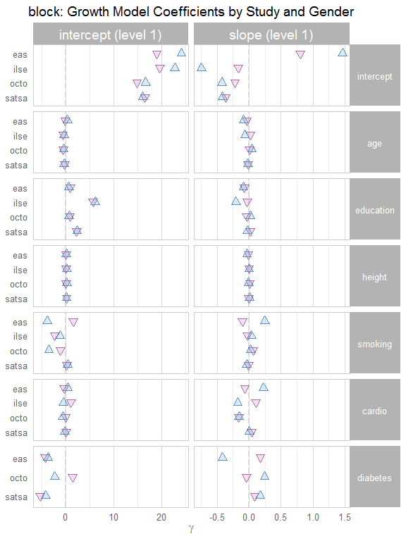
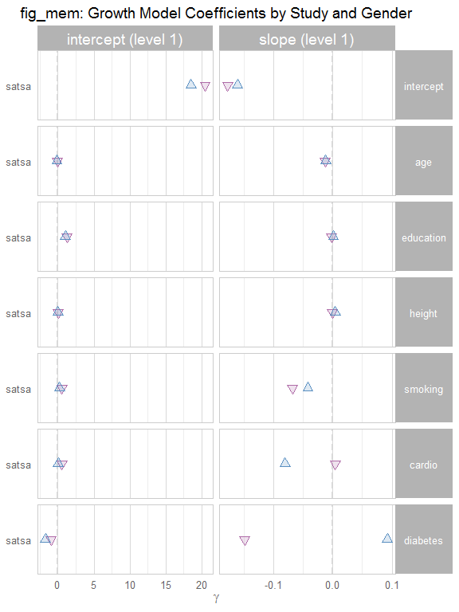
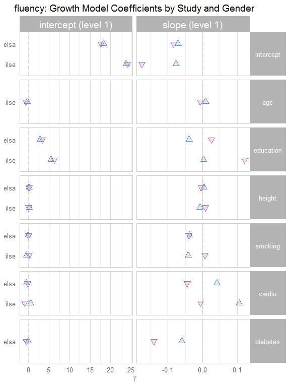
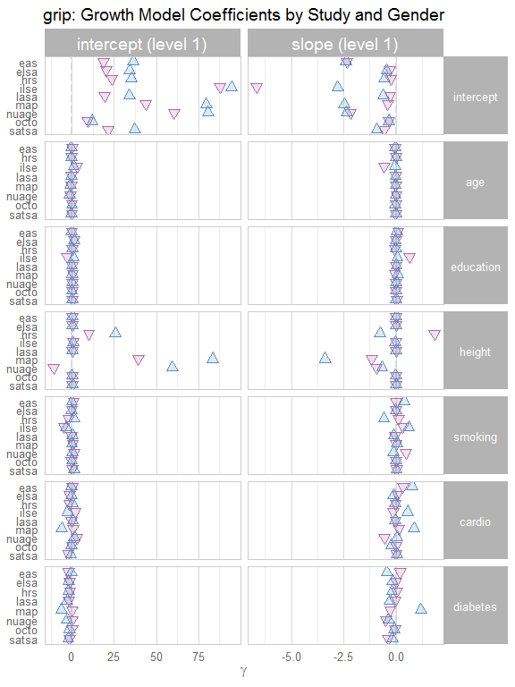
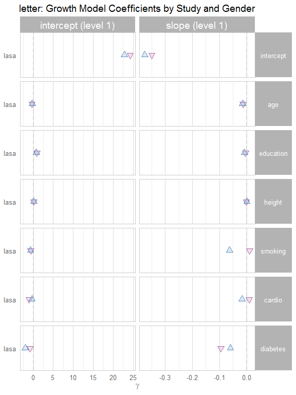
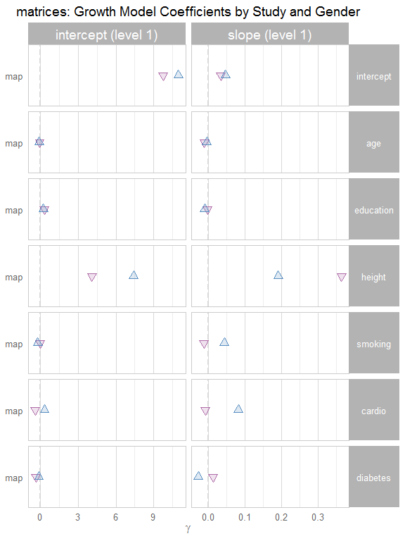
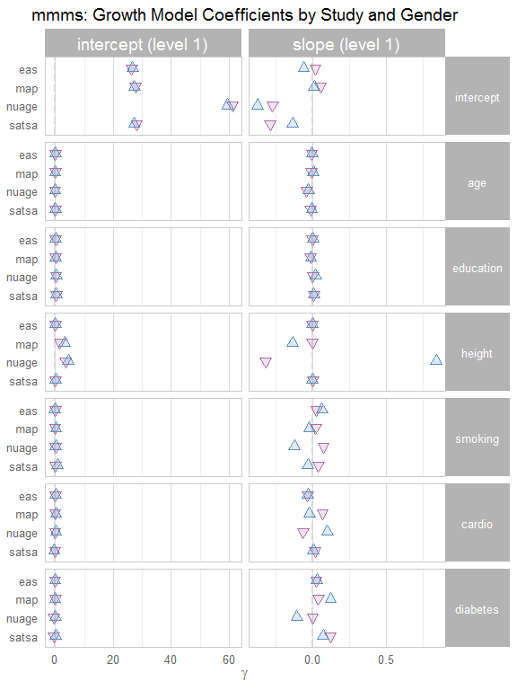
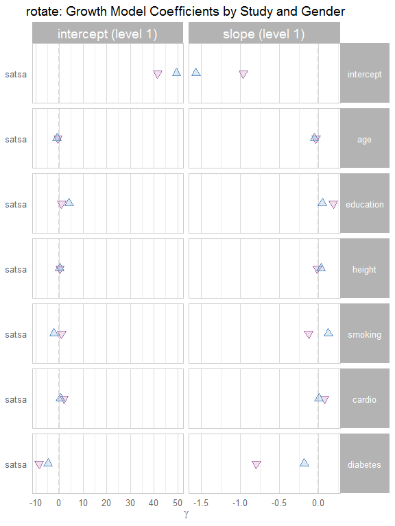
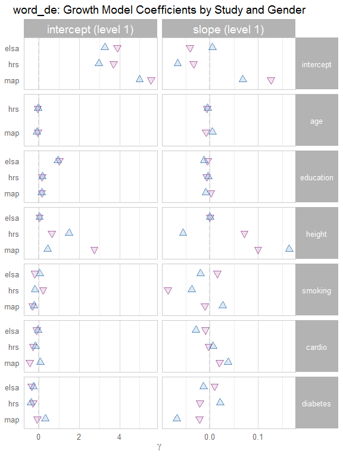

# Growth Curve Report #1
Date: `r Sys.Date()`  

This report contains a searchable table, followed by publication-ready tables.

<!--  Set the working directory to the repository's base directory; this assumes the report is nested inside of two directories.-->


<!-- Set the report-wide options, and point to the external code file. -->


<!-- Load the sources.  Suppress the output when loading sources. --> 


<!-- Load 'sourced' R files.  Suppress the output when loading packages. --> 


<!-- Load any global functions and variables declared in the R file.  Suppress the output. --> 


<!-- Declare any global functions specific to a Rmd output.  Suppress the output. --> 


<!-- Load the datasets.   -->


<!-- Tweak the datasets.   -->


# Summary

### Notes 
1. All available models are contained in the dynamic table, while only the 'aehplus' models are shown in the static tables.

### Unanswered Questions

1. How should we handle entries that are entirely missing?
1. How should we handle entries containing null/NA results?

### Answered Questions


# Dynamic Table

<!--html_preserve--><div id="htmlwidget-9405" style="width:100%;height:auto;" class="datatables html-widget"></div>
<script type="application/json" data-for="htmlwidget-9405">{"x":{"data":[["1","2","3","4","5","6","7","8","9","10","11","12","13","14","15","16","17","18","19","20","21","22","23","24","25","26","27","28","29","30","31","32","33","34","35","36","37","38","39","40","41","42","43","44","45","46","47","48","49","50","51","52","53","54","55","56","57","58","59","60","61","62","63","64","65","66","67","68","69","70","71","72","73","74","75","76","77","78","79","80","81","82","83","84","85","86","87","88","89","90","91","92","93","94","95","96","97","98","99","100","101","102","103","104","105","106","107","108","109","110","111","112","113","114","115","116","117","118","119","120","121","122","123","124","125","126","127","128","129","130","131","132","133","134","135","136","137","138","139","140","141","142","143","144","145","146","147","148","149","150","151","152","153","154","155","156","157","158","159","160","161","162","163","164","165","166","167","168","169","170","171","172","173","174","175","176","177","178","179","180","181","182","183","184","185","186","187","188","189","190","191","192","193","194","195","196","197","198","199","200","201","202","203","204","205","206","207","208","209","210","211","212","213","214","215","216","217","218","219","220","221","222","223","224","225","226","227","228","229","230","231","232","233","234","235","236","237","238","239","240","241","242","243","244","245","246","247","248","249","250","251","252","253","254","255","256","257","258","259","260","261","262","263","264","265","266","267","268","269","270","271","272","273","274","275","276","277","278","279","280","281","282","283","284","285","286","287","288","289","290","291","292","293","294","295","296","297","298","299","300","301","302","303","304","305","306","307","308","309","310","311","312","313","314","315","316","317","318","319","320","321","322","323","324","325","326","327","328","329","330","331","332","333","334","335","336","337","338","339","340","341","342","343","344","345","346","347","348","349","350","351","352","353","354","355","356","357","358","359","360","361","362","363","364","365","366","367","368","369","370","371","372","373","374","375","376","377","378","379","380","381","382","383","384","385","386","387","388","389","390","391","392","393","394","395","396","397","398","399","400","401","402","403","404","405","406","407","408","409","410","411","412","413","414","415","416","417","418","419","420","421","422","423","424","425","426","427","428","429","430","431","432","433","434","435","436","437","438","439","440","441","442","443","444","445","446","447","448","449","450","451","452","453","454","455","456","457","458","459","460","461","462","463","464","465","466","467","468","469","470","471","472","473","474","475","476","477","478","479","480","481","482","483","484","485","486","487","488","489","490","491","492","493","494","495","496","497","498","499","500","501","502","503","504","505","506","507","508","509","510","511","512","513","514","515","516","517","518","519","520","521","522","523","524","525","526","527","528","529","530","531","532","533","534","535","536","537","538","539","540","541","542","543","544","545","546","547","548","549","550","551","552","553","554","555","556","557","558","559","560","561","562","563","564","565","566","567","568","569","570","571","572","573","574","575","576","577","578","579","580","581","582","583","584","585","586","587","588","589","590","591","592","593","594","595","596","597","598","599","600","601","602","603","604","605","606","607","608","609","610","611","612","613","614","615","616","617","618","619","620","621","622","623","624","625","626","627","628","629","630","631","632","633","634","635","636","637","638","639","640","641","642","643","644","645","646","647","648","649","650","651","652","653","654","655","656","657","658","659","660","661","662","663","664","665","666","667","668","669","670","671","672","673","674","675","676","677","678","679","680","681","682","683","684","685","686","687","688","689","690","691","692","693","694","695","696","697","698","699","700","701","702","703","704","705","706","707","708","709","710","711","712","713","714","715","716","717","718","719","720","721","722","723","724","725","726","727","728","729","730","731","732","733","734","735","736","737","738","739","740","741","742","743","744","745","746","747","748","749","750","751","752","753","754","755","756","757","758","759","760","761","762","763","764","765","766","767","768","769","770","771","772","773","774","775","776","777","778","779","780","781","782","783","784","785","786","787","788","789","790","791","792","793","794","795","796","797","798","799","800","801","802","803","804","805","806","807","808","809","810","811","812","813","814","815","816","817","818","819","820","821","822","823","824","825","826","827","828","829","830","831","832","833","834","835","836","837","838","839","840","841","842","843","844","845","846","847","848","849","850","851","852","853","854","855","856","857","858","859","860","861","862","863","864","865","866","867","868","869","870","871","872","873","874","875","876","877","878","879","880","881","882","883","884","885","886","887","888","889","890","891","892","893","894","895","896","897","898","899","900","901","902","903","904","905","906","907","908","909","910","911","912","913","914","915","916","917","918","919","920","921","922","923","924","925","926","927","928","929","930","931","932","933","934","935","936","937","938","939","940","941","942","943","944","945","946","947","948","949","950","951","952","953","954","955","956","957","958","959","960","961","962","963","964","965","966","967","968","969","970","971","972","973","974","975","976","977","978","979","980","981","982","983","984","985","986","987","988","989","990","991","992","993","994","995","996","997","998","999","1000","1001","1002","1003","1004","1005","1006","1007","1008","1009","1010","1011","1012","1013","1014","1015","1016","1017","1018","1019","1020","1021","1022","1023","1024","1025","1026","1027","1028","1029","1030","1031","1032","1033","1034","1035","1036","1037","1038","1039","1040","1041","1042","1043","1044","1045","1046","1047","1048","1049","1050","1051","1052","1053","1054","1055","1056","1057","1058","1059","1060","1061","1062","1063","1064","1065","1066","1067","1068","1069","1070","1071","1072","1073","1074","1075","1076","1077","1078","1079","1080","1081","1082","1083","1084","1085","1086","1087","1088","1089","1090","1091","1092","1093","1094","1095","1096","1097","1098","1099","1100","1101","1102","1103","1104","1105","1106","1107","1108","1109","1110","1111","1112","1113","1114","1115","1116","1117","1118","1119","1120","1121","1122","1123","1124","1125","1126","1127","1128","1129","1130","1131","1132","1133","1134","1135","1136","1137","1138","1139","1140","1141","1142","1143","1144","1145","1146","1147","1148","1149","1150","1151","1152","1153","1154","1155","1156","1157","1158","1159","1160","1161","1162","1163","1164","1165","1166","1167","1168","1169","1170","1171","1172","1173","1174","1175","1176","1177","1178","1179","1180","1181","1182","1183","1184","1185","1186","1187","1188","1189","1190","1191","1192","1193","1194","1195","1196","1197","1198","1199","1200","1201","1202","1203","1204","1205","1206","1207","1208","1209","1210","1211","1212","1213","1214","1215","1216","1217","1218","1219","1220","1221","1222","1223","1224","1225","1226","1227","1228","1229","1230","1231","1232","1233","1234","1235","1236","1237","1238","1239","1240","1241","1242","1243","1244","1245","1246","1247","1248","1249","1250","1251","1252","1253","1254","1255","1256","1257","1258","1259","1260","1261","1262","1263","1264","1265","1266","1267","1268","1269","1270","1271","1272","1273","1274","1275","1276","1277","1278","1279","1280","1281","1282","1283","1284","1285","1286","1287","1288","1289","1290","1291","1292","1293","1294","1295","1296","1297","1298","1299","1300","1301","1302","1303","1304","1305","1306","1307","1308","1309","1310","1311","1312","1313","1314","1315","1316","1317","1318","1319","1320","1321","1322","1323","1324","1325","1326","1327","1328","1329","1330","1331","1332","1333","1334","1335","1336","1337","1338","1339","1340","1341","1342","1343","1344","1345","1346","1347","1348","1349","1350","1351","1352","1353","1354","1355","1356","1357","1358","1359","1360","1361","1362","1363","1364","1365","1366","1367","1368","1369","1370","1371","1372","1373","1374","1375","1376","1377","1378","1379","1380","1381","1382","1383","1384","1385","1386","1387","1388","1389","1390","1391","1392","1393","1394","1395","1396","1397","1398","1399","1400","1401","1402","1403","1404","1405","1406","1407","1408","1409","1410","1411","1412","1413","1414","1415","1416","1417","1418","1419","1420","1421","1422","1423","1424","1425","1426","1427","1428","1429","1430","1431","1432","1433","1434","1435","1436","1437","1438","1439","1440","1441","1442","1443","1444","1445","1446","1447","1448","1449","1450","1451","1452","1453","1454","1455","1456","1457","1458","1459","1460","1461","1462","1463","1464","1465","1466","1467","1468","1469","1470","1471","1472","1473","1474","1475","1476","1477","1478","1479","1480","1481","1482","1483","1484","1485","1486","1487","1488","1489","1490","1491","1492","1493","1494","1495","1496","1497","1498","1499","1500","1501","1502","1503","1504","1505","1506","1507","1508","1509","1510","1511","1512","1513","1514","1515","1516","1517","1518","1519","1520","1521","1522","1523","1524","1525","1526","1527","1528","1529","1530","1531","1532","1533","1534","1535","1536","1537","1538","1539","1540","1541","1542","1543","1544","1545","1546","1547","1548","1549","1550","1551","1552","1553","1554","1555","1556","1557","1558","1559","1560","1561","1562","1563","1564","1565","1566","1567","1568","1569","1570","1571","1572","1573","1574","1575","1576","1577","1578","1579","1580","1581","1582","1583","1584","1585","1586","1587","1588","1589","1590","1591","1592","1593","1594","1595","1596","1597","1598","1599","1600","1601","1602","1603","1604","1605","1606","1607","1608","1609","1610","1611","1612","1613","1614","1615","1616","1617","1618","1619","1620","1621","1622","1623","1624","1625","1626","1627","1628","1629","1630","1631","1632","1633","1634","1635","1636","1637","1638","1639","1640","1641","1642","1643","1644","1645","1646","1647","1648","1649","1650","1651","1652","1653","1654","1655","1656","1657","1658","1659","1660","1661","1662","1663","1664","1665","1666","1667","1668","1669","1670","1671","1672","1673","1674","1675","1676","1677","1678","1679","1680","1681","1682","1683","1684","1685","1686","1687","1688","1689","1690","1691","1692","1693","1694","1695","1696","1697","1698","1699","1700","1701","1702","1703","1704","1705","1706","1707","1708","1709","1710","1711","1712","1713","1714","1715","1716","1717","1718","1719","1720","1721","1722","1723","1724","1725","1726","1727","1728","1729","1730","1731","1732","1733","1734","1735","1736","1737","1738","1739","1740","1741","1742","1743","1744","1745","1746","1747","1748","1749","1750","1751","1752","1753","1754","1755","1756","1757","1758","1759","1760","1761","1762","1763","1764","1765","1766","1767","1768","1769","1770","1771","1772","1773","1774","1775","1776","1777","1778","1779","1780","1781","1782","1783","1784","1785","1786","1787","1788","1789","1790","1791","1792","1793","1794","1795","1796","1797","1798","1799","1800","1801","1802","1803","1804","1805","1806","1807","1808","1809","1810","1811","1812","1813","1814","1815","1816","1817","1818","1819","1820","1821","1822","1823","1824","1825","1826","1827","1828","1829","1830","1831","1832","1833","1834","1835","1836","1837","1838","1839","1840","1841","1842","1843","1844","1845","1846","1847","1848","1849","1850","1851","1852","1853","1854","1855","1856","1857","1858","1859","1860","1861","1862","1863","1864","1865","1866","1867","1868","1869","1870","1871","1872","1873","1874","1875","1876","1877","1878","1879","1880","1881","1882","1883","1884","1885","1886","1887","1888","1889","1890","1891","1892","1893","1894","1895","1896","1897","1898","1899","1900","1901","1902","1903","1904","1905","1906","1907","1908","1909","1910","1911","1912","1913","1914","1915","1916","1917","1918","1919","1920","1921","1922","1923","1924","1925","1926","1927","1928","1929","1930","1931","1932","1933","1934","1935","1936","1937","1938","1939","1940","1941","1942","1943","1944","1945","1946","1947","1948","1949","1950","1951","1952","1953","1954","1955","1956","1957","1958","1959","1960","1961","1962","1963","1964","1965","1966","1967","1968","1969","1970","1971","1972","1973","1974","1975","1976","1977","1978","1979","1980","1981","1982","1983","1984","1985","1986","1987","1988","1989","1990","1991","1992","1993","1994","1995","1996","1997","1998","1999","2000","2001","2002","2003","2004","2005","2006","2007","2008","2009","2010","2011","2012","2013","2014","2015","2016","2017","2018","2019","2020","2021","2022","2023","2024","2025","2026","2027","2028","2029","2030","2031","2032","2033","2034","2035","2036","2037","2038","2039","2040","2041","2042","2043","2044","2045","2046","2047","2048","2049","2050","2051","2052","2053","2054","2055","2056","2057","2058","2059","2060","2061","2062","2063","2064","2065","2066","2067","2068","2069","2070","2071","2072","2073","2074","2075","2076","2077","2078","2079","2080","2081","2082","2083","2084","2085","2086","2087","2088","2089","2090","2091","2092","2093","2094","2095","2096","2097","2098","2099","2100","2101","2102","2103","2104","2105","2106","2107","2108","2109","2110","2111","2112","2113","2114","2115","2116","2117","2118","2119","2120","2121","2122","2123","2124","2125","2126","2127","2128","2129","2130","2131","2132","2133","2134","2135","2136","2137","2138","2139","2140","2141","2142","2143","2144","2145","2146","2147","2148","2149","2150","2151","2152","2153","2154","2155","2156","2157","2158","2159","2160","2161","2162","2163","2164","2165","2166","2167","2168","2169","2170","2171","2172","2173","2174","2175","2176","2177","2178","2179","2180","2181","2182","2183","2184","2185","2186","2187","2188","2189","2190","2191","2192","2193","2194","2195","2196","2197","2198","2199","2200","2201","2202","2203","2204","2205","2206","2207","2208","2209","2210","2211","2212","2213","2214","2215","2216","2217","2218","2219","2220","2221","2222","2223","2224","2225","2226","2227","2228","2229","2230","2231","2232","2233","2234","2235","2236","2237","2238","2239","2240","2241","2242","2243","2244","2245","2246","2247","2248","2249","2250","2251","2252","2253","2254","2255","2256","2257","2258","2259","2260","2261","2262","2263","2264","2265","2266","2267","2268","2269","2270","2271","2272","2273","2274","2275","2276","2277","2278","2279","2280","2281","2282","2283","2284","2285","2286","2287","2288","2289","2290","2291","2292","2293","2294","2295","2296","2297","2298","2299","2300","2301","2302","2303","2304","2305","2306","2307","2308","2309","2310","2311","2312","2313","2314","2315","2316","2317","2318","2319","2320","2321","2322","2323","2324","2325","2326","2327","2328","2329","2330","2331","2332","2333","2334","2335","2336","2337","2338","2339","2340","2341","2342","2343","2344","2345","2346","2347","2348","2349","2350","2351","2352","2353","2354","2355","2356","2357","2358","2359","2360","2361","2362","2363","2364","2365","2366","2367","2368","2369","2370","2371","2372","2373","2374","2375","2376","2377","2378","2379","2380","2381","2382","2383","2384","2385","2386","2387","2388","2389","2390","2391","2392","2393","2394","2395","2396","2397","2398","2399","2400","2401","2402","2403","2404","2405","2406","2407","2408","2409","2410","2411","2412","2413","2414","2415","2416","2417","2418","2419","2420","2421","2422","2423","2424","2425","2426","2427","2428","2429","2430","2431","2432","2433","2434","2435","2436","2437","2438","2439","2440","2441","2442","2443","2444","2445","2446","2447","2448","2449","2450","2451","2452","2453","2454","2455","2456","2457","2458","2459","2460","2461","2462","2463","2464","2465","2466","2467","2468","2469","2470","2471","2472","2473","2474","2475","2476","2477","2478","2479","2480","2481","2482","2483","2484","2485","2486","2487","2488","2489","2490","2491","2492","2493","2494","2495","2496","2497","2498","2499","2500","2501","2502","2503","2504","2505","2506","2507","2508","2509","2510","2511","2512","2513","2514","2515","2516","2517","2518","2519","2520","2521","2522","2523","2524","2525","2526","2527","2528","2529","2530","2531","2532","2533","2534","2535","2536","2537","2538","2539","2540","2541","2542","2543","2544","2545","2546","2547","2548","2549","2550","2551","2552","2553","2554","2555","2556","2557","2558","2559","2560","2561","2562","2563","2564","2565","2566","2567","2568","2569","2570","2571","2572","2573","2574","2575","2576","2577","2578","2579","2580","2581","2582","2583","2584","2585","2586","2587","2588","2589","2590","2591","2592","2593","2594","2595","2596","2597","2598","2599","2600","2601","2602","2603","2604","2605","2606","2607","2608","2609","2610","2611","2612","2613","2614","2615","2616","2617","2618","2619","2620","2621","2622","2623","2624","2625","2626","2627","2628","2629","2630","2631","2632","2633","2634","2635","2636","2637","2638","2639","2640","2641","2642","2643","2644","2645","2646","2647","2648","2649","2650","2651","2652","2653","2654","2655","2656","2657","2658","2659","2660","2661","2662","2663","2664","2665","2666","2667","2668","2669","2670","2671","2672","2673","2674","2675","2676","2677","2678","2679","2680","2681","2682","2683","2684","2685","2686","2687","2688","2689","2690","2691","2692","2693","2694","2695","2696","2697","2698","2699","2700","2701","2702","2703","2704","2705","2706","2707","2708","2709","2710","2711","2712","2713","2714","2715","2716","2717","2718","2719","2720","2721","2722","2723","2724","2725","2726","2727","2728","2729","2730","2731","2732","2733","2734","2735","2736","2737","2738","2739","2740","2741","2742","2743","2744","2745","2746","2747","2748","2749","2750","2751","2752","2753","2754","2755","2756","2757","2758","2759","2760","2761","2762","2763","2764","2765","2766","2767","2768","2769","2770","2771","2772","2773","2774","2775","2776","2777","2778","2779","2780","2781","2782","2783","2784","2785","2786","2787","2788","2789","2790","2791","2792","2793","2794","2795","2796","2797","2798","2799","2800","2801","2802","2803","2804","2805","2806","2807","2808","2809","2810","2811","2812","2813","2814","2815","2816","2817","2818","2819","2820","2821","2822","2823","2824","2825","2826","2827","2828","2829","2830","2831","2832","2833","2834","2835","2836","2837","2838","2839","2840","2841","2842","2843","2844","2845","2846","2847","2848","2849","2850","2851","2852","2853","2854","2855","2856","2857","2858","2859","2860","2861","2862","2863","2864","2865","2866","2867","2868","2869","2870","2871","2872","2873","2874","2875","2876","2877","2878","2879","2880","2881","2882","2883","2884","2885","2886","2887","2888","2889","2890","2891","2892","2893","2894","2895","2896","2897","2898","2899","2900","2901","2902","2903","2904","2905","2906","2907","2908","2909","2910","2911","2912","2913","2914","2915","2916","2917","2918","2919","2920","2921","2922","2923","2924","2925","2926","2927","2928","2929","2930","2931","2932","2933","2934","2935","2936","2937","2938","2939","2940","2941","2942","2943","2944","2945","2946","2947","2948","2949","2950","2951","2952","2953","2954","2955","2956","2957","2958","2959","2960","2961","2962","2963","2964","2965","2966","2967","2968","2969","2970","2971","2972","2973","2974","2975","2976","2977","2978","2979","2980","2981","2982","2983","2984","2985","2986","2987","2988","2989","2990","2991","2992","2993","2994","2995","2996","2997","2998","2999","3000","3001","3002","3003","3004","3005","3006","3007","3008","3009","3010","3011","3012","3013","3014","3015","3016","3017","3018","3019","3020","3021","3022","3023","3024","3025","3026","3027","3028","3029","3030","3031","3032","3033","3034","3035","3036","3037","3038","3039","3040","3041","3042","3043","3044","3045","3046","3047","3048","3049","3050","3051","3052","3053","3054","3055","3056","3057","3058","3059","3060","3061","3062","3063","3064","3065","3066","3067","3068","3069","3070","3071","3072","3073","3074","3075","3076","3077","3078","3079","3080","3081","3082","3083","3084","3085","3086","3087","3088","3089","3090","3091","3092","3093","3094","3095","3096","3097","3098","3099","3100","3101","3102","3103","3104","3105","3106","3107","3108","3109","3110","3111","3112","3113","3114","3115","3116","3117","3118","3119","3120","3121","3122","3123","3124","3125","3126","3127","3128","3129","3130","3131","3132","3133","3134","3135","3136","3137","3138","3139","3140","3141","3142","3143","3144","3145","3146","3147","3148","3149","3150","3151","3152","3153","3154","3155","3156","3157","3158","3159","3160","3161","3162","3163","3164","3165","3166","3167","3168","3169","3170","3171","3172","3173","3174","3175","3176","3177","3178","3179","3180","3181","3182","3183","3184","3185","3186","3187","3188","3189","3190","3191","3192","3193","3194","3195","3196","3197","3198","3199","3200","3201","3202","3203","3204","3205","3206","3207","3208","3209","3210","3211","3212","3213","3214","3215","3216","3217","3218","3219","3220","3221","3222","3223","3224","3225","3226","3227","3228","3229","3230","3231","3232","3233","3234","3235","3236","3237","3238","3239","3240","3241","3242","3243","3244","3245","3246","3247","3248","3249","3250","3251","3252","3253","3254","3255","3256","3257","3258","3259","3260","3261","3262","3263","3264","3265","3266","3267","3268","3269","3270","3271","3272","3273","3274","3275","3276","3277","3278","3279","3280","3281","3282","3283","3284","3285","3286","3287","3288","3289","3290","3291","3292","3293","3294","3295","3296","3297","3298","3299","3300","3301","3302","3303","3304","3305","3306","3307","3308","3309","3310","3311","3312","3313","3314","3315","3316","3317","3318","3319","3320","3321","3322","3323","3324","3325","3326","3327","3328","3329","3330","3331","3332","3333","3334","3335","3336","3337","3338","3339","3340","3341","3342","3343","3344","3345","3346","3347","3348","3349","3350","3351","3352","3353","3354","3355","3356","3357","3358","3359","3360","3361","3362","3363","3364","3365","3366","3367","3368","3369","3370","3371","3372","3373","3374","3375","3376","3377","3378","3379","3380","3381","3382","3383","3384","3385","3386","3387","3388","3389","3390","3391","3392","3393","3394","3395","3396","3397","3398","3399","3400","3401","3402","3403","3404","3405","3406","3407","3408","3409","3410","3411","3412","3413","3414","3415","3416","3417","3418","3419","3420","3421","3422","3423","3424","3425","3426","3427","3428","3429","3430","3431","3432","3433","3434","3435","3436","3437","3438","3439","3440","3441","3442","3443","3444","3445","3446","3447","3448","3449","3450","3451","3452","3453","3454","3455","3456","3457","3458","3459","3460","3461","3462","3463","3464","3465","3466","3467","3468","3469","3470","3471","3472","3473","3474","3475","3476","3477","3478","3479","3480","3481","3482","3483","3484","3485","3486","3487","3488","3489","3490","3491","3492","3493","3494","3495","3496","3497","3498","3499","3500","3501","3502","3503","3504","3505","3506","3507","3508","3509","3510","3511","3512","3513","3514","3515","3516","3517","3518","3519","3520","3521","3522","3523","3524","3525","3526","3527","3528","3529","3530","3531","3532","3533","3534","3535","3536","3537","3538","3539","3540","3541","3542","3543","3544","3545","3546","3547","3548","3549","3550","3551","3552","3553","3554","3555","3556","3557","3558","3559","3560","3561","3562","3563","3564","3565","3566","3567","3568","3569","3570","3571","3572","3573","3574","3575","3576","3577","3578","3579","3580","3581","3582","3583","3584","3585","3586","3587","3588","3589","3590","3591","3592","3593","3594","3595","3596","3597","3598","3599","3600","3601","3602","3603","3604","3605","3606","3607","3608","3609","3610","3611","3612","3613","3614","3615","3616","3617","3618","3619","3620","3621","3622","3623","3624","3625","3626","3627","3628","3629","3630","3631","3632","3633","3634","3635","3636","3637","3638","3639","3640","3641","3642","3643","3644","3645","3646","3647","3648","3649","3650","3651","3652","3653","3654","3655","3656","3657","3658","3659","3660","3661","3662","3663","3664","3665","3666","3667","3668","3669","3670","3671","3672","3673","3674","3675","3676","3677","3678","3679","3680","3681","3682","3683","3684","3685","3686","3687","3688","3689","3690","3691","3692","3693","3694","3695","3696","3697","3698","3699","3700","3701","3702","3703","3704","3705","3706","3707","3708","3709","3710","3711","3712","3713","3714","3715","3716","3717","3718","3719","3720","3721","3722","3723","3724","3725","3726","3727","3728","3729","3730","3731","3732","3733","3734","3735","3736","3737","3738","3739","3740","3741","3742","3743","3744","3745","3746","3747","3748","3749","3750","3751","3752","3753","3754","3755","3756","3757","3758","3759","3760","3761","3762","3763","3764","3765","3766","3767","3768","3769","3770","3771","3772","3773","3774","3775","3776","3777","3778","3779","3780","3781","3782","3783","3784","3785","3786","3787","3788","3789","3790","3791","3792","3793","3794","3795","3796","3797","3798","3799","3800","3801","3802","3803","3804","3805","3806","3807","3808","3809","3810","3811","3812","3813","3814","3815","3816","3817","3818","3819","3820","3821","3822","3823","3824","3825","3826","3827","3828","3829","3830","3831","3832","3833","3834","3835","3836","3837","3838","3839","3840","3841","3842","3843","3844","3845","3846","3847","3848","3849","3850","3851","3852","3853","3854","3855","3856","3857","3858","3859","3860","3861","3862","3863","3864","3865","3866","3867","3868","3869","3870","3871","3872","3873","3874","3875","3876","3877","3878","3879","3880","3881","3882","3883","3884","3885","3886","3887","3888","3889","3890","3891","3892","3893","3894","3895","3896","3897","3898","3899","3900","3901","3902","3903","3904","3905","3906","3907","3908","3909","3910","3911","3912","3913","3914","3915","3916","3917","3918","3919","3920","3921","3922","3923","3924","3925","3926","3927","3928","3929","3930","3931","3932","3933","3934","3935","3936","3937","3938","3939","3940","3941","3942","3943","3944","3945","3946","3947","3948","3949","3950","3951","3952","3953","3954","3955","3956","3957","3958","3959","3960","3961","3962","3963","3964","3965","3966","3967","3968","3969","3970","3971","3972","3973","3974","3975","3976","3977","3978","3979","3980","3981","3982","3983","3984","3985","3986","3987","3988","3989","3990","3991","3992","3993","3994","3995","3996","3997","3998","3999","4000","4001","4002","4003","4004","4005","4006","4007","4008","4009","4010","4011","4012","4013","4014","4015","4016","4017","4018","4019","4020","4021","4022","4023","4024","4025","4026","4027","4028","4029","4030","4031","4032","4033","4034","4035","4036","4037","4038","4039","4040","4041","4042","4043","4044","4045","4046","4047","4048","4049","4050","4051","4052","4053","4054","4055","4056","4057","4058","4059","4060","4061","4062","4063","4064","4065","4066","4067","4068","4069","4070","4071","4072","4073","4074","4075","4076","4077","4078","4079","4080","4081","4082","4083","4084","4085","4086","4087","4088","4089","4090","4091","4092","4093","4094","4095","4096","4097","4098","4099","4100","4101","4102","4103","4104","4105","4106","4107","4108","4109","4110","4111","4112","4113","4114","4115","4116","4117","4118","4119","4120","4121","4122","4123","4124","4125","4126","4127","4128","4129","4130","4131","4132","4133","4134","4135","4136","4137","4138","4139","4140","4141","4142","4143","4144","4145","4146","4147","4148","4149","4150","4151","4152","4153","4154","4155","4156","4157","4158","4159","4160","4161","4162","4163","4164","4165","4166","4167","4168","4169","4170","4171","4172","4173","4174","4175","4176","4177","4178","4179","4180","4181","4182","4183","4184","4185","4186","4187","4188","4189","4190","4191","4192","4193","4194","4195","4196","4197","4198","4199","4200","4201","4202","4203","4204","4205","4206","4207","4208","4209","4210","4211","4212","4213","4214","4215","4216","4217","4218","4219","4220","4221","4222","4223","4224","4225","4226","4227","4228","4229","4230","4231","4232","4233","4234","4235","4236","4237","4238","4239","4240","4241","4242","4243","4244","4245","4246","4247","4248","4249","4250","4251","4252","4253","4254","4255","4256","4257","4258","4259","4260","4261","4262","4263","4264","4265","4266","4267","4268","4269","4270","4271","4272","4273","4274","4275","4276","4277","4278","4279","4280","4281","4282","4283","4284","4285","4286","4287","4288","4289","4290","4291","4292","4293","4294","4295","4296","4297","4298","4299","4300","4301","4302","4303","4304","4305","4306","4307","4308","4309","4310","4311","4312","4313","4314","4315","4316","4317","4318","4319","4320","4321","4322","4323","4324","4325","4326","4327","4328","4329","4330","4331","4332","4333","4334","4335","4336","4337","4338","4339","4340","4341","4342","4343","4344","4345","4346","4347","4348","4349","4350","4351","4352","4353","4354"],["eas","eas","eas","eas","eas","eas","eas","eas","eas","eas","eas","eas","eas","eas","eas","eas","eas","eas","eas","eas","eas","eas","eas","eas","eas","eas","eas","eas","eas","eas","eas","eas","eas","eas","eas","eas","eas","eas","eas","eas","eas","eas","eas","eas","eas","eas","eas","eas","eas","eas","eas","eas","eas","eas","eas","eas","eas","eas","eas","eas","eas","eas","eas","eas","eas","eas","eas","eas","eas","eas","eas","eas","eas","eas","eas","eas","eas","eas","eas","eas","eas","eas","eas","eas","eas","eas","eas","eas","eas","eas","eas","eas","eas","eas","eas","eas","eas","eas","eas","eas","eas","eas","eas","eas","eas","eas","eas","eas","eas","eas","eas","eas","eas","eas","eas","eas","eas","eas","eas","eas","eas","eas","eas","eas","eas","eas","eas","eas","eas","eas","eas","eas","eas","eas","eas","eas","eas","eas","eas","eas","eas","eas","eas","eas","eas","eas","eas","eas","eas","eas","eas","eas","eas","eas","eas","eas","eas","eas","eas","eas","eas","eas","eas","eas","eas","eas","eas","eas","eas","eas","eas","eas","eas","eas","eas","eas","eas","eas","eas","eas","eas","eas","eas","eas","eas","eas","eas","eas","eas","eas","eas","eas","eas","eas","eas","eas","eas","eas","eas","eas","eas","eas","eas","eas","eas","eas","eas","eas","eas","eas","eas","eas","eas","eas","eas","eas","eas","eas","eas","eas","eas","eas","eas","eas","eas","eas","eas","eas","eas","eas","eas","eas","eas","eas","eas","eas","eas","eas","eas","eas","eas","eas","eas","eas","eas","eas","eas","eas","eas","eas","eas","eas","eas","eas","eas","eas","eas","eas","eas","eas","eas","eas","eas","eas","eas","eas","eas","eas","eas","eas","eas","eas","eas","eas","eas","eas","eas","eas","eas","eas","eas","eas","eas","eas","eas","eas","eas","eas","eas","eas","eas","eas","eas","eas","eas","eas","eas","eas","eas","eas","eas","eas","eas","eas","eas","eas","eas","eas","eas","eas","eas","eas","eas","eas","eas","eas","eas","eas","eas","eas","eas","eas","eas","eas","eas","eas","eas","eas","eas","eas","eas","eas","eas","eas","eas","eas","eas","eas","eas","eas","eas","eas","eas","eas","eas","eas","eas","eas","eas","eas","eas","eas","eas","eas","eas","eas","eas","eas","eas","eas","eas","eas","eas","eas","eas","eas","eas","eas","eas","eas","eas","eas","eas","eas","eas","eas","eas","eas","eas","eas","eas","eas","eas","eas","eas","eas","eas","eas","eas","eas","eas","eas","eas","eas","eas","eas","eas","eas","eas","eas","eas","eas","eas","eas","eas","eas","eas","eas","eas","eas","eas","eas","eas","eas","eas","eas","eas","eas","eas","eas","eas","eas","eas","eas","eas","eas","eas","eas","eas","eas","eas","eas","eas","eas","eas","eas","eas","eas","eas","eas","eas","eas","eas","eas","eas","eas","eas","eas","eas","eas","eas","eas","eas","eas","eas","eas","eas","eas","eas","eas","eas","eas","eas","eas","eas","eas","eas","eas","eas","eas","eas","eas","eas","eas","eas","eas","eas","eas","eas","eas","eas","eas","eas","eas","eas","eas","eas","eas","eas","eas","eas","eas","eas","eas","eas","eas","eas","eas","eas","eas","eas","eas","eas","eas","eas","eas","eas","eas","eas","eas","eas","eas","eas","eas","eas","eas","eas","eas","eas","eas","eas","eas","eas","eas","eas","eas","eas","eas","eas","eas","eas","eas","eas","eas","eas","eas","eas","eas","eas","eas","eas","eas","eas","eas","eas","eas","eas","eas","eas","eas","eas","eas","eas","eas","eas","eas","eas","eas","eas","eas","eas","eas","eas","eas","eas","eas","eas","eas","eas","eas","eas","eas","eas","eas","eas","eas","eas","eas","eas","eas","eas","eas","eas","eas","eas","eas","eas","eas","eas","eas","eas","eas","eas","eas","eas","eas","eas","eas","eas","eas","eas","eas","eas","eas","eas","eas","eas","eas","eas","eas","eas","eas","eas","eas","eas","eas","eas","eas","eas","eas","eas","eas","eas","eas","eas","eas","eas","eas","eas","eas","eas","eas","eas","eas","eas","eas","eas","eas","eas","eas","eas","eas","eas","eas","eas","eas","eas","eas","eas","eas","eas","eas","eas","eas","eas","eas","eas","eas","eas","eas","eas","eas","eas","eas","eas","eas","eas","eas","eas","eas","eas","eas","eas","eas","eas","eas","eas","eas","eas","eas","eas","eas","eas","eas","eas","eas","eas","eas","eas","eas","eas","eas","eas","eas","eas","eas","eas","eas","eas","eas","eas","eas","eas","eas","eas","eas","eas","eas","eas","eas","eas","eas","eas","eas","eas","eas","eas","eas","eas","eas","eas","eas","eas","eas","eas","eas","eas","eas","eas","eas","eas","eas","eas","eas","eas","eas","eas","eas","eas","eas","eas","eas","eas","eas","eas","eas","eas","eas","eas","eas","eas","eas","eas","eas","eas","eas","eas","eas","eas","eas","eas","eas","eas","eas","eas","eas","eas","eas","eas","eas","eas","eas","eas","eas","eas","eas","eas","eas","eas","eas","eas","eas","eas","eas","eas","eas","eas","eas","eas","eas","eas","eas","eas","eas","eas","eas","eas","eas","eas","eas","eas","eas","eas","eas","eas","eas","eas","eas","eas","eas","eas","eas","eas","eas","eas","eas","eas","eas","eas","eas","eas","eas","eas","eas","eas","eas","eas","eas","eas","eas","eas","eas","eas","eas","eas","eas","eas","eas","eas","eas","eas","eas","eas","eas","eas","eas","eas","eas","eas","eas","eas","eas","eas","eas","eas","eas","eas","eas","eas","eas","eas","eas","eas","eas","eas","eas","eas","eas","eas","eas","eas","eas","eas","eas","eas","eas","eas","eas","eas","eas","eas","eas","eas","eas","eas","eas","eas","eas","eas","eas","eas","eas","eas","eas","eas","eas","eas","eas","eas","eas","eas","eas","eas","eas","eas","eas","eas","eas","eas","eas","eas","eas","eas","eas","eas","eas","eas","eas","eas","eas","eas","eas","eas","eas","eas","eas","eas","eas","eas","eas","eas","eas","eas","eas","eas","eas","eas","eas","eas","eas","eas","eas","eas","eas","eas","eas","eas","eas","eas","eas","eas","eas","eas","eas","eas","eas","eas","eas","eas","eas","eas","eas","eas","eas","eas","eas","eas","eas","eas","eas","eas","eas","eas","eas","eas","eas","eas","eas","eas","eas","elsa","elsa","elsa","elsa","elsa","elsa","elsa","elsa","elsa","elsa","elsa","elsa","elsa","elsa","elsa","elsa","elsa","elsa","elsa","elsa","elsa","elsa","elsa","elsa","elsa","elsa","elsa","elsa","elsa","elsa","elsa","elsa","elsa","elsa","elsa","elsa","elsa","elsa","elsa","elsa","elsa","elsa","elsa","elsa","elsa","elsa","elsa","elsa","elsa","elsa","elsa","elsa","elsa","elsa","elsa","elsa","elsa","elsa","elsa","elsa","elsa","elsa","elsa","elsa","elsa","elsa","elsa","elsa","elsa","elsa","elsa","elsa","elsa","elsa","elsa","elsa","elsa","elsa","elsa","elsa","elsa","elsa","elsa","elsa","elsa","elsa","elsa","elsa","elsa","elsa","elsa","elsa","elsa","elsa","elsa","elsa","elsa","elsa","hrs","hrs","hrs","hrs","hrs","hrs","hrs","hrs","hrs","hrs","hrs","hrs","hrs","hrs","hrs","hrs","hrs","hrs","hrs","hrs","hrs","hrs","hrs","hrs","hrs","hrs","hrs","hrs","hrs","hrs","hrs","hrs","hrs","hrs","hrs","hrs","hrs","hrs","hrs","hrs","hrs","hrs","hrs","hrs","hrs","hrs","hrs","hrs","hrs","hrs","hrs","hrs","hrs","hrs","hrs","hrs","hrs","hrs","hrs","hrs","hrs","hrs","hrs","hrs","hrs","hrs","hrs","hrs","hrs","hrs","hrs","hrs","hrs","hrs","hrs","hrs","hrs","hrs","hrs","hrs","hrs","hrs","hrs","hrs","hrs","hrs","hrs","hrs","hrs","hrs","hrs","hrs","hrs","hrs","hrs","hrs","hrs","hrs","hrs","hrs","hrs","hrs","hrs","hrs","hrs","hrs","hrs","hrs","hrs","hrs","hrs","hrs","hrs","hrs","hrs","hrs","hrs","hrs","hrs","hrs","hrs","hrs","hrs","hrs","hrs","hrs","hrs","hrs","hrs","hrs","hrs","hrs","hrs","hrs","hrs","hrs","hrs","hrs","hrs","hrs","hrs","hrs","hrs","hrs","hrs","hrs","hrs","hrs","hrs","hrs","hrs","hrs","hrs","hrs","hrs","hrs","hrs","hrs","hrs","hrs","hrs","hrs","hrs","hrs","hrs","hrs","hrs","hrs","hrs","hrs","hrs","hrs","hrs","hrs","hrs","hrs","hrs","hrs","hrs","hrs","hrs","hrs","hrs","hrs","hrs","hrs","hrs","hrs","hrs","hrs","hrs","hrs","hrs","hrs","hrs","hrs","hrs","hrs","hrs","hrs","hrs","hrs","hrs","hrs","hrs","hrs","hrs","hrs","hrs","hrs","hrs","hrs","hrs","hrs","hrs","hrs","hrs","hrs","hrs","hrs","hrs","hrs","hrs","hrs","hrs","hrs","hrs","hrs","hrs","hrs","hrs","hrs","hrs","hrs","hrs","hrs","hrs","hrs","hrs","hrs","hrs","hrs","hrs","hrs","hrs","hrs","hrs","hrs","hrs","hrs","hrs","hrs","hrs","hrs","hrs","hrs","hrs","hrs","hrs","hrs","hrs","hrs","hrs","hrs","hrs","hrs","hrs","hrs","hrs","hrs","hrs","hrs","hrs","hrs","hrs","hrs","hrs","hrs","hrs","hrs","hrs","hrs","hrs","hrs","hrs","hrs","hrs","hrs","hrs","hrs","hrs","hrs","hrs","hrs","ilse","ilse","ilse","ilse","ilse","ilse","ilse","ilse","ilse","ilse","ilse","ilse","ilse","ilse","ilse","ilse","ilse","ilse","ilse","ilse","ilse","ilse","ilse","ilse","ilse","ilse","ilse","ilse","ilse","ilse","ilse","ilse","ilse","ilse","ilse","ilse","ilse","ilse","ilse","ilse","ilse","ilse","ilse","ilse","ilse","ilse","ilse","ilse","ilse","ilse","ilse","ilse","ilse","ilse","ilse","ilse","ilse","ilse","ilse","ilse","ilse","ilse","ilse","ilse","ilse","ilse","ilse","ilse","ilse","ilse","ilse","ilse","ilse","ilse","ilse","ilse","ilse","ilse","ilse","ilse","ilse","ilse","ilse","ilse","ilse","ilse","ilse","ilse","ilse","ilse","ilse","ilse","ilse","ilse","ilse","ilse","ilse","ilse","ilse","ilse","ilse","ilse","ilse","ilse","ilse","ilse","ilse","ilse","ilse","ilse","ilse","ilse","ilse","ilse","ilse","ilse","ilse","ilse","ilse","ilse","ilse","ilse","ilse","ilse","ilse","ilse","ilse","ilse","ilse","ilse","ilse","ilse","ilse","ilse","ilse","ilse","ilse","ilse","ilse","ilse","ilse","ilse","ilse","ilse","ilse","ilse","ilse","ilse","ilse","ilse","ilse","ilse","ilse","ilse","ilse","ilse","ilse","ilse","ilse","ilse","ilse","ilse","ilse","ilse","ilse","ilse","ilse","ilse","ilse","ilse","ilse","ilse","ilse","ilse","ilse","ilse","ilse","ilse","ilse","ilse","ilse","ilse","ilse","ilse","ilse","ilse","ilse","ilse","ilse","ilse","ilse","ilse","ilse","ilse","ilse","ilse","ilse","ilse","ilse","ilse","ilse","ilse","ilse","ilse","ilse","ilse","ilse","ilse","ilse","ilse","ilse","ilse","ilse","ilse","ilse","ilse","ilse","ilse","ilse","ilse","ilse","ilse","ilse","ilse","ilse","ilse","ilse","ilse","ilse","ilse","ilse","ilse","ilse","ilse","ilse","ilse","ilse","ilse","ilse","ilse","ilse","ilse","ilse","ilse","ilse","ilse","ilse","ilse","ilse","ilse","ilse","ilse","ilse","ilse","ilse","ilse","ilse","ilse","ilse","ilse","ilse","ilse","ilse","ilse","ilse","ilse","lasa","lasa","lasa","lasa","lasa","lasa","lasa","lasa","lasa","lasa","lasa","lasa","lasa","lasa","lasa","lasa","lasa","lasa","lasa","lasa","lasa","lasa","lasa","lasa","lasa","lasa","lasa","lasa","lasa","lasa","lasa","lasa","lasa","lasa","lasa","lasa","lasa","lasa","lasa","lasa","lasa","lasa","lasa","lasa","lasa","lasa","lasa","lasa","lasa","lasa","lasa","lasa","lasa","lasa","lasa","lasa","lasa","lasa","lasa","lasa","lasa","lasa","lasa","lasa","lasa","lasa","lasa","lasa","lasa","lasa","lasa","lasa","lasa","lasa","lasa","lasa","lasa","lasa","lasa","lasa","lasa","lasa","lasa","lasa","map","map","map","map","map","map","map","map","map","map","map","map","map","map","map","map","map","map","map","map","map","map","map","map","map","map","map","map","map","map","map","map","map","map","map","map","map","map","map","map","map","map","map","map","map","map","map","map","map","map","map","map","map","map","map","map","map","map","map","map","map","map","map","map","map","map","map","map","map","map","map","map","map","map","map","map","map","map","map","map","map","map","map","map","map","map","map","map","map","map","map","map","map","map","map","map","map","map","map","map","map","map","map","map","map","map","map","map","map","map","map","map","map","map","map","map","map","map","map","map","map","map","map","map","map","map","map","map","map","map","map","map","map","map","map","map","map","map","map","map","map","map","map","map","map","map","map","map","map","map","map","map","map","map","map","map","map","map","map","map","map","map","map","map","map","map","map","map","map","map","map","map","map","map","map","map","map","map","map","map","map","map","map","map","map","map","map","map","map","map","map","map","map","map","map","map","map","map","map","map","map","map","map","map","map","map","map","map","map","map","map","map","map","map","map","map","map","map","map","map","map","map","map","map","map","map","map","map","map","map","map","map","map","map","map","map","map","map","map","map","map","map","map","map","map","map","map","map","map","map","map","map","map","map","map","map","map","map","map","map","map","map","map","map","map","map","map","map","map","map","map","map","map","map","map","map","map","map","map","map","map","map","map","map","map","map","map","map","map","map","map","map","map","map","map","map","map","map","map","map","map","map","map","map","map","map","map","map","map","map","map","map","map","map","map","map","map","map","map","map","map","map","map","map","map","map","map","map","map","map","map","map","map","map","map","map","map","map","map","map","map","map","map","map","map","map","map","map","map","map","map","map","map","map","map","map","map","map","map","map","map","map","map","map","map","map","map","map","map","map","map","map","map","map","map","map","map","map","map","map","map","map","map","map","map","map","map","map","map","map","map","map","map","map","map","map","map","map","map","map","map","map","map","map","map","map","map","map","map","map","map","map","map","map","map","map","map","map","map","map","map","map","map","map","map","map","map","map","map","map","map","map","map","map","map","map","map","map","map","map","map","map","map","map","map","map","map","map","map","map","map","map","map","map","map","map","map","map","map","map","map","map","map","map","map","map","map","map","map","map","map","map","map","map","map","map","map","map","map","map","map","map","map","map","map","map","map","map","map","map","map","map","map","map","map","map","map","map","map","map","map","map","map","map","map","map","map","map","map","map","map","map","map","map","map","map","map","map","map","map","map","map","map","map","map","map","map","map","map","map","map","map","map","map","map","map","map","map","map","map","map","map","map","map","map","map","map","map","map","map","map","map","map","map","map","map","map","map","map","map","map","map","map","map","map","map","map","map","map","map","map","map","map","map","map","map","map","map","map","map","map","map","map","map","map","map","map","map","map","map","map","map","map","map","map","map","map","map","map","map","map","map","map","map","map","map","map","map","map","map","map","map","map","map","map","map","map","map","map","map","map","map","map","map","map","map","map","map","map","map","map","map","map","map","map","map","map","map","map","map","map","map","map","map","map","map","map","map","map","map","map","map","map","map","map","map","map","map","map","map","map","map","map","map","map","map","map","map","map","map","map","map","map","map","map","map","map","map","map","map","map","map","map","map","map","map","map","map","map","map","map","map","map","map","map","map","map","map","map","map","map","map","map","map","map","map","map","map","map","map","map","map","map","map","map","map","map","map","map","map","map","map","map","map","map","map","map","map","map","map","map","map","map","map","map","map","map","map","map","map","map","map","map","map","map","map","map","map","map","map","map","map","map","map","map","map","map","map","map","map","map","map","map","map","map","map","map","map","map","map","map","map","map","map","map","map","map","map","map","map","map","map","map","map","map","map","map","map","map","map","map","map","map","map","map","map","map","map","map","map","map","map","map","map","map","map","map","map","map","map","map","map","map","map","map","map","map","map","map","map","map","map","map","map","map","map","map","map","map","map","map","map","map","map","map","map","map","map","map","map","map","map","map","map","map","map","map","map","map","map","map","map","map","map","map","map","map","map","map","map","map","map","map","map","map","map","map","map","map","map","map","map","map","map","map","map","map","map","map","map","map","map","map","map","map","map","map","map","map","map","map","map","map","map","map","map","map","map","map","map","map","map","map","map","map","map","map","map","map","map","map","map","map","map","map","map","map","map","map","map","map","map","map","map","map","map","map","map","map","map","map","map","map","map","map","map","map","map","map","map","map","map","map","map","map","map","map","map","map","map","map","map","map","map","map","map","map","map","map","map","map","map","map","map","map","map","map","map","map","map","map","map","map","map","map","map","map","map","map","map","map","map","map","map","map","map","map","map","map","map","map","map","map","map","map","map","map","map","map","map","map","map","map","map","map","map","map","map","map","map","map","map","map","map","map","map","map","map","map","map","map","map","map","map","map","map","map","map","map","map","map","map","map","map","map","map","map","map","map","map","map","map","map","map","map","map","map","map","map","map","map","map","map","map","map","map","map","map","map","map","map","map","map","map","map","map","map","map","map","map","map","map","map","map","map","map","map","map","map","map","map","map","map","map","map","map","map","map","map","map","map","map","map","map","map","map","map","map","map","map","map","map","map","map","map","map","map","map","map","map","map","map","map","map","map","map","map","map","map","map","map","map","map","map","map","map","map","map","map","map","map","map","map","map","map","map","map","map","map","map","map","map","map","map","map","map","map","map","map","map","map","map","map","map","map","map","map","map","map","map","map","map","map","map","map","map","map","map","map","map","map","map","map","map","map","map","nuage","nuage","nuage","nuage","nuage","nuage","nuage","nuage","nuage","nuage","nuage","nuage","nuage","nuage","nuage","nuage","nuage","nuage","nuage","nuage","nuage","nuage","nuage","nuage","nuage","nuage","nuage","nuage","nuage","nuage","nuage","nuage","nuage","nuage","nuage","nuage","nuage","nuage","nuage","nuage","nuage","nuage","nuage","nuage","nuage","nuage","nuage","nuage","nuage","nuage","nuage","nuage","nuage","nuage","nuage","nuage","nuage","nuage","nuage","nuage","nuage","nuage","nuage","nuage","nuage","nuage","nuage","nuage","nuage","nuage","nuage","nuage","nuage","nuage","nuage","nuage","nuage","nuage","nuage","nuage","nuage","nuage","nuage","nuage","octo","octo","octo","octo","octo","octo","octo","octo","octo","octo","octo","octo","octo","octo","octo","octo","octo","octo","octo","octo","octo","octo","octo","octo","octo","octo","octo","octo","octo","octo","octo","octo","octo","octo","octo","octo","octo","octo","octo","octo","octo","octo","octo","octo","octo","octo","octo","octo","octo","octo","octo","octo","octo","octo","octo","octo","octo","octo","octo","octo","octo","octo","octo","octo","octo","octo","octo","octo","octo","octo","octo","octo","octo","octo","octo","octo","octo","octo","octo","octo","octo","octo","octo","octo","octo","octo","octo","octo","octo","octo","octo","octo","octo","octo","octo","octo","octo","octo","octo","octo","octo","octo","octo","octo","octo","octo","octo","octo","octo","octo","octo","octo","octo","octo","octo","octo","octo","octo","octo","octo","octo","octo","octo","octo","octo","octo","octo","octo","octo","octo","octo","octo","octo","octo","octo","octo","octo","octo","octo","octo","octo","octo","octo","octo","octo","octo","octo","octo","octo","octo","octo","octo","octo","octo","octo","octo","octo","octo","octo","octo","octo","octo","octo","octo","octo","octo","octo","octo","octo","octo","octo","octo","octo","octo","octo","octo","octo","octo","octo","octo","octo","octo","octo","octo","octo","octo","octo","octo","octo","octo","octo","octo","octo","octo","octo","octo","octo","octo","octo","octo","octo","octo","octo","octo","octo","octo","octo","octo","octo","octo","octo","octo","octo","octo","octo","octo","octo","octo","octo","octo","octo","octo","octo","octo","octo","octo","octo","octo","octo","octo","octo","octo","octo","octo","octo","octo","octo","octo","octo","octo","octo","octo","octo","octo","octo","octo","octo","octo","octo","octo","octo","octo","octo","octo","octo","octo","octo","octo","octo","octo","octo","octo","octo","octo","octo","octo","octo","octo","octo","octo","octo","octo","octo","octo","octo","octo","octo","octo","octo","octo","octo","octo","octo","octo","octo","octo","octo","octo","octo","octo","octo","octo","octo","octo","octo","octo","octo","octo","octo","octo","octo","octo","octo","octo","octo","octo","octo","octo","octo","octo","octo","octo","octo","octo","octo","octo","octo","octo","octo","octo","octo","octo","octo","octo","octo","octo","octo","octo","octo","octo","octo","octo","octo","octo","octo","octo","octo","octo","octo","octo","octo","octo","octo","octo","octo","octo","octo","octo","octo","octo","octo","octo","octo","octo","octo","octo","octo","octo","octo","octo","octo","octo","octo","octo","octo","octo","octo","octo","octo","octo","octo","octo","octo","octo","octo","octo","octo","octo","octo","octo","octo","octo","octo","octo","octo","octo","octo","octo","octo","octo","octo","octo","octo","octo","octo","octo","octo","octo","octo","octo","octo","octo","octo","octo","octo","octo","octo","octo","octo","octo","octo","octo","octo","octo","octo","octo","octo","octo","octo","octo","octo","octo","octo","octo","octo","octo","octo","octo","octo","octo","octo","octo","octo","octo","octo","octo","octo","octo","octo","octo","octo","octo","octo","octo","octo","octo","octo","octo","octo","octo","octo","octo","octo","octo","octo","octo","octo","octo","octo","octo","octo","octo","octo","octo","octo","octo","octo","octo","octo","octo","octo","octo","octo","octo","octo","octo","octo","octo","octo","octo","octo","octo","octo","octo","octo","octo","octo","octo","octo","octo","octo","octo","octo","octo","octo","octo","octo","octo","octo","octo","octo","octo","octo","octo","satsa","satsa","satsa","satsa","satsa","satsa","satsa","satsa","satsa","satsa","satsa","satsa","satsa","satsa","satsa","satsa","satsa","satsa","satsa","satsa","satsa","satsa","satsa","satsa","satsa","satsa","satsa","satsa","satsa","satsa","satsa","satsa","satsa","satsa","satsa","satsa","satsa","satsa","satsa","satsa","satsa","satsa","satsa","satsa","satsa","satsa","satsa","satsa","satsa","satsa","satsa","satsa","satsa","satsa","satsa","satsa","satsa","satsa","satsa","satsa","satsa","satsa","satsa","satsa","satsa","satsa","satsa","satsa","satsa","satsa","satsa","satsa","satsa","satsa","satsa","satsa","satsa","satsa","satsa","satsa","satsa","satsa","satsa","satsa","satsa","satsa","satsa","satsa","satsa","satsa","satsa","satsa","satsa","satsa","satsa","satsa","satsa","satsa","satsa","satsa","satsa","satsa","satsa","satsa","satsa","satsa","satsa","satsa","satsa","satsa","satsa","satsa","satsa","satsa","satsa","satsa","satsa","satsa","satsa","satsa","satsa","satsa","satsa","satsa","satsa","satsa","satsa","satsa","satsa","satsa","satsa","satsa","satsa","satsa","satsa","satsa","satsa","satsa","satsa","satsa","satsa","satsa","satsa","satsa","satsa","satsa","satsa","satsa","satsa","satsa","satsa","satsa","satsa","satsa","satsa","satsa","satsa","satsa","satsa","satsa","satsa","satsa","satsa","satsa","satsa","satsa","satsa","satsa","satsa","satsa","satsa","satsa","satsa","satsa","satsa","satsa","satsa","satsa","satsa","satsa","satsa","satsa","satsa","satsa","satsa","satsa","satsa","satsa","satsa","satsa","satsa","satsa","satsa","satsa","satsa","satsa","satsa","satsa","satsa","satsa","satsa","satsa","satsa","satsa","satsa","satsa","satsa","satsa","satsa","satsa","satsa","satsa","satsa","satsa","satsa","satsa","satsa","satsa","satsa","satsa","satsa","satsa","satsa","satsa","satsa","satsa","satsa","satsa","satsa","satsa","satsa","satsa","satsa","satsa","satsa","satsa","satsa","satsa","satsa","satsa","satsa","satsa","satsa","satsa","satsa","satsa","satsa","satsa","satsa","satsa","satsa","satsa","satsa","satsa","satsa","satsa","satsa","satsa","satsa","satsa","satsa","satsa","satsa","satsa","satsa","satsa","satsa","satsa","satsa","satsa","satsa","satsa","satsa","satsa","satsa","satsa","satsa","satsa","satsa","satsa","satsa","satsa","satsa","satsa","satsa","satsa","satsa","satsa","satsa","satsa","satsa","satsa","satsa","satsa","satsa","satsa","satsa","satsa","satsa","satsa","satsa","satsa","satsa","satsa","satsa","satsa","satsa","satsa","satsa","satsa","satsa","satsa","satsa","satsa","satsa","satsa","satsa","satsa","satsa","satsa","satsa","satsa","satsa","satsa","satsa","satsa","satsa","satsa","satsa","satsa","satsa","satsa","satsa","satsa","satsa","satsa","satsa","satsa","satsa","satsa","satsa","satsa","satsa","satsa","satsa","satsa","satsa","satsa","satsa","satsa","satsa","satsa","satsa","satsa","satsa","satsa","satsa","satsa","satsa","satsa","satsa","satsa","satsa","satsa","satsa","satsa","satsa","satsa","satsa","satsa","satsa","satsa","satsa","satsa","satsa","satsa","satsa","satsa","satsa","satsa","satsa","satsa","satsa","satsa","satsa","satsa","satsa","satsa","satsa","satsa","satsa","satsa","satsa","satsa","satsa","satsa","satsa","satsa","satsa","satsa","satsa","satsa","satsa","satsa","satsa","satsa","satsa","satsa","satsa","satsa","satsa","satsa","satsa","satsa","satsa","satsa","satsa","satsa","satsa","satsa","satsa","satsa","satsa","satsa","satsa","satsa","satsa","satsa","satsa","satsa","satsa","satsa","satsa","satsa","satsa","satsa","satsa","satsa","satsa","satsa","satsa","satsa","satsa","satsa","satsa","satsa","satsa","satsa","satsa","satsa","satsa","satsa","satsa","satsa","satsa","satsa","satsa","satsa","satsa","satsa","satsa","satsa","satsa","satsa","satsa","satsa","satsa","satsa","satsa","satsa","satsa","satsa","satsa","satsa","satsa","satsa","satsa","satsa","satsa","satsa","satsa","satsa","satsa","satsa","satsa","satsa","satsa","satsa","satsa","satsa","satsa","satsa","satsa","satsa","satsa","satsa","satsa","satsa","satsa","satsa","satsa","satsa","satsa","satsa","satsa","satsa","satsa","satsa","satsa","satsa","satsa","satsa","satsa","satsa","satsa","satsa","satsa","satsa","satsa","satsa","satsa","satsa","satsa","satsa","satsa","satsa","satsa","satsa","satsa","satsa","satsa","satsa","satsa","satsa","satsa","satsa","satsa","satsa","satsa","satsa","satsa","satsa","satsa","satsa","satsa","satsa","satsa","satsa","satsa","satsa","satsa","satsa","satsa","satsa","satsa","satsa","satsa","satsa","satsa","satsa","satsa","satsa","satsa","satsa","satsa","satsa","satsa","satsa","satsa","satsa","satsa","satsa","satsa","satsa","satsa","satsa","satsa","satsa","satsa","satsa","satsa","satsa","satsa","satsa","satsa","satsa","satsa","satsa","satsa","satsa","satsa","satsa","satsa","satsa","satsa","satsa","satsa","satsa","satsa","satsa","satsa","satsa","satsa","satsa","satsa","satsa","satsa","satsa","satsa","satsa","satsa","satsa","satsa","satsa","satsa","satsa","satsa","satsa","satsa","satsa","satsa","satsa","satsa","satsa","satsa","satsa","satsa","satsa","satsa","satsa","satsa","satsa","satsa","satsa","satsa","satsa","satsa","satsa","satsa","satsa","satsa","satsa","satsa","satsa","satsa","satsa","satsa","satsa","satsa","satsa","satsa","satsa","satsa","satsa","satsa","satsa","satsa","satsa","satsa","satsa","satsa","satsa","satsa","satsa","satsa","satsa","satsa","satsa","satsa","satsa","satsa","satsa","satsa","satsa","satsa","satsa","satsa","satsa","satsa","satsa","satsa","satsa","satsa","satsa","satsa","satsa","satsa","satsa","satsa","satsa","satsa","satsa","satsa","satsa","satsa","satsa","satsa","satsa","satsa","satsa","satsa","satsa","satsa","satsa","satsa","satsa","satsa","satsa","satsa","satsa","satsa","satsa","satsa","satsa","satsa","satsa","satsa","satsa","satsa","satsa","satsa","satsa","satsa","satsa","satsa","satsa","satsa","satsa","satsa","satsa","satsa","satsa","satsa","satsa","satsa","satsa","satsa","satsa","satsa","satsa","satsa","satsa","satsa","satsa","satsa","satsa","satsa","satsa","satsa","satsa","satsa","satsa","satsa","satsa","satsa","satsa","satsa","satsa","satsa","satsa","satsa","satsa","satsa","satsa","satsa","satsa","satsa","satsa","satsa","satsa","satsa","satsa","satsa","satsa","satsa","satsa","satsa","satsa","satsa","satsa","satsa","satsa","satsa","satsa","satsa","satsa","satsa","satsa","satsa","satsa","satsa","satsa","satsa","satsa","satsa","satsa","satsa","satsa","satsa","satsa","satsa","satsa","satsa","satsa","satsa","satsa","satsa","satsa","satsa","satsa","satsa","satsa","satsa","satsa","satsa","satsa","satsa","satsa","satsa","satsa","satsa","satsa","satsa","satsa","satsa","satsa","satsa","satsa","satsa","satsa","satsa","satsa","satsa","satsa","satsa","satsa","satsa","satsa","satsa","satsa","satsa","satsa","satsa","satsa","satsa","satsa","satsa","satsa","satsa","satsa","satsa","satsa","satsa","satsa","satsa","satsa","satsa","satsa","satsa","satsa","satsa","satsa","satsa","satsa","satsa","satsa","satsa","satsa"],["block","block","block","block","block","block","block","block","block","block","block","block","block","block","block","block","block","block","block","block","block","block","block","block","block","block","block","block","block","block","block","block","block","block","block","block","block","block","block","block","block","block","block","block","block","block","block","block","block","block","block","block","block","block","block","block","block","block","block","block","block","block","block","block","block","block","block","block","block","block","bnt","bnt","bnt","bnt","bnt","bnt","bnt","bnt","bnt","bnt","bnt","bnt","bnt","bnt","bnt","bnt","bnt","bnt","bnt","bnt","bnt","bnt","bnt","bnt","bnt","bnt","bnt","bnt","bnt","bnt","bnt","bnt","bnt","bnt","bnt","bnt","bnt","bnt","bnt","bnt","bnt","bnt","bnt","bnt","bnt","bnt","bnt","bnt","bnt","bnt","bnt","bnt","bnt","bnt","bnt","bnt","bnt","bnt","bnt","bnt","bnt","bnt","bnt","bnt","bnt","bnt","bnt","bnt","bnt","bnt","categories","categories","categories","categories","categories","categories","categories","categories","categories","categories","categories","categories","categories","categories","categories","categories","categories","categories","categories","categories","categories","categories","categories","categories","categories","categories","categories","categories","categories","categories","categories","categories","categories","categories","categories","categories","categories","categories","categories","categories","categories","categories","categories","categories","categories","categories","categories","categories","categories","categories","categories","categories","categories","categories","categories","categories","categories","categories","categories","categories","categories","categories","categories","categories","categories","categories","categories","categories","categories","categories","digit_tot","digit_tot","digit_tot","digit_tot","digit_tot","digit_tot","digit_tot","digit_tot","digit_tot","digit_tot","digit_tot","digit_tot","digit_tot","digit_tot","digit_tot","digit_tot","digit_tot","digit_tot","digit_tot","digit_tot","digit_tot","digit_tot","digit_tot","digit_tot","digit_tot","digit_tot","digit_tot","digit_tot","digit_tot","digit_tot","digit_tot","digit_tot","digit_tot","digit_tot","digit_tot","digit_tot","digit_tot","digit_tot","digit_tot","digit_tot","digit_tot","digit_tot","digit_tot","digit_tot","digit_tot","digit_tot","digit_tot","digit_tot","digit_tot","digit_tot","digit_tot","digit_tot","digit_tot","digit_tot","digit_tot","digit_tot","digit_tot","digit_tot","digit_tot","digit_tot","digit_tot","digit_tot","digit_tot","digit_tot","digit_tot","digit_tot","digit_tot","digit_tot","digit_tot","digit_tot","fas","fas","fas","fas","fas","fas","fas","fas","fas","fas","fas","fas","fas","fas","fas","fas","fas","fas","fas","fas","fas","fas","fas","fas","fas","fas","fas","fas","fas","fas","fas","fas","fas","fas","fas","fas","fas","fas","fas","fas","fas","fas","fas","fas","fas","fas","fas","fas","fas","fas","fas","fas","fas","fas","fas","fas","fas","fas","fas","fas","fas","fas","fas","fas","fas","fas","fas","fas","fas","fas","gait","gait","gait","gait","gait","gait","gait","gait","gait","gait","gait","gait","gait","gait","gait","gait","gait","gait","gait","gait","gait","gait","gait","gait","gait","gait","gait","gait","gait","gait","gait","gait","gait","gait","gait","gait","gait","gait","gait","gait","gait","gait","gait","gait","gait","gait","gait","gait","gait","gait","gait","gait","gait","gait","gait","gait","gait","gait","gait","gait","gait","gait","gait","gait","gait","gait","gait","gait","gait","gait","grip","grip","grip","grip","grip","grip","grip","grip","grip","grip","grip","grip","grip","grip","grip","grip","grip","grip","grip","grip","grip","grip","grip","grip","grip","grip","grip","grip","grip","grip","grip","grip","grip","grip","grip","grip","grip","grip","grip","grip","grip","grip","grip","grip","grip","grip","grip","grip","grip","grip","grip","grip","grip","grip","grip","grip","grip","grip","grip","grip","grip","grip","grip","grip","grip","grip","grip","grip","grip","grip","information","information","information","information","information","information","information","information","information","information","information","information","information","information","information","information","information","information","information","information","information","information","information","information","information","information","information","information","information","information","information","information","information","information","information","information","information","information","information","information","information","information","information","information","information","information","information","information","information","information","information","information","information","information","information","information","information","information","information","information","information","information","information","information","information","information","information","information","information","information","logic_tot","logic_tot","logic_tot","logic_tot","logic_tot","logic_tot","logic_tot","logic_tot","logic_tot","logic_tot","logic_tot","logic_tot","logic_tot","logic_tot","logic_tot","logic_tot","logic_tot","logic_tot","logic_tot","logic_tot","logic_tot","logic_tot","logic_tot","logic_tot","logic_tot","logic_tot","logic_tot","logic_tot","logic_tot","logic_tot","logic_tot","logic_tot","logic_tot","logic_tot","logic_tot","logic_tot","logic_tot","logic_tot","logic_tot","logic_tot","logic_tot","logic_tot","logic_tot","logic_tot","logic_tot","logic_tot","logic_tot","logic_tot","logic_tot","logic_tot","logic_tot","logic_tot","logic_tot","logic_tot","logic_tot","logic_tot","logic_tot","logic_tot","logic_tot","logic_tot","logic_tot","logic_tot","logic_tot","logic_tot","logic_tot","logic_tot","logic_tot","logic_tot","logic_tot","logic_tot","mmms","mmms","mmms","mmms","mmms","mmms","mmms","mmms","mmms","mmms","mmms","mmms","mmms","mmms","mmms","mmms","mmms","mmms","mmms","mmms","mmms","mmms","mmms","mmms","mmms","mmms","mmms","mmms","mmms","mmms","mmms","mmms","mmms","mmms","mmms","mmms","mmms","mmms","mmms","mmms","mmms","mmms","mmms","mmms","mmms","mmms","mmms","mmms","mmms","mmms","mmms","mmms","mmms","mmms","mmms","mmms","mmms","mmms","mmms","mmms","mmms","mmms","mmms","mmms","mmms","mmms","mmms","mmms","mmms","mmms","pef","pef","pef","pef","pef","pef","pef","pef","pef","pef","pef","pef","pef","pef","pef","pef","pef","pef","pef","pef","pef","pef","pef","pef","pef","pef","pef","pef","pef","pef","pef","pef","pef","pef","pef","pef","pef","pef","pef","pef","pef","pef","pef","pef","pef","pef","pef","pef","pef","pef","pef","pef","pef","pef","pef","pef","pef","pef","pef","pef","pef","pef","pef","pef","pef","pef","pef","pef","pef","pef","symbol","symbol","symbol","symbol","symbol","symbol","symbol","symbol","symbol","symbol","symbol","symbol","symbol","symbol","symbol","symbol","symbol","symbol","symbol","symbol","symbol","symbol","symbol","symbol","symbol","symbol","symbol","symbol","symbol","symbol","symbol","symbol","symbol","symbol","symbol","symbol","symbol","symbol","symbol","symbol","symbol","symbol","symbol","symbol","symbol","symbol","symbol","symbol","symbol","symbol","symbol","symbol","symbol","symbol","symbol","symbol","symbol","symbol","symbol","symbol","symbol","symbol","symbol","symbol","symbol","symbol","symbol","symbol","symbol","symbol","trailsb","trailsb","trailsb","trailsb","trailsb","trailsb","trailsb","trailsb","trailsb","trailsb","trailsb","trailsb","trailsb","trailsb","trailsb","trailsb","trailsb","trailsb","trailsb","trailsb","trailsb","trailsb","trailsb","trailsb","trailsb","trailsb","trailsb","trailsb","trailsb","trailsb","trailsb","trailsb","trailsb","trailsb","trailsb","trailsb","trailsb","trailsb","trailsb","trailsb","trailsb","trailsb","trailsb","trailsb","trailsb","trailsb","trailsb","trailsb","trailsb","trailsb","trailsb","trailsb","trailsb","trailsb","trailsb","trailsb","trailsb","trailsb","trailsb","trailsb","trailsb","trailsb","trailsb","trailsb","trailsb","trailsb","trailsb","trailsb","trailsb","trailsb","waisvocab","waisvocab","waisvocab","waisvocab","waisvocab","waisvocab","waisvocab","waisvocab","waisvocab","waisvocab","waisvocab","waisvocab","waisvocab","waisvocab","waisvocab","waisvocab","waisvocab","waisvocab","waisvocab","waisvocab","waisvocab","waisvocab","waisvocab","waisvocab","waisvocab","waisvocab","waisvocab","waisvocab","waisvocab","waisvocab","waisvocab","waisvocab","waisvocab","waisvocab","waisvocab","waisvocab","waisvocab","waisvocab","waisvocab","waisvocab","waisvocab","waisvocab","waisvocab","waisvocab","waisvocab","waisvocab","waisvocab","waisvocab","waisvocab","waisvocab","waisvocab","waisvocab","waisvocab","waisvocab","waisvocab","waisvocab","waisvocab","waisvocab","waisvocab","waisvocab","waisvocab","waisvocab","waisvocab","waisvocab","waisvocab","waisvocab","waisvocab","waisvocab","waisvocab","waisvocab","fev","fev","fev","fev","fev","fev","fev","fev","fev","fev","fev","fev","fev","fev","fev100","fev100","fev100","fev100","fev100","fev100","fev100","fev100","fev100","fev100","fev100","fev100","fev100","fev100","fluency","fluency","fluency","fluency","fluency","fluency","fluency","fluency","fluency","fluency","fluency","fluency","fluency","fluency","gait","gait","gait","gait","gait","gait","gait","gait","gait","gait","gait","gait","gait","gait","grip","grip","grip","grip","grip","grip","grip","grip","grip","grip","grip","grip","grip","grip","word_de","word_de","word_de","word_de","word_de","word_de","word_de","word_de","word_de","word_de","word_de","word_de","word_de","word_de","word_im","word_im","word_im","word_im","word_im","word_im","word_im","word_im","word_im","word_im","word_im","word_im","word_im","word_im","gait","gait","gait","gait","gait","gait","gait","gait","gait","gait","gait","gait","gait","gait","gait","gait","gait","gait","gait","gait","gait","gait","gait","gait","gait","gait","gait","gait","gait","gait","gait","gait","gait","gait","gait","gait","gait","gait","gait","gait","gait","gait","grip","grip","grip","grip","grip","grip","grip","grip","grip","grip","grip","grip","grip","grip","grip","grip","grip","grip","grip","grip","grip","grip","grip","grip","grip","grip","grip","grip","grip","grip","grip","grip","grip","grip","grip","grip","grip","grip","grip","grip","grip","grip","pef","pef","pef","pef","pef","pef","pef","pef","pef","pef","pef","pef","pef","pef","pef","pef","pef","pef","pef","pef","pef","pef","pef","pef","pef","pef","pef","pef","pef","pef","pef","pef","pef","pef","pef","pef","pef","pef","pef","pef","pef","pef","serial7","serial7","serial7","serial7","serial7","serial7","serial7","serial7","serial7","serial7","serial7","serial7","serial7","serial7","serial7","serial7","serial7","serial7","serial7","serial7","serial7","serial7","serial7","serial7","serial7","serial7","serial7","serial7","serial7","serial7","serial7","serial7","serial7","serial7","serial7","serial7","serial7","serial7","serial7","serial7","serial7","serial7","tics","tics","tics","tics","tics","tics","tics","tics","tics","tics","tics","tics","tics","tics","tics","tics","tics","tics","tics","tics","tics","tics","tics","tics","tics","tics","tics","tics","tics","tics","tics","tics","tics","tics","tics","tics","tics","tics","tics","tics","tics","tics","word_de","word_de","word_de","word_de","word_de","word_de","word_de","word_de","word_de","word_de","word_de","word_de","word_de","word_de","word_de","word_de","word_de","word_de","word_de","word_de","word_de","word_de","word_de","word_de","word_de","word_de","word_de","word_de","word_de","word_de","word_de","word_de","word_de","word_de","word_de","word_de","word_de","word_de","word_de","word_de","word_de","word_de","word_im","word_im","word_im","word_im","word_im","word_im","word_im","word_im","word_im","word_im","word_im","word_im","word_im","word_im","word_im","word_im","word_im","word_im","word_im","word_im","word_im","word_im","word_im","word_im","word_im","word_im","word_im","word_im","word_im","word_im","word_im","word_im","word_im","word_im","word_im","word_im","word_im","word_im","word_im","word_im","word_im","word_im","block","block","block","block","block","block","block","block","block","block","block","block","block","block","block","block","block","block","block","block","block","block","block","block","block","block","block","block","block","block","block","block","block","block","block","block","block","block","block","block","block","block","fluency","fluency","fluency","fluency","fluency","fluency","fluency","fluency","fluency","fluency","fluency","fluency","fluency","fluency","fluency","fluency","fluency","fluency","fluency","fluency","fluency","fluency","fluency","fluency","fluency","fluency","fluency","fluency","fluency","fluency","fluency","fluency","fluency","fluency","fluency","fluency","fluency","fluency","fluency","fluency","fluency","fluency","grip","grip","grip","grip","grip","grip","grip","grip","grip","grip","grip","grip","grip","grip","piccomp","piccomp","piccomp","piccomp","piccomp","piccomp","piccomp","piccomp","piccomp","piccomp","piccomp","piccomp","piccomp","piccomp","piccomp","piccomp","piccomp","piccomp","piccomp","piccomp","piccomp","piccomp","piccomp","piccomp","piccomp","piccomp","piccomp","piccomp","piccomp","piccomp","piccomp","piccomp","piccomp","piccomp","piccomp","piccomp","piccomp","piccomp","piccomp","piccomp","piccomp","piccomp","symbol","symbol","symbol","symbol","symbol","symbol","symbol","symbol","symbol","symbol","symbol","symbol","symbol","symbol","symbol","symbol","symbol","symbol","symbol","symbol","symbol","symbol","symbol","symbol","symbol","symbol","symbol","symbol","symbol","symbol","symbol","symbol","symbol","symbol","symbol","symbol","symbol","symbol","symbol","symbol","symbol","symbol","tug","tug","tug","tug","tug","tug","tug","tug","tug","tug","tug","tug","tug","tug","tug","tug","tug","tug","tug","tug","tug","tug","tug","tug","tug","tug","tug","tug","tug","tug","tug","tug","tug","tug","tug","tug","tug","tug","tug","tug","tug","tug","waisgeneral","waisgeneral","waisgeneral","waisgeneral","waisgeneral","waisgeneral","waisgeneral","waisgeneral","waisgeneral","waisgeneral","waisgeneral","waisgeneral","waisgeneral","waisgeneral","waisgeneral","waisgeneral","waisgeneral","waisgeneral","waisgeneral","waisgeneral","waisgeneral","waisgeneral","waisgeneral","waisgeneral","waisgeneral","waisgeneral","waisgeneral","waisgeneral","waisgeneral","waisgeneral","waisgeneral","waisgeneral","waisgeneral","waisgeneral","waisgeneral","waisgeneral","waisgeneral","waisgeneral","waisgeneral","waisgeneral","waisgeneral","waisgeneral","gait","gait","gait","gait","gait","gait","gait","gait","gait","gait","gait","gait","gait","gait","grip","grip","grip","grip","grip","grip","grip","grip","grip","grip","grip","grip","grip","grip","letter","letter","letter","letter","letter","letter","letter","letter","letter","letter","letter","letter","letter","letter","pef","pef","pef","pef","pef","pef","pef","pef","pef","pef","pef","pef","pef","pef","raven","raven","raven","raven","raven","raven","raven","raven","raven","raven","raven","raven","raven","raven","word_im","word_im","word_im","word_im","word_im","word_im","word_im","word_im","word_im","word_im","word_im","word_im","word_im","word_im","bnt","bnt","bnt","bnt","bnt","bnt","bnt","bnt","bnt","bnt","bnt","bnt","bnt","bnt","bnt","bnt","bnt","bnt","bnt","bnt","bnt","bnt","bnt","bnt","bnt","bnt","bnt","bnt","bnt","bnt","bnt","bnt","bnt","bnt","bnt","bnt","bnt","bnt","bnt","bnt","bnt","bnt","bnt","bnt","bnt","bnt","bnt","bnt","bnt","bnt","bnt","bnt","bnt","bnt","bnt","bnt","bstory_de","bstory_de","bstory_de","bstory_de","bstory_de","bstory_de","bstory_de","bstory_de","bstory_de","bstory_de","bstory_de","bstory_de","bstory_de","bstory_de","bstory_de","bstory_de","bstory_de","bstory_de","bstory_de","bstory_de","bstory_de","bstory_de","bstory_de","bstory_de","bstory_de","bstory_de","bstory_de","bstory_de","bstory_de","bstory_de","bstory_de","bstory_de","bstory_de","bstory_de","bstory_de","bstory_de","bstory_de","bstory_de","bstory_de","bstory_de","bstory_de","bstory_de","bstory_de","bstory_de","bstory_de","bstory_de","bstory_de","bstory_de","bstory_de","bstory_de","bstory_de","bstory_de","bstory_de","bstory_de","bstory_de","bstory_de","bstory_im","bstory_im","bstory_im","bstory_im","bstory_im","bstory_im","bstory_im","bstory_im","bstory_im","bstory_im","bstory_im","bstory_im","bstory_im","bstory_im","bstory_im","bstory_im","bstory_im","bstory_im","bstory_im","bstory_im","bstory_im","bstory_im","bstory_im","bstory_im","bstory_im","bstory_im","bstory_im","bstory_im","bstory_im","bstory_im","bstory_im","bstory_im","bstory_im","bstory_im","bstory_im","bstory_im","bstory_im","bstory_im","bstory_im","bstory_im","bstory_im","bstory_im","bstory_im","bstory_im","bstory_im","bstory_im","bstory_im","bstory_im","bstory_im","bstory_im","bstory_im","bstory_im","bstory_im","bstory_im","bstory_im","bstory_im","categories","categories","categories","categories","categories","categories","categories","categories","categories","categories","categories","categories","categories","categories","categories","categories","categories","categories","categories","categories","categories","categories","categories","categories","categories","categories","categories","categories","categories","categories","categories","categories","categories","categories","categories","categories","categories","categories","categories","categories","categories","categories","categories","categories","categories","categories","categories","categories","categories","categories","categories","categories","categories","categories","categories","categories","digit_b","digit_b","digit_b","digit_b","digit_b","digit_b","digit_b","digit_b","digit_b","digit_b","digit_b","digit_b","digit_b","digit_b","digit_b","digit_b","digit_b","digit_b","digit_b","digit_b","digit_b","digit_b","digit_b","digit_b","digit_b","digit_b","digit_b","digit_b","digit_b","digit_b","digit_b","digit_b","digit_b","digit_b","digit_b","digit_b","digit_b","digit_b","digit_b","digit_b","digit_b","digit_b","digit_b","digit_b","digit_b","digit_b","digit_b","digit_b","digit_b","digit_b","digit_b","digit_b","digit_b","digit_b","digit_b","digit_b","digit_f","digit_f","digit_f","digit_f","digit_f","digit_f","digit_f","digit_f","digit_f","digit_f","digit_f","digit_f","digit_f","digit_f","digit_f","digit_f","digit_f","digit_f","digit_f","digit_f","digit_f","digit_f","digit_f","digit_f","digit_f","digit_f","digit_f","digit_f","digit_f","digit_f","digit_f","digit_f","digit_f","digit_f","digit_f","digit_f","digit_f","digit_f","digit_f","digit_f","digit_f","digit_f","digit_f","digit_f","digit_f","digit_f","digit_f","digit_f","digit_f","digit_f","digit_f","digit_f","digit_f","digit_f","digit_f","digit_f","digit_o","digit_o","digit_o","digit_o","digit_o","digit_o","digit_o","digit_o","digit_o","digit_o","digit_o","digit_o","digit_o","digit_o","digit_o","digit_o","digit_o","digit_o","digit_o","digit_o","digit_o","digit_o","digit_o","digit_o","digit_o","digit_o","digit_o","digit_o","digit_o","digit_o","digit_o","digit_o","digit_o","digit_o","digit_o","digit_o","digit_o","digit_o","digit_o","digit_o","digit_o","digit_o","digit_o","digit_o","digit_o","digit_o","digit_o","digit_o","digit_o","digit_o","digit_o","digit_o","digit_o","digit_o","digit_o","digit_o","fev","fev","fev","fev","fev","fev","fev","fev","fev","fev","fev","fev","fev","fev","fev","fev","fev","fev","fev","fev","fev","fev","fev","fev","fev","fev","fev","fev","fev","fev","fev","fev","fev","fev","fev","fev","fev","fev","fev","fev","fev","fev","fev","fev","fev","fev","fev","fev","fev","fev","fev","fev","fev","fev","fev","fev","grip","grip","grip","grip","grip","grip","grip","grip","grip","grip","grip","grip","grip","grip","grip","grip","grip","grip","grip","grip","grip","grip","grip","grip","grip","grip","grip","grip","grip","grip","grip","grip","grip","grip","grip","grip","grip","grip","grip","grip","grip","grip","grip","grip","grip","grip","grip","grip","grip","grip","grip","grip","grip","grip","grip","grip","ideas","ideas","ideas","ideas","ideas","ideas","ideas","ideas","ideas","ideas","ideas","ideas","ideas","ideas","ideas","ideas","ideas","ideas","ideas","ideas","ideas","ideas","ideas","ideas","ideas","ideas","ideas","ideas","ideas","ideas","ideas","ideas","ideas","ideas","ideas","ideas","ideas","ideas","ideas","ideas","ideas","ideas","ideas","ideas","ideas","ideas","ideas","ideas","ideas","ideas","ideas","ideas","ideas","ideas","ideas","ideas","line","line","line","line","line","line","line","line","line","line","line","line","line","line","line","line","line","line","line","line","line","line","line","line","line","line","line","line","line","line","line","line","line","line","line","line","line","line","line","line","line","line","line","line","line","line","line","line","line","line","line","line","line","line","line","line","logic_de","logic_de","logic_de","logic_de","logic_de","logic_de","logic_de","logic_de","logic_de","logic_de","logic_de","logic_de","logic_de","logic_de","logic_de","logic_de","logic_de","logic_de","logic_de","logic_de","logic_de","logic_de","logic_de","logic_de","logic_de","logic_de","logic_de","logic_de","logic_de","logic_de","logic_de","logic_de","logic_de","logic_de","logic_de","logic_de","logic_de","logic_de","logic_de","logic_de","logic_de","logic_de","logic_de","logic_de","logic_de","logic_de","logic_de","logic_de","logic_de","logic_de","logic_de","logic_de","logic_de","logic_de","logic_de","logic_de","logic_im","logic_im","logic_im","logic_im","logic_im","logic_im","logic_im","logic_im","logic_im","logic_im","logic_im","logic_im","logic_im","logic_im","logic_im","logic_im","logic_im","logic_im","logic_im","logic_im","logic_im","logic_im","logic_im","logic_im","logic_im","logic_im","logic_im","logic_im","logic_im","logic_im","logic_im","logic_im","logic_im","logic_im","logic_im","logic_im","logic_im","logic_im","logic_im","logic_im","logic_im","logic_im","logic_im","logic_im","logic_im","logic_im","logic_im","logic_im","logic_im","logic_im","logic_im","logic_im","logic_im","logic_im","logic_im","logic_im","matrices","matrices","matrices","matrices","matrices","matrices","matrices","matrices","matrices","matrices","matrices","matrices","matrices","matrices","matrices","matrices","matrices","matrices","matrices","matrices","matrices","matrices","matrices","matrices","matrices","matrices","matrices","matrices","matrices","matrices","matrices","matrices","matrices","matrices","matrices","matrices","matrices","matrices","matrices","matrices","matrices","matrices","matrices","matrices","matrices","matrices","matrices","matrices","matrices","matrices","matrices","matrices","matrices","matrices","matrices","matrices","mmms","mmms","mmms","mmms","mmms","mmms","mmms","mmms","mmms","mmms","mmms","mmms","mmms","mmms","mmms","mmms","mmms","mmms","mmms","mmms","mmms","mmms","mmms","mmms","mmms","mmms","mmms","mmms","mmms","mmms","mmms","mmms","mmms","mmms","mmms","mmms","mmms","mmms","mmms","mmms","mmms","mmms","mmms","mmms","mmms","mmms","mmms","mmms","mmms","mmms","mmms","mmms","mmms","mmms","mmms","mmms","nart","nart","nart","nart","nart","nart","nart","nart","nart","nart","nart","nart","nart","nart","nart","nart","nart","nart","nart","nart","nart","nart","nart","nart","nart","nart","nart","nart","nart","nart","nart","nart","nart","nart","nart","nart","nart","nart","nart","nart","nart","nart","nart","nart","nart","nart","nart","nart","nart","nart","nart","nart","nart","nart","nart","nart","num_comp","num_comp","num_comp","num_comp","num_comp","num_comp","num_comp","num_comp","num_comp","num_comp","num_comp","num_comp","num_comp","num_comp","num_comp","num_comp","num_comp","num_comp","num_comp","num_comp","num_comp","num_comp","num_comp","num_comp","num_comp","num_comp","num_comp","num_comp","num_comp","num_comp","num_comp","num_comp","num_comp","num_comp","num_comp","num_comp","num_comp","num_comp","num_comp","num_comp","num_comp","num_comp","num_comp","num_comp","num_comp","num_comp","num_comp","num_comp","num_comp","num_comp","num_comp","num_comp","num_comp","num_comp","num_comp","num_comp","symbol","symbol","symbol","symbol","symbol","symbol","symbol","symbol","symbol","symbol","symbol","symbol","symbol","symbol","symbol","symbol","symbol","symbol","symbol","symbol","symbol","symbol","symbol","symbol","symbol","symbol","symbol","symbol","symbol","symbol","symbol","symbol","symbol","symbol","symbol","symbol","symbol","symbol","symbol","symbol","symbol","symbol","symbol","symbol","symbol","symbol","symbol","symbol","symbol","symbol","symbol","symbol","symbol","symbol","symbol","symbol","word_de","word_de","word_de","word_de","word_de","word_de","word_de","word_de","word_de","word_de","word_de","word_de","word_de","word_de","word_de","word_de","word_de","word_de","word_de","word_de","word_de","word_de","word_de","word_de","word_de","word_de","word_de","word_de","word_de","word_de","word_de","word_de","word_de","word_de","word_de","word_de","word_de","word_de","word_de","word_de","word_de","word_de","word_de","word_de","word_de","word_de","word_de","word_de","word_de","word_de","word_de","word_de","word_de","word_de","word_de","word_de","word_im","word_im","word_im","word_im","word_im","word_im","word_im","word_im","word_im","word_im","word_im","word_im","word_im","word_im","word_im","word_im","word_im","word_im","word_im","word_im","word_im","word_im","word_im","word_im","word_im","word_im","word_im","word_im","word_im","word_im","word_im","word_im","word_im","word_im","word_im","word_im","word_im","word_im","word_im","word_im","word_im","word_im","word_im","word_im","word_im","word_im","word_im","word_im","word_im","word_im","word_im","word_im","word_im","word_im","word_im","word_im","word_rec","word_rec","word_rec","word_rec","word_rec","word_rec","word_rec","word_rec","word_rec","word_rec","word_rec","word_rec","word_rec","word_rec","word_rec","word_rec","word_rec","word_rec","word_rec","word_rec","word_rec","word_rec","word_rec","word_rec","word_rec","word_rec","word_rec","word_rec","word_rec","word_rec","word_rec","word_rec","word_rec","word_rec","word_rec","word_rec","word_rec","word_rec","word_rec","word_rec","word_rec","word_rec","word_rec","word_rec","word_rec","word_rec","word_rec","word_rec","word_rec","word_rec","word_rec","word_rec","word_rec","word_rec","word_rec","word_rec","grip","grip","grip","grip","grip","grip","grip","grip","grip","grip","grip","grip","grip","grip","grip","grip","grip","grip","grip","grip","grip","grip","grip","grip","grip","grip","grip","grip","grip","grip","grip","grip","grip","grip","grip","grip","grip","grip","grip","grip","grip","grip","mmms","mmms","mmms","mmms","mmms","mmms","mmms","mmms","mmms","mmms","mmms","mmms","mmms","mmms","mmms","mmms","mmms","mmms","mmms","mmms","mmms","mmms","mmms","mmms","mmms","mmms","mmms","mmms","mmms","mmms","mmms","mmms","mmms","mmms","mmms","mmms","mmms","mmms","mmms","mmms","mmms","mmms","block","block","block","block","block","block","block","block","block","block","block","block","block","block","block","block","block","block","block","block","block","block","block","block","block","block","block","block","block","block","block","block","block","block","block","block","block","block","block","block","block","block","digit_b","digit_b","digit_b","digit_b","digit_b","digit_b","digit_b","digit_b","digit_b","digit_b","digit_b","digit_b","digit_b","digit_b","digit_b","digit_b","digit_b","digit_b","digit_b","digit_b","digit_b","digit_b","digit_b","digit_b","digit_b","digit_b","digit_b","digit_b","digit_b","digit_b","digit_b","digit_b","digit_b","digit_b","digit_b","digit_b","digit_b","digit_b","digit_b","digit_b","digit_b","digit_b","digit_f","digit_f","digit_f","digit_f","digit_f","digit_f","digit_f","digit_f","digit_f","digit_f","digit_f","digit_f","digit_f","digit_f","digit_f","digit_f","digit_f","digit_f","digit_f","digit_f","digit_f","digit_f","digit_f","digit_f","digit_f","digit_f","digit_f","digit_f","digit_f","digit_f","digit_f","digit_f","digit_f","digit_f","digit_f","digit_f","digit_f","digit_f","digit_f","digit_f","digit_f","digit_f","fig_logic","fig_logic","fig_logic","fig_logic","fig_logic","fig_logic","fig_logic","fig_logic","fig_logic","fig_logic","fig_logic","fig_logic","fig_logic","fig_logic","fig_logic","fig_logic","fig_logic","fig_logic","fig_logic","fig_logic","fig_logic","fig_logic","fig_logic","fig_logic","fig_logic","fig_logic","fig_logic","fig_logic","fig_logic","fig_logic","fig_logic","fig_logic","fig_logic","fig_logic","fig_logic","fig_logic","fig_logic","fig_logic","fig_logic","fig_logic","fig_logic","fig_logic","gait","gait","gait","gait","gait","gait","gait","gait","gait","gait","gait","gait","gait","gait","grip","grip","grip","grip","grip","grip","grip","grip","grip","grip","grip","grip","grip","grip","grip","grip","grip","grip","grip","grip","grip","grip","grip","grip","grip","grip","grip","grip","grip","grip","grip","grip","grip","grip","grip","grip","grip","grip","grip","grip","grip","grip","information","information","information","information","information","information","information","information","information","information","information","information","information","information","information","information","information","information","information","information","information","information","information","information","information","information","information","information","mir","mir","mir","mir","mir","mir","mir","mir","mir","mir","mir","mir","mir","mir","mir","mir","mir","mir","mir","mir","mir","mir","mir","mir","mir","mir","mir","mir","mir","mir","mir","mir","mir","mir","mir","mir","mir","mir","mir","mir","mir","mir","mmms","mmms","mmms","mmms","mmms","mmms","mmms","mmms","mmms","mmms","mmms","mmms","mmms","mmms","mmms","mmms","mmms","mmms","mmms","mmms","mmms","mmms","mmms","mmms","mmms","mmms","mmms","mmms","pef","pef","pef","pef","pef","pef","pef","pef","pef","pef","pef","pef","pef","pef","pef","pef","pef","pef","pef","pef","pef","pef","pef","pef","pef","pef","pef","pef","pef","pef","pef","pef","pef","pef","pef","pef","pef","pef","pef","pef","pef","pef","prose_im","prose_im","prose_im","prose_im","prose_im","prose_im","prose_im","prose_im","prose_im","prose_im","prose_im","prose_im","prose_im","prose_im","prose_im","prose_im","prose_im","prose_im","prose_im","prose_im","prose_im","prose_im","prose_im","prose_im","prose_im","prose_im","prose_im","prose_im","prose_im","prose_im","prose_im","prose_im","prose_im","prose_im","prose_im","prose_im","prose_im","prose_im","prose_im","prose_im","prose_im","prose_im","psif","psif","psif","psif","psif","psif","psif","psif","psif","psif","psif","psif","psif","psif","psif","psif","psif","psif","psif","psif","psif","psif","psif","psif","psif","psif","psif","psif","symbol","symbol","symbol","symbol","symbol","symbol","symbol","symbol","symbol","symbol","symbol","symbol","symbol","symbol","symbol","symbol","symbol","symbol","symbol","symbol","symbol","symbol","symbol","symbol","symbol","symbol","symbol","symbol","symbol","symbol","symbol","symbol","symbol","symbol","symbol","symbol","symbol","symbol","symbol","symbol","symbol","symbol","synonyms","synonyms","synonyms","synonyms","synonyms","synonyms","synonyms","synonyms","synonyms","synonyms","synonyms","synonyms","synonyms","synonyms","synonyms","synonyms","synonyms","synonyms","synonyms","synonyms","synonyms","synonyms","synonyms","synonyms","synonyms","synonyms","synonyms","synonyms","analogies","analogies","analogies","analogies","analogies","analogies","analogies","analogies","analogies","analogies","analogies","analogies","analogies","analogies","analogies","analogies","analogies","analogies","analogies","analogies","analogies","analogies","analogies","analogies","analogies","analogies","analogies","analogies","analogies","analogies","analogies","analogies","analogies","analogies","analogies","analogies","analogies","analogies","analogies","analogies","analogies","analogies","analogies","analogies","analogies","analogies","analogies","analogies","analogies","analogies","analogies","analogies","analogies","analogies","analogies","analogies","analogies","analogies","analogies","analogies","analogies","analogies","analogies","analogies","analogies","analogies","analogies","analogies","analogies","analogies","block","block","block","block","block","block","block","block","block","block","block","block","block","block","block","block","block","block","block","block","block","block","block","block","block","block","block","block","block","block","block","block","block","block","block","block","block","block","block","block","block","block","block","block","block","block","block","block","block","block","block","block","block","block","block","block","block","block","block","block","block","block","block","block","block","block","block","block","block","block","digit_b","digit_b","digit_b","digit_b","digit_b","digit_b","digit_b","digit_b","digit_b","digit_b","digit_b","digit_b","digit_b","digit_b","digit_b","digit_b","digit_b","digit_b","digit_b","digit_b","digit_b","digit_b","digit_b","digit_b","digit_b","digit_b","digit_b","digit_b","digit_b","digit_b","digit_b","digit_b","digit_b","digit_b","digit_b","digit_b","digit_b","digit_b","digit_b","digit_b","digit_b","digit_b","digit_b","digit_b","digit_b","digit_b","digit_b","digit_b","digit_b","digit_b","digit_b","digit_b","digit_b","digit_b","digit_b","digit_b","digit_b","digit_b","digit_b","digit_b","digit_b","digit_b","digit_b","digit_b","digit_b","digit_b","digit_b","digit_b","digit_b","digit_b","digit_f","digit_f","digit_f","digit_f","digit_f","digit_f","digit_f","digit_f","digit_f","digit_f","digit_f","digit_f","digit_f","digit_f","digit_f","digit_f","digit_f","digit_f","digit_f","digit_f","digit_f","digit_f","digit_f","digit_f","digit_f","digit_f","digit_f","digit_f","digit_f","digit_f","digit_f","digit_f","digit_f","digit_f","digit_f","digit_f","digit_f","digit_f","digit_f","digit_f","digit_f","digit_f","digit_f","digit_f","digit_f","digit_f","digit_f","digit_f","digit_f","digit_f","digit_f","digit_f","digit_f","digit_f","digit_f","digit_f","digit_f","digit_f","digit_f","digit_f","digit_f","digit_f","digit_f","digit_f","digit_f","digit_f","digit_f","digit_f","digit_f","digit_f","fev","fev","fev","fev","fev","fev","fev","fev","fev","fev","fev","fev","fev","fev","fev","fev","fev","fev","fev","fev","fev","fev","fev","fev","fev","fev","fev","fev","fev","fev","fev","fev","fev","fev","fev","fev","fev","fev","fev","fev","fev","fev","fev","fev","fev","fev","fev","fev","fev","fev","fev","fev","fev","fev","fev","fev","fev","fev","fev","fev","fev","fev","fev","fev","fev","fev","fev","fev","fev","fev","fig_id","fig_id","fig_id","fig_id","fig_id","fig_id","fig_id","fig_id","fig_id","fig_id","fig_id","fig_id","fig_id","fig_id","fig_id","fig_id","fig_id","fig_id","fig_id","fig_id","fig_id","fig_id","fig_id","fig_id","fig_id","fig_id","fig_id","fig_id","fig_id","fig_id","fig_id","fig_id","fig_id","fig_id","fig_id","fig_id","fig_id","fig_id","fig_id","fig_id","fig_id","fig_id","fig_mem","fig_mem","fig_mem","fig_mem","fig_mem","fig_mem","fig_mem","fig_mem","fig_mem","fig_mem","fig_mem","fig_mem","fig_mem","fig_mem","fig_mem","fig_mem","fig_mem","fig_mem","fig_mem","fig_mem","fig_mem","fig_mem","fig_mem","fig_mem","fig_mem","fig_mem","fig_mem","fig_mem","fig_mem","fig_mem","fig_mem","fig_mem","fig_mem","fig_mem","fig_mem","fig_mem","fig_mem","fig_mem","fig_mem","fig_mem","fig_mem","fig_mem","fig_mem","fig_mem","fig_mem","fig_mem","fig_mem","fig_mem","fig_mem","fig_mem","fig_mem","fig_mem","fig_mem","fig_mem","fig_mem","fig_mem","fig_mem","fig_mem","fig_mem","fig_mem","fig_mem","fig_mem","fig_mem","fig_mem","fig_mem","fig_mem","fig_mem","fig_mem","fig_mem","fig_mem","grip","grip","grip","grip","grip","grip","grip","grip","grip","grip","grip","grip","grip","grip","grip","grip","grip","grip","grip","grip","grip","grip","grip","grip","grip","grip","grip","grip","grip","grip","grip","grip","grip","grip","grip","grip","grip","grip","grip","grip","grip","grip","grip","grip","grip","grip","grip","grip","grip","grip","grip","grip","grip","grip","grip","grip","information","information","information","information","information","information","information","information","information","information","information","information","information","information","information","information","information","information","information","information","information","information","information","information","information","information","information","information","information","information","information","information","information","information","information","information","information","information","information","information","information","information","information","information","information","information","information","information","information","information","information","information","information","information","information","information","information","information","information","information","information","information","information","information","information","information","information","information","information","information","mmms","mmms","mmms","mmms","mmms","mmms","mmms","mmms","mmms","mmms","mmms","mmms","mmms","mmms","mmms","mmms","mmms","mmms","mmms","mmms","mmms","mmms","mmms","mmms","mmms","mmms","mmms","mmms","mmms","mmms","mmms","mmms","mmms","mmms","mmms","mmms","mmms","mmms","mmms","mmms","mmms","mmms","mmms","mmms","mmms","mmms","mmms","mmms","mmms","mmms","mmms","mmms","mmms","mmms","mmms","mmms","mmms","mmms","mmms","mmms","mmms","mmms","mmms","mmms","mmms","mmms","mmms","mmms","mmms","mmms","rotate","rotate","rotate","rotate","rotate","rotate","rotate","rotate","rotate","rotate","rotate","rotate","rotate","rotate","rotate","rotate","rotate","rotate","rotate","rotate","rotate","rotate","rotate","rotate","rotate","rotate","rotate","rotate","rotate","rotate","rotate","rotate","rotate","rotate","rotate","rotate","rotate","rotate","rotate","rotate","rotate","rotate","rotate","rotate","rotate","rotate","rotate","rotate","rotate","rotate","rotate","rotate","rotate","rotate","rotate","rotate","rotate","rotate","rotate","rotate","rotate","rotate","rotate","rotate","rotate","rotate","rotate","rotate","rotate","rotate","symbol","symbol","symbol","symbol","symbol","symbol","symbol","symbol","symbol","symbol","symbol","symbol","symbol","symbol","symbol","symbol","symbol","symbol","symbol","symbol","symbol","symbol","symbol","symbol","symbol","symbol","symbol","symbol","symbol","symbol","symbol","symbol","symbol","symbol","symbol","symbol","symbol","symbol","symbol","symbol","symbol","symbol","symbol","symbol","symbol","symbol","symbol","symbol","symbol","symbol","symbol","symbol","symbol","symbol","symbol","symbol","symbol","symbol","symbol","symbol","symbol","symbol","symbol","symbol","symbol","symbol","symbol","symbol","symbol","symbol","synonyms","synonyms","synonyms","synonyms","synonyms","synonyms","synonyms","synonyms","synonyms","synonyms","synonyms","synonyms","synonyms","synonyms","synonyms","synonyms","synonyms","synonyms","synonyms","synonyms","synonyms","synonyms","synonyms","synonyms","synonyms","synonyms","synonyms","synonyms","synonyms","synonyms","synonyms","synonyms","synonyms","synonyms","synonyms","synonyms","synonyms","synonyms","synonyms","synonyms","synonyms","synonyms","synonyms","synonyms","synonyms","synonyms","synonyms","synonyms","synonyms","synonyms","synonyms","synonyms","synonyms","synonyms","synonyms","synonyms","synonyms","synonyms","synonyms","synonyms","synonyms","synonyms","synonyms","synonyms","synonyms","synonyms","synonyms","synonyms","synonyms","synonyms"],["female","female","female","female","female","female","female","female","female","female","female","female","female","female","female","female","female","female","female","female","female","female","female","female","female","female","female","female","female","female","female","female","female","female","female","male","male","male","male","male","male","male","male","male","male","male","male","male","male","male","male","male","male","male","male","male","male","male","male","male","male","male","male","male","male","male","male","male","male","male","female","female","female","female","female","female","female","female","female","female","female","female","female","female","female","female","female","female","female","female","female","female","female","female","female","female","female","female","female","female","female","female","female","female","female","male","male","male","male","male","male","male","male","male","male","male","male","male","male","male","male","male","male","male","male","male","male","male","male","male","male","male","male","male","male","male","male","male","male","male","female","female","female","female","female","female","female","female","female","female","female","female","female","female","female","female","female","female","female","female","female","female","female","female","female","female","female","female","female","female","female","female","female","female","female","male","male","male","male","male","male","male","male","male","male","male","male","male","male","male","male","male","male","male","male","male","male","male","male","male","male","male","male","male","male","male","male","male","male","male","female","female","female","female","female","female","female","female","female","female","female","female","female","female","female","female","female","female","female","female","female","female","female","female","female","female","female","female","female","female","female","female","female","female","female","male","male","male","male","male","male","male","male","male","male","male","male","male","male","male","male","male","male","male","male","male","male","male","male","male","male","male","male","male","male","male","male","male","male","male","female","female","female","female","female","female","female","female","female","female","female","female","female","female","female","female","female","female","female","female","female","female","female","female","female","female","female","female","female","female","female","female","female","female","female","male","male","male","male","male","male","male","male","male","male","male","male","male","male","male","male","male","male","male","male","male","male","male","male","male","male","male","male","male","male","male","male","male","male","male","female","female","female","female","female","female","female","female","female","female","female","female","female","female","female","female","female","female","female","female","female","female","female","female","female","female","female","female","female","female","female","female","female","female","female","male","male","male","male","male","male","male","male","male","male","male","male","male","male","male","male","male","male","male","male","male","male","male","male","male","male","male","male","male","male","male","male","male","male","male","female","female","female","female","female","female","female","female","female","female","female","female","female","female","female","female","female","female","female","female","female","female","female","female","female","female","female","female","female","female","female","female","female","female","female","male","male","male","male","male","male","male","male","male","male","male","male","male","male","male","male","male","male","male","male","male","male","male","male","male","male","male","male","male","male","male","male","male","male","male","female","female","female","female","female","female","female","female","female","female","female","female","female","female","female","female","female","female","female","female","female","female","female","female","female","female","female","female","female","female","female","female","female","female","female","male","male","male","male","male","male","male","male","male","male","male","male","male","male","male","male","male","male","male","male","male","male","male","male","male","male","male","male","male","male","male","male","male","male","male","female","female","female","female","female","female","female","female","female","female","female","female","female","female","female","female","female","female","female","female","female","female","female","female","female","female","female","female","female","female","female","female","female","female","female","male","male","male","male","male","male","male","male","male","male","male","male","male","male","male","male","male","male","male","male","male","male","male","male","male","male","male","male","male","male","male","male","male","male","male","female","female","female","female","female","female","female","female","female","female","female","female","female","female","female","female","female","female","female","female","female","female","female","female","female","female","female","female","female","female","female","female","female","female","female","male","male","male","male","male","male","male","male","male","male","male","male","male","male","male","male","male","male","male","male","male","male","male","male","male","male","male","male","male","male","male","male","male","male","male","female","female","female","female","female","female","female","female","female","female","female","female","female","female","female","female","female","female","female","female","female","female","female","female","female","female","female","female","female","female","female","female","female","female","female","male","male","male","male","male","male","male","male","male","male","male","male","male","male","male","male","male","male","male","male","male","male","male","male","male","male","male","male","male","male","male","male","male","male","male","female","female","female","female","female","female","female","female","female","female","female","female","female","female","female","female","female","female","female","female","female","female","female","female","female","female","female","female","female","female","female","female","female","female","female","male","male","male","male","male","male","male","male","male","male","male","male","male","male","male","male","male","male","male","male","male","male","male","male","male","male","male","male","male","male","male","male","male","male","male","female","female","female","female","female","female","female","female","female","female","female","female","female","female","female","female","female","female","female","female","female","female","female","female","female","female","female","female","female","female","female","female","female","female","female","male","male","male","male","male","male","male","male","male","male","male","male","male","male","male","male","male","male","male","male","male","male","male","male","male","male","male","male","male","male","male","male","male","male","male","female","female","female","female","female","female","female","female","female","female","female","female","female","female","female","female","female","female","female","female","female","female","female","female","female","female","female","female","female","female","female","female","female","female","female","male","male","male","male","male","male","male","male","male","male","male","male","male","male","male","male","male","male","male","male","male","male","male","male","male","male","male","male","male","male","male","male","male","male","male","female","female","female","female","female","female","female","male","male","male","male","male","male","male","female","female","female","female","female","female","female","male","male","male","male","male","male","male","female","female","female","female","female","female","female","male","male","male","male","male","male","male","female","female","female","female","female","female","female","male","male","male","male","male","male","male","female","female","female","female","female","female","female","male","male","male","male","male","male","male","female","female","female","female","female","female","female","male","male","male","male","male","male","male","female","female","female","female","female","female","female","male","male","male","male","male","male","male","female","female","female","female","female","female","female","female","female","female","female","female","female","female","female","female","female","female","female","female","female","male","male","male","male","male","male","male","male","male","male","male","male","male","male","male","male","male","male","male","male","male","female","female","female","female","female","female","female","female","female","female","female","female","female","female","female","female","female","female","female","female","female","male","male","male","male","male","male","male","male","male","male","male","male","male","male","male","male","male","male","male","male","male","female","female","female","female","female","female","female","female","female","female","female","female","female","female","female","female","female","female","female","female","female","male","male","male","male","male","male","male","male","male","male","male","male","male","male","male","male","male","male","male","male","male","female","female","female","female","female","female","female","female","female","female","female","female","female","female","female","female","female","female","female","female","female","male","male","male","male","male","male","male","male","male","male","male","male","male","male","male","male","male","male","male","male","male","female","female","female","female","female","female","female","female","female","female","female","female","female","female","female","female","female","female","female","female","female","male","male","male","male","male","male","male","male","male","male","male","male","male","male","male","male","male","male","male","male","male","female","female","female","female","female","female","female","female","female","female","female","female","female","female","female","female","female","female","female","female","female","male","male","male","male","male","male","male","male","male","male","male","male","male","male","male","male","male","male","male","male","male","female","female","female","female","female","female","female","female","female","female","female","female","female","female","female","female","female","female","female","female","female","male","male","male","male","male","male","male","male","male","male","male","male","male","male","male","male","male","male","male","male","male","female","female","female","female","female","female","female","female","female","female","female","female","female","female","female","female","female","female","female","female","female","male","male","male","male","male","male","male","male","male","male","male","male","male","male","male","male","male","male","male","male","male","female","female","female","female","female","female","female","female","female","female","female","female","female","female","female","female","female","female","female","female","female","male","male","male","male","male","male","male","male","male","male","male","male","male","male","male","male","male","male","male","male","male","female","female","female","female","female","female","female","male","male","male","male","male","male","male","female","female","female","female","female","female","female","female","female","female","female","female","female","female","female","female","female","female","female","female","female","male","male","male","male","male","male","male","male","male","male","male","male","male","male","male","male","male","male","male","male","male","female","female","female","female","female","female","female","female","female","female","female","female","female","female","female","female","female","female","female","female","female","male","male","male","male","male","male","male","male","male","male","male","male","male","male","male","male","male","male","male","male","male","female","female","female","female","female","female","female","female","female","female","female","female","female","female","female","female","female","female","female","female","female","male","male","male","male","male","male","male","male","male","male","male","male","male","male","male","male","male","male","male","male","male","female","female","female","female","female","female","female","female","female","female","female","female","female","female","female","female","female","female","female","female","female","male","male","male","male","male","male","male","male","male","male","male","male","male","male","male","male","male","male","male","male","male","female","female","female","female","female","female","female","male","male","male","male","male","male","male","female","female","female","female","female","female","female","male","male","male","male","male","male","male","female","female","female","female","female","female","female","male","male","male","male","male","male","male","female","female","female","female","female","female","female","male","male","male","male","male","male","male","female","female","female","female","female","female","female","male","male","male","male","male","male","male","female","female","female","female","female","female","female","male","male","male","male","male","male","male","female","female","female","female","female","female","female","female","female","female","female","female","female","female","female","female","female","female","female","female","female","female","female","female","female","female","female","female","male","male","male","male","male","male","male","male","male","male","male","male","male","male","male","male","male","male","male","male","male","male","male","male","male","male","male","male","female","female","female","female","female","female","female","female","female","female","female","female","female","female","female","female","female","female","female","female","female","female","female","female","female","female","female","female","male","male","male","male","male","male","male","male","male","male","male","male","male","male","male","male","male","male","male","male","male","male","male","male","male","male","male","male","female","female","female","female","female","female","female","female","female","female","female","female","female","female","female","female","female","female","female","female","female","female","female","female","female","female","female","female","male","male","male","male","male","male","male","male","male","male","male","male","male","male","male","male","male","male","male","male","male","male","male","male","male","male","male","male","female","female","female","female","female","female","female","female","female","female","female","female","female","female","female","female","female","female","female","female","female","female","female","female","female","female","female","female","male","male","male","male","male","male","male","male","male","male","male","male","male","male","male","male","male","male","male","male","male","male","male","male","male","male","male","male","female","female","female","female","female","female","female","female","female","female","female","female","female","female","female","female","female","female","female","female","female","female","female","female","female","female","female","female","male","male","male","male","male","male","male","male","male","male","male","male","male","male","male","male","male","male","male","male","male","male","male","male","male","male","male","male","female","female","female","female","female","female","female","female","female","female","female","female","female","female","female","female","female","female","female","female","female","female","female","female","female","female","female","female","male","male","male","male","male","male","male","male","male","male","male","male","male","male","male","male","male","male","male","male","male","male","male","male","male","male","male","male","female","female","female","female","female","female","female","female","female","female","female","female","female","female","female","female","female","female","female","female","female","female","female","female","female","female","female","female","male","male","male","male","male","male","male","male","male","male","male","male","male","male","male","male","male","male","male","male","male","male","male","male","male","male","male","male","female","female","female","female","female","female","female","female","female","female","female","female","female","female","female","female","female","female","female","female","female","female","female","female","female","female","female","female","male","male","male","male","male","male","male","male","male","male","male","male","male","male","male","male","male","male","male","male","male","male","male","male","male","male","male","male","female","female","female","female","female","female","female","female","female","female","female","female","female","female","female","female","female","female","female","female","female","female","female","female","female","female","female","female","male","male","male","male","male","male","male","male","male","male","male","male","male","male","male","male","male","male","male","male","male","male","male","male","male","male","male","male","female","female","female","female","female","female","female","female","female","female","female","female","female","female","female","female","female","female","female","female","female","female","female","female","female","female","female","female","male","male","male","male","male","male","male","male","male","male","male","male","male","male","male","male","male","male","male","male","male","male","male","male","male","male","male","male","female","female","female","female","female","female","female","female","female","female","female","female","female","female","female","female","female","female","female","female","female","female","female","female","female","female","female","female","male","male","male","male","male","male","male","male","male","male","male","male","male","male","male","male","male","male","male","male","male","male","male","male","male","male","male","male","female","female","female","female","female","female","female","female","female","female","female","female","female","female","female","female","female","female","female","female","female","female","female","female","female","female","female","female","male","male","male","male","male","male","male","male","male","male","male","male","male","male","male","male","male","male","male","male","male","male","male","male","male","male","male","male","female","female","female","female","female","female","female","female","female","female","female","female","female","female","female","female","female","female","female","female","female","female","female","female","female","female","female","female","male","male","male","male","male","male","male","male","male","male","male","male","male","male","male","male","male","male","male","male","male","male","male","male","male","male","male","male","female","female","female","female","female","female","female","female","female","female","female","female","female","female","female","female","female","female","female","female","female","female","female","female","female","female","female","female","male","male","male","male","male","male","male","male","male","male","male","male","male","male","male","male","male","male","male","male","male","male","male","male","male","male","male","male","female","female","female","female","female","female","female","female","female","female","female","female","female","female","female","female","female","female","female","female","female","female","female","female","female","female","female","female","male","male","male","male","male","male","male","male","male","male","male","male","male","male","male","male","male","male","male","male","male","male","male","male","male","male","male","male","female","female","female","female","female","female","female","female","female","female","female","female","female","female","female","female","female","female","female","female","female","female","female","female","female","female","female","female","male","male","male","male","male","male","male","male","male","male","male","male","male","male","male","male","male","male","male","male","male","male","male","male","male","male","male","male","female","female","female","female","female","female","female","female","female","female","female","female","female","female","female","female","female","female","female","female","female","female","female","female","female","female","female","female","male","male","male","male","male","male","male","male","male","male","male","male","male","male","male","male","male","male","male","male","male","male","male","male","male","male","male","male","female","female","female","female","female","female","female","female","female","female","female","female","female","female","female","female","female","female","female","female","female","female","female","female","female","female","female","female","male","male","male","male","male","male","male","male","male","male","male","male","male","male","male","male","male","male","male","male","male","male","male","male","male","male","male","male","female","female","female","female","female","female","female","female","female","female","female","female","female","female","female","female","female","female","female","female","female","female","female","female","female","female","female","female","male","male","male","male","male","male","male","male","male","male","male","male","male","male","male","male","male","male","male","male","male","male","male","male","male","male","male","male","female","female","female","female","female","female","female","female","female","female","female","female","female","female","female","female","female","female","female","female","female","female","female","female","female","female","female","female","male","male","male","male","male","male","male","male","male","male","male","male","male","male","male","male","male","male","male","male","male","male","male","male","male","male","male","male","female","female","female","female","female","female","female","female","female","female","female","female","female","female","female","female","female","female","female","female","female","female","female","female","female","female","female","female","male","male","male","male","male","male","male","male","male","male","male","male","male","male","male","male","male","male","male","male","male","male","male","male","male","male","male","male","female","female","female","female","female","female","female","female","female","female","female","female","female","female","female","female","female","female","female","female","female","male","male","male","male","male","male","male","male","male","male","male","male","male","male","male","male","male","male","male","male","male","female","female","female","female","female","female","female","female","female","female","female","female","female","female","female","female","female","female","female","female","female","male","male","male","male","male","male","male","male","male","male","male","male","male","male","male","male","male","male","male","male","male","female","female","female","female","female","female","female","female","female","female","female","female","female","female","female","female","female","female","female","female","female","male","male","male","male","male","male","male","male","male","male","male","male","male","male","male","male","male","male","male","male","male","female","female","female","female","female","female","female","female","female","female","female","female","female","female","female","female","female","female","female","female","female","male","male","male","male","male","male","male","male","male","male","male","male","male","male","male","male","male","male","male","male","male","female","female","female","female","female","female","female","female","female","female","female","female","female","female","female","female","female","female","female","female","female","male","male","male","male","male","male","male","male","male","male","male","male","male","male","male","male","male","male","male","male","male","female","female","female","female","female","female","female","female","female","female","female","female","female","female","female","female","female","female","female","female","female","male","male","male","male","male","male","male","male","male","male","male","male","male","male","male","male","male","male","male","male","male","female","female","female","female","female","female","female","male","male","male","male","male","male","male","female","female","female","female","female","female","female","female","female","female","female","female","female","female","female","female","female","female","female","female","female","male","male","male","male","male","male","male","male","male","male","male","male","male","male","male","male","male","male","male","male","male","female","female","female","female","female","female","female","female","female","female","female","female","female","female","male","male","male","male","male","male","male","male","male","male","male","male","male","male","female","female","female","female","female","female","female","female","female","female","female","female","female","female","female","female","female","female","female","female","female","male","male","male","male","male","male","male","male","male","male","male","male","male","male","male","male","male","male","male","male","male","female","female","female","female","female","female","female","female","female","female","female","female","female","female","male","male","male","male","male","male","male","male","male","male","male","male","male","male","female","female","female","female","female","female","female","female","female","female","female","female","female","female","female","female","female","female","female","female","female","male","male","male","male","male","male","male","male","male","male","male","male","male","male","male","male","male","male","male","male","male","female","female","female","female","female","female","female","female","female","female","female","female","female","female","female","female","female","female","female","female","female","male","male","male","male","male","male","male","male","male","male","male","male","male","male","male","male","male","male","male","male","male","female","female","female","female","female","female","female","female","female","female","female","female","female","female","male","male","male","male","male","male","male","male","male","male","male","male","male","male","female","female","female","female","female","female","female","female","female","female","female","female","female","female","female","female","female","female","female","female","female","male","male","male","male","male","male","male","male","male","male","male","male","male","male","male","male","male","male","male","male","male","female","female","female","female","female","female","female","female","female","female","female","female","female","female","male","male","male","male","male","male","male","male","male","male","male","male","male","male","female","female","female","female","female","female","female","female","female","female","female","female","female","female","female","female","female","female","female","female","female","female","female","female","female","female","female","female","female","female","female","female","female","female","female","male","male","male","male","male","male","male","male","male","male","male","male","male","male","male","male","male","male","male","male","male","male","male","male","male","male","male","male","male","male","male","male","male","male","male","female","female","female","female","female","female","female","female","female","female","female","female","female","female","female","female","female","female","female","female","female","female","female","female","female","female","female","female","female","female","female","female","female","female","female","male","male","male","male","male","male","male","male","male","male","male","male","male","male","male","male","male","male","male","male","male","male","male","male","male","male","male","male","male","male","male","male","male","male","male","female","female","female","female","female","female","female","female","female","female","female","female","female","female","female","female","female","female","female","female","female","female","female","female","female","female","female","female","female","female","female","female","female","female","female","male","male","male","male","male","male","male","male","male","male","male","male","male","male","male","male","male","male","male","male","male","male","male","male","male","male","male","male","male","male","male","male","male","male","male","female","female","female","female","female","female","female","female","female","female","female","female","female","female","female","female","female","female","female","female","female","female","female","female","female","female","female","female","female","female","female","female","female","female","female","male","male","male","male","male","male","male","male","male","male","male","male","male","male","male","male","male","male","male","male","male","male","male","male","male","male","male","male","male","male","male","male","male","male","male","female","female","female","female","female","female","female","female","female","female","female","female","female","female","female","female","female","female","female","female","female","female","female","female","female","female","female","female","female","female","female","female","female","female","female","male","male","male","male","male","male","male","male","male","male","male","male","male","male","male","male","male","male","male","male","male","male","male","male","male","male","male","male","male","male","male","male","male","male","male","female","female","female","female","female","female","female","female","female","female","female","female","female","female","female","female","female","female","female","female","female","male","male","male","male","male","male","male","male","male","male","male","male","male","male","male","male","male","male","male","male","male","female","female","female","female","female","female","female","female","female","female","female","female","female","female","female","female","female","female","female","female","female","female","female","female","female","female","female","female","female","female","female","female","female","female","female","male","male","male","male","male","male","male","male","male","male","male","male","male","male","male","male","male","male","male","male","male","male","male","male","male","male","male","male","male","male","male","male","male","male","male","female","female","female","female","female","female","female","female","female","female","female","female","female","female","female","female","female","female","female","female","female","female","female","female","female","female","female","female","male","male","male","male","male","male","male","male","male","male","male","male","male","male","male","male","male","male","male","male","male","male","male","male","male","male","male","male","female","female","female","female","female","female","female","female","female","female","female","female","female","female","female","female","female","female","female","female","female","female","female","female","female","female","female","female","female","female","female","female","female","female","female","male","male","male","male","male","male","male","male","male","male","male","male","male","male","male","male","male","male","male","male","male","male","male","male","male","male","male","male","male","male","male","male","male","male","male","female","female","female","female","female","female","female","female","female","female","female","female","female","female","female","female","female","female","female","female","female","female","female","female","female","female","female","female","female","female","female","female","female","female","female","male","male","male","male","male","male","male","male","male","male","male","male","male","male","male","male","male","male","male","male","male","male","male","male","male","male","male","male","male","male","male","male","male","male","male","female","female","female","female","female","female","female","female","female","female","female","female","female","female","female","female","female","female","female","female","female","female","female","female","female","female","female","female","female","female","female","female","female","female","female","male","male","male","male","male","male","male","male","male","male","male","male","male","male","male","male","male","male","male","male","male","male","male","male","male","male","male","male","male","male","male","male","male","male","male","female","female","female","female","female","female","female","female","female","female","female","female","female","female","female","female","female","female","female","female","female","female","female","female","female","female","female","female","female","female","female","female","female","female","female","male","male","male","male","male","male","male","male","male","male","male","male","male","male","male","male","male","male","male","male","male","male","male","male","male","male","male","male","male","male","male","male","male","male","male","female","female","female","female","female","female","female","female","female","female","female","female","female","female","female","female","female","female","female","female","female","female","female","female","female","female","female","female","female","female","female","female","female","female","female","male","male","male","male","male","male","male","male","male","male","male","male","male","male","male","male","male","male","male","male","male","male","male","male","male","male","male","male","male","male","male","male","male","male","male"],["a","a","a","a","a","a","a","ae","ae","ae","ae","ae","ae","ae","aeh","aeh","aeh","aeh","aeh","aeh","aeh","aehplus","aehplus","aehplus","aehplus","aehplus","aehplus","aehplus","full","full","full","full","full","full","full","a","a","a","a","a","a","a","ae","ae","ae","ae","ae","ae","ae","aeh","aeh","aeh","aeh","aeh","aeh","aeh","aehplus","aehplus","aehplus","aehplus","aehplus","aehplus","aehplus","full","full","full","full","full","full","full","a","a","a","a","a","a","a","ae","ae","ae","ae","ae","ae","ae","aeh","aeh","aeh","aeh","aeh","aeh","aeh","aehplus","aehplus","aehplus","aehplus","aehplus","aehplus","aehplus","full","full","full","full","full","full","full","a","a","a","a","a","a","a","ae","ae","ae","ae","ae","ae","ae","aeh","aeh","aeh","aeh","aeh","aeh","aeh","aehplus","aehplus","aehplus","aehplus","aehplus","aehplus","aehplus","full","full","full","full","full","full","full","a","a","a","a","a","a","a","ae","ae","ae","ae","ae","ae","ae","aeh","aeh","aeh","aeh","aeh","aeh","aeh","aehplus","aehplus","aehplus","aehplus","aehplus","aehplus","aehplus","full","full","full","full","full","full","full","a","a","a","a","a","a","a","ae","ae","ae","ae","ae","ae","ae","aeh","aeh","aeh","aeh","aeh","aeh","aeh","aehplus","aehplus","aehplus","aehplus","aehplus","aehplus","aehplus","full","full","full","full","full","full","full","a","a","a","a","a","a","a","ae","ae","ae","ae","ae","ae","ae","aeh","aeh","aeh","aeh","aeh","aeh","aeh","aehplus","aehplus","aehplus","aehplus","aehplus","aehplus","aehplus","full","full","full","full","full","full","full","a","a","a","a","a","a","a","ae","ae","ae","ae","ae","ae","ae","aeh","aeh","aeh","aeh","aeh","aeh","aeh","aehplus","aehplus","aehplus","aehplus","aehplus","aehplus","aehplus","full","full","full","full","full","full","full","a","a","a","a","a","a","a","ae","ae","ae","ae","ae","ae","ae","aeh","aeh","aeh","aeh","aeh","aeh","aeh","aehplus","aehplus","aehplus","aehplus","aehplus","aehplus","aehplus","full","full","full","full","full","full","full","a","a","a","a","a","a","a","ae","ae","ae","ae","ae","ae","ae","aeh","aeh","aeh","aeh","aeh","aeh","aeh","aehplus","aehplus","aehplus","aehplus","aehplus","aehplus","aehplus","full","full","full","full","full","full","full","a","a","a","a","a","a","a","ae","ae","ae","ae","ae","ae","ae","aeh","aeh","aeh","aeh","aeh","aeh","aeh","aehplus","aehplus","aehplus","aehplus","aehplus","aehplus","aehplus","full","full","full","full","full","full","full","a","a","a","a","a","a","a","ae","ae","ae","ae","ae","ae","ae","aeh","aeh","aeh","aeh","aeh","aeh","aeh","aehplus","aehplus","aehplus","aehplus","aehplus","aehplus","aehplus","full","full","full","full","full","full","full","a","a","a","a","a","a","a","ae","ae","ae","ae","ae","ae","ae","aeh","aeh","aeh","aeh","aeh","aeh","aeh","aehplus","aehplus","aehplus","aehplus","aehplus","aehplus","aehplus","full","full","full","full","full","full","full","a","a","a","a","a","a","a","ae","ae","ae","ae","ae","ae","ae","aeh","aeh","aeh","aeh","aeh","aeh","aeh","aehplus","aehplus","aehplus","aehplus","aehplus","aehplus","aehplus","full","full","full","full","full","full","full","a","a","a","a","a","a","a","ae","ae","ae","ae","ae","ae","ae","aeh","aeh","aeh","aeh","aeh","aeh","aeh","aehplus","aehplus","aehplus","aehplus","aehplus","aehplus","aehplus","full","full","full","full","full","full","full","a","a","a","a","a","a","a","ae","ae","ae","ae","ae","ae","ae","aeh","aeh","aeh","aeh","aeh","aeh","aeh","aehplus","aehplus","aehplus","aehplus","aehplus","aehplus","aehplus","full","full","full","full","full","full","full","a","a","a","a","a","a","a","ae","ae","ae","ae","ae","ae","ae","aeh","aeh","aeh","aeh","aeh","aeh","aeh","aehplus","aehplus","aehplus","aehplus","aehplus","aehplus","aehplus","full","full","full","full","full","full","full","a","a","a","a","a","a","a","ae","ae","ae","ae","ae","ae","ae","aeh","aeh","aeh","aeh","aeh","aeh","aeh","aehplus","aehplus","aehplus","aehplus","aehplus","aehplus","aehplus","full","full","full","full","full","full","full","a","a","a","a","a","a","a","ae","ae","ae","ae","ae","ae","ae","aeh","aeh","aeh","aeh","aeh","aeh","aeh","aehplus","aehplus","aehplus","aehplus","aehplus","aehplus","aehplus","full","full","full","full","full","full","full","a","a","a","a","a","a","a","ae","ae","ae","ae","ae","ae","ae","aeh","aeh","aeh","aeh","aeh","aeh","aeh","aehplus","aehplus","aehplus","aehplus","aehplus","aehplus","aehplus","full","full","full","full","full","full","full","a","a","a","a","a","a","a","ae","ae","ae","ae","ae","ae","ae","aeh","aeh","aeh","aeh","aeh","aeh","aeh","aehplus","aehplus","aehplus","aehplus","aehplus","aehplus","aehplus","full","full","full","full","full","full","full","a","a","a","a","a","a","a","ae","ae","ae","ae","ae","ae","ae","aeh","aeh","aeh","aeh","aeh","aeh","aeh","aehplus","aehplus","aehplus","aehplus","aehplus","aehplus","aehplus","full","full","full","full","full","full","full","a","a","a","a","a","a","a","ae","ae","ae","ae","ae","ae","ae","aeh","aeh","aeh","aeh","aeh","aeh","aeh","aehplus","aehplus","aehplus","aehplus","aehplus","aehplus","aehplus","full","full","full","full","full","full","full","a","a","a","a","a","a","a","ae","ae","ae","ae","ae","ae","ae","aeh","aeh","aeh","aeh","aeh","aeh","aeh","aehplus","aehplus","aehplus","aehplus","aehplus","aehplus","aehplus","full","full","full","full","full","full","full","a","a","a","a","a","a","a","ae","ae","ae","ae","ae","ae","ae","aeh","aeh","aeh","aeh","aeh","aeh","aeh","aehplus","aehplus","aehplus","aehplus","aehplus","aehplus","aehplus","full","full","full","full","full","full","full","a","a","a","a","a","a","a","ae","ae","ae","ae","ae","ae","ae","aeh","aeh","aeh","aeh","aeh","aeh","aeh","aehplus","aehplus","aehplus","aehplus","aehplus","aehplus","aehplus","full","full","full","full","full","full","full","a","a","a","a","a","a","a","ae","ae","ae","ae","ae","ae","ae","aeh","aeh","aeh","aeh","aeh","aeh","aeh","aehplus","aehplus","aehplus","aehplus","aehplus","aehplus","aehplus","full","full","full","full","full","full","full","a","a","a","a","a","a","a","ae","ae","ae","ae","ae","ae","ae","aeh","aeh","aeh","aeh","aeh","aeh","aeh","aehplus","aehplus","aehplus","aehplus","aehplus","aehplus","aehplus","full","full","full","full","full","full","full","aehplus","aehplus","aehplus","aehplus","aehplus","aehplus","aehplus","aehplus","aehplus","aehplus","aehplus","aehplus","aehplus","aehplus","aehplus","aehplus","aehplus","aehplus","aehplus","aehplus","aehplus","aehplus","aehplus","aehplus","aehplus","aehplus","aehplus","aehplus","aehplus","aehplus","aehplus","aehplus","aehplus","aehplus","aehplus","aehplus","aehplus","aehplus","aehplus","aehplus","aehplus","aehplus","aehplus","aehplus","aehplus","aehplus","aehplus","aehplus","aehplus","aehplus","aehplus","aehplus","aehplus","aehplus","aehplus","aehplus","aehplus","aehplus","aehplus","aehplus","aehplus","aehplus","aehplus","aehplus","aehplus","aehplus","aehplus","aehplus","aehplus","aehplus","aehplus","aehplus","aehplus","aehplus","aehplus","aehplus","aehplus","aehplus","aehplus","aehplus","aehplus","aehplus","aehplus","aehplus","aehplus","aehplus","aehplus","aehplus","aehplus","aehplus","aehplus","aehplus","aehplus","aehplus","aehplus","aehplus","aehplus","aehplus","a","a","a","a","a","a","a","aeh","aeh","aeh","aeh","aeh","aeh","aeh","aehplus","aehplus","aehplus","aehplus","aehplus","aehplus","aehplus","a","a","a","a","a","a","a","aeh","aeh","aeh","aeh","aeh","aeh","aeh","aehplus","aehplus","aehplus","aehplus","aehplus","aehplus","aehplus","a","a","a","a","a","a","a","aeh","aeh","aeh","aeh","aeh","aeh","aeh","aehplus","aehplus","aehplus","aehplus","aehplus","aehplus","aehplus","a","a","a","a","a","a","a","aeh","aeh","aeh","aeh","aeh","aeh","aeh","aehplus","aehplus","aehplus","aehplus","aehplus","aehplus","aehplus","a","a","a","a","a","a","a","aeh","aeh","aeh","aeh","aeh","aeh","aeh","aehplus","aehplus","aehplus","aehplus","aehplus","aehplus","aehplus","a","a","a","a","a","a","a","aeh","aeh","aeh","aeh","aeh","aeh","aeh","aehplus","aehplus","aehplus","aehplus","aehplus","aehplus","aehplus","a","a","a","a","a","a","a","aeh","aeh","aeh","aeh","aeh","aeh","aeh","aehplus","aehplus","aehplus","aehplus","aehplus","aehplus","aehplus","a","a","a","a","a","a","a","aeh","aeh","aeh","aeh","aeh","aeh","aeh","aehplus","aehplus","aehplus","aehplus","aehplus","aehplus","aehplus","a","a","a","a","a","a","a","aeh","aeh","aeh","aeh","aeh","aeh","aeh","aehplus","aehplus","aehplus","aehplus","aehplus","aehplus","aehplus","a","a","a","a","a","a","a","aeh","aeh","aeh","aeh","aeh","aeh","aeh","aehplus","aehplus","aehplus","aehplus","aehplus","aehplus","aehplus","a","a","a","a","a","a","a","aeh","aeh","aeh","aeh","aeh","aeh","aeh","aehplus","aehplus","aehplus","aehplus","aehplus","aehplus","aehplus","a","a","a","a","a","a","a","aeh","aeh","aeh","aeh","aeh","aeh","aeh","aehplus","aehplus","aehplus","aehplus","aehplus","aehplus","aehplus","a","a","a","a","a","a","a","aeh","aeh","aeh","aeh","aeh","aeh","aeh","aehplus","aehplus","aehplus","aehplus","aehplus","aehplus","aehplus","a","a","a","a","a","a","a","aeh","aeh","aeh","aeh","aeh","aeh","aeh","aehplus","aehplus","aehplus","aehplus","aehplus","aehplus","aehplus","a","a","a","a","a","a","a","aeh","aeh","aeh","aeh","aeh","aeh","aeh","aehplus","aehplus","aehplus","aehplus","aehplus","aehplus","aehplus","a","a","a","a","a","a","a","aeh","aeh","aeh","aeh","aeh","aeh","aeh","aehplus","aehplus","aehplus","aehplus","aehplus","aehplus","aehplus","a","a","a","a","a","a","a","aeh","aeh","aeh","aeh","aeh","aeh","aeh","aehplus","aehplus","aehplus","aehplus","aehplus","aehplus","aehplus","a","a","a","a","a","a","a","aeh","aeh","aeh","aeh","aeh","aeh","aeh","aehplus","aehplus","aehplus","aehplus","aehplus","aehplus","aehplus","aehplus","aehplus","aehplus","aehplus","aehplus","aehplus","aehplus","aehplus","aehplus","aehplus","aehplus","aehplus","aehplus","aehplus","a","a","a","a","a","a","a","aeh","aeh","aeh","aeh","aeh","aeh","aeh","aehplus","aehplus","aehplus","aehplus","aehplus","aehplus","aehplus","a","a","a","a","a","a","a","aeh","aeh","aeh","aeh","aeh","aeh","aeh","aehplus","aehplus","aehplus","aehplus","aehplus","aehplus","aehplus","a","a","a","a","a","a","a","aeh","aeh","aeh","aeh","aeh","aeh","aeh","aehplus","aehplus","aehplus","aehplus","aehplus","aehplus","aehplus","a","a","a","a","a","a","a","aeh","aeh","aeh","aeh","aeh","aeh","aeh","aehplus","aehplus","aehplus","aehplus","aehplus","aehplus","aehplus","a","a","a","a","a","a","a","aeh","aeh","aeh","aeh","aeh","aeh","aeh","aehplus","aehplus","aehplus","aehplus","aehplus","aehplus","aehplus","a","a","a","a","a","a","a","aeh","aeh","aeh","aeh","aeh","aeh","aeh","aehplus","aehplus","aehplus","aehplus","aehplus","aehplus","aehplus","a","a","a","a","a","a","a","aeh","aeh","aeh","aeh","aeh","aeh","aeh","aehplus","aehplus","aehplus","aehplus","aehplus","aehplus","aehplus","a","a","a","a","a","a","a","aeh","aeh","aeh","aeh","aeh","aeh","aeh","aehplus","aehplus","aehplus","aehplus","aehplus","aehplus","aehplus","aehplus","aehplus","aehplus","aehplus","aehplus","aehplus","aehplus","aehplus","aehplus","aehplus","aehplus","aehplus","aehplus","aehplus","aehplus","aehplus","aehplus","aehplus","aehplus","aehplus","aehplus","aehplus","aehplus","aehplus","aehplus","aehplus","aehplus","aehplus","aehplus","aehplus","aehplus","aehplus","aehplus","aehplus","aehplus","aehplus","aehplus","aehplus","aehplus","aehplus","aehplus","aehplus","aehplus","aehplus","aehplus","aehplus","aehplus","aehplus","aehplus","aehplus","aehplus","aehplus","aehplus","aehplus","aehplus","aehplus","aehplus","aehplus","aehplus","aehplus","aehplus","aehplus","aehplus","aehplus","aehplus","aehplus","aehplus","aehplus","aehplus","aehplus","aehplus","aehplus","aehplus","aehplus","aehplus","aehplus","aehplus","aehplus","aehplus","aehplus","aehplus","aehplus","aehplus","aehplus","a","a","a","a","a","a","a","ae","ae","ae","ae","ae","ae","ae","aeh","aeh","aeh","aeh","aeh","aeh","aeh","aehplus","aehplus","aehplus","aehplus","aehplus","aehplus","aehplus","a","a","a","a","a","a","a","ae","ae","ae","ae","ae","ae","ae","aeh","aeh","aeh","aeh","aeh","aeh","aeh","aehplus","aehplus","aehplus","aehplus","aehplus","aehplus","aehplus","a","a","a","a","a","a","a","ae","ae","ae","ae","ae","ae","ae","aeh","aeh","aeh","aeh","aeh","aeh","aeh","aehplus","aehplus","aehplus","aehplus","aehplus","aehplus","aehplus","a","a","a","a","a","a","a","ae","ae","ae","ae","ae","ae","ae","aeh","aeh","aeh","aeh","aeh","aeh","aeh","aehplus","aehplus","aehplus","aehplus","aehplus","aehplus","aehplus","a","a","a","a","a","a","a","ae","ae","ae","ae","ae","ae","ae","aeh","aeh","aeh","aeh","aeh","aeh","aeh","aehplus","aehplus","aehplus","aehplus","aehplus","aehplus","aehplus","a","a","a","a","a","a","a","ae","ae","ae","ae","ae","ae","ae","aeh","aeh","aeh","aeh","aeh","aeh","aeh","aehplus","aehplus","aehplus","aehplus","aehplus","aehplus","aehplus","a","a","a","a","a","a","a","ae","ae","ae","ae","ae","ae","ae","aeh","aeh","aeh","aeh","aeh","aeh","aeh","aehplus","aehplus","aehplus","aehplus","aehplus","aehplus","aehplus","a","a","a","a","a","a","a","ae","ae","ae","ae","ae","ae","ae","aeh","aeh","aeh","aeh","aeh","aeh","aeh","aehplus","aehplus","aehplus","aehplus","aehplus","aehplus","aehplus","a","a","a","a","a","a","a","ae","ae","ae","ae","ae","ae","ae","aeh","aeh","aeh","aeh","aeh","aeh","aeh","aehplus","aehplus","aehplus","aehplus","aehplus","aehplus","aehplus","a","a","a","a","a","a","a","ae","ae","ae","ae","ae","ae","ae","aeh","aeh","aeh","aeh","aeh","aeh","aeh","aehplus","aehplus","aehplus","aehplus","aehplus","aehplus","aehplus","a","a","a","a","a","a","a","ae","ae","ae","ae","ae","ae","ae","aeh","aeh","aeh","aeh","aeh","aeh","aeh","aehplus","aehplus","aehplus","aehplus","aehplus","aehplus","aehplus","a","a","a","a","a","a","a","ae","ae","ae","ae","ae","ae","ae","aeh","aeh","aeh","aeh","aeh","aeh","aeh","aehplus","aehplus","aehplus","aehplus","aehplus","aehplus","aehplus","a","a","a","a","a","a","a","ae","ae","ae","ae","ae","ae","ae","aeh","aeh","aeh","aeh","aeh","aeh","aeh","aehplus","aehplus","aehplus","aehplus","aehplus","aehplus","aehplus","a","a","a","a","a","a","a","ae","ae","ae","ae","ae","ae","ae","aeh","aeh","aeh","aeh","aeh","aeh","aeh","aehplus","aehplus","aehplus","aehplus","aehplus","aehplus","aehplus","a","a","a","a","a","a","a","ae","ae","ae","ae","ae","ae","ae","aeh","aeh","aeh","aeh","aeh","aeh","aeh","aehplus","aehplus","aehplus","aehplus","aehplus","aehplus","aehplus","a","a","a","a","a","a","a","ae","ae","ae","ae","ae","ae","ae","aeh","aeh","aeh","aeh","aeh","aeh","aeh","aehplus","aehplus","aehplus","aehplus","aehplus","aehplus","aehplus","a","a","a","a","a","a","a","ae","ae","ae","ae","ae","ae","ae","aeh","aeh","aeh","aeh","aeh","aeh","aeh","aehplus","aehplus","aehplus","aehplus","aehplus","aehplus","aehplus","a","a","a","a","a","a","a","ae","ae","ae","ae","ae","ae","ae","aeh","aeh","aeh","aeh","aeh","aeh","aeh","aehplus","aehplus","aehplus","aehplus","aehplus","aehplus","aehplus","a","a","a","a","a","a","a","ae","ae","ae","ae","ae","ae","ae","aeh","aeh","aeh","aeh","aeh","aeh","aeh","aehplus","aehplus","aehplus","aehplus","aehplus","aehplus","aehplus","a","a","a","a","a","a","a","ae","ae","ae","ae","ae","ae","ae","aeh","aeh","aeh","aeh","aeh","aeh","aeh","aehplus","aehplus","aehplus","aehplus","aehplus","aehplus","aehplus","a","a","a","a","a","a","a","ae","ae","ae","ae","ae","ae","ae","aeh","aeh","aeh","aeh","aeh","aeh","aeh","aehplus","aehplus","aehplus","aehplus","aehplus","aehplus","aehplus","a","a","a","a","a","a","a","ae","ae","ae","ae","ae","ae","ae","aeh","aeh","aeh","aeh","aeh","aeh","aeh","aehplus","aehplus","aehplus","aehplus","aehplus","aehplus","aehplus","a","a","a","a","a","a","a","ae","ae","ae","ae","ae","ae","ae","aeh","aeh","aeh","aeh","aeh","aeh","aeh","aehplus","aehplus","aehplus","aehplus","aehplus","aehplus","aehplus","a","a","a","a","a","a","a","ae","ae","ae","ae","ae","ae","ae","aeh","aeh","aeh","aeh","aeh","aeh","aeh","aehplus","aehplus","aehplus","aehplus","aehplus","aehplus","aehplus","a","a","a","a","a","a","a","ae","ae","ae","ae","ae","ae","ae","aeh","aeh","aeh","aeh","aeh","aeh","aeh","aehplus","aehplus","aehplus","aehplus","aehplus","aehplus","aehplus","a","a","a","a","a","a","a","ae","ae","ae","ae","ae","ae","ae","aeh","aeh","aeh","aeh","aeh","aeh","aeh","aehplus","aehplus","aehplus","aehplus","aehplus","aehplus","aehplus","a","a","a","a","a","a","a","ae","ae","ae","ae","ae","ae","ae","aeh","aeh","aeh","aeh","aeh","aeh","aeh","aehplus","aehplus","aehplus","aehplus","aehplus","aehplus","aehplus","a","a","a","a","a","a","a","ae","ae","ae","ae","ae","ae","ae","aeh","aeh","aeh","aeh","aeh","aeh","aeh","aehplus","aehplus","aehplus","aehplus","aehplus","aehplus","aehplus","a","a","a","a","a","a","a","ae","ae","ae","ae","ae","ae","ae","aeh","aeh","aeh","aeh","aeh","aeh","aeh","aehplus","aehplus","aehplus","aehplus","aehplus","aehplus","aehplus","a","a","a","a","a","a","a","ae","ae","ae","ae","ae","ae","ae","aeh","aeh","aeh","aeh","aeh","aeh","aeh","aehplus","aehplus","aehplus","aehplus","aehplus","aehplus","aehplus","a","a","a","a","a","a","a","ae","ae","ae","ae","ae","ae","ae","aeh","aeh","aeh","aeh","aeh","aeh","aeh","aehplus","aehplus","aehplus","aehplus","aehplus","aehplus","aehplus","a","a","a","a","a","a","a","ae","ae","ae","ae","ae","ae","ae","aeh","aeh","aeh","aeh","aeh","aeh","aeh","aehplus","aehplus","aehplus","aehplus","aehplus","aehplus","aehplus","a","a","a","a","a","a","a","ae","ae","ae","ae","ae","ae","ae","aeh","aeh","aeh","aeh","aeh","aeh","aeh","aehplus","aehplus","aehplus","aehplus","aehplus","aehplus","aehplus","a","a","a","a","a","a","a","ae","ae","ae","ae","ae","ae","ae","aeh","aeh","aeh","aeh","aeh","aeh","aeh","aehplus","aehplus","aehplus","aehplus","aehplus","aehplus","aehplus","a","a","a","a","a","a","a","ae","ae","ae","ae","ae","ae","ae","aeh","aeh","aeh","aeh","aeh","aeh","aeh","aehplus","aehplus","aehplus","aehplus","aehplus","aehplus","aehplus","a","a","a","a","a","a","a","ae","ae","ae","ae","ae","ae","ae","aeh","aeh","aeh","aeh","aeh","aeh","aeh","aehplus","aehplus","aehplus","aehplus","aehplus","aehplus","aehplus","a","a","a","a","a","a","a","ae","ae","ae","ae","ae","ae","ae","aeh","aeh","aeh","aeh","aeh","aeh","aeh","aehplus","aehplus","aehplus","aehplus","aehplus","aehplus","aehplus","a","a","a","a","a","a","a","ae","ae","ae","ae","ae","ae","ae","aeh","aeh","aeh","aeh","aeh","aeh","aeh","aehplus","aehplus","aehplus","aehplus","aehplus","aehplus","aehplus","a","a","a","a","a","a","a","ae","ae","ae","ae","ae","ae","ae","aeh","aeh","aeh","aeh","aeh","aeh","aeh","aehplus","aehplus","aehplus","aehplus","aehplus","aehplus","aehplus","a","a","a","a","a","a","a","ae","ae","ae","ae","ae","ae","ae","aeh","aeh","aeh","aeh","aeh","aeh","aeh","aehplus","aehplus","aehplus","aehplus","aehplus","aehplus","aehplus","a","a","a","a","a","a","a","ae","ae","ae","ae","ae","ae","ae","aeh","aeh","aeh","aeh","aeh","aeh","aeh","aehplus","aehplus","aehplus","aehplus","aehplus","aehplus","aehplus","a","a","a","a","a","a","a","ae","ae","ae","ae","ae","ae","ae","aeh","aeh","aeh","aeh","aeh","aeh","aeh","aehplus","aehplus","aehplus","aehplus","aehplus","aehplus","aehplus","a","a","a","a","a","a","a","aeh","aeh","aeh","aeh","aeh","aeh","aeh","aehplus","aehplus","aehplus","aehplus","aehplus","aehplus","aehplus","a","a","a","a","a","a","a","aeh","aeh","aeh","aeh","aeh","aeh","aeh","aehplus","aehplus","aehplus","aehplus","aehplus","aehplus","aehplus","a","a","a","a","a","a","a","aeh","aeh","aeh","aeh","aeh","aeh","aeh","aehplus","aehplus","aehplus","aehplus","aehplus","aehplus","aehplus","a","a","a","a","a","a","a","aeh","aeh","aeh","aeh","aeh","aeh","aeh","aehplus","aehplus","aehplus","aehplus","aehplus","aehplus","aehplus","a","a","a","a","a","a","a","aeh","aeh","aeh","aeh","aeh","aeh","aeh","aehplus","aehplus","aehplus","aehplus","aehplus","aehplus","aehplus","a","a","a","a","a","a","a","aeh","aeh","aeh","aeh","aeh","aeh","aeh","aehplus","aehplus","aehplus","aehplus","aehplus","aehplus","aehplus","a","a","a","a","a","a","a","aeh","aeh","aeh","aeh","aeh","aeh","aeh","aehplus","aehplus","aehplus","aehplus","aehplus","aehplus","aehplus","a","a","a","a","a","a","a","aeh","aeh","aeh","aeh","aeh","aeh","aeh","aehplus","aehplus","aehplus","aehplus","aehplus","aehplus","aehplus","a","a","a","a","a","a","a","aeh","aeh","aeh","aeh","aeh","aeh","aeh","aehplus","aehplus","aehplus","aehplus","aehplus","aehplus","aehplus","a","a","a","a","a","a","a","aeh","aeh","aeh","aeh","aeh","aeh","aeh","aehplus","aehplus","aehplus","aehplus","aehplus","aehplus","aehplus","a","a","a","a","a","a","a","aeh","aeh","aeh","aeh","aeh","aeh","aeh","aehplus","aehplus","aehplus","aehplus","aehplus","aehplus","aehplus","a","a","a","a","a","a","a","aeh","aeh","aeh","aeh","aeh","aeh","aeh","aehplus","aehplus","aehplus","aehplus","aehplus","aehplus","aehplus","aehplus","aehplus","aehplus","aehplus","aehplus","aehplus","aehplus","aehplus","aehplus","aehplus","aehplus","aehplus","aehplus","aehplus","a","a","a","a","a","a","a","aeh","aeh","aeh","aeh","aeh","aeh","aeh","aehplus","aehplus","aehplus","aehplus","aehplus","aehplus","aehplus","a","a","a","a","a","a","a","aeh","aeh","aeh","aeh","aeh","aeh","aeh","aehplus","aehplus","aehplus","aehplus","aehplus","aehplus","aehplus","a","a","a","a","a","a","a","aeh","aeh","aeh","aeh","aeh","aeh","aeh","a","a","a","a","a","a","a","aeh","aeh","aeh","aeh","aeh","aeh","aeh","a","a","a","a","a","a","a","aeh","aeh","aeh","aeh","aeh","aeh","aeh","aehplus","aehplus","aehplus","aehplus","aehplus","aehplus","aehplus","a","a","a","a","a","a","a","aeh","aeh","aeh","aeh","aeh","aeh","aeh","aehplus","aehplus","aehplus","aehplus","aehplus","aehplus","aehplus","a","a","a","a","a","a","a","aeh","aeh","aeh","aeh","aeh","aeh","aeh","a","a","a","a","a","a","a","aeh","aeh","aeh","aeh","aeh","aeh","aeh","a","a","a","a","a","a","a","aeh","aeh","aeh","aeh","aeh","aeh","aeh","aehplus","aehplus","aehplus","aehplus","aehplus","aehplus","aehplus","a","a","a","a","a","a","a","aeh","aeh","aeh","aeh","aeh","aeh","aeh","aehplus","aehplus","aehplus","aehplus","aehplus","aehplus","aehplus","a","a","a","a","a","a","a","aeh","aeh","aeh","aeh","aeh","aeh","aeh","aehplus","aehplus","aehplus","aehplus","aehplus","aehplus","aehplus","a","a","a","a","a","a","a","aeh","aeh","aeh","aeh","aeh","aeh","aeh","aehplus","aehplus","aehplus","aehplus","aehplus","aehplus","aehplus","a","a","a","a","a","a","a","aeh","aeh","aeh","aeh","aeh","aeh","aeh","a","a","a","a","a","a","a","aeh","aeh","aeh","aeh","aeh","aeh","aeh","a","a","a","a","a","a","a","aeh","aeh","aeh","aeh","aeh","aeh","aeh","aehplus","aehplus","aehplus","aehplus","aehplus","aehplus","aehplus","a","a","a","a","a","a","a","aeh","aeh","aeh","aeh","aeh","aeh","aeh","aehplus","aehplus","aehplus","aehplus","aehplus","aehplus","aehplus","a","a","a","a","a","a","a","aeh","aeh","aeh","aeh","aeh","aeh","aeh","a","a","a","a","a","a","a","aeh","aeh","aeh","aeh","aeh","aeh","aeh","0","0","0","0","0","0","0","a","a","a","a","a","a","a","ae","ae","ae","ae","ae","ae","ae","aeh","aeh","aeh","aeh","aeh","aeh","aeh","aehplus","aehplus","aehplus","aehplus","aehplus","aehplus","aehplus","0","0","0","0","0","0","0","a","a","a","a","a","a","a","ae","ae","ae","ae","ae","ae","ae","aeh","aeh","aeh","aeh","aeh","aeh","aeh","aehplus","aehplus","aehplus","aehplus","aehplus","aehplus","aehplus","0","0","0","0","0","0","0","a","a","a","a","a","a","a","ae","ae","ae","ae","ae","ae","ae","aeh","aeh","aeh","aeh","aeh","aeh","aeh","aehplus","aehplus","aehplus","aehplus","aehplus","aehplus","aehplus","0","0","0","0","0","0","0","a","a","a","a","a","a","a","ae","ae","ae","ae","ae","ae","ae","aeh","aeh","aeh","aeh","aeh","aeh","aeh","aehplus","aehplus","aehplus","aehplus","aehplus","aehplus","aehplus","0","0","0","0","0","0","0","a","a","a","a","a","a","a","ae","ae","ae","ae","ae","ae","ae","aeh","aeh","aeh","aeh","aeh","aeh","aeh","aehplus","aehplus","aehplus","aehplus","aehplus","aehplus","aehplus","0","0","0","0","0","0","0","a","a","a","a","a","a","a","ae","ae","ae","ae","ae","ae","ae","aeh","aeh","aeh","aeh","aeh","aeh","aeh","aehplus","aehplus","aehplus","aehplus","aehplus","aehplus","aehplus","0","0","0","0","0","0","0","a","a","a","a","a","a","a","ae","ae","ae","ae","ae","ae","ae","aeh","aeh","aeh","aeh","aeh","aeh","aeh","aehplus","aehplus","aehplus","aehplus","aehplus","aehplus","aehplus","0","0","0","0","0","0","0","a","a","a","a","a","a","a","ae","ae","ae","ae","ae","ae","ae","aeh","aeh","aeh","aeh","aeh","aeh","aeh","aehplus","aehplus","aehplus","aehplus","aehplus","aehplus","aehplus","0","0","0","0","0","0","0","a","a","a","a","a","a","a","ae","ae","ae","ae","ae","ae","ae","aeh","aeh","aeh","aeh","aeh","aeh","aeh","aehplus","aehplus","aehplus","aehplus","aehplus","aehplus","aehplus","0","0","0","0","0","0","0","a","a","a","a","a","a","a","ae","ae","ae","ae","ae","ae","ae","aeh","aeh","aeh","aeh","aeh","aeh","aeh","aehplus","aehplus","aehplus","aehplus","aehplus","aehplus","aehplus","a","a","a","a","a","a","a","ae","ae","ae","ae","ae","ae","ae","aeh","aeh","aeh","aeh","aeh","aeh","aeh","a","a","a","a","a","a","a","ae","ae","ae","ae","ae","ae","ae","aeh","aeh","aeh","aeh","aeh","aeh","aeh","0","0","0","0","0","0","0","a","a","a","a","a","a","a","ae","ae","ae","ae","ae","ae","ae","aeh","aeh","aeh","aeh","aeh","aeh","aeh","aehplus","aehplus","aehplus","aehplus","aehplus","aehplus","aehplus","0","0","0","0","0","0","0","a","a","a","a","a","a","a","ae","ae","ae","ae","ae","ae","ae","aeh","aeh","aeh","aeh","aeh","aeh","aeh","aehplus","aehplus","aehplus","aehplus","aehplus","aehplus","aehplus","a","a","a","a","a","a","a","ae","ae","ae","ae","ae","ae","ae","aeh","aeh","aeh","aeh","aeh","aeh","aeh","aehplus","aehplus","aehplus","aehplus","aehplus","aehplus","aehplus","a","a","a","a","a","a","a","ae","ae","ae","ae","ae","ae","ae","aeh","aeh","aeh","aeh","aeh","aeh","aeh","aehplus","aehplus","aehplus","aehplus","aehplus","aehplus","aehplus","0","0","0","0","0","0","0","a","a","a","a","a","a","a","ae","ae","ae","ae","ae","ae","ae","aeh","aeh","aeh","aeh","aeh","aeh","aeh","aehplus","aehplus","aehplus","aehplus","aehplus","aehplus","aehplus","0","0","0","0","0","0","0","a","a","a","a","a","a","a","ae","ae","ae","ae","ae","ae","ae","aeh","aeh","aeh","aeh","aeh","aeh","aeh","aehplus","aehplus","aehplus","aehplus","aehplus","aehplus","aehplus","0","0","0","0","0","0","0","a","a","a","a","a","a","a","ae","ae","ae","ae","ae","ae","ae","aeh","aeh","aeh","aeh","aeh","aeh","aeh","aehplus","aehplus","aehplus","aehplus","aehplus","aehplus","aehplus","0","0","0","0","0","0","0","a","a","a","a","a","a","a","ae","ae","ae","ae","ae","ae","ae","aeh","aeh","aeh","aeh","aeh","aeh","aeh","aehplus","aehplus","aehplus","aehplus","aehplus","aehplus","aehplus","0","0","0","0","0","0","0","a","a","a","a","a","a","a","ae","ae","ae","ae","ae","ae","ae","aeh","aeh","aeh","aeh","aeh","aeh","aeh","aehplus","aehplus","aehplus","aehplus","aehplus","aehplus","aehplus","0","0","0","0","0","0","0","a","a","a","a","a","a","a","ae","ae","ae","ae","ae","ae","ae","aeh","aeh","aeh","aeh","aeh","aeh","aeh","aehplus","aehplus","aehplus","aehplus","aehplus","aehplus","aehplus","0","0","0","0","0","0","0","a","a","a","a","a","a","a","ae","ae","ae","ae","ae","ae","ae","aeh","aeh","aeh","aeh","aeh","aeh","aeh","aehplus","aehplus","aehplus","aehplus","aehplus","aehplus","aehplus","0","0","0","0","0","0","0","a","a","a","a","a","a","a","ae","ae","ae","ae","ae","ae","ae","aeh","aeh","aeh","aeh","aeh","aeh","aeh","aehplus","aehplus","aehplus","aehplus","aehplus","aehplus","aehplus","0","0","0","0","0","0","0","a","a","a","a","a","a","a","ae","ae","ae","ae","ae","ae","ae","aeh","aeh","aeh","aeh","aeh","aeh","aeh","aehplus","aehplus","aehplus","aehplus","aehplus","aehplus","aehplus","0","0","0","0","0","0","0","a","a","a","a","a","a","a","ae","ae","ae","ae","ae","ae","ae","aeh","aeh","aeh","aeh","aeh","aeh","aeh","aehplus","aehplus","aehplus","aehplus","aehplus","aehplus","aehplus"],["563","563","563","563","563","563","563","563","563","563","563","563","563","563","150","150","150","150","150","150","150","150","150","150","150","150","150","150","150","150","150","150","150","150","150","350","350","350","350","350","350","350","350","350","350","350","350","350","350","72","72","72","72","72","72","72","72","72","72","72","72","72","72","72","72","72","72","72","72","72","594","594","594","594","594","594","594","594","594","594","594","594","594","594","150","150","150","150","150","150","150","150","150","150","150","150","150","150","150","150","150","150","150","150","150","376","376","376","376","376","376","376","376","376","376","376","376","376","376","72","72","72","72","72","72","72","72","72","72","72","72","72","72","72","72","72","72","72","72","72","593","593","593","593","593","593","593","593","593","593","593","593","593","593","150","150","150","150","150","150","150","150","150","150","150","150","150","150","150","150","150","150","150","150","150","376","376","376","376","376","376","376","376","376","376","376","376","376","376","72","72","72","72","72","72","72","72","72","72","72","72","72","72","72","72","72","72","72","72","72","595","595","595","595","595","595","595","595","595","595","595","595","595","595","150","150","150","150","150","150","150","150","150","150","150","150","150","150","150","150","150","150","150","150","150","379","379","379","379","379","379","379","379","379","379","379","379","379","379","72","72","72","72","72","72","72","72","72","72","72","72","72","72","72","72","72","72","72","72","72","571","571","571","571","571","571","571","571","571","571","571","571","571","571","150","150","150","150","150","150","150","150","150","150","150","150","150","150","150","150","150","150","150","150","150","358","358","358","358","358","358","358","358","358","358","358","358","358","358","72","72","72","72","72","72","72","72","72","72","72","72","72","72","72","72","72","72","72","72","72","580","580","580","580","580","580","580","580","580","580","580","580","580","580","150","150","150","150","150","150","150","150","150","150","150","150","150","150","150","150","150","150","150","150","150","376","376","376","376","376","376","376","376","376","376","376","376","376","376","72","72","72","72","72","72","72","72","72","72","72","72","72","72","72","72","72","72","72","72","72","592","592","592","592","592","592","592","592","592","592","592","592","592","592","150","150","150","150","150","150","150","150","150","150","150","150","150","150","150","150","150","150","150","150","150","376","376","376","376","376","376","376","376","376","376","376","376","376","376","72","72","72","72","72","72","72","72","72","72","72","72","72","72","72","72","72","72","72","72","72","531","531","531","531","531","531","531","531","531","531","531","531","531","531","137","137","137","137","137","137","137","137","137","137","137","137","137","137","137","137","137","137","137","137","137","352","352","352","352","352","352","352","352","352","352","352","352","352","352","71","71","71","71","71","71","71","71","71","71","71","71","71","71","71","71","71","71","71","71","71","554","554","554","554","554","554","554","554","554","554","554","554","554","554","150","150","150","150","150","150","150","150","150","150","150","150","150","150","150","150","150","150","150","150","150","349","349","349","349","349","349","349","349","349","349","349","349","349","349","72","72","72","72","72","72","72","72","72","72","72","72","72","72","72","72","72","72","72","72","72","491","491","491","491","491","491","491","491","491","491","491","491","491","491","111","111","111","111","111","111","111","111","111","111","111","111","111","111","111","111","111","111","111","111","111","383","383","383","383","383","383","383","383","383","383","383","383","383","383","72","72","72","72","72","72","72","72","72","72","72","72","72","72","72","72","72","72","72","72","72","592","592","592","592","592","592","592","586","586","586","586","586","586","586","150","150","150","150","150","150","150","150","150","150","150","150","150","150","150","150","150","150","150","150","150","377","377","377","377","377","377","377","372","372","372","372","372","372","372","72","72","72","72","72","72","72","72","72","72","72","72","72","72","72","72","72","72","72","72","72","592","592","592","592","592","592","592","592","592","592","592","592","592","592","150","150","150","150","150","150","150","150","150","150","150","150","150","150","150","150","150","150","150","150","150","377","377","377","377","377","377","377","377","377","377","377","377","377","377","72","72","72","72","72","72","72","72","72","72","72","72","72","72","72","72","72","72","72","72","72","580","580","580","580","580","580","580","580","580","580","580","580","580","580","150","150","150","150","150","150","150","150","150","150","150","150","150","150","150","150","150","150","150","150","150","368","368","368","368","368","368","368","368","368","368","368","368","368","368","72","72","72","72","72","72","72","72","72","72","72","72","72","72","72","72","72","72","72","72","72","594","594","594","594","594","594","594","594","594","594","594","594","594","594","150","150","150","150","150","150","150","150","150","150","150","150","150","150","150","150","150","150","150","150","150","377","377","377","377","377","377","377","377","377","377","377","377","377","377","72","72","72","72","72","72","72","72","72","72","72","72","72","72","72","72","72","72","72","72","72","3,511","3,511","3,511","3,511","3,511","3,511","3,511","3,091","3,091","3,091","3,091","3,091","3,091","3,091","3,511","3,511","3,511","3,511","3,511","3,511","3,511","3,091","3,091","3,091","3,091","3,091","3,091","3,091","3,510","3,510","3,510","3,510","3,510","3,510","3,510","3,090","3,090","3,090","3,090","3,090","3,090","3,090","3,510","3,510","3,510","3,510","3,510","3,510","3,510","3,090","3,090","3,090","3,090","3,090","3,090","3,090","3,511","3,511","3,511","3,511","3,511","3,511","3,511","3,091","3,091","3,091","3,091","3,091","3,091","3,091","3,511","3,511","3,511","3,511","3,511","3,511","3,511","3,091","3,091","3,091","3,091","3,091","3,091","3,091","3,511","3,511","3,511","3,511","3,511","3,511","3,511","3,091","3,091","3,091","3,091","3,091","3,091","3,091","370","370","370","370","370","370","370","370","370","370","370","370","370","370","370","370","370","370","370","370","370","318","318","318","318","318","318","318","318","318","318","318","318","318","318","318","318","318","318","318","318","318","641","641","641","641","641","641","641","641","641","641","641","641","641","641","641","641","641","641","641","641","641","507","507","507","507","507","507","507","507","507","507","507","507","507","507","507","507","507","507","507","507","507","715","715","715","715","715","715","715","715","715","715","715","715","715","715","715","715","715","715","715","715","715","535","535","535","535","535","535","535","535","535","535","535","535","535","535","535","535","535","535","535","535","535","641","641","641","641","641","641","641","641","641","641","641","641","641","641","641","641","641","641","641","641","641","507","507","507","507","507","507","507","507","507","507","507","507","507","507","507","507","507","507","507","507","507","641","641","641","641","641","641","641","641","641","641","641","641","641","641","641","641","641","641","641","641","641","507","507","507","507","507","507","507","507","507","507","507","507","507","507","507","507","507","507","507","507","507","641","641","641","641","641","641","641","641","641","641","641","641","641","641","641","641","641","641","641","641","641","507","507","507","507","507","507","507","507","507","507","507","507","507","507","507","507","507","507","507","507","507","641","641","641","641","641","641","641","641","641","641","641","641","641","641","641","641","641","641","641","641","641","507","507","507","507","507","507","507","507","507","507","507","507","507","507","507","507","507","507","507","507","507","228","228","228","228","228","228","228","226","226","226","226","226","226","226","225","225","225","225","225","225","225","253","253","253","253","253","253","253","253","253","253","253","253","253","253","252","252","252","252","252","252","252","228","228","228","228","228","228","228","226","226","226","226","226","226","226","225","225","225","225","225","225","225","253","253","253","253","253","253","253","253","253","253","253","253","253","253","252","252","252","252","252","252","252","225","225","225","225","225","225","225","252","252","252","252","252","252","252","228","228","228","228","228","228","228","226","226","226","226","226","226","226","225","225","225","225","225","225","225","253","253","253","253","253","253","253","253","253","253","253","253","253","253","252","252","252","252","252","252","252","228","228","228","228","228","228","228","226","226","226","226","226","226","226","225","225","225","225","225","225","225","253","253","253","253","253","253","253","253","253","253","253","253","253","253","252","252","252","252","252","252","252","228","228","228","228","228","228","228","226","226","226","226","226","226","226","225","225","225","225","225","225","225","253","253","253","253","253","253","253","253","253","253","253","253","253","253","252","252","252","252","252","252","252","228","228","228","228","228","228","228","226","226","226","226","226","226","226","225","225","225","225","225","225","225","253","253","253","253","253","253","253","253","253","253","253","253","253","253","252","252","252","252","252","252","252","782","782","782","782","782","782","782","800","800","800","800","800","800","800","782","782","782","782","782","782","782","800","800","800","800","800","800","800","782","782","782","782","782","782","782","800","800","800","800","800","800","800","782","782","782","782","782","782","782","800","800","800","800","800","800","800","782","782","782","782","782","782","782","800","800","800","800","800","800","800","782","782","782","782","782","782","782","800","800","800","800","800","800","800","1,010","1,010","1,010","1,010","1,010","1,010","1,010","1,010","1,010","1,010","1,010","1,010","1,010","1,010","1,010","1,010","1,010","1,010","1,010","1,010","1,010","1,010","1,010","1,010","1,010","1,010","1,010","1,010","351","351","351","351","351","351","351","351","351","351","351","351","351","351","351","351","351","351","351","351","351","351","351","351","351","351","351","351","1,010","1,010","1,010","1,010","1,010","1,010","1,010","1,010","1,010","1,010","1,010","1,010","1,010","1,010","1,010","1,010","1,010","1,010","1,010","1,010","1,010","1,010","1,010","1,010","1,010","1,010","1,010","1,010","351","351","351","351","351","351","351","351","351","351","351","351","351","351","351","351","351","351","351","351","351","351","351","351","351","351","351","351","1,010","1,010","1,010","1,010","1,010","1,010","1,010","1,010","1,010","1,010","1,010","1,010","1,010","1,010","1,010","1,010","1,010","1,010","1,010","1,010","1,010","1,010","1,010","1,010","1,010","1,010","1,010","1,010","351","351","351","351","351","351","351","351","351","351","351","351","351","351","351","351","351","351","351","351","351","351","351","351","351","351","351","351","1,010","1,010","1,010","1,010","1,010","1,010","1,010","1,010","1,010","1,010","1,010","1,010","1,010","1,010","1,010","1,010","1,010","1,010","1,010","1,010","1,010","1,010","1,010","1,010","1,010","1,010","1,010","1,010","351","351","351","351","351","351","351","351","351","351","351","351","351","351","351","351","351","351","351","351","351","351","351","351","351","351","351","351","1,010","1,010","1,010","1,010","1,010","1,010","1,010","1,010","1,010","1,010","1,010","1,010","1,010","1,010","1,010","1,010","1,010","1,010","1,010","1,010","1,010","1,010","1,010","1,010","1,010","1,010","1,010","1,010","351","351","351","351","351","351","351","351","351","351","351","351","351","351","351","351","351","351","351","351","351","351","351","351","351","351","351","351","1,010","1,010","1,010","1,010","1,010","1,010","1,010","1,010","1,010","1,010","1,010","1,010","1,010","1,010","1,010","1,010","1,010","1,010","1,010","1,010","1,010","1,010","1,010","1,010","1,010","1,010","1,010","1,010","351","351","351","351","351","351","351","351","351","351","351","351","351","351","351","351","351","351","351","351","351","351","351","351","351","351","351","351","1,010","1,010","1,010","1,010","1,010","1,010","1,010","1,010","1,010","1,010","1,010","1,010","1,010","1,010","1,010","1,010","1,010","1,010","1,010","1,010","1,010","1,010","1,010","1,010","1,010","1,010","1,010","1,010","351","351","351","351","351","351","351","351","351","351","351","351","351","351","351","351","351","351","351","351","351","351","351","351","351","351","351","351","1,010","1,010","1,010","1,010","1,010","1,010","1,010","1,010","1,010","1,010","1,010","1,010","1,010","1,010","1,010","1,010","1,010","1,010","1,010","1,010","1,010","1,010","1,010","1,010","1,010","1,010","1,010","1,010","351","351","351","351","351","351","351","351","351","351","351","351","351","351","351","351","351","351","351","351","351","351","351","351","351","351","351","351","1,010","1,010","1,010","1,010","1,010","1,010","1,010","1,010","1,010","1,010","1,010","1,010","1,010","1,010","1,010","1,010","1,010","1,010","1,010","1,010","1,010","1,010","1,010","1,010","1,010","1,010","1,010","1,010","351","351","351","351","351","351","351","351","351","351","351","351","351","351","351","351","351","351","351","351","351","351","351","351","351","351","351","351","1,010","1,010","1,010","1,010","1,010","1,010","1,010","1,010","1,010","1,010","1,010","1,010","1,010","1,010","1,010","1,010","1,010","1,010","1,010","1,010","1,010","1,010","1,010","1,010","1,010","1,010","1,010","1,010","351","351","351","351","351","351","351","351","351","351","351","351","351","351","351","351","351","351","351","351","351","351","351","351","351","351","351","351","1,010","1,010","1,010","1,010","1,010","1,010","1,010","1,010","1,010","1,010","1,010","1,010","1,010","1,010","980","980","980","980","980","980","980","1,010","1,010","1,010","1,010","1,010","1,010","1,010","351","351","351","351","351","351","351","351","351","351","351","351","351","351","339","339","339","339","339","339","339","351","351","351","351","351","351","351","1,010","1,010","1,010","1,010","1,010","1,010","1,010","1,010","1,010","1,010","1,010","1,010","1,010","1,010","1,010","1,010","1,010","1,010","1,010","1,010","1,010","1,010","1,010","1,010","1,010","1,010","1,010","1,010","351","351","351","351","351","351","351","351","351","351","351","351","351","351","351","351","351","351","351","351","351","351","351","351","351","351","351","351","1,010","1,010","1,010","1,010","1,010","1,010","1,010","1,010","1,010","1,010","1,010","1,010","1,010","1,010","1,010","1,010","1,010","1,010","1,010","1,010","1,010","1,010","1,010","1,010","1,010","1,010","1,010","1,010","351","351","351","351","351","351","351","351","351","351","351","351","351","351","351","351","351","351","351","351","351","351","351","351","351","351","351","351","1,010","1,010","1,010","1,010","1,010","1,010","1,010","1,010","1,010","1,010","1,010","1,010","1,010","1,010","1,010","1,010","1,010","1,010","1,010","1,010","1,010","1,010","1,010","1,010","1,010","1,010","1,010","1,010","351","351","351","351","351","351","351","351","351","351","351","351","351","351","351","351","351","351","351","351","351","351","351","351","351","351","351","351","1,010","1,010","1,010","1,010","1,010","1,010","1,010","1,010","1,010","1,010","1,010","1,010","1,010","1,010","1,010","1,010","1,010","1,010","1,010","1,010","1,010","1,010","1,010","1,010","1,010","1,010","1,010","1,010","351","351","351","351","351","351","351","351","351","351","351","351","351","351","351","351","351","351","351","351","351","351","351","351","351","351","351","351","1,010","1,010","1,010","1,010","1,010","1,010","1,010","1,010","1,010","1,010","1,010","1,010","1,010","1,010","1,010","1,010","1,010","1,010","1,010","1,010","1,010","1,010","1,010","1,010","1,010","1,010","1,010","1,010","351","351","351","351","351","351","351","351","351","351","351","351","351","351","351","351","351","351","351","351","351","351","351","351","351","351","351","351","1,010","1,010","1,010","1,010","1,010","1,010","1,010","1,010","1,010","1,010","1,010","1,010","1,010","1,010","1,010","1,010","1,010","1,010","1,010","1,010","1,010","1,010","1,010","1,010","1,010","1,010","1,010","1,010","351","351","351","351","351","351","351","351","351","351","351","351","351","351","351","351","351","351","351","351","351","351","351","351","351","351","351","351","1,010","1,010","1,010","1,010","1,010","1,010","1,010","1,010","1,010","1,010","1,010","1,010","1,010","1,010","1,010","1,010","1,010","1,010","1,010","1,010","1,010","1,010","1,010","1,010","1,010","1,010","1,010","1,010","351","351","351","351","351","351","351","351","351","351","351","351","351","351","351","351","351","351","351","351","351","351","351","351","351","351","351","351","1,010","1,010","1,010","1,010","1,010","1,010","1,010","1,010","1,010","1,010","1,010","1,010","1,010","1,010","1,010","1,010","1,010","1,010","1,010","1,010","1,010","1,010","1,010","1,010","1,010","1,010","1,010","1,010","351","351","351","351","351","351","351","351","351","351","351","351","351","351","351","351","351","351","351","351","351","351","351","351","351","351","351","351","1,010","1,010","1,010","1,010","1,010","1,010","1,010","1,010","1,010","1,010","1,010","1,010","1,010","1,010","1,010","1,010","1,010","1,010","1,010","1,010","1,010","1,010","1,010","1,010","1,010","1,010","1,010","1,010","351","351","351","351","351","351","351","351","351","351","351","351","351","351","351","351","351","351","351","351","351","351","351","351","351","351","351","351","1,010","1,010","1,010","1,010","1,010","1,010","1,010","1,010","1,010","1,010","1,010","1,010","1,010","1,010","1,010","1,010","1,010","1,010","1,010","1,010","1,010","1,010","1,010","1,010","1,010","1,010","1,010","1,010","351","351","351","351","351","351","351","351","351","351","351","351","351","351","351","351","351","351","351","351","351","351","351","351","351","351","351","351","939","939","939","939","939","939","939","934","934","934","934","934","934","934","934","934","934","934","934","934","934","851","851","851","851","851","851","851","847","847","847","847","847","847","847","847","847","847","847","847","847","847","939","939","939","939","939","939","939","934","934","934","934","934","934","934","934","934","934","934","934","934","934","851","851","851","851","851","851","851","847","847","847","847","847","847","847","847","847","847","847","847","847","847","298","298","298","298","298","298","298","273","273","273","273","273","273","273","272","272","272","272","272","272","272","154","154","154","154","154","154","154","137","137","137","137","137","137","137","137","137","137","137","137","137","137","302","302","302","302","302","302","302","276","276","276","276","276","276","276","275","275","275","275","275","275","275","159","159","159","159","159","159","159","138","138","138","138","138","138","138","139","139","139","139","139","139","139","303","303","303","303","303","303","303","276","276","276","276","276","276","276","275","275","275","275","275","275","275","159","159","159","159","159","159","159","138","138","138","138","138","138","138","139","139","139","139","139","139","139","293","293","293","293","293","293","293","271","271","271","271","271","271","271","273","273","273","273","273","273","273","151","151","151","151","151","151","151","135","135","135","135","135","135","135","138","138","138","138","138","138","138","272","272","272","272","272","272","272","138","138","138","138","138","138","138","303","303","303","303","303","303","303","274","274","274","274","274","274","274","273","273","273","273","273","273","273","159","159","159","159","159","159","159","139","139","139","139","139","139","139","139","139","139","139","139","139","139","303","303","303","303","303","303","303","275","275","275","275","275","275","275","159","159","159","159","159","159","159","139","139","139","139","139","139","139","298","298","298","298","298","298","298","272","272","272","272","272","272","272","272","272","272","272","272","272","272","156","156","156","156","156","156","156","138","138","138","138","138","138","138","139","139","139","139","139","139","139","311","311","311","311","311","311","311","276","276","276","276","276","276","276","164","164","164","164","164","164","164","140","140","140","140","140","140","140","293","293","293","293","293","293","293","271","271","271","271","271","271","271","271","271","271","271","271","271","271","153","153","153","153","153","153","153","136","136","136","136","136","136","136","136","136","136","136","136","136","136","295","295","295","295","295","295","295","270","270","270","270","270","270","270","268","268","268","268","268","268","268","157","157","157","157","157","157","157","137","137","137","137","137","137","137","137","137","137","137","137","137","137","283","283","283","283","283","283","283","262","262","262","262","262","262","262","145","145","145","145","145","145","145","132","132","132","132","132","132","132","288","288","288","288","288","288","288","268","268","268","268","268","268","268","265","265","265","265","265","265","265","149","149","149","149","149","149","149","135","135","135","135","135","135","135","134","134","134","134","134","134","134","290","290","290","290","290","290","290","269","269","269","269","269","269","269","149","149","149","149","149","149","149","135","135","135","135","135","135","135","512","512","512","512","512","512","512","507","507","507","507","507","507","507","485","485","485","485","485","485","485","476","476","476","476","476","476","476","409","409","409","409","409","409","409","347","347","347","347","347","347","347","347","347","347","347","347","347","347","341","341","341","341","341","341","341","338","338","338","338","338","338","338","300","300","300","300","300","300","300","512","512","512","512","512","512","512","512","512","512","512","512","512","512","490","490","490","490","490","490","490","477","477","477","477","477","477","477","408","408","408","408","408","408","408","347","347","347","347","347","347","347","347","347","347","347","347","347","347","341","341","341","341","341","341","341","338","338","338","338","338","338","338","298","298","298","298","298","298","298","512","512","512","512","512","512","512","512","512","512","512","512","512","512","490","490","490","490","490","490","490","478","478","478","478","478","478","478","409","409","409","409","409","409","409","347","347","347","347","347","347","347","347","347","347","347","347","347","347","341","341","341","341","341","341","341","338","338","338","338","338","338","338","299","299","299","299","299","299","299","512","512","512","512","512","512","512","512","512","512","512","512","512","512","490","490","490","490","490","490","490","478","478","478","478","478","478","478","409","409","409","409","409","409","409","347","347","347","347","347","347","347","347","347","347","347","347","347","347","341","341","341","341","341","341","341","338","338","338","338","338","338","338","299","299","299","299","299","299","299","512","512","512","512","512","512","512","512","512","512","512","512","512","512","490","490","490","490","490","490","490","478","478","478","478","478","478","478","409","409","409","409","409","409","409","347","347","347","347","347","347","347","347","347","347","347","347","347","347","341","341","341","341","341","341","341","338","338","338","338","338","338","338","299","299","299","299","299","299","299","508","508","508","508","508","508","508","486","486","486","486","486","486","486","477","477","477","477","477","477","477","347","347","347","347","347","347","347","341","341","341","341","341","341","341","338","338","338","338","338","338","338","512","512","512","512","512","512","512","512","512","512","512","512","512","512","490","490","490","490","490","490","490","478","478","478","478","478","478","478","410","410","410","410","410","410","410","347","347","347","347","347","347","347","347","347","347","347","347","347","347","341","341","341","341","341","341","341","337","337","337","337","337","337","337","299","299","299","299","299","299","299","508","508","508","508","508","508","508","486","486","486","486","486","486","486","477","477","477","477","477","477","477","409","409","409","409","409","409","409","347","347","347","347","347","347","347","341","341","341","341","341","341","341","338","338","338","338","338","338","338","299","299","299","299","299","299","299","512","512","512","512","512","512","512","511","511","511","511","511","511","511","489","489","489","489","489","489","489","479","479","479","479","479","479","479","411","411","411","411","411","411","411","347","347","347","347","347","347","347","347","347","347","347","347","347","347","341","341","341","341","341","341","341","338","338","338","338","338","338","338","300","300","300","300","300","300","300","512","512","512","512","512","512","512","511","511","511","511","511","511","511","489","489","489","489","489","489","489","480","480","480","480","480","480","480","412","412","412","412","412","412","412","347","347","347","347","347","347","347","346","346","346","346","346","346","346","341","341","341","341","341","341","341","338","338","338","338","338","338","338","300","300","300","300","300","300","300","512","512","512","512","512","512","512","512","512","512","512","512","512","512","490","490","490","490","490","490","490","476","476","476","476","476","476","476","408","408","408","408","408","408","408","347","347","347","347","347","347","347","347","347","347","347","347","347","347","341","341","341","341","341","341","341","337","337","337","337","337","337","337","299","299","299","299","299","299","299","512","512","512","512","512","512","512","508","508","508","508","508","508","508","486","486","486","486","486","486","486","477","477","477","477","477","477","477","408","408","408","408","408","408","408","347","347","347","347","347","347","347","347","347","347","347","347","347","347","341","341","341","341","341","341","341","338","338","338","338","338","338","338","299","299","299","299","299","299","299","512","512","512","512","512","512","512","508","508","508","508","508","508","508","486","486","486","486","486","486","486","477","477","477","477","477","477","477","410","410","410","410","410","410","410","347","347","347","347","347","347","347","347","347","347","347","347","347","347","341","341","341","341","341","341","341","338","338","338","338","338","338","338","300","300","300","300","300","300","300"],["intercept","age","education","height","smoking","cardio","diabetes","intercept","age","education","height","smoking","cardio","diabetes","intercept","age","education","height","smoking","cardio","diabetes","intercept","age","education","height","smoking","cardio","diabetes","intercept","age","education","height","smoking","cardio","diabetes","intercept","age","education","height","smoking","cardio","diabetes","intercept","age","education","height","smoking","cardio","diabetes","intercept","age","education","height","smoking","cardio","diabetes","intercept","age","education","height","smoking","cardio","diabetes","intercept","age","education","height","smoking","cardio","diabetes","intercept","age","education","height","smoking","cardio","diabetes","intercept","age","education","height","smoking","cardio","diabetes","intercept","age","education","height","smoking","cardio","diabetes","intercept","age","education","height","smoking","cardio","diabetes","intercept","age","education","height","smoking","cardio","diabetes","intercept","age","education","height","smoking","cardio","diabetes","intercept","age","education","height","smoking","cardio","diabetes","intercept","age","education","height","smoking","cardio","diabetes","intercept","age","education","height","smoking","cardio","diabetes","intercept","age","education","height","smoking","cardio","diabetes","intercept","age","education","height","smoking","cardio","diabetes","intercept","age","education","height","smoking","cardio","diabetes","intercept","age","education","height","smoking","cardio","diabetes","intercept","age","education","height","smoking","cardio","diabetes","intercept","age","education","height","smoking","cardio","diabetes","intercept","age","education","height","smoking","cardio","diabetes","intercept","age","education","height","smoking","cardio","diabetes","intercept","age","education","height","smoking","cardio","diabetes","intercept","age","education","height","smoking","cardio","diabetes","intercept","age","education","height","smoking","cardio","diabetes","intercept","age","education","height","smoking","cardio","diabetes","intercept","age","education","height","smoking","cardio","diabetes","intercept","age","education","height","smoking","cardio","diabetes","intercept","age","education","height","smoking","cardio","diabetes","intercept","age","education","height","smoking","cardio","diabetes","intercept","age","education","height","smoking","cardio","diabetes","intercept","age","education","height","smoking","cardio","diabetes","intercept","age","education","height","smoking","cardio","diabetes","intercept","age","education","height","smoking","cardio","diabetes","intercept","age","education","height","smoking","cardio","diabetes","intercept","age","education","height","smoking","cardio","diabetes","intercept","age","education","height","smoking","cardio","diabetes","intercept","age","education","height","smoking","cardio","diabetes","intercept","age","education","height","smoking","cardio","diabetes","intercept","age","education","height","smoking","cardio","diabetes","intercept","age","education","height","smoking","cardio","diabetes","intercept","age","education","height","smoking","cardio","diabetes","intercept","age","education","height","smoking","cardio","diabetes","intercept","age","education","height","smoking","cardio","diabetes","intercept","age","education","height","smoking","cardio","diabetes","intercept","age","education","height","smoking","cardio","diabetes","intercept","age","education","height","smoking","cardio","diabetes","intercept","age","education","height","smoking","cardio","diabetes","intercept","age","education","height","smoking","cardio","diabetes","intercept","age","education","height","smoking","cardio","diabetes","intercept","age","education","height","smoking","cardio","diabetes","intercept","age","education","height","smoking","cardio","diabetes","intercept","age","education","height","smoking","cardio","diabetes","intercept","age","education","height","smoking","cardio","diabetes","intercept","age","education","height","smoking","cardio","diabetes","intercept","age","education","height","smoking","cardio","diabetes","intercept","age","education","height","smoking","cardio","diabetes","intercept","age","education","height","smoking","cardio","diabetes","intercept","age","education","height","smoking","cardio","diabetes","intercept","age","education","height","smoking","cardio","diabetes","intercept","age","education","height","smoking","cardio","diabetes","intercept","age","education","height","smoking","cardio","diabetes","intercept","age","education","height","smoking","cardio","diabetes","intercept","age","education","height","smoking","cardio","diabetes","intercept","age","education","height","smoking","cardio","diabetes","intercept","age","education","height","smoking","cardio","diabetes","intercept","age","education","height","smoking","cardio","diabetes","intercept","age","education","height","smoking","cardio","diabetes","intercept","age","education","height","smoking","cardio","diabetes","intercept","age","education","height","smoking","cardio","diabetes","intercept","age","education","height","smoking","cardio","diabetes","intercept","age","education","height","smoking","cardio","diabetes","intercept","age","education","height","smoking","cardio","diabetes","intercept","age","education","height","smoking","cardio","diabetes","intercept","age","education","height","smoking","cardio","diabetes","intercept","age","education","height","smoking","cardio","diabetes","intercept","age","education","height","smoking","cardio","diabetes","intercept","age","education","height","smoking","cardio","diabetes","intercept","age","education","height","smoking","cardio","diabetes","intercept","age","education","height","smoking","cardio","diabetes","intercept","age","education","height","smoking","cardio","diabetes","intercept","age","education","height","smoking","cardio","diabetes","intercept","age","education","height","smoking","cardio","diabetes","intercept","age","education","height","smoking","cardio","diabetes","intercept","age","education","height","smoking","cardio","diabetes","intercept","age","education","height","smoking","cardio","diabetes","intercept","age","education","height","smoking","cardio","diabetes","intercept","age","education","height","smoking","cardio","diabetes","intercept","age","education","height","smoking","cardio","diabetes","intercept","age","education","height","smoking","cardio","diabetes","intercept","age","education","height","smoking","cardio","diabetes","intercept","age","education","height","smoking","cardio","diabetes","intercept","age","education","height","smoking","cardio","diabetes","intercept","age","education","height","smoking","cardio","diabetes","intercept","age","education","height","smoking","cardio","diabetes","intercept","age","education","height","smoking","cardio","diabetes","intercept","age","education","height","smoking","cardio","diabetes","intercept","age","education","height","smoking","cardio","diabetes","intercept","age","education","height","smoking","cardio","diabetes","intercept","age","education","height","smoking","cardio","diabetes","intercept","age","education","height","smoking","cardio","diabetes","intercept","age","education","height","smoking","cardio","diabetes","intercept","age","education","height","smoking","cardio","diabetes","intercept","age","education","height","smoking","cardio","diabetes","intercept","age","education","height","smoking","cardio","diabetes","intercept","age","education","height","smoking","cardio","diabetes","intercept","age","education","height","smoking","cardio","diabetes","intercept","age","education","height","smoking","cardio","diabetes","intercept","age","education","height","smoking","cardio","diabetes","intercept","age","education","height","smoking","cardio","diabetes","intercept","age","education","height","smoking","cardio","diabetes","intercept","age","education","height","smoking","cardio","diabetes","intercept","age","education","height","smoking","cardio","diabetes","intercept","age","education","height","smoking","cardio","diabetes","intercept","age","education","height","smoking","cardio","diabetes","intercept","age","education","height","smoking","cardio","diabetes","intercept","age","education","height","smoking","cardio","diabetes","intercept","age","education","height","smoking","cardio","diabetes","intercept","age","education","height","smoking","cardio","diabetes","intercept","age","education","height","smoking","cardio","diabetes","intercept","age","education","height","smoking","cardio","diabetes","intercept","age","education","height","smoking","cardio","diabetes","intercept","age","education","height","smoking","cardio","diabetes","intercept","age","education","height","smoking","cardio","diabetes","intercept","age","education","height","smoking","cardio","diabetes","intercept","age","education","height","smoking","cardio","diabetes","intercept","age","education","height","smoking","cardio","diabetes","intercept","age","education","height","smoking","cardio","diabetes","intercept","age","education","height","smoking","cardio","diabetes","intercept","age","education","height","smoking","cardio","diabetes","intercept","age","education","height","smoking","cardio","diabetes","intercept","age","education","height","smoking","cardio","diabetes","intercept","age","education","height","smoking","cardio","diabetes","intercept","age","education","height","smoking","cardio","diabetes","intercept","age","education","height","smoking","cardio","diabetes","intercept","age","education","height","smoking","cardio","diabetes","intercept","age","education","height","smoking","cardio","diabetes","intercept","age","education","height","smoking","cardio","diabetes","intercept","age","education","height","smoking","cardio","diabetes","intercept","age","education","height","smoking","cardio","diabetes","intercept","age","education","height","smoking","cardio","diabetes","intercept","age","education","height","smoking","cardio","diabetes","intercept","age","education","height","smoking","cardio","diabetes","intercept","age","education","height","smoking","cardio","diabetes","intercept","age","education","height","smoking","cardio","diabetes","intercept","age","education","height","smoking","cardio","diabetes","intercept","age","education","height","smoking","cardio","diabetes","intercept","age","education","height","smoking","cardio","diabetes","intercept","age","education","height","smoking","cardio","diabetes","intercept","age","education","height","smoking","cardio","diabetes","intercept","age","education","height","smoking","cardio","diabetes","intercept","age","education","height","smoking","cardio","diabetes","intercept","age","education","height","smoking","cardio","diabetes","intercept","age","education","height","smoking","cardio","diabetes","intercept","age","education","height","smoking","cardio","diabetes","intercept","age","education","height","smoking","cardio","diabetes","intercept","age","education","height","smoking","cardio","diabetes","intercept","age","education","height","smoking","cardio","diabetes","intercept","age","education","height","smoking","cardio","diabetes","intercept","age","education","height","smoking","cardio","diabetes","intercept","age","education","height","smoking","cardio","diabetes","intercept","age","education","height","smoking","cardio","diabetes","intercept","age","education","height","smoking","cardio","diabetes","intercept","age","education","height","smoking","cardio","diabetes","intercept","age","education","height","smoking","cardio","diabetes","intercept","age","education","height","smoking","cardio","diabetes","intercept","age","education","height","smoking","cardio","diabetes","intercept","age","education","height","smoking","cardio","diabetes","intercept","age","education","height","smoking","cardio","diabetes","intercept","age","education","height","smoking","cardio","diabetes","intercept","age","education","height","smoking","cardio","diabetes","intercept","age","education","height","smoking","cardio","diabetes","intercept","age","education","height","smoking","cardio","diabetes","intercept","age","education","height","smoking","cardio","diabetes","intercept","age","education","height","smoking","cardio","diabetes","intercept","age","education","height","smoking","cardio","diabetes","intercept","age","education","height","smoking","cardio","diabetes","intercept","age","education","height","smoking","cardio","diabetes","intercept","age","education","height","smoking","cardio","diabetes","intercept","age","education","height","smoking","cardio","diabetes","intercept","age","education","height","smoking","cardio","diabetes","intercept","age","education","height","smoking","cardio","diabetes","intercept","age","education","height","smoking","cardio","diabetes","intercept","age","education","height","smoking","cardio","diabetes","intercept","age","education","height","smoking","cardio","diabetes","intercept","age","education","height","smoking","cardio","diabetes","intercept","age","education","height","smoking","cardio","diabetes","intercept","age","education","height","smoking","cardio","diabetes","intercept","age","education","height","smoking","cardio","diabetes","intercept","age","education","height","smoking","cardio","diabetes","intercept","age","education","height","smoking","cardio","diabetes","intercept","age","education","height","smoking","cardio","diabetes","intercept","age","education","height","smoking","cardio","diabetes","intercept","age","education","height","smoking","cardio","diabetes","intercept","age","education","height","smoking","cardio","diabetes","intercept","age","education","height","smoking","cardio","diabetes","intercept","age","education","height","smoking","cardio","diabetes","intercept","age","education","height","smoking","cardio","diabetes","intercept","age","education","height","smoking","cardio","diabetes","intercept","age","education","height","smoking","cardio","diabetes","intercept","age","education","height","smoking","cardio","diabetes","intercept","age","education","height","smoking","cardio","diabetes","intercept","age","education","height","smoking","cardio","diabetes","intercept","age","education","height","smoking","cardio","diabetes","intercept","age","education","height","smoking","cardio","diabetes","intercept","age","education","height","smoking","cardio","diabetes","intercept","age","education","height","smoking","cardio","diabetes","intercept","age","education","height","smoking","cardio","diabetes","intercept","age","education","height","smoking","cardio","diabetes","intercept","age","education","height","smoking","cardio","diabetes","intercept","age","education","height","smoking","cardio","diabetes","intercept","age","education","height","smoking","cardio","diabetes","intercept","age","education","height","smoking","cardio","diabetes","intercept","age","education","height","smoking","cardio","diabetes","intercept","age","education","height","smoking","cardio","diabetes","intercept","age","education","height","smoking","cardio","diabetes","intercept","age","education","height","smoking","cardio","diabetes","intercept","age","education","height","smoking","cardio","diabetes","intercept","age","education","height","smoking","cardio","diabetes","intercept","age","education","height","smoking","cardio","diabetes","intercept","age","education","height","smoking","cardio","diabetes","intercept","age","education","height","smoking","cardio","diabetes","intercept","age","education","height","smoking","cardio","diabetes","intercept","age","education","height","smoking","cardio","diabetes","intercept","age","education","height","smoking","cardio","diabetes","intercept","age","education","height","smoking","cardio","diabetes","intercept","age","education","height","smoking","cardio","diabetes","intercept","age","education","height","smoking","cardio","diabetes","intercept","age","education","height","smoking","cardio","diabetes","intercept","age","education","height","smoking","cardio","diabetes","intercept","age","education","height","smoking","cardio","diabetes","intercept","age","education","height","smoking","cardio","diabetes","intercept","age","education","height","smoking","cardio","diabetes","intercept","age","education","height","smoking","cardio","diabetes","intercept","age","education","height","smoking","cardio","diabetes","intercept","age","education","height","smoking","cardio","diabetes","intercept","age","education","height","smoking","cardio","diabetes","intercept","age","education","height","smoking","cardio","diabetes","intercept","age","education","height","smoking","cardio","diabetes","intercept","age","education","height","smoking","cardio","diabetes","intercept","age","education","height","smoking","cardio","diabetes","intercept","age","education","height","smoking","cardio","diabetes","intercept","age","education","height","smoking","cardio","diabetes","intercept","age","education","height","smoking","cardio","diabetes","intercept","age","education","height","smoking","cardio","diabetes","intercept","age","education","height","smoking","cardio","diabetes","intercept","age","education","height","smoking","cardio","diabetes","intercept","age","education","height","smoking","cardio","diabetes","intercept","age","education","height","smoking","cardio","diabetes","intercept","age","education","height","smoking","cardio","diabetes","intercept","age","education","height","smoking","cardio","diabetes","intercept","age","education","height","smoking","cardio","diabetes","intercept","age","education","height","smoking","cardio","diabetes","intercept","age","education","height","smoking","cardio","diabetes","intercept","age","education","height","smoking","cardio","diabetes","intercept","age","education","height","smoking","cardio","diabetes","intercept","age","education","height","smoking","cardio","diabetes","intercept","age","education","height","smoking","cardio","diabetes","intercept","age","education","height","smoking","cardio","diabetes","intercept","age","education","height","smoking","cardio","diabetes","intercept","age","education","height","smoking","cardio","diabetes","intercept","age","education","height","smoking","cardio","diabetes","intercept","age","education","height","smoking","cardio","diabetes","intercept","age","education","height","smoking","cardio","diabetes","intercept","age","education","height","smoking","cardio","diabetes","intercept","age","education","height","smoking","cardio","diabetes","intercept","age","education","height","smoking","cardio","diabetes","intercept","age","education","height","smoking","cardio","diabetes","intercept","age","education","height","smoking","cardio","diabetes","intercept","age","education","height","smoking","cardio","diabetes","intercept","age","education","height","smoking","cardio","diabetes","intercept","age","education","height","smoking","cardio","diabetes","intercept","age","education","height","smoking","cardio","diabetes","intercept","age","education","height","smoking","cardio","diabetes","intercept","age","education","height","smoking","cardio","diabetes","intercept","age","education","height","smoking","cardio","diabetes","intercept","age","education","height","smoking","cardio","diabetes","intercept","age","education","height","smoking","cardio","diabetes","intercept","age","education","height","smoking","cardio","diabetes","intercept","age","education","height","smoking","cardio","diabetes","intercept","age","education","height","smoking","cardio","diabetes","intercept","age","education","height","smoking","cardio","diabetes","intercept","age","education","height","smoking","cardio","diabetes","intercept","age","education","height","smoking","cardio","diabetes","intercept","age","education","height","smoking","cardio","diabetes","intercept","age","education","height","smoking","cardio","diabetes","intercept","age","education","height","smoking","cardio","diabetes","intercept","age","education","height","smoking","cardio","diabetes","intercept","age","education","height","smoking","cardio","diabetes","intercept","age","education","height","smoking","cardio","diabetes","intercept","age","education","height","smoking","cardio","diabetes","intercept","age","education","height","smoking","cardio","diabetes","intercept","age","education","height","smoking","cardio","diabetes","intercept","age","education","height","smoking","cardio","diabetes","intercept","age","education","height","smoking","cardio","diabetes","intercept","age","education","height","smoking","cardio","diabetes","intercept","age","education","height","smoking","cardio","diabetes","intercept","age","education","height","smoking","cardio","diabetes","intercept","age","education","height","smoking","cardio","diabetes","intercept","age","education","height","smoking","cardio","diabetes","intercept","age","education","height","smoking","cardio","diabetes","intercept","age","education","height","smoking","cardio","diabetes","intercept","age","education","height","smoking","cardio","diabetes","intercept","age","education","height","smoking","cardio","diabetes","intercept","age","education","height","smoking","cardio","diabetes","intercept","age","education","height","smoking","cardio","diabetes","intercept","age","education","height","smoking","cardio","diabetes","intercept","age","education","height","smoking","cardio","diabetes","intercept","age","education","height","smoking","cardio","diabetes","intercept","age","education","height","smoking","cardio","diabetes","intercept","age","education","height","smoking","cardio","diabetes","intercept","age","education","height","smoking","cardio","diabetes","intercept","age","education","height","smoking","cardio","diabetes","intercept","age","education","height","smoking","cardio","diabetes","intercept","age","education","height","smoking","cardio","diabetes","intercept","age","education","height","smoking","cardio","diabetes","intercept","age","education","height","smoking","cardio","diabetes","intercept","age","education","height","smoking","cardio","diabetes","intercept","age","education","height","smoking","cardio","diabetes","intercept","age","education","height","smoking","cardio","diabetes","intercept","age","education","height","smoking","cardio","diabetes","intercept","age","education","height","smoking","cardio","diabetes","intercept","age","education","height","smoking","cardio","diabetes","intercept","age","education","height","smoking","cardio","diabetes","intercept","age","education","height","smoking","cardio","diabetes","intercept","age","education","height","smoking","cardio","diabetes","intercept","age","education","height","smoking","cardio","diabetes","intercept","age","education","height","smoking","cardio","diabetes","intercept","age","education","height","smoking","cardio","diabetes","intercept","age","education","height","smoking","cardio","diabetes","intercept","age","education","height","smoking","cardio","diabetes","intercept","age","education","height","smoking","cardio","diabetes","intercept","age","education","height","smoking","cardio","diabetes","intercept","age","education","height","smoking","cardio","diabetes","intercept","age","education","height","smoking","cardio","diabetes","intercept","age","education","height","smoking","cardio","diabetes","intercept","age","education","height","smoking","cardio","diabetes","intercept","age","education","height","smoking","cardio","diabetes","intercept","age","education","height","smoking","cardio","diabetes","intercept","age","education","height","smoking","cardio","diabetes","intercept","age","education","height","smoking","cardio","diabetes","intercept","age","education","height","smoking","cardio","diabetes","intercept","age","education","height","smoking","cardio","diabetes","intercept","age","education","height","smoking","cardio","diabetes","intercept","age","education","height","smoking","cardio","diabetes","intercept","age","education","height","smoking","cardio","diabetes","intercept","age","education","height","smoking","cardio","diabetes","intercept","age","education","height","smoking","cardio","diabetes","intercept","age","education","height","smoking","cardio","diabetes","intercept","age","education","height","smoking","cardio","diabetes","intercept","age","education","height","smoking","cardio","diabetes","intercept","age","education","height","smoking","cardio","diabetes","intercept","age","education","height","smoking","cardio","diabetes","intercept","age","education","height","smoking","cardio","diabetes","intercept","age","education","height","smoking","cardio","diabetes","intercept","age","education","height","smoking","cardio","diabetes","intercept","age","education","height","smoking","cardio","diabetes","intercept","age","education","height","smoking","cardio","diabetes","intercept","age","education","height","smoking","cardio","diabetes","intercept","age","education","height","smoking","cardio","diabetes","intercept","age","education","height","smoking","cardio","diabetes","intercept","age","education","height","smoking","cardio","diabetes","intercept","age","education","height","smoking","cardio","diabetes","intercept","age","education","height","smoking","cardio","diabetes","intercept","age","education","height","smoking","cardio","diabetes","intercept","age","education","height","smoking","cardio","diabetes","intercept","age","education","height","smoking","cardio","diabetes","intercept","age","education","height","smoking","cardio","diabetes","intercept","age","education","height","smoking","cardio","diabetes","intercept","age","education","height","smoking","cardio","diabetes","intercept","age","education","height","smoking","cardio","diabetes","intercept","age","education","height","smoking","cardio","diabetes","intercept","age","education","height","smoking","cardio","diabetes","intercept","age","education","height","smoking","cardio","diabetes","intercept","age","education","height","smoking","cardio","diabetes","intercept","age","education","height","smoking","cardio","diabetes","intercept","age","education","height","smoking","cardio","diabetes","intercept","age","education","height","smoking","cardio","diabetes","intercept","age","education","height","smoking","cardio","diabetes","intercept","age","education","height","smoking","cardio","diabetes","intercept","age","education","height","smoking","cardio","diabetes","intercept","age","education","height","smoking","cardio","diabetes","intercept","age","education","height","smoking","cardio","diabetes","intercept","age","education","height","smoking","cardio","diabetes","intercept","age","education","height","smoking","cardio","diabetes","intercept","age","education","height","smoking","cardio","diabetes","intercept","age","education","height","smoking","cardio","diabetes","intercept","age","education","height","smoking","cardio","diabetes","intercept","age","education","height","smoking","cardio","diabetes","intercept","age","education","height","smoking","cardio","diabetes","intercept","age","education","height","smoking","cardio","diabetes","intercept","age","education","height","smoking","cardio","diabetes","intercept","age","education","height","smoking","cardio","diabetes","intercept","age","education","height","smoking","cardio","diabetes","intercept","age","education","height","smoking","cardio","diabetes","intercept","age","education","height","smoking","cardio","diabetes","intercept","age","education","height","smoking","cardio","diabetes","intercept","age","education","height","smoking","cardio","diabetes","intercept","age","education","height","smoking","cardio","diabetes","intercept","age","education","height","smoking","cardio","diabetes","intercept","age","education","height","smoking","cardio","diabetes","intercept","age","education","height","smoking","cardio","diabetes","intercept","age","education","height","smoking","cardio","diabetes","intercept","age","education","height","smoking","cardio","diabetes","intercept","age","education","height","smoking","cardio","diabetes","intercept","age","education","height","smoking","cardio","diabetes","intercept","age","education","height","smoking","cardio","diabetes","intercept","age","education","height","smoking","cardio","diabetes","intercept","age","education","height","smoking","cardio","diabetes","intercept","age","education","height","smoking","cardio","diabetes","intercept","age","education","height","smoking","cardio","diabetes","intercept","age","education","height","smoking","cardio","diabetes","intercept","age","education","height","smoking","cardio","diabetes","intercept","age","education","height","smoking","cardio","diabetes","intercept","age","education","height","smoking","cardio","diabetes","intercept","age","education","height","smoking","cardio","diabetes","intercept","age","education","height","smoking","cardio","diabetes","intercept","age","education","height","smoking","cardio","diabetes","intercept","age","education","height","smoking","cardio","diabetes","intercept","age","education","height","smoking","cardio","diabetes","intercept","age","education","height","smoking","cardio","diabetes","intercept","age","education","height","smoking","cardio","diabetes","intercept","age","education","height","smoking","cardio","diabetes","intercept","age","education","height","smoking","cardio","diabetes","intercept","age","education","height","smoking","cardio","diabetes","intercept","age","education","height","smoking","cardio","diabetes","intercept","age","education","height","smoking","cardio","diabetes","intercept","age","education","height","smoking","cardio","diabetes","intercept","age","education","height","smoking","cardio","diabetes","intercept","age","education","height","smoking","cardio","diabetes","intercept","age","education","height","smoking","cardio","diabetes","intercept","age","education","height","smoking","cardio","diabetes","intercept","age","education","height","smoking","cardio","diabetes","intercept","age","education","height","smoking","cardio","diabetes","intercept","age","education","height","smoking","cardio","diabetes","intercept","age","education","height","smoking","cardio","diabetes","intercept","age","education","height","smoking","cardio","diabetes","intercept","age","education","height","smoking","cardio","diabetes","intercept","age","education","height","smoking","cardio","diabetes","intercept","age","education","height","smoking","cardio","diabetes","intercept","age","education","height","smoking","cardio","diabetes","intercept","age","education","height","smoking","cardio","diabetes","intercept","age","education","height","smoking","cardio","diabetes","intercept","age","education","height","smoking","cardio","diabetes","intercept","age","education","height","smoking","cardio","diabetes","intercept","age","education","height","smoking","cardio","diabetes","intercept","age","education","height","smoking","cardio","diabetes","intercept","age","education","height","smoking","cardio","diabetes","intercept","age","education","height","smoking","cardio","diabetes","intercept","age","education","height","smoking","cardio","diabetes","intercept","age","education","height","smoking","cardio","diabetes","intercept","age","education","height","smoking","cardio","diabetes","intercept","age","education","height","smoking","cardio","diabetes","intercept","age","education","height","smoking","cardio","diabetes","intercept","age","education","height","smoking","cardio","diabetes","intercept","age","education","height","smoking","cardio","diabetes","intercept","age","education","height","smoking","cardio","diabetes","intercept","age","education","height","smoking","cardio","diabetes","intercept","age","education","height","smoking","cardio","diabetes","intercept","age","education","height","smoking","cardio","diabetes","intercept","age","education","height","smoking","cardio","diabetes","intercept","age","education","height","smoking","cardio","diabetes","intercept","age","education","height","smoking","cardio","diabetes","intercept","age","education","height","smoking","cardio","diabetes","intercept","age","education","height","smoking","cardio","diabetes","intercept","age","education","height","smoking","cardio","diabetes","intercept","age","education","height","smoking","cardio","diabetes","intercept","age","education","height","smoking","cardio","diabetes","intercept","age","education","height","smoking","cardio","diabetes","intercept","age","education","height","smoking","cardio","diabetes","intercept","age","education","height","smoking","cardio","diabetes","intercept","age","education","height","smoking","cardio","diabetes","intercept","age","education","height","smoking","cardio","diabetes","intercept","age","education","height","smoking","cardio","diabetes","intercept","age","education","height","smoking","cardio","diabetes","intercept","age","education","height","smoking","cardio","diabetes","intercept","age","education","height","smoking","cardio","diabetes","intercept","age","education","height","smoking","cardio","diabetes","intercept","age","education","height","smoking","cardio","diabetes","intercept","age","education","height","smoking","cardio","diabetes","intercept","age","education","height","smoking","cardio","diabetes","intercept","age","education","height","smoking","cardio","diabetes","intercept","age","education","height","smoking","cardio","diabetes","intercept","age","education","height","smoking","cardio","diabetes","intercept","age","education","height","smoking","cardio","diabetes","intercept","age","education","height","smoking","cardio","diabetes","intercept","age","education","height","smoking","cardio","diabetes","intercept","age","education","height","smoking","cardio","diabetes","intercept","age","education","height","smoking","cardio","diabetes","intercept","age","education","height","smoking","cardio","diabetes","intercept","age","education","height","smoking","cardio","diabetes","intercept","age","education","height","smoking","cardio","diabetes","intercept","age","education","height","smoking","cardio","diabetes","intercept","age","education","height","smoking","cardio","diabetes","intercept","age","education","height","smoking","cardio","diabetes","intercept","age","education","height","smoking","cardio","diabetes","intercept","age","education","height","smoking","cardio","diabetes","intercept","age","education","height","smoking","cardio","diabetes","intercept","age","education","height","smoking","cardio","diabetes","intercept","age","education","height","smoking","cardio","diabetes","intercept","age","education","height","smoking","cardio","diabetes","intercept","age","education","height","smoking","cardio","diabetes","intercept","age","education","height","smoking","cardio","diabetes","intercept","age","education","height","smoking","cardio","diabetes","intercept","age","education","height","smoking","cardio","diabetes","intercept","age","education","height","smoking","cardio","diabetes","intercept","age","education","height","smoking","cardio","diabetes","intercept","age","education","height","smoking","cardio","diabetes","intercept","age","education","height","smoking","cardio","diabetes","intercept","age","education","height","smoking","cardio","diabetes","intercept","age","education","height","smoking","cardio","diabetes","intercept","age","education","height","smoking","cardio","diabetes","intercept","age","education","height","smoking","cardio","diabetes","intercept","age","education","height","smoking","cardio","diabetes","intercept","age","education","height","smoking","cardio","diabetes","intercept","age","education","height","smoking","cardio","diabetes","intercept","age","education","height","smoking","cardio","diabetes","intercept","age","education","height","smoking","cardio","diabetes","intercept","age","education","height","smoking","cardio","diabetes","intercept","age","education","height","smoking","cardio","diabetes","intercept","age","education","height","smoking","cardio","diabetes","intercept","age","education","height","smoking","cardio","diabetes","intercept","age","education","height","smoking","cardio","diabetes","intercept","age","education","height","smoking","cardio","diabetes","intercept","age","education","height","smoking","cardio","diabetes","intercept","age","education","height","smoking","cardio","diabetes","intercept","age","education","height","smoking","cardio","diabetes","intercept","age","education","height","smoking","cardio","diabetes","intercept","age","education","height","smoking","cardio","diabetes","intercept","age","education","height","smoking","cardio","diabetes","intercept","age","education","height","smoking","cardio","diabetes","intercept","age","education","height","smoking","cardio","diabetes","intercept","age","education","height","smoking","cardio","diabetes","intercept","age","education","height","smoking","cardio","diabetes","intercept","age","education","height","smoking","cardio","diabetes","intercept","age","education","height","smoking","cardio","diabetes","intercept","age","education","height","smoking","cardio","diabetes","intercept","age","education","height","smoking","cardio","diabetes","intercept","age","education","height","smoking","cardio","diabetes","intercept","age","education","height","smoking","cardio","diabetes","intercept","age","education","height","smoking","cardio","diabetes","intercept","age","education","height","smoking","cardio","diabetes","intercept","age","education","height","smoking","cardio","diabetes","intercept","age","education","height","smoking","cardio","diabetes","intercept","age","education","height","smoking","cardio","diabetes","intercept","age","education","height","smoking","cardio","diabetes","intercept","age","education","height","smoking","cardio","diabetes","intercept","age","education","height","smoking","cardio","diabetes","intercept","age","education","height","smoking","cardio","diabetes","intercept","age","education","height","smoking","cardio","diabetes","intercept","age","education","height","smoking","cardio","diabetes","intercept","age","education","height","smoking","cardio","diabetes","intercept","age","education","height","smoking","cardio","diabetes","intercept","age","education","height","smoking","cardio","diabetes","intercept","age","education","height","smoking","cardio","diabetes","intercept","age","education","height","smoking","cardio","diabetes","intercept","age","education","height","smoking","cardio","diabetes","intercept","age","education","height","smoking","cardio","diabetes","intercept","age","education","height","smoking","cardio","diabetes","intercept","age","education","height","smoking","cardio","diabetes","intercept","age","education","height","smoking","cardio","diabetes","intercept","age","education","height","smoking","cardio","diabetes","intercept","age","education","height","smoking","cardio","diabetes","intercept","age","education","height","smoking","cardio","diabetes","intercept","age","education","height","smoking","cardio","diabetes","intercept","age","education","height","smoking","cardio","diabetes","intercept","age","education","height","smoking","cardio","diabetes","intercept","age","education","height","smoking","cardio","diabetes","intercept","age","education","height","smoking","cardio","diabetes","intercept","age","education","height","smoking","cardio","diabetes","intercept","age","education","height","smoking","cardio","diabetes","intercept","age","education","height","smoking","cardio","diabetes","intercept","age","education","height","smoking","cardio","diabetes","intercept","age","education","height","smoking","cardio","diabetes","intercept","age","education","height","smoking","cardio","diabetes","intercept","age","education","height","smoking","cardio","diabetes","intercept","age","education","height","smoking","cardio","diabetes","intercept","age","education","height","smoking","cardio","diabetes","intercept","age","education","height","smoking","cardio","diabetes","intercept","age","education","height","smoking","cardio","diabetes","intercept","age","education","height","smoking","cardio","diabetes","intercept","age","education","height","smoking","cardio","diabetes","intercept","age","education","height","smoking","cardio","diabetes","intercept","age","education","height","smoking","cardio","diabetes","intercept","age","education","height","smoking","cardio","diabetes","intercept","age","education","height","smoking","cardio","diabetes","intercept","age","education","height","smoking","cardio","diabetes","intercept","age","education","height","smoking","cardio","diabetes","intercept","age","education","height","smoking","cardio","diabetes","intercept","age","education","height","smoking","cardio","diabetes","intercept","age","education","height","smoking","cardio","diabetes","intercept","age","education","height","smoking","cardio","diabetes","intercept","age","education","height","smoking","cardio","diabetes","intercept","age","education","height","smoking","cardio","diabetes","intercept","age","education","height","smoking","cardio","diabetes","intercept","age","education","height","smoking","cardio","diabetes","intercept","age","education","height","smoking","cardio","diabetes","intercept","age","education","height","smoking","cardio","diabetes","intercept","age","education","height","smoking","cardio","diabetes","intercept","age","education","height","smoking","cardio","diabetes","intercept","age","education","height","smoking","cardio","diabetes","intercept","age","education","height","smoking","cardio","diabetes","intercept","age","education","height","smoking","cardio","diabetes","intercept","age","education","height","smoking","cardio","diabetes","intercept","age","education","height","smoking","cardio","diabetes","intercept","age","education","height","smoking","cardio","diabetes","intercept","age","education","height","smoking","cardio","diabetes","intercept","age","education","height","smoking","cardio","diabetes","intercept","age","education","height","smoking","cardio","diabetes","intercept","age","education","height","smoking","cardio","diabetes","intercept","age","education","height","smoking","cardio","diabetes","intercept","age","education","height","smoking","cardio","diabetes","intercept","age","education","height","smoking","cardio","diabetes","intercept","age","education","height","smoking","cardio","diabetes","intercept","age","education","height","smoking","cardio","diabetes","intercept","age","education","height","smoking","cardio","diabetes","intercept","age","education","height","smoking","cardio","diabetes"],[" 41.48(1.36),p&lt;.01"," -0.48(0.14),p=.26","--,p=  ----","--,p=  ----","--,p=  ----","--,p=  ----","--,p=  ----"," 57.51(3.04),p&lt;.01"," -0.86(0.19),p=.02","  0.93(0.32),p=.31","--,p=  ----","--,p=  ----","--,p=  ----","--,p=  ----"," 62.15(5.06),p&lt;.01"," -0.80(0.30),p=.23","  0.40(0.53),p=.23","  0.10(0.21),p=.70","--,p=  ----","--,p=  ----","--,p=  ----"," 64.64(5.09),p&lt;.01"," -0.85(0.30),p=.19","  0.37(0.54),p=.22","  0.10(0.21),p=.81","  1.25(2.25),p=.30"," -2.75(4.39),p=.70","-11.66(4.43),p=.12"," 68.96(5.29),p&lt;.01"," -0.75(0.29),p=.20","  0.37(0.53),p=.22","  0.13(0.20),p=.65","  1.25(2.29),p=.36"," -1.39(4.30),p=.79","-10.69(4.11),p=.13"," 45.87(1.74),p&lt;.01"," -0.40(0.19),p=.50","--,p=  ----","--,p=  ----","--,p=  ----","--,p=  ----","--,p=  ----"," 64.02(3.20),p&lt;.01"," -0.53(0.24),p=.50","  0.01(0.32),p=.89","--,p=  ----","--,p=  ----","--,p=  ----","--,p=  ----"," 61.14(7.99),p&lt;.01"," -0.10(0.43),p=.24","  0.70(0.60),p=.24","  0.12(0.26),p=.57","--,p=  ----","--,p=  ----","--,p=  ----"," 65.42(10.03),p&lt;.01"," -0.13(0.46),p=.45","  0.62(0.73),p=.38","  0.13(0.36),p=.60"," -2.58(5.56),p=.57"," -2.16(8.63),p=.85"," -4.55(5.79),p=.63"," 47.62(9.82),p=.01"," -0.12(0.47),p=.40","  0.38(0.68),p=.44","  0.08(0.30),p=.70"," -2.21(4.87),p=.61"," -1.36(7.01),p=.90"," -3.35(5.08),p=.52"," 37.18(1.08),p&lt;.01"," -0.42(0.11),p=.19","--,p=  ----","--,p=  ----","--,p=  ----","--,p=  ----","--,p=  ----"," 35.01(1.72),p&lt;.01"," -0.42(0.11),p=.20","  0.34(0.18),p=.25","--,p=  ----","--,p=  ----","--,p=  ----","--,p=  ----"," 36.32(2.78),p&lt;.01"," -0.37(0.17),p=.32","  0.25(0.28),p=.25","  0.06(0.11),p=.63","--,p=  ----","--,p=  ----","--,p=  ----"," 37.89(2.83),p&lt;.01"," -0.40(0.18),p=.30","  0.18(0.27),p=.26","  0.06(0.11),p=.68","  1.13(1.45),p=.25"," -1.77(2.64),p=.38"," -6.08(2.42),p=.06"," 39.93(2.89),p&lt;.01"," -0.35(0.18),p=.32","  0.18(0.26),p=.26","  0.11(0.11),p=.55","  0.97(1.38),p=.27"," -1.15(2.64),p=.43"," -5.61(2.25),p=.06"," 42.03(1.46),p&lt;.01"," -0.38(0.15),p=.33","--,p=  ----","--,p=  ----","--,p=  ----","--,p=  ----","--,p=  ----"," 42.25(2.24),p&lt;.01"," -0.38(0.15),p=.33"," -0.03(0.23),p=.82","--,p=  ----","--,p=  ----","--,p=  ----","--,p=  ----"," 40.30(4.22),p&lt;.01"," -0.23(0.22),p=.48","  0.14(0.33),p=.44","  0.09(0.16),p=.64","--,p=  ----","--,p=  ----","--,p=  ----"," 41.02(6.62),p&lt;.01"," -0.23(0.27),p=.45","  0.14(0.51),p=.56","  0.08(0.20),p=.72","  0.10(3.18),p=.62"," -1.24(4.40),p=.82"," -1.54(4.09),p=.74"," 41.57(7.40),p&lt;.01"," -0.24(0.29),p=.44","  0.15(0.55),p=.57","  0.05(0.21),p=.81","  0.07(3.35),p=.59"," -1.24(4.86),p=.84"," -1.64(4.30),p=.70"," 51.60(1.33),p&lt;.01"," -0.54(0.14),p=.20","--,p=  ----","--,p=  ----","--,p=  ----","--,p=  ----","--,p=  ----"," 48.09(2.09),p&lt;.01"," -0.53(0.14),p=.21","  0.56(0.22),p=.22","--,p=  ----","--,p=  ----","--,p=  ----","--,p=  ----"," 49.97(3.60),p&lt;.01"," -0.51(0.24),p=.16","  0.49(0.37),p=.22","  0.01(0.17),p=.44","--,p=  ----","--,p=  ----","--,p=  ----"," 51.61(3.77),p&lt;.01"," -0.55(0.26),p=.18","  0.41(0.38),p=.24","  0.02(0.18),p=.46","  1.36(1.93),p=.48"," -0.56(3.88),p=.71"," -7.87(3.00),p=.05"," 53.63(3.88),p&lt;.01"," -0.49(0.25),p=.19","  0.41(0.37),p=.24","  0.07(0.17),p=.35","  1.20(1.91),p=.51","  0.08(3.79),p=.77"," -7.42(2.91),p=.06"," 54.54(1.81),p&lt;.01"," -0.49(0.19),p=.03","--,p=  ----","--,p=  ----","--,p=  ----","--,p=  ----","--,p=  ----"," 54.31(2.67),p&lt;.01"," -0.49(0.19),p=.03","  0.02(0.25),p=.55","--,p=  ----","--,p=  ----","--,p=  ----","--,p=  ----"," 51.19(6.23),p&lt;.01"," -0.37(0.39),p=.37","  0.59(0.57),p=.28","  0.04(0.22),p=.51","--,p=  ----","--,p=  ----","--,p=  ----"," 50.78(9.14),p&lt;.01"," -0.37(0.47),p=.47","  0.65(0.74),p=.34","  0.02(0.30),p=.61","  1.34(5.31),p=.68"," -1.53(7.28),p=.85"," -1.69(5.03),p=.78"," 52.74(11.20),p&lt;.01"," -0.39(0.52),p=.48","  0.65(0.81),p=.37","  0.01(0.33),p=.68","  0.62(6.17),p=.72"," -1.06(8.24),p=.92"," -1.13(5.75),p=.89"," 59.60(1.58),p&lt;.01"," -0.77(0.16),p=.11","--,p=  ----","--,p=  ----","--,p=  ----","--,p=  ----","--,p=  ----"," 55.85(2.64),p&lt;.01"," -0.76(0.16),p=.14","  0.59(0.28),p=.31","--,p=  ----","--,p=  ----","--,p=  ----","--,p=  ----"," 59.44(4.37),p&lt;.01"," -0.79(0.27),p=.17","  0.09(0.45),p=.24","  0.11(0.19),p=.60","--,p=  ----","--,p=  ----","--,p=  ----"," 61.71(4.38),p&lt;.01"," -0.83(0.28),p=.16","  0.08(0.44),p=.22","  0.12(0.19),p=.63","  0.68(2.21),p=.41"," -2.82(4.86),p=.65","-10.16(3.16),p=.12"," 40.90(2.93),p&lt;.01"," -0.37(0.18),p=.32","  0.23(0.27),p=.24","  0.12(0.12),p=.42","  1.09(1.46),p=.41"," -0.82(3.15),p=.77"," -5.59(2.17),p=.07"," 61.16(1.85),p&lt;.01"," -0.52(0.21),p=.25","--,p=  ----","--,p=  ----","--,p=  ----","--,p=  ----","--,p=  ----"," 59.39(2.91),p&lt;.01"," -0.52(0.21),p=.25","  0.24(0.29),p=.69","--,p=  ----","--,p=  ----","--,p=  ----","--,p=  ----"," 58.55(6.32),p&lt;.01"," -0.28(0.37),p=.57","  0.52(0.52),p=.30","  0.04(0.22),p=.15","--,p=  ----","--,p=  ----","--,p=  ----"," 60.20(8.29),p&lt;.01"," -0.27(0.42),p=.67","  0.55(0.70),p=.37","  0.04(0.26),p=.20"," -0.36(4.66),p=.64"," -1.75(7.19),p=.74"," -3.21(5.64),p=.65"," 61.25(11.15),p&lt;.01"," -0.30(0.48),p=.66","  0.57(0.85),p=.41","  0.06(0.29),p=.30"," -0.51(5.63),p=.72"," -1.83(7.12),p=.73"," -0.97(5.19),p=.78"," 48.00(1.51),p&lt;.01"," -0.42(0.16),p=.40","--,p=  ----","--,p=  ----","--,p=  ----","--,p=  ----","--,p=  ----"," 41.95(2.29),p&lt;.01"," -0.39(0.15),p=.49","  0.94(0.24),p=.25","--,p=  ----","--,p=  ----","--,p=  ----","--,p=  ----"," 45.78(4.06),p&lt;.01"," -0.49(0.27),p=.24","  0.77(0.42),p=.25","  0.02(0.18),p=.48","--,p=  ----","--,p=  ----","--,p=  ----"," 47.27(4.34),p&lt;.01"," -0.54(0.29),p=.25","  0.69(0.42),p=.26","  0.01(0.19),p=.48","  2.53(2.01),p=.22"," -2.08(4.41),p=.66"," -8.75(3.24),p=.05"," 49.32(4.53),p&lt;.01"," -0.49(0.30),p=.27","  0.69(0.41),p=.25","  0.06(0.19),p=.38","  2.36(2.03),p=.24"," -1.41(4.37),p=.73"," -8.30(3.20),p=.05"," 69.81(2.31),p&lt;.01"," -0.39(0.24),p=.10","--,p=  ----","--,p=  ----","--,p=  ----","--,p=  ----","--,p=  ----"," 51.78(2.77),p&lt;.01"," -0.28(0.21),p=.10"," -0.05(0.24),p=.71","--,p=  ----","--,p=  ----","--,p=  ----","--,p=  ----"," 48.34(6.35),p&lt;.01"," -0.26(0.39),p=.56","  0.86(0.55),p=.21"," -0.09(0.28),p=.35","--,p=  ----","--,p=  ----","--,p=  ----"," 49.46(8.47),p&lt;.01"," -0.26(0.47),p=.64","  0.89(0.70),p=.27"," -0.10(0.36),p=.50","  0.16(4.77),p=.80"," -0.66(7.63),p=.86"," -4.41(6.02),p=.49"," 51.19(9.97),p&lt;.01"," -0.29(0.47),p=.59","  0.90(0.78),p=.30"," -0.12(0.37),p=.49"," -0.34(5.48),p=.88"," -0.35(7.95),p=.84"," -4.00(6.48),p=.55"," 66.95(1.81),p&lt;.01"," -0.78(0.18),p=.02","--,p=  ----","--,p=  ----","--,p=  ----","--,p=  ----","--,p=  ----"," 62.49(2.99),p&lt;.01"," -0.76(0.19),p=.02","  0.75(0.31),p=.08","--,p=  ----","--,p=  ----","--,p=  ----","--,p=  ----"," 64.04(5.32),p&lt;.01"," -0.80(0.30),p=.17","  0.68(0.55),p=.25","  0.01(0.22),p=.76","--,p=  ----","--,p=  ----","--,p=  ----"," 66.20(5.41),p&lt;.01"," -0.85(0.33),p=.16","  0.57(0.54),p=.32","  0.02(0.24),p=.83","  1.81(2.73),p=.41"," -2.22(5.60),p=.62","-10.60(4.26),p=.02"," 68.96(5.60),p&lt;.01"," -0.74(0.32),p=.15","  0.57(0.53),p=.31","  0.12(0.23),p=.61","  1.51(2.66),p=.44"," -1.39(5.17),p=.73"," -9.68(4.02),p=.03"," 66.95(2.13),p&lt;.01"," -0.52(0.24),p=.09","--,p=  ----","--,p=  ----","--,p=  ----","--,p=  ----","--,p=  ----"," 66.95(3.32),p&lt;.01"," -0.52(0.24),p=.10","  0.09(0.33),p=.69","--,p=  ----","--,p=  ----","--,p=  ----","--,p=  ----"," 64.04(7.50),p&lt;.01"," -0.23(0.39),p=.55","  0.74(0.60),p=.23","  0.05(0.26),p=.71","--,p=  ----","--,p=  ----","--,p=  ----"," 66.20(10.03),p&lt;.01"," -0.24(0.48),p=.60","  0.73(0.75),p=.31","  0.04(0.36),p=.83"," -0.65(5.56),p=.74"," -2.14(8.63),p=.74"," -2.73(6.10),p=.57"," 67.09(12.56),p&lt;.01"," -0.26(0.55),p=.66","  0.75(0.89),p=.37"," -0.01(0.38),p=.84"," -0.62(6.04),p=.75"," -2.24(9.68),p=.74"," -3.09(6.56),p=.62"," 22.38(0.86),p&lt;.01"," -0.05(0.09),p=.44","--,p=  ----","--,p=  ----","--,p=  ----","--,p=  ----","--,p=  ----"," 21.41(1.20),p&lt;.01"," -0.04(0.09),p=.42","  0.36(0.12),p=.38","--,p=  ----","--,p=  ----","--,p=  ----","--,p=  ----"," 22.21(1.99),p&lt;.01"," -0.02(0.15),p=.42","  0.32(0.20),p=.22","  0.11(0.10),p=.32","--,p=  ----","--,p=  ----","--,p=  ----"," 22.27(2.05),p&lt;.01"," -0.03(0.15),p=.46","  0.28(0.21),p=.18","  0.10(0.09),p=.37","  0.80(1.11),p=.33","  0.07(2.55),p=.76"," -2.37(1.95),p=.12"," 22.18(2.23),p&lt;.01"," -0.03(0.15),p=.48","  0.28(0.21),p=.18","  0.10(0.10),p=.36","  0.80(1.13),p=.35","  0.05(2.62),p=.76"," -2.35(1.99),p=.13"," 30.56(1.35),p&lt;.01"," -0.26(0.15),p=.10","--,p=  ----","--,p=  ----","--,p=  ----","--,p=  ----","--,p=  ----"," 31.16(1.89),p&lt;.01"," -0.26(0.15),p=.10"," -0.13(0.17),p=.47","--,p=  ----","--,p=  ----","--,p=  ----","--,p=  ----"," 30.92(3.91),p&lt;.01"," -0.27(0.28),p=.38","  0.23(0.40),p=.29","  0.10(0.16),p=.45","--,p=  ----","--,p=  ----","--,p=  ----"," 30.86(5.80),p&lt;.01"," -0.27(0.31),p=.39","  0.20(0.45),p=.37","  0.10(0.21),p=.50","  0.06(3.45),p=.83"," -0.25(4.60),p=.83"," -0.64(3.45),p=.76"," 32.26(6.74),p&lt;.01"," -0.30(0.36),p=.43","  0.20(0.51),p=.40","  0.10(0.21),p=.53"," -0.37(3.59),p=.78"," -0.09(4.97),p=.88"," -0.20(3.64),p=.77"," 40.80(1.29),p&lt;.01"," -0.38(0.13),p=.45","--,p=  ----","--,p=  ----","--,p=  ----","--,p=  ----","--,p=  ----"," 37.93(2.00),p&lt;.01"," -0.38(0.13),p=.45","  0.48(0.21),p=.25","--,p=  ----","--,p=  ----","--,p=  ----","--,p=  ----"," 37.49(3.29),p&lt;.01"," -0.41(0.21),p=.26","  0.55(0.35),p=.24","  0.05(0.14),p=.63","--,p=  ----","--,p=  ----","--,p=  ----"," 38.65(3.59),p&lt;.01"," -0.44(0.23),p=.31","  0.51(0.37),p=.25","  0.05(0.15),p=.67","  1.14(1.72),p=.56"," -0.73(3.84),p=.72"," -6.49(2.77),p=.07"," 40.73(3.75),p&lt;.01"," -0.39(0.23),p=.32","  0.51(0.37),p=.25","  0.11(0.14),p=.56","  0.99(1.68),p=.58"," -0.07(3.69),p=.76"," -6.01(2.70),p=.10"," 47.00(1.51),p&lt;.01"," -0.36(0.16),p=.44","--,p=  ----","--,p=  ----","--,p=  ----","--,p=  ----","--,p=  ----"," 47.25(2.46),p&lt;.01"," -0.36(0.16),p=.46"," -0.03(0.26),p=.17","--,p=  ----","--,p=  ----","--,p=  ----","--,p=  ----"," 42.85(4.73),p&lt;.01"," -0.28(0.28),p=.45","  0.47(0.41),p=.20","  0.07(0.21),p=.60","--,p=  ----","--,p=  ----","--,p=  ----"," 44.04(7.09),p&lt;.01"," -0.27(0.39),p=.58","  0.47(0.57),p=.28","  0.06(0.27),p=.72"," -0.46(3.68),p=.91"," -1.70(5.52),p=.74"," -2.21(4.48),p=.65"," 44.66(8.57),p&lt;.01"," -0.28(0.44),p=.62","  0.47(0.66),p=.32","  0.04(0.27),p=.70"," -0.55(4.21),p=.91"," -1.65(6.29),p=.77"," -2.21(4.80),p=.67"," 42.00(1.26),p&lt;.01"," -0.50(0.13),p=.19","--,p=  ----","--,p=  ----","--,p=  ----","--,p=  ----","--,p=  ----"," 38.34(1.98),p&lt;.01"," -0.49(0.13),p=.20","  0.57(0.21),p=.24","--,p=  ----","--,p=  ----","--,p=  ----","--,p=  ----"," 40.18(3.51),p&lt;.01"," -0.42(0.21),p=.33","  0.49(0.37),p=.23","  0.10(0.15),p=.43","--,p=  ----","--,p=  ----","--,p=  ----"," 41.35(3.60),p&lt;.01"," -0.45(0.22),p=.32","  0.43(0.36),p=.24","  0.10(0.15),p=.43","  1.30(1.60),p=.44"," -1.01(3.88),p=.82"," -5.80(2.90),p=.33"," 43.33(3.74),p&lt;.01"," -0.39(0.21),p=.34","  0.43(0.36),p=.24","  0.15(0.15),p=.31","  1.15(1.62),p=.46"," -0.36(3.98),p=.88"," -5.33(2.88),p=.34"," 46.45(1.63),p&lt;.01"," -0.46(0.18),p=.07","--,p=  ----","--,p=  ----","--,p=  ----","--,p=  ----","--,p=  ----"," 45.94(2.51),p&lt;.01"," -0.45(0.18),p=.07","  0.07(0.24),p=.20","--,p=  ----","--,p=  ----","--,p=  ----","--,p=  ----"," 58.98(6.84),p&lt;.01"," -0.27(0.35),p=.48","  0.75(0.49),p=.18","  0.09(0.23),p=.60","--,p=  ----","--,p=  ----","--,p=  ----"," 43.35(7.29),p&lt;.01"," -0.30(0.36),p=.47","  0.53(0.51),p=.27","  0.11(0.23),p=.60"," -0.38(4.61),p=.95"," -0.54(5.06),p=.71"," -0.53(4.55),p=.66"," 43.88(8.41),p&lt;.01"," -0.32(0.41),p=.51","  0.53(0.56),p=.28","  0.10(0.25),p=.62"," -0.51(4.72),p=.90"," -0.50(5.74),p=.78"," -0.48(4.87),p=.70"," 44.66(1.18),p&lt;.01"," -0.28(0.13),p=.46","--,p=  ----","--,p=  ----","--,p=  ----","--,p=  ----","--,p=  ----"," 44.96(1.82),p&lt;.01"," -0.28(0.13),p=.44"," -0.04(0.19),p=.51","--,p=  ----","--,p=  ----","--,p=  ----","--,p=  ----"," 43.12(3.42),p&lt;.01"," -0.09(0.16),p=.68","  0.19(0.27),p=.25","  0.09(0.13),p=.56","--,p=  ----","--,p=  ----","--,p=  ----"," 44.23(3.95),p&lt;.01"," -0.10(0.19),p=.72","  0.17(0.30),p=.29","  0.08(0.15),p=.60"," -0.15(2.01),p=.52"," -0.99(3.55),p=.82"," -1.80(2.70),p=.55"," 44.63(4.38),p&lt;.01"," -0.11(0.19),p=.71","  0.18(0.31),p=.29","  0.05(0.16),p=.65"," -0.09(2.28),p=.51"," -1.10(4.77),p=.83"," -1.95(2.89),p=.58"," 48.75(1.43),p&lt;.01"," -0.39(0.15),p=.48","--,p=  ----","--,p=  ----","--,p=  ----","--,p=  ----","--,p=  ----"," 49.05(2.20),p&lt;.01"," -0.39(0.15),p=.47"," -0.04(0.23),p=.77","--,p=  ----","--,p=  ----","--,p=  ----","--,p=  ----"," 47.57(3.95),p&lt;.01"," -0.24(0.19),p=.56","  0.15(0.31),p=.31","  0.09(0.16),p=.70","--,p=  ----","--,p=  ----","--,p=  ----"," 48.91(4.96),p&lt;.01"," -0.25(0.22),p=.60","  0.13(0.38),p=.42","  0.07(0.18),p=.76"," -0.56(2.68),p=.75"," -1.15(4.03),p=.86"," -1.35(3.10),p=.78"," 49.67(5.64),p&lt;.01"," -0.26(0.24),p=.58","  0.14(0.41),p=.45","  0.05(0.20),p=.83"," -0.63(3.04),p=.70"," -1.15(5.61),p=.85"," -1.38(3.35),p=.86","178.38(7.37),p&lt;.01"," -2.01(0.73),p&lt;.01","--,p=  ----","--,p=  ----","--,p=  ----","--,p=  ----","--,p=  ----","162.56(10.94),p&lt;.01"," -2.07(0.74),p=.01","  0.80(1.21),p=.31","--,p=  ----","--,p=  ----","--,p=  ----","--,p=  ----","179.60(13.23),p&lt;.01"," -2.20(0.97),p=.14"," -0.51(1.49),p=.28","  0.27(0.64),p=.71","--,p=  ----","--,p=  ----","--,p=  ----","185.94(14.39),p&lt;.01"," -2.24(1.02),p=.14"," -0.80(1.53),p=.22","  0.23(0.70),p=.80","  0.19(8.34),p=.63","-11.12(18.81),p=.55","-14.33(14.23),p=.19","186.87(15.14),p&lt;.01"," -2.27(1.05),p=.10"," -0.61(1.57),p=.22","  0.16(0.71),p=.85","  0.59(9.00),p=.64","-11.45(19.88),p=.49","-15.55(14.53),p=.18","243.29(15.77),p&lt;.01"," -2.25(1.69),p=.17","--,p=  ----","--,p=  ----","--,p=  ----","--,p=  ----","--,p=  ----","241.77(25.95),p&lt;.01"," -2.09(1.79),p=.26","  0.46(2.63),p=.84","--,p=  ----","--,p=  ----","--,p=  ----","--,p=  ----","219.70(34.46),p&lt;.01"," -2.30(2.78),p=.46","  2.98(3.59),p=.20","  1.61(1.54),p=.49","--,p=  ----","--,p=  ----","--,p=  ----","240.60(49.44),p&lt;.01"," -2.52(3.45),p=.53","  2.49(4.52),p=.36","  1.67(1.98),p=.56","-14.93(37.79),p=.69","-11.89(43.64),p=.66"," -7.45(33.79),p=.67","252.53(78.54),p&lt;.01"," -2.62(3.79),p=.64","  1.97(5.38),p=.38","  1.65(2.36),p=.57","-19.25(56.36),p=.83"," -9.33(47.40),p=.67"," -0.97(32.05),p=.83"," 75.37(2.02),p&lt;.01"," -1.11(0.20),p&lt;.01","--,p=  ----","--,p=  ----","--,p=  ----","--,p=  ----","--,p=  ----"," 66.52(3.20),p&lt;.01"," -1.08(0.20),p&lt;.01","  1.40(0.34),p=.31","--,p=  ----","--,p=  ----","--,p=  ----","--,p=  ----"," 72.48(5.42),p&lt;.01"," -0.90(0.35),p=.11","  0.85(0.59),p=.25","  0.14(0.25),p=.71","--,p=  ----","--,p=  ----","--,p=  ----"," 75.33(5.83),p&lt;.01"," -0.96(0.38),p=.10","  0.79(0.58),p=.28","  0.13(0.27),p=.81","  1.63(3.06),p=.36"," -5.00(6.91),p=.50","-12.73(4.63),p=.10"," 79.25(5.78),p&lt;.01"," -0.87(0.36),p=.10","  0.79(0.57),p=.28","  0.12(0.26),p=.61","  1.63(3.13),p=.42"," -3.75(6.78),p=.59","-11.84(4.35),p=.11"," 73.14(2.26),p&lt;.01"," -0.66(0.24),p=.02","--,p=  ----","--,p=  ----","--,p=  ----","--,p=  ----","--,p=  ----"," 73.64(3.41),p&lt;.01"," -0.66(0.25),p=.02"," -0.07(0.34),p=.55","--,p=  ----","--,p=  ----","--,p=  ----","--,p=  ----"," 69.80(8.37),p&lt;.01"," -0.31(0.43),p=.43","  0.99(0.71),p=.23","  0.16(0.34),p=.49","--,p=  ----","--,p=  ----","--,p=  ----"," 72.70(12.19),p&lt;.01"," -0.31(0.49),p=.49","  0.96(0.87),p=.29","  0.16(0.41),p=.53"," -0.65(6.34),p=.88"," -4.35(9.09),p=.62"," -4.55(7.13),p=.54"," 73.42(18.18),p&lt;.01"," -0.32(0.66),p=.50","  0.99(1.08),p=.35","  0.16(0.41),p=.57"," -0.54(8.41),p=.88"," -4.63(10.27),p=.67"," -4.99(7.44),p=.60","115.57(5.06),p&lt;.01","  0.49(0.46),p&lt;.01","--,p=  ----","--,p=  ----","--,p=  ----","--,p=  ----","--,p=  ----","136.91(6.42),p&lt;.01","  0.41(0.44),p&lt;.01"," -3.33(0.73),p=.32","--,p=  ----","--,p=  ----","--,p=  ----","--,p=  ----","137.82(12.52),p&lt;.01","  0.05(0.92),p=.13"," -3.80(1.39),p=.25","  0.11(0.57),p=.79","--,p=  ----","--,p=  ----","--,p=  ----","136.25(13.06),p&lt;.01","  0.10(0.98),p=.12"," -3.53(1.43),p=.21","  0.17(0.63),p=.80"," -5.23(6.17),p=.31"," 10.93(15.71),p=.38","  6.29(11.84),p=.16","144.74(13.12),p&lt;.01","  0.32(0.96),p=.09"," -3.59(1.38),p=.21","  0.26(0.61),p=.61"," -5.45(5.60),p=.32"," 13.50(14.90),p=.44","  8.38(11.54),p=.16","102.08(5.94),p&lt;.01","  0.63(0.54),p=.01","--,p=  ----","--,p=  ----","--,p=  ----","--,p=  ----","--,p=  ----","119.47(7.67),p&lt;.01","  0.53(0.58),p=.01","  0.05(0.49),p=.63","--,p=  ----","--,p=  ----","--,p=  ----","--,p=  ----","135.82(21.35),p&lt;.01","  0.18(1.22),p=.49"," -2.79(2.07),p=.22"," -0.25(0.91),p=.48","--,p=  ----","--,p=  ----","--,p=  ----","135.18(30.32),p&lt;.01","  0.16(1.67),p=.57"," -2.71(2.77),p=.37"," -0.22(1.23),p=.59"," -1.73(23.77),p=.90","  7.87(23.62),p=.59","  0.98(16.08),p=.89","138.03(35.56),p&lt;.01","  0.15(1.83),p=.64"," -2.66(3.36),p=.38"," -0.21(1.30),p=.65"," -2.29(24.95),p=.86","  8.47(25.18),p=.68","  2.10(18.84),p=.84"," 53.59(1.53),p&lt;.01"," -0.36(0.15),p=.60","--,p=  ----","--,p=  ----","--,p=  ----","--,p=  ----","--,p=  ----"," 46.42(2.22),p&lt;.01"," -0.33(0.15),p=.46","  1.14(0.24),p=.22","--,p=  ----","--,p=  ----","--,p=  ----","--,p=  ----"," 48.28(3.78),p&lt;.01"," -0.40(0.27),p=.45","  1.04(0.40),p=.23","  0.03(0.17),p=.52","--,p=  ----","--,p=  ----","--,p=  ----"," 49.48(4.16),p&lt;.01"," -0.44(0.30),p=.45","  0.99(0.40),p=.24","  0.04(0.18),p=.58","  1.63(2.02),p=.40","  0.51(4.45),p=.54"," -7.58(3.16),p=.08"," 52.03(4.25),p&lt;.01"," -0.38(0.30),p=.48","  0.99(0.39),p=.24","  0.10(0.18),p=.51","  1.45(2.03),p=.44","  1.31(4.51),p=.60"," -7.00(3.07),p=.09"," 57.91(1.94),p&lt;.01"," -0.16(0.20),p&lt;.01","--,p=  ----","--,p=  ----","--,p=  ----","--,p=  ----","--,p=  ----"," 58.39(2.84),p&lt;.01"," -0.15(0.20),p&lt;.01"," -0.07(0.27),p=.26","--,p=  ----","--,p=  ----","--,p=  ----","--,p=  ----"," 50.59(5.59),p&lt;.01"," -0.04(0.33),p=.17","  0.93(0.51),p=.21","  0.10(0.26),p=.70","--,p=  ----","--,p=  ----","--,p=  ----"," 52.63(8.42),p&lt;.01"," -0.05(0.41),p=.27","  0.89(0.68),p=.27","  0.08(0.31),p=.76"," -1.20(4.47),p=.79"," -3.07(7.15),p=.69"," -0.81(6.02),p=.75"," 53.39(9.99),p&lt;.01"," -0.07(0.44),p=.30","  0.89(0.72),p=.28","  0.08(0.33),p=.73"," -1.40(4.98),p=.77"," -3.01(8.29),p=.75"," -0.62(6.62),p=.77","  3.24(0.04),p&lt;.01","--,p=  ----","  0.48(0.04),p&lt;.01","  0.02(0.00),p=.01"," -0.12(0.04),p=.12"," -0.14(0.07),p=.09"," -0.20(0.09),p=.10","  3.35(0.05),p&lt;.01","--,p=  ----","  0.52(0.05),p&lt;.01","  0.03(0.00),p&lt;.01"," -0.10(0.05),p=.42"," -0.15(0.06),p=.15"," -0.13(0.08),p=.17"," 96.55(0.87),p&lt;.01","--,p=  ----","  5.52(0.93),p&lt;.01","  1.38(0.08),p=.01"," -5.51(0.88),p=.12"," -5.67(1.60),p=.09"," -2.75(1.99),p=.10","133.34(1.64),p&lt;.01","--,p=  ----"," 10.59(1.48),p&lt;.01","  1.68(0.11),p&lt;.01","-10.52(1.45),p=.42"," -9.81(1.98),p=.15"," -3.20(2.39),p=.17","  9.24(0.09),p&lt;.01","--,p=  ----","  1.72(0.11),p&lt;.01","  0.05(0.01),p&lt;.01"," -0.05(0.10),p=.37"," -0.16(0.18),p=.26"," -0.37(0.26),p=.11","  9.56(0.13),p&lt;.01","--,p=  ----","  1.44(0.12),p&lt;.01","  0.04(0.01),p&lt;.01"," -0.11(0.12),p=.23"," -0.32(0.16),p=.03"," -0.09(0.21),p=.38","  3.07(0.03),p&lt;.01","--,p=  ----","  0.54(0.04),p&lt;.01","  0.01(0.00),p&lt;.01"," -0.05(0.03),p=.11"," -0.12(0.07),p=.16"," -0.25(0.09),p=.01","  2.88(0.05),p&lt;.01","--,p=  ----","  0.50(0.04),p&lt;.01","  0.01(0.00),p&lt;.01"," -0.03(0.04),p=.42"," -0.12(0.05),p=.03"," -0.09(0.06),p=.34"," 12.42(0.12),p&lt;.01","--,p=  ----","  0.93(0.13),p&lt;.01","  0.11(0.01),p=.01"," -0.15(0.12),p=.29"," -0.85(0.22),p=.09"," -0.89(0.27),p=.01"," 19.17(0.20),p&lt;.01","--,p=  ----","  1.05(0.18),p&lt;.01","  0.16(0.01),p&lt;.01"," -0.18(0.18),p=.52"," -0.22(0.24),p=.34"," -1.11(0.30),p=.08","  7.48(0.08),p&lt;.01","--,p=  ----","  0.78(0.08),p&lt;.01","  0.07(0.01),p&lt;.01"," -0.17(0.08),p&lt;.01"," -0.47(0.15),p=.16"," -0.57(0.19),p=.06"," 10.86(0.13),p&lt;.01","--,p=  ----","  0.83(0.12),p&lt;.01","  0.09(0.01),p&lt;.01"," -0.13(0.12),p=.40"," -0.16(0.15),p=.26"," -0.66(0.19),p=.05","  8.18(0.07),p&lt;.01","--,p=  ----","  0.65(0.08),p&lt;.01","  0.06(0.01),p=.03"," -0.09(0.07),p=.24"," -0.51(0.14),p=.02"," -0.55(0.18),p=.05"," 11.66(0.13),p&lt;.01","--,p=  ----","  0.75(0.11),p&lt;.01","  0.09(0.01),p&lt;.01"," -0.15(0.11),p=.48"," -0.21(0.15),p=.04"," -0.58(0.19),p=.25","  2.98(0.06),p&lt;.01"," -0.03(0.01),p&lt;.01","--,p=  ----","--,p=  ----","--,p=  ----","--,p=  ----","--,p=  ----","  2.58(0.09),p&lt;.01"," -0.03(0.01),p&lt;.01","  0.07(0.01),p&lt;.01","  0.21(0.66),p=.59","--,p=  ----","--,p=  ----","--,p=  ----","  2.66(0.10),p&lt;.01"," -0.03(0.01),p&lt;.01","  0.07(0.01),p&lt;.01","  0.17(0.65),p=.60","  0.23(0.18),p=.23"," -0.10(0.09),p=.24"," -0.07(0.10),p=.08","  2.85(0.06),p&lt;.01"," -0.03(0.01),p=.05","--,p=  ----","--,p=  ----","--,p=  ----","--,p=  ----","--,p=  ----","  2.29(0.13),p&lt;.01"," -0.02(0.01),p=.05","  0.07(0.01),p=.01","  0.60(0.55),p=.31","--,p=  ----","--,p=  ----","--,p=  ----","  2.39(0.14),p&lt;.01"," -0.02(0.01),p=.05","  0.07(0.01),p=.01","  0.52(0.55),p=.42"," -0.10(0.15),p=.17"," -0.04(0.09),p=.57"," -0.13(0.11),p=.13"," 14.57(0.27),p&lt;.01"," -0.17(0.03),p&lt;.01","--,p=  ----","--,p=  ----","--,p=  ----","--,p=  ----","--,p=  ----"," 13.34(0.51),p&lt;.01"," -0.16(0.03),p=.07","  0.21(0.11),p=.09","  5.74(3.51),p=.19","--,p=  ----","--,p=  ----","--,p=  ----"," 13.94(0.52),p&lt;.01"," -0.15(0.04),p&lt;.01","  0.19(0.10),p=.11","  5.43(3.56),p=.23"," -0.86(0.62),p=.12"," -1.05(0.45),p=.04"," -0.57(0.43),p=.23"," 22.03(0.31),p&lt;.01"," -0.30(0.04),p=.16","--,p=  ----","--,p=  ----","--,p=  ----","--,p=  ----","--,p=  ----"," 19.46(0.75),p&lt;.01"," -0.28(0.05),p=.04","  0.06(0.10),p=.43"," 13.71(2.64),p=.12","--,p=  ----","--,p=  ----","--,p=  ----"," 19.52(0.66),p&lt;.01"," -0.26(0.03),p&lt;.01","  0.08(0.08),p=.47"," 13.25(2.86),p=.11","  0.48(1.52),p=.58","  0.10(0.51),p=.65"," -1.11(0.48),p=.16","139.89(1.56),p&lt;.01"," -1.93(0.13),p=.13","--,p=  ----","--,p=  ----","--,p=  ----","--,p=  ----","--,p=  ----","126.28(2.87),p&lt;.01"," -1.79(0.12),p=.04","  2.43(0.46),p&lt;.01"," 47.09(23.58),p=.29","--,p=  ----","--,p=  ----","--,p=  ----","130.45(3.15),p&lt;.01"," -1.93(0.12),p&lt;.01","  2.23(0.46),p&lt;.01"," 50.65(23.33),p=.22","-23.43(4.49),p=.12"," -4.95(3.39),p=.14","  3.73(3.58),p=.36","204.92(2.55),p&lt;.01"," -2.17(0.22),p=.14","--,p=  ----","--,p=  ----","--,p=  ----","--,p=  ----","--,p=  ----","162.02(6.98),p&lt;.01"," -1.84(0.22),p=.13","  4.05(0.74),p&lt;.01","116.38(31.97),p=.11","--,p=  ----","--,p=  ----","--,p=  ----","171.49(7.34),p&lt;.01"," -2.28(0.24),p&lt;.01","  3.62(0.72),p&lt;.01"," 99.94(31.90),p=.07","-28.10(7.66),p=.17","  1.11(5.31),p=.67"," -1.87(6.08),p=.58"," 13.85(0.27),p&lt;.01"," -0.16(0.03),p=.01","--,p=  ----","--,p=  ----","--,p=  ----","--,p=  ----","--,p=  ----"," 12.43(0.52),p&lt;.01"," -0.15(0.03),p=.13","  0.24(0.11),p&lt;.01","  5.51(3.51),p=.32","--,p=  ----","--,p=  ----","--,p=  ----"," 12.93(0.52),p&lt;.01"," -0.14(0.04),p=.29","  0.22(0.10),p&lt;.01","  5.28(3.55),p=.30"," -0.83(0.62),p=.10"," -1.00(0.45),p=.15","  0.10(0.43),p=.16"," 21.77(0.30),p&lt;.01"," -0.28(0.04),p=.32","--,p=  ----","--,p=  ----","--,p=  ----","--,p=  ----","--,p=  ----"," 19.24(0.75),p&lt;.01"," -0.26(0.05),p=.21","  0.08(0.10),p=.02"," 13.19(2.66),p=.42","--,p=  ----","--,p=  ----","--,p=  ----"," 19.26(0.66),p&lt;.01"," -0.25(0.03),p=.06","  0.08(0.08),p=.01"," 12.84(2.95),p=.48","  0.28(1.49),p=.22","  0.08(0.51),p=.65"," -1.03(0.48),p=.47"," 16.64(0.30),p&lt;.01"," -0.16(0.04),p=.30","--,p=  ----","--,p=  ----","--,p=  ----","--,p=  ----","--,p=  ----"," 15.46(0.56),p&lt;.01"," -0.15(0.04),p=.40","  0.20(0.11),p&lt;.01","  5.72(3.67),p=.30","--,p=  ----","--,p=  ----","--,p=  ----"," 15.84(0.59),p&lt;.01"," -0.12(0.04),p&lt;.01","  0.18(0.11),p&lt;.01","  5.40(3.69),p=.29"," -0.48(0.72),p=.03"," -1.05(0.47),p=.14","  0.00(0.46),p=.35"," 24.41(0.41),p&lt;.01"," -0.28(0.06),p=.44","--,p=  ----","--,p=  ----","--,p=  ----","--,p=  ----","--,p=  ----"," 22.00(0.76),p&lt;.01"," -0.26(0.05),p=.39","  0.03(0.10),p=.03"," 13.48(2.62),p=.30","--,p=  ----","--,p=  ----","--,p=  ----"," 22.00(0.68),p&lt;.01"," -0.25(0.03),p=.01","  0.05(0.08),p=.02"," 13.14(2.79),p=.16"," -0.11(1.52),p=.34","  0.16(0.49),p=.69"," -0.99(0.46),p=.30"," 14.29(0.26),p&lt;.01"," -0.19(0.03),p=.01","--,p=  ----","--,p=  ----","--,p=  ----","--,p=  ----","--,p=  ----"," 13.04(0.51),p&lt;.01"," -0.18(0.03),p&lt;.01","  0.21(0.11),p&lt;.01","  5.92(3.52),p=.27","--,p=  ----","--,p=  ----","--,p=  ----"," 13.66(0.52),p&lt;.01"," -0.17(0.04),p&lt;.01","  0.19(0.10),p&lt;.01","  5.56(3.56),p=.25"," -0.90(0.63),p=.17"," -1.14(0.45),p=.10"," -0.22(0.43),p=.14"," 21.71(0.31),p&lt;.01"," -0.31(0.04),p&lt;.01","--,p=  ----","--,p=  ----","--,p=  ----","--,p=  ----","--,p=  ----"," 18.99(0.75),p&lt;.01"," -0.29(0.04),p&lt;.01","  0.08(0.10),p=.01"," 14.14(2.66),p=.02","--,p=  ----","--,p=  ----","--,p=  ----"," 19.09(0.66),p&lt;.01"," -0.28(0.03),p&lt;.01","  0.09(0.08),p=.01"," 13.62(2.88),p=.03"," -0.08(1.54),p=.44","  0.04(0.52),p=.51"," -1.22(0.49),p=.03"," 14.86(0.26),p&lt;.01"," -0.18(0.03),p&lt;.01","--,p=  ----","--,p=  ----","--,p=  ----","--,p=  ----","--,p=  ----"," 13.64(0.50),p&lt;.01"," -0.17(0.03),p&lt;.01","  0.21(0.10),p&lt;.01","  5.77(3.41),p=.35","--,p=  ----","--,p=  ----","--,p=  ----"," 14.23(0.51),p&lt;.01"," -0.17(0.04),p&lt;.01","  0.18(0.10),p&lt;.01","  5.45(3.46),p=.19"," -0.97(0.61),p=.41"," -1.06(0.43),p=.13"," -0.15(0.41),p=.19"," 22.29(0.31),p&lt;.01"," -0.31(0.04),p&lt;.01","--,p=  ----","--,p=  ----","--,p=  ----","--,p=  ----","--,p=  ----"," 19.68(0.73),p&lt;.01"," -0.29(0.04),p&lt;.01","  0.07(0.09),p=.01"," 13.95(2.63),p=.03","--,p=  ----","--,p=  ----","--,p=  ----"," 19.77(0.65),p&lt;.01"," -0.28(0.03),p&lt;.01","  0.07(0.08),p=.01"," 13.36(2.84),p=.06"," -0.28(1.52),p=.11","  0.13(0.51),p=.73"," -1.19(0.48),p=.08"," 12.42(2.96),p&lt;.01"," -0.46(0.42),p=.41","--,p=  ----","--,p=  ----","--,p=  ----","--,p=  ----","--,p=  ----"," 11.51(3.13),p&lt;.01"," -0.47(0.44),p=.35","  2.32(0.77),p=.09"," -0.01(0.06),p=.86","--,p=  ----","--,p=  ----","--,p=  ----"," 12.15(3.23),p&lt;.01"," -0.40(0.45),p=.41","  2.57(0.78),p=.13","  0.00(0.06),p=.87"," -1.31(0.78),p=.30","  0.84(0.82),p=.26","--,p=  ----"," 13.77(2.43),p&lt;.01"," -0.36(0.35),p=.57","--,p=  ----","--,p=  ----","--,p=  ----","--,p=  ----","--,p=  ----"," 13.22(2.37),p&lt;.01"," -0.24(0.34),p=.62","  2.92(0.69),p=.25","  0.06(0.05),p=.11","--,p=  ----","--,p=  ----","--,p=  ----"," 13.72(2.51),p&lt;.01"," -0.24(0.35),p=.60","  2.95(0.71),p=.27","  0.06(0.05),p=.17"," -0.61(0.73),p=.57"," -0.04(0.70),p=.37","--,p=  ----"," 15.47(3.22),p&lt;.01"," -0.42(0.45),p=.45","--,p=  ----","--,p=  ----","--,p=  ----","--,p=  ----","--,p=  ----"," 14.35(3.31),p&lt;.01"," -0.42(0.47),p=.40","  2.91(0.83),p=.07"," -0.01(0.07),p=.87","--,p=  ----","--,p=  ----","--,p=  ----"," 35.40(6.39),p&lt;.01","  0.35(0.87),p=.32","  2.27(1.62),p=.15","  0.14(0.14),p=.58"," -1.23(1.67),p=.65","  0.14(1.90),p=.44","--,p=  ----"," 15.09(2.85),p&lt;.01"," -0.24(0.41),p=.65","--,p=  ----","--,p=  ----","--,p=  ----","--,p=  ----","--,p=  ----"," 14.53(2.87),p&lt;.01"," -0.15(0.40),p=.79","  2.63(0.74),p=.22","  0.06(0.06),p=.15","--,p=  ----","--,p=  ----","--,p=  ----"," 59.42(8.72),p&lt;.01","  0.32(1.16),p=.59","  3.21(2.41),p=.39","  0.40(0.18),p=.06"," -2.00(2.47),p=.51"," -1.01(2.47),p=.59","--,p=  ----"," 53.13(8.86),p&lt;.01","  1.10(1.20),p=.26","  1.12(2.30),p=.20","  0.33(0.20),p=.33"," -2.56(2.39),p=.48","  0.65(2.73),p=.62","--,p=  ----"," 57.52(8.19),p&lt;.01","  0.37(1.07),p=.68","  2.73(2.27),p=.39","  0.37(0.17),p=.09"," -1.74(2.35),p=.50"," -1.23(2.35),p=.58","--,p=  ----","  7.81(2.08),p&lt;.01"," -0.41(0.29),p=.41","--,p=  ----","--,p=  ----","--,p=  ----","--,p=  ----","--,p=  ----","  7.10(2.21),p&lt;.01"," -0.45(0.31),p=.34","  1.11(0.58),p=.07","  0.01(0.05),p=.76","--,p=  ----","--,p=  ----","--,p=  ----"," 28.12(5.38),p&lt;.01","  0.32(0.73),p=.30","  0.55(1.39),p=.15","  0.17(0.12),p=.51"," -1.61(1.42),p=.37","  0.37(1.59),p=.42","--,p=  ----"," 11.12(1.68),p&lt;.01"," -0.04(0.24),p=.78","--,p=  ----","--,p=  ----","--,p=  ----","--,p=  ----","--,p=  ----"," 10.76(1.72),p&lt;.01"," -0.01(0.24),p=.90","  1.25(0.51),p=.23","  0.02(0.04),p=.22","--,p=  ----","--,p=  ----","--,p=  ----"," 33.13(4.69),p&lt;.01","  0.23(0.62),p=.82","  1.54(1.32),p=.33","  0.18(0.10),p=.20"," -0.77(1.37),p=.61"," -0.68(1.35),p=.48","--,p=  ----"," 22.62(3.94),p&lt;.01"," -0.43(0.56),p=.53","--,p=  ----","--,p=  ----","--,p=  ----","--,p=  ----","--,p=  ----"," 21.03(3.92),p&lt;.01"," -0.44(0.56),p=.44","  4.06(0.95),p=.06","  0.04(0.08),p=.77","--,p=  ----","--,p=  ----","--,p=  ----"," 42.18(7.07),p&lt;.01","  0.35(0.97),p=.40","  3.57(1.77),p=.15","  0.19(0.15),p=.51"," -1.35(1.80),p=.64","  0.26(2.13),p=.53","--,p=  ----"," 21.94(3.23),p&lt;.01"," -0.22(0.46),p=.68","--,p=  ----","--,p=  ----","--,p=  ----","--,p=  ----","--,p=  ----"," 21.14(3.05),p&lt;.01"," -0.06(0.43),p=.91","  4.27(0.85),p=.21","  0.08(0.06),p=.13","--,p=  ----","--,p=  ----","--,p=  ----"," 43.65(6.23),p&lt;.01","  0.19(0.82),p=.83","  4.59(1.68),p=.32","  0.25(0.12),p=.10"," -0.78(1.79),p=.80"," -0.75(1.75),p=.54","--,p=  ----"," 12.42(2.96),p&lt;.01"," -0.42(0.42),p=.45","--,p=  ----","--,p=  ----","--,p=  ----","--,p=  ----","--,p=  ----"," 11.51(3.13),p&lt;.01"," -0.44(0.44),p=.40","  2.32(0.77),p=.07","  0.01(0.06),p=.77","--,p=  ----","--,p=  ----","--,p=  ----"," 12.15(3.23),p&lt;.01"," -0.40(0.45),p=.42","  2.57(0.78),p=.10","  0.01(0.06),p=.70"," -0.26(0.78),p=.59","  0.02(0.82),p=.30","--,p=  ----"," 13.77(2.43),p&lt;.01"," -0.22(0.35),p=.65","--,p=  ----","--,p=  ----","--,p=  ----","--,p=  ----","--,p=  ----"," 13.22(2.37),p&lt;.01"," -0.12(0.34),p=.79","  2.63(0.69),p=.22","  0.06(0.05),p=.15","--,p=  ----","--,p=  ----","--,p=  ----"," 12.18(2.17),p&lt;.01"," -0.09(0.30),p=.75","  2.29(0.61),p=.25","  0.04(0.04),p=.22"," -0.04(0.62),p=.74","  0.05(0.59),p=.37","--,p=  ----","  9.26(1.78),p&lt;.01"," -0.10(0.25),p=.68","--,p=  ----","--,p=  ----","--,p=  ----","--,p=  ----","--,p=  ----","  8.24(1.79),p&lt;.01"," -0.14(0.25),p=.56","  1.81(0.51),p=.06","  0.02(0.04),p=.63","--,p=  ----","--,p=  ----","--,p=  ----"," 29.16(5.05),p&lt;.01","  0.63(0.68),p=.55","  1.25(1.35),p=.15","  0.18(0.11),p=.36"," -1.44(1.35),p=.50","  0.62(1.54),p=.65","--,p=  ----"," 10.22(1.56),p&lt;.01"," -0.16(0.22),p=.55","--,p=  ----","--,p=  ----","--,p=  ----","--,p=  ----","--,p=  ----","  9.79(1.54),p&lt;.01"," -0.12(0.22),p=.68","  1.61(0.47),p=.18"," -0.01(0.03),p=.50","--,p=  ----","--,p=  ----","--,p=  ----"," 32.00(4.63),p&lt;.01","  0.09(0.61),p=.57","  1.93(1.28),p=.30","  0.16(0.09),p=.42"," -1.00(1.32),p=.60"," -0.19(1.29),p=.23","--,p=  ----"," 14.44(0.22),p&lt;.01"," -0.07(0.02),p&lt;.01","  0.22(0.04),p=.08"," -0.00(0.02),p=.42"," -0.18(0.38),p=.27","  0.29(0.41),p=.11","  0.51(0.81),p=.12"," 12.43(0.21),p&lt;.01"," -0.08(0.02),p&lt;.01","  0.17(0.04),p&lt;.01","  0.02(0.02),p=.06"," -0.13(0.28),p=.50"," -0.01(0.28),p=.33"," -0.32(0.56),p=.25"," 20.43(0.30),p&lt;.01"," -0.34(0.03),p&lt;.01","  0.30(0.06),p=.07","  0.10(0.03),p=.14"," -0.61(0.53),p=.16"," -0.53(0.48),p=.30"," -1.54(0.79),p=.07"," 25.97(0.40),p&lt;.01"," -0.41(0.03),p&lt;.01","  0.16(0.07),p=.12","  0.14(0.03),p&lt;.01","  0.07(0.52),p=.71"," -0.01(0.51),p=.48"," -2.10(1.16),p=.06"," 21.49(0.33),p&lt;.01"," -0.34(0.03),p&lt;.01","  0.44(0.06),p=.07","  0.14(0.03),p=.01"," -0.61(0.55),p=.26"," -0.86(0.51),p=.08"," -1.76(0.93),p=.23"," 27.97(0.43),p&lt;.01"," -0.41(0.03),p&lt;.01","  0.34(0.07),p&lt;.01","  0.16(0.04),p&lt;.01"," -0.31(0.54),p=.37"," -0.01(0.54),p=.48"," -0.85(1.22),p=.23","186.52(2.40),p&lt;.01"," -2.40(0.19),p&lt;.01","  1.77(0.46),p&lt;.01","  1.27(0.22),p=.29","-15.60(3.69),p=.14"," -6.47(3.92),p=.15"," -2.28(6.63),p=.50","243.01(3.40),p&lt;.01"," -3.39(0.25),p&lt;.01","  2.43(0.58),p&lt;.01","  1.63(0.26),p&lt;.01","-26.75(4.15),p=.15"," -0.51(4.40),p=.68","  0.08(7.48),p=.49"," 18.36(0.24),p&lt;.01"," -0.24(0.02),p&lt;.01","  0.25(0.05),p=.07","  0.09(0.02),p=.36"," -0.57(0.41),p=.15"," -0.21(0.37),p=.50"," -1.54(0.72),p=.09"," 25.61(0.34),p&lt;.01"," -0.32(0.03),p&lt;.01","  0.15(0.06),p&lt;.01","  0.14(0.03),p&lt;.01"," -0.08(0.43),p=.50"," -0.06(0.43),p=.28"," -0.31(0.99),p=.25"," 20.43(0.30),p&lt;.01"," -0.34(0.03),p&lt;.01","  0.30(0.06),p=.07","  0.10(0.03),p=.29"," -0.92(0.53),p=.18"," -0.53(0.48),p=.15"," -1.46(0.81),p=.12"," 25.97(0.40),p&lt;.01"," -0.41(0.03),p&lt;.01","  0.17(0.07),p&lt;.01","  0.14(0.03),p=.12"," -0.13(0.52),p=.52","  0.15(0.51),p=.70"," -0.32(1.16),p=.31"," 19.32(0.19),p&lt;.01"," -0.19(0.02),p&lt;.01","--,p=  ----","--,p=  ----","--,p=  ----","--,p=  ----","--,p=  ----","  7.45(0.09),p&lt;.01"," -0.03(0.00),p&lt;.01","  0.07(0.01),p&lt;.01","--,p=  ----","--,p=  ----","--,p=  ----","--,p=  ----"," 18.06(0.36),p&lt;.01"," -0.16(0.02),p&lt;.01","  0.15(0.04),p&lt;.01"," 11.66(1.45),p&lt;.01","--,p=  ----","--,p=  ----","--,p=  ----"," 18.08(0.41),p&lt;.01"," -0.17(0.02),p&lt;.01","  0.15(0.04),p&lt;.01"," 11.65(1.45),p&lt;.01","  0.07(0.21),p=.60","  0.04(0.47),p=.54"," -0.22(0.40),p=.35"," 27.91(0.54),p&lt;.01"," -0.31(0.04),p=.02","--,p=  ----","--,p=  ----","--,p=  ----","--,p=  ----","--,p=  ----"," 26.16(0.88),p&lt;.01"," -0.32(0.04),p=.01","  0.21(0.08),p&lt;.01","--,p=  ----","--,p=  ----","--,p=  ----","--,p=  ----"," 26.50(0.80),p&lt;.01"," -0.28(0.04),p=.02","  0.06(0.08),p=.17"," 22.36(3.37),p&lt;.01","--,p=  ----","--,p=  ----","--,p=  ----"," 27.40(0.93),p&lt;.01"," -0.27(0.04),p=.03","  0.03(0.08),p=.24"," 22.58(3.33),p&lt;.01"," -0.07(0.58),p=.56"," -1.53(0.80),p=.57"," -1.66(0.67),p=.45"," 17.07(0.20),p&lt;.01"," -0.19(0.02),p&lt;.01","--,p=  ----","--,p=  ----","--,p=  ----","--,p=  ----","--,p=  ----"," 15.70(0.37),p&lt;.01"," -0.18(0.02),p&lt;.01","  0.18(0.04),p&lt;.01","--,p=  ----","--,p=  ----","--,p=  ----","--,p=  ----"," 15.85(0.36),p&lt;.01"," -0.17(0.02),p&lt;.01","  0.15(0.04),p&lt;.01"," 10.46(1.45),p=.27","--,p=  ----","--,p=  ----","--,p=  ----"," 15.83(0.40),p&lt;.01"," -0.17(0.02),p&lt;.01","  0.14(0.04),p&lt;.01"," 10.44(1.45),p=.28","  0.07(0.22),p=.63"," -0.01(0.47),p=.34"," -0.07(0.39),p=.58"," 25.58(0.55),p&lt;.01"," -0.33(0.04),p&lt;.01","--,p=  ----","--,p=  ----","--,p=  ----","--,p=  ----","--,p=  ----"," 23.68(0.91),p&lt;.01"," -0.33(0.04),p&lt;.01","  0.23(0.09),p&lt;.01","--,p=  ----","--,p=  ----","--,p=  ----","--,p=  ----"," 24.01(0.83),p&lt;.01"," -0.30(0.04),p&lt;.01","  0.09(0.08),p=.16"," 21.32(3.72),p=.29","--,p=  ----","--,p=  ----","--,p=  ----"," 24.96(0.96),p&lt;.01"," -0.29(0.04),p&lt;.01","  0.05(0.08),p=.24"," 21.52(3.68),p=.30"," -0.09(0.62),p=.73"," -1.54(0.84),p=.50"," -1.76(0.73),p=.27","  5.86(0.05),p&lt;.01"," -0.03(0.00),p&lt;.01","--,p=  ----","--,p=  ----","--,p=  ----","--,p=  ----","--,p=  ----","  5.50(0.09),p&lt;.01"," -0.03(0.00),p&lt;.01","  0.05(0.01),p&lt;.01","--,p=  ----","--,p=  ----","--,p=  ----","--,p=  ----","  5.52(0.08),p&lt;.01"," -0.02(0.00),p&lt;.01","  0.04(0.01),p&lt;.01","  1.24(0.46),p=.11","--,p=  ----","--,p=  ----","--,p=  ----","  5.52(0.10),p&lt;.01"," -0.02(0.00),p&lt;.01","  0.04(0.01),p&lt;.01","  1.23(0.46),p=.12"," -0.03(0.06),p=.37"," -0.09(0.12),p=.37","  0.05(0.09),p=.39","  6.28(0.10),p&lt;.01"," -0.04(0.01),p&lt;.01","--,p=  ----","--,p=  ----","--,p=  ----","--,p=  ----","--,p=  ----","  5.82(0.17),p&lt;.01"," -0.04(0.01),p&lt;.01","  0.06(0.02),p&lt;.01","--,p=  ----","--,p=  ----","--,p=  ----","--,p=  ----"," 24.33(0.81),p&lt;.01"," -0.29(0.04),p&lt;.01","  0.07(0.08),p=.16"," 21.82(3.57),p=.07","--,p=  ----","--,p=  ----","--,p=  ----"," 25.20(0.93),p&lt;.01"," -0.29(0.04),p&lt;.01","  0.03(0.08),p=.25"," 22.00(3.54),p=.07"," -0.02(0.60),p=.45"," -1.54(0.83),p=.45"," -1.69(0.72),p=.45"," 31.24(0.38),p&lt;.01"," -0.32(0.03),p&lt;.01","--,p=  ----","--,p=  ----","--,p=  ----","--,p=  ----","--,p=  ----"," 27.05(0.65),p&lt;.01"," -0.31(0.03),p&lt;.01","  0.56(0.07),p&lt;.01","--,p=  ----","--,p=  ----","--,p=  ----","--,p=  ----"," 27.28(0.64),p&lt;.01"," -0.28(0.03),p&lt;.01","  0.50(0.07),p&lt;.01"," 16.55(2.89),p&lt;.01","--,p=  ----","--,p=  ----","--,p=  ----"," 27.80(0.71),p&lt;.01"," -0.29(0.03),p&lt;.01","  0.49(0.07),p&lt;.01"," 16.61(2.88),p&lt;.01"," -0.67(0.40),p=.14"," -0.63(0.75),p=.26"," -0.33(0.70),p=.55"," 38.48(0.87),p&lt;.01"," -0.46(0.07),p&lt;.01","--,p=  ----","--,p=  ----","--,p=  ----","--,p=  ----","--,p=  ----"," 34.56(1.34),p&lt;.01"," -0.47(0.07),p&lt;.01","  0.48(0.13),p&lt;.01","--,p=  ----","--,p=  ----","--,p=  ----","--,p=  ----"," 34.96(1.26),p&lt;.01"," -0.42(0.07),p&lt;.01","  0.30(0.12),p=.16"," 27.76(6.09),p=.02","--,p=  ----","--,p=  ----","--,p=  ----"," 36.16(1.46),p&lt;.01"," -0.42(0.06),p&lt;.01","  0.25(0.13),p=.24"," 28.10(6.06),p=.01"," -0.48(0.90),p=.39"," -1.69(1.26),p=.50"," -1.55(1.16),p=.42","  4.04(0.06),p&lt;.01"," -0.02(0.00),p=.19","--,p=  ----","--,p=  ----","--,p=  ----","--,p=  ----","--,p=  ----","  3.35(0.10),p&lt;.01"," -0.01(0.00),p=.31","  0.09(0.01),p&lt;.01","--,p=  ----","--,p=  ----","--,p=  ----","--,p=  ----","  3.38(0.10),p&lt;.01"," -0.01(0.00),p=.43","  0.08(0.01),p&lt;.01","  2.42(0.52),p&lt;.01","--,p=  ----","--,p=  ----","--,p=  ----","  3.43(0.11),p&lt;.01"," -0.01(0.00),p=.33","  0.08(0.01),p&lt;.01","  2.40(0.52),p&lt;.01"," -0.04(0.07),p=.49"," -0.34(0.12),p=.11","  0.00(0.12),p=.64","  4.50(0.13),p&lt;.01"," -0.03(0.01),p=.01","--,p=  ----","--,p=  ----","--,p=  ----","--,p=  ----","--,p=  ----","  3.63(0.18),p&lt;.01"," -0.04(0.01),p&lt;.01","  0.11(0.02),p&lt;.01","--,p=  ----","--,p=  ----","--,p=  ----","--,p=  ----"," 22.14(0.82),p&lt;.01"," -0.28(0.04),p&lt;.01","  0.13(0.08),p=.16"," 20.83(3.57),p=.27","--,p=  ----","--,p=  ----","--,p=  ----"," 23.02(0.94),p&lt;.01"," -0.28(0.04),p&lt;.01","  0.09(0.08),p=.24"," 21.03(3.54),p=.26"," -0.04(0.61),p=.48"," -1.49(0.83),p=.34"," -1.70(0.72),p=.46"," 16.44(0.21),p&lt;.01"," -0.17(0.02),p=.31","--,p=  ----","--,p=  ----","--,p=  ----","--,p=  ----","--,p=  ----"," 14.87(0.39),p&lt;.01"," -0.17(0.02),p=.44","  0.21(0.04),p&lt;.01","--,p=  ----","--,p=  ----","--,p=  ----","--,p=  ----"," 15.04(0.38),p&lt;.01"," -0.15(0.02),p=.28","  0.17(0.04),p&lt;.01"," 11.82(1.52),p&lt;.01","--,p=  ----","--,p=  ----","--,p=  ----"," 14.99(0.42),p&lt;.01"," -0.15(0.02),p=.28","  0.17(0.04),p&lt;.01"," 11.81(1.52),p&lt;.01","  0.07(0.23),p=.63","  0.13(0.47),p=.68"," -0.00(0.41),p=.76"," 25.15(0.56),p&lt;.01"," -0.31(0.04),p=.01","--,p=  ----","--,p=  ----","--,p=  ----","--,p=  ----","--,p=  ----"," 22.95(0.89),p&lt;.01"," -0.32(0.04),p&lt;.01","  0.27(0.08),p&lt;.01","--,p=  ----","--,p=  ----","--,p=  ----","--,p=  ----"," 23.28(0.81),p&lt;.01"," -0.28(0.04),p&lt;.01","  0.13(0.08),p=.17"," 20.50(3.72),p=.21","--,p=  ----","--,p=  ----","--,p=  ----"," 24.12(0.93),p&lt;.01"," -0.28(0.04),p&lt;.01","  0.09(0.08),p=.23"," 20.67(3.67),p=.19","  0.08(0.60),p=.27"," -1.45(0.83),p=.30"," -1.84(0.73),p=.08"," 15.92(0.20),p&lt;.01"," -0.18(0.02),p=.10","--,p=  ----","--,p=  ----","--,p=  ----","--,p=  ----","--,p=  ----"," 14.44(0.37),p&lt;.01"," -0.17(0.02),p=.17","  0.20(0.04),p&lt;.01","--,p=  ----","--,p=  ----","--,p=  ----","--,p=  ----"," 14.60(0.36),p&lt;.01"," -0.15(0.02),p=.31","  0.16(0.04),p&lt;.01"," 11.09(1.41),p&lt;.01","--,p=  ----","--,p=  ----","--,p=  ----"," 14.60(0.40),p&lt;.01"," -0.16(0.02),p=.26","  0.16(0.04),p&lt;.01"," 11.08(1.41),p&lt;.01","  0.04(0.21),p=.37","  0.07(0.44),p=.47"," -0.09(0.39),p=.52"," 24.60(0.54),p&lt;.01"," -0.32(0.04),p&lt;.01","--,p=  ----","--,p=  ----","--,p=  ----","--,p=  ----","--,p=  ----"," 22.66(0.87),p&lt;.01"," -0.32(0.04),p&lt;.01","  0.24(0.08),p&lt;.01","--,p=  ----","--,p=  ----","--,p=  ----","--,p=  ----"," 22.99(0.80),p&lt;.01"," -0.28(0.04),p&lt;.01","  0.09(0.08),p=.16"," 22.30(3.48),p=.01","--,p=  ----","--,p=  ----","--,p=  ----"," 23.92(0.91),p&lt;.01"," -0.28(0.04),p&lt;.01","  0.05(0.08),p=.24"," 22.50(3.45),p=.01"," -0.06(0.58),p=.52"," -1.61(0.81),p=.47"," -1.73(0.70),p=.26","  5.75(0.06),p&lt;.01"," -0.03(0.00),p&lt;.01","--,p=  ----","--,p=  ----","--,p=  ----","--,p=  ----","--,p=  ----","  5.26(0.11),p&lt;.01"," -0.03(0.00),p&lt;.01","  0.09(0.01),p&lt;.01","--,p=  ----","--,p=  ----","--,p=  ----","--,p=  ----","  5.27(0.11),p&lt;.01"," -0.02(0.00),p&lt;.01","  0.08(0.01),p&lt;.01","  2.29(0.55),p&lt;.01","--,p=  ----","--,p=  ----","--,p=  ----","  5.52(0.12),p&lt;.01"," -0.02(0.00),p&lt;.01","  0.08(0.01),p&lt;.01","  2.38(0.54),p&lt;.01"," -0.08(0.07),p=.18"," -0.16(0.16),p=.32"," -0.08(0.12),p=.39","  6.29(0.13),p&lt;.01"," -0.04(0.01),p&lt;.01","--,p=  ----","--,p=  ----","--,p=  ----","--,p=  ----","--,p=  ----","  5.82(0.19),p&lt;.01"," -0.04(0.01),p&lt;.01","  0.11(0.02),p&lt;.01","--,p=  ----","--,p=  ----","--,p=  ----","--,p=  ----","  5.84(0.19),p&lt;.01"," -0.04(0.01),p&lt;.01","  0.11(0.02),p&lt;.01","  1.96(0.97),p=.06","--,p=  ----","--,p=  ----","--,p=  ----","  5.97(0.22),p&lt;.01"," -0.05(0.01),p&lt;.01","  0.11(0.02),p=.02","  2.02(0.97),p=.07"," -0.11(0.13),p=.22"," -0.02(0.19),p=.44"," -0.13(0.18),p=.26"," 28.51(0.36),p&lt;.01"," -0.35(0.03),p&lt;.01","--,p=  ----","--,p=  ----","--,p=  ----","--,p=  ----","--,p=  ----"," 25.80(0.68),p&lt;.01"," -0.35(0.03),p&lt;.01","  0.34(0.08),p&lt;.01","--,p=  ----","--,p=  ----","--,p=  ----","--,p=  ----"," 26.12(0.66),p&lt;.01"," -0.31(0.03),p&lt;.01","  0.27(0.07),p&lt;.01"," 21.17(2.55),p&lt;.01","--,p=  ----","--,p=  ----","--,p=  ----"," 26.21(0.74),p&lt;.01"," -0.31(0.03),p&lt;.01","  0.29(0.08),p&lt;.01"," 21.20(2.55),p&lt;.01","  0.11(0.40),p=.47","  0.10(0.84),p=.55"," -0.12(0.71),p=.63"," 45.29(1.00),p&lt;.01"," -0.61(0.08),p&lt;.01","--,p=  ----","--,p=  ----","--,p=  ----","--,p=  ----","--,p=  ----"," 41.69(1.63),p&lt;.01"," -0.61(0.08),p&lt;.01","  0.43(0.15),p=.01","--,p=  ----","--,p=  ----","--,p=  ----","--,p=  ----"," 42.86(1.48),p&lt;.01"," -0.54(0.08),p&lt;.01","  0.15(0.14),p=.33"," 42.60(6.46),p=.07","--,p=  ----","--,p=  ----","--,p=  ----"," 44.51(1.70),p&lt;.01"," -0.54(0.07),p&lt;.01","  0.08(0.15),p=.46"," 42.99(6.39),p=.08"," -0.07(1.10),p=.69"," -3.06(1.51),p=.29"," -3.22(1.31),p=.27"," 16.08(0.18),p&lt;.01"," -0.17(0.01),p=.07","--,p=  ----","--,p=  ----","--,p=  ----","--,p=  ----","--,p=  ----"," 14.99(0.33),p&lt;.01"," -0.17(0.01),p=.05","  0.15(0.04),p&lt;.01","--,p=  ----","--,p=  ----","--,p=  ----","--,p=  ----"," 15.14(0.32),p&lt;.01"," -0.15(0.01),p=.03","  0.11(0.04),p&lt;.01"," 10.45(1.23),p=.06","--,p=  ----","--,p=  ----","--,p=  ----"," 15.12(0.35),p&lt;.01"," -0.15(0.01),p=.06","  0.11(0.04),p&lt;.01"," 10.44(1.23),p=.05","  0.06(0.19),p=.30","  0.10(0.39),p=.44"," -0.07(0.34),p=.39"," 24.64(0.49),p&lt;.01"," -0.30(0.04),p=.09","--,p=  ----","--,p=  ----","--,p=  ----","--,p=  ----","--,p=  ----"," 23.10(0.80),p&lt;.01"," -0.30(0.04),p=.08","  0.19(0.08),p=.02","--,p=  ----","--,p=  ----","--,p=  ----","--,p=  ----"," 23.43(0.73),p&lt;.01"," -0.26(0.04),p=.10","  0.04(0.07),p=.20"," 21.39(3.18),p=.08","--,p=  ----","--,p=  ----","--,p=  ----"," 24.34(0.83),p&lt;.01"," -0.26(0.04),p=.10","  0.01(0.07),p=.30"," 21.60(3.14),p=.08"," -0.08(0.55),p=.48"," -1.53(0.75),p=.34"," -1.68(0.64),p=.20"," 17.12(0.23),p&lt;.01"," -0.18(0.02),p=.09","--,p=  ----","--,p=  ----","--,p=  ----","--,p=  ----","--,p=  ----"," 15.11(0.44),p&lt;.01"," -0.18(0.02),p=.16","  0.27(0.05),p&lt;.01","--,p=  ----","--,p=  ----","--,p=  ----","--,p=  ----"," 15.30(0.43),p&lt;.01"," -0.16(0.02),p=.24","  0.23(0.05),p&lt;.01"," 11.68(1.75),p=.01","--,p=  ----","--,p=  ----","--,p=  ----"," 15.42(0.47),p&lt;.01"," -0.16(0.02),p=.13","  0.22(0.05),p&lt;.01"," 11.76(1.75),p=.01"," -0.06(0.25),p=.19","  0.18(0.52),p=.58"," -0.38(0.46),p=.35"," 26.53(0.61),p&lt;.01"," -0.30(0.05),p=.22","--,p=  ----","--,p=  ----","--,p=  ----","--,p=  ----","--,p=  ----"," 24.08(0.99),p&lt;.01"," -0.31(0.05),p=.13","  0.30(0.09),p&lt;.01","--,p=  ----","--,p=  ----","--,p=  ----","--,p=  ----"," 24.49(0.90),p&lt;.01"," -0.27(0.05),p=.23","  0.14(0.09),p=.17"," 23.02(4.15),p=.05","--,p=  ----","--,p=  ----","--,p=  ----"," 25.69(1.04),p&lt;.01"," -0.27(0.05),p=.15","  0.10(0.09),p=.23"," 23.41(4.13),p=.04"," -0.42(0.66),p=.24"," -1.67(0.91),p=.40"," -1.76(0.80),p=.33"," 17.76(0.25),p&lt;.01"," -0.23(0.02),p&lt;.01","--,p=  ----","--,p=  ----","--,p=  ----","--,p=  ----","--,p=  ----"," 15.36(0.46),p&lt;.01"," -0.23(0.02),p&lt;.01","  0.32(0.05),p&lt;.01","--,p=  ----","--,p=  ----","--,p=  ----","--,p=  ----"," 15.55(0.45),p&lt;.01"," -0.20(0.02),p&lt;.01","  0.27(0.05),p&lt;.01"," 13.02(1.88),p&lt;.01","--,p=  ----","--,p=  ----","--,p=  ----"," 15.58(0.51),p&lt;.01"," -0.21(0.02),p&lt;.01","  0.27(0.05),p&lt;.01"," 13.01(1.88),p&lt;.01","  0.04(0.28),p=.55"," -0.03(0.62),p=.52"," -0.21(0.49),p=.48"," 25.79(0.66),p&lt;.01"," -0.36(0.05),p&lt;.01","--,p=  ----","--,p=  ----","--,p=  ----","--,p=  ----","--,p=  ----"," 23.32(1.09),p&lt;.01"," -0.37(0.05),p&lt;.01","  0.31(0.10),p&lt;.01","--,p=  ----","--,p=  ----","--,p=  ----","--,p=  ----"," 23.67(1.01),p&lt;.01"," -0.33(0.05),p&lt;.01","  0.15(0.10),p=.16"," 22.48(4.52),p=.18","--,p=  ----","--,p=  ----","--,p=  ----"," 24.45(1.16),p&lt;.01"," -0.33(0.05),p&lt;.01","  0.12(0.10),p=.24"," 22.78(4.46),p=.17"," -0.19(0.71),p=.53"," -1.23(0.98),p=.20"," -1.19(0.85),p=.04"," 29.94(0.40),p&lt;.01"," -0.39(0.03),p&lt;.01","--,p=  ----","--,p=  ----","--,p=  ----","--,p=  ----","--,p=  ----"," 16.20(0.46),p&lt;.01"," -0.22(0.02),p&lt;.01","  0.32(0.05),p&lt;.01","--,p=  ----","--,p=  ----","--,p=  ----","--,p=  ----"," 16.37(0.45),p&lt;.01"," -0.20(0.02),p&lt;.01","  0.27(0.05),p&lt;.01"," 12.45(1.83),p&lt;.01","--,p=  ----","--,p=  ----","--,p=  ----"," 16.44(0.51),p&lt;.01"," -0.20(0.02),p&lt;.01","  0.27(0.05),p&lt;.01"," 12.46(1.82),p&lt;.01"," -0.03(0.28),p=.32"," -0.06(0.61),p=.47"," -0.15(0.49),p=.57"," 26.67(0.66),p&lt;.01"," -0.37(0.05),p&lt;.01","--,p=  ----","--,p=  ----","--,p=  ----","--,p=  ----","--,p=  ----"," 24.14(1.08),p&lt;.01"," -0.37(0.05),p&lt;.01","  0.31(0.10),p&lt;.01","--,p=  ----","--,p=  ----","--,p=  ----","--,p=  ----"," 24.49(1.00),p&lt;.01"," -0.33(0.05),p&lt;.01","  0.15(0.10),p=.16"," 23.72(4.47),p=.04","--,p=  ----","--,p=  ----","--,p=  ----"," 25.24(1.15),p&lt;.01"," -0.33(0.05),p&lt;.01","  0.12(0.10),p=.24"," 23.96(4.42),p=.04"," -0.05(0.71),p=.64"," -1.33(0.98),p=.27"," -1.37(0.85),p=.16"," 18.32(0.23),p&lt;.01"," -0.20(0.02),p&lt;.01","--,p=  ----","--,p=  ----","--,p=  ----","--,p=  ----","--,p=  ----"," 16.02(0.42),p&lt;.01"," -0.20(0.02),p&lt;.01","  0.31(0.05),p&lt;.01","--,p=  ----","--,p=  ----","--,p=  ----","--,p=  ----"," 16.20(0.41),p&lt;.01"," -0.18(0.02),p&lt;.01","  0.26(0.04),p&lt;.01"," 12.33(1.69),p&lt;.01","--,p=  ----","--,p=  ----","--,p=  ----"," 16.22(0.45),p&lt;.01"," -0.18(0.02),p&lt;.01","  0.26(0.05),p&lt;.01"," 12.30(1.69),p&lt;.01","  0.07(0.25),p=.64"," -0.07(0.50),p=.31"," -0.18(0.44),p=.44"," 27.24(0.61),p&lt;.01"," -0.33(0.05),p&lt;.01","--,p=  ----","--,p=  ----","--,p=  ----","--,p=  ----","--,p=  ----"," 24.60(0.97),p&lt;.01"," -0.34(0.05),p&lt;.01","  0.33(0.09),p&lt;.01","--,p=  ----","--,p=  ----","--,p=  ----","--,p=  ----"," 24.99(0.88),p&lt;.01"," -0.30(0.05),p&lt;.01","  0.16(0.09),p=.17"," 25.00(4.09),p&lt;.01","--,p=  ----","--,p=  ----","--,p=  ----"," 25.97(1.01),p&lt;.01"," -0.30(0.04),p&lt;.01","  0.12(0.09),p=.23"," 25.27(4.04),p&lt;.01"," -0.19(0.64),p=.46"," -1.37(0.90),p=.27"," -1.70(0.80),p=.40"," 26.64(0.20),p&lt;.01"," -0.20(0.02),p&lt;.01","--,p=  ----","--,p=  ----","--,p=  ----","--,p=  ----","--,p=  ----"," 25.02(0.38),p&lt;.01"," -0.19(0.02),p&lt;.01","  0.22(0.04),p&lt;.01","--,p=  ----","--,p=  ----","--,p=  ----","--,p=  ----"," 25.18(0.37),p&lt;.01"," -0.17(0.02),p&lt;.01","  0.18(0.04),p&lt;.01"," 11.08(1.43),p=.01","--,p=  ----","--,p=  ----","--,p=  ----"," 25.17(0.40),p&lt;.01"," -0.17(0.02),p&lt;.01","  0.18(0.04),p&lt;.01"," 11.07(1.43),p=.01","  0.02(0.22),p=.31","  0.07(0.45),p=.45"," -0.04(0.40),p=.71"," 54.49(1.00),p&lt;.01"," -0.62(0.08),p&lt;.01","--,p=  ----","--,p=  ----","--,p=  ----","--,p=  ----","--,p=  ----"," 32.88(0.91),p&lt;.01"," -0.34(0.05),p&lt;.01","  0.26(0.09),p&lt;.01","--,p=  ----","--,p=  ----","--,p=  ----","--,p=  ----"," 33.23(0.83),p&lt;.01"," -0.30(0.05),p&lt;.01","  0.11(0.08),p=.15"," 22.50(3.64),p=.01","--,p=  ----","--,p=  ----","--,p=  ----"," 34.09(0.94),p&lt;.01"," -0.30(0.05),p&lt;.01","  0.07(0.09),p=.25"," 22.72(3.61),p=.01","  0.01(0.61),p=.44"," -1.46(0.85),p=.36"," -1.73(0.73),p=.30"," 16.01(0.22),p&lt;.01"," -0.15(0.02),p&lt;.01","--,p=  ----","--,p=  ----","--,p=  ----","--,p=  ----","--,p=  ----","  3.22(0.12),p&lt;.01","  0.01(0.01),p&lt;.01","  0.19(0.01),p&lt;.01","--,p=  ----","--,p=  ----","--,p=  ----","--,p=  ----"," 13.84(0.39),p&lt;.01"," -0.13(0.02),p&lt;.01","  0.27(0.04),p&lt;.01"," 12.05(1.56),p&lt;.01","--,p=  ----","--,p=  ----","--,p=  ----"," 13.87(0.43),p&lt;.01"," -0.13(0.02),p&lt;.01","  0.26(0.04),p&lt;.01"," 12.03(1.55),p&lt;.01","  0.12(0.24),p=.37","  0.08(0.50),p=.60"," -0.35(0.43),p=.34"," 24.57(0.58),p&lt;.01"," -0.29(0.05),p=.35","--,p=  ----","--,p=  ----","--,p=  ----","--,p=  ----","--,p=  ----"," 21.69(0.92),p&lt;.01"," -0.30(0.04),p=.46","  0.35(0.09),p&lt;.01","--,p=  ----","--,p=  ----","--,p=  ----","--,p=  ----"," 22.04(0.85),p&lt;.01"," -0.26(0.04),p=.45","  0.20(0.08),p=.16"," 22.15(3.72),p=.08","--,p=  ----","--,p=  ----","--,p=  ----"," 22.92(0.99),p&lt;.01"," -0.25(0.04),p=.39","  0.17(0.09),p=.24"," 22.30(3.69),p=.09","  0.01(0.61),p=.40"," -1.68(0.87),p=.34"," -1.75(0.75),p=.29"," 25.49(0.34),p&lt;.01"," -0.27(0.03),p&lt;.01","--,p=  ----","--,p=  ----","--,p=  ----","--,p=  ----","--,p=  ----"," 22.19(0.64),p&lt;.01"," -0.26(0.03),p&lt;.01","  0.44(0.07),p&lt;.01","--,p=  ----","--,p=  ----","--,p=  ----","--,p=  ----"," 22.43(0.63),p&lt;.01"," -0.24(0.03),p&lt;.01","  0.38(0.07),p&lt;.01"," 17.12(2.57),p&lt;.01","--,p=  ----","--,p=  ----","--,p=  ----"," 22.92(0.71),p&lt;.01"," -0.24(0.03),p&lt;.01","  0.36(0.07),p&lt;.01"," 17.17(2.58),p&lt;.01"," -0.27(0.38),p=.20"," -0.23(0.78),p=.43"," -1.10(0.69),p=.33"," 33.73(0.82),p&lt;.01"," -0.39(0.07),p&lt;.01","--,p=  ----","--,p=  ----","--,p=  ----","--,p=  ----","--,p=  ----"," 11.59(0.57),p&lt;.01"," -0.11(0.03),p&lt;.01","  0.33(0.05),p&lt;.01","--,p=  ----","--,p=  ----","--,p=  ----","--,p=  ----"," 30.20(1.19),p&lt;.01"," -0.34(0.06),p&lt;.01","  0.29(0.12),p=.16"," 30.27(5.55),p&lt;.01","--,p=  ----","--,p=  ----","--,p=  ----"," 30.64(1.38),p&lt;.01"," -0.33(0.06),p&lt;.01","  0.27(0.12),p=.24"," 30.39(5.51),p&lt;.01","  0.11(0.87),p=.53"," -1.76(1.21),p=.45"," -0.68(1.05),p=.02"," 25.25(0.33),p&lt;.01"," -0.28(0.03),p=.04","--,p=  ----","--,p=  ----","--,p=  ----","--,p=  ----","--,p=  ----"," 21.62(0.61),p&lt;.01"," -0.27(0.03),p=.08","  0.49(0.07),p&lt;.01","--,p=  ----","--,p=  ----","--,p=  ----","--,p=  ----"," 21.83(0.60),p&lt;.01"," -0.24(0.03),p=.14","  0.43(0.07),p&lt;.01"," 14.66(2.41),p=.01","--,p=  ----","--,p=  ----","--,p=  ----"," 29.06(0.85),p&lt;.01"," -0.34(0.03),p&lt;.01","  0.61(0.09),p&lt;.01"," 17.65(3.07),p&lt;.01"," -0.32(0.45),p=.23"," -0.55(0.96),p=.36"," -1.55(0.82),p=.34"," 34.34(0.80),p&lt;.01"," -0.41(0.06),p=.11","--,p=  ----","--,p=  ----","--,p=  ----","--,p=  ----","--,p=  ----"," 30.51(1.26),p&lt;.01"," -0.43(0.06),p=.06","  0.47(0.12),p&lt;.01","--,p=  ----","--,p=  ----","--,p=  ----","--,p=  ----"," 24.46(0.90),p&lt;.01"," -0.27(0.05),p=.22","  0.14(0.09),p=.17"," 23.07(4.17),p=.05","--,p=  ----","--,p=  ----","--,p=  ----"," 38.48(1.64),p&lt;.01"," -0.48(0.07),p&lt;.01","  0.39(0.15),p=.24"," 33.88(6.38),p&lt;.01"," -0.25(0.99),p=.61"," -1.97(1.32),p=.35"," -1.67(1.29),p=.49"," 15.45(0.21),p&lt;.01"," -0.21(0.02),p&lt;.01","--,p=  ----","--,p=  ----","--,p=  ----","--,p=  ----","--,p=  ----"," 13.87(0.40),p&lt;.01"," -0.20(0.02),p&lt;.01","  0.21(0.04),p&lt;.01","--,p=  ----","--,p=  ----","--,p=  ----","--,p=  ----"," 14.04(0.38),p&lt;.01"," -0.18(0.02),p&lt;.01","  0.17(0.04),p&lt;.01"," 11.66(1.55),p&lt;.01","--,p=  ----","--,p=  ----","--,p=  ----"," 14.12(0.42),p&lt;.01"," -0.19(0.02),p&lt;.01","  0.17(0.04),p&lt;.01"," 11.66(1.54),p&lt;.01"," -0.10(0.23),p=.14"," -0.12(0.50),p=.29"," -0.08(0.41),p=.65"," 23.67(0.56),p&lt;.01"," -0.34(0.04),p&lt;.01","--,p=  ----","--,p=  ----","--,p=  ----","--,p=  ----","--,p=  ----"," 21.68(0.90),p&lt;.01"," -0.35(0.04),p&lt;.01","  0.24(0.09),p&lt;.01","--,p=  ----","--,p=  ----","--,p=  ----","--,p=  ----"," 22.02(0.83),p&lt;.01"," -0.31(0.04),p&lt;.01","  0.10(0.08),p=.16"," 21.14(3.67),p=.40","--,p=  ----","--,p=  ----","--,p=  ----"," 22.98(0.96),p&lt;.01"," -0.31(0.04),p&lt;.01","  0.06(0.08),p=.24"," 21.40(3.63),p=.38"," -0.23(0.61),p=.31"," -1.55(0.85),p=.50"," -1.50(0.75),p=.15"," 21.86(0.26),p&lt;.01"," -0.24(0.02),p&lt;.01","--,p=  ----","--,p=  ----","--,p=  ----","--,p=  ----","--,p=  ----"," 19.43(0.48),p&lt;.01"," -0.23(0.02),p&lt;.01","  0.33(0.05),p&lt;.01","--,p=  ----","--,p=  ----","--,p=  ----","--,p=  ----"," 19.61(0.47),p&lt;.01"," -0.21(0.02),p&lt;.01","  0.28(0.05),p&lt;.01"," 12.82(1.93),p&lt;.01","--,p=  ----","--,p=  ----","--,p=  ----"," 19.76(0.52),p&lt;.01"," -0.21(0.02),p&lt;.01","  0.28(0.05),p&lt;.01"," 12.84(1.92),p&lt;.01"," -0.24(0.28),p=.15"," -0.24(0.62),p=.34","  0.01(0.52),p=.71"," 29.63(0.64),p&lt;.01"," -0.37(0.05),p&lt;.01","--,p=  ----","--,p=  ----","--,p=  ----","--,p=  ----","--,p=  ----"," 26.94(1.04),p&lt;.01"," -0.38(0.05),p&lt;.01","  0.33(0.10),p&lt;.01","--,p=  ----","--,p=  ----","--,p=  ----","--,p=  ----"," 27.28(0.96),p&lt;.01"," -0.34(0.05),p&lt;.01","  0.19(0.09),p=.16"," 21.18(4.14),p=.40","--,p=  ----","--,p=  ----","--,p=  ----"," 28.14(1.10),p&lt;.01"," -0.34(0.05),p&lt;.01","  0.15(0.10),p=.24"," 21.44(4.10),p=.38"," -0.24(0.67),p=.40"," -1.31(0.95),p=.21"," -1.27(0.85),p=.07","  5.77(0.03),p&lt;.01"," -0.02(0.00),p&lt;.01","--,p=  ----","--,p=  ----","--,p=  ----","--,p=  ----","--,p=  ----","  5.64(0.05),p&lt;.01"," -0.02(0.00),p&lt;.01","  0.02(0.01),p=.04","--,p=  ----","--,p=  ----","--,p=  ----","--,p=  ----","  5.66(0.05),p&lt;.01"," -0.02(0.00),p&lt;.01","  0.01(0.01),p=.07","  1.11(0.33),p=.09","--,p=  ----","--,p=  ----","--,p=  ----","  5.71(0.06),p&lt;.01"," -0.02(0.00),p&lt;.01","  0.01(0.01),p=.10","  1.11(0.33),p=.09"," -0.08(0.04),p=.10"," -0.13(0.11),p=.23"," -0.01(0.07),p=.63","  6.09(0.07),p&lt;.01"," -0.03(0.01),p&lt;.01","--,p=  ----","--,p=  ----","--,p=  ----","--,p=  ----","--,p=  ----","  5.81(0.11),p&lt;.01"," -0.03(0.01),p&lt;.01","  0.03(0.01),p=.03","--,p=  ----","--,p=  ----","--,p=  ----","--,p=  ----"," 24.34(0.76),p&lt;.01"," -0.28(0.04),p&lt;.01","  0.05(0.08),p=.24"," 21.84(3.40),p=.10","--,p=  ----","--,p=  ----","--,p=  ----"," 25.32(0.89),p&lt;.01"," -0.27(0.04),p&lt;.01","  0.01(0.08),p=.31"," 22.10(3.37),p=.09"," -0.19(0.57),p=.28"," -1.64(0.80),p=.46"," -1.58(0.69),p=.12"," 61.52(0.41),p&lt;.01"," -0.54(0.07),p&lt;.01","--,p=  ----","--,p=  ----","--,p=  ----","--,p=  ----","--,p=  ----"," 60.87(0.58),p&lt;.01"," -0.54(0.07),p&lt;.01","  0.12(0.08),p=.43"," -3.41(4.66),p=.34","--,p=  ----","--,p=  ----","--,p=  ----"," 60.86(0.66),p&lt;.01"," -0.54(0.07),p&lt;.01","  0.11(0.08),p=.48"," -3.75(4.67),p=.30","  0.64(0.59),p=.40","  1.36(0.75),p=.24"," -0.27(1.10),p=.62"," 70.40(0.47),p&lt;.01"," -0.81(0.08),p&lt;.01","--,p=  ----","--,p=  ----","--,p=  ----","--,p=  ----","--,p=  ----"," 70.40(0.57),p&lt;.01"," -0.74(0.08),p&lt;.01","  0.19(0.07),p=.14"," 31.46(4.33),p&lt;.01","--,p=  ----","--,p=  ----","--,p=  ----"," 70.09(0.80),p&lt;.01"," -0.74(0.07),p&lt;.01","  0.19(0.07),p=.14"," 31.93(4.33),p&lt;.01","  0.20(0.66),p=.65","  0.79(0.72),p=.33"," -1.49(1.03),p=.50"," 61.52(0.41),p&lt;.01"," -0.54(0.07),p&lt;.01","--,p=  ----","--,p=  ----","--,p=  ----","--,p=  ----","--,p=  ----"," 60.87(0.58),p&lt;.01"," -0.54(0.07),p&lt;.01","  0.12(0.08),p=.43"," -3.41(4.66),p=.34","--,p=  ----","--,p=  ----","--,p=  ----"," 60.86(0.66),p&lt;.01"," -0.54(0.07),p&lt;.01","  0.11(0.08),p=.48"," -3.75(4.67),p=.30","  0.64(0.59),p=.40","  1.36(0.75),p=.24"," -0.27(1.10),p=.62"," 70.40(0.47),p&lt;.01"," -0.81(0.08),p&lt;.01","--,p=  ----","--,p=  ----","--,p=  ----","--,p=  ----","--,p=  ----"," 70.40(0.57),p&lt;.01"," -0.74(0.08),p&lt;.01","  0.19(0.07),p=.14"," 31.46(4.33),p&lt;.01","--,p=  ----","--,p=  ----","--,p=  ----"," 70.09(0.80),p&lt;.01"," -0.74(0.07),p&lt;.01","  0.19(0.07),p=.14"," 31.93(4.33),p&lt;.01","  0.20(0.66),p=.65","  0.79(0.72),p=.33"," -1.49(1.03),p=.50"," 87.44(2.21),p&lt;.01"," -1.96(0.60),p&lt;.01","--,p=  ----","--,p=  ----","--,p=  ----","--,p=  ----","--,p=  ----"," 89.04(2.33),p&lt;.01"," -1.71(0.59),p&lt;.01","  1.15(0.75),p=.07","  0.67(0.30),p=.44","--,p=  ----","--,p=  ----","--,p=  ----"," 12.46(0.61),p&lt;.01"," -0.38(0.12),p&lt;.01","  0.54(0.16),p=.01","  0.04(0.06),p=.46"," -0.74(0.84),p=.08","  0.81(3.06),p=.67","  1.25(1.95),p=.64","117.10(4.60),p&lt;.01"," -3.54(1.19),p=.02","--,p=  ----","--,p=  ----","--,p=  ----","--,p=  ----","--,p=  ----","118.38(4.61),p&lt;.01"," -3.41(1.20),p=.03","  1.85(0.60),p=.01","  0.57(0.41),p=.10","--,p=  ----","--,p=  ----","--,p=  ----"," 14.36(1.23),p&lt;.01"," -0.33(0.16),p=.02","  0.28(0.14),p=.01","  0.13(0.06),p=.12"," -1.38(1.00),p=.08"," -5.31(5.58),p=.34"," -0.72(1.06),p=.09"," 81.81(1.97),p&lt;.01"," -1.55(0.55),p=.01","--,p=  ----","--,p=  ----","--,p=  ----","--,p=  ----","--,p=  ----"," 83.55(2.09),p&lt;.01"," -1.45(0.54),p&lt;.01","  0.94(0.67),p=.06","  0.65(0.28),p=.38","--,p=  ----","--,p=  ----","--,p=  ----","  7.07(0.29),p&lt;.01"," -0.13(0.06),p&lt;.01","  0.16(0.08),p=.01","  0.04(0.03),p=.39"," -0.25(0.47),p=.12","  0.75(2.75),p=.59","  0.74(0.87),p=.80","112.60(4.21),p&lt;.01"," -3.20(1.09),p=.04","--,p=  ----","--,p=  ----","--,p=  ----","--,p=  ----","--,p=  ----","113.50(4.26),p&lt;.01"," -3.10(1.09),p=.07","  1.60(0.52),p=.01","  0.49(0.37),p=.50","--,p=  ----","--,p=  ----","--,p=  ----","  7.91(0.48),p&lt;.01"," -0.12(0.07),p=.04","  0.02(0.06),p=.01","  0.06(0.03),p=.53"," -0.09(0.42),p=.30"," -5.45(5.16),p=.08","  0.50(0.62),p=.30"," 82.85(1.94),p&lt;.01"," -1.52(0.55),p&lt;.01","--,p=  ----","--,p=  ----","--,p=  ----","--,p=  ----","--,p=  ----"," 84.47(2.06),p&lt;.01"," -1.39(0.54),p&lt;.01","  0.88(0.66),p=.07","  0.66(0.28),p=.25","--,p=  ----","--,p=  ----","--,p=  ----","  7.99(0.29),p&lt;.01"," -0.12(0.06),p&lt;.01","  0.17(0.08),p=.01","  0.05(0.03),p=.23"," -0.20(0.44),p=.34","  0.96(2.75),p=.57","  0.85(0.86),p=.80","114.27(4.20),p&lt;.01"," -3.20(1.11),p=.06","--,p=  ----","--,p=  ----","--,p=  ----","--,p=  ----","--,p=  ----","114.63(4.24),p&lt;.01"," -3.04(1.09),p=.26","  1.58(0.51),p=.02","  0.53(0.38),p=.30","--,p=  ----","--,p=  ----","--,p=  ----","  9.00(0.47),p&lt;.01"," -0.10(0.06),p=.21"," -0.01(0.06),p=.01","  0.06(0.03),p=.29"," -0.11(0.40),p=.07"," -5.41(5.14),p=.53","  0.62(0.54),p=.50"," 88.44(2.09),p&lt;.01"," -1.68(0.57),p&lt;.01","--,p=  ----","--,p=  ----","--,p=  ----","--,p=  ----","--,p=  ----"," 90.16(2.20),p&lt;.01"," -1.53(0.57),p&lt;.01","  0.95(0.71),p=.10","  0.66(0.29),p=.38","--,p=  ----","--,p=  ----","--,p=  ----"," 13.16(0.31),p&lt;.01"," -0.24(0.07),p&lt;.01","  0.28(0.11),p=.01","  0.04(0.03),p=.36"," -0.59(0.25),p=.02","--,p=  ----","  0.51(0.71),p=.61","117.92(4.47),p&lt;.01"," -3.11(1.15),p=.12","--,p=  ----","--,p=  ----","--,p=  ----","--,p=  ----","--,p=  ----","119.35(4.40),p&lt;.01"," -3.09(1.13),p=.14","  1.77(0.55),p=.01","  0.50(0.39),p=.28","--,p=  ----","--,p=  ----","--,p=  ----"," 14.83(0.57),p&lt;.01"," -0.15(0.10),p=.15","  0.11(0.07),p=.01","  0.07(0.04),p=.21"," -0.57(0.25),p=.36","--,p=  ----"," -1.34(0.95),p=.20"," 10.73(0.43),p&lt;.01","  0.03(0.08),p&lt;.01","  0.08(0.11),p=.01"," -0.02(0.05),p=.56"," -0.15(0.62),p=.62","  0.39(0.47),p=.42","  0.74(1.26),p=.49","  9.76(0.85),p&lt;.01","  0.01(0.12),p=.04","  0.15(0.10),p=.20","  0.01(0.05),p=.23"," -0.55(0.71),p=.06","  0.36(0.61),p=.26"," -0.11(0.84),p=.26"," 11.64(0.29),p&lt;.01"," -0.25(0.06),p&lt;.01","--,p=  ----","--,p=  ----","--,p=  ----","--,p=  ----","--,p=  ----"," 11.70(0.31),p&lt;.01"," -0.19(0.07),p&lt;.01","  0.22(0.10),p=.03","  0.05(0.04),p=.31","--,p=  ----","--,p=  ----","--,p=  ----"," 10.21(0.31),p&lt;.01"," -0.20(0.06),p&lt;.01","  0.28(0.09),p&lt;.01","  0.04(0.03),p=.36"," -0.25(0.25),p=.28","  0.03(0.34),p=.54","  0.05(0.71),p=.72"," 12.26(0.46),p&lt;.01"," -0.27(0.12),p=.03","--,p=  ----","--,p=  ----","--,p=  ----","--,p=  ----","--,p=  ----"," 12.63(0.46),p&lt;.01"," -0.21(0.11),p=.07","  0.11(0.07),p=.02","  0.07(0.04),p=.21","--,p=  ----","--,p=  ----","--,p=  ----"," 11.04(0.57),p&lt;.01"," -0.19(0.10),p=.06","  0.11(0.07),p=.01","  0.06(0.04),p=.23"," -0.23(0.25),p=.43"," -0.42(0.55),p=.42"," -0.93(0.79),p=.23"," 95.50(2.42),p&lt;.01"," -1.98(0.66),p&lt;.01","--,p=  ----","--,p=  ----","--,p=  ----","--,p=  ----","--,p=  ----"," 96.85(2.50),p&lt;.01"," -1.70(0.64),p&lt;.01","  1.87(0.77),p=.07","  0.67(0.34),p=.47","--,p=  ----","--,p=  ----","--,p=  ----","128.80(4.66),p&lt;.01"," -3.74(1.23),p=.04","--,p=  ----","--,p=  ----","--,p=  ----","--,p=  ----","--,p=  ----","128.81(4.75),p&lt;.01"," -3.40(1.20),p=.11","  2.07(0.58),p=.01","  0.61(0.42),p=.09","--,p=  ----","--,p=  ----","--,p=  ----"," 83.78(2.00),p&lt;.01"," -1.62(0.56),p&lt;.01","--,p=  ----","--,p=  ----","--,p=  ----","--,p=  ----","--,p=  ----"," 85.58(2.10),p&lt;.01"," -1.47(0.55),p&lt;.01","  0.87(0.68),p=.40","  0.65(0.28),p=.24","--,p=  ----","--,p=  ----","--,p=  ----","  8.48(0.21),p&lt;.01"," -0.16(0.05),p&lt;.01","  0.12(0.07),p=.28","  0.04(0.02),p=.24"," -0.21(0.16),p=.36","--,p=  ----","  0.17(0.47),p=.72","114.44(4.24),p&lt;.01"," -3.63(1.13),p=.01","--,p=  ----","--,p=  ----","--,p=  ----","--,p=  ----","--,p=  ----","114.91(4.27),p&lt;.01"," -3.33(1.12),p=.01","  1.83(0.53),p=.05","  0.55(0.38),p=.52","--,p=  ----","--,p=  ----","--,p=  ----","  9.64(0.41),p&lt;.01"," -0.19(0.07),p=.01"," -0.01(0.05),p=.04","  0.05(0.03),p=.46"," -0.12(0.18),p=.52","--,p=  ----"," -0.81(0.62),p=.44"," 94.00(2.11),p&lt;.01"," -2.01(0.58),p&lt;.01","--,p=  ----","--,p=  ----","--,p=  ----","--,p=  ----","--,p=  ----"," 96.16(2.12),p&lt;.01"," -1.61(0.55),p&lt;.01","  1.06(0.68),p=.05","  0.65(0.29),p=.33","--,p=  ----","--,p=  ----","--,p=  ----","124.54(4.38),p&lt;.01"," -4.78(1.17),p&lt;.01","--,p=  ----","--,p=  ----","--,p=  ----","--,p=  ----","--,p=  ----","125.75(4.32),p&lt;.01"," -3.69(1.11),p=.01","  1.57(0.56),p=.02","  0.46(0.38),p=.20","--,p=  ----","--,p=  ----","--,p=  ----","163.24(3.96),p&lt;.01"," -3.10(1.10),p&lt;.01","--,p=  ----","--,p=  ----","--,p=  ----","--,p=  ----","--,p=  ----","166.38(4.10),p&lt;.01"," -2.83(1.07),p=.01","  1.88(1.32),p=.11","  1.28(0.55),p=.34","--,p=  ----","--,p=  ----","--,p=  ----","169.25(4.57),p&lt;.01"," -3.23(0.99),p&lt;.01","  3.11(1.38),p=.02","  1.32(0.51),p=.38","-17.55(6.62),p=.15","  1.47(5.29),p=.72","  1.59(8.92),p=.64","221.94(8.40),p&lt;.01"," -6.71(2.22),p=.03","--,p=  ----","--,p=  ----","--,p=  ----","--,p=  ----","--,p=  ----","224.13(8.40),p&lt;.01"," -6.41(2.17),p=.06","  3.53(1.03),p&lt;.01","  1.01(0.74),p=.28","--,p=  ----","--,p=  ----","--,p=  ----","238.30(12.16),p&lt;.01"," -6.20(2.13),p=.04","  3.73(1.09),p&lt;.01","  1.06(0.76),p=.29","-17.81(11.28),p=.08","-11.23(10.15),p=.38"," 20.75(14.10),p=.26"," 85.46(2.05),p&lt;.01"," -1.66(0.57),p&lt;.01","--,p=  ----","--,p=  ----","--,p=  ----","--,p=  ----","--,p=  ----"," 87.25(2.17),p&lt;.01"," -1.52(0.57),p&lt;.01","  1.09(0.71),p=.06","  0.66(0.29),p=.39","--,p=  ----","--,p=  ----","--,p=  ----"," 10.73(0.43),p&lt;.01"," -0.20(0.08),p&lt;.01","  0.33(0.11),p=.01","  0.05(0.05),p=.38"," -0.18(0.62),p=.37","  0.47(0.47),p=.54"," -0.06(1.26),p=.51","116.21(4.37),p&lt;.01"," -3.61(1.13),p=.01","--,p=  ----","--,p=  ----","--,p=  ----","--,p=  ----","--,p=  ----","116.67(4.45),p&lt;.01"," -3.31(1.13),p=.04","  1.85(0.54),p=.01","  0.51(0.39),p=.54","--,p=  ----","--,p=  ----","--,p=  ----","124.67(6.43),p&lt;.01"," -3.21(1.12),p=.02","  1.94(0.58),p&lt;.01","  0.56(0.40),p=.50"," -8.65(5.86),p=.39"," -5.60(5.35),p=.40","  9.81(7.66),p=.24"," 85.57(2.15),p&lt;.01"," -1.65(0.60),p=.03","--,p=  ----","--,p=  ----","--,p=  ----","--,p=  ----","--,p=  ----"," 87.28(2.25),p&lt;.01"," -1.46(0.59),p=.07","  0.90(0.70),p=.09","  0.70(0.30),p=.29","--,p=  ----","--,p=  ----","--,p=  ----","115.44(4.45),p&lt;.01"," -3.17(1.17),p=.02","--,p=  ----","--,p=  ----","--,p=  ----","--,p=  ----","--,p=  ----","115.78(4.43),p&lt;.01"," -3.06(1.16),p=.02","  1.95(0.55),p=.01","  0.57(0.42),p=.25","--,p=  ----","--,p=  ----","--,p=  ----"," 94.15(2.43),p&lt;.01"," -2.07(0.65),p&lt;.01","--,p=  ----","--,p=  ----","--,p=  ----","--,p=  ----","--,p=  ----"," 95.96(2.54),p&lt;.01"," -1.83(0.66),p&lt;.01","  1.63(0.84),p=.07","  0.71(0.33),p=.26","--,p=  ----","--,p=  ----","--,p=  ----"," 19.24(0.84),p&lt;.01"," -0.49(0.18),p&lt;.01","  0.96(0.25),p=.01","  0.09(0.08),p=.25"," -0.49(1.24),p=.34","  1.25(3.32),p=.45"," -0.73(2.40),p=.63","124.59(4.85),p&lt;.01"," -3.63(1.27),p=.03","--,p=  ----","--,p=  ----","--,p=  ----","--,p=  ----","--,p=  ----","124.75(4.85),p&lt;.01"," -3.44(1.28),p=.08","  2.42(0.63),p=.01","  0.63(0.43),p=.07","--,p=  ----","--,p=  ----","--,p=  ----"," 21.31(1.69),p&lt;.01"," -0.41(0.24),p=.05","  0.82(0.17),p=.01","  0.18(0.08),p=.10"," -2.61(1.40),p=.08"," -5.65(5.92),p=.26"," -0.74(1.54),p=.21"," 89.00(2.21),p&lt;.01"," -1.67(0.61),p=.06","--,p=  ----","--,p=  ----","--,p=  ----","--,p=  ----","--,p=  ----"," 90.34(2.28),p&lt;.01"," -1.44(0.59),p=.14","  1.46(0.72),p=.07","  0.72(0.31),p=.07","--,p=  ----","--,p=  ----","--,p=  ----","119.16(4.64),p&lt;.01"," -3.05(1.22),p=.34","--,p=  ----","--,p=  ----","--,p=  ----","--,p=  ----","--,p=  ----","119.43(4.65),p&lt;.01"," -2.95(1.20),p=.27","  2.12(0.57),p=.01","  0.58(0.41),p=.16","--,p=  ----","--,p=  ----","--,p=  ----","--,p=  ----","--,p=  ----","--,p=  ----","--,p=  ----","--,p=  ----","--,p=  ----","--,p=  ----"," 12.56(0.20),p&lt;.01"," -0.16(0.02),p&lt;.01","--,p=  ----","--,p=  ----","--,p=  ----","--,p=  ----","--,p=  ----"," 12.16(0.21),p&lt;.01"," -0.13(0.02),p&lt;.01","  1.10(0.21),p=.07","--,p=  ----","--,p=  ----","--,p=  ----","--,p=  ----"," 12.17(0.22),p&lt;.01"," -0.13(0.02),p&lt;.01","  1.05(0.21),p=.14","  0.04(0.03),p=.27","--,p=  ----","--,p=  ----","--,p=  ----"," 12.39(0.27),p&lt;.01"," -0.11(0.02),p&lt;.01","  0.97(0.22),p=.15","  0.06(0.03),p=.16","  0.31(0.36),p=.31"," -0.86(0.54),p=.20"," -0.93(0.95),p=.39","--,p=  ----","--,p=  ----","--,p=  ----","--,p=  ----","--,p=  ----","--,p=  ----","--,p=  ----"," 17.39(0.41),p&lt;.01"," -0.27(0.04),p&lt;.01","--,p=  ----","--,p=  ----","--,p=  ----","--,p=  ----","--,p=  ----"," 16.86(0.45),p&lt;.01"," -0.26(0.04),p&lt;.01","  0.89(0.32),p=.26","--,p=  ----","--,p=  ----","--,p=  ----","--,p=  ----"," 16.69(0.45),p&lt;.01"," -0.23(0.04),p&lt;.01","  0.73(0.33),p=.27","  0.13(0.05),p=.02","--,p=  ----","--,p=  ----","--,p=  ----"," 16.65(0.63),p&lt;.01"," -0.22(0.05),p&lt;.01","  0.78(0.37),p=.32","  0.13(0.06),p=.02","  0.14(0.73),p=.71"," -0.41(1.06),p=.57"," -1.23(3.02),p=.58","--,p=  ----","--,p=  ----","--,p=  ----","--,p=  ----","--,p=  ----","--,p=  ----","--,p=  ----","  9.51(0.21),p&lt;.01"," -0.20(0.02),p&lt;.01","--,p=  ----","--,p=  ----","--,p=  ----","--,p=  ----","--,p=  ----","  9.00(0.22),p&lt;.01"," -0.18(0.02),p&lt;.01","  1.22(0.23),p=.04","--,p=  ----","--,p=  ----","--,p=  ----","--,p=  ----","  9.00(0.22),p&lt;.01"," -0.17(0.02),p&lt;.01","  1.20(0.24),p=.14","  0.04(0.03),p=.12","--,p=  ----","--,p=  ----","--,p=  ----"," 14.07(0.38),p&lt;.01"," -0.20(0.03),p&lt;.01","  1.21(0.36),p=.13","  0.08(0.04),p=.09","  0.12(0.56),p=.66"," -0.62(0.80),p=.51"," -3.01(1.66),p=.23","--,p=  ----","--,p=  ----","--,p=  ----","--,p=  ----","--,p=  ----","--,p=  ----","--,p=  ----","  9.98(0.30),p&lt;.01"," -0.26(0.03),p&lt;.01","--,p=  ----","--,p=  ----","--,p=  ----","--,p=  ----","--,p=  ----","  9.27(0.31),p&lt;.01"," -0.24(0.03),p&lt;.01","  1.18(0.22),p=.03","--,p=  ----","--,p=  ----","--,p=  ----","--,p=  ----","  9.18(0.32),p&lt;.01"," -0.22(0.03),p&lt;.01","  1.11(0.22),p=.18","  0.07(0.04),p=.07","--,p=  ----","--,p=  ----","--,p=  ----"," 17.86(0.61),p&lt;.01"," -0.32(0.04),p&lt;.01","  1.18(0.38),p=.30","  0.15(0.06),p=.08","  0.55(0.71),p=.43"," -0.31(0.94),p=.60"," -2.92(4.39),p=.39","--,p=  ----","--,p=  ----","--,p=  ----","--,p=  ----","--,p=  ----","--,p=  ----","--,p=  ----","  2.86(0.05),p&lt;.01"," -0.03(0.00),p&lt;.01","--,p=  ----","--,p=  ----","--,p=  ----","--,p=  ----","--,p=  ----","  2.76(0.05),p&lt;.01"," -0.03(0.00),p=.01","  0.27(0.06),p=.05","--,p=  ----","--,p=  ----","--,p=  ----","--,p=  ----","  2.76(0.05),p&lt;.01"," -0.02(0.00),p=.01","  0.25(0.06),p=.15","  0.01(0.01),p=.21","--,p=  ----","--,p=  ----","--,p=  ----","  2.74(0.07),p&lt;.01"," -0.02(0.01),p=.08","  0.28(0.07),p=.11","  0.01(0.01),p=.17","  0.10(0.11),p=.18"," -0.06(0.14),p=.49","  0.00(0.24),p=.51","--,p=  ----","--,p=  ----","--,p=  ----","--,p=  ----","--,p=  ----","--,p=  ----","--,p=  ----","  3.31(0.08),p&lt;.01"," -0.04(0.01),p&lt;.01","--,p=  ----","--,p=  ----","--,p=  ----","--,p=  ----","--,p=  ----","  3.18(0.08),p&lt;.01"," -0.04(0.01),p&lt;.01","  0.22(0.06),p=.03","--,p=  ----","--,p=  ----","--,p=  ----","--,p=  ----","  3.14(0.08),p&lt;.01"," -0.03(0.01),p=.01","  0.17(0.06),p=.18","  0.04(0.01),p&lt;.01","--,p=  ----","--,p=  ----","--,p=  ----","  3.20(0.12),p&lt;.01"," -0.03(0.01),p=.02","  0.18(0.06),p=.18","  0.04(0.01),p&lt;.01"," -0.04(0.12),p=.53"," -0.25(0.17),p=.16"," -0.34(0.54),p=.42","--,p=  ----","--,p=  ----","--,p=  ----","--,p=  ----","--,p=  ----","--,p=  ----","--,p=  ----","  3.70(0.05),p&lt;.01"," -0.03(0.00),p&lt;.01","--,p=  ----","--,p=  ----","--,p=  ----","--,p=  ----","--,p=  ----","  3.64(0.05),p&lt;.01"," -0.03(0.00),p&lt;.01","  0.16(0.05),p=.05","--,p=  ----","--,p=  ----","--,p=  ----","--,p=  ----","  3.63(0.05),p&lt;.01"," -0.03(0.00),p&lt;.01","  0.15(0.05),p=.15","  0.01(0.01),p=.48","--,p=  ----","--,p=  ----","--,p=  ----","  3.68(0.06),p&lt;.01"," -0.02(0.01),p=.06","  0.18(0.06),p=.10","  0.01(0.01),p=.39"," -0.01(0.09),p=.51"," -0.20(0.14),p=.13"," -0.17(0.27),p=.49","--,p=  ----","--,p=  ----","--,p=  ----","--,p=  ----","--,p=  ----","--,p=  ----","--,p=  ----","  4.01(0.08),p&lt;.01"," -0.04(0.01),p&lt;.01","--,p=  ----","--,p=  ----","--,p=  ----","--,p=  ----","--,p=  ----","  3.90(0.08),p&lt;.01"," -0.04(0.01),p&lt;.01","  0.19(0.05),p=.03","--,p=  ----","--,p=  ----","--,p=  ----","--,p=  ----","  3.85(0.08),p&lt;.01"," -0.03(0.01),p=.02","  0.15(0.05),p=.19","  0.04(0.01),p&lt;.01","--,p=  ----","--,p=  ----","--,p=  ----","  3.95(0.10),p&lt;.01"," -0.03(0.01),p=.10","  0.14(0.06),p=.19","  0.04(0.01),p&lt;.01"," -0.06(0.11),p=.57"," -0.17(0.17),p=.40"," -0.59(0.39),p=.12","--,p=  ----","--,p=  ----","--,p=  ----","--,p=  ----","--,p=  ----","--,p=  ----","--,p=  ----"," 11.29(0.16),p&lt;.01"," -0.09(0.01),p&lt;.01","--,p=  ----","--,p=  ----","--,p=  ----","--,p=  ----","--,p=  ----"," 11.05(0.15),p&lt;.01"," -0.07(0.01),p&lt;.01","  0.93(0.21),p=.05","--,p=  ----","--,p=  ----","--,p=  ----","--,p=  ----"," 11.08(0.15),p&lt;.01"," -0.07(0.01),p&lt;.01","  0.78(0.22),p=.15","  0.01(0.02),p=.26","--,p=  ----","--,p=  ----","--,p=  ----","  9.45(0.18),p&lt;.01"," -0.04(0.01),p=.03","  0.56(0.16),p=.10","  0.02(0.02),p=.20","  0.17(0.24),p=.27"," -0.16(0.35),p=.22"," -0.40(0.57),p=.39","--,p=  ----","--,p=  ----","--,p=  ----","--,p=  ----","--,p=  ----","--,p=  ----","--,p=  ----"," 10.76(0.22),p&lt;.01"," -0.12(0.02),p&lt;.01","--,p=  ----","--,p=  ----","--,p=  ----","--,p=  ----","--,p=  ----"," 10.45(0.23),p&lt;.01"," -0.12(0.02),p&lt;.01","  1.11(0.18),p=.03","--,p=  ----","--,p=  ----","--,p=  ----","--,p=  ----"," 10.43(0.23),p&lt;.01"," -0.11(0.02),p&lt;.01","  0.99(0.18),p=.18","  0.07(0.03),p=.01","--,p=  ----","--,p=  ----","--,p=  ----","  9.26(0.29),p&lt;.01"," -0.08(0.02),p&lt;.01","  0.67(0.16),p=.18","  0.05(0.02),p=.01"," -0.04(0.30),p=.45"," -0.25(0.44),p=.33"," -0.59(1.42),p=.42"," 19.70(0.29),p&lt;.01"," -0.32(0.03),p&lt;.01","--,p=  ----","--,p=  ----","--,p=  ----","--,p=  ----","--,p=  ----"," 19.47(0.32),p&lt;.01"," -0.31(0.03),p&lt;.01","  0.53(0.37),p=.14","--,p=  ----","--,p=  ----","--,p=  ----","--,p=  ----"," 19.46(0.32),p&lt;.01"," -0.30(0.03),p&lt;.01","  0.48(0.38),p=.24","  0.05(0.04),p=.26","--,p=  ----","--,p=  ----","--,p=  ----"," 23.69(0.50),p&lt;.01"," -0.38(0.05),p&lt;.01","--,p=  ----","--,p=  ----","--,p=  ----","--,p=  ----","--,p=  ----"," 23.04(0.58),p&lt;.01"," -0.36(0.05),p&lt;.01","  1.10(0.39),p=.26","--,p=  ----","--,p=  ----","--,p=  ----","--,p=  ----"," 22.85(0.59),p&lt;.01"," -0.33(0.05),p&lt;.01","  0.91(0.42),p=.28","  0.15(0.07),p=.03","--,p=  ----","--,p=  ----","--,p=  ----","--,p=  ----","--,p=  ----","--,p=  ----","--,p=  ----","--,p=  ----","--,p=  ----","--,p=  ----"," 11.29(0.13),p&lt;.01"," -0.09(0.01),p&lt;.01","--,p=  ----","--,p=  ----","--,p=  ----","--,p=  ----","--,p=  ----"," 11.05(0.14),p&lt;.01"," -0.07(0.01),p&lt;.01","  0.64(0.16),p=.05","--,p=  ----","--,p=  ----","--,p=  ----","--,p=  ----"," 11.08(0.14),p&lt;.01"," -0.07(0.01),p&lt;.01","  0.67(0.16),p=.15","  0.00(0.02),p=.36","--,p=  ----","--,p=  ----","--,p=  ----"," 11.13(0.19),p&lt;.01"," -0.06(0.01),p&lt;.01","  0.65(0.18),p=.10","  0.02(0.02),p=.36","  0.24(0.26),p=.24","  0.21(0.35),p=.22"," -0.54(0.80),p=.40","--,p=  ----","--,p=  ----","--,p=  ----","--,p=  ----","--,p=  ----","--,p=  ----","--,p=  ----"," 10.76(0.19),p&lt;.01"," -0.12(0.02),p&lt;.01","--,p=  ----","--,p=  ----","--,p=  ----","--,p=  ----","--,p=  ----"," 10.45(0.20),p&lt;.01"," -0.12(0.02),p&lt;.01","  0.51(0.15),p=.04","--,p=  ----","--,p=  ----","--,p=  ----","--,p=  ----"," 10.43(0.21),p&lt;.01"," -0.11(0.02),p&lt;.01","  0.49(0.15),p=.20","  0.02(0.02),p=.49","--,p=  ----","--,p=  ----","--,p=  ----"," 10.52(0.30),p&lt;.01"," -0.10(0.02),p&lt;.01","  0.54(0.18),p=.21","  0.02(0.03),p=.50","  0.05(0.33),p=.44"," -0.12(0.47),p=.49"," -1.09(2.22),p=.46"," 24.53(0.33),p&lt;.01"," -0.21(0.03),p&lt;.01","--,p=  ----","--,p=  ----","--,p=  ----","--,p=  ----","--,p=  ----"," 24.23(0.36),p&lt;.01"," -0.18(0.03),p&lt;.01","  1.47(0.44),p=.10","--,p=  ----","--,p=  ----","--,p=  ----","--,p=  ----"," 24.25(0.36),p&lt;.01"," -0.16(0.03),p&lt;.01","  1.41(0.44),p=.17","  0.07(0.05),p=.26","--,p=  ----","--,p=  ----","--,p=  ----"," 19.30(0.39),p&lt;.01"," -0.11(0.03),p=.04","  1.17(0.38),p=.22","  0.09(0.05),p=.19","  0.31(0.57),p=.53"," -1.32(0.78),p=.16"," -1.32(1.36),p=.31"," 32.92(0.70),p&lt;.01"," -0.39(0.07),p&lt;.01","--,p=  ----","--,p=  ----","--,p=  ----","--,p=  ----","--,p=  ----"," 32.54(0.77),p&lt;.01"," -0.38(0.07),p&lt;.01","  1.20(0.59),p=.50","--,p=  ----","--,p=  ----","--,p=  ----","--,p=  ----"," 32.31(0.77),p&lt;.01"," -0.34(0.08),p&lt;.01","  0.94(0.62),p=.36","  0.20(0.10),p=.04","--,p=  ----","--,p=  ----","--,p=  ----"," 26.60(0.95),p&lt;.01"," -0.31(0.07),p=.01","  0.94(0.60),p=.46","  0.21(0.10),p=.04","  0.82(1.11),p=.45"," -0.61(1.59),p=.61"," -1.50(4.26),p=.69","--,p=  ----","--,p=  ----","--,p=  ----","--,p=  ----","--,p=  ----","--,p=  ----","--,p=  ----"," 20.22(0.32),p&lt;.01"," -0.14(0.03),p&lt;.01","--,p=  ----","--,p=  ----","--,p=  ----","--,p=  ----","--,p=  ----"," 19.45(0.32),p&lt;.01"," -0.10(0.03),p=.11","  2.21(0.43),p=.08","--,p=  ----","--,p=  ----","--,p=  ----","--,p=  ----"," 19.50(0.32),p&lt;.01"," -0.09(0.03),p=.16","  2.23(0.44),p=.16","  0.04(0.05),p=.43","--,p=  ----","--,p=  ----","--,p=  ----"," 19.75(0.40),p&lt;.01"," -0.08(0.03),p=.20","  2.09(0.50),p=.16","  0.05(0.05),p=.42","  0.59(0.67),p=.36"," -1.59(0.78),p=.05"," -0.35(1.31),p=.53","--,p=  ----","--,p=  ----","--,p=  ----","--,p=  ----","--,p=  ----","--,p=  ----","--,p=  ----"," 26.61(0.53),p&lt;.01"," -0.25(0.05),p&lt;.01","--,p=  ----","--,p=  ----","--,p=  ----","--,p=  ----","--,p=  ----"," 25.69(0.55),p&lt;.01"," -0.24(0.05),p&lt;.01","  1.46(0.48),p=.26","--,p=  ----","--,p=  ----","--,p=  ----","--,p=  ----"," 25.50(0.55),p&lt;.01"," -0.21(0.05),p&lt;.01","  1.29(0.50),p=.27","  0.13(0.07),p=.06","--,p=  ----","--,p=  ----","--,p=  ----"," 25.38(0.82),p&lt;.01"," -0.21(0.06),p=.01","  1.29(0.56),p=.32","  0.13(0.08),p=.12","  0.59(0.93),p=.38"," -1.63(1.29),p=.20","  0.20(3.16),p=.51","--,p=  ----","--,p=  ----","--,p=  ----","--,p=  ----","--,p=  ----","--,p=  ----","--,p=  ----"," 19.75(0.14),p&lt;.01"," -0.10(0.01),p&lt;.01","--,p=  ----","--,p=  ----","--,p=  ----","--,p=  ----","--,p=  ----"," 19.62(0.15),p&lt;.01"," -0.09(0.01),p&lt;.01","  0.33(0.18),p=.08","--,p=  ----","--,p=  ----","--,p=  ----","--,p=  ----"," 19.63(0.15),p&lt;.01"," -0.08(0.01),p&lt;.01","  0.31(0.18),p=.15","  0.03(0.02),p=.15","--,p=  ----","--,p=  ----","--,p=  ----"," 19.84(0.19),p&lt;.01"," -0.07(0.02),p=.01","  0.25(0.20),p=.19","  0.04(0.02),p=.28","  0.03(0.30),p=.62"," -0.62(0.35),p=.36"," -0.79(0.70),p=.28","--,p=  ----","--,p=  ----","--,p=  ----","--,p=  ----","--,p=  ----","--,p=  ----","--,p=  ----"," 24.13(0.35),p&lt;.01"," -0.20(0.03),p&lt;.01","--,p=  ----","--,p=  ----","--,p=  ----","--,p=  ----","--,p=  ----"," 24.02(0.39),p&lt;.01"," -0.20(0.03),p&lt;.01","  0.18(0.31),p=.30","--,p=  ----","--,p=  ----","--,p=  ----","--,p=  ----"," 23.89(0.38),p&lt;.01"," -0.18(0.03),p&lt;.01","  0.06(0.32),p=.35","  0.10(0.05),p=.03","--,p=  ----","--,p=  ----","--,p=  ----"," 23.60(0.53),p&lt;.01"," -0.17(0.04),p&lt;.01","  0.13(0.35),p=.39","  0.11(0.06),p=.03","  0.49(0.63),p=.22"," -0.50(0.86),p=.28"," -0.49(2.83),p=.67","--,p=  ----","--,p=  ----","--,p=  ----","--,p=  ----","--,p=  ----","--,p=  ----","--,p=  ----"," 22.21(0.57),p&lt;.01"," -0.39(0.05),p&lt;.01","--,p=  ----","--,p=  ----","--,p=  ----","--,p=  ----","--,p=  ----"," 21.79(0.63),p&lt;.01"," -0.37(0.05),p&lt;.01","  0.93(0.53),p=.09","--,p=  ----","--,p=  ----","--,p=  ----","--,p=  ----"," 21.77(0.64),p&lt;.01"," -0.36(0.05),p&lt;.01","  0.78(0.54),p=.21","  0.09(0.08),p=.12","--,p=  ----","--,p=  ----","--,p=  ----"," 21.66(0.80),p&lt;.01"," -0.35(0.06),p&lt;.01","  0.47(0.62),p=.31","  0.11(0.08),p=.11","  0.41(0.98),p=.44","  0.90(1.37),p=.26"," -4.34(5.22),p=.38","--,p=  ----","--,p=  ----","--,p=  ----","--,p=  ----","--,p=  ----","--,p=  ----","--,p=  ----"," 26.50(0.90),p&lt;.01"," -0.57(0.07),p&lt;.01","--,p=  ----","--,p=  ----","--,p=  ----","--,p=  ----","--,p=  ----"," 25.31(0.99),p&lt;.01"," -0.54(0.07),p&lt;.01","  2.01(0.53),p=.03","--,p=  ----","--,p=  ----","--,p=  ----","--,p=  ----"," 25.26(1.03),p&lt;.01"," -0.53(0.08),p&lt;.01","  1.90(0.53),p=.19","  0.06(0.08),p=.29","--,p=  ----","--,p=  ----","--,p=  ----"," 26.05(1.36),p&lt;.01"," -0.53(0.08),p&lt;.01","  2.03(0.61),p=.19","  0.06(0.09),p=.31"," -1.20(1.27),p=.26","  0.06(1.74),p=.47"," -2.64(8.57),p=.44","--,p=  ----","--,p=  ----","--,p=  ----","--,p=  ----","--,p=  ----","--,p=  ----","--,p=  ----"," 23.41(0.36),p&lt;.01"," -0.49(0.03),p&lt;.01","--,p=  ----","--,p=  ----","--,p=  ----","--,p=  ----","--,p=  ----"," 22.55(0.39),p&lt;.01"," -0.45(0.03),p&lt;.01","  2.17(0.45),p=.06","--,p=  ----","--,p=  ----","--,p=  ----","--,p=  ----"," 22.57(0.39),p&lt;.01"," -0.43(0.03),p&lt;.01","  2.08(0.46),p=.13","  0.09(0.05),p=.11","--,p=  ----","--,p=  ----","--,p=  ----"," 23.08(0.49),p&lt;.01"," -0.40(0.04),p&lt;.01","  1.75(0.46),p=.15","  0.13(0.06),p=.02","  0.53(0.77),p=.44"," -1.51(0.99),p=.13"," -3.78(1.90),p=.27","--,p=  ----","--,p=  ----","--,p=  ----","--,p=  ----","--,p=  ----","--,p=  ----","--,p=  ----"," 27.53(0.64),p&lt;.01"," -0.58(0.06),p&lt;.01","--,p=  ----","--,p=  ----","--,p=  ----","--,p=  ----","--,p=  ----"," 26.39(0.69),p&lt;.01"," -0.56(0.06),p&lt;.01","  1.95(0.50),p=.25","--,p=  ----","--,p=  ----","--,p=  ----","--,p=  ----"," 26.13(0.69),p&lt;.01"," -0.51(0.06),p&lt;.01","  1.72(0.53),p=.24","  0.19(0.09),p=.02","--,p=  ----","--,p=  ----","--,p=  ----"," 26.18(0.80),p&lt;.01"," -0.48(0.06),p&lt;.01","  1.86(0.48),p=.33","  0.22(0.07),p=.01","  0.18(0.92),p=.43"," -0.75(1.35),p=.48"," -1.11(5.21),p=.59","--,p=  ----","--,p=  ----","--,p=  ----","--,p=  ----","--,p=  ----","--,p=  ----","--,p=  ----"," 14.89(0.23),p&lt;.01"," -0.14(0.02),p&lt;.01","--,p=  ----","--,p=  ----","--,p=  ----","--,p=  ----","--,p=  ----"," 14.31(0.24),p&lt;.01"," -0.11(0.02),p=.01","  1.59(0.31),p=.07","--,p=  ----","--,p=  ----","--,p=  ----","--,p=  ----"," 14.35(0.24),p&lt;.01"," -0.10(0.02),p=.02","  1.57(0.32),p=.15","  0.04(0.03),p=.39","--,p=  ----","--,p=  ----","--,p=  ----"," 14.68(0.29),p&lt;.01"," -0.08(0.02),p=.10","  1.44(0.35),p=.16","  0.06(0.04),p=.20","  0.60(0.48),p=.26"," -1.38(0.64),p=.04"," -1.60(0.98),p=.15","--,p=  ----","--,p=  ----","--,p=  ----","--,p=  ----","--,p=  ----","--,p=  ----","--,p=  ----"," 19.16(0.44),p&lt;.01"," -0.26(0.05),p&lt;.01","--,p=  ----","--,p=  ----","--,p=  ----","--,p=  ----","--,p=  ----"," 18.38(0.48),p&lt;.01"," -0.24(0.05),p&lt;.01","  1.32(0.38),p=.26","--,p=  ----","--,p=  ----","--,p=  ----","--,p=  ----"," 18.16(0.48),p&lt;.01"," -0.20(0.05),p&lt;.01","  1.13(0.39),p=.28","  0.16(0.06),p=.02","--,p=  ----","--,p=  ----","--,p=  ----"," 18.01(0.71),p&lt;.01"," -0.19(0.05),p=.01","  1.17(0.45),p=.32","  0.16(0.07),p=.02","  0.75(0.83),p=.25"," -1.33(1.21),p=.21"," -1.06(2.72),p=.55"],[" -0.53(0.28),p&lt;.01"," -0.04(0.03),p=.17","--,p=  ----","--,p=  ----","--,p=  ----","--,p=  ----","--,p=  ----"," -1.17(0.67),p=.01"," -0.05(0.04),p=.19"," -0.03(0.07),p=.17","--,p=  ----","--,p=  ----","--,p=  ----","--,p=  ----"," -1.70(1.38),p=.02"," -0.04(0.07),p=.28","  0.02(0.14),p=.14","  0.03(0.04),p=.51","--,p=  ----","--,p=  ----","--,p=  ----"," -1.60(1.43),p=.05"," -0.03(0.07),p=.43","  0.02(0.15),p=.26","  0.02(0.04),p=.54"," -0.06(0.69),p=.74","  0.11(1.31),p=.88","  0.19(1.16),p=.69"," -1.76(1.38),p=.07"," -0.04(0.07),p=.41","  0.01(0.15),p=.25","  0.01(0.04),p=.61"," -0.06(0.72),p=.76","  0.11(1.25),p=.88","  0.19(1.23),p=.71"," -0.29(0.40),p=.01"," -0.08(0.05),p=.09","--,p=  ----","--,p=  ----","--,p=  ----","--,p=  ----","--,p=  ----"," -0.55(0.76),p=.05"," -0.08(0.06),p=.13"," -0.00(0.09),p=.98","--,p=  ----","--,p=  ----","--,p=  ----","--,p=  ----"," -0.09(2.07),p=.16"," -0.07(0.11),p=.38"," -0.05(0.14),p=.58"," -0.02(0.09),p=.62","--,p=  ----","--,p=  ----","--,p=  ----"," -0.43(2.94),p=.30"," -0.07(0.13),p=.47"," -0.03(0.17),p=.62"," -0.02(0.11),p=.62","  0.50(1.50),p=.76","  0.52(2.37),p=.77"," -0.43(1.86),p=.81"," -0.43(2.72),p=.43"," -0.08(0.14),p=.54"," -0.10(0.16),p=.52"," -0.00(0.10),p=.61","  0.43(1.38),p=.72","  0.72(1.89),p=.73"," -0.29(1.45),p=.62"," -0.92(0.23),p=.37"," -0.03(0.02),p=.19","--,p=  ----","--,p=  ----","--,p=  ----","--,p=  ----","--,p=  ----"," -1.14(0.40),p=.33"," -0.03(0.03),p=.20","  0.04(0.04),p=.42","--,p=  ----","--,p=  ----","--,p=  ----","--,p=  ----"," -1.57(0.85),p=.50"," -0.03(0.05),p=.40","  0.05(0.08),p=.50","  0.02(0.02),p=.69","--,p=  ----","--,p=  ----","--,p=  ----"," -1.73(0.89),p=.37"," -0.03(0.05),p=.47","  0.07(0.08),p=.59","  0.02(0.03),p=.74"," -0.01(0.42),p=.94","  0.38(0.73),p=.44","  0.12(0.86),p=.79"," -1.78(0.94),p=.36"," -0.03(0.05),p=.46","  0.06(0.09),p=.59","  0.01(0.03),p=.79"," -0.01(0.45),p=.94","  0.36(0.72),p=.46","  0.12(0.89),p=.78"," -0.90(0.36),p=.41"," -0.05(0.04),p=.15","--,p=  ----","--,p=  ----","--,p=  ----","--,p=  ----","--,p=  ----"," -0.87(0.55),p=.47"," -0.05(0.04),p=.15"," -0.00(0.06),p=.97","--,p=  ----","--,p=  ----","--,p=  ----","--,p=  ----"," -0.39(1.34),p=.71"," -0.06(0.07),p=.35"," -0.06(0.09),p=.73"," -0.00(0.05),p=.84","--,p=  ----","--,p=  ----","--,p=  ----"," -0.84(2.19),p=.56"," -0.05(0.10),p=.46"," -0.06(0.14),p=.75","  0.01(0.07),p=.92","  0.20(1.02),p=.54","  0.50(1.67),p=.80","  0.07(1.48),p=.62"," -0.79(2.67),p=.52"," -0.05(0.10),p=.50"," -0.07(0.17),p=.73","  0.03(0.08),p=.73","  0.09(1.22),p=.54","  0.58(1.52),p=.80","  0.24(1.43),p=.52"," -1.05(0.29),p=.10"," -0.05(0.03),p=.11","--,p=  ----","--,p=  ----","--,p=  ----","--,p=  ----","--,p=  ----"," -1.49(0.50),p=.03"," -0.05(0.03),p=.13","  0.07(0.05),p=.26","--,p=  ----","--,p=  ----","--,p=  ----","--,p=  ----"," -1.90(1.00),p=.15"," -0.05(0.06),p=.41","  0.09(0.10),p=.26","  0.02(0.04),p=.71","--,p=  ----","--,p=  ----","--,p=  ----"," -1.99(1.13),p=.17"," -0.05(0.06),p=.41","  0.10(0.11),p=.29","  0.01(0.04),p=.74"," -0.01(0.57),p=.88","  0.14(1.12),p=.84","  0.31(0.94),p=.76"," -1.94(1.13),p=.22"," -0.05(0.06),p=.43","  0.10(0.11),p=.30","  0.01(0.04),p=.75"," -0.02(0.58),p=.89","  0.12(1.13),p=.85","  0.34(0.95),p=.74"," -1.02(0.44),p=.17"," -0.06(0.05),p=.18","--,p=  ----","--,p=  ----","--,p=  ----","--,p=  ----","--,p=  ----"," -0.70(0.63),p=.42"," -0.06(0.05),p=.15"," -0.04(0.07),p=.66","--,p=  ----","--,p=  ----","--,p=  ----","--,p=  ----"," -0.12(1.59),p=.57"," -0.06(0.10),p=.55"," -0.12(0.13),p=.45"," -0.01(0.06),p=.78","--,p=  ----","--,p=  ----","--,p=  ----"," -0.62(2.49),p=.51"," -0.05(0.11),p=.66"," -0.13(0.19),p=.53","  0.00(0.09),p=.83","  0.21(1.32),p=.61","  0.64(1.74),p=.72","  0.01(1.46),p=.77"," -0.82(3.20),p=.59"," -0.05(0.13),p=.71"," -0.13(0.20),p=.55","  0.01(0.10),p=.81","  0.26(1.60),p=.67","  0.62(1.84),p=.75","  0.03(1.63),p=.76"," -1.11(0.33),p&lt;.01"," -0.03(0.04),p=.33","--,p=  ----","--,p=  ----","--,p=  ----","--,p=  ----","--,p=  ----"," -1.50(0.59),p=.01"," -0.03(0.04),p=.32","  0.00(0.06),p=.29","--,p=  ----","--,p=  ----","--,p=  ----","--,p=  ----"," -1.59(1.18),p=.14"," -0.03(0.07),p=.41","  0.03(0.12),p=.41","  0.03(0.04),p=.21","--,p=  ----","--,p=  ----","--,p=  ----"," -1.50(1.27),p=.13"," -0.03(0.07),p=.43","  0.03(0.14),p=.32","  0.03(0.04),p=.24"," -0.01(0.74),p=.82","  0.13(1.36),p=.74","  0.14(1.10),p=.72"," -1.34(0.83),p=.16"," -0.03(0.05),p=.34","  0.03(0.09),p=.41","  0.01(0.03),p=.43"," -0.11(0.47),p=.88","  0.03(0.84),p=.71","  0.23(0.72),p=.68"," -1.04(0.39),p=.01"," -0.05(0.05),p=.42","--,p=  ----","--,p=  ----","--,p=  ----","--,p=  ----","--,p=  ----"," -0.47(0.65),p=.24"," -0.06(0.05),p=.41"," -0.07(0.07),p=.71","--,p=  ----","--,p=  ----","--,p=  ----","--,p=  ----"," -1.01(1.81),p=.39"," -0.02(0.11),p=.60","  0.00(0.12),p=.69","  0.00(0.08),p=.72","--,p=  ----","--,p=  ----","--,p=  ----"," -1.23(3.30),p=.57"," -0.02(0.14),p=.74","  0.02(0.24),p=.76","  0.00(0.12),p=.78","  0.56(1.52),p=.59","  0.59(2.05),p=.79"," -0.22(2.08),p=.91"," -1.58(3.90),p=.53"," -0.01(0.15),p=.76","  0.03(0.28),p=.81"," -0.01(0.13),p=.89","  0.42(1.61),p=.73","  0.76(1.92),p=.79"," -0.36(1.83),p=.84"," -0.61(0.31),p&lt;.01"," -0.05(0.03),p=.14","--,p=  ----","--,p=  ----","--,p=  ----","--,p=  ----","--,p=  ----"," -0.86(0.52),p=.02"," -0.05(0.03),p=.15","  0.04(0.06),p=.49","--,p=  ----","--,p=  ----","--,p=  ----","--,p=  ----"," -1.11(0.99),p=.24"," -0.06(0.06),p=.20","  0.05(0.10),p=.58","  0.02(0.03),p=.74","--,p=  ----","--,p=  ----","--,p=  ----"," -1.15(1.06),p=.32"," -0.06(0.06),p=.23","  0.05(0.11),p=.57","  0.02(0.03),p=.77"," -0.12(0.60),p=.86","  0.08(1.13),p=.87","  0.50(0.88),p=.46"," -1.15(1.10),p=.28"," -0.06(0.07),p=.23","  0.05(0.11),p=.59","  0.01(0.04),p=.81"," -0.12(0.65),p=.87","  0.05(1.07),p=.85","  0.52(0.93),p=.48"," -0.91(0.49),p=.12"," -0.07(0.06),p=.35","--,p=  ----","--,p=  ----","--,p=  ----","--,p=  ----","--,p=  ----"," -0.42(0.67),p=.36"," -0.06(0.05),p=.33"," -0.03(0.07),p=.73","--,p=  ----","--,p=  ----","--,p=  ----","--,p=  ----","  0.16(1.52),p=.35"," -0.06(0.09),p=.63"," -0.12(0.13),p=.40"," -0.00(0.07),p=.95","--,p=  ----","--,p=  ----","--,p=  ----"," -0.53(2.12),p=.33"," -0.04(0.12),p=.78"," -0.13(0.16),p=.41","  0.01(0.10),p=.94","  0.54(1.06),p=.66","  0.23(1.86),p=.67"," -0.09(1.60),p=.89"," -0.56(2.93),p=.45"," -0.04(0.13),p=.83"," -0.13(0.18),p=.43","  0.03(0.10),p=.82","  0.46(1.25),p=.69","  0.32(1.89),p=.64","  0.02(1.61),p=.85"," -1.11(0.36),p=.03"," -0.04(0.04),p=.23","--,p=  ----","--,p=  ----","--,p=  ----","--,p=  ----","--,p=  ----"," -1.50(0.68),p=.04"," -0.04(0.04),p=.29","  0.06(0.07),p=.31","--,p=  ----","--,p=  ----","--,p=  ----","--,p=  ----"," -1.66(1.46),p=.44"," -0.04(0.08),p=.55","  0.05(0.15),p=.65","  0.04(0.05),p=.59","--,p=  ----","--,p=  ----","--,p=  ----"," -1.47(1.61),p=.43"," -0.03(0.09),p=.55","  0.03(0.16),p=.67","  0.03(0.05),p=.61"," -0.16(0.80),p=.86","  0.00(1.54),p=.84","  0.29(1.35),p=.76"," -1.65(1.64),p=.36"," -0.04(0.09),p=.56","  0.02(0.17),p=.69","  0.03(0.05),p=.68"," -0.16(0.82),p=.87"," -0.06(1.50),p=.86","  0.32(1.38),p=.76"," -1.04(0.48),p=.07"," -0.06(0.06),p=.20","--,p=  ----","--,p=  ----","--,p=  ----","--,p=  ----","--,p=  ----"," -0.55(0.76),p=.20"," -0.07(0.06),p=.18"," -0.02(0.09),p=.60","--,p=  ----","--,p=  ----","--,p=  ----","--,p=  ----","  0.36(1.96),p=.70"," -0.09(0.11),p=.44"," -0.16(0.14),p=.33"," -0.00(0.08),p=.83","--,p=  ----","--,p=  ----","--,p=  ----"," -0.55(3.30),p=.71"," -0.06(0.14),p=.60"," -0.17(0.21),p=.55","  0.02(0.11),p=.80","  0.47(1.58),p=.71","  0.61(2.41),p=.81","  0.15(2.12),p=.85"," -0.38(4.16),p=.73"," -0.07(0.17),p=.66"," -0.18(0.26),p=.60","  0.05(0.13),p=.68","  0.28(1.88),p=.77","  0.76(2.45),p=.79","  0.43(2.14),p=.80"," -0.41(0.21),p=.05"," -0.03(0.02),p=.07","--,p=  ----","--,p=  ----","--,p=  ----","--,p=  ----","--,p=  ----"," -0.51(0.32),p=.03"," -0.03(0.02),p=.07","  0.01(0.04),p=.54","--,p=  ----","--,p=  ----","--,p=  ----","--,p=  ----"," -1.03(0.44),p=.19"," -0.04(0.03),p=.19","  0.04(0.05),p=.30"," -0.00(0.02),p=.76","--,p=  ----","--,p=  ----","--,p=  ----"," -1.07(0.52),p=.25"," -0.04(0.03),p=.24","  0.05(0.05),p=.32"," -0.00(0.02),p=.80"," -0.02(0.29),p=.93","  0.13(0.57),p=.68","  0.11(0.41),p=.64"," -1.04(0.53),p=.23"," -0.04(0.03),p=.23","  0.05(0.05),p=.33"," -0.00(0.02),p=.81"," -0.02(0.30),p=.93","  0.14(0.57),p=.67","  0.11(0.43),p=.66"," -0.49(0.36),p=.07"," -0.05(0.04),p=.12","--,p=  ----","--,p=  ----","--,p=  ----","--,p=  ----","--,p=  ----"," -0.40(0.51),p=.14"," -0.05(0.04),p=.12"," -0.01(0.06),p=.71","--,p=  ----","--,p=  ----","--,p=  ----","--,p=  ----"," -0.82(1.08),p=.34"," -0.03(0.08),p=.59"," -0.02(0.10),p=.75"," -0.00(0.05),p=.85","--,p=  ----","--,p=  ----","--,p=  ----"," -0.74(1.47),p=.38"," -0.03(0.09),p=.73"," -0.03(0.11),p=.74","  0.00(0.06),p=.86","  0.18(0.82),p=.71","  0.39(1.28),p=.68"," -0.19(0.96),p=.68"," -0.84(1.65),p=.35"," -0.03(0.10),p=.76"," -0.02(0.12),p=.74"," -0.01(0.07),p=.86","  0.27(0.88),p=.66","  0.37(1.19),p=.69"," -0.27(1.03),p=.67"," -1.01(0.29),p&lt;.01"," -0.03(0.03),p=.40","--,p=  ----","--,p=  ----","--,p=  ----","--,p=  ----","--,p=  ----"," -1.38(0.50),p=.02"," -0.03(0.03),p=.39","  0.05(0.05),p=.50","--,p=  ----","--,p=  ----","--,p=  ----","--,p=  ----"," -1.35(0.96),p=.48"," -0.03(0.06),p=.58","  0.04(0.10),p=.49","  0.02(0.03),p=.53","--,p=  ----","--,p=  ----","--,p=  ----"," -1.23(1.08),p=.38"," -0.03(0.06),p=.62","  0.03(0.11),p=.46","  0.02(0.04),p=.64"," -0.09(0.55),p=.93"," -0.06(1.03),p=.63","  0.05(0.90),p=.66"," -1.25(1.12),p=.37"," -0.03(0.07),p=.61","  0.03(0.12),p=.48","  0.01(0.04),p=.67"," -0.09(0.58),p=.93"," -0.10(1.08),p=.63","  0.06(0.89),p=.66"," -1.09(0.41),p=.02"," -0.05(0.04),p=.55","--,p=  ----","--,p=  ----","--,p=  ----","--,p=  ----","--,p=  ----"," -1.15(0.61),p=.18"," -0.05(0.04),p=.49","  0.01(0.07),p=.22","--,p=  ----","--,p=  ----","--,p=  ----","--,p=  ----"," -0.66(1.44),p=.42"," -0.04(0.09),p=.65"," -0.06(0.12),p=.55"," -0.00(0.06),p=.86","--,p=  ----","--,p=  ----","--,p=  ----"," -1.13(2.38),p=.55"," -0.03(0.14),p=.79"," -0.06(0.19),p=.68","  0.01(0.09),p=.94","  0.37(1.23),p=.77","  0.42(2.14),p=.83"," -0.05(1.74),p=.87"," -1.12(2.83),p=.62"," -0.03(0.16),p=.87"," -0.06(0.23),p=.71","  0.02(0.10),p=.82","  0.30(1.38),p=.84","  0.47(2.41),p=.84","  0.07(1.90),p=.88"," -0.82(0.28),p=.16"," -0.03(0.03),p=.26","--,p=  ----","--,p=  ----","--,p=  ----","--,p=  ----","--,p=  ----"," -1.11(0.47),p=.40"," -0.03(0.03),p=.31","  0.04(0.05),p=.52","--,p=  ----","--,p=  ----","--,p=  ----","--,p=  ----"," -1.48(0.86),p=.49"," -0.03(0.05),p=.46","  0.05(0.09),p=.63","  0.02(0.03),p=.64","--,p=  ----","--,p=  ----","--,p=  ----"," -1.53(0.98),p=.49"," -0.03(0.05),p=.52","  0.06(0.10),p=.58","  0.02(0.03),p=.69"," -0.07(0.51),p=.93","  0.29(1.02),p=.70","  0.16(0.81),p=.75"," -1.49(1.03),p=.46"," -0.04(0.06),p=.51","  0.05(0.10),p=.61","  0.01(0.04),p=.79"," -0.08(0.52),p=.92","  0.26(1.02),p=.72","  0.18(0.88),p=.78"," -0.53(0.42),p=.01"," -0.08(0.05),p=.08","--,p=  ----","--,p=  ----","--,p=  ----","--,p=  ----","--,p=  ----","  0.01(0.63),p=.13"," -0.09(0.04),p=.07"," -0.08(0.07),p=.23","--,p=  ----","--,p=  ----","--,p=  ----","--,p=  ----","  0.63(1.96),p=.45"," -0.11(0.10),p=.24"," -0.19(0.12),p=.09"," -0.00(0.07),p=.72","--,p=  ----","--,p=  ----","--,p=  ----"," -0.28(2.11),p=.25"," -0.07(0.12),p=.45"," -0.12(0.13),p=.33","  0.00(0.07),p=.74","  0.25(1.17),p=.82","  0.25(1.41),p=.55","  0.17(1.58),p=.66"," -0.32(2.48),p=.28"," -0.07(0.13),p=.50"," -0.13(0.15),p=.35","  0.01(0.09),p=.74","  0.23(1.32),p=.81","  0.29(1.62),p=.59","  0.23(1.80),p=.64"," -0.75(0.26),p=.04"," -0.05(0.03),p=.10","--,p=  ----","--,p=  ----","--,p=  ----","--,p=  ----","--,p=  ----"," -0.84(0.41),p=.24"," -0.04(0.03),p=.12","  0.01(0.05),p=.56","--,p=  ----","--,p=  ----","--,p=  ----","--,p=  ----"," -0.50(0.91),p=.54"," -0.05(0.05),p=.36"," -0.05(0.06),p=.41"," -0.00(0.04),p=.77","--,p=  ----","--,p=  ----","--,p=  ----"," -0.97(1.71),p=.48"," -0.05(0.06),p=.46"," -0.04(0.10),p=.47","  0.00(0.06),p=.77","  0.24(0.73),p=.79","  0.38(1.18),p=.72","  0.10(0.96),p=.81"," -0.88(1.98),p=.50"," -0.04(0.07),p=.47"," -0.05(0.11),p=.50","  0.02(0.06),p=.75","  0.10(0.91),p=.86","  0.49(1.39),p=.71","  0.27(1.06),p=.75"," -0.80(0.33),p=.04"," -0.06(0.04),p=.08","--,p=  ----","--,p=  ----","--,p=  ----","--,p=  ----","--,p=  ----"," -0.78(0.48),p=.10"," -0.06(0.04),p=.08"," -0.00(0.06),p=.95","--,p=  ----","--,p=  ----","--,p=  ----","--,p=  ----"," -0.46(1.13),p=.77"," -0.05(0.07),p=.61"," -0.07(0.08),p=.75"," -0.00(0.05),p=.93","--,p=  ----","--,p=  ----","--,p=  ----"," -1.08(2.07),p=.65"," -0.04(0.08),p=.75"," -0.06(0.12),p=.75","  0.01(0.07),p=.91","  0.37(0.89),p=.65","  0.52(1.37),p=.76"," -0.05(1.18),p=.85"," -1.02(2.52),p=.74"," -0.04(0.09),p=.77"," -0.06(0.14),p=.79","  0.03(0.08),p=.89","  0.24(1.13),p=.74","  0.63(1.75),p=.79","  0.11(1.37),p=.80"," -6.24(1.69),p=.01"," -0.14(0.18),p=.34","--,p=  ----","--,p=  ----","--,p=  ----","--,p=  ----","--,p=  ----"," -4.80(2.85),p=.10"," -0.14(0.20),p=.28"," -0.24(0.35),p=.30","--,p=  ----","--,p=  ----","--,p=  ----","--,p=  ----","-12.37(3.40),p=.15","  0.10(0.26),p=.43","  0.26(0.43),p=.49","  0.27(0.18),p=.36","--,p=  ----","--,p=  ----","--,p=  ----","-13.39(4.12),p=.14","  0.10(0.28),p=.46","  0.31(0.46),p=.44","  0.29(0.19),p=.42","  0.91(2.12),p=.73","  1.38(6.08),p=.83"," -0.22(4.70),p=.79","-11.96(5.04),p=.22","  0.08(0.33),p=.47","  0.29(0.53),p=.58","  0.32(0.23),p=.49","  0.89(2.93),p=.78","  1.12(6.42),p=.88"," -0.01(5.07),p=.80"," -7.51(4.59),p=.14"," -0.15(0.48),p=.58","--,p=  ----","--,p=  ----","--,p=  ----","--,p=  ----","--,p=  ----"," -6.64(7.70),p=.28"," -0.18(0.53),p=.51"," -0.05(0.65),p=.87","--,p=  ----","--,p=  ----","--,p=  ----","--,p=  ----","-14.22(15.67),p=.45","  0.22(1.10),p=.74","  0.24(0.94),p=.67"," -0.09(0.62),p=.67","--,p=  ----","--,p=  ----","--,p=  ----","-15.03(18.75),p=.59","  0.25(1.32),p=.84","  0.18(1.15),p=.73"," -0.09(0.73),p=.71","  1.76(10.33),p=.80"," -1.85(13.93),p=.82"," -0.34(10.83),p=.88","-13.23(24.95),p=.70","  0.23(1.49),p=.88","  0.27(1.33),p=.81"," -0.05(1.04),p=.90","  1.17(11.80),p=.88"," -1.89(17.95),p=.83"," -0.17(13.73),p=.86"," -0.92(0.39),p=.01"," -0.06(0.04),p=.17","--,p=  ----","--,p=  ----","--,p=  ----","--,p=  ----","--,p=  ----"," -1.14(0.74),p=.01"," -0.05(0.04),p=.20"," -0.03(0.08),p=.31","--,p=  ----","--,p=  ----","--,p=  ----","--,p=  ----"," -1.46(1.55),p=.34"," -0.05(0.08),p=.37","  0.03(0.15),p=.57","  0.04(0.05),p=.61","--,p=  ----","--,p=  ----","--,p=  ----"," -1.36(1.73),p=.34"," -0.05(0.09),p=.41","  0.04(0.16),p=.56","  0.04(0.05),p=.62","  0.03(0.90),p=.89","  0.21(1.47),p=.89"," -0.07(1.79),p=.71"," -1.40(1.80),p=.27"," -0.05(0.10),p=.40","  0.04(0.16),p=.58","  0.03(0.05),p=.68","  0.03(0.97),p=.90","  0.21(1.38),p=.89"," -0.05(1.85),p=.74"," -0.79(0.54),p=.07"," -0.09(0.06),p=.13","--,p=  ----","--,p=  ----","--,p=  ----","--,p=  ----","--,p=  ----"," -0.12(0.91),p=.20"," -0.09(0.06),p=.11"," -0.02(0.10),p=.52","--,p=  ----","--,p=  ----","--,p=  ----","--,p=  ----"," -0.35(2.64),p=.56"," -0.06(0.14),p=.54"," -0.08(0.18),p=.55"," -0.00(0.09),p=.93","--,p=  ----","--,p=  ----","--,p=  ----"," -0.74(3.61),p=.66"," -0.05(0.16),p=.63"," -0.07(0.21),p=.51","  0.00(0.12),p=.88","  0.43(1.53),p=.83","  0.79(2.46),p=.74","  0.22(1.92),p=.84"," -0.75(5.53),p=.70"," -0.05(0.22),p=.74"," -0.07(0.27),p=.54","  0.01(0.13),p=.90","  0.21(2.02),p=.89","  0.77(2.65),p=.71","  0.60(1.87),p=.74"," -0.79(0.94),p=.21","  0.09(0.10),p=.23","--,p=  ----","--,p=  ----","--,p=  ----","--,p=  ----","--,p=  ----"," -1.19(1.63),p=.30","  0.09(0.10),p=.29","  0.01(0.18),p=.62","--,p=  ----","--,p=  ----","--,p=  ----","--,p=  ----"," -0.13(3.31),p=.29","  0.09(0.21),p=.57"," -0.07(0.36),p=.65","  0.04(0.13),p=.65","--,p=  ----","--,p=  ----","--,p=  ----"," -0.04(3.77),p=.32","  0.09(0.24),p=.64"," -0.08(0.39),p=.61","  0.03(0.15),p=.70"," -0.22(1.98),p=.86"," -1.03(6.30),p=.79","  1.51(3.39),p=.69"," -0.25(3.87),p=.33","  0.08(0.25),p=.63"," -0.08(0.39),p=.61","  0.02(0.16),p=.76"," -0.21(2.05),p=.87"," -1.08(6.12),p=.80","  1.50(3.56),p=.71"," -0.06(1.36),p=.24","  0.00(0.14),p=.39","--,p=  ----","--,p=  ----","--,p=  ----","--,p=  ----","--,p=  ----"," -0.10(2.22),p=.33"," -0.00(0.15),p=.42"," -0.09(0.24),p=.80","--,p=  ----","--,p=  ----","--,p=  ----","--,p=  ----"," -3.06(5.96),p=.67","  0.11(0.31),p=.58","  0.18(0.49),p=.78","  0.23(0.25),p=.56","--,p=  ----","--,p=  ----","--,p=  ----"," -2.54(7.91),p=.61","  0.10(0.43),p=.74","  0.10(0.67),p=.84","  0.21(0.35),p=.65"," -0.04(6.09),p=.71"," -4.47(9.08),p=.68","  1.10(6.16),p=.67"," -2.16(8.71),p=.71","  0.10(0.47),p=.87","  0.11(0.79),p=.80","  0.21(0.36),p=.62"," -0.42(6.08),p=.74"," -4.57(9.11),p=.68","  1.24(6.62),p=.69"," -0.84(0.31),p=.37"," -0.05(0.03),p=.11","--,p=  ----","--,p=  ----","--,p=  ----","--,p=  ----","--,p=  ----"," -1.23(0.55),p=.26"," -0.05(0.03),p=.12","  0.06(0.06),p=.37","--,p=  ----","--,p=  ----","--,p=  ----","--,p=  ----"," -1.37(1.06),p=.52"," -0.06(0.06),p=.29","  0.06(0.10),p=.51","  0.02(0.03),p=.55","--,p=  ----","--,p=  ----","--,p=  ----"," -1.22(1.16),p=.41"," -0.05(0.06),p=.34","  0.05(0.12),p=.65","  0.02(0.04),p=.61"," -0.10(0.58),p=.91"," -0.30(1.30),p=.71","  0.11(0.95),p=.75"," -1.35(1.17),p=.50"," -0.06(0.07),p=.32","  0.05(0.12),p=.65","  0.01(0.04),p=.72"," -0.10(0.60),p=.92"," -0.35(1.25),p=.70","  0.09(0.97),p=.74"," -1.00(0.46),p=.19"," -0.07(0.05),p=.14","--,p=  ----","--,p=  ----","--,p=  ----","--,p=  ----","--,p=  ----"," -1.18(0.70),p=.10"," -0.07(0.05),p=.14","  0.03(0.08),p=.43","--,p=  ----","--,p=  ----","--,p=  ----","--,p=  ----","  0.22(1.82),p=.39"," -0.09(0.10),p=.36"," -0.10(0.15),p=.58"," -0.01(0.09),p=.81","--,p=  ----","--,p=  ----","--,p=  ----"," -0.30(2.98),p=.47"," -0.08(0.16),p=.54"," -0.10(0.22),p=.67"," -0.00(0.10),p=.81","  0.42(1.41),p=.81","  0.46(2.26),p=.81"," -0.25(1.99),p=.72"," -0.41(3.05),p=.52"," -0.08(0.17),p=.61"," -0.10(0.23),p=.67","  0.00(0.11),p=.69","  0.41(1.41),p=.75","  0.49(2.55),p=.81"," -0.24(2.16),p=.67"," -0.03(0.00),p&lt;.01","--,p=  ----","  0.00(0.00),p=.49","  0.00(0.00),p=.26","  0.00(0.00),p=.39","  0.00(0.01),p=.58","  0.00(0.01),p=.56"," -0.02(0.01),p=.15","--,p=  ----"," -0.01(0.01),p=.32","  0.00(0.00),p=.73"," -0.01(0.01),p=.19"," -0.01(0.01),p=.46"," -0.01(0.01),p=.24"," -1.08(0.10),p&lt;.01","--,p=  ----","  0.05(0.11),p=.49"," -0.02(0.01),p=.26"," -0.07(0.10),p=.39","  0.15(0.24),p=.58"," -0.17(0.29),p=.56"," -1.11(0.23),p=.15","--,p=  ----"," -0.32(0.18),p=.32"," -0.00(0.01),p=.73","  0.15(0.17),p=.19","  0.13(0.25),p=.46"," -0.80(0.32),p=.24"," -0.05(0.01),p&lt;.01","--,p=  ----","  0.01(0.01),p=.62"," -0.00(0.00),p=.11"," -0.02(0.01),p=.55"," -0.02(0.02),p=.31"," -0.07(0.04),p=.36"," -0.04(0.02),p=.03","--,p=  ----"," -0.02(0.02),p=.24","  0.00(0.00),p=.36"," -0.02(0.02),p=.53","  0.02(0.02),p=.55"," -0.03(0.03),p=.53"," -0.03(0.00),p&lt;.01","--,p=  ----","  0.01(0.00),p=.62","  0.00(0.00),p=.20","  0.00(0.00),p=.55"," -0.00(0.01),p=.63"," -0.00(0.01),p=.75"," -0.02(0.01),p=.03","--,p=  ----","  0.00(0.01),p=.40","  0.00(0.00),p=.37"," -0.01(0.01),p=.53"," -0.00(0.01),p=.55"," -0.02(0.01),p=.46"," -0.17(0.01),p&lt;.01","--,p=  ----"," -0.00(0.01),p=.39"," -0.00(0.00),p=.27","  0.00(0.01),p=.63","  0.03(0.03),p=.39","  0.01(0.03),p=.76"," -0.23(0.02),p=.16","--,p=  ----"," -0.02(0.02),p=.46","  0.00(0.00),p=.55"," -0.01(0.02),p=.39"," -0.07(0.03),p=.16"," -0.09(0.03),p=.22"," -0.10(0.01),p&lt;.01","--,p=  ----","  0.00(0.01),p=.62"," -0.00(0.00),p=.37","  0.01(0.01),p=.38","  0.01(0.02),p=.51","  0.00(0.02),p=.67"," -0.12(0.02),p=.31","--,p=  ----"," -0.02(0.01),p=.20","  0.00(0.00),p=.86"," -0.01(0.01),p=.29"," -0.01(0.02),p=.30"," -0.05(0.02),p=.21"," -0.10(0.01),p&lt;.01","--,p=  ----","  0.01(0.01),p=.35"," -0.00(0.00),p=.15"," -0.00(0.01),p=.64","  0.02(0.02),p=.64","  0.00(0.02),p=.64"," -0.13(0.02),p&lt;.01","--,p=  ----"," -0.01(0.01),p=.52","  0.00(0.00),p=.44"," -0.01(0.01),p=.30"," -0.00(0.02),p=.62"," -0.05(0.02),p=.27"," -0.05(0.01),p&lt;.01"," -0.00(0.00),p=.29","--,p=  ----","--,p=  ----","--,p=  ----","--,p=  ----","--,p=  ----"," -0.05(0.02),p&lt;.01"," -0.00(0.00),p=.09"," -0.00(0.00),p=.29","  0.04(0.12),p=.51","--,p=  ----","--,p=  ----","--,p=  ----"," -0.04(0.02),p=.06"," -0.00(0.00),p&lt;.01"," -0.00(0.00),p=.16","  0.06(0.11),p=.41"," -0.09(0.04),p=.40"," -0.01(0.02),p=.76"," -0.00(0.02),p=.88"," -0.06(0.01),p&lt;.01"," -0.00(0.00),p=.32","--,p=  ----","--,p=  ----","--,p=  ----","--,p=  ----","--,p=  ----"," -0.06(0.03),p=.04"," -0.00(0.00),p=.35"," -0.00(0.00),p=.38","  0.01(0.12),p=.57","--,p=  ----","--,p=  ----","--,p=  ----"," -0.07(0.03),p=.02"," -0.00(0.00),p=.05","  0.00(0.00),p=.31","  0.01(0.12),p=.69","  0.03(0.04),p=.18"," -0.01(0.02),p=.55"," -0.01(0.02),p=.35"," -0.31(0.05),p&lt;.01"," -0.00(0.01),p=.48","--,p=  ----","--,p=  ----","--,p=  ----","--,p=  ----","--,p=  ----"," -0.17(0.11),p=.10"," -0.00(0.01),p=.47"," -0.03(0.02),p=.20","  0.87(0.72),p=.40","--,p=  ----","--,p=  ----","--,p=  ----"," -0.16(0.11),p=.11"," -0.00(0.01),p=.48"," -0.03(0.02),p=.10","  0.97(0.72),p=.35","  0.01(0.13),p=.32"," -0.02(0.09),p=.70"," -0.00(0.09),p=.50"," -0.53(0.04),p&lt;.01"," -0.00(0.01),p=.40","--,p=  ----","--,p=  ----","--,p=  ----","--,p=  ----","--,p=  ----"," -0.48(0.13),p&lt;.01"," -0.00(0.01),p=.35"," -0.00(0.02),p=.67"," -0.37(0.52),p=.38","--,p=  ----","--,p=  ----","--,p=  ----"," -0.36(0.13),p=.01"," -0.01(0.01),p=.10"," -0.01(0.02),p=.32"," -0.30(0.60),p=.47"," -0.33(0.29),p=.20"," -0.03(0.10),p=.78"," -0.11(0.11),p=.33"," -1.39(0.44),p=.23"," -0.13(0.04),p=.23","--,p=  ----","--,p=  ----","--,p=  ----","--,p=  ----","--,p=  ----"," -1.16(0.69),p=.20"," -0.13(0.03),p=.19"," -0.04(0.11),p=.63","  2.98(4.29),p=.68","--,p=  ----","--,p=  ----","--,p=  ----"," -1.10(0.65),p=.05"," -0.13(0.02),p&lt;.01"," -0.04(0.10),p=.41","  2.53(3.65),p=.45","  0.28(0.86),p=.36"," -0.30(0.64),p=.65"," -0.70(0.65),p=.35"," -2.87(0.52),p=.01"," -0.19(0.05),p=.04","--,p=  ----","--,p=  ----","--,p=  ----","--,p=  ----","--,p=  ----"," -3.30(1.55),p=.03"," -0.18(0.05),p=.16","  0.09(0.20),p=.74"," -0.87(6.34),p=.65","--,p=  ----","--,p=  ----","--,p=  ----"," -2.96(1.35),p=.02"," -0.16(0.04),p&lt;.01"," -0.01(0.14),p=.53","  6.98(5.01),p=.30"," -0.17(1.06),p=.49"," -1.83(0.82),p=.36"," -0.57(1.07),p=.49"," -0.34(0.06),p&lt;.01"," -0.01(0.01),p=.32","--,p=  ----","--,p=  ----","--,p=  ----","--,p=  ----","--,p=  ----"," -0.19(0.10),p=.05"," -0.01(0.01),p=.12"," -0.03(0.02),p=.13","  0.94(0.71),p=.32","--,p=  ----","--,p=  ----","--,p=  ----"," -0.16(0.11),p=.10"," -0.01(0.01),p&lt;.01"," -0.03(0.02),p=.09","  1.02(0.72),p=.32"," -0.00(0.13),p=.37"," -0.03(0.09),p=.52"," -0.03(0.09),p=.49"," -0.56(0.04),p&lt;.01"," -0.01(0.01),p=.03","--,p=  ----","--,p=  ----","--,p=  ----","--,p=  ----","--,p=  ----"," -0.53(0.13),p&lt;.01"," -0.01(0.01),p=.04"," -0.00(0.02),p=.53"," -0.19(0.52),p=.45","--,p=  ----","--,p=  ----","--,p=  ----"," -0.38(0.14),p=.01"," -0.01(0.01),p=.03"," -0.01(0.02),p=.30","  0.07(0.61),p=.24"," -0.25(0.26),p=.13"," -0.03(0.10),p=.76"," -0.12(0.11),p=.21"," -0.33(0.05),p&lt;.01"," -0.01(0.01),p&lt;.01","--,p=  ----","--,p=  ----","--,p=  ----","--,p=  ----","--,p=  ----"," -0.17(0.11),p=.05"," -0.01(0.01),p&lt;.01"," -0.03(0.02),p=.49","  0.89(0.78),p=.65","--,p=  ----","--,p=  ----","--,p=  ----"," -0.18(0.12),p=.04"," -0.00(0.01),p&lt;.01"," -0.03(0.02),p=.43","  1.01(0.76),p=.55","  0.04(0.15),p=.34"," -0.03(0.10),p=.80","  0.00(0.10),p=.45"," -0.56(0.12),p&lt;.01"," -0.00(0.01),p=.29","--,p=  ----","--,p=  ----","--,p=  ----","--,p=  ----","--,p=  ----"," -0.50(0.15),p=.01"," -0.00(0.01),p=.33","  0.00(0.02),p=.68"," -0.19(0.57),p=.66","--,p=  ----","--,p=  ----","--,p=  ----"," -0.39(0.14),p=.01"," -0.00(0.01),p=.06","  0.00(0.02),p=.32","  0.01(0.61),p=.39"," -0.29(0.28),p=.25"," -0.03(0.10),p=.49"," -0.11(0.11),p=.39"," -0.28(0.06),p=.32"," -0.00(0.01),p=.46","--,p=  ----","--,p=  ----","--,p=  ----","--,p=  ----","--,p=  ----"," -0.15(0.11),p=.17"," -0.00(0.01),p=.38"," -0.03(0.02),p=.27","  0.76(0.73),p=.55","--,p=  ----","--,p=  ----","--,p=  ----"," -0.14(0.11),p=.18"," -0.00(0.01),p&lt;.01"," -0.03(0.02),p=.11","  0.87(0.72),p=.42","  0.01(0.12),p=.34"," -0.01(0.10),p=.74"," -0.00(0.09),p=.55"," -0.49(0.04),p&lt;.01"," -0.00(0.01),p=.35","--,p=  ----","--,p=  ----","--,p=  ----","--,p=  ----","--,p=  ----"," -0.42(0.13),p=.07"," -0.00(0.01),p=.36","  0.00(0.02),p=.80"," -0.49(0.52),p=.64","--,p=  ----","--,p=  ----","--,p=  ----"," -0.29(0.13),p=.03"," -0.01(0.01),p=.05"," -0.01(0.01),p=.42","  0.02(0.59),p=.56"," -0.10(0.31),p=.45"," -0.01(0.10),p=.72"," -0.09(0.11),p=.37"," -0.29(0.05),p&lt;.01"," -0.00(0.01),p=.47","--,p=  ----","--,p=  ----","--,p=  ----","--,p=  ----","--,p=  ----"," -0.17(0.10),p=.09"," -0.00(0.01),p=.44"," -0.02(0.02),p=.51","  0.85(0.70),p=.52","--,p=  ----","--,p=  ----","--,p=  ----"," -0.16(0.10),p=.05"," -0.00(0.01),p&lt;.01"," -0.03(0.02),p=.51","  0.93(0.71),p=.35","  0.03(0.12),p=.40"," -0.01(0.09),p=.78","  0.00(0.09),p=.51"," -0.50(0.04),p&lt;.01"," -0.00(0.01),p=.37","--,p=  ----","--,p=  ----","--,p=  ----","--,p=  ----","--,p=  ----"," -0.45(0.13),p=.03"," -0.00(0.01),p=.35","  0.00(0.02),p=.67"," -0.45(0.51),p=.53","--,p=  ----","--,p=  ----","--,p=  ----"," -0.33(0.13),p=.02"," -0.01(0.01),p=.05"," -0.00(0.01),p=.59"," -0.06(0.55),p=.64"," -0.02(0.30),p=.38"," -0.04(0.10),p=.35"," -0.10(0.11),p=.58","  0.03(0.26),p=.38","  0.01(0.04),p=.79","--,p=  ----","--,p=  ----","--,p=  ----","--,p=  ----","--,p=  ----","  0.02(0.30),p=.43","  0.01(0.04),p=.80","  0.01(0.08),p=.55","  0.00(0.01),p=.92","--,p=  ----","--,p=  ----","--,p=  ----","  0.02(0.32),p=.50","  0.01(0.04),p=.83","  0.01(0.08),p=.58","  0.00(0.01),p=.89","  0.01(0.07),p=.57","  0.03(0.08),p=.38","--,p=  ----"," -0.27(0.27),p=.09"," -0.03(0.04),p=.62","--,p=  ----","--,p=  ----","--,p=  ----","--,p=  ----","--,p=  ----"," -0.24(0.29),p=.11"," -0.03(0.04),p=.56"," -0.09(0.08),p=.37","  0.00(0.01),p=.88","--,p=  ----","--,p=  ----","--,p=  ----"," -0.23(0.32),p=.11"," -0.03(0.04),p=.51"," -0.10(0.08),p=.41","  0.00(0.01),p=.87","  0.01(0.08),p=.71"," -0.08(0.08),p=.40","--,p=  ----","  0.06(0.29),p=.44"," -0.00(0.04),p=.87","--,p=  ----","--,p=  ----","--,p=  ----","--,p=  ----","--,p=  ----","  0.00(0.33),p=.42"," -0.00(0.04),p=.81","  0.07(0.09),p=.38","  0.00(0.01),p=.66","--,p=  ----","--,p=  ----","--,p=  ----"," -1.81(0.87),p=.44"," -0.16(0.12),p=.70","  0.23(0.20),p=.32","  0.00(0.02),p=.60","  0.10(0.21),p=.71"," -0.04(0.24),p=.80","--,p=  ----","  0.07(0.29),p=.52","  0.01(0.04),p=.89","--,p=  ----","--,p=  ----","--,p=  ----","--,p=  ----","--,p=  ----","  0.09(0.31),p=.52","  0.01(0.04),p=.84","  0.01(0.08),p=.84"," -0.00(0.01),p=.56","--,p=  ----","--,p=  ----","--,p=  ----"," -1.45(1.00),p=.47"," -0.03(0.13),p=.81","  0.02(0.32),p=.96"," -0.03(0.02),p=.29","  0.28(0.30),p=.47","  0.34(0.30),p=.33","--,p=  ----"," -3.24(1.30),p=.31"," -0.26(0.18),p=.17","  0.34(0.29),p=.29"," -0.01(0.02),p=.58","  0.16(0.31),p=.60"," -0.09(0.36),p=.72","--,p=  ----"," -1.43(0.96),p=.47"," -0.02(0.13),p=.73","  0.00(0.30),p=.68"," -0.02(0.02),p=.34","  0.29(0.28),p=.41","  0.27(0.30),p=.37","--,p=  ----","  0.25(0.20),p=.24","  0.03(0.03),p=.47","--,p=  ----","--,p=  ----","--,p=  ----","--,p=  ----","--,p=  ----","  0.22(0.22),p=.36","  0.03(0.03),p=.49","  0.08(0.07),p=.36"," -0.00(0.00),p=.50","--,p=  ----","--,p=  ----","--,p=  ----"," -1.45(0.77),p=.34"," -0.11(0.11),p=.37","  0.22(0.18),p=.36"," -0.01(0.01),p=.43","  0.09(0.18),p=.42"," -0.07(0.21),p=.53","--,p=  ----"," -0.07(0.21),p=.32"," -0.02(0.03),p=.74","--,p=  ----","--,p=  ----","--,p=  ----","--,p=  ----","--,p=  ----"," -0.04(0.22),p=.32"," -0.01(0.03),p=.69"," -0.02(0.06),p=.56","  0.00(0.00),p=.70","--,p=  ----","--,p=  ----","--,p=  ----"," -0.80(0.58),p=.27"," -0.03(0.08),p=.65"," -0.01(0.17),p=.62"," -0.01(0.01),p=.56","  0.16(0.17),p=.30","  0.14(0.18),p=.54","--,p=  ----","  0.09(0.25),p=.52","  0.03(0.04),p=.64","--,p=  ----","--,p=  ----","--,p=  ----","--,p=  ----","--,p=  ----","  0.10(0.27),p=.59","  0.03(0.04),p=.58"," -0.02(0.07),p=.30","  0.00(0.00),p=.75","--,p=  ----","--,p=  ----","--,p=  ----"," -1.58(0.79),p=.56"," -0.11(0.11),p=.40","  0.13(0.19),p=.31"," -0.00(0.02),p=.67","  0.06(0.19),p=.47"," -0.06(0.22),p=.72","--,p=  ----","  0.10(0.30),p=.54","  0.03(0.04),p=.64","--,p=  ----","--,p=  ----","--,p=  ----","--,p=  ----","--,p=  ----","  0.12(0.31),p=.56","  0.03(0.04),p=.60"," -0.02(0.08),p=.65"," -0.00(0.01),p=.64","--,p=  ----","--,p=  ----","--,p=  ----"," -0.62(0.70),p=.53","  0.01(0.09),p=.58"," -0.01(0.20),p=.72"," -0.01(0.01),p=.51","  0.12(0.19),p=.69","  0.12(0.20),p=.60","--,p=  ----","  0.09(0.25),p=.38","  0.02(0.04),p=.64","--,p=  ----","--,p=  ----","--,p=  ----","--,p=  ----","--,p=  ----","  0.10(0.27),p=.42","  0.03(0.04),p=.58","  0.02(0.07),p=.38","  0.00(0.00),p=.74","--,p=  ----","--,p=  ----","--,p=  ----","  0.11(0.29),p=.50","  0.02(0.04),p=.63","  0.01(0.07),p=.42","  0.00(0.00),p=.71","  0.02(0.07),p=.57"," -0.03(0.08),p=.45","--,p=  ----","  0.07(0.27),p=.52","  0.00(0.04),p=.74","--,p=  ----","--,p=  ----","--,p=  ----","--,p=  ----","--,p=  ----","  0.09(0.29),p=.48","  0.01(0.04),p=.69"," -0.02(0.08),p=.56","  0.00(0.01),p=.64","--,p=  ----","--,p=  ----","--,p=  ----","  0.06(0.27),p=.38"," -0.00(0.04),p=.62"," -0.03(0.07),p=.53","  0.00(0.01),p=.67","  0.00(0.07),p=.66"," -0.02(0.07),p=.57","--,p=  ----","  0.30(0.14),p=.05","  0.02(0.02),p=.46","--,p=  ----","--,p=  ----","--,p=  ----","--,p=  ----","--,p=  ----","  0.30(0.17),p=.10","  0.03(0.02),p=.40","  0.02(0.05),p=.50","  0.00(0.00),p=.74","--,p=  ----","--,p=  ----","--,p=  ----"," -1.47(0.71),p=.09"," -0.13(0.10),p=.28","  0.16(0.17),p=.49"," -0.00(0.01),p=.67","  0.10(0.17),p=.62"," -0.07(0.20),p=.53","--,p=  ----","  0.12(0.17),p=.52","  0.00(0.02),p=.86","--,p=  ----","--,p=  ----","--,p=  ----","--,p=  ----","--,p=  ----","  0.14(0.18),p=.48","  0.01(0.02),p=.81"," -0.02(0.04),p=.41","  0.00(0.00),p=.59","--,p=  ----","--,p=  ----","--,p=  ----"," -0.58(0.54),p=.49"," -0.00(0.07),p=.81"," -0.02(0.16),p=.52"," -0.01(0.01),p=.44","  0.16(0.15),p=.49","  0.13(0.16),p=.35","--,p=  ----","  0.05(0.04),p&lt;.01","  0.02(0.00),p&lt;.01"," -0.00(0.01),p=.33","  0.00(0.00),p=.33","  0.04(0.04),p=.23","  0.00(0.05),p=.80","  0.03(0.11),p=.31","  0.10(0.05),p&lt;.01","  0.01(0.00),p&lt;.01"," -0.01(0.00),p=.07","  0.00(0.00),p=.61"," -0.00(0.04),p=.38"," -0.01(0.04),p=.71","  0.02(0.09),p=.30"," -0.33(0.03),p&lt;.01"," -0.01(0.00),p=.07"," -0.00(0.00),p=.67"," -0.00(0.00),p=.37"," -0.01(0.05),p=.42","  0.00(0.05),p=.36"," -0.06(0.09),p=.48"," -0.47(0.05),p&lt;.01"," -0.02(0.00),p=.04"," -0.00(0.01),p=.14"," -0.00(0.00),p=.60"," -0.09(0.05),p=.08"," -0.03(0.05),p=.55"," -0.24(0.10),p=.03"," -0.33(0.04),p&lt;.01"," -0.01(0.00),p&lt;.01"," -0.00(0.01),p=.33"," -0.00(0.00),p=.33"," -0.02(0.05),p=.44","  0.01(0.05),p=.80"," -0.00(0.12),p=.31"," -0.50(0.05),p&lt;.01"," -0.02(0.00),p&lt;.01"," -0.01(0.01),p=.14"," -0.00(0.00),p=.61"," -0.09(0.05),p=.08"," -0.04(0.05),p=.51"," -0.24(0.11),p=.36"," -2.03(0.19),p&lt;.01"," -0.07(0.02),p&lt;.01"," -0.04(0.03),p=.40"," -0.02(0.02),p=.52"," -0.41(0.25),p=.29","  0.01(0.28),p=.94"," -0.50(0.61),p=.29"," -2.75(0.29),p&lt;.01"," -0.08(0.02),p&lt;.01"," -0.03(0.05),p=.31"," -0.01(0.02),p=.56"," -0.94(0.32),p=.23"," -0.65(0.36),p=.49"," -0.80(0.77),p=.32"," -0.22(0.03),p&lt;.01"," -0.01(0.00),p&lt;.01"," -0.00(0.00),p=.49"," -0.00(0.00),p=.52"," -0.01(0.04),p=.29"," -0.01(0.04),p=.48"," -0.06(0.11),p=.28"," -0.38(0.04),p&lt;.01"," -0.02(0.00),p&lt;.01"," -0.01(0.01),p=.47"," -0.00(0.00),p=.60"," -0.07(0.04),p=.40"," -0.02(0.04),p=.64"," -0.17(0.09),p=.30"," -0.38(0.04),p&lt;.01"," -0.00(0.00),p=.07"," -0.01(0.01),p=.31","  0.00(0.00),p=.27"," -0.01(0.05),p=.25","  0.00(0.05),p=.91"," -0.07(0.11),p=.48"," -0.47(0.05),p&lt;.01"," -0.02(0.00),p=.11"," -0.01(0.01),p=.10"," -0.00(0.00),p=.49"," -0.10(0.05),p=.23"," -0.03(0.06),p=.55"," -0.24(0.10),p=.14"," -0.23(0.04),p&lt;.01"," -0.01(0.00),p=.16","--,p=  ----","--,p=  ----","--,p=  ----","--,p=  ----","--,p=  ----","  0.04(0.02),p&lt;.01"," -0.00(0.00),p=.12"," -0.00(0.00),p=.44","--,p=  ----","--,p=  ----","--,p=  ----","--,p=  ----"," -0.07(0.10),p=.03"," -0.01(0.00),p=.09"," -0.02(0.01),p=.25"," -0.48(0.38),p=.12","--,p=  ----","--,p=  ----","--,p=  ----"," -0.07(0.10),p=.06"," -0.01(0.00),p=.11"," -0.02(0.01),p=.26"," -0.46(0.38),p=.13"," -0.00(0.06),p=.86","  0.04(0.10),p=.50"," -0.05(0.10),p=.38"," -0.39(0.12),p=.37"," -0.00(0.01),p=.24","--,p=  ----","--,p=  ----","--,p=  ----","--,p=  ----","--,p=  ----"," -0.42(0.17),p=.06"," -0.00(0.01),p=.21","  0.00(0.02),p=.35","--,p=  ----","--,p=  ----","--,p=  ----","--,p=  ----"," -0.44(0.18),p=.08"," -0.01(0.01),p=.19","  0.01(0.02),p=.29"," -1.05(1.00),p=.15","--,p=  ----","--,p=  ----","--,p=  ----"," -0.61(0.25),p=.13"," -0.01(0.01),p=.30","  0.02(0.02),p=.35"," -1.06(1.00),p=.19","  0.02(0.13),p=.61","  0.19(0.19),p=.40","  0.32(0.15),p=.18"," -0.24(0.05),p=.23"," -0.01(0.00),p=.04","--,p=  ----","--,p=  ----","--,p=  ----","--,p=  ----","--,p=  ----"," -0.09(0.11),p=.24"," -0.01(0.00),p=.04"," -0.02(0.01),p=.49","--,p=  ----","--,p=  ----","--,p=  ----","--,p=  ----"," -0.10(0.11),p=.22"," -0.01(0.00),p=.04"," -0.02(0.01),p=.51"," -0.18(0.45),p=.25","--,p=  ----","--,p=  ----","--,p=  ----"," -0.08(0.11),p=.20"," -0.01(0.00),p=.04"," -0.02(0.01),p=.55"," -0.15(0.46),p=.25"," -0.04(0.07),p=.48","  0.09(0.12),p=.29"," -0.04(0.11),p=.40"," -0.46(0.13),p=.01","  0.00(0.01),p=.26","--,p=  ----","--,p=  ----","--,p=  ----","--,p=  ----","--,p=  ----"," -0.48(0.20),p=.20","  0.00(0.01),p=.24","  0.00(0.02),p=.44","--,p=  ----","--,p=  ----","--,p=  ----","--,p=  ----"," -0.50(0.20),p=.22"," -0.00(0.01),p=.19","  0.01(0.02),p=.25"," -0.46(1.18),p=.25","--,p=  ----","--,p=  ----","--,p=  ----"," -0.68(0.29),p=.25"," -0.00(0.01),p=.33","  0.02(0.02),p=.39"," -0.41(1.18),p=.28"," -0.01(0.15),p=.42","  0.26(0.21),p=.20","  0.36(0.18),p=.15"," -0.02(0.02),p=.40"," -0.00(0.00),p=.07","--,p=  ----","--,p=  ----","--,p=  ----","--,p=  ----","--,p=  ----"," -0.05(0.03),p=.13"," -0.00(0.00),p=.07","  0.00(0.00),p=.49","--,p=  ----","--,p=  ----","--,p=  ----","--,p=  ----"," -0.05(0.03),p=.13"," -0.00(0.00),p=.12","  0.00(0.00),p=.63","  0.08(0.15),p=.21","--,p=  ----","--,p=  ----","--,p=  ----"," -0.04(0.04),p=.30"," -0.00(0.00),p=.10","  0.00(0.00),p=.65","  0.08(0.15),p=.22"," -0.02(0.02),p=.46"," -0.02(0.04),p=.43"," -0.00(0.03),p=.77"," -0.11(0.03),p&lt;.01","  0.01(0.00),p=.19","--,p=  ----","--,p=  ----","--,p=  ----","--,p=  ----","--,p=  ----"," -0.07(0.05),p=.12","  0.01(0.00),p=.18"," -0.00(0.00),p=.47","--,p=  ----","--,p=  ----","--,p=  ----","--,p=  ----"," -0.51(0.20),p=.11"," -0.00(0.01),p=.18","  0.01(0.02),p=.39"," -0.94(1.15),p=.42","--,p=  ----","--,p=  ----","--,p=  ----"," -0.67(0.28),p=.26"," -0.00(0.01),p=.31","  0.02(0.02),p=.47"," -0.92(1.15),p=.50"," -0.01(0.15),p=.41","  0.21(0.21),p=.55","  0.32(0.18),p=.41"," -0.25(0.09),p=.48"," -0.02(0.01),p=.04","--,p=  ----","--,p=  ----","--,p=  ----","--,p=  ----","--,p=  ----"," -0.12(0.18),p=.52"," -0.02(0.01),p=.04"," -0.02(0.02),p=.67","--,p=  ----","--,p=  ----","--,p=  ----","--,p=  ----"," -0.13(0.18),p=.51"," -0.02(0.01),p=.05"," -0.02(0.02),p=.73"," -0.19(0.79),p=.48","--,p=  ----","--,p=  ----","--,p=  ----"," -0.13(0.19),p=.47"," -0.02(0.01),p=.04"," -0.02(0.02),p=.73"," -0.16(0.79),p=.49","  0.06(0.11),p=.61"," -0.08(0.21),p=.41"," -0.12(0.19),p=.56"," -0.37(0.20),p=.45"," -0.02(0.02),p=.26","--,p=  ----","--,p=  ----","--,p=  ----","--,p=  ----","--,p=  ----"," -0.32(0.31),p=.23"," -0.02(0.02),p=.25"," -0.01(0.03),p=.52","--,p=  ----","--,p=  ----","--,p=  ----","--,p=  ----"," -0.34(0.31),p=.22"," -0.02(0.02),p=.22"," -0.00(0.03),p=.40"," -0.40(1.75),p=.54","--,p=  ----","--,p=  ----","--,p=  ----"," -0.44(0.40),p=.15"," -0.02(0.02),p=.32","  0.00(0.03),p=.41"," -0.32(1.73),p=.54","  0.04(0.23),p=.65","  0.28(0.33),p=.41","  0.01(0.28),p=.05"," -0.04(0.01),p=.08","  0.00(0.00),p=.32","--,p=  ----","--,p=  ----","--,p=  ----","--,p=  ----","--,p=  ----"," -0.02(0.03),p=.49","  0.00(0.00),p=.35"," -0.00(0.00),p=.52","--,p=  ----","--,p=  ----","--,p=  ----","--,p=  ----"," -0.02(0.03),p=.49","  0.00(0.00),p=.34"," -0.00(0.00),p=.66","  0.01(0.14),p=.38","--,p=  ----","--,p=  ----","--,p=  ----"," -0.02(0.03),p=.45","  0.00(0.00),p=.43"," -0.00(0.00),p=.66","  0.02(0.14),p=.35","  0.00(0.02),p=.80","  0.10(0.04),p=.09"," -0.02(0.04),p=.55"," -0.01(0.03),p=.28"," -0.00(0.00),p=.45","--,p=  ----","--,p=  ----","--,p=  ----","--,p=  ----","--,p=  ----"," -0.01(0.05),p=.46"," -0.00(0.00),p=.42","  0.00(0.00),p=.67","--,p=  ----","--,p=  ----","--,p=  ----","--,p=  ----"," -0.44(0.20),p=.46"," -0.01(0.01),p=.50","  0.01(0.02),p=.66"," -0.72(1.11),p=.31","--,p=  ----","--,p=  ----","--,p=  ----"," -0.60(0.27),p=.34"," -0.01(0.01),p=.64","  0.02(0.02),p=.77"," -0.70(1.11),p=.37","  0.01(0.14),p=.72","  0.18(0.20),p=.28","  0.30(0.17),p=.33"," -0.25(0.05),p=.30"," -0.00(0.00),p=.48","--,p=  ----","--,p=  ----","--,p=  ----","--,p=  ----","--,p=  ----"," -0.10(0.10),p=.32"," -0.00(0.00),p=.44"," -0.02(0.01),p=.37","--,p=  ----","--,p=  ----","--,p=  ----","--,p=  ----"," -0.11(0.10),p=.34"," -0.01(0.00),p=.38"," -0.02(0.01),p=.47"," -0.43(0.43),p=.30","--,p=  ----","--,p=  ----","--,p=  ----"," -0.09(0.11),p=.27"," -0.01(0.00),p=.39"," -0.02(0.01),p=.46"," -0.41(0.43),p=.31"," -0.00(0.06),p=.79"," -0.02(0.11),p=.25"," -0.08(0.10),p=.59"," -0.40(0.13),p=.31"," -0.00(0.01),p=.71","--,p=  ----","--,p=  ----","--,p=  ----","--,p=  ----","--,p=  ----"," -0.42(0.20),p=.27"," -0.01(0.01),p=.70","  0.00(0.02),p=.46","--,p=  ----","--,p=  ----","--,p=  ----","--,p=  ----"," -0.44(0.20),p=.27"," -0.01(0.01),p=.66","  0.01(0.02),p=.33"," -0.73(1.16),p=.50","--,p=  ----","--,p=  ----","--,p=  ----"," -0.63(0.28),p=.47"," -0.01(0.01),p=.69","  0.02(0.02),p=.46"," -0.73(1.16),p=.59","  0.02(0.14),p=.63","  0.19(0.20),p=.36","  0.36(0.17),p=.11"," -0.24(0.05),p=.25"," -0.01(0.00),p=.08","--,p=  ----","--,p=  ----","--,p=  ----","--,p=  ----","--,p=  ----"," -0.08(0.10),p=.13"," -0.01(0.00),p=.07"," -0.02(0.01),p=.31","--,p=  ----","--,p=  ----","--,p=  ----","--,p=  ----"," -0.09(0.10),p=.12"," -0.01(0.00),p=.10"," -0.02(0.01),p=.35"," -0.24(0.41),p=.25","--,p=  ----","--,p=  ----","--,p=  ----"," -0.08(0.11),p=.13"," -0.01(0.00),p=.10"," -0.02(0.01),p=.37"," -0.22(0.41),p=.27"," -0.02(0.06),p=.54"," -0.01(0.11),p=.34"," -0.04(0.09),p=.30"," -0.40(0.13),p=.14"," -0.01(0.01),p=.59","--,p=  ----","--,p=  ----","--,p=  ----","--,p=  ----","--,p=  ----"," -0.48(0.19),p=.19"," -0.01(0.01),p=.56","  0.01(0.02),p=.71","--,p=  ----","--,p=  ----","--,p=  ----","--,p=  ----"," -0.50(0.19),p=.19"," -0.01(0.01),p=.54","  0.02(0.02),p=.65"," -0.69(1.11),p=.42","--,p=  ----","--,p=  ----","--,p=  ----"," -0.69(0.27),p=.11"," -0.01(0.01),p=.72","  0.02(0.02),p=.67"," -0.68(1.11),p=.49","  0.03(0.14),p=.47","  0.22(0.20),p=.45","  0.31(0.16),p=.35"," -0.01(0.02),p=.12"," -0.00(0.00),p=.06","--,p=  ----","--,p=  ----","--,p=  ----","--,p=  ----","--,p=  ----","  0.00(0.03),p=.13"," -0.00(0.00),p=.05"," -0.00(0.00),p=.61","--,p=  ----","--,p=  ----","--,p=  ----","--,p=  ----"," -0.00(0.03),p=.13"," -0.00(0.00),p=.09"," -0.00(0.00),p=.75","  0.04(0.16),p=.26","--,p=  ----","--,p=  ----","--,p=  ----","  0.01(0.04),p=.17"," -0.00(0.00),p=.07"," -0.00(0.00),p=.69","  0.04(0.16),p=.26"," -0.00(0.02),p=.60","  0.00(0.04),p=.36","  0.01(0.04),p=.54"," -0.02(0.04),p=.27","  0.00(0.00),p=.35","--,p=  ----","--,p=  ----","--,p=  ----","--,p=  ----","--,p=  ----","  0.01(0.05),p=.19","  0.00(0.00),p=.33"," -0.00(0.01),p=.52","--,p=  ----","--,p=  ----","--,p=  ----","--,p=  ----","  0.01(0.05),p=.20","  0.00(0.00),p=.35"," -0.00(0.01),p=.44","  0.13(0.33),p=.41","--,p=  ----","--,p=  ----","--,p=  ----"," -0.02(0.07),p=.21","  0.00(0.00),p=.59"," -0.00(0.01),p=.68","  0.04(0.33),p=.54","  0.03(0.04),p=.32"," -0.01(0.05),p=.41","  0.03(0.05),p=.26"," -0.45(0.09),p=.08"," -0.01(0.01),p=.07","--,p=  ----","--,p=  ----","--,p=  ----","--,p=  ----","--,p=  ----"," -0.15(0.19),p=.16"," -0.01(0.01),p=.05"," -0.04(0.02),p=.30","--,p=  ----","--,p=  ----","--,p=  ----","--,p=  ----"," -0.18(0.18),p=.14"," -0.01(0.01),p=.05"," -0.03(0.02),p=.32"," -0.55(0.72),p=.37","--,p=  ----","--,p=  ----","--,p=  ----"," -0.16(0.19),p=.25"," -0.01(0.01),p=.05"," -0.04(0.02),p=.27"," -0.52(0.73),p=.39"," -0.01(0.11),p=.69","  0.07(0.18),p=.56"," -0.12(0.18),p=.41"," -0.75(0.23),p=.26"," -0.01(0.02),p=.45","--,p=  ----","--,p=  ----","--,p=  ----","--,p=  ----","--,p=  ----"," -0.83(0.35),p=.20"," -0.01(0.02),p=.42","  0.01(0.03),p=.48","--,p=  ----","--,p=  ----","--,p=  ----","--,p=  ----"," -0.88(0.35),p=.20"," -0.01(0.02),p=.38","  0.03(0.03),p=.35"," -1.65(2.03),p=.45","--,p=  ----","--,p=  ----","--,p=  ----"," -1.22(0.51),p=.21"," -0.02(0.02),p=.35","  0.04(0.04),p=.26"," -1.63(2.03),p=.49","  0.03(0.26),p=.77","  0.44(0.36),p=.40","  0.59(0.30),p=.17"," -0.24(0.04),p=.02"," -0.00(0.00),p=.26","--,p=  ----","--,p=  ----","--,p=  ----","--,p=  ----","--,p=  ----"," -0.09(0.09),p=.07"," -0.01(0.00),p=.24"," -0.02(0.01),p=.34","--,p=  ----","--,p=  ----","--,p=  ----","--,p=  ----"," -0.11(0.09),p=.06"," -0.01(0.00),p=.30"," -0.02(0.01),p=.39"," -0.29(0.35),p=.30","--,p=  ----","--,p=  ----","--,p=  ----"," -0.10(0.09),p=.22"," -0.01(0.00),p=.35"," -0.02(0.01),p=.44"," -0.27(0.35),p=.32","  0.00(0.05),p=.47","  0.04(0.09),p=.41"," -0.06(0.08),p=.43"," -0.40(0.12),p=.09"," -0.00(0.01),p=.25","--,p=  ----","--,p=  ----","--,p=  ----","--,p=  ----","--,p=  ----"," -0.44(0.17),p=.48"," -0.00(0.01),p=.24","  0.01(0.02),p=.55","--,p=  ----","--,p=  ----","--,p=  ----","--,p=  ----"," -0.46(0.17),p=.48"," -0.01(0.01),p=.20","  0.01(0.02),p=.41"," -0.81(1.00),p=.61","--,p=  ----","--,p=  ----","--,p=  ----"," -0.64(0.25),p=.21"," -0.01(0.01),p=.31","  0.02(0.02),p=.59"," -0.79(1.00),p=.66","  0.02(0.13),p=.36","  0.20(0.18),p=.45","  0.31(0.15),p=.28"," -0.24(0.06),p=.36"," -0.01(0.00),p=.35","--,p=  ----","--,p=  ----","--,p=  ----","--,p=  ----","--,p=  ----"," -0.11(0.12),p=.53"," -0.01(0.00),p=.32"," -0.02(0.01),p=.62","--,p=  ----","--,p=  ----","--,p=  ----","--,p=  ----"," -0.12(0.12),p=.51"," -0.01(0.00),p=.46"," -0.02(0.01),p=.73"," -0.18(0.48),p=.28","--,p=  ----","--,p=  ----","--,p=  ----"," -0.13(0.12),p=.38"," -0.01(0.00),p=.53"," -0.02(0.01),p=.66"," -0.18(0.49),p=.32","  0.03(0.07),p=.50"," -0.05(0.12),p=.24"," -0.05(0.12),p=.44"," -0.38(0.14),p=.49"," -0.00(0.01),p=.40","--,p=  ----","--,p=  ----","--,p=  ----","--,p=  ----","--,p=  ----"," -0.47(0.22),p=.36"," -0.00(0.01),p=.41","  0.01(0.02),p=.65","--,p=  ----","--,p=  ----","--,p=  ----","--,p=  ----"," -0.48(0.22),p=.45"," -0.01(0.01),p=.38","  0.02(0.02),p=.70"," -0.41(1.23),p=.26","--,p=  ----","--,p=  ----","--,p=  ----"," -0.70(0.31),p=.20"," -0.01(0.01),p=.48","  0.03(0.02),p=.63"," -0.39(1.24),p=.32","  0.05(0.16),p=.43","  0.27(0.23),p=.29","  0.32(0.19),p=.39"," -0.03(0.06),p&lt;.01"," -0.01(0.01),p=.04","--,p=  ----","--,p=  ----","--,p=  ----","--,p=  ----","--,p=  ----","  0.01(0.13),p=.05"," -0.01(0.01),p=.04"," -0.01(0.01),p=.23","--,p=  ----","--,p=  ----","--,p=  ----","--,p=  ----","  0.00(0.13),p=.04"," -0.01(0.01),p=.04"," -0.00(0.01),p=.27"," -0.22(0.58),p=.39","--,p=  ----","--,p=  ----","--,p=  ----","  0.03(0.14),p=.06"," -0.01(0.01),p=.04"," -0.00(0.01),p=.27"," -0.21(0.58),p=.41"," -0.05(0.08),p=.51","  0.02(0.15),p=.62"," -0.02(0.13),p=.38"," -0.20(0.16),p&lt;.01"," -0.01(0.01),p=.46","--,p=  ----","--,p=  ----","--,p=  ----","--,p=  ----","--,p=  ----"," -0.30(0.25),p=.06"," -0.01(0.01),p=.42","  0.01(0.02),p=.60","--,p=  ----","--,p=  ----","--,p=  ----","--,p=  ----"," -0.31(0.25),p=.05"," -0.01(0.01),p=.41","  0.02(0.02),p=.57"," -0.47(1.41),p=.40","--,p=  ----","--,p=  ----","--,p=  ----"," -0.53(0.35),p=.19"," -0.01(0.01),p=.62","  0.03(0.03),p=.61"," -0.52(1.40),p=.45","  0.07(0.18),p=.42","  0.20(0.26),p=.57","  0.29(0.23),p=.47"," -0.30(0.10),p&lt;.01"," -0.01(0.01),p=.07","--,p=  ----","--,p=  ----","--,p=  ----","--,p=  ----","--,p=  ----","  0.04(0.13),p=.05"," -0.01(0.01),p=.05"," -0.01(0.01),p=.45","--,p=  ----","--,p=  ----","--,p=  ----","--,p=  ----","  0.02(0.13),p=.04"," -0.01(0.01),p=.06"," -0.01(0.01),p=.54"," -0.22(0.56),p=.38","--,p=  ----","--,p=  ----","--,p=  ----","  0.02(0.14),p=.06"," -0.01(0.01),p=.06"," -0.01(0.01),p=.46"," -0.22(0.56),p=.42"," -0.02(0.08),p=.66","  0.07(0.15),p=.50","  0.03(0.13),p=.26"," -0.33(0.15),p=.13"," -0.00(0.01),p=.38","--,p=  ----","--,p=  ----","--,p=  ----","--,p=  ----","--,p=  ----"," -0.36(0.24),p=.19"," -0.00(0.01),p=.37","  0.00(0.02),p=.69","--,p=  ----","--,p=  ----","--,p=  ----","--,p=  ----"," -0.38(0.24),p=.19"," -0.00(0.01),p=.34","  0.01(0.02),p=.57"," -0.82(1.38),p=.63","--,p=  ----","--,p=  ----","--,p=  ----"," -0.57(0.33),p=.27"," -0.00(0.01),p=.44","  0.02(0.03),p=.69"," -0.86(1.38),p=.65","  0.03(0.18),p=.66","  0.15(0.25),p=.37","  0.32(0.22),p=.42"," -0.24(0.06),p=.31"," -0.01(0.00),p=.04","--,p=  ----","--,p=  ----","--,p=  ----","--,p=  ----","--,p=  ----"," -0.09(0.12),p=.38"," -0.01(0.00),p=.04"," -0.02(0.01),p=.59","--,p=  ----","--,p=  ----","--,p=  ----","--,p=  ----"," -0.11(0.12),p=.38"," -0.01(0.00),p=.04"," -0.02(0.01),p=.63"," -0.15(0.48),p=.25","--,p=  ----","--,p=  ----","--,p=  ----"," -0.09(0.13),p=.40"," -0.01(0.00),p=.03"," -0.02(0.01),p=.64"," -0.13(0.49),p=.26"," -0.01(0.07),p=.80","  0.03(0.13),p=.67"," -0.06(0.11),p=.65"," -0.39(0.15),p=.48"," -0.01(0.01),p=.49","--,p=  ----","--,p=  ----","--,p=  ----","--,p=  ----","--,p=  ----"," -0.39(0.22),p=.23"," -0.01(0.01),p=.50","  0.00(0.02),p=.50","--,p=  ----","--,p=  ----","--,p=  ----","--,p=  ----"," -0.42(0.22),p=.24"," -0.01(0.01),p=.46","  0.01(0.02),p=.40"," -0.75(1.28),p=.55","--,p=  ----","--,p=  ----","--,p=  ----"," -0.61(0.30),p=.37"," -0.01(0.01),p=.59","  0.02(0.02),p=.54"," -0.74(1.29),p=.60","  0.05(0.15),p=.50","  0.24(0.24),p=.39","  0.28(0.20),p=.44"," -0.27(0.05),p=.14"," -0.01(0.00),p=.05","--,p=  ----","--,p=  ----","--,p=  ----","--,p=  ----","--,p=  ----"," -0.10(0.11),p=.14"," -0.01(0.00),p=.05"," -0.02(0.01),p=.22","--,p=  ----","--,p=  ----","--,p=  ----","--,p=  ----"," -0.11(0.11),p=.13"," -0.01(0.00),p=.05"," -0.02(0.01),p=.29"," -0.29(0.43),p=.58","--,p=  ----","--,p=  ----","--,p=  ----"," -0.11(0.12),p=.25"," -0.01(0.00),p=.05"," -0.02(0.01),p=.29"," -0.27(0.43),p=.59","  0.02(0.06),p=.71","  0.06(0.11),p=.37"," -0.05(0.11),p=.50"," -0.82(0.23),p=.09"," -0.00(0.02),p=.61","--,p=  ----","--,p=  ----","--,p=  ----","--,p=  ----","--,p=  ----"," -0.42(0.21),p=.36"," -0.00(0.01),p=.47"," -0.00(0.02),p=.46","--,p=  ----","--,p=  ----","--,p=  ----","--,p=  ----"," -0.44(0.21),p=.36"," -0.00(0.01),p=.45","  0.01(0.02),p=.34"," -0.92(1.24),p=.57","--,p=  ----","--,p=  ----","--,p=  ----"," -0.63(0.30),p=.47"," -0.00(0.01),p=.55","  0.02(0.02),p=.43"," -0.93(1.24),p=.60","  0.01(0.15),p=.61","  0.19(0.21),p=.52","  0.35(0.19),p=.16"," -0.23(0.05),p=.05"," -0.01(0.00),p=.18","--,p=  ----","--,p=  ----","--,p=  ----","--,p=  ----","--,p=  ----","  0.00(0.02),p=.19"," -0.00(0.00),p=.16","  0.00(0.00),p=.86","--,p=  ----","--,p=  ----","--,p=  ----","--,p=  ----"," -0.10(0.10),p=.23"," -0.01(0.00),p=.19"," -0.02(0.01),p=.70"," -0.35(0.38),p=.53","--,p=  ----","--,p=  ----","--,p=  ----"," -0.08(0.10),p=.24"," -0.01(0.00),p=.20"," -0.02(0.01),p=.67"," -0.32(0.38),p=.51","  0.00(0.06),p=.83","  0.02(0.10),p=.47"," -0.08(0.10),p=.53"," -0.36(0.12),p=.13"," -0.01(0.01),p=.63","--,p=  ----","--,p=  ----","--,p=  ----","--,p=  ----","--,p=  ----"," -0.39(0.19),p=.09"," -0.01(0.01),p=.62","  0.00(0.02),p=.49","--,p=  ----","--,p=  ----","--,p=  ----","--,p=  ----"," -0.42(0.19),p=.09"," -0.01(0.01),p=.58","  0.01(0.02),p=.38"," -0.83(1.07),p=.60","--,p=  ----","--,p=  ----","--,p=  ----"," -0.60(0.27),p=.18"," -0.01(0.01),p=.77","  0.02(0.02),p=.45"," -0.83(1.07),p=.69","  0.04(0.13),p=.28","  0.21(0.19),p=.51","  0.27(0.16),p=.14"," -0.17(0.07),p=.02"," -0.02(0.01),p=.04","--,p=  ----","--,p=  ----","--,p=  ----","--,p=  ----","--,p=  ----","  0.03(0.15),p=.07"," -0.02(0.01),p=.03"," -0.03(0.02),p=.36","--,p=  ----","--,p=  ----","--,p=  ----","--,p=  ----","  0.02(0.15),p=.06"," -0.02(0.01),p=.04"," -0.02(0.02),p=.42"," -0.40(0.66),p=.52","--,p=  ----","--,p=  ----","--,p=  ----","  0.03(0.16),p=.10"," -0.02(0.01),p=.03"," -0.02(0.02),p=.47"," -0.38(0.66),p=.53"," -0.05(0.09),p=.59","  0.05(0.16),p=.60","  0.03(0.18),p=.37"," -0.41(0.18),p=.38"," -0.02(0.02),p=.22","--,p=  ----","--,p=  ----","--,p=  ----","--,p=  ----","--,p=  ----","  0.17(0.14),p=.08"," -0.02(0.01),p=.15"," -0.03(0.02),p=.39","--,p=  ----","--,p=  ----","--,p=  ----","--,p=  ----"," -0.30(0.29),p=.10"," -0.02(0.02),p=.17"," -0.01(0.03),p=.27"," -1.55(1.65),p=.31","--,p=  ----","--,p=  ----","--,p=  ----"," -0.51(0.38),p=.19"," -0.02(0.02),p=.31","  0.00(0.03),p=.35"," -1.59(1.64),p=.33","  0.14(0.20),p=.29","  0.21(0.27),p=.55","  0.11(0.24),p=.05"," -0.22(0.07),p=.26"," -0.02(0.01),p=.19","--,p=  ----","--,p=  ----","--,p=  ----","--,p=  ----","--,p=  ----"," -0.02(0.15),p=.31"," -0.02(0.01),p=.18"," -0.03(0.02),p=.43","--,p=  ----","--,p=  ----","--,p=  ----","--,p=  ----"," -0.03(0.15),p=.29"," -0.02(0.01),p=.22"," -0.03(0.02),p=.51","  0.26(0.67),p=.21","--,p=  ----","--,p=  ----","--,p=  ----","  0.14(0.19),p=.06"," -0.03(0.01),p=.03"," -0.04(0.02),p=.28","  0.77(0.85),p=.13"," -0.08(0.12),p=.54","  0.10(0.20),p=.50"," -0.21(0.21),p=.35"," -0.39(0.17),p=.49"," -0.02(0.02),p=.28","--,p=  ----","--,p=  ----","--,p=  ----","--,p=  ----","--,p=  ----"," -0.56(0.27),p=.28"," -0.02(0.02),p=.28","  0.02(0.03),p=.53","--,p=  ----","--,p=  ----","--,p=  ----","--,p=  ----"," -0.48(0.22),p=.39"," -0.01(0.01),p=.36","  0.02(0.02),p=.66"," -0.41(1.24),p=.27","--,p=  ----","--,p=  ----","--,p=  ----"," -0.71(0.44),p=.42"," -0.04(0.02),p=.27","  0.04(0.04),p=.46"," -1.16(1.86),p=.56","  0.02(0.22),p=.70","  0.36(0.32),p=.25"," -0.03(0.29),p=.05"," -0.18(0.05),p&lt;.01"," -0.01(0.00),p=.04","--,p=  ----","--,p=  ----","--,p=  ----","--,p=  ----","--,p=  ----"," -0.06(0.11),p=.06"," -0.01(0.00),p=.04"," -0.02(0.01),p=.57","--,p=  ----","--,p=  ----","--,p=  ----","--,p=  ----"," -0.07(0.11),p=.05"," -0.01(0.00),p=.04"," -0.02(0.01),p=.63"," -0.28(0.44),p=.47","--,p=  ----","--,p=  ----","--,p=  ----"," -0.05(0.11),p=.06"," -0.01(0.00),p=.04"," -0.02(0.01),p=.64"," -0.26(0.45),p=.47"," -0.01(0.06),p=.80","  0.03(0.11),p=.60"," -0.08(0.10),p=.53"," -0.38(0.13),p=.43"," -0.00(0.01),p=.40","--,p=  ----","--,p=  ----","--,p=  ----","--,p=  ----","--,p=  ----"," -0.41(0.20),p=.20"," -0.00(0.01),p=.38","  0.00(0.02),p=.48","--,p=  ----","--,p=  ----","--,p=  ----","--,p=  ----"," -0.43(0.20),p=.19"," -0.01(0.01),p=.32","  0.01(0.02),p=.35"," -0.71(1.15),p=.53","--,p=  ----","--,p=  ----","--,p=  ----"," -0.61(0.28),p=.27"," -0.01(0.01),p=.47","  0.02(0.02),p=.46"," -0.71(1.16),p=.57","  0.04(0.15),p=.54","  0.23(0.20),p=.39","  0.27(0.17),p=.22"," -0.06(0.06),p&lt;.01"," -0.01(0.01),p=.04","--,p=  ----","--,p=  ----","--,p=  ----","--,p=  ----","--,p=  ----","  0.09(0.14),p=.05"," -0.01(0.01),p=.04"," -0.02(0.01),p=.55","--,p=  ----","--,p=  ----","--,p=  ----","--,p=  ----","  0.08(0.14),p=.04"," -0.01(0.01),p=.04"," -0.02(0.02),p=.60"," -0.34(0.56),p=.58","--,p=  ----","--,p=  ----","--,p=  ----","  0.10(0.14),p=.05"," -0.01(0.01),p=.03"," -0.02(0.02),p=.63"," -0.33(0.56),p=.58"," -0.02(0.08),p=.71","  0.02(0.15),p=.62"," -0.03(0.14),p=.49"," -0.34(0.15),p=.15"," -0.00(0.01),p=.36","--,p=  ----","--,p=  ----","--,p=  ----","--,p=  ----","--,p=  ----"," -0.35(0.24),p=.14"," -0.00(0.01),p=.35","  0.00(0.02),p=.60","--,p=  ----","--,p=  ----","--,p=  ----","--,p=  ----"," -0.37(0.24),p=.14"," -0.00(0.01),p=.31","  0.01(0.02),p=.48"," -0.76(1.31),p=.65","--,p=  ----","--,p=  ----","--,p=  ----"," -0.50(0.33),p=.10"," -0.00(0.01),p=.48","  0.02(0.03),p=.54"," -0.75(1.32),p=.67"," -0.01(0.17),p=.58","  0.21(0.24),p=.58","  0.22(0.21),p=.22"," -0.01(0.01),p=.05"," -0.00(0.00),p=.05","--,p=  ----","--,p=  ----","--,p=  ----","--,p=  ----","--,p=  ----"," -0.01(0.02),p=.38"," -0.00(0.00),p=.05","  0.00(0.00),p=.67","--,p=  ----","--,p=  ----","--,p=  ----","--,p=  ----"," -0.01(0.02),p=.36"," -0.00(0.00),p=.09","  0.00(0.00),p=.90","  0.04(0.08),p=.13","--,p=  ----","--,p=  ----","--,p=  ----"," -0.01(0.02),p=.40"," -0.00(0.00),p=.08","  0.00(0.00),p=.91","  0.04(0.08),p=.13","  0.00(0.01),p=.76","  0.01(0.02),p=.31"," -0.00(0.02),p=.72"," -0.01(0.02),p=.26","  0.00(0.00),p=.35","--,p=  ----","--,p=  ----","--,p=  ----","--,p=  ----","--,p=  ----","  0.03(0.03),p=.04","  0.00(0.00),p=.33"," -0.00(0.00),p=.33","--,p=  ----","--,p=  ----","--,p=  ----","--,p=  ----"," -0.42(0.18),p=.05"," -0.01(0.01),p=.43","  0.01(0.02),p=.34"," -1.24(1.06),p=.15","--,p=  ----","--,p=  ----","--,p=  ----"," -0.62(0.26),p=.08"," -0.01(0.01),p=.65","  0.02(0.02),p=.44"," -1.23(1.06),p=.20","  0.03(0.14),p=.63","  0.27(0.19),p=.14","  0.29(0.16),p=.17"," -1.11(0.11),p&lt;.01"," -0.01(0.02),p=.36","--,p=  ----","--,p=  ----","--,p=  ----","--,p=  ----","--,p=  ----"," -1.10(0.17),p=.01"," -0.02(0.02),p=.37"," -0.01(0.02),p=.66"," -0.44(1.34),p=.76","--,p=  ----","--,p=  ----","--,p=  ----"," -1.23(0.19),p=.01"," -0.01(0.02),p=.26"," -0.01(0.02),p=.62"," -0.63(1.38),p=.69","  0.27(0.16),p=.21"," -0.31(0.21),p=.37"," -0.25(0.32),p=.59"," -1.42(0.11),p&lt;.01"," -0.03(0.02),p=.17","--,p=  ----","--,p=  ----","--,p=  ----","--,p=  ----","--,p=  ----"," -1.49(0.16),p&lt;.01"," -0.03(0.02),p=.17","  0.01(0.02),p=.49","  0.02(1.14),p=.57","--,p=  ----","--,p=  ----","--,p=  ----"," -1.37(0.20),p&lt;.01"," -0.03(0.02),p=.20","  0.01(0.02),p=.50","  0.08(1.13),p=.56"," -0.12(0.17),p=.41","  0.07(0.18),p=.62"," -0.23(0.26),p=.40"," -1.11(0.11),p&lt;.01"," -0.01(0.02),p=.36","--,p=  ----","--,p=  ----","--,p=  ----","--,p=  ----","--,p=  ----"," -1.10(0.17),p=.01"," -0.02(0.02),p=.37"," -0.01(0.02),p=.66"," -0.44(1.34),p=.76","--,p=  ----","--,p=  ----","--,p=  ----"," -1.23(0.19),p=.01"," -0.01(0.02),p=.26"," -0.01(0.02),p=.62"," -0.63(1.38),p=.69","  0.27(0.16),p=.21"," -0.31(0.21),p=.37"," -0.25(0.32),p=.59"," -1.42(0.11),p&lt;.01"," -0.03(0.02),p=.17","--,p=  ----","--,p=  ----","--,p=  ----","--,p=  ----","--,p=  ----"," -1.49(0.16),p&lt;.01"," -0.03(0.02),p=.17","  0.01(0.02),p=.49","  0.02(1.14),p=.57","--,p=  ----","--,p=  ----","--,p=  ----"," -1.37(0.20),p&lt;.01"," -0.03(0.02),p=.20","  0.01(0.02),p=.50","  0.08(1.13),p=.56"," -0.12(0.17),p=.41","  0.07(0.18),p=.62"," -0.23(0.26),p=.40"," -2.44(0.31),p&lt;.01","  0.24(0.10),p=.62","--,p=  ----","--,p=  ----","--,p=  ----","--,p=  ----","--,p=  ----"," -2.52(0.33),p&lt;.01","  0.22(0.10),p=.54"," -0.09(0.11),p=.44"," -0.05(0.06),p=.25","--,p=  ----","--,p=  ----","--,p=  ----"," -0.33(0.24),p=.03","  0.00(0.05),p=.65"," -0.03(0.05),p=.45","  0.00(0.02),p=.32","  0.04(0.18),p=.56"," -0.81(0.52),p=.23","  0.47(0.61),p=.59"," -2.95(0.63),p&lt;.01","  0.20(0.24),p=.20","--,p=  ----","--,p=  ----","--,p=  ----","--,p=  ----","--,p=  ----"," -2.90(0.63),p&lt;.01","  0.21(0.25),p=.17"," -0.09(0.17),p=.55","  0.04(0.07),p=.42","--,p=  ----","--,p=  ----","--,p=  ----"," -0.47(0.20),p=.15","  0.02(0.03),p=.46","  0.01(0.03),p=.61","  0.00(0.01),p=.50"," -0.02(0.15),p=.64"," -0.63(0.88),p=.30","  0.08(0.26),p=.41"," -2.25(0.28),p&lt;.01","  0.27(0.09),p=.45","--,p=  ----","--,p=  ----","--,p=  ----","--,p=  ----","--,p=  ----"," -2.36(0.30),p&lt;.01","  0.25(0.09),p=.24"," -0.09(0.10),p=.44"," -0.06(0.05),p=.50","--,p=  ----","--,p=  ----","--,p=  ----"," -0.22(0.23),p&lt;.01","  0.00(0.03),p=.48"," -0.01(0.04),p=.78"," -0.00(0.02),p=.55","  0.01(0.13),p=.45"," -0.74(0.50),p=.25","  0.54(0.55),p=.40"," -2.73(0.62),p=.10","  0.17(0.22),p=.57","--,p=  ----","--,p=  ----","--,p=  ----","--,p=  ----","--,p=  ----"," -2.64(0.61),p=.11","  0.18(0.23),p=.60"," -0.12(0.16),p=.46","  0.04(0.06),p=.22","--,p=  ----","--,p=  ----","--,p=  ----"," -0.19(0.14),p=.40"," -0.00(0.02),p=.85","  0.00(0.02),p=.56","  0.01(0.01),p=.21"," -0.04(0.11),p=.70"," -0.62(0.86),p=.19"," -0.07(0.17),p=.57"," -2.22(0.27),p&lt;.01","  0.27(0.09),p=.57","--,p=  ----","--,p=  ----","--,p=  ----","--,p=  ----","--,p=  ----"," -2.33(0.29),p&lt;.01","  0.26(0.09),p=.49"," -0.10(0.10),p=.21"," -0.06(0.05),p=.38","--,p=  ----","--,p=  ----","--,p=  ----"," -0.20(0.21),p&lt;.01"," -0.00(0.03),p=.67"," -0.02(0.03),p=.29"," -0.00(0.01),p=.41","  0.01(0.12),p=.46"," -0.76(0.49),p=.55","  0.51(0.55),p=.62"," -2.69(0.62),p=.05","  0.11(0.24),p=.17","--,p=  ----","--,p=  ----","--,p=  ----","--,p=  ----","--,p=  ----"," -2.69(0.60),p=.01","  0.16(0.24),p=.17"," -0.11(0.15),p=.33","  0.03(0.06),p=.25","--,p=  ----","--,p=  ----","--,p=  ----"," -0.22(0.12),p=.14"," -0.01(0.02),p=.37","  0.00(0.01),p=.36","  0.00(0.01),p=.23"," -0.01(0.10),p=.39"," -0.40(0.80),p=.42"," -0.05(0.14),p=.62"," -2.28(0.31),p=.13","  0.27(0.10),p=.65","--,p=  ----","--,p=  ----","--,p=  ----","--,p=  ----","--,p=  ----"," -2.36(0.33),p=.20","  0.25(0.10),p=.61"," -0.10(0.11),p=.48"," -0.06(0.06),p=.44","--,p=  ----","--,p=  ----","--,p=  ----"," -0.24(0.06),p=.02","  0.00(0.01),p=.75"," -0.03(0.02),p=.27","  0.00(0.01),p=.50","  0.08(0.05),p=.33","--,p=  ----"," -0.07(0.14),p=.62"," -2.61(0.66),p=.35","  0.15(0.24),p=.44","--,p=  ----","--,p=  ----","--,p=  ----","--,p=  ----","--,p=  ----"," -2.57(0.65),p=.42","  0.16(0.25),p=.43"," -0.14(0.17),p=.44","  0.04(0.07),p=.37","--,p=  ----","--,p=  ----","--,p=  ----"," -0.12(0.13),p=.34"," -0.02(0.03),p=.52"," -0.01(0.02),p=.55","  0.00(0.01),p=.15"," -0.03(0.05),p=.60","--,p=  ----","  0.19(0.24),p=.36","  0.23(0.23),p=.11","  0.00(0.03),p=.67"," -0.03(0.04),p=.45","  0.01(0.02),p=.54","  0.05(0.14),p=.46"," -0.14(0.16),p=.34","  0.54(0.60),p=.44"," -0.03(0.17),p=.25","  0.01(0.03),p=.53","  0.01(0.02),p=.71","  0.00(0.01),p=.38"," -0.02(0.13),p=.55","  0.07(0.13),p=.26","  0.03(0.22),p=.75"," -0.22(0.05),p&lt;.01"," -0.00(0.01),p=.77","--,p=  ----","--,p=  ----","--,p=  ----","--,p=  ----","--,p=  ----"," -0.22(0.05),p&lt;.01"," -0.00(0.01),p=.65"," -0.01(0.02),p=.54","  0.00(0.01),p=.52","--,p=  ----","--,p=  ----","--,p=  ----"," -0.22(0.05),p&lt;.01","  0.00(0.01),p=.65"," -0.01(0.02),p=.34","  0.00(0.01),p=.50","  0.01(0.05),p=.67"," -0.04(0.06),p=.69"," -0.02(0.13),p=.60"," -0.26(0.08),p=.04"," -0.02(0.03),p=.36","--,p=  ----","--,p=  ----","--,p=  ----","--,p=  ----","--,p=  ----"," -0.27(0.08),p=.02"," -0.02(0.03),p=.34","  0.01(0.02),p=.57"," -0.00(0.01),p=.27","--,p=  ----","--,p=  ----","--,p=  ----"," -0.19(0.12),p=.34"," -0.02(0.03),p=.34","  0.00(0.01),p=.61"," -0.00(0.01),p=.20"," -0.01(0.05),p=.62"," -0.21(0.10),p=.06"," -0.05(0.18),p=.56"," -2.36(0.31),p&lt;.01","  0.24(0.11),p=.26","--,p=  ----","--,p=  ----","--,p=  ----","--,p=  ----","--,p=  ----"," -2.47(0.34),p&lt;.01","  0.22(0.10),p=.25"," -0.09(0.12),p=.59"," -0.06(0.06),p=.31","--,p=  ----","--,p=  ----","--,p=  ----"," -2.96(0.68),p&lt;.01","  0.17(0.25),p=.54","--,p=  ----","--,p=  ----","--,p=  ----","--,p=  ----","--,p=  ----"," -2.87(0.68),p&lt;.01","  0.17(0.26),p=.51"," -0.11(0.17),p=.44","  0.05(0.07),p=.63","--,p=  ----","--,p=  ----","--,p=  ----"," -2.22(0.29),p=.11","  0.24(0.10),p=.19","--,p=  ----","--,p=  ----","--,p=  ----","--,p=  ----","--,p=  ----"," -2.34(0.31),p=.13","  0.22(0.10),p=.21"," -0.07(0.11),p=.62"," -0.06(0.06),p=.42","--,p=  ----","--,p=  ----","--,p=  ----"," -0.19(0.04),p=.15"," -0.01(0.01),p=.35"," -0.01(0.02),p=.64","  0.00(0.00),p=.50"," -0.00(0.04),p=.84","--,p=  ----"," -0.01(0.11),p=.69"," -2.61(0.61),p=.13","  0.18(0.22),p=.29","--,p=  ----","--,p=  ----","--,p=  ----","--,p=  ----","--,p=  ----"," -2.47(0.62),p=.28","  0.16(0.22),p=.20"," -0.16(0.15),p=.67","  0.05(0.06),p=.64","--,p=  ----","--,p=  ----","--,p=  ----"," -0.16(0.08),p=.41"," -0.04(0.02),p=.05","  0.00(0.01),p=.84"," -0.00(0.01),p=.41"," -0.02(0.04),p=.57","--,p=  ----","  0.07(0.14),p=.29"," -2.38(0.30),p&lt;.01","  0.19(0.12),p=.08","--,p=  ----","--,p=  ----","--,p=  ----","--,p=  ----","--,p=  ----"," -2.59(0.33),p&lt;.01","  0.17(0.12),p=.09"," -0.09(0.11),p=.50"," -0.07(0.06),p=.45","--,p=  ----","--,p=  ----","--,p=  ----"," -2.91(0.68),p=.01","  0.19(0.24),p=.14","--,p=  ----","--,p=  ----","--,p=  ----","--,p=  ----","--,p=  ----"," -2.73(0.67),p=.03","  0.15(0.25),p=.14"," -0.10(0.17),p=.51","  0.04(0.07),p=.50","--,p=  ----","--,p=  ----","--,p=  ----"," -4.29(0.55),p&lt;.01","  0.55(0.19),p=.38","--,p=  ----","--,p=  ----","--,p=  ----","--,p=  ----","--,p=  ----"," -4.51(0.60),p&lt;.01","  0.50(0.19),p=.31"," -0.18(0.21),p=.44"," -0.12(0.11),p=.35","--,p=  ----","--,p=  ----","--,p=  ----"," -3.56(0.74),p=.03","  0.48(0.19),p=.26"," -0.13(0.24),p=.45"," -0.10(0.10),p=.33"," -1.74(1.06),p=.14"," -1.41(0.86),p=.17","  2.07(1.86),p=.40"," -5.25(1.22),p=.01","  0.36(0.45),p=.51","--,p=  ----","--,p=  ----","--,p=  ----","--,p=  ----","--,p=  ----"," -5.15(1.23),p=.03","  0.36(0.47),p=.46"," -0.26(0.32),p=.47","  0.09(0.12),p=.53","--,p=  ----","--,p=  ----","--,p=  ----"," -1.90(1.86),p=.23","  0.09(0.50),p=.66"," -0.21(0.29),p=.56","  0.12(0.13),p=.29"," -2.60(1.78),p=.40"," -1.37(1.61),p=.38"," -2.81(2.19),p=.40"," -2.26(0.30),p=.02","  0.28(0.10),p=.25","--,p=  ----","--,p=  ----","--,p=  ----","--,p=  ----","--,p=  ----"," -2.36(0.31),p=.03","  0.26(0.10),p=.18"," -0.11(0.11),p=.20"," -0.06(0.06),p=.39","--,p=  ----","--,p=  ----","--,p=  ----"," -0.20(0.21),p=.26","  0.01(0.03),p=.41"," -0.04(0.04),p=.29","  0.00(0.02),p=.47"," -0.03(0.14),p=.59"," -0.14(0.16),p=.40","  0.61(0.60),p=.44"," -2.69(0.64),p=.03","  0.17(0.24),p=.58","--,p=  ----","--,p=  ----","--,p=  ----","--,p=  ----","--,p=  ----"," -2.60(0.65),p=.11","  0.17(0.25),p=.59"," -0.13(0.16),p=.59","  0.05(0.06),p=.23","--,p=  ----","--,p=  ----","--,p=  ----"," -0.84(1.04),p=.43","  0.02(0.27),p=.69"," -0.10(0.15),p=.62","  0.06(0.07),p=.25"," -1.38(0.93),p=.40"," -0.80(0.86),p=.16"," -1.46(1.20),p=.40"," -2.02(0.38),p&lt;.01","  0.29(0.12),p=.63","--,p=  ----","--,p=  ----","--,p=  ----","--,p=  ----","--,p=  ----"," -2.16(0.40),p&lt;.01","  0.27(0.12),p=.64"," -0.05(0.14),p=.82"," -0.07(0.07),p=.63","--,p=  ----","--,p=  ----","--,p=  ----"," -1.95(0.70),p=.01","  0.06(0.27),p=.53","--,p=  ----","--,p=  ----","--,p=  ----","--,p=  ----","--,p=  ----"," -1.78(0.72),p=.01","  0.04(0.27),p=.53"," -0.32(0.16),p=.66"," -0.00(0.10),p=.31","--,p=  ----","--,p=  ----","--,p=  ----"," -2.44(0.33),p&lt;.01","  0.28(0.11),p=.63","--,p=  ----","--,p=  ----","--,p=  ----","--,p=  ----","--,p=  ----"," -2.57(0.36),p&lt;.01","  0.26(0.11),p=.49"," -0.08(0.13),p=.55"," -0.05(0.06),p=.51","--,p=  ----","--,p=  ----","--,p=  ----"," -0.41(0.24),p=.28"," -0.00(0.05),p=.84"," -0.03(0.06),p=.56","  0.00(0.02),p=.57"," -0.16(0.22),p=.40"," -1.13(0.58),p=.14","  1.16(0.64),p=.14"," -3.11(0.70),p=.01","  0.23(0.25),p=.45","--,p=  ----","--,p=  ----","--,p=  ----","--,p=  ----","--,p=  ----"," -3.07(0.69),p&lt;.01","  0.26(0.26),p=.31"," -0.12(0.17),p=.55","  0.04(0.07),p=.25","--,p=  ----","--,p=  ----","--,p=  ----"," -0.48(0.30),p=.23","  0.02(0.05),p=.59","  0.02(0.03),p=.63"," -0.01(0.02),p=.29","  0.02(0.22),p=.46"," -0.67(0.91),p=.41"," -0.09(0.33),p=.61"," -2.24(0.30),p=.13","  0.27(0.10),p=.66","--,p=  ----","--,p=  ----","--,p=  ----","--,p=  ----","--,p=  ----"," -2.33(0.33),p=.20","  0.25(0.10),p=.63"," -0.11(0.11),p=.51"," -0.06(0.06),p=.59","--,p=  ----","--,p=  ----","--,p=  ----"," -2.80(0.65),p=.05","  0.15(0.24),p=.42","--,p=  ----","--,p=  ----","--,p=  ----","--,p=  ----","--,p=  ----"," -2.71(0.66),p=.05","  0.16(0.25),p=.57"," -0.13(0.16),p=.51","  0.05(0.06),p=.48","--,p=  ----","--,p=  ----","--,p=  ----","--,p=  ----","--,p=  ----","--,p=  ----","--,p=  ----","--,p=  ----","--,p=  ----","--,p=  ----"," -0.20(0.02),p&lt;.01"," -0.01(0.00),p=.07","--,p=  ----","--,p=  ----","--,p=  ----","--,p=  ----","--,p=  ----"," -0.20(0.02),p&lt;.01"," -0.01(0.00),p=.04","  0.01(0.02),p=.78","--,p=  ----","--,p=  ----","--,p=  ----","--,p=  ----"," -0.20(0.02),p&lt;.01"," -0.01(0.00),p=.04","  0.00(0.02),p=.85","  0.00(0.00),p=.65","--,p=  ----","--,p=  ----","--,p=  ----"," -0.21(0.02),p&lt;.01"," -0.01(0.00),p=.04","  0.01(0.02),p=.60"," -0.00(0.00),p=.83","  0.01(0.03),p=.72","  0.04(0.05),p=.56"," -0.05(0.16),p=.64","--,p=  ----","--,p=  ----","--,p=  ----","--,p=  ----","--,p=  ----","--,p=  ----","--,p=  ----"," -0.29(0.05),p&lt;.01"," -0.01(0.00),p=.15","--,p=  ----","--,p=  ----","--,p=  ----","--,p=  ----","--,p=  ----"," -0.30(0.05),p&lt;.01"," -0.01(0.00),p=.19","  0.01(0.03),p=.70","--,p=  ----","--,p=  ----","--,p=  ----","--,p=  ----"," -0.29(0.05),p&lt;.01"," -0.01(0.00),p=.15","  0.01(0.03),p=.71"," -0.00(0.00),p=.69","--,p=  ----","--,p=  ----","--,p=  ----"," -0.29(0.07),p&lt;.01"," -0.01(0.01),p=.26","  0.00(0.03),p=.80","  0.00(0.01),p=.66","  0.01(0.07),p=.83","  0.03(0.09),p=.68"," -0.11(0.53),p=.78","--,p=  ----","--,p=  ----","--,p=  ----","--,p=  ----","--,p=  ----","--,p=  ----","--,p=  ----"," -0.20(0.01),p&lt;.01"," -0.01(0.00),p=.23","--,p=  ----","--,p=  ----","--,p=  ----","--,p=  ----","--,p=  ----"," -0.20(0.02),p&lt;.01"," -0.01(0.00),p=.13","  0.00(0.01),p=.77","--,p=  ----","--,p=  ----","--,p=  ----","--,p=  ----"," -0.20(0.02),p&lt;.01"," -0.01(0.00),p=.12","  0.00(0.01),p=.82"," -0.00(0.00),p=.51","--,p=  ----","--,p=  ----","--,p=  ----"," -0.33(0.03),p&lt;.01"," -0.01(0.00),p=.06","  0.01(0.02),p=.66"," -0.00(0.00),p=.61","  0.00(0.04),p=.73","  0.02(0.07),p=.75"," -0.07(0.17),p=.53","--,p=  ----","--,p=  ----","--,p=  ----","--,p=  ----","--,p=  ----","--,p=  ----","--,p=  ----"," -0.23(0.02),p&lt;.01"," -0.01(0.00),p=.28","--,p=  ----","--,p=  ----","--,p=  ----","--,p=  ----","--,p=  ----"," -0.23(0.02),p&lt;.01"," -0.01(0.00),p=.35","  0.00(0.01),p=.85","--,p=  ----","--,p=  ----","--,p=  ----","--,p=  ----"," -0.23(0.02),p&lt;.01"," -0.01(0.00),p=.27"," -0.00(0.01),p=.93","  0.00(0.00),p=.19","--,p=  ----","--,p=  ----","--,p=  ----"," -0.46(0.05),p&lt;.01"," -0.01(0.00),p=.13"," -0.01(0.02),p=.61","  0.00(0.00),p=.49"," -0.01(0.05),p=.74","  0.01(0.08),p=.75","  0.06(0.34),p=.74","--,p=  ----","--,p=  ----","--,p=  ----","--,p=  ----","--,p=  ----","--,p=  ----","--,p=  ----"," -0.03(0.00),p&lt;.01"," -0.00(0.00),p=.16","--,p=  ----","--,p=  ----","--,p=  ----","--,p=  ----","--,p=  ----"," -0.03(0.00),p&lt;.01"," -0.00(0.00),p=.09"," -0.00(0.00),p=.48","--,p=  ----","--,p=  ----","--,p=  ----","--,p=  ----"," -0.03(0.01),p&lt;.01"," -0.00(0.00),p=.08"," -0.00(0.00),p=.52","  0.00(0.00),p=.38","--,p=  ----","--,p=  ----","--,p=  ----"," -0.03(0.01),p&lt;.01"," -0.00(0.00),p=.10"," -0.00(0.00),p=.60","  0.00(0.00),p=.43","  0.00(0.01),p=.57","  0.01(0.01),p=.55"," -0.01(0.02),p=.63","--,p=  ----","--,p=  ----","--,p=  ----","--,p=  ----","--,p=  ----","--,p=  ----","--,p=  ----"," -0.05(0.01),p&lt;.01"," -0.00(0.00),p=.20","--,p=  ----","--,p=  ----","--,p=  ----","--,p=  ----","--,p=  ----"," -0.05(0.01),p&lt;.01"," -0.00(0.00),p=.25"," -0.00(0.00),p=.52","--,p=  ----","--,p=  ----","--,p=  ----","--,p=  ----"," -0.05(0.01),p&lt;.01"," -0.00(0.00),p=.18"," -0.00(0.00),p=.50","  0.00(0.00),p=.61","--,p=  ----","--,p=  ----","--,p=  ----"," -0.05(0.01),p&lt;.01"," -0.00(0.00),p=.21"," -0.00(0.00),p=.49","  0.00(0.00),p=.84","  0.01(0.01),p=.68"," -0.00(0.01),p=.61","  0.02(0.07),p=.72","--,p=  ----","--,p=  ----","--,p=  ----","--,p=  ----","--,p=  ----","--,p=  ----","--,p=  ----"," -0.03(0.00),p&lt;.01"," -0.00(0.00),p=.16","--,p=  ----","--,p=  ----","--,p=  ----","--,p=  ----","--,p=  ----"," -0.03(0.00),p&lt;.01"," -0.00(0.00),p=.10","  0.00(0.00),p=.70","--,p=  ----","--,p=  ----","--,p=  ----","--,p=  ----"," -0.03(0.00),p&lt;.01"," -0.00(0.00),p=.16","  0.00(0.00),p=.88","  0.00(0.00),p=.29","--,p=  ----","--,p=  ----","--,p=  ----"," -0.03(0.00),p&lt;.01"," -0.00(0.00),p=.15","  0.00(0.00),p=.95","  0.00(0.00),p=.32","  0.00(0.01),p=.60","  0.01(0.01),p=.47","  0.01(0.05),p=.72","--,p=  ----","--,p=  ----","--,p=  ----","--,p=  ----","--,p=  ----","--,p=  ----","--,p=  ----"," -0.03(0.01),p&lt;.01","  0.00(0.00),p=.46","--,p=  ----","--,p=  ----","--,p=  ----","--,p=  ----","--,p=  ----"," -0.03(0.01),p=.02","  0.00(0.00),p=.53"," -0.00(0.00),p=.73","--,p=  ----","--,p=  ----","--,p=  ----","--,p=  ----"," -0.03(0.01),p=.02"," -0.00(0.00),p=.40"," -0.00(0.00),p=.72"," -0.00(0.00),p=.34","--,p=  ----","--,p=  ----","--,p=  ----"," -0.04(0.01),p=.03"," -0.00(0.00),p=.32"," -0.00(0.00),p=.72"," -0.00(0.00),p=.58","  0.00(0.01),p=.75"," -0.00(0.01),p=.53","  0.02(0.07),p=.73","--,p=  ----","--,p=  ----","--,p=  ----","--,p=  ----","--,p=  ----","--,p=  ----","--,p=  ----"," -0.15(0.01),p&lt;.01"," -0.01(0.00),p=.17","--,p=  ----","--,p=  ----","--,p=  ----","--,p=  ----","--,p=  ----"," -0.15(0.01),p&lt;.01"," -0.01(0.00),p=.09","  0.00(0.01),p=.75","--,p=  ----","--,p=  ----","--,p=  ----","--,p=  ----"," -0.15(0.01),p&lt;.01"," -0.01(0.00),p=.08","  0.00(0.01),p=.82","  0.00(0.00),p=.51","--,p=  ----","--,p=  ----","--,p=  ----"," -0.09(0.01),p&lt;.01"," -0.00(0.00),p=.10","  0.00(0.01),p=.74","  0.00(0.00),p=.50","  0.00(0.02),p=.56","  0.01(0.03),p=.61","  0.00(0.09),p=.65","--,p=  ----","--,p=  ----","--,p=  ----","--,p=  ----","--,p=  ----","--,p=  ----","--,p=  ----"," -0.11(0.02),p&lt;.01"," -0.01(0.00),p=.21","--,p=  ----","--,p=  ----","--,p=  ----","--,p=  ----","--,p=  ----"," -0.11(0.02),p&lt;.01"," -0.01(0.00),p=.27","  0.01(0.01),p=.57","--,p=  ----","--,p=  ----","--,p=  ----","--,p=  ----"," -0.11(0.02),p&lt;.01"," -0.00(0.00),p=.20","  0.00(0.01),p=.64","  0.00(0.00),p=.34","--,p=  ----","--,p=  ----","--,p=  ----"," -0.09(0.02),p&lt;.01"," -0.00(0.00),p=.23"," -0.00(0.01),p=.72","  0.00(0.00),p=.58","  0.00(0.02),p=.72","  0.00(0.03),p=.61","  0.02(0.21),p=.74"," -0.41(0.03),p&lt;.01"," -0.01(0.00),p=.09","--,p=  ----","--,p=  ----","--,p=  ----","--,p=  ----","--,p=  ----"," -0.43(0.03),p&lt;.01"," -0.01(0.00),p=.05","  0.04(0.03),p=.37","--,p=  ----","--,p=  ----","--,p=  ----","--,p=  ----"," -0.43(0.03),p&lt;.01"," -0.01(0.00),p=.04","  0.04(0.03),p=.41","  0.00(0.00),p=.63","--,p=  ----","--,p=  ----","--,p=  ----"," -0.53(0.06),p&lt;.01"," -0.02(0.01),p=.12","--,p=  ----","--,p=  ----","--,p=  ----","--,p=  ----","--,p=  ----"," -0.54(0.07),p&lt;.01"," -0.02(0.00),p=.15","  0.02(0.03),p=.55","--,p=  ----","--,p=  ----","--,p=  ----","--,p=  ----"," -0.54(0.07),p&lt;.01"," -0.02(0.01),p=.12","  0.02(0.04),p=.60","  0.00(0.01),p=.32","--,p=  ----","--,p=  ----","--,p=  ----","--,p=  ----","--,p=  ----","--,p=  ----","--,p=  ----","--,p=  ----","--,p=  ----","--,p=  ----"," -0.11(0.01),p&lt;.01"," -0.01(0.00),p=.17","--,p=  ----","--,p=  ----","--,p=  ----","--,p=  ----","--,p=  ----"," -0.11(0.01),p&lt;.01"," -0.01(0.00),p=.08"," -0.00(0.01),p=.75","--,p=  ----","--,p=  ----","--,p=  ----","--,p=  ----"," -0.11(0.01),p&lt;.01"," -0.01(0.00),p=.07"," -0.01(0.01),p=.73","  0.00(0.00),p=.78","--,p=  ----","--,p=  ----","--,p=  ----"," -0.10(0.02),p&lt;.01"," -0.01(0.00),p=.06"," -0.00(0.01),p=.95"," -0.00(0.00),p=.67"," -0.04(0.02),p=.29","  0.00(0.03),p=.88"," -0.08(0.08),p=.51","--,p=  ----","--,p=  ----","--,p=  ----","--,p=  ----","--,p=  ----","--,p=  ----","--,p=  ----"," -0.11(0.02),p&lt;.01"," -0.01(0.00),p=.20","--,p=  ----","--,p=  ----","--,p=  ----","--,p=  ----","--,p=  ----"," -0.11(0.02),p&lt;.01"," -0.01(0.00),p=.25","  0.01(0.01),p=.64","--,p=  ----","--,p=  ----","--,p=  ----","--,p=  ----"," -0.11(0.02),p&lt;.01"," -0.00(0.00),p=.19","  0.00(0.01),p=.74","  0.00(0.00),p=.20","--,p=  ----","--,p=  ----","--,p=  ----"," -0.10(0.03),p&lt;.01"," -0.01(0.00),p=.21","  0.00(0.01),p=.91","  0.00(0.00),p=.49"," -0.02(0.02),p=.62"," -0.04(0.04),p=.39","  0.05(0.32),p=.83"," -0.43(0.03),p&lt;.01"," -0.01(0.00),p&lt;.01","--,p=  ----","--,p=  ----","--,p=  ----","--,p=  ----","--,p=  ----"," -0.44(0.03),p&lt;.01"," -0.01(0.00),p&lt;.01","  0.01(0.03),p=.67","--,p=  ----","--,p=  ----","--,p=  ----","--,p=  ----"," -0.44(0.03),p&lt;.01"," -0.01(0.00),p&lt;.01","  0.01(0.03),p=.72","  0.00(0.00),p=.69","--,p=  ----","--,p=  ----","--,p=  ----"," -0.39(0.04),p&lt;.01"," -0.01(0.00),p&lt;.01","  0.01(0.03),p=.56","  0.00(0.00),p=.77","  0.02(0.05),p=.64","  0.03(0.06),p=.61"," -0.20(0.19),p=.39"," -0.54(0.08),p&lt;.01"," -0.01(0.01),p=.06","--,p=  ----","--,p=  ----","--,p=  ----","--,p=  ----","--,p=  ----"," -0.54(0.09),p&lt;.01"," -0.01(0.01),p=.08","  0.02(0.05),p=.54","--,p=  ----","--,p=  ----","--,p=  ----","--,p=  ----"," -0.54(0.09),p&lt;.01"," -0.01(0.01),p=.08","  0.02(0.05),p=.58","  0.00(0.01),p=.80","--,p=  ----","--,p=  ----","--,p=  ----"," -0.50(0.10),p&lt;.01"," -0.01(0.01),p=.11"," -0.01(0.05),p=.68"," -0.00(0.01),p=.71","  0.00(0.10),p=.70","  0.02(0.13),p=.77"," -0.08(0.62),p=.79","--,p=  ----","--,p=  ----","--,p=  ----","--,p=  ----","--,p=  ----","--,p=  ----","--,p=  ----"," -0.31(0.02),p&lt;.01"," -0.02(0.00),p=.12","--,p=  ----","--,p=  ----","--,p=  ----","--,p=  ----","--,p=  ----"," -0.30(0.03),p&lt;.01"," -0.02(0.00),p=.07"," -0.01(0.03),p=.52","--,p=  ----","--,p=  ----","--,p=  ----","--,p=  ----"," -0.30(0.03),p&lt;.01"," -0.02(0.00),p=.05"," -0.02(0.03),p=.50","  0.00(0.00),p=.55","--,p=  ----","--,p=  ----","--,p=  ----"," -0.29(0.03),p&lt;.01"," -0.02(0.00),p=.04"," -0.01(0.03),p=.63","  0.00(0.00),p=.65","  0.02(0.04),p=.57","  0.04(0.07),p=.64"," -0.16(0.15),p=.41","--,p=  ----","--,p=  ----","--,p=  ----","--,p=  ----","--,p=  ----","--,p=  ----","--,p=  ----"," -0.33(0.05),p&lt;.01"," -0.01(0.00),p=.15","--,p=  ----","--,p=  ----","--,p=  ----","--,p=  ----","--,p=  ----"," -0.33(0.06),p&lt;.01"," -0.01(0.00),p=.19"," -0.01(0.03),p=.72","--,p=  ----","--,p=  ----","--,p=  ----","--,p=  ----"," -0.33(0.06),p&lt;.01"," -0.01(0.00),p=.15"," -0.01(0.04),p=.70","  0.00(0.01),p=.65","--,p=  ----","--,p=  ----","--,p=  ----"," -0.31(0.08),p&lt;.01"," -0.01(0.01),p=.18"," -0.01(0.04),p=.72","  0.00(0.01),p=.63","  0.01(0.08),p=.83","  0.02(0.10),p=.77"," -0.02(0.50),p=.83","--,p=  ----","--,p=  ----","--,p=  ----","--,p=  ----","--,p=  ----","--,p=  ----","--,p=  ----"," -0.28(0.02),p&lt;.01"," -0.01(0.00),p=.21","--,p=  ----","--,p=  ----","--,p=  ----","--,p=  ----","--,p=  ----"," -0.29(0.02),p&lt;.01"," -0.01(0.00),p=.14","  0.00(0.02),p=.83","--,p=  ----","--,p=  ----","--,p=  ----","--,p=  ----"," -0.29(0.02),p&lt;.01"," -0.01(0.00),p=.12","  0.00(0.02),p=.83","  0.00(0.00),p=.75","--,p=  ----","--,p=  ----","--,p=  ----"," -0.29(0.03),p&lt;.01"," -0.01(0.00),p=.12","  0.01(0.02),p=.74","  0.00(0.00),p=.67","  0.02(0.03),p=.49","  0.01(0.04),p=.80"," -0.01(0.11),p=.40","--,p=  ----","--,p=  ----","--,p=  ----","--,p=  ----","--,p=  ----","--,p=  ----","--,p=  ----"," -0.32(0.05),p&lt;.01"," -0.01(0.00),p=.20","--,p=  ----","--,p=  ----","--,p=  ----","--,p=  ----","--,p=  ----"," -0.32(0.05),p&lt;.01"," -0.01(0.00),p=.24","  0.01(0.03),p=.51","--,p=  ----","--,p=  ----","--,p=  ----","--,p=  ----"," -0.32(0.05),p&lt;.01"," -0.01(0.00),p=.21","  0.01(0.03),p=.55","  0.00(0.00),p=.63","--,p=  ----","--,p=  ----","--,p=  ----"," -0.30(0.07),p&lt;.01"," -0.01(0.00),p=.22","  0.00(0.03),p=.77"," -0.00(0.01),p=.88"," -0.01(0.07),p=.67","  0.02(0.08),p=.81"," -0.02(0.36),p=.68","--,p=  ----","--,p=  ----","--,p=  ----","--,p=  ----","--,p=  ----","--,p=  ----","--,p=  ----"," -0.51(0.05),p&lt;.01"," -0.02(0.00),p=.14","--,p=  ----","--,p=  ----","--,p=  ----","--,p=  ----","--,p=  ----"," -0.55(0.06),p&lt;.01"," -0.02(0.00),p=.07","  0.07(0.03),p=.42","--,p=  ----","--,p=  ----","--,p=  ----","--,p=  ----"," -0.54(0.06),p&lt;.01"," -0.02(0.00),p=.06","  0.08(0.03),p=.45"," -0.01(0.00),p=.37","--,p=  ----","--,p=  ----","--,p=  ----"," -0.49(0.06),p&lt;.01"," -0.02(0.00),p=.06","  0.09(0.04),p=.47"," -0.01(0.01),p=.26"," -0.07(0.06),p=.37","  0.04(0.14),p=.83"," -0.40(0.48),p=.56","--,p=  ----","--,p=  ----","--,p=  ----","--,p=  ----","--,p=  ----","--,p=  ----","--,p=  ----"," -0.71(0.08),p&lt;.01"," -0.03(0.01),p=.21","--,p=  ----","--,p=  ----","--,p=  ----","--,p=  ----","--,p=  ----"," -0.72(0.08),p&lt;.01"," -0.03(0.00),p=.26","  0.05(0.04),p=.57","--,p=  ----","--,p=  ----","--,p=  ----","--,p=  ----"," -0.75(0.08),p&lt;.01"," -0.03(0.00),p=.19","  0.04(0.04),p=.64","  0.02(0.01),p=.13","--,p=  ----","--,p=  ----","--,p=  ----"," -0.81(0.10),p&lt;.01"," -0.03(0.01),p=.22","  0.02(0.05),p=.77","  0.01(0.01),p=.37","  0.06(0.09),p=.70","  0.00(0.13),p=.78"," -0.08(0.59),p=.82","--,p=  ----","--,p=  ----","--,p=  ----","--,p=  ----","--,p=  ----","--,p=  ----","--,p=  ----"," -0.57(0.03),p&lt;.01"," -0.02(0.00),p=.08","--,p=  ----","--,p=  ----","--,p=  ----","--,p=  ----","--,p=  ----"," -0.58(0.03),p&lt;.01"," -0.02(0.00),p=.04","  0.01(0.03),p=.72","--,p=  ----","--,p=  ----","--,p=  ----","--,p=  ----"," -0.58(0.03),p&lt;.01"," -0.02(0.00),p=.03","  0.01(0.03),p=.81","  0.00(0.00),p=.59","--,p=  ----","--,p=  ----","--,p=  ----"," -0.56(0.04),p&lt;.01"," -0.01(0.00),p=.05","  0.03(0.03),p=.50"," -0.00(0.00),p=.82"," -0.02(0.05),p=.49"," -0.00(0.10),p=.88"," -0.21(0.62),p=.67","--,p=  ----","--,p=  ----","--,p=  ----","--,p=  ----","--,p=  ----","--,p=  ----","--,p=  ----"," -0.71(0.06),p&lt;.01"," -0.02(0.01),p=.11","--,p=  ----","--,p=  ----","--,p=  ----","--,p=  ----","--,p=  ----"," -0.73(0.07),p&lt;.01"," -0.02(0.01),p=.15","  0.03(0.04),p=.49","--,p=  ----","--,p=  ----","--,p=  ----","--,p=  ----"," -0.72(0.07),p&lt;.01"," -0.02(0.01),p=.11","  0.03(0.04),p=.51","  0.00(0.01),p=.43","--,p=  ----","--,p=  ----","--,p=  ----"," -0.70(0.06),p&lt;.01"," -0.02(0.00),p=.12","  0.01(0.03),p=.80","  0.00(0.00),p=.53"," -0.06(0.07),p=.55","  0.01(0.10),p=.77"," -0.06(0.62),p=.86","--,p=  ----","--,p=  ----","--,p=  ----","--,p=  ----","--,p=  ----","--,p=  ----","--,p=  ----"," -0.20(0.02),p&lt;.01"," -0.01(0.00),p=.07","--,p=  ----","--,p=  ----","--,p=  ----","--,p=  ----","--,p=  ----"," -0.21(0.02),p&lt;.01"," -0.01(0.00),p=.04","  0.00(0.02),p=.75","--,p=  ----","--,p=  ----","--,p=  ----","--,p=  ----"," -0.21(0.02),p&lt;.01"," -0.01(0.00),p=.03","  0.00(0.02),p=.76","  0.00(0.00),p=.54","--,p=  ----","--,p=  ----","--,p=  ----"," -0.21(0.02),p&lt;.01"," -0.01(0.00),p=.03","  0.01(0.02),p=.85","  0.00(0.00),p=.72","  0.00(0.03),p=.70","  0.03(0.05),p=.57"," -0.02(0.14),p=.44","--,p=  ----","--,p=  ----","--,p=  ----","--,p=  ----","--,p=  ----","--,p=  ----","--,p=  ----"," -0.29(0.04),p&lt;.01"," -0.01(0.00),p=.15","--,p=  ----","--,p=  ----","--,p=  ----","--,p=  ----","--,p=  ----"," -0.28(0.05),p&lt;.01"," -0.01(0.00),p=.18"," -0.01(0.03),p=.46","--,p=  ----","--,p=  ----","--,p=  ----","--,p=  ----"," -0.28(0.05),p&lt;.01"," -0.01(0.00),p=.14"," -0.01(0.03),p=.46"," -0.00(0.00),p=.60","--,p=  ----","--,p=  ----","--,p=  ----"," -0.26(0.07),p=.02"," -0.01(0.00),p=.18"," -0.02(0.03),p=.50"," -0.00(0.01),p=.79"," -0.01(0.07),p=.80","  0.03(0.09),p=.58","  0.01(0.45),p=.78"]],"container":"<table class=\"cell-border stripe\">\n  <thead>\n    <tr>\n      <th> \u003c/th>\n      <th>study name\u003c/th>\n      <th>process\u003c/th>\n      <th>subgroup\u003c/th>\n      <th>model type\u003c/th>\n      <th>n\u003c/th>\n      <th>species\u003c/th>\n      <th>intercept\u003c/th>\n      <th>slope\u003c/th>\n    \u003c/tr>\n  \u003c/thead>\n\u003c/table>","options":{"pageLength":6,"autoWidth":true,"order":[],"orderClasses":false,"columnDefs":[{"orderable":false,"targets":0}],"orderCellsTop":true,"lengthMenu":[6,10,25,50,100]},"callback":null,"caption":"<caption>Random Effects Growth Curve Model Solution\u003c/caption>","filter":"top","filterHTML":"<tr>\n  <td>\u003c/td>\n  <td data-type=\"factor\" style=\"vertical-align: top;\">\n    <div class=\"form-group has-feedback\" style=\"margin-bottom: auto;\">\n      <input type=\"search\" placeholder=\"All\" class=\"form-control\" style=\"width: 100%;\"/>\n      <span class=\"glyphicon glyphicon-remove-circle form-control-feedback\">\u003c/span>\n    \u003c/div>\n    <div style=\"width: 100%; display: none;\">\n      <select multiple=\"multiple\" style=\"width: 100%;\">\n        <option value=\"eas\">eas\u003c/option>\n        <option value=\"elsa\">elsa\u003c/option>\n        <option value=\"hrs\">hrs\u003c/option>\n        <option value=\"ilse\">ilse\u003c/option>\n        <option value=\"lasa\">lasa\u003c/option>\n        <option value=\"map\">map\u003c/option>\n        <option value=\"nuage\">nuage\u003c/option>\n        <option value=\"octo\">octo\u003c/option>\n        <option value=\"satsa\">satsa\u003c/option>\n      \u003c/select>\n    \u003c/div>\n  \u003c/td>\n  <td data-type=\"factor\" style=\"vertical-align: top;\">\n    <div class=\"form-group has-feedback\" style=\"margin-bottom: auto;\">\n      <input type=\"search\" placeholder=\"All\" class=\"form-control\" style=\"width: 100%;\"/>\n      <span class=\"glyphicon glyphicon-remove-circle form-control-feedback\">\u003c/span>\n    \u003c/div>\n    <div style=\"width: 100%; display: none;\">\n      <select multiple=\"multiple\" style=\"width: 100%;\">\n        <option value=\"analogies\">analogies\u003c/option>\n        <option value=\"block\">block\u003c/option>\n        <option value=\"bnt\">bnt\u003c/option>\n        <option value=\"bstory_de\">bstory_de\u003c/option>\n        <option value=\"bstory_im\">bstory_im\u003c/option>\n        <option value=\"categories\">categories\u003c/option>\n        <option value=\"digit_b\">digit_b\u003c/option>\n        <option value=\"digit_f\">digit_f\u003c/option>\n        <option value=\"digit_o\">digit_o\u003c/option>\n        <option value=\"digit_tot\">digit_tot\u003c/option>\n        <option value=\"fas\">fas\u003c/option>\n        <option value=\"fev\">fev\u003c/option>\n        <option value=\"fev100\">fev100\u003c/option>\n        <option value=\"fig_id\">fig_id\u003c/option>\n        <option value=\"fig_logic\">fig_logic\u003c/option>\n        <option value=\"fig_mem\">fig_mem\u003c/option>\n        <option value=\"fluency\">fluency\u003c/option>\n        <option value=\"gait\">gait\u003c/option>\n        <option value=\"grip\">grip\u003c/option>\n        <option value=\"ideas\">ideas\u003c/option>\n        <option value=\"information\">information\u003c/option>\n        <option value=\"letter\">letter\u003c/option>\n        <option value=\"line\">line\u003c/option>\n        <option value=\"logic_de\">logic_de\u003c/option>\n        <option value=\"logic_im\">logic_im\u003c/option>\n        <option value=\"logic_tot\">logic_tot\u003c/option>\n        <option value=\"matrices\">matrices\u003c/option>\n        <option value=\"mir\">mir\u003c/option>\n        <option value=\"mmms\">mmms\u003c/option>\n        <option value=\"nart\">nart\u003c/option>\n        <option value=\"num_comp\">num_comp\u003c/option>\n        <option value=\"pef\">pef\u003c/option>\n        <option value=\"piccomp\">piccomp\u003c/option>\n        <option value=\"prose_im\">prose_im\u003c/option>\n        <option value=\"psif\">psif\u003c/option>\n        <option value=\"raven\">raven\u003c/option>\n        <option value=\"rotate\">rotate\u003c/option>\n        <option value=\"serial7\">serial7\u003c/option>\n        <option value=\"symbol\">symbol\u003c/option>\n        <option value=\"synonyms\">synonyms\u003c/option>\n        <option value=\"tics\">tics\u003c/option>\n        <option value=\"trailsb\">trailsb\u003c/option>\n        <option value=\"tug\">tug\u003c/option>\n        <option value=\"waisgeneral\">waisgeneral\u003c/option>\n        <option value=\"waisvocab\">waisvocab\u003c/option>\n        <option value=\"word_de\">word_de\u003c/option>\n        <option value=\"word_im\">word_im\u003c/option>\n        <option value=\"word_rec\">word_rec\u003c/option>\n      \u003c/select>\n    \u003c/div>\n  \u003c/td>\n  <td data-type=\"factor\" style=\"vertical-align: top;\">\n    <div class=\"form-group has-feedback\" style=\"margin-bottom: auto;\">\n      <input type=\"search\" placeholder=\"All\" class=\"form-control\" style=\"width: 100%;\"/>\n      <span class=\"glyphicon glyphicon-remove-circle form-control-feedback\">\u003c/span>\n    \u003c/div>\n    <div style=\"width: 100%; display: none;\">\n      <select multiple=\"multiple\" style=\"width: 100%;\">\n        <option value=\"female\">female\u003c/option>\n        <option value=\"male\">male\u003c/option>\n      \u003c/select>\n    \u003c/div>\n  \u003c/td>\n  <td data-type=\"factor\" style=\"vertical-align: top;\">\n    <div class=\"form-group has-feedback\" style=\"margin-bottom: auto;\">\n      <input type=\"search\" placeholder=\"All\" class=\"form-control\" style=\"width: 100%;\"/>\n      <span class=\"glyphicon glyphicon-remove-circle form-control-feedback\">\u003c/span>\n    \u003c/div>\n    <div style=\"width: 100%; display: none;\">\n      <select multiple=\"multiple\" style=\"width: 100%;\">\n        <option value=\"0\">0\u003c/option>\n        <option value=\"a\">a\u003c/option>\n        <option value=\"ae\">ae\u003c/option>\n        <option value=\"aeh\">aeh\u003c/option>\n        <option value=\"aehplus\">aehplus\u003c/option>\n        <option value=\"full\">full\u003c/option>\n      \u003c/select>\n    \u003c/div>\n  \u003c/td>\n  <td data-type=\"character\" style=\"vertical-align: top;\">\n    <div class=\"form-group has-feedback\" style=\"margin-bottom: auto;\">\n      <input type=\"search\" placeholder=\"All\" class=\"form-control\" style=\"width: 100%;\"/>\n      <span class=\"glyphicon glyphicon-remove-circle form-control-feedback\">\u003c/span>\n    \u003c/div>\n  \u003c/td>\n  <td data-type=\"factor\" style=\"vertical-align: top;\">\n    <div class=\"form-group has-feedback\" style=\"margin-bottom: auto;\">\n      <input type=\"search\" placeholder=\"All\" class=\"form-control\" style=\"width: 100%;\"/>\n      <span class=\"glyphicon glyphicon-remove-circle form-control-feedback\">\u003c/span>\n    \u003c/div>\n    <div style=\"width: 100%; display: none;\">\n      <select multiple=\"multiple\" style=\"width: 100%;\">\n        <option value=\"intercept\">intercept\u003c/option>\n        <option value=\"age\">age\u003c/option>\n        <option value=\"education\">education\u003c/option>\n        <option value=\"height\">height\u003c/option>\n        <option value=\"smoking\">smoking\u003c/option>\n        <option value=\"cardio\">cardio\u003c/option>\n        <option value=\"diabetes\">diabetes\u003c/option>\n      \u003c/select>\n    \u003c/div>\n  \u003c/td>\n  <td data-type=\"character\" style=\"vertical-align: top;\">\n    <div class=\"form-group has-feedback\" style=\"margin-bottom: auto;\">\n      <input type=\"search\" placeholder=\"All\" class=\"form-control\" style=\"width: 100%;\"/>\n      <span class=\"glyphicon glyphicon-remove-circle form-control-feedback\">\u003c/span>\n    \u003c/div>\n  \u003c/td>\n  <td data-type=\"character\" style=\"vertical-align: top;\">\n    <div class=\"form-group has-feedback\" style=\"margin-bottom: auto;\">\n      <input type=\"search\" placeholder=\"All\" class=\"form-control\" style=\"width: 100%;\"/>\n      <span class=\"glyphicon glyphicon-remove-circle form-control-feedback\">\u003c/span>\n    \u003c/div>\n  \u003c/td>\n\u003c/tr>"},"evals":[],"jsHooks":[]}</script><!--/html_preserve-->

# Static Tables
The 'aehplus' model (with covariates *a*ge, *e*ducation, *h*ealth, and others) is shown for each combination of

* study,
* process, and
* gender.


##  eas 

<table>
 <thead>
  <tr>
   <th style="text-align:left;"> Process </th>
   <th style="text-align:left;"> Gender </th>
   <th style="text-align:right;"> $n$ </th>
   <th style="text-align:center;"> species </th>
   <th style="text-align:right;"> intercept </th>
   <th style="text-align:right;"> slope </th>
  </tr>
 </thead>
<tbody>
  <tr>
   <td style="text-align:left;"> block </td>
   <td style="text-align:left;"> female </td>
   <td style="text-align:right;"> 150 </td>
   <td style="text-align:center;"> intercept </td>
   <td style="text-align:right;"> 64.64(5.09),$p$&lt;.01 </td>
   <td style="text-align:right;"> -1.60(1.43),$p$=.05 </td>
  </tr>
  <tr>
   <td style="text-align:left;">  </td>
   <td style="text-align:left;">  </td>
   <td style="text-align:right;">  </td>
   <td style="text-align:center;"> age </td>
   <td style="text-align:right;"> -0.85(0.30),$p$=.19 </td>
   <td style="text-align:right;"> -0.03(0.07),$p$=.43 </td>
  </tr>
  <tr>
   <td style="text-align:left;">  </td>
   <td style="text-align:left;">  </td>
   <td style="text-align:right;">  </td>
   <td style="text-align:center;"> education </td>
   <td style="text-align:right;"> 0.37(0.54),$p$=.22 </td>
   <td style="text-align:right;"> 0.02(0.15),$p$=.26 </td>
  </tr>
  <tr>
   <td style="text-align:left;">  </td>
   <td style="text-align:left;">  </td>
   <td style="text-align:right;">  </td>
   <td style="text-align:center;"> height </td>
   <td style="text-align:right;"> 0.10(0.21),$p$=.81 </td>
   <td style="text-align:right;"> 0.02(0.04),$p$=.54 </td>
  </tr>
  <tr>
   <td style="text-align:left;">  </td>
   <td style="text-align:left;">  </td>
   <td style="text-align:right;">  </td>
   <td style="text-align:center;"> smoking </td>
   <td style="text-align:right;"> 1.25(2.25),$p$=.30 </td>
   <td style="text-align:right;"> -0.06(0.69),$p$=.74 </td>
  </tr>
  <tr>
   <td style="text-align:left;">  </td>
   <td style="text-align:left;">  </td>
   <td style="text-align:right;">  </td>
   <td style="text-align:center;"> cardio </td>
   <td style="text-align:right;"> -2.75(4.39),$p$=.70 </td>
   <td style="text-align:right;"> 0.11(1.31),$p$=.88 </td>
  </tr>
  <tr>
   <td style="text-align:left;">  </td>
   <td style="text-align:left;">  </td>
   <td style="text-align:right;">  </td>
   <td style="text-align:center;"> diabetes </td>
   <td style="text-align:right;"> -11.66(4.43),$p$=.12 </td>
   <td style="text-align:right;"> 0.19(1.16),$p$=.69 </td>
  </tr>
  <tr>
   <td style="text-align:left;"> block </td>
   <td style="text-align:left;"> male </td>
   <td style="text-align:right;"> 72 </td>
   <td style="text-align:center;"> intercept </td>
   <td style="text-align:right;"> 65.42(10.03),$p$&lt;.01 </td>
   <td style="text-align:right;"> -0.43(2.94),$p$=.30 </td>
  </tr>
  <tr>
   <td style="text-align:left;">  </td>
   <td style="text-align:left;">  </td>
   <td style="text-align:right;">  </td>
   <td style="text-align:center;"> age </td>
   <td style="text-align:right;"> -0.13(0.46),$p$=.45 </td>
   <td style="text-align:right;"> -0.07(0.13),$p$=.47 </td>
  </tr>
  <tr>
   <td style="text-align:left;">  </td>
   <td style="text-align:left;">  </td>
   <td style="text-align:right;">  </td>
   <td style="text-align:center;"> education </td>
   <td style="text-align:right;"> 0.62(0.73),$p$=.38 </td>
   <td style="text-align:right;"> -0.03(0.17),$p$=.62 </td>
  </tr>
  <tr>
   <td style="text-align:left;">  </td>
   <td style="text-align:left;">  </td>
   <td style="text-align:right;">  </td>
   <td style="text-align:center;"> height </td>
   <td style="text-align:right;"> 0.13(0.36),$p$=.60 </td>
   <td style="text-align:right;"> -0.02(0.11),$p$=.62 </td>
  </tr>
  <tr>
   <td style="text-align:left;">  </td>
   <td style="text-align:left;">  </td>
   <td style="text-align:right;">  </td>
   <td style="text-align:center;"> smoking </td>
   <td style="text-align:right;"> -2.58(5.56),$p$=.57 </td>
   <td style="text-align:right;"> 0.50(1.50),$p$=.76 </td>
  </tr>
  <tr>
   <td style="text-align:left;">  </td>
   <td style="text-align:left;">  </td>
   <td style="text-align:right;">  </td>
   <td style="text-align:center;"> cardio </td>
   <td style="text-align:right;"> -2.16(8.63),$p$=.85 </td>
   <td style="text-align:right;"> 0.52(2.37),$p$=.77 </td>
  </tr>
  <tr>
   <td style="text-align:left;">  </td>
   <td style="text-align:left;">  </td>
   <td style="text-align:right;">  </td>
   <td style="text-align:center;"> diabetes </td>
   <td style="text-align:right;"> -4.55(5.79),$p$=.63 </td>
   <td style="text-align:right;"> -0.43(1.86),$p$=.81 </td>
  </tr>
  <tr>
   <td style="text-align:left;"> bnt </td>
   <td style="text-align:left;"> female </td>
   <td style="text-align:right;"> 150 </td>
   <td style="text-align:center;"> intercept </td>
   <td style="text-align:right;"> 37.89(2.83),$p$&lt;.01 </td>
   <td style="text-align:right;"> -1.73(0.89),$p$=.37 </td>
  </tr>
  <tr>
   <td style="text-align:left;">  </td>
   <td style="text-align:left;">  </td>
   <td style="text-align:right;">  </td>
   <td style="text-align:center;"> age </td>
   <td style="text-align:right;"> -0.40(0.18),$p$=.30 </td>
   <td style="text-align:right;"> -0.03(0.05),$p$=.47 </td>
  </tr>
  <tr>
   <td style="text-align:left;">  </td>
   <td style="text-align:left;">  </td>
   <td style="text-align:right;">  </td>
   <td style="text-align:center;"> education </td>
   <td style="text-align:right;"> 0.18(0.27),$p$=.26 </td>
   <td style="text-align:right;"> 0.07(0.08),$p$=.59 </td>
  </tr>
  <tr>
   <td style="text-align:left;">  </td>
   <td style="text-align:left;">  </td>
   <td style="text-align:right;">  </td>
   <td style="text-align:center;"> height </td>
   <td style="text-align:right;"> 0.06(0.11),$p$=.68 </td>
   <td style="text-align:right;"> 0.02(0.03),$p$=.74 </td>
  </tr>
  <tr>
   <td style="text-align:left;">  </td>
   <td style="text-align:left;">  </td>
   <td style="text-align:right;">  </td>
   <td style="text-align:center;"> smoking </td>
   <td style="text-align:right;"> 1.13(1.45),$p$=.25 </td>
   <td style="text-align:right;"> -0.01(0.42),$p$=.94 </td>
  </tr>
  <tr>
   <td style="text-align:left;">  </td>
   <td style="text-align:left;">  </td>
   <td style="text-align:right;">  </td>
   <td style="text-align:center;"> cardio </td>
   <td style="text-align:right;"> -1.77(2.64),$p$=.38 </td>
   <td style="text-align:right;"> 0.38(0.73),$p$=.44 </td>
  </tr>
  <tr>
   <td style="text-align:left;">  </td>
   <td style="text-align:left;">  </td>
   <td style="text-align:right;">  </td>
   <td style="text-align:center;"> diabetes </td>
   <td style="text-align:right;"> -6.08(2.42),$p$=.06 </td>
   <td style="text-align:right;"> 0.12(0.86),$p$=.79 </td>
  </tr>
  <tr>
   <td style="text-align:left;"> bnt </td>
   <td style="text-align:left;"> male </td>
   <td style="text-align:right;"> 72 </td>
   <td style="text-align:center;"> intercept </td>
   <td style="text-align:right;"> 41.02(6.62),$p$&lt;.01 </td>
   <td style="text-align:right;"> -0.84(2.19),$p$=.56 </td>
  </tr>
  <tr>
   <td style="text-align:left;">  </td>
   <td style="text-align:left;">  </td>
   <td style="text-align:right;">  </td>
   <td style="text-align:center;"> age </td>
   <td style="text-align:right;"> -0.23(0.27),$p$=.45 </td>
   <td style="text-align:right;"> -0.05(0.10),$p$=.46 </td>
  </tr>
  <tr>
   <td style="text-align:left;">  </td>
   <td style="text-align:left;">  </td>
   <td style="text-align:right;">  </td>
   <td style="text-align:center;"> education </td>
   <td style="text-align:right;"> 0.14(0.51),$p$=.56 </td>
   <td style="text-align:right;"> -0.06(0.14),$p$=.75 </td>
  </tr>
  <tr>
   <td style="text-align:left;">  </td>
   <td style="text-align:left;">  </td>
   <td style="text-align:right;">  </td>
   <td style="text-align:center;"> height </td>
   <td style="text-align:right;"> 0.08(0.20),$p$=.72 </td>
   <td style="text-align:right;"> 0.01(0.07),$p$=.92 </td>
  </tr>
  <tr>
   <td style="text-align:left;">  </td>
   <td style="text-align:left;">  </td>
   <td style="text-align:right;">  </td>
   <td style="text-align:center;"> smoking </td>
   <td style="text-align:right;"> 0.10(3.18),$p$=.62 </td>
   <td style="text-align:right;"> 0.20(1.02),$p$=.54 </td>
  </tr>
  <tr>
   <td style="text-align:left;">  </td>
   <td style="text-align:left;">  </td>
   <td style="text-align:right;">  </td>
   <td style="text-align:center;"> cardio </td>
   <td style="text-align:right;"> -1.24(4.40),$p$=.82 </td>
   <td style="text-align:right;"> 0.50(1.67),$p$=.80 </td>
  </tr>
  <tr>
   <td style="text-align:left;">  </td>
   <td style="text-align:left;">  </td>
   <td style="text-align:right;">  </td>
   <td style="text-align:center;"> diabetes </td>
   <td style="text-align:right;"> -1.54(4.09),$p$=.74 </td>
   <td style="text-align:right;"> 0.07(1.48),$p$=.62 </td>
  </tr>
  <tr>
   <td style="text-align:left;"> categories </td>
   <td style="text-align:left;"> female </td>
   <td style="text-align:right;"> 150 </td>
   <td style="text-align:center;"> intercept </td>
   <td style="text-align:right;"> 51.61(3.77),$p$&lt;.01 </td>
   <td style="text-align:right;"> -1.99(1.13),$p$=.17 </td>
  </tr>
  <tr>
   <td style="text-align:left;">  </td>
   <td style="text-align:left;">  </td>
   <td style="text-align:right;">  </td>
   <td style="text-align:center;"> age </td>
   <td style="text-align:right;"> -0.55(0.26),$p$=.18 </td>
   <td style="text-align:right;"> -0.05(0.06),$p$=.41 </td>
  </tr>
  <tr>
   <td style="text-align:left;">  </td>
   <td style="text-align:left;">  </td>
   <td style="text-align:right;">  </td>
   <td style="text-align:center;"> education </td>
   <td style="text-align:right;"> 0.41(0.38),$p$=.24 </td>
   <td style="text-align:right;"> 0.10(0.11),$p$=.29 </td>
  </tr>
  <tr>
   <td style="text-align:left;">  </td>
   <td style="text-align:left;">  </td>
   <td style="text-align:right;">  </td>
   <td style="text-align:center;"> height </td>
   <td style="text-align:right;"> 0.02(0.18),$p$=.46 </td>
   <td style="text-align:right;"> 0.01(0.04),$p$=.74 </td>
  </tr>
  <tr>
   <td style="text-align:left;">  </td>
   <td style="text-align:left;">  </td>
   <td style="text-align:right;">  </td>
   <td style="text-align:center;"> smoking </td>
   <td style="text-align:right;"> 1.36(1.93),$p$=.48 </td>
   <td style="text-align:right;"> -0.01(0.57),$p$=.88 </td>
  </tr>
  <tr>
   <td style="text-align:left;">  </td>
   <td style="text-align:left;">  </td>
   <td style="text-align:right;">  </td>
   <td style="text-align:center;"> cardio </td>
   <td style="text-align:right;"> -0.56(3.88),$p$=.71 </td>
   <td style="text-align:right;"> 0.14(1.12),$p$=.84 </td>
  </tr>
  <tr>
   <td style="text-align:left;">  </td>
   <td style="text-align:left;">  </td>
   <td style="text-align:right;">  </td>
   <td style="text-align:center;"> diabetes </td>
   <td style="text-align:right;"> -7.87(3.00),$p$=.05 </td>
   <td style="text-align:right;"> 0.31(0.94),$p$=.76 </td>
  </tr>
  <tr>
   <td style="text-align:left;"> categories </td>
   <td style="text-align:left;"> male </td>
   <td style="text-align:right;"> 72 </td>
   <td style="text-align:center;"> intercept </td>
   <td style="text-align:right;"> 50.78(9.14),$p$&lt;.01 </td>
   <td style="text-align:right;"> -0.62(2.49),$p$=.51 </td>
  </tr>
  <tr>
   <td style="text-align:left;">  </td>
   <td style="text-align:left;">  </td>
   <td style="text-align:right;">  </td>
   <td style="text-align:center;"> age </td>
   <td style="text-align:right;"> -0.37(0.47),$p$=.47 </td>
   <td style="text-align:right;"> -0.05(0.11),$p$=.66 </td>
  </tr>
  <tr>
   <td style="text-align:left;">  </td>
   <td style="text-align:left;">  </td>
   <td style="text-align:right;">  </td>
   <td style="text-align:center;"> education </td>
   <td style="text-align:right;"> 0.65(0.74),$p$=.34 </td>
   <td style="text-align:right;"> -0.13(0.19),$p$=.53 </td>
  </tr>
  <tr>
   <td style="text-align:left;">  </td>
   <td style="text-align:left;">  </td>
   <td style="text-align:right;">  </td>
   <td style="text-align:center;"> height </td>
   <td style="text-align:right;"> 0.02(0.30),$p$=.61 </td>
   <td style="text-align:right;"> 0.00(0.09),$p$=.83 </td>
  </tr>
  <tr>
   <td style="text-align:left;">  </td>
   <td style="text-align:left;">  </td>
   <td style="text-align:right;">  </td>
   <td style="text-align:center;"> smoking </td>
   <td style="text-align:right;"> 1.34(5.31),$p$=.68 </td>
   <td style="text-align:right;"> 0.21(1.32),$p$=.61 </td>
  </tr>
  <tr>
   <td style="text-align:left;">  </td>
   <td style="text-align:left;">  </td>
   <td style="text-align:right;">  </td>
   <td style="text-align:center;"> cardio </td>
   <td style="text-align:right;"> -1.53(7.28),$p$=.85 </td>
   <td style="text-align:right;"> 0.64(1.74),$p$=.72 </td>
  </tr>
  <tr>
   <td style="text-align:left;">  </td>
   <td style="text-align:left;">  </td>
   <td style="text-align:right;">  </td>
   <td style="text-align:center;"> diabetes </td>
   <td style="text-align:right;"> -1.69(5.03),$p$=.78 </td>
   <td style="text-align:right;"> 0.01(1.46),$p$=.77 </td>
  </tr>
  <tr>
   <td style="text-align:left;"> digit_tot </td>
   <td style="text-align:left;"> female </td>
   <td style="text-align:right;"> 150 </td>
   <td style="text-align:center;"> intercept </td>
   <td style="text-align:right;"> 61.71(4.38),$p$&lt;.01 </td>
   <td style="text-align:right;"> -1.50(1.27),$p$=.13 </td>
  </tr>
  <tr>
   <td style="text-align:left;">  </td>
   <td style="text-align:left;">  </td>
   <td style="text-align:right;">  </td>
   <td style="text-align:center;"> age </td>
   <td style="text-align:right;"> -0.83(0.28),$p$=.16 </td>
   <td style="text-align:right;"> -0.03(0.07),$p$=.43 </td>
  </tr>
  <tr>
   <td style="text-align:left;">  </td>
   <td style="text-align:left;">  </td>
   <td style="text-align:right;">  </td>
   <td style="text-align:center;"> education </td>
   <td style="text-align:right;"> 0.08(0.44),$p$=.22 </td>
   <td style="text-align:right;"> 0.03(0.14),$p$=.32 </td>
  </tr>
  <tr>
   <td style="text-align:left;">  </td>
   <td style="text-align:left;">  </td>
   <td style="text-align:right;">  </td>
   <td style="text-align:center;"> height </td>
   <td style="text-align:right;"> 0.12(0.19),$p$=.63 </td>
   <td style="text-align:right;"> 0.03(0.04),$p$=.24 </td>
  </tr>
  <tr>
   <td style="text-align:left;">  </td>
   <td style="text-align:left;">  </td>
   <td style="text-align:right;">  </td>
   <td style="text-align:center;"> smoking </td>
   <td style="text-align:right;"> 0.68(2.21),$p$=.41 </td>
   <td style="text-align:right;"> -0.01(0.74),$p$=.82 </td>
  </tr>
  <tr>
   <td style="text-align:left;">  </td>
   <td style="text-align:left;">  </td>
   <td style="text-align:right;">  </td>
   <td style="text-align:center;"> cardio </td>
   <td style="text-align:right;"> -2.82(4.86),$p$=.65 </td>
   <td style="text-align:right;"> 0.13(1.36),$p$=.74 </td>
  </tr>
  <tr>
   <td style="text-align:left;">  </td>
   <td style="text-align:left;">  </td>
   <td style="text-align:right;">  </td>
   <td style="text-align:center;"> diabetes </td>
   <td style="text-align:right;"> -10.16(3.16),$p$=.12 </td>
   <td style="text-align:right;"> 0.14(1.10),$p$=.72 </td>
  </tr>
  <tr>
   <td style="text-align:left;"> digit_tot </td>
   <td style="text-align:left;"> male </td>
   <td style="text-align:right;"> 72 </td>
   <td style="text-align:center;"> intercept </td>
   <td style="text-align:right;"> 60.20(8.29),$p$&lt;.01 </td>
   <td style="text-align:right;"> -1.23(3.30),$p$=.57 </td>
  </tr>
  <tr>
   <td style="text-align:left;">  </td>
   <td style="text-align:left;">  </td>
   <td style="text-align:right;">  </td>
   <td style="text-align:center;"> age </td>
   <td style="text-align:right;"> -0.27(0.42),$p$=.67 </td>
   <td style="text-align:right;"> -0.02(0.14),$p$=.74 </td>
  </tr>
  <tr>
   <td style="text-align:left;">  </td>
   <td style="text-align:left;">  </td>
   <td style="text-align:right;">  </td>
   <td style="text-align:center;"> education </td>
   <td style="text-align:right;"> 0.55(0.70),$p$=.37 </td>
   <td style="text-align:right;"> 0.02(0.24),$p$=.76 </td>
  </tr>
  <tr>
   <td style="text-align:left;">  </td>
   <td style="text-align:left;">  </td>
   <td style="text-align:right;">  </td>
   <td style="text-align:center;"> height </td>
   <td style="text-align:right;"> 0.04(0.26),$p$=.20 </td>
   <td style="text-align:right;"> 0.00(0.12),$p$=.78 </td>
  </tr>
  <tr>
   <td style="text-align:left;">  </td>
   <td style="text-align:left;">  </td>
   <td style="text-align:right;">  </td>
   <td style="text-align:center;"> smoking </td>
   <td style="text-align:right;"> -0.36(4.66),$p$=.64 </td>
   <td style="text-align:right;"> 0.56(1.52),$p$=.59 </td>
  </tr>
  <tr>
   <td style="text-align:left;">  </td>
   <td style="text-align:left;">  </td>
   <td style="text-align:right;">  </td>
   <td style="text-align:center;"> cardio </td>
   <td style="text-align:right;"> -1.75(7.19),$p$=.74 </td>
   <td style="text-align:right;"> 0.59(2.05),$p$=.79 </td>
  </tr>
  <tr>
   <td style="text-align:left;">  </td>
   <td style="text-align:left;">  </td>
   <td style="text-align:right;">  </td>
   <td style="text-align:center;"> diabetes </td>
   <td style="text-align:right;"> -3.21(5.64),$p$=.65 </td>
   <td style="text-align:right;"> -0.22(2.08),$p$=.91 </td>
  </tr>
  <tr>
   <td style="text-align:left;"> fas </td>
   <td style="text-align:left;"> female </td>
   <td style="text-align:right;"> 150 </td>
   <td style="text-align:center;"> intercept </td>
   <td style="text-align:right;"> 47.27(4.34),$p$&lt;.01 </td>
   <td style="text-align:right;"> -1.15(1.06),$p$=.32 </td>
  </tr>
  <tr>
   <td style="text-align:left;">  </td>
   <td style="text-align:left;">  </td>
   <td style="text-align:right;">  </td>
   <td style="text-align:center;"> age </td>
   <td style="text-align:right;"> -0.54(0.29),$p$=.25 </td>
   <td style="text-align:right;"> -0.06(0.06),$p$=.23 </td>
  </tr>
  <tr>
   <td style="text-align:left;">  </td>
   <td style="text-align:left;">  </td>
   <td style="text-align:right;">  </td>
   <td style="text-align:center;"> education </td>
   <td style="text-align:right;"> 0.69(0.42),$p$=.26 </td>
   <td style="text-align:right;"> 0.05(0.11),$p$=.57 </td>
  </tr>
  <tr>
   <td style="text-align:left;">  </td>
   <td style="text-align:left;">  </td>
   <td style="text-align:right;">  </td>
   <td style="text-align:center;"> height </td>
   <td style="text-align:right;"> 0.01(0.19),$p$=.48 </td>
   <td style="text-align:right;"> 0.02(0.03),$p$=.77 </td>
  </tr>
  <tr>
   <td style="text-align:left;">  </td>
   <td style="text-align:left;">  </td>
   <td style="text-align:right;">  </td>
   <td style="text-align:center;"> smoking </td>
   <td style="text-align:right;"> 2.53(2.01),$p$=.22 </td>
   <td style="text-align:right;"> -0.12(0.60),$p$=.86 </td>
  </tr>
  <tr>
   <td style="text-align:left;">  </td>
   <td style="text-align:left;">  </td>
   <td style="text-align:right;">  </td>
   <td style="text-align:center;"> cardio </td>
   <td style="text-align:right;"> -2.08(4.41),$p$=.66 </td>
   <td style="text-align:right;"> 0.08(1.13),$p$=.87 </td>
  </tr>
  <tr>
   <td style="text-align:left;">  </td>
   <td style="text-align:left;">  </td>
   <td style="text-align:right;">  </td>
   <td style="text-align:center;"> diabetes </td>
   <td style="text-align:right;"> -8.75(3.24),$p$=.05 </td>
   <td style="text-align:right;"> 0.50(0.88),$p$=.46 </td>
  </tr>
  <tr>
   <td style="text-align:left;"> fas </td>
   <td style="text-align:left;"> male </td>
   <td style="text-align:right;"> 72 </td>
   <td style="text-align:center;"> intercept </td>
   <td style="text-align:right;"> 49.46(8.47),$p$&lt;.01 </td>
   <td style="text-align:right;"> -0.53(2.12),$p$=.33 </td>
  </tr>
  <tr>
   <td style="text-align:left;">  </td>
   <td style="text-align:left;">  </td>
   <td style="text-align:right;">  </td>
   <td style="text-align:center;"> age </td>
   <td style="text-align:right;"> -0.26(0.47),$p$=.64 </td>
   <td style="text-align:right;"> -0.04(0.12),$p$=.78 </td>
  </tr>
  <tr>
   <td style="text-align:left;">  </td>
   <td style="text-align:left;">  </td>
   <td style="text-align:right;">  </td>
   <td style="text-align:center;"> education </td>
   <td style="text-align:right;"> 0.89(0.70),$p$=.27 </td>
   <td style="text-align:right;"> -0.13(0.16),$p$=.41 </td>
  </tr>
  <tr>
   <td style="text-align:left;">  </td>
   <td style="text-align:left;">  </td>
   <td style="text-align:right;">  </td>
   <td style="text-align:center;"> height </td>
   <td style="text-align:right;"> -0.10(0.36),$p$=.50 </td>
   <td style="text-align:right;"> 0.01(0.10),$p$=.94 </td>
  </tr>
  <tr>
   <td style="text-align:left;">  </td>
   <td style="text-align:left;">  </td>
   <td style="text-align:right;">  </td>
   <td style="text-align:center;"> smoking </td>
   <td style="text-align:right;"> 0.16(4.77),$p$=.80 </td>
   <td style="text-align:right;"> 0.54(1.06),$p$=.66 </td>
  </tr>
  <tr>
   <td style="text-align:left;">  </td>
   <td style="text-align:left;">  </td>
   <td style="text-align:right;">  </td>
   <td style="text-align:center;"> cardio </td>
   <td style="text-align:right;"> -0.66(7.63),$p$=.86 </td>
   <td style="text-align:right;"> 0.23(1.86),$p$=.67 </td>
  </tr>
  <tr>
   <td style="text-align:left;">  </td>
   <td style="text-align:left;">  </td>
   <td style="text-align:right;">  </td>
   <td style="text-align:center;"> diabetes </td>
   <td style="text-align:right;"> -4.41(6.02),$p$=.49 </td>
   <td style="text-align:right;"> -0.09(1.60),$p$=.89 </td>
  </tr>
  <tr>
   <td style="text-align:left;"> gait </td>
   <td style="text-align:left;"> female </td>
   <td style="text-align:right;"> 150 </td>
   <td style="text-align:center;"> intercept </td>
   <td style="text-align:right;"> 66.20(5.41),$p$&lt;.01 </td>
   <td style="text-align:right;"> -1.47(1.61),$p$=.43 </td>
  </tr>
  <tr>
   <td style="text-align:left;">  </td>
   <td style="text-align:left;">  </td>
   <td style="text-align:right;">  </td>
   <td style="text-align:center;"> age </td>
   <td style="text-align:right;"> -0.85(0.33),$p$=.16 </td>
   <td style="text-align:right;"> -0.03(0.09),$p$=.55 </td>
  </tr>
  <tr>
   <td style="text-align:left;">  </td>
   <td style="text-align:left;">  </td>
   <td style="text-align:right;">  </td>
   <td style="text-align:center;"> education </td>
   <td style="text-align:right;"> 0.57(0.54),$p$=.32 </td>
   <td style="text-align:right;"> 0.03(0.16),$p$=.67 </td>
  </tr>
  <tr>
   <td style="text-align:left;">  </td>
   <td style="text-align:left;">  </td>
   <td style="text-align:right;">  </td>
   <td style="text-align:center;"> height </td>
   <td style="text-align:right;"> 0.02(0.24),$p$=.83 </td>
   <td style="text-align:right;"> 0.03(0.05),$p$=.61 </td>
  </tr>
  <tr>
   <td style="text-align:left;">  </td>
   <td style="text-align:left;">  </td>
   <td style="text-align:right;">  </td>
   <td style="text-align:center;"> smoking </td>
   <td style="text-align:right;"> 1.81(2.73),$p$=.41 </td>
   <td style="text-align:right;"> -0.16(0.80),$p$=.86 </td>
  </tr>
  <tr>
   <td style="text-align:left;">  </td>
   <td style="text-align:left;">  </td>
   <td style="text-align:right;">  </td>
   <td style="text-align:center;"> cardio </td>
   <td style="text-align:right;"> -2.22(5.60),$p$=.62 </td>
   <td style="text-align:right;"> 0.00(1.54),$p$=.84 </td>
  </tr>
  <tr>
   <td style="text-align:left;">  </td>
   <td style="text-align:left;">  </td>
   <td style="text-align:right;">  </td>
   <td style="text-align:center;"> diabetes </td>
   <td style="text-align:right;"> -10.60(4.26),$p$=.02 </td>
   <td style="text-align:right;"> 0.29(1.35),$p$=.76 </td>
  </tr>
  <tr>
   <td style="text-align:left;"> gait </td>
   <td style="text-align:left;"> male </td>
   <td style="text-align:right;"> 72 </td>
   <td style="text-align:center;"> intercept </td>
   <td style="text-align:right;"> 66.20(10.03),$p$&lt;.01 </td>
   <td style="text-align:right;"> -0.55(3.30),$p$=.71 </td>
  </tr>
  <tr>
   <td style="text-align:left;">  </td>
   <td style="text-align:left;">  </td>
   <td style="text-align:right;">  </td>
   <td style="text-align:center;"> age </td>
   <td style="text-align:right;"> -0.24(0.48),$p$=.60 </td>
   <td style="text-align:right;"> -0.06(0.14),$p$=.60 </td>
  </tr>
  <tr>
   <td style="text-align:left;">  </td>
   <td style="text-align:left;">  </td>
   <td style="text-align:right;">  </td>
   <td style="text-align:center;"> education </td>
   <td style="text-align:right;"> 0.73(0.75),$p$=.31 </td>
   <td style="text-align:right;"> -0.17(0.21),$p$=.55 </td>
  </tr>
  <tr>
   <td style="text-align:left;">  </td>
   <td style="text-align:left;">  </td>
   <td style="text-align:right;">  </td>
   <td style="text-align:center;"> height </td>
   <td style="text-align:right;"> 0.04(0.36),$p$=.83 </td>
   <td style="text-align:right;"> 0.02(0.11),$p$=.80 </td>
  </tr>
  <tr>
   <td style="text-align:left;">  </td>
   <td style="text-align:left;">  </td>
   <td style="text-align:right;">  </td>
   <td style="text-align:center;"> smoking </td>
   <td style="text-align:right;"> -0.65(5.56),$p$=.74 </td>
   <td style="text-align:right;"> 0.47(1.58),$p$=.71 </td>
  </tr>
  <tr>
   <td style="text-align:left;">  </td>
   <td style="text-align:left;">  </td>
   <td style="text-align:right;">  </td>
   <td style="text-align:center;"> cardio </td>
   <td style="text-align:right;"> -2.14(8.63),$p$=.74 </td>
   <td style="text-align:right;"> 0.61(2.41),$p$=.81 </td>
  </tr>
  <tr>
   <td style="text-align:left;">  </td>
   <td style="text-align:left;">  </td>
   <td style="text-align:right;">  </td>
   <td style="text-align:center;"> diabetes </td>
   <td style="text-align:right;"> -2.73(6.10),$p$=.57 </td>
   <td style="text-align:right;"> 0.15(2.12),$p$=.85 </td>
  </tr>
  <tr>
   <td style="text-align:left;"> grip </td>
   <td style="text-align:left;"> female </td>
   <td style="text-align:right;"> 150 </td>
   <td style="text-align:center;"> intercept </td>
   <td style="text-align:right;"> 22.27(2.05),$p$&lt;.01 </td>
   <td style="text-align:right;"> -1.07(0.52),$p$=.25 </td>
  </tr>
  <tr>
   <td style="text-align:left;">  </td>
   <td style="text-align:left;">  </td>
   <td style="text-align:right;">  </td>
   <td style="text-align:center;"> age </td>
   <td style="text-align:right;"> -0.03(0.15),$p$=.46 </td>
   <td style="text-align:right;"> -0.04(0.03),$p$=.24 </td>
  </tr>
  <tr>
   <td style="text-align:left;">  </td>
   <td style="text-align:left;">  </td>
   <td style="text-align:right;">  </td>
   <td style="text-align:center;"> education </td>
   <td style="text-align:right;"> 0.28(0.21),$p$=.18 </td>
   <td style="text-align:right;"> 0.05(0.05),$p$=.32 </td>
  </tr>
  <tr>
   <td style="text-align:left;">  </td>
   <td style="text-align:left;">  </td>
   <td style="text-align:right;">  </td>
   <td style="text-align:center;"> height </td>
   <td style="text-align:right;"> 0.10(0.09),$p$=.37 </td>
   <td style="text-align:right;"> -0.00(0.02),$p$=.80 </td>
  </tr>
  <tr>
   <td style="text-align:left;">  </td>
   <td style="text-align:left;">  </td>
   <td style="text-align:right;">  </td>
   <td style="text-align:center;"> smoking </td>
   <td style="text-align:right;"> 0.80(1.11),$p$=.33 </td>
   <td style="text-align:right;"> -0.02(0.29),$p$=.93 </td>
  </tr>
  <tr>
   <td style="text-align:left;">  </td>
   <td style="text-align:left;">  </td>
   <td style="text-align:right;">  </td>
   <td style="text-align:center;"> cardio </td>
   <td style="text-align:right;"> 0.07(2.55),$p$=.76 </td>
   <td style="text-align:right;"> 0.13(0.57),$p$=.68 </td>
  </tr>
  <tr>
   <td style="text-align:left;">  </td>
   <td style="text-align:left;">  </td>
   <td style="text-align:right;">  </td>
   <td style="text-align:center;"> diabetes </td>
   <td style="text-align:right;"> -2.37(1.95),$p$=.12 </td>
   <td style="text-align:right;"> 0.11(0.41),$p$=.64 </td>
  </tr>
  <tr>
   <td style="text-align:left;"> grip </td>
   <td style="text-align:left;"> male </td>
   <td style="text-align:right;"> 72 </td>
   <td style="text-align:center;"> intercept </td>
   <td style="text-align:right;"> 30.86(5.80),$p$&lt;.01 </td>
   <td style="text-align:right;"> -0.74(1.47),$p$=.38 </td>
  </tr>
  <tr>
   <td style="text-align:left;">  </td>
   <td style="text-align:left;">  </td>
   <td style="text-align:right;">  </td>
   <td style="text-align:center;"> age </td>
   <td style="text-align:right;"> -0.27(0.31),$p$=.39 </td>
   <td style="text-align:right;"> -0.03(0.09),$p$=.73 </td>
  </tr>
  <tr>
   <td style="text-align:left;">  </td>
   <td style="text-align:left;">  </td>
   <td style="text-align:right;">  </td>
   <td style="text-align:center;"> education </td>
   <td style="text-align:right;"> 0.20(0.45),$p$=.37 </td>
   <td style="text-align:right;"> -0.03(0.11),$p$=.74 </td>
  </tr>
  <tr>
   <td style="text-align:left;">  </td>
   <td style="text-align:left;">  </td>
   <td style="text-align:right;">  </td>
   <td style="text-align:center;"> height </td>
   <td style="text-align:right;"> 0.10(0.21),$p$=.50 </td>
   <td style="text-align:right;"> 0.00(0.06),$p$=.86 </td>
  </tr>
  <tr>
   <td style="text-align:left;">  </td>
   <td style="text-align:left;">  </td>
   <td style="text-align:right;">  </td>
   <td style="text-align:center;"> smoking </td>
   <td style="text-align:right;"> 0.06(3.45),$p$=.83 </td>
   <td style="text-align:right;"> 0.18(0.82),$p$=.71 </td>
  </tr>
  <tr>
   <td style="text-align:left;">  </td>
   <td style="text-align:left;">  </td>
   <td style="text-align:right;">  </td>
   <td style="text-align:center;"> cardio </td>
   <td style="text-align:right;"> -0.25(4.60),$p$=.83 </td>
   <td style="text-align:right;"> 0.39(1.28),$p$=.68 </td>
  </tr>
  <tr>
   <td style="text-align:left;">  </td>
   <td style="text-align:left;">  </td>
   <td style="text-align:right;">  </td>
   <td style="text-align:center;"> diabetes </td>
   <td style="text-align:right;"> -0.64(3.45),$p$=.76 </td>
   <td style="text-align:right;"> -0.19(0.96),$p$=.68 </td>
  </tr>
  <tr>
   <td style="text-align:left;"> information </td>
   <td style="text-align:left;"> female </td>
   <td style="text-align:right;"> 137 </td>
   <td style="text-align:center;"> intercept </td>
   <td style="text-align:right;"> 38.65(3.59),$p$&lt;.01 </td>
   <td style="text-align:right;"> -1.23(1.08),$p$=.38 </td>
  </tr>
  <tr>
   <td style="text-align:left;">  </td>
   <td style="text-align:left;">  </td>
   <td style="text-align:right;">  </td>
   <td style="text-align:center;"> age </td>
   <td style="text-align:right;"> -0.44(0.23),$p$=.31 </td>
   <td style="text-align:right;"> -0.03(0.06),$p$=.62 </td>
  </tr>
  <tr>
   <td style="text-align:left;">  </td>
   <td style="text-align:left;">  </td>
   <td style="text-align:right;">  </td>
   <td style="text-align:center;"> education </td>
   <td style="text-align:right;"> 0.51(0.37),$p$=.25 </td>
   <td style="text-align:right;"> 0.03(0.11),$p$=.46 </td>
  </tr>
  <tr>
   <td style="text-align:left;">  </td>
   <td style="text-align:left;">  </td>
   <td style="text-align:right;">  </td>
   <td style="text-align:center;"> height </td>
   <td style="text-align:right;"> 0.05(0.15),$p$=.67 </td>
   <td style="text-align:right;"> 0.02(0.04),$p$=.64 </td>
  </tr>
  <tr>
   <td style="text-align:left;">  </td>
   <td style="text-align:left;">  </td>
   <td style="text-align:right;">  </td>
   <td style="text-align:center;"> smoking </td>
   <td style="text-align:right;"> 1.14(1.72),$p$=.56 </td>
   <td style="text-align:right;"> -0.09(0.55),$p$=.93 </td>
  </tr>
  <tr>
   <td style="text-align:left;">  </td>
   <td style="text-align:left;">  </td>
   <td style="text-align:right;">  </td>
   <td style="text-align:center;"> cardio </td>
   <td style="text-align:right;"> -0.73(3.84),$p$=.72 </td>
   <td style="text-align:right;"> -0.06(1.03),$p$=.63 </td>
  </tr>
  <tr>
   <td style="text-align:left;">  </td>
   <td style="text-align:left;">  </td>
   <td style="text-align:right;">  </td>
   <td style="text-align:center;"> diabetes </td>
   <td style="text-align:right;"> -6.49(2.77),$p$=.07 </td>
   <td style="text-align:right;"> 0.05(0.90),$p$=.66 </td>
  </tr>
  <tr>
   <td style="text-align:left;"> information </td>
   <td style="text-align:left;"> male </td>
   <td style="text-align:right;"> 71 </td>
   <td style="text-align:center;"> intercept </td>
   <td style="text-align:right;"> 44.04(7.09),$p$&lt;.01 </td>
   <td style="text-align:right;"> -1.13(2.38),$p$=.55 </td>
  </tr>
  <tr>
   <td style="text-align:left;">  </td>
   <td style="text-align:left;">  </td>
   <td style="text-align:right;">  </td>
   <td style="text-align:center;"> age </td>
   <td style="text-align:right;"> -0.27(0.39),$p$=.58 </td>
   <td style="text-align:right;"> -0.03(0.14),$p$=.79 </td>
  </tr>
  <tr>
   <td style="text-align:left;">  </td>
   <td style="text-align:left;">  </td>
   <td style="text-align:right;">  </td>
   <td style="text-align:center;"> education </td>
   <td style="text-align:right;"> 0.47(0.57),$p$=.28 </td>
   <td style="text-align:right;"> -0.06(0.19),$p$=.68 </td>
  </tr>
  <tr>
   <td style="text-align:left;">  </td>
   <td style="text-align:left;">  </td>
   <td style="text-align:right;">  </td>
   <td style="text-align:center;"> height </td>
   <td style="text-align:right;"> 0.06(0.27),$p$=.72 </td>
   <td style="text-align:right;"> 0.01(0.09),$p$=.94 </td>
  </tr>
  <tr>
   <td style="text-align:left;">  </td>
   <td style="text-align:left;">  </td>
   <td style="text-align:right;">  </td>
   <td style="text-align:center;"> smoking </td>
   <td style="text-align:right;"> -0.46(3.68),$p$=.91 </td>
   <td style="text-align:right;"> 0.37(1.23),$p$=.77 </td>
  </tr>
  <tr>
   <td style="text-align:left;">  </td>
   <td style="text-align:left;">  </td>
   <td style="text-align:right;">  </td>
   <td style="text-align:center;"> cardio </td>
   <td style="text-align:right;"> -1.70(5.52),$p$=.74 </td>
   <td style="text-align:right;"> 0.42(2.14),$p$=.83 </td>
  </tr>
  <tr>
   <td style="text-align:left;">  </td>
   <td style="text-align:left;">  </td>
   <td style="text-align:right;">  </td>
   <td style="text-align:center;"> diabetes </td>
   <td style="text-align:right;"> -2.21(4.48),$p$=.65 </td>
   <td style="text-align:right;"> -0.05(1.74),$p$=.87 </td>
  </tr>
  <tr>
   <td style="text-align:left;"> logic_tot </td>
   <td style="text-align:left;"> female </td>
   <td style="text-align:right;"> 150 </td>
   <td style="text-align:center;"> intercept </td>
   <td style="text-align:right;"> 41.35(3.60),$p$&lt;.01 </td>
   <td style="text-align:right;"> -1.53(0.98),$p$=.49 </td>
  </tr>
  <tr>
   <td style="text-align:left;">  </td>
   <td style="text-align:left;">  </td>
   <td style="text-align:right;">  </td>
   <td style="text-align:center;"> age </td>
   <td style="text-align:right;"> -0.45(0.22),$p$=.32 </td>
   <td style="text-align:right;"> -0.03(0.05),$p$=.52 </td>
  </tr>
  <tr>
   <td style="text-align:left;">  </td>
   <td style="text-align:left;">  </td>
   <td style="text-align:right;">  </td>
   <td style="text-align:center;"> education </td>
   <td style="text-align:right;"> 0.43(0.36),$p$=.24 </td>
   <td style="text-align:right;"> 0.06(0.10),$p$=.58 </td>
  </tr>
  <tr>
   <td style="text-align:left;">  </td>
   <td style="text-align:left;">  </td>
   <td style="text-align:right;">  </td>
   <td style="text-align:center;"> height </td>
   <td style="text-align:right;"> 0.10(0.15),$p$=.43 </td>
   <td style="text-align:right;"> 0.02(0.03),$p$=.69 </td>
  </tr>
  <tr>
   <td style="text-align:left;">  </td>
   <td style="text-align:left;">  </td>
   <td style="text-align:right;">  </td>
   <td style="text-align:center;"> smoking </td>
   <td style="text-align:right;"> 1.30(1.60),$p$=.44 </td>
   <td style="text-align:right;"> -0.07(0.51),$p$=.93 </td>
  </tr>
  <tr>
   <td style="text-align:left;">  </td>
   <td style="text-align:left;">  </td>
   <td style="text-align:right;">  </td>
   <td style="text-align:center;"> cardio </td>
   <td style="text-align:right;"> -1.01(3.88),$p$=.82 </td>
   <td style="text-align:right;"> 0.29(1.02),$p$=.70 </td>
  </tr>
  <tr>
   <td style="text-align:left;">  </td>
   <td style="text-align:left;">  </td>
   <td style="text-align:right;">  </td>
   <td style="text-align:center;"> diabetes </td>
   <td style="text-align:right;"> -5.80(2.90),$p$=.33 </td>
   <td style="text-align:right;"> 0.16(0.81),$p$=.75 </td>
  </tr>
  <tr>
   <td style="text-align:left;"> logic_tot </td>
   <td style="text-align:left;"> male </td>
   <td style="text-align:right;"> 72 </td>
   <td style="text-align:center;"> intercept </td>
   <td style="text-align:right;"> 43.35(7.29),$p$&lt;.01 </td>
   <td style="text-align:right;"> -0.28(2.11),$p$=.25 </td>
  </tr>
  <tr>
   <td style="text-align:left;">  </td>
   <td style="text-align:left;">  </td>
   <td style="text-align:right;">  </td>
   <td style="text-align:center;"> age </td>
   <td style="text-align:right;"> -0.30(0.36),$p$=.47 </td>
   <td style="text-align:right;"> -0.07(0.12),$p$=.45 </td>
  </tr>
  <tr>
   <td style="text-align:left;">  </td>
   <td style="text-align:left;">  </td>
   <td style="text-align:right;">  </td>
   <td style="text-align:center;"> education </td>
   <td style="text-align:right;"> 0.53(0.51),$p$=.27 </td>
   <td style="text-align:right;"> -0.12(0.13),$p$=.33 </td>
  </tr>
  <tr>
   <td style="text-align:left;">  </td>
   <td style="text-align:left;">  </td>
   <td style="text-align:right;">  </td>
   <td style="text-align:center;"> height </td>
   <td style="text-align:right;"> 0.11(0.23),$p$=.60 </td>
   <td style="text-align:right;"> 0.00(0.07),$p$=.74 </td>
  </tr>
  <tr>
   <td style="text-align:left;">  </td>
   <td style="text-align:left;">  </td>
   <td style="text-align:right;">  </td>
   <td style="text-align:center;"> smoking </td>
   <td style="text-align:right;"> -0.38(4.61),$p$=.95 </td>
   <td style="text-align:right;"> 0.25(1.17),$p$=.82 </td>
  </tr>
  <tr>
   <td style="text-align:left;">  </td>
   <td style="text-align:left;">  </td>
   <td style="text-align:right;">  </td>
   <td style="text-align:center;"> cardio </td>
   <td style="text-align:right;"> -0.54(5.06),$p$=.71 </td>
   <td style="text-align:right;"> 0.25(1.41),$p$=.55 </td>
  </tr>
  <tr>
   <td style="text-align:left;">  </td>
   <td style="text-align:left;">  </td>
   <td style="text-align:right;">  </td>
   <td style="text-align:center;"> diabetes </td>
   <td style="text-align:right;"> -0.53(4.55),$p$=.66 </td>
   <td style="text-align:right;"> 0.17(1.58),$p$=.66 </td>
  </tr>
  <tr>
   <td style="text-align:left;"> mmms </td>
   <td style="text-align:left;"> female </td>
   <td style="text-align:right;"> 111 </td>
   <td style="text-align:center;"> intercept </td>
   <td style="text-align:right;"> 44.23(3.95),$p$&lt;.01 </td>
   <td style="text-align:right;"> -0.97(1.71),$p$=.48 </td>
  </tr>
  <tr>
   <td style="text-align:left;">  </td>
   <td style="text-align:left;">  </td>
   <td style="text-align:right;">  </td>
   <td style="text-align:center;"> age </td>
   <td style="text-align:right;"> -0.10(0.19),$p$=.72 </td>
   <td style="text-align:right;"> -0.05(0.06),$p$=.46 </td>
  </tr>
  <tr>
   <td style="text-align:left;">  </td>
   <td style="text-align:left;">  </td>
   <td style="text-align:right;">  </td>
   <td style="text-align:center;"> education </td>
   <td style="text-align:right;"> 0.17(0.30),$p$=.29 </td>
   <td style="text-align:right;"> -0.04(0.10),$p$=.47 </td>
  </tr>
  <tr>
   <td style="text-align:left;">  </td>
   <td style="text-align:left;">  </td>
   <td style="text-align:right;">  </td>
   <td style="text-align:center;"> height </td>
   <td style="text-align:right;"> 0.08(0.15),$p$=.60 </td>
   <td style="text-align:right;"> 0.00(0.06),$p$=.77 </td>
  </tr>
  <tr>
   <td style="text-align:left;">  </td>
   <td style="text-align:left;">  </td>
   <td style="text-align:right;">  </td>
   <td style="text-align:center;"> smoking </td>
   <td style="text-align:right;"> -0.15(2.01),$p$=.52 </td>
   <td style="text-align:right;"> 0.24(0.73),$p$=.79 </td>
  </tr>
  <tr>
   <td style="text-align:left;">  </td>
   <td style="text-align:left;">  </td>
   <td style="text-align:right;">  </td>
   <td style="text-align:center;"> cardio </td>
   <td style="text-align:right;"> -0.99(3.55),$p$=.82 </td>
   <td style="text-align:right;"> 0.38(1.18),$p$=.72 </td>
  </tr>
  <tr>
   <td style="text-align:left;">  </td>
   <td style="text-align:left;">  </td>
   <td style="text-align:right;">  </td>
   <td style="text-align:center;"> diabetes </td>
   <td style="text-align:right;"> -1.80(2.70),$p$=.55 </td>
   <td style="text-align:right;"> 0.10(0.96),$p$=.81 </td>
  </tr>
  <tr>
   <td style="text-align:left;"> mmms </td>
   <td style="text-align:left;"> male </td>
   <td style="text-align:right;"> 72 </td>
   <td style="text-align:center;"> intercept </td>
   <td style="text-align:right;"> 48.91(4.96),$p$&lt;.01 </td>
   <td style="text-align:right;"> -1.08(2.07),$p$=.65 </td>
  </tr>
  <tr>
   <td style="text-align:left;">  </td>
   <td style="text-align:left;">  </td>
   <td style="text-align:right;">  </td>
   <td style="text-align:center;"> age </td>
   <td style="text-align:right;"> -0.25(0.22),$p$=.60 </td>
   <td style="text-align:right;"> -0.04(0.08),$p$=.75 </td>
  </tr>
  <tr>
   <td style="text-align:left;">  </td>
   <td style="text-align:left;">  </td>
   <td style="text-align:right;">  </td>
   <td style="text-align:center;"> education </td>
   <td style="text-align:right;"> 0.13(0.38),$p$=.42 </td>
   <td style="text-align:right;"> -0.06(0.12),$p$=.75 </td>
  </tr>
  <tr>
   <td style="text-align:left;">  </td>
   <td style="text-align:left;">  </td>
   <td style="text-align:right;">  </td>
   <td style="text-align:center;"> height </td>
   <td style="text-align:right;"> 0.07(0.18),$p$=.76 </td>
   <td style="text-align:right;"> 0.01(0.07),$p$=.91 </td>
  </tr>
  <tr>
   <td style="text-align:left;">  </td>
   <td style="text-align:left;">  </td>
   <td style="text-align:right;">  </td>
   <td style="text-align:center;"> smoking </td>
   <td style="text-align:right;"> -0.56(2.68),$p$=.75 </td>
   <td style="text-align:right;"> 0.37(0.89),$p$=.65 </td>
  </tr>
  <tr>
   <td style="text-align:left;">  </td>
   <td style="text-align:left;">  </td>
   <td style="text-align:right;">  </td>
   <td style="text-align:center;"> cardio </td>
   <td style="text-align:right;"> -1.15(4.03),$p$=.86 </td>
   <td style="text-align:right;"> 0.52(1.37),$p$=.76 </td>
  </tr>
  <tr>
   <td style="text-align:left;">  </td>
   <td style="text-align:left;">  </td>
   <td style="text-align:right;">  </td>
   <td style="text-align:center;"> diabetes </td>
   <td style="text-align:right;"> -1.35(3.10),$p$=.78 </td>
   <td style="text-align:right;"> -0.05(1.18),$p$=.85 </td>
  </tr>
  <tr>
   <td style="text-align:left;"> pef </td>
   <td style="text-align:left;"> female </td>
   <td style="text-align:right;"> 150 </td>
   <td style="text-align:center;"> intercept </td>
   <td style="text-align:right;"> 185.94(14.39),$p$&lt;.01 </td>
   <td style="text-align:right;"> -13.39(4.12),$p$=.14 </td>
  </tr>
  <tr>
   <td style="text-align:left;">  </td>
   <td style="text-align:left;">  </td>
   <td style="text-align:right;">  </td>
   <td style="text-align:center;"> age </td>
   <td style="text-align:right;"> -2.24(1.02),$p$=.14 </td>
   <td style="text-align:right;"> 0.10(0.28),$p$=.46 </td>
  </tr>
  <tr>
   <td style="text-align:left;">  </td>
   <td style="text-align:left;">  </td>
   <td style="text-align:right;">  </td>
   <td style="text-align:center;"> education </td>
   <td style="text-align:right;"> -0.80(1.53),$p$=.22 </td>
   <td style="text-align:right;"> 0.31(0.46),$p$=.44 </td>
  </tr>
  <tr>
   <td style="text-align:left;">  </td>
   <td style="text-align:left;">  </td>
   <td style="text-align:right;">  </td>
   <td style="text-align:center;"> height </td>
   <td style="text-align:right;"> 0.23(0.70),$p$=.80 </td>
   <td style="text-align:right;"> 0.29(0.19),$p$=.42 </td>
  </tr>
  <tr>
   <td style="text-align:left;">  </td>
   <td style="text-align:left;">  </td>
   <td style="text-align:right;">  </td>
   <td style="text-align:center;"> smoking </td>
   <td style="text-align:right;"> 0.19(8.34),$p$=.63 </td>
   <td style="text-align:right;"> 0.91(2.12),$p$=.73 </td>
  </tr>
  <tr>
   <td style="text-align:left;">  </td>
   <td style="text-align:left;">  </td>
   <td style="text-align:right;">  </td>
   <td style="text-align:center;"> cardio </td>
   <td style="text-align:right;"> -11.12(18.81),$p$=.55 </td>
   <td style="text-align:right;"> 1.38(6.08),$p$=.83 </td>
  </tr>
  <tr>
   <td style="text-align:left;">  </td>
   <td style="text-align:left;">  </td>
   <td style="text-align:right;">  </td>
   <td style="text-align:center;"> diabetes </td>
   <td style="text-align:right;"> -14.33(14.23),$p$=.19 </td>
   <td style="text-align:right;"> -0.22(4.70),$p$=.79 </td>
  </tr>
  <tr>
   <td style="text-align:left;"> pef </td>
   <td style="text-align:left;"> male </td>
   <td style="text-align:right;"> 72 </td>
   <td style="text-align:center;"> intercept </td>
   <td style="text-align:right;"> 240.60(49.44),$p$&lt;.01 </td>
   <td style="text-align:right;"> -15.03(18.75),$p$=.59 </td>
  </tr>
  <tr>
   <td style="text-align:left;">  </td>
   <td style="text-align:left;">  </td>
   <td style="text-align:right;">  </td>
   <td style="text-align:center;"> age </td>
   <td style="text-align:right;"> -2.52(3.45),$p$=.53 </td>
   <td style="text-align:right;"> 0.25(1.32),$p$=.84 </td>
  </tr>
  <tr>
   <td style="text-align:left;">  </td>
   <td style="text-align:left;">  </td>
   <td style="text-align:right;">  </td>
   <td style="text-align:center;"> education </td>
   <td style="text-align:right;"> 2.49(4.52),$p$=.36 </td>
   <td style="text-align:right;"> 0.18(1.15),$p$=.73 </td>
  </tr>
  <tr>
   <td style="text-align:left;">  </td>
   <td style="text-align:left;">  </td>
   <td style="text-align:right;">  </td>
   <td style="text-align:center;"> height </td>
   <td style="text-align:right;"> 1.67(1.98),$p$=.56 </td>
   <td style="text-align:right;"> -0.09(0.73),$p$=.71 </td>
  </tr>
  <tr>
   <td style="text-align:left;">  </td>
   <td style="text-align:left;">  </td>
   <td style="text-align:right;">  </td>
   <td style="text-align:center;"> smoking </td>
   <td style="text-align:right;"> -14.93(37.79),$p$=.69 </td>
   <td style="text-align:right;"> 1.76(10.33),$p$=.80 </td>
  </tr>
  <tr>
   <td style="text-align:left;">  </td>
   <td style="text-align:left;">  </td>
   <td style="text-align:right;">  </td>
   <td style="text-align:center;"> cardio </td>
   <td style="text-align:right;"> -11.89(43.64),$p$=.66 </td>
   <td style="text-align:right;"> -1.85(13.93),$p$=.82 </td>
  </tr>
  <tr>
   <td style="text-align:left;">  </td>
   <td style="text-align:left;">  </td>
   <td style="text-align:right;">  </td>
   <td style="text-align:center;"> diabetes </td>
   <td style="text-align:right;"> -7.45(33.79),$p$=.67 </td>
   <td style="text-align:right;"> -0.34(10.83),$p$=.88 </td>
  </tr>
  <tr>
   <td style="text-align:left;"> symbol </td>
   <td style="text-align:left;"> female </td>
   <td style="text-align:right;"> 150 </td>
   <td style="text-align:center;"> intercept </td>
   <td style="text-align:right;"> 75.33(5.83),$p$&lt;.01 </td>
   <td style="text-align:right;"> -1.36(1.73),$p$=.34 </td>
  </tr>
  <tr>
   <td style="text-align:left;">  </td>
   <td style="text-align:left;">  </td>
   <td style="text-align:right;">  </td>
   <td style="text-align:center;"> age </td>
   <td style="text-align:right;"> -0.96(0.38),$p$=.10 </td>
   <td style="text-align:right;"> -0.05(0.09),$p$=.41 </td>
  </tr>
  <tr>
   <td style="text-align:left;">  </td>
   <td style="text-align:left;">  </td>
   <td style="text-align:right;">  </td>
   <td style="text-align:center;"> education </td>
   <td style="text-align:right;"> 0.79(0.58),$p$=.28 </td>
   <td style="text-align:right;"> 0.04(0.16),$p$=.56 </td>
  </tr>
  <tr>
   <td style="text-align:left;">  </td>
   <td style="text-align:left;">  </td>
   <td style="text-align:right;">  </td>
   <td style="text-align:center;"> height </td>
   <td style="text-align:right;"> 0.13(0.27),$p$=.81 </td>
   <td style="text-align:right;"> 0.04(0.05),$p$=.62 </td>
  </tr>
  <tr>
   <td style="text-align:left;">  </td>
   <td style="text-align:left;">  </td>
   <td style="text-align:right;">  </td>
   <td style="text-align:center;"> smoking </td>
   <td style="text-align:right;"> 1.63(3.06),$p$=.36 </td>
   <td style="text-align:right;"> 0.03(0.90),$p$=.89 </td>
  </tr>
  <tr>
   <td style="text-align:left;">  </td>
   <td style="text-align:left;">  </td>
   <td style="text-align:right;">  </td>
   <td style="text-align:center;"> cardio </td>
   <td style="text-align:right;"> -5.00(6.91),$p$=.50 </td>
   <td style="text-align:right;"> 0.21(1.47),$p$=.89 </td>
  </tr>
  <tr>
   <td style="text-align:left;">  </td>
   <td style="text-align:left;">  </td>
   <td style="text-align:right;">  </td>
   <td style="text-align:center;"> diabetes </td>
   <td style="text-align:right;"> -12.73(4.63),$p$=.10 </td>
   <td style="text-align:right;"> -0.07(1.79),$p$=.71 </td>
  </tr>
  <tr>
   <td style="text-align:left;"> symbol </td>
   <td style="text-align:left;"> male </td>
   <td style="text-align:right;"> 72 </td>
   <td style="text-align:center;"> intercept </td>
   <td style="text-align:right;"> 72.70(12.19),$p$&lt;.01 </td>
   <td style="text-align:right;"> -0.74(3.61),$p$=.66 </td>
  </tr>
  <tr>
   <td style="text-align:left;">  </td>
   <td style="text-align:left;">  </td>
   <td style="text-align:right;">  </td>
   <td style="text-align:center;"> age </td>
   <td style="text-align:right;"> -0.31(0.49),$p$=.49 </td>
   <td style="text-align:right;"> -0.05(0.16),$p$=.63 </td>
  </tr>
  <tr>
   <td style="text-align:left;">  </td>
   <td style="text-align:left;">  </td>
   <td style="text-align:right;">  </td>
   <td style="text-align:center;"> education </td>
   <td style="text-align:right;"> 0.96(0.87),$p$=.29 </td>
   <td style="text-align:right;"> -0.07(0.21),$p$=.51 </td>
  </tr>
  <tr>
   <td style="text-align:left;">  </td>
   <td style="text-align:left;">  </td>
   <td style="text-align:right;">  </td>
   <td style="text-align:center;"> height </td>
   <td style="text-align:right;"> 0.16(0.41),$p$=.53 </td>
   <td style="text-align:right;"> 0.00(0.12),$p$=.88 </td>
  </tr>
  <tr>
   <td style="text-align:left;">  </td>
   <td style="text-align:left;">  </td>
   <td style="text-align:right;">  </td>
   <td style="text-align:center;"> smoking </td>
   <td style="text-align:right;"> -0.65(6.34),$p$=.88 </td>
   <td style="text-align:right;"> 0.43(1.53),$p$=.83 </td>
  </tr>
  <tr>
   <td style="text-align:left;">  </td>
   <td style="text-align:left;">  </td>
   <td style="text-align:right;">  </td>
   <td style="text-align:center;"> cardio </td>
   <td style="text-align:right;"> -4.35(9.09),$p$=.62 </td>
   <td style="text-align:right;"> 0.79(2.46),$p$=.74 </td>
  </tr>
  <tr>
   <td style="text-align:left;">  </td>
   <td style="text-align:left;">  </td>
   <td style="text-align:right;">  </td>
   <td style="text-align:center;"> diabetes </td>
   <td style="text-align:right;"> -4.55(7.13),$p$=.54 </td>
   <td style="text-align:right;"> 0.22(1.92),$p$=.84 </td>
  </tr>
  <tr>
   <td style="text-align:left;"> trailsb </td>
   <td style="text-align:left;"> female </td>
   <td style="text-align:right;"> 150 </td>
   <td style="text-align:center;"> intercept </td>
   <td style="text-align:right;"> 136.25(13.06),$p$&lt;.01 </td>
   <td style="text-align:right;"> -0.04(3.77),$p$=.32 </td>
  </tr>
  <tr>
   <td style="text-align:left;">  </td>
   <td style="text-align:left;">  </td>
   <td style="text-align:right;">  </td>
   <td style="text-align:center;"> age </td>
   <td style="text-align:right;"> 0.10(0.98),$p$=.12 </td>
   <td style="text-align:right;"> 0.09(0.24),$p$=.64 </td>
  </tr>
  <tr>
   <td style="text-align:left;">  </td>
   <td style="text-align:left;">  </td>
   <td style="text-align:right;">  </td>
   <td style="text-align:center;"> education </td>
   <td style="text-align:right;"> -3.53(1.43),$p$=.21 </td>
   <td style="text-align:right;"> -0.08(0.39),$p$=.61 </td>
  </tr>
  <tr>
   <td style="text-align:left;">  </td>
   <td style="text-align:left;">  </td>
   <td style="text-align:right;">  </td>
   <td style="text-align:center;"> height </td>
   <td style="text-align:right;"> 0.17(0.63),$p$=.80 </td>
   <td style="text-align:right;"> 0.03(0.15),$p$=.70 </td>
  </tr>
  <tr>
   <td style="text-align:left;">  </td>
   <td style="text-align:left;">  </td>
   <td style="text-align:right;">  </td>
   <td style="text-align:center;"> smoking </td>
   <td style="text-align:right;"> -5.23(6.17),$p$=.31 </td>
   <td style="text-align:right;"> -0.22(1.98),$p$=.86 </td>
  </tr>
  <tr>
   <td style="text-align:left;">  </td>
   <td style="text-align:left;">  </td>
   <td style="text-align:right;">  </td>
   <td style="text-align:center;"> cardio </td>
   <td style="text-align:right;"> 10.93(15.71),$p$=.38 </td>
   <td style="text-align:right;"> -1.03(6.30),$p$=.79 </td>
  </tr>
  <tr>
   <td style="text-align:left;">  </td>
   <td style="text-align:left;">  </td>
   <td style="text-align:right;">  </td>
   <td style="text-align:center;"> diabetes </td>
   <td style="text-align:right;"> 6.29(11.84),$p$=.16 </td>
   <td style="text-align:right;"> 1.51(3.39),$p$=.69 </td>
  </tr>
  <tr>
   <td style="text-align:left;"> trailsb </td>
   <td style="text-align:left;"> male </td>
   <td style="text-align:right;"> 72 </td>
   <td style="text-align:center;"> intercept </td>
   <td style="text-align:right;"> 135.18(30.32),$p$&lt;.01 </td>
   <td style="text-align:right;"> -2.54(7.91),$p$=.61 </td>
  </tr>
  <tr>
   <td style="text-align:left;">  </td>
   <td style="text-align:left;">  </td>
   <td style="text-align:right;">  </td>
   <td style="text-align:center;"> age </td>
   <td style="text-align:right;"> 0.16(1.67),$p$=.57 </td>
   <td style="text-align:right;"> 0.10(0.43),$p$=.74 </td>
  </tr>
  <tr>
   <td style="text-align:left;">  </td>
   <td style="text-align:left;">  </td>
   <td style="text-align:right;">  </td>
   <td style="text-align:center;"> education </td>
   <td style="text-align:right;"> -2.71(2.77),$p$=.37 </td>
   <td style="text-align:right;"> 0.10(0.67),$p$=.84 </td>
  </tr>
  <tr>
   <td style="text-align:left;">  </td>
   <td style="text-align:left;">  </td>
   <td style="text-align:right;">  </td>
   <td style="text-align:center;"> height </td>
   <td style="text-align:right;"> -0.22(1.23),$p$=.59 </td>
   <td style="text-align:right;"> 0.21(0.35),$p$=.65 </td>
  </tr>
  <tr>
   <td style="text-align:left;">  </td>
   <td style="text-align:left;">  </td>
   <td style="text-align:right;">  </td>
   <td style="text-align:center;"> smoking </td>
   <td style="text-align:right;"> -1.73(23.77),$p$=.90 </td>
   <td style="text-align:right;"> -0.04(6.09),$p$=.71 </td>
  </tr>
  <tr>
   <td style="text-align:left;">  </td>
   <td style="text-align:left;">  </td>
   <td style="text-align:right;">  </td>
   <td style="text-align:center;"> cardio </td>
   <td style="text-align:right;"> 7.87(23.62),$p$=.59 </td>
   <td style="text-align:right;"> -4.47(9.08),$p$=.68 </td>
  </tr>
  <tr>
   <td style="text-align:left;">  </td>
   <td style="text-align:left;">  </td>
   <td style="text-align:right;">  </td>
   <td style="text-align:center;"> diabetes </td>
   <td style="text-align:right;"> 0.98(16.08),$p$=.89 </td>
   <td style="text-align:right;"> 1.10(6.16),$p$=.67 </td>
  </tr>
  <tr>
   <td style="text-align:left;"> waisvocab </td>
   <td style="text-align:left;"> female </td>
   <td style="text-align:right;"> 150 </td>
   <td style="text-align:center;"> intercept </td>
   <td style="text-align:right;"> 49.48(4.16),$p$&lt;.01 </td>
   <td style="text-align:right;"> -1.22(1.16),$p$=.41 </td>
  </tr>
  <tr>
   <td style="text-align:left;">  </td>
   <td style="text-align:left;">  </td>
   <td style="text-align:right;">  </td>
   <td style="text-align:center;"> age </td>
   <td style="text-align:right;"> -0.44(0.30),$p$=.45 </td>
   <td style="text-align:right;"> -0.05(0.06),$p$=.34 </td>
  </tr>
  <tr>
   <td style="text-align:left;">  </td>
   <td style="text-align:left;">  </td>
   <td style="text-align:right;">  </td>
   <td style="text-align:center;"> education </td>
   <td style="text-align:right;"> 0.99(0.40),$p$=.24 </td>
   <td style="text-align:right;"> 0.05(0.12),$p$=.65 </td>
  </tr>
  <tr>
   <td style="text-align:left;">  </td>
   <td style="text-align:left;">  </td>
   <td style="text-align:right;">  </td>
   <td style="text-align:center;"> height </td>
   <td style="text-align:right;"> 0.04(0.18),$p$=.58 </td>
   <td style="text-align:right;"> 0.02(0.04),$p$=.61 </td>
  </tr>
  <tr>
   <td style="text-align:left;">  </td>
   <td style="text-align:left;">  </td>
   <td style="text-align:right;">  </td>
   <td style="text-align:center;"> smoking </td>
   <td style="text-align:right;"> 1.63(2.02),$p$=.40 </td>
   <td style="text-align:right;"> -0.10(0.58),$p$=.91 </td>
  </tr>
  <tr>
   <td style="text-align:left;">  </td>
   <td style="text-align:left;">  </td>
   <td style="text-align:right;">  </td>
   <td style="text-align:center;"> cardio </td>
   <td style="text-align:right;"> 0.51(4.45),$p$=.54 </td>
   <td style="text-align:right;"> -0.30(1.30),$p$=.71 </td>
  </tr>
  <tr>
   <td style="text-align:left;">  </td>
   <td style="text-align:left;">  </td>
   <td style="text-align:right;">  </td>
   <td style="text-align:center;"> diabetes </td>
   <td style="text-align:right;"> -7.58(3.16),$p$=.08 </td>
   <td style="text-align:right;"> 0.11(0.95),$p$=.75 </td>
  </tr>
  <tr>
   <td style="text-align:left;"> waisvocab </td>
   <td style="text-align:left;"> male </td>
   <td style="text-align:right;"> 72 </td>
   <td style="text-align:center;"> intercept </td>
   <td style="text-align:right;"> 52.63(8.42),$p$&lt;.01 </td>
   <td style="text-align:right;"> -0.30(2.98),$p$=.47 </td>
  </tr>
  <tr>
   <td style="text-align:left;">  </td>
   <td style="text-align:left;">  </td>
   <td style="text-align:right;">  </td>
   <td style="text-align:center;"> age </td>
   <td style="text-align:right;"> -0.05(0.41),$p$=.27 </td>
   <td style="text-align:right;"> -0.08(0.16),$p$=.54 </td>
  </tr>
  <tr>
   <td style="text-align:left;">  </td>
   <td style="text-align:left;">  </td>
   <td style="text-align:right;">  </td>
   <td style="text-align:center;"> education </td>
   <td style="text-align:right;"> 0.89(0.68),$p$=.27 </td>
   <td style="text-align:right;"> -0.10(0.22),$p$=.67 </td>
  </tr>
  <tr>
   <td style="text-align:left;">  </td>
   <td style="text-align:left;">  </td>
   <td style="text-align:right;">  </td>
   <td style="text-align:center;"> height </td>
   <td style="text-align:right;"> 0.08(0.31),$p$=.76 </td>
   <td style="text-align:right;"> -0.00(0.10),$p$=.81 </td>
  </tr>
  <tr>
   <td style="text-align:left;">  </td>
   <td style="text-align:left;">  </td>
   <td style="text-align:right;">  </td>
   <td style="text-align:center;"> smoking </td>
   <td style="text-align:right;"> -1.20(4.47),$p$=.79 </td>
   <td style="text-align:right;"> 0.42(1.41),$p$=.81 </td>
  </tr>
  <tr>
   <td style="text-align:left;">  </td>
   <td style="text-align:left;">  </td>
   <td style="text-align:right;">  </td>
   <td style="text-align:center;"> cardio </td>
   <td style="text-align:right;"> -3.07(7.15),$p$=.69 </td>
   <td style="text-align:right;"> 0.46(2.26),$p$=.81 </td>
  </tr>
  <tr>
   <td style="text-align:left;">  </td>
   <td style="text-align:left;">  </td>
   <td style="text-align:right;">  </td>
   <td style="text-align:center;"> diabetes </td>
   <td style="text-align:right;"> -0.81(6.02),$p$=.75 </td>
   <td style="text-align:right;"> -0.25(1.99),$p$=.72 </td>
  </tr>
</tbody>
</table>


##  elsa 

<table>
 <thead>
  <tr>
   <th style="text-align:left;"> Process </th>
   <th style="text-align:left;"> Gender </th>
   <th style="text-align:right;"> $n$ </th>
   <th style="text-align:center;"> species </th>
   <th style="text-align:right;"> intercept </th>
   <th style="text-align:right;"> slope </th>
  </tr>
 </thead>
<tbody>
  <tr>
   <td style="text-align:left;"> fev </td>
   <td style="text-align:left;"> female </td>
   <td style="text-align:right;"> 3,511 </td>
   <td style="text-align:center;"> intercept </td>
   <td style="text-align:right;"> 3.24(0.04),$p$&lt;.01 </td>
   <td style="text-align:right;"> -0.03(0.00),$p$&lt;.01 </td>
  </tr>
  <tr>
   <td style="text-align:left;">  </td>
   <td style="text-align:left;">  </td>
   <td style="text-align:right;">  </td>
   <td style="text-align:center;"> age </td>
   <td style="text-align:right;"> --,$p$=  ---- </td>
   <td style="text-align:right;"> --,$p$=  ---- </td>
  </tr>
  <tr>
   <td style="text-align:left;">  </td>
   <td style="text-align:left;">  </td>
   <td style="text-align:right;">  </td>
   <td style="text-align:center;"> education </td>
   <td style="text-align:right;"> 0.48(0.04),$p$&lt;.01 </td>
   <td style="text-align:right;"> 0.00(0.00),$p$=.49 </td>
  </tr>
  <tr>
   <td style="text-align:left;">  </td>
   <td style="text-align:left;">  </td>
   <td style="text-align:right;">  </td>
   <td style="text-align:center;"> height </td>
   <td style="text-align:right;"> 0.02(0.00),$p$=.01 </td>
   <td style="text-align:right;"> 0.00(0.00),$p$=.26 </td>
  </tr>
  <tr>
   <td style="text-align:left;">  </td>
   <td style="text-align:left;">  </td>
   <td style="text-align:right;">  </td>
   <td style="text-align:center;"> smoking </td>
   <td style="text-align:right;"> -0.12(0.04),$p$=.12 </td>
   <td style="text-align:right;"> 0.00(0.00),$p$=.39 </td>
  </tr>
  <tr>
   <td style="text-align:left;">  </td>
   <td style="text-align:left;">  </td>
   <td style="text-align:right;">  </td>
   <td style="text-align:center;"> cardio </td>
   <td style="text-align:right;"> -0.14(0.07),$p$=.09 </td>
   <td style="text-align:right;"> 0.00(0.01),$p$=.58 </td>
  </tr>
  <tr>
   <td style="text-align:left;">  </td>
   <td style="text-align:left;">  </td>
   <td style="text-align:right;">  </td>
   <td style="text-align:center;"> diabetes </td>
   <td style="text-align:right;"> -0.20(0.09),$p$=.10 </td>
   <td style="text-align:right;"> 0.00(0.01),$p$=.56 </td>
  </tr>
  <tr>
   <td style="text-align:left;"> fev </td>
   <td style="text-align:left;"> male </td>
   <td style="text-align:right;"> 3,091 </td>
   <td style="text-align:center;"> intercept </td>
   <td style="text-align:right;"> 3.35(0.05),$p$&lt;.01 </td>
   <td style="text-align:right;"> -0.02(0.01),$p$=.15 </td>
  </tr>
  <tr>
   <td style="text-align:left;">  </td>
   <td style="text-align:left;">  </td>
   <td style="text-align:right;">  </td>
   <td style="text-align:center;"> age </td>
   <td style="text-align:right;"> --,$p$=  ---- </td>
   <td style="text-align:right;"> --,$p$=  ---- </td>
  </tr>
  <tr>
   <td style="text-align:left;">  </td>
   <td style="text-align:left;">  </td>
   <td style="text-align:right;">  </td>
   <td style="text-align:center;"> education </td>
   <td style="text-align:right;"> 0.52(0.05),$p$&lt;.01 </td>
   <td style="text-align:right;"> -0.01(0.01),$p$=.32 </td>
  </tr>
  <tr>
   <td style="text-align:left;">  </td>
   <td style="text-align:left;">  </td>
   <td style="text-align:right;">  </td>
   <td style="text-align:center;"> height </td>
   <td style="text-align:right;"> 0.03(0.00),$p$&lt;.01 </td>
   <td style="text-align:right;"> 0.00(0.00),$p$=.73 </td>
  </tr>
  <tr>
   <td style="text-align:left;">  </td>
   <td style="text-align:left;">  </td>
   <td style="text-align:right;">  </td>
   <td style="text-align:center;"> smoking </td>
   <td style="text-align:right;"> -0.10(0.05),$p$=.42 </td>
   <td style="text-align:right;"> -0.01(0.01),$p$=.19 </td>
  </tr>
  <tr>
   <td style="text-align:left;">  </td>
   <td style="text-align:left;">  </td>
   <td style="text-align:right;">  </td>
   <td style="text-align:center;"> cardio </td>
   <td style="text-align:right;"> -0.15(0.06),$p$=.15 </td>
   <td style="text-align:right;"> -0.01(0.01),$p$=.46 </td>
  </tr>
  <tr>
   <td style="text-align:left;">  </td>
   <td style="text-align:left;">  </td>
   <td style="text-align:right;">  </td>
   <td style="text-align:center;"> diabetes </td>
   <td style="text-align:right;"> -0.13(0.08),$p$=.17 </td>
   <td style="text-align:right;"> -0.01(0.01),$p$=.24 </td>
  </tr>
  <tr>
   <td style="text-align:left;"> fev100 </td>
   <td style="text-align:left;"> female </td>
   <td style="text-align:right;"> 3,511 </td>
   <td style="text-align:center;"> intercept </td>
   <td style="text-align:right;"> 96.55(0.87),$p$&lt;.01 </td>
   <td style="text-align:right;"> -1.08(0.10),$p$&lt;.01 </td>
  </tr>
  <tr>
   <td style="text-align:left;">  </td>
   <td style="text-align:left;">  </td>
   <td style="text-align:right;">  </td>
   <td style="text-align:center;"> age </td>
   <td style="text-align:right;"> --,$p$=  ---- </td>
   <td style="text-align:right;"> --,$p$=  ---- </td>
  </tr>
  <tr>
   <td style="text-align:left;">  </td>
   <td style="text-align:left;">  </td>
   <td style="text-align:right;">  </td>
   <td style="text-align:center;"> education </td>
   <td style="text-align:right;"> 5.52(0.93),$p$&lt;.01 </td>
   <td style="text-align:right;"> 0.05(0.11),$p$=.49 </td>
  </tr>
  <tr>
   <td style="text-align:left;">  </td>
   <td style="text-align:left;">  </td>
   <td style="text-align:right;">  </td>
   <td style="text-align:center;"> height </td>
   <td style="text-align:right;"> 1.38(0.08),$p$=.01 </td>
   <td style="text-align:right;"> -0.02(0.01),$p$=.26 </td>
  </tr>
  <tr>
   <td style="text-align:left;">  </td>
   <td style="text-align:left;">  </td>
   <td style="text-align:right;">  </td>
   <td style="text-align:center;"> smoking </td>
   <td style="text-align:right;"> -5.51(0.88),$p$=.12 </td>
   <td style="text-align:right;"> -0.07(0.10),$p$=.39 </td>
  </tr>
  <tr>
   <td style="text-align:left;">  </td>
   <td style="text-align:left;">  </td>
   <td style="text-align:right;">  </td>
   <td style="text-align:center;"> cardio </td>
   <td style="text-align:right;"> -5.67(1.60),$p$=.09 </td>
   <td style="text-align:right;"> 0.15(0.24),$p$=.58 </td>
  </tr>
  <tr>
   <td style="text-align:left;">  </td>
   <td style="text-align:left;">  </td>
   <td style="text-align:right;">  </td>
   <td style="text-align:center;"> diabetes </td>
   <td style="text-align:right;"> -2.75(1.99),$p$=.10 </td>
   <td style="text-align:right;"> -0.17(0.29),$p$=.56 </td>
  </tr>
  <tr>
   <td style="text-align:left;"> fev100 </td>
   <td style="text-align:left;"> male </td>
   <td style="text-align:right;"> 3,091 </td>
   <td style="text-align:center;"> intercept </td>
   <td style="text-align:right;"> 133.34(1.64),$p$&lt;.01 </td>
   <td style="text-align:right;"> -1.11(0.23),$p$=.15 </td>
  </tr>
  <tr>
   <td style="text-align:left;">  </td>
   <td style="text-align:left;">  </td>
   <td style="text-align:right;">  </td>
   <td style="text-align:center;"> age </td>
   <td style="text-align:right;"> --,$p$=  ---- </td>
   <td style="text-align:right;"> --,$p$=  ---- </td>
  </tr>
  <tr>
   <td style="text-align:left;">  </td>
   <td style="text-align:left;">  </td>
   <td style="text-align:right;">  </td>
   <td style="text-align:center;"> education </td>
   <td style="text-align:right;"> 10.59(1.48),$p$&lt;.01 </td>
   <td style="text-align:right;"> -0.32(0.18),$p$=.32 </td>
  </tr>
  <tr>
   <td style="text-align:left;">  </td>
   <td style="text-align:left;">  </td>
   <td style="text-align:right;">  </td>
   <td style="text-align:center;"> height </td>
   <td style="text-align:right;"> 1.68(0.11),$p$&lt;.01 </td>
   <td style="text-align:right;"> -0.00(0.01),$p$=.73 </td>
  </tr>
  <tr>
   <td style="text-align:left;">  </td>
   <td style="text-align:left;">  </td>
   <td style="text-align:right;">  </td>
   <td style="text-align:center;"> smoking </td>
   <td style="text-align:right;"> -10.52(1.45),$p$=.42 </td>
   <td style="text-align:right;"> 0.15(0.17),$p$=.19 </td>
  </tr>
  <tr>
   <td style="text-align:left;">  </td>
   <td style="text-align:left;">  </td>
   <td style="text-align:right;">  </td>
   <td style="text-align:center;"> cardio </td>
   <td style="text-align:right;"> -9.81(1.98),$p$=.15 </td>
   <td style="text-align:right;"> 0.13(0.25),$p$=.46 </td>
  </tr>
  <tr>
   <td style="text-align:left;">  </td>
   <td style="text-align:left;">  </td>
   <td style="text-align:right;">  </td>
   <td style="text-align:center;"> diabetes </td>
   <td style="text-align:right;"> -3.20(2.39),$p$=.17 </td>
   <td style="text-align:right;"> -0.80(0.32),$p$=.24 </td>
  </tr>
  <tr>
   <td style="text-align:left;"> fluency </td>
   <td style="text-align:left;"> female </td>
   <td style="text-align:right;"> 3,510 </td>
   <td style="text-align:center;"> intercept </td>
   <td style="text-align:right;"> 9.24(0.09),$p$&lt;.01 </td>
   <td style="text-align:right;"> -0.05(0.01),$p$&lt;.01 </td>
  </tr>
  <tr>
   <td style="text-align:left;">  </td>
   <td style="text-align:left;">  </td>
   <td style="text-align:right;">  </td>
   <td style="text-align:center;"> age </td>
   <td style="text-align:right;"> --,$p$=  ---- </td>
   <td style="text-align:right;"> --,$p$=  ---- </td>
  </tr>
  <tr>
   <td style="text-align:left;">  </td>
   <td style="text-align:left;">  </td>
   <td style="text-align:right;">  </td>
   <td style="text-align:center;"> education </td>
   <td style="text-align:right;"> 1.72(0.11),$p$&lt;.01 </td>
   <td style="text-align:right;"> 0.01(0.01),$p$=.62 </td>
  </tr>
  <tr>
   <td style="text-align:left;">  </td>
   <td style="text-align:left;">  </td>
   <td style="text-align:right;">  </td>
   <td style="text-align:center;"> height </td>
   <td style="text-align:right;"> 0.05(0.01),$p$&lt;.01 </td>
   <td style="text-align:right;"> -0.00(0.00),$p$=.11 </td>
  </tr>
  <tr>
   <td style="text-align:left;">  </td>
   <td style="text-align:left;">  </td>
   <td style="text-align:right;">  </td>
   <td style="text-align:center;"> smoking </td>
   <td style="text-align:right;"> -0.05(0.10),$p$=.37 </td>
   <td style="text-align:right;"> -0.02(0.01),$p$=.55 </td>
  </tr>
  <tr>
   <td style="text-align:left;">  </td>
   <td style="text-align:left;">  </td>
   <td style="text-align:right;">  </td>
   <td style="text-align:center;"> cardio </td>
   <td style="text-align:right;"> -0.16(0.18),$p$=.26 </td>
   <td style="text-align:right;"> -0.02(0.02),$p$=.31 </td>
  </tr>
  <tr>
   <td style="text-align:left;">  </td>
   <td style="text-align:left;">  </td>
   <td style="text-align:right;">  </td>
   <td style="text-align:center;"> diabetes </td>
   <td style="text-align:right;"> -0.37(0.26),$p$=.11 </td>
   <td style="text-align:right;"> -0.07(0.04),$p$=.36 </td>
  </tr>
  <tr>
   <td style="text-align:left;"> fluency </td>
   <td style="text-align:left;"> male </td>
   <td style="text-align:right;"> 3,090 </td>
   <td style="text-align:center;"> intercept </td>
   <td style="text-align:right;"> 9.56(0.13),$p$&lt;.01 </td>
   <td style="text-align:right;"> -0.04(0.02),$p$=.03 </td>
  </tr>
  <tr>
   <td style="text-align:left;">  </td>
   <td style="text-align:left;">  </td>
   <td style="text-align:right;">  </td>
   <td style="text-align:center;"> age </td>
   <td style="text-align:right;"> --,$p$=  ---- </td>
   <td style="text-align:right;"> --,$p$=  ---- </td>
  </tr>
  <tr>
   <td style="text-align:left;">  </td>
   <td style="text-align:left;">  </td>
   <td style="text-align:right;">  </td>
   <td style="text-align:center;"> education </td>
   <td style="text-align:right;"> 1.44(0.12),$p$&lt;.01 </td>
   <td style="text-align:right;"> -0.02(0.02),$p$=.24 </td>
  </tr>
  <tr>
   <td style="text-align:left;">  </td>
   <td style="text-align:left;">  </td>
   <td style="text-align:right;">  </td>
   <td style="text-align:center;"> height </td>
   <td style="text-align:right;"> 0.04(0.01),$p$&lt;.01 </td>
   <td style="text-align:right;"> 0.00(0.00),$p$=.36 </td>
  </tr>
  <tr>
   <td style="text-align:left;">  </td>
   <td style="text-align:left;">  </td>
   <td style="text-align:right;">  </td>
   <td style="text-align:center;"> smoking </td>
   <td style="text-align:right;"> -0.11(0.12),$p$=.23 </td>
   <td style="text-align:right;"> -0.02(0.02),$p$=.53 </td>
  </tr>
  <tr>
   <td style="text-align:left;">  </td>
   <td style="text-align:left;">  </td>
   <td style="text-align:right;">  </td>
   <td style="text-align:center;"> cardio </td>
   <td style="text-align:right;"> -0.32(0.16),$p$=.03 </td>
   <td style="text-align:right;"> 0.02(0.02),$p$=.55 </td>
  </tr>
  <tr>
   <td style="text-align:left;">  </td>
   <td style="text-align:left;">  </td>
   <td style="text-align:right;">  </td>
   <td style="text-align:center;"> diabetes </td>
   <td style="text-align:right;"> -0.09(0.21),$p$=.38 </td>
   <td style="text-align:right;"> -0.03(0.03),$p$=.53 </td>
  </tr>
  <tr>
   <td style="text-align:left;"> gait </td>
   <td style="text-align:left;"> female </td>
   <td style="text-align:right;"> 3,510 </td>
   <td style="text-align:center;"> intercept </td>
   <td style="text-align:right;"> 3.07(0.03),$p$&lt;.01 </td>
   <td style="text-align:right;"> -0.03(0.00),$p$&lt;.01 </td>
  </tr>
  <tr>
   <td style="text-align:left;">  </td>
   <td style="text-align:left;">  </td>
   <td style="text-align:right;">  </td>
   <td style="text-align:center;"> age </td>
   <td style="text-align:right;"> --,$p$=  ---- </td>
   <td style="text-align:right;"> --,$p$=  ---- </td>
  </tr>
  <tr>
   <td style="text-align:left;">  </td>
   <td style="text-align:left;">  </td>
   <td style="text-align:right;">  </td>
   <td style="text-align:center;"> education </td>
   <td style="text-align:right;"> 0.54(0.04),$p$&lt;.01 </td>
   <td style="text-align:right;"> 0.01(0.00),$p$=.62 </td>
  </tr>
  <tr>
   <td style="text-align:left;">  </td>
   <td style="text-align:left;">  </td>
   <td style="text-align:right;">  </td>
   <td style="text-align:center;"> height </td>
   <td style="text-align:right;"> 0.01(0.00),$p$&lt;.01 </td>
   <td style="text-align:right;"> 0.00(0.00),$p$=.20 </td>
  </tr>
  <tr>
   <td style="text-align:left;">  </td>
   <td style="text-align:left;">  </td>
   <td style="text-align:right;">  </td>
   <td style="text-align:center;"> smoking </td>
   <td style="text-align:right;"> -0.05(0.03),$p$=.11 </td>
   <td style="text-align:right;"> 0.00(0.00),$p$=.55 </td>
  </tr>
  <tr>
   <td style="text-align:left;">  </td>
   <td style="text-align:left;">  </td>
   <td style="text-align:right;">  </td>
   <td style="text-align:center;"> cardio </td>
   <td style="text-align:right;"> -0.12(0.07),$p$=.16 </td>
   <td style="text-align:right;"> -0.00(0.01),$p$=.63 </td>
  </tr>
  <tr>
   <td style="text-align:left;">  </td>
   <td style="text-align:left;">  </td>
   <td style="text-align:right;">  </td>
   <td style="text-align:center;"> diabetes </td>
   <td style="text-align:right;"> -0.25(0.09),$p$=.01 </td>
   <td style="text-align:right;"> -0.00(0.01),$p$=.75 </td>
  </tr>
  <tr>
   <td style="text-align:left;"> gait </td>
   <td style="text-align:left;"> male </td>
   <td style="text-align:right;"> 3,090 </td>
   <td style="text-align:center;"> intercept </td>
   <td style="text-align:right;"> 2.88(0.05),$p$&lt;.01 </td>
   <td style="text-align:right;"> -0.02(0.01),$p$=.03 </td>
  </tr>
  <tr>
   <td style="text-align:left;">  </td>
   <td style="text-align:left;">  </td>
   <td style="text-align:right;">  </td>
   <td style="text-align:center;"> age </td>
   <td style="text-align:right;"> --,$p$=  ---- </td>
   <td style="text-align:right;"> --,$p$=  ---- </td>
  </tr>
  <tr>
   <td style="text-align:left;">  </td>
   <td style="text-align:left;">  </td>
   <td style="text-align:right;">  </td>
   <td style="text-align:center;"> education </td>
   <td style="text-align:right;"> 0.50(0.04),$p$&lt;.01 </td>
   <td style="text-align:right;"> 0.00(0.01),$p$=.40 </td>
  </tr>
  <tr>
   <td style="text-align:left;">  </td>
   <td style="text-align:left;">  </td>
   <td style="text-align:right;">  </td>
   <td style="text-align:center;"> height </td>
   <td style="text-align:right;"> 0.01(0.00),$p$&lt;.01 </td>
   <td style="text-align:right;"> 0.00(0.00),$p$=.37 </td>
  </tr>
  <tr>
   <td style="text-align:left;">  </td>
   <td style="text-align:left;">  </td>
   <td style="text-align:right;">  </td>
   <td style="text-align:center;"> smoking </td>
   <td style="text-align:right;"> -0.03(0.04),$p$=.42 </td>
   <td style="text-align:right;"> -0.01(0.01),$p$=.53 </td>
  </tr>
  <tr>
   <td style="text-align:left;">  </td>
   <td style="text-align:left;">  </td>
   <td style="text-align:right;">  </td>
   <td style="text-align:center;"> cardio </td>
   <td style="text-align:right;"> -0.12(0.05),$p$=.03 </td>
   <td style="text-align:right;"> -0.00(0.01),$p$=.55 </td>
  </tr>
  <tr>
   <td style="text-align:left;">  </td>
   <td style="text-align:left;">  </td>
   <td style="text-align:right;">  </td>
   <td style="text-align:center;"> diabetes </td>
   <td style="text-align:right;"> -0.09(0.06),$p$=.34 </td>
   <td style="text-align:right;"> -0.02(0.01),$p$=.46 </td>
  </tr>
  <tr>
   <td style="text-align:left;"> grip </td>
   <td style="text-align:left;"> female </td>
   <td style="text-align:right;"> 3,511 </td>
   <td style="text-align:center;"> intercept </td>
   <td style="text-align:right;"> 12.42(0.12),$p$&lt;.01 </td>
   <td style="text-align:right;"> -0.17(0.01),$p$&lt;.01 </td>
  </tr>
  <tr>
   <td style="text-align:left;">  </td>
   <td style="text-align:left;">  </td>
   <td style="text-align:right;">  </td>
   <td style="text-align:center;"> age </td>
   <td style="text-align:right;"> --,$p$=  ---- </td>
   <td style="text-align:right;"> --,$p$=  ---- </td>
  </tr>
  <tr>
   <td style="text-align:left;">  </td>
   <td style="text-align:left;">  </td>
   <td style="text-align:right;">  </td>
   <td style="text-align:center;"> education </td>
   <td style="text-align:right;"> 0.93(0.13),$p$&lt;.01 </td>
   <td style="text-align:right;"> -0.00(0.01),$p$=.39 </td>
  </tr>
  <tr>
   <td style="text-align:left;">  </td>
   <td style="text-align:left;">  </td>
   <td style="text-align:right;">  </td>
   <td style="text-align:center;"> height </td>
   <td style="text-align:right;"> 0.11(0.01),$p$=.01 </td>
   <td style="text-align:right;"> -0.00(0.00),$p$=.27 </td>
  </tr>
  <tr>
   <td style="text-align:left;">  </td>
   <td style="text-align:left;">  </td>
   <td style="text-align:right;">  </td>
   <td style="text-align:center;"> smoking </td>
   <td style="text-align:right;"> -0.15(0.12),$p$=.29 </td>
   <td style="text-align:right;"> 0.00(0.01),$p$=.63 </td>
  </tr>
  <tr>
   <td style="text-align:left;">  </td>
   <td style="text-align:left;">  </td>
   <td style="text-align:right;">  </td>
   <td style="text-align:center;"> cardio </td>
   <td style="text-align:right;"> -0.85(0.22),$p$=.09 </td>
   <td style="text-align:right;"> 0.03(0.03),$p$=.39 </td>
  </tr>
  <tr>
   <td style="text-align:left;">  </td>
   <td style="text-align:left;">  </td>
   <td style="text-align:right;">  </td>
   <td style="text-align:center;"> diabetes </td>
   <td style="text-align:right;"> -0.89(0.27),$p$=.01 </td>
   <td style="text-align:right;"> 0.01(0.03),$p$=.76 </td>
  </tr>
  <tr>
   <td style="text-align:left;"> grip </td>
   <td style="text-align:left;"> male </td>
   <td style="text-align:right;"> 3,091 </td>
   <td style="text-align:center;"> intercept </td>
   <td style="text-align:right;"> 19.17(0.20),$p$&lt;.01 </td>
   <td style="text-align:right;"> -0.23(0.02),$p$=.16 </td>
  </tr>
  <tr>
   <td style="text-align:left;">  </td>
   <td style="text-align:left;">  </td>
   <td style="text-align:right;">  </td>
   <td style="text-align:center;"> age </td>
   <td style="text-align:right;"> --,$p$=  ---- </td>
   <td style="text-align:right;"> --,$p$=  ---- </td>
  </tr>
  <tr>
   <td style="text-align:left;">  </td>
   <td style="text-align:left;">  </td>
   <td style="text-align:right;">  </td>
   <td style="text-align:center;"> education </td>
   <td style="text-align:right;"> 1.05(0.18),$p$&lt;.01 </td>
   <td style="text-align:right;"> -0.02(0.02),$p$=.46 </td>
  </tr>
  <tr>
   <td style="text-align:left;">  </td>
   <td style="text-align:left;">  </td>
   <td style="text-align:right;">  </td>
   <td style="text-align:center;"> height </td>
   <td style="text-align:right;"> 0.16(0.01),$p$&lt;.01 </td>
   <td style="text-align:right;"> 0.00(0.00),$p$=.55 </td>
  </tr>
  <tr>
   <td style="text-align:left;">  </td>
   <td style="text-align:left;">  </td>
   <td style="text-align:right;">  </td>
   <td style="text-align:center;"> smoking </td>
   <td style="text-align:right;"> -0.18(0.18),$p$=.52 </td>
   <td style="text-align:right;"> -0.01(0.02),$p$=.39 </td>
  </tr>
  <tr>
   <td style="text-align:left;">  </td>
   <td style="text-align:left;">  </td>
   <td style="text-align:right;">  </td>
   <td style="text-align:center;"> cardio </td>
   <td style="text-align:right;"> -0.22(0.24),$p$=.34 </td>
   <td style="text-align:right;"> -0.07(0.03),$p$=.16 </td>
  </tr>
  <tr>
   <td style="text-align:left;">  </td>
   <td style="text-align:left;">  </td>
   <td style="text-align:right;">  </td>
   <td style="text-align:center;"> diabetes </td>
   <td style="text-align:right;"> -1.11(0.30),$p$=.08 </td>
   <td style="text-align:right;"> -0.09(0.03),$p$=.22 </td>
  </tr>
  <tr>
   <td style="text-align:left;"> word_de </td>
   <td style="text-align:left;"> female </td>
   <td style="text-align:right;"> 3,511 </td>
   <td style="text-align:center;"> intercept </td>
   <td style="text-align:right;"> 7.48(0.08),$p$&lt;.01 </td>
   <td style="text-align:right;"> -0.10(0.01),$p$&lt;.01 </td>
  </tr>
  <tr>
   <td style="text-align:left;">  </td>
   <td style="text-align:left;">  </td>
   <td style="text-align:right;">  </td>
   <td style="text-align:center;"> age </td>
   <td style="text-align:right;"> --,$p$=  ---- </td>
   <td style="text-align:right;"> --,$p$=  ---- </td>
  </tr>
  <tr>
   <td style="text-align:left;">  </td>
   <td style="text-align:left;">  </td>
   <td style="text-align:right;">  </td>
   <td style="text-align:center;"> education </td>
   <td style="text-align:right;"> 0.78(0.08),$p$&lt;.01 </td>
   <td style="text-align:right;"> 0.00(0.01),$p$=.62 </td>
  </tr>
  <tr>
   <td style="text-align:left;">  </td>
   <td style="text-align:left;">  </td>
   <td style="text-align:right;">  </td>
   <td style="text-align:center;"> height </td>
   <td style="text-align:right;"> 0.07(0.01),$p$&lt;.01 </td>
   <td style="text-align:right;"> -0.00(0.00),$p$=.37 </td>
  </tr>
  <tr>
   <td style="text-align:left;">  </td>
   <td style="text-align:left;">  </td>
   <td style="text-align:right;">  </td>
   <td style="text-align:center;"> smoking </td>
   <td style="text-align:right;"> -0.17(0.08),$p$&lt;.01 </td>
   <td style="text-align:right;"> 0.01(0.01),$p$=.38 </td>
  </tr>
  <tr>
   <td style="text-align:left;">  </td>
   <td style="text-align:left;">  </td>
   <td style="text-align:right;">  </td>
   <td style="text-align:center;"> cardio </td>
   <td style="text-align:right;"> -0.47(0.15),$p$=.16 </td>
   <td style="text-align:right;"> 0.01(0.02),$p$=.51 </td>
  </tr>
  <tr>
   <td style="text-align:left;">  </td>
   <td style="text-align:left;">  </td>
   <td style="text-align:right;">  </td>
   <td style="text-align:center;"> diabetes </td>
   <td style="text-align:right;"> -0.57(0.19),$p$=.06 </td>
   <td style="text-align:right;"> 0.00(0.02),$p$=.67 </td>
  </tr>
  <tr>
   <td style="text-align:left;"> word_de </td>
   <td style="text-align:left;"> male </td>
   <td style="text-align:right;"> 3,091 </td>
   <td style="text-align:center;"> intercept </td>
   <td style="text-align:right;"> 10.86(0.13),$p$&lt;.01 </td>
   <td style="text-align:right;"> -0.12(0.02),$p$=.31 </td>
  </tr>
  <tr>
   <td style="text-align:left;">  </td>
   <td style="text-align:left;">  </td>
   <td style="text-align:right;">  </td>
   <td style="text-align:center;"> age </td>
   <td style="text-align:right;"> --,$p$=  ---- </td>
   <td style="text-align:right;"> --,$p$=  ---- </td>
  </tr>
  <tr>
   <td style="text-align:left;">  </td>
   <td style="text-align:left;">  </td>
   <td style="text-align:right;">  </td>
   <td style="text-align:center;"> education </td>
   <td style="text-align:right;"> 0.83(0.12),$p$&lt;.01 </td>
   <td style="text-align:right;"> -0.02(0.01),$p$=.20 </td>
  </tr>
  <tr>
   <td style="text-align:left;">  </td>
   <td style="text-align:left;">  </td>
   <td style="text-align:right;">  </td>
   <td style="text-align:center;"> height </td>
   <td style="text-align:right;"> 0.09(0.01),$p$&lt;.01 </td>
   <td style="text-align:right;"> 0.00(0.00),$p$=.86 </td>
  </tr>
  <tr>
   <td style="text-align:left;">  </td>
   <td style="text-align:left;">  </td>
   <td style="text-align:right;">  </td>
   <td style="text-align:center;"> smoking </td>
   <td style="text-align:right;"> -0.13(0.12),$p$=.40 </td>
   <td style="text-align:right;"> -0.01(0.01),$p$=.29 </td>
  </tr>
  <tr>
   <td style="text-align:left;">  </td>
   <td style="text-align:left;">  </td>
   <td style="text-align:right;">  </td>
   <td style="text-align:center;"> cardio </td>
   <td style="text-align:right;"> -0.16(0.15),$p$=.26 </td>
   <td style="text-align:right;"> -0.01(0.02),$p$=.30 </td>
  </tr>
  <tr>
   <td style="text-align:left;">  </td>
   <td style="text-align:left;">  </td>
   <td style="text-align:right;">  </td>
   <td style="text-align:center;"> diabetes </td>
   <td style="text-align:right;"> -0.66(0.19),$p$=.05 </td>
   <td style="text-align:right;"> -0.05(0.02),$p$=.21 </td>
  </tr>
  <tr>
   <td style="text-align:left;"> word_im </td>
   <td style="text-align:left;"> female </td>
   <td style="text-align:right;"> 3,511 </td>
   <td style="text-align:center;"> intercept </td>
   <td style="text-align:right;"> 8.18(0.07),$p$&lt;.01 </td>
   <td style="text-align:right;"> -0.10(0.01),$p$&lt;.01 </td>
  </tr>
  <tr>
   <td style="text-align:left;">  </td>
   <td style="text-align:left;">  </td>
   <td style="text-align:right;">  </td>
   <td style="text-align:center;"> age </td>
   <td style="text-align:right;"> --,$p$=  ---- </td>
   <td style="text-align:right;"> --,$p$=  ---- </td>
  </tr>
  <tr>
   <td style="text-align:left;">  </td>
   <td style="text-align:left;">  </td>
   <td style="text-align:right;">  </td>
   <td style="text-align:center;"> education </td>
   <td style="text-align:right;"> 0.65(0.08),$p$&lt;.01 </td>
   <td style="text-align:right;"> 0.01(0.01),$p$=.35 </td>
  </tr>
  <tr>
   <td style="text-align:left;">  </td>
   <td style="text-align:left;">  </td>
   <td style="text-align:right;">  </td>
   <td style="text-align:center;"> height </td>
   <td style="text-align:right;"> 0.06(0.01),$p$=.03 </td>
   <td style="text-align:right;"> -0.00(0.00),$p$=.15 </td>
  </tr>
  <tr>
   <td style="text-align:left;">  </td>
   <td style="text-align:left;">  </td>
   <td style="text-align:right;">  </td>
   <td style="text-align:center;"> smoking </td>
   <td style="text-align:right;"> -0.09(0.07),$p$=.24 </td>
   <td style="text-align:right;"> -0.00(0.01),$p$=.64 </td>
  </tr>
  <tr>
   <td style="text-align:left;">  </td>
   <td style="text-align:left;">  </td>
   <td style="text-align:right;">  </td>
   <td style="text-align:center;"> cardio </td>
   <td style="text-align:right;"> -0.51(0.14),$p$=.02 </td>
   <td style="text-align:right;"> 0.02(0.02),$p$=.64 </td>
  </tr>
  <tr>
   <td style="text-align:left;">  </td>
   <td style="text-align:left;">  </td>
   <td style="text-align:right;">  </td>
   <td style="text-align:center;"> diabetes </td>
   <td style="text-align:right;"> -0.55(0.18),$p$=.05 </td>
   <td style="text-align:right;"> 0.00(0.02),$p$=.64 </td>
  </tr>
  <tr>
   <td style="text-align:left;"> word_im </td>
   <td style="text-align:left;"> male </td>
   <td style="text-align:right;"> 3,091 </td>
   <td style="text-align:center;"> intercept </td>
   <td style="text-align:right;"> 11.66(0.13),$p$&lt;.01 </td>
   <td style="text-align:right;"> -0.13(0.02),$p$&lt;.01 </td>
  </tr>
  <tr>
   <td style="text-align:left;">  </td>
   <td style="text-align:left;">  </td>
   <td style="text-align:right;">  </td>
   <td style="text-align:center;"> age </td>
   <td style="text-align:right;"> --,$p$=  ---- </td>
   <td style="text-align:right;"> --,$p$=  ---- </td>
  </tr>
  <tr>
   <td style="text-align:left;">  </td>
   <td style="text-align:left;">  </td>
   <td style="text-align:right;">  </td>
   <td style="text-align:center;"> education </td>
   <td style="text-align:right;"> 0.75(0.11),$p$&lt;.01 </td>
   <td style="text-align:right;"> -0.01(0.01),$p$=.52 </td>
  </tr>
  <tr>
   <td style="text-align:left;">  </td>
   <td style="text-align:left;">  </td>
   <td style="text-align:right;">  </td>
   <td style="text-align:center;"> height </td>
   <td style="text-align:right;"> 0.09(0.01),$p$&lt;.01 </td>
   <td style="text-align:right;"> 0.00(0.00),$p$=.44 </td>
  </tr>
  <tr>
   <td style="text-align:left;">  </td>
   <td style="text-align:left;">  </td>
   <td style="text-align:right;">  </td>
   <td style="text-align:center;"> smoking </td>
   <td style="text-align:right;"> -0.15(0.11),$p$=.48 </td>
   <td style="text-align:right;"> -0.01(0.01),$p$=.30 </td>
  </tr>
  <tr>
   <td style="text-align:left;">  </td>
   <td style="text-align:left;">  </td>
   <td style="text-align:right;">  </td>
   <td style="text-align:center;"> cardio </td>
   <td style="text-align:right;"> -0.21(0.15),$p$=.04 </td>
   <td style="text-align:right;"> -0.00(0.02),$p$=.62 </td>
  </tr>
  <tr>
   <td style="text-align:left;">  </td>
   <td style="text-align:left;">  </td>
   <td style="text-align:right;">  </td>
   <td style="text-align:center;"> diabetes </td>
   <td style="text-align:right;"> -0.58(0.19),$p$=.25 </td>
   <td style="text-align:right;"> -0.05(0.02),$p$=.27 </td>
  </tr>
</tbody>
</table>


##  hrs 

<table>
 <thead>
  <tr>
   <th style="text-align:left;"> Process </th>
   <th style="text-align:left;"> Gender </th>
   <th style="text-align:right;"> $n$ </th>
   <th style="text-align:center;"> species </th>
   <th style="text-align:right;"> intercept </th>
   <th style="text-align:right;"> slope </th>
  </tr>
 </thead>
<tbody>
  <tr>
   <td style="text-align:left;"> gait </td>
   <td style="text-align:left;"> female </td>
   <td style="text-align:right;"> 370 </td>
   <td style="text-align:center;"> intercept </td>
   <td style="text-align:right;"> 2.66(0.10),$p$&lt;.01 </td>
   <td style="text-align:right;"> -0.04(0.02),$p$=.06 </td>
  </tr>
  <tr>
   <td style="text-align:left;">  </td>
   <td style="text-align:left;">  </td>
   <td style="text-align:right;">  </td>
   <td style="text-align:center;"> age </td>
   <td style="text-align:right;"> -0.03(0.01),$p$&lt;.01 </td>
   <td style="text-align:right;"> -0.00(0.00),$p$&lt;.01 </td>
  </tr>
  <tr>
   <td style="text-align:left;">  </td>
   <td style="text-align:left;">  </td>
   <td style="text-align:right;">  </td>
   <td style="text-align:center;"> education </td>
   <td style="text-align:right;"> 0.07(0.01),$p$&lt;.01 </td>
   <td style="text-align:right;"> -0.00(0.00),$p$=.16 </td>
  </tr>
  <tr>
   <td style="text-align:left;">  </td>
   <td style="text-align:left;">  </td>
   <td style="text-align:right;">  </td>
   <td style="text-align:center;"> height </td>
   <td style="text-align:right;"> 0.17(0.65),$p$=.60 </td>
   <td style="text-align:right;"> 0.06(0.11),$p$=.41 </td>
  </tr>
  <tr>
   <td style="text-align:left;">  </td>
   <td style="text-align:left;">  </td>
   <td style="text-align:right;">  </td>
   <td style="text-align:center;"> smoking </td>
   <td style="text-align:right;"> 0.23(0.18),$p$=.23 </td>
   <td style="text-align:right;"> -0.09(0.04),$p$=.40 </td>
  </tr>
  <tr>
   <td style="text-align:left;">  </td>
   <td style="text-align:left;">  </td>
   <td style="text-align:right;">  </td>
   <td style="text-align:center;"> cardio </td>
   <td style="text-align:right;"> -0.10(0.09),$p$=.24 </td>
   <td style="text-align:right;"> -0.01(0.02),$p$=.76 </td>
  </tr>
  <tr>
   <td style="text-align:left;">  </td>
   <td style="text-align:left;">  </td>
   <td style="text-align:right;">  </td>
   <td style="text-align:center;"> diabetes </td>
   <td style="text-align:right;"> -0.07(0.10),$p$=.08 </td>
   <td style="text-align:right;"> -0.00(0.02),$p$=.88 </td>
  </tr>
  <tr>
   <td style="text-align:left;"> gait </td>
   <td style="text-align:left;"> male </td>
   <td style="text-align:right;"> 318 </td>
   <td style="text-align:center;"> intercept </td>
   <td style="text-align:right;"> 2.39(0.14),$p$&lt;.01 </td>
   <td style="text-align:right;"> -0.07(0.03),$p$=.02 </td>
  </tr>
  <tr>
   <td style="text-align:left;">  </td>
   <td style="text-align:left;">  </td>
   <td style="text-align:right;">  </td>
   <td style="text-align:center;"> age </td>
   <td style="text-align:right;"> -0.02(0.01),$p$=.05 </td>
   <td style="text-align:right;"> -0.00(0.00),$p$=.05 </td>
  </tr>
  <tr>
   <td style="text-align:left;">  </td>
   <td style="text-align:left;">  </td>
   <td style="text-align:right;">  </td>
   <td style="text-align:center;"> education </td>
   <td style="text-align:right;"> 0.07(0.01),$p$=.01 </td>
   <td style="text-align:right;"> 0.00(0.00),$p$=.31 </td>
  </tr>
  <tr>
   <td style="text-align:left;">  </td>
   <td style="text-align:left;">  </td>
   <td style="text-align:right;">  </td>
   <td style="text-align:center;"> height </td>
   <td style="text-align:right;"> 0.52(0.55),$p$=.42 </td>
   <td style="text-align:right;"> 0.01(0.12),$p$=.69 </td>
  </tr>
  <tr>
   <td style="text-align:left;">  </td>
   <td style="text-align:left;">  </td>
   <td style="text-align:right;">  </td>
   <td style="text-align:center;"> smoking </td>
   <td style="text-align:right;"> -0.10(0.15),$p$=.17 </td>
   <td style="text-align:right;"> 0.03(0.04),$p$=.18 </td>
  </tr>
  <tr>
   <td style="text-align:left;">  </td>
   <td style="text-align:left;">  </td>
   <td style="text-align:right;">  </td>
   <td style="text-align:center;"> cardio </td>
   <td style="text-align:right;"> -0.04(0.09),$p$=.57 </td>
   <td style="text-align:right;"> -0.01(0.02),$p$=.55 </td>
  </tr>
  <tr>
   <td style="text-align:left;">  </td>
   <td style="text-align:left;">  </td>
   <td style="text-align:right;">  </td>
   <td style="text-align:center;"> diabetes </td>
   <td style="text-align:right;"> -0.13(0.11),$p$=.13 </td>
   <td style="text-align:right;"> -0.01(0.02),$p$=.35 </td>
  </tr>
  <tr>
   <td style="text-align:left;"> grip </td>
   <td style="text-align:left;"> female </td>
   <td style="text-align:right;"> 641 </td>
   <td style="text-align:center;"> intercept </td>
   <td style="text-align:right;"> 13.94(0.52),$p$&lt;.01 </td>
   <td style="text-align:right;"> -0.16(0.11),$p$=.11 </td>
  </tr>
  <tr>
   <td style="text-align:left;">  </td>
   <td style="text-align:left;">  </td>
   <td style="text-align:right;">  </td>
   <td style="text-align:center;"> age </td>
   <td style="text-align:right;"> -0.15(0.04),$p$&lt;.01 </td>
   <td style="text-align:right;"> -0.00(0.01),$p$=.48 </td>
  </tr>
  <tr>
   <td style="text-align:left;">  </td>
   <td style="text-align:left;">  </td>
   <td style="text-align:right;">  </td>
   <td style="text-align:center;"> education </td>
   <td style="text-align:right;"> 0.19(0.10),$p$=.11 </td>
   <td style="text-align:right;"> -0.03(0.02),$p$=.10 </td>
  </tr>
  <tr>
   <td style="text-align:left;">  </td>
   <td style="text-align:left;">  </td>
   <td style="text-align:right;">  </td>
   <td style="text-align:center;"> height </td>
   <td style="text-align:right;"> 5.43(3.56),$p$=.23 </td>
   <td style="text-align:right;"> 0.97(0.72),$p$=.35 </td>
  </tr>
  <tr>
   <td style="text-align:left;">  </td>
   <td style="text-align:left;">  </td>
   <td style="text-align:right;">  </td>
   <td style="text-align:center;"> smoking </td>
   <td style="text-align:right;"> -0.86(0.62),$p$=.12 </td>
   <td style="text-align:right;"> 0.01(0.13),$p$=.32 </td>
  </tr>
  <tr>
   <td style="text-align:left;">  </td>
   <td style="text-align:left;">  </td>
   <td style="text-align:right;">  </td>
   <td style="text-align:center;"> cardio </td>
   <td style="text-align:right;"> -1.05(0.45),$p$=.04 </td>
   <td style="text-align:right;"> -0.02(0.09),$p$=.70 </td>
  </tr>
  <tr>
   <td style="text-align:left;">  </td>
   <td style="text-align:left;">  </td>
   <td style="text-align:right;">  </td>
   <td style="text-align:center;"> diabetes </td>
   <td style="text-align:right;"> -0.57(0.43),$p$=.23 </td>
   <td style="text-align:right;"> -0.00(0.09),$p$=.50 </td>
  </tr>
  <tr>
   <td style="text-align:left;"> grip </td>
   <td style="text-align:left;"> male </td>
   <td style="text-align:right;"> 507 </td>
   <td style="text-align:center;"> intercept </td>
   <td style="text-align:right;"> 19.52(0.66),$p$&lt;.01 </td>
   <td style="text-align:right;"> -0.36(0.13),$p$=.01 </td>
  </tr>
  <tr>
   <td style="text-align:left;">  </td>
   <td style="text-align:left;">  </td>
   <td style="text-align:right;">  </td>
   <td style="text-align:center;"> age </td>
   <td style="text-align:right;"> -0.26(0.03),$p$&lt;.01 </td>
   <td style="text-align:right;"> -0.01(0.01),$p$=.10 </td>
  </tr>
  <tr>
   <td style="text-align:left;">  </td>
   <td style="text-align:left;">  </td>
   <td style="text-align:right;">  </td>
   <td style="text-align:center;"> education </td>
   <td style="text-align:right;"> 0.08(0.08),$p$=.47 </td>
   <td style="text-align:right;"> -0.01(0.02),$p$=.32 </td>
  </tr>
  <tr>
   <td style="text-align:left;">  </td>
   <td style="text-align:left;">  </td>
   <td style="text-align:right;">  </td>
   <td style="text-align:center;"> height </td>
   <td style="text-align:right;"> 13.25(2.86),$p$=.11 </td>
   <td style="text-align:right;"> -0.30(0.60),$p$=.47 </td>
  </tr>
  <tr>
   <td style="text-align:left;">  </td>
   <td style="text-align:left;">  </td>
   <td style="text-align:right;">  </td>
   <td style="text-align:center;"> smoking </td>
   <td style="text-align:right;"> 0.48(1.52),$p$=.58 </td>
   <td style="text-align:right;"> -0.33(0.29),$p$=.20 </td>
  </tr>
  <tr>
   <td style="text-align:left;">  </td>
   <td style="text-align:left;">  </td>
   <td style="text-align:right;">  </td>
   <td style="text-align:center;"> cardio </td>
   <td style="text-align:right;"> 0.10(0.51),$p$=.65 </td>
   <td style="text-align:right;"> -0.03(0.10),$p$=.78 </td>
  </tr>
  <tr>
   <td style="text-align:left;">  </td>
   <td style="text-align:left;">  </td>
   <td style="text-align:right;">  </td>
   <td style="text-align:center;"> diabetes </td>
   <td style="text-align:right;"> -1.11(0.48),$p$=.16 </td>
   <td style="text-align:right;"> -0.11(0.11),$p$=.33 </td>
  </tr>
  <tr>
   <td style="text-align:left;"> pef </td>
   <td style="text-align:left;"> female </td>
   <td style="text-align:right;"> 715 </td>
   <td style="text-align:center;"> intercept </td>
   <td style="text-align:right;"> 130.45(3.15),$p$&lt;.01 </td>
   <td style="text-align:right;"> -1.10(0.65),$p$=.05 </td>
  </tr>
  <tr>
   <td style="text-align:left;">  </td>
   <td style="text-align:left;">  </td>
   <td style="text-align:right;">  </td>
   <td style="text-align:center;"> age </td>
   <td style="text-align:right;"> -1.93(0.12),$p$&lt;.01 </td>
   <td style="text-align:right;"> -0.13(0.02),$p$&lt;.01 </td>
  </tr>
  <tr>
   <td style="text-align:left;">  </td>
   <td style="text-align:left;">  </td>
   <td style="text-align:right;">  </td>
   <td style="text-align:center;"> education </td>
   <td style="text-align:right;"> 2.23(0.46),$p$&lt;.01 </td>
   <td style="text-align:right;"> -0.04(0.10),$p$=.41 </td>
  </tr>
  <tr>
   <td style="text-align:left;">  </td>
   <td style="text-align:left;">  </td>
   <td style="text-align:right;">  </td>
   <td style="text-align:center;"> height </td>
   <td style="text-align:right;"> 50.65(23.33),$p$=.22 </td>
   <td style="text-align:right;"> 2.53(3.65),$p$=.45 </td>
  </tr>
  <tr>
   <td style="text-align:left;">  </td>
   <td style="text-align:left;">  </td>
   <td style="text-align:right;">  </td>
   <td style="text-align:center;"> smoking </td>
   <td style="text-align:right;"> -23.43(4.49),$p$=.12 </td>
   <td style="text-align:right;"> 0.28(0.86),$p$=.36 </td>
  </tr>
  <tr>
   <td style="text-align:left;">  </td>
   <td style="text-align:left;">  </td>
   <td style="text-align:right;">  </td>
   <td style="text-align:center;"> cardio </td>
   <td style="text-align:right;"> -4.95(3.39),$p$=.14 </td>
   <td style="text-align:right;"> -0.30(0.64),$p$=.65 </td>
  </tr>
  <tr>
   <td style="text-align:left;">  </td>
   <td style="text-align:left;">  </td>
   <td style="text-align:right;">  </td>
   <td style="text-align:center;"> diabetes </td>
   <td style="text-align:right;"> 3.73(3.58),$p$=.36 </td>
   <td style="text-align:right;"> -0.70(0.65),$p$=.35 </td>
  </tr>
  <tr>
   <td style="text-align:left;"> pef </td>
   <td style="text-align:left;"> male </td>
   <td style="text-align:right;"> 535 </td>
   <td style="text-align:center;"> intercept </td>
   <td style="text-align:right;"> 171.49(7.34),$p$&lt;.01 </td>
   <td style="text-align:right;"> -2.96(1.35),$p$=.02 </td>
  </tr>
  <tr>
   <td style="text-align:left;">  </td>
   <td style="text-align:left;">  </td>
   <td style="text-align:right;">  </td>
   <td style="text-align:center;"> age </td>
   <td style="text-align:right;"> -2.28(0.24),$p$&lt;.01 </td>
   <td style="text-align:right;"> -0.16(0.04),$p$&lt;.01 </td>
  </tr>
  <tr>
   <td style="text-align:left;">  </td>
   <td style="text-align:left;">  </td>
   <td style="text-align:right;">  </td>
   <td style="text-align:center;"> education </td>
   <td style="text-align:right;"> 3.62(0.72),$p$&lt;.01 </td>
   <td style="text-align:right;"> -0.01(0.14),$p$=.53 </td>
  </tr>
  <tr>
   <td style="text-align:left;">  </td>
   <td style="text-align:left;">  </td>
   <td style="text-align:right;">  </td>
   <td style="text-align:center;"> height </td>
   <td style="text-align:right;"> 99.94(31.90),$p$=.07 </td>
   <td style="text-align:right;"> 6.98(5.01),$p$=.30 </td>
  </tr>
  <tr>
   <td style="text-align:left;">  </td>
   <td style="text-align:left;">  </td>
   <td style="text-align:right;">  </td>
   <td style="text-align:center;"> smoking </td>
   <td style="text-align:right;"> -28.10(7.66),$p$=.17 </td>
   <td style="text-align:right;"> -0.17(1.06),$p$=.49 </td>
  </tr>
  <tr>
   <td style="text-align:left;">  </td>
   <td style="text-align:left;">  </td>
   <td style="text-align:right;">  </td>
   <td style="text-align:center;"> cardio </td>
   <td style="text-align:right;"> 1.11(5.31),$p$=.67 </td>
   <td style="text-align:right;"> -1.83(0.82),$p$=.36 </td>
  </tr>
  <tr>
   <td style="text-align:left;">  </td>
   <td style="text-align:left;">  </td>
   <td style="text-align:right;">  </td>
   <td style="text-align:center;"> diabetes </td>
   <td style="text-align:right;"> -1.87(6.08),$p$=.58 </td>
   <td style="text-align:right;"> -0.57(1.07),$p$=.49 </td>
  </tr>
  <tr>
   <td style="text-align:left;"> serial7 </td>
   <td style="text-align:left;"> female </td>
   <td style="text-align:right;"> 641 </td>
   <td style="text-align:center;"> intercept </td>
   <td style="text-align:right;"> 12.93(0.52),$p$&lt;.01 </td>
   <td style="text-align:right;"> -0.16(0.11),$p$=.10 </td>
  </tr>
  <tr>
   <td style="text-align:left;">  </td>
   <td style="text-align:left;">  </td>
   <td style="text-align:right;">  </td>
   <td style="text-align:center;"> age </td>
   <td style="text-align:right;"> -0.14(0.04),$p$=.29 </td>
   <td style="text-align:right;"> -0.01(0.01),$p$&lt;.01 </td>
  </tr>
  <tr>
   <td style="text-align:left;">  </td>
   <td style="text-align:left;">  </td>
   <td style="text-align:right;">  </td>
   <td style="text-align:center;"> education </td>
   <td style="text-align:right;"> 0.22(0.10),$p$&lt;.01 </td>
   <td style="text-align:right;"> -0.03(0.02),$p$=.09 </td>
  </tr>
  <tr>
   <td style="text-align:left;">  </td>
   <td style="text-align:left;">  </td>
   <td style="text-align:right;">  </td>
   <td style="text-align:center;"> height </td>
   <td style="text-align:right;"> 5.28(3.55),$p$=.30 </td>
   <td style="text-align:right;"> 1.02(0.72),$p$=.32 </td>
  </tr>
  <tr>
   <td style="text-align:left;">  </td>
   <td style="text-align:left;">  </td>
   <td style="text-align:right;">  </td>
   <td style="text-align:center;"> smoking </td>
   <td style="text-align:right;"> -0.83(0.62),$p$=.10 </td>
   <td style="text-align:right;"> -0.00(0.13),$p$=.37 </td>
  </tr>
  <tr>
   <td style="text-align:left;">  </td>
   <td style="text-align:left;">  </td>
   <td style="text-align:right;">  </td>
   <td style="text-align:center;"> cardio </td>
   <td style="text-align:right;"> -1.00(0.45),$p$=.15 </td>
   <td style="text-align:right;"> -0.03(0.09),$p$=.52 </td>
  </tr>
  <tr>
   <td style="text-align:left;">  </td>
   <td style="text-align:left;">  </td>
   <td style="text-align:right;">  </td>
   <td style="text-align:center;"> diabetes </td>
   <td style="text-align:right;"> 0.10(0.43),$p$=.16 </td>
   <td style="text-align:right;"> -0.03(0.09),$p$=.49 </td>
  </tr>
  <tr>
   <td style="text-align:left;"> serial7 </td>
   <td style="text-align:left;"> male </td>
   <td style="text-align:right;"> 507 </td>
   <td style="text-align:center;"> intercept </td>
   <td style="text-align:right;"> 19.26(0.66),$p$&lt;.01 </td>
   <td style="text-align:right;"> -0.38(0.14),$p$=.01 </td>
  </tr>
  <tr>
   <td style="text-align:left;">  </td>
   <td style="text-align:left;">  </td>
   <td style="text-align:right;">  </td>
   <td style="text-align:center;"> age </td>
   <td style="text-align:right;"> -0.25(0.03),$p$=.06 </td>
   <td style="text-align:right;"> -0.01(0.01),$p$=.03 </td>
  </tr>
  <tr>
   <td style="text-align:left;">  </td>
   <td style="text-align:left;">  </td>
   <td style="text-align:right;">  </td>
   <td style="text-align:center;"> education </td>
   <td style="text-align:right;"> 0.08(0.08),$p$=.01 </td>
   <td style="text-align:right;"> -0.01(0.02),$p$=.30 </td>
  </tr>
  <tr>
   <td style="text-align:left;">  </td>
   <td style="text-align:left;">  </td>
   <td style="text-align:right;">  </td>
   <td style="text-align:center;"> height </td>
   <td style="text-align:right;"> 12.84(2.95),$p$=.48 </td>
   <td style="text-align:right;"> 0.07(0.61),$p$=.24 </td>
  </tr>
  <tr>
   <td style="text-align:left;">  </td>
   <td style="text-align:left;">  </td>
   <td style="text-align:right;">  </td>
   <td style="text-align:center;"> smoking </td>
   <td style="text-align:right;"> 0.28(1.49),$p$=.22 </td>
   <td style="text-align:right;"> -0.25(0.26),$p$=.13 </td>
  </tr>
  <tr>
   <td style="text-align:left;">  </td>
   <td style="text-align:left;">  </td>
   <td style="text-align:right;">  </td>
   <td style="text-align:center;"> cardio </td>
   <td style="text-align:right;"> 0.08(0.51),$p$=.65 </td>
   <td style="text-align:right;"> -0.03(0.10),$p$=.76 </td>
  </tr>
  <tr>
   <td style="text-align:left;">  </td>
   <td style="text-align:left;">  </td>
   <td style="text-align:right;">  </td>
   <td style="text-align:center;"> diabetes </td>
   <td style="text-align:right;"> -1.03(0.48),$p$=.47 </td>
   <td style="text-align:right;"> -0.12(0.11),$p$=.21 </td>
  </tr>
  <tr>
   <td style="text-align:left;"> tics </td>
   <td style="text-align:left;"> female </td>
   <td style="text-align:right;"> 641 </td>
   <td style="text-align:center;"> intercept </td>
   <td style="text-align:right;"> 15.84(0.59),$p$&lt;.01 </td>
   <td style="text-align:right;"> -0.18(0.12),$p$=.04 </td>
  </tr>
  <tr>
   <td style="text-align:left;">  </td>
   <td style="text-align:left;">  </td>
   <td style="text-align:right;">  </td>
   <td style="text-align:center;"> age </td>
   <td style="text-align:right;"> -0.12(0.04),$p$&lt;.01 </td>
   <td style="text-align:right;"> -0.00(0.01),$p$&lt;.01 </td>
  </tr>
  <tr>
   <td style="text-align:left;">  </td>
   <td style="text-align:left;">  </td>
   <td style="text-align:right;">  </td>
   <td style="text-align:center;"> education </td>
   <td style="text-align:right;"> 0.18(0.11),$p$&lt;.01 </td>
   <td style="text-align:right;"> -0.03(0.02),$p$=.43 </td>
  </tr>
  <tr>
   <td style="text-align:left;">  </td>
   <td style="text-align:left;">  </td>
   <td style="text-align:right;">  </td>
   <td style="text-align:center;"> height </td>
   <td style="text-align:right;"> 5.40(3.69),$p$=.29 </td>
   <td style="text-align:right;"> 1.01(0.76),$p$=.55 </td>
  </tr>
  <tr>
   <td style="text-align:left;">  </td>
   <td style="text-align:left;">  </td>
   <td style="text-align:right;">  </td>
   <td style="text-align:center;"> smoking </td>
   <td style="text-align:right;"> -0.48(0.72),$p$=.03 </td>
   <td style="text-align:right;"> 0.04(0.15),$p$=.34 </td>
  </tr>
  <tr>
   <td style="text-align:left;">  </td>
   <td style="text-align:left;">  </td>
   <td style="text-align:right;">  </td>
   <td style="text-align:center;"> cardio </td>
   <td style="text-align:right;"> -1.05(0.47),$p$=.14 </td>
   <td style="text-align:right;"> -0.03(0.10),$p$=.80 </td>
  </tr>
  <tr>
   <td style="text-align:left;">  </td>
   <td style="text-align:left;">  </td>
   <td style="text-align:right;">  </td>
   <td style="text-align:center;"> diabetes </td>
   <td style="text-align:right;"> 0.00(0.46),$p$=.35 </td>
   <td style="text-align:right;"> 0.00(0.10),$p$=.45 </td>
  </tr>
  <tr>
   <td style="text-align:left;"> tics </td>
   <td style="text-align:left;"> male </td>
   <td style="text-align:right;"> 507 </td>
   <td style="text-align:center;"> intercept </td>
   <td style="text-align:right;"> 22.00(0.68),$p$&lt;.01 </td>
   <td style="text-align:right;"> -0.39(0.14),$p$=.01 </td>
  </tr>
  <tr>
   <td style="text-align:left;">  </td>
   <td style="text-align:left;">  </td>
   <td style="text-align:right;">  </td>
   <td style="text-align:center;"> age </td>
   <td style="text-align:right;"> -0.25(0.03),$p$=.01 </td>
   <td style="text-align:right;"> -0.00(0.01),$p$=.06 </td>
  </tr>
  <tr>
   <td style="text-align:left;">  </td>
   <td style="text-align:left;">  </td>
   <td style="text-align:right;">  </td>
   <td style="text-align:center;"> education </td>
   <td style="text-align:right;"> 0.05(0.08),$p$=.02 </td>
   <td style="text-align:right;"> 0.00(0.02),$p$=.32 </td>
  </tr>
  <tr>
   <td style="text-align:left;">  </td>
   <td style="text-align:left;">  </td>
   <td style="text-align:right;">  </td>
   <td style="text-align:center;"> height </td>
   <td style="text-align:right;"> 13.14(2.79),$p$=.16 </td>
   <td style="text-align:right;"> 0.01(0.61),$p$=.39 </td>
  </tr>
  <tr>
   <td style="text-align:left;">  </td>
   <td style="text-align:left;">  </td>
   <td style="text-align:right;">  </td>
   <td style="text-align:center;"> smoking </td>
   <td style="text-align:right;"> -0.11(1.52),$p$=.34 </td>
   <td style="text-align:right;"> -0.29(0.28),$p$=.25 </td>
  </tr>
  <tr>
   <td style="text-align:left;">  </td>
   <td style="text-align:left;">  </td>
   <td style="text-align:right;">  </td>
   <td style="text-align:center;"> cardio </td>
   <td style="text-align:right;"> 0.16(0.49),$p$=.69 </td>
   <td style="text-align:right;"> -0.03(0.10),$p$=.49 </td>
  </tr>
  <tr>
   <td style="text-align:left;">  </td>
   <td style="text-align:left;">  </td>
   <td style="text-align:right;">  </td>
   <td style="text-align:center;"> diabetes </td>
   <td style="text-align:right;"> -0.99(0.46),$p$=.30 </td>
   <td style="text-align:right;"> -0.11(0.11),$p$=.39 </td>
  </tr>
  <tr>
   <td style="text-align:left;"> word_de </td>
   <td style="text-align:left;"> female </td>
   <td style="text-align:right;"> 641 </td>
   <td style="text-align:center;"> intercept </td>
   <td style="text-align:right;"> 13.66(0.52),$p$&lt;.01 </td>
   <td style="text-align:right;"> -0.14(0.11),$p$=.18 </td>
  </tr>
  <tr>
   <td style="text-align:left;">  </td>
   <td style="text-align:left;">  </td>
   <td style="text-align:right;">  </td>
   <td style="text-align:center;"> age </td>
   <td style="text-align:right;"> -0.17(0.04),$p$&lt;.01 </td>
   <td style="text-align:right;"> -0.00(0.01),$p$&lt;.01 </td>
  </tr>
  <tr>
   <td style="text-align:left;">  </td>
   <td style="text-align:left;">  </td>
   <td style="text-align:right;">  </td>
   <td style="text-align:center;"> education </td>
   <td style="text-align:right;"> 0.19(0.10),$p$&lt;.01 </td>
   <td style="text-align:right;"> -0.03(0.02),$p$=.11 </td>
  </tr>
  <tr>
   <td style="text-align:left;">  </td>
   <td style="text-align:left;">  </td>
   <td style="text-align:right;">  </td>
   <td style="text-align:center;"> height </td>
   <td style="text-align:right;"> 5.56(3.56),$p$=.25 </td>
   <td style="text-align:right;"> 0.87(0.72),$p$=.42 </td>
  </tr>
  <tr>
   <td style="text-align:left;">  </td>
   <td style="text-align:left;">  </td>
   <td style="text-align:right;">  </td>
   <td style="text-align:center;"> smoking </td>
   <td style="text-align:right;"> -0.90(0.63),$p$=.17 </td>
   <td style="text-align:right;"> 0.01(0.12),$p$=.34 </td>
  </tr>
  <tr>
   <td style="text-align:left;">  </td>
   <td style="text-align:left;">  </td>
   <td style="text-align:right;">  </td>
   <td style="text-align:center;"> cardio </td>
   <td style="text-align:right;"> -1.14(0.45),$p$=.10 </td>
   <td style="text-align:right;"> -0.01(0.10),$p$=.74 </td>
  </tr>
  <tr>
   <td style="text-align:left;">  </td>
   <td style="text-align:left;">  </td>
   <td style="text-align:right;">  </td>
   <td style="text-align:center;"> diabetes </td>
   <td style="text-align:right;"> -0.22(0.43),$p$=.14 </td>
   <td style="text-align:right;"> -0.00(0.09),$p$=.55 </td>
  </tr>
  <tr>
   <td style="text-align:left;"> word_de </td>
   <td style="text-align:left;"> male </td>
   <td style="text-align:right;"> 507 </td>
   <td style="text-align:center;"> intercept </td>
   <td style="text-align:right;"> 19.09(0.66),$p$&lt;.01 </td>
   <td style="text-align:right;"> -0.29(0.13),$p$=.03 </td>
  </tr>
  <tr>
   <td style="text-align:left;">  </td>
   <td style="text-align:left;">  </td>
   <td style="text-align:right;">  </td>
   <td style="text-align:center;"> age </td>
   <td style="text-align:right;"> -0.28(0.03),$p$&lt;.01 </td>
   <td style="text-align:right;"> -0.01(0.01),$p$=.05 </td>
  </tr>
  <tr>
   <td style="text-align:left;">  </td>
   <td style="text-align:left;">  </td>
   <td style="text-align:right;">  </td>
   <td style="text-align:center;"> education </td>
   <td style="text-align:right;"> 0.09(0.08),$p$=.01 </td>
   <td style="text-align:right;"> -0.01(0.01),$p$=.42 </td>
  </tr>
  <tr>
   <td style="text-align:left;">  </td>
   <td style="text-align:left;">  </td>
   <td style="text-align:right;">  </td>
   <td style="text-align:center;"> height </td>
   <td style="text-align:right;"> 13.62(2.88),$p$=.03 </td>
   <td style="text-align:right;"> 0.02(0.59),$p$=.56 </td>
  </tr>
  <tr>
   <td style="text-align:left;">  </td>
   <td style="text-align:left;">  </td>
   <td style="text-align:right;">  </td>
   <td style="text-align:center;"> smoking </td>
   <td style="text-align:right;"> -0.08(1.54),$p$=.44 </td>
   <td style="text-align:right;"> -0.10(0.31),$p$=.45 </td>
  </tr>
  <tr>
   <td style="text-align:left;">  </td>
   <td style="text-align:left;">  </td>
   <td style="text-align:right;">  </td>
   <td style="text-align:center;"> cardio </td>
   <td style="text-align:right;"> 0.04(0.52),$p$=.51 </td>
   <td style="text-align:right;"> -0.01(0.10),$p$=.72 </td>
  </tr>
  <tr>
   <td style="text-align:left;">  </td>
   <td style="text-align:left;">  </td>
   <td style="text-align:right;">  </td>
   <td style="text-align:center;"> diabetes </td>
   <td style="text-align:right;"> -1.22(0.49),$p$=.03 </td>
   <td style="text-align:right;"> -0.09(0.11),$p$=.37 </td>
  </tr>
  <tr>
   <td style="text-align:left;"> word_im </td>
   <td style="text-align:left;"> female </td>
   <td style="text-align:right;"> 641 </td>
   <td style="text-align:center;"> intercept </td>
   <td style="text-align:right;"> 14.23(0.51),$p$&lt;.01 </td>
   <td style="text-align:right;"> -0.16(0.10),$p$=.05 </td>
  </tr>
  <tr>
   <td style="text-align:left;">  </td>
   <td style="text-align:left;">  </td>
   <td style="text-align:right;">  </td>
   <td style="text-align:center;"> age </td>
   <td style="text-align:right;"> -0.17(0.04),$p$&lt;.01 </td>
   <td style="text-align:right;"> -0.00(0.01),$p$&lt;.01 </td>
  </tr>
  <tr>
   <td style="text-align:left;">  </td>
   <td style="text-align:left;">  </td>
   <td style="text-align:right;">  </td>
   <td style="text-align:center;"> education </td>
   <td style="text-align:right;"> 0.18(0.10),$p$&lt;.01 </td>
   <td style="text-align:right;"> -0.03(0.02),$p$=.51 </td>
  </tr>
  <tr>
   <td style="text-align:left;">  </td>
   <td style="text-align:left;">  </td>
   <td style="text-align:right;">  </td>
   <td style="text-align:center;"> height </td>
   <td style="text-align:right;"> 5.45(3.46),$p$=.19 </td>
   <td style="text-align:right;"> 0.93(0.71),$p$=.35 </td>
  </tr>
  <tr>
   <td style="text-align:left;">  </td>
   <td style="text-align:left;">  </td>
   <td style="text-align:right;">  </td>
   <td style="text-align:center;"> smoking </td>
   <td style="text-align:right;"> -0.97(0.61),$p$=.41 </td>
   <td style="text-align:right;"> 0.03(0.12),$p$=.40 </td>
  </tr>
  <tr>
   <td style="text-align:left;">  </td>
   <td style="text-align:left;">  </td>
   <td style="text-align:right;">  </td>
   <td style="text-align:center;"> cardio </td>
   <td style="text-align:right;"> -1.06(0.43),$p$=.13 </td>
   <td style="text-align:right;"> -0.01(0.09),$p$=.78 </td>
  </tr>
  <tr>
   <td style="text-align:left;">  </td>
   <td style="text-align:left;">  </td>
   <td style="text-align:right;">  </td>
   <td style="text-align:center;"> diabetes </td>
   <td style="text-align:right;"> -0.15(0.41),$p$=.19 </td>
   <td style="text-align:right;"> 0.00(0.09),$p$=.51 </td>
  </tr>
  <tr>
   <td style="text-align:left;"> word_im </td>
   <td style="text-align:left;"> male </td>
   <td style="text-align:right;"> 507 </td>
   <td style="text-align:center;"> intercept </td>
   <td style="text-align:right;"> 19.77(0.65),$p$&lt;.01 </td>
   <td style="text-align:right;"> -0.33(0.13),$p$=.02 </td>
  </tr>
  <tr>
   <td style="text-align:left;">  </td>
   <td style="text-align:left;">  </td>
   <td style="text-align:right;">  </td>
   <td style="text-align:center;"> age </td>
   <td style="text-align:right;"> -0.28(0.03),$p$&lt;.01 </td>
   <td style="text-align:right;"> -0.01(0.01),$p$=.05 </td>
  </tr>
  <tr>
   <td style="text-align:left;">  </td>
   <td style="text-align:left;">  </td>
   <td style="text-align:right;">  </td>
   <td style="text-align:center;"> education </td>
   <td style="text-align:right;"> 0.07(0.08),$p$=.01 </td>
   <td style="text-align:right;"> -0.00(0.01),$p$=.59 </td>
  </tr>
  <tr>
   <td style="text-align:left;">  </td>
   <td style="text-align:left;">  </td>
   <td style="text-align:right;">  </td>
   <td style="text-align:center;"> height </td>
   <td style="text-align:right;"> 13.36(2.84),$p$=.06 </td>
   <td style="text-align:right;"> -0.06(0.55),$p$=.64 </td>
  </tr>
  <tr>
   <td style="text-align:left;">  </td>
   <td style="text-align:left;">  </td>
   <td style="text-align:right;">  </td>
   <td style="text-align:center;"> smoking </td>
   <td style="text-align:right;"> -0.28(1.52),$p$=.11 </td>
   <td style="text-align:right;"> -0.02(0.30),$p$=.38 </td>
  </tr>
  <tr>
   <td style="text-align:left;">  </td>
   <td style="text-align:left;">  </td>
   <td style="text-align:right;">  </td>
   <td style="text-align:center;"> cardio </td>
   <td style="text-align:right;"> 0.13(0.51),$p$=.73 </td>
   <td style="text-align:right;"> -0.04(0.10),$p$=.35 </td>
  </tr>
  <tr>
   <td style="text-align:left;">  </td>
   <td style="text-align:left;">  </td>
   <td style="text-align:right;">  </td>
   <td style="text-align:center;"> diabetes </td>
   <td style="text-align:right;"> -1.19(0.48),$p$=.08 </td>
   <td style="text-align:right;"> -0.10(0.11),$p$=.58 </td>
  </tr>
</tbody>
</table>


##  ilse 

<table>
 <thead>
  <tr>
   <th style="text-align:left;"> Process </th>
   <th style="text-align:left;"> Gender </th>
   <th style="text-align:right;"> $n$ </th>
   <th style="text-align:center;"> species </th>
   <th style="text-align:right;"> intercept </th>
   <th style="text-align:right;"> slope </th>
  </tr>
 </thead>
<tbody>
  <tr>
   <td style="text-align:left;"> block </td>
   <td style="text-align:left;"> female </td>
   <td style="text-align:right;"> 225 </td>
   <td style="text-align:center;"> intercept </td>
   <td style="text-align:right;"> 12.15(3.23),$p$&lt;.01 </td>
   <td style="text-align:right;"> 0.02(0.32),$p$=.50 </td>
  </tr>
  <tr>
   <td style="text-align:left;">  </td>
   <td style="text-align:left;">  </td>
   <td style="text-align:right;">  </td>
   <td style="text-align:center;"> age </td>
   <td style="text-align:right;"> -0.40(0.45),$p$=.41 </td>
   <td style="text-align:right;"> 0.01(0.04),$p$=.83 </td>
  </tr>
  <tr>
   <td style="text-align:left;">  </td>
   <td style="text-align:left;">  </td>
   <td style="text-align:right;">  </td>
   <td style="text-align:center;"> education </td>
   <td style="text-align:right;"> 2.57(0.78),$p$=.13 </td>
   <td style="text-align:right;"> 0.01(0.08),$p$=.58 </td>
  </tr>
  <tr>
   <td style="text-align:left;">  </td>
   <td style="text-align:left;">  </td>
   <td style="text-align:right;">  </td>
   <td style="text-align:center;"> height </td>
   <td style="text-align:right;"> 0.00(0.06),$p$=.87 </td>
   <td style="text-align:right;"> 0.00(0.01),$p$=.89 </td>
  </tr>
  <tr>
   <td style="text-align:left;">  </td>
   <td style="text-align:left;">  </td>
   <td style="text-align:right;">  </td>
   <td style="text-align:center;"> smoking </td>
   <td style="text-align:right;"> -1.31(0.78),$p$=.30 </td>
   <td style="text-align:right;"> 0.01(0.07),$p$=.57 </td>
  </tr>
  <tr>
   <td style="text-align:left;">  </td>
   <td style="text-align:left;">  </td>
   <td style="text-align:right;">  </td>
   <td style="text-align:center;"> cardio </td>
   <td style="text-align:right;"> 0.84(0.82),$p$=.26 </td>
   <td style="text-align:right;"> 0.03(0.08),$p$=.38 </td>
  </tr>
  <tr>
   <td style="text-align:left;">  </td>
   <td style="text-align:left;">  </td>
   <td style="text-align:right;">  </td>
   <td style="text-align:center;"> diabetes </td>
   <td style="text-align:right;"> --,$p$=  ---- </td>
   <td style="text-align:right;"> --,$p$=  ---- </td>
  </tr>
  <tr>
   <td style="text-align:left;"> block </td>
   <td style="text-align:left;"> male </td>
   <td style="text-align:right;"> 252 </td>
   <td style="text-align:center;"> intercept </td>
   <td style="text-align:right;"> 13.72(2.51),$p$&lt;.01 </td>
   <td style="text-align:right;"> -0.23(0.32),$p$=.11 </td>
  </tr>
  <tr>
   <td style="text-align:left;">  </td>
   <td style="text-align:left;">  </td>
   <td style="text-align:right;">  </td>
   <td style="text-align:center;"> age </td>
   <td style="text-align:right;"> -0.24(0.35),$p$=.60 </td>
   <td style="text-align:right;"> -0.03(0.04),$p$=.51 </td>
  </tr>
  <tr>
   <td style="text-align:left;">  </td>
   <td style="text-align:left;">  </td>
   <td style="text-align:right;">  </td>
   <td style="text-align:center;"> education </td>
   <td style="text-align:right;"> 2.95(0.71),$p$=.27 </td>
   <td style="text-align:right;"> -0.10(0.08),$p$=.41 </td>
  </tr>
  <tr>
   <td style="text-align:left;">  </td>
   <td style="text-align:left;">  </td>
   <td style="text-align:right;">  </td>
   <td style="text-align:center;"> height </td>
   <td style="text-align:right;"> 0.06(0.05),$p$=.17 </td>
   <td style="text-align:right;"> 0.00(0.01),$p$=.87 </td>
  </tr>
  <tr>
   <td style="text-align:left;">  </td>
   <td style="text-align:left;">  </td>
   <td style="text-align:right;">  </td>
   <td style="text-align:center;"> smoking </td>
   <td style="text-align:right;"> -0.61(0.73),$p$=.57 </td>
   <td style="text-align:right;"> 0.01(0.08),$p$=.71 </td>
  </tr>
  <tr>
   <td style="text-align:left;">  </td>
   <td style="text-align:left;">  </td>
   <td style="text-align:right;">  </td>
   <td style="text-align:center;"> cardio </td>
   <td style="text-align:right;"> -0.04(0.70),$p$=.37 </td>
   <td style="text-align:right;"> -0.08(0.08),$p$=.40 </td>
  </tr>
  <tr>
   <td style="text-align:left;">  </td>
   <td style="text-align:left;">  </td>
   <td style="text-align:right;">  </td>
   <td style="text-align:center;"> diabetes </td>
   <td style="text-align:right;"> --,$p$=  ---- </td>
   <td style="text-align:right;"> --,$p$=  ---- </td>
  </tr>
  <tr>
   <td style="text-align:left;"> fluency </td>
   <td style="text-align:left;"> female </td>
   <td style="text-align:right;"> 225 </td>
   <td style="text-align:center;"> intercept </td>
   <td style="text-align:right;"> 35.40(6.39),$p$&lt;.01 </td>
   <td style="text-align:right;"> -1.81(0.87),$p$=.44 </td>
  </tr>
  <tr>
   <td style="text-align:left;">  </td>
   <td style="text-align:left;">  </td>
   <td style="text-align:right;">  </td>
   <td style="text-align:center;"> age </td>
   <td style="text-align:right;"> 0.35(0.87),$p$=.32 </td>
   <td style="text-align:right;"> -0.16(0.12),$p$=.70 </td>
  </tr>
  <tr>
   <td style="text-align:left;">  </td>
   <td style="text-align:left;">  </td>
   <td style="text-align:right;">  </td>
   <td style="text-align:center;"> education </td>
   <td style="text-align:right;"> 2.27(1.62),$p$=.15 </td>
   <td style="text-align:right;"> 0.23(0.20),$p$=.32 </td>
  </tr>
  <tr>
   <td style="text-align:left;">  </td>
   <td style="text-align:left;">  </td>
   <td style="text-align:right;">  </td>
   <td style="text-align:center;"> height </td>
   <td style="text-align:right;"> 0.14(0.14),$p$=.58 </td>
   <td style="text-align:right;"> 0.00(0.02),$p$=.60 </td>
  </tr>
  <tr>
   <td style="text-align:left;">  </td>
   <td style="text-align:left;">  </td>
   <td style="text-align:right;">  </td>
   <td style="text-align:center;"> smoking </td>
   <td style="text-align:right;"> -1.23(1.67),$p$=.65 </td>
   <td style="text-align:right;"> 0.10(0.21),$p$=.71 </td>
  </tr>
  <tr>
   <td style="text-align:left;">  </td>
   <td style="text-align:left;">  </td>
   <td style="text-align:right;">  </td>
   <td style="text-align:center;"> cardio </td>
   <td style="text-align:right;"> 0.14(1.90),$p$=.44 </td>
   <td style="text-align:right;"> -0.04(0.24),$p$=.80 </td>
  </tr>
  <tr>
   <td style="text-align:left;">  </td>
   <td style="text-align:left;">  </td>
   <td style="text-align:right;">  </td>
   <td style="text-align:center;"> diabetes </td>
   <td style="text-align:right;"> --,$p$=  ---- </td>
   <td style="text-align:right;"> --,$p$=  ---- </td>
  </tr>
  <tr>
   <td style="text-align:left;"> fluency </td>
   <td style="text-align:left;"> male </td>
   <td style="text-align:right;"> 252 </td>
   <td style="text-align:center;"> intercept </td>
   <td style="text-align:right;"> 59.42(8.72),$p$&lt;.01 </td>
   <td style="text-align:right;"> -1.45(1.00),$p$=.47 </td>
  </tr>
  <tr>
   <td style="text-align:left;">  </td>
   <td style="text-align:left;">  </td>
   <td style="text-align:right;">  </td>
   <td style="text-align:center;"> age </td>
   <td style="text-align:right;"> 0.32(1.16),$p$=.59 </td>
   <td style="text-align:right;"> -0.03(0.13),$p$=.81 </td>
  </tr>
  <tr>
   <td style="text-align:left;">  </td>
   <td style="text-align:left;">  </td>
   <td style="text-align:right;">  </td>
   <td style="text-align:center;"> education </td>
   <td style="text-align:right;"> 3.21(2.41),$p$=.39 </td>
   <td style="text-align:right;"> 0.02(0.32),$p$=.96 </td>
  </tr>
  <tr>
   <td style="text-align:left;">  </td>
   <td style="text-align:left;">  </td>
   <td style="text-align:right;">  </td>
   <td style="text-align:center;"> height </td>
   <td style="text-align:right;"> 0.40(0.18),$p$=.06 </td>
   <td style="text-align:right;"> -0.03(0.02),$p$=.29 </td>
  </tr>
  <tr>
   <td style="text-align:left;">  </td>
   <td style="text-align:left;">  </td>
   <td style="text-align:right;">  </td>
   <td style="text-align:center;"> smoking </td>
   <td style="text-align:right;"> -2.00(2.47),$p$=.51 </td>
   <td style="text-align:right;"> 0.28(0.30),$p$=.47 </td>
  </tr>
  <tr>
   <td style="text-align:left;">  </td>
   <td style="text-align:left;">  </td>
   <td style="text-align:right;">  </td>
   <td style="text-align:center;"> cardio </td>
   <td style="text-align:right;"> -1.01(2.47),$p$=.59 </td>
   <td style="text-align:right;"> 0.34(0.30),$p$=.33 </td>
  </tr>
  <tr>
   <td style="text-align:left;">  </td>
   <td style="text-align:left;">  </td>
   <td style="text-align:right;">  </td>
   <td style="text-align:center;"> diabetes </td>
   <td style="text-align:right;"> --,$p$=  ---- </td>
   <td style="text-align:right;"> --,$p$=  ---- </td>
  </tr>
  <tr>
   <td style="text-align:left;"> grip </td>
   <td style="text-align:left;"> female </td>
   <td style="text-align:right;"> 225 </td>
   <td style="text-align:center;"> intercept </td>
   <td style="text-align:right;"> 53.13(8.86),$p$&lt;.01 </td>
   <td style="text-align:right;"> -3.24(1.30),$p$=.31 </td>
  </tr>
  <tr>
   <td style="text-align:left;">  </td>
   <td style="text-align:left;">  </td>
   <td style="text-align:right;">  </td>
   <td style="text-align:center;"> age </td>
   <td style="text-align:right;"> 1.10(1.20),$p$=.26 </td>
   <td style="text-align:right;"> -0.26(0.18),$p$=.17 </td>
  </tr>
  <tr>
   <td style="text-align:left;">  </td>
   <td style="text-align:left;">  </td>
   <td style="text-align:right;">  </td>
   <td style="text-align:center;"> education </td>
   <td style="text-align:right;"> 1.12(2.30),$p$=.20 </td>
   <td style="text-align:right;"> 0.34(0.29),$p$=.29 </td>
  </tr>
  <tr>
   <td style="text-align:left;">  </td>
   <td style="text-align:left;">  </td>
   <td style="text-align:right;">  </td>
   <td style="text-align:center;"> height </td>
   <td style="text-align:right;"> 0.33(0.20),$p$=.33 </td>
   <td style="text-align:right;"> -0.01(0.02),$p$=.58 </td>
  </tr>
  <tr>
   <td style="text-align:left;">  </td>
   <td style="text-align:left;">  </td>
   <td style="text-align:right;">  </td>
   <td style="text-align:center;"> smoking </td>
   <td style="text-align:right;"> -2.56(2.39),$p$=.48 </td>
   <td style="text-align:right;"> 0.16(0.31),$p$=.60 </td>
  </tr>
  <tr>
   <td style="text-align:left;">  </td>
   <td style="text-align:left;">  </td>
   <td style="text-align:right;">  </td>
   <td style="text-align:center;"> cardio </td>
   <td style="text-align:right;"> 0.65(2.73),$p$=.62 </td>
   <td style="text-align:right;"> -0.09(0.36),$p$=.72 </td>
  </tr>
  <tr>
   <td style="text-align:left;">  </td>
   <td style="text-align:left;">  </td>
   <td style="text-align:right;">  </td>
   <td style="text-align:center;"> diabetes </td>
   <td style="text-align:right;"> --,$p$=  ---- </td>
   <td style="text-align:right;"> --,$p$=  ---- </td>
  </tr>
  <tr>
   <td style="text-align:left;"> grip </td>
   <td style="text-align:left;"> male </td>
   <td style="text-align:right;"> 252 </td>
   <td style="text-align:center;"> intercept </td>
   <td style="text-align:right;"> 57.52(8.19),$p$&lt;.01 </td>
   <td style="text-align:right;"> -1.43(0.96),$p$=.47 </td>
  </tr>
  <tr>
   <td style="text-align:left;">  </td>
   <td style="text-align:left;">  </td>
   <td style="text-align:right;">  </td>
   <td style="text-align:center;"> age </td>
   <td style="text-align:right;"> 0.37(1.07),$p$=.68 </td>
   <td style="text-align:right;"> -0.02(0.13),$p$=.73 </td>
  </tr>
  <tr>
   <td style="text-align:left;">  </td>
   <td style="text-align:left;">  </td>
   <td style="text-align:right;">  </td>
   <td style="text-align:center;"> education </td>
   <td style="text-align:right;"> 2.73(2.27),$p$=.39 </td>
   <td style="text-align:right;"> 0.00(0.30),$p$=.68 </td>
  </tr>
  <tr>
   <td style="text-align:left;">  </td>
   <td style="text-align:left;">  </td>
   <td style="text-align:right;">  </td>
   <td style="text-align:center;"> height </td>
   <td style="text-align:right;"> 0.37(0.17),$p$=.09 </td>
   <td style="text-align:right;"> -0.02(0.02),$p$=.34 </td>
  </tr>
  <tr>
   <td style="text-align:left;">  </td>
   <td style="text-align:left;">  </td>
   <td style="text-align:right;">  </td>
   <td style="text-align:center;"> smoking </td>
   <td style="text-align:right;"> -1.74(2.35),$p$=.50 </td>
   <td style="text-align:right;"> 0.29(0.28),$p$=.41 </td>
  </tr>
  <tr>
   <td style="text-align:left;">  </td>
   <td style="text-align:left;">  </td>
   <td style="text-align:right;">  </td>
   <td style="text-align:center;"> cardio </td>
   <td style="text-align:right;"> -1.23(2.35),$p$=.58 </td>
   <td style="text-align:right;"> 0.27(0.30),$p$=.37 </td>
  </tr>
  <tr>
   <td style="text-align:left;">  </td>
   <td style="text-align:left;">  </td>
   <td style="text-align:right;">  </td>
   <td style="text-align:center;"> diabetes </td>
   <td style="text-align:right;"> --,$p$=  ---- </td>
   <td style="text-align:right;"> --,$p$=  ---- </td>
  </tr>
  <tr>
   <td style="text-align:left;"> piccomp </td>
   <td style="text-align:left;"> female </td>
   <td style="text-align:right;"> 225 </td>
   <td style="text-align:center;"> intercept </td>
   <td style="text-align:right;"> 28.12(5.38),$p$&lt;.01 </td>
   <td style="text-align:right;"> -1.45(0.77),$p$=.34 </td>
  </tr>
  <tr>
   <td style="text-align:left;">  </td>
   <td style="text-align:left;">  </td>
   <td style="text-align:right;">  </td>
   <td style="text-align:center;"> age </td>
   <td style="text-align:right;"> 0.32(0.73),$p$=.30 </td>
   <td style="text-align:right;"> -0.11(0.11),$p$=.37 </td>
  </tr>
  <tr>
   <td style="text-align:left;">  </td>
   <td style="text-align:left;">  </td>
   <td style="text-align:right;">  </td>
   <td style="text-align:center;"> education </td>
   <td style="text-align:right;"> 0.55(1.39),$p$=.15 </td>
   <td style="text-align:right;"> 0.22(0.18),$p$=.36 </td>
  </tr>
  <tr>
   <td style="text-align:left;">  </td>
   <td style="text-align:left;">  </td>
   <td style="text-align:right;">  </td>
   <td style="text-align:center;"> height </td>
   <td style="text-align:right;"> 0.17(0.12),$p$=.51 </td>
   <td style="text-align:right;"> -0.01(0.01),$p$=.43 </td>
  </tr>
  <tr>
   <td style="text-align:left;">  </td>
   <td style="text-align:left;">  </td>
   <td style="text-align:right;">  </td>
   <td style="text-align:center;"> smoking </td>
   <td style="text-align:right;"> -1.61(1.42),$p$=.37 </td>
   <td style="text-align:right;"> 0.09(0.18),$p$=.42 </td>
  </tr>
  <tr>
   <td style="text-align:left;">  </td>
   <td style="text-align:left;">  </td>
   <td style="text-align:right;">  </td>
   <td style="text-align:center;"> cardio </td>
   <td style="text-align:right;"> 0.37(1.59),$p$=.42 </td>
   <td style="text-align:right;"> -0.07(0.21),$p$=.53 </td>
  </tr>
  <tr>
   <td style="text-align:left;">  </td>
   <td style="text-align:left;">  </td>
   <td style="text-align:right;">  </td>
   <td style="text-align:center;"> diabetes </td>
   <td style="text-align:right;"> --,$p$=  ---- </td>
   <td style="text-align:right;"> --,$p$=  ---- </td>
  </tr>
  <tr>
   <td style="text-align:left;"> piccomp </td>
   <td style="text-align:left;"> male </td>
   <td style="text-align:right;"> 252 </td>
   <td style="text-align:center;"> intercept </td>
   <td style="text-align:right;"> 33.13(4.69),$p$&lt;.01 </td>
   <td style="text-align:right;"> -0.80(0.58),$p$=.27 </td>
  </tr>
  <tr>
   <td style="text-align:left;">  </td>
   <td style="text-align:left;">  </td>
   <td style="text-align:right;">  </td>
   <td style="text-align:center;"> age </td>
   <td style="text-align:right;"> 0.23(0.62),$p$=.82 </td>
   <td style="text-align:right;"> -0.03(0.08),$p$=.65 </td>
  </tr>
  <tr>
   <td style="text-align:left;">  </td>
   <td style="text-align:left;">  </td>
   <td style="text-align:right;">  </td>
   <td style="text-align:center;"> education </td>
   <td style="text-align:right;"> 1.54(1.32),$p$=.33 </td>
   <td style="text-align:right;"> -0.01(0.17),$p$=.62 </td>
  </tr>
  <tr>
   <td style="text-align:left;">  </td>
   <td style="text-align:left;">  </td>
   <td style="text-align:right;">  </td>
   <td style="text-align:center;"> height </td>
   <td style="text-align:right;"> 0.18(0.10),$p$=.20 </td>
   <td style="text-align:right;"> -0.01(0.01),$p$=.56 </td>
  </tr>
  <tr>
   <td style="text-align:left;">  </td>
   <td style="text-align:left;">  </td>
   <td style="text-align:right;">  </td>
   <td style="text-align:center;"> smoking </td>
   <td style="text-align:right;"> -0.77(1.37),$p$=.61 </td>
   <td style="text-align:right;"> 0.16(0.17),$p$=.30 </td>
  </tr>
  <tr>
   <td style="text-align:left;">  </td>
   <td style="text-align:left;">  </td>
   <td style="text-align:right;">  </td>
   <td style="text-align:center;"> cardio </td>
   <td style="text-align:right;"> -0.68(1.35),$p$=.48 </td>
   <td style="text-align:right;"> 0.14(0.18),$p$=.54 </td>
  </tr>
  <tr>
   <td style="text-align:left;">  </td>
   <td style="text-align:left;">  </td>
   <td style="text-align:right;">  </td>
   <td style="text-align:center;"> diabetes </td>
   <td style="text-align:right;"> --,$p$=  ---- </td>
   <td style="text-align:right;"> --,$p$=  ---- </td>
  </tr>
  <tr>
   <td style="text-align:left;"> symbol </td>
   <td style="text-align:left;"> female </td>
   <td style="text-align:right;"> 225 </td>
   <td style="text-align:center;"> intercept </td>
   <td style="text-align:right;"> 42.18(7.07),$p$&lt;.01 </td>
   <td style="text-align:right;"> -1.58(0.79),$p$=.56 </td>
  </tr>
  <tr>
   <td style="text-align:left;">  </td>
   <td style="text-align:left;">  </td>
   <td style="text-align:right;">  </td>
   <td style="text-align:center;"> age </td>
   <td style="text-align:right;"> 0.35(0.97),$p$=.40 </td>
   <td style="text-align:right;"> -0.11(0.11),$p$=.40 </td>
  </tr>
  <tr>
   <td style="text-align:left;">  </td>
   <td style="text-align:left;">  </td>
   <td style="text-align:right;">  </td>
   <td style="text-align:center;"> education </td>
   <td style="text-align:right;"> 3.57(1.77),$p$=.15 </td>
   <td style="text-align:right;"> 0.13(0.19),$p$=.31 </td>
  </tr>
  <tr>
   <td style="text-align:left;">  </td>
   <td style="text-align:left;">  </td>
   <td style="text-align:right;">  </td>
   <td style="text-align:center;"> height </td>
   <td style="text-align:right;"> 0.19(0.15),$p$=.51 </td>
   <td style="text-align:right;"> -0.00(0.02),$p$=.67 </td>
  </tr>
  <tr>
   <td style="text-align:left;">  </td>
   <td style="text-align:left;">  </td>
   <td style="text-align:right;">  </td>
   <td style="text-align:center;"> smoking </td>
   <td style="text-align:right;"> -1.35(1.80),$p$=.64 </td>
   <td style="text-align:right;"> 0.06(0.19),$p$=.47 </td>
  </tr>
  <tr>
   <td style="text-align:left;">  </td>
   <td style="text-align:left;">  </td>
   <td style="text-align:right;">  </td>
   <td style="text-align:center;"> cardio </td>
   <td style="text-align:right;"> 0.26(2.13),$p$=.53 </td>
   <td style="text-align:right;"> -0.06(0.22),$p$=.72 </td>
  </tr>
  <tr>
   <td style="text-align:left;">  </td>
   <td style="text-align:left;">  </td>
   <td style="text-align:right;">  </td>
   <td style="text-align:center;"> diabetes </td>
   <td style="text-align:right;"> --,$p$=  ---- </td>
   <td style="text-align:right;"> --,$p$=  ---- </td>
  </tr>
  <tr>
   <td style="text-align:left;"> symbol </td>
   <td style="text-align:left;"> male </td>
   <td style="text-align:right;"> 252 </td>
   <td style="text-align:center;"> intercept </td>
   <td style="text-align:right;"> 43.65(6.23),$p$&lt;.01 </td>
   <td style="text-align:right;"> -0.62(0.70),$p$=.53 </td>
  </tr>
  <tr>
   <td style="text-align:left;">  </td>
   <td style="text-align:left;">  </td>
   <td style="text-align:right;">  </td>
   <td style="text-align:center;"> age </td>
   <td style="text-align:right;"> 0.19(0.82),$p$=.83 </td>
   <td style="text-align:right;"> 0.01(0.09),$p$=.58 </td>
  </tr>
  <tr>
   <td style="text-align:left;">  </td>
   <td style="text-align:left;">  </td>
   <td style="text-align:right;">  </td>
   <td style="text-align:center;"> education </td>
   <td style="text-align:right;"> 4.59(1.68),$p$=.32 </td>
   <td style="text-align:right;"> -0.01(0.20),$p$=.72 </td>
  </tr>
  <tr>
   <td style="text-align:left;">  </td>
   <td style="text-align:left;">  </td>
   <td style="text-align:right;">  </td>
   <td style="text-align:center;"> height </td>
   <td style="text-align:right;"> 0.25(0.12),$p$=.10 </td>
   <td style="text-align:right;"> -0.01(0.01),$p$=.51 </td>
  </tr>
  <tr>
   <td style="text-align:left;">  </td>
   <td style="text-align:left;">  </td>
   <td style="text-align:right;">  </td>
   <td style="text-align:center;"> smoking </td>
   <td style="text-align:right;"> -0.78(1.79),$p$=.80 </td>
   <td style="text-align:right;"> 0.12(0.19),$p$=.69 </td>
  </tr>
  <tr>
   <td style="text-align:left;">  </td>
   <td style="text-align:left;">  </td>
   <td style="text-align:right;">  </td>
   <td style="text-align:center;"> cardio </td>
   <td style="text-align:right;"> -0.75(1.75),$p$=.54 </td>
   <td style="text-align:right;"> 0.12(0.20),$p$=.60 </td>
  </tr>
  <tr>
   <td style="text-align:left;">  </td>
   <td style="text-align:left;">  </td>
   <td style="text-align:right;">  </td>
   <td style="text-align:center;"> diabetes </td>
   <td style="text-align:right;"> --,$p$=  ---- </td>
   <td style="text-align:right;"> --,$p$=  ---- </td>
  </tr>
  <tr>
   <td style="text-align:left;"> tug </td>
   <td style="text-align:left;"> female </td>
   <td style="text-align:right;"> 225 </td>
   <td style="text-align:center;"> intercept </td>
   <td style="text-align:right;"> 12.15(3.23),$p$&lt;.01 </td>
   <td style="text-align:right;"> 0.11(0.29),$p$=.50 </td>
  </tr>
  <tr>
   <td style="text-align:left;">  </td>
   <td style="text-align:left;">  </td>
   <td style="text-align:right;">  </td>
   <td style="text-align:center;"> age </td>
   <td style="text-align:right;"> -0.40(0.45),$p$=.42 </td>
   <td style="text-align:right;"> 0.02(0.04),$p$=.63 </td>
  </tr>
  <tr>
   <td style="text-align:left;">  </td>
   <td style="text-align:left;">  </td>
   <td style="text-align:right;">  </td>
   <td style="text-align:center;"> education </td>
   <td style="text-align:right;"> 2.57(0.78),$p$=.10 </td>
   <td style="text-align:right;"> 0.01(0.07),$p$=.42 </td>
  </tr>
  <tr>
   <td style="text-align:left;">  </td>
   <td style="text-align:left;">  </td>
   <td style="text-align:right;">  </td>
   <td style="text-align:center;"> height </td>
   <td style="text-align:right;"> 0.01(0.06),$p$=.70 </td>
   <td style="text-align:right;"> 0.00(0.00),$p$=.71 </td>
  </tr>
  <tr>
   <td style="text-align:left;">  </td>
   <td style="text-align:left;">  </td>
   <td style="text-align:right;">  </td>
   <td style="text-align:center;"> smoking </td>
   <td style="text-align:right;"> -0.26(0.78),$p$=.59 </td>
   <td style="text-align:right;"> 0.02(0.07),$p$=.57 </td>
  </tr>
  <tr>
   <td style="text-align:left;">  </td>
   <td style="text-align:left;">  </td>
   <td style="text-align:right;">  </td>
   <td style="text-align:center;"> cardio </td>
   <td style="text-align:right;"> 0.02(0.82),$p$=.30 </td>
   <td style="text-align:right;"> -0.03(0.08),$p$=.45 </td>
  </tr>
  <tr>
   <td style="text-align:left;">  </td>
   <td style="text-align:left;">  </td>
   <td style="text-align:right;">  </td>
   <td style="text-align:center;"> diabetes </td>
   <td style="text-align:right;"> --,$p$=  ---- </td>
   <td style="text-align:right;"> --,$p$=  ---- </td>
  </tr>
  <tr>
   <td style="text-align:left;"> tug </td>
   <td style="text-align:left;"> male </td>
   <td style="text-align:right;"> 252 </td>
   <td style="text-align:center;"> intercept </td>
   <td style="text-align:right;"> 12.18(2.17),$p$&lt;.01 </td>
   <td style="text-align:right;"> 0.06(0.27),$p$=.38 </td>
  </tr>
  <tr>
   <td style="text-align:left;">  </td>
   <td style="text-align:left;">  </td>
   <td style="text-align:right;">  </td>
   <td style="text-align:center;"> age </td>
   <td style="text-align:right;"> -0.09(0.30),$p$=.75 </td>
   <td style="text-align:right;"> -0.00(0.04),$p$=.62 </td>
  </tr>
  <tr>
   <td style="text-align:left;">  </td>
   <td style="text-align:left;">  </td>
   <td style="text-align:right;">  </td>
   <td style="text-align:center;"> education </td>
   <td style="text-align:right;"> 2.29(0.61),$p$=.25 </td>
   <td style="text-align:right;"> -0.03(0.07),$p$=.53 </td>
  </tr>
  <tr>
   <td style="text-align:left;">  </td>
   <td style="text-align:left;">  </td>
   <td style="text-align:right;">  </td>
   <td style="text-align:center;"> height </td>
   <td style="text-align:right;"> 0.04(0.04),$p$=.22 </td>
   <td style="text-align:right;"> 0.00(0.01),$p$=.67 </td>
  </tr>
  <tr>
   <td style="text-align:left;">  </td>
   <td style="text-align:left;">  </td>
   <td style="text-align:right;">  </td>
   <td style="text-align:center;"> smoking </td>
   <td style="text-align:right;"> -0.04(0.62),$p$=.74 </td>
   <td style="text-align:right;"> 0.00(0.07),$p$=.66 </td>
  </tr>
  <tr>
   <td style="text-align:left;">  </td>
   <td style="text-align:left;">  </td>
   <td style="text-align:right;">  </td>
   <td style="text-align:center;"> cardio </td>
   <td style="text-align:right;"> 0.05(0.59),$p$=.37 </td>
   <td style="text-align:right;"> -0.02(0.07),$p$=.57 </td>
  </tr>
  <tr>
   <td style="text-align:left;">  </td>
   <td style="text-align:left;">  </td>
   <td style="text-align:right;">  </td>
   <td style="text-align:center;"> diabetes </td>
   <td style="text-align:right;"> --,$p$=  ---- </td>
   <td style="text-align:right;"> --,$p$=  ---- </td>
  </tr>
  <tr>
   <td style="text-align:left;"> waisgeneral </td>
   <td style="text-align:left;"> female </td>
   <td style="text-align:right;"> 225 </td>
   <td style="text-align:center;"> intercept </td>
   <td style="text-align:right;"> 29.16(5.05),$p$&lt;.01 </td>
   <td style="text-align:right;"> -1.47(0.71),$p$=.09 </td>
  </tr>
  <tr>
   <td style="text-align:left;">  </td>
   <td style="text-align:left;">  </td>
   <td style="text-align:right;">  </td>
   <td style="text-align:center;"> age </td>
   <td style="text-align:right;"> 0.63(0.68),$p$=.55 </td>
   <td style="text-align:right;"> -0.13(0.10),$p$=.28 </td>
  </tr>
  <tr>
   <td style="text-align:left;">  </td>
   <td style="text-align:left;">  </td>
   <td style="text-align:right;">  </td>
   <td style="text-align:center;"> education </td>
   <td style="text-align:right;"> 1.25(1.35),$p$=.15 </td>
   <td style="text-align:right;"> 0.16(0.17),$p$=.49 </td>
  </tr>
  <tr>
   <td style="text-align:left;">  </td>
   <td style="text-align:left;">  </td>
   <td style="text-align:right;">  </td>
   <td style="text-align:center;"> height </td>
   <td style="text-align:right;"> 0.18(0.11),$p$=.36 </td>
   <td style="text-align:right;"> -0.00(0.01),$p$=.67 </td>
  </tr>
  <tr>
   <td style="text-align:left;">  </td>
   <td style="text-align:left;">  </td>
   <td style="text-align:right;">  </td>
   <td style="text-align:center;"> smoking </td>
   <td style="text-align:right;"> -1.44(1.35),$p$=.50 </td>
   <td style="text-align:right;"> 0.10(0.17),$p$=.62 </td>
  </tr>
  <tr>
   <td style="text-align:left;">  </td>
   <td style="text-align:left;">  </td>
   <td style="text-align:right;">  </td>
   <td style="text-align:center;"> cardio </td>
   <td style="text-align:right;"> 0.62(1.54),$p$=.65 </td>
   <td style="text-align:right;"> -0.07(0.20),$p$=.53 </td>
  </tr>
  <tr>
   <td style="text-align:left;">  </td>
   <td style="text-align:left;">  </td>
   <td style="text-align:right;">  </td>
   <td style="text-align:center;"> diabetes </td>
   <td style="text-align:right;"> --,$p$=  ---- </td>
   <td style="text-align:right;"> --,$p$=  ---- </td>
  </tr>
  <tr>
   <td style="text-align:left;"> waisgeneral </td>
   <td style="text-align:left;"> male </td>
   <td style="text-align:right;"> 252 </td>
   <td style="text-align:center;"> intercept </td>
   <td style="text-align:right;"> 32.00(4.63),$p$&lt;.01 </td>
   <td style="text-align:right;"> -0.58(0.54),$p$=.49 </td>
  </tr>
  <tr>
   <td style="text-align:left;">  </td>
   <td style="text-align:left;">  </td>
   <td style="text-align:right;">  </td>
   <td style="text-align:center;"> age </td>
   <td style="text-align:right;"> 0.09(0.61),$p$=.57 </td>
   <td style="text-align:right;"> -0.00(0.07),$p$=.81 </td>
  </tr>
  <tr>
   <td style="text-align:left;">  </td>
   <td style="text-align:left;">  </td>
   <td style="text-align:right;">  </td>
   <td style="text-align:center;"> education </td>
   <td style="text-align:right;"> 1.93(1.28),$p$=.30 </td>
   <td style="text-align:right;"> -0.02(0.16),$p$=.52 </td>
  </tr>
  <tr>
   <td style="text-align:left;">  </td>
   <td style="text-align:left;">  </td>
   <td style="text-align:right;">  </td>
   <td style="text-align:center;"> height </td>
   <td style="text-align:right;"> 0.16(0.09),$p$=.42 </td>
   <td style="text-align:right;"> -0.01(0.01),$p$=.44 </td>
  </tr>
  <tr>
   <td style="text-align:left;">  </td>
   <td style="text-align:left;">  </td>
   <td style="text-align:right;">  </td>
   <td style="text-align:center;"> smoking </td>
   <td style="text-align:right;"> -1.00(1.32),$p$=.60 </td>
   <td style="text-align:right;"> 0.16(0.15),$p$=.49 </td>
  </tr>
  <tr>
   <td style="text-align:left;">  </td>
   <td style="text-align:left;">  </td>
   <td style="text-align:right;">  </td>
   <td style="text-align:center;"> cardio </td>
   <td style="text-align:right;"> -0.19(1.29),$p$=.23 </td>
   <td style="text-align:right;"> 0.13(0.16),$p$=.35 </td>
  </tr>
  <tr>
   <td style="text-align:left;">  </td>
   <td style="text-align:left;">  </td>
   <td style="text-align:right;">  </td>
   <td style="text-align:center;"> diabetes </td>
   <td style="text-align:right;"> --,$p$=  ---- </td>
   <td style="text-align:right;"> --,$p$=  ---- </td>
  </tr>
</tbody>
</table>


##  lasa 

<table>
 <thead>
  <tr>
   <th style="text-align:left;"> Process </th>
   <th style="text-align:left;"> Gender </th>
   <th style="text-align:right;"> $n$ </th>
   <th style="text-align:center;"> species </th>
   <th style="text-align:right;"> intercept </th>
   <th style="text-align:right;"> slope </th>
  </tr>
 </thead>
<tbody>
  <tr>
   <td style="text-align:left;"> gait </td>
   <td style="text-align:left;"> female </td>
   <td style="text-align:right;"> 782 </td>
   <td style="text-align:center;"> intercept </td>
   <td style="text-align:right;"> 14.44(0.22),$p$&lt;.01 </td>
   <td style="text-align:right;"> 0.05(0.04),$p$&lt;.01 </td>
  </tr>
  <tr>
   <td style="text-align:left;">  </td>
   <td style="text-align:left;">  </td>
   <td style="text-align:right;">  </td>
   <td style="text-align:center;"> age </td>
   <td style="text-align:right;"> -0.07(0.02),$p$&lt;.01 </td>
   <td style="text-align:right;"> 0.02(0.00),$p$&lt;.01 </td>
  </tr>
  <tr>
   <td style="text-align:left;">  </td>
   <td style="text-align:left;">  </td>
   <td style="text-align:right;">  </td>
   <td style="text-align:center;"> education </td>
   <td style="text-align:right;"> 0.22(0.04),$p$=.08 </td>
   <td style="text-align:right;"> -0.00(0.01),$p$=.33 </td>
  </tr>
  <tr>
   <td style="text-align:left;">  </td>
   <td style="text-align:left;">  </td>
   <td style="text-align:right;">  </td>
   <td style="text-align:center;"> height </td>
   <td style="text-align:right;"> -0.00(0.02),$p$=.42 </td>
   <td style="text-align:right;"> 0.00(0.00),$p$=.33 </td>
  </tr>
  <tr>
   <td style="text-align:left;">  </td>
   <td style="text-align:left;">  </td>
   <td style="text-align:right;">  </td>
   <td style="text-align:center;"> smoking </td>
   <td style="text-align:right;"> -0.18(0.38),$p$=.27 </td>
   <td style="text-align:right;"> 0.04(0.04),$p$=.23 </td>
  </tr>
  <tr>
   <td style="text-align:left;">  </td>
   <td style="text-align:left;">  </td>
   <td style="text-align:right;">  </td>
   <td style="text-align:center;"> cardio </td>
   <td style="text-align:right;"> 0.29(0.41),$p$=.11 </td>
   <td style="text-align:right;"> 0.00(0.05),$p$=.80 </td>
  </tr>
  <tr>
   <td style="text-align:left;">  </td>
   <td style="text-align:left;">  </td>
   <td style="text-align:right;">  </td>
   <td style="text-align:center;"> diabetes </td>
   <td style="text-align:right;"> 0.51(0.81),$p$=.12 </td>
   <td style="text-align:right;"> 0.03(0.11),$p$=.31 </td>
  </tr>
  <tr>
   <td style="text-align:left;"> gait </td>
   <td style="text-align:left;"> male </td>
   <td style="text-align:right;"> 800 </td>
   <td style="text-align:center;"> intercept </td>
   <td style="text-align:right;"> 12.43(0.21),$p$&lt;.01 </td>
   <td style="text-align:right;"> 0.10(0.05),$p$&lt;.01 </td>
  </tr>
  <tr>
   <td style="text-align:left;">  </td>
   <td style="text-align:left;">  </td>
   <td style="text-align:right;">  </td>
   <td style="text-align:center;"> age </td>
   <td style="text-align:right;"> -0.08(0.02),$p$&lt;.01 </td>
   <td style="text-align:right;"> 0.01(0.00),$p$&lt;.01 </td>
  </tr>
  <tr>
   <td style="text-align:left;">  </td>
   <td style="text-align:left;">  </td>
   <td style="text-align:right;">  </td>
   <td style="text-align:center;"> education </td>
   <td style="text-align:right;"> 0.17(0.04),$p$&lt;.01 </td>
   <td style="text-align:right;"> -0.01(0.00),$p$=.07 </td>
  </tr>
  <tr>
   <td style="text-align:left;">  </td>
   <td style="text-align:left;">  </td>
   <td style="text-align:right;">  </td>
   <td style="text-align:center;"> height </td>
   <td style="text-align:right;"> 0.02(0.02),$p$=.06 </td>
   <td style="text-align:right;"> 0.00(0.00),$p$=.61 </td>
  </tr>
  <tr>
   <td style="text-align:left;">  </td>
   <td style="text-align:left;">  </td>
   <td style="text-align:right;">  </td>
   <td style="text-align:center;"> smoking </td>
   <td style="text-align:right;"> -0.13(0.28),$p$=.50 </td>
   <td style="text-align:right;"> -0.00(0.04),$p$=.38 </td>
  </tr>
  <tr>
   <td style="text-align:left;">  </td>
   <td style="text-align:left;">  </td>
   <td style="text-align:right;">  </td>
   <td style="text-align:center;"> cardio </td>
   <td style="text-align:right;"> -0.01(0.28),$p$=.33 </td>
   <td style="text-align:right;"> -0.01(0.04),$p$=.71 </td>
  </tr>
  <tr>
   <td style="text-align:left;">  </td>
   <td style="text-align:left;">  </td>
   <td style="text-align:right;">  </td>
   <td style="text-align:center;"> diabetes </td>
   <td style="text-align:right;"> -0.32(0.56),$p$=.25 </td>
   <td style="text-align:right;"> 0.02(0.09),$p$=.30 </td>
  </tr>
  <tr>
   <td style="text-align:left;"> grip </td>
   <td style="text-align:left;"> female </td>
   <td style="text-align:right;"> 782 </td>
   <td style="text-align:center;"> intercept </td>
   <td style="text-align:right;"> 20.43(0.30),$p$&lt;.01 </td>
   <td style="text-align:right;"> -0.33(0.03),$p$&lt;.01 </td>
  </tr>
  <tr>
   <td style="text-align:left;">  </td>
   <td style="text-align:left;">  </td>
   <td style="text-align:right;">  </td>
   <td style="text-align:center;"> age </td>
   <td style="text-align:right;"> -0.34(0.03),$p$&lt;.01 </td>
   <td style="text-align:right;"> -0.01(0.00),$p$=.07 </td>
  </tr>
  <tr>
   <td style="text-align:left;">  </td>
   <td style="text-align:left;">  </td>
   <td style="text-align:right;">  </td>
   <td style="text-align:center;"> education </td>
   <td style="text-align:right;"> 0.30(0.06),$p$=.07 </td>
   <td style="text-align:right;"> -0.00(0.00),$p$=.67 </td>
  </tr>
  <tr>
   <td style="text-align:left;">  </td>
   <td style="text-align:left;">  </td>
   <td style="text-align:right;">  </td>
   <td style="text-align:center;"> height </td>
   <td style="text-align:right;"> 0.10(0.03),$p$=.14 </td>
   <td style="text-align:right;"> -0.00(0.00),$p$=.37 </td>
  </tr>
  <tr>
   <td style="text-align:left;">  </td>
   <td style="text-align:left;">  </td>
   <td style="text-align:right;">  </td>
   <td style="text-align:center;"> smoking </td>
   <td style="text-align:right;"> -0.61(0.53),$p$=.16 </td>
   <td style="text-align:right;"> -0.01(0.05),$p$=.42 </td>
  </tr>
  <tr>
   <td style="text-align:left;">  </td>
   <td style="text-align:left;">  </td>
   <td style="text-align:right;">  </td>
   <td style="text-align:center;"> cardio </td>
   <td style="text-align:right;"> -0.53(0.48),$p$=.30 </td>
   <td style="text-align:right;"> 0.00(0.05),$p$=.36 </td>
  </tr>
  <tr>
   <td style="text-align:left;">  </td>
   <td style="text-align:left;">  </td>
   <td style="text-align:right;">  </td>
   <td style="text-align:center;"> diabetes </td>
   <td style="text-align:right;"> -1.54(0.79),$p$=.07 </td>
   <td style="text-align:right;"> -0.06(0.09),$p$=.48 </td>
  </tr>
  <tr>
   <td style="text-align:left;"> grip </td>
   <td style="text-align:left;"> male </td>
   <td style="text-align:right;"> 800 </td>
   <td style="text-align:center;"> intercept </td>
   <td style="text-align:right;"> 25.97(0.40),$p$&lt;.01 </td>
   <td style="text-align:right;"> -0.47(0.05),$p$&lt;.01 </td>
  </tr>
  <tr>
   <td style="text-align:left;">  </td>
   <td style="text-align:left;">  </td>
   <td style="text-align:right;">  </td>
   <td style="text-align:center;"> age </td>
   <td style="text-align:right;"> -0.41(0.03),$p$&lt;.01 </td>
   <td style="text-align:right;"> -0.02(0.00),$p$=.04 </td>
  </tr>
  <tr>
   <td style="text-align:left;">  </td>
   <td style="text-align:left;">  </td>
   <td style="text-align:right;">  </td>
   <td style="text-align:center;"> education </td>
   <td style="text-align:right;"> 0.16(0.07),$p$=.12 </td>
   <td style="text-align:right;"> -0.00(0.01),$p$=.14 </td>
  </tr>
  <tr>
   <td style="text-align:left;">  </td>
   <td style="text-align:left;">  </td>
   <td style="text-align:right;">  </td>
   <td style="text-align:center;"> height </td>
   <td style="text-align:right;"> 0.14(0.03),$p$&lt;.01 </td>
   <td style="text-align:right;"> -0.00(0.00),$p$=.60 </td>
  </tr>
  <tr>
   <td style="text-align:left;">  </td>
   <td style="text-align:left;">  </td>
   <td style="text-align:right;">  </td>
   <td style="text-align:center;"> smoking </td>
   <td style="text-align:right;"> 0.07(0.52),$p$=.71 </td>
   <td style="text-align:right;"> -0.09(0.05),$p$=.08 </td>
  </tr>
  <tr>
   <td style="text-align:left;">  </td>
   <td style="text-align:left;">  </td>
   <td style="text-align:right;">  </td>
   <td style="text-align:center;"> cardio </td>
   <td style="text-align:right;"> -0.01(0.51),$p$=.48 </td>
   <td style="text-align:right;"> -0.03(0.05),$p$=.55 </td>
  </tr>
  <tr>
   <td style="text-align:left;">  </td>
   <td style="text-align:left;">  </td>
   <td style="text-align:right;">  </td>
   <td style="text-align:center;"> diabetes </td>
   <td style="text-align:right;"> -2.10(1.16),$p$=.06 </td>
   <td style="text-align:right;"> -0.24(0.10),$p$=.03 </td>
  </tr>
  <tr>
   <td style="text-align:left;"> letter </td>
   <td style="text-align:left;"> female </td>
   <td style="text-align:right;"> 782 </td>
   <td style="text-align:center;"> intercept </td>
   <td style="text-align:right;"> 21.49(0.33),$p$&lt;.01 </td>
   <td style="text-align:right;"> -0.33(0.04),$p$&lt;.01 </td>
  </tr>
  <tr>
   <td style="text-align:left;">  </td>
   <td style="text-align:left;">  </td>
   <td style="text-align:right;">  </td>
   <td style="text-align:center;"> age </td>
   <td style="text-align:right;"> -0.34(0.03),$p$&lt;.01 </td>
   <td style="text-align:right;"> -0.01(0.00),$p$&lt;.01 </td>
  </tr>
  <tr>
   <td style="text-align:left;">  </td>
   <td style="text-align:left;">  </td>
   <td style="text-align:right;">  </td>
   <td style="text-align:center;"> education </td>
   <td style="text-align:right;"> 0.44(0.06),$p$=.07 </td>
   <td style="text-align:right;"> -0.00(0.01),$p$=.33 </td>
  </tr>
  <tr>
   <td style="text-align:left;">  </td>
   <td style="text-align:left;">  </td>
   <td style="text-align:right;">  </td>
   <td style="text-align:center;"> height </td>
   <td style="text-align:right;"> 0.14(0.03),$p$=.01 </td>
   <td style="text-align:right;"> -0.00(0.00),$p$=.33 </td>
  </tr>
  <tr>
   <td style="text-align:left;">  </td>
   <td style="text-align:left;">  </td>
   <td style="text-align:right;">  </td>
   <td style="text-align:center;"> smoking </td>
   <td style="text-align:right;"> -0.61(0.55),$p$=.26 </td>
   <td style="text-align:right;"> -0.02(0.05),$p$=.44 </td>
  </tr>
  <tr>
   <td style="text-align:left;">  </td>
   <td style="text-align:left;">  </td>
   <td style="text-align:right;">  </td>
   <td style="text-align:center;"> cardio </td>
   <td style="text-align:right;"> -0.86(0.51),$p$=.08 </td>
   <td style="text-align:right;"> 0.01(0.05),$p$=.80 </td>
  </tr>
  <tr>
   <td style="text-align:left;">  </td>
   <td style="text-align:left;">  </td>
   <td style="text-align:right;">  </td>
   <td style="text-align:center;"> diabetes </td>
   <td style="text-align:right;"> -1.76(0.93),$p$=.23 </td>
   <td style="text-align:right;"> -0.00(0.12),$p$=.31 </td>
  </tr>
  <tr>
   <td style="text-align:left;"> letter </td>
   <td style="text-align:left;"> male </td>
   <td style="text-align:right;"> 800 </td>
   <td style="text-align:center;"> intercept </td>
   <td style="text-align:right;"> 27.97(0.43),$p$&lt;.01 </td>
   <td style="text-align:right;"> -0.50(0.05),$p$&lt;.01 </td>
  </tr>
  <tr>
   <td style="text-align:left;">  </td>
   <td style="text-align:left;">  </td>
   <td style="text-align:right;">  </td>
   <td style="text-align:center;"> age </td>
   <td style="text-align:right;"> -0.41(0.03),$p$&lt;.01 </td>
   <td style="text-align:right;"> -0.02(0.00),$p$&lt;.01 </td>
  </tr>
  <tr>
   <td style="text-align:left;">  </td>
   <td style="text-align:left;">  </td>
   <td style="text-align:right;">  </td>
   <td style="text-align:center;"> education </td>
   <td style="text-align:right;"> 0.34(0.07),$p$&lt;.01 </td>
   <td style="text-align:right;"> -0.01(0.01),$p$=.14 </td>
  </tr>
  <tr>
   <td style="text-align:left;">  </td>
   <td style="text-align:left;">  </td>
   <td style="text-align:right;">  </td>
   <td style="text-align:center;"> height </td>
   <td style="text-align:right;"> 0.16(0.04),$p$&lt;.01 </td>
   <td style="text-align:right;"> -0.00(0.00),$p$=.61 </td>
  </tr>
  <tr>
   <td style="text-align:left;">  </td>
   <td style="text-align:left;">  </td>
   <td style="text-align:right;">  </td>
   <td style="text-align:center;"> smoking </td>
   <td style="text-align:right;"> -0.31(0.54),$p$=.37 </td>
   <td style="text-align:right;"> -0.09(0.05),$p$=.08 </td>
  </tr>
  <tr>
   <td style="text-align:left;">  </td>
   <td style="text-align:left;">  </td>
   <td style="text-align:right;">  </td>
   <td style="text-align:center;"> cardio </td>
   <td style="text-align:right;"> -0.01(0.54),$p$=.48 </td>
   <td style="text-align:right;"> -0.04(0.05),$p$=.51 </td>
  </tr>
  <tr>
   <td style="text-align:left;">  </td>
   <td style="text-align:left;">  </td>
   <td style="text-align:right;">  </td>
   <td style="text-align:center;"> diabetes </td>
   <td style="text-align:right;"> -0.85(1.22),$p$=.23 </td>
   <td style="text-align:right;"> -0.24(0.11),$p$=.36 </td>
  </tr>
  <tr>
   <td style="text-align:left;"> pef </td>
   <td style="text-align:left;"> female </td>
   <td style="text-align:right;"> 782 </td>
   <td style="text-align:center;"> intercept </td>
   <td style="text-align:right;"> 186.52(2.40),$p$&lt;.01 </td>
   <td style="text-align:right;"> -2.03(0.19),$p$&lt;.01 </td>
  </tr>
  <tr>
   <td style="text-align:left;">  </td>
   <td style="text-align:left;">  </td>
   <td style="text-align:right;">  </td>
   <td style="text-align:center;"> age </td>
   <td style="text-align:right;"> -2.40(0.19),$p$&lt;.01 </td>
   <td style="text-align:right;"> -0.07(0.02),$p$&lt;.01 </td>
  </tr>
  <tr>
   <td style="text-align:left;">  </td>
   <td style="text-align:left;">  </td>
   <td style="text-align:right;">  </td>
   <td style="text-align:center;"> education </td>
   <td style="text-align:right;"> 1.77(0.46),$p$&lt;.01 </td>
   <td style="text-align:right;"> -0.04(0.03),$p$=.40 </td>
  </tr>
  <tr>
   <td style="text-align:left;">  </td>
   <td style="text-align:left;">  </td>
   <td style="text-align:right;">  </td>
   <td style="text-align:center;"> height </td>
   <td style="text-align:right;"> 1.27(0.22),$p$=.29 </td>
   <td style="text-align:right;"> -0.02(0.02),$p$=.52 </td>
  </tr>
  <tr>
   <td style="text-align:left;">  </td>
   <td style="text-align:left;">  </td>
   <td style="text-align:right;">  </td>
   <td style="text-align:center;"> smoking </td>
   <td style="text-align:right;"> -15.60(3.69),$p$=.14 </td>
   <td style="text-align:right;"> -0.41(0.25),$p$=.29 </td>
  </tr>
  <tr>
   <td style="text-align:left;">  </td>
   <td style="text-align:left;">  </td>
   <td style="text-align:right;">  </td>
   <td style="text-align:center;"> cardio </td>
   <td style="text-align:right;"> -6.47(3.92),$p$=.15 </td>
   <td style="text-align:right;"> 0.01(0.28),$p$=.94 </td>
  </tr>
  <tr>
   <td style="text-align:left;">  </td>
   <td style="text-align:left;">  </td>
   <td style="text-align:right;">  </td>
   <td style="text-align:center;"> diabetes </td>
   <td style="text-align:right;"> -2.28(6.63),$p$=.50 </td>
   <td style="text-align:right;"> -0.50(0.61),$p$=.29 </td>
  </tr>
  <tr>
   <td style="text-align:left;"> pef </td>
   <td style="text-align:left;"> male </td>
   <td style="text-align:right;"> 800 </td>
   <td style="text-align:center;"> intercept </td>
   <td style="text-align:right;"> 243.01(3.40),$p$&lt;.01 </td>
   <td style="text-align:right;"> -2.75(0.29),$p$&lt;.01 </td>
  </tr>
  <tr>
   <td style="text-align:left;">  </td>
   <td style="text-align:left;">  </td>
   <td style="text-align:right;">  </td>
   <td style="text-align:center;"> age </td>
   <td style="text-align:right;"> -3.39(0.25),$p$&lt;.01 </td>
   <td style="text-align:right;"> -0.08(0.02),$p$&lt;.01 </td>
  </tr>
  <tr>
   <td style="text-align:left;">  </td>
   <td style="text-align:left;">  </td>
   <td style="text-align:right;">  </td>
   <td style="text-align:center;"> education </td>
   <td style="text-align:right;"> 2.43(0.58),$p$&lt;.01 </td>
   <td style="text-align:right;"> -0.03(0.05),$p$=.31 </td>
  </tr>
  <tr>
   <td style="text-align:left;">  </td>
   <td style="text-align:left;">  </td>
   <td style="text-align:right;">  </td>
   <td style="text-align:center;"> height </td>
   <td style="text-align:right;"> 1.63(0.26),$p$&lt;.01 </td>
   <td style="text-align:right;"> -0.01(0.02),$p$=.56 </td>
  </tr>
  <tr>
   <td style="text-align:left;">  </td>
   <td style="text-align:left;">  </td>
   <td style="text-align:right;">  </td>
   <td style="text-align:center;"> smoking </td>
   <td style="text-align:right;"> -26.75(4.15),$p$=.15 </td>
   <td style="text-align:right;"> -0.94(0.32),$p$=.23 </td>
  </tr>
  <tr>
   <td style="text-align:left;">  </td>
   <td style="text-align:left;">  </td>
   <td style="text-align:right;">  </td>
   <td style="text-align:center;"> cardio </td>
   <td style="text-align:right;"> -0.51(4.40),$p$=.68 </td>
   <td style="text-align:right;"> -0.65(0.36),$p$=.49 </td>
  </tr>
  <tr>
   <td style="text-align:left;">  </td>
   <td style="text-align:left;">  </td>
   <td style="text-align:right;">  </td>
   <td style="text-align:center;"> diabetes </td>
   <td style="text-align:right;"> 0.08(7.48),$p$=.49 </td>
   <td style="text-align:right;"> -0.80(0.77),$p$=.32 </td>
  </tr>
  <tr>
   <td style="text-align:left;"> raven </td>
   <td style="text-align:left;"> female </td>
   <td style="text-align:right;"> 782 </td>
   <td style="text-align:center;"> intercept </td>
   <td style="text-align:right;"> 18.36(0.24),$p$&lt;.01 </td>
   <td style="text-align:right;"> -0.22(0.03),$p$&lt;.01 </td>
  </tr>
  <tr>
   <td style="text-align:left;">  </td>
   <td style="text-align:left;">  </td>
   <td style="text-align:right;">  </td>
   <td style="text-align:center;"> age </td>
   <td style="text-align:right;"> -0.24(0.02),$p$&lt;.01 </td>
   <td style="text-align:right;"> -0.01(0.00),$p$&lt;.01 </td>
  </tr>
  <tr>
   <td style="text-align:left;">  </td>
   <td style="text-align:left;">  </td>
   <td style="text-align:right;">  </td>
   <td style="text-align:center;"> education </td>
   <td style="text-align:right;"> 0.25(0.05),$p$=.07 </td>
   <td style="text-align:right;"> -0.00(0.00),$p$=.49 </td>
  </tr>
  <tr>
   <td style="text-align:left;">  </td>
   <td style="text-align:left;">  </td>
   <td style="text-align:right;">  </td>
   <td style="text-align:center;"> height </td>
   <td style="text-align:right;"> 0.09(0.02),$p$=.36 </td>
   <td style="text-align:right;"> -0.00(0.00),$p$=.52 </td>
  </tr>
  <tr>
   <td style="text-align:left;">  </td>
   <td style="text-align:left;">  </td>
   <td style="text-align:right;">  </td>
   <td style="text-align:center;"> smoking </td>
   <td style="text-align:right;"> -0.57(0.41),$p$=.15 </td>
   <td style="text-align:right;"> -0.01(0.04),$p$=.29 </td>
  </tr>
  <tr>
   <td style="text-align:left;">  </td>
   <td style="text-align:left;">  </td>
   <td style="text-align:right;">  </td>
   <td style="text-align:center;"> cardio </td>
   <td style="text-align:right;"> -0.21(0.37),$p$=.50 </td>
   <td style="text-align:right;"> -0.01(0.04),$p$=.48 </td>
  </tr>
  <tr>
   <td style="text-align:left;">  </td>
   <td style="text-align:left;">  </td>
   <td style="text-align:right;">  </td>
   <td style="text-align:center;"> diabetes </td>
   <td style="text-align:right;"> -1.54(0.72),$p$=.09 </td>
   <td style="text-align:right;"> -0.06(0.11),$p$=.28 </td>
  </tr>
  <tr>
   <td style="text-align:left;"> raven </td>
   <td style="text-align:left;"> male </td>
   <td style="text-align:right;"> 800 </td>
   <td style="text-align:center;"> intercept </td>
   <td style="text-align:right;"> 25.61(0.34),$p$&lt;.01 </td>
   <td style="text-align:right;"> -0.38(0.04),$p$&lt;.01 </td>
  </tr>
  <tr>
   <td style="text-align:left;">  </td>
   <td style="text-align:left;">  </td>
   <td style="text-align:right;">  </td>
   <td style="text-align:center;"> age </td>
   <td style="text-align:right;"> -0.32(0.03),$p$&lt;.01 </td>
   <td style="text-align:right;"> -0.02(0.00),$p$&lt;.01 </td>
  </tr>
  <tr>
   <td style="text-align:left;">  </td>
   <td style="text-align:left;">  </td>
   <td style="text-align:right;">  </td>
   <td style="text-align:center;"> education </td>
   <td style="text-align:right;"> 0.15(0.06),$p$&lt;.01 </td>
   <td style="text-align:right;"> -0.01(0.01),$p$=.47 </td>
  </tr>
  <tr>
   <td style="text-align:left;">  </td>
   <td style="text-align:left;">  </td>
   <td style="text-align:right;">  </td>
   <td style="text-align:center;"> height </td>
   <td style="text-align:right;"> 0.14(0.03),$p$&lt;.01 </td>
   <td style="text-align:right;"> -0.00(0.00),$p$=.60 </td>
  </tr>
  <tr>
   <td style="text-align:left;">  </td>
   <td style="text-align:left;">  </td>
   <td style="text-align:right;">  </td>
   <td style="text-align:center;"> smoking </td>
   <td style="text-align:right;"> -0.08(0.43),$p$=.50 </td>
   <td style="text-align:right;"> -0.07(0.04),$p$=.40 </td>
  </tr>
  <tr>
   <td style="text-align:left;">  </td>
   <td style="text-align:left;">  </td>
   <td style="text-align:right;">  </td>
   <td style="text-align:center;"> cardio </td>
   <td style="text-align:right;"> -0.06(0.43),$p$=.28 </td>
   <td style="text-align:right;"> -0.02(0.04),$p$=.64 </td>
  </tr>
  <tr>
   <td style="text-align:left;">  </td>
   <td style="text-align:left;">  </td>
   <td style="text-align:right;">  </td>
   <td style="text-align:center;"> diabetes </td>
   <td style="text-align:right;"> -0.31(0.99),$p$=.25 </td>
   <td style="text-align:right;"> -0.17(0.09),$p$=.30 </td>
  </tr>
  <tr>
   <td style="text-align:left;"> word_im </td>
   <td style="text-align:left;"> female </td>
   <td style="text-align:right;"> 782 </td>
   <td style="text-align:center;"> intercept </td>
   <td style="text-align:right;"> 20.43(0.30),$p$&lt;.01 </td>
   <td style="text-align:right;"> -0.38(0.04),$p$&lt;.01 </td>
  </tr>
  <tr>
   <td style="text-align:left;">  </td>
   <td style="text-align:left;">  </td>
   <td style="text-align:right;">  </td>
   <td style="text-align:center;"> age </td>
   <td style="text-align:right;"> -0.34(0.03),$p$&lt;.01 </td>
   <td style="text-align:right;"> -0.00(0.00),$p$=.07 </td>
  </tr>
  <tr>
   <td style="text-align:left;">  </td>
   <td style="text-align:left;">  </td>
   <td style="text-align:right;">  </td>
   <td style="text-align:center;"> education </td>
   <td style="text-align:right;"> 0.30(0.06),$p$=.07 </td>
   <td style="text-align:right;"> -0.01(0.01),$p$=.31 </td>
  </tr>
  <tr>
   <td style="text-align:left;">  </td>
   <td style="text-align:left;">  </td>
   <td style="text-align:right;">  </td>
   <td style="text-align:center;"> height </td>
   <td style="text-align:right;"> 0.10(0.03),$p$=.29 </td>
   <td style="text-align:right;"> 0.00(0.00),$p$=.27 </td>
  </tr>
  <tr>
   <td style="text-align:left;">  </td>
   <td style="text-align:left;">  </td>
   <td style="text-align:right;">  </td>
   <td style="text-align:center;"> smoking </td>
   <td style="text-align:right;"> -0.92(0.53),$p$=.18 </td>
   <td style="text-align:right;"> -0.01(0.05),$p$=.25 </td>
  </tr>
  <tr>
   <td style="text-align:left;">  </td>
   <td style="text-align:left;">  </td>
   <td style="text-align:right;">  </td>
   <td style="text-align:center;"> cardio </td>
   <td style="text-align:right;"> -0.53(0.48),$p$=.15 </td>
   <td style="text-align:right;"> 0.00(0.05),$p$=.91 </td>
  </tr>
  <tr>
   <td style="text-align:left;">  </td>
   <td style="text-align:left;">  </td>
   <td style="text-align:right;">  </td>
   <td style="text-align:center;"> diabetes </td>
   <td style="text-align:right;"> -1.46(0.81),$p$=.12 </td>
   <td style="text-align:right;"> -0.07(0.11),$p$=.48 </td>
  </tr>
  <tr>
   <td style="text-align:left;"> word_im </td>
   <td style="text-align:left;"> male </td>
   <td style="text-align:right;"> 800 </td>
   <td style="text-align:center;"> intercept </td>
   <td style="text-align:right;"> 25.97(0.40),$p$&lt;.01 </td>
   <td style="text-align:right;"> -0.47(0.05),$p$&lt;.01 </td>
  </tr>
  <tr>
   <td style="text-align:left;">  </td>
   <td style="text-align:left;">  </td>
   <td style="text-align:right;">  </td>
   <td style="text-align:center;"> age </td>
   <td style="text-align:right;"> -0.41(0.03),$p$&lt;.01 </td>
   <td style="text-align:right;"> -0.02(0.00),$p$=.11 </td>
  </tr>
  <tr>
   <td style="text-align:left;">  </td>
   <td style="text-align:left;">  </td>
   <td style="text-align:right;">  </td>
   <td style="text-align:center;"> education </td>
   <td style="text-align:right;"> 0.17(0.07),$p$&lt;.01 </td>
   <td style="text-align:right;"> -0.01(0.01),$p$=.10 </td>
  </tr>
  <tr>
   <td style="text-align:left;">  </td>
   <td style="text-align:left;">  </td>
   <td style="text-align:right;">  </td>
   <td style="text-align:center;"> height </td>
   <td style="text-align:right;"> 0.14(0.03),$p$=.12 </td>
   <td style="text-align:right;"> -0.00(0.00),$p$=.49 </td>
  </tr>
  <tr>
   <td style="text-align:left;">  </td>
   <td style="text-align:left;">  </td>
   <td style="text-align:right;">  </td>
   <td style="text-align:center;"> smoking </td>
   <td style="text-align:right;"> -0.13(0.52),$p$=.52 </td>
   <td style="text-align:right;"> -0.10(0.05),$p$=.23 </td>
  </tr>
  <tr>
   <td style="text-align:left;">  </td>
   <td style="text-align:left;">  </td>
   <td style="text-align:right;">  </td>
   <td style="text-align:center;"> cardio </td>
   <td style="text-align:right;"> 0.15(0.51),$p$=.70 </td>
   <td style="text-align:right;"> -0.03(0.06),$p$=.55 </td>
  </tr>
  <tr>
   <td style="text-align:left;">  </td>
   <td style="text-align:left;">  </td>
   <td style="text-align:right;">  </td>
   <td style="text-align:center;"> diabetes </td>
   <td style="text-align:right;"> -0.32(1.16),$p$=.31 </td>
   <td style="text-align:right;"> -0.24(0.10),$p$=.14 </td>
  </tr>
</tbody>
</table>


##  map 

<table>
 <thead>
  <tr>
   <th style="text-align:left;"> Process </th>
   <th style="text-align:left;"> Gender </th>
   <th style="text-align:right;"> $n$ </th>
   <th style="text-align:center;"> species </th>
   <th style="text-align:right;"> intercept </th>
   <th style="text-align:right;"> slope </th>
  </tr>
 </thead>
<tbody>
  <tr>
   <td style="text-align:left;"> bnt </td>
   <td style="text-align:left;"> female </td>
   <td style="text-align:right;"> 1,010 </td>
   <td style="text-align:center;"> intercept </td>
   <td style="text-align:right;"> 18.08(0.41),$p$&lt;.01 </td>
   <td style="text-align:right;"> -0.07(0.10),$p$=.06 </td>
  </tr>
  <tr>
   <td style="text-align:left;">  </td>
   <td style="text-align:left;">  </td>
   <td style="text-align:right;">  </td>
   <td style="text-align:center;"> age </td>
   <td style="text-align:right;"> -0.17(0.02),$p$&lt;.01 </td>
   <td style="text-align:right;"> -0.01(0.00),$p$=.11 </td>
  </tr>
  <tr>
   <td style="text-align:left;">  </td>
   <td style="text-align:left;">  </td>
   <td style="text-align:right;">  </td>
   <td style="text-align:center;"> education </td>
   <td style="text-align:right;"> 0.15(0.04),$p$&lt;.01 </td>
   <td style="text-align:right;"> -0.02(0.01),$p$=.26 </td>
  </tr>
  <tr>
   <td style="text-align:left;">  </td>
   <td style="text-align:left;">  </td>
   <td style="text-align:right;">  </td>
   <td style="text-align:center;"> height </td>
   <td style="text-align:right;"> 11.65(1.45),$p$&lt;.01 </td>
   <td style="text-align:right;"> -0.46(0.38),$p$=.13 </td>
  </tr>
  <tr>
   <td style="text-align:left;">  </td>
   <td style="text-align:left;">  </td>
   <td style="text-align:right;">  </td>
   <td style="text-align:center;"> smoking </td>
   <td style="text-align:right;"> 0.07(0.21),$p$=.60 </td>
   <td style="text-align:right;"> -0.00(0.06),$p$=.86 </td>
  </tr>
  <tr>
   <td style="text-align:left;">  </td>
   <td style="text-align:left;">  </td>
   <td style="text-align:right;">  </td>
   <td style="text-align:center;"> cardio </td>
   <td style="text-align:right;"> 0.04(0.47),$p$=.54 </td>
   <td style="text-align:right;"> 0.04(0.10),$p$=.50 </td>
  </tr>
  <tr>
   <td style="text-align:left;">  </td>
   <td style="text-align:left;">  </td>
   <td style="text-align:right;">  </td>
   <td style="text-align:center;"> diabetes </td>
   <td style="text-align:right;"> -0.22(0.40),$p$=.35 </td>
   <td style="text-align:right;"> -0.05(0.10),$p$=.38 </td>
  </tr>
  <tr>
   <td style="text-align:left;"> bnt </td>
   <td style="text-align:left;"> male </td>
   <td style="text-align:right;"> 351 </td>
   <td style="text-align:center;"> intercept </td>
   <td style="text-align:right;"> 27.40(0.93),$p$&lt;.01 </td>
   <td style="text-align:right;"> -0.61(0.25),$p$=.13 </td>
  </tr>
  <tr>
   <td style="text-align:left;">  </td>
   <td style="text-align:left;">  </td>
   <td style="text-align:right;">  </td>
   <td style="text-align:center;"> age </td>
   <td style="text-align:right;"> -0.27(0.04),$p$=.03 </td>
   <td style="text-align:right;"> -0.01(0.01),$p$=.30 </td>
  </tr>
  <tr>
   <td style="text-align:left;">  </td>
   <td style="text-align:left;">  </td>
   <td style="text-align:right;">  </td>
   <td style="text-align:center;"> education </td>
   <td style="text-align:right;"> 0.03(0.08),$p$=.24 </td>
   <td style="text-align:right;"> 0.02(0.02),$p$=.35 </td>
  </tr>
  <tr>
   <td style="text-align:left;">  </td>
   <td style="text-align:left;">  </td>
   <td style="text-align:right;">  </td>
   <td style="text-align:center;"> height </td>
   <td style="text-align:right;"> 22.58(3.33),$p$&lt;.01 </td>
   <td style="text-align:right;"> -1.06(1.00),$p$=.19 </td>
  </tr>
  <tr>
   <td style="text-align:left;">  </td>
   <td style="text-align:left;">  </td>
   <td style="text-align:right;">  </td>
   <td style="text-align:center;"> smoking </td>
   <td style="text-align:right;"> -0.07(0.58),$p$=.56 </td>
   <td style="text-align:right;"> 0.02(0.13),$p$=.61 </td>
  </tr>
  <tr>
   <td style="text-align:left;">  </td>
   <td style="text-align:left;">  </td>
   <td style="text-align:right;">  </td>
   <td style="text-align:center;"> cardio </td>
   <td style="text-align:right;"> -1.53(0.80),$p$=.57 </td>
   <td style="text-align:right;"> 0.19(0.19),$p$=.40 </td>
  </tr>
  <tr>
   <td style="text-align:left;">  </td>
   <td style="text-align:left;">  </td>
   <td style="text-align:right;">  </td>
   <td style="text-align:center;"> diabetes </td>
   <td style="text-align:right;"> -1.66(0.67),$p$=.45 </td>
   <td style="text-align:right;"> 0.32(0.15),$p$=.18 </td>
  </tr>
  <tr>
   <td style="text-align:left;"> bstory_de </td>
   <td style="text-align:left;"> female </td>
   <td style="text-align:right;"> 1,010 </td>
   <td style="text-align:center;"> intercept </td>
   <td style="text-align:right;"> 15.83(0.40),$p$&lt;.01 </td>
   <td style="text-align:right;"> -0.08(0.11),$p$=.20 </td>
  </tr>
  <tr>
   <td style="text-align:left;">  </td>
   <td style="text-align:left;">  </td>
   <td style="text-align:right;">  </td>
   <td style="text-align:center;"> age </td>
   <td style="text-align:right;"> -0.17(0.02),$p$&lt;.01 </td>
   <td style="text-align:right;"> -0.01(0.00),$p$=.04 </td>
  </tr>
  <tr>
   <td style="text-align:left;">  </td>
   <td style="text-align:left;">  </td>
   <td style="text-align:right;">  </td>
   <td style="text-align:center;"> education </td>
   <td style="text-align:right;"> 0.14(0.04),$p$&lt;.01 </td>
   <td style="text-align:right;"> -0.02(0.01),$p$=.55 </td>
  </tr>
  <tr>
   <td style="text-align:left;">  </td>
   <td style="text-align:left;">  </td>
   <td style="text-align:right;">  </td>
   <td style="text-align:center;"> height </td>
   <td style="text-align:right;"> 10.44(1.45),$p$=.28 </td>
   <td style="text-align:right;"> -0.15(0.46),$p$=.25 </td>
  </tr>
  <tr>
   <td style="text-align:left;">  </td>
   <td style="text-align:left;">  </td>
   <td style="text-align:right;">  </td>
   <td style="text-align:center;"> smoking </td>
   <td style="text-align:right;"> 0.07(0.22),$p$=.63 </td>
   <td style="text-align:right;"> -0.04(0.07),$p$=.48 </td>
  </tr>
  <tr>
   <td style="text-align:left;">  </td>
   <td style="text-align:left;">  </td>
   <td style="text-align:right;">  </td>
   <td style="text-align:center;"> cardio </td>
   <td style="text-align:right;"> -0.01(0.47),$p$=.34 </td>
   <td style="text-align:right;"> 0.09(0.12),$p$=.29 </td>
  </tr>
  <tr>
   <td style="text-align:left;">  </td>
   <td style="text-align:left;">  </td>
   <td style="text-align:right;">  </td>
   <td style="text-align:center;"> diabetes </td>
   <td style="text-align:right;"> -0.07(0.39),$p$=.58 </td>
   <td style="text-align:right;"> -0.04(0.11),$p$=.40 </td>
  </tr>
  <tr>
   <td style="text-align:left;"> bstory_de </td>
   <td style="text-align:left;"> male </td>
   <td style="text-align:right;"> 351 </td>
   <td style="text-align:center;"> intercept </td>
   <td style="text-align:right;"> 24.96(0.96),$p$&lt;.01 </td>
   <td style="text-align:right;"> -0.68(0.29),$p$=.25 </td>
  </tr>
  <tr>
   <td style="text-align:left;">  </td>
   <td style="text-align:left;">  </td>
   <td style="text-align:right;">  </td>
   <td style="text-align:center;"> age </td>
   <td style="text-align:right;"> -0.29(0.04),$p$&lt;.01 </td>
   <td style="text-align:right;"> -0.00(0.01),$p$=.33 </td>
  </tr>
  <tr>
   <td style="text-align:left;">  </td>
   <td style="text-align:left;">  </td>
   <td style="text-align:right;">  </td>
   <td style="text-align:center;"> education </td>
   <td style="text-align:right;"> 0.05(0.08),$p$=.24 </td>
   <td style="text-align:right;"> 0.02(0.02),$p$=.39 </td>
  </tr>
  <tr>
   <td style="text-align:left;">  </td>
   <td style="text-align:left;">  </td>
   <td style="text-align:right;">  </td>
   <td style="text-align:center;"> height </td>
   <td style="text-align:right;"> 21.52(3.68),$p$=.30 </td>
   <td style="text-align:right;"> -0.41(1.18),$p$=.28 </td>
  </tr>
  <tr>
   <td style="text-align:left;">  </td>
   <td style="text-align:left;">  </td>
   <td style="text-align:right;">  </td>
   <td style="text-align:center;"> smoking </td>
   <td style="text-align:right;"> -0.09(0.62),$p$=.73 </td>
   <td style="text-align:right;"> -0.01(0.15),$p$=.42 </td>
  </tr>
  <tr>
   <td style="text-align:left;">  </td>
   <td style="text-align:left;">  </td>
   <td style="text-align:right;">  </td>
   <td style="text-align:center;"> cardio </td>
   <td style="text-align:right;"> -1.54(0.84),$p$=.50 </td>
   <td style="text-align:right;"> 0.26(0.21),$p$=.20 </td>
  </tr>
  <tr>
   <td style="text-align:left;">  </td>
   <td style="text-align:left;">  </td>
   <td style="text-align:right;">  </td>
   <td style="text-align:center;"> diabetes </td>
   <td style="text-align:right;"> -1.76(0.73),$p$=.27 </td>
   <td style="text-align:right;"> 0.36(0.18),$p$=.15 </td>
  </tr>
  <tr>
   <td style="text-align:left;"> bstory_im </td>
   <td style="text-align:left;"> female </td>
   <td style="text-align:right;"> 1,010 </td>
   <td style="text-align:center;"> intercept </td>
   <td style="text-align:right;"> 5.52(0.10),$p$&lt;.01 </td>
   <td style="text-align:right;"> -0.04(0.04),$p$=.30 </td>
  </tr>
  <tr>
   <td style="text-align:left;">  </td>
   <td style="text-align:left;">  </td>
   <td style="text-align:right;">  </td>
   <td style="text-align:center;"> age </td>
   <td style="text-align:right;"> -0.02(0.00),$p$&lt;.01 </td>
   <td style="text-align:right;"> -0.00(0.00),$p$=.10 </td>
  </tr>
  <tr>
   <td style="text-align:left;">  </td>
   <td style="text-align:left;">  </td>
   <td style="text-align:right;">  </td>
   <td style="text-align:center;"> education </td>
   <td style="text-align:right;"> 0.04(0.01),$p$&lt;.01 </td>
   <td style="text-align:right;"> 0.00(0.00),$p$=.65 </td>
  </tr>
  <tr>
   <td style="text-align:left;">  </td>
   <td style="text-align:left;">  </td>
   <td style="text-align:right;">  </td>
   <td style="text-align:center;"> height </td>
   <td style="text-align:right;"> 1.23(0.46),$p$=.12 </td>
   <td style="text-align:right;"> 0.08(0.15),$p$=.22 </td>
  </tr>
  <tr>
   <td style="text-align:left;">  </td>
   <td style="text-align:left;">  </td>
   <td style="text-align:right;">  </td>
   <td style="text-align:center;"> smoking </td>
   <td style="text-align:right;"> -0.03(0.06),$p$=.37 </td>
   <td style="text-align:right;"> -0.02(0.02),$p$=.46 </td>
  </tr>
  <tr>
   <td style="text-align:left;">  </td>
   <td style="text-align:left;">  </td>
   <td style="text-align:right;">  </td>
   <td style="text-align:center;"> cardio </td>
   <td style="text-align:right;"> -0.09(0.12),$p$=.37 </td>
   <td style="text-align:right;"> -0.02(0.04),$p$=.43 </td>
  </tr>
  <tr>
   <td style="text-align:left;">  </td>
   <td style="text-align:left;">  </td>
   <td style="text-align:right;">  </td>
   <td style="text-align:center;"> diabetes </td>
   <td style="text-align:right;"> 0.05(0.09),$p$=.39 </td>
   <td style="text-align:right;"> -0.00(0.03),$p$=.77 </td>
  </tr>
  <tr>
   <td style="text-align:left;"> bstory_im </td>
   <td style="text-align:left;"> male </td>
   <td style="text-align:right;"> 351 </td>
   <td style="text-align:center;"> intercept </td>
   <td style="text-align:right;"> 25.20(0.93),$p$&lt;.01 </td>
   <td style="text-align:right;"> -0.67(0.28),$p$=.26 </td>
  </tr>
  <tr>
   <td style="text-align:left;">  </td>
   <td style="text-align:left;">  </td>
   <td style="text-align:right;">  </td>
   <td style="text-align:center;"> age </td>
   <td style="text-align:right;"> -0.29(0.04),$p$&lt;.01 </td>
   <td style="text-align:right;"> -0.00(0.01),$p$=.31 </td>
  </tr>
  <tr>
   <td style="text-align:left;">  </td>
   <td style="text-align:left;">  </td>
   <td style="text-align:right;">  </td>
   <td style="text-align:center;"> education </td>
   <td style="text-align:right;"> 0.03(0.08),$p$=.25 </td>
   <td style="text-align:right;"> 0.02(0.02),$p$=.47 </td>
  </tr>
  <tr>
   <td style="text-align:left;">  </td>
   <td style="text-align:left;">  </td>
   <td style="text-align:right;">  </td>
   <td style="text-align:center;"> height </td>
   <td style="text-align:right;"> 22.00(3.54),$p$=.07 </td>
   <td style="text-align:right;"> -0.92(1.15),$p$=.50 </td>
  </tr>
  <tr>
   <td style="text-align:left;">  </td>
   <td style="text-align:left;">  </td>
   <td style="text-align:right;">  </td>
   <td style="text-align:center;"> smoking </td>
   <td style="text-align:right;"> -0.02(0.60),$p$=.45 </td>
   <td style="text-align:right;"> -0.01(0.15),$p$=.41 </td>
  </tr>
  <tr>
   <td style="text-align:left;">  </td>
   <td style="text-align:left;">  </td>
   <td style="text-align:right;">  </td>
   <td style="text-align:center;"> cardio </td>
   <td style="text-align:right;"> -1.54(0.83),$p$=.45 </td>
   <td style="text-align:right;"> 0.21(0.21),$p$=.55 </td>
  </tr>
  <tr>
   <td style="text-align:left;">  </td>
   <td style="text-align:left;">  </td>
   <td style="text-align:right;">  </td>
   <td style="text-align:center;"> diabetes </td>
   <td style="text-align:right;"> -1.69(0.72),$p$=.45 </td>
   <td style="text-align:right;"> 0.32(0.18),$p$=.41 </td>
  </tr>
  <tr>
   <td style="text-align:left;"> categories </td>
   <td style="text-align:left;"> female </td>
   <td style="text-align:right;"> 1,010 </td>
   <td style="text-align:center;"> intercept </td>
   <td style="text-align:right;"> 27.80(0.71),$p$&lt;.01 </td>
   <td style="text-align:right;"> -0.13(0.19),$p$=.47 </td>
  </tr>
  <tr>
   <td style="text-align:left;">  </td>
   <td style="text-align:left;">  </td>
   <td style="text-align:right;">  </td>
   <td style="text-align:center;"> age </td>
   <td style="text-align:right;"> -0.29(0.03),$p$&lt;.01 </td>
   <td style="text-align:right;"> -0.02(0.01),$p$=.04 </td>
  </tr>
  <tr>
   <td style="text-align:left;">  </td>
   <td style="text-align:left;">  </td>
   <td style="text-align:right;">  </td>
   <td style="text-align:center;"> education </td>
   <td style="text-align:right;"> 0.49(0.07),$p$&lt;.01 </td>
   <td style="text-align:right;"> -0.02(0.02),$p$=.73 </td>
  </tr>
  <tr>
   <td style="text-align:left;">  </td>
   <td style="text-align:left;">  </td>
   <td style="text-align:right;">  </td>
   <td style="text-align:center;"> height </td>
   <td style="text-align:right;"> 16.61(2.88),$p$&lt;.01 </td>
   <td style="text-align:right;"> -0.16(0.79),$p$=.49 </td>
  </tr>
  <tr>
   <td style="text-align:left;">  </td>
   <td style="text-align:left;">  </td>
   <td style="text-align:right;">  </td>
   <td style="text-align:center;"> smoking </td>
   <td style="text-align:right;"> -0.67(0.40),$p$=.14 </td>
   <td style="text-align:right;"> 0.06(0.11),$p$=.61 </td>
  </tr>
  <tr>
   <td style="text-align:left;">  </td>
   <td style="text-align:left;">  </td>
   <td style="text-align:right;">  </td>
   <td style="text-align:center;"> cardio </td>
   <td style="text-align:right;"> -0.63(0.75),$p$=.26 </td>
   <td style="text-align:right;"> -0.08(0.21),$p$=.41 </td>
  </tr>
  <tr>
   <td style="text-align:left;">  </td>
   <td style="text-align:left;">  </td>
   <td style="text-align:right;">  </td>
   <td style="text-align:center;"> diabetes </td>
   <td style="text-align:right;"> -0.33(0.70),$p$=.55 </td>
   <td style="text-align:right;"> -0.12(0.19),$p$=.56 </td>
  </tr>
  <tr>
   <td style="text-align:left;"> categories </td>
   <td style="text-align:left;"> male </td>
   <td style="text-align:right;"> 351 </td>
   <td style="text-align:center;"> intercept </td>
   <td style="text-align:right;"> 36.16(1.46),$p$&lt;.01 </td>
   <td style="text-align:right;"> -0.44(0.40),$p$=.15 </td>
  </tr>
  <tr>
   <td style="text-align:left;">  </td>
   <td style="text-align:left;">  </td>
   <td style="text-align:right;">  </td>
   <td style="text-align:center;"> age </td>
   <td style="text-align:right;"> -0.42(0.06),$p$&lt;.01 </td>
   <td style="text-align:right;"> -0.02(0.02),$p$=.32 </td>
  </tr>
  <tr>
   <td style="text-align:left;">  </td>
   <td style="text-align:left;">  </td>
   <td style="text-align:right;">  </td>
   <td style="text-align:center;"> education </td>
   <td style="text-align:right;"> 0.25(0.13),$p$=.24 </td>
   <td style="text-align:right;"> 0.00(0.03),$p$=.41 </td>
  </tr>
  <tr>
   <td style="text-align:left;">  </td>
   <td style="text-align:left;">  </td>
   <td style="text-align:right;">  </td>
   <td style="text-align:center;"> height </td>
   <td style="text-align:right;"> 28.10(6.06),$p$=.01 </td>
   <td style="text-align:right;"> -0.32(1.73),$p$=.54 </td>
  </tr>
  <tr>
   <td style="text-align:left;">  </td>
   <td style="text-align:left;">  </td>
   <td style="text-align:right;">  </td>
   <td style="text-align:center;"> smoking </td>
   <td style="text-align:right;"> -0.48(0.90),$p$=.39 </td>
   <td style="text-align:right;"> 0.04(0.23),$p$=.65 </td>
  </tr>
  <tr>
   <td style="text-align:left;">  </td>
   <td style="text-align:left;">  </td>
   <td style="text-align:right;">  </td>
   <td style="text-align:center;"> cardio </td>
   <td style="text-align:right;"> -1.69(1.26),$p$=.50 </td>
   <td style="text-align:right;"> 0.28(0.33),$p$=.41 </td>
  </tr>
  <tr>
   <td style="text-align:left;">  </td>
   <td style="text-align:left;">  </td>
   <td style="text-align:right;">  </td>
   <td style="text-align:center;"> diabetes </td>
   <td style="text-align:right;"> -1.55(1.16),$p$=.42 </td>
   <td style="text-align:right;"> 0.01(0.28),$p$=.05 </td>
  </tr>
  <tr>
   <td style="text-align:left;"> digit_b </td>
   <td style="text-align:left;"> female </td>
   <td style="text-align:right;"> 1,010 </td>
   <td style="text-align:center;"> intercept </td>
   <td style="text-align:right;"> 3.43(0.11),$p$&lt;.01 </td>
   <td style="text-align:right;"> -0.02(0.03),$p$=.45 </td>
  </tr>
  <tr>
   <td style="text-align:left;">  </td>
   <td style="text-align:left;">  </td>
   <td style="text-align:right;">  </td>
   <td style="text-align:center;"> age </td>
   <td style="text-align:right;"> -0.01(0.00),$p$=.33 </td>
   <td style="text-align:right;"> 0.00(0.00),$p$=.43 </td>
  </tr>
  <tr>
   <td style="text-align:left;">  </td>
   <td style="text-align:left;">  </td>
   <td style="text-align:right;">  </td>
   <td style="text-align:center;"> education </td>
   <td style="text-align:right;"> 0.08(0.01),$p$&lt;.01 </td>
   <td style="text-align:right;"> -0.00(0.00),$p$=.66 </td>
  </tr>
  <tr>
   <td style="text-align:left;">  </td>
   <td style="text-align:left;">  </td>
   <td style="text-align:right;">  </td>
   <td style="text-align:center;"> height </td>
   <td style="text-align:right;"> 2.40(0.52),$p$&lt;.01 </td>
   <td style="text-align:right;"> 0.02(0.14),$p$=.35 </td>
  </tr>
  <tr>
   <td style="text-align:left;">  </td>
   <td style="text-align:left;">  </td>
   <td style="text-align:right;">  </td>
   <td style="text-align:center;"> smoking </td>
   <td style="text-align:right;"> -0.04(0.07),$p$=.49 </td>
   <td style="text-align:right;"> 0.00(0.02),$p$=.80 </td>
  </tr>
  <tr>
   <td style="text-align:left;">  </td>
   <td style="text-align:left;">  </td>
   <td style="text-align:right;">  </td>
   <td style="text-align:center;"> cardio </td>
   <td style="text-align:right;"> -0.34(0.12),$p$=.11 </td>
   <td style="text-align:right;"> 0.10(0.04),$p$=.09 </td>
  </tr>
  <tr>
   <td style="text-align:left;">  </td>
   <td style="text-align:left;">  </td>
   <td style="text-align:right;">  </td>
   <td style="text-align:center;"> diabetes </td>
   <td style="text-align:right;"> 0.00(0.12),$p$=.64 </td>
   <td style="text-align:right;"> -0.02(0.04),$p$=.55 </td>
  </tr>
  <tr>
   <td style="text-align:left;"> digit_b </td>
   <td style="text-align:left;"> male </td>
   <td style="text-align:right;"> 351 </td>
   <td style="text-align:center;"> intercept </td>
   <td style="text-align:right;"> 23.02(0.94),$p$&lt;.01 </td>
   <td style="text-align:right;"> -0.60(0.27),$p$=.34 </td>
  </tr>
  <tr>
   <td style="text-align:left;">  </td>
   <td style="text-align:left;">  </td>
   <td style="text-align:right;">  </td>
   <td style="text-align:center;"> age </td>
   <td style="text-align:right;"> -0.28(0.04),$p$&lt;.01 </td>
   <td style="text-align:right;"> -0.01(0.01),$p$=.64 </td>
  </tr>
  <tr>
   <td style="text-align:left;">  </td>
   <td style="text-align:left;">  </td>
   <td style="text-align:right;">  </td>
   <td style="text-align:center;"> education </td>
   <td style="text-align:right;"> 0.09(0.08),$p$=.24 </td>
   <td style="text-align:right;"> 0.02(0.02),$p$=.77 </td>
  </tr>
  <tr>
   <td style="text-align:left;">  </td>
   <td style="text-align:left;">  </td>
   <td style="text-align:right;">  </td>
   <td style="text-align:center;"> height </td>
   <td style="text-align:right;"> 21.03(3.54),$p$=.26 </td>
   <td style="text-align:right;"> -0.70(1.11),$p$=.37 </td>
  </tr>
  <tr>
   <td style="text-align:left;">  </td>
   <td style="text-align:left;">  </td>
   <td style="text-align:right;">  </td>
   <td style="text-align:center;"> smoking </td>
   <td style="text-align:right;"> -0.04(0.61),$p$=.48 </td>
   <td style="text-align:right;"> 0.01(0.14),$p$=.72 </td>
  </tr>
  <tr>
   <td style="text-align:left;">  </td>
   <td style="text-align:left;">  </td>
   <td style="text-align:right;">  </td>
   <td style="text-align:center;"> cardio </td>
   <td style="text-align:right;"> -1.49(0.83),$p$=.34 </td>
   <td style="text-align:right;"> 0.18(0.20),$p$=.28 </td>
  </tr>
  <tr>
   <td style="text-align:left;">  </td>
   <td style="text-align:left;">  </td>
   <td style="text-align:right;">  </td>
   <td style="text-align:center;"> diabetes </td>
   <td style="text-align:right;"> -1.70(0.72),$p$=.46 </td>
   <td style="text-align:right;"> 0.30(0.17),$p$=.33 </td>
  </tr>
  <tr>
   <td style="text-align:left;"> digit_f </td>
   <td style="text-align:left;"> female </td>
   <td style="text-align:right;"> 1,010 </td>
   <td style="text-align:center;"> intercept </td>
   <td style="text-align:right;"> 14.99(0.42),$p$&lt;.01 </td>
   <td style="text-align:right;"> -0.09(0.11),$p$=.27 </td>
  </tr>
  <tr>
   <td style="text-align:left;">  </td>
   <td style="text-align:left;">  </td>
   <td style="text-align:right;">  </td>
   <td style="text-align:center;"> age </td>
   <td style="text-align:right;"> -0.15(0.02),$p$=.28 </td>
   <td style="text-align:right;"> -0.01(0.00),$p$=.39 </td>
  </tr>
  <tr>
   <td style="text-align:left;">  </td>
   <td style="text-align:left;">  </td>
   <td style="text-align:right;">  </td>
   <td style="text-align:center;"> education </td>
   <td style="text-align:right;"> 0.17(0.04),$p$&lt;.01 </td>
   <td style="text-align:right;"> -0.02(0.01),$p$=.46 </td>
  </tr>
  <tr>
   <td style="text-align:left;">  </td>
   <td style="text-align:left;">  </td>
   <td style="text-align:right;">  </td>
   <td style="text-align:center;"> height </td>
   <td style="text-align:right;"> 11.81(1.52),$p$&lt;.01 </td>
   <td style="text-align:right;"> -0.41(0.43),$p$=.31 </td>
  </tr>
  <tr>
   <td style="text-align:left;">  </td>
   <td style="text-align:left;">  </td>
   <td style="text-align:right;">  </td>
   <td style="text-align:center;"> smoking </td>
   <td style="text-align:right;"> 0.07(0.23),$p$=.63 </td>
   <td style="text-align:right;"> -0.00(0.06),$p$=.79 </td>
  </tr>
  <tr>
   <td style="text-align:left;">  </td>
   <td style="text-align:left;">  </td>
   <td style="text-align:right;">  </td>
   <td style="text-align:center;"> cardio </td>
   <td style="text-align:right;"> 0.13(0.47),$p$=.68 </td>
   <td style="text-align:right;"> -0.02(0.11),$p$=.25 </td>
  </tr>
  <tr>
   <td style="text-align:left;">  </td>
   <td style="text-align:left;">  </td>
   <td style="text-align:right;">  </td>
   <td style="text-align:center;"> diabetes </td>
   <td style="text-align:right;"> -0.00(0.41),$p$=.76 </td>
   <td style="text-align:right;"> -0.08(0.10),$p$=.59 </td>
  </tr>
  <tr>
   <td style="text-align:left;"> digit_f </td>
   <td style="text-align:left;"> male </td>
   <td style="text-align:right;"> 351 </td>
   <td style="text-align:center;"> intercept </td>
   <td style="text-align:right;"> 24.12(0.93),$p$&lt;.01 </td>
   <td style="text-align:right;"> -0.63(0.28),$p$=.47 </td>
  </tr>
  <tr>
   <td style="text-align:left;">  </td>
   <td style="text-align:left;">  </td>
   <td style="text-align:right;">  </td>
   <td style="text-align:center;"> age </td>
   <td style="text-align:right;"> -0.28(0.04),$p$&lt;.01 </td>
   <td style="text-align:right;"> -0.01(0.01),$p$=.69 </td>
  </tr>
  <tr>
   <td style="text-align:left;">  </td>
   <td style="text-align:left;">  </td>
   <td style="text-align:right;">  </td>
   <td style="text-align:center;"> education </td>
   <td style="text-align:right;"> 0.09(0.08),$p$=.23 </td>
   <td style="text-align:right;"> 0.02(0.02),$p$=.46 </td>
  </tr>
  <tr>
   <td style="text-align:left;">  </td>
   <td style="text-align:left;">  </td>
   <td style="text-align:right;">  </td>
   <td style="text-align:center;"> height </td>
   <td style="text-align:right;"> 20.67(3.67),$p$=.19 </td>
   <td style="text-align:right;"> -0.73(1.16),$p$=.59 </td>
  </tr>
  <tr>
   <td style="text-align:left;">  </td>
   <td style="text-align:left;">  </td>
   <td style="text-align:right;">  </td>
   <td style="text-align:center;"> smoking </td>
   <td style="text-align:right;"> 0.08(0.60),$p$=.27 </td>
   <td style="text-align:right;"> 0.02(0.14),$p$=.63 </td>
  </tr>
  <tr>
   <td style="text-align:left;">  </td>
   <td style="text-align:left;">  </td>
   <td style="text-align:right;">  </td>
   <td style="text-align:center;"> cardio </td>
   <td style="text-align:right;"> -1.45(0.83),$p$=.30 </td>
   <td style="text-align:right;"> 0.19(0.20),$p$=.36 </td>
  </tr>
  <tr>
   <td style="text-align:left;">  </td>
   <td style="text-align:left;">  </td>
   <td style="text-align:right;">  </td>
   <td style="text-align:center;"> diabetes </td>
   <td style="text-align:right;"> -1.84(0.73),$p$=.08 </td>
   <td style="text-align:right;"> 0.36(0.17),$p$=.11 </td>
  </tr>
  <tr>
   <td style="text-align:left;"> digit_o </td>
   <td style="text-align:left;"> female </td>
   <td style="text-align:right;"> 1,010 </td>
   <td style="text-align:center;"> intercept </td>
   <td style="text-align:right;"> 14.60(0.40),$p$&lt;.01 </td>
   <td style="text-align:right;"> -0.08(0.11),$p$=.13 </td>
  </tr>
  <tr>
   <td style="text-align:left;">  </td>
   <td style="text-align:left;">  </td>
   <td style="text-align:right;">  </td>
   <td style="text-align:center;"> age </td>
   <td style="text-align:right;"> -0.16(0.02),$p$=.26 </td>
   <td style="text-align:right;"> -0.01(0.00),$p$=.10 </td>
  </tr>
  <tr>
   <td style="text-align:left;">  </td>
   <td style="text-align:left;">  </td>
   <td style="text-align:right;">  </td>
   <td style="text-align:center;"> education </td>
   <td style="text-align:right;"> 0.16(0.04),$p$&lt;.01 </td>
   <td style="text-align:right;"> -0.02(0.01),$p$=.37 </td>
  </tr>
  <tr>
   <td style="text-align:left;">  </td>
   <td style="text-align:left;">  </td>
   <td style="text-align:right;">  </td>
   <td style="text-align:center;"> height </td>
   <td style="text-align:right;"> 11.08(1.41),$p$&lt;.01 </td>
   <td style="text-align:right;"> -0.22(0.41),$p$=.27 </td>
  </tr>
  <tr>
   <td style="text-align:left;">  </td>
   <td style="text-align:left;">  </td>
   <td style="text-align:right;">  </td>
   <td style="text-align:center;"> smoking </td>
   <td style="text-align:right;"> 0.04(0.21),$p$=.37 </td>
   <td style="text-align:right;"> -0.02(0.06),$p$=.54 </td>
  </tr>
  <tr>
   <td style="text-align:left;">  </td>
   <td style="text-align:left;">  </td>
   <td style="text-align:right;">  </td>
   <td style="text-align:center;"> cardio </td>
   <td style="text-align:right;"> 0.07(0.44),$p$=.47 </td>
   <td style="text-align:right;"> -0.01(0.11),$p$=.34 </td>
  </tr>
  <tr>
   <td style="text-align:left;">  </td>
   <td style="text-align:left;">  </td>
   <td style="text-align:right;">  </td>
   <td style="text-align:center;"> diabetes </td>
   <td style="text-align:right;"> -0.09(0.39),$p$=.52 </td>
   <td style="text-align:right;"> -0.04(0.09),$p$=.30 </td>
  </tr>
  <tr>
   <td style="text-align:left;"> digit_o </td>
   <td style="text-align:left;"> male </td>
   <td style="text-align:right;"> 351 </td>
   <td style="text-align:center;"> intercept </td>
   <td style="text-align:right;"> 23.92(0.91),$p$&lt;.01 </td>
   <td style="text-align:right;"> -0.69(0.27),$p$=.11 </td>
  </tr>
  <tr>
   <td style="text-align:left;">  </td>
   <td style="text-align:left;">  </td>
   <td style="text-align:right;">  </td>
   <td style="text-align:center;"> age </td>
   <td style="text-align:right;"> -0.28(0.04),$p$&lt;.01 </td>
   <td style="text-align:right;"> -0.01(0.01),$p$=.72 </td>
  </tr>
  <tr>
   <td style="text-align:left;">  </td>
   <td style="text-align:left;">  </td>
   <td style="text-align:right;">  </td>
   <td style="text-align:center;"> education </td>
   <td style="text-align:right;"> 0.05(0.08),$p$=.24 </td>
   <td style="text-align:right;"> 0.02(0.02),$p$=.67 </td>
  </tr>
  <tr>
   <td style="text-align:left;">  </td>
   <td style="text-align:left;">  </td>
   <td style="text-align:right;">  </td>
   <td style="text-align:center;"> height </td>
   <td style="text-align:right;"> 22.50(3.45),$p$=.01 </td>
   <td style="text-align:right;"> -0.68(1.11),$p$=.49 </td>
  </tr>
  <tr>
   <td style="text-align:left;">  </td>
   <td style="text-align:left;">  </td>
   <td style="text-align:right;">  </td>
   <td style="text-align:center;"> smoking </td>
   <td style="text-align:right;"> -0.06(0.58),$p$=.52 </td>
   <td style="text-align:right;"> 0.03(0.14),$p$=.47 </td>
  </tr>
  <tr>
   <td style="text-align:left;">  </td>
   <td style="text-align:left;">  </td>
   <td style="text-align:right;">  </td>
   <td style="text-align:center;"> cardio </td>
   <td style="text-align:right;"> -1.61(0.81),$p$=.47 </td>
   <td style="text-align:right;"> 0.22(0.20),$p$=.45 </td>
  </tr>
  <tr>
   <td style="text-align:left;">  </td>
   <td style="text-align:left;">  </td>
   <td style="text-align:right;">  </td>
   <td style="text-align:center;"> diabetes </td>
   <td style="text-align:right;"> -1.73(0.70),$p$=.26 </td>
   <td style="text-align:right;"> 0.31(0.16),$p$=.35 </td>
  </tr>
  <tr>
   <td style="text-align:left;"> fev </td>
   <td style="text-align:left;"> female </td>
   <td style="text-align:right;"> 1,010 </td>
   <td style="text-align:center;"> intercept </td>
   <td style="text-align:right;"> 5.52(0.12),$p$&lt;.01 </td>
   <td style="text-align:right;"> 0.01(0.04),$p$=.17 </td>
  </tr>
  <tr>
   <td style="text-align:left;">  </td>
   <td style="text-align:left;">  </td>
   <td style="text-align:right;">  </td>
   <td style="text-align:center;"> age </td>
   <td style="text-align:right;"> -0.02(0.00),$p$&lt;.01 </td>
   <td style="text-align:right;"> -0.00(0.00),$p$=.07 </td>
  </tr>
  <tr>
   <td style="text-align:left;">  </td>
   <td style="text-align:left;">  </td>
   <td style="text-align:right;">  </td>
   <td style="text-align:center;"> education </td>
   <td style="text-align:right;"> 0.08(0.01),$p$&lt;.01 </td>
   <td style="text-align:right;"> -0.00(0.00),$p$=.69 </td>
  </tr>
  <tr>
   <td style="text-align:left;">  </td>
   <td style="text-align:left;">  </td>
   <td style="text-align:right;">  </td>
   <td style="text-align:center;"> height </td>
   <td style="text-align:right;"> 2.38(0.54),$p$&lt;.01 </td>
   <td style="text-align:right;"> 0.04(0.16),$p$=.26 </td>
  </tr>
  <tr>
   <td style="text-align:left;">  </td>
   <td style="text-align:left;">  </td>
   <td style="text-align:right;">  </td>
   <td style="text-align:center;"> smoking </td>
   <td style="text-align:right;"> -0.08(0.07),$p$=.18 </td>
   <td style="text-align:right;"> -0.00(0.02),$p$=.60 </td>
  </tr>
  <tr>
   <td style="text-align:left;">  </td>
   <td style="text-align:left;">  </td>
   <td style="text-align:right;">  </td>
   <td style="text-align:center;"> cardio </td>
   <td style="text-align:right;"> -0.16(0.16),$p$=.32 </td>
   <td style="text-align:right;"> 0.00(0.04),$p$=.36 </td>
  </tr>
  <tr>
   <td style="text-align:left;">  </td>
   <td style="text-align:left;">  </td>
   <td style="text-align:right;">  </td>
   <td style="text-align:center;"> diabetes </td>
   <td style="text-align:right;"> -0.08(0.12),$p$=.39 </td>
   <td style="text-align:right;"> 0.01(0.04),$p$=.54 </td>
  </tr>
  <tr>
   <td style="text-align:left;"> fev </td>
   <td style="text-align:left;"> male </td>
   <td style="text-align:right;"> 351 </td>
   <td style="text-align:center;"> intercept </td>
   <td style="text-align:right;"> 5.97(0.22),$p$&lt;.01 </td>
   <td style="text-align:right;"> -0.02(0.07),$p$=.21 </td>
  </tr>
  <tr>
   <td style="text-align:left;">  </td>
   <td style="text-align:left;">  </td>
   <td style="text-align:right;">  </td>
   <td style="text-align:center;"> age </td>
   <td style="text-align:right;"> -0.05(0.01),$p$&lt;.01 </td>
   <td style="text-align:right;"> 0.00(0.00),$p$=.59 </td>
  </tr>
  <tr>
   <td style="text-align:left;">  </td>
   <td style="text-align:left;">  </td>
   <td style="text-align:right;">  </td>
   <td style="text-align:center;"> education </td>
   <td style="text-align:right;"> 0.11(0.02),$p$=.02 </td>
   <td style="text-align:right;"> -0.00(0.01),$p$=.68 </td>
  </tr>
  <tr>
   <td style="text-align:left;">  </td>
   <td style="text-align:left;">  </td>
   <td style="text-align:right;">  </td>
   <td style="text-align:center;"> height </td>
   <td style="text-align:right;"> 2.02(0.97),$p$=.07 </td>
   <td style="text-align:right;"> 0.04(0.33),$p$=.54 </td>
  </tr>
  <tr>
   <td style="text-align:left;">  </td>
   <td style="text-align:left;">  </td>
   <td style="text-align:right;">  </td>
   <td style="text-align:center;"> smoking </td>
   <td style="text-align:right;"> -0.11(0.13),$p$=.22 </td>
   <td style="text-align:right;"> 0.03(0.04),$p$=.32 </td>
  </tr>
  <tr>
   <td style="text-align:left;">  </td>
   <td style="text-align:left;">  </td>
   <td style="text-align:right;">  </td>
   <td style="text-align:center;"> cardio </td>
   <td style="text-align:right;"> -0.02(0.19),$p$=.44 </td>
   <td style="text-align:right;"> -0.01(0.05),$p$=.41 </td>
  </tr>
  <tr>
   <td style="text-align:left;">  </td>
   <td style="text-align:left;">  </td>
   <td style="text-align:right;">  </td>
   <td style="text-align:center;"> diabetes </td>
   <td style="text-align:right;"> -0.13(0.18),$p$=.26 </td>
   <td style="text-align:right;"> 0.03(0.05),$p$=.26 </td>
  </tr>
  <tr>
   <td style="text-align:left;"> grip </td>
   <td style="text-align:left;"> female </td>
   <td style="text-align:right;"> 1,010 </td>
   <td style="text-align:center;"> intercept </td>
   <td style="text-align:right;"> 26.21(0.74),$p$&lt;.01 </td>
   <td style="text-align:right;"> -0.16(0.19),$p$=.25 </td>
  </tr>
  <tr>
   <td style="text-align:left;">  </td>
   <td style="text-align:left;">  </td>
   <td style="text-align:right;">  </td>
   <td style="text-align:center;"> age </td>
   <td style="text-align:right;"> -0.31(0.03),$p$&lt;.01 </td>
   <td style="text-align:right;"> -0.01(0.01),$p$=.05 </td>
  </tr>
  <tr>
   <td style="text-align:left;">  </td>
   <td style="text-align:left;">  </td>
   <td style="text-align:right;">  </td>
   <td style="text-align:center;"> education </td>
   <td style="text-align:right;"> 0.29(0.08),$p$&lt;.01 </td>
   <td style="text-align:right;"> -0.04(0.02),$p$=.27 </td>
  </tr>
  <tr>
   <td style="text-align:left;">  </td>
   <td style="text-align:left;">  </td>
   <td style="text-align:right;">  </td>
   <td style="text-align:center;"> height </td>
   <td style="text-align:right;"> 21.20(2.55),$p$&lt;.01 </td>
   <td style="text-align:right;"> -0.52(0.73),$p$=.39 </td>
  </tr>
  <tr>
   <td style="text-align:left;">  </td>
   <td style="text-align:left;">  </td>
   <td style="text-align:right;">  </td>
   <td style="text-align:center;"> smoking </td>
   <td style="text-align:right;"> 0.11(0.40),$p$=.47 </td>
   <td style="text-align:right;"> -0.01(0.11),$p$=.69 </td>
  </tr>
  <tr>
   <td style="text-align:left;">  </td>
   <td style="text-align:left;">  </td>
   <td style="text-align:right;">  </td>
   <td style="text-align:center;"> cardio </td>
   <td style="text-align:right;"> 0.10(0.84),$p$=.55 </td>
   <td style="text-align:right;"> 0.07(0.18),$p$=.56 </td>
  </tr>
  <tr>
   <td style="text-align:left;">  </td>
   <td style="text-align:left;">  </td>
   <td style="text-align:right;">  </td>
   <td style="text-align:center;"> diabetes </td>
   <td style="text-align:right;"> -0.12(0.71),$p$=.63 </td>
   <td style="text-align:right;"> -0.12(0.18),$p$=.41 </td>
  </tr>
  <tr>
   <td style="text-align:left;"> grip </td>
   <td style="text-align:left;"> male </td>
   <td style="text-align:right;"> 351 </td>
   <td style="text-align:center;"> intercept </td>
   <td style="text-align:right;"> 44.51(1.70),$p$&lt;.01 </td>
   <td style="text-align:right;"> -1.22(0.51),$p$=.21 </td>
  </tr>
  <tr>
   <td style="text-align:left;">  </td>
   <td style="text-align:left;">  </td>
   <td style="text-align:right;">  </td>
   <td style="text-align:center;"> age </td>
   <td style="text-align:right;"> -0.54(0.07),$p$&lt;.01 </td>
   <td style="text-align:right;"> -0.02(0.02),$p$=.35 </td>
  </tr>
  <tr>
   <td style="text-align:left;">  </td>
   <td style="text-align:left;">  </td>
   <td style="text-align:right;">  </td>
   <td style="text-align:center;"> education </td>
   <td style="text-align:right;"> 0.08(0.15),$p$=.46 </td>
   <td style="text-align:right;"> 0.04(0.04),$p$=.26 </td>
  </tr>
  <tr>
   <td style="text-align:left;">  </td>
   <td style="text-align:left;">  </td>
   <td style="text-align:right;">  </td>
   <td style="text-align:center;"> height </td>
   <td style="text-align:right;"> 42.99(6.39),$p$=.08 </td>
   <td style="text-align:right;"> -1.63(2.03),$p$=.49 </td>
  </tr>
  <tr>
   <td style="text-align:left;">  </td>
   <td style="text-align:left;">  </td>
   <td style="text-align:right;">  </td>
   <td style="text-align:center;"> smoking </td>
   <td style="text-align:right;"> -0.07(1.10),$p$=.69 </td>
   <td style="text-align:right;"> 0.03(0.26),$p$=.77 </td>
  </tr>
  <tr>
   <td style="text-align:left;">  </td>
   <td style="text-align:left;">  </td>
   <td style="text-align:right;">  </td>
   <td style="text-align:center;"> cardio </td>
   <td style="text-align:right;"> -3.06(1.51),$p$=.29 </td>
   <td style="text-align:right;"> 0.44(0.36),$p$=.40 </td>
  </tr>
  <tr>
   <td style="text-align:left;">  </td>
   <td style="text-align:left;">  </td>
   <td style="text-align:right;">  </td>
   <td style="text-align:center;"> diabetes </td>
   <td style="text-align:right;"> -3.22(1.31),$p$=.27 </td>
   <td style="text-align:right;"> 0.59(0.30),$p$=.17 </td>
  </tr>
  <tr>
   <td style="text-align:left;"> ideas </td>
   <td style="text-align:left;"> female </td>
   <td style="text-align:right;"> 1,010 </td>
   <td style="text-align:center;"> intercept </td>
   <td style="text-align:right;"> 15.12(0.35),$p$&lt;.01 </td>
   <td style="text-align:right;"> -0.10(0.09),$p$=.22 </td>
  </tr>
  <tr>
   <td style="text-align:left;">  </td>
   <td style="text-align:left;">  </td>
   <td style="text-align:right;">  </td>
   <td style="text-align:center;"> age </td>
   <td style="text-align:right;"> -0.15(0.01),$p$=.06 </td>
   <td style="text-align:right;"> -0.01(0.00),$p$=.35 </td>
  </tr>
  <tr>
   <td style="text-align:left;">  </td>
   <td style="text-align:left;">  </td>
   <td style="text-align:right;">  </td>
   <td style="text-align:center;"> education </td>
   <td style="text-align:right;"> 0.11(0.04),$p$&lt;.01 </td>
   <td style="text-align:right;"> -0.02(0.01),$p$=.44 </td>
  </tr>
  <tr>
   <td style="text-align:left;">  </td>
   <td style="text-align:left;">  </td>
   <td style="text-align:right;">  </td>
   <td style="text-align:center;"> height </td>
   <td style="text-align:right;"> 10.44(1.23),$p$=.05 </td>
   <td style="text-align:right;"> -0.27(0.35),$p$=.32 </td>
  </tr>
  <tr>
   <td style="text-align:left;">  </td>
   <td style="text-align:left;">  </td>
   <td style="text-align:right;">  </td>
   <td style="text-align:center;"> smoking </td>
   <td style="text-align:right;"> 0.06(0.19),$p$=.30 </td>
   <td style="text-align:right;"> 0.00(0.05),$p$=.47 </td>
  </tr>
  <tr>
   <td style="text-align:left;">  </td>
   <td style="text-align:left;">  </td>
   <td style="text-align:right;">  </td>
   <td style="text-align:center;"> cardio </td>
   <td style="text-align:right;"> 0.10(0.39),$p$=.44 </td>
   <td style="text-align:right;"> 0.04(0.09),$p$=.41 </td>
  </tr>
  <tr>
   <td style="text-align:left;">  </td>
   <td style="text-align:left;">  </td>
   <td style="text-align:right;">  </td>
   <td style="text-align:center;"> diabetes </td>
   <td style="text-align:right;"> -0.07(0.34),$p$=.39 </td>
   <td style="text-align:right;"> -0.06(0.08),$p$=.43 </td>
  </tr>
  <tr>
   <td style="text-align:left;"> ideas </td>
   <td style="text-align:left;"> male </td>
   <td style="text-align:right;"> 351 </td>
   <td style="text-align:center;"> intercept </td>
   <td style="text-align:right;"> 24.34(0.83),$p$&lt;.01 </td>
   <td style="text-align:right;"> -0.64(0.25),$p$=.21 </td>
  </tr>
  <tr>
   <td style="text-align:left;">  </td>
   <td style="text-align:left;">  </td>
   <td style="text-align:right;">  </td>
   <td style="text-align:center;"> age </td>
   <td style="text-align:right;"> -0.26(0.04),$p$=.10 </td>
   <td style="text-align:right;"> -0.01(0.01),$p$=.31 </td>
  </tr>
  <tr>
   <td style="text-align:left;">  </td>
   <td style="text-align:left;">  </td>
   <td style="text-align:right;">  </td>
   <td style="text-align:center;"> education </td>
   <td style="text-align:right;"> 0.01(0.07),$p$=.30 </td>
   <td style="text-align:right;"> 0.02(0.02),$p$=.59 </td>
  </tr>
  <tr>
   <td style="text-align:left;">  </td>
   <td style="text-align:left;">  </td>
   <td style="text-align:right;">  </td>
   <td style="text-align:center;"> height </td>
   <td style="text-align:right;"> 21.60(3.14),$p$=.08 </td>
   <td style="text-align:right;"> -0.79(1.00),$p$=.66 </td>
  </tr>
  <tr>
   <td style="text-align:left;">  </td>
   <td style="text-align:left;">  </td>
   <td style="text-align:right;">  </td>
   <td style="text-align:center;"> smoking </td>
   <td style="text-align:right;"> -0.08(0.55),$p$=.48 </td>
   <td style="text-align:right;"> 0.02(0.13),$p$=.36 </td>
  </tr>
  <tr>
   <td style="text-align:left;">  </td>
   <td style="text-align:left;">  </td>
   <td style="text-align:right;">  </td>
   <td style="text-align:center;"> cardio </td>
   <td style="text-align:right;"> -1.53(0.75),$p$=.34 </td>
   <td style="text-align:right;"> 0.20(0.18),$p$=.45 </td>
  </tr>
  <tr>
   <td style="text-align:left;">  </td>
   <td style="text-align:left;">  </td>
   <td style="text-align:right;">  </td>
   <td style="text-align:center;"> diabetes </td>
   <td style="text-align:right;"> -1.68(0.64),$p$=.20 </td>
   <td style="text-align:right;"> 0.31(0.15),$p$=.28 </td>
  </tr>
  <tr>
   <td style="text-align:left;"> line </td>
   <td style="text-align:left;"> female </td>
   <td style="text-align:right;"> 1,010 </td>
   <td style="text-align:center;"> intercept </td>
   <td style="text-align:right;"> 15.42(0.47),$p$&lt;.01 </td>
   <td style="text-align:right;"> -0.13(0.12),$p$=.38 </td>
  </tr>
  <tr>
   <td style="text-align:left;">  </td>
   <td style="text-align:left;">  </td>
   <td style="text-align:right;">  </td>
   <td style="text-align:center;"> age </td>
   <td style="text-align:right;"> -0.16(0.02),$p$=.13 </td>
   <td style="text-align:right;"> -0.01(0.00),$p$=.53 </td>
  </tr>
  <tr>
   <td style="text-align:left;">  </td>
   <td style="text-align:left;">  </td>
   <td style="text-align:right;">  </td>
   <td style="text-align:center;"> education </td>
   <td style="text-align:right;"> 0.22(0.05),$p$&lt;.01 </td>
   <td style="text-align:right;"> -0.02(0.01),$p$=.66 </td>
  </tr>
  <tr>
   <td style="text-align:left;">  </td>
   <td style="text-align:left;">  </td>
   <td style="text-align:right;">  </td>
   <td style="text-align:center;"> height </td>
   <td style="text-align:right;"> 11.76(1.75),$p$=.01 </td>
   <td style="text-align:right;"> -0.18(0.49),$p$=.32 </td>
  </tr>
  <tr>
   <td style="text-align:left;">  </td>
   <td style="text-align:left;">  </td>
   <td style="text-align:right;">  </td>
   <td style="text-align:center;"> smoking </td>
   <td style="text-align:right;"> -0.06(0.25),$p$=.19 </td>
   <td style="text-align:right;"> 0.03(0.07),$p$=.50 </td>
  </tr>
  <tr>
   <td style="text-align:left;">  </td>
   <td style="text-align:left;">  </td>
   <td style="text-align:right;">  </td>
   <td style="text-align:center;"> cardio </td>
   <td style="text-align:right;"> 0.18(0.52),$p$=.58 </td>
   <td style="text-align:right;"> -0.05(0.12),$p$=.24 </td>
  </tr>
  <tr>
   <td style="text-align:left;">  </td>
   <td style="text-align:left;">  </td>
   <td style="text-align:right;">  </td>
   <td style="text-align:center;"> diabetes </td>
   <td style="text-align:right;"> -0.38(0.46),$p$=.35 </td>
   <td style="text-align:right;"> -0.05(0.12),$p$=.44 </td>
  </tr>
  <tr>
   <td style="text-align:left;"> line </td>
   <td style="text-align:left;"> male </td>
   <td style="text-align:right;"> 351 </td>
   <td style="text-align:center;"> intercept </td>
   <td style="text-align:right;"> 25.69(1.04),$p$&lt;.01 </td>
   <td style="text-align:right;"> -0.70(0.31),$p$=.20 </td>
  </tr>
  <tr>
   <td style="text-align:left;">  </td>
   <td style="text-align:left;">  </td>
   <td style="text-align:right;">  </td>
   <td style="text-align:center;"> age </td>
   <td style="text-align:right;"> -0.27(0.05),$p$=.15 </td>
   <td style="text-align:right;"> -0.01(0.01),$p$=.48 </td>
  </tr>
  <tr>
   <td style="text-align:left;">  </td>
   <td style="text-align:left;">  </td>
   <td style="text-align:right;">  </td>
   <td style="text-align:center;"> education </td>
   <td style="text-align:right;"> 0.10(0.09),$p$=.23 </td>
   <td style="text-align:right;"> 0.03(0.02),$p$=.63 </td>
  </tr>
  <tr>
   <td style="text-align:left;">  </td>
   <td style="text-align:left;">  </td>
   <td style="text-align:right;">  </td>
   <td style="text-align:center;"> height </td>
   <td style="text-align:right;"> 23.41(4.13),$p$=.04 </td>
   <td style="text-align:right;"> -0.39(1.24),$p$=.32 </td>
  </tr>
  <tr>
   <td style="text-align:left;">  </td>
   <td style="text-align:left;">  </td>
   <td style="text-align:right;">  </td>
   <td style="text-align:center;"> smoking </td>
   <td style="text-align:right;"> -0.42(0.66),$p$=.24 </td>
   <td style="text-align:right;"> 0.05(0.16),$p$=.43 </td>
  </tr>
  <tr>
   <td style="text-align:left;">  </td>
   <td style="text-align:left;">  </td>
   <td style="text-align:right;">  </td>
   <td style="text-align:center;"> cardio </td>
   <td style="text-align:right;"> -1.67(0.91),$p$=.40 </td>
   <td style="text-align:right;"> 0.27(0.23),$p$=.29 </td>
  </tr>
  <tr>
   <td style="text-align:left;">  </td>
   <td style="text-align:left;">  </td>
   <td style="text-align:right;">  </td>
   <td style="text-align:center;"> diabetes </td>
   <td style="text-align:right;"> -1.76(0.80),$p$=.33 </td>
   <td style="text-align:right;"> 0.32(0.19),$p$=.39 </td>
  </tr>
  <tr>
   <td style="text-align:left;"> logic_de </td>
   <td style="text-align:left;"> female </td>
   <td style="text-align:right;"> 1,010 </td>
   <td style="text-align:center;"> intercept </td>
   <td style="text-align:right;"> 15.58(0.51),$p$&lt;.01 </td>
   <td style="text-align:right;"> 0.03(0.14),$p$=.06 </td>
  </tr>
  <tr>
   <td style="text-align:left;">  </td>
   <td style="text-align:left;">  </td>
   <td style="text-align:right;">  </td>
   <td style="text-align:center;"> age </td>
   <td style="text-align:right;"> -0.21(0.02),$p$&lt;.01 </td>
   <td style="text-align:right;"> -0.01(0.01),$p$=.04 </td>
  </tr>
  <tr>
   <td style="text-align:left;">  </td>
   <td style="text-align:left;">  </td>
   <td style="text-align:right;">  </td>
   <td style="text-align:center;"> education </td>
   <td style="text-align:right;"> 0.27(0.05),$p$&lt;.01 </td>
   <td style="text-align:right;"> -0.00(0.01),$p$=.27 </td>
  </tr>
  <tr>
   <td style="text-align:left;">  </td>
   <td style="text-align:left;">  </td>
   <td style="text-align:right;">  </td>
   <td style="text-align:center;"> height </td>
   <td style="text-align:right;"> 13.01(1.88),$p$&lt;.01 </td>
   <td style="text-align:right;"> -0.21(0.58),$p$=.41 </td>
  </tr>
  <tr>
   <td style="text-align:left;">  </td>
   <td style="text-align:left;">  </td>
   <td style="text-align:right;">  </td>
   <td style="text-align:center;"> smoking </td>
   <td style="text-align:right;"> 0.04(0.28),$p$=.55 </td>
   <td style="text-align:right;"> -0.05(0.08),$p$=.51 </td>
  </tr>
  <tr>
   <td style="text-align:left;">  </td>
   <td style="text-align:left;">  </td>
   <td style="text-align:right;">  </td>
   <td style="text-align:center;"> cardio </td>
   <td style="text-align:right;"> -0.03(0.62),$p$=.52 </td>
   <td style="text-align:right;"> 0.02(0.15),$p$=.62 </td>
  </tr>
  <tr>
   <td style="text-align:left;">  </td>
   <td style="text-align:left;">  </td>
   <td style="text-align:right;">  </td>
   <td style="text-align:center;"> diabetes </td>
   <td style="text-align:right;"> -0.21(0.49),$p$=.48 </td>
   <td style="text-align:right;"> -0.02(0.13),$p$=.38 </td>
  </tr>
  <tr>
   <td style="text-align:left;"> logic_de </td>
   <td style="text-align:left;"> male </td>
   <td style="text-align:right;"> 351 </td>
   <td style="text-align:center;"> intercept </td>
   <td style="text-align:right;"> 24.45(1.16),$p$&lt;.01 </td>
   <td style="text-align:right;"> -0.53(0.35),$p$=.19 </td>
  </tr>
  <tr>
   <td style="text-align:left;">  </td>
   <td style="text-align:left;">  </td>
   <td style="text-align:right;">  </td>
   <td style="text-align:center;"> age </td>
   <td style="text-align:right;"> -0.33(0.05),$p$&lt;.01 </td>
   <td style="text-align:right;"> -0.01(0.01),$p$=.62 </td>
  </tr>
  <tr>
   <td style="text-align:left;">  </td>
   <td style="text-align:left;">  </td>
   <td style="text-align:right;">  </td>
   <td style="text-align:center;"> education </td>
   <td style="text-align:right;"> 0.12(0.10),$p$=.24 </td>
   <td style="text-align:right;"> 0.03(0.03),$p$=.61 </td>
  </tr>
  <tr>
   <td style="text-align:left;">  </td>
   <td style="text-align:left;">  </td>
   <td style="text-align:right;">  </td>
   <td style="text-align:center;"> height </td>
   <td style="text-align:right;"> 22.78(4.46),$p$=.17 </td>
   <td style="text-align:right;"> -0.52(1.40),$p$=.45 </td>
  </tr>
  <tr>
   <td style="text-align:left;">  </td>
   <td style="text-align:left;">  </td>
   <td style="text-align:right;">  </td>
   <td style="text-align:center;"> smoking </td>
   <td style="text-align:right;"> -0.19(0.71),$p$=.53 </td>
   <td style="text-align:right;"> 0.07(0.18),$p$=.42 </td>
  </tr>
  <tr>
   <td style="text-align:left;">  </td>
   <td style="text-align:left;">  </td>
   <td style="text-align:right;">  </td>
   <td style="text-align:center;"> cardio </td>
   <td style="text-align:right;"> -1.23(0.98),$p$=.20 </td>
   <td style="text-align:right;"> 0.20(0.26),$p$=.57 </td>
  </tr>
  <tr>
   <td style="text-align:left;">  </td>
   <td style="text-align:left;">  </td>
   <td style="text-align:right;">  </td>
   <td style="text-align:center;"> diabetes </td>
   <td style="text-align:right;"> -1.19(0.85),$p$=.04 </td>
   <td style="text-align:right;"> 0.29(0.23),$p$=.47 </td>
  </tr>
  <tr>
   <td style="text-align:left;"> logic_im </td>
   <td style="text-align:left;"> female </td>
   <td style="text-align:right;"> 1,010 </td>
   <td style="text-align:center;"> intercept </td>
   <td style="text-align:right;"> 16.44(0.51),$p$&lt;.01 </td>
   <td style="text-align:right;"> 0.02(0.14),$p$=.06 </td>
  </tr>
  <tr>
   <td style="text-align:left;">  </td>
   <td style="text-align:left;">  </td>
   <td style="text-align:right;">  </td>
   <td style="text-align:center;"> age </td>
   <td style="text-align:right;"> -0.20(0.02),$p$&lt;.01 </td>
   <td style="text-align:right;"> -0.01(0.01),$p$=.06 </td>
  </tr>
  <tr>
   <td style="text-align:left;">  </td>
   <td style="text-align:left;">  </td>
   <td style="text-align:right;">  </td>
   <td style="text-align:center;"> education </td>
   <td style="text-align:right;"> 0.27(0.05),$p$&lt;.01 </td>
   <td style="text-align:right;"> -0.01(0.01),$p$=.46 </td>
  </tr>
  <tr>
   <td style="text-align:left;">  </td>
   <td style="text-align:left;">  </td>
   <td style="text-align:right;">  </td>
   <td style="text-align:center;"> height </td>
   <td style="text-align:right;"> 12.46(1.82),$p$&lt;.01 </td>
   <td style="text-align:right;"> -0.22(0.56),$p$=.42 </td>
  </tr>
  <tr>
   <td style="text-align:left;">  </td>
   <td style="text-align:left;">  </td>
   <td style="text-align:right;">  </td>
   <td style="text-align:center;"> smoking </td>
   <td style="text-align:right;"> -0.03(0.28),$p$=.32 </td>
   <td style="text-align:right;"> -0.02(0.08),$p$=.66 </td>
  </tr>
  <tr>
   <td style="text-align:left;">  </td>
   <td style="text-align:left;">  </td>
   <td style="text-align:right;">  </td>
   <td style="text-align:center;"> cardio </td>
   <td style="text-align:right;"> -0.06(0.61),$p$=.47 </td>
   <td style="text-align:right;"> 0.07(0.15),$p$=.50 </td>
  </tr>
  <tr>
   <td style="text-align:left;">  </td>
   <td style="text-align:left;">  </td>
   <td style="text-align:right;">  </td>
   <td style="text-align:center;"> diabetes </td>
   <td style="text-align:right;"> -0.15(0.49),$p$=.57 </td>
   <td style="text-align:right;"> 0.03(0.13),$p$=.26 </td>
  </tr>
  <tr>
   <td style="text-align:left;"> logic_im </td>
   <td style="text-align:left;"> male </td>
   <td style="text-align:right;"> 351 </td>
   <td style="text-align:center;"> intercept </td>
   <td style="text-align:right;"> 25.24(1.15),$p$&lt;.01 </td>
   <td style="text-align:right;"> -0.57(0.33),$p$=.27 </td>
  </tr>
  <tr>
   <td style="text-align:left;">  </td>
   <td style="text-align:left;">  </td>
   <td style="text-align:right;">  </td>
   <td style="text-align:center;"> age </td>
   <td style="text-align:right;"> -0.33(0.05),$p$&lt;.01 </td>
   <td style="text-align:right;"> -0.00(0.01),$p$=.44 </td>
  </tr>
  <tr>
   <td style="text-align:left;">  </td>
   <td style="text-align:left;">  </td>
   <td style="text-align:right;">  </td>
   <td style="text-align:center;"> education </td>
   <td style="text-align:right;"> 0.12(0.10),$p$=.24 </td>
   <td style="text-align:right;"> 0.02(0.03),$p$=.69 </td>
  </tr>
  <tr>
   <td style="text-align:left;">  </td>
   <td style="text-align:left;">  </td>
   <td style="text-align:right;">  </td>
   <td style="text-align:center;"> height </td>
   <td style="text-align:right;"> 23.96(4.42),$p$=.04 </td>
   <td style="text-align:right;"> -0.86(1.38),$p$=.65 </td>
  </tr>
  <tr>
   <td style="text-align:left;">  </td>
   <td style="text-align:left;">  </td>
   <td style="text-align:right;">  </td>
   <td style="text-align:center;"> smoking </td>
   <td style="text-align:right;"> -0.05(0.71),$p$=.64 </td>
   <td style="text-align:right;"> 0.03(0.18),$p$=.66 </td>
  </tr>
  <tr>
   <td style="text-align:left;">  </td>
   <td style="text-align:left;">  </td>
   <td style="text-align:right;">  </td>
   <td style="text-align:center;"> cardio </td>
   <td style="text-align:right;"> -1.33(0.98),$p$=.27 </td>
   <td style="text-align:right;"> 0.15(0.25),$p$=.37 </td>
  </tr>
  <tr>
   <td style="text-align:left;">  </td>
   <td style="text-align:left;">  </td>
   <td style="text-align:right;">  </td>
   <td style="text-align:center;"> diabetes </td>
   <td style="text-align:right;"> -1.37(0.85),$p$=.16 </td>
   <td style="text-align:right;"> 0.32(0.22),$p$=.42 </td>
  </tr>
  <tr>
   <td style="text-align:left;"> matrices </td>
   <td style="text-align:left;"> female </td>
   <td style="text-align:right;"> 1,010 </td>
   <td style="text-align:center;"> intercept </td>
   <td style="text-align:right;"> 16.22(0.45),$p$&lt;.01 </td>
   <td style="text-align:right;"> -0.09(0.13),$p$=.40 </td>
  </tr>
  <tr>
   <td style="text-align:left;">  </td>
   <td style="text-align:left;">  </td>
   <td style="text-align:right;">  </td>
   <td style="text-align:center;"> age </td>
   <td style="text-align:right;"> -0.18(0.02),$p$&lt;.01 </td>
   <td style="text-align:right;"> -0.01(0.00),$p$=.03 </td>
  </tr>
  <tr>
   <td style="text-align:left;">  </td>
   <td style="text-align:left;">  </td>
   <td style="text-align:right;">  </td>
   <td style="text-align:center;"> education </td>
   <td style="text-align:right;"> 0.26(0.05),$p$&lt;.01 </td>
   <td style="text-align:right;"> -0.02(0.01),$p$=.64 </td>
  </tr>
  <tr>
   <td style="text-align:left;">  </td>
   <td style="text-align:left;">  </td>
   <td style="text-align:right;">  </td>
   <td style="text-align:center;"> height </td>
   <td style="text-align:right;"> 12.30(1.69),$p$&lt;.01 </td>
   <td style="text-align:right;"> -0.13(0.49),$p$=.26 </td>
  </tr>
  <tr>
   <td style="text-align:left;">  </td>
   <td style="text-align:left;">  </td>
   <td style="text-align:right;">  </td>
   <td style="text-align:center;"> smoking </td>
   <td style="text-align:right;"> 0.07(0.25),$p$=.64 </td>
   <td style="text-align:right;"> -0.01(0.07),$p$=.80 </td>
  </tr>
  <tr>
   <td style="text-align:left;">  </td>
   <td style="text-align:left;">  </td>
   <td style="text-align:right;">  </td>
   <td style="text-align:center;"> cardio </td>
   <td style="text-align:right;"> -0.07(0.50),$p$=.31 </td>
   <td style="text-align:right;"> 0.03(0.13),$p$=.67 </td>
  </tr>
  <tr>
   <td style="text-align:left;">  </td>
   <td style="text-align:left;">  </td>
   <td style="text-align:right;">  </td>
   <td style="text-align:center;"> diabetes </td>
   <td style="text-align:right;"> -0.18(0.44),$p$=.44 </td>
   <td style="text-align:right;"> -0.06(0.11),$p$=.65 </td>
  </tr>
  <tr>
   <td style="text-align:left;"> matrices </td>
   <td style="text-align:left;"> male </td>
   <td style="text-align:right;"> 351 </td>
   <td style="text-align:center;"> intercept </td>
   <td style="text-align:right;"> 25.97(1.01),$p$&lt;.01 </td>
   <td style="text-align:right;"> -0.61(0.30),$p$=.37 </td>
  </tr>
  <tr>
   <td style="text-align:left;">  </td>
   <td style="text-align:left;">  </td>
   <td style="text-align:right;">  </td>
   <td style="text-align:center;"> age </td>
   <td style="text-align:right;"> -0.30(0.04),$p$&lt;.01 </td>
   <td style="text-align:right;"> -0.01(0.01),$p$=.59 </td>
  </tr>
  <tr>
   <td style="text-align:left;">  </td>
   <td style="text-align:left;">  </td>
   <td style="text-align:right;">  </td>
   <td style="text-align:center;"> education </td>
   <td style="text-align:right;"> 0.12(0.09),$p$=.23 </td>
   <td style="text-align:right;"> 0.02(0.02),$p$=.54 </td>
  </tr>
  <tr>
   <td style="text-align:left;">  </td>
   <td style="text-align:left;">  </td>
   <td style="text-align:right;">  </td>
   <td style="text-align:center;"> height </td>
   <td style="text-align:right;"> 25.27(4.04),$p$&lt;.01 </td>
   <td style="text-align:right;"> -0.74(1.29),$p$=.60 </td>
  </tr>
  <tr>
   <td style="text-align:left;">  </td>
   <td style="text-align:left;">  </td>
   <td style="text-align:right;">  </td>
   <td style="text-align:center;"> smoking </td>
   <td style="text-align:right;"> -0.19(0.64),$p$=.46 </td>
   <td style="text-align:right;"> 0.05(0.15),$p$=.50 </td>
  </tr>
  <tr>
   <td style="text-align:left;">  </td>
   <td style="text-align:left;">  </td>
   <td style="text-align:right;">  </td>
   <td style="text-align:center;"> cardio </td>
   <td style="text-align:right;"> -1.37(0.90),$p$=.27 </td>
   <td style="text-align:right;"> 0.24(0.24),$p$=.39 </td>
  </tr>
  <tr>
   <td style="text-align:left;">  </td>
   <td style="text-align:left;">  </td>
   <td style="text-align:right;">  </td>
   <td style="text-align:center;"> diabetes </td>
   <td style="text-align:right;"> -1.70(0.80),$p$=.40 </td>
   <td style="text-align:right;"> 0.28(0.20),$p$=.44 </td>
  </tr>
  <tr>
   <td style="text-align:left;"> mmms </td>
   <td style="text-align:left;"> female </td>
   <td style="text-align:right;"> 1,010 </td>
   <td style="text-align:center;"> intercept </td>
   <td style="text-align:right;"> 25.17(0.40),$p$&lt;.01 </td>
   <td style="text-align:right;"> -0.11(0.12),$p$=.25 </td>
  </tr>
  <tr>
   <td style="text-align:left;">  </td>
   <td style="text-align:left;">  </td>
   <td style="text-align:right;">  </td>
   <td style="text-align:center;"> age </td>
   <td style="text-align:right;"> -0.17(0.02),$p$&lt;.01 </td>
   <td style="text-align:right;"> -0.01(0.00),$p$=.05 </td>
  </tr>
  <tr>
   <td style="text-align:left;">  </td>
   <td style="text-align:left;">  </td>
   <td style="text-align:right;">  </td>
   <td style="text-align:center;"> education </td>
   <td style="text-align:right;"> 0.18(0.04),$p$&lt;.01 </td>
   <td style="text-align:right;"> -0.02(0.01),$p$=.29 </td>
  </tr>
  <tr>
   <td style="text-align:left;">  </td>
   <td style="text-align:left;">  </td>
   <td style="text-align:right;">  </td>
   <td style="text-align:center;"> height </td>
   <td style="text-align:right;"> 11.07(1.43),$p$=.01 </td>
   <td style="text-align:right;"> -0.27(0.43),$p$=.59 </td>
  </tr>
  <tr>
   <td style="text-align:left;">  </td>
   <td style="text-align:left;">  </td>
   <td style="text-align:right;">  </td>
   <td style="text-align:center;"> smoking </td>
   <td style="text-align:right;"> 0.02(0.22),$p$=.31 </td>
   <td style="text-align:right;"> 0.02(0.06),$p$=.71 </td>
  </tr>
  <tr>
   <td style="text-align:left;">  </td>
   <td style="text-align:left;">  </td>
   <td style="text-align:right;">  </td>
   <td style="text-align:center;"> cardio </td>
   <td style="text-align:right;"> 0.07(0.45),$p$=.45 </td>
   <td style="text-align:right;"> 0.06(0.11),$p$=.37 </td>
  </tr>
  <tr>
   <td style="text-align:left;">  </td>
   <td style="text-align:left;">  </td>
   <td style="text-align:right;">  </td>
   <td style="text-align:center;"> diabetes </td>
   <td style="text-align:right;"> -0.04(0.40),$p$=.71 </td>
   <td style="text-align:right;"> -0.05(0.11),$p$=.50 </td>
  </tr>
  <tr>
   <td style="text-align:left;"> mmms </td>
   <td style="text-align:left;"> male </td>
   <td style="text-align:right;"> 351 </td>
   <td style="text-align:center;"> intercept </td>
   <td style="text-align:right;"> 34.09(0.94),$p$&lt;.01 </td>
   <td style="text-align:right;"> -0.63(0.30),$p$=.47 </td>
  </tr>
  <tr>
   <td style="text-align:left;">  </td>
   <td style="text-align:left;">  </td>
   <td style="text-align:right;">  </td>
   <td style="text-align:center;"> age </td>
   <td style="text-align:right;"> -0.30(0.05),$p$&lt;.01 </td>
   <td style="text-align:right;"> -0.00(0.01),$p$=.55 </td>
  </tr>
  <tr>
   <td style="text-align:left;">  </td>
   <td style="text-align:left;">  </td>
   <td style="text-align:right;">  </td>
   <td style="text-align:center;"> education </td>
   <td style="text-align:right;"> 0.07(0.09),$p$=.25 </td>
   <td style="text-align:right;"> 0.02(0.02),$p$=.43 </td>
  </tr>
  <tr>
   <td style="text-align:left;">  </td>
   <td style="text-align:left;">  </td>
   <td style="text-align:right;">  </td>
   <td style="text-align:center;"> height </td>
   <td style="text-align:right;"> 22.72(3.61),$p$=.01 </td>
   <td style="text-align:right;"> -0.93(1.24),$p$=.60 </td>
  </tr>
  <tr>
   <td style="text-align:left;">  </td>
   <td style="text-align:left;">  </td>
   <td style="text-align:right;">  </td>
   <td style="text-align:center;"> smoking </td>
   <td style="text-align:right;"> 0.01(0.61),$p$=.44 </td>
   <td style="text-align:right;"> 0.01(0.15),$p$=.61 </td>
  </tr>
  <tr>
   <td style="text-align:left;">  </td>
   <td style="text-align:left;">  </td>
   <td style="text-align:right;">  </td>
   <td style="text-align:center;"> cardio </td>
   <td style="text-align:right;"> -1.46(0.85),$p$=.36 </td>
   <td style="text-align:right;"> 0.19(0.21),$p$=.52 </td>
  </tr>
  <tr>
   <td style="text-align:left;">  </td>
   <td style="text-align:left;">  </td>
   <td style="text-align:right;">  </td>
   <td style="text-align:center;"> diabetes </td>
   <td style="text-align:right;"> -1.73(0.73),$p$=.30 </td>
   <td style="text-align:right;"> 0.35(0.19),$p$=.16 </td>
  </tr>
  <tr>
   <td style="text-align:left;"> nart </td>
   <td style="text-align:left;"> female </td>
   <td style="text-align:right;"> 1,010 </td>
   <td style="text-align:center;"> intercept </td>
   <td style="text-align:right;"> 13.87(0.43),$p$&lt;.01 </td>
   <td style="text-align:right;"> -0.08(0.10),$p$=.24 </td>
  </tr>
  <tr>
   <td style="text-align:left;">  </td>
   <td style="text-align:left;">  </td>
   <td style="text-align:right;">  </td>
   <td style="text-align:center;"> age </td>
   <td style="text-align:right;"> -0.13(0.02),$p$&lt;.01 </td>
   <td style="text-align:right;"> -0.01(0.00),$p$=.20 </td>
  </tr>
  <tr>
   <td style="text-align:left;">  </td>
   <td style="text-align:left;">  </td>
   <td style="text-align:right;">  </td>
   <td style="text-align:center;"> education </td>
   <td style="text-align:right;"> 0.26(0.04),$p$&lt;.01 </td>
   <td style="text-align:right;"> -0.02(0.01),$p$=.67 </td>
  </tr>
  <tr>
   <td style="text-align:left;">  </td>
   <td style="text-align:left;">  </td>
   <td style="text-align:right;">  </td>
   <td style="text-align:center;"> height </td>
   <td style="text-align:right;"> 12.03(1.55),$p$&lt;.01 </td>
   <td style="text-align:right;"> -0.32(0.38),$p$=.51 </td>
  </tr>
  <tr>
   <td style="text-align:left;">  </td>
   <td style="text-align:left;">  </td>
   <td style="text-align:right;">  </td>
   <td style="text-align:center;"> smoking </td>
   <td style="text-align:right;"> 0.12(0.24),$p$=.37 </td>
   <td style="text-align:right;"> 0.00(0.06),$p$=.83 </td>
  </tr>
  <tr>
   <td style="text-align:left;">  </td>
   <td style="text-align:left;">  </td>
   <td style="text-align:right;">  </td>
   <td style="text-align:center;"> cardio </td>
   <td style="text-align:right;"> 0.08(0.50),$p$=.60 </td>
   <td style="text-align:right;"> 0.02(0.10),$p$=.47 </td>
  </tr>
  <tr>
   <td style="text-align:left;">  </td>
   <td style="text-align:left;">  </td>
   <td style="text-align:right;">  </td>
   <td style="text-align:center;"> diabetes </td>
   <td style="text-align:right;"> -0.35(0.43),$p$=.34 </td>
   <td style="text-align:right;"> -0.08(0.10),$p$=.53 </td>
  </tr>
  <tr>
   <td style="text-align:left;"> nart </td>
   <td style="text-align:left;"> male </td>
   <td style="text-align:right;"> 351 </td>
   <td style="text-align:center;"> intercept </td>
   <td style="text-align:right;"> 22.92(0.99),$p$&lt;.01 </td>
   <td style="text-align:right;"> -0.60(0.27),$p$=.18 </td>
  </tr>
  <tr>
   <td style="text-align:left;">  </td>
   <td style="text-align:left;">  </td>
   <td style="text-align:right;">  </td>
   <td style="text-align:center;"> age </td>
   <td style="text-align:right;"> -0.25(0.04),$p$=.39 </td>
   <td style="text-align:right;"> -0.01(0.01),$p$=.77 </td>
  </tr>
  <tr>
   <td style="text-align:left;">  </td>
   <td style="text-align:left;">  </td>
   <td style="text-align:right;">  </td>
   <td style="text-align:center;"> education </td>
   <td style="text-align:right;"> 0.17(0.09),$p$=.24 </td>
   <td style="text-align:right;"> 0.02(0.02),$p$=.45 </td>
  </tr>
  <tr>
   <td style="text-align:left;">  </td>
   <td style="text-align:left;">  </td>
   <td style="text-align:right;">  </td>
   <td style="text-align:center;"> height </td>
   <td style="text-align:right;"> 22.30(3.69),$p$=.09 </td>
   <td style="text-align:right;"> -0.83(1.07),$p$=.69 </td>
  </tr>
  <tr>
   <td style="text-align:left;">  </td>
   <td style="text-align:left;">  </td>
   <td style="text-align:right;">  </td>
   <td style="text-align:center;"> smoking </td>
   <td style="text-align:right;"> 0.01(0.61),$p$=.40 </td>
   <td style="text-align:right;"> 0.04(0.13),$p$=.28 </td>
  </tr>
  <tr>
   <td style="text-align:left;">  </td>
   <td style="text-align:left;">  </td>
   <td style="text-align:right;">  </td>
   <td style="text-align:center;"> cardio </td>
   <td style="text-align:right;"> -1.68(0.87),$p$=.34 </td>
   <td style="text-align:right;"> 0.21(0.19),$p$=.51 </td>
  </tr>
  <tr>
   <td style="text-align:left;">  </td>
   <td style="text-align:left;">  </td>
   <td style="text-align:right;">  </td>
   <td style="text-align:center;"> diabetes </td>
   <td style="text-align:right;"> -1.75(0.75),$p$=.29 </td>
   <td style="text-align:right;"> 0.27(0.16),$p$=.14 </td>
  </tr>
  <tr>
   <td style="text-align:left;"> num_comp </td>
   <td style="text-align:left;"> female </td>
   <td style="text-align:right;"> 1,010 </td>
   <td style="text-align:center;"> intercept </td>
   <td style="text-align:right;"> 22.92(0.71),$p$&lt;.01 </td>
   <td style="text-align:right;"> 0.03(0.16),$p$=.10 </td>
  </tr>
  <tr>
   <td style="text-align:left;">  </td>
   <td style="text-align:left;">  </td>
   <td style="text-align:right;">  </td>
   <td style="text-align:center;"> age </td>
   <td style="text-align:right;"> -0.24(0.03),$p$&lt;.01 </td>
   <td style="text-align:right;"> -0.02(0.01),$p$=.03 </td>
  </tr>
  <tr>
   <td style="text-align:left;">  </td>
   <td style="text-align:left;">  </td>
   <td style="text-align:right;">  </td>
   <td style="text-align:center;"> education </td>
   <td style="text-align:right;"> 0.36(0.07),$p$&lt;.01 </td>
   <td style="text-align:right;"> -0.02(0.02),$p$=.47 </td>
  </tr>
  <tr>
   <td style="text-align:left;">  </td>
   <td style="text-align:left;">  </td>
   <td style="text-align:right;">  </td>
   <td style="text-align:center;"> height </td>
   <td style="text-align:right;"> 17.17(2.58),$p$&lt;.01 </td>
   <td style="text-align:right;"> -0.38(0.66),$p$=.53 </td>
  </tr>
  <tr>
   <td style="text-align:left;">  </td>
   <td style="text-align:left;">  </td>
   <td style="text-align:right;">  </td>
   <td style="text-align:center;"> smoking </td>
   <td style="text-align:right;"> -0.27(0.38),$p$=.20 </td>
   <td style="text-align:right;"> -0.05(0.09),$p$=.59 </td>
  </tr>
  <tr>
   <td style="text-align:left;">  </td>
   <td style="text-align:left;">  </td>
   <td style="text-align:right;">  </td>
   <td style="text-align:center;"> cardio </td>
   <td style="text-align:right;"> -0.23(0.78),$p$=.43 </td>
   <td style="text-align:right;"> 0.05(0.16),$p$=.60 </td>
  </tr>
  <tr>
   <td style="text-align:left;">  </td>
   <td style="text-align:left;">  </td>
   <td style="text-align:right;">  </td>
   <td style="text-align:center;"> diabetes </td>
   <td style="text-align:right;"> -1.10(0.69),$p$=.33 </td>
   <td style="text-align:right;"> 0.03(0.18),$p$=.37 </td>
  </tr>
  <tr>
   <td style="text-align:left;"> num_comp </td>
   <td style="text-align:left;"> male </td>
   <td style="text-align:right;"> 351 </td>
   <td style="text-align:center;"> intercept </td>
   <td style="text-align:right;"> 30.64(1.38),$p$&lt;.01 </td>
   <td style="text-align:right;"> -0.51(0.38),$p$=.19 </td>
  </tr>
  <tr>
   <td style="text-align:left;">  </td>
   <td style="text-align:left;">  </td>
   <td style="text-align:right;">  </td>
   <td style="text-align:center;"> age </td>
   <td style="text-align:right;"> -0.33(0.06),$p$&lt;.01 </td>
   <td style="text-align:right;"> -0.02(0.02),$p$=.31 </td>
  </tr>
  <tr>
   <td style="text-align:left;">  </td>
   <td style="text-align:left;">  </td>
   <td style="text-align:right;">  </td>
   <td style="text-align:center;"> education </td>
   <td style="text-align:right;"> 0.27(0.12),$p$=.24 </td>
   <td style="text-align:right;"> 0.00(0.03),$p$=.35 </td>
  </tr>
  <tr>
   <td style="text-align:left;">  </td>
   <td style="text-align:left;">  </td>
   <td style="text-align:right;">  </td>
   <td style="text-align:center;"> height </td>
   <td style="text-align:right;"> 30.39(5.51),$p$&lt;.01 </td>
   <td style="text-align:right;"> -1.59(1.64),$p$=.33 </td>
  </tr>
  <tr>
   <td style="text-align:left;">  </td>
   <td style="text-align:left;">  </td>
   <td style="text-align:right;">  </td>
   <td style="text-align:center;"> smoking </td>
   <td style="text-align:right;"> 0.11(0.87),$p$=.53 </td>
   <td style="text-align:right;"> 0.14(0.20),$p$=.29 </td>
  </tr>
  <tr>
   <td style="text-align:left;">  </td>
   <td style="text-align:left;">  </td>
   <td style="text-align:right;">  </td>
   <td style="text-align:center;"> cardio </td>
   <td style="text-align:right;"> -1.76(1.21),$p$=.45 </td>
   <td style="text-align:right;"> 0.21(0.27),$p$=.55 </td>
  </tr>
  <tr>
   <td style="text-align:left;">  </td>
   <td style="text-align:left;">  </td>
   <td style="text-align:right;">  </td>
   <td style="text-align:center;"> diabetes </td>
   <td style="text-align:right;"> -0.68(1.05),$p$=.02 </td>
   <td style="text-align:right;"> 0.11(0.24),$p$=.05 </td>
  </tr>
  <tr>
   <td style="text-align:left;"> symbol </td>
   <td style="text-align:left;"> female </td>
   <td style="text-align:right;"> 1,010 </td>
   <td style="text-align:center;"> intercept </td>
   <td style="text-align:right;"> 29.06(0.85),$p$&lt;.01 </td>
   <td style="text-align:right;"> 0.14(0.19),$p$=.06 </td>
  </tr>
  <tr>
   <td style="text-align:left;">  </td>
   <td style="text-align:left;">  </td>
   <td style="text-align:right;">  </td>
   <td style="text-align:center;"> age </td>
   <td style="text-align:right;"> -0.34(0.03),$p$&lt;.01 </td>
   <td style="text-align:right;"> -0.03(0.01),$p$=.03 </td>
  </tr>
  <tr>
   <td style="text-align:left;">  </td>
   <td style="text-align:left;">  </td>
   <td style="text-align:right;">  </td>
   <td style="text-align:center;"> education </td>
   <td style="text-align:right;"> 0.61(0.09),$p$&lt;.01 </td>
   <td style="text-align:right;"> -0.04(0.02),$p$=.28 </td>
  </tr>
  <tr>
   <td style="text-align:left;">  </td>
   <td style="text-align:left;">  </td>
   <td style="text-align:right;">  </td>
   <td style="text-align:center;"> height </td>
   <td style="text-align:right;"> 17.65(3.07),$p$&lt;.01 </td>
   <td style="text-align:right;"> 0.77(0.85),$p$=.13 </td>
  </tr>
  <tr>
   <td style="text-align:left;">  </td>
   <td style="text-align:left;">  </td>
   <td style="text-align:right;">  </td>
   <td style="text-align:center;"> smoking </td>
   <td style="text-align:right;"> -0.32(0.45),$p$=.23 </td>
   <td style="text-align:right;"> -0.08(0.12),$p$=.54 </td>
  </tr>
  <tr>
   <td style="text-align:left;">  </td>
   <td style="text-align:left;">  </td>
   <td style="text-align:right;">  </td>
   <td style="text-align:center;"> cardio </td>
   <td style="text-align:right;"> -0.55(0.96),$p$=.36 </td>
   <td style="text-align:right;"> 0.10(0.20),$p$=.50 </td>
  </tr>
  <tr>
   <td style="text-align:left;">  </td>
   <td style="text-align:left;">  </td>
   <td style="text-align:right;">  </td>
   <td style="text-align:center;"> diabetes </td>
   <td style="text-align:right;"> -1.55(0.82),$p$=.34 </td>
   <td style="text-align:right;"> -0.21(0.21),$p$=.35 </td>
  </tr>
  <tr>
   <td style="text-align:left;"> symbol </td>
   <td style="text-align:left;"> male </td>
   <td style="text-align:right;"> 351 </td>
   <td style="text-align:center;"> intercept </td>
   <td style="text-align:right;"> 38.48(1.64),$p$&lt;.01 </td>
   <td style="text-align:right;"> -0.71(0.44),$p$=.42 </td>
  </tr>
  <tr>
   <td style="text-align:left;">  </td>
   <td style="text-align:left;">  </td>
   <td style="text-align:right;">  </td>
   <td style="text-align:center;"> age </td>
   <td style="text-align:right;"> -0.48(0.07),$p$&lt;.01 </td>
   <td style="text-align:right;"> -0.04(0.02),$p$=.27 </td>
  </tr>
  <tr>
   <td style="text-align:left;">  </td>
   <td style="text-align:left;">  </td>
   <td style="text-align:right;">  </td>
   <td style="text-align:center;"> education </td>
   <td style="text-align:right;"> 0.39(0.15),$p$=.24 </td>
   <td style="text-align:right;"> 0.04(0.04),$p$=.46 </td>
  </tr>
  <tr>
   <td style="text-align:left;">  </td>
   <td style="text-align:left;">  </td>
   <td style="text-align:right;">  </td>
   <td style="text-align:center;"> height </td>
   <td style="text-align:right;"> 33.88(6.38),$p$&lt;.01 </td>
   <td style="text-align:right;"> -1.16(1.86),$p$=.56 </td>
  </tr>
  <tr>
   <td style="text-align:left;">  </td>
   <td style="text-align:left;">  </td>
   <td style="text-align:right;">  </td>
   <td style="text-align:center;"> smoking </td>
   <td style="text-align:right;"> -0.25(0.99),$p$=.61 </td>
   <td style="text-align:right;"> 0.02(0.22),$p$=.70 </td>
  </tr>
  <tr>
   <td style="text-align:left;">  </td>
   <td style="text-align:left;">  </td>
   <td style="text-align:right;">  </td>
   <td style="text-align:center;"> cardio </td>
   <td style="text-align:right;"> -1.97(1.32),$p$=.35 </td>
   <td style="text-align:right;"> 0.36(0.32),$p$=.25 </td>
  </tr>
  <tr>
   <td style="text-align:left;">  </td>
   <td style="text-align:left;">  </td>
   <td style="text-align:right;">  </td>
   <td style="text-align:center;"> diabetes </td>
   <td style="text-align:right;"> -1.67(1.29),$p$=.49 </td>
   <td style="text-align:right;"> -0.03(0.29),$p$=.05 </td>
  </tr>
  <tr>
   <td style="text-align:left;"> word_de </td>
   <td style="text-align:left;"> female </td>
   <td style="text-align:right;"> 1,010 </td>
   <td style="text-align:center;"> intercept </td>
   <td style="text-align:right;"> 14.12(0.42),$p$&lt;.01 </td>
   <td style="text-align:right;"> -0.05(0.11),$p$=.06 </td>
  </tr>
  <tr>
   <td style="text-align:left;">  </td>
   <td style="text-align:left;">  </td>
   <td style="text-align:right;">  </td>
   <td style="text-align:center;"> age </td>
   <td style="text-align:right;"> -0.19(0.02),$p$&lt;.01 </td>
   <td style="text-align:right;"> -0.01(0.00),$p$=.04 </td>
  </tr>
  <tr>
   <td style="text-align:left;">  </td>
   <td style="text-align:left;">  </td>
   <td style="text-align:right;">  </td>
   <td style="text-align:center;"> education </td>
   <td style="text-align:right;"> 0.17(0.04),$p$&lt;.01 </td>
   <td style="text-align:right;"> -0.02(0.01),$p$=.64 </td>
  </tr>
  <tr>
   <td style="text-align:left;">  </td>
   <td style="text-align:left;">  </td>
   <td style="text-align:right;">  </td>
   <td style="text-align:center;"> height </td>
   <td style="text-align:right;"> 11.66(1.54),$p$&lt;.01 </td>
   <td style="text-align:right;"> -0.26(0.45),$p$=.47 </td>
  </tr>
  <tr>
   <td style="text-align:left;">  </td>
   <td style="text-align:left;">  </td>
   <td style="text-align:right;">  </td>
   <td style="text-align:center;"> smoking </td>
   <td style="text-align:right;"> -0.10(0.23),$p$=.14 </td>
   <td style="text-align:right;"> -0.01(0.06),$p$=.80 </td>
  </tr>
  <tr>
   <td style="text-align:left;">  </td>
   <td style="text-align:left;">  </td>
   <td style="text-align:right;">  </td>
   <td style="text-align:center;"> cardio </td>
   <td style="text-align:right;"> -0.12(0.50),$p$=.29 </td>
   <td style="text-align:right;"> 0.03(0.11),$p$=.60 </td>
  </tr>
  <tr>
   <td style="text-align:left;">  </td>
   <td style="text-align:left;">  </td>
   <td style="text-align:right;">  </td>
   <td style="text-align:center;"> diabetes </td>
   <td style="text-align:right;"> -0.08(0.41),$p$=.65 </td>
   <td style="text-align:right;"> -0.08(0.10),$p$=.53 </td>
  </tr>
  <tr>
   <td style="text-align:left;"> word_de </td>
   <td style="text-align:left;"> male </td>
   <td style="text-align:right;"> 351 </td>
   <td style="text-align:center;"> intercept </td>
   <td style="text-align:right;"> 22.98(0.96),$p$&lt;.01 </td>
   <td style="text-align:right;"> -0.61(0.28),$p$=.27 </td>
  </tr>
  <tr>
   <td style="text-align:left;">  </td>
   <td style="text-align:left;">  </td>
   <td style="text-align:right;">  </td>
   <td style="text-align:center;"> age </td>
   <td style="text-align:right;"> -0.31(0.04),$p$&lt;.01 </td>
   <td style="text-align:right;"> -0.01(0.01),$p$=.47 </td>
  </tr>
  <tr>
   <td style="text-align:left;">  </td>
   <td style="text-align:left;">  </td>
   <td style="text-align:right;">  </td>
   <td style="text-align:center;"> education </td>
   <td style="text-align:right;"> 0.06(0.08),$p$=.24 </td>
   <td style="text-align:right;"> 0.02(0.02),$p$=.46 </td>
  </tr>
  <tr>
   <td style="text-align:left;">  </td>
   <td style="text-align:left;">  </td>
   <td style="text-align:right;">  </td>
   <td style="text-align:center;"> height </td>
   <td style="text-align:right;"> 21.40(3.63),$p$=.38 </td>
   <td style="text-align:right;"> -0.71(1.16),$p$=.57 </td>
  </tr>
  <tr>
   <td style="text-align:left;">  </td>
   <td style="text-align:left;">  </td>
   <td style="text-align:right;">  </td>
   <td style="text-align:center;"> smoking </td>
   <td style="text-align:right;"> -0.23(0.61),$p$=.31 </td>
   <td style="text-align:right;"> 0.04(0.15),$p$=.54 </td>
  </tr>
  <tr>
   <td style="text-align:left;">  </td>
   <td style="text-align:left;">  </td>
   <td style="text-align:right;">  </td>
   <td style="text-align:center;"> cardio </td>
   <td style="text-align:right;"> -1.55(0.85),$p$=.50 </td>
   <td style="text-align:right;"> 0.23(0.20),$p$=.39 </td>
  </tr>
  <tr>
   <td style="text-align:left;">  </td>
   <td style="text-align:left;">  </td>
   <td style="text-align:right;">  </td>
   <td style="text-align:center;"> diabetes </td>
   <td style="text-align:right;"> -1.50(0.75),$p$=.15 </td>
   <td style="text-align:right;"> 0.27(0.17),$p$=.22 </td>
  </tr>
  <tr>
   <td style="text-align:left;"> word_im </td>
   <td style="text-align:left;"> female </td>
   <td style="text-align:right;"> 1,010 </td>
   <td style="text-align:center;"> intercept </td>
   <td style="text-align:right;"> 19.76(0.52),$p$&lt;.01 </td>
   <td style="text-align:right;"> 0.10(0.14),$p$=.05 </td>
  </tr>
  <tr>
   <td style="text-align:left;">  </td>
   <td style="text-align:left;">  </td>
   <td style="text-align:right;">  </td>
   <td style="text-align:center;"> age </td>
   <td style="text-align:right;"> -0.21(0.02),$p$&lt;.01 </td>
   <td style="text-align:right;"> -0.01(0.01),$p$=.03 </td>
  </tr>
  <tr>
   <td style="text-align:left;">  </td>
   <td style="text-align:left;">  </td>
   <td style="text-align:right;">  </td>
   <td style="text-align:center;"> education </td>
   <td style="text-align:right;"> 0.28(0.05),$p$&lt;.01 </td>
   <td style="text-align:right;"> -0.02(0.02),$p$=.63 </td>
  </tr>
  <tr>
   <td style="text-align:left;">  </td>
   <td style="text-align:left;">  </td>
   <td style="text-align:right;">  </td>
   <td style="text-align:center;"> height </td>
   <td style="text-align:right;"> 12.84(1.92),$p$&lt;.01 </td>
   <td style="text-align:right;"> -0.33(0.56),$p$=.58 </td>
  </tr>
  <tr>
   <td style="text-align:left;">  </td>
   <td style="text-align:left;">  </td>
   <td style="text-align:right;">  </td>
   <td style="text-align:center;"> smoking </td>
   <td style="text-align:right;"> -0.24(0.28),$p$=.15 </td>
   <td style="text-align:right;"> -0.02(0.08),$p$=.71 </td>
  </tr>
  <tr>
   <td style="text-align:left;">  </td>
   <td style="text-align:left;">  </td>
   <td style="text-align:right;">  </td>
   <td style="text-align:center;"> cardio </td>
   <td style="text-align:right;"> -0.24(0.62),$p$=.34 </td>
   <td style="text-align:right;"> 0.02(0.15),$p$=.62 </td>
  </tr>
  <tr>
   <td style="text-align:left;">  </td>
   <td style="text-align:left;">  </td>
   <td style="text-align:right;">  </td>
   <td style="text-align:center;"> diabetes </td>
   <td style="text-align:right;"> 0.01(0.52),$p$=.71 </td>
   <td style="text-align:right;"> -0.03(0.14),$p$=.49 </td>
  </tr>
  <tr>
   <td style="text-align:left;"> word_im </td>
   <td style="text-align:left;"> male </td>
   <td style="text-align:right;"> 351 </td>
   <td style="text-align:center;"> intercept </td>
   <td style="text-align:right;"> 28.14(1.10),$p$&lt;.01 </td>
   <td style="text-align:right;"> -0.50(0.33),$p$=.10 </td>
  </tr>
  <tr>
   <td style="text-align:left;">  </td>
   <td style="text-align:left;">  </td>
   <td style="text-align:right;">  </td>
   <td style="text-align:center;"> age </td>
   <td style="text-align:right;"> -0.34(0.05),$p$&lt;.01 </td>
   <td style="text-align:right;"> -0.00(0.01),$p$=.48 </td>
  </tr>
  <tr>
   <td style="text-align:left;">  </td>
   <td style="text-align:left;">  </td>
   <td style="text-align:right;">  </td>
   <td style="text-align:center;"> education </td>
   <td style="text-align:right;"> 0.15(0.10),$p$=.24 </td>
   <td style="text-align:right;"> 0.02(0.03),$p$=.54 </td>
  </tr>
  <tr>
   <td style="text-align:left;">  </td>
   <td style="text-align:left;">  </td>
   <td style="text-align:right;">  </td>
   <td style="text-align:center;"> height </td>
   <td style="text-align:right;"> 21.44(4.10),$p$=.38 </td>
   <td style="text-align:right;"> -0.75(1.32),$p$=.67 </td>
  </tr>
  <tr>
   <td style="text-align:left;">  </td>
   <td style="text-align:left;">  </td>
   <td style="text-align:right;">  </td>
   <td style="text-align:center;"> smoking </td>
   <td style="text-align:right;"> -0.24(0.67),$p$=.40 </td>
   <td style="text-align:right;"> -0.01(0.17),$p$=.58 </td>
  </tr>
  <tr>
   <td style="text-align:left;">  </td>
   <td style="text-align:left;">  </td>
   <td style="text-align:right;">  </td>
   <td style="text-align:center;"> cardio </td>
   <td style="text-align:right;"> -1.31(0.95),$p$=.21 </td>
   <td style="text-align:right;"> 0.21(0.24),$p$=.58 </td>
  </tr>
  <tr>
   <td style="text-align:left;">  </td>
   <td style="text-align:left;">  </td>
   <td style="text-align:right;">  </td>
   <td style="text-align:center;"> diabetes </td>
   <td style="text-align:right;"> -1.27(0.85),$p$=.07 </td>
   <td style="text-align:right;"> 0.22(0.21),$p$=.22 </td>
  </tr>
  <tr>
   <td style="text-align:left;"> word_rec </td>
   <td style="text-align:left;"> female </td>
   <td style="text-align:right;"> 1,010 </td>
   <td style="text-align:center;"> intercept </td>
   <td style="text-align:right;"> 5.71(0.06),$p$&lt;.01 </td>
   <td style="text-align:right;"> -0.01(0.02),$p$=.40 </td>
  </tr>
  <tr>
   <td style="text-align:left;">  </td>
   <td style="text-align:left;">  </td>
   <td style="text-align:right;">  </td>
   <td style="text-align:center;"> age </td>
   <td style="text-align:right;"> -0.02(0.00),$p$&lt;.01 </td>
   <td style="text-align:right;"> -0.00(0.00),$p$=.08 </td>
  </tr>
  <tr>
   <td style="text-align:left;">  </td>
   <td style="text-align:left;">  </td>
   <td style="text-align:right;">  </td>
   <td style="text-align:center;"> education </td>
   <td style="text-align:right;"> 0.01(0.01),$p$=.10 </td>
   <td style="text-align:right;"> 0.00(0.00),$p$=.91 </td>
  </tr>
  <tr>
   <td style="text-align:left;">  </td>
   <td style="text-align:left;">  </td>
   <td style="text-align:right;">  </td>
   <td style="text-align:center;"> height </td>
   <td style="text-align:right;"> 1.11(0.33),$p$=.09 </td>
   <td style="text-align:right;"> 0.04(0.08),$p$=.13 </td>
  </tr>
  <tr>
   <td style="text-align:left;">  </td>
   <td style="text-align:left;">  </td>
   <td style="text-align:right;">  </td>
   <td style="text-align:center;"> smoking </td>
   <td style="text-align:right;"> -0.08(0.04),$p$=.10 </td>
   <td style="text-align:right;"> 0.00(0.01),$p$=.76 </td>
  </tr>
  <tr>
   <td style="text-align:left;">  </td>
   <td style="text-align:left;">  </td>
   <td style="text-align:right;">  </td>
   <td style="text-align:center;"> cardio </td>
   <td style="text-align:right;"> -0.13(0.11),$p$=.23 </td>
   <td style="text-align:right;"> 0.01(0.02),$p$=.31 </td>
  </tr>
  <tr>
   <td style="text-align:left;">  </td>
   <td style="text-align:left;">  </td>
   <td style="text-align:right;">  </td>
   <td style="text-align:center;"> diabetes </td>
   <td style="text-align:right;"> -0.01(0.07),$p$=.63 </td>
   <td style="text-align:right;"> -0.00(0.02),$p$=.72 </td>
  </tr>
  <tr>
   <td style="text-align:left;"> word_rec </td>
   <td style="text-align:left;"> male </td>
   <td style="text-align:right;"> 351 </td>
   <td style="text-align:center;"> intercept </td>
   <td style="text-align:right;"> 25.32(0.89),$p$&lt;.01 </td>
   <td style="text-align:right;"> -0.62(0.26),$p$=.08 </td>
  </tr>
  <tr>
   <td style="text-align:left;">  </td>
   <td style="text-align:left;">  </td>
   <td style="text-align:right;">  </td>
   <td style="text-align:center;"> age </td>
   <td style="text-align:right;"> -0.27(0.04),$p$&lt;.01 </td>
   <td style="text-align:right;"> -0.01(0.01),$p$=.65 </td>
  </tr>
  <tr>
   <td style="text-align:left;">  </td>
   <td style="text-align:left;">  </td>
   <td style="text-align:right;">  </td>
   <td style="text-align:center;"> education </td>
   <td style="text-align:right;"> 0.01(0.08),$p$=.31 </td>
   <td style="text-align:right;"> 0.02(0.02),$p$=.44 </td>
  </tr>
  <tr>
   <td style="text-align:left;">  </td>
   <td style="text-align:left;">  </td>
   <td style="text-align:right;">  </td>
   <td style="text-align:center;"> height </td>
   <td style="text-align:right;"> 22.10(3.37),$p$=.09 </td>
   <td style="text-align:right;"> -1.23(1.06),$p$=.20 </td>
  </tr>
  <tr>
   <td style="text-align:left;">  </td>
   <td style="text-align:left;">  </td>
   <td style="text-align:right;">  </td>
   <td style="text-align:center;"> smoking </td>
   <td style="text-align:right;"> -0.19(0.57),$p$=.28 </td>
   <td style="text-align:right;"> 0.03(0.14),$p$=.63 </td>
  </tr>
  <tr>
   <td style="text-align:left;">  </td>
   <td style="text-align:left;">  </td>
   <td style="text-align:right;">  </td>
   <td style="text-align:center;"> cardio </td>
   <td style="text-align:right;"> -1.64(0.80),$p$=.46 </td>
   <td style="text-align:right;"> 0.27(0.19),$p$=.14 </td>
  </tr>
  <tr>
   <td style="text-align:left;">  </td>
   <td style="text-align:left;">  </td>
   <td style="text-align:right;">  </td>
   <td style="text-align:center;"> diabetes </td>
   <td style="text-align:right;"> -1.58(0.69),$p$=.12 </td>
   <td style="text-align:right;"> 0.29(0.16),$p$=.17 </td>
  </tr>
</tbody>
</table>


##  nuage 

<table>
 <thead>
  <tr>
   <th style="text-align:left;"> Process </th>
   <th style="text-align:left;"> Gender </th>
   <th style="text-align:right;"> $n$ </th>
   <th style="text-align:center;"> species </th>
   <th style="text-align:right;"> intercept </th>
   <th style="text-align:right;"> slope </th>
  </tr>
 </thead>
<tbody>
  <tr>
   <td style="text-align:left;"> grip </td>
   <td style="text-align:left;"> female </td>
   <td style="text-align:right;"> 934 </td>
   <td style="text-align:center;"> intercept </td>
   <td style="text-align:right;"> 60.86(0.66),$p$&lt;.01 </td>
   <td style="text-align:right;"> -1.23(0.19),$p$=.01 </td>
  </tr>
  <tr>
   <td style="text-align:left;">  </td>
   <td style="text-align:left;">  </td>
   <td style="text-align:right;">  </td>
   <td style="text-align:center;"> age </td>
   <td style="text-align:right;"> -0.54(0.07),$p$&lt;.01 </td>
   <td style="text-align:right;"> -0.01(0.02),$p$=.26 </td>
  </tr>
  <tr>
   <td style="text-align:left;">  </td>
   <td style="text-align:left;">  </td>
   <td style="text-align:right;">  </td>
   <td style="text-align:center;"> education </td>
   <td style="text-align:right;"> 0.11(0.08),$p$=.48 </td>
   <td style="text-align:right;"> -0.01(0.02),$p$=.62 </td>
  </tr>
  <tr>
   <td style="text-align:left;">  </td>
   <td style="text-align:left;">  </td>
   <td style="text-align:right;">  </td>
   <td style="text-align:center;"> height </td>
   <td style="text-align:right;"> -3.75(4.67),$p$=.30 </td>
   <td style="text-align:right;"> -0.63(1.38),$p$=.69 </td>
  </tr>
  <tr>
   <td style="text-align:left;">  </td>
   <td style="text-align:left;">  </td>
   <td style="text-align:right;">  </td>
   <td style="text-align:center;"> smoking </td>
   <td style="text-align:right;"> 0.64(0.59),$p$=.40 </td>
   <td style="text-align:right;"> 0.27(0.16),$p$=.21 </td>
  </tr>
  <tr>
   <td style="text-align:left;">  </td>
   <td style="text-align:left;">  </td>
   <td style="text-align:right;">  </td>
   <td style="text-align:center;"> cardio </td>
   <td style="text-align:right;"> 1.36(0.75),$p$=.24 </td>
   <td style="text-align:right;"> -0.31(0.21),$p$=.37 </td>
  </tr>
  <tr>
   <td style="text-align:left;">  </td>
   <td style="text-align:left;">  </td>
   <td style="text-align:right;">  </td>
   <td style="text-align:center;"> diabetes </td>
   <td style="text-align:right;"> -0.27(1.10),$p$=.62 </td>
   <td style="text-align:right;"> -0.25(0.32),$p$=.59 </td>
  </tr>
  <tr>
   <td style="text-align:left;"> grip </td>
   <td style="text-align:left;"> male </td>
   <td style="text-align:right;"> 847 </td>
   <td style="text-align:center;"> intercept </td>
   <td style="text-align:right;"> 70.09(0.80),$p$&lt;.01 </td>
   <td style="text-align:right;"> -1.37(0.20),$p$&lt;.01 </td>
  </tr>
  <tr>
   <td style="text-align:left;">  </td>
   <td style="text-align:left;">  </td>
   <td style="text-align:right;">  </td>
   <td style="text-align:center;"> age </td>
   <td style="text-align:right;"> -0.74(0.07),$p$&lt;.01 </td>
   <td style="text-align:right;"> -0.03(0.02),$p$=.20 </td>
  </tr>
  <tr>
   <td style="text-align:left;">  </td>
   <td style="text-align:left;">  </td>
   <td style="text-align:right;">  </td>
   <td style="text-align:center;"> education </td>
   <td style="text-align:right;"> 0.19(0.07),$p$=.14 </td>
   <td style="text-align:right;"> 0.01(0.02),$p$=.50 </td>
  </tr>
  <tr>
   <td style="text-align:left;">  </td>
   <td style="text-align:left;">  </td>
   <td style="text-align:right;">  </td>
   <td style="text-align:center;"> height </td>
   <td style="text-align:right;"> 31.93(4.33),$p$&lt;.01 </td>
   <td style="text-align:right;"> 0.08(1.13),$p$=.56 </td>
  </tr>
  <tr>
   <td style="text-align:left;">  </td>
   <td style="text-align:left;">  </td>
   <td style="text-align:right;">  </td>
   <td style="text-align:center;"> smoking </td>
   <td style="text-align:right;"> 0.20(0.66),$p$=.65 </td>
   <td style="text-align:right;"> -0.12(0.17),$p$=.41 </td>
  </tr>
  <tr>
   <td style="text-align:left;">  </td>
   <td style="text-align:left;">  </td>
   <td style="text-align:right;">  </td>
   <td style="text-align:center;"> cardio </td>
   <td style="text-align:right;"> 0.79(0.72),$p$=.33 </td>
   <td style="text-align:right;"> 0.07(0.18),$p$=.62 </td>
  </tr>
  <tr>
   <td style="text-align:left;">  </td>
   <td style="text-align:left;">  </td>
   <td style="text-align:right;">  </td>
   <td style="text-align:center;"> diabetes </td>
   <td style="text-align:right;"> -1.49(1.03),$p$=.50 </td>
   <td style="text-align:right;"> -0.23(0.26),$p$=.40 </td>
  </tr>
  <tr>
   <td style="text-align:left;"> mmms </td>
   <td style="text-align:left;"> female </td>
   <td style="text-align:right;"> 934 </td>
   <td style="text-align:center;"> intercept </td>
   <td style="text-align:right;"> 60.86(0.66),$p$&lt;.01 </td>
   <td style="text-align:right;"> -1.23(0.19),$p$=.01 </td>
  </tr>
  <tr>
   <td style="text-align:left;">  </td>
   <td style="text-align:left;">  </td>
   <td style="text-align:right;">  </td>
   <td style="text-align:center;"> age </td>
   <td style="text-align:right;"> -0.54(0.07),$p$&lt;.01 </td>
   <td style="text-align:right;"> -0.01(0.02),$p$=.26 </td>
  </tr>
  <tr>
   <td style="text-align:left;">  </td>
   <td style="text-align:left;">  </td>
   <td style="text-align:right;">  </td>
   <td style="text-align:center;"> education </td>
   <td style="text-align:right;"> 0.11(0.08),$p$=.48 </td>
   <td style="text-align:right;"> -0.01(0.02),$p$=.62 </td>
  </tr>
  <tr>
   <td style="text-align:left;">  </td>
   <td style="text-align:left;">  </td>
   <td style="text-align:right;">  </td>
   <td style="text-align:center;"> height </td>
   <td style="text-align:right;"> -3.75(4.67),$p$=.30 </td>
   <td style="text-align:right;"> -0.63(1.38),$p$=.69 </td>
  </tr>
  <tr>
   <td style="text-align:left;">  </td>
   <td style="text-align:left;">  </td>
   <td style="text-align:right;">  </td>
   <td style="text-align:center;"> smoking </td>
   <td style="text-align:right;"> 0.64(0.59),$p$=.40 </td>
   <td style="text-align:right;"> 0.27(0.16),$p$=.21 </td>
  </tr>
  <tr>
   <td style="text-align:left;">  </td>
   <td style="text-align:left;">  </td>
   <td style="text-align:right;">  </td>
   <td style="text-align:center;"> cardio </td>
   <td style="text-align:right;"> 1.36(0.75),$p$=.24 </td>
   <td style="text-align:right;"> -0.31(0.21),$p$=.37 </td>
  </tr>
  <tr>
   <td style="text-align:left;">  </td>
   <td style="text-align:left;">  </td>
   <td style="text-align:right;">  </td>
   <td style="text-align:center;"> diabetes </td>
   <td style="text-align:right;"> -0.27(1.10),$p$=.62 </td>
   <td style="text-align:right;"> -0.25(0.32),$p$=.59 </td>
  </tr>
  <tr>
   <td style="text-align:left;"> mmms </td>
   <td style="text-align:left;"> male </td>
   <td style="text-align:right;"> 847 </td>
   <td style="text-align:center;"> intercept </td>
   <td style="text-align:right;"> 70.09(0.80),$p$&lt;.01 </td>
   <td style="text-align:right;"> -1.37(0.20),$p$&lt;.01 </td>
  </tr>
  <tr>
   <td style="text-align:left;">  </td>
   <td style="text-align:left;">  </td>
   <td style="text-align:right;">  </td>
   <td style="text-align:center;"> age </td>
   <td style="text-align:right;"> -0.74(0.07),$p$&lt;.01 </td>
   <td style="text-align:right;"> -0.03(0.02),$p$=.20 </td>
  </tr>
  <tr>
   <td style="text-align:left;">  </td>
   <td style="text-align:left;">  </td>
   <td style="text-align:right;">  </td>
   <td style="text-align:center;"> education </td>
   <td style="text-align:right;"> 0.19(0.07),$p$=.14 </td>
   <td style="text-align:right;"> 0.01(0.02),$p$=.50 </td>
  </tr>
  <tr>
   <td style="text-align:left;">  </td>
   <td style="text-align:left;">  </td>
   <td style="text-align:right;">  </td>
   <td style="text-align:center;"> height </td>
   <td style="text-align:right;"> 31.93(4.33),$p$&lt;.01 </td>
   <td style="text-align:right;"> 0.08(1.13),$p$=.56 </td>
  </tr>
  <tr>
   <td style="text-align:left;">  </td>
   <td style="text-align:left;">  </td>
   <td style="text-align:right;">  </td>
   <td style="text-align:center;"> smoking </td>
   <td style="text-align:right;"> 0.20(0.66),$p$=.65 </td>
   <td style="text-align:right;"> -0.12(0.17),$p$=.41 </td>
  </tr>
  <tr>
   <td style="text-align:left;">  </td>
   <td style="text-align:left;">  </td>
   <td style="text-align:right;">  </td>
   <td style="text-align:center;"> cardio </td>
   <td style="text-align:right;"> 0.79(0.72),$p$=.33 </td>
   <td style="text-align:right;"> 0.07(0.18),$p$=.62 </td>
  </tr>
  <tr>
   <td style="text-align:left;">  </td>
   <td style="text-align:left;">  </td>
   <td style="text-align:right;">  </td>
   <td style="text-align:center;"> diabetes </td>
   <td style="text-align:right;"> -1.49(1.03),$p$=.50 </td>
   <td style="text-align:right;"> -0.23(0.26),$p$=.40 </td>
  </tr>
</tbody>
</table>


##  octo 

<table>
 <thead>
  <tr>
   <th style="text-align:left;"> Process </th>
   <th style="text-align:left;"> Gender </th>
   <th style="text-align:right;"> $n$ </th>
   <th style="text-align:center;"> species </th>
   <th style="text-align:right;"> intercept </th>
   <th style="text-align:right;"> slope </th>
  </tr>
 </thead>
<tbody>
  <tr>
   <td style="text-align:left;"> block </td>
   <td style="text-align:left;"> female </td>
   <td style="text-align:right;"> 272 </td>
   <td style="text-align:center;"> intercept </td>
   <td style="text-align:right;"> 12.46(0.61),$p$&lt;.01 </td>
   <td style="text-align:right;"> -0.33(0.24),$p$=.03 </td>
  </tr>
  <tr>
   <td style="text-align:left;">  </td>
   <td style="text-align:left;">  </td>
   <td style="text-align:right;">  </td>
   <td style="text-align:center;"> age </td>
   <td style="text-align:right;"> -0.38(0.12),$p$&lt;.01 </td>
   <td style="text-align:right;"> 0.00(0.05),$p$=.65 </td>
  </tr>
  <tr>
   <td style="text-align:left;">  </td>
   <td style="text-align:left;">  </td>
   <td style="text-align:right;">  </td>
   <td style="text-align:center;"> education </td>
   <td style="text-align:right;"> 0.54(0.16),$p$=.01 </td>
   <td style="text-align:right;"> -0.03(0.05),$p$=.45 </td>
  </tr>
  <tr>
   <td style="text-align:left;">  </td>
   <td style="text-align:left;">  </td>
   <td style="text-align:right;">  </td>
   <td style="text-align:center;"> height </td>
   <td style="text-align:right;"> 0.04(0.06),$p$=.46 </td>
   <td style="text-align:right;"> 0.00(0.02),$p$=.32 </td>
  </tr>
  <tr>
   <td style="text-align:left;">  </td>
   <td style="text-align:left;">  </td>
   <td style="text-align:right;">  </td>
   <td style="text-align:center;"> smoking </td>
   <td style="text-align:right;"> -0.74(0.84),$p$=.08 </td>
   <td style="text-align:right;"> 0.04(0.18),$p$=.56 </td>
  </tr>
  <tr>
   <td style="text-align:left;">  </td>
   <td style="text-align:left;">  </td>
   <td style="text-align:right;">  </td>
   <td style="text-align:center;"> cardio </td>
   <td style="text-align:right;"> 0.81(3.06),$p$=.67 </td>
   <td style="text-align:right;"> -0.81(0.52),$p$=.23 </td>
  </tr>
  <tr>
   <td style="text-align:left;">  </td>
   <td style="text-align:left;">  </td>
   <td style="text-align:right;">  </td>
   <td style="text-align:center;"> diabetes </td>
   <td style="text-align:right;"> 1.25(1.95),$p$=.64 </td>
   <td style="text-align:right;"> 0.47(0.61),$p$=.59 </td>
  </tr>
  <tr>
   <td style="text-align:left;"> block </td>
   <td style="text-align:left;"> male </td>
   <td style="text-align:right;"> 137 </td>
   <td style="text-align:center;"> intercept </td>
   <td style="text-align:right;"> 14.36(1.23),$p$&lt;.01 </td>
   <td style="text-align:right;"> -0.47(0.20),$p$=.15 </td>
  </tr>
  <tr>
   <td style="text-align:left;">  </td>
   <td style="text-align:left;">  </td>
   <td style="text-align:right;">  </td>
   <td style="text-align:center;"> age </td>
   <td style="text-align:right;"> -0.33(0.16),$p$=.02 </td>
   <td style="text-align:right;"> 0.02(0.03),$p$=.46 </td>
  </tr>
  <tr>
   <td style="text-align:left;">  </td>
   <td style="text-align:left;">  </td>
   <td style="text-align:right;">  </td>
   <td style="text-align:center;"> education </td>
   <td style="text-align:right;"> 0.28(0.14),$p$=.01 </td>
   <td style="text-align:right;"> 0.01(0.03),$p$=.61 </td>
  </tr>
  <tr>
   <td style="text-align:left;">  </td>
   <td style="text-align:left;">  </td>
   <td style="text-align:right;">  </td>
   <td style="text-align:center;"> height </td>
   <td style="text-align:right;"> 0.13(0.06),$p$=.12 </td>
   <td style="text-align:right;"> 0.00(0.01),$p$=.50 </td>
  </tr>
  <tr>
   <td style="text-align:left;">  </td>
   <td style="text-align:left;">  </td>
   <td style="text-align:right;">  </td>
   <td style="text-align:center;"> smoking </td>
   <td style="text-align:right;"> -1.38(1.00),$p$=.08 </td>
   <td style="text-align:right;"> -0.02(0.15),$p$=.64 </td>
  </tr>
  <tr>
   <td style="text-align:left;">  </td>
   <td style="text-align:left;">  </td>
   <td style="text-align:right;">  </td>
   <td style="text-align:center;"> cardio </td>
   <td style="text-align:right;"> -5.31(5.58),$p$=.34 </td>
   <td style="text-align:right;"> -0.63(0.88),$p$=.30 </td>
  </tr>
  <tr>
   <td style="text-align:left;">  </td>
   <td style="text-align:left;">  </td>
   <td style="text-align:right;">  </td>
   <td style="text-align:center;"> diabetes </td>
   <td style="text-align:right;"> -0.72(1.06),$p$=.09 </td>
   <td style="text-align:right;"> 0.08(0.26),$p$=.41 </td>
  </tr>
  <tr>
   <td style="text-align:left;"> digit_b </td>
   <td style="text-align:left;"> female </td>
   <td style="text-align:right;"> 275 </td>
   <td style="text-align:center;"> intercept </td>
   <td style="text-align:right;"> 7.07(0.29),$p$&lt;.01 </td>
   <td style="text-align:right;"> -0.22(0.23),$p$&lt;.01 </td>
  </tr>
  <tr>
   <td style="text-align:left;">  </td>
   <td style="text-align:left;">  </td>
   <td style="text-align:right;">  </td>
   <td style="text-align:center;"> age </td>
   <td style="text-align:right;"> -0.13(0.06),$p$&lt;.01 </td>
   <td style="text-align:right;"> 0.00(0.03),$p$=.48 </td>
  </tr>
  <tr>
   <td style="text-align:left;">  </td>
   <td style="text-align:left;">  </td>
   <td style="text-align:right;">  </td>
   <td style="text-align:center;"> education </td>
   <td style="text-align:right;"> 0.16(0.08),$p$=.01 </td>
   <td style="text-align:right;"> -0.01(0.04),$p$=.78 </td>
  </tr>
  <tr>
   <td style="text-align:left;">  </td>
   <td style="text-align:left;">  </td>
   <td style="text-align:right;">  </td>
   <td style="text-align:center;"> height </td>
   <td style="text-align:right;"> 0.04(0.03),$p$=.39 </td>
   <td style="text-align:right;"> -0.00(0.02),$p$=.55 </td>
  </tr>
  <tr>
   <td style="text-align:left;">  </td>
   <td style="text-align:left;">  </td>
   <td style="text-align:right;">  </td>
   <td style="text-align:center;"> smoking </td>
   <td style="text-align:right;"> -0.25(0.47),$p$=.12 </td>
   <td style="text-align:right;"> 0.01(0.13),$p$=.45 </td>
  </tr>
  <tr>
   <td style="text-align:left;">  </td>
   <td style="text-align:left;">  </td>
   <td style="text-align:right;">  </td>
   <td style="text-align:center;"> cardio </td>
   <td style="text-align:right;"> 0.75(2.75),$p$=.59 </td>
   <td style="text-align:right;"> -0.74(0.50),$p$=.25 </td>
  </tr>
  <tr>
   <td style="text-align:left;">  </td>
   <td style="text-align:left;">  </td>
   <td style="text-align:right;">  </td>
   <td style="text-align:center;"> diabetes </td>
   <td style="text-align:right;"> 0.74(0.87),$p$=.80 </td>
   <td style="text-align:right;"> 0.54(0.55),$p$=.40 </td>
  </tr>
  <tr>
   <td style="text-align:left;"> digit_b </td>
   <td style="text-align:left;"> male </td>
   <td style="text-align:right;"> 139 </td>
   <td style="text-align:center;"> intercept </td>
   <td style="text-align:right;"> 7.91(0.48),$p$&lt;.01 </td>
   <td style="text-align:right;"> -0.19(0.14),$p$=.40 </td>
  </tr>
  <tr>
   <td style="text-align:left;">  </td>
   <td style="text-align:left;">  </td>
   <td style="text-align:right;">  </td>
   <td style="text-align:center;"> age </td>
   <td style="text-align:right;"> -0.12(0.07),$p$=.04 </td>
   <td style="text-align:right;"> -0.00(0.02),$p$=.85 </td>
  </tr>
  <tr>
   <td style="text-align:left;">  </td>
   <td style="text-align:left;">  </td>
   <td style="text-align:right;">  </td>
   <td style="text-align:center;"> education </td>
   <td style="text-align:right;"> 0.02(0.06),$p$=.01 </td>
   <td style="text-align:right;"> 0.00(0.02),$p$=.56 </td>
  </tr>
  <tr>
   <td style="text-align:left;">  </td>
   <td style="text-align:left;">  </td>
   <td style="text-align:right;">  </td>
   <td style="text-align:center;"> height </td>
   <td style="text-align:right;"> 0.06(0.03),$p$=.53 </td>
   <td style="text-align:right;"> 0.01(0.01),$p$=.21 </td>
  </tr>
  <tr>
   <td style="text-align:left;">  </td>
   <td style="text-align:left;">  </td>
   <td style="text-align:right;">  </td>
   <td style="text-align:center;"> smoking </td>
   <td style="text-align:right;"> -0.09(0.42),$p$=.30 </td>
   <td style="text-align:right;"> -0.04(0.11),$p$=.70 </td>
  </tr>
  <tr>
   <td style="text-align:left;">  </td>
   <td style="text-align:left;">  </td>
   <td style="text-align:right;">  </td>
   <td style="text-align:center;"> cardio </td>
   <td style="text-align:right;"> -5.45(5.16),$p$=.08 </td>
   <td style="text-align:right;"> -0.62(0.86),$p$=.19 </td>
  </tr>
  <tr>
   <td style="text-align:left;">  </td>
   <td style="text-align:left;">  </td>
   <td style="text-align:right;">  </td>
   <td style="text-align:center;"> diabetes </td>
   <td style="text-align:right;"> 0.50(0.62),$p$=.30 </td>
   <td style="text-align:right;"> -0.07(0.17),$p$=.57 </td>
  </tr>
  <tr>
   <td style="text-align:left;"> digit_f </td>
   <td style="text-align:left;"> female </td>
   <td style="text-align:right;"> 275 </td>
   <td style="text-align:center;"> intercept </td>
   <td style="text-align:right;"> 7.99(0.29),$p$&lt;.01 </td>
   <td style="text-align:right;"> -0.20(0.21),$p$&lt;.01 </td>
  </tr>
  <tr>
   <td style="text-align:left;">  </td>
   <td style="text-align:left;">  </td>
   <td style="text-align:right;">  </td>
   <td style="text-align:center;"> age </td>
   <td style="text-align:right;"> -0.12(0.06),$p$&lt;.01 </td>
   <td style="text-align:right;"> -0.00(0.03),$p$=.67 </td>
  </tr>
  <tr>
   <td style="text-align:left;">  </td>
   <td style="text-align:left;">  </td>
   <td style="text-align:right;">  </td>
   <td style="text-align:center;"> education </td>
   <td style="text-align:right;"> 0.17(0.08),$p$=.01 </td>
   <td style="text-align:right;"> -0.02(0.03),$p$=.29 </td>
  </tr>
  <tr>
   <td style="text-align:left;">  </td>
   <td style="text-align:left;">  </td>
   <td style="text-align:right;">  </td>
   <td style="text-align:center;"> height </td>
   <td style="text-align:right;"> 0.05(0.03),$p$=.23 </td>
   <td style="text-align:right;"> -0.00(0.01),$p$=.41 </td>
  </tr>
  <tr>
   <td style="text-align:left;">  </td>
   <td style="text-align:left;">  </td>
   <td style="text-align:right;">  </td>
   <td style="text-align:center;"> smoking </td>
   <td style="text-align:right;"> -0.20(0.44),$p$=.34 </td>
   <td style="text-align:right;"> 0.01(0.12),$p$=.46 </td>
  </tr>
  <tr>
   <td style="text-align:left;">  </td>
   <td style="text-align:left;">  </td>
   <td style="text-align:right;">  </td>
   <td style="text-align:center;"> cardio </td>
   <td style="text-align:right;"> 0.96(2.75),$p$=.57 </td>
   <td style="text-align:right;"> -0.76(0.49),$p$=.55 </td>
  </tr>
  <tr>
   <td style="text-align:left;">  </td>
   <td style="text-align:left;">  </td>
   <td style="text-align:right;">  </td>
   <td style="text-align:center;"> diabetes </td>
   <td style="text-align:right;"> 0.85(0.86),$p$=.80 </td>
   <td style="text-align:right;"> 0.51(0.55),$p$=.62 </td>
  </tr>
  <tr>
   <td style="text-align:left;"> digit_f </td>
   <td style="text-align:left;"> male </td>
   <td style="text-align:right;"> 139 </td>
   <td style="text-align:center;"> intercept </td>
   <td style="text-align:right;"> 9.00(0.47),$p$&lt;.01 </td>
   <td style="text-align:right;"> -0.22(0.12),$p$=.14 </td>
  </tr>
  <tr>
   <td style="text-align:left;">  </td>
   <td style="text-align:left;">  </td>
   <td style="text-align:right;">  </td>
   <td style="text-align:center;"> age </td>
   <td style="text-align:right;"> -0.10(0.06),$p$=.21 </td>
   <td style="text-align:right;"> -0.01(0.02),$p$=.37 </td>
  </tr>
  <tr>
   <td style="text-align:left;">  </td>
   <td style="text-align:left;">  </td>
   <td style="text-align:right;">  </td>
   <td style="text-align:center;"> education </td>
   <td style="text-align:right;"> -0.01(0.06),$p$=.01 </td>
   <td style="text-align:right;"> 0.00(0.01),$p$=.36 </td>
  </tr>
  <tr>
   <td style="text-align:left;">  </td>
   <td style="text-align:left;">  </td>
   <td style="text-align:right;">  </td>
   <td style="text-align:center;"> height </td>
   <td style="text-align:right;"> 0.06(0.03),$p$=.29 </td>
   <td style="text-align:right;"> 0.00(0.01),$p$=.23 </td>
  </tr>
  <tr>
   <td style="text-align:left;">  </td>
   <td style="text-align:left;">  </td>
   <td style="text-align:right;">  </td>
   <td style="text-align:center;"> smoking </td>
   <td style="text-align:right;"> -0.11(0.40),$p$=.07 </td>
   <td style="text-align:right;"> -0.01(0.10),$p$=.39 </td>
  </tr>
  <tr>
   <td style="text-align:left;">  </td>
   <td style="text-align:left;">  </td>
   <td style="text-align:right;">  </td>
   <td style="text-align:center;"> cardio </td>
   <td style="text-align:right;"> -5.41(5.14),$p$=.53 </td>
   <td style="text-align:right;"> -0.40(0.80),$p$=.42 </td>
  </tr>
  <tr>
   <td style="text-align:left;">  </td>
   <td style="text-align:left;">  </td>
   <td style="text-align:right;">  </td>
   <td style="text-align:center;"> diabetes </td>
   <td style="text-align:right;"> 0.62(0.54),$p$=.50 </td>
   <td style="text-align:right;"> -0.05(0.14),$p$=.62 </td>
  </tr>
  <tr>
   <td style="text-align:left;"> fig_logic </td>
   <td style="text-align:left;"> female </td>
   <td style="text-align:right;"> 273 </td>
   <td style="text-align:center;"> intercept </td>
   <td style="text-align:right;"> 13.16(0.31),$p$&lt;.01 </td>
   <td style="text-align:right;"> -0.24(0.06),$p$=.02 </td>
  </tr>
  <tr>
   <td style="text-align:left;">  </td>
   <td style="text-align:left;">  </td>
   <td style="text-align:right;">  </td>
   <td style="text-align:center;"> age </td>
   <td style="text-align:right;"> -0.24(0.07),$p$&lt;.01 </td>
   <td style="text-align:right;"> 0.00(0.01),$p$=.75 </td>
  </tr>
  <tr>
   <td style="text-align:left;">  </td>
   <td style="text-align:left;">  </td>
   <td style="text-align:right;">  </td>
   <td style="text-align:center;"> education </td>
   <td style="text-align:right;"> 0.28(0.11),$p$=.01 </td>
   <td style="text-align:right;"> -0.03(0.02),$p$=.27 </td>
  </tr>
  <tr>
   <td style="text-align:left;">  </td>
   <td style="text-align:left;">  </td>
   <td style="text-align:right;">  </td>
   <td style="text-align:center;"> height </td>
   <td style="text-align:right;"> 0.04(0.03),$p$=.36 </td>
   <td style="text-align:right;"> 0.00(0.01),$p$=.50 </td>
  </tr>
  <tr>
   <td style="text-align:left;">  </td>
   <td style="text-align:left;">  </td>
   <td style="text-align:right;">  </td>
   <td style="text-align:center;"> smoking </td>
   <td style="text-align:right;"> -0.59(0.25),$p$=.02 </td>
   <td style="text-align:right;"> 0.08(0.05),$p$=.33 </td>
  </tr>
  <tr>
   <td style="text-align:left;">  </td>
   <td style="text-align:left;">  </td>
   <td style="text-align:right;">  </td>
   <td style="text-align:center;"> cardio </td>
   <td style="text-align:right;"> --,$p$=  ---- </td>
   <td style="text-align:right;"> --,$p$=  ---- </td>
  </tr>
  <tr>
   <td style="text-align:left;">  </td>
   <td style="text-align:left;">  </td>
   <td style="text-align:right;">  </td>
   <td style="text-align:center;"> diabetes </td>
   <td style="text-align:right;"> 0.51(0.71),$p$=.61 </td>
   <td style="text-align:right;"> -0.07(0.14),$p$=.62 </td>
  </tr>
  <tr>
   <td style="text-align:left;"> fig_logic </td>
   <td style="text-align:left;"> male </td>
   <td style="text-align:right;"> 138 </td>
   <td style="text-align:center;"> intercept </td>
   <td style="text-align:right;"> 14.83(0.57),$p$&lt;.01 </td>
   <td style="text-align:right;"> -0.12(0.13),$p$=.34 </td>
  </tr>
  <tr>
   <td style="text-align:left;">  </td>
   <td style="text-align:left;">  </td>
   <td style="text-align:right;">  </td>
   <td style="text-align:center;"> age </td>
   <td style="text-align:right;"> -0.15(0.10),$p$=.15 </td>
   <td style="text-align:right;"> -0.02(0.03),$p$=.52 </td>
  </tr>
  <tr>
   <td style="text-align:left;">  </td>
   <td style="text-align:left;">  </td>
   <td style="text-align:right;">  </td>
   <td style="text-align:center;"> education </td>
   <td style="text-align:right;"> 0.11(0.07),$p$=.01 </td>
   <td style="text-align:right;"> -0.01(0.02),$p$=.55 </td>
  </tr>
  <tr>
   <td style="text-align:left;">  </td>
   <td style="text-align:left;">  </td>
   <td style="text-align:right;">  </td>
   <td style="text-align:center;"> height </td>
   <td style="text-align:right;"> 0.07(0.04),$p$=.21 </td>
   <td style="text-align:right;"> 0.00(0.01),$p$=.15 </td>
  </tr>
  <tr>
   <td style="text-align:left;">  </td>
   <td style="text-align:left;">  </td>
   <td style="text-align:right;">  </td>
   <td style="text-align:center;"> smoking </td>
   <td style="text-align:right;"> -0.57(0.25),$p$=.36 </td>
   <td style="text-align:right;"> -0.03(0.05),$p$=.60 </td>
  </tr>
  <tr>
   <td style="text-align:left;">  </td>
   <td style="text-align:left;">  </td>
   <td style="text-align:right;">  </td>
   <td style="text-align:center;"> cardio </td>
   <td style="text-align:right;"> --,$p$=  ---- </td>
   <td style="text-align:right;"> --,$p$=  ---- </td>
  </tr>
  <tr>
   <td style="text-align:left;">  </td>
   <td style="text-align:left;">  </td>
   <td style="text-align:right;">  </td>
   <td style="text-align:center;"> diabetes </td>
   <td style="text-align:right;"> -1.34(0.95),$p$=.20 </td>
   <td style="text-align:right;"> 0.19(0.24),$p$=.36 </td>
  </tr>
  <tr>
   <td style="text-align:left;"> gait </td>
   <td style="text-align:left;"> female </td>
   <td style="text-align:right;"> 272 </td>
   <td style="text-align:center;"> intercept </td>
   <td style="text-align:right;"> 10.73(0.43),$p$&lt;.01 </td>
   <td style="text-align:right;"> 0.23(0.23),$p$=.11 </td>
  </tr>
  <tr>
   <td style="text-align:left;">  </td>
   <td style="text-align:left;">  </td>
   <td style="text-align:right;">  </td>
   <td style="text-align:center;"> age </td>
   <td style="text-align:right;"> 0.03(0.08),$p$&lt;.01 </td>
   <td style="text-align:right;"> 0.00(0.03),$p$=.67 </td>
  </tr>
  <tr>
   <td style="text-align:left;">  </td>
   <td style="text-align:left;">  </td>
   <td style="text-align:right;">  </td>
   <td style="text-align:center;"> education </td>
   <td style="text-align:right;"> 0.08(0.11),$p$=.01 </td>
   <td style="text-align:right;"> -0.03(0.04),$p$=.45 </td>
  </tr>
  <tr>
   <td style="text-align:left;">  </td>
   <td style="text-align:left;">  </td>
   <td style="text-align:right;">  </td>
   <td style="text-align:center;"> height </td>
   <td style="text-align:right;"> -0.02(0.05),$p$=.56 </td>
   <td style="text-align:right;"> 0.01(0.02),$p$=.54 </td>
  </tr>
  <tr>
   <td style="text-align:left;">  </td>
   <td style="text-align:left;">  </td>
   <td style="text-align:right;">  </td>
   <td style="text-align:center;"> smoking </td>
   <td style="text-align:right;"> -0.15(0.62),$p$=.62 </td>
   <td style="text-align:right;"> 0.05(0.14),$p$=.46 </td>
  </tr>
  <tr>
   <td style="text-align:left;">  </td>
   <td style="text-align:left;">  </td>
   <td style="text-align:right;">  </td>
   <td style="text-align:center;"> cardio </td>
   <td style="text-align:right;"> 0.39(0.47),$p$=.42 </td>
   <td style="text-align:right;"> -0.14(0.16),$p$=.34 </td>
  </tr>
  <tr>
   <td style="text-align:left;">  </td>
   <td style="text-align:left;">  </td>
   <td style="text-align:right;">  </td>
   <td style="text-align:center;"> diabetes </td>
   <td style="text-align:right;"> 0.74(1.26),$p$=.49 </td>
   <td style="text-align:right;"> 0.54(0.60),$p$=.44 </td>
  </tr>
  <tr>
   <td style="text-align:left;"> gait </td>
   <td style="text-align:left;"> male </td>
   <td style="text-align:right;"> 138 </td>
   <td style="text-align:center;"> intercept </td>
   <td style="text-align:right;"> 9.76(0.85),$p$&lt;.01 </td>
   <td style="text-align:right;"> -0.03(0.17),$p$=.25 </td>
  </tr>
  <tr>
   <td style="text-align:left;">  </td>
   <td style="text-align:left;">  </td>
   <td style="text-align:right;">  </td>
   <td style="text-align:center;"> age </td>
   <td style="text-align:right;"> 0.01(0.12),$p$=.04 </td>
   <td style="text-align:right;"> 0.01(0.03),$p$=.53 </td>
  </tr>
  <tr>
   <td style="text-align:left;">  </td>
   <td style="text-align:left;">  </td>
   <td style="text-align:right;">  </td>
   <td style="text-align:center;"> education </td>
   <td style="text-align:right;"> 0.15(0.10),$p$=.20 </td>
   <td style="text-align:right;"> 0.01(0.02),$p$=.71 </td>
  </tr>
  <tr>
   <td style="text-align:left;">  </td>
   <td style="text-align:left;">  </td>
   <td style="text-align:right;">  </td>
   <td style="text-align:center;"> height </td>
   <td style="text-align:right;"> 0.01(0.05),$p$=.23 </td>
   <td style="text-align:right;"> 0.00(0.01),$p$=.38 </td>
  </tr>
  <tr>
   <td style="text-align:left;">  </td>
   <td style="text-align:left;">  </td>
   <td style="text-align:right;">  </td>
   <td style="text-align:center;"> smoking </td>
   <td style="text-align:right;"> -0.55(0.71),$p$=.06 </td>
   <td style="text-align:right;"> -0.02(0.13),$p$=.55 </td>
  </tr>
  <tr>
   <td style="text-align:left;">  </td>
   <td style="text-align:left;">  </td>
   <td style="text-align:right;">  </td>
   <td style="text-align:center;"> cardio </td>
   <td style="text-align:right;"> 0.36(0.61),$p$=.26 </td>
   <td style="text-align:right;"> 0.07(0.13),$p$=.26 </td>
  </tr>
  <tr>
   <td style="text-align:left;">  </td>
   <td style="text-align:left;">  </td>
   <td style="text-align:right;">  </td>
   <td style="text-align:center;"> diabetes </td>
   <td style="text-align:right;"> -0.11(0.84),$p$=.26 </td>
   <td style="text-align:right;"> 0.03(0.22),$p$=.75 </td>
  </tr>
  <tr>
   <td style="text-align:left;"> grip </td>
   <td style="text-align:left;"> female </td>
   <td style="text-align:right;"> 273 </td>
   <td style="text-align:center;"> intercept </td>
   <td style="text-align:right;"> 10.21(0.31),$p$&lt;.01 </td>
   <td style="text-align:right;"> -0.22(0.05),$p$&lt;.01 </td>
  </tr>
  <tr>
   <td style="text-align:left;">  </td>
   <td style="text-align:left;">  </td>
   <td style="text-align:right;">  </td>
   <td style="text-align:center;"> age </td>
   <td style="text-align:right;"> -0.20(0.06),$p$&lt;.01 </td>
   <td style="text-align:right;"> 0.00(0.01),$p$=.65 </td>
  </tr>
  <tr>
   <td style="text-align:left;">  </td>
   <td style="text-align:left;">  </td>
   <td style="text-align:right;">  </td>
   <td style="text-align:center;"> education </td>
   <td style="text-align:right;"> 0.28(0.09),$p$&lt;.01 </td>
   <td style="text-align:right;"> -0.01(0.02),$p$=.34 </td>
  </tr>
  <tr>
   <td style="text-align:left;">  </td>
   <td style="text-align:left;">  </td>
   <td style="text-align:right;">  </td>
   <td style="text-align:center;"> height </td>
   <td style="text-align:right;"> 0.04(0.03),$p$=.36 </td>
   <td style="text-align:right;"> 0.00(0.01),$p$=.50 </td>
  </tr>
  <tr>
   <td style="text-align:left;">  </td>
   <td style="text-align:left;">  </td>
   <td style="text-align:right;">  </td>
   <td style="text-align:center;"> smoking </td>
   <td style="text-align:right;"> -0.25(0.25),$p$=.28 </td>
   <td style="text-align:right;"> 0.01(0.05),$p$=.67 </td>
  </tr>
  <tr>
   <td style="text-align:left;">  </td>
   <td style="text-align:left;">  </td>
   <td style="text-align:right;">  </td>
   <td style="text-align:center;"> cardio </td>
   <td style="text-align:right;"> 0.03(0.34),$p$=.54 </td>
   <td style="text-align:right;"> -0.04(0.06),$p$=.69 </td>
  </tr>
  <tr>
   <td style="text-align:left;">  </td>
   <td style="text-align:left;">  </td>
   <td style="text-align:right;">  </td>
   <td style="text-align:center;"> diabetes </td>
   <td style="text-align:right;"> 0.05(0.71),$p$=.72 </td>
   <td style="text-align:right;"> -0.02(0.13),$p$=.60 </td>
  </tr>
  <tr>
   <td style="text-align:left;"> grip </td>
   <td style="text-align:left;"> male </td>
   <td style="text-align:right;"> 139 </td>
   <td style="text-align:center;"> intercept </td>
   <td style="text-align:right;"> 11.04(0.57),$p$&lt;.01 </td>
   <td style="text-align:right;"> -0.19(0.12),$p$=.34 </td>
  </tr>
  <tr>
   <td style="text-align:left;">  </td>
   <td style="text-align:left;">  </td>
   <td style="text-align:right;">  </td>
   <td style="text-align:center;"> age </td>
   <td style="text-align:right;"> -0.19(0.10),$p$=.06 </td>
   <td style="text-align:right;"> -0.02(0.03),$p$=.34 </td>
  </tr>
  <tr>
   <td style="text-align:left;">  </td>
   <td style="text-align:left;">  </td>
   <td style="text-align:right;">  </td>
   <td style="text-align:center;"> education </td>
   <td style="text-align:right;"> 0.11(0.07),$p$=.01 </td>
   <td style="text-align:right;"> 0.00(0.01),$p$=.61 </td>
  </tr>
  <tr>
   <td style="text-align:left;">  </td>
   <td style="text-align:left;">  </td>
   <td style="text-align:right;">  </td>
   <td style="text-align:center;"> height </td>
   <td style="text-align:right;"> 0.06(0.04),$p$=.23 </td>
   <td style="text-align:right;"> -0.00(0.01),$p$=.20 </td>
  </tr>
  <tr>
   <td style="text-align:left;">  </td>
   <td style="text-align:left;">  </td>
   <td style="text-align:right;">  </td>
   <td style="text-align:center;"> smoking </td>
   <td style="text-align:right;"> -0.23(0.25),$p$=.43 </td>
   <td style="text-align:right;"> -0.01(0.05),$p$=.62 </td>
  </tr>
  <tr>
   <td style="text-align:left;">  </td>
   <td style="text-align:left;">  </td>
   <td style="text-align:right;">  </td>
   <td style="text-align:center;"> cardio </td>
   <td style="text-align:right;"> -0.42(0.55),$p$=.42 </td>
   <td style="text-align:right;"> -0.21(0.10),$p$=.06 </td>
  </tr>
  <tr>
   <td style="text-align:left;">  </td>
   <td style="text-align:left;">  </td>
   <td style="text-align:right;">  </td>
   <td style="text-align:center;"> diabetes </td>
   <td style="text-align:right;"> -0.93(0.79),$p$=.23 </td>
   <td style="text-align:right;"> -0.05(0.18),$p$=.56 </td>
  </tr>
  <tr>
   <td style="text-align:left;"> mir </td>
   <td style="text-align:left;"> female </td>
   <td style="text-align:right;"> 272 </td>
   <td style="text-align:center;"> intercept </td>
   <td style="text-align:right;"> 8.48(0.21),$p$&lt;.01 </td>
   <td style="text-align:right;"> -0.19(0.04),$p$=.15 </td>
  </tr>
  <tr>
   <td style="text-align:left;">  </td>
   <td style="text-align:left;">  </td>
   <td style="text-align:right;">  </td>
   <td style="text-align:center;"> age </td>
   <td style="text-align:right;"> -0.16(0.05),$p$&lt;.01 </td>
   <td style="text-align:right;"> -0.01(0.01),$p$=.35 </td>
  </tr>
  <tr>
   <td style="text-align:left;">  </td>
   <td style="text-align:left;">  </td>
   <td style="text-align:right;">  </td>
   <td style="text-align:center;"> education </td>
   <td style="text-align:right;"> 0.12(0.07),$p$=.28 </td>
   <td style="text-align:right;"> -0.01(0.02),$p$=.64 </td>
  </tr>
  <tr>
   <td style="text-align:left;">  </td>
   <td style="text-align:left;">  </td>
   <td style="text-align:right;">  </td>
   <td style="text-align:center;"> height </td>
   <td style="text-align:right;"> 0.04(0.02),$p$=.24 </td>
   <td style="text-align:right;"> 0.00(0.00),$p$=.50 </td>
  </tr>
  <tr>
   <td style="text-align:left;">  </td>
   <td style="text-align:left;">  </td>
   <td style="text-align:right;">  </td>
   <td style="text-align:center;"> smoking </td>
   <td style="text-align:right;"> -0.21(0.16),$p$=.36 </td>
   <td style="text-align:right;"> -0.00(0.04),$p$=.84 </td>
  </tr>
  <tr>
   <td style="text-align:left;">  </td>
   <td style="text-align:left;">  </td>
   <td style="text-align:right;">  </td>
   <td style="text-align:center;"> cardio </td>
   <td style="text-align:right;"> --,$p$=  ---- </td>
   <td style="text-align:right;"> --,$p$=  ---- </td>
  </tr>
  <tr>
   <td style="text-align:left;">  </td>
   <td style="text-align:left;">  </td>
   <td style="text-align:right;">  </td>
   <td style="text-align:center;"> diabetes </td>
   <td style="text-align:right;"> 0.17(0.47),$p$=.72 </td>
   <td style="text-align:right;"> -0.01(0.11),$p$=.69 </td>
  </tr>
  <tr>
   <td style="text-align:left;"> mir </td>
   <td style="text-align:left;"> male </td>
   <td style="text-align:right;"> 139 </td>
   <td style="text-align:center;"> intercept </td>
   <td style="text-align:right;"> 9.64(0.41),$p$&lt;.01 </td>
   <td style="text-align:right;"> -0.16(0.08),$p$=.41 </td>
  </tr>
  <tr>
   <td style="text-align:left;">  </td>
   <td style="text-align:left;">  </td>
   <td style="text-align:right;">  </td>
   <td style="text-align:center;"> age </td>
   <td style="text-align:right;"> -0.19(0.07),$p$=.01 </td>
   <td style="text-align:right;"> -0.04(0.02),$p$=.05 </td>
  </tr>
  <tr>
   <td style="text-align:left;">  </td>
   <td style="text-align:left;">  </td>
   <td style="text-align:right;">  </td>
   <td style="text-align:center;"> education </td>
   <td style="text-align:right;"> -0.01(0.05),$p$=.04 </td>
   <td style="text-align:right;"> 0.00(0.01),$p$=.84 </td>
  </tr>
  <tr>
   <td style="text-align:left;">  </td>
   <td style="text-align:left;">  </td>
   <td style="text-align:right;">  </td>
   <td style="text-align:center;"> height </td>
   <td style="text-align:right;"> 0.05(0.03),$p$=.46 </td>
   <td style="text-align:right;"> -0.00(0.01),$p$=.41 </td>
  </tr>
  <tr>
   <td style="text-align:left;">  </td>
   <td style="text-align:left;">  </td>
   <td style="text-align:right;">  </td>
   <td style="text-align:center;"> smoking </td>
   <td style="text-align:right;"> -0.12(0.18),$p$=.52 </td>
   <td style="text-align:right;"> -0.02(0.04),$p$=.57 </td>
  </tr>
  <tr>
   <td style="text-align:left;">  </td>
   <td style="text-align:left;">  </td>
   <td style="text-align:right;">  </td>
   <td style="text-align:center;"> cardio </td>
   <td style="text-align:right;"> --,$p$=  ---- </td>
   <td style="text-align:right;"> --,$p$=  ---- </td>
  </tr>
  <tr>
   <td style="text-align:left;">  </td>
   <td style="text-align:left;">  </td>
   <td style="text-align:right;">  </td>
   <td style="text-align:center;"> diabetes </td>
   <td style="text-align:right;"> -0.81(0.62),$p$=.44 </td>
   <td style="text-align:right;"> 0.07(0.14),$p$=.29 </td>
  </tr>
  <tr>
   <td style="text-align:left;"> pef </td>
   <td style="text-align:left;"> female </td>
   <td style="text-align:right;"> 271 </td>
   <td style="text-align:center;"> intercept </td>
   <td style="text-align:right;"> 169.25(4.57),$p$&lt;.01 </td>
   <td style="text-align:right;"> -3.56(0.74),$p$=.03 </td>
  </tr>
  <tr>
   <td style="text-align:left;">  </td>
   <td style="text-align:left;">  </td>
   <td style="text-align:right;">  </td>
   <td style="text-align:center;"> age </td>
   <td style="text-align:right;"> -3.23(0.99),$p$&lt;.01 </td>
   <td style="text-align:right;"> 0.48(0.19),$p$=.26 </td>
  </tr>
  <tr>
   <td style="text-align:left;">  </td>
   <td style="text-align:left;">  </td>
   <td style="text-align:right;">  </td>
   <td style="text-align:center;"> education </td>
   <td style="text-align:right;"> 3.11(1.38),$p$=.02 </td>
   <td style="text-align:right;"> -0.13(0.24),$p$=.45 </td>
  </tr>
  <tr>
   <td style="text-align:left;">  </td>
   <td style="text-align:left;">  </td>
   <td style="text-align:right;">  </td>
   <td style="text-align:center;"> height </td>
   <td style="text-align:right;"> 1.32(0.51),$p$=.38 </td>
   <td style="text-align:right;"> -0.10(0.10),$p$=.33 </td>
  </tr>
  <tr>
   <td style="text-align:left;">  </td>
   <td style="text-align:left;">  </td>
   <td style="text-align:right;">  </td>
   <td style="text-align:center;"> smoking </td>
   <td style="text-align:right;"> -17.55(6.62),$p$=.15 </td>
   <td style="text-align:right;"> -1.74(1.06),$p$=.14 </td>
  </tr>
  <tr>
   <td style="text-align:left;">  </td>
   <td style="text-align:left;">  </td>
   <td style="text-align:right;">  </td>
   <td style="text-align:center;"> cardio </td>
   <td style="text-align:right;"> 1.47(5.29),$p$=.72 </td>
   <td style="text-align:right;"> -1.41(0.86),$p$=.17 </td>
  </tr>
  <tr>
   <td style="text-align:left;">  </td>
   <td style="text-align:left;">  </td>
   <td style="text-align:right;">  </td>
   <td style="text-align:center;"> diabetes </td>
   <td style="text-align:right;"> 1.59(8.92),$p$=.64 </td>
   <td style="text-align:right;"> 2.07(1.86),$p$=.40 </td>
  </tr>
  <tr>
   <td style="text-align:left;"> pef </td>
   <td style="text-align:left;"> male </td>
   <td style="text-align:right;"> 136 </td>
   <td style="text-align:center;"> intercept </td>
   <td style="text-align:right;"> 238.30(12.16),$p$&lt;.01 </td>
   <td style="text-align:right;"> -1.90(1.86),$p$=.23 </td>
  </tr>
  <tr>
   <td style="text-align:left;">  </td>
   <td style="text-align:left;">  </td>
   <td style="text-align:right;">  </td>
   <td style="text-align:center;"> age </td>
   <td style="text-align:right;"> -6.20(2.13),$p$=.04 </td>
   <td style="text-align:right;"> 0.09(0.50),$p$=.66 </td>
  </tr>
  <tr>
   <td style="text-align:left;">  </td>
   <td style="text-align:left;">  </td>
   <td style="text-align:right;">  </td>
   <td style="text-align:center;"> education </td>
   <td style="text-align:right;"> 3.73(1.09),$p$&lt;.01 </td>
   <td style="text-align:right;"> -0.21(0.29),$p$=.56 </td>
  </tr>
  <tr>
   <td style="text-align:left;">  </td>
   <td style="text-align:left;">  </td>
   <td style="text-align:right;">  </td>
   <td style="text-align:center;"> height </td>
   <td style="text-align:right;"> 1.06(0.76),$p$=.29 </td>
   <td style="text-align:right;"> 0.12(0.13),$p$=.29 </td>
  </tr>
  <tr>
   <td style="text-align:left;">  </td>
   <td style="text-align:left;">  </td>
   <td style="text-align:right;">  </td>
   <td style="text-align:center;"> smoking </td>
   <td style="text-align:right;"> -17.81(11.28),$p$=.08 </td>
   <td style="text-align:right;"> -2.60(1.78),$p$=.40 </td>
  </tr>
  <tr>
   <td style="text-align:left;">  </td>
   <td style="text-align:left;">  </td>
   <td style="text-align:right;">  </td>
   <td style="text-align:center;"> cardio </td>
   <td style="text-align:right;"> -11.23(10.15),$p$=.38 </td>
   <td style="text-align:right;"> -1.37(1.61),$p$=.38 </td>
  </tr>
  <tr>
   <td style="text-align:left;">  </td>
   <td style="text-align:left;">  </td>
   <td style="text-align:right;">  </td>
   <td style="text-align:center;"> diabetes </td>
   <td style="text-align:right;"> 20.75(14.10),$p$=.26 </td>
   <td style="text-align:right;"> -2.81(2.19),$p$=.40 </td>
  </tr>
  <tr>
   <td style="text-align:left;"> prose_im </td>
   <td style="text-align:left;"> female </td>
   <td style="text-align:right;"> 268 </td>
   <td style="text-align:center;"> intercept </td>
   <td style="text-align:right;"> 10.73(0.43),$p$&lt;.01 </td>
   <td style="text-align:right;"> -0.20(0.21),$p$=.26 </td>
  </tr>
  <tr>
   <td style="text-align:left;">  </td>
   <td style="text-align:left;">  </td>
   <td style="text-align:right;">  </td>
   <td style="text-align:center;"> age </td>
   <td style="text-align:right;"> -0.20(0.08),$p$&lt;.01 </td>
   <td style="text-align:right;"> 0.01(0.03),$p$=.41 </td>
  </tr>
  <tr>
   <td style="text-align:left;">  </td>
   <td style="text-align:left;">  </td>
   <td style="text-align:right;">  </td>
   <td style="text-align:center;"> education </td>
   <td style="text-align:right;"> 0.33(0.11),$p$=.01 </td>
   <td style="text-align:right;"> -0.04(0.04),$p$=.29 </td>
  </tr>
  <tr>
   <td style="text-align:left;">  </td>
   <td style="text-align:left;">  </td>
   <td style="text-align:right;">  </td>
   <td style="text-align:center;"> height </td>
   <td style="text-align:right;"> 0.05(0.05),$p$=.38 </td>
   <td style="text-align:right;"> 0.00(0.02),$p$=.47 </td>
  </tr>
  <tr>
   <td style="text-align:left;">  </td>
   <td style="text-align:left;">  </td>
   <td style="text-align:right;">  </td>
   <td style="text-align:center;"> smoking </td>
   <td style="text-align:right;"> -0.18(0.62),$p$=.37 </td>
   <td style="text-align:right;"> -0.03(0.14),$p$=.59 </td>
  </tr>
  <tr>
   <td style="text-align:left;">  </td>
   <td style="text-align:left;">  </td>
   <td style="text-align:right;">  </td>
   <td style="text-align:center;"> cardio </td>
   <td style="text-align:right;"> 0.47(0.47),$p$=.54 </td>
   <td style="text-align:right;"> -0.14(0.16),$p$=.40 </td>
  </tr>
  <tr>
   <td style="text-align:left;">  </td>
   <td style="text-align:left;">  </td>
   <td style="text-align:right;">  </td>
   <td style="text-align:center;"> diabetes </td>
   <td style="text-align:right;"> -0.06(1.26),$p$=.51 </td>
   <td style="text-align:right;"> 0.61(0.60),$p$=.44 </td>
  </tr>
  <tr>
   <td style="text-align:left;"> prose_im </td>
   <td style="text-align:left;"> male </td>
   <td style="text-align:right;"> 137 </td>
   <td style="text-align:center;"> intercept </td>
   <td style="text-align:right;"> 124.67(6.43),$p$&lt;.01 </td>
   <td style="text-align:right;"> -0.84(1.04),$p$=.43 </td>
  </tr>
  <tr>
   <td style="text-align:left;">  </td>
   <td style="text-align:left;">  </td>
   <td style="text-align:right;">  </td>
   <td style="text-align:center;"> age </td>
   <td style="text-align:right;"> -3.21(1.12),$p$=.02 </td>
   <td style="text-align:right;"> 0.02(0.27),$p$=.69 </td>
  </tr>
  <tr>
   <td style="text-align:left;">  </td>
   <td style="text-align:left;">  </td>
   <td style="text-align:right;">  </td>
   <td style="text-align:center;"> education </td>
   <td style="text-align:right;"> 1.94(0.58),$p$&lt;.01 </td>
   <td style="text-align:right;"> -0.10(0.15),$p$=.62 </td>
  </tr>
  <tr>
   <td style="text-align:left;">  </td>
   <td style="text-align:left;">  </td>
   <td style="text-align:right;">  </td>
   <td style="text-align:center;"> height </td>
   <td style="text-align:right;"> 0.56(0.40),$p$=.50 </td>
   <td style="text-align:right;"> 0.06(0.07),$p$=.25 </td>
  </tr>
  <tr>
   <td style="text-align:left;">  </td>
   <td style="text-align:left;">  </td>
   <td style="text-align:right;">  </td>
   <td style="text-align:center;"> smoking </td>
   <td style="text-align:right;"> -8.65(5.86),$p$=.39 </td>
   <td style="text-align:right;"> -1.38(0.93),$p$=.40 </td>
  </tr>
  <tr>
   <td style="text-align:left;">  </td>
   <td style="text-align:left;">  </td>
   <td style="text-align:right;">  </td>
   <td style="text-align:center;"> cardio </td>
   <td style="text-align:right;"> -5.60(5.35),$p$=.40 </td>
   <td style="text-align:right;"> -0.80(0.86),$p$=.16 </td>
  </tr>
  <tr>
   <td style="text-align:left;">  </td>
   <td style="text-align:left;">  </td>
   <td style="text-align:right;">  </td>
   <td style="text-align:center;"> diabetes </td>
   <td style="text-align:right;"> 9.81(7.66),$p$=.24 </td>
   <td style="text-align:right;"> -1.46(1.20),$p$=.40 </td>
  </tr>
  <tr>
   <td style="text-align:left;"> symbol </td>
   <td style="text-align:left;"> female </td>
   <td style="text-align:right;"> 265 </td>
   <td style="text-align:center;"> intercept </td>
   <td style="text-align:right;"> 19.24(0.84),$p$&lt;.01 </td>
   <td style="text-align:right;"> -0.41(0.24),$p$=.28 </td>
  </tr>
  <tr>
   <td style="text-align:left;">  </td>
   <td style="text-align:left;">  </td>
   <td style="text-align:right;">  </td>
   <td style="text-align:center;"> age </td>
   <td style="text-align:right;"> -0.49(0.18),$p$&lt;.01 </td>
   <td style="text-align:right;"> -0.00(0.05),$p$=.84 </td>
  </tr>
  <tr>
   <td style="text-align:left;">  </td>
   <td style="text-align:left;">  </td>
   <td style="text-align:right;">  </td>
   <td style="text-align:center;"> education </td>
   <td style="text-align:right;"> 0.96(0.25),$p$=.01 </td>
   <td style="text-align:right;"> -0.03(0.06),$p$=.56 </td>
  </tr>
  <tr>
   <td style="text-align:left;">  </td>
   <td style="text-align:left;">  </td>
   <td style="text-align:right;">  </td>
   <td style="text-align:center;"> height </td>
   <td style="text-align:right;"> 0.09(0.08),$p$=.25 </td>
   <td style="text-align:right;"> 0.00(0.02),$p$=.57 </td>
  </tr>
  <tr>
   <td style="text-align:left;">  </td>
   <td style="text-align:left;">  </td>
   <td style="text-align:right;">  </td>
   <td style="text-align:center;"> smoking </td>
   <td style="text-align:right;"> -0.49(1.24),$p$=.34 </td>
   <td style="text-align:right;"> -0.16(0.22),$p$=.40 </td>
  </tr>
  <tr>
   <td style="text-align:left;">  </td>
   <td style="text-align:left;">  </td>
   <td style="text-align:right;">  </td>
   <td style="text-align:center;"> cardio </td>
   <td style="text-align:right;"> 1.25(3.32),$p$=.45 </td>
   <td style="text-align:right;"> -1.13(0.58),$p$=.14 </td>
  </tr>
  <tr>
   <td style="text-align:left;">  </td>
   <td style="text-align:left;">  </td>
   <td style="text-align:right;">  </td>
   <td style="text-align:center;"> diabetes </td>
   <td style="text-align:right;"> -0.73(2.40),$p$=.63 </td>
   <td style="text-align:right;"> 1.16(0.64),$p$=.14 </td>
  </tr>
  <tr>
   <td style="text-align:left;"> symbol </td>
   <td style="text-align:left;"> male </td>
   <td style="text-align:right;"> 134 </td>
   <td style="text-align:center;"> intercept </td>
   <td style="text-align:right;"> 21.31(1.69),$p$&lt;.01 </td>
   <td style="text-align:right;"> -0.48(0.30),$p$=.23 </td>
  </tr>
  <tr>
   <td style="text-align:left;">  </td>
   <td style="text-align:left;">  </td>
   <td style="text-align:right;">  </td>
   <td style="text-align:center;"> age </td>
   <td style="text-align:right;"> -0.41(0.24),$p$=.05 </td>
   <td style="text-align:right;"> 0.02(0.05),$p$=.59 </td>
  </tr>
  <tr>
   <td style="text-align:left;">  </td>
   <td style="text-align:left;">  </td>
   <td style="text-align:right;">  </td>
   <td style="text-align:center;"> education </td>
   <td style="text-align:right;"> 0.82(0.17),$p$=.01 </td>
   <td style="text-align:right;"> 0.02(0.03),$p$=.63 </td>
  </tr>
  <tr>
   <td style="text-align:left;">  </td>
   <td style="text-align:left;">  </td>
   <td style="text-align:right;">  </td>
   <td style="text-align:center;"> height </td>
   <td style="text-align:right;"> 0.18(0.08),$p$=.10 </td>
   <td style="text-align:right;"> -0.01(0.02),$p$=.29 </td>
  </tr>
  <tr>
   <td style="text-align:left;">  </td>
   <td style="text-align:left;">  </td>
   <td style="text-align:right;">  </td>
   <td style="text-align:center;"> smoking </td>
   <td style="text-align:right;"> -2.61(1.40),$p$=.08 </td>
   <td style="text-align:right;"> 0.02(0.22),$p$=.46 </td>
  </tr>
  <tr>
   <td style="text-align:left;">  </td>
   <td style="text-align:left;">  </td>
   <td style="text-align:right;">  </td>
   <td style="text-align:center;"> cardio </td>
   <td style="text-align:right;"> -5.65(5.92),$p$=.26 </td>
   <td style="text-align:right;"> -0.67(0.91),$p$=.41 </td>
  </tr>
  <tr>
   <td style="text-align:left;">  </td>
   <td style="text-align:left;">  </td>
   <td style="text-align:right;">  </td>
   <td style="text-align:center;"> diabetes </td>
   <td style="text-align:right;"> -0.74(1.54),$p$=.21 </td>
   <td style="text-align:right;"> -0.09(0.33),$p$=.61 </td>
  </tr>
</tbody>
</table>


##  satsa 

<table>
 <thead>
  <tr>
   <th style="text-align:left;"> Process </th>
   <th style="text-align:left;"> Gender </th>
   <th style="text-align:right;"> $n$ </th>
   <th style="text-align:center;"> species </th>
   <th style="text-align:right;"> intercept </th>
   <th style="text-align:right;"> slope </th>
  </tr>
 </thead>
<tbody>
  <tr>
   <td style="text-align:left;"> analogies </td>
   <td style="text-align:left;"> female </td>
   <td style="text-align:right;"> 409 </td>
   <td style="text-align:center;"> intercept </td>
   <td style="text-align:right;"> 12.39(0.27),$p$&lt;.01 </td>
   <td style="text-align:right;"> -0.21(0.02),$p$&lt;.01 </td>
  </tr>
  <tr>
   <td style="text-align:left;">  </td>
   <td style="text-align:left;">  </td>
   <td style="text-align:right;">  </td>
   <td style="text-align:center;"> age </td>
   <td style="text-align:right;"> -0.11(0.02),$p$&lt;.01 </td>
   <td style="text-align:right;"> -0.01(0.00),$p$=.04 </td>
  </tr>
  <tr>
   <td style="text-align:left;">  </td>
   <td style="text-align:left;">  </td>
   <td style="text-align:right;">  </td>
   <td style="text-align:center;"> education </td>
   <td style="text-align:right;"> 0.97(0.22),$p$=.15 </td>
   <td style="text-align:right;"> 0.01(0.02),$p$=.60 </td>
  </tr>
  <tr>
   <td style="text-align:left;">  </td>
   <td style="text-align:left;">  </td>
   <td style="text-align:right;">  </td>
   <td style="text-align:center;"> height </td>
   <td style="text-align:right;"> 0.06(0.03),$p$=.16 </td>
   <td style="text-align:right;"> -0.00(0.00),$p$=.83 </td>
  </tr>
  <tr>
   <td style="text-align:left;">  </td>
   <td style="text-align:left;">  </td>
   <td style="text-align:right;">  </td>
   <td style="text-align:center;"> smoking </td>
   <td style="text-align:right;"> 0.31(0.36),$p$=.31 </td>
   <td style="text-align:right;"> 0.01(0.03),$p$=.72 </td>
  </tr>
  <tr>
   <td style="text-align:left;">  </td>
   <td style="text-align:left;">  </td>
   <td style="text-align:right;">  </td>
   <td style="text-align:center;"> cardio </td>
   <td style="text-align:right;"> -0.86(0.54),$p$=.20 </td>
   <td style="text-align:right;"> 0.04(0.05),$p$=.56 </td>
  </tr>
  <tr>
   <td style="text-align:left;">  </td>
   <td style="text-align:left;">  </td>
   <td style="text-align:right;">  </td>
   <td style="text-align:center;"> diabetes </td>
   <td style="text-align:right;"> -0.93(0.95),$p$=.39 </td>
   <td style="text-align:right;"> -0.05(0.16),$p$=.64 </td>
  </tr>
  <tr>
   <td style="text-align:left;"> analogies </td>
   <td style="text-align:left;"> male </td>
   <td style="text-align:right;"> 300 </td>
   <td style="text-align:center;"> intercept </td>
   <td style="text-align:right;"> 16.65(0.63),$p$&lt;.01 </td>
   <td style="text-align:right;"> -0.29(0.07),$p$&lt;.01 </td>
  </tr>
  <tr>
   <td style="text-align:left;">  </td>
   <td style="text-align:left;">  </td>
   <td style="text-align:right;">  </td>
   <td style="text-align:center;"> age </td>
   <td style="text-align:right;"> -0.22(0.05),$p$&lt;.01 </td>
   <td style="text-align:right;"> -0.01(0.01),$p$=.26 </td>
  </tr>
  <tr>
   <td style="text-align:left;">  </td>
   <td style="text-align:left;">  </td>
   <td style="text-align:right;">  </td>
   <td style="text-align:center;"> education </td>
   <td style="text-align:right;"> 0.78(0.37),$p$=.32 </td>
   <td style="text-align:right;"> 0.00(0.03),$p$=.80 </td>
  </tr>
  <tr>
   <td style="text-align:left;">  </td>
   <td style="text-align:left;">  </td>
   <td style="text-align:right;">  </td>
   <td style="text-align:center;"> height </td>
   <td style="text-align:right;"> 0.13(0.06),$p$=.02 </td>
   <td style="text-align:right;"> 0.00(0.01),$p$=.66 </td>
  </tr>
  <tr>
   <td style="text-align:left;">  </td>
   <td style="text-align:left;">  </td>
   <td style="text-align:right;">  </td>
   <td style="text-align:center;"> smoking </td>
   <td style="text-align:right;"> 0.14(0.73),$p$=.71 </td>
   <td style="text-align:right;"> 0.01(0.07),$p$=.83 </td>
  </tr>
  <tr>
   <td style="text-align:left;">  </td>
   <td style="text-align:left;">  </td>
   <td style="text-align:right;">  </td>
   <td style="text-align:center;"> cardio </td>
   <td style="text-align:right;"> -0.41(1.06),$p$=.57 </td>
   <td style="text-align:right;"> 0.03(0.09),$p$=.68 </td>
  </tr>
  <tr>
   <td style="text-align:left;">  </td>
   <td style="text-align:left;">  </td>
   <td style="text-align:right;">  </td>
   <td style="text-align:center;"> diabetes </td>
   <td style="text-align:right;"> -1.23(3.02),$p$=.58 </td>
   <td style="text-align:right;"> -0.11(0.53),$p$=.78 </td>
  </tr>
  <tr>
   <td style="text-align:left;"> block </td>
   <td style="text-align:left;"> female </td>
   <td style="text-align:right;"> 408 </td>
   <td style="text-align:center;"> intercept </td>
   <td style="text-align:right;"> 14.07(0.38),$p$&lt;.01 </td>
   <td style="text-align:right;"> -0.33(0.03),$p$&lt;.01 </td>
  </tr>
  <tr>
   <td style="text-align:left;">  </td>
   <td style="text-align:left;">  </td>
   <td style="text-align:right;">  </td>
   <td style="text-align:center;"> age </td>
   <td style="text-align:right;"> -0.20(0.03),$p$&lt;.01 </td>
   <td style="text-align:right;"> -0.01(0.00),$p$=.06 </td>
  </tr>
  <tr>
   <td style="text-align:left;">  </td>
   <td style="text-align:left;">  </td>
   <td style="text-align:right;">  </td>
   <td style="text-align:center;"> education </td>
   <td style="text-align:right;"> 1.21(0.36),$p$=.13 </td>
   <td style="text-align:right;"> 0.01(0.02),$p$=.66 </td>
  </tr>
  <tr>
   <td style="text-align:left;">  </td>
   <td style="text-align:left;">  </td>
   <td style="text-align:right;">  </td>
   <td style="text-align:center;"> height </td>
   <td style="text-align:right;"> 0.08(0.04),$p$=.09 </td>
   <td style="text-align:right;"> -0.00(0.00),$p$=.61 </td>
  </tr>
  <tr>
   <td style="text-align:left;">  </td>
   <td style="text-align:left;">  </td>
   <td style="text-align:right;">  </td>
   <td style="text-align:center;"> smoking </td>
   <td style="text-align:right;"> 0.12(0.56),$p$=.66 </td>
   <td style="text-align:right;"> 0.00(0.04),$p$=.73 </td>
  </tr>
  <tr>
   <td style="text-align:left;">  </td>
   <td style="text-align:left;">  </td>
   <td style="text-align:right;">  </td>
   <td style="text-align:center;"> cardio </td>
   <td style="text-align:right;"> -0.62(0.80),$p$=.51 </td>
   <td style="text-align:right;"> 0.02(0.07),$p$=.75 </td>
  </tr>
  <tr>
   <td style="text-align:left;">  </td>
   <td style="text-align:left;">  </td>
   <td style="text-align:right;">  </td>
   <td style="text-align:center;"> diabetes </td>
   <td style="text-align:right;"> -3.01(1.66),$p$=.23 </td>
   <td style="text-align:right;"> -0.07(0.17),$p$=.53 </td>
  </tr>
  <tr>
   <td style="text-align:left;"> block </td>
   <td style="text-align:left;"> male </td>
   <td style="text-align:right;"> 298 </td>
   <td style="text-align:center;"> intercept </td>
   <td style="text-align:right;"> 17.86(0.61),$p$&lt;.01 </td>
   <td style="text-align:right;"> -0.46(0.05),$p$&lt;.01 </td>
  </tr>
  <tr>
   <td style="text-align:left;">  </td>
   <td style="text-align:left;">  </td>
   <td style="text-align:right;">  </td>
   <td style="text-align:center;"> age </td>
   <td style="text-align:right;"> -0.32(0.04),$p$&lt;.01 </td>
   <td style="text-align:right;"> -0.01(0.00),$p$=.13 </td>
  </tr>
  <tr>
   <td style="text-align:left;">  </td>
   <td style="text-align:left;">  </td>
   <td style="text-align:right;">  </td>
   <td style="text-align:center;"> education </td>
   <td style="text-align:right;"> 1.18(0.38),$p$=.30 </td>
   <td style="text-align:right;"> -0.01(0.02),$p$=.61 </td>
  </tr>
  <tr>
   <td style="text-align:left;">  </td>
   <td style="text-align:left;">  </td>
   <td style="text-align:right;">  </td>
   <td style="text-align:center;"> height </td>
   <td style="text-align:right;"> 0.15(0.06),$p$=.08 </td>
   <td style="text-align:right;"> 0.00(0.00),$p$=.49 </td>
  </tr>
  <tr>
   <td style="text-align:left;">  </td>
   <td style="text-align:left;">  </td>
   <td style="text-align:right;">  </td>
   <td style="text-align:center;"> smoking </td>
   <td style="text-align:right;"> 0.55(0.71),$p$=.43 </td>
   <td style="text-align:right;"> -0.01(0.05),$p$=.74 </td>
  </tr>
  <tr>
   <td style="text-align:left;">  </td>
   <td style="text-align:left;">  </td>
   <td style="text-align:right;">  </td>
   <td style="text-align:center;"> cardio </td>
   <td style="text-align:right;"> -0.31(0.94),$p$=.60 </td>
   <td style="text-align:right;"> 0.01(0.08),$p$=.75 </td>
  </tr>
  <tr>
   <td style="text-align:left;">  </td>
   <td style="text-align:left;">  </td>
   <td style="text-align:right;">  </td>
   <td style="text-align:center;"> diabetes </td>
   <td style="text-align:right;"> -2.92(4.39),$p$=.39 </td>
   <td style="text-align:right;"> 0.06(0.34),$p$=.74 </td>
  </tr>
  <tr>
   <td style="text-align:left;"> digit_b </td>
   <td style="text-align:left;"> female </td>
   <td style="text-align:right;"> 409 </td>
   <td style="text-align:center;"> intercept </td>
   <td style="text-align:right;"> 2.74(0.07),$p$&lt;.01 </td>
   <td style="text-align:right;"> -0.03(0.01),$p$&lt;.01 </td>
  </tr>
  <tr>
   <td style="text-align:left;">  </td>
   <td style="text-align:left;">  </td>
   <td style="text-align:right;">  </td>
   <td style="text-align:center;"> age </td>
   <td style="text-align:right;"> -0.02(0.01),$p$=.08 </td>
   <td style="text-align:right;"> -0.00(0.00),$p$=.10 </td>
  </tr>
  <tr>
   <td style="text-align:left;">  </td>
   <td style="text-align:left;">  </td>
   <td style="text-align:right;">  </td>
   <td style="text-align:center;"> education </td>
   <td style="text-align:right;"> 0.28(0.07),$p$=.11 </td>
   <td style="text-align:right;"> -0.00(0.00),$p$=.60 </td>
  </tr>
  <tr>
   <td style="text-align:left;">  </td>
   <td style="text-align:left;">  </td>
   <td style="text-align:right;">  </td>
   <td style="text-align:center;"> height </td>
   <td style="text-align:right;"> 0.01(0.01),$p$=.17 </td>
   <td style="text-align:right;"> 0.00(0.00),$p$=.43 </td>
  </tr>
  <tr>
   <td style="text-align:left;">  </td>
   <td style="text-align:left;">  </td>
   <td style="text-align:right;">  </td>
   <td style="text-align:center;"> smoking </td>
   <td style="text-align:right;"> 0.10(0.11),$p$=.18 </td>
   <td style="text-align:right;"> 0.00(0.01),$p$=.57 </td>
  </tr>
  <tr>
   <td style="text-align:left;">  </td>
   <td style="text-align:left;">  </td>
   <td style="text-align:right;">  </td>
   <td style="text-align:center;"> cardio </td>
   <td style="text-align:right;"> -0.06(0.14),$p$=.49 </td>
   <td style="text-align:right;"> 0.01(0.01),$p$=.55 </td>
  </tr>
  <tr>
   <td style="text-align:left;">  </td>
   <td style="text-align:left;">  </td>
   <td style="text-align:right;">  </td>
   <td style="text-align:center;"> diabetes </td>
   <td style="text-align:right;"> 0.00(0.24),$p$=.51 </td>
   <td style="text-align:right;"> -0.01(0.02),$p$=.63 </td>
  </tr>
  <tr>
   <td style="text-align:left;"> digit_b </td>
   <td style="text-align:left;"> male </td>
   <td style="text-align:right;"> 299 </td>
   <td style="text-align:center;"> intercept </td>
   <td style="text-align:right;"> 3.20(0.12),$p$&lt;.01 </td>
   <td style="text-align:right;"> -0.05(0.01),$p$&lt;.01 </td>
  </tr>
  <tr>
   <td style="text-align:left;">  </td>
   <td style="text-align:left;">  </td>
   <td style="text-align:right;">  </td>
   <td style="text-align:center;"> age </td>
   <td style="text-align:right;"> -0.03(0.01),$p$=.02 </td>
   <td style="text-align:right;"> -0.00(0.00),$p$=.21 </td>
  </tr>
  <tr>
   <td style="text-align:left;">  </td>
   <td style="text-align:left;">  </td>
   <td style="text-align:right;">  </td>
   <td style="text-align:center;"> education </td>
   <td style="text-align:right;"> 0.18(0.06),$p$=.18 </td>
   <td style="text-align:right;"> -0.00(0.00),$p$=.49 </td>
  </tr>
  <tr>
   <td style="text-align:left;">  </td>
   <td style="text-align:left;">  </td>
   <td style="text-align:right;">  </td>
   <td style="text-align:center;"> height </td>
   <td style="text-align:right;"> 0.04(0.01),$p$&lt;.01 </td>
   <td style="text-align:right;"> 0.00(0.00),$p$=.84 </td>
  </tr>
  <tr>
   <td style="text-align:left;">  </td>
   <td style="text-align:left;">  </td>
   <td style="text-align:right;">  </td>
   <td style="text-align:center;"> smoking </td>
   <td style="text-align:right;"> -0.04(0.12),$p$=.53 </td>
   <td style="text-align:right;"> 0.01(0.01),$p$=.68 </td>
  </tr>
  <tr>
   <td style="text-align:left;">  </td>
   <td style="text-align:left;">  </td>
   <td style="text-align:right;">  </td>
   <td style="text-align:center;"> cardio </td>
   <td style="text-align:right;"> -0.25(0.17),$p$=.16 </td>
   <td style="text-align:right;"> -0.00(0.01),$p$=.61 </td>
  </tr>
  <tr>
   <td style="text-align:left;">  </td>
   <td style="text-align:left;">  </td>
   <td style="text-align:right;">  </td>
   <td style="text-align:center;"> diabetes </td>
   <td style="text-align:right;"> -0.34(0.54),$p$=.42 </td>
   <td style="text-align:right;"> 0.02(0.07),$p$=.72 </td>
  </tr>
  <tr>
   <td style="text-align:left;"> digit_f </td>
   <td style="text-align:left;"> female </td>
   <td style="text-align:right;"> 409 </td>
   <td style="text-align:center;"> intercept </td>
   <td style="text-align:right;"> 3.68(0.06),$p$&lt;.01 </td>
   <td style="text-align:right;"> -0.03(0.00),$p$&lt;.01 </td>
  </tr>
  <tr>
   <td style="text-align:left;">  </td>
   <td style="text-align:left;">  </td>
   <td style="text-align:right;">  </td>
   <td style="text-align:center;"> age </td>
   <td style="text-align:right;"> -0.02(0.01),$p$=.06 </td>
   <td style="text-align:right;"> -0.00(0.00),$p$=.15 </td>
  </tr>
  <tr>
   <td style="text-align:left;">  </td>
   <td style="text-align:left;">  </td>
   <td style="text-align:right;">  </td>
   <td style="text-align:center;"> education </td>
   <td style="text-align:right;"> 0.18(0.06),$p$=.10 </td>
   <td style="text-align:right;"> 0.00(0.00),$p$=.95 </td>
  </tr>
  <tr>
   <td style="text-align:left;">  </td>
   <td style="text-align:left;">  </td>
   <td style="text-align:right;">  </td>
   <td style="text-align:center;"> height </td>
   <td style="text-align:right;"> 0.01(0.01),$p$=.39 </td>
   <td style="text-align:right;"> 0.00(0.00),$p$=.32 </td>
  </tr>
  <tr>
   <td style="text-align:left;">  </td>
   <td style="text-align:left;">  </td>
   <td style="text-align:right;">  </td>
   <td style="text-align:center;"> smoking </td>
   <td style="text-align:right;"> -0.01(0.09),$p$=.51 </td>
   <td style="text-align:right;"> 0.00(0.01),$p$=.60 </td>
  </tr>
  <tr>
   <td style="text-align:left;">  </td>
   <td style="text-align:left;">  </td>
   <td style="text-align:right;">  </td>
   <td style="text-align:center;"> cardio </td>
   <td style="text-align:right;"> -0.20(0.14),$p$=.13 </td>
   <td style="text-align:right;"> 0.01(0.01),$p$=.47 </td>
  </tr>
  <tr>
   <td style="text-align:left;">  </td>
   <td style="text-align:left;">  </td>
   <td style="text-align:right;">  </td>
   <td style="text-align:center;"> diabetes </td>
   <td style="text-align:right;"> -0.17(0.27),$p$=.49 </td>
   <td style="text-align:right;"> 0.01(0.05),$p$=.72 </td>
  </tr>
  <tr>
   <td style="text-align:left;"> digit_f </td>
   <td style="text-align:left;"> male </td>
   <td style="text-align:right;"> 299 </td>
   <td style="text-align:center;"> intercept </td>
   <td style="text-align:right;"> 3.95(0.10),$p$&lt;.01 </td>
   <td style="text-align:right;"> -0.04(0.01),$p$=.03 </td>
  </tr>
  <tr>
   <td style="text-align:left;">  </td>
   <td style="text-align:left;">  </td>
   <td style="text-align:right;">  </td>
   <td style="text-align:center;"> age </td>
   <td style="text-align:right;"> -0.03(0.01),$p$=.10 </td>
   <td style="text-align:right;"> -0.00(0.00),$p$=.32 </td>
  </tr>
  <tr>
   <td style="text-align:left;">  </td>
   <td style="text-align:left;">  </td>
   <td style="text-align:right;">  </td>
   <td style="text-align:center;"> education </td>
   <td style="text-align:right;"> 0.14(0.06),$p$=.19 </td>
   <td style="text-align:right;"> -0.00(0.00),$p$=.72 </td>
  </tr>
  <tr>
   <td style="text-align:left;">  </td>
   <td style="text-align:left;">  </td>
   <td style="text-align:right;">  </td>
   <td style="text-align:center;"> height </td>
   <td style="text-align:right;"> 0.04(0.01),$p$&lt;.01 </td>
   <td style="text-align:right;"> -0.00(0.00),$p$=.58 </td>
  </tr>
  <tr>
   <td style="text-align:left;">  </td>
   <td style="text-align:left;">  </td>
   <td style="text-align:right;">  </td>
   <td style="text-align:center;"> smoking </td>
   <td style="text-align:right;"> -0.06(0.11),$p$=.57 </td>
   <td style="text-align:right;"> 0.00(0.01),$p$=.75 </td>
  </tr>
  <tr>
   <td style="text-align:left;">  </td>
   <td style="text-align:left;">  </td>
   <td style="text-align:right;">  </td>
   <td style="text-align:center;"> cardio </td>
   <td style="text-align:right;"> -0.17(0.17),$p$=.40 </td>
   <td style="text-align:right;"> -0.00(0.01),$p$=.53 </td>
  </tr>
  <tr>
   <td style="text-align:left;">  </td>
   <td style="text-align:left;">  </td>
   <td style="text-align:right;">  </td>
   <td style="text-align:center;"> diabetes </td>
   <td style="text-align:right;"> -0.59(0.39),$p$=.12 </td>
   <td style="text-align:right;"> 0.02(0.07),$p$=.73 </td>
  </tr>
  <tr>
   <td style="text-align:left;"> fev </td>
   <td style="text-align:left;"> female </td>
   <td style="text-align:right;"> 409 </td>
   <td style="text-align:center;"> intercept </td>
   <td style="text-align:right;"> 9.45(0.18),$p$&lt;.01 </td>
   <td style="text-align:right;"> -0.09(0.01),$p$&lt;.01 </td>
  </tr>
  <tr>
   <td style="text-align:left;">  </td>
   <td style="text-align:left;">  </td>
   <td style="text-align:right;">  </td>
   <td style="text-align:center;"> age </td>
   <td style="text-align:right;"> -0.04(0.01),$p$=.03 </td>
   <td style="text-align:right;"> -0.00(0.00),$p$=.10 </td>
  </tr>
  <tr>
   <td style="text-align:left;">  </td>
   <td style="text-align:left;">  </td>
   <td style="text-align:right;">  </td>
   <td style="text-align:center;"> education </td>
   <td style="text-align:right;"> 0.56(0.16),$p$=.10 </td>
   <td style="text-align:right;"> 0.00(0.01),$p$=.74 </td>
  </tr>
  <tr>
   <td style="text-align:left;">  </td>
   <td style="text-align:left;">  </td>
   <td style="text-align:right;">  </td>
   <td style="text-align:center;"> height </td>
   <td style="text-align:right;"> 0.02(0.02),$p$=.20 </td>
   <td style="text-align:right;"> 0.00(0.00),$p$=.50 </td>
  </tr>
  <tr>
   <td style="text-align:left;">  </td>
   <td style="text-align:left;">  </td>
   <td style="text-align:right;">  </td>
   <td style="text-align:center;"> smoking </td>
   <td style="text-align:right;"> 0.17(0.24),$p$=.27 </td>
   <td style="text-align:right;"> 0.00(0.02),$p$=.56 </td>
  </tr>
  <tr>
   <td style="text-align:left;">  </td>
   <td style="text-align:left;">  </td>
   <td style="text-align:right;">  </td>
   <td style="text-align:center;"> cardio </td>
   <td style="text-align:right;"> -0.16(0.35),$p$=.22 </td>
   <td style="text-align:right;"> 0.01(0.03),$p$=.61 </td>
  </tr>
  <tr>
   <td style="text-align:left;">  </td>
   <td style="text-align:left;">  </td>
   <td style="text-align:right;">  </td>
   <td style="text-align:center;"> diabetes </td>
   <td style="text-align:right;"> -0.40(0.57),$p$=.39 </td>
   <td style="text-align:right;"> 0.00(0.09),$p$=.65 </td>
  </tr>
  <tr>
   <td style="text-align:left;"> fev </td>
   <td style="text-align:left;"> male </td>
   <td style="text-align:right;"> 299 </td>
   <td style="text-align:center;"> intercept </td>
   <td style="text-align:right;"> 9.26(0.29),$p$&lt;.01 </td>
   <td style="text-align:right;"> -0.09(0.02),$p$&lt;.01 </td>
  </tr>
  <tr>
   <td style="text-align:left;">  </td>
   <td style="text-align:left;">  </td>
   <td style="text-align:right;">  </td>
   <td style="text-align:center;"> age </td>
   <td style="text-align:right;"> -0.08(0.02),$p$&lt;.01 </td>
   <td style="text-align:right;"> -0.00(0.00),$p$=.23 </td>
  </tr>
  <tr>
   <td style="text-align:left;">  </td>
   <td style="text-align:left;">  </td>
   <td style="text-align:right;">  </td>
   <td style="text-align:center;"> education </td>
   <td style="text-align:right;"> 0.67(0.16),$p$=.18 </td>
   <td style="text-align:right;"> -0.00(0.01),$p$=.72 </td>
  </tr>
  <tr>
   <td style="text-align:left;">  </td>
   <td style="text-align:left;">  </td>
   <td style="text-align:right;">  </td>
   <td style="text-align:center;"> height </td>
   <td style="text-align:right;"> 0.05(0.02),$p$=.01 </td>
   <td style="text-align:right;"> 0.00(0.00),$p$=.58 </td>
  </tr>
  <tr>
   <td style="text-align:left;">  </td>
   <td style="text-align:left;">  </td>
   <td style="text-align:right;">  </td>
   <td style="text-align:center;"> smoking </td>
   <td style="text-align:right;"> -0.04(0.30),$p$=.45 </td>
   <td style="text-align:right;"> 0.00(0.02),$p$=.72 </td>
  </tr>
  <tr>
   <td style="text-align:left;">  </td>
   <td style="text-align:left;">  </td>
   <td style="text-align:right;">  </td>
   <td style="text-align:center;"> cardio </td>
   <td style="text-align:right;"> -0.25(0.44),$p$=.33 </td>
   <td style="text-align:right;"> 0.00(0.03),$p$=.61 </td>
  </tr>
  <tr>
   <td style="text-align:left;">  </td>
   <td style="text-align:left;">  </td>
   <td style="text-align:right;">  </td>
   <td style="text-align:center;"> diabetes </td>
   <td style="text-align:right;"> -0.59(1.42),$p$=.42 </td>
   <td style="text-align:right;"> 0.02(0.21),$p$=.74 </td>
  </tr>
  <tr>
   <td style="text-align:left;"> fig_mem </td>
   <td style="text-align:left;"> female </td>
   <td style="text-align:right;"> 410 </td>
   <td style="text-align:center;"> intercept </td>
   <td style="text-align:right;"> 11.13(0.19),$p$&lt;.01 </td>
   <td style="text-align:right;"> -0.10(0.02),$p$&lt;.01 </td>
  </tr>
  <tr>
   <td style="text-align:left;">  </td>
   <td style="text-align:left;">  </td>
   <td style="text-align:right;">  </td>
   <td style="text-align:center;"> age </td>
   <td style="text-align:right;"> -0.06(0.01),$p$&lt;.01 </td>
   <td style="text-align:right;"> -0.01(0.00),$p$=.06 </td>
  </tr>
  <tr>
   <td style="text-align:left;">  </td>
   <td style="text-align:left;">  </td>
   <td style="text-align:right;">  </td>
   <td style="text-align:center;"> education </td>
   <td style="text-align:right;"> 0.65(0.18),$p$=.10 </td>
   <td style="text-align:right;"> -0.00(0.01),$p$=.95 </td>
  </tr>
  <tr>
   <td style="text-align:left;">  </td>
   <td style="text-align:left;">  </td>
   <td style="text-align:right;">  </td>
   <td style="text-align:center;"> height </td>
   <td style="text-align:right;"> 0.02(0.02),$p$=.36 </td>
   <td style="text-align:right;"> -0.00(0.00),$p$=.67 </td>
  </tr>
  <tr>
   <td style="text-align:left;">  </td>
   <td style="text-align:left;">  </td>
   <td style="text-align:right;">  </td>
   <td style="text-align:center;"> smoking </td>
   <td style="text-align:right;"> 0.24(0.26),$p$=.24 </td>
   <td style="text-align:right;"> -0.04(0.02),$p$=.29 </td>
  </tr>
  <tr>
   <td style="text-align:left;">  </td>
   <td style="text-align:left;">  </td>
   <td style="text-align:right;">  </td>
   <td style="text-align:center;"> cardio </td>
   <td style="text-align:right;"> 0.21(0.35),$p$=.22 </td>
   <td style="text-align:right;"> 0.00(0.03),$p$=.88 </td>
  </tr>
  <tr>
   <td style="text-align:left;">  </td>
   <td style="text-align:left;">  </td>
   <td style="text-align:right;">  </td>
   <td style="text-align:center;"> diabetes </td>
   <td style="text-align:right;"> -0.54(0.80),$p$=.40 </td>
   <td style="text-align:right;"> -0.08(0.08),$p$=.51 </td>
  </tr>
  <tr>
   <td style="text-align:left;"> fig_mem </td>
   <td style="text-align:left;"> male </td>
   <td style="text-align:right;"> 299 </td>
   <td style="text-align:center;"> intercept </td>
   <td style="text-align:right;"> 10.52(0.30),$p$&lt;.01 </td>
   <td style="text-align:right;"> -0.10(0.03),$p$&lt;.01 </td>
  </tr>
  <tr>
   <td style="text-align:left;">  </td>
   <td style="text-align:left;">  </td>
   <td style="text-align:right;">  </td>
   <td style="text-align:center;"> age </td>
   <td style="text-align:right;"> -0.10(0.02),$p$&lt;.01 </td>
   <td style="text-align:right;"> -0.01(0.00),$p$=.21 </td>
  </tr>
  <tr>
   <td style="text-align:left;">  </td>
   <td style="text-align:left;">  </td>
   <td style="text-align:right;">  </td>
   <td style="text-align:center;"> education </td>
   <td style="text-align:right;"> 0.54(0.18),$p$=.21 </td>
   <td style="text-align:right;"> 0.00(0.01),$p$=.91 </td>
  </tr>
  <tr>
   <td style="text-align:left;">  </td>
   <td style="text-align:left;">  </td>
   <td style="text-align:right;">  </td>
   <td style="text-align:center;"> height </td>
   <td style="text-align:right;"> 0.02(0.03),$p$=.50 </td>
   <td style="text-align:right;"> 0.00(0.00),$p$=.49 </td>
  </tr>
  <tr>
   <td style="text-align:left;">  </td>
   <td style="text-align:left;">  </td>
   <td style="text-align:right;">  </td>
   <td style="text-align:center;"> smoking </td>
   <td style="text-align:right;"> 0.05(0.33),$p$=.44 </td>
   <td style="text-align:right;"> -0.02(0.02),$p$=.62 </td>
  </tr>
  <tr>
   <td style="text-align:left;">  </td>
   <td style="text-align:left;">  </td>
   <td style="text-align:right;">  </td>
   <td style="text-align:center;"> cardio </td>
   <td style="text-align:right;"> -0.12(0.47),$p$=.49 </td>
   <td style="text-align:right;"> -0.04(0.04),$p$=.39 </td>
  </tr>
  <tr>
   <td style="text-align:left;">  </td>
   <td style="text-align:left;">  </td>
   <td style="text-align:right;">  </td>
   <td style="text-align:center;"> diabetes </td>
   <td style="text-align:right;"> -1.09(2.22),$p$=.46 </td>
   <td style="text-align:right;"> 0.05(0.32),$p$=.83 </td>
  </tr>
  <tr>
   <td style="text-align:left;"> grip </td>
   <td style="text-align:left;"> female </td>
   <td style="text-align:right;"> 409 </td>
   <td style="text-align:center;"> intercept </td>
   <td style="text-align:right;"> 19.30(0.39),$p$&lt;.01 </td>
   <td style="text-align:right;"> -0.39(0.04),$p$&lt;.01 </td>
  </tr>
  <tr>
   <td style="text-align:left;">  </td>
   <td style="text-align:left;">  </td>
   <td style="text-align:right;">  </td>
   <td style="text-align:center;"> age </td>
   <td style="text-align:right;"> -0.11(0.03),$p$=.04 </td>
   <td style="text-align:right;"> -0.01(0.00),$p$&lt;.01 </td>
  </tr>
  <tr>
   <td style="text-align:left;">  </td>
   <td style="text-align:left;">  </td>
   <td style="text-align:right;">  </td>
   <td style="text-align:center;"> education </td>
   <td style="text-align:right;"> 1.17(0.38),$p$=.22 </td>
   <td style="text-align:right;"> 0.01(0.03),$p$=.56 </td>
  </tr>
  <tr>
   <td style="text-align:left;">  </td>
   <td style="text-align:left;">  </td>
   <td style="text-align:right;">  </td>
   <td style="text-align:center;"> height </td>
   <td style="text-align:right;"> 0.09(0.05),$p$=.19 </td>
   <td style="text-align:right;"> 0.00(0.00),$p$=.77 </td>
  </tr>
  <tr>
   <td style="text-align:left;">  </td>
   <td style="text-align:left;">  </td>
   <td style="text-align:right;">  </td>
   <td style="text-align:center;"> smoking </td>
   <td style="text-align:right;"> 0.31(0.57),$p$=.53 </td>
   <td style="text-align:right;"> 0.02(0.05),$p$=.64 </td>
  </tr>
  <tr>
   <td style="text-align:left;">  </td>
   <td style="text-align:left;">  </td>
   <td style="text-align:right;">  </td>
   <td style="text-align:center;"> cardio </td>
   <td style="text-align:right;"> -1.32(0.78),$p$=.16 </td>
   <td style="text-align:right;"> 0.03(0.06),$p$=.61 </td>
  </tr>
  <tr>
   <td style="text-align:left;">  </td>
   <td style="text-align:left;">  </td>
   <td style="text-align:right;">  </td>
   <td style="text-align:center;"> diabetes </td>
   <td style="text-align:right;"> -1.32(1.36),$p$=.31 </td>
   <td style="text-align:right;"> -0.20(0.19),$p$=.39 </td>
  </tr>
  <tr>
   <td style="text-align:left;"> grip </td>
   <td style="text-align:left;"> male </td>
   <td style="text-align:right;"> 299 </td>
   <td style="text-align:center;"> intercept </td>
   <td style="text-align:right;"> 26.60(0.95),$p$&lt;.01 </td>
   <td style="text-align:right;"> -0.50(0.10),$p$&lt;.01 </td>
  </tr>
  <tr>
   <td style="text-align:left;">  </td>
   <td style="text-align:left;">  </td>
   <td style="text-align:right;">  </td>
   <td style="text-align:center;"> age </td>
   <td style="text-align:right;"> -0.31(0.07),$p$=.01 </td>
   <td style="text-align:right;"> -0.01(0.01),$p$=.11 </td>
  </tr>
  <tr>
   <td style="text-align:left;">  </td>
   <td style="text-align:left;">  </td>
   <td style="text-align:right;">  </td>
   <td style="text-align:center;"> education </td>
   <td style="text-align:right;"> 0.94(0.60),$p$=.46 </td>
   <td style="text-align:right;"> -0.01(0.05),$p$=.68 </td>
  </tr>
  <tr>
   <td style="text-align:left;">  </td>
   <td style="text-align:left;">  </td>
   <td style="text-align:right;">  </td>
   <td style="text-align:center;"> height </td>
   <td style="text-align:right;"> 0.21(0.10),$p$=.04 </td>
   <td style="text-align:right;"> -0.00(0.01),$p$=.71 </td>
  </tr>
  <tr>
   <td style="text-align:left;">  </td>
   <td style="text-align:left;">  </td>
   <td style="text-align:right;">  </td>
   <td style="text-align:center;"> smoking </td>
   <td style="text-align:right;"> 0.82(1.11),$p$=.45 </td>
   <td style="text-align:right;"> 0.00(0.10),$p$=.70 </td>
  </tr>
  <tr>
   <td style="text-align:left;">  </td>
   <td style="text-align:left;">  </td>
   <td style="text-align:right;">  </td>
   <td style="text-align:center;"> cardio </td>
   <td style="text-align:right;"> -0.61(1.59),$p$=.61 </td>
   <td style="text-align:right;"> 0.02(0.13),$p$=.77 </td>
  </tr>
  <tr>
   <td style="text-align:left;">  </td>
   <td style="text-align:left;">  </td>
   <td style="text-align:right;">  </td>
   <td style="text-align:center;"> diabetes </td>
   <td style="text-align:right;"> -1.50(4.26),$p$=.69 </td>
   <td style="text-align:right;"> -0.08(0.62),$p$=.79 </td>
  </tr>
  <tr>
   <td style="text-align:left;"> information </td>
   <td style="text-align:left;"> female </td>
   <td style="text-align:right;"> 411 </td>
   <td style="text-align:center;"> intercept </td>
   <td style="text-align:right;"> 19.75(0.40),$p$&lt;.01 </td>
   <td style="text-align:right;"> -0.29(0.03),$p$&lt;.01 </td>
  </tr>
  <tr>
   <td style="text-align:left;">  </td>
   <td style="text-align:left;">  </td>
   <td style="text-align:right;">  </td>
   <td style="text-align:center;"> age </td>
   <td style="text-align:right;"> -0.08(0.03),$p$=.20 </td>
   <td style="text-align:right;"> -0.02(0.00),$p$=.04 </td>
  </tr>
  <tr>
   <td style="text-align:left;">  </td>
   <td style="text-align:left;">  </td>
   <td style="text-align:right;">  </td>
   <td style="text-align:center;"> education </td>
   <td style="text-align:right;"> 2.09(0.50),$p$=.16 </td>
   <td style="text-align:right;"> -0.01(0.03),$p$=.63 </td>
  </tr>
  <tr>
   <td style="text-align:left;">  </td>
   <td style="text-align:left;">  </td>
   <td style="text-align:right;">  </td>
   <td style="text-align:center;"> height </td>
   <td style="text-align:right;"> 0.05(0.05),$p$=.42 </td>
   <td style="text-align:right;"> 0.00(0.00),$p$=.65 </td>
  </tr>
  <tr>
   <td style="text-align:left;">  </td>
   <td style="text-align:left;">  </td>
   <td style="text-align:right;">  </td>
   <td style="text-align:center;"> smoking </td>
   <td style="text-align:right;"> 0.59(0.67),$p$=.36 </td>
   <td style="text-align:right;"> 0.02(0.04),$p$=.57 </td>
  </tr>
  <tr>
   <td style="text-align:left;">  </td>
   <td style="text-align:left;">  </td>
   <td style="text-align:right;">  </td>
   <td style="text-align:center;"> cardio </td>
   <td style="text-align:right;"> -1.59(0.78),$p$=.05 </td>
   <td style="text-align:right;"> 0.04(0.07),$p$=.64 </td>
  </tr>
  <tr>
   <td style="text-align:left;">  </td>
   <td style="text-align:left;">  </td>
   <td style="text-align:right;">  </td>
   <td style="text-align:center;"> diabetes </td>
   <td style="text-align:right;"> -0.35(1.31),$p$=.53 </td>
   <td style="text-align:right;"> -0.16(0.15),$p$=.41 </td>
  </tr>
  <tr>
   <td style="text-align:left;"> information </td>
   <td style="text-align:left;"> male </td>
   <td style="text-align:right;"> 300 </td>
   <td style="text-align:center;"> intercept </td>
   <td style="text-align:right;"> 25.38(0.82),$p$&lt;.01 </td>
   <td style="text-align:right;"> -0.31(0.08),$p$&lt;.01 </td>
  </tr>
  <tr>
   <td style="text-align:left;">  </td>
   <td style="text-align:left;">  </td>
   <td style="text-align:right;">  </td>
   <td style="text-align:center;"> age </td>
   <td style="text-align:right;"> -0.21(0.06),$p$=.01 </td>
   <td style="text-align:right;"> -0.01(0.01),$p$=.18 </td>
  </tr>
  <tr>
   <td style="text-align:left;">  </td>
   <td style="text-align:left;">  </td>
   <td style="text-align:right;">  </td>
   <td style="text-align:center;"> education </td>
   <td style="text-align:right;"> 1.29(0.56),$p$=.32 </td>
   <td style="text-align:right;"> -0.01(0.04),$p$=.72 </td>
  </tr>
  <tr>
   <td style="text-align:left;">  </td>
   <td style="text-align:left;">  </td>
   <td style="text-align:right;">  </td>
   <td style="text-align:center;"> height </td>
   <td style="text-align:right;"> 0.13(0.08),$p$=.12 </td>
   <td style="text-align:right;"> 0.00(0.01),$p$=.63 </td>
  </tr>
  <tr>
   <td style="text-align:left;">  </td>
   <td style="text-align:left;">  </td>
   <td style="text-align:right;">  </td>
   <td style="text-align:center;"> smoking </td>
   <td style="text-align:right;"> 0.59(0.93),$p$=.38 </td>
   <td style="text-align:right;"> 0.01(0.08),$p$=.83 </td>
  </tr>
  <tr>
   <td style="text-align:left;">  </td>
   <td style="text-align:left;">  </td>
   <td style="text-align:right;">  </td>
   <td style="text-align:center;"> cardio </td>
   <td style="text-align:right;"> -1.63(1.29),$p$=.20 </td>
   <td style="text-align:right;"> 0.02(0.10),$p$=.77 </td>
  </tr>
  <tr>
   <td style="text-align:left;">  </td>
   <td style="text-align:left;">  </td>
   <td style="text-align:right;">  </td>
   <td style="text-align:center;"> diabetes </td>
   <td style="text-align:right;"> 0.20(3.16),$p$=.51 </td>
   <td style="text-align:right;"> -0.02(0.50),$p$=.83 </td>
  </tr>
  <tr>
   <td style="text-align:left;"> mmms </td>
   <td style="text-align:left;"> female </td>
   <td style="text-align:right;"> 412 </td>
   <td style="text-align:center;"> intercept </td>
   <td style="text-align:right;"> 19.84(0.19),$p$&lt;.01 </td>
   <td style="text-align:right;"> -0.29(0.03),$p$&lt;.01 </td>
  </tr>
  <tr>
   <td style="text-align:left;">  </td>
   <td style="text-align:left;">  </td>
   <td style="text-align:right;">  </td>
   <td style="text-align:center;"> age </td>
   <td style="text-align:right;"> -0.07(0.02),$p$=.01 </td>
   <td style="text-align:right;"> -0.01(0.00),$p$=.12 </td>
  </tr>
  <tr>
   <td style="text-align:left;">  </td>
   <td style="text-align:left;">  </td>
   <td style="text-align:right;">  </td>
   <td style="text-align:center;"> education </td>
   <td style="text-align:right;"> 0.25(0.20),$p$=.19 </td>
   <td style="text-align:right;"> 0.01(0.02),$p$=.74 </td>
  </tr>
  <tr>
   <td style="text-align:left;">  </td>
   <td style="text-align:left;">  </td>
   <td style="text-align:right;">  </td>
   <td style="text-align:center;"> height </td>
   <td style="text-align:right;"> 0.04(0.02),$p$=.28 </td>
   <td style="text-align:right;"> 0.00(0.00),$p$=.67 </td>
  </tr>
  <tr>
   <td style="text-align:left;">  </td>
   <td style="text-align:left;">  </td>
   <td style="text-align:right;">  </td>
   <td style="text-align:center;"> smoking </td>
   <td style="text-align:right;"> 0.03(0.30),$p$=.62 </td>
   <td style="text-align:right;"> 0.02(0.03),$p$=.49 </td>
  </tr>
  <tr>
   <td style="text-align:left;">  </td>
   <td style="text-align:left;">  </td>
   <td style="text-align:right;">  </td>
   <td style="text-align:center;"> cardio </td>
   <td style="text-align:right;"> -0.62(0.35),$p$=.36 </td>
   <td style="text-align:right;"> 0.01(0.04),$p$=.80 </td>
  </tr>
  <tr>
   <td style="text-align:left;">  </td>
   <td style="text-align:left;">  </td>
   <td style="text-align:right;">  </td>
   <td style="text-align:center;"> diabetes </td>
   <td style="text-align:right;"> -0.79(0.70),$p$=.28 </td>
   <td style="text-align:right;"> -0.01(0.11),$p$=.40 </td>
  </tr>
  <tr>
   <td style="text-align:left;"> mmms </td>
   <td style="text-align:left;"> male </td>
   <td style="text-align:right;"> 300 </td>
   <td style="text-align:center;"> intercept </td>
   <td style="text-align:right;"> 23.60(0.53),$p$&lt;.01 </td>
   <td style="text-align:right;"> -0.30(0.07),$p$&lt;.01 </td>
  </tr>
  <tr>
   <td style="text-align:left;">  </td>
   <td style="text-align:left;">  </td>
   <td style="text-align:right;">  </td>
   <td style="text-align:center;"> age </td>
   <td style="text-align:right;"> -0.17(0.04),$p$&lt;.01 </td>
   <td style="text-align:right;"> -0.01(0.00),$p$=.22 </td>
  </tr>
  <tr>
   <td style="text-align:left;">  </td>
   <td style="text-align:left;">  </td>
   <td style="text-align:right;">  </td>
   <td style="text-align:center;"> education </td>
   <td style="text-align:right;"> 0.13(0.35),$p$=.39 </td>
   <td style="text-align:right;"> 0.00(0.03),$p$=.77 </td>
  </tr>
  <tr>
   <td style="text-align:left;">  </td>
   <td style="text-align:left;">  </td>
   <td style="text-align:right;">  </td>
   <td style="text-align:center;"> height </td>
   <td style="text-align:right;"> 0.11(0.06),$p$=.03 </td>
   <td style="text-align:right;"> -0.00(0.01),$p$=.88 </td>
  </tr>
  <tr>
   <td style="text-align:left;">  </td>
   <td style="text-align:left;">  </td>
   <td style="text-align:right;">  </td>
   <td style="text-align:center;"> smoking </td>
   <td style="text-align:right;"> 0.49(0.63),$p$=.22 </td>
   <td style="text-align:right;"> -0.01(0.07),$p$=.67 </td>
  </tr>
  <tr>
   <td style="text-align:left;">  </td>
   <td style="text-align:left;">  </td>
   <td style="text-align:right;">  </td>
   <td style="text-align:center;"> cardio </td>
   <td style="text-align:right;"> -0.50(0.86),$p$=.28 </td>
   <td style="text-align:right;"> 0.02(0.08),$p$=.81 </td>
  </tr>
  <tr>
   <td style="text-align:left;">  </td>
   <td style="text-align:left;">  </td>
   <td style="text-align:right;">  </td>
   <td style="text-align:center;"> diabetes </td>
   <td style="text-align:right;"> -0.49(2.83),$p$=.67 </td>
   <td style="text-align:right;"> -0.02(0.36),$p$=.68 </td>
  </tr>
  <tr>
   <td style="text-align:left;"> rotate </td>
   <td style="text-align:left;"> female </td>
   <td style="text-align:right;"> 408 </td>
   <td style="text-align:center;"> intercept </td>
   <td style="text-align:right;"> 21.66(0.80),$p$&lt;.01 </td>
   <td style="text-align:right;"> -0.49(0.06),$p$&lt;.01 </td>
  </tr>
  <tr>
   <td style="text-align:left;">  </td>
   <td style="text-align:left;">  </td>
   <td style="text-align:right;">  </td>
   <td style="text-align:center;"> age </td>
   <td style="text-align:right;"> -0.35(0.06),$p$&lt;.01 </td>
   <td style="text-align:right;"> -0.02(0.00),$p$=.06 </td>
  </tr>
  <tr>
   <td style="text-align:left;">  </td>
   <td style="text-align:left;">  </td>
   <td style="text-align:right;">  </td>
   <td style="text-align:center;"> education </td>
   <td style="text-align:right;"> 0.47(0.62),$p$=.31 </td>
   <td style="text-align:right;"> 0.09(0.04),$p$=.47 </td>
  </tr>
  <tr>
   <td style="text-align:left;">  </td>
   <td style="text-align:left;">  </td>
   <td style="text-align:right;">  </td>
   <td style="text-align:center;"> height </td>
   <td style="text-align:right;"> 0.11(0.08),$p$=.11 </td>
   <td style="text-align:right;"> -0.01(0.01),$p$=.26 </td>
  </tr>
  <tr>
   <td style="text-align:left;">  </td>
   <td style="text-align:left;">  </td>
   <td style="text-align:right;">  </td>
   <td style="text-align:center;"> smoking </td>
   <td style="text-align:right;"> 0.41(0.98),$p$=.44 </td>
   <td style="text-align:right;"> -0.07(0.06),$p$=.37 </td>
  </tr>
  <tr>
   <td style="text-align:left;">  </td>
   <td style="text-align:left;">  </td>
   <td style="text-align:right;">  </td>
   <td style="text-align:center;"> cardio </td>
   <td style="text-align:right;"> 0.90(1.37),$p$=.26 </td>
   <td style="text-align:right;"> 0.04(0.14),$p$=.83 </td>
  </tr>
  <tr>
   <td style="text-align:left;">  </td>
   <td style="text-align:left;">  </td>
   <td style="text-align:right;">  </td>
   <td style="text-align:center;"> diabetes </td>
   <td style="text-align:right;"> -4.34(5.22),$p$=.38 </td>
   <td style="text-align:right;"> -0.40(0.48),$p$=.56 </td>
  </tr>
  <tr>
   <td style="text-align:left;"> rotate </td>
   <td style="text-align:left;"> male </td>
   <td style="text-align:right;"> 299 </td>
   <td style="text-align:center;"> intercept </td>
   <td style="text-align:right;"> 26.05(1.36),$p$&lt;.01 </td>
   <td style="text-align:right;"> -0.81(0.10),$p$&lt;.01 </td>
  </tr>
  <tr>
   <td style="text-align:left;">  </td>
   <td style="text-align:left;">  </td>
   <td style="text-align:right;">  </td>
   <td style="text-align:center;"> age </td>
   <td style="text-align:right;"> -0.53(0.08),$p$&lt;.01 </td>
   <td style="text-align:right;"> -0.03(0.01),$p$=.22 </td>
  </tr>
  <tr>
   <td style="text-align:left;">  </td>
   <td style="text-align:left;">  </td>
   <td style="text-align:right;">  </td>
   <td style="text-align:center;"> education </td>
   <td style="text-align:right;"> 2.03(0.61),$p$=.19 </td>
   <td style="text-align:right;"> 0.02(0.05),$p$=.77 </td>
  </tr>
  <tr>
   <td style="text-align:left;">  </td>
   <td style="text-align:left;">  </td>
   <td style="text-align:right;">  </td>
   <td style="text-align:center;"> height </td>
   <td style="text-align:right;"> 0.06(0.09),$p$=.31 </td>
   <td style="text-align:right;"> 0.01(0.01),$p$=.37 </td>
  </tr>
  <tr>
   <td style="text-align:left;">  </td>
   <td style="text-align:left;">  </td>
   <td style="text-align:right;">  </td>
   <td style="text-align:center;"> smoking </td>
   <td style="text-align:right;"> -1.20(1.27),$p$=.26 </td>
   <td style="text-align:right;"> 0.06(0.09),$p$=.70 </td>
  </tr>
  <tr>
   <td style="text-align:left;">  </td>
   <td style="text-align:left;">  </td>
   <td style="text-align:right;">  </td>
   <td style="text-align:center;"> cardio </td>
   <td style="text-align:right;"> 0.06(1.74),$p$=.47 </td>
   <td style="text-align:right;"> 0.00(0.13),$p$=.78 </td>
  </tr>
  <tr>
   <td style="text-align:left;">  </td>
   <td style="text-align:left;">  </td>
   <td style="text-align:right;">  </td>
   <td style="text-align:center;"> diabetes </td>
   <td style="text-align:right;"> -2.64(8.57),$p$=.44 </td>
   <td style="text-align:right;"> -0.08(0.59),$p$=.82 </td>
  </tr>
  <tr>
   <td style="text-align:left;"> symbol </td>
   <td style="text-align:left;"> female </td>
   <td style="text-align:right;"> 408 </td>
   <td style="text-align:center;"> intercept </td>
   <td style="text-align:right;"> 23.08(0.49),$p$&lt;.01 </td>
   <td style="text-align:right;"> -0.56(0.04),$p$&lt;.01 </td>
  </tr>
  <tr>
   <td style="text-align:left;">  </td>
   <td style="text-align:left;">  </td>
   <td style="text-align:right;">  </td>
   <td style="text-align:center;"> age </td>
   <td style="text-align:right;"> -0.40(0.04),$p$&lt;.01 </td>
   <td style="text-align:right;"> -0.01(0.00),$p$=.05 </td>
  </tr>
  <tr>
   <td style="text-align:left;">  </td>
   <td style="text-align:left;">  </td>
   <td style="text-align:right;">  </td>
   <td style="text-align:center;"> education </td>
   <td style="text-align:right;"> 1.75(0.46),$p$=.15 </td>
   <td style="text-align:right;"> 0.03(0.03),$p$=.50 </td>
  </tr>
  <tr>
   <td style="text-align:left;">  </td>
   <td style="text-align:left;">  </td>
   <td style="text-align:right;">  </td>
   <td style="text-align:center;"> height </td>
   <td style="text-align:right;"> 0.13(0.06),$p$=.02 </td>
   <td style="text-align:right;"> -0.00(0.00),$p$=.82 </td>
  </tr>
  <tr>
   <td style="text-align:left;">  </td>
   <td style="text-align:left;">  </td>
   <td style="text-align:right;">  </td>
   <td style="text-align:center;"> smoking </td>
   <td style="text-align:right;"> 0.53(0.77),$p$=.44 </td>
   <td style="text-align:right;"> -0.02(0.05),$p$=.49 </td>
  </tr>
  <tr>
   <td style="text-align:left;">  </td>
   <td style="text-align:left;">  </td>
   <td style="text-align:right;">  </td>
   <td style="text-align:center;"> cardio </td>
   <td style="text-align:right;"> -1.51(0.99),$p$=.13 </td>
   <td style="text-align:right;"> -0.00(0.10),$p$=.88 </td>
  </tr>
  <tr>
   <td style="text-align:left;">  </td>
   <td style="text-align:left;">  </td>
   <td style="text-align:right;">  </td>
   <td style="text-align:center;"> diabetes </td>
   <td style="text-align:right;"> -3.78(1.90),$p$=.27 </td>
   <td style="text-align:right;"> -0.21(0.62),$p$=.67 </td>
  </tr>
  <tr>
   <td style="text-align:left;"> symbol </td>
   <td style="text-align:left;"> male </td>
   <td style="text-align:right;"> 299 </td>
   <td style="text-align:center;"> intercept </td>
   <td style="text-align:right;"> 26.18(0.80),$p$&lt;.01 </td>
   <td style="text-align:right;"> -0.70(0.06),$p$&lt;.01 </td>
  </tr>
  <tr>
   <td style="text-align:left;">  </td>
   <td style="text-align:left;">  </td>
   <td style="text-align:right;">  </td>
   <td style="text-align:center;"> age </td>
   <td style="text-align:right;"> -0.48(0.06),$p$&lt;.01 </td>
   <td style="text-align:right;"> -0.02(0.00),$p$=.12 </td>
  </tr>
  <tr>
   <td style="text-align:left;">  </td>
   <td style="text-align:left;">  </td>
   <td style="text-align:right;">  </td>
   <td style="text-align:center;"> education </td>
   <td style="text-align:right;"> 1.86(0.48),$p$=.33 </td>
   <td style="text-align:right;"> 0.01(0.03),$p$=.80 </td>
  </tr>
  <tr>
   <td style="text-align:left;">  </td>
   <td style="text-align:left;">  </td>
   <td style="text-align:right;">  </td>
   <td style="text-align:center;"> height </td>
   <td style="text-align:right;"> 0.22(0.07),$p$=.01 </td>
   <td style="text-align:right;"> 0.00(0.00),$p$=.53 </td>
  </tr>
  <tr>
   <td style="text-align:left;">  </td>
   <td style="text-align:left;">  </td>
   <td style="text-align:right;">  </td>
   <td style="text-align:center;"> smoking </td>
   <td style="text-align:right;"> 0.18(0.92),$p$=.43 </td>
   <td style="text-align:right;"> -0.06(0.07),$p$=.55 </td>
  </tr>
  <tr>
   <td style="text-align:left;">  </td>
   <td style="text-align:left;">  </td>
   <td style="text-align:right;">  </td>
   <td style="text-align:center;"> cardio </td>
   <td style="text-align:right;"> -0.75(1.35),$p$=.48 </td>
   <td style="text-align:right;"> 0.01(0.10),$p$=.77 </td>
  </tr>
  <tr>
   <td style="text-align:left;">  </td>
   <td style="text-align:left;">  </td>
   <td style="text-align:right;">  </td>
   <td style="text-align:center;"> diabetes </td>
   <td style="text-align:right;"> -1.11(5.21),$p$=.59 </td>
   <td style="text-align:right;"> -0.06(0.62),$p$=.86 </td>
  </tr>
  <tr>
   <td style="text-align:left;"> synonyms </td>
   <td style="text-align:left;"> female </td>
   <td style="text-align:right;"> 410 </td>
   <td style="text-align:center;"> intercept </td>
   <td style="text-align:right;"> 14.68(0.29),$p$&lt;.01 </td>
   <td style="text-align:right;"> -0.21(0.02),$p$&lt;.01 </td>
  </tr>
  <tr>
   <td style="text-align:left;">  </td>
   <td style="text-align:left;">  </td>
   <td style="text-align:right;">  </td>
   <td style="text-align:center;"> age </td>
   <td style="text-align:right;"> -0.08(0.02),$p$=.10 </td>
   <td style="text-align:right;"> -0.01(0.00),$p$=.03 </td>
  </tr>
  <tr>
   <td style="text-align:left;">  </td>
   <td style="text-align:left;">  </td>
   <td style="text-align:right;">  </td>
   <td style="text-align:center;"> education </td>
   <td style="text-align:right;"> 1.44(0.35),$p$=.16 </td>
   <td style="text-align:right;"> 0.01(0.02),$p$=.85 </td>
  </tr>
  <tr>
   <td style="text-align:left;">  </td>
   <td style="text-align:left;">  </td>
   <td style="text-align:right;">  </td>
   <td style="text-align:center;"> height </td>
   <td style="text-align:right;"> 0.06(0.04),$p$=.20 </td>
   <td style="text-align:right;"> 0.00(0.00),$p$=.72 </td>
  </tr>
  <tr>
   <td style="text-align:left;">  </td>
   <td style="text-align:left;">  </td>
   <td style="text-align:right;">  </td>
   <td style="text-align:center;"> smoking </td>
   <td style="text-align:right;"> 0.60(0.48),$p$=.26 </td>
   <td style="text-align:right;"> 0.00(0.03),$p$=.70 </td>
  </tr>
  <tr>
   <td style="text-align:left;">  </td>
   <td style="text-align:left;">  </td>
   <td style="text-align:right;">  </td>
   <td style="text-align:center;"> cardio </td>
   <td style="text-align:right;"> -1.38(0.64),$p$=.04 </td>
   <td style="text-align:right;"> 0.03(0.05),$p$=.57 </td>
  </tr>
  <tr>
   <td style="text-align:left;">  </td>
   <td style="text-align:left;">  </td>
   <td style="text-align:right;">  </td>
   <td style="text-align:center;"> diabetes </td>
   <td style="text-align:right;"> -1.60(0.98),$p$=.15 </td>
   <td style="text-align:right;"> -0.02(0.14),$p$=.44 </td>
  </tr>
  <tr>
   <td style="text-align:left;"> synonyms </td>
   <td style="text-align:left;"> male </td>
   <td style="text-align:right;"> 300 </td>
   <td style="text-align:center;"> intercept </td>
   <td style="text-align:right;"> 18.01(0.71),$p$&lt;.01 </td>
   <td style="text-align:right;"> -0.26(0.07),$p$=.02 </td>
  </tr>
  <tr>
   <td style="text-align:left;">  </td>
   <td style="text-align:left;">  </td>
   <td style="text-align:right;">  </td>
   <td style="text-align:center;"> age </td>
   <td style="text-align:right;"> -0.19(0.05),$p$=.01 </td>
   <td style="text-align:right;"> -0.01(0.00),$p$=.18 </td>
  </tr>
  <tr>
   <td style="text-align:left;">  </td>
   <td style="text-align:left;">  </td>
   <td style="text-align:right;">  </td>
   <td style="text-align:center;"> education </td>
   <td style="text-align:right;"> 1.17(0.45),$p$=.32 </td>
   <td style="text-align:right;"> -0.02(0.03),$p$=.50 </td>
  </tr>
  <tr>
   <td style="text-align:left;">  </td>
   <td style="text-align:left;">  </td>
   <td style="text-align:right;">  </td>
   <td style="text-align:center;"> height </td>
   <td style="text-align:right;"> 0.16(0.07),$p$=.02 </td>
   <td style="text-align:right;"> -0.00(0.01),$p$=.79 </td>
  </tr>
  <tr>
   <td style="text-align:left;">  </td>
   <td style="text-align:left;">  </td>
   <td style="text-align:right;">  </td>
   <td style="text-align:center;"> smoking </td>
   <td style="text-align:right;"> 0.75(0.83),$p$=.25 </td>
   <td style="text-align:right;"> -0.01(0.07),$p$=.80 </td>
  </tr>
  <tr>
   <td style="text-align:left;">  </td>
   <td style="text-align:left;">  </td>
   <td style="text-align:right;">  </td>
   <td style="text-align:center;"> cardio </td>
   <td style="text-align:right;"> -1.33(1.21),$p$=.21 </td>
   <td style="text-align:right;"> 0.03(0.09),$p$=.58 </td>
  </tr>
  <tr>
   <td style="text-align:left;">  </td>
   <td style="text-align:left;">  </td>
   <td style="text-align:right;">  </td>
   <td style="text-align:center;"> diabetes </td>
   <td style="text-align:right;"> -1.06(2.72),$p$=.55 </td>
   <td style="text-align:right;"> 0.01(0.45),$p$=.78 </td>
  </tr>
</tbody>
</table>

# Forest Plots
Forest plots of the 'aehplus' model are shown for each combination of physical & cognitive variable.


## Process Variable:  analogies 
<!-- -->

## Process Variable:  block 
<!-- -->

## Process Variable:  bnt 
<!-- -->

## Process Variable:  bstory_de 
<!-- -->

## Process Variable:  bstory_im 
<!-- -->

## Process Variable:  categories 
<!-- -->

## Process Variable:  digit_b 
<!-- -->

## Process Variable:  digit_f 
<!-- -->

## Process Variable:  digit_o 
<!-- -->

## Process Variable:  digit_tot 
<!-- -->

## Process Variable:  fas 
<!-- -->

## Process Variable:  fev 
<!-- -->

## Process Variable:  fev100 
<!-- -->

## Process Variable:  fig_logic 
<!-- -->

## Process Variable:  fig_mem 
<!-- -->

## Process Variable:  fluency 
<!-- -->

## Process Variable:  gait 
<!-- -->

## Process Variable:  grip 
<!-- -->

## Process Variable:  ideas 
<!-- -->

## Process Variable:  information 
<!-- -->

## Process Variable:  letter 
<!-- -->

## Process Variable:  line 
<!-- -->

## Process Variable:  logic_de 
<!-- -->

## Process Variable:  logic_im 
<!-- -->

## Process Variable:  logic_tot 
<!-- -->

## Process Variable:  matrices 
<!-- -->

## Process Variable:  mir 
<!-- -->

## Process Variable:  mmms 
<!-- -->

## Process Variable:  nart 
<!-- -->

## Process Variable:  num_comp 
<!-- -->

## Process Variable:  pef 
<!-- -->

## Process Variable:  piccomp 
<!-- -->

## Process Variable:  prose_im 
<!-- -->

## Process Variable:  raven 
<!-- -->

## Process Variable:  rotate 
<!-- -->

## Process Variable:  serial7 
<!-- -->

## Process Variable:  symbol 
<!-- -->

## Process Variable:  synonyms 
<!-- -->

## Process Variable:  tics 
<!-- -->

## Process Variable:  trailsb 
<!-- -->

## Process Variable:  tug 
<!-- -->

## Process Variable:  waisgeneral 
<!-- -->

## Process Variable:  waisvocab 
<!-- -->

## Process Variable:  word_de 
<!-- -->

## Process Variable:  word_im 
<!-- -->

## Process Variable:  word_rec 
<!-- -->

# Session Information
For the sake of documentation and reproducibility, the current report was rendered on a system using the following software.


```
Report rendered by Will at 2016-06-28, 23:37 -0500
```

```
R version 3.3.1 Patched (2016-06-24 r70831)
Platform: x86_64-w64-mingw32/x64 (64-bit)
Running under: Windows >= 8 x64 (build 9200)

locale:
[1] LC_COLLATE=English_United States.1252  LC_CTYPE=English_United States.1252    LC_MONETARY=English_United States.1252
[4] LC_NUMERIC=C                           LC_TIME=English_United States.1252    

attached base packages:
[1] stats     graphics  grDevices utils     datasets  methods   base     

other attached packages:
[1] ggplot2_2.1.0 magrittr_1.5  knitr_1.13   

loaded via a namespace (and not attached):
 [1] Rcpp_0.12.5        testit_0.5.1       munsell_0.4.3      colorspace_1.2-6   R6_2.1.2           highr_0.6         
 [7] stringr_1.0.0      plyr_1.8.4         dplyr_0.5.0        tools_3.3.1        DT_0.1             grid_3.3.1        
[13] gtable_0.2.0       DBI_0.4-1          htmltools_0.3.5    lazyeval_0.2.0     yaml_2.1.13        digest_0.6.9      
[19] assertthat_0.1     tibble_1.0         reshape2_1.4.1     readr_0.2.2        formatR_1.4        tidyr_0.5.1       
[25] htmlwidgets_0.6    evaluate_0.9       rmarkdown_0.9.6.14 labeling_0.3       stringi_1.1.1      scales_0.4.0      
[31] jsonlite_0.9.22   
```
