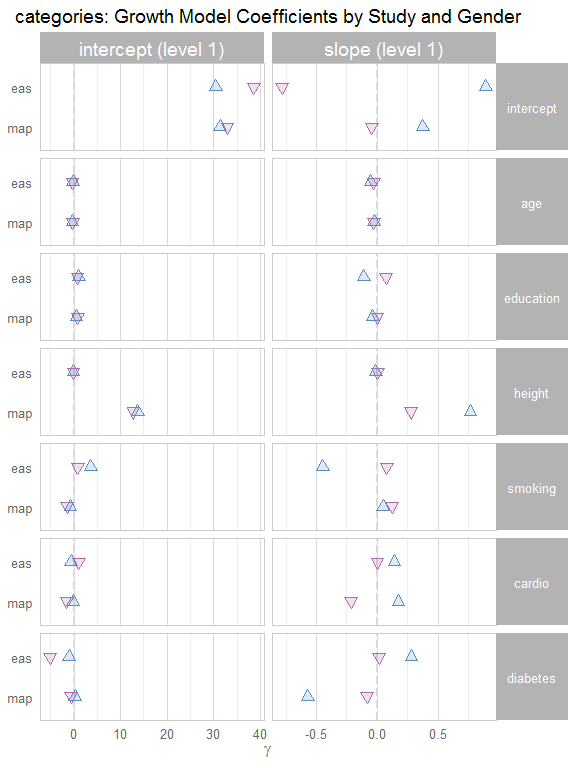

# Growth Curve Report #1
Date: `r Sys.Date()`  

This report contains a searchable table, followed by publication-ready tables.

<!--  Set the working directory to the repository's base directory; this assumes the report is nested inside of two directories.-->


<!-- Set the report-wide options, and point to the external code file. -->


<!-- Load the sources.  Suppress the output when loading sources. --> 


<!-- Load 'sourced' R files.  Suppress the output when loading packages. --> 


<!-- Load any global functions and variables declared in the R file.  Suppress the output. --> 


<!-- Declare any global functions specific to a Rmd output.  Suppress the output. --> 


<!-- Load the datasets.   -->


<!-- Tweak the datasets.   -->

```
Warning in is.na(ds_long$breed): is.na() applied to non-(list or vector) of type 'NULL'
```

# Summary

### Notes 
1. All available models are contained in the dynamic table, while only the 'aehplus' models are shown in the static tables.

### Unanswered Questions

1. How should we handle entries that are entirely missing?
1. How should we handle entries containing null/NA results?

### Answered Questions


# Dynamic Table


```
Warning in instance$preRenderHook(instance): It seems your data is too big for client-side DataTables. You may consider
server-side processing: http://rstudio.github.io/DT/server.html
```

<!--html_preserve--><div id="htmlwidget-8640" style="width:100%;height:auto;" class="datatables html-widget"></div>
<script type="application/json" data-for="htmlwidget-8640">{"x":{"data":[["1","2","3","4","5","6","7","8","9","10","11","12","13","14","15","16","17","18","19","20","21","22","23","24","25","26","27","28","29","30","31","32","33","34","35","36","37","38","39","40","41","42","43","44","45","46","47","48","49","50","51","52","53","54","55","56","57","58","59","60","61","62","63","64","65","66","67","68","69","70","71","72","73","74","75","76","77","78","79","80","81","82","83","84","85","86","87","88","89","90","91","92","93","94","95","96","97","98","99","100","101","102","103","104","105","106","107","108","109","110","111","112","113","114","115","116","117","118","119","120","121","122","123","124","125","126","127","128","129","130","131","132","133","134","135","136","137","138","139","140","141","142","143","144","145","146","147","148","149","150","151","152","153","154","155","156","157","158","159","160","161","162","163","164","165","166","167","168","169","170","171","172","173","174","175","176","177","178","179","180","181","182","183","184","185","186","187","188","189","190","191","192","193","194","195","196","197","198","199","200","201","202","203","204","205","206","207","208","209","210","211","212","213","214","215","216","217","218","219","220","221","222","223","224","225","226","227","228","229","230","231","232","233","234","235","236","237","238","239","240","241","242","243","244","245","246","247","248","249","250","251","252","253","254","255","256","257","258","259","260","261","262","263","264","265","266","267","268","269","270","271","272","273","274","275","276","277","278","279","280","281","282","283","284","285","286","287","288","289","290","291","292","293","294","295","296","297","298","299","300","301","302","303","304","305","306","307","308","309","310","311","312","313","314","315","316","317","318","319","320","321","322","323","324","325","326","327","328","329","330","331","332","333","334","335","336","337","338","339","340","341","342","343","344","345","346","347","348","349","350","351","352","353","354","355","356","357","358","359","360","361","362","363","364","365","366","367","368","369","370","371","372","373","374","375","376","377","378","379","380","381","382","383","384","385","386","387","388","389","390","391","392","393","394","395","396","397","398","399","400","401","402","403","404","405","406","407","408","409","410","411","412","413","414","415","416","417","418","419","420","421","422","423","424","425","426","427","428","429","430","431","432","433","434","435","436","437","438","439","440","441","442","443","444","445","446","447","448","449","450","451","452","453","454","455","456","457","458","459","460","461","462","463","464","465","466","467","468","469","470","471","472","473","474","475","476","477","478","479","480","481","482","483","484","485","486","487","488","489","490","491","492","493","494","495","496","497","498","499","500","501","502","503","504","505","506","507","508","509","510","511","512","513","514","515","516","517","518","519","520","521","522","523","524","525","526","527","528","529","530","531","532","533","534","535","536","537","538","539","540","541","542","543","544","545","546","547","548","549","550","551","552","553","554","555","556","557","558","559","560","561","562","563","564","565","566","567","568","569","570","571","572","573","574","575","576","577","578","579","580","581","582","583","584","585","586","587","588","589","590","591","592","593","594","595","596","597","598","599","600","601","602","603","604","605","606","607","608","609","610","611","612","613","614","615","616","617","618","619","620","621","622","623","624","625","626","627","628","629","630","631","632","633","634","635","636","637","638","639","640","641","642","643","644","645","646","647","648","649","650","651","652","653","654","655","656","657","658","659","660","661","662","663","664","665","666","667","668","669","670","671","672","673","674","675","676","677","678","679","680","681","682","683","684","685","686","687","688","689","690","691","692","693","694","695","696","697","698","699","700","701","702","703","704","705","706","707","708","709","710","711","712","713","714","715","716","717","718","719","720","721","722","723","724","725","726","727","728","729","730","731","732","733","734","735","736","737","738","739","740","741","742","743","744","745","746","747","748","749","750","751","752","753","754","755","756","757","758","759","760","761","762","763","764","765","766","767","768","769","770","771","772","773","774","775","776","777","778","779","780","781","782","783","784","785","786","787","788","789","790","791","792","793","794","795","796","797","798","799","800","801","802","803","804","805","806","807","808","809","810","811","812","813","814","815","816","817","818","819","820","821","822","823","824","825","826","827","828","829","830","831","832","833","834","835","836","837","838","839","840","841","842","843","844","845","846","847","848","849","850","851","852","853","854","855","856","857","858","859","860","861","862","863","864","865","866","867","868","869","870","871","872","873","874","875","876","877","878","879","880","881","882","883","884","885","886","887","888","889","890","891","892","893","894","895","896","897","898","899","900","901","902","903","904","905","906","907","908","909","910","911","912","913","914","915","916","917","918","919","920","921","922","923","924","925","926","927","928","929","930","931","932","933","934","935","936","937","938","939","940","941","942","943","944","945","946","947","948","949","950","951","952","953","954","955","956","957","958","959","960","961","962","963","964","965","966","967","968","969","970","971","972","973","974","975","976","977","978","979","980","981","982","983","984","985","986","987","988","989","990","991","992","993","994","995","996","997","998","999","1000","1001","1002","1003","1004","1005","1006","1007","1008","1009","1010","1011","1012","1013","1014","1015","1016","1017","1018","1019","1020","1021","1022","1023","1024","1025","1026","1027","1028","1029","1030","1031","1032","1033","1034","1035","1036","1037","1038","1039","1040","1041","1042","1043","1044","1045","1046","1047","1048","1049","1050","1051","1052","1053","1054","1055","1056","1057","1058","1059","1060","1061","1062","1063","1064","1065","1066","1067","1068","1069","1070","1071","1072","1073","1074","1075","1076","1077","1078","1079","1080","1081","1082","1083","1084","1085","1086","1087","1088","1089","1090","1091","1092","1093","1094","1095","1096","1097","1098","1099","1100","1101","1102","1103","1104","1105","1106","1107","1108","1109","1110","1111","1112","1113","1114","1115","1116","1117","1118","1119","1120","1121","1122","1123","1124","1125","1126","1127","1128","1129","1130","1131","1132","1133","1134","1135","1136","1137","1138","1139","1140","1141","1142","1143","1144","1145","1146","1147","1148","1149","1150","1151","1152","1153","1154","1155","1156","1157","1158","1159","1160","1161","1162","1163","1164","1165","1166","1167","1168","1169","1170","1171","1172","1173","1174","1175","1176","1177","1178","1179","1180","1181","1182","1183","1184","1185","1186","1187","1188","1189","1190","1191","1192","1193","1194","1195","1196","1197","1198","1199","1200","1201","1202","1203","1204","1205","1206","1207","1208","1209","1210","1211","1212","1213","1214","1215","1216","1217","1218","1219","1220","1221","1222","1223","1224","1225","1226","1227","1228","1229","1230","1231","1232","1233","1234","1235","1236","1237","1238","1239","1240","1241","1242","1243","1244","1245","1246","1247","1248","1249","1250","1251","1252","1253","1254","1255","1256","1257","1258","1259","1260","1261","1262","1263","1264","1265","1266","1267","1268","1269","1270","1271","1272","1273","1274","1275","1276","1277","1278","1279","1280","1281","1282","1283","1284","1285","1286","1287","1288","1289","1290","1291","1292","1293","1294","1295","1296","1297","1298","1299","1300","1301","1302","1303","1304","1305","1306","1307","1308","1309","1310","1311","1312","1313","1314","1315","1316","1317","1318","1319","1320","1321","1322","1323","1324","1325","1326","1327","1328","1329","1330","1331","1332","1333","1334","1335","1336","1337","1338","1339","1340","1341","1342","1343","1344","1345","1346","1347","1348","1349","1350","1351","1352","1353","1354","1355","1356","1357","1358","1359","1360","1361","1362","1363","1364","1365","1366","1367","1368","1369","1370","1371","1372","1373","1374","1375","1376","1377","1378","1379","1380","1381","1382","1383","1384","1385","1386","1387","1388","1389","1390","1391","1392","1393","1394","1395","1396","1397","1398","1399","1400","1401","1402","1403","1404","1405","1406","1407","1408","1409","1410","1411","1412","1413","1414","1415","1416","1417","1418","1419","1420","1421","1422","1423","1424","1425","1426","1427","1428","1429","1430","1431","1432","1433","1434","1435","1436","1437","1438","1439","1440","1441","1442","1443","1444","1445","1446","1447","1448","1449","1450","1451","1452","1453","1454","1455","1456","1457","1458","1459","1460","1461","1462","1463","1464","1465","1466","1467","1468","1469","1470","1471","1472","1473","1474","1475","1476","1477","1478","1479","1480","1481","1482","1483","1484","1485","1486","1487","1488","1489","1490","1491","1492","1493","1494","1495","1496","1497","1498","1499","1500","1501","1502","1503","1504","1505","1506","1507","1508","1509","1510","1511","1512","1513","1514","1515","1516","1517","1518","1519","1520","1521","1522","1523","1524","1525","1526","1527","1528","1529","1530","1531","1532","1533","1534","1535","1536","1537","1538","1539","1540","1541","1542","1543","1544","1545","1546","1547","1548","1549","1550","1551","1552","1553","1554","1555","1556","1557","1558","1559","1560","1561","1562","1563","1564","1565","1566","1567","1568","1569","1570","1571","1572","1573","1574","1575","1576","1577","1578","1579","1580","1581","1582","1583","1584","1585","1586","1587","1588","1589","1590","1591","1592","1593","1594","1595","1596","1597","1598","1599","1600","1601","1602","1603","1604","1605","1606","1607","1608","1609","1610","1611","1612","1613","1614","1615","1616","1617","1618","1619","1620","1621","1622","1623","1624","1625","1626","1627","1628","1629","1630","1631","1632","1633","1634","1635","1636","1637","1638","1639","1640","1641","1642","1643","1644","1645","1646","1647","1648","1649","1650","1651","1652","1653","1654","1655","1656","1657","1658","1659","1660","1661","1662","1663","1664","1665","1666","1667","1668","1669","1670","1671","1672","1673","1674","1675","1676","1677","1678","1679","1680","1681","1682","1683","1684","1685","1686","1687","1688","1689","1690","1691","1692","1693","1694","1695","1696","1697","1698","1699","1700","1701","1702","1703","1704","1705","1706","1707","1708","1709","1710","1711","1712","1713","1714","1715","1716","1717","1718","1719","1720","1721","1722","1723","1724","1725","1726","1727","1728","1729","1730","1731","1732","1733","1734","1735","1736","1737","1738","1739","1740","1741","1742","1743","1744","1745","1746","1747","1748","1749","1750","1751","1752","1753","1754","1755","1756","1757","1758","1759","1760","1761","1762","1763","1764","1765","1766","1767","1768","1769","1770","1771","1772","1773","1774","1775","1776","1777","1778","1779","1780","1781","1782","1783","1784","1785","1786","1787","1788","1789","1790","1791","1792","1793","1794","1795","1796","1797","1798","1799","1800","1801","1802","1803","1804","1805","1806","1807","1808","1809","1810","1811","1812","1813","1814","1815","1816","1817","1818","1819","1820","1821","1822","1823","1824","1825","1826","1827","1828","1829","1830","1831","1832","1833","1834","1835","1836","1837","1838","1839","1840","1841","1842","1843","1844","1845","1846","1847","1848","1849","1850","1851","1852","1853","1854","1855","1856","1857","1858","1859","1860","1861","1862","1863","1864","1865","1866","1867","1868","1869","1870","1871","1872","1873","1874","1875","1876","1877","1878","1879","1880","1881","1882","1883","1884","1885","1886","1887","1888","1889","1890","1891","1892","1893","1894","1895","1896","1897","1898","1899","1900","1901","1902","1903","1904","1905","1906","1907","1908","1909","1910","1911","1912","1913","1914","1915","1916","1917","1918","1919","1920","1921","1922","1923","1924","1925","1926","1927","1928","1929","1930","1931","1932","1933","1934","1935","1936","1937","1938","1939","1940","1941","1942","1943","1944","1945","1946","1947","1948","1949","1950","1951","1952","1953","1954","1955","1956","1957","1958","1959","1960","1961","1962","1963","1964","1965","1966","1967","1968","1969","1970","1971","1972","1973","1974","1975","1976","1977","1978","1979","1980","1981","1982","1983","1984","1985","1986","1987","1988","1989","1990","1991","1992","1993","1994","1995","1996","1997","1998","1999","2000","2001","2002","2003","2004","2005","2006","2007","2008","2009","2010","2011","2012","2013","2014","2015","2016","2017","2018","2019","2020","2021","2022","2023","2024","2025","2026","2027","2028","2029","2030","2031","2032","2033","2034","2035","2036","2037","2038","2039","2040","2041","2042","2043","2044","2045","2046","2047","2048","2049","2050","2051","2052","2053","2054","2055","2056","2057","2058","2059","2060","2061","2062","2063","2064","2065","2066","2067","2068","2069","2070","2071","2072","2073","2074","2075","2076","2077","2078","2079","2080","2081","2082","2083","2084","2085","2086","2087","2088","2089","2090","2091","2092","2093","2094","2095","2096","2097","2098","2099","2100","2101","2102","2103","2104","2105","2106","2107","2108","2109","2110","2111","2112","2113","2114","2115","2116","2117","2118","2119","2120","2121","2122","2123","2124","2125","2126","2127","2128","2129","2130","2131","2132","2133","2134","2135","2136","2137","2138","2139","2140","2141","2142","2143","2144","2145","2146","2147","2148","2149","2150","2151","2152","2153","2154","2155","2156","2157","2158","2159","2160","2161","2162","2163","2164","2165","2166","2167","2168","2169","2170","2171","2172","2173","2174","2175","2176","2177","2178","2179","2180","2181","2182","2183","2184","2185","2186","2187","2188","2189","2190","2191","2192","2193","2194","2195","2196","2197","2198","2199","2200","2201","2202","2203","2204","2205","2206","2207","2208","2209","2210","2211","2212","2213","2214","2215","2216","2217","2218","2219","2220","2221","2222","2223","2224","2225","2226","2227","2228","2229","2230","2231","2232","2233","2234","2235","2236","2237","2238","2239","2240","2241","2242","2243","2244","2245","2246","2247","2248","2249","2250","2251","2252","2253","2254","2255","2256","2257","2258","2259","2260","2261","2262","2263","2264","2265","2266","2267","2268","2269","2270","2271","2272","2273","2274","2275","2276","2277","2278","2279","2280","2281","2282","2283","2284","2285","2286","2287","2288","2289","2290","2291","2292","2293","2294","2295","2296","2297","2298","2299","2300","2301","2302","2303","2304","2305","2306","2307","2308","2309","2310","2311","2312","2313","2314","2315","2316","2317","2318","2319","2320","2321","2322","2323","2324","2325","2326","2327","2328","2329","2330","2331","2332","2333","2334","2335","2336","2337","2338","2339","2340","2341","2342","2343","2344","2345","2346","2347","2348","2349","2350","2351","2352","2353","2354","2355","2356","2357","2358","2359","2360","2361","2362","2363","2364","2365","2366","2367","2368","2369","2370","2371","2372","2373","2374","2375","2376","2377","2378","2379","2380","2381","2382","2383","2384","2385","2386","2387","2388","2389","2390","2391","2392","2393","2394","2395","2396","2397","2398","2399","2400","2401","2402","2403","2404","2405","2406","2407","2408","2409","2410","2411","2412","2413","2414","2415","2416","2417","2418","2419","2420","2421","2422","2423","2424","2425","2426","2427","2428","2429","2430","2431","2432","2433","2434","2435","2436","2437","2438","2439","2440","2441","2442","2443","2444","2445","2446","2447","2448","2449","2450","2451","2452","2453","2454","2455","2456","2457","2458","2459","2460","2461","2462","2463","2464","2465","2466","2467","2468","2469","2470","2471","2472","2473","2474","2475","2476","2477","2478","2479","2480","2481","2482","2483","2484","2485","2486","2487","2488","2489","2490","2491","2492","2493","2494","2495","2496","2497","2498","2499","2500","2501","2502","2503","2504","2505","2506","2507","2508","2509","2510","2511","2512","2513","2514","2515","2516","2517","2518","2519","2520","2521","2522","2523","2524","2525","2526","2527","2528","2529","2530","2531","2532","2533","2534","2535","2536","2537","2538","2539","2540","2541","2542","2543","2544","2545","2546","2547","2548","2549","2550","2551","2552","2553","2554","2555","2556","2557","2558","2559","2560","2561","2562","2563","2564","2565","2566","2567","2568","2569","2570","2571","2572","2573","2574","2575","2576","2577","2578","2579","2580","2581","2582","2583","2584","2585","2586","2587","2588","2589","2590","2591","2592","2593","2594","2595","2596","2597","2598","2599","2600","2601","2602","2603","2604","2605","2606","2607","2608","2609","2610","2611","2612","2613","2614","2615","2616","2617","2618","2619","2620","2621","2622","2623","2624","2625","2626","2627","2628","2629","2630","2631","2632","2633","2634","2635","2636","2637","2638","2639","2640","2641","2642","2643","2644","2645","2646","2647","2648","2649","2650","2651","2652","2653","2654","2655","2656","2657","2658","2659","2660","2661","2662","2663","2664","2665","2666","2667","2668","2669","2670","2671","2672","2673","2674","2675","2676","2677","2678","2679","2680","2681","2682","2683","2684","2685","2686","2687","2688","2689","2690","2691","2692","2693","2694","2695","2696","2697","2698","2699","2700","2701","2702","2703","2704","2705","2706","2707","2708","2709","2710","2711","2712","2713","2714","2715","2716","2717","2718","2719","2720","2721","2722","2723","2724","2725","2726","2727","2728","2729","2730","2731","2732","2733","2734","2735","2736","2737","2738","2739","2740","2741","2742","2743","2744","2745","2746","2747","2748","2749","2750","2751","2752","2753","2754","2755","2756","2757","2758","2759","2760","2761","2762","2763","2764","2765","2766","2767","2768","2769","2770","2771","2772","2773","2774","2775","2776","2777","2778","2779","2780","2781","2782","2783","2784","2785","2786","2787","2788","2789","2790","2791","2792","2793","2794","2795","2796","2797","2798","2799","2800","2801","2802","2803","2804","2805","2806","2807","2808","2809","2810","2811","2812","2813","2814","2815","2816","2817","2818","2819","2820","2821","2822","2823","2824","2825","2826","2827","2828","2829","2830","2831","2832","2833","2834","2835","2836","2837","2838","2839","2840","2841","2842","2843","2844","2845","2846","2847","2848","2849","2850","2851","2852","2853","2854","2855","2856","2857","2858","2859","2860","2861","2862","2863","2864","2865","2866","2867","2868","2869","2870","2871","2872","2873","2874","2875","2876","2877","2878","2879","2880","2881","2882","2883","2884","2885","2886","2887","2888","2889","2890","2891","2892","2893","2894","2895","2896","2897","2898","2899","2900","2901","2902","2903","2904","2905","2906","2907","2908","2909","2910","2911","2912","2913","2914","2915","2916","2917","2918","2919","2920","2921","2922","2923","2924","2925","2926","2927","2928","2929","2930","2931","2932","2933","2934","2935","2936","2937","2938","2939","2940","2941","2942","2943","2944","2945","2946","2947","2948","2949","2950","2951","2952","2953","2954","2955","2956","2957","2958","2959","2960","2961","2962","2963","2964","2965","2966","2967","2968","2969","2970","2971","2972","2973","2974","2975","2976","2977","2978","2979","2980","2981","2982","2983","2984","2985","2986","2987","2988","2989","2990","2991","2992","2993","2994","2995","2996","2997","2998","2999","3000","3001","3002","3003","3004","3005","3006","3007","3008","3009","3010","3011","3012","3013","3014","3015","3016","3017","3018","3019","3020","3021","3022","3023","3024","3025","3026","3027","3028","3029","3030","3031","3032","3033","3034","3035","3036","3037","3038","3039","3040","3041","3042","3043","3044","3045","3046","3047","3048","3049","3050","3051","3052","3053","3054","3055","3056","3057","3058","3059","3060","3061","3062","3063","3064","3065","3066","3067","3068","3069","3070","3071","3072","3073","3074","3075","3076","3077","3078","3079","3080","3081","3082","3083","3084","3085","3086","3087","3088","3089","3090","3091","3092","3093","3094","3095","3096","3097","3098","3099","3100","3101","3102","3103","3104","3105","3106","3107","3108","3109","3110","3111","3112","3113","3114","3115","3116","3117","3118","3119","3120","3121","3122","3123","3124","3125","3126","3127","3128","3129","3130","3131","3132","3133","3134","3135","3136","3137","3138","3139","3140","3141","3142","3143","3144","3145","3146","3147","3148","3149","3150","3151","3152","3153","3154","3155","3156","3157","3158","3159","3160","3161","3162","3163","3164","3165","3166","3167","3168","3169","3170","3171","3172","3173","3174","3175","3176","3177","3178","3179","3180","3181","3182","3183","3184","3185","3186","3187","3188","3189","3190","3191","3192","3193","3194","3195","3196","3197","3198","3199","3200","3201","3202","3203","3204","3205","3206","3207","3208","3209","3210","3211","3212","3213","3214","3215","3216","3217","3218","3219","3220","3221","3222","3223","3224","3225","3226","3227","3228","3229","3230","3231","3232","3233","3234","3235","3236","3237","3238","3239","3240","3241","3242","3243","3244","3245","3246","3247","3248","3249","3250","3251","3252","3253","3254","3255","3256","3257","3258","3259","3260","3261","3262","3263","3264","3265","3266","3267","3268","3269","3270","3271","3272","3273","3274","3275","3276","3277","3278","3279","3280","3281","3282","3283","3284","3285","3286","3287","3288","3289","3290","3291","3292","3293","3294","3295","3296","3297","3298","3299","3300","3301","3302","3303","3304","3305","3306","3307","3308","3309","3310","3311","3312","3313","3314","3315","3316","3317","3318","3319","3320","3321","3322","3323","3324","3325","3326","3327","3328","3329","3330","3331","3332","3333","3334","3335","3336","3337","3338","3339","3340","3341","3342","3343","3344","3345","3346","3347","3348","3349","3350","3351","3352","3353","3354","3355","3356","3357","3358","3359","3360","3361","3362","3363","3364","3365","3366","3367","3368","3369","3370","3371","3372","3373","3374","3375","3376","3377","3378","3379","3380","3381","3382","3383","3384","3385","3386","3387","3388","3389","3390","3391","3392","3393","3394","3395","3396","3397","3398","3399","3400","3401","3402","3403","3404","3405","3406","3407","3408","3409","3410","3411","3412","3413","3414","3415","3416","3417","3418","3419","3420","3421","3422","3423","3424","3425","3426","3427","3428","3429","3430","3431","3432","3433","3434","3435","3436","3437","3438","3439","3440","3441","3442","3443","3444","3445","3446","3447","3448","3449","3450","3451","3452","3453","3454","3455","3456","3457","3458","3459","3460","3461","3462","3463","3464","3465","3466","3467","3468","3469","3470","3471","3472","3473","3474","3475","3476","3477","3478","3479","3480","3481","3482","3483","3484","3485","3486","3487","3488","3489","3490","3491","3492","3493","3494","3495","3496","3497","3498","3499","3500","3501","3502","3503","3504","3505","3506","3507","3508","3509","3510","3511","3512","3513","3514","3515","3516","3517","3518","3519","3520","3521","3522","3523","3524","3525","3526","3527","3528","3529","3530","3531","3532","3533","3534","3535","3536","3537","3538","3539","3540","3541","3542","3543","3544","3545","3546","3547","3548","3549","3550","3551","3552","3553","3554","3555","3556","3557","3558","3559","3560","3561","3562","3563","3564","3565","3566","3567","3568","3569","3570","3571","3572","3573","3574","3575","3576","3577","3578","3579","3580","3581","3582","3583","3584","3585","3586","3587","3588","3589","3590","3591","3592","3593","3594","3595","3596","3597","3598","3599","3600","3601","3602","3603","3604","3605","3606","3607","3608","3609","3610","3611","3612","3613","3614","3615","3616","3617","3618","3619","3620","3621","3622","3623","3624","3625","3626","3627","3628","3629","3630","3631","3632","3633","3634","3635","3636","3637","3638","3639","3640","3641","3642","3643","3644","3645","3646","3647","3648","3649","3650","3651","3652","3653","3654","3655","3656","3657","3658","3659","3660","3661","3662","3663","3664","3665","3666","3667","3668","3669","3670","3671","3672","3673","3674","3675","3676","3677","3678","3679","3680","3681","3682","3683","3684","3685","3686","3687","3688","3689","3690","3691","3692","3693","3694","3695","3696","3697","3698","3699","3700","3701","3702","3703","3704","3705","3706","3707","3708","3709","3710","3711","3712","3713","3714","3715","3716","3717","3718","3719","3720","3721","3722","3723","3724","3725","3726","3727","3728","3729","3730","3731","3732","3733","3734","3735","3736","3737","3738","3739","3740","3741","3742","3743","3744","3745","3746","3747","3748","3749","3750","3751","3752","3753","3754","3755","3756","3757","3758","3759","3760","3761","3762","3763","3764","3765","3766","3767","3768","3769","3770","3771","3772","3773","3774","3775","3776","3777","3778","3779","3780","3781","3782","3783","3784","3785","3786","3787","3788","3789","3790","3791","3792","3793","3794","3795","3796","3797","3798","3799","3800","3801","3802","3803","3804","3805","3806","3807","3808","3809","3810","3811","3812","3813","3814","3815","3816","3817","3818","3819","3820","3821","3822","3823","3824","3825","3826","3827","3828","3829","3830","3831","3832","3833","3834","3835","3836","3837","3838","3839","3840","3841","3842","3843","3844","3845","3846","3847","3848","3849","3850","3851","3852","3853","3854","3855","3856","3857","3858","3859","3860","3861","3862","3863","3864","3865","3866","3867","3868","3869","3870","3871","3872","3873","3874","3875","3876","3877","3878","3879","3880","3881","3882","3883","3884","3885","3886","3887","3888","3889","3890","3891","3892","3893","3894","3895","3896","3897","3898","3899","3900","3901","3902","3903","3904","3905","3906","3907","3908","3909","3910","3911","3912","3913","3914","3915","3916","3917","3918","3919","3920","3921","3922","3923","3924","3925","3926","3927","3928","3929","3930","3931","3932","3933","3934","3935","3936","3937","3938","3939","3940","3941","3942","3943","3944","3945","3946","3947","3948","3949","3950","3951","3952","3953","3954","3955","3956","3957","3958","3959","3960","3961","3962","3963","3964","3965","3966","3967","3968","3969","3970","3971","3972","3973","3974","3975","3976","3977","3978","3979","3980","3981","3982","3983","3984","3985","3986","3987","3988","3989","3990","3991","3992","3993","3994","3995","3996","3997","3998","3999","4000","4001","4002","4003","4004","4005","4006","4007","4008","4009","4010","4011","4012","4013","4014","4015","4016","4017","4018","4019","4020","4021","4022","4023","4024","4025","4026","4027","4028","4029","4030","4031","4032","4033","4034","4035","4036","4037","4038","4039","4040","4041","4042","4043","4044","4045","4046","4047","4048","4049","4050","4051","4052","4053","4054","4055","4056","4057","4058","4059","4060","4061","4062","4063","4064","4065","4066","4067","4068","4069","4070","4071","4072","4073","4074","4075","4076","4077","4078","4079","4080","4081","4082","4083","4084","4085","4086","4087","4088","4089","4090","4091","4092","4093","4094","4095","4096","4097","4098","4099","4100","4101","4102","4103","4104","4105","4106","4107","4108","4109","4110","4111","4112","4113","4114","4115","4116","4117","4118","4119","4120","4121","4122","4123","4124","4125","4126","4127","4128","4129","4130","4131","4132","4133","4134","4135","4136","4137","4138","4139","4140","4141","4142","4143","4144","4145","4146","4147","4148","4149","4150","4151","4152","4153","4154","4155","4156","4157","4158","4159","4160","4161","4162","4163","4164","4165","4166","4167","4168","4169","4170","4171","4172","4173","4174","4175","4176","4177","4178","4179","4180","4181","4182","4183","4184","4185","4186","4187","4188","4189","4190","4191","4192","4193","4194","4195","4196","4197","4198","4199","4200","4201","4202","4203","4204","4205","4206","4207","4208","4209","4210","4211","4212","4213","4214","4215","4216","4217","4218","4219","4220","4221","4222","4223","4224","4225","4226","4227","4228","4229","4230","4231","4232","4233","4234","4235","4236","4237","4238","4239","4240","4241","4242","4243","4244","4245","4246","4247","4248","4249","4250","4251","4252","4253","4254","4255","4256","4257","4258","4259","4260","4261","4262","4263","4264","4265","4266","4267","4268","4269","4270","4271","4272","4273","4274","4275","4276","4277","4278","4279","4280","4281","4282","4283","4284","4285","4286","4287","4288","4289","4290","4291","4292","4293","4294","4295","4296","4297","4298","4299","4300","4301","4302","4303","4304","4305","4306","4307","4308","4309","4310","4311","4312","4313","4314","4315","4316","4317","4318","4319","4320","4321","4322","4323","4324","4325","4326","4327","4328","4329","4330","4331","4332","4333","4334","4335","4336","4337","4338","4339","4340","4341","4342","4343","4344","4345","4346","4347","4348","4349","4350","4351","4352","4353","4354","4355","4356","4357","4358","4359","4360","4361","4362","4363","4364","4365","4366","4367","4368","4369","4370","4371","4372","4373","4374","4375","4376","4377","4378","4379","4380","4381","4382","4383","4384","4385","4386","4387","4388","4389","4390","4391","4392","4393","4394","4395","4396","4397","4398","4399","4400","4401","4402","4403","4404","4405","4406","4407","4408","4409","4410","4411","4412","4413","4414","4415","4416","4417","4418","4419","4420","4421","4422","4423","4424","4425","4426","4427","4428","4429","4430","4431","4432","4433","4434","4435","4436","4437","4438","4439","4440","4441","4442","4443","4444","4445","4446","4447","4448","4449","4450","4451","4452","4453","4454","4455","4456","4457","4458","4459","4460","4461","4462","4463","4464","4465","4466","4467","4468","4469","4470","4471","4472","4473","4474","4475","4476","4477","4478","4479","4480","4481","4482","4483","4484","4485","4486","4487","4488","4489","4490","4491","4492","4493","4494","4495","4496","4497","4498","4499","4500","4501","4502","4503","4504","4505","4506","4507","4508","4509","4510","4511","4512","4513","4514","4515","4516","4517","4518","4519","4520","4521","4522","4523","4524","4525","4526","4527","4528","4529","4530","4531","4532","4533","4534","4535","4536","4537","4538","4539","4540","4541","4542","4543","4544","4545","4546","4547","4548","4549","4550","4551","4552","4553","4554","4555","4556","4557","4558","4559","4560","4561","4562","4563","4564","4565","4566","4567","4568","4569","4570","4571","4572","4573","4574","4575","4576","4577","4578","4579","4580","4581","4582","4583","4584","4585","4586","4587","4588","4589","4590","4591","4592","4593","4594","4595","4596","4597","4598","4599","4600","4601","4602","4603","4604","4605","4606","4607","4608","4609","4610","4611","4612","4613","4614","4615","4616","4617","4618","4619","4620","4621","4622","4623","4624","4625","4626","4627","4628","4629","4630","4631","4632","4633","4634","4635","4636","4637","4638","4639","4640","4641","4642","4643","4644","4645","4646","4647","4648","4649","4650","4651","4652","4653","4654","4655","4656","4657","4658","4659","4660","4661","4662","4663","4664","4665","4666","4667","4668","4669","4670","4671","4672","4673","4674","4675","4676","4677","4678","4679","4680","4681","4682","4683","4684","4685","4686","4687","4688","4689","4690","4691","4692","4693","4694","4695","4696","4697","4698","4699","4700","4701","4702","4703","4704","4705","4706","4707","4708","4709","4710","4711","4712","4713","4714","4715","4716","4717","4718","4719","4720","4721","4722","4723","4724","4725","4726","4727","4728","4729","4730","4731","4732","4733","4734","4735","4736","4737","4738","4739","4740","4741","4742","4743","4744","4745","4746","4747","4748","4749","4750","4751","4752","4753","4754","4755","4756","4757","4758","4759","4760","4761","4762","4763","4764","4765","4766","4767","4768","4769","4770","4771","4772","4773","4774","4775","4776","4777","4778","4779","4780","4781","4782","4783","4784","4785","4786","4787","4788","4789","4790","4791","4792","4793","4794","4795","4796","4797","4798","4799","4800","4801","4802","4803","4804","4805","4806","4807","4808","4809","4810","4811","4812","4813","4814","4815","4816","4817","4818","4819","4820","4821","4822","4823","4824","4825","4826","4827","4828","4829","4830","4831","4832","4833","4834","4835","4836","4837","4838","4839","4840","4841","4842","4843","4844","4845","4846","4847","4848","4849","4850","4851","4852","4853","4854","4855","4856","4857","4858","4859","4860","4861","4862","4863","4864","4865","4866","4867","4868","4869","4870","4871","4872","4873","4874","4875","4876","4877","4878","4879","4880","4881","4882","4883","4884","4885","4886","4887","4888","4889","4890","4891","4892","4893","4894","4895","4896","4897","4898","4899","4900","4901","4902","4903","4904","4905","4906","4907","4908","4909","4910","4911","4912","4913","4914","4915","4916","4917","4918","4919","4920","4921","4922","4923","4924","4925","4926","4927","4928","4929","4930","4931","4932","4933","4934","4935","4936","4937","4938","4939","4940","4941","4942","4943","4944","4945","4946","4947","4948","4949","4950","4951","4952","4953","4954","4955","4956","4957","4958","4959","4960","4961","4962","4963","4964","4965","4966","4967","4968","4969","4970","4971","4972","4973","4974","4975","4976","4977","4978","4979","4980","4981","4982","4983","4984","4985","4986","4987","4988","4989","4990","4991","4992","4993","4994","4995","4996","4997","4998","4999","5000","5001","5002","5003","5004","5005","5006","5007","5008","5009","5010","5011","5012","5013","5014","5015","5016","5017","5018","5019","5020","5021","5022","5023","5024","5025","5026","5027","5028","5029","5030","5031","5032","5033","5034","5035","5036","5037","5038","5039","5040","5041","5042","5043","5044","5045","5046","5047","5048","5049","5050","5051","5052","5053","5054","5055","5056","5057","5058","5059","5060","5061","5062","5063","5064","5065","5066","5067","5068","5069","5070","5071","5072","5073","5074","5075","5076","5077","5078","5079","5080","5081","5082","5083","5084","5085","5086","5087","5088","5089","5090","5091","5092","5093","5094","5095","5096","5097","5098","5099","5100","5101","5102","5103","5104","5105","5106","5107","5108","5109","5110","5111","5112","5113","5114","5115","5116","5117","5118","5119","5120","5121","5122","5123","5124","5125","5126","5127","5128","5129","5130","5131","5132","5133","5134","5135","5136","5137","5138","5139","5140","5141","5142","5143","5144","5145","5146","5147","5148","5149","5150","5151","5152","5153","5154","5155","5156","5157","5158","5159","5160","5161","5162","5163","5164","5165","5166","5167","5168","5169","5170","5171","5172","5173","5174","5175","5176","5177","5178","5179","5180","5181","5182","5183","5184","5185","5186","5187","5188","5189","5190","5191","5192","5193","5194","5195","5196","5197","5198","5199","5200","5201","5202","5203","5204","5205","5206","5207","5208","5209","5210","5211","5212","5213","5214","5215","5216","5217","5218","5219","5220","5221","5222","5223","5224","5225","5226","5227","5228","5229","5230","5231","5232","5233","5234","5235","5236","5237","5238","5239","5240","5241","5242","5243","5244","5245","5246","5247","5248","5249","5250","5251","5252","5253","5254","5255","5256","5257","5258","5259","5260","5261","5262","5263","5264","5265","5266","5267","5268","5269","5270","5271","5272","5273","5274","5275","5276","5277","5278","5279","5280","5281","5282","5283","5284","5285","5286","5287","5288","5289","5290","5291","5292","5293","5294","5295","5296","5297","5298","5299","5300","5301","5302","5303","5304","5305","5306","5307","5308","5309","5310","5311","5312","5313","5314","5315","5316","5317","5318","5319","5320","5321","5322","5323","5324","5325","5326","5327","5328","5329","5330","5331","5332","5333","5334","5335","5336","5337","5338","5339","5340","5341","5342","5343","5344","5345","5346","5347","5348","5349","5350","5351","5352","5353","5354","5355","5356","5357","5358","5359","5360","5361","5362","5363","5364","5365","5366","5367","5368","5369","5370","5371","5372","5373","5374","5375","5376","5377","5378","5379","5380","5381","5382","5383","5384","5385","5386","5387","5388","5389","5390","5391","5392","5393","5394","5395","5396","5397","5398","5399","5400","5401","5402","5403","5404","5405","5406","5407","5408","5409","5410","5411","5412","5413","5414","5415","5416","5417","5418","5419","5420","5421","5422","5423","5424","5425","5426","5427","5428","5429","5430","5431","5432","5433","5434","5435","5436","5437","5438","5439","5440","5441","5442","5443","5444","5445","5446","5447","5448","5449","5450","5451","5452","5453","5454","5455","5456","5457","5458","5459","5460","5461","5462","5463","5464","5465","5466","5467","5468","5469","5470","5471","5472","5473","5474","5475","5476","5477","5478","5479","5480","5481","5482","5483","5484","5485","5486","5487","5488","5489","5490","5491","5492","5493","5494","5495","5496","5497","5498","5499","5500","5501","5502","5503","5504","5505","5506","5507","5508","5509","5510","5511","5512","5513","5514","5515","5516","5517","5518","5519","5520","5521","5522","5523","5524","5525","5526","5527","5528","5529","5530","5531","5532","5533","5534","5535","5536","5537","5538","5539","5540","5541","5542","5543","5544","5545","5546","5547","5548","5549","5550","5551","5552","5553","5554","5555","5556","5557","5558","5559","5560","5561","5562","5563","5564","5565","5566","5567","5568","5569","5570","5571","5572","5573","5574","5575","5576","5577","5578","5579","5580","5581","5582","5583","5584","5585","5586","5587","5588","5589","5590","5591","5592","5593","5594","5595","5596","5597","5598","5599","5600","5601","5602","5603","5604","5605","5606","5607","5608","5609","5610","5611","5612","5613","5614","5615","5616","5617","5618","5619","5620","5621","5622","5623","5624","5625","5626","5627","5628","5629","5630","5631","5632","5633","5634","5635","5636","5637","5638","5639","5640","5641","5642","5643","5644","5645","5646","5647","5648","5649","5650","5651","5652","5653","5654","5655","5656","5657","5658","5659","5660","5661","5662","5663","5664","5665","5666","5667","5668","5669","5670","5671","5672","5673","5674","5675","5676","5677","5678","5679","5680","5681","5682","5683","5684","5685","5686","5687","5688","5689","5690","5691","5692","5693","5694","5695","5696","5697","5698","5699","5700","5701","5702","5703","5704","5705","5706","5707","5708","5709","5710","5711","5712","5713","5714","5715","5716","5717","5718","5719","5720","5721","5722","5723","5724","5725","5726","5727","5728","5729","5730","5731","5732","5733","5734","5735","5736","5737","5738","5739","5740","5741","5742","5743","5744","5745","5746","5747","5748","5749","5750","5751","5752","5753","5754","5755","5756","5757","5758","5759","5760","5761","5762","5763","5764","5765","5766","5767","5768","5769","5770","5771","5772","5773","5774","5775","5776","5777","5778","5779","5780","5781","5782","5783","5784","5785","5786","5787","5788","5789","5790","5791","5792","5793","5794","5795","5796","5797","5798","5799","5800","5801","5802","5803","5804","5805","5806","5807","5808","5809","5810","5811","5812","5813","5814","5815","5816","5817","5818","5819","5820","5821","5822","5823","5824","5825","5826","5827","5828","5829","5830","5831","5832","5833","5834","5835","5836","5837","5838","5839","5840","5841","5842","5843","5844","5845","5846","5847","5848","5849","5850","5851","5852","5853","5854","5855","5856","5857","5858","5859","5860","5861","5862","5863","5864","5865","5866","5867","5868","5869","5870","5871","5872","5873","5874","5875","5876","5877","5878","5879","5880","5881","5882","5883","5884","5885","5886","5887","5888","5889","5890","5891","5892","5893","5894","5895","5896","5897","5898","5899","5900","5901","5902","5903","5904","5905","5906","5907","5908","5909","5910","5911","5912","5913","5914","5915","5916","5917","5918","5919","5920","5921","5922","5923","5924","5925","5926","5927","5928","5929","5930","5931","5932","5933","5934","5935","5936","5937","5938","5939","5940","5941","5942","5943","5944","5945","5946","5947","5948","5949","5950","5951","5952","5953","5954","5955","5956","5957","5958","5959","5960","5961","5962","5963","5964","5965","5966","5967","5968","5969","5970","5971","5972","5973","5974","5975","5976","5977","5978","5979","5980","5981","5982","5983","5984","5985","5986","5987","5988","5989","5990","5991","5992","5993","5994","5995","5996","5997","5998","5999","6000","6001","6002","6003","6004","6005","6006","6007","6008","6009","6010","6011","6012","6013","6014","6015","6016","6017","6018","6019","6020","6021","6022","6023","6024","6025","6026","6027","6028","6029","6030","6031","6032","6033","6034","6035","6036","6037","6038","6039","6040","6041","6042","6043","6044","6045","6046","6047","6048","6049","6050","6051","6052","6053","6054","6055","6056","6057","6058","6059","6060","6061","6062","6063","6064","6065","6066","6067","6068","6069","6070","6071","6072","6073","6074","6075","6076","6077","6078","6079","6080","6081","6082","6083","6084","6085","6086","6087","6088","6089","6090","6091","6092","6093","6094","6095","6096","6097","6098","6099","6100","6101","6102","6103","6104","6105","6106","6107","6108","6109","6110","6111","6112","6113","6114","6115","6116","6117","6118","6119","6120","6121","6122","6123","6124","6125","6126","6127","6128","6129","6130","6131","6132","6133","6134","6135","6136","6137","6138","6139","6140","6141","6142","6143","6144","6145","6146","6147","6148","6149","6150","6151","6152","6153","6154","6155","6156","6157","6158","6159","6160","6161","6162","6163","6164","6165","6166","6167","6168","6169","6170","6171","6172","6173","6174","6175","6176","6177","6178","6179","6180","6181","6182","6183","6184","6185","6186","6187","6188","6189","6190","6191","6192","6193","6194","6195","6196","6197","6198","6199","6200","6201","6202","6203","6204","6205","6206","6207","6208","6209","6210","6211","6212","6213","6214","6215","6216","6217","6218","6219","6220","6221","6222","6223","6224","6225","6226","6227","6228","6229","6230","6231","6232","6233","6234","6235","6236","6237","6238","6239","6240","6241","6242","6243","6244","6245","6246","6247","6248","6249","6250","6251","6252","6253","6254","6255","6256","6257","6258","6259","6260","6261","6262","6263","6264","6265","6266","6267","6268","6269","6270","6271","6272","6273","6274","6275","6276","6277","6278","6279","6280","6281","6282","6283","6284","6285","6286","6287","6288","6289","6290","6291","6292","6293","6294","6295","6296","6297","6298","6299","6300","6301","6302","6303","6304","6305","6306","6307","6308","6309","6310","6311","6312","6313","6314","6315","6316","6317","6318","6319","6320","6321","6322","6323","6324","6325","6326","6327","6328","6329","6330","6331","6332","6333","6334","6335","6336","6337","6338","6339","6340","6341","6342","6343","6344","6345","6346","6347","6348","6349","6350","6351","6352","6353","6354","6355","6356","6357","6358","6359","6360","6361","6362","6363","6364","6365","6366","6367","6368","6369","6370","6371","6372","6373","6374","6375","6376","6377","6378","6379","6380","6381","6382","6383","6384","6385","6386","6387","6388","6389","6390","6391","6392","6393","6394","6395","6396","6397","6398","6399","6400","6401","6402","6403","6404","6405","6406","6407","6408","6409","6410","6411","6412","6413","6414","6415","6416","6417","6418","6419","6420","6421","6422","6423","6424","6425","6426","6427","6428","6429","6430","6431","6432","6433","6434","6435","6436","6437","6438","6439","6440","6441","6442","6443","6444","6445","6446","6447","6448","6449","6450","6451","6452","6453","6454","6455","6456","6457","6458","6459","6460","6461","6462","6463","6464","6465","6466","6467","6468","6469","6470","6471","6472","6473","6474","6475","6476","6477","6478","6479","6480","6481","6482","6483","6484","6485","6486","6487","6488","6489","6490","6491","6492","6493","6494","6495","6496","6497","6498","6499","6500","6501","6502","6503","6504","6505","6506","6507","6508","6509","6510","6511","6512","6513","6514","6515","6516","6517","6518","6519","6520","6521","6522","6523","6524","6525","6526","6527","6528","6529","6530","6531","6532","6533","6534","6535","6536","6537","6538","6539","6540","6541","6542","6543","6544","6545","6546","6547","6548","6549","6550","6551","6552","6553","6554","6555","6556","6557","6558","6559","6560","6561","6562","6563","6564","6565","6566","6567","6568","6569","6570","6571","6572","6573","6574","6575","6576","6577","6578","6579","6580","6581","6582","6583","6584","6585","6586","6587","6588","6589","6590","6591","6592","6593","6594","6595","6596","6597","6598","6599","6600","6601","6602","6603","6604","6605","6606","6607","6608","6609","6610","6611","6612","6613","6614","6615","6616","6617","6618","6619","6620","6621","6622","6623","6624","6625","6626","6627","6628","6629","6630","6631","6632","6633","6634","6635","6636","6637","6638","6639","6640","6641","6642","6643","6644","6645","6646","6647","6648","6649","6650","6651","6652","6653","6654","6655","6656","6657","6658","6659","6660","6661","6662","6663","6664","6665","6666","6667","6668","6669","6670","6671","6672","6673","6674","6675","6676","6677","6678","6679","6680","6681","6682","6683","6684","6685","6686","6687","6688","6689","6690","6691","6692","6693","6694","6695","6696","6697","6698","6699","6700","6701","6702","6703","6704","6705","6706","6707","6708","6709","6710","6711","6712","6713","6714","6715","6716","6717","6718","6719","6720","6721","6722","6723","6724","6725","6726","6727","6728","6729","6730","6731","6732","6733","6734","6735","6736","6737","6738","6739","6740","6741","6742","6743","6744","6745","6746","6747","6748","6749","6750","6751","6752","6753","6754","6755","6756","6757","6758","6759","6760","6761","6762","6763","6764","6765","6766","6767","6768","6769","6770","6771","6772","6773","6774","6775","6776","6777","6778","6779","6780","6781","6782","6783","6784","6785","6786","6787","6788","6789","6790","6791","6792","6793","6794","6795","6796","6797","6798","6799","6800","6801","6802","6803","6804","6805","6806","6807","6808","6809","6810","6811","6812","6813","6814","6815","6816","6817","6818","6819","6820","6821","6822","6823","6824","6825","6826","6827","6828","6829","6830","6831","6832","6833","6834","6835","6836","6837","6838","6839","6840","6841","6842","6843","6844","6845","6846","6847","6848","6849","6850","6851","6852","6853","6854","6855","6856","6857","6858","6859","6860","6861","6862","6863","6864","6865","6866","6867","6868","6869","6870","6871","6872","6873","6874","6875","6876","6877","6878","6879","6880","6881","6882","6883","6884","6885","6886","6887","6888","6889","6890","6891","6892","6893","6894","6895","6896","6897","6898","6899","6900","6901","6902","6903","6904","6905","6906","6907","6908","6909","6910","6911","6912","6913","6914","6915","6916","6917","6918","6919","6920","6921","6922","6923","6924","6925","6926","6927","6928","6929","6930","6931","6932","6933","6934","6935","6936","6937","6938","6939","6940","6941","6942","6943","6944","6945","6946","6947","6948","6949","6950","6951","6952","6953","6954","6955","6956","6957","6958","6959","6960","6961","6962","6963","6964","6965","6966","6967","6968","6969","6970","6971","6972","6973","6974","6975","6976","6977","6978","6979","6980","6981","6982","6983","6984","6985","6986","6987","6988","6989","6990","6991","6992","6993","6994","6995","6996","6997","6998","6999","7000","7001","7002","7003","7004","7005","7006","7007","7008","7009","7010","7011","7012","7013","7014","7015","7016","7017","7018","7019","7020","7021","7022","7023","7024","7025","7026","7027","7028","7029","7030","7031","7032","7033","7034","7035","7036","7037","7038","7039","7040","7041","7042","7043","7044","7045","7046","7047","7048","7049","7050","7051","7052","7053","7054","7055","7056","7057","7058","7059","7060","7061","7062","7063","7064","7065","7066","7067","7068","7069","7070","7071","7072","7073","7074","7075","7076","7077","7078","7079","7080","7081","7082","7083","7084","7085","7086","7087","7088","7089","7090","7091","7092","7093","7094","7095","7096","7097","7098","7099","7100","7101","7102","7103","7104","7105","7106","7107","7108","7109","7110","7111","7112","7113","7114","7115","7116","7117","7118","7119","7120","7121","7122","7123","7124","7125","7126","7127","7128","7129","7130","7131","7132","7133","7134","7135","7136","7137","7138","7139","7140","7141","7142","7143","7144","7145","7146","7147","7148","7149","7150","7151","7152","7153","7154","7155","7156","7157","7158","7159","7160","7161","7162","7163","7164","7165","7166","7167","7168","7169","7170","7171","7172","7173","7174","7175","7176","7177","7178","7179","7180","7181","7182","7183","7184","7185","7186","7187","7188","7189","7190","7191","7192","7193","7194","7195","7196","7197","7198","7199","7200","7201","7202","7203","7204","7205","7206","7207","7208","7209","7210","7211","7212","7213","7214","7215","7216","7217","7218","7219","7220","7221","7222","7223","7224","7225","7226","7227","7228","7229","7230","7231","7232","7233","7234","7235","7236","7237","7238","7239","7240","7241","7242","7243","7244","7245","7246","7247","7248","7249","7250","7251","7252","7253","7254","7255","7256","7257","7258","7259","7260","7261","7262","7263","7264","7265","7266","7267","7268","7269","7270","7271","7272","7273","7274","7275","7276","7277","7278","7279","7280","7281","7282","7283","7284","7285","7286","7287","7288","7289","7290","7291","7292","7293","7294","7295","7296","7297","7298","7299","7300","7301","7302","7303","7304","7305","7306","7307","7308","7309","7310","7311","7312","7313","7314","7315","7316","7317","7318","7319","7320","7321","7322","7323","7324","7325","7326","7327","7328","7329","7330","7331","7332","7333","7334","7335","7336","7337","7338","7339","7340","7341","7342","7343","7344","7345","7346","7347","7348","7349","7350","7351","7352","7353","7354","7355","7356","7357","7358","7359","7360","7361","7362","7363","7364","7365","7366","7367","7368","7369","7370","7371","7372","7373","7374","7375","7376","7377","7378","7379","7380","7381","7382","7383","7384","7385","7386","7387","7388","7389","7390","7391","7392","7393","7394","7395","7396","7397","7398","7399","7400","7401","7402","7403","7404","7405","7406","7407","7408","7409","7410","7411","7412","7413","7414","7415","7416","7417","7418","7419","7420","7421","7422","7423","7424","7425","7426","7427","7428","7429","7430","7431","7432","7433","7434","7435","7436","7437","7438","7439","7440","7441","7442","7443","7444","7445","7446","7447","7448","7449","7450","7451","7452","7453","7454","7455","7456","7457","7458","7459","7460","7461","7462","7463","7464","7465","7466","7467","7468","7469","7470","7471","7472","7473","7474","7475","7476","7477","7478","7479","7480","7481","7482","7483","7484","7485","7486","7487","7488","7489","7490","7491","7492","7493","7494","7495","7496","7497","7498","7499","7500","7501","7502","7503","7504","7505","7506","7507","7508","7509","7510","7511","7512","7513","7514","7515","7516","7517","7518","7519","7520","7521","7522","7523","7524","7525","7526","7527","7528","7529","7530","7531","7532","7533","7534","7535","7536","7537","7538","7539","7540","7541","7542","7543","7544","7545","7546","7547","7548","7549","7550","7551","7552","7553","7554","7555","7556","7557","7558","7559","7560","7561","7562","7563","7564","7565","7566","7567","7568","7569","7570","7571","7572","7573","7574","7575","7576","7577","7578","7579","7580","7581","7582","7583","7584","7585","7586","7587","7588","7589","7590","7591","7592","7593","7594","7595","7596","7597","7598","7599","7600","7601","7602","7603","7604","7605","7606","7607","7608","7609","7610","7611","7612","7613","7614","7615","7616","7617","7618","7619","7620","7621","7622","7623","7624","7625","7626","7627","7628","7629","7630","7631","7632","7633","7634","7635","7636","7637","7638","7639","7640","7641","7642","7643","7644","7645","7646","7647","7648","7649","7650","7651","7652","7653","7654","7655","7656","7657","7658","7659","7660","7661","7662","7663","7664","7665","7666","7667","7668","7669","7670","7671","7672","7673","7674","7675","7676","7677","7678","7679","7680","7681","7682","7683","7684","7685","7686","7687","7688","7689","7690","7691","7692","7693","7694","7695","7696","7697","7698","7699","7700","7701","7702","7703","7704","7705","7706","7707","7708","7709","7710","7711","7712","7713","7714","7715","7716","7717","7718","7719","7720","7721","7722","7723","7724","7725","7726","7727","7728","7729","7730","7731","7732","7733","7734","7735","7736","7737","7738","7739","7740","7741","7742","7743","7744","7745","7746","7747","7748","7749","7750","7751","7752","7753","7754","7755","7756","7757","7758","7759","7760","7761","7762","7763","7764","7765","7766","7767","7768","7769","7770","7771","7772","7773","7774","7775","7776","7777","7778","7779","7780","7781","7782","7783","7784","7785","7786","7787","7788","7789","7790","7791","7792","7793","7794","7795","7796","7797","7798","7799","7800","7801","7802","7803","7804","7805","7806","7807","7808","7809","7810","7811","7812","7813","7814","7815","7816","7817","7818","7819","7820","7821","7822","7823","7824","7825","7826","7827","7828","7829","7830","7831","7832","7833","7834","7835","7836","7837","7838","7839","7840","7841","7842","7843","7844","7845","7846","7847","7848","7849","7850","7851","7852","7853","7854","7855","7856","7857","7858","7859","7860","7861","7862","7863","7864","7865","7866","7867","7868","7869","7870","7871","7872","7873","7874","7875","7876","7877","7878","7879","7880","7881","7882","7883","7884","7885","7886","7887","7888","7889","7890","7891","7892","7893","7894","7895","7896","7897","7898","7899","7900","7901","7902","7903","7904","7905","7906","7907","7908","7909","7910","7911","7912","7913","7914","7915","7916","7917","7918","7919","7920","7921","7922","7923","7924","7925","7926","7927","7928","7929","7930","7931","7932","7933","7934","7935","7936","7937","7938","7939","7940","7941","7942","7943","7944","7945","7946","7947","7948","7949","7950","7951","7952","7953","7954","7955","7956","7957","7958","7959","7960","7961","7962","7963","7964","7965","7966","7967","7968","7969","7970","7971","7972","7973","7974","7975","7976","7977","7978","7979","7980","7981","7982","7983","7984","7985","7986","7987","7988","7989","7990","7991","7992","7993","7994","7995","7996","7997","7998","7999","8000","8001","8002","8003","8004","8005","8006","8007","8008","8009","8010","8011","8012","8013","8014","8015","8016","8017","8018","8019","8020","8021","8022","8023","8024","8025","8026","8027","8028","8029","8030","8031","8032","8033","8034","8035","8036","8037","8038","8039","8040","8041","8042","8043","8044","8045","8046","8047","8048","8049","8050","8051","8052","8053","8054","8055","8056","8057","8058","8059","8060","8061","8062","8063","8064","8065","8066","8067","8068","8069","8070","8071","8072","8073","8074","8075","8076","8077","8078","8079","8080","8081","8082","8083","8084","8085","8086","8087","8088","8089","8090","8091","8092","8093","8094","8095","8096","8097","8098","8099","8100","8101","8102","8103","8104","8105","8106","8107","8108","8109","8110","8111","8112","8113","8114","8115","8116","8117","8118","8119","8120","8121","8122","8123","8124","8125","8126","8127","8128","8129","8130","8131","8132","8133","8134","8135","8136","8137","8138","8139","8140","8141","8142","8143","8144","8145","8146","8147","8148","8149","8150","8151","8152","8153","8154","8155","8156","8157","8158","8159","8160","8161","8162","8163","8164","8165","8166","8167","8168","8169","8170","8171","8172","8173","8174","8175","8176","8177","8178","8179","8180","8181","8182","8183","8184","8185","8186","8187","8188","8189","8190","8191","8192","8193","8194","8195","8196","8197","8198","8199","8200","8201","8202","8203","8204","8205","8206","8207","8208","8209","8210","8211","8212","8213","8214","8215","8216","8217","8218","8219","8220","8221","8222","8223","8224","8225","8226","8227","8228","8229","8230","8231","8232","8233","8234","8235","8236","8237","8238","8239","8240","8241","8242","8243","8244","8245","8246","8247","8248","8249","8250","8251","8252","8253","8254","8255","8256","8257","8258","8259","8260","8261","8262","8263","8264","8265","8266","8267","8268","8269","8270","8271","8272","8273","8274","8275","8276","8277","8278","8279","8280","8281","8282","8283","8284","8285","8286","8287","8288","8289","8290","8291","8292","8293","8294","8295","8296","8297","8298","8299","8300","8301","8302","8303","8304","8305","8306","8307","8308","8309","8310","8311","8312","8313","8314","8315","8316","8317","8318","8319","8320","8321","8322","8323","8324","8325","8326","8327","8328","8329","8330","8331","8332","8333","8334","8335","8336","8337","8338","8339","8340","8341","8342","8343","8344","8345","8346","8347","8348","8349","8350","8351","8352","8353","8354","8355","8356","8357","8358","8359","8360","8361","8362","8363","8364","8365","8366","8367","8368","8369","8370","8371","8372","8373","8374","8375","8376","8377","8378","8379","8380","8381","8382","8383","8384","8385","8386","8387","8388","8389","8390","8391","8392","8393","8394","8395","8396","8397","8398","8399","8400","8401","8402","8403","8404","8405","8406","8407","8408","8409","8410","8411","8412","8413","8414","8415","8416","8417","8418","8419","8420","8421","8422","8423","8424","8425","8426","8427","8428","8429","8430","8431","8432","8433","8434","8435","8436","8437","8438","8439","8440","8441","8442","8443","8444","8445","8446","8447","8448","8449","8450","8451","8452","8453","8454","8455","8456","8457","8458","8459","8460","8461","8462","8463","8464","8465","8466","8467","8468","8469","8470","8471","8472","8473","8474","8475","8476","8477","8478","8479","8480","8481","8482","8483","8484","8485","8486","8487","8488","8489","8490","8491","8492","8493","8494","8495","8496","8497","8498","8499","8500","8501","8502","8503","8504","8505","8506","8507","8508","8509","8510","8511","8512","8513","8514","8515","8516","8517","8518","8519","8520","8521","8522","8523","8524","8525","8526","8527","8528","8529","8530","8531","8532","8533","8534","8535","8536","8537","8538","8539","8540","8541","8542","8543","8544","8545","8546","8547","8548","8549","8550","8551","8552","8553","8554","8555","8556","8557","8558","8559","8560","8561","8562","8563","8564","8565","8566","8567","8568","8569","8570","8571","8572","8573","8574","8575","8576","8577","8578","8579","8580","8581","8582","8583","8584","8585","8586","8587","8588","8589","8590","8591","8592","8593","8594","8595","8596","8597","8598","8599","8600","8601","8602","8603","8604","8605","8606","8607","8608","8609","8610","8611","8612","8613","8614","8615","8616","8617","8618","8619","8620","8621","8622","8623","8624","8625","8626","8627","8628","8629","8630","8631","8632","8633","8634","8635","8636","8637","8638","8639","8640","8641","8642","8643","8644","8645","8646","8647","8648","8649","8650","8651","8652","8653","8654","8655","8656","8657","8658","8659","8660","8661","8662","8663","8664","8665","8666","8667","8668","8669","8670","8671","8672","8673","8674","8675","8676","8677","8678","8679","8680","8681","8682","8683","8684","8685","8686","8687","8688","8689","8690","8691","8692","8693","8694","8695","8696","8697","8698","8699","8700","8701","8702","8703","8704","8705","8706","8707","8708","8709","8710","8711","8712","8713","8714","8715","8716","8717","8718","8719","8720","8721","8722","8723","8724","8725","8726","8727","8728","8729","8730","8731","8732","8733","8734","8735","8736","8737","8738","8739","8740","8741","8742","8743","8744","8745","8746","8747","8748","8749","8750","8751","8752","8753","8754","8755","8756","8757","8758","8759","8760","8761","8762","8763","8764","8765","8766","8767","8768","8769","8770","8771","8772","8773","8774","8775","8776","8777","8778","8779","8780","8781","8782","8783","8784","8785","8786","8787","8788","8789","8790","8791","8792","8793","8794","8795","8796","8797","8798","8799","8800","8801","8802","8803","8804","8805","8806","8807","8808","8809","8810","8811","8812","8813","8814","8815","8816","8817","8818","8819","8820","8821","8822","8823","8824","8825","8826","8827","8828","8829","8830","8831","8832","8833","8834","8835","8836","8837","8838","8839","8840","8841","8842","8843","8844","8845","8846","8847","8848","8849","8850","8851","8852","8853","8854","8855","8856","8857","8858","8859","8860","8861","8862","8863","8864","8865","8866","8867","8868","8869","8870","8871","8872","8873","8874","8875","8876","8877","8878","8879","8880","8881","8882","8883","8884","8885","8886","8887","8888","8889","8890","8891","8892","8893","8894","8895","8896","8897","8898","8899","8900","8901","8902","8903","8904","8905","8906","8907","8908","8909","8910","8911","8912","8913","8914","8915","8916","8917","8918","8919","8920","8921","8922","8923","8924","8925","8926","8927","8928","8929","8930","8931","8932","8933","8934","8935","8936","8937","8938","8939","8940","8941","8942","8943","8944","8945","8946","8947","8948","8949","8950","8951","8952","8953","8954","8955","8956","8957","8958","8959","8960","8961","8962","8963","8964","8965","8966","8967","8968","8969","8970","8971","8972","8973","8974","8975","8976","8977","8978","8979","8980","8981","8982","8983","8984","8985","8986","8987","8988","8989","8990","8991","8992","8993","8994","8995","8996","8997","8998","8999","9000","9001","9002","9003","9004","9005","9006","9007","9008","9009","9010","9011","9012","9013","9014","9015","9016","9017","9018","9019","9020","9021","9022","9023","9024","9025","9026","9027","9028","9029","9030","9031","9032","9033","9034","9035","9036","9037","9038","9039","9040","9041","9042","9043","9044","9045","9046","9047","9048","9049","9050","9051","9052","9053","9054","9055","9056","9057","9058","9059","9060","9061","9062","9063","9064","9065","9066","9067","9068","9069","9070","9071","9072","9073","9074","9075","9076","9077","9078","9079","9080","9081","9082","9083","9084","9085","9086","9087","9088","9089","9090","9091","9092","9093","9094","9095","9096","9097","9098","9099","9100","9101","9102","9103","9104","9105","9106","9107","9108","9109","9110","9111","9112","9113","9114","9115","9116","9117","9118","9119","9120","9121","9122","9123","9124","9125","9126","9127","9128","9129","9130","9131","9132","9133","9134","9135","9136","9137","9138","9139","9140","9141","9142","9143","9144","9145","9146","9147","9148","9149","9150","9151","9152","9153","9154","9155","9156","9157","9158","9159","9160","9161","9162","9163","9164","9165","9166","9167","9168","9169","9170","9171","9172","9173","9174","9175","9176","9177","9178","9179","9180","9181","9182","9183","9184","9185","9186","9187","9188","9189","9190","9191","9192","9193","9194","9195","9196","9197","9198","9199","9200","9201","9202","9203","9204","9205","9206","9207","9208","9209","9210","9211","9212","9213","9214","9215","9216","9217","9218","9219","9220","9221","9222","9223","9224","9225","9226","9227","9228","9229","9230","9231","9232","9233","9234","9235","9236","9237","9238","9239","9240","9241","9242","9243","9244","9245","9246","9247","9248","9249","9250","9251","9252","9253","9254","9255","9256","9257","9258","9259","9260","9261","9262","9263","9264","9265","9266","9267","9268","9269","9270","9271","9272","9273","9274","9275","9276","9277","9278","9279","9280","9281","9282","9283","9284","9285","9286","9287","9288","9289","9290","9291","9292","9293","9294","9295","9296","9297","9298","9299","9300","9301","9302","9303","9304","9305","9306","9307","9308","9309","9310","9311","9312","9313","9314","9315","9316","9317","9318","9319","9320","9321","9322","9323","9324","9325","9326","9327","9328","9329","9330","9331","9332","9333","9334","9335","9336","9337","9338","9339","9340","9341","9342","9343","9344","9345","9346","9347","9348","9349","9350","9351","9352","9353","9354","9355","9356","9357","9358","9359","9360","9361","9362","9363","9364","9365","9366","9367","9368","9369","9370","9371","9372","9373","9374","9375","9376","9377","9378","9379","9380","9381","9382","9383","9384","9385","9386","9387","9388","9389","9390","9391","9392","9393","9394","9395","9396","9397","9398","9399","9400","9401","9402","9403","9404","9405","9406","9407","9408","9409","9410","9411","9412","9413","9414","9415","9416","9417","9418","9419","9420","9421","9422","9423","9424","9425","9426","9427","9428","9429","9430","9431","9432","9433","9434","9435","9436","9437","9438","9439","9440","9441","9442","9443","9444","9445","9446","9447","9448","9449","9450","9451","9452","9453","9454","9455","9456","9457","9458","9459","9460","9461","9462","9463","9464","9465","9466","9467","9468","9469","9470","9471","9472","9473","9474","9475","9476","9477","9478","9479","9480","9481","9482","9483","9484","9485","9486","9487","9488","9489","9490","9491","9492","9493","9494","9495","9496","9497","9498","9499","9500","9501","9502","9503","9504","9505","9506","9507","9508","9509","9510","9511","9512","9513","9514","9515","9516","9517","9518","9519","9520","9521","9522","9523","9524","9525","9526","9527","9528","9529","9530","9531","9532","9533","9534","9535","9536","9537","9538","9539","9540","9541","9542","9543","9544","9545","9546","9547","9548","9549","9550","9551","9552","9553","9554","9555","9556","9557","9558","9559","9560","9561","9562","9563","9564","9565","9566","9567","9568","9569","9570","9571","9572","9573","9574","9575","9576","9577","9578","9579","9580","9581","9582","9583","9584","9585","9586","9587","9588","9589","9590","9591","9592","9593","9594","9595","9596","9597","9598","9599","9600","9601","9602","9603","9604","9605","9606","9607","9608","9609","9610","9611","9612","9613","9614","9615","9616","9617","9618","9619","9620","9621","9622","9623","9624","9625","9626","9627","9628","9629","9630","9631","9632","9633","9634","9635","9636","9637","9638","9639","9640","9641","9642","9643","9644","9645","9646","9647","9648","9649","9650","9651","9652","9653","9654","9655","9656","9657","9658","9659","9660","9661","9662","9663","9664","9665","9666","9667","9668","9669","9670","9671","9672","9673","9674","9675","9676","9677","9678","9679","9680","9681","9682","9683","9684","9685","9686","9687","9688","9689","9690","9691","9692","9693","9694","9695","9696","9697","9698","9699","9700","9701","9702","9703","9704","9705","9706","9707","9708","9709","9710","9711","9712","9713","9714","9715","9716","9717","9718","9719","9720","9721","9722","9723","9724","9725","9726","9727","9728","9729","9730","9731","9732","9733","9734","9735","9736","9737","9738","9739","9740","9741","9742","9743","9744","9745","9746","9747","9748","9749","9750","9751","9752","9753","9754","9755","9756","9757","9758","9759","9760","9761","9762","9763","9764","9765","9766","9767","9768","9769","9770","9771","9772","9773","9774","9775","9776","9777","9778","9779","9780","9781","9782","9783","9784","9785","9786","9787","9788","9789","9790","9791","9792","9793","9794","9795","9796","9797","9798","9799","9800","9801","9802","9803","9804","9805","9806","9807","9808","9809","9810","9811","9812","9813","9814","9815","9816","9817","9818","9819","9820","9821","9822","9823","9824","9825","9826","9827","9828","9829","9830","9831","9832","9833","9834","9835","9836","9837","9838","9839","9840","9841","9842","9843","9844","9845","9846","9847","9848","9849","9850","9851","9852","9853","9854","9855","9856","9857","9858","9859","9860","9861","9862","9863","9864","9865","9866","9867","9868","9869","9870","9871","9872","9873","9874","9875","9876","9877","9878","9879","9880","9881","9882","9883","9884","9885","9886","9887","9888","9889","9890","9891","9892","9893","9894","9895","9896","9897","9898","9899","9900","9901","9902","9903","9904","9905","9906","9907","9908","9909","9910","9911","9912","9913","9914","9915","9916","9917","9918","9919","9920","9921","9922","9923","9924","9925","9926","9927","9928","9929","9930","9931","9932","9933","9934","9935","9936","9937","9938","9939","9940","9941","9942","9943","9944","9945","9946","9947","9948","9949","9950","9951","9952","9953","9954","9955","9956","9957","9958","9959","9960","9961","9962","9963","9964","9965","9966","9967","9968","9969","9970","9971","9972","9973","9974","9975","9976","9977","9978","9979","9980","9981","9982","9983","9984","9985","9986","9987","9988","9989","9990","9991","9992","9993","9994","9995","9996","9997","9998","9999","10000","10001","10002","10003","10004","10005","10006","10007","10008","10009","10010","10011","10012","10013","10014","10015","10016","10017","10018","10019","10020","10021","10022","10023","10024","10025","10026","10027","10028","10029","10030","10031","10032","10033","10034","10035","10036","10037","10038","10039","10040","10041","10042","10043","10044","10045","10046","10047","10048","10049","10050","10051","10052","10053","10054","10055","10056","10057","10058","10059","10060","10061","10062","10063","10064","10065","10066","10067","10068","10069","10070","10071","10072","10073","10074","10075","10076","10077","10078","10079","10080","10081","10082","10083","10084","10085","10086","10087","10088","10089","10090","10091","10092","10093","10094","10095","10096","10097","10098","10099","10100","10101","10102","10103","10104","10105","10106","10107","10108","10109","10110","10111","10112","10113","10114","10115","10116","10117","10118","10119","10120","10121","10122","10123","10124","10125","10126","10127","10128","10129","10130","10131","10132","10133","10134","10135","10136","10137","10138","10139","10140","10141","10142","10143","10144","10145","10146","10147","10148","10149","10150","10151","10152","10153","10154","10155","10156","10157","10158","10159","10160","10161","10162","10163","10164","10165","10166","10167","10168","10169","10170","10171","10172","10173","10174","10175","10176","10177","10178","10179","10180","10181","10182","10183","10184","10185","10186","10187","10188","10189","10190","10191","10192","10193","10194","10195","10196","10197","10198","10199","10200","10201","10202","10203","10204","10205","10206","10207","10208","10209","10210","10211","10212","10213","10214","10215","10216","10217","10218","10219","10220","10221","10222","10223","10224","10225","10226","10227","10228","10229","10230","10231","10232","10233","10234","10235","10236","10237","10238","10239","10240","10241","10242","10243","10244","10245","10246","10247","10248","10249","10250","10251","10252","10253","10254","10255","10256","10257","10258","10259","10260","10261","10262","10263","10264","10265","10266","10267","10268","10269","10270","10271","10272","10273","10274","10275","10276","10277","10278","10279","10280","10281","10282","10283","10284","10285","10286","10287","10288","10289","10290","10291","10292","10293","10294","10295","10296","10297","10298","10299","10300","10301","10302","10303","10304","10305","10306","10307","10308","10309","10310","10311","10312","10313","10314","10315","10316","10317","10318","10319","10320","10321","10322","10323","10324","10325","10326","10327","10328","10329","10330","10331","10332","10333","10334","10335","10336","10337","10338","10339","10340","10341","10342","10343","10344","10345","10346","10347","10348","10349","10350","10351","10352","10353","10354","10355","10356","10357","10358","10359","10360","10361","10362","10363","10364","10365","10366","10367","10368","10369","10370","10371","10372","10373","10374","10375","10376","10377","10378","10379","10380","10381","10382","10383","10384","10385","10386","10387","10388","10389","10390","10391","10392","10393","10394","10395","10396","10397","10398","10399","10400","10401","10402","10403","10404","10405","10406","10407","10408","10409","10410","10411","10412","10413","10414","10415","10416","10417","10418","10419","10420","10421","10422","10423","10424","10425","10426","10427","10428","10429","10430","10431","10432","10433","10434","10435","10436","10437","10438","10439","10440","10441","10442","10443","10444","10445","10446","10447","10448","10449","10450","10451","10452","10453","10454","10455","10456","10457","10458","10459","10460","10461","10462","10463","10464","10465","10466","10467","10468","10469","10470","10471","10472","10473","10474","10475","10476","10477","10478","10479","10480","10481","10482","10483","10484","10485","10486","10487","10488","10489","10490","10491","10492","10493","10494","10495","10496","10497","10498","10499","10500","10501","10502","10503","10504","10505","10506","10507","10508","10509","10510","10511","10512","10513","10514","10515","10516","10517","10518","10519","10520","10521","10522","10523","10524","10525","10526","10527","10528","10529","10530","10531","10532","10533","10534","10535","10536","10537","10538","10539","10540","10541","10542","10543","10544","10545","10546","10547","10548","10549","10550","10551","10552","10553","10554","10555","10556","10557","10558","10559","10560","10561","10562","10563","10564","10565","10566","10567","10568","10569","10570","10571","10572","10573","10574","10575","10576","10577","10578","10579","10580","10581","10582","10583","10584","10585","10586","10587","10588","10589","10590","10591","10592","10593","10594","10595","10596","10597","10598","10599","10600","10601","10602","10603","10604","10605","10606","10607","10608","10609","10610","10611","10612","10613","10614","10615","10616","10617","10618","10619","10620","10621","10622","10623","10624","10625","10626","10627","10628","10629","10630","10631","10632","10633","10634","10635","10636","10637","10638","10639","10640","10641","10642","10643","10644","10645","10646","10647","10648","10649","10650","10651","10652","10653","10654","10655","10656","10657","10658","10659","10660","10661","10662","10663","10664","10665","10666","10667","10668","10669","10670","10671","10672","10673","10674","10675","10676","10677","10678","10679","10680","10681","10682","10683","10684","10685","10686","10687","10688","10689","10690","10691","10692","10693","10694","10695","10696","10697","10698","10699","10700","10701","10702","10703","10704","10705","10706","10707","10708","10709","10710","10711","10712","10713","10714","10715","10716","10717","10718","10719","10720","10721","10722","10723","10724","10725","10726","10727","10728","10729","10730","10731","10732","10733","10734","10735","10736","10737","10738","10739","10740","10741","10742","10743","10744","10745","10746","10747","10748","10749","10750","10751","10752","10753","10754","10755","10756","10757","10758","10759","10760","10761","10762","10763","10764","10765","10766","10767","10768","10769","10770","10771","10772","10773","10774","10775","10776","10777","10778","10779","10780","10781","10782","10783","10784","10785","10786","10787","10788","10789","10790","10791","10792","10793","10794","10795","10796","10797","10798","10799","10800","10801","10802","10803","10804","10805","10806","10807","10808","10809","10810","10811","10812","10813","10814","10815","10816","10817","10818","10819","10820","10821","10822","10823","10824","10825","10826","10827","10828","10829","10830","10831","10832","10833","10834","10835","10836","10837","10838","10839","10840","10841","10842","10843","10844","10845","10846","10847","10848","10849","10850","10851","10852","10853","10854","10855","10856","10857","10858","10859","10860","10861","10862","10863","10864","10865","10866","10867","10868","10869","10870","10871","10872","10873","10874","10875","10876","10877","10878","10879","10880","10881","10882","10883","10884","10885","10886","10887","10888","10889","10890","10891","10892","10893","10894","10895","10896","10897","10898","10899","10900","10901","10902","10903","10904","10905","10906","10907","10908","10909","10910","10911","10912","10913","10914","10915","10916","10917","10918","10919","10920","10921","10922","10923","10924","10925","10926","10927","10928","10929","10930","10931","10932","10933","10934","10935","10936","10937","10938","10939","10940","10941","10942","10943","10944","10945","10946","10947","10948","10949","10950","10951","10952","10953","10954","10955","10956","10957","10958","10959","10960","10961","10962","10963","10964","10965","10966","10967","10968","10969","10970","10971","10972","10973","10974","10975","10976","10977","10978","10979","10980","10981","10982","10983","10984","10985","10986","10987","10988","10989","10990","10991","10992","10993","10994","10995","10996","10997","10998","10999","11000","11001","11002","11003","11004","11005","11006","11007","11008","11009","11010","11011","11012","11013","11014","11015","11016","11017","11018","11019","11020","11021","11022","11023","11024","11025","11026","11027","11028","11029","11030","11031","11032","11033","11034","11035","11036","11037","11038","11039","11040","11041","11042","11043","11044","11045","11046","11047","11048","11049","11050","11051","11052","11053","11054","11055","11056","11057","11058","11059","11060","11061","11062","11063","11064","11065","11066","11067","11068","11069","11070","11071","11072","11073","11074","11075","11076","11077","11078","11079","11080","11081","11082","11083","11084","11085","11086","11087","11088","11089","11090","11091","11092","11093","11094","11095","11096","11097","11098","11099","11100","11101","11102","11103","11104","11105","11106","11107","11108","11109","11110","11111","11112","11113","11114","11115","11116","11117","11118","11119","11120","11121","11122","11123","11124","11125","11126","11127","11128","11129","11130","11131","11132","11133","11134","11135","11136","11137","11138","11139","11140","11141","11142","11143","11144","11145","11146","11147","11148","11149","11150","11151","11152","11153","11154","11155","11156","11157","11158","11159","11160","11161","11162","11163","11164","11165","11166","11167","11168","11169","11170","11171","11172","11173","11174","11175","11176","11177","11178","11179","11180","11181","11182","11183","11184","11185","11186","11187","11188","11189","11190","11191","11192","11193","11194","11195","11196","11197","11198","11199","11200","11201","11202","11203","11204","11205","11206","11207","11208","11209","11210","11211","11212","11213","11214","11215","11216","11217","11218","11219","11220","11221","11222","11223","11224","11225","11226","11227","11228","11229","11230","11231","11232","11233","11234","11235","11236","11237","11238","11239","11240","11241","11242","11243","11244","11245","11246","11247","11248","11249","11250","11251","11252","11253","11254","11255","11256","11257","11258","11259","11260","11261","11262","11263","11264","11265","11266","11267","11268","11269","11270","11271","11272","11273","11274","11275","11276","11277","11278","11279","11280","11281","11282","11283","11284","11285","11286","11287","11288","11289","11290","11291","11292","11293","11294","11295","11296","11297","11298","11299","11300","11301","11302","11303","11304","11305","11306","11307","11308","11309","11310","11311","11312","11313","11314","11315","11316","11317","11318","11319","11320","11321","11322","11323","11324","11325","11326","11327","11328","11329","11330","11331","11332","11333","11334","11335","11336","11337","11338","11339","11340","11341","11342","11343","11344","11345","11346","11347","11348","11349","11350","11351","11352","11353","11354","11355","11356","11357","11358","11359","11360","11361","11362","11363","11364","11365","11366","11367","11368","11369","11370","11371","11372","11373","11374","11375","11376","11377","11378","11379","11380","11381","11382","11383","11384","11385","11386","11387","11388","11389","11390","11391","11392","11393","11394","11395","11396","11397","11398","11399","11400","11401","11402","11403","11404","11405","11406","11407","11408","11409","11410","11411","11412","11413","11414","11415","11416","11417","11418","11419","11420","11421","11422","11423","11424","11425","11426","11427","11428","11429","11430","11431","11432","11433","11434","11435","11436","11437","11438","11439","11440","11441","11442","11443","11444","11445","11446","11447","11448","11449","11450","11451","11452","11453","11454","11455","11456","11457","11458","11459","11460","11461","11462","11463","11464","11465","11466","11467","11468","11469","11470","11471","11472","11473","11474","11475","11476","11477","11478","11479","11480","11481","11482","11483","11484","11485","11486","11487","11488","11489","11490","11491","11492","11493","11494","11495","11496","11497","11498","11499","11500","11501","11502","11503","11504","11505","11506","11507","11508","11509","11510","11511","11512","11513","11514","11515","11516","11517","11518","11519","11520","11521","11522","11523","11524","11525","11526","11527","11528","11529","11530","11531","11532","11533","11534","11535","11536","11537","11538","11539","11540","11541","11542","11543","11544","11545","11546","11547","11548","11549","11550","11551","11552","11553","11554","11555","11556","11557","11558","11559","11560","11561","11562","11563","11564","11565","11566","11567","11568","11569","11570","11571","11572","11573","11574","11575","11576","11577","11578","11579","11580","11581","11582","11583","11584","11585","11586","11587","11588","11589","11590","11591","11592","11593","11594","11595","11596","11597","11598","11599","11600","11601","11602","11603","11604","11605","11606","11607","11608","11609","11610","11611","11612","11613","11614","11615","11616","11617","11618","11619","11620","11621","11622","11623","11624","11625","11626","11627","11628","11629","11630","11631","11632","11633","11634","11635","11636","11637","11638","11639","11640","11641","11642","11643","11644","11645","11646","11647","11648","11649","11650","11651","11652","11653","11654","11655","11656","11657","11658","11659","11660","11661","11662","11663","11664","11665","11666","11667","11668","11669","11670","11671","11672","11673","11674","11675","11676","11677","11678","11679","11680","11681","11682","11683","11684","11685","11686","11687","11688","11689","11690","11691","11692","11693","11694","11695","11696","11697","11698","11699","11700","11701","11702","11703","11704","11705","11706","11707","11708","11709","11710","11711","11712","11713","11714","11715","11716","11717","11718","11719","11720","11721","11722","11723","11724","11725","11726","11727","11728","11729","11730","11731","11732","11733","11734","11735","11736","11737","11738","11739","11740","11741","11742","11743","11744","11745","11746","11747","11748","11749","11750","11751","11752","11753","11754","11755","11756","11757","11758","11759","11760","11761","11762","11763","11764","11765","11766","11767","11768","11769","11770","11771","11772","11773","11774","11775","11776","11777","11778","11779","11780","11781","11782","11783","11784","11785","11786","11787","11788","11789","11790","11791","11792","11793","11794","11795","11796","11797","11798","11799","11800","11801","11802","11803","11804","11805","11806","11807","11808","11809","11810","11811","11812","11813","11814","11815","11816","11817","11818","11819","11820","11821","11822","11823","11824","11825","11826","11827","11828","11829","11830","11831","11832","11833","11834","11835","11836","11837","11838","11839","11840","11841","11842","11843","11844"],["eas","eas","eas","eas","eas","eas","eas","eas","eas","eas","eas","eas","eas","eas","eas","eas","eas","eas","eas","eas","eas","eas","eas","eas","eas","eas","eas","eas","eas","eas","eas","eas","eas","eas","eas","eas","eas","eas","eas","eas","eas","eas","eas","eas","eas","eas","eas","eas","eas","eas","eas","eas","eas","eas","eas","eas","eas","eas","eas","eas","eas","eas","eas","eas","eas","eas","eas","eas","eas","eas","eas","eas","eas","eas","eas","eas","eas","eas","eas","eas","eas","eas","eas","eas","eas","eas","eas","eas","eas","eas","eas","eas","eas","eas","eas","eas","eas","eas","eas","eas","eas","eas","eas","eas","eas","eas","eas","eas","eas","eas","eas","eas","eas","eas","eas","eas","eas","eas","eas","eas","eas","eas","eas","eas","eas","eas","eas","eas","eas","eas","eas","eas","eas","eas","eas","eas","eas","eas","eas","eas","eas","eas","eas","eas","eas","eas","eas","eas","eas","eas","eas","eas","eas","eas","eas","eas","eas","eas","eas","eas","eas","eas","eas","eas","eas","eas","eas","eas","eas","eas","eas","eas","eas","eas","eas","eas","eas","eas","eas","eas","eas","eas","eas","eas","eas","eas","eas","eas","eas","eas","eas","eas","eas","eas","eas","eas","eas","eas","eas","eas","eas","eas","eas","eas","eas","eas","eas","eas","eas","eas","eas","eas","eas","eas","eas","eas","eas","eas","eas","eas","eas","eas","eas","eas","eas","eas","eas","eas","eas","eas","eas","eas","eas","eas","eas","eas","eas","eas","eas","eas","eas","eas","eas","eas","eas","eas","eas","eas","eas","eas","eas","eas","eas","eas","eas","eas","eas","eas","eas","eas","eas","eas","eas","eas","eas","eas","eas","eas","eas","eas","eas","eas","eas","eas","eas","eas","eas","eas","eas","eas","eas","eas","eas","eas","eas","eas","eas","eas","eas","eas","eas","eas","eas","eas","eas","eas","eas","eas","eas","eas","eas","eas","eas","eas","eas","eas","eas","eas","eas","eas","eas","eas","eas","eas","eas","eas","eas","eas","eas","eas","eas","eas","eas","eas","eas","eas","eas","eas","eas","eas","eas","eas","eas","eas","eas","eas","eas","eas","eas","eas","eas","eas","eas","eas","eas","eas","eas","eas","eas","eas","eas","eas","eas","eas","eas","eas","eas","eas","eas","eas","eas","eas","eas","eas","eas","eas","eas","eas","eas","eas","eas","eas","eas","eas","eas","eas","eas","eas","eas","eas","eas","eas","eas","eas","eas","eas","eas","eas","eas","eas","eas","eas","eas","eas","eas","eas","eas","eas","eas","eas","eas","eas","eas","eas","eas","eas","eas","eas","eas","eas","eas","eas","eas","eas","eas","eas","eas","eas","eas","eas","eas","eas","eas","eas","eas","eas","eas","eas","eas","eas","eas","eas","eas","eas","eas","eas","eas","eas","eas","eas","eas","eas","eas","eas","eas","eas","eas","eas","eas","eas","eas","eas","eas","eas","eas","eas","eas","eas","eas","eas","eas","eas","eas","eas","eas","eas","eas","eas","eas","eas","eas","eas","eas","eas","eas","eas","eas","eas","eas","eas","eas","eas","eas","eas","eas","eas","eas","eas","eas","eas","eas","eas","eas","eas","eas","eas","eas","eas","eas","eas","eas","eas","eas","eas","eas","eas","eas","eas","eas","eas","eas","eas","eas","eas","eas","eas","eas","eas","eas","eas","eas","eas","eas","eas","eas","eas","eas","eas","eas","eas","eas","eas","eas","eas","eas","eas","eas","eas","eas","eas","eas","eas","eas","eas","eas","eas","eas","eas","eas","eas","eas","eas","eas","eas","eas","eas","eas","eas","eas","eas","eas","eas","eas","eas","eas","eas","eas","eas","eas","eas","eas","eas","eas","eas","eas","eas","eas","eas","eas","eas","eas","eas","eas","eas","eas","eas","eas","eas","eas","eas","eas","eas","eas","eas","eas","eas","eas","eas","eas","eas","eas","eas","eas","eas","eas","eas","eas","eas","eas","eas","eas","eas","eas","eas","eas","eas","eas","eas","eas","eas","eas","eas","eas","eas","eas","eas","eas","eas","eas","eas","eas","eas","eas","eas","eas","eas","eas","eas","eas","eas","eas","eas","eas","eas","eas","eas","eas","eas","eas","eas","eas","eas","eas","eas","eas","eas","eas","eas","eas","eas","eas","eas","eas","eas","eas","eas","eas","eas","eas","eas","eas","eas","eas","eas","eas","eas","eas","eas","eas","eas","eas","eas","eas","eas","eas","eas","eas","eas","eas","eas","eas","eas","eas","eas","eas","eas","eas","eas","eas","eas","eas","eas","eas","eas","eas","eas","eas","eas","eas","eas","eas","eas","eas","eas","eas","eas","eas","eas","eas","eas","eas","eas","eas","eas","eas","eas","eas","eas","eas","eas","eas","eas","eas","eas","eas","eas","eas","eas","eas","eas","eas","eas","eas","eas","eas","eas","eas","eas","eas","eas","eas","eas","eas","eas","eas","eas","eas","eas","eas","eas","eas","eas","eas","eas","eas","eas","eas","eas","eas","eas","eas","eas","eas","eas","eas","eas","eas","eas","eas","eas","eas","eas","eas","eas","eas","eas","eas","eas","eas","eas","eas","eas","eas","eas","eas","eas","eas","eas","eas","eas","eas","eas","eas","eas","eas","eas","eas","eas","eas","eas","eas","eas","eas","eas","eas","eas","eas","eas","eas","eas","eas","eas","eas","eas","eas","eas","eas","eas","eas","eas","eas","eas","eas","eas","eas","eas","eas","eas","eas","eas","eas","eas","eas","eas","eas","eas","eas","eas","eas","eas","eas","eas","eas","eas","eas","eas","eas","eas","eas","eas","eas","eas","eas","eas","eas","eas","eas","eas","eas","eas","eas","eas","eas","eas","eas","eas","eas","eas","eas","eas","eas","eas","eas","eas","eas","eas","eas","eas","eas","eas","eas","eas","eas","eas","eas","eas","eas","eas","eas","eas","eas","eas","eas","eas","eas","eas","eas","eas","eas","eas","eas","eas","eas","eas","eas","eas","eas","eas","eas","eas","eas","eas","eas","eas","eas","eas","eas","eas","eas","eas","eas","eas","eas","eas","eas","eas","eas","eas","eas","eas","eas","eas","eas","eas","eas","eas","eas","eas","eas","eas","eas","eas","eas","eas","eas","eas","eas","eas","eas","eas","eas","eas","eas","eas","eas","eas","eas","eas","eas","eas","eas","eas","eas","eas","eas","eas","eas","eas","eas","eas","eas","eas","eas","eas","eas","eas","eas","eas","eas","eas","eas","eas","eas","eas","eas","eas","eas","eas","eas","eas","eas","eas","eas","eas","eas","eas","eas","eas","eas","eas","eas","eas","eas","eas","eas","eas","eas","eas","eas","eas","eas","eas","eas","eas","eas","eas","eas","eas","eas","eas","eas","eas","eas","eas","eas","eas","eas","eas","eas","eas","eas","eas","eas","eas","eas","eas","eas","eas","eas","eas","eas","eas","eas","eas","eas","eas","eas","eas","eas","eas","eas","eas","eas","eas","eas","eas","eas","eas","eas","eas","eas","eas","eas","eas","eas","eas","eas","eas","eas","eas","eas","eas","eas","eas","eas","eas","eas","eas","eas","eas","eas","eas","eas","eas","eas","eas","eas","eas","eas","eas","eas","eas","eas","eas","eas","eas","eas","eas","eas","eas","eas","eas","eas","eas","eas","eas","eas","eas","eas","eas","eas","eas","eas","eas","eas","eas","eas","eas","eas","eas","eas","eas","eas","eas","eas","eas","eas","eas","eas","eas","eas","eas","eas","eas","eas","eas","eas","eas","eas","eas","eas","eas","eas","eas","eas","eas","eas","eas","eas","eas","eas","eas","eas","eas","eas","eas","eas","eas","eas","eas","eas","eas","eas","eas","eas","eas","eas","eas","eas","eas","eas","eas","eas","eas","eas","eas","eas","eas","eas","eas","eas","eas","eas","eas","eas","eas","eas","eas","eas","eas","eas","eas","eas","eas","eas","eas","eas","eas","eas","eas","eas","eas","eas","eas","eas","eas","eas","eas","eas","eas","eas","eas","eas","eas","eas","eas","eas","eas","eas","eas","eas","eas","eas","eas","eas","eas","eas","eas","eas","eas","eas","eas","eas","eas","eas","eas","eas","eas","eas","eas","eas","eas","eas","eas","eas","eas","eas","eas","eas","eas","eas","eas","eas","eas","eas","eas","eas","eas","eas","eas","eas","eas","eas","eas","eas","eas","eas","eas","eas","eas","eas","eas","eas","eas","eas","eas","eas","eas","eas","eas","eas","eas","eas","eas","eas","eas","eas","eas","eas","eas","eas","eas","eas","eas","eas","eas","eas","eas","eas","eas","eas","eas","eas","eas","eas","eas","eas","eas","eas","eas","eas","eas","eas","eas","eas","eas","eas","eas","eas","eas","eas","eas","eas","eas","eas","eas","eas","eas","eas","eas","eas","eas","eas","eas","eas","eas","eas","eas","eas","eas","eas","eas","eas","eas","eas","eas","eas","eas","eas","eas","eas","eas","eas","eas","eas","eas","eas","eas","eas","eas","eas","eas","eas","eas","eas","eas","eas","eas","eas","eas","eas","eas","eas","eas","eas","eas","eas","eas","eas","eas","eas","eas","eas","eas","eas","eas","eas","eas","eas","eas","eas","eas","eas","eas","eas","eas","eas","eas","eas","eas","eas","eas","eas","eas","eas","eas","eas","eas","eas","eas","eas","eas","eas","eas","eas","eas","eas","eas","eas","eas","eas","eas","eas","eas","eas","eas","eas","eas","eas","eas","eas","eas","eas","eas","eas","eas","eas","eas","eas","eas","eas","eas","eas","eas","eas","eas","eas","eas","eas","eas","eas","eas","eas","eas","eas","eas","eas","eas","eas","eas","eas","eas","eas","eas","eas","eas","eas","eas","eas","eas","eas","eas","eas","eas","eas","eas","eas","eas","eas","eas","eas","eas","eas","eas","eas","eas","eas","eas","eas","eas","eas","eas","eas","eas","eas","eas","eas","eas","eas","eas","eas","eas","eas","eas","eas","eas","eas","eas","eas","eas","eas","eas","eas","eas","eas","eas","eas","eas","eas","eas","eas","eas","eas","eas","eas","eas","eas","eas","eas","eas","eas","eas","eas","eas","eas","eas","eas","eas","eas","eas","eas","eas","eas","eas","eas","eas","eas","eas","eas","eas","eas","eas","eas","eas","eas","eas","eas","eas","eas","eas","eas","eas","eas","eas","eas","eas","eas","eas","eas","eas","eas","eas","eas","eas","eas","eas","eas","eas","eas","eas","eas","eas","eas","eas","eas","eas","eas","eas","eas","eas","eas","eas","eas","eas","eas","eas","eas","eas","eas","eas","eas","eas","eas","eas","eas","eas","eas","eas","eas","eas","eas","eas","eas","eas","eas","eas","eas","eas","eas","eas","eas","eas","eas","eas","eas","eas","eas","eas","eas","eas","eas","eas","eas","eas","eas","eas","eas","eas","eas","eas","eas","eas","eas","eas","eas","eas","eas","eas","eas","eas","eas","eas","eas","eas","eas","eas","eas","eas","eas","eas","eas","eas","eas","eas","eas","eas","eas","eas","eas","eas","eas","eas","eas","eas","eas","eas","eas","eas","eas","eas","eas","eas","eas","eas","eas","eas","eas","eas","eas","eas","eas","eas","eas","eas","eas","eas","eas","eas","eas","eas","eas","eas","eas","eas","eas","eas","eas","eas","eas","eas","eas","eas","eas","eas","eas","eas","eas","eas","eas","eas","eas","eas","eas","eas","eas","eas","eas","eas","eas","eas","eas","eas","eas","eas","eas","eas","eas","eas","eas","eas","eas","eas","eas","eas","eas","eas","eas","eas","eas","eas","eas","eas","eas","eas","eas","eas","eas","eas","eas","eas","eas","eas","eas","eas","eas","eas","eas","eas","eas","eas","eas","eas","eas","eas","eas","eas","eas","eas","eas","eas","eas","eas","eas","eas","eas","eas","eas","eas","eas","eas","eas","eas","eas","eas","eas","eas","eas","eas","eas","eas","eas","eas","eas","eas","eas","eas","eas","eas","eas","eas","eas","eas","eas","eas","eas","eas","eas","eas","eas","eas","eas","eas","eas","eas","eas","eas","eas","eas","eas","eas","eas","eas","eas","eas","eas","eas","eas","eas","eas","eas","eas","eas","eas","eas","eas","eas","eas","eas","eas","eas","eas","eas","eas","eas","eas","eas","eas","eas","eas","eas","eas","eas","eas","eas","eas","eas","eas","eas","eas","eas","eas","eas","eas","eas","eas","eas","eas","eas","eas","eas","eas","eas","eas","eas","eas","eas","eas","eas","eas","eas","eas","eas","eas","eas","eas","eas","eas","eas","eas","eas","eas","eas","eas","eas","eas","eas","eas","eas","eas","eas","eas","eas","eas","eas","eas","eas","eas","eas","eas","eas","eas","eas","eas","eas","eas","eas","eas","eas","eas","eas","eas","eas","eas","eas","eas","eas","eas","eas","eas","eas","eas","eas","eas","eas","eas","eas","eas","eas","eas","eas","eas","eas","eas","eas","eas","eas","eas","eas","eas","eas","eas","eas","eas","eas","eas","eas","eas","eas","eas","eas","eas","eas","eas","eas","eas","eas","eas","eas","eas","eas","eas","eas","eas","eas","eas","eas","eas","eas","eas","eas","eas","eas","eas","eas","eas","eas","eas","eas","eas","eas","eas","eas","eas","eas","eas","eas","eas","eas","eas","eas","eas","eas","eas","eas","eas","eas","eas","eas","eas","eas","eas","eas","eas","eas","eas","eas","eas","eas","eas","eas","eas","eas","eas","eas","eas","eas","eas","eas","eas","eas","eas","eas","eas","eas","eas","eas","eas","eas","eas","eas","eas","eas","eas","eas","eas","eas","eas","eas","eas","eas","eas","eas","eas","eas","eas","eas","eas","eas","eas","eas","eas","eas","eas","eas","eas","eas","eas","eas","eas","eas","eas","eas","eas","eas","eas","eas","eas","eas","eas","eas","eas","eas","eas","eas","eas","eas","eas","eas","eas","eas","eas","eas","eas","eas","eas","eas","eas","eas","eas","eas","eas","eas","eas","eas","eas","eas","eas","eas","eas","eas","eas","eas","eas","eas","eas","eas","eas","eas","eas","eas","eas","eas","eas","eas","eas","eas","eas","eas","eas","eas","eas","eas","eas","eas","eas","eas","eas","eas","eas","eas","eas","eas","eas","eas","eas","eas","eas","eas","eas","eas","eas","eas","eas","eas","eas","eas","eas","eas","eas","eas","eas","eas","eas","eas","eas","eas","eas","eas","eas","eas","eas","eas","eas","eas","eas","eas","eas","eas","eas","eas","eas","eas","eas","eas","eas","eas","eas","eas","eas","eas","eas","eas","eas","eas","eas","eas","eas","eas","eas","eas","eas","eas","eas","eas","eas","eas","eas","eas","eas","eas","eas","eas","eas","eas","eas","eas","eas","eas","eas","eas","eas","eas","eas","eas","eas","eas","eas","eas","eas","eas","eas","eas","eas","eas","eas","eas","eas","eas","eas","eas","eas","eas","eas","eas","eas","eas","eas","eas","eas","eas","eas","eas","eas","eas","eas","eas","eas","eas","eas","eas","eas","eas","eas","eas","eas","eas","eas","eas","eas","eas","eas","eas","eas","eas","eas","eas","eas","eas","eas","eas","eas","eas","eas","eas","eas","eas","eas","eas","eas","eas","eas","eas","eas","eas","eas","eas","eas","eas","eas","eas","eas","eas","eas","eas","eas","eas","eas","eas","eas","eas","eas","eas","eas","eas","eas","eas","eas","eas","eas","eas","eas","eas","eas","eas","eas","eas","eas","eas","eas","eas","eas","eas","eas","eas","eas","eas","eas","eas","eas","eas","eas","eas","eas","eas","eas","eas","eas","eas","eas","eas","eas","eas","eas","eas","eas","eas","eas","eas","eas","eas","eas","eas","eas","eas","eas","eas","eas","eas","eas","eas","eas","eas","eas","eas","eas","eas","eas","eas","eas","eas","eas","eas","eas","eas","eas","eas","eas","eas","eas","eas","eas","eas","eas","eas","eas","eas","eas","eas","eas","eas","eas","eas","eas","eas","eas","eas","eas","eas","eas","eas","eas","eas","eas","eas","eas","eas","eas","eas","eas","eas","eas","eas","eas","eas","eas","eas","eas","eas","eas","eas","eas","eas","eas","eas","eas","eas","eas","eas","eas","eas","eas","eas","eas","eas","eas","eas","eas","eas","eas","eas","eas","eas","eas","eas","eas","eas","eas","eas","eas","eas","eas","eas","eas","eas","eas","eas","eas","eas","eas","eas","eas","eas","eas","eas","eas","eas","eas","eas","eas","eas","eas","eas","eas","eas","eas","eas","eas","eas","eas","eas","eas","eas","eas","eas","eas","eas","eas","eas","eas","eas","eas","eas","eas","eas","eas","eas","eas","eas","eas","eas","eas","eas","eas","eas","eas","eas","eas","eas","eas","eas","eas","eas","eas","eas","eas","eas","eas","eas","eas","eas","eas","eas","eas","eas","eas","eas","eas","eas","eas","eas","eas","eas","eas","eas","eas","eas","eas","eas","eas","eas","eas","eas","eas","eas","eas","eas","eas","eas","eas","eas","eas","eas","eas","eas","eas","eas","eas","eas","eas","eas","eas","eas","eas","eas","eas","eas","eas","eas","eas","eas","eas","eas","eas","eas","eas","eas","eas","eas","eas","eas","eas","eas","eas","eas","eas","eas","eas","eas","eas","eas","eas","eas","eas","eas","eas","eas","eas","eas","eas","eas","eas","eas","eas","eas","eas","eas","eas","eas","eas","eas","eas","eas","eas","eas","eas","eas","eas","eas","eas","eas","eas","eas","eas","eas","eas","eas","eas","eas","eas","eas","eas","eas","eas","eas","eas","eas","eas","eas","eas","eas","eas","eas","eas","eas","eas","eas","eas","eas","eas","eas","eas","eas","eas","eas","eas","eas","eas","eas","eas","eas","eas","eas","eas","eas","eas","eas","eas","eas","eas","eas","eas","eas","eas","eas","eas","eas","eas","eas","eas","eas","eas","eas","eas","eas","eas","eas","eas","eas","eas","eas","eas","eas","eas","eas","eas","eas","eas","eas","eas","eas","eas","eas","eas","eas","eas","eas","eas","eas","eas","eas","eas","eas","eas","eas","eas","eas","eas","eas","eas","eas","eas","eas","eas","eas","eas","eas","eas","eas","eas","eas","eas","eas","eas","eas","eas","eas","eas","eas","eas","eas","eas","eas","eas","eas","eas","eas","eas","eas","eas","eas","eas","eas","eas","eas","eas","eas","eas","eas","eas","eas","eas","eas","eas","eas","eas","eas","eas","eas","eas","eas","eas","eas","eas","eas","eas","eas","eas","eas","eas","eas","eas","eas","eas","eas","eas","eas","eas","eas","eas","eas","eas","eas","eas","eas","eas","eas","eas","eas","eas","eas","eas","eas","eas","eas","eas","eas","eas","eas","eas","eas","eas","eas","eas","eas","eas","eas","eas","eas","eas","eas","eas","eas","eas","eas","eas","eas","eas","eas","eas","eas","eas","eas","eas","eas","eas","eas","eas","eas","eas","eas","eas","eas","eas","eas","eas","eas","eas","eas","eas","eas","eas","eas","eas","eas","eas","eas","eas","eas","eas","eas","eas","eas","eas","eas","eas","eas","eas","eas","eas","eas","eas","eas","eas","eas","eas","eas","eas","eas","eas","eas","eas","eas","eas","eas","eas","eas","eas","eas","eas","eas","eas","eas","eas","eas","eas","eas","eas","eas","eas","eas","eas","eas","eas","eas","eas","eas","eas","eas","eas","eas","eas","eas","eas","eas","eas","eas","eas","eas","eas","eas","eas","eas","eas","eas","eas","eas","eas","eas","eas","eas","eas","eas","eas","eas","eas","eas","eas","eas","eas","eas","eas","eas","eas","eas","eas","eas","eas","eas","eas","eas","eas","eas","eas","eas","eas","eas","eas","eas","eas","eas","eas","eas","eas","eas","eas","eas","eas","eas","eas","eas","eas","eas","eas","eas","eas","eas","eas","eas","eas","eas","eas","eas","eas","eas","eas","eas","eas","eas","eas","eas","eas","eas","eas","eas","eas","eas","eas","eas","eas","eas","eas","eas","eas","eas","eas","eas","eas","eas","eas","eas","eas","eas","eas","eas","eas","eas","eas","eas","eas","eas","eas","eas","eas","eas","eas","eas","eas","eas","eas","eas","elsa","elsa","elsa","elsa","elsa","elsa","elsa","elsa","elsa","elsa","elsa","elsa","elsa","elsa","elsa","elsa","elsa","elsa","elsa","elsa","elsa","elsa","elsa","elsa","elsa","elsa","elsa","elsa","elsa","elsa","elsa","elsa","elsa","elsa","elsa","elsa","elsa","elsa","elsa","elsa","elsa","elsa","elsa","elsa","elsa","elsa","elsa","elsa","elsa","elsa","elsa","elsa","elsa","elsa","elsa","elsa","elsa","elsa","elsa","elsa","elsa","elsa","elsa","elsa","elsa","elsa","elsa","elsa","elsa","elsa","elsa","elsa","elsa","elsa","elsa","elsa","elsa","elsa","elsa","elsa","elsa","elsa","elsa","elsa","elsa","elsa","elsa","elsa","elsa","elsa","elsa","elsa","elsa","elsa","elsa","elsa","elsa","elsa","elsa","elsa","elsa","elsa","elsa","elsa","elsa","elsa","elsa","elsa","elsa","elsa","elsa","elsa","elsa","elsa","elsa","elsa","elsa","elsa","elsa","elsa","elsa","elsa","elsa","elsa","elsa","elsa","elsa","elsa","elsa","elsa","elsa","elsa","elsa","elsa","elsa","elsa","elsa","elsa","elsa","elsa","elsa","elsa","elsa","elsa","elsa","elsa","elsa","elsa","elsa","elsa","elsa","elsa","elsa","elsa","elsa","elsa","elsa","elsa","elsa","elsa","elsa","elsa","elsa","elsa","elsa","elsa","elsa","elsa","elsa","elsa","elsa","elsa","elsa","elsa","elsa","elsa","elsa","elsa","elsa","elsa","elsa","elsa","elsa","elsa","elsa","elsa","elsa","elsa","elsa","elsa","elsa","elsa","elsa","elsa","elsa","elsa","elsa","elsa","elsa","elsa","elsa","elsa","elsa","elsa","elsa","elsa","elsa","elsa","elsa","elsa","elsa","elsa","elsa","elsa","elsa","elsa","hrs","hrs","hrs","hrs","hrs","hrs","hrs","hrs","hrs","hrs","hrs","hrs","hrs","hrs","hrs","hrs","hrs","hrs","hrs","hrs","hrs","hrs","hrs","hrs","hrs","hrs","hrs","hrs","hrs","hrs","hrs","hrs","hrs","hrs","hrs","hrs","hrs","hrs","hrs","hrs","hrs","hrs","hrs","hrs","hrs","hrs","hrs","hrs","hrs","hrs","hrs","hrs","hrs","hrs","hrs","hrs","hrs","hrs","hrs","hrs","hrs","hrs","hrs","hrs","hrs","hrs","hrs","hrs","hrs","hrs","hrs","hrs","hrs","hrs","hrs","hrs","hrs","hrs","hrs","hrs","hrs","hrs","hrs","hrs","hrs","hrs","hrs","hrs","hrs","hrs","hrs","hrs","hrs","hrs","hrs","hrs","hrs","hrs","hrs","hrs","hrs","hrs","hrs","hrs","hrs","hrs","hrs","hrs","hrs","hrs","hrs","hrs","hrs","hrs","hrs","hrs","hrs","hrs","hrs","hrs","hrs","hrs","hrs","hrs","hrs","hrs","hrs","hrs","hrs","hrs","hrs","hrs","hrs","hrs","hrs","hrs","hrs","hrs","hrs","hrs","hrs","hrs","hrs","hrs","hrs","hrs","hrs","hrs","hrs","hrs","hrs","hrs","hrs","hrs","hrs","hrs","hrs","hrs","hrs","hrs","hrs","hrs","hrs","hrs","hrs","hrs","hrs","hrs","hrs","hrs","hrs","hrs","hrs","hrs","hrs","hrs","hrs","hrs","hrs","hrs","hrs","hrs","hrs","hrs","hrs","hrs","hrs","hrs","hrs","hrs","hrs","hrs","hrs","hrs","hrs","hrs","hrs","hrs","hrs","hrs","hrs","hrs","hrs","hrs","hrs","hrs","hrs","hrs","hrs","hrs","hrs","hrs","hrs","hrs","hrs","hrs","hrs","hrs","hrs","hrs","hrs","hrs","hrs","hrs","hrs","hrs","hrs","hrs","hrs","hrs","hrs","hrs","hrs","hrs","hrs","hrs","hrs","hrs","hrs","hrs","hrs","hrs","hrs","hrs","hrs","hrs","hrs","hrs","hrs","hrs","hrs","hrs","hrs","hrs","hrs","hrs","hrs","hrs","hrs","hrs","hrs","hrs","hrs","hrs","hrs","hrs","hrs","hrs","hrs","hrs","hrs","hrs","hrs","hrs","hrs","hrs","hrs","hrs","hrs","hrs","hrs","hrs","hrs","hrs","hrs","hrs","hrs","hrs","hrs","hrs","hrs","hrs","hrs","hrs","hrs","hrs","hrs","hrs","hrs","hrs","hrs","hrs","hrs","hrs","hrs","hrs","hrs","hrs","hrs","hrs","hrs","hrs","hrs","hrs","hrs","hrs","hrs","hrs","hrs","hrs","hrs","hrs","hrs","hrs","hrs","hrs","hrs","hrs","hrs","hrs","hrs","hrs","hrs","hrs","hrs","hrs","hrs","hrs","hrs","hrs","hrs","hrs","hrs","hrs","hrs","hrs","hrs","hrs","hrs","hrs","hrs","hrs","hrs","hrs","hrs","hrs","hrs","hrs","hrs","hrs","hrs","hrs","hrs","hrs","hrs","hrs","hrs","hrs","hrs","hrs","hrs","hrs","hrs","hrs","hrs","hrs","hrs","hrs","hrs","hrs","hrs","hrs","hrs","hrs","hrs","hrs","hrs","hrs","hrs","hrs","hrs","hrs","hrs","hrs","hrs","hrs","hrs","hrs","hrs","hrs","hrs","hrs","hrs","hrs","hrs","hrs","hrs","hrs","hrs","hrs","hrs","hrs","hrs","hrs","hrs","hrs","hrs","hrs","hrs","hrs","hrs","hrs","hrs","hrs","hrs","hrs","hrs","hrs","hrs","hrs","hrs","hrs","hrs","hrs","hrs","hrs","hrs","hrs","hrs","hrs","hrs","hrs","hrs","hrs","hrs","hrs","hrs","hrs","hrs","hrs","hrs","hrs","hrs","hrs","hrs","hrs","hrs","hrs","hrs","hrs","hrs","hrs","hrs","hrs","hrs","hrs","hrs","hrs","hrs","hrs","hrs","hrs","hrs","hrs","hrs","hrs","hrs","hrs","hrs","hrs","hrs","hrs","hrs","hrs","hrs","hrs","hrs","hrs","hrs","hrs","hrs","hrs","hrs","hrs","hrs","hrs","hrs","hrs","hrs","hrs","hrs","hrs","hrs","hrs","hrs","hrs","hrs","hrs","hrs","hrs","hrs","hrs","hrs","hrs","hrs","hrs","hrs","hrs","hrs","hrs","hrs","hrs","hrs","hrs","hrs","hrs","hrs","hrs","hrs","hrs","hrs","hrs","hrs","hrs","hrs","hrs","hrs","hrs","hrs","hrs","hrs","hrs","hrs","hrs","hrs","hrs","hrs","hrs","hrs","hrs","hrs","hrs","hrs","hrs","hrs","hrs","hrs","hrs","hrs","hrs","hrs","hrs","hrs","hrs","hrs","hrs","hrs","hrs","hrs","hrs","hrs","hrs","hrs","hrs","hrs","hrs","hrs","hrs","hrs","hrs","hrs","hrs","hrs","hrs","hrs","hrs","hrs","hrs","hrs","hrs","hrs","hrs","hrs","hrs","hrs","hrs","hrs","hrs","hrs","hrs","hrs","hrs","hrs","hrs","hrs","hrs","hrs","hrs","hrs","hrs","hrs","hrs","hrs","hrs","hrs","hrs","hrs","hrs","hrs","hrs","hrs","hrs","hrs","hrs","hrs","hrs","hrs","hrs","hrs","hrs","hrs","hrs","hrs","hrs","hrs","hrs","hrs","hrs","hrs","hrs","hrs","hrs","hrs","hrs","hrs","hrs","hrs","hrs","hrs","hrs","hrs","hrs","hrs","hrs","hrs","hrs","hrs","hrs","hrs","hrs","hrs","hrs","hrs","hrs","hrs","hrs","hrs","hrs","hrs","hrs","hrs","hrs","hrs","hrs","hrs","hrs","hrs","hrs","hrs","hrs","hrs","hrs","hrs","hrs","hrs","hrs","hrs","hrs","hrs","hrs","hrs","hrs","hrs","hrs","hrs","hrs","hrs","hrs","hrs","hrs","hrs","hrs","hrs","hrs","hrs","hrs","hrs","hrs","hrs","hrs","hrs","hrs","hrs","hrs","hrs","hrs","hrs","hrs","hrs","hrs","hrs","hrs","hrs","hrs","hrs","hrs","hrs","hrs","hrs","hrs","hrs","hrs","hrs","hrs","hrs","hrs","hrs","hrs","hrs","hrs","hrs","hrs","hrs","hrs","hrs","hrs","hrs","hrs","hrs","hrs","hrs","hrs","hrs","hrs","hrs","hrs","hrs","hrs","hrs","hrs","hrs","hrs","hrs","hrs","hrs","hrs","hrs","hrs","hrs","hrs","hrs","hrs","hrs","hrs","hrs","hrs","hrs","hrs","hrs","hrs","hrs","hrs","hrs","hrs","hrs","hrs","hrs","hrs","hrs","hrs","hrs","hrs","hrs","hrs","hrs","hrs","hrs","hrs","hrs","hrs","hrs","hrs","hrs","hrs","hrs","hrs","hrs","hrs","hrs","hrs","hrs","hrs","hrs","hrs","hrs","hrs","hrs","hrs","hrs","hrs","hrs","hrs","hrs","hrs","hrs","hrs","hrs","hrs","hrs","hrs","hrs","hrs","hrs","hrs","hrs","hrs","hrs","hrs","hrs","hrs","hrs","hrs","hrs","hrs","hrs","hrs","hrs","hrs","hrs","hrs","hrs","hrs","hrs","hrs","hrs","hrs","hrs","hrs","hrs","hrs","hrs","hrs","hrs","hrs","ilse","ilse","ilse","ilse","ilse","ilse","ilse","ilse","ilse","ilse","ilse","ilse","ilse","ilse","ilse","ilse","ilse","ilse","ilse","ilse","ilse","ilse","ilse","ilse","ilse","ilse","ilse","ilse","ilse","ilse","ilse","ilse","ilse","ilse","ilse","ilse","ilse","ilse","ilse","ilse","ilse","ilse","ilse","ilse","ilse","ilse","ilse","ilse","ilse","ilse","ilse","ilse","ilse","ilse","ilse","ilse","ilse","ilse","ilse","ilse","ilse","ilse","ilse","ilse","ilse","ilse","ilse","ilse","ilse","ilse","ilse","ilse","ilse","ilse","ilse","ilse","ilse","ilse","ilse","ilse","ilse","ilse","ilse","ilse","ilse","ilse","ilse","ilse","ilse","ilse","ilse","ilse","ilse","ilse","ilse","ilse","ilse","ilse","ilse","ilse","ilse","ilse","ilse","ilse","ilse","ilse","ilse","ilse","ilse","ilse","ilse","ilse","ilse","ilse","ilse","ilse","ilse","ilse","ilse","ilse","ilse","ilse","ilse","ilse","ilse","ilse","ilse","ilse","ilse","ilse","ilse","ilse","ilse","ilse","ilse","ilse","ilse","ilse","ilse","ilse","ilse","ilse","ilse","ilse","ilse","ilse","ilse","ilse","ilse","ilse","ilse","ilse","ilse","ilse","ilse","ilse","ilse","ilse","ilse","ilse","ilse","ilse","ilse","ilse","ilse","ilse","ilse","ilse","ilse","ilse","ilse","ilse","ilse","ilse","ilse","ilse","ilse","ilse","ilse","ilse","ilse","ilse","ilse","ilse","ilse","ilse","ilse","ilse","ilse","ilse","ilse","ilse","ilse","ilse","ilse","ilse","ilse","ilse","ilse","ilse","ilse","ilse","ilse","ilse","ilse","ilse","ilse","ilse","ilse","ilse","ilse","ilse","ilse","ilse","ilse","ilse","ilse","ilse","ilse","ilse","ilse","ilse","ilse","ilse","ilse","ilse","ilse","ilse","ilse","ilse","ilse","ilse","ilse","ilse","ilse","ilse","ilse","ilse","ilse","ilse","ilse","ilse","ilse","ilse","ilse","ilse","ilse","ilse","ilse","ilse","ilse","ilse","ilse","ilse","ilse","ilse","ilse","ilse","ilse","ilse","ilse","ilse","ilse","ilse","ilse","ilse","ilse","ilse","ilse","ilse","ilse","ilse","ilse","ilse","ilse","ilse","ilse","ilse","ilse","ilse","ilse","ilse","ilse","ilse","ilse","ilse","ilse","ilse","ilse","ilse","ilse","ilse","ilse","ilse","ilse","ilse","ilse","ilse","ilse","ilse","ilse","ilse","ilse","ilse","ilse","ilse","ilse","ilse","ilse","ilse","ilse","ilse","ilse","ilse","ilse","ilse","ilse","ilse","ilse","ilse","ilse","ilse","ilse","ilse","ilse","ilse","ilse","ilse","ilse","ilse","ilse","ilse","ilse","ilse","ilse","ilse","ilse","ilse","ilse","ilse","ilse","ilse","ilse","ilse","ilse","ilse","ilse","ilse","ilse","ilse","ilse","ilse","ilse","ilse","ilse","ilse","ilse","ilse","ilse","ilse","ilse","ilse","ilse","ilse","ilse","ilse","ilse","ilse","ilse","ilse","ilse","ilse","ilse","ilse","ilse","ilse","ilse","ilse","ilse","ilse","ilse","ilse","ilse","ilse","ilse","ilse","ilse","ilse","ilse","ilse","ilse","ilse","ilse","ilse","ilse","ilse","ilse","ilse","ilse","ilse","ilse","ilse","ilse","ilse","ilse","ilse","ilse","ilse","ilse","ilse","ilse","ilse","ilse","ilse","ilse","ilse","ilse","ilse","ilse","ilse","ilse","ilse","ilse","ilse","ilse","ilse","ilse","ilse","ilse","ilse","ilse","ilse","ilse","ilse","ilse","ilse","ilse","ilse","ilse","ilse","ilse","ilse","ilse","ilse","lasa","lasa","lasa","lasa","lasa","lasa","lasa","lasa","lasa","lasa","lasa","lasa","lasa","lasa","lasa","lasa","lasa","lasa","lasa","lasa","lasa","lasa","lasa","lasa","lasa","lasa","lasa","lasa","lasa","lasa","lasa","lasa","lasa","lasa","lasa","lasa","lasa","lasa","lasa","lasa","lasa","lasa","lasa","lasa","lasa","lasa","lasa","lasa","lasa","lasa","lasa","lasa","lasa","lasa","lasa","lasa","lasa","lasa","lasa","lasa","lasa","lasa","lasa","lasa","lasa","lasa","lasa","lasa","lasa","lasa","lasa","lasa","lasa","lasa","lasa","lasa","lasa","lasa","lasa","lasa","lasa","lasa","lasa","lasa","lasa","lasa","lasa","lasa","lasa","lasa","lasa","lasa","lasa","lasa","lasa","lasa","lasa","lasa","lasa","lasa","lasa","lasa","lasa","lasa","lasa","lasa","lasa","lasa","lasa","lasa","lasa","lasa","lasa","lasa","lasa","lasa","lasa","lasa","lasa","lasa","lasa","lasa","lasa","lasa","lasa","lasa","lasa","lasa","lasa","lasa","lasa","lasa","lasa","lasa","lasa","lasa","lasa","lasa","lasa","lasa","lasa","lasa","lasa","lasa","lasa","lasa","lasa","lasa","lasa","lasa","lasa","lasa","lasa","lasa","lasa","lasa","lasa","lasa","lasa","lasa","lasa","lasa","lasa","lasa","lasa","lasa","lasa","lasa","lasa","lasa","lasa","lasa","lasa","lasa","lasa","lasa","lasa","lasa","lasa","lasa","lasa","lasa","lasa","lasa","lasa","lasa","lasa","lasa","lasa","lasa","lasa","lasa","lasa","lasa","lasa","lasa","lasa","lasa","lasa","lasa","lasa","lasa","lasa","lasa","lasa","lasa","lasa","lasa","lasa","lasa","lasa","lasa","lasa","lasa","lasa","lasa","map","map","map","map","map","map","map","map","map","map","map","map","map","map","map","map","map","map","map","map","map","map","map","map","map","map","map","map","map","map","map","map","map","map","map","map","map","map","map","map","map","map","map","map","map","map","map","map","map","map","map","map","map","map","map","map","map","map","map","map","map","map","map","map","map","map","map","map","map","map","map","map","map","map","map","map","map","map","map","map","map","map","map","map","map","map","map","map","map","map","map","map","map","map","map","map","map","map","map","map","map","map","map","map","map","map","map","map","map","map","map","map","map","map","map","map","map","map","map","map","map","map","map","map","map","map","map","map","map","map","map","map","map","map","map","map","map","map","map","map","map","map","map","map","map","map","map","map","map","map","map","map","map","map","map","map","map","map","map","map","map","map","map","map","map","map","map","map","map","map","map","map","map","map","map","map","map","map","map","map","map","map","map","map","map","map","map","map","map","map","map","map","map","map","map","map","map","map","map","map","map","map","map","map","map","map","map","map","map","map","map","map","map","map","map","map","map","map","map","map","map","map","map","map","map","map","map","map","map","map","map","map","map","map","map","map","map","map","map","map","map","map","map","map","map","map","map","map","map","map","map","map","map","map","map","map","map","map","map","map","map","map","map","map","map","map","map","map","map","map","map","map","map","map","map","map","map","map","map","map","map","map","map","map","map","map","map","map","map","map","map","map","map","map","map","map","map","map","map","map","map","map","map","map","map","map","map","map","map","map","map","map","map","map","map","map","map","map","map","map","map","map","map","map","map","map","map","map","map","map","map","map","map","map","map","map","map","map","map","map","map","map","map","map","map","map","map","map","map","map","map","map","map","map","map","map","map","map","map","map","map","map","map","map","map","map","map","map","map","map","map","map","map","map","map","map","map","map","map","map","map","map","map","map","map","map","map","map","map","map","map","map","map","map","map","map","map","map","map","map","map","map","map","map","map","map","map","map","map","map","map","map","map","map","map","map","map","map","map","map","map","map","map","map","map","map","map","map","map","map","map","map","map","map","map","map","map","map","map","map","map","map","map","map","map","map","map","map","map","map","map","map","map","map","map","map","map","map","map","map","map","map","map","map","map","map","map","map","map","map","map","map","map","map","map","map","map","map","map","map","map","map","map","map","map","map","map","map","map","map","map","map","map","map","map","map","map","map","map","map","map","map","map","map","map","map","map","map","map","map","map","map","map","map","map","map","map","map","map","map","map","map","map","map","map","map","map","map","map","map","map","map","map","map","map","map","map","map","map","map","map","map","map","map","map","map","map","map","map","map","map","map","map","map","map","map","map","map","map","map","map","map","map","map","map","map","map","map","map","map","map","map","map","map","map","map","map","map","map","map","map","map","map","map","map","map","map","map","map","map","map","map","map","map","map","map","map","map","map","map","map","map","map","map","map","map","map","map","map","map","map","map","map","map","map","map","map","map","map","map","map","map","map","map","map","map","map","map","map","map","map","map","map","map","map","map","map","map","map","map","map","map","map","map","map","map","map","map","map","map","map","map","map","map","map","map","map","map","map","map","map","map","map","map","map","map","map","map","map","map","map","map","map","map","map","map","map","map","map","map","map","map","map","map","map","map","map","map","map","map","map","map","map","map","map","map","map","map","map","map","map","map","map","map","map","map","map","map","map","map","map","map","map","map","map","map","map","map","map","map","map","map","map","map","map","map","map","map","map","map","map","map","map","map","map","map","map","map","map","map","map","map","map","map","map","map","map","map","map","map","map","map","map","map","map","map","map","map","map","map","map","map","map","map","map","map","map","map","map","map","map","map","map","map","map","map","map","map","map","map","map","map","map","map","map","map","map","map","map","map","map","map","map","map","map","map","map","map","map","map","map","map","map","map","map","map","map","map","map","map","map","map","map","map","map","map","map","map","map","map","map","map","map","map","map","map","map","map","map","map","map","map","map","map","map","map","map","map","map","map","map","map","map","map","map","map","map","map","map","map","map","map","map","map","map","map","map","map","map","map","map","map","map","map","map","map","map","map","map","map","map","map","map","map","map","map","map","map","map","map","map","map","map","map","map","map","map","map","map","map","map","map","map","map","map","map","map","map","map","map","map","map","map","map","map","map","map","map","map","map","map","map","map","map","map","map","map","map","map","map","map","map","map","map","map","map","map","map","map","map","map","map","map","map","map","map","map","map","map","map","map","map","map","map","map","map","map","map","map","map","map","map","map","map","map","map","map","map","map","map","map","map","map","map","map","map","map","map","map","map","map","map","map","map","map","map","map","map","map","map","map","map","map","map","map","map","map","map","map","map","map","map","map","map","map","map","map","map","map","map","map","map","map","map","map","map","map","map","map","map","map","map","map","map","map","map","map","map","map","map","map","map","map","map","map","map","map","map","map","map","map","map","map","map","map","map","map","map","map","map","map","map","map","map","map","map","map","map","map","map","map","map","map","map","map","map","map","map","map","map","map","map","map","map","map","map","map","map","map","map","map","map","map","map","map","map","map","map","map","map","map","map","map","map","map","map","map","map","map","map","map","map","map","map","map","map","map","map","map","map","map","map","map","map","map","map","map","map","map","map","map","map","map","map","map","map","map","map","map","map","map","map","map","map","map","map","map","map","map","map","map","map","map","map","map","map","map","map","map","map","map","map","map","map","map","map","map","map","map","map","map","map","map","map","map","map","map","map","map","map","map","map","map","map","map","map","map","map","map","map","map","map","map","map","map","map","map","map","map","map","map","map","map","map","map","map","map","map","map","map","map","map","map","map","map","map","map","map","map","map","map","map","map","map","map","map","map","map","map","map","map","map","map","map","map","map","map","map","map","map","map","map","map","map","map","map","map","map","map","map","map","map","map","map","map","map","map","map","map","map","map","map","map","map","map","map","map","map","map","map","map","map","map","map","map","map","map","map","map","map","map","map","map","map","map","map","map","map","map","map","map","map","map","map","map","map","map","map","map","map","map","map","map","map","map","map","map","map","map","map","map","map","map","map","map","map","map","map","map","map","map","map","map","map","map","map","map","map","map","map","map","map","map","map","map","map","map","map","map","map","map","map","map","map","map","map","map","map","map","map","map","map","map","map","map","map","map","map","map","map","map","map","map","map","map","map","map","map","map","map","map","map","map","map","map","map","map","map","map","map","map","map","map","map","map","map","map","map","map","map","map","map","map","map","map","map","map","map","map","map","map","map","map","map","map","map","map","map","map","map","map","map","map","map","map","map","map","map","map","map","map","map","map","map","map","map","map","map","map","map","map","map","map","map","map","map","map","map","map","map","map","map","map","map","map","map","map","map","map","map","map","map","map","map","map","map","map","map","map","map","map","map","map","map","map","map","map","map","map","map","map","map","map","map","map","map","map","map","map","map","map","map","map","map","map","map","map","map","map","map","map","map","map","map","map","map","map","map","map","map","map","map","map","map","map","map","map","map","map","map","map","map","map","map","map","map","map","map","map","map","map","map","map","map","map","map","map","map","map","map","map","map","map","map","map","map","map","map","map","map","map","map","map","map","map","map","map","map","map","map","map","map","map","map","map","map","map","map","map","map","map","map","map","map","map","map","map","map","map","map","map","map","map","map","map","map","map","map","map","map","map","map","map","map","map","map","map","map","map","map","map","map","map","map","map","map","map","map","map","map","map","map","map","map","map","map","map","map","map","map","map","map","map","map","map","map","map","map","map","map","map","map","map","map","map","map","map","map","map","map","map","map","map","map","map","map","map","map","map","map","map","map","map","map","map","map","map","map","map","map","map","map","map","map","map","map","map","map","map","map","map","map","map","map","map","map","map","map","map","map","map","map","map","map","map","map","map","map","map","map","map","map","map","map","map","map","map","map","map","map","map","map","map","map","map","map","map","map","map","map","map","map","map","map","map","map","map","map","map","map","map","map","map","map","map","map","map","map","map","map","map","map","map","map","map","map","map","map","map","map","map","map","map","map","map","map","map","map","map","map","map","map","map","map","map","map","map","map","map","map","map","map","map","map","map","map","map","map","map","map","map","map","map","map","map","map","map","map","map","map","map","map","map","map","map","map","map","map","map","map","map","map","map","map","map","map","map","map","map","map","map","map","map","map","map","map","map","map","map","map","map","map","map","map","map","map","map","map","map","map","map","map","map","map","map","map","map","map","map","map","map","map","map","map","map","map","map","map","map","map","map","map","map","map","map","map","map","map","map","map","map","map","map","map","map","map","map","map","map","map","map","map","map","map","map","map","map","map","map","map","map","map","map","map","map","map","map","map","map","map","map","map","map","map","map","map","map","map","map","map","map","map","map","map","map","map","map","map","map","map","map","map","map","map","map","map","map","map","map","map","map","map","map","map","map","map","map","map","map","map","map","map","map","map","map","map","map","map","map","map","map","map","map","map","map","map","map","map","map","map","map","map","map","map","map","map","map","map","map","map","map","map","map","map","map","map","map","map","map","map","map","map","map","map","map","map","map","map","map","map","map","map","map","map","map","map","map","map","map","map","map","map","map","map","map","map","map","map","map","map","map","map","map","map","map","map","map","map","map","map","map","map","map","map","map","map","map","map","map","map","map","map","map","map","map","map","map","map","map","map","map","map","map","map","map","map","map","map","map","map","map","map","map","map","map","map","map","map","map","map","map","map","map","map","map","map","map","map","map","map","map","map","map","map","map","map","map","map","map","map","map","map","map","map","map","map","map","map","map","map","map","map","map","map","map","map","map","map","map","map","map","map","map","map","map","map","map","map","map","map","map","map","map","map","map","map","map","map","map","map","map","map","map","map","map","map","map","map","map","map","map","map","map","map","map","map","map","map","map","map","map","map","map","map","map","map","map","map","map","map","map","map","map","map","map","map","map","map","map","map","map","map","map","map","map","map","map","map","map","map","map","map","map","map","map","map","map","map","map","map","map","map","map","map","map","map","map","map","map","map","map","map","map","map","map","map","map","map","map","map","map","map","map","map","map","map","map","map","map","map","map","map","map","map","map","map","map","map","map","map","map","map","map","map","map","map","map","map","map","map","map","map","map","map","map","map","map","map","map","map","map","map","map","map","map","map","map","map","map","map","map","map","map","map","map","map","map","map","map","map","map","map","map","map","map","map","map","map","map","map","map","map","map","map","map","map","map","map","map","map","map","map","map","map","map","map","map","map","map","map","map","map","map","map","map","map","map","map","map","map","map","map","map","map","map","map","map","map","map","map","map","map","map","map","map","map","map","map","map","map","map","map","map","map","map","map","map","map","map","map","map","map","map","map","map","map","map","map","map","map","map","map","map","map","map","map","map","map","map","map","map","map","map","map","map","map","map","map","map","map","map","map","map","map","map","map","map","map","map","map","map","map","map","map","map","map","map","map","map","map","map","map","map","map","map","map","map","map","map","map","map","map","map","map","map","map","map","map","map","map","map","map","map","map","map","map","map","map","map","map","map","map","map","map","map","map","map","map","map","map","map","map","map","map","map","map","map","map","map","map","map","map","map","map","map","map","map","map","map","map","map","map","map","map","map","map","map","map","map","map","map","map","map","map","map","map","map","map","map","map","map","map","map","map","map","map","map","map","map","map","map","map","map","map","map","map","map","map","map","map","map","map","map","map","map","map","map","map","map","map","map","map","map","map","map","map","map","map","map","map","map","map","map","map","map","map","map","map","map","map","map","map","map","map","map","map","map","map","map","map","map","map","map","map","map","map","map","map","map","map","map","map","map","map","map","map","map","map","map","map","map","map","map","map","map","map","map","map","map","map","map","map","map","map","map","map","map","map","map","map","map","map","map","map","map","map","map","map","map","map","map","map","map","map","map","map","map","map","map","map","map","map","map","map","map","map","map","map","map","map","map","map","map","map","map","map","map","map","map","map","map","map","map","map","map","map","map","map","map","map","map","map","map","map","map","map","map","map","map","map","map","map","map","map","map","map","map","map","map","map","map","map","map","map","map","map","map","map","map","map","map","map","map","map","map","map","map","map","map","map","map","map","map","map","map","map","map","map","map","map","map","map","map","map","map","map","map","map","map","map","map","map","map","map","map","map","map","map","map","map","map","map","map","map","map","map","map","map","map","map","map","map","map","map","map","map","map","map","map","map","map","map","map","map","map","map","map","map","map","map","map","map","map","map","map","map","map","map","map","map","map","map","map","map","map","map","map","map","map","map","map","map","map","map","map","map","map","map","map","map","map","map","map","map","map","map","map","map","map","map","map","map","map","map","map","map","map","map","map","map","map","map","map","map","map","map","map","map","map","map","map","map","map","map","map","map","map","map","map","map","map","map","map","map","map","map","map","map","map","map","map","map","map","map","map","map","map","map","map","map","map","map","map","map","map","map","map","map","map","map","map","map","map","map","map","map","map","map","map","map","map","map","map","map","map","map","map","map","map","map","map","map","map","map","map","map","map","map","map","map","map","map","map","map","map","map","map","map","map","map","map","map","map","map","map","map","map","map","map","map","map","map","map","map","map","map","map","map","map","map","map","map","map","map","map","map","map","map","map","map","map","map","map","map","map","map","map","map","map","map","map","map","map","map","map","map","map","map","map","map","map","map","map","map","map","map","map","map","map","map","map","map","map","map","map","map","map","map","map","map","map","map","map","map","map","map","map","map","map","map","map","map","map","map","map","map","map","map","map","map","map","map","map","map","map","map","map","map","map","map","map","map","map","map","map","map","map","map","map","map","map","map","map","map","map","map","map","map","map","map","map","map","map","map","map","map","map","map","map","map","map","map","map","map","map","map","map","map","map","map","map","map","map","map","map","map","map","map","map","map","map","map","map","map","map","map","map","map","map","map","map","map","map","map","map","map","map","map","map","map","map","map","map","map","map","map","map","map","map","map","map","map","map","map","map","map","map","map","map","map","map","map","map","map","map","map","map","map","map","map","map","map","map","map","map","map","map","map","map","map","map","map","map","map","map","map","map","map","map","map","map","map","map","map","map","map","map","map","map","map","map","map","map","map","map","map","map","map","map","map","map","map","map","map","map","map","map","map","map","map","map","map","map","map","map","map","map","map","map","map","map","map","map","map","map","map","map","map","map","map","map","map","map","map","map","map","map","map","map","map","map","map","map","map","map","map","map","map","map","map","map","map","map","map","map","map","map","map","map","map","map","map","map","map","map","map","map","map","map","map","map","map","map","map","map","map","map","map","map","map","map","map","map","map","map","map","map","map","map","map","map","map","map","map","map","map","map","map","map","map","map","map","map","map","map","map","map","map","map","map","map","map","map","map","map","map","map","map","map","map","map","map","map","map","map","map","map","map","map","map","map","map","map","map","map","map","map","map","map","map","map","map","map","map","map","map","map","map","map","map","map","map","map","map","map","map","map","map","map","map","map","map","map","map","map","map","map","map","map","map","map","map","map","map","map","map","map","map","map","map","map","map","map","map","map","map","map","map","map","map","map","map","map","map","map","map","map","map","map","map","map","map","map","map","map","map","map","map","map","map","map","map","map","map","map","map","map","map","map","map","map","map","map","map","map","map","map","map","map","map","map","map","map","map","map","map","map","map","map","map","map","map","map","map","map","map","map","map","map","map","map","map","map","map","map","map","map","map","map","map","map","map","map","map","map","map","map","map","map","map","map","map","map","map","map","map","map","map","map","map","map","map","map","map","map","map","map","map","map","map","map","map","map","map","map","map","map","map","map","map","map","map","map","map","map","map","map","map","map","map","map","map","map","map","map","map","map","map","map","map","map","map","map","map","map","map","map","map","map","map","map","map","map","map","map","map","map","map","map","map","map","map","map","map","map","map","map","map","map","map","map","map","map","map","map","map","map","map","map","map","map","map","map","map","map","map","map","map","map","map","map","map","map","map","map","map","map","map","map","map","map","map","map","map","map","map","map","map","map","map","map","map","map","map","map","map","map","map","map","map","map","map","map","map","map","map","map","map","map","map","map","map","map","map","map","map","map","map","map","map","map","map","map","map","map","map","map","map","map","map","map","map","map","map","map","map","map","map","map","map","map","map","map","map","map","map","map","map","map","map","map","map","map","map","map","map","map","map","map","map","map","map","map","map","map","map","map","map","map","map","map","map","map","map","map","map","map","map","map","map","map","map","map","map","map","map","map","map","map","map","map","map","map","map","map","map","map","map","map","map","map","map","map","map","map","map","map","map","map","map","map","map","map","map","map","map","map","map","map","map","map","map","map","map","map","map","map","map","map","map","map","map","map","map","map","map","nuage","nuage","nuage","nuage","nuage","nuage","nuage","nuage","nuage","nuage","nuage","nuage","nuage","nuage","nuage","nuage","nuage","nuage","nuage","nuage","nuage","nuage","nuage","nuage","nuage","nuage","nuage","nuage","nuage","nuage","nuage","nuage","nuage","nuage","nuage","nuage","nuage","nuage","nuage","nuage","nuage","nuage","nuage","nuage","nuage","nuage","nuage","nuage","nuage","nuage","nuage","nuage","nuage","nuage","nuage","nuage","nuage","nuage","nuage","nuage","nuage","nuage","nuage","nuage","nuage","nuage","nuage","nuage","nuage","nuage","nuage","nuage","octo","octo","octo","octo","octo","octo","octo","octo","octo","octo","octo","octo","octo","octo","octo","octo","octo","octo","octo","octo","octo","octo","octo","octo","octo","octo","octo","octo","octo","octo","octo","octo","octo","octo","octo","octo","octo","octo","octo","octo","octo","octo","octo","octo","octo","octo","octo","octo","octo","octo","octo","octo","octo","octo","octo","octo","octo","octo","octo","octo","octo","octo","octo","octo","octo","octo","octo","octo","octo","octo","octo","octo","octo","octo","octo","octo","octo","octo","octo","octo","octo","octo","octo","octo","octo","octo","octo","octo","octo","octo","octo","octo","octo","octo","octo","octo","octo","octo","octo","octo","octo","octo","octo","octo","octo","octo","octo","octo","octo","octo","octo","octo","octo","octo","octo","octo","octo","octo","octo","octo","octo","octo","octo","octo","octo","octo","octo","octo","octo","octo","octo","octo","octo","octo","octo","octo","octo","octo","octo","octo","octo","octo","octo","octo","octo","octo","octo","octo","octo","octo","octo","octo","octo","octo","octo","octo","octo","octo","octo","octo","octo","octo","octo","octo","octo","octo","octo","octo","octo","octo","octo","octo","octo","octo","octo","octo","octo","octo","octo","octo","octo","octo","octo","octo","octo","octo","octo","octo","octo","octo","octo","octo","octo","octo","octo","octo","octo","octo","octo","octo","octo","octo","octo","octo","octo","octo","octo","octo","octo","octo","octo","octo","octo","octo","octo","octo","octo","octo","octo","octo","octo","octo","octo","octo","octo","octo","octo","octo","octo","octo","octo","octo","octo","octo","octo","octo","octo","octo","octo","octo","octo","octo","octo","octo","octo","octo","octo","octo","octo","octo","octo","octo","octo","octo","octo","octo","octo","octo","octo","octo","octo","octo","octo","octo","octo","octo","octo","octo","octo","octo","octo","octo","octo","octo","octo","octo","octo","octo","octo","octo","octo","octo","octo","octo","octo","octo","octo","octo","octo","octo","octo","octo","octo","octo","octo","octo","octo","octo","octo","octo","octo","octo","octo","octo","octo","octo","octo","octo","octo","octo","octo","octo","octo","octo","octo","octo","octo","octo","octo","octo","octo","octo","octo","octo","octo","octo","octo","octo","octo","octo","octo","octo","octo","octo","octo","octo","octo","octo","octo","octo","octo","octo","octo","octo","octo","octo","octo","octo","octo","octo","octo","octo","octo","octo","octo","octo","octo","octo","octo","octo","octo","octo","octo","octo","octo","octo","octo","octo","octo","octo","octo","octo","octo","octo","octo","octo","octo","octo","octo","octo","octo","octo","octo","octo","octo","octo","octo","octo","octo","octo","octo","octo","octo","octo","octo","octo","octo","octo","octo","octo","octo","octo","octo","octo","octo","octo","octo","octo","octo","octo","octo","octo","octo","octo","octo","octo","octo","octo","octo","octo","octo","octo","octo","octo","octo","octo","octo","octo","octo","octo","octo","octo","octo","octo","octo","octo","octo","octo","octo","octo","octo","octo","octo","octo","octo","octo","octo","octo","octo","octo","octo","octo","octo","octo","octo","octo","octo","octo","octo","octo","octo","octo","octo","octo","octo","octo","octo","octo","octo","octo","octo","octo","octo","octo","octo","octo","octo","octo","octo","octo","octo","octo","octo","octo","octo","octo","octo","octo","octo","octo","octo","octo","octo","octo","octo","octo","octo","octo","octo","octo","octo","octo","octo","octo","octo","octo","octo","octo","octo","octo","octo","octo","octo","octo","octo","octo","octo","octo","octo","octo","octo","octo","octo","octo","octo","octo","octo","octo","octo","octo","octo","octo","octo","octo","octo","octo","octo","octo","octo","octo","octo","octo","octo","octo","octo","octo","octo","octo","octo","octo","octo","octo","octo","octo","octo","octo","octo","octo","octo","octo","octo","octo","octo","octo","octo","octo","octo","octo","octo","octo","octo","octo","octo","octo","octo","octo","octo","octo","octo","octo","octo","octo","octo","octo","octo","octo","octo","octo","octo","octo","octo","octo","octo","octo","octo","octo","octo","octo","octo","octo","octo","octo","octo","octo","octo","octo","octo","octo","octo","octo","octo","octo","octo","octo","octo","octo","octo","octo","octo","octo","octo","octo","octo","octo","octo","octo","octo","octo","octo","octo","octo","octo","octo","octo","octo","octo","octo","octo","octo","octo","octo","octo","octo","octo","octo","octo","octo","octo","octo","octo","octo","octo","octo","octo","octo","octo","octo","octo","octo","octo","octo","octo","octo","octo","octo","octo","octo","octo","octo","octo","octo","octo","octo","octo","octo","octo","octo","octo","octo","octo","octo","octo","octo","octo","octo","octo","octo","octo","octo","octo","octo","octo","octo","octo","octo","octo","octo","octo","octo","octo","octo","octo","octo","octo","octo","octo","octo","octo","octo","octo","octo","octo","octo","octo","octo","octo","octo","octo","octo","octo","octo","octo","octo","octo","octo","octo","octo","octo","octo","octo","octo","octo","octo","octo","octo","octo","octo","octo","octo","octo","octo","octo","octo","octo","octo","octo","octo","octo","octo","octo","octo","octo","octo","octo","octo","octo","octo","octo","octo","octo","octo","octo","octo","octo","octo","octo","octo","octo","octo","octo","octo","octo","octo","octo","octo","octo","octo","octo","octo","octo","octo","octo","octo","octo","octo","octo","octo","octo","octo","octo","octo","octo","octo","octo","octo","octo","octo","octo","octo","octo","octo","octo","octo","octo","octo","octo","octo","octo","octo","octo","octo","octo","octo","octo","octo","octo","octo","octo","octo","octo","octo","octo","octo","octo","octo","octo","octo","octo","octo","octo","octo","octo","octo","octo","octo","octo","octo","octo","octo","octo","octo","octo","octo","octo","octo","octo","octo","octo","octo","octo","octo","octo","octo","octo","octo","octo","octo","octo","octo","octo","octo","octo","octo","octo","octo","octo","octo","octo","octo","octo","octo","octo","octo","octo","octo","octo","octo","octo","octo","octo","octo","octo","octo","octo","octo","octo","octo","octo","octo","octo","octo","octo","octo","octo","octo","octo","octo","octo","octo","octo","octo","octo","octo","octo","octo","octo","octo","octo","octo","octo","octo","octo","octo","octo","octo","octo","octo","octo","octo","octo","octo","octo","octo","octo","octo","octo","octo","octo","octo","octo","octo","octo","octo","octo","octo","octo","octo","octo","octo","octo","octo","octo","octo","octo","octo","octo","octo","octo","octo","octo","octo","octo","octo","octo","octo","octo","octo","octo","octo","octo","octo","octo","octo","octo","octo","octo","octo","octo","octo","octo","octo","octo","octo","octo","octo","octo","octo","octo","octo","octo","octo","octo","octo","octo","octo","octo","octo","octo","octo","octo","octo","octo","octo","octo","octo","octo","octo","octo","octo","octo","octo","octo","octo","octo","octo","octo","octo","octo","octo","octo","octo","octo","octo","octo","octo","octo","octo","octo","octo","octo","octo","octo","octo","octo","octo","octo","octo","octo","octo","octo","octo","octo","octo","octo","octo","octo","octo","octo","octo","octo","octo","octo","octo","octo","octo","octo","octo","octo","octo","octo","octo","octo","octo","octo","octo","octo","octo","octo","octo","octo","octo","octo","octo","octo","octo","octo","octo","octo","octo","octo","octo","octo","octo","octo","octo","octo","octo","octo","octo","octo","octo","octo","octo","octo","octo","octo","octo","octo","octo","octo","octo","octo","octo","octo","octo","octo","octo","octo","octo","octo","octo","octo","octo","octo","octo","octo","octo","octo","octo","octo","octo","octo","octo","octo","octo","octo","octo","octo","octo","octo","octo","octo","octo","octo","octo","octo","octo","octo","octo","octo","octo","octo","octo","octo","octo","octo","octo","octo","octo","octo","octo","octo","octo","octo","octo","octo","octo","octo","octo","octo","octo","octo","octo","octo","octo","octo","octo","octo","octo","octo","octo","octo","octo","octo","octo","octo","octo","octo","octo","octo","octo","octo","octo","octo","octo","octo","octo","octo","octo","octo","octo","octo","octo","octo","octo","octo","octo","octo","octo","octo","octo","octo","octo","octo","octo","octo","octo","octo","octo","octo","octo","octo","octo","octo","octo","octo","octo","octo","octo","octo","octo","octo","octo","octo","octo","octo","octo","octo","octo","octo","octo","octo","octo","octo","octo","octo","octo","octo","octo","octo","octo","octo","octo","octo","octo","octo","octo","octo","octo","octo","octo","octo","octo","octo","octo","octo","octo","octo","octo","octo","octo","octo","octo","octo","octo","octo","octo","octo","octo","octo","octo","octo","octo","octo","octo","octo","octo","octo","octo","octo","octo","octo","octo","octo","octo","octo","octo","octo","octo","octo","octo","octo","octo","octo","octo","octo","octo","octo","octo","octo","octo","octo","octo","octo","octo","octo","octo","octo","octo","octo","octo","octo","octo","octo","octo","octo","octo","octo","octo","octo","octo","octo","octo","octo","octo","octo","octo","octo","octo","octo","octo","octo","octo","octo","octo","octo","octo","octo","octo","octo","octo","octo","octo","octo","octo","octo","octo","octo","octo","octo","octo","octo","octo","octo","octo","octo","octo","octo","octo","octo","octo","octo","octo","octo","octo","octo","octo","octo","octo","octo","octo","octo","octo","octo","octo","octo","octo","octo","octo","octo","octo","octo","octo","octo","octo","octo","octo","octo","octo","octo","octo","octo","octo","octo","octo","octo","octo","octo","octo","octo","octo","octo","octo","octo","octo","octo","octo","octo","octo","octo","octo","octo","octo","octo","octo","octo","octo","octo","octo","octo","octo","octo","octo","octo","octo","octo","octo","octo","octo","octo","octo","octo","octo","octo","octo","octo","octo","octo","octo","octo","octo","octo","octo","octo","octo","octo","octo","octo","octo","octo","octo","octo","octo","octo","octo","octo","octo","octo","octo","octo","octo","octo","satsa","satsa","satsa","satsa","satsa","satsa","satsa","satsa","satsa","satsa","satsa","satsa","satsa","satsa","satsa","satsa","satsa","satsa","satsa","satsa","satsa","satsa","satsa","satsa","satsa","satsa","satsa","satsa","satsa","satsa","satsa","satsa","satsa","satsa","satsa","satsa","satsa","satsa","satsa","satsa","satsa","satsa","satsa","satsa","satsa","satsa","satsa","satsa","satsa","satsa","satsa","satsa","satsa","satsa","satsa","satsa","satsa","satsa","satsa","satsa","satsa","satsa","satsa","satsa","satsa","satsa","satsa","satsa","satsa","satsa","satsa","satsa","satsa","satsa","satsa","satsa","satsa","satsa","satsa","satsa","satsa","satsa","satsa","satsa","satsa","satsa","satsa","satsa","satsa","satsa","satsa","satsa","satsa","satsa","satsa","satsa","satsa","satsa","satsa","satsa","satsa","satsa","satsa","satsa","satsa","satsa","satsa","satsa","satsa","satsa","satsa","satsa","satsa","satsa","satsa","satsa","satsa","satsa","satsa","satsa","satsa","satsa","satsa","satsa","satsa","satsa","satsa","satsa","satsa","satsa","satsa","satsa","satsa","satsa","satsa","satsa","satsa","satsa","satsa","satsa","satsa","satsa","satsa","satsa","satsa","satsa","satsa","satsa","satsa","satsa","satsa","satsa","satsa","satsa","satsa","satsa","satsa","satsa","satsa","satsa","satsa","satsa","satsa","satsa","satsa","satsa","satsa","satsa","satsa","satsa","satsa","satsa","satsa","satsa","satsa","satsa","satsa","satsa","satsa","satsa","satsa","satsa","satsa","satsa","satsa","satsa","satsa","satsa","satsa","satsa","satsa","satsa","satsa","satsa","satsa","satsa","satsa","satsa","satsa","satsa","satsa","satsa","satsa","satsa","satsa","satsa","satsa","satsa","satsa","satsa","satsa","satsa","satsa","satsa","satsa","satsa","satsa","satsa","satsa","satsa","satsa","satsa","satsa","satsa","satsa","satsa","satsa","satsa","satsa","satsa","satsa","satsa","satsa","satsa","satsa","satsa","satsa","satsa","satsa","satsa","satsa","satsa","satsa","satsa","satsa","satsa","satsa","satsa","satsa","satsa","satsa","satsa","satsa","satsa","satsa","satsa","satsa","satsa","satsa","satsa","satsa","satsa","satsa","satsa","satsa","satsa","satsa","satsa","satsa","satsa","satsa","satsa","satsa","satsa","satsa","satsa","satsa","satsa","satsa","satsa","satsa","satsa","satsa","satsa","satsa","satsa","satsa","satsa","satsa","satsa","satsa","satsa","satsa","satsa","satsa","satsa","satsa","satsa","satsa","satsa","satsa","satsa","satsa","satsa","satsa","satsa","satsa","satsa","satsa","satsa","satsa","satsa","satsa","satsa","satsa","satsa","satsa","satsa","satsa","satsa","satsa","satsa","satsa","satsa","satsa","satsa","satsa","satsa","satsa","satsa","satsa","satsa","satsa","satsa","satsa","satsa","satsa","satsa","satsa","satsa","satsa","satsa","satsa","satsa","satsa","satsa","satsa","satsa","satsa","satsa","satsa","satsa","satsa","satsa","satsa","satsa","satsa","satsa","satsa","satsa","satsa","satsa","satsa","satsa","satsa","satsa","satsa","satsa","satsa","satsa","satsa","satsa","satsa","satsa","satsa","satsa","satsa","satsa","satsa","satsa","satsa","satsa","satsa","satsa","satsa","satsa","satsa","satsa","satsa","satsa","satsa","satsa","satsa","satsa","satsa","satsa","satsa","satsa","satsa","satsa","satsa","satsa","satsa","satsa","satsa","satsa","satsa","satsa","satsa","satsa","satsa","satsa","satsa","satsa","satsa","satsa","satsa","satsa","satsa","satsa","satsa","satsa","satsa","satsa","satsa","satsa","satsa","satsa","satsa","satsa","satsa","satsa","satsa","satsa","satsa","satsa","satsa","satsa","satsa","satsa","satsa","satsa","satsa","satsa","satsa","satsa","satsa","satsa","satsa","satsa","satsa","satsa","satsa","satsa","satsa","satsa","satsa","satsa","satsa","satsa","satsa","satsa","satsa","satsa","satsa","satsa","satsa","satsa","satsa","satsa","satsa","satsa","satsa","satsa","satsa","satsa","satsa","satsa","satsa","satsa","satsa","satsa","satsa","satsa","satsa","satsa","satsa","satsa","satsa","satsa","satsa","satsa","satsa","satsa","satsa","satsa","satsa","satsa","satsa","satsa","satsa","satsa","satsa","satsa","satsa","satsa","satsa","satsa","satsa","satsa","satsa","satsa","satsa","satsa","satsa","satsa","satsa","satsa","satsa","satsa","satsa","satsa","satsa","satsa","satsa","satsa","satsa","satsa","satsa","satsa","satsa","satsa","satsa","satsa","satsa","satsa","satsa","satsa","satsa","satsa","satsa","satsa","satsa","satsa","satsa","satsa","satsa","satsa","satsa","satsa","satsa","satsa","satsa","satsa","satsa","satsa","satsa","satsa","satsa","satsa","satsa","satsa","satsa","satsa","satsa","satsa","satsa","satsa","satsa","satsa","satsa","satsa","satsa","satsa","satsa","satsa","satsa","satsa","satsa","satsa","satsa","satsa","satsa","satsa","satsa","satsa","satsa","satsa","satsa","satsa","satsa","satsa","satsa","satsa","satsa","satsa","satsa","satsa","satsa","satsa","satsa","satsa","satsa","satsa","satsa","satsa","satsa","satsa","satsa","satsa","satsa","satsa","satsa","satsa","satsa","satsa","satsa","satsa","satsa","satsa","satsa","satsa","satsa","satsa","satsa","satsa","satsa","satsa","satsa","satsa","satsa","satsa","satsa","satsa","satsa","satsa","satsa","satsa","satsa","satsa","satsa","satsa","satsa","satsa","satsa","satsa","satsa","satsa","satsa","satsa","satsa","satsa","satsa","satsa","satsa","satsa","satsa","satsa","satsa","satsa","satsa","satsa","satsa","satsa","satsa","satsa","satsa","satsa","satsa","satsa","satsa","satsa","satsa","satsa","satsa","satsa","satsa","satsa","satsa","satsa","satsa","satsa","satsa","satsa","satsa","satsa","satsa","satsa","satsa","satsa","satsa","satsa","satsa","satsa","satsa","satsa","satsa","satsa","satsa","satsa","satsa","satsa","satsa","satsa","satsa","satsa","satsa","satsa","satsa","satsa","satsa","satsa","satsa","satsa","satsa","satsa","satsa","satsa","satsa","satsa","satsa","satsa","satsa","satsa","satsa","satsa","satsa","satsa","satsa","satsa","satsa","satsa","satsa","satsa","satsa","satsa","satsa","satsa","satsa","satsa","satsa","satsa","satsa","satsa","satsa","satsa","satsa","satsa","satsa","satsa","satsa","satsa","satsa","satsa","satsa","satsa","satsa","satsa","satsa","satsa","satsa","satsa","satsa","satsa","satsa","satsa","satsa","satsa","satsa","satsa","satsa","satsa","satsa","satsa","satsa","satsa","satsa","satsa","satsa","satsa","satsa","satsa","satsa","satsa","satsa","satsa","satsa","satsa","satsa","satsa","satsa","satsa","satsa","satsa","satsa","satsa","satsa","satsa","satsa","satsa","satsa","satsa","satsa","satsa","satsa","satsa","satsa","satsa","satsa","satsa","satsa","satsa","satsa","satsa","satsa","satsa","satsa","satsa","satsa","satsa","satsa","satsa","satsa","satsa","satsa","satsa","satsa","satsa","satsa","satsa","satsa","satsa","satsa","satsa","satsa","satsa","satsa","satsa","satsa","satsa","satsa","satsa","satsa","satsa","satsa","satsa","satsa","satsa","satsa","satsa","satsa","satsa","satsa","satsa","satsa","satsa","satsa","satsa","satsa","satsa","satsa","satsa","satsa","satsa","satsa","satsa","satsa","satsa","satsa","satsa","satsa","satsa","satsa","satsa","satsa","satsa","satsa","satsa","satsa","satsa","satsa","satsa","satsa","satsa","satsa","satsa","satsa","satsa","satsa","satsa","satsa","satsa","satsa","satsa","satsa","satsa","satsa","satsa","satsa","satsa","satsa","satsa","satsa","satsa","satsa","satsa","satsa","satsa","satsa","satsa","satsa","satsa","satsa","satsa","satsa","satsa","satsa","satsa","satsa","satsa","satsa","satsa","satsa","satsa","satsa","satsa","satsa","satsa","satsa","satsa","satsa","satsa","satsa","satsa","satsa","satsa","satsa","satsa","satsa","satsa","satsa","satsa","satsa","satsa","satsa","satsa","satsa","satsa","satsa","satsa","satsa","satsa","satsa","satsa","satsa","satsa","satsa","satsa","satsa","satsa","satsa","satsa","satsa","satsa","satsa","satsa","satsa","satsa","satsa","satsa","satsa","satsa","satsa","satsa","satsa","satsa","satsa","satsa","satsa","satsa","satsa","satsa","satsa","satsa","satsa","satsa","satsa","satsa","satsa","satsa","satsa","satsa","satsa","satsa","satsa","satsa","satsa","satsa","satsa","satsa","satsa","satsa","satsa","satsa","satsa","satsa","satsa","satsa","satsa","satsa","satsa","satsa","satsa","satsa","satsa","satsa","satsa","satsa","satsa","satsa","satsa","satsa","satsa","satsa","satsa","satsa","satsa","satsa","satsa","satsa","satsa","satsa","satsa","satsa","satsa","satsa","satsa","satsa","satsa","satsa","satsa","satsa","satsa","satsa","satsa","satsa","satsa","satsa","satsa","satsa","satsa","satsa","satsa","satsa","satsa","satsa","satsa","satsa","satsa","satsa","satsa","satsa","satsa","satsa","satsa","satsa","satsa","satsa","satsa","satsa","satsa","satsa","satsa","satsa","satsa","satsa","satsa","satsa","satsa","satsa","satsa","satsa","satsa","satsa","satsa","satsa","satsa","satsa","satsa","satsa","satsa","satsa","satsa","satsa","satsa","satsa","satsa","satsa","satsa","satsa","satsa","satsa","satsa","satsa","satsa","satsa","satsa","satsa","satsa","satsa","satsa","satsa","satsa","satsa","satsa","satsa","satsa","satsa","satsa","satsa","satsa","satsa","satsa","satsa","satsa","satsa","satsa","satsa","satsa","satsa","satsa","satsa","satsa","satsa","satsa","satsa","satsa","satsa","satsa","satsa","satsa","satsa","satsa","satsa","satsa","satsa","satsa","satsa","satsa","satsa","satsa","satsa","satsa","satsa","satsa","satsa","satsa","satsa","satsa","satsa","satsa","satsa","satsa","satsa","satsa","satsa","satsa","satsa","satsa","satsa","satsa","satsa","satsa","satsa","satsa","satsa","satsa","satsa","satsa","satsa","satsa","satsa","satsa","satsa","satsa","satsa","satsa","satsa","satsa","satsa","satsa","satsa","satsa","satsa","satsa","satsa","satsa","satsa","satsa","satsa","satsa","satsa","satsa","satsa","satsa","satsa","satsa","satsa","satsa","satsa","satsa","satsa","satsa","satsa","satsa","satsa","satsa","satsa","satsa","satsa","satsa","satsa","satsa","satsa","satsa","satsa","satsa","satsa","satsa","satsa","satsa","satsa","satsa","satsa","satsa","satsa","satsa","satsa","satsa","satsa","satsa","satsa","satsa","satsa","satsa","satsa","satsa","satsa","satsa","satsa","satsa","satsa","satsa","satsa","satsa","satsa","satsa","satsa","satsa","satsa","satsa","satsa","satsa","satsa","satsa","satsa","satsa","satsa","satsa","satsa","satsa","satsa","satsa","satsa","satsa","satsa","satsa","satsa","satsa","satsa","satsa","satsa","satsa","satsa","satsa","satsa","satsa","satsa","satsa","satsa","satsa","satsa","satsa","satsa","satsa","satsa","satsa","satsa","satsa","satsa","satsa","satsa","satsa","satsa","satsa","satsa","satsa","satsa","satsa","satsa","satsa","satsa","satsa","satsa","satsa","satsa","satsa","satsa","satsa","satsa","satsa","satsa","satsa","satsa","satsa","satsa","satsa","satsa","satsa","satsa","satsa","satsa","satsa","satsa","satsa","satsa","satsa","satsa","satsa","satsa","satsa","satsa","satsa","satsa","satsa","satsa","satsa","satsa","satsa","satsa","satsa","satsa","satsa","satsa","satsa","satsa","satsa","satsa","satsa","satsa","satsa","satsa","satsa","satsa","satsa","satsa","satsa","satsa","satsa","satsa","satsa","satsa","satsa","satsa","satsa","satsa","satsa","satsa","satsa","satsa","satsa","satsa","satsa","satsa","satsa","satsa","satsa","satsa","satsa","satsa","satsa","satsa","satsa","satsa","satsa","satsa","satsa","satsa","satsa","satsa","satsa","satsa","satsa","satsa","satsa","satsa","satsa","satsa","satsa","satsa","satsa","satsa","satsa","satsa","satsa","satsa","satsa","satsa","satsa","satsa","satsa","satsa","satsa","satsa","satsa","satsa","satsa","satsa","satsa","satsa","satsa","satsa","satsa","satsa","satsa","satsa","satsa","satsa","satsa","satsa","satsa","satsa","satsa","satsa","satsa","satsa","satsa","satsa","satsa","satsa","satsa","satsa","satsa","satsa","satsa","satsa","satsa","satsa","satsa","satsa","satsa","satsa","satsa","satsa","satsa","satsa","satsa","satsa","satsa","satsa","satsa","satsa","satsa","satsa","satsa","satsa","satsa","satsa","satsa","satsa","satsa","satsa","satsa","satsa","satsa","satsa","satsa","satsa","satsa","satsa","satsa","satsa","satsa","satsa","satsa","satsa","satsa","satsa","satsa","satsa","satsa","satsa","satsa","satsa","satsa","satsa","satsa","satsa","satsa","satsa","satsa","satsa","satsa","satsa","satsa","satsa","satsa","satsa","satsa","satsa","satsa","satsa","satsa","satsa","satsa","satsa","satsa","satsa","satsa","satsa","satsa","satsa","satsa","satsa","satsa","satsa","satsa","satsa","satsa","satsa","satsa","satsa","satsa","satsa","satsa","satsa","satsa","satsa","satsa","satsa","satsa","satsa","satsa","satsa","satsa","satsa","satsa","satsa","satsa","satsa","satsa","satsa","satsa","satsa","satsa","satsa","satsa","satsa","satsa","satsa","satsa","satsa","satsa","satsa","satsa","satsa","satsa","satsa","satsa","satsa","satsa","satsa","satsa","satsa","satsa","satsa","satsa","satsa","satsa","satsa","satsa","satsa","satsa","satsa","satsa","satsa","satsa","satsa","satsa","satsa","satsa","satsa","satsa","satsa","satsa","satsa","satsa","satsa","satsa","satsa","satsa","satsa","satsa","satsa","satsa","satsa","satsa","satsa","satsa","satsa","satsa","satsa","satsa","satsa","satsa","satsa","satsa","satsa","satsa","satsa","satsa","satsa","satsa","satsa","satsa","satsa","satsa","satsa","satsa","satsa","satsa","satsa","satsa","satsa","satsa","satsa","satsa","satsa","satsa","satsa","satsa","satsa","satsa","satsa","satsa","satsa","satsa","satsa","satsa","satsa","satsa","satsa","satsa","satsa","satsa","satsa","satsa","satsa","satsa","satsa","satsa","satsa","satsa","satsa","satsa","satsa","satsa","satsa","satsa","satsa","satsa","satsa","satsa","satsa","satsa","satsa","satsa","satsa","satsa","satsa","satsa","satsa","satsa","satsa","satsa","satsa","satsa","satsa","satsa","satsa","satsa","satsa","satsa","satsa","satsa","satsa","satsa","satsa","satsa","satsa","satsa","satsa","satsa","satsa","satsa","satsa","satsa","satsa","satsa","satsa","satsa","satsa","satsa","satsa","satsa","satsa","satsa","satsa","satsa","satsa","satsa","satsa","satsa","satsa","satsa","satsa","satsa","satsa","satsa","satsa","satsa","satsa","satsa","satsa","satsa","satsa","satsa","satsa","satsa","satsa","satsa","satsa","satsa","satsa","satsa","satsa","satsa","satsa","satsa","satsa","satsa","satsa","satsa","satsa","satsa","satsa","satsa","satsa","satsa","satsa","satsa","satsa","satsa","satsa","satsa","satsa","satsa","satsa","satsa","satsa","satsa","satsa","satsa","satsa","satsa","satsa","satsa","satsa","satsa","satsa","satsa","satsa","satsa","satsa","satsa","satsa","satsa","satsa","satsa","satsa","satsa","satsa","satsa","satsa","satsa","satsa","satsa","satsa","satsa","satsa","satsa","satsa","satsa","satsa","satsa","satsa","satsa","satsa","satsa","satsa","satsa","satsa","satsa","satsa","satsa","satsa","satsa","satsa","satsa","satsa","satsa","satsa","satsa","satsa","satsa","satsa","satsa","satsa","satsa","satsa","satsa","satsa","satsa","satsa","satsa","satsa","satsa","satsa","satsa","satsa","satsa","satsa","satsa","satsa","satsa","satsa","satsa","satsa","satsa","satsa","satsa","satsa","satsa","satsa","satsa","satsa","satsa","satsa","satsa","satsa","satsa","satsa","satsa","satsa","satsa","satsa","satsa","satsa","satsa","satsa","satsa","satsa","satsa","satsa","satsa","satsa","satsa","satsa","satsa","satsa","satsa","satsa","satsa","satsa","satsa","satsa","satsa","satsa","satsa","satsa","satsa","satsa","satsa","satsa","satsa","satsa","satsa","satsa","satsa","satsa","satsa","satsa","satsa","satsa","satsa","satsa","satsa","satsa","satsa","satsa","satsa","satsa","satsa","satsa","satsa","satsa","satsa","satsa","satsa","satsa","satsa","satsa","satsa","satsa","satsa","satsa","satsa","satsa","satsa","satsa","satsa","satsa","satsa","satsa"],["gait","gait","gait","gait","gait","gait","gait","gait","gait","gait","gait","gait","gait","gait","gait","gait","gait","gait","gait","gait","gait","gait","gait","gait","gait","gait","gait","gait","gait","gait","gait","gait","gait","gait","gait","gait","gait","gait","gait","gait","gait","gait","gait","gait","gait","gait","gait","gait","gait","gait","gait","gait","gait","gait","gait","gait","gait","gait","gait","gait","gait","gait","gait","gait","gait","gait","gait","gait","gait","gait","gait","gait","gait","gait","gait","gait","gait","gait","gait","gait","gait","gait","gait","gait","gait","gait","gait","gait","gait","gait","gait","gait","gait","gait","gait","gait","gait","gait","gait","gait","gait","gait","gait","gait","gait","gait","gait","gait","gait","gait","gait","gait","gait","gait","gait","gait","gait","gait","gait","gait","gait","gait","gait","gait","gait","gait","gait","gait","gait","gait","gait","gait","gait","gait","gait","gait","gait","gait","gait","gait","gait","gait","gait","gait","gait","gait","gait","gait","gait","gait","gait","gait","gait","gait","gait","gait","gait","gait","gait","gait","gait","gait","gait","gait","gait","gait","gait","gait","gait","gait","gait","gait","gait","gait","gait","gait","gait","gait","gait","gait","gait","gait","gait","gait","gait","gait","gait","gait","gait","gait","gait","gait","gait","gait","gait","gait","gait","gait","gait","gait","gait","gait","gait","gait","gait","gait","gait","gait","gait","gait","gait","gait","gait","gait","gait","gait","gait","gait","gait","gait","gait","gait","gait","gait","gait","gait","gait","gait","gait","gait","gait","gait","gait","gait","gait","gait","gait","gait","gait","gait","gait","gait","gait","gait","gait","gait","gait","gait","gait","gait","gait","gait","gait","gait","gait","gait","gait","gait","gait","gait","gait","gait","gait","gait","gait","gait","gait","gait","gait","gait","gait","gait","gait","gait","gait","gait","gait","gait","gait","gait","gait","gait","gait","gait","gait","gait","gait","gait","gait","gait","gait","gait","gait","gait","gait","gait","gait","gait","gait","gait","gait","gait","gait","gait","gait","gait","gait","gait","gait","gait","gait","gait","gait","gait","gait","gait","gait","gait","gait","gait","gait","gait","gait","gait","gait","gait","gait","gait","gait","gait","gait","gait","gait","gait","gait","gait","gait","gait","gait","gait","gait","gait","gait","gait","gait","gait","gait","gait","gait","gait","gait","gait","gait","gait","gait","gait","gait","gait","gait","gait","gait","gait","gait","gait","gait","gait","gait","gait","gait","gait","gait","gait","gait","gait","gait","gait","gait","gait","gait","gait","gait","gait","gait","gait","gait","gait","gait","gait","gait","gait","gait","gait","gait","gait","gait","gait","gait","gait","gait","gait","gait","gait","gait","gait","gait","gait","gait","gait","gait","gait","gait","gait","gait","gait","gait","gait","gait","gait","gait","gait","gait","gait","gait","gait","gait","gait","gait","gait","gait","gait","gait","gait","gait","gait","gait","gait","gait","gait","gait","gait","gait","gait","gait","gait","gait","gait","gait","gait","gait","gait","gait","gait","gait","gait","gait","gait","gait","gait","gait","gait","gait","gait","gait","gait","gait","gait","gait","gait","gait","gait","gait","gait","gait","gait","gait","gait","gait","gait","gait","gait","gait","gait","gait","gait","gait","gait","gait","gait","gait","gait","gait","gait","gait","gait","gait","gait","gait","gait","gait","gait","gait","gait","gait","gait","gait","gait","gait","gait","gait","gait","gait","gait","gait","gait","gait","gait","gait","gait","gait","gait","gait","gait","gait","gait","gait","gait","gait","gait","gait","gait","gait","gait","gait","gait","gait","gait","gait","gait","gait","gait","gait","gait","gait","gait","gait","gait","gait","gait","gait","gait","gait","gait","gait","gait","gait","gait","gait","gait","gait","gait","gait","gait","gait","gait","gait","gait","gait","gait","gait","gait","gait","gait","gait","gait","gait","gait","gait","gait","gait","gait","gait","gait","gait","gait","gait","gait","gait","gait","gait","gait","gait","gait","gait","gait","gait","gait","gait","gait","gait","gait","gait","gait","gait","gait","gait","gait","gait","gait","gait","gait","gait","gait","gait","gait","gait","gait","gait","gait","gait","gait","gait","gait","gait","gait","gait","gait","gait","gait","gait","gait","gait","gait","gait","gait","gait","gait","gait","gait","gait","gait","gait","gait","gait","gait","gait","gait","gait","gait","gait","gait","gait","gait","gait","gait","gait","gait","gait","gait","gait","gait","gait","gait","gait","gait","gait","gait","gait","gait","gait","gait","gait","gait","gait","gait","gait","gait","gait","gait","gait","gait","gait","gait","gait","gait","gait","gait","gait","gait","gait","gait","gait","gait","gait","gait","gait","gait","gait","gait","gait","gait","gait","gait","gait","gait","gait","gait","gait","gait","gait","gait","gait","gait","gait","gait","gait","gait","gait","gait","gait","gait","gait","gait","gait","gait","gait","gait","gait","gait","gait","gait","gait","gait","gait","gait","gait","gait","gait","gait","gait","gait","gait","gait","gait","gait","gait","gait","gait","gait","gait","gait","gait","gait","gait","gait","gait","gait","gait","gait","gait","gait","gait","gait","gait","gait","gait","gait","gait","gait","gait","gait","gait","gait","gait","gait","gait","gait","gait","gait","gait","gait","gait","gait","gait","gait","gait","gait","gait","gait","gait","gait","gait","gait","gait","gait","gait","gait","gait","gait","gait","gait","gait","gait","gait","gait","gait","gait","gait","gait","gait","gait","gait","gait","gait","gait","gait","gait","gait","gait","gait","gait","gait","gait","gait","gait","gait","gait","gait","gait","gait","gait","gait","gait","gait","gait","gait","gait","gait","gait","gait","gait","gait","gait","gait","gait","gait","gait","gait","gait","gait","gait","gait","gait","gait","gait","gait","gait","gait","gait","gait","gait","gait","gait","gait","gait","gait","gait","gait","gait","gait","gait","gait","gait","gait","gait","gait","gait","gait","gait","gait","gait","gait","gait","gait","gait","gait","gait","gait","gait","gait","gait","gait","gait","gait","gait","gait","gait","gait","gait","gait","gait","gait","gait","gait","gait","gait","gait","gait","gait","gait","gait","gait","gait","gait","gait","gait","gait","gait","gait","gait","gait","gait","gait","gait","gait","gait","gait","gait","gait","gait","gait","gait","gait","gait","gait","gait","gait","gait","gait","gait","gait","gait","gait","gait","gait","gait","gait","gait","gait","gait","gait","gait","gait","gait","gait","gait","gait","gait","gait","gait","gait","gait","gait","gait","gait","gait","gait","gait","gait","gait","gait","gait","gait","gait","gait","gait","gait","gait","gait","gait","gait","gait","gait","gait","gait","gait","gait","gait","gait","gait","gait","gait","gait","gait","gait","gait","gait","gait","gait","gait","gait","gait","gait","gait","gait","gait","gait","gait","gait","gait","gait","gait","gait","gait","gait","gait","gait","gait","gait","gait","gait","gait","gait","gait","gait","gait","gait","gait","gait","gait","gait","gait","gait","gait","gait","gait","gait","gait","gait","gait","gait","gait","gait","gait","gait","gait","gait","gait","gait","gait","gait","gait","gait","gait","gait","gait","gait","gait","gait","gait","gait","gait","gait","gait","gait","gait","gait","gait","gait","gait","gait","gait","gait","gait","gait","gait","gait","gait","gait","gait","gait","gait","gait","gait","gait","gait","gait","gait","gait","gait","gait","gait","gait","gait","gait","gait","gait","gait","gait","gait","gait","gait","gait","gait","gait","gait","gait","gait","gait","gait","gait","gait","gait","gait","gait","gait","gait","gait","gait","gait","gait","gait","gait","gait","gait","gait","gait","gait","gait","gait","gait","gait","gait","gait","gait","gait","gait","gait","gait","gait","gait","gait","gait","gait","gait","gait","gait","gait","gait","gait","gait","gait","gait","gait","gait","gait","gait","gait","gait","gait","gait","gait","gait","gait","gait","gait","gait","gait","gait","gait","gait","gait","gait","gait","gait","gait","gait","gait","gait","gait","gait","gait","gait","gait","gait","gait","gait","gait","gait","gait","gait","gait","gait","gait","gait","gait","gait","gait","gait","gait","gait","gait","gait","gait","gait","gait","gait","gait","gait","gait","gait","gait","gait","gait","gait","gait","gait","gait","gait","gait","gait","gait","gait","gait","gait","gait","gait","gait","gait","gait","gait","gait","gait","gait","gait","gait","gait","gait","gait","gait","gait","gait","gait","gait","gait","gait","gait","gait","gait","gait","gait","gait","gait","gait","gait","gait","gait","gait","gait","gait","gait","gait","gait","gait","gait","gait","gait","gait","gait","gait","gait","gait","gait","gait","gait","gait","gait","gait","gait","gait","gait","gait","gait","gait","gait","gait","gait","gait","gait","gait","gait","gait","gait","gait","gait","gait","gait","gait","gait","gait","gait","gait","gait","gait","gait","gait","gait","gait","gait","gait","gait","gait","gait","gait","gait","gait","gait","gait","gait","gait","gait","grip","grip","grip","grip","grip","grip","grip","grip","grip","grip","grip","grip","grip","grip","grip","grip","grip","grip","grip","grip","grip","grip","grip","grip","grip","grip","grip","grip","grip","grip","grip","grip","grip","grip","grip","grip","grip","grip","grip","grip","grip","grip","grip","grip","grip","grip","grip","grip","grip","grip","grip","grip","grip","grip","grip","grip","grip","grip","grip","grip","grip","grip","grip","grip","grip","grip","grip","grip","grip","grip","grip","grip","grip","grip","grip","grip","grip","grip","grip","grip","grip","grip","grip","grip","grip","grip","grip","grip","grip","grip","grip","grip","grip","grip","grip","grip","grip","grip","grip","grip","grip","grip","grip","grip","grip","grip","grip","grip","grip","grip","grip","grip","grip","grip","grip","grip","grip","grip","grip","grip","grip","grip","grip","grip","grip","grip","grip","grip","grip","grip","grip","grip","grip","grip","grip","grip","grip","grip","grip","grip","grip","grip","grip","grip","grip","grip","grip","grip","grip","grip","grip","grip","grip","grip","grip","grip","grip","grip","grip","grip","grip","grip","grip","grip","grip","grip","grip","grip","grip","grip","grip","grip","grip","grip","grip","grip","grip","grip","grip","grip","grip","grip","grip","grip","grip","grip","grip","grip","grip","grip","grip","grip","grip","grip","grip","grip","grip","grip","grip","grip","grip","grip","grip","grip","grip","grip","grip","grip","grip","grip","grip","grip","grip","grip","grip","grip","grip","grip","grip","grip","grip","grip","grip","grip","grip","grip","grip","grip","grip","grip","grip","grip","grip","grip","grip","grip","grip","grip","grip","grip","grip","grip","grip","grip","grip","grip","grip","grip","grip","grip","grip","grip","grip","grip","grip","grip","grip","grip","grip","grip","grip","grip","grip","grip","grip","grip","grip","grip","grip","grip","grip","grip","grip","grip","grip","grip","grip","grip","grip","grip","grip","grip","grip","grip","grip","grip","grip","grip","grip","grip","grip","grip","grip","grip","grip","grip","grip","grip","grip","grip","grip","grip","grip","grip","grip","grip","grip","grip","grip","grip","grip","grip","grip","grip","grip","grip","grip","grip","grip","grip","grip","grip","grip","grip","grip","grip","grip","grip","grip","grip","grip","grip","grip","grip","grip","grip","grip","grip","grip","grip","grip","grip","grip","grip","grip","grip","grip","grip","grip","grip","grip","grip","grip","grip","grip","grip","grip","grip","grip","grip","grip","grip","grip","grip","grip","grip","grip","grip","grip","grip","grip","grip","grip","grip","grip","grip","grip","grip","grip","grip","grip","grip","grip","grip","grip","grip","grip","grip","grip","grip","grip","grip","grip","grip","grip","grip","grip","grip","grip","grip","grip","grip","grip","grip","grip","grip","grip","grip","grip","grip","grip","grip","grip","grip","grip","grip","grip","grip","grip","grip","grip","grip","grip","grip","grip","grip","grip","grip","grip","grip","grip","grip","grip","grip","grip","grip","grip","grip","grip","grip","grip","grip","grip","grip","grip","grip","grip","grip","grip","grip","grip","grip","grip","grip","grip","grip","grip","grip","grip","grip","grip","grip","grip","grip","grip","grip","grip","grip","grip","grip","grip","grip","grip","grip","grip","grip","grip","grip","grip","grip","grip","grip","grip","grip","grip","grip","grip","grip","grip","grip","grip","grip","grip","grip","grip","grip","grip","grip","grip","grip","grip","grip","grip","grip","grip","grip","grip","grip","grip","grip","grip","grip","grip","grip","grip","grip","grip","grip","grip","grip","grip","grip","grip","grip","grip","grip","grip","grip","grip","grip","grip","grip","grip","grip","grip","grip","grip","grip","grip","grip","grip","grip","grip","grip","grip","grip","grip","grip","grip","grip","grip","grip","grip","grip","grip","grip","grip","grip","grip","grip","grip","grip","grip","grip","grip","grip","grip","grip","grip","grip","grip","grip","grip","grip","grip","grip","grip","grip","grip","grip","grip","grip","grip","grip","grip","grip","grip","grip","grip","grip","grip","grip","grip","grip","grip","grip","grip","grip","grip","grip","grip","grip","grip","grip","grip","grip","grip","grip","grip","grip","grip","grip","grip","grip","grip","grip","grip","grip","grip","grip","grip","grip","grip","grip","grip","grip","grip","grip","grip","grip","grip","grip","grip","grip","grip","grip","grip","grip","grip","grip","grip","grip","grip","grip","grip","grip","grip","grip","grip","grip","grip","grip","grip","grip","grip","grip","grip","grip","grip","grip","grip","grip","grip","grip","grip","grip","grip","grip","grip","grip","grip","grip","grip","grip","grip","grip","grip","grip","grip","grip","grip","grip","grip","grip","grip","grip","grip","grip","grip","grip","grip","grip","grip","grip","grip","grip","grip","grip","grip","grip","grip","grip","grip","grip","grip","grip","grip","grip","grip","grip","grip","grip","grip","grip","grip","grip","grip","grip","grip","grip","grip","grip","grip","grip","grip","grip","grip","grip","grip","grip","grip","grip","grip","grip","grip","grip","grip","grip","grip","grip","grip","grip","grip","grip","grip","grip","grip","grip","grip","grip","grip","grip","grip","grip","grip","grip","grip","grip","grip","grip","grip","grip","grip","grip","grip","grip","grip","grip","grip","grip","grip","grip","grip","grip","grip","grip","grip","grip","grip","grip","grip","grip","grip","grip","grip","grip","grip","grip","grip","grip","grip","grip","grip","grip","grip","grip","grip","grip","grip","grip","grip","grip","grip","grip","grip","grip","grip","grip","grip","grip","grip","grip","grip","grip","grip","grip","grip","grip","grip","grip","grip","grip","grip","grip","grip","grip","grip","grip","grip","grip","grip","grip","grip","grip","grip","grip","grip","grip","grip","grip","grip","grip","grip","grip","grip","grip","grip","grip","grip","grip","grip","grip","grip","grip","grip","grip","grip","grip","grip","grip","grip","grip","grip","grip","grip","grip","grip","grip","grip","grip","grip","grip","grip","grip","grip","grip","grip","grip","grip","grip","grip","grip","grip","grip","grip","grip","grip","grip","grip","grip","grip","grip","grip","grip","grip","grip","grip","grip","grip","grip","grip","grip","grip","grip","grip","grip","grip","grip","grip","grip","grip","grip","grip","grip","grip","grip","grip","grip","grip","grip","grip","grip","grip","grip","grip","grip","grip","grip","grip","grip","grip","grip","grip","grip","grip","grip","grip","grip","grip","grip","grip","grip","grip","grip","grip","grip","grip","grip","grip","grip","grip","grip","grip","grip","grip","grip","grip","grip","grip","grip","grip","grip","grip","grip","grip","grip","grip","grip","grip","grip","grip","grip","grip","grip","grip","grip","grip","grip","grip","grip","grip","grip","grip","grip","grip","grip","grip","grip","grip","grip","grip","grip","grip","grip","grip","grip","grip","grip","grip","grip","grip","grip","grip","grip","grip","grip","grip","grip","grip","grip","grip","grip","grip","grip","grip","grip","grip","grip","grip","grip","grip","grip","grip","grip","grip","grip","grip","grip","grip","grip","grip","grip","grip","grip","grip","grip","grip","grip","grip","grip","grip","grip","grip","grip","grip","grip","grip","grip","grip","grip","grip","grip","grip","grip","grip","grip","grip","grip","grip","grip","grip","grip","grip","grip","grip","grip","grip","grip","grip","grip","grip","grip","grip","grip","grip","grip","grip","grip","grip","grip","grip","grip","grip","grip","grip","grip","grip","grip","grip","grip","grip","grip","grip","grip","grip","grip","grip","grip","grip","grip","grip","grip","grip","grip","grip","grip","grip","grip","grip","grip","grip","grip","grip","grip","grip","grip","grip","grip","grip","grip","grip","grip","grip","grip","grip","grip","grip","grip","grip","grip","grip","grip","grip","grip","grip","grip","grip","grip","grip","grip","grip","grip","grip","grip","grip","grip","grip","grip","grip","grip","grip","grip","grip","grip","grip","grip","grip","grip","grip","grip","grip","grip","grip","grip","grip","grip","grip","grip","grip","grip","grip","grip","grip","grip","grip","grip","grip","grip","grip","grip","grip","grip","grip","grip","grip","grip","grip","grip","grip","grip","grip","grip","grip","grip","grip","grip","grip","grip","grip","grip","grip","grip","grip","grip","grip","grip","grip","grip","grip","grip","grip","grip","grip","grip","grip","grip","grip","grip","grip","grip","grip","grip","grip","grip","grip","grip","grip","grip","grip","grip","grip","grip","grip","grip","grip","grip","grip","grip","grip","grip","grip","grip","grip","grip","grip","grip","grip","grip","grip","grip","grip","grip","grip","grip","grip","grip","grip","grip","grip","grip","grip","grip","grip","grip","grip","grip","grip","grip","grip","grip","grip","grip","grip","grip","grip","grip","grip","grip","grip","grip","grip","grip","grip","grip","grip","grip","grip","grip","grip","grip","grip","grip","grip","grip","grip","grip","grip","grip","grip","grip","grip","grip","grip","grip","grip","grip","grip","grip","pef","pef","pef","pef","pef","pef","pef","pef","pef","pef","pef","pef","pef","pef","pef","pef","pef","pef","pef","pef","pef","pef","pef","pef","pef","pef","pef","pef","pef","pef","pef","pef","pef","pef","pef","pef","pef","pef","pef","pef","pef","pef","pef","pef","pef","pef","pef","pef","pef","pef","pef","pef","pef","pef","pef","pef","pef","pef","pef","pef","pef","pef","pef","pef","pef","pef","pef","pef","pef","pef","pef","pef","pef","pef","pef","pef","pef","pef","pef","pef","pef","pef","pef","pef","pef","pef","pef","pef","pef","pef","pef","pef","pef","pef","pef","pef","pef","pef","pef","pef","pef","pef","pef","pef","pef","pef","pef","pef","pef","pef","pef","pef","pef","pef","pef","pef","pef","pef","pef","pef","pef","pef","pef","pef","pef","pef","pef","pef","pef","pef","pef","pef","pef","pef","pef","pef","pef","pef","pef","pef","pef","pef","pef","pef","pef","pef","pef","pef","pef","pef","pef","pef","pef","pef","pef","pef","pef","pef","pef","pef","pef","pef","pef","pef","pef","pef","pef","pef","pef","pef","pef","pef","pef","pef","pef","pef","pef","pef","pef","pef","pef","pef","pef","pef","pef","pef","pef","pef","pef","pef","pef","pef","pef","pef","pef","pef","pef","pef","pef","pef","pef","pef","pef","pef","pef","pef","pef","pef","pef","pef","pef","pef","pef","pef","pef","pef","pef","pef","pef","pef","pef","pef","pef","pef","pef","pef","pef","pef","pef","pef","pef","pef","pef","pef","pef","pef","pef","pef","pef","pef","pef","pef","pef","pef","pef","pef","pef","pef","pef","pef","pef","pef","pef","pef","pef","pef","pef","pef","pef","pef","pef","pef","pef","pef","pef","pef","pef","pef","pef","pef","pef","pef","pef","pef","pef","pef","pef","pef","pef","pef","pef","pef","pef","pef","pef","pef","pef","pef","pef","pef","pef","pef","pef","pef","pef","pef","pef","pef","pef","pef","pef","pef","pef","pef","pef","pef","pef","pef","pef","pef","pef","pef","pef","pef","pef","pef","pef","pef","pef","pef","pef","pef","pef","pef","pef","pef","pef","pef","pef","pef","pef","pef","pef","pef","pef","pef","pef","pef","pef","pef","pef","pef","pef","pef","pef","pef","pef","pef","pef","pef","pef","pef","pef","pef","pef","pef","pef","pef","pef","pef","pef","pef","pef","pef","pef","pef","pef","pef","pef","pef","pef","pef","pef","pef","pef","pef","pef","pef","pef","pef","pef","pef","pef","pef","pef","pef","pef","pef","pef","pef","pef","pef","pef","pef","pef","pef","pef","pef","pef","pef","pef","pef","pef","pef","pef","pef","pef","pef","pef","pef","pef","pef","pef","pef","pef","pef","pef","pef","pef","pef","pef","pef","pef","pef","pef","pef","pef","pef","pef","pef","pef","pef","fev","fev","fev","fev","fev","fev","fev","fev","fev","fev","fev","fev","fev","fev","fev","fev","fev","fev","fev","fev","fev","fev","fev","fev","fev","fev","fev","fev","fev","fev","fev","fev","fev","fev","fev","fev","fev","fev","fev","fev","fev","fev","fev","fev","fev","fev","fev","fev","fev100","fev100","fev100","fev100","fev100","fev100","fev100","fev100","fev100","fev100","fev100","fev100","fev100","fev100","fev100","fev100","fev100","fev100","fev100","fev100","fev100","fev100","fev100","fev100","fev100","fev100","fev100","fev100","fev100","fev100","fev100","fev100","fev100","fev100","fev100","fev100","fev100","fev100","fev100","fev100","fev100","fev100","fev100","fev100","fev100","fev100","fev100","fev100","gait","gait","gait","gait","gait","gait","gait","gait","gait","gait","gait","gait","gait","gait","gait","gait","gait","gait","gait","gait","gait","gait","gait","gait","gait","gait","gait","gait","gait","gait","gait","gait","gait","gait","gait","gait","gait","gait","gait","gait","gait","gait","gait","gait","gait","gait","gait","gait","gait","gait","gait","gait","gait","gait","gait","gait","gait","gait","gait","gait","gait","gait","gait","gait","gait","gait","gait","gait","gait","gait","gait","gait","grip","grip","grip","grip","grip","grip","grip","grip","grip","grip","grip","grip","grip","grip","grip","grip","grip","grip","grip","grip","grip","grip","grip","grip","grip","grip","grip","grip","grip","grip","grip","grip","grip","grip","grip","grip","grip","grip","grip","grip","grip","grip","grip","grip","grip","grip","grip","grip","gait","gait","gait","gait","gait","gait","gait","gait","gait","gait","gait","gait","gait","gait","gait","gait","gait","gait","gait","gait","gait","gait","gait","gait","gait","gait","gait","gait","gait","gait","gait","gait","gait","gait","gait","gait","gait","gait","gait","gait","gait","gait","gait","gait","gait","gait","gait","gait","gait","gait","gait","gait","gait","gait","gait","gait","gait","gait","gait","gait","gait","gait","gait","gait","gait","gait","gait","gait","gait","gait","gait","gait","gait","gait","gait","gait","gait","gait","gait","gait","gait","gait","gait","gait","gait","gait","gait","gait","gait","gait","gait","gait","gait","gait","gait","gait","gait","gait","gait","gait","gait","gait","gait","gait","gait","gait","gait","gait","gait","gait","gait","gait","gait","gait","gait","gait","gait","gait","gait","gait","gait","gait","gait","gait","gait","gait","gait","gait","gait","gait","gait","gait","gait","gait","gait","gait","gait","gait","gait","gait","gait","gait","gait","gait","gait","gait","gait","gait","gait","gait","gait","gait","gait","gait","gait","gait","gait","gait","gait","gait","gait","gait","gait","gait","gait","gait","gait","gait","gait","gait","gait","gait","gait","gait","gait","gait","gait","gait","gait","gait","gait","gait","gait","gait","gait","gait","gait","gait","gait","gait","gait","gait","gait","gait","gait","gait","gait","gait","gait","gait","gait","gait","gait","gait","gait","gait","gait","gait","gait","gait","gait","gait","gait","gait","gait","gait","gait","gait","gait","gait","gait","gait","gait","gait","gait","gait","gait","gait","gait","gait","gait","gait","gait","gait","gait","gait","gait","gait","gait","gait","gait","gait","gait","gait","gait","gait","gait","gait","gait","gait","gait","gait","gait","gait","gait","gait","gait","gait","gait","gait","gait","gait","gait","gait","gait","gait","gait","gait","gait","gait","gait","gait","gait","gait","gait","gait","gait","gait","gait","gait","gait","gait","gait","gait","gait","gait","gait","gait","grip","grip","grip","grip","grip","grip","grip","grip","grip","grip","grip","grip","grip","grip","grip","grip","grip","grip","grip","grip","grip","grip","grip","grip","grip","grip","grip","grip","grip","grip","grip","grip","grip","grip","grip","grip","grip","grip","grip","grip","grip","grip","grip","grip","grip","grip","grip","grip","grip","grip","grip","grip","grip","grip","grip","grip","grip","grip","grip","grip","grip","grip","grip","grip","grip","grip","grip","grip","grip","grip","grip","grip","grip","grip","grip","grip","grip","grip","grip","grip","grip","grip","grip","grip","grip","grip","grip","grip","grip","grip","grip","grip","grip","grip","grip","grip","grip","grip","grip","grip","grip","grip","grip","grip","grip","grip","grip","grip","grip","grip","grip","grip","grip","grip","grip","grip","grip","grip","grip","grip","grip","grip","grip","grip","grip","grip","grip","grip","grip","grip","grip","grip","grip","grip","grip","grip","grip","grip","grip","grip","grip","grip","grip","grip","grip","grip","grip","grip","grip","grip","grip","grip","grip","grip","grip","grip","grip","grip","grip","grip","grip","grip","grip","grip","grip","grip","grip","grip","grip","grip","grip","grip","grip","grip","grip","grip","grip","grip","grip","grip","grip","grip","grip","grip","grip","grip","grip","grip","grip","grip","grip","grip","grip","grip","grip","grip","grip","grip","grip","grip","grip","grip","grip","grip","grip","grip","grip","grip","grip","grip","grip","grip","grip","grip","grip","grip","grip","grip","grip","grip","grip","grip","grip","grip","grip","grip","grip","grip","grip","grip","grip","grip","grip","grip","grip","grip","grip","grip","grip","grip","grip","grip","grip","grip","grip","grip","grip","grip","grip","grip","grip","grip","grip","grip","grip","grip","grip","grip","grip","grip","grip","grip","grip","grip","grip","grip","grip","grip","grip","grip","grip","grip","grip","grip","grip","grip","grip","grip","grip","grip","grip","grip","grip","grip","grip","grip","grip","grip","pef","pef","pef","pef","pef","pef","pef","pef","pef","pef","pef","pef","pef","pef","pef","pef","pef","pef","pef","pef","pef","pef","pef","pef","pef","pef","pef","pef","pef","pef","pef","pef","pef","pef","pef","pef","pef","pef","pef","pef","pef","pef","pef","pef","pef","pef","pef","pef","pef","pef","pef","pef","pef","pef","pef","pef","pef","pef","pef","pef","pef","pef","pef","pef","pef","pef","pef","pef","pef","pef","pef","pef","pef","pef","pef","pef","pef","pef","pef","pef","pef","pef","pef","pef","pef","pef","pef","pef","pef","pef","pef","pef","pef","pef","pef","pef","pef","pef","pef","pef","pef","pef","pef","pef","pef","pef","pef","pef","pef","pef","pef","pef","pef","pef","pef","pef","pef","pef","pef","pef","pef","pef","pef","pef","pef","pef","pef","pef","pef","pef","pef","pef","pef","pef","pef","pef","pef","pef","pef","pef","pef","pef","pef","pef","pef","pef","pef","pef","pef","pef","pef","pef","pef","pef","pef","pef","pef","pef","pef","pef","pef","pef","pef","pef","pef","pef","pef","pef","pef","pef","pef","pef","pef","pef","pef","pef","pef","pef","pef","pef","pef","pef","pef","pef","pef","pef","pef","pef","pef","pef","pef","pef","pef","pef","pef","pef","pef","pef","pef","pef","pef","pef","pef","pef","pef","pef","pef","pef","pef","pef","pef","pef","pef","pef","pef","pef","pef","pef","pef","pef","pef","pef","pef","pef","pef","pef","pef","pef","pef","pef","pef","pef","pef","pef","pef","pef","pef","pef","pef","pef","pef","pef","pef","pef","pef","pef","pef","pef","pef","pef","pef","pef","pef","pef","pef","pef","pef","pef","pef","pef","pef","pef","pef","pef","pef","pef","pef","pef","pef","pef","pef","pef","pef","pef","pef","pef","pef","pef","pef","pef","pef","pef","pef","pef","pef","pef","pef","pef","grip","grip","grip","grip","grip","grip","grip","grip","grip","grip","grip","grip","grip","grip","grip","grip","grip","grip","grip","grip","grip","grip","grip","grip","grip","grip","grip","grip","grip","grip","grip","grip","grip","grip","grip","grip","grip","grip","grip","grip","grip","grip","grip","grip","grip","grip","grip","grip","grip","grip","grip","grip","grip","grip","grip","grip","grip","grip","grip","grip","grip","grip","grip","grip","grip","grip","grip","grip","grip","grip","grip","grip","grip","grip","grip","grip","grip","grip","grip","grip","grip","grip","grip","grip","grip","grip","grip","grip","grip","grip","grip","grip","grip","grip","grip","grip","tug","tug","tug","tug","tug","tug","tug","tug","tug","tug","tug","tug","tug","tug","tug","tug","tug","tug","tug","tug","tug","tug","tug","tug","tug","tug","tug","tug","tug","tug","tug","tug","tug","tug","tug","tug","tug","tug","tug","tug","tug","tug","tug","tug","tug","tug","tug","tug","tug","tug","tug","tug","tug","tug","tug","tug","tug","tug","tug","tug","tug","tug","tug","tug","tug","tug","tug","tug","tug","tug","tug","tug","tug","tug","tug","tug","tug","tug","tug","tug","tug","tug","tug","tug","tug","tug","tug","tug","tug","tug","tug","tug","tug","tug","tug","tug","tug","tug","tug","tug","tug","tug","tug","tug","tug","tug","tug","tug","tug","tug","tug","tug","tug","tug","tug","tug","tug","tug","tug","tug","tug","tug","tug","tug","tug","tug","tug","tug","tug","tug","tug","tug","tug","tug","tug","tug","tug","tug","tug","tug","tug","tug","tug","tug","tug","tug","tug","tug","tug","tug","tug","tug","tug","tug","tug","tug","tug","tug","tug","tug","tug","tug","tug","tug","tug","tug","tug","tug","tug","tug","tug","tug","tug","tug","tug","tug","tug","tug","tug","tug","tug","tug","tug","tug","tug","tug","tug","tug","tug","tug","tug","tug","tug","tug","tug","tug","tug","tug","tug","tug","tug","tug","tug","tug","tug","tug","tug","tug","tug","tug","tug","tug","tug","tug","tug","tug","tug","tug","tug","tug","tug","tug","tug","tug","tug","tug","tug","tug","tug","tug","tug","tug","tug","tug","tug","tug","tug","tug","tug","tug","tug","tug","tug","tug","tug","tug","tug","tug","tug","tug","tug","tug","tug","tug","tug","tug","tug","tug","tug","tug","tug","tug","tug","tug","tug","tug","tug","tug","tug","tug","tug","tug","tug","tug","tug","tug","tug","tug","tug","tug","tug","tug","tug","tug","tug","tug","tug","tug","tug","tug","tug","tug","tug","tug","tug","tug","tug","tug","tug","tug","tug","tug","tug","tug","tug","tug","tug","tug","tug","tug","tug","tug","tug","tug","tug","tug","tug","tug","tug","tug","tug","tug","tug","tug","tug","tug","tug","tug","tug","tug","tug","tug","tug","tug","tug","tug","tug","tug","tug","tug","tug","tug","tug","tug","tug","tug","tug","tug","gait","gait","gait","gait","gait","gait","gait","gait","gait","gait","gait","gait","gait","gait","gait","gait","gait","gait","gait","gait","gait","gait","gait","gait","gait","gait","gait","gait","gait","gait","gait","gait","gait","gait","gait","gait","gait","gait","gait","gait","gait","gait","gait","gait","gait","gait","gait","gait","gait","gait","gait","gait","gait","gait","gait","gait","gait","gait","gait","gait","gait","gait","gait","gait","gait","gait","gait","gait","gait","gait","gait","gait","grip","grip","grip","grip","grip","grip","grip","grip","grip","grip","grip","grip","grip","grip","grip","grip","grip","grip","grip","grip","grip","grip","grip","grip","grip","grip","grip","grip","grip","grip","grip","grip","grip","grip","grip","grip","grip","grip","grip","grip","grip","grip","grip","grip","grip","grip","grip","grip","grip","grip","grip","grip","grip","grip","grip","grip","grip","grip","grip","grip","grip","grip","grip","grip","grip","grip","grip","grip","grip","grip","grip","grip","pef","pef","pef","pef","pef","pef","pef","pef","pef","pef","pef","pef","pef","pef","pef","pef","pef","pef","pef","pef","pef","pef","pef","pef","pef","pef","pef","pef","pef","pef","pef","pef","pef","pef","pef","pef","pef","pef","pef","pef","pef","pef","pef","pef","pef","pef","pef","pef","pef","pef","pef","pef","pef","pef","pef","pef","pef","pef","pef","pef","pef","pef","pef","pef","pef","pef","pef","pef","pef","pef","pef","pef","fev","fev","fev","fev","fev","fev","fev","fev","fev","fev","fev","fev","fev","fev","fev","fev","fev","fev","fev","fev","fev","fev","fev","fev","fev","fev","fev","fev","fev","fev","fev","fev","fev","fev","fev","fev","fev","fev","fev","fev","fev","fev","fev","fev","fev","fev","fev","fev","fev","fev","fev","fev","fev","fev","fev","fev","fev","fev","fev","fev","fev","fev","fev","fev","fev","fev","fev","fev","fev","fev","fev","fev","fev","fev","fev","fev","fev","fev","fev","fev","fev","fev","fev","fev","fev","fev","fev","fev","fev","fev","fev","fev","fev","fev","fev","fev","fev","fev","fev","fev","fev","fev","fev","fev","fev","fev","fev","fev","fev","fev","fev","fev","fev","fev","fev","fev","fev","fev","fev","fev","fev","fev","fev","fev","fev","fev","fev","fev","fev","fev","fev","fev","fev","fev","fev","fev","fev","fev","fev","fev","fev","fev","fev","fev","fev","fev","fev","fev","fev","fev","fev","fev","fev","fev","fev","fev","fev","fev","fev","fev","fev","fev","fev","fev","fev","fev","fev","fev","fev","fev","fev","fev","fev","fev","fev","fev","fev","fev","fev","fev","fev","fev","fev","fev","fev","fev","fev","fev","fev","fev","fev","fev","fev","fev","fev","fev","fev","fev","fev","fev","fev","fev","fev","fev","fev","fev","fev","fev","fev","fev","fev","fev","fev","fev","fev","fev","fev","fev","fev","fev","fev","fev","fev","fev","fev","fev","fev","fev","fev","fev","fev","fev","fev","fev","fev","fev","fev","fev","fev","fev","fev","fev","fev","fev","fev","fev","fev","fev","fev","fev","fev","fev","fev","fev","fev","fev","fev","fev","fev","fev","fev","fev","fev","fev","fev","fev","fev","fev","fev","fev","fev","fev","fev","fev","fev","fev","fev","fev","fev","fev","fev","fev","fev","fev","fev","fev","fev","fev","fev","fev","fev","fev","fev","fev","fev","fev","fev","fev","fev","fev","fev","fev","fev","fev","fev","fev","fev","fev","fev","fev","fev","fev","fev","fev","fev","fev","fev","fev","fev","fev","fev","fev","fev","fev","fev","fev","fev","fev","fev","fev","fev","fev","fev","fev","fev","fev","fev","fev","fev","fev","fev","fev","fev","fev","fev","fev","fev","fev","fev","fev","fev","fev","fev","fev","fev","fev","fev","fev","fev","fev","fev","fev","fev","fev","fev","fev","fev","fev","fev","fev","fev","fev","fev","fev","fev","fev","fev","fev","fev","fev","fev","fev","fev","fev","fev","fev","fev","fev","fev","fev","fev","fev","fev","fev","fev","fev","fev","fev","fev","fev","fev","fev","fev","fev","fev","fev","fev","fev","fev","fev","fev","fev","fev","fev","fev","fev","fev","fev","fev","fev","fev","fev","fev","fev","fev","fev","fev","fev","fev","fev","fev","fev","fev","fev","fev","fev","fev","fev","fev","fev","fev","fev","fev","fev","fev","fev","fev","fev","fev","fev","fev","fev","fev","fev","fev","fev","fev","fev","fev","fev","fev","fev","fev","fev","fev","fev","fev","fev","fev","fev","fev","fev","fev","fev","fev","fev","fev","fev","fev","fev","fev","fev","fev","fev","fev","fev","fev","fev","fev","fev","fev","fev","fev","fev","fev","fev","fev","fev","fev","fev","fev","fev","fev","fev","fev","fev","fev","fev","fev","fev","fev","fev","fev","fev","fev","fev","fev","fev","fev","fev","fev","fev","fev","fev","fev","fev","fev","fev","fev","fev","fev","fev","fev","fev","fev","fev","fev","fev","fev","fev","fev","fev","fev","fev","fev","fev","fev","fev","fev","fev","fev","fev","fev","fev","fev","fev","fev","fev","fev","fev","fev","fev","fev","fev","fev","fev","fev","fev","fev","fev","fev","fev","fev","fev","fev","fev","fev","fev","fev","fev","fev","fev","fev","fev","fev","fev","fev","fev","fev","fev","fev","fev","fev","fev","fev","fev","fev","fev","fev","fev","fev","fev","fev","fev","fev","fev","fev","fev","fev","fev","fev","fev","fev","fev","fev","fev","fev","fev","fev","fev","fev","fev","fev","fev","fev","fev","fev","fev","fev","fev","fev","fev","fev","fev","fev","fev","fev","fev","fev","fev","fev","fev","fev","fev","fev","fev","fev","fev","fev","fev","fev","fev","fev","fev","fev","fev","fev","fev","fev","fev","fev","fev","fev","fev","fev","fev","fev","fev","fev","fev","fev","fev","fev","fev","fev","fev","fev","fev","fev","fev","fev","fev","fev","fev","fev","fev","fev","fev","fev","fev","fev","fev","fev","fev","fev","fev","fev","fev","fev","fev","fev","fev","fev","fev","fev","fev","fev","fev","fev","fev","fev","fev","fev","fev","fev","fev","fev","fev","fev","fev","fev","fev","fev","fev","fev","fev","fev","fev","fev","fev","fev","fev","fev","fev","fev","fev","fev","fev","fev","fev","fev","fev","fev","fev","fev","fev","fev","fev","fev","fev","fev","fev","fev","fev","fev","fev","fev","fev","fev","fev","fev","fev","fev","fev","fev","fev","fev","fev","fev","fev","fev","fev","fev","fev","fev","fev","fev","fev","fev","fev","fev","fev","fev","fev","fev","fev","fev","fev","fev","fev","fev","fev","fev","fev","fev","fev","fev","fev","fev","fev","fev","fev","fev","fev","fev","fev","fev","fev","fev","fev","fev","fev","fev","fev","fev","fev","fev","fev","fev","fev","fev","fev","fev","fev","fev","fev","fev","fev","fev","fev","fev","fev","fev","fev","fev","fev","fev","fev","fev","fev","fev","fev","fev","fev","fev","fev","fev","fev","fev","fev","fev","fev","fev","fev","fev","fev","fev","fev","fev","fev","fev","fev","fev","fev","fev","fev","fev","fev","fev","fev","fev","fev","fev","fev","fev","fev","fev","fev","fev","fev","fev","fev","fev","fev","fev","fev","fev","fev","fev","fev","fev","fev","fev","fev","fev","fev","fev","fev","fev","fev","fev","fev","fev","fev","fev","fev","fev","fev","fev","fev","fev","fev","fev","fev","fev","fev","fev","fev","fev","fev","fev","fev","fev","fev","fev","fev","fev","fev","fev","fev","fev","fev","fev","fev","fev","fev","fev","fev","fev","fev","fev","fev","fev","fev","fev","fev","fev","fev","fev","fev","fev","fev","fev","fev","fev","fev","fev","fev","fev","fev","fev","fev","fev","fev","fev","fev","fev","fev","fev","fev","fev","fev","fev","fev","fev","fev","fev","fev","fev","fev","fev","fev","fev","fev","fev","fev","fev","fev","fev","fev","fev","fev","fev","fev","fev","fev","fev","fev","fev","fev","fev","fev","fev","fev","fev","fev","fev","fev","fev","fev","fev","fev","fev","fev","fev","fev","fev","fev","fev","fev","fev","fev","fev","fev","fev","fev","fev","fev","fev","fev","fev","fev","fev","fev","fev","fev","fev","fev","fev","fev","fev","fev","fev","fev","fev","fev","fev","fev","fev","fev","fev","fev","fev","fev","fev","fev","fev","fev","fev","fev","fev","fev","fev","fev","fev","fev","fev","fev","fev","fev","fev","fev","fev","fev","fev","fev","fev","fev","fev","fev","fev","fev","fev","fev","fev","fev","fev","fev","fev","fev","fev","fev","fev","fev","fev","fev","fev","fev","fev","fev","fev","fev","fev","fev","fev","fev","fev","fev","fev","fev","fev","fev","fev","fev","fev","fev","fev","fev","fev","fev","fev","fev","fev","fev","fev","fev","fev","fev","fev","fev","fev","fev","fev","fev","fev","fev","fev","fev","fev","fev","fev","fev","fev","fev","fev","fev","fev","fev","fev","fev","fev","fev","fev","fev","fev","fev","fev","fev","fev","fev","fev","fev","fev","fev","fev","fev","fev","fev","fev","fev","fev","fev","fev","fev","fev","fev","fev","fev","fev","fev","fev","fev","fev","fev","fev","fev","fev","fev","fev","fev","fev","fev","fev","fev","fev","fev","fev","fev","fev","fev","fev","fev","fev","fev","fev","fev","fev","fev","fev","fev","fev","fev","fev","fev","fev","fev","fev","fev","fev","fev","fev","fev","fev","fev","fev","fev","fev","fev","fev","fev","fev","fev","fev","fev","fev","fev","fev","fev","fev","fev","fev","fev","fev","fev","fev","fev","fev","fev","fev","fev","fev","fev","fev","fev","fev","fev","fev","fev","fev","fev","fev","fev","fev","fev","fev","fev","fev","fev","fev","fev","fev","fev","fev","fev","fev","fev","fev","fev","fev","fev","fev","fev","fev","fev","fev","fev","fev","fev","fev","fev","fev","fev","fev","fev","fev","fev","fev","fev","fev","fev","fev","fev","fev","fev","fev","fev","fev","fev","fev","fev","fev","fev","fev","fev","fev","fev","fev","fev","fev","fev","fev","fev","fev","fev","fev","fev","fev","fev","fev","fev","fev","fev","fev","fev","fev","fev","fev","fev","fev","fev","fev","fev","fev","fev","fev","fev","fev","fev","fev","fev","fev","fev","fev","fev","fev","fev","fev","fev","fev","fev","fev","fev","fev","fev","fev","fev","fev","fev","fev","fev","fev","fev","fev","fev","fev","fev","fev","fev","fev","fev","fev","fev","fev","fev","fev","fev","fev","fev","fev","fev","fev","fev","fev","fev","fev","fev","fev","fev","fev","fev","fev","fev","fev","fev","fev","fev","fev","fev","fev","fev","fev","fev","fev","fev","fev","fev","fev","fev","fev","fev","fev","fev","fev","fev","fev","fev","fev","fev","fev","fev","fev","fev","fev","fev","fev","fev","fev","fev","fev","fev","fev","fev","fev","fev","fev","fev","fev","fev","fev","fev","fev","fev","fev","fev","fev","fev","fev","fev","fev","fev","fev","fev","fev","fev","fev","fev","fev","fev","fev","fev","fev","fev","fev","fev","fev","fev","fev","fev","fev","fev","fev","fev","fev","fev","fev","fev","fev","fev","fev","fev","fev","fev","fev","fev","fev","fev","fev","fev","fev","fev","fev","fev","fev","fev","fev","fev","fev","fev","fev","fev","fev","fev","fev","fev","fev","fev","fev","fev","fev","fev","fev","fev","fev","fev","fev","fev","fev","fev","fev","fev","fev","fev","fev","fev","fev","fev","fev","fev","fev","fev","fev","fev","fev","fev","fev","fev","fev","fev","fev","fev","fev","fev","fev","fev","fev","fev","fev","fev","fev","fev","fev","fev","fev","fev","fev","fev","fev","fev","fev","fev","fev","fev","fev","fev","fev","fev","fev","fev","fev","fev","fev","fev","fev","fev","fev","fev","fev","fev","fev","fev","fev","fev","fev","fev","fev","fev","fev","fev","fev","fev","fev","fev","fev","fev","fev","fev","fev","fev","fev","fev","fev","fev","fev","fev","fev","fev","fev","fev","fev","fev","fev","fev","fev","fev","fev","fev","fev","fev","fev","fev","fev","fev","fev","fev","fev","fev","fev","fev","fev","fev","fev","fev","fev","fev","fev","fev","fev","fev","fev","fev","fev","fev","fev","fev","fev","fev","fev","fev","fev","fev","fev","fev","fev","fev","fev","fev","fev","fev","fev","fev","fev","fev","fev","fev","fev","fev","fev","fev","fev","fev","fev","fev","fev","fev","fev","fev","fev","fev","fev","fev","fev","fev","fev","fev","fev","fev","fev","fev","fev","fev","fev","fev","fev","fev","fev","fev","fev","fev","fev","fev","fev","fev","fev","fev","fev","fev","fev","fev","fev","fev","fev","fev","fev","fev","fev","fev","fev","fev","fev","fev","fev","fev","fev","fev","fev","fev","fev","fev","fev","fev","fev","fev","fev","fev","fev","fev","fev","fev","fev","fev","fev","fev","fev","fev","fev","fev","fev","fev","fev","fev","fev","fev","fev","fev","fev","fev","fev","fev","fev","fev","fev","fev","fev","fev","fev","fev","fev","fev","fev","fev","fev","fev","fev","fev","fev","fev","fev","fev","fev","fev","fev","fev","fev","fev","fev","fev","fev","fev","fev","fev","grip","grip","grip","grip","grip","grip","grip","grip","grip","grip","grip","grip","grip","grip","grip","grip","grip","grip","grip","grip","grip","grip","grip","grip","grip","grip","grip","grip","grip","grip","grip","grip","grip","grip","grip","grip","grip","grip","grip","grip","grip","grip","grip","grip","grip","grip","grip","grip","grip","grip","grip","grip","grip","grip","grip","grip","grip","grip","grip","grip","grip","grip","grip","grip","grip","grip","grip","grip","grip","grip","grip","grip","grip","grip","grip","grip","grip","grip","grip","grip","grip","grip","grip","grip","grip","grip","grip","grip","grip","grip","grip","grip","grip","grip","grip","grip","grip","grip","grip","grip","grip","grip","grip","grip","grip","grip","grip","grip","grip","grip","grip","grip","grip","grip","grip","grip","grip","grip","grip","grip","grip","grip","grip","grip","grip","grip","grip","grip","grip","grip","grip","grip","grip","grip","grip","grip","grip","grip","grip","grip","grip","grip","grip","grip","grip","grip","grip","grip","grip","grip","grip","grip","grip","grip","grip","grip","grip","grip","grip","grip","grip","grip","grip","grip","grip","grip","grip","grip","grip","grip","grip","grip","grip","grip","grip","grip","grip","grip","grip","grip","grip","grip","grip","grip","grip","grip","grip","grip","grip","grip","grip","grip","grip","grip","grip","grip","grip","grip","grip","grip","grip","grip","grip","grip","grip","grip","grip","grip","grip","grip","grip","grip","grip","grip","grip","grip","grip","grip","grip","grip","grip","grip","grip","grip","grip","grip","grip","grip","grip","grip","grip","grip","grip","grip","grip","grip","grip","grip","grip","grip","grip","grip","grip","grip","grip","grip","grip","grip","grip","grip","grip","grip","grip","grip","grip","grip","grip","grip","grip","grip","grip","grip","grip","grip","grip","grip","grip","grip","grip","grip","grip","grip","grip","grip","grip","grip","grip","grip","grip","grip","grip","grip","grip","grip","grip","grip","grip","grip","grip","grip","grip","grip","grip","grip","grip","grip","grip","grip","grip","grip","grip","grip","grip","grip","grip","grip","grip","grip","grip","grip","grip","grip","grip","grip","grip","grip","grip","grip","grip","grip","grip","grip","grip","grip","grip","grip","grip","grip","grip","grip","grip","grip","grip","grip","grip","grip","grip","grip","grip","grip","grip","grip","grip","grip","grip","grip","grip","grip","grip","grip","grip","grip","grip","grip","grip","grip","grip","grip","grip","grip","grip","grip","grip","grip","grip","grip","grip","grip","grip","grip","grip","grip","grip","grip","grip","grip","grip","grip","grip","grip","grip","grip","grip","grip","grip","grip","grip","grip","grip","grip","grip","grip","grip","grip","grip","grip","grip","grip","grip","grip","grip","grip","grip","grip","grip","grip","grip","grip","grip","grip","grip","grip","grip","grip","grip","grip","grip","grip","grip","grip","grip","grip","grip","grip","grip","grip","grip","grip","grip","grip","grip","grip","grip","grip","grip","grip","grip","grip","grip","grip","grip","grip","grip","grip","grip","grip","grip","grip","grip","grip","grip","grip","grip","grip","grip","grip","grip","grip","grip","grip","grip","grip","grip","grip","grip","grip","grip","grip","grip","grip","grip","grip","grip","grip","grip","grip","grip","grip","grip","grip","grip","grip","grip","grip","grip","grip","grip","grip","grip","grip","grip","grip","grip","grip","grip","grip","grip","grip","grip","grip","grip","grip","grip","grip","grip","grip","grip","grip","grip","grip","grip","grip","grip","grip","grip","grip","grip","grip","grip","grip","grip","grip","grip","grip","grip","grip","grip","grip","grip","grip","grip","grip","grip","grip","grip","grip","grip","grip","grip","grip","grip","grip","grip","grip","grip","grip","grip","grip","grip","grip","grip","grip","grip","grip","grip","grip","grip","grip","grip","grip","grip","grip","grip","grip","grip","grip","grip","grip","grip","grip","grip","grip","grip","grip","grip","grip","grip","grip","grip","grip","grip","grip","grip","grip","grip","grip","grip","grip","grip","grip","grip","grip","grip","grip","grip","grip","grip","grip","grip","grip","grip","grip","grip","grip","grip","grip","grip","grip","grip","grip","grip","grip","grip","grip","grip","grip","grip","grip","grip","grip","grip","grip","grip","grip","grip","grip","grip","grip","grip","grip","grip","grip","grip","grip","grip","grip","grip","grip","grip","grip","grip","grip","grip","grip","grip","grip","grip","grip","grip","grip","grip","grip","grip","grip","grip","grip","grip","grip","grip","grip","grip","grip","grip","grip","grip","grip","grip","grip","grip","grip","grip","grip","grip","grip","grip","grip","grip","grip","grip","grip","grip","grip","grip","grip","grip","grip","grip","grip","grip","grip","grip","grip","grip","grip","grip","grip","grip","grip","grip","grip","grip","grip","grip","grip","grip","grip","grip","grip","grip","grip","grip","grip","grip","grip","grip","grip","grip","grip","grip","grip","grip","grip","grip","grip","grip","grip","grip","grip","grip","grip","grip","grip","grip","grip","grip","grip","grip","grip","grip","grip","grip","grip","grip","grip","grip","grip","grip","grip","grip","grip","grip","grip","grip","grip","grip","grip","grip","grip","grip","grip","grip","grip","grip","grip","grip","grip","grip","grip","grip","grip","grip","grip","grip","grip","grip","grip","grip","grip","grip","grip","grip","grip","grip","grip","grip","grip","grip","grip","grip","grip","grip","grip","grip","grip","grip","grip","grip","grip","grip","grip","grip","grip","grip","grip","grip","grip","grip","grip","grip","grip","grip","grip","grip","grip","grip","grip","grip","grip","grip","grip","grip","grip","grip","grip","grip","grip","grip","grip","grip","grip","grip","grip","grip","grip","grip","grip","grip","grip","grip","grip","grip","grip","grip","grip","grip","grip","grip","grip","grip","grip","grip","grip","grip","grip","grip","grip","grip","grip","grip","grip","grip","grip","grip","grip","grip","grip","grip","grip","grip","grip","grip","grip","grip","grip","grip","grip","grip","grip","grip","grip","grip","grip","grip","grip","grip","grip","grip","grip","grip","grip","grip","grip","grip","grip","grip","grip","grip","grip","grip","grip","grip","grip","grip","grip","grip","grip","grip","grip","grip","grip","grip","grip","grip","grip","grip","grip","grip","grip","grip","grip","grip","grip","grip","grip","grip","grip","grip","grip","grip","grip","grip","grip","grip","grip","grip","grip","grip","grip","grip","grip","grip","grip","grip","grip","grip","grip","grip","grip","grip","grip","grip","grip","grip","grip","grip","grip","grip","grip","grip","grip","grip","grip","grip","grip","grip","grip","grip","grip","grip","grip","grip","grip","grip","grip","grip","grip","grip","grip","grip","grip","grip","grip","grip","grip","grip","grip","grip","grip","grip","grip","grip","grip","grip","grip","grip","grip","grip","grip","grip","grip","grip","grip","grip","grip","grip","grip","grip","grip","grip","grip","grip","grip","grip","grip","grip","grip","grip","grip","grip","grip","grip","grip","grip","grip","grip","grip","grip","grip","grip","grip","grip","grip","grip","grip","grip","grip","grip","grip","grip","grip","grip","grip","grip","grip","grip","grip","grip","grip","grip","grip","grip","grip","grip","grip","grip","grip","grip","grip","grip","grip","grip","grip","grip","grip","grip","grip","grip","grip","grip","grip","grip","grip","grip","grip","grip","grip","grip","grip","grip","grip","grip","grip","grip","grip","grip","grip","grip","grip","grip","grip","grip","grip","grip","grip","grip","grip","grip","grip","grip","grip","grip","grip","grip","grip","grip","grip","grip","grip","grip","grip","grip","grip","grip","grip","grip","grip","grip","grip","grip","grip","grip","grip","grip","grip","grip","grip","grip","grip","grip","grip","grip","grip","grip","grip","grip","grip","grip","grip","grip","grip","grip","grip","grip","grip","grip","grip","grip","grip","grip","grip","grip","grip","grip","grip","grip","grip","grip","grip","grip","grip","grip","grip","grip","grip","grip","grip","grip","grip","grip","grip","grip","grip","grip","grip","grip","grip","grip","grip","grip","grip","grip","grip","grip","grip","grip","grip","grip","grip","grip","grip","grip","grip","grip","grip","grip","grip","grip","grip","grip","grip","grip","grip","grip","grip","grip","grip","grip","grip","grip","grip","grip","grip","grip","grip","grip","grip","grip","grip","grip","grip","grip","grip","grip","grip","grip","grip","grip","grip","grip","grip","grip","grip","grip","grip","grip","grip","grip","grip","grip","grip","grip","grip","grip","grip","grip","grip","grip","grip","grip","grip","grip","grip","grip","grip","grip","grip","grip","grip","grip","grip","grip","grip","grip","grip","grip","grip","grip","grip","grip","grip","grip","grip","grip","grip","grip","grip","grip","grip","grip","grip","grip","grip","grip","grip","grip","grip","grip","grip","grip","grip","grip","grip","grip","grip","grip","grip","grip","grip","grip","grip","grip","grip","grip","grip","grip","grip","grip","grip","grip","grip","grip","grip","grip","grip","grip","grip","grip","grip","grip","grip","grip","grip","grip","grip","grip","grip","grip","grip","grip","grip","grip","grip","grip","grip","grip","grip","grip","grip","grip","grip","grip","grip","grip","grip","grip","grip","grip","grip","grip","grip","grip","grip","grip","grip","grip","grip","grip","grip","grip","grip","grip","grip","grip","grip","grip","grip","grip","grip","grip","grip","grip","grip","grip","grip","grip","grip","grip","grip","grip","grip","grip","grip","grip","grip","grip","grip","grip","grip","grip","grip","grip","grip","grip","grip","grip","grip","grip","grip","grip","grip","grip","grip","grip","grip","grip","grip","grip","grip","grip","grip","grip","grip","grip","grip","grip","grip","grip","grip","grip","grip","grip","grip","grip","grip","grip","grip","grip","grip","grip","grip","grip","grip","grip","grip","grip","grip","grip","grip","grip","grip","grip","grip","grip","grip","grip","grip","grip","grip","grip","grip","grip","grip","grip","grip","grip","grip","grip","grip","grip","grip","grip","grip","grip","grip","grip","grip","grip","grip","grip","grip","grip","grip","grip","grip","grip","grip","grip","grip","grip","grip","grip","grip","grip","grip","grip","grip","grip","grip","grip","grip","grip","grip","grip","grip","grip","grip","grip","grip","grip","grip","grip","grip","grip","grip","grip","grip","grip","grip","grip","grip","grip","grip","grip","grip","grip","grip","grip","grip","grip","grip","grip","grip","grip","grip","grip","grip","grip","grip","grip","grip","grip","grip","grip","grip","grip","grip","grip","grip","grip","grip","grip","grip","grip","grip","grip","grip","grip","grip","grip","grip","grip","grip","grip","grip","grip","grip","grip","grip","grip","grip","grip","grip","grip","grip","grip","grip","grip","grip","grip","grip","grip","grip","grip","grip","grip","grip","grip","grip","grip","grip","grip","grip","grip","grip","grip","grip","grip","grip","grip","grip","grip","grip","grip","grip","grip","grip","grip","grip","grip","grip","grip","grip","grip","grip","grip","grip","grip","grip","grip","grip","grip","grip","grip","grip","grip","grip","grip","grip","grip","grip","grip","grip","grip","grip","grip","grip","grip","grip","grip","grip","grip","grip","grip","grip","grip","grip","grip","grip","grip","grip","grip","grip","grip","grip","grip","grip","grip","grip","grip","grip","grip","grip","grip","grip","grip","grip","grip","grip","grip","grip","grip","grip","grip","grip","grip","grip","grip","grip","grip","grip","grip","grip","grip","grip","grip","grip","grip","grip","grip","grip","grip","grip","grip","grip","grip","grip","grip","grip","grip","grip","grip","grip","grip","grip","grip","grip","grip","grip","grip","grip","grip","grip","grip","grip","grip","grip","grip","grip","grip","grip","grip","grip","grip","grip","grip","grip","grip","grip","grip","grip","grip","grip","grip","grip","grip","grip","grip","grip","grip","grip","grip","grip","grip","grip","grip","grip","grip","grip","grip","grip","grip","grip","grip","grip","grip","grip","grip","grip","grip","grip","grip","grip","grip","grip","grip","grip","grip","grip","grip","grip","grip","grip","grip","grip","grip","grip","grip","grip","grip","grip","grip","grip","grip","grip","grip","grip","grip","grip","grip","grip","grip","grip","grip","grip","grip","grip","grip","grip","grip","grip","grip","grip","grip","grip","grip","grip","grip","grip","grip","grip","grip","grip","grip","grip","grip","grip","grip","grip","grip","grip","grip","grip","grip","grip","grip","grip","grip","grip","grip","grip","grip","grip","grip","grip","grip","grip","grip","grip","grip","grip","grip","grip","grip","grip","grip","grip","grip","grip","grip","grip","grip","grip","grip","grip","grip","grip","grip","grip","gait","gait","gait","gait","gait","gait","gait","gait","gait","gait","gait","gait","gait","gait","gait","gait","gait","gait","gait","gait","gait","gait","gait","gait","gait","gait","gait","gait","gait","gait","gait","gait","gait","gait","gait","gait","gait","gait","gait","gait","gait","gait","gait","gait","gait","gait","gait","gait","gait","gait","gait","gait","gait","gait","gait","gait","gait","gait","gait","gait","gait","gait","gait","gait","gait","gait","gait","gait","gait","gait","gait","gait","gait","gait","gait","gait","gait","gait","gait","gait","gait","gait","gait","gait","gait","gait","gait","gait","gait","gait","gait","gait","gait","gait","gait","gait","gait","gait","gait","gait","gait","gait","gait","gait","gait","gait","gait","gait","grip","grip","grip","grip","grip","grip","grip","grip","grip","grip","grip","grip","grip","grip","grip","grip","grip","grip","grip","grip","grip","grip","grip","grip","grip","grip","grip","grip","grip","grip","grip","grip","grip","grip","grip","grip","grip","grip","grip","grip","grip","grip","grip","grip","grip","grip","grip","grip","grip","grip","grip","grip","grip","grip","grip","grip","grip","grip","grip","grip","grip","grip","grip","grip","grip","grip","grip","grip","grip","grip","grip","grip","grip","grip","grip","grip","grip","grip","grip","grip","grip","grip","grip","grip","grip","grip","grip","grip","grip","grip","grip","grip","grip","grip","grip","grip","grip","grip","grip","grip","grip","grip","grip","grip","grip","grip","grip","grip","grip","grip","grip","grip","grip","grip","grip","grip","grip","grip","grip","grip","grip","grip","grip","grip","grip","grip","grip","grip","grip","grip","grip","grip","grip","grip","grip","grip","grip","grip","grip","grip","grip","grip","grip","grip","grip","grip","grip","grip","grip","grip","grip","grip","grip","grip","grip","grip","grip","grip","grip","grip","grip","grip","grip","grip","grip","grip","grip","grip","grip","grip","grip","grip","grip","grip","grip","grip","grip","grip","grip","grip","grip","grip","grip","grip","grip","grip","grip","grip","grip","grip","grip","grip","grip","grip","grip","grip","grip","grip","grip","grip","grip","grip","grip","grip","grip","grip","grip","grip","grip","grip","grip","grip","grip","grip","grip","grip","grip","grip","grip","grip","grip","grip","grip","grip","grip","grip","grip","grip","grip","grip","grip","grip","grip","grip","grip","grip","grip","grip","grip","grip","grip","grip","grip","grip","grip","grip","grip","grip","grip","grip","grip","grip","grip","grip","grip","grip","grip","grip","grip","grip","grip","grip","grip","grip","grip","grip","grip","grip","grip","grip","grip","grip","grip","grip","grip","grip","grip","grip","grip","grip","grip","grip","grip","grip","grip","grip","grip","grip","grip","grip","grip","grip","grip","grip","grip","grip","grip","grip","grip","grip","grip","grip","grip","grip","grip","grip","grip","grip","grip","grip","grip","grip","grip","grip","grip","grip","grip","grip","grip","grip","grip","grip","grip","grip","grip","grip","grip","grip","grip","grip","grip","grip","grip","grip","grip","grip","grip","grip","grip","grip","grip","grip","grip","grip","grip","grip","grip","grip","grip","grip","grip","grip","grip","grip","grip","grip","grip","grip","grip","grip","grip","grip","grip","grip","grip","grip","grip","grip","grip","grip","grip","grip","grip","grip","grip","grip","grip","grip","grip","grip","grip","grip","grip","grip","grip","grip","grip","grip","grip","grip","grip","grip","grip","grip","grip","grip","grip","grip","grip","grip","grip","grip","grip","grip","grip","grip","grip","grip","grip","grip","grip","grip","grip","grip","grip","grip","grip","grip","grip","grip","grip","grip","grip","grip","grip","grip","grip","grip","grip","grip","grip","grip","grip","grip","grip","grip","grip","grip","grip","grip","grip","grip","grip","grip","grip","grip","grip","grip","grip","grip","grip","grip","grip","grip","grip","grip","grip","grip","grip","grip","grip","grip","grip","grip","grip","grip","grip","grip","grip","grip","grip","grip","grip","grip","grip","grip","grip","grip","grip","grip","grip","grip","grip","grip","grip","grip","grip","grip","grip","grip","grip","grip","grip","grip","grip","grip","grip","grip","grip","grip","grip","grip","grip","grip","grip","grip","grip","grip","grip","grip","grip","grip","grip","grip","grip","grip","grip","grip","grip","grip","grip","grip","grip","grip","grip","grip","grip","grip","grip","grip","grip","grip","grip","grip","grip","grip","grip","grip","grip","grip","grip","grip","grip","grip","grip","grip","grip","grip","grip","grip","grip","grip","grip","grip","grip","grip","grip","grip","grip","grip","grip","grip","grip","grip","grip","grip","grip","grip","grip","grip","grip","grip","grip","grip","grip","grip","grip","grip","grip","grip","grip","grip","grip","grip","grip","grip","grip","grip","grip","grip","grip","grip","grip","grip","grip","grip","grip","grip","grip","grip","grip","grip","grip","grip","grip","grip","grip","grip","grip","grip","grip","grip","grip","grip","grip","grip","grip","grip","grip","grip","grip","grip","grip","grip","grip","grip","grip","grip","grip","grip","grip","grip","grip","grip","grip","grip","grip","grip","grip","grip","grip","grip","grip","grip","grip","grip","grip","grip","grip","grip","grip","grip","grip","grip","grip","grip","grip","grip","grip","grip","grip","grip","grip","grip","grip","grip","grip","grip","grip","grip","grip","grip","grip","grip","grip","grip","grip","grip","grip","grip","grip","grip","grip","grip","grip","grip","grip","grip","grip","grip","grip","grip","grip","grip","grip","grip","pef","pef","pef","pef","pef","pef","pef","pef","pef","pef","pef","pef","pef","pef","pef","pef","pef","pef","pef","pef","pef","pef","pef","pef","pef","pef","pef","pef","pef","pef","pef","pef","pef","pef","pef","pef","pef","pef","pef","pef","pef","pef","pef","pef","pef","pef","pef","pef","pef","pef","pef","pef","pef","pef","pef","pef","pef","pef","pef","pef","pef","pef","pef","pef","pef","pef","pef","pef","pef","pef","pef","pef","pef","pef","pef","pef","pef","pef","pef","pef","pef","pef","pef","pef","pef","pef","pef","pef","pef","pef","pef","pef","pef","pef","pef","pef","pef","pef","pef","pef","pef","pef","pef","pef","pef","pef","pef","pef","pef","pef","pef","pef","pef","pef","pef","pef","pef","pef","pef","pef","pef","pef","pef","pef","pef","pef","pef","pef","pef","pef","pef","pef","pef","pef","pef","pef","pef","pef","pef","pef","pef","pef","pef","pef","pef","pef","pef","pef","pef","pef","pef","pef","pef","pef","pef","pef","pef","pef","pef","pef","pef","pef","pef","pef","pef","pef","pef","pef","pef","pef","pef","pef","pef","pef","pef","pef","pef","pef","pef","pef","pef","pef","pef","pef","pef","pef","pef","pef","pef","pef","pef","pef","pef","pef","pef","pef","pef","pef","pef","pef","pef","pef","pef","pef","pef","pef","pef","pef","pef","pef","pef","pef","pef","pef","pef","pef","pef","pef","pef","pef","pef","pef","pef","pef","pef","pef","pef","pef","pef","pef","pef","pef","pef","pef","pef","pef","pef","pef","pef","pef","pef","pef","pef","pef","pef","pef","pef","pef","pef","pef","pef","pef","pef","pef","pef","pef","pef","pef","pef","pef","pef","pef","pef","pef","pef","pef","pef","pef","pef","pef","pef","pef","pef","pef","pef","pef","pef","pef","pef","pef","pef","pef","pef","pef","pef","pef","pef","pef","pef","pef","pef","pef","pef","pef","pef","pef","pef","pef","pef","pef","pef","pef","pef","pef","pef","pef","pef","pef","pef","pef","pef","pef","pef","pef","pef","pef","pef","pef","pef","pef","pef","pef","pef","pef","pef","pef","pef","pef","pef","pef","pef","pef","pef","pef","pef","pef","pef","pef","pef","pef","pef","pef","pef","pef","pef","pef","pef","pef","pef","pef","pef","pef","pef","pef","pef","pef","pef","pef","pef","pef","pef","pef","pef","pef","pef","pef","pef","pef","pef","pef","pef","pef","pef","pef","pef","pef","pef","pef","pef","pef","pef","pef","pef","pef","pef","pef","pef","pef","pef","pef","pef","pef","pef","pef","pef","pef","pef","pef","pef","pef","pef","pef","pef","pef","pef","pef","pef","pef","pef","pef","pef","pef","pef","pef","pef","pef","pef","pef","pef","pef","pef","pef","pef","pef","pef","pef","pef","pef","pef","pef","pef","pef","pef","pef","pef","pef","pef","pef","pef","pef","pef","pef","pef","pef","pef","pef","pef","pef","pef","pef","pef","pef","pef","pef","pef","pef","pef","pef","pef","pef","pef","pef","pef","pef","pef","pef","pef","pef","pef","pef","pef","pef","pef","pef","pef","pef","pef","pef","pef","pef","pef","pef","pef","pef","pef","pef","pef","pef","pef","pef","pef","pef","pef","pef","pef","pef","pef","pef","pef","pef","pef","pef","pef","pef","pef","pef","pef","pef","pef","pef","pef","pef","pef","pef","pef","pef","pef","pef","pef","pef","pef","pef","pef","pef","pef","pef","pef","pef","pef","pef","pef","pef","pef","pef","pef","pef","pef","pef","pef","pef","pef","pef","pef","pef","pef","pef","pef","pef","pef","pef","pef","pef","pef","pef","pef","pef","pef","pef","pef","pef","pef","pef","pef","pef","pef","pef","pef","pef","pef","pef","pef","pef","pef","pef","pef","pef","pef","pef","pef","pef","pef","pef","pef","pef","pef","pef","pef","pef","pef","pef","pef","pef","pef","pef","pef","pef","pef","pef","pef","pef","pef","pef","pef","pef","pef","pef","pef","pef","pef","pef","pef","pef","pef","pef","pef","pef","pef","pef","pef","pef","pef","pef","pef","pef","pef","pef","pef","pef","pef","pef","pef","pef","pef","pef","pef","pef","pef","pef","pef","pef","pef","pef","pef","pef","pef","pef","pef","pef","fev","fev","fev","fev","fev","fev","fev","fev","fev","fev","fev","fev","fev","fev","fev","fev","fev","fev","fev","fev","fev","fev","fev","fev","fev","fev","fev","fev","fev","fev","fev","fev","fev","fev","fev","fev","fev","fev","fev","fev","fev","fev","fev","fev","fev","fev","fev","fev","fev","fev","fev","fev","fev","fev","fev","fev","fev","fev","fev","fev","fev","fev","fev","fev","fev","fev","fev","fev","fev","fev","fev","fev","fev","fev","fev","fev","fev","fev","fev","fev","fev","fev","fev","fev","fev","fev","fev","fev","fev","fev","fev","fev","fev","fev","fev","fev","fev","fev","fev","fev","fev","fev","fev","fev","fev","fev","fev","fev","fev","fev","fev","fev","fev","fev","fev","fev","fev","fev","fev","fev","fev","fev","fev","fev","fev","fev","fev","fev","fev","fev","fev","fev","fev","fev","fev","fev","fev","fev","fev","fev","fev","fev","fev","fev","fev","fev","fev","fev","fev","fev","fev","fev","fev","fev","fev","fev","fev","fev","fev","fev","fev","fev","fev","fev","fev","fev","fev","fev","fev","fev","fev","fev","fev","fev","fev","fev","fev","fev","fev","fev","fev","fev","fev","fev","fev","fev","fev","fev","fev","fev","fev","fev","fev","fev","fev","fev","fev","fev","fev","fev","fev","fev","fev","fev","fev","fev","fev","fev","fev","fev","fev","fev","fev","fev","fev","fev","fev","fev","fev","fev","fev","fev","fev","fev","fev","fev","fev","fev","fev","fev","fev","fev","fev","fev","fev","fev","fev","fev","fev","fev","fev","fev","fev","fev","fev","fev","fev","fev","fev","fev","fev","fev","fev","fev","fev","fev","fev","fev","fev","fev","fev","fev","fev","fev","fev","fev","fev","fev","fev","fev","fev","fev","fev","fev","fev","fev","fev","fev","fev","fev","fev","fev","fev","fev","fev","fev","fev","fev","fev","fev","fev","fev","fev","fev","fev","fev","fev","fev","fev","fev","fev","fev","fev","fev","fev","fev","fev","fev","fev","fev","fev","fev","fev","fev","fev","fev","fev","fev","fev","fev","fev","fev","fev","fev","fev","fev","fev","fev","fev","fev","fev","fev","fev","fev","fev","fev","fev","fev","fev","fev","fev","fev","fev","fev","fev","fev","fev","fev","fev","fev","fev","fev","fev","fev","fev","fev","fev","fev","fev","fev","fev","fev","fev","fev","fev","fev","fev","fev","fev","fev","fev","fev","fev","fev","fev","fev","fev","fev","fev","fev","fev","fev","fev","fev","fev","fev","fev","fev","fev","fev","fev","fev","fev","fev","fev","fev","fev","fev","fev","fev","fev","fev","fev","fev","fev","fev","fev","fev","fev","fev","fev","fev","fev","fev","fev","fev","fev","fev","fev","fev","fev","fev","fev","fev","fev","fev","fev","fev","fev","fev","fev","fev","fev","fev","fev","fev","fev","fev","fev","fev","fev","fev","fev","fev","fev","fev","fev","fev","fev","fev","fev","fev","fev","fev","fev","fev","fev","fev","fev","fev","fev","fev","fev","fev","fev","fev","fev","fev","fev","fev","fev","fev","fev","fev","fev","fev","fev","fev","fev","fev","fev","fev","fev","fev","fev","fev","fev","fev","fev","fev","fev","fev","fev","fev","fev","fev","fev","fev","fev","fev","fev","fev","fev","fev","fev","fev","fev","fev","fev","fev","fev","fev","fev","fev","fev","fev","fev","fev","fev","fev","fev","fev","fev","fev","fev","fev","fev","fev","fev","fev","fev","fev","fev","fev","fev","fev","fev","fev","fev","fev","fev","fev","fev","fev","fev","fev","fev","fev","fev","fev","fev","fev","fev","fev","fev","fev","fev","fev","fev","fev","fev","fev","fev","fev","fev","fev","fev","fev","fev","fev","fev","fev","fev","fev","fev","fev","fev","fev","fev","fev","fev","fev","fev","fev","fev","fev","fev","fev","fev","fev","fev","fev","fev","fev","fev","fev","fev","fev","fev","fev","fev","fev","fev","fev","fev","fev","fev","fev","fev","fev","fev","fev","fev","fev","fev","fev","fev","fev","fev","fev","fev","fev","fev","fev","fev","fev","fev","fev","fev","fev","fev","fev","fev","fev","fev","fev","fev","fev","fev","fev","fev","fev","fev","fev","fev","fev","fev","fev","fev","fev","fev","fev","fev","fev","fev","fev","fev","fev","fev","fev","fev","fev","fev","fev","fev","fev","fev","fev","fev","fev","fev","fev","fev","fev","fev","fev","fev","fev","fev","fev","fev","fev","fev","fev","fev","fev","fev","fev","fev","fev","fev","fev","fev","fev","fev","fev","fev","fev","fev","fev","fev","fev","fev","fev","fev","fev","fev","fev","fev","fev","fev","fev","fev","fev","fev","fev","fev","fev","fev","fev","fev","fev","fev","fev","fev","fev","fev","fev","fev","fev","fev","fev","fev","fev","fev","fev","fev","fev","fev","fev","fev","fev","fev","fev","fev","fev","fev","fev","fev","fev","fev","fev","fev","fev","fev","fev","fev","fev","fev","fev","fev","fev","fev","fev","fev","fev","fev","fev","fev","fev","fev","fev","fev","fev","fev","fev","fev","fev","fev","fev","fev","fev","fev","fev","fev","fev","fev","fev","fev","fev","fev","fev","fev","fev","fev","fev","fev","fev","fev","fev","fev","fev","fev","fev","fev","fev","fev","fev","fev","fev","fev","fev","fev","fev","fev","fev","fev","fev","fev","fev","fev","fev","fev","fev","fev","fev","fev","fev","fev","fev","fev","fev","fev","fev","fev","fev","fev","fev","fev","fev","fev","fev","fev","fev","fev","fev","fev","fev","fev","fev","fev","fev","fev","fev","fev","fev","fev","fev","fev","fev","fev","fev","fev","fev","fev","fev","fev","fev","fev","fev","fev","fev","fev","fev","fev","fev","fev","fev","fev","fev","fev","fev","fev","fev","fev","fev","fev","fev","fev","fev","fev","fev","fev","fev","fev","fev","fev","fev","fev","fev","fev","fev","fev","fev","fev","fev","fev","fev","fev","fev","fev","fev","fev","fev","fev","fev","fev","fev","fev","fev","fev","fev","fev","fev","fev","fev","fev","fev","fev","fev","fev","fev","fev","fev","fev","fev","fev","fev","fev","fev","fev","fev","fev","fev","fev","fev","fev","fev","fev","fev","fev","fev","fev","fev","fev","fev","fev","fev","fev","fev","fev","fev","fev","fev","fev","fev","fev","fev","fev","fev","fev","fev","fev","fev","fev","fev","fev","fev","fev","fev","fev","fev","fev","fev","fev","fev","fev","fev","fev","fev","fev","fev","fev","fev","fev","fev","fev","fev","fev","fev","fev","fev","fev","fev","fev","fev","fev","fev","fev","fev","fev","fev","fev","fev","fev","fev","fev","fev","fev","fev","fev","fev","fev","fev","fev","fev","fev","fev","fev","fev","fev","fev","fev","fev","fev","fev","fev","fev","fev","fev","fev","fev","fev","fev","fev","fev","fev","fev","fev","fev","fev","fev","fev","fev","fev","fev","fev","fev","fev","fev","fev","fev","fev","fev","fev","fev","fev","fev","fev","fev","fev","fev","fev","fev","fev","fev","fev","fev","fev","fev","fev","fev","fev","fev","fev","fev","fev","fev","fev","fev","fev","fev","fev","fev","fev","fev","fev","fev","fev","fev","fev","fev","fev","fev","fev","fev","fev","fev","fev","fev","fev","fev","fev","fev","fev","fev","fev","fev","fev","fev","fev","fev","fev","fev","fev","fev","fev","fev","fev","fev","fev","fev","fev","fev","fev","fev","fev","fev","fev","fev","fev","fev","fev","fev","fev","fev","fev","fev","fev","fev","fev","fev","fev","fev","fev","fev","fev","fev","fev","fev","fev","fev","fev","fev","fev","fev","fev","fev","fev","fev","fev","fev","fev","fev","fev","fev","fev","fev","fev","fev","fev","fev","fev","fev","fev","fev","fev","fev","fev","fev","fev","fev","fev","fev","fev","fev","fev","fev","fev","fev","fev","fev","fev","fev","fev","fev","fev","fev","fev","fev","fev","fev","fev","fev","fev","fev","fev","fev","fev","fev","fev","fev","fev","fev","fev","fev","fev","fev","fev","fev","fev","fev","fev","fev","fev","fev","fev","fev","fev","fev","fev","fev","fev","fev","fev","fev","fev","fev","fev","fev","fev","fev","fev","fev","fev","fev","fev","fev","fev","fev","fev","fev","fev","fev","fev","fev","fev","fev","fev","fev","fev","fev","fev","fev","fev","fev","fev","fev","fev","fev","fev","fev","fev","fev","fev","fev","fev","fev","fev","fev","fev","fev","fev","fev","fev","fev","fev","fev","fev","fev","fev","fev","fev","fev","fev","fev","fev","fev","fev","fev","fev","fev","fev","fev","fev","fev","fev","fev","fev","fev","grip","grip","grip","grip","grip","grip","grip","grip","grip","grip","grip","grip","grip","grip","grip","grip","grip","grip","grip","grip","grip","grip","grip","grip","grip","grip","grip","grip","grip","grip","grip","grip","grip","grip","grip","grip","grip","grip","grip","grip","grip","grip","grip","grip","grip","grip","grip","grip","grip","grip","grip","grip","grip","grip","grip","grip","grip","grip","grip","grip","grip","grip","grip","grip","grip","grip","grip","grip","grip","grip","grip","grip","grip","grip","grip","grip","grip","grip","grip","grip","grip","grip","grip","grip","grip","grip","grip","grip","grip","grip","grip","grip","grip","grip","grip","grip","grip","grip","grip","grip","grip","grip","grip","grip","grip","grip","grip","grip","grip","grip","grip","grip","grip","grip","grip","grip","grip","grip","grip","grip","grip","grip","grip","grip","grip","grip","grip","grip","grip","grip","grip","grip","grip","grip","grip","grip","grip","grip","grip","grip","grip","grip","grip","grip","grip","grip","grip","grip","grip","grip","grip","grip","grip","grip","grip","grip","grip","grip","grip","grip","grip","grip","grip","grip","grip","grip","grip","grip","grip","grip","grip","grip","grip","grip","grip","grip","grip","grip","grip","grip","grip","grip","grip","grip","grip","grip","grip","grip","grip","grip","grip","grip","grip","grip","grip","grip","grip","grip","grip","grip","grip","grip","grip","grip","grip","grip","grip","grip","grip","grip","grip","grip","grip","grip","grip","grip","grip","grip","grip","grip","grip","grip","grip","grip","grip","grip","grip","grip","grip","grip","grip","grip","grip","grip","grip","grip","grip","grip","grip","grip","grip","grip","grip","grip","grip","grip","grip","grip","grip","grip","grip","grip","grip","grip","grip","grip","grip","grip","grip","grip","grip","grip","grip","grip","grip","grip","grip","grip","grip","grip","grip","grip","grip","grip","grip","grip","grip","grip","grip","grip","grip","grip","grip","grip","grip","grip","grip","grip","grip","grip","grip","grip","grip","grip","grip","grip","grip","grip","grip","grip","grip","grip","grip","grip","grip","grip","grip","grip","grip","grip","grip","grip","grip","grip","grip","grip","grip","grip","grip","grip","grip","grip","grip","grip","grip","grip","grip","grip","grip","grip","grip","grip","grip","grip","grip","grip","grip","grip","grip","grip","grip","grip","grip","grip","grip","grip","grip","grip","grip","grip","grip","grip","grip","grip","grip","grip","grip","grip","grip","grip","grip","grip","grip","grip","grip","grip","grip","grip","grip","grip","grip","grip","grip","grip","grip","grip","grip","grip","grip","grip","grip","grip","grip","grip","grip","grip","grip","grip","grip","grip","grip","grip","grip","grip","grip","grip","grip","grip","grip","grip","grip","grip","grip","grip","grip","grip","grip","grip","grip","grip","grip","grip","grip","grip","grip","grip","grip","grip","grip","grip","grip","grip","grip","grip","grip","grip","grip","grip","grip","grip","grip","grip","grip","grip","grip","grip","grip","grip","grip","grip","grip","grip","grip","grip","grip","grip","grip","grip","grip","grip","grip","grip","grip","grip","grip","grip","grip","grip","grip","grip","grip","grip","grip","grip","grip","grip","grip","grip","grip","grip","grip","grip","grip","grip","grip","grip","grip","grip","grip","grip","grip","grip","grip","grip","grip","grip","grip","grip","grip","grip","grip","grip","grip","grip","grip","grip","grip","grip","grip","grip","grip","grip","grip","grip","grip","grip","grip","grip","grip","grip","grip","grip","grip","grip","grip","grip","grip","grip","grip","grip","grip","grip","grip","grip","grip","grip","grip","grip","grip","grip","grip","grip","grip","grip","grip","grip","grip","grip","grip","grip","grip","grip","grip","grip","grip","grip","grip","grip","grip","grip","grip","grip","grip","grip","grip","grip","grip","grip","grip","grip","grip","grip","grip","grip","grip","grip","grip","grip","grip","grip","grip","grip","grip","grip","grip","grip","grip","grip","grip","grip","grip","grip","grip","grip","grip","grip","grip","grip","grip","grip","grip","grip","grip","grip","grip","grip","grip","grip","grip","grip","grip","grip","grip","grip","grip","grip","grip","grip","grip","grip","grip","grip","grip","grip","grip","grip","grip","grip","grip","grip","grip","grip","grip","grip"],["block","block","block","block","block","block","block","block","block","block","block","block","block","block","block","block","block","block","block","block","block","block","block","block","block","block","block","block","block","block","block","block","block","block","block","block","block","block","block","block","block","block","block","block","block","block","block","block","block","block","block","block","block","block","block","block","block","block","block","block","block","block","block","block","block","block","block","block","block","block","block","block","block","block","block","block","block","block","block","block","block","block","block","block","block","block","block","block","block","block","block","block","block","block","block","block","block","block","block","block","block","block","block","block","block","block","block","block","block","block","block","block","block","block","block","block","block","block","block","block","bnt","bnt","bnt","bnt","bnt","bnt","bnt","bnt","bnt","bnt","bnt","bnt","bnt","bnt","bnt","bnt","bnt","bnt","bnt","bnt","bnt","bnt","bnt","bnt","bnt","bnt","bnt","bnt","bnt","bnt","bnt","bnt","bnt","bnt","bnt","bnt","bnt","bnt","bnt","bnt","bnt","bnt","bnt","bnt","bnt","bnt","bnt","bnt","bnt","bnt","bnt","bnt","bnt","bnt","bnt","bnt","bnt","bnt","bnt","bnt","bnt","bnt","bnt","bnt","bnt","bnt","bnt","bnt","bnt","bnt","bnt","bnt","bnt","bnt","bnt","bnt","bnt","bnt","bnt","bnt","bnt","bnt","bnt","bnt","bnt","bnt","bnt","bnt","bnt","bnt","bnt","bnt","bnt","bnt","bnt","bnt","bnt","bnt","bnt","bnt","bnt","bnt","bnt","bnt","bnt","bnt","bnt","bnt","bnt","bnt","bnt","bnt","bnt","bnt","bnt","bnt","bnt","bnt","bnt","bnt","categories","categories","categories","categories","categories","categories","categories","categories","categories","categories","categories","categories","categories","categories","categories","categories","categories","categories","categories","categories","categories","categories","categories","categories","categories","categories","categories","categories","categories","categories","categories","categories","categories","categories","categories","categories","categories","categories","categories","categories","categories","categories","categories","categories","categories","categories","categories","categories","categories","categories","categories","categories","categories","categories","categories","categories","categories","categories","categories","categories","categories","categories","categories","categories","categories","categories","categories","categories","categories","categories","categories","categories","categories","categories","categories","categories","categories","categories","categories","categories","categories","categories","categories","categories","categories","categories","categories","categories","categories","categories","categories","categories","categories","categories","categories","categories","categories","categories","categories","categories","categories","categories","categories","categories","categories","categories","categories","categories","categories","categories","categories","categories","categories","categories","categories","categories","categories","categories","categories","categories","digit_tot","digit_tot","digit_tot","digit_tot","digit_tot","digit_tot","digit_tot","digit_tot","digit_tot","digit_tot","digit_tot","digit_tot","digit_tot","digit_tot","digit_tot","digit_tot","digit_tot","digit_tot","digit_tot","digit_tot","digit_tot","digit_tot","digit_tot","digit_tot","digit_tot","digit_tot","digit_tot","digit_tot","digit_tot","digit_tot","digit_tot","digit_tot","digit_tot","digit_tot","digit_tot","digit_tot","digit_tot","digit_tot","digit_tot","digit_tot","digit_tot","digit_tot","digit_tot","digit_tot","digit_tot","digit_tot","digit_tot","digit_tot","digit_tot","digit_tot","digit_tot","digit_tot","digit_tot","digit_tot","digit_tot","digit_tot","digit_tot","digit_tot","digit_tot","digit_tot","digit_tot","digit_tot","digit_tot","digit_tot","digit_tot","digit_tot","digit_tot","digit_tot","digit_tot","digit_tot","digit_tot","digit_tot","digit_tot","digit_tot","digit_tot","digit_tot","digit_tot","digit_tot","digit_tot","digit_tot","digit_tot","digit_tot","digit_tot","digit_tot","digit_tot","digit_tot","digit_tot","digit_tot","digit_tot","digit_tot","digit_tot","digit_tot","digit_tot","digit_tot","digit_tot","digit_tot","digit_tot","digit_tot","digit_tot","digit_tot","digit_tot","digit_tot","digit_tot","digit_tot","digit_tot","digit_tot","digit_tot","digit_tot","digit_tot","digit_tot","digit_tot","digit_tot","digit_tot","digit_tot","digit_tot","digit_tot","digit_tot","digit_tot","digit_tot","digit_tot","fas","fas","fas","fas","fas","fas","fas","fas","fas","fas","fas","fas","fas","fas","fas","fas","fas","fas","fas","fas","fas","fas","fas","fas","fas","fas","fas","fas","fas","fas","fas","fas","fas","fas","fas","fas","fas","fas","fas","fas","fas","fas","fas","fas","fas","fas","fas","fas","fas","fas","fas","fas","fas","fas","fas","fas","fas","fas","fas","fas","fas","fas","fas","fas","fas","fas","fas","fas","fas","fas","fas","fas","fas","fas","fas","fas","fas","fas","fas","fas","fas","fas","fas","fas","fas","fas","fas","fas","fas","fas","fas","fas","fas","fas","fas","fas","fas","fas","fas","fas","fas","fas","fas","fas","fas","fas","fas","fas","fas","fas","fas","fas","fas","fas","fas","fas","fas","fas","fas","fas","information","information","information","information","information","information","information","information","information","information","information","information","information","information","information","information","information","information","information","information","information","information","information","information","information","information","information","information","information","information","information","information","information","information","information","information","information","information","information","information","information","information","information","information","information","information","information","information","information","information","information","information","information","information","information","information","information","information","information","information","information","information","information","information","information","information","information","information","information","information","information","information","information","information","information","information","information","information","information","information","information","information","information","information","information","information","information","information","information","information","information","information","information","information","information","information","information","information","information","information","information","information","information","information","information","information","information","information","information","information","information","information","information","information","information","information","information","information","information","information","logic_tot","logic_tot","logic_tot","logic_tot","logic_tot","logic_tot","logic_tot","logic_tot","logic_tot","logic_tot","logic_tot","logic_tot","logic_tot","logic_tot","logic_tot","logic_tot","logic_tot","logic_tot","logic_tot","logic_tot","logic_tot","logic_tot","logic_tot","logic_tot","logic_tot","logic_tot","logic_tot","logic_tot","logic_tot","logic_tot","logic_tot","logic_tot","logic_tot","logic_tot","logic_tot","logic_tot","logic_tot","logic_tot","logic_tot","logic_tot","logic_tot","logic_tot","logic_tot","logic_tot","logic_tot","logic_tot","logic_tot","logic_tot","logic_tot","logic_tot","logic_tot","logic_tot","logic_tot","logic_tot","logic_tot","logic_tot","logic_tot","logic_tot","logic_tot","logic_tot","logic_tot","logic_tot","logic_tot","logic_tot","logic_tot","logic_tot","logic_tot","logic_tot","logic_tot","logic_tot","logic_tot","logic_tot","logic_tot","logic_tot","logic_tot","logic_tot","logic_tot","logic_tot","logic_tot","logic_tot","logic_tot","logic_tot","logic_tot","logic_tot","logic_tot","logic_tot","logic_tot","logic_tot","logic_tot","logic_tot","logic_tot","logic_tot","logic_tot","logic_tot","logic_tot","logic_tot","logic_tot","logic_tot","logic_tot","logic_tot","logic_tot","logic_tot","logic_tot","logic_tot","logic_tot","logic_tot","logic_tot","logic_tot","logic_tot","logic_tot","logic_tot","logic_tot","logic_tot","logic_tot","logic_tot","logic_tot","logic_tot","logic_tot","logic_tot","logic_tot","mmms","mmms","mmms","mmms","mmms","mmms","mmms","mmms","mmms","mmms","mmms","mmms","mmms","mmms","mmms","mmms","mmms","mmms","mmms","mmms","mmms","mmms","mmms","mmms","mmms","mmms","mmms","mmms","mmms","mmms","mmms","mmms","mmms","mmms","mmms","mmms","mmms","mmms","mmms","mmms","mmms","mmms","mmms","mmms","mmms","mmms","mmms","mmms","mmms","mmms","mmms","mmms","mmms","mmms","mmms","mmms","mmms","mmms","mmms","mmms","mmms","mmms","mmms","mmms","mmms","mmms","mmms","mmms","mmms","mmms","mmms","mmms","mmms","mmms","mmms","mmms","mmms","mmms","mmms","mmms","mmms","mmms","mmms","mmms","mmms","mmms","mmms","mmms","mmms","mmms","mmms","mmms","mmms","mmms","mmms","mmms","mmms","mmms","mmms","mmms","mmms","mmms","mmms","mmms","mmms","mmms","mmms","mmms","mmms","mmms","mmms","mmms","mmms","mmms","mmms","mmms","mmms","mmms","mmms","mmms","symbol","symbol","symbol","symbol","symbol","symbol","symbol","symbol","symbol","symbol","symbol","symbol","symbol","symbol","symbol","symbol","symbol","symbol","symbol","symbol","symbol","symbol","symbol","symbol","symbol","symbol","symbol","symbol","symbol","symbol","symbol","symbol","symbol","symbol","symbol","symbol","symbol","symbol","symbol","symbol","symbol","symbol","symbol","symbol","symbol","symbol","symbol","symbol","symbol","symbol","symbol","symbol","symbol","symbol","symbol","symbol","symbol","symbol","symbol","symbol","symbol","symbol","symbol","symbol","symbol","symbol","symbol","symbol","symbol","symbol","symbol","symbol","symbol","symbol","symbol","symbol","symbol","symbol","symbol","symbol","symbol","symbol","symbol","symbol","symbol","symbol","symbol","symbol","symbol","symbol","symbol","symbol","symbol","symbol","symbol","symbol","symbol","symbol","symbol","symbol","symbol","symbol","symbol","symbol","symbol","symbol","symbol","symbol","symbol","symbol","symbol","symbol","symbol","symbol","symbol","symbol","symbol","symbol","symbol","symbol","trailsb","trailsb","trailsb","trailsb","trailsb","trailsb","trailsb","trailsb","trailsb","trailsb","trailsb","trailsb","trailsb","trailsb","trailsb","trailsb","trailsb","trailsb","trailsb","trailsb","trailsb","trailsb","trailsb","trailsb","trailsb","trailsb","trailsb","trailsb","trailsb","trailsb","trailsb","trailsb","trailsb","trailsb","trailsb","trailsb","trailsb","trailsb","trailsb","trailsb","trailsb","trailsb","trailsb","trailsb","trailsb","trailsb","trailsb","trailsb","trailsb","trailsb","trailsb","trailsb","trailsb","trailsb","trailsb","trailsb","trailsb","trailsb","trailsb","trailsb","trailsb","trailsb","trailsb","trailsb","trailsb","trailsb","trailsb","trailsb","trailsb","trailsb","trailsb","trailsb","trailsb","trailsb","trailsb","trailsb","trailsb","trailsb","trailsb","trailsb","trailsb","trailsb","trailsb","trailsb","trailsb","trailsb","trailsb","trailsb","trailsb","trailsb","trailsb","trailsb","trailsb","trailsb","trailsb","trailsb","trailsb","trailsb","trailsb","trailsb","trailsb","trailsb","trailsb","trailsb","trailsb","trailsb","trailsb","trailsb","trailsb","trailsb","trailsb","trailsb","trailsb","trailsb","trailsb","trailsb","trailsb","trailsb","trailsb","trailsb","waisvocab","waisvocab","waisvocab","waisvocab","waisvocab","waisvocab","waisvocab","waisvocab","waisvocab","waisvocab","waisvocab","waisvocab","waisvocab","waisvocab","waisvocab","waisvocab","waisvocab","waisvocab","waisvocab","waisvocab","waisvocab","waisvocab","waisvocab","waisvocab","waisvocab","waisvocab","waisvocab","waisvocab","waisvocab","waisvocab","waisvocab","waisvocab","waisvocab","waisvocab","waisvocab","waisvocab","waisvocab","waisvocab","waisvocab","waisvocab","waisvocab","waisvocab","waisvocab","waisvocab","waisvocab","waisvocab","waisvocab","waisvocab","waisvocab","waisvocab","waisvocab","waisvocab","waisvocab","waisvocab","waisvocab","waisvocab","waisvocab","waisvocab","waisvocab","waisvocab","waisvocab","waisvocab","waisvocab","waisvocab","waisvocab","waisvocab","waisvocab","waisvocab","waisvocab","waisvocab","waisvocab","waisvocab","waisvocab","waisvocab","waisvocab","waisvocab","waisvocab","waisvocab","waisvocab","waisvocab","waisvocab","waisvocab","waisvocab","waisvocab","waisvocab","waisvocab","waisvocab","waisvocab","waisvocab","waisvocab","waisvocab","waisvocab","waisvocab","waisvocab","waisvocab","waisvocab","waisvocab","waisvocab","waisvocab","waisvocab","waisvocab","waisvocab","waisvocab","waisvocab","waisvocab","waisvocab","waisvocab","waisvocab","waisvocab","waisvocab","waisvocab","waisvocab","waisvocab","waisvocab","waisvocab","waisvocab","waisvocab","waisvocab","waisvocab","waisvocab","block","block","block","block","block","block","block","block","block","block","block","block","block","block","block","block","block","block","block","block","block","block","block","block","block","block","block","block","block","block","block","block","block","block","block","block","block","block","block","block","block","block","block","block","block","block","block","block","block","block","block","block","block","block","block","block","block","block","block","block","block","block","block","block","block","block","block","block","block","block","block","block","block","block","block","block","block","block","block","block","block","block","block","block","block","block","block","block","block","block","block","block","block","block","block","block","block","block","block","block","block","block","block","block","block","block","block","block","block","block","block","block","block","block","block","block","block","block","block","block","bnt","bnt","bnt","bnt","bnt","bnt","bnt","bnt","bnt","bnt","bnt","bnt","bnt","bnt","bnt","bnt","bnt","bnt","bnt","bnt","bnt","bnt","bnt","bnt","bnt","bnt","bnt","bnt","bnt","bnt","bnt","bnt","bnt","bnt","bnt","bnt","bnt","bnt","bnt","bnt","bnt","bnt","bnt","bnt","bnt","bnt","bnt","bnt","bnt","bnt","bnt","bnt","bnt","bnt","bnt","bnt","bnt","bnt","bnt","bnt","bnt","bnt","bnt","bnt","bnt","bnt","bnt","bnt","bnt","bnt","bnt","bnt","bnt","bnt","bnt","bnt","bnt","bnt","bnt","bnt","bnt","bnt","bnt","bnt","bnt","bnt","bnt","bnt","bnt","bnt","bnt","bnt","bnt","bnt","bnt","bnt","bnt","bnt","bnt","bnt","bnt","bnt","bnt","bnt","bnt","bnt","bnt","bnt","bnt","bnt","bnt","bnt","bnt","bnt","bnt","bnt","bnt","bnt","bnt","bnt","categories","categories","categories","categories","categories","categories","categories","categories","categories","categories","categories","categories","categories","categories","categories","categories","categories","categories","categories","categories","categories","categories","categories","categories","categories","categories","categories","categories","categories","categories","categories","categories","categories","categories","categories","categories","categories","categories","categories","categories","categories","categories","categories","categories","categories","categories","categories","categories","categories","categories","categories","categories","categories","categories","categories","categories","categories","categories","categories","categories","categories","categories","categories","categories","categories","categories","categories","categories","categories","categories","categories","categories","categories","categories","categories","categories","categories","categories","categories","categories","categories","categories","categories","categories","categories","categories","categories","categories","categories","categories","categories","categories","categories","categories","categories","categories","categories","categories","categories","categories","categories","categories","categories","categories","categories","categories","categories","categories","categories","categories","categories","categories","categories","categories","categories","categories","categories","categories","categories","categories","digit_tot","digit_tot","digit_tot","digit_tot","digit_tot","digit_tot","digit_tot","digit_tot","digit_tot","digit_tot","digit_tot","digit_tot","digit_tot","digit_tot","digit_tot","digit_tot","digit_tot","digit_tot","digit_tot","digit_tot","digit_tot","digit_tot","digit_tot","digit_tot","digit_tot","digit_tot","digit_tot","digit_tot","digit_tot","digit_tot","digit_tot","digit_tot","digit_tot","digit_tot","digit_tot","digit_tot","digit_tot","digit_tot","digit_tot","digit_tot","digit_tot","digit_tot","digit_tot","digit_tot","digit_tot","digit_tot","digit_tot","digit_tot","digit_tot","digit_tot","digit_tot","digit_tot","digit_tot","digit_tot","digit_tot","digit_tot","digit_tot","digit_tot","digit_tot","digit_tot","digit_tot","digit_tot","digit_tot","digit_tot","digit_tot","digit_tot","digit_tot","digit_tot","digit_tot","digit_tot","digit_tot","digit_tot","digit_tot","digit_tot","digit_tot","digit_tot","digit_tot","digit_tot","digit_tot","digit_tot","digit_tot","digit_tot","digit_tot","digit_tot","digit_tot","digit_tot","digit_tot","digit_tot","digit_tot","digit_tot","digit_tot","digit_tot","digit_tot","digit_tot","digit_tot","digit_tot","digit_tot","digit_tot","digit_tot","digit_tot","digit_tot","digit_tot","digit_tot","digit_tot","digit_tot","digit_tot","digit_tot","digit_tot","digit_tot","digit_tot","digit_tot","digit_tot","digit_tot","digit_tot","digit_tot","digit_tot","digit_tot","digit_tot","digit_tot","digit_tot","fas","fas","fas","fas","fas","fas","fas","fas","fas","fas","fas","fas","fas","fas","fas","fas","fas","fas","fas","fas","fas","fas","fas","fas","fas","fas","fas","fas","fas","fas","fas","fas","fas","fas","fas","fas","fas","fas","fas","fas","fas","fas","fas","fas","fas","fas","fas","fas","fas","fas","fas","fas","fas","fas","fas","fas","fas","fas","fas","fas","fas","fas","fas","fas","fas","fas","fas","fas","fas","fas","fas","fas","fas","fas","fas","fas","fas","fas","fas","fas","fas","fas","fas","fas","fas","fas","fas","fas","fas","fas","fas","fas","fas","fas","fas","fas","fas","fas","fas","fas","fas","fas","fas","fas","fas","fas","fas","fas","fas","fas","fas","fas","fas","fas","fas","fas","fas","fas","fas","fas","information","information","information","information","information","information","information","information","information","information","information","information","information","information","information","information","information","information","information","information","information","information","information","information","information","information","information","information","information","information","information","information","information","information","information","information","information","information","information","information","information","information","information","information","information","information","information","information","information","information","information","information","information","information","information","information","information","information","information","information","information","information","information","information","information","information","information","information","information","information","information","information","information","information","information","information","information","information","information","information","information","information","information","information","information","information","information","information","information","information","information","information","information","information","information","information","information","information","information","information","information","information","information","information","information","information","information","information","information","information","information","information","information","information","information","information","information","information","information","information","logic_tot","logic_tot","logic_tot","logic_tot","logic_tot","logic_tot","logic_tot","logic_tot","logic_tot","logic_tot","logic_tot","logic_tot","logic_tot","logic_tot","logic_tot","logic_tot","logic_tot","logic_tot","logic_tot","logic_tot","logic_tot","logic_tot","logic_tot","logic_tot","logic_tot","logic_tot","logic_tot","logic_tot","logic_tot","logic_tot","logic_tot","logic_tot","logic_tot","logic_tot","logic_tot","logic_tot","logic_tot","logic_tot","logic_tot","logic_tot","logic_tot","logic_tot","logic_tot","logic_tot","logic_tot","logic_tot","logic_tot","logic_tot","logic_tot","logic_tot","logic_tot","logic_tot","logic_tot","logic_tot","logic_tot","logic_tot","logic_tot","logic_tot","logic_tot","logic_tot","logic_tot","logic_tot","logic_tot","logic_tot","logic_tot","logic_tot","logic_tot","logic_tot","logic_tot","logic_tot","logic_tot","logic_tot","logic_tot","logic_tot","logic_tot","logic_tot","logic_tot","logic_tot","logic_tot","logic_tot","logic_tot","logic_tot","logic_tot","logic_tot","logic_tot","logic_tot","logic_tot","logic_tot","logic_tot","logic_tot","logic_tot","logic_tot","logic_tot","logic_tot","logic_tot","logic_tot","logic_tot","logic_tot","logic_tot","logic_tot","logic_tot","logic_tot","logic_tot","logic_tot","logic_tot","logic_tot","logic_tot","logic_tot","mmms","mmms","mmms","mmms","mmms","mmms","mmms","mmms","mmms","mmms","mmms","mmms","mmms","mmms","mmms","mmms","mmms","mmms","mmms","mmms","mmms","mmms","mmms","mmms","mmms","mmms","mmms","mmms","mmms","mmms","mmms","mmms","mmms","mmms","mmms","mmms","mmms","mmms","mmms","mmms","mmms","mmms","mmms","mmms","mmms","mmms","mmms","mmms","mmms","mmms","mmms","mmms","mmms","mmms","mmms","mmms","mmms","mmms","mmms","mmms","mmms","mmms","mmms","mmms","mmms","mmms","mmms","mmms","mmms","mmms","mmms","mmms","mmms","mmms","mmms","mmms","mmms","mmms","mmms","mmms","mmms","mmms","mmms","mmms","mmms","mmms","mmms","mmms","mmms","mmms","mmms","mmms","mmms","mmms","mmms","mmms","mmms","mmms","mmms","mmms","mmms","mmms","mmms","mmms","mmms","mmms","mmms","mmms","mmms","mmms","mmms","mmms","mmms","mmms","mmms","mmms","mmms","mmms","mmms","mmms","symbol","symbol","symbol","symbol","symbol","symbol","symbol","symbol","symbol","symbol","symbol","symbol","symbol","symbol","symbol","symbol","symbol","symbol","symbol","symbol","symbol","symbol","symbol","symbol","symbol","symbol","symbol","symbol","symbol","symbol","symbol","symbol","symbol","symbol","symbol","symbol","symbol","symbol","symbol","symbol","symbol","symbol","symbol","symbol","symbol","symbol","symbol","symbol","symbol","symbol","symbol","symbol","symbol","symbol","symbol","symbol","symbol","symbol","symbol","symbol","symbol","symbol","symbol","symbol","symbol","symbol","symbol","symbol","symbol","symbol","symbol","symbol","symbol","symbol","symbol","symbol","symbol","symbol","symbol","symbol","symbol","symbol","symbol","symbol","symbol","symbol","symbol","symbol","symbol","symbol","symbol","symbol","symbol","symbol","symbol","symbol","symbol","symbol","symbol","symbol","symbol","symbol","symbol","symbol","symbol","symbol","symbol","symbol","symbol","symbol","symbol","symbol","symbol","symbol","symbol","symbol","symbol","symbol","symbol","symbol","trailsb","trailsb","trailsb","trailsb","trailsb","trailsb","trailsb","trailsb","trailsb","trailsb","trailsb","trailsb","trailsb","trailsb","trailsb","trailsb","trailsb","trailsb","trailsb","trailsb","trailsb","trailsb","trailsb","trailsb","trailsb","trailsb","trailsb","trailsb","trailsb","trailsb","trailsb","trailsb","trailsb","trailsb","trailsb","trailsb","trailsb","trailsb","trailsb","trailsb","trailsb","trailsb","trailsb","trailsb","trailsb","trailsb","trailsb","trailsb","trailsb","trailsb","trailsb","trailsb","trailsb","trailsb","trailsb","trailsb","trailsb","trailsb","trailsb","trailsb","trailsb","trailsb","trailsb","trailsb","trailsb","trailsb","trailsb","trailsb","trailsb","trailsb","trailsb","trailsb","trailsb","trailsb","trailsb","trailsb","trailsb","trailsb","trailsb","trailsb","trailsb","trailsb","trailsb","trailsb","trailsb","trailsb","trailsb","trailsb","trailsb","trailsb","trailsb","trailsb","trailsb","trailsb","trailsb","trailsb","trailsb","trailsb","trailsb","trailsb","trailsb","trailsb","trailsb","trailsb","trailsb","trailsb","trailsb","trailsb","trailsb","trailsb","trailsb","trailsb","trailsb","trailsb","trailsb","trailsb","trailsb","trailsb","trailsb","trailsb","waisvocab","waisvocab","waisvocab","waisvocab","waisvocab","waisvocab","waisvocab","waisvocab","waisvocab","waisvocab","waisvocab","waisvocab","waisvocab","waisvocab","waisvocab","waisvocab","waisvocab","waisvocab","waisvocab","waisvocab","waisvocab","waisvocab","waisvocab","waisvocab","waisvocab","waisvocab","waisvocab","waisvocab","waisvocab","waisvocab","waisvocab","waisvocab","waisvocab","waisvocab","waisvocab","waisvocab","waisvocab","waisvocab","waisvocab","waisvocab","waisvocab","waisvocab","waisvocab","waisvocab","waisvocab","waisvocab","waisvocab","waisvocab","waisvocab","waisvocab","waisvocab","waisvocab","waisvocab","waisvocab","waisvocab","waisvocab","waisvocab","waisvocab","waisvocab","waisvocab","waisvocab","waisvocab","waisvocab","waisvocab","waisvocab","waisvocab","waisvocab","waisvocab","waisvocab","waisvocab","waisvocab","waisvocab","waisvocab","waisvocab","waisvocab","waisvocab","waisvocab","waisvocab","waisvocab","waisvocab","waisvocab","waisvocab","waisvocab","waisvocab","waisvocab","waisvocab","waisvocab","waisvocab","waisvocab","waisvocab","waisvocab","waisvocab","waisvocab","waisvocab","waisvocab","waisvocab","waisvocab","waisvocab","waisvocab","waisvocab","waisvocab","waisvocab","waisvocab","waisvocab","waisvocab","waisvocab","waisvocab","waisvocab","waisvocab","waisvocab","waisvocab","waisvocab","waisvocab","waisvocab","waisvocab","waisvocab","waisvocab","waisvocab","waisvocab","waisvocab","block","block","block","block","block","block","block","block","block","block","block","block","block","block","block","block","block","block","block","block","block","block","block","block","block","block","block","block","block","block","block","block","block","block","block","block","block","block","block","block","block","block","block","block","block","block","block","block","block","block","block","block","block","block","block","block","block","block","block","block","block","block","block","block","block","block","block","block","block","block","block","block","block","block","block","block","block","block","block","block","block","block","block","block","digit_tot","digit_tot","digit_tot","digit_tot","digit_tot","digit_tot","digit_tot","digit_tot","digit_tot","digit_tot","digit_tot","digit_tot","digit_tot","digit_tot","digit_tot","digit_tot","digit_tot","digit_tot","digit_tot","digit_tot","digit_tot","digit_tot","digit_tot","digit_tot","digit_tot","digit_tot","digit_tot","digit_tot","digit_tot","digit_tot","digit_tot","digit_tot","digit_tot","digit_tot","digit_tot","digit_tot","digit_tot","digit_tot","digit_tot","digit_tot","digit_tot","digit_tot","digit_tot","digit_tot","digit_tot","digit_tot","digit_tot","digit_tot","digit_tot","digit_tot","digit_tot","digit_tot","digit_tot","digit_tot","digit_tot","digit_tot","digit_tot","digit_tot","digit_tot","digit_tot","digit_tot","digit_tot","digit_tot","digit_tot","digit_tot","digit_tot","digit_tot","digit_tot","digit_tot","digit_tot","digit_tot","digit_tot","digit_tot","digit_tot","digit_tot","digit_tot","digit_tot","digit_tot","digit_tot","digit_tot","digit_tot","digit_tot","digit_tot","digit_tot","digit_tot","digit_tot","digit_tot","digit_tot","digit_tot","digit_tot","digit_tot","digit_tot","digit_tot","digit_tot","digit_tot","digit_tot","digit_tot","digit_tot","digit_tot","digit_tot","digit_tot","digit_tot","digit_tot","digit_tot","digit_tot","digit_tot","digit_tot","digit_tot","fas","fas","fas","fas","fas","fas","fas","fas","fas","fas","fas","fas","symbol","symbol","symbol","symbol","symbol","symbol","symbol","symbol","symbol","symbol","symbol","symbol","symbol","symbol","symbol","symbol","symbol","symbol","symbol","symbol","symbol","symbol","symbol","symbol","symbol","symbol","symbol","symbol","symbol","symbol","symbol","symbol","symbol","symbol","symbol","symbol","symbol","symbol","symbol","symbol","symbol","symbol","symbol","symbol","symbol","symbol","symbol","symbol","symbol","symbol","symbol","symbol","symbol","symbol","symbol","symbol","symbol","symbol","symbol","symbol","symbol","symbol","symbol","symbol","symbol","symbol","symbol","symbol","symbol","symbol","symbol","symbol","symbol","symbol","symbol","symbol","symbol","symbol","symbol","symbol","symbol","symbol","symbol","symbol","symbol","symbol","symbol","symbol","symbol","symbol","symbol","symbol","symbol","symbol","symbol","symbol","symbol","symbol","symbol","symbol","symbol","symbol","symbol","symbol","symbol","symbol","symbol","symbol","symbol","symbol","symbol","symbol","symbol","symbol","symbol","symbol","symbol","symbol","symbol","symbol","trailsb","trailsb","trailsb","trailsb","trailsb","trailsb","trailsb","trailsb","trailsb","trailsb","trailsb","trailsb","trailsb","trailsb","trailsb","trailsb","trailsb","trailsb","trailsb","trailsb","trailsb","trailsb","trailsb","trailsb","trailsb","trailsb","trailsb","trailsb","trailsb","trailsb","trailsb","trailsb","trailsb","trailsb","trailsb","trailsb","trailsb","trailsb","trailsb","trailsb","trailsb","trailsb","trailsb","trailsb","trailsb","trailsb","trailsb","trailsb","trailsb","trailsb","trailsb","trailsb","trailsb","trailsb","trailsb","trailsb","trailsb","trailsb","trailsb","trailsb","trailsb","trailsb","trailsb","trailsb","trailsb","trailsb","trailsb","trailsb","trailsb","trailsb","trailsb","trailsb","trailsb","trailsb","trailsb","trailsb","trailsb","trailsb","trailsb","trailsb","trailsb","trailsb","trailsb","trailsb","trailsb","trailsb","trailsb","trailsb","trailsb","trailsb","trailsb","trailsb","trailsb","trailsb","trailsb","trailsb","trailsb","trailsb","trailsb","trailsb","trailsb","trailsb","trailsb","trailsb","trailsb","trailsb","trailsb","trailsb","word_de","word_de","word_de","word_de","word_de","word_de","word_de","word_de","word_de","word_de","word_de","word_de","word_de","word_de","word_de","word_de","word_de","word_de","word_de","word_de","word_de","word_de","word_de","word_de","word_im","word_im","word_im","word_im","word_im","word_im","word_im","word_im","word_im","word_im","word_im","word_im","word_im","word_im","word_im","word_im","word_im","word_im","word_im","word_im","word_im","word_im","word_im","word_im","word_de","word_de","word_de","word_de","word_de","word_de","word_de","word_de","word_de","word_de","word_de","word_de","word_de","word_de","word_de","word_de","word_de","word_de","word_de","word_de","word_de","word_de","word_de","word_de","word_im","word_im","word_im","word_im","word_im","word_im","word_im","word_im","word_im","word_im","word_im","word_im","word_im","word_im","word_im","word_im","word_im","word_im","word_im","word_im","word_im","word_im","word_im","word_im","fluency","fluency","fluency","fluency","fluency","fluency","fluency","fluency","fluency","fluency","fluency","fluency","fluency","fluency","fluency","fluency","fluency","fluency","fluency","fluency","fluency","fluency","fluency","fluency","word_de","word_de","word_de","word_de","word_de","word_de","word_de","word_de","word_de","word_de","word_de","word_de","word_de","word_de","word_de","word_de","word_de","word_de","word_de","word_de","word_de","word_de","word_de","word_de","word_im","word_im","word_im","word_im","word_im","word_im","word_im","word_im","word_im","word_im","word_im","word_im","word_im","word_im","word_im","word_im","word_im","word_im","word_im","word_im","word_im","word_im","word_im","word_im","word_de","word_de","word_de","word_de","word_de","word_de","word_de","word_de","word_de","word_de","word_de","word_de","word_de","word_de","word_de","word_de","word_de","word_de","word_de","word_de","word_de","word_de","word_de","word_de","word_im","word_im","word_im","word_im","word_im","word_im","word_im","word_im","word_im","word_im","word_im","word_im","word_im","word_im","word_im","word_im","word_im","word_im","word_im","word_im","word_im","word_im","word_im","word_im","serial7","serial7","serial7","serial7","serial7","serial7","serial7","serial7","serial7","serial7","serial7","serial7","serial7","serial7","serial7","serial7","serial7","serial7","serial7","serial7","serial7","serial7","serial7","serial7","serial7","serial7","serial7","serial7","serial7","serial7","serial7","serial7","serial7","serial7","serial7","serial7","serial7","serial7","serial7","serial7","serial7","serial7","serial7","serial7","serial7","serial7","serial7","serial7","serial7","serial7","serial7","serial7","serial7","serial7","serial7","serial7","serial7","serial7","serial7","serial7","serial7","serial7","serial7","serial7","serial7","serial7","serial7","serial7","serial7","serial7","serial7","serial7","tics","tics","tics","tics","tics","tics","tics","tics","tics","tics","tics","tics","tics","tics","tics","tics","tics","tics","tics","tics","tics","tics","tics","tics","tics","tics","tics","tics","tics","tics","tics","tics","tics","tics","tics","tics","tics","tics","tics","tics","tics","tics","tics","tics","tics","tics","tics","tics","tics","tics","tics","tics","tics","tics","tics","tics","tics","tics","tics","tics","tics","tics","tics","tics","tics","tics","tics","tics","tics","tics","tics","tics","word_de","word_de","word_de","word_de","word_de","word_de","word_de","word_de","word_de","word_de","word_de","word_de","word_de","word_de","word_de","word_de","word_de","word_de","word_de","word_de","word_de","word_de","word_de","word_de","word_de","word_de","word_de","word_de","word_de","word_de","word_de","word_de","word_de","word_de","word_de","word_de","word_de","word_de","word_de","word_de","word_de","word_de","word_de","word_de","word_de","word_de","word_de","word_de","word_de","word_de","word_de","word_de","word_de","word_de","word_de","word_de","word_de","word_de","word_de","word_de","word_de","word_de","word_de","word_de","word_de","word_de","word_de","word_de","word_de","word_de","word_de","word_de","word_im","word_im","word_im","word_im","word_im","word_im","word_im","word_im","word_im","word_im","word_im","word_im","word_im","word_im","word_im","word_im","word_im","word_im","word_im","word_im","word_im","word_im","word_im","word_im","word_im","word_im","word_im","word_im","word_im","word_im","word_im","word_im","word_im","word_im","word_im","word_im","word_im","word_im","word_im","word_im","word_im","word_im","word_im","word_im","word_im","word_im","word_im","word_im","word_im","word_im","word_im","word_im","word_im","word_im","word_im","word_im","word_im","word_im","word_im","word_im","word_im","word_im","word_im","word_im","word_im","word_im","word_im","word_im","word_im","word_im","word_im","word_im","serial7","serial7","serial7","serial7","serial7","serial7","serial7","serial7","serial7","serial7","serial7","serial7","serial7","serial7","serial7","serial7","serial7","serial7","serial7","serial7","serial7","serial7","serial7","serial7","serial7","serial7","serial7","serial7","serial7","serial7","serial7","serial7","serial7","serial7","serial7","serial7","serial7","serial7","serial7","serial7","serial7","serial7","serial7","serial7","serial7","serial7","serial7","serial7","serial7","serial7","serial7","serial7","serial7","serial7","serial7","serial7","serial7","serial7","serial7","serial7","serial7","serial7","serial7","serial7","serial7","serial7","serial7","serial7","serial7","serial7","serial7","serial7","tics","tics","tics","tics","tics","tics","tics","tics","tics","tics","tics","tics","tics","tics","tics","tics","tics","tics","tics","tics","tics","tics","tics","tics","tics","tics","tics","tics","tics","tics","tics","tics","tics","tics","tics","tics","tics","tics","tics","tics","tics","tics","tics","tics","tics","tics","tics","tics","tics","tics","tics","tics","tics","tics","tics","tics","tics","tics","tics","tics","tics","tics","tics","tics","tics","tics","tics","tics","tics","tics","tics","tics","word_de","word_de","word_de","word_de","word_de","word_de","word_de","word_de","word_de","word_de","word_de","word_de","word_de","word_de","word_de","word_de","word_de","word_de","word_de","word_de","word_de","word_de","word_de","word_de","word_de","word_de","word_de","word_de","word_de","word_de","word_de","word_de","word_de","word_de","word_de","word_de","word_de","word_de","word_de","word_de","word_de","word_de","word_de","word_de","word_de","word_de","word_de","word_de","word_de","word_de","word_de","word_de","word_de","word_de","word_de","word_de","word_de","word_de","word_de","word_de","word_de","word_de","word_de","word_de","word_de","word_de","word_de","word_de","word_de","word_de","word_de","word_de","word_im","word_im","word_im","word_im","word_im","word_im","word_im","word_im","word_im","word_im","word_im","word_im","word_im","word_im","word_im","word_im","word_im","word_im","word_im","word_im","word_im","word_im","word_im","word_im","word_im","word_im","word_im","word_im","word_im","word_im","word_im","word_im","word_im","word_im","word_im","word_im","word_im","word_im","word_im","word_im","word_im","word_im","word_im","word_im","word_im","word_im","word_im","word_im","word_im","word_im","word_im","word_im","word_im","word_im","word_im","word_im","word_im","word_im","word_im","word_im","word_im","word_im","word_im","word_im","word_im","word_im","word_im","word_im","word_im","word_im","word_im","word_im","serial7","serial7","serial7","serial7","serial7","serial7","serial7","serial7","serial7","serial7","serial7","serial7","serial7","serial7","serial7","serial7","serial7","serial7","serial7","serial7","serial7","serial7","serial7","serial7","serial7","serial7","serial7","serial7","serial7","serial7","serial7","serial7","serial7","serial7","serial7","serial7","serial7","serial7","serial7","serial7","serial7","serial7","serial7","serial7","serial7","serial7","serial7","serial7","serial7","serial7","serial7","serial7","serial7","serial7","serial7","serial7","serial7","serial7","serial7","serial7","serial7","serial7","serial7","serial7","serial7","serial7","serial7","serial7","serial7","serial7","serial7","serial7","tics","tics","tics","tics","tics","tics","tics","tics","tics","tics","tics","tics","tics","tics","tics","tics","tics","tics","tics","tics","tics","tics","tics","tics","tics","tics","tics","tics","tics","tics","tics","tics","tics","tics","tics","tics","tics","tics","tics","tics","tics","tics","tics","tics","tics","tics","tics","tics","tics","tics","tics","tics","tics","tics","tics","tics","tics","tics","tics","tics","tics","tics","tics","tics","tics","tics","tics","tics","tics","tics","tics","tics","word_de","word_de","word_de","word_de","word_de","word_de","word_de","word_de","word_de","word_de","word_de","word_de","word_de","word_de","word_de","word_de","word_de","word_de","word_de","word_de","word_de","word_de","word_de","word_de","word_de","word_de","word_de","word_de","word_de","word_de","word_de","word_de","word_de","word_de","word_de","word_de","word_de","word_de","word_de","word_de","word_de","word_de","word_de","word_de","word_de","word_de","word_de","word_de","word_de","word_de","word_de","word_de","word_de","word_de","word_de","word_de","word_de","word_de","word_de","word_de","word_de","word_de","word_de","word_de","word_de","word_de","word_de","word_de","word_de","word_de","word_de","word_de","word_im","word_im","word_im","word_im","word_im","word_im","word_im","word_im","word_im","word_im","word_im","word_im","word_im","word_im","word_im","word_im","word_im","word_im","word_im","word_im","word_im","word_im","word_im","word_im","word_im","word_im","word_im","word_im","word_im","word_im","word_im","word_im","word_im","word_im","word_im","word_im","word_im","word_im","word_im","word_im","word_im","word_im","word_im","word_im","word_im","word_im","word_im","word_im","word_im","word_im","word_im","word_im","word_im","word_im","word_im","word_im","word_im","word_im","word_im","word_im","word_im","word_im","word_im","word_im","word_im","word_im","word_im","word_im","word_im","word_im","word_im","word_im","fluency","fluency","fluency","fluency","fluency","fluency","fluency","fluency","fluency","fluency","fluency","fluency","fluency","fluency","fluency","fluency","fluency","fluency","fluency","fluency","fluency","fluency","fluency","fluency","piccomp","piccomp","piccomp","piccomp","piccomp","piccomp","piccomp","piccomp","piccomp","piccomp","piccomp","piccomp","piccomp","piccomp","piccomp","piccomp","piccomp","piccomp","piccomp","piccomp","piccomp","piccomp","piccomp","piccomp","symbol","symbol","symbol","symbol","symbol","symbol","symbol","symbol","symbol","symbol","symbol","symbol","symbol","symbol","symbol","symbol","symbol","symbol","symbol","symbol","symbol","symbol","symbol","symbol","waisgeneral","waisgeneral","waisgeneral","waisgeneral","waisgeneral","waisgeneral","waisgeneral","waisgeneral","waisgeneral","waisgeneral","waisgeneral","waisgeneral","waisgeneral","waisgeneral","waisgeneral","waisgeneral","waisgeneral","waisgeneral","waisgeneral","waisgeneral","waisgeneral","waisgeneral","waisgeneral","waisgeneral","block","block","block","block","block","block","block","block","block","block","block","block","block","block","block","block","block","block","block","block","block","block","block","block","block","block","block","block","block","block","block","block","block","block","block","block","block","block","block","block","block","block","block","block","block","block","block","block","block","block","block","block","block","block","block","block","block","block","block","block","block","block","block","block","block","block","block","block","block","block","block","block","fluency","fluency","fluency","fluency","fluency","fluency","fluency","fluency","fluency","fluency","fluency","fluency","fluency","fluency","fluency","fluency","fluency","fluency","fluency","fluency","fluency","fluency","fluency","fluency","fluency","fluency","fluency","fluency","fluency","fluency","fluency","fluency","fluency","fluency","fluency","fluency","fluency","fluency","fluency","fluency","fluency","fluency","fluency","fluency","fluency","fluency","fluency","fluency","fluency","fluency","fluency","fluency","fluency","fluency","fluency","fluency","fluency","fluency","fluency","fluency","piccomp","piccomp","piccomp","piccomp","piccomp","piccomp","piccomp","piccomp","piccomp","piccomp","piccomp","piccomp","piccomp","piccomp","piccomp","piccomp","piccomp","piccomp","piccomp","piccomp","piccomp","piccomp","piccomp","piccomp","piccomp","piccomp","piccomp","piccomp","piccomp","piccomp","piccomp","piccomp","piccomp","piccomp","piccomp","piccomp","piccomp","piccomp","piccomp","piccomp","piccomp","piccomp","piccomp","piccomp","piccomp","piccomp","piccomp","piccomp","piccomp","piccomp","piccomp","piccomp","piccomp","piccomp","piccomp","piccomp","piccomp","piccomp","piccomp","piccomp","piccomp","piccomp","piccomp","piccomp","piccomp","piccomp","piccomp","piccomp","piccomp","piccomp","piccomp","piccomp","symbol","symbol","symbol","symbol","symbol","symbol","symbol","symbol","symbol","symbol","symbol","symbol","symbol","symbol","symbol","symbol","symbol","symbol","symbol","symbol","symbol","symbol","symbol","symbol","symbol","symbol","symbol","symbol","symbol","symbol","symbol","symbol","symbol","symbol","symbol","symbol","symbol","symbol","symbol","symbol","symbol","symbol","symbol","symbol","symbol","symbol","symbol","symbol","symbol","symbol","symbol","symbol","symbol","symbol","symbol","symbol","symbol","symbol","symbol","symbol","symbol","symbol","symbol","symbol","symbol","symbol","symbol","symbol","symbol","symbol","symbol","symbol","waisgeneral","waisgeneral","waisgeneral","waisgeneral","waisgeneral","waisgeneral","waisgeneral","waisgeneral","waisgeneral","waisgeneral","waisgeneral","waisgeneral","waisgeneral","waisgeneral","waisgeneral","waisgeneral","waisgeneral","waisgeneral","waisgeneral","waisgeneral","waisgeneral","waisgeneral","waisgeneral","waisgeneral","waisgeneral","waisgeneral","waisgeneral","waisgeneral","waisgeneral","waisgeneral","waisgeneral","waisgeneral","waisgeneral","waisgeneral","waisgeneral","waisgeneral","waisgeneral","waisgeneral","waisgeneral","waisgeneral","waisgeneral","waisgeneral","waisgeneral","waisgeneral","waisgeneral","waisgeneral","waisgeneral","waisgeneral","waisgeneral","waisgeneral","waisgeneral","waisgeneral","waisgeneral","waisgeneral","waisgeneral","waisgeneral","waisgeneral","waisgeneral","waisgeneral","waisgeneral","waisgeneral","waisgeneral","waisgeneral","waisgeneral","waisgeneral","waisgeneral","waisgeneral","waisgeneral","waisgeneral","waisgeneral","waisgeneral","waisgeneral","letter","letter","letter","letter","letter","letter","letter","letter","letter","letter","letter","letter","letter","letter","letter","letter","letter","letter","letter","letter","letter","letter","letter","letter","raven","raven","raven","raven","raven","raven","raven","raven","raven","raven","raven","raven","raven","raven","raven","raven","raven","raven","raven","raven","raven","raven","raven","raven","word_im","word_im","word_im","word_im","word_im","word_im","word_im","word_im","word_im","word_im","word_im","word_im","word_im","word_im","word_im","word_im","word_im","word_im","word_im","word_im","word_im","word_im","word_im","word_im","letter","letter","letter","letter","letter","letter","letter","letter","letter","letter","letter","letter","letter","letter","letter","letter","letter","letter","letter","letter","letter","letter","letter","letter","raven","raven","raven","raven","raven","raven","raven","raven","raven","raven","raven","raven","raven","raven","raven","raven","raven","raven","raven","raven","raven","raven","raven","raven","word_im","word_im","word_im","word_im","word_im","word_im","word_im","word_im","word_im","word_im","word_im","word_im","word_im","word_im","word_im","word_im","word_im","word_im","word_im","word_im","word_im","word_im","word_im","word_im","letter","letter","letter","letter","letter","letter","letter","letter","letter","letter","letter","letter","letter","letter","letter","letter","letter","letter","letter","letter","letter","letter","letter","letter","raven","raven","raven","raven","raven","raven","raven","raven","raven","raven","raven","raven","raven","raven","raven","raven","raven","raven","raven","raven","raven","raven","raven","raven","word_im","word_im","word_im","word_im","word_im","word_im","word_im","word_im","word_im","word_im","word_im","word_im","word_im","word_im","word_im","word_im","word_im","word_im","word_im","word_im","word_im","word_im","word_im","word_im","bnt","bnt","bnt","bnt","bnt","bnt","bnt","bnt","bnt","bnt","bnt","bnt","bnt","bnt","bnt","bnt","bnt","bnt","bnt","bnt","bnt","bnt","bnt","bnt","bnt","bnt","bnt","bnt","bnt","bnt","bnt","bnt","bnt","bnt","bnt","bnt","bnt","bnt","bnt","bnt","bnt","bnt","bnt","bnt","bnt","bnt","bnt","bnt","bnt","bnt","bnt","bnt","bnt","bnt","bnt","bnt","bnt","bnt","bnt","bnt","bnt","bnt","bnt","bnt","bnt","bnt","bnt","bnt","bnt","bnt","bnt","bnt","bnt","bnt","bnt","bnt","bnt","bnt","bnt","bnt","bnt","bnt","bnt","bnt","bnt","bnt","bnt","bnt","bnt","bnt","bnt","bnt","bnt","bnt","bnt","bnt","bstory_de","bstory_de","bstory_de","bstory_de","bstory_de","bstory_de","bstory_de","bstory_de","bstory_de","bstory_de","bstory_de","bstory_de","bstory_de","bstory_de","bstory_de","bstory_de","bstory_de","bstory_de","bstory_de","bstory_de","bstory_de","bstory_de","bstory_de","bstory_de","bstory_de","bstory_de","bstory_de","bstory_de","bstory_de","bstory_de","bstory_de","bstory_de","bstory_de","bstory_de","bstory_de","bstory_de","bstory_de","bstory_de","bstory_de","bstory_de","bstory_de","bstory_de","bstory_de","bstory_de","bstory_de","bstory_de","bstory_de","bstory_de","bstory_de","bstory_de","bstory_de","bstory_de","bstory_de","bstory_de","bstory_de","bstory_de","bstory_de","bstory_de","bstory_de","bstory_de","bstory_de","bstory_de","bstory_de","bstory_de","bstory_de","bstory_de","bstory_de","bstory_de","bstory_de","bstory_de","bstory_de","bstory_de","bstory_de","bstory_de","bstory_de","bstory_de","bstory_de","bstory_de","bstory_de","bstory_de","bstory_de","bstory_de","bstory_de","bstory_de","bstory_de","bstory_de","bstory_de","bstory_de","bstory_de","bstory_de","bstory_de","bstory_de","bstory_de","bstory_de","bstory_de","bstory_de","bstory_im","bstory_im","bstory_im","bstory_im","bstory_im","bstory_im","bstory_im","bstory_im","bstory_im","bstory_im","bstory_im","bstory_im","bstory_im","bstory_im","bstory_im","bstory_im","bstory_im","bstory_im","bstory_im","bstory_im","bstory_im","bstory_im","bstory_im","bstory_im","bstory_im","bstory_im","bstory_im","bstory_im","bstory_im","bstory_im","bstory_im","bstory_im","bstory_im","bstory_im","bstory_im","bstory_im","bstory_im","bstory_im","bstory_im","bstory_im","bstory_im","bstory_im","bstory_im","bstory_im","bstory_im","bstory_im","bstory_im","bstory_im","bstory_im","bstory_im","bstory_im","bstory_im","bstory_im","bstory_im","bstory_im","bstory_im","bstory_im","bstory_im","bstory_im","bstory_im","bstory_im","bstory_im","bstory_im","bstory_im","bstory_im","bstory_im","bstory_im","bstory_im","bstory_im","bstory_im","bstory_im","bstory_im","bstory_im","bstory_im","bstory_im","bstory_im","bstory_im","bstory_im","bstory_im","bstory_im","bstory_im","bstory_im","bstory_im","bstory_im","bstory_im","bstory_im","bstory_im","bstory_im","bstory_im","bstory_im","bstory_im","bstory_im","bstory_im","bstory_im","bstory_im","bstory_im","categories","categories","categories","categories","categories","categories","categories","categories","categories","categories","categories","categories","categories","categories","categories","categories","categories","categories","categories","categories","categories","categories","categories","categories","categories","categories","categories","categories","categories","categories","categories","categories","categories","categories","categories","categories","categories","categories","categories","categories","categories","categories","categories","categories","categories","categories","categories","categories","categories","categories","categories","categories","categories","categories","categories","categories","categories","categories","categories","categories","categories","categories","categories","categories","categories","categories","categories","categories","categories","categories","categories","categories","categories","categories","categories","categories","categories","categories","categories","categories","categories","categories","categories","categories","categories","categories","categories","categories","categories","categories","categories","categories","categories","categories","categories","categories","digit_b","digit_b","digit_b","digit_b","digit_b","digit_b","digit_b","digit_b","digit_b","digit_b","digit_b","digit_b","digit_b","digit_b","digit_b","digit_b","digit_b","digit_b","digit_b","digit_b","digit_b","digit_b","digit_b","digit_b","digit_b","digit_b","digit_b","digit_b","digit_b","digit_b","digit_b","digit_b","digit_b","digit_b","digit_b","digit_b","digit_b","digit_b","digit_b","digit_b","digit_b","digit_b","digit_b","digit_b","digit_b","digit_b","digit_b","digit_b","digit_b","digit_b","digit_b","digit_b","digit_b","digit_b","digit_b","digit_b","digit_b","digit_b","digit_b","digit_b","digit_b","digit_b","digit_b","digit_b","digit_b","digit_b","digit_b","digit_b","digit_b","digit_b","digit_b","digit_b","digit_b","digit_b","digit_b","digit_b","digit_b","digit_b","digit_b","digit_b","digit_b","digit_b","digit_b","digit_b","digit_b","digit_b","digit_b","digit_b","digit_b","digit_b","digit_b","digit_b","digit_b","digit_b","digit_b","digit_b","digit_f","digit_f","digit_f","digit_f","digit_f","digit_f","digit_f","digit_f","digit_f","digit_f","digit_f","digit_f","digit_f","digit_f","digit_f","digit_f","digit_f","digit_f","digit_f","digit_f","digit_f","digit_f","digit_f","digit_f","digit_f","digit_f","digit_f","digit_f","digit_f","digit_f","digit_f","digit_f","digit_f","digit_f","digit_f","digit_f","digit_f","digit_f","digit_f","digit_f","digit_f","digit_f","digit_f","digit_f","digit_f","digit_f","digit_f","digit_f","digit_f","digit_f","digit_f","digit_f","digit_f","digit_f","digit_f","digit_f","digit_f","digit_f","digit_f","digit_f","digit_f","digit_f","digit_f","digit_f","digit_f","digit_f","digit_f","digit_f","digit_f","digit_f","digit_f","digit_f","digit_f","digit_f","digit_f","digit_f","digit_f","digit_f","digit_f","digit_f","digit_f","digit_f","digit_f","digit_f","digit_f","digit_f","digit_f","digit_f","digit_f","digit_f","digit_f","digit_f","digit_f","digit_f","digit_f","digit_f","digit_o","digit_o","digit_o","digit_o","digit_o","digit_o","digit_o","digit_o","digit_o","digit_o","digit_o","digit_o","digit_o","digit_o","digit_o","digit_o","digit_o","digit_o","digit_o","digit_o","digit_o","digit_o","digit_o","digit_o","digit_o","digit_o","digit_o","digit_o","digit_o","digit_o","digit_o","digit_o","digit_o","digit_o","digit_o","digit_o","digit_o","digit_o","digit_o","digit_o","digit_o","digit_o","digit_o","digit_o","digit_o","digit_o","digit_o","digit_o","digit_o","digit_o","digit_o","digit_o","digit_o","digit_o","digit_o","digit_o","digit_o","digit_o","digit_o","digit_o","digit_o","digit_o","digit_o","digit_o","digit_o","digit_o","digit_o","digit_o","digit_o","digit_o","digit_o","digit_o","digit_o","digit_o","digit_o","digit_o","digit_o","digit_o","digit_o","digit_o","digit_o","digit_o","digit_o","digit_o","digit_o","digit_o","digit_o","digit_o","digit_o","digit_o","digit_o","digit_o","digit_o","digit_o","digit_o","digit_o","ideas","ideas","ideas","ideas","ideas","ideas","ideas","ideas","ideas","ideas","ideas","ideas","ideas","ideas","ideas","ideas","ideas","ideas","ideas","ideas","ideas","ideas","ideas","ideas","ideas","ideas","ideas","ideas","ideas","ideas","ideas","ideas","ideas","ideas","ideas","ideas","ideas","ideas","ideas","ideas","ideas","ideas","ideas","ideas","ideas","ideas","ideas","ideas","ideas","ideas","ideas","ideas","ideas","ideas","ideas","ideas","ideas","ideas","ideas","ideas","ideas","ideas","ideas","ideas","ideas","ideas","ideas","ideas","ideas","ideas","ideas","ideas","ideas","ideas","ideas","ideas","ideas","ideas","ideas","ideas","ideas","ideas","ideas","ideas","ideas","ideas","ideas","ideas","ideas","ideas","ideas","ideas","ideas","ideas","ideas","ideas","line","line","line","line","line","line","line","line","line","line","line","line","line","line","line","line","line","line","line","line","line","line","line","line","line","line","line","line","line","line","line","line","line","line","line","line","line","line","line","line","line","line","line","line","line","line","line","line","line","line","line","line","line","line","line","line","line","line","line","line","line","line","line","line","line","line","line","line","line","line","line","line","line","line","line","line","line","line","line","line","line","line","line","line","line","line","line","line","line","line","line","line","line","line","line","line","logic_de","logic_de","logic_de","logic_de","logic_de","logic_de","logic_de","logic_de","logic_de","logic_de","logic_de","logic_de","logic_de","logic_de","logic_de","logic_de","logic_de","logic_de","logic_de","logic_de","logic_de","logic_de","logic_de","logic_de","logic_de","logic_de","logic_de","logic_de","logic_de","logic_de","logic_de","logic_de","logic_de","logic_de","logic_de","logic_de","logic_de","logic_de","logic_de","logic_de","logic_de","logic_de","logic_de","logic_de","logic_de","logic_de","logic_de","logic_de","logic_de","logic_de","logic_de","logic_de","logic_de","logic_de","logic_de","logic_de","logic_de","logic_de","logic_de","logic_de","logic_de","logic_de","logic_de","logic_de","logic_de","logic_de","logic_de","logic_de","logic_de","logic_de","logic_de","logic_de","logic_de","logic_de","logic_de","logic_de","logic_de","logic_de","logic_de","logic_de","logic_de","logic_de","logic_de","logic_de","logic_de","logic_de","logic_de","logic_de","logic_de","logic_de","logic_de","logic_de","logic_de","logic_de","logic_de","logic_de","logic_im","logic_im","logic_im","logic_im","logic_im","logic_im","logic_im","logic_im","logic_im","logic_im","logic_im","logic_im","logic_im","logic_im","logic_im","logic_im","logic_im","logic_im","logic_im","logic_im","logic_im","logic_im","logic_im","logic_im","logic_im","logic_im","logic_im","logic_im","logic_im","logic_im","logic_im","logic_im","logic_im","logic_im","logic_im","logic_im","logic_im","logic_im","logic_im","logic_im","logic_im","logic_im","logic_im","logic_im","logic_im","logic_im","logic_im","logic_im","logic_im","logic_im","logic_im","logic_im","logic_im","logic_im","logic_im","logic_im","logic_im","logic_im","logic_im","logic_im","logic_im","logic_im","logic_im","logic_im","logic_im","logic_im","logic_im","logic_im","logic_im","logic_im","logic_im","logic_im","logic_im","logic_im","logic_im","logic_im","logic_im","logic_im","logic_im","logic_im","logic_im","logic_im","logic_im","logic_im","matrices","matrices","matrices","matrices","matrices","matrices","matrices","matrices","matrices","matrices","matrices","matrices","matrices","matrices","matrices","matrices","matrices","matrices","matrices","matrices","matrices","matrices","matrices","matrices","matrices","matrices","matrices","matrices","matrices","matrices","matrices","matrices","matrices","matrices","matrices","matrices","matrices","matrices","matrices","matrices","matrices","matrices","matrices","matrices","matrices","matrices","matrices","matrices","matrices","matrices","matrices","matrices","matrices","matrices","matrices","matrices","matrices","matrices","matrices","matrices","matrices","matrices","matrices","matrices","matrices","matrices","matrices","matrices","matrices","matrices","matrices","matrices","matrices","matrices","matrices","matrices","matrices","matrices","matrices","matrices","matrices","matrices","matrices","matrices","matrices","matrices","matrices","matrices","matrices","matrices","matrices","matrices","matrices","matrices","matrices","matrices","mmms","mmms","mmms","mmms","mmms","mmms","mmms","mmms","mmms","mmms","mmms","mmms","mmms","mmms","mmms","mmms","mmms","mmms","mmms","mmms","mmms","mmms","mmms","mmms","mmms","mmms","mmms","mmms","mmms","mmms","mmms","mmms","mmms","mmms","mmms","mmms","mmms","mmms","mmms","mmms","mmms","mmms","mmms","mmms","mmms","mmms","mmms","mmms","mmms","mmms","mmms","mmms","mmms","mmms","mmms","mmms","mmms","mmms","mmms","mmms","mmms","mmms","mmms","mmms","mmms","mmms","mmms","mmms","mmms","mmms","mmms","mmms","mmms","mmms","mmms","mmms","mmms","mmms","mmms","mmms","mmms","mmms","mmms","mmms","nart","nart","nart","nart","nart","nart","nart","nart","nart","nart","nart","nart","nart","nart","nart","nart","nart","nart","nart","nart","nart","nart","nart","nart","nart","nart","nart","nart","nart","nart","nart","nart","nart","nart","nart","nart","nart","nart","nart","nart","nart","nart","nart","nart","nart","nart","nart","nart","nart","nart","nart","nart","nart","nart","nart","nart","nart","nart","nart","nart","nart","nart","nart","nart","nart","nart","nart","nart","nart","nart","nart","nart","nart","nart","nart","nart","nart","nart","nart","nart","nart","nart","nart","nart","nart","nart","nart","nart","nart","nart","nart","nart","nart","nart","nart","nart","num_comp","num_comp","num_comp","num_comp","num_comp","num_comp","num_comp","num_comp","num_comp","num_comp","num_comp","num_comp","num_comp","num_comp","num_comp","num_comp","num_comp","num_comp","num_comp","num_comp","num_comp","num_comp","num_comp","num_comp","num_comp","num_comp","num_comp","num_comp","num_comp","num_comp","num_comp","num_comp","num_comp","num_comp","num_comp","num_comp","num_comp","num_comp","num_comp","num_comp","num_comp","num_comp","num_comp","num_comp","num_comp","num_comp","num_comp","num_comp","num_comp","num_comp","num_comp","num_comp","num_comp","num_comp","num_comp","num_comp","num_comp","num_comp","num_comp","num_comp","num_comp","num_comp","num_comp","num_comp","num_comp","num_comp","num_comp","num_comp","num_comp","num_comp","num_comp","num_comp","num_comp","num_comp","num_comp","num_comp","num_comp","num_comp","num_comp","num_comp","num_comp","num_comp","num_comp","num_comp","num_comp","num_comp","num_comp","num_comp","num_comp","num_comp","num_comp","num_comp","num_comp","num_comp","num_comp","num_comp","symbol","symbol","symbol","symbol","symbol","symbol","symbol","symbol","symbol","symbol","symbol","symbol","symbol","symbol","symbol","symbol","symbol","symbol","symbol","symbol","symbol","symbol","symbol","symbol","symbol","symbol","symbol","symbol","symbol","symbol","symbol","symbol","symbol","symbol","symbol","symbol","symbol","symbol","symbol","symbol","symbol","symbol","symbol","symbol","symbol","symbol","symbol","symbol","symbol","symbol","symbol","symbol","symbol","symbol","symbol","symbol","symbol","symbol","symbol","symbol","symbol","symbol","symbol","symbol","symbol","symbol","symbol","symbol","symbol","symbol","symbol","symbol","symbol","symbol","symbol","symbol","symbol","symbol","symbol","symbol","symbol","symbol","symbol","symbol","symbol","symbol","symbol","symbol","symbol","symbol","symbol","symbol","symbol","symbol","symbol","symbol","word_de","word_de","word_de","word_de","word_de","word_de","word_de","word_de","word_de","word_de","word_de","word_de","word_de","word_de","word_de","word_de","word_de","word_de","word_de","word_de","word_de","word_de","word_de","word_de","word_de","word_de","word_de","word_de","word_de","word_de","word_de","word_de","word_de","word_de","word_de","word_de","word_de","word_de","word_de","word_de","word_de","word_de","word_de","word_de","word_de","word_de","word_de","word_de","word_de","word_de","word_de","word_de","word_de","word_de","word_de","word_de","word_de","word_de","word_de","word_de","word_de","word_de","word_de","word_de","word_de","word_de","word_de","word_de","word_de","word_de","word_de","word_de","word_de","word_de","word_de","word_de","word_de","word_de","word_de","word_de","word_de","word_de","word_de","word_de","word_de","word_de","word_de","word_de","word_de","word_de","word_de","word_de","word_de","word_de","word_de","word_de","word_im","word_im","word_im","word_im","word_im","word_im","word_im","word_im","word_im","word_im","word_im","word_im","word_im","word_im","word_im","word_im","word_im","word_im","word_im","word_im","word_im","word_im","word_im","word_im","word_im","word_im","word_im","word_im","word_im","word_im","word_im","word_im","word_im","word_im","word_im","word_im","word_im","word_im","word_im","word_im","word_im","word_im","word_im","word_im","word_im","word_im","word_im","word_im","word_im","word_im","word_im","word_im","word_im","word_im","word_im","word_im","word_im","word_im","word_im","word_im","word_im","word_im","word_im","word_im","word_im","word_im","word_im","word_im","word_im","word_im","word_im","word_im","word_im","word_im","word_im","word_im","word_im","word_im","word_im","word_im","word_im","word_im","word_im","word_im","word_im","word_im","word_im","word_im","word_im","word_im","word_im","word_im","word_im","word_im","word_im","word_im","word_rec","word_rec","word_rec","word_rec","word_rec","word_rec","word_rec","word_rec","word_rec","word_rec","word_rec","word_rec","word_rec","word_rec","word_rec","word_rec","word_rec","word_rec","word_rec","word_rec","word_rec","word_rec","word_rec","word_rec","word_rec","word_rec","word_rec","word_rec","word_rec","word_rec","word_rec","word_rec","word_rec","word_rec","word_rec","word_rec","word_rec","word_rec","word_rec","word_rec","word_rec","word_rec","word_rec","word_rec","word_rec","word_rec","word_rec","word_rec","word_rec","word_rec","word_rec","word_rec","word_rec","word_rec","word_rec","word_rec","word_rec","word_rec","word_rec","word_rec","word_rec","word_rec","word_rec","word_rec","word_rec","word_rec","word_rec","word_rec","word_rec","word_rec","word_rec","word_rec","word_rec","word_rec","word_rec","word_rec","word_rec","word_rec","word_rec","word_rec","word_rec","word_rec","word_rec","word_rec","word_rec","word_rec","word_rec","word_rec","word_rec","word_rec","word_rec","word_rec","word_rec","word_rec","word_rec","word_rec","bnt","bnt","bnt","bnt","bnt","bnt","bnt","bnt","bnt","bnt","bnt","bnt","bnt","bnt","bnt","bnt","bnt","bnt","bnt","bnt","bnt","bnt","bnt","bnt","bnt","bnt","bnt","bnt","bnt","bnt","bnt","bnt","bnt","bnt","bnt","bnt","bnt","bnt","bnt","bnt","bnt","bnt","bnt","bnt","bnt","bnt","bnt","bnt","bnt","bnt","bnt","bnt","bnt","bnt","bnt","bnt","bnt","bnt","bnt","bnt","bnt","bnt","bnt","bnt","bnt","bnt","bnt","bnt","bnt","bnt","bnt","bnt","bnt","bnt","bnt","bnt","bnt","bnt","bnt","bnt","bnt","bnt","bnt","bnt","bstory_de","bstory_de","bstory_de","bstory_de","bstory_de","bstory_de","bstory_de","bstory_de","bstory_de","bstory_de","bstory_de","bstory_de","bstory_de","bstory_de","bstory_de","bstory_de","bstory_de","bstory_de","bstory_de","bstory_de","bstory_de","bstory_de","bstory_de","bstory_de","bstory_de","bstory_de","bstory_de","bstory_de","bstory_de","bstory_de","bstory_de","bstory_de","bstory_de","bstory_de","bstory_de","bstory_de","bstory_de","bstory_de","bstory_de","bstory_de","bstory_de","bstory_de","bstory_de","bstory_de","bstory_de","bstory_de","bstory_de","bstory_de","bstory_de","bstory_de","bstory_de","bstory_de","bstory_de","bstory_de","bstory_de","bstory_de","bstory_de","bstory_de","bstory_de","bstory_de","bstory_de","bstory_de","bstory_de","bstory_de","bstory_de","bstory_de","bstory_de","bstory_de","bstory_de","bstory_de","bstory_de","bstory_de","bstory_de","bstory_de","bstory_de","bstory_de","bstory_de","bstory_de","bstory_de","bstory_de","bstory_de","bstory_de","bstory_de","bstory_de","bstory_de","bstory_de","bstory_de","bstory_de","bstory_de","bstory_de","bstory_de","bstory_de","bstory_de","bstory_de","bstory_de","bstory_de","bstory_im","bstory_im","bstory_im","bstory_im","bstory_im","bstory_im","bstory_im","bstory_im","bstory_im","bstory_im","bstory_im","bstory_im","bstory_im","bstory_im","bstory_im","bstory_im","bstory_im","bstory_im","bstory_im","bstory_im","bstory_im","bstory_im","bstory_im","bstory_im","bstory_im","bstory_im","bstory_im","bstory_im","bstory_im","bstory_im","bstory_im","bstory_im","bstory_im","bstory_im","bstory_im","bstory_im","bstory_im","bstory_im","bstory_im","bstory_im","bstory_im","bstory_im","bstory_im","bstory_im","bstory_im","bstory_im","bstory_im","bstory_im","bstory_im","bstory_im","bstory_im","bstory_im","bstory_im","bstory_im","bstory_im","bstory_im","bstory_im","bstory_im","bstory_im","bstory_im","bstory_im","bstory_im","bstory_im","bstory_im","bstory_im","bstory_im","bstory_im","bstory_im","bstory_im","bstory_im","bstory_im","bstory_im","bstory_im","bstory_im","bstory_im","bstory_im","bstory_im","bstory_im","bstory_im","bstory_im","bstory_im","bstory_im","bstory_im","bstory_im","bstory_im","bstory_im","bstory_im","bstory_im","bstory_im","bstory_im","bstory_im","bstory_im","bstory_im","bstory_im","bstory_im","bstory_im","categories","categories","categories","categories","categories","categories","categories","categories","categories","categories","categories","categories","categories","categories","categories","categories","categories","categories","categories","categories","categories","categories","categories","categories","categories","categories","categories","categories","categories","categories","categories","categories","categories","categories","categories","categories","categories","categories","categories","categories","categories","categories","categories","categories","categories","categories","categories","categories","categories","categories","categories","categories","categories","categories","categories","categories","categories","categories","categories","categories","categories","categories","categories","categories","categories","categories","categories","categories","categories","categories","categories","categories","categories","categories","categories","categories","categories","categories","categories","categories","categories","categories","categories","categories","categories","categories","categories","categories","categories","categories","categories","categories","categories","categories","categories","categories","digit_b","digit_b","digit_b","digit_b","digit_b","digit_b","digit_b","digit_b","digit_b","digit_b","digit_b","digit_b","digit_b","digit_b","digit_b","digit_b","digit_b","digit_b","digit_b","digit_b","digit_b","digit_b","digit_b","digit_b","digit_b","digit_b","digit_b","digit_b","digit_b","digit_b","digit_b","digit_b","digit_b","digit_b","digit_b","digit_b","digit_b","digit_b","digit_b","digit_b","digit_b","digit_b","digit_b","digit_b","digit_b","digit_b","digit_b","digit_b","digit_b","digit_b","digit_b","digit_b","digit_b","digit_b","digit_b","digit_b","digit_b","digit_b","digit_b","digit_b","digit_b","digit_b","digit_b","digit_b","digit_b","digit_b","digit_b","digit_b","digit_b","digit_b","digit_b","digit_b","digit_b","digit_b","digit_b","digit_b","digit_b","digit_b","digit_b","digit_b","digit_b","digit_b","digit_b","digit_b","digit_b","digit_b","digit_b","digit_b","digit_b","digit_b","digit_b","digit_b","digit_b","digit_b","digit_b","digit_b","digit_f","digit_f","digit_f","digit_f","digit_f","digit_f","digit_f","digit_f","digit_f","digit_f","digit_f","digit_f","digit_f","digit_f","digit_f","digit_f","digit_f","digit_f","digit_f","digit_f","digit_f","digit_f","digit_f","digit_f","digit_f","digit_f","digit_f","digit_f","digit_f","digit_f","digit_f","digit_f","digit_f","digit_f","digit_f","digit_f","digit_f","digit_f","digit_f","digit_f","digit_f","digit_f","digit_f","digit_f","digit_f","digit_f","digit_f","digit_f","digit_f","digit_f","digit_f","digit_f","digit_f","digit_f","digit_f","digit_f","digit_f","digit_f","digit_f","digit_f","digit_f","digit_f","digit_f","digit_f","digit_f","digit_f","digit_f","digit_f","digit_f","digit_f","digit_f","digit_f","digit_f","digit_f","digit_f","digit_f","digit_f","digit_f","digit_f","digit_f","digit_f","digit_f","digit_f","digit_f","digit_f","digit_f","digit_f","digit_f","digit_f","digit_f","digit_f","digit_f","digit_f","digit_f","digit_f","digit_f","digit_o","digit_o","digit_o","digit_o","digit_o","digit_o","digit_o","digit_o","digit_o","digit_o","digit_o","digit_o","digit_o","digit_o","digit_o","digit_o","digit_o","digit_o","digit_o","digit_o","digit_o","digit_o","digit_o","digit_o","digit_o","digit_o","digit_o","digit_o","digit_o","digit_o","digit_o","digit_o","digit_o","digit_o","digit_o","digit_o","digit_o","digit_o","digit_o","digit_o","digit_o","digit_o","digit_o","digit_o","digit_o","digit_o","digit_o","digit_o","digit_o","digit_o","digit_o","digit_o","digit_o","digit_o","digit_o","digit_o","digit_o","digit_o","digit_o","digit_o","digit_o","digit_o","digit_o","digit_o","digit_o","digit_o","digit_o","digit_o","digit_o","digit_o","digit_o","digit_o","digit_o","digit_o","digit_o","digit_o","digit_o","digit_o","digit_o","digit_o","digit_o","digit_o","digit_o","digit_o","digit_o","digit_o","digit_o","digit_o","digit_o","digit_o","digit_o","digit_o","digit_o","digit_o","digit_o","digit_o","ideas","ideas","ideas","ideas","ideas","ideas","ideas","ideas","ideas","ideas","ideas","ideas","ideas","ideas","ideas","ideas","ideas","ideas","ideas","ideas","ideas","ideas","ideas","ideas","ideas","ideas","ideas","ideas","ideas","ideas","ideas","ideas","ideas","ideas","ideas","ideas","ideas","ideas","ideas","ideas","ideas","ideas","ideas","ideas","ideas","ideas","ideas","ideas","ideas","ideas","ideas","ideas","ideas","ideas","ideas","ideas","ideas","ideas","ideas","ideas","ideas","ideas","ideas","ideas","ideas","ideas","ideas","ideas","ideas","ideas","ideas","ideas","ideas","ideas","ideas","ideas","ideas","ideas","ideas","ideas","ideas","ideas","ideas","ideas","ideas","ideas","ideas","ideas","ideas","ideas","ideas","ideas","ideas","ideas","ideas","ideas","line","line","line","line","line","line","line","line","line","line","line","line","line","line","line","line","line","line","line","line","line","line","line","line","line","line","line","line","line","line","line","line","line","line","line","line","line","line","line","line","line","line","line","line","line","line","line","line","line","line","line","line","line","line","line","line","line","line","line","line","line","line","line","line","line","line","line","line","line","line","line","line","line","line","line","line","line","line","line","line","line","line","line","line","line","line","line","line","line","line","line","line","line","line","line","line","logic_de","logic_de","logic_de","logic_de","logic_de","logic_de","logic_de","logic_de","logic_de","logic_de","logic_de","logic_de","logic_de","logic_de","logic_de","logic_de","logic_de","logic_de","logic_de","logic_de","logic_de","logic_de","logic_de","logic_de","logic_de","logic_de","logic_de","logic_de","logic_de","logic_de","logic_de","logic_de","logic_de","logic_de","logic_de","logic_de","logic_de","logic_de","logic_de","logic_de","logic_de","logic_de","logic_de","logic_de","logic_de","logic_de","logic_de","logic_de","logic_de","logic_de","logic_de","logic_de","logic_de","logic_de","logic_de","logic_de","logic_de","logic_de","logic_de","logic_de","logic_de","logic_de","logic_de","logic_de","logic_de","logic_de","logic_de","logic_de","logic_de","logic_de","logic_de","logic_de","logic_de","logic_de","logic_de","logic_de","logic_de","logic_de","logic_de","logic_de","logic_de","logic_de","logic_de","logic_de","logic_de","logic_de","logic_de","logic_de","logic_de","logic_de","logic_de","logic_de","logic_de","logic_de","logic_de","logic_de","logic_im","logic_im","logic_im","logic_im","logic_im","logic_im","logic_im","logic_im","logic_im","logic_im","logic_im","logic_im","logic_im","logic_im","logic_im","logic_im","logic_im","logic_im","logic_im","logic_im","logic_im","logic_im","logic_im","logic_im","logic_im","logic_im","logic_im","logic_im","logic_im","logic_im","logic_im","logic_im","logic_im","logic_im","logic_im","logic_im","logic_im","logic_im","logic_im","logic_im","logic_im","logic_im","logic_im","logic_im","logic_im","logic_im","logic_im","logic_im","logic_im","logic_im","logic_im","logic_im","logic_im","logic_im","logic_im","logic_im","logic_im","logic_im","logic_im","logic_im","logic_im","logic_im","logic_im","logic_im","logic_im","logic_im","logic_im","logic_im","logic_im","logic_im","logic_im","logic_im","logic_im","logic_im","logic_im","logic_im","logic_im","logic_im","logic_im","logic_im","logic_im","logic_im","logic_im","logic_im","logic_im","logic_im","logic_im","logic_im","logic_im","logic_im","logic_im","logic_im","logic_im","logic_im","logic_im","logic_im","matrices","matrices","matrices","matrices","matrices","matrices","matrices","matrices","matrices","matrices","matrices","matrices","matrices","matrices","matrices","matrices","matrices","matrices","matrices","matrices","matrices","matrices","matrices","matrices","matrices","matrices","matrices","matrices","matrices","matrices","matrices","matrices","matrices","matrices","matrices","matrices","matrices","matrices","matrices","matrices","matrices","matrices","matrices","matrices","matrices","matrices","matrices","matrices","matrices","matrices","matrices","matrices","matrices","matrices","matrices","matrices","matrices","matrices","matrices","matrices","matrices","matrices","matrices","matrices","matrices","matrices","matrices","matrices","matrices","matrices","matrices","matrices","matrices","matrices","matrices","matrices","matrices","matrices","matrices","matrices","matrices","matrices","matrices","matrices","matrices","matrices","matrices","matrices","matrices","matrices","matrices","matrices","matrices","matrices","matrices","matrices","mmms","mmms","mmms","mmms","mmms","mmms","mmms","mmms","mmms","mmms","mmms","mmms","mmms","mmms","mmms","mmms","mmms","mmms","mmms","mmms","mmms","mmms","mmms","mmms","mmms","mmms","mmms","mmms","mmms","mmms","mmms","mmms","mmms","mmms","mmms","mmms","mmms","mmms","mmms","mmms","mmms","mmms","mmms","mmms","mmms","mmms","mmms","mmms","mmms","mmms","mmms","mmms","mmms","mmms","mmms","mmms","mmms","mmms","mmms","mmms","mmms","mmms","mmms","mmms","mmms","mmms","mmms","mmms","mmms","mmms","mmms","mmms","mmms","mmms","mmms","mmms","mmms","mmms","mmms","mmms","mmms","mmms","mmms","mmms","mmms","mmms","mmms","mmms","mmms","mmms","mmms","mmms","mmms","mmms","mmms","mmms","nart","nart","nart","nart","nart","nart","nart","nart","nart","nart","nart","nart","nart","nart","nart","nart","nart","nart","nart","nart","nart","nart","nart","nart","nart","nart","nart","nart","nart","nart","nart","nart","nart","nart","nart","nart","nart","nart","nart","nart","nart","nart","nart","nart","nart","nart","nart","nart","nart","nart","nart","nart","nart","nart","nart","nart","nart","nart","nart","nart","nart","nart","nart","nart","nart","nart","nart","nart","nart","nart","nart","nart","nart","nart","nart","nart","nart","nart","nart","nart","nart","nart","nart","nart","num_comp","num_comp","num_comp","num_comp","num_comp","num_comp","num_comp","num_comp","num_comp","num_comp","num_comp","num_comp","num_comp","num_comp","num_comp","num_comp","num_comp","num_comp","num_comp","num_comp","num_comp","num_comp","num_comp","num_comp","num_comp","num_comp","num_comp","num_comp","num_comp","num_comp","num_comp","num_comp","num_comp","num_comp","num_comp","num_comp","num_comp","num_comp","num_comp","num_comp","num_comp","num_comp","num_comp","num_comp","num_comp","num_comp","num_comp","num_comp","num_comp","num_comp","num_comp","num_comp","num_comp","num_comp","num_comp","num_comp","num_comp","num_comp","num_comp","num_comp","num_comp","num_comp","num_comp","num_comp","num_comp","num_comp","num_comp","num_comp","num_comp","num_comp","num_comp","num_comp","num_comp","num_comp","num_comp","num_comp","num_comp","num_comp","num_comp","num_comp","num_comp","num_comp","num_comp","num_comp","symbol","symbol","symbol","symbol","symbol","symbol","symbol","symbol","symbol","symbol","symbol","symbol","symbol","symbol","symbol","symbol","symbol","symbol","symbol","symbol","symbol","symbol","symbol","symbol","symbol","symbol","symbol","symbol","symbol","symbol","symbol","symbol","symbol","symbol","symbol","symbol","symbol","symbol","symbol","symbol","symbol","symbol","symbol","symbol","symbol","symbol","symbol","symbol","symbol","symbol","symbol","symbol","symbol","symbol","symbol","symbol","symbol","symbol","symbol","symbol","symbol","symbol","symbol","symbol","symbol","symbol","symbol","symbol","symbol","symbol","symbol","symbol","symbol","symbol","symbol","symbol","symbol","symbol","symbol","symbol","symbol","symbol","symbol","symbol","symbol","symbol","symbol","symbol","symbol","symbol","symbol","symbol","symbol","symbol","symbol","symbol","word_de","word_de","word_de","word_de","word_de","word_de","word_de","word_de","word_de","word_de","word_de","word_de","word_de","word_de","word_de","word_de","word_de","word_de","word_de","word_de","word_de","word_de","word_de","word_de","word_de","word_de","word_de","word_de","word_de","word_de","word_de","word_de","word_de","word_de","word_de","word_de","word_de","word_de","word_de","word_de","word_de","word_de","word_de","word_de","word_de","word_de","word_de","word_de","word_de","word_de","word_de","word_de","word_de","word_de","word_de","word_de","word_de","word_de","word_de","word_de","word_de","word_de","word_de","word_de","word_de","word_de","word_de","word_de","word_de","word_de","word_de","word_de","word_de","word_de","word_de","word_de","word_de","word_de","word_de","word_de","word_de","word_de","word_de","word_de","word_de","word_de","word_de","word_de","word_de","word_de","word_de","word_de","word_de","word_de","word_de","word_de","word_im","word_im","word_im","word_im","word_im","word_im","word_im","word_im","word_im","word_im","word_im","word_im","word_im","word_im","word_im","word_im","word_im","word_im","word_im","word_im","word_im","word_im","word_im","word_im","word_im","word_im","word_im","word_im","word_im","word_im","word_im","word_im","word_im","word_im","word_im","word_im","word_im","word_im","word_im","word_im","word_im","word_im","word_im","word_im","word_im","word_im","word_im","word_im","word_im","word_im","word_im","word_im","word_im","word_im","word_im","word_im","word_im","word_im","word_im","word_im","word_im","word_im","word_im","word_im","word_im","word_im","word_im","word_im","word_im","word_im","word_im","word_im","word_im","word_im","word_im","word_im","word_im","word_im","word_im","word_im","word_im","word_im","word_im","word_im","word_im","word_im","word_im","word_im","word_im","word_im","word_im","word_im","word_im","word_im","word_im","word_im","word_rec","word_rec","word_rec","word_rec","word_rec","word_rec","word_rec","word_rec","word_rec","word_rec","word_rec","word_rec","word_rec","word_rec","word_rec","word_rec","word_rec","word_rec","word_rec","word_rec","word_rec","word_rec","word_rec","word_rec","word_rec","word_rec","word_rec","word_rec","word_rec","word_rec","word_rec","word_rec","word_rec","word_rec","word_rec","word_rec","word_rec","word_rec","word_rec","word_rec","word_rec","word_rec","word_rec","word_rec","word_rec","word_rec","word_rec","word_rec","word_rec","word_rec","word_rec","word_rec","word_rec","word_rec","word_rec","word_rec","word_rec","word_rec","word_rec","word_rec","word_rec","word_rec","word_rec","word_rec","word_rec","word_rec","word_rec","word_rec","word_rec","word_rec","word_rec","word_rec","word_rec","word_rec","word_rec","word_rec","word_rec","word_rec","word_rec","word_rec","word_rec","word_rec","word_rec","word_rec","mmms","mmms","mmms","mmms","mmms","mmms","mmms","mmms","mmms","mmms","mmms","mmms","mmms","mmms","mmms","mmms","mmms","mmms","mmms","mmms","mmms","mmms","mmms","mmms","mmms","mmms","mmms","mmms","mmms","mmms","mmms","mmms","mmms","mmms","mmms","mmms","mmms","mmms","mmms","mmms","mmms","mmms","mmms","mmms","mmms","mmms","mmms","mmms","mmms","mmms","mmms","mmms","mmms","mmms","mmms","mmms","mmms","mmms","mmms","mmms","mmms","mmms","mmms","mmms","mmms","mmms","mmms","mmms","mmms","mmms","mmms","mmms","block","block","block","block","block","block","block","block","block","block","block","block","block","block","block","block","block","block","block","block","block","block","block","block","digit_b","digit_b","digit_b","digit_b","digit_b","digit_b","digit_b","digit_b","digit_b","digit_b","digit_b","digit_b","digit_b","digit_b","digit_b","digit_b","digit_b","digit_b","digit_b","digit_b","digit_b","digit_b","digit_b","digit_b","digit_f","digit_f","digit_f","digit_f","digit_f","digit_f","digit_f","digit_f","digit_f","digit_f","digit_f","digit_f","digit_f","digit_f","digit_f","digit_f","digit_f","digit_f","digit_f","digit_f","digit_f","digit_f","digit_f","digit_f","prose_im","prose_im","prose_im","prose_im","prose_im","prose_im","prose_im","prose_im","prose_im","prose_im","prose_im","prose_im","symbol","symbol","symbol","symbol","symbol","symbol","symbol","symbol","symbol","symbol","symbol","symbol","symbol","symbol","symbol","symbol","symbol","symbol","symbol","symbol","symbol","symbol","symbol","symbol","block","block","block","block","block","block","block","block","block","block","block","block","block","block","block","block","block","block","block","block","block","block","block","block","block","block","block","block","block","block","block","block","block","block","block","block","block","block","block","block","block","block","block","block","block","block","block","block","block","block","block","block","block","block","block","block","block","block","block","block","block","block","block","block","block","block","block","block","block","block","block","block","digit_b","digit_b","digit_b","digit_b","digit_b","digit_b","digit_b","digit_b","digit_b","digit_b","digit_b","digit_b","digit_b","digit_b","digit_b","digit_b","digit_b","digit_b","digit_b","digit_b","digit_b","digit_b","digit_b","digit_b","digit_b","digit_b","digit_b","digit_b","digit_b","digit_b","digit_b","digit_b","digit_b","digit_b","digit_b","digit_b","digit_b","digit_b","digit_b","digit_b","digit_b","digit_b","digit_b","digit_b","digit_b","digit_b","digit_b","digit_b","digit_b","digit_b","digit_b","digit_b","digit_b","digit_b","digit_b","digit_b","digit_b","digit_b","digit_b","digit_b","digit_b","digit_b","digit_b","digit_b","digit_b","digit_b","digit_b","digit_b","digit_b","digit_b","digit_b","digit_b","digit_f","digit_f","digit_f","digit_f","digit_f","digit_f","digit_f","digit_f","digit_f","digit_f","digit_f","digit_f","digit_f","digit_f","digit_f","digit_f","digit_f","digit_f","digit_f","digit_f","digit_f","digit_f","digit_f","digit_f","digit_f","digit_f","digit_f","digit_f","digit_f","digit_f","digit_f","digit_f","digit_f","digit_f","digit_f","digit_f","digit_f","digit_f","digit_f","digit_f","digit_f","digit_f","digit_f","digit_f","digit_f","digit_f","digit_f","digit_f","digit_f","digit_f","digit_f","digit_f","digit_f","digit_f","digit_f","digit_f","digit_f","digit_f","digit_f","digit_f","digit_f","digit_f","digit_f","digit_f","digit_f","digit_f","digit_f","digit_f","digit_f","digit_f","digit_f","digit_f","fig_logic","fig_logic","fig_logic","fig_logic","fig_logic","fig_logic","fig_logic","fig_logic","fig_logic","fig_logic","fig_logic","fig_logic","fig_logic","fig_logic","fig_logic","fig_logic","fig_logic","fig_logic","fig_logic","fig_logic","fig_logic","fig_logic","fig_logic","fig_logic","fig_logic","fig_logic","fig_logic","fig_logic","fig_logic","fig_logic","fig_logic","fig_logic","fig_logic","fig_logic","fig_logic","fig_logic","fig_logic","fig_logic","fig_logic","fig_logic","fig_logic","fig_logic","fig_logic","fig_logic","fig_logic","fig_logic","fig_logic","fig_logic","fig_logic","fig_logic","fig_logic","fig_logic","fig_logic","fig_logic","fig_logic","fig_logic","fig_logic","fig_logic","fig_logic","fig_logic","fig_logic","fig_logic","fig_logic","fig_logic","fig_logic","fig_logic","fig_logic","fig_logic","fig_logic","fig_logic","fig_logic","fig_logic","information","information","information","information","information","information","information","information","information","information","information","information","information","information","information","information","information","information","information","information","information","information","information","information","information","information","information","information","information","information","information","information","information","information","information","information","information","information","information","information","information","information","information","information","information","information","information","information","mir","mir","mir","mir","mir","mir","mir","mir","mir","mir","mir","mir","mir","mir","mir","mir","mir","mir","mir","mir","mir","mir","mir","mir","mir","mir","mir","mir","mir","mir","mir","mir","mir","mir","mir","mir","mir","mir","mir","mir","mir","mir","mir","mir","mir","mir","mir","mir","mir","mir","mir","mir","mir","mir","mir","mir","mir","mir","mir","mir","mir","mir","mir","mir","mir","mir","mir","mir","mir","mir","mir","mir","mmms","mmms","mmms","mmms","mmms","mmms","mmms","mmms","mmms","mmms","mmms","mmms","mmms","mmms","mmms","mmms","mmms","mmms","mmms","mmms","mmms","mmms","mmms","mmms","mmms","mmms","mmms","mmms","mmms","mmms","mmms","mmms","mmms","mmms","mmms","mmms","mmms","mmms","mmms","mmms","mmms","mmms","mmms","mmms","mmms","mmms","mmms","mmms","prose_im","prose_im","prose_im","prose_im","prose_im","prose_im","prose_im","prose_im","prose_im","prose_im","prose_im","prose_im","prose_im","prose_im","prose_im","prose_im","prose_im","prose_im","prose_im","prose_im","prose_im","prose_im","prose_im","prose_im","prose_im","prose_im","prose_im","prose_im","prose_im","prose_im","prose_im","prose_im","prose_im","prose_im","prose_im","prose_im","prose_im","prose_im","prose_im","prose_im","prose_im","prose_im","prose_im","prose_im","prose_im","prose_im","prose_im","prose_im","prose_im","prose_im","prose_im","prose_im","prose_im","prose_im","prose_im","prose_im","prose_im","prose_im","prose_im","prose_im","prose_im","prose_im","prose_im","prose_im","prose_im","prose_im","prose_im","prose_im","prose_im","prose_im","prose_im","prose_im","psif","psif","psif","psif","psif","psif","psif","psif","psif","psif","psif","psif","psif","psif","psif","psif","psif","psif","psif","psif","psif","psif","psif","psif","psif","psif","psif","psif","psif","psif","psif","psif","psif","psif","psif","psif","psif","psif","psif","psif","psif","psif","psif","psif","psif","psif","psif","psif","symbol","symbol","symbol","symbol","symbol","symbol","symbol","symbol","symbol","symbol","symbol","symbol","symbol","symbol","symbol","symbol","symbol","symbol","symbol","symbol","symbol","symbol","symbol","symbol","symbol","symbol","symbol","symbol","symbol","symbol","symbol","symbol","symbol","symbol","symbol","symbol","symbol","symbol","symbol","symbol","symbol","symbol","symbol","symbol","symbol","symbol","symbol","symbol","symbol","symbol","symbol","symbol","symbol","symbol","symbol","symbol","symbol","symbol","symbol","symbol","symbol","symbol","symbol","symbol","symbol","symbol","symbol","symbol","symbol","symbol","symbol","symbol","synonyms","synonyms","synonyms","synonyms","synonyms","synonyms","synonyms","synonyms","synonyms","synonyms","synonyms","synonyms","synonyms","synonyms","synonyms","synonyms","synonyms","synonyms","synonyms","synonyms","synonyms","synonyms","synonyms","synonyms","synonyms","synonyms","synonyms","synonyms","synonyms","synonyms","synonyms","synonyms","synonyms","synonyms","synonyms","synonyms","synonyms","synonyms","synonyms","synonyms","synonyms","synonyms","synonyms","synonyms","synonyms","synonyms","synonyms","synonyms","block","block","block","block","block","block","block","block","block","block","block","block","block","block","block","block","block","block","block","block","block","block","block","block","block","block","block","block","block","block","block","block","block","block","block","block","block","block","block","block","block","block","block","block","block","block","block","block","block","block","block","block","block","block","block","block","block","block","block","block","block","block","block","block","block","block","block","block","block","block","block","block","digit_b","digit_b","digit_b","digit_b","digit_b","digit_b","digit_b","digit_b","digit_b","digit_b","digit_b","digit_b","digit_b","digit_b","digit_b","digit_b","digit_b","digit_b","digit_b","digit_b","digit_b","digit_b","digit_b","digit_b","digit_b","digit_b","digit_b","digit_b","digit_b","digit_b","digit_b","digit_b","digit_b","digit_b","digit_b","digit_b","digit_b","digit_b","digit_b","digit_b","digit_b","digit_b","digit_b","digit_b","digit_b","digit_b","digit_b","digit_b","digit_b","digit_b","digit_b","digit_b","digit_b","digit_b","digit_b","digit_b","digit_b","digit_b","digit_b","digit_b","digit_b","digit_b","digit_b","digit_b","digit_b","digit_b","digit_b","digit_b","digit_b","digit_b","digit_b","digit_b","digit_f","digit_f","digit_f","digit_f","digit_f","digit_f","digit_f","digit_f","digit_f","digit_f","digit_f","digit_f","digit_f","digit_f","digit_f","digit_f","digit_f","digit_f","digit_f","digit_f","digit_f","digit_f","digit_f","digit_f","digit_f","digit_f","digit_f","digit_f","digit_f","digit_f","digit_f","digit_f","digit_f","digit_f","digit_f","digit_f","digit_f","digit_f","digit_f","digit_f","digit_f","digit_f","digit_f","digit_f","digit_f","digit_f","digit_f","digit_f","digit_f","digit_f","digit_f","digit_f","digit_f","digit_f","digit_f","digit_f","digit_f","digit_f","digit_f","digit_f","digit_f","digit_f","digit_f","digit_f","digit_f","digit_f","digit_f","digit_f","digit_f","digit_f","digit_f","digit_f","fig_logic","fig_logic","fig_logic","fig_logic","fig_logic","fig_logic","fig_logic","fig_logic","fig_logic","fig_logic","fig_logic","fig_logic","fig_logic","fig_logic","fig_logic","fig_logic","fig_logic","fig_logic","fig_logic","fig_logic","fig_logic","fig_logic","fig_logic","fig_logic","fig_logic","fig_logic","fig_logic","fig_logic","fig_logic","fig_logic","fig_logic","fig_logic","fig_logic","fig_logic","fig_logic","fig_logic","fig_logic","fig_logic","fig_logic","fig_logic","fig_logic","fig_logic","fig_logic","fig_logic","fig_logic","fig_logic","fig_logic","fig_logic","information","information","information","information","information","information","information","information","information","information","information","information","information","information","information","information","information","information","information","information","information","information","information","information","information","information","information","information","information","information","information","information","information","information","information","information","information","information","information","information","information","information","information","information","information","information","information","information","mir","mir","mir","mir","mir","mir","mir","mir","mir","mir","mir","mir","mir","mir","mir","mir","mir","mir","mir","mir","mir","mir","mir","mir","mir","mir","mir","mir","mir","mir","mir","mir","mir","mir","mir","mir","mir","mir","mir","mir","mir","mir","mir","mir","mir","mir","mir","mir","mmms","mmms","mmms","mmms","mmms","mmms","mmms","mmms","mmms","mmms","mmms","mmms","mmms","mmms","mmms","mmms","mmms","mmms","mmms","mmms","mmms","mmms","mmms","mmms","mmms","mmms","mmms","mmms","mmms","mmms","mmms","mmms","mmms","mmms","mmms","mmms","mmms","mmms","mmms","mmms","mmms","mmms","mmms","mmms","mmms","mmms","mmms","mmms","prose_im","prose_im","prose_im","prose_im","prose_im","prose_im","prose_im","prose_im","prose_im","prose_im","prose_im","prose_im","prose_im","prose_im","prose_im","prose_im","prose_im","prose_im","prose_im","prose_im","prose_im","prose_im","prose_im","prose_im","prose_im","prose_im","prose_im","prose_im","prose_im","prose_im","prose_im","prose_im","prose_im","prose_im","prose_im","prose_im","prose_im","prose_im","prose_im","prose_im","prose_im","prose_im","prose_im","prose_im","prose_im","prose_im","prose_im","prose_im","prose_im","prose_im","prose_im","prose_im","prose_im","prose_im","prose_im","prose_im","prose_im","prose_im","prose_im","prose_im","prose_im","prose_im","prose_im","prose_im","prose_im","prose_im","prose_im","prose_im","prose_im","prose_im","prose_im","prose_im","psif","psif","psif","psif","psif","psif","psif","psif","psif","psif","psif","psif","psif","psif","psif","psif","psif","psif","psif","psif","psif","psif","psif","psif","psif","psif","psif","psif","psif","psif","psif","psif","psif","psif","psif","psif","psif","psif","psif","psif","psif","psif","psif","psif","psif","psif","psif","psif","symbol","symbol","symbol","symbol","symbol","symbol","symbol","symbol","symbol","symbol","symbol","symbol","symbol","symbol","symbol","symbol","symbol","symbol","symbol","symbol","symbol","symbol","symbol","symbol","symbol","symbol","symbol","symbol","symbol","symbol","symbol","symbol","symbol","symbol","symbol","symbol","symbol","symbol","symbol","symbol","symbol","symbol","symbol","symbol","symbol","symbol","symbol","symbol","symbol","symbol","symbol","symbol","symbol","symbol","symbol","symbol","symbol","symbol","symbol","symbol","symbol","symbol","symbol","symbol","symbol","symbol","symbol","symbol","symbol","symbol","symbol","symbol","synonyms","synonyms","synonyms","synonyms","synonyms","synonyms","synonyms","synonyms","synonyms","synonyms","synonyms","synonyms","synonyms","synonyms","synonyms","synonyms","synonyms","synonyms","synonyms","synonyms","synonyms","synonyms","synonyms","synonyms","synonyms","synonyms","synonyms","synonyms","synonyms","synonyms","synonyms","synonyms","synonyms","synonyms","synonyms","synonyms","synonyms","synonyms","synonyms","synonyms","synonyms","synonyms","synonyms","synonyms","synonyms","synonyms","synonyms","synonyms","analogies","analogies","analogies","analogies","analogies","analogies","analogies","analogies","analogies","analogies","analogies","analogies","analogies","analogies","analogies","analogies","analogies","analogies","analogies","analogies","analogies","analogies","analogies","analogies","analogies","analogies","analogies","analogies","analogies","analogies","analogies","analogies","analogies","analogies","analogies","analogies","analogies","analogies","analogies","analogies","analogies","analogies","analogies","analogies","analogies","analogies","analogies","analogies","analogies","analogies","analogies","analogies","analogies","analogies","analogies","analogies","analogies","analogies","analogies","analogies","analogies","analogies","analogies","analogies","analogies","analogies","analogies","analogies","analogies","analogies","analogies","analogies","analogies","analogies","analogies","analogies","analogies","analogies","analogies","analogies","analogies","analogies","analogies","analogies","analogies","analogies","analogies","analogies","analogies","analogies","analogies","analogies","analogies","analogies","analogies","analogies","analogies","analogies","analogies","analogies","analogies","analogies","analogies","analogies","analogies","analogies","analogies","analogies","analogies","analogies","analogies","analogies","analogies","analogies","analogies","analogies","analogies","analogies","analogies","analogies","block","block","block","block","block","block","block","block","block","block","block","block","block","block","block","block","block","block","block","block","block","block","block","block","block","block","block","block","block","block","block","block","block","block","block","block","block","block","block","block","block","block","block","block","block","block","block","block","block","block","block","block","block","block","block","block","block","block","block","block","block","block","block","block","block","block","block","block","block","block","block","block","block","block","block","block","block","block","block","block","block","block","block","block","block","block","block","block","block","block","block","block","block","block","block","block","block","block","block","block","block","block","block","block","block","block","block","block","block","block","block","block","block","block","block","block","block","block","block","block","digit_b","digit_b","digit_b","digit_b","digit_b","digit_b","digit_b","digit_b","digit_b","digit_b","digit_b","digit_b","digit_b","digit_b","digit_b","digit_b","digit_b","digit_b","digit_b","digit_b","digit_b","digit_b","digit_b","digit_b","digit_b","digit_b","digit_b","digit_b","digit_b","digit_b","digit_b","digit_b","digit_b","digit_b","digit_b","digit_b","digit_b","digit_b","digit_b","digit_b","digit_b","digit_b","digit_b","digit_b","digit_b","digit_b","digit_b","digit_b","digit_b","digit_b","digit_b","digit_b","digit_b","digit_b","digit_b","digit_b","digit_b","digit_b","digit_b","digit_b","digit_b","digit_b","digit_b","digit_b","digit_b","digit_b","digit_b","digit_b","digit_b","digit_b","digit_b","digit_b","digit_b","digit_b","digit_b","digit_b","digit_b","digit_b","digit_b","digit_b","digit_b","digit_b","digit_b","digit_b","digit_b","digit_b","digit_b","digit_b","digit_b","digit_b","digit_b","digit_b","digit_b","digit_b","digit_b","digit_b","digit_b","digit_b","digit_b","digit_b","digit_b","digit_b","digit_b","digit_b","digit_b","digit_b","digit_b","digit_b","digit_b","digit_b","digit_b","digit_b","digit_b","digit_b","digit_b","digit_b","digit_b","digit_b","digit_b","digit_b","digit_b","digit_b","digit_b","digit_b","digit_b","digit_b","digit_b","digit_b","digit_b","digit_b","digit_b","digit_b","digit_b","digit_b","digit_b","digit_b","digit_b","digit_b","digit_b","digit_b","digit_b","digit_b","digit_b","digit_b","digit_f","digit_f","digit_f","digit_f","digit_f","digit_f","digit_f","digit_f","digit_f","digit_f","digit_f","digit_f","digit_f","digit_f","digit_f","digit_f","digit_f","digit_f","digit_f","digit_f","digit_f","digit_f","digit_f","digit_f","digit_f","digit_f","digit_f","digit_f","digit_f","digit_f","digit_f","digit_f","digit_f","digit_f","digit_f","digit_f","digit_f","digit_f","digit_f","digit_f","digit_f","digit_f","digit_f","digit_f","digit_f","digit_f","digit_f","digit_f","digit_f","digit_f","digit_f","digit_f","digit_f","digit_f","digit_f","digit_f","digit_f","digit_f","digit_f","digit_f","digit_f","digit_f","digit_f","digit_f","digit_f","digit_f","digit_f","digit_f","digit_f","digit_f","digit_f","digit_f","digit_f","digit_f","digit_f","digit_f","digit_f","digit_f","digit_f","digit_f","digit_f","digit_f","digit_f","digit_f","digit_f","digit_f","digit_f","digit_f","digit_f","digit_f","digit_f","digit_f","digit_f","digit_f","digit_f","digit_f","digit_f","digit_f","digit_f","digit_f","digit_f","digit_f","digit_f","digit_f","digit_f","digit_f","digit_f","digit_f","digit_f","digit_f","digit_f","digit_f","digit_f","digit_f","digit_f","digit_f","digit_f","digit_f","digit_f","digit_f","digit_f","digit_f","digit_f","digit_f","digit_f","digit_f","digit_f","digit_f","digit_f","digit_f","digit_f","digit_f","digit_f","digit_f","digit_f","digit_f","digit_f","digit_f","digit_f","digit_f","digit_f","digit_f","digit_f","digit_f","fig_id","fig_id","fig_id","fig_id","fig_id","fig_id","fig_id","fig_id","fig_id","fig_id","fig_id","fig_id","fig_id","fig_id","fig_id","fig_id","fig_id","fig_id","fig_id","fig_id","fig_id","fig_id","fig_id","fig_id","fig_id","fig_id","fig_id","fig_id","fig_id","fig_id","fig_id","fig_id","fig_id","fig_id","fig_id","fig_id","fig_id","fig_id","fig_id","fig_id","fig_id","fig_id","fig_id","fig_id","fig_id","fig_id","fig_id","fig_id","fig_id","fig_id","fig_id","fig_id","fig_id","fig_id","fig_id","fig_id","fig_id","fig_id","fig_id","fig_id","fig_id","fig_id","fig_id","fig_id","fig_id","fig_id","fig_id","fig_id","fig_id","fig_id","fig_id","fig_id","fig_mem","fig_mem","fig_mem","fig_mem","fig_mem","fig_mem","fig_mem","fig_mem","fig_mem","fig_mem","fig_mem","fig_mem","fig_mem","fig_mem","fig_mem","fig_mem","fig_mem","fig_mem","fig_mem","fig_mem","fig_mem","fig_mem","fig_mem","fig_mem","fig_mem","fig_mem","fig_mem","fig_mem","fig_mem","fig_mem","fig_mem","fig_mem","fig_mem","fig_mem","fig_mem","fig_mem","fig_mem","fig_mem","fig_mem","fig_mem","fig_mem","fig_mem","fig_mem","fig_mem","fig_mem","fig_mem","fig_mem","fig_mem","fig_mem","fig_mem","fig_mem","fig_mem","fig_mem","fig_mem","fig_mem","fig_mem","fig_mem","fig_mem","fig_mem","fig_mem","fig_mem","fig_mem","fig_mem","fig_mem","fig_mem","fig_mem","fig_mem","fig_mem","fig_mem","fig_mem","fig_mem","fig_mem","fig_mem","fig_mem","fig_mem","fig_mem","fig_mem","fig_mem","fig_mem","fig_mem","fig_mem","fig_mem","fig_mem","fig_mem","fig_mem","fig_mem","fig_mem","fig_mem","fig_mem","fig_mem","fig_mem","fig_mem","fig_mem","fig_mem","fig_mem","fig_mem","fig_mem","fig_mem","fig_mem","fig_mem","fig_mem","fig_mem","fig_mem","fig_mem","fig_mem","fig_mem","fig_mem","fig_mem","fig_mem","fig_mem","fig_mem","fig_mem","fig_mem","fig_mem","fig_mem","fig_mem","fig_mem","fig_mem","fig_mem","fig_mem","information","information","information","information","information","information","information","information","information","information","information","information","information","information","information","information","information","information","information","information","information","information","information","information","information","information","information","information","information","information","information","information","information","information","information","information","information","information","information","information","information","information","information","information","information","information","information","information","information","information","information","information","information","information","information","information","information","information","information","information","information","information","information","information","information","information","information","information","information","information","information","information","information","information","information","information","information","information","information","information","information","information","information","information","information","information","information","information","information","information","information","information","information","information","information","information","information","information","information","information","information","information","information","information","information","information","information","information","information","information","information","information","information","information","information","information","information","information","information","information","mmms","mmms","mmms","mmms","mmms","mmms","mmms","mmms","mmms","mmms","mmms","mmms","mmms","mmms","mmms","mmms","mmms","mmms","mmms","mmms","mmms","mmms","mmms","mmms","mmms","mmms","mmms","mmms","mmms","mmms","mmms","mmms","mmms","mmms","mmms","mmms","mmms","mmms","mmms","mmms","mmms","mmms","mmms","mmms","mmms","mmms","mmms","mmms","mmms","mmms","mmms","mmms","mmms","mmms","mmms","mmms","mmms","mmms","mmms","mmms","mmms","mmms","mmms","mmms","mmms","mmms","mmms","mmms","mmms","mmms","mmms","mmms","mmms","mmms","mmms","mmms","mmms","mmms","mmms","mmms","mmms","mmms","mmms","mmms","mmms","mmms","mmms","mmms","mmms","mmms","mmms","mmms","mmms","mmms","mmms","mmms","mmms","mmms","mmms","mmms","mmms","mmms","mmms","mmms","mmms","mmms","mmms","mmms","mmms","mmms","mmms","mmms","mmms","mmms","mmms","mmms","mmms","mmms","mmms","mmms","rotate","rotate","rotate","rotate","rotate","rotate","rotate","rotate","rotate","rotate","rotate","rotate","rotate","rotate","rotate","rotate","rotate","rotate","rotate","rotate","rotate","rotate","rotate","rotate","rotate","rotate","rotate","rotate","rotate","rotate","rotate","rotate","rotate","rotate","rotate","rotate","rotate","rotate","rotate","rotate","rotate","rotate","rotate","rotate","rotate","rotate","rotate","rotate","rotate","rotate","rotate","rotate","rotate","rotate","rotate","rotate","rotate","rotate","rotate","rotate","rotate","rotate","rotate","rotate","rotate","rotate","rotate","rotate","rotate","rotate","rotate","rotate","rotate","rotate","rotate","rotate","rotate","rotate","rotate","rotate","rotate","rotate","rotate","rotate","rotate","rotate","rotate","rotate","rotate","rotate","rotate","rotate","rotate","rotate","rotate","rotate","rotate","rotate","rotate","rotate","rotate","rotate","rotate","rotate","rotate","rotate","rotate","rotate","rotate","rotate","rotate","rotate","rotate","rotate","rotate","rotate","rotate","rotate","rotate","rotate","symbol","symbol","symbol","symbol","symbol","symbol","symbol","symbol","symbol","symbol","symbol","symbol","symbol","symbol","symbol","symbol","symbol","symbol","symbol","symbol","symbol","symbol","symbol","symbol","symbol","symbol","symbol","symbol","symbol","symbol","symbol","symbol","symbol","symbol","symbol","symbol","symbol","symbol","symbol","symbol","symbol","symbol","symbol","symbol","symbol","symbol","symbol","symbol","symbol","symbol","symbol","symbol","symbol","symbol","symbol","symbol","symbol","symbol","symbol","symbol","symbol","symbol","symbol","symbol","symbol","symbol","symbol","symbol","symbol","symbol","symbol","symbol","symbol","symbol","symbol","symbol","symbol","symbol","symbol","symbol","symbol","symbol","symbol","symbol","symbol","symbol","symbol","symbol","symbol","symbol","symbol","symbol","symbol","symbol","symbol","symbol","symbol","symbol","symbol","symbol","symbol","symbol","symbol","symbol","symbol","symbol","symbol","symbol","symbol","symbol","symbol","symbol","symbol","symbol","symbol","symbol","symbol","symbol","symbol","symbol","synonyms","synonyms","synonyms","synonyms","synonyms","synonyms","synonyms","synonyms","synonyms","synonyms","synonyms","synonyms","synonyms","synonyms","synonyms","synonyms","synonyms","synonyms","synonyms","synonyms","synonyms","synonyms","synonyms","synonyms","synonyms","synonyms","synonyms","synonyms","synonyms","synonyms","synonyms","synonyms","synonyms","synonyms","synonyms","synonyms","synonyms","synonyms","synonyms","synonyms","synonyms","synonyms","synonyms","synonyms","synonyms","synonyms","synonyms","synonyms","synonyms","synonyms","synonyms","synonyms","synonyms","synonyms","synonyms","synonyms","synonyms","synonyms","synonyms","synonyms","synonyms","synonyms","synonyms","synonyms","synonyms","synonyms","synonyms","synonyms","synonyms","synonyms","synonyms","synonyms","synonyms","synonyms","synonyms","synonyms","synonyms","synonyms","synonyms","synonyms","synonyms","synonyms","synonyms","synonyms","synonyms","synonyms","synonyms","synonyms","synonyms","synonyms","synonyms","synonyms","synonyms","synonyms","synonyms","synonyms","synonyms","synonyms","synonyms","synonyms","synonyms","synonyms","synonyms","synonyms","synonyms","synonyms","synonyms","synonyms","synonyms","synonyms","synonyms","synonyms","synonyms","synonyms","synonyms","synonyms","synonyms","synonyms","synonyms","synonyms","analogies","analogies","analogies","analogies","analogies","analogies","analogies","analogies","analogies","analogies","analogies","analogies","analogies","analogies","analogies","analogies","analogies","analogies","analogies","analogies","analogies","analogies","analogies","analogies","analogies","analogies","analogies","analogies","analogies","analogies","analogies","analogies","analogies","analogies","analogies","analogies","analogies","analogies","analogies","analogies","analogies","analogies","analogies","analogies","analogies","analogies","analogies","analogies","analogies","analogies","analogies","analogies","analogies","analogies","analogies","analogies","analogies","analogies","analogies","analogies","analogies","analogies","analogies","analogies","analogies","analogies","analogies","analogies","analogies","analogies","analogies","analogies","analogies","analogies","analogies","analogies","analogies","analogies","analogies","analogies","analogies","analogies","analogies","analogies","analogies","analogies","analogies","analogies","analogies","analogies","analogies","analogies","analogies","analogies","analogies","analogies","block","block","block","block","block","block","block","block","block","block","block","block","block","block","block","block","block","block","block","block","block","block","block","block","digit_b","digit_b","digit_b","digit_b","digit_b","digit_b","digit_b","digit_b","digit_b","digit_b","digit_b","digit_b","digit_b","digit_b","digit_b","digit_b","digit_b","digit_b","digit_b","digit_b","digit_b","digit_b","digit_b","digit_b","digit_f","digit_f","digit_f","digit_f","digit_f","digit_f","digit_f","digit_f","digit_f","digit_f","digit_f","digit_f","digit_f","digit_f","digit_f","digit_f","digit_f","digit_f","digit_f","digit_f","digit_f","digit_f","digit_f","digit_f","fig_id","fig_id","fig_id","fig_id","fig_id","fig_id","fig_id","fig_id","fig_id","fig_id","fig_id","fig_id","fig_id","fig_id","fig_id","fig_id","fig_id","fig_id","fig_id","fig_id","fig_id","fig_id","fig_id","fig_id","fig_id","fig_id","fig_id","fig_id","fig_id","fig_id","fig_id","fig_id","fig_id","fig_id","fig_id","fig_id","fig_id","fig_id","fig_id","fig_id","fig_id","fig_id","fig_id","fig_id","fig_id","fig_id","fig_id","fig_id","fig_id","fig_id","fig_id","fig_id","fig_id","fig_id","fig_id","fig_id","fig_id","fig_id","fig_id","fig_id","fig_id","fig_id","fig_id","fig_id","fig_id","fig_id","fig_id","fig_id","fig_id","fig_id","fig_id","fig_id","information","information","information","information","information","information","information","information","information","information","information","information","information","information","information","information","information","information","information","information","information","information","information","information","information","information","information","information","information","information","information","information","information","information","information","information","information","information","information","information","information","information","information","information","information","information","information","information","information","information","information","information","information","information","information","information","information","information","information","information","information","information","information","information","information","information","information","information","information","information","information","information","information","information","information","information","information","information","information","information","information","information","information","information","information","information","information","information","information","information","information","information","information","information","information","information","mmms","mmms","mmms","mmms","mmms","mmms","mmms","mmms","mmms","mmms","mmms","mmms","mmms","mmms","mmms","mmms","mmms","mmms","mmms","mmms","mmms","mmms","mmms","mmms","mmms","mmms","mmms","mmms","mmms","mmms","mmms","mmms","mmms","mmms","mmms","mmms","mmms","mmms","mmms","mmms","mmms","mmms","mmms","mmms","mmms","mmms","mmms","mmms","mmms","mmms","mmms","mmms","mmms","mmms","mmms","mmms","mmms","mmms","mmms","mmms","mmms","mmms","mmms","mmms","mmms","mmms","mmms","mmms","mmms","mmms","mmms","mmms","mmms","mmms","mmms","mmms","mmms","mmms","mmms","mmms","mmms","mmms","mmms","mmms","mmms","mmms","mmms","mmms","mmms","mmms","mmms","mmms","mmms","mmms","mmms","mmms","symbol","symbol","symbol","symbol","symbol","symbol","symbol","symbol","symbol","symbol","symbol","symbol","symbol","symbol","symbol","symbol","symbol","symbol","symbol","symbol","symbol","symbol","symbol","symbol","symbol","symbol","symbol","symbol","symbol","symbol","symbol","symbol","symbol","symbol","symbol","symbol","symbol","symbol","symbol","symbol","symbol","symbol","symbol","symbol","symbol","symbol","symbol","symbol","symbol","symbol","symbol","symbol","symbol","symbol","symbol","symbol","symbol","symbol","symbol","symbol","symbol","symbol","symbol","symbol","symbol","symbol","symbol","symbol","symbol","symbol","symbol","symbol","symbol","symbol","symbol","symbol","symbol","symbol","symbol","symbol","symbol","symbol","symbol","symbol","symbol","symbol","symbol","symbol","symbol","symbol","symbol","symbol","symbol","symbol","symbol","symbol","synonyms","synonyms","synonyms","synonyms","synonyms","synonyms","synonyms","synonyms","synonyms","synonyms","synonyms","synonyms","synonyms","synonyms","synonyms","synonyms","synonyms","synonyms","synonyms","synonyms","synonyms","synonyms","synonyms","synonyms","synonyms","synonyms","synonyms","synonyms","synonyms","synonyms","synonyms","synonyms","synonyms","synonyms","synonyms","synonyms","synonyms","synonyms","synonyms","synonyms","synonyms","synonyms","synonyms","synonyms","synonyms","synonyms","synonyms","synonyms","synonyms","synonyms","synonyms","synonyms","synonyms","synonyms","synonyms","synonyms","synonyms","synonyms","synonyms","synonyms","synonyms","synonyms","synonyms","synonyms","synonyms","synonyms","synonyms","synonyms","synonyms","synonyms","synonyms","synonyms","synonyms","synonyms","synonyms","synonyms","synonyms","synonyms","synonyms","synonyms","synonyms","synonyms","synonyms","synonyms","synonyms","synonyms","synonyms","synonyms","synonyms","synonyms","synonyms","synonyms","synonyms","synonyms","synonyms","synonyms"],["female","female","female","female","female","female","female","female","female","female","female","female","female","female","female","female","female","female","female","female","female","female","female","female","female","female","female","female","female","female","female","female","female","female","female","female","female","female","female","female","female","female","female","female","female","female","female","female","female","female","female","female","female","female","female","female","female","female","female","female","male","male","male","male","male","male","male","male","male","male","male","male","male","male","male","male","male","male","male","male","male","male","male","male","male","male","male","male","male","male","male","male","male","male","male","male","male","male","male","male","male","male","male","male","male","male","male","male","male","male","male","male","male","male","male","male","male","male","male","male","female","female","female","female","female","female","female","female","female","female","female","female","female","female","female","female","female","female","female","female","female","female","female","female","female","female","female","female","female","female","female","female","female","female","female","female","female","female","female","female","female","female","female","female","female","female","female","female","female","female","female","female","female","female","female","female","female","female","female","female","male","male","male","male","male","male","male","male","male","male","male","male","male","male","male","male","male","male","male","male","male","male","male","male","male","male","male","male","male","male","male","male","male","male","male","male","male","male","male","male","male","male","male","male","male","male","male","male","male","male","male","male","male","male","male","male","male","male","male","male","female","female","female","female","female","female","female","female","female","female","female","female","female","female","female","female","female","female","female","female","female","female","female","female","female","female","female","female","female","female","female","female","female","female","female","female","female","female","female","female","female","female","female","female","female","female","female","female","female","female","female","female","female","female","female","female","female","female","female","female","male","male","male","male","male","male","male","male","male","male","male","male","male","male","male","male","male","male","male","male","male","male","male","male","male","male","male","male","male","male","male","male","male","male","male","male","male","male","male","male","male","male","male","male","male","male","male","male","male","male","male","male","male","male","male","male","male","male","male","male","female","female","female","female","female","female","female","female","female","female","female","female","female","female","female","female","female","female","female","female","female","female","female","female","female","female","female","female","female","female","female","female","female","female","female","female","female","female","female","female","female","female","female","female","female","female","female","female","female","female","female","female","female","female","female","female","female","female","female","female","male","male","male","male","male","male","male","male","male","male","male","male","male","male","male","male","male","male","male","male","male","male","male","male","male","male","male","male","male","male","male","male","male","male","male","male","male","male","male","male","male","male","male","male","male","male","male","male","male","male","male","male","male","male","male","male","male","male","male","male","female","female","female","female","female","female","female","female","female","female","female","female","female","female","female","female","female","female","female","female","female","female","female","female","female","female","female","female","female","female","female","female","female","female","female","female","female","female","female","female","female","female","female","female","female","female","female","female","female","female","female","female","female","female","female","female","female","female","female","female","male","male","male","male","male","male","male","male","male","male","male","male","male","male","male","male","male","male","male","male","male","male","male","male","male","male","male","male","male","male","male","male","male","male","male","male","male","male","male","male","male","male","male","male","male","male","male","male","male","male","male","male","male","male","male","male","male","male","male","male","female","female","female","female","female","female","female","female","female","female","female","female","female","female","female","female","female","female","female","female","female","female","female","female","female","female","female","female","female","female","female","female","female","female","female","female","female","female","female","female","female","female","female","female","female","female","female","female","female","female","female","female","female","female","female","female","female","female","female","female","male","male","male","male","male","male","male","male","male","male","male","male","male","male","male","male","male","male","male","male","male","male","male","male","male","male","male","male","male","male","male","male","male","male","male","male","male","male","male","male","male","male","male","male","male","male","male","male","male","male","male","male","male","male","male","male","male","male","male","male","female","female","female","female","female","female","female","female","female","female","female","female","female","female","female","female","female","female","female","female","female","female","female","female","female","female","female","female","female","female","female","female","female","female","female","female","female","female","female","female","female","female","female","female","female","female","female","female","female","female","female","female","female","female","female","female","female","female","female","female","male","male","male","male","male","male","male","male","male","male","male","male","male","male","male","male","male","male","male","male","male","male","male","male","male","male","male","male","male","male","male","male","male","male","male","male","male","male","male","male","male","male","male","male","male","male","male","male","male","male","male","male","male","male","male","male","male","male","male","male","female","female","female","female","female","female","female","female","female","female","female","female","female","female","female","female","female","female","female","female","female","female","female","female","female","female","female","female","female","female","female","female","female","female","female","female","female","female","female","female","female","female","female","female","female","female","female","female","female","female","female","female","female","female","female","female","female","female","female","female","male","male","male","male","male","male","male","male","male","male","male","male","male","male","male","male","male","male","male","male","male","male","male","male","male","male","male","male","male","male","male","male","male","male","male","male","male","male","male","male","male","male","male","male","male","male","male","male","male","male","male","male","male","male","male","male","male","male","male","male","female","female","female","female","female","female","female","female","female","female","female","female","female","female","female","female","female","female","female","female","female","female","female","female","female","female","female","female","female","female","female","female","female","female","female","female","female","female","female","female","female","female","female","female","female","female","female","female","female","female","female","female","female","female","female","female","female","female","female","female","male","male","male","male","male","male","male","male","male","male","male","male","male","male","male","male","male","male","male","male","male","male","male","male","male","male","male","male","male","male","male","male","male","male","male","male","male","male","male","male","male","male","male","male","male","male","male","male","male","male","male","male","male","male","male","male","male","male","male","male","female","female","female","female","female","female","female","female","female","female","female","female","female","female","female","female","female","female","female","female","female","female","female","female","female","female","female","female","female","female","female","female","female","female","female","female","female","female","female","female","female","female","female","female","female","female","female","female","female","female","female","female","female","female","female","female","female","female","female","female","male","male","male","male","male","male","male","male","male","male","male","male","male","male","male","male","male","male","male","male","male","male","male","male","male","male","male","male","male","male","male","male","male","male","male","male","male","male","male","male","male","male","male","male","male","male","male","male","male","male","male","male","male","male","male","male","male","male","male","male","female","female","female","female","female","female","female","female","female","female","female","female","female","female","female","female","female","female","female","female","female","female","female","female","female","female","female","female","female","female","female","female","female","female","female","female","female","female","female","female","female","female","female","female","female","female","female","female","female","female","female","female","female","female","female","female","female","female","female","female","male","male","male","male","male","male","male","male","male","male","male","male","male","male","male","male","male","male","male","male","male","male","male","male","male","male","male","male","male","male","male","male","male","male","male","male","male","male","male","male","male","male","male","male","male","male","male","male","male","male","male","male","male","male","male","male","male","male","male","male","female","female","female","female","female","female","female","female","female","female","female","female","female","female","female","female","female","female","female","female","female","female","female","female","female","female","female","female","female","female","female","female","female","female","female","female","female","female","female","female","female","female","female","female","female","female","female","female","female","female","female","female","female","female","female","female","female","female","female","female","male","male","male","male","male","male","male","male","male","male","male","male","male","male","male","male","male","male","male","male","male","male","male","male","male","male","male","male","male","male","male","male","male","male","male","male","male","male","male","male","male","male","male","male","male","male","male","male","male","male","male","male","male","male","male","male","male","male","male","male","female","female","female","female","female","female","female","female","female","female","female","female","female","female","female","female","female","female","female","female","female","female","female","female","female","female","female","female","female","female","female","female","female","female","female","female","female","female","female","female","female","female","female","female","female","female","female","female","female","female","female","female","female","female","female","female","female","female","female","female","male","male","male","male","male","male","male","male","male","male","male","male","male","male","male","male","male","male","male","male","male","male","male","male","male","male","male","male","male","male","male","male","male","male","male","male","male","male","male","male","male","male","male","male","male","male","male","male","male","male","male","male","male","male","male","male","male","male","male","male","female","female","female","female","female","female","female","female","female","female","female","female","female","female","female","female","female","female","female","female","female","female","female","female","female","female","female","female","female","female","female","female","female","female","female","female","female","female","female","female","female","female","female","female","female","female","female","female","female","female","female","female","female","female","female","female","female","female","female","female","male","male","male","male","male","male","male","male","male","male","male","male","male","male","male","male","male","male","male","male","male","male","male","male","male","male","male","male","male","male","male","male","male","male","male","male","male","male","male","male","male","male","male","male","male","male","male","male","male","male","male","male","male","male","male","male","male","male","male","male","female","female","female","female","female","female","female","female","female","female","female","female","female","female","female","female","female","female","female","female","female","female","female","female","female","female","female","female","female","female","female","female","female","female","female","female","female","female","female","female","female","female","female","female","female","female","female","female","female","female","female","female","female","female","female","female","female","female","female","female","male","male","male","male","male","male","male","male","male","male","male","male","male","male","male","male","male","male","male","male","male","male","male","male","male","male","male","male","male","male","male","male","male","male","male","male","male","male","male","male","male","male","male","male","male","male","male","male","male","male","male","male","male","male","male","male","male","male","male","male","female","female","female","female","female","female","female","female","female","female","female","female","female","female","female","female","female","female","female","female","female","female","female","female","female","female","female","female","female","female","female","female","female","female","female","female","female","female","female","female","female","female","female","female","female","female","female","female","female","female","female","female","female","female","female","female","female","female","female","female","male","male","male","male","male","male","male","male","male","male","male","male","male","male","male","male","male","male","male","male","male","male","male","male","male","male","male","male","male","male","male","male","male","male","male","male","male","male","male","male","male","male","male","male","male","male","male","male","male","male","male","male","male","male","male","male","male","male","male","male","female","female","female","female","female","female","female","female","female","female","female","female","female","female","female","female","female","female","female","female","female","female","female","female","female","female","female","female","female","female","female","female","female","female","female","female","female","female","female","female","female","female","female","female","female","female","female","female","female","female","female","female","female","female","female","female","female","female","female","female","male","male","male","male","male","male","male","male","male","male","male","male","male","male","male","male","male","male","male","male","male","male","male","male","male","male","male","male","male","male","male","male","male","male","male","male","male","male","male","male","male","male","male","male","male","male","male","male","male","male","male","male","male","male","male","male","male","male","male","male","female","female","female","female","female","female","female","female","female","female","female","female","female","female","female","female","female","female","female","female","female","female","female","female","female","female","female","female","female","female","female","female","female","female","female","female","female","female","female","female","female","female","female","female","female","female","female","female","female","female","female","female","female","female","female","female","female","female","female","female","male","male","male","male","male","male","male","male","male","male","male","male","male","male","male","male","male","male","male","male","male","male","male","male","male","male","male","male","male","male","male","male","male","male","male","male","male","male","male","male","male","male","male","male","male","male","male","male","female","female","female","female","female","female","female","female","female","female","female","female","female","female","female","female","female","female","female","female","female","female","female","female","female","female","female","female","female","female","female","female","female","female","female","female","female","female","female","female","female","female","female","female","female","female","female","female","female","female","female","female","female","female","female","female","female","female","female","female","male","male","male","male","male","male","male","male","male","male","male","male","male","male","male","male","male","male","male","male","male","male","male","male","male","male","male","male","male","male","male","male","male","male","male","male","male","male","male","male","male","male","male","male","male","male","male","male","male","male","male","male","male","male","male","male","male","male","male","male","female","female","female","female","female","female","female","female","female","female","female","female","female","female","female","female","female","female","female","female","female","female","female","female","female","female","female","female","female","female","female","female","female","female","female","female","female","female","female","female","female","female","female","female","female","female","female","female","female","female","female","female","female","female","female","female","female","female","female","female","male","male","male","male","male","male","male","male","male","male","male","male","male","male","male","male","male","male","male","male","male","male","male","male","male","male","male","male","male","male","male","male","male","male","male","male","male","male","male","male","male","male","male","male","male","male","male","male","male","male","male","male","male","male","male","male","male","male","male","male","female","female","female","female","female","female","female","female","female","female","female","female","female","female","female","female","female","female","female","female","female","female","female","female","female","female","female","female","female","female","female","female","female","female","female","female","female","female","female","female","female","female","female","female","female","female","female","female","female","female","female","female","female","female","female","female","female","female","female","female","male","male","male","male","male","male","male","male","male","male","male","male","male","male","male","male","male","male","male","male","male","male","male","male","male","male","male","male","male","male","male","male","male","male","male","male","male","male","male","male","male","male","male","male","male","male","male","male","male","male","male","male","male","male","male","male","male","male","male","male","female","female","female","female","female","female","female","female","female","female","female","female","female","female","female","female","female","female","female","female","female","female","female","female","female","female","female","female","female","female","female","female","female","female","female","female","female","female","female","female","female","female","female","female","female","female","female","female","female","female","female","female","female","female","female","female","female","female","female","female","male","male","male","male","male","male","male","male","male","male","male","male","male","male","male","male","male","male","male","male","male","male","male","male","male","male","male","male","male","male","male","male","male","male","male","male","male","male","male","male","male","male","male","male","male","male","male","male","male","male","male","male","male","male","male","male","male","male","male","male","female","female","female","female","female","female","female","female","female","female","female","female","female","female","female","female","female","female","female","female","female","female","female","female","female","female","female","female","female","female","female","female","female","female","female","female","female","female","female","female","female","female","female","female","female","female","female","female","male","male","male","male","male","male","male","male","male","male","male","male","male","male","male","male","male","male","male","male","male","male","male","male","male","male","male","male","male","male","male","male","male","male","male","male","female","female","female","female","female","female","female","female","female","female","female","female","female","female","female","female","female","female","female","female","female","female","female","female","female","female","female","female","female","female","female","female","female","female","female","female","female","female","female","female","female","female","female","female","female","female","female","female","male","male","male","male","male","male","male","male","male","male","male","male","male","male","male","male","male","male","male","male","male","male","male","male","male","male","male","male","male","male","male","male","male","male","male","male","male","male","male","male","male","male","male","male","male","male","male","male","male","male","male","male","male","male","male","male","male","male","male","male","male","male","male","male","male","male","male","male","male","male","male","male","female","female","female","female","female","female","female","female","female","female","female","female","female","female","female","female","female","female","female","female","female","female","female","female","female","female","female","female","female","female","female","female","female","female","female","female","female","female","female","female","female","female","female","female","female","female","female","female","female","female","female","female","female","female","female","female","female","female","female","female","male","male","male","male","male","male","male","male","male","male","male","male","male","male","male","male","male","male","male","male","male","male","male","male","male","male","male","male","male","male","male","male","male","male","male","male","male","male","male","male","male","male","male","male","male","male","male","male","male","male","male","male","male","male","male","male","male","male","male","male","female","female","female","female","female","female","female","female","female","female","female","female","female","female","female","female","female","female","female","female","female","female","female","female","female","female","female","female","female","female","female","female","female","female","female","female","female","female","female","female","female","female","female","female","female","female","female","female","female","female","female","female","female","female","female","female","female","female","female","female","male","male","male","male","male","male","male","male","male","male","male","male","male","male","male","male","male","male","male","male","male","male","male","male","male","male","male","male","male","male","male","male","male","male","male","male","male","male","male","male","male","male","male","male","male","male","male","male","female","female","female","female","female","female","female","female","female","female","female","female","male","male","male","male","male","male","male","male","male","male","male","male","female","female","female","female","female","female","female","female","female","female","female","female","male","male","male","male","male","male","male","male","male","male","male","male","female","female","female","female","female","female","female","female","female","female","female","female","male","male","male","male","male","male","male","male","male","male","male","male","female","female","female","female","female","female","female","female","female","female","female","female","male","male","male","male","male","male","male","male","male","male","male","male","female","female","female","female","female","female","female","female","female","female","female","female","male","male","male","male","male","male","male","male","male","male","male","male","female","female","female","female","female","female","female","female","female","female","female","female","male","male","male","male","male","male","male","male","male","male","male","male","female","female","female","female","female","female","female","female","female","female","female","female","male","male","male","male","male","male","male","male","male","male","male","male","female","female","female","female","female","female","female","female","female","female","female","female","male","male","male","male","male","male","male","male","male","male","male","male","female","female","female","female","female","female","female","female","female","female","female","female","male","male","male","male","male","male","male","male","male","male","male","male","female","female","female","female","female","female","female","female","female","female","female","female","female","female","female","female","female","female","female","female","female","female","female","female","female","female","female","female","female","female","female","female","female","female","female","female","male","male","male","male","male","male","male","male","male","male","male","male","male","male","male","male","male","male","male","male","male","male","male","male","male","male","male","male","male","male","male","male","male","male","male","male","female","female","female","female","female","female","female","female","female","female","female","female","female","female","female","female","female","female","female","female","female","female","female","female","female","female","female","female","female","female","female","female","female","female","female","female","male","male","male","male","male","male","male","male","male","male","male","male","male","male","male","male","male","male","male","male","male","male","male","male","male","male","male","male","male","male","male","male","male","male","male","male","female","female","female","female","female","female","female","female","female","female","female","female","female","female","female","female","female","female","female","female","female","female","female","female","female","female","female","female","female","female","female","female","female","female","female","female","male","male","male","male","male","male","male","male","male","male","male","male","male","male","male","male","male","male","male","male","male","male","male","male","male","male","male","male","male","male","male","male","male","male","male","male","female","female","female","female","female","female","female","female","female","female","female","female","female","female","female","female","female","female","female","female","female","female","female","female","female","female","female","female","female","female","female","female","female","female","female","female","male","male","male","male","male","male","male","male","male","male","male","male","male","male","male","male","male","male","male","male","male","male","male","male","male","male","male","male","male","male","male","male","male","male","male","male","female","female","female","female","female","female","female","female","female","female","female","female","female","female","female","female","female","female","female","female","female","female","female","female","female","female","female","female","female","female","female","female","female","female","female","female","male","male","male","male","male","male","male","male","male","male","male","male","male","male","male","male","male","male","male","male","male","male","male","male","male","male","male","male","male","male","male","male","male","male","male","male","female","female","female","female","female","female","female","female","female","female","female","female","female","female","female","female","female","female","female","female","female","female","female","female","female","female","female","female","female","female","female","female","female","female","female","female","male","male","male","male","male","male","male","male","male","male","male","male","male","male","male","male","male","male","male","male","male","male","male","male","male","male","male","male","male","male","male","male","male","male","male","male","female","female","female","female","female","female","female","female","female","female","female","female","female","female","female","female","female","female","female","female","female","female","female","female","female","female","female","female","female","female","female","female","female","female","female","female","male","male","male","male","male","male","male","male","male","male","male","male","male","male","male","male","male","male","male","male","male","male","male","male","male","male","male","male","male","male","male","male","male","male","male","male","female","female","female","female","female","female","female","female","female","female","female","female","female","female","female","female","female","female","female","female","female","female","female","female","female","female","female","female","female","female","female","female","female","female","female","female","male","male","male","male","male","male","male","male","male","male","male","male","male","male","male","male","male","male","male","male","male","male","male","male","male","male","male","male","male","male","male","male","male","male","male","male","female","female","female","female","female","female","female","female","female","female","female","female","female","female","female","female","female","female","female","female","female","female","female","female","female","female","female","female","female","female","female","female","female","female","female","female","male","male","male","male","male","male","male","male","male","male","male","male","male","male","male","male","male","male","male","male","male","male","male","male","male","male","male","male","male","male","male","male","male","male","male","male","female","female","female","female","female","female","female","female","female","female","female","female","female","female","female","female","female","female","female","female","female","female","female","female","female","female","female","female","female","female","female","female","female","female","female","female","male","male","male","male","male","male","male","male","male","male","male","male","male","male","male","male","male","male","male","male","male","male","male","male","male","male","male","male","male","male","male","male","male","male","male","male","female","female","female","female","female","female","female","female","female","female","female","female","female","female","female","female","female","female","female","female","female","female","female","female","female","female","female","female","female","female","female","female","female","female","female","female","male","male","male","male","male","male","male","male","male","male","male","male","male","male","male","male","male","male","male","male","male","male","male","male","male","male","male","male","male","male","male","male","male","male","male","male","female","female","female","female","female","female","female","female","female","female","female","female","female","female","female","female","female","female","female","female","female","female","female","female","female","female","female","female","female","female","female","female","female","female","female","female","male","male","male","male","male","male","male","male","male","male","male","male","male","male","male","male","male","male","male","male","male","male","male","male","male","male","male","male","male","male","male","male","male","male","male","male","female","female","female","female","female","female","female","female","female","female","female","female","male","male","male","male","male","male","male","male","male","male","male","male","female","female","female","female","female","female","female","female","female","female","female","female","male","male","male","male","male","male","male","male","male","male","male","male","female","female","female","female","female","female","female","female","female","female","female","female","male","male","male","male","male","male","male","male","male","male","male","male","female","female","female","female","female","female","female","female","female","female","female","female","male","male","male","male","male","male","male","male","male","male","male","male","female","female","female","female","female","female","female","female","female","female","female","female","female","female","female","female","female","female","female","female","female","female","female","female","female","female","female","female","female","female","female","female","female","female","female","female","male","male","male","male","male","male","male","male","male","male","male","male","male","male","male","male","male","male","male","male","male","male","male","male","male","male","male","male","male","male","male","male","male","male","male","male","female","female","female","female","female","female","female","female","female","female","female","female","female","female","female","female","female","female","female","female","female","female","female","female","female","female","female","female","female","female","female","female","female","female","female","female","male","male","male","male","male","male","male","male","male","male","male","male","male","male","male","male","male","male","male","male","male","male","male","male","female","female","female","female","female","female","female","female","female","female","female","female","female","female","female","female","female","female","female","female","female","female","female","female","female","female","female","female","female","female","female","female","female","female","female","female","male","male","male","male","male","male","male","male","male","male","male","male","male","male","male","male","male","male","male","male","male","male","male","male","male","male","male","male","male","male","male","male","male","male","male","male","female","female","female","female","female","female","female","female","female","female","female","female","female","female","female","female","female","female","female","female","female","female","female","female","female","female","female","female","female","female","female","female","female","female","female","female","male","male","male","male","male","male","male","male","male","male","male","male","male","male","male","male","male","male","male","male","male","male","male","male","male","male","male","male","male","male","male","male","male","male","male","male","female","female","female","female","female","female","female","female","female","female","female","female","female","female","female","female","female","female","female","female","female","female","female","female","female","female","female","female","female","female","female","female","female","female","female","female","male","male","male","male","male","male","male","male","male","male","male","male","male","male","male","male","male","male","male","male","male","male","male","male","male","male","male","male","male","male","male","male","male","male","male","male","female","female","female","female","female","female","female","female","female","female","female","female","male","male","male","male","male","male","male","male","male","male","male","male","female","female","female","female","female","female","female","female","female","female","female","female","male","male","male","male","male","male","male","male","male","male","male","male","female","female","female","female","female","female","female","female","female","female","female","female","male","male","male","male","male","male","male","male","male","male","male","male","female","female","female","female","female","female","female","female","female","female","female","female","male","male","male","male","male","male","male","male","male","male","male","male","female","female","female","female","female","female","female","female","female","female","female","female","male","male","male","male","male","male","male","male","male","male","male","male","female","female","female","female","female","female","female","female","female","female","female","female","male","male","male","male","male","male","male","male","male","male","male","male","female","female","female","female","female","female","female","female","female","female","female","female","male","male","male","male","male","male","male","male","male","male","male","male","female","female","female","female","female","female","female","female","female","female","female","female","male","male","male","male","male","male","male","male","male","male","male","male","female","female","female","female","female","female","female","female","female","female","female","female","male","male","male","male","male","male","male","male","male","male","male","male","female","female","female","female","female","female","female","female","female","female","female","female","female","female","female","female","female","female","female","female","female","female","female","female","female","female","female","female","female","female","female","female","female","female","female","female","female","female","female","female","female","female","female","female","female","female","female","female","male","male","male","male","male","male","male","male","male","male","male","male","male","male","male","male","male","male","male","male","male","male","male","male","male","male","male","male","male","male","male","male","male","male","male","male","male","male","male","male","male","male","male","male","male","male","male","male","female","female","female","female","female","female","female","female","female","female","female","female","female","female","female","female","female","female","female","female","female","female","female","female","female","female","female","female","female","female","female","female","female","female","female","female","female","female","female","female","female","female","female","female","female","female","female","female","male","male","male","male","male","male","male","male","male","male","male","male","male","male","male","male","male","male","male","male","male","male","male","male","male","male","male","male","male","male","male","male","male","male","male","male","male","male","male","male","male","male","male","male","male","male","male","male","female","female","female","female","female","female","female","female","female","female","female","female","female","female","female","female","female","female","female","female","female","female","female","female","female","female","female","female","female","female","female","female","female","female","female","female","female","female","female","female","female","female","female","female","female","female","female","female","male","male","male","male","male","male","male","male","male","male","male","male","male","male","male","male","male","male","male","male","male","male","male","male","male","male","male","male","male","male","male","male","male","male","male","male","male","male","male","male","male","male","male","male","male","male","male","male","female","female","female","female","female","female","female","female","female","female","female","female","female","female","female","female","female","female","female","female","female","female","female","female","female","female","female","female","female","female","female","female","female","female","female","female","female","female","female","female","female","female","female","female","female","female","female","female","male","male","male","male","male","male","male","male","male","male","male","male","male","male","male","male","male","male","male","male","male","male","male","male","male","male","male","male","male","male","male","male","male","male","male","male","male","male","male","male","male","male","male","male","male","male","male","male","female","female","female","female","female","female","female","female","female","female","female","female","female","female","female","female","female","female","female","female","female","female","female","female","female","female","female","female","female","female","female","female","female","female","female","female","female","female","female","female","female","female","female","female","female","female","female","female","male","male","male","male","male","male","male","male","male","male","male","male","male","male","male","male","male","male","male","male","male","male","male","male","male","male","male","male","male","male","male","male","male","male","male","male","male","male","male","male","male","male","male","male","male","male","male","male","female","female","female","female","female","female","female","female","female","female","female","female","female","female","female","female","female","female","female","female","female","female","female","female","female","female","female","female","female","female","female","female","female","female","female","female","female","female","female","female","female","female","female","female","female","female","female","female","male","male","male","male","male","male","male","male","male","male","male","male","male","male","male","male","male","male","male","male","male","male","male","male","male","male","male","male","male","male","male","male","male","male","male","male","male","male","male","male","male","male","male","male","male","male","male","male","female","female","female","female","female","female","female","female","female","female","female","female","female","female","female","female","female","female","female","female","female","female","female","female","female","female","female","female","female","female","female","female","female","female","female","female","female","female","female","female","female","female","female","female","female","female","female","female","male","male","male","male","male","male","male","male","male","male","male","male","male","male","male","male","male","male","male","male","male","male","male","male","male","male","male","male","male","male","male","male","male","male","male","male","male","male","male","male","male","male","male","male","male","male","male","male","female","female","female","female","female","female","female","female","female","female","female","female","female","female","female","female","female","female","female","female","female","female","female","female","female","female","female","female","female","female","female","female","female","female","female","female","female","female","female","female","female","female","female","female","female","female","female","female","male","male","male","male","male","male","male","male","male","male","male","male","male","male","male","male","male","male","male","male","male","male","male","male","male","male","male","male","male","male","male","male","male","male","male","male","male","male","male","male","male","male","male","male","male","male","male","male","female","female","female","female","female","female","female","female","female","female","female","female","female","female","female","female","female","female","female","female","female","female","female","female","female","female","female","female","female","female","female","female","female","female","female","female","female","female","female","female","female","female","female","female","female","female","female","female","male","male","male","male","male","male","male","male","male","male","male","male","male","male","male","male","male","male","male","male","male","male","male","male","male","male","male","male","male","male","male","male","male","male","male","male","male","male","male","male","male","male","male","male","male","male","male","male","female","female","female","female","female","female","female","female","female","female","female","female","female","female","female","female","female","female","female","female","female","female","female","female","female","female","female","female","female","female","female","female","female","female","female","female","female","female","female","female","female","female","female","female","female","female","female","female","male","male","male","male","male","male","male","male","male","male","male","male","male","male","male","male","male","male","male","male","male","male","male","male","male","male","male","male","male","male","male","male","male","male","male","male","male","male","male","male","male","male","male","male","male","male","male","male","female","female","female","female","female","female","female","female","female","female","female","female","female","female","female","female","female","female","female","female","female","female","female","female","female","female","female","female","female","female","female","female","female","female","female","female","male","male","male","male","male","male","male","male","male","male","male","male","male","male","male","male","male","male","male","male","male","male","male","male","male","male","male","male","male","male","male","male","male","male","male","male","male","male","male","male","male","male","male","male","male","male","male","male","female","female","female","female","female","female","female","female","female","female","female","female","female","female","female","female","female","female","female","female","female","female","female","female","female","female","female","female","female","female","female","female","female","female","female","female","female","female","female","female","female","female","female","female","female","female","female","female","male","male","male","male","male","male","male","male","male","male","male","male","male","male","male","male","male","male","male","male","male","male","male","male","male","male","male","male","male","male","male","male","male","male","male","male","male","male","male","male","male","male","male","male","male","male","male","male","female","female","female","female","female","female","female","female","female","female","female","female","female","female","female","female","female","female","female","female","female","female","female","female","female","female","female","female","female","female","female","female","female","female","female","female","female","female","female","female","female","female","female","female","female","female","female","female","male","male","male","male","male","male","male","male","male","male","male","male","male","male","male","male","male","male","male","male","male","male","male","male","male","male","male","male","male","male","male","male","male","male","male","male","female","female","female","female","female","female","female","female","female","female","female","female","female","female","female","female","female","female","female","female","female","female","female","female","female","female","female","female","female","female","female","female","female","female","female","female","female","female","female","female","female","female","female","female","female","female","female","female","male","male","male","male","male","male","male","male","male","male","male","male","male","male","male","male","male","male","male","male","male","male","male","male","male","male","male","male","male","male","male","male","male","male","male","male","male","male","male","male","male","male","male","male","male","male","male","male","female","female","female","female","female","female","female","female","female","female","female","female","female","female","female","female","female","female","female","female","female","female","female","female","female","female","female","female","female","female","female","female","female","female","female","female","female","female","female","female","female","female","female","female","female","female","female","female","male","male","male","male","male","male","male","male","male","male","male","male","male","male","male","male","male","male","male","male","male","male","male","male","male","male","male","male","male","male","male","male","male","male","male","male","male","male","male","male","male","male","male","male","male","male","male","male","female","female","female","female","female","female","female","female","female","female","female","female","female","female","female","female","female","female","female","female","female","female","female","female","female","female","female","female","female","female","female","female","female","female","female","female","female","female","female","female","female","female","female","female","female","female","female","female","male","male","male","male","male","male","male","male","male","male","male","male","male","male","male","male","male","male","male","male","male","male","male","male","male","male","male","male","male","male","male","male","male","male","male","male","male","male","male","male","male","male","male","male","male","male","male","male","female","female","female","female","female","female","female","female","female","female","female","female","female","female","female","female","female","female","female","female","female","female","female","female","female","female","female","female","female","female","female","female","female","female","female","female","female","female","female","female","female","female","female","female","female","female","female","female","male","male","male","male","male","male","male","male","male","male","male","male","male","male","male","male","male","male","male","male","male","male","male","male","male","male","male","male","male","male","male","male","male","male","male","male","male","male","male","male","male","male","male","male","male","male","male","male","female","female","female","female","female","female","female","female","female","female","female","female","female","female","female","female","female","female","female","female","female","female","female","female","female","female","female","female","female","female","female","female","female","female","female","female","female","female","female","female","female","female","female","female","female","female","female","female","male","male","male","male","male","male","male","male","male","male","male","male","male","male","male","male","male","male","male","male","male","male","male","male","male","male","male","male","male","male","male","male","male","male","male","male","male","male","male","male","male","male","male","male","male","male","male","male","female","female","female","female","female","female","female","female","female","female","female","female","female","female","female","female","female","female","female","female","female","female","female","female","female","female","female","female","female","female","female","female","female","female","female","female","female","female","female","female","female","female","female","female","female","female","female","female","male","male","male","male","male","male","male","male","male","male","male","male","male","male","male","male","male","male","male","male","male","male","male","male","male","male","male","male","male","male","male","male","male","male","male","male","male","male","male","male","male","male","male","male","male","male","male","male","female","female","female","female","female","female","female","female","female","female","female","female","female","female","female","female","female","female","female","female","female","female","female","female","female","female","female","female","female","female","female","female","female","female","female","female","male","male","male","male","male","male","male","male","male","male","male","male","male","male","male","male","male","male","male","male","male","male","male","male","male","male","male","male","male","male","male","male","male","male","male","male","male","male","male","male","male","male","male","male","male","male","male","male","female","female","female","female","female","female","female","female","female","female","female","female","female","female","female","female","female","female","female","female","female","female","female","female","female","female","female","female","female","female","female","female","female","female","female","female","female","female","female","female","female","female","female","female","female","female","female","female","male","male","male","male","male","male","male","male","male","male","male","male","male","male","male","male","male","male","male","male","male","male","male","male","male","male","male","male","male","male","male","male","male","male","male","male","male","male","male","male","male","male","male","male","male","male","male","male","female","female","female","female","female","female","female","female","female","female","female","female","female","female","female","female","female","female","female","female","female","female","female","female","female","female","female","female","female","female","female","female","female","female","female","female","female","female","female","female","female","female","female","female","female","female","female","female","male","male","male","male","male","male","male","male","male","male","male","male","male","male","male","male","male","male","male","male","male","male","male","male","male","male","male","male","male","male","male","male","male","male","male","male","male","male","male","male","male","male","male","male","male","male","male","male","female","female","female","female","female","female","female","female","female","female","female","female","female","female","female","female","female","female","female","female","female","female","female","female","female","female","female","female","female","female","female","female","female","female","female","female","female","female","female","female","female","female","female","female","female","female","female","female","male","male","male","male","male","male","male","male","male","male","male","male","male","male","male","male","male","male","male","male","male","male","male","male","male","male","male","male","male","male","male","male","male","male","male","male","male","male","male","male","male","male","male","male","male","male","male","male","female","female","female","female","female","female","female","female","female","female","female","female","female","female","female","female","female","female","female","female","female","female","female","female","female","female","female","female","female","female","female","female","female","female","female","female","female","female","female","female","female","female","female","female","female","female","female","female","male","male","male","male","male","male","male","male","male","male","male","male","male","male","male","male","male","male","male","male","male","male","male","male","male","male","male","male","male","male","male","male","male","male","male","male","male","male","male","male","male","male","male","male","male","male","male","male","female","female","female","female","female","female","female","female","female","female","female","female","female","female","female","female","female","female","female","female","female","female","female","female","female","female","female","female","female","female","female","female","female","female","female","female","female","female","female","female","female","female","female","female","female","female","female","female","male","male","male","male","male","male","male","male","male","male","male","male","male","male","male","male","male","male","male","male","male","male","male","male","male","male","male","male","male","male","male","male","male","male","male","male","male","male","male","male","male","male","male","male","male","male","male","male","female","female","female","female","female","female","female","female","female","female","female","female","female","female","female","female","female","female","female","female","female","female","female","female","female","female","female","female","female","female","female","female","female","female","female","female","female","female","female","female","female","female","female","female","female","female","female","female","male","male","male","male","male","male","male","male","male","male","male","male","male","male","male","male","male","male","male","male","male","male","male","male","male","male","male","male","male","male","male","male","male","male","male","male","male","male","male","male","male","male","male","male","male","male","male","male","female","female","female","female","female","female","female","female","female","female","female","female","female","female","female","female","female","female","female","female","female","female","female","female","female","female","female","female","female","female","female","female","female","female","female","female","female","female","female","female","female","female","female","female","female","female","female","female","male","male","male","male","male","male","male","male","male","male","male","male","male","male","male","male","male","male","male","male","male","male","male","male","male","male","male","male","male","male","male","male","male","male","male","male","male","male","male","male","male","male","male","male","male","male","male","male","female","female","female","female","female","female","female","female","female","female","female","female","female","female","female","female","female","female","female","female","female","female","female","female","female","female","female","female","female","female","female","female","female","female","female","female","female","female","female","female","female","female","female","female","female","female","female","female","male","male","male","male","male","male","male","male","male","male","male","male","male","male","male","male","male","male","male","male","male","male","male","male","male","male","male","male","male","male","male","male","male","male","male","male","male","male","male","male","male","male","male","male","male","male","male","male","female","female","female","female","female","female","female","female","female","female","female","female","female","female","female","female","female","female","female","female","female","female","female","female","female","female","female","female","female","female","female","female","female","female","female","female","female","female","female","female","female","female","female","female","female","female","female","female","male","male","male","male","male","male","male","male","male","male","male","male","male","male","male","male","male","male","male","male","male","male","male","male","male","male","male","male","male","male","male","male","male","male","male","male","male","male","male","male","male","male","male","male","male","male","male","male","female","female","female","female","female","female","female","female","female","female","female","female","female","female","female","female","female","female","female","female","female","female","female","female","female","female","female","female","female","female","female","female","female","female","female","female","female","female","female","female","female","female","female","female","female","female","female","female","male","male","male","male","male","male","male","male","male","male","male","male","male","male","male","male","male","male","male","male","male","male","male","male","male","male","male","male","male","male","male","male","male","male","male","male","male","male","male","male","male","male","male","male","male","male","male","male","female","female","female","female","female","female","female","female","female","female","female","female","female","female","female","female","female","female","female","female","female","female","female","female","female","female","female","female","female","female","female","female","female","female","female","female","female","female","female","female","female","female","female","female","female","female","female","female","male","male","male","male","male","male","male","male","male","male","male","male","male","male","male","male","male","male","male","male","male","male","male","male","male","male","male","male","male","male","male","male","male","male","male","male","male","male","male","male","male","male","male","male","male","male","male","male","female","female","female","female","female","female","female","female","female","female","female","female","female","female","female","female","female","female","female","female","female","female","female","female","female","female","female","female","female","female","female","female","female","female","female","female","female","female","female","female","female","female","female","female","female","female","female","female","male","male","male","male","male","male","male","male","male","male","male","male","male","male","male","male","male","male","male","male","male","male","male","male","male","male","male","male","male","male","male","male","male","male","male","male","male","male","male","male","male","male","male","male","male","male","male","male","female","female","female","female","female","female","female","female","female","female","female","female","female","female","female","female","female","female","female","female","female","female","female","female","female","female","female","female","female","female","female","female","female","female","female","female","male","male","male","male","male","male","male","male","male","male","male","male","male","male","male","male","male","male","male","male","male","male","male","male","male","male","male","male","male","male","male","male","male","male","male","male","male","male","male","male","male","male","male","male","male","male","male","male","female","female","female","female","female","female","female","female","female","female","female","female","female","female","female","female","female","female","female","female","female","female","female","female","female","female","female","female","female","female","female","female","female","female","female","female","female","female","female","female","female","female","female","female","female","female","female","female","male","male","male","male","male","male","male","male","male","male","male","male","male","male","male","male","male","male","male","male","male","male","male","male","male","male","male","male","male","male","male","male","male","male","male","male","female","female","female","female","female","female","female","female","female","female","female","female","female","female","female","female","female","female","female","female","female","female","female","female","female","female","female","female","female","female","female","female","female","female","female","female","female","female","female","female","female","female","female","female","female","female","female","female","male","male","male","male","male","male","male","male","male","male","male","male","male","male","male","male","male","male","male","male","male","male","male","male","male","male","male","male","male","male","male","male","male","male","male","male","male","male","male","male","male","male","male","male","male","male","male","male","female","female","female","female","female","female","female","female","female","female","female","female","female","female","female","female","female","female","female","female","female","female","female","female","female","female","female","female","female","female","female","female","female","female","female","female","female","female","female","female","female","female","female","female","female","female","female","female","male","male","male","male","male","male","male","male","male","male","male","male","male","male","male","male","male","male","male","male","male","male","male","male","male","male","male","male","male","male","male","male","male","male","male","male","male","male","male","male","male","male","male","male","male","male","male","male","female","female","female","female","female","female","female","female","female","female","female","female","female","female","female","female","female","female","female","female","female","female","female","female","female","female","female","female","female","female","female","female","female","female","female","female","female","female","female","female","female","female","female","female","female","female","female","female","male","male","male","male","male","male","male","male","male","male","male","male","male","male","male","male","male","male","male","male","male","male","male","male","male","male","male","male","male","male","male","male","male","male","male","male","male","male","male","male","male","male","male","male","male","male","male","male","female","female","female","female","female","female","female","female","female","female","female","female","female","female","female","female","female","female","female","female","female","female","female","female","female","female","female","female","female","female","female","female","female","female","female","female","male","male","male","male","male","male","male","male","male","male","male","male","male","male","male","male","male","male","male","male","male","male","male","male","male","male","male","male","male","male","male","male","male","male","male","male","male","male","male","male","male","male","male","male","male","male","male","male","female","female","female","female","female","female","female","female","female","female","female","female","female","female","female","female","female","female","female","female","female","female","female","female","female","female","female","female","female","female","female","female","female","female","female","female","male","male","male","male","male","male","male","male","male","male","male","male","male","male","male","male","male","male","male","male","male","male","male","male","male","male","male","male","male","male","male","male","male","male","male","male","female","female","female","female","female","female","female","female","female","female","female","female","male","male","male","male","male","male","male","male","male","male","male","male","female","female","female","female","female","female","female","female","female","female","female","female","male","male","male","male","male","male","male","male","male","male","male","male","female","female","female","female","female","female","female","female","female","female","female","female","male","male","male","male","male","male","male","male","male","male","male","male","female","female","female","female","female","female","female","female","female","female","female","female","female","female","female","female","female","female","female","female","female","female","female","female","male","male","male","male","male","male","male","male","male","male","male","male","female","female","female","female","female","female","female","female","female","female","female","female","female","female","female","female","female","female","female","female","female","female","female","female","female","female","female","female","female","female","female","female","female","female","female","female","male","male","male","male","male","male","male","male","male","male","male","male","male","male","male","male","male","male","male","male","male","male","male","male","male","male","male","male","male","male","male","male","male","male","male","male","female","female","female","female","female","female","female","female","female","female","female","female","female","female","female","female","female","female","female","female","female","female","female","female","female","female","female","female","female","female","female","female","female","female","female","female","male","male","male","male","male","male","male","male","male","male","male","male","male","male","male","male","male","male","male","male","male","male","male","male","male","male","male","male","male","male","male","male","male","male","male","male","female","female","female","female","female","female","female","female","female","female","female","female","female","female","female","female","female","female","female","female","female","female","female","female","female","female","female","female","female","female","female","female","female","female","female","female","male","male","male","male","male","male","male","male","male","male","male","male","male","male","male","male","male","male","male","male","male","male","male","male","male","male","male","male","male","male","male","male","male","male","male","male","female","female","female","female","female","female","female","female","female","female","female","female","female","female","female","female","female","female","female","female","female","female","female","female","female","female","female","female","female","female","female","female","female","female","female","female","male","male","male","male","male","male","male","male","male","male","male","male","male","male","male","male","male","male","male","male","male","male","male","male","male","male","male","male","male","male","male","male","male","male","male","male","female","female","female","female","female","female","female","female","female","female","female","female","female","female","female","female","female","female","female","female","female","female","female","female","male","male","male","male","male","male","male","male","male","male","male","male","male","male","male","male","male","male","male","male","male","male","male","male","female","female","female","female","female","female","female","female","female","female","female","female","female","female","female","female","female","female","female","female","female","female","female","female","female","female","female","female","female","female","female","female","female","female","female","female","male","male","male","male","male","male","male","male","male","male","male","male","male","male","male","male","male","male","male","male","male","male","male","male","male","male","male","male","male","male","male","male","male","male","male","male","female","female","female","female","female","female","female","female","female","female","female","female","female","female","female","female","female","female","female","female","female","female","female","female","male","male","male","male","male","male","male","male","male","male","male","male","male","male","male","male","male","male","male","male","male","male","male","male","female","female","female","female","female","female","female","female","female","female","female","female","female","female","female","female","female","female","female","female","female","female","female","female","female","female","female","female","female","female","female","female","female","female","female","female","male","male","male","male","male","male","male","male","male","male","male","male","male","male","male","male","male","male","male","male","male","male","male","male","male","male","male","male","male","male","male","male","male","male","male","male","female","female","female","female","female","female","female","female","female","female","female","female","female","female","female","female","female","female","female","female","female","female","female","female","male","male","male","male","male","male","male","male","male","male","male","male","male","male","male","male","male","male","male","male","male","male","male","male","female","female","female","female","female","female","female","female","female","female","female","female","female","female","female","female","female","female","female","female","female","female","female","female","female","female","female","female","female","female","female","female","female","female","female","female","male","male","male","male","male","male","male","male","male","male","male","male","male","male","male","male","male","male","male","male","male","male","male","male","male","male","male","male","male","male","male","male","male","male","male","male","female","female","female","female","female","female","female","female","female","female","female","female","female","female","female","female","female","female","female","female","female","female","female","female","male","male","male","male","male","male","male","male","male","male","male","male","male","male","male","male","male","male","male","male","male","male","male","male","female","female","female","female","female","female","female","female","female","female","female","female","female","female","female","female","female","female","female","female","female","female","female","female","female","female","female","female","female","female","female","female","female","female","female","female","male","male","male","male","male","male","male","male","male","male","male","male","male","male","male","male","male","male","male","male","male","male","male","male","male","male","male","male","male","male","male","male","male","male","male","male","female","female","female","female","female","female","female","female","female","female","female","female","female","female","female","female","female","female","female","female","female","female","female","female","female","female","female","female","female","female","female","female","female","female","female","female","male","male","male","male","male","male","male","male","male","male","male","male","male","male","male","male","male","male","male","male","male","male","male","male","male","male","male","male","male","male","male","male","male","male","male","male","female","female","female","female","female","female","female","female","female","female","female","female","female","female","female","female","female","female","female","female","female","female","female","female","female","female","female","female","female","female","female","female","female","female","female","female","male","male","male","male","male","male","male","male","male","male","male","male","male","male","male","male","male","male","male","male","male","male","male","male","male","male","male","male","male","male","male","male","male","male","male","male","female","female","female","female","female","female","female","female","female","female","female","female","female","female","female","female","female","female","female","female","female","female","female","female","male","male","male","male","male","male","male","male","male","male","male","male","male","male","male","male","male","male","male","male","male","male","male","male","female","female","female","female","female","female","female","female","female","female","female","female","female","female","female","female","female","female","female","female","female","female","female","female","male","male","male","male","male","male","male","male","male","male","male","male","male","male","male","male","male","male","male","male","male","male","male","male","female","female","female","female","female","female","female","female","female","female","female","female","female","female","female","female","female","female","female","female","female","female","female","female","male","male","male","male","male","male","male","male","male","male","male","male","male","male","male","male","male","male","male","male","male","male","male","male","female","female","female","female","female","female","female","female","female","female","female","female","female","female","female","female","female","female","female","female","female","female","female","female","male","male","male","male","male","male","male","male","male","male","male","male","male","male","male","male","male","male","male","male","male","male","male","male","female","female","female","female","female","female","female","female","female","female","female","female","female","female","female","female","female","female","female","female","female","female","female","female","female","female","female","female","female","female","female","female","female","female","female","female","male","male","male","male","male","male","male","male","male","male","male","male","male","male","male","male","male","male","male","male","male","male","male","male","male","male","male","male","male","male","male","male","male","male","male","male","female","female","female","female","female","female","female","female","female","female","female","female","female","female","female","female","female","female","female","female","female","female","female","female","male","male","male","male","male","male","male","male","male","male","male","male","male","male","male","male","male","male","male","male","male","male","male","male","female","female","female","female","female","female","female","female","female","female","female","female","female","female","female","female","female","female","female","female","female","female","female","female","female","female","female","female","female","female","female","female","female","female","female","female","male","male","male","male","male","male","male","male","male","male","male","male","male","male","male","male","male","male","male","male","male","male","male","male","male","male","male","male","male","male","male","male","male","male","male","male","female","female","female","female","female","female","female","female","female","female","female","female","female","female","female","female","female","female","female","female","female","female","female","female","male","male","male","male","male","male","male","male","male","male","male","male","male","male","male","male","male","male","male","male","male","male","male","male","female","female","female","female","female","female","female","female","female","female","female","female","female","female","female","female","female","female","female","female","female","female","female","female","female","female","female","female","female","female","female","female","female","female","female","female","female","female","female","female","female","female","female","female","female","female","female","female","female","female","female","female","female","female","female","female","female","female","female","female","male","male","male","male","male","male","male","male","male","male","male","male","male","male","male","male","male","male","male","male","male","male","male","male","male","male","male","male","male","male","male","male","male","male","male","male","male","male","male","male","male","male","male","male","male","male","male","male","male","male","male","male","male","male","male","male","male","male","male","male","female","female","female","female","female","female","female","female","female","female","female","female","female","female","female","female","female","female","female","female","female","female","female","female","female","female","female","female","female","female","female","female","female","female","female","female","female","female","female","female","female","female","female","female","female","female","female","female","female","female","female","female","female","female","female","female","female","female","female","female","male","male","male","male","male","male","male","male","male","male","male","male","male","male","male","male","male","male","male","male","male","male","male","male","male","male","male","male","male","male","male","male","male","male","male","male","male","male","male","male","male","male","male","male","male","male","male","male","male","male","male","male","male","male","male","male","male","male","male","male","female","female","female","female","female","female","female","female","female","female","female","female","female","female","female","female","female","female","female","female","female","female","female","female","female","female","female","female","female","female","female","female","female","female","female","female","female","female","female","female","female","female","female","female","female","female","female","female","female","female","female","female","female","female","female","female","female","female","female","female","female","female","female","female","female","female","female","female","female","female","female","female","male","male","male","male","male","male","male","male","male","male","male","male","male","male","male","male","male","male","male","male","male","male","male","male","male","male","male","male","male","male","male","male","male","male","male","male","male","male","male","male","male","male","male","male","male","male","male","male","male","male","male","male","male","male","male","male","male","male","male","male","male","male","male","male","male","male","male","male","male","male","male","male","female","female","female","female","female","female","female","female","female","female","female","female","female","female","female","female","female","female","female","female","female","female","female","female","female","female","female","female","female","female","female","female","female","female","female","female","female","female","female","female","female","female","female","female","female","female","female","female","female","female","female","female","female","female","female","female","female","female","female","female","female","female","female","female","female","female","female","female","female","female","female","female","male","male","male","male","male","male","male","male","male","male","male","male","male","male","male","male","male","male","male","male","male","male","male","male","male","male","male","male","male","male","male","male","male","male","male","male","male","male","male","male","male","male","male","male","male","male","male","male","male","male","male","male","male","male","male","male","male","male","male","male","male","male","male","male","male","male","male","male","male","male","male","male","female","female","female","female","female","female","female","female","female","female","female","female","female","female","female","female","female","female","female","female","female","female","female","female","female","female","female","female","female","female","female","female","female","female","female","female","male","male","male","male","male","male","male","male","male","male","male","male","male","male","male","male","male","male","male","male","male","male","male","male","male","male","male","male","male","male","male","male","male","male","male","male","female","female","female","female","female","female","female","female","female","female","female","female","female","female","female","female","female","female","female","female","female","female","female","female","female","female","female","female","female","female","female","female","female","female","female","female","female","female","female","female","female","female","female","female","female","female","female","female","female","female","female","female","female","female","female","female","female","female","female","female","male","male","male","male","male","male","male","male","male","male","male","male","male","male","male","male","male","male","male","male","male","male","male","male","male","male","male","male","male","male","male","male","male","male","male","male","male","male","male","male","male","male","male","male","male","male","male","male","male","male","male","male","male","male","male","male","male","male","male","male","female","female","female","female","female","female","female","female","female","female","female","female","female","female","female","female","female","female","female","female","female","female","female","female","female","female","female","female","female","female","female","female","female","female","female","female","female","female","female","female","female","female","female","female","female","female","female","female","female","female","female","female","female","female","female","female","female","female","female","female","male","male","male","male","male","male","male","male","male","male","male","male","male","male","male","male","male","male","male","male","male","male","male","male","male","male","male","male","male","male","male","male","male","male","male","male","male","male","male","male","male","male","male","male","male","male","male","male","male","male","male","male","male","male","male","male","male","male","male","male","female","female","female","female","female","female","female","female","female","female","female","female","female","female","female","female","female","female","female","female","female","female","female","female","female","female","female","female","female","female","female","female","female","female","female","female","female","female","female","female","female","female","female","female","female","female","female","female","female","female","female","female","female","female","female","female","female","female","female","female","male","male","male","male","male","male","male","male","male","male","male","male","male","male","male","male","male","male","male","male","male","male","male","male","male","male","male","male","male","male","male","male","male","male","male","male","male","male","male","male","male","male","male","male","male","male","male","male","male","male","male","male","male","male","male","male","male","male","male","male","female","female","female","female","female","female","female","female","female","female","female","female","female","female","female","female","female","female","female","female","female","female","female","female","female","female","female","female","female","female","female","female","female","female","female","female","female","female","female","female","female","female","female","female","female","female","female","female","female","female","female","female","female","female","female","female","female","female","female","female","male","male","male","male","male","male","male","male","male","male","male","male","male","male","male","male","male","male","male","male","male","male","male","male","male","male","male","male","male","male","male","male","male","male","male","male","male","male","male","male","male","male","male","male","male","male","male","male","male","male","male","male","male","male","male","male","male","male","male","male","female","female","female","female","female","female","female","female","female","female","female","female","female","female","female","female","female","female","female","female","female","female","female","female","female","female","female","female","female","female","female","female","female","female","female","female","female","female","female","female","female","female","female","female","female","female","female","female","female","female","female","female","female","female","female","female","female","female","female","female","male","male","male","male","male","male","male","male","male","male","male","male","male","male","male","male","male","male","male","male","male","male","male","male","male","male","male","male","male","male","male","male","male","male","male","male","male","male","male","male","male","male","male","male","male","male","male","male","male","male","male","male","male","male","male","male","male","male","male","male","female","female","female","female","female","female","female","female","female","female","female","female","female","female","female","female","female","female","female","female","female","female","female","female","female","female","female","female","female","female","female","female","female","female","female","female","female","female","female","female","female","female","female","female","female","female","female","female","female","female","female","female","female","female","female","female","female","female","female","female","male","male","male","male","male","male","male","male","male","male","male","male","male","male","male","male","male","male","male","male","male","male","male","male","male","male","male","male","male","male","male","male","male","male","male","male","male","male","male","male","male","male","male","male","male","male","male","male","male","male","male","male","male","male","male","male","male","male","male","male","female","female","female","female","female","female","female","female","female","female","female","female","female","female","female","female","female","female","female","female","female","female","female","female","female","female","female","female","female","female","female","female","female","female","female","female","female","female","female","female","female","female","female","female","female","female","female","female","male","male","male","male","male","male","male","male","male","male","male","male","male","male","male","male","male","male","male","male","male","male","male","male","male","male","male","male","male","male","male","male","male","male","male","male","male","male","male","male","male","male","male","male","male","male","male","male","female","female","female","female","female","female","female","female","female","female","female","female","male","male","male","male","male","male","male","male","male","male","male","male","female","female","female","female","female","female","female","female","female","female","female","female","male","male","male","male","male","male","male","male","male","male","male","male","female","female","female","female","female","female","female","female","female","female","female","female","male","male","male","male","male","male","male","male","male","male","male","male","female","female","female","female","female","female","female","female","female","female","female","female","female","female","female","female","female","female","female","female","female","female","female","female","female","female","female","female","female","female","female","female","female","female","female","female","male","male","male","male","male","male","male","male","male","male","male","male","male","male","male","male","male","male","male","male","male","male","male","male","male","male","male","male","male","male","male","male","male","male","male","male","female","female","female","female","female","female","female","female","female","female","female","female","female","female","female","female","female","female","female","female","female","female","female","female","female","female","female","female","female","female","female","female","female","female","female","female","female","female","female","female","female","female","female","female","female","female","female","female","male","male","male","male","male","male","male","male","male","male","male","male","male","male","male","male","male","male","male","male","male","male","male","male","male","male","male","male","male","male","male","male","male","male","male","male","male","male","male","male","male","male","male","male","male","male","male","male","female","female","female","female","female","female","female","female","female","female","female","female","female","female","female","female","female","female","female","female","female","female","female","female","female","female","female","female","female","female","female","female","female","female","female","female","female","female","female","female","female","female","female","female","female","female","female","female","male","male","male","male","male","male","male","male","male","male","male","male","male","male","male","male","male","male","male","male","male","male","male","male","male","male","male","male","male","male","male","male","male","male","male","male","male","male","male","male","male","male","male","male","male","male","male","male","female","female","female","female","female","female","female","female","female","female","female","female","female","female","female","female","female","female","female","female","female","female","female","female","female","female","female","female","female","female","female","female","female","female","female","female","female","female","female","female","female","female","female","female","female","female","female","female","male","male","male","male","male","male","male","male","male","male","male","male","male","male","male","male","male","male","male","male","male","male","male","male","male","male","male","male","male","male","male","male","male","male","male","male","male","male","male","male","male","male","male","male","male","male","male","male","female","female","female","female","female","female","female","female","female","female","female","female","female","female","female","female","female","female","female","female","female","female","female","female","female","female","female","female","female","female","female","female","female","female","female","female","female","female","female","female","female","female","female","female","female","female","female","female","male","male","male","male","male","male","male","male","male","male","male","male","male","male","male","male","male","male","male","male","male","male","male","male","male","male","male","male","male","male","male","male","male","male","male","male","male","male","male","male","male","male","male","male","male","male","male","male"],["a","a","a","a","a","a","a","a","a","a","a","a","ae","ae","ae","ae","ae","ae","ae","ae","ae","ae","ae","ae","aeh","aeh","aeh","aeh","aeh","aeh","aeh","aeh","aeh","aeh","aeh","aeh","aehplus","aehplus","aehplus","aehplus","aehplus","aehplus","aehplus","aehplus","aehplus","aehplus","aehplus","aehplus","full","full","full","full","full","full","full","full","full","full","full","full","a","a","a","a","a","a","a","a","a","a","a","a","ae","ae","ae","ae","ae","ae","ae","ae","ae","ae","ae","ae","aeh","aeh","aeh","aeh","aeh","aeh","aeh","aeh","aeh","aeh","aeh","aeh","aehplus","aehplus","aehplus","aehplus","aehplus","aehplus","aehplus","aehplus","aehplus","aehplus","aehplus","aehplus","full","full","full","full","full","full","full","full","full","full","full","full","a","a","a","a","a","a","a","a","a","a","a","a","ae","ae","ae","ae","ae","ae","ae","ae","ae","ae","ae","ae","aeh","aeh","aeh","aeh","aeh","aeh","aeh","aeh","aeh","aeh","aeh","aeh","aehplus","aehplus","aehplus","aehplus","aehplus","aehplus","aehplus","aehplus","aehplus","aehplus","aehplus","aehplus","full","full","full","full","full","full","full","full","full","full","full","full","a","a","a","a","a","a","a","a","a","a","a","a","ae","ae","ae","ae","ae","ae","ae","ae","ae","ae","ae","ae","aeh","aeh","aeh","aeh","aeh","aeh","aeh","aeh","aeh","aeh","aeh","aeh","aehplus","aehplus","aehplus","aehplus","aehplus","aehplus","aehplus","aehplus","aehplus","aehplus","aehplus","aehplus","full","full","full","full","full","full","full","full","full","full","full","full","a","a","a","a","a","a","a","a","a","a","a","a","ae","ae","ae","ae","ae","ae","ae","ae","ae","ae","ae","ae","aeh","aeh","aeh","aeh","aeh","aeh","aeh","aeh","aeh","aeh","aeh","aeh","aehplus","aehplus","aehplus","aehplus","aehplus","aehplus","aehplus","aehplus","aehplus","aehplus","aehplus","aehplus","full","full","full","full","full","full","full","full","full","full","full","full","a","a","a","a","a","a","a","a","a","a","a","a","ae","ae","ae","ae","ae","ae","ae","ae","ae","ae","ae","ae","aeh","aeh","aeh","aeh","aeh","aeh","aeh","aeh","aeh","aeh","aeh","aeh","aehplus","aehplus","aehplus","aehplus","aehplus","aehplus","aehplus","aehplus","aehplus","aehplus","aehplus","aehplus","full","full","full","full","full","full","full","full","full","full","full","full","a","a","a","a","a","a","a","a","a","a","a","a","ae","ae","ae","ae","ae","ae","ae","ae","ae","ae","ae","ae","aeh","aeh","aeh","aeh","aeh","aeh","aeh","aeh","aeh","aeh","aeh","aeh","aehplus","aehplus","aehplus","aehplus","aehplus","aehplus","aehplus","aehplus","aehplus","aehplus","aehplus","aehplus","full","full","full","full","full","full","full","full","full","full","full","full","a","a","a","a","a","a","a","a","a","a","a","a","ae","ae","ae","ae","ae","ae","ae","ae","ae","ae","ae","ae","aeh","aeh","aeh","aeh","aeh","aeh","aeh","aeh","aeh","aeh","aeh","aeh","aehplus","aehplus","aehplus","aehplus","aehplus","aehplus","aehplus","aehplus","aehplus","aehplus","aehplus","aehplus","full","full","full","full","full","full","full","full","full","full","full","full","a","a","a","a","a","a","a","a","a","a","a","a","ae","ae","ae","ae","ae","ae","ae","ae","ae","ae","ae","ae","aeh","aeh","aeh","aeh","aeh","aeh","aeh","aeh","aeh","aeh","aeh","aeh","aehplus","aehplus","aehplus","aehplus","aehplus","aehplus","aehplus","aehplus","aehplus","aehplus","aehplus","aehplus","full","full","full","full","full","full","full","full","full","full","full","full","a","a","a","a","a","a","a","a","a","a","a","a","ae","ae","ae","ae","ae","ae","ae","ae","ae","ae","ae","ae","aeh","aeh","aeh","aeh","aeh","aeh","aeh","aeh","aeh","aeh","aeh","aeh","aehplus","aehplus","aehplus","aehplus","aehplus","aehplus","aehplus","aehplus","aehplus","aehplus","aehplus","aehplus","full","full","full","full","full","full","full","full","full","full","full","full","a","a","a","a","a","a","a","a","a","a","a","a","ae","ae","ae","ae","ae","ae","ae","ae","ae","ae","ae","ae","aeh","aeh","aeh","aeh","aeh","aeh","aeh","aeh","aeh","aeh","aeh","aeh","aehplus","aehplus","aehplus","aehplus","aehplus","aehplus","aehplus","aehplus","aehplus","aehplus","aehplus","aehplus","full","full","full","full","full","full","full","full","full","full","full","full","a","a","a","a","a","a","a","a","a","a","a","a","ae","ae","ae","ae","ae","ae","ae","ae","ae","ae","ae","ae","aeh","aeh","aeh","aeh","aeh","aeh","aeh","aeh","aeh","aeh","aeh","aeh","aehplus","aehplus","aehplus","aehplus","aehplus","aehplus","aehplus","aehplus","aehplus","aehplus","aehplus","aehplus","full","full","full","full","full","full","full","full","full","full","full","full","a","a","a","a","a","a","a","a","a","a","a","a","ae","ae","ae","ae","ae","ae","ae","ae","ae","ae","ae","ae","aeh","aeh","aeh","aeh","aeh","aeh","aeh","aeh","aeh","aeh","aeh","aeh","aehplus","aehplus","aehplus","aehplus","aehplus","aehplus","aehplus","aehplus","aehplus","aehplus","aehplus","aehplus","full","full","full","full","full","full","full","full","full","full","full","full","a","a","a","a","a","a","a","a","a","a","a","a","ae","ae","ae","ae","ae","ae","ae","ae","ae","ae","ae","ae","aeh","aeh","aeh","aeh","aeh","aeh","aeh","aeh","aeh","aeh","aeh","aeh","aehplus","aehplus","aehplus","aehplus","aehplus","aehplus","aehplus","aehplus","aehplus","aehplus","aehplus","aehplus","full","full","full","full","full","full","full","full","full","full","full","full","a","a","a","a","a","a","a","a","a","a","a","a","ae","ae","ae","ae","ae","ae","ae","ae","ae","ae","ae","ae","aeh","aeh","aeh","aeh","aeh","aeh","aeh","aeh","aeh","aeh","aeh","aeh","aehplus","aehplus","aehplus","aehplus","aehplus","aehplus","aehplus","aehplus","aehplus","aehplus","aehplus","aehplus","full","full","full","full","full","full","full","full","full","full","full","full","a","a","a","a","a","a","a","a","a","a","a","a","ae","ae","ae","ae","ae","ae","ae","ae","ae","ae","ae","ae","aeh","aeh","aeh","aeh","aeh","aeh","aeh","aeh","aeh","aeh","aeh","aeh","aehplus","aehplus","aehplus","aehplus","aehplus","aehplus","aehplus","aehplus","aehplus","aehplus","aehplus","aehplus","full","full","full","full","full","full","full","full","full","full","full","full","a","a","a","a","a","a","a","a","a","a","a","a","ae","ae","ae","ae","ae","ae","ae","ae","ae","ae","ae","ae","aeh","aeh","aeh","aeh","aeh","aeh","aeh","aeh","aeh","aeh","aeh","aeh","aehplus","aehplus","aehplus","aehplus","aehplus","aehplus","aehplus","aehplus","aehplus","aehplus","aehplus","aehplus","full","full","full","full","full","full","full","full","full","full","full","full","a","a","a","a","a","a","a","a","a","a","a","a","ae","ae","ae","ae","ae","ae","ae","ae","ae","ae","ae","ae","aeh","aeh","aeh","aeh","aeh","aeh","aeh","aeh","aeh","aeh","aeh","aeh","aehplus","aehplus","aehplus","aehplus","aehplus","aehplus","aehplus","aehplus","aehplus","aehplus","aehplus","aehplus","full","full","full","full","full","full","full","full","full","full","full","full","a","a","a","a","a","a","a","a","a","a","a","a","ae","ae","ae","ae","ae","ae","ae","ae","ae","ae","ae","ae","aeh","aeh","aeh","aeh","aeh","aeh","aeh","aeh","aeh","aeh","aeh","aeh","aehplus","aehplus","aehplus","aehplus","aehplus","aehplus","aehplus","aehplus","aehplus","aehplus","aehplus","aehplus","full","full","full","full","full","full","full","full","full","full","full","full","a","a","a","a","a","a","a","a","a","a","a","a","ae","ae","ae","ae","ae","ae","ae","ae","ae","ae","ae","ae","aeh","aeh","aeh","aeh","aeh","aeh","aeh","aeh","aeh","aeh","aeh","aeh","aehplus","aehplus","aehplus","aehplus","aehplus","aehplus","aehplus","aehplus","aehplus","aehplus","aehplus","aehplus","full","full","full","full","full","full","full","full","full","full","full","full","a","a","a","a","a","a","a","a","a","a","a","a","ae","ae","ae","ae","ae","ae","ae","ae","ae","ae","ae","ae","aeh","aeh","aeh","aeh","aeh","aeh","aeh","aeh","aeh","aeh","aeh","aeh","aehplus","aehplus","aehplus","aehplus","aehplus","aehplus","aehplus","aehplus","aehplus","aehplus","aehplus","aehplus","full","full","full","full","full","full","full","full","full","full","full","full","a","a","a","a","a","a","a","a","a","a","a","a","ae","ae","ae","ae","ae","ae","ae","ae","ae","ae","ae","ae","aeh","aeh","aeh","aeh","aeh","aeh","aeh","aeh","aeh","aeh","aeh","aeh","aehplus","aehplus","aehplus","aehplus","aehplus","aehplus","aehplus","aehplus","aehplus","aehplus","aehplus","aehplus","full","full","full","full","full","full","full","full","full","full","full","full","a","a","a","a","a","a","a","a","a","a","a","a","ae","ae","ae","ae","ae","ae","ae","ae","ae","ae","ae","ae","aeh","aeh","aeh","aeh","aeh","aeh","aeh","aeh","aeh","aeh","aeh","aeh","aehplus","aehplus","aehplus","aehplus","aehplus","aehplus","aehplus","aehplus","aehplus","aehplus","aehplus","aehplus","full","full","full","full","full","full","full","full","full","full","full","full","a","a","a","a","a","a","a","a","a","a","a","a","ae","ae","ae","ae","ae","ae","ae","ae","ae","ae","ae","ae","aeh","aeh","aeh","aeh","aeh","aeh","aeh","aeh","aeh","aeh","aeh","aeh","aehplus","aehplus","aehplus","aehplus","aehplus","aehplus","aehplus","aehplus","aehplus","aehplus","aehplus","aehplus","full","full","full","full","full","full","full","full","full","full","full","full","a","a","a","a","a","a","a","a","a","a","a","a","ae","ae","ae","ae","ae","ae","ae","ae","ae","ae","ae","ae","aeh","aeh","aeh","aeh","aeh","aeh","aeh","aeh","aeh","aeh","aeh","aeh","aehplus","aehplus","aehplus","aehplus","aehplus","aehplus","aehplus","aehplus","aehplus","aehplus","aehplus","aehplus","full","full","full","full","full","full","full","full","full","full","full","full","a","a","a","a","a","a","a","a","a","a","a","a","ae","ae","ae","ae","ae","ae","ae","ae","ae","ae","ae","ae","aeh","aeh","aeh","aeh","aeh","aeh","aeh","aeh","aeh","aeh","aeh","aeh","aehplus","aehplus","aehplus","aehplus","aehplus","aehplus","aehplus","aehplus","aehplus","aehplus","aehplus","aehplus","full","full","full","full","full","full","full","full","full","full","full","full","a","a","a","a","a","a","a","a","a","a","a","a","ae","ae","ae","ae","ae","ae","ae","ae","ae","ae","ae","ae","aeh","aeh","aeh","aeh","aeh","aeh","aeh","aeh","aeh","aeh","aeh","aeh","aehplus","aehplus","aehplus","aehplus","aehplus","aehplus","aehplus","aehplus","aehplus","aehplus","aehplus","aehplus","full","full","full","full","full","full","full","full","full","full","full","full","a","a","a","a","a","a","a","a","a","a","a","a","ae","ae","ae","ae","ae","ae","ae","ae","ae","ae","ae","ae","aeh","aeh","aeh","aeh","aeh","aeh","aeh","aeh","aeh","aeh","aeh","aeh","aehplus","aehplus","aehplus","aehplus","aehplus","aehplus","aehplus","aehplus","aehplus","aehplus","aehplus","aehplus","full","full","full","full","full","full","full","full","full","full","full","full","a","a","a","a","a","a","a","a","a","a","a","a","ae","ae","ae","ae","ae","ae","ae","ae","ae","ae","ae","ae","aeh","aeh","aeh","aeh","aeh","aeh","aeh","aeh","aeh","aeh","aeh","aeh","aehplus","aehplus","aehplus","aehplus","aehplus","aehplus","aehplus","aehplus","aehplus","aehplus","aehplus","aehplus","full","full","full","full","full","full","full","full","full","full","full","full","a","a","a","a","a","a","a","a","a","a","a","a","ae","ae","ae","ae","ae","ae","ae","ae","ae","ae","ae","ae","aeh","aeh","aeh","aeh","aeh","aeh","aeh","aeh","aeh","aeh","aeh","aeh","aehplus","aehplus","aehplus","aehplus","aehplus","aehplus","aehplus","aehplus","aehplus","aehplus","aehplus","aehplus","full","full","full","full","full","full","full","full","full","full","full","full","a","a","a","a","a","a","a","a","a","a","a","a","ae","ae","ae","ae","ae","ae","ae","ae","ae","ae","ae","ae","aeh","aeh","aeh","aeh","aeh","aeh","aeh","aeh","aeh","aeh","aeh","aeh","aehplus","aehplus","aehplus","aehplus","aehplus","aehplus","aehplus","aehplus","aehplus","aehplus","aehplus","aehplus","full","full","full","full","full","full","full","full","full","full","full","full","a","a","a","a","a","a","a","a","a","a","a","a","ae","ae","ae","ae","ae","ae","ae","ae","ae","ae","ae","ae","aeh","aeh","aeh","aeh","aeh","aeh","aeh","aeh","aeh","aeh","aeh","aeh","aehplus","aehplus","aehplus","aehplus","aehplus","aehplus","aehplus","aehplus","aehplus","aehplus","aehplus","aehplus","full","full","full","full","full","full","full","full","full","full","full","full","a","a","a","a","a","a","a","a","a","a","a","a","ae","ae","ae","ae","ae","ae","ae","ae","ae","ae","ae","ae","aeh","aeh","aeh","aeh","aeh","aeh","aeh","aeh","aeh","aeh","aeh","aeh","aehplus","aehplus","aehplus","aehplus","aehplus","aehplus","aehplus","aehplus","aehplus","aehplus","aehplus","aehplus","full","full","full","full","full","full","full","full","full","full","full","full","a","a","a","a","a","a","a","a","a","a","a","a","ae","ae","ae","ae","ae","ae","ae","ae","ae","ae","ae","ae","aeh","aeh","aeh","aeh","aeh","aeh","aeh","aeh","aeh","aeh","aeh","aeh","aehplus","aehplus","aehplus","aehplus","aehplus","aehplus","aehplus","aehplus","aehplus","aehplus","aehplus","aehplus","full","full","full","full","full","full","full","full","full","full","full","full","a","a","a","a","a","a","a","a","a","a","a","a","ae","ae","ae","ae","ae","ae","ae","ae","ae","ae","ae","ae","aeh","aeh","aeh","aeh","aeh","aeh","aeh","aeh","aeh","aeh","aeh","aeh","aehplus","aehplus","aehplus","aehplus","aehplus","aehplus","aehplus","aehplus","aehplus","aehplus","aehplus","aehplus","full","full","full","full","full","full","full","full","full","full","full","full","a","a","a","a","a","a","a","a","a","a","a","a","ae","ae","ae","ae","ae","ae","ae","ae","ae","ae","ae","ae","aehplus","aehplus","aehplus","aehplus","aehplus","aehplus","aehplus","aehplus","aehplus","aehplus","aehplus","aehplus","full","full","full","full","full","full","full","full","full","full","full","full","a","a","a","a","a","a","a","a","a","a","a","a","ae","ae","ae","ae","ae","ae","ae","ae","ae","ae","ae","ae","aeh","aeh","aeh","aeh","aeh","aeh","aeh","aeh","aeh","aeh","aeh","aeh","aehplus","aehplus","aehplus","aehplus","aehplus","aehplus","aehplus","aehplus","aehplus","aehplus","aehplus","aehplus","full","full","full","full","full","full","full","full","full","full","full","full","a","a","a","a","a","a","a","a","a","a","a","a","ae","ae","ae","ae","ae","ae","ae","ae","ae","ae","ae","ae","aeh","aeh","aeh","aeh","aeh","aeh","aeh","aeh","aeh","aeh","aeh","aeh","aehplus","aehplus","aehplus","aehplus","aehplus","aehplus","aehplus","aehplus","aehplus","aehplus","aehplus","aehplus","full","full","full","full","full","full","full","full","full","full","full","full","a","a","a","a","a","a","a","a","a","a","a","a","ae","ae","ae","ae","ae","ae","ae","ae","ae","ae","ae","ae","aeh","aeh","aeh","aeh","aeh","aeh","aeh","aeh","aeh","aeh","aeh","aeh","aehplus","aehplus","aehplus","aehplus","aehplus","aehplus","aehplus","aehplus","aehplus","aehplus","aehplus","aehplus","full","full","full","full","full","full","full","full","full","full","full","full","a","a","a","a","a","a","a","a","a","a","a","a","ae","ae","ae","ae","ae","ae","ae","ae","ae","ae","ae","ae","aeh","aeh","aeh","aeh","aeh","aeh","aeh","aeh","aeh","aeh","aeh","aeh","aehplus","aehplus","aehplus","aehplus","aehplus","aehplus","aehplus","aehplus","aehplus","aehplus","aehplus","aehplus","full","full","full","full","full","full","full","full","full","full","full","full","a","a","a","a","a","a","a","a","a","a","a","a","ae","ae","ae","ae","ae","ae","ae","ae","ae","ae","ae","ae","aeh","aeh","aeh","aeh","aeh","aeh","aeh","aeh","aeh","aeh","aeh","aeh","aehplus","aehplus","aehplus","aehplus","aehplus","aehplus","aehplus","aehplus","aehplus","aehplus","aehplus","aehplus","full","full","full","full","full","full","full","full","full","full","full","full","a","a","a","a","a","a","a","a","a","a","a","a","ae","ae","ae","ae","ae","ae","ae","ae","ae","ae","ae","ae","aeh","aeh","aeh","aeh","aeh","aeh","aeh","aeh","aeh","aeh","aeh","aeh","aehplus","aehplus","aehplus","aehplus","aehplus","aehplus","aehplus","aehplus","aehplus","aehplus","aehplus","aehplus","full","full","full","full","full","full","full","full","full","full","full","full","a","a","a","a","a","a","a","a","a","a","a","a","ae","ae","ae","ae","ae","ae","ae","ae","ae","ae","ae","ae","aeh","aeh","aeh","aeh","aeh","aeh","aeh","aeh","aeh","aeh","aeh","aeh","aehplus","aehplus","aehplus","aehplus","aehplus","aehplus","aehplus","aehplus","aehplus","aehplus","aehplus","aehplus","full","full","full","full","full","full","full","full","full","full","full","full","a","a","a","a","a","a","a","a","a","a","a","a","ae","ae","ae","ae","ae","ae","ae","ae","ae","ae","ae","ae","aeh","aeh","aeh","aeh","aeh","aeh","aeh","aeh","aeh","aeh","aeh","aeh","aehplus","aehplus","aehplus","aehplus","aehplus","aehplus","aehplus","aehplus","aehplus","aehplus","aehplus","aehplus","full","full","full","full","full","full","full","full","full","full","full","full","ae","ae","ae","ae","ae","ae","ae","ae","ae","ae","ae","ae","aeh","aeh","aeh","aeh","aeh","aeh","aeh","aeh","aeh","aeh","aeh","aeh","aehplus","aehplus","aehplus","aehplus","aehplus","aehplus","aehplus","aehplus","aehplus","aehplus","aehplus","aehplus","full","full","full","full","full","full","full","full","full","full","full","full","ae","ae","ae","ae","ae","ae","ae","ae","ae","ae","ae","ae","aeh","aeh","aeh","aeh","aeh","aeh","aeh","aeh","aeh","aeh","aeh","aeh","aehplus","aehplus","aehplus","aehplus","aehplus","aehplus","aehplus","aehplus","aehplus","aehplus","aehplus","aehplus","a","a","a","a","a","a","a","a","a","a","a","a","ae","ae","ae","ae","ae","ae","ae","ae","ae","ae","ae","ae","aeh","aeh","aeh","aeh","aeh","aeh","aeh","aeh","aeh","aeh","aeh","aeh","aehplus","aehplus","aehplus","aehplus","aehplus","aehplus","aehplus","aehplus","aehplus","aehplus","aehplus","aehplus","a","a","a","a","a","a","a","a","a","a","a","a","ae","ae","ae","ae","ae","ae","ae","ae","ae","ae","ae","ae","aeh","aeh","aeh","aeh","aeh","aeh","aeh","aeh","aeh","aeh","aeh","aeh","aehplus","aehplus","aehplus","aehplus","aehplus","aehplus","aehplus","aehplus","aehplus","aehplus","aehplus","aehplus","full","full","full","full","full","full","full","full","full","full","full","full","a","a","a","a","a","a","a","a","a","a","a","a","a","a","a","a","a","a","a","a","a","a","a","a","ae","ae","ae","ae","ae","ae","ae","ae","ae","ae","ae","ae","aeh","aeh","aeh","aeh","aeh","aeh","aeh","aeh","aeh","aeh","aeh","aeh","aehplus","aehplus","aehplus","aehplus","aehplus","aehplus","aehplus","aehplus","aehplus","aehplus","aehplus","aehplus","full","full","full","full","full","full","full","full","full","full","full","full","a","a","a","a","a","a","a","a","a","a","a","a","ae","ae","ae","ae","ae","ae","ae","ae","ae","ae","ae","ae","aeh","aeh","aeh","aeh","aeh","aeh","aeh","aeh","aeh","aeh","aeh","aeh","aehplus","aehplus","aehplus","aehplus","aehplus","aehplus","aehplus","aehplus","aehplus","aehplus","aehplus","aehplus","full","full","full","full","full","full","full","full","full","full","full","full","a","a","a","a","a","a","a","a","a","a","a","a","ae","ae","ae","ae","ae","ae","ae","ae","ae","ae","ae","ae","aeh","aeh","aeh","aeh","aeh","aeh","aeh","aeh","aeh","aeh","aeh","aeh","aehplus","aehplus","aehplus","aehplus","aehplus","aehplus","aehplus","aehplus","aehplus","aehplus","aehplus","aehplus","full","full","full","full","full","full","full","full","full","full","full","full","ae","ae","ae","ae","ae","ae","ae","ae","ae","ae","ae","ae","aeh","aeh","aeh","aeh","aeh","aeh","aeh","aeh","aeh","aeh","aeh","aeh","aehplus","aehplus","aehplus","aehplus","aehplus","aehplus","aehplus","aehplus","aehplus","aehplus","aehplus","aehplus","full","full","full","full","full","full","full","full","full","full","full","full","aehplus","aehplus","aehplus","aehplus","aehplus","aehplus","aehplus","aehplus","aehplus","aehplus","aehplus","aehplus","aehplus","aehplus","aehplus","aehplus","aehplus","aehplus","aehplus","aehplus","aehplus","aehplus","aehplus","aehplus","aehplus","aehplus","aehplus","aehplus","aehplus","aehplus","aehplus","aehplus","aehplus","aehplus","aehplus","aehplus","aehplus","aehplus","aehplus","aehplus","aehplus","aehplus","aehplus","aehplus","aehplus","aehplus","aehplus","aehplus","aehplus","aehplus","aehplus","aehplus","aehplus","aehplus","aehplus","aehplus","aehplus","aehplus","aehplus","aehplus","aehplus","aehplus","aehplus","aehplus","aehplus","aehplus","aehplus","aehplus","aehplus","aehplus","aehplus","aehplus","aehplus","aehplus","aehplus","aehplus","aehplus","aehplus","aehplus","aehplus","aehplus","aehplus","aehplus","aehplus","aehplus","aehplus","aehplus","aehplus","aehplus","aehplus","aehplus","aehplus","aehplus","aehplus","aehplus","aehplus","aehplus","aehplus","aehplus","aehplus","aehplus","aehplus","aehplus","aehplus","aehplus","aehplus","aehplus","aehplus","aehplus","aehplus","aehplus","aehplus","aehplus","aehplus","aehplus","aehplus","aehplus","aehplus","aehplus","aehplus","aehplus","aehplus","aehplus","aehplus","aehplus","aehplus","aehplus","aehplus","aehplus","aehplus","aehplus","aehplus","aehplus","aehplus","aehplus","aehplus","aehplus","aehplus","aehplus","aehplus","aehplus","aehplus","aehplus","aehplus","aehplus","aehplus","aehplus","aehplus","aehplus","aehplus","aehplus","aehplus","aehplus","aehplus","aehplus","aehplus","aehplus","aehplus","aehplus","aehplus","aehplus","aehplus","aehplus","aehplus","aehplus","aehplus","aehplus","aehplus","aehplus","aehplus","aehplus","aehplus","aehplus","aehplus","aehplus","aehplus","aehplus","aehplus","aehplus","aehplus","aehplus","aehplus","aehplus","aehplus","aehplus","aehplus","aehplus","aehplus","aehplus","aehplus","aehplus","aehplus","aehplus","aehplus","aehplus","aehplus","aehplus","aehplus","aehplus","aehplus","aehplus","aehplus","aehplus","aehplus","aehplus","aehplus","aehplus","aehplus","aehplus","aehplus","aehplus","aehplus","aehplus","aehplus","aehplus","aehplus","a","a","a","a","a","a","a","a","a","a","a","a","aeh","aeh","aeh","aeh","aeh","aeh","aeh","aeh","aeh","aeh","aeh","aeh","aehplus","aehplus","aehplus","aehplus","aehplus","aehplus","aehplus","aehplus","aehplus","aehplus","aehplus","aehplus","a","a","a","a","a","a","a","a","a","a","a","a","aeh","aeh","aeh","aeh","aeh","aeh","aeh","aeh","aeh","aeh","aeh","aeh","aehplus","aehplus","aehplus","aehplus","aehplus","aehplus","aehplus","aehplus","aehplus","aehplus","aehplus","aehplus","a","a","a","a","a","a","a","a","a","a","a","a","aeh","aeh","aeh","aeh","aeh","aeh","aeh","aeh","aeh","aeh","aeh","aeh","aehplus","aehplus","aehplus","aehplus","aehplus","aehplus","aehplus","aehplus","aehplus","aehplus","aehplus","aehplus","a","a","a","a","a","a","a","a","a","a","a","a","aeh","aeh","aeh","aeh","aeh","aeh","aeh","aeh","aeh","aeh","aeh","aeh","aehplus","aehplus","aehplus","aehplus","aehplus","aehplus","aehplus","aehplus","aehplus","aehplus","aehplus","aehplus","a","a","a","a","a","a","a","a","a","a","a","a","aeh","aeh","aeh","aeh","aeh","aeh","aeh","aeh","aeh","aeh","aeh","aeh","aehplus","aehplus","aehplus","aehplus","aehplus","aehplus","aehplus","aehplus","aehplus","aehplus","aehplus","aehplus","a","a","a","a","a","a","a","a","a","a","a","a","aeh","aeh","aeh","aeh","aeh","aeh","aeh","aeh","aeh","aeh","aeh","aeh","aehplus","aehplus","aehplus","aehplus","aehplus","aehplus","aehplus","aehplus","aehplus","aehplus","aehplus","aehplus","a","a","a","a","a","a","a","a","a","a","a","a","aeh","aeh","aeh","aeh","aeh","aeh","aeh","aeh","aeh","aeh","aeh","aeh","aehplus","aehplus","aehplus","aehplus","aehplus","aehplus","aehplus","aehplus","aehplus","aehplus","aehplus","aehplus","a","a","a","a","a","a","a","a","a","a","a","a","aeh","aeh","aeh","aeh","aeh","aeh","aeh","aeh","aeh","aeh","aeh","aeh","aehplus","aehplus","aehplus","aehplus","aehplus","aehplus","aehplus","aehplus","aehplus","aehplus","aehplus","aehplus","a","a","a","a","a","a","a","a","a","a","a","a","aeh","aeh","aeh","aeh","aeh","aeh","aeh","aeh","aeh","aeh","aeh","aeh","aehplus","aehplus","aehplus","aehplus","aehplus","aehplus","aehplus","aehplus","aehplus","aehplus","aehplus","aehplus","a","a","a","a","a","a","a","a","a","a","a","a","aeh","aeh","aeh","aeh","aeh","aeh","aeh","aeh","aeh","aeh","aeh","aeh","aehplus","aehplus","aehplus","aehplus","aehplus","aehplus","aehplus","aehplus","aehplus","aehplus","aehplus","aehplus","a","a","a","a","a","a","a","a","a","a","a","a","aeh","aeh","aeh","aeh","aeh","aeh","aeh","aeh","aeh","aeh","aeh","aeh","aehplus","aehplus","aehplus","aehplus","aehplus","aehplus","aehplus","aehplus","aehplus","aehplus","aehplus","aehplus","a","a","a","a","a","a","a","a","a","a","a","a","aeh","aeh","aeh","aeh","aeh","aeh","aeh","aeh","aeh","aeh","aeh","aeh","aehplus","aehplus","aehplus","aehplus","aehplus","aehplus","aehplus","aehplus","aehplus","aehplus","aehplus","aehplus","a","a","a","a","a","a","a","a","a","a","a","a","aeh","aeh","aeh","aeh","aeh","aeh","aeh","aeh","aeh","aeh","aeh","aeh","aehplus","aehplus","aehplus","aehplus","aehplus","aehplus","aehplus","aehplus","aehplus","aehplus","aehplus","aehplus","a","a","a","a","a","a","a","a","a","a","a","a","aeh","aeh","aeh","aeh","aeh","aeh","aeh","aeh","aeh","aeh","aeh","aeh","aehplus","aehplus","aehplus","aehplus","aehplus","aehplus","aehplus","aehplus","aehplus","aehplus","aehplus","aehplus","a","a","a","a","a","a","a","a","a","a","a","a","aeh","aeh","aeh","aeh","aeh","aeh","aeh","aeh","aeh","aeh","aeh","aeh","aehplus","aehplus","aehplus","aehplus","aehplus","aehplus","aehplus","aehplus","aehplus","aehplus","aehplus","aehplus","a","a","a","a","a","a","a","a","a","a","a","a","aeh","aeh","aeh","aeh","aeh","aeh","aeh","aeh","aeh","aeh","aeh","aeh","aehplus","aehplus","aehplus","aehplus","aehplus","aehplus","aehplus","aehplus","aehplus","aehplus","aehplus","aehplus","a","a","a","a","a","a","a","a","a","a","a","a","aeh","aeh","aeh","aeh","aeh","aeh","aeh","aeh","aeh","aeh","aeh","aeh","aehplus","aehplus","aehplus","aehplus","aehplus","aehplus","aehplus","aehplus","aehplus","aehplus","aehplus","aehplus","a","a","a","a","a","a","a","a","a","a","a","a","aeh","aeh","aeh","aeh","aeh","aeh","aeh","aeh","aeh","aeh","aeh","aeh","aehplus","aehplus","aehplus","aehplus","aehplus","aehplus","aehplus","aehplus","aehplus","aehplus","aehplus","aehplus","a","a","a","a","a","a","a","a","a","a","a","a","aeh","aeh","aeh","aeh","aeh","aeh","aeh","aeh","aeh","aeh","aeh","aeh","aehplus","aehplus","aehplus","aehplus","aehplus","aehplus","aehplus","aehplus","aehplus","aehplus","aehplus","aehplus","a","a","a","a","a","a","a","a","a","a","a","a","aeh","aeh","aeh","aeh","aeh","aeh","aeh","aeh","aeh","aeh","aeh","aeh","aehplus","aehplus","aehplus","aehplus","aehplus","aehplus","aehplus","aehplus","aehplus","aehplus","aehplus","aehplus","a","a","a","a","a","a","a","a","a","a","a","a","aeh","aeh","aeh","aeh","aeh","aeh","aeh","aeh","aeh","aeh","aeh","aeh","aehplus","aehplus","aehplus","aehplus","aehplus","aehplus","aehplus","aehplus","aehplus","aehplus","aehplus","aehplus","a","a","a","a","a","a","a","a","a","a","a","a","aeh","aeh","aeh","aeh","aeh","aeh","aeh","aeh","aeh","aeh","aeh","aeh","aehplus","aehplus","aehplus","aehplus","aehplus","aehplus","aehplus","aehplus","aehplus","aehplus","aehplus","aehplus","a","a","a","a","a","a","a","a","a","a","a","a","aeh","aeh","aeh","aeh","aeh","aeh","aeh","aeh","aeh","aeh","aeh","aeh","aehplus","aehplus","aehplus","aehplus","aehplus","aehplus","aehplus","aehplus","aehplus","aehplus","aehplus","aehplus","a","a","a","a","a","a","a","a","a","a","a","a","aeh","aeh","aeh","aeh","aeh","aeh","aeh","aeh","aeh","aeh","aeh","aeh","aehplus","aehplus","aehplus","aehplus","aehplus","aehplus","aehplus","aehplus","aehplus","aehplus","aehplus","aehplus","aehplus","aehplus","aehplus","aehplus","aehplus","aehplus","aehplus","aehplus","aehplus","aehplus","aehplus","aehplus","aehplus","aehplus","aehplus","aehplus","aehplus","aehplus","aehplus","aehplus","aehplus","aehplus","aehplus","aehplus","aehplus","aehplus","aehplus","aehplus","aehplus","aehplus","aehplus","aehplus","aehplus","aehplus","aehplus","aehplus","aehplus","aehplus","aehplus","aehplus","aehplus","aehplus","aehplus","aehplus","aehplus","aehplus","aehplus","aehplus","aehplus","aehplus","aehplus","aehplus","aehplus","aehplus","aehplus","aehplus","aehplus","aehplus","aehplus","aehplus","aehplus","aehplus","aehplus","aehplus","aehplus","aehplus","aehplus","aehplus","aehplus","aehplus","aehplus","aehplus","aehplus","aehplus","aehplus","aehplus","aehplus","aehplus","aehplus","aehplus","aehplus","aehplus","aehplus","aehplus","aehplus","aehplus","aehplus","aehplus","aehplus","aehplus","aehplus","aehplus","aehplus","aehplus","aehplus","aehplus","a","a","a","a","a","a","a","a","a","a","a","a","aeh","aeh","aeh","aeh","aeh","aeh","aeh","aeh","aeh","aeh","aeh","aeh","aehplus","aehplus","aehplus","aehplus","aehplus","aehplus","aehplus","aehplus","aehplus","aehplus","aehplus","aehplus","a","a","a","a","a","a","a","a","a","a","a","a","aeh","aeh","aeh","aeh","aeh","aeh","aeh","aeh","aeh","aeh","aeh","aeh","aehplus","aehplus","aehplus","aehplus","aehplus","aehplus","aehplus","aehplus","aehplus","aehplus","aehplus","aehplus","a","a","a","a","a","a","a","a","a","a","a","a","aeh","aeh","aeh","aeh","aeh","aeh","aeh","aeh","aeh","aeh","aeh","aeh","aehplus","aehplus","aehplus","aehplus","aehplus","aehplus","aehplus","aehplus","aehplus","aehplus","aehplus","aehplus","a","a","a","a","a","a","a","a","a","a","a","a","aeh","aeh","aeh","aeh","aeh","aeh","aeh","aeh","aeh","aeh","aeh","aeh","a","a","a","a","a","a","a","a","a","a","a","a","aeh","aeh","aeh","aeh","aeh","aeh","aeh","aeh","aeh","aeh","aeh","aeh","aehplus","aehplus","aehplus","aehplus","aehplus","aehplus","aehplus","aehplus","aehplus","aehplus","aehplus","aehplus","a","a","a","a","a","a","a","a","a","a","a","a","aeh","aeh","aeh","aeh","aeh","aeh","aeh","aeh","aeh","aeh","aeh","aeh","aehplus","aehplus","aehplus","aehplus","aehplus","aehplus","aehplus","aehplus","aehplus","aehplus","aehplus","aehplus","a","a","a","a","a","a","a","a","a","a","a","a","aeh","aeh","aeh","aeh","aeh","aeh","aeh","aeh","aeh","aeh","aeh","aeh","aehplus","aehplus","aehplus","aehplus","aehplus","aehplus","aehplus","aehplus","aehplus","aehplus","aehplus","aehplus","a","a","a","a","a","a","a","a","a","a","a","a","aeh","aeh","aeh","aeh","aeh","aeh","aeh","aeh","aeh","aeh","aeh","aeh","aehplus","aehplus","aehplus","aehplus","aehplus","aehplus","aehplus","aehplus","aehplus","aehplus","aehplus","aehplus","a","a","a","a","a","a","a","a","a","a","a","a","aeh","aeh","aeh","aeh","aeh","aeh","aeh","aeh","aeh","aeh","aeh","aeh","aehplus","aehplus","aehplus","aehplus","aehplus","aehplus","aehplus","aehplus","aehplus","aehplus","aehplus","aehplus","a","a","a","a","a","a","a","a","a","a","a","a","aeh","aeh","aeh","aeh","aeh","aeh","aeh","aeh","aeh","aeh","aeh","aeh","aehplus","aehplus","aehplus","aehplus","aehplus","aehplus","aehplus","aehplus","aehplus","aehplus","aehplus","aehplus","aehplus","aehplus","aehplus","aehplus","aehplus","aehplus","aehplus","aehplus","aehplus","aehplus","aehplus","aehplus","aehplus","aehplus","aehplus","aehplus","aehplus","aehplus","aehplus","aehplus","aehplus","aehplus","aehplus","aehplus","aehplus","aehplus","aehplus","aehplus","aehplus","aehplus","aehplus","aehplus","aehplus","aehplus","aehplus","aehplus","aehplus","aehplus","aehplus","aehplus","aehplus","aehplus","aehplus","aehplus","aehplus","aehplus","aehplus","aehplus","aehplus","aehplus","aehplus","aehplus","aehplus","aehplus","aehplus","aehplus","aehplus","aehplus","aehplus","aehplus","aehplus","aehplus","aehplus","aehplus","aehplus","aehplus","aehplus","aehplus","aehplus","aehplus","aehplus","aehplus","aehplus","aehplus","aehplus","aehplus","aehplus","aehplus","aehplus","aehplus","aehplus","aehplus","aehplus","aehplus","aehplus","aehplus","aehplus","aehplus","aehplus","aehplus","aehplus","aehplus","aehplus","aehplus","aehplus","aehplus","aehplus","aehplus","aehplus","aehplus","aehplus","aehplus","aehplus","aehplus","aehplus","aehplus","aehplus","aehplus","aehplus","aehplus","aehplus","aehplus","aehplus","aehplus","aehplus","aehplus","aehplus","aehplus","aehplus","aehplus","aehplus","aehplus","aehplus","aehplus","aehplus","aehplus","aehplus","aehplus","aehplus","aehplus","aehplus","aehplus","aehplus","aehplus","aehplus","aehplus","aehplus","aehplus","aehplus","aehplus","aehplus","aehplus","aehplus","aehplus","aehplus","aehplus","aehplus","aehplus","aehplus","aehplus","aehplus","aehplus","aehplus","aehplus","aehplus","aehplus","aehplus","aehplus","aehplus","aehplus","aehplus","aehplus","aehplus","aehplus","aehplus","aehplus","aehplus","aehplus","aehplus","aehplus","aehplus","aehplus","aehplus","aehplus","aehplus","aehplus","aehplus","aehplus","aehplus","aehplus","aehplus","aehplus","aehplus","aehplus","aehplus","aehplus","aehplus","aehplus","aehplus","aehplus","aehplus","aehplus","aehplus","aehplus","aehplus","aehplus","aehplus","aehplus","aehplus","aehplus","aehplus","aehplus","aehplus","aehplus","aehplus","aehplus","aehplus","aehplus","aehplus","aehplus","aehplus","aehplus","aehplus","aehplus","aehplus","aehplus","a","a","a","a","a","a","a","a","a","a","a","a","ae","ae","ae","ae","ae","ae","ae","ae","ae","ae","ae","ae","aeh","aeh","aeh","aeh","aeh","aeh","aeh","aeh","aeh","aeh","aeh","aeh","aehplus","aehplus","aehplus","aehplus","aehplus","aehplus","aehplus","aehplus","aehplus","aehplus","aehplus","aehplus","a","a","a","a","a","a","a","a","a","a","a","a","ae","ae","ae","ae","ae","ae","ae","ae","ae","ae","ae","ae","aeh","aeh","aeh","aeh","aeh","aeh","aeh","aeh","aeh","aeh","aeh","aeh","aehplus","aehplus","aehplus","aehplus","aehplus","aehplus","aehplus","aehplus","aehplus","aehplus","aehplus","aehplus","a","a","a","a","a","a","a","a","a","a","a","a","ae","ae","ae","ae","ae","ae","ae","ae","ae","ae","ae","ae","aeh","aeh","aeh","aeh","aeh","aeh","aeh","aeh","aeh","aeh","aeh","aeh","aehplus","aehplus","aehplus","aehplus","aehplus","aehplus","aehplus","aehplus","aehplus","aehplus","aehplus","aehplus","a","a","a","a","a","a","a","a","a","a","a","a","ae","ae","ae","ae","ae","ae","ae","ae","ae","ae","ae","ae","aeh","aeh","aeh","aeh","aeh","aeh","aeh","aeh","aeh","aeh","aeh","aeh","aehplus","aehplus","aehplus","aehplus","aehplus","aehplus","aehplus","aehplus","aehplus","aehplus","aehplus","aehplus","a","a","a","a","a","a","a","a","a","a","a","a","ae","ae","ae","ae","ae","ae","ae","ae","ae","ae","ae","ae","aeh","aeh","aeh","aeh","aeh","aeh","aeh","aeh","aeh","aeh","aeh","aeh","aehplus","aehplus","aehplus","aehplus","aehplus","aehplus","aehplus","aehplus","aehplus","aehplus","aehplus","aehplus","a","a","a","a","a","a","a","a","a","a","a","a","ae","ae","ae","ae","ae","ae","ae","ae","ae","ae","ae","ae","aeh","aeh","aeh","aeh","aeh","aeh","aeh","aeh","aeh","aeh","aeh","aeh","aehplus","aehplus","aehplus","aehplus","aehplus","aehplus","aehplus","aehplus","aehplus","aehplus","aehplus","aehplus","a","a","a","a","a","a","a","a","a","a","a","a","ae","ae","ae","ae","ae","ae","ae","ae","ae","ae","ae","ae","aeh","aeh","aeh","aeh","aeh","aeh","aeh","aeh","aeh","aeh","aeh","aeh","aehplus","aehplus","aehplus","aehplus","aehplus","aehplus","aehplus","aehplus","aehplus","aehplus","aehplus","aehplus","a","a","a","a","a","a","a","a","a","a","a","a","ae","ae","ae","ae","ae","ae","ae","ae","ae","ae","ae","ae","aeh","aeh","aeh","aeh","aeh","aeh","aeh","aeh","aeh","aeh","aeh","aeh","aehplus","aehplus","aehplus","aehplus","aehplus","aehplus","aehplus","aehplus","aehplus","aehplus","aehplus","aehplus","a","a","a","a","a","a","a","a","a","a","a","a","ae","ae","ae","ae","ae","ae","ae","ae","ae","ae","ae","ae","aeh","aeh","aeh","aeh","aeh","aeh","aeh","aeh","aeh","aeh","aeh","aeh","aehplus","aehplus","aehplus","aehplus","aehplus","aehplus","aehplus","aehplus","aehplus","aehplus","aehplus","aehplus","a","a","a","a","a","a","a","a","a","a","a","a","ae","ae","ae","ae","ae","ae","ae","ae","ae","ae","ae","ae","aeh","aeh","aeh","aeh","aeh","aeh","aeh","aeh","aeh","aeh","aeh","aeh","aehplus","aehplus","aehplus","aehplus","aehplus","aehplus","aehplus","aehplus","aehplus","aehplus","aehplus","aehplus","a","a","a","a","a","a","a","a","a","a","a","a","ae","ae","ae","ae","ae","ae","ae","ae","ae","ae","ae","ae","aeh","aeh","aeh","aeh","aeh","aeh","aeh","aeh","aeh","aeh","aeh","aeh","aehplus","aehplus","aehplus","aehplus","aehplus","aehplus","aehplus","aehplus","aehplus","aehplus","aehplus","aehplus","a","a","a","a","a","a","a","a","a","a","a","a","ae","ae","ae","ae","ae","ae","ae","ae","ae","ae","ae","ae","aeh","aeh","aeh","aeh","aeh","aeh","aeh","aeh","aeh","aeh","aeh","aeh","aehplus","aehplus","aehplus","aehplus","aehplus","aehplus","aehplus","aehplus","aehplus","aehplus","aehplus","aehplus","a","a","a","a","a","a","a","a","a","a","a","a","ae","ae","ae","ae","ae","ae","ae","ae","ae","ae","ae","ae","aeh","aeh","aeh","aeh","aeh","aeh","aeh","aeh","aeh","aeh","aeh","aeh","aehplus","aehplus","aehplus","aehplus","aehplus","aehplus","aehplus","aehplus","aehplus","aehplus","aehplus","aehplus","a","a","a","a","a","a","a","a","a","a","a","a","ae","ae","ae","ae","ae","ae","ae","ae","ae","ae","ae","ae","aeh","aeh","aeh","aeh","aeh","aeh","aeh","aeh","aeh","aeh","aeh","aeh","aehplus","aehplus","aehplus","aehplus","aehplus","aehplus","aehplus","aehplus","aehplus","aehplus","aehplus","aehplus","a","a","a","a","a","a","a","a","a","a","a","a","ae","ae","ae","ae","ae","ae","ae","ae","ae","ae","ae","ae","aeh","aeh","aeh","aeh","aeh","aeh","aeh","aeh","aeh","aeh","aeh","aeh","aehplus","aehplus","aehplus","aehplus","aehplus","aehplus","aehplus","aehplus","aehplus","aehplus","aehplus","aehplus","a","a","a","a","a","a","a","a","a","a","a","a","ae","ae","ae","ae","ae","ae","ae","ae","ae","ae","ae","ae","aeh","aeh","aeh","aeh","aeh","aeh","aeh","aeh","aeh","aeh","aeh","aeh","aehplus","aehplus","aehplus","aehplus","aehplus","aehplus","aehplus","aehplus","aehplus","aehplus","aehplus","aehplus","a","a","a","a","a","a","a","a","a","a","a","a","ae","ae","ae","ae","ae","ae","ae","ae","ae","ae","ae","ae","aeh","aeh","aeh","aeh","aeh","aeh","aeh","aeh","aeh","aeh","aeh","aeh","aehplus","aehplus","aehplus","aehplus","aehplus","aehplus","aehplus","aehplus","aehplus","aehplus","aehplus","aehplus","a","a","a","a","a","a","a","a","a","a","a","a","ae","ae","ae","ae","ae","ae","ae","ae","ae","ae","ae","ae","aeh","aeh","aeh","aeh","aeh","aeh","aeh","aeh","aeh","aeh","aeh","aeh","aehplus","aehplus","aehplus","aehplus","aehplus","aehplus","aehplus","aehplus","aehplus","aehplus","aehplus","aehplus","a","a","a","a","a","a","a","a","a","a","a","a","ae","ae","ae","ae","ae","ae","ae","ae","ae","ae","ae","ae","aeh","aeh","aeh","aeh","aeh","aeh","aeh","aeh","aeh","aeh","aeh","aeh","aehplus","aehplus","aehplus","aehplus","aehplus","aehplus","aehplus","aehplus","aehplus","aehplus","aehplus","aehplus","a","a","a","a","a","a","a","a","a","a","a","a","ae","ae","ae","ae","ae","ae","ae","ae","ae","ae","ae","ae","aeh","aeh","aeh","aeh","aeh","aeh","aeh","aeh","aeh","aeh","aeh","aeh","aehplus","aehplus","aehplus","aehplus","aehplus","aehplus","aehplus","aehplus","aehplus","aehplus","aehplus","aehplus","ae","ae","ae","ae","ae","ae","ae","ae","ae","ae","ae","ae","aeh","aeh","aeh","aeh","aeh","aeh","aeh","aeh","aeh","aeh","aeh","aeh","aehplus","aehplus","aehplus","aehplus","aehplus","aehplus","aehplus","aehplus","aehplus","aehplus","aehplus","aehplus","a","a","a","a","a","a","a","a","a","a","a","a","ae","ae","ae","ae","ae","ae","ae","ae","ae","ae","ae","ae","aeh","aeh","aeh","aeh","aeh","aeh","aeh","aeh","aeh","aeh","aeh","aeh","aehplus","aehplus","aehplus","aehplus","aehplus","aehplus","aehplus","aehplus","aehplus","aehplus","aehplus","aehplus","a","a","a","a","a","a","a","a","a","a","a","a","ae","ae","ae","ae","ae","ae","ae","ae","ae","ae","ae","ae","aeh","aeh","aeh","aeh","aeh","aeh","aeh","aeh","aeh","aeh","aeh","aeh","aehplus","aehplus","aehplus","aehplus","aehplus","aehplus","aehplus","aehplus","aehplus","aehplus","aehplus","aehplus","a","a","a","a","a","a","a","a","a","a","a","a","ae","ae","ae","ae","ae","ae","ae","ae","ae","ae","ae","ae","aeh","aeh","aeh","aeh","aeh","aeh","aeh","aeh","aeh","aeh","aeh","aeh","aehplus","aehplus","aehplus","aehplus","aehplus","aehplus","aehplus","aehplus","aehplus","aehplus","aehplus","aehplus","a","a","a","a","a","a","a","a","a","a","a","a","ae","ae","ae","ae","ae","ae","ae","ae","ae","ae","ae","ae","aeh","aeh","aeh","aeh","aeh","aeh","aeh","aeh","aeh","aeh","aeh","aeh","aehplus","aehplus","aehplus","aehplus","aehplus","aehplus","aehplus","aehplus","aehplus","aehplus","aehplus","aehplus","ae","ae","ae","ae","ae","ae","ae","ae","ae","ae","ae","ae","aeh","aeh","aeh","aeh","aeh","aeh","aeh","aeh","aeh","aeh","aeh","aeh","aehplus","aehplus","aehplus","aehplus","aehplus","aehplus","aehplus","aehplus","aehplus","aehplus","aehplus","aehplus","a","a","a","a","a","a","a","a","a","a","a","a","ae","ae","ae","ae","ae","ae","ae","ae","ae","ae","ae","ae","aeh","aeh","aeh","aeh","aeh","aeh","aeh","aeh","aeh","aeh","aeh","aeh","aehplus","aehplus","aehplus","aehplus","aehplus","aehplus","aehplus","aehplus","aehplus","aehplus","aehplus","aehplus","a","a","a","a","a","a","a","a","a","a","a","a","ae","ae","ae","ae","ae","ae","ae","ae","ae","ae","ae","ae","aeh","aeh","aeh","aeh","aeh","aeh","aeh","aeh","aeh","aeh","aeh","aeh","aehplus","aehplus","aehplus","aehplus","aehplus","aehplus","aehplus","aehplus","aehplus","aehplus","aehplus","aehplus","a","a","a","a","a","a","a","a","a","a","a","a","ae","ae","ae","ae","ae","ae","ae","ae","ae","ae","ae","ae","aeh","aeh","aeh","aeh","aeh","aeh","aeh","aeh","aeh","aeh","aeh","aeh","aehplus","aehplus","aehplus","aehplus","aehplus","aehplus","aehplus","aehplus","aehplus","aehplus","aehplus","aehplus","a","a","a","a","a","a","a","a","a","a","a","a","ae","ae","ae","ae","ae","ae","ae","ae","ae","ae","ae","ae","aeh","aeh","aeh","aeh","aeh","aeh","aeh","aeh","aeh","aeh","aeh","aeh","aehplus","aehplus","aehplus","aehplus","aehplus","aehplus","aehplus","aehplus","aehplus","aehplus","aehplus","aehplus","a","a","a","a","a","a","a","a","a","a","a","a","ae","ae","ae","ae","ae","ae","ae","ae","ae","ae","ae","ae","aeh","aeh","aeh","aeh","aeh","aeh","aeh","aeh","aeh","aeh","aeh","aeh","aehplus","aehplus","aehplus","aehplus","aehplus","aehplus","aehplus","aehplus","aehplus","aehplus","aehplus","aehplus","a","a","a","a","a","a","a","a","a","a","a","a","ae","ae","ae","ae","ae","ae","ae","ae","ae","ae","ae","ae","aeh","aeh","aeh","aeh","aeh","aeh","aeh","aeh","aeh","aeh","aeh","aeh","aehplus","aehplus","aehplus","aehplus","aehplus","aehplus","aehplus","aehplus","aehplus","aehplus","aehplus","aehplus","a","a","a","a","a","a","a","a","a","a","a","a","ae","ae","ae","ae","ae","ae","ae","ae","ae","ae","ae","ae","aeh","aeh","aeh","aeh","aeh","aeh","aeh","aeh","aeh","aeh","aeh","aeh","aehplus","aehplus","aehplus","aehplus","aehplus","aehplus","aehplus","aehplus","aehplus","aehplus","aehplus","aehplus","a","a","a","a","a","a","a","a","a","a","a","a","ae","ae","ae","ae","ae","ae","ae","ae","ae","ae","ae","ae","aeh","aeh","aeh","aeh","aeh","aeh","aeh","aeh","aeh","aeh","aeh","aeh","aehplus","aehplus","aehplus","aehplus","aehplus","aehplus","aehplus","aehplus","aehplus","aehplus","aehplus","aehplus","a","a","a","a","a","a","a","a","a","a","a","a","ae","ae","ae","ae","ae","ae","ae","ae","ae","ae","ae","ae","aeh","aeh","aeh","aeh","aeh","aeh","aeh","aeh","aeh","aeh","aeh","aeh","aehplus","aehplus","aehplus","aehplus","aehplus","aehplus","aehplus","aehplus","aehplus","aehplus","aehplus","aehplus","a","a","a","a","a","a","a","a","a","a","a","a","ae","ae","ae","ae","ae","ae","ae","ae","ae","ae","ae","ae","aeh","aeh","aeh","aeh","aeh","aeh","aeh","aeh","aeh","aeh","aeh","aeh","aehplus","aehplus","aehplus","aehplus","aehplus","aehplus","aehplus","aehplus","aehplus","aehplus","aehplus","aehplus","a","a","a","a","a","a","a","a","a","a","a","a","ae","ae","ae","ae","ae","ae","ae","ae","ae","ae","ae","ae","aeh","aeh","aeh","aeh","aeh","aeh","aeh","aeh","aeh","aeh","aeh","aeh","aehplus","aehplus","aehplus","aehplus","aehplus","aehplus","aehplus","aehplus","aehplus","aehplus","aehplus","aehplus","a","a","a","a","a","a","a","a","a","a","a","a","ae","ae","ae","ae","ae","ae","ae","ae","ae","ae","ae","ae","aeh","aeh","aeh","aeh","aeh","aeh","aeh","aeh","aeh","aeh","aeh","aeh","aehplus","aehplus","aehplus","aehplus","aehplus","aehplus","aehplus","aehplus","aehplus","aehplus","aehplus","aehplus","a","a","a","a","a","a","a","a","a","a","a","a","aeh","aeh","aeh","aeh","aeh","aeh","aeh","aeh","aeh","aeh","aeh","aeh","aehplus","aehplus","aehplus","aehplus","aehplus","aehplus","aehplus","aehplus","aehplus","aehplus","aehplus","aehplus","a","a","a","a","a","a","a","a","a","a","a","a","ae","ae","ae","ae","ae","ae","ae","ae","ae","ae","ae","ae","aeh","aeh","aeh","aeh","aeh","aeh","aeh","aeh","aeh","aeh","aeh","aeh","aehplus","aehplus","aehplus","aehplus","aehplus","aehplus","aehplus","aehplus","aehplus","aehplus","aehplus","aehplus","a","a","a","a","a","a","a","a","a","a","a","a","ae","ae","ae","ae","ae","ae","ae","ae","ae","ae","ae","ae","aeh","aeh","aeh","aeh","aeh","aeh","aeh","aeh","aeh","aeh","aeh","aeh","aehplus","aehplus","aehplus","aehplus","aehplus","aehplus","aehplus","aehplus","aehplus","aehplus","aehplus","aehplus","a","a","a","a","a","a","a","a","a","a","a","a","ae","ae","ae","ae","ae","ae","ae","ae","ae","ae","ae","ae","aeh","aeh","aeh","aeh","aeh","aeh","aeh","aeh","aeh","aeh","aeh","aeh","aehplus","aehplus","aehplus","aehplus","aehplus","aehplus","aehplus","aehplus","aehplus","aehplus","aehplus","aehplus","a","a","a","a","a","a","a","a","a","a","a","a","ae","ae","ae","ae","ae","ae","ae","ae","ae","ae","ae","ae","aeh","aeh","aeh","aeh","aeh","aeh","aeh","aeh","aeh","aeh","aeh","aeh","aehplus","aehplus","aehplus","aehplus","aehplus","aehplus","aehplus","aehplus","aehplus","aehplus","aehplus","aehplus","a","a","a","a","a","a","a","a","a","a","a","a","ae","ae","ae","ae","ae","ae","ae","ae","ae","ae","ae","ae","aeh","aeh","aeh","aeh","aeh","aeh","aeh","aeh","aeh","aeh","aeh","aeh","aehplus","aehplus","aehplus","aehplus","aehplus","aehplus","aehplus","aehplus","aehplus","aehplus","aehplus","aehplus","a","a","a","a","a","a","a","a","a","a","a","a","ae","ae","ae","ae","ae","ae","ae","ae","ae","ae","ae","ae","aeh","aeh","aeh","aeh","aeh","aeh","aeh","aeh","aeh","aeh","aeh","aeh","aehplus","aehplus","aehplus","aehplus","aehplus","aehplus","aehplus","aehplus","aehplus","aehplus","aehplus","aehplus","a","a","a","a","a","a","a","a","a","a","a","a","ae","ae","ae","ae","ae","ae","ae","ae","ae","ae","ae","ae","aeh","aeh","aeh","aeh","aeh","aeh","aeh","aeh","aeh","aeh","aeh","aeh","aehplus","aehplus","aehplus","aehplus","aehplus","aehplus","aehplus","aehplus","aehplus","aehplus","aehplus","aehplus","a","a","a","a","a","a","a","a","a","a","a","a","ae","ae","ae","ae","ae","ae","ae","ae","ae","ae","ae","ae","aeh","aeh","aeh","aeh","aeh","aeh","aeh","aeh","aeh","aeh","aeh","aeh","aehplus","aehplus","aehplus","aehplus","aehplus","aehplus","aehplus","aehplus","aehplus","aehplus","aehplus","aehplus","a","a","a","a","a","a","a","a","a","a","a","a","ae","ae","ae","ae","ae","ae","ae","ae","ae","ae","ae","ae","aeh","aeh","aeh","aeh","aeh","aeh","aeh","aeh","aeh","aeh","aeh","aeh","aehplus","aehplus","aehplus","aehplus","aehplus","aehplus","aehplus","aehplus","aehplus","aehplus","aehplus","aehplus","a","a","a","a","a","a","a","a","a","a","a","a","ae","ae","ae","ae","ae","ae","ae","ae","ae","ae","ae","ae","aeh","aeh","aeh","aeh","aeh","aeh","aeh","aeh","aeh","aeh","aeh","aeh","aehplus","aehplus","aehplus","aehplus","aehplus","aehplus","aehplus","aehplus","aehplus","aehplus","aehplus","aehplus","a","a","a","a","a","a","a","a","a","a","a","a","ae","ae","ae","ae","ae","ae","ae","ae","ae","ae","ae","ae","aeh","aeh","aeh","aeh","aeh","aeh","aeh","aeh","aeh","aeh","aeh","aeh","aehplus","aehplus","aehplus","aehplus","aehplus","aehplus","aehplus","aehplus","aehplus","aehplus","aehplus","aehplus","a","a","a","a","a","a","a","a","a","a","a","a","ae","ae","ae","ae","ae","ae","ae","ae","ae","ae","ae","ae","aeh","aeh","aeh","aeh","aeh","aeh","aeh","aeh","aeh","aeh","aeh","aeh","aehplus","aehplus","aehplus","aehplus","aehplus","aehplus","aehplus","aehplus","aehplus","aehplus","aehplus","aehplus","a","a","a","a","a","a","a","a","a","a","a","a","ae","ae","ae","ae","ae","ae","ae","ae","ae","ae","ae","ae","aeh","aeh","aeh","aeh","aeh","aeh","aeh","aeh","aeh","aeh","aeh","aeh","aehplus","aehplus","aehplus","aehplus","aehplus","aehplus","aehplus","aehplus","aehplus","aehplus","aehplus","aehplus","a","a","a","a","a","a","a","a","a","a","a","a","ae","ae","ae","ae","ae","ae","ae","ae","ae","ae","ae","ae","aeh","aeh","aeh","aeh","aeh","aeh","aeh","aeh","aeh","aeh","aeh","aeh","aehplus","aehplus","aehplus","aehplus","aehplus","aehplus","aehplus","aehplus","aehplus","aehplus","aehplus","aehplus","a","a","a","a","a","a","a","a","a","a","a","a","ae","ae","ae","ae","ae","ae","ae","ae","ae","ae","ae","ae","aeh","aeh","aeh","aeh","aeh","aeh","aeh","aeh","aeh","aeh","aeh","aeh","aehplus","aehplus","aehplus","aehplus","aehplus","aehplus","aehplus","aehplus","aehplus","aehplus","aehplus","aehplus","a","a","a","a","a","a","a","a","a","a","a","a","ae","ae","ae","ae","ae","ae","ae","ae","ae","ae","ae","ae","aeh","aeh","aeh","aeh","aeh","aeh","aeh","aeh","aeh","aeh","aeh","aeh","aehplus","aehplus","aehplus","aehplus","aehplus","aehplus","aehplus","aehplus","aehplus","aehplus","aehplus","aehplus","a","a","a","a","a","a","a","a","a","a","a","a","ae","ae","ae","ae","ae","ae","ae","ae","ae","ae","ae","ae","aeh","aeh","aeh","aeh","aeh","aeh","aeh","aeh","aeh","aeh","aeh","aeh","aehplus","aehplus","aehplus","aehplus","aehplus","aehplus","aehplus","aehplus","aehplus","aehplus","aehplus","aehplus","a","a","a","a","a","a","a","a","a","a","a","a","ae","ae","ae","ae","ae","ae","ae","ae","ae","ae","ae","ae","aeh","aeh","aeh","aeh","aeh","aeh","aeh","aeh","aeh","aeh","aeh","aeh","aehplus","aehplus","aehplus","aehplus","aehplus","aehplus","aehplus","aehplus","aehplus","aehplus","aehplus","aehplus","a","a","a","a","a","a","a","a","a","a","a","a","ae","ae","ae","ae","ae","ae","ae","ae","ae","ae","ae","ae","aeh","aeh","aeh","aeh","aeh","aeh","aeh","aeh","aeh","aeh","aeh","aeh","aehplus","aehplus","aehplus","aehplus","aehplus","aehplus","aehplus","aehplus","aehplus","aehplus","aehplus","aehplus","a","a","a","a","a","a","a","a","a","a","a","a","ae","ae","ae","ae","ae","ae","ae","ae","ae","ae","ae","ae","aeh","aeh","aeh","aeh","aeh","aeh","aeh","aeh","aeh","aeh","aeh","aeh","aehplus","aehplus","aehplus","aehplus","aehplus","aehplus","aehplus","aehplus","aehplus","aehplus","aehplus","aehplus","a","a","a","a","a","a","a","a","a","a","a","a","ae","ae","ae","ae","ae","ae","ae","ae","ae","ae","ae","ae","aeh","aeh","aeh","aeh","aeh","aeh","aeh","aeh","aeh","aeh","aeh","aeh","aehplus","aehplus","aehplus","aehplus","aehplus","aehplus","aehplus","aehplus","aehplus","aehplus","aehplus","aehplus","a","a","a","a","a","a","a","a","a","a","a","a","ae","ae","ae","ae","ae","ae","ae","ae","ae","ae","ae","ae","aeh","aeh","aeh","aeh","aeh","aeh","aeh","aeh","aeh","aeh","aeh","aeh","aehplus","aehplus","aehplus","aehplus","aehplus","aehplus","aehplus","aehplus","aehplus","aehplus","aehplus","aehplus","a","a","a","a","a","a","a","a","a","a","a","a","ae","ae","ae","ae","ae","ae","ae","ae","ae","ae","ae","ae","aeh","aeh","aeh","aeh","aeh","aeh","aeh","aeh","aeh","aeh","aeh","aeh","aehplus","aehplus","aehplus","aehplus","aehplus","aehplus","aehplus","aehplus","aehplus","aehplus","aehplus","aehplus","a","a","a","a","a","a","a","a","a","a","a","a","ae","ae","ae","ae","ae","ae","ae","ae","ae","ae","ae","ae","aeh","aeh","aeh","aeh","aeh","aeh","aeh","aeh","aeh","aeh","aeh","aeh","aehplus","aehplus","aehplus","aehplus","aehplus","aehplus","aehplus","aehplus","aehplus","aehplus","aehplus","aehplus","a","a","a","a","a","a","a","a","a","a","a","a","ae","ae","ae","ae","ae","ae","ae","ae","ae","ae","ae","ae","aeh","aeh","aeh","aeh","aeh","aeh","aeh","aeh","aeh","aeh","aeh","aeh","aehplus","aehplus","aehplus","aehplus","aehplus","aehplus","aehplus","aehplus","aehplus","aehplus","aehplus","aehplus","a","a","a","a","a","a","a","a","a","a","a","a","aeh","aeh","aeh","aeh","aeh","aeh","aeh","aeh","aeh","aeh","aeh","aeh","aehplus","aehplus","aehplus","aehplus","aehplus","aehplus","aehplus","aehplus","aehplus","aehplus","aehplus","aehplus","a","a","a","a","a","a","a","a","a","a","a","a","ae","ae","ae","ae","ae","ae","ae","ae","ae","ae","ae","ae","aeh","aeh","aeh","aeh","aeh","aeh","aeh","aeh","aeh","aeh","aeh","aeh","aehplus","aehplus","aehplus","aehplus","aehplus","aehplus","aehplus","aehplus","aehplus","aehplus","aehplus","aehplus","a","a","a","a","a","a","a","a","a","a","a","a","ae","ae","ae","ae","ae","ae","ae","ae","ae","ae","ae","ae","aeh","aeh","aeh","aeh","aeh","aeh","aeh","aeh","aeh","aeh","aeh","aeh","aehplus","aehplus","aehplus","aehplus","aehplus","aehplus","aehplus","aehplus","aehplus","aehplus","aehplus","aehplus","a","a","a","a","a","a","a","a","a","a","a","a","aeh","aeh","aeh","aeh","aeh","aeh","aeh","aeh","aeh","aeh","aeh","aeh","aehplus","aehplus","aehplus","aehplus","aehplus","aehplus","aehplus","aehplus","aehplus","aehplus","aehplus","aehplus","a","a","a","a","a","a","a","a","a","a","a","a","ae","ae","ae","ae","ae","ae","ae","ae","ae","ae","ae","ae","aeh","aeh","aeh","aeh","aeh","aeh","aeh","aeh","aeh","aeh","aeh","aeh","aehplus","aehplus","aehplus","aehplus","aehplus","aehplus","aehplus","aehplus","aehplus","aehplus","aehplus","aehplus","a","a","a","a","a","a","a","a","a","a","a","a","ae","ae","ae","ae","ae","ae","ae","ae","ae","ae","ae","ae","aeh","aeh","aeh","aeh","aeh","aeh","aeh","aeh","aeh","aeh","aeh","aeh","aehplus","aehplus","aehplus","aehplus","aehplus","aehplus","aehplus","aehplus","aehplus","aehplus","aehplus","aehplus","a","a","a","a","a","a","a","a","a","a","a","a","ae","ae","ae","ae","ae","ae","ae","ae","ae","ae","ae","ae","aeh","aeh","aeh","aeh","aeh","aeh","aeh","aeh","aeh","aeh","aeh","aeh","aehplus","aehplus","aehplus","aehplus","aehplus","aehplus","aehplus","aehplus","aehplus","aehplus","aehplus","aehplus","a","a","a","a","a","a","a","a","a","a","a","a","ae","ae","ae","ae","ae","ae","ae","ae","ae","ae","ae","ae","aeh","aeh","aeh","aeh","aeh","aeh","aeh","aeh","aeh","aeh","aeh","aeh","aehplus","aehplus","aehplus","aehplus","aehplus","aehplus","aehplus","aehplus","aehplus","aehplus","aehplus","aehplus","a","a","a","a","a","a","a","a","a","a","a","a","ae","ae","ae","ae","ae","ae","ae","ae","ae","ae","ae","ae","aeh","aeh","aeh","aeh","aeh","aeh","aeh","aeh","aeh","aeh","aeh","aeh","aehplus","aehplus","aehplus","aehplus","aehplus","aehplus","aehplus","aehplus","aehplus","aehplus","aehplus","aehplus","a","a","a","a","a","a","a","a","a","a","a","a","ae","ae","ae","ae","ae","ae","ae","ae","ae","ae","ae","ae","aeh","aeh","aeh","aeh","aeh","aeh","aeh","aeh","aeh","aeh","aeh","aeh","aehplus","aehplus","aehplus","aehplus","aehplus","aehplus","aehplus","aehplus","aehplus","aehplus","aehplus","aehplus","a","a","a","a","a","a","a","a","a","a","a","a","ae","ae","ae","ae","ae","ae","ae","ae","ae","ae","ae","ae","aeh","aeh","aeh","aeh","aeh","aeh","aeh","aeh","aeh","aeh","aeh","aeh","a","a","a","a","a","a","a","a","a","a","a","a","ae","ae","ae","ae","ae","ae","ae","ae","ae","ae","ae","ae","aeh","aeh","aeh","aeh","aeh","aeh","aeh","aeh","aeh","aeh","aeh","aeh","aehplus","aehplus","aehplus","aehplus","aehplus","aehplus","aehplus","aehplus","aehplus","aehplus","aehplus","aehplus","a","a","a","a","a","a","a","a","a","a","a","a","aeh","aeh","aeh","aeh","aeh","aeh","aeh","aeh","aeh","aeh","aeh","aeh","aehplus","aehplus","aehplus","aehplus","aehplus","aehplus","aehplus","aehplus","aehplus","aehplus","aehplus","aehplus","a","a","a","a","a","a","a","a","a","a","a","a","aeh","aeh","aeh","aeh","aeh","aeh","aeh","aeh","aeh","aeh","aeh","aeh","aehplus","aehplus","aehplus","aehplus","aehplus","aehplus","aehplus","aehplus","aehplus","aehplus","aehplus","aehplus","aehplus","aehplus","aehplus","aehplus","aehplus","aehplus","aehplus","aehplus","aehplus","aehplus","aehplus","aehplus","aehplus","aehplus","aehplus","aehplus","aehplus","aehplus","aehplus","aehplus","aehplus","aehplus","aehplus","aehplus","aehplus","aehplus","aehplus","aehplus","aehplus","aehplus","aehplus","aehplus","aehplus","aehplus","aehplus","aehplus","aehplus","aehplus","aehplus","aehplus","aehplus","aehplus","aehplus","aehplus","aehplus","aehplus","aehplus","aehplus","aehplus","aehplus","aehplus","aehplus","aehplus","aehplus","aehplus","aehplus","aehplus","aehplus","aehplus","aehplus","aehplus","aehplus","aehplus","aehplus","aehplus","aehplus","aehplus","aehplus","aehplus","aehplus","aehplus","aehplus","aehplus","aehplus","aehplus","aehplus","aehplus","aehplus","aehplus","aehplus","aehplus","aehplus","aehplus","aehplus","aehplus","aehplus","aehplus","aehplus","aehplus","aehplus","aehplus","aehplus","aehplus","aehplus","aehplus","aehplus","aehplus","aehplus","aehplus","aehplus","aehplus","aehplus","aehplus","aehplus","aehplus","aehplus","aehplus","aehplus","a","a","a","a","a","a","a","a","a","a","a","a","aeh","aeh","aeh","aeh","aeh","aeh","aeh","aeh","aeh","aeh","aeh","aeh","aehplus","aehplus","aehplus","aehplus","aehplus","aehplus","aehplus","aehplus","aehplus","aehplus","aehplus","aehplus","a","a","a","a","a","a","a","a","a","a","a","a","aeh","aeh","aeh","aeh","aeh","aeh","aeh","aeh","aeh","aeh","aeh","aeh","aehplus","aehplus","aehplus","aehplus","aehplus","aehplus","aehplus","aehplus","aehplus","aehplus","aehplus","aehplus","a","a","a","a","a","a","a","a","a","a","a","a","aeh","aeh","aeh","aeh","aeh","aeh","aeh","aeh","aeh","aeh","aeh","aeh","aehplus","aehplus","aehplus","aehplus","aehplus","aehplus","aehplus","aehplus","aehplus","aehplus","aehplus","aehplus","a","a","a","a","a","a","a","a","a","a","a","a","aeh","aeh","aeh","aeh","aeh","aeh","aeh","aeh","aeh","aeh","aeh","aeh","aehplus","aehplus","aehplus","aehplus","aehplus","aehplus","aehplus","aehplus","aehplus","aehplus","aehplus","aehplus","a","a","a","a","a","a","a","a","a","a","a","a","aeh","aeh","aeh","aeh","aeh","aeh","aeh","aeh","aeh","aeh","aeh","aeh","aehplus","aehplus","aehplus","aehplus","aehplus","aehplus","aehplus","aehplus","aehplus","aehplus","aehplus","aehplus","a","a","a","a","a","a","a","a","a","a","a","a","aeh","aeh","aeh","aeh","aeh","aeh","aeh","aeh","aeh","aeh","aeh","aeh","aehplus","aehplus","aehplus","aehplus","aehplus","aehplus","aehplus","aehplus","aehplus","aehplus","aehplus","aehplus","a","a","a","a","a","a","a","a","a","a","a","a","aeh","aeh","aeh","aeh","aeh","aeh","aeh","aeh","aeh","aeh","aeh","aeh","aehplus","aehplus","aehplus","aehplus","aehplus","aehplus","aehplus","aehplus","aehplus","aehplus","aehplus","aehplus","a","a","a","a","a","a","a","a","a","a","a","a","aeh","aeh","aeh","aeh","aeh","aeh","aeh","aeh","aeh","aeh","aeh","aeh","aehplus","aehplus","aehplus","aehplus","aehplus","aehplus","aehplus","aehplus","aehplus","aehplus","aehplus","aehplus","a","a","a","a","a","a","a","a","a","a","a","a","aeh","aeh","aeh","aeh","aeh","aeh","aeh","aeh","aeh","aeh","aeh","aeh","a","a","a","a","a","a","a","a","a","a","a","a","aeh","aeh","aeh","aeh","aeh","aeh","aeh","aeh","aeh","aeh","aeh","aeh","a","a","a","a","a","a","a","a","a","a","a","a","aeh","aeh","aeh","aeh","aeh","aeh","aeh","aeh","aeh","aeh","aeh","aeh","aehplus","aehplus","aehplus","aehplus","aehplus","aehplus","aehplus","aehplus","aehplus","aehplus","aehplus","aehplus","a","a","a","a","a","a","a","a","a","a","a","a","aeh","aeh","aeh","aeh","aeh","aeh","aeh","aeh","aeh","aeh","aeh","aeh","aehplus","aehplus","aehplus","aehplus","aehplus","aehplus","aehplus","aehplus","aehplus","aehplus","aehplus","aehplus","a","a","a","a","a","a","a","a","a","a","a","a","aeh","aeh","aeh","aeh","aeh","aeh","aeh","aeh","aeh","aeh","aeh","aeh","a","a","a","a","a","a","a","a","a","a","a","a","aeh","aeh","aeh","aeh","aeh","aeh","aeh","aeh","aeh","aeh","aeh","aeh","a","a","a","a","a","a","a","a","a","a","a","a","aeh","aeh","aeh","aeh","aeh","aeh","aeh","aeh","aeh","aeh","aeh","aeh","aehplus","aehplus","aehplus","aehplus","aehplus","aehplus","aehplus","aehplus","aehplus","aehplus","aehplus","aehplus","a","a","a","a","a","a","a","a","a","a","a","a","aeh","aeh","aeh","aeh","aeh","aeh","aeh","aeh","aeh","aeh","aeh","aeh","aehplus","aehplus","aehplus","aehplus","aehplus","aehplus","aehplus","aehplus","aehplus","aehplus","aehplus","aehplus","a","a","a","a","a","a","a","a","a","a","a","a","aeh","aeh","aeh","aeh","aeh","aeh","aeh","aeh","aeh","aeh","aeh","aeh","a","a","a","a","a","a","a","a","a","a","a","a","aeh","aeh","aeh","aeh","aeh","aeh","aeh","aeh","aeh","aeh","aeh","aeh","a","a","a","a","a","a","a","a","a","a","a","a","aeh","aeh","aeh","aeh","aeh","aeh","aeh","aeh","aeh","aeh","aeh","aeh","aehplus","aehplus","aehplus","aehplus","aehplus","aehplus","aehplus","aehplus","aehplus","aehplus","aehplus","aehplus","a","a","a","a","a","a","a","a","a","a","a","a","aeh","aeh","aeh","aeh","aeh","aeh","aeh","aeh","aeh","aeh","aeh","aeh","aehplus","aehplus","aehplus","aehplus","aehplus","aehplus","aehplus","aehplus","aehplus","aehplus","aehplus","aehplus","a","a","a","a","a","a","a","a","a","a","a","a","aeh","aeh","aeh","aeh","aeh","aeh","aeh","aeh","aeh","aeh","aeh","aeh","a","a","a","a","a","a","a","a","a","a","a","a","aeh","aeh","aeh","aeh","aeh","aeh","aeh","aeh","aeh","aeh","aeh","aeh","a","a","a","a","a","a","a","a","a","a","a","a","aeh","aeh","aeh","aeh","aeh","aeh","aeh","aeh","aeh","aeh","aeh","aeh","aehplus","aehplus","aehplus","aehplus","aehplus","aehplus","aehplus","aehplus","aehplus","aehplus","aehplus","aehplus","a","a","a","a","a","a","a","a","a","a","a","a","aeh","aeh","aeh","aeh","aeh","aeh","aeh","aeh","aeh","aeh","aeh","aeh","aehplus","aehplus","aehplus","aehplus","aehplus","aehplus","aehplus","aehplus","aehplus","aehplus","aehplus","aehplus","a","a","a","a","a","a","a","a","a","a","a","a","aeh","aeh","aeh","aeh","aeh","aeh","aeh","aeh","aeh","aeh","aeh","aeh","aehplus","aehplus","aehplus","aehplus","aehplus","aehplus","aehplus","aehplus","aehplus","aehplus","aehplus","aehplus","a","a","a","a","a","a","a","a","a","a","a","a","aeh","aeh","aeh","aeh","aeh","aeh","aeh","aeh","aeh","aeh","aeh","aeh","aehplus","aehplus","aehplus","aehplus","aehplus","aehplus","aehplus","aehplus","aehplus","aehplus","aehplus","aehplus","a","a","a","a","a","a","a","a","a","a","a","a","aeh","aeh","aeh","aeh","aeh","aeh","aeh","aeh","aeh","aeh","aeh","aeh","aehplus","aehplus","aehplus","aehplus","aehplus","aehplus","aehplus","aehplus","aehplus","aehplus","aehplus","aehplus","a","a","a","a","a","a","a","a","a","a","a","a","aeh","aeh","aeh","aeh","aeh","aeh","aeh","aeh","aeh","aeh","aeh","aeh","aehplus","aehplus","aehplus","aehplus","aehplus","aehplus","aehplus","aehplus","aehplus","aehplus","aehplus","aehplus","a","a","a","a","a","a","a","a","a","a","a","a","aeh","aeh","aeh","aeh","aeh","aeh","aeh","aeh","aeh","aeh","aeh","aeh","a","a","a","a","a","a","a","a","a","a","a","a","aeh","aeh","aeh","aeh","aeh","aeh","aeh","aeh","aeh","aeh","aeh","aeh","a","a","a","a","a","a","a","a","a","a","a","a","aeh","aeh","aeh","aeh","aeh","aeh","aeh","aeh","aeh","aeh","aeh","aeh","a","a","a","a","a","a","a","a","a","a","a","a","aeh","aeh","aeh","aeh","aeh","aeh","aeh","aeh","aeh","aeh","aeh","aeh","a","a","a","a","a","a","a","a","a","a","a","a","aeh","aeh","aeh","aeh","aeh","aeh","aeh","aeh","aeh","aeh","aeh","aeh","a","a","a","a","a","a","a","a","a","a","a","a","aeh","aeh","aeh","aeh","aeh","aeh","aeh","aeh","aeh","aeh","aeh","aeh","a","a","a","a","a","a","a","a","a","a","a","a","aeh","aeh","aeh","aeh","aeh","aeh","aeh","aeh","aeh","aeh","aeh","aeh","a","a","a","a","a","a","a","a","a","a","a","a","aeh","aeh","aeh","aeh","aeh","aeh","aeh","aeh","aeh","aeh","aeh","aeh","a","a","a","a","a","a","a","a","a","a","a","a","aeh","aeh","aeh","aeh","aeh","aeh","aeh","aeh","aeh","aeh","aeh","aeh","aehplus","aehplus","aehplus","aehplus","aehplus","aehplus","aehplus","aehplus","aehplus","aehplus","aehplus","aehplus","a","a","a","a","a","a","a","a","a","a","a","a","aeh","aeh","aeh","aeh","aeh","aeh","aeh","aeh","aeh","aeh","aeh","aeh","aehplus","aehplus","aehplus","aehplus","aehplus","aehplus","aehplus","aehplus","aehplus","aehplus","aehplus","aehplus","a","a","a","a","a","a","a","a","a","a","a","a","aeh","aeh","aeh","aeh","aeh","aeh","aeh","aeh","aeh","aeh","aeh","aeh","a","a","a","a","a","a","a","a","a","a","a","a","aeh","aeh","aeh","aeh","aeh","aeh","aeh","aeh","aeh","aeh","aeh","aeh","a","a","a","a","a","a","a","a","a","a","a","a","aeh","aeh","aeh","aeh","aeh","aeh","aeh","aeh","aeh","aeh","aeh","aeh","aehplus","aehplus","aehplus","aehplus","aehplus","aehplus","aehplus","aehplus","aehplus","aehplus","aehplus","aehplus","a","a","a","a","a","a","a","a","a","a","a","a","aeh","aeh","aeh","aeh","aeh","aeh","aeh","aeh","aeh","aeh","aeh","aeh","aehplus","aehplus","aehplus","aehplus","aehplus","aehplus","aehplus","aehplus","aehplus","aehplus","aehplus","aehplus","a","a","a","a","a","a","a","a","a","a","a","a","aeh","aeh","aeh","aeh","aeh","aeh","aeh","aeh","aeh","aeh","aeh","aeh","a","a","a","a","a","a","a","a","a","a","a","a","aeh","aeh","aeh","aeh","aeh","aeh","aeh","aeh","aeh","aeh","aeh","aeh","0","0","0","0","0","0","0","0","0","0","0","0","a","a","a","a","a","a","a","a","a","a","a","a","ae","ae","ae","ae","ae","ae","ae","ae","ae","ae","ae","ae","aeh","aeh","aeh","aeh","aeh","aeh","aeh","aeh","aeh","aeh","aeh","aeh","aehplus","aehplus","aehplus","aehplus","aehplus","aehplus","aehplus","aehplus","aehplus","aehplus","aehplus","aehplus","0","0","0","0","0","0","0","0","0","0","0","0","a","a","a","a","a","a","a","a","a","a","a","a","ae","ae","ae","ae","ae","ae","ae","ae","ae","ae","ae","ae","aeh","aeh","aeh","aeh","aeh","aeh","aeh","aeh","aeh","aeh","aeh","aeh","aehplus","aehplus","aehplus","aehplus","aehplus","aehplus","aehplus","aehplus","aehplus","aehplus","aehplus","aehplus","0","0","0","0","0","0","0","0","0","0","0","0","a","a","a","a","a","a","a","a","a","a","a","a","ae","ae","ae","ae","ae","ae","ae","ae","ae","ae","ae","ae","aeh","aeh","aeh","aeh","aeh","aeh","aeh","aeh","aeh","aeh","aeh","aeh","aehplus","aehplus","aehplus","aehplus","aehplus","aehplus","aehplus","aehplus","aehplus","aehplus","aehplus","aehplus","0","0","0","0","0","0","0","0","0","0","0","0","a","a","a","a","a","a","a","a","a","a","a","a","ae","ae","ae","ae","ae","ae","ae","ae","ae","ae","ae","ae","aeh","aeh","aeh","aeh","aeh","aeh","aeh","aeh","aeh","aeh","aeh","aeh","aehplus","aehplus","aehplus","aehplus","aehplus","aehplus","aehplus","aehplus","aehplus","aehplus","aehplus","aehplus","0","0","0","0","0","0","0","0","0","0","0","0","a","a","a","a","a","a","a","a","a","a","a","a","ae","ae","ae","ae","ae","ae","ae","ae","ae","ae","ae","ae","aeh","aeh","aeh","aeh","aeh","aeh","aeh","aeh","aeh","aeh","aeh","aeh","aehplus","aehplus","aehplus","aehplus","aehplus","aehplus","aehplus","aehplus","aehplus","aehplus","aehplus","aehplus","aehplus","aehplus","aehplus","aehplus","aehplus","aehplus","aehplus","aehplus","aehplus","aehplus","aehplus","aehplus","0","0","0","0","0","0","0","0","0","0","0","0","a","a","a","a","a","a","a","a","a","a","a","a","ae","ae","ae","ae","ae","ae","ae","ae","ae","ae","ae","ae","aeh","aeh","aeh","aeh","aeh","aeh","aeh","aeh","aeh","aeh","aeh","aeh","aehplus","aehplus","aehplus","aehplus","aehplus","aehplus","aehplus","aehplus","aehplus","aehplus","aehplus","aehplus","aehplus","aehplus","aehplus","aehplus","aehplus","aehplus","aehplus","aehplus","aehplus","aehplus","aehplus","aehplus","0","0","0","0","0","0","0","0","0","0","0","0","a","a","a","a","a","a","a","a","a","a","a","a","ae","ae","ae","ae","ae","ae","ae","ae","ae","ae","ae","ae","aeh","aeh","aeh","aeh","aeh","aeh","aeh","aeh","aeh","aeh","aeh","aeh","aehplus","aehplus","aehplus","aehplus","aehplus","aehplus","aehplus","aehplus","aehplus","aehplus","aehplus","aehplus","aehplus","aehplus","aehplus","aehplus","aehplus","aehplus","aehplus","aehplus","aehplus","aehplus","aehplus","aehplus","0","0","0","0","0","0","0","0","0","0","0","0","a","a","a","a","a","a","a","a","a","a","a","a","ae","ae","ae","ae","ae","ae","ae","ae","ae","ae","ae","ae","aeh","aeh","aeh","aeh","aeh","aeh","aeh","aeh","aeh","aeh","aeh","aeh","aehplus","aehplus","aehplus","aehplus","aehplus","aehplus","aehplus","aehplus","aehplus","aehplus","aehplus","aehplus","aehplus","aehplus","aehplus","aehplus","aehplus","aehplus","aehplus","aehplus","aehplus","aehplus","aehplus","aehplus","a","a","a","a","a","a","a","a","a","a","a","a","ae","ae","ae","ae","ae","ae","ae","ae","ae","ae","ae","ae","aeh","aeh","aeh","aeh","aeh","aeh","aeh","aeh","aeh","aeh","aeh","aeh","a","a","a","a","a","a","a","a","a","a","a","a","ae","ae","ae","ae","ae","ae","ae","ae","ae","ae","ae","ae","aeh","aeh","aeh","aeh","aeh","aeh","aeh","aeh","aeh","aeh","aeh","aeh","0","0","0","0","0","0","0","0","0","0","0","0","a","a","a","a","a","a","a","a","a","a","a","a","ae","ae","ae","ae","ae","ae","ae","ae","ae","ae","ae","ae","aeh","aeh","aeh","aeh","aeh","aeh","aeh","aeh","aeh","aeh","aeh","aeh","aehplus","aehplus","aehplus","aehplus","aehplus","aehplus","aehplus","aehplus","aehplus","aehplus","aehplus","aehplus","0","0","0","0","0","0","0","0","0","0","0","0","a","a","a","a","a","a","a","a","a","a","a","a","ae","ae","ae","ae","ae","ae","ae","ae","ae","ae","ae","ae","aeh","aeh","aeh","aeh","aeh","aeh","aeh","aeh","aeh","aeh","aeh","aeh","aehplus","aehplus","aehplus","aehplus","aehplus","aehplus","aehplus","aehplus","aehplus","aehplus","aehplus","aehplus","0","0","0","0","0","0","0","0","0","0","0","0","a","a","a","a","a","a","a","a","a","a","a","a","ae","ae","ae","ae","ae","ae","ae","ae","ae","ae","ae","ae","aeh","aeh","aeh","aeh","aeh","aeh","aeh","aeh","aeh","aeh","aeh","aeh","aehplus","aehplus","aehplus","aehplus","aehplus","aehplus","aehplus","aehplus","aehplus","aehplus","aehplus","aehplus","0","0","0","0","0","0","0","0","0","0","0","0","a","a","a","a","a","a","a","a","a","a","a","a","ae","ae","ae","ae","ae","ae","ae","ae","ae","ae","ae","ae","aeh","aeh","aeh","aeh","aeh","aeh","aeh","aeh","aeh","aeh","aeh","aeh","aehplus","aehplus","aehplus","aehplus","aehplus","aehplus","aehplus","aehplus","aehplus","aehplus","aehplus","aehplus","0","0","0","0","0","0","0","0","0","0","0","0","a","a","a","a","a","a","a","a","a","a","a","a","ae","ae","ae","ae","ae","ae","ae","ae","ae","ae","ae","ae","aeh","aeh","aeh","aeh","aeh","aeh","aeh","aeh","aeh","aeh","aeh","aeh","aehplus","aehplus","aehplus","aehplus","aehplus","aehplus","aehplus","aehplus","aehplus","aehplus","aehplus","aehplus","0","0","0","0","0","0","0","0","0","0","0","0","a","a","a","a","a","a","a","a","a","a","a","a","ae","ae","ae","ae","ae","ae","ae","ae","ae","ae","ae","ae","aeh","aeh","aeh","aeh","aeh","aeh","aeh","aeh","aeh","aeh","aeh","aeh","aehplus","aehplus","aehplus","aehplus","aehplus","aehplus","aehplus","aehplus","aehplus","aehplus","aehplus","aehplus","0","0","0","0","0","0","0","0","0","0","0","0","a","a","a","a","a","a","a","a","a","a","a","a","ae","ae","ae","ae","ae","ae","ae","ae","ae","ae","ae","ae","aeh","aeh","aeh","aeh","aeh","aeh","aeh","aeh","aeh","aeh","aeh","aeh","aehplus","aehplus","aehplus","aehplus","aehplus","aehplus","aehplus","aehplus","aehplus","aehplus","aehplus","aehplus","0","0","0","0","0","0","0","0","0","0","0","0","a","a","a","a","a","a","a","a","a","a","a","a","ae","ae","ae","ae","ae","ae","ae","ae","ae","ae","ae","ae","aeh","aeh","aeh","aeh","aeh","aeh","aeh","aeh","aeh","aeh","aeh","aeh","aehplus","aehplus","aehplus","aehplus","aehplus","aehplus","aehplus","aehplus","aehplus","aehplus","aehplus","aehplus","0","0","0","0","0","0","0","0","0","0","0","0","a","a","a","a","a","a","a","a","a","a","a","a","ae","ae","ae","ae","ae","ae","ae","ae","ae","ae","ae","ae","aeh","aeh","aeh","aeh","aeh","aeh","aeh","aeh","aeh","aeh","aeh","aeh","aehplus","aehplus","aehplus","aehplus","aehplus","aehplus","aehplus","aehplus","aehplus","aehplus","aehplus","aehplus","0","0","0","0","0","0","0","0","0","0","0","0","a","a","a","a","a","a","a","a","a","a","a","a","ae","ae","ae","ae","ae","ae","ae","ae","ae","ae","ae","ae","aeh","aeh","aeh","aeh","aeh","aeh","aeh","aeh","aeh","aeh","aeh","aeh","aehplus","aehplus","aehplus","aehplus","aehplus","aehplus","aehplus","aehplus","aehplus","aehplus","aehplus","aehplus","0","0","0","0","0","0","0","0","0","0","0","0","a","a","a","a","a","a","a","a","a","a","a","a","ae","ae","ae","ae","ae","ae","ae","ae","ae","ae","ae","ae","aeh","aeh","aeh","aeh","aeh","aeh","aeh","aeh","aeh","aeh","aeh","aeh","aehplus","aehplus","aehplus","aehplus","aehplus","aehplus","aehplus","aehplus","aehplus","aehplus","aehplus","aehplus","0","0","0","0","0","0","0","0","0","0","0","0","a","a","a","a","a","a","a","a","a","a","a","a","ae","ae","ae","ae","ae","ae","ae","ae","ae","ae","ae","ae","aeh","aeh","aeh","aeh","aeh","aeh","aeh","aeh","aeh","aeh","aeh","aeh","aehplus","aehplus","aehplus","aehplus","aehplus","aehplus","aehplus","aehplus","aehplus","aehplus","aehplus","aehplus","a","a","a","a","a","a","a","a","a","a","a","a","ae","ae","ae","ae","ae","ae","ae","ae","ae","ae","ae","ae","aeh","aeh","aeh","aeh","aeh","aeh","aeh","aeh","aeh","aeh","aeh","aeh","aehplus","aehplus","aehplus","aehplus","aehplus","aehplus","aehplus","aehplus","aehplus","aehplus","aehplus","aehplus","a","a","a","a","a","a","a","a","a","a","a","a","ae","ae","ae","ae","ae","ae","ae","ae","ae","ae","ae","ae","aeh","aeh","aeh","aeh","aeh","aeh","aeh","aeh","aeh","aeh","aeh","aeh","aehplus","aehplus","aehplus","aehplus","aehplus","aehplus","aehplus","aehplus","aehplus","aehplus","aehplus","aehplus","aehplus","aehplus","aehplus","aehplus","aehplus","aehplus","aehplus","aehplus","aehplus","aehplus","aehplus","aehplus","aehplus","aehplus","aehplus","aehplus","aehplus","aehplus","aehplus","aehplus","aehplus","aehplus","aehplus","aehplus","aehplus","aehplus","aehplus","aehplus","aehplus","aehplus","aehplus","aehplus","aehplus","aehplus","aehplus","aehplus","aehplus","aehplus","aehplus","aehplus","aehplus","aehplus","aehplus","aehplus","aehplus","aehplus","aehplus","aehplus","aehplus","aehplus","aehplus","aehplus","aehplus","aehplus","aehplus","aehplus","aehplus","aehplus","aehplus","aehplus","aehplus","aehplus","aehplus","aehplus","aehplus","aehplus","aehplus","aehplus","aehplus","aehplus","aehplus","aehplus","a","a","a","a","a","a","a","a","a","a","a","a","ae","ae","ae","ae","ae","ae","ae","ae","ae","ae","ae","ae","aeh","aeh","aeh","aeh","aeh","aeh","aeh","aeh","aeh","aeh","aeh","aeh","a","a","a","a","a","a","a","a","a","a","a","a","ae","ae","ae","ae","ae","ae","ae","ae","ae","ae","ae","ae","aeh","aeh","aeh","aeh","aeh","aeh","aeh","aeh","aeh","aeh","aeh","aeh","a","a","a","a","a","a","a","a","a","a","a","a","ae","ae","ae","ae","ae","ae","ae","ae","ae","ae","ae","ae","aeh","aeh","aeh","aeh","aeh","aeh","aeh","aeh","aeh","aeh","aeh","aeh","aehplus","aehplus","aehplus","aehplus","aehplus","aehplus","aehplus","aehplus","aehplus","aehplus","aehplus","aehplus","a","a","a","a","a","a","a","a","a","a","a","a","ae","ae","ae","ae","ae","ae","ae","ae","ae","ae","ae","ae","aeh","aeh","aeh","aeh","aeh","aeh","aeh","aeh","aeh","aeh","aeh","aeh","aehplus","aehplus","aehplus","aehplus","aehplus","aehplus","aehplus","aehplus","aehplus","aehplus","aehplus","aehplus","a","a","a","a","a","a","a","a","a","a","a","a","ae","ae","ae","ae","ae","ae","ae","ae","ae","ae","ae","ae","aeh","aeh","aeh","aeh","aeh","aeh","aeh","aeh","aeh","aeh","aeh","aeh","aehplus","aehplus","aehplus","aehplus","aehplus","aehplus","aehplus","aehplus","aehplus","aehplus","aehplus","aehplus","a","a","a","a","a","a","a","a","a","a","a","a","ae","ae","ae","ae","ae","ae","ae","ae","ae","ae","ae","ae","aeh","aeh","aeh","aeh","aeh","aeh","aeh","aeh","aeh","aeh","aeh","aeh","aehplus","aehplus","aehplus","aehplus","aehplus","aehplus","aehplus","aehplus","aehplus","aehplus","aehplus","aehplus","a","a","a","a","a","a","a","a","a","a","a","a","ae","ae","ae","ae","ae","ae","ae","ae","ae","ae","ae","ae","aeh","aeh","aeh","aeh","aeh","aeh","aeh","aeh","aeh","aeh","aeh","aeh","aehplus","aehplus","aehplus","aehplus","aehplus","aehplus","aehplus","aehplus","aehplus","aehplus","aehplus","aehplus","a","a","a","a","a","a","a","a","a","a","a","a","ae","ae","ae","ae","ae","ae","ae","ae","ae","ae","ae","ae","aeh","aeh","aeh","aeh","aeh","aeh","aeh","aeh","aeh","aeh","aeh","aeh","aehplus","aehplus","aehplus","aehplus","aehplus","aehplus","aehplus","aehplus","aehplus","aehplus","aehplus","aehplus","a","a","a","a","a","a","a","a","a","a","a","a","ae","ae","ae","ae","ae","ae","ae","ae","ae","ae","ae","ae","aeh","aeh","aeh","aeh","aeh","aeh","aeh","aeh","aeh","aeh","aeh","aeh","aehplus","aehplus","aehplus","aehplus","aehplus","aehplus","aehplus","aehplus","aehplus","aehplus","aehplus","aehplus","a","a","a","a","a","a","a","a","a","a","a","a","ae","ae","ae","ae","ae","ae","ae","ae","ae","ae","ae","ae","aeh","aeh","aeh","aeh","aeh","aeh","aeh","aeh","aeh","aeh","aeh","aeh","aehplus","aehplus","aehplus","aehplus","aehplus","aehplus","aehplus","aehplus","aehplus","aehplus","aehplus","aehplus"],["563","563","563","563","563","563","563","563","563","563","563","563","563","563","563","563","563","563","563","563","563","563","563","563","150","150","150","150","150","150","150","150","150","150","150","150","150","150","150","150","150","150","150","150","150","150","150","150","150","150","150","150","150","150","150","150","150","150","150","150","350","350","350","350","350","350","350","350","350","350","350","350","350","350","350","350","350","350","350","350","350","350","350","350","72","72","72","72","72","72","72","72","72","72","72","72","72","72","72","72","72","72","72","72","72","72","72","72","72","72","72","72","72","72","72","72","72","72","72","72","594","594","594","594","594","594","594","594","594","594","594","594","594","594","594","594","594","594","594","594","594","594","594","594","150","150","150","150","150","150","150","150","150","150","150","150","150","150","150","150","150","150","150","150","150","150","150","150","150","150","150","150","150","150","150","150","150","150","150","150","376","376","376","376","376","376","376","376","376","376","376","376","376","376","376","376","376","376","376","376","376","376","376","376","72","72","72","72","72","72","72","72","72","72","72","72","72","72","72","72","72","72","72","72","72","72","72","72","72","72","72","72","72","72","72","72","72","72","72","72","593","593","593","593","593","593","593","593","593","593","593","593","593","593","593","593","593","593","593","593","593","593","593","593","150","150","150","150","150","150","150","150","150","150","150","150","150","150","150","150","150","150","150","150","150","150","150","150","150","150","150","150","150","150","150","150","150","150","150","150","376","376","376","376","376","376","376","376","376","376","376","376","376","376","376","376","376","376","376","376","376","376","376","376","72","72","72","72","72","72","72","72","72","72","72","72","72","72","72","72","72","72","72","72","72","72","72","72","72","72","72","72","72","72","72","72","72","72","72","72","595","595","595","595","595","595","595","595","595","595","595","595","595","595","595","595","595","595","595","595","595","595","595","595","150","150","150","150","150","150","150","150","150","150","150","150","150","150","150","150","150","150","150","150","150","150","150","150","150","150","150","150","150","150","150","150","150","150","150","150","379","379","379","379","379","379","379","379","379","379","379","379","379","379","379","379","379","379","379","379","379","379","379","379","72","72","72","72","72","72","72","72","72","72","72","72","72","72","72","72","72","72","72","72","72","72","72","72","72","72","72","72","72","72","72","72","72","72","72","72","572","572","572","572","572","572","572","572","572","572","572","572","572","572","572","572","572","572","572","572","572","572","572","572","150","150","150","150","150","150","150","150","150","150","150","150","150","150","150","150","150","150","150","150","150","150","150","150","150","150","150","150","150","150","150","150","150","150","150","150","358","358","358","358","358","358","358","358","358","358","358","358","358","358","358","358","358","358","358","358","358","358","358","358","72","72","72","72","72","72","72","72","72","72","72","72","72","72","72","72","72","72","72","72","72","72","72","72","72","72","72","72","72","72","72","72","72","72","72","72","524","524","524","524","524","524","524","524","524","524","524","524","524","524","524","524","524","524","524","524","524","524","524","524","130","130","130","130","130","130","130","130","130","130","130","130","130","130","130","130","130","130","130","130","130","130","130","130","130","130","130","130","130","130","130","130","130","130","130","130","352","352","352","352","352","352","352","352","352","352","352","352","352","352","352","352","352","352","352","352","352","352","352","352","70","70","70","70","70","70","70","70","70","70","70","70","70","70","70","70","70","70","70","70","70","70","70","70","70","70","70","70","70","70","70","70","70","70","70","70","554","554","554","554","554","554","554","554","554","554","554","554","554","554","554","554","554","554","554","554","554","554","554","554","150","150","150","150","150","150","150","150","150","150","150","150","150","150","150","150","150","150","150","150","150","150","150","150","150","150","150","150","150","150","150","150","150","150","150","150","350","350","350","350","350","350","350","350","350","350","350","350","350","350","350","350","350","350","350","350","350","350","350","350","72","72","72","72","72","72","72","72","72","72","72","72","72","72","72","72","72","72","72","72","72","72","72","72","72","72","72","72","72","72","72","72","72","72","72","72","383","383","383","383","383","383","383","383","383","383","383","383","383","383","383","383","383","383","383","383","383","383","383","383","72","72","72","72","72","72","72","72","72","72","72","72","72","72","72","72","72","72","72","72","72","72","72","72","72","72","72","72","72","72","72","72","72","72","72","72","383","383","383","383","383","383","383","383","383","383","383","383","383","383","383","383","383","383","383","383","383","383","383","383","72","72","72","72","72","72","72","72","72","72","72","72","72","72","72","72","72","72","72","72","72","72","72","72","72","72","72","72","72","72","72","72","72","72","72","72","592","592","592","592","592","592","592","592","592","592","592","592","592","592","592","592","592","592","592","592","592","592","592","592","150","150","150","150","150","150","150","150","150","150","150","150","150","150","150","150","150","150","150","150","150","150","150","150","150","150","150","150","150","150","150","150","150","150","150","150","377","377","377","377","377","377","377","377","377","377","377","377","377","377","377","377","377","377","377","377","377","377","377","377","72","72","72","72","72","72","72","72","72","72","72","72","72","72","72","72","72","72","72","72","72","72","72","72","72","72","72","72","72","72","72","72","72","72","72","72","580","580","580","580","580","580","580","580","580","580","580","580","580","580","580","580","580","580","580","580","580","580","580","580","150","150","150","150","150","150","150","150","150","150","150","150","150","150","150","150","150","150","150","150","150","150","150","150","150","150","150","150","150","150","150","150","150","150","150","150","368","368","368","368","368","368","368","368","368","368","368","368","368","368","368","368","368","368","368","368","368","368","368","368","72","72","72","72","72","72","72","72","72","72","72","72","72","72","72","72","72","72","72","72","72","72","72","72","72","72","72","72","72","72","72","72","72","72","72","72","594","594","594","594","594","594","594","594","594","594","594","594","594","594","594","594","594","594","594","594","594","594","594","594","150","150","150","150","150","150","150","150","150","150","150","150","150","150","150","150","150","150","150","150","150","150","150","150","150","150","150","150","150","150","150","150","150","150","150","150","377","377","377","377","377","377","377","377","377","377","377","377","377","377","377","377","377","377","377","377","377","377","377","377","72","72","72","72","72","72","72","72","72","72","72","72","72","72","72","72","72","72","72","72","72","72","72","72","72","72","72","72","72","72","72","72","72","72","72","72","563","563","563","563","563","563","563","563","563","563","563","563","563","563","563","563","563","563","563","563","563","563","563","563","150","150","150","150","150","150","150","150","150","150","150","150","150","150","150","150","150","150","150","150","150","150","150","150","150","150","150","150","150","150","150","150","150","150","150","150","350","350","350","350","350","350","350","350","350","350","350","350","350","350","350","350","350","350","350","350","350","350","350","350","72","72","72","72","72","72","72","72","72","72","72","72","72","72","72","72","72","72","72","72","72","72","72","72","72","72","72","72","72","72","72","72","72","72","72","72","594","594","594","594","594","594","594","594","594","594","594","594","594","594","594","594","594","594","594","594","594","594","594","594","150","150","150","150","150","150","150","150","150","150","150","150","150","150","150","150","150","150","150","150","150","150","150","150","150","150","150","150","150","150","150","150","150","150","150","150","376","376","376","376","376","376","376","376","376","376","376","376","376","376","376","376","376","376","376","376","376","376","376","376","72","72","72","72","72","72","72","72","72","72","72","72","72","72","72","72","72","72","72","72","72","72","72","72","72","72","72","72","72","72","72","72","72","72","72","72","593","593","593","593","593","593","593","593","593","593","593","593","593","593","593","593","593","593","593","593","593","593","593","593","150","150","150","150","150","150","150","150","150","150","150","150","150","150","150","150","150","150","150","150","150","150","150","150","150","150","150","150","150","150","150","150","150","150","150","150","376","376","376","376","376","376","376","376","376","376","376","376","376","376","376","376","376","376","376","376","376","376","376","376","72","72","72","72","72","72","72","72","72","72","72","72","72","72","72","72","72","72","72","72","72","72","72","72","72","72","72","72","72","72","72","72","72","72","72","72","595","595","595","595","595","595","595","595","595","595","595","595","595","595","595","595","595","595","595","595","595","595","595","595","150","150","150","150","150","150","150","150","150","150","150","150","150","150","150","150","150","150","150","150","150","150","150","150","150","150","150","150","150","150","150","150","150","150","150","150","379","379","379","379","379","379","379","379","379","379","379","379","379","379","379","379","379","379","379","379","379","379","379","379","72","72","72","72","72","72","72","72","72","72","72","72","72","72","72","72","72","72","72","72","72","72","72","72","72","72","72","72","72","72","72","72","72","72","72","72","571","571","571","571","571","571","571","571","571","571","571","571","571","571","571","571","571","571","571","571","571","571","571","571","150","150","150","150","150","150","150","150","150","150","150","150","150","150","150","150","150","150","150","150","150","150","150","150","150","150","150","150","150","150","150","150","150","150","150","150","358","358","358","358","358","358","358","358","358","358","358","358","358","358","358","358","358","358","358","358","358","358","358","358","72","72","72","72","72","72","72","72","72","72","72","72","72","72","72","72","72","72","72","72","72","72","72","72","72","72","72","72","72","72","72","72","72","72","72","72","538","538","538","538","538","538","538","538","538","538","538","538","538","538","538","538","538","538","538","538","538","538","538","538","145","145","145","145","145","145","145","145","145","145","145","145","145","145","145","145","145","145","145","145","145","145","145","145","145","145","145","145","145","145","145","145","145","145","145","145","353","353","353","353","353","353","353","353","353","353","353","353","353","353","353","353","353","353","353","353","353","353","353","353","72","72","72","72","72","72","72","72","72","72","72","72","72","72","72","72","72","72","72","72","72","72","72","72","72","72","72","72","72","72","72","72","72","72","72","72","554","554","554","554","554","554","554","554","554","554","554","554","554","554","554","554","554","554","554","554","554","554","554","554","150","150","150","150","150","150","150","150","150","150","150","150","150","150","150","150","150","150","150","150","150","150","150","150","150","150","150","150","150","150","150","150","150","150","150","150","349","349","349","349","349","349","349","349","349","349","349","349","349","349","349","349","349","349","349","349","349","349","349","349","72","72","72","72","72","72","72","72","72","72","72","72","72","72","72","72","72","72","72","72","72","72","72","72","600","600","600","600","600","600","600","600","600","600","600","600","600","600","600","600","600","600","600","600","600","600","600","600","150","150","150","150","150","150","150","150","150","150","150","150","150","150","150","150","150","150","150","150","150","150","150","150","150","150","150","150","150","150","150","150","150","150","150","150","383","383","383","383","383","383","383","383","383","383","383","383","383","383","383","383","383","383","383","383","383","383","383","383","72","72","72","72","72","72","72","72","72","72","72","72","72","72","72","72","72","72","72","72","72","72","72","72","72","72","72","72","72","72","72","72","72","72","72","72","592","592","592","592","592","592","592","592","592","592","592","592","592","592","592","592","592","592","592","592","592","592","592","592","150","150","150","150","150","150","150","150","150","150","150","150","150","150","150","150","150","150","150","150","150","150","150","150","150","150","150","150","150","150","150","150","150","150","150","150","377","377","377","377","377","377","377","377","377","377","377","377","377","377","377","377","377","377","377","377","377","377","377","377","72","72","72","72","72","72","72","72","72","72","72","72","72","72","72","72","72","72","72","72","72","72","72","72","72","72","72","72","72","72","72","72","72","72","72","72","580","580","580","580","580","580","580","580","580","580","580","580","580","580","580","580","580","580","580","580","580","580","580","580","150","150","150","150","150","150","150","150","150","150","150","150","150","150","150","150","150","150","150","150","150","150","150","150","150","150","150","150","150","150","150","150","150","150","150","150","368","368","368","368","368","368","368","368","368","368","368","368","368","368","368","368","368","368","368","368","368","368","368","368","72","72","72","72","72","72","72","72","72","72","72","72","72","72","72","72","72","72","72","72","72","72","72","72","72","72","72","72","72","72","72","72","72","72","72","72","594","594","594","594","594","594","594","594","594","594","594","594","594","594","594","594","594","594","594","594","594","594","594","594","150","150","150","150","150","150","150","150","150","150","150","150","150","150","150","150","150","150","150","150","150","150","150","150","150","150","150","150","150","150","150","150","150","150","150","150","377","377","377","377","377","377","377","377","377","377","377","377","377","377","377","377","377","377","377","377","377","377","377","377","72","72","72","72","72","72","72","72","72","72","72","72","72","72","72","72","72","72","72","72","72","72","72","72","72","72","72","72","72","72","72","72","72","72","72","72","563","563","563","563","563","563","563","563","563","563","563","563","150","150","150","150","150","150","150","150","150","150","150","150","150","150","150","150","150","150","150","150","150","150","150","150","150","150","150","150","150","150","150","150","150","150","150","150","350","350","350","350","350","350","350","350","350","350","350","350","72","72","72","72","72","72","72","72","72","72","72","72","72","72","72","72","72","72","72","72","72","72","72","72","595","595","595","595","595","595","595","595","595","595","595","595","595","595","595","595","595","595","595","595","595","595","595","595","150","150","150","150","150","150","150","150","150","150","150","150","150","150","150","150","150","150","150","150","150","150","150","150","379","379","379","379","379","379","379","379","379","379","379","379","379","379","379","379","379","379","379","379","379","379","379","379","72","72","72","72","72","72","72","72","72","72","72","72","72","72","72","72","72","72","72","72","72","72","72","72","72","72","72","72","72","72","72","72","72","72","72","72","358","358","358","358","358","358","358","358","358","358","358","358","592","592","592","592","592","592","592","592","592","592","592","592","592","592","592","592","592","592","592","592","592","592","592","592","150","150","150","150","150","150","150","150","150","150","150","150","150","150","150","150","150","150","150","150","150","150","150","150","150","150","150","150","150","150","150","150","150","150","150","150","377","377","377","377","377","377","377","377","377","377","377","377","377","377","377","377","377","377","377","377","377","377","377","377","72","72","72","72","72","72","72","72","72","72","72","72","72","72","72","72","72","72","72","72","72","72","72","72","72","72","72","72","72","72","72","72","72","72","72","72","580","580","580","580","580","580","580","580","580","580","580","580","580","580","580","580","580","580","580","580","580","580","580","580","150","150","150","150","150","150","150","150","150","150","150","150","150","150","150","150","150","150","150","150","150","150","150","150","150","150","150","150","150","150","150","150","150","150","150","150","368","368","368","368","368","368","368","368","368","368","368","368","72","72","72","72","72","72","72","72","72","72","72","72","72","72","72","72","72","72","72","72","72","72","72","72","72","72","72","72","72","72","72","72","72","72","72","72","3,511","3,511","3,511","3,511","3,511","3,511","3,511","3,511","3,511","3,511","3,511","3,511","3,091","3,091","3,091","3,091","3,091","3,091","3,091","3,091","3,091","3,091","3,091","3,091","3,511","3,511","3,511","3,511","3,511","3,511","3,511","3,511","3,511","3,511","3,511","3,511","3,091","3,091","3,091","3,091","3,091","3,091","3,091","3,091","3,091","3,091","3,091","3,091","3,511","3,511","3,511","3,511","3,511","3,511","3,511","3,511","3,511","3,511","3,511","3,511","3,091","3,091","3,091","3,091","3,091","3,091","3,091","3,091","3,091","3,091","3,091","3,091","3,511","3,511","3,511","3,511","3,511","3,511","3,511","3,511","3,511","3,511","3,511","3,511","3,091","3,091","3,091","3,091","3,091","3,091","3,091","3,091","3,091","3,091","3,091","3,091","3,510","3,510","3,510","3,510","3,510","3,510","3,510","3,510","3,510","3,510","3,510","3,510","3,090","3,090","3,090","3,090","3,090","3,090","3,090","3,090","3,090","3,090","3,090","3,090","3,510","3,510","3,510","3,510","3,510","3,510","3,510","3,510","3,510","3,510","3,510","3,510","3,090","3,090","3,090","3,090","3,090","3,090","3,090","3,090","3,090","3,090","3,090","3,090","3,510","3,510","3,510","3,510","3,510","3,510","3,510","3,510","3,510","3,510","3,510","3,510","3,088","3,088","3,088","3,088","3,088","3,088","3,088","3,088","3,088","3,088","3,088","3,088","3,511","3,511","3,511","3,511","3,511","3,511","3,511","3,511","3,511","3,511","3,511","3,511","3,091","3,091","3,091","3,091","3,091","3,091","3,091","3,091","3,091","3,091","3,091","3,091","3,511","3,511","3,511","3,511","3,511","3,511","3,511","3,511","3,511","3,511","3,511","3,511","3,091","3,091","3,091","3,091","3,091","3,091","3,091","3,091","3,091","3,091","3,091","3,091","370","370","370","370","370","370","370","370","370","370","370","370","370","370","370","370","370","370","370","370","370","370","370","370","370","370","370","370","370","370","370","370","370","370","370","370","318","318","318","318","318","318","318","318","318","318","318","318","318","318","318","318","318","318","318","318","318","318","318","318","318","318","318","318","318","318","318","318","318","318","318","318","370","370","370","370","370","370","370","370","370","370","370","370","370","370","370","370","370","370","370","370","370","370","370","370","370","370","370","370","370","370","370","370","370","370","370","370","318","318","318","318","318","318","318","318","318","318","318","318","318","318","318","318","318","318","318","318","318","318","318","318","318","318","318","318","318","318","318","318","318","318","318","318","370","370","370","370","370","370","370","370","370","370","370","370","370","370","370","370","370","370","370","370","370","370","370","370","370","370","370","370","370","370","370","370","370","370","370","370","318","318","318","318","318","318","318","318","318","318","318","318","318","318","318","318","318","318","318","318","318","318","318","318","318","318","318","318","318","318","318","318","318","318","318","318","370","370","370","370","370","370","370","370","370","370","370","370","370","370","370","370","370","370","370","370","370","370","370","370","370","370","370","370","370","370","370","370","370","370","370","370","318","318","318","318","318","318","318","318","318","318","318","318","318","318","318","318","318","318","318","318","318","318","318","318","318","318","318","318","318","318","318","318","318","318","318","318","641","641","641","641","641","641","641","641","641","641","641","641","641","641","641","641","641","641","641","641","641","641","641","641","641","641","641","641","641","641","641","641","641","641","641","641","507","507","507","507","507","507","507","507","507","507","507","507","507","507","507","507","507","507","507","507","507","507","507","507","507","507","507","507","507","507","507","507","507","507","507","507","641","641","641","641","641","641","641","641","641","641","641","641","641","641","641","641","641","641","641","641","641","641","641","641","641","641","641","641","641","641","641","641","641","641","641","641","507","507","507","507","507","507","507","507","507","507","507","507","507","507","507","507","507","507","507","507","507","507","507","507","507","507","507","507","507","507","507","507","507","507","507","507","641","641","641","641","641","641","641","641","641","641","641","641","641","641","641","641","641","641","641","641","641","641","641","641","641","641","641","641","641","641","641","641","641","641","641","641","507","507","507","507","507","507","507","507","507","507","507","507","507","507","507","507","507","507","507","507","507","507","507","507","507","507","507","507","507","507","507","507","507","507","507","507","641","641","641","641","641","641","641","641","641","641","641","641","641","641","641","641","641","641","641","641","641","641","641","641","641","641","641","641","641","641","641","641","641","641","641","641","507","507","507","507","507","507","507","507","507","507","507","507","507","507","507","507","507","507","507","507","507","507","507","507","507","507","507","507","507","507","507","507","507","507","507","507","715","715","715","715","715","715","715","715","715","715","715","715","715","715","715","715","715","715","715","715","715","715","715","715","715","715","715","715","715","715","715","715","715","715","715","715","535","535","535","535","535","535","535","535","535","535","535","535","535","535","535","535","535","535","535","535","535","535","535","535","535","535","535","535","535","535","535","535","535","535","535","535","715","715","715","715","715","715","715","715","715","715","715","715","715","715","715","715","715","715","715","715","715","715","715","715","715","715","715","715","715","715","715","715","715","715","715","715","535","535","535","535","535","535","535","535","535","535","535","535","535","535","535","535","535","535","535","535","535","535","535","535","535","535","535","535","535","535","535","535","535","535","535","535","715","715","715","715","715","715","715","715","715","715","715","715","715","715","715","715","715","715","715","715","715","715","715","715","715","715","715","715","715","715","715","715","715","715","715","715","535","535","535","535","535","535","535","535","535","535","535","535","535","535","535","535","535","535","535","535","535","535","535","535","535","535","535","535","535","535","535","535","535","535","535","535","715","715","715","715","715","715","715","715","715","715","715","715","715","715","715","715","715","715","715","715","715","715","715","715","715","715","715","715","715","715","715","715","715","715","715","715","535","535","535","535","535","535","535","535","535","535","535","535","535","535","535","535","535","535","535","535","535","535","535","535","535","535","535","535","535","535","535","535","535","535","535","535","225","225","225","225","225","225","225","225","225","225","225","225","252","252","252","252","252","252","252","252","252","252","252","252","225","225","225","225","225","225","225","225","225","225","225","225","252","252","252","252","252","252","252","252","252","252","252","252","225","225","225","225","225","225","225","225","225","225","225","225","252","252","252","252","252","252","252","252","252","252","252","252","225","225","225","225","225","225","225","225","225","225","225","225","252","252","252","252","252","252","252","252","252","252","252","252","228","228","228","228","228","228","228","228","228","228","228","228","226","226","226","226","226","226","226","226","226","226","226","226","225","225","225","225","225","225","225","225","225","225","225","225","253","253","253","253","253","253","253","253","253","253","253","253","253","253","253","253","253","253","253","253","253","253","253","253","252","252","252","252","252","252","252","252","252","252","252","252","228","228","228","228","228","228","228","228","228","228","228","228","226","226","226","226","226","226","226","226","226","226","226","226","225","225","225","225","225","225","225","225","225","225","225","225","253","253","253","253","253","253","253","253","253","253","253","253","253","253","253","253","253","253","253","253","253","253","253","253","228","228","228","228","228","228","228","228","228","228","228","228","226","226","226","226","226","226","226","226","226","226","226","226","225","225","225","225","225","225","225","225","225","225","225","225","253","253","253","253","253","253","253","253","253","253","253","253","253","253","253","253","253","253","253","253","253","253","253","253","252","252","252","252","252","252","252","252","252","252","252","252","228","228","228","228","228","228","228","228","228","228","228","228","226","226","226","226","226","226","226","226","226","226","226","226","225","225","225","225","225","225","225","225","225","225","225","225","253","253","253","253","253","253","253","253","253","253","253","253","253","253","253","253","253","253","253","253","253","253","253","253","252","252","252","252","252","252","252","252","252","252","252","252","228","228","228","228","228","228","228","228","228","228","228","228","226","226","226","226","226","226","226","226","226","226","226","226","225","225","225","225","225","225","225","225","225","225","225","225","253","253","253","253","253","253","253","253","253","253","253","253","253","253","253","253","253","253","253","253","253","253","253","253","252","252","252","252","252","252","252","252","252","252","252","252","782","782","782","782","782","782","782","782","782","782","782","782","800","800","800","800","800","800","800","800","800","800","800","800","782","782","782","782","782","782","782","782","782","782","782","782","800","800","800","800","800","800","800","800","800","800","800","800","782","782","782","782","782","782","782","782","782","782","782","782","800","800","800","800","800","800","800","800","800","800","800","800","782","782","782","782","782","782","782","782","782","782","782","782","800","800","800","800","800","800","800","800","800","800","800","800","782","782","782","782","782","782","782","782","782","782","782","782","800","800","800","800","800","800","800","800","800","800","800","800","782","782","782","782","782","782","782","782","782","782","782","782","800","800","800","800","800","800","800","800","800","800","800","800","782","782","782","782","782","782","782","782","782","782","782","782","800","800","800","800","800","800","800","800","800","800","800","800","782","782","782","782","782","782","782","782","782","782","782","782","800","800","800","800","800","800","800","800","800","800","800","800","782","782","782","782","782","782","782","782","782","782","782","782","800","800","800","800","800","800","800","800","800","800","800","800","1,010","1,010","1,010","1,010","1,010","1,010","1,010","1,010","1,010","1,010","1,010","1,010","1,010","1,010","1,010","1,010","1,010","1,010","1,010","1,010","1,010","1,010","1,010","1,010","1,010","1,010","1,010","1,010","1,010","1,010","1,010","1,010","1,010","1,010","1,010","1,010","1,010","1,010","1,010","1,010","1,010","1,010","1,010","1,010","1,010","1,010","1,010","1,010","351","351","351","351","351","351","351","351","351","351","351","351","351","351","351","351","351","351","351","351","351","351","351","351","351","351","351","351","351","351","351","351","351","351","351","351","351","351","351","351","351","351","351","351","351","351","351","351","1,010","1,010","1,010","1,010","1,010","1,010","1,010","1,010","1,010","1,010","1,010","1,010","1,010","1,010","1,010","1,010","1,010","1,010","1,010","1,010","1,010","1,010","1,010","1,010","1,010","1,010","1,010","1,010","1,010","1,010","1,010","1,010","1,010","1,010","1,010","1,010","1,010","1,010","1,010","1,010","1,010","1,010","1,010","1,010","1,010","1,010","1,010","1,010","351","351","351","351","351","351","351","351","351","351","351","351","351","351","351","351","351","351","351","351","351","351","351","351","351","351","351","351","351","351","351","351","351","351","351","351","351","351","351","351","351","351","351","351","351","351","351","351","1,010","1,010","1,010","1,010","1,010","1,010","1,010","1,010","1,010","1,010","1,010","1,010","1,010","1,010","1,010","1,010","1,010","1,010","1,010","1,010","1,010","1,010","1,010","1,010","1,010","1,010","1,010","1,010","1,010","1,010","1,010","1,010","1,010","1,010","1,010","1,010","1,010","1,010","1,010","1,010","1,010","1,010","1,010","1,010","1,010","1,010","1,010","1,010","351","351","351","351","351","351","351","351","351","351","351","351","351","351","351","351","351","351","351","351","351","351","351","351","351","351","351","351","351","351","351","351","351","351","351","351","351","351","351","351","351","351","351","351","351","351","351","351","1,010","1,010","1,010","1,010","1,010","1,010","1,010","1,010","1,010","1,010","1,010","1,010","1,010","1,010","1,010","1,010","1,010","1,010","1,010","1,010","1,010","1,010","1,010","1,010","1,010","1,010","1,010","1,010","1,010","1,010","1,010","1,010","1,010","1,010","1,010","1,010","1,010","1,010","1,010","1,010","1,010","1,010","1,010","1,010","1,010","1,010","1,010","1,010","351","351","351","351","351","351","351","351","351","351","351","351","351","351","351","351","351","351","351","351","351","351","351","351","351","351","351","351","351","351","351","351","351","351","351","351","351","351","351","351","351","351","351","351","351","351","351","351","1,010","1,010","1,010","1,010","1,010","1,010","1,010","1,010","1,010","1,010","1,010","1,010","1,010","1,010","1,010","1,010","1,010","1,010","1,010","1,010","1,010","1,010","1,010","1,010","1,010","1,010","1,010","1,010","1,010","1,010","1,010","1,010","1,010","1,010","1,010","1,010","1,010","1,010","1,010","1,010","1,010","1,010","1,010","1,010","1,010","1,010","1,010","1,010","351","351","351","351","351","351","351","351","351","351","351","351","351","351","351","351","351","351","351","351","351","351","351","351","351","351","351","351","351","351","351","351","351","351","351","351","351","351","351","351","351","351","351","351","351","351","351","351","1,010","1,010","1,010","1,010","1,010","1,010","1,010","1,010","1,010","1,010","1,010","1,010","1,010","1,010","1,010","1,010","1,010","1,010","1,010","1,010","1,010","1,010","1,010","1,010","1,010","1,010","1,010","1,010","1,010","1,010","1,010","1,010","1,010","1,010","1,010","1,010","1,010","1,010","1,010","1,010","1,010","1,010","1,010","1,010","1,010","1,010","1,010","1,010","351","351","351","351","351","351","351","351","351","351","351","351","351","351","351","351","351","351","351","351","351","351","351","351","351","351","351","351","351","351","351","351","351","351","351","351","351","351","351","351","351","351","351","351","351","351","351","351","1,010","1,010","1,010","1,010","1,010","1,010","1,010","1,010","1,010","1,010","1,010","1,010","1,010","1,010","1,010","1,010","1,010","1,010","1,010","1,010","1,010","1,010","1,010","1,010","1,010","1,010","1,010","1,010","1,010","1,010","1,010","1,010","1,010","1,010","1,010","1,010","1,010","1,010","1,010","1,010","1,010","1,010","1,010","1,010","1,010","1,010","1,010","1,010","351","351","351","351","351","351","351","351","351","351","351","351","351","351","351","351","351","351","351","351","351","351","351","351","351","351","351","351","351","351","351","351","351","351","351","351","351","351","351","351","351","351","351","351","351","351","351","351","1,010","1,010","1,010","1,010","1,010","1,010","1,010","1,010","1,010","1,010","1,010","1,010","1,010","1,010","1,010","1,010","1,010","1,010","1,010","1,010","1,010","1,010","1,010","1,010","1,010","1,010","1,010","1,010","1,010","1,010","1,010","1,010","1,010","1,010","1,010","1,010","1,010","1,010","1,010","1,010","1,010","1,010","1,010","1,010","1,010","1,010","1,010","1,010","351","351","351","351","351","351","351","351","351","351","351","351","351","351","351","351","351","351","351","351","351","351","351","351","351","351","351","351","351","351","351","351","351","351","351","351","351","351","351","351","351","351","351","351","351","351","351","351","1,010","1,010","1,010","1,010","1,010","1,010","1,010","1,010","1,010","1,010","1,010","1,010","1,010","1,010","1,010","1,010","1,010","1,010","1,010","1,010","1,010","1,010","1,010","1,010","951","951","951","951","951","951","951","951","951","951","951","951","1,010","1,010","1,010","1,010","1,010","1,010","1,010","1,010","1,010","1,010","1,010","1,010","351","351","351","351","351","351","351","351","351","351","351","351","351","351","351","351","351","351","351","351","351","351","351","351","327","327","327","327","327","327","327","327","327","327","327","327","351","351","351","351","351","351","351","351","351","351","351","351","1,010","1,010","1,010","1,010","1,010","1,010","1,010","1,010","1,010","1,010","1,010","1,010","1,010","1,010","1,010","1,010","1,010","1,010","1,010","1,010","1,010","1,010","1,010","1,010","1,010","1,010","1,010","1,010","1,010","1,010","1,010","1,010","1,010","1,010","1,010","1,010","1,010","1,010","1,010","1,010","1,010","1,010","1,010","1,010","1,010","1,010","1,010","1,010","351","351","351","351","351","351","351","351","351","351","351","351","351","351","351","351","351","351","351","351","351","351","351","351","351","351","351","351","351","351","351","351","351","351","351","351","351","351","351","351","351","351","351","351","351","351","351","351","1,010","1,010","1,010","1,010","1,010","1,010","1,010","1,010","1,010","1,010","1,010","1,010","1,010","1,010","1,010","1,010","1,010","1,010","1,010","1,010","1,010","1,010","1,010","1,010","1,010","1,010","1,010","1,010","1,010","1,010","1,010","1,010","1,010","1,010","1,010","1,010","351","351","351","351","351","351","351","351","351","351","351","351","351","351","351","351","351","351","351","351","351","351","351","351","351","351","351","351","351","351","351","351","351","351","351","351","351","351","351","351","351","351","351","351","351","351","351","351","1,010","1,010","1,010","1,010","1,010","1,010","1,010","1,010","1,010","1,010","1,010","1,010","1,010","1,010","1,010","1,010","1,010","1,010","1,010","1,010","1,010","1,010","1,010","1,010","1,010","1,010","1,010","1,010","1,010","1,010","1,010","1,010","1,010","1,010","1,010","1,010","1,010","1,010","1,010","1,010","1,010","1,010","1,010","1,010","1,010","1,010","1,010","1,010","351","351","351","351","351","351","351","351","351","351","351","351","351","351","351","351","351","351","351","351","351","351","351","351","351","351","351","351","351","351","351","351","351","351","351","351","351","351","351","351","351","351","351","351","351","351","351","351","1,010","1,010","1,010","1,010","1,010","1,010","1,010","1,010","1,010","1,010","1,010","1,010","1,010","1,010","1,010","1,010","1,010","1,010","1,010","1,010","1,010","1,010","1,010","1,010","1,010","1,010","1,010","1,010","1,010","1,010","1,010","1,010","1,010","1,010","1,010","1,010","1,010","1,010","1,010","1,010","1,010","1,010","1,010","1,010","1,010","1,010","1,010","1,010","351","351","351","351","351","351","351","351","351","351","351","351","351","351","351","351","351","351","351","351","351","351","351","351","351","351","351","351","351","351","351","351","351","351","351","351","1,010","1,010","1,010","1,010","1,010","1,010","1,010","1,010","1,010","1,010","1,010","1,010","1,010","1,010","1,010","1,010","1,010","1,010","1,010","1,010","1,010","1,010","1,010","1,010","1,010","1,010","1,010","1,010","1,010","1,010","1,010","1,010","1,010","1,010","1,010","1,010","1,010","1,010","1,010","1,010","1,010","1,010","1,010","1,010","1,010","1,010","1,010","1,010","351","351","351","351","351","351","351","351","351","351","351","351","351","351","351","351","351","351","351","351","351","351","351","351","351","351","351","351","351","351","351","351","351","351","351","351","351","351","351","351","351","351","351","351","351","351","351","351","1,010","1,010","1,010","1,010","1,010","1,010","1,010","1,010","1,010","1,010","1,010","1,010","1,010","1,010","1,010","1,010","1,010","1,010","1,010","1,010","1,010","1,010","1,010","1,010","1,010","1,010","1,010","1,010","1,010","1,010","1,010","1,010","1,010","1,010","1,010","1,010","1,010","1,010","1,010","1,010","1,010","1,010","1,010","1,010","1,010","1,010","1,010","1,010","351","351","351","351","351","351","351","351","351","351","351","351","351","351","351","351","351","351","351","351","351","351","351","351","351","351","351","351","351","351","351","351","351","351","351","351","351","351","351","351","351","351","351","351","351","351","351","351","1,010","1,010","1,010","1,010","1,010","1,010","1,010","1,010","1,010","1,010","1,010","1,010","1,010","1,010","1,010","1,010","1,010","1,010","1,010","1,010","1,010","1,010","1,010","1,010","1,010","1,010","1,010","1,010","1,010","1,010","1,010","1,010","1,010","1,010","1,010","1,010","1,010","1,010","1,010","1,010","1,010","1,010","1,010","1,010","1,010","1,010","1,010","1,010","351","351","351","351","351","351","351","351","351","351","351","351","351","351","351","351","351","351","351","351","351","351","351","351","351","351","351","351","351","351","351","351","351","351","351","351","351","351","351","351","351","351","351","351","351","351","351","351","1,010","1,010","1,010","1,010","1,010","1,010","1,010","1,010","1,010","1,010","1,010","1,010","1,010","1,010","1,010","1,010","1,010","1,010","1,010","1,010","1,010","1,010","1,010","1,010","1,010","1,010","1,010","1,010","1,010","1,010","1,010","1,010","1,010","1,010","1,010","1,010","1,010","1,010","1,010","1,010","1,010","1,010","1,010","1,010","1,010","1,010","1,010","1,010","351","351","351","351","351","351","351","351","351","351","351","351","351","351","351","351","351","351","351","351","351","351","351","351","351","351","351","351","351","351","351","351","351","351","351","351","351","351","351","351","351","351","351","351","351","351","351","351","1,010","1,010","1,010","1,010","1,010","1,010","1,010","1,010","1,010","1,010","1,010","1,010","1,010","1,010","1,010","1,010","1,010","1,010","1,010","1,010","1,010","1,010","1,010","1,010","1,010","1,010","1,010","1,010","1,010","1,010","1,010","1,010","1,010","1,010","1,010","1,010","1,010","1,010","1,010","1,010","1,010","1,010","1,010","1,010","1,010","1,010","1,010","1,010","351","351","351","351","351","351","351","351","351","351","351","351","351","351","351","351","351","351","351","351","351","351","351","351","351","351","351","351","351","351","351","351","351","351","351","351","351","351","351","351","351","351","351","351","351","351","351","351","1,010","1,010","1,010","1,010","1,010","1,010","1,010","1,010","1,010","1,010","1,010","1,010","1,010","1,010","1,010","1,010","1,010","1,010","1,010","1,010","1,010","1,010","1,010","1,010","1,010","1,010","1,010","1,010","1,010","1,010","1,010","1,010","1,010","1,010","1,010","1,010","1,010","1,010","1,010","1,010","1,010","1,010","1,010","1,010","1,010","1,010","1,010","1,010","351","351","351","351","351","351","351","351","351","351","351","351","351","351","351","351","351","351","351","351","351","351","351","351","351","351","351","351","351","351","351","351","351","351","351","351","351","351","351","351","351","351","351","351","351","351","351","351","1,010","1,010","1,010","1,010","1,010","1,010","1,010","1,010","1,010","1,010","1,010","1,010","1,010","1,010","1,010","1,010","1,010","1,010","1,010","1,010","1,010","1,010","1,010","1,010","1,010","1,010","1,010","1,010","1,010","1,010","1,010","1,010","1,010","1,010","1,010","1,010","351","351","351","351","351","351","351","351","351","351","351","351","351","351","351","351","351","351","351","351","351","351","351","351","351","351","351","351","351","351","351","351","351","351","351","351","351","351","351","351","351","351","351","351","351","351","351","351","1,010","1,010","1,010","1,010","1,010","1,010","1,010","1,010","1,010","1,010","1,010","1,010","1,010","1,010","1,010","1,010","1,010","1,010","1,010","1,010","1,010","1,010","1,010","1,010","1,010","1,010","1,010","1,010","1,010","1,010","1,010","1,010","1,010","1,010","1,010","1,010","1,010","1,010","1,010","1,010","1,010","1,010","1,010","1,010","1,010","1,010","1,010","1,010","351","351","351","351","351","351","351","351","351","351","351","351","351","351","351","351","351","351","351","351","351","351","351","351","351","351","351","351","351","351","351","351","351","351","351","351","351","351","351","351","351","351","351","351","351","351","351","351","1,010","1,010","1,010","1,010","1,010","1,010","1,010","1,010","1,010","1,010","1,010","1,010","1,010","1,010","1,010","1,010","1,010","1,010","1,010","1,010","1,010","1,010","1,010","1,010","1,010","1,010","1,010","1,010","1,010","1,010","1,010","1,010","1,010","1,010","1,010","1,010","1,010","1,010","1,010","1,010","1,010","1,010","1,010","1,010","1,010","1,010","1,010","1,010","351","351","351","351","351","351","351","351","351","351","351","351","351","351","351","351","351","351","351","351","351","351","351","351","351","351","351","351","351","351","351","351","351","351","351","351","351","351","351","351","351","351","351","351","351","351","351","351","1,010","1,010","1,010","1,010","1,010","1,010","1,010","1,010","1,010","1,010","1,010","1,010","1,010","1,010","1,010","1,010","1,010","1,010","1,010","1,010","1,010","1,010","1,010","1,010","1,010","1,010","1,010","1,010","1,010","1,010","1,010","1,010","1,010","1,010","1,010","1,010","1,010","1,010","1,010","1,010","1,010","1,010","1,010","1,010","1,010","1,010","1,010","1,010","351","351","351","351","351","351","351","351","351","351","351","351","351","351","351","351","351","351","351","351","351","351","351","351","351","351","351","351","351","351","351","351","351","351","351","351","351","351","351","351","351","351","351","351","351","351","351","351","1,010","1,010","1,010","1,010","1,010","1,010","1,010","1,010","1,010","1,010","1,010","1,010","1,010","1,010","1,010","1,010","1,010","1,010","1,010","1,010","1,010","1,010","1,010","1,010","1,010","1,010","1,010","1,010","1,010","1,010","1,010","1,010","1,010","1,010","1,010","1,010","1,010","1,010","1,010","1,010","1,010","1,010","1,010","1,010","1,010","1,010","1,010","1,010","351","351","351","351","351","351","351","351","351","351","351","351","351","351","351","351","351","351","351","351","351","351","351","351","351","351","351","351","351","351","351","351","351","351","351","351","351","351","351","351","351","351","351","351","351","351","351","351","1,010","1,010","1,010","1,010","1,010","1,010","1,010","1,010","1,010","1,010","1,010","1,010","1,010","1,010","1,010","1,010","1,010","1,010","1,010","1,010","1,010","1,010","1,010","1,010","1,010","1,010","1,010","1,010","1,010","1,010","1,010","1,010","1,010","1,010","1,010","1,010","1,010","1,010","1,010","1,010","1,010","1,010","1,010","1,010","1,010","1,010","1,010","1,010","351","351","351","351","351","351","351","351","351","351","351","351","351","351","351","351","351","351","351","351","351","351","351","351","351","351","351","351","351","351","351","351","351","351","351","351","351","351","351","351","351","351","351","351","351","351","351","351","1,010","1,010","1,010","1,010","1,010","1,010","1,010","1,010","1,010","1,010","1,010","1,010","1,010","1,010","1,010","1,010","1,010","1,010","1,010","1,010","1,010","1,010","1,010","1,010","1,010","1,010","1,010","1,010","1,010","1,010","1,010","1,010","1,010","1,010","1,010","1,010","1,010","1,010","1,010","1,010","1,010","1,010","1,010","1,010","1,010","1,010","1,010","1,010","351","351","351","351","351","351","351","351","351","351","351","351","351","351","351","351","351","351","351","351","351","351","351","351","351","351","351","351","351","351","351","351","351","351","351","351","351","351","351","351","351","351","351","351","351","351","351","351","1,010","1,010","1,010","1,010","1,010","1,010","1,010","1,010","1,010","1,010","1,010","1,010","1,010","1,010","1,010","1,010","1,010","1,010","1,010","1,010","1,010","1,010","1,010","1,010","1,010","1,010","1,010","1,010","1,010","1,010","1,010","1,010","1,010","1,010","1,010","1,010","1,010","1,010","1,010","1,010","1,010","1,010","1,010","1,010","1,010","1,010","1,010","1,010","351","351","351","351","351","351","351","351","351","351","351","351","351","351","351","351","351","351","351","351","351","351","351","351","351","351","351","351","351","351","351","351","351","351","351","351","351","351","351","351","351","351","351","351","351","351","351","351","1,010","1,010","1,010","1,010","1,010","1,010","1,010","1,010","1,010","1,010","1,010","1,010","1,010","1,010","1,010","1,010","1,010","1,010","1,010","1,010","1,010","1,010","1,010","1,010","1,010","1,010","1,010","1,010","1,010","1,010","1,010","1,010","1,010","1,010","1,010","1,010","1,010","1,010","1,010","1,010","1,010","1,010","1,010","1,010","1,010","1,010","1,010","1,010","351","351","351","351","351","351","351","351","351","351","351","351","351","351","351","351","351","351","351","351","351","351","351","351","351","351","351","351","351","351","351","351","351","351","351","351","351","351","351","351","351","351","351","351","351","351","351","351","1,010","1,010","1,010","1,010","1,010","1,010","1,010","1,010","1,010","1,010","1,010","1,010","1,010","1,010","1,010","1,010","1,010","1,010","1,010","1,010","1,010","1,010","1,010","1,010","1,010","1,010","1,010","1,010","1,010","1,010","1,010","1,010","1,010","1,010","1,010","1,010","1,010","1,010","1,010","1,010","1,010","1,010","1,010","1,010","1,010","1,010","1,010","1,010","351","351","351","351","351","351","351","351","351","351","351","351","351","351","351","351","351","351","351","351","351","351","351","351","351","351","351","351","351","351","351","351","351","351","351","351","351","351","351","351","351","351","351","351","351","351","351","351","1,010","1,010","1,010","1,010","1,010","1,010","1,010","1,010","1,010","1,010","1,010","1,010","1,010","1,010","1,010","1,010","1,010","1,010","1,010","1,010","1,010","1,010","1,010","1,010","1,010","1,010","1,010","1,010","1,010","1,010","1,010","1,010","1,010","1,010","1,010","1,010","1,010","1,010","1,010","1,010","1,010","1,010","1,010","1,010","1,010","1,010","1,010","1,010","351","351","351","351","351","351","351","351","351","351","351","351","351","351","351","351","351","351","351","351","351","351","351","351","351","351","351","351","351","351","351","351","351","351","351","351","351","351","351","351","351","351","351","351","351","351","351","351","1,010","1,010","1,010","1,010","1,010","1,010","1,010","1,010","1,010","1,010","1,010","1,010","1,010","1,010","1,010","1,010","1,010","1,010","1,010","1,010","1,010","1,010","1,010","1,010","1,010","1,010","1,010","1,010","1,010","1,010","1,010","1,010","1,010","1,010","1,010","1,010","1,010","1,010","1,010","1,010","1,010","1,010","1,010","1,010","1,010","1,010","1,010","1,010","351","351","351","351","351","351","351","351","351","351","351","351","351","351","351","351","351","351","351","351","351","351","351","351","351","351","351","351","351","351","351","351","351","351","351","351","351","351","351","351","351","351","351","351","351","351","351","351","1,010","1,010","1,010","1,010","1,010","1,010","1,010","1,010","1,010","1,010","1,010","1,010","1,010","1,010","1,010","1,010","1,010","1,010","1,010","1,010","1,010","1,010","1,010","1,010","1,010","1,010","1,010","1,010","1,010","1,010","1,010","1,010","1,010","1,010","1,010","1,010","1,010","1,010","1,010","1,010","1,010","1,010","1,010","1,010","1,010","1,010","1,010","1,010","351","351","351","351","351","351","351","351","351","351","351","351","351","351","351","351","351","351","351","351","351","351","351","351","351","351","351","351","351","351","351","351","351","351","351","351","351","351","351","351","351","351","351","351","351","351","351","351","1,010","1,010","1,010","1,010","1,010","1,010","1,010","1,010","1,010","1,010","1,010","1,010","1,010","1,010","1,010","1,010","1,010","1,010","1,010","1,010","1,010","1,010","1,010","1,010","1,010","1,010","1,010","1,010","1,010","1,010","1,010","1,010","1,010","1,010","1,010","1,010","351","351","351","351","351","351","351","351","351","351","351","351","351","351","351","351","351","351","351","351","351","351","351","351","351","351","351","351","351","351","351","351","351","351","351","351","351","351","351","351","351","351","351","351","351","351","351","351","1,010","1,010","1,010","1,010","1,010","1,010","1,010","1,010","1,010","1,010","1,010","1,010","1,010","1,010","1,010","1,010","1,010","1,010","1,010","1,010","1,010","1,010","1,010","1,010","1,010","1,010","1,010","1,010","1,010","1,010","1,010","1,010","1,010","1,010","1,010","1,010","1,010","1,010","1,010","1,010","1,010","1,010","1,010","1,010","1,010","1,010","1,010","1,010","351","351","351","351","351","351","351","351","351","351","351","351","351","351","351","351","351","351","351","351","351","351","351","351","351","351","351","351","351","351","351","351","351","351","351","351","1,010","1,010","1,010","1,010","1,010","1,010","1,010","1,010","1,010","1,010","1,010","1,010","1,010","1,010","1,010","1,010","1,010","1,010","1,010","1,010","1,010","1,010","1,010","1,010","1,010","1,010","1,010","1,010","1,010","1,010","1,010","1,010","1,010","1,010","1,010","1,010","1,010","1,010","1,010","1,010","1,010","1,010","1,010","1,010","1,010","1,010","1,010","1,010","351","351","351","351","351","351","351","351","351","351","351","351","351","351","351","351","351","351","351","351","351","351","351","351","351","351","351","351","351","351","351","351","351","351","351","351","351","351","351","351","351","351","351","351","351","351","351","351","1,010","1,010","1,010","1,010","1,010","1,010","1,010","1,010","1,010","1,010","1,010","1,010","1,010","1,010","1,010","1,010","1,010","1,010","1,010","1,010","1,010","1,010","1,010","1,010","1,010","1,010","1,010","1,010","1,010","1,010","1,010","1,010","1,010","1,010","1,010","1,010","1,010","1,010","1,010","1,010","1,010","1,010","1,010","1,010","1,010","1,010","1,010","1,010","351","351","351","351","351","351","351","351","351","351","351","351","351","351","351","351","351","351","351","351","351","351","351","351","351","351","351","351","351","351","351","351","351","351","351","351","351","351","351","351","351","351","351","351","351","351","351","351","1,010","1,010","1,010","1,010","1,010","1,010","1,010","1,010","1,010","1,010","1,010","1,010","1,010","1,010","1,010","1,010","1,010","1,010","1,010","1,010","1,010","1,010","1,010","1,010","1,010","1,010","1,010","1,010","1,010","1,010","1,010","1,010","1,010","1,010","1,010","1,010","1,010","1,010","1,010","1,010","1,010","1,010","1,010","1,010","1,010","1,010","1,010","1,010","351","351","351","351","351","351","351","351","351","351","351","351","351","351","351","351","351","351","351","351","351","351","351","351","351","351","351","351","351","351","351","351","351","351","351","351","351","351","351","351","351","351","351","351","351","351","351","351","1,010","1,010","1,010","1,010","1,010","1,010","1,010","1,010","1,010","1,010","1,010","1,010","1,010","1,010","1,010","1,010","1,010","1,010","1,010","1,010","1,010","1,010","1,010","1,010","1,010","1,010","1,010","1,010","1,010","1,010","1,010","1,010","1,010","1,010","1,010","1,010","351","351","351","351","351","351","351","351","351","351","351","351","351","351","351","351","351","351","351","351","351","351","351","351","351","351","351","351","351","351","351","351","351","351","351","351","351","351","351","351","351","351","351","351","351","351","351","351","939","939","939","939","939","939","939","939","939","939","939","939","934","934","934","934","934","934","934","934","934","934","934","934","934","934","934","934","934","934","934","934","934","934","934","934","851","851","851","851","851","851","851","851","851","851","851","851","847","847","847","847","847","847","847","847","847","847","847","847","847","847","847","847","847","847","847","847","847","847","847","847","272","272","272","272","272","272","272","272","272","272","272","272","137","137","137","137","137","137","137","137","137","137","137","137","275","275","275","275","275","275","275","275","275","275","275","275","139","139","139","139","139","139","139","139","139","139","139","139","275","275","275","275","275","275","275","275","275","275","275","275","139","139","139","139","139","139","139","139","139","139","139","139","268","268","268","268","268","268","268","268","268","268","268","268","265","265","265","265","265","265","265","265","265","265","265","265","134","134","134","134","134","134","134","134","134","134","134","134","303","303","303","303","303","303","303","303","303","303","303","303","275","275","275","275","275","275","275","275","275","275","275","275","274","274","274","274","274","274","274","274","274","274","274","274","158","158","158","158","158","158","158","158","158","158","158","158","139","139","139","139","139","139","139","139","139","139","139","139","139","139","139","139","139","139","139","139","139","139","139","139","305","305","305","305","305","305","305","305","305","305","305","305","276","276","276","276","276","276","276","276","276","276","276","276","275","275","275","275","275","275","275","275","275","275","275","275","161","161","161","161","161","161","161","161","161","161","161","161","139","139","139","139","139","139","139","139","139","139","139","139","139","139","139","139","139","139","139","139","139","139","139","139","306","306","306","306","306","306","306","306","306","306","306","306","276","276","276","276","276","276","276","276","276","276","276","276","275","275","275","275","275","275","275","275","275","275","275","275","161","161","161","161","161","161","161","161","161","161","161","161","139","139","139","139","139","139","139","139","139","139","139","139","139","139","139","139","139","139","139","139","139","139","139","139","302","302","302","302","302","302","302","302","302","302","302","302","274","274","274","274","274","274","274","274","274","274","274","274","273","273","273","273","273","273","273","273","273","273","273","273","157","157","157","157","157","157","157","157","157","157","157","157","138","138","138","138","138","138","138","138","138","138","138","138","138","138","138","138","138","138","138","138","138","138","138","138","305","305","305","305","305","305","305","305","305","305","305","305","275","275","275","275","275","275","275","275","275","275","275","275","162","162","162","162","162","162","162","162","162","162","162","162","140","140","140","140","140","140","140","140","140","140","140","140","303","303","303","303","303","303","303","303","303","303","303","303","273","273","273","273","273","273","273","273","273","273","273","273","272","272","272","272","272","272","272","272","272","272","272","272","159","159","159","159","159","159","159","159","159","159","159","159","139","139","139","139","139","139","139","139","139","139","139","139","139","139","139","139","139","139","139","139","139","139","139","139","311","311","311","311","311","311","311","311","311","311","311","311","276","276","276","276","276","276","276","276","276","276","276","276","164","164","164","164","164","164","164","164","164","164","164","164","140","140","140","140","140","140","140","140","140","140","140","140","302","302","302","302","302","302","302","302","302","302","302","302","273","273","273","273","273","273","273","273","273","273","273","273","272","272","272","272","272","272","272","272","272","272","272","272","161","161","161","161","161","161","161","161","161","161","161","161","139","139","139","139","139","139","139","139","139","139","139","139","139","139","139","139","139","139","139","139","139","139","139","139","298","298","298","298","298","298","298","298","298","298","298","298","271","271","271","271","271","271","271","271","271","271","271","271","156","156","156","156","156","156","156","156","156","156","156","156","138","138","138","138","138","138","138","138","138","138","138","138","299","299","299","299","299","299","299","299","299","299","299","299","272","272","272","272","272","272","272","272","272","272","272","272","271","271","271","271","271","271","271","271","271","271","271","271","156","156","156","156","156","156","156","156","156","156","156","156","138","138","138","138","138","138","138","138","138","138","138","138","138","138","138","138","138","138","138","138","138","138","138","138","301","301","301","301","301","301","301","301","301","301","301","301","273","273","273","273","273","273","273","273","273","273","273","273","157","157","157","157","157","157","157","157","157","157","157","157","139","139","139","139","139","139","139","139","139","139","139","139","293","293","293","293","293","293","293","293","293","293","293","293","272","272","272","272","272","272","272","272","272","272","272","272","271","271","271","271","271","271","271","271","271","271","271","271","151","151","151","151","151","151","151","151","151","151","151","151","136","136","136","136","136","136","136","136","136","136","136","136","136","136","136","136","136","136","136","136","136","136","136","136","299","299","299","299","299","299","299","299","299","299","299","299","276","276","276","276","276","276","276","276","276","276","276","276","275","275","275","275","275","275","275","275","275","275","275","275","158","158","158","158","158","158","158","158","158","158","158","158","138","138","138","138","138","138","138","138","138","138","138","138","138","138","138","138","138","138","138","138","138","138","138","138","300","300","300","300","300","300","300","300","300","300","300","300","276","276","276","276","276","276","276","276","276","276","276","276","275","275","275","275","275","275","275","275","275","275","275","275","158","158","158","158","158","158","158","158","158","158","158","158","138","138","138","138","138","138","138","138","138","138","138","138","138","138","138","138","138","138","138","138","138","138","138","138","284","284","284","284","284","284","284","284","284","284","284","284","268","268","268","268","268","268","268","268","268","268","268","268","146","146","146","146","146","146","146","146","146","146","146","146","133","133","133","133","133","133","133","133","133","133","133","133","301","301","301","301","301","301","301","301","301","301","301","301","275","275","275","275","275","275","275","275","275","275","275","275","156","156","156","156","156","156","156","156","156","156","156","156","138","138","138","138","138","138","138","138","138","138","138","138","293","293","293","293","293","293","293","293","293","293","293","293","271","271","271","271","271","271","271","271","271","271","271","271","153","153","153","153","153","153","153","153","153","153","153","153","137","137","137","137","137","137","137","137","137","137","137","137","311","311","311","311","311","311","311","311","311","311","311","311","276","276","276","276","276","276","276","276","276","276","276","276","164","164","164","164","164","164","164","164","164","164","164","164","140","140","140","140","140","140","140","140","140","140","140","140","289","289","289","289","289","289","289","289","289","289","289","289","268","268","268","268","268","268","268","268","268","268","268","268","267","267","267","267","267","267","267","267","267","267","267","267","153","153","153","153","153","153","153","153","153","153","153","153","136","136","136","136","136","136","136","136","136","136","136","136","136","136","136","136","136","136","136","136","136","136","136","136","268","268","268","268","268","268","268","268","268","268","268","268","254","254","254","254","254","254","254","254","254","254","254","254","135","135","135","135","135","135","135","135","135","135","135","135","127","127","127","127","127","127","127","127","127","127","127","127","278","278","278","278","278","278","278","278","278","278","278","278","264","264","264","264","264","264","264","264","264","264","264","264","263","263","263","263","263","263","263","263","263","263","263","263","142","142","142","142","142","142","142","142","142","142","142","142","133","133","133","133","133","133","133","133","133","133","133","133","133","133","133","133","133","133","133","133","133","133","133","133","280","280","280","280","280","280","280","280","280","280","280","280","265","265","265","265","265","265","265","265","265","265","265","265","142","142","142","142","142","142","142","142","142","142","142","142","132","132","132","132","132","132","132","132","132","132","132","132","512","512","512","512","512","512","512","512","512","512","512","512","507","507","507","507","507","507","507","507","507","507","507","507","485","485","485","485","485","485","485","485","485","485","485","485","476","476","476","476","476","476","476","476","476","476","476","476","408","408","408","408","408","408","408","408","408","408","408","408","347","347","347","347","347","347","347","347","347","347","347","347","347","347","347","347","347","347","347","347","347","347","347","347","341","341","341","341","341","341","341","341","341","341","341","341","338","338","338","338","338","338","338","338","338","338","338","338","300","300","300","300","300","300","300","300","300","300","300","300","512","512","512","512","512","512","512","512","512","512","512","512","512","512","512","512","512","512","512","512","512","512","512","512","490","490","490","490","490","490","490","490","490","490","490","490","477","477","477","477","477","477","477","477","477","477","477","477","408","408","408","408","408","408","408","408","408","408","408","408","347","347","347","347","347","347","347","347","347","347","347","347","347","347","347","347","347","347","347","347","347","347","347","347","341","341","341","341","341","341","341","341","341","341","341","341","338","338","338","338","338","338","338","338","338","338","338","338","299","299","299","299","299","299","299","299","299","299","299","299","512","512","512","512","512","512","512","512","512","512","512","512","512","512","512","512","512","512","512","512","512","512","512","512","490","490","490","490","490","490","490","490","490","490","490","490","478","478","478","478","478","478","478","478","478","478","478","478","409","409","409","409","409","409","409","409","409","409","409","409","410","410","410","410","410","410","410","410","410","410","410","410","347","347","347","347","347","347","347","347","347","347","347","347","347","347","347","347","347","347","347","347","347","347","347","347","341","341","341","341","341","341","341","341","341","341","341","341","338","338","338","338","338","338","338","338","338","338","338","338","299","299","299","299","299","299","299","299","299","299","299","299","300","300","300","300","300","300","300","300","300","300","300","300","512","512","512","512","512","512","512","512","512","512","512","512","512","512","512","512","512","512","512","512","512","512","512","512","490","490","490","490","490","490","490","490","490","490","490","490","478","478","478","478","478","478","478","478","478","478","478","478","409","409","409","409","409","409","409","409","409","409","409","409","410","410","410","410","410","410","410","410","410","410","410","410","347","347","347","347","347","347","347","347","347","347","347","347","347","347","347","347","347","347","347","347","347","347","347","347","341","341","341","341","341","341","341","341","341","341","341","341","338","338","338","338","338","338","338","338","338","338","338","338","299","299","299","299","299","299","299","299","299","299","299","299","300","300","300","300","300","300","300","300","300","300","300","300","509","509","509","509","509","509","509","509","509","509","509","509","487","487","487","487","487","487","487","487","487","487","487","487","478","478","478","478","478","478","478","478","478","478","478","478","347","347","347","347","347","347","347","347","347","347","347","347","341","341","341","341","341","341","341","341","341","341","341","341","338","338","338","338","338","338","338","338","338","338","338","338","512","512","512","512","512","512","512","512","512","512","512","512","512","512","512","512","512","512","512","512","512","512","512","512","490","490","490","490","490","490","490","490","490","490","490","490","478","478","478","478","478","478","478","478","478","478","478","478","410","410","410","410","410","410","410","410","410","410","410","410","347","347","347","347","347","347","347","347","347","347","347","347","347","347","347","347","347","347","347","347","347","347","347","347","341","341","341","341","341","341","341","341","341","341","341","341","337","337","337","337","337","337","337","337","337","337","337","337","299","299","299","299","299","299","299","299","299","299","299","299","512","512","512","512","512","512","512","512","512","512","512","512","512","512","512","512","512","512","512","512","512","512","512","512","490","490","490","490","490","490","490","490","490","490","490","490","479","479","479","479","479","479","479","479","479","479","479","479","411","411","411","411","411","411","411","411","411","411","411","411","347","347","347","347","347","347","347","347","347","347","347","347","347","347","347","347","347","347","347","347","347","347","347","347","341","341","341","341","341","341","341","341","341","341","341","341","338","338","338","338","338","338","338","338","338","338","338","338","300","300","300","300","300","300","300","300","300","300","300","300","512","512","512","512","512","512","512","512","512","512","512","512","511","511","511","511","511","511","511","511","511","511","511","511","489","489","489","489","489","489","489","489","489","489","489","489","480","480","480","480","480","480","480","480","480","480","480","480","412","412","412","412","412","412","412","412","412","412","412","412","347","347","347","347","347","347","347","347","347","347","347","347","346","346","346","346","346","346","346","346","346","346","346","346","341","341","341","341","341","341","341","341","341","341","341","341","338","338","338","338","338","338","338","338","338","338","338","338","300","300","300","300","300","300","300","300","300","300","300","300","512","512","512","512","512","512","512","512","512","512","512","512","512","512","512","512","512","512","512","512","512","512","512","512","490","490","490","490","490","490","490","490","490","490","490","490","476","476","476","476","476","476","476","476","476","476","476","476","408","408","408","408","408","408","408","408","408","408","408","408","347","347","347","347","347","347","347","347","347","347","347","347","347","347","347","347","347","347","347","347","347","347","347","347","341","341","341","341","341","341","341","341","341","341","341","341","337","337","337","337","337","337","337","337","337","337","337","337","299","299","299","299","299","299","299","299","299","299","299","299","512","512","512","512","512","512","512","512","512","512","512","512","508","508","508","508","508","508","508","508","508","508","508","508","486","486","486","486","486","486","486","486","486","486","486","486","477","477","477","477","477","477","477","477","477","477","477","477","408","408","408","408","408","408","408","408","408","408","408","408","347","347","347","347","347","347","347","347","347","347","347","347","347","347","347","347","347","347","347","347","347","347","347","347","341","341","341","341","341","341","341","341","341","341","341","341","338","338","338","338","338","338","338","338","338","338","338","338","299","299","299","299","299","299","299","299","299","299","299","299","512","512","512","512","512","512","512","512","512","512","512","512","509","509","509","509","509","509","509","509","509","509","509","509","487","487","487","487","487","487","487","487","487","487","487","487","478","478","478","478","478","478","478","478","478","478","478","478","410","410","410","410","410","410","410","410","410","410","410","410","347","347","347","347","347","347","347","347","347","347","347","347","347","347","347","347","347","347","347","347","347","347","347","347","341","341","341","341","341","341","341","341","341","341","341","341","338","338","338","338","338","338","338","338","338","338","338","338","300","300","300","300","300","300","300","300","300","300","300","300","508","508","508","508","508","508","508","508","508","508","508","508","486","486","486","486","486","486","486","486","486","486","486","486","477","477","477","477","477","477","477","477","477","477","477","477","410","410","410","410","410","410","410","410","410","410","410","410","347","347","347","347","347","347","347","347","347","347","347","347","341","341","341","341","341","341","341","341","341","341","341","341","338","338","338","338","338","338","338","338","338","338","338","338","300","300","300","300","300","300","300","300","300","300","300","300","409","409","409","409","409","409","409","409","409","409","409","409","298","298","298","298","298","298","298","298","298","298","298","298","409","409","409","409","409","409","409","409","409","409","409","409","299","299","299","299","299","299","299","299","299","299","299","299","409","409","409","409","409","409","409","409","409","409","409","409","299","299","299","299","299","299","299","299","299","299","299","299","508","508","508","508","508","508","508","508","508","508","508","508","486","486","486","486","486","486","486","486","486","486","486","486","477","477","477","477","477","477","477","477","477","477","477","477","347","347","347","347","347","347","347","347","347","347","347","347","341","341","341","341","341","341","341","341","341","341","341","341","338","338","338","338","338","338","338","338","338","338","338","338","510","510","510","510","510","510","510","510","510","510","510","510","488","488","488","488","488","488","488","488","488","488","488","488","479","479","479","479","479","479","479","479","479","479","479","479","411","411","411","411","411","411","411","411","411","411","411","411","347","347","347","347","347","347","347","347","347","347","347","347","341","341","341","341","341","341","341","341","341","341","341","341","338","338","338","338","338","338","338","338","338","338","338","338","300","300","300","300","300","300","300","300","300","300","300","300","511","511","511","511","511","511","511","511","511","511","511","511","489","489","489","489","489","489","489","489","489","489","489","489","480","480","480","480","480","480","480","480","480","480","480","480","412","412","412","412","412","412","412","412","412","412","412","412","347","347","347","347","347","347","347","347","347","347","347","347","341","341","341","341","341","341","341","341","341","341","341","341","338","338","338","338","338","338","338","338","338","338","338","338","300","300","300","300","300","300","300","300","300","300","300","300","508","508","508","508","508","508","508","508","508","508","508","508","486","486","486","486","486","486","486","486","486","486","486","486","477","477","477","477","477","477","477","477","477","477","477","477","409","409","409","409","409","409","409","409","409","409","409","409","347","347","347","347","347","347","347","347","347","347","347","347","341","341","341","341","341","341","341","341","341","341","341","341","338","338","338","338","338","338","338","338","338","338","338","338","299","299","299","299","299","299","299","299","299","299","299","299","508","508","508","508","508","508","508","508","508","508","508","508","486","486","486","486","486","486","486","486","486","486","486","486","477","477","477","477","477","477","477","477","477","477","477","477","410","410","410","410","410","410","410","410","410","410","410","410","347","347","347","347","347","347","347","347","347","347","347","347","341","341","341","341","341","341","341","341","341","341","341","341","338","338","338","338","338","338","338","338","338","338","338","338","300","300","300","300","300","300","300","300","300","300","300","300"],[" -1.55(0.28),p&lt;.01","--,p=  ----","--,p=  ----","--,p=  ----","--,p=  ----","--,p=  ----"," -0.18(0.08),p=.03","--,p=  ----","--,p=  ----","--,p=  ----","--,p=  ----","--,p=  ----"," -1.55(0.31),p&lt;.01","  0.79(0.53),p=.14","--,p=  ----","--,p=  ----","--,p=  ----","--,p=  ----"," -0.16(0.08),p=.04","  1.07(0.12),p&lt;.01","--,p=  ----","--,p=  ----","--,p=  ----","--,p=  ----"," -1.48(0.44),p&lt;.01","  0.57(0.83),p=.49","  0.04(0.31),p=.90","--,p=  ----","--,p=  ----","--,p=  ----"," -0.12(0.16),p=.46","  0.92(0.23),p&lt;.01"," -0.01(0.12),p=.91","--,p=  ----","--,p=  ----","--,p=  ----"," -1.56(0.44),p&lt;.01","  0.40(0.83),p=.63","  0.06(0.32),p=.86","  3.08(3.09),p=.32"," -5.10(6.53),p=.43","-18.94(6.28),p&lt;.01"," -0.15(0.16),p=.35","  0.88(0.24),p&lt;.01"," -0.01(0.11),p=.90","  1.53(1.41),p=.28"," -0.41(2.26),p=.86"," -4.38(2.59),p=.09"," -1.37(0.42),p&lt;.01","  0.40(0.80),p=.62","  0.26(0.28),p=.36","  2.45(3.15),p=.44"," -2.47(6.31),p=.69","-17.07(5.65),p&lt;.01"," -0.14(0.16),p=.38","  0.88(0.25),p&lt;.01"," -0.01(0.11),p=.95","  1.51(1.43),p=.29"," -0.31(2.29),p=.89"," -4.30(2.57),p=.09"," -1.06(0.37),p&lt;.01","--,p=  ----","--,p=  ----","--,p=  ----","--,p=  ----","--,p=  ----","  0.00(0.11),p=.99","--,p=  ----","--,p=  ----","--,p=  ----","--,p=  ----","--,p=  ----"," -1.06(0.37),p&lt;.01","  0.02(0.60),p=.97","--,p=  ----","--,p=  ----","--,p=  ----","--,p=  ----","  0.00(0.11),p=.99","  0.00(0.04),p=.90","--,p=  ----","--,p=  ----","--,p=  ----","--,p=  ----"," -0.42(0.48),p=.38","  0.69(0.72),p=.34","  0.04(0.35),p=.91","--,p=  ----","--,p=  ----","--,p=  ----","  0.32(0.37),p=.39","  0.71(0.48),p=.14","  0.00(0.17),p=.98","--,p=  ----","--,p=  ----","--,p=  ----"," -0.46(0.53),p=.39","  0.66(0.91),p=.47","  0.00(0.49),p=.99"," -1.27(7.51),p=.87"," -4.79(12.49),p=.70"," -5.23(8.24),p=.52","  0.25(0.38),p=.51","  0.57(0.55),p=.29","  0.04(0.23),p=.88"," -3.90(3.61),p=.28","  0.46(4.78),p=.92"," -3.87(3.34),p=.25"," -0.48(0.59),p=.41","  0.69(1.03),p=.50"," -0.04(0.52),p=.95"," -1.26(8.27),p=.88"," -4.62(13.54),p=.73"," -5.15(8.27),p=.53","  0.28(0.48),p=.56","  0.54(0.60),p=.37","  0.08(0.27),p=.78"," -3.46(4.04),p=.39"," -0.21(4.56),p=.96"," -4.17(4.20),p=.32"," -1.53(0.29),p&lt;.01","--,p=  ----","--,p=  ----","--,p=  ----","--,p=  ----","--,p=  ----"," -0.06(0.02),p=.01","--,p=  ----","--,p=  ----","--,p=  ----","--,p=  ----","--,p=  ----"," -1.53(0.30),p&lt;.01","  0.76(0.53),p=.16","--,p=  ----","--,p=  ----","--,p=  ----","--,p=  ----"," -0.06(0.02),p=.01","  0.32(0.03),p&lt;.01","--,p=  ----","--,p=  ----","--,p=  ----","--,p=  ----"," -1.47(0.46),p&lt;.01","  0.53(0.83),p=.52","  0.01(0.32),p=.96","--,p=  ----","--,p=  ----","--,p=  ----"," -0.05(0.05),p=.35","  0.30(0.06),p&lt;.01","  0.01(0.03),p=.80","--,p=  ----","--,p=  ----","--,p=  ----"," -1.57(0.50),p&lt;.01","  0.32(0.81),p=.70","  0.02(0.32),p=.95","  2.68(4.33),p=.54"," -5.81(6.96),p=.40","-18.96(7.02),p=.01"," -0.06(0.05),p=.28","  0.27(0.06),p&lt;.01","  0.00(0.03),p=.90","  0.45(0.26),p=.08"," -0.83(0.57),p=.14"," -1.63(0.52),p&lt;.01"," -1.37(0.46),p&lt;.01","  0.32(0.76),p=.68","  0.22(0.29),p=.44","  2.04(4.07),p=.62"," -3.33(6.90),p=.63","-17.06(6.27),p=.01"," -0.06(0.06),p=.30","  0.27(0.06),p&lt;.01","  0.00(0.03),p=.88","  0.45(0.22),p=.05"," -0.82(0.52),p=.12"," -1.62(0.51),p&lt;.01"," -0.99(0.36),p=.01","--,p=  ----","--,p=  ----","--,p=  ----","--,p=  ----","--,p=  ----"," -0.01(0.03),p=.65","--,p=  ----","--,p=  ----","--,p=  ----","--,p=  ----","--,p=  ----"," -0.98(0.36),p=.01","  0.08(0.61),p=.89","--,p=  ----","--,p=  ----","--,p=  ----","--,p=  ----"," -0.01(0.03),p=.66","  0.00(0.01),p=.95","--,p=  ----","--,p=  ----","--,p=  ----","--,p=  ----"," -0.43(0.51),p=.41","  0.66(0.80),p=.41","  0.13(0.37),p=.72","--,p=  ----","--,p=  ----","--,p=  ----","  0.02(0.06),p=.73","  0.07(0.10),p=.45","  0.01(0.05),p=.82","--,p=  ----","--,p=  ----","--,p=  ----"," -0.45(0.62),p=.47","  0.65(1.25),p=.61","  0.10(0.45),p=.83"," -1.14(7.81),p=.88"," -4.09(12.24),p=.74"," -4.96(11.13),p=.66","  0.04(0.08),p=.62","  0.09(0.17),p=.58","  0.01(0.06),p=.86","  0.92(0.93),p=.32"," -0.20(1.46),p=.89"," -0.39(1.13),p=.73"," -0.47(0.73),p=.52","  0.71(1.32),p=.59"," -0.02(0.50),p=.97"," -0.89(8.12),p=.91"," -4.37(13.60),p=.75"," -5.64(11.52),p=.62","  0.05(0.10),p=.62","  0.10(0.17),p=.56","  0.00(0.05),p=.99","  1.03(1.07),p=.33"," -0.25(1.39),p=.86"," -0.54(1.16),p=.64"," -1.58(0.29),p&lt;.01","--,p=  ----","--,p=  ----","--,p=  ----","--,p=  ----","--,p=  ----"," -0.28(0.08),p&lt;.01","--,p=  ----","--,p=  ----","--,p=  ----","--,p=  ----","--,p=  ----"," -1.58(0.30),p&lt;.01","  0.72(0.52),p=.17","--,p=  ----","--,p=  ----","--,p=  ----","--,p=  ----"," -0.26(0.08),p&lt;.01","  0.78(0.10),p&lt;.01","--,p=  ----","--,p=  ----","--,p=  ----","--,p=  ----"," -1.49(0.47),p&lt;.01","  0.57(0.83),p=.49","  0.05(0.33),p=.87","--,p=  ----","--,p=  ----","--,p=  ----"," -0.32(0.19),p=.08","  0.76(0.26),p&lt;.01"," -0.11(0.14),p=.43","--,p=  ----","--,p=  ----","--,p=  ----"," -1.56(0.53),p&lt;.01","  0.37(0.80),p=.64","  0.07(0.34),p=.84","  2.98(4.10),p=.47"," -4.68(7.19),p=.52","-19.04(5.80),p&lt;.01"," -0.34(0.19),p=.06","  0.72(0.29),p=.01"," -0.10(0.14),p=.48","  0.74(1.39),p=.59","  1.12(3.23),p=.73"," -5.16(2.31),p=.02"," -1.35(0.47),p&lt;.01","  0.36(0.75),p=.63","  0.27(0.32),p=.40","  2.33(3.98),p=.56"," -2.24(6.78),p=.74","-17.24(5.30),p&lt;.01"," -0.34(0.19),p=.07","  0.72(0.29),p=.01"," -0.10(0.15),p=.50","  0.75(1.34),p=.58","  1.14(3.15),p=.72"," -5.15(2.38),p=.03"," -1.07(0.38),p&lt;.01","--,p=  ----","--,p=  ----","--,p=  ----","--,p=  ----","--,p=  ----"," -0.19(0.10),p=.05","--,p=  ----","--,p=  ----","--,p=  ----","--,p=  ----","--,p=  ----"," -1.05(0.38),p=.01","  0.35(0.62),p=.58","--,p=  ----","--,p=  ----","--,p=  ----","--,p=  ----"," -0.19(0.10),p=.05","  0.02(0.04),p=.67","--,p=  ----","--,p=  ----","--,p=  ----","--,p=  ----"," -0.48(0.54),p=.37","  0.69(0.86),p=.42","  0.15(0.38),p=.69","--,p=  ----","--,p=  ----","--,p=  ----"," -0.21(0.41),p=.61","  0.94(0.55),p=.09"," -0.08(0.16),p=.62","--,p=  ----","--,p=  ----","--,p=  ----"," -0.57(0.68),p=.40","  0.74(1.05),p=.48","  0.10(0.57),p=.86"," -1.80(8.23),p=.83"," -4.45(9.55),p=.64"," -4.32(8.16),p=.60"," -0.13(0.43),p=.76","  1.05(0.68),p=.12"," -0.10(0.20),p=.62","  3.67(4.82),p=.45"," -0.54(8.85),p=.95"," -1.14(3.65),p=.76"," -0.56(0.77),p=.47","  0.79(1.23),p=.52","  0.02(0.59),p=.97"," -2.23(9.45),p=.81"," -4.18(11.68),p=.72"," -4.53(10.07),p=.65"," -0.17(0.50),p=.73","  1.03(0.73),p=.16"," -0.09(0.24),p=.71","  2.79(5.48),p=.61","  0.13(9.99),p=.99"," -0.25(3.61),p=.95"," -1.50(0.28),p&lt;.01","--,p=  ----","--,p=  ----","--,p=  ----","--,p=  ----","--,p=  ----"," -0.04(0.03),p=.20","--,p=  ----","--,p=  ----","--,p=  ----","--,p=  ----","--,p=  ----"," -1.49(0.29),p&lt;.01","  0.82(0.52),p=.11","--,p=  ----","--,p=  ----","--,p=  ----","--,p=  ----"," -0.03(0.03),p=.27","  0.37(0.04),p&lt;.01","--,p=  ----","--,p=  ----","--,p=  ----","--,p=  ----"," -1.52(0.47),p&lt;.01","  0.65(0.82),p=.43","  0.02(0.34),p=.94","--,p=  ----","--,p=  ----","--,p=  ----"," -0.06(0.06),p=.33","  0.30(0.08),p&lt;.01","  0.03(0.05),p=.57","--,p=  ----","--,p=  ----","--,p=  ----"," -1.60(0.49),p&lt;.01","  0.46(0.79),p=.56","  0.03(0.34),p=.92","  3.21(3.92),p=.41"," -5.31(8.65),p=.54","-18.72(5.61),p&lt;.01"," -0.07(0.07),p=.33","  0.29(0.09),p&lt;.01","  0.03(0.05),p=.57","  0.42(0.50),p=.41"," -0.33(1.07),p=.76"," -1.60(0.70),p=.02"," -1.39(0.47),p&lt;.01","  0.46(0.75),p=.54","  0.24(0.30),p=.42","  2.59(3.85),p=.50"," -2.78(8.20),p=.73","-16.88(5.37),p&lt;.01"," -0.07(0.07),p=.30","  0.29(0.09),p&lt;.01","  0.02(0.05),p=.60","  0.42(0.48),p=.38"," -0.36(1.09),p=.74"," -1.63(0.75),p=.03"," -1.02(0.38),p=.01","--,p=  ----","--,p=  ----","--,p=  ----","--,p=  ----","--,p=  ----"," -0.03(0.04),p=.50","--,p=  ----","--,p=  ----","--,p=  ----","--,p=  ----","--,p=  ----"," -1.00(0.38),p=.01","  0.48(0.57),p=.40","--,p=  ----","--,p=  ----","--,p=  ----","--,p=  ----"," -0.03(0.04),p=.50","  0.00(0.01),p=.98","--,p=  ----","--,p=  ----","--,p=  ----","--,p=  ----"," -0.44(0.60),p=.46","  0.75(0.85),p=.38","  0.12(0.37),p=.75","--,p=  ----","--,p=  ----","--,p=  ----"," -0.04(0.13),p=.74","  0.30(0.18),p=.10"," -0.14(0.07),p=.04","--,p=  ----","--,p=  ----","--,p=  ----"," -0.46(0.67),p=.49","  0.76(1.15),p=.51","  0.05(0.45),p=.92"," -1.96(7.59),p=.80"," -3.95(13.11),p=.76"," -5.23(9.49),p=.58"," -0.02(0.16),p=.90","  0.34(0.25),p=.18"," -0.14(0.08),p=.09","  1.23(1.74),p=.48","  0.45(1.26),p=.72"," -1.20(1.79),p=.50"," -0.49(0.78),p=.53","  0.81(1.44),p=.57"," -0.04(0.50),p=.93"," -1.99(9.25),p=.83"," -4.29(12.80),p=.74"," -5.71(8.65),p=.51"," -0.03(0.19),p=.86","  0.33(0.27),p=.22"," -0.13(0.09),p=.15","  0.96(2.02),p=.63","  0.62(1.45),p=.67"," -0.92(1.73),p=.60"," -1.45(0.28),p&lt;.01","--,p=  ----","--,p=  ----","--,p=  ----","--,p=  ----","--,p=  ----"," -0.11(0.12),p=.36","--,p=  ----","--,p=  ----","--,p=  ----","--,p=  ----","--,p=  ----"," -1.43(0.29),p&lt;.01","  0.66(0.51),p=.19","--,p=  ----","--,p=  ----","--,p=  ----","--,p=  ----"," -0.07(0.10),p=.50","  1.57(0.15),p&lt;.01","--,p=  ----","--,p=  ----","--,p=  ----","--,p=  ----"," -1.44(0.44),p&lt;.01","  0.46(0.82),p=.57","  0.07(0.31),p=.83","--,p=  ----","--,p=  ----","--,p=  ----"," -0.31(0.25),p=.22","  1.37(0.35),p&lt;.01"," -0.11(0.17),p=.52","--,p=  ----","--,p=  ----","--,p=  ----"," -1.54(0.49),p&lt;.01","  0.34(0.81),p=.67","  0.06(0.33),p=.85","  3.34(3.89),p=.39"," -4.57(8.16),p=.58","-18.62(5.91),p&lt;.01"," -0.34(0.27),p=.20","  1.28(0.36),p&lt;.01"," -0.12(0.17),p=.51","  2.91(1.56),p=.06"," -2.01(3.83),p=.60"," -7.13(2.77),p=.01"," -1.33(0.50),p=.01","  0.36(0.78),p=.65","  0.27(0.31),p=.38","  2.69(4.03),p=.50"," -2.00(7.74),p=.80","-16.84(5.48),p&lt;.01"," -0.34(0.27),p=.22","  1.28(0.36),p&lt;.01"," -0.11(0.18),p=.53","  2.91(1.48),p=.05"," -1.94(3.96),p=.62"," -7.07(2.91),p=.01"," -0.98(0.34),p&lt;.01","--,p=  ----","--,p=  ----","--,p=  ----","--,p=  ----","--,p=  ----","  0.19(0.15),p=.18","--,p=  ----","--,p=  ----","--,p=  ----","--,p=  ----","--,p=  ----"," -0.98(0.34),p&lt;.01","  0.17(0.56),p=.76","--,p=  ----","--,p=  ----","--,p=  ----","--,p=  ----","  0.19(0.15),p=.19"," -0.00(0.05),p=.95","--,p=  ----","--,p=  ----","--,p=  ----","--,p=  ----"," -0.43(0.50),p=.40","  0.64(0.78),p=.41","  0.11(0.38),p=.78","--,p=  ----","--,p=  ----","--,p=  ----"," -0.04(0.40),p=.93","  1.53(0.61),p=.01"," -0.34(0.26),p=.20","--,p=  ----","--,p=  ----","--,p=  ----"," -0.47(0.68),p=.49","  0.65(1.01),p=.52","  0.03(0.49),p=.95"," -2.14(7.29),p=.77"," -4.13(10.75),p=.70"," -4.74(8.57),p=.58"," -0.01(0.43),p=.98","  1.59(0.80),p=.05"," -0.32(0.40),p=.42","  1.48(4.08),p=.72","  0.94(7.76),p=.90"," -6.29(4.29),p=.14"," -0.47(0.68),p=.49","  0.72(1.17),p=.54"," -0.08(0.48),p=.87"," -1.77(9.48),p=.85"," -4.54(11.48),p=.69"," -5.52(8.98),p=.54"," -0.05(0.42),p=.91","  1.58(0.86),p=.07"," -0.31(0.44),p=.48","  0.55(4.46),p=.90","  1.64(7.88),p=.83"," -5.35(4.88),p=.27"," -1.45(0.29),p&lt;.01","--,p=  ----","--,p=  ----","--,p=  ----","--,p=  ----","--,p=  ----"," -0.04(0.06),p=.45","--,p=  ----","--,p=  ----","--,p=  ----","--,p=  ----","--,p=  ----"," -1.46(0.30),p&lt;.01","  0.64(0.54),p=.24","--,p=  ----","--,p=  ----","--,p=  ----","--,p=  ----"," -0.04(0.05),p=.47","  0.65(0.08),p&lt;.01","--,p=  ----","--,p=  ----","--,p=  ----","--,p=  ----"," -1.49(0.49),p&lt;.01","  0.56(0.88),p=.52","  0.01(0.36),p=.97","--,p=  ----","--,p=  ----","--,p=  ----"," -0.13(0.12),p=.26","  0.87(0.19),p&lt;.01"," -0.01(0.07),p=.82","--,p=  ----","--,p=  ----","--,p=  ----"," -1.55(0.52),p&lt;.01","  0.40(0.84),p=.63","  0.03(0.36),p=.94","  3.02(4.24),p=.48"," -4.68(9.09),p=.61","-18.57(6.81),p=.01"," -0.13(0.14),p=.36","  0.88(0.25),p&lt;.01"," -0.01(0.08),p=.91","  0.28(0.81),p=.73","  0.72(2.11),p=.73"," -2.63(1.35),p=.05"," -1.35(0.51),p=.01","  0.40(0.84),p=.63","  0.24(0.31),p=.45","  2.42(4.09),p=.56"," -2.10(8.15),p=.80","-16.72(6.07),p=.01"," -0.13(0.14),p=.35","  0.88(0.25),p&lt;.01"," -0.01(0.08),p=.93","  0.27(0.74),p=.71","  0.73(2.19),p=.74"," -2.63(1.56),p=.09"," -0.96(0.36),p=.01","--,p=  ----","--,p=  ----","--,p=  ----","--,p=  ----","--,p=  ----","  0.00(0.05),p=.92","--,p=  ----","--,p=  ----","--,p=  ----","--,p=  ----","--,p=  ----"," -0.96(0.35),p=.01","  0.50(0.64),p=.43","--,p=  ----","--,p=  ----","--,p=  ----","--,p=  ----","  0.00(0.05),p=.95"," -0.10(0.03),p&lt;.01","--,p=  ----","--,p=  ----","--,p=  ----","--,p=  ----"," -0.44(0.56),p=.43","  0.81(0.77),p=.29","  0.15(0.39),p=.71","--,p=  ----","--,p=  ----","--,p=  ----"," -0.08(0.16),p=.63","  0.66(0.26),p=.01"," -0.05(0.13),p=.71","--,p=  ----","--,p=  ----","--,p=  ----"," -0.46(0.72),p=.53","  0.80(1.15),p=.49","  0.11(0.48),p=.82"," -1.23(7.33),p=.87"," -4.02(13.51),p=.77"," -5.55(9.74),p=.57"," -0.06(0.23),p=.79","  0.67(0.34),p=.05"," -0.04(0.17),p=.82"," -0.32(1.62),p=.84"," -1.21(2.95),p=.68"," -1.41(2.46),p=.57"," -0.48(0.85),p=.57","  0.83(1.42),p=.56","  0.04(0.47),p=.94"," -1.36(8.68),p=.88"," -3.98(16.28),p=.81"," -5.68(10.25),p=.58"," -0.06(0.27),p=.83","  0.67(0.37),p=.07"," -0.06(0.20),p=.76"," -0.10(1.93),p=.96"," -1.35(3.14),p=.67"," -1.66(2.87),p=.56"," -1.52(0.29),p&lt;.01","--,p=  ----","--,p=  ----","--,p=  ----","--,p=  ----","--,p=  ----"," -0.22(0.06),p&lt;.01","--,p=  ----","--,p=  ----","--,p=  ----","--,p=  ----","--,p=  ----"," -1.52(0.30),p&lt;.01","  0.74(0.52),p=.16","--,p=  ----","--,p=  ----","--,p=  ----","--,p=  ----"," -0.21(0.06),p&lt;.01","  0.79(0.08),p&lt;.01","--,p=  ----","--,p=  ----","--,p=  ----","--,p=  ----"," -1.52(0.47),p&lt;.01","  0.62(0.92),p=.50","  0.02(0.32),p=.94","--,p=  ----","--,p=  ----","--,p=  ----"," -0.11(0.12),p=.38","  0.73(0.20),p&lt;.01","  0.08(0.10),p=.39","--,p=  ----","--,p=  ----","--,p=  ----"," -1.59(0.49),p&lt;.01","  0.43(0.85),p=.61","  0.04(0.33),p=.91","  2.98(3.41),p=.38"," -4.75(6.81),p=.49","-18.91(6.24),p&lt;.01"," -0.12(0.13),p=.32","  0.71(0.21),p&lt;.01","  0.08(0.10),p=.40","  0.62(1.09),p=.57","  0.30(2.67),p=.91"," -1.15(1.90),p=.55"," -1.38(0.47),p&lt;.01","  0.43(0.82),p=.60","  0.24(0.30),p=.42","  2.37(3.48),p=.50"," -2.27(6.84),p=.74","-17.06(5.88),p&lt;.01"," -0.12(0.13),p=.34","  0.71(0.22),p&lt;.01","  0.08(0.10),p=.41","  0.62(1.13),p=.58","  0.35(2.84),p=.90"," -1.10(2.05),p=.59"," -1.06(0.37),p&lt;.01","--,p=  ----","--,p=  ----","--,p=  ----","--,p=  ----","--,p=  ----"," -0.12(0.08),p=.13","--,p=  ----","--,p=  ----","--,p=  ----","--,p=  ----","--,p=  ----"," -1.06(0.37),p&lt;.01","  0.48(0.62),p=.44","--,p=  ----","--,p=  ----","--,p=  ----","--,p=  ----"," -0.12(0.08),p=.12","  0.07(0.03),p=.04","--,p=  ----","--,p=  ----","--,p=  ----","--,p=  ----"," -0.43(0.49),p=.37","  0.65(0.72),p=.37","  0.09(0.35),p=.80","--,p=  ----","--,p=  ----","--,p=  ----"," -0.11(0.20),p=.59","  0.84(0.26),p&lt;.01","  0.10(0.12),p=.41","--,p=  ----","--,p=  ----","--,p=  ----"," -0.43(0.57),p=.45","  0.64(0.88),p=.47","  0.04(0.39),p=.92"," -1.13(8.30),p=.89"," -4.29(11.54),p=.71"," -4.97(9.20),p=.59"," -0.12(0.25),p=.65","  0.86(0.34),p=.01","  0.09(0.16),p=.59"," -0.05(3.23),p=.99","  1.43(2.67),p=.59","  1.47(2.28),p=.52"," -0.46(0.65),p=.48","  0.68(0.94),p=.47"," -0.01(0.45),p=.97"," -1.40(8.91),p=.88"," -4.18(13.22),p=.75"," -4.99(9.93),p=.61"," -0.11(0.28),p=.70","  0.87(0.34),p=.01","  0.09(0.17),p=.60","  0.15(3.15),p=.96","  1.26(2.99),p=.67","  1.28(2.69),p=.64"," -1.05(0.37),p&lt;.01","--,p=  ----","--,p=  ----","--,p=  ----","--,p=  ----","--,p=  ----"," -0.00(0.02),p=.96","--,p=  ----","--,p=  ----","--,p=  ----","--,p=  ----","--,p=  ----"," -1.05(0.38),p&lt;.01","  0.01(0.61),p=.99","--,p=  ----","--,p=  ----","--,p=  ----","--,p=  ----"," -0.00(0.02),p=.94"," -0.00(0.01),p=.72","--,p=  ----","--,p=  ----","--,p=  ----","--,p=  ----"," -0.43(0.48),p=.37","  0.70(0.83),p=.40","  0.13(0.42),p=.75","--,p=  ----","--,p=  ----","--,p=  ----","  0.00(0.04),p=.93","  0.06(0.05),p=.19","  0.00(0.03),p=.94","--,p=  ----","--,p=  ----","--,p=  ----"," -0.46(0.56),p=.41","  0.67(0.95),p=.48","  0.09(0.45),p=.84"," -1.54(6.50),p=.81"," -4.14(10.80),p=.70"," -4.76(8.32),p=.57"," -0.00(0.04),p=.98","  0.06(0.06),p=.32","  0.00(0.04),p=.95"," -0.22(0.41),p=.59","  0.06(0.63),p=.92"," -0.09(0.46),p=.84"," -0.48(0.56),p=.39","  0.70(1.00),p=.48"," -0.02(0.49),p=.97"," -1.24(7.55),p=.87"," -4.62(15.53),p=.77"," -5.41(9.03),p=.55"," -0.00(0.04),p=.92","  0.06(0.06),p=.31","  0.00(0.04),p=.99"," -0.30(0.44),p=.49","  0.14(0.66),p=.84"," -0.02(0.46),p=.96"," -1.05(0.37),p&lt;.01","--,p=  ----","--,p=  ----","--,p=  ----","--,p=  ----","--,p=  ----"," -0.00(0.02),p=.96","--,p=  ----","--,p=  ----","--,p=  ----","--,p=  ----","--,p=  ----"," -1.05(0.38),p&lt;.01","  0.01(0.61),p=.99","--,p=  ----","--,p=  ----","--,p=  ----","--,p=  ----"," -0.00(0.02),p=.94"," -0.00(0.01),p=.72","--,p=  ----","--,p=  ----","--,p=  ----","--,p=  ----"," -0.43(0.48),p=.37","  0.70(0.83),p=.40","  0.13(0.42),p=.75","--,p=  ----","--,p=  ----","--,p=  ----","  0.00(0.04),p=.93","  0.06(0.05),p=.19","  0.00(0.03),p=.94","--,p=  ----","--,p=  ----","--,p=  ----"," -0.46(0.56),p=.41","  0.67(0.95),p=.48","  0.09(0.45),p=.84"," -1.54(6.50),p=.81"," -4.14(10.80),p=.70"," -4.76(8.32),p=.57"," -0.00(0.04),p=.98","  0.06(0.06),p=.32","  0.00(0.04),p=.95"," -0.22(0.41),p=.59","  0.06(0.63),p=.92"," -0.09(0.46),p=.84"," -0.48(0.56),p=.39","  0.70(1.00),p=.48"," -0.02(0.49),p=.97"," -1.24(7.55),p=.87"," -4.62(15.53),p=.77"," -5.41(9.03),p=.55"," -0.00(0.04),p=.92","  0.06(0.06),p=.31","  0.00(0.04),p=.99"," -0.30(0.44),p=.49","  0.14(0.66),p=.84"," -0.02(0.46),p=.96"," -1.60(0.28),p&lt;.01","--,p=  ----","--,p=  ----","--,p=  ----","--,p=  ----","--,p=  ----"," -0.61(0.13),p&lt;.01","--,p=  ----","--,p=  ----","--,p=  ----","--,p=  ----","--,p=  ----"," -1.59(0.29),p&lt;.01","  0.79(0.51),p=.12","--,p=  ----","--,p=  ----","--,p=  ----","--,p=  ----"," -0.57(0.11),p&lt;.01","  2.01(0.18),p&lt;.01","--,p=  ----","--,p=  ----","--,p=  ----","--,p=  ----"," -1.44(0.46),p&lt;.01","  0.57(0.84),p=.50","  0.06(0.31),p=.86","--,p=  ----","--,p=  ----","--,p=  ----"," -0.37(0.25),p=.14","  1.86(0.34),p&lt;.01","  0.08(0.18),p=.66","--,p=  ----","--,p=  ----","--,p=  ----"," -1.52(0.51),p&lt;.01","  0.41(0.83),p=.62","  0.05(0.33),p=.88","  3.13(3.85),p=.42"," -4.83(7.43),p=.52","-18.77(6.32),p&lt;.01"," -0.41(0.25),p=.11","  1.76(0.34),p&lt;.01","  0.05(0.20),p=.79","  2.34(2.28),p=.30"," -5.16(6.40),p=.42"," -6.68(2.95),p=.02"," -1.32(0.46),p&lt;.01","  0.42(0.79),p=.59","  0.26(0.31),p=.41","  2.50(3.90),p=.52"," -2.32(6.69),p=.73","-17.00(5.69),p&lt;.01"," -0.41(0.26),p=.11","  1.77(0.35),p&lt;.01","  0.05(0.21),p=.81","  2.35(2.36),p=.32"," -5.17(6.87),p=.45"," -6.69(3.00),p=.03"," -1.02(0.35),p&lt;.01","--,p=  ----","--,p=  ----","--,p=  ----","--,p=  ----","--,p=  ----"," -0.29(0.14),p=.04","--,p=  ----","--,p=  ----","--,p=  ----","--,p=  ----","--,p=  ----"," -1.03(0.35),p&lt;.01"," -0.21(0.61),p=.73","--,p=  ----","--,p=  ----","--,p=  ----","--,p=  ----"," -0.29(0.14),p=.04","  0.06(0.07),p=.37","--,p=  ----","--,p=  ----","--,p=  ----","--,p=  ----"," -0.42(0.54),p=.43","  0.64(0.81),p=.43","  0.10(0.38),p=.80","--,p=  ----","--,p=  ----","--,p=  ----"," -0.14(0.32),p=.66","  1.33(0.61),p=.03","  0.12(0.31),p=.70","--,p=  ----","--,p=  ----","--,p=  ----"," -0.45(0.61),p=.46","  0.62(0.95),p=.52","  0.05(0.47),p=.92"," -1.72(7.66),p=.82"," -3.94(12.01),p=.74"," -4.50(9.49),p=.64"," -0.12(0.37),p=.74","  1.30(0.79),p=.10","  0.12(0.34),p=.73","  0.41(5.02),p=.93"," -4.75(6.17),p=.44"," -4.60(4.76),p=.33"," -0.48(0.88),p=.58","  0.68(1.19),p=.57"," -0.09(0.48),p=.85"," -1.61(10.57),p=.88"," -4.37(13.74),p=.75"," -5.31(9.88),p=.59"," -0.12(0.43),p=.78","  1.29(0.97),p=.18","  0.13(0.35),p=.72","  0.53(6.25),p=.93"," -4.88(6.80),p=.47"," -4.68(5.00),p=.35"," -1.59(0.28),p&lt;.01","--,p=  ----","--,p=  ----","--,p=  ----","--,p=  ----","--,p=  ----","  2.56(0.64),p&lt;.01","--,p=  ----","--,p=  ----","--,p=  ----","--,p=  ----","--,p=  ----"," -1.58(0.30),p&lt;.01","  0.73(0.54),p=.18","--,p=  ----","--,p=  ----","--,p=  ----","--,p=  ----","  2.40(0.58),p&lt;.01"," -7.38(0.92),p&lt;.01","--,p=  ----","--,p=  ----","--,p=  ----","--,p=  ----"," -1.49(0.51),p&lt;.01","  0.58(0.86),p=.50","  0.01(0.34),p=.97","--,p=  ----","--,p=  ----","--,p=  ----","  1.59(1.32),p=.23"," -7.52(1.93),p&lt;.01"," -0.02(0.80),p=.98","--,p=  ----","--,p=  ----","--,p=  ----"," -1.57(0.56),p&lt;.01","  0.40(0.82),p=.63","  0.03(0.36),p=.93","  3.05(4.04),p=.45"," -5.04(7.41),p=.50","-18.85(6.20),p&lt;.01","  1.77(1.40),p=.20"," -7.00(2.04),p&lt;.01","  0.12(0.90),p=.90","-11.49(8.30),p=.17"," 26.91(24.01),p=.26"," 31.43(17.48),p=.07"," -1.37(0.52),p=.01","  0.41(0.74),p=.58","  0.23(0.32),p=.46","  2.49(4.03),p=.54"," -2.77(6.81),p=.68","-16.97(5.36),p&lt;.01","  2.02(1.41),p=.15"," -7.11(2.02),p&lt;.01","  0.28(0.89),p=.75","-11.94(7.18),p=.10"," 29.78(23.00),p=.20"," 33.72(17.71),p=.06"," -0.93(0.35),p=.01","--,p=  ----","--,p=  ----","--,p=  ----","--,p=  ----","--,p=  ----","  1.98(0.81),p=.01","--,p=  ----","--,p=  ----","--,p=  ----","--,p=  ----","--,p=  ----"," -0.92(0.36),p=.01"," -0.02(0.62),p=.98","--,p=  ----","--,p=  ----","--,p=  ----","--,p=  ----","  1.98(0.81),p=.01","  0.12(0.36),p=.75","--,p=  ----","--,p=  ----","--,p=  ----","--,p=  ----"," -0.41(0.52),p=.43","  0.65(0.73),p=.38","  0.10(0.42),p=.80","--,p=  ----","--,p=  ----","--,p=  ----","  0.77(1.92),p=.69"," -6.24(3.41),p=.07"," -0.73(1.39),p=.60","--,p=  ----","--,p=  ----","--,p=  ----"," -0.44(0.64),p=.49","  0.64(1.31),p=.62","  0.04(0.60),p=.94"," -2.60(10.83),p=.81"," -3.59(13.21),p=.79"," -4.75(9.17),p=.60","  0.76(2.70),p=.78"," -6.06(4.23),p=.15"," -0.69(1.86),p=.71"," -0.85(36.70),p=.98"," 19.32(34.02),p=.57","  6.71(22.98),p=.77"," -0.47(0.74),p=.52","  0.71(1.30),p=.59"," -0.05(0.62),p=.94"," -2.54(11.81),p=.83"," -3.86(14.41),p=.79"," -5.16(9.65),p=.59","  0.78(2.92),p=.79"," -6.02(4.48),p=.18"," -0.86(1.98),p=.66"," -2.04(38.09),p=.96"," 20.81(35.95),p=.56","  7.01(28.04),p=.80"," -1.51(0.29),p&lt;.01","--,p=  ----","--,p=  ----","--,p=  ----","--,p=  ----","--,p=  ----","  0.04(0.11),p=.73","--,p=  ----","--,p=  ----","--,p=  ----","--,p=  ----","--,p=  ----"," -1.49(0.30),p&lt;.01","  0.80(0.53),p=.13","--,p=  ----","--,p=  ----","--,p=  ----","--,p=  ----","  0.08(0.09),p=.42","  1.90(0.14),p&lt;.01","--,p=  ----","--,p=  ----","--,p=  ----","--,p=  ----"," -1.47(0.46),p&lt;.01","  0.59(0.85),p=.49","  0.05(0.32),p=.87","--,p=  ----","--,p=  ----","--,p=  ----"," -0.11(0.24),p=.65","  1.86(0.30),p&lt;.01"," -0.07(0.14),p=.60","--,p=  ----","--,p=  ----","--,p=  ----"," -1.54(0.51),p&lt;.01","  0.41(0.80),p=.60","  0.06(0.34),p=.86","  3.30(4.36),p=.45"," -5.05(7.56),p=.50","-18.63(6.08),p&lt;.01"," -0.15(0.27),p=.59","  1.86(0.33),p&lt;.01"," -0.06(0.16),p=.72","  1.12(1.26),p=.37","  3.33(4.09),p=.42"," -4.86(2.44),p=.05"," -1.34(0.49),p=.01","  0.41(0.76),p=.59","  0.26(0.30),p=.39","  2.66(4.33),p=.54"," -2.34(7.58),p=.76","-16.76(5.55),p&lt;.01"," -0.12(0.28),p=.65","  1.85(0.32),p&lt;.01"," -0.04(0.16),p=.82","  1.06(1.26),p=.40","  3.59(4.37),p=.41"," -4.64(2.50),p=.06"," -0.94(0.37),p=.01","--,p=  ----","--,p=  ----","--,p=  ----","--,p=  ----","--,p=  ----","  0.42(0.14),p&lt;.01","--,p=  ----","--,p=  ----","--,p=  ----","--,p=  ----","--,p=  ----"," -0.94(0.37),p=.01","  0.40(0.66),p=.55","--,p=  ----","--,p=  ----","--,p=  ----","--,p=  ----","  0.42(0.14),p&lt;.01"," -0.05(0.06),p=.39","--,p=  ----","--,p=  ----","--,p=  ----","--,p=  ----"," -0.46(0.50),p=.36","  0.69(0.75),p=.36","  0.09(0.40),p=.81","--,p=  ----","--,p=  ----","--,p=  ----","  0.41(0.29),p=.15","  1.60(0.49),p&lt;.01","  0.03(0.24),p=.89","--,p=  ----","--,p=  ----","--,p=  ----"," -0.47(0.68),p=.49","  0.69(1.13),p=.54","  0.05(0.47),p=.92"," -1.64(7.15),p=.82"," -4.41(11.98),p=.71"," -5.41(12.99),p=.68","  0.39(0.35),p=.27","  1.54(0.62),p=.01","  0.03(0.25),p=.92"," -1.53(3.78),p=.68"," -3.73(6.34),p=.56","  1.28(4.18),p=.76"," -0.47(0.74),p=.52","  0.74(1.19),p=.53"," -0.03(0.49),p=.95"," -1.49(7.95),p=.85"," -4.44(14.04),p=.75"," -5.70(14.59),p=.70","  0.37(0.37),p=.31","  1.51(0.66),p=.02","  0.07(0.27),p=.80"," -1.83(4.12),p=.66"," -3.71(7.78),p=.63","  1.64(4.63),p=.72"," -0.01(0.11),p=.96","--,p=  ----","--,p=  ----","--,p=  ----","--,p=  ----","--,p=  ----"," -0.18(0.09),p=.03","--,p=  ----","--,p=  ----","--,p=  ----","--,p=  ----","--,p=  ----"," -0.00(0.11),p=.99"," -0.06(0.14),p=.68","--,p=  ----","--,p=  ----","--,p=  ----","--,p=  ----"," -0.16(0.08),p=.04","  1.05(0.12),p&lt;.01","--,p=  ----","--,p=  ----","--,p=  ----","--,p=  ----","  0.08(0.12),p=.53"," -0.11(0.15),p=.46","  0.21(0.07),p&lt;.01","--,p=  ----","--,p=  ----","--,p=  ----"," -0.11(0.17),p=.50","  0.91(0.25),p&lt;.01"," -0.01(0.12),p=.95","--,p=  ----","--,p=  ----","--,p=  ----","  0.06(0.13),p=.64"," -0.13(0.15),p=.38","  0.21(0.07),p&lt;.01","  0.96(0.73),p=.18","  0.12(2.49),p=.96"," -2.13(1.59),p=.18"," -0.14(0.17),p=.41","  0.87(0.26),p&lt;.01"," -0.01(0.12),p=.93","  1.54(1.48),p=.30"," -0.36(2.44),p=.88"," -4.40(2.38),p=.06","  0.06(0.13),p=.65"," -0.13(0.15),p=.40","  0.20(0.07),p&lt;.01","  0.97(0.73),p=.18","  0.09(2.53),p=.97"," -2.17(1.61),p=.18"," -0.14(0.17),p=.44","  0.87(0.27),p&lt;.01"," -0.00(0.12),p=.98","  1.52(1.53),p=.32"," -0.28(2.51),p=.91"," -4.31(2.45),p=.08"," -0.53(0.19),p&lt;.01","--,p=  ----","--,p=  ----","--,p=  ----","--,p=  ----","--,p=  ----","  0.00(0.11),p=.99","--,p=  ----","--,p=  ----","--,p=  ----","--,p=  ----","--,p=  ----"," -0.53(0.19),p&lt;.01"," -0.20(0.30),p=.51","--,p=  ----","--,p=  ----","--,p=  ----","--,p=  ----","  0.00(0.11),p=.99","  0.01(0.04),p=.82","--,p=  ----","--,p=  ----","--,p=  ----","--,p=  ----"," -0.52(0.26),p=.04"," -0.24(0.36),p=.51","  0.22(0.17),p=.19","--,p=  ----","--,p=  ----","--,p=  ----","  0.33(0.38),p=.38","  0.74(0.46),p=.11","  0.01(0.16),p=.93","--,p=  ----","--,p=  ----","--,p=  ----"," -0.53(0.32),p=.10"," -0.26(0.42),p=.53","  0.21(0.20),p=.29"," -0.12(3.55),p=.97"," -0.44(4.73),p=.93"," -0.43(3.79),p=.91","  0.26(0.46),p=.57","  0.59(0.47),p=.22","  0.04(0.22),p=.85"," -3.97(3.13),p=.20","  0.26(4.47),p=.95"," -3.76(3.99),p=.35"," -0.57(0.32),p=.08"," -0.28(0.46),p=.54","  0.22(0.20),p=.27"," -0.82(3.85),p=.83"," -0.10(5.16),p=.98","  0.24(3.75),p=.95","  0.28(0.49),p=.57","  0.58(0.61),p=.34","  0.06(0.22),p=.78"," -3.32(3.33),p=.32"," -0.50(4.78),p=.92"," -4.31(4.10),p=.29"," -0.04(0.10),p=.73","--,p=  ----","--,p=  ----","--,p=  ----","--,p=  ----","--,p=  ----"," -0.06(0.02),p=.01","--,p=  ----","--,p=  ----","--,p=  ----","--,p=  ----","--,p=  ----"," -0.03(0.11),p=.77"," -0.03(0.14),p=.85","--,p=  ----","--,p=  ----","--,p=  ----","--,p=  ----"," -0.06(0.02),p=.01","  0.32(0.03),p&lt;.01","--,p=  ----","--,p=  ----","--,p=  ----","--,p=  ----","  0.08(0.13),p=.55"," -0.11(0.15),p=.46","  0.20(0.07),p&lt;.01","--,p=  ----","--,p=  ----","--,p=  ----"," -0.04(0.05),p=.38","  0.29(0.07),p&lt;.01","  0.01(0.03),p=.76","--,p=  ----","--,p=  ----","--,p=  ----","  0.06(0.13),p=.63"," -0.14(0.15),p=.35","  0.20(0.07),p&lt;.01","  0.94(0.99),p=.34","  0.36(2.59),p=.89"," -2.09(1.70),p=.22"," -0.05(0.05),p=.29","  0.26(0.07),p&lt;.01","  0.00(0.03),p=.86","  0.44(0.23),p=.06"," -0.81(0.44),p=.07"," -1.64(0.45),p&lt;.01","  0.06(0.14),p=.65"," -0.14(0.15),p=.35","  0.20(0.07),p=.01","  0.94(1.00),p=.35","  0.35(2.69),p=.90"," -2.13(1.76),p=.23"," -0.05(0.06),p=.32","  0.26(0.07),p&lt;.01","  0.01(0.03),p=.85","  0.44(0.24),p=.06"," -0.80(0.45),p=.07"," -1.64(0.45),p&lt;.01"," -0.51(0.18),p&lt;.01","--,p=  ----","--,p=  ----","--,p=  ----","--,p=  ----","--,p=  ----"," -0.01(0.03),p=.65","--,p=  ----","--,p=  ----","--,p=  ----","--,p=  ----","--,p=  ----"," -0.51(0.18),p&lt;.01"," -0.20(0.28),p=.47","--,p=  ----","--,p=  ----","--,p=  ----","--,p=  ----"," -0.01(0.03),p=.64","  0.00(0.01),p=.98","--,p=  ----","--,p=  ----","--,p=  ----","--,p=  ----"," -0.53(0.21),p=.01"," -0.23(0.35),p=.51","  0.21(0.17),p=.21","--,p=  ----","--,p=  ----","--,p=  ----","  0.02(0.07),p=.78","  0.08(0.08),p=.37","  0.01(0.05),p=.82","--,p=  ----","--,p=  ----","--,p=  ----"," -0.53(0.28),p=.06"," -0.28(0.46),p=.54","  0.21(0.21),p=.32"," -0.27(3.03),p=.93"," -0.42(3.03),p=.89"," -0.46(3.26),p=.89","  0.04(0.08),p=.65","  0.10(0.14),p=.49","  0.01(0.07),p=.89","  0.90(0.96),p=.35"," -0.25(0.88),p=.78"," -0.36(0.86),p=.68"," -0.57(0.26),p=.03"," -0.30(0.55),p=.59","  0.22(0.22),p=.30"," -0.92(3.11),p=.77"," -0.08(3.40),p=.98","  0.14(3.60),p=.97","  0.05(0.09),p=.59","  0.10(0.17),p=.54"," -0.00(0.07),p=.98","  1.04(1.12),p=.35"," -0.28(1.03),p=.78"," -0.54(0.94),p=.56"," -0.03(0.11),p=.81","--,p=  ----","--,p=  ----","--,p=  ----","--,p=  ----","--,p=  ----"," -0.28(0.08),p&lt;.01","--,p=  ----","--,p=  ----","--,p=  ----","--,p=  ----","--,p=  ----"," -0.02(0.11),p=.85"," -0.05(0.14),p=.72","--,p=  ----","--,p=  ----","--,p=  ----","--,p=  ----"," -0.26(0.08),p&lt;.01","  0.78(0.10),p&lt;.01","--,p=  ----","--,p=  ----","--,p=  ----","--,p=  ----","  0.08(0.12),p=.48"," -0.13(0.14),p=.37","  0.21(0.07),p&lt;.01","--,p=  ----","--,p=  ----","--,p=  ----"," -0.32(0.20),p=.10","  0.77(0.26),p&lt;.01"," -0.11(0.14),p=.45","--,p=  ----","--,p=  ----","--,p=  ----","  0.07(0.12),p=.56"," -0.16(0.15),p=.29","  0.21(0.07),p&lt;.01","  0.92(0.96),p=.34","  0.35(2.11),p=.87"," -2.27(1.60),p=.16"," -0.35(0.20),p=.07","  0.72(0.29),p=.01"," -0.10(0.15),p=.49","  0.81(1.28),p=.53","  1.00(3.00),p=.74"," -5.00(2.29),p=.03","  0.07(0.13),p=.59"," -0.16(0.15),p=.30","  0.20(0.07),p=.01","  0.92(1.00),p=.35","  0.32(2.20),p=.88"," -2.31(1.67),p=.17"," -0.35(0.20),p=.09","  0.72(0.29),p=.01"," -0.10(0.15),p=.50","  0.80(1.30),p=.54","  1.09(3.05),p=.72"," -4.99(2.31),p=.03"," -0.51(0.20),p=.01","--,p=  ----","--,p=  ----","--,p=  ----","--,p=  ----","--,p=  ----"," -0.20(0.10),p=.05","--,p=  ----","--,p=  ----","--,p=  ----","--,p=  ----","--,p=  ----"," -0.50(0.20),p=.01"," -0.29(0.30),p=.34","--,p=  ----","--,p=  ----","--,p=  ----","--,p=  ----"," -0.20(0.10),p=.05","  0.02(0.04),p=.61","--,p=  ----","--,p=  ----","--,p=  ----","--,p=  ----"," -0.55(0.23),p=.02"," -0.22(0.39),p=.57","  0.20(0.15),p=.19","--,p=  ----","--,p=  ----","--,p=  ----"," -0.26(0.37),p=.49","  0.95(0.46),p=.04"," -0.10(0.16),p=.55","--,p=  ----","--,p=  ----","--,p=  ----"," -0.57(0.27),p=.04"," -0.25(0.50),p=.62","  0.19(0.21),p=.38"," -0.12(3.13),p=.97"," -0.44(3.47),p=.90"," -0.39(4.00),p=.92"," -0.19(0.50),p=.70","  1.06(0.72),p=.14"," -0.12(0.20),p=.56","  3.60(5.08),p=.48"," -0.72(7.26),p=.92"," -0.90(4.32),p=.83"," -0.60(0.29),p=.04"," -0.26(0.54),p=.63","  0.21(0.24),p=.37"," -0.81(3.92),p=.84"," -0.11(4.05),p=.98","  0.29(4.42),p=.95"," -0.22(0.53),p=.68","  1.05(0.76),p=.17"," -0.10(0.25),p=.68","  2.73(5.83),p=.64"," -0.07(7.27),p=.99"," -0.03(4.92),p=.99"," -0.03(0.11),p=.79","--,p=  ----","--,p=  ----","--,p=  ----","--,p=  ----","--,p=  ----"," -0.04(0.03),p=.20","--,p=  ----","--,p=  ----","--,p=  ----","--,p=  ----","--,p=  ----"," -0.03(0.11),p=.80"," -0.07(0.14),p=.63","--,p=  ----","--,p=  ----","--,p=  ----","--,p=  ----"," -0.03(0.03),p=.27","  0.36(0.04),p&lt;.01","--,p=  ----","--,p=  ----","--,p=  ----","--,p=  ----","  0.07(0.12),p=.57"," -0.10(0.14),p=.47","  0.21(0.08),p=.01","--,p=  ----","--,p=  ----","--,p=  ----"," -0.07(0.06),p=.27","  0.29(0.09),p&lt;.01","  0.02(0.05),p=.64","--,p=  ----","--,p=  ----","--,p=  ----","  0.04(0.12),p=.70"," -0.13(0.15),p=.39","  0.21(0.08),p=.01","  0.95(0.94),p=.31","  0.25(2.28),p=.91"," -2.21(1.67),p=.19"," -0.07(0.07),p=.27","  0.28(0.10),p&lt;.01","  0.02(0.05),p=.63","  0.40(0.54),p=.46"," -0.34(0.91),p=.70"," -1.58(0.80),p=.05","  0.04(0.12),p=.71"," -0.13(0.15),p=.40","  0.20(0.09),p=.02","  0.96(0.96),p=.32","  0.22(2.35),p=.92"," -2.26(1.72),p=.19"," -0.08(0.07),p=.25","  0.28(0.10),p&lt;.01","  0.02(0.05),p=.66","  0.40(0.55),p=.46"," -0.38(0.94),p=.69"," -1.61(0.84),p=.05"," -0.54(0.17),p&lt;.01","--,p=  ----","--,p=  ----","--,p=  ----","--,p=  ----","--,p=  ----"," -0.03(0.04),p=.50","--,p=  ----","--,p=  ----","--,p=  ----","--,p=  ----","--,p=  ----"," -0.53(0.17),p&lt;.01"," -0.39(0.28),p=.16","--,p=  ----","--,p=  ----","--,p=  ----","--,p=  ----"," -0.03(0.04),p=.51","  0.00(0.01),p=.93","--,p=  ----","--,p=  ----","--,p=  ----","--,p=  ----"," -0.52(0.21),p=.01"," -0.24(0.34),p=.49","  0.22(0.16),p=.17","--,p=  ----","--,p=  ----","--,p=  ----"," -0.04(0.12),p=.76","  0.29(0.18),p=.10"," -0.14(0.07),p=.05","--,p=  ----","--,p=  ----","--,p=  ----"," -0.53(0.26),p=.04"," -0.28(0.48),p=.56","  0.21(0.22),p=.32"," -0.15(3.28),p=.96"," -0.39(4.76),p=.94"," -0.41(3.15),p=.90"," -0.02(0.15),p=.91","  0.33(0.24),p=.18"," -0.13(0.08),p=.08","  1.24(1.66),p=.46","  0.38(2.26),p=.86"," -1.18(1.42),p=.40"," -0.57(0.30),p=.06"," -0.30(0.58),p=.60","  0.23(0.21),p=.27"," -0.81(3.49),p=.82"," -0.05(5.34),p=.99","  0.23(3.38),p=.95"," -0.03(0.16),p=.84","  0.32(0.26),p=.22"," -0.12(0.09),p=.15","  0.94(1.89),p=.62","  0.55(2.08),p=.79"," -0.87(1.69),p=.61"," -0.01(0.11),p=.91","--,p=  ----","--,p=  ----","--,p=  ----","--,p=  ----","--,p=  ----"," -0.11(0.12),p=.35","--,p=  ----","--,p=  ----","--,p=  ----","--,p=  ----","--,p=  ----","  0.00(0.11),p=.99"," -0.04(0.14),p=.80","--,p=  ----","--,p=  ----","--,p=  ----","--,p=  ----"," -0.07(0.10),p=.48","  1.56(0.15),p&lt;.01","--,p=  ----","--,p=  ----","--,p=  ----","--,p=  ----","  0.08(0.12),p=.49"," -0.12(0.15),p=.43","  0.21(0.07),p&lt;.01","--,p=  ----","--,p=  ----","--,p=  ----"," -0.30(0.26),p=.25","  1.36(0.35),p&lt;.01"," -0.10(0.18),p=.56","--,p=  ----","--,p=  ----","--,p=  ----","  0.07(0.12),p=.57"," -0.14(0.15),p=.35","  0.21(0.08),p=.01","  0.93(0.97),p=.34","  0.26(2.23),p=.91"," -2.20(1.58),p=.16"," -0.35(0.28),p=.22","  1.28(0.35),p&lt;.01"," -0.11(0.19),p=.55","  2.93(1.61),p=.07"," -2.02(3.41),p=.55"," -7.06(2.71),p=.01","  0.07(0.12),p=.60"," -0.14(0.15),p=.36","  0.20(0.08),p=.01","  0.94(0.97),p=.34","  0.24(2.29),p=.92"," -2.24(1.60),p=.16"," -0.34(0.29),p=.25","  1.27(0.36),p&lt;.01"," -0.11(0.20),p=.58","  2.93(1.66),p=.08"," -1.92(3.47),p=.58"," -7.04(2.83),p=.01"," -0.53(0.19),p&lt;.01","--,p=  ----","--,p=  ----","--,p=  ----","--,p=  ----","--,p=  ----","  0.19(0.15),p=.19","--,p=  ----","--,p=  ----","--,p=  ----","--,p=  ----","--,p=  ----"," -0.51(0.19),p=.01"," -0.39(0.29),p=.18","--,p=  ----","--,p=  ----","--,p=  ----","--,p=  ----","  0.19(0.15),p=.19","  0.00(0.05),p=.96","--,p=  ----","--,p=  ----","--,p=  ----","--,p=  ----"," -0.52(0.26),p=.04"," -0.25(0.30),p=.41","  0.22(0.16),p=.17","--,p=  ----","--,p=  ----","--,p=  ----"," -0.06(0.38),p=.88","  1.53(0.52),p&lt;.01"," -0.34(0.30),p=.25","--,p=  ----","--,p=  ----","--,p=  ----"," -0.53(0.36),p=.14"," -0.28(0.42),p=.52","  0.21(0.19),p=.28"," -0.17(3.23),p=.96"," -0.42(4.02),p=.92"," -0.40(5.04),p=.94"," -0.03(0.41),p=.94","  1.59(0.57),p&lt;.01"," -0.33(0.36),p=.37","  1.49(4.48),p=.74","  0.96(7.97),p=.90"," -6.20(6.20),p=.32"," -0.56(0.37),p=.13"," -0.29(0.51),p=.57","  0.22(0.19),p=.23"," -0.69(3.40),p=.84"," -0.14(3.77),p=.97","  0.12(5.58),p=.98"," -0.08(0.41),p=.85","  1.58(0.59),p=.01"," -0.31(0.36),p=.38","  0.54(4.57),p=.91","  1.62(8.67),p=.85"," -5.24(6.46),p=.42","  0.01(0.11),p=.91","--,p=  ----","--,p=  ----","--,p=  ----","--,p=  ----","--,p=  ----"," -0.04(0.06),p=.43","--,p=  ----","--,p=  ----","--,p=  ----","--,p=  ----","--,p=  ----","  0.02(0.11),p=.88"," -0.04(0.14),p=.76","--,p=  ----","--,p=  ----","--,p=  ----","--,p=  ----"," -0.04(0.05),p=.47","  0.65(0.08),p&lt;.01","--,p=  ----","--,p=  ----","--,p=  ----","--,p=  ----","  0.09(0.12),p=.48"," -0.12(0.15),p=.43","  0.22(0.07),p&lt;.01","--,p=  ----","--,p=  ----","--,p=  ----"," -0.13(0.12),p=.29","  0.88(0.20),p&lt;.01"," -0.02(0.06),p=.74","--,p=  ----","--,p=  ----","--,p=  ----","  0.07(0.13),p=.58"," -0.14(0.15),p=.36","  0.21(0.07),p&lt;.01","  0.97(1.01),p=.34","  0.28(2.65),p=.92"," -2.17(1.60),p=.17"," -0.14(0.13),p=.31","  0.88(0.24),p&lt;.01"," -0.02(0.08),p=.83","  0.31(0.82),p=.71","  0.78(1.51),p=.61"," -2.58(1.31),p=.05","  0.07(0.13),p=.60"," -0.14(0.15),p=.38","  0.21(0.07),p&lt;.01","  0.97(1.02),p=.34","  0.27(2.85),p=.92"," -2.19(1.63),p=.18"," -0.13(0.14),p=.33","  0.88(0.24),p&lt;.01"," -0.01(0.08),p=.88","  0.30(0.86),p=.73","  0.83(1.57),p=.60"," -2.50(1.55),p=.11"," -0.50(0.19),p=.01","--,p=  ----","--,p=  ----","--,p=  ----","--,p=  ----","--,p=  ----","  0.01(0.05),p=.83","--,p=  ----","--,p=  ----","--,p=  ----","--,p=  ----","--,p=  ----"," -0.49(0.19),p=.01"," -0.40(0.35),p=.24","--,p=  ----","--,p=  ----","--,p=  ----","--,p=  ----","  0.01(0.05),p=.86"," -0.10(0.03),p&lt;.01","--,p=  ----","--,p=  ----","--,p=  ----","--,p=  ----"," -0.52(0.23),p=.02"," -0.23(0.34),p=.49","  0.21(0.18),p=.22","--,p=  ----","--,p=  ----","--,p=  ----"," -0.05(0.16),p=.74","  0.66(0.25),p=.01"," -0.04(0.13),p=.76","--,p=  ----","--,p=  ----","--,p=  ----"," -0.53(0.36),p=.14"," -0.26(0.45),p=.56","  0.21(0.23),p=.36"," -0.17(3.78),p=.96"," -0.31(3.23),p=.92"," -0.48(3.09),p=.88"," -0.03(0.23),p=.88","  0.67(0.32),p=.04"," -0.03(0.20),p=.87"," -0.13(2.01),p=.95"," -1.25(2.39),p=.60"," -1.40(2.64),p=.60"," -0.57(0.39),p=.14"," -0.28(0.51),p=.59","  0.23(0.21),p=.29"," -0.82(4.00),p=.84","  0.06(3.00),p=.98","  0.14(3.14),p=.96"," -0.02(0.25),p=.93","  0.67(0.36),p=.06"," -0.05(0.20),p=.81","  0.07(2.22),p=.97"," -1.32(2.72),p=.63"," -1.64(2.92),p=.57"," -0.03(0.11),p=.77","--,p=  ----","--,p=  ----","--,p=  ----","--,p=  ----","--,p=  ----"," -0.22(0.06),p&lt;.01","--,p=  ----","--,p=  ----","--,p=  ----","--,p=  ----","--,p=  ----"," -0.03(0.11),p=.79"," -0.04(0.14),p=.79","--,p=  ----","--,p=  ----","--,p=  ----","--,p=  ----"," -0.21(0.06),p&lt;.01","  0.79(0.08),p&lt;.01","--,p=  ----","--,p=  ----","--,p=  ----","--,p=  ----","  0.08(0.13),p=.54"," -0.12(0.15),p=.43","  0.20(0.07),p&lt;.01","--,p=  ----","--,p=  ----","--,p=  ----"," -0.11(0.12),p=.38","  0.73(0.20),p&lt;.01","  0.09(0.10),p=.37","--,p=  ----","--,p=  ----","--,p=  ----","  0.06(0.13),p=.65"," -0.14(0.15),p=.34","  0.20(0.08),p=.01","  0.94(0.79),p=.23","  0.16(2.85),p=.96"," -2.05(1.57),p=.19"," -0.12(0.12),p=.31","  0.71(0.22),p&lt;.01","  0.09(0.10),p=.40","  0.65(1.12),p=.56","  0.27(3.18),p=.93"," -1.11(1.90),p=.56","  0.06(0.13),p=.67"," -0.14(0.15),p=.36","  0.20(0.08),p=.01","  0.95(0.75),p=.20","  0.13(2.94),p=.96"," -2.08(1.63),p=.20"," -0.12(0.13),p=.34","  0.71(0.22),p&lt;.01","  0.09(0.10),p=.41","  0.64(1.13),p=.57","  0.35(3.31),p=.92"," -1.08(1.94),p=.58"," -0.52(0.17),p&lt;.01","--,p=  ----","--,p=  ----","--,p=  ----","--,p=  ----","--,p=  ----"," -0.12(0.08),p=.14","--,p=  ----","--,p=  ----","--,p=  ----","--,p=  ----","--,p=  ----"," -0.51(0.17),p&lt;.01"," -0.32(0.28),p=.25","--,p=  ----","--,p=  ----","--,p=  ----","--,p=  ----"," -0.12(0.08),p=.14","  0.07(0.03),p=.05","--,p=  ----","--,p=  ----","--,p=  ----","--,p=  ----"," -0.55(0.32),p=.09"," -0.25(0.46),p=.59","  0.22(0.21),p=.29"," -0.23(3.76),p=.95"," -0.53(3.15),p=.87"," -0.23(3.89),p=.95"," -0.12(0.30),p=.69","  0.85(0.37),p=.02","  0.09(0.16),p=.58"," -0.11(3.14),p=.97","  1.20(2.89),p=.68","  1.60(2.82),p=.57"," -0.58(0.35),p=.09"," -0.28(0.53),p=.60","  0.23(0.21),p=.28"," -0.91(3.62),p=.80"," -0.15(3.46),p=.96","  0.44(4.02),p=.91"," -0.11(0.37),p=.77","  0.86(0.41),p=.04","  0.08(0.17),p=.61","  0.10(3.19),p=.97","  1.06(3.27),p=.75","  1.36(2.84),p=.63"," -0.04(0.10),p=.72","--,p=  ----","--,p=  ----","--,p=  ----","--,p=  ----","--,p=  ----"," -0.02(0.01),p=.16","--,p=  ----","--,p=  ----","--,p=  ----","--,p=  ----","--,p=  ----"," -0.04(0.10),p=.70"," -0.16(0.16),p=.31","--,p=  ----","--,p=  ----","--,p=  ----","--,p=  ----"," -0.02(0.01),p=.11"," -0.02(0.00),p&lt;.01","--,p=  ----","--,p=  ----","--,p=  ----","--,p=  ----","  0.07(0.12),p=.54"," -0.12(0.15),p=.42","  0.20(0.07),p&lt;.01","--,p=  ----","--,p=  ----","--,p=  ----"," -0.00(0.03),p=.88","  0.10(0.04),p&lt;.01","  0.01(0.02),p=.53","--,p=  ----","--,p=  ----","--,p=  ----","  0.06(0.12),p=.63"," -0.14(0.15),p=.34","  0.20(0.07),p=.01","  0.95(0.87),p=.27","  0.24(2.46),p=.92"," -2.16(1.67),p=.20"," -0.01(0.03),p=.85","  0.10(0.04),p=.01","  0.01(0.02),p=.60","  0.21(0.25),p=.39"," -0.10(0.32),p=.75"," -0.19(0.36),p=.61","  0.06(0.13),p=.65"," -0.14(0.15),p=.35","  0.20(0.08),p=.01","  0.95(0.87),p=.28","  0.20(2.55),p=.94"," -2.19(1.68),p=.19"," -0.00(0.03),p=.87","  0.10(0.04),p=.01","  0.01(0.02),p=.61","  0.21(0.26),p=.42"," -0.10(0.33),p=.77"," -0.18(0.37),p=.62"," -0.52(0.18),p&lt;.01","--,p=  ----","--,p=  ----","--,p=  ----","--,p=  ----","--,p=  ----"," -0.00(0.02),p=.96","--,p=  ----","--,p=  ----","--,p=  ----","--,p=  ----","--,p=  ----"," -0.51(0.18),p&lt;.01"," -0.17(0.32),p=.59","--,p=  ----","--,p=  ----","--,p=  ----","--,p=  ----"," -0.00(0.02),p=.93"," -0.00(0.01),p=.78","--,p=  ----","--,p=  ----","--,p=  ----","--,p=  ----"," -0.52(0.21),p=.01"," -0.23(0.33),p=.48","  0.20(0.15),p=.18","--,p=  ----","--,p=  ----","--,p=  ----","  0.00(0.04),p=.94","  0.07(0.05),p=.16","  0.00(0.02),p=.94","--,p=  ----","--,p=  ----","--,p=  ----"," -0.53(0.25),p=.04"," -0.28(0.44),p=.53","  0.20(0.20),p=.31"," -0.25(3.34),p=.94"," -0.57(4.01),p=.89"," -0.48(3.16),p=.88"," -0.00(0.04),p=.97","  0.06(0.07),p=.35","  0.00(0.03),p=.96"," -0.22(0.48),p=.65","  0.07(0.67),p=.92"," -0.09(0.46),p=.84"," -0.55(0.30),p=.07"," -0.28(0.51),p=.58","  0.20(0.22),p=.36"," -0.70(3.64),p=.85"," -0.27(5.51),p=.96"," -0.07(3.45),p=.98"," -0.00(0.04),p=.94","  0.06(0.08),p=.43"," -0.00(0.04),p=.98"," -0.29(0.54),p=.59","  0.14(0.75),p=.85"," -0.03(0.46),p=.94"," -0.03(0.10),p=.80","--,p=  ----","--,p=  ----","--,p=  ----","--,p=  ----","--,p=  ----"," -0.61(0.13),p&lt;.01","--,p=  ----","--,p=  ----","--,p=  ----","--,p=  ----","--,p=  ----"," -0.02(0.10),p=.83"," -0.03(0.14),p=.85","--,p=  ----","--,p=  ----","--,p=  ----","--,p=  ----"," -0.57(0.11),p&lt;.01","  2.00(0.18),p&lt;.01","--,p=  ----","--,p=  ----","--,p=  ----","--,p=  ----","  0.07(0.12),p=.59"," -0.12(0.14),p=.40","  0.20(0.07),p=.01","--,p=  ----","--,p=  ----","--,p=  ----"," -0.37(0.25),p=.14","  1.83(0.34),p&lt;.01","  0.08(0.20),p=.67","--,p=  ----","--,p=  ----","--,p=  ----","  0.05(0.12),p=.69"," -0.15(0.14),p=.29","  0.20(0.07),p=.01","  0.92(0.88),p=.29","  0.10(2.43),p=.97"," -2.05(1.57),p=.19"," -0.40(0.27),p=.13","  1.73(0.35),p&lt;.01","  0.06(0.21),p=.77","  2.34(2.19),p=.28"," -5.04(6.02),p=.40"," -6.67(2.54),p=.01","  0.05(0.13),p=.71"," -0.15(0.15),p=.30","  0.19(0.07),p=.01","  0.93(0.87),p=.29","  0.07(2.46),p=.98"," -2.10(1.66),p=.20"," -0.41(0.27),p=.14","  1.72(0.36),p&lt;.01","  0.06(0.21),p=.79","  2.34(2.30),p=.31"," -5.06(6.10),p=.41"," -6.74(2.64),p=.01"," -0.49(0.18),p=.01","--,p=  ----","--,p=  ----","--,p=  ----","--,p=  ----","--,p=  ----"," -0.29(0.14),p=.04","--,p=  ----","--,p=  ----","--,p=  ----","--,p=  ----","--,p=  ----"," -0.48(0.18),p=.01"," -0.45(0.28),p=.11","--,p=  ----","--,p=  ----","--,p=  ----","--,p=  ----"," -0.28(0.14),p=.04","  0.07(0.08),p=.37","--,p=  ----","--,p=  ----","--,p=  ----","--,p=  ----"," -0.50(0.26),p=.05"," -0.24(0.33),p=.46","  0.20(0.15),p=.17","--,p=  ----","--,p=  ----","--,p=  ----"," -0.12(0.35),p=.73","  1.36(0.56),p=.01","  0.12(0.26),p=.63","--,p=  ----","--,p=  ----","--,p=  ----"," -0.52(0.29),p=.07"," -0.27(0.38),p=.48","  0.20(0.19),p=.29"," -0.22(3.31),p=.95"," -0.34(4.76),p=.94"," -0.44(3.63),p=.90"," -0.11(0.40),p=.78","  1.32(0.75),p=.08","  0.12(0.33),p=.71","  0.33(6.31),p=.96"," -5.26(8.01),p=.51"," -4.30(4.57),p=.35"," -0.54(0.34),p=.11"," -0.28(0.44),p=.53","  0.20(0.19),p=.29"," -0.75(3.57),p=.83","  0.03(5.09),p=.99","  0.08(3.82),p=.98"," -0.09(0.45),p=.84","  1.33(0.78),p=.09","  0.11(0.41),p=.79","  0.63(6.79),p=.93"," -5.41(9.34),p=.56"," -4.65(5.06),p=.36"," -0.06(0.10),p=.56","--,p=  ----","--,p=  ----","--,p=  ----","--,p=  ----","--,p=  ----","  2.59(0.64),p&lt;.01","--,p=  ----","--,p=  ----","--,p=  ----","--,p=  ----","--,p=  ----"," -0.06(0.10),p=.59"," -0.02(0.14),p=.86","--,p=  ----","--,p=  ----","--,p=  ----","--,p=  ----","  2.42(0.58),p&lt;.01"," -7.39(0.90),p&lt;.01","--,p=  ----","--,p=  ----","--,p=  ----","--,p=  ----","  0.07(0.12),p=.58"," -0.11(0.15),p=.45","  0.21(0.07),p&lt;.01","--,p=  ----","--,p=  ----","--,p=  ----","  1.66(1.29),p=.20"," -7.49(1.90),p&lt;.01","  0.01(0.78),p=.99","--,p=  ----","--,p=  ----","--,p=  ----","  0.05(0.12),p=.66"," -0.14(0.15),p=.35","  0.20(0.07),p&lt;.01","  0.92(0.89),p=.30","  0.02(2.23),p=.99"," -2.09(1.80),p=.25","  1.83(1.32),p=.17"," -6.93(2.04),p&lt;.01","  0.14(0.83),p=.87","-11.38(8.29),p=.17"," 27.20(15.58),p=.08"," 30.41(17.17),p=.08","  0.06(0.13),p=.67"," -0.14(0.15),p=.35","  0.20(0.07),p=.01","  0.92(0.90),p=.31","  0.01(2.35),p=.99"," -2.13(1.80),p=.24","  2.09(1.38),p=.13"," -7.03(2.10),p&lt;.01","  0.30(0.85),p=.72","-11.83(8.00),p=.14"," 30.05(17.34),p=.08"," 32.66(19.20),p=.09"," -0.52(0.18),p&lt;.01","--,p=  ----","--,p=  ----","--,p=  ----","--,p=  ----","--,p=  ----","  1.98(0.83),p=.02","--,p=  ----","--,p=  ----","--,p=  ----","--,p=  ----","--,p=  ----"," -0.51(0.18),p&lt;.01"," -0.34(0.29),p=.25","--,p=  ----","--,p=  ----","--,p=  ----","--,p=  ----","  1.98(0.83),p=.02","  0.39(0.40),p=.33","--,p=  ----","--,p=  ----","--,p=  ----","--,p=  ----"," -0.53(0.23),p=.02"," -0.24(0.37),p=.51","  0.21(0.15),p=.17","--,p=  ----","--,p=  ----","--,p=  ----","  0.97(2.02),p=.63"," -6.59(3.48),p=.06"," -0.72(1.35),p=.59","--,p=  ----","--,p=  ----","--,p=  ----"," -0.54(0.26),p=.04"," -0.27(0.46),p=.56","  0.21(0.20),p=.30"," -0.16(3.50),p=.96"," -0.48(3.04),p=.87"," -0.29(3.19),p=.93","  1.00(2.42),p=.68"," -6.29(4.62),p=.17"," -0.65(1.57),p=.68","  0.59(26.83),p=.98"," 23.37(22.63),p=.30","  3.99(21.89),p=.85"," -0.61(0.26),p=.02"," -0.30(0.48),p=.53","  0.23(0.19),p=.23"," -1.12(3.56),p=.75"," -0.14(3.11),p=.96","  0.67(3.20),p=.83","  0.93(2.97),p=.76"," -6.29(6.24),p=.31"," -0.65(1.89),p=.73"," -1.68(30.89),p=.96"," 25.34(29.77),p=.40","  6.17(31.23),p=.84"," -0.01(0.11),p=.93","--,p=  ----","--,p=  ----","--,p=  ----","--,p=  ----","--,p=  ----","  0.04(0.11),p=.74","--,p=  ----","--,p=  ----","--,p=  ----","--,p=  ----","--,p=  ----","  0.00(0.11),p=.98"," -0.04(0.14),p=.74","--,p=  ----","--,p=  ----","--,p=  ----","--,p=  ----","  0.07(0.09),p=.43","  1.89(0.14),p&lt;.01","--,p=  ----","--,p=  ----","--,p=  ----","--,p=  ----","  0.08(0.12),p=.50"," -0.12(0.15),p=.44","  0.21(0.07),p&lt;.01","--,p=  ----","--,p=  ----","--,p=  ----"," -0.11(0.25),p=.64","  1.83(0.29),p&lt;.01"," -0.07(0.14),p=.62","--,p=  ----","--,p=  ----","--,p=  ----","  0.07(0.13),p=.60"," -0.14(0.15),p=.38","  0.21(0.08),p=.01","  0.99(1.04),p=.34","  0.37(2.20),p=.87"," -2.07(1.68),p=.22"," -0.15(0.28),p=.60","  1.83(0.33),p&lt;.01"," -0.05(0.15),p=.73","  1.12(1.44),p=.44","  3.38(3.94),p=.39"," -4.78(2.43),p=.05","  0.06(0.13),p=.62"," -0.14(0.16),p=.38","  0.20(0.08),p=.01","  1.00(1.05),p=.34","  0.37(2.23),p=.87"," -2.10(1.70),p=.22"," -0.13(0.28),p=.65","  1.82(0.33),p&lt;.01"," -0.03(0.16),p=.84","  1.07(1.50),p=.48","  3.60(3.87),p=.35"," -4.51(2.53),p=.07"," -0.54(0.17),p&lt;.01","--,p=  ----","--,p=  ----","--,p=  ----","--,p=  ----","--,p=  ----","  0.43(0.14),p&lt;.01","--,p=  ----","--,p=  ----","--,p=  ----","--,p=  ----","--,p=  ----"," -0.51(0.17),p&lt;.01"," -0.48(0.31),p=.12","--,p=  ----","--,p=  ----","--,p=  ----","--,p=  ----","  0.42(0.14),p&lt;.01"," -0.16(0.06),p&lt;.01","--,p=  ----","--,p=  ----","--,p=  ----","--,p=  ----"," -0.52(0.22),p=.02"," -0.23(0.35),p=.50","  0.22(0.17),p=.20","--,p=  ----","--,p=  ----","--,p=  ----","  0.41(0.30),p=.17","  1.65(0.43),p&lt;.01","  0.04(0.25),p=.89","--,p=  ----","--,p=  ----","--,p=  ----"," -0.53(0.29),p=.07"," -0.26(0.42),p=.54","  0.22(0.20),p=.27"," -0.12(3.20),p=.97"," -0.35(3.11),p=.91"," -0.49(3.31),p=.88","  0.39(0.33),p=.24","  1.59(0.53),p&lt;.01","  0.03(0.30),p=.92"," -1.50(3.74),p=.69"," -3.81(7.19),p=.60","  1.38(3.60),p=.70"," -0.56(0.29),p=.05"," -0.27(0.47),p=.56","  0.23(0.22),p=.30"," -0.71(3.45),p=.84","  0.00(3.44),p=.99","  0.07(3.54),p=.98","  0.38(0.36),p=.29","  1.58(0.56),p&lt;.01","  0.05(0.33),p=.88"," -1.58(4.38),p=.72"," -3.89(7.90),p=.62","  1.51(3.74),p=.69"," -4.09(1.22),p&lt;.01","  0.89(1.78),p=.62","--,p=  ----","--,p=  ----","--,p=  ----","--,p=  ----"," -0.16(0.07),p=.02","  1.06(0.11),p&lt;.01","--,p=  ----","--,p=  ----","--,p=  ----","--,p=  ----"," -4.25(1.29),p&lt;.01"," -1.60(1.88),p=.39","  0.55(0.85),p=.52","--,p=  ----","--,p=  ----","--,p=  ----"," -0.12(0.15),p=.41","  0.92(0.21),p&lt;.01"," -0.01(0.09),p=.89","--,p=  ----","--,p=  ----","--,p=  ----"," -4.31(1.82),p=.02"," -2.15(2.73),p=.43","  0.46(1.28),p=.72"," -0.55(13.18),p=.97","-21.32(33.26),p=.52","-26.31(25.74),p=.31"," -0.15(0.16),p=.37","  0.88(0.26),p&lt;.01"," -0.01(0.11),p=.91","  1.52(1.44),p=.29"," -0.38(2.66),p=.89"," -4.39(2.60),p=.09"," -4.40(1.80),p=.01"," -2.11(2.71),p=.44","  0.32(1.30),p=.81"," -0.33(13.19),p=.98","-22.61(36.18),p=.53","-27.79(25.94),p=.28"," -0.14(0.16),p=.39","  0.88(0.26),p&lt;.01"," -0.01(0.11),p=.96","  1.51(1.45),p=.30"," -0.29(2.93),p=.92"," -4.30(2.58),p=.10"," -4.66(2.91),p=.11","  0.38(4.09),p=.93","--,p=  ----","--,p=  ----","--,p=  ----","--,p=  ----"," -0.02(0.11),p=.88","  0.01(0.03),p=.86","--,p=  ----","--,p=  ----","--,p=  ----","--,p=  ----"," -5.16(3.10),p=.10","  5.99(4.49),p=.18","  3.87(2.76),p=.16","--,p=  ----","--,p=  ----","--,p=  ----","  0.31(0.35),p=.38","  0.73(0.30),p=.02","  0.01(0.28),p=.97","--,p=  ----","--,p=  ----","--,p=  ----"," -6.21(6.66),p=.35","  5.33(7.87),p=.50","  3.87(4.10),p=.34","-31.74(72.57),p=.66","-21.55(74.63),p=.77","-15.64(64.89),p=.81","  0.25(0.45),p=.58","  0.58(0.53),p=.28","  0.04(0.19),p=.85"," -3.94(3.47),p=.26","  0.32(3.77),p=.93"," -3.76(5.25),p=.47"," -3.97(1.40),p&lt;.01","--,p=  ----","--,p=  ----","--,p=  ----","--,p=  ----","--,p=  ----"," -0.04(0.03),p=.21","--,p=  ----","--,p=  ----","--,p=  ----","--,p=  ----","--,p=  ----"," -4.01(1.42),p&lt;.01","  0.90(2.26),p=.69","--,p=  ----","--,p=  ----","--,p=  ----","--,p=  ----"," -0.03(0.03),p=.28","  0.37(0.04),p&lt;.01","--,p=  ----","--,p=  ----","--,p=  ----","--,p=  ----"," -4.40(1.76),p=.01"," -1.64(2.81),p=.56","  0.54(1.19),p=.65","--,p=  ----","--,p=  ----","--,p=  ----"," -0.07(0.06),p=.29","  0.29(0.09),p&lt;.01","  0.03(0.04),p=.56","--,p=  ----","--,p=  ----","--,p=  ----"," -4.47(1.77),p=.01"," -2.20(2.86),p=.44","  0.46(1.23),p=.71"," -0.64(15.29),p=.97","-22.46(28.88),p=.44","-26.06(25.15),p=.30"," -0.07(0.07),p=.30","  0.28(0.09),p&lt;.01","  0.03(0.04),p=.56","  0.41(0.52),p=.43"," -0.33(1.10),p=.76"," -1.59(0.82),p=.05"," -3.64(3.32),p=.27","--,p=  ----","--,p=  ----","--,p=  ----","--,p=  ----","--,p=  ----"," -0.03(0.04),p=.50","--,p=  ----","--,p=  ----","--,p=  ----","--,p=  ----","--,p=  ----"," -3.64(3.30),p=.27","  2.45(5.00),p=.62","--,p=  ----","--,p=  ----","--,p=  ----","--,p=  ----"," -0.03(0.04),p=.50","  0.00(0.01),p=.98","--,p=  ----","--,p=  ----","--,p=  ----","--,p=  ----"," -4.29(5.78),p=.46","  4.90(7.21),p=.50","  3.31(3.02),p=.27","--,p=  ----","--,p=  ----","--,p=  ----"," -0.06(0.14),p=.69","  0.29(0.19),p=.13"," -0.15(0.07),p=.03","--,p=  ----","--,p=  ----","--,p=  ----"," -4.80(6.53),p=.46","  3.70(9.13),p=.69","  3.40(3.53),p=.34","-33.65(62.68),p=.59","-36.52(82.98),p=.66"," -9.25(63.29),p=.88"," -0.03(0.16),p=.87","  0.34(0.24),p=.16"," -0.14(0.08),p=.07","  1.22(1.74),p=.48","  0.50(1.64),p=.76"," -1.15(1.71),p=.50"," -5.20(7.38),p=.48","  3.62(9.86),p=.71","  3.48(4.64),p=.45","-42.30(110.78),p=.70","-30.08(93.01),p=.75"," -1.12(61.35),p=.98"," -0.04(0.19),p=.83","  0.33(0.26),p=.20"," -0.12(0.09),p=.15","  0.91(1.95),p=.64","  0.66(1.78),p=.71"," -0.82(1.92),p=.67"," -4.69(3.23),p=.15","--,p=  ----","--,p=  ----","--,p=  ----","--,p=  ----","--,p=  ----","  0.19(0.14),p=.20","--,p=  ----","--,p=  ----","--,p=  ----","--,p=  ----","--,p=  ----"," -4.29(1.33),p&lt;.01","--,p=  ----","--,p=  ----","--,p=  ----","--,p=  ----","--,p=  ----"," -0.59(0.13),p&lt;.01","--,p=  ----","--,p=  ----","--,p=  ----","--,p=  ----","--,p=  ----"," -3.86(1.41),p=.01","  1.19(2.35),p=.61","--,p=  ----","--,p=  ----","--,p=  ----","--,p=  ----"," -0.57(0.11),p&lt;.01","  2.02(0.17),p&lt;.01","--,p=  ----","--,p=  ----","--,p=  ----","--,p=  ----"," -4.09(1.78),p=.02"," -1.15(2.70),p=.67","  0.37(1.15),p=.75","--,p=  ----","--,p=  ----","--,p=  ----"," -0.35(0.27),p=.20","  1.89(0.35),p&lt;.01","  0.08(0.18),p=.66","--,p=  ----","--,p=  ----","--,p=  ----"," -4.13(1.83),p=.02"," -1.63(2.76),p=.56","  0.26(1.21),p=.83"," -0.14(15.61),p=.99","-23.26(31.20),p=.46","-22.93(25.83),p=.38"," -0.38(0.27),p=.17","  1.79(0.36),p&lt;.01","  0.05(0.19),p=.78","  2.19(1.95),p=.26"," -4.95(8.14),p=.54"," -6.73(2.75),p=.01"," -4.27(1.83),p=.02"," -1.61(2.76),p=.56","  0.13(1.22),p=.91","  0.00(15.99),p=.99","-24.20(31.60),p=.44","-24.36(26.24),p=.35"," -0.38(0.28),p=.17","  1.79(0.38),p&lt;.01","  0.05(0.19),p=.78","  2.19(2.01),p=.27"," -4.96(8.15),p=.54"," -6.75(2.82),p=.02"," -4.76(3.32),p=.15","--,p=  ----","--,p=  ----","--,p=  ----","--,p=  ----","--,p=  ----"," -0.29(0.14),p=.04","--,p=  ----","--,p=  ----","--,p=  ----","--,p=  ----","--,p=  ----"," -4.45(3.68),p=.23","  0.40(5.41),p=.94","--,p=  ----","--,p=  ----","--,p=  ----","--,p=  ----"," -0.26(0.14),p=.06"," -0.02(0.08),p=.83","--,p=  ----","--,p=  ----","--,p=  ----","--,p=  ----"," -4.66(4.87),p=.34","  6.08(6.40),p=.34","  3.20(2.81),p=.25","--,p=  ----","--,p=  ----","--,p=  ----"," -0.20(0.32),p=.53","  1.27(0.58),p=.03","  0.09(0.25),p=.73","--,p=  ----","--,p=  ----","--,p=  ----"," -5.08(5.57),p=.36","  5.17(8.03),p=.52","  3.32(3.36),p=.32","-26.75(70.38),p=.70","-21.97(84.30),p=.79","-19.72(50.23),p=.69"," -0.19(0.37),p=.61","  1.24(0.67),p=.06","  0.09(0.26),p=.73"," -0.04(4.74),p=.99"," -4.36(5.62),p=.44"," -4.04(4.60),p=.38"," -5.39(5.87),p=.36","  5.15(10.03),p=.61","  3.20(3.90),p=.41","-35.26(87.59),p=.69","-14.15(84.51),p=.87","-12.34(59.41),p=.83"," -0.18(0.39),p=.64","  1.25(0.74),p=.09","  0.09(0.26),p=.73","  0.13(5.51),p=.98"," -4.51(6.34),p=.48"," -4.21(4.69),p=.37"," -4.57(1.31),p&lt;.01","--,p=  ----","--,p=  ----","--,p=  ----","--,p=  ----","--,p=  ----","  2.50(0.64),p&lt;.01","--,p=  ----","--,p=  ----","--,p=  ----","--,p=  ----","--,p=  ----"," -4.50(1.31),p&lt;.01","  1.07(2.21),p=.63","--,p=  ----","--,p=  ----","--,p=  ----","--,p=  ----","  2.31(0.58),p&lt;.01"," -7.73(0.90),p&lt;.01","--,p=  ----","--,p=  ----","--,p=  ----","--,p=  ----"," -4.17(1.83),p=.02"," -1.56(2.65),p=.56","  0.60(1.18),p=.61","--,p=  ----","--,p=  ----","--,p=  ----","  1.63(1.38),p=.24"," -7.82(2.03),p&lt;.01"," -0.04(0.78),p=.96","--,p=  ----","--,p=  ----","--,p=  ----"," -4.25(1.88),p=.02"," -2.10(2.56),p=.41","  0.48(1.22),p=.69"," -0.34(15.66),p=.98","-21.55(29.27),p=.46","-26.56(24.53),p=.28","  1.81(1.45),p=.21"," -7.22(2.22),p&lt;.01","  0.10(0.88),p=.91","-11.54(10.43),p=.27"," 26.85(19.19),p=.16"," 31.07(16.68),p=.06"," -4.35(1.93),p=.02"," -2.06(2.57),p=.42","  0.35(1.24),p=.78"," -0.14(16.04),p=.99","-22.83(30.59),p=.46","-28.03(25.56),p=.27","  2.06(1.48),p=.16"," -7.32(2.27),p&lt;.01","  0.27(0.92),p=.76","-11.97(9.91),p=.23"," 29.70(21.00),p=.16"," 33.33(17.81),p=.06"," -4.54(3.23),p=.16","  1.16(5.44),p=.83","--,p=  ----","--,p=  ----","--,p=  ----","--,p=  ----","  1.90(0.82),p=.02","  0.29(0.37),p=.43","--,p=  ----","--,p=  ----","--,p=  ----","--,p=  ----"," -4.87(5.25),p=.35","  5.80(6.35),p=.36","  3.09(3.19),p=.33","--,p=  ----","--,p=  ----","--,p=  ----","  1.11(2.27),p=.62"," -6.50(3.32),p=.05"," -0.66(1.39),p=.64","--,p=  ----","--,p=  ----","--,p=  ----"," -5.22(7.35),p=.48","  4.82(7.49),p=.52","  3.20(3.94),p=.42","-26.71(70.41),p=.70","-25.84(69.97),p=.71"," -7.57(64.27),p=.91","  1.17(2.71),p=.66"," -6.30(4.34),p=.15"," -0.53(1.70),p=.76"," -0.57(37.27),p=.99"," 21.94(28.88),p=.45","  1.35(20.85),p=.95"," -5.54(8.93),p=.54","  4.81(8.00),p=.55","  3.10(4.75),p=.52","-35.41(103.71),p=.73","-18.28(77.44),p=.81","  0.61(77.01),p=.99","  1.09(3.22),p=.74"," -6.31(5.10),p=.22"," -0.57(2.04),p=.78"," -3.09(45.38),p=.95"," 24.23(34.58),p=.48","  3.59(25.26),p=.89","--,p=  ----","  0.10(0.02),p&lt;.01","  0.03(0.00),p&lt;.01"," -0.11(0.02),p&lt;.01"," -0.11(0.03),p&lt;.01"," -0.05(0.04),p=.19","--,p=  ----","  1.00(0.07),p&lt;.01","  0.02(0.00),p&lt;.01"," -0.21(0.06),p&lt;.01"," -0.12(0.12),p=.32"," -0.38(0.16),p=.02","--,p=  ----","  0.20(0.03),p&lt;.01","  0.03(0.00),p&lt;.01"," -0.21(0.03),p&lt;.01"," -0.20(0.04),p&lt;.01"," -0.06(0.05),p=.18","--,p=  ----","  0.92(0.07),p&lt;.01","  0.02(0.00),p&lt;.01","  0.02(0.07),p=.71"," -0.06(0.10),p=.52"," -0.28(0.11),p=.01","--,p=  ----","  0.10(0.02),p&lt;.01","  0.03(0.00),p&lt;.01"," -0.11(0.02),p&lt;.01"," -0.11(0.03),p&lt;.01"," -0.05(0.04),p=.17","--,p=  ----","  0.73(0.06),p&lt;.01","  0.01(0.00),p=.05"," -0.04(0.05),p=.49"," -0.20(0.10),p=.05"," -0.33(0.14),p=.02","--,p=  ----","  0.20(0.03),p&lt;.01","  0.03(0.00),p&lt;.01"," -0.21(0.03),p&lt;.01"," -0.20(0.04),p&lt;.01"," -0.06(0.05),p=.19","--,p=  ----","  0.76(0.06),p&lt;.01","  0.01(0.00),p&lt;.01"," -0.00(0.06),p=.95"," -0.16(0.09),p=.07"," -0.10(0.10),p=.32","--,p=  ----"," 10.18(1.79),p&lt;.01","  2.76(0.15),p&lt;.01","-10.89(1.70),p&lt;.01","-11.16(3.09),p&lt;.01"," -5.06(3.83),p=.19","--,p=  ----","  1.00(0.07),p&lt;.01","  0.02(0.00),p&lt;.01"," -0.21(0.06),p&lt;.01"," -0.12(0.12),p=.32"," -0.38(0.16),p=.02","--,p=  ----"," 20.35(2.89),p&lt;.01","  3.34(0.21),p&lt;.01","-21.05(2.83),p&lt;.01","-19.53(3.86),p&lt;.01"," -6.23(4.67),p=.18","--,p=  ----","  0.92(0.07),p&lt;.01","  0.02(0.00),p&lt;.01","  0.02(0.07),p=.71"," -0.06(0.10),p=.52"," -0.28(0.11),p=.01","--,p=  ----"," 10.17(1.79),p&lt;.01","  2.76(0.15),p&lt;.01","-10.89(1.70),p&lt;.01","-11.19(3.09),p&lt;.01"," -5.22(3.83),p=.17","--,p=  ----","  0.73(0.06),p&lt;.01","  0.01(0.00),p=.05"," -0.04(0.05),p=.49"," -0.20(0.10),p=.05"," -0.33(0.14),p=.02","--,p=  ----"," 20.31(2.89),p&lt;.01","  3.34(0.21),p&lt;.01","-21.05(2.83),p&lt;.01","-19.49(3.86),p&lt;.01"," -6.17(4.67),p=.19","--,p=  ----","  0.76(0.06),p&lt;.01","  0.01(0.00),p&lt;.01"," -0.00(0.06),p=.95"," -0.16(0.09),p=.07"," -0.10(0.10),p=.32","--,p=  ----","  0.09(0.01),p&lt;.01","  0.01(0.00),p&lt;.01"," -0.03(0.01),p&lt;.01"," -0.08(0.02),p&lt;.01"," -0.13(0.02),p&lt;.01","--,p=  ----","  3.34(0.20),p&lt;.01","  0.10(0.02),p&lt;.01"," -0.06(0.19),p=.74"," -0.23(0.35),p=.52"," -0.62(0.50),p=.22","--,p=  ----","  0.11(0.01),p&lt;.01","  0.00(0.00),p&lt;.01"," -0.04(0.01),p&lt;.01"," -0.06(0.01),p&lt;.01"," -0.06(0.02),p&lt;.01","--,p=  ----","  2.76(0.22),p&lt;.01","  0.08(0.02),p&lt;.01"," -0.18(0.23),p=.45"," -0.58(0.30),p=.06"," -0.12(0.40),p=.77","--,p=  ----","  0.09(0.01),p&lt;.01","  0.01(0.00),p&lt;.01"," -0.03(0.01),p&lt;.01"," -0.08(0.02),p&lt;.01"," -0.13(0.02),p&lt;.01","--,p=  ----","  0.99(0.06),p&lt;.01","  0.02(0.00),p&lt;.01"," -0.18(0.06),p&lt;.01"," -0.12(0.12),p=.33"," -0.36(0.15),p=.02","--,p=  ----","  0.11(0.01),p&lt;.01","  0.00(0.00),p&lt;.01"," -0.04(0.01),p&lt;.01"," -0.06(0.01),p&lt;.01"," -0.06(0.02),p&lt;.01","--,p=  ----","  0.89(0.07),p&lt;.01","  0.02(0.00),p&lt;.01","  0.01(0.07),p=.88"," -0.11(0.10),p=.25"," -0.27(0.11),p=.01","--,p=  ----","  0.09(0.01),p&lt;.01","  0.00(0.00),p&lt;.01"," -0.03(0.01),p&lt;.01"," -0.08(0.02),p&lt;.01"," -0.14(0.02),p&lt;.01","--,p=  ----","  0.77(0.06),p&lt;.01","  0.01(0.00),p=.02"," -0.06(0.05),p=.22"," -0.15(0.10),p=.14"," -0.32(0.14),p=.02","--,p=  ----","  0.11(0.01),p&lt;.01","  0.00(0.00),p&lt;.01"," -0.04(0.01),p&lt;.01"," -0.06(0.01),p&lt;.01"," -0.06(0.02),p&lt;.01","--,p=  ----","  0.74(0.06),p&lt;.01","  0.02(0.00),p&lt;.01"," -0.01(0.06),p=.84"," -0.18(0.08),p=.04"," -0.04(0.10),p=.69","--,p=  ----","  0.99(0.19),p&lt;.01","  0.21(0.01),p&lt;.01"," -0.17(0.17),p=.33"," -1.54(0.34),p&lt;.01"," -1.42(0.40),p&lt;.01","--,p=  ----","  1.00(0.07),p&lt;.01","  0.02(0.00),p&lt;.01"," -0.21(0.06),p&lt;.01"," -0.12(0.12),p=.32"," -0.38(0.16),p=.02","--,p=  ----","  1.26(0.30),p&lt;.01","  0.29(0.02),p&lt;.01"," -0.38(0.29),p=.20"," -0.33(0.39),p=.39"," -2.03(0.50),p&lt;.01","--,p=  ----","  0.92(0.07),p&lt;.01","  0.02(0.00),p&lt;.01","  0.02(0.07),p=.71"," -0.06(0.10),p=.52"," -0.28(0.11),p=.01","--,p=  ----","  0.99(0.19),p&lt;.01","  0.21(0.01),p&lt;.01"," -0.17(0.17),p=.32"," -1.54(0.34),p&lt;.01"," -1.42(0.40),p&lt;.01","--,p=  ----","  0.73(0.06),p&lt;.01","  0.01(0.00),p=.05"," -0.04(0.05),p=.49"," -0.20(0.10),p=.05"," -0.33(0.14),p=.02","--,p=  ----","  1.25(0.30),p&lt;.01","  0.29(0.02),p&lt;.01"," -0.38(0.29),p=.20"," -0.34(0.39),p=.39"," -2.04(0.50),p&lt;.01","--,p=  ----","  0.76(0.06),p&lt;.01","  0.01(0.00),p&lt;.01"," -0.00(0.06),p=.95"," -0.16(0.09),p=.07"," -0.10(0.10),p=.32"," -0.01(0.00),p&lt;.01","--,p=  ----","--,p=  ----","--,p=  ----","--,p=  ----","--,p=  ----"," -0.01(0.01),p=.33","--,p=  ----","--,p=  ----","--,p=  ----","--,p=  ----","--,p=  ----"," -0.01(0.00),p&lt;.01","  0.01(0.00),p&lt;.01","  0.17(0.20),p=.40","--,p=  ----","--,p=  ----","--,p=  ----"," -0.01(0.01),p=.26","  0.22(0.02),p&lt;.01","  0.86(1.25),p=.49","--,p=  ----","--,p=  ----","--,p=  ----"," -0.01(0.00),p&lt;.01","  0.01(0.00),p&lt;.01","  0.16(0.19),p=.41"," -0.04(0.04),p=.35"," -0.03(0.02),p=.17"," -0.06(0.03),p=.02"," -0.01(0.01),p=.46","  0.23(0.02),p&lt;.01","  1.06(1.26),p=.40","  0.64(0.36),p=.08"," -0.14(0.17),p=.42","  0.26(0.18),p=.15"," -0.01(0.00),p&lt;.01","--,p=  ----","--,p=  ----","--,p=  ----","--,p=  ----","--,p=  ----","  0.00(0.01),p=.74","--,p=  ----","--,p=  ----","--,p=  ----","--,p=  ----","--,p=  ----"," -0.01(0.00),p&lt;.01","  0.01(0.00),p=.03","  0.16(0.16),p=.30","--,p=  ----","--,p=  ----","--,p=  ----","  0.01(0.01),p=.42","  0.15(0.03),p&lt;.01","  0.67(1.09),p=.54","--,p=  ----","--,p=  ----","--,p=  ----"," -0.01(0.00),p&lt;.01","  0.01(0.00),p=.03","  0.11(0.15),p=.46"," -0.06(0.05),p=.21"," -0.01(0.02),p=.54"," -0.07(0.03),p=.02","  0.01(0.01),p=.32","  0.15(0.03),p&lt;.01","  0.73(1.11),p=.51","  0.62(0.27),p=.02"," -0.15(0.16),p=.34","  0.08(0.20),p=.70"," -0.01(0.00),p&lt;.01","--,p=  ----","--,p=  ----","--,p=  ----","--,p=  ----","--,p=  ----"," -0.03(0.01),p&lt;.01","--,p=  ----","--,p=  ----","--,p=  ----","--,p=  ----","--,p=  ----"," -0.01(0.00),p&lt;.01","  0.01(0.00),p&lt;.01","  0.18(0.19),p=.35","--,p=  ----","--,p=  ----","--,p=  ----"," -0.03(0.01),p&lt;.01","  0.12(0.02),p&lt;.01","  0.27(0.84),p=.75","--,p=  ----","--,p=  ----","--,p=  ----"," -0.01(0.00),p&lt;.01","  0.01(0.00),p&lt;.01","  0.16(0.19),p=.38"," -0.04(0.04),p=.28"," -0.03(0.02),p=.16"," -0.06(0.03),p=.02"," -0.03(0.01),p&lt;.01","  0.12(0.02),p&lt;.01","  0.26(0.85),p=.76"," -0.17(0.24),p=.48"," -0.00(0.11),p=.97","  0.06(0.11),p=.57"," -0.01(0.00),p&lt;.01","--,p=  ----","--,p=  ----","--,p=  ----","--,p=  ----","--,p=  ----"," -0.01(0.01),p=.18","--,p=  ----","--,p=  ----","--,p=  ----","--,p=  ----","--,p=  ----"," -0.01(0.00),p&lt;.01","  0.01(0.00),p=.03","  0.18(0.15),p=.23","--,p=  ----","--,p=  ----","--,p=  ----"," -0.01(0.01),p=.19","  0.06(0.01),p&lt;.01"," -0.01(0.71),p=.99","--,p=  ----","--,p=  ----","--,p=  ----"," -0.01(0.00),p&lt;.01","  0.01(0.00),p=.03","  0.12(0.15),p=.45"," -0.07(0.05),p=.16"," -0.01(0.02),p=.55"," -0.07(0.03),p=.02"," -0.01(0.01),p=.21","  0.06(0.01),p&lt;.01"," -0.09(0.69),p=.89"," -0.16(0.15),p=.29","  0.01(0.08),p=.90"," -0.10(0.10),p=.32"," -0.01(0.00),p=.02","--,p=  ----","--,p=  ----","--,p=  ----","--,p=  ----","--,p=  ----"," -0.09(0.01),p&lt;.01","--,p=  ----","--,p=  ----","--,p=  ----","--,p=  ----","--,p=  ----"," -0.01(0.00),p&lt;.01","  0.01(0.00),p&lt;.01","  0.17(0.20),p=.38","--,p=  ----","--,p=  ----","--,p=  ----"," -0.09(0.01),p&lt;.01","  0.14(0.03),p&lt;.01"," -0.09(1.25),p=.94","--,p=  ----","--,p=  ----","--,p=  ----"," -0.01(0.00),p&lt;.01","  0.01(0.00),p&lt;.01","  0.16(0.19),p=.38"," -0.04(0.04),p=.28"," -0.04(0.02),p=.15"," -0.06(0.03),p=.02"," -0.09(0.01),p&lt;.01","  0.14(0.03),p&lt;.01"," -0.23(1.25),p=.86","  0.59(0.49),p=.23"," -0.24(0.19),p=.20"," -0.38(0.21),p=.07"," -0.01(0.00),p&lt;.01","--,p=  ----","--,p=  ----","--,p=  ----","--,p=  ----","--,p=  ----"," -0.08(0.01),p&lt;.01","--,p=  ----","--,p=  ----","--,p=  ----","--,p=  ----","--,p=  ----"," -0.01(0.00),p&lt;.01","  0.01(0.00),p=.02","  0.17(0.15),p=.26","--,p=  ----","--,p=  ----","--,p=  ----"," -0.08(0.01),p&lt;.01","  0.15(0.02),p&lt;.01","  1.39(0.99),p=.16","--,p=  ----","--,p=  ----","--,p=  ----"," -0.01(0.00),p&lt;.01","  0.01(0.00),p=.03","  0.12(0.15),p=.45"," -0.06(0.05),p=.19"," -0.01(0.02),p=.55"," -0.07(0.03),p=.02"," -0.07(0.01),p&lt;.01","  0.15(0.02),p&lt;.01","  1.12(0.98),p=.25"," -0.10(0.31),p=.76"," -0.20(0.16),p=.21"," -0.44(0.22),p=.04"," -0.01(0.00),p&lt;.01","--,p=  ----","--,p=  ----","--,p=  ----","--,p=  ----","--,p=  ----"," -0.06(0.01),p&lt;.01","--,p=  ----","--,p=  ----","--,p=  ----","--,p=  ----","--,p=  ----"," -0.01(0.00),p&lt;.01","  0.01(0.00),p&lt;.01","  0.18(0.22),p=.42","--,p=  ----","--,p=  ----","--,p=  ----"," -0.07(0.01),p&lt;.01","  0.12(0.02),p&lt;.01","  0.22(0.96),p=.82","--,p=  ----","--,p=  ----","--,p=  ----"," -0.01(0.00),p&lt;.01","  0.01(0.00),p&lt;.01","  0.17(0.19),p=.38"," -0.04(0.04),p=.29"," -0.03(0.02),p=.15"," -0.06(0.03),p=.02"," -0.06(0.01),p&lt;.01","  0.12(0.02),p&lt;.01","  0.08(0.98),p=.94","  0.40(0.26),p=.12"," -0.21(0.14),p=.14"," -0.24(0.16),p=.15"," -0.01(0.00),p&lt;.01","--,p=  ----","--,p=  ----","--,p=  ----","--,p=  ----","--,p=  ----"," -0.07(0.01),p&lt;.01","--,p=  ----","--,p=  ----","--,p=  ----","--,p=  ----","--,p=  ----"," -0.01(0.00),p&lt;.01","  0.01(0.00),p=.03","  0.18(0.15),p=.25","--,p=  ----","--,p=  ----","--,p=  ----"," -0.06(0.01),p&lt;.01","  0.13(0.02),p&lt;.01","  1.81(0.91),p=.05","--,p=  ----","--,p=  ----","--,p=  ----"," -0.01(0.00),p&lt;.01","  0.01(0.00),p=.03","  0.12(0.15),p=.45"," -0.06(0.05),p=.18"," -0.01(0.02),p=.56"," -0.07(0.03),p=.02"," -0.07(0.01),p&lt;.01","  0.12(0.02),p&lt;.01","  1.55(0.92),p=.09"," -0.49(0.24),p=.04","  0.03(0.14),p=.84"," -0.28(0.19),p=.13"," -0.31(0.06),p&lt;.01","--,p=  ----","--,p=  ----","--,p=  ----","--,p=  ----","--,p=  ----"," -0.01(0.00),p=.02","--,p=  ----","--,p=  ----","--,p=  ----","--,p=  ----","--,p=  ----"," -0.29(0.06),p&lt;.01","  0.26(0.19),p=.17"," 10.46(6.05),p=.08","--,p=  ----","--,p=  ----","--,p=  ----"," -0.01(0.00),p=.28","  0.22(0.02),p&lt;.01","  0.57(0.97),p=.56","--,p=  ----","--,p=  ----","--,p=  ----"," -0.29(0.07),p&lt;.01","  0.22(0.18),p=.23","  9.89(6.14),p=.11"," -1.99(1.07),p=.06"," -1.77(0.74),p=.02"," -1.13(0.69),p=.10"," -0.00(0.01),p=.81","  0.22(0.02),p&lt;.01","  0.68(0.97),p=.49","  0.34(0.18),p=.06"," -0.23(0.16),p=.15","  0.20(0.17),p=.22"," -0.56(0.08),p&lt;.01","--,p=  ----","--,p=  ----","--,p=  ----","--,p=  ----","--,p=  ----","  0.00(0.01),p=.65","--,p=  ----","--,p=  ----","--,p=  ----","--,p=  ----","--,p=  ----"," -0.53(0.08),p&lt;.01"," -0.03(0.17),p=.85"," 26.41(4.49),p&lt;.01","--,p=  ----","--,p=  ----","--,p=  ----","  0.01(0.01),p=.15","  0.15(0.02),p&lt;.01"," -0.04(0.82),p=.97","--,p=  ----","--,p=  ----","--,p=  ----"," -0.51(0.05),p&lt;.01","  0.00(0.14),p=.97"," 25.70(5.05),p&lt;.01","  1.01(2.80),p=.72","  0.24(0.88),p=.78"," -2.04(0.80),p=.01","  0.01(0.01),p=.11","  0.15(0.02),p&lt;.01"," -0.03(0.84),p=.97","  0.06(0.17),p=.72"," -0.09(0.14),p=.53"," -0.01(0.16),p=.92"," -0.31(0.06),p&lt;.01","--,p=  ----","--,p=  ----","--,p=  ----","--,p=  ----","--,p=  ----"," -0.01(0.02),p=.62","--,p=  ----","--,p=  ----","--,p=  ----","--,p=  ----","--,p=  ----"," -0.29(0.06),p&lt;.01","  0.26(0.19),p=.17"," 10.42(6.05),p=.08","--,p=  ----","--,p=  ----","--,p=  ----"," -0.00(0.02),p=.79","  0.14(0.03),p&lt;.01","  1.01(1.29),p=.43","--,p=  ----","--,p=  ----","--,p=  ----"," -0.29(0.07),p&lt;.01","  0.22(0.18),p=.23","  9.91(6.12),p=.10"," -2.01(1.07),p=.06"," -1.77(0.74),p=.02"," -1.17(0.70),p=.10","  0.05(0.02),p&lt;.01","  0.15(0.03),p&lt;.01","  0.89(1.27),p=.48","  1.05(0.36),p&lt;.01"," -0.33(0.21),p=.12","  0.11(0.22),p=.61"," -0.56(0.08),p&lt;.01","--,p=  ----","--,p=  ----","--,p=  ----","--,p=  ----","--,p=  ----"," -0.00(0.03),p=.88","--,p=  ----","--,p=  ----","--,p=  ----","--,p=  ----","--,p=  ----"," -0.53(0.08),p&lt;.01"," -0.03(0.17),p=.86"," 26.36(4.51),p&lt;.01","--,p=  ----","--,p=  ----","--,p=  ----","  0.00(0.02),p=.99","  0.09(0.02),p&lt;.01","  0.59(0.73),p=.41","--,p=  ----","--,p=  ----","--,p=  ----"," -0.52(0.05),p&lt;.01","  0.01(0.14),p=.95"," 25.69(4.97),p&lt;.01","  1.02(2.83),p=.72","  0.25(0.88),p=.78"," -2.04(0.80),p=.01","  0.02(0.01),p=.01","  0.09(0.02),p&lt;.01","  0.60(0.61),p=.33","  0.07(0.21),p=.73","  0.06(0.10),p=.51","  0.06(0.11),p=.58"," -0.31(0.06),p&lt;.01","--,p=  ----","--,p=  ----","--,p=  ----","--,p=  ----","--,p=  ----"," -0.07(0.01),p&lt;.01","--,p=  ----","--,p=  ----","--,p=  ----","--,p=  ----","--,p=  ----"," -0.29(0.06),p&lt;.01","  0.26(0.19),p=.17"," 10.45(6.05),p=.08","--,p=  ----","--,p=  ----","--,p=  ----"," -0.07(0.01),p&lt;.01","  0.16(0.02),p&lt;.01","  1.39(0.98),p=.16","--,p=  ----","--,p=  ----","--,p=  ----"," -0.29(0.07),p&lt;.01","  0.22(0.18),p=.23","  9.90(6.14),p=.11"," -2.00(1.07),p=.06"," -1.78(0.74),p=.02"," -1.13(0.70),p=.10"," -0.06(0.01),p&lt;.01","  0.15(0.02),p&lt;.01","  1.22(0.98),p=.21","  0.20(0.19),p=.28"," -0.49(0.16),p&lt;.01"," -0.23(0.17),p=.17"," -0.56(0.08),p&lt;.01","--,p=  ----","--,p=  ----","--,p=  ----","--,p=  ----","--,p=  ----"," -0.06(0.01),p&lt;.01","--,p=  ----","--,p=  ----","--,p=  ----","--,p=  ----","--,p=  ----"," -0.53(0.08),p&lt;.01"," -0.03(0.17),p=.86"," 26.39(4.49),p&lt;.01","--,p=  ----","--,p=  ----","--,p=  ----"," -0.05(0.01),p&lt;.01","  0.16(0.02),p&lt;.01","  1.88(0.82),p=.02","--,p=  ----","--,p=  ----","--,p=  ----"," -0.51(0.05),p&lt;.01","  0.01(0.14),p=.94"," 25.59(4.94),p&lt;.01","  1.10(2.88),p=.70","  0.22(0.90),p=.81"," -2.04(0.80),p=.01"," -0.05(0.01),p&lt;.01","  0.16(0.02),p&lt;.01","  1.65(0.83),p=.04"," -0.25(0.19),p=.18"," -0.14(0.14),p=.31"," -0.40(0.18),p=.03"," -0.31(0.06),p&lt;.01","--,p=  ----","--,p=  ----","--,p=  ----","--,p=  ----","--,p=  ----"," -0.06(0.00),p&lt;.01","--,p=  ----","--,p=  ----","--,p=  ----","--,p=  ----","--,p=  ----"," -0.29(0.06),p&lt;.01","  0.26(0.19),p=.17"," 10.46(6.05),p=.08","--,p=  ----","--,p=  ----","--,p=  ----"," -0.05(0.00),p&lt;.01","  0.15(0.02),p&lt;.01","  1.08(0.77),p=.16","--,p=  ----","--,p=  ----","--,p=  ----"," -0.29(0.07),p&lt;.01","  0.22(0.18),p=.23","  9.91(6.14),p=.11"," -1.99(1.07),p=.06"," -1.78(0.74),p=.02"," -1.13(0.70),p=.10"," -0.05(0.00),p&lt;.01","  0.14(0.02),p&lt;.01","  1.00(0.77),p=.20","  0.05(0.15),p=.76"," -0.34(0.13),p=.01"," -0.09(0.13),p=.48"," -0.56(0.08),p&lt;.01","--,p=  ----","--,p=  ----","--,p=  ----","--,p=  ----","--,p=  ----"," -0.05(0.00),p&lt;.01","--,p=  ----","--,p=  ----","--,p=  ----","--,p=  ----","--,p=  ----"," -0.53(0.08),p&lt;.01"," -0.03(0.17),p=.85"," 26.40(4.49),p&lt;.01","--,p=  ----","--,p=  ----","--,p=  ----"," -0.05(0.00),p&lt;.01","  0.14(0.02),p&lt;.01","  1.50(0.77),p=.05","--,p=  ----","--,p=  ----","--,p=  ----"," -0.51(0.05),p&lt;.01","  0.01(0.14),p=.94"," 25.50(4.91),p&lt;.01","  1.13(2.90),p=.70","  0.21(0.90),p=.82"," -2.02(0.80),p=.01"," -0.05(0.01),p&lt;.01","  0.13(0.02),p&lt;.01","  1.23(0.77),p=.11"," -0.38(0.15),p=.01","  0.06(0.12),p=.64"," -0.36(0.16),p=.02"," -3.82(0.23),p&lt;.01","--,p=  ----","--,p=  ----","--,p=  ----","--,p=  ----","--,p=  ----"," -0.02(0.00),p&lt;.01","--,p=  ----","--,p=  ----","--,p=  ----","--,p=  ----","--,p=  ----"," -3.55(0.23),p&lt;.01","  4.71(0.90),p&lt;.01"," 93.44(45.99),p=.04","--,p=  ----","--,p=  ----","--,p=  ----"," -0.01(0.00),p=.10","  0.22(0.02),p&lt;.01","  0.88(0.90),p=.33","--,p=  ----","--,p=  ----","--,p=  ----"," -3.83(0.24),p&lt;.01","  4.33(0.90),p&lt;.01","100.45(45.73),p=.03","-47.01(8.79),p&lt;.01"," -9.63(6.63),p=.15","  7.60(7.00),p=.28"," -0.00(0.00),p=.58","  0.23(0.02),p&lt;.01","  0.93(0.90),p=.30","  0.23(0.18),p=.20"," -0.21(0.15),p=.15","  0.04(0.16),p=.78"," -4.30(0.43),p&lt;.01","--,p=  ----","--,p=  ----","--,p=  ----","--,p=  ----","--,p=  ----"," -0.00(0.01),p=.56","--,p=  ----","--,p=  ----","--,p=  ----","--,p=  ----","--,p=  ----"," -3.66(0.43),p&lt;.01","  7.95(1.46),p&lt;.01","231.94(63.09),p&lt;.01","--,p=  ----","--,p=  ----","--,p=  ----","  0.00(0.01),p=.53","  0.15(0.02),p&lt;.01","  0.72(0.84),p=.39","--,p=  ----","--,p=  ----","--,p=  ----"," -4.54(0.48),p&lt;.01","  7.11(1.41),p&lt;.01","198.79(63.01),p&lt;.01","-55.99(15.15),p&lt;.01","  2.06(10.49),p=.84"," -3.47(12.00),p=.77","  0.01(0.01),p=.12","  0.16(0.02),p&lt;.01","  0.68(0.85),p=.42","  0.14(0.17),p=.43"," -0.10(0.14),p=.45"," -0.06(0.16),p=.72"," -3.82(0.23),p&lt;.01","--,p=  ----","--,p=  ----","--,p=  ----","--,p=  ----","--,p=  ----"," -0.01(0.01),p=.59","--,p=  ----","--,p=  ----","--,p=  ----","--,p=  ----","--,p=  ----"," -3.55(0.23),p&lt;.01","  4.69(0.90),p&lt;.01"," 93.47(46.04),p=.04","--,p=  ----","--,p=  ----","--,p=  ----"," -0.00(0.01),p=.85","  0.13(0.03),p&lt;.01","  0.67(1.16),p=.56","--,p=  ----","--,p=  ----","--,p=  ----"," -3.83(0.24),p&lt;.01","  4.29(0.90),p&lt;.01","100.89(45.82),p=.03","-47.12(8.79),p&lt;.01"," -9.68(6.63),p=.14","  7.46(7.00),p=.29","  0.04(0.01),p&lt;.01","  0.15(0.03),p&lt;.01","  0.85(1.12),p=.45","  0.82(0.32),p=.01"," -0.28(0.19),p=.14","  0.01(0.19),p=.97"," -4.30(0.43),p&lt;.01","--,p=  ----","--,p=  ----","--,p=  ----","--,p=  ----","--,p=  ----","  0.00(0.01),p=.97","--,p=  ----","--,p=  ----","--,p=  ----","--,p=  ----","--,p=  ----"," -3.66(0.43),p&lt;.01","  7.96(1.45),p&lt;.01","230.54(63.15),p&lt;.01","--,p=  ----","--,p=  ----","--,p=  ----","  0.00(0.01),p=.77","  0.09(0.05),p=.06","  0.72(1.37),p=.60","--,p=  ----","--,p=  ----","--,p=  ----"," -4.54(0.48),p&lt;.01","  7.08(1.41),p&lt;.01","198.03(62.97),p&lt;.01","-56.07(15.16),p&lt;.01","  2.28(10.49),p=.83"," -3.54(12.00),p=.77","  0.02(0.01),p=.02","  0.10(0.02),p&lt;.01","  0.86(0.67),p=.20","  0.09(0.21),p=.67","  0.06(0.10),p=.56","  0.01(0.11),p=.93"," -3.82(0.23),p&lt;.01","--,p=  ----","--,p=  ----","--,p=  ----","--,p=  ----","--,p=  ----"," -0.08(0.07),p=.26","--,p=  ----","--,p=  ----","--,p=  ----","--,p=  ----","--,p=  ----"," -3.55(0.23),p&lt;.01","  4.70(0.90),p&lt;.01"," 93.45(46.01),p=.04","--,p=  ----","--,p=  ----","--,p=  ----"," -0.07(0.01),p&lt;.01","  0.17(0.03),p&lt;.01","  0.75(1.10),p=.49","--,p=  ----","--,p=  ----","--,p=  ----"," -3.83(0.24),p&lt;.01","  4.31(0.90),p&lt;.01","100.60(45.85),p=.03","-47.13(8.79),p&lt;.01"," -9.65(6.64),p=.15","  7.59(7.01),p=.28"," -0.07(0.00),p&lt;.01","  0.16(0.02),p&lt;.01","  0.63(0.86),p=.46","  0.19(0.18),p=.29"," -0.29(0.15),p=.06"," -0.29(0.16),p=.06"," -4.30(0.43),p&lt;.01","--,p=  ----","--,p=  ----","--,p=  ----","--,p=  ----","--,p=  ----"," -0.06(0.01),p&lt;.01","--,p=  ----","--,p=  ----","--,p=  ----","--,p=  ----","--,p=  ----"," -3.66(0.43),p&lt;.01","  7.95(1.45),p&lt;.01","231.32(63.16),p&lt;.01","--,p=  ----","--,p=  ----","--,p=  ----"," -0.05(0.01),p&lt;.01","  0.16(0.03),p&lt;.01","  1.60(0.78),p=.04","--,p=  ----","--,p=  ----","--,p=  ----"," -4.55(0.48),p&lt;.01","  7.09(1.41),p&lt;.01","198.82(63.02),p&lt;.01","-56.21(15.14),p&lt;.01","  2.29(10.49),p=.83"," -3.65(12.00),p=.76"," -0.05(0.01),p&lt;.01","  0.17(0.02),p&lt;.01","  1.49(0.79),p=.06"," -0.21(0.19),p=.26"," -0.17(0.13),p=.19"," -0.34(0.18),p=.06"," -3.82(0.23),p&lt;.01","--,p=  ----","--,p=  ----","--,p=  ----","--,p=  ----","--,p=  ----"," -0.06(0.05),p=.27","--,p=  ----","--,p=  ----","--,p=  ----","--,p=  ----","--,p=  ----"," -3.55(0.23),p&lt;.01","  4.70(0.90),p&lt;.01"," 93.45(46.01),p=.04","--,p=  ----","--,p=  ----","--,p=  ----"," -0.05(0.03),p=.06","  0.15(0.06),p=.01","  0.72(1.67),p=.67","--,p=  ----","--,p=  ----","--,p=  ----"," -3.83(0.24),p&lt;.01","  4.31(0.90),p&lt;.01","100.21(45.89),p=.03","-47.13(8.79),p&lt;.01"," -9.68(6.64),p=.14","  7.65(7.00),p=.28"," -0.05(0.00),p&lt;.01","  0.15(0.02),p&lt;.01","  0.63(0.69),p=.36","  0.01(0.14),p=.92"," -0.18(0.12),p=.12"," -0.20(0.12),p=.11"," -4.30(0.43),p&lt;.01","--,p=  ----","--,p=  ----","--,p=  ----","--,p=  ----","--,p=  ----"," -0.05(0.01),p&lt;.01","--,p=  ----","--,p=  ----","--,p=  ----","--,p=  ----","--,p=  ----"," -3.66(0.43),p&lt;.01","  7.95(1.45),p&lt;.01","231.34(63.07),p&lt;.01","--,p=  ----","--,p=  ----","--,p=  ----"," -0.04(0.01),p&lt;.01","  0.14(0.03),p&lt;.01","  1.50(0.74),p=.04","--,p=  ----","--,p=  ----","--,p=  ----"," -4.56(0.48),p&lt;.01","  7.07(1.41),p&lt;.01","199.03(63.05),p&lt;.01","-56.38(15.16),p&lt;.01","  2.38(10.50),p=.82"," -3.63(12.00),p=.76"," -0.05(0.00),p&lt;.01","  0.14(0.02),p&lt;.01","  1.35(0.73),p=.06"," -0.30(0.15),p=.05","  0.02(0.12),p=.84"," -0.32(0.15),p=.03","  2.91(1.79),p=.10"," -3.03(3.51),p=.39","  0.63(0.32),p=.05"," -4.99(3.80),p=.19","  1.84(4.34),p=.67","--,p=  ----"," -0.68(0.71),p=.33","  6.28(1.29),p&lt;.01"," -0.04(0.11),p=.73","  0.15(1.24),p=.90"," -0.96(1.42),p=.50","--,p=  ----","  0.96(1.66),p=.56","  0.98(3.61),p=.79","  0.64(0.27),p=.02"," -3.47(3.65),p=.34"," -2.54(3.69),p=.49","--,p=  ----"," -0.32(0.66),p=.62","  5.43(1.20),p&lt;.01","  0.15(0.09),p=.10"," -0.52(1.29),p=.68","  0.51(1.24),p=.68","--,p=  ----","  2.76(1.88),p=.14"," -3.03(3.56),p=.39","  0.63(0.32),p=.05"," -4.91(3.77),p=.19","  2.03(4.32),p=.64","--,p=  ----"," -0.67(0.42),p=.28","  2.85(0.83),p&lt;.01","  0.02(0.06),p=.61"," -0.66(0.74),p=.36"," -0.61(0.82),p=.46","--,p=  ----","  0.91(1.61),p=.57","  0.94(3.51),p=.79","  0.63(0.26),p=.01"," -3.38(3.76),p=.37"," -2.60(3.79),p=.49","--,p=  ----","  0.02(0.36),p=.95","  2.69(0.75),p&lt;.01","  0.06(0.05),p=.24","  0.12(0.70),p=.61"," -0.30(0.67),p=.66","--,p=  ----","  2.78(1.82),p=.13"," -3.04(3.57),p=.39","  0.64(0.32),p=.05"," -4.87(3.79),p=.20","  1.98(4.37),p=.65","--,p=  ----"," -0.62(0.90),p=.49","  8.90(1.57),p&lt;.01","  0.06(0.12),p=.60"," -0.14(1.51),p=.93"," -0.79(1.86),p=.67","--,p=  ----","  0.90(1.65),p=.58","  0.99(3.48),p=.78","  0.64(0.26),p=.02"," -3.36(3.71),p=.36"," -2.55(3.74),p=.50","--,p=  ----"," -0.06(0.75),p=.94","  8.78(1.47),p&lt;.01","  0.19(0.10),p=.06","  0.10(1.54),p=.95"," -0.45(1.49),p=.76","--,p=  ----","  2.82(1.91),p=.14"," -3.05(3.65),p=.40","  0.63(0.32),p=.05"," -4.94(3.81),p=.19","  1.97(4.45),p=.66","--,p=  ----"," -0.08(0.31),p=.80","  4.27(0.70),p&lt;.01","  0.05(0.05),p=.32"," -0.28(0.59),p=.63"," -0.07(0.64),p=.92","--,p=  ----","  0.89(1.67),p=.59","  1.02(3.47),p=.77","  0.63(0.26),p=.02"," -3.38(3.80),p=.37"," -2.70(3.79),p=.48","--,p=  ----"," -0.24(0.30),p=.43","  3.46(0.68),p&lt;.01","  0.02(0.04),p=.65"," -0.33(0.58),p=.57","  0.73(0.55),p=.19","--,p=  ----"," -0.08(0.17),p=.62","--,p=  ----","--,p=  ----","--,p=  ----","--,p=  ----","--,p=  ----"," -0.83(0.66),p=.21","--,p=  ----","--,p=  ----","--,p=  ----","--,p=  ----","--,p=  ----"," -0.16(0.21),p=.46"," -0.55(0.41),p=.17","  0.00(0.03),p=.96","--,p=  ----","--,p=  ----","--,p=  ----"," -0.78(0.66),p=.24","  5.19(1.13),p&lt;.01"," -0.03(0.10),p=.76","--,p=  ----","--,p=  ----","--,p=  ----"," -0.16(0.23),p=.49"," -0.48(0.42),p=.26","  0.01(0.03),p=.78"," -0.22(0.37),p=.55","  0.66(0.40),p=.10","--,p=  ----"," -0.64(0.67),p=.34","  5.61(1.15),p&lt;.01"," -0.01(0.10),p=.95"," -2.39(1.18),p=.04","  1.01(1.24),p=.41","--,p=  ----","  0.01(0.14),p=.94","--,p=  ----","--,p=  ----","--,p=  ----","--,p=  ----","--,p=  ----"," -0.72(0.56),p=.20","--,p=  ----","--,p=  ----","--,p=  ----","--,p=  ----","--,p=  ----"," -0.03(0.15),p=.85"," -0.18(0.26),p=.50"," -0.03(0.02),p=.20","--,p=  ----","--,p=  ----","--,p=  ----"," -0.46(0.53),p=.39","  6.02(1.12),p&lt;.01","  0.16(0.07),p=.03","--,p=  ----","--,p=  ----","--,p=  ----"," -0.05(0.16),p=.77"," -0.16(0.26),p=.54"," -0.02(0.02),p=.27","  0.05(0.30),p=.87","  0.46(0.28),p=.11","--,p=  ----"," -0.43(0.54),p=.43","  6.06(1.15),p&lt;.01","  0.15(0.08),p=.06"," -1.28(1.16),p=.27"," -0.54(1.11),p=.62","--,p=  ----"," -0.10(0.18),p=.57","--,p=  ----","--,p=  ----","--,p=  ----","--,p=  ----","--,p=  ----"," -0.73(0.73),p=.32","--,p=  ----","--,p=  ----","--,p=  ----","--,p=  ----","--,p=  ----"," -0.16(0.22),p=.46"," -0.56(0.37),p=.13","  0.00(0.03),p=.95","--,p=  ----","--,p=  ----","--,p=  ----"," -0.69(0.72),p=.34","  6.37(1.29),p&lt;.01"," -0.03(0.10),p=.78","--,p=  ----","--,p=  ----","--,p=  ----"," -0.16(0.23),p=.48"," -0.48(0.38),p=.21","  0.01(0.03),p=.78"," -0.20(0.39),p=.60","  0.65(0.40),p=.10","--,p=  ----"," -0.68(0.75),p=.36","  6.30(1.30),p&lt;.01"," -0.04(0.11),p=.75","  0.14(1.25),p=.91"," -0.96(1.42),p=.50","--,p=  ----","  0.03(0.14),p=.85","--,p=  ----","--,p=  ----","--,p=  ----","--,p=  ----","--,p=  ----"," -0.52(0.68),p=.45","--,p=  ----","--,p=  ----","--,p=  ----","--,p=  ----","--,p=  ----"," -0.02(0.16),p=.90"," -0.19(0.26),p=.45"," -0.03(0.02),p=.19","--,p=  ----","--,p=  ----","--,p=  ----"," -0.27(0.65),p=.67","  5.46(1.23),p&lt;.01","  0.15(0.09),p=.10","--,p=  ----","--,p=  ----","--,p=  ----"," -0.09(0.17),p=.60","--,p=  ----","--,p=  ----","--,p=  ----","--,p=  ----","--,p=  ----"," -0.74(0.41),p=.21","--,p=  ----","--,p=  ----","--,p=  ----","--,p=  ----","--,p=  ----"," -0.16(0.21),p=.46"," -0.55(0.37),p=.13","  0.00(0.03),p=.94","--,p=  ----","--,p=  ----","--,p=  ----"," -0.73(0.40),p=.21","  2.78(0.78),p&lt;.01","  0.02(0.06),p=.58","--,p=  ----","--,p=  ----","--,p=  ----"," -0.16(0.22),p=.48"," -0.47(0.37),p=.20","  0.01(0.03),p=.75"," -0.23(0.40),p=.56","  0.66(0.41),p=.11","--,p=  ----"," -0.67(0.41),p=.28","  2.85(0.82),p&lt;.01","  0.02(0.07),p=.63"," -0.65(0.77),p=.38"," -0.61(0.82),p=.46","--,p=  ----","  0.03(0.14),p=.84","--,p=  ----","--,p=  ----","--,p=  ----","--,p=  ----","--,p=  ----"," -0.12(0.34),p=.71","--,p=  ----","--,p=  ----","--,p=  ----","--,p=  ----","--,p=  ----"," -0.02(0.15),p=.89"," -0.19(0.26),p=.47"," -0.03(0.02),p=.21","--,p=  ----","--,p=  ----","--,p=  ----"," -0.00(0.34),p=.91","  2.69(0.76),p&lt;.01","  0.06(0.05),p=.23","--,p=  ----","--,p=  ----","--,p=  ----"," -0.04(0.16),p=.80"," -0.17(0.27),p=.52"," -0.02(0.02),p=.30","  0.05(0.31),p=.86","  0.47(0.27),p=.08","--,p=  ----","  0.01(0.35),p=.95","  2.69(0.78),p&lt;.01","  0.06(0.05),p=.25","  0.12(0.70),p=.61"," -0.29(0.68),p=.68","--,p=  ----"," -0.07(0.16),p=.66","--,p=  ----","--,p=  ----","--,p=  ----","--,p=  ----","--,p=  ----"," -0.79(0.96),p=.41","--,p=  ----","--,p=  ----","--,p=  ----","--,p=  ----","--,p=  ----"," -0.15(0.20),p=.44"," -0.56(0.36),p=.12","  0.00(0.02),p=.94","--,p=  ----","--,p=  ----","--,p=  ----"," -0.73(0.93),p=.43","  8.68(1.55),p&lt;.01","  0.07(0.14),p=.60","--,p=  ----","--,p=  ----","--,p=  ----"," -0.15(0.21),p=.48"," -0.49(0.38),p=.19","  0.01(0.03),p=.75"," -0.23(0.37),p=.52","  0.65(0.42),p=.12","--,p=  ----"," -0.62(0.95),p=.51","  8.92(1.57),p&lt;.01","  0.06(0.14),p=.65"," -0.15(1.54),p=.92"," -0.79(1.88),p=.67","--,p=  ----","  0.03(0.13),p=.83","--,p=  ----","--,p=  ----","--,p=  ----","--,p=  ----","--,p=  ----"," -0.48(0.78),p=.54","--,p=  ----","--,p=  ----","--,p=  ----","--,p=  ----","--,p=  ----"," -0.01(0.15),p=.94"," -0.21(0.27),p=.43"," -0.03(0.02),p=.21","--,p=  ----","--,p=  ----","--,p=  ----"," -0.11(0.71),p=.88","  8.75(1.43),p&lt;.01","  0.19(0.10),p=.05","--,p=  ----","--,p=  ----","--,p=  ----"," -0.03(0.15),p=.86"," -0.19(0.27),p=.49"," -0.02(0.02),p=.27","  0.02(0.32),p=.96","  0.43(0.27),p=.12","--,p=  ----"," -0.06(0.74),p=.94","  8.78(1.49),p&lt;.01","  0.19(0.10),p=.06","  0.12(1.58),p=.94"," -0.42(1.49),p=.78","--,p=  ----"," -0.07(0.16),p=.68","--,p=  ----","--,p=  ----","--,p=  ----","--,p=  ----","--,p=  ----"," -0.13(0.33),p=.69","--,p=  ----","--,p=  ----","--,p=  ----","--,p=  ----","--,p=  ----"," -0.16(0.21),p=.44"," -0.55(0.36),p=.12","  0.00(0.02),p=.95","--,p=  ----","--,p=  ----","--,p=  ----"," -0.12(0.30),p=.69","  4.17(0.67),p&lt;.01","  0.05(0.04),p=.31","--,p=  ----","--,p=  ----","--,p=  ----"," -0.16(0.21),p=.46"," -0.48(0.36),p=.19","  0.01(0.03),p=.76"," -0.23(0.38),p=.55","  0.67(0.40),p=.10","--,p=  ----"," -0.08(0.30),p=.80","  4.27(0.70),p&lt;.01","  0.05(0.05),p=.31"," -0.29(0.60),p=.64"," -0.07(0.67),p=.92","--,p=  ----","  0.03(0.13),p=.84","--,p=  ----","--,p=  ----","--,p=  ----","--,p=  ----","--,p=  ----"," -0.34(0.31),p=.27","--,p=  ----","--,p=  ----","--,p=  ----","--,p=  ----","--,p=  ----"," -0.01(0.15),p=.93"," -0.23(0.26),p=.36"," -0.02(0.02),p=.26","--,p=  ----","--,p=  ----","--,p=  ----"," -0.23(0.29),p=.43","  3.46(0.68),p&lt;.01","  0.01(0.04),p=.73","--,p=  ----","--,p=  ----","--,p=  ----"," -0.03(0.16),p=.85"," -0.21(0.26),p=.42"," -0.02(0.02),p=.35","  0.04(0.32),p=.90","  0.47(0.27),p=.08","--,p=  ----"," -0.24(0.30),p=.41","  3.46(0.70),p&lt;.01","  0.02(0.04),p=.66"," -0.33(0.57),p=.57","  0.73(0.56),p=.19","--,p=  ----","  0.14(0.02),p&lt;.01"," -0.05(0.04),p=.17"," -0.02(0.02),p=.25","  0.29(0.28),p=.30","  1.16(0.34),p&lt;.01","  1.82(0.86),p=.04"," -0.33(0.03),p&lt;.01","  0.85(0.07),p&lt;.01","  0.08(0.03),p=.01"," -0.64(0.54),p=.24"," -1.05(0.55),p=.06"," -0.79(1.00),p=.43","  0.08(0.01),p&lt;.01"," -0.07(0.02),p=.01"," -0.02(0.01),p=.12","  0.07(0.21),p=.72","  0.29(0.21),p=.17","  0.32(0.40),p=.43"," -0.31(0.02),p&lt;.01","  0.76(0.06),p&lt;.01","  0.10(0.03),p&lt;.01"," -0.70(0.43),p=.10"," -0.31(0.45),p=.49"," -2.03(0.94),p=.03","  0.14(0.02),p&lt;.01"," -0.05(0.04),p=.16"," -0.02(0.02),p=.24","  0.29(0.28),p=.29","  1.16(0.34),p&lt;.01","  1.85(0.86),p=.03"," -0.15(0.01),p&lt;.01","  0.40(0.03),p&lt;.01","  0.01(0.02),p=.61"," -0.68(0.28),p=.02"," -0.04(0.29),p=.90"," -0.84(0.57),p=.14","  0.08(0.01),p&lt;.01"," -0.07(0.02),p=.01"," -0.02(0.01),p=.10","  0.08(0.21),p=.69","  0.30(0.21),p=.16","  0.31(0.40),p=.44"," -0.15(0.01),p&lt;.01","  0.36(0.03),p&lt;.01","  0.06(0.02),p&lt;.01"," -0.24(0.24),p=.32"," -0.42(0.25),p=.09"," -0.93(0.49),p=.06","  0.14(0.02),p&lt;.01"," -0.05(0.04),p=.17"," -0.02(0.02),p=.23","  0.29(0.28),p=.30","  1.16(0.34),p&lt;.01","  1.82(0.86),p=.03"," -0.28(0.02),p&lt;.01","  0.48(0.05),p&lt;.01","  0.01(0.03),p=.60"," -0.50(0.49),p=.30"," -0.59(0.47),p=.22"," -0.98(0.76),p=.20","  0.08(0.01),p&lt;.01"," -0.07(0.02),p=.01"," -0.02(0.01),p=.12","  0.08(0.21),p=.71","  0.29(0.21),p=.16","  0.32(0.40),p=.43"," -0.25(0.02),p&lt;.01","  0.41(0.05),p&lt;.01","  0.03(0.02),p=.26"," -0.35(0.36),p=.34","  0.10(0.36),p=.78"," -0.95(0.72),p=.18"," -0.31(0.02),p&lt;.01","  0.08(0.06),p=.14","  0.17(0.03),p&lt;.01"," -0.59(0.52),p=.25"," -0.34(0.44),p=.44"," -1.94(0.77),p=.01"," -0.38(0.03),p&lt;.01","  0.79(0.07),p&lt;.01","  0.11(0.04),p&lt;.01"," -0.63(0.58),p=.28"," -1.39(0.58),p=.02"," -1.57(1.04),p=.13"," -0.46(0.04),p&lt;.01"," -0.09(0.08),p=.26","  0.22(0.04),p&lt;.01","  0.26(0.62),p=.67","  0.37(0.61),p=.55"," -2.94(1.44),p=.04"," -0.35(0.03),p&lt;.01","  0.76(0.06),p&lt;.01","  0.11(0.03),p&lt;.01"," -0.81(0.46),p=.08"," -0.39(0.47),p=.41"," -1.21(1.01),p=.23"," -0.31(0.02),p&lt;.01","  0.08(0.06),p=.14","  0.17(0.03),p&lt;.01"," -0.58(0.52),p=.26"," -0.36(0.44),p=.41"," -1.94(0.77),p=.01"," -0.18(0.01),p&lt;.01","  0.41(0.03),p&lt;.01","  0.01(0.02),p=.71"," -0.57(0.30),p=.06"," -0.06(0.30),p=.83"," -1.14(0.56),p=.04"," -0.46(0.04),p&lt;.01"," -0.10(0.08),p=.24","  0.22(0.04),p&lt;.01","  0.26(0.61),p=.67","  0.40(0.61),p=.51"," -2.94(1.45),p=.04"," -0.18(0.01),p&lt;.01","  0.36(0.03),p&lt;.01","  0.05(0.01),p&lt;.01"," -0.08(0.24),p=.75"," -0.48(0.26),p=.06"," -1.26(0.54),p=.02"," -0.31(0.02),p&lt;.01","  0.09(0.06),p=.13","  0.17(0.03),p&lt;.01"," -0.58(0.52),p=.26"," -0.35(0.44),p=.42"," -1.94(0.77),p=.01"," -0.38(0.03),p&lt;.01","  0.51(0.06),p&lt;.01","  0.03(0.03),p=.28"," -1.27(0.54),p=.02"," -0.70(0.53),p=.18"," -0.97(0.81),p=.23"," -0.46(0.04),p&lt;.01"," -0.10(0.08),p=.24","  0.22(0.04),p&lt;.01","  0.24(0.62),p=.69","  0.37(0.61),p=.55"," -2.98(1.44),p=.04"," -0.35(0.02),p&lt;.01","  0.41(0.06),p&lt;.01","  0.06(0.03),p=.02"," -0.09(0.41),p=.82"," -0.07(0.40),p=.86"," -1.52(0.89),p=.09"," -4.50(0.36),p&lt;.01","  3.08(0.87),p&lt;.01","  2.52(0.41),p&lt;.01","-30.62(6.89),p&lt;.01","-12.32(7.36),p=.09"," -3.75(12.46),p=.76"," -0.33(0.03),p&lt;.01","  0.85(0.07),p&lt;.01","  0.08(0.03),p=.01"," -0.58(0.54),p=.28"," -1.02(0.54),p=.06"," -0.71(1.00),p=.48"," -6.52(0.47),p&lt;.01","  4.44(1.11),p&lt;.01","  3.17(0.50),p&lt;.01","-52.92(7.94),p&lt;.01"," -0.88(8.45),p=.92","  1.13(14.27),p=.94"," -0.31(0.02),p&lt;.01","  0.76(0.06),p&lt;.01","  0.10(0.03),p&lt;.01"," -0.71(0.43),p=.10"," -0.35(0.44),p=.43"," -2.16(0.94),p=.02"," -4.50(0.36),p&lt;.01","  3.08(0.87),p&lt;.01","  2.52(0.41),p&lt;.01","-30.73(6.88),p&lt;.01","-12.36(7.35),p=.09"," -3.72(12.49),p=.77"," -0.15(0.01),p&lt;.01","  0.40(0.03),p&lt;.01","  0.01(0.02),p=.70"," -0.66(0.28),p=.02"," -0.04(0.29),p=.90"," -0.83(0.56),p=.14"," -6.51(0.47),p&lt;.01","  4.47(1.11),p&lt;.01","  3.19(0.50),p&lt;.01","-53.26(7.94),p&lt;.01"," -0.57(8.45),p=.95","  1.14(14.32),p=.94"," -0.15(0.01),p&lt;.01","  0.36(0.03),p&lt;.01","  0.06(0.02),p&lt;.01"," -0.24(0.24),p=.32"," -0.45(0.25),p=.07"," -0.97(0.50),p=.05"," -4.51(0.36),p&lt;.01","  3.07(0.87),p&lt;.01","  2.53(0.41),p&lt;.01","-30.55(6.89),p&lt;.01","-12.34(7.36),p=.09"," -3.83(12.47),p=.76"," -0.29(0.02),p&lt;.01","  0.47(0.05),p&lt;.01","  0.01(0.03),p=.59"," -0.46(0.49),p=.35"," -0.60(0.48),p=.21"," -0.94(0.79),p=.24"," -6.52(0.47),p&lt;.01","  4.45(1.11),p&lt;.01","  3.18(0.50),p&lt;.01","-52.98(7.93),p&lt;.01"," -0.76(8.45),p=.93","  1.32(14.25),p=.93"," -0.25(0.02),p&lt;.01","  0.41(0.05),p&lt;.01","  0.03(0.02),p=.25"," -0.38(0.37),p=.31","  0.08(0.36),p=.83"," -0.89(0.71),p=.21"," -0.03(0.00),p&lt;.01","--,p=  ----","--,p=  ----","--,p=  ----","--,p=  ----","--,p=  ----"," -0.03(0.00),p&lt;.01","--,p=  ----","--,p=  ----","--,p=  ----","--,p=  ----","--,p=  ----"," -0.02(0.00),p&lt;.01","  0.02(0.00),p&lt;.01","--,p=  ----","--,p=  ----","--,p=  ----","--,p=  ----"," -0.03(0.00),p&lt;.01","  0.11(0.01),p&lt;.01","--,p=  ----","--,p=  ----","--,p=  ----","--,p=  ----"," -0.02(0.00),p&lt;.01","  0.01(0.00),p&lt;.01","  1.62(0.22),p&lt;.01","--,p=  ----","--,p=  ----","--,p=  ----"," -0.02(0.00),p&lt;.01","  0.10(0.01),p&lt;.01","  2.68(0.67),p&lt;.01","--,p=  ----","--,p=  ----","--,p=  ----"," -0.02(0.00),p&lt;.01","  0.01(0.00),p&lt;.01","  1.64(0.22),p&lt;.01"," -0.09(0.02),p&lt;.01"," -0.06(0.05),p=.22"," -0.03(0.04),p=.40"," -0.02(0.00),p&lt;.01","  0.09(0.02),p&lt;.01","  2.70(0.67),p&lt;.01"," -0.01(0.08),p=.90"," -0.12(0.22),p=.59"," -0.37(0.17),p=.03"," -0.03(0.00),p&lt;.01","--,p=  ----","--,p=  ----","--,p=  ----","--,p=  ----","--,p=  ----"," -0.03(0.01),p=.03","--,p=  ----","--,p=  ----","--,p=  ----","--,p=  ----","--,p=  ----"," -0.03(0.00),p&lt;.01","  0.04(0.01),p&lt;.01","--,p=  ----","--,p=  ----","--,p=  ----","--,p=  ----"," -0.03(0.01),p=.02","  0.07(0.02),p&lt;.01","--,p=  ----","--,p=  ----","--,p=  ----","--,p=  ----"," -0.02(0.00),p&lt;.01","  0.03(0.01),p&lt;.01","  1.57(0.44),p&lt;.01","--,p=  ----","--,p=  ----","--,p=  ----"," -0.03(0.01),p=.04","  0.06(0.02),p&lt;.01","  2.49(0.78),p&lt;.01","--,p=  ----","--,p=  ----","--,p=  ----"," -0.03(0.00),p&lt;.01","  0.02(0.01),p=.04","  1.70(0.45),p&lt;.01"," -0.22(0.07),p&lt;.01"," -0.09(0.09),p=.32"," -0.24(0.08),p&lt;.01"," -0.03(0.01),p=.07","  0.06(0.02),p&lt;.01","  2.48(0.78),p&lt;.01","  0.06(0.13),p=.65","  0.01(0.19),p=.95","  0.02(0.14),p=.85"," -0.02(0.00),p&lt;.01","--,p=  ----","--,p=  ----","--,p=  ----","--,p=  ----","--,p=  ----"," -0.03(0.01),p&lt;.01","--,p=  ----","--,p=  ----","--,p=  ----","--,p=  ----","--,p=  ----"," -0.02(0.00),p&lt;.01","  0.02(0.00),p&lt;.01","--,p=  ----","--,p=  ----","--,p=  ----","--,p=  ----"," -0.03(0.01),p&lt;.01","  0.09(0.02),p&lt;.01","--,p=  ----","--,p=  ----","--,p=  ----","--,p=  ----"," -0.02(0.00),p&lt;.01","  0.01(0.00),p&lt;.01","  1.62(0.22),p&lt;.01","--,p=  ----","--,p=  ----","--,p=  ----"," -0.03(0.01),p&lt;.01","  0.09(0.02),p&lt;.01","  0.43(0.68),p=.53","--,p=  ----","--,p=  ----","--,p=  ----"," -0.02(0.00),p&lt;.01","  0.01(0.00),p&lt;.01","  1.63(0.22),p&lt;.01"," -0.09(0.02),p&lt;.01"," -0.06(0.05),p=.24"," -0.03(0.04),p=.40"," -0.03(0.01),p&lt;.01","  0.09(0.02),p&lt;.01","  0.41(0.68),p=.54","  0.00(0.10),p=.98"," -0.26(0.22),p=.22"," -0.11(0.16),p=.49"," -0.03(0.00),p&lt;.01","--,p=  ----","--,p=  ----","--,p=  ----","--,p=  ----","--,p=  ----"," -0.07(0.01),p&lt;.01","--,p=  ----","--,p=  ----","--,p=  ----","--,p=  ----","--,p=  ----"," -0.03(0.00),p&lt;.01","  0.04(0.01),p&lt;.01","--,p=  ----","--,p=  ----","--,p=  ----","--,p=  ----"," -0.07(0.01),p&lt;.01","  0.11(0.03),p&lt;.01","--,p=  ----","--,p=  ----","--,p=  ----","--,p=  ----"," -0.02(0.00),p&lt;.01","  0.03(0.01),p&lt;.01","  1.57(0.44),p&lt;.01","--,p=  ----","--,p=  ----","--,p=  ----"," -0.07(0.01),p&lt;.01","  0.10(0.03),p&lt;.01","  0.82(1.48),p=.58","--,p=  ----","--,p=  ----","--,p=  ----"," -0.03(0.00),p&lt;.01","  0.02(0.01),p=.04","  1.70(0.45),p&lt;.01"," -0.22(0.07),p&lt;.01"," -0.09(0.09),p=.32"," -0.24(0.08),p&lt;.01"," -0.07(0.01),p&lt;.01","  0.10(0.03),p&lt;.01","  0.77(1.48),p=.60"," -0.00(0.20),p=.99","  0.06(0.26),p=.82"," -0.17(0.26),p=.52"," -0.02(0.00),p&lt;.01","--,p=  ----","--,p=  ----","--,p=  ----","--,p=  ----","--,p=  ----"," -0.03(0.01),p&lt;.01","--,p=  ----","--,p=  ----","--,p=  ----","--,p=  ----","--,p=  ----"," -0.02(0.00),p&lt;.01","  0.02(0.00),p&lt;.01","--,p=  ----","--,p=  ----","--,p=  ----","--,p=  ----"," -0.03(0.01),p&lt;.01","  0.08(0.02),p&lt;.01","--,p=  ----","--,p=  ----","--,p=  ----","--,p=  ----"," -0.02(0.00),p&lt;.01","  0.01(0.00),p&lt;.01","  1.62(0.22),p&lt;.01","--,p=  ----","--,p=  ----","--,p=  ----"," -0.03(0.01),p&lt;.01","  0.07(0.02),p&lt;.01","  0.86(0.70),p=.22","--,p=  ----","--,p=  ----","--,p=  ----"," -0.02(0.00),p&lt;.01","  0.01(0.00),p&lt;.01","  1.63(0.22),p&lt;.01"," -0.09(0.02),p&lt;.01"," -0.06(0.05),p=.23"," -0.03(0.04),p=.38"," -0.03(0.01),p&lt;.01","  0.08(0.02),p&lt;.01","  0.84(0.71),p=.24","  0.03(0.10),p=.74"," -0.13(0.20),p=.51","  0.13(0.15),p=.39"," -0.03(0.00),p&lt;.01","--,p=  ----","--,p=  ----","--,p=  ----","--,p=  ----","--,p=  ----"," -0.06(0.01),p&lt;.01","--,p=  ----","--,p=  ----","--,p=  ----","--,p=  ----","--,p=  ----"," -0.03(0.00),p&lt;.01","  0.04(0.01),p&lt;.01","--,p=  ----","--,p=  ----","--,p=  ----","--,p=  ----"," -0.06(0.01),p&lt;.01","  0.08(0.02),p&lt;.01","--,p=  ----","--,p=  ----","--,p=  ----","--,p=  ----"," -0.02(0.00),p&lt;.01","  0.03(0.01),p&lt;.01","  1.57(0.44),p&lt;.01","--,p=  ----","--,p=  ----","--,p=  ----"," -0.06(0.01),p&lt;.01","  0.06(0.03),p=.01","  1.81(1.19),p=.13","--,p=  ----","--,p=  ----","--,p=  ----"," -0.03(0.00),p&lt;.01","  0.02(0.01),p=.04","  1.70(0.45),p&lt;.01"," -0.22(0.07),p&lt;.01"," -0.09(0.09),p=.32"," -0.24(0.08),p&lt;.01"," -0.06(0.01),p&lt;.01","  0.07(0.03),p=.01","  1.74(1.19),p=.14","  0.13(0.16),p=.43","  0.08(0.24),p=.72"," -0.03(0.23),p=.90"," -0.03(0.00),p&lt;.01","--,p=  ----","--,p=  ----","--,p=  ----","--,p=  ----","--,p=  ----"," -0.29(0.04),p&lt;.01","--,p=  ----","--,p=  ----","--,p=  ----","--,p=  ----","--,p=  ----"," -0.02(0.00),p&lt;.01","  0.02(0.00),p&lt;.01","--,p=  ----","--,p=  ----","--,p=  ----","--,p=  ----"," -0.27(0.03),p&lt;.01","  0.85(0.08),p&lt;.01","--,p=  ----","--,p=  ----","--,p=  ----","--,p=  ----"," -0.02(0.00),p&lt;.01","  0.01(0.00),p&lt;.01","  1.62(0.22),p&lt;.01","--,p=  ----","--,p=  ----","--,p=  ----"," -0.25(0.03),p&lt;.01","  0.81(0.08),p&lt;.01"," 12.61(3.55),p&lt;.01","--,p=  ----","--,p=  ----","--,p=  ----"," -0.02(0.00),p&lt;.01","  0.01(0.00),p&lt;.01","  1.64(0.22),p&lt;.01"," -0.09(0.02),p&lt;.01"," -0.06(0.05),p=.23"," -0.03(0.04),p=.40"," -0.26(0.03),p&lt;.01","  0.78(0.08),p&lt;.01"," 12.72(3.54),p&lt;.01"," -1.50(0.46),p&lt;.01"," -1.50(0.78),p=.05"," -0.64(0.78),p=.41"," -0.03(0.00),p&lt;.01","--,p=  ----","--,p=  ----","--,p=  ----","--,p=  ----","--,p=  ----"," -0.33(0.06),p&lt;.01","--,p=  ----","--,p=  ----","--,p=  ----","--,p=  ----","--,p=  ----"," -0.03(0.00),p&lt;.01","  0.04(0.01),p&lt;.01","--,p=  ----","--,p=  ----","--,p=  ----","--,p=  ----"," -0.34(0.06),p&lt;.01","  0.61(0.11),p&lt;.01","--,p=  ----","--,p=  ----","--,p=  ----","--,p=  ----"," -0.02(0.00),p&lt;.01","  0.03(0.01),p&lt;.01","  1.53(0.44),p&lt;.01","--,p=  ----","--,p=  ----","--,p=  ----"," -0.32(0.06),p&lt;.01","  0.52(0.12),p&lt;.01"," 13.31(6.21),p=.03","--,p=  ----","--,p=  ----","--,p=  ----"," -0.03(0.00),p&lt;.01","  0.02(0.01),p=.04","  1.67(0.45),p&lt;.01"," -0.22(0.06),p&lt;.01"," -0.10(0.09),p=.28"," -0.24(0.08),p&lt;.01"," -0.32(0.06),p&lt;.01","  0.51(0.12),p&lt;.01"," 13.61(6.23),p=.03"," -0.78(0.76),p=.31"," -0.21(1.09),p=.84","  0.22(1.12),p=.85"," -0.02(0.00),p&lt;.01","--,p=  ----","--,p=  ----","--,p=  ----","--,p=  ----","--,p=  ----"," -0.01(0.01),p=.39","--,p=  ----","--,p=  ----","--,p=  ----","--,p=  ----","--,p=  ----"," -0.02(0.00),p&lt;.01","  0.02(0.00),p&lt;.01","--,p=  ----","--,p=  ----","--,p=  ----","--,p=  ----"," -0.00(0.01),p=.61","  0.17(0.02),p&lt;.01","--,p=  ----","--,p=  ----","--,p=  ----","--,p=  ----"," -0.02(0.00),p&lt;.01","  0.01(0.00),p&lt;.01","  1.61(0.22),p&lt;.01","--,p=  ----","--,p=  ----","--,p=  ----","  0.00(0.01),p=.86","  0.15(0.02),p&lt;.01","  3.23(0.82),p&lt;.01","--,p=  ----","--,p=  ----","--,p=  ----"," -0.02(0.00),p&lt;.01","  0.01(0.00),p&lt;.01","  1.63(0.22),p&lt;.01"," -0.09(0.02),p&lt;.01"," -0.06(0.05),p=.22"," -0.03(0.04),p=.42","  0.00(0.01),p=.66","  0.15(0.02),p&lt;.01","  3.16(0.82),p&lt;.01","  0.00(0.11),p=.98"," -0.61(0.18),p&lt;.01","  0.04(0.20),p=.85"," -0.03(0.00),p&lt;.01","--,p=  ----","--,p=  ----","--,p=  ----","--,p=  ----","--,p=  ----"," -0.04(0.02),p=.02","--,p=  ----","--,p=  ----","--,p=  ----","--,p=  ----","--,p=  ----"," -0.03(0.00),p&lt;.01","  0.04(0.01),p&lt;.01","--,p=  ----","--,p=  ----","--,p=  ----","--,p=  ----"," -0.04(0.01),p&lt;.01","  0.18(0.03),p&lt;.01","--,p=  ----","--,p=  ----","--,p=  ----","--,p=  ----"," -0.02(0.00),p&lt;.01","  0.03(0.01),p&lt;.01","  1.57(0.44),p&lt;.01","--,p=  ----","--,p=  ----","--,p=  ----"," -0.04(0.01),p&lt;.01","  0.18(0.03),p&lt;.01"," -0.69(1.22),p=.57","--,p=  ----","--,p=  ----","--,p=  ----"," -0.03(0.00),p&lt;.01","  0.02(0.01),p=.04","  1.70(0.45),p&lt;.01"," -0.22(0.07),p&lt;.01"," -0.09(0.09),p=.30"," -0.24(0.08),p&lt;.01"," -0.04(0.02),p&lt;.01","  0.18(0.03),p&lt;.01"," -0.71(1.22),p=.56","  0.12(0.17),p=.51","  0.16(0.24),p=.51"," -0.02(0.24),p=.92"," -0.02(0.00),p&lt;.01","--,p=  ----","--,p=  ----","--,p=  ----","--,p=  ----","--,p=  ----"," -0.00(0.01),p=.62","--,p=  ----","--,p=  ----","--,p=  ----","--,p=  ----","--,p=  ----"," -0.02(0.00),p&lt;.01","  0.02(0.00),p&lt;.01","--,p=  ----","--,p=  ----","--,p=  ----","--,p=  ----"," -0.00(0.01),p=.89","  0.15(0.02),p&lt;.01","--,p=  ----","--,p=  ----","--,p=  ----","--,p=  ----"," -0.02(0.00),p&lt;.01","  0.01(0.00),p&lt;.01","  1.61(0.22),p&lt;.01","--,p=  ----","--,p=  ----","--,p=  ----","  0.00(0.01),p=.56","  0.14(0.02),p&lt;.01","  3.13(0.81),p&lt;.01","--,p=  ----","--,p=  ----","--,p=  ----"," -0.02(0.00),p&lt;.01","  0.01(0.00),p&lt;.01","  1.63(0.22),p&lt;.01"," -0.09(0.02),p&lt;.01"," -0.06(0.05),p=.23"," -0.03(0.04),p=.40","  0.00(0.01),p=.55","  0.14(0.02),p&lt;.01","  3.13(0.82),p&lt;.01","  0.00(0.11),p=.97","  0.03(0.22),p=.90","  0.04(0.19),p=.84"," -0.03(0.00),p&lt;.01","--,p=  ----","--,p=  ----","--,p=  ----","--,p=  ----","--,p=  ----"," -0.04(0.02),p=.01","--,p=  ----","--,p=  ----","--,p=  ----","--,p=  ----","--,p=  ----"," -0.03(0.00),p&lt;.01","  0.04(0.01),p&lt;.01","--,p=  ----","--,p=  ----","--,p=  ----","--,p=  ----"," -0.04(0.01),p&lt;.01","  0.18(0.02),p&lt;.01","--,p=  ----","--,p=  ----","--,p=  ----","--,p=  ----"," -0.02(0.00),p&lt;.01","  0.03(0.01),p&lt;.01","  1.56(0.44),p&lt;.01","--,p=  ----","--,p=  ----","--,p=  ----"," -0.05(0.01),p&lt;.01","  0.19(0.02),p&lt;.01"," -1.12(1.50),p=.45","--,p=  ----","--,p=  ----","--,p=  ----"," -0.03(0.00),p&lt;.01","  0.02(0.01),p=.04","  1.69(0.45),p&lt;.01"," -0.22(0.07),p&lt;.01"," -0.09(0.09),p=.32"," -0.23(0.08),p&lt;.01"," -0.04(0.01),p&lt;.01","  0.19(0.02),p&lt;.01"," -1.23(1.48),p=.41","  0.32(0.17),p=.06","  0.20(0.25),p=.43"," -0.38(0.27),p=.16"," -0.02(0.00),p&lt;.01","--,p=  ----","--,p=  ----","--,p=  ----","--,p=  ----","--,p=  ----"," -0.01(0.01),p=.20","--,p=  ----","--,p=  ----","--,p=  ----","--,p=  ----","--,p=  ----"," -0.02(0.00),p&lt;.01","  0.02(0.00),p&lt;.01","--,p=  ----","--,p=  ----","--,p=  ----","--,p=  ----"," -0.01(0.01),p=.34","  0.13(0.02),p&lt;.01","--,p=  ----","--,p=  ----","--,p=  ----","--,p=  ----"," -0.02(0.00),p&lt;.01","  0.01(0.00),p&lt;.01","  1.61(0.22),p&lt;.01","--,p=  ----","--,p=  ----","--,p=  ----"," -0.00(0.01),p=.62","  0.12(0.02),p&lt;.01","  1.66(0.58),p&lt;.01","--,p=  ----","--,p=  ----","--,p=  ----"," -0.02(0.00),p&lt;.01","  0.01(0.00),p&lt;.01","  1.63(0.22),p&lt;.01"," -0.09(0.02),p&lt;.01"," -0.06(0.05),p=.22"," -0.03(0.04),p=.39"," -0.00(0.01),p=.52","  0.12(0.02),p&lt;.01","  1.68(0.59),p&lt;.01"," -0.06(0.08),p=.45"," -0.11(0.15),p=.48"," -0.14(0.15),p=.37"," -0.03(0.00),p&lt;.01","--,p=  ----","--,p=  ----","--,p=  ----","--,p=  ----","--,p=  ----"," -0.05(0.01),p&lt;.01","--,p=  ----","--,p=  ----","--,p=  ----","--,p=  ----","--,p=  ----"," -0.03(0.00),p&lt;.01","  0.04(0.01),p&lt;.01","--,p=  ----","--,p=  ----","--,p=  ----","--,p=  ----"," -0.05(0.01),p&lt;.01","  0.12(0.02),p&lt;.01","--,p=  ----","--,p=  ----","--,p=  ----","--,p=  ----"," -0.02(0.00),p&lt;.01","  0.03(0.01),p&lt;.01","  1.57(0.44),p&lt;.01","--,p=  ----","--,p=  ----","--,p=  ----"," -0.05(0.01),p&lt;.01","  0.11(0.02),p&lt;.01","  2.34(1.04),p=.02","--,p=  ----","--,p=  ----","--,p=  ----"," -0.03(0.00),p&lt;.01","  0.02(0.01),p=.04","  1.71(0.45),p&lt;.01"," -0.22(0.07),p&lt;.01"," -0.09(0.09),p=.32"," -0.24(0.08),p&lt;.01"," -0.05(0.01),p&lt;.01","  0.10(0.02),p&lt;.01","  2.33(1.03),p=.02","  0.08(0.13),p=.57"," -0.06(0.20),p=.77"," -0.12(0.20),p=.52"," -0.03(0.00),p&lt;.01","--,p=  ----","--,p=  ----","--,p=  ----","--,p=  ----","--,p=  ----","  0.00(0.00),p=.14","--,p=  ----","--,p=  ----","--,p=  ----","--,p=  ----","--,p=  ----"," -0.02(0.00),p&lt;.01","  0.02(0.00),p&lt;.01","--,p=  ----","--,p=  ----","--,p=  ----","--,p=  ----","  0.00(0.00),p=.10","  0.02(0.00),p&lt;.01","--,p=  ----","--,p=  ----","--,p=  ----","--,p=  ----"," -0.02(0.00),p&lt;.01","  0.01(0.00),p&lt;.01","  1.62(0.22),p&lt;.01","--,p=  ----","--,p=  ----","--,p=  ----","  0.00(0.00),p=.07","  0.02(0.00),p&lt;.01","  0.36(0.23),p=.12","--,p=  ----","--,p=  ----","--,p=  ----"," -0.02(0.00),p&lt;.01","  0.01(0.00),p&lt;.01","  1.63(0.22),p&lt;.01"," -0.09(0.02),p&lt;.01"," -0.06(0.05),p=.22"," -0.03(0.04),p=.42","  0.00(0.00),p=.12","  0.02(0.00),p&lt;.01","  0.38(0.23),p=.11"," -0.03(0.03),p=.31"," -0.05(0.06),p=.42"," -0.11(0.06),p=.07"," -0.03(0.00),p&lt;.01","--,p=  ----","--,p=  ----","--,p=  ----","--,p=  ----","--,p=  ----"," -0.01(0.01),p=.18","--,p=  ----","--,p=  ----","--,p=  ----","--,p=  ----","--,p=  ----"," -0.03(0.00),p&lt;.01","  0.04(0.01),p&lt;.01","--,p=  ----","--,p=  ----","--,p=  ----","--,p=  ----"," -0.01(0.01),p=.16","  0.02(0.01),p=.04","--,p=  ----","--,p=  ----","--,p=  ----","--,p=  ----"," -0.02(0.00),p&lt;.01","  0.03(0.01),p&lt;.01","  1.58(0.44),p&lt;.01","--,p=  ----","--,p=  ----","--,p=  ----"," -0.01(0.01),p=.21","  0.02(0.01),p=.07","  0.56(0.41),p=.17","--,p=  ----","--,p=  ----","--,p=  ----"," -0.03(0.00),p&lt;.01","  0.02(0.01),p=.04","  1.72(0.45),p&lt;.01"," -0.22(0.07),p&lt;.01"," -0.09(0.09),p=.32"," -0.24(0.08),p&lt;.01"," -0.01(0.01),p=.20","  0.01(0.01),p=.11","  0.58(0.42),p=.16"," -0.04(0.06),p=.46","  0.04(0.07),p=.52"," -0.07(0.08),p=.40"," -0.02(0.00),p&lt;.01","--,p=  ----","--,p=  ----","--,p=  ----","--,p=  ----","--,p=  ----"," -0.02(0.01),p=.16","--,p=  ----","--,p=  ----","--,p=  ----","--,p=  ----","--,p=  ----"," -0.02(0.00),p&lt;.01","  0.02(0.00),p&lt;.01","--,p=  ----","--,p=  ----","--,p=  ----","--,p=  ----"," -0.01(0.01),p=.30","  0.27(0.03),p&lt;.01","--,p=  ----","--,p=  ----","--,p=  ----","--,p=  ----"," -0.02(0.00),p&lt;.01","  0.01(0.00),p&lt;.01","  1.61(0.22),p&lt;.01","--,p=  ----","--,p=  ----","--,p=  ----"," -0.01(0.01),p=.38","  0.25(0.03),p&lt;.01","  2.82(1.26),p=.02","--,p=  ----","--,p=  ----","--,p=  ----"," -0.02(0.00),p&lt;.01","  0.01(0.00),p&lt;.01","  1.63(0.22),p&lt;.01"," -0.09(0.02),p&lt;.01"," -0.06(0.05),p=.21"," -0.03(0.04),p=.40"," -0.01(0.01),p=.26","  0.24(0.03),p&lt;.01","  3.07(1.28),p=.02"," -0.28(0.16),p=.09","  0.11(0.32),p=.72"," -0.74(0.29),p=.01"," -0.03(0.00),p&lt;.01","--,p=  ----","--,p=  ----","--,p=  ----","--,p=  ----","--,p=  ----"," -0.02(0.02),p=.42","--,p=  ----","--,p=  ----","--,p=  ----","--,p=  ----","--,p=  ----"," -0.03(0.00),p&lt;.01","  0.04(0.01),p&lt;.01","--,p=  ----","--,p=  ----","--,p=  ----","--,p=  ----"," -0.03(0.02),p=.26","  0.24(0.04),p&lt;.01","--,p=  ----","--,p=  ----","--,p=  ----","--,p=  ----"," -0.02(0.00),p&lt;.01","  0.03(0.01),p&lt;.01","  1.54(0.44),p&lt;.01","--,p=  ----","--,p=  ----","--,p=  ----"," -0.02(0.02),p=.47","  0.21(0.04),p&lt;.01","  3.67(2.34),p=.12","--,p=  ----","--,p=  ----","--,p=  ----"," -0.03(0.00),p&lt;.01","  0.02(0.01),p=.04","  1.68(0.45),p&lt;.01"," -0.22(0.07),p&lt;.01"," -0.09(0.09),p=.30"," -0.24(0.08),p&lt;.01"," -0.02(0.02),p=.29","  0.20(0.04),p&lt;.01","  4.12(2.42),p=.09"," -0.65(0.28),p=.02"," -0.20(0.41),p=.62"," -0.16(0.38),p=.68"," -0.02(0.00),p&lt;.01","--,p=  ----","--,p=  ----","--,p=  ----","--,p=  ----","--,p=  ----"," -0.12(0.02),p&lt;.01","--,p=  ----","--,p=  ----","--,p=  ----","--,p=  ----","--,p=  ----"," -0.02(0.00),p&lt;.01","  0.02(0.00),p&lt;.01","--,p=  ----","--,p=  ----","--,p=  ----","--,p=  ----"," -0.11(0.02),p&lt;.01","  0.37(0.04),p&lt;.01","--,p=  ----","--,p=  ----","--,p=  ----","--,p=  ----"," -0.02(0.00),p&lt;.01","  0.01(0.00),p&lt;.01","  1.62(0.22),p&lt;.01","--,p=  ----","--,p=  ----","--,p=  ----"," -0.10(0.02),p&lt;.01","  0.35(0.04),p&lt;.01","  5.51(1.54),p&lt;.01","--,p=  ----","--,p=  ----","--,p=  ----"," -0.02(0.00),p&lt;.01","  0.01(0.00),p&lt;.01","  1.63(0.22),p&lt;.01"," -0.09(0.02),p&lt;.01"," -0.06(0.05),p=.24"," -0.03(0.04),p=.39"," -0.10(0.02),p&lt;.01","  0.34(0.04),p&lt;.01","  5.51(1.54),p&lt;.01"," -0.06(0.22),p=.80"," -0.29(0.51),p=.57"," -0.39(0.36),p=.28"," -0.03(0.00),p&lt;.01","--,p=  ----","--,p=  ----","--,p=  ----","--,p=  ----","--,p=  ----"," -0.14(0.03),p&lt;.01","--,p=  ----","--,p=  ----","--,p=  ----","--,p=  ----","--,p=  ----"," -0.03(0.00),p&lt;.01","  0.04(0.01),p&lt;.01","--,p=  ----","--,p=  ----","--,p=  ----","--,p=  ----"," -0.14(0.03),p&lt;.01","  0.25(0.06),p&lt;.01","--,p=  ----","--,p=  ----","--,p=  ----","--,p=  ----"," -0.02(0.00),p&lt;.01","  0.03(0.01),p&lt;.01","  1.57(0.44),p&lt;.01","--,p=  ----","--,p=  ----","--,p=  ----"," -0.14(0.03),p&lt;.01","  0.23(0.06),p&lt;.01","  2.86(3.10),p=.36","--,p=  ----","--,p=  ----","--,p=  ----"," -0.03(0.00),p&lt;.01","  0.02(0.01),p=.04","  1.70(0.45),p&lt;.01"," -0.22(0.07),p&lt;.01"," -0.09(0.09),p=.30"," -0.24(0.08),p&lt;.01"," -0.14(0.03),p&lt;.01","  0.24(0.06),p&lt;.01","  2.94(3.06),p=.34"," -0.21(0.38),p=.59","  0.64(0.53),p=.23","  0.89(0.50),p=.07"," -0.02(0.00),p&lt;.01","  0.02(0.00),p&lt;.01","--,p=  ----","--,p=  ----","--,p=  ----","--,p=  ----"," -0.10(0.02),p&lt;.01","  0.36(0.04),p&lt;.01","--,p=  ----","--,p=  ----","--,p=  ----","--,p=  ----"," -0.02(0.00),p&lt;.01","  0.01(0.00),p&lt;.01","  1.62(0.22),p&lt;.01","--,p=  ----","--,p=  ----","--,p=  ----"," -0.09(0.02),p&lt;.01","  0.34(0.04),p&lt;.01","  4.30(1.43),p&lt;.01","--,p=  ----","--,p=  ----","--,p=  ----"," -0.02(0.00),p&lt;.01","  0.01(0.00),p&lt;.01","  1.63(0.22),p&lt;.01"," -0.09(0.02),p&lt;.01"," -0.06(0.05),p=.23"," -0.03(0.04),p=.39"," -0.10(0.02),p&lt;.01","  0.34(0.04),p&lt;.01","  4.36(1.42),p&lt;.01"," -0.20(0.22),p=.35"," -0.35(0.50),p=.48"," -0.27(0.36),p=.45"," -0.03(0.00),p&lt;.01","--,p=  ----","--,p=  ----","--,p=  ----","--,p=  ----","--,p=  ----"," -0.14(0.03),p&lt;.01","--,p=  ----","--,p=  ----","--,p=  ----","--,p=  ----","--,p=  ----"," -0.03(0.00),p&lt;.01","  0.04(0.01),p&lt;.01","--,p=  ----","--,p=  ----","--,p=  ----","--,p=  ----"," -0.15(0.03),p&lt;.01","  0.27(0.06),p&lt;.01","--,p=  ----","--,p=  ----","--,p=  ----","--,p=  ----"," -0.02(0.00),p&lt;.01","  0.03(0.01),p&lt;.01","  1.58(0.44),p&lt;.01","--,p=  ----","--,p=  ----","--,p=  ----"," -0.14(0.03),p&lt;.01","  0.23(0.06),p&lt;.01","  5.20(2.98),p=.08","--,p=  ----","--,p=  ----","--,p=  ----"," -0.03(0.00),p&lt;.01","  0.02(0.01),p=.04","  1.71(0.45),p&lt;.01"," -0.22(0.07),p&lt;.01"," -0.10(0.09),p=.30"," -0.24(0.08),p&lt;.01"," -0.14(0.03),p&lt;.01","  0.24(0.06),p&lt;.01","  5.23(2.97),p=.08","  0.09(0.38),p=.82","  0.46(0.53),p=.38","  0.48(0.49),p=.32"," -0.02(0.00),p&lt;.01","--,p=  ----","--,p=  ----","--,p=  ----","--,p=  ----","--,p=  ----"," -0.06(0.01),p&lt;.01","--,p=  ----","--,p=  ----","--,p=  ----","--,p=  ----","--,p=  ----"," -0.02(0.00),p&lt;.01","  0.02(0.00),p&lt;.01","--,p=  ----","--,p=  ----","--,p=  ----","--,p=  ----"," -0.05(0.01),p&lt;.01","  0.34(0.02),p&lt;.01","--,p=  ----","--,p=  ----","--,p=  ----","--,p=  ----"," -0.02(0.00),p&lt;.01","  0.01(0.00),p&lt;.01","  1.61(0.22),p&lt;.01","--,p=  ----","--,p=  ----","--,p=  ----"," -0.04(0.01),p&lt;.01","  0.33(0.02),p&lt;.01","  4.12(1.16),p&lt;.01","--,p=  ----","--,p=  ----","--,p=  ----"," -0.02(0.00),p&lt;.01","  0.01(0.00),p&lt;.01","  1.63(0.22),p&lt;.01"," -0.09(0.02),p&lt;.01"," -0.06(0.05),p=.22"," -0.03(0.04),p=.39"," -0.04(0.01),p&lt;.01","  0.32(0.02),p&lt;.01","  4.10(1.16),p&lt;.01"," -0.00(0.14),p=.98"," -0.39(0.28),p=.16"," -0.33(0.26),p=.19"," -0.03(0.00),p&lt;.01","--,p=  ----","--,p=  ----","--,p=  ----","--,p=  ----","--,p=  ----"," -0.08(0.02),p&lt;.01","--,p=  ----","--,p=  ----","--,p=  ----","--,p=  ----","--,p=  ----"," -0.03(0.00),p&lt;.01","  0.04(0.01),p&lt;.01","--,p=  ----","--,p=  ----","--,p=  ----","--,p=  ----"," -0.09(0.02),p&lt;.01","  0.30(0.04),p&lt;.01","--,p=  ----","--,p=  ----","--,p=  ----","--,p=  ----"," -0.02(0.00),p&lt;.01","  0.03(0.01),p&lt;.01","  1.61(0.44),p&lt;.01","--,p=  ----","--,p=  ----","--,p=  ----"," -0.07(0.02),p&lt;.01","  0.25(0.04),p&lt;.01","  7.21(2.25),p&lt;.01","--,p=  ----","--,p=  ----","--,p=  ----"," -0.03(0.00),p&lt;.01","  0.02(0.01),p=.04","  1.74(0.45),p&lt;.01"," -0.22(0.07),p&lt;.01"," -0.09(0.09),p=.33"," -0.23(0.08),p&lt;.01"," -0.08(0.02),p&lt;.01","  0.24(0.04),p&lt;.01","  7.32(2.23),p&lt;.01"," -0.20(0.26),p=.45","  0.35(0.38),p=.36"," -0.09(0.40),p=.82"," -0.03(0.00),p&lt;.01","--,p=  ----","--,p=  ----","--,p=  ----","--,p=  ----","--,p=  ----"," -0.05(0.01),p&lt;.01","--,p=  ----","--,p=  ----","--,p=  ----","--,p=  ----","--,p=  ----"," -0.02(0.00),p&lt;.01","  0.02(0.00),p&lt;.01","--,p=  ----","--,p=  ----","--,p=  ----","--,p=  ----"," -0.04(0.01),p&lt;.01","  0.16(0.02),p&lt;.01","--,p=  ----","--,p=  ----","--,p=  ----","--,p=  ----"," -0.02(0.00),p&lt;.01","  0.01(0.00),p&lt;.01","  1.63(0.22),p&lt;.01","--,p=  ----","--,p=  ----","--,p=  ----"," -0.04(0.01),p&lt;.01","  0.15(0.02),p&lt;.01","  1.53(0.63),p=.01","--,p=  ----","--,p=  ----","--,p=  ----"," -0.02(0.00),p&lt;.01","  0.01(0.00),p&lt;.01","  1.64(0.22),p&lt;.01"," -0.09(0.02),p&lt;.01"," -0.06(0.05),p=.23"," -0.03(0.04),p=.41"," -0.04(0.01),p&lt;.01","  0.15(0.02),p&lt;.01","  1.53(0.63),p=.01"," -0.09(0.09),p=.32"," -0.12(0.17),p=.46"," -0.06(0.17),p=.74"," -0.03(0.00),p&lt;.01","  0.04(0.01),p&lt;.01","--,p=  ----","--,p=  ----","--,p=  ----","--,p=  ----"," -0.09(0.02),p&lt;.01","  0.16(0.03),p&lt;.01","--,p=  ----","--,p=  ----","--,p=  ----","--,p=  ----"," -0.02(0.00),p&lt;.01","  0.03(0.01),p&lt;.01","  1.58(0.44),p&lt;.01","--,p=  ----","--,p=  ----","--,p=  ----"," -0.09(0.02),p&lt;.01","  0.14(0.03),p&lt;.01","  3.22(1.33),p=.02","--,p=  ----","--,p=  ----","--,p=  ----"," -0.03(0.00),p&lt;.01","  0.02(0.01),p=.04","  1.70(0.45),p&lt;.01"," -0.22(0.07),p&lt;.01"," -0.09(0.09),p=.32"," -0.24(0.08),p&lt;.01"," -0.08(0.02),p&lt;.01","  0.14(0.03),p&lt;.01","  3.17(1.33),p=.02","  0.16(0.19),p=.39","  0.17(0.29),p=.56"," -0.13(0.26),p=.61"," -0.02(0.00),p&lt;.01","--,p=  ----","--,p=  ----","--,p=  ----","--,p=  ----","--,p=  ----","  0.04(0.01),p&lt;.01","--,p=  ----","--,p=  ----","--,p=  ----","--,p=  ----","--,p=  ----"," -0.02(0.00),p&lt;.01","  0.02(0.00),p&lt;.01","--,p=  ----","--,p=  ----","--,p=  ----","--,p=  ----","  0.05(0.01),p&lt;.01","  0.36(0.02),p&lt;.01","--,p=  ----","--,p=  ----","--,p=  ----","--,p=  ----"," -0.02(0.00),p&lt;.01","  0.01(0.00),p&lt;.01","  1.62(0.22),p&lt;.01","--,p=  ----","--,p=  ----","--,p=  ----","  0.05(0.01),p&lt;.01","  0.34(0.02),p&lt;.01","  3.57(0.88),p&lt;.01","--,p=  ----","--,p=  ----","--,p=  ----"," -0.02(0.00),p&lt;.01","  0.01(0.00),p&lt;.01","  1.63(0.22),p&lt;.01"," -0.09(0.02),p&lt;.01"," -0.06(0.05),p=.22"," -0.03(0.04),p=.37","  0.05(0.01),p&lt;.01","  0.33(0.02),p&lt;.01","  3.56(0.87),p&lt;.01","  0.09(0.12),p=.45"," -0.10(0.28),p=.73"," -0.65(0.23),p&lt;.01"," -0.03(0.00),p&lt;.01","--,p=  ----","--,p=  ----","--,p=  ----","--,p=  ----","--,p=  ----","  0.01(0.02),p=.72","--,p=  ----","--,p=  ----","--,p=  ----","--,p=  ----","--,p=  ----"," -0.03(0.00),p&lt;.01","  0.04(0.01),p&lt;.01","--,p=  ----","--,p=  ----","--,p=  ----","--,p=  ----"," -0.00(0.02),p=.90","  0.35(0.03),p&lt;.01","--,p=  ----","--,p=  ----","--,p=  ----","--,p=  ----"," -0.02(0.00),p&lt;.01","  0.03(0.01),p&lt;.01","  1.56(0.44),p&lt;.01","--,p=  ----","--,p=  ----","--,p=  ----","  0.00(0.02),p=.90","  0.34(0.03),p&lt;.01","  2.21(1.53),p=.15","--,p=  ----","--,p=  ----","--,p=  ----"," -0.03(0.00),p&lt;.01","  0.02(0.01),p=.03","  1.69(0.45),p&lt;.01"," -0.22(0.07),p&lt;.01"," -0.09(0.09),p=.33"," -0.24(0.08),p&lt;.01","  0.00(0.02),p=.78","  0.34(0.03),p&lt;.01","  2.12(1.53),p=.16","  0.19(0.19),p=.32"," -0.20(0.31),p=.52"," -0.16(0.28),p=.58"," -0.02(0.00),p&lt;.01","--,p=  ----","--,p=  ----","--,p=  ----","--,p=  ----","--,p=  ----"," -0.20(0.03),p&lt;.01","--,p=  ----","--,p=  ----","--,p=  ----","--,p=  ----","--,p=  ----"," -0.02(0.00),p&lt;.01","  0.02(0.00),p&lt;.01","--,p=  ----","--,p=  ----","--,p=  ----","--,p=  ----"," -0.19(0.03),p&lt;.01","  0.61(0.08),p&lt;.01","--,p=  ----","--,p=  ----","--,p=  ----","--,p=  ----"," -0.02(0.00),p&lt;.01","  0.01(0.00),p&lt;.01","  1.62(0.22),p&lt;.01","--,p=  ----","--,p=  ----","--,p=  ----"," -0.16(0.03),p&lt;.01","  0.56(0.08),p&lt;.01"," 13.68(2.92),p&lt;.01","--,p=  ----","--,p=  ----","--,p=  ----"," -0.02(0.00),p&lt;.01","  0.01(0.00),p&lt;.01","  1.63(0.22),p&lt;.01"," -0.09(0.02),p&lt;.01"," -0.06(0.05),p=.23"," -0.04(0.04),p=.36"," -0.18(0.03),p&lt;.01","  0.52(0.08),p&lt;.01"," 13.80(2.93),p&lt;.01"," -0.69(0.41),p=.10"," -0.71(0.84),p=.40"," -2.16(0.75),p&lt;.01"," -0.03(0.00),p&lt;.01","--,p=  ----","--,p=  ----","--,p=  ----","--,p=  ----","--,p=  ----"," -0.19(0.06),p&lt;.01","--,p=  ----","--,p=  ----","--,p=  ----","--,p=  ----","--,p=  ----"," -0.03(0.00),p&lt;.01","  0.04(0.01),p&lt;.01","--,p=  ----","--,p=  ----","--,p=  ----","--,p=  ----"," -0.20(0.06),p&lt;.01","  0.61(0.10),p&lt;.01","--,p=  ----","--,p=  ----","--,p=  ----","--,p=  ----"," -0.02(0.00),p&lt;.01","  0.03(0.01),p&lt;.01","  1.56(0.44),p&lt;.01","--,p=  ----","--,p=  ----","--,p=  ----"," -0.17(0.06),p&lt;.01","  0.50(0.10),p&lt;.01"," 18.18(5.20),p&lt;.01","--,p=  ----","--,p=  ----","--,p=  ----"," -0.03(0.00),p&lt;.01","  0.02(0.01),p=.04","  1.68(0.45),p&lt;.01"," -0.22(0.07),p&lt;.01"," -0.10(0.09),p=.30"," -0.24(0.08),p&lt;.01"," -0.15(0.06),p=.01","  0.54(0.10),p&lt;.01"," 18.13(5.17),p&lt;.01","  0.40(0.70),p=.57"," -0.34(1.00),p=.74","  1.95(0.91),p=.03"," -0.02(0.00),p&lt;.01","--,p=  ----","--,p=  ----","--,p=  ----","--,p=  ----","--,p=  ----"," -0.02(0.01),p=.16","--,p=  ----","--,p=  ----","--,p=  ----","--,p=  ----","--,p=  ----"," -0.02(0.00),p&lt;.01","  0.02(0.00),p&lt;.01","--,p=  ----","--,p=  ----","--,p=  ----","--,p=  ----"," -0.01(0.01),p=.30","  0.27(0.03),p&lt;.01","--,p=  ----","--,p=  ----","--,p=  ----","--,p=  ----"," -0.02(0.00),p&lt;.01","  0.01(0.00),p&lt;.01","  1.62(0.22),p&lt;.01","--,p=  ----","--,p=  ----","--,p=  ----"," -0.01(0.01),p=.56","  0.26(0.03),p&lt;.01","  2.97(1.29),p=.02","--,p=  ----","--,p=  ----","--,p=  ----"," -0.02(0.00),p&lt;.01","  0.01(0.00),p&lt;.01","  1.63(0.22),p&lt;.01"," -0.09(0.02),p&lt;.01"," -0.06(0.05),p=.24"," -0.03(0.04),p=.40"," -0.37(0.04),p&lt;.01","  1.01(0.10),p&lt;.01"," 14.85(3.91),p&lt;.01"," -0.78(0.56),p=.16"," -1.38(1.19),p=.25"," -3.06(1.01),p&lt;.01"," -0.03(0.00),p&lt;.01","--,p=  ----","--,p=  ----","--,p=  ----","--,p=  ----","--,p=  ----"," -0.02(0.02),p=.42","--,p=  ----","--,p=  ----","--,p=  ----","--,p=  ----","--,p=  ----"," -0.03(0.00),p&lt;.01","  0.04(0.01),p&lt;.01","--,p=  ----","--,p=  ----","--,p=  ----","--,p=  ----"," -0.03(0.02),p=.26","  0.24(0.04),p&lt;.01","--,p=  ----","--,p=  ----","--,p=  ----","--,p=  ----"," -0.02(0.00),p&lt;.01","  0.03(0.01),p&lt;.01","  1.54(0.45),p&lt;.01","--,p=  ----","--,p=  ----","--,p=  ----"," -0.02(0.02),p=.42","  0.22(0.04),p&lt;.01","  3.86(2.41),p=.11","--,p=  ----","--,p=  ----","--,p=  ----"," -0.03(0.00),p&lt;.01","  0.02(0.01),p=.04","  1.67(0.45),p&lt;.01"," -0.22(0.07),p&lt;.01"," -0.10(0.09),p=.29"," -0.24(0.08),p&lt;.01"," -0.45(0.08),p&lt;.01","  0.78(0.16),p&lt;.01"," 25.49(6.92),p&lt;.01"," -0.29(0.94),p=.76"," -0.76(1.23),p=.54"," -0.01(1.39),p=.99"," -0.02(0.00),p&lt;.01","--,p=  ----","--,p=  ----","--,p=  ----","--,p=  ----","--,p=  ----"," -0.07(0.01),p&lt;.01","--,p=  ----","--,p=  ----","--,p=  ----","--,p=  ----","--,p=  ----"," -0.02(0.00),p&lt;.01","  0.02(0.00),p&lt;.01","--,p=  ----","--,p=  ----","--,p=  ----","--,p=  ----"," -0.07(0.01),p&lt;.01","  0.15(0.02),p&lt;.01","--,p=  ----","--,p=  ----","--,p=  ----","--,p=  ----"," -0.02(0.00),p&lt;.01","  0.01(0.00),p&lt;.01","  1.62(0.22),p&lt;.01","--,p=  ----","--,p=  ----","--,p=  ----"," -0.06(0.01),p&lt;.01","  0.14(0.02),p&lt;.01","  2.73(0.87),p&lt;.01","--,p=  ----","--,p=  ----","--,p=  ----"," -0.02(0.00),p&lt;.01","  0.01(0.00),p&lt;.01","  1.64(0.22),p&lt;.01"," -0.09(0.02),p&lt;.01"," -0.06(0.05),p=.23"," -0.03(0.04),p=.40"," -0.06(0.01),p&lt;.01","  0.14(0.02),p&lt;.01","  2.75(0.86),p&lt;.01"," -0.34(0.12),p&lt;.01"," -0.46(0.28),p=.10"," -0.09(0.19),p=.63"," -0.03(0.00),p&lt;.01","--,p=  ----","--,p=  ----","--,p=  ----","--,p=  ----","--,p=  ----"," -0.10(0.01),p&lt;.01","--,p=  ----","--,p=  ----","--,p=  ----","--,p=  ----","--,p=  ----"," -0.03(0.00),p&lt;.01","  0.04(0.01),p&lt;.01","--,p=  ----","--,p=  ----","--,p=  ----","--,p=  ----"," -0.11(0.01),p&lt;.01","  0.13(0.03),p&lt;.01","--,p=  ----","--,p=  ----","--,p=  ----","--,p=  ----"," -0.02(0.00),p&lt;.01","  0.03(0.01),p&lt;.01","  1.56(0.44),p&lt;.01","--,p=  ----","--,p=  ----","--,p=  ----"," -0.11(0.01),p&lt;.01","  0.13(0.03),p&lt;.01","  0.27(1.38),p=.84","--,p=  ----","--,p=  ----","--,p=  ----"," -0.03(0.00),p&lt;.01","  0.02(0.01),p=.04","  1.69(0.45),p&lt;.01"," -0.22(0.07),p&lt;.01"," -0.09(0.09),p=.31"," -0.24(0.08),p&lt;.01"," -0.11(0.01),p&lt;.01","  0.13(0.03),p&lt;.01","  0.37(1.38),p=.79"," -0.26(0.18),p=.16","  0.06(0.28),p=.84","  0.30(0.29),p=.30"," -0.02(0.00),p&lt;.01","--,p=  ----","--,p=  ----","--,p=  ----","--,p=  ----","--,p=  ----"," -0.13(0.02),p&lt;.01","--,p=  ----","--,p=  ----","--,p=  ----","--,p=  ----","--,p=  ----"," -0.02(0.00),p&lt;.01","  0.02(0.00),p&lt;.01","--,p=  ----","--,p=  ----","--,p=  ----","--,p=  ----"," -0.12(0.02),p&lt;.01","  0.38(0.04),p&lt;.01","--,p=  ----","--,p=  ----","--,p=  ----","--,p=  ----"," -0.02(0.00),p&lt;.01","  0.01(0.00),p&lt;.01","  1.62(0.22),p&lt;.01","--,p=  ----","--,p=  ----","--,p=  ----"," -0.11(0.02),p&lt;.01","  0.36(0.04),p&lt;.01","  5.04(1.64),p&lt;.01","--,p=  ----","--,p=  ----","--,p=  ----"," -0.02(0.00),p&lt;.01","  0.01(0.00),p&lt;.01","  1.64(0.22),p&lt;.01"," -0.09(0.02),p&lt;.01"," -0.06(0.05),p=.23"," -0.03(0.04),p=.37"," -0.11(0.02),p&lt;.01","  0.36(0.04),p&lt;.01","  5.11(1.62),p&lt;.01"," -0.61(0.22),p=.01"," -0.66(0.51),p=.19","  0.12(0.42),p=.77"," -0.03(0.00),p&lt;.01","--,p=  ----","--,p=  ----","--,p=  ----","--,p=  ----","--,p=  ----"," -0.15(0.03),p&lt;.01","--,p=  ----","--,p=  ----","--,p=  ----","--,p=  ----","--,p=  ----"," -0.03(0.00),p&lt;.01","  0.04(0.01),p&lt;.01","--,p=  ----","--,p=  ----","--,p=  ----","--,p=  ----"," -0.16(0.02),p&lt;.01","  0.30(0.05),p&lt;.01","--,p=  ----","--,p=  ----","--,p=  ----","--,p=  ----"," -0.02(0.00),p&lt;.01","  0.03(0.01),p&lt;.01","  1.54(0.44),p&lt;.01","--,p=  ----","--,p=  ----","--,p=  ----"," -0.16(0.02),p&lt;.01","  0.30(0.05),p&lt;.01","  0.56(2.31),p=.81","--,p=  ----","--,p=  ----","--,p=  ----"," -0.03(0.00),p&lt;.01","  0.02(0.01),p=.03","  1.67(0.45),p&lt;.01"," -0.22(0.07),p&lt;.01"," -0.09(0.09),p=.32"," -0.23(0.08),p&lt;.01"," -0.16(0.03),p&lt;.01","  0.30(0.05),p&lt;.01","  0.69(2.32),p=.77"," -0.29(0.30),p=.33","  0.53(0.47),p=.26","  0.73(0.49),p=.14"," -0.02(0.00),p&lt;.01","--,p=  ----","--,p=  ----","--,p=  ----","--,p=  ----","--,p=  ----"," -0.02(0.00),p&lt;.01","--,p=  ----","--,p=  ----","--,p=  ----","--,p=  ----","--,p=  ----"," -0.02(0.00),p&lt;.01","  0.02(0.00),p&lt;.01","--,p=  ----","--,p=  ----","--,p=  ----","--,p=  ----"," -0.02(0.00),p&lt;.01","  0.01(0.01),p=.07","--,p=  ----","--,p=  ----","--,p=  ----","--,p=  ----"," -0.02(0.00),p&lt;.01","  0.01(0.00),p&lt;.01","  1.62(0.22),p&lt;.01","--,p=  ----","--,p=  ----","--,p=  ----"," -0.01(0.00),p&lt;.01","  0.01(0.01),p=.15","  0.59(0.44),p=.18","--,p=  ----","--,p=  ----","--,p=  ----"," -0.02(0.00),p&lt;.01","  0.01(0.00),p&lt;.01","  1.64(0.22),p&lt;.01"," -0.09(0.02),p&lt;.01"," -0.06(0.05),p=.22"," -0.03(0.04),p=.41"," -0.01(0.00),p&lt;.01","  0.01(0.01),p=.19","  0.59(0.44),p=.18"," -0.06(0.05),p=.20"," -0.19(0.16),p=.25","  0.02(0.10),p=.85"," -0.03(0.00),p&lt;.01","--,p=  ----","--,p=  ----","--,p=  ----","--,p=  ----","--,p=  ----"," -0.04(0.01),p&lt;.01","--,p=  ----","--,p=  ----","--,p=  ----","--,p=  ----","--,p=  ----"," -0.03(0.00),p&lt;.01","  0.04(0.01),p&lt;.01","--,p=  ----","--,p=  ----","--,p=  ----","--,p=  ----"," -0.04(0.01),p&lt;.01","  0.03(0.02),p=.06","--,p=  ----","--,p=  ----","--,p=  ----","--,p=  ----"," -0.02(0.00),p&lt;.01","  0.03(0.01),p&lt;.01","  1.60(0.44),p&lt;.01","--,p=  ----","--,p=  ----","--,p=  ----"," -0.04(0.01),p&lt;.01","  0.02(0.02),p=.14","  1.03(0.81),p=.20","--,p=  ----","--,p=  ----","--,p=  ----"," -0.03(0.00),p&lt;.01","  0.02(0.01),p=.04","  1.72(0.45),p&lt;.01"," -0.22(0.07),p&lt;.01"," -0.09(0.09),p=.31"," -0.24(0.08),p&lt;.01"," -0.04(0.01),p&lt;.01","  0.02(0.02),p=.17","  1.10(0.83),p=.18"," -0.19(0.11),p=.09"," -0.06(0.18),p=.75","  0.20(0.16),p=.23"," -0.67(0.05),p&lt;.01","--,p=  ----","--,p=  ----","--,p=  ----","--,p=  ----","--,p=  ----"," -0.03(0.00),p&lt;.01","--,p=  ----","--,p=  ----","--,p=  ----","--,p=  ----","--,p=  ----"," -0.59(0.05),p&lt;.01","  0.38(0.13),p&lt;.01"," 39.66(4.25),p&lt;.01","--,p=  ----","--,p=  ----","--,p=  ----"," -0.02(0.00),p&lt;.01","  0.10(0.01),p&lt;.01","  2.68(0.67),p&lt;.01","--,p=  ----","--,p=  ----","--,p=  ----"," -0.59(0.05),p&lt;.01","  0.38(0.13),p&lt;.01"," 39.57(4.25),p&lt;.01","  0.37(0.67),p=.58","  0.46(1.41),p=.75"," -0.09(1.21),p=.94"," -0.02(0.00),p&lt;.01","  0.09(0.02),p&lt;.01","  2.69(0.67),p&lt;.01"," -0.01(0.08),p=.92"," -0.12(0.22),p=.59"," -0.37(0.17),p=.03"," -1.15(0.14),p&lt;.01","--,p=  ----","--,p=  ----","--,p=  ----","--,p=  ----","--,p=  ----"," -0.03(0.01),p=.03","--,p=  ----","--,p=  ----","--,p=  ----","--,p=  ----","--,p=  ----"," -1.17(0.14),p&lt;.01","  0.67(0.28),p=.02","--,p=  ----","--,p=  ----","--,p=  ----","--,p=  ----"," -0.03(0.01),p=.02","  0.07(0.02),p&lt;.01","--,p=  ----","--,p=  ----","--,p=  ----","--,p=  ----"," -1.02(0.13),p&lt;.01","  0.11(0.26),p=.67"," 82.79(11.45),p&lt;.01","--,p=  ----","--,p=  ----","--,p=  ----"," -0.03(0.01),p=.04","  0.06(0.02),p&lt;.01","  2.58(0.79),p&lt;.01","--,p=  ----","--,p=  ----","--,p=  ----"," -1.00(0.13),p&lt;.01"," -0.04(0.27),p=.89"," 83.58(11.29),p&lt;.01"," -0.19(2.00),p=.92"," -6.04(2.74),p=.03"," -6.44(2.33),p=.01"," -0.03(0.02),p=.07","  0.06(0.02),p&lt;.01","  2.56(0.78),p&lt;.01","  0.06(0.13),p=.66","  0.00(0.19),p=.99","  0.01(0.14),p=.93"," -0.67(0.05),p&lt;.01","--,p=  ----","--,p=  ----","--,p=  ----","--,p=  ----","--,p=  ----"," -0.03(0.01),p&lt;.01","--,p=  ----","--,p=  ----","--,p=  ----","--,p=  ----","--,p=  ----"," -0.66(0.05),p&lt;.01","  0.53(0.13),p&lt;.01","--,p=  ----","--,p=  ----","--,p=  ----","--,p=  ----"," -0.03(0.01),p&lt;.01","  0.09(0.02),p&lt;.01","--,p=  ----","--,p=  ----","--,p=  ----","--,p=  ----"," -0.59(0.05),p&lt;.01","  0.38(0.13),p&lt;.01"," 39.40(4.23),p&lt;.01","--,p=  ----","--,p=  ----","--,p=  ----"," -0.03(0.01),p&lt;.01","  0.09(0.02),p&lt;.01","  0.39(0.68),p=.57","--,p=  ----","--,p=  ----","--,p=  ----"," -0.59(0.05),p&lt;.01","  0.38(0.13),p&lt;.01"," 39.32(4.22),p&lt;.01","  0.37(0.67),p=.58","  0.55(1.40),p=.70"," -0.04(1.21),p=.98"," -0.03(0.01),p&lt;.01","  0.09(0.02),p&lt;.01","  0.38(0.68),p=.58","  0.01(0.10),p=.95"," -0.27(0.22),p=.22"," -0.11(0.16),p=.48"," -1.15(0.14),p&lt;.01","--,p=  ----","--,p=  ----","--,p=  ----","--,p=  ----","--,p=  ----"," -0.07(0.01),p&lt;.01","--,p=  ----","--,p=  ----","--,p=  ----","--,p=  ----","--,p=  ----"," -1.16(0.14),p&lt;.01","  0.68(0.28),p=.01","--,p=  ----","--,p=  ----","--,p=  ----","--,p=  ----"," -0.07(0.01),p&lt;.01","  0.11(0.03),p&lt;.01","--,p=  ----","--,p=  ----","--,p=  ----","--,p=  ----"," -1.02(0.13),p&lt;.01","  0.12(0.26),p=.64"," 82.09(11.47),p&lt;.01","--,p=  ----","--,p=  ----","--,p=  ----"," -0.07(0.01),p&lt;.01","  0.10(0.03),p&lt;.01","  0.79(1.49),p=.59","--,p=  ----","--,p=  ----","--,p=  ----"," -1.00(0.13),p&lt;.01"," -0.02(0.27),p=.93"," 82.87(11.32),p&lt;.01"," -0.14(2.00),p=.94"," -6.19(2.75),p=.02"," -6.46(2.32),p&lt;.01"," -0.07(0.01),p&lt;.01","  0.10(0.03),p&lt;.01","  0.75(1.48),p=.61","  0.00(0.20),p=.99","  0.06(0.26),p=.83"," -0.16(0.26),p=.53"," -0.02(0.00),p&lt;.01","--,p=  ----","--,p=  ----","--,p=  ----","--,p=  ----","--,p=  ----"," -0.03(0.01),p&lt;.01","--,p=  ----","--,p=  ----","--,p=  ----","--,p=  ----","--,p=  ----"," -0.02(0.00),p&lt;.01","  0.02(0.00),p&lt;.01","--,p=  ----","--,p=  ----","--,p=  ----","--,p=  ----"," -0.03(0.01),p&lt;.01","  0.08(0.02),p&lt;.01","--,p=  ----","--,p=  ----","--,p=  ----","--,p=  ----"," -0.02(0.00),p&lt;.01","  0.01(0.00),p&lt;.01","  1.62(0.22),p&lt;.01","--,p=  ----","--,p=  ----","--,p=  ----"," -0.03(0.01),p&lt;.01","  0.07(0.02),p&lt;.01","  0.86(0.70),p=.22","--,p=  ----","--,p=  ----","--,p=  ----"," -0.02(0.00),p&lt;.01","  0.01(0.00),p&lt;.01","  1.63(0.22),p&lt;.01"," -0.09(0.02),p&lt;.01"," -0.06(0.05),p=.23"," -0.03(0.04),p=.38"," -0.03(0.01),p&lt;.01","  0.08(0.02),p&lt;.01","  0.84(0.71),p=.24","  0.03(0.10),p=.74"," -0.13(0.20),p=.51","  0.13(0.15),p=.39"," -0.03(0.00),p&lt;.01","--,p=  ----","--,p=  ----","--,p=  ----","--,p=  ----","--,p=  ----"," -0.06(0.01),p&lt;.01","--,p=  ----","--,p=  ----","--,p=  ----","--,p=  ----","--,p=  ----"," -0.03(0.00),p&lt;.01","  0.04(0.01),p&lt;.01","--,p=  ----","--,p=  ----","--,p=  ----","--,p=  ----"," -0.06(0.01),p&lt;.01","  0.08(0.02),p&lt;.01","--,p=  ----","--,p=  ----","--,p=  ----","--,p=  ----"," -1.01(0.13),p&lt;.01","  0.12(0.26),p=.63"," 82.13(11.47),p&lt;.01","--,p=  ----","--,p=  ----","--,p=  ----"," -0.06(0.01),p&lt;.01","  0.07(0.03),p=.01","  1.77(1.19),p=.14","--,p=  ----","--,p=  ----","--,p=  ----"," -1.00(0.13),p&lt;.01"," -0.02(0.27),p=.94"," 82.88(11.33),p&lt;.01"," -0.12(2.00),p=.95"," -6.26(2.75),p=.02"," -6.45(2.33),p=.01"," -0.06(0.01),p&lt;.01","  0.07(0.03),p=.01","  1.70(1.19),p=.15","  0.13(0.16),p=.42","  0.08(0.24),p=.73"," -0.03(0.23),p=.90"," -0.67(0.05),p&lt;.01","--,p=  ----","--,p=  ----","--,p=  ----","--,p=  ----","--,p=  ----"," -0.29(0.04),p&lt;.01","--,p=  ----","--,p=  ----","--,p=  ----","--,p=  ----","--,p=  ----"," -0.66(0.05),p&lt;.01","  0.52(0.13),p&lt;.01","--,p=  ----","--,p=  ----","--,p=  ----","--,p=  ----"," -0.27(0.03),p&lt;.01","  0.85(0.08),p&lt;.01","--,p=  ----","--,p=  ----","--,p=  ----","--,p=  ----"," -0.59(0.05),p&lt;.01","  0.38(0.13),p&lt;.01"," 39.41(4.24),p&lt;.01","--,p=  ----","--,p=  ----","--,p=  ----"," -0.25(0.03),p&lt;.01","  0.81(0.08),p&lt;.01"," 12.57(3.55),p&lt;.01","--,p=  ----","--,p=  ----","--,p=  ----"," -0.59(0.05),p&lt;.01","  0.38(0.13),p&lt;.01"," 39.33(4.23),p&lt;.01","  0.38(0.67),p=.57","  0.55(1.40),p=.70"," -0.00(1.21),p=.99"," -0.26(0.03),p&lt;.01","  0.78(0.08),p&lt;.01"," 12.74(3.53),p&lt;.01"," -1.49(0.46),p&lt;.01"," -1.52(0.78),p=.05"," -0.66(0.78),p=.40"," -1.14(0.14),p&lt;.01","--,p=  ----","--,p=  ----","--,p=  ----","--,p=  ----","--,p=  ----"," -0.33(0.06),p&lt;.01","--,p=  ----","--,p=  ----","--,p=  ----","--,p=  ----","--,p=  ----"," -1.16(0.14),p&lt;.01","  0.68(0.28),p=.02","--,p=  ----","--,p=  ----","--,p=  ----","--,p=  ----"," -0.34(0.06),p&lt;.01","  0.61(0.11),p&lt;.01","--,p=  ----","--,p=  ----","--,p=  ----","--,p=  ----"," -1.01(0.13),p&lt;.01","  0.12(0.26),p=.65"," 82.61(11.46),p&lt;.01","--,p=  ----","--,p=  ----","--,p=  ----"," -0.32(0.06),p&lt;.01","  0.52(0.12),p&lt;.01"," 13.60(6.23),p=.03","--,p=  ----","--,p=  ----","--,p=  ----"," -0.99(0.13),p&lt;.01"," -0.03(0.27),p=.92"," 83.33(11.30),p&lt;.01"," -0.17(2.00),p=.93"," -6.24(2.74),p=.02"," -6.41(2.33),p=.01"," -0.32(0.06),p&lt;.01","  0.51(0.12),p&lt;.01"," 13.78(6.25),p=.03"," -0.77(0.76),p=.31"," -0.22(1.10),p=.84","  0.24(1.12),p=.83"," -0.02(0.00),p&lt;.01","--,p=  ----","--,p=  ----","--,p=  ----","--,p=  ----","--,p=  ----"," -0.01(0.01),p=.39","--,p=  ----","--,p=  ----","--,p=  ----","--,p=  ----","--,p=  ----"," -0.02(0.00),p&lt;.01","  0.02(0.00),p&lt;.01","--,p=  ----","--,p=  ----","--,p=  ----","--,p=  ----"," -0.00(0.01),p=.61","  0.17(0.02),p&lt;.01","--,p=  ----","--,p=  ----","--,p=  ----","--,p=  ----"," -0.02(0.00),p&lt;.01","  0.01(0.00),p&lt;.01","  1.61(0.22),p&lt;.01","--,p=  ----","--,p=  ----","--,p=  ----","  0.00(0.01),p=.86","  0.15(0.02),p&lt;.01","  3.23(0.82),p&lt;.01","--,p=  ----","--,p=  ----","--,p=  ----"," -0.02(0.00),p&lt;.01","  0.01(0.00),p&lt;.01","  1.63(0.22),p&lt;.01"," -0.09(0.02),p&lt;.01"," -0.06(0.05),p=.22"," -0.03(0.04),p=.42","  0.00(0.01),p=.66","  0.15(0.02),p&lt;.01","  3.16(0.82),p&lt;.01","  0.00(0.11),p=.98"," -0.61(0.18),p&lt;.01","  0.04(0.20),p=.85"," -0.03(0.00),p&lt;.01","--,p=  ----","--,p=  ----","--,p=  ----","--,p=  ----","--,p=  ----"," -0.04(0.02),p=.02","--,p=  ----","--,p=  ----","--,p=  ----","--,p=  ----","--,p=  ----"," -0.03(0.00),p&lt;.01","  0.04(0.01),p&lt;.01","--,p=  ----","--,p=  ----","--,p=  ----","--,p=  ----"," -0.04(0.01),p&lt;.01","  0.18(0.03),p&lt;.01","--,p=  ----","--,p=  ----","--,p=  ----","--,p=  ----"," -1.01(0.13),p&lt;.01","  0.12(0.26),p=.63"," 83.27(11.41),p&lt;.01","--,p=  ----","--,p=  ----","--,p=  ----"," -0.04(0.01),p&lt;.01","  0.18(0.03),p&lt;.01"," -0.82(1.22),p=.50","--,p=  ----","--,p=  ----","--,p=  ----"," -1.00(0.13),p&lt;.01"," -0.02(0.27),p=.93"," 83.99(11.27),p&lt;.01"," -0.19(2.01),p=.92"," -6.19(2.74),p=.02"," -6.50(2.32),p&lt;.01"," -0.04(0.02),p&lt;.01","  0.18(0.03),p&lt;.01"," -0.86(1.22),p=.48","  0.12(0.17),p=.49","  0.16(0.24),p=.51"," -0.02(0.24),p=.92"," -0.67(0.05),p&lt;.01","--,p=  ----","--,p=  ----","--,p=  ----","--,p=  ----","--,p=  ----"," -0.00(0.01),p=.62","--,p=  ----","--,p=  ----","--,p=  ----","--,p=  ----","--,p=  ----"," -0.66(0.05),p&lt;.01","  0.52(0.13),p&lt;.01","--,p=  ----","--,p=  ----","--,p=  ----","--,p=  ----"," -0.00(0.01),p=.89","  0.15(0.02),p&lt;.01","--,p=  ----","--,p=  ----","--,p=  ----","--,p=  ----"," -0.59(0.05),p&lt;.01","  0.38(0.13),p&lt;.01"," 39.42(4.24),p&lt;.01","--,p=  ----","--,p=  ----","--,p=  ----","  0.00(0.01),p=.56","  0.14(0.02),p&lt;.01","  3.13(0.81),p&lt;.01","--,p=  ----","--,p=  ----","--,p=  ----"," -0.59(0.05),p&lt;.01","  0.38(0.13),p&lt;.01"," 39.34(4.23),p&lt;.01","  0.36(0.67),p=.59","  0.54(1.40),p=.70"," -0.05(1.21),p=.97","  0.00(0.01),p=.55","  0.14(0.02),p&lt;.01","  3.13(0.82),p&lt;.01","  0.00(0.11),p=.97","  0.03(0.22),p=.90","  0.04(0.19),p=.85"," -1.15(0.14),p&lt;.01","--,p=  ----","--,p=  ----","--,p=  ----","--,p=  ----","--,p=  ----"," -0.04(0.02),p=.01","--,p=  ----","--,p=  ----","--,p=  ----","--,p=  ----","--,p=  ----"," -1.16(0.14),p&lt;.01","  0.68(0.28),p=.01","--,p=  ----","--,p=  ----","--,p=  ----","--,p=  ----"," -0.04(0.01),p&lt;.01","  0.18(0.02),p&lt;.01","--,p=  ----","--,p=  ----","--,p=  ----","--,p=  ----"," -1.01(0.13),p&lt;.01","  0.11(0.26),p=.67"," 82.83(11.42),p&lt;.01","--,p=  ----","--,p=  ----","--,p=  ----"," -0.05(0.01),p&lt;.01","  0.19(0.02),p&lt;.01"," -1.27(1.49),p=.40","--,p=  ----","--,p=  ----","--,p=  ----"," -1.00(0.13),p&lt;.01"," -0.03(0.27),p=.90"," 83.60(11.27),p&lt;.01"," -0.12(2.01),p=.95"," -6.11(2.75),p=.03"," -6.39(2.32),p=.01"," -0.04(0.01),p&lt;.01","  0.19(0.02),p&lt;.01"," -1.37(1.47),p=.35","  0.32(0.17),p=.06","  0.19(0.25),p=.43"," -0.38(0.27),p=.16"," -0.66(0.05),p&lt;.01","--,p=  ----","--,p=  ----","--,p=  ----","--,p=  ----","--,p=  ----"," -0.01(0.01),p=.20","--,p=  ----","--,p=  ----","--,p=  ----","--,p=  ----","--,p=  ----"," -0.66(0.05),p&lt;.01","  0.52(0.13),p&lt;.01","--,p=  ----","--,p=  ----","--,p=  ----","--,p=  ----"," -0.01(0.01),p=.34","  0.13(0.02),p&lt;.01","--,p=  ----","--,p=  ----","--,p=  ----","--,p=  ----"," -0.59(0.05),p&lt;.01","  0.38(0.13),p&lt;.01"," 39.38(4.23),p&lt;.01","--,p=  ----","--,p=  ----","--,p=  ----"," -0.00(0.01),p=.63","  0.12(0.02),p&lt;.01","  1.68(0.58),p&lt;.01","--,p=  ----","--,p=  ----","--,p=  ----"," -0.59(0.05),p&lt;.01","  0.38(0.13),p&lt;.01"," 39.31(4.22),p&lt;.01","  0.37(0.67),p=.58","  0.55(1.40),p=.70"," -0.05(1.21),p=.97"," -0.00(0.01),p=.53","  0.12(0.02),p&lt;.01","  1.70(0.59),p&lt;.01"," -0.06(0.08),p=.47"," -0.11(0.15),p=.47"," -0.14(0.15),p=.37"," -1.15(0.14),p&lt;.01","--,p=  ----","--,p=  ----","--,p=  ----","--,p=  ----","--,p=  ----"," -0.05(0.01),p&lt;.01","--,p=  ----","--,p=  ----","--,p=  ----","--,p=  ----","--,p=  ----"," -1.16(0.14),p&lt;.01","  0.68(0.28),p=.01","--,p=  ----","--,p=  ----","--,p=  ----","--,p=  ----"," -0.05(0.01),p&lt;.01","  0.12(0.02),p&lt;.01","--,p=  ----","--,p=  ----","--,p=  ----","--,p=  ----"," -1.01(0.13),p&lt;.01","  0.12(0.26),p=.66"," 82.99(11.41),p&lt;.01","--,p=  ----","--,p=  ----","--,p=  ----"," -0.05(0.01),p&lt;.01","  0.11(0.02),p&lt;.01","  2.31(1.04),p=.03","--,p=  ----","--,p=  ----","--,p=  ----"," -1.00(0.13),p&lt;.01"," -0.03(0.27),p=.91"," 83.71(11.27),p&lt;.01"," -0.16(2.00),p=.94"," -6.24(2.75),p=.02"," -6.45(2.33),p=.01"," -0.05(0.01),p&lt;.01","  0.10(0.02),p&lt;.01","  2.28(1.03),p=.03","  0.07(0.13),p=.58"," -0.06(0.20),p=.77"," -0.13(0.20),p=.51"," -0.67(0.05),p&lt;.01","--,p=  ----","--,p=  ----","--,p=  ----","--,p=  ----","--,p=  ----","  0.00(0.00),p=.13","--,p=  ----","--,p=  ----","--,p=  ----","--,p=  ----","--,p=  ----"," -0.66(0.05),p&lt;.01","  0.53(0.13),p&lt;.01","--,p=  ----","--,p=  ----","--,p=  ----","--,p=  ----","  0.00(0.00),p=.10","  0.02(0.00),p&lt;.01","--,p=  ----","--,p=  ----","--,p=  ----","--,p=  ----"," -0.59(0.05),p&lt;.01","  0.38(0.13),p&lt;.01"," 39.44(4.24),p&lt;.01","--,p=  ----","--,p=  ----","--,p=  ----","  0.00(0.00),p=.07","  0.02(0.00),p&lt;.01","  0.38(0.23),p=.10","--,p=  ----","--,p=  ----","--,p=  ----"," -0.59(0.05),p&lt;.01","  0.38(0.13),p&lt;.01"," 39.38(4.23),p&lt;.01","  0.38(0.67),p=.57","  0.55(1.40),p=.70"," -0.03(1.21),p=.98","  0.00(0.00),p=.11","  0.02(0.00),p&lt;.01","  0.39(0.23),p=.10"," -0.03(0.03),p=.33"," -0.05(0.06),p=.42"," -0.12(0.06),p=.07"," -1.14(0.14),p&lt;.01","--,p=  ----","--,p=  ----","--,p=  ----","--,p=  ----","--,p=  ----"," -0.01(0.01),p=.18","--,p=  ----","--,p=  ----","--,p=  ----","--,p=  ----","--,p=  ----"," -1.16(0.14),p&lt;.01","  0.68(0.28),p=.01","--,p=  ----","--,p=  ----","--,p=  ----","--,p=  ----"," -0.01(0.01),p=.16","  0.02(0.01),p=.04","--,p=  ----","--,p=  ----","--,p=  ----","--,p=  ----"," -1.01(0.13),p&lt;.01","  0.12(0.26),p=.65"," 82.84(11.46),p&lt;.01","--,p=  ----","--,p=  ----","--,p=  ----"," -0.01(0.01),p=.20","  0.02(0.01),p=.07","  0.57(0.41),p=.16","--,p=  ----","--,p=  ----","--,p=  ----"," -0.99(0.13),p&lt;.01"," -0.02(0.27),p=.93"," 83.53(11.29),p&lt;.01","  0.00(2.01),p=.99"," -6.11(2.75),p=.03"," -6.35(2.32),p=.01"," -0.01(0.01),p=.20","  0.01(0.01),p=.11","  0.59(0.42),p=.16"," -0.04(0.06),p=.45","  0.05(0.07),p=.50"," -0.07(0.08),p=.40"," -0.67(0.05),p&lt;.01","--,p=  ----","--,p=  ----","--,p=  ----","--,p=  ----","--,p=  ----"," -0.02(0.01),p=.18","--,p=  ----","--,p=  ----","--,p=  ----","--,p=  ----","--,p=  ----"," -0.66(0.05),p&lt;.01","  0.53(0.13),p&lt;.01","--,p=  ----","--,p=  ----","--,p=  ----","--,p=  ----"," -0.01(0.01),p=.32","  0.27(0.03),p&lt;.01","--,p=  ----","--,p=  ----","--,p=  ----","--,p=  ----"," -0.59(0.05),p&lt;.01","  0.38(0.13),p&lt;.01"," 39.38(4.24),p&lt;.01","--,p=  ----","--,p=  ----","--,p=  ----"," -0.01(0.01),p=.58","  0.26(0.03),p&lt;.01","  2.91(1.28),p=.02","--,p=  ----","--,p=  ----","--,p=  ----"," -0.59(0.05),p&lt;.01","  0.38(0.13),p&lt;.01"," 39.30(4.23),p&lt;.01","  0.38(0.67),p=.57","  0.53(1.40),p=.70"," -0.03(1.21),p=.98"," -0.01(0.01),p=.27","  0.24(0.03),p&lt;.01","  3.03(1.28),p=.02"," -0.27(0.16),p=.09","  0.12(0.32),p=.70"," -0.73(0.29),p=.01"," -1.14(0.14),p&lt;.01","--,p=  ----","--,p=  ----","--,p=  ----","--,p=  ----","--,p=  ----"," -0.02(0.02),p=.46","--,p=  ----","--,p=  ----","--,p=  ----","--,p=  ----","--,p=  ----"," -1.16(0.14),p&lt;.01","  0.68(0.28),p=.01","--,p=  ----","--,p=  ----","--,p=  ----","--,p=  ----"," -0.02(0.02),p=.28","  0.24(0.04),p&lt;.01","--,p=  ----","--,p=  ----","--,p=  ----","--,p=  ----"," -1.01(0.13),p&lt;.01","  0.11(0.26),p=.67"," 82.87(11.42),p&lt;.01","--,p=  ----","--,p=  ----","--,p=  ----"," -0.02(0.02),p=.44","  0.22(0.04),p&lt;.01","  4.00(2.39),p=.10","--,p=  ----","--,p=  ----","--,p=  ----"," -1.00(0.13),p&lt;.01"," -0.04(0.27),p=.89"," 83.64(11.24),p&lt;.01"," -0.16(2.00),p=.94"," -6.21(2.74),p=.02"," -6.47(2.33),p=.01"," -0.02(0.02),p=.30","  0.20(0.04),p&lt;.01","  4.21(2.40),p=.08"," -0.65(0.28),p=.02"," -0.19(0.41),p=.65"," -0.18(0.38),p=.65"," -0.67(0.05),p&lt;.01","--,p=  ----","--,p=  ----","--,p=  ----","--,p=  ----","--,p=  ----"," -0.12(0.02),p&lt;.01","--,p=  ----","--,p=  ----","--,p=  ----","--,p=  ----","--,p=  ----"," -0.66(0.05),p&lt;.01","  0.53(0.13),p&lt;.01","--,p=  ----","--,p=  ----","--,p=  ----","--,p=  ----"," -0.11(0.02),p&lt;.01","  0.37(0.04),p&lt;.01","--,p=  ----","--,p=  ----","--,p=  ----","--,p=  ----"," -0.59(0.05),p&lt;.01","  0.38(0.13),p&lt;.01"," 39.46(4.23),p&lt;.01","--,p=  ----","--,p=  ----","--,p=  ----"," -0.10(0.02),p&lt;.01","  0.35(0.04),p&lt;.01","  5.49(1.54),p&lt;.01","--,p=  ----","--,p=  ----","--,p=  ----"," -0.59(0.05),p&lt;.01","  0.39(0.13),p&lt;.01"," 39.38(4.23),p&lt;.01","  0.37(0.67),p=.57","  0.51(1.40),p=.71"," -0.01(1.22),p=.99"," -0.10(0.02),p&lt;.01","  0.34(0.04),p&lt;.01","  5.51(1.54),p&lt;.01"," -0.05(0.22),p=.81"," -0.30(0.51),p=.56"," -0.40(0.36),p=.27"," -1.15(0.14),p&lt;.01","--,p=  ----","--,p=  ----","--,p=  ----","--,p=  ----","--,p=  ----"," -0.14(0.03),p&lt;.01","--,p=  ----","--,p=  ----","--,p=  ----","--,p=  ----","--,p=  ----"," -1.16(0.14),p&lt;.01","  0.68(0.28),p=.01","--,p=  ----","--,p=  ----","--,p=  ----","--,p=  ----"," -0.14(0.03),p&lt;.01","  0.25(0.06),p&lt;.01","--,p=  ----","--,p=  ----","--,p=  ----","--,p=  ----"," -1.02(0.13),p&lt;.01","  0.12(0.26),p=.65"," 82.72(11.45),p&lt;.01","--,p=  ----","--,p=  ----","--,p=  ----"," -0.14(0.03),p&lt;.01","  0.23(0.06),p&lt;.01","  2.78(3.09),p=.37","--,p=  ----","--,p=  ----","--,p=  ----"," -1.00(0.13),p&lt;.01"," -0.02(0.27),p=.93"," 83.59(11.30),p&lt;.01"," -0.12(2.00),p=.95"," -6.09(2.77),p=.03"," -6.33(2.33),p=.01"," -0.14(0.03),p&lt;.01","  0.24(0.06),p&lt;.01","  2.87(3.05),p=.35"," -0.21(0.38),p=.59","  0.64(0.53),p=.23","  0.90(0.49),p=.07"," -0.67(0.05),p&lt;.01","--,p=  ----","--,p=  ----","--,p=  ----","--,p=  ----","--,p=  ----"," -0.11(0.02),p&lt;.01","--,p=  ----","--,p=  ----","--,p=  ----","--,p=  ----","--,p=  ----"," -0.66(0.05),p&lt;.01","  0.53(0.13),p&lt;.01","--,p=  ----","--,p=  ----","--,p=  ----","--,p=  ----"," -0.10(0.02),p&lt;.01","  0.36(0.04),p&lt;.01","--,p=  ----","--,p=  ----","--,p=  ----","--,p=  ----"," -0.59(0.05),p&lt;.01","  0.38(0.13),p&lt;.01"," 39.53(4.23),p&lt;.01","--,p=  ----","--,p=  ----","--,p=  ----"," -0.09(0.02),p&lt;.01","  0.34(0.04),p&lt;.01","  4.34(1.42),p&lt;.01","--,p=  ----","--,p=  ----","--,p=  ----"," -0.59(0.05),p&lt;.01","  0.38(0.13),p&lt;.01"," 39.44(4.23),p&lt;.01","  0.36(0.67),p=.59","  0.54(1.40),p=.70"," -0.03(1.21),p=.98"," -0.10(0.02),p&lt;.01","  0.34(0.04),p&lt;.01","  4.40(1.42),p&lt;.01"," -0.20(0.22),p=.36"," -0.36(0.50),p=.47"," -0.27(0.36),p=.44"," -1.14(0.14),p&lt;.01","--,p=  ----","--,p=  ----","--,p=  ----","--,p=  ----","--,p=  ----"," -0.14(0.03),p&lt;.01","--,p=  ----","--,p=  ----","--,p=  ----","--,p=  ----","--,p=  ----"," -1.16(0.14),p&lt;.01","  0.68(0.28),p=.01","--,p=  ----","--,p=  ----","--,p=  ----","--,p=  ----"," -0.15(0.03),p&lt;.01","  0.27(0.06),p&lt;.01","--,p=  ----","--,p=  ----","--,p=  ----","--,p=  ----"," -1.01(0.13),p&lt;.01","  0.12(0.26),p=.65"," 83.01(11.46),p&lt;.01","--,p=  ----","--,p=  ----","--,p=  ----"," -0.14(0.03),p&lt;.01","  0.23(0.06),p&lt;.01","  5.08(2.97),p=.09","--,p=  ----","--,p=  ----","--,p=  ----"," -1.00(0.13),p&lt;.01"," -0.03(0.27),p=.92"," 83.81(11.31),p&lt;.01"," -0.15(2.00),p=.94"," -6.16(2.75),p=.02"," -6.22(2.33),p=.01"," -0.14(0.03),p&lt;.01","  0.24(0.06),p&lt;.01","  5.07(2.96),p=.09","  0.09(0.38),p=.82","  0.47(0.53),p=.37","  0.50(0.49),p=.30"," -0.66(0.05),p&lt;.01","--,p=  ----","--,p=  ----","--,p=  ----","--,p=  ----","--,p=  ----"," -0.06(0.01),p&lt;.01","--,p=  ----","--,p=  ----","--,p=  ----","--,p=  ----","--,p=  ----"," -0.66(0.05),p&lt;.01","  0.53(0.13),p&lt;.01","--,p=  ----","--,p=  ----","--,p=  ----","--,p=  ----"," -0.05(0.01),p&lt;.01","  0.35(0.02),p&lt;.01","--,p=  ----","--,p=  ----","--,p=  ----","--,p=  ----"," -0.59(0.05),p&lt;.01","  0.38(0.13),p&lt;.01"," 39.47(4.24),p&lt;.01","--,p=  ----","--,p=  ----","--,p=  ----"," -0.04(0.01),p&lt;.01","  0.33(0.02),p&lt;.01","  4.10(1.16),p&lt;.01","--,p=  ----","--,p=  ----","--,p=  ----"," -0.59(0.05),p&lt;.01","  0.38(0.13),p&lt;.01"," 39.39(4.23),p&lt;.01","  0.37(0.67),p=.58","  0.54(1.40),p=.70"," -0.03(1.21),p=.98"," -0.04(0.01),p&lt;.01","  0.32(0.02),p&lt;.01","  4.09(1.17),p&lt;.01","  0.00(0.14),p=.99"," -0.38(0.28),p=.16"," -0.34(0.26),p=.19"," -1.14(0.14),p&lt;.01","--,p=  ----","--,p=  ----","--,p=  ----","--,p=  ----","--,p=  ----"," -0.08(0.02),p&lt;.01","--,p=  ----","--,p=  ----","--,p=  ----","--,p=  ----","--,p=  ----"," -1.16(0.14),p&lt;.01","  0.68(0.28),p=.01","--,p=  ----","--,p=  ----","--,p=  ----","--,p=  ----"," -0.09(0.02),p&lt;.01","  0.29(0.04),p&lt;.01","--,p=  ----","--,p=  ----","--,p=  ----","--,p=  ----"," -1.01(0.13),p&lt;.01","  0.11(0.26),p=.67"," 83.75(11.43),p&lt;.01","--,p=  ----","--,p=  ----","--,p=  ----"," -0.07(0.02),p&lt;.01","  0.24(0.04),p&lt;.01","  7.43(2.24),p&lt;.01","--,p=  ----","--,p=  ----","--,p=  ----"," -1.00(0.13),p&lt;.01"," -0.03(0.27),p=.90"," 84.53(11.25),p&lt;.01"," -0.15(2.00),p=.94"," -6.07(2.74),p=.03"," -6.36(2.31),p=.01"," -0.08(0.02),p&lt;.01","  0.24(0.04),p&lt;.01","  7.50(2.23),p&lt;.01"," -0.19(0.26),p=.45","  0.34(0.38),p=.37"," -0.11(0.40),p=.78"," -0.67(0.05),p&lt;.01","--,p=  ----","--,p=  ----","--,p=  ----","--,p=  ----","--,p=  ----"," -0.05(0.01),p&lt;.01","--,p=  ----","--,p=  ----","--,p=  ----","--,p=  ----","--,p=  ----"," -0.66(0.05),p&lt;.01","  0.53(0.13),p&lt;.01","--,p=  ----","--,p=  ----","--,p=  ----","--,p=  ----"," -0.04(0.01),p&lt;.01","  0.16(0.02),p&lt;.01","--,p=  ----","--,p=  ----","--,p=  ----","--,p=  ----"," -0.59(0.05),p&lt;.01","  0.38(0.13),p&lt;.01"," 39.64(4.24),p&lt;.01","--,p=  ----","--,p=  ----","--,p=  ----"," -0.04(0.01),p&lt;.01","  0.15(0.02),p&lt;.01","  1.54(0.63),p=.01","--,p=  ----","--,p=  ----","--,p=  ----"," -0.59(0.05),p&lt;.01","  0.38(0.13),p&lt;.01"," 39.56(4.24),p&lt;.01","  0.36(0.67),p=.59","  0.61(1.40),p=.66"," -0.02(1.21),p=.99"," -0.04(0.01),p&lt;.01","  0.15(0.02),p&lt;.01","  1.55(0.63),p=.01"," -0.09(0.09),p=.34"," -0.13(0.17),p=.44"," -0.06(0.17),p=.72"," -1.15(0.14),p&lt;.01","--,p=  ----","--,p=  ----","--,p=  ----","--,p=  ----","--,p=  ----"," -0.09(0.02),p&lt;.01","--,p=  ----","--,p=  ----","--,p=  ----","--,p=  ----","--,p=  ----"," -1.16(0.14),p&lt;.01","  0.70(0.28),p=.01","--,p=  ----","--,p=  ----","--,p=  ----","--,p=  ----"," -0.09(0.02),p&lt;.01","  0.16(0.03),p&lt;.01","--,p=  ----","--,p=  ----","--,p=  ----","--,p=  ----"," -1.02(0.13),p&lt;.01","  0.14(0.26),p=.60"," 81.96(11.45),p&lt;.01","--,p=  ----","--,p=  ----","--,p=  ----"," -0.09(0.02),p&lt;.01","  0.14(0.03),p&lt;.01","  3.24(1.33),p=.01","--,p=  ----","--,p=  ----","--,p=  ----"," -1.00(0.13),p&lt;.01"," -0.01(0.27),p=.97"," 82.83(11.32),p&lt;.01"," -0.09(2.00),p=.96"," -6.11(2.74),p=.03"," -6.40(2.32),p=.01"," -0.08(0.02),p&lt;.01","  0.14(0.03),p&lt;.01","  3.19(1.33),p=.02","  0.16(0.19),p=.40","  0.17(0.29),p=.54"," -0.13(0.26),p=.60"," -0.66(0.05),p&lt;.01","--,p=  ----","--,p=  ----","--,p=  ----","--,p=  ----","--,p=  ----","  0.04(0.01),p&lt;.01","--,p=  ----","--,p=  ----","--,p=  ----","--,p=  ----","--,p=  ----"," -0.59(0.05),p&lt;.01","  0.38(0.13),p&lt;.01"," 39.49(4.24),p&lt;.01","--,p=  ----","--,p=  ----","--,p=  ----","  0.05(0.01),p&lt;.01","  0.34(0.02),p&lt;.01","  3.52(0.88),p&lt;.01","--,p=  ----","--,p=  ----","--,p=  ----"," -0.59(0.05),p&lt;.01","  0.38(0.13),p&lt;.01"," 39.41(4.23),p&lt;.01","  0.36(0.67),p=.58","  0.55(1.40),p=.69"," -0.06(1.21),p=.96","  0.05(0.01),p&lt;.01","  0.33(0.02),p&lt;.01","  3.52(0.87),p&lt;.01","  0.10(0.12),p=.45"," -0.09(0.28),p=.74"," -0.65(0.23),p&lt;.01"," -1.14(0.14),p&lt;.01","--,p=  ----","--,p=  ----","--,p=  ----","--,p=  ----","--,p=  ----","  0.01(0.02),p=.68","--,p=  ----","--,p=  ----","--,p=  ----","--,p=  ----","--,p=  ----"," -1.16(0.14),p&lt;.01","  0.68(0.28),p=.01","--,p=  ----","--,p=  ----","--,p=  ----","--,p=  ----"," -0.00(0.02),p=.92","  0.35(0.03),p&lt;.01","--,p=  ----","--,p=  ----","--,p=  ----","--,p=  ----"," -1.01(0.13),p&lt;.01","  0.12(0.26),p=.65"," 82.73(11.38),p&lt;.01","--,p=  ----","--,p=  ----","--,p=  ----","  0.00(0.02),p=.90","  0.34(0.03),p&lt;.01","  2.09(1.53),p=.17","--,p=  ----","--,p=  ----","--,p=  ----"," -0.99(0.13),p&lt;.01"," -0.03(0.27),p=.91"," 83.40(11.25),p&lt;.01"," -0.12(2.01),p=.95"," -6.23(2.75),p=.02"," -6.44(2.33),p=.01","  0.00(0.02),p=.78","  0.34(0.03),p&lt;.01","  1.98(1.52),p=.19","  0.19(0.19),p=.32"," -0.21(0.31),p=.50"," -0.17(0.29),p=.56"," -0.66(0.05),p&lt;.01","--,p=  ----","--,p=  ----","--,p=  ----","--,p=  ----","--,p=  ----"," -0.20(0.03),p&lt;.01","--,p=  ----","--,p=  ----","--,p=  ----","--,p=  ----","--,p=  ----"," -0.66(0.05),p&lt;.01","  0.53(0.13),p&lt;.01","--,p=  ----","--,p=  ----","--,p=  ----","--,p=  ----"," -0.19(0.03),p&lt;.01","  0.61(0.08),p&lt;.01","--,p=  ----","--,p=  ----","--,p=  ----","--,p=  ----"," -0.59(0.05),p&lt;.01","  0.38(0.13),p&lt;.01"," 39.57(4.24),p&lt;.01","--,p=  ----","--,p=  ----","--,p=  ----"," -0.16(0.03),p&lt;.01","  0.56(0.08),p&lt;.01"," 13.60(2.91),p&lt;.01","--,p=  ----","--,p=  ----","--,p=  ----"," -0.59(0.05),p&lt;.01","  0.38(0.13),p&lt;.01"," 39.48(4.23),p&lt;.01","  0.36(0.67),p=.58","  0.53(1.40),p=.70"," -0.06(1.21),p=.96"," -0.18(0.03),p&lt;.01","  0.52(0.08),p&lt;.01"," 13.77(2.92),p&lt;.01"," -0.68(0.41),p=.10"," -0.70(0.84),p=.41"," -2.16(0.75),p&lt;.01"," -1.15(0.14),p&lt;.01","--,p=  ----","--,p=  ----","--,p=  ----","--,p=  ----","--,p=  ----"," -0.19(0.06),p&lt;.01","--,p=  ----","--,p=  ----","--,p=  ----","--,p=  ----","--,p=  ----"," -1.01(0.13),p&lt;.01","  0.12(0.26),p=.64"," 82.88(11.39),p&lt;.01","--,p=  ----","--,p=  ----","--,p=  ----"," -0.17(0.06),p&lt;.01","  0.50(0.10),p&lt;.01"," 18.45(5.18),p&lt;.01","--,p=  ----","--,p=  ----","--,p=  ----"," -1.00(0.13),p&lt;.01"," -0.02(0.27),p=.93"," 83.44(11.25),p&lt;.01"," -0.12(2.01),p=.95"," -6.26(2.75),p=.02"," -6.39(2.32),p=.01"," -0.16(0.06),p=.01","  0.54(0.10),p&lt;.01"," 18.30(5.17),p&lt;.01","  0.38(0.70),p=.58"," -0.34(1.00),p=.73","  1.95(0.91),p=.03"," -0.67(0.05),p&lt;.01","--,p=  ----","--,p=  ----","--,p=  ----","--,p=  ----","--,p=  ----"," -0.39(0.04),p&lt;.01","--,p=  ----","--,p=  ----","--,p=  ----","--,p=  ----","--,p=  ----"," -0.66(0.05),p&lt;.01","  0.53(0.13),p&lt;.01","--,p=  ----","--,p=  ----","--,p=  ----","--,p=  ----"," -0.37(0.04),p&lt;.01","  1.14(0.10),p&lt;.01","--,p=  ----","--,p=  ----","--,p=  ----","--,p=  ----"," -0.59(0.05),p&lt;.01","  0.38(0.13),p&lt;.01"," 39.53(4.24),p&lt;.01","--,p=  ----","--,p=  ----","--,p=  ----"," -0.35(0.04),p&lt;.01","  1.08(0.10),p&lt;.01"," 14.53(3.90),p&lt;.01","--,p=  ----","--,p=  ----","--,p=  ----"," -0.59(0.05),p&lt;.01","  0.38(0.13),p&lt;.01"," 39.45(4.24),p&lt;.01","  0.37(0.67),p=.58","  0.56(1.40),p=.69"," -0.04(1.21),p=.97"," -0.37(0.04),p&lt;.01","  1.02(0.10),p&lt;.01"," 14.69(3.92),p&lt;.01"," -0.77(0.56),p=.17"," -1.33(1.19),p=.26"," -3.06(1.01),p&lt;.01"," -1.14(0.14),p&lt;.01","--,p=  ----","--,p=  ----","--,p=  ----","--,p=  ----","--,p=  ----"," -0.47(0.08),p&lt;.01","--,p=  ----","--,p=  ----","--,p=  ----","--,p=  ----","--,p=  ----"," -1.16(0.14),p&lt;.01","  0.67(0.28),p=.02","--,p=  ----","--,p=  ----","--,p=  ----","--,p=  ----"," -0.49(0.08),p&lt;.01","  0.94(0.15),p&lt;.01","--,p=  ----","--,p=  ----","--,p=  ----","--,p=  ----"," -1.01(0.13),p&lt;.01","  0.11(0.26),p=.67"," 82.87(11.42),p&lt;.01","--,p=  ----","--,p=  ----","--,p=  ----"," -0.02(0.02),p=.44","  0.22(0.04),p&lt;.01","  4.00(2.39),p=.10","--,p=  ----","--,p=  ----","--,p=  ----"," -0.99(0.13),p&lt;.01"," -0.02(0.27),p=.93"," 82.72(11.26),p&lt;.01"," -0.18(2.00),p=.93"," -6.29(2.75),p=.02"," -6.39(2.31),p=.01"," -0.45(0.08),p&lt;.01","  0.77(0.16),p&lt;.01"," 25.63(6.91),p&lt;.01"," -0.30(0.94),p=.75"," -0.73(1.22),p=.55"," -0.06(1.39),p=.97"," -0.67(0.05),p&lt;.01","--,p=  ----","--,p=  ----","--,p=  ----","--,p=  ----","--,p=  ----"," -0.07(0.01),p&lt;.01","--,p=  ----","--,p=  ----","--,p=  ----","--,p=  ----","--,p=  ----"," -0.66(0.05),p&lt;.01","  0.53(0.13),p&lt;.01","--,p=  ----","--,p=  ----","--,p=  ----","--,p=  ----"," -0.07(0.01),p&lt;.01","  0.15(0.02),p&lt;.01","--,p=  ----","--,p=  ----","--,p=  ----","--,p=  ----"," -0.59(0.05),p&lt;.01","  0.38(0.13),p&lt;.01"," 39.58(4.24),p&lt;.01","--,p=  ----","--,p=  ----","--,p=  ----"," -0.06(0.01),p&lt;.01","  0.14(0.02),p&lt;.01","  2.70(0.87),p&lt;.01","--,p=  ----","--,p=  ----","--,p=  ----"," -0.59(0.05),p&lt;.01","  0.38(0.13),p&lt;.01"," 39.51(4.23),p&lt;.01","  0.38(0.67),p=.57","  0.50(1.40),p=.72"," -0.09(1.21),p=.94"," -0.06(0.01),p&lt;.01","  0.14(0.02),p&lt;.01","  2.73(0.86),p&lt;.01"," -0.34(0.12),p&lt;.01"," -0.46(0.28),p=.10"," -0.09(0.19),p=.63"," -1.15(0.14),p&lt;.01","--,p=  ----","--,p=  ----","--,p=  ----","--,p=  ----","--,p=  ----"," -0.10(0.01),p&lt;.01","--,p=  ----","--,p=  ----","--,p=  ----","--,p=  ----","--,p=  ----"," -1.16(0.14),p&lt;.01","  0.68(0.28),p=.01","--,p=  ----","--,p=  ----","--,p=  ----","--,p=  ----"," -0.11(0.01),p&lt;.01","  0.13(0.03),p&lt;.01","--,p=  ----","--,p=  ----","--,p=  ----","--,p=  ----"," -1.01(0.13),p&lt;.01","  0.12(0.26),p=.64"," 82.33(11.47),p&lt;.01","--,p=  ----","--,p=  ----","--,p=  ----"," -0.10(0.01),p&lt;.01","  0.13(0.03),p&lt;.01","  0.40(1.39),p=.77","--,p=  ----","--,p=  ----","--,p=  ----"," -1.00(0.13),p&lt;.01"," -0.02(0.27),p=.92"," 83.08(11.31),p&lt;.01"," -0.16(2.01),p=.94"," -6.22(2.74),p=.02"," -6.37(2.35),p=.01"," -0.11(0.01),p&lt;.01","  0.13(0.03),p&lt;.01","  0.48(1.39),p=.73"," -0.26(0.18),p=.16","  0.07(0.28),p=.81","  0.31(0.29),p=.29"," -0.66(0.05),p&lt;.01","--,p=  ----","--,p=  ----","--,p=  ----","--,p=  ----","--,p=  ----"," -0.13(0.02),p&lt;.01","--,p=  ----","--,p=  ----","--,p=  ----","--,p=  ----","--,p=  ----"," -0.66(0.05),p&lt;.01","  0.53(0.13),p&lt;.01","--,p=  ----","--,p=  ----","--,p=  ----","--,p=  ----"," -0.12(0.02),p&lt;.01","  0.38(0.04),p&lt;.01","--,p=  ----","--,p=  ----","--,p=  ----","--,p=  ----"," -0.59(0.05),p&lt;.01","  0.38(0.13),p&lt;.01"," 39.58(4.24),p&lt;.01","--,p=  ----","--,p=  ----","--,p=  ----"," -0.11(0.02),p&lt;.01","  0.36(0.04),p&lt;.01","  5.03(1.64),p&lt;.01","--,p=  ----","--,p=  ----","--,p=  ----"," -0.59(0.05),p&lt;.01","  0.38(0.13),p&lt;.01"," 39.51(4.23),p&lt;.01","  0.37(0.67),p=.58","  0.45(1.40),p=.75"," -0.15(1.22),p=.90"," -0.11(0.02),p&lt;.01","  0.36(0.04),p&lt;.01","  5.11(1.62),p&lt;.01"," -0.61(0.22),p=.01"," -0.67(0.51),p=.19","  0.12(0.42),p=.78"," -1.14(0.14),p&lt;.01","--,p=  ----","--,p=  ----","--,p=  ----","--,p=  ----","--,p=  ----"," -0.15(0.03),p&lt;.01","--,p=  ----","--,p=  ----","--,p=  ----","--,p=  ----","--,p=  ----"," -1.16(0.14),p&lt;.01","  0.69(0.28),p=.01","--,p=  ----","--,p=  ----","--,p=  ----","--,p=  ----"," -0.16(0.02),p&lt;.01","  0.30(0.05),p&lt;.01","--,p=  ----","--,p=  ----","--,p=  ----","--,p=  ----"," -1.01(0.13),p&lt;.01","  0.13(0.26),p=.63"," 81.99(11.47),p&lt;.01","--,p=  ----","--,p=  ----","--,p=  ----"," -0.16(0.02),p&lt;.01","  0.30(0.05),p&lt;.01","  0.62(2.32),p=.79","--,p=  ----","--,p=  ----","--,p=  ----"," -1.00(0.13),p&lt;.01"," -0.02(0.27),p=.95"," 82.72(11.32),p&lt;.01"," -0.16(2.01),p=.94"," -6.21(2.75),p=.02"," -6.32(2.34),p=.01"," -0.16(0.03),p&lt;.01","  0.31(0.05),p&lt;.01","  0.68(2.32),p=.77"," -0.29(0.30),p=.34","  0.53(0.47),p=.26","  0.74(0.49),p=.14"," -0.02(0.00),p&lt;.01","--,p=  ----","--,p=  ----","--,p=  ----","--,p=  ----","--,p=  ----"," -0.02(0.00),p&lt;.01","--,p=  ----","--,p=  ----","--,p=  ----","--,p=  ----","--,p=  ----"," -0.02(0.00),p&lt;.01","  0.02(0.00),p&lt;.01","--,p=  ----","--,p=  ----","--,p=  ----","--,p=  ----"," -0.02(0.00),p&lt;.01","  0.01(0.01),p=.07","--,p=  ----","--,p=  ----","--,p=  ----","--,p=  ----"," -0.02(0.00),p&lt;.01","  0.01(0.00),p&lt;.01","  1.62(0.22),p&lt;.01","--,p=  ----","--,p=  ----","--,p=  ----"," -0.01(0.00),p&lt;.01","  0.01(0.01),p=.15","  0.59(0.44),p=.18","--,p=  ----","--,p=  ----","--,p=  ----"," -0.03(0.00),p&lt;.01","--,p=  ----","--,p=  ----","--,p=  ----","--,p=  ----","--,p=  ----"," -0.04(0.01),p&lt;.01","--,p=  ----","--,p=  ----","--,p=  ----","--,p=  ----","--,p=  ----"," -0.03(0.00),p&lt;.01","  0.04(0.01),p&lt;.01","--,p=  ----","--,p=  ----","--,p=  ----","--,p=  ----"," -0.04(0.01),p&lt;.01","  0.03(0.02),p=.06","--,p=  ----","--,p=  ----","--,p=  ----","--,p=  ----"," -1.01(0.13),p&lt;.01","  0.10(0.26),p=.69"," 83.65(11.50),p&lt;.01","--,p=  ----","--,p=  ----","--,p=  ----"," -0.04(0.01),p&lt;.01","  0.02(0.02),p=.15","  1.07(0.82),p=.19","--,p=  ----","--,p=  ----","--,p=  ----"," -0.99(0.13),p&lt;.01"," -0.04(0.27),p=.87"," 84.45(11.36),p&lt;.01"," -0.17(2.00),p=.93"," -6.34(2.75),p=.02"," -6.46(2.34),p=.01"," -0.04(0.01),p&lt;.01","  0.02(0.02),p=.18","  1.11(0.83),p=.18"," -0.19(0.11),p=.09"," -0.05(0.18),p=.77","  0.20(0.17),p=.23"," -0.90(0.11),p&lt;.01","--,p=  ----","--,p=  ----","--,p=  ----","--,p=  ----","--,p=  ----"," -0.17(0.02),p&lt;.01","--,p=  ----","--,p=  ----","--,p=  ----","--,p=  ----","--,p=  ----"," -0.94(0.11),p&lt;.01","  0.02(0.13),p=.87","-10.13(7.98),p=.20","--,p=  ----","--,p=  ----","--,p=  ----"," -0.15(0.02),p&lt;.01","  0.22(0.02),p&lt;.01","  3.31(1.34),p=.47","--,p=  ----","--,p=  ----","--,p=  ----"," -0.94(0.11),p&lt;.01","  0.01(0.13),p=.95","-10.95(8.00),p=.17","  1.22(1.00),p=.23","  2.84(1.28),p=.03","  0.02(1.88),p=.99"," -0.15(0.02),p&lt;.01","  0.22(0.02),p&lt;.01","  3.45(1.34),p=.43","  0.07(0.17),p=.57"," -0.12(0.21),p=.46"," -0.55(0.32),p=.26"," -1.50(0.13),p&lt;.01","--,p=  ----","--,p=  ----","--,p=  ----","--,p=  ----","--,p=  ----"," -0.13(0.03),p&lt;.01","--,p=  ----","--,p=  ----","--,p=  ----","--,p=  ----","--,p=  ----"," -1.39(0.13),p&lt;.01","  0.12(0.11),p=.29"," 58.63(7.31),p&lt;.01","--,p=  ----","--,p=  ----","--,p=  ----"," -0.10(0.02),p&lt;.01","  0.26(0.02),p&lt;.01","  4.29(1.36),p&lt;.01","--,p=  ----","--,p=  ----","--,p=  ----"," -1.39(0.13),p&lt;.01","  0.13(0.12),p=.27"," 59.47(7.30),p&lt;.01","  0.27(1.12),p=.81","  1.38(1.22),p=.26"," -3.02(1.78),p=.09"," -0.10(0.02),p&lt;.01","  0.26(0.02),p&lt;.01","  4.40(1.36),p&lt;.01","  0.13(0.20),p=.49","  0.20(0.22),p=.40","  0.03(0.28),p=.91","  0.33(0.09),p&lt;.01"," -0.30(0.13),p=.02"," -0.04(0.05),p=.40","  0.04(0.73),p=.95","  0.78(0.51),p=.13","  1.50(1.43),p=.29"," -0.61(0.14),p&lt;.01","  0.78(0.19),p&lt;.01"," -0.02(0.07),p=.73"," -1.21(0.95),p=.20"," -0.03(0.82),p=.97","  0.99(2.46),p=.69","  0.30(0.10),p&lt;.01"," -0.08(0.10),p=.40"," -0.06(0.04),p=.18","  0.91(0.56),p=.11","  1.27(0.53),p=.02","  1.18(0.81),p=.14"," -0.47(0.22),p=.04","  0.63(0.19),p&lt;.01","  0.15(0.09),p=.08"," -3.67(1.44),p=.01"," -0.61(1.12),p=.59"," -2.61(1.32),p=.05","  0.32(0.09),p&lt;.01"," -0.31(0.12),p=.01"," -0.04(0.05),p=.43","  0.03(0.74),p=.96","  0.73(0.51),p=.15","  1.56(1.44),p=.28"," -0.10(0.02),p&lt;.01","  0.12(0.04),p&lt;.01"," -0.00(0.01),p=.76"," -0.33(0.19),p=.09","  0.06(0.14),p=.70"," -0.09(0.30),p=.76","  0.28(0.10),p&lt;.01"," -0.08(0.10),p=.39"," -0.05(0.04),p=.22","  1.00(0.56),p=.07","  1.32(0.53),p=.01","  1.29(0.81),p=.11"," -0.08(0.04),p=.08","  0.12(0.03),p&lt;.01","  0.00(0.02),p=.91"," -0.19(0.28),p=.50"," -0.55(0.24),p=.02"," -0.29(0.43),p=.49","  0.32(0.09),p&lt;.01"," -0.31(0.12),p=.01"," -0.04(0.05),p=.42","  0.04(0.74),p=.96","  0.71(0.51),p=.16","  1.61(1.46),p=.27"," -0.08(0.02),p&lt;.01","  0.14(0.03),p&lt;.01","  0.01(0.01),p=.44"," -0.15(0.14),p=.29","  0.05(0.12),p=.68","  0.09(0.26),p=.74","  0.30(0.10),p&lt;.01"," -0.08(0.09),p=.39"," -0.05(0.04),p=.23","  1.04(0.57),p=.07","  1.30(0.53),p=.01","  1.26(0.81),p=.12"," -0.02(0.03),p=.41","  0.07(0.02),p=.01","  0.01(0.01),p=.42"," -0.47(0.23),p=.04"," -0.01(0.19),p=.94"," -0.03(0.27),p=.92","  0.31(0.09),p&lt;.01"," -0.32(0.13),p=.01"," -0.04(0.05),p=.40","  0.05(0.75),p=.95","  0.71(0.52),p=.17","  1.64(1.37),p=.23"," -0.25(0.08),p&lt;.01","  0.47(0.10),p&lt;.01","  0.01(0.04),p=.72","  0.22(0.49),p=.66","  0.23(0.43),p=.59"," -1.76(1.15),p=.12","  0.33(0.09),p&lt;.01"," -0.31(0.13),p=.01"," -0.04(0.05),p=.39","  0.02(0.76),p=.97","  0.76(0.53),p=.15","  1.61(1.45),p=.27"," -0.81(0.27),p&lt;.01","  1.75(0.38),p&lt;.01","  0.07(0.12),p=.54"," -0.74(1.72),p=.66","  1.24(1.29),p=.34"," -3.06(3.35),p=.36","  0.30(0.10),p&lt;.01"," -0.08(0.10),p=.38"," -0.06(0.04),p=.18","  0.91(0.56),p=.11","  1.30(0.53),p=.01","  1.11(0.81),p=.17"," -0.63(0.37),p=.09","  1.65(0.24),p&lt;.01","  0.23(0.12),p=.05"," -6.12(2.25),p=.01"," -1.47(1.77),p=.41"," -2.58(2.27),p=.26"," -0.22(0.04),p&lt;.01","--,p=  ----","--,p=  ----","--,p=  ----","--,p=  ----","--,p=  ----"," -0.65(0.14),p&lt;.01","--,p=  ----","--,p=  ----","--,p=  ----","--,p=  ----","--,p=  ----"," -0.15(0.04),p&lt;.01","  0.13(0.07),p=.06","  0.09(0.02),p&lt;.01","--,p=  ----","--,p=  ----","--,p=  ----"," -0.55(0.16),p&lt;.01","  0.69(0.21),p&lt;.01"," -0.01(0.07),p=.90","--,p=  ----","--,p=  ----","--,p=  ----"," -0.16(0.04),p&lt;.01","  0.20(0.07),p&lt;.01","  0.09(0.02),p&lt;.01"," -0.38(0.17),p=.03","--,p=  ----","  0.04(0.50),p=.93"," -0.60(0.15),p&lt;.01","  0.88(0.21),p&lt;.01"," -0.01(0.07),p=.92"," -1.10(0.50),p=.03","--,p=  ----","  1.35(2.33),p=.56"," -0.18(0.08),p=.03","--,p=  ----","--,p=  ----","--,p=  ----","--,p=  ----","--,p=  ----"," -0.56(0.23),p=.02","--,p=  ----","--,p=  ----","--,p=  ----","--,p=  ----","--,p=  ----"," -0.16(0.07),p=.03"," -0.11(0.05),p=.02","  0.11(0.04),p&lt;.01","--,p=  ----","--,p=  ----","--,p=  ----"," -0.47(0.24),p=.06","  0.57(0.21),p=.01","  0.14(0.09),p=.11","--,p=  ----","--,p=  ----","--,p=  ----"," -0.17(0.07),p=.02"," -0.12(0.05),p=.01","  0.11(0.04),p&lt;.01"," -0.08(0.18),p=.68","--,p=  ----"," -1.61(0.68),p=.02"," -0.50(0.24),p=.04","  0.66(0.21),p&lt;.01","  0.15(0.09),p=.08"," -1.86(0.62),p&lt;.01","--,p=  ----"," -2.30(1.16),p=.05"," -0.22(0.04),p&lt;.01","--,p=  ----","--,p=  ----","--,p=  ----","--,p=  ----","--,p=  ----"," -0.07(0.03),p=.01","--,p=  ----","--,p=  ----","--,p=  ----","--,p=  ----","--,p=  ----"," -0.15(0.04),p&lt;.01","  0.14(0.07),p=.05","  0.09(0.02),p&lt;.01","--,p=  ----","--,p=  ----","--,p=  ----"," -0.10(0.03),p&lt;.01","  0.09(0.04),p=.01"," -0.00(0.01),p=.75","--,p=  ----","--,p=  ----","--,p=  ----"," -0.16(0.04),p&lt;.01","  0.21(0.07),p&lt;.01","  0.09(0.02),p&lt;.01"," -0.37(0.17),p=.03","--,p=  ----","  0.04(0.50),p=.94"," -0.10(0.03),p&lt;.01","  0.11(0.04),p=.01"," -0.00(0.01),p=.79"," -0.12(0.09),p=.21","--,p=  ----"," -0.07(0.30),p=.80"," -0.19(0.08),p=.02","--,p=  ----","--,p=  ----","--,p=  ----","--,p=  ----","--,p=  ----"," -0.08(0.04),p=.06","--,p=  ----","--,p=  ----","--,p=  ----","--,p=  ----","--,p=  ----"," -0.16(0.07),p=.03"," -0.11(0.05),p=.02","  0.11(0.04),p&lt;.01","--,p=  ----","--,p=  ----","--,p=  ----"," -0.07(0.04),p=.12","  0.13(0.03),p&lt;.01","  0.00(0.02),p=.90","--,p=  ----","--,p=  ----","--,p=  ----"," -0.17(0.07),p=.02"," -0.12(0.05),p=.01","  0.11(0.04),p&lt;.01"," -0.08(0.18),p=.67","--,p=  ----"," -1.54(0.68),p=.02"," -0.07(0.05),p=.13","  0.14(0.03),p&lt;.01","  0.00(0.02),p=.91"," -0.10(0.13),p=.42","--,p=  ----"," -0.33(0.42),p=.43"," -0.22(0.04),p&lt;.01","--,p=  ----","--,p=  ----","--,p=  ----","--,p=  ----","--,p=  ----"," -0.07(0.02),p&lt;.01","--,p=  ----","--,p=  ----","--,p=  ----","--,p=  ----","--,p=  ----"," -0.15(0.04),p&lt;.01","  0.14(0.07),p=.05","  0.09(0.02),p&lt;.01","--,p=  ----","--,p=  ----","--,p=  ----"," -0.08(0.02),p&lt;.01","  0.13(0.03),p&lt;.01","  0.01(0.01),p=.47","--,p=  ----","--,p=  ----","--,p=  ----"," -0.16(0.04),p&lt;.01","  0.21(0.07),p&lt;.01","  0.09(0.02),p&lt;.01"," -0.37(0.17),p=.03","--,p=  ----","  0.02(0.50),p=.97"," -0.08(0.02),p&lt;.01","  0.13(0.03),p&lt;.01","  0.01(0.01),p=.46"," -0.04(0.08),p=.65","--,p=  ----","  0.08(0.26),p=.75"," -0.18(0.08),p=.03","--,p=  ----","--,p=  ----","--,p=  ----","--,p=  ----","--,p=  ----"," -0.05(0.03),p=.09","--,p=  ----","--,p=  ----","--,p=  ----","--,p=  ----","--,p=  ----"," -0.16(0.07),p=.03"," -0.11(0.05),p=.02","  0.11(0.04),p&lt;.01","--,p=  ----","--,p=  ----","--,p=  ----"," -0.02(0.03),p=.51","  0.06(0.02),p=.02","  0.01(0.02),p=.50","--,p=  ----","--,p=  ----","--,p=  ----"," -0.17(0.07),p=.02"," -0.12(0.05),p=.01","  0.11(0.04),p&lt;.01"," -0.08(0.18),p=.67","--,p=  ----"," -1.56(0.68),p=.02"," -0.03(0.04),p=.44","  0.06(0.02),p=.01","  0.01(0.02),p=.46"," -0.15(0.11),p=.18","--,p=  ----","  0.00(0.23),p=.99"," -0.22(0.04),p&lt;.01","--,p=  ----","--,p=  ----","--,p=  ----","--,p=  ----","--,p=  ----"," -0.28(0.09),p&lt;.01","--,p=  ----","--,p=  ----","--,p=  ----","--,p=  ----","--,p=  ----"," -0.15(0.04),p&lt;.01","  0.14(0.07),p=.05","  0.09(0.02),p&lt;.01","--,p=  ----","--,p=  ----","--,p=  ----"," -0.27(0.10),p&lt;.01","  0.22(0.12),p=.07"," -0.01(0.05),p=.76","--,p=  ----","--,p=  ----","--,p=  ----"," -0.16(0.04),p&lt;.01","  0.21(0.07),p&lt;.01","  0.09(0.02),p&lt;.01"," -0.37(0.17),p=.03","--,p=  ----","  0.04(0.50),p=.93"," -0.31(0.09),p&lt;.01","  0.36(0.14),p=.01"," -0.02(0.05),p=.72"," -0.81(0.33),p=.01","--,p=  ----","  0.97(0.91),p=.29"," -0.17(0.08),p=.02","--,p=  ----","--,p=  ----","--,p=  ----","--,p=  ----","--,p=  ----"," -0.13(0.12),p=.27","--,p=  ----","--,p=  ----","--,p=  ----","--,p=  ----","--,p=  ----"," -0.16(0.07),p=.03"," -0.10(0.05),p=.03","  0.11(0.04),p&lt;.01","--,p=  ----","--,p=  ----","--,p=  ----"," -0.12(0.13),p=.35","  0.31(0.10),p&lt;.01","  0.04(0.05),p=.50","--,p=  ----","--,p=  ----","--,p=  ----"," -0.16(0.07),p=.03"," -0.12(0.05),p=.01","  0.11(0.04),p&lt;.01"," -0.07(0.18),p=.72","--,p=  ----"," -1.59(0.68),p=.02"," -0.13(0.12),p=.27","  0.35(0.10),p&lt;.01","  0.04(0.05),p=.41"," -1.06(0.32),p&lt;.01","--,p=  ----"," -1.08(1.22),p=.37"," -0.22(0.04),p&lt;.01","--,p=  ----","--,p=  ----","--,p=  ----","--,p=  ----","--,p=  ----"," -0.86(0.23),p&lt;.01","--,p=  ----","--,p=  ----","--,p=  ----","--,p=  ----","--,p=  ----"," -0.15(0.04),p&lt;.01","  0.14(0.07),p=.06","  0.09(0.02),p&lt;.01","--,p=  ----","--,p=  ----","--,p=  ----"," -0.68(0.23),p&lt;.01","  2.14(0.24),p&lt;.01","  0.01(0.13),p=.94","--,p=  ----","--,p=  ----","--,p=  ----"," -0.19(0.09),p=.04","--,p=  ----","--,p=  ----","--,p=  ----","--,p=  ----","--,p=  ----"," -0.59(0.32),p=.06","--,p=  ----","--,p=  ----","--,p=  ----","--,p=  ----","--,p=  ----"," -0.16(0.07),p=.03"," -0.11(0.05),p=.03","  0.11(0.04),p&lt;.01","--,p=  ----","--,p=  ----","--,p=  ----"," -0.38(0.30),p=.21","  1.00(0.17),p&lt;.01","  0.19(0.11),p=.09","--,p=  ----","--,p=  ----","--,p=  ----"," -0.22(0.04),p&lt;.01","--,p=  ----","--,p=  ----","--,p=  ----","--,p=  ----","--,p=  ----"," -0.16(0.05),p&lt;.01","--,p=  ----","--,p=  ----","--,p=  ----","--,p=  ----","--,p=  ----"," -0.15(0.04),p&lt;.01","  0.14(0.07),p=.06","  0.09(0.02),p&lt;.01","--,p=  ----","--,p=  ----","--,p=  ----"," -0.15(0.05),p&lt;.01","  0.03(0.07),p=.69"," -0.01(0.02),p=.48","--,p=  ----","--,p=  ----","--,p=  ----"," -0.15(0.04),p&lt;.01","  0.21(0.07),p&lt;.01","  0.09(0.02),p&lt;.01"," -0.36(0.17),p=.03","--,p=  ----","  0.04(0.50),p=.94"," -0.16(0.05),p&lt;.01","  0.04(0.07),p=.55"," -0.01(0.02),p=.49"," -0.06(0.14),p=.69","--,p=  ----","  0.30(0.43),p=.49"," -0.18(0.08),p=.02","--,p=  ----","--,p=  ----","--,p=  ----","--,p=  ----","--,p=  ----"," -0.27(0.07),p&lt;.01","--,p=  ----","--,p=  ----","--,p=  ----","--,p=  ----","--,p=  ----"," -0.16(0.07),p=.03"," -0.10(0.05),p=.04","  0.11(0.04),p&lt;.01","--,p=  ----","--,p=  ----","--,p=  ----"," -0.21(0.07),p&lt;.01","  0.08(0.05),p=.08"," -0.00(0.03),p=.93","--,p=  ----","--,p=  ----","--,p=  ----"," -0.17(0.07),p=.02"," -0.12(0.05),p=.02","  0.11(0.04),p&lt;.01"," -0.07(0.18),p=.71","--,p=  ----"," -1.52(0.70),p=.03"," -0.21(0.08),p=.01","  0.09(0.05),p=.06"," -0.00(0.03),p=.92"," -0.17(0.18),p=.33","--,p=  ----"," -0.09(0.54),p=.86"," -0.21(0.04),p&lt;.01","--,p=  ----","--,p=  ----","--,p=  ----","--,p=  ----","--,p=  ----"," -0.30(0.06),p&lt;.01","--,p=  ----","--,p=  ----","--,p=  ----","--,p=  ----","--,p=  ----"," -0.15(0.05),p&lt;.01","  0.14(0.07),p=.06","  0.09(0.02),p&lt;.01","--,p=  ----","--,p=  ----","--,p=  ----"," -0.24(0.05),p&lt;.01","  0.25(0.06),p&lt;.01","  0.01(0.03),p=.62","--,p=  ----","--,p=  ----","--,p=  ----"," -0.21(0.08),p=.01","--,p=  ----","--,p=  ----","--,p=  ----","--,p=  ----","--,p=  ----"," -0.44(0.15),p&lt;.01","--,p=  ----","--,p=  ----","--,p=  ----","--,p=  ----","--,p=  ----"," -0.17(0.07),p=.02"," -0.11(0.05),p=.02","  0.11(0.04),p&lt;.01","--,p=  ----","--,p=  ----","--,p=  ----"," -0.26(0.11),p=.02","  0.14(0.06),p=.03","  0.03(0.03),p=.25","--,p=  ----","--,p=  ----","--,p=  ----"," -0.22(0.04),p&lt;.01","--,p=  ----","--,p=  ----","--,p=  ----","--,p=  ----","--,p=  ----"," -0.28(0.08),p&lt;.01","--,p=  ----","--,p=  ----","--,p=  ----","--,p=  ----","--,p=  ----"," -0.15(0.04),p&lt;.01","  0.14(0.07),p=.05","  0.09(0.02),p&lt;.01","--,p=  ----","--,p=  ----","--,p=  ----"," -0.28(0.08),p&lt;.01","  0.47(0.10),p&lt;.01","  0.01(0.04),p=.77","--,p=  ----","--,p=  ----","--,p=  ----"," -0.16(0.04),p&lt;.01","  0.19(0.07),p=.01","  0.09(0.02),p&lt;.01"," -0.45(0.24),p=.06"," -0.17(0.25),p=.51","  0.02(0.51),p=.96"," -0.25(0.08),p&lt;.01","  0.47(0.11),p&lt;.01","  0.01(0.04),p=.76","  0.10(0.36),p=.68","  0.24(0.43),p=.58"," -1.78(1.16),p=.13"," -0.18(0.08),p=.02","--,p=  ----","--,p=  ----","--,p=  ----","--,p=  ----","--,p=  ----"," -0.36(0.12),p&lt;.01","--,p=  ----","--,p=  ----","--,p=  ----","--,p=  ----","--,p=  ----"," -0.16(0.07),p=.03"," -0.10(0.05),p=.03","  0.11(0.04),p&lt;.01","--,p=  ----","--,p=  ----","--,p=  ----"," -0.25(0.14),p=.07","  0.43(0.08),p&lt;.01","  0.00(0.06),p=.99","--,p=  ----","--,p=  ----","--,p=  ----"," -0.16(0.07),p=.02"," -0.12(0.05),p=.01","  0.11(0.04),p&lt;.01","  0.00(0.31),p=.74"," -0.41(0.40),p=.31"," -1.59(0.68),p=.02"," -0.26(0.13),p=.05","  0.44(0.08),p&lt;.01","  0.01(0.06),p=.92"," -0.47(0.58),p=.41"," -0.44(0.69),p=.52","  0.70(0.90),p=.43"," -0.22(0.04),p&lt;.01","--,p=  ----","--,p=  ----","--,p=  ----","--,p=  ----","--,p=  ----"," -0.25(0.12),p=.03","--,p=  ----","--,p=  ----","--,p=  ----","--,p=  ----","--,p=  ----"," -0.15(0.04),p&lt;.01","  0.13(0.07),p=.06","  0.09(0.02),p&lt;.01","--,p=  ----","--,p=  ----","--,p=  ----"," -0.20(0.13),p=.12","  0.32(0.14),p=.02","  0.03(0.05),p=.59","--,p=  ----","--,p=  ----","--,p=  ----"," -0.17(0.09),p=.05","--,p=  ----","--,p=  ----","--,p=  ----","--,p=  ----","--,p=  ----"," -0.37(0.14),p=.01","--,p=  ----","--,p=  ----","--,p=  ----","--,p=  ----","--,p=  ----"," -0.15(0.07),p=.04"," -0.10(0.05),p=.04","  0.12(0.04),p&lt;.01","--,p=  ----","--,p=  ----","--,p=  ----"," -0.34(0.15),p=.02","  0.31(0.09),p&lt;.01","  0.04(0.05),p=.41","--,p=  ----","--,p=  ----","--,p=  ----"," -0.22(0.04),p&lt;.01","--,p=  ----","--,p=  ----","--,p=  ----","--,p=  ----","--,p=  ----"," -0.98(0.25),p&lt;.01","--,p=  ----","--,p=  ----","--,p=  ----","--,p=  ----","--,p=  ----"," -0.15(0.04),p&lt;.01","  0.14(0.07),p=.05","  0.09(0.02),p&lt;.01","--,p=  ----","--,p=  ----","--,p=  ----"," -0.82(0.28),p&lt;.01","  1.58(0.36),p&lt;.01","  0.07(0.12),p=.53","--,p=  ----","--,p=  ----","--,p=  ----"," -0.16(0.04),p&lt;.01","  0.21(0.07),p&lt;.01","  0.09(0.02),p&lt;.01"," -0.37(0.17),p=.03","--,p=  ----","  0.04(0.50),p=.93"," -0.82(0.28),p&lt;.01","  1.70(0.42),p&lt;.01","  0.08(0.12),p=.50"," -0.61(0.96),p=.52","--,p=  ----"," -2.57(3.16),p=.42"," -0.18(0.08),p=.02","--,p=  ----","--,p=  ----","--,p=  ----","--,p=  ----","--,p=  ----"," -0.74(0.37),p=.05","--,p=  ----","--,p=  ----","--,p=  ----","--,p=  ----","--,p=  ----"," -0.16(0.07),p=.03"," -0.10(0.05),p=.03","  0.11(0.04),p&lt;.01","--,p=  ----","--,p=  ----","--,p=  ----"," -0.57(0.40),p=.16","  1.62(0.24),p&lt;.01","  0.23(0.13),p=.06","--,p=  ----","--,p=  ----","--,p=  ----"," -0.17(0.07),p=.02"," -0.12(0.05),p=.02","  0.11(0.04),p&lt;.01"," -0.09(0.18),p=.64","--,p=  ----"," -1.57(0.68),p=.02"," -0.65(0.41),p=.11","  1.76(0.25),p&lt;.01","  0.25(0.12),p=.04"," -2.83(1.00),p&lt;.01","--,p=  ----"," -1.95(2.04),p=.34"," -0.22(0.04),p&lt;.01","--,p=  ----","--,p=  ----","--,p=  ----","--,p=  ----","--,p=  ----"," -0.26(0.16),p=.10","--,p=  ----","--,p=  ----","--,p=  ----","--,p=  ----","--,p=  ----"," -0.15(0.04),p&lt;.01","  0.14(0.07),p=.05","  0.09(0.02),p&lt;.01","--,p=  ----","--,p=  ----","--,p=  ----"," -0.14(0.13),p=.26","  1.27(0.14),p&lt;.01","  0.10(0.07),p=.13","--,p=  ----","--,p=  ----","--,p=  ----"," -0.18(0.09),p=.04","--,p=  ----","--,p=  ----","--,p=  ----","--,p=  ----","--,p=  ----","  0.11(0.27),p=.68","--,p=  ----","--,p=  ----","--,p=  ----","--,p=  ----","--,p=  ----"," -0.16(0.07),p=.03"," -0.10(0.05),p=.03","  0.11(0.04),p&lt;.01","--,p=  ----","--,p=  ----","--,p=  ----","  0.16(0.25),p=.54","  1.11(0.13),p&lt;.01","  0.10(0.08),p=.24","--,p=  ----","--,p=  ----","--,p=  ----"," -6.37(2.06),p&lt;.01","--,p=  ----","--,p=  ----","--,p=  ----","--,p=  ----","--,p=  ----"," -0.61(0.15),p&lt;.01","--,p=  ----","--,p=  ----","--,p=  ----","--,p=  ----","--,p=  ----"," -5.57(2.02),p=.01","  3.09(2.51),p=.22","  2.62(1.06),p=.01","--,p=  ----","--,p=  ----","--,p=  ----"," -0.55(0.16),p&lt;.01","  0.70(0.21),p&lt;.01"," -0.01(0.07),p=.85","--,p=  ----","--,p=  ----","--,p=  ----"," -6.38(1.88),p&lt;.01","  5.51(2.65),p=.04","  2.71(0.99),p=.01","-35.17(12.79),p=.01","  2.72(10.13),p=.79","  4.02(16.34),p=.81"," -0.59(0.14),p&lt;.01","  0.78(0.19),p&lt;.01"," -0.02(0.06),p=.80"," -1.36(0.96),p=.16"," -0.22(0.80),p=.78","  1.66(2.31),p=.47","-12.89(4.21),p&lt;.01","--,p=  ----","--,p=  ----","--,p=  ----","--,p=  ----","--,p=  ----"," -0.53(0.24),p=.03","--,p=  ----","--,p=  ----","--,p=  ----","--,p=  ----","--,p=  ----","-12.51(4.23),p&lt;.01","  6.39(1.95),p&lt;.01","  1.86(1.44),p=.20","--,p=  ----","--,p=  ----","--,p=  ----"," -0.49(0.24),p=.04","  0.56(0.21),p=.01","  0.15(0.09),p=.10","--,p=  ----","--,p=  ----","--,p=  ----","-12.12(4.20),p&lt;.01","  6.95(2.11),p&lt;.01","  2.11(1.48),p=.15","-32.02(21.78),p=.14","-21.12(19.57),p=.28"," 43.86(26.90),p=.10"," -0.49(0.22),p=.03","  0.62(0.19),p&lt;.01","  0.15(0.09),p=.08"," -3.60(1.44),p=.01"," -0.78(1.11),p=.49"," -2.36(1.29),p=.07"," -5.83(2.11),p=.01","--,p=  ----","--,p=  ----","--,p=  ----","--,p=  ----","--,p=  ----"," -0.07(0.03),p=.01","--,p=  ----","--,p=  ----","--,p=  ----","--,p=  ----","--,p=  ----"," -5.45(2.07),p=.01","  3.44(2.53),p=.17","  2.53(1.06),p=.02","--,p=  ----","--,p=  ----","--,p=  ----"," -0.09(0.03),p&lt;.01","  0.10(0.03),p=.01"," -0.00(0.01),p=.75","--,p=  ----","--,p=  ----","--,p=  ----"," -6.30(1.90),p&lt;.01","  5.77(2.65),p=.03","  2.61(0.99),p=.01","-34.62(12.73),p=.01","  2.15(10.19),p=.83","  3.28(16.52),p=.84"," -0.10(0.02),p&lt;.01","  0.12(0.04),p&lt;.01"," -0.00(0.01),p=.75"," -0.32(0.19),p=.09","  0.06(0.14),p=.69"," -0.10(0.29),p=.75","-12.44(4.19),p&lt;.01","--,p=  ----","--,p=  ----","--,p=  ----","--,p=  ----","--,p=  ----"," -0.08(0.04),p=.08","--,p=  ----","--,p=  ----","--,p=  ----","--,p=  ----","--,p=  ----","-12.08(4.20),p&lt;.01","  6.22(1.96),p&lt;.01","  1.85(1.42),p=.19","--,p=  ----","--,p=  ----","--,p=  ----"," -0.07(0.04),p=.11","  0.13(0.03),p&lt;.01","  0.00(0.02),p=.91","--,p=  ----","--,p=  ----","--,p=  ----","-11.58(4.09),p&lt;.01","  6.77(2.12),p&lt;.01","  2.04(1.48),p=.17","-33.68(21.90),p=.12","-22.01(19.62),p=.26"," 41.15(26.42),p=.12"," -0.08(0.04),p=.08","  0.12(0.03),p&lt;.01","  0.00(0.02),p=.90"," -0.19(0.28),p=.49"," -0.57(0.24),p=.02"," -0.30(0.43),p=.49"," -5.74(2.11),p=.01","--,p=  ----","--,p=  ----","--,p=  ----","--,p=  ----","--,p=  ----"," -0.07(0.02),p&lt;.01","--,p=  ----","--,p=  ----","--,p=  ----","--,p=  ----","--,p=  ----"," -5.27(2.06),p=.01","  3.15(2.52),p=.21","  2.55(1.06),p=.02","--,p=  ----","--,p=  ----","--,p=  ----"," -0.08(0.02),p&lt;.01","  0.13(0.03),p&lt;.01","  0.01(0.01),p=.49","--,p=  ----","--,p=  ----","--,p=  ----"," -6.15(1.89),p&lt;.01","  5.56(2.66),p=.04","  2.63(0.99),p=.01","-34.95(12.81),p=.01","  3.03(10.23),p=.77","  3.40(16.72),p=.84"," -0.08(0.02),p&lt;.01","  0.14(0.03),p&lt;.01","  0.01(0.01),p=.46"," -0.15(0.14),p=.28","  0.05(0.12),p=.67","  0.08(0.26),p=.76","-12.51(4.31),p&lt;.01","--,p=  ----","--,p=  ----","--,p=  ----","--,p=  ----","--,p=  ----"," -0.05(0.03),p=.11","--,p=  ----","--,p=  ----","--,p=  ----","--,p=  ----","--,p=  ----","-11.94(4.23),p&lt;.01","  6.30(1.94),p&lt;.01","  1.98(1.45),p=.17","--,p=  ----","--,p=  ----","--,p=  ----"," -0.02(0.03),p=.51","  0.06(0.02),p=.02","  0.01(0.02),p=.52","--,p=  ----","--,p=  ----","--,p=  ----","-11.48(4.15),p=.01","  6.98(2.10),p&lt;.01","  2.11(1.50),p=.16","-36.65(21.80),p=.09","-22.91(19.64),p=.24"," 43.66(27.32),p=.11"," -0.02(0.03),p=.41","  0.07(0.02),p=.01","  0.01(0.01),p=.42"," -0.47(0.23),p=.04"," -0.01(0.19),p=.94"," -0.04(0.27),p=.89"," -5.98(2.08),p&lt;.01","--,p=  ----","--,p=  ----","--,p=  ----","--,p=  ----","--,p=  ----"," -0.25(0.09),p=.01","--,p=  ----","--,p=  ----","--,p=  ----","--,p=  ----","--,p=  ----"," -5.44(2.05),p=.01","  3.23(2.51),p=.20","  2.58(1.06),p=.01","--,p=  ----","--,p=  ----","--,p=  ----"," -0.26(0.10),p=.01","  0.22(0.12),p=.07"," -0.01(0.05),p=.74","--,p=  ----","--,p=  ----","--,p=  ----","-11.97(4.26),p&lt;.01","--,p=  ----","--,p=  ----","--,p=  ----","--,p=  ----","--,p=  ----"," -0.17(0.13),p=.19","--,p=  ----","--,p=  ----","--,p=  ----","--,p=  ----","--,p=  ----","-11.90(4.21),p&lt;.01","  6.56(1.94),p&lt;.01","  1.82(1.44),p=.20","--,p=  ----","--,p=  ----","--,p=  ----"," -0.17(0.12),p=.17","  0.31(0.10),p&lt;.01","  0.04(0.05),p=.42","--,p=  ----","--,p=  ----","--,p=  ----"," -5.96(2.11),p&lt;.01","--,p=  ----","--,p=  ----","--,p=  ----","--,p=  ----","--,p=  ----"," -0.87(0.23),p&lt;.01","--,p=  ----","--,p=  ----","--,p=  ----","--,p=  ----","--,p=  ----"," -5.27(2.06),p=.01","  3.08(2.53),p=.22","  2.56(1.06),p=.02","--,p=  ----","--,p=  ----","--,p=  ----"," -0.69(0.23),p&lt;.01","  2.14(0.24),p&lt;.01","  0.01(0.13),p=.94","--,p=  ----","--,p=  ----","--,p=  ----","-13.60(4.20),p&lt;.01","--,p=  ----","--,p=  ----","--,p=  ----","--,p=  ----","--,p=  ----"," -0.58(0.32),p=.07","--,p=  ----","--,p=  ----","--,p=  ----","--,p=  ----","--,p=  ----","-12.67(4.13),p&lt;.01","  6.39(1.94),p&lt;.01","  1.93(1.43),p=.18","--,p=  ----","--,p=  ----","--,p=  ----"," -0.38(0.30),p=.21","  1.00(0.17),p&lt;.01","  0.20(0.11),p=.09","--,p=  ----","--,p=  ----","--,p=  ----"," -5.93(2.12),p&lt;.01","--,p=  ----","--,p=  ----","--,p=  ----","--,p=  ----","--,p=  ----"," -0.15(0.05),p&lt;.01","--,p=  ----","--,p=  ----","--,p=  ----","--,p=  ----","--,p=  ----"," -5.41(2.06),p=.01","  3.29(2.51),p=.19","  2.52(1.06),p=.02","--,p=  ----","--,p=  ----","--,p=  ----"," -0.16(0.05),p&lt;.01","  0.03(0.07),p=.68"," -0.01(0.02),p=.45","--,p=  ----","--,p=  ----","--,p=  ----","-13.81(4.30),p&lt;.01","--,p=  ----","--,p=  ----","--,p=  ----","--,p=  ----","--,p=  ----"," -0.27(0.07),p&lt;.01","--,p=  ----","--,p=  ----","--,p=  ----","--,p=  ----","--,p=  ----","-12.72(4.27),p&lt;.01","  7.27(1.99),p&lt;.01","  2.08(1.44),p=.15","--,p=  ----","--,p=  ----","--,p=  ----"," -0.22(0.07),p&lt;.01","  0.08(0.05),p=.08","  0.00(0.03),p=.99","--,p=  ----","--,p=  ----","--,p=  ----"," -7.23(2.14),p&lt;.01","--,p=  ----","--,p=  ----","--,p=  ----","--,p=  ----","--,p=  ----"," -0.31(0.06),p&lt;.01","--,p=  ----","--,p=  ----","--,p=  ----","--,p=  ----","--,p=  ----"," -5.81(2.04),p&lt;.01","  3.60(2.52),p=.15","  2.50(1.07),p=.02","--,p=  ----","--,p=  ----","--,p=  ----"," -0.24(0.05),p&lt;.01","  0.25(0.06),p&lt;.01","  0.01(0.03),p=.66","--,p=  ----","--,p=  ----","--,p=  ----","-18.01(4.29),p&lt;.01","--,p=  ----","--,p=  ----","--,p=  ----","--,p=  ----","--,p=  ----"," -0.44(0.15),p&lt;.01","--,p=  ----","--,p=  ----","--,p=  ----","--,p=  ----","--,p=  ----","-14.09(4.17),p&lt;.01","  6.11(2.07),p&lt;.01","  1.67(1.44),p=.25","--,p=  ----","--,p=  ----","--,p=  ----"," -0.26(0.11),p=.02","  0.14(0.06),p=.02","  0.03(0.03),p=.29","--,p=  ----","--,p=  ----","--,p=  ----"," -5.87(2.08),p&lt;.01","--,p=  ----","--,p=  ----","--,p=  ----","--,p=  ----","--,p=  ----"," -0.27(0.08),p&lt;.01","--,p=  ----","--,p=  ----","--,p=  ----","--,p=  ----","--,p=  ----"," -5.38(2.05),p=.01","  3.28(2.54),p=.20","  2.54(1.06),p=.02","--,p=  ----","--,p=  ----","--,p=  ----"," -0.28(0.08),p&lt;.01","  0.47(0.11),p&lt;.01","  0.01(0.04),p=.79","--,p=  ----","--,p=  ----","--,p=  ----"," -6.21(1.90),p&lt;.01","  5.76(2.67),p=.03","  2.63(0.99),p=.01","-35.27(12.76),p=.01","  2.73(10.15),p=.79","  1.95(16.70),p=.91"," -0.25(0.08),p&lt;.01","  0.46(0.10),p&lt;.01","  0.01(0.04),p=.76","  0.26(0.49),p=.60","  0.21(0.43),p=.61"," -1.80(1.14),p=.11","-13.54(4.19),p&lt;.01","--,p=  ----","--,p=  ----","--,p=  ----","--,p=  ----","--,p=  ----"," -0.35(0.14),p=.01","--,p=  ----","--,p=  ----","--,p=  ----","--,p=  ----","--,p=  ----","-12.54(4.17),p&lt;.01","  6.64(1.95),p&lt;.01","  1.92(1.41),p=.17","--,p=  ----","--,p=  ----","--,p=  ----"," -0.27(0.14),p=.05","  0.42(0.09),p&lt;.01","  0.00(0.06),p=.99","--,p=  ----","--,p=  ----","--,p=  ----","-12.13(4.14),p&lt;.01","  7.03(2.10),p&lt;.01","  2.12(1.47),p=.15","-33.30(21.76),p=.13","-21.06(19.60),p=.28"," 39.26(28.12),p=.16"," -0.27(0.12),p=.02","  0.42(0.09),p&lt;.01","  0.01(0.06),p=.91"," -0.82(0.80),p=.30"," -0.48(0.69),p=.49","  0.87(0.93),p=.35"," -5.91(2.11),p&lt;.01","--,p=  ----","--,p=  ----","--,p=  ----","--,p=  ----","--,p=  ----"," -0.21(0.12),p=.07","--,p=  ----","--,p=  ----","--,p=  ----","--,p=  ----","--,p=  ----"," -5.32(2.05),p=.01","  2.85(2.47),p=.25","  2.67(1.09),p=.01","--,p=  ----","--,p=  ----","--,p=  ----"," -0.17(0.12),p=.16","  0.32(0.14),p=.02","  0.03(0.05),p=.55","--,p=  ----","--,p=  ----","--,p=  ----","-11.76(4.30),p=.01","--,p=  ----","--,p=  ----","--,p=  ----","--,p=  ----","--,p=  ----"," -0.38(0.14),p=.01","--,p=  ----","--,p=  ----","--,p=  ----","--,p=  ----","--,p=  ----","-11.39(4.24),p=.01","  7.27(1.97),p&lt;.01","  2.06(1.54),p=.18","--,p=  ----","--,p=  ----","--,p=  ----"," -0.35(0.15),p=.02","  0.32(0.09),p&lt;.01","  0.04(0.05),p=.39","--,p=  ----","--,p=  ----","--,p=  ----"," -6.17(2.05),p&lt;.01","--,p=  ----","--,p=  ----","--,p=  ----","--,p=  ----","--,p=  ----"," -0.90(0.26),p&lt;.01","--,p=  ----","--,p=  ----","--,p=  ----","--,p=  ----","--,p=  ----"," -5.53(2.03),p=.01","  3.21(2.56),p=.21","  2.59(1.05),p=.01","--,p=  ----","--,p=  ----","--,p=  ----"," -0.81(0.28),p&lt;.01","  1.57(0.37),p&lt;.01","  0.08(0.12),p=.52","--,p=  ----","--,p=  ----","--,p=  ----"," -6.37(1.88),p&lt;.01","  5.64(2.69),p=.04","  2.68(0.98),p=.01","-35.14(12.64),p&lt;.01","  2.08(10.17),p=.84","  3.77(16.59),p=.82"," -0.80(0.26),p&lt;.01","  1.66(0.37),p&lt;.01","  0.08(0.11),p=.48"," -0.69(1.67),p=.68","  0.94(1.27),p=.46"," -2.41(3.15),p=.44","-12.85(4.23),p&lt;.01","--,p=  ----","--,p=  ----","--,p=  ----","--,p=  ----","--,p=  ----"," -0.76(0.39),p=.05","--,p=  ----","--,p=  ----","--,p=  ----","--,p=  ----","--,p=  ----","-12.41(4.24),p&lt;.01","  6.53(1.97),p&lt;.01","  1.91(1.42),p=.18","--,p=  ----","--,p=  ----","--,p=  ----"," -0.61(0.39),p=.12","  1.63(0.24),p&lt;.01","  0.25(0.12),p=.05","--,p=  ----","--,p=  ----","--,p=  ----","-11.96(4.16),p&lt;.01","  6.98(2.11),p&lt;.01","  2.10(1.47),p=.15","-31.07(21.41),p=.15","-20.79(19.62),p=.29"," 44.25(27.02),p=.10"," -0.67(0.37),p=.07","  1.71(0.24),p&lt;.01","  0.25(0.12),p=.04"," -5.97(2.28),p=.01"," -1.66(1.77),p=.35"," -1.92(2.27),p=.40"," -5.97(2.10),p&lt;.01","--,p=  ----","--,p=  ----","--,p=  ----","--,p=  ----","--,p=  ----"," -0.23(0.16),p=.15","--,p=  ----","--,p=  ----","--,p=  ----","--,p=  ----","--,p=  ----"," -5.32(2.06),p=.01","  3.16(2.52),p=.21","  2.57(1.06),p=.01","--,p=  ----","--,p=  ----","--,p=  ----"," -0.14(0.13),p=.29","  1.28(0.14),p&lt;.01","  0.11(0.07),p=.12","--,p=  ----","--,p=  ----","--,p=  ----","-12.25(4.25),p&lt;.01","--,p=  ----","--,p=  ----","--,p=  ----","--,p=  ----","--,p=  ----","  0.13(0.26),p=.62","--,p=  ----","--,p=  ----","--,p=  ----","--,p=  ----","--,p=  ----","-11.94(4.21),p&lt;.01","  6.36(1.95),p&lt;.01","  2.00(1.42),p=.16","--,p=  ----","--,p=  ----","--,p=  ----","  0.16(0.25),p=.53","  1.11(0.13),p&lt;.01","  0.10(0.08),p=.22","--,p=  ----","--,p=  ----","--,p=  ----","--,p=  ----","--,p=  ----","--,p=  ----","--,p=  ----","--,p=  ----","--,p=  ----","--,p=  ----","--,p=  ----","--,p=  ----","--,p=  ----","--,p=  ----","--,p=  ----"," -0.04(0.00),p&lt;.01","--,p=  ----","--,p=  ----","--,p=  ----","--,p=  ----","--,p=  ----"," -0.16(0.02),p&lt;.01","--,p=  ----","--,p=  ----","--,p=  ----","--,p=  ----","--,p=  ----"," -0.04(0.00),p&lt;.01","  0.05(0.03),p=.08","--,p=  ----","--,p=  ----","--,p=  ----","--,p=  ----"," -0.12(0.02),p&lt;.01","  1.92(0.21),p&lt;.01","--,p=  ----","--,p=  ----","--,p=  ----","--,p=  ----"," -0.03(0.00),p&lt;.01","  0.03(0.03),p=.27","  0.01(0.00),p&lt;.01","--,p=  ----","--,p=  ----","--,p=  ----"," -0.12(0.02),p&lt;.01","  1.90(0.21),p&lt;.01","  0.02(0.03),p=.55","--,p=  ----","--,p=  ----","--,p=  ----"," -0.03(0.00),p&lt;.01","  0.04(0.03),p=.18","  0.02(0.00),p&lt;.01"," -0.06(0.04),p=.20"," -0.12(0.06),p=.04"," -0.11(0.17),p=.52"," -0.12(0.02),p&lt;.01","  1.76(0.24),p&lt;.01","  0.03(0.03),p=.31","  0.54(0.40),p=.18"," -0.56(0.64),p=.38"," -0.86(0.94),p=.36","--,p=  ----","--,p=  ----","--,p=  ----","--,p=  ----","--,p=  ----","--,p=  ----","--,p=  ----","--,p=  ----","--,p=  ----","--,p=  ----","--,p=  ----","--,p=  ----"," -0.05(0.00),p&lt;.01","--,p=  ----","--,p=  ----","--,p=  ----","--,p=  ----","--,p=  ----"," -0.23(0.03),p&lt;.01","--,p=  ----","--,p=  ----","--,p=  ----","--,p=  ----","--,p=  ----"," -0.05(0.00),p&lt;.01","  0.08(0.04),p=.06","--,p=  ----","--,p=  ----","--,p=  ----","--,p=  ----"," -0.20(0.03),p&lt;.01","  1.73(0.19),p&lt;.01","--,p=  ----","--,p=  ----","--,p=  ----","--,p=  ----"," -0.04(0.00),p&lt;.01","  0.04(0.04),p=.36","  0.04(0.01),p&lt;.01","--,p=  ----","--,p=  ----","--,p=  ----"," -0.18(0.03),p&lt;.01","  1.60(0.20),p&lt;.01","  0.10(0.03),p&lt;.01","--,p=  ----","--,p=  ----","--,p=  ----"," -0.04(0.01),p&lt;.01","  0.04(0.04),p=.35","  0.04(0.01),p&lt;.01"," -0.11(0.08),p=.17"," -0.27(0.12),p=.03"," -0.46(0.46),p=.32"," -0.17(0.03),p&lt;.01","  1.57(0.23),p&lt;.01","  0.10(0.04),p=.01"," -0.01(0.47),p=.99"," -0.24(0.68),p=.73"," -1.32(3.56),p=.71","--,p=  ----","--,p=  ----","--,p=  ----","--,p=  ----","--,p=  ----","--,p=  ----","--,p=  ----","--,p=  ----","--,p=  ----","--,p=  ----","--,p=  ----","--,p=  ----"," -0.04(0.00),p&lt;.01","--,p=  ----","--,p=  ----","--,p=  ----","--,p=  ----","--,p=  ----"," -0.37(0.04),p&lt;.01","--,p=  ----","--,p=  ----","--,p=  ----","--,p=  ----","--,p=  ----"," -0.04(0.00),p&lt;.01","  0.05(0.03),p=.09","--,p=  ----","--,p=  ----","--,p=  ----","--,p=  ----"," -0.32(0.04),p&lt;.01","  2.40(0.43),p&lt;.01","--,p=  ----","--,p=  ----","--,p=  ----","--,p=  ----"," -0.03(0.00),p&lt;.01","  0.03(0.03),p=.27","  0.01(0.00),p&lt;.01","--,p=  ----","--,p=  ----","--,p=  ----"," -0.31(0.04),p&lt;.01","  2.38(0.45),p&lt;.01","  0.07(0.06),p=.24","--,p=  ----","--,p=  ----","--,p=  ----"," -0.03(0.00),p&lt;.01","  0.04(0.03),p=.18","  0.02(0.00),p&lt;.01"," -0.05(0.04),p=.22"," -0.13(0.06),p=.05"," -0.10(0.10),p=.33"," -0.29(0.04),p&lt;.01","  2.20(0.50),p&lt;.01","  0.09(0.06),p=.16","  0.14(0.80),p=.86"," -0.02(1.10),p=.99"," -5.47(2.27),p=.02","--,p=  ----","--,p=  ----","--,p=  ----","--,p=  ----","--,p=  ----","--,p=  ----","--,p=  ----","--,p=  ----","--,p=  ----","--,p=  ----","--,p=  ----","--,p=  ----"," -0.05(0.00),p&lt;.01","--,p=  ----","--,p=  ----","--,p=  ----","--,p=  ----","--,p=  ----"," -0.46(0.05),p&lt;.01","--,p=  ----","--,p=  ----","--,p=  ----","--,p=  ----","--,p=  ----"," -0.05(0.00),p&lt;.01","  0.08(0.04),p=.06","--,p=  ----","--,p=  ----","--,p=  ----","--,p=  ----"," -0.43(0.05),p&lt;.01","  2.27(0.40),p&lt;.01","--,p=  ----","--,p=  ----","--,p=  ----","--,p=  ----"," -0.04(0.00),p&lt;.01","  0.04(0.04),p=.36","  0.04(0.01),p&lt;.01","--,p=  ----","--,p=  ----","--,p=  ----"," -0.40(0.05),p&lt;.01","  2.18(0.40),p&lt;.01","  0.10(0.06),p=.13","--,p=  ----","--,p=  ----","--,p=  ----"," -0.04(0.01),p&lt;.01","  0.04(0.04),p=.34","  0.04(0.01),p&lt;.01"," -0.11(0.08),p=.18"," -0.28(0.12),p=.02"," -0.45(0.28),p=.10"," -0.38(0.05),p&lt;.01","  2.28(0.46),p&lt;.01","  0.10(0.07),p=.14","  0.30(0.87),p=.73"," -0.29(1.08),p=.78"," -4.28(8.38),p=.61","--,p=  ----","--,p=  ----","--,p=  ----","--,p=  ----","--,p=  ----","--,p=  ----","--,p=  ----","--,p=  ----","--,p=  ----","--,p=  ----","--,p=  ----","--,p=  ----"," -0.04(0.00),p&lt;.01","--,p=  ----","--,p=  ----","--,p=  ----","--,p=  ----","--,p=  ----"," -0.03(0.01),p&lt;.01","--,p=  ----","--,p=  ----","--,p=  ----","--,p=  ----","--,p=  ----"," -0.04(0.00),p&lt;.01","  0.05(0.03),p=.10","--,p=  ----","--,p=  ----","--,p=  ----","--,p=  ----"," -0.02(0.01),p=.01","  0.49(0.09),p&lt;.01","--,p=  ----","--,p=  ----","--,p=  ----","--,p=  ----"," -0.03(0.00),p&lt;.01","  0.03(0.03),p=.30","  0.01(0.00),p&lt;.01","--,p=  ----","--,p=  ----","--,p=  ----"," -0.01(0.01),p=.03","  0.46(0.09),p&lt;.01","  0.01(0.01),p=.42","--,p=  ----","--,p=  ----","--,p=  ----"," -0.03(0.00),p&lt;.01","  0.04(0.03),p=.23","  0.02(0.00),p&lt;.01"," -0.05(0.04),p=.23"," -0.12(0.06),p=.05"," -0.11(0.10),p=.26"," -0.01(0.01),p=.15","  0.51(0.11),p&lt;.01","  0.01(0.01),p=.37","  0.26(0.17),p=.12","  0.02(0.21),p=.92","  0.12(0.38),p=.76"," -0.03(0.00),p&lt;.01","  0.04(0.03),p=.22","  0.02(0.00),p&lt;.01"," -0.05(0.04),p=.23"," -0.12(0.06),p=.05"," -0.12(0.10),p=.20"," -0.01(0.01),p=.17","  0.51(0.11),p&lt;.01","  0.01(0.01),p=.34","  0.25(0.17),p=.13","  0.01(0.21),p=.97","  0.32(0.32),p=.31","--,p=  ----","--,p=  ----","--,p=  ----","--,p=  ----","--,p=  ----","--,p=  ----","--,p=  ----","--,p=  ----","--,p=  ----","--,p=  ----","--,p=  ----","--,p=  ----"," -0.05(0.00),p&lt;.01","--,p=  ----","--,p=  ----","--,p=  ----","--,p=  ----","--,p=  ----"," -0.03(0.01),p&lt;.01","--,p=  ----","--,p=  ----","--,p=  ----","--,p=  ----","--,p=  ----"," -0.05(0.00),p&lt;.01","  0.08(0.04),p=.06","--,p=  ----","--,p=  ----","--,p=  ----","--,p=  ----"," -0.03(0.01),p&lt;.01","  0.35(0.07),p&lt;.01","--,p=  ----","--,p=  ----","--,p=  ----","--,p=  ----"," -0.04(0.00),p&lt;.01","  0.04(0.04),p=.36","  0.04(0.01),p&lt;.01","--,p=  ----","--,p=  ----","--,p=  ----"," -0.02(0.01),p=.02","  0.30(0.07),p&lt;.01","  0.04(0.01),p&lt;.01","--,p=  ----","--,p=  ----","--,p=  ----"," -0.04(0.01),p&lt;.01","  0.04(0.04),p=.35","  0.04(0.01),p&lt;.01"," -0.11(0.08),p=.18"," -0.27(0.12),p=.02"," -0.45(0.25),p=.07"," -0.02(0.01),p=.05","  0.32(0.08),p&lt;.01","  0.04(0.01),p&lt;.01","  0.03(0.16),p=.87"," -0.22(0.21),p=.30"," -0.23(0.84),p=.78"," -0.04(0.01),p&lt;.01","  0.04(0.04),p=.36","  0.04(0.01),p&lt;.01"," -0.11(0.08),p=.17"," -0.27(0.12),p=.02"," -0.45(0.25),p=.07"," -0.02(0.01),p=.04","  0.31(0.08),p&lt;.01","  0.04(0.01),p&lt;.01","  0.02(0.16),p=.89"," -0.22(0.21),p=.29"," -0.23(0.84),p=.78","--,p=  ----","--,p=  ----","--,p=  ----","--,p=  ----","--,p=  ----","--,p=  ----","--,p=  ----","--,p=  ----","--,p=  ----","--,p=  ----","--,p=  ----","--,p=  ----"," -0.04(0.00),p&lt;.01","--,p=  ----","--,p=  ----","--,p=  ----","--,p=  ----","--,p=  ----"," -0.02(0.01),p&lt;.01","--,p=  ----","--,p=  ----","--,p=  ----","--,p=  ----","--,p=  ----"," -0.04(0.00),p&lt;.01","  0.04(0.03),p=.11","--,p=  ----","--,p=  ----","--,p=  ----","--,p=  ----"," -0.02(0.01),p&lt;.01","  0.27(0.07),p&lt;.01","--,p=  ----","--,p=  ----","--,p=  ----","--,p=  ----"," -0.03(0.00),p&lt;.01","  0.03(0.03),p=.31","  0.01(0.00),p&lt;.01","--,p=  ----","--,p=  ----","--,p=  ----"," -0.02(0.01),p=.01","  0.26(0.07),p&lt;.01","  0.00(0.01),p=.96","--,p=  ----","--,p=  ----","--,p=  ----"," -0.03(0.00),p&lt;.01","  0.04(0.03),p=.20","  0.02(0.00),p&lt;.01"," -0.06(0.04),p=.21"," -0.12(0.06),p=.05"," -0.09(0.13),p=.46"," -0.01(0.01),p=.12","  0.32(0.09),p&lt;.01","  0.00(0.01),p=.78","  0.04(0.13),p=.79"," -0.28(0.23),p=.22"," -0.26(0.41),p=.53"," -0.03(0.00),p&lt;.01","  0.04(0.03),p=.19","  0.02(0.00),p&lt;.01"," -0.06(0.04),p=.22"," -0.12(0.06),p=.05"," -0.11(0.11),p=.35"," -0.01(0.01),p=.13","  0.32(0.09),p&lt;.01","  0.00(0.01),p=.75","  0.03(0.13),p=.80"," -0.28(0.23),p=.21"," -0.17(0.37),p=.64","--,p=  ----","--,p=  ----","--,p=  ----","--,p=  ----","--,p=  ----","--,p=  ----","--,p=  ----","--,p=  ----","--,p=  ----","--,p=  ----","--,p=  ----","--,p=  ----"," -0.05(0.00),p&lt;.01","--,p=  ----","--,p=  ----","--,p=  ----","--,p=  ----","--,p=  ----"," -0.03(0.01),p&lt;.01","--,p=  ----","--,p=  ----","--,p=  ----","--,p=  ----","--,p=  ----"," -0.05(0.00),p&lt;.01","  0.08(0.04),p=.06","--,p=  ----","--,p=  ----","--,p=  ----","--,p=  ----"," -0.03(0.01),p&lt;.01","  0.31(0.06),p&lt;.01","--,p=  ----","--,p=  ----","--,p=  ----","--,p=  ----"," -0.04(0.00),p&lt;.01","  0.04(0.04),p=.37","  0.04(0.01),p&lt;.01","--,p=  ----","--,p=  ----","--,p=  ----"," -0.02(0.01),p=.03","  0.26(0.06),p&lt;.01","  0.04(0.01),p&lt;.01","--,p=  ----","--,p=  ----","--,p=  ----"," -0.04(0.01),p&lt;.01","  0.04(0.04),p=.36","  0.04(0.01),p&lt;.01"," -0.11(0.08),p=.18"," -0.27(0.12),p=.03"," -0.46(0.25),p=.06"," -0.01(0.01),p=.18","  0.24(0.07),p&lt;.01","  0.05(0.01),p&lt;.01","  0.00(0.14),p=.99"," -0.07(0.22),p=.76"," -0.73(0.54),p=.18"," -0.04(0.01),p&lt;.01","  0.04(0.04),p=.37","  0.04(0.01),p&lt;.01"," -0.12(0.08),p=.16"," -0.27(0.12),p=.03"," -0.46(0.25),p=.07"," -0.01(0.01),p=.19","  0.24(0.07),p&lt;.01","  0.05(0.01),p&lt;.01","  0.01(0.14),p=.97"," -0.06(0.22),p=.77"," -0.73(0.54),p=.17"," -0.04(0.00),p&lt;.01","--,p=  ----","--,p=  ----","--,p=  ----","--,p=  ----","--,p=  ----"," -0.49(0.04),p&lt;.01","--,p=  ----","--,p=  ----","--,p=  ----","--,p=  ----","--,p=  ----"," -0.04(0.00),p&lt;.01","  0.05(0.03),p=.10","--,p=  ----","--,p=  ----","--,p=  ----","--,p=  ----"," -0.48(0.04),p&lt;.01","  0.76(0.54),p=.16","--,p=  ----","--,p=  ----","--,p=  ----","--,p=  ----"," -0.03(0.00),p&lt;.01","  0.03(0.03),p=.30","  0.01(0.00),p&lt;.01","--,p=  ----","--,p=  ----","--,p=  ----"," -0.47(0.04),p&lt;.01","  0.71(0.55),p=.20","  0.04(0.06),p=.52","--,p=  ----","--,p=  ----","--,p=  ----"," -0.05(0.00),p&lt;.01","--,p=  ----","--,p=  ----","--,p=  ----","--,p=  ----","--,p=  ----"," -0.44(0.05),p&lt;.01","--,p=  ----","--,p=  ----","--,p=  ----","--,p=  ----","--,p=  ----"," -0.05(0.00),p&lt;.01","  0.08(0.04),p=.06","--,p=  ----","--,p=  ----","--,p=  ----","--,p=  ----"," -0.40(0.05),p&lt;.01","  2.13(0.34),p&lt;.01","--,p=  ----","--,p=  ----","--,p=  ----","--,p=  ----"," -0.04(0.00),p&lt;.01","  0.04(0.04),p=.37","  0.04(0.01),p&lt;.01","--,p=  ----","--,p=  ----","--,p=  ----"," -0.37(0.05),p&lt;.01","  1.94(0.35),p&lt;.01","  0.14(0.06),p=.02","--,p=  ----","--,p=  ----","--,p=  ----","--,p=  ----","--,p=  ----","--,p=  ----","--,p=  ----","--,p=  ----","--,p=  ----","--,p=  ----","--,p=  ----","--,p=  ----","--,p=  ----","--,p=  ----","--,p=  ----"," -0.04(0.00),p&lt;.01","--,p=  ----","--,p=  ----","--,p=  ----","--,p=  ----","--,p=  ----"," -0.14(0.02),p&lt;.01","--,p=  ----","--,p=  ----","--,p=  ----","--,p=  ----","--,p=  ----"," -0.04(0.00),p&lt;.01","  0.05(0.03),p=.10","--,p=  ----","--,p=  ----","--,p=  ----","--,p=  ----"," -0.11(0.02),p&lt;.01","  1.24(0.29),p&lt;.01","--,p=  ----","--,p=  ----","--,p=  ----","--,p=  ----"," -0.03(0.00),p&lt;.01","  0.03(0.03),p=.30","  0.01(0.00),p&lt;.01","--,p=  ----","--,p=  ----","--,p=  ----"," -0.11(0.02),p&lt;.01","  1.30(0.30),p&lt;.01"," -0.01(0.04),p=.72","--,p=  ----","--,p=  ----","--,p=  ----"," -0.03(0.00),p&lt;.01","  0.04(0.03),p=.19","  0.02(0.00),p&lt;.01"," -0.06(0.04),p=.20"," -0.12(0.06),p=.05"," -0.11(0.11),p=.29"," -0.08(0.03),p&lt;.01","  1.25(0.33),p&lt;.01","  0.01(0.04),p=.71","  0.53(0.48),p=.28","  0.55(0.64),p=.39"," -0.97(1.49),p=.52","--,p=  ----","--,p=  ----","--,p=  ----","--,p=  ----","--,p=  ----","--,p=  ----","--,p=  ----","--,p=  ----","--,p=  ----","--,p=  ----","--,p=  ----","--,p=  ----"," -0.05(0.00),p&lt;.01","--,p=  ----","--,p=  ----","--,p=  ----","--,p=  ----","--,p=  ----"," -0.19(0.03),p&lt;.01","--,p=  ----","--,p=  ----","--,p=  ----","--,p=  ----","--,p=  ----"," -0.05(0.00),p&lt;.01","  0.08(0.04),p=.07","--,p=  ----","--,p=  ----","--,p=  ----","--,p=  ----"," -0.19(0.03),p&lt;.01","  0.95(0.26),p&lt;.01","--,p=  ----","--,p=  ----","--,p=  ----","--,p=  ----"," -0.04(0.00),p&lt;.01","  0.04(0.04),p=.41","  0.04(0.01),p&lt;.01","--,p=  ----","--,p=  ----","--,p=  ----"," -0.19(0.04),p&lt;.01","  0.94(0.27),p&lt;.01"," -0.00(0.04),p=.98","--,p=  ----","--,p=  ----","--,p=  ----"," -0.04(0.01),p&lt;.01","  0.04(0.04),p=.41","  0.04(0.01),p&lt;.01"," -0.12(0.08),p=.16"," -0.28(0.12),p=.02"," -0.44(0.38),p=.24"," -0.17(0.04),p&lt;.01","  1.04(0.31),p&lt;.01","  0.00(0.04),p=.99","  0.21(0.58),p=.72","  0.05(0.83),p=.96"," -1.74(4.05),p=.67","--,p=  ----","--,p=  ----","--,p=  ----","--,p=  ----","--,p=  ----","--,p=  ----","--,p=  ----","--,p=  ----","--,p=  ----","--,p=  ----","--,p=  ----","--,p=  ----"," -0.04(0.00),p&lt;.01","--,p=  ----","--,p=  ----","--,p=  ----","--,p=  ----","--,p=  ----"," -0.14(0.04),p&lt;.01","--,p=  ----","--,p=  ----","--,p=  ----","--,p=  ----","--,p=  ----"," -0.04(0.00),p&lt;.01","  0.05(0.03),p=.10","--,p=  ----","--,p=  ----","--,p=  ----","--,p=  ----"," -0.05(0.04),p=.20","  4.15(0.65),p&lt;.01","--,p=  ----","--,p=  ----","--,p=  ----","--,p=  ----"," -0.03(0.00),p&lt;.01","  0.03(0.03),p=.29","  0.01(0.00),p&lt;.01","--,p=  ----","--,p=  ----","--,p=  ----"," -0.04(0.04),p=.30","  4.26(0.66),p&lt;.01","  0.01(0.06),p=.86","--,p=  ----","--,p=  ----","--,p=  ----"," -0.03(0.00),p&lt;.01","  0.04(0.03),p=.18","  0.02(0.00),p&lt;.01"," -0.06(0.04),p=.20"," -0.12(0.06),p=.05"," -0.12(0.10),p=.26"," -0.04(0.05),p=.38","  4.01(0.78),p&lt;.01","  0.01(0.07),p=.84","  1.07(1.00),p=.28"," -2.04(1.14),p=.07","  0.37(1.77),p=.83","--,p=  ----","--,p=  ----","--,p=  ----","--,p=  ----","--,p=  ----","--,p=  ----","--,p=  ----","--,p=  ----","--,p=  ----","--,p=  ----","--,p=  ----","--,p=  ----"," -0.05(0.00),p&lt;.01","--,p=  ----","--,p=  ----","--,p=  ----","--,p=  ----","--,p=  ----"," -0.20(0.06),p&lt;.01","--,p=  ----","--,p=  ----","--,p=  ----","--,p=  ----","--,p=  ----"," -0.05(0.00),p&lt;.01","  0.08(0.04),p=.06","--,p=  ----","--,p=  ----","--,p=  ----","--,p=  ----"," -0.16(0.05),p&lt;.01","  2.88(0.54),p&lt;.01","--,p=  ----","--,p=  ----","--,p=  ----","--,p=  ----"," -0.04(0.00),p&lt;.01","  0.04(0.04),p=.36","  0.04(0.01),p&lt;.01","--,p=  ----","--,p=  ----","--,p=  ----"," -0.15(0.05),p=.01","  2.72(0.54),p&lt;.01","  0.11(0.07),p=.11","--,p=  ----","--,p=  ----","--,p=  ----"," -0.04(0.01),p&lt;.01","  0.04(0.04),p=.34","  0.04(0.01),p&lt;.01"," -0.11(0.08),p=.17"," -0.27(0.12),p=.03"," -0.48(0.24),p=.05"," -0.15(0.06),p=.02","  2.61(0.59),p&lt;.01","  0.09(0.07),p=.21","  0.86(0.86),p=.32"," -2.65(1.13),p=.02","  1.55(2.67),p=.56","--,p=  ----","--,p=  ----","--,p=  ----","--,p=  ----","--,p=  ----","--,p=  ----","--,p=  ----","--,p=  ----","--,p=  ----","--,p=  ----","--,p=  ----","--,p=  ----"," -0.04(0.00),p&lt;.01","--,p=  ----","--,p=  ----","--,p=  ----","--,p=  ----","--,p=  ----"," -0.04(0.01),p&lt;.01","--,p=  ----","--,p=  ----","--,p=  ----","--,p=  ----","--,p=  ----"," -0.04(0.00),p&lt;.01","  0.05(0.03),p=.09","--,p=  ----","--,p=  ----","--,p=  ----","--,p=  ----"," -0.03(0.01),p&lt;.01","  0.38(0.14),p=.01","--,p=  ----","--,p=  ----","--,p=  ----","--,p=  ----"," -0.03(0.00),p&lt;.01","  0.03(0.03),p=.27","  0.01(0.00),p&lt;.01","--,p=  ----","--,p=  ----","--,p=  ----"," -0.03(0.01),p&lt;.01","  0.41(0.14),p&lt;.01"," -0.02(0.02),p=.31","--,p=  ----","--,p=  ----","--,p=  ----"," -0.03(0.00),p&lt;.01","  0.04(0.03),p=.18","  0.02(0.00),p&lt;.01"," -0.06(0.04),p=.20"," -0.11(0.06),p=.07"," -0.12(0.11),p=.29"," -0.03(0.01),p=.01","  0.32(0.18),p=.08"," -0.01(0.02),p=.57"," -0.06(0.27),p=.82"," -0.11(0.26),p=.67"," -0.52(0.52),p=.32","--,p=  ----","--,p=  ----","--,p=  ----","--,p=  ----","--,p=  ----","--,p=  ----","--,p=  ----","--,p=  ----","--,p=  ----","--,p=  ----","--,p=  ----","--,p=  ----"," -0.05(0.00),p&lt;.01","--,p=  ----","--,p=  ----","--,p=  ----","--,p=  ----","--,p=  ----"," -0.09(0.01),p&lt;.01","--,p=  ----","--,p=  ----","--,p=  ----","--,p=  ----","--,p=  ----"," -0.05(0.00),p&lt;.01","  0.08(0.04),p=.06","--,p=  ----","--,p=  ----","--,p=  ----","--,p=  ----"," -0.08(0.01),p&lt;.01","  0.29(0.18),p=.10","--,p=  ----","--,p=  ----","--,p=  ----","--,p=  ----"," -0.04(0.00),p&lt;.01","  0.04(0.04),p=.37","  0.04(0.01),p&lt;.01","--,p=  ----","--,p=  ----","--,p=  ----"," -0.07(0.01),p&lt;.01","  0.24(0.18),p=.18","  0.05(0.02),p=.03","--,p=  ----","--,p=  ----","--,p=  ----"," -0.04(0.01),p&lt;.01","  0.04(0.04),p=.37","  0.04(0.01),p&lt;.01"," -0.11(0.08),p=.16"," -0.27(0.12),p=.03"," -0.46(0.23),p=.04"," -0.07(0.02),p&lt;.01","  0.28(0.19),p=.14","  0.06(0.03),p=.04","  0.67(0.30),p=.03"," -0.44(0.31),p=.16","  0.14(0.93),p=.88","--,p=  ----","--,p=  ----","--,p=  ----","--,p=  ----","--,p=  ----","--,p=  ----","--,p=  ----","--,p=  ----","--,p=  ----","--,p=  ----","--,p=  ----","--,p=  ----"," -0.04(0.00),p&lt;.01","--,p=  ----","--,p=  ----","--,p=  ----","--,p=  ----","--,p=  ----"," -0.74(0.09),p&lt;.01","--,p=  ----","--,p=  ----","--,p=  ----","--,p=  ----","--,p=  ----"," -0.04(0.00),p&lt;.01","  0.05(0.03),p=.09","--,p=  ----","--,p=  ----","--,p=  ----","--,p=  ----"," -0.70(0.10),p&lt;.01","  1.81(1.04),p=.08","--,p=  ----","--,p=  ----","--,p=  ----","--,p=  ----"," -0.03(0.00),p&lt;.01","  0.03(0.03),p=.27","  0.01(0.00),p&lt;.01","--,p=  ----","--,p=  ----","--,p=  ----"," -0.68(0.10),p&lt;.01","  1.54(1.06),p=.15","  0.17(0.15),p=.24","--,p=  ----","--,p=  ----","--,p=  ----"," -0.03(0.00),p&lt;.01","  0.04(0.03),p=.16","  0.02(0.00),p&lt;.01"," -0.05(0.04),p=.22"," -0.12(0.06),p=.05"," -0.11(0.12),p=.35"," -0.66(0.11),p&lt;.01","  0.90(1.21),p=.46","  0.20(0.16),p=.23","  0.87(1.92),p=.65","  1.93(2.68),p=.47"," -8.58(10.32),p=.41","--,p=  ----","--,p=  ----","--,p=  ----","--,p=  ----","--,p=  ----","--,p=  ----","--,p=  ----","--,p=  ----","--,p=  ----","--,p=  ----","--,p=  ----","--,p=  ----"," -0.05(0.00),p&lt;.01","--,p=  ----","--,p=  ----","--,p=  ----","--,p=  ----","--,p=  ----"," -1.09(0.14),p&lt;.01","--,p=  ----","--,p=  ----","--,p=  ----","--,p=  ----","--,p=  ----"," -0.05(0.00),p&lt;.01","  0.08(0.04),p=.06","--,p=  ----","--,p=  ----","--,p=  ----","--,p=  ----"," -1.03(0.14),p&lt;.01","  3.94(1.02),p&lt;.01","--,p=  ----","--,p=  ----","--,p=  ----","--,p=  ----"," -0.04(0.00),p&lt;.01","  0.04(0.04),p=.37","  0.04(0.01),p&lt;.01","--,p=  ----","--,p=  ----","--,p=  ----"," -1.02(0.15),p&lt;.01","  3.76(1.02),p&lt;.01","  0.09(0.16),p=.58","--,p=  ----","--,p=  ----","--,p=  ----"," -0.04(0.01),p&lt;.01","  0.04(0.04),p=.37","  0.04(0.01),p&lt;.01"," -0.12(0.08),p=.17"," -0.27(0.12),p=.03"," -0.45(0.28),p=.11"," -1.01(0.16),p&lt;.01","  4.03(1.18),p&lt;.01","  0.09(0.17),p=.62"," -2.28(2.46),p=.35","  0.40(3.36),p=.91"," -4.82(16.86),p=.78","--,p=  ----","--,p=  ----","--,p=  ----","--,p=  ----","--,p=  ----","--,p=  ----","--,p=  ----","--,p=  ----","--,p=  ----","--,p=  ----","--,p=  ----","--,p=  ----"," -0.04(0.00),p&lt;.01","--,p=  ----","--,p=  ----","--,p=  ----","--,p=  ----","--,p=  ----"," -0.83(0.05),p&lt;.01","--,p=  ----","--,p=  ----","--,p=  ----","--,p=  ----","--,p=  ----"," -0.04(0.00),p&lt;.01","  0.05(0.02),p=.06","--,p=  ----","--,p=  ----","--,p=  ----","--,p=  ----"," -0.76(0.05),p&lt;.01","  4.04(0.70),p&lt;.01","--,p=  ----","--,p=  ----","--,p=  ----","--,p=  ----"," -0.03(0.00),p&lt;.01","  0.03(0.02),p=.23","  0.01(0.00),p&lt;.01","--,p=  ----","--,p=  ----","--,p=  ----"," -0.73(0.05),p&lt;.01","  3.94(0.70),p&lt;.01","  0.10(0.08),p=.23","--,p=  ----","--,p=  ----","--,p=  ----"," -0.03(0.00),p&lt;.01","  0.04(0.03),p=.19","  0.02(0.00),p&lt;.01"," -0.06(0.04),p=.20"," -0.12(0.06),p=.05"," -0.10(0.17),p=.56"," -0.70(0.06),p&lt;.01","  3.32(0.71),p&lt;.01","  0.17(0.09),p=.05","  1.01(1.22),p=.40"," -1.82(1.54),p=.24"," -7.00(2.80),p=.01","--,p=  ----","--,p=  ----","--,p=  ----","--,p=  ----","--,p=  ----","--,p=  ----","--,p=  ----","--,p=  ----","--,p=  ----","--,p=  ----","--,p=  ----","--,p=  ----"," -0.05(0.00),p&lt;.01","--,p=  ----","--,p=  ----","--,p=  ----","--,p=  ----","--,p=  ----"," -0.86(0.07),p&lt;.01","--,p=  ----","--,p=  ----","--,p=  ----","--,p=  ----","--,p=  ----"," -0.05(0.00),p&lt;.01","  0.08(0.03),p=.01","--,p=  ----","--,p=  ----","--,p=  ----","--,p=  ----"," -0.80(0.07),p&lt;.01","  3.84(0.59),p&lt;.01","--,p=  ----","--,p=  ----","--,p=  ----","--,p=  ----"," -0.04(0.00),p&lt;.01","  0.04(0.03),p=.26","  0.04(0.01),p&lt;.01","--,p=  ----","--,p=  ----","--,p=  ----"," -0.75(0.07),p&lt;.01","  3.57(0.62),p&lt;.01","  0.23(0.10),p=.02","--,p=  ----","--,p=  ----","--,p=  ----"," -0.04(0.01),p&lt;.01","  0.04(0.04),p=.38","  0.04(0.01),p&lt;.01"," -0.11(0.08),p=.20"," -0.28(0.12),p=.02"," -0.46(0.30),p=.12"," -0.69(0.08),p&lt;.01","  3.64(0.64),p&lt;.01","  0.23(0.10),p=.02"," -0.48(1.27),p=.71"," -1.21(1.92),p=.53"," -0.70(5.40),p=.90","--,p=  ----","--,p=  ----","--,p=  ----","--,p=  ----","--,p=  ----","--,p=  ----","--,p=  ----","--,p=  ----","--,p=  ----","--,p=  ----","--,p=  ----","--,p=  ----"," -0.04(0.00),p&lt;.01","--,p=  ----","--,p=  ----","--,p=  ----","--,p=  ----","--,p=  ----"," -0.12(0.03),p&lt;.01","--,p=  ----","--,p=  ----","--,p=  ----","--,p=  ----","--,p=  ----"," -0.04(0.00),p&lt;.01","  0.05(0.03),p=.09","--,p=  ----","--,p=  ----","--,p=  ----","--,p=  ----"," -0.06(0.03),p=.01","  2.90(0.40),p&lt;.01","--,p=  ----","--,p=  ----","--,p=  ----","--,p=  ----"," -0.03(0.00),p&lt;.01","  0.03(0.03),p=.28","  0.01(0.00),p&lt;.01","--,p=  ----","--,p=  ----","--,p=  ----"," -0.06(0.03),p=.04","  2.93(0.41),p&lt;.01","  0.01(0.04),p=.78","--,p=  ----","--,p=  ----","--,p=  ----"," -0.03(0.00),p&lt;.01","  0.04(0.03),p=.18","  0.02(0.00),p&lt;.01"," -0.05(0.04),p=.23"," -0.12(0.06),p=.04"," -0.12(0.11),p=.27"," -0.04(0.03),p=.19","  2.69(0.47),p&lt;.01","  0.04(0.05),p=.41","  1.09(0.61),p=.07"," -1.58(0.85),p=.06"," -2.17(1.07),p=.04","--,p=  ----","--,p=  ----","--,p=  ----","--,p=  ----","--,p=  ----","--,p=  ----","--,p=  ----","--,p=  ----","--,p=  ----","--,p=  ----","--,p=  ----","--,p=  ----"," -0.05(0.00),p&lt;.01","--,p=  ----","--,p=  ----","--,p=  ----","--,p=  ----","--,p=  ----"," -0.20(0.04),p&lt;.01","--,p=  ----","--,p=  ----","--,p=  ----","--,p=  ----","--,p=  ----"," -0.05(0.00),p&lt;.01","  0.08(0.04),p=.06","--,p=  ----","--,p=  ----","--,p=  ----","--,p=  ----"," -0.16(0.04),p&lt;.01","  2.59(0.31),p&lt;.01","--,p=  ----","--,p=  ----","--,p=  ----","--,p=  ----"," -0.04(0.00),p&lt;.01","  0.04(0.04),p=.37","  0.04(0.01),p&lt;.01","--,p=  ----","--,p=  ----","--,p=  ----"," -0.13(0.04),p&lt;.01","  2.39(0.31),p&lt;.01","  0.16(0.05),p&lt;.01","--,p=  ----","--,p=  ----","--,p=  ----"," -0.04(0.01),p&lt;.01","  0.04(0.04),p=.36","  0.04(0.01),p&lt;.01"," -0.11(0.08),p=.17"," -0.27(0.13),p=.03"," -0.47(0.24),p=.06"," -0.10(0.04),p=.02","  2.36(0.36),p&lt;.01","  0.15(0.06),p=.01","  1.21(0.62),p=.05"," -2.06(0.91),p=.02"," -0.90(2.52),p=.72"," -0.27(0.03),p&lt;.01","--,p=  ----","--,p=  ----","--,p=  ----","--,p=  ----","--,p=  ----"," -0.16(0.02),p&lt;.01","--,p=  ----","--,p=  ----","--,p=  ----","--,p=  ----","--,p=  ----"," -0.26(0.03),p&lt;.01","  0.53(0.40),p=.19","--,p=  ----","--,p=  ----","--,p=  ----","--,p=  ----"," -0.12(0.02),p&lt;.01","  1.92(0.21),p&lt;.01","--,p=  ----","--,p=  ----","--,p=  ----","--,p=  ----"," -0.24(0.03),p&lt;.01","  0.40(0.40),p=.31","  0.13(0.05),p=.01","--,p=  ----","--,p=  ----","--,p=  ----"," -0.12(0.02),p&lt;.01","  1.89(0.21),p&lt;.01","  0.02(0.03),p=.52","--,p=  ----","--,p=  ----","--,p=  ----"," -0.19(0.04),p&lt;.01","  0.32(0.39),p=.41","  0.15(0.05),p&lt;.01","  0.26(0.64),p=.68"," -2.19(0.82),p=.01"," -2.02(1.72),p=.24"," -0.12(0.02),p&lt;.01","  1.76(0.23),p&lt;.01","  0.03(0.03),p=.33","  0.50(0.38),p=.19"," -0.56(0.64),p=.38"," -0.73(0.97),p=.45"," -0.57(0.10),p&lt;.01","--,p=  ----","--,p=  ----","--,p=  ----","--,p=  ----","--,p=  ----"," -0.22(0.03),p&lt;.01","--,p=  ----","--,p=  ----","--,p=  ----","--,p=  ----","--,p=  ----"," -0.58(0.10),p&lt;.01","  0.00(0.83),p=.99","--,p=  ----","--,p=  ----","--,p=  ----","--,p=  ----"," -0.20(0.03),p&lt;.01","  1.74(0.19),p&lt;.01","--,p=  ----","--,p=  ----","--,p=  ----","--,p=  ----"," -0.52(0.10),p&lt;.01"," -0.32(0.88),p=.72","  0.27(0.15),p=.07","--,p=  ----","--,p=  ----","--,p=  ----"," -0.18(0.03),p&lt;.01","  1.60(0.20),p&lt;.01","  0.10(0.03),p&lt;.01","--,p=  ----","--,p=  ----","--,p=  ----"," -0.51(0.12),p&lt;.01"," -0.08(0.99),p=.93","  0.30(0.17),p=.09","  0.64(1.88),p=.73"," -0.94(2.77),p=.73"," -1.81(5.96),p=.76"," -0.17(0.03),p&lt;.01","  1.58(0.23),p&lt;.01","  0.10(0.04),p&lt;.01","  0.02(0.47),p=.96"," -0.19(0.66),p=.77"," -1.32(2.11),p=.53"," -0.19(0.04),p&lt;.01","  0.36(0.39),p=.35","  0.15(0.05),p&lt;.01","  0.26(0.63),p=.68"," -2.30(0.85),p=.01"," -1.14(1.79),p=.52"," -0.28(0.04),p&lt;.01","  2.23(0.50),p&lt;.01","  0.08(0.06),p=.17","  0.11(0.78),p=.89"," -0.02(1.18),p=.99"," -5.34(2.46),p=.03"," -0.47(0.06),p&lt;.01","  0.10(0.57),p=.86","  0.37(0.09),p&lt;.01","  1.68(1.04),p=.11"," -0.41(1.50),p=.78"," -2.66(3.13),p=.40"," -0.38(0.06),p&lt;.01","  2.31(0.47),p&lt;.01","  0.10(0.07),p=.16","  0.32(0.85),p=.70"," -0.24(1.06),p=.82"," -4.29(5.79),p=.46"," -0.19(0.03),p&lt;.01","  0.28(0.38),p=.46","  0.15(0.05),p&lt;.01","  0.22(0.63),p=.72"," -2.25(0.81),p=.01"," -1.13(1.67),p=.50"," -0.01(0.01),p=.16","  0.50(0.10),p&lt;.01","  0.01(0.01),p=.34","  0.24(0.16),p=.13","  0.03(0.21),p=.87","  0.14(0.38),p=.71"," -0.46(0.06),p&lt;.01","  0.08(0.56),p=.89","  0.38(0.09),p&lt;.01","  1.65(1.03),p=.11"," -0.40(1.49),p=.79"," -2.50(4.97),p=.62"," -0.02(0.01),p=.05","  0.31(0.09),p&lt;.01","  0.04(0.01),p&lt;.01","  0.03(0.17),p=.85"," -0.22(0.21),p=.30"," -0.25(1.30),p=.84"," -0.19(0.04),p&lt;.01","  0.29(0.39),p=.46","  0.15(0.05),p&lt;.01","  0.23(0.64),p=.72"," -2.24(0.80),p&lt;.01"," -1.11(1.68),p=.51"," -0.01(0.01),p=.14","  0.32(0.09),p&lt;.01","  0.00(0.01),p=.81","  0.03(0.12),p=.80"," -0.27(0.22),p=.22"," -0.25(0.34),p=.47"," -0.47(0.06),p&lt;.01","  0.07(0.56),p=.90","  0.37(0.09),p&lt;.01","  1.68(1.02),p=.10"," -0.35(1.50),p=.81"," -2.51(3.94),p=.52"," -0.01(0.01),p=.20","  0.25(0.07),p&lt;.01","  0.05(0.01),p&lt;.01","  0.01(0.14),p=.97"," -0.06(0.22),p=.78"," -0.74(0.61),p=.22"," -0.27(0.03),p&lt;.01","--,p=  ----","--,p=  ----","--,p=  ----","--,p=  ----","--,p=  ----"," -0.49(0.04),p&lt;.01","--,p=  ----","--,p=  ----","--,p=  ----","--,p=  ----","--,p=  ----"," -0.26(0.03),p&lt;.01","  0.54(0.40),p=.18","--,p=  ----","--,p=  ----","--,p=  ----","--,p=  ----"," -0.48(0.04),p&lt;.01","  0.79(0.53),p=.13","--,p=  ----","--,p=  ----","--,p=  ----","--,p=  ----"," -0.24(0.03),p&lt;.01","  0.41(0.40),p=.30","  0.13(0.05),p=.01","--,p=  ----","--,p=  ----","--,p=  ----"," -0.47(0.04),p&lt;.01","  0.75(0.54),p=.16","  0.04(0.06),p=.49","--,p=  ----","--,p=  ----","--,p=  ----"," -0.57(0.10),p&lt;.01","--,p=  ----","--,p=  ----","--,p=  ----","--,p=  ----","--,p=  ----"," -0.44(0.05),p&lt;.01","--,p=  ----","--,p=  ----","--,p=  ----","--,p=  ----","--,p=  ----"," -0.58(0.10),p&lt;.01","  0.04(0.85),p=.96","--,p=  ----","--,p=  ----","--,p=  ----","--,p=  ----"," -0.41(0.05),p&lt;.01","  2.15(0.34),p&lt;.01","--,p=  ----","--,p=  ----","--,p=  ----","--,p=  ----"," -0.52(0.11),p&lt;.01"," -0.29(0.92),p=.75","  0.27(0.15),p=.06","--,p=  ----","--,p=  ----","--,p=  ----"," -0.38(0.05),p&lt;.01","  1.96(0.35),p&lt;.01","  0.13(0.06),p=.04","--,p=  ----","--,p=  ----","--,p=  ----"," -0.27(0.03),p&lt;.01","--,p=  ----","--,p=  ----","--,p=  ----","--,p=  ----","--,p=  ----"," -0.14(0.04),p&lt;.01","--,p=  ----","--,p=  ----","--,p=  ----","--,p=  ----","--,p=  ----"," -0.26(0.03),p&lt;.01","  0.50(0.40),p=.22","--,p=  ----","--,p=  ----","--,p=  ----","--,p=  ----"," -0.05(0.04),p=.23","  4.14(0.64),p&lt;.01","--,p=  ----","--,p=  ----","--,p=  ----","--,p=  ----"," -0.24(0.03),p&lt;.01","  0.37(0.40),p=.36","  0.13(0.05),p=.01","--,p=  ----","--,p=  ----","--,p=  ----"," -0.04(0.04),p=.33","  4.26(0.66),p&lt;.01","  0.01(0.06),p=.86","--,p=  ----","--,p=  ----","--,p=  ----"," -0.19(0.04),p&lt;.01","  0.29(0.39),p=.45","  0.15(0.05),p&lt;.01","  0.25(0.63),p=.69"," -2.17(0.80),p=.01"," -2.02(1.64),p=.22"," -0.04(0.05),p=.42","  4.03(0.78),p&lt;.01","  0.01(0.07),p=.83","  1.08(0.99),p=.28"," -2.04(1.12),p=.07","  0.38(1.75),p=.83"," -0.57(0.09),p&lt;.01","--,p=  ----","--,p=  ----","--,p=  ----","--,p=  ----","--,p=  ----"," -0.19(0.06),p&lt;.01","--,p=  ----","--,p=  ----","--,p=  ----","--,p=  ----","--,p=  ----"," -0.57(0.10),p&lt;.01","  0.01(0.82),p=.99","--,p=  ----","--,p=  ----","--,p=  ----","--,p=  ----"," -0.16(0.05),p&lt;.01","  2.86(0.52),p&lt;.01","--,p=  ----","--,p=  ----","--,p=  ----","--,p=  ----"," -0.52(0.10),p&lt;.01"," -0.31(0.88),p=.72","  0.27(0.14),p=.06","--,p=  ----","--,p=  ----","--,p=  ----"," -0.14(0.06),p=.01","  2.71(0.55),p&lt;.01","  0.12(0.07),p=.10","--,p=  ----","--,p=  ----","--,p=  ----"," -0.50(0.12),p&lt;.01"," -0.09(1.00),p=.93","  0.30(0.16),p=.07","  0.70(1.89),p=.71"," -0.93(2.71),p=.73"," -1.81(6.42),p=.78"," -0.14(0.06),p=.03","  2.60(0.60),p&lt;.01","  0.10(0.08),p=.19","  0.91(0.91),p=.32"," -2.67(1.18),p=.02","  1.56(3.32),p=.64"," -0.27(0.03),p&lt;.01","--,p=  ----","--,p=  ----","--,p=  ----","--,p=  ----","--,p=  ----"," -0.04(0.01),p&lt;.01","--,p=  ----","--,p=  ----","--,p=  ----","--,p=  ----","--,p=  ----"," -0.26(0.03),p&lt;.01","  0.51(0.40),p=.20","--,p=  ----","--,p=  ----","--,p=  ----","--,p=  ----"," -0.03(0.01),p&lt;.01","  0.37(0.14),p=.01","--,p=  ----","--,p=  ----","--,p=  ----","--,p=  ----"," -0.24(0.03),p&lt;.01","  0.38(0.40),p=.33","  0.13(0.05),p=.01","--,p=  ----","--,p=  ----","--,p=  ----"," -0.03(0.01),p&lt;.01","  0.40(0.14),p=.01"," -0.02(0.02),p=.30","--,p=  ----","--,p=  ----","--,p=  ----"," -0.19(0.04),p&lt;.01","  0.31(0.39),p=.43","  0.15(0.05),p=.01","  0.29(0.63),p=.65"," -2.16(0.81),p=.01"," -2.01(1.66),p=.23"," -0.03(0.01),p=.01","  0.32(0.19),p=.09"," -0.01(0.02),p=.55"," -0.07(0.26),p=.79"," -0.10(0.26),p=.70"," -0.52(0.50),p=.29"," -0.58(0.10),p&lt;.01","--,p=  ----","--,p=  ----","--,p=  ----","--,p=  ----","--,p=  ----"," -0.09(0.01),p&lt;.01","--,p=  ----","--,p=  ----","--,p=  ----","--,p=  ----","--,p=  ----"," -0.58(0.10),p&lt;.01","  0.02(0.83),p=.98","--,p=  ----","--,p=  ----","--,p=  ----","--,p=  ----"," -0.09(0.01),p&lt;.01","  0.31(0.17),p=.07","--,p=  ----","--,p=  ----","--,p=  ----","--,p=  ----"," -0.52(0.11),p&lt;.01"," -0.30(0.88),p=.73","  0.27(0.14),p=.06","--,p=  ----","--,p=  ----","--,p=  ----"," -0.08(0.01),p&lt;.01","  0.26(0.17),p=.13","  0.05(0.02),p=.05","--,p=  ----","--,p=  ----","--,p=  ----"," -0.51(0.12),p&lt;.01"," -0.08(0.99),p=.94","  0.30(0.17),p=.07","  0.74(1.85),p=.69"," -0.89(2.68),p=.74"," -1.78(8.71),p=.84"," -0.07(0.02),p&lt;.01","  0.29(0.18),p=.10","  0.06(0.03),p=.04","  0.67(0.28),p=.02"," -0.42(0.32),p=.19","  0.13(1.46),p=.93"," -0.27(0.03),p&lt;.01","--,p=  ----","--,p=  ----","--,p=  ----","--,p=  ----","--,p=  ----"," -0.83(0.05),p&lt;.01","--,p=  ----","--,p=  ----","--,p=  ----","--,p=  ----","--,p=  ----"," -0.26(0.03),p&lt;.01","  0.53(0.39),p=.17","--,p=  ----","--,p=  ----","--,p=  ----","--,p=  ----"," -0.75(0.05),p&lt;.01","  4.06(0.69),p&lt;.01","--,p=  ----","--,p=  ----","--,p=  ----","--,p=  ----"," -0.24(0.03),p&lt;.01","  0.40(0.40),p=.31","  0.13(0.04),p&lt;.01","--,p=  ----","--,p=  ----","--,p=  ----"," -0.73(0.05),p&lt;.01","  3.96(0.70),p&lt;.01","  0.10(0.08),p=.22","--,p=  ----","--,p=  ----","--,p=  ----"," -0.19(0.04),p&lt;.01","  0.32(0.39),p=.41","  0.15(0.05),p&lt;.01","  0.22(0.62),p=.73"," -2.27(0.81),p&lt;.01"," -1.15(1.72),p=.50"," -0.69(0.06),p&lt;.01","  3.29(0.70),p&lt;.01","  0.17(0.09),p=.05","  0.95(1.19),p=.42"," -1.81(1.54),p=.24"," -6.88(2.92),p=.02"," -0.57(0.10),p&lt;.01","--,p=  ----","--,p=  ----","--,p=  ----","--,p=  ----","--,p=  ----"," -0.86(0.08),p&lt;.01","--,p=  ----","--,p=  ----","--,p=  ----","--,p=  ----","--,p=  ----"," -0.58(0.10),p&lt;.01"," -0.01(0.83),p=.99","--,p=  ----","--,p=  ----","--,p=  ----","--,p=  ----"," -0.80(0.07),p&lt;.01","  3.91(0.56),p&lt;.01","--,p=  ----","--,p=  ----","--,p=  ----","--,p=  ----"," -0.52(0.11),p&lt;.01"," -0.34(0.91),p=.71","  0.28(0.15),p=.06","--,p=  ----","--,p=  ----","--,p=  ----"," -0.75(0.07),p&lt;.01","  3.63(0.57),p&lt;.01","  0.23(0.10),p=.01","--,p=  ----","--,p=  ----","--,p=  ----"," -0.47(0.06),p&lt;.01","  0.06(0.57),p=.92","  0.37(0.09),p&lt;.01","  1.74(1.04),p=.10"," -0.38(1.43),p=.79"," -2.56(3.08),p=.41"," -0.70(0.08),p&lt;.01","  3.72(0.66),p&lt;.01","  0.23(0.10),p=.02"," -0.42(1.27),p=.74"," -1.12(1.94),p=.56"," -0.74(12.06),p=.95"," -0.27(0.03),p&lt;.01","--,p=  ----","--,p=  ----","--,p=  ----","--,p=  ----","--,p=  ----"," -0.12(0.03),p&lt;.01","--,p=  ----","--,p=  ----","--,p=  ----","--,p=  ----","--,p=  ----"," -0.26(0.03),p&lt;.01","  0.52(0.41),p=.20","--,p=  ----","--,p=  ----","--,p=  ----","--,p=  ----"," -0.06(0.02),p=.01","  2.91(0.41),p&lt;.01","--,p=  ----","--,p=  ----","--,p=  ----","--,p=  ----"," -0.24(0.03),p&lt;.01","  0.39(0.41),p=.34","  0.13(0.05),p=.01","--,p=  ----","--,p=  ----","--,p=  ----"," -0.05(0.03),p=.04","  2.94(0.42),p&lt;.01","  0.01(0.04),p=.75","--,p=  ----","--,p=  ----","--,p=  ----"," -0.19(0.04),p&lt;.01","  0.31(0.40),p=.44","  0.15(0.05),p&lt;.01","  0.27(0.63),p=.66"," -2.20(0.81),p=.01"," -2.04(1.68),p=.22"," -0.04(0.03),p=.19","  2.71(0.48),p&lt;.01","  0.04(0.05),p=.40","  1.09(0.61),p=.08"," -1.60(0.84),p=.06"," -2.05(1.07),p=.06"," -0.57(0.10),p&lt;.01","--,p=  ----","--,p=  ----","--,p=  ----","--,p=  ----","--,p=  ----"," -0.20(0.04),p&lt;.01","--,p=  ----","--,p=  ----","--,p=  ----","--,p=  ----","--,p=  ----"," -0.58(0.10),p&lt;.01","  0.02(0.85),p=.98","--,p=  ----","--,p=  ----","--,p=  ----","--,p=  ----"," -0.16(0.04),p&lt;.01","  2.60(0.32),p&lt;.01","--,p=  ----","--,p=  ----","--,p=  ----","--,p=  ----"," -0.52(0.10),p&lt;.01"," -0.31(0.90),p=.73","  0.27(0.14),p=.06","--,p=  ----","--,p=  ----","--,p=  ----"," -0.13(0.04),p&lt;.01","  2.40(0.32),p&lt;.01","  0.16(0.05),p&lt;.01","--,p=  ----","--,p=  ----","--,p=  ----"," -0.50(0.13),p&lt;.01"," -0.09(1.02),p=.93","  0.31(0.17),p=.07","  0.69(1.95),p=.72"," -0.93(2.89),p=.75"," -1.92(5.58),p=.73"," -0.10(0.04),p=.02","  2.37(0.37),p&lt;.01","  0.15(0.06),p=.01","  1.20(0.66),p=.07"," -2.05(0.91),p=.02"," -0.93(2.54),p=.71"],[" -0.05(0.06),p=.43","--,p=  ----","--,p=  ----","--,p=  ----","--,p=  ----","--,p=  ----"," -0.03(0.02),p=.11","--,p=  ----","--,p=  ----","--,p=  ----","--,p=  ----","--,p=  ----"," -0.04(0.07),p=.52","  0.13(0.12),p=.26","--,p=  ----","--,p=  ----","--,p=  ----","--,p=  ----"," -0.03(0.02),p=.11"," -0.08(0.03),p&lt;.01","--,p=  ----","--,p=  ----","--,p=  ----","--,p=  ----"," -0.03(0.11),p=.77","  0.12(0.22),p=.60","  0.06(0.06),p=.32","--,p=  ----","--,p=  ----","--,p=  ----"," -0.04(0.02),p=.11"," -0.07(0.05),p=.16"," -0.01(0.02),p=.69","--,p=  ----","--,p=  ----","--,p=  ----"," -0.03(0.11),p=.79","  0.10(0.26),p=.68","  0.05(0.06),p=.41"," -0.29(1.13),p=.80"," -0.16(1.90),p=.93","  0.67(1.95),p=.73"," -0.04(0.03),p=.15"," -0.07(0.05),p=.17"," -0.01(0.02),p=.68"," -0.10(0.26),p=.69"," -0.05(0.71),p=.94","  0.18(0.38),p=.64"," -0.04(0.12),p=.74","  0.10(0.26),p=.70","  0.04(0.07),p=.57"," -0.28(1.18),p=.81"," -0.28(1.76),p=.87","  0.66(2.07),p=.75"," -0.04(0.03),p=.15"," -0.07(0.05),p=.16"," -0.01(0.02),p=.65"," -0.10(0.26),p=.70"," -0.06(0.74),p=.94","  0.17(0.40),p=.67"," -0.10(0.09),p=.25","--,p=  ----","--,p=  ----","--,p=  ----","--,p=  ----","--,p=  ----"," -0.06(0.02),p&lt;.01","--,p=  ----","--,p=  ----","--,p=  ----","--,p=  ----","--,p=  ----"," -0.10(0.09),p=.25"," -0.00(0.15),p=.97","--,p=  ----","--,p=  ----","--,p=  ----","--,p=  ----"," -0.06(0.02),p&lt;.01"," -0.00(0.03),p=.98","--,p=  ----","--,p=  ----","--,p=  ----","--,p=  ----"," -0.14(0.16),p=.38"," -0.27(0.19),p=.16","  0.04(0.14),p=.80","--,p=  ----","--,p=  ----","--,p=  ----"," -0.09(0.06),p=.13"," -0.09(0.08),p=.30"," -0.03(0.04),p=.45","--,p=  ----","--,p=  ----","--,p=  ----"," -0.11(0.18),p=.56"," -0.26(0.24),p=.27","  0.07(0.17),p=.70","  0.82(2.23),p=.71","  1.57(3.04),p=.60","  0.29(2.80),p=.92"," -0.09(0.08),p=.27"," -0.08(0.11),p=.44"," -0.03(0.05),p=.55","  0.19(0.77),p=.81","  0.12(1.71),p=.95"," -0.36(0.92),p=.70"," -0.11(0.26),p=.67"," -0.29(0.30),p=.34","  0.10(0.20),p=.64","  0.44(2.63),p=.87","  1.63(3.30),p=.62","  0.68(2.61),p=.79"," -0.08(0.09),p=.38"," -0.06(0.10),p=.57"," -0.06(0.07),p=.45","  0.35(0.84),p=.68","  0.16(1.56),p=.92"," -0.62(1.29),p=.63"," -0.05(0.06),p=.44","--,p=  ----","--,p=  ----","--,p=  ----","--,p=  ----","--,p=  ----"," -0.01(0.00),p=.14","--,p=  ----","--,p=  ----","--,p=  ----","--,p=  ----","--,p=  ----"," -0.04(0.07),p=.50","  0.14(0.12),p=.24","--,p=  ----","--,p=  ----","--,p=  ----","--,p=  ----"," -0.01(0.00),p=.12"," -0.01(0.01),p=.37","--,p=  ----","--,p=  ----","--,p=  ----","--,p=  ----"," -0.04(0.14),p=.76","  0.14(0.24),p=.57","  0.07(0.06),p=.24","--,p=  ----","--,p=  ----","--,p=  ----"," -0.01(0.01),p=.46"," -0.01(0.02),p=.60"," -0.00(0.01),p=.93","--,p=  ----","--,p=  ----","--,p=  ----"," -0.03(0.14),p=.80","  0.16(0.25),p=.52","  0.07(0.07),p=.26"," -0.07(1.18),p=.95","  0.77(1.99),p=.70","  0.38(2.82),p=.89"," -0.01(0.01),p=.58"," -0.00(0.02),p=.84","  0.00(0.01),p=.94","  0.01(0.11),p=.93","  0.21(0.19),p=.26"," -0.04(0.12),p=.77"," -0.04(0.14),p=.75","  0.16(0.26),p=.54","  0.06(0.07),p=.37"," -0.06(1.26),p=.96","  0.67(1.97),p=.73","  0.38(2.92),p=.90"," -0.01(0.01),p=.56"," -0.00(0.02),p=.84","  0.00(0.01),p=.97","  0.01(0.11),p=.92","  0.21(0.19),p=.28"," -0.04(0.13),p=.76"," -0.10(0.09),p=.26","--,p=  ----","--,p=  ----","--,p=  ----","--,p=  ----","--,p=  ----"," -0.01(0.01),p=.08","--,p=  ----","--,p=  ----","--,p=  ----","--,p=  ----","--,p=  ----"," -0.10(0.09),p=.26"," -0.00(0.14),p=.98","--,p=  ----","--,p=  ----","--,p=  ----","--,p=  ----"," -0.01(0.01),p=.08","  0.00(0.01),p=.99","--,p=  ----","--,p=  ----","--,p=  ----","--,p=  ----"," -0.15(0.17),p=.39"," -0.26(0.19),p=.18"," -0.01(0.12),p=.95","--,p=  ----","--,p=  ----","--,p=  ----"," -0.02(0.02),p=.18"," -0.00(0.02),p=.92","  0.00(0.01),p=.74","--,p=  ----","--,p=  ----","--,p=  ----"," -0.12(0.23),p=.59"," -0.26(0.38),p=.50","  0.02(0.16),p=.92","  0.76(2.87),p=.79","  1.29(4.36),p=.77","  0.26(4.47),p=.95"," -0.03(0.02),p=.24"," -0.00(0.03),p=.91","  0.00(0.02),p=.91"," -0.21(0.29),p=.46"," -0.04(0.90),p=.96","  0.23(0.27),p=.40"," -0.12(0.24),p=.61"," -0.29(0.45),p=.51","  0.09(0.19),p=.62","  0.27(3.46),p=.94","  1.59(3.77),p=.67","  0.96(3.93),p=.81"," -0.03(0.03),p=.33"," -0.01(0.04),p=.84","  0.01(0.02),p=.69"," -0.26(0.35),p=.45"," -0.03(0.71),p=.97","  0.29(0.29),p=.30"," -0.06(0.06),p=.30","--,p=  ----","--,p=  ----","--,p=  ----","--,p=  ----","--,p=  ----"," -0.04(0.02),p=.04","--,p=  ----","--,p=  ----","--,p=  ----","--,p=  ----","--,p=  ----"," -0.06(0.07),p=.40","  0.16(0.12),p=.17","--,p=  ----","--,p=  ----","--,p=  ----","--,p=  ----"," -0.04(0.02),p=.05","  0.04(0.03),p=.16","--,p=  ----","--,p=  ----","--,p=  ----","--,p=  ----"," -0.06(0.12),p=.60","  0.14(0.23),p=.55","  0.06(0.07),p=.38","--,p=  ----","--,p=  ----","--,p=  ----"," -0.03(0.04),p=.52","  0.07(0.06),p=.24","  0.00(0.03),p=.85","--,p=  ----","--,p=  ----","--,p=  ----"," -0.06(0.13),p=.62","  0.15(0.28),p=.60","  0.06(0.07),p=.45"," -0.21(1.21),p=.86","  0.21(2.48),p=.93","  0.92(2.03),p=.65"," -0.03(0.04),p=.48","  0.08(0.07),p=.26","  0.00(0.03),p=.89","  0.10(0.39),p=.81"," -0.04(0.87),p=.96","  0.06(0.67),p=.93"," -0.07(0.13),p=.57","  0.14(0.28),p=.62","  0.04(0.07),p=.58"," -0.21(1.27),p=.87","  0.11(2.48),p=.96","  0.94(2.07),p=.65"," -0.03(0.05),p=.55","  0.07(0.07),p=.26","  0.01(0.03),p=.82","  0.08(0.36),p=.82","  0.00(0.91),p=.99","  0.10(0.67),p=.88"," -0.08(0.09),p=.34","--,p=  ----","--,p=  ----","--,p=  ----","--,p=  ----","--,p=  ----"," -0.04(0.02),p=.09","--,p=  ----","--,p=  ----","--,p=  ----","--,p=  ----","--,p=  ----"," -0.09(0.09),p=.28"," -0.11(0.14),p=.40","--,p=  ----","--,p=  ----","--,p=  ----","--,p=  ----"," -0.04(0.02),p=.09"," -0.01(0.04),p=.79","--,p=  ----","--,p=  ----","--,p=  ----","--,p=  ----"," -0.13(0.16),p=.41"," -0.28(0.20),p=.16"," -0.02(0.11),p=.87","--,p=  ----","--,p=  ----","--,p=  ----"," -0.06(0.08),p=.47"," -0.10(0.12),p=.39"," -0.02(0.04),p=.55","--,p=  ----","--,p=  ----","--,p=  ----"," -0.06(0.19),p=.78"," -0.31(0.31),p=.32","  0.02(0.18),p=.91","  1.35(2.73),p=.62","  1.44(3.43),p=.67"," -0.05(3.32),p=.99"," -0.07(0.08),p=.40"," -0.11(0.15),p=.47"," -0.02(0.05),p=.69"," -0.49(0.91),p=.59","  0.10(1.38),p=.94","  0.35(0.93),p=.71"," -0.07(0.23),p=.76"," -0.34(0.36),p=.33","  0.07(0.18),p=.70","  1.18(3.39),p=.73","  1.50(3.64),p=.68","  0.40(3.74),p=.91"," -0.07(0.09),p=.47"," -0.11(0.17),p=.54"," -0.02(0.07),p=.73"," -0.39(1.02),p=.70","  0.05(1.47),p=.97","  0.25(0.98),p=.80"," -0.06(0.06),p=.38","--,p=  ----","--,p=  ----","--,p=  ----","--,p=  ----","--,p=  ----"," -0.01(0.01),p=.27","--,p=  ----","--,p=  ----","--,p=  ----","--,p=  ----","--,p=  ----"," -0.06(0.07),p=.38","  0.13(0.12),p=.25","--,p=  ----","--,p=  ----","--,p=  ----","--,p=  ----"," -0.01(0.01),p=.26"," -0.02(0.01),p=.14","--,p=  ----","--,p=  ----","--,p=  ----","--,p=  ----"," -0.04(0.12),p=.72","  0.08(0.23),p=.74","  0.07(0.07),p=.29","--,p=  ----","--,p=  ----","--,p=  ----"," -0.02(0.01),p=.21"," -0.02(0.02),p=.39"," -0.01(0.01),p=.13","--,p=  ----","--,p=  ----","--,p=  ----"," -0.04(0.13),p=.79","  0.07(0.27),p=.80","  0.07(0.07),p=.35"," -0.38(1.33),p=.77","  0.12(2.42),p=.96","  0.58(2.06),p=.78"," -0.02(0.01),p=.21"," -0.02(0.02),p=.34"," -0.01(0.01),p=.13"," -0.02(0.14),p=.87"," -0.11(0.30),p=.72","  0.06(0.14),p=.66"," -0.05(0.13),p=.72","  0.06(0.27),p=.83","  0.05(0.07),p=.49"," -0.37(1.36),p=.78"," -0.02(2.35),p=.99","  0.58(2.22),p=.79"," -0.02(0.01),p=.21"," -0.02(0.02),p=.36"," -0.01(0.01),p=.15"," -0.02(0.14),p=.87"," -0.11(0.31),p=.72","  0.06(0.15),p=.68"," -0.10(0.08),p=.23","--,p=  ----","--,p=  ----","--,p=  ----","--,p=  ----","--,p=  ----"," -0.00(0.01),p=.61","--,p=  ----","--,p=  ----","--,p=  ----","--,p=  ----","--,p=  ----"," -0.11(0.08),p=.20"," -0.15(0.14),p=.27","--,p=  ----","--,p=  ----","--,p=  ----","--,p=  ----"," -0.00(0.01),p=.62","  0.00(0.01),p=.66","--,p=  ----","--,p=  ----","--,p=  ----","--,p=  ----"," -0.14(0.19),p=.48"," -0.30(0.21),p=.16","  0.00(0.13),p=.98","--,p=  ----","--,p=  ----","--,p=  ----","  0.01(0.03),p=.64"," -0.00(0.03),p=.98","  0.01(0.02),p=.57","--,p=  ----","--,p=  ----","--,p=  ----"," -0.10(0.24),p=.68"," -0.32(0.43),p=.47","  0.05(0.22),p=.83","  1.28(2.79),p=.65","  1.12(3.45),p=.75","  0.29(3.71),p=.94","  0.01(0.04),p=.79"," -0.00(0.04),p=.94","  0.01(0.02),p=.73"," -0.16(0.25),p=.53","  0.07(0.65),p=.92","  0.00(0.45),p=.99"," -0.09(0.25),p=.71"," -0.35(0.51),p=.49","  0.11(0.23),p=.63","  0.94(2.94),p=.75","  1.48(3.36),p=.66","  0.84(3.23),p=.80","  0.01(0.04),p=.73","  0.00(0.04),p=.99","  0.00(0.03),p=.90"," -0.11(0.29),p=.71","  0.05(0.49),p=.92"," -0.06(0.43),p=.89"," -0.06(0.06),p=.36","--,p=  ----","--,p=  ----","--,p=  ----","--,p=  ----","--,p=  ----"," -0.03(0.02),p=.10","--,p=  ----","--,p=  ----","--,p=  ----","--,p=  ----","--,p=  ----"," -0.06(0.07),p=.40","  0.16(0.11),p=.15","--,p=  ----","--,p=  ----","--,p=  ----","--,p=  ----"," -0.04(0.02),p=.10"," -0.02(0.04),p=.58","--,p=  ----","--,p=  ----","--,p=  ----","--,p=  ----"," -0.06(0.12),p=.63","  0.10(0.23),p=.67","  0.07(0.07),p=.31","--,p=  ----","--,p=  ----","--,p=  ----"," -0.06(0.04),p=.09","  0.01(0.06),p=.83","  0.00(0.02),p=.86","--,p=  ----","--,p=  ----","--,p=  ----"," -0.05(0.13),p=.68","  0.08(0.26),p=.77","  0.07(0.07),p=.37"," -0.34(1.35),p=.80"," -0.07(2.35),p=.97","  0.75(2.09),p=.72"," -0.06(0.04),p=.12","  0.02(0.07),p=.75","  0.00(0.02),p=.97"," -0.07(0.38),p=.86","  0.06(0.88),p=.95","  0.50(0.54),p=.35"," -0.07(0.15),p=.66","  0.07(0.26),p=.80","  0.05(0.07),p=.51"," -0.33(1.47),p=.82"," -0.22(2.16),p=.92","  0.74(2.16),p=.73"," -0.06(0.04),p=.13","  0.02(0.07),p=.77","  0.00(0.02),p=.92"," -0.08(0.41),p=.85","  0.07(0.83),p=.93","  0.52(0.59),p=.38"," -0.12(0.08),p=.17","--,p=  ----","--,p=  ----","--,p=  ----","--,p=  ----","--,p=  ----"," -0.02(0.03),p=.47","--,p=  ----","--,p=  ----","--,p=  ----","--,p=  ----","--,p=  ----"," -0.12(0.08),p=.15"," -0.11(0.13),p=.41","--,p=  ----","--,p=  ----","--,p=  ----","--,p=  ----"," -0.02(0.03),p=.48","  0.01(0.05),p=.83","--,p=  ----","--,p=  ----","--,p=  ----","--,p=  ----"," -0.14(0.16),p=.37"," -0.24(0.19),p=.21","  0.00(0.12),p=.99","--,p=  ----","--,p=  ----","--,p=  ----"," -0.02(0.05),p=.69"," -0.14(0.12),p=.26","  0.00(0.05),p=.98","--,p=  ----","--,p=  ----","--,p=  ----"," -0.09(0.19),p=.63"," -0.26(0.27),p=.34","  0.05(0.20),p=.79","  1.31(1.99),p=.51","  1.26(2.62),p=.63"," -0.03(3.49),p=.99"," -0.02(0.10),p=.86"," -0.14(0.14),p=.32","  0.00(0.07),p=.99","  0.23(0.62),p=.71"," -0.54(1.60),p=.73","  0.08(0.86),p=.92"," -0.10(0.23),p=.66"," -0.31(0.36),p=.40","  0.13(0.18),p=.48","  0.75(2.48),p=.76","  1.66(2.56),p=.52","  0.70(3.33),p=.83"," -0.01(0.10),p=.88"," -0.13(0.14),p=.33"," -0.01(0.08),p=.94","  0.29(0.76),p=.70"," -0.56(1.67),p=.74","  0.00(0.95),p=.99"," -0.07(0.06),p=.25","--,p=  ----","--,p=  ----","--,p=  ----","--,p=  ----","--,p=  ----","  0.00(0.01),p=.70","--,p=  ----","--,p=  ----","--,p=  ----","--,p=  ----","--,p=  ----"," -0.07(0.07),p=.31","  0.17(0.12),p=.15","--,p=  ----","--,p=  ----","--,p=  ----","--,p=  ----","  0.01(0.01),p=.64","  0.02(0.02),p=.48","--,p=  ----","--,p=  ----","--,p=  ----","--,p=  ----"," -0.06(0.14),p=.65","  0.11(0.25),p=.65","  0.07(0.07),p=.28","--,p=  ----","--,p=  ----","--,p=  ----","  0.00(0.03),p=.87"," -0.02(0.05),p=.71","  0.01(0.02),p=.73","--,p=  ----","--,p=  ----","--,p=  ----"," -0.06(0.15),p=.70","  0.09(0.29),p=.75","  0.07(0.07),p=.32"," -0.32(1.15),p=.78"," -0.05(2.80),p=.98","  0.52(2.17),p=.81","  0.00(0.04),p=.92"," -0.03(0.06),p=.58","  0.00(0.03),p=.90"," -0.00(0.38),p=.99"," -0.28(0.38),p=.47"," -0.22(0.50),p=.65"," -0.07(0.16),p=.67","  0.08(0.31),p=.80","  0.05(0.07),p=.46"," -0.32(1.21),p=.79"," -0.20(3.00),p=.95","  0.52(2.14),p=.81","  0.00(0.04),p=.88"," -0.03(0.06),p=.59","  0.00(0.03),p=.85"," -0.01(0.39),p=.99"," -0.26(0.37),p=.49"," -0.22(0.48),p=.65"," -0.12(0.08),p=.14","--,p=  ----","--,p=  ----","--,p=  ----","--,p=  ----","--,p=  ----","  0.00(0.02),p=.92","--,p=  ----","--,p=  ----","--,p=  ----","--,p=  ----","--,p=  ----"," -0.12(0.08),p=.13"," -0.10(0.14),p=.44","--,p=  ----","--,p=  ----","--,p=  ----","--,p=  ----","  0.00(0.02),p=.82","  0.10(0.03),p&lt;.01","--,p=  ----","--,p=  ----","--,p=  ----","--,p=  ----"," -0.13(0.18),p=.46"," -0.32(0.21),p=.12"," -0.02(0.11),p=.88","--,p=  ----","--,p=  ----","--,p=  ----","  0.01(0.05),p=.82","  0.05(0.07),p=.53","  0.01(0.04),p=.83","--,p=  ----","--,p=  ----","--,p=  ----"," -0.11(0.30),p=.72"," -0.33(0.36),p=.37","  0.01(0.18),p=.95","  0.82(2.71),p=.76","  1.16(5.28),p=.83","  0.42(3.92),p=.91","  0.01(0.06),p=.86","  0.04(0.13),p=.74","  0.00(0.05),p=.92","  0.12(0.56),p=.84"," -0.10(0.73),p=.89"," -0.09(0.76),p=.91"," -0.11(0.37),p=.78"," -0.35(0.49),p=.47","  0.06(0.18),p=.73","  0.52(3.15),p=.87","  1.34(6.50),p=.84","  0.85(4.48),p=.85","  0.01(0.06),p=.92","  0.04(0.15),p=.79","  0.01(0.07),p=.84","  0.04(0.62),p=.95"," -0.07(0.75),p=.93","  0.01(0.82),p=.99"," -0.05(0.06),p=.40","--,p=  ----","--,p=  ----","--,p=  ----","--,p=  ----","--,p=  ----"," -0.01(0.01),p=.31","--,p=  ----","--,p=  ----","--,p=  ----","--,p=  ----","--,p=  ----"," -0.05(0.07),p=.48","  0.13(0.12),p=.27","--,p=  ----","--,p=  ----","--,p=  ----","--,p=  ----"," -0.01(0.02),p=.36","  0.01(0.02),p=.58","--,p=  ----","--,p=  ----","--,p=  ----","--,p=  ----"," -0.04(0.12),p=.73","  0.11(0.24),p=.65","  0.08(0.08),p=.29","--,p=  ----","--,p=  ----","--,p=  ----"," -0.02(0.03),p=.57","  0.00(0.04),p=.89"," -0.01(0.02),p=.75","--,p=  ----","--,p=  ----","--,p=  ----"," -0.04(0.13),p=.74","  0.10(0.27),p=.71","  0.07(0.08),p=.35"," -0.25(1.15),p=.82","  0.20(2.05),p=.92","  0.67(2.10),p=.75"," -0.01(0.03),p=.64","  0.01(0.04),p=.78"," -0.00(0.02),p=.83"," -0.01(0.31),p=.97","  0.26(0.71),p=.72"," -0.08(0.40),p=.83"," -0.05(0.13),p=.68","  0.09(0.28),p=.74","  0.06(0.08),p=.46"," -0.25(1.20),p=.83","  0.07(1.96),p=.97","  0.69(2.20),p=.75"," -0.01(0.03),p=.67","  0.01(0.04),p=.84"," -0.00(0.02),p=.93"," -0.02(0.31),p=.94","  0.27(0.77),p=.73"," -0.07(0.47),p=.88"," -0.11(0.08),p=.19","--,p=  ----","--,p=  ----","--,p=  ----","--,p=  ----","--,p=  ----"," -0.08(0.02),p&lt;.01","--,p=  ----","--,p=  ----","--,p=  ----","--,p=  ----","--,p=  ----"," -0.11(0.08),p=.19"," -0.14(0.14),p=.34","--,p=  ----","--,p=  ----","--,p=  ----","--,p=  ----"," -0.08(0.02),p&lt;.01"," -0.07(0.03),p=.02","--,p=  ----","--,p=  ----","--,p=  ----","--,p=  ----"," -0.13(0.15),p=.38"," -0.26(0.17),p=.13","  0.02(0.11),p=.88","--,p=  ----","--,p=  ----","--,p=  ----"," -0.08(0.05),p=.10"," -0.12(0.06),p=.04"," -0.02(0.03),p=.56","--,p=  ----","--,p=  ----","--,p=  ----"," -0.11(0.22),p=.61"," -0.26(0.25),p=.31","  0.05(0.14),p=.70","  0.70(2.58),p=.79","  1.29(2.87),p=.65","  0.17(3.08),p=.95"," -0.08(0.06),p=.22"," -0.13(0.08),p=.08"," -0.02(0.04),p=.62"," -0.08(0.59),p=.89"," -0.61(0.80),p=.44","  0.56(0.62),p=.37"," -0.12(0.27),p=.67"," -0.28(0.31),p=.36","  0.09(0.18),p=.61","  0.47(3.09),p=.88","  1.47(3.39),p=.66","  0.57(3.71),p=.88"," -0.08(0.07),p=.24"," -0.13(0.08),p=.11"," -0.02(0.04),p=.69"," -0.09(0.62),p=.88"," -0.60(0.96),p=.53","  0.57(0.68),p=.40"," -0.12(0.09),p=.18","--,p=  ----","--,p=  ----","--,p=  ----","--,p=  ----","--,p=  ----"," -0.01(0.00),p=.01","--,p=  ----","--,p=  ----","--,p=  ----","--,p=  ----","--,p=  ----"," -0.12(0.09),p=.18"," -0.01(0.15),p=.97","--,p=  ----","--,p=  ----","--,p=  ----","--,p=  ----"," -0.01(0.00),p=.01","  0.00(0.00),p=.95","--,p=  ----","--,p=  ----","--,p=  ----","--,p=  ----"," -0.14(0.16),p=.36"," -0.27(0.19),p=.15"," -0.00(0.13),p=.98","--,p=  ----","--,p=  ----","--,p=  ----"," -0.00(0.01),p=.73","  0.00(0.01),p=.88"," -0.00(0.01),p=.89","--,p=  ----","--,p=  ----","--,p=  ----"," -0.11(0.19),p=.57"," -0.27(0.31),p=.39","  0.03(0.20),p=.89","  0.93(2.40),p=.70","  1.28(3.71),p=.73","  0.16(3.17),p=.96"," -0.00(0.01),p=.84","  0.00(0.02),p=.87"," -0.00(0.01),p=.93","  0.06(0.12),p=.61"," -0.03(0.33),p=.93","  0.03(0.14),p=.84"," -0.11(0.22),p=.62"," -0.29(0.37),p=.43","  0.10(0.21),p=.65","  0.37(3.12),p=.91","  1.73(4.58),p=.71","  0.82(3.58),p=.82"," -0.00(0.02),p=.85","  0.00(0.02),p=.91","  0.00(0.02),p=.99","  0.06(0.14),p=.68"," -0.03(0.31),p=.92","  0.04(0.15),p=.80"," -0.12(0.09),p=.18","--,p=  ----","--,p=  ----","--,p=  ----","--,p=  ----","--,p=  ----"," -0.01(0.00),p=.01","--,p=  ----","--,p=  ----","--,p=  ----","--,p=  ----","--,p=  ----"," -0.12(0.09),p=.18"," -0.01(0.15),p=.97","--,p=  ----","--,p=  ----","--,p=  ----","--,p=  ----"," -0.01(0.00),p=.01","  0.00(0.00),p=.95","--,p=  ----","--,p=  ----","--,p=  ----","--,p=  ----"," -0.14(0.16),p=.36"," -0.27(0.19),p=.15"," -0.00(0.13),p=.98","--,p=  ----","--,p=  ----","--,p=  ----"," -0.00(0.01),p=.73","  0.00(0.01),p=.88"," -0.00(0.01),p=.89","--,p=  ----","--,p=  ----","--,p=  ----"," -0.11(0.19),p=.57"," -0.27(0.31),p=.39","  0.03(0.20),p=.89","  0.93(2.40),p=.70","  1.28(3.71),p=.73","  0.16(3.17),p=.96"," -0.00(0.01),p=.84","  0.00(0.02),p=.87"," -0.00(0.01),p=.93","  0.06(0.12),p=.61"," -0.03(0.33),p=.93","  0.03(0.14),p=.84"," -0.11(0.22),p=.62"," -0.29(0.37),p=.43","  0.10(0.21),p=.65","  0.37(3.12),p=.91","  1.73(4.58),p=.71","  0.82(3.58),p=.82"," -0.00(0.02),p=.85","  0.00(0.02),p=.91","  0.00(0.02),p=.99","  0.06(0.14),p=.68"," -0.03(0.31),p=.92","  0.04(0.15),p=.80"," -0.06(0.06),p=.30","--,p=  ----","--,p=  ----","--,p=  ----","--,p=  ----","--,p=  ----"," -0.05(0.02),p=.05","--,p=  ----","--,p=  ----","--,p=  ----","--,p=  ----","--,p=  ----"," -0.06(0.06),p=.36","  0.14(0.11),p=.21","--,p=  ----","--,p=  ----","--,p=  ----","--,p=  ----"," -0.05(0.02),p=.04"," -0.08(0.05),p=.11","--,p=  ----","--,p=  ----","--,p=  ----","--,p=  ----"," -0.06(0.13),p=.64","  0.07(0.24),p=.78","  0.07(0.07),p=.32","--,p=  ----","--,p=  ----","--,p=  ----"," -0.05(0.03),p=.10"," -0.04(0.07),p=.54","  0.00(0.03),p=.90","--,p=  ----","--,p=  ----","--,p=  ----"," -0.06(0.15),p=.69","  0.06(0.25),p=.81","  0.06(0.07),p=.39"," -0.29(1.39),p=.83"," -0.00(2.16),p=.99","  0.65(2.87),p=.82"," -0.05(0.03),p=.14"," -0.05(0.07),p=.49","  0.01(0.03),p=.85","  0.03(0.40),p=.94","  0.11(0.77),p=.89"," -0.28(0.70),p=.69"," -0.07(0.15),p=.64","  0.05(0.25),p=.85","  0.05(0.08),p=.53"," -0.29(1.51),p=.85"," -0.14(1.99),p=.94","  0.66(2.99),p=.83"," -0.05(0.04),p=.17"," -0.05(0.07),p=.47","  0.01(0.03),p=.82","  0.03(0.43),p=.95","  0.11(0.77),p=.89"," -0.27(0.70),p=.70"," -0.12(0.08),p=.16","--,p=  ----","--,p=  ----","--,p=  ----","--,p=  ----","--,p=  ----"," -0.06(0.04),p=.10","--,p=  ----","--,p=  ----","--,p=  ----","--,p=  ----","--,p=  ----"," -0.12(0.08),p=.14"," -0.12(0.14),p=.40","--,p=  ----","--,p=  ----","--,p=  ----","--,p=  ----"," -0.06(0.04),p=.08"," -0.07(0.07),p=.29","--,p=  ----","--,p=  ----","--,p=  ----","--,p=  ----"," -0.15(0.18),p=.40"," -0.23(0.19),p=.22","  0.01(0.11),p=.90","--,p=  ----","--,p=  ----","--,p=  ----"," -0.04(0.10),p=.66"," -0.17(0.16),p=.31"," -0.00(0.07),p=.96","--,p=  ----","--,p=  ----","--,p=  ----"," -0.12(0.20),p=.55"," -0.23(0.25),p=.35","  0.05(0.16),p=.77","  0.99(2.09),p=.64","  1.10(3.31),p=.74","  0.04(2.85),p=.99"," -0.04(0.12),p=.71"," -0.16(0.17),p=.34","  0.00(0.09),p=.99"," -0.13(0.96),p=.89","  0.56(1.61),p=.73","  0.40(0.99),p=.69"," -0.11(0.30),p=.72"," -0.27(0.34),p=.43","  0.14(0.16),p=.41","  0.52(2.82),p=.85","  1.47(3.64),p=.69","  0.84(2.70),p=.76"," -0.04(0.14),p=.76"," -0.16(0.19),p=.41"," -0.00(0.09),p=.96"," -0.11(1.23),p=.93","  0.56(1.66),p=.74","  0.36(1.04),p=.73"," -0.05(0.06),p=.40","--,p=  ----","--,p=  ----","--,p=  ----","--,p=  ----","--,p=  ----","  0.26(0.13),p=.05","--,p=  ----","--,p=  ----","--,p=  ----","--,p=  ----","--,p=  ----"," -0.05(0.07),p=.51","  0.13(0.12),p=.26","--,p=  ----","--,p=  ----","--,p=  ----","--,p=  ----","  0.26(0.14),p=.07"," -0.01(0.23),p=.98","--,p=  ----","--,p=  ----","--,p=  ----","--,p=  ----"," -0.05(0.15),p=.74","  0.10(0.24),p=.68","  0.07(0.08),p=.38","--,p=  ----","--,p=  ----","--,p=  ----","  0.23(0.28),p=.41"," -0.24(0.48),p=.62","  0.02(0.18),p=.92","--,p=  ----","--,p=  ----","--,p=  ----"," -0.05(0.17),p=.78","  0.09(0.26),p=.72","  0.06(0.08),p=.43"," -0.26(1.25),p=.83"," -0.04(2.01),p=.99","  0.61(2.34),p=.79","  0.22(0.32),p=.49"," -0.25(0.52),p=.63"," -0.01(0.22),p=.97"," -0.38(2.70),p=.89"," -2.06(10.59),p=.85","  2.44(4.44),p=.58"," -0.06(0.17),p=.75","  0.08(0.26),p=.75","  0.05(0.09),p=.57"," -0.26(1.35),p=.85"," -0.17(1.98),p=.93","  0.55(2.49),p=.82","  0.21(0.32),p=.50"," -0.25(0.52),p=.63"," -0.01(0.22),p=.96"," -0.36(2.74),p=.90"," -2.14(10.27),p=.83","  2.45(4.62),p=.60"," -0.11(0.09),p=.22","--,p=  ----","--,p=  ----","--,p=  ----","--,p=  ----","--,p=  ----","  0.10(0.20),p=.61","--,p=  ----","--,p=  ----","--,p=  ----","--,p=  ----","--,p=  ----"," -0.11(0.09),p=.24","  0.00(0.14),p=.99","--,p=  ----","--,p=  ----","--,p=  ----","--,p=  ----","  0.10(0.20),p=.61"," -0.00(0.33),p=.99","--,p=  ----","--,p=  ----","--,p=  ----","--,p=  ----"," -0.16(0.17),p=.33"," -0.26(0.19),p=.16","  0.00(0.13),p=.97","--,p=  ----","--,p=  ----","--,p=  ----","  0.35(0.45),p=.43","  0.15(0.77),p=.84","  0.48(0.36),p=.18","--,p=  ----","--,p=  ----","--,p=  ----"," -0.12(0.22),p=.59"," -0.27(0.34),p=.42","  0.05(0.20),p=.81","  1.66(2.98),p=.58","  0.94(4.13),p=.82","  0.13(3.82),p=.97","  0.31(0.63),p=.62","  0.04(1.00),p=.97","  0.45(0.50),p=.37"," -1.75(9.20),p=.85"," -7.20(14.02),p=.61","  2.08(8.49),p=.81"," -0.12(0.26),p=.66"," -0.31(0.34),p=.37","  0.11(0.18),p=.54","  1.24(2.87),p=.67","  1.27(4.14),p=.76","  0.71(3.62),p=.84","  0.27(0.62),p=.66","  0.01(0.98),p=.99","  0.56(0.54),p=.30"," -2.08(9.28),p=.82"," -7.24(14.08),p=.61","  2.88(9.62),p=.76"," -0.06(0.07),p=.40","--,p=  ----","--,p=  ----","--,p=  ----","--,p=  ----","--,p=  ----"," -0.05(0.02),p=.02","--,p=  ----","--,p=  ----","--,p=  ----","--,p=  ----","--,p=  ----"," -0.06(0.07),p=.43","  0.14(0.12),p=.27","--,p=  ----","--,p=  ----","--,p=  ----","--,p=  ----"," -0.05(0.02),p=.02","  0.04(0.04),p=.34","--,p=  ----","--,p=  ----","--,p=  ----","--,p=  ----"," -0.07(0.12),p=.58","  0.10(0.25),p=.70","  0.07(0.07),p=.31","--,p=  ----","--,p=  ----","--,p=  ----"," -0.04(0.04),p=.28","  0.02(0.07),p=.75","  0.01(0.02),p=.56","--,p=  ----","--,p=  ----","--,p=  ----"," -0.06(0.13),p=.63","  0.08(0.28),p=.76","  0.06(0.07),p=.37"," -0.33(1.23),p=.79"," -0.11(2.18),p=.96","  0.57(2.40),p=.81"," -0.04(0.04),p=.34"," -0.00(0.07),p=.99","  0.01(0.03),p=.65"," -0.02(0.38),p=.96"," -0.63(0.90),p=.48"," -0.14(0.48),p=.77"," -0.08(0.14),p=.58","  0.07(0.28),p=.79","  0.04(0.07),p=.53"," -0.34(1.30),p=.79"," -0.27(2.10),p=.90","  0.55(2.35),p=.81"," -0.05(0.05),p=.32","  0.00(0.07),p=.97","  0.01(0.03),p=.77"," -0.01(0.39),p=.98"," -0.65(0.93),p=.48"," -0.15(0.57),p=.79"," -0.10(0.10),p=.32","--,p=  ----","--,p=  ----","--,p=  ----","--,p=  ----","--,p=  ----"," -0.06(0.03),p=.07","--,p=  ----","--,p=  ----","--,p=  ----","--,p=  ----","--,p=  ----"," -0.10(0.09),p=.30"," -0.10(0.14),p=.49","--,p=  ----","--,p=  ----","--,p=  ----","--,p=  ----"," -0.06(0.03),p=.07","  0.05(0.06),p=.34","--,p=  ----","--,p=  ----","--,p=  ----","--,p=  ----"," -0.12(0.18),p=.49"," -0.27(0.21),p=.19","  0.01(0.14),p=.95","--,p=  ----","--,p=  ----","--,p=  ----"," -0.10(0.07),p=.15"," -0.06(0.14),p=.66"," -0.02(0.06),p=.70","--,p=  ----","--,p=  ----","--,p=  ----"," -0.10(0.31),p=.75"," -0.27(0.35),p=.43","  0.04(0.18),p=.81","  1.09(2.94),p=.71","  1.35(4.45),p=.76","  0.34(5.01),p=.95"," -0.09(0.10),p=.33"," -0.06(0.21),p=.76"," -0.02(0.07),p=.74","  0.09(0.83),p=.91"," -0.14(1.37),p=.92"," -0.42(1.09),p=.69"," -0.11(0.32),p=.73"," -0.31(0.36),p=.40","  0.09(0.18),p=.60","  0.68(2.98),p=.82","  1.54(5.17),p=.77","  0.83(5.09),p=.87"," -0.08(0.11),p=.47"," -0.05(0.21),p=.81"," -0.05(0.08),p=.56","  0.26(0.83),p=.76"," -0.16(1.75),p=.92"," -0.64(1.49),p=.67"," -0.06(0.02),p=.01","--,p=  ----","--,p=  ----","--,p=  ----","--,p=  ----","--,p=  ----"," -0.03(0.02),p=.13","--,p=  ----","--,p=  ----","--,p=  ----","--,p=  ----","--,p=  ----"," -0.06(0.02),p=.01","  0.02(0.04),p=.69","--,p=  ----","--,p=  ----","--,p=  ----","--,p=  ----"," -0.03(0.02),p=.12"," -0.07(0.03),p=.01","--,p=  ----","--,p=  ----","--,p=  ----","--,p=  ----"," -0.06(0.03),p=.04","  0.08(0.04),p=.02"," -0.01(0.01),p=.68","--,p=  ----","--,p=  ----","--,p=  ----"," -0.04(0.03),p=.11"," -0.07(0.04),p=.15"," -0.01(0.02),p=.62","--,p=  ----","--,p=  ----","--,p=  ----"," -0.06(0.03),p=.05","  0.09(0.04),p=.02"," -0.01(0.02),p=.65"," -0.01(0.30),p=.98","  0.28(0.46),p=.54","  0.19(0.34),p=.58"," -0.04(0.03),p=.14"," -0.07(0.05),p=.15"," -0.01(0.02),p=.63"," -0.11(0.26),p=.68"," -0.07(0.73),p=.92","  0.18(0.40),p=.65"," -0.06(0.03),p=.07","  0.09(0.04),p=.02"," -0.01(0.02),p=.76"," -0.01(0.31),p=.98","  0.28(0.45),p=.52","  0.20(0.36),p=.57"," -0.04(0.03),p=.15"," -0.07(0.05),p=.17"," -0.01(0.02),p=.60"," -0.10(0.27),p=.70"," -0.07(0.78),p=.92","  0.17(0.42),p=.69"," -0.08(0.05),p=.11","--,p=  ----","--,p=  ----","--,p=  ----","--,p=  ----","--,p=  ----"," -0.06(0.02),p=.01","--,p=  ----","--,p=  ----","--,p=  ----","--,p=  ----","--,p=  ----"," -0.08(0.05),p=.10"," -0.00(0.09),p=.96","--,p=  ----","--,p=  ----","--,p=  ----","--,p=  ----"," -0.06(0.02),p=.01"," -0.01(0.04),p=.88","--,p=  ----","--,p=  ----","--,p=  ----","--,p=  ----"," -0.05(0.09),p=.56","  0.01(0.11),p=.95"," -0.01(0.06),p=.88","--,p=  ----","--,p=  ----","--,p=  ----"," -0.09(0.07),p=.20"," -0.10(0.09),p=.28"," -0.04(0.04),p=.35","--,p=  ----","--,p=  ----","--,p=  ----"," -0.04(0.10),p=.67","  0.03(0.11),p=.79","  0.00(0.06),p=.98","  0.36(1.13),p=.75","  0.78(1.20),p=.52"," -0.44(1.02),p=.66"," -0.09(0.08),p=.28"," -0.09(0.12),p=.45"," -0.03(0.05),p=.46","  0.26(0.99),p=.80","  0.25(1.53),p=.87"," -0.42(1.11),p=.71"," -0.03(0.11),p=.77","  0.04(0.11),p=.74"," -0.00(0.06),p=.95","  0.57(1.11),p=.60","  0.76(1.27),p=.55"," -0.65(0.87),p=.45"," -0.08(0.09),p=.35"," -0.08(0.10),p=.42"," -0.04(0.06),p=.41","  0.34(0.93),p=.71","  0.31(1.43),p=.83"," -0.56(1.05),p=.60"," -0.05(0.02),p=.03","--,p=  ----","--,p=  ----","--,p=  ----","--,p=  ----","--,p=  ----"," -0.01(0.00),p=.14","--,p=  ----","--,p=  ----","--,p=  ----","--,p=  ----","--,p=  ----"," -0.05(0.03),p=.04","  0.02(0.04),p=.67","--,p=  ----","--,p=  ----","--,p=  ----","--,p=  ----"," -0.01(0.00),p=.12"," -0.01(0.01),p=.40","--,p=  ----","--,p=  ----","--,p=  ----","--,p=  ----"," -0.07(0.03),p=.03","  0.09(0.04),p=.02"," -0.01(0.02),p=.74","--,p=  ----","--,p=  ----","--,p=  ----"," -0.01(0.01),p=.35"," -0.00(0.02),p=.78"," -0.00(0.01),p=.85","--,p=  ----","--,p=  ----","--,p=  ----"," -0.06(0.03),p=.04","  0.10(0.04),p=.02"," -0.01(0.02),p=.75","  0.01(0.30),p=.98","  0.36(0.58),p=.54","  0.15(0.39),p=.69"," -0.01(0.01),p=.46","  0.00(0.02),p=.96","  0.00(0.01),p=.99","  0.01(0.11),p=.89","  0.20(0.18),p=.28"," -0.03(0.12),p=.82"," -0.06(0.03),p=.06","  0.10(0.04),p=.02"," -0.00(0.02),p=.83","  0.00(0.30),p=.99","  0.35(0.55),p=.52","  0.16(0.39),p=.68"," -0.01(0.01),p=.47","  0.00(0.02),p=.96","  0.00(0.01),p=.98","  0.01(0.11),p=.89","  0.20(0.19),p=.30"," -0.03(0.12),p=.81"," -0.08(0.05),p=.12","--,p=  ----","--,p=  ----","--,p=  ----","--,p=  ----","--,p=  ----"," -0.01(0.01),p=.13","--,p=  ----","--,p=  ----","--,p=  ----","--,p=  ----","--,p=  ----"," -0.08(0.05),p=.10"," -0.01(0.07),p=.93","--,p=  ----","--,p=  ----","--,p=  ----","--,p=  ----"," -0.01(0.01),p=.14","  0.00(0.01),p=.97","--,p=  ----","--,p=  ----","--,p=  ----","--,p=  ----"," -0.05(0.08),p=.53","  0.00(0.12),p=.99"," -0.00(0.06),p=.96","--,p=  ----","--,p=  ----","--,p=  ----"," -0.02(0.02),p=.31"," -0.00(0.02),p=.85","  0.00(0.01),p=.73","--,p=  ----","--,p=  ----","--,p=  ----"," -0.04(0.10),p=.68","  0.04(0.11),p=.74","  0.00(0.06),p=.98","  0.43(0.74),p=.56","  0.78(1.12),p=.49"," -0.41(0.90),p=.64"," -0.02(0.02),p=.33"," -0.01(0.04),p=.84","  0.00(0.02),p=.87"," -0.19(0.20),p=.33"," -0.01(0.32),p=.98","  0.21(0.29),p=.47"," -0.03(0.10),p=.76","  0.05(0.15),p=.76"," -0.01(0.07),p=.93","  0.61(0.82),p=.46","  0.74(1.25),p=.55"," -0.58(1.18),p=.62"," -0.03(0.03),p=.31"," -0.01(0.04),p=.82","  0.01(0.03),p=.70"," -0.26(0.27),p=.33"," -0.00(0.37),p=.99","  0.29(0.32),p=.36"," -0.06(0.02),p=.03","--,p=  ----","--,p=  ----","--,p=  ----","--,p=  ----","--,p=  ----"," -0.04(0.02),p=.06","--,p=  ----","--,p=  ----","--,p=  ----","--,p=  ----","--,p=  ----"," -0.06(0.03),p=.03","  0.02(0.04),p=.56","--,p=  ----","--,p=  ----","--,p=  ----","--,p=  ----"," -0.04(0.02),p=.07","  0.04(0.03),p=.14","--,p=  ----","--,p=  ----","--,p=  ----","--,p=  ----"," -0.07(0.03),p=.02","  0.10(0.04),p=.01"," -0.01(0.02),p=.73","--,p=  ----","--,p=  ----","--,p=  ----"," -0.03(0.04),p=.49","  0.07(0.06),p=.25","  0.00(0.03),p=.87","--,p=  ----","--,p=  ----","--,p=  ----"," -0.07(0.03),p=.04","  0.11(0.04),p=.02"," -0.01(0.02),p=.72","  0.01(0.29),p=.96","  0.33(0.49),p=.50","  0.28(0.39),p=.48"," -0.03(0.04),p=.49","  0.07(0.06),p=.27","  0.00(0.04),p=.88","  0.06(0.39),p=.88","  0.04(0.64),p=.95"," -0.03(0.65),p=.97"," -0.07(0.04),p=.06","  0.11(0.04),p=.01"," -0.01(0.02),p=.78","  0.01(0.30),p=.97","  0.33(0.49),p=.50","  0.29(0.40),p=.47"," -0.03(0.04),p=.56","  0.07(0.06),p=.29","  0.01(0.04),p=.84","  0.05(0.40),p=.89","  0.04(0.66),p=.95","  0.02(0.68),p=.98"," -0.08(0.06),p=.15","--,p=  ----","--,p=  ----","--,p=  ----","--,p=  ----","--,p=  ----"," -0.04(0.02),p=.14","--,p=  ----","--,p=  ----","--,p=  ----","--,p=  ----","--,p=  ----"," -0.09(0.06),p=.12"," -0.02(0.07),p=.72","--,p=  ----","--,p=  ----","--,p=  ----","--,p=  ----"," -0.04(0.02),p=.13"," -0.01(0.04),p=.70","--,p=  ----","--,p=  ----","--,p=  ----","--,p=  ----"," -0.04(0.09),p=.68"," -0.00(0.11),p=.98","  0.00(0.06),p=.95","--,p=  ----","--,p=  ----","--,p=  ----"," -0.03(0.07),p=.63"," -0.11(0.09),p=.25"," -0.01(0.04),p=.77","--,p=  ----","--,p=  ----","--,p=  ----"," -0.02(0.10),p=.84","  0.02(0.12),p=.86","  0.01(0.06),p=.84","  0.39(0.71),p=.58","  0.82(0.91),p=.37"," -0.46(0.85),p=.59"," -0.04(0.08),p=.63"," -0.12(0.15),p=.46"," -0.01(0.06),p=.87"," -0.41(0.93),p=.66","  0.18(1.24),p=.88","  0.21(0.75),p=.78"," -0.01(0.11),p=.93","  0.03(0.12),p=.82"," -0.00(0.07),p=.97","  0.61(0.89),p=.50","  0.78(1.06),p=.46"," -0.67(0.92),p=.46"," -0.04(0.10),p=.67"," -0.12(0.17),p=.50"," -0.01(0.07),p=.84"," -0.33(1.10),p=.76","  0.16(1.19),p=.90","  0.13(0.88),p=.88"," -0.06(0.03),p=.02","--,p=  ----","--,p=  ----","--,p=  ----","--,p=  ----","--,p=  ----"," -0.01(0.01),p=.31","--,p=  ----","--,p=  ----","--,p=  ----","--,p=  ----","--,p=  ----"," -0.06(0.03),p=.02","  0.01(0.04),p=.78","--,p=  ----","--,p=  ----","--,p=  ----","--,p=  ----"," -0.01(0.01),p=.29"," -0.01(0.01),p=.32","--,p=  ----","--,p=  ----","--,p=  ----","--,p=  ----"," -0.05(0.03),p=.04","  0.08(0.04),p=.05"," -0.00(0.02),p=.76","--,p=  ----","--,p=  ----","--,p=  ----"," -0.01(0.01),p=.38"," -0.01(0.02),p=.46"," -0.01(0.01),p=.32","--,p=  ----","--,p=  ----","--,p=  ----"," -0.05(0.03),p=.06","  0.09(0.04),p=.05"," -0.01(0.02),p=.72"," -0.01(0.26),p=.96","  0.37(0.47),p=.43","  0.23(0.34),p=.51"," -0.01(0.02),p=.41"," -0.02(0.02),p=.40"," -0.01(0.01),p=.28"," -0.01(0.13),p=.92"," -0.10(0.25),p=.68","  0.05(0.16),p=.73"," -0.05(0.02),p=.05","  0.09(0.04),p=.05"," -0.00(0.02),p=.80"," -0.01(0.26),p=.96","  0.37(0.43),p=.40","  0.24(0.35),p=.49"," -0.01(0.02),p=.41"," -0.02(0.02),p=.41"," -0.01(0.01),p=.29"," -0.01(0.14),p=.92"," -0.10(0.28),p=.71","  0.05(0.16),p=.74"," -0.07(0.05),p=.11","--,p=  ----","--,p=  ----","--,p=  ----","--,p=  ----","--,p=  ----"," -0.00(0.01),p=.61","--,p=  ----","--,p=  ----","--,p=  ----","--,p=  ----","--,p=  ----"," -0.08(0.05),p=.08"," -0.02(0.07),p=.78","--,p=  ----","--,p=  ----","--,p=  ----","--,p=  ----"," -0.00(0.01),p=.63","  0.00(0.01),p=.76","--,p=  ----","--,p=  ----","--,p=  ----","--,p=  ----"," -0.05(0.09),p=.55","  0.00(0.12),p=.98"," -0.01(0.06),p=.90","--,p=  ----","--,p=  ----","--,p=  ----","  0.01(0.03),p=.66","  0.00(0.03),p=.90","  0.01(0.01),p=.53","--,p=  ----","--,p=  ----","--,p=  ----"," -0.05(0.10),p=.66","  0.04(0.13),p=.78"," -0.00(0.08),p=.96","  0.37(0.98),p=.70","  0.79(1.23),p=.52"," -0.45(0.84),p=.59","  0.01(0.03),p=.80","  0.00(0.03),p=.96","  0.01(0.02),p=.66"," -0.17(0.22),p=.42","  0.10(0.66),p=.88","  0.00(0.39),p=.99"," -0.03(0.11),p=.78","  0.05(0.15),p=.76"," -0.01(0.07),p=.84","  0.55(1.00),p=.58","  0.76(1.24),p=.54"," -0.64(0.92),p=.48","  0.01(0.04),p=.73","  0.00(0.04),p=.91","  0.00(0.02),p=.93"," -0.10(0.27),p=.70","  0.09(0.65),p=.89"," -0.08(0.47),p=.86"," -0.06(0.02),p=.02","--,p=  ----","--,p=  ----","--,p=  ----","--,p=  ----","--,p=  ----"," -0.03(0.02),p=.07","--,p=  ----","--,p=  ----","--,p=  ----","--,p=  ----","--,p=  ----"," -0.06(0.02),p=.02","  0.02(0.04),p=.54","--,p=  ----","--,p=  ----","--,p=  ----","--,p=  ----"," -0.03(0.02),p=.06"," -0.01(0.03),p=.69","--,p=  ----","--,p=  ----","--,p=  ----","--,p=  ----"," -0.06(0.03),p=.03","  0.09(0.04),p=.03"," -0.00(0.02),p=.79","--,p=  ----","--,p=  ----","--,p=  ----"," -0.07(0.03),p=.06","  0.02(0.06),p=.77","  0.00(0.02),p=.99","--,p=  ----","--,p=  ----","--,p=  ----"," -0.06(0.03),p=.05","  0.10(0.04),p=.03"," -0.00(0.02),p=.76","  0.02(0.30),p=.95","  0.27(0.57),p=.63","  0.29(0.33),p=.38"," -0.06(0.04),p=.07","  0.02(0.06),p=.75"," -0.00(0.02),p=.97"," -0.08(0.39),p=.83","  0.08(0.70),p=.91","  0.46(0.55),p=.40"," -0.06(0.03),p=.05","  0.10(0.04),p=.02"," -0.00(0.02),p=.84","  0.02(0.31),p=.96","  0.27(0.57),p=.63","  0.30(0.35),p=.40"," -0.06(0.04),p=.08","  0.02(0.07),p=.76","  0.00(0.02),p=.98"," -0.09(0.41),p=.83","  0.07(0.73),p=.92","  0.50(0.60),p=.41"," -0.08(0.06),p=.15","--,p=  ----","--,p=  ----","--,p=  ----","--,p=  ----","--,p=  ----"," -0.02(0.03),p=.55","--,p=  ----","--,p=  ----","--,p=  ----","--,p=  ----","--,p=  ----"," -0.09(0.06),p=.12"," -0.02(0.07),p=.73","--,p=  ----","--,p=  ----","--,p=  ----","--,p=  ----"," -0.02(0.03),p=.55","  0.00(0.05),p=.93","--,p=  ----","--,p=  ----","--,p=  ----","--,p=  ----"," -0.05(0.10),p=.60","  0.01(0.10),p=.91"," -0.01(0.06),p=.88","--,p=  ----","--,p=  ----","--,p=  ----"," -0.01(0.06),p=.86"," -0.13(0.11),p=.24","  0.00(0.05),p=.95","--,p=  ----","--,p=  ----","--,p=  ----"," -0.04(0.11),p=.69","  0.04(0.11),p=.75","  0.00(0.07),p=.99","  0.38(0.97),p=.69","  0.75(1.14),p=.51"," -0.45(1.08),p=.68"," -0.01(0.07),p=.93"," -0.14(0.11),p=.22","  0.00(0.07),p=.97","  0.23(0.66),p=.73"," -0.56(2.08),p=.79","  0.03(0.98),p=.97"," -0.03(0.11),p=.77","  0.04(0.12),p=.73"," -0.01(0.06),p=.91","  0.50(1.00),p=.62","  0.74(1.18),p=.53"," -0.56(1.06),p=.59","  0.00(0.08),p=.99"," -0.14(0.12),p=.25"," -0.00(0.07),p=.94","  0.30(0.76),p=.69"," -0.56(2.14),p=.79"," -0.06(1.10),p=.96"," -0.06(0.03),p=.03","--,p=  ----","--,p=  ----","--,p=  ----","--,p=  ----","--,p=  ----","  0.01(0.01),p=.62","--,p=  ----","--,p=  ----","--,p=  ----","--,p=  ----","--,p=  ----"," -0.06(0.03),p=.04","  0.01(0.05),p=.76","--,p=  ----","--,p=  ----","--,p=  ----","--,p=  ----","  0.01(0.01),p=.57","  0.01(0.02),p=.61","--,p=  ----","--,p=  ----","--,p=  ----","--,p=  ----"," -0.07(0.03),p=.03","  0.09(0.05),p=.06"," -0.01(0.01),p=.51","--,p=  ----","--,p=  ----","--,p=  ----","  0.01(0.03),p=.76"," -0.03(0.05),p=.55","  0.01(0.02),p=.61","--,p=  ----","--,p=  ----","--,p=  ----"," -0.07(0.04),p=.06","  0.10(0.05),p=.06"," -0.01(0.02),p=.53"," -0.02(0.34),p=.95","  0.32(0.64),p=.61","  0.21(0.38),p=.57","  0.01(0.03),p=.82"," -0.04(0.06),p=.46","  0.01(0.03),p=.81"," -0.01(0.34),p=.98"," -0.24(0.32),p=.45"," -0.30(0.55),p=.59"," -0.07(0.04),p=.07","  0.10(0.06),p=.08"," -0.01(0.02),p=.56"," -0.02(0.35),p=.95","  0.32(0.65),p=.63","  0.22(0.39),p=.57","  0.01(0.04),p=.82"," -0.04(0.06),p=.47","  0.01(0.03),p=.80"," -0.01(0.37),p=.98"," -0.24(0.32),p=.46"," -0.28(0.57),p=.62"," -0.08(0.06),p=.19","--,p=  ----","--,p=  ----","--,p=  ----","--,p=  ----","--,p=  ----","  0.00(0.02),p=.97","--,p=  ----","--,p=  ----","--,p=  ----","--,p=  ----","--,p=  ----"," -0.08(0.06),p=.18"," -0.07(0.08),p=.43","--,p=  ----","--,p=  ----","--,p=  ----","--,p=  ----","  0.00(0.02),p=.82","  0.10(0.03),p&lt;.01","--,p=  ----","--,p=  ----","--,p=  ----","--,p=  ----"," -0.05(0.09),p=.58","  0.00(0.13),p=.99"," -0.00(0.07),p=.94","--,p=  ----","--,p=  ----","--,p=  ----","  0.01(0.04),p=.74","  0.04(0.07),p=.56","  0.01(0.03),p=.78","--,p=  ----","--,p=  ----","--,p=  ----"," -0.04(0.13),p=.74","  0.03(0.15),p=.86","  0.00(0.07),p=.99","  0.39(1.20),p=.74","  0.71(1.78),p=.69"," -0.42(1.50),p=.78","  0.01(0.05),p=.82","  0.04(0.11),p=.74","  0.01(0.05),p=.90","  0.15(0.46),p=.74"," -0.09(0.78),p=.90"," -0.11(0.77),p=.89"," -0.03(0.14),p=.84","  0.04(0.17),p=.84"," -0.01(0.07),p=.91","  0.57(1.20),p=.63","  0.66(1.49),p=.66"," -0.60(1.40),p=.67","  0.00(0.06),p=.93","  0.04(0.12),p=.75","  0.01(0.06),p=.82","  0.05(0.56),p=.92"," -0.07(0.90),p=.94","  0.01(0.89),p=.99"," -0.05(0.02),p=.03","--,p=  ----","--,p=  ----","--,p=  ----","--,p=  ----","--,p=  ----"," -0.01(0.01),p=.31","--,p=  ----","--,p=  ----","--,p=  ----","--,p=  ----","--,p=  ----"," -0.05(0.02),p=.03","  0.02(0.04),p=.68","--,p=  ----","--,p=  ----","--,p=  ----","--,p=  ----"," -0.01(0.02),p=.37","  0.01(0.02),p=.54","--,p=  ----","--,p=  ----","--,p=  ----","--,p=  ----"," -0.06(0.03),p=.03","  0.09(0.04),p=.02"," -0.00(0.02),p=.81","--,p=  ----","--,p=  ----","--,p=  ----"," -0.02(0.03),p=.53","  0.00(0.03),p=.95"," -0.01(0.02),p=.71","--,p=  ----","--,p=  ----","--,p=  ----"," -0.06(0.03),p=.05","  0.10(0.04),p=.02"," -0.00(0.02),p=.79"," -0.00(0.29),p=.99","  0.43(0.56),p=.44","  0.16(0.34),p=.64"," -0.01(0.03),p=.63","  0.01(0.04),p=.82"," -0.00(0.02),p=.80"," -0.03(0.29),p=.92","  0.28(0.75),p=.71"," -0.11(0.40),p=.78"," -0.06(0.03),p=.05","  0.10(0.04),p=.02"," -0.00(0.02),p=.88"," -0.00(0.29),p=.99","  0.43(0.54),p=.43","  0.17(0.36),p=.63"," -0.01(0.03),p=.64","  0.01(0.04),p=.83"," -0.00(0.02),p=.88"," -0.03(0.28),p=.90","  0.27(0.81),p=.74"," -0.08(0.47),p=.86"," -0.08(0.05),p=.11","--,p=  ----","--,p=  ----","--,p=  ----","--,p=  ----","--,p=  ----"," -0.08(0.02),p&lt;.01","--,p=  ----","--,p=  ----","--,p=  ----","--,p=  ----","--,p=  ----"," -0.09(0.05),p=.07"," -0.04(0.07),p=.54","--,p=  ----","--,p=  ----","--,p=  ----","--,p=  ----"," -0.08(0.02),p&lt;.01"," -0.06(0.03),p=.02","--,p=  ----","--,p=  ----","--,p=  ----","--,p=  ----"," -0.03(0.12),p=.80","  0.02(0.11),p=.85"," -0.00(0.06),p=.98","  0.41(0.95),p=.67","  0.77(0.99),p=.44"," -0.56(1.63),p=.73"," -0.08(0.06),p=.18"," -0.13(0.07),p=.08"," -0.02(0.04),p=.66"," -0.04(0.56),p=.94"," -0.46(0.99),p=.64","  0.50(0.97),p=.61"," -0.02(0.12),p=.89","  0.03(0.14),p=.81"," -0.01(0.07),p=.91","  0.60(0.98),p=.54","  0.73(1.01),p=.47"," -0.77(1.84),p=.68"," -0.08(0.06),p=.22"," -0.13(0.08),p=.11"," -0.01(0.05),p=.74"," -0.06(0.57),p=.92"," -0.46(1.12),p=.68","  0.53(0.98),p=.59"," -0.05(0.02),p=.04","--,p=  ----","--,p=  ----","--,p=  ----","--,p=  ----","--,p=  ----"," -0.00(0.00),p=.15","--,p=  ----","--,p=  ----","--,p=  ----","--,p=  ----","--,p=  ----"," -0.05(0.03),p=.06","  0.05(0.04),p=.28","--,p=  ----","--,p=  ----","--,p=  ----","--,p=  ----"," -0.00(0.00),p=.24","  0.01(0.00),p=.05","--,p=  ----","--,p=  ----","--,p=  ----","--,p=  ----"," -0.06(0.03),p=.05","  0.09(0.04),p=.04"," -0.00(0.02),p=.78","--,p=  ----","--,p=  ----","--,p=  ----"," -0.01(0.00),p=.29"," -0.00(0.01),p=.56"," -0.00(0.00),p=.44","--,p=  ----","--,p=  ----","--,p=  ----"," -0.06(0.04),p=.07","  0.10(0.05),p=.05"," -0.01(0.02),p=.76"," -0.01(0.34),p=.98","  0.30(0.60),p=.62","  0.19(0.44),p=.67"," -0.01(0.01),p=.33"," -0.00(0.01),p=.57"," -0.00(0.00),p=.51"," -0.01(0.05),p=.87"," -0.04(0.08),p=.62","  0.02(0.08),p=.78"," -0.06(0.03),p=.06","  0.10(0.05),p=.04"," -0.00(0.02),p=.83"," -0.01(0.34),p=.98","  0.32(0.58),p=.59","  0.20(0.42),p=.63"," -0.01(0.01),p=.35"," -0.00(0.01),p=.61"," -0.00(0.00),p=.53"," -0.01(0.06),p=.88"," -0.04(0.08),p=.64","  0.03(0.08),p=.76"," -0.08(0.05),p=.12","--,p=  ----","--,p=  ----","--,p=  ----","--,p=  ----","--,p=  ----"," -0.01(0.00),p=.01","--,p=  ----","--,p=  ----","--,p=  ----","--,p=  ----","--,p=  ----"," -0.09(0.05),p=.11"," -0.00(0.07),p=.97","--,p=  ----","--,p=  ----","--,p=  ----","--,p=  ----"," -0.01(0.00),p=.01"," -0.00(0.01),p=.91","--,p=  ----","--,p=  ----","--,p=  ----","--,p=  ----"," -0.05(0.09),p=.61","  0.00(0.12),p=.99","  0.00(0.06),p=.96","--,p=  ----","--,p=  ----","--,p=  ----"," -0.00(0.01),p=.74","  0.00(0.02),p=.96"," -0.00(0.01),p=.90","--,p=  ----","--,p=  ----","--,p=  ----"," -0.04(0.10),p=.70","  0.04(0.13),p=.79","  0.01(0.06),p=.90","  0.42(0.90),p=.64","  0.86(1.23),p=.48"," -0.40(1.23),p=.74"," -0.00(0.02),p=.87","  0.00(0.02),p=.95"," -0.00(0.01),p=.94","  0.07(0.14),p=.64"," -0.03(0.22),p=.89","  0.03(0.17),p=.87"," -0.04(0.12),p=.77","  0.04(0.16),p=.82","  0.01(0.09),p=.94","  0.48(1.10),p=.66","  0.84(1.91),p=.66"," -0.45(1.58),p=.78"," -0.00(0.02),p=.83","  0.00(0.02),p=.98","  0.00(0.01),p=.96","  0.06(0.16),p=.73"," -0.03(0.21),p=.88","  0.04(0.18),p=.81"," -0.06(0.02),p=.02","--,p=  ----","--,p=  ----","--,p=  ----","--,p=  ----","--,p=  ----"," -0.05(0.02),p=.05","--,p=  ----","--,p=  ----","--,p=  ----","--,p=  ----","--,p=  ----"," -0.06(0.02),p=.02","  0.01(0.04),p=.76","--,p=  ----","--,p=  ----","--,p=  ----","--,p=  ----"," -0.05(0.02),p=.05"," -0.07(0.05),p=.14","--,p=  ----","--,p=  ----","--,p=  ----","--,p=  ----"," -0.05(0.03),p=.07","  0.09(0.04),p=.01","  0.00(0.02),p=.88","--,p=  ----","--,p=  ----","--,p=  ----"," -0.05(0.03),p=.08"," -0.03(0.06),p=.61","  0.00(0.03),p=.96","--,p=  ----","--,p=  ----","--,p=  ----"," -0.05(0.03),p=.13","  0.11(0.04),p=.01","  0.00(0.02),p=.90","  0.04(0.24),p=.88","  0.38(0.48),p=.43","  0.13(0.36),p=.72"," -0.05(0.03),p=.09"," -0.03(0.07),p=.65","  0.00(0.03),p=.94","  0.03(0.34),p=.93","  0.05(0.57),p=.93"," -0.27(0.47),p=.56"," -0.05(0.03),p=.13","  0.11(0.04),p=.01","  0.00(0.02),p=.84","  0.03(0.25),p=.89","  0.37(0.46),p=.42","  0.14(0.39),p=.71"," -0.05(0.03),p=.12"," -0.03(0.07),p=.66","  0.00(0.03),p=.88","  0.03(0.36),p=.93","  0.05(0.58),p=.93"," -0.24(0.48),p=.62"," -0.10(0.05),p=.07","--,p=  ----","--,p=  ----","--,p=  ----","--,p=  ----","--,p=  ----"," -0.06(0.04),p=.10","--,p=  ----","--,p=  ----","--,p=  ----","--,p=  ----","--,p=  ----"," -0.10(0.05),p=.06","  0.03(0.08),p=.73","--,p=  ----","--,p=  ----","--,p=  ----","--,p=  ----"," -0.06(0.04),p=.09"," -0.08(0.07),p=.30","--,p=  ----","--,p=  ----","--,p=  ----","--,p=  ----"," -0.06(0.10),p=.54","  0.01(0.11),p=.89","  0.00(0.05),p=.96","--,p=  ----","--,p=  ----","--,p=  ----"," -0.05(0.08),p=.54"," -0.18(0.15),p=.21"," -0.01(0.06),p=.92","--,p=  ----","--,p=  ----","--,p=  ----"," -0.05(0.11),p=.63","  0.04(0.11),p=.73","  0.01(0.06),p=.89","  0.40(1.00),p=.69","  0.70(1.46),p=.63"," -0.42(0.90),p=.64"," -0.05(0.09),p=.56"," -0.17(0.16),p=.28"," -0.00(0.08),p=.98"," -0.04(1.00),p=.96","  0.89(1.33),p=.50","  0.25(1.01),p=.80"," -0.05(0.13),p=.73","  0.04(0.14),p=.78","  0.01(0.08),p=.94","  0.51(1.07),p=.64","  0.65(1.59),p=.68"," -0.54(1.02),p=.60"," -0.06(0.09),p=.54"," -0.18(0.17),p=.30","  0.00(0.09),p=.96"," -0.11(1.08),p=.92","  0.89(1.43),p=.53","  0.34(1.16),p=.77"," -0.05(0.02),p=.04","--,p=  ----","--,p=  ----","--,p=  ----","--,p=  ----","--,p=  ----","  0.24(0.14),p=.08","--,p=  ----","--,p=  ----","--,p=  ----","--,p=  ----","--,p=  ----"," -0.05(0.03),p=.05","  0.02(0.04),p=.65","--,p=  ----","--,p=  ----","--,p=  ----","--,p=  ----","  0.23(0.14),p=.09"," -0.01(0.22),p=.97","--,p=  ----","--,p=  ----","--,p=  ----","--,p=  ----"," -0.06(0.03),p=.09","  0.10(0.04),p=.01"," -0.00(0.02),p=.94","--,p=  ----","--,p=  ----","--,p=  ----","  0.18(0.29),p=.53"," -0.27(0.55),p=.63"," -0.01(0.21),p=.95","--,p=  ----","--,p=  ----","--,p=  ----"," -0.06(0.04),p=.15","  0.11(0.04),p=.02"," -0.00(0.02),p=.91","  0.04(0.29),p=.88","  0.16(0.68),p=.81","  0.16(0.42),p=.70","  0.18(0.29),p=.54"," -0.30(0.60),p=.61"," -0.03(0.22),p=.89"," -0.48(2.62),p=.86"," -2.23(7.64),p=.77","  2.85(4.42),p=.52"," -0.06(0.04),p=.14","  0.11(0.04),p=.02"," -0.00(0.02),p=.95","  0.05(0.32),p=.88","  0.14(0.70),p=.84","  0.16(0.43),p=.71","  0.17(0.30),p=.57"," -0.30(0.60),p=.62"," -0.03(0.23),p=.89"," -0.47(2.92),p=.87"," -2.30(7.65),p=.76","  2.91(4.98),p=.56"," -0.08(0.05),p=.11","--,p=  ----","--,p=  ----","--,p=  ----","--,p=  ----","--,p=  ----","  0.10(0.21),p=.63","--,p=  ----","--,p=  ----","--,p=  ----","--,p=  ----","--,p=  ----"," -0.09(0.05),p=.09"," -0.02(0.08),p=.80","--,p=  ----","--,p=  ----","--,p=  ----","--,p=  ----","  0.10(0.22),p=.65"," -0.28(0.37),p=.46","--,p=  ----","--,p=  ----","--,p=  ----","--,p=  ----"," -0.05(0.08),p=.55","  0.01(0.12),p=.95"," -0.00(0.05),p=.95","--,p=  ----","--,p=  ----","--,p=  ----","  0.27(0.54),p=.62","  0.36(0.85),p=.67","  0.46(0.33),p=.16","--,p=  ----","--,p=  ----","--,p=  ----"," -0.04(0.09),p=.69","  0.03(0.12),p=.80","  0.00(0.06),p=.97","  0.41(0.97),p=.67","  0.77(0.90),p=.39"," -0.50(1.34),p=.71","  0.21(0.75),p=.78","  0.17(1.11),p=.88","  0.42(0.45),p=.34"," -2.83(5.71),p=.62"," -9.70(8.64),p=.26","  3.47(7.24),p=.63"," -0.01(0.08),p=.93","  0.05(0.11),p=.69"," -0.01(0.06),p=.84","  0.74(0.85),p=.38","  0.76(0.83),p=.36"," -0.87(1.28),p=.50","  0.21(0.86),p=.81","  0.17(1.46),p=.91","  0.43(0.51),p=.41"," -2.66(7.27),p=.71"," -9.90(11.02),p=.37","  3.34(11.40),p=.77"," -0.06(0.02),p=.02","--,p=  ----","--,p=  ----","--,p=  ----","--,p=  ----","--,p=  ----"," -0.05(0.02),p=.01","--,p=  ----","--,p=  ----","--,p=  ----","--,p=  ----","--,p=  ----"," -0.06(0.02),p=.01","  0.02(0.04),p=.62","--,p=  ----","--,p=  ----","--,p=  ----","--,p=  ----"," -0.05(0.02),p=.02","  0.04(0.04),p=.26","--,p=  ----","--,p=  ----","--,p=  ----","--,p=  ----"," -0.06(0.03),p=.03","  0.09(0.04),p=.03"," -0.00(0.02),p=.78","--,p=  ----","--,p=  ----","--,p=  ----"," -0.04(0.04),p=.28","  0.03(0.06),p=.58","  0.01(0.02),p=.57","--,p=  ----","--,p=  ----","--,p=  ----"," -0.06(0.03),p=.05","  0.10(0.04),p=.03"," -0.01(0.02),p=.75"," -0.03(0.33),p=.93","  0.20(0.95),p=.84","  0.17(0.38),p=.66"," -0.04(0.05),p=.34","  0.01(0.07),p=.82","  0.01(0.02),p=.68"," -0.02(0.36),p=.96"," -0.65(1.17),p=.58"," -0.17(0.53),p=.74"," -0.06(0.03),p=.05","  0.10(0.04),p=.03"," -0.00(0.02),p=.83"," -0.03(0.34),p=.92","  0.18(0.84),p=.83","  0.18(0.38),p=.64"," -0.04(0.05),p=.35","  0.02(0.07),p=.82","  0.01(0.03),p=.77"," -0.01(0.37),p=.98"," -0.65(1.15),p=.57"," -0.21(0.59),p=.72"," -0.08(0.05),p=.09","--,p=  ----","--,p=  ----","--,p=  ----","--,p=  ----","--,p=  ----"," -0.06(0.03),p=.06","--,p=  ----","--,p=  ----","--,p=  ----","--,p=  ----","--,p=  ----"," -0.09(0.05),p=.08"," -0.01(0.07),p=.88","--,p=  ----","--,p=  ----","--,p=  ----","--,p=  ----"," -0.06(0.03),p=.10","  0.17(0.06),p&lt;.01","--,p=  ----","--,p=  ----","--,p=  ----","--,p=  ----"," -0.05(0.09),p=.56","  0.00(0.12),p=.97"," -0.01(0.07),p=.86","--,p=  ----","--,p=  ----","--,p=  ----"," -0.10(0.08),p=.24"," -0.09(0.12),p=.48"," -0.02(0.06),p=.71","--,p=  ----","--,p=  ----","--,p=  ----"," -0.05(0.12),p=.69","  0.03(0.15),p=.85"," -0.01(0.07),p=.93","  0.35(1.02),p=.73","  0.71(1.31),p=.59"," -0.41(1.09),p=.71"," -0.09(0.11),p=.40"," -0.09(0.18),p=.63"," -0.03(0.08),p=.74","  0.14(0.87),p=.87"," -0.08(1.92),p=.97"," -0.48(0.78),p=.53"," -0.04(0.12),p=.76","  0.03(0.16),p=.84"," -0.01(0.09),p=.91","  0.50(0.99),p=.61","  0.67(1.24),p=.59"," -0.55(1.10),p=.61"," -0.08(0.12),p=.49"," -0.08(0.18),p=.65"," -0.04(0.09),p=.70","  0.21(0.85),p=.80"," -0.07(2.03),p=.97"," -0.59(0.96),p=.54"," -0.24(0.26),p=.35"," -0.40(0.41),p=.33","--,p=  ----","--,p=  ----","--,p=  ----","--,p=  ----"," -0.03(0.01),p=.04"," -0.08(0.02),p&lt;.01","--,p=  ----","--,p=  ----","--,p=  ----","--,p=  ----","  0.19(0.26),p=.46","  0.60(0.45),p=.19","  0.55(0.20),p=.01","--,p=  ----","--,p=  ----","--,p=  ----"," -0.04(0.02),p=.10"," -0.07(0.04),p=.09"," -0.01(0.01),p=.48","--,p=  ----","--,p=  ----","--,p=  ----","  0.18(0.43),p=.68","  0.74(0.77),p=.34","  0.60(0.26),p=.02","  1.91(2.63),p=.47","  2.32(10.07),p=.82"," -0.53(8.71),p=.95"," -0.04(0.03),p=.18"," -0.07(0.05),p=.17"," -0.01(0.02),p=.66"," -0.10(0.28),p=.72"," -0.07(0.77),p=.93","  0.18(0.44),p=.69","  0.19(0.42),p=.64","  0.74(0.76),p=.33","  0.64(0.29),p=.02","  1.88(3.05),p=.54","  2.31(10.17),p=.82"," -0.18(9.68),p=.98"," -0.04(0.03),p=.17"," -0.07(0.05),p=.18"," -0.01(0.02),p=.63"," -0.10(0.28),p=.73"," -0.07(0.87),p=.94","  0.16(0.47),p=.73"," -0.19(0.61),p=.76"," -0.02(1.00),p=.98","--,p=  ----","--,p=  ----","--,p=  ----","--,p=  ----"," -0.05(0.02),p&lt;.01"," -0.00(0.03),p=.97","--,p=  ----","--,p=  ----","--,p=  ----","--,p=  ----","  0.61(0.79),p=.44","  0.36(1.10),p=.74"," -0.64(1.35),p=.63","--,p=  ----","--,p=  ----","--,p=  ----"," -0.08(0.17),p=.62"," -0.10(0.12),p=.42"," -0.04(0.14),p=.81","--,p=  ----","--,p=  ----","--,p=  ----","  1.02(1.85),p=.58","  0.22(1.88),p=.91"," -0.59(1.37),p=.67","  4.51(14.59),p=.76"," -4.70(20.59),p=.82"," -0.58(21.59),p=.98"," -0.08(0.10),p=.39"," -0.09(0.11),p=.44"," -0.03(0.04),p=.48","  0.25(0.78),p=.75","  0.22(1.57),p=.89"," -0.42(1.22),p=.73"," -0.30(0.36),p=.41","--,p=  ----","--,p=  ----","--,p=  ----","--,p=  ----","--,p=  ----"," -0.01(0.01),p=.27","--,p=  ----","--,p=  ----","--,p=  ----","--,p=  ----","--,p=  ----"," -0.29(0.36),p=.42"," -0.46(0.62),p=.46","--,p=  ----","--,p=  ----","--,p=  ----","--,p=  ----"," -0.01(0.01),p=.26"," -0.02(0.01),p=.12","--,p=  ----","--,p=  ----","--,p=  ----","--,p=  ----","  0.28(0.42),p=.50","  0.58(0.70),p=.41","  0.56(0.30),p=.06","--,p=  ----","--,p=  ----","--,p=  ----"," -0.01(0.01),p=.32"," -0.02(0.02),p=.41"," -0.01(0.01),p=.19","--,p=  ----","--,p=  ----","--,p=  ----","  0.28(0.44),p=.53","  0.74(0.72),p=.30","  0.59(0.29),p=.04","  1.97(2.98),p=.51","  3.51(9.70),p=.72"," -0.57(6.70),p=.93"," -0.01(0.02),p=.34"," -0.02(0.02),p=.34"," -0.01(0.01),p=.17"," -0.02(0.12),p=.88"," -0.11(0.36),p=.76","  0.06(0.15),p=.70"," -0.56(0.94),p=.55","--,p=  ----","--,p=  ----","--,p=  ----","--,p=  ----","--,p=  ----"," -0.00(0.01),p=.62","--,p=  ----","--,p=  ----","--,p=  ----","--,p=  ----","--,p=  ----"," -0.56(1.01),p=.58"," -0.39(1.08),p=.72","--,p=  ----","--,p=  ----","--,p=  ----","--,p=  ----"," -0.00(0.01),p=.63","  0.00(0.01),p=.70","--,p=  ----","--,p=  ----","--,p=  ----","--,p=  ----","  0.34(2.25),p=.88","  0.98(1.57),p=.53"," -0.19(0.98),p=.85","--,p=  ----","--,p=  ----","--,p=  ----","  0.02(0.03),p=.49","  0.01(0.03),p=.84","  0.01(0.01),p=.40","--,p=  ----","--,p=  ----","--,p=  ----","  0.42(2.75),p=.88","  1.16(2.05),p=.57"," -0.18(1.28),p=.89","  5.57(20.05),p=.78","  9.19(19.07),p=.63"," -3.26(17.68),p=.85","  0.01(0.04),p=.74"," -0.00(0.04),p=.95","  0.01(0.02),p=.66"," -0.16(0.33),p=.63","  0.03(0.61),p=.96"," -0.02(0.49),p=.97","  0.45(2.93),p=.88","  1.15(2.42),p=.64"," -0.20(2.08),p=.92","  5.88(23.22),p=.80","  9.02(23.38),p=.70"," -3.37(20.12),p=.87","  0.02(0.04),p=.67","  0.00(0.05),p=.98","  0.00(0.02),p=.91"," -0.09(0.38),p=.81","  0.03(0.64),p=.96"," -0.10(0.58),p=.86"," -0.20(0.85),p=.81","--,p=  ----","--,p=  ----","--,p=  ----","--,p=  ----","--,p=  ----"," -0.01(0.02),p=.54","--,p=  ----","--,p=  ----","--,p=  ----","--,p=  ----","--,p=  ----"," -0.23(0.34),p=.51","--,p=  ----","--,p=  ----","--,p=  ----","--,p=  ----","--,p=  ----"," -0.06(0.02),p=.02","--,p=  ----","--,p=  ----","--,p=  ----","--,p=  ----","--,p=  ----"," -0.40(0.41),p=.34"," -0.42(0.73),p=.56","--,p=  ----","--,p=  ----","--,p=  ----","--,p=  ----"," -0.04(0.03),p=.09"," -0.09(0.05),p=.06","--,p=  ----","--,p=  ----","--,p=  ----","--,p=  ----","  0.11(0.56),p=.84","  0.29(0.91),p=.75","  0.64(0.40),p=.11","--,p=  ----","--,p=  ----","--,p=  ----"," -0.06(0.04),p=.08"," -0.06(0.07),p=.40","  0.00(0.03),p=.90","--,p=  ----","--,p=  ----","--,p=  ----","  0.10(0.62),p=.88","  0.38(0.94),p=.68","  0.68(0.41),p=.09","  1.74(4.92),p=.72","  3.28(12.12),p=.79"," -2.34(9.13),p=.80"," -0.06(0.04),p=.09"," -0.06(0.08),p=.44","  0.01(0.04),p=.89","  0.09(0.45),p=.83","  0.00(1.34),p=.99"," -0.26(0.52),p=.63","  0.14(0.62),p=.83","  0.41(0.98),p=.68","  0.73(0.41),p=.08","  1.75(5.38),p=.74","  3.07(11.47),p=.79"," -2.07(9.40),p=.83"," -0.06(0.04),p=.12"," -0.06(0.09),p=.48","  0.00(0.04),p=.91","  0.09(0.48),p=.85","  0.00(1.37),p=.99"," -0.24(0.56),p=.66"," -0.24(0.95),p=.80","--,p=  ----","--,p=  ----","--,p=  ----","--,p=  ----","--,p=  ----"," -0.06(0.04),p=.11","--,p=  ----","--,p=  ----","--,p=  ----","--,p=  ----","--,p=  ----"," -0.40(1.19),p=.74","  0.05(1.41),p=.97","--,p=  ----","--,p=  ----","--,p=  ----","--,p=  ----"," -0.07(0.04),p=.09","  0.01(0.08),p=.91","--,p=  ----","--,p=  ----","--,p=  ----","--,p=  ----","  0.35(2.02),p=.86","  0.22(2.00),p=.91"," -0.20(1.07),p=.85","--,p=  ----","--,p=  ----","--,p=  ----"," -0.02(0.08),p=.83"," -0.14(0.16),p=.39","  0.01(0.06),p=.84","--,p=  ----","--,p=  ----","--,p=  ----","  0.41(2.39),p=.86","  0.22(2.31),p=.92"," -0.21(1.41),p=.88","  2.17(20.00),p=.91"," -3.33(43.32),p=.94","  0.88(19.25),p=.96"," -0.02(0.10),p=.86"," -0.14(0.19),p=.48","  0.01(0.07),p=.85","  0.10(0.95),p=.91","  0.40(1.65),p=.81","  0.13(1.26),p=.92","  0.39(2.67),p=.88","  0.17(2.46),p=.94"," -0.11(1.59),p=.95","  2.26(22.21),p=.92"," -4.20(47.52),p=.93","  1.49(26.15),p=.95"," -0.02(0.10),p=.87"," -0.14(0.20),p=.50","  0.01(0.08),p=.86","  0.09(1.10),p=.94","  0.42(1.71),p=.81","  0.14(1.32),p=.91"," -0.13(0.33),p=.69","--,p=  ----","--,p=  ----","--,p=  ----","--,p=  ----","--,p=  ----","  0.29(0.14),p=.04","--,p=  ----","--,p=  ----","--,p=  ----","--,p=  ----","--,p=  ----"," -0.15(0.33),p=.64"," -0.54(0.58),p=.35","--,p=  ----","--,p=  ----","--,p=  ----","--,p=  ----","  0.30(0.14),p=.04","  0.20(0.21),p=.33","--,p=  ----","--,p=  ----","--,p=  ----","--,p=  ----","  0.14(0.44),p=.76","  0.54(0.70),p=.44","  0.51(0.27),p=.05","--,p=  ----","--,p=  ----","--,p=  ----","  0.21(0.27),p=.43"," -0.05(0.57),p=.93","  0.02(0.18),p=.89","--,p=  ----","--,p=  ----","--,p=  ----","  0.14(0.54),p=.80","  0.68(0.74),p=.36","  0.57(0.27),p=.04","  1.89(3.69),p=.61","  2.45(9.40),p=.79"," -0.31(8.60),p=.97","  0.20(0.34),p=.56"," -0.11(0.62),p=.86"," -0.00(0.21),p=.98"," -0.32(2.73),p=.91"," -1.92(6.48),p=.77","  2.62(4.55),p=.56","  0.15(0.53),p=.77","  0.70(0.75),p=.35","  0.61(0.28),p=.03","  1.88(4.02),p=.64","  2.44(9.21),p=.79"," -0.06(9.22),p=.99","  0.19(0.34),p=.58"," -0.11(0.61),p=.86"," -0.01(0.22),p=.97"," -0.31(2.98),p=.92"," -2.00(6.44),p=.76","  2.66(5.06),p=.60"," -0.19(0.88),p=.83"," -0.01(1.19),p=.99","--,p=  ----","--,p=  ----","--,p=  ----","--,p=  ----","  0.14(0.20),p=.49"," -0.18(0.34),p=.60","--,p=  ----","--,p=  ----","--,p=  ----","--,p=  ----","  0.43(2.02),p=.83","  0.40(1.97),p=.84"," -0.12(1.03),p=.91","--,p=  ----","--,p=  ----","--,p=  ----","  0.19(0.57),p=.74","  0.30(0.82),p=.71","  0.42(0.32),p=.19","--,p=  ----","--,p=  ----","--,p=  ----","  0.46(2.64),p=.86","  0.42(2.26),p=.85"," -0.16(1.33),p=.90","  3.04(20.89),p=.88"," -0.54(23.74),p=.98"," -5.23(22.14),p=.81","  0.10(0.66),p=.88","  0.17(0.97),p=.86","  0.36(0.42),p=.40"," -2.20(9.45),p=.81"," -8.71(9.83),p=.38","  4.88(6.45),p=.45","  0.44(3.12),p=.89","  0.38(2.20),p=.86"," -0.07(1.61),p=.97","  3.21(24.96),p=.90"," -1.17(24.21),p=.96"," -5.08(33.70),p=.88","  0.10(0.74),p=.89","  0.17(1.08),p=.88","  0.38(0.48),p=.43"," -1.94(11.21),p=.86"," -9.06(11.69),p=.44","  4.74(7.00),p=.50","--,p=  ----","  0.00(0.00),p=.68","  0.00(0.00),p=.03"," -0.00(0.00),p=.47","  0.00(0.00),p=.49"," -0.00(0.01),p=.54","--,p=  ----"," -0.00(0.01),p=.56","  0.00(0.00),p=.72","  0.01(0.01),p=.05"," -0.01(0.01),p=.54","  0.01(0.02),p=.62","--,p=  ----"," -0.01(0.00),p=.08","  0.00(0.00),p=.94","  0.00(0.00),p=.36","  0.00(0.00),p=.56"," -0.02(0.01),p=.01","--,p=  ----"," -0.01(0.01),p=.18","  0.00(0.00),p=.96"," -0.02(0.01),p=.02"," -0.03(0.01),p=.03"," -0.01(0.02),p=.41","--,p=  ----","  0.00(0.00),p=.62","  0.00(0.00),p=.02"," -0.00(0.00),p=.44","  0.00(0.00),p=.50"," -0.00(0.01),p=.53","--,p=  ----","  0.01(0.01),p=.08","  0.00(0.00),p=.26"," -0.00(0.01),p=.58","  0.00(0.01),p=.78","  0.01(0.02),p=.55","--,p=  ----"," -0.01(0.00),p=.08","  0.00(0.00),p=.91","  0.00(0.00),p=.35","  0.00(0.00),p=.57"," -0.02(0.01),p=.01","--,p=  ----"," -0.00(0.01),p=.95","  0.00(0.00),p=.10"," -0.02(0.01),p=.04"," -0.01(0.01),p=.66"," -0.01(0.02),p=.53","--,p=  ----","  0.08(0.21),p=.68"," -0.04(0.02),p=.03"," -0.14(0.20),p=.47","  0.32(0.46),p=.49"," -0.35(0.56),p=.54","--,p=  ----"," -0.00(0.01),p=.56","  0.00(0.00),p=.72","  0.01(0.01),p=.05"," -0.01(0.01),p=.54","  0.01(0.02),p=.62","--,p=  ----"," -0.64(0.36),p=.08"," -0.00(0.02),p=.94","  0.31(0.34),p=.36","  0.29(0.49),p=.56"," -1.60(0.63),p=.01","--,p=  ----"," -0.01(0.01),p=.18","  0.00(0.00),p=.96"," -0.02(0.01),p=.02"," -0.03(0.01),p=.03"," -0.01(0.02),p=.41","--,p=  ----","  0.10(0.21),p=.62"," -0.04(0.02),p=.02"," -0.15(0.20),p=.44","  0.31(0.46),p=.50"," -0.35(0.56),p=.53","--,p=  ----","  0.01(0.01),p=.08","  0.00(0.00),p=.26"," -0.00(0.01),p=.58","  0.00(0.01),p=.78","  0.01(0.02),p=.55","--,p=  ----"," -0.63(0.36),p=.08"," -0.00(0.02),p=.91","  0.32(0.34),p=.35","  0.28(0.49),p=.57"," -1.59(0.63),p=.01","--,p=  ----"," -0.00(0.01),p=.95","  0.00(0.00),p=.10"," -0.02(0.01),p=.04"," -0.01(0.01),p=.66"," -0.01(0.02),p=.53","--,p=  ----","  0.00(0.00),p=.89","  0.00(0.00),p=.13","  0.00(0.00),p=.96"," -0.00(0.00),p=.28","  0.00(0.00),p=.66","--,p=  ----","  0.03(0.03),p=.35"," -0.00(0.00),p=.09"," -0.04(0.03),p=.13"," -0.04(0.05),p=.35"," -0.14(0.07),p=.05","--,p=  ----","  0.00(0.00),p=.25","  0.00(0.00),p=.66","  0.00(0.00),p=.83"," -0.00(0.00),p=.75"," -0.00(0.00),p=.78","--,p=  ----"," -0.04(0.03),p=.23","  0.00(0.00),p=.06"," -0.04(0.03),p=.23","  0.04(0.04),p=.35"," -0.06(0.06),p=.28","--,p=  ----","  0.00(0.00),p=.96","  0.00(0.00),p=.15","  0.00(0.00),p=.86"," -0.00(0.00),p=.34","  0.00(0.00),p=.58","--,p=  ----","  0.01(0.01),p=.46","  0.00(0.00),p=.31","  0.01(0.01),p=.15","  0.00(0.02),p=.92"," -0.00(0.02),p=.92","--,p=  ----","  0.00(0.00),p=.25","  0.00(0.00),p=.63","  0.00(0.00),p=.82"," -0.00(0.00),p=.71"," -0.00(0.00),p=.76","--,p=  ----","  0.00(0.01),p=.79","  0.00(0.00),p=.70"," -0.01(0.01),p=.19"," -0.02(0.01),p=.12"," -0.02(0.02),p=.16","--,p=  ----","  0.00(0.00),p=.96","  0.00(0.00),p=.12","  0.00(0.00),p=.92"," -0.00(0.00),p=.32","  0.00(0.00),p=.64","--,p=  ----","  0.01(0.01),p=.12","  0.00(0.00),p=.27","  0.00(0.01),p=.94"," -0.00(0.02),p=.94"," -0.00(0.02),p=.91","--,p=  ----","  0.00(0.00),p=.23","  0.00(0.00),p=.66","  0.00(0.00),p=.83"," -0.00(0.00),p=.71"," -0.00(0.00),p=.81","--,p=  ----","  0.01(0.01),p=.56","  0.00(0.00),p=.08"," -0.01(0.01),p=.24"," -0.00(0.01),p=.80"," -0.03(0.02),p=.05","--,p=  ----"," -0.01(0.02),p=.45"," -0.00(0.00),p=.06","  0.00(0.02),p=.95","  0.06(0.04),p=.12","  0.00(0.04),p=.91","--,p=  ----"," -0.00(0.01),p=.56","  0.00(0.00),p=.71","  0.01(0.01),p=.05"," -0.01(0.01),p=.56","  0.01(0.02),p=.64","--,p=  ----"," -0.03(0.03),p=.35","  0.00(0.00),p=.54"," -0.01(0.03),p=.74"," -0.13(0.04),p&lt;.01"," -0.16(0.05),p&lt;.01","--,p=  ----"," -0.01(0.01),p=.18","  0.00(0.00),p=.99"," -0.02(0.01),p=.02"," -0.03(0.01),p=.03"," -0.01(0.02),p=.39","--,p=  ----"," -0.01(0.02),p=.48"," -0.00(0.00),p=.05","  0.00(0.02),p=.96","  0.06(0.04),p=.14","  0.00(0.04),p=.91","--,p=  ----","  0.01(0.01),p=.08","  0.00(0.00),p=.27"," -0.00(0.01),p=.56","  0.00(0.01),p=.72","  0.01(0.02),p=.58","--,p=  ----"," -0.03(0.03),p=.38","  0.00(0.00),p=.55"," -0.01(0.03),p=.75"," -0.13(0.04),p&lt;.01"," -0.16(0.05),p&lt;.01","--,p=  ----"," -0.00(0.01),p=.95","  0.00(0.00),p=.09"," -0.02(0.01),p=.04"," -0.01(0.01),p=.62"," -0.01(0.02),p=.49"," -0.00(0.00),p=.63","--,p=  ----","--,p=  ----","--,p=  ----","--,p=  ----","--,p=  ----"," -0.01(0.00),p&lt;.01","--,p=  ----","--,p=  ----","--,p=  ----","--,p=  ----","--,p=  ----"," -0.00(0.00),p=.23","  0.00(0.00),p=.13"," -0.03(0.05),p=.60","--,p=  ----","--,p=  ----","--,p=  ----"," -0.01(0.00),p&lt;.01"," -0.01(0.00),p=.04","  0.17(0.18),p=.33","--,p=  ----","--,p=  ----","--,p=  ----"," -0.00(0.00),p&lt;.01","  0.00(0.00),p=.11"," -0.03(0.04),p=.47"," -0.00(0.01),p=.80"," -0.00(0.00),p=.88","  0.00(0.01),p=.99"," -0.01(0.00),p&lt;.01"," -0.01(0.00),p=.02","  0.17(0.18),p=.34"," -0.15(0.08),p=.08"," -0.04(0.03),p=.16"," -0.06(0.04),p=.12"," -0.00(0.00),p=.06","--,p=  ----","--,p=  ----","--,p=  ----","--,p=  ----","--,p=  ----"," -0.01(0.00),p&lt;.01","--,p=  ----","--,p=  ----","--,p=  ----","--,p=  ----","--,p=  ----"," -0.00(0.00),p=.09","  0.00(0.00),p=.26"," -0.03(0.05),p=.56","--,p=  ----","--,p=  ----","--,p=  ----"," -0.01(0.00),p&lt;.01"," -0.00(0.00),p=.30","  0.19(0.21),p=.38","--,p=  ----","--,p=  ----","--,p=  ----"," -0.00(0.00),p=.05","  0.00(0.00),p=.15"," -0.01(0.05),p=.75","  0.02(0.01),p=.10"," -0.00(0.01),p=.68"," -0.01(0.01),p=.20"," -0.01(0.00),p&lt;.01"," -0.00(0.00),p=.25","  0.15(0.21),p=.49"," -0.23(0.07),p&lt;.01"," -0.01(0.03),p=.85"," -0.07(0.04),p=.06"," -0.00(0.00),p=.01","--,p=  ----","--,p=  ----","--,p=  ----","--,p=  ----","--,p=  ----"," -0.01(0.00),p&lt;.01","--,p=  ----","--,p=  ----","--,p=  ----","--,p=  ----","--,p=  ----"," -0.00(0.00),p=.01","  0.00(0.00),p=.04"," -0.04(0.05),p=.43","--,p=  ----","--,p=  ----","--,p=  ----"," -0.01(0.00),p&lt;.01","  0.00(0.00),p=.94","  0.04(0.21),p=.86","--,p=  ----","--,p=  ----","--,p=  ----"," -0.00(0.00),p&lt;.01","  0.00(0.00),p=.03"," -0.04(0.04),p=.40","  0.00(0.01),p=.68","  0.00(0.00),p=.99","  0.00(0.01),p=.85"," -0.01(0.00),p&lt;.01"," -0.00(0.00),p=.83","  0.07(0.19),p=.70","  0.08(0.06),p=.14"," -0.01(0.02),p=.71","  0.00(0.03),p=.93","  0.00(0.00),p=.57","--,p=  ----","--,p=  ----","--,p=  ----","--,p=  ----","--,p=  ----"," -0.01(0.00),p&lt;.01","--,p=  ----","--,p=  ----","--,p=  ----","--,p=  ----","--,p=  ----","  0.00(0.00),p=.66","  0.00(0.00),p=.19"," -0.03(0.05),p=.47","--,p=  ----","--,p=  ----","--,p=  ----"," -0.01(0.00),p&lt;.01","  0.01(0.00),p=.09","  0.03(0.16),p=.86","--,p=  ----","--,p=  ----","--,p=  ----"," -0.00(0.00),p=.12","  0.00(0.00),p=.11"," -0.02(0.04),p=.68","  0.03(0.01),p=.01"," -0.00(0.01),p=.63"," -0.01(0.01),p=.22"," -0.01(0.00),p&lt;.01","  0.01(0.00),p=.04","  0.04(0.16),p=.80","  0.04(0.05),p=.49"," -0.04(0.02),p=.11"," -0.01(0.03),p=.72"," -0.00(0.00),p=.88","--,p=  ----","--,p=  ----","--,p=  ----","--,p=  ----","--,p=  ----"," -0.01(0.00),p&lt;.01","--,p=  ----","--,p=  ----","--,p=  ----","--,p=  ----","--,p=  ----"," -0.00(0.00),p=.14","  0.00(0.00),p=.46"," -0.04(0.05),p=.50","--,p=  ----","--,p=  ----","--,p=  ----"," -0.01(0.00),p&lt;.01"," -0.01(0.00),p=.07","  0.10(0.18),p=.60","--,p=  ----","--,p=  ----","--,p=  ----"," -0.00(0.00),p&lt;.01","  0.00(0.00),p=.06"," -0.04(0.04),p=.38","  0.00(0.01),p=.71","  0.00(0.00),p=.84","  0.00(0.01),p=.99"," -0.01(0.00),p&lt;.01"," -0.01(0.00),p=.03","  0.13(0.18),p=.47"," -0.24(0.07),p&lt;.01"," -0.02(0.03),p=.64"," -0.01(0.04),p=.84","  0.00(0.00),p=.69","--,p=  ----","--,p=  ----","--,p=  ----","--,p=  ----","--,p=  ----"," -0.01(0.00),p&lt;.01","--,p=  ----","--,p=  ----","--,p=  ----","--,p=  ----","--,p=  ----","  0.00(0.00),p=.72","  0.00(0.00),p=.46"," -0.03(0.06),p=.60","--,p=  ----","--,p=  ----","--,p=  ----"," -0.01(0.00),p&lt;.01"," -0.00(0.00),p=.50","  0.06(0.22),p=.78","--,p=  ----","--,p=  ----","--,p=  ----"," -0.00(0.00),p=.09","  0.00(0.00),p=.20"," -0.01(0.04),p=.73","  0.02(0.01),p=.05"," -0.00(0.01),p=.63"," -0.01(0.01),p=.23"," -0.01(0.00),p&lt;.01"," -0.00(0.00),p=.63","  0.05(0.20),p=.82","  0.01(0.08),p=.85","  0.01(0.03),p=.82","  0.04(0.04),p=.22"," -0.00(0.00),p=.53","--,p=  ----","--,p=  ----","--,p=  ----","--,p=  ----","--,p=  ----"," -0.01(0.00),p&lt;.01","--,p=  ----","--,p=  ----","--,p=  ----","--,p=  ----","--,p=  ----"," -0.00(0.00),p=.36","  0.00(0.00),p=.08"," -0.04(0.06),p=.54","--,p=  ----","--,p=  ----","--,p=  ----"," -0.01(0.00),p&lt;.01"," -0.00(0.00),p=.56","  0.14(0.15),p=.33","--,p=  ----","--,p=  ----","--,p=  ----"," -0.00(0.00),p&lt;.01","  0.00(0.00),p=.06"," -0.04(0.04),p=.37","  0.00(0.01),p=.79","  0.00(0.00),p=.90","  0.00(0.01),p=.99"," -0.01(0.00),p&lt;.01"," -0.00(0.00),p=.45","  0.22(0.14),p=.11"," -0.20(0.06),p&lt;.01"," -0.01(0.02),p=.66","  0.01(0.03),p=.75","  0.00(0.00),p=.75","--,p=  ----","--,p=  ----","--,p=  ----","--,p=  ----","--,p=  ----"," -0.01(0.00),p&lt;.01","--,p=  ----","--,p=  ----","--,p=  ----","--,p=  ----","--,p=  ----","  0.00(0.00),p=.78","  0.00(0.00),p=.25"," -0.03(0.05),p=.49","--,p=  ----","--,p=  ----","--,p=  ----"," -0.01(0.00),p&lt;.01"," -0.00(0.00),p=.80"," -0.13(0.18),p=.47","--,p=  ----","--,p=  ----","--,p=  ----"," -0.00(0.00),p=.14","  0.00(0.00),p=.15"," -0.02(0.05),p=.71","  0.02(0.01),p=.03"," -0.00(0.01),p=.57"," -0.01(0.01),p=.22"," -0.01(0.00),p&lt;.01","  0.00(0.00),p=.97"," -0.10(0.18),p=.57","  0.07(0.05),p=.18"," -0.04(0.03),p=.13"," -0.00(0.04),p=.94","  0.00(0.01),p=.97","--,p=  ----","--,p=  ----","--,p=  ----","--,p=  ----","--,p=  ----"," -0.01(0.00),p&lt;.01","--,p=  ----","--,p=  ----","--,p=  ----","--,p=  ----","--,p=  ----","  0.00(0.01),p=.96"," -0.05(0.04),p=.25","  1.67(1.29),p=.20","--,p=  ----","--,p=  ----","--,p=  ----"," -0.01(0.00),p&lt;.01"," -0.01(0.00),p=.01","  0.22(0.14),p=.10","--,p=  ----","--,p=  ----","--,p=  ----","  0.00(0.01),p=.96"," -0.06(0.04),p=.17","  1.84(1.30),p=.16","  0.10(0.23),p=.66"," -0.04(0.16),p=.83","  0.03(0.15),p=.84"," -0.01(0.00),p&lt;.01"," -0.01(0.00),p&lt;.01","  0.20(0.13),p=.13"," -0.10(0.03),p&lt;.01"," -0.03(0.02),p=.26"," -0.04(0.03),p=.15"," -0.00(0.02),p=.77","--,p=  ----","--,p=  ----","--,p=  ----","--,p=  ----","--,p=  ----"," -0.01(0.00),p&lt;.01","--,p=  ----","--,p=  ----","--,p=  ----","--,p=  ----","--,p=  ----"," -0.01(0.02),p=.69","  0.00(0.03),p=.95"," -0.86(0.88),p=.33","--,p=  ----","--,p=  ----","--,p=  ----"," -0.01(0.00),p&lt;.01"," -0.00(0.00),p=.12","  0.48(0.16),p&lt;.01","--,p=  ----","--,p=  ----","--,p=  ----"," -0.01(0.01),p=.30"," -0.02(0.03),p=.58"," -0.74(1.06),p=.48"," -0.53(0.48),p=.27"," -0.05(0.16),p=.75"," -0.18(0.19),p=.32"," -0.01(0.00),p&lt;.01"," -0.01(0.00),p=.03","  0.42(0.16),p=.01"," -0.10(0.03),p&lt;.01"," -0.01(0.03),p=.80"," -0.05(0.03),p=.10","  0.00(0.01),p=.94","--,p=  ----","--,p=  ----","--,p=  ----","--,p=  ----","--,p=  ----","  0.02(0.00),p&lt;.01","--,p=  ----","--,p=  ----","--,p=  ----","--,p=  ----","--,p=  ----","  0.00(0.01),p=.95"," -0.05(0.04),p=.23","  1.71(1.27),p=.18","--,p=  ----","--,p=  ----","--,p=  ----","  0.02(0.00),p&lt;.01"," -0.01(0.01),p=.02","  0.07(0.29),p=.81","--,p=  ----","--,p=  ----","--,p=  ----","  0.00(0.02),p=.90"," -0.05(0.04),p=.17","  1.83(1.26),p=.15","  0.12(0.23),p=.59"," -0.03(0.16),p=.84","  0.05(0.15),p=.72","  0.01(0.00),p&lt;.01"," -0.02(0.01),p=.01","  0.19(0.27),p=.48"," -0.23(0.08),p&lt;.01"," -0.03(0.05),p=.55","  0.06(0.04),p=.19"," -0.00(0.02),p=.84","--,p=  ----","--,p=  ----","--,p=  ----","--,p=  ----","--,p=  ----","  0.03(0.01),p&lt;.01","--,p=  ----","--,p=  ----","--,p=  ----","--,p=  ----","--,p=  ----"," -0.01(0.02),p=.71","  0.00(0.03),p=.99"," -0.81(0.87),p=.36","--,p=  ----","--,p=  ----","--,p=  ----","  0.03(0.00),p&lt;.01"," -0.01(0.01),p=.37","  0.23(0.27),p=.39","--,p=  ----","--,p=  ----","--,p=  ----"," -0.01(0.01),p=.60"," -0.01(0.03),p=.58"," -0.79(0.99),p=.43"," -0.53(0.51),p=.30"," -0.07(0.17),p=.68"," -0.18(0.19),p=.33","  0.02(0.00),p&lt;.01"," -0.01(0.00),p=.05","  0.20(0.22),p=.35"," -0.27(0.06),p&lt;.01","  0.00(0.04),p=.88"," -0.04(0.04),p=.27","  0.00(0.01),p=.93","--,p=  ----","--,p=  ----","--,p=  ----","--,p=  ----","--,p=  ----"," -0.00(0.00),p=.18","--,p=  ----","--,p=  ----","--,p=  ----","--,p=  ----","--,p=  ----","  0.00(0.01),p=.94"," -0.05(0.04),p=.23","  1.67(1.27),p=.19","--,p=  ----","--,p=  ----","--,p=  ----"," -0.00(0.00),p&lt;.01"," -0.00(0.00),p=.31"," -0.14(0.18),p=.42","--,p=  ----","--,p=  ----","--,p=  ----","  0.00(0.01),p=.94"," -0.05(0.04),p=.16","  1.83(1.28),p=.15","  0.11(0.22),p=.61"," -0.02(0.16),p=.90","  0.03(0.15),p=.86"," -0.01(0.00),p&lt;.01"," -0.01(0.00),p=.06"," -0.08(0.17),p=.61"," -0.09(0.03),p&lt;.01","  0.02(0.03),p=.52"," -0.04(0.03),p=.23"," -0.00(0.02),p=.79","--,p=  ----","--,p=  ----","--,p=  ----","--,p=  ----","--,p=  ----"," -0.00(0.00),p=.02","--,p=  ----","--,p=  ----","--,p=  ----","--,p=  ----","--,p=  ----"," -0.01(0.02),p=.70","  0.00(0.03),p=.96"," -0.85(0.87),p=.33","--,p=  ----","--,p=  ----","--,p=  ----"," -0.00(0.00),p=.02"," -0.00(0.00),p=.75"," -0.13(0.16),p=.43","--,p=  ----","--,p=  ----","--,p=  ----"," -0.02(0.01),p=.10"," -0.02(0.03),p=.49"," -0.83(1.02),p=.42"," -0.64(0.58),p=.28"," -0.03(0.18),p=.87"," -0.21(0.19),p=.26"," -0.00(0.00),p&lt;.01"," -0.00(0.00),p=.14"," -0.06(0.15),p=.71"," -0.04(0.03),p=.20","  0.00(0.02),p=.88","  0.02(0.03),p=.47","  0.00(0.01),p=.93","--,p=  ----","--,p=  ----","--,p=  ----","--,p=  ----","--,p=  ----"," -0.00(0.00),p&lt;.01","--,p=  ----","--,p=  ----","--,p=  ----","--,p=  ----","--,p=  ----","  0.00(0.01),p=.94"," -0.05(0.04),p=.23","  1.66(1.26),p=.19","--,p=  ----","--,p=  ----","--,p=  ----"," -0.00(0.00),p&lt;.01","  0.00(0.00),p=.78","  0.03(0.14),p=.86","--,p=  ----","--,p=  ----","--,p=  ----","  0.00(0.01),p=.96"," -0.05(0.04),p=.15","  1.82(1.28),p=.15","  0.10(0.22),p=.63"," -0.02(0.16),p=.91","  0.03(0.15),p=.83"," -0.00(0.00),p&lt;.01"," -0.00(0.00),p=.87","  0.04(0.14),p=.78"," -0.04(0.03),p=.09","  0.00(0.02),p=.84"," -0.03(0.02),p=.19"," -0.00(0.02),p=.79","--,p=  ----","--,p=  ----","--,p=  ----","--,p=  ----","--,p=  ----"," -0.00(0.00),p=.01","--,p=  ----","--,p=  ----","--,p=  ----","--,p=  ----","--,p=  ----"," -0.01(0.02),p=.70","  0.00(0.03),p=.95"," -0.85(0.87),p=.33","--,p=  ----","--,p=  ----","--,p=  ----"," -0.00(0.00),p=.01","  0.00(0.00),p=.38"," -0.05(0.14),p=.74","--,p=  ----","--,p=  ----","--,p=  ----"," -0.02(0.01),p=.10"," -0.02(0.03),p=.53"," -0.64(0.96),p=.51"," -0.64(0.58),p=.27"," -0.03(0.18),p=.85"," -0.21(0.19),p=.26"," -0.00(0.00),p=.01","  0.00(0.00),p=.64","  0.04(0.14),p=.80","  0.02(0.03),p=.50"," -0.04(0.02),p=.05","  0.01(0.03),p=.69"," -0.25(0.05),p&lt;.01","--,p=  ----","--,p=  ----","--,p=  ----","--,p=  ----","--,p=  ----"," -0.01(0.00),p&lt;.01","--,p=  ----","--,p=  ----","--,p=  ----","--,p=  ----","--,p=  ----"," -0.25(0.06),p&lt;.01"," -0.09(0.21),p=.66","  5.86(8.19),p=.47","--,p=  ----","--,p=  ----","--,p=  ----"," -0.01(0.00),p&lt;.01"," -0.01(0.00),p=.03","  0.17(0.12),p=.17","--,p=  ----","--,p=  ----","--,p=  ----"," -0.26(0.04),p&lt;.01"," -0.09(0.19),p=.64","  5.27(7.13),p=.46","  0.56(1.68),p=.74"," -0.63(1.27),p=.62"," -1.40(1.27),p=.27"," -0.01(0.00),p&lt;.01"," -0.01(0.00),p&lt;.01","  0.17(0.12),p=.17"," -0.09(0.03),p&lt;.01"," -0.02(0.02),p=.41"," -0.02(0.03),p=.38"," -0.37(0.09),p&lt;.01","--,p=  ----","--,p=  ----","--,p=  ----","--,p=  ----","--,p=  ----"," -0.01(0.00),p&lt;.01","--,p=  ----","--,p=  ----","--,p=  ----","--,p=  ----","--,p=  ----"," -0.36(0.09),p&lt;.01","  0.19(0.39),p=.62"," -2.40(12.77),p=.85","--,p=  ----","--,p=  ----","--,p=  ----"," -0.01(0.00),p&lt;.01"," -0.00(0.00),p=.61","  0.32(0.16),p=.05","--,p=  ----","--,p=  ----","--,p=  ----"," -0.34(0.08),p&lt;.01"," -0.02(0.27),p=.93"," 13.98(9.85),p=.16"," -0.40(2.08),p=.85"," -3.48(1.61),p=.03"," -1.18(2.10),p=.57"," -0.01(0.00),p&lt;.01"," -0.00(0.00),p=.11","  0.28(0.16),p=.09"," -0.10(0.03),p&lt;.01"," -0.00(0.03),p=.86"," -0.05(0.03),p=.11"," -0.25(0.05),p&lt;.01","--,p=  ----","--,p=  ----","--,p=  ----","--,p=  ----","--,p=  ----","  0.02(0.01),p&lt;.01","--,p=  ----","--,p=  ----","--,p=  ----","--,p=  ----","--,p=  ----"," -0.25(0.05),p&lt;.01"," -0.08(0.20),p=.70","  5.83(7.77),p=.45","--,p=  ----","--,p=  ----","--,p=  ----","  0.02(0.01),p=.01"," -0.01(0.01),p=.45","  0.08(0.47),p=.86","--,p=  ----","--,p=  ----","--,p=  ----"," -0.26(0.05),p&lt;.01"," -0.05(0.19),p=.80","  4.72(7.13),p=.51","  0.70(1.68),p=.68"," -0.58(1.26),p=.65"," -1.25(1.26),p=.32","  0.01(0.00),p&lt;.01"," -0.01(0.01),p=.05","  0.11(0.25),p=.67"," -0.22(0.07),p&lt;.01"," -0.00(0.04),p=.96","  0.05(0.04),p=.19"," -0.37(0.09),p&lt;.01","--,p=  ----","--,p=  ----","--,p=  ----","--,p=  ----","--,p=  ----","  0.03(0.00),p&lt;.01","--,p=  ----","--,p=  ----","--,p=  ----","--,p=  ----","--,p=  ----"," -0.36(0.09),p&lt;.01","  0.18(0.37),p=.63"," -0.64(12.27),p=.96","--,p=  ----","--,p=  ----","--,p=  ----","  0.03(0.01),p&lt;.01"," -0.00(0.02),p=.83","  0.26(0.28),p=.36","--,p=  ----","--,p=  ----","--,p=  ----"," -0.33(0.08),p&lt;.01","  0.01(0.27),p=.97"," 14.51(9.81),p=.14"," -0.30(2.10),p=.89"," -3.67(1.60),p=.02"," -1.18(2.11),p=.57","  0.02(0.00),p&lt;.01"," -0.01(0.00),p=.07","  0.18(0.21),p=.40"," -0.28(0.06),p&lt;.01","  0.00(0.03),p=.96"," -0.05(0.04),p=.21"," -0.25(0.05),p&lt;.01","--,p=  ----","--,p=  ----","--,p=  ----","--,p=  ----","--,p=  ----"," -0.00(0.04),p=.93","--,p=  ----","--,p=  ----","--,p=  ----","--,p=  ----","--,p=  ----"," -0.25(0.05),p&lt;.01"," -0.09(0.21),p=.67","  5.85(8.04),p=.47","--,p=  ----","--,p=  ----","--,p=  ----"," -0.00(0.01),p=.75"," -0.00(0.01),p=.69","  0.05(0.80),p=.95","--,p=  ----","--,p=  ----","--,p=  ----"," -0.25(0.04),p&lt;.01"," -0.06(0.19),p=.74","  4.92(7.15),p=.49","  0.72(1.68),p=.67"," -0.60(1.26),p=.64"," -1.38(1.27),p=.28"," -0.00(0.00),p&lt;.01"," -0.01(0.00),p=.03","  0.07(0.14),p=.60"," -0.07(0.03),p=.01"," -0.00(0.03),p=.90"," -0.02(0.03),p=.45"," -0.37(0.09),p&lt;.01","--,p=  ----","--,p=  ----","--,p=  ----","--,p=  ----","--,p=  ----"," -0.00(0.00),p=.20","--,p=  ----","--,p=  ----","--,p=  ----","--,p=  ----","--,p=  ----"," -0.36(0.09),p&lt;.01","  0.19(0.38),p=.63"," -1.62(12.54),p=.90","--,p=  ----","--,p=  ----","--,p=  ----"," -0.00(0.01),p=.63"," -0.00(0.02),p=.96"," -0.13(0.15),p=.38","--,p=  ----","--,p=  ----","--,p=  ----"," -0.32(0.08),p&lt;.01"," -0.02(0.27),p=.95"," 13.75(9.90),p=.16"," -0.15(2.09),p=.94"," -3.69(1.61),p=.02"," -0.98(2.10),p=.64"," -0.00(0.00),p&lt;.01"," -0.00(0.00),p=.13"," -0.10(0.14),p=.48"," -0.04(0.03),p=.12","  0.01(0.02),p=.52","  0.02(0.03),p=.54"," -0.25(0.05),p&lt;.01","--,p=  ----","--,p=  ----","--,p=  ----","--,p=  ----","--,p=  ----"," -0.00(0.05),p=.93","--,p=  ----","--,p=  ----","--,p=  ----","--,p=  ----","--,p=  ----"," -0.25(0.05),p&lt;.01"," -0.09(0.21),p=.67","  5.85(8.04),p=.47","--,p=  ----","--,p=  ----","--,p=  ----"," -0.00(0.03),p=.89","  0.00(0.02),p=.99","  0.16(1.92),p=.94","--,p=  ----","--,p=  ----","--,p=  ----"," -0.26(0.04),p&lt;.01"," -0.07(0.19),p=.72","  4.99(7.20),p=.49","  0.67(1.69),p=.69"," -0.57(1.26),p=.65"," -1.44(1.27),p=.26"," -0.00(0.00),p&lt;.01"," -0.00(0.00),p=.51","  0.16(0.13),p=.20"," -0.04(0.02),p=.10"," -0.02(0.02),p=.42"," -0.01(0.02),p=.62"," -0.37(0.09),p&lt;.01","--,p=  ----","--,p=  ----","--,p=  ----","--,p=  ----","--,p=  ----"," -0.00(0.00),p=.15","--,p=  ----","--,p=  ----","--,p=  ----","--,p=  ----","--,p=  ----"," -0.36(0.09),p&lt;.01","  0.19(0.38),p=.63"," -1.64(12.54),p=.90","--,p=  ----","--,p=  ----","--,p=  ----"," -0.00(0.01),p=.68","  0.00(0.02),p=.86"," -0.07(0.14),p=.60","--,p=  ----","--,p=  ----","--,p=  ----"," -0.31(0.08),p&lt;.01"," -0.00(0.27),p=.99"," 13.27(9.90),p=.18"," -0.04(2.11),p=.99"," -3.79(1.62),p=.02"," -1.07(2.11),p=.61"," -0.00(0.00),p&lt;.01","  0.00(0.00),p=.69"," -0.04(0.14),p=.74","  0.00(0.03),p=.90"," -0.03(0.02),p=.13","  0.00(0.03),p=.99"," -0.63(0.31),p=.04","  0.62(0.49),p=.21"," -0.01(0.04),p=.73","  0.36(0.55),p=.51"," -0.12(0.64),p=.85","--,p=  ----"," -0.01(0.07),p=.92","  0.13(0.12),p=.30","  0.01(0.01),p=.35","  0.01(0.12),p=.95"," -0.01(0.14),p=.96","--,p=  ----"," -0.07(0.20),p=.74","  0.04(0.51),p=.94"," -0.04(0.04),p=.21","  0.60(0.47),p=.20","  0.57(0.47),p=.23","--,p=  ----","  0.01(0.06),p=.89","  0.00(0.12),p=.98"," -0.01(0.01),p=.37"," -0.04(0.12),p=.73","  0.11(0.13),p=.43","--,p=  ----"," -0.54(0.32),p=.09","  0.63(0.49),p=.20"," -0.02(0.04),p=.71","  0.31(0.54),p=.56"," -0.18(0.63),p=.77","--,p=  ----","  0.05(0.04),p=.24","  0.10(0.08),p=.40"," -0.00(0.01),p=.08"," -0.01(0.07),p=.38"," -0.02(0.08),p=.46","--,p=  ----"," -0.06(0.21),p=.79","  0.07(0.48),p=.89"," -0.05(0.03),p=.18","  0.61(0.47),p=.20","  0.55(0.50),p=.27","--,p=  ----"," -0.04(0.04),p=.50"," -0.07(0.08),p=.38","  0.00(0.01),p=.62","  0.03(0.07),p=.21"," -0.00(0.08),p=.57","--,p=  ----"," -0.56(0.31),p=.07","  0.65(0.50),p=.19"," -0.01(0.04),p=.74","  0.32(0.54),p=.55"," -0.14(0.63),p=.82","--,p=  ----","  0.06(0.05),p=.27"," -0.09(0.10),p=.36","  0.00(0.01),p=.49"," -0.06(0.10),p=.51"," -0.03(0.10),p=.79","--,p=  ----"," -0.07(0.21),p=.75","  0.07(0.50),p=.88"," -0.05(0.04),p=.17","  0.53(0.47),p=.26","  0.53(0.52),p=.31","--,p=  ----","  0.06(0.07),p=.40"," -0.06(0.11),p=.59"," -0.00(0.01),p=.61"," -0.01(0.12),p=.92"," -0.03(0.12),p=.79","--,p=  ----"," -0.59(0.32),p=.06","  0.65(0.52),p=.21"," -0.02(0.04),p=.71","  0.34(0.55),p=.53"," -0.14(0.65),p=.83","--,p=  ----","  0.04(0.02),p=.09"," -0.02(0.05),p=.72","  0.00(0.00),p=.54","  0.01(0.05),p=.81"," -0.04(0.05),p=.45","--,p=  ----"," -0.04(0.21),p=.85","  0.02(0.51),p=.96"," -0.04(0.04),p=.24","  0.59(0.48),p=.22","  0.60(0.49),p=.22","--,p=  ----","  0.01(0.02),p=.79"," -0.06(0.05),p=.20","  0.00(0.00),p=.29","  0.03(0.04),p=.48"," -0.06(0.04),p=.19","--,p=  ----","  0.00(0.02),p=.86","--,p=  ----","--,p=  ----","--,p=  ----","--,p=  ----","--,p=  ----","  0.02(0.05),p=.72","--,p=  ----","--,p=  ----","--,p=  ----","--,p=  ----","--,p=  ----","  0.01(0.02),p=.80","  0.05(0.05),p=.31","  0.00(0.00),p=.95","--,p=  ----","--,p=  ----","--,p=  ----","  0.01(0.06),p=.79"," -0.03(0.10),p=.79","  0.00(0.01),p=.89","--,p=  ----","--,p=  ----","--,p=  ----","  0.00(0.03),p=.92","  0.05(0.05),p=.38","  0.00(0.00),p=.88","  0.05(0.05),p=.32"," -0.04(0.05),p=.40","--,p=  ----","  0.02(0.06),p=.73"," -0.03(0.10),p=.78","  0.00(0.01),p=.89"," -0.02(0.10),p=.82","  0.11(0.11),p=.35","--,p=  ----","  0.00(0.02),p=.93","--,p=  ----","--,p=  ----","--,p=  ----","--,p=  ----","--,p=  ----"," -0.05(0.05),p=.31","--,p=  ----","--,p=  ----","--,p=  ----","--,p=  ----","--,p=  ----","  0.01(0.02),p=.81","  0.02(0.04),p=.67","  0.00(0.00),p=.78","--,p=  ----","--,p=  ----","--,p=  ----"," -0.06(0.06),p=.30"," -0.20(0.11),p=.07","  0.00(0.01),p=.98","--,p=  ----","--,p=  ----","--,p=  ----","  0.01(0.02),p=.74","  0.01(0.04),p=.75","  0.00(0.00),p=.78"," -0.02(0.04),p=.66","  0.02(0.05),p=.69","--,p=  ----"," -0.06(0.06),p=.29"," -0.20(0.11),p=.07","  0.00(0.01),p=.96","  0.04(0.12),p=.76"," -0.17(0.11),p=.12","--,p=  ----","  0.00(0.02),p=.81","--,p=  ----","--,p=  ----","--,p=  ----","--,p=  ----","--,p=  ----"," -0.01(0.06),p=.92","--,p=  ----","--,p=  ----","--,p=  ----","--,p=  ----","--,p=  ----","  0.01(0.02),p=.80","  0.05(0.05),p=.34","  0.00(0.00),p=.94","--,p=  ----","--,p=  ----","--,p=  ----"," -0.01(0.07),p=.83","  0.10(0.12),p=.42","  0.01(0.01),p=.38","--,p=  ----","--,p=  ----","--,p=  ----","  0.00(0.03),p=.92","  0.04(0.06),p=.42","  0.00(0.00),p=.90","  0.04(0.05),p=.42"," -0.04(0.05),p=.40","--,p=  ----"," -0.01(0.07),p=.91","  0.12(0.12),p=.34","  0.01(0.01),p=.41","  0.01(0.13),p=.95"," -0.01(0.14),p=.97","--,p=  ----","  0.00(0.02),p=.97","--,p=  ----","--,p=  ----","--,p=  ----","--,p=  ----","--,p=  ----","  0.01(0.06),p=.82","--,p=  ----","--,p=  ----","--,p=  ----","--,p=  ----","--,p=  ----","  0.00(0.02),p=.83","  0.01(0.04),p=.74","  0.00(0.00),p=.77","--,p=  ----","--,p=  ----","--,p=  ----","  0.01(0.06),p=.84","  0.01(0.11),p=.94"," -0.01(0.01),p=.36","--,p=  ----","--,p=  ----","--,p=  ----","  0.01(0.02),p=.76","--,p=  ----","--,p=  ----","--,p=  ----","--,p=  ----","--,p=  ----","  0.06(0.04),p=.18","--,p=  ----","--,p=  ----","--,p=  ----","--,p=  ----","--,p=  ----","  0.01(0.02),p=.78","  0.05(0.05),p=.32","  0.00(0.00),p=.94","--,p=  ----","--,p=  ----","--,p=  ----","  0.05(0.04),p=.20","  0.10(0.08),p=.40"," -0.00(0.01),p=.06","--,p=  ----","--,p=  ----","--,p=  ----","  0.00(0.03),p=.90","  0.05(0.05),p=.40","  0.00(0.00),p=.88","  0.05(0.05),p=.33"," -0.04(0.05),p=.41","--,p=  ----","  0.05(0.04),p=.25","  0.09(0.08),p=.43"," -0.00(0.01),p=.08"," -0.01(0.08),p=.41"," -0.02(0.08),p=.48","--,p=  ----","  0.00(0.02),p=.92","--,p=  ----","--,p=  ----","--,p=  ----","--,p=  ----","--,p=  ----"," -0.03(0.04),p=.56","--,p=  ----","--,p=  ----","--,p=  ----","--,p=  ----","--,p=  ----","  0.01(0.02),p=.82","  0.02(0.04),p=.72","  0.00(0.00),p=.82","--,p=  ----","--,p=  ----","--,p=  ----"," -0.03(0.04),p=.56"," -0.06(0.08),p=.40","  0.00(0.01),p=.57","--,p=  ----","--,p=  ----","--,p=  ----","  0.01(0.02),p=.74","  0.01(0.04),p=.80","  0.00(0.00),p=.82"," -0.03(0.04),p=.56","  0.02(0.05),p=.71","--,p=  ----"," -0.03(0.04),p=.56"," -0.06(0.08),p=.40","  0.00(0.01),p=.60","  0.02(0.08),p=.24"," -0.01(0.08),p=.60","--,p=  ----","  0.00(0.02),p=.99","--,p=  ----","--,p=  ----","--,p=  ----","--,p=  ----","--,p=  ----","  0.06(0.05),p=.29","--,p=  ----","--,p=  ----","--,p=  ----","--,p=  ----","--,p=  ----","  0.00(0.02),p=.86","  0.06(0.05),p=.29","  0.00(0.00),p=.92","--,p=  ----","--,p=  ----","--,p=  ----","  0.05(0.05),p=.29"," -0.10(0.09),p=.32","  0.00(0.01),p=.58","--,p=  ----","--,p=  ----","--,p=  ----","  0.00(0.03),p=.99","  0.05(0.05),p=.36","  0.00(0.00),p=.90","  0.05(0.05),p=.32"," -0.04(0.06),p=.45","--,p=  ----","  0.06(0.05),p=.28"," -0.10(0.10),p=.33","  0.00(0.01),p=.56"," -0.06(0.10),p=.51"," -0.02(0.11),p=.82","--,p=  ----","  0.00(0.02),p=.94","--,p=  ----","--,p=  ----","--,p=  ----","--,p=  ----","--,p=  ----","  0.06(0.06),p=.34","--,p=  ----","--,p=  ----","--,p=  ----","--,p=  ----","--,p=  ----","  0.00(0.02),p=.83","  0.02(0.04),p=.69","  0.00(0.00),p=.72","--,p=  ----","--,p=  ----","--,p=  ----","  0.06(0.06),p=.37"," -0.06(0.12),p=.62"," -0.00(0.01),p=.57","--,p=  ----","--,p=  ----","--,p=  ----","  0.01(0.02),p=.78","  0.01(0.04),p=.80","  0.00(0.00),p=.70"," -0.01(0.05),p=.74","  0.02(0.05),p=.61","--,p=  ----","  0.06(0.07),p=.38"," -0.06(0.12),p=.63"," -0.01(0.01),p=.56"," -0.03(0.13),p=.83"," -0.05(0.13),p=.70","--,p=  ----","  0.00(0.02),p=.88","--,p=  ----","--,p=  ----","--,p=  ----","--,p=  ----","--,p=  ----","  0.05(0.02),p=.04","--,p=  ----","--,p=  ----","--,p=  ----","--,p=  ----","--,p=  ----","  0.01(0.02),p=.75","  0.06(0.05),p=.29","  0.00(0.00),p=.95","--,p=  ----","--,p=  ----","--,p=  ----","  0.04(0.02),p=.05"," -0.02(0.05),p=.72","  0.00(0.00),p=.53","--,p=  ----","--,p=  ----","--,p=  ----","  0.00(0.03),p=.88","  0.05(0.05),p=.35"," -0.00(0.00),p=.86","  0.05(0.05),p=.33"," -0.04(0.05),p=.42","--,p=  ----","  0.04(0.02),p=.07"," -0.02(0.05),p=.69","  0.00(0.00),p=.57","  0.01(0.05),p=.82"," -0.04(0.05),p=.43","--,p=  ----","  0.00(0.02),p=.98","--,p=  ----","--,p=  ----","--,p=  ----","--,p=  ----","--,p=  ----","  0.01(0.03),p=.74","--,p=  ----","--,p=  ----","--,p=  ----","--,p=  ----","--,p=  ----","  0.00(0.02),p=.88","  0.02(0.04),p=.58","  0.00(0.00),p=.91","--,p=  ----","--,p=  ----","--,p=  ----","  0.01(0.03),p=.74"," -0.06(0.05),p=.23","  0.00(0.00),p=.28","--,p=  ----","--,p=  ----","--,p=  ----","  0.01(0.02),p=.82","  0.02(0.04),p=.69","  0.00(0.00),p=.92"," -0.02(0.05),p=.72","  0.01(0.05),p=.76","--,p=  ----","  0.01(0.03),p=.79"," -0.06(0.05),p=.23","  0.00(0.00),p=.32","  0.03(0.04),p=.52"," -0.06(0.05),p=.21","--,p=  ----","  0.04(0.01),p&lt;.01"," -0.01(0.01),p=.38","  0.01(0.00),p=.01","  0.07(0.05),p=.15","  0.01(0.06),p=.81","  0.15(0.15),p=.33"," -0.01(0.00),p&lt;.01"," -0.00(0.00),p=.29"," -0.00(0.00),p=.66","  0.01(0.03),p=.72","  0.01(0.04),p=.78"," -0.10(0.09),p=.28","  0.03(0.00),p&lt;.01"," -0.01(0.00),p=.01","  0.00(0.00),p=.87","  0.04(0.05),p=.47"," -0.02(0.05),p=.67","  0.10(0.13),p=.44"," -0.01(0.00),p&lt;.01"," -0.01(0.00),p=.14","  0.00(0.00),p=.74"," -0.06(0.03),p=.06"," -0.02(0.03),p=.59"," -0.06(0.06),p=.29","  0.04(0.01),p&lt;.01"," -0.01(0.01),p=.42","  0.01(0.00),p=.01","  0.07(0.05),p=.19","  0.01(0.06),p=.86","  0.13(0.16),p=.40"," -0.00(0.00),p&lt;.01","  0.00(0.00),p=.51"," -0.00(0.00),p=.71","  0.02(0.02),p=.26"," -0.04(0.02),p=.10"," -0.08(0.05),p=.12","  0.03(0.00),p&lt;.01"," -0.01(0.00),p=.01","  0.00(0.00),p=.76","  0.03(0.05),p=.57"," -0.02(0.05),p=.65","  0.11(0.13),p=.40"," -0.01(0.00),p&lt;.01","  0.00(0.00),p=.94"," -0.00(0.00),p=.45","  0.00(0.02),p=.82"," -0.01(0.02),p=.76"," -0.06(0.05),p=.19","  0.04(0.01),p&lt;.01"," -0.01(0.01),p=.39","  0.01(0.00),p=.01","  0.07(0.05),p=.16","  0.01(0.06),p=.87","  0.15(0.16),p=.35"," -0.00(0.00),p=.11"," -0.01(0.00),p=.23","  0.00(0.00),p=.21"," -0.04(0.04),p=.29"," -0.00(0.04),p=.95"," -0.04(0.07),p=.56","  0.03(0.00),p&lt;.01"," -0.01(0.00),p=.01","  0.00(0.00),p=.85","  0.03(0.05),p=.52"," -0.02(0.05),p=.67","  0.10(0.13),p=.44"," -0.00(0.00),p=.02"," -0.01(0.00),p=.05","  0.00(0.00),p=.28"," -0.04(0.03),p=.24"," -0.00(0.04),p=.91"," -0.21(0.06),p&lt;.01"," -0.01(0.00),p&lt;.01"," -0.00(0.00),p=.39"," -0.00(0.00),p=.42"," -0.05(0.05),p=.34"," -0.03(0.04),p=.44"," -0.05(0.08),p=.58"," -0.01(0.00),p&lt;.01","  0.00(0.00),p=.95"," -0.00(0.00),p=.16","  0.01(0.04),p=.73","  0.06(0.06),p=.28","  0.04(0.12),p=.75"," -0.03(0.00),p&lt;.01","  0.01(0.01),p=.23"," -0.00(0.00),p=.46"," -0.11(0.06),p=.06"," -0.05(0.06),p=.43"," -0.30(0.12),p=.02"," -0.01(0.00),p&lt;.01"," -0.01(0.01),p=.05","  0.00(0.00),p=.77"," -0.07(0.05),p=.11"," -0.03(0.04),p=.48"," -0.18(0.09),p=.04"," -0.01(0.00),p&lt;.01"," -0.00(0.00),p=.39"," -0.00(0.00),p=.42"," -0.05(0.05),p=.33"," -0.02(0.04),p=.59"," -0.05(0.08),p=.56"," -0.00(0.00),p=.21","  0.00(0.00),p=.98","  0.00(0.00),p=.91","  0.02(0.03),p=.42"," -0.06(0.03),p=.08"," -0.06(0.07),p=.41"," -0.03(0.00),p&lt;.01","  0.01(0.01),p=.20"," -0.00(0.00),p=.38"," -0.11(0.06),p=.05"," -0.05(0.06),p=.42"," -0.29(0.12),p=.02"," -0.00(0.00),p=.08"," -0.00(0.00),p=.51","  0.00(0.00),p=.82"," -0.02(0.03),p=.48","  0.00(0.03),p=.87"," -0.05(0.05),p=.34"," -0.01(0.00),p&lt;.01"," -0.00(0.00),p=.36"," -0.00(0.00),p=.39"," -0.05(0.05),p=.32"," -0.02(0.04),p=.54"," -0.05(0.08),p=.58","  0.00(0.00),p=.15"," -0.01(0.01),p=.14","  0.00(0.00),p=.36","  0.04(0.06),p=.52","  0.03(0.06),p=.64"," -0.10(0.10),p=.37"," -0.03(0.00),p&lt;.01","  0.01(0.01),p=.19"," -0.00(0.00),p=.42"," -0.11(0.06),p=.06"," -0.04(0.06),p=.49"," -0.30(0.12),p=.01","  0.00(0.00),p=.22"," -0.01(0.01),p=.02"," -0.00(0.00),p=.50"," -0.09(0.05),p=.05"," -0.03(0.05),p=.60"," -0.19(0.08),p=.01"," -0.14(0.03),p&lt;.01"," -0.08(0.06),p=.19"," -0.04(0.03),p=.19"," -0.82(0.47),p=.08","  0.03(0.52),p=.95"," -0.93(1.13),p=.41"," -0.01(0.00),p&lt;.01"," -0.01(0.00),p=.06","  0.00(0.00),p=.86","  0.01(0.03),p=.80","  0.00(0.04),p=.92"," -0.13(0.10),p=.17"," -0.16(0.04),p&lt;.01"," -0.05(0.09),p=.55"," -0.02(0.04),p=.63"," -1.87(0.62),p&lt;.01"," -1.25(0.68),p=.07"," -1.53(1.49),p=.30"," -0.01(0.00),p&lt;.01"," -0.01(0.00),p=.08","  0.00(0.00),p=.49"," -0.06(0.03),p=.05","  0.00(0.03),p=.95"," -0.01(0.07),p=.93"," -0.14(0.03),p&lt;.01"," -0.09(0.06),p=.18"," -0.04(0.03),p=.21"," -0.80(0.47),p=.09","  0.07(0.52),p=.90"," -0.91(1.15),p=.43"," -0.00(0.00),p&lt;.01","  0.00(0.00),p=.80","  0.00(0.00),p=.83","  0.02(0.02),p=.49"," -0.04(0.03),p=.09"," -0.08(0.06),p=.12"," -0.16(0.04),p&lt;.01"," -0.06(0.09),p=.46"," -0.03(0.04),p=.43"," -1.71(0.62),p&lt;.01"," -1.35(0.68),p=.05"," -1.55(1.47),p=.29"," -0.01(0.00),p&lt;.01"," -0.00(0.00),p=.69","  0.00(0.00),p=.72","  0.01(0.02),p=.79","  0.01(0.02),p=.73"," -0.05(0.05),p=.35"," -0.13(0.03),p&lt;.01"," -0.09(0.06),p=.18"," -0.04(0.03),p=.21"," -0.84(0.47),p=.07","  0.02(0.52),p=.96"," -0.85(1.15),p=.46","  0.00(0.00),p=.96"," -0.00(0.00),p=.62","  0.00(0.00),p=.33"," -0.03(0.04),p=.43"," -0.00(0.05),p=.97"," -0.05(0.08),p=.53"," -0.16(0.04),p&lt;.01"," -0.06(0.09),p=.47"," -0.02(0.04),p=.55"," -1.86(0.62),p&lt;.01"," -1.30(0.68),p=.06"," -1.59(1.46),p=.27"," -0.00(0.00),p=.23"," -0.01(0.00),p=.03","  0.00(0.00),p=.43"," -0.03(0.04),p=.46","  0.00(0.04),p=.92"," -0.22(0.07),p&lt;.01","  0.00(0.00),p=.05","--,p=  ----","--,p=  ----","--,p=  ----","--,p=  ----","--,p=  ----"," -0.00(0.00),p=.24","--,p=  ----","--,p=  ----","--,p=  ----","--,p=  ----","--,p=  ----","  0.00(0.00),p=.05","  0.00(0.00),p=.85","--,p=  ----","--,p=  ----","--,p=  ----","--,p=  ----"," -0.00(0.00),p=.20"," -0.01(0.00),p=.02","--,p=  ----","--,p=  ----","--,p=  ----","--,p=  ----","  0.00(0.00),p=.09","  0.00(0.00),p=.89"," -0.07(0.04),p=.08","--,p=  ----","--,p=  ----","--,p=  ----"," -0.00(0.00),p=.11"," -0.01(0.00),p=.04"," -0.29(0.15),p=.06","--,p=  ----","--,p=  ----","--,p=  ----","  0.00(0.00),p=.07","  0.00(0.00),p=.90"," -0.07(0.04),p=.09","  0.00(0.00),p=.64"," -0.01(0.01),p=.15"," -0.01(0.01),p=.48"," -0.00(0.00),p=.15"," -0.01(0.00),p=.06"," -0.29(0.15),p=.06"," -0.00(0.02),p=.94","  0.03(0.05),p=.60","  0.04(0.05),p=.37"," -0.00(0.00),p=.24","--,p=  ----","--,p=  ----","--,p=  ----","--,p=  ----","--,p=  ----","  0.00(0.00),p=.03","--,p=  ----","--,p=  ----","--,p=  ----","--,p=  ----","--,p=  ----"," -0.00(0.00),p=.23","  0.00(0.00),p=.80","--,p=  ----","--,p=  ----","--,p=  ----","--,p=  ----","  0.00(0.00),p=.02"," -0.01(0.00),p=.03","--,p=  ----","--,p=  ----","--,p=  ----","--,p=  ----"," -0.00(0.00),p=.23"," -0.00(0.00),p=.52","  0.14(0.13),p=.25","--,p=  ----","--,p=  ----","--,p=  ----","  0.00(0.00),p=.04"," -0.01(0.00),p=.15"," -0.45(0.18),p=.01","--,p=  ----","--,p=  ----","--,p=  ----","  0.00(0.00),p=.69","  0.00(0.00),p=.92","  0.10(0.12),p=.42","  0.04(0.01),p=.01"," -0.02(0.02),p=.29","  0.04(0.02),p=.04","  0.00(0.00),p=.05"," -0.01(0.00),p=.15"," -0.45(0.18),p=.01"," -0.01(0.02),p=.74"," -0.02(0.04),p=.59","  0.03(0.04),p=.37","  0.00(0.00),p=.05","--,p=  ----","--,p=  ----","--,p=  ----","--,p=  ----","--,p=  ----"," -0.01(0.00),p&lt;.01","--,p=  ----","--,p=  ----","--,p=  ----","--,p=  ----","--,p=  ----","  0.00(0.00),p=.05","  0.00(0.00),p=.73","--,p=  ----","--,p=  ----","--,p=  ----","--,p=  ----"," -0.01(0.00),p&lt;.01"," -0.00(0.01),p=.65","--,p=  ----","--,p=  ----","--,p=  ----","--,p=  ----","  0.00(0.00),p=.11","  0.00(0.00),p=.98"," -0.07(0.04),p=.07","--,p=  ----","--,p=  ----","--,p=  ----"," -0.01(0.00),p&lt;.01"," -0.00(0.01),p=.55","  0.31(0.31),p=.32","--,p=  ----","--,p=  ----","--,p=  ----","  0.00(0.00),p=.08","  0.00(0.00),p=.99"," -0.07(0.04),p=.08","  0.00(0.00),p=.74"," -0.01(0.01),p=.15"," -0.01(0.01),p=.50"," -0.01(0.00),p&lt;.01"," -0.00(0.01),p=.60","  0.31(0.31),p=.30"," -0.07(0.04),p=.10","  0.12(0.09),p=.17","  0.06(0.07),p=.40"," -0.00(0.00),p=.36","--,p=  ----","--,p=  ----","--,p=  ----","--,p=  ----","--,p=  ----","  0.01(0.00),p=.02","--,p=  ----","--,p=  ----","--,p=  ----","--,p=  ----","--,p=  ----"," -0.00(0.00),p=.35"," -0.00(0.00),p=.62","--,p=  ----","--,p=  ----","--,p=  ----","--,p=  ----","  0.01(0.00),p=.02"," -0.01(0.01),p=.28","--,p=  ----","--,p=  ----","--,p=  ----","--,p=  ----"," -0.00(0.00),p=.34"," -0.00(0.00),p=.43","  0.14(0.13),p=.26","--,p=  ----","--,p=  ----","--,p=  ----","  0.01(0.00),p=.01"," -0.01(0.01),p=.13","  0.65(0.52),p=.21","--,p=  ----","--,p=  ----","--,p=  ----","  0.00(0.00),p=.86","  0.00(0.00),p=.97","  0.10(0.13),p=.43","  0.04(0.01),p=.01"," -0.02(0.02),p=.18","  0.04(0.02),p=.04","  0.01(0.00),p=.03"," -0.01(0.01),p=.22","  0.72(0.53),p=.17"," -0.06(0.07),p=.36","  0.11(0.09),p=.20","  0.11(0.08),p=.21","  0.00(0.00),p=.05","--,p=  ----","--,p=  ----","--,p=  ----","--,p=  ----","--,p=  ----"," -0.00(0.00),p=.08","--,p=  ----","--,p=  ----","--,p=  ----","--,p=  ----","--,p=  ----","  0.00(0.00),p=.06","  0.00(0.00),p=.74","--,p=  ----","--,p=  ----","--,p=  ----","--,p=  ----"," -0.00(0.00),p=.07","  0.01(0.01),p=.24","--,p=  ----","--,p=  ----","--,p=  ----","--,p=  ----","  0.00(0.00),p=.12","  0.00(0.00),p=.96"," -0.07(0.04),p=.07","--,p=  ----","--,p=  ----","--,p=  ----"," -0.00(0.00),p=.12","  0.01(0.01),p=.30","  0.24(0.26),p=.36","--,p=  ----","--,p=  ----","--,p=  ----","  0.00(0.00),p=.09","  0.00(0.00),p=.95"," -0.07(0.04),p=.08","  0.00(0.00),p=.69"," -0.01(0.01),p=.15"," -0.01(0.01),p=.55"," -0.00(0.00),p=.10","  0.01(0.01),p=.34","  0.24(0.26),p=.36"," -0.05(0.04),p=.22"," -0.03(0.08),p=.70"," -0.00(0.05),p=.98"," -0.00(0.00),p=.37","--,p=  ----","--,p=  ----","--,p=  ----","--,p=  ----","--,p=  ----","  0.01(0.00),p&lt;.01","--,p=  ----","--,p=  ----","--,p=  ----","--,p=  ----","--,p=  ----"," -0.00(0.00),p=.35"," -0.00(0.00),p=.68","--,p=  ----","--,p=  ----","--,p=  ----","--,p=  ----","  0.01(0.00),p&lt;.01"," -0.01(0.01),p=.26","--,p=  ----","--,p=  ----","--,p=  ----","--,p=  ----"," -0.00(0.00),p=.33"," -0.00(0.00),p=.48","  0.14(0.13),p=.26","--,p=  ----","--,p=  ----","--,p=  ----","  0.01(0.00),p=.01"," -0.01(0.01),p=.39"," -0.29(0.45),p=.52","--,p=  ----","--,p=  ----","--,p=  ----","  0.00(0.00),p=.87","  0.00(0.00),p=.98","  0.10(0.12),p=.43","  0.04(0.01),p=.01"," -0.02(0.02),p=.17","  0.04(0.02),p=.05","  0.01(0.00),p=.01"," -0.01(0.01),p=.38"," -0.25(0.47),p=.59"," -0.05(0.06),p=.37"," -0.00(0.09),p=.96","  0.03(0.08),p=.74","  0.00(0.00),p=.05","--,p=  ----","--,p=  ----","--,p=  ----","--,p=  ----","--,p=  ----"," -0.03(0.01),p&lt;.01","--,p=  ----","--,p=  ----","--,p=  ----","--,p=  ----","--,p=  ----","  0.00(0.00),p=.05","  0.00(0.00),p=.76","--,p=  ----","--,p=  ----","--,p=  ----","--,p=  ----"," -0.03(0.01),p&lt;.01","  0.00(0.02),p=.90","--,p=  ----","--,p=  ----","--,p=  ----","--,p=  ----","  0.00(0.00),p=.10","  0.00(0.00),p=.96"," -0.07(0.04),p=.07","--,p=  ----","--,p=  ----","--,p=  ----"," -0.03(0.01),p&lt;.01","  0.00(0.03),p=.93","  0.29(0.98),p=.76","--,p=  ----","--,p=  ----","--,p=  ----","  0.00(0.00),p=.08","  0.00(0.00),p=.96"," -0.07(0.04),p=.08","  0.00(0.00),p=.77"," -0.01(0.01),p=.14"," -0.01(0.01),p=.51"," -0.03(0.01),p&lt;.01","  0.00(0.03),p=.94","  0.30(0.98),p=.76","  0.13(0.13),p=.34"," -0.22(0.27),p=.42"," -0.09(0.24),p=.70"," -0.00(0.00),p=.29","--,p=  ----","--,p=  ----","--,p=  ----","--,p=  ----","--,p=  ----"," -0.03(0.02),p=.09","--,p=  ----","--,p=  ----","--,p=  ----","--,p=  ----","--,p=  ----"," -0.00(0.00),p=.28"," -0.00(0.00),p=.73","--,p=  ----","--,p=  ----","--,p=  ----","--,p=  ----"," -0.03(0.02),p=.09"," -0.03(0.03),p=.40","--,p=  ----","--,p=  ----","--,p=  ----","--,p=  ----"," -0.00(0.00),p=.27"," -0.00(0.00),p=.54","  0.13(0.13),p=.30","--,p=  ----","--,p=  ----","--,p=  ----"," -0.03(0.02),p=.10"," -0.03(0.03),p=.38","  0.43(1.64),p=.79","--,p=  ----","--,p=  ----","--,p=  ----","  0.00(0.00),p=.77","  0.00(0.00),p=.92","  0.09(0.13),p=.48","  0.04(0.01),p&lt;.01"," -0.02(0.02),p=.20","  0.03(0.02),p=.07"," -0.03(0.02),p=.07"," -0.04(0.03),p=.30","  0.55(1.61),p=.73","  0.05(0.22),p=.82","  0.16(0.34),p=.62"," -0.52(0.30),p=.08","  0.00(0.00),p=.05","--,p=  ----","--,p=  ----","--,p=  ----","--,p=  ----","--,p=  ----","  0.00(0.00),p=.58","--,p=  ----","--,p=  ----","--,p=  ----","--,p=  ----","--,p=  ----","  0.00(0.00),p=.05","  0.00(0.00),p=.69","--,p=  ----","--,p=  ----","--,p=  ----","--,p=  ----","  0.00(0.00),p=.65"," -0.00(0.00),p=.35","--,p=  ----","--,p=  ----","--,p=  ----","--,p=  ----","  0.00(0.00),p=.11","  0.00(0.00),p=.98"," -0.07(0.04),p=.07","--,p=  ----","--,p=  ----","--,p=  ----","  0.00(0.00),p=.57"," -0.00(0.00),p=.33","  0.09(0.24),p=.70","--,p=  ----","--,p=  ----","--,p=  ----","  0.00(0.00),p=.08","  0.00(0.00),p=.99"," -0.07(0.04),p=.07","  0.00(0.00),p=.66"," -0.01(0.01),p=.17"," -0.01(0.01),p=.46","  0.00(0.00),p=.78"," -0.00(0.00),p=.33","  0.12(0.24),p=.63","  0.00(0.03),p=.93","  0.21(0.07),p&lt;.01"," -0.03(0.07),p=.65"," -0.00(0.00),p=.28","--,p=  ----","--,p=  ----","--,p=  ----","--,p=  ----","--,p=  ----"," -0.00(0.00),p=.63","--,p=  ----","--,p=  ----","--,p=  ----","--,p=  ----","--,p=  ----"," -0.00(0.00),p=.29"," -0.00(0.00),p=.65","--,p=  ----","--,p=  ----","--,p=  ----","--,p=  ----"," -0.00(0.00),p=.55","  0.00(0.01),p=.70","--,p=  ----","--,p=  ----","--,p=  ----","--,p=  ----"," -0.00(0.00),p=.27"," -0.00(0.00),p=.47","  0.14(0.13),p=.27","--,p=  ----","--,p=  ----","--,p=  ----"," -0.00(0.00),p=.63","  0.00(0.01),p=.91","  0.39(0.42),p=.35","--,p=  ----","--,p=  ----","--,p=  ----","  0.00(0.00),p=.77","  0.00(0.00),p=.99","  0.10(0.13),p=.45","  0.04(0.01),p=.01"," -0.02(0.02),p=.19","  0.04(0.02),p=.05"," -0.00(0.00),p=.70","  0.00(0.01),p=.97","  0.38(0.42),p=.37"," -0.00(0.05),p=.95"," -0.07(0.08),p=.36"," -0.04(0.07),p=.63","  0.00(0.00),p=.05","--,p=  ----","--,p=  ----","--,p=  ----","--,p=  ----","--,p=  ----","  0.00(0.00),p=.87","--,p=  ----","--,p=  ----","--,p=  ----","--,p=  ----","--,p=  ----","  0.00(0.00),p=.05","  0.00(0.00),p=.75","--,p=  ----","--,p=  ----","--,p=  ----","--,p=  ----"," -0.00(0.00),p=.79"," -0.01(0.01),p=.36","--,p=  ----","--,p=  ----","--,p=  ----","--,p=  ----","  0.00(0.00),p=.10","  0.00(0.00),p=.97"," -0.07(0.04),p=.09","--,p=  ----","--,p=  ----","--,p=  ----"," -0.00(0.00),p=.68"," -0.00(0.01),p=.44"," -0.21(0.25),p=.42","--,p=  ----","--,p=  ----","--,p=  ----","  0.00(0.00),p=.08","  0.00(0.00),p=.97"," -0.07(0.04),p=.11","  0.00(0.00),p=.68"," -0.01(0.01),p=.14"," -0.01(0.01),p=.48"," -0.00(0.00),p=.71"," -0.00(0.01),p=.41"," -0.21(0.26),p=.42"," -0.01(0.03),p=.75"," -0.10(0.06),p=.11"," -0.01(0.06),p=.79"," -0.00(0.00),p=.29","--,p=  ----","--,p=  ----","--,p=  ----","--,p=  ----","--,p=  ----","  0.00(0.00),p=.97","--,p=  ----","--,p=  ----","--,p=  ----","--,p=  ----","--,p=  ----"," -0.00(0.00),p=.31"," -0.00(0.00),p=.58","--,p=  ----","--,p=  ----","--,p=  ----","--,p=  ----","  0.00(0.00),p=.98"," -0.01(0.01),p=.32","--,p=  ----","--,p=  ----","--,p=  ----","--,p=  ----"," -0.00(0.00),p=.29"," -0.00(0.00),p=.40","  0.15(0.13),p=.24","--,p=  ----","--,p=  ----","--,p=  ----","  0.00(0.00),p=.97"," -0.01(0.01),p=.29","  0.15(0.47),p=.74","--,p=  ----","--,p=  ----","--,p=  ----","  0.00(0.00),p=.79","  0.00(0.00),p=.89","  0.10(0.12),p=.42","  0.04(0.01),p=.01"," -0.02(0.02),p=.17","  0.03(0.02),p=.07","  0.00(0.00),p=.80"," -0.01(0.01),p=.40","  0.11(0.47),p=.81","  0.02(0.05),p=.75"," -0.04(0.08),p=.56","  0.10(0.07),p=.15","  0.00(0.00),p=.05","--,p=  ----","--,p=  ----","--,p=  ----","--,p=  ----","--,p=  ----"," -0.00(0.00),p=.08","--,p=  ----","--,p=  ----","--,p=  ----","--,p=  ----","--,p=  ----","  0.00(0.00),p=.05","  0.00(0.00),p=.75","--,p=  ----","--,p=  ----","--,p=  ----","--,p=  ----"," -0.00(0.00),p=.06"," -0.01(0.00),p=.25","--,p=  ----","--,p=  ----","--,p=  ----","--,p=  ----","  0.00(0.00),p=.10","  0.00(0.00),p=.96"," -0.07(0.04),p=.08","--,p=  ----","--,p=  ----","--,p=  ----"," -0.00(0.00),p=.11"," -0.01(0.00),p=.21","  0.22(0.21),p=.31","--,p=  ----","--,p=  ----","--,p=  ----","  0.00(0.00),p=.08","  0.00(0.00),p=.97"," -0.07(0.04),p=.09","  0.00(0.00),p=.74"," -0.01(0.01),p=.16"," -0.01(0.01),p=.51"," -0.00(0.00),p=.14"," -0.01(0.00),p=.26","  0.21(0.21),p=.33"," -0.04(0.03),p=.23"," -0.07(0.06),p=.26","  0.06(0.04),p=.18"," -0.00(0.00),p=.25","--,p=  ----","--,p=  ----","--,p=  ----","--,p=  ----","--,p=  ----"," -0.00(0.00),p=.80","--,p=  ----","--,p=  ----","--,p=  ----","--,p=  ----","--,p=  ----"," -0.00(0.00),p=.26"," -0.00(0.00),p=.66","--,p=  ----","--,p=  ----","--,p=  ----","--,p=  ----"," -0.00(0.00),p=.78","  0.00(0.01),p=.83","--,p=  ----","--,p=  ----","--,p=  ----","--,p=  ----"," -0.00(0.00),p=.27"," -0.00(0.00),p=.45","  0.15(0.13),p=.25","--,p=  ----","--,p=  ----","--,p=  ----"," -0.00(0.00),p=.80","  0.00(0.01),p=.93","  0.21(0.37),p=.57","--,p=  ----","--,p=  ----","--,p=  ----","  0.00(0.00),p=.78","  0.00(0.00),p=.98","  0.10(0.12),p=.42","  0.04(0.01),p=.01"," -0.02(0.02),p=.17","  0.04(0.02),p=.06"," -0.00(0.00),p=.89","  0.00(0.01),p=.77","  0.19(0.37),p=.61","  0.03(0.04),p=.45","  0.03(0.07),p=.72","  0.03(0.06),p=.65","  0.00(0.00),p=.05","--,p=  ----","--,p=  ----","--,p=  ----","--,p=  ----","--,p=  ----"," -0.00(0.00),p=.45","--,p=  ----","--,p=  ----","--,p=  ----","--,p=  ----","--,p=  ----","  0.00(0.00),p=.05","  0.00(0.00),p=.74","--,p=  ----","--,p=  ----","--,p=  ----","--,p=  ----"," -0.00(0.00),p=.41"," -0.00(0.00),p=.31","--,p=  ----","--,p=  ----","--,p=  ----","--,p=  ----","  0.00(0.00),p=.09","  0.00(0.00),p=.98"," -0.07(0.04),p=.09","--,p=  ----","--,p=  ----","--,p=  ----"," -0.00(0.00),p=.54"," -0.00(0.00),p=.26","  0.08(0.09),p=.37","--,p=  ----","--,p=  ----","--,p=  ----","  0.00(0.00),p=.07","  0.00(0.00),p=.98"," -0.07(0.04),p=.10","  0.00(0.00),p=.74"," -0.01(0.01),p=.13"," -0.01(0.01),p=.53","  0.00(0.00),p=.66"," -0.00(0.00),p=.37","  0.07(0.09),p=.39","  0.02(0.01),p=.12","  0.02(0.02),p=.45","  0.02(0.02),p=.45"," -0.00(0.00),p=.24","--,p=  ----","--,p=  ----","--,p=  ----","--,p=  ----","--,p=  ----","  0.00(0.00),p=.07","--,p=  ----","--,p=  ----","--,p=  ----","--,p=  ----","--,p=  ----"," -0.00(0.00),p=.23"," -0.00(0.00),p=.77","--,p=  ----","--,p=  ----","--,p=  ----","--,p=  ----","  0.00(0.00),p=.08"," -0.00(0.00),p=.39","--,p=  ----","--,p=  ----","--,p=  ----","--,p=  ----"," -0.00(0.00),p=.23"," -0.00(0.00),p=.54","  0.15(0.13),p=.25","--,p=  ----","--,p=  ----","--,p=  ----","  0.00(0.00),p=.08"," -0.00(0.00),p=.37","  0.00(0.16),p=.99","--,p=  ----","--,p=  ----","--,p=  ----","  0.00(0.00),p=.67","  0.00(0.00),p=.86","  0.10(0.12),p=.43","  0.04(0.01),p&lt;.01"," -0.02(0.02),p=.20","  0.04(0.02),p=.04","  0.00(0.00),p=.08"," -0.00(0.00),p=.66"," -0.01(0.16),p=.95","  0.03(0.02),p=.22","  0.01(0.02),p=.69","  0.02(0.03),p=.47","  0.00(0.00),p=.04","--,p=  ----","--,p=  ----","--,p=  ----","--,p=  ----","--,p=  ----"," -0.00(0.00),p=.63","--,p=  ----","--,p=  ----","--,p=  ----","--,p=  ----","--,p=  ----","  0.00(0.00),p=.05","  0.00(0.00),p=.74","--,p=  ----","--,p=  ----","--,p=  ----","--,p=  ----"," -0.00(0.00),p=.58","  0.00(0.01),p=.82","--,p=  ----","--,p=  ----","--,p=  ----","--,p=  ----","  0.00(0.00),p=.08","  0.00(0.00),p=.99"," -0.07(0.04),p=.08","--,p=  ----","--,p=  ----","--,p=  ----","  0.00(0.00),p=.98","  0.00(0.01),p=.92","  0.35(0.35),p=.33","--,p=  ----","--,p=  ----","--,p=  ----","  0.00(0.00),p=.07","  0.00(0.00),p=.98"," -0.07(0.04),p=.09","  0.00(0.00),p=.68"," -0.01(0.01),p=.16"," -0.01(0.01),p=.47","  0.00(0.00),p=.98","  0.00(0.01),p=.80","  0.29(0.36),p=.43","  0.07(0.05),p=.17"," -0.15(0.09),p=.07","  0.06(0.09),p=.50"," -0.00(0.00),p=.26","--,p=  ----","--,p=  ----","--,p=  ----","--,p=  ----","--,p=  ----","  0.00(0.01),p=.45","--,p=  ----","--,p=  ----","--,p=  ----","--,p=  ----","--,p=  ----"," -0.00(0.00),p=.27","  0.00(0.00),p=.78","--,p=  ----","--,p=  ----","--,p=  ----","--,p=  ----","  0.00(0.01),p=.47","  0.00(0.01),p=.64","--,p=  ----","--,p=  ----","--,p=  ----","--,p=  ----"," -0.00(0.00),p=.23"," -0.00(0.00),p=.62","  0.15(0.13),p=.23","--,p=  ----","--,p=  ----","--,p=  ----","  0.00(0.01),p=.55"," -0.00(0.01),p=.95","  0.70(0.62),p=.26","--,p=  ----","--,p=  ----","--,p=  ----","  0.00(0.00),p=.76","  0.00(0.00),p=.92","  0.10(0.12),p=.43","  0.04(0.01),p=.01"," -0.02(0.02),p=.16","  0.03(0.02),p=.06","  0.01(0.01),p=.41","  0.00(0.01),p=.69","  0.72(0.67),p=.28","  0.07(0.08),p=.35","  0.11(0.14),p=.43","  0.04(0.12),p=.72","  0.00(0.00),p=.05","--,p=  ----","--,p=  ----","--,p=  ----","--,p=  ----","--,p=  ----"," -0.01(0.00),p&lt;.01","--,p=  ----","--,p=  ----","--,p=  ----","--,p=  ----","--,p=  ----","  0.00(0.00),p=.06","  0.00(0.00),p=.80","--,p=  ----","--,p=  ----","--,p=  ----","--,p=  ----"," -0.01(0.00),p&lt;.01","  0.03(0.01),p=.04","--,p=  ----","--,p=  ----","--,p=  ----","--,p=  ----","  0.00(0.00),p=.10","  0.00(0.00),p=.93"," -0.07(0.04),p=.09","--,p=  ----","--,p=  ----","--,p=  ----"," -0.01(0.00),p&lt;.01","  0.02(0.01),p=.05","  0.29(0.56),p=.60","--,p=  ----","--,p=  ----","--,p=  ----","  0.00(0.00),p=.08","  0.00(0.00),p=.92"," -0.07(0.04),p=.10","  0.00(0.00),p=.68"," -0.01(0.01),p=.12"," -0.01(0.01),p=.53"," -0.01(0.00),p&lt;.01","  0.03(0.01),p=.04","  0.28(0.56),p=.61"," -0.08(0.07),p=.22"," -0.02(0.15),p=.88","  0.11(0.12),p=.36"," -0.00(0.00),p=.30","--,p=  ----","--,p=  ----","--,p=  ----","--,p=  ----","--,p=  ----"," -0.01(0.01),p=.48","--,p=  ----","--,p=  ----","--,p=  ----","--,p=  ----","--,p=  ----"," -0.00(0.00),p=.30"," -0.00(0.00),p=.66","--,p=  ----","--,p=  ----","--,p=  ----","--,p=  ----"," -0.01(0.01),p=.42","  0.01(0.02),p=.62","--,p=  ----","--,p=  ----","--,p=  ----","--,p=  ----"," -0.00(0.00),p=.29"," -0.00(0.00),p=.46","  0.15(0.13),p=.23","--,p=  ----","--,p=  ----","--,p=  ----"," -0.01(0.01),p=.47","  0.01(0.02),p=.75","  0.61(0.97),p=.53","--,p=  ----","--,p=  ----","--,p=  ----","  0.00(0.00),p=.85","  0.00(0.00),p=.99","  0.10(0.12),p=.40","  0.04(0.01),p&lt;.01"," -0.02(0.02),p=.15","  0.04(0.02),p=.05"," -0.00(0.01),p=.60","  0.01(0.02),p=.62","  0.56(0.96),p=.56","  0.10(0.12),p=.39","  0.02(0.19),p=.94","  0.02(0.18),p=.90","  0.00(0.00),p=.05","  0.00(0.00),p=.74","--,p=  ----","--,p=  ----","--,p=  ----","--,p=  ----"," -0.01(0.00),p=.03","  0.01(0.01),p=.48","--,p=  ----","--,p=  ----","--,p=  ----","--,p=  ----","  0.00(0.00),p=.10","  0.00(0.00),p=.96"," -0.07(0.04),p=.08","--,p=  ----","--,p=  ----","--,p=  ----"," -0.01(0.00),p=.05","  0.01(0.01),p=.53","  0.28(0.51),p=.58","--,p=  ----","--,p=  ----","--,p=  ----","  0.00(0.00),p=.08","  0.00(0.00),p=.97"," -0.07(0.04),p=.09","  0.00(0.00),p=.70"," -0.01(0.01),p=.15"," -0.01(0.01),p=.52"," -0.01(0.00),p=.07","  0.01(0.01),p=.39","  0.24(0.52),p=.64"," -0.04(0.07),p=.49","  0.07(0.14),p=.63","  0.20(0.12),p=.10"," -0.00(0.00),p=.27","--,p=  ----","--,p=  ----","--,p=  ----","--,p=  ----","--,p=  ----","  0.01(0.01),p=.33","--,p=  ----","--,p=  ----","--,p=  ----","--,p=  ----","--,p=  ----"," -0.00(0.00),p=.27"," -0.00(0.00),p=.63","--,p=  ----","--,p=  ----","--,p=  ----","--,p=  ----","  0.01(0.01),p=.35"," -0.00(0.02),p=.76","--,p=  ----","--,p=  ----","--,p=  ----","--,p=  ----"," -0.00(0.00),p=.26"," -0.00(0.00),p=.44","  0.15(0.13),p=.25","--,p=  ----","--,p=  ----","--,p=  ----","  0.01(0.01),p=.36"," -0.00(0.02),p=.79"," -0.06(0.93),p=.94","--,p=  ----","--,p=  ----","--,p=  ----","  0.00(0.00),p=.78","  0.00(0.00),p=.96","  0.10(0.12),p=.42","  0.04(0.01),p=.01"," -0.02(0.02),p=.17","  0.04(0.02),p=.06","  0.01(0.01),p=.32"," -0.00(0.02),p=.84"," -0.13(0.92),p=.89","  0.02(0.12),p=.89"," -0.09(0.18),p=.60","  0.07(0.16),p=.68","  0.00(0.00),p=.05","--,p=  ----","--,p=  ----","--,p=  ----","--,p=  ----","--,p=  ----"," -0.01(0.00),p&lt;.01","--,p=  ----","--,p=  ----","--,p=  ----","--,p=  ----","--,p=  ----","  0.00(0.00),p=.05","  0.00(0.00),p=.73","--,p=  ----","--,p=  ----","--,p=  ----","--,p=  ----"," -0.01(0.00),p&lt;.01"," -0.00(0.01),p=.86","--,p=  ----","--,p=  ----","--,p=  ----","--,p=  ----","  0.00(0.00),p=.10","  0.00(0.00),p=.99"," -0.07(0.04),p=.08","--,p=  ----","--,p=  ----","--,p=  ----"," -0.01(0.00),p&lt;.01"," -0.00(0.01),p=.77","  0.36(0.36),p=.31","--,p=  ----","--,p=  ----","--,p=  ----","  0.00(0.00),p=.08","  0.00(0.00),p=.98"," -0.07(0.04),p=.10","  0.00(0.00),p=.66"," -0.01(0.01),p=.15"," -0.01(0.01),p=.52"," -0.01(0.00),p&lt;.01"," -0.00(0.01),p=.79","  0.37(0.36),p=.31"," -0.01(0.04),p=.83"," -0.01(0.11),p=.94","  0.01(0.08),p=.90"," -0.00(0.00),p=.32","--,p=  ----","--,p=  ----","--,p=  ----","--,p=  ----","--,p=  ----"," -0.00(0.01),p=.50","--,p=  ----","--,p=  ----","--,p=  ----","--,p=  ----","--,p=  ----"," -0.00(0.00),p=.33"," -0.00(0.00),p=.65","--,p=  ----","--,p=  ----","--,p=  ----","--,p=  ----"," -0.00(0.01),p=.55"," -0.01(0.01),p=.34","--,p=  ----","--,p=  ----","--,p=  ----","--,p=  ----"," -0.00(0.00),p=.32"," -0.00(0.00),p=.44","  0.14(0.13),p=.28","--,p=  ----","--,p=  ----","--,p=  ----"," -0.00(0.01),p=.54"," -0.01(0.01),p=.39","  0.18(0.72),p=.80","--,p=  ----","--,p=  ----","--,p=  ----","  0.00(0.00),p=.87","  0.00(0.00),p=.97","  0.09(0.13),p=.46","  0.04(0.01),p&lt;.01"," -0.02(0.02),p=.17","  0.03(0.02),p=.06"," -0.00(0.01),p=.52"," -0.01(0.01),p=.48","  0.18(0.74),p=.81","  0.04(0.07),p=.54","  0.08(0.15),p=.59"," -0.02(0.13),p=.85","  0.00(0.00),p=.04","--,p=  ----","--,p=  ----","--,p=  ----","--,p=  ----","--,p=  ----"," -0.01(0.00),p&lt;.01","--,p=  ----","--,p=  ----","--,p=  ----","--,p=  ----","--,p=  ----","  0.00(0.00),p=.04","  0.00(0.00),p=.72","--,p=  ----","--,p=  ----","--,p=  ----","--,p=  ----"," -0.01(0.00),p&lt;.01"," -0.01(0.01),p=.06","--,p=  ----","--,p=  ----","--,p=  ----","--,p=  ----","  0.00(0.00),p=.09","  0.00(0.00),p=.98"," -0.07(0.04),p=.07","--,p=  ----","--,p=  ----","--,p=  ----"," -0.01(0.00),p&lt;.01"," -0.01(0.01),p=.06","  0.03(0.26),p=.92","--,p=  ----","--,p=  ----","--,p=  ----","  0.00(0.00),p=.07","  0.00(0.00),p=.98"," -0.07(0.04),p=.08","  0.00(0.00),p=.74"," -0.01(0.01),p=.15"," -0.01(0.01),p=.51"," -0.01(0.00),p&lt;.01"," -0.01(0.01),p=.07","  0.02(0.26),p=.94","  0.02(0.04),p=.56","  0.06(0.07),p=.34","  0.04(0.07),p=.60"," -0.00(0.00),p=.23","  0.00(0.00),p=.80","--,p=  ----","--,p=  ----","--,p=  ----","--,p=  ----","  0.00(0.01),p=.48"," -0.01(0.01),p=.18","--,p=  ----","--,p=  ----","--,p=  ----","--,p=  ----"," -0.00(0.00),p=.22"," -0.00(0.00),p=.55","  0.15(0.13),p=.24","--,p=  ----","--,p=  ----","--,p=  ----","  0.00(0.01),p=.53"," -0.01(0.01),p=.21"," -0.13(0.68),p=.85","--,p=  ----","--,p=  ----","--,p=  ----"," -0.00(0.00),p=.67","  0.00(0.00),p=.90","  0.10(0.12),p=.40","  0.04(0.01),p=.01"," -0.02(0.02),p=.20","  0.04(0.02),p=.05","  0.00(0.01),p=.53"," -0.01(0.01),p=.32"," -0.15(0.67),p=.82"," -0.02(0.07),p=.75"," -0.02(0.10),p=.88","  0.13(0.11),p=.23","  0.00(0.00),p=.05","--,p=  ----","--,p=  ----","--,p=  ----","--,p=  ----","--,p=  ----"," -0.00(0.00),p=.29","--,p=  ----","--,p=  ----","--,p=  ----","--,p=  ----","--,p=  ----","  0.00(0.00),p=.05","  0.00(0.00),p=.80","--,p=  ----","--,p=  ----","--,p=  ----","--,p=  ----"," -0.00(0.00),p=.27","  0.00(0.00),p=.93","--,p=  ----","--,p=  ----","--,p=  ----","--,p=  ----","  0.00(0.00),p=.10","  0.00(0.00),p=.92"," -0.07(0.04),p=.07","--,p=  ----","--,p=  ----","--,p=  ----"," -0.00(0.00),p=.30","  0.00(0.00),p=.93","  0.02(0.16),p=.92","--,p=  ----","--,p=  ----","--,p=  ----","  0.00(0.00),p=.07","  0.00(0.00),p=.91"," -0.07(0.04),p=.08","  0.00(0.00),p=.65"," -0.01(0.01),p=.16"," -0.01(0.01),p=.51"," -0.00(0.00),p=.33"," -0.00(0.00),p=.89","  0.03(0.16),p=.86","  0.00(0.02),p=.86"," -0.03(0.05),p=.55"," -0.02(0.05),p=.64"," -0.00(0.00),p=.29","--,p=  ----","--,p=  ----","--,p=  ----","--,p=  ----","--,p=  ----"," -0.00(0.00),p=.81","--,p=  ----","--,p=  ----","--,p=  ----","--,p=  ----","--,p=  ----"," -0.00(0.00),p=.29"," -0.00(0.00),p=.73","--,p=  ----","--,p=  ----","--,p=  ----","--,p=  ----"," -0.00(0.00),p=.82"," -0.01(0.01),p=.32","--,p=  ----","--,p=  ----","--,p=  ----","--,p=  ----"," -0.00(0.00),p=.28"," -0.00(0.00),p=.53","  0.13(0.13),p=.31","--,p=  ----","--,p=  ----","--,p=  ----"," -0.00(0.00),p=.81"," -0.01(0.01),p=.34","  0.04(0.28),p=.90","--,p=  ----","--,p=  ----","--,p=  ----","  0.00(0.00),p=.80","  0.00(0.00),p=.96","  0.09(0.13),p=.48","  0.04(0.01),p=.01"," -0.02(0.02),p=.17","  0.04(0.02),p=.04","  0.00(0.00),p=.99"," -0.01(0.01),p=.34"," -0.00(0.29),p=.99","  0.06(0.03),p=.07"," -0.01(0.06),p=.84"," -0.07(0.06),p=.26","  0.00(0.00),p=.04","--,p=  ----","--,p=  ----","--,p=  ----","--,p=  ----","--,p=  ----"," -0.03(0.01),p&lt;.01","--,p=  ----","--,p=  ----","--,p=  ----","--,p=  ----","--,p=  ----","  0.00(0.00),p=.05","  0.00(0.00),p=.76","--,p=  ----","--,p=  ----","--,p=  ----","--,p=  ----"," -0.03(0.01),p&lt;.01"," -0.02(0.02),p=.34","--,p=  ----","--,p=  ----","--,p=  ----","--,p=  ----","  0.00(0.00),p=.09","  0.00(0.00),p=.96"," -0.07(0.04),p=.08","--,p=  ----","--,p=  ----","--,p=  ----"," -0.03(0.01),p&lt;.01"," -0.02(0.02),p=.35"," -0.10(0.72),p=.89","--,p=  ----","--,p=  ----","--,p=  ----","  0.00(0.00),p=.07","  0.00(0.00),p=.95"," -0.07(0.04),p=.09","  0.00(0.00),p=.69"," -0.01(0.01),p=.13"," -0.01(0.01),p=.53"," -0.03(0.01),p&lt;.01"," -0.01(0.02),p=.44"," -0.10(0.72),p=.89"," -0.09(0.10),p=.37","  0.04(0.18),p=.84","  0.20(0.21),p=.34"," -0.00(0.00),p=.28","--,p=  ----","--,p=  ----","--,p=  ----","--,p=  ----","--,p=  ----"," -0.03(0.01),p=.01","--,p=  ----","--,p=  ----","--,p=  ----","--,p=  ----","--,p=  ----"," -0.00(0.00),p=.28"," -0.00(0.00),p=.71","--,p=  ----","--,p=  ----","--,p=  ----","--,p=  ----"," -0.03(0.01),p=.01"," -0.05(0.03),p=.08","--,p=  ----","--,p=  ----","--,p=  ----","--,p=  ----"," -0.00(0.00),p=.28"," -0.00(0.00),p=.48","  0.15(0.13),p=.25","--,p=  ----","--,p=  ----","--,p=  ----"," -0.03(0.01),p=.01"," -0.04(0.03),p=.15"," -1.57(1.44),p=.28","--,p=  ----","--,p=  ----","--,p=  ----","  0.00(0.00),p=.80","  0.00(0.00),p=.97","  0.10(0.12),p=.42","  0.04(0.01),p&lt;.01"," -0.02(0.02),p=.18","  0.04(0.02),p=.05"," -0.03(0.01),p=.02"," -0.04(0.03),p=.15"," -1.72(1.41),p=.22","  0.25(0.16),p=.12"," -0.02(0.22),p=.91"," -0.37(0.22),p=.10","  0.00(0.00),p=.04","--,p=  ----","--,p=  ----","--,p=  ----","--,p=  ----","--,p=  ----"," -0.00(0.00),p=.63","--,p=  ----","--,p=  ----","--,p=  ----","--,p=  ----","--,p=  ----","  0.00(0.00),p=.05","  0.00(0.00),p=.74","--,p=  ----","--,p=  ----","--,p=  ----","--,p=  ----"," -0.00(0.00),p=.58","  0.00(0.01),p=.82","--,p=  ----","--,p=  ----","--,p=  ----","--,p=  ----","  0.00(0.00),p=.09","  0.00(0.00),p=.98"," -0.07(0.04),p=.08","--,p=  ----","--,p=  ----","--,p=  ----"," -0.00(0.00),p=.74","  0.00(0.01),p=.92","  0.31(0.36),p=.39","--,p=  ----","--,p=  ----","--,p=  ----","  0.00(0.00),p=.07","  0.00(0.00),p=.96"," -0.07(0.04),p=.10","  0.00(0.00),p=.68"," -0.01(0.01),p=.13"," -0.01(0.01),p=.49"," -0.06(0.01),p&lt;.01"," -0.04(0.02),p=.07","  2.15(1.08),p=.05"," -0.16(0.14),p=.26","  0.13(0.25),p=.61"," -0.28(0.27),p=.30"," -0.00(0.00),p=.26","--,p=  ----","--,p=  ----","--,p=  ----","--,p=  ----","--,p=  ----","  0.00(0.01),p=.45","--,p=  ----","--,p=  ----","--,p=  ----","--,p=  ----","--,p=  ----"," -0.00(0.00),p=.27","  0.00(0.00),p=.78","--,p=  ----","--,p=  ----","--,p=  ----","--,p=  ----","  0.00(0.01),p=.47","  0.00(0.01),p=.64","--,p=  ----","--,p=  ----","--,p=  ----","--,p=  ----"," -0.00(0.00),p=.27"," -0.00(0.00),p=.53","  0.15(0.13),p=.25","--,p=  ----","--,p=  ----","--,p=  ----","  0.00(0.01),p=.43","  0.00(0.01),p=.88","  0.71(0.66),p=.28","--,p=  ----","--,p=  ----","--,p=  ----","  0.00(0.00),p=.78","  0.00(0.00),p=.95","  0.09(0.13),p=.46","  0.04(0.01),p&lt;.01"," -0.02(0.02),p=.19","  0.03(0.02),p=.07"," -0.07(0.02),p&lt;.01","  0.04(0.04),p=.35"," -0.91(1.89),p=.63"," -0.02(0.21),p=.92","  0.29(0.31),p=.34"," -0.55(0.31),p=.08","  0.00(0.00),p=.05","--,p=  ----","--,p=  ----","--,p=  ----","--,p=  ----","--,p=  ----"," -0.01(0.00),p&lt;.01","--,p=  ----","--,p=  ----","--,p=  ----","--,p=  ----","--,p=  ----","  0.00(0.00),p=.05","  0.00(0.00),p=.77","--,p=  ----","--,p=  ----","--,p=  ----","--,p=  ----"," -0.01(0.00),p&lt;.01","  0.00(0.01),p=.71","--,p=  ----","--,p=  ----","--,p=  ----","--,p=  ----","  0.00(0.00),p=.10","  0.00(0.00),p=.94"," -0.07(0.04),p=.08","--,p=  ----","--,p=  ----","--,p=  ----"," -0.01(0.00),p&lt;.01","  0.00(0.01),p=.74","  0.08(0.28),p=.77","--,p=  ----","--,p=  ----","--,p=  ----","  0.00(0.00),p=.07","  0.00(0.00),p=.94"," -0.07(0.04),p=.09","  0.00(0.00),p=.69"," -0.01(0.01),p=.14"," -0.01(0.01),p=.49"," -0.01(0.00),p&lt;.01","  0.00(0.01),p=.77","  0.10(0.28),p=.74"," -0.01(0.04),p=.80","  0.02(0.07),p=.79"," -0.02(0.05),p=.66"," -0.00(0.00),p=.31","--,p=  ----","--,p=  ----","--,p=  ----","--,p=  ----","--,p=  ----","  0.00(0.00),p=.38","--,p=  ----","--,p=  ----","--,p=  ----","--,p=  ----","--,p=  ----"," -0.00(0.00),p=.30"," -0.00(0.00),p=.65","--,p=  ----","--,p=  ----","--,p=  ----","--,p=  ----","  0.00(0.00),p=.36"," -0.01(0.01),p=.34","--,p=  ----","--,p=  ----","--,p=  ----","--,p=  ----"," -0.00(0.00),p=.29"," -0.00(0.00),p=.46","  0.14(0.13),p=.26","--,p=  ----","--,p=  ----","--,p=  ----","  0.00(0.00),p=.34"," -0.01(0.01),p=.32","  0.11(0.48),p=.82","--,p=  ----","--,p=  ----","--,p=  ----","  0.00(0.00),p=.80","  0.00(0.00),p=.99","  0.10(0.12),p=.43","  0.04(0.01),p=.01"," -0.02(0.02),p=.20","  0.04(0.02),p=.06","  0.00(0.00),p=.37"," -0.01(0.01),p=.36","  0.11(0.49),p=.82","  0.03(0.06),p=.64","  0.04(0.07),p=.55"," -0.05(0.08),p=.51","  0.00(0.00),p=.05","--,p=  ----","--,p=  ----","--,p=  ----","--,p=  ----","--,p=  ----"," -0.01(0.00),p&lt;.01","--,p=  ----","--,p=  ----","--,p=  ----","--,p=  ----","--,p=  ----","  0.00(0.00),p=.05","  0.00(0.00),p=.76","--,p=  ----","--,p=  ----","--,p=  ----","--,p=  ----"," -0.01(0.00),p&lt;.01"," -0.00(0.01),p=.74","--,p=  ----","--,p=  ----","--,p=  ----","--,p=  ----","  0.00(0.00),p=.10","  0.00(0.00),p=.96"," -0.07(0.04),p=.10","--,p=  ----","--,p=  ----","--,p=  ----"," -0.01(0.00),p&lt;.01"," -0.00(0.01),p=.75"," -0.02(0.52),p=.97","--,p=  ----","--,p=  ----","--,p=  ----","  0.00(0.00),p=.07","  0.00(0.00),p=.96"," -0.07(0.04),p=.11","  0.00(0.00),p=.74"," -0.01(0.01),p=.11"," -0.01(0.01),p=.51"," -0.01(0.00),p&lt;.01"," -0.00(0.01),p=.81"," -0.03(0.52),p=.95"," -0.04(0.08),p=.60"," -0.02(0.15),p=.89","  0.07(0.13),p=.57"," -0.00(0.00),p=.32","--,p=  ----","--,p=  ----","--,p=  ----","--,p=  ----","--,p=  ----","  0.01(0.01),p=.30","--,p=  ----","--,p=  ----","--,p=  ----","--,p=  ----","--,p=  ----"," -0.00(0.00),p=.31"," -0.00(0.00),p=.60","--,p=  ----","--,p=  ----","--,p=  ----","--,p=  ----","  0.01(0.01),p=.31"," -0.01(0.01),p=.57","--,p=  ----","--,p=  ----","--,p=  ----","--,p=  ----"," -0.00(0.00),p=.30"," -0.00(0.00),p=.42","  0.15(0.13),p=.26","--,p=  ----","--,p=  ----","--,p=  ----","  0.01(0.01),p=.31"," -0.01(0.02),p=.58"," -0.01(0.78),p=.99","--,p=  ----","--,p=  ----","--,p=  ----","  0.00(0.00),p=.83","  0.00(0.00),p=.92","  0.10(0.12),p=.43","  0.04(0.01),p=.01"," -0.02(0.02),p=.17","  0.03(0.02),p=.07","  0.01(0.01),p=.39"," -0.01(0.02),p=.55"," -0.03(0.81),p=.97"," -0.05(0.11),p=.65"," -0.00(0.16),p=.99"," -0.11(0.16),p=.48","  0.00(0.00),p=.06","--,p=  ----","--,p=  ----","--,p=  ----","--,p=  ----","--,p=  ----"," -0.00(0.00),p=.05","--,p=  ----","--,p=  ----","--,p=  ----","--,p=  ----","--,p=  ----","  0.00(0.00),p=.06","  0.00(0.00),p=.61","--,p=  ----","--,p=  ----","--,p=  ----","--,p=  ----"," -0.00(0.00),p=.05","  0.00(0.00),p=.73","--,p=  ----","--,p=  ----","--,p=  ----","--,p=  ----","  0.00(0.00),p=.10","  0.00(0.00),p=.92"," -0.08(0.04),p=.07","--,p=  ----","--,p=  ----","--,p=  ----"," -0.00(0.00),p=.07","  0.00(0.00),p=.88","  0.16(0.12),p=.19","--,p=  ----","--,p=  ----","--,p=  ----","  0.00(0.00),p=.08","  0.00(0.00),p=.94"," -0.07(0.04),p=.08","  0.00(0.00),p=.61"," -0.01(0.01),p=.32"," -0.01(0.01),p=.55"," -0.00(0.00),p=.08","  0.00(0.00),p=.88","  0.16(0.12),p=.19","  0.00(0.02),p=.92","  0.03(0.02),p=.30"," -0.00(0.02),p=.89"," -0.00(0.00),p=.33","--,p=  ----","--,p=  ----","--,p=  ----","--,p=  ----","--,p=  ----","  0.00(0.00),p=.37","--,p=  ----","--,p=  ----","--,p=  ----","--,p=  ----","--,p=  ----"," -0.00(0.00),p=.33"," -0.00(0.00),p=.57","--,p=  ----","--,p=  ----","--,p=  ----","--,p=  ----","  0.00(0.00),p=.32"," -0.01(0.01),p=.09","--,p=  ----","--,p=  ----","--,p=  ----","--,p=  ----"," -0.00(0.00),p=.32"," -0.00(0.00),p=.39","  0.14(0.13),p=.26","--,p=  ----","--,p=  ----","--,p=  ----","  0.00(0.00),p=.48"," -0.01(0.01),p=.35"," -0.61(0.28),p=.03","--,p=  ----","--,p=  ----","--,p=  ----","  0.00(0.00),p=.87","  0.00(0.00),p=.94","  0.10(0.12),p=.43","  0.04(0.01),p&lt;.01"," -0.02(0.02),p=.17","  0.04(0.02),p=.05","  0.00(0.00),p=.65"," -0.01(0.01),p=.34"," -0.57(0.28),p=.04","  0.01(0.03),p=.86","  0.08(0.05),p=.09"," -0.06(0.06),p=.32"," -0.02(0.01),p=.11","--,p=  ----","--,p=  ----","--,p=  ----","--,p=  ----","--,p=  ----"," -0.00(0.00),p=.25","--,p=  ----","--,p=  ----","--,p=  ----","--,p=  ----","--,p=  ----"," -0.02(0.01),p=.07"," -0.06(0.03),p=.05"," -1.28(1.17),p=.27","--,p=  ----","--,p=  ----","--,p=  ----"," -0.00(0.00),p=.11"," -0.01(0.00),p=.03"," -0.29(0.15),p=.06","--,p=  ----","--,p=  ----","--,p=  ----"," -0.02(0.01),p=.06"," -0.07(0.03),p=.04"," -1.21(1.18),p=.30"," -0.01(0.17),p=.97","  0.13(0.29),p=.64"," -0.28(0.28),p=.32"," -0.00(0.00),p=.15"," -0.01(0.00),p=.06"," -0.29(0.15),p=.05"," -0.00(0.02),p=.91","  0.03(0.05),p=.60","  0.04(0.05),p=.35"," -0.02(0.04),p=.65","--,p=  ----","--,p=  ----","--,p=  ----","--,p=  ----","--,p=  ----","  0.00(0.00),p=.05","--,p=  ----","--,p=  ----","--,p=  ----","--,p=  ----","--,p=  ----"," -0.02(0.04),p=.56","  0.03(0.06),p=.55","--,p=  ----","--,p=  ----","--,p=  ----","--,p=  ----","  0.00(0.00),p=.03"," -0.01(0.00),p=.04","--,p=  ----","--,p=  ----","--,p=  ----","--,p=  ----"," -0.03(0.04),p=.41","  0.06(0.06),p=.32"," -3.46(3.52),p=.32","--,p=  ----","--,p=  ----","--,p=  ----","  0.00(0.00),p=.06"," -0.01(0.00),p=.17"," -0.46(0.18),p=.01","--,p=  ----","--,p=  ----","--,p=  ----"," -0.03(0.04),p=.41","  0.09(0.07),p=.16"," -3.40(3.52),p=.33","  0.05(0.46),p=.92","  0.85(0.65),p=.19","  1.18(0.52),p=.02","  0.00(0.00),p=.07"," -0.01(0.00),p=.18"," -0.48(0.18),p=.01"," -0.01(0.02),p=.78"," -0.03(0.04),p=.51","  0.04(0.04),p=.29"," -0.02(0.01),p=.10","--,p=  ----","--,p=  ----","--,p=  ----","--,p=  ----","--,p=  ----"," -0.01(0.00),p&lt;.01","--,p=  ----","--,p=  ----","--,p=  ----","--,p=  ----","--,p=  ----"," -0.02(0.01),p=.09"," -0.07(0.03),p=.02","--,p=  ----","--,p=  ----","--,p=  ----","--,p=  ----"," -0.01(0.00),p&lt;.01"," -0.00(0.01),p=.57","--,p=  ----","--,p=  ----","--,p=  ----","--,p=  ----"," -0.02(0.01),p=.07"," -0.06(0.03),p=.05"," -1.24(1.16),p=.29","--,p=  ----","--,p=  ----","--,p=  ----"," -0.01(0.00),p&lt;.01"," -0.00(0.01),p=.49","  0.30(0.30),p=.32","--,p=  ----","--,p=  ----","--,p=  ----"," -0.02(0.01),p=.06"," -0.07(0.03),p=.04"," -1.16(1.17),p=.32","  0.00(0.17),p=.99","  0.12(0.29),p=.68"," -0.28(0.28),p=.33"," -0.01(0.00),p&lt;.01"," -0.00(0.01),p=.55","  0.31(0.30),p=.30"," -0.07(0.04),p=.09","  0.12(0.09),p=.16","  0.07(0.07),p=.38"," -0.02(0.04),p=.63","--,p=  ----","--,p=  ----","--,p=  ----","--,p=  ----","--,p=  ----","  0.01(0.00),p=.02","--,p=  ----","--,p=  ----","--,p=  ----","--,p=  ----","--,p=  ----"," -0.02(0.04),p=.56","  0.03(0.06),p=.59","--,p=  ----","--,p=  ----","--,p=  ----","--,p=  ----","  0.01(0.00),p=.02"," -0.01(0.01),p=.29","--,p=  ----","--,p=  ----","--,p=  ----","--,p=  ----"," -0.03(0.04),p=.40","  0.06(0.06),p=.33"," -3.32(3.53),p=.35","--,p=  ----","--,p=  ----","--,p=  ----","  0.01(0.00),p=.01"," -0.01(0.01),p=.11","  0.68(0.52),p=.20","--,p=  ----","--,p=  ----","--,p=  ----"," -0.03(0.04),p=.40","  0.09(0.07),p=.17"," -3.23(3.52),p=.36","  0.03(0.46),p=.94","  0.86(0.64),p=.18","  1.20(0.52),p=.02","  0.01(0.00),p=.04"," -0.01(0.01),p=.19","  0.77(0.53),p=.15"," -0.06(0.07),p=.35","  0.10(0.09),p=.23","  0.08(0.08),p=.32","  0.00(0.00),p=.05","--,p=  ----","--,p=  ----","--,p=  ----","--,p=  ----","--,p=  ----"," -0.00(0.00),p=.08","--,p=  ----","--,p=  ----","--,p=  ----","--,p=  ----","--,p=  ----","  0.00(0.00),p=.06","  0.00(0.00),p=.74","--,p=  ----","--,p=  ----","--,p=  ----","--,p=  ----"," -0.00(0.00),p=.07","  0.01(0.01),p=.24","--,p=  ----","--,p=  ----","--,p=  ----","--,p=  ----","  0.00(0.00),p=.12","  0.00(0.00),p=.96"," -0.07(0.04),p=.07","--,p=  ----","--,p=  ----","--,p=  ----"," -0.00(0.00),p=.12","  0.01(0.01),p=.30","  0.24(0.26),p=.36","--,p=  ----","--,p=  ----","--,p=  ----","  0.00(0.00),p=.09","  0.00(0.00),p=.95"," -0.07(0.04),p=.08","  0.00(0.00),p=.69"," -0.01(0.01),p=.15"," -0.01(0.01),p=.55"," -0.00(0.00),p=.10","  0.01(0.01),p=.34","  0.24(0.26),p=.36"," -0.05(0.04),p=.22"," -0.03(0.08),p=.70"," -0.00(0.05),p=.98"," -0.00(0.00),p=.37","--,p=  ----","--,p=  ----","--,p=  ----","--,p=  ----","--,p=  ----","  0.01(0.00),p&lt;.01","--,p=  ----","--,p=  ----","--,p=  ----","--,p=  ----","--,p=  ----"," -0.00(0.00),p=.35"," -0.00(0.00),p=.68","--,p=  ----","--,p=  ----","--,p=  ----","--,p=  ----","  0.01(0.00),p&lt;.01"," -0.01(0.01),p=.26","--,p=  ----","--,p=  ----","--,p=  ----","--,p=  ----"," -0.03(0.04),p=.37","  0.06(0.06),p=.34"," -3.36(3.56),p=.35","--,p=  ----","--,p=  ----","--,p=  ----","  0.01(0.00),p&lt;.01"," -0.01(0.01),p=.36"," -0.27(0.45),p=.55","--,p=  ----","--,p=  ----","--,p=  ----"," -0.03(0.04),p=.37","  0.09(0.07),p=.18"," -3.29(3.55),p=.35","  0.05(0.46),p=.92","  0.88(0.64),p=.17","  1.21(0.52),p=.02","  0.01(0.00),p=.01"," -0.01(0.01),p=.35"," -0.23(0.47),p=.62"," -0.06(0.06),p=.35"," -0.01(0.09),p=.90","  0.02(0.08),p=.84"," -0.02(0.01),p=.12","--,p=  ----","--,p=  ----","--,p=  ----","--,p=  ----","--,p=  ----"," -0.03(0.01),p&lt;.01","--,p=  ----","--,p=  ----","--,p=  ----","--,p=  ----","--,p=  ----"," -0.02(0.01),p=.11"," -0.07(0.03),p=.02","--,p=  ----","--,p=  ----","--,p=  ----","--,p=  ----"," -0.03(0.01),p&lt;.01","  0.00(0.02),p=.99","--,p=  ----","--,p=  ----","--,p=  ----","--,p=  ----"," -0.02(0.01),p=.08"," -0.07(0.03),p=.04"," -1.22(1.17),p=.30","--,p=  ----","--,p=  ----","--,p=  ----"," -0.03(0.01),p&lt;.01"," -0.00(0.03),p=.97","  0.25(0.96),p=.79","--,p=  ----","--,p=  ----","--,p=  ----"," -0.02(0.01),p=.07"," -0.07(0.03),p=.03"," -1.14(1.18),p=.33","  0.01(0.17),p=.94","  0.13(0.29),p=.65"," -0.32(0.28),p=.26"," -0.03(0.01),p&lt;.01"," -0.00(0.03),p=.97","  0.26(0.96),p=.79","  0.12(0.13),p=.38"," -0.21(0.27),p=.44"," -0.08(0.24),p=.75"," -0.02(0.04),p=.52","--,p=  ----","--,p=  ----","--,p=  ----","--,p=  ----","--,p=  ----"," -0.02(0.02),p=.14","--,p=  ----","--,p=  ----","--,p=  ----","--,p=  ----","--,p=  ----"," -0.03(0.04),p=.46","  0.03(0.06),p=.55","--,p=  ----","--,p=  ----","--,p=  ----","--,p=  ----"," -0.02(0.02),p=.14"," -0.03(0.03),p=.41","--,p=  ----","--,p=  ----","--,p=  ----","--,p=  ----"," -0.03(0.04),p=.34","  0.06(0.06),p=.33"," -2.93(3.60),p=.42","--,p=  ----","--,p=  ----","--,p=  ----"," -0.02(0.02),p=.16"," -0.03(0.03),p=.35","  0.78(1.63),p=.63","--,p=  ----","--,p=  ----","--,p=  ----"," -0.04(0.04),p=.35","  0.09(0.07),p=.17"," -2.92(3.58),p=.41","  0.04(0.46),p=.93","  0.80(0.64),p=.21","  1.14(0.51),p=.03"," -0.03(0.01),p=.10"," -0.04(0.03),p=.25","  0.98(1.60),p=.54","  0.05(0.22),p=.83","  0.18(0.34),p=.59"," -0.62(0.30),p=.04","  0.00(0.00),p=.05","--,p=  ----","--,p=  ----","--,p=  ----","--,p=  ----","--,p=  ----","  0.00(0.00),p=.58","--,p=  ----","--,p=  ----","--,p=  ----","--,p=  ----","--,p=  ----","  0.00(0.00),p=.05","  0.00(0.00),p=.69","--,p=  ----","--,p=  ----","--,p=  ----","--,p=  ----","  0.00(0.00),p=.65"," -0.00(0.00),p=.35","--,p=  ----","--,p=  ----","--,p=  ----","--,p=  ----","  0.00(0.00),p=.11","  0.00(0.00),p=.98"," -0.07(0.04),p=.07","--,p=  ----","--,p=  ----","--,p=  ----","  0.00(0.00),p=.57"," -0.00(0.00),p=.33","  0.09(0.24),p=.70","--,p=  ----","--,p=  ----","--,p=  ----","  0.00(0.00),p=.08","  0.00(0.00),p=.99"," -0.07(0.04),p=.07","  0.00(0.00),p=.66"," -0.01(0.01),p=.17"," -0.01(0.01),p=.46","  0.00(0.00),p=.78"," -0.00(0.00),p=.33","  0.12(0.24),p=.63","  0.00(0.03),p=.93","  0.21(0.07),p&lt;.01"," -0.03(0.07),p=.65"," -0.00(0.00),p=.28","--,p=  ----","--,p=  ----","--,p=  ----","--,p=  ----","--,p=  ----"," -0.00(0.00),p=.63","--,p=  ----","--,p=  ----","--,p=  ----","--,p=  ----","--,p=  ----"," -0.00(0.00),p=.29"," -0.00(0.00),p=.65","--,p=  ----","--,p=  ----","--,p=  ----","--,p=  ----"," -0.00(0.00),p=.55","  0.00(0.01),p=.70","--,p=  ----","--,p=  ----","--,p=  ----","--,p=  ----"," -0.03(0.04),p=.35","  0.06(0.06),p=.35"," -3.81(3.48),p=.28","--,p=  ----","--,p=  ----","--,p=  ----"," -0.00(0.00),p=.72","  0.00(0.01),p=.92","  0.41(0.42),p=.33","--,p=  ----","--,p=  ----","--,p=  ----"," -0.04(0.04),p=.34","  0.09(0.07),p=.18"," -3.68(3.48),p=.29"," -0.00(0.46),p=.99","  0.87(0.65),p=.18","  1.25(0.51),p=.01"," -0.00(0.00),p=.77"," -0.00(0.01),p=.95","  0.40(0.42),p=.35"," -0.00(0.05),p=.94"," -0.07(0.08),p=.39"," -0.04(0.07),p=.61"," -0.02(0.01),p=.11","--,p=  ----","--,p=  ----","--,p=  ----","--,p=  ----","--,p=  ----","  0.00(0.00),p=.88","--,p=  ----","--,p=  ----","--,p=  ----","--,p=  ----","--,p=  ----"," -0.02(0.01),p=.10"," -0.07(0.03),p=.03","--,p=  ----","--,p=  ----","--,p=  ----","--,p=  ----"," -0.00(0.00),p=.80"," -0.01(0.01),p=.34","--,p=  ----","--,p=  ----","--,p=  ----","--,p=  ----"," -0.02(0.01),p=.07"," -0.06(0.03),p=.04"," -1.24(1.17),p=.29","--,p=  ----","--,p=  ----","--,p=  ----"," -0.00(0.00),p=.68"," -0.00(0.01),p=.43"," -0.22(0.26),p=.38","--,p=  ----","--,p=  ----","--,p=  ----"," -0.02(0.01),p=.07"," -0.07(0.03),p=.04"," -1.16(1.18),p=.33","  0.00(0.17),p=.99","  0.12(0.29),p=.67"," -0.29(0.28),p=.30"," -0.00(0.00),p=.70"," -0.00(0.01),p=.40"," -0.22(0.26),p=.39"," -0.01(0.03),p=.73"," -0.10(0.06),p=.10"," -0.01(0.06),p=.79"," -0.02(0.04),p=.61","--,p=  ----","--,p=  ----","--,p=  ----","--,p=  ----","--,p=  ----","  0.00(0.00),p=.96","--,p=  ----","--,p=  ----","--,p=  ----","--,p=  ----","--,p=  ----"," -0.02(0.04),p=.56","  0.03(0.06),p=.62","--,p=  ----","--,p=  ----","--,p=  ----","--,p=  ----","  0.00(0.00),p=.94"," -0.01(0.01),p=.32","--,p=  ----","--,p=  ----","--,p=  ----","--,p=  ----"," -0.03(0.04),p=.40","  0.06(0.06),p=.34"," -3.39(3.56),p=.34","--,p=  ----","--,p=  ----","--,p=  ----","  0.00(0.00),p=.99"," -0.01(0.01),p=.28","  0.18(0.46),p=.69","--,p=  ----","--,p=  ----","--,p=  ----"," -0.03(0.04),p=.39","  0.09(0.07),p=.18"," -3.27(3.57),p=.36","  0.01(0.46),p=.98","  0.86(0.64),p=.18","  1.20(0.52),p=.02","  0.00(0.00),p=.80"," -0.01(0.01),p=.37","  0.13(0.47),p=.78","  0.01(0.05),p=.79"," -0.05(0.08),p=.55","  0.10(0.07),p=.18"," -0.02(0.01),p=.10","--,p=  ----","--,p=  ----","--,p=  ----","--,p=  ----","--,p=  ----"," -0.00(0.00),p=.08","--,p=  ----","--,p=  ----","--,p=  ----","--,p=  ----","--,p=  ----"," -0.02(0.01),p=.09"," -0.07(0.03),p=.03","--,p=  ----","--,p=  ----","--,p=  ----","--,p=  ----"," -0.00(0.00),p=.06"," -0.01(0.00),p=.20","--,p=  ----","--,p=  ----","--,p=  ----","--,p=  ----"," -0.02(0.01),p=.06"," -0.06(0.03),p=.05"," -1.30(1.17),p=.26","--,p=  ----","--,p=  ----","--,p=  ----"," -0.00(0.00),p=.11"," -0.01(0.00),p=.18","  0.20(0.21),p=.35","--,p=  ----","--,p=  ----","--,p=  ----"," -0.02(0.01),p=.06"," -0.07(0.03),p=.04"," -1.23(1.18),p=.30"," -0.00(0.17),p=.99","  0.12(0.29),p=.68"," -0.29(0.28),p=.30"," -0.00(0.00),p=.12"," -0.01(0.00),p=.23","  0.20(0.21),p=.36"," -0.04(0.03),p=.21"," -0.07(0.06),p=.27","  0.06(0.04),p=.18"," -0.02(0.04),p=.49","--,p=  ----","--,p=  ----","--,p=  ----","--,p=  ----","--,p=  ----"," -0.00(0.00),p=.82","--,p=  ----","--,p=  ----","--,p=  ----","--,p=  ----","--,p=  ----"," -0.03(0.04),p=.45","  0.04(0.06),p=.52","--,p=  ----","--,p=  ----","--,p=  ----","--,p=  ----"," -0.00(0.00),p=.76","  0.00(0.01),p=.81","--,p=  ----","--,p=  ----","--,p=  ----","--,p=  ----"," -0.04(0.04),p=.33","  0.06(0.06),p=.29"," -3.33(3.59),p=.35","--,p=  ----","--,p=  ----","--,p=  ----"," -0.00(0.00),p=.76","  0.00(0.01),p=.93","  0.24(0.36),p=.52","--,p=  ----","--,p=  ----","--,p=  ----"," -0.04(0.04),p=.32","  0.10(0.07),p=.15"," -3.23(3.59),p=.37","  0.03(0.46),p=.95","  0.86(0.65),p=.18","  1.15(0.51),p=.02"," -0.00(0.00),p=.87","  0.00(0.01),p=.78","  0.21(0.36),p=.56","  0.03(0.04),p=.46","  0.03(0.07),p=.72","  0.03(0.06),p=.65"," -0.02(0.01),p=.10","--,p=  ----","--,p=  ----","--,p=  ----","--,p=  ----","--,p=  ----"," -0.00(0.00),p=.43","--,p=  ----","--,p=  ----","--,p=  ----","--,p=  ----","--,p=  ----"," -0.02(0.01),p=.09"," -0.07(0.03),p=.02","--,p=  ----","--,p=  ----","--,p=  ----","--,p=  ----"," -0.00(0.00),p=.40"," -0.00(0.00),p=.28","--,p=  ----","--,p=  ----","--,p=  ----","--,p=  ----"," -0.02(0.01),p=.07"," -0.07(0.03),p=.04"," -1.23(1.17),p=.29","--,p=  ----","--,p=  ----","--,p=  ----"," -0.00(0.00),p=.50"," -0.00(0.00),p=.26","  0.06(0.09),p=.45","--,p=  ----","--,p=  ----","--,p=  ----"," -0.02(0.01),p=.06"," -0.07(0.03),p=.04"," -1.16(1.18),p=.33"," -0.02(0.17),p=.91","  0.14(0.29),p=.63"," -0.28(0.28),p=.32","  0.00(0.00),p=.62"," -0.00(0.00),p=.37","  0.06(0.09),p=.47","  0.02(0.01),p=.13","  0.02(0.02),p=.44","  0.02(0.02),p=.43"," -0.02(0.04),p=.64","--,p=  ----","--,p=  ----","--,p=  ----","--,p=  ----","--,p=  ----","  0.00(0.00),p=.06","--,p=  ----","--,p=  ----","--,p=  ----","--,p=  ----","--,p=  ----"," -0.02(0.04),p=.57","  0.03(0.06),p=.63","--,p=  ----","--,p=  ----","--,p=  ----","--,p=  ----","  0.00(0.00),p=.07"," -0.00(0.00),p=.41","--,p=  ----","--,p=  ----","--,p=  ----","--,p=  ----"," -0.03(0.04),p=.42","  0.06(0.06),p=.36"," -3.40(3.54),p=.34","--,p=  ----","--,p=  ----","--,p=  ----","  0.00(0.00),p=.07"," -0.00(0.00),p=.37","  0.03(0.16),p=.87","--,p=  ----","--,p=  ----","--,p=  ----"," -0.03(0.04),p=.40","  0.08(0.07),p=.20"," -3.28(3.53),p=.35"," -0.00(0.46),p=.99","  0.81(0.64),p=.20","  1.18(0.52),p=.02","  0.00(0.00),p=.07"," -0.00(0.00),p=.63","  0.02(0.16),p=.92","  0.03(0.02),p=.21","  0.01(0.02),p=.71","  0.02(0.03),p=.57"," -0.02(0.01),p=.11","--,p=  ----","--,p=  ----","--,p=  ----","--,p=  ----","--,p=  ----"," -0.00(0.00),p=.61","--,p=  ----","--,p=  ----","--,p=  ----","--,p=  ----","--,p=  ----"," -0.02(0.01),p=.10"," -0.07(0.03),p=.03","--,p=  ----","--,p=  ----","--,p=  ----","--,p=  ----"," -0.00(0.00),p=.56","  0.00(0.01),p=.88","--,p=  ----","--,p=  ----","--,p=  ----","--,p=  ----"," -0.02(0.01),p=.07"," -0.06(0.03),p=.05"," -1.27(1.17),p=.28","--,p=  ----","--,p=  ----","--,p=  ----"," -0.00(0.00),p=.72","  0.00(0.01),p=.96","  0.29(0.36),p=.42","--,p=  ----","--,p=  ----","--,p=  ----"," -0.02(0.01),p=.06"," -0.07(0.03),p=.04"," -1.19(1.18),p=.31"," -0.01(0.17),p=.94","  0.12(0.29),p=.67"," -0.29(0.28),p=.29","  0.00(0.00),p=.99","  0.00(0.01),p=.83","  0.27(0.36),p=.46","  0.06(0.05),p=.20"," -0.15(0.09),p=.07","  0.06(0.09),p=.49"," -0.02(0.04),p=.49","--,p=  ----","--,p=  ----","--,p=  ----","--,p=  ----","--,p=  ----","  0.01(0.01),p=.41","--,p=  ----","--,p=  ----","--,p=  ----","--,p=  ----","--,p=  ----"," -0.03(0.04),p=.45","  0.04(0.06),p=.53","--,p=  ----","--,p=  ----","--,p=  ----","--,p=  ----","  0.00(0.01),p=.46","  0.00(0.01),p=.64","--,p=  ----","--,p=  ----","--,p=  ----","--,p=  ----"," -0.04(0.04),p=.33","  0.06(0.06),p=.30"," -3.30(3.53),p=.35","--,p=  ----","--,p=  ----","--,p=  ----","  0.01(0.01),p=.42","  0.00(0.01),p=.93","  0.82(0.65),p=.21","--,p=  ----","--,p=  ----","--,p=  ----"," -0.04(0.04),p=.32","  0.10(0.07),p=.16"," -3.22(3.52),p=.36","  0.01(0.45),p=.98","  0.86(0.64),p=.17","  1.18(0.51),p=.02","  0.01(0.01),p=.41","  0.00(0.01),p=.74","  0.84(0.66),p=.20","  0.07(0.08),p=.38","  0.12(0.14),p=.40","  0.04(0.12),p=.76"," -0.02(0.01),p=.10","--,p=  ----","--,p=  ----","--,p=  ----","--,p=  ----","--,p=  ----"," -0.02(0.00),p&lt;.01","--,p=  ----","--,p=  ----","--,p=  ----","--,p=  ----","--,p=  ----"," -0.02(0.01),p=.09"," -0.07(0.03),p=.03","--,p=  ----","--,p=  ----","--,p=  ----","--,p=  ----"," -0.01(0.00),p&lt;.01","  0.02(0.01),p=.06","--,p=  ----","--,p=  ----","--,p=  ----","--,p=  ----"," -0.02(0.01),p=.06"," -0.07(0.03),p=.05"," -1.38(1.17),p=.24","--,p=  ----","--,p=  ----","--,p=  ----"," -0.01(0.00),p&lt;.01","  0.02(0.01),p=.07","  0.26(0.55),p=.64","--,p=  ----","--,p=  ----","--,p=  ----"," -0.02(0.01),p=.06"," -0.07(0.03),p=.04"," -1.30(1.18),p=.27"," -0.01(0.17),p=.95","  0.15(0.29),p=.60"," -0.30(0.28),p=.29"," -0.01(0.00),p&lt;.01","  0.02(0.01),p=.06","  0.25(0.56),p=.65"," -0.09(0.07),p=.20"," -0.02(0.15),p=.90","  0.11(0.12),p=.34"," -0.02(0.04),p=.63","--,p=  ----","--,p=  ----","--,p=  ----","--,p=  ----","--,p=  ----"," -0.01(0.01),p=.45","--,p=  ----","--,p=  ----","--,p=  ----","--,p=  ----","--,p=  ----"," -0.02(0.04),p=.56","  0.03(0.06),p=.57","--,p=  ----","--,p=  ----","--,p=  ----","--,p=  ----"," -0.01(0.01),p=.39","  0.01(0.02),p=.57","--,p=  ----","--,p=  ----","--,p=  ----","--,p=  ----"," -0.03(0.04),p=.41","  0.06(0.06),p=.32"," -3.32(3.56),p=.35","--,p=  ----","--,p=  ----","--,p=  ----"," -0.01(0.01),p=.45","  0.00(0.02),p=.77","  0.69(0.97),p=.48","--,p=  ----","--,p=  ----","--,p=  ----"," -0.03(0.04),p=.41","  0.09(0.07),p=.17"," -3.39(3.55),p=.34","  0.04(0.46),p=.93","  0.81(0.64),p=.21","  1.15(0.52),p=.03"," -0.00(0.01),p=.61","  0.01(0.02),p=.65","  0.66(0.96),p=.50","  0.11(0.12),p=.36"," -0.00(0.19),p=.99"," -0.03(0.18),p=.88"," -0.02(0.01),p=.10","--,p=  ----","--,p=  ----","--,p=  ----","--,p=  ----","--,p=  ----"," -0.01(0.00),p=.03","--,p=  ----","--,p=  ----","--,p=  ----","--,p=  ----","--,p=  ----"," -0.02(0.01),p=.09"," -0.07(0.03),p=.02","--,p=  ----","--,p=  ----","--,p=  ----","--,p=  ----"," -0.01(0.00),p=.03","  0.01(0.01),p=.55","--,p=  ----","--,p=  ----","--,p=  ----","--,p=  ----"," -0.02(0.01),p=.06"," -0.07(0.03),p=.04"," -1.34(1.17),p=.25","--,p=  ----","--,p=  ----","--,p=  ----"," -0.01(0.00),p=.04","  0.01(0.01),p=.60","  0.26(0.51),p=.61","--,p=  ----","--,p=  ----","--,p=  ----"," -0.02(0.01),p=.06"," -0.07(0.03),p=.04"," -1.26(1.18),p=.28"," -0.01(0.17),p=.97","  0.14(0.29),p=.62"," -0.29(0.28),p=.31"," -0.01(0.00),p=.05","  0.01(0.01),p=.44","  0.22(0.51),p=.67"," -0.05(0.07),p=.46","  0.07(0.14),p=.60","  0.20(0.12),p=.10"," -0.02(0.04),p=.56","--,p=  ----","--,p=  ----","--,p=  ----","--,p=  ----","--,p=  ----","  0.01(0.01),p=.35","--,p=  ----","--,p=  ----","--,p=  ----","--,p=  ----","--,p=  ----"," -0.02(0.04),p=.50","  0.03(0.06),p=.60","--,p=  ----","--,p=  ----","--,p=  ----","--,p=  ----","  0.01(0.01),p=.37"," -0.00(0.02),p=.77","--,p=  ----","--,p=  ----","--,p=  ----","--,p=  ----"," -0.03(0.04),p=.36","  0.06(0.06),p=.33"," -3.36(3.56),p=.34","--,p=  ----","--,p=  ----","--,p=  ----","  0.01(0.01),p=.35"," -0.01(0.02),p=.73","  0.01(0.92),p=.99","--,p=  ----","--,p=  ----","--,p=  ----"," -0.03(0.04),p=.37","  0.09(0.07),p=.17"," -3.39(3.54),p=.34","  0.05(0.46),p=.91","  0.84(0.64),p=.19","  1.16(0.52),p=.02","  0.01(0.01),p=.30"," -0.00(0.02),p=.78"," -0.03(0.92),p=.97","  0.03(0.12),p=.82"," -0.11(0.17),p=.53","  0.01(0.17),p=.93"," -0.02(0.01),p=.10","--,p=  ----","--,p=  ----","--,p=  ----","--,p=  ----","--,p=  ----"," -0.01(0.00),p&lt;.01","--,p=  ----","--,p=  ----","--,p=  ----","--,p=  ----","--,p=  ----"," -0.02(0.01),p=.09"," -0.07(0.03),p=.03","--,p=  ----","--,p=  ----","--,p=  ----","--,p=  ----"," -0.01(0.00),p&lt;.01"," -0.00(0.01),p=.75","--,p=  ----","--,p=  ----","--,p=  ----","--,p=  ----"," -0.02(0.01),p=.06"," -0.06(0.03),p=.05"," -1.25(1.17),p=.29","--,p=  ----","--,p=  ----","--,p=  ----"," -0.01(0.00),p&lt;.01"," -0.00(0.01),p=.70","  0.35(0.36),p=.34","--,p=  ----","--,p=  ----","--,p=  ----"," -0.02(0.01),p=.06"," -0.07(0.03),p=.04"," -1.18(1.18),p=.32"," -0.01(0.17),p=.93","  0.13(0.29),p=.64"," -0.28(0.28),p=.32"," -0.01(0.00),p&lt;.01"," -0.00(0.01),p=.74","  0.35(0.36),p=.33"," -0.01(0.05),p=.76"," -0.01(0.11),p=.94","  0.02(0.08),p=.85"," -0.02(0.04),p=.63","--,p=  ----","--,p=  ----","--,p=  ----","--,p=  ----","--,p=  ----"," -0.00(0.01),p=.51","--,p=  ----","--,p=  ----","--,p=  ----","--,p=  ----","--,p=  ----"," -0.02(0.04),p=.60","  0.03(0.06),p=.63","--,p=  ----","--,p=  ----","--,p=  ----","--,p=  ----"," -0.00(0.01),p=.54"," -0.01(0.01),p=.37","--,p=  ----","--,p=  ----","--,p=  ----","--,p=  ----"," -0.03(0.04),p=.46","  0.06(0.06),p=.36"," -3.49(3.54),p=.32","--,p=  ----","--,p=  ----","--,p=  ----"," -0.00(0.01),p=.52"," -0.01(0.01),p=.41","  0.19(0.73),p=.80","--,p=  ----","--,p=  ----","--,p=  ----"," -0.03(0.04),p=.47","  0.09(0.07),p=.20"," -3.45(3.55),p=.33","  0.07(0.46),p=.88","  0.83(0.65),p=.20","  1.12(0.52),p=.03"," -0.00(0.01),p=.49"," -0.01(0.01),p=.50","  0.20(0.75),p=.79","  0.04(0.07),p=.57","  0.08(0.15),p=.59"," -0.03(0.13),p=.82"," -0.02(0.01),p=.16","--,p=  ----","--,p=  ----","--,p=  ----","--,p=  ----","--,p=  ----"," -0.01(0.00),p&lt;.01","--,p=  ----","--,p=  ----","--,p=  ----","--,p=  ----","--,p=  ----"," -0.02(0.01),p=.14"," -0.07(0.03),p=.04","--,p=  ----","--,p=  ----","--,p=  ----","--,p=  ----"," -0.01(0.00),p&lt;.01"," -0.01(0.01),p=.04","--,p=  ----","--,p=  ----","--,p=  ----","--,p=  ----"," -0.02(0.01),p=.10"," -0.06(0.03),p=.07"," -1.09(1.18),p=.35","--,p=  ----","--,p=  ----","--,p=  ----"," -0.01(0.00),p&lt;.01"," -0.01(0.01),p=.04"," -0.01(0.25),p=.98","--,p=  ----","--,p=  ----","--,p=  ----"," -0.02(0.01),p=.10"," -0.06(0.03),p=.06"," -1.01(1.19),p=.40","  0.02(0.17),p=.90","  0.11(0.29),p=.69"," -0.28(0.28),p=.31"," -0.01(0.00),p&lt;.01"," -0.01(0.01),p=.05"," -0.02(0.25),p=.94","  0.02(0.04),p=.63","  0.07(0.07),p=.30","  0.04(0.07),p=.58"," -0.01(0.04),p=.76","--,p=  ----","--,p=  ----","--,p=  ----","--,p=  ----","--,p=  ----","  0.00(0.01),p=.46","--,p=  ----","--,p=  ----","--,p=  ----","--,p=  ----","--,p=  ----"," -0.01(0.04),p=.72","  0.02(0.06),p=.68","--,p=  ----","--,p=  ----","--,p=  ----","--,p=  ----","  0.00(0.01),p=.47"," -0.01(0.01),p=.19","--,p=  ----","--,p=  ----","--,p=  ----","--,p=  ----"," -0.02(0.04),p=.55","  0.05(0.06),p=.38"," -3.62(3.49),p=.30","--,p=  ----","--,p=  ----","--,p=  ----","  0.00(0.01),p=.51"," -0.01(0.01),p=.21"," -0.09(0.67),p=.89","--,p=  ----","--,p=  ----","--,p=  ----"," -0.02(0.04),p=.52","  0.09(0.07),p=.20"," -3.54(3.50),p=.31","  0.05(0.46),p=.91","  0.82(0.63),p=.19","  1.11(0.52),p=.03","  0.00(0.01),p=.50"," -0.01(0.01),p=.30"," -0.12(0.67),p=.86"," -0.02(0.07),p=.77"," -0.03(0.10),p=.81","  0.11(0.11),p=.31"," -0.02(0.01),p=.10","--,p=  ----","--,p=  ----","--,p=  ----","--,p=  ----","--,p=  ----"," -0.00(0.00),p=.28","--,p=  ----","--,p=  ----","--,p=  ----","--,p=  ----","--,p=  ----"," -0.02(0.01),p=.06"," -0.07(0.03),p=.04"," -1.37(1.16),p=.24","--,p=  ----","--,p=  ----","--,p=  ----"," -0.00(0.00),p=.30"," -0.00(0.00),p=.90","  0.02(0.15),p=.88","--,p=  ----","--,p=  ----","--,p=  ----"," -0.02(0.01),p=.06"," -0.07(0.03),p=.03"," -1.29(1.17),p=.27"," -0.01(0.17),p=.97","  0.15(0.29),p=.60"," -0.27(0.28),p=.34"," -0.00(0.00),p=.33"," -0.00(0.00),p=.86","  0.04(0.16),p=.82","  0.00(0.02),p=.86"," -0.03(0.05),p=.55"," -0.02(0.05),p=.64"," -0.02(0.04),p=.56","--,p=  ----","--,p=  ----","--,p=  ----","--,p=  ----","--,p=  ----"," -0.00(0.00),p=.85","--,p=  ----","--,p=  ----","--,p=  ----","--,p=  ----","--,p=  ----"," -0.02(0.04),p=.52","  0.03(0.06),p=.57","--,p=  ----","--,p=  ----","--,p=  ----","--,p=  ----"," -0.00(0.00),p=.85"," -0.01(0.01),p=.33","--,p=  ----","--,p=  ----","--,p=  ----","--,p=  ----"," -0.03(0.04),p=.37","  0.06(0.06),p=.31"," -3.56(3.59),p=.32","--,p=  ----","--,p=  ----","--,p=  ----"," -0.00(0.00),p=.84"," -0.01(0.01),p=.34","  0.05(0.28),p=.85","--,p=  ----","--,p=  ----","--,p=  ----"," -0.04(0.04),p=.35","  0.09(0.07),p=.16"," -3.43(3.57),p=.34","  0.02(0.45),p=.96","  0.90(0.63),p=.15","  1.18(0.52),p=.02","  0.00(0.00),p=.95"," -0.01(0.01),p=.34","  0.01(0.29),p=.97","  0.06(0.03),p=.07"," -0.01(0.06),p=.86"," -0.07(0.06),p=.25"," -0.02(0.01),p=.10","--,p=  ----","--,p=  ----","--,p=  ----","--,p=  ----","--,p=  ----"," -0.03(0.01),p&lt;.01","--,p=  ----","--,p=  ----","--,p=  ----","--,p=  ----","--,p=  ----"," -0.02(0.01),p=.09"," -0.07(0.03),p=.03","--,p=  ----","--,p=  ----","--,p=  ----","--,p=  ----"," -0.03(0.01),p&lt;.01"," -0.02(0.02),p=.30","--,p=  ----","--,p=  ----","--,p=  ----","--,p=  ----"," -0.02(0.01),p=.06"," -0.06(0.03),p=.05"," -1.29(1.17),p=.27","--,p=  ----","--,p=  ----","--,p=  ----"," -0.03(0.01),p&lt;.01"," -0.02(0.02),p=.33"," -0.16(0.72),p=.82","--,p=  ----","--,p=  ----","--,p=  ----"," -0.02(0.01),p=.06"," -0.07(0.03),p=.04"," -1.20(1.18),p=.31"," -0.01(0.17),p=.97","  0.14(0.29),p=.63"," -0.29(0.28),p=.30"," -0.03(0.01),p&lt;.01"," -0.01(0.02),p=.43"," -0.16(0.72),p=.82"," -0.10(0.10),p=.33","  0.04(0.18),p=.82","  0.21(0.21),p=.32"," -0.02(0.04),p=.58","--,p=  ----","--,p=  ----","--,p=  ----","--,p=  ----","--,p=  ----"," -0.03(0.01),p=.02","--,p=  ----","--,p=  ----","--,p=  ----","--,p=  ----","--,p=  ----"," -0.03(0.04),p=.38","  0.06(0.06),p=.30"," -3.52(3.58),p=.33","--,p=  ----","--,p=  ----","--,p=  ----"," -0.03(0.01),p=.02"," -0.04(0.03),p=.14"," -1.28(1.46),p=.38","--,p=  ----","--,p=  ----","--,p=  ----"," -0.03(0.04),p=.38","  0.10(0.07),p=.16"," -3.41(3.57),p=.34","  0.03(0.46),p=.94","  0.87(0.64),p=.17","  1.22(0.52),p=.02"," -0.03(0.01),p=.04"," -0.04(0.03),p=.12"," -1.34(1.44),p=.35","  0.26(0.16),p=.10","  0.02(0.22),p=.94"," -0.45(0.22),p=.04"," -0.02(0.01),p=.11","--,p=  ----","--,p=  ----","--,p=  ----","--,p=  ----","--,p=  ----"," -0.06(0.01),p&lt;.01","--,p=  ----","--,p=  ----","--,p=  ----","--,p=  ----","--,p=  ----"," -0.02(0.01),p=.10"," -0.07(0.03),p=.03","--,p=  ----","--,p=  ----","--,p=  ----","--,p=  ----"," -0.06(0.01),p&lt;.01"," -0.04(0.02),p=.13","--,p=  ----","--,p=  ----","--,p=  ----","--,p=  ----"," -0.02(0.01),p=.07"," -0.06(0.03),p=.06"," -1.21(1.17),p=.30","--,p=  ----","--,p=  ----","--,p=  ----"," -0.05(0.01),p&lt;.01"," -0.04(0.02),p=.08","  2.01(1.09),p=.06","--,p=  ----","--,p=  ----","--,p=  ----"," -0.02(0.01),p=.06"," -0.07(0.03),p=.04"," -1.13(1.18),p=.34"," -0.01(0.17),p=.97","  0.13(0.29),p=.67"," -0.29(0.28),p=.30"," -0.06(0.01),p&lt;.01"," -0.05(0.02),p=.05","  2.15(1.08),p=.05"," -0.17(0.14),p=.23","  0.14(0.26),p=.59"," -0.27(0.27),p=.32"," -0.03(0.04),p=.42","--,p=  ----","--,p=  ----","--,p=  ----","--,p=  ----","--,p=  ----"," -0.06(0.02),p&lt;.01","--,p=  ----","--,p=  ----","--,p=  ----","--,p=  ----","--,p=  ----"," -0.03(0.04),p=.39","  0.04(0.06),p=.44","--,p=  ----","--,p=  ----","--,p=  ----","--,p=  ----"," -0.06(0.02),p&lt;.01","  0.04(0.04),p=.28","--,p=  ----","--,p=  ----","--,p=  ----","--,p=  ----"," -0.04(0.04),p=.33","  0.06(0.06),p=.30"," -3.30(3.53),p=.35","--,p=  ----","--,p=  ----","--,p=  ----","  0.01(0.01),p=.42","  0.00(0.01),p=.93","  0.82(0.65),p=.21","--,p=  ----","--,p=  ----","--,p=  ----"," -0.04(0.04),p=.29","  0.10(0.07),p=.13"," -3.46(3.54),p=.33","  0.06(0.46),p=.91","  0.88(0.64),p=.17","  1.05(0.51),p=.04"," -0.06(0.02),p&lt;.01","  0.03(0.04),p=.39"," -0.38(1.89),p=.84"," -0.01(0.20),p=.96","  0.31(0.30),p=.31"," -0.67(0.32),p=.04"," -0.02(0.01),p=.10","--,p=  ----","--,p=  ----","--,p=  ----","--,p=  ----","--,p=  ----"," -0.01(0.00),p&lt;.01","--,p=  ----","--,p=  ----","--,p=  ----","--,p=  ----","--,p=  ----"," -0.02(0.01),p=.10"," -0.07(0.03),p=.03","--,p=  ----","--,p=  ----","--,p=  ----","--,p=  ----"," -0.01(0.00),p&lt;.01","  0.00(0.01),p=.78","--,p=  ----","--,p=  ----","--,p=  ----","--,p=  ----"," -0.02(0.01),p=.07"," -0.06(0.03),p=.05"," -1.24(1.17),p=.29","--,p=  ----","--,p=  ----","--,p=  ----"," -0.01(0.00),p&lt;.01","  0.00(0.01),p=.81","  0.09(0.28),p=.74","--,p=  ----","--,p=  ----","--,p=  ----"," -0.02(0.01),p=.06"," -0.07(0.03),p=.04"," -1.15(1.18),p=.33"," -0.01(0.17),p=.96","  0.10(0.29),p=.72"," -0.29(0.28),p=.30"," -0.01(0.00),p&lt;.01","  0.00(0.01),p=.83","  0.10(0.28),p=.71"," -0.01(0.04),p=.74","  0.02(0.07),p=.76"," -0.02(0.05),p=.68"," -0.02(0.04),p=.56","--,p=  ----","--,p=  ----","--,p=  ----","--,p=  ----","--,p=  ----","  0.00(0.00),p=.36","--,p=  ----","--,p=  ----","--,p=  ----","--,p=  ----","--,p=  ----"," -0.02(0.04),p=.50","  0.03(0.06),p=.56","--,p=  ----","--,p=  ----","--,p=  ----","--,p=  ----","  0.00(0.00),p=.34"," -0.01(0.01),p=.37","--,p=  ----","--,p=  ----","--,p=  ----","--,p=  ----"," -0.03(0.04),p=.36","  0.06(0.06),p=.32"," -3.29(3.53),p=.35","--,p=  ----","--,p=  ----","--,p=  ----","  0.00(0.00),p=.29"," -0.01(0.01),p=.30","  0.19(0.48),p=.69","--,p=  ----","--,p=  ----","--,p=  ----"," -0.03(0.04),p=.37","  0.09(0.07),p=.16"," -3.27(3.53),p=.35","  0.05(0.46),p=.91","  0.87(0.64),p=.18","  1.16(0.52),p=.02","  0.00(0.00),p=.33"," -0.01(0.01),p=.31","  0.21(0.49),p=.66","  0.03(0.06),p=.63","  0.03(0.07),p=.64"," -0.08(0.08),p=.30"," -0.02(0.01),p=.10","--,p=  ----","--,p=  ----","--,p=  ----","--,p=  ----","--,p=  ----"," -0.01(0.00),p&lt;.01","--,p=  ----","--,p=  ----","--,p=  ----","--,p=  ----","--,p=  ----"," -0.02(0.01),p=.09"," -0.07(0.03),p=.02","--,p=  ----","--,p=  ----","--,p=  ----","--,p=  ----"," -0.01(0.00),p&lt;.01"," -0.01(0.01),p=.65","--,p=  ----","--,p=  ----","--,p=  ----","--,p=  ----"," -0.02(0.01),p=.06"," -0.07(0.03),p=.04"," -1.25(1.16),p=.28","--,p=  ----","--,p=  ----","--,p=  ----"," -0.01(0.00),p&lt;.01"," -0.01(0.01),p=.66"," -0.03(0.51),p=.96","--,p=  ----","--,p=  ----","--,p=  ----"," -0.02(0.01),p=.06"," -0.07(0.03),p=.04"," -1.17(1.17),p=.32"," -0.01(0.17),p=.95","  0.15(0.29),p=.61"," -0.28(0.28),p=.32"," -0.01(0.00),p&lt;.01"," -0.00(0.01),p=.73"," -0.04(0.52),p=.94"," -0.05(0.08),p=.54"," -0.02(0.15),p=.88","  0.08(0.13),p=.55"," -0.02(0.04),p=.58","--,p=  ----","--,p=  ----","--,p=  ----","--,p=  ----","--,p=  ----","  0.01(0.01),p=.24","--,p=  ----","--,p=  ----","--,p=  ----","--,p=  ----","--,p=  ----"," -0.02(0.04),p=.53","  0.03(0.06),p=.60","--,p=  ----","--,p=  ----","--,p=  ----","--,p=  ----","  0.01(0.01),p=.27"," -0.01(0.01),p=.60","--,p=  ----","--,p=  ----","--,p=  ----","--,p=  ----"," -0.03(0.04),p=.38","  0.06(0.06),p=.34"," -3.17(3.53),p=.37","--,p=  ----","--,p=  ----","--,p=  ----","  0.01(0.01),p=.25"," -0.01(0.02),p=.59","  0.01(0.78),p=.99","--,p=  ----","--,p=  ----","--,p=  ----"," -0.03(0.04),p=.37","  0.09(0.07),p=.19"," -3.15(3.53),p=.37","  0.02(0.46),p=.97","  0.86(0.64),p=.18","  1.13(0.51),p=.03","  0.01(0.01),p=.33"," -0.01(0.02),p=.50","  0.09(0.81),p=.91"," -0.04(0.11),p=.68","  0.00(0.16),p=.99"," -0.16(0.16),p=.32","  0.00(0.00),p=.06","--,p=  ----","--,p=  ----","--,p=  ----","--,p=  ----","--,p=  ----"," -0.00(0.00),p=.05","--,p=  ----","--,p=  ----","--,p=  ----","--,p=  ----","--,p=  ----","  0.00(0.00),p=.06","  0.00(0.00),p=.61","--,p=  ----","--,p=  ----","--,p=  ----","--,p=  ----"," -0.00(0.00),p=.05","  0.00(0.00),p=.73","--,p=  ----","--,p=  ----","--,p=  ----","--,p=  ----","  0.00(0.00),p=.10","  0.00(0.00),p=.92"," -0.08(0.04),p=.07","--,p=  ----","--,p=  ----","--,p=  ----"," -0.00(0.00),p=.07","  0.00(0.00),p=.88","  0.16(0.12),p=.19","--,p=  ----","--,p=  ----","--,p=  ----"," -0.00(0.00),p=.33","--,p=  ----","--,p=  ----","--,p=  ----","--,p=  ----","--,p=  ----","  0.00(0.00),p=.37","--,p=  ----","--,p=  ----","--,p=  ----","--,p=  ----","--,p=  ----"," -0.00(0.00),p=.33"," -0.00(0.00),p=.57","--,p=  ----","--,p=  ----","--,p=  ----","--,p=  ----","  0.00(0.00),p=.32"," -0.01(0.01),p=.09","--,p=  ----","--,p=  ----","--,p=  ----","--,p=  ----"," -0.03(0.04),p=.40","  0.06(0.06),p=.28"," -3.91(3.58),p=.27","--,p=  ----","--,p=  ----","--,p=  ----","  0.00(0.00),p=.52"," -0.01(0.01),p=.35"," -0.60(0.27),p=.03","--,p=  ----","--,p=  ----","--,p=  ----"," -0.03(0.04),p=.40","  0.10(0.07),p=.14"," -3.92(3.57),p=.27","  0.08(0.47),p=.87","  0.93(0.64),p=.15","  1.26(0.53),p=.02","  0.00(0.00),p=.69"," -0.01(0.01),p=.34"," -0.55(0.27),p=.04","  0.01(0.03),p=.79","  0.07(0.05),p=.13"," -0.06(0.06),p=.28","  0.01(0.03),p=.71","--,p=  ----","--,p=  ----","--,p=  ----","--,p=  ----","--,p=  ----"," -0.04(0.01),p&lt;.01","--,p=  ----","--,p=  ----","--,p=  ----","--,p=  ----","--,p=  ----","  0.01(0.03),p=.74"," -0.02(0.04),p=.60"," -0.56(1.97),p=.78","--,p=  ----","--,p=  ----","--,p=  ----"," -0.04(0.01),p&lt;.01","  0.00(0.01),p=.72"," -0.32(0.72),p=.74","--,p=  ----","--,p=  ----","--,p=  ----","  0.02(0.03),p=.53"," -0.02(0.03),p=.57"," -0.94(2.01),p=.64","  0.47(0.25),p=.06"," -0.55(0.31),p=.08"," -0.49(0.49),p=.32"," -0.04(0.01),p&lt;.01","  0.00(0.01),p=.67"," -0.32(0.74),p=.74","  0.07(0.08),p=.36"," -0.06(0.10),p=.66","  0.00(0.14),p=.86"," -0.03(0.03),p=.32","--,p=  ----","--,p=  ----","--,p=  ----","--,p=  ----","--,p=  ----"," -0.03(0.01),p=.02","--,p=  ----","--,p=  ----","--,p=  ----","--,p=  ----","--,p=  ----"," -0.03(0.03),p=.30","  0.00(0.02),p=.97"," -0.75(1.65),p=.65","--,p=  ----","--,p=  ----","--,p=  ----"," -0.03(0.01),p=.04","  0.02(0.01),p=.01","  0.78(0.63),p=.48","--,p=  ----","--,p=  ----","--,p=  ----"," -0.03(0.03),p=.36","  0.00(0.02),p=.99"," -0.67(1.65),p=.68"," -0.12(0.25),p=.62","  0.04(0.25),p=.88"," -0.35(0.39),p=.37"," -0.03(0.01),p=.04","  0.02(0.01),p=.02","  0.84(0.62),p=.45"," -0.12(0.09),p=.19","  0.10(0.10),p=.37"," -0.11(0.13),p=.44","  0.01(0.06),p=.91"," -0.03(0.06),p=.65","  0.01(0.03),p=.73","  0.08(0.21),p=.71"," -0.17(0.21),p=.43","  0.98(0.96),p=.31"," -0.00(0.03),p=.92"," -0.04(0.03),p=.26","  0.01(0.01),p=.18","  0.01(0.15),p=.94"," -0.14(0.13),p=.26"," -0.04(0.26),p=.88"," -0.01(0.03),p=.71","  0.00(0.02),p=.92","  0.01(0.01),p=.39"," -0.09(0.14),p=.50","  0.24(0.14),p=.10","  0.15(0.23),p=.51","  0.04(0.04),p=.21","  0.02(0.04),p=.65"," -0.01(0.01),p=.62","  0.05(0.16),p=.77"," -0.17(0.17),p=.32","  0.23(0.30),p=.44"," -0.01(0.05),p=.86"," -0.03(0.06),p=.66","  0.01(0.03),p=.74","  0.06(0.23),p=.80"," -0.20(0.25),p=.42","  1.03(1.05),p=.32","  0.01(0.01),p=.11","  0.00(0.01),p=.98","  0.00(0.00),p=.67","  0.05(0.03),p=.10"," -0.03(0.03),p=.25","  0.04(0.06),p=.47"," -0.01(0.03),p=.86","  0.00(0.02),p=.85","  0.00(0.01),p=.68"," -0.05(0.13),p=.68","  0.21(0.15),p=.15","  0.07(0.23),p=.76","  0.00(0.01),p=.83"," -0.00(0.01),p=.62","  0.01(0.00),p=.13"," -0.03(0.08),p=.73","  0.08(0.06),p=.13"," -0.04(0.12),p=.77"," -0.01(0.05),p=.91"," -0.03(0.06),p=.66","  0.01(0.03),p=.76","  0.05(0.21),p=.80"," -0.21(0.24),p=.39","  1.03(1.05),p=.33","  0.00(0.00),p=.42"," -0.01(0.00),p=.02"," -0.00(0.00),p=.32","  0.04(0.03),p=.11"," -0.00(0.02),p=.86"," -0.00(0.05),p=.92"," -0.01(0.03),p=.66","  0.00(0.02),p=.88","  0.01(0.01),p=.54"," -0.09(0.14),p=.55","  0.22(0.14),p=.12","  0.08(0.23),p=.72"," -0.01(0.01),p=.08","  0.01(0.01),p=.20"," -0.00(0.00),p=.19","  0.06(0.05),p=.23"," -0.02(0.04),p=.50"," -0.00(0.06),p=.96"," -0.01(0.04),p=.86"," -0.03(0.05),p=.57","  0.01(0.02),p=.62","  0.04(0.18),p=.84"," -0.20(0.23),p=.38","  1.12(1.00),p=.27","  0.02(0.02),p=.16"," -0.05(0.02),p=.02","  0.01(0.01),p=.46"," -0.09(0.10),p=.34"," -0.07(0.09),p=.41","  0.10(0.20),p=.62"," -0.01(0.06),p=.89"," -0.03(0.05),p=.59","  0.01(0.03),p=.78","  0.08(0.15),p=.62"," -0.17(0.24),p=.48","  0.95(0.79),p=.23"," -0.01(0.05),p=.85"," -0.04(0.06),p=.52","  0.01(0.02),p=.54"," -0.39(0.28),p=.17"," -0.74(0.20),p&lt;.01","  1.38(0.49),p&lt;.01"," -0.01(0.03),p=.73","  0.01(0.02),p=.78","  0.01(0.01),p=.39"," -0.10(0.14),p=.46","  0.22(0.14),p=.13","  0.11(0.23),p=.63","  0.05(0.07),p=.45","  0.02(0.04),p=.58"," -0.02(0.02),p=.30","  0.22(0.30),p=.47"," -0.16(0.27),p=.54"," -0.09(0.43),p=.84"," -0.00(0.01),p=.71","--,p=  ----","--,p=  ----","--,p=  ----","--,p=  ----","--,p=  ----","  0.00(0.02),p=.85","--,p=  ----","--,p=  ----","--,p=  ----","--,p=  ----","--,p=  ----"," -0.00(0.01),p=.59"," -0.01(0.01),p=.51"," -0.00(0.00),p=.51","--,p=  ----","--,p=  ----","--,p=  ----","  0.01(0.02),p=.73"," -0.02(0.04),p=.51","  0.01(0.01),p=.15","--,p=  ----","--,p=  ----","--,p=  ----"," -0.00(0.01),p=.68"," -0.01(0.01),p=.42"," -0.00(0.00),p=.47","  0.01(0.02),p=.75","--,p=  ----"," -0.05(0.10),p=.61","  0.01(0.02),p=.61"," -0.04(0.03),p=.27","  0.01(0.01),p=.17","  0.08(0.09),p=.36","--,p=  ----"," -0.11(0.21),p=.59"," -0.04(0.02),p=.05","--,p=  ----","--,p=  ----","--,p=  ----","--,p=  ----","--,p=  ----","  0.04(0.03),p=.20","--,p=  ----","--,p=  ----","--,p=  ----","--,p=  ----","--,p=  ----"," -0.04(0.02),p=.08","  0.00(0.01),p=.74"," -0.01(0.01),p=.19","--,p=  ----","--,p=  ----","--,p=  ----","  0.05(0.03),p=.13","  0.03(0.04),p=.47"," -0.01(0.01),p=.41","--,p=  ----","--,p=  ----","--,p=  ----"," -0.04(0.02),p=.07","  0.00(0.01),p=.71"," -0.01(0.01),p=.11"," -0.00(0.04),p=.97","--,p=  ----"," -0.09(0.10),p=.40","  0.05(0.03),p=.13","  0.03(0.04),p=.50"," -0.01(0.01),p=.49","  0.02(0.07),p=.73","--,p=  ----","  0.24(0.30),p=.41"," -0.00(0.01),p=.85","--,p=  ----","--,p=  ----","--,p=  ----","--,p=  ----","--,p=  ----","  0.00(0.01),p=.48","--,p=  ----","--,p=  ----","--,p=  ----","--,p=  ----","--,p=  ----"," -0.00(0.01),p=.64"," -0.01(0.01),p=.43"," -0.00(0.00),p=.52","--,p=  ----","--,p=  ----","--,p=  ----","  0.01(0.01),p=.14","  0.00(0.01),p=.44","  0.00(0.00),p=.62","--,p=  ----","--,p=  ----","--,p=  ----"," -0.00(0.01),p=.77"," -0.01(0.01),p=.34"," -0.00(0.00),p=.48","  0.01(0.02),p=.70","--,p=  ----"," -0.06(0.10),p=.54","  0.01(0.01),p=.19","  0.00(0.01),p=.60","  0.00(0.00),p=.61","  0.01(0.01),p=.55","--,p=  ----","  0.03(0.05),p=.58"," -0.04(0.02),p=.06","--,p=  ----","--,p=  ----","--,p=  ----","--,p=  ----","--,p=  ----"," -0.00(0.01),p=.91","--,p=  ----","--,p=  ----","--,p=  ----","--,p=  ----","--,p=  ----"," -0.04(0.02),p=.09","  0.01(0.01),p=.56"," -0.01(0.01),p=.17","--,p=  ----","--,p=  ----","--,p=  ----","  0.00(0.01),p=.99"," -0.01(0.01),p=.42","  0.00(0.00),p=.12","--,p=  ----","--,p=  ----","--,p=  ----"," -0.04(0.02),p=.09","  0.01(0.01),p=.53"," -0.01(0.01),p=.10"," -0.01(0.04),p=.88","--,p=  ----"," -0.13(0.11),p=.24"," -0.00(0.01),p=.88"," -0.01(0.01),p=.44","  0.01(0.00),p=.10"," -0.02(0.03),p=.55","--,p=  ----"," -0.01(0.12),p=.91"," -0.00(0.01),p=.80","--,p=  ----","--,p=  ----","--,p=  ----","--,p=  ----","--,p=  ----","  0.00(0.00),p=.74","--,p=  ----","--,p=  ----","--,p=  ----","--,p=  ----","--,p=  ----"," -0.00(0.01),p=.64"," -0.01(0.01),p=.40"," -0.00(0.00),p=.54","--,p=  ----","--,p=  ----","--,p=  ----","  0.00(0.00),p=.66"," -0.01(0.00),p=.07"," -0.00(0.00),p=.32","--,p=  ----","--,p=  ----","--,p=  ----"," -0.00(0.01),p=.75"," -0.01(0.01),p=.32"," -0.00(0.00),p=.50","  0.01(0.02),p=.70","--,p=  ----"," -0.06(0.10),p=.59","  0.00(0.00),p=.65"," -0.01(0.00),p=.06"," -0.00(0.00),p=.32","  0.01(0.01),p=.69","--,p=  ----","  0.00(0.04),p=.97"," -0.04(0.02),p=.03","--,p=  ----","--,p=  ----","--,p=  ----","--,p=  ----","--,p=  ----"," -0.02(0.01),p=.04","--,p=  ----","--,p=  ----","--,p=  ----","--,p=  ----","--,p=  ----"," -0.04(0.02),p=.06","  0.01(0.01),p=.55"," -0.01(0.01),p=.13","--,p=  ----","--,p=  ----","--,p=  ----"," -0.01(0.01),p=.10","  0.01(0.01),p=.16"," -0.00(0.00),p=.13","--,p=  ----","--,p=  ----","--,p=  ----"," -0.04(0.02),p=.06","  0.01(0.01),p=.52"," -0.01(0.01),p=.09"," -0.01(0.04),p=.86","--,p=  ----"," -0.10(0.11),p=.34"," -0.01(0.01),p=.12","  0.01(0.01),p=.20"," -0.00(0.00),p=.13","  0.02(0.02),p=.32","--,p=  ----"," -0.01(0.06),p=.90"," -0.00(0.01),p=.76","--,p=  ----","--,p=  ----","--,p=  ----","--,p=  ----","--,p=  ----"," -0.00(0.02),p=.98","--,p=  ----","--,p=  ----","--,p=  ----","--,p=  ----","--,p=  ----"," -0.00(0.01),p=.61"," -0.01(0.01),p=.46"," -0.00(0.00),p=.51","--,p=  ----","--,p=  ----","--,p=  ----"," -0.00(0.02),p=.96"," -0.01(0.03),p=.63","  0.00(0.01),p=.57","--,p=  ----","--,p=  ----","--,p=  ----"," -0.00(0.01),p=.73"," -0.01(0.01),p=.34"," -0.00(0.00),p=.47","  0.01(0.02),p=.62","--,p=  ----"," -0.06(0.10),p=.58","  0.01(0.02),p=.77"," -0.04(0.03),p=.20","  0.00(0.01),p=.54","  0.14(0.07),p=.05","--,p=  ----"," -0.08(0.18),p=.65"," -0.04(0.02),p=.03","--,p=  ----","--,p=  ----","--,p=  ----","--,p=  ----","--,p=  ----","  0.01(0.03),p=.70","--,p=  ----","--,p=  ----","--,p=  ----","--,p=  ----","--,p=  ----"," -0.04(0.02),p=.05","  0.00(0.01),p=.72"," -0.01(0.01),p=.18","--,p=  ----","--,p=  ----","--,p=  ----","  0.01(0.04),p=.76"," -0.03(0.03),p=.32","  0.01(0.01),p=.36","--,p=  ----","--,p=  ----","--,p=  ----"," -0.05(0.02),p=.04","  0.00(0.01),p=.64"," -0.01(0.01),p=.14"," -0.01(0.04),p=.73","--,p=  ----"," -0.07(0.11),p=.51","  0.00(0.04),p=.99"," -0.02(0.03),p=.46","  0.02(0.01),p=.16"," -0.05(0.07),p=.47","--,p=  ----","  0.46(0.37),p=.22"," -0.00(0.01),p=.68","--,p=  ----","--,p=  ----","--,p=  ----","--,p=  ----","--,p=  ----"," -0.04(0.03),p=.15","--,p=  ----","--,p=  ----","--,p=  ----","--,p=  ----","--,p=  ----"," -0.00(0.01),p=.51"," -0.01(0.01),p=.57"," -0.00(0.00),p=.36","--,p=  ----","--,p=  ----","--,p=  ----"," -0.04(0.03),p=.23"," -0.01(0.04),p=.75","  0.01(0.01),p=.37","--,p=  ----","--,p=  ----","--,p=  ----"," -0.04(0.02),p=.04","--,p=  ----","--,p=  ----","--,p=  ----","--,p=  ----","--,p=  ----"," -0.01(0.06),p=.83","--,p=  ----","--,p=  ----","--,p=  ----","--,p=  ----","--,p=  ----"," -0.04(0.02),p=.05","  0.00(0.01),p=.71"," -0.01(0.01),p=.27","--,p=  ----","--,p=  ----","--,p=  ----"," -0.02(0.06),p=.80","  0.03(0.03),p=.34","  0.00(0.02),p=.92","--,p=  ----","--,p=  ----","--,p=  ----"," -0.00(0.01),p=.54","--,p=  ----","--,p=  ----","--,p=  ----","--,p=  ----","--,p=  ----"," -0.02(0.01),p=.10","--,p=  ----","--,p=  ----","--,p=  ----","--,p=  ----","--,p=  ----"," -0.00(0.01),p=.46"," -0.01(0.01),p=.49"," -0.00(0.00),p=.58","--,p=  ----","--,p=  ----","--,p=  ----"," -0.02(0.01),p=.17"," -0.00(0.02),p=.78","  0.00(0.01),p=.47","--,p=  ----","--,p=  ----","--,p=  ----"," -0.00(0.01),p=.56"," -0.01(0.01),p=.43"," -0.00(0.00),p=.56","  0.00(0.02),p=.87","--,p=  ----"," -0.05(0.10),p=.60"," -0.02(0.01),p=.15"," -0.00(0.02),p=.85","  0.00(0.01),p=.45"," -0.01(0.05),p=.82","--,p=  ----","  0.03(0.11),p=.78"," -0.04(0.02),p=.03","--,p=  ----","--,p=  ----","--,p=  ----","--,p=  ----","--,p=  ----"," -0.02(0.02),p=.30","--,p=  ----","--,p=  ----","--,p=  ----","--,p=  ----","--,p=  ----"," -0.04(0.02),p=.05","  0.00(0.01),p=.74"," -0.01(0.01),p=.20","--,p=  ----","--,p=  ----","--,p=  ----"," -0.03(0.02),p=.10"," -0.00(0.02),p=.88","  0.00(0.01),p=.94","--,p=  ----","--,p=  ----","--,p=  ----"," -0.04(0.02),p=.04","  0.00(0.01),p=.69"," -0.01(0.01),p=.14"," -0.01(0.04),p=.81","--,p=  ----"," -0.09(0.11),p=.43"," -0.04(0.02),p=.06","  0.00(0.02),p=.99","  0.00(0.01),p=.69"," -0.04(0.04),p=.33","--,p=  ----","  0.23(0.16),p=.15"," -0.01(0.01),p=.27","--,p=  ----","--,p=  ----","--,p=  ----","--,p=  ----","--,p=  ----"," -0.07(0.02),p&lt;.01","--,p=  ----","--,p=  ----","--,p=  ----","--,p=  ----","--,p=  ----"," -0.01(0.01),p=.28"," -0.01(0.01),p=.28"," -0.00(0.00),p=.38","--,p=  ----","--,p=  ----","--,p=  ----"," -0.05(0.02),p=.01","  0.01(0.03),p=.65"," -0.00(0.01),p=.56","--,p=  ----","--,p=  ----","--,p=  ----"," -0.04(0.02),p=.03","--,p=  ----","--,p=  ----","--,p=  ----","--,p=  ----","--,p=  ----"," -0.06(0.04),p=.13","--,p=  ----","--,p=  ----","--,p=  ----","--,p=  ----","--,p=  ----"," -0.04(0.02),p=.06","  0.00(0.01),p=.65"," -0.01(0.01),p=.19","--,p=  ----","--,p=  ----","--,p=  ----"," -0.07(0.04),p=.06","  0.02(0.02),p=.45"," -0.00(0.01),p=.56","--,p=  ----","--,p=  ----","--,p=  ----"," -0.00(0.01),p=.70","--,p=  ----","--,p=  ----","--,p=  ----","--,p=  ----","--,p=  ----","  0.02(0.02),p=.21","--,p=  ----","--,p=  ----","--,p=  ----","--,p=  ----","--,p=  ----"," -0.00(0.01),p=.54"," -0.01(0.01),p=.42"," -0.00(0.00),p=.52","--,p=  ----","--,p=  ----","--,p=  ----","  0.02(0.01),p=.10"," -0.05(0.02),p=.02","  0.01(0.01),p=.44","--,p=  ----","--,p=  ----","--,p=  ----"," -0.00(0.01),p=.63"," -0.01(0.01),p=.35"," -0.00(0.00),p=.50","  0.01(0.03),p=.79","  0.00(0.04),p=.98"," -0.06(0.10),p=.55","  0.02(0.02),p=.18"," -0.04(0.02),p=.04","  0.01(0.01),p=.45"," -0.06(0.07),p=.54"," -0.07(0.09),p=.40","  0.08(0.16),p=.62"," -0.04(0.02),p=.03","--,p=  ----","--,p=  ----","--,p=  ----","--,p=  ----","--,p=  ----","  0.00(0.05),p=.99","--,p=  ----","--,p=  ----","--,p=  ----","--,p=  ----","--,p=  ----"," -0.04(0.02),p=.05","  0.00(0.01),p=.85"," -0.01(0.01),p=.26","--,p=  ----","--,p=  ----","--,p=  ----","  0.00(0.05),p=.98"," -0.01(0.01),p=.56","  0.01(0.01),p=.13","--,p=  ----","--,p=  ----","--,p=  ----"," -0.05(0.02),p=.02","  0.00(0.01),p=.79"," -0.01(0.01),p=.14","  0.01(0.06),p=.78"," -0.23(0.07),p&lt;.01"," -0.05(0.12),p=.66"," -0.01(0.05),p=.92"," -0.01(0.01),p=.57","  0.01(0.01),p=.26"," -0.10(0.13),p=.46"," -0.19(0.12),p=.12"," -0.17(0.23),p=.46"," -0.00(0.01),p=.76","--,p=  ----","--,p=  ----","--,p=  ----","--,p=  ----","--,p=  ----","  0.00(0.03),p=.90","--,p=  ----","--,p=  ----","--,p=  ----","--,p=  ----","--,p=  ----"," -0.00(0.01),p=.73"," -0.00(0.01),p=.84","  0.00(0.00),p=.97","--,p=  ----","--,p=  ----","--,p=  ----","  0.00(0.03),p=.87","  0.01(0.03),p=.81","  0.00(0.01),p=.72","--,p=  ----","--,p=  ----","--,p=  ----"," -0.05(0.02),p=.03","--,p=  ----","--,p=  ----","--,p=  ----","--,p=  ----","--,p=  ----","  0.02(0.05),p=.74","--,p=  ----","--,p=  ----","--,p=  ----","--,p=  ----","--,p=  ----"," -0.05(0.02),p=.03"," -0.00(0.01),p=.86"," -0.02(0.01),p&lt;.01","--,p=  ----","--,p=  ----","--,p=  ----","  0.02(0.05),p=.66","  0.01(0.03),p=.81"," -0.02(0.01),p=.09","--,p=  ----","--,p=  ----","--,p=  ----"," -0.00(0.01),p=.73","--,p=  ----","--,p=  ----","--,p=  ----","--,p=  ----","--,p=  ----","  0.00(0.04),p=.94","--,p=  ----","--,p=  ----","--,p=  ----","--,p=  ----","--,p=  ----"," -0.00(0.01),p=.63"," -0.01(0.01),p=.39"," -0.00(0.00),p=.60","--,p=  ----","--,p=  ----","--,p=  ----","  0.01(0.04),p=.73"," -0.02(0.06),p=.71","  0.01(0.02),p=.64","--,p=  ----","--,p=  ----","--,p=  ----"," -0.00(0.01),p=.72"," -0.01(0.01),p=.32"," -0.00(0.00),p=.57","  0.01(0.02),p=.81","--,p=  ----"," -0.05(0.10),p=.62"," -0.00(0.04),p=.95"," -0.02(0.07),p=.81","  0.01(0.02),p=.58"," -0.09(0.14),p=.53","--,p=  ----","  1.07(0.48),p=.03"," -0.04(0.02),p=.04","--,p=  ----","--,p=  ----","--,p=  ----","--,p=  ----","--,p=  ----","  0.02(0.08),p=.83","--,p=  ----","--,p=  ----","--,p=  ----","--,p=  ----","--,p=  ----"," -0.04(0.02),p=.07","  0.00(0.01),p=.79"," -0.01(0.01),p=.21","--,p=  ----","--,p=  ----","--,p=  ----","  0.04(0.07),p=.54","  0.03(0.04),p=.47"," -0.02(0.02),p=.22","--,p=  ----","--,p=  ----","--,p=  ----"," -0.04(0.02),p=.06","  0.00(0.01),p=.77"," -0.01(0.01),p=.13","  0.00(0.04),p=.99","--,p=  ----"," -0.10(0.11),p=.37","  0.03(0.07),p=.61","  0.03(0.04),p=.50"," -0.02(0.02),p=.30","  0.03(0.15),p=.82","--,p=  ----"," -0.08(0.47),p=.85"," -0.00(0.01),p=.78","--,p=  ----","--,p=  ----","--,p=  ----","--,p=  ----","--,p=  ----"," -0.00(0.02),p=.86","--,p=  ----","--,p=  ----","--,p=  ----","--,p=  ----","--,p=  ----"," -0.00(0.01),p=.63"," -0.01(0.01),p=.44"," -0.00(0.00),p=.55","--,p=  ----","--,p=  ----","--,p=  ----"," -0.00(0.02),p=.94"," -0.01(0.03),p=.71","  0.00(0.01),p=.81","--,p=  ----","--,p=  ----","--,p=  ----"," -0.04(0.02),p=.04","--,p=  ----","--,p=  ----","--,p=  ----","--,p=  ----","--,p=  ----"," -0.02(0.04),p=.57","--,p=  ----","--,p=  ----","--,p=  ----","--,p=  ----","--,p=  ----"," -0.04(0.02),p=.05","  0.00(0.01),p=.70"," -0.01(0.01),p=.23","--,p=  ----","--,p=  ----","--,p=  ----"," -0.01(0.05),p=.84","  0.01(0.02),p=.43","  0.01(0.01),p=.61","--,p=  ----","--,p=  ----","--,p=  ----","  0.96(0.37),p=.01","--,p=  ----","--,p=  ----","--,p=  ----","--,p=  ----","--,p=  ----","  0.00(0.02),p=.92","--,p=  ----","--,p=  ----","--,p=  ----","--,p=  ----","--,p=  ----","  0.87(0.35),p=.01"," -0.31(0.38),p=.41"," -0.24(0.20),p=.24","--,p=  ----","--,p=  ----","--,p=  ----","  0.00(0.02),p=.81"," -0.04(0.04),p=.32","  0.01(0.01),p=.10","--,p=  ----","--,p=  ----","--,p=  ----","  0.81(0.36),p=.02"," -0.16(0.45),p=.72"," -0.22(0.19),p=.25"," -3.73(2.06),p=.07"," -2.74(1.61),p=.09","  3.44(3.31),p=.30","  0.01(0.02),p=.73"," -0.04(0.03),p=.19","  0.01(0.01),p=.10","  0.06(0.14),p=.67"," -0.18(0.12),p=.12","  0.07(0.20),p=.71","  0.74(0.86),p=.39","--,p=  ----","--,p=  ----","--,p=  ----","--,p=  ----","--,p=  ----","  0.04(0.03),p=.16","--,p=  ----","--,p=  ----","--,p=  ----","--,p=  ----","--,p=  ----","  0.76(0.90),p=.40"," -0.43(0.60),p=.48","  0.17(0.24),p=.47","--,p=  ----","--,p=  ----","--,p=  ----","  0.06(0.03),p=.09","  0.03(0.04),p=.52"," -0.01(0.01),p=.60","--,p=  ----","--,p=  ----","--,p=  ----","  0.14(0.96),p=.88"," -0.36(0.59),p=.54","  0.23(0.26),p=.38"," -4.95(3.41),p=.15"," -2.46(3.04),p=.42"," -6.08(4.09),p=.14","  0.04(0.03),p=.19","  0.02(0.04),p=.61"," -0.00(0.01),p=.77","  0.02(0.15),p=.91"," -0.15(0.16),p=.35","  0.33(0.29),p=.26","  1.08(0.36),p&lt;.01","--,p=  ----","--,p=  ----","--,p=  ----","--,p=  ----","--,p=  ----","  0.00(0.01),p=.46","--,p=  ----","--,p=  ----","--,p=  ----","--,p=  ----","--,p=  ----","  1.00(0.34),p&lt;.01"," -0.38(0.38),p=.32"," -0.23(0.21),p=.27","--,p=  ----","--,p=  ----","--,p=  ----","  0.01(0.01),p=.15","  0.00(0.01),p=.56","  0.00(0.00),p=.59","--,p=  ----","--,p=  ----","--,p=  ----","  0.95(0.36),p=.01"," -0.26(0.46),p=.57"," -0.21(0.20),p=.27"," -3.37(2.04),p=.10"," -2.70(1.68),p=.11","  4.09(3.66),p=.26","  0.01(0.01),p=.14","  0.00(0.01),p=.98","  0.00(0.00),p=.57","  0.04(0.03),p=.12"," -0.04(0.03),p=.23","  0.05(0.06),p=.38","  0.72(0.85),p=.40","--,p=  ----","--,p=  ----","--,p=  ----","--,p=  ----","--,p=  ----"," -0.00(0.01),p=.91","--,p=  ----","--,p=  ----","--,p=  ----","--,p=  ----","--,p=  ----","  0.74(0.87),p=.40"," -0.47(0.62),p=.45","  0.16(0.23),p=.50","--,p=  ----","--,p=  ----","--,p=  ----","  0.00(0.01),p=.92"," -0.01(0.01),p=.42","  0.01(0.00),p=.09","--,p=  ----","--,p=  ----","--,p=  ----","  0.02(0.95),p=.98"," -0.48(0.58),p=.41","  0.26(0.26),p=.33"," -5.16(3.57),p=.15"," -2.87(3.18),p=.37"," -4.40(4.19),p=.29","  0.00(0.01),p=.91"," -0.00(0.01),p=.72","  0.01(0.00),p=.10"," -0.04(0.08),p=.64","  0.09(0.06),p=.11"," -0.03(0.12),p=.78","  1.10(0.35),p&lt;.01","--,p=  ----","--,p=  ----","--,p=  ----","--,p=  ----","--,p=  ----","  0.00(0.00),p=.75","--,p=  ----","--,p=  ----","--,p=  ----","--,p=  ----","--,p=  ----","  1.02(0.34),p&lt;.01"," -0.38(0.38),p=.32"," -0.23(0.21),p=.28","--,p=  ----","--,p=  ----","--,p=  ----","  0.00(0.00),p=.65"," -0.01(0.00),p=.05"," -0.00(0.00),p=.40","--,p=  ----","--,p=  ----","--,p=  ----","  0.98(0.35),p=.01"," -0.26(0.46),p=.56"," -0.21(0.20),p=.29"," -3.28(2.09),p=.12"," -2.82(1.69),p=.09","  3.67(3.60),p=.31","  0.00(0.00),p=.52"," -0.01(0.00),p=.01"," -0.00(0.00),p=.38","  0.05(0.03),p=.08"," -0.00(0.02),p=.84","  0.01(0.05),p=.91","  0.53(0.91),p=.56","--,p=  ----","--,p=  ----","--,p=  ----","--,p=  ----","--,p=  ----"," -0.02(0.01),p=.04","--,p=  ----","--,p=  ----","--,p=  ----","--,p=  ----","--,p=  ----","  0.72(0.92),p=.44"," -0.44(0.60),p=.46","  0.14(0.24),p=.56","--,p=  ----","--,p=  ----","--,p=  ----"," -0.01(0.01),p=.10","  0.01(0.01),p=.15"," -0.00(0.00),p=.19","--,p=  ----","--,p=  ----","--,p=  ----","  0.18(0.96),p=.85"," -0.44(0.56),p=.44","  0.28(0.26),p=.29"," -5.22(3.35),p=.12"," -1.79(2.97),p=.55"," -5.16(3.79),p=.17"," -0.01(0.01),p=.08","  0.01(0.01),p=.21"," -0.00(0.00),p=.18","  0.06(0.05),p=.21"," -0.02(0.04),p=.52","  0.00(0.05),p=.96","  1.10(0.36),p&lt;.01","--,p=  ----","--,p=  ----","--,p=  ----","--,p=  ----","--,p=  ----"," -0.00(0.02),p=.85","--,p=  ----","--,p=  ----","--,p=  ----","--,p=  ----","--,p=  ----","  1.00(0.34),p&lt;.01"," -0.37(0.38),p=.33"," -0.24(0.21),p=.25","--,p=  ----","--,p=  ----","--,p=  ----"," -0.00(0.02),p=.85"," -0.02(0.03),p=.51","  0.01(0.01),p=.45","--,p=  ----","--,p=  ----","--,p=  ----","  0.62(0.87),p=.48","--,p=  ----","--,p=  ----","--,p=  ----","--,p=  ----","--,p=  ----","  0.02(0.03),p=.54","--,p=  ----","--,p=  ----","--,p=  ----","--,p=  ----","--,p=  ----","  0.67(0.89),p=.45"," -0.52(0.62),p=.40","  0.16(0.24),p=.49","--,p=  ----","--,p=  ----","--,p=  ----","  0.02(0.03),p=.46"," -0.02(0.02),p=.33","  0.01(0.01),p=.44","--,p=  ----","--,p=  ----","--,p=  ----","  1.05(0.36),p&lt;.01","--,p=  ----","--,p=  ----","--,p=  ----","--,p=  ----","--,p=  ----"," -0.04(0.03),p=.20","--,p=  ----","--,p=  ----","--,p=  ----","--,p=  ----","--,p=  ----","  0.95(0.35),p=.01"," -0.31(0.38),p=.41"," -0.25(0.21),p=.23","--,p=  ----","--,p=  ----","--,p=  ----"," -0.03(0.03),p=.27"," -0.02(0.04),p=.61","  0.01(0.01),p=.29","--,p=  ----","--,p=  ----","--,p=  ----","  0.74(0.84),p=.38","--,p=  ----","--,p=  ----","--,p=  ----","--,p=  ----","--,p=  ----"," -0.01(0.07),p=.92","--,p=  ----","--,p=  ----","--,p=  ----","--,p=  ----","--,p=  ----","  0.76(0.87),p=.38"," -0.50(0.61),p=.41","  0.19(0.24),p=.42","--,p=  ----","--,p=  ----","--,p=  ----"," -0.02(0.07),p=.81","  0.03(0.03),p=.32","  0.00(0.02),p=.93","--,p=  ----","--,p=  ----","--,p=  ----","  1.00(0.38),p=.01","--,p=  ----","--,p=  ----","--,p=  ----","--,p=  ----","--,p=  ----"," -0.02(0.01),p=.12","--,p=  ----","--,p=  ----","--,p=  ----","--,p=  ----","--,p=  ----","  0.92(0.37),p=.01"," -0.26(0.38),p=.50"," -0.24(0.21),p=.25","--,p=  ----","--,p=  ----","--,p=  ----"," -0.02(0.01),p=.18"," -0.01(0.02),p=.71","  0.00(0.01),p=.38","--,p=  ----","--,p=  ----","--,p=  ----","  0.78(0.80),p=.33","--,p=  ----","--,p=  ----","--,p=  ----","--,p=  ----","--,p=  ----"," -0.01(0.02),p=.49","--,p=  ----","--,p=  ----","--,p=  ----","--,p=  ----","--,p=  ----","  0.73(0.83),p=.38"," -0.62(0.57),p=.28","  0.20(0.24),p=.41","--,p=  ----","--,p=  ----","--,p=  ----"," -0.02(0.02),p=.27"," -0.00(0.02),p=.80","  0.00(0.01),p=.98","--,p=  ----","--,p=  ----","--,p=  ----","  0.90(0.43),p=.04","--,p=  ----","--,p=  ----","--,p=  ----","--,p=  ----","--,p=  ----"," -0.07(0.02),p&lt;.01","--,p=  ----","--,p=  ----","--,p=  ----","--,p=  ----","--,p=  ----","  0.80(0.41),p=.05"," -0.37(0.38),p=.33"," -0.28(0.21),p=.19","--,p=  ----","--,p=  ----","--,p=  ----"," -0.05(0.02),p=.01","  0.01(0.03),p=.75"," -0.00(0.01),p=.69","--,p=  ----","--,p=  ----","--,p=  ----","  0.91(0.86),p=.29","--,p=  ----","--,p=  ----","--,p=  ----","--,p=  ----","--,p=  ----"," -0.06(0.04),p=.11","--,p=  ----","--,p=  ----","--,p=  ----","--,p=  ----","--,p=  ----","  0.76(0.91),p=.40"," -0.45(0.61),p=.46","  0.16(0.24),p=.49","--,p=  ----","--,p=  ----","--,p=  ----"," -0.07(0.04),p=.05","  0.02(0.02),p=.49"," -0.00(0.01),p=.78","--,p=  ----","--,p=  ----","--,p=  ----","  1.08(0.37),p&lt;.01","--,p=  ----","--,p=  ----","--,p=  ----","--,p=  ----","--,p=  ----","  0.02(0.01),p=.10","--,p=  ----","--,p=  ----","--,p=  ----","--,p=  ----","--,p=  ----","  0.99(0.36),p=.01"," -0.34(0.38),p=.36"," -0.23(0.21),p=.27","--,p=  ----","--,p=  ----","--,p=  ----","  0.03(0.01),p=.06"," -0.05(0.02),p=.01","  0.01(0.01),p=.35","--,p=  ----","--,p=  ----","--,p=  ----","  0.93(0.37),p=.01"," -0.24(0.46),p=.60"," -0.21(0.20),p=.29"," -3.36(2.03),p=.10"," -2.75(1.66),p=.10","  4.10(3.58),p=.25","  0.02(0.02),p=.14"," -0.04(0.02),p=.03","  0.01(0.01),p=.37"," -0.13(0.10),p=.18"," -0.06(0.09),p=.47","  0.11(0.19),p=.56","  0.72(0.86),p=.40","--,p=  ----","--,p=  ----","--,p=  ----","--,p=  ----","--,p=  ----","  0.00(0.04),p=.92","--,p=  ----","--,p=  ----","--,p=  ----","--,p=  ----","--,p=  ----","  0.73(0.89),p=.42"," -0.52(0.62),p=.40","  0.18(0.23),p=.44","--,p=  ----","--,p=  ----","--,p=  ----","  0.00(0.04),p=.93"," -0.01(0.01),p=.56","  0.01(0.01),p=.10","--,p=  ----","--,p=  ----","--,p=  ----","  0.14(0.95),p=.88"," -0.40(0.58),p=.48","  0.22(0.26),p=.39"," -5.28(3.40),p=.12"," -2.61(3.15),p=.41"," -5.43(4.28),p=.20"," -0.00(0.05),p=.91"," -0.01(0.01),p=.63","  0.01(0.01),p=.20"," -0.15(0.12),p=.23"," -0.16(0.11),p=.13"," -0.20(0.18),p=.26","  1.18(0.41),p&lt;.01","--,p=  ----","--,p=  ----","--,p=  ----","--,p=  ----","--,p=  ----"," -0.00(0.03),p=.85","--,p=  ----","--,p=  ----","--,p=  ----","--,p=  ----","--,p=  ----","  1.06(0.39),p=.01"," -0.22(0.48),p=.65"," -0.30(0.25),p=.23","--,p=  ----","--,p=  ----","--,p=  ----"," -0.00(0.03),p=.94","  0.00(0.02),p=.99","  0.01(0.01),p=.59","--,p=  ----","--,p=  ----","--,p=  ----","  0.24(0.95),p=.80","--,p=  ----","--,p=  ----","--,p=  ----","--,p=  ----","--,p=  ----","  0.03(0.05),p=.57","--,p=  ----","--,p=  ----","--,p=  ----","--,p=  ----","--,p=  ----","  0.15(0.95),p=.88"," -1.31(0.57),p=.02","  0.04(0.36),p=.90","--,p=  ----","--,p=  ----","--,p=  ----","  0.03(0.05),p=.56","  0.00(0.03),p=.96"," -0.01(0.01),p=.24","--,p=  ----","--,p=  ----","--,p=  ----","  1.12(0.34),p&lt;.01","--,p=  ----","--,p=  ----","--,p=  ----","--,p=  ----","--,p=  ----","  0.01(0.04),p=.83","--,p=  ----","--,p=  ----","--,p=  ----","--,p=  ----","--,p=  ----","  1.03(0.33),p&lt;.01"," -0.28(0.40),p=.49"," -0.24(0.21),p=.26","--,p=  ----","--,p=  ----","--,p=  ----","  0.02(0.04),p=.62"," -0.03(0.06),p=.61","  0.01(0.02),p=.56","--,p=  ----","--,p=  ----","--,p=  ----","  0.97(0.35),p&lt;.01"," -0.19(0.47),p=.69"," -0.21(0.20),p=.28"," -3.19(2.05),p=.12"," -2.84(1.69),p=.09","  3.83(3.48),p=.27","  0.00(0.04),p=.98"," -0.05(0.06),p=.43","  0.01(0.02),p=.43"," -0.30(0.27),p=.27"," -0.78(0.19),p&lt;.01","  1.76(0.44),p&lt;.01","  0.93(0.85),p=.27","--,p=  ----","--,p=  ----","--,p=  ----","--,p=  ----","--,p=  ----","  0.03(0.07),p=.64","--,p=  ----","--,p=  ----","--,p=  ----","--,p=  ----","--,p=  ----","  1.00(0.90),p=.27"," -0.55(0.57),p=.34","  0.21(0.24),p=.39","--,p=  ----","--,p=  ----","--,p=  ----","  0.06(0.06),p=.36","  0.02(0.04),p=.61"," -0.02(0.02),p=.19","--,p=  ----","--,p=  ----","--,p=  ----","  0.26(0.94),p=.78"," -0.43(0.54),p=.43","  0.27(0.26),p=.29"," -5.73(3.34),p=.09"," -2.60(2.97),p=.38"," -6.18(3.92),p=.12","  0.04(0.07),p=.54","  0.02(0.05),p=.73"," -0.02(0.02),p=.29","  0.10(0.31),p=.74"," -0.14(0.26),p=.59"," -0.20(0.49),p=.68","  1.10(0.35),p&lt;.01","--,p=  ----","--,p=  ----","--,p=  ----","--,p=  ----","--,p=  ----","  0.00(0.02),p=.99","--,p=  ----","--,p=  ----","--,p=  ----","--,p=  ----","--,p=  ----","  1.00(0.34),p&lt;.01"," -0.38(0.38),p=.31"," -0.24(0.21),p=.26","--,p=  ----","--,p=  ----","--,p=  ----","  0.00(0.02),p=.96"," -0.02(0.03),p=.55","  0.00(0.01),p=.76","--,p=  ----","--,p=  ----","--,p=  ----","  0.70(0.86),p=.41","--,p=  ----","--,p=  ----","--,p=  ----","--,p=  ----","--,p=  ----"," -0.02(0.04),p=.66","--,p=  ----","--,p=  ----","--,p=  ----","--,p=  ----","--,p=  ----","  0.71(0.88),p=.42"," -0.54(0.60),p=.37","  0.18(0.23),p=.44","--,p=  ----","--,p=  ----","--,p=  ----"," -0.00(0.05),p=.98","  0.01(0.02),p=.52","  0.01(0.01),p=.62","--,p=  ----","--,p=  ----","--,p=  ----","--,p=  ----","--,p=  ----","--,p=  ----","--,p=  ----","--,p=  ----","--,p=  ----","--,p=  ----","--,p=  ----","--,p=  ----","--,p=  ----","--,p=  ----","--,p=  ----","  0.00(0.00),p=.28","--,p=  ----","--,p=  ----","--,p=  ----","--,p=  ----","--,p=  ----"," -0.00(0.00),p&lt;.01","--,p=  ----","--,p=  ----","--,p=  ----","--,p=  ----","--,p=  ----","  0.00(0.00),p=.16","  0.00(0.00),p=.86","--,p=  ----","--,p=  ----","--,p=  ----","--,p=  ----"," -0.00(0.00),p&lt;.01","  0.00(0.02),p=.80","--,p=  ----","--,p=  ----","--,p=  ----","--,p=  ----","  0.00(0.00),p=.14","  0.00(0.00),p=.90","  0.00(0.00),p=.61","--,p=  ----","--,p=  ----","--,p=  ----"," -0.00(0.00),p=.01","  0.00(0.02),p=.90","  0.00(0.00),p=.56","--,p=  ----","--,p=  ----","--,p=  ----","  0.00(0.00),p=.13","  0.00(0.00),p=.99","  0.00(0.00),p=.59"," -0.00(0.00),p=.52"," -0.00(0.01),p=.87"," -0.01(0.04),p=.86"," -0.00(0.00),p=.02","  0.02(0.02),p=.39"," -0.00(0.00),p=.83","  0.00(0.03),p=.90","  0.07(0.06),p=.22","  0.05(0.26),p=.83","--,p=  ----","--,p=  ----","--,p=  ----","--,p=  ----","--,p=  ----","--,p=  ----","--,p=  ----","--,p=  ----","--,p=  ----","--,p=  ----","--,p=  ----","--,p=  ----","  0.00(0.00),p=.42","--,p=  ----","--,p=  ----","--,p=  ----","--,p=  ----","--,p=  ----"," -0.00(0.00),p=.01","--,p=  ----","--,p=  ----","--,p=  ----","--,p=  ----","--,p=  ----","  0.00(0.00),p=.52","  0.00(0.00),p=.95","--,p=  ----","--,p=  ----","--,p=  ----","--,p=  ----"," -0.00(0.00),p=.02","  0.01(0.01),p=.40","--,p=  ----","--,p=  ----","--,p=  ----","--,p=  ----","  0.00(0.00),p=.37","  0.00(0.00),p=.90","  0.00(0.00),p=.22","--,p=  ----","--,p=  ----","--,p=  ----"," -0.00(0.00),p=.02","  0.01(0.01),p=.47","  0.00(0.00),p=.84","--,p=  ----","--,p=  ----","--,p=  ----","  0.00(0.00),p=.41","  0.00(0.00),p=.94","  0.00(0.00),p=.70","  0.00(0.01),p=.99","  0.00(0.01),p=.58","  0.02(0.15),p=.91"," -0.00(0.00),p=.10","  0.01(0.02),p=.51","  0.00(0.00),p=.52","  0.01(0.03),p=.65","  0.02(0.05),p=.63"," -0.13(0.75),p=.86","--,p=  ----","--,p=  ----","--,p=  ----","--,p=  ----","--,p=  ----","--,p=  ----","--,p=  ----","--,p=  ----","--,p=  ----","--,p=  ----","--,p=  ----","--,p=  ----","  0.00(0.00),p=.46","--,p=  ----","--,p=  ----","--,p=  ----","--,p=  ----","--,p=  ----"," -0.01(0.00),p&lt;.01","--,p=  ----","--,p=  ----","--,p=  ----","--,p=  ----","--,p=  ----","  0.00(0.00),p=.27","  0.00(0.00),p=.81","--,p=  ----","--,p=  ----","--,p=  ----","--,p=  ----"," -0.01(0.00),p&lt;.01","  0.01(0.03),p=.73","--,p=  ----","--,p=  ----","--,p=  ----","--,p=  ----","  0.00(0.00),p=.23","  0.00(0.00),p=.87","  0.00(0.00),p=.55","--,p=  ----","--,p=  ----","--,p=  ----"," -0.01(0.00),p&lt;.01","  0.01(0.03),p=.77"," -0.00(0.00),p=.47","--,p=  ----","--,p=  ----","--,p=  ----","  0.00(0.00),p=.23","  0.00(0.00),p=.95","  0.00(0.00),p=.48"," -0.00(0.00),p=.47"," -0.00(0.01),p=.89"," -0.00(0.01),p=.75"," -0.01(0.00),p&lt;.01","  0.02(0.03),p=.49"," -0.00(0.00),p=.46"," -0.01(0.05),p=.88","  0.04(0.09),p=.67","  0.10(0.18),p=.58","--,p=  ----","--,p=  ----","--,p=  ----","--,p=  ----","--,p=  ----","--,p=  ----","--,p=  ----","--,p=  ----","--,p=  ----","--,p=  ----","--,p=  ----","--,p=  ----","  0.00(0.00),p=.56","--,p=  ----","--,p=  ----","--,p=  ----","--,p=  ----","--,p=  ----"," -0.02(0.00),p&lt;.01","--,p=  ----","--,p=  ----","--,p=  ----","--,p=  ----","--,p=  ----","  0.00(0.00),p=.69","  0.00(0.00),p=.96","--,p=  ----","--,p=  ----","--,p=  ----","--,p=  ----"," -0.01(0.00),p&lt;.01","  0.01(0.02),p=.75","--,p=  ----","--,p=  ----","--,p=  ----","--,p=  ----","  0.00(0.00),p=.54","  0.00(0.00),p=.92","  0.00(0.00),p=.25","--,p=  ----","--,p=  ----","--,p=  ----"," -0.01(0.00),p&lt;.01"," -0.00(0.02),p=.93","  0.01(0.00),p=.13","--,p=  ----","--,p=  ----","--,p=  ----","  0.00(0.00),p=.51","  0.00(0.00),p=.94","  0.00(0.00),p=.78","  0.00(0.01),p=.99","  0.00(0.01),p=.46","  0.02(0.06),p=.79"," -0.02(0.00),p&lt;.01"," -0.02(0.02),p=.42","  0.01(0.00),p=.20"," -0.04(0.06),p=.54","  0.01(0.10),p=.93","  0.18(0.40),p=.64","--,p=  ----","--,p=  ----","--,p=  ----","--,p=  ----","--,p=  ----","--,p=  ----","--,p=  ----","--,p=  ----","--,p=  ----","--,p=  ----","--,p=  ----","--,p=  ----","  0.00(0.00),p=.32","--,p=  ----","--,p=  ----","--,p=  ----","--,p=  ----","--,p=  ----"," -0.00(0.00),p&lt;.01","--,p=  ----","--,p=  ----","--,p=  ----","--,p=  ----","--,p=  ----","  0.00(0.00),p=.18","  0.00(0.00),p=.80","--,p=  ----","--,p=  ----","--,p=  ----","--,p=  ----"," -0.00(0.00),p&lt;.01"," -0.01(0.01),p=.17","--,p=  ----","--,p=  ----","--,p=  ----","--,p=  ----","  0.00(0.00),p=.15","  0.00(0.00),p=.85","  0.00(0.00),p=.48","--,p=  ----","--,p=  ----","--,p=  ----"," -0.00(0.00),p=.02"," -0.01(0.01),p=.19","  0.00(0.00),p=.28","--,p=  ----","--,p=  ----","--,p=  ----","  0.00(0.00),p=.15","  0.00(0.00),p=.92","  0.00(0.00),p=.47"," -0.00(0.00),p=.45"," -0.00(0.01),p=.82"," -0.00(0.01),p=.67"," -0.00(0.00),p=.04"," -0.01(0.01),p=.27","  0.00(0.00),p=.37","  0.00(0.01),p=.68","  0.02(0.02),p=.28"," -0.01(0.03),p=.76","  0.00(0.00),p=.15","  0.00(0.00),p=.92","  0.00(0.00),p=.47"," -0.00(0.00),p=.45"," -0.00(0.01),p=.82"," -0.01(0.01),p=.62"," -0.00(0.00),p=.04"," -0.01(0.01),p=.28","  0.00(0.00),p=.39","  0.00(0.01),p=.66","  0.02(0.02),p=.27"," -0.02(0.03),p=.64","--,p=  ----","--,p=  ----","--,p=  ----","--,p=  ----","--,p=  ----","--,p=  ----","--,p=  ----","--,p=  ----","--,p=  ----","--,p=  ----","--,p=  ----","--,p=  ----","  0.00(0.00),p=.40","--,p=  ----","--,p=  ----","--,p=  ----","--,p=  ----","--,p=  ----"," -0.00(0.00),p&lt;.01","--,p=  ----","--,p=  ----","--,p=  ----","--,p=  ----","--,p=  ----","  0.00(0.00),p=.50","  0.00(0.00),p=.99","--,p=  ----","--,p=  ----","--,p=  ----","--,p=  ----"," -0.00(0.00),p&lt;.01"," -0.01(0.00),p=.05","--,p=  ----","--,p=  ----","--,p=  ----","--,p=  ----","  0.00(0.00),p=.35","  0.00(0.00),p=.92","  0.00(0.00),p=.22","--,p=  ----","--,p=  ----","--,p=  ----"," -0.00(0.00),p&lt;.01"," -0.01(0.00),p=.07","  0.00(0.00),p=.99","--,p=  ----","--,p=  ----","--,p=  ----","  0.00(0.00),p=.40","  0.00(0.00),p=.89","  0.00(0.00),p=.70","  0.00(0.01),p=.99","  0.00(0.01),p=.55","  0.02(0.04),p=.63"," -0.00(0.00),p=.02"," -0.01(0.01),p=.07","  0.00(0.00),p=.99","  0.01(0.01),p=.37"," -0.01(0.02),p=.66","  0.02(0.10),p=.81","  0.00(0.00),p=.39","  0.00(0.00),p=.90","  0.00(0.00),p=.69","  0.00(0.01),p=.99","  0.00(0.01),p=.55","  0.02(0.04),p=.63"," -0.00(0.00),p=.02"," -0.01(0.01),p=.08","  0.00(0.00),p=.99","  0.01(0.01),p=.35"," -0.01(0.02),p=.67","  0.02(0.10),p=.81","--,p=  ----","--,p=  ----","--,p=  ----","--,p=  ----","--,p=  ----","--,p=  ----","--,p=  ----","--,p=  ----","--,p=  ----","--,p=  ----","--,p=  ----","--,p=  ----","  0.00(0.00),p=.30","--,p=  ----","--,p=  ----","--,p=  ----","--,p=  ----","--,p=  ----"," -0.00(0.00),p=.02","--,p=  ----","--,p=  ----","--,p=  ----","--,p=  ----","--,p=  ----","  0.00(0.00),p=.16","  0.00(0.00),p=.77","--,p=  ----","--,p=  ----","--,p=  ----","--,p=  ----"," -0.00(0.00),p=.05","  0.00(0.00),p=.63","--,p=  ----","--,p=  ----","--,p=  ----","--,p=  ----","  0.00(0.00),p=.14","  0.00(0.00),p=.83","  0.00(0.00),p=.57","--,p=  ----","--,p=  ----","--,p=  ----"," -0.00(0.00),p=.19","  0.00(0.00),p=.93","  0.00(0.00),p=.01","--,p=  ----","--,p=  ----","--,p=  ----","  0.00(0.00),p=.14","  0.00(0.00),p=.95","  0.00(0.00),p=.56"," -0.00(0.00),p=.50"," -0.00(0.01),p=.88"," -0.01(0.02),p=.79"," -0.00(0.00),p=.17","  0.00(0.00),p=.95","  0.00(0.00),p=.09","  0.00(0.01),p=.71","  0.03(0.01),p=.06","  0.02(0.07),p=.74","  0.00(0.00),p=.14","  0.00(0.00),p=.95","  0.00(0.00),p=.56"," -0.00(0.00),p=.50"," -0.00(0.01),p=.88"," -0.01(0.02),p=.76"," -0.00(0.00),p=.17","  0.00(0.00),p=.95","  0.00(0.00),p=.09","  0.00(0.01),p=.70","  0.03(0.01),p=.06","  0.03(0.07),p=.68","--,p=  ----","--,p=  ----","--,p=  ----","--,p=  ----","--,p=  ----","--,p=  ----","--,p=  ----","--,p=  ----","--,p=  ----","--,p=  ----","--,p=  ----","--,p=  ----","  0.00(0.00),p=.41","--,p=  ----","--,p=  ----","--,p=  ----","--,p=  ----","--,p=  ----","  0.00(0.00),p=.51","--,p=  ----","--,p=  ----","--,p=  ----","--,p=  ----","--,p=  ----","  0.00(0.00),p=.51","  0.00(0.00),p=.93","--,p=  ----","--,p=  ----","--,p=  ----","--,p=  ----","  0.00(0.00),p=.56"," -0.00(0.00),p=.54","--,p=  ----","--,p=  ----","--,p=  ----","--,p=  ----","  0.00(0.00),p=.36","  0.00(0.00),p=.89","  0.00(0.00),p=.22","--,p=  ----","--,p=  ----","--,p=  ----"," -0.00(0.00),p=.45"," -0.00(0.00),p=.54"," -0.00(0.00),p=.46","--,p=  ----","--,p=  ----","--,p=  ----","  0.00(0.00),p=.39","  0.00(0.00),p=.91","  0.00(0.00),p=.71","  0.00(0.01),p=.93","  0.00(0.01),p=.57","  0.02(0.04),p=.68"," -0.00(0.00),p=.26"," -0.00(0.01),p=.54"," -0.00(0.00),p=.45","  0.01(0.01),p=.56"," -0.01(0.02),p=.48","  0.03(0.10),p=.78","  0.00(0.00),p=.39","  0.00(0.00),p=.92","  0.00(0.00),p=.70","  0.00(0.01),p=.94","  0.00(0.01),p=.57","  0.02(0.04),p=.68"," -0.00(0.00),p=.26"," -0.00(0.01),p=.54"," -0.00(0.00),p=.46","  0.01(0.01),p=.55"," -0.01(0.02),p=.48","  0.03(0.10),p=.78","  0.00(0.00),p=.36","--,p=  ----","--,p=  ----","--,p=  ----","--,p=  ----","--,p=  ----"," -0.02(0.00),p&lt;.01","--,p=  ----","--,p=  ----","--,p=  ----","--,p=  ----","--,p=  ----","  0.00(0.00),p=.19","  0.00(0.00),p=.78","--,p=  ----","--,p=  ----","--,p=  ----","--,p=  ----"," -0.02(0.00),p&lt;.01","  0.07(0.03),p=.04","--,p=  ----","--,p=  ----","--,p=  ----","--,p=  ----","  0.00(0.00),p=.16","  0.00(0.00),p=.84","  0.00(0.00),p=.49","--,p=  ----","--,p=  ----","--,p=  ----"," -0.02(0.00),p&lt;.01","  0.06(0.04),p=.06","  0.00(0.00),p=.62","--,p=  ----","--,p=  ----","--,p=  ----","  0.00(0.00),p=.39","--,p=  ----","--,p=  ----","--,p=  ----","--,p=  ----","--,p=  ----"," -0.03(0.00),p&lt;.01","--,p=  ----","--,p=  ----","--,p=  ----","--,p=  ----","--,p=  ----","  0.00(0.00),p=.49","  0.00(0.00),p=.94","--,p=  ----","--,p=  ----","--,p=  ----","--,p=  ----"," -0.02(0.00),p&lt;.01","  0.04(0.03),p=.15","--,p=  ----","--,p=  ----","--,p=  ----","--,p=  ----","  0.00(0.00),p=.35","  0.00(0.00),p=.90","  0.00(0.00),p=.23","--,p=  ----","--,p=  ----","--,p=  ----"," -0.02(0.00),p&lt;.01","  0.03(0.03),p=.28","  0.01(0.00),p=.14","--,p=  ----","--,p=  ----","--,p=  ----","--,p=  ----","--,p=  ----","--,p=  ----","--,p=  ----","--,p=  ----","--,p=  ----","--,p=  ----","--,p=  ----","--,p=  ----","--,p=  ----","--,p=  ----","--,p=  ----","  0.00(0.00),p=.33","--,p=  ----","--,p=  ----","--,p=  ----","--,p=  ----","--,p=  ----"," -0.01(0.00),p&lt;.01","--,p=  ----","--,p=  ----","--,p=  ----","--,p=  ----","--,p=  ----","  0.00(0.00),p=.16","  0.00(0.00),p=.80","--,p=  ----","--,p=  ----","--,p=  ----","--,p=  ----"," -0.01(0.00),p&lt;.01"," -0.01(0.02),p=.71","--,p=  ----","--,p=  ----","--,p=  ----","--,p=  ----","  0.00(0.00),p=.14","  0.00(0.00),p=.85","  0.00(0.00),p=.58","--,p=  ----","--,p=  ----","--,p=  ----"," -0.01(0.00),p&lt;.01"," -0.01(0.02),p=.60","  0.00(0.00),p=.97","--,p=  ----","--,p=  ----","--,p=  ----","  0.00(0.00),p=.12","  0.00(0.00),p=.97","  0.00(0.00),p=.60"," -0.00(0.00),p=.52"," -0.00(0.01),p=.84"," -0.01(0.01),p=.69"," -0.01(0.00),p&lt;.01"," -0.00(0.02),p=.94"," -0.00(0.00),p=.74"," -0.07(0.04),p=.05","  0.00(0.05),p=.93"," -0.15(0.15),p=.33","--,p=  ----","--,p=  ----","--,p=  ----","--,p=  ----","--,p=  ----","--,p=  ----","--,p=  ----","--,p=  ----","--,p=  ----","--,p=  ----","--,p=  ----","--,p=  ----","  0.00(0.00),p=.39","--,p=  ----","--,p=  ----","--,p=  ----","--,p=  ----","--,p=  ----"," -0.01(0.00),p&lt;.01","--,p=  ----","--,p=  ----","--,p=  ----","--,p=  ----","--,p=  ----","  0.00(0.00),p=.50","  0.00(0.00),p=.87","--,p=  ----","--,p=  ----","--,p=  ----","--,p=  ----"," -0.01(0.00),p&lt;.01","  0.01(0.02),p=.42","--,p=  ----","--,p=  ----","--,p=  ----","--,p=  ----","  0.00(0.00),p=.38","  0.00(0.00),p=.85","  0.00(0.00),p=.25","--,p=  ----","--,p=  ----","--,p=  ----"," -0.01(0.00),p&lt;.01","  0.01(0.02),p=.63","  0.00(0.00),p=.14","--,p=  ----","--,p=  ----","--,p=  ----","  0.00(0.00),p=.42","  0.00(0.00),p=.85","  0.00(0.00),p=.78","  0.00(0.01),p=.93","  0.00(0.01),p=.46","  0.01(0.06),p=.79"," -0.01(0.00),p&lt;.01","  0.00(0.02),p=.97","  0.00(0.00),p=.21"," -0.04(0.04),p=.31"," -0.08(0.08),p=.32","  0.09(0.58),p=.87","--,p=  ----","--,p=  ----","--,p=  ----","--,p=  ----","--,p=  ----","--,p=  ----","--,p=  ----","--,p=  ----","--,p=  ----","--,p=  ----","--,p=  ----","--,p=  ----","  0.00(0.00),p=.49","--,p=  ----","--,p=  ----","--,p=  ----","--,p=  ----","--,p=  ----"," -0.03(0.00),p&lt;.01","--,p=  ----","--,p=  ----","--,p=  ----","--,p=  ----","--,p=  ----","  0.00(0.00),p=.27","  0.00(0.00),p=.77","--,p=  ----","--,p=  ----","--,p=  ----","--,p=  ----"," -0.03(0.00),p&lt;.01"," -0.03(0.04),p=.39","--,p=  ----","--,p=  ----","--,p=  ----","--,p=  ----","  0.00(0.00),p=.21","  0.00(0.00),p=.84","  0.00(0.00),p=.46","--,p=  ----","--,p=  ----","--,p=  ----"," -0.03(0.00),p&lt;.01"," -0.04(0.04),p=.31","  0.00(0.00),p=.41","--,p=  ----","--,p=  ----","--,p=  ----","  0.00(0.00),p=.18","  0.00(0.00),p=.96","  0.00(0.00),p=.50"," -0.00(0.00),p=.57"," -0.00(0.01),p=.91"," -0.00(0.01),p=.77"," -0.02(0.00),p&lt;.01"," -0.03(0.05),p=.56","  0.00(0.00),p=.54","  0.04(0.06),p=.52","  0.08(0.09),p=.36"," -0.16(0.18),p=.36","--,p=  ----","--,p=  ----","--,p=  ----","--,p=  ----","--,p=  ----","--,p=  ----","--,p=  ----","--,p=  ----","--,p=  ----","--,p=  ----","--,p=  ----","--,p=  ----","  0.00(0.00),p=.46","--,p=  ----","--,p=  ----","--,p=  ----","--,p=  ----","--,p=  ----"," -0.02(0.00),p&lt;.01","--,p=  ----","--,p=  ----","--,p=  ----","--,p=  ----","--,p=  ----","  0.00(0.00),p=.59","  0.00(0.00),p=.95","--,p=  ----","--,p=  ----","--,p=  ----","--,p=  ----"," -0.02(0.00),p&lt;.01"," -0.02(0.03),p=.54","--,p=  ----","--,p=  ----","--,p=  ----","--,p=  ----","  0.00(0.00),p=.44","  0.00(0.00),p=.92","  0.00(0.00),p=.21","--,p=  ----","--,p=  ----","--,p=  ----"," -0.02(0.00),p&lt;.01"," -0.02(0.03),p=.51","  0.00(0.00),p=.67","--,p=  ----","--,p=  ----","--,p=  ----","  0.00(0.00),p=.46","  0.00(0.00),p=.95","  0.00(0.00),p=.71","  0.00(0.01),p=.98","  0.00(0.01),p=.58","  0.02(0.05),p=.69"," -0.01(0.00),p&lt;.01"," -0.02(0.03),p=.49","  0.00(0.00),p=.42","  0.02(0.05),p=.67","  0.01(0.06),p=.86","  0.05(0.35),p=.88","--,p=  ----","--,p=  ----","--,p=  ----","--,p=  ----","--,p=  ----","--,p=  ----","--,p=  ----","--,p=  ----","--,p=  ----","--,p=  ----","--,p=  ----","--,p=  ----","  0.00(0.00),p=.83","--,p=  ----","--,p=  ----","--,p=  ----","--,p=  ----","--,p=  ----"," -0.01(0.00),p&lt;.01","--,p=  ----","--,p=  ----","--,p=  ----","--,p=  ----","--,p=  ----","  0.00(0.00),p=.56","  0.00(0.00),p=.81","--,p=  ----","--,p=  ----","--,p=  ----","--,p=  ----"," -0.01(0.00),p&lt;.01","  0.00(0.02),p=.98","--,p=  ----","--,p=  ----","--,p=  ----","--,p=  ----","  0.00(0.00),p=.49","  0.00(0.00),p=.86","  0.00(0.00),p=.59","--,p=  ----","--,p=  ----","--,p=  ----"," -0.01(0.00),p&lt;.01"," -0.00(0.02),p=.93","  0.00(0.00),p=.73","--,p=  ----","--,p=  ----","--,p=  ----","  0.00(0.00),p=.50","  0.00(0.00),p=.91","  0.00(0.00),p=.58"," -0.00(0.00),p=.65"," -0.00(0.01),p=.84"," -0.00(0.01),p=.86"," -0.01(0.00),p&lt;.01","  0.01(0.03),p=.76","  0.00(0.00),p=.56","  0.04(0.04),p=.33","  0.01(0.05),p=.76","  0.12(0.12),p=.30","--,p=  ----","--,p=  ----","--,p=  ----","--,p=  ----","--,p=  ----","--,p=  ----","--,p=  ----","--,p=  ----","--,p=  ----","--,p=  ----","--,p=  ----","--,p=  ----","  0.00(0.00),p=.68","--,p=  ----","--,p=  ----","--,p=  ----","--,p=  ----","--,p=  ----"," -0.01(0.00),p&lt;.01","--,p=  ----","--,p=  ----","--,p=  ----","--,p=  ----","--,p=  ----","  0.00(0.00),p=.83","  0.00(0.00),p=.96","--,p=  ----","--,p=  ----","--,p=  ----","--,p=  ----"," -0.00(0.00),p&lt;.01","  0.02(0.01),p=.14","--,p=  ----","--,p=  ----","--,p=  ----","--,p=  ----","  0.00(0.00),p=.64","  0.00(0.00),p=.92"," -0.00(0.00),p=.20","--,p=  ----","--,p=  ----","--,p=  ----"," -0.00(0.00),p=.01","  0.02(0.01),p=.22","  0.00(0.00),p=.70","--,p=  ----","--,p=  ----","--,p=  ----","  0.00(0.00),p=.58","  0.00(0.00),p=.89","  0.00(0.00),p=.67","  0.00(0.01),p=.95","  0.00(0.01),p=.62","  0.02(0.04),p=.64"," -0.00(0.00),p=.02","  0.01(0.02),p=.57","  0.00(0.00),p=.95"," -0.03(0.04),p=.36","  0.01(0.04),p=.87","  0.07(0.14),p=.59","--,p=  ----","--,p=  ----","--,p=  ----","--,p=  ----","--,p=  ----","--,p=  ----","--,p=  ----","--,p=  ----","--,p=  ----","--,p=  ----","--,p=  ----","--,p=  ----","  0.00(0.00),p=.28","--,p=  ----","--,p=  ----","--,p=  ----","--,p=  ----","--,p=  ----"," -0.04(0.01),p&lt;.01","--,p=  ----","--,p=  ----","--,p=  ----","--,p=  ----","--,p=  ----","  0.00(0.00),p=.15","  0.00(0.00),p=.82","--,p=  ----","--,p=  ----","--,p=  ----","--,p=  ----"," -0.03(0.01),p&lt;.01","  0.15(0.07),p=.03","--,p=  ----","--,p=  ----","--,p=  ----","--,p=  ----","  0.00(0.00),p=.12","  0.00(0.00),p=.88","  0.00(0.00),p=.50","--,p=  ----","--,p=  ----","--,p=  ----"," -0.03(0.01),p&lt;.01","  0.15(0.07),p=.02"," -0.01(0.01),p=.23","--,p=  ----","--,p=  ----","--,p=  ----","  0.00(0.00),p=.12","  0.00(0.00),p=.94","  0.00(0.00),p=.40"," -0.00(0.00),p=.47"," -0.00(0.01),p=.88"," -0.01(0.02),p=.72"," -0.04(0.01),p&lt;.01","  0.19(0.07),p=.01"," -0.02(0.01),p=.12"," -0.13(0.12),p=.28","  0.07(0.28),p=.79"," -0.80(0.95),p=.40","--,p=  ----","--,p=  ----","--,p=  ----","--,p=  ----","--,p=  ----","--,p=  ----","--,p=  ----","--,p=  ----","--,p=  ----","--,p=  ----","--,p=  ----","--,p=  ----","  0.00(0.00),p=.41","--,p=  ----","--,p=  ----","--,p=  ----","--,p=  ----","--,p=  ----"," -0.06(0.01),p&lt;.01","--,p=  ----","--,p=  ----","--,p=  ----","--,p=  ----","--,p=  ----","  0.00(0.00),p=.52","  0.00(0.00),p=.93","--,p=  ----","--,p=  ----","--,p=  ----","--,p=  ----"," -0.06(0.01),p&lt;.01","  0.10(0.08),p=.21","--,p=  ----","--,p=  ----","--,p=  ----","--,p=  ----","  0.00(0.00),p=.38","  0.00(0.00),p=.89","  0.00(0.00),p=.25","--,p=  ----","--,p=  ----","--,p=  ----"," -0.05(0.01),p&lt;.01","  0.07(0.08),p=.38","  0.03(0.01),p&lt;.01","--,p=  ----","--,p=  ----","--,p=  ----","  0.00(0.00),p=.45","  0.00(0.00),p=.93","  0.00(0.00),p=.71","  0.00(0.01),p=.93","  0.00(0.01),p=.57","  0.02(0.06),p=.78"," -0.06(0.01),p&lt;.01","  0.05(0.09),p=.61","  0.03(0.01),p=.03","  0.12(0.17),p=.46","  0.00(0.25),p=.99"," -0.18(1.13),p=.87","--,p=  ----","--,p=  ----","--,p=  ----","--,p=  ----","--,p=  ----","--,p=  ----","--,p=  ----","--,p=  ----","--,p=  ----","--,p=  ----","--,p=  ----","--,p=  ----","  0.00(0.00),p=.34","--,p=  ----","--,p=  ----","--,p=  ----","--,p=  ----","--,p=  ----"," -0.03(0.00),p&lt;.01","--,p=  ----","--,p=  ----","--,p=  ----","--,p=  ----","--,p=  ----","  0.00(0.00),p=.17","  0.00(0.00),p=.76","--,p=  ----","--,p=  ----","--,p=  ----","--,p=  ----"," -0.02(0.00),p&lt;.01","  0.01(0.04),p=.82","--,p=  ----","--,p=  ----","--,p=  ----","--,p=  ----","  0.00(0.00),p=.13","  0.00(0.00),p=.83","  0.00(0.00),p=.57","--,p=  ----","--,p=  ----","--,p=  ----"," -0.02(0.00),p&lt;.01","  0.00(0.04),p=.92","  0.00(0.00),p=.50","--,p=  ----","--,p=  ----","--,p=  ----","  0.00(0.00),p=.19","  0.00(0.00),p=.98","  0.00(0.00),p=.51"," -0.00(0.00),p=.53"," -0.00(0.01),p=.85"," -0.01(0.03),p=.85"," -0.02(0.00),p&lt;.01","  0.05(0.04),p=.23"," -0.00(0.01),p=.85"," -0.06(0.08),p=.40"," -0.01(0.17),p=.93"," -0.20(1.52),p=.90","--,p=  ----","--,p=  ----","--,p=  ----","--,p=  ----","--,p=  ----","--,p=  ----","--,p=  ----","--,p=  ----","--,p=  ----","--,p=  ----","--,p=  ----","--,p=  ----","  0.00(0.00),p=.33","--,p=  ----","--,p=  ----","--,p=  ----","--,p=  ----","--,p=  ----"," -0.03(0.00),p&lt;.01","--,p=  ----","--,p=  ----","--,p=  ----","--,p=  ----","--,p=  ----","  0.00(0.00),p=.48","  0.00(0.00),p=.87","--,p=  ----","--,p=  ----","--,p=  ----","--,p=  ----"," -0.03(0.00),p&lt;.01","  0.06(0.03),p=.04","--,p=  ----","--,p=  ----","--,p=  ----","--,p=  ----","  0.00(0.00),p=.33","  0.00(0.00),p=.84","  0.00(0.00),p=.14","--,p=  ----","--,p=  ----","--,p=  ----"," -0.03(0.00),p&lt;.01","  0.05(0.03),p=.10","  0.00(0.01),p=.39","--,p=  ----","--,p=  ----","--,p=  ----","  0.00(0.00),p=.48","  0.00(0.00),p=.86","  0.00(0.00),p=.75","  0.00(0.01),p=.97","  0.00(0.01),p=.52","  0.02(0.05),p=.71"," -0.03(0.01),p&lt;.01","  0.03(0.04),p=.50","  0.01(0.01),p=.32"," -0.12(0.09),p=.15","  0.00(0.14),p=.99"," -0.05(0.52),p=.93","--,p=  ----","--,p=  ----","--,p=  ----","--,p=  ----","--,p=  ----","--,p=  ----","--,p=  ----","--,p=  ----","--,p=  ----","--,p=  ----","--,p=  ----","--,p=  ----","  0.00(0.00),p=.27","--,p=  ----","--,p=  ----","--,p=  ----","--,p=  ----","--,p=  ----"," -0.01(0.00),p&lt;.01","--,p=  ----","--,p=  ----","--,p=  ----","--,p=  ----","--,p=  ----","  0.00(0.00),p=.15","  0.00(0.00),p=.81","--,p=  ----","--,p=  ----","--,p=  ----","--,p=  ----"," -0.01(0.00),p&lt;.01"," -0.00(0.02),p=.80","--,p=  ----","--,p=  ----","--,p=  ----","--,p=  ----","  0.00(0.00),p=.14","  0.00(0.00),p=.87","  0.00(0.00),p=.60","--,p=  ----","--,p=  ----","--,p=  ----"," -0.01(0.00),p&lt;.01"," -0.01(0.02),p=.78","  0.00(0.00),p=.34","--,p=  ----","--,p=  ----","--,p=  ----","  0.00(0.00),p=.13","  0.00(0.00),p=.98","  0.00(0.00),p=.62"," -0.00(0.00),p=.47"," -0.00(0.01),p=.91"," -0.00(0.01),p=.74"," -0.01(0.00),p&lt;.01","  0.00(0.03),p=.92","  0.00(0.00),p=.67"," -0.01(0.03),p=.81","  0.06(0.05),p=.24","  0.13(0.17),p=.46","--,p=  ----","--,p=  ----","--,p=  ----","--,p=  ----","--,p=  ----","--,p=  ----","--,p=  ----","--,p=  ----","--,p=  ----","--,p=  ----","--,p=  ----","--,p=  ----","  0.00(0.00),p=.44","--,p=  ----","--,p=  ----","--,p=  ----","--,p=  ----","--,p=  ----"," -0.01(0.00),p&lt;.01","--,p=  ----","--,p=  ----","--,p=  ----","--,p=  ----","--,p=  ----","  0.00(0.00),p=.55","  0.00(0.00),p=.97","--,p=  ----","--,p=  ----","--,p=  ----","--,p=  ----"," -0.01(0.00),p&lt;.01"," -0.03(0.01),p=.04","--,p=  ----","--,p=  ----","--,p=  ----","--,p=  ----","  0.00(0.00),p=.40","  0.00(0.00),p=.93","  0.00(0.00),p=.22","--,p=  ----","--,p=  ----","--,p=  ----"," -0.01(0.00),p&lt;.01"," -0.02(0.01),p=.06"," -0.00(0.00),p=.62","--,p=  ----","--,p=  ----","--,p=  ----","  0.00(0.00),p=.42","  0.00(0.00),p=.93","  0.00(0.00),p=.71","  0.00(0.01),p=.97","  0.00(0.01),p=.53","  0.02(0.04),p=.67"," -0.01(0.00),p=.01"," -0.03(0.01),p=.03"," -0.00(0.00),p=.78"," -0.02(0.03),p=.59","  0.04(0.05),p=.45","  0.10(0.41),p=.81"," -0.01(0.00),p&lt;.01","--,p=  ----","--,p=  ----","--,p=  ----","--,p=  ----","--,p=  ----"," -0.00(0.00),p&lt;.01","--,p=  ----","--,p=  ----","--,p=  ----","--,p=  ----","--,p=  ----"," -0.01(0.00),p&lt;.01","  0.01(0.03),p=.65","--,p=  ----","--,p=  ----","--,p=  ----","--,p=  ----"," -0.00(0.00),p&lt;.01","  0.00(0.02),p=.82","--,p=  ----","--,p=  ----","--,p=  ----","--,p=  ----"," -0.01(0.00),p&lt;.01","  0.01(0.03),p=.67","  0.00(0.00),p=.93","--,p=  ----","--,p=  ----","--,p=  ----"," -0.00(0.00),p=.01","  0.00(0.02),p=.93","  0.00(0.00),p=.49","--,p=  ----","--,p=  ----","--,p=  ----"," -0.01(0.00),p&lt;.01","  0.02(0.03),p=.57","  0.00(0.00),p=.92","  0.03(0.06),p=.63","  0.01(0.07),p=.93"," -0.31(0.22),p=.16"," -0.00(0.00),p=.01","  0.01(0.02),p=.46","  0.00(0.00),p=.97","  0.01(0.03),p=.83","  0.08(0.06),p=.21","  0.05(0.12),p=.69"," -0.02(0.01),p=.14","--,p=  ----","--,p=  ----","--,p=  ----","--,p=  ----","--,p=  ----"," -0.00(0.00),p=.02","--,p=  ----","--,p=  ----","--,p=  ----","--,p=  ----","--,p=  ----"," -0.02(0.01),p=.18","  0.02(0.07),p=.81","--,p=  ----","--,p=  ----","--,p=  ----","--,p=  ----"," -0.00(0.00),p=.06","  0.01(0.02),p=.62","--,p=  ----","--,p=  ----","--,p=  ----","--,p=  ----"," -0.02(0.01),p=.18","  0.02(0.08),p=.82"," -0.00(0.01),p=.89","--,p=  ----","--,p=  ----","--,p=  ----"," -0.00(0.00),p=.05","  0.01(0.02),p=.66","  0.00(0.00),p=.82","--,p=  ----","--,p=  ----","--,p=  ----"," -0.02(0.02),p=.30"," -0.00(0.10),p=.99"," -0.00(0.02),p=.87","  0.02(0.21),p=.93","  0.06(0.26),p=.81"," -0.19(1.01),p=.85"," -0.00(0.00),p=.23","  0.00(0.02),p=.77","  0.00(0.00),p=.57","  0.01(0.04),p=.73","  0.02(0.05),p=.69"," -0.14(0.21),p=.51"," -0.01(0.00),p&lt;.01","  0.02(0.03),p=.59","  0.00(0.00),p=.97","  0.02(0.05),p=.65","  0.01(0.07),p=.84"," -0.45(0.31),p=.15"," -0.01(0.00),p&lt;.01","  0.02(0.03),p=.60"," -0.00(0.00),p=.54"," -0.01(0.05),p=.90","  0.05(0.09),p=.62","  0.08(0.16),p=.63"," -0.02(0.01),p&lt;.01"," -0.01(0.04),p=.82"," -0.00(0.01),p=.78","  0.01(0.08),p=.86","  0.05(0.10),p=.62"," -0.11(0.44),p=.81"," -0.02(0.00),p&lt;.01"," -0.03(0.02),p=.26","  0.01(0.00),p=.21"," -0.04(0.06),p=.56"," -0.00(0.11),p=.97","  0.16(0.48),p=.74"," -0.01(0.00),p&lt;.01","  0.02(0.03),p=.51","  0.00(0.00),p=.94","  0.03(0.06),p=.59","  0.01(0.07),p=.85"," -0.46(0.29),p=.12"," -0.00(0.00),p=.02"," -0.01(0.01),p=.30","  0.00(0.00),p=.42","  0.01(0.01),p=.65","  0.02(0.02),p=.29"," -0.02(0.03),p=.64"," -0.02(0.01),p&lt;.01"," -0.00(0.04),p=.94"," -0.00(0.01),p=.71","  0.02(0.08),p=.79","  0.05(0.10),p=.62"," -0.18(0.81),p=.82"," -0.00(0.00),p=.02"," -0.01(0.01),p=.05","  0.00(0.00),p=.91","  0.01(0.01),p=.41"," -0.01(0.02),p=.65","  0.03(0.23),p=.91"," -0.01(0.00),p&lt;.01","  0.02(0.03),p=.51"," -0.00(0.00),p=.90","  0.03(0.05),p=.61","  0.01(0.07),p=.85"," -0.46(0.38),p=.23"," -0.00(0.00),p=.12"," -0.00(0.00),p=.87","  0.00(0.00),p=.07","  0.00(0.01),p=.73","  0.03(0.01),p=.06","  0.02(0.06),p=.71"," -0.02(0.01),p&lt;.01"," -0.00(0.04),p=.95"," -0.00(0.01),p=.75","  0.02(0.08),p=.80","  0.05(0.11),p=.62"," -0.19(0.51),p=.71"," -0.00(0.00),p=.20"," -0.00(0.01),p=.35"," -0.00(0.00),p=.40","  0.01(0.01),p=.60"," -0.01(0.02),p=.48","  0.03(0.13),p=.81"," -0.01(0.00),p&lt;.01","--,p=  ----","--,p=  ----","--,p=  ----","--,p=  ----","--,p=  ----"," -0.02(0.00),p&lt;.01","--,p=  ----","--,p=  ----","--,p=  ----","--,p=  ----","--,p=  ----"," -0.01(0.00),p&lt;.01","  0.02(0.03),p=.61","--,p=  ----","--,p=  ----","--,p=  ----","--,p=  ----"," -0.02(0.00),p&lt;.01","  0.07(0.03),p=.04","--,p=  ----","--,p=  ----","--,p=  ----","--,p=  ----"," -0.01(0.00),p&lt;.01","  0.01(0.03),p=.65","  0.00(0.00),p=.92","--,p=  ----","--,p=  ----","--,p=  ----"," -0.02(0.00),p&lt;.01","  0.06(0.03),p=.07","  0.00(0.00),p=.50","--,p=  ----","--,p=  ----","--,p=  ----"," -0.02(0.01),p=.10","--,p=  ----","--,p=  ----","--,p=  ----","--,p=  ----","--,p=  ----"," -0.02(0.00),p&lt;.01","--,p=  ----","--,p=  ----","--,p=  ----","--,p=  ----","--,p=  ----"," -0.02(0.01),p=.12","  0.01(0.08),p=.88","--,p=  ----","--,p=  ----","--,p=  ----","--,p=  ----"," -0.02(0.00),p&lt;.01","  0.03(0.03),p=.23","--,p=  ----","--,p=  ----","--,p=  ----","--,p=  ----"," -0.02(0.01),p=.12","  0.01(0.09),p=.87"," -0.00(0.01),p=.81","--,p=  ----","--,p=  ----","--,p=  ----"," -0.02(0.00),p&lt;.01","  0.03(0.03),p=.35","  0.01(0.00),p=.10","--,p=  ----","--,p=  ----","--,p=  ----"," -0.01(0.00),p&lt;.01","--,p=  ----","--,p=  ----","--,p=  ----","--,p=  ----","--,p=  ----"," -0.03(0.00),p&lt;.01","--,p=  ----","--,p=  ----","--,p=  ----","--,p=  ----","--,p=  ----"," -0.01(0.00),p&lt;.01","  0.02(0.03),p=.53","--,p=  ----","--,p=  ----","--,p=  ----","--,p=  ----"," -0.03(0.00),p&lt;.01"," -0.03(0.04),p=.39","--,p=  ----","--,p=  ----","--,p=  ----","--,p=  ----"," -0.01(0.00),p&lt;.01","  0.02(0.03),p=.56","  0.00(0.00),p=.88","--,p=  ----","--,p=  ----","--,p=  ----"," -0.03(0.00),p&lt;.01"," -0.04(0.04),p=.31","  0.00(0.00),p=.45","--,p=  ----","--,p=  ----","--,p=  ----"," -0.01(0.00),p&lt;.01","  0.02(0.03),p=.48","  0.00(0.00),p=.95","  0.02(0.05),p=.64","  0.00(0.07),p=.96"," -0.32(0.21),p=.14"," -0.02(0.00),p&lt;.01"," -0.03(0.05),p=.53","  0.00(0.00),p=.60","  0.04(0.06),p=.55","  0.09(0.09),p=.34"," -0.17(0.19),p=.38"," -0.02(0.01),p=.14","--,p=  ----","--,p=  ----","--,p=  ----","--,p=  ----","--,p=  ----"," -0.02(0.00),p&lt;.01","--,p=  ----","--,p=  ----","--,p=  ----","--,p=  ----","--,p=  ----"," -0.02(0.01),p=.16","  0.01(0.07),p=.83","--,p=  ----","--,p=  ----","--,p=  ----","--,p=  ----"," -0.02(0.00),p&lt;.01"," -0.02(0.03),p=.54","--,p=  ----","--,p=  ----","--,p=  ----","--,p=  ----"," -0.02(0.01),p=.16","  0.02(0.08),p=.84"," -0.00(0.01),p=.93","--,p=  ----","--,p=  ----","--,p=  ----"," -0.02(0.00),p&lt;.01"," -0.02(0.03),p=.53","  0.00(0.00),p=.78","--,p=  ----","--,p=  ----","--,p=  ----"," -0.02(0.01),p=.25"," -0.00(0.10),p=.99"," -0.00(0.02),p=.88","  0.01(0.20),p=.95","  0.06(0.25),p=.80"," -0.21(1.29),p=.87"," -0.01(0.00),p&lt;.01"," -0.02(0.03),p=.45","  0.00(0.00),p=.52","  0.02(0.05),p=.73","  0.01(0.06),p=.85","  0.05(0.31),p=.86"," -0.01(0.00),p&lt;.01","--,p=  ----","--,p=  ----","--,p=  ----","--,p=  ----","--,p=  ----"," -0.01(0.00),p&lt;.01","--,p=  ----","--,p=  ----","--,p=  ----","--,p=  ----","--,p=  ----"," -0.01(0.00),p&lt;.01","  0.02(0.03),p=.57","--,p=  ----","--,p=  ----","--,p=  ----","--,p=  ----"," -0.01(0.00),p&lt;.01"," -0.00(0.02),p=.97","--,p=  ----","--,p=  ----","--,p=  ----","--,p=  ----"," -0.01(0.00),p&lt;.01","  0.02(0.03),p=.59","  0.00(0.00),p=.99","--,p=  ----","--,p=  ----","--,p=  ----"," -0.01(0.00),p&lt;.01"," -0.00(0.02),p=.92","  0.00(0.00),p=.71","--,p=  ----","--,p=  ----","--,p=  ----"," -0.01(0.00),p&lt;.01","  0.02(0.03),p=.50","  0.00(0.00),p=.99","  0.02(0.05),p=.66","  0.01(0.07),p=.89"," -0.30(0.21),p=.16"," -0.01(0.00),p&lt;.01","  0.01(0.03),p=.78","  0.00(0.00),p=.55","  0.04(0.04),p=.32","  0.02(0.05),p=.71","  0.12(0.11),p=.27"," -0.02(0.01),p=.11","--,p=  ----","--,p=  ----","--,p=  ----","--,p=  ----","--,p=  ----"," -0.00(0.00),p&lt;.01","--,p=  ----","--,p=  ----","--,p=  ----","--,p=  ----","--,p=  ----"," -0.02(0.01),p=.13","  0.02(0.07),p=.76","--,p=  ----","--,p=  ----","--,p=  ----","--,p=  ----"," -0.00(0.00),p=.01","  0.02(0.01),p=.20","--,p=  ----","--,p=  ----","--,p=  ----","--,p=  ----"," -0.02(0.01),p=.15","  0.02(0.08),p=.80","  0.00(0.01),p=.99","--,p=  ----","--,p=  ----","--,p=  ----"," -0.00(0.00),p=.02","  0.02(0.01),p=.26","  0.00(0.00),p=.63","--,p=  ----","--,p=  ----","--,p=  ----"," -0.02(0.01),p=.27","  0.00(0.10),p=.99"," -0.00(0.02),p=.91","  0.00(0.20),p=.98","  0.05(0.25),p=.84"," -0.23(1.12),p=.84"," -0.01(0.00),p=.03","  0.01(0.01),p=.64","  0.00(0.00),p=.98"," -0.03(0.04),p=.37","  0.00(0.04),p=.93","  0.07(0.16),p=.67"," -0.01(0.00),p&lt;.01","--,p=  ----","--,p=  ----","--,p=  ----","--,p=  ----","--,p=  ----"," -0.03(0.00),p&lt;.01","--,p=  ----","--,p=  ----","--,p=  ----","--,p=  ----","--,p=  ----"," -0.01(0.00),p&lt;.01","  0.01(0.02),p=.51","--,p=  ----","--,p=  ----","--,p=  ----","--,p=  ----"," -0.02(0.00),p&lt;.01","  0.01(0.04),p=.80","--,p=  ----","--,p=  ----","--,p=  ----","--,p=  ----"," -0.01(0.00),p&lt;.01","  0.01(0.02),p=.56","  0.00(0.00),p=.94","--,p=  ----","--,p=  ----","--,p=  ----"," -0.02(0.00),p&lt;.01","  0.00(0.04),p=.93","  0.00(0.00),p=.35","--,p=  ----","--,p=  ----","--,p=  ----"," -0.01(0.00),p&lt;.01","  0.02(0.03),p=.56","  0.00(0.00),p=.93","  0.03(0.05),p=.58","  0.02(0.07),p=.82"," -0.46(0.35),p=.19"," -0.02(0.00),p&lt;.01","  0.05(0.04),p=.22","  0.00(0.01),p=.99"," -0.06(0.08),p=.46"," -0.02(0.16),p=.91"," -0.18(0.56),p=.74"," -0.02(0.01),p=.11","--,p=  ----","--,p=  ----","--,p=  ----","--,p=  ----","--,p=  ----"," -0.03(0.00),p&lt;.01","--,p=  ----","--,p=  ----","--,p=  ----","--,p=  ----","--,p=  ----"," -0.02(0.01),p=.12","  0.02(0.07),p=.81","--,p=  ----","--,p=  ----","--,p=  ----","--,p=  ----"," -0.03(0.00),p&lt;.01","  0.05(0.04),p=.24","--,p=  ----","--,p=  ----","--,p=  ----","--,p=  ----"," -0.02(0.01),p=.12","  0.02(0.08),p=.80"," -0.00(0.01),p=.81","--,p=  ----","--,p=  ----","--,p=  ----"," -0.03(0.00),p&lt;.01","  0.04(0.04),p=.30","  0.00(0.00),p=.37","--,p=  ----","--,p=  ----","--,p=  ----"," -0.02(0.01),p&lt;.01"," -0.00(0.04),p=.95"," -0.00(0.01),p=.68","  0.01(0.08),p=.94","  0.04(0.10),p=.66"," -0.19(0.90),p=.83"," -0.03(0.01),p&lt;.01","  0.01(0.04),p=.87","  0.00(0.01),p=.36"," -0.13(0.09),p=.14"," -0.02(0.14),p=.91"," -0.03(1.02),p=.98"," -0.01(0.00),p&lt;.01","--,p=  ----","--,p=  ----","--,p=  ----","--,p=  ----","--,p=  ----"," -0.01(0.00),p&lt;.01","--,p=  ----","--,p=  ----","--,p=  ----","--,p=  ----","--,p=  ----"," -0.01(0.00),p&lt;.01","  0.02(0.03),p=.57","--,p=  ----","--,p=  ----","--,p=  ----","--,p=  ----"," -0.01(0.00),p&lt;.01"," -0.00(0.02),p=.81","--,p=  ----","--,p=  ----","--,p=  ----","--,p=  ----"," -0.01(0.00),p&lt;.01","  0.02(0.03),p=.59","  0.00(0.00),p=.92","--,p=  ----","--,p=  ----","--,p=  ----"," -0.01(0.00),p&lt;.01"," -0.01(0.02),p=.78","  0.00(0.00),p=.31","--,p=  ----","--,p=  ----","--,p=  ----"," -0.01(0.00),p&lt;.01","  0.02(0.03),p=.53","  0.00(0.00),p=.93","  0.02(0.05),p=.70","  0.01(0.07),p=.91"," -0.32(0.22),p=.15"," -0.01(0.00),p&lt;.01","  0.00(0.02),p=.99","  0.00(0.00),p=.65"," -0.01(0.03),p=.81","  0.06(0.05),p=.22","  0.13(0.15),p=.41"," -0.02(0.01),p=.14","--,p=  ----","--,p=  ----","--,p=  ----","--,p=  ----","--,p=  ----"," -0.01(0.00),p&lt;.01","--,p=  ----","--,p=  ----","--,p=  ----","--,p=  ----","--,p=  ----"," -0.02(0.01),p=.17","  0.02(0.07),p=.81","--,p=  ----","--,p=  ----","--,p=  ----","--,p=  ----"," -0.01(0.00),p&lt;.01"," -0.03(0.01),p=.03","--,p=  ----","--,p=  ----","--,p=  ----","--,p=  ----"," -0.02(0.01),p=.16","  0.02(0.08),p=.82"," -0.00(0.01),p=.88","--,p=  ----","--,p=  ----","--,p=  ----"," -0.01(0.00),p&lt;.01"," -0.03(0.01),p=.04"," -0.00(0.00),p=.68","--,p=  ----","--,p=  ----","--,p=  ----"," -0.02(0.01),p=.25","  0.00(0.10),p=.99"," -0.00(0.02),p=.84","  0.00(0.20),p=.99","  0.04(0.25),p=.87"," -0.17(1.01),p=.87"," -0.00(0.00),p=.02"," -0.04(0.01),p=.02"," -0.00(0.00),p=.84"," -0.02(0.03),p=.63","  0.04(0.05),p=.46","  0.10(0.32),p=.76"]],"container":"<table class=\"cell-border stripe\">\n  <thead>\n    <tr>\n      <th> \u003c/th>\n      <th>study name\u003c/th>\n      <th>process a\u003c/th>\n      <th>process b\u003c/th>\n      <th>subgroup\u003c/th>\n      <th>model type\u003c/th>\n      <th>n\u003c/th>\n      <th>intercept\u003c/th>\n      <th>slope\u003c/th>\n    \u003c/tr>\n  \u003c/thead>\n\u003c/table>","options":{"pageLength":6,"autoWidth":true,"order":[],"orderClasses":false,"columnDefs":[{"orderable":false,"targets":0}],"orderCellsTop":true,"lengthMenu":[6,10,25,50,100]},"callback":null,"caption":"<caption>Random Effects Growth Curve Model Solution\u003c/caption>","filter":"top","filterHTML":"<tr>\n  <td>\u003c/td>\n  <td data-type=\"factor\" style=\"vertical-align: top;\">\n    <div class=\"form-group has-feedback\" style=\"margin-bottom: auto;\">\n      <input type=\"search\" placeholder=\"All\" class=\"form-control\" style=\"width: 100%;\"/>\n      <span class=\"glyphicon glyphicon-remove-circle form-control-feedback\">\u003c/span>\n    \u003c/div>\n    <div style=\"width: 100%; display: none;\">\n      <select multiple=\"multiple\" style=\"width: 100%;\">\n        <option value=\"eas\">eas\u003c/option>\n        <option value=\"elsa\">elsa\u003c/option>\n        <option value=\"hrs\">hrs\u003c/option>\n        <option value=\"ilse\">ilse\u003c/option>\n        <option value=\"lasa\">lasa\u003c/option>\n        <option value=\"map\">map\u003c/option>\n        <option value=\"nuage\">nuage\u003c/option>\n        <option value=\"octo\">octo\u003c/option>\n        <option value=\"satsa\">satsa\u003c/option>\n      \u003c/select>\n    \u003c/div>\n  \u003c/td>\n  <td data-type=\"factor\" style=\"vertical-align: top;\">\n    <div class=\"form-group has-feedback\" style=\"margin-bottom: auto;\">\n      <input type=\"search\" placeholder=\"All\" class=\"form-control\" style=\"width: 100%;\"/>\n      <span class=\"glyphicon glyphicon-remove-circle form-control-feedback\">\u003c/span>\n    \u003c/div>\n    <div style=\"width: 100%; display: none;\">\n      <select multiple=\"multiple\" style=\"width: 100%;\">\n        <option value=\"fev\">fev\u003c/option>\n        <option value=\"fev100\">fev100\u003c/option>\n        <option value=\"gait\">gait\u003c/option>\n        <option value=\"grip\">grip\u003c/option>\n        <option value=\"pef\">pef\u003c/option>\n        <option value=\"tug\">tug\u003c/option>\n      \u003c/select>\n    \u003c/div>\n  \u003c/td>\n  <td data-type=\"factor\" style=\"vertical-align: top;\">\n    <div class=\"form-group has-feedback\" style=\"margin-bottom: auto;\">\n      <input type=\"search\" placeholder=\"All\" class=\"form-control\" style=\"width: 100%;\"/>\n      <span class=\"glyphicon glyphicon-remove-circle form-control-feedback\">\u003c/span>\n    \u003c/div>\n    <div style=\"width: 100%; display: none;\">\n      <select multiple=\"multiple\" style=\"width: 100%;\">\n        <option value=\"analogies\">analogies\u003c/option>\n        <option value=\"block\">block\u003c/option>\n        <option value=\"bnt\">bnt\u003c/option>\n        <option value=\"bstory_de\">bstory_de\u003c/option>\n        <option value=\"bstory_im\">bstory_im\u003c/option>\n        <option value=\"categories\">categories\u003c/option>\n        <option value=\"digit_b\">digit_b\u003c/option>\n        <option value=\"digit_f\">digit_f\u003c/option>\n        <option value=\"digit_o\">digit_o\u003c/option>\n        <option value=\"digit_tot\">digit_tot\u003c/option>\n        <option value=\"fas\">fas\u003c/option>\n        <option value=\"fig_id\">fig_id\u003c/option>\n        <option value=\"fig_logic\">fig_logic\u003c/option>\n        <option value=\"fig_mem\">fig_mem\u003c/option>\n        <option value=\"fluency\">fluency\u003c/option>\n        <option value=\"ideas\">ideas\u003c/option>\n        <option value=\"information\">information\u003c/option>\n        <option value=\"letter\">letter\u003c/option>\n        <option value=\"line\">line\u003c/option>\n        <option value=\"logic_de\">logic_de\u003c/option>\n        <option value=\"logic_im\">logic_im\u003c/option>\n        <option value=\"logic_tot\">logic_tot\u003c/option>\n        <option value=\"matrices\">matrices\u003c/option>\n        <option value=\"mir\">mir\u003c/option>\n        <option value=\"mmms\">mmms\u003c/option>\n        <option value=\"nart\">nart\u003c/option>\n        <option value=\"num_comp\">num_comp\u003c/option>\n        <option value=\"piccomp\">piccomp\u003c/option>\n        <option value=\"prose_im\">prose_im\u003c/option>\n        <option value=\"psif\">psif\u003c/option>\n        <option value=\"raven\">raven\u003c/option>\n        <option value=\"rotate\">rotate\u003c/option>\n        <option value=\"serial7\">serial7\u003c/option>\n        <option value=\"symbol\">symbol\u003c/option>\n        <option value=\"synonyms\">synonyms\u003c/option>\n        <option value=\"tics\">tics\u003c/option>\n        <option value=\"trailsb\">trailsb\u003c/option>\n        <option value=\"waisgeneral\">waisgeneral\u003c/option>\n        <option value=\"waisvocab\">waisvocab\u003c/option>\n        <option value=\"word_de\">word_de\u003c/option>\n        <option value=\"word_im\">word_im\u003c/option>\n        <option value=\"word_rec\">word_rec\u003c/option>\n      \u003c/select>\n    \u003c/div>\n  \u003c/td>\n  <td data-type=\"factor\" style=\"vertical-align: top;\">\n    <div class=\"form-group has-feedback\" style=\"margin-bottom: auto;\">\n      <input type=\"search\" placeholder=\"All\" class=\"form-control\" style=\"width: 100%;\"/>\n      <span class=\"glyphicon glyphicon-remove-circle form-control-feedback\">\u003c/span>\n    \u003c/div>\n    <div style=\"width: 100%; display: none;\">\n      <select multiple=\"multiple\" style=\"width: 100%;\">\n        <option value=\"female\">female\u003c/option>\n        <option value=\"male\">male\u003c/option>\n      \u003c/select>\n    \u003c/div>\n  \u003c/td>\n  <td data-type=\"factor\" style=\"vertical-align: top;\">\n    <div class=\"form-group has-feedback\" style=\"margin-bottom: auto;\">\n      <input type=\"search\" placeholder=\"All\" class=\"form-control\" style=\"width: 100%;\"/>\n      <span class=\"glyphicon glyphicon-remove-circle form-control-feedback\">\u003c/span>\n    \u003c/div>\n    <div style=\"width: 100%; display: none;\">\n      <select multiple=\"multiple\" style=\"width: 100%;\">\n        <option value=\"0\">0\u003c/option>\n        <option value=\"a\">a\u003c/option>\n        <option value=\"ae\">ae\u003c/option>\n        <option value=\"aeh\">aeh\u003c/option>\n        <option value=\"aehplus\">aehplus\u003c/option>\n        <option value=\"full\">full\u003c/option>\n      \u003c/select>\n    \u003c/div>\n  \u003c/td>\n  <td data-type=\"character\" style=\"vertical-align: top;\">\n    <div class=\"form-group has-feedback\" style=\"margin-bottom: auto;\">\n      <input type=\"search\" placeholder=\"All\" class=\"form-control\" style=\"width: 100%;\"/>\n      <span class=\"glyphicon glyphicon-remove-circle form-control-feedback\">\u003c/span>\n    \u003c/div>\n  \u003c/td>\n  <td data-type=\"character\" style=\"vertical-align: top;\">\n    <div class=\"form-group has-feedback\" style=\"margin-bottom: auto;\">\n      <input type=\"search\" placeholder=\"All\" class=\"form-control\" style=\"width: 100%;\"/>\n      <span class=\"glyphicon glyphicon-remove-circle form-control-feedback\">\u003c/span>\n    \u003c/div>\n  \u003c/td>\n  <td data-type=\"character\" style=\"vertical-align: top;\">\n    <div class=\"form-group has-feedback\" style=\"margin-bottom: auto;\">\n      <input type=\"search\" placeholder=\"All\" class=\"form-control\" style=\"width: 100%;\"/>\n      <span class=\"glyphicon glyphicon-remove-circle form-control-feedback\">\u003c/span>\n    \u003c/div>\n  \u003c/td>\n\u003c/tr>"},"evals":[],"jsHooks":[]}</script><!--/html_preserve-->

# Static Tables
The 'aehplus' model (with covariates *a*ge, *e*ducation, *h*ealth, and others) is shown for each combination of

* study,
* process, and
* gender.


##  eas 

<table>
 <thead>
  <tr>
   <th style="text-align:left;"> Processes </th>
   <th style="text-align:left;"> Gender </th>
   <th style="text-align:right;"> $n$ </th>
   <th style="text-align:right;"> intercept </th>
   <th style="text-align:right;"> slope </th>
  </tr>
 </thead>
<tbody>
  <tr>
   <td style="text-align:left;"> gait vs block </td>
   <td style="text-align:left;"> female </td>
   <td style="text-align:right;"> 150 </td>
   <td style="text-align:right;"> -1.56(0.44),$p$&lt;.01 </td>
   <td style="text-align:right;"> -0.03(0.11),$p$=.79 </td>
  </tr>
  <tr>
   <td style="text-align:left;"> gait vs block </td>
   <td style="text-align:left;"> female </td>
   <td style="text-align:right;"> 150 </td>
   <td style="text-align:right;"> 0.40(0.83),$p$=.63 </td>
   <td style="text-align:right;"> 0.10(0.26),$p$=.68 </td>
  </tr>
  <tr>
   <td style="text-align:left;"> gait vs block </td>
   <td style="text-align:left;"> female </td>
   <td style="text-align:right;"> 150 </td>
   <td style="text-align:right;"> 0.06(0.32),$p$=.86 </td>
   <td style="text-align:right;"> 0.05(0.06),$p$=.41 </td>
  </tr>
  <tr>
   <td style="text-align:left;"> gait vs block </td>
   <td style="text-align:left;"> female </td>
   <td style="text-align:right;"> 150 </td>
   <td style="text-align:right;"> 3.08(3.09),$p$=.32 </td>
   <td style="text-align:right;"> -0.29(1.13),$p$=.80 </td>
  </tr>
  <tr>
   <td style="text-align:left;"> gait vs block </td>
   <td style="text-align:left;"> female </td>
   <td style="text-align:right;"> 150 </td>
   <td style="text-align:right;"> -5.10(6.53),$p$=.43 </td>
   <td style="text-align:right;"> -0.16(1.90),$p$=.93 </td>
  </tr>
  <tr>
   <td style="text-align:left;"> gait vs block </td>
   <td style="text-align:left;"> female </td>
   <td style="text-align:right;"> 150 </td>
   <td style="text-align:right;"> -18.94(6.28),$p$&lt;.01 </td>
   <td style="text-align:right;"> 0.67(1.95),$p$=.73 </td>
  </tr>
  <tr>
   <td style="text-align:left;"> gait vs block </td>
   <td style="text-align:left;"> female </td>
   <td style="text-align:right;"> 150 </td>
   <td style="text-align:right;"> -0.15(0.16),$p$=.35 </td>
   <td style="text-align:right;"> -0.04(0.03),$p$=.15 </td>
  </tr>
  <tr>
   <td style="text-align:left;"> gait vs block </td>
   <td style="text-align:left;"> female </td>
   <td style="text-align:right;"> 150 </td>
   <td style="text-align:right;"> 0.88(0.24),$p$&lt;.01 </td>
   <td style="text-align:right;"> -0.07(0.05),$p$=.17 </td>
  </tr>
  <tr>
   <td style="text-align:left;"> gait vs block </td>
   <td style="text-align:left;"> female </td>
   <td style="text-align:right;"> 150 </td>
   <td style="text-align:right;"> -0.01(0.11),$p$=.90 </td>
   <td style="text-align:right;"> -0.01(0.02),$p$=.68 </td>
  </tr>
  <tr>
   <td style="text-align:left;"> gait vs block </td>
   <td style="text-align:left;"> female </td>
   <td style="text-align:right;"> 150 </td>
   <td style="text-align:right;"> 1.53(1.41),$p$=.28 </td>
   <td style="text-align:right;"> -0.10(0.26),$p$=.69 </td>
  </tr>
  <tr>
   <td style="text-align:left;"> gait vs block </td>
   <td style="text-align:left;"> female </td>
   <td style="text-align:right;"> 150 </td>
   <td style="text-align:right;"> -0.41(2.26),$p$=.86 </td>
   <td style="text-align:right;"> -0.05(0.71),$p$=.94 </td>
  </tr>
  <tr>
   <td style="text-align:left;"> gait vs block </td>
   <td style="text-align:left;"> female </td>
   <td style="text-align:right;"> 150 </td>
   <td style="text-align:right;"> -4.38(2.59),$p$=.09 </td>
   <td style="text-align:right;"> 0.18(0.38),$p$=.64 </td>
  </tr>
  <tr>
   <td style="text-align:left;"> gait vs block </td>
   <td style="text-align:left;"> male </td>
   <td style="text-align:right;"> 72 </td>
   <td style="text-align:right;"> -0.46(0.53),$p$=.39 </td>
   <td style="text-align:right;"> -0.11(0.18),$p$=.56 </td>
  </tr>
  <tr>
   <td style="text-align:left;"> gait vs block </td>
   <td style="text-align:left;"> male </td>
   <td style="text-align:right;"> 72 </td>
   <td style="text-align:right;"> 0.66(0.91),$p$=.47 </td>
   <td style="text-align:right;"> -0.26(0.24),$p$=.27 </td>
  </tr>
  <tr>
   <td style="text-align:left;"> gait vs block </td>
   <td style="text-align:left;"> male </td>
   <td style="text-align:right;"> 72 </td>
   <td style="text-align:right;"> 0.00(0.49),$p$=.99 </td>
   <td style="text-align:right;"> 0.07(0.17),$p$=.70 </td>
  </tr>
  <tr>
   <td style="text-align:left;"> gait vs block </td>
   <td style="text-align:left;"> male </td>
   <td style="text-align:right;"> 72 </td>
   <td style="text-align:right;"> -1.27(7.51),$p$=.87 </td>
   <td style="text-align:right;"> 0.82(2.23),$p$=.71 </td>
  </tr>
  <tr>
   <td style="text-align:left;"> gait vs block </td>
   <td style="text-align:left;"> male </td>
   <td style="text-align:right;"> 72 </td>
   <td style="text-align:right;"> -4.79(12.49),$p$=.70 </td>
   <td style="text-align:right;"> 1.57(3.04),$p$=.60 </td>
  </tr>
  <tr>
   <td style="text-align:left;"> gait vs block </td>
   <td style="text-align:left;"> male </td>
   <td style="text-align:right;"> 72 </td>
   <td style="text-align:right;"> -5.23(8.24),$p$=.52 </td>
   <td style="text-align:right;"> 0.29(2.80),$p$=.92 </td>
  </tr>
  <tr>
   <td style="text-align:left;"> gait vs block </td>
   <td style="text-align:left;"> male </td>
   <td style="text-align:right;"> 72 </td>
   <td style="text-align:right;"> 0.25(0.38),$p$=.51 </td>
   <td style="text-align:right;"> -0.09(0.08),$p$=.27 </td>
  </tr>
  <tr>
   <td style="text-align:left;"> gait vs block </td>
   <td style="text-align:left;"> male </td>
   <td style="text-align:right;"> 72 </td>
   <td style="text-align:right;"> 0.57(0.55),$p$=.29 </td>
   <td style="text-align:right;"> -0.08(0.11),$p$=.44 </td>
  </tr>
  <tr>
   <td style="text-align:left;"> gait vs block </td>
   <td style="text-align:left;"> male </td>
   <td style="text-align:right;"> 72 </td>
   <td style="text-align:right;"> 0.04(0.23),$p$=.88 </td>
   <td style="text-align:right;"> -0.03(0.05),$p$=.55 </td>
  </tr>
  <tr>
   <td style="text-align:left;"> gait vs block </td>
   <td style="text-align:left;"> male </td>
   <td style="text-align:right;"> 72 </td>
   <td style="text-align:right;"> -3.90(3.61),$p$=.28 </td>
   <td style="text-align:right;"> 0.19(0.77),$p$=.81 </td>
  </tr>
  <tr>
   <td style="text-align:left;"> gait vs block </td>
   <td style="text-align:left;"> male </td>
   <td style="text-align:right;"> 72 </td>
   <td style="text-align:right;"> 0.46(4.78),$p$=.92 </td>
   <td style="text-align:right;"> 0.12(1.71),$p$=.95 </td>
  </tr>
  <tr>
   <td style="text-align:left;"> gait vs block </td>
   <td style="text-align:left;"> male </td>
   <td style="text-align:right;"> 72 </td>
   <td style="text-align:right;"> -3.87(3.34),$p$=.25 </td>
   <td style="text-align:right;"> -0.36(0.92),$p$=.70 </td>
  </tr>
  <tr>
   <td style="text-align:left;"> gait vs bnt </td>
   <td style="text-align:left;"> female </td>
   <td style="text-align:right;"> 150 </td>
   <td style="text-align:right;"> -1.57(0.50),$p$&lt;.01 </td>
   <td style="text-align:right;"> -0.03(0.14),$p$=.80 </td>
  </tr>
  <tr>
   <td style="text-align:left;"> gait vs bnt </td>
   <td style="text-align:left;"> female </td>
   <td style="text-align:right;"> 150 </td>
   <td style="text-align:right;"> 0.32(0.81),$p$=.70 </td>
   <td style="text-align:right;"> 0.16(0.25),$p$=.52 </td>
  </tr>
  <tr>
   <td style="text-align:left;"> gait vs bnt </td>
   <td style="text-align:left;"> female </td>
   <td style="text-align:right;"> 150 </td>
   <td style="text-align:right;"> 0.02(0.32),$p$=.95 </td>
   <td style="text-align:right;"> 0.07(0.07),$p$=.26 </td>
  </tr>
  <tr>
   <td style="text-align:left;"> gait vs bnt </td>
   <td style="text-align:left;"> female </td>
   <td style="text-align:right;"> 150 </td>
   <td style="text-align:right;"> 2.68(4.33),$p$=.54 </td>
   <td style="text-align:right;"> -0.07(1.18),$p$=.95 </td>
  </tr>
  <tr>
   <td style="text-align:left;"> gait vs bnt </td>
   <td style="text-align:left;"> female </td>
   <td style="text-align:right;"> 150 </td>
   <td style="text-align:right;"> -5.81(6.96),$p$=.40 </td>
   <td style="text-align:right;"> 0.77(1.99),$p$=.70 </td>
  </tr>
  <tr>
   <td style="text-align:left;"> gait vs bnt </td>
   <td style="text-align:left;"> female </td>
   <td style="text-align:right;"> 150 </td>
   <td style="text-align:right;"> -18.96(7.02),$p$=.01 </td>
   <td style="text-align:right;"> 0.38(2.82),$p$=.89 </td>
  </tr>
  <tr>
   <td style="text-align:left;"> gait vs bnt </td>
   <td style="text-align:left;"> female </td>
   <td style="text-align:right;"> 150 </td>
   <td style="text-align:right;"> -0.06(0.05),$p$=.28 </td>
   <td style="text-align:right;"> -0.01(0.01),$p$=.58 </td>
  </tr>
  <tr>
   <td style="text-align:left;"> gait vs bnt </td>
   <td style="text-align:left;"> female </td>
   <td style="text-align:right;"> 150 </td>
   <td style="text-align:right;"> 0.27(0.06),$p$&lt;.01 </td>
   <td style="text-align:right;"> -0.00(0.02),$p$=.84 </td>
  </tr>
  <tr>
   <td style="text-align:left;"> gait vs bnt </td>
   <td style="text-align:left;"> female </td>
   <td style="text-align:right;"> 150 </td>
   <td style="text-align:right;"> 0.00(0.03),$p$=.90 </td>
   <td style="text-align:right;"> 0.00(0.01),$p$=.94 </td>
  </tr>
  <tr>
   <td style="text-align:left;"> gait vs bnt </td>
   <td style="text-align:left;"> female </td>
   <td style="text-align:right;"> 150 </td>
   <td style="text-align:right;"> 0.45(0.26),$p$=.08 </td>
   <td style="text-align:right;"> 0.01(0.11),$p$=.93 </td>
  </tr>
  <tr>
   <td style="text-align:left;"> gait vs bnt </td>
   <td style="text-align:left;"> female </td>
   <td style="text-align:right;"> 150 </td>
   <td style="text-align:right;"> -0.83(0.57),$p$=.14 </td>
   <td style="text-align:right;"> 0.21(0.19),$p$=.26 </td>
  </tr>
  <tr>
   <td style="text-align:left;"> gait vs bnt </td>
   <td style="text-align:left;"> female </td>
   <td style="text-align:right;"> 150 </td>
   <td style="text-align:right;"> -1.63(0.52),$p$&lt;.01 </td>
   <td style="text-align:right;"> -0.04(0.12),$p$=.77 </td>
  </tr>
  <tr>
   <td style="text-align:left;"> gait vs bnt </td>
   <td style="text-align:left;"> male </td>
   <td style="text-align:right;"> 72 </td>
   <td style="text-align:right;"> -0.45(0.62),$p$=.47 </td>
   <td style="text-align:right;"> -0.12(0.23),$p$=.59 </td>
  </tr>
  <tr>
   <td style="text-align:left;"> gait vs bnt </td>
   <td style="text-align:left;"> male </td>
   <td style="text-align:right;"> 72 </td>
   <td style="text-align:right;"> 0.65(1.25),$p$=.61 </td>
   <td style="text-align:right;"> -0.26(0.38),$p$=.50 </td>
  </tr>
  <tr>
   <td style="text-align:left;"> gait vs bnt </td>
   <td style="text-align:left;"> male </td>
   <td style="text-align:right;"> 72 </td>
   <td style="text-align:right;"> 0.10(0.45),$p$=.83 </td>
   <td style="text-align:right;"> 0.02(0.16),$p$=.92 </td>
  </tr>
  <tr>
   <td style="text-align:left;"> gait vs bnt </td>
   <td style="text-align:left;"> male </td>
   <td style="text-align:right;"> 72 </td>
   <td style="text-align:right;"> -1.14(7.81),$p$=.88 </td>
   <td style="text-align:right;"> 0.76(2.87),$p$=.79 </td>
  </tr>
  <tr>
   <td style="text-align:left;"> gait vs bnt </td>
   <td style="text-align:left;"> male </td>
   <td style="text-align:right;"> 72 </td>
   <td style="text-align:right;"> -4.09(12.24),$p$=.74 </td>
   <td style="text-align:right;"> 1.29(4.36),$p$=.77 </td>
  </tr>
  <tr>
   <td style="text-align:left;"> gait vs bnt </td>
   <td style="text-align:left;"> male </td>
   <td style="text-align:right;"> 72 </td>
   <td style="text-align:right;"> -4.96(11.13),$p$=.66 </td>
   <td style="text-align:right;"> 0.26(4.47),$p$=.95 </td>
  </tr>
  <tr>
   <td style="text-align:left;"> gait vs bnt </td>
   <td style="text-align:left;"> male </td>
   <td style="text-align:right;"> 72 </td>
   <td style="text-align:right;"> 0.04(0.08),$p$=.62 </td>
   <td style="text-align:right;"> -0.03(0.02),$p$=.24 </td>
  </tr>
  <tr>
   <td style="text-align:left;"> gait vs bnt </td>
   <td style="text-align:left;"> male </td>
   <td style="text-align:right;"> 72 </td>
   <td style="text-align:right;"> 0.09(0.17),$p$=.58 </td>
   <td style="text-align:right;"> -0.00(0.03),$p$=.91 </td>
  </tr>
  <tr>
   <td style="text-align:left;"> gait vs bnt </td>
   <td style="text-align:left;"> male </td>
   <td style="text-align:right;"> 72 </td>
   <td style="text-align:right;"> 0.01(0.06),$p$=.86 </td>
   <td style="text-align:right;"> 0.00(0.02),$p$=.91 </td>
  </tr>
  <tr>
   <td style="text-align:left;"> gait vs bnt </td>
   <td style="text-align:left;"> male </td>
   <td style="text-align:right;"> 72 </td>
   <td style="text-align:right;"> 0.92(0.93),$p$=.32 </td>
   <td style="text-align:right;"> -0.21(0.29),$p$=.46 </td>
  </tr>
  <tr>
   <td style="text-align:left;"> gait vs bnt </td>
   <td style="text-align:left;"> male </td>
   <td style="text-align:right;"> 72 </td>
   <td style="text-align:right;"> -0.20(1.46),$p$=.89 </td>
   <td style="text-align:right;"> -0.04(0.90),$p$=.96 </td>
  </tr>
  <tr>
   <td style="text-align:left;"> gait vs bnt </td>
   <td style="text-align:left;"> male </td>
   <td style="text-align:right;"> 72 </td>
   <td style="text-align:right;"> -0.39(1.13),$p$=.73 </td>
   <td style="text-align:right;"> 0.23(0.27),$p$=.40 </td>
  </tr>
  <tr>
   <td style="text-align:left;"> gait vs categories </td>
   <td style="text-align:left;"> female </td>
   <td style="text-align:right;"> 150 </td>
   <td style="text-align:right;"> -1.56(0.53),$p$&lt;.01 </td>
   <td style="text-align:right;"> -0.06(0.13),$p$=.62 </td>
  </tr>
  <tr>
   <td style="text-align:left;"> gait vs categories </td>
   <td style="text-align:left;"> female </td>
   <td style="text-align:right;"> 150 </td>
   <td style="text-align:right;"> 0.37(0.80),$p$=.64 </td>
   <td style="text-align:right;"> 0.15(0.28),$p$=.60 </td>
  </tr>
  <tr>
   <td style="text-align:left;"> gait vs categories </td>
   <td style="text-align:left;"> female </td>
   <td style="text-align:right;"> 150 </td>
   <td style="text-align:right;"> 0.07(0.34),$p$=.84 </td>
   <td style="text-align:right;"> 0.06(0.07),$p$=.45 </td>
  </tr>
  <tr>
   <td style="text-align:left;"> gait vs categories </td>
   <td style="text-align:left;"> female </td>
   <td style="text-align:right;"> 150 </td>
   <td style="text-align:right;"> 2.98(4.10),$p$=.47 </td>
   <td style="text-align:right;"> -0.21(1.21),$p$=.86 </td>
  </tr>
  <tr>
   <td style="text-align:left;"> gait vs categories </td>
   <td style="text-align:left;"> female </td>
   <td style="text-align:right;"> 150 </td>
   <td style="text-align:right;"> -4.68(7.19),$p$=.52 </td>
   <td style="text-align:right;"> 0.21(2.48),$p$=.93 </td>
  </tr>
  <tr>
   <td style="text-align:left;"> gait vs categories </td>
   <td style="text-align:left;"> female </td>
   <td style="text-align:right;"> 150 </td>
   <td style="text-align:right;"> -19.04(5.80),$p$&lt;.01 </td>
   <td style="text-align:right;"> 0.92(2.03),$p$=.65 </td>
  </tr>
  <tr>
   <td style="text-align:left;"> gait vs categories </td>
   <td style="text-align:left;"> female </td>
   <td style="text-align:right;"> 150 </td>
   <td style="text-align:right;"> -0.34(0.19),$p$=.06 </td>
   <td style="text-align:right;"> -0.03(0.04),$p$=.48 </td>
  </tr>
  <tr>
   <td style="text-align:left;"> gait vs categories </td>
   <td style="text-align:left;"> female </td>
   <td style="text-align:right;"> 150 </td>
   <td style="text-align:right;"> 0.72(0.29),$p$=.01 </td>
   <td style="text-align:right;"> 0.08(0.07),$p$=.26 </td>
  </tr>
  <tr>
   <td style="text-align:left;"> gait vs categories </td>
   <td style="text-align:left;"> female </td>
   <td style="text-align:right;"> 150 </td>
   <td style="text-align:right;"> -0.10(0.14),$p$=.48 </td>
   <td style="text-align:right;"> 0.00(0.03),$p$=.89 </td>
  </tr>
  <tr>
   <td style="text-align:left;"> gait vs categories </td>
   <td style="text-align:left;"> female </td>
   <td style="text-align:right;"> 150 </td>
   <td style="text-align:right;"> 0.74(1.39),$p$=.59 </td>
   <td style="text-align:right;"> 0.10(0.39),$p$=.81 </td>
  </tr>
  <tr>
   <td style="text-align:left;"> gait vs categories </td>
   <td style="text-align:left;"> female </td>
   <td style="text-align:right;"> 150 </td>
   <td style="text-align:right;"> 1.12(3.23),$p$=.73 </td>
   <td style="text-align:right;"> -0.04(0.87),$p$=.96 </td>
  </tr>
  <tr>
   <td style="text-align:left;"> gait vs categories </td>
   <td style="text-align:left;"> female </td>
   <td style="text-align:right;"> 150 </td>
   <td style="text-align:right;"> -5.16(2.31),$p$=.02 </td>
   <td style="text-align:right;"> 0.06(0.67),$p$=.93 </td>
  </tr>
  <tr>
   <td style="text-align:left;"> gait vs categories </td>
   <td style="text-align:left;"> male </td>
   <td style="text-align:right;"> 72 </td>
   <td style="text-align:right;"> -0.57(0.68),$p$=.40 </td>
   <td style="text-align:right;"> -0.06(0.19),$p$=.78 </td>
  </tr>
  <tr>
   <td style="text-align:left;"> gait vs categories </td>
   <td style="text-align:left;"> male </td>
   <td style="text-align:right;"> 72 </td>
   <td style="text-align:right;"> 0.74(1.05),$p$=.48 </td>
   <td style="text-align:right;"> -0.31(0.31),$p$=.32 </td>
  </tr>
  <tr>
   <td style="text-align:left;"> gait vs categories </td>
   <td style="text-align:left;"> male </td>
   <td style="text-align:right;"> 72 </td>
   <td style="text-align:right;"> 0.10(0.57),$p$=.86 </td>
   <td style="text-align:right;"> 0.02(0.18),$p$=.91 </td>
  </tr>
  <tr>
   <td style="text-align:left;"> gait vs categories </td>
   <td style="text-align:left;"> male </td>
   <td style="text-align:right;"> 72 </td>
   <td style="text-align:right;"> -1.80(8.23),$p$=.83 </td>
   <td style="text-align:right;"> 1.35(2.73),$p$=.62 </td>
  </tr>
  <tr>
   <td style="text-align:left;"> gait vs categories </td>
   <td style="text-align:left;"> male </td>
   <td style="text-align:right;"> 72 </td>
   <td style="text-align:right;"> -4.45(9.55),$p$=.64 </td>
   <td style="text-align:right;"> 1.44(3.43),$p$=.67 </td>
  </tr>
  <tr>
   <td style="text-align:left;"> gait vs categories </td>
   <td style="text-align:left;"> male </td>
   <td style="text-align:right;"> 72 </td>
   <td style="text-align:right;"> -4.32(8.16),$p$=.60 </td>
   <td style="text-align:right;"> -0.05(3.32),$p$=.99 </td>
  </tr>
  <tr>
   <td style="text-align:left;"> gait vs categories </td>
   <td style="text-align:left;"> male </td>
   <td style="text-align:right;"> 72 </td>
   <td style="text-align:right;"> -0.13(0.43),$p$=.76 </td>
   <td style="text-align:right;"> -0.07(0.08),$p$=.40 </td>
  </tr>
  <tr>
   <td style="text-align:left;"> gait vs categories </td>
   <td style="text-align:left;"> male </td>
   <td style="text-align:right;"> 72 </td>
   <td style="text-align:right;"> 1.05(0.68),$p$=.12 </td>
   <td style="text-align:right;"> -0.11(0.15),$p$=.47 </td>
  </tr>
  <tr>
   <td style="text-align:left;"> gait vs categories </td>
   <td style="text-align:left;"> male </td>
   <td style="text-align:right;"> 72 </td>
   <td style="text-align:right;"> -0.10(0.20),$p$=.62 </td>
   <td style="text-align:right;"> -0.02(0.05),$p$=.69 </td>
  </tr>
  <tr>
   <td style="text-align:left;"> gait vs categories </td>
   <td style="text-align:left;"> male </td>
   <td style="text-align:right;"> 72 </td>
   <td style="text-align:right;"> 3.67(4.82),$p$=.45 </td>
   <td style="text-align:right;"> -0.49(0.91),$p$=.59 </td>
  </tr>
  <tr>
   <td style="text-align:left;"> gait vs categories </td>
   <td style="text-align:left;"> male </td>
   <td style="text-align:right;"> 72 </td>
   <td style="text-align:right;"> -0.54(8.85),$p$=.95 </td>
   <td style="text-align:right;"> 0.10(1.38),$p$=.94 </td>
  </tr>
  <tr>
   <td style="text-align:left;"> gait vs categories </td>
   <td style="text-align:left;"> male </td>
   <td style="text-align:right;"> 72 </td>
   <td style="text-align:right;"> -1.14(3.65),$p$=.76 </td>
   <td style="text-align:right;"> 0.35(0.93),$p$=.71 </td>
  </tr>
  <tr>
   <td style="text-align:left;"> gait vs digit_tot </td>
   <td style="text-align:left;"> female </td>
   <td style="text-align:right;"> 150 </td>
   <td style="text-align:right;"> -1.60(0.49),$p$&lt;.01 </td>
   <td style="text-align:right;"> -0.04(0.13),$p$=.79 </td>
  </tr>
  <tr>
   <td style="text-align:left;"> gait vs digit_tot </td>
   <td style="text-align:left;"> female </td>
   <td style="text-align:right;"> 150 </td>
   <td style="text-align:right;"> 0.46(0.79),$p$=.56 </td>
   <td style="text-align:right;"> 0.07(0.27),$p$=.80 </td>
  </tr>
  <tr>
   <td style="text-align:left;"> gait vs digit_tot </td>
   <td style="text-align:left;"> female </td>
   <td style="text-align:right;"> 150 </td>
   <td style="text-align:right;"> 0.03(0.34),$p$=.92 </td>
   <td style="text-align:right;"> 0.07(0.07),$p$=.35 </td>
  </tr>
  <tr>
   <td style="text-align:left;"> gait vs digit_tot </td>
   <td style="text-align:left;"> female </td>
   <td style="text-align:right;"> 150 </td>
   <td style="text-align:right;"> 3.21(3.92),$p$=.41 </td>
   <td style="text-align:right;"> -0.38(1.33),$p$=.77 </td>
  </tr>
  <tr>
   <td style="text-align:left;"> gait vs digit_tot </td>
   <td style="text-align:left;"> female </td>
   <td style="text-align:right;"> 150 </td>
   <td style="text-align:right;"> -5.31(8.65),$p$=.54 </td>
   <td style="text-align:right;"> 0.12(2.42),$p$=.96 </td>
  </tr>
  <tr>
   <td style="text-align:left;"> gait vs digit_tot </td>
   <td style="text-align:left;"> female </td>
   <td style="text-align:right;"> 150 </td>
   <td style="text-align:right;"> -18.72(5.61),$p$&lt;.01 </td>
   <td style="text-align:right;"> 0.58(2.06),$p$=.78 </td>
  </tr>
  <tr>
   <td style="text-align:left;"> gait vs digit_tot </td>
   <td style="text-align:left;"> female </td>
   <td style="text-align:right;"> 150 </td>
   <td style="text-align:right;"> -0.07(0.07),$p$=.33 </td>
   <td style="text-align:right;"> -0.02(0.01),$p$=.21 </td>
  </tr>
  <tr>
   <td style="text-align:left;"> gait vs digit_tot </td>
   <td style="text-align:left;"> female </td>
   <td style="text-align:right;"> 150 </td>
   <td style="text-align:right;"> 0.29(0.09),$p$&lt;.01 </td>
   <td style="text-align:right;"> -0.02(0.02),$p$=.34 </td>
  </tr>
  <tr>
   <td style="text-align:left;"> gait vs digit_tot </td>
   <td style="text-align:left;"> female </td>
   <td style="text-align:right;"> 150 </td>
   <td style="text-align:right;"> 0.03(0.05),$p$=.57 </td>
   <td style="text-align:right;"> -0.01(0.01),$p$=.13 </td>
  </tr>
  <tr>
   <td style="text-align:left;"> gait vs digit_tot </td>
   <td style="text-align:left;"> female </td>
   <td style="text-align:right;"> 150 </td>
   <td style="text-align:right;"> 0.42(0.50),$p$=.41 </td>
   <td style="text-align:right;"> -0.02(0.14),$p$=.87 </td>
  </tr>
  <tr>
   <td style="text-align:left;"> gait vs digit_tot </td>
   <td style="text-align:left;"> female </td>
   <td style="text-align:right;"> 150 </td>
   <td style="text-align:right;"> -0.33(1.07),$p$=.76 </td>
   <td style="text-align:right;"> -0.11(0.30),$p$=.72 </td>
  </tr>
  <tr>
   <td style="text-align:left;"> gait vs digit_tot </td>
   <td style="text-align:left;"> female </td>
   <td style="text-align:right;"> 150 </td>
   <td style="text-align:right;"> -1.60(0.70),$p$=.02 </td>
   <td style="text-align:right;"> 0.06(0.14),$p$=.66 </td>
  </tr>
  <tr>
   <td style="text-align:left;"> gait vs digit_tot </td>
   <td style="text-align:left;"> male </td>
   <td style="text-align:right;"> 72 </td>
   <td style="text-align:right;"> -0.46(0.67),$p$=.49 </td>
   <td style="text-align:right;"> -0.10(0.24),$p$=.68 </td>
  </tr>
  <tr>
   <td style="text-align:left;"> gait vs digit_tot </td>
   <td style="text-align:left;"> male </td>
   <td style="text-align:right;"> 72 </td>
   <td style="text-align:right;"> 0.76(1.15),$p$=.51 </td>
   <td style="text-align:right;"> -0.32(0.43),$p$=.47 </td>
  </tr>
  <tr>
   <td style="text-align:left;"> gait vs digit_tot </td>
   <td style="text-align:left;"> male </td>
   <td style="text-align:right;"> 72 </td>
   <td style="text-align:right;"> 0.05(0.45),$p$=.92 </td>
   <td style="text-align:right;"> 0.05(0.22),$p$=.83 </td>
  </tr>
  <tr>
   <td style="text-align:left;"> gait vs digit_tot </td>
   <td style="text-align:left;"> male </td>
   <td style="text-align:right;"> 72 </td>
   <td style="text-align:right;"> -1.96(7.59),$p$=.80 </td>
   <td style="text-align:right;"> 1.28(2.79),$p$=.65 </td>
  </tr>
  <tr>
   <td style="text-align:left;"> gait vs digit_tot </td>
   <td style="text-align:left;"> male </td>
   <td style="text-align:right;"> 72 </td>
   <td style="text-align:right;"> -3.95(13.11),$p$=.76 </td>
   <td style="text-align:right;"> 1.12(3.45),$p$=.75 </td>
  </tr>
  <tr>
   <td style="text-align:left;"> gait vs digit_tot </td>
   <td style="text-align:left;"> male </td>
   <td style="text-align:right;"> 72 </td>
   <td style="text-align:right;"> -5.23(9.49),$p$=.58 </td>
   <td style="text-align:right;"> 0.29(3.71),$p$=.94 </td>
  </tr>
  <tr>
   <td style="text-align:left;"> gait vs digit_tot </td>
   <td style="text-align:left;"> male </td>
   <td style="text-align:right;"> 72 </td>
   <td style="text-align:right;"> -0.02(0.16),$p$=.90 </td>
   <td style="text-align:right;"> 0.01(0.04),$p$=.79 </td>
  </tr>
  <tr>
   <td style="text-align:left;"> gait vs digit_tot </td>
   <td style="text-align:left;"> male </td>
   <td style="text-align:right;"> 72 </td>
   <td style="text-align:right;"> 0.34(0.25),$p$=.18 </td>
   <td style="text-align:right;"> -0.00(0.04),$p$=.94 </td>
  </tr>
  <tr>
   <td style="text-align:left;"> gait vs digit_tot </td>
   <td style="text-align:left;"> male </td>
   <td style="text-align:right;"> 72 </td>
   <td style="text-align:right;"> -0.14(0.08),$p$=.09 </td>
   <td style="text-align:right;"> 0.01(0.02),$p$=.73 </td>
  </tr>
  <tr>
   <td style="text-align:left;"> gait vs digit_tot </td>
   <td style="text-align:left;"> male </td>
   <td style="text-align:right;"> 72 </td>
   <td style="text-align:right;"> 1.23(1.74),$p$=.48 </td>
   <td style="text-align:right;"> -0.16(0.25),$p$=.53 </td>
  </tr>
  <tr>
   <td style="text-align:left;"> gait vs digit_tot </td>
   <td style="text-align:left;"> male </td>
   <td style="text-align:right;"> 72 </td>
   <td style="text-align:right;"> 0.45(1.26),$p$=.72 </td>
   <td style="text-align:right;"> 0.07(0.65),$p$=.92 </td>
  </tr>
  <tr>
   <td style="text-align:left;"> gait vs digit_tot </td>
   <td style="text-align:left;"> male </td>
   <td style="text-align:right;"> 72 </td>
   <td style="text-align:right;"> -1.20(1.79),$p$=.50 </td>
   <td style="text-align:right;"> 0.00(0.45),$p$=.99 </td>
  </tr>
  <tr>
   <td style="text-align:left;"> gait vs fas </td>
   <td style="text-align:left;"> female </td>
   <td style="text-align:right;"> 150 </td>
   <td style="text-align:right;"> -1.54(0.49),$p$&lt;.01 </td>
   <td style="text-align:right;"> -0.05(0.13),$p$=.68 </td>
  </tr>
  <tr>
   <td style="text-align:left;"> gait vs fas </td>
   <td style="text-align:left;"> female </td>
   <td style="text-align:right;"> 150 </td>
   <td style="text-align:right;"> 0.34(0.81),$p$=.67 </td>
   <td style="text-align:right;"> 0.08(0.26),$p$=.77 </td>
  </tr>
  <tr>
   <td style="text-align:left;"> gait vs fas </td>
   <td style="text-align:left;"> female </td>
   <td style="text-align:right;"> 150 </td>
   <td style="text-align:right;"> 0.06(0.33),$p$=.85 </td>
   <td style="text-align:right;"> 0.07(0.07),$p$=.37 </td>
  </tr>
  <tr>
   <td style="text-align:left;"> gait vs fas </td>
   <td style="text-align:left;"> female </td>
   <td style="text-align:right;"> 150 </td>
   <td style="text-align:right;"> 3.34(3.89),$p$=.39 </td>
   <td style="text-align:right;"> -0.34(1.35),$p$=.80 </td>
  </tr>
  <tr>
   <td style="text-align:left;"> gait vs fas </td>
   <td style="text-align:left;"> female </td>
   <td style="text-align:right;"> 150 </td>
   <td style="text-align:right;"> -4.57(8.16),$p$=.58 </td>
   <td style="text-align:right;"> -0.07(2.35),$p$=.97 </td>
  </tr>
  <tr>
   <td style="text-align:left;"> gait vs fas </td>
   <td style="text-align:left;"> female </td>
   <td style="text-align:right;"> 150 </td>
   <td style="text-align:right;"> -18.62(5.91),$p$&lt;.01 </td>
   <td style="text-align:right;"> 0.75(2.09),$p$=.72 </td>
  </tr>
  <tr>
   <td style="text-align:left;"> gait vs fas </td>
   <td style="text-align:left;"> female </td>
   <td style="text-align:right;"> 150 </td>
   <td style="text-align:right;"> -0.34(0.27),$p$=.20 </td>
   <td style="text-align:right;"> -0.06(0.04),$p$=.12 </td>
  </tr>
  <tr>
   <td style="text-align:left;"> gait vs fas </td>
   <td style="text-align:left;"> female </td>
   <td style="text-align:right;"> 150 </td>
   <td style="text-align:right;"> 1.28(0.36),$p$&lt;.01 </td>
   <td style="text-align:right;"> 0.02(0.07),$p$=.75 </td>
  </tr>
  <tr>
   <td style="text-align:left;"> gait vs fas </td>
   <td style="text-align:left;"> female </td>
   <td style="text-align:right;"> 150 </td>
   <td style="text-align:right;"> -0.12(0.17),$p$=.51 </td>
   <td style="text-align:right;"> 0.00(0.02),$p$=.97 </td>
  </tr>
  <tr>
   <td style="text-align:left;"> gait vs fas </td>
   <td style="text-align:left;"> female </td>
   <td style="text-align:right;"> 150 </td>
   <td style="text-align:right;"> 2.91(1.56),$p$=.06 </td>
   <td style="text-align:right;"> -0.07(0.38),$p$=.86 </td>
  </tr>
  <tr>
   <td style="text-align:left;"> gait vs fas </td>
   <td style="text-align:left;"> female </td>
   <td style="text-align:right;"> 150 </td>
   <td style="text-align:right;"> -2.01(3.83),$p$=.60 </td>
   <td style="text-align:right;"> 0.06(0.88),$p$=.95 </td>
  </tr>
  <tr>
   <td style="text-align:left;"> gait vs fas </td>
   <td style="text-align:left;"> female </td>
   <td style="text-align:right;"> 150 </td>
   <td style="text-align:right;"> -7.13(2.77),$p$=.01 </td>
   <td style="text-align:right;"> 0.50(0.54),$p$=.35 </td>
  </tr>
  <tr>
   <td style="text-align:left;"> gait vs fas </td>
   <td style="text-align:left;"> male </td>
   <td style="text-align:right;"> 72 </td>
   <td style="text-align:right;"> -0.47(0.68),$p$=.49 </td>
   <td style="text-align:right;"> -0.09(0.19),$p$=.63 </td>
  </tr>
  <tr>
   <td style="text-align:left;"> gait vs fas </td>
   <td style="text-align:left;"> male </td>
   <td style="text-align:right;"> 72 </td>
   <td style="text-align:right;"> 0.65(1.01),$p$=.52 </td>
   <td style="text-align:right;"> -0.26(0.27),$p$=.34 </td>
  </tr>
  <tr>
   <td style="text-align:left;"> gait vs fas </td>
   <td style="text-align:left;"> male </td>
   <td style="text-align:right;"> 72 </td>
   <td style="text-align:right;"> 0.03(0.49),$p$=.95 </td>
   <td style="text-align:right;"> 0.05(0.20),$p$=.79 </td>
  </tr>
  <tr>
   <td style="text-align:left;"> gait vs fas </td>
   <td style="text-align:left;"> male </td>
   <td style="text-align:right;"> 72 </td>
   <td style="text-align:right;"> -2.14(7.29),$p$=.77 </td>
   <td style="text-align:right;"> 1.31(1.99),$p$=.51 </td>
  </tr>
  <tr>
   <td style="text-align:left;"> gait vs fas </td>
   <td style="text-align:left;"> male </td>
   <td style="text-align:right;"> 72 </td>
   <td style="text-align:right;"> -4.13(10.75),$p$=.70 </td>
   <td style="text-align:right;"> 1.26(2.62),$p$=.63 </td>
  </tr>
  <tr>
   <td style="text-align:left;"> gait vs fas </td>
   <td style="text-align:left;"> male </td>
   <td style="text-align:right;"> 72 </td>
   <td style="text-align:right;"> -4.74(8.57),$p$=.58 </td>
   <td style="text-align:right;"> -0.03(3.49),$p$=.99 </td>
  </tr>
  <tr>
   <td style="text-align:left;"> gait vs fas </td>
   <td style="text-align:left;"> male </td>
   <td style="text-align:right;"> 72 </td>
   <td style="text-align:right;"> -0.01(0.43),$p$=.98 </td>
   <td style="text-align:right;"> -0.02(0.10),$p$=.86 </td>
  </tr>
  <tr>
   <td style="text-align:left;"> gait vs fas </td>
   <td style="text-align:left;"> male </td>
   <td style="text-align:right;"> 72 </td>
   <td style="text-align:right;"> 1.59(0.80),$p$=.05 </td>
   <td style="text-align:right;"> -0.14(0.14),$p$=.32 </td>
  </tr>
  <tr>
   <td style="text-align:left;"> gait vs fas </td>
   <td style="text-align:left;"> male </td>
   <td style="text-align:right;"> 72 </td>
   <td style="text-align:right;"> -0.32(0.40),$p$=.42 </td>
   <td style="text-align:right;"> 0.00(0.07),$p$=.99 </td>
  </tr>
  <tr>
   <td style="text-align:left;"> gait vs fas </td>
   <td style="text-align:left;"> male </td>
   <td style="text-align:right;"> 72 </td>
   <td style="text-align:right;"> 1.48(4.08),$p$=.72 </td>
   <td style="text-align:right;"> 0.23(0.62),$p$=.71 </td>
  </tr>
  <tr>
   <td style="text-align:left;"> gait vs fas </td>
   <td style="text-align:left;"> male </td>
   <td style="text-align:right;"> 72 </td>
   <td style="text-align:right;"> 0.94(7.76),$p$=.90 </td>
   <td style="text-align:right;"> -0.54(1.60),$p$=.73 </td>
  </tr>
  <tr>
   <td style="text-align:left;"> gait vs fas </td>
   <td style="text-align:left;"> male </td>
   <td style="text-align:right;"> 72 </td>
   <td style="text-align:right;"> -6.29(4.29),$p$=.14 </td>
   <td style="text-align:right;"> 0.08(0.86),$p$=.92 </td>
  </tr>
  <tr>
   <td style="text-align:left;"> gait vs information </td>
   <td style="text-align:left;"> female </td>
   <td style="text-align:right;"> 130 </td>
   <td style="text-align:right;"> -1.55(0.52),$p$&lt;.01 </td>
   <td style="text-align:right;"> -0.06(0.15),$p$=.70 </td>
  </tr>
  <tr>
   <td style="text-align:left;"> gait vs information </td>
   <td style="text-align:left;"> female </td>
   <td style="text-align:right;"> 130 </td>
   <td style="text-align:right;"> 0.40(0.84),$p$=.63 </td>
   <td style="text-align:right;"> 0.09(0.29),$p$=.75 </td>
  </tr>
  <tr>
   <td style="text-align:left;"> gait vs information </td>
   <td style="text-align:left;"> female </td>
   <td style="text-align:right;"> 130 </td>
   <td style="text-align:right;"> 0.03(0.36),$p$=.94 </td>
   <td style="text-align:right;"> 0.07(0.07),$p$=.32 </td>
  </tr>
  <tr>
   <td style="text-align:left;"> gait vs information </td>
   <td style="text-align:left;"> female </td>
   <td style="text-align:right;"> 130 </td>
   <td style="text-align:right;"> 3.02(4.24),$p$=.48 </td>
   <td style="text-align:right;"> -0.32(1.15),$p$=.78 </td>
  </tr>
  <tr>
   <td style="text-align:left;"> gait vs information </td>
   <td style="text-align:left;"> female </td>
   <td style="text-align:right;"> 130 </td>
   <td style="text-align:right;"> -4.68(9.09),$p$=.61 </td>
   <td style="text-align:right;"> -0.05(2.80),$p$=.98 </td>
  </tr>
  <tr>
   <td style="text-align:left;"> gait vs information </td>
   <td style="text-align:left;"> female </td>
   <td style="text-align:right;"> 130 </td>
   <td style="text-align:right;"> -18.57(6.81),$p$=.01 </td>
   <td style="text-align:right;"> 0.52(2.17),$p$=.81 </td>
  </tr>
  <tr>
   <td style="text-align:left;"> gait vs information </td>
   <td style="text-align:left;"> female </td>
   <td style="text-align:right;"> 130 </td>
   <td style="text-align:right;"> -0.13(0.14),$p$=.36 </td>
   <td style="text-align:right;"> 0.00(0.04),$p$=.92 </td>
  </tr>
  <tr>
   <td style="text-align:left;"> gait vs information </td>
   <td style="text-align:left;"> female </td>
   <td style="text-align:right;"> 130 </td>
   <td style="text-align:right;"> 0.88(0.25),$p$&lt;.01 </td>
   <td style="text-align:right;"> -0.03(0.06),$p$=.58 </td>
  </tr>
  <tr>
   <td style="text-align:left;"> gait vs information </td>
   <td style="text-align:left;"> female </td>
   <td style="text-align:right;"> 130 </td>
   <td style="text-align:right;"> -0.01(0.08),$p$=.91 </td>
   <td style="text-align:right;"> 0.00(0.03),$p$=.90 </td>
  </tr>
  <tr>
   <td style="text-align:left;"> gait vs information </td>
   <td style="text-align:left;"> female </td>
   <td style="text-align:right;"> 130 </td>
   <td style="text-align:right;"> 0.28(0.81),$p$=.73 </td>
   <td style="text-align:right;"> -0.00(0.38),$p$=.99 </td>
  </tr>
  <tr>
   <td style="text-align:left;"> gait vs information </td>
   <td style="text-align:left;"> female </td>
   <td style="text-align:right;"> 130 </td>
   <td style="text-align:right;"> 0.72(2.11),$p$=.73 </td>
   <td style="text-align:right;"> -0.28(0.38),$p$=.47 </td>
  </tr>
  <tr>
   <td style="text-align:left;"> gait vs information </td>
   <td style="text-align:left;"> female </td>
   <td style="text-align:right;"> 130 </td>
   <td style="text-align:right;"> -2.63(1.35),$p$=.05 </td>
   <td style="text-align:right;"> -0.22(0.50),$p$=.65 </td>
  </tr>
  <tr>
   <td style="text-align:left;"> gait vs information </td>
   <td style="text-align:left;"> male </td>
   <td style="text-align:right;"> 70 </td>
   <td style="text-align:right;"> -0.46(0.72),$p$=.53 </td>
   <td style="text-align:right;"> -0.11(0.30),$p$=.72 </td>
  </tr>
  <tr>
   <td style="text-align:left;"> gait vs information </td>
   <td style="text-align:left;"> male </td>
   <td style="text-align:right;"> 70 </td>
   <td style="text-align:right;"> 0.80(1.15),$p$=.49 </td>
   <td style="text-align:right;"> -0.33(0.36),$p$=.37 </td>
  </tr>
  <tr>
   <td style="text-align:left;"> gait vs information </td>
   <td style="text-align:left;"> male </td>
   <td style="text-align:right;"> 70 </td>
   <td style="text-align:right;"> 0.11(0.48),$p$=.82 </td>
   <td style="text-align:right;"> 0.01(0.18),$p$=.95 </td>
  </tr>
  <tr>
   <td style="text-align:left;"> gait vs information </td>
   <td style="text-align:left;"> male </td>
   <td style="text-align:right;"> 70 </td>
   <td style="text-align:right;"> -1.23(7.33),$p$=.87 </td>
   <td style="text-align:right;"> 0.82(2.71),$p$=.76 </td>
  </tr>
  <tr>
   <td style="text-align:left;"> gait vs information </td>
   <td style="text-align:left;"> male </td>
   <td style="text-align:right;"> 70 </td>
   <td style="text-align:right;"> -4.02(13.51),$p$=.77 </td>
   <td style="text-align:right;"> 1.16(5.28),$p$=.83 </td>
  </tr>
  <tr>
   <td style="text-align:left;"> gait vs information </td>
   <td style="text-align:left;"> male </td>
   <td style="text-align:right;"> 70 </td>
   <td style="text-align:right;"> -5.55(9.74),$p$=.57 </td>
   <td style="text-align:right;"> 0.42(3.92),$p$=.91 </td>
  </tr>
  <tr>
   <td style="text-align:left;"> gait vs information </td>
   <td style="text-align:left;"> male </td>
   <td style="text-align:right;"> 70 </td>
   <td style="text-align:right;"> -0.06(0.23),$p$=.79 </td>
   <td style="text-align:right;"> 0.01(0.06),$p$=.86 </td>
  </tr>
  <tr>
   <td style="text-align:left;"> gait vs information </td>
   <td style="text-align:left;"> male </td>
   <td style="text-align:right;"> 70 </td>
   <td style="text-align:right;"> 0.67(0.34),$p$=.05 </td>
   <td style="text-align:right;"> 0.04(0.13),$p$=.74 </td>
  </tr>
  <tr>
   <td style="text-align:left;"> gait vs information </td>
   <td style="text-align:left;"> male </td>
   <td style="text-align:right;"> 70 </td>
   <td style="text-align:right;"> -0.04(0.17),$p$=.82 </td>
   <td style="text-align:right;"> 0.00(0.05),$p$=.92 </td>
  </tr>
  <tr>
   <td style="text-align:left;"> gait vs information </td>
   <td style="text-align:left;"> male </td>
   <td style="text-align:right;"> 70 </td>
   <td style="text-align:right;"> -0.32(1.62),$p$=.84 </td>
   <td style="text-align:right;"> 0.12(0.56),$p$=.84 </td>
  </tr>
  <tr>
   <td style="text-align:left;"> gait vs information </td>
   <td style="text-align:left;"> male </td>
   <td style="text-align:right;"> 70 </td>
   <td style="text-align:right;"> -1.21(2.95),$p$=.68 </td>
   <td style="text-align:right;"> -0.10(0.73),$p$=.89 </td>
  </tr>
  <tr>
   <td style="text-align:left;"> gait vs information </td>
   <td style="text-align:left;"> male </td>
   <td style="text-align:right;"> 70 </td>
   <td style="text-align:right;"> -1.41(2.46),$p$=.57 </td>
   <td style="text-align:right;"> -0.09(0.76),$p$=.91 </td>
  </tr>
  <tr>
   <td style="text-align:left;"> gait vs logic_tot </td>
   <td style="text-align:left;"> female </td>
   <td style="text-align:right;"> 150 </td>
   <td style="text-align:right;"> -1.59(0.49),$p$&lt;.01 </td>
   <td style="text-align:right;"> -0.04(0.13),$p$=.74 </td>
  </tr>
  <tr>
   <td style="text-align:left;"> gait vs logic_tot </td>
   <td style="text-align:left;"> female </td>
   <td style="text-align:right;"> 150 </td>
   <td style="text-align:right;"> 0.43(0.85),$p$=.61 </td>
   <td style="text-align:right;"> 0.10(0.27),$p$=.71 </td>
  </tr>
  <tr>
   <td style="text-align:left;"> gait vs logic_tot </td>
   <td style="text-align:left;"> female </td>
   <td style="text-align:right;"> 150 </td>
   <td style="text-align:right;"> 0.04(0.33),$p$=.91 </td>
   <td style="text-align:right;"> 0.07(0.08),$p$=.35 </td>
  </tr>
  <tr>
   <td style="text-align:left;"> gait vs logic_tot </td>
   <td style="text-align:left;"> female </td>
   <td style="text-align:right;"> 150 </td>
   <td style="text-align:right;"> 2.98(3.41),$p$=.38 </td>
   <td style="text-align:right;"> -0.25(1.15),$p$=.82 </td>
  </tr>
  <tr>
   <td style="text-align:left;"> gait vs logic_tot </td>
   <td style="text-align:left;"> female </td>
   <td style="text-align:right;"> 150 </td>
   <td style="text-align:right;"> -4.75(6.81),$p$=.49 </td>
   <td style="text-align:right;"> 0.20(2.05),$p$=.92 </td>
  </tr>
  <tr>
   <td style="text-align:left;"> gait vs logic_tot </td>
   <td style="text-align:left;"> female </td>
   <td style="text-align:right;"> 150 </td>
   <td style="text-align:right;"> -18.91(6.24),$p$&lt;.01 </td>
   <td style="text-align:right;"> 0.67(2.10),$p$=.75 </td>
  </tr>
  <tr>
   <td style="text-align:left;"> gait vs logic_tot </td>
   <td style="text-align:left;"> female </td>
   <td style="text-align:right;"> 150 </td>
   <td style="text-align:right;"> -0.12(0.13),$p$=.32 </td>
   <td style="text-align:right;"> -0.01(0.03),$p$=.64 </td>
  </tr>
  <tr>
   <td style="text-align:left;"> gait vs logic_tot </td>
   <td style="text-align:left;"> female </td>
   <td style="text-align:right;"> 150 </td>
   <td style="text-align:right;"> 0.71(0.21),$p$&lt;.01 </td>
   <td style="text-align:right;"> 0.01(0.04),$p$=.78 </td>
  </tr>
  <tr>
   <td style="text-align:left;"> gait vs logic_tot </td>
   <td style="text-align:left;"> female </td>
   <td style="text-align:right;"> 150 </td>
   <td style="text-align:right;"> 0.08(0.10),$p$=.40 </td>
   <td style="text-align:right;"> -0.00(0.02),$p$=.83 </td>
  </tr>
  <tr>
   <td style="text-align:left;"> gait vs logic_tot </td>
   <td style="text-align:left;"> female </td>
   <td style="text-align:right;"> 150 </td>
   <td style="text-align:right;"> 0.62(1.09),$p$=.57 </td>
   <td style="text-align:right;"> -0.01(0.31),$p$=.97 </td>
  </tr>
  <tr>
   <td style="text-align:left;"> gait vs logic_tot </td>
   <td style="text-align:left;"> female </td>
   <td style="text-align:right;"> 150 </td>
   <td style="text-align:right;"> 0.30(2.67),$p$=.91 </td>
   <td style="text-align:right;"> 0.26(0.71),$p$=.72 </td>
  </tr>
  <tr>
   <td style="text-align:left;"> gait vs logic_tot </td>
   <td style="text-align:left;"> female </td>
   <td style="text-align:right;"> 150 </td>
   <td style="text-align:right;"> -1.15(1.90),$p$=.55 </td>
   <td style="text-align:right;"> -0.08(0.40),$p$=.83 </td>
  </tr>
  <tr>
   <td style="text-align:left;"> gait vs logic_tot </td>
   <td style="text-align:left;"> male </td>
   <td style="text-align:right;"> 72 </td>
   <td style="text-align:right;"> -0.43(0.57),$p$=.45 </td>
   <td style="text-align:right;"> -0.11(0.22),$p$=.61 </td>
  </tr>
  <tr>
   <td style="text-align:left;"> gait vs logic_tot </td>
   <td style="text-align:left;"> male </td>
   <td style="text-align:right;"> 72 </td>
   <td style="text-align:right;"> 0.64(0.88),$p$=.47 </td>
   <td style="text-align:right;"> -0.26(0.25),$p$=.31 </td>
  </tr>
  <tr>
   <td style="text-align:left;"> gait vs logic_tot </td>
   <td style="text-align:left;"> male </td>
   <td style="text-align:right;"> 72 </td>
   <td style="text-align:right;"> 0.04(0.39),$p$=.92 </td>
   <td style="text-align:right;"> 0.05(0.14),$p$=.70 </td>
  </tr>
  <tr>
   <td style="text-align:left;"> gait vs logic_tot </td>
   <td style="text-align:left;"> male </td>
   <td style="text-align:right;"> 72 </td>
   <td style="text-align:right;"> -1.13(8.30),$p$=.89 </td>
   <td style="text-align:right;"> 0.70(2.58),$p$=.79 </td>
  </tr>
  <tr>
   <td style="text-align:left;"> gait vs logic_tot </td>
   <td style="text-align:left;"> male </td>
   <td style="text-align:right;"> 72 </td>
   <td style="text-align:right;"> -4.29(11.54),$p$=.71 </td>
   <td style="text-align:right;"> 1.29(2.87),$p$=.65 </td>
  </tr>
  <tr>
   <td style="text-align:left;"> gait vs logic_tot </td>
   <td style="text-align:left;"> male </td>
   <td style="text-align:right;"> 72 </td>
   <td style="text-align:right;"> -4.97(9.20),$p$=.59 </td>
   <td style="text-align:right;"> 0.17(3.08),$p$=.95 </td>
  </tr>
  <tr>
   <td style="text-align:left;"> gait vs logic_tot </td>
   <td style="text-align:left;"> male </td>
   <td style="text-align:right;"> 72 </td>
   <td style="text-align:right;"> -0.12(0.25),$p$=.65 </td>
   <td style="text-align:right;"> -0.08(0.06),$p$=.22 </td>
  </tr>
  <tr>
   <td style="text-align:left;"> gait vs logic_tot </td>
   <td style="text-align:left;"> male </td>
   <td style="text-align:right;"> 72 </td>
   <td style="text-align:right;"> 0.86(0.34),$p$=.01 </td>
   <td style="text-align:right;"> -0.13(0.08),$p$=.08 </td>
  </tr>
  <tr>
   <td style="text-align:left;"> gait vs logic_tot </td>
   <td style="text-align:left;"> male </td>
   <td style="text-align:right;"> 72 </td>
   <td style="text-align:right;"> 0.09(0.16),$p$=.59 </td>
   <td style="text-align:right;"> -0.02(0.04),$p$=.62 </td>
  </tr>
  <tr>
   <td style="text-align:left;"> gait vs logic_tot </td>
   <td style="text-align:left;"> male </td>
   <td style="text-align:right;"> 72 </td>
   <td style="text-align:right;"> -0.05(3.23),$p$=.99 </td>
   <td style="text-align:right;"> -0.08(0.59),$p$=.89 </td>
  </tr>
  <tr>
   <td style="text-align:left;"> gait vs logic_tot </td>
   <td style="text-align:left;"> male </td>
   <td style="text-align:right;"> 72 </td>
   <td style="text-align:right;"> 1.43(2.67),$p$=.59 </td>
   <td style="text-align:right;"> -0.61(0.80),$p$=.44 </td>
  </tr>
  <tr>
   <td style="text-align:left;"> gait vs logic_tot </td>
   <td style="text-align:left;"> male </td>
   <td style="text-align:right;"> 72 </td>
   <td style="text-align:right;"> 1.47(2.28),$p$=.52 </td>
   <td style="text-align:right;"> 0.56(0.62),$p$=.37 </td>
  </tr>
  <tr>
   <td style="text-align:left;"> gait vs mmms </td>
   <td style="text-align:left;"> female </td>
   <td style="text-align:right;"> 72 </td>
   <td style="text-align:right;"> -0.46(0.56),$p$=.41 </td>
   <td style="text-align:right;"> -0.11(0.19),$p$=.57 </td>
  </tr>
  <tr>
   <td style="text-align:left;"> gait vs mmms </td>
   <td style="text-align:left;"> female </td>
   <td style="text-align:right;"> 72 </td>
   <td style="text-align:right;"> 0.67(0.95),$p$=.48 </td>
   <td style="text-align:right;"> -0.27(0.31),$p$=.39 </td>
  </tr>
  <tr>
   <td style="text-align:left;"> gait vs mmms </td>
   <td style="text-align:left;"> female </td>
   <td style="text-align:right;"> 72 </td>
   <td style="text-align:right;"> 0.09(0.45),$p$=.84 </td>
   <td style="text-align:right;"> 0.03(0.20),$p$=.89 </td>
  </tr>
  <tr>
   <td style="text-align:left;"> gait vs mmms </td>
   <td style="text-align:left;"> female </td>
   <td style="text-align:right;"> 72 </td>
   <td style="text-align:right;"> -1.54(6.50),$p$=.81 </td>
   <td style="text-align:right;"> 0.93(2.40),$p$=.70 </td>
  </tr>
  <tr>
   <td style="text-align:left;"> gait vs mmms </td>
   <td style="text-align:left;"> female </td>
   <td style="text-align:right;"> 72 </td>
   <td style="text-align:right;"> -4.14(10.80),$p$=.70 </td>
   <td style="text-align:right;"> 1.28(3.71),$p$=.73 </td>
  </tr>
  <tr>
   <td style="text-align:left;"> gait vs mmms </td>
   <td style="text-align:left;"> female </td>
   <td style="text-align:right;"> 72 </td>
   <td style="text-align:right;"> -4.76(8.32),$p$=.57 </td>
   <td style="text-align:right;"> 0.16(3.17),$p$=.96 </td>
  </tr>
  <tr>
   <td style="text-align:left;"> gait vs mmms </td>
   <td style="text-align:left;"> female </td>
   <td style="text-align:right;"> 72 </td>
   <td style="text-align:right;"> -0.00(0.04),$p$=.98 </td>
   <td style="text-align:right;"> -0.00(0.01),$p$=.84 </td>
  </tr>
  <tr>
   <td style="text-align:left;"> gait vs mmms </td>
   <td style="text-align:left;"> female </td>
   <td style="text-align:right;"> 72 </td>
   <td style="text-align:right;"> 0.06(0.06),$p$=.32 </td>
   <td style="text-align:right;"> 0.00(0.02),$p$=.87 </td>
  </tr>
  <tr>
   <td style="text-align:left;"> gait vs mmms </td>
   <td style="text-align:left;"> female </td>
   <td style="text-align:right;"> 72 </td>
   <td style="text-align:right;"> 0.00(0.04),$p$=.95 </td>
   <td style="text-align:right;"> -0.00(0.01),$p$=.93 </td>
  </tr>
  <tr>
   <td style="text-align:left;"> gait vs mmms </td>
   <td style="text-align:left;"> female </td>
   <td style="text-align:right;"> 72 </td>
   <td style="text-align:right;"> -0.22(0.41),$p$=.59 </td>
   <td style="text-align:right;"> 0.06(0.12),$p$=.61 </td>
  </tr>
  <tr>
   <td style="text-align:left;"> gait vs mmms </td>
   <td style="text-align:left;"> female </td>
   <td style="text-align:right;"> 72 </td>
   <td style="text-align:right;"> 0.06(0.63),$p$=.92 </td>
   <td style="text-align:right;"> -0.03(0.33),$p$=.93 </td>
  </tr>
  <tr>
   <td style="text-align:left;"> gait vs mmms </td>
   <td style="text-align:left;"> female </td>
   <td style="text-align:right;"> 72 </td>
   <td style="text-align:right;"> -0.09(0.46),$p$=.84 </td>
   <td style="text-align:right;"> 0.03(0.14),$p$=.84 </td>
  </tr>
  <tr>
   <td style="text-align:left;"> gait vs mmms </td>
   <td style="text-align:left;"> male </td>
   <td style="text-align:right;"> 72 </td>
   <td style="text-align:right;"> -0.46(0.56),$p$=.41 </td>
   <td style="text-align:right;"> -0.11(0.19),$p$=.57 </td>
  </tr>
  <tr>
   <td style="text-align:left;"> gait vs mmms </td>
   <td style="text-align:left;"> male </td>
   <td style="text-align:right;"> 72 </td>
   <td style="text-align:right;"> 0.67(0.95),$p$=.48 </td>
   <td style="text-align:right;"> -0.27(0.31),$p$=.39 </td>
  </tr>
  <tr>
   <td style="text-align:left;"> gait vs mmms </td>
   <td style="text-align:left;"> male </td>
   <td style="text-align:right;"> 72 </td>
   <td style="text-align:right;"> 0.09(0.45),$p$=.84 </td>
   <td style="text-align:right;"> 0.03(0.20),$p$=.89 </td>
  </tr>
  <tr>
   <td style="text-align:left;"> gait vs mmms </td>
   <td style="text-align:left;"> male </td>
   <td style="text-align:right;"> 72 </td>
   <td style="text-align:right;"> -1.54(6.50),$p$=.81 </td>
   <td style="text-align:right;"> 0.93(2.40),$p$=.70 </td>
  </tr>
  <tr>
   <td style="text-align:left;"> gait vs mmms </td>
   <td style="text-align:left;"> male </td>
   <td style="text-align:right;"> 72 </td>
   <td style="text-align:right;"> -4.14(10.80),$p$=.70 </td>
   <td style="text-align:right;"> 1.28(3.71),$p$=.73 </td>
  </tr>
  <tr>
   <td style="text-align:left;"> gait vs mmms </td>
   <td style="text-align:left;"> male </td>
   <td style="text-align:right;"> 72 </td>
   <td style="text-align:right;"> -4.76(8.32),$p$=.57 </td>
   <td style="text-align:right;"> 0.16(3.17),$p$=.96 </td>
  </tr>
  <tr>
   <td style="text-align:left;"> gait vs mmms </td>
   <td style="text-align:left;"> male </td>
   <td style="text-align:right;"> 72 </td>
   <td style="text-align:right;"> -0.00(0.04),$p$=.98 </td>
   <td style="text-align:right;"> -0.00(0.01),$p$=.84 </td>
  </tr>
  <tr>
   <td style="text-align:left;"> gait vs mmms </td>
   <td style="text-align:left;"> male </td>
   <td style="text-align:right;"> 72 </td>
   <td style="text-align:right;"> 0.06(0.06),$p$=.32 </td>
   <td style="text-align:right;"> 0.00(0.02),$p$=.87 </td>
  </tr>
  <tr>
   <td style="text-align:left;"> gait vs mmms </td>
   <td style="text-align:left;"> male </td>
   <td style="text-align:right;"> 72 </td>
   <td style="text-align:right;"> 0.00(0.04),$p$=.95 </td>
   <td style="text-align:right;"> -0.00(0.01),$p$=.93 </td>
  </tr>
  <tr>
   <td style="text-align:left;"> gait vs mmms </td>
   <td style="text-align:left;"> male </td>
   <td style="text-align:right;"> 72 </td>
   <td style="text-align:right;"> -0.22(0.41),$p$=.59 </td>
   <td style="text-align:right;"> 0.06(0.12),$p$=.61 </td>
  </tr>
  <tr>
   <td style="text-align:left;"> gait vs mmms </td>
   <td style="text-align:left;"> male </td>
   <td style="text-align:right;"> 72 </td>
   <td style="text-align:right;"> 0.06(0.63),$p$=.92 </td>
   <td style="text-align:right;"> -0.03(0.33),$p$=.93 </td>
  </tr>
  <tr>
   <td style="text-align:left;"> gait vs mmms </td>
   <td style="text-align:left;"> male </td>
   <td style="text-align:right;"> 72 </td>
   <td style="text-align:right;"> -0.09(0.46),$p$=.84 </td>
   <td style="text-align:right;"> 0.03(0.14),$p$=.84 </td>
  </tr>
  <tr>
   <td style="text-align:left;"> gait vs symbol </td>
   <td style="text-align:left;"> female </td>
   <td style="text-align:right;"> 150 </td>
   <td style="text-align:right;"> -1.52(0.51),$p$&lt;.01 </td>
   <td style="text-align:right;"> -0.06(0.15),$p$=.69 </td>
  </tr>
  <tr>
   <td style="text-align:left;"> gait vs symbol </td>
   <td style="text-align:left;"> female </td>
   <td style="text-align:right;"> 150 </td>
   <td style="text-align:right;"> 0.41(0.83),$p$=.62 </td>
   <td style="text-align:right;"> 0.06(0.25),$p$=.81 </td>
  </tr>
  <tr>
   <td style="text-align:left;"> gait vs symbol </td>
   <td style="text-align:left;"> female </td>
   <td style="text-align:right;"> 150 </td>
   <td style="text-align:right;"> 0.05(0.33),$p$=.88 </td>
   <td style="text-align:right;"> 0.06(0.07),$p$=.39 </td>
  </tr>
  <tr>
   <td style="text-align:left;"> gait vs symbol </td>
   <td style="text-align:left;"> female </td>
   <td style="text-align:right;"> 150 </td>
   <td style="text-align:right;"> 3.13(3.85),$p$=.42 </td>
   <td style="text-align:right;"> -0.29(1.39),$p$=.83 </td>
  </tr>
  <tr>
   <td style="text-align:left;"> gait vs symbol </td>
   <td style="text-align:left;"> female </td>
   <td style="text-align:right;"> 150 </td>
   <td style="text-align:right;"> -4.83(7.43),$p$=.52 </td>
   <td style="text-align:right;"> -0.00(2.16),$p$=.99 </td>
  </tr>
  <tr>
   <td style="text-align:left;"> gait vs symbol </td>
   <td style="text-align:left;"> female </td>
   <td style="text-align:right;"> 150 </td>
   <td style="text-align:right;"> -18.77(6.32),$p$&lt;.01 </td>
   <td style="text-align:right;"> 0.65(2.87),$p$=.82 </td>
  </tr>
  <tr>
   <td style="text-align:left;"> gait vs symbol </td>
   <td style="text-align:left;"> female </td>
   <td style="text-align:right;"> 150 </td>
   <td style="text-align:right;"> -0.41(0.25),$p$=.11 </td>
   <td style="text-align:right;"> -0.05(0.03),$p$=.14 </td>
  </tr>
  <tr>
   <td style="text-align:left;"> gait vs symbol </td>
   <td style="text-align:left;"> female </td>
   <td style="text-align:right;"> 150 </td>
   <td style="text-align:right;"> 1.76(0.34),$p$&lt;.01 </td>
   <td style="text-align:right;"> -0.05(0.07),$p$=.49 </td>
  </tr>
  <tr>
   <td style="text-align:left;"> gait vs symbol </td>
   <td style="text-align:left;"> female </td>
   <td style="text-align:right;"> 150 </td>
   <td style="text-align:right;"> 0.05(0.20),$p$=.79 </td>
   <td style="text-align:right;"> 0.01(0.03),$p$=.85 </td>
  </tr>
  <tr>
   <td style="text-align:left;"> gait vs symbol </td>
   <td style="text-align:left;"> female </td>
   <td style="text-align:right;"> 150 </td>
   <td style="text-align:right;"> 2.34(2.28),$p$=.30 </td>
   <td style="text-align:right;"> 0.03(0.40),$p$=.94 </td>
  </tr>
  <tr>
   <td style="text-align:left;"> gait vs symbol </td>
   <td style="text-align:left;"> female </td>
   <td style="text-align:right;"> 150 </td>
   <td style="text-align:right;"> -5.16(6.40),$p$=.42 </td>
   <td style="text-align:right;"> 0.11(0.77),$p$=.89 </td>
  </tr>
  <tr>
   <td style="text-align:left;"> gait vs symbol </td>
   <td style="text-align:left;"> female </td>
   <td style="text-align:right;"> 150 </td>
   <td style="text-align:right;"> -6.68(2.95),$p$=.02 </td>
   <td style="text-align:right;"> -0.28(0.70),$p$=.69 </td>
  </tr>
  <tr>
   <td style="text-align:left;"> gait vs symbol </td>
   <td style="text-align:left;"> male </td>
   <td style="text-align:right;"> 72 </td>
   <td style="text-align:right;"> -0.45(0.61),$p$=.46 </td>
   <td style="text-align:right;"> -0.12(0.20),$p$=.55 </td>
  </tr>
  <tr>
   <td style="text-align:left;"> gait vs symbol </td>
   <td style="text-align:left;"> male </td>
   <td style="text-align:right;"> 72 </td>
   <td style="text-align:right;"> 0.62(0.95),$p$=.52 </td>
   <td style="text-align:right;"> -0.23(0.25),$p$=.35 </td>
  </tr>
  <tr>
   <td style="text-align:left;"> gait vs symbol </td>
   <td style="text-align:left;"> male </td>
   <td style="text-align:right;"> 72 </td>
   <td style="text-align:right;"> 0.05(0.47),$p$=.92 </td>
   <td style="text-align:right;"> 0.05(0.16),$p$=.77 </td>
  </tr>
  <tr>
   <td style="text-align:left;"> gait vs symbol </td>
   <td style="text-align:left;"> male </td>
   <td style="text-align:right;"> 72 </td>
   <td style="text-align:right;"> -1.72(7.66),$p$=.82 </td>
   <td style="text-align:right;"> 0.99(2.09),$p$=.64 </td>
  </tr>
  <tr>
   <td style="text-align:left;"> gait vs symbol </td>
   <td style="text-align:left;"> male </td>
   <td style="text-align:right;"> 72 </td>
   <td style="text-align:right;"> -3.94(12.01),$p$=.74 </td>
   <td style="text-align:right;"> 1.10(3.31),$p$=.74 </td>
  </tr>
  <tr>
   <td style="text-align:left;"> gait vs symbol </td>
   <td style="text-align:left;"> male </td>
   <td style="text-align:right;"> 72 </td>
   <td style="text-align:right;"> -4.50(9.49),$p$=.64 </td>
   <td style="text-align:right;"> 0.04(2.85),$p$=.99 </td>
  </tr>
  <tr>
   <td style="text-align:left;"> gait vs symbol </td>
   <td style="text-align:left;"> male </td>
   <td style="text-align:right;"> 72 </td>
   <td style="text-align:right;"> -0.12(0.37),$p$=.74 </td>
   <td style="text-align:right;"> -0.04(0.12),$p$=.71 </td>
  </tr>
  <tr>
   <td style="text-align:left;"> gait vs symbol </td>
   <td style="text-align:left;"> male </td>
   <td style="text-align:right;"> 72 </td>
   <td style="text-align:right;"> 1.30(0.79),$p$=.10 </td>
   <td style="text-align:right;"> -0.16(0.17),$p$=.34 </td>
  </tr>
  <tr>
   <td style="text-align:left;"> gait vs symbol </td>
   <td style="text-align:left;"> male </td>
   <td style="text-align:right;"> 72 </td>
   <td style="text-align:right;"> 0.12(0.34),$p$=.73 </td>
   <td style="text-align:right;"> 0.00(0.09),$p$=.99 </td>
  </tr>
  <tr>
   <td style="text-align:left;"> gait vs symbol </td>
   <td style="text-align:left;"> male </td>
   <td style="text-align:right;"> 72 </td>
   <td style="text-align:right;"> 0.41(5.02),$p$=.93 </td>
   <td style="text-align:right;"> -0.13(0.96),$p$=.89 </td>
  </tr>
  <tr>
   <td style="text-align:left;"> gait vs symbol </td>
   <td style="text-align:left;"> male </td>
   <td style="text-align:right;"> 72 </td>
   <td style="text-align:right;"> -4.75(6.17),$p$=.44 </td>
   <td style="text-align:right;"> 0.56(1.61),$p$=.73 </td>
  </tr>
  <tr>
   <td style="text-align:left;"> gait vs symbol </td>
   <td style="text-align:left;"> male </td>
   <td style="text-align:right;"> 72 </td>
   <td style="text-align:right;"> -4.60(4.76),$p$=.33 </td>
   <td style="text-align:right;"> 0.40(0.99),$p$=.69 </td>
  </tr>
  <tr>
   <td style="text-align:left;"> gait vs trailsb </td>
   <td style="text-align:left;"> female </td>
   <td style="text-align:right;"> 150 </td>
   <td style="text-align:right;"> -1.57(0.56),$p$&lt;.01 </td>
   <td style="text-align:right;"> -0.05(0.17),$p$=.78 </td>
  </tr>
  <tr>
   <td style="text-align:left;"> gait vs trailsb </td>
   <td style="text-align:left;"> female </td>
   <td style="text-align:right;"> 150 </td>
   <td style="text-align:right;"> 0.40(0.82),$p$=.63 </td>
   <td style="text-align:right;"> 0.09(0.26),$p$=.72 </td>
  </tr>
  <tr>
   <td style="text-align:left;"> gait vs trailsb </td>
   <td style="text-align:left;"> female </td>
   <td style="text-align:right;"> 150 </td>
   <td style="text-align:right;"> 0.03(0.36),$p$=.93 </td>
   <td style="text-align:right;"> 0.06(0.08),$p$=.43 </td>
  </tr>
  <tr>
   <td style="text-align:left;"> gait vs trailsb </td>
   <td style="text-align:left;"> female </td>
   <td style="text-align:right;"> 150 </td>
   <td style="text-align:right;"> 3.05(4.04),$p$=.45 </td>
   <td style="text-align:right;"> -0.26(1.25),$p$=.83 </td>
  </tr>
  <tr>
   <td style="text-align:left;"> gait vs trailsb </td>
   <td style="text-align:left;"> female </td>
   <td style="text-align:right;"> 150 </td>
   <td style="text-align:right;"> -5.04(7.41),$p$=.50 </td>
   <td style="text-align:right;"> -0.04(2.01),$p$=.99 </td>
  </tr>
  <tr>
   <td style="text-align:left;"> gait vs trailsb </td>
   <td style="text-align:left;"> female </td>
   <td style="text-align:right;"> 150 </td>
   <td style="text-align:right;"> -18.85(6.20),$p$&lt;.01 </td>
   <td style="text-align:right;"> 0.61(2.34),$p$=.79 </td>
  </tr>
  <tr>
   <td style="text-align:left;"> gait vs trailsb </td>
   <td style="text-align:left;"> female </td>
   <td style="text-align:right;"> 150 </td>
   <td style="text-align:right;"> 1.77(1.40),$p$=.20 </td>
   <td style="text-align:right;"> 0.22(0.32),$p$=.49 </td>
  </tr>
  <tr>
   <td style="text-align:left;"> gait vs trailsb </td>
   <td style="text-align:left;"> female </td>
   <td style="text-align:right;"> 150 </td>
   <td style="text-align:right;"> -7.00(2.04),$p$&lt;.01 </td>
   <td style="text-align:right;"> -0.25(0.52),$p$=.63 </td>
  </tr>
  <tr>
   <td style="text-align:left;"> gait vs trailsb </td>
   <td style="text-align:left;"> female </td>
   <td style="text-align:right;"> 150 </td>
   <td style="text-align:right;"> 0.12(0.90),$p$=.90 </td>
   <td style="text-align:right;"> -0.01(0.22),$p$=.97 </td>
  </tr>
  <tr>
   <td style="text-align:left;"> gait vs trailsb </td>
   <td style="text-align:left;"> female </td>
   <td style="text-align:right;"> 150 </td>
   <td style="text-align:right;"> -11.49(8.30),$p$=.17 </td>
   <td style="text-align:right;"> -0.38(2.70),$p$=.89 </td>
  </tr>
  <tr>
   <td style="text-align:left;"> gait vs trailsb </td>
   <td style="text-align:left;"> female </td>
   <td style="text-align:right;"> 150 </td>
   <td style="text-align:right;"> 26.91(24.01),$p$=.26 </td>
   <td style="text-align:right;"> -2.06(10.59),$p$=.85 </td>
  </tr>
  <tr>
   <td style="text-align:left;"> gait vs trailsb </td>
   <td style="text-align:left;"> female </td>
   <td style="text-align:right;"> 150 </td>
   <td style="text-align:right;"> 31.43(17.48),$p$=.07 </td>
   <td style="text-align:right;"> 2.44(4.44),$p$=.58 </td>
  </tr>
  <tr>
   <td style="text-align:left;"> gait vs trailsb </td>
   <td style="text-align:left;"> male </td>
   <td style="text-align:right;"> 72 </td>
   <td style="text-align:right;"> -0.44(0.64),$p$=.49 </td>
   <td style="text-align:right;"> -0.12(0.22),$p$=.59 </td>
  </tr>
  <tr>
   <td style="text-align:left;"> gait vs trailsb </td>
   <td style="text-align:left;"> male </td>
   <td style="text-align:right;"> 72 </td>
   <td style="text-align:right;"> 0.64(1.31),$p$=.62 </td>
   <td style="text-align:right;"> -0.27(0.34),$p$=.42 </td>
  </tr>
  <tr>
   <td style="text-align:left;"> gait vs trailsb </td>
   <td style="text-align:left;"> male </td>
   <td style="text-align:right;"> 72 </td>
   <td style="text-align:right;"> 0.04(0.60),$p$=.94 </td>
   <td style="text-align:right;"> 0.05(0.20),$p$=.81 </td>
  </tr>
  <tr>
   <td style="text-align:left;"> gait vs trailsb </td>
   <td style="text-align:left;"> male </td>
   <td style="text-align:right;"> 72 </td>
   <td style="text-align:right;"> -2.60(10.83),$p$=.81 </td>
   <td style="text-align:right;"> 1.66(2.98),$p$=.58 </td>
  </tr>
  <tr>
   <td style="text-align:left;"> gait vs trailsb </td>
   <td style="text-align:left;"> male </td>
   <td style="text-align:right;"> 72 </td>
   <td style="text-align:right;"> -3.59(13.21),$p$=.79 </td>
   <td style="text-align:right;"> 0.94(4.13),$p$=.82 </td>
  </tr>
  <tr>
   <td style="text-align:left;"> gait vs trailsb </td>
   <td style="text-align:left;"> male </td>
   <td style="text-align:right;"> 72 </td>
   <td style="text-align:right;"> -4.75(9.17),$p$=.60 </td>
   <td style="text-align:right;"> 0.13(3.82),$p$=.97 </td>
  </tr>
  <tr>
   <td style="text-align:left;"> gait vs trailsb </td>
   <td style="text-align:left;"> male </td>
   <td style="text-align:right;"> 72 </td>
   <td style="text-align:right;"> 0.76(2.70),$p$=.78 </td>
   <td style="text-align:right;"> 0.31(0.63),$p$=.62 </td>
  </tr>
  <tr>
   <td style="text-align:left;"> gait vs trailsb </td>
   <td style="text-align:left;"> male </td>
   <td style="text-align:right;"> 72 </td>
   <td style="text-align:right;"> -6.06(4.23),$p$=.15 </td>
   <td style="text-align:right;"> 0.04(1.00),$p$=.97 </td>
  </tr>
  <tr>
   <td style="text-align:left;"> gait vs trailsb </td>
   <td style="text-align:left;"> male </td>
   <td style="text-align:right;"> 72 </td>
   <td style="text-align:right;"> -0.69(1.86),$p$=.71 </td>
   <td style="text-align:right;"> 0.45(0.50),$p$=.37 </td>
  </tr>
  <tr>
   <td style="text-align:left;"> gait vs trailsb </td>
   <td style="text-align:left;"> male </td>
   <td style="text-align:right;"> 72 </td>
   <td style="text-align:right;"> -0.85(36.70),$p$=.98 </td>
   <td style="text-align:right;"> -1.75(9.20),$p$=.85 </td>
  </tr>
  <tr>
   <td style="text-align:left;"> gait vs trailsb </td>
   <td style="text-align:left;"> male </td>
   <td style="text-align:right;"> 72 </td>
   <td style="text-align:right;"> 19.32(34.02),$p$=.57 </td>
   <td style="text-align:right;"> -7.20(14.02),$p$=.61 </td>
  </tr>
  <tr>
   <td style="text-align:left;"> gait vs trailsb </td>
   <td style="text-align:left;"> male </td>
   <td style="text-align:right;"> 72 </td>
   <td style="text-align:right;"> 6.71(22.98),$p$=.77 </td>
   <td style="text-align:right;"> 2.08(8.49),$p$=.81 </td>
  </tr>
  <tr>
   <td style="text-align:left;"> gait vs waisvocab </td>
   <td style="text-align:left;"> female </td>
   <td style="text-align:right;"> 150 </td>
   <td style="text-align:right;"> -1.54(0.51),$p$&lt;.01 </td>
   <td style="text-align:right;"> -0.06(0.13),$p$=.63 </td>
  </tr>
  <tr>
   <td style="text-align:left;"> gait vs waisvocab </td>
   <td style="text-align:left;"> female </td>
   <td style="text-align:right;"> 150 </td>
   <td style="text-align:right;"> 0.41(0.80),$p$=.60 </td>
   <td style="text-align:right;"> 0.08(0.28),$p$=.76 </td>
  </tr>
  <tr>
   <td style="text-align:left;"> gait vs waisvocab </td>
   <td style="text-align:left;"> female </td>
   <td style="text-align:right;"> 150 </td>
   <td style="text-align:right;"> 0.06(0.34),$p$=.86 </td>
   <td style="text-align:right;"> 0.06(0.07),$p$=.37 </td>
  </tr>
  <tr>
   <td style="text-align:left;"> gait vs waisvocab </td>
   <td style="text-align:left;"> female </td>
   <td style="text-align:right;"> 150 </td>
   <td style="text-align:right;"> 3.30(4.36),$p$=.45 </td>
   <td style="text-align:right;"> -0.33(1.23),$p$=.79 </td>
  </tr>
  <tr>
   <td style="text-align:left;"> gait vs waisvocab </td>
   <td style="text-align:left;"> female </td>
   <td style="text-align:right;"> 150 </td>
   <td style="text-align:right;"> -5.05(7.56),$p$=.50 </td>
   <td style="text-align:right;"> -0.11(2.18),$p$=.96 </td>
  </tr>
  <tr>
   <td style="text-align:left;"> gait vs waisvocab </td>
   <td style="text-align:left;"> female </td>
   <td style="text-align:right;"> 150 </td>
   <td style="text-align:right;"> -18.63(6.08),$p$&lt;.01 </td>
   <td style="text-align:right;"> 0.57(2.40),$p$=.81 </td>
  </tr>
  <tr>
   <td style="text-align:left;"> gait vs waisvocab </td>
   <td style="text-align:left;"> female </td>
   <td style="text-align:right;"> 150 </td>
   <td style="text-align:right;"> -0.15(0.27),$p$=.59 </td>
   <td style="text-align:right;"> -0.04(0.04),$p$=.34 </td>
  </tr>
  <tr>
   <td style="text-align:left;"> gait vs waisvocab </td>
   <td style="text-align:left;"> female </td>
   <td style="text-align:right;"> 150 </td>
   <td style="text-align:right;"> 1.86(0.33),$p$&lt;.01 </td>
   <td style="text-align:right;"> -0.00(0.07),$p$=.99 </td>
  </tr>
  <tr>
   <td style="text-align:left;"> gait vs waisvocab </td>
   <td style="text-align:left;"> female </td>
   <td style="text-align:right;"> 150 </td>
   <td style="text-align:right;"> -0.06(0.16),$p$=.72 </td>
   <td style="text-align:right;"> 0.01(0.03),$p$=.65 </td>
  </tr>
  <tr>
   <td style="text-align:left;"> gait vs waisvocab </td>
   <td style="text-align:left;"> female </td>
   <td style="text-align:right;"> 150 </td>
   <td style="text-align:right;"> 1.12(1.26),$p$=.37 </td>
   <td style="text-align:right;"> -0.02(0.38),$p$=.96 </td>
  </tr>
  <tr>
   <td style="text-align:left;"> gait vs waisvocab </td>
   <td style="text-align:left;"> female </td>
   <td style="text-align:right;"> 150 </td>
   <td style="text-align:right;"> 3.33(4.09),$p$=.42 </td>
   <td style="text-align:right;"> -0.63(0.90),$p$=.48 </td>
  </tr>
  <tr>
   <td style="text-align:left;"> gait vs waisvocab </td>
   <td style="text-align:left;"> female </td>
   <td style="text-align:right;"> 150 </td>
   <td style="text-align:right;"> -4.86(2.44),$p$=.05 </td>
   <td style="text-align:right;"> -0.14(0.48),$p$=.77 </td>
  </tr>
  <tr>
   <td style="text-align:left;"> gait vs waisvocab </td>
   <td style="text-align:left;"> male </td>
   <td style="text-align:right;"> 72 </td>
   <td style="text-align:right;"> -0.47(0.68),$p$=.49 </td>
   <td style="text-align:right;"> -0.10(0.31),$p$=.75 </td>
  </tr>
  <tr>
   <td style="text-align:left;"> gait vs waisvocab </td>
   <td style="text-align:left;"> male </td>
   <td style="text-align:right;"> 72 </td>
   <td style="text-align:right;"> 0.69(1.13),$p$=.54 </td>
   <td style="text-align:right;"> -0.27(0.35),$p$=.43 </td>
  </tr>
  <tr>
   <td style="text-align:left;"> gait vs waisvocab </td>
   <td style="text-align:left;"> male </td>
   <td style="text-align:right;"> 72 </td>
   <td style="text-align:right;"> 0.05(0.47),$p$=.92 </td>
   <td style="text-align:right;"> 0.04(0.18),$p$=.81 </td>
  </tr>
  <tr>
   <td style="text-align:left;"> gait vs waisvocab </td>
   <td style="text-align:left;"> male </td>
   <td style="text-align:right;"> 72 </td>
   <td style="text-align:right;"> -1.64(7.15),$p$=.82 </td>
   <td style="text-align:right;"> 1.09(2.94),$p$=.71 </td>
  </tr>
  <tr>
   <td style="text-align:left;"> gait vs waisvocab </td>
   <td style="text-align:left;"> male </td>
   <td style="text-align:right;"> 72 </td>
   <td style="text-align:right;"> -4.41(11.98),$p$=.71 </td>
   <td style="text-align:right;"> 1.35(4.45),$p$=.76 </td>
  </tr>
  <tr>
   <td style="text-align:left;"> gait vs waisvocab </td>
   <td style="text-align:left;"> male </td>
   <td style="text-align:right;"> 72 </td>
   <td style="text-align:right;"> -5.41(12.99),$p$=.68 </td>
   <td style="text-align:right;"> 0.34(5.01),$p$=.95 </td>
  </tr>
  <tr>
   <td style="text-align:left;"> gait vs waisvocab </td>
   <td style="text-align:left;"> male </td>
   <td style="text-align:right;"> 72 </td>
   <td style="text-align:right;"> 0.39(0.35),$p$=.27 </td>
   <td style="text-align:right;"> -0.09(0.10),$p$=.33 </td>
  </tr>
  <tr>
   <td style="text-align:left;"> gait vs waisvocab </td>
   <td style="text-align:left;"> male </td>
   <td style="text-align:right;"> 72 </td>
   <td style="text-align:right;"> 1.54(0.62),$p$=.01 </td>
   <td style="text-align:right;"> -0.06(0.21),$p$=.76 </td>
  </tr>
  <tr>
   <td style="text-align:left;"> gait vs waisvocab </td>
   <td style="text-align:left;"> male </td>
   <td style="text-align:right;"> 72 </td>
   <td style="text-align:right;"> 0.03(0.25),$p$=.92 </td>
   <td style="text-align:right;"> -0.02(0.07),$p$=.74 </td>
  </tr>
  <tr>
   <td style="text-align:left;"> gait vs waisvocab </td>
   <td style="text-align:left;"> male </td>
   <td style="text-align:right;"> 72 </td>
   <td style="text-align:right;"> -1.53(3.78),$p$=.68 </td>
   <td style="text-align:right;"> 0.09(0.83),$p$=.91 </td>
  </tr>
  <tr>
   <td style="text-align:left;"> gait vs waisvocab </td>
   <td style="text-align:left;"> male </td>
   <td style="text-align:right;"> 72 </td>
   <td style="text-align:right;"> -3.73(6.34),$p$=.56 </td>
   <td style="text-align:right;"> -0.14(1.37),$p$=.92 </td>
  </tr>
  <tr>
   <td style="text-align:left;"> gait vs waisvocab </td>
   <td style="text-align:left;"> male </td>
   <td style="text-align:right;"> 72 </td>
   <td style="text-align:right;"> 1.28(4.18),$p$=.76 </td>
   <td style="text-align:right;"> -0.42(1.09),$p$=.69 </td>
  </tr>
  <tr>
   <td style="text-align:left;"> grip vs block </td>
   <td style="text-align:left;"> female </td>
   <td style="text-align:right;"> 150 </td>
   <td style="text-align:right;"> 0.06(0.13),$p$=.64 </td>
   <td style="text-align:right;"> -0.06(0.03),$p$=.05 </td>
  </tr>
  <tr>
   <td style="text-align:left;"> grip vs block </td>
   <td style="text-align:left;"> female </td>
   <td style="text-align:right;"> 150 </td>
   <td style="text-align:right;"> -0.13(0.15),$p$=.38 </td>
   <td style="text-align:right;"> 0.09(0.04),$p$=.02 </td>
  </tr>
  <tr>
   <td style="text-align:left;"> grip vs block </td>
   <td style="text-align:left;"> female </td>
   <td style="text-align:right;"> 150 </td>
   <td style="text-align:right;"> 0.21(0.07),$p$&lt;.01 </td>
   <td style="text-align:right;"> -0.01(0.02),$p$=.65 </td>
  </tr>
  <tr>
   <td style="text-align:left;"> grip vs block </td>
   <td style="text-align:left;"> female </td>
   <td style="text-align:right;"> 150 </td>
   <td style="text-align:right;"> 0.96(0.73),$p$=.18 </td>
   <td style="text-align:right;"> -0.01(0.30),$p$=.98 </td>
  </tr>
  <tr>
   <td style="text-align:left;"> grip vs block </td>
   <td style="text-align:left;"> female </td>
   <td style="text-align:right;"> 150 </td>
   <td style="text-align:right;"> 0.12(2.49),$p$=.96 </td>
   <td style="text-align:right;"> 0.28(0.46),$p$=.54 </td>
  </tr>
  <tr>
   <td style="text-align:left;"> grip vs block </td>
   <td style="text-align:left;"> female </td>
   <td style="text-align:right;"> 150 </td>
   <td style="text-align:right;"> -2.13(1.59),$p$=.18 </td>
   <td style="text-align:right;"> 0.19(0.34),$p$=.58 </td>
  </tr>
  <tr>
   <td style="text-align:left;"> grip vs block </td>
   <td style="text-align:left;"> female </td>
   <td style="text-align:right;"> 150 </td>
   <td style="text-align:right;"> -0.14(0.17),$p$=.41 </td>
   <td style="text-align:right;"> -0.04(0.03),$p$=.14 </td>
  </tr>
  <tr>
   <td style="text-align:left;"> grip vs block </td>
   <td style="text-align:left;"> female </td>
   <td style="text-align:right;"> 150 </td>
   <td style="text-align:right;"> 0.87(0.26),$p$&lt;.01 </td>
   <td style="text-align:right;"> -0.07(0.05),$p$=.15 </td>
  </tr>
  <tr>
   <td style="text-align:left;"> grip vs block </td>
   <td style="text-align:left;"> female </td>
   <td style="text-align:right;"> 150 </td>
   <td style="text-align:right;"> -0.01(0.12),$p$=.93 </td>
   <td style="text-align:right;"> -0.01(0.02),$p$=.63 </td>
  </tr>
  <tr>
   <td style="text-align:left;"> grip vs block </td>
   <td style="text-align:left;"> female </td>
   <td style="text-align:right;"> 150 </td>
   <td style="text-align:right;"> 1.54(1.48),$p$=.30 </td>
   <td style="text-align:right;"> -0.11(0.26),$p$=.68 </td>
  </tr>
  <tr>
   <td style="text-align:left;"> grip vs block </td>
   <td style="text-align:left;"> female </td>
   <td style="text-align:right;"> 150 </td>
   <td style="text-align:right;"> -0.36(2.44),$p$=.88 </td>
   <td style="text-align:right;"> -0.07(0.73),$p$=.92 </td>
  </tr>
  <tr>
   <td style="text-align:left;"> grip vs block </td>
   <td style="text-align:left;"> female </td>
   <td style="text-align:right;"> 150 </td>
   <td style="text-align:right;"> -4.40(2.38),$p$=.06 </td>
   <td style="text-align:right;"> 0.18(0.40),$p$=.65 </td>
  </tr>
  <tr>
   <td style="text-align:left;"> grip vs block </td>
   <td style="text-align:left;"> male </td>
   <td style="text-align:right;"> 72 </td>
   <td style="text-align:right;"> -0.53(0.32),$p$=.10 </td>
   <td style="text-align:right;"> -0.04(0.10),$p$=.67 </td>
  </tr>
  <tr>
   <td style="text-align:left;"> grip vs block </td>
   <td style="text-align:left;"> male </td>
   <td style="text-align:right;"> 72 </td>
   <td style="text-align:right;"> -0.26(0.42),$p$=.53 </td>
   <td style="text-align:right;"> 0.03(0.11),$p$=.79 </td>
  </tr>
  <tr>
   <td style="text-align:left;"> grip vs block </td>
   <td style="text-align:left;"> male </td>
   <td style="text-align:right;"> 72 </td>
   <td style="text-align:right;"> 0.21(0.20),$p$=.29 </td>
   <td style="text-align:right;"> 0.00(0.06),$p$=.98 </td>
  </tr>
  <tr>
   <td style="text-align:left;"> grip vs block </td>
   <td style="text-align:left;"> male </td>
   <td style="text-align:right;"> 72 </td>
   <td style="text-align:right;"> -0.12(3.55),$p$=.97 </td>
   <td style="text-align:right;"> 0.36(1.13),$p$=.75 </td>
  </tr>
  <tr>
   <td style="text-align:left;"> grip vs block </td>
   <td style="text-align:left;"> male </td>
   <td style="text-align:right;"> 72 </td>
   <td style="text-align:right;"> -0.44(4.73),$p$=.93 </td>
   <td style="text-align:right;"> 0.78(1.20),$p$=.52 </td>
  </tr>
  <tr>
   <td style="text-align:left;"> grip vs block </td>
   <td style="text-align:left;"> male </td>
   <td style="text-align:right;"> 72 </td>
   <td style="text-align:right;"> -0.43(3.79),$p$=.91 </td>
   <td style="text-align:right;"> -0.44(1.02),$p$=.66 </td>
  </tr>
  <tr>
   <td style="text-align:left;"> grip vs block </td>
   <td style="text-align:left;"> male </td>
   <td style="text-align:right;"> 72 </td>
   <td style="text-align:right;"> 0.26(0.46),$p$=.57 </td>
   <td style="text-align:right;"> -0.09(0.08),$p$=.28 </td>
  </tr>
  <tr>
   <td style="text-align:left;"> grip vs block </td>
   <td style="text-align:left;"> male </td>
   <td style="text-align:right;"> 72 </td>
   <td style="text-align:right;"> 0.59(0.47),$p$=.22 </td>
   <td style="text-align:right;"> -0.09(0.12),$p$=.45 </td>
  </tr>
  <tr>
   <td style="text-align:left;"> grip vs block </td>
   <td style="text-align:left;"> male </td>
   <td style="text-align:right;"> 72 </td>
   <td style="text-align:right;"> 0.04(0.22),$p$=.85 </td>
   <td style="text-align:right;"> -0.03(0.05),$p$=.46 </td>
  </tr>
  <tr>
   <td style="text-align:left;"> grip vs block </td>
   <td style="text-align:left;"> male </td>
   <td style="text-align:right;"> 72 </td>
   <td style="text-align:right;"> -3.97(3.13),$p$=.20 </td>
   <td style="text-align:right;"> 0.26(0.99),$p$=.80 </td>
  </tr>
  <tr>
   <td style="text-align:left;"> grip vs block </td>
   <td style="text-align:left;"> male </td>
   <td style="text-align:right;"> 72 </td>
   <td style="text-align:right;"> 0.26(4.47),$p$=.95 </td>
   <td style="text-align:right;"> 0.25(1.53),$p$=.87 </td>
  </tr>
  <tr>
   <td style="text-align:left;"> grip vs block </td>
   <td style="text-align:left;"> male </td>
   <td style="text-align:right;"> 72 </td>
   <td style="text-align:right;"> -3.76(3.99),$p$=.35 </td>
   <td style="text-align:right;"> -0.42(1.11),$p$=.71 </td>
  </tr>
  <tr>
   <td style="text-align:left;"> grip vs bnt </td>
   <td style="text-align:left;"> female </td>
   <td style="text-align:right;"> 150 </td>
   <td style="text-align:right;"> 0.06(0.13),$p$=.63 </td>
   <td style="text-align:right;"> -0.06(0.03),$p$=.04 </td>
  </tr>
  <tr>
   <td style="text-align:left;"> grip vs bnt </td>
   <td style="text-align:left;"> female </td>
   <td style="text-align:right;"> 150 </td>
   <td style="text-align:right;"> -0.14(0.15),$p$=.35 </td>
   <td style="text-align:right;"> 0.10(0.04),$p$=.02 </td>
  </tr>
  <tr>
   <td style="text-align:left;"> grip vs bnt </td>
   <td style="text-align:left;"> female </td>
   <td style="text-align:right;"> 150 </td>
   <td style="text-align:right;"> 0.20(0.07),$p$&lt;.01 </td>
   <td style="text-align:right;"> -0.01(0.02),$p$=.75 </td>
  </tr>
  <tr>
   <td style="text-align:left;"> grip vs bnt </td>
   <td style="text-align:left;"> female </td>
   <td style="text-align:right;"> 150 </td>
   <td style="text-align:right;"> 0.94(0.99),$p$=.34 </td>
   <td style="text-align:right;"> 0.01(0.30),$p$=.98 </td>
  </tr>
  <tr>
   <td style="text-align:left;"> grip vs bnt </td>
   <td style="text-align:left;"> female </td>
   <td style="text-align:right;"> 150 </td>
   <td style="text-align:right;"> 0.36(2.59),$p$=.89 </td>
   <td style="text-align:right;"> 0.36(0.58),$p$=.54 </td>
  </tr>
  <tr>
   <td style="text-align:left;"> grip vs bnt </td>
   <td style="text-align:left;"> female </td>
   <td style="text-align:right;"> 150 </td>
   <td style="text-align:right;"> -2.09(1.70),$p$=.22 </td>
   <td style="text-align:right;"> 0.15(0.39),$p$=.69 </td>
  </tr>
  <tr>
   <td style="text-align:left;"> grip vs bnt </td>
   <td style="text-align:left;"> female </td>
   <td style="text-align:right;"> 150 </td>
   <td style="text-align:right;"> -0.05(0.05),$p$=.29 </td>
   <td style="text-align:right;"> -0.01(0.01),$p$=.46 </td>
  </tr>
  <tr>
   <td style="text-align:left;"> grip vs bnt </td>
   <td style="text-align:left;"> female </td>
   <td style="text-align:right;"> 150 </td>
   <td style="text-align:right;"> 0.26(0.07),$p$&lt;.01 </td>
   <td style="text-align:right;"> 0.00(0.02),$p$=.96 </td>
  </tr>
  <tr>
   <td style="text-align:left;"> grip vs bnt </td>
   <td style="text-align:left;"> female </td>
   <td style="text-align:right;"> 150 </td>
   <td style="text-align:right;"> 0.00(0.03),$p$=.86 </td>
   <td style="text-align:right;"> 0.00(0.01),$p$=.99 </td>
  </tr>
  <tr>
   <td style="text-align:left;"> grip vs bnt </td>
   <td style="text-align:left;"> female </td>
   <td style="text-align:right;"> 150 </td>
   <td style="text-align:right;"> 0.44(0.23),$p$=.06 </td>
   <td style="text-align:right;"> 0.01(0.11),$p$=.89 </td>
  </tr>
  <tr>
   <td style="text-align:left;"> grip vs bnt </td>
   <td style="text-align:left;"> female </td>
   <td style="text-align:right;"> 150 </td>
   <td style="text-align:right;"> -0.81(0.44),$p$=.07 </td>
   <td style="text-align:right;"> 0.20(0.18),$p$=.28 </td>
  </tr>
  <tr>
   <td style="text-align:left;"> grip vs bnt </td>
   <td style="text-align:left;"> female </td>
   <td style="text-align:right;"> 150 </td>
   <td style="text-align:right;"> -1.64(0.45),$p$&lt;.01 </td>
   <td style="text-align:right;"> -0.03(0.12),$p$=.82 </td>
  </tr>
  <tr>
   <td style="text-align:left;"> grip vs bnt </td>
   <td style="text-align:left;"> male </td>
   <td style="text-align:right;"> 72 </td>
   <td style="text-align:right;"> -0.53(0.28),$p$=.06 </td>
   <td style="text-align:right;"> -0.04(0.10),$p$=.68 </td>
  </tr>
  <tr>
   <td style="text-align:left;"> grip vs bnt </td>
   <td style="text-align:left;"> male </td>
   <td style="text-align:right;"> 72 </td>
   <td style="text-align:right;"> -0.28(0.46),$p$=.54 </td>
   <td style="text-align:right;"> 0.04(0.11),$p$=.74 </td>
  </tr>
  <tr>
   <td style="text-align:left;"> grip vs bnt </td>
   <td style="text-align:left;"> male </td>
   <td style="text-align:right;"> 72 </td>
   <td style="text-align:right;"> 0.21(0.21),$p$=.32 </td>
   <td style="text-align:right;"> 0.00(0.06),$p$=.98 </td>
  </tr>
  <tr>
   <td style="text-align:left;"> grip vs bnt </td>
   <td style="text-align:left;"> male </td>
   <td style="text-align:right;"> 72 </td>
   <td style="text-align:right;"> -0.27(3.03),$p$=.93 </td>
   <td style="text-align:right;"> 0.43(0.74),$p$=.56 </td>
  </tr>
  <tr>
   <td style="text-align:left;"> grip vs bnt </td>
   <td style="text-align:left;"> male </td>
   <td style="text-align:right;"> 72 </td>
   <td style="text-align:right;"> -0.42(3.03),$p$=.89 </td>
   <td style="text-align:right;"> 0.78(1.12),$p$=.49 </td>
  </tr>
  <tr>
   <td style="text-align:left;"> grip vs bnt </td>
   <td style="text-align:left;"> male </td>
   <td style="text-align:right;"> 72 </td>
   <td style="text-align:right;"> -0.46(3.26),$p$=.89 </td>
   <td style="text-align:right;"> -0.41(0.90),$p$=.64 </td>
  </tr>
  <tr>
   <td style="text-align:left;"> grip vs bnt </td>
   <td style="text-align:left;"> male </td>
   <td style="text-align:right;"> 72 </td>
   <td style="text-align:right;"> 0.04(0.08),$p$=.65 </td>
   <td style="text-align:right;"> -0.02(0.02),$p$=.33 </td>
  </tr>
  <tr>
   <td style="text-align:left;"> grip vs bnt </td>
   <td style="text-align:left;"> male </td>
   <td style="text-align:right;"> 72 </td>
   <td style="text-align:right;"> 0.10(0.14),$p$=.49 </td>
   <td style="text-align:right;"> -0.01(0.04),$p$=.84 </td>
  </tr>
  <tr>
   <td style="text-align:left;"> grip vs bnt </td>
   <td style="text-align:left;"> male </td>
   <td style="text-align:right;"> 72 </td>
   <td style="text-align:right;"> 0.01(0.07),$p$=.89 </td>
   <td style="text-align:right;"> 0.00(0.02),$p$=.87 </td>
  </tr>
  <tr>
   <td style="text-align:left;"> grip vs bnt </td>
   <td style="text-align:left;"> male </td>
   <td style="text-align:right;"> 72 </td>
   <td style="text-align:right;"> 0.90(0.96),$p$=.35 </td>
   <td style="text-align:right;"> -0.19(0.20),$p$=.33 </td>
  </tr>
  <tr>
   <td style="text-align:left;"> grip vs bnt </td>
   <td style="text-align:left;"> male </td>
   <td style="text-align:right;"> 72 </td>
   <td style="text-align:right;"> -0.25(0.88),$p$=.78 </td>
   <td style="text-align:right;"> -0.01(0.32),$p$=.98 </td>
  </tr>
  <tr>
   <td style="text-align:left;"> grip vs bnt </td>
   <td style="text-align:left;"> male </td>
   <td style="text-align:right;"> 72 </td>
   <td style="text-align:right;"> -0.36(0.86),$p$=.68 </td>
   <td style="text-align:right;"> 0.21(0.29),$p$=.47 </td>
  </tr>
  <tr>
   <td style="text-align:left;"> grip vs categories </td>
   <td style="text-align:left;"> female </td>
   <td style="text-align:right;"> 150 </td>
   <td style="text-align:right;"> 0.07(0.12),$p$=.56 </td>
   <td style="text-align:right;"> -0.07(0.03),$p$=.04 </td>
  </tr>
  <tr>
   <td style="text-align:left;"> grip vs categories </td>
   <td style="text-align:left;"> female </td>
   <td style="text-align:right;"> 150 </td>
   <td style="text-align:right;"> -0.16(0.15),$p$=.29 </td>
   <td style="text-align:right;"> 0.11(0.04),$p$=.02 </td>
  </tr>
  <tr>
   <td style="text-align:left;"> grip vs categories </td>
   <td style="text-align:left;"> female </td>
   <td style="text-align:right;"> 150 </td>
   <td style="text-align:right;"> 0.21(0.07),$p$&lt;.01 </td>
   <td style="text-align:right;"> -0.01(0.02),$p$=.72 </td>
  </tr>
  <tr>
   <td style="text-align:left;"> grip vs categories </td>
   <td style="text-align:left;"> female </td>
   <td style="text-align:right;"> 150 </td>
   <td style="text-align:right;"> 0.92(0.96),$p$=.34 </td>
   <td style="text-align:right;"> 0.01(0.29),$p$=.96 </td>
  </tr>
  <tr>
   <td style="text-align:left;"> grip vs categories </td>
   <td style="text-align:left;"> female </td>
   <td style="text-align:right;"> 150 </td>
   <td style="text-align:right;"> 0.35(2.11),$p$=.87 </td>
   <td style="text-align:right;"> 0.33(0.49),$p$=.50 </td>
  </tr>
  <tr>
   <td style="text-align:left;"> grip vs categories </td>
   <td style="text-align:left;"> female </td>
   <td style="text-align:right;"> 150 </td>
   <td style="text-align:right;"> -2.27(1.60),$p$=.16 </td>
   <td style="text-align:right;"> 0.28(0.39),$p$=.48 </td>
  </tr>
  <tr>
   <td style="text-align:left;"> grip vs categories </td>
   <td style="text-align:left;"> female </td>
   <td style="text-align:right;"> 150 </td>
   <td style="text-align:right;"> -0.35(0.20),$p$=.07 </td>
   <td style="text-align:right;"> -0.03(0.04),$p$=.49 </td>
  </tr>
  <tr>
   <td style="text-align:left;"> grip vs categories </td>
   <td style="text-align:left;"> female </td>
   <td style="text-align:right;"> 150 </td>
   <td style="text-align:right;"> 0.72(0.29),$p$=.01 </td>
   <td style="text-align:right;"> 0.07(0.06),$p$=.27 </td>
  </tr>
  <tr>
   <td style="text-align:left;"> grip vs categories </td>
   <td style="text-align:left;"> female </td>
   <td style="text-align:right;"> 150 </td>
   <td style="text-align:right;"> -0.10(0.15),$p$=.49 </td>
   <td style="text-align:right;"> 0.00(0.04),$p$=.88 </td>
  </tr>
  <tr>
   <td style="text-align:left;"> grip vs categories </td>
   <td style="text-align:left;"> female </td>
   <td style="text-align:right;"> 150 </td>
   <td style="text-align:right;"> 0.81(1.28),$p$=.53 </td>
   <td style="text-align:right;"> 0.06(0.39),$p$=.88 </td>
  </tr>
  <tr>
   <td style="text-align:left;"> grip vs categories </td>
   <td style="text-align:left;"> female </td>
   <td style="text-align:right;"> 150 </td>
   <td style="text-align:right;"> 1.00(3.00),$p$=.74 </td>
   <td style="text-align:right;"> 0.04(0.64),$p$=.95 </td>
  </tr>
  <tr>
   <td style="text-align:left;"> grip vs categories </td>
   <td style="text-align:left;"> female </td>
   <td style="text-align:right;"> 150 </td>
   <td style="text-align:right;"> -5.00(2.29),$p$=.03 </td>
   <td style="text-align:right;"> -0.03(0.65),$p$=.97 </td>
  </tr>
  <tr>
   <td style="text-align:left;"> grip vs categories </td>
   <td style="text-align:left;"> male </td>
   <td style="text-align:right;"> 72 </td>
   <td style="text-align:right;"> -0.57(0.27),$p$=.04 </td>
   <td style="text-align:right;"> -0.02(0.10),$p$=.84 </td>
  </tr>
  <tr>
   <td style="text-align:left;"> grip vs categories </td>
   <td style="text-align:left;"> male </td>
   <td style="text-align:right;"> 72 </td>
   <td style="text-align:right;"> -0.25(0.50),$p$=.62 </td>
   <td style="text-align:right;"> 0.02(0.12),$p$=.86 </td>
  </tr>
  <tr>
   <td style="text-align:left;"> grip vs categories </td>
   <td style="text-align:left;"> male </td>
   <td style="text-align:right;"> 72 </td>
   <td style="text-align:right;"> 0.19(0.21),$p$=.38 </td>
   <td style="text-align:right;"> 0.01(0.06),$p$=.84 </td>
  </tr>
  <tr>
   <td style="text-align:left;"> grip vs categories </td>
   <td style="text-align:left;"> male </td>
   <td style="text-align:right;"> 72 </td>
   <td style="text-align:right;"> -0.12(3.13),$p$=.97 </td>
   <td style="text-align:right;"> 0.39(0.71),$p$=.58 </td>
  </tr>
  <tr>
   <td style="text-align:left;"> grip vs categories </td>
   <td style="text-align:left;"> male </td>
   <td style="text-align:right;"> 72 </td>
   <td style="text-align:right;"> -0.44(3.47),$p$=.90 </td>
   <td style="text-align:right;"> 0.82(0.91),$p$=.37 </td>
  </tr>
  <tr>
   <td style="text-align:left;"> grip vs categories </td>
   <td style="text-align:left;"> male </td>
   <td style="text-align:right;"> 72 </td>
   <td style="text-align:right;"> -0.39(4.00),$p$=.92 </td>
   <td style="text-align:right;"> -0.46(0.85),$p$=.59 </td>
  </tr>
  <tr>
   <td style="text-align:left;"> grip vs categories </td>
   <td style="text-align:left;"> male </td>
   <td style="text-align:right;"> 72 </td>
   <td style="text-align:right;"> -0.19(0.50),$p$=.70 </td>
   <td style="text-align:right;"> -0.04(0.08),$p$=.63 </td>
  </tr>
  <tr>
   <td style="text-align:left;"> grip vs categories </td>
   <td style="text-align:left;"> male </td>
   <td style="text-align:right;"> 72 </td>
   <td style="text-align:right;"> 1.06(0.72),$p$=.14 </td>
   <td style="text-align:right;"> -0.12(0.15),$p$=.46 </td>
  </tr>
  <tr>
   <td style="text-align:left;"> grip vs categories </td>
   <td style="text-align:left;"> male </td>
   <td style="text-align:right;"> 72 </td>
   <td style="text-align:right;"> -0.12(0.20),$p$=.56 </td>
   <td style="text-align:right;"> -0.01(0.06),$p$=.87 </td>
  </tr>
  <tr>
   <td style="text-align:left;"> grip vs categories </td>
   <td style="text-align:left;"> male </td>
   <td style="text-align:right;"> 72 </td>
   <td style="text-align:right;"> 3.60(5.08),$p$=.48 </td>
   <td style="text-align:right;"> -0.41(0.93),$p$=.66 </td>
  </tr>
  <tr>
   <td style="text-align:left;"> grip vs categories </td>
   <td style="text-align:left;"> male </td>
   <td style="text-align:right;"> 72 </td>
   <td style="text-align:right;"> -0.72(7.26),$p$=.92 </td>
   <td style="text-align:right;"> 0.18(1.24),$p$=.88 </td>
  </tr>
  <tr>
   <td style="text-align:left;"> grip vs categories </td>
   <td style="text-align:left;"> male </td>
   <td style="text-align:right;"> 72 </td>
   <td style="text-align:right;"> -0.90(4.32),$p$=.83 </td>
   <td style="text-align:right;"> 0.21(0.75),$p$=.78 </td>
  </tr>
  <tr>
   <td style="text-align:left;"> grip vs digit_tot </td>
   <td style="text-align:left;"> female </td>
   <td style="text-align:right;"> 150 </td>
   <td style="text-align:right;"> 0.04(0.12),$p$=.70 </td>
   <td style="text-align:right;"> -0.05(0.03),$p$=.06 </td>
  </tr>
  <tr>
   <td style="text-align:left;"> grip vs digit_tot </td>
   <td style="text-align:left;"> female </td>
   <td style="text-align:right;"> 150 </td>
   <td style="text-align:right;"> -0.13(0.15),$p$=.39 </td>
   <td style="text-align:right;"> 0.09(0.04),$p$=.05 </td>
  </tr>
  <tr>
   <td style="text-align:left;"> grip vs digit_tot </td>
   <td style="text-align:left;"> female </td>
   <td style="text-align:right;"> 150 </td>
   <td style="text-align:right;"> 0.21(0.08),$p$=.01 </td>
   <td style="text-align:right;"> -0.01(0.02),$p$=.72 </td>
  </tr>
  <tr>
   <td style="text-align:left;"> grip vs digit_tot </td>
   <td style="text-align:left;"> female </td>
   <td style="text-align:right;"> 150 </td>
   <td style="text-align:right;"> 0.95(0.94),$p$=.31 </td>
   <td style="text-align:right;"> -0.01(0.26),$p$=.96 </td>
  </tr>
  <tr>
   <td style="text-align:left;"> grip vs digit_tot </td>
   <td style="text-align:left;"> female </td>
   <td style="text-align:right;"> 150 </td>
   <td style="text-align:right;"> 0.25(2.28),$p$=.91 </td>
   <td style="text-align:right;"> 0.37(0.47),$p$=.43 </td>
  </tr>
  <tr>
   <td style="text-align:left;"> grip vs digit_tot </td>
   <td style="text-align:left;"> female </td>
   <td style="text-align:right;"> 150 </td>
   <td style="text-align:right;"> -2.21(1.67),$p$=.19 </td>
   <td style="text-align:right;"> 0.23(0.34),$p$=.51 </td>
  </tr>
  <tr>
   <td style="text-align:left;"> grip vs digit_tot </td>
   <td style="text-align:left;"> female </td>
   <td style="text-align:right;"> 150 </td>
   <td style="text-align:right;"> -0.07(0.07),$p$=.27 </td>
   <td style="text-align:right;"> -0.01(0.02),$p$=.41 </td>
  </tr>
  <tr>
   <td style="text-align:left;"> grip vs digit_tot </td>
   <td style="text-align:left;"> female </td>
   <td style="text-align:right;"> 150 </td>
   <td style="text-align:right;"> 0.28(0.10),$p$&lt;.01 </td>
   <td style="text-align:right;"> -0.02(0.02),$p$=.40 </td>
  </tr>
  <tr>
   <td style="text-align:left;"> grip vs digit_tot </td>
   <td style="text-align:left;"> female </td>
   <td style="text-align:right;"> 150 </td>
   <td style="text-align:right;"> 0.02(0.05),$p$=.63 </td>
   <td style="text-align:right;"> -0.01(0.01),$p$=.28 </td>
  </tr>
  <tr>
   <td style="text-align:left;"> grip vs digit_tot </td>
   <td style="text-align:left;"> female </td>
   <td style="text-align:right;"> 150 </td>
   <td style="text-align:right;"> 0.40(0.54),$p$=.46 </td>
   <td style="text-align:right;"> -0.01(0.13),$p$=.92 </td>
  </tr>
  <tr>
   <td style="text-align:left;"> grip vs digit_tot </td>
   <td style="text-align:left;"> female </td>
   <td style="text-align:right;"> 150 </td>
   <td style="text-align:right;"> -0.34(0.91),$p$=.70 </td>
   <td style="text-align:right;"> -0.10(0.25),$p$=.68 </td>
  </tr>
  <tr>
   <td style="text-align:left;"> grip vs digit_tot </td>
   <td style="text-align:left;"> female </td>
   <td style="text-align:right;"> 150 </td>
   <td style="text-align:right;"> -1.58(0.80),$p$=.05 </td>
   <td style="text-align:right;"> 0.05(0.16),$p$=.73 </td>
  </tr>
  <tr>
   <td style="text-align:left;"> grip vs digit_tot </td>
   <td style="text-align:left;"> male </td>
   <td style="text-align:right;"> 72 </td>
   <td style="text-align:right;"> -0.53(0.26),$p$=.04 </td>
   <td style="text-align:right;"> -0.05(0.10),$p$=.66 </td>
  </tr>
  <tr>
   <td style="text-align:left;"> grip vs digit_tot </td>
   <td style="text-align:left;"> male </td>
   <td style="text-align:right;"> 72 </td>
   <td style="text-align:right;"> -0.28(0.48),$p$=.56 </td>
   <td style="text-align:right;"> 0.04(0.13),$p$=.78 </td>
  </tr>
  <tr>
   <td style="text-align:left;"> grip vs digit_tot </td>
   <td style="text-align:left;"> male </td>
   <td style="text-align:right;"> 72 </td>
   <td style="text-align:right;"> 0.21(0.22),$p$=.32 </td>
   <td style="text-align:right;"> -0.00(0.08),$p$=.96 </td>
  </tr>
  <tr>
   <td style="text-align:left;"> grip vs digit_tot </td>
   <td style="text-align:left;"> male </td>
   <td style="text-align:right;"> 72 </td>
   <td style="text-align:right;"> -0.15(3.28),$p$=.96 </td>
   <td style="text-align:right;"> 0.37(0.98),$p$=.70 </td>
  </tr>
  <tr>
   <td style="text-align:left;"> grip vs digit_tot </td>
   <td style="text-align:left;"> male </td>
   <td style="text-align:right;"> 72 </td>
   <td style="text-align:right;"> -0.39(4.76),$p$=.94 </td>
   <td style="text-align:right;"> 0.79(1.23),$p$=.52 </td>
  </tr>
  <tr>
   <td style="text-align:left;"> grip vs digit_tot </td>
   <td style="text-align:left;"> male </td>
   <td style="text-align:right;"> 72 </td>
   <td style="text-align:right;"> -0.41(3.15),$p$=.90 </td>
   <td style="text-align:right;"> -0.45(0.84),$p$=.59 </td>
  </tr>
  <tr>
   <td style="text-align:left;"> grip vs digit_tot </td>
   <td style="text-align:left;"> male </td>
   <td style="text-align:right;"> 72 </td>
   <td style="text-align:right;"> -0.02(0.15),$p$=.91 </td>
   <td style="text-align:right;"> 0.01(0.03),$p$=.80 </td>
  </tr>
  <tr>
   <td style="text-align:left;"> grip vs digit_tot </td>
   <td style="text-align:left;"> male </td>
   <td style="text-align:right;"> 72 </td>
   <td style="text-align:right;"> 0.33(0.24),$p$=.18 </td>
   <td style="text-align:right;"> 0.00(0.03),$p$=.96 </td>
  </tr>
  <tr>
   <td style="text-align:left;"> grip vs digit_tot </td>
   <td style="text-align:left;"> male </td>
   <td style="text-align:right;"> 72 </td>
   <td style="text-align:right;"> -0.13(0.08),$p$=.08 </td>
   <td style="text-align:right;"> 0.01(0.02),$p$=.66 </td>
  </tr>
  <tr>
   <td style="text-align:left;"> grip vs digit_tot </td>
   <td style="text-align:left;"> male </td>
   <td style="text-align:right;"> 72 </td>
   <td style="text-align:right;"> 1.24(1.66),$p$=.46 </td>
   <td style="text-align:right;"> -0.17(0.22),$p$=.42 </td>
  </tr>
  <tr>
   <td style="text-align:left;"> grip vs digit_tot </td>
   <td style="text-align:left;"> male </td>
   <td style="text-align:right;"> 72 </td>
   <td style="text-align:right;"> 0.38(2.26),$p$=.86 </td>
   <td style="text-align:right;"> 0.10(0.66),$p$=.88 </td>
  </tr>
  <tr>
   <td style="text-align:left;"> grip vs digit_tot </td>
   <td style="text-align:left;"> male </td>
   <td style="text-align:right;"> 72 </td>
   <td style="text-align:right;"> -1.18(1.42),$p$=.40 </td>
   <td style="text-align:right;"> 0.00(0.39),$p$=.99 </td>
  </tr>
  <tr>
   <td style="text-align:left;"> grip vs fas </td>
   <td style="text-align:left;"> female </td>
   <td style="text-align:right;"> 150 </td>
   <td style="text-align:right;"> 0.07(0.12),$p$=.57 </td>
   <td style="text-align:right;"> -0.06(0.03),$p$=.05 </td>
  </tr>
  <tr>
   <td style="text-align:left;"> grip vs fas </td>
   <td style="text-align:left;"> female </td>
   <td style="text-align:right;"> 150 </td>
   <td style="text-align:right;"> -0.14(0.15),$p$=.35 </td>
   <td style="text-align:right;"> 0.10(0.04),$p$=.03 </td>
  </tr>
  <tr>
   <td style="text-align:left;"> grip vs fas </td>
   <td style="text-align:left;"> female </td>
   <td style="text-align:right;"> 150 </td>
   <td style="text-align:right;"> 0.21(0.08),$p$=.01 </td>
   <td style="text-align:right;"> -0.00(0.02),$p$=.76 </td>
  </tr>
  <tr>
   <td style="text-align:left;"> grip vs fas </td>
   <td style="text-align:left;"> female </td>
   <td style="text-align:right;"> 150 </td>
   <td style="text-align:right;"> 0.93(0.97),$p$=.34 </td>
   <td style="text-align:right;"> 0.02(0.30),$p$=.95 </td>
  </tr>
  <tr>
   <td style="text-align:left;"> grip vs fas </td>
   <td style="text-align:left;"> female </td>
   <td style="text-align:right;"> 150 </td>
   <td style="text-align:right;"> 0.26(2.23),$p$=.91 </td>
   <td style="text-align:right;"> 0.27(0.57),$p$=.63 </td>
  </tr>
  <tr>
   <td style="text-align:left;"> grip vs fas </td>
   <td style="text-align:left;"> female </td>
   <td style="text-align:right;"> 150 </td>
   <td style="text-align:right;"> -2.20(1.58),$p$=.16 </td>
   <td style="text-align:right;"> 0.29(0.33),$p$=.38 </td>
  </tr>
  <tr>
   <td style="text-align:left;"> grip vs fas </td>
   <td style="text-align:left;"> female </td>
   <td style="text-align:right;"> 150 </td>
   <td style="text-align:right;"> -0.35(0.28),$p$=.22 </td>
   <td style="text-align:right;"> -0.06(0.04),$p$=.07 </td>
  </tr>
  <tr>
   <td style="text-align:left;"> grip vs fas </td>
   <td style="text-align:left;"> female </td>
   <td style="text-align:right;"> 150 </td>
   <td style="text-align:right;"> 1.28(0.35),$p$&lt;.01 </td>
   <td style="text-align:right;"> 0.02(0.06),$p$=.75 </td>
  </tr>
  <tr>
   <td style="text-align:left;"> grip vs fas </td>
   <td style="text-align:left;"> female </td>
   <td style="text-align:right;"> 150 </td>
   <td style="text-align:right;"> -0.11(0.19),$p$=.55 </td>
   <td style="text-align:right;"> -0.00(0.02),$p$=.97 </td>
  </tr>
  <tr>
   <td style="text-align:left;"> grip vs fas </td>
   <td style="text-align:left;"> female </td>
   <td style="text-align:right;"> 150 </td>
   <td style="text-align:right;"> 2.93(1.61),$p$=.07 </td>
   <td style="text-align:right;"> -0.08(0.39),$p$=.83 </td>
  </tr>
  <tr>
   <td style="text-align:left;"> grip vs fas </td>
   <td style="text-align:left;"> female </td>
   <td style="text-align:right;"> 150 </td>
   <td style="text-align:right;"> -2.02(3.41),$p$=.55 </td>
   <td style="text-align:right;"> 0.08(0.70),$p$=.91 </td>
  </tr>
  <tr>
   <td style="text-align:left;"> grip vs fas </td>
   <td style="text-align:left;"> female </td>
   <td style="text-align:right;"> 150 </td>
   <td style="text-align:right;"> -7.06(2.71),$p$=.01 </td>
   <td style="text-align:right;"> 0.46(0.55),$p$=.40 </td>
  </tr>
  <tr>
   <td style="text-align:left;"> grip vs fas </td>
   <td style="text-align:left;"> male </td>
   <td style="text-align:right;"> 72 </td>
   <td style="text-align:right;"> -0.53(0.36),$p$=.14 </td>
   <td style="text-align:right;"> -0.04(0.11),$p$=.69 </td>
  </tr>
  <tr>
   <td style="text-align:left;"> grip vs fas </td>
   <td style="text-align:left;"> male </td>
   <td style="text-align:right;"> 72 </td>
   <td style="text-align:right;"> -0.28(0.42),$p$=.52 </td>
   <td style="text-align:right;"> 0.04(0.11),$p$=.75 </td>
  </tr>
  <tr>
   <td style="text-align:left;"> grip vs fas </td>
   <td style="text-align:left;"> male </td>
   <td style="text-align:right;"> 72 </td>
   <td style="text-align:right;"> 0.21(0.19),$p$=.28 </td>
   <td style="text-align:right;"> 0.00(0.07),$p$=.99 </td>
  </tr>
  <tr>
   <td style="text-align:left;"> grip vs fas </td>
   <td style="text-align:left;"> male </td>
   <td style="text-align:right;"> 72 </td>
   <td style="text-align:right;"> -0.17(3.23),$p$=.96 </td>
   <td style="text-align:right;"> 0.38(0.97),$p$=.69 </td>
  </tr>
  <tr>
   <td style="text-align:left;"> grip vs fas </td>
   <td style="text-align:left;"> male </td>
   <td style="text-align:right;"> 72 </td>
   <td style="text-align:right;"> -0.42(4.02),$p$=.92 </td>
   <td style="text-align:right;"> 0.75(1.14),$p$=.51 </td>
  </tr>
  <tr>
   <td style="text-align:left;"> grip vs fas </td>
   <td style="text-align:left;"> male </td>
   <td style="text-align:right;"> 72 </td>
   <td style="text-align:right;"> -0.40(5.04),$p$=.94 </td>
   <td style="text-align:right;"> -0.45(1.08),$p$=.68 </td>
  </tr>
  <tr>
   <td style="text-align:left;"> grip vs fas </td>
   <td style="text-align:left;"> male </td>
   <td style="text-align:right;"> 72 </td>
   <td style="text-align:right;"> -0.03(0.41),$p$=.94 </td>
   <td style="text-align:right;"> -0.01(0.07),$p$=.93 </td>
  </tr>
  <tr>
   <td style="text-align:left;"> grip vs fas </td>
   <td style="text-align:left;"> male </td>
   <td style="text-align:right;"> 72 </td>
   <td style="text-align:right;"> 1.59(0.57),$p$&lt;.01 </td>
   <td style="text-align:right;"> -0.14(0.11),$p$=.22 </td>
  </tr>
  <tr>
   <td style="text-align:left;"> grip vs fas </td>
   <td style="text-align:left;"> male </td>
   <td style="text-align:right;"> 72 </td>
   <td style="text-align:right;"> -0.33(0.36),$p$=.37 </td>
   <td style="text-align:right;"> 0.00(0.07),$p$=.97 </td>
  </tr>
  <tr>
   <td style="text-align:left;"> grip vs fas </td>
   <td style="text-align:left;"> male </td>
   <td style="text-align:right;"> 72 </td>
   <td style="text-align:right;"> 1.49(4.48),$p$=.74 </td>
   <td style="text-align:right;"> 0.23(0.66),$p$=.73 </td>
  </tr>
  <tr>
   <td style="text-align:left;"> grip vs fas </td>
   <td style="text-align:left;"> male </td>
   <td style="text-align:right;"> 72 </td>
   <td style="text-align:right;"> 0.96(7.97),$p$=.90 </td>
   <td style="text-align:right;"> -0.56(2.08),$p$=.79 </td>
  </tr>
  <tr>
   <td style="text-align:left;"> grip vs fas </td>
   <td style="text-align:left;"> male </td>
   <td style="text-align:right;"> 72 </td>
   <td style="text-align:right;"> -6.20(6.20),$p$=.32 </td>
   <td style="text-align:right;"> 0.03(0.98),$p$=.97 </td>
  </tr>
  <tr>
   <td style="text-align:left;"> grip vs information </td>
   <td style="text-align:left;"> female </td>
   <td style="text-align:right;"> 145 </td>
   <td style="text-align:right;"> 0.07(0.13),$p$=.58 </td>
   <td style="text-align:right;"> -0.07(0.04),$p$=.06 </td>
  </tr>
  <tr>
   <td style="text-align:left;"> grip vs information </td>
   <td style="text-align:left;"> female </td>
   <td style="text-align:right;"> 145 </td>
   <td style="text-align:right;"> -0.14(0.15),$p$=.36 </td>
   <td style="text-align:right;"> 0.10(0.05),$p$=.06 </td>
  </tr>
  <tr>
   <td style="text-align:left;"> grip vs information </td>
   <td style="text-align:left;"> female </td>
   <td style="text-align:right;"> 145 </td>
   <td style="text-align:right;"> 0.21(0.07),$p$&lt;.01 </td>
   <td style="text-align:right;"> -0.01(0.02),$p$=.53 </td>
  </tr>
  <tr>
   <td style="text-align:left;"> grip vs information </td>
   <td style="text-align:left;"> female </td>
   <td style="text-align:right;"> 145 </td>
   <td style="text-align:right;"> 0.97(1.01),$p$=.34 </td>
   <td style="text-align:right;"> -0.02(0.34),$p$=.95 </td>
  </tr>
  <tr>
   <td style="text-align:left;"> grip vs information </td>
   <td style="text-align:left;"> female </td>
   <td style="text-align:right;"> 145 </td>
   <td style="text-align:right;"> 0.28(2.65),$p$=.92 </td>
   <td style="text-align:right;"> 0.32(0.64),$p$=.61 </td>
  </tr>
  <tr>
   <td style="text-align:left;"> grip vs information </td>
   <td style="text-align:left;"> female </td>
   <td style="text-align:right;"> 145 </td>
   <td style="text-align:right;"> -2.17(1.60),$p$=.17 </td>
   <td style="text-align:right;"> 0.21(0.38),$p$=.57 </td>
  </tr>
  <tr>
   <td style="text-align:left;"> grip vs information </td>
   <td style="text-align:left;"> female </td>
   <td style="text-align:right;"> 145 </td>
   <td style="text-align:right;"> -0.14(0.13),$p$=.31 </td>
   <td style="text-align:right;"> 0.01(0.03),$p$=.82 </td>
  </tr>
  <tr>
   <td style="text-align:left;"> grip vs information </td>
   <td style="text-align:left;"> female </td>
   <td style="text-align:right;"> 145 </td>
   <td style="text-align:right;"> 0.88(0.24),$p$&lt;.01 </td>
   <td style="text-align:right;"> -0.04(0.06),$p$=.46 </td>
  </tr>
  <tr>
   <td style="text-align:left;"> grip vs information </td>
   <td style="text-align:left;"> female </td>
   <td style="text-align:right;"> 145 </td>
   <td style="text-align:right;"> -0.02(0.08),$p$=.83 </td>
   <td style="text-align:right;"> 0.01(0.03),$p$=.81 </td>
  </tr>
  <tr>
   <td style="text-align:left;"> grip vs information </td>
   <td style="text-align:left;"> female </td>
   <td style="text-align:right;"> 145 </td>
   <td style="text-align:right;"> 0.31(0.82),$p$=.71 </td>
   <td style="text-align:right;"> -0.01(0.34),$p$=.98 </td>
  </tr>
  <tr>
   <td style="text-align:left;"> grip vs information </td>
   <td style="text-align:left;"> female </td>
   <td style="text-align:right;"> 145 </td>
   <td style="text-align:right;"> 0.78(1.51),$p$=.61 </td>
   <td style="text-align:right;"> -0.24(0.32),$p$=.45 </td>
  </tr>
  <tr>
   <td style="text-align:left;"> grip vs information </td>
   <td style="text-align:left;"> female </td>
   <td style="text-align:right;"> 145 </td>
   <td style="text-align:right;"> -2.58(1.31),$p$=.05 </td>
   <td style="text-align:right;"> -0.30(0.55),$p$=.59 </td>
  </tr>
  <tr>
   <td style="text-align:left;"> grip vs information </td>
   <td style="text-align:left;"> male </td>
   <td style="text-align:right;"> 72 </td>
   <td style="text-align:right;"> -0.53(0.36),$p$=.14 </td>
   <td style="text-align:right;"> -0.04(0.13),$p$=.74 </td>
  </tr>
  <tr>
   <td style="text-align:left;"> grip vs information </td>
   <td style="text-align:left;"> male </td>
   <td style="text-align:right;"> 72 </td>
   <td style="text-align:right;"> -0.26(0.45),$p$=.56 </td>
   <td style="text-align:right;"> 0.03(0.15),$p$=.86 </td>
  </tr>
  <tr>
   <td style="text-align:left;"> grip vs information </td>
   <td style="text-align:left;"> male </td>
   <td style="text-align:right;"> 72 </td>
   <td style="text-align:right;"> 0.21(0.23),$p$=.36 </td>
   <td style="text-align:right;"> 0.00(0.07),$p$=.99 </td>
  </tr>
  <tr>
   <td style="text-align:left;"> grip vs information </td>
   <td style="text-align:left;"> male </td>
   <td style="text-align:right;"> 72 </td>
   <td style="text-align:right;"> -0.17(3.78),$p$=.96 </td>
   <td style="text-align:right;"> 0.39(1.20),$p$=.74 </td>
  </tr>
  <tr>
   <td style="text-align:left;"> grip vs information </td>
   <td style="text-align:left;"> male </td>
   <td style="text-align:right;"> 72 </td>
   <td style="text-align:right;"> -0.31(3.23),$p$=.92 </td>
   <td style="text-align:right;"> 0.71(1.78),$p$=.69 </td>
  </tr>
  <tr>
   <td style="text-align:left;"> grip vs information </td>
   <td style="text-align:left;"> male </td>
   <td style="text-align:right;"> 72 </td>
   <td style="text-align:right;"> -0.48(3.09),$p$=.88 </td>
   <td style="text-align:right;"> -0.42(1.50),$p$=.78 </td>
  </tr>
  <tr>
   <td style="text-align:left;"> grip vs information </td>
   <td style="text-align:left;"> male </td>
   <td style="text-align:right;"> 72 </td>
   <td style="text-align:right;"> -0.03(0.23),$p$=.88 </td>
   <td style="text-align:right;"> 0.01(0.05),$p$=.82 </td>
  </tr>
  <tr>
   <td style="text-align:left;"> grip vs information </td>
   <td style="text-align:left;"> male </td>
   <td style="text-align:right;"> 72 </td>
   <td style="text-align:right;"> 0.67(0.32),$p$=.04 </td>
   <td style="text-align:right;"> 0.04(0.11),$p$=.74 </td>
  </tr>
  <tr>
   <td style="text-align:left;"> grip vs information </td>
   <td style="text-align:left;"> male </td>
   <td style="text-align:right;"> 72 </td>
   <td style="text-align:right;"> -0.03(0.20),$p$=.87 </td>
   <td style="text-align:right;"> 0.01(0.05),$p$=.90 </td>
  </tr>
  <tr>
   <td style="text-align:left;"> grip vs information </td>
   <td style="text-align:left;"> male </td>
   <td style="text-align:right;"> 72 </td>
   <td style="text-align:right;"> -0.13(2.01),$p$=.95 </td>
   <td style="text-align:right;"> 0.15(0.46),$p$=.74 </td>
  </tr>
  <tr>
   <td style="text-align:left;"> grip vs information </td>
   <td style="text-align:left;"> male </td>
   <td style="text-align:right;"> 72 </td>
   <td style="text-align:right;"> -1.25(2.39),$p$=.60 </td>
   <td style="text-align:right;"> -0.09(0.78),$p$=.90 </td>
  </tr>
  <tr>
   <td style="text-align:left;"> grip vs information </td>
   <td style="text-align:left;"> male </td>
   <td style="text-align:right;"> 72 </td>
   <td style="text-align:right;"> -1.40(2.64),$p$=.60 </td>
   <td style="text-align:right;"> -0.11(0.77),$p$=.89 </td>
  </tr>
  <tr>
   <td style="text-align:left;"> grip vs logic_tot </td>
   <td style="text-align:left;"> female </td>
   <td style="text-align:right;"> 150 </td>
   <td style="text-align:right;"> 0.06(0.13),$p$=.65 </td>
   <td style="text-align:right;"> -0.06(0.03),$p$=.05 </td>
  </tr>
  <tr>
   <td style="text-align:left;"> grip vs logic_tot </td>
   <td style="text-align:left;"> female </td>
   <td style="text-align:right;"> 150 </td>
   <td style="text-align:right;"> -0.14(0.15),$p$=.34 </td>
   <td style="text-align:right;"> 0.10(0.04),$p$=.02 </td>
  </tr>
  <tr>
   <td style="text-align:left;"> grip vs logic_tot </td>
   <td style="text-align:left;"> female </td>
   <td style="text-align:right;"> 150 </td>
   <td style="text-align:right;"> 0.20(0.08),$p$=.01 </td>
   <td style="text-align:right;"> -0.00(0.02),$p$=.79 </td>
  </tr>
  <tr>
   <td style="text-align:left;"> grip vs logic_tot </td>
   <td style="text-align:left;"> female </td>
   <td style="text-align:right;"> 150 </td>
   <td style="text-align:right;"> 0.94(0.79),$p$=.23 </td>
   <td style="text-align:right;"> -0.00(0.29),$p$=.99 </td>
  </tr>
  <tr>
   <td style="text-align:left;"> grip vs logic_tot </td>
   <td style="text-align:left;"> female </td>
   <td style="text-align:right;"> 150 </td>
   <td style="text-align:right;"> 0.16(2.85),$p$=.96 </td>
   <td style="text-align:right;"> 0.43(0.56),$p$=.44 </td>
  </tr>
  <tr>
   <td style="text-align:left;"> grip vs logic_tot </td>
   <td style="text-align:left;"> female </td>
   <td style="text-align:right;"> 150 </td>
   <td style="text-align:right;"> -2.05(1.57),$p$=.19 </td>
   <td style="text-align:right;"> 0.16(0.34),$p$=.64 </td>
  </tr>
  <tr>
   <td style="text-align:left;"> grip vs logic_tot </td>
   <td style="text-align:left;"> female </td>
   <td style="text-align:right;"> 150 </td>
   <td style="text-align:right;"> -0.12(0.12),$p$=.31 </td>
   <td style="text-align:right;"> -0.01(0.03),$p$=.63 </td>
  </tr>
  <tr>
   <td style="text-align:left;"> grip vs logic_tot </td>
   <td style="text-align:left;"> female </td>
   <td style="text-align:right;"> 150 </td>
   <td style="text-align:right;"> 0.71(0.22),$p$&lt;.01 </td>
   <td style="text-align:right;"> 0.01(0.04),$p$=.82 </td>
  </tr>
  <tr>
   <td style="text-align:left;"> grip vs logic_tot </td>
   <td style="text-align:left;"> female </td>
   <td style="text-align:right;"> 150 </td>
   <td style="text-align:right;"> 0.09(0.10),$p$=.40 </td>
   <td style="text-align:right;"> -0.00(0.02),$p$=.80 </td>
  </tr>
  <tr>
   <td style="text-align:left;"> grip vs logic_tot </td>
   <td style="text-align:left;"> female </td>
   <td style="text-align:right;"> 150 </td>
   <td style="text-align:right;"> 0.65(1.12),$p$=.56 </td>
   <td style="text-align:right;"> -0.03(0.29),$p$=.92 </td>
  </tr>
  <tr>
   <td style="text-align:left;"> grip vs logic_tot </td>
   <td style="text-align:left;"> female </td>
   <td style="text-align:right;"> 150 </td>
   <td style="text-align:right;"> 0.27(3.18),$p$=.93 </td>
   <td style="text-align:right;"> 0.28(0.75),$p$=.71 </td>
  </tr>
  <tr>
   <td style="text-align:left;"> grip vs logic_tot </td>
   <td style="text-align:left;"> female </td>
   <td style="text-align:right;"> 150 </td>
   <td style="text-align:right;"> -1.11(1.90),$p$=.56 </td>
   <td style="text-align:right;"> -0.11(0.40),$p$=.78 </td>
  </tr>
  <tr>
   <td style="text-align:left;"> grip vs logic_tot </td>
   <td style="text-align:left;"> male </td>
   <td style="text-align:right;"> 72 </td>
   <td style="text-align:right;"> -0.55(0.32),$p$=.09 </td>
   <td style="text-align:right;"> -0.03(0.12),$p$=.80 </td>
  </tr>
  <tr>
   <td style="text-align:left;"> grip vs logic_tot </td>
   <td style="text-align:left;"> male </td>
   <td style="text-align:right;"> 72 </td>
   <td style="text-align:right;"> -0.25(0.46),$p$=.59 </td>
   <td style="text-align:right;"> 0.02(0.11),$p$=.85 </td>
  </tr>
  <tr>
   <td style="text-align:left;"> grip vs logic_tot </td>
   <td style="text-align:left;"> male </td>
   <td style="text-align:right;"> 72 </td>
   <td style="text-align:right;"> 0.22(0.21),$p$=.29 </td>
   <td style="text-align:right;"> -0.00(0.06),$p$=.98 </td>
  </tr>
  <tr>
   <td style="text-align:left;"> grip vs logic_tot </td>
   <td style="text-align:left;"> male </td>
   <td style="text-align:right;"> 72 </td>
   <td style="text-align:right;"> -0.23(3.76),$p$=.95 </td>
   <td style="text-align:right;"> 0.41(0.95),$p$=.67 </td>
  </tr>
  <tr>
   <td style="text-align:left;"> grip vs logic_tot </td>
   <td style="text-align:left;"> male </td>
   <td style="text-align:right;"> 72 </td>
   <td style="text-align:right;"> -0.53(3.15),$p$=.87 </td>
   <td style="text-align:right;"> 0.77(0.99),$p$=.44 </td>
  </tr>
  <tr>
   <td style="text-align:left;"> grip vs logic_tot </td>
   <td style="text-align:left;"> male </td>
   <td style="text-align:right;"> 72 </td>
   <td style="text-align:right;"> -0.23(3.89),$p$=.95 </td>
   <td style="text-align:right;"> -0.56(1.63),$p$=.73 </td>
  </tr>
  <tr>
   <td style="text-align:left;"> grip vs logic_tot </td>
   <td style="text-align:left;"> male </td>
   <td style="text-align:right;"> 72 </td>
   <td style="text-align:right;"> -0.12(0.30),$p$=.69 </td>
   <td style="text-align:right;"> -0.08(0.06),$p$=.18 </td>
  </tr>
  <tr>
   <td style="text-align:left;"> grip vs logic_tot </td>
   <td style="text-align:left;"> male </td>
   <td style="text-align:right;"> 72 </td>
   <td style="text-align:right;"> 0.85(0.37),$p$=.02 </td>
   <td style="text-align:right;"> -0.13(0.07),$p$=.08 </td>
  </tr>
  <tr>
   <td style="text-align:left;"> grip vs logic_tot </td>
   <td style="text-align:left;"> male </td>
   <td style="text-align:right;"> 72 </td>
   <td style="text-align:right;"> 0.09(0.16),$p$=.58 </td>
   <td style="text-align:right;"> -0.02(0.04),$p$=.66 </td>
  </tr>
  <tr>
   <td style="text-align:left;"> grip vs logic_tot </td>
   <td style="text-align:left;"> male </td>
   <td style="text-align:right;"> 72 </td>
   <td style="text-align:right;"> -0.11(3.14),$p$=.97 </td>
   <td style="text-align:right;"> -0.04(0.56),$p$=.94 </td>
  </tr>
  <tr>
   <td style="text-align:left;"> grip vs logic_tot </td>
   <td style="text-align:left;"> male </td>
   <td style="text-align:right;"> 72 </td>
   <td style="text-align:right;"> 1.20(2.89),$p$=.68 </td>
   <td style="text-align:right;"> -0.46(0.99),$p$=.64 </td>
  </tr>
  <tr>
   <td style="text-align:left;"> grip vs logic_tot </td>
   <td style="text-align:left;"> male </td>
   <td style="text-align:right;"> 72 </td>
   <td style="text-align:right;"> 1.60(2.82),$p$=.57 </td>
   <td style="text-align:right;"> 0.50(0.97),$p$=.61 </td>
  </tr>
  <tr>
   <td style="text-align:left;"> grip vs mmms </td>
   <td style="text-align:left;"> female </td>
   <td style="text-align:right;"> 150 </td>
   <td style="text-align:right;"> 0.06(0.12),$p$=.63 </td>
   <td style="text-align:right;"> -0.06(0.04),$p$=.07 </td>
  </tr>
  <tr>
   <td style="text-align:left;"> grip vs mmms </td>
   <td style="text-align:left;"> female </td>
   <td style="text-align:right;"> 150 </td>
   <td style="text-align:right;"> -0.14(0.15),$p$=.34 </td>
   <td style="text-align:right;"> 0.10(0.05),$p$=.05 </td>
  </tr>
  <tr>
   <td style="text-align:left;"> grip vs mmms </td>
   <td style="text-align:left;"> female </td>
   <td style="text-align:right;"> 150 </td>
   <td style="text-align:right;"> 0.20(0.07),$p$=.01 </td>
   <td style="text-align:right;"> -0.01(0.02),$p$=.76 </td>
  </tr>
  <tr>
   <td style="text-align:left;"> grip vs mmms </td>
   <td style="text-align:left;"> female </td>
   <td style="text-align:right;"> 150 </td>
   <td style="text-align:right;"> 0.95(0.87),$p$=.27 </td>
   <td style="text-align:right;"> -0.01(0.34),$p$=.98 </td>
  </tr>
  <tr>
   <td style="text-align:left;"> grip vs mmms </td>
   <td style="text-align:left;"> female </td>
   <td style="text-align:right;"> 150 </td>
   <td style="text-align:right;"> 0.24(2.46),$p$=.92 </td>
   <td style="text-align:right;"> 0.30(0.60),$p$=.62 </td>
  </tr>
  <tr>
   <td style="text-align:left;"> grip vs mmms </td>
   <td style="text-align:left;"> female </td>
   <td style="text-align:right;"> 150 </td>
   <td style="text-align:right;"> -2.16(1.67),$p$=.20 </td>
   <td style="text-align:right;"> 0.19(0.44),$p$=.67 </td>
  </tr>
  <tr>
   <td style="text-align:left;"> grip vs mmms </td>
   <td style="text-align:left;"> female </td>
   <td style="text-align:right;"> 150 </td>
   <td style="text-align:right;"> -0.01(0.03),$p$=.85 </td>
   <td style="text-align:right;"> -0.01(0.01),$p$=.33 </td>
  </tr>
  <tr>
   <td style="text-align:left;"> grip vs mmms </td>
   <td style="text-align:left;"> female </td>
   <td style="text-align:right;"> 150 </td>
   <td style="text-align:right;"> 0.10(0.04),$p$=.01 </td>
   <td style="text-align:right;"> -0.00(0.01),$p$=.57 </td>
  </tr>
  <tr>
   <td style="text-align:left;"> grip vs mmms </td>
   <td style="text-align:left;"> female </td>
   <td style="text-align:right;"> 150 </td>
   <td style="text-align:right;"> 0.01(0.02),$p$=.60 </td>
   <td style="text-align:right;"> -0.00(0.00),$p$=.51 </td>
  </tr>
  <tr>
   <td style="text-align:left;"> grip vs mmms </td>
   <td style="text-align:left;"> female </td>
   <td style="text-align:right;"> 150 </td>
   <td style="text-align:right;"> 0.21(0.25),$p$=.39 </td>
   <td style="text-align:right;"> -0.01(0.05),$p$=.87 </td>
  </tr>
  <tr>
   <td style="text-align:left;"> grip vs mmms </td>
   <td style="text-align:left;"> female </td>
   <td style="text-align:right;"> 150 </td>
   <td style="text-align:right;"> -0.10(0.32),$p$=.75 </td>
   <td style="text-align:right;"> -0.04(0.08),$p$=.62 </td>
  </tr>
  <tr>
   <td style="text-align:left;"> grip vs mmms </td>
   <td style="text-align:left;"> female </td>
   <td style="text-align:right;"> 150 </td>
   <td style="text-align:right;"> -0.19(0.36),$p$=.61 </td>
   <td style="text-align:right;"> 0.02(0.08),$p$=.78 </td>
  </tr>
  <tr>
   <td style="text-align:left;"> grip vs mmms </td>
   <td style="text-align:left;"> male </td>
   <td style="text-align:right;"> 72 </td>
   <td style="text-align:right;"> -0.53(0.25),$p$=.04 </td>
   <td style="text-align:right;"> -0.04(0.10),$p$=.70 </td>
  </tr>
  <tr>
   <td style="text-align:left;"> grip vs mmms </td>
   <td style="text-align:left;"> male </td>
   <td style="text-align:right;"> 72 </td>
   <td style="text-align:right;"> -0.28(0.44),$p$=.53 </td>
   <td style="text-align:right;"> 0.04(0.13),$p$=.79 </td>
  </tr>
  <tr>
   <td style="text-align:left;"> grip vs mmms </td>
   <td style="text-align:left;"> male </td>
   <td style="text-align:right;"> 72 </td>
   <td style="text-align:right;"> 0.20(0.20),$p$=.31 </td>
   <td style="text-align:right;"> 0.01(0.06),$p$=.90 </td>
  </tr>
  <tr>
   <td style="text-align:left;"> grip vs mmms </td>
   <td style="text-align:left;"> male </td>
   <td style="text-align:right;"> 72 </td>
   <td style="text-align:right;"> -0.25(3.34),$p$=.94 </td>
   <td style="text-align:right;"> 0.42(0.90),$p$=.64 </td>
  </tr>
  <tr>
   <td style="text-align:left;"> grip vs mmms </td>
   <td style="text-align:left;"> male </td>
   <td style="text-align:right;"> 72 </td>
   <td style="text-align:right;"> -0.57(4.01),$p$=.89 </td>
   <td style="text-align:right;"> 0.86(1.23),$p$=.48 </td>
  </tr>
  <tr>
   <td style="text-align:left;"> grip vs mmms </td>
   <td style="text-align:left;"> male </td>
   <td style="text-align:right;"> 72 </td>
   <td style="text-align:right;"> -0.48(3.16),$p$=.88 </td>
   <td style="text-align:right;"> -0.40(1.23),$p$=.74 </td>
  </tr>
  <tr>
   <td style="text-align:left;"> grip vs mmms </td>
   <td style="text-align:left;"> male </td>
   <td style="text-align:right;"> 72 </td>
   <td style="text-align:right;"> -0.00(0.04),$p$=.97 </td>
   <td style="text-align:right;"> -0.00(0.02),$p$=.87 </td>
  </tr>
  <tr>
   <td style="text-align:left;"> grip vs mmms </td>
   <td style="text-align:left;"> male </td>
   <td style="text-align:right;"> 72 </td>
   <td style="text-align:right;"> 0.06(0.07),$p$=.35 </td>
   <td style="text-align:right;"> 0.00(0.02),$p$=.95 </td>
  </tr>
  <tr>
   <td style="text-align:left;"> grip vs mmms </td>
   <td style="text-align:left;"> male </td>
   <td style="text-align:right;"> 72 </td>
   <td style="text-align:right;"> 0.00(0.03),$p$=.96 </td>
   <td style="text-align:right;"> -0.00(0.01),$p$=.94 </td>
  </tr>
  <tr>
   <td style="text-align:left;"> grip vs mmms </td>
   <td style="text-align:left;"> male </td>
   <td style="text-align:right;"> 72 </td>
   <td style="text-align:right;"> -0.22(0.48),$p$=.65 </td>
   <td style="text-align:right;"> 0.07(0.14),$p$=.64 </td>
  </tr>
  <tr>
   <td style="text-align:left;"> grip vs mmms </td>
   <td style="text-align:left;"> male </td>
   <td style="text-align:right;"> 72 </td>
   <td style="text-align:right;"> 0.07(0.67),$p$=.92 </td>
   <td style="text-align:right;"> -0.03(0.22),$p$=.89 </td>
  </tr>
  <tr>
   <td style="text-align:left;"> grip vs mmms </td>
   <td style="text-align:left;"> male </td>
   <td style="text-align:right;"> 72 </td>
   <td style="text-align:right;"> -0.09(0.46),$p$=.84 </td>
   <td style="text-align:right;"> 0.03(0.17),$p$=.87 </td>
  </tr>
  <tr>
   <td style="text-align:left;"> grip vs symbol </td>
   <td style="text-align:left;"> female </td>
   <td style="text-align:right;"> 150 </td>
   <td style="text-align:right;"> 0.05(0.12),$p$=.69 </td>
   <td style="text-align:right;"> -0.05(0.03),$p$=.13 </td>
  </tr>
  <tr>
   <td style="text-align:left;"> grip vs symbol </td>
   <td style="text-align:left;"> female </td>
   <td style="text-align:right;"> 150 </td>
   <td style="text-align:right;"> -0.15(0.14),$p$=.29 </td>
   <td style="text-align:right;"> 0.11(0.04),$p$=.01 </td>
  </tr>
  <tr>
   <td style="text-align:left;"> grip vs symbol </td>
   <td style="text-align:left;"> female </td>
   <td style="text-align:right;"> 150 </td>
   <td style="text-align:right;"> 0.20(0.07),$p$=.01 </td>
   <td style="text-align:right;"> 0.00(0.02),$p$=.90 </td>
  </tr>
  <tr>
   <td style="text-align:left;"> grip vs symbol </td>
   <td style="text-align:left;"> female </td>
   <td style="text-align:right;"> 150 </td>
   <td style="text-align:right;"> 0.92(0.88),$p$=.29 </td>
   <td style="text-align:right;"> 0.04(0.24),$p$=.88 </td>
  </tr>
  <tr>
   <td style="text-align:left;"> grip vs symbol </td>
   <td style="text-align:left;"> female </td>
   <td style="text-align:right;"> 150 </td>
   <td style="text-align:right;"> 0.10(2.43),$p$=.97 </td>
   <td style="text-align:right;"> 0.38(0.48),$p$=.43 </td>
  </tr>
  <tr>
   <td style="text-align:left;"> grip vs symbol </td>
   <td style="text-align:left;"> female </td>
   <td style="text-align:right;"> 150 </td>
   <td style="text-align:right;"> -2.05(1.57),$p$=.19 </td>
   <td style="text-align:right;"> 0.13(0.36),$p$=.72 </td>
  </tr>
  <tr>
   <td style="text-align:left;"> grip vs symbol </td>
   <td style="text-align:left;"> female </td>
   <td style="text-align:right;"> 150 </td>
   <td style="text-align:right;"> -0.40(0.27),$p$=.13 </td>
   <td style="text-align:right;"> -0.05(0.03),$p$=.09 </td>
  </tr>
  <tr>
   <td style="text-align:left;"> grip vs symbol </td>
   <td style="text-align:left;"> female </td>
   <td style="text-align:right;"> 150 </td>
   <td style="text-align:right;"> 1.73(0.35),$p$&lt;.01 </td>
   <td style="text-align:right;"> -0.03(0.07),$p$=.65 </td>
  </tr>
  <tr>
   <td style="text-align:left;"> grip vs symbol </td>
   <td style="text-align:left;"> female </td>
   <td style="text-align:right;"> 150 </td>
   <td style="text-align:right;"> 0.06(0.21),$p$=.77 </td>
   <td style="text-align:right;"> 0.00(0.03),$p$=.94 </td>
  </tr>
  <tr>
   <td style="text-align:left;"> grip vs symbol </td>
   <td style="text-align:left;"> female </td>
   <td style="text-align:right;"> 150 </td>
   <td style="text-align:right;"> 2.34(2.19),$p$=.28 </td>
   <td style="text-align:right;"> 0.03(0.34),$p$=.93 </td>
  </tr>
  <tr>
   <td style="text-align:left;"> grip vs symbol </td>
   <td style="text-align:left;"> female </td>
   <td style="text-align:right;"> 150 </td>
   <td style="text-align:right;"> -5.04(6.02),$p$=.40 </td>
   <td style="text-align:right;"> 0.05(0.57),$p$=.93 </td>
  </tr>
  <tr>
   <td style="text-align:left;"> grip vs symbol </td>
   <td style="text-align:left;"> female </td>
   <td style="text-align:right;"> 150 </td>
   <td style="text-align:right;"> -6.67(2.54),$p$=.01 </td>
   <td style="text-align:right;"> -0.27(0.47),$p$=.56 </td>
  </tr>
  <tr>
   <td style="text-align:left;"> grip vs symbol </td>
   <td style="text-align:left;"> male </td>
   <td style="text-align:right;"> 72 </td>
   <td style="text-align:right;"> -0.52(0.29),$p$=.07 </td>
   <td style="text-align:right;"> -0.05(0.11),$p$=.63 </td>
  </tr>
  <tr>
   <td style="text-align:left;"> grip vs symbol </td>
   <td style="text-align:left;"> male </td>
   <td style="text-align:right;"> 72 </td>
   <td style="text-align:right;"> -0.27(0.38),$p$=.48 </td>
   <td style="text-align:right;"> 0.04(0.11),$p$=.73 </td>
  </tr>
  <tr>
   <td style="text-align:left;"> grip vs symbol </td>
   <td style="text-align:left;"> male </td>
   <td style="text-align:right;"> 72 </td>
   <td style="text-align:right;"> 0.20(0.19),$p$=.29 </td>
   <td style="text-align:right;"> 0.01(0.06),$p$=.89 </td>
  </tr>
  <tr>
   <td style="text-align:left;"> grip vs symbol </td>
   <td style="text-align:left;"> male </td>
   <td style="text-align:right;"> 72 </td>
   <td style="text-align:right;"> -0.22(3.31),$p$=.95 </td>
   <td style="text-align:right;"> 0.40(1.00),$p$=.69 </td>
  </tr>
  <tr>
   <td style="text-align:left;"> grip vs symbol </td>
   <td style="text-align:left;"> male </td>
   <td style="text-align:right;"> 72 </td>
   <td style="text-align:right;"> -0.34(4.76),$p$=.94 </td>
   <td style="text-align:right;"> 0.70(1.46),$p$=.63 </td>
  </tr>
  <tr>
   <td style="text-align:left;"> grip vs symbol </td>
   <td style="text-align:left;"> male </td>
   <td style="text-align:right;"> 72 </td>
   <td style="text-align:right;"> -0.44(3.63),$p$=.90 </td>
   <td style="text-align:right;"> -0.42(0.90),$p$=.64 </td>
  </tr>
  <tr>
   <td style="text-align:left;"> grip vs symbol </td>
   <td style="text-align:left;"> male </td>
   <td style="text-align:right;"> 72 </td>
   <td style="text-align:right;"> -0.11(0.40),$p$=.78 </td>
   <td style="text-align:right;"> -0.05(0.09),$p$=.56 </td>
  </tr>
  <tr>
   <td style="text-align:left;"> grip vs symbol </td>
   <td style="text-align:left;"> male </td>
   <td style="text-align:right;"> 72 </td>
   <td style="text-align:right;"> 1.32(0.75),$p$=.08 </td>
   <td style="text-align:right;"> -0.17(0.16),$p$=.28 </td>
  </tr>
  <tr>
   <td style="text-align:left;"> grip vs symbol </td>
   <td style="text-align:left;"> male </td>
   <td style="text-align:right;"> 72 </td>
   <td style="text-align:right;"> 0.12(0.33),$p$=.71 </td>
   <td style="text-align:right;"> -0.00(0.08),$p$=.98 </td>
  </tr>
  <tr>
   <td style="text-align:left;"> grip vs symbol </td>
   <td style="text-align:left;"> male </td>
   <td style="text-align:right;"> 72 </td>
   <td style="text-align:right;"> 0.33(6.31),$p$=.96 </td>
   <td style="text-align:right;"> -0.04(1.00),$p$=.96 </td>
  </tr>
  <tr>
   <td style="text-align:left;"> grip vs symbol </td>
   <td style="text-align:left;"> male </td>
   <td style="text-align:right;"> 72 </td>
   <td style="text-align:right;"> -5.26(8.01),$p$=.51 </td>
   <td style="text-align:right;"> 0.89(1.33),$p$=.50 </td>
  </tr>
  <tr>
   <td style="text-align:left;"> grip vs symbol </td>
   <td style="text-align:left;"> male </td>
   <td style="text-align:right;"> 72 </td>
   <td style="text-align:right;"> -4.30(4.57),$p$=.35 </td>
   <td style="text-align:right;"> 0.25(1.01),$p$=.80 </td>
  </tr>
  <tr>
   <td style="text-align:left;"> grip vs trailsb </td>
   <td style="text-align:left;"> female </td>
   <td style="text-align:right;"> 150 </td>
   <td style="text-align:right;"> 0.05(0.12),$p$=.66 </td>
   <td style="text-align:right;"> -0.06(0.04),$p$=.15 </td>
  </tr>
  <tr>
   <td style="text-align:left;"> grip vs trailsb </td>
   <td style="text-align:left;"> female </td>
   <td style="text-align:right;"> 150 </td>
   <td style="text-align:right;"> -0.14(0.15),$p$=.35 </td>
   <td style="text-align:right;"> 0.11(0.04),$p$=.02 </td>
  </tr>
  <tr>
   <td style="text-align:left;"> grip vs trailsb </td>
   <td style="text-align:left;"> female </td>
   <td style="text-align:right;"> 150 </td>
   <td style="text-align:right;"> 0.20(0.07),$p$&lt;.01 </td>
   <td style="text-align:right;"> -0.00(0.02),$p$=.91 </td>
  </tr>
  <tr>
   <td style="text-align:left;"> grip vs trailsb </td>
   <td style="text-align:left;"> female </td>
   <td style="text-align:right;"> 150 </td>
   <td style="text-align:right;"> 0.92(0.89),$p$=.30 </td>
   <td style="text-align:right;"> 0.04(0.29),$p$=.88 </td>
  </tr>
  <tr>
   <td style="text-align:left;"> grip vs trailsb </td>
   <td style="text-align:left;"> female </td>
   <td style="text-align:right;"> 150 </td>
   <td style="text-align:right;"> 0.02(2.23),$p$=.99 </td>
   <td style="text-align:right;"> 0.16(0.68),$p$=.81 </td>
  </tr>
  <tr>
   <td style="text-align:left;"> grip vs trailsb </td>
   <td style="text-align:left;"> female </td>
   <td style="text-align:right;"> 150 </td>
   <td style="text-align:right;"> -2.09(1.80),$p$=.25 </td>
   <td style="text-align:right;"> 0.16(0.42),$p$=.70 </td>
  </tr>
  <tr>
   <td style="text-align:left;"> grip vs trailsb </td>
   <td style="text-align:left;"> female </td>
   <td style="text-align:right;"> 150 </td>
   <td style="text-align:right;"> 1.83(1.32),$p$=.17 </td>
   <td style="text-align:right;"> 0.18(0.29),$p$=.54 </td>
  </tr>
  <tr>
   <td style="text-align:left;"> grip vs trailsb </td>
   <td style="text-align:left;"> female </td>
   <td style="text-align:right;"> 150 </td>
   <td style="text-align:right;"> -6.93(2.04),$p$&lt;.01 </td>
   <td style="text-align:right;"> -0.30(0.60),$p$=.61 </td>
  </tr>
  <tr>
   <td style="text-align:left;"> grip vs trailsb </td>
   <td style="text-align:left;"> female </td>
   <td style="text-align:right;"> 150 </td>
   <td style="text-align:right;"> 0.14(0.83),$p$=.87 </td>
   <td style="text-align:right;"> -0.03(0.22),$p$=.89 </td>
  </tr>
  <tr>
   <td style="text-align:left;"> grip vs trailsb </td>
   <td style="text-align:left;"> female </td>
   <td style="text-align:right;"> 150 </td>
   <td style="text-align:right;"> -11.38(8.29),$p$=.17 </td>
   <td style="text-align:right;"> -0.48(2.62),$p$=.86 </td>
  </tr>
  <tr>
   <td style="text-align:left;"> grip vs trailsb </td>
   <td style="text-align:left;"> female </td>
   <td style="text-align:right;"> 150 </td>
   <td style="text-align:right;"> 27.20(15.58),$p$=.08 </td>
   <td style="text-align:right;"> -2.23(7.64),$p$=.77 </td>
  </tr>
  <tr>
   <td style="text-align:left;"> grip vs trailsb </td>
   <td style="text-align:left;"> female </td>
   <td style="text-align:right;"> 150 </td>
   <td style="text-align:right;"> 30.41(17.17),$p$=.08 </td>
   <td style="text-align:right;"> 2.85(4.42),$p$=.52 </td>
  </tr>
  <tr>
   <td style="text-align:left;"> grip vs trailsb </td>
   <td style="text-align:left;"> male </td>
   <td style="text-align:right;"> 72 </td>
   <td style="text-align:right;"> -0.54(0.26),$p$=.04 </td>
   <td style="text-align:right;"> -0.04(0.09),$p$=.69 </td>
  </tr>
  <tr>
   <td style="text-align:left;"> grip vs trailsb </td>
   <td style="text-align:left;"> male </td>
   <td style="text-align:right;"> 72 </td>
   <td style="text-align:right;"> -0.27(0.46),$p$=.56 </td>
   <td style="text-align:right;"> 0.03(0.12),$p$=.80 </td>
  </tr>
  <tr>
   <td style="text-align:left;"> grip vs trailsb </td>
   <td style="text-align:left;"> male </td>
   <td style="text-align:right;"> 72 </td>
   <td style="text-align:right;"> 0.21(0.20),$p$=.30 </td>
   <td style="text-align:right;"> 0.00(0.06),$p$=.97 </td>
  </tr>
  <tr>
   <td style="text-align:left;"> grip vs trailsb </td>
   <td style="text-align:left;"> male </td>
   <td style="text-align:right;"> 72 </td>
   <td style="text-align:right;"> -0.16(3.50),$p$=.96 </td>
   <td style="text-align:right;"> 0.41(0.97),$p$=.67 </td>
  </tr>
  <tr>
   <td style="text-align:left;"> grip vs trailsb </td>
   <td style="text-align:left;"> male </td>
   <td style="text-align:right;"> 72 </td>
   <td style="text-align:right;"> -0.48(3.04),$p$=.87 </td>
   <td style="text-align:right;"> 0.77(0.90),$p$=.39 </td>
  </tr>
  <tr>
   <td style="text-align:left;"> grip vs trailsb </td>
   <td style="text-align:left;"> male </td>
   <td style="text-align:right;"> 72 </td>
   <td style="text-align:right;"> -0.29(3.19),$p$=.93 </td>
   <td style="text-align:right;"> -0.50(1.34),$p$=.71 </td>
  </tr>
  <tr>
   <td style="text-align:left;"> grip vs trailsb </td>
   <td style="text-align:left;"> male </td>
   <td style="text-align:right;"> 72 </td>
   <td style="text-align:right;"> 1.00(2.42),$p$=.68 </td>
   <td style="text-align:right;"> 0.21(0.75),$p$=.78 </td>
  </tr>
  <tr>
   <td style="text-align:left;"> grip vs trailsb </td>
   <td style="text-align:left;"> male </td>
   <td style="text-align:right;"> 72 </td>
   <td style="text-align:right;"> -6.29(4.62),$p$=.17 </td>
   <td style="text-align:right;"> 0.17(1.11),$p$=.88 </td>
  </tr>
  <tr>
   <td style="text-align:left;"> grip vs trailsb </td>
   <td style="text-align:left;"> male </td>
   <td style="text-align:right;"> 72 </td>
   <td style="text-align:right;"> -0.65(1.57),$p$=.68 </td>
   <td style="text-align:right;"> 0.42(0.45),$p$=.34 </td>
  </tr>
  <tr>
   <td style="text-align:left;"> grip vs trailsb </td>
   <td style="text-align:left;"> male </td>
   <td style="text-align:right;"> 72 </td>
   <td style="text-align:right;"> 0.59(26.83),$p$=.98 </td>
   <td style="text-align:right;"> -2.83(5.71),$p$=.62 </td>
  </tr>
  <tr>
   <td style="text-align:left;"> grip vs trailsb </td>
   <td style="text-align:left;"> male </td>
   <td style="text-align:right;"> 72 </td>
   <td style="text-align:right;"> 23.37(22.63),$p$=.30 </td>
   <td style="text-align:right;"> -9.70(8.64),$p$=.26 </td>
  </tr>
  <tr>
   <td style="text-align:left;"> grip vs trailsb </td>
   <td style="text-align:left;"> male </td>
   <td style="text-align:right;"> 72 </td>
   <td style="text-align:right;"> 3.99(21.89),$p$=.85 </td>
   <td style="text-align:right;"> 3.47(7.24),$p$=.63 </td>
  </tr>
  <tr>
   <td style="text-align:left;"> grip vs waisvocab </td>
   <td style="text-align:left;"> female </td>
   <td style="text-align:right;"> 150 </td>
   <td style="text-align:right;"> 0.07(0.13),$p$=.60 </td>
   <td style="text-align:right;"> -0.06(0.03),$p$=.05 </td>
  </tr>
  <tr>
   <td style="text-align:left;"> grip vs waisvocab </td>
   <td style="text-align:left;"> female </td>
   <td style="text-align:right;"> 150 </td>
   <td style="text-align:right;"> -0.14(0.15),$p$=.38 </td>
   <td style="text-align:right;"> 0.10(0.04),$p$=.03 </td>
  </tr>
  <tr>
   <td style="text-align:left;"> grip vs waisvocab </td>
   <td style="text-align:left;"> female </td>
   <td style="text-align:right;"> 150 </td>
   <td style="text-align:right;"> 0.21(0.08),$p$=.01 </td>
   <td style="text-align:right;"> -0.01(0.02),$p$=.75 </td>
  </tr>
  <tr>
   <td style="text-align:left;"> grip vs waisvocab </td>
   <td style="text-align:left;"> female </td>
   <td style="text-align:right;"> 150 </td>
   <td style="text-align:right;"> 0.99(1.04),$p$=.34 </td>
   <td style="text-align:right;"> -0.03(0.33),$p$=.93 </td>
  </tr>
  <tr>
   <td style="text-align:left;"> grip vs waisvocab </td>
   <td style="text-align:left;"> female </td>
   <td style="text-align:right;"> 150 </td>
   <td style="text-align:right;"> 0.37(2.20),$p$=.87 </td>
   <td style="text-align:right;"> 0.20(0.95),$p$=.84 </td>
  </tr>
  <tr>
   <td style="text-align:left;"> grip vs waisvocab </td>
   <td style="text-align:left;"> female </td>
   <td style="text-align:right;"> 150 </td>
   <td style="text-align:right;"> -2.07(1.68),$p$=.22 </td>
   <td style="text-align:right;"> 0.17(0.38),$p$=.66 </td>
  </tr>
  <tr>
   <td style="text-align:left;"> grip vs waisvocab </td>
   <td style="text-align:left;"> female </td>
   <td style="text-align:right;"> 150 </td>
   <td style="text-align:right;"> -0.15(0.28),$p$=.60 </td>
   <td style="text-align:right;"> -0.04(0.05),$p$=.34 </td>
  </tr>
  <tr>
   <td style="text-align:left;"> grip vs waisvocab </td>
   <td style="text-align:left;"> female </td>
   <td style="text-align:right;"> 150 </td>
   <td style="text-align:right;"> 1.83(0.33),$p$&lt;.01 </td>
   <td style="text-align:right;"> 0.01(0.07),$p$=.82 </td>
  </tr>
  <tr>
   <td style="text-align:left;"> grip vs waisvocab </td>
   <td style="text-align:left;"> female </td>
   <td style="text-align:right;"> 150 </td>
   <td style="text-align:right;"> -0.05(0.15),$p$=.73 </td>
   <td style="text-align:right;"> 0.01(0.02),$p$=.68 </td>
  </tr>
  <tr>
   <td style="text-align:left;"> grip vs waisvocab </td>
   <td style="text-align:left;"> female </td>
   <td style="text-align:right;"> 150 </td>
   <td style="text-align:right;"> 1.12(1.44),$p$=.44 </td>
   <td style="text-align:right;"> -0.02(0.36),$p$=.96 </td>
  </tr>
  <tr>
   <td style="text-align:left;"> grip vs waisvocab </td>
   <td style="text-align:left;"> female </td>
   <td style="text-align:right;"> 150 </td>
   <td style="text-align:right;"> 3.38(3.94),$p$=.39 </td>
   <td style="text-align:right;"> -0.65(1.17),$p$=.58 </td>
  </tr>
  <tr>
   <td style="text-align:left;"> grip vs waisvocab </td>
   <td style="text-align:left;"> female </td>
   <td style="text-align:right;"> 150 </td>
   <td style="text-align:right;"> -4.78(2.43),$p$=.05 </td>
   <td style="text-align:right;"> -0.17(0.53),$p$=.74 </td>
  </tr>
  <tr>
   <td style="text-align:left;"> grip vs waisvocab </td>
   <td style="text-align:left;"> male </td>
   <td style="text-align:right;"> 72 </td>
   <td style="text-align:right;"> -0.53(0.29),$p$=.07 </td>
   <td style="text-align:right;"> -0.05(0.12),$p$=.69 </td>
  </tr>
  <tr>
   <td style="text-align:left;"> grip vs waisvocab </td>
   <td style="text-align:left;"> male </td>
   <td style="text-align:right;"> 72 </td>
   <td style="text-align:right;"> -0.26(0.42),$p$=.54 </td>
   <td style="text-align:right;"> 0.03(0.15),$p$=.85 </td>
  </tr>
  <tr>
   <td style="text-align:left;"> grip vs waisvocab </td>
   <td style="text-align:left;"> male </td>
   <td style="text-align:right;"> 72 </td>
   <td style="text-align:right;"> 0.22(0.20),$p$=.27 </td>
   <td style="text-align:right;"> -0.01(0.07),$p$=.93 </td>
  </tr>
  <tr>
   <td style="text-align:left;"> grip vs waisvocab </td>
   <td style="text-align:left;"> male </td>
   <td style="text-align:right;"> 72 </td>
   <td style="text-align:right;"> -0.12(3.20),$p$=.97 </td>
   <td style="text-align:right;"> 0.35(1.02),$p$=.73 </td>
  </tr>
  <tr>
   <td style="text-align:left;"> grip vs waisvocab </td>
   <td style="text-align:left;"> male </td>
   <td style="text-align:right;"> 72 </td>
   <td style="text-align:right;"> -0.35(3.11),$p$=.91 </td>
   <td style="text-align:right;"> 0.71(1.31),$p$=.59 </td>
  </tr>
  <tr>
   <td style="text-align:left;"> grip vs waisvocab </td>
   <td style="text-align:left;"> male </td>
   <td style="text-align:right;"> 72 </td>
   <td style="text-align:right;"> -0.49(3.31),$p$=.88 </td>
   <td style="text-align:right;"> -0.41(1.09),$p$=.71 </td>
  </tr>
  <tr>
   <td style="text-align:left;"> grip vs waisvocab </td>
   <td style="text-align:left;"> male </td>
   <td style="text-align:right;"> 72 </td>
   <td style="text-align:right;"> 0.39(0.33),$p$=.24 </td>
   <td style="text-align:right;"> -0.09(0.11),$p$=.40 </td>
  </tr>
  <tr>
   <td style="text-align:left;"> grip vs waisvocab </td>
   <td style="text-align:left;"> male </td>
   <td style="text-align:right;"> 72 </td>
   <td style="text-align:right;"> 1.59(0.53),$p$&lt;.01 </td>
   <td style="text-align:right;"> -0.09(0.18),$p$=.63 </td>
  </tr>
  <tr>
   <td style="text-align:left;"> grip vs waisvocab </td>
   <td style="text-align:left;"> male </td>
   <td style="text-align:right;"> 72 </td>
   <td style="text-align:right;"> 0.03(0.30),$p$=.92 </td>
   <td style="text-align:right;"> -0.03(0.08),$p$=.74 </td>
  </tr>
  <tr>
   <td style="text-align:left;"> grip vs waisvocab </td>
   <td style="text-align:left;"> male </td>
   <td style="text-align:right;"> 72 </td>
   <td style="text-align:right;"> -1.50(3.74),$p$=.69 </td>
   <td style="text-align:right;"> 0.14(0.87),$p$=.87 </td>
  </tr>
  <tr>
   <td style="text-align:left;"> grip vs waisvocab </td>
   <td style="text-align:left;"> male </td>
   <td style="text-align:right;"> 72 </td>
   <td style="text-align:right;"> -3.81(7.19),$p$=.60 </td>
   <td style="text-align:right;"> -0.08(1.92),$p$=.97 </td>
  </tr>
  <tr>
   <td style="text-align:left;"> grip vs waisvocab </td>
   <td style="text-align:left;"> male </td>
   <td style="text-align:right;"> 72 </td>
   <td style="text-align:right;"> 1.38(3.60),$p$=.70 </td>
   <td style="text-align:right;"> -0.48(0.78),$p$=.53 </td>
  </tr>
  <tr>
   <td style="text-align:left;"> pef vs block </td>
   <td style="text-align:left;"> female </td>
   <td style="text-align:right;"> 150 </td>
   <td style="text-align:right;"> -4.31(1.82),$p$=.02 </td>
   <td style="text-align:right;"> 0.18(0.43),$p$=.68 </td>
  </tr>
  <tr>
   <td style="text-align:left;"> pef vs block </td>
   <td style="text-align:left;"> female </td>
   <td style="text-align:right;"> 150 </td>
   <td style="text-align:right;"> -2.15(2.73),$p$=.43 </td>
   <td style="text-align:right;"> 0.74(0.77),$p$=.34 </td>
  </tr>
  <tr>
   <td style="text-align:left;"> pef vs block </td>
   <td style="text-align:left;"> female </td>
   <td style="text-align:right;"> 150 </td>
   <td style="text-align:right;"> 0.46(1.28),$p$=.72 </td>
   <td style="text-align:right;"> 0.60(0.26),$p$=.02 </td>
  </tr>
  <tr>
   <td style="text-align:left;"> pef vs block </td>
   <td style="text-align:left;"> female </td>
   <td style="text-align:right;"> 150 </td>
   <td style="text-align:right;"> -0.55(13.18),$p$=.97 </td>
   <td style="text-align:right;"> 1.91(2.63),$p$=.47 </td>
  </tr>
  <tr>
   <td style="text-align:left;"> pef vs block </td>
   <td style="text-align:left;"> female </td>
   <td style="text-align:right;"> 150 </td>
   <td style="text-align:right;"> -21.32(33.26),$p$=.52 </td>
   <td style="text-align:right;"> 2.32(10.07),$p$=.82 </td>
  </tr>
  <tr>
   <td style="text-align:left;"> pef vs block </td>
   <td style="text-align:left;"> female </td>
   <td style="text-align:right;"> 150 </td>
   <td style="text-align:right;"> -26.31(25.74),$p$=.31 </td>
   <td style="text-align:right;"> -0.53(8.71),$p$=.95 </td>
  </tr>
  <tr>
   <td style="text-align:left;"> pef vs block </td>
   <td style="text-align:left;"> female </td>
   <td style="text-align:right;"> 150 </td>
   <td style="text-align:right;"> -0.15(0.16),$p$=.37 </td>
   <td style="text-align:right;"> -0.04(0.03),$p$=.18 </td>
  </tr>
  <tr>
   <td style="text-align:left;"> pef vs block </td>
   <td style="text-align:left;"> female </td>
   <td style="text-align:right;"> 150 </td>
   <td style="text-align:right;"> 0.88(0.26),$p$&lt;.01 </td>
   <td style="text-align:right;"> -0.07(0.05),$p$=.17 </td>
  </tr>
  <tr>
   <td style="text-align:left;"> pef vs block </td>
   <td style="text-align:left;"> female </td>
   <td style="text-align:right;"> 150 </td>
   <td style="text-align:right;"> -0.01(0.11),$p$=.91 </td>
   <td style="text-align:right;"> -0.01(0.02),$p$=.66 </td>
  </tr>
  <tr>
   <td style="text-align:left;"> pef vs block </td>
   <td style="text-align:left;"> female </td>
   <td style="text-align:right;"> 150 </td>
   <td style="text-align:right;"> 1.52(1.44),$p$=.29 </td>
   <td style="text-align:right;"> -0.10(0.28),$p$=.72 </td>
  </tr>
  <tr>
   <td style="text-align:left;"> pef vs block </td>
   <td style="text-align:left;"> female </td>
   <td style="text-align:right;"> 150 </td>
   <td style="text-align:right;"> -0.38(2.66),$p$=.89 </td>
   <td style="text-align:right;"> -0.07(0.77),$p$=.93 </td>
  </tr>
  <tr>
   <td style="text-align:left;"> pef vs block </td>
   <td style="text-align:left;"> female </td>
   <td style="text-align:right;"> 150 </td>
   <td style="text-align:right;"> -4.39(2.60),$p$=.09 </td>
   <td style="text-align:right;"> 0.18(0.44),$p$=.69 </td>
  </tr>
  <tr>
   <td style="text-align:left;"> pef vs block </td>
   <td style="text-align:left;"> male </td>
   <td style="text-align:right;"> 72 </td>
   <td style="text-align:right;"> -6.21(6.66),$p$=.35 </td>
   <td style="text-align:right;"> 1.02(1.85),$p$=.58 </td>
  </tr>
  <tr>
   <td style="text-align:left;"> pef vs block </td>
   <td style="text-align:left;"> male </td>
   <td style="text-align:right;"> 72 </td>
   <td style="text-align:right;"> 5.33(7.87),$p$=.50 </td>
   <td style="text-align:right;"> 0.22(1.88),$p$=.91 </td>
  </tr>
  <tr>
   <td style="text-align:left;"> pef vs block </td>
   <td style="text-align:left;"> male </td>
   <td style="text-align:right;"> 72 </td>
   <td style="text-align:right;"> 3.87(4.10),$p$=.34 </td>
   <td style="text-align:right;"> -0.59(1.37),$p$=.67 </td>
  </tr>
  <tr>
   <td style="text-align:left;"> pef vs block </td>
   <td style="text-align:left;"> male </td>
   <td style="text-align:right;"> 72 </td>
   <td style="text-align:right;"> -31.74(72.57),$p$=.66 </td>
   <td style="text-align:right;"> 4.51(14.59),$p$=.76 </td>
  </tr>
  <tr>
   <td style="text-align:left;"> pef vs block </td>
   <td style="text-align:left;"> male </td>
   <td style="text-align:right;"> 72 </td>
   <td style="text-align:right;"> -21.55(74.63),$p$=.77 </td>
   <td style="text-align:right;"> -4.70(20.59),$p$=.82 </td>
  </tr>
  <tr>
   <td style="text-align:left;"> pef vs block </td>
   <td style="text-align:left;"> male </td>
   <td style="text-align:right;"> 72 </td>
   <td style="text-align:right;"> -15.64(64.89),$p$=.81 </td>
   <td style="text-align:right;"> -0.58(21.59),$p$=.98 </td>
  </tr>
  <tr>
   <td style="text-align:left;"> pef vs block </td>
   <td style="text-align:left;"> male </td>
   <td style="text-align:right;"> 72 </td>
   <td style="text-align:right;"> 0.25(0.45),$p$=.58 </td>
   <td style="text-align:right;"> -0.08(0.10),$p$=.39 </td>
  </tr>
  <tr>
   <td style="text-align:left;"> pef vs block </td>
   <td style="text-align:left;"> male </td>
   <td style="text-align:right;"> 72 </td>
   <td style="text-align:right;"> 0.58(0.53),$p$=.28 </td>
   <td style="text-align:right;"> -0.09(0.11),$p$=.44 </td>
  </tr>
  <tr>
   <td style="text-align:left;"> pef vs block </td>
   <td style="text-align:left;"> male </td>
   <td style="text-align:right;"> 72 </td>
   <td style="text-align:right;"> 0.04(0.19),$p$=.85 </td>
   <td style="text-align:right;"> -0.03(0.04),$p$=.48 </td>
  </tr>
  <tr>
   <td style="text-align:left;"> pef vs block </td>
   <td style="text-align:left;"> male </td>
   <td style="text-align:right;"> 72 </td>
   <td style="text-align:right;"> -3.94(3.47),$p$=.26 </td>
   <td style="text-align:right;"> 0.25(0.78),$p$=.75 </td>
  </tr>
  <tr>
   <td style="text-align:left;"> pef vs block </td>
   <td style="text-align:left;"> male </td>
   <td style="text-align:right;"> 72 </td>
   <td style="text-align:right;"> 0.32(3.77),$p$=.93 </td>
   <td style="text-align:right;"> 0.22(1.57),$p$=.89 </td>
  </tr>
  <tr>
   <td style="text-align:left;"> pef vs block </td>
   <td style="text-align:left;"> male </td>
   <td style="text-align:right;"> 72 </td>
   <td style="text-align:right;"> -3.76(5.25),$p$=.47 </td>
   <td style="text-align:right;"> -0.42(1.22),$p$=.73 </td>
  </tr>
  <tr>
   <td style="text-align:left;"> pef vs digit_tot </td>
   <td style="text-align:left;"> female </td>
   <td style="text-align:right;"> 150 </td>
   <td style="text-align:right;"> -4.47(1.77),$p$=.01 </td>
   <td style="text-align:right;"> 0.28(0.44),$p$=.53 </td>
  </tr>
  <tr>
   <td style="text-align:left;"> pef vs digit_tot </td>
   <td style="text-align:left;"> female </td>
   <td style="text-align:right;"> 150 </td>
   <td style="text-align:right;"> -2.20(2.86),$p$=.44 </td>
   <td style="text-align:right;"> 0.74(0.72),$p$=.30 </td>
  </tr>
  <tr>
   <td style="text-align:left;"> pef vs digit_tot </td>
   <td style="text-align:left;"> female </td>
   <td style="text-align:right;"> 150 </td>
   <td style="text-align:right;"> 0.46(1.23),$p$=.71 </td>
   <td style="text-align:right;"> 0.59(0.29),$p$=.04 </td>
  </tr>
  <tr>
   <td style="text-align:left;"> pef vs digit_tot </td>
   <td style="text-align:left;"> female </td>
   <td style="text-align:right;"> 150 </td>
   <td style="text-align:right;"> -0.64(15.29),$p$=.97 </td>
   <td style="text-align:right;"> 1.97(2.98),$p$=.51 </td>
  </tr>
  <tr>
   <td style="text-align:left;"> pef vs digit_tot </td>
   <td style="text-align:left;"> female </td>
   <td style="text-align:right;"> 150 </td>
   <td style="text-align:right;"> -22.46(28.88),$p$=.44 </td>
   <td style="text-align:right;"> 3.51(9.70),$p$=.72 </td>
  </tr>
  <tr>
   <td style="text-align:left;"> pef vs digit_tot </td>
   <td style="text-align:left;"> female </td>
   <td style="text-align:right;"> 150 </td>
   <td style="text-align:right;"> -26.06(25.15),$p$=.30 </td>
   <td style="text-align:right;"> -0.57(6.70),$p$=.93 </td>
  </tr>
  <tr>
   <td style="text-align:left;"> pef vs digit_tot </td>
   <td style="text-align:left;"> female </td>
   <td style="text-align:right;"> 150 </td>
   <td style="text-align:right;"> -0.07(0.07),$p$=.30 </td>
   <td style="text-align:right;"> -0.01(0.02),$p$=.34 </td>
  </tr>
  <tr>
   <td style="text-align:left;"> pef vs digit_tot </td>
   <td style="text-align:left;"> female </td>
   <td style="text-align:right;"> 150 </td>
   <td style="text-align:right;"> 0.28(0.09),$p$&lt;.01 </td>
   <td style="text-align:right;"> -0.02(0.02),$p$=.34 </td>
  </tr>
  <tr>
   <td style="text-align:left;"> pef vs digit_tot </td>
   <td style="text-align:left;"> female </td>
   <td style="text-align:right;"> 150 </td>
   <td style="text-align:right;"> 0.03(0.04),$p$=.56 </td>
   <td style="text-align:right;"> -0.01(0.01),$p$=.17 </td>
  </tr>
  <tr>
   <td style="text-align:left;"> pef vs digit_tot </td>
   <td style="text-align:left;"> female </td>
   <td style="text-align:right;"> 150 </td>
   <td style="text-align:right;"> 0.41(0.52),$p$=.43 </td>
   <td style="text-align:right;"> -0.02(0.12),$p$=.88 </td>
  </tr>
  <tr>
   <td style="text-align:left;"> pef vs digit_tot </td>
   <td style="text-align:left;"> female </td>
   <td style="text-align:right;"> 150 </td>
   <td style="text-align:right;"> -0.33(1.10),$p$=.76 </td>
   <td style="text-align:right;"> -0.11(0.36),$p$=.76 </td>
  </tr>
  <tr>
   <td style="text-align:left;"> pef vs digit_tot </td>
   <td style="text-align:left;"> female </td>
   <td style="text-align:right;"> 150 </td>
   <td style="text-align:right;"> -1.59(0.82),$p$=.05 </td>
   <td style="text-align:right;"> 0.06(0.15),$p$=.70 </td>
  </tr>
  <tr>
   <td style="text-align:left;"> pef vs digit_tot </td>
   <td style="text-align:left;"> male </td>
   <td style="text-align:right;"> 72 </td>
   <td style="text-align:right;"> -4.80(6.53),$p$=.46 </td>
   <td style="text-align:right;"> 0.42(2.75),$p$=.88 </td>
  </tr>
  <tr>
   <td style="text-align:left;"> pef vs digit_tot </td>
   <td style="text-align:left;"> male </td>
   <td style="text-align:right;"> 72 </td>
   <td style="text-align:right;"> 3.70(9.13),$p$=.69 </td>
   <td style="text-align:right;"> 1.16(2.05),$p$=.57 </td>
  </tr>
  <tr>
   <td style="text-align:left;"> pef vs digit_tot </td>
   <td style="text-align:left;"> male </td>
   <td style="text-align:right;"> 72 </td>
   <td style="text-align:right;"> 3.40(3.53),$p$=.34 </td>
   <td style="text-align:right;"> -0.18(1.28),$p$=.89 </td>
  </tr>
  <tr>
   <td style="text-align:left;"> pef vs digit_tot </td>
   <td style="text-align:left;"> male </td>
   <td style="text-align:right;"> 72 </td>
   <td style="text-align:right;"> -33.65(62.68),$p$=.59 </td>
   <td style="text-align:right;"> 5.57(20.05),$p$=.78 </td>
  </tr>
  <tr>
   <td style="text-align:left;"> pef vs digit_tot </td>
   <td style="text-align:left;"> male </td>
   <td style="text-align:right;"> 72 </td>
   <td style="text-align:right;"> -36.52(82.98),$p$=.66 </td>
   <td style="text-align:right;"> 9.19(19.07),$p$=.63 </td>
  </tr>
  <tr>
   <td style="text-align:left;"> pef vs digit_tot </td>
   <td style="text-align:left;"> male </td>
   <td style="text-align:right;"> 72 </td>
   <td style="text-align:right;"> -9.25(63.29),$p$=.88 </td>
   <td style="text-align:right;"> -3.26(17.68),$p$=.85 </td>
  </tr>
  <tr>
   <td style="text-align:left;"> pef vs digit_tot </td>
   <td style="text-align:left;"> male </td>
   <td style="text-align:right;"> 72 </td>
   <td style="text-align:right;"> -0.03(0.16),$p$=.87 </td>
   <td style="text-align:right;"> 0.01(0.04),$p$=.74 </td>
  </tr>
  <tr>
   <td style="text-align:left;"> pef vs digit_tot </td>
   <td style="text-align:left;"> male </td>
   <td style="text-align:right;"> 72 </td>
   <td style="text-align:right;"> 0.34(0.24),$p$=.16 </td>
   <td style="text-align:right;"> -0.00(0.04),$p$=.95 </td>
  </tr>
  <tr>
   <td style="text-align:left;"> pef vs digit_tot </td>
   <td style="text-align:left;"> male </td>
   <td style="text-align:right;"> 72 </td>
   <td style="text-align:right;"> -0.14(0.08),$p$=.07 </td>
   <td style="text-align:right;"> 0.01(0.02),$p$=.66 </td>
  </tr>
  <tr>
   <td style="text-align:left;"> pef vs digit_tot </td>
   <td style="text-align:left;"> male </td>
   <td style="text-align:right;"> 72 </td>
   <td style="text-align:right;"> 1.22(1.74),$p$=.48 </td>
   <td style="text-align:right;"> -0.16(0.33),$p$=.63 </td>
  </tr>
  <tr>
   <td style="text-align:left;"> pef vs digit_tot </td>
   <td style="text-align:left;"> male </td>
   <td style="text-align:right;"> 72 </td>
   <td style="text-align:right;"> 0.50(1.64),$p$=.76 </td>
   <td style="text-align:right;"> 0.03(0.61),$p$=.96 </td>
  </tr>
  <tr>
   <td style="text-align:left;"> pef vs digit_tot </td>
   <td style="text-align:left;"> male </td>
   <td style="text-align:right;"> 72 </td>
   <td style="text-align:right;"> -1.15(1.71),$p$=.50 </td>
   <td style="text-align:right;"> -0.02(0.49),$p$=.97 </td>
  </tr>
  <tr>
   <td style="text-align:left;"> pef vs symbol </td>
   <td style="text-align:left;"> female </td>
   <td style="text-align:right;"> 150 </td>
   <td style="text-align:right;"> -4.13(1.83),$p$=.02 </td>
   <td style="text-align:right;"> 0.10(0.62),$p$=.88 </td>
  </tr>
  <tr>
   <td style="text-align:left;"> pef vs symbol </td>
   <td style="text-align:left;"> female </td>
   <td style="text-align:right;"> 150 </td>
   <td style="text-align:right;"> -1.63(2.76),$p$=.56 </td>
   <td style="text-align:right;"> 0.38(0.94),$p$=.68 </td>
  </tr>
  <tr>
   <td style="text-align:left;"> pef vs symbol </td>
   <td style="text-align:left;"> female </td>
   <td style="text-align:right;"> 150 </td>
   <td style="text-align:right;"> 0.26(1.21),$p$=.83 </td>
   <td style="text-align:right;"> 0.68(0.41),$p$=.09 </td>
  </tr>
  <tr>
   <td style="text-align:left;"> pef vs symbol </td>
   <td style="text-align:left;"> female </td>
   <td style="text-align:right;"> 150 </td>
   <td style="text-align:right;"> -0.14(15.61),$p$=.99 </td>
   <td style="text-align:right;"> 1.74(4.92),$p$=.72 </td>
  </tr>
  <tr>
   <td style="text-align:left;"> pef vs symbol </td>
   <td style="text-align:left;"> female </td>
   <td style="text-align:right;"> 150 </td>
   <td style="text-align:right;"> -23.26(31.20),$p$=.46 </td>
   <td style="text-align:right;"> 3.28(12.12),$p$=.79 </td>
  </tr>
  <tr>
   <td style="text-align:left;"> pef vs symbol </td>
   <td style="text-align:left;"> female </td>
   <td style="text-align:right;"> 150 </td>
   <td style="text-align:right;"> -22.93(25.83),$p$=.38 </td>
   <td style="text-align:right;"> -2.34(9.13),$p$=.80 </td>
  </tr>
  <tr>
   <td style="text-align:left;"> pef vs symbol </td>
   <td style="text-align:left;"> female </td>
   <td style="text-align:right;"> 150 </td>
   <td style="text-align:right;"> -0.38(0.27),$p$=.17 </td>
   <td style="text-align:right;"> -0.06(0.04),$p$=.09 </td>
  </tr>
  <tr>
   <td style="text-align:left;"> pef vs symbol </td>
   <td style="text-align:left;"> female </td>
   <td style="text-align:right;"> 150 </td>
   <td style="text-align:right;"> 1.79(0.36),$p$&lt;.01 </td>
   <td style="text-align:right;"> -0.06(0.08),$p$=.44 </td>
  </tr>
  <tr>
   <td style="text-align:left;"> pef vs symbol </td>
   <td style="text-align:left;"> female </td>
   <td style="text-align:right;"> 150 </td>
   <td style="text-align:right;"> 0.05(0.19),$p$=.78 </td>
   <td style="text-align:right;"> 0.01(0.04),$p$=.89 </td>
  </tr>
  <tr>
   <td style="text-align:left;"> pef vs symbol </td>
   <td style="text-align:left;"> female </td>
   <td style="text-align:right;"> 150 </td>
   <td style="text-align:right;"> 2.19(1.95),$p$=.26 </td>
   <td style="text-align:right;"> 0.09(0.45),$p$=.83 </td>
  </tr>
  <tr>
   <td style="text-align:left;"> pef vs symbol </td>
   <td style="text-align:left;"> female </td>
   <td style="text-align:right;"> 150 </td>
   <td style="text-align:right;"> -4.95(8.14),$p$=.54 </td>
   <td style="text-align:right;"> 0.00(1.34),$p$=.99 </td>
  </tr>
  <tr>
   <td style="text-align:left;"> pef vs symbol </td>
   <td style="text-align:left;"> female </td>
   <td style="text-align:right;"> 150 </td>
   <td style="text-align:right;"> -6.73(2.75),$p$=.01 </td>
   <td style="text-align:right;"> -0.26(0.52),$p$=.63 </td>
  </tr>
  <tr>
   <td style="text-align:left;"> pef vs symbol </td>
   <td style="text-align:left;"> male </td>
   <td style="text-align:right;"> 72 </td>
   <td style="text-align:right;"> -5.08(5.57),$p$=.36 </td>
   <td style="text-align:right;"> 0.41(2.39),$p$=.86 </td>
  </tr>
  <tr>
   <td style="text-align:left;"> pef vs symbol </td>
   <td style="text-align:left;"> male </td>
   <td style="text-align:right;"> 72 </td>
   <td style="text-align:right;"> 5.17(8.03),$p$=.52 </td>
   <td style="text-align:right;"> 0.22(2.31),$p$=.92 </td>
  </tr>
  <tr>
   <td style="text-align:left;"> pef vs symbol </td>
   <td style="text-align:left;"> male </td>
   <td style="text-align:right;"> 72 </td>
   <td style="text-align:right;"> 3.32(3.36),$p$=.32 </td>
   <td style="text-align:right;"> -0.21(1.41),$p$=.88 </td>
  </tr>
  <tr>
   <td style="text-align:left;"> pef vs symbol </td>
   <td style="text-align:left;"> male </td>
   <td style="text-align:right;"> 72 </td>
   <td style="text-align:right;"> -26.75(70.38),$p$=.70 </td>
   <td style="text-align:right;"> 2.17(20.00),$p$=.91 </td>
  </tr>
  <tr>
   <td style="text-align:left;"> pef vs symbol </td>
   <td style="text-align:left;"> male </td>
   <td style="text-align:right;"> 72 </td>
   <td style="text-align:right;"> -21.97(84.30),$p$=.79 </td>
   <td style="text-align:right;"> -3.33(43.32),$p$=.94 </td>
  </tr>
  <tr>
   <td style="text-align:left;"> pef vs symbol </td>
   <td style="text-align:left;"> male </td>
   <td style="text-align:right;"> 72 </td>
   <td style="text-align:right;"> -19.72(50.23),$p$=.69 </td>
   <td style="text-align:right;"> 0.88(19.25),$p$=.96 </td>
  </tr>
  <tr>
   <td style="text-align:left;"> pef vs symbol </td>
   <td style="text-align:left;"> male </td>
   <td style="text-align:right;"> 72 </td>
   <td style="text-align:right;"> -0.19(0.37),$p$=.61 </td>
   <td style="text-align:right;"> -0.02(0.10),$p$=.86 </td>
  </tr>
  <tr>
   <td style="text-align:left;"> pef vs symbol </td>
   <td style="text-align:left;"> male </td>
   <td style="text-align:right;"> 72 </td>
   <td style="text-align:right;"> 1.24(0.67),$p$=.06 </td>
   <td style="text-align:right;"> -0.14(0.19),$p$=.48 </td>
  </tr>
  <tr>
   <td style="text-align:left;"> pef vs symbol </td>
   <td style="text-align:left;"> male </td>
   <td style="text-align:right;"> 72 </td>
   <td style="text-align:right;"> 0.09(0.26),$p$=.73 </td>
   <td style="text-align:right;"> 0.01(0.07),$p$=.85 </td>
  </tr>
  <tr>
   <td style="text-align:left;"> pef vs symbol </td>
   <td style="text-align:left;"> male </td>
   <td style="text-align:right;"> 72 </td>
   <td style="text-align:right;"> -0.04(4.74),$p$=.99 </td>
   <td style="text-align:right;"> 0.10(0.95),$p$=.91 </td>
  </tr>
  <tr>
   <td style="text-align:left;"> pef vs symbol </td>
   <td style="text-align:left;"> male </td>
   <td style="text-align:right;"> 72 </td>
   <td style="text-align:right;"> -4.36(5.62),$p$=.44 </td>
   <td style="text-align:right;"> 0.40(1.65),$p$=.81 </td>
  </tr>
  <tr>
   <td style="text-align:left;"> pef vs symbol </td>
   <td style="text-align:left;"> male </td>
   <td style="text-align:right;"> 72 </td>
   <td style="text-align:right;"> -4.04(4.60),$p$=.38 </td>
   <td style="text-align:right;"> 0.13(1.26),$p$=.92 </td>
  </tr>
  <tr>
   <td style="text-align:left;"> pef vs trailsb </td>
   <td style="text-align:left;"> female </td>
   <td style="text-align:right;"> 150 </td>
   <td style="text-align:right;"> -4.25(1.88),$p$=.02 </td>
   <td style="text-align:right;"> 0.14(0.54),$p$=.80 </td>
  </tr>
  <tr>
   <td style="text-align:left;"> pef vs trailsb </td>
   <td style="text-align:left;"> female </td>
   <td style="text-align:right;"> 150 </td>
   <td style="text-align:right;"> -2.10(2.56),$p$=.41 </td>
   <td style="text-align:right;"> 0.68(0.74),$p$=.36 </td>
  </tr>
  <tr>
   <td style="text-align:left;"> pef vs trailsb </td>
   <td style="text-align:left;"> female </td>
   <td style="text-align:right;"> 150 </td>
   <td style="text-align:right;"> 0.48(1.22),$p$=.69 </td>
   <td style="text-align:right;"> 0.57(0.27),$p$=.04 </td>
  </tr>
  <tr>
   <td style="text-align:left;"> pef vs trailsb </td>
   <td style="text-align:left;"> female </td>
   <td style="text-align:right;"> 150 </td>
   <td style="text-align:right;"> -0.34(15.66),$p$=.98 </td>
   <td style="text-align:right;"> 1.89(3.69),$p$=.61 </td>
  </tr>
  <tr>
   <td style="text-align:left;"> pef vs trailsb </td>
   <td style="text-align:left;"> female </td>
   <td style="text-align:right;"> 150 </td>
   <td style="text-align:right;"> -21.55(29.27),$p$=.46 </td>
   <td style="text-align:right;"> 2.45(9.40),$p$=.79 </td>
  </tr>
  <tr>
   <td style="text-align:left;"> pef vs trailsb </td>
   <td style="text-align:left;"> female </td>
   <td style="text-align:right;"> 150 </td>
   <td style="text-align:right;"> -26.56(24.53),$p$=.28 </td>
   <td style="text-align:right;"> -0.31(8.60),$p$=.97 </td>
  </tr>
  <tr>
   <td style="text-align:left;"> pef vs trailsb </td>
   <td style="text-align:left;"> female </td>
   <td style="text-align:right;"> 150 </td>
   <td style="text-align:right;"> 1.81(1.45),$p$=.21 </td>
   <td style="text-align:right;"> 0.20(0.34),$p$=.56 </td>
  </tr>
  <tr>
   <td style="text-align:left;"> pef vs trailsb </td>
   <td style="text-align:left;"> female </td>
   <td style="text-align:right;"> 150 </td>
   <td style="text-align:right;"> -7.22(2.22),$p$&lt;.01 </td>
   <td style="text-align:right;"> -0.11(0.62),$p$=.86 </td>
  </tr>
  <tr>
   <td style="text-align:left;"> pef vs trailsb </td>
   <td style="text-align:left;"> female </td>
   <td style="text-align:right;"> 150 </td>
   <td style="text-align:right;"> 0.10(0.88),$p$=.91 </td>
   <td style="text-align:right;"> -0.00(0.21),$p$=.98 </td>
  </tr>
  <tr>
   <td style="text-align:left;"> pef vs trailsb </td>
   <td style="text-align:left;"> female </td>
   <td style="text-align:right;"> 150 </td>
   <td style="text-align:right;"> -11.54(10.43),$p$=.27 </td>
   <td style="text-align:right;"> -0.32(2.73),$p$=.91 </td>
  </tr>
  <tr>
   <td style="text-align:left;"> pef vs trailsb </td>
   <td style="text-align:left;"> female </td>
   <td style="text-align:right;"> 150 </td>
   <td style="text-align:right;"> 26.85(19.19),$p$=.16 </td>
   <td style="text-align:right;"> -1.92(6.48),$p$=.77 </td>
  </tr>
  <tr>
   <td style="text-align:left;"> pef vs trailsb </td>
   <td style="text-align:left;"> female </td>
   <td style="text-align:right;"> 150 </td>
   <td style="text-align:right;"> 31.07(16.68),$p$=.06 </td>
   <td style="text-align:right;"> 2.62(4.55),$p$=.56 </td>
  </tr>
  <tr>
   <td style="text-align:left;"> pef vs trailsb </td>
   <td style="text-align:left;"> male </td>
   <td style="text-align:right;"> 72 </td>
   <td style="text-align:right;"> -5.22(7.35),$p$=.48 </td>
   <td style="text-align:right;"> 0.46(2.64),$p$=.86 </td>
  </tr>
  <tr>
   <td style="text-align:left;"> pef vs trailsb </td>
   <td style="text-align:left;"> male </td>
   <td style="text-align:right;"> 72 </td>
   <td style="text-align:right;"> 4.82(7.49),$p$=.52 </td>
   <td style="text-align:right;"> 0.42(2.26),$p$=.85 </td>
  </tr>
  <tr>
   <td style="text-align:left;"> pef vs trailsb </td>
   <td style="text-align:left;"> male </td>
   <td style="text-align:right;"> 72 </td>
   <td style="text-align:right;"> 3.20(3.94),$p$=.42 </td>
   <td style="text-align:right;"> -0.16(1.33),$p$=.90 </td>
  </tr>
  <tr>
   <td style="text-align:left;"> pef vs trailsb </td>
   <td style="text-align:left;"> male </td>
   <td style="text-align:right;"> 72 </td>
   <td style="text-align:right;"> -26.71(70.41),$p$=.70 </td>
   <td style="text-align:right;"> 3.04(20.89),$p$=.88 </td>
  </tr>
  <tr>
   <td style="text-align:left;"> pef vs trailsb </td>
   <td style="text-align:left;"> male </td>
   <td style="text-align:right;"> 72 </td>
   <td style="text-align:right;"> -25.84(69.97),$p$=.71 </td>
   <td style="text-align:right;"> -0.54(23.74),$p$=.98 </td>
  </tr>
  <tr>
   <td style="text-align:left;"> pef vs trailsb </td>
   <td style="text-align:left;"> male </td>
   <td style="text-align:right;"> 72 </td>
   <td style="text-align:right;"> -7.57(64.27),$p$=.91 </td>
   <td style="text-align:right;"> -5.23(22.14),$p$=.81 </td>
  </tr>
  <tr>
   <td style="text-align:left;"> pef vs trailsb </td>
   <td style="text-align:left;"> male </td>
   <td style="text-align:right;"> 72 </td>
   <td style="text-align:right;"> 1.17(2.71),$p$=.66 </td>
   <td style="text-align:right;"> 0.10(0.66),$p$=.88 </td>
  </tr>
  <tr>
   <td style="text-align:left;"> pef vs trailsb </td>
   <td style="text-align:left;"> male </td>
   <td style="text-align:right;"> 72 </td>
   <td style="text-align:right;"> -6.30(4.34),$p$=.15 </td>
   <td style="text-align:right;"> 0.17(0.97),$p$=.86 </td>
  </tr>
  <tr>
   <td style="text-align:left;"> pef vs trailsb </td>
   <td style="text-align:left;"> male </td>
   <td style="text-align:right;"> 72 </td>
   <td style="text-align:right;"> -0.53(1.70),$p$=.76 </td>
   <td style="text-align:right;"> 0.36(0.42),$p$=.40 </td>
  </tr>
  <tr>
   <td style="text-align:left;"> pef vs trailsb </td>
   <td style="text-align:left;"> male </td>
   <td style="text-align:right;"> 72 </td>
   <td style="text-align:right;"> -0.57(37.27),$p$=.99 </td>
   <td style="text-align:right;"> -2.20(9.45),$p$=.81 </td>
  </tr>
  <tr>
   <td style="text-align:left;"> pef vs trailsb </td>
   <td style="text-align:left;"> male </td>
   <td style="text-align:right;"> 72 </td>
   <td style="text-align:right;"> 21.94(28.88),$p$=.45 </td>
   <td style="text-align:right;"> -8.71(9.83),$p$=.38 </td>
  </tr>
  <tr>
   <td style="text-align:left;"> pef vs trailsb </td>
   <td style="text-align:left;"> male </td>
   <td style="text-align:right;"> 72 </td>
   <td style="text-align:right;"> 1.35(20.85),$p$=.95 </td>
   <td style="text-align:right;"> 4.88(6.45),$p$=.45 </td>
  </tr>
</tbody>
</table>


##  elsa 

<table>
 <thead>
  <tr>
   <th style="text-align:left;"> Processes </th>
   <th style="text-align:left;"> Gender </th>
   <th style="text-align:right;"> $n$ </th>
   <th style="text-align:right;"> intercept </th>
   <th style="text-align:right;"> slope </th>
  </tr>
 </thead>
<tbody>
  <tr>
   <td style="text-align:left;"> fev vs word_de </td>
   <td style="text-align:left;"> female </td>
   <td style="text-align:right;"> 3,511 </td>
   <td style="text-align:right;"> --,$p$=  ---- </td>
   <td style="text-align:right;"> --,$p$=  ---- </td>
  </tr>
  <tr>
   <td style="text-align:left;"> fev vs word_de </td>
   <td style="text-align:left;"> female </td>
   <td style="text-align:right;"> 3,511 </td>
   <td style="text-align:right;"> 0.10(0.02),$p$&lt;.01 </td>
   <td style="text-align:right;"> 0.00(0.00),$p$=.68 </td>
  </tr>
  <tr>
   <td style="text-align:left;"> fev vs word_de </td>
   <td style="text-align:left;"> female </td>
   <td style="text-align:right;"> 3,511 </td>
   <td style="text-align:right;"> 0.03(0.00),$p$&lt;.01 </td>
   <td style="text-align:right;"> 0.00(0.00),$p$=.03 </td>
  </tr>
  <tr>
   <td style="text-align:left;"> fev vs word_de </td>
   <td style="text-align:left;"> female </td>
   <td style="text-align:right;"> 3,511 </td>
   <td style="text-align:right;"> -0.11(0.02),$p$&lt;.01 </td>
   <td style="text-align:right;"> -0.00(0.00),$p$=.47 </td>
  </tr>
  <tr>
   <td style="text-align:left;"> fev vs word_de </td>
   <td style="text-align:left;"> female </td>
   <td style="text-align:right;"> 3,511 </td>
   <td style="text-align:right;"> -0.11(0.03),$p$&lt;.01 </td>
   <td style="text-align:right;"> 0.00(0.00),$p$=.49 </td>
  </tr>
  <tr>
   <td style="text-align:left;"> fev vs word_de </td>
   <td style="text-align:left;"> female </td>
   <td style="text-align:right;"> 3,511 </td>
   <td style="text-align:right;"> -0.05(0.04),$p$=.19 </td>
   <td style="text-align:right;"> -0.00(0.01),$p$=.54 </td>
  </tr>
  <tr>
   <td style="text-align:left;"> fev vs word_de </td>
   <td style="text-align:left;"> female </td>
   <td style="text-align:right;"> 3,511 </td>
   <td style="text-align:right;"> --,$p$=  ---- </td>
   <td style="text-align:right;"> --,$p$=  ---- </td>
  </tr>
  <tr>
   <td style="text-align:left;"> fev vs word_de </td>
   <td style="text-align:left;"> female </td>
   <td style="text-align:right;"> 3,511 </td>
   <td style="text-align:right;"> 1.00(0.07),$p$&lt;.01 </td>
   <td style="text-align:right;"> -0.00(0.01),$p$=.56 </td>
  </tr>
  <tr>
   <td style="text-align:left;"> fev vs word_de </td>
   <td style="text-align:left;"> female </td>
   <td style="text-align:right;"> 3,511 </td>
   <td style="text-align:right;"> 0.02(0.00),$p$&lt;.01 </td>
   <td style="text-align:right;"> 0.00(0.00),$p$=.72 </td>
  </tr>
  <tr>
   <td style="text-align:left;"> fev vs word_de </td>
   <td style="text-align:left;"> female </td>
   <td style="text-align:right;"> 3,511 </td>
   <td style="text-align:right;"> -0.21(0.06),$p$&lt;.01 </td>
   <td style="text-align:right;"> 0.01(0.01),$p$=.05 </td>
  </tr>
  <tr>
   <td style="text-align:left;"> fev vs word_de </td>
   <td style="text-align:left;"> female </td>
   <td style="text-align:right;"> 3,511 </td>
   <td style="text-align:right;"> -0.12(0.12),$p$=.32 </td>
   <td style="text-align:right;"> -0.01(0.01),$p$=.54 </td>
  </tr>
  <tr>
   <td style="text-align:left;"> fev vs word_de </td>
   <td style="text-align:left;"> female </td>
   <td style="text-align:right;"> 3,511 </td>
   <td style="text-align:right;"> -0.38(0.16),$p$=.02 </td>
   <td style="text-align:right;"> 0.01(0.02),$p$=.62 </td>
  </tr>
  <tr>
   <td style="text-align:left;"> fev vs word_de </td>
   <td style="text-align:left;"> male </td>
   <td style="text-align:right;"> 3,091 </td>
   <td style="text-align:right;"> --,$p$=  ---- </td>
   <td style="text-align:right;"> --,$p$=  ---- </td>
  </tr>
  <tr>
   <td style="text-align:left;"> fev vs word_de </td>
   <td style="text-align:left;"> male </td>
   <td style="text-align:right;"> 3,091 </td>
   <td style="text-align:right;"> 0.20(0.03),$p$&lt;.01 </td>
   <td style="text-align:right;"> -0.01(0.00),$p$=.08 </td>
  </tr>
  <tr>
   <td style="text-align:left;"> fev vs word_de </td>
   <td style="text-align:left;"> male </td>
   <td style="text-align:right;"> 3,091 </td>
   <td style="text-align:right;"> 0.03(0.00),$p$&lt;.01 </td>
   <td style="text-align:right;"> 0.00(0.00),$p$=.94 </td>
  </tr>
  <tr>
   <td style="text-align:left;"> fev vs word_de </td>
   <td style="text-align:left;"> male </td>
   <td style="text-align:right;"> 3,091 </td>
   <td style="text-align:right;"> -0.21(0.03),$p$&lt;.01 </td>
   <td style="text-align:right;"> 0.00(0.00),$p$=.36 </td>
  </tr>
  <tr>
   <td style="text-align:left;"> fev vs word_de </td>
   <td style="text-align:left;"> male </td>
   <td style="text-align:right;"> 3,091 </td>
   <td style="text-align:right;"> -0.20(0.04),$p$&lt;.01 </td>
   <td style="text-align:right;"> 0.00(0.00),$p$=.56 </td>
  </tr>
  <tr>
   <td style="text-align:left;"> fev vs word_de </td>
   <td style="text-align:left;"> male </td>
   <td style="text-align:right;"> 3,091 </td>
   <td style="text-align:right;"> -0.06(0.05),$p$=.18 </td>
   <td style="text-align:right;"> -0.02(0.01),$p$=.01 </td>
  </tr>
  <tr>
   <td style="text-align:left;"> fev vs word_de </td>
   <td style="text-align:left;"> male </td>
   <td style="text-align:right;"> 3,091 </td>
   <td style="text-align:right;"> --,$p$=  ---- </td>
   <td style="text-align:right;"> --,$p$=  ---- </td>
  </tr>
  <tr>
   <td style="text-align:left;"> fev vs word_de </td>
   <td style="text-align:left;"> male </td>
   <td style="text-align:right;"> 3,091 </td>
   <td style="text-align:right;"> 0.92(0.07),$p$&lt;.01 </td>
   <td style="text-align:right;"> -0.01(0.01),$p$=.18 </td>
  </tr>
  <tr>
   <td style="text-align:left;"> fev vs word_de </td>
   <td style="text-align:left;"> male </td>
   <td style="text-align:right;"> 3,091 </td>
   <td style="text-align:right;"> 0.02(0.00),$p$&lt;.01 </td>
   <td style="text-align:right;"> 0.00(0.00),$p$=.96 </td>
  </tr>
  <tr>
   <td style="text-align:left;"> fev vs word_de </td>
   <td style="text-align:left;"> male </td>
   <td style="text-align:right;"> 3,091 </td>
   <td style="text-align:right;"> 0.02(0.07),$p$=.71 </td>
   <td style="text-align:right;"> -0.02(0.01),$p$=.02 </td>
  </tr>
  <tr>
   <td style="text-align:left;"> fev vs word_de </td>
   <td style="text-align:left;"> male </td>
   <td style="text-align:right;"> 3,091 </td>
   <td style="text-align:right;"> -0.06(0.10),$p$=.52 </td>
   <td style="text-align:right;"> -0.03(0.01),$p$=.03 </td>
  </tr>
  <tr>
   <td style="text-align:left;"> fev vs word_de </td>
   <td style="text-align:left;"> male </td>
   <td style="text-align:right;"> 3,091 </td>
   <td style="text-align:right;"> -0.28(0.11),$p$=.01 </td>
   <td style="text-align:right;"> -0.01(0.02),$p$=.41 </td>
  </tr>
  <tr>
   <td style="text-align:left;"> fev vs word_im </td>
   <td style="text-align:left;"> female </td>
   <td style="text-align:right;"> 3,511 </td>
   <td style="text-align:right;"> --,$p$=  ---- </td>
   <td style="text-align:right;"> --,$p$=  ---- </td>
  </tr>
  <tr>
   <td style="text-align:left;"> fev vs word_im </td>
   <td style="text-align:left;"> female </td>
   <td style="text-align:right;"> 3,511 </td>
   <td style="text-align:right;"> 0.10(0.02),$p$&lt;.01 </td>
   <td style="text-align:right;"> 0.00(0.00),$p$=.62 </td>
  </tr>
  <tr>
   <td style="text-align:left;"> fev vs word_im </td>
   <td style="text-align:left;"> female </td>
   <td style="text-align:right;"> 3,511 </td>
   <td style="text-align:right;"> 0.03(0.00),$p$&lt;.01 </td>
   <td style="text-align:right;"> 0.00(0.00),$p$=.02 </td>
  </tr>
  <tr>
   <td style="text-align:left;"> fev vs word_im </td>
   <td style="text-align:left;"> female </td>
   <td style="text-align:right;"> 3,511 </td>
   <td style="text-align:right;"> -0.11(0.02),$p$&lt;.01 </td>
   <td style="text-align:right;"> -0.00(0.00),$p$=.44 </td>
  </tr>
  <tr>
   <td style="text-align:left;"> fev vs word_im </td>
   <td style="text-align:left;"> female </td>
   <td style="text-align:right;"> 3,511 </td>
   <td style="text-align:right;"> -0.11(0.03),$p$&lt;.01 </td>
   <td style="text-align:right;"> 0.00(0.00),$p$=.50 </td>
  </tr>
  <tr>
   <td style="text-align:left;"> fev vs word_im </td>
   <td style="text-align:left;"> female </td>
   <td style="text-align:right;"> 3,511 </td>
   <td style="text-align:right;"> -0.05(0.04),$p$=.17 </td>
   <td style="text-align:right;"> -0.00(0.01),$p$=.53 </td>
  </tr>
  <tr>
   <td style="text-align:left;"> fev vs word_im </td>
   <td style="text-align:left;"> female </td>
   <td style="text-align:right;"> 3,511 </td>
   <td style="text-align:right;"> --,$p$=  ---- </td>
   <td style="text-align:right;"> --,$p$=  ---- </td>
  </tr>
  <tr>
   <td style="text-align:left;"> fev vs word_im </td>
   <td style="text-align:left;"> female </td>
   <td style="text-align:right;"> 3,511 </td>
   <td style="text-align:right;"> 0.73(0.06),$p$&lt;.01 </td>
   <td style="text-align:right;"> 0.01(0.01),$p$=.08 </td>
  </tr>
  <tr>
   <td style="text-align:left;"> fev vs word_im </td>
   <td style="text-align:left;"> female </td>
   <td style="text-align:right;"> 3,511 </td>
   <td style="text-align:right;"> 0.01(0.00),$p$=.05 </td>
   <td style="text-align:right;"> 0.00(0.00),$p$=.26 </td>
  </tr>
  <tr>
   <td style="text-align:left;"> fev vs word_im </td>
   <td style="text-align:left;"> female </td>
   <td style="text-align:right;"> 3,511 </td>
   <td style="text-align:right;"> -0.04(0.05),$p$=.49 </td>
   <td style="text-align:right;"> -0.00(0.01),$p$=.58 </td>
  </tr>
  <tr>
   <td style="text-align:left;"> fev vs word_im </td>
   <td style="text-align:left;"> female </td>
   <td style="text-align:right;"> 3,511 </td>
   <td style="text-align:right;"> -0.20(0.10),$p$=.05 </td>
   <td style="text-align:right;"> 0.00(0.01),$p$=.78 </td>
  </tr>
  <tr>
   <td style="text-align:left;"> fev vs word_im </td>
   <td style="text-align:left;"> female </td>
   <td style="text-align:right;"> 3,511 </td>
   <td style="text-align:right;"> -0.33(0.14),$p$=.02 </td>
   <td style="text-align:right;"> 0.01(0.02),$p$=.55 </td>
  </tr>
  <tr>
   <td style="text-align:left;"> fev vs word_im </td>
   <td style="text-align:left;"> male </td>
   <td style="text-align:right;"> 3,091 </td>
   <td style="text-align:right;"> --,$p$=  ---- </td>
   <td style="text-align:right;"> --,$p$=  ---- </td>
  </tr>
  <tr>
   <td style="text-align:left;"> fev vs word_im </td>
   <td style="text-align:left;"> male </td>
   <td style="text-align:right;"> 3,091 </td>
   <td style="text-align:right;"> 0.20(0.03),$p$&lt;.01 </td>
   <td style="text-align:right;"> -0.01(0.00),$p$=.08 </td>
  </tr>
  <tr>
   <td style="text-align:left;"> fev vs word_im </td>
   <td style="text-align:left;"> male </td>
   <td style="text-align:right;"> 3,091 </td>
   <td style="text-align:right;"> 0.03(0.00),$p$&lt;.01 </td>
   <td style="text-align:right;"> 0.00(0.00),$p$=.91 </td>
  </tr>
  <tr>
   <td style="text-align:left;"> fev vs word_im </td>
   <td style="text-align:left;"> male </td>
   <td style="text-align:right;"> 3,091 </td>
   <td style="text-align:right;"> -0.21(0.03),$p$&lt;.01 </td>
   <td style="text-align:right;"> 0.00(0.00),$p$=.35 </td>
  </tr>
  <tr>
   <td style="text-align:left;"> fev vs word_im </td>
   <td style="text-align:left;"> male </td>
   <td style="text-align:right;"> 3,091 </td>
   <td style="text-align:right;"> -0.20(0.04),$p$&lt;.01 </td>
   <td style="text-align:right;"> 0.00(0.00),$p$=.57 </td>
  </tr>
  <tr>
   <td style="text-align:left;"> fev vs word_im </td>
   <td style="text-align:left;"> male </td>
   <td style="text-align:right;"> 3,091 </td>
   <td style="text-align:right;"> -0.06(0.05),$p$=.19 </td>
   <td style="text-align:right;"> -0.02(0.01),$p$=.01 </td>
  </tr>
  <tr>
   <td style="text-align:left;"> fev vs word_im </td>
   <td style="text-align:left;"> male </td>
   <td style="text-align:right;"> 3,091 </td>
   <td style="text-align:right;"> --,$p$=  ---- </td>
   <td style="text-align:right;"> --,$p$=  ---- </td>
  </tr>
  <tr>
   <td style="text-align:left;"> fev vs word_im </td>
   <td style="text-align:left;"> male </td>
   <td style="text-align:right;"> 3,091 </td>
   <td style="text-align:right;"> 0.76(0.06),$p$&lt;.01 </td>
   <td style="text-align:right;"> -0.00(0.01),$p$=.95 </td>
  </tr>
  <tr>
   <td style="text-align:left;"> fev vs word_im </td>
   <td style="text-align:left;"> male </td>
   <td style="text-align:right;"> 3,091 </td>
   <td style="text-align:right;"> 0.01(0.00),$p$&lt;.01 </td>
   <td style="text-align:right;"> 0.00(0.00),$p$=.10 </td>
  </tr>
  <tr>
   <td style="text-align:left;"> fev vs word_im </td>
   <td style="text-align:left;"> male </td>
   <td style="text-align:right;"> 3,091 </td>
   <td style="text-align:right;"> -0.00(0.06),$p$=.95 </td>
   <td style="text-align:right;"> -0.02(0.01),$p$=.04 </td>
  </tr>
  <tr>
   <td style="text-align:left;"> fev vs word_im </td>
   <td style="text-align:left;"> male </td>
   <td style="text-align:right;"> 3,091 </td>
   <td style="text-align:right;"> -0.16(0.09),$p$=.07 </td>
   <td style="text-align:right;"> -0.01(0.01),$p$=.66 </td>
  </tr>
  <tr>
   <td style="text-align:left;"> fev vs word_im </td>
   <td style="text-align:left;"> male </td>
   <td style="text-align:right;"> 3,091 </td>
   <td style="text-align:right;"> -0.10(0.10),$p$=.32 </td>
   <td style="text-align:right;"> -0.01(0.02),$p$=.53 </td>
  </tr>
  <tr>
   <td style="text-align:left;"> fev100 vs word_de </td>
   <td style="text-align:left;"> female </td>
   <td style="text-align:right;"> 3,511 </td>
   <td style="text-align:right;"> --,$p$=  ---- </td>
   <td style="text-align:right;"> --,$p$=  ---- </td>
  </tr>
  <tr>
   <td style="text-align:left;"> fev100 vs word_de </td>
   <td style="text-align:left;"> female </td>
   <td style="text-align:right;"> 3,511 </td>
   <td style="text-align:right;"> 10.18(1.79),$p$&lt;.01 </td>
   <td style="text-align:right;"> 0.08(0.21),$p$=.68 </td>
  </tr>
  <tr>
   <td style="text-align:left;"> fev100 vs word_de </td>
   <td style="text-align:left;"> female </td>
   <td style="text-align:right;"> 3,511 </td>
   <td style="text-align:right;"> 2.76(0.15),$p$&lt;.01 </td>
   <td style="text-align:right;"> -0.04(0.02),$p$=.03 </td>
  </tr>
  <tr>
   <td style="text-align:left;"> fev100 vs word_de </td>
   <td style="text-align:left;"> female </td>
   <td style="text-align:right;"> 3,511 </td>
   <td style="text-align:right;"> -10.89(1.70),$p$&lt;.01 </td>
   <td style="text-align:right;"> -0.14(0.20),$p$=.47 </td>
  </tr>
  <tr>
   <td style="text-align:left;"> fev100 vs word_de </td>
   <td style="text-align:left;"> female </td>
   <td style="text-align:right;"> 3,511 </td>
   <td style="text-align:right;"> -11.16(3.09),$p$&lt;.01 </td>
   <td style="text-align:right;"> 0.32(0.46),$p$=.49 </td>
  </tr>
  <tr>
   <td style="text-align:left;"> fev100 vs word_de </td>
   <td style="text-align:left;"> female </td>
   <td style="text-align:right;"> 3,511 </td>
   <td style="text-align:right;"> -5.06(3.83),$p$=.19 </td>
   <td style="text-align:right;"> -0.35(0.56),$p$=.54 </td>
  </tr>
  <tr>
   <td style="text-align:left;"> fev100 vs word_de </td>
   <td style="text-align:left;"> female </td>
   <td style="text-align:right;"> 3,511 </td>
   <td style="text-align:right;"> --,$p$=  ---- </td>
   <td style="text-align:right;"> --,$p$=  ---- </td>
  </tr>
  <tr>
   <td style="text-align:left;"> fev100 vs word_de </td>
   <td style="text-align:left;"> female </td>
   <td style="text-align:right;"> 3,511 </td>
   <td style="text-align:right;"> 1.00(0.07),$p$&lt;.01 </td>
   <td style="text-align:right;"> -0.00(0.01),$p$=.56 </td>
  </tr>
  <tr>
   <td style="text-align:left;"> fev100 vs word_de </td>
   <td style="text-align:left;"> female </td>
   <td style="text-align:right;"> 3,511 </td>
   <td style="text-align:right;"> 0.02(0.00),$p$&lt;.01 </td>
   <td style="text-align:right;"> 0.00(0.00),$p$=.72 </td>
  </tr>
  <tr>
   <td style="text-align:left;"> fev100 vs word_de </td>
   <td style="text-align:left;"> female </td>
   <td style="text-align:right;"> 3,511 </td>
   <td style="text-align:right;"> -0.21(0.06),$p$&lt;.01 </td>
   <td style="text-align:right;"> 0.01(0.01),$p$=.05 </td>
  </tr>
  <tr>
   <td style="text-align:left;"> fev100 vs word_de </td>
   <td style="text-align:left;"> female </td>
   <td style="text-align:right;"> 3,511 </td>
   <td style="text-align:right;"> -0.12(0.12),$p$=.32 </td>
   <td style="text-align:right;"> -0.01(0.01),$p$=.54 </td>
  </tr>
  <tr>
   <td style="text-align:left;"> fev100 vs word_de </td>
   <td style="text-align:left;"> female </td>
   <td style="text-align:right;"> 3,511 </td>
   <td style="text-align:right;"> -0.38(0.16),$p$=.02 </td>
   <td style="text-align:right;"> 0.01(0.02),$p$=.62 </td>
  </tr>
  <tr>
   <td style="text-align:left;"> fev100 vs word_de </td>
   <td style="text-align:left;"> male </td>
   <td style="text-align:right;"> 3,091 </td>
   <td style="text-align:right;"> --,$p$=  ---- </td>
   <td style="text-align:right;"> --,$p$=  ---- </td>
  </tr>
  <tr>
   <td style="text-align:left;"> fev100 vs word_de </td>
   <td style="text-align:left;"> male </td>
   <td style="text-align:right;"> 3,091 </td>
   <td style="text-align:right;"> 20.35(2.89),$p$&lt;.01 </td>
   <td style="text-align:right;"> -0.64(0.36),$p$=.08 </td>
  </tr>
  <tr>
   <td style="text-align:left;"> fev100 vs word_de </td>
   <td style="text-align:left;"> male </td>
   <td style="text-align:right;"> 3,091 </td>
   <td style="text-align:right;"> 3.34(0.21),$p$&lt;.01 </td>
   <td style="text-align:right;"> -0.00(0.02),$p$=.94 </td>
  </tr>
  <tr>
   <td style="text-align:left;"> fev100 vs word_de </td>
   <td style="text-align:left;"> male </td>
   <td style="text-align:right;"> 3,091 </td>
   <td style="text-align:right;"> -21.05(2.83),$p$&lt;.01 </td>
   <td style="text-align:right;"> 0.31(0.34),$p$=.36 </td>
  </tr>
  <tr>
   <td style="text-align:left;"> fev100 vs word_de </td>
   <td style="text-align:left;"> male </td>
   <td style="text-align:right;"> 3,091 </td>
   <td style="text-align:right;"> -19.53(3.86),$p$&lt;.01 </td>
   <td style="text-align:right;"> 0.29(0.49),$p$=.56 </td>
  </tr>
  <tr>
   <td style="text-align:left;"> fev100 vs word_de </td>
   <td style="text-align:left;"> male </td>
   <td style="text-align:right;"> 3,091 </td>
   <td style="text-align:right;"> -6.23(4.67),$p$=.18 </td>
   <td style="text-align:right;"> -1.60(0.63),$p$=.01 </td>
  </tr>
  <tr>
   <td style="text-align:left;"> fev100 vs word_de </td>
   <td style="text-align:left;"> male </td>
   <td style="text-align:right;"> 3,091 </td>
   <td style="text-align:right;"> --,$p$=  ---- </td>
   <td style="text-align:right;"> --,$p$=  ---- </td>
  </tr>
  <tr>
   <td style="text-align:left;"> fev100 vs word_de </td>
   <td style="text-align:left;"> male </td>
   <td style="text-align:right;"> 3,091 </td>
   <td style="text-align:right;"> 0.92(0.07),$p$&lt;.01 </td>
   <td style="text-align:right;"> -0.01(0.01),$p$=.18 </td>
  </tr>
  <tr>
   <td style="text-align:left;"> fev100 vs word_de </td>
   <td style="text-align:left;"> male </td>
   <td style="text-align:right;"> 3,091 </td>
   <td style="text-align:right;"> 0.02(0.00),$p$&lt;.01 </td>
   <td style="text-align:right;"> 0.00(0.00),$p$=.96 </td>
  </tr>
  <tr>
   <td style="text-align:left;"> fev100 vs word_de </td>
   <td style="text-align:left;"> male </td>
   <td style="text-align:right;"> 3,091 </td>
   <td style="text-align:right;"> 0.02(0.07),$p$=.71 </td>
   <td style="text-align:right;"> -0.02(0.01),$p$=.02 </td>
  </tr>
  <tr>
   <td style="text-align:left;"> fev100 vs word_de </td>
   <td style="text-align:left;"> male </td>
   <td style="text-align:right;"> 3,091 </td>
   <td style="text-align:right;"> -0.06(0.10),$p$=.52 </td>
   <td style="text-align:right;"> -0.03(0.01),$p$=.03 </td>
  </tr>
  <tr>
   <td style="text-align:left;"> fev100 vs word_de </td>
   <td style="text-align:left;"> male </td>
   <td style="text-align:right;"> 3,091 </td>
   <td style="text-align:right;"> -0.28(0.11),$p$=.01 </td>
   <td style="text-align:right;"> -0.01(0.02),$p$=.41 </td>
  </tr>
  <tr>
   <td style="text-align:left;"> fev100 vs word_im </td>
   <td style="text-align:left;"> female </td>
   <td style="text-align:right;"> 3,511 </td>
   <td style="text-align:right;"> --,$p$=  ---- </td>
   <td style="text-align:right;"> --,$p$=  ---- </td>
  </tr>
  <tr>
   <td style="text-align:left;"> fev100 vs word_im </td>
   <td style="text-align:left;"> female </td>
   <td style="text-align:right;"> 3,511 </td>
   <td style="text-align:right;"> 10.17(1.79),$p$&lt;.01 </td>
   <td style="text-align:right;"> 0.10(0.21),$p$=.62 </td>
  </tr>
  <tr>
   <td style="text-align:left;"> fev100 vs word_im </td>
   <td style="text-align:left;"> female </td>
   <td style="text-align:right;"> 3,511 </td>
   <td style="text-align:right;"> 2.76(0.15),$p$&lt;.01 </td>
   <td style="text-align:right;"> -0.04(0.02),$p$=.02 </td>
  </tr>
  <tr>
   <td style="text-align:left;"> fev100 vs word_im </td>
   <td style="text-align:left;"> female </td>
   <td style="text-align:right;"> 3,511 </td>
   <td style="text-align:right;"> -10.89(1.70),$p$&lt;.01 </td>
   <td style="text-align:right;"> -0.15(0.20),$p$=.44 </td>
  </tr>
  <tr>
   <td style="text-align:left;"> fev100 vs word_im </td>
   <td style="text-align:left;"> female </td>
   <td style="text-align:right;"> 3,511 </td>
   <td style="text-align:right;"> -11.19(3.09),$p$&lt;.01 </td>
   <td style="text-align:right;"> 0.31(0.46),$p$=.50 </td>
  </tr>
  <tr>
   <td style="text-align:left;"> fev100 vs word_im </td>
   <td style="text-align:left;"> female </td>
   <td style="text-align:right;"> 3,511 </td>
   <td style="text-align:right;"> -5.22(3.83),$p$=.17 </td>
   <td style="text-align:right;"> -0.35(0.56),$p$=.53 </td>
  </tr>
  <tr>
   <td style="text-align:left;"> fev100 vs word_im </td>
   <td style="text-align:left;"> female </td>
   <td style="text-align:right;"> 3,511 </td>
   <td style="text-align:right;"> --,$p$=  ---- </td>
   <td style="text-align:right;"> --,$p$=  ---- </td>
  </tr>
  <tr>
   <td style="text-align:left;"> fev100 vs word_im </td>
   <td style="text-align:left;"> female </td>
   <td style="text-align:right;"> 3,511 </td>
   <td style="text-align:right;"> 0.73(0.06),$p$&lt;.01 </td>
   <td style="text-align:right;"> 0.01(0.01),$p$=.08 </td>
  </tr>
  <tr>
   <td style="text-align:left;"> fev100 vs word_im </td>
   <td style="text-align:left;"> female </td>
   <td style="text-align:right;"> 3,511 </td>
   <td style="text-align:right;"> 0.01(0.00),$p$=.05 </td>
   <td style="text-align:right;"> 0.00(0.00),$p$=.26 </td>
  </tr>
  <tr>
   <td style="text-align:left;"> fev100 vs word_im </td>
   <td style="text-align:left;"> female </td>
   <td style="text-align:right;"> 3,511 </td>
   <td style="text-align:right;"> -0.04(0.05),$p$=.49 </td>
   <td style="text-align:right;"> -0.00(0.01),$p$=.58 </td>
  </tr>
  <tr>
   <td style="text-align:left;"> fev100 vs word_im </td>
   <td style="text-align:left;"> female </td>
   <td style="text-align:right;"> 3,511 </td>
   <td style="text-align:right;"> -0.20(0.10),$p$=.05 </td>
   <td style="text-align:right;"> 0.00(0.01),$p$=.78 </td>
  </tr>
  <tr>
   <td style="text-align:left;"> fev100 vs word_im </td>
   <td style="text-align:left;"> female </td>
   <td style="text-align:right;"> 3,511 </td>
   <td style="text-align:right;"> -0.33(0.14),$p$=.02 </td>
   <td style="text-align:right;"> 0.01(0.02),$p$=.55 </td>
  </tr>
  <tr>
   <td style="text-align:left;"> fev100 vs word_im </td>
   <td style="text-align:left;"> male </td>
   <td style="text-align:right;"> 3,091 </td>
   <td style="text-align:right;"> --,$p$=  ---- </td>
   <td style="text-align:right;"> --,$p$=  ---- </td>
  </tr>
  <tr>
   <td style="text-align:left;"> fev100 vs word_im </td>
   <td style="text-align:left;"> male </td>
   <td style="text-align:right;"> 3,091 </td>
   <td style="text-align:right;"> 20.31(2.89),$p$&lt;.01 </td>
   <td style="text-align:right;"> -0.63(0.36),$p$=.08 </td>
  </tr>
  <tr>
   <td style="text-align:left;"> fev100 vs word_im </td>
   <td style="text-align:left;"> male </td>
   <td style="text-align:right;"> 3,091 </td>
   <td style="text-align:right;"> 3.34(0.21),$p$&lt;.01 </td>
   <td style="text-align:right;"> -0.00(0.02),$p$=.91 </td>
  </tr>
  <tr>
   <td style="text-align:left;"> fev100 vs word_im </td>
   <td style="text-align:left;"> male </td>
   <td style="text-align:right;"> 3,091 </td>
   <td style="text-align:right;"> -21.05(2.83),$p$&lt;.01 </td>
   <td style="text-align:right;"> 0.32(0.34),$p$=.35 </td>
  </tr>
  <tr>
   <td style="text-align:left;"> fev100 vs word_im </td>
   <td style="text-align:left;"> male </td>
   <td style="text-align:right;"> 3,091 </td>
   <td style="text-align:right;"> -19.49(3.86),$p$&lt;.01 </td>
   <td style="text-align:right;"> 0.28(0.49),$p$=.57 </td>
  </tr>
  <tr>
   <td style="text-align:left;"> fev100 vs word_im </td>
   <td style="text-align:left;"> male </td>
   <td style="text-align:right;"> 3,091 </td>
   <td style="text-align:right;"> -6.17(4.67),$p$=.19 </td>
   <td style="text-align:right;"> -1.59(0.63),$p$=.01 </td>
  </tr>
  <tr>
   <td style="text-align:left;"> fev100 vs word_im </td>
   <td style="text-align:left;"> male </td>
   <td style="text-align:right;"> 3,091 </td>
   <td style="text-align:right;"> --,$p$=  ---- </td>
   <td style="text-align:right;"> --,$p$=  ---- </td>
  </tr>
  <tr>
   <td style="text-align:left;"> fev100 vs word_im </td>
   <td style="text-align:left;"> male </td>
   <td style="text-align:right;"> 3,091 </td>
   <td style="text-align:right;"> 0.76(0.06),$p$&lt;.01 </td>
   <td style="text-align:right;"> -0.00(0.01),$p$=.95 </td>
  </tr>
  <tr>
   <td style="text-align:left;"> fev100 vs word_im </td>
   <td style="text-align:left;"> male </td>
   <td style="text-align:right;"> 3,091 </td>
   <td style="text-align:right;"> 0.01(0.00),$p$&lt;.01 </td>
   <td style="text-align:right;"> 0.00(0.00),$p$=.10 </td>
  </tr>
  <tr>
   <td style="text-align:left;"> fev100 vs word_im </td>
   <td style="text-align:left;"> male </td>
   <td style="text-align:right;"> 3,091 </td>
   <td style="text-align:right;"> -0.00(0.06),$p$=.95 </td>
   <td style="text-align:right;"> -0.02(0.01),$p$=.04 </td>
  </tr>
  <tr>
   <td style="text-align:left;"> fev100 vs word_im </td>
   <td style="text-align:left;"> male </td>
   <td style="text-align:right;"> 3,091 </td>
   <td style="text-align:right;"> -0.16(0.09),$p$=.07 </td>
   <td style="text-align:right;"> -0.01(0.01),$p$=.66 </td>
  </tr>
  <tr>
   <td style="text-align:left;"> fev100 vs word_im </td>
   <td style="text-align:left;"> male </td>
   <td style="text-align:right;"> 3,091 </td>
   <td style="text-align:right;"> -0.10(0.10),$p$=.32 </td>
   <td style="text-align:right;"> -0.01(0.02),$p$=.53 </td>
  </tr>
  <tr>
   <td style="text-align:left;"> gait vs fluency </td>
   <td style="text-align:left;"> female </td>
   <td style="text-align:right;"> 3,510 </td>
   <td style="text-align:right;"> --,$p$=  ---- </td>
   <td style="text-align:right;"> --,$p$=  ---- </td>
  </tr>
  <tr>
   <td style="text-align:left;"> gait vs fluency </td>
   <td style="text-align:left;"> female </td>
   <td style="text-align:right;"> 3,510 </td>
   <td style="text-align:right;"> 0.09(0.01),$p$&lt;.01 </td>
   <td style="text-align:right;"> 0.00(0.00),$p$=.89 </td>
  </tr>
  <tr>
   <td style="text-align:left;"> gait vs fluency </td>
   <td style="text-align:left;"> female </td>
   <td style="text-align:right;"> 3,510 </td>
   <td style="text-align:right;"> 0.01(0.00),$p$&lt;.01 </td>
   <td style="text-align:right;"> 0.00(0.00),$p$=.13 </td>
  </tr>
  <tr>
   <td style="text-align:left;"> gait vs fluency </td>
   <td style="text-align:left;"> female </td>
   <td style="text-align:right;"> 3,510 </td>
   <td style="text-align:right;"> -0.03(0.01),$p$&lt;.01 </td>
   <td style="text-align:right;"> 0.00(0.00),$p$=.96 </td>
  </tr>
  <tr>
   <td style="text-align:left;"> gait vs fluency </td>
   <td style="text-align:left;"> female </td>
   <td style="text-align:right;"> 3,510 </td>
   <td style="text-align:right;"> -0.08(0.02),$p$&lt;.01 </td>
   <td style="text-align:right;"> -0.00(0.00),$p$=.28 </td>
  </tr>
  <tr>
   <td style="text-align:left;"> gait vs fluency </td>
   <td style="text-align:left;"> female </td>
   <td style="text-align:right;"> 3,510 </td>
   <td style="text-align:right;"> -0.13(0.02),$p$&lt;.01 </td>
   <td style="text-align:right;"> 0.00(0.00),$p$=.66 </td>
  </tr>
  <tr>
   <td style="text-align:left;"> gait vs fluency </td>
   <td style="text-align:left;"> female </td>
   <td style="text-align:right;"> 3,510 </td>
   <td style="text-align:right;"> --,$p$=  ---- </td>
   <td style="text-align:right;"> --,$p$=  ---- </td>
  </tr>
  <tr>
   <td style="text-align:left;"> gait vs fluency </td>
   <td style="text-align:left;"> female </td>
   <td style="text-align:right;"> 3,510 </td>
   <td style="text-align:right;"> 3.34(0.20),$p$&lt;.01 </td>
   <td style="text-align:right;"> 0.03(0.03),$p$=.35 </td>
  </tr>
  <tr>
   <td style="text-align:left;"> gait vs fluency </td>
   <td style="text-align:left;"> female </td>
   <td style="text-align:right;"> 3,510 </td>
   <td style="text-align:right;"> 0.10(0.02),$p$&lt;.01 </td>
   <td style="text-align:right;"> -0.00(0.00),$p$=.09 </td>
  </tr>
  <tr>
   <td style="text-align:left;"> gait vs fluency </td>
   <td style="text-align:left;"> female </td>
   <td style="text-align:right;"> 3,510 </td>
   <td style="text-align:right;"> -0.06(0.19),$p$=.74 </td>
   <td style="text-align:right;"> -0.04(0.03),$p$=.13 </td>
  </tr>
  <tr>
   <td style="text-align:left;"> gait vs fluency </td>
   <td style="text-align:left;"> female </td>
   <td style="text-align:right;"> 3,510 </td>
   <td style="text-align:right;"> -0.23(0.35),$p$=.52 </td>
   <td style="text-align:right;"> -0.04(0.05),$p$=.35 </td>
  </tr>
  <tr>
   <td style="text-align:left;"> gait vs fluency </td>
   <td style="text-align:left;"> female </td>
   <td style="text-align:right;"> 3,510 </td>
   <td style="text-align:right;"> -0.62(0.50),$p$=.22 </td>
   <td style="text-align:right;"> -0.14(0.07),$p$=.05 </td>
  </tr>
  <tr>
   <td style="text-align:left;"> gait vs fluency </td>
   <td style="text-align:left;"> male </td>
   <td style="text-align:right;"> 3,090 </td>
   <td style="text-align:right;"> --,$p$=  ---- </td>
   <td style="text-align:right;"> --,$p$=  ---- </td>
  </tr>
  <tr>
   <td style="text-align:left;"> gait vs fluency </td>
   <td style="text-align:left;"> male </td>
   <td style="text-align:right;"> 3,090 </td>
   <td style="text-align:right;"> 0.11(0.01),$p$&lt;.01 </td>
   <td style="text-align:right;"> 0.00(0.00),$p$=.25 </td>
  </tr>
  <tr>
   <td style="text-align:left;"> gait vs fluency </td>
   <td style="text-align:left;"> male </td>
   <td style="text-align:right;"> 3,090 </td>
   <td style="text-align:right;"> 0.00(0.00),$p$&lt;.01 </td>
   <td style="text-align:right;"> 0.00(0.00),$p$=.66 </td>
  </tr>
  <tr>
   <td style="text-align:left;"> gait vs fluency </td>
   <td style="text-align:left;"> male </td>
   <td style="text-align:right;"> 3,090 </td>
   <td style="text-align:right;"> -0.04(0.01),$p$&lt;.01 </td>
   <td style="text-align:right;"> 0.00(0.00),$p$=.83 </td>
  </tr>
  <tr>
   <td style="text-align:left;"> gait vs fluency </td>
   <td style="text-align:left;"> male </td>
   <td style="text-align:right;"> 3,090 </td>
   <td style="text-align:right;"> -0.06(0.01),$p$&lt;.01 </td>
   <td style="text-align:right;"> -0.00(0.00),$p$=.75 </td>
  </tr>
  <tr>
   <td style="text-align:left;"> gait vs fluency </td>
   <td style="text-align:left;"> male </td>
   <td style="text-align:right;"> 3,090 </td>
   <td style="text-align:right;"> -0.06(0.02),$p$&lt;.01 </td>
   <td style="text-align:right;"> -0.00(0.00),$p$=.78 </td>
  </tr>
  <tr>
   <td style="text-align:left;"> gait vs fluency </td>
   <td style="text-align:left;"> male </td>
   <td style="text-align:right;"> 3,090 </td>
   <td style="text-align:right;"> --,$p$=  ---- </td>
   <td style="text-align:right;"> --,$p$=  ---- </td>
  </tr>
  <tr>
   <td style="text-align:left;"> gait vs fluency </td>
   <td style="text-align:left;"> male </td>
   <td style="text-align:right;"> 3,090 </td>
   <td style="text-align:right;"> 2.76(0.22),$p$&lt;.01 </td>
   <td style="text-align:right;"> -0.04(0.03),$p$=.23 </td>
  </tr>
  <tr>
   <td style="text-align:left;"> gait vs fluency </td>
   <td style="text-align:left;"> male </td>
   <td style="text-align:right;"> 3,090 </td>
   <td style="text-align:right;"> 0.08(0.02),$p$&lt;.01 </td>
   <td style="text-align:right;"> 0.00(0.00),$p$=.06 </td>
  </tr>
  <tr>
   <td style="text-align:left;"> gait vs fluency </td>
   <td style="text-align:left;"> male </td>
   <td style="text-align:right;"> 3,090 </td>
   <td style="text-align:right;"> -0.18(0.23),$p$=.45 </td>
   <td style="text-align:right;"> -0.04(0.03),$p$=.23 </td>
  </tr>
  <tr>
   <td style="text-align:left;"> gait vs fluency </td>
   <td style="text-align:left;"> male </td>
   <td style="text-align:right;"> 3,090 </td>
   <td style="text-align:right;"> -0.58(0.30),$p$=.06 </td>
   <td style="text-align:right;"> 0.04(0.04),$p$=.35 </td>
  </tr>
  <tr>
   <td style="text-align:left;"> gait vs fluency </td>
   <td style="text-align:left;"> male </td>
   <td style="text-align:right;"> 3,090 </td>
   <td style="text-align:right;"> -0.12(0.40),$p$=.77 </td>
   <td style="text-align:right;"> -0.06(0.06),$p$=.28 </td>
  </tr>
  <tr>
   <td style="text-align:left;"> gait vs word_de </td>
   <td style="text-align:left;"> female </td>
   <td style="text-align:right;"> 3,510 </td>
   <td style="text-align:right;"> --,$p$=  ---- </td>
   <td style="text-align:right;"> --,$p$=  ---- </td>
  </tr>
  <tr>
   <td style="text-align:left;"> gait vs word_de </td>
   <td style="text-align:left;"> female </td>
   <td style="text-align:right;"> 3,510 </td>
   <td style="text-align:right;"> 0.09(0.01),$p$&lt;.01 </td>
   <td style="text-align:right;"> 0.00(0.00),$p$=.96 </td>
  </tr>
  <tr>
   <td style="text-align:left;"> gait vs word_de </td>
   <td style="text-align:left;"> female </td>
   <td style="text-align:right;"> 3,510 </td>
   <td style="text-align:right;"> 0.01(0.00),$p$&lt;.01 </td>
   <td style="text-align:right;"> 0.00(0.00),$p$=.15 </td>
  </tr>
  <tr>
   <td style="text-align:left;"> gait vs word_de </td>
   <td style="text-align:left;"> female </td>
   <td style="text-align:right;"> 3,510 </td>
   <td style="text-align:right;"> -0.03(0.01),$p$&lt;.01 </td>
   <td style="text-align:right;"> 0.00(0.00),$p$=.86 </td>
  </tr>
  <tr>
   <td style="text-align:left;"> gait vs word_de </td>
   <td style="text-align:left;"> female </td>
   <td style="text-align:right;"> 3,510 </td>
   <td style="text-align:right;"> -0.08(0.02),$p$&lt;.01 </td>
   <td style="text-align:right;"> -0.00(0.00),$p$=.34 </td>
  </tr>
  <tr>
   <td style="text-align:left;"> gait vs word_de </td>
   <td style="text-align:left;"> female </td>
   <td style="text-align:right;"> 3,510 </td>
   <td style="text-align:right;"> -0.13(0.02),$p$&lt;.01 </td>
   <td style="text-align:right;"> 0.00(0.00),$p$=.58 </td>
  </tr>
  <tr>
   <td style="text-align:left;"> gait vs word_de </td>
   <td style="text-align:left;"> female </td>
   <td style="text-align:right;"> 3,510 </td>
   <td style="text-align:right;"> --,$p$=  ---- </td>
   <td style="text-align:right;"> --,$p$=  ---- </td>
  </tr>
  <tr>
   <td style="text-align:left;"> gait vs word_de </td>
   <td style="text-align:left;"> female </td>
   <td style="text-align:right;"> 3,510 </td>
   <td style="text-align:right;"> 0.99(0.06),$p$&lt;.01 </td>
   <td style="text-align:right;"> 0.01(0.01),$p$=.46 </td>
  </tr>
  <tr>
   <td style="text-align:left;"> gait vs word_de </td>
   <td style="text-align:left;"> female </td>
   <td style="text-align:right;"> 3,510 </td>
   <td style="text-align:right;"> 0.02(0.00),$p$&lt;.01 </td>
   <td style="text-align:right;"> 0.00(0.00),$p$=.31 </td>
  </tr>
  <tr>
   <td style="text-align:left;"> gait vs word_de </td>
   <td style="text-align:left;"> female </td>
   <td style="text-align:right;"> 3,510 </td>
   <td style="text-align:right;"> -0.18(0.06),$p$&lt;.01 </td>
   <td style="text-align:right;"> 0.01(0.01),$p$=.15 </td>
  </tr>
  <tr>
   <td style="text-align:left;"> gait vs word_de </td>
   <td style="text-align:left;"> female </td>
   <td style="text-align:right;"> 3,510 </td>
   <td style="text-align:right;"> -0.12(0.12),$p$=.33 </td>
   <td style="text-align:right;"> 0.00(0.02),$p$=.92 </td>
  </tr>
  <tr>
   <td style="text-align:left;"> gait vs word_de </td>
   <td style="text-align:left;"> female </td>
   <td style="text-align:right;"> 3,510 </td>
   <td style="text-align:right;"> -0.36(0.15),$p$=.02 </td>
   <td style="text-align:right;"> -0.00(0.02),$p$=.92 </td>
  </tr>
  <tr>
   <td style="text-align:left;"> gait vs word_de </td>
   <td style="text-align:left;"> male </td>
   <td style="text-align:right;"> 3,090 </td>
   <td style="text-align:right;"> --,$p$=  ---- </td>
   <td style="text-align:right;"> --,$p$=  ---- </td>
  </tr>
  <tr>
   <td style="text-align:left;"> gait vs word_de </td>
   <td style="text-align:left;"> male </td>
   <td style="text-align:right;"> 3,090 </td>
   <td style="text-align:right;"> 0.11(0.01),$p$&lt;.01 </td>
   <td style="text-align:right;"> 0.00(0.00),$p$=.25 </td>
  </tr>
  <tr>
   <td style="text-align:left;"> gait vs word_de </td>
   <td style="text-align:left;"> male </td>
   <td style="text-align:right;"> 3,090 </td>
   <td style="text-align:right;"> 0.00(0.00),$p$&lt;.01 </td>
   <td style="text-align:right;"> 0.00(0.00),$p$=.63 </td>
  </tr>
  <tr>
   <td style="text-align:left;"> gait vs word_de </td>
   <td style="text-align:left;"> male </td>
   <td style="text-align:right;"> 3,090 </td>
   <td style="text-align:right;"> -0.04(0.01),$p$&lt;.01 </td>
   <td style="text-align:right;"> 0.00(0.00),$p$=.82 </td>
  </tr>
  <tr>
   <td style="text-align:left;"> gait vs word_de </td>
   <td style="text-align:left;"> male </td>
   <td style="text-align:right;"> 3,090 </td>
   <td style="text-align:right;"> -0.06(0.01),$p$&lt;.01 </td>
   <td style="text-align:right;"> -0.00(0.00),$p$=.71 </td>
  </tr>
  <tr>
   <td style="text-align:left;"> gait vs word_de </td>
   <td style="text-align:left;"> male </td>
   <td style="text-align:right;"> 3,090 </td>
   <td style="text-align:right;"> -0.06(0.02),$p$&lt;.01 </td>
   <td style="text-align:right;"> -0.00(0.00),$p$=.76 </td>
  </tr>
  <tr>
   <td style="text-align:left;"> gait vs word_de </td>
   <td style="text-align:left;"> male </td>
   <td style="text-align:right;"> 3,090 </td>
   <td style="text-align:right;"> --,$p$=  ---- </td>
   <td style="text-align:right;"> --,$p$=  ---- </td>
  </tr>
  <tr>
   <td style="text-align:left;"> gait vs word_de </td>
   <td style="text-align:left;"> male </td>
   <td style="text-align:right;"> 3,090 </td>
   <td style="text-align:right;"> 0.89(0.07),$p$&lt;.01 </td>
   <td style="text-align:right;"> 0.00(0.01),$p$=.79 </td>
  </tr>
  <tr>
   <td style="text-align:left;"> gait vs word_de </td>
   <td style="text-align:left;"> male </td>
   <td style="text-align:right;"> 3,090 </td>
   <td style="text-align:right;"> 0.02(0.00),$p$&lt;.01 </td>
   <td style="text-align:right;"> 0.00(0.00),$p$=.70 </td>
  </tr>
  <tr>
   <td style="text-align:left;"> gait vs word_de </td>
   <td style="text-align:left;"> male </td>
   <td style="text-align:right;"> 3,090 </td>
   <td style="text-align:right;"> 0.01(0.07),$p$=.88 </td>
   <td style="text-align:right;"> -0.01(0.01),$p$=.19 </td>
  </tr>
  <tr>
   <td style="text-align:left;"> gait vs word_de </td>
   <td style="text-align:left;"> male </td>
   <td style="text-align:right;"> 3,090 </td>
   <td style="text-align:right;"> -0.11(0.10),$p$=.25 </td>
   <td style="text-align:right;"> -0.02(0.01),$p$=.12 </td>
  </tr>
  <tr>
   <td style="text-align:left;"> gait vs word_de </td>
   <td style="text-align:left;"> male </td>
   <td style="text-align:right;"> 3,090 </td>
   <td style="text-align:right;"> -0.27(0.11),$p$=.01 </td>
   <td style="text-align:right;"> -0.02(0.02),$p$=.16 </td>
  </tr>
  <tr>
   <td style="text-align:left;"> gait vs word_im </td>
   <td style="text-align:left;"> female </td>
   <td style="text-align:right;"> 3,510 </td>
   <td style="text-align:right;"> --,$p$=  ---- </td>
   <td style="text-align:right;"> --,$p$=  ---- </td>
  </tr>
  <tr>
   <td style="text-align:left;"> gait vs word_im </td>
   <td style="text-align:left;"> female </td>
   <td style="text-align:right;"> 3,510 </td>
   <td style="text-align:right;"> 0.09(0.01),$p$&lt;.01 </td>
   <td style="text-align:right;"> 0.00(0.00),$p$=.96 </td>
  </tr>
  <tr>
   <td style="text-align:left;"> gait vs word_im </td>
   <td style="text-align:left;"> female </td>
   <td style="text-align:right;"> 3,510 </td>
   <td style="text-align:right;"> 0.00(0.00),$p$&lt;.01 </td>
   <td style="text-align:right;"> 0.00(0.00),$p$=.12 </td>
  </tr>
  <tr>
   <td style="text-align:left;"> gait vs word_im </td>
   <td style="text-align:left;"> female </td>
   <td style="text-align:right;"> 3,510 </td>
   <td style="text-align:right;"> -0.03(0.01),$p$&lt;.01 </td>
   <td style="text-align:right;"> 0.00(0.00),$p$=.92 </td>
  </tr>
  <tr>
   <td style="text-align:left;"> gait vs word_im </td>
   <td style="text-align:left;"> female </td>
   <td style="text-align:right;"> 3,510 </td>
   <td style="text-align:right;"> -0.08(0.02),$p$&lt;.01 </td>
   <td style="text-align:right;"> -0.00(0.00),$p$=.32 </td>
  </tr>
  <tr>
   <td style="text-align:left;"> gait vs word_im </td>
   <td style="text-align:left;"> female </td>
   <td style="text-align:right;"> 3,510 </td>
   <td style="text-align:right;"> -0.14(0.02),$p$&lt;.01 </td>
   <td style="text-align:right;"> 0.00(0.00),$p$=.64 </td>
  </tr>
  <tr>
   <td style="text-align:left;"> gait vs word_im </td>
   <td style="text-align:left;"> female </td>
   <td style="text-align:right;"> 3,510 </td>
   <td style="text-align:right;"> --,$p$=  ---- </td>
   <td style="text-align:right;"> --,$p$=  ---- </td>
  </tr>
  <tr>
   <td style="text-align:left;"> gait vs word_im </td>
   <td style="text-align:left;"> female </td>
   <td style="text-align:right;"> 3,510 </td>
   <td style="text-align:right;"> 0.77(0.06),$p$&lt;.01 </td>
   <td style="text-align:right;"> 0.01(0.01),$p$=.12 </td>
  </tr>
  <tr>
   <td style="text-align:left;"> gait vs word_im </td>
   <td style="text-align:left;"> female </td>
   <td style="text-align:right;"> 3,510 </td>
   <td style="text-align:right;"> 0.01(0.00),$p$=.02 </td>
   <td style="text-align:right;"> 0.00(0.00),$p$=.27 </td>
  </tr>
  <tr>
   <td style="text-align:left;"> gait vs word_im </td>
   <td style="text-align:left;"> female </td>
   <td style="text-align:right;"> 3,510 </td>
   <td style="text-align:right;"> -0.06(0.05),$p$=.22 </td>
   <td style="text-align:right;"> 0.00(0.01),$p$=.94 </td>
  </tr>
  <tr>
   <td style="text-align:left;"> gait vs word_im </td>
   <td style="text-align:left;"> female </td>
   <td style="text-align:right;"> 3,510 </td>
   <td style="text-align:right;"> -0.15(0.10),$p$=.14 </td>
   <td style="text-align:right;"> -0.00(0.02),$p$=.94 </td>
  </tr>
  <tr>
   <td style="text-align:left;"> gait vs word_im </td>
   <td style="text-align:left;"> female </td>
   <td style="text-align:right;"> 3,510 </td>
   <td style="text-align:right;"> -0.32(0.14),$p$=.02 </td>
   <td style="text-align:right;"> -0.00(0.02),$p$=.91 </td>
  </tr>
  <tr>
   <td style="text-align:left;"> gait vs word_im </td>
   <td style="text-align:left;"> male </td>
   <td style="text-align:right;"> 3,088 </td>
   <td style="text-align:right;"> --,$p$=  ---- </td>
   <td style="text-align:right;"> --,$p$=  ---- </td>
  </tr>
  <tr>
   <td style="text-align:left;"> gait vs word_im </td>
   <td style="text-align:left;"> male </td>
   <td style="text-align:right;"> 3,088 </td>
   <td style="text-align:right;"> 0.11(0.01),$p$&lt;.01 </td>
   <td style="text-align:right;"> 0.00(0.00),$p$=.23 </td>
  </tr>
  <tr>
   <td style="text-align:left;"> gait vs word_im </td>
   <td style="text-align:left;"> male </td>
   <td style="text-align:right;"> 3,088 </td>
   <td style="text-align:right;"> 0.00(0.00),$p$&lt;.01 </td>
   <td style="text-align:right;"> 0.00(0.00),$p$=.66 </td>
  </tr>
  <tr>
   <td style="text-align:left;"> gait vs word_im </td>
   <td style="text-align:left;"> male </td>
   <td style="text-align:right;"> 3,088 </td>
   <td style="text-align:right;"> -0.04(0.01),$p$&lt;.01 </td>
   <td style="text-align:right;"> 0.00(0.00),$p$=.83 </td>
  </tr>
  <tr>
   <td style="text-align:left;"> gait vs word_im </td>
   <td style="text-align:left;"> male </td>
   <td style="text-align:right;"> 3,088 </td>
   <td style="text-align:right;"> -0.06(0.01),$p$&lt;.01 </td>
   <td style="text-align:right;"> -0.00(0.00),$p$=.71 </td>
  </tr>
  <tr>
   <td style="text-align:left;"> gait vs word_im </td>
   <td style="text-align:left;"> male </td>
   <td style="text-align:right;"> 3,088 </td>
   <td style="text-align:right;"> -0.06(0.02),$p$&lt;.01 </td>
   <td style="text-align:right;"> -0.00(0.00),$p$=.81 </td>
  </tr>
  <tr>
   <td style="text-align:left;"> gait vs word_im </td>
   <td style="text-align:left;"> male </td>
   <td style="text-align:right;"> 3,088 </td>
   <td style="text-align:right;"> --,$p$=  ---- </td>
   <td style="text-align:right;"> --,$p$=  ---- </td>
  </tr>
  <tr>
   <td style="text-align:left;"> gait vs word_im </td>
   <td style="text-align:left;"> male </td>
   <td style="text-align:right;"> 3,088 </td>
   <td style="text-align:right;"> 0.74(0.06),$p$&lt;.01 </td>
   <td style="text-align:right;"> 0.01(0.01),$p$=.56 </td>
  </tr>
  <tr>
   <td style="text-align:left;"> gait vs word_im </td>
   <td style="text-align:left;"> male </td>
   <td style="text-align:right;"> 3,088 </td>
   <td style="text-align:right;"> 0.02(0.00),$p$&lt;.01 </td>
   <td style="text-align:right;"> 0.00(0.00),$p$=.08 </td>
  </tr>
  <tr>
   <td style="text-align:left;"> gait vs word_im </td>
   <td style="text-align:left;"> male </td>
   <td style="text-align:right;"> 3,088 </td>
   <td style="text-align:right;"> -0.01(0.06),$p$=.84 </td>
   <td style="text-align:right;"> -0.01(0.01),$p$=.24 </td>
  </tr>
  <tr>
   <td style="text-align:left;"> gait vs word_im </td>
   <td style="text-align:left;"> male </td>
   <td style="text-align:right;"> 3,088 </td>
   <td style="text-align:right;"> -0.18(0.08),$p$=.04 </td>
   <td style="text-align:right;"> -0.00(0.01),$p$=.80 </td>
  </tr>
  <tr>
   <td style="text-align:left;"> gait vs word_im </td>
   <td style="text-align:left;"> male </td>
   <td style="text-align:right;"> 3,088 </td>
   <td style="text-align:right;"> -0.04(0.10),$p$=.69 </td>
   <td style="text-align:right;"> -0.03(0.02),$p$=.05 </td>
  </tr>
  <tr>
   <td style="text-align:left;"> grip vs word_de </td>
   <td style="text-align:left;"> female </td>
   <td style="text-align:right;"> 3,511 </td>
   <td style="text-align:right;"> --,$p$=  ---- </td>
   <td style="text-align:right;"> --,$p$=  ---- </td>
  </tr>
  <tr>
   <td style="text-align:left;"> grip vs word_de </td>
   <td style="text-align:left;"> female </td>
   <td style="text-align:right;"> 3,511 </td>
   <td style="text-align:right;"> 0.99(0.19),$p$&lt;.01 </td>
   <td style="text-align:right;"> -0.01(0.02),$p$=.45 </td>
  </tr>
  <tr>
   <td style="text-align:left;"> grip vs word_de </td>
   <td style="text-align:left;"> female </td>
   <td style="text-align:right;"> 3,511 </td>
   <td style="text-align:right;"> 0.21(0.01),$p$&lt;.01 </td>
   <td style="text-align:right;"> -0.00(0.00),$p$=.06 </td>
  </tr>
  <tr>
   <td style="text-align:left;"> grip vs word_de </td>
   <td style="text-align:left;"> female </td>
   <td style="text-align:right;"> 3,511 </td>
   <td style="text-align:right;"> -0.17(0.17),$p$=.33 </td>
   <td style="text-align:right;"> 0.00(0.02),$p$=.95 </td>
  </tr>
  <tr>
   <td style="text-align:left;"> grip vs word_de </td>
   <td style="text-align:left;"> female </td>
   <td style="text-align:right;"> 3,511 </td>
   <td style="text-align:right;"> -1.54(0.34),$p$&lt;.01 </td>
   <td style="text-align:right;"> 0.06(0.04),$p$=.12 </td>
  </tr>
  <tr>
   <td style="text-align:left;"> grip vs word_de </td>
   <td style="text-align:left;"> female </td>
   <td style="text-align:right;"> 3,511 </td>
   <td style="text-align:right;"> -1.42(0.40),$p$&lt;.01 </td>
   <td style="text-align:right;"> 0.00(0.04),$p$=.91 </td>
  </tr>
  <tr>
   <td style="text-align:left;"> grip vs word_de </td>
   <td style="text-align:left;"> female </td>
   <td style="text-align:right;"> 3,511 </td>
   <td style="text-align:right;"> --,$p$=  ---- </td>
   <td style="text-align:right;"> --,$p$=  ---- </td>
  </tr>
  <tr>
   <td style="text-align:left;"> grip vs word_de </td>
   <td style="text-align:left;"> female </td>
   <td style="text-align:right;"> 3,511 </td>
   <td style="text-align:right;"> 1.00(0.07),$p$&lt;.01 </td>
   <td style="text-align:right;"> -0.00(0.01),$p$=.56 </td>
  </tr>
  <tr>
   <td style="text-align:left;"> grip vs word_de </td>
   <td style="text-align:left;"> female </td>
   <td style="text-align:right;"> 3,511 </td>
   <td style="text-align:right;"> 0.02(0.00),$p$&lt;.01 </td>
   <td style="text-align:right;"> 0.00(0.00),$p$=.71 </td>
  </tr>
  <tr>
   <td style="text-align:left;"> grip vs word_de </td>
   <td style="text-align:left;"> female </td>
   <td style="text-align:right;"> 3,511 </td>
   <td style="text-align:right;"> -0.21(0.06),$p$&lt;.01 </td>
   <td style="text-align:right;"> 0.01(0.01),$p$=.05 </td>
  </tr>
  <tr>
   <td style="text-align:left;"> grip vs word_de </td>
   <td style="text-align:left;"> female </td>
   <td style="text-align:right;"> 3,511 </td>
   <td style="text-align:right;"> -0.12(0.12),$p$=.32 </td>
   <td style="text-align:right;"> -0.01(0.01),$p$=.56 </td>
  </tr>
  <tr>
   <td style="text-align:left;"> grip vs word_de </td>
   <td style="text-align:left;"> female </td>
   <td style="text-align:right;"> 3,511 </td>
   <td style="text-align:right;"> -0.38(0.16),$p$=.02 </td>
   <td style="text-align:right;"> 0.01(0.02),$p$=.64 </td>
  </tr>
  <tr>
   <td style="text-align:left;"> grip vs word_de </td>
   <td style="text-align:left;"> male </td>
   <td style="text-align:right;"> 3,091 </td>
   <td style="text-align:right;"> --,$p$=  ---- </td>
   <td style="text-align:right;"> --,$p$=  ---- </td>
  </tr>
  <tr>
   <td style="text-align:left;"> grip vs word_de </td>
   <td style="text-align:left;"> male </td>
   <td style="text-align:right;"> 3,091 </td>
   <td style="text-align:right;"> 1.26(0.30),$p$&lt;.01 </td>
   <td style="text-align:right;"> -0.03(0.03),$p$=.35 </td>
  </tr>
  <tr>
   <td style="text-align:left;"> grip vs word_de </td>
   <td style="text-align:left;"> male </td>
   <td style="text-align:right;"> 3,091 </td>
   <td style="text-align:right;"> 0.29(0.02),$p$&lt;.01 </td>
   <td style="text-align:right;"> 0.00(0.00),$p$=.54 </td>
  </tr>
  <tr>
   <td style="text-align:left;"> grip vs word_de </td>
   <td style="text-align:left;"> male </td>
   <td style="text-align:right;"> 3,091 </td>
   <td style="text-align:right;"> -0.38(0.29),$p$=.20 </td>
   <td style="text-align:right;"> -0.01(0.03),$p$=.74 </td>
  </tr>
  <tr>
   <td style="text-align:left;"> grip vs word_de </td>
   <td style="text-align:left;"> male </td>
   <td style="text-align:right;"> 3,091 </td>
   <td style="text-align:right;"> -0.33(0.39),$p$=.39 </td>
   <td style="text-align:right;"> -0.13(0.04),$p$&lt;.01 </td>
  </tr>
  <tr>
   <td style="text-align:left;"> grip vs word_de </td>
   <td style="text-align:left;"> male </td>
   <td style="text-align:right;"> 3,091 </td>
   <td style="text-align:right;"> -2.03(0.50),$p$&lt;.01 </td>
   <td style="text-align:right;"> -0.16(0.05),$p$&lt;.01 </td>
  </tr>
  <tr>
   <td style="text-align:left;"> grip vs word_de </td>
   <td style="text-align:left;"> male </td>
   <td style="text-align:right;"> 3,091 </td>
   <td style="text-align:right;"> --,$p$=  ---- </td>
   <td style="text-align:right;"> --,$p$=  ---- </td>
  </tr>
  <tr>
   <td style="text-align:left;"> grip vs word_de </td>
   <td style="text-align:left;"> male </td>
   <td style="text-align:right;"> 3,091 </td>
   <td style="text-align:right;"> 0.92(0.07),$p$&lt;.01 </td>
   <td style="text-align:right;"> -0.01(0.01),$p$=.18 </td>
  </tr>
  <tr>
   <td style="text-align:left;"> grip vs word_de </td>
   <td style="text-align:left;"> male </td>
   <td style="text-align:right;"> 3,091 </td>
   <td style="text-align:right;"> 0.02(0.00),$p$&lt;.01 </td>
   <td style="text-align:right;"> 0.00(0.00),$p$=.99 </td>
  </tr>
  <tr>
   <td style="text-align:left;"> grip vs word_de </td>
   <td style="text-align:left;"> male </td>
   <td style="text-align:right;"> 3,091 </td>
   <td style="text-align:right;"> 0.02(0.07),$p$=.71 </td>
   <td style="text-align:right;"> -0.02(0.01),$p$=.02 </td>
  </tr>
  <tr>
   <td style="text-align:left;"> grip vs word_de </td>
   <td style="text-align:left;"> male </td>
   <td style="text-align:right;"> 3,091 </td>
   <td style="text-align:right;"> -0.06(0.10),$p$=.52 </td>
   <td style="text-align:right;"> -0.03(0.01),$p$=.03 </td>
  </tr>
  <tr>
   <td style="text-align:left;"> grip vs word_de </td>
   <td style="text-align:left;"> male </td>
   <td style="text-align:right;"> 3,091 </td>
   <td style="text-align:right;"> -0.28(0.11),$p$=.01 </td>
   <td style="text-align:right;"> -0.01(0.02),$p$=.39 </td>
  </tr>
  <tr>
   <td style="text-align:left;"> grip vs word_im </td>
   <td style="text-align:left;"> female </td>
   <td style="text-align:right;"> 3,511 </td>
   <td style="text-align:right;"> --,$p$=  ---- </td>
   <td style="text-align:right;"> --,$p$=  ---- </td>
  </tr>
  <tr>
   <td style="text-align:left;"> grip vs word_im </td>
   <td style="text-align:left;"> female </td>
   <td style="text-align:right;"> 3,511 </td>
   <td style="text-align:right;"> 0.99(0.19),$p$&lt;.01 </td>
   <td style="text-align:right;"> -0.01(0.02),$p$=.48 </td>
  </tr>
  <tr>
   <td style="text-align:left;"> grip vs word_im </td>
   <td style="text-align:left;"> female </td>
   <td style="text-align:right;"> 3,511 </td>
   <td style="text-align:right;"> 0.21(0.01),$p$&lt;.01 </td>
   <td style="text-align:right;"> -0.00(0.00),$p$=.05 </td>
  </tr>
  <tr>
   <td style="text-align:left;"> grip vs word_im </td>
   <td style="text-align:left;"> female </td>
   <td style="text-align:right;"> 3,511 </td>
   <td style="text-align:right;"> -0.17(0.17),$p$=.32 </td>
   <td style="text-align:right;"> 0.00(0.02),$p$=.96 </td>
  </tr>
  <tr>
   <td style="text-align:left;"> grip vs word_im </td>
   <td style="text-align:left;"> female </td>
   <td style="text-align:right;"> 3,511 </td>
   <td style="text-align:right;"> -1.54(0.34),$p$&lt;.01 </td>
   <td style="text-align:right;"> 0.06(0.04),$p$=.14 </td>
  </tr>
  <tr>
   <td style="text-align:left;"> grip vs word_im </td>
   <td style="text-align:left;"> female </td>
   <td style="text-align:right;"> 3,511 </td>
   <td style="text-align:right;"> -1.42(0.40),$p$&lt;.01 </td>
   <td style="text-align:right;"> 0.00(0.04),$p$=.91 </td>
  </tr>
  <tr>
   <td style="text-align:left;"> grip vs word_im </td>
   <td style="text-align:left;"> female </td>
   <td style="text-align:right;"> 3,511 </td>
   <td style="text-align:right;"> --,$p$=  ---- </td>
   <td style="text-align:right;"> --,$p$=  ---- </td>
  </tr>
  <tr>
   <td style="text-align:left;"> grip vs word_im </td>
   <td style="text-align:left;"> female </td>
   <td style="text-align:right;"> 3,511 </td>
   <td style="text-align:right;"> 0.73(0.06),$p$&lt;.01 </td>
   <td style="text-align:right;"> 0.01(0.01),$p$=.08 </td>
  </tr>
  <tr>
   <td style="text-align:left;"> grip vs word_im </td>
   <td style="text-align:left;"> female </td>
   <td style="text-align:right;"> 3,511 </td>
   <td style="text-align:right;"> 0.01(0.00),$p$=.05 </td>
   <td style="text-align:right;"> 0.00(0.00),$p$=.27 </td>
  </tr>
  <tr>
   <td style="text-align:left;"> grip vs word_im </td>
   <td style="text-align:left;"> female </td>
   <td style="text-align:right;"> 3,511 </td>
   <td style="text-align:right;"> -0.04(0.05),$p$=.49 </td>
   <td style="text-align:right;"> -0.00(0.01),$p$=.56 </td>
  </tr>
  <tr>
   <td style="text-align:left;"> grip vs word_im </td>
   <td style="text-align:left;"> female </td>
   <td style="text-align:right;"> 3,511 </td>
   <td style="text-align:right;"> -0.20(0.10),$p$=.05 </td>
   <td style="text-align:right;"> 0.00(0.01),$p$=.72 </td>
  </tr>
  <tr>
   <td style="text-align:left;"> grip vs word_im </td>
   <td style="text-align:left;"> female </td>
   <td style="text-align:right;"> 3,511 </td>
   <td style="text-align:right;"> -0.33(0.14),$p$=.02 </td>
   <td style="text-align:right;"> 0.01(0.02),$p$=.58 </td>
  </tr>
  <tr>
   <td style="text-align:left;"> grip vs word_im </td>
   <td style="text-align:left;"> male </td>
   <td style="text-align:right;"> 3,091 </td>
   <td style="text-align:right;"> --,$p$=  ---- </td>
   <td style="text-align:right;"> --,$p$=  ---- </td>
  </tr>
  <tr>
   <td style="text-align:left;"> grip vs word_im </td>
   <td style="text-align:left;"> male </td>
   <td style="text-align:right;"> 3,091 </td>
   <td style="text-align:right;"> 1.25(0.30),$p$&lt;.01 </td>
   <td style="text-align:right;"> -0.03(0.03),$p$=.38 </td>
  </tr>
  <tr>
   <td style="text-align:left;"> grip vs word_im </td>
   <td style="text-align:left;"> male </td>
   <td style="text-align:right;"> 3,091 </td>
   <td style="text-align:right;"> 0.29(0.02),$p$&lt;.01 </td>
   <td style="text-align:right;"> 0.00(0.00),$p$=.55 </td>
  </tr>
  <tr>
   <td style="text-align:left;"> grip vs word_im </td>
   <td style="text-align:left;"> male </td>
   <td style="text-align:right;"> 3,091 </td>
   <td style="text-align:right;"> -0.38(0.29),$p$=.20 </td>
   <td style="text-align:right;"> -0.01(0.03),$p$=.75 </td>
  </tr>
  <tr>
   <td style="text-align:left;"> grip vs word_im </td>
   <td style="text-align:left;"> male </td>
   <td style="text-align:right;"> 3,091 </td>
   <td style="text-align:right;"> -0.34(0.39),$p$=.39 </td>
   <td style="text-align:right;"> -0.13(0.04),$p$&lt;.01 </td>
  </tr>
  <tr>
   <td style="text-align:left;"> grip vs word_im </td>
   <td style="text-align:left;"> male </td>
   <td style="text-align:right;"> 3,091 </td>
   <td style="text-align:right;"> -2.04(0.50),$p$&lt;.01 </td>
   <td style="text-align:right;"> -0.16(0.05),$p$&lt;.01 </td>
  </tr>
  <tr>
   <td style="text-align:left;"> grip vs word_im </td>
   <td style="text-align:left;"> male </td>
   <td style="text-align:right;"> 3,091 </td>
   <td style="text-align:right;"> --,$p$=  ---- </td>
   <td style="text-align:right;"> --,$p$=  ---- </td>
  </tr>
  <tr>
   <td style="text-align:left;"> grip vs word_im </td>
   <td style="text-align:left;"> male </td>
   <td style="text-align:right;"> 3,091 </td>
   <td style="text-align:right;"> 0.76(0.06),$p$&lt;.01 </td>
   <td style="text-align:right;"> -0.00(0.01),$p$=.95 </td>
  </tr>
  <tr>
   <td style="text-align:left;"> grip vs word_im </td>
   <td style="text-align:left;"> male </td>
   <td style="text-align:right;"> 3,091 </td>
   <td style="text-align:right;"> 0.01(0.00),$p$&lt;.01 </td>
   <td style="text-align:right;"> 0.00(0.00),$p$=.09 </td>
  </tr>
  <tr>
   <td style="text-align:left;"> grip vs word_im </td>
   <td style="text-align:left;"> male </td>
   <td style="text-align:right;"> 3,091 </td>
   <td style="text-align:right;"> -0.00(0.06),$p$=.95 </td>
   <td style="text-align:right;"> -0.02(0.01),$p$=.04 </td>
  </tr>
  <tr>
   <td style="text-align:left;"> grip vs word_im </td>
   <td style="text-align:left;"> male </td>
   <td style="text-align:right;"> 3,091 </td>
   <td style="text-align:right;"> -0.16(0.09),$p$=.07 </td>
   <td style="text-align:right;"> -0.01(0.01),$p$=.62 </td>
  </tr>
  <tr>
   <td style="text-align:left;"> grip vs word_im </td>
   <td style="text-align:left;"> male </td>
   <td style="text-align:right;"> 3,091 </td>
   <td style="text-align:right;"> -0.10(0.10),$p$=.32 </td>
   <td style="text-align:right;"> -0.01(0.02),$p$=.49 </td>
  </tr>
</tbody>
</table>


##  hrs 

<table>
 <thead>
  <tr>
   <th style="text-align:left;"> Processes </th>
   <th style="text-align:left;"> Gender </th>
   <th style="text-align:right;"> $n$ </th>
   <th style="text-align:right;"> intercept </th>
   <th style="text-align:right;"> slope </th>
  </tr>
 </thead>
<tbody>
  <tr>
   <td style="text-align:left;"> gait vs serial7 </td>
   <td style="text-align:left;"> female </td>
   <td style="text-align:right;"> 370 </td>
   <td style="text-align:right;"> -0.01(0.00),$p$&lt;.01 </td>
   <td style="text-align:right;"> -0.00(0.00),$p$&lt;.01 </td>
  </tr>
  <tr>
   <td style="text-align:left;"> gait vs serial7 </td>
   <td style="text-align:left;"> female </td>
   <td style="text-align:right;"> 370 </td>
   <td style="text-align:right;"> 0.01(0.00),$p$&lt;.01 </td>
   <td style="text-align:right;"> 0.00(0.00),$p$=.11 </td>
  </tr>
  <tr>
   <td style="text-align:left;"> gait vs serial7 </td>
   <td style="text-align:left;"> female </td>
   <td style="text-align:right;"> 370 </td>
   <td style="text-align:right;"> 0.16(0.19),$p$=.41 </td>
   <td style="text-align:right;"> -0.03(0.04),$p$=.47 </td>
  </tr>
  <tr>
   <td style="text-align:left;"> gait vs serial7 </td>
   <td style="text-align:left;"> female </td>
   <td style="text-align:right;"> 370 </td>
   <td style="text-align:right;"> -0.04(0.04),$p$=.35 </td>
   <td style="text-align:right;"> -0.00(0.01),$p$=.80 </td>
  </tr>
  <tr>
   <td style="text-align:left;"> gait vs serial7 </td>
   <td style="text-align:left;"> female </td>
   <td style="text-align:right;"> 370 </td>
   <td style="text-align:right;"> -0.03(0.02),$p$=.17 </td>
   <td style="text-align:right;"> -0.00(0.00),$p$=.88 </td>
  </tr>
  <tr>
   <td style="text-align:left;"> gait vs serial7 </td>
   <td style="text-align:left;"> female </td>
   <td style="text-align:right;"> 370 </td>
   <td style="text-align:right;"> -0.06(0.03),$p$=.02 </td>
   <td style="text-align:right;"> 0.00(0.01),$p$=.99 </td>
  </tr>
  <tr>
   <td style="text-align:left;"> gait vs serial7 </td>
   <td style="text-align:left;"> female </td>
   <td style="text-align:right;"> 370 </td>
   <td style="text-align:right;"> -0.01(0.01),$p$=.46 </td>
   <td style="text-align:right;"> -0.01(0.00),$p$&lt;.01 </td>
  </tr>
  <tr>
   <td style="text-align:left;"> gait vs serial7 </td>
   <td style="text-align:left;"> female </td>
   <td style="text-align:right;"> 370 </td>
   <td style="text-align:right;"> 0.23(0.02),$p$&lt;.01 </td>
   <td style="text-align:right;"> -0.01(0.00),$p$=.02 </td>
  </tr>
  <tr>
   <td style="text-align:left;"> gait vs serial7 </td>
   <td style="text-align:left;"> female </td>
   <td style="text-align:right;"> 370 </td>
   <td style="text-align:right;"> 1.06(1.26),$p$=.40 </td>
   <td style="text-align:right;"> 0.17(0.18),$p$=.34 </td>
  </tr>
  <tr>
   <td style="text-align:left;"> gait vs serial7 </td>
   <td style="text-align:left;"> female </td>
   <td style="text-align:right;"> 370 </td>
   <td style="text-align:right;"> 0.64(0.36),$p$=.08 </td>
   <td style="text-align:right;"> -0.15(0.08),$p$=.08 </td>
  </tr>
  <tr>
   <td style="text-align:left;"> gait vs serial7 </td>
   <td style="text-align:left;"> female </td>
   <td style="text-align:right;"> 370 </td>
   <td style="text-align:right;"> -0.14(0.17),$p$=.42 </td>
   <td style="text-align:right;"> -0.04(0.03),$p$=.16 </td>
  </tr>
  <tr>
   <td style="text-align:left;"> gait vs serial7 </td>
   <td style="text-align:left;"> female </td>
   <td style="text-align:right;"> 370 </td>
   <td style="text-align:right;"> 0.26(0.18),$p$=.15 </td>
   <td style="text-align:right;"> -0.06(0.04),$p$=.12 </td>
  </tr>
  <tr>
   <td style="text-align:left;"> gait vs serial7 </td>
   <td style="text-align:left;"> male </td>
   <td style="text-align:right;"> 318 </td>
   <td style="text-align:right;"> -0.01(0.00),$p$&lt;.01 </td>
   <td style="text-align:right;"> -0.00(0.00),$p$=.05 </td>
  </tr>
  <tr>
   <td style="text-align:left;"> gait vs serial7 </td>
   <td style="text-align:left;"> male </td>
   <td style="text-align:right;"> 318 </td>
   <td style="text-align:right;"> 0.01(0.00),$p$=.03 </td>
   <td style="text-align:right;"> 0.00(0.00),$p$=.15 </td>
  </tr>
  <tr>
   <td style="text-align:left;"> gait vs serial7 </td>
   <td style="text-align:left;"> male </td>
   <td style="text-align:right;"> 318 </td>
   <td style="text-align:right;"> 0.11(0.15),$p$=.46 </td>
   <td style="text-align:right;"> -0.01(0.05),$p$=.75 </td>
  </tr>
  <tr>
   <td style="text-align:left;"> gait vs serial7 </td>
   <td style="text-align:left;"> male </td>
   <td style="text-align:right;"> 318 </td>
   <td style="text-align:right;"> -0.06(0.05),$p$=.21 </td>
   <td style="text-align:right;"> 0.02(0.01),$p$=.10 </td>
  </tr>
  <tr>
   <td style="text-align:left;"> gait vs serial7 </td>
   <td style="text-align:left;"> male </td>
   <td style="text-align:right;"> 318 </td>
   <td style="text-align:right;"> -0.01(0.02),$p$=.54 </td>
   <td style="text-align:right;"> -0.00(0.01),$p$=.68 </td>
  </tr>
  <tr>
   <td style="text-align:left;"> gait vs serial7 </td>
   <td style="text-align:left;"> male </td>
   <td style="text-align:right;"> 318 </td>
   <td style="text-align:right;"> -0.07(0.03),$p$=.02 </td>
   <td style="text-align:right;"> -0.01(0.01),$p$=.20 </td>
  </tr>
  <tr>
   <td style="text-align:left;"> gait vs serial7 </td>
   <td style="text-align:left;"> male </td>
   <td style="text-align:right;"> 318 </td>
   <td style="text-align:right;"> 0.01(0.01),$p$=.32 </td>
   <td style="text-align:right;"> -0.01(0.00),$p$&lt;.01 </td>
  </tr>
  <tr>
   <td style="text-align:left;"> gait vs serial7 </td>
   <td style="text-align:left;"> male </td>
   <td style="text-align:right;"> 318 </td>
   <td style="text-align:right;"> 0.15(0.03),$p$&lt;.01 </td>
   <td style="text-align:right;"> -0.00(0.00),$p$=.25 </td>
  </tr>
  <tr>
   <td style="text-align:left;"> gait vs serial7 </td>
   <td style="text-align:left;"> male </td>
   <td style="text-align:right;"> 318 </td>
   <td style="text-align:right;"> 0.73(1.11),$p$=.51 </td>
   <td style="text-align:right;"> 0.15(0.21),$p$=.49 </td>
  </tr>
  <tr>
   <td style="text-align:left;"> gait vs serial7 </td>
   <td style="text-align:left;"> male </td>
   <td style="text-align:right;"> 318 </td>
   <td style="text-align:right;"> 0.62(0.27),$p$=.02 </td>
   <td style="text-align:right;"> -0.23(0.07),$p$&lt;.01 </td>
  </tr>
  <tr>
   <td style="text-align:left;"> gait vs serial7 </td>
   <td style="text-align:left;"> male </td>
   <td style="text-align:right;"> 318 </td>
   <td style="text-align:right;"> -0.15(0.16),$p$=.34 </td>
   <td style="text-align:right;"> -0.01(0.03),$p$=.85 </td>
  </tr>
  <tr>
   <td style="text-align:left;"> gait vs serial7 </td>
   <td style="text-align:left;"> male </td>
   <td style="text-align:right;"> 318 </td>
   <td style="text-align:right;"> 0.08(0.20),$p$=.70 </td>
   <td style="text-align:right;"> -0.07(0.04),$p$=.06 </td>
  </tr>
  <tr>
   <td style="text-align:left;"> gait vs tics </td>
   <td style="text-align:left;"> female </td>
   <td style="text-align:right;"> 370 </td>
   <td style="text-align:right;"> -0.01(0.00),$p$&lt;.01 </td>
   <td style="text-align:right;"> -0.00(0.00),$p$&lt;.01 </td>
  </tr>
  <tr>
   <td style="text-align:left;"> gait vs tics </td>
   <td style="text-align:left;"> female </td>
   <td style="text-align:right;"> 370 </td>
   <td style="text-align:right;"> 0.01(0.00),$p$&lt;.01 </td>
   <td style="text-align:right;"> 0.00(0.00),$p$=.03 </td>
  </tr>
  <tr>
   <td style="text-align:left;"> gait vs tics </td>
   <td style="text-align:left;"> female </td>
   <td style="text-align:right;"> 370 </td>
   <td style="text-align:right;"> 0.16(0.19),$p$=.38 </td>
   <td style="text-align:right;"> -0.04(0.04),$p$=.40 </td>
  </tr>
  <tr>
   <td style="text-align:left;"> gait vs tics </td>
   <td style="text-align:left;"> female </td>
   <td style="text-align:right;"> 370 </td>
   <td style="text-align:right;"> -0.04(0.04),$p$=.28 </td>
   <td style="text-align:right;"> 0.00(0.01),$p$=.68 </td>
  </tr>
  <tr>
   <td style="text-align:left;"> gait vs tics </td>
   <td style="text-align:left;"> female </td>
   <td style="text-align:right;"> 370 </td>
   <td style="text-align:right;"> -0.03(0.02),$p$=.16 </td>
   <td style="text-align:right;"> 0.00(0.00),$p$=.99 </td>
  </tr>
  <tr>
   <td style="text-align:left;"> gait vs tics </td>
   <td style="text-align:left;"> female </td>
   <td style="text-align:right;"> 370 </td>
   <td style="text-align:right;"> -0.06(0.03),$p$=.02 </td>
   <td style="text-align:right;"> 0.00(0.01),$p$=.85 </td>
  </tr>
  <tr>
   <td style="text-align:left;"> gait vs tics </td>
   <td style="text-align:left;"> female </td>
   <td style="text-align:right;"> 370 </td>
   <td style="text-align:right;"> -0.03(0.01),$p$&lt;.01 </td>
   <td style="text-align:right;"> -0.01(0.00),$p$&lt;.01 </td>
  </tr>
  <tr>
   <td style="text-align:left;"> gait vs tics </td>
   <td style="text-align:left;"> female </td>
   <td style="text-align:right;"> 370 </td>
   <td style="text-align:right;"> 0.12(0.02),$p$&lt;.01 </td>
   <td style="text-align:right;"> -0.00(0.00),$p$=.83 </td>
  </tr>
  <tr>
   <td style="text-align:left;"> gait vs tics </td>
   <td style="text-align:left;"> female </td>
   <td style="text-align:right;"> 370 </td>
   <td style="text-align:right;"> 0.26(0.85),$p$=.76 </td>
   <td style="text-align:right;"> 0.07(0.19),$p$=.70 </td>
  </tr>
  <tr>
   <td style="text-align:left;"> gait vs tics </td>
   <td style="text-align:left;"> female </td>
   <td style="text-align:right;"> 370 </td>
   <td style="text-align:right;"> -0.17(0.24),$p$=.48 </td>
   <td style="text-align:right;"> 0.08(0.06),$p$=.14 </td>
  </tr>
  <tr>
   <td style="text-align:left;"> gait vs tics </td>
   <td style="text-align:left;"> female </td>
   <td style="text-align:right;"> 370 </td>
   <td style="text-align:right;"> -0.00(0.11),$p$=.97 </td>
   <td style="text-align:right;"> -0.01(0.02),$p$=.71 </td>
  </tr>
  <tr>
   <td style="text-align:left;"> gait vs tics </td>
   <td style="text-align:left;"> female </td>
   <td style="text-align:right;"> 370 </td>
   <td style="text-align:right;"> 0.06(0.11),$p$=.57 </td>
   <td style="text-align:right;"> 0.00(0.03),$p$=.93 </td>
  </tr>
  <tr>
   <td style="text-align:left;"> gait vs tics </td>
   <td style="text-align:left;"> male </td>
   <td style="text-align:right;"> 318 </td>
   <td style="text-align:right;"> -0.01(0.00),$p$&lt;.01 </td>
   <td style="text-align:right;"> -0.00(0.00),$p$=.12 </td>
  </tr>
  <tr>
   <td style="text-align:left;"> gait vs tics </td>
   <td style="text-align:left;"> male </td>
   <td style="text-align:right;"> 318 </td>
   <td style="text-align:right;"> 0.01(0.00),$p$=.03 </td>
   <td style="text-align:right;"> 0.00(0.00),$p$=.11 </td>
  </tr>
  <tr>
   <td style="text-align:left;"> gait vs tics </td>
   <td style="text-align:left;"> male </td>
   <td style="text-align:right;"> 318 </td>
   <td style="text-align:right;"> 0.12(0.15),$p$=.45 </td>
   <td style="text-align:right;"> -0.02(0.04),$p$=.68 </td>
  </tr>
  <tr>
   <td style="text-align:left;"> gait vs tics </td>
   <td style="text-align:left;"> male </td>
   <td style="text-align:right;"> 318 </td>
   <td style="text-align:right;"> -0.07(0.05),$p$=.16 </td>
   <td style="text-align:right;"> 0.03(0.01),$p$=.01 </td>
  </tr>
  <tr>
   <td style="text-align:left;"> gait vs tics </td>
   <td style="text-align:left;"> male </td>
   <td style="text-align:right;"> 318 </td>
   <td style="text-align:right;"> -0.01(0.02),$p$=.55 </td>
   <td style="text-align:right;"> -0.00(0.01),$p$=.63 </td>
  </tr>
  <tr>
   <td style="text-align:left;"> gait vs tics </td>
   <td style="text-align:left;"> male </td>
   <td style="text-align:right;"> 318 </td>
   <td style="text-align:right;"> -0.07(0.03),$p$=.02 </td>
   <td style="text-align:right;"> -0.01(0.01),$p$=.22 </td>
  </tr>
  <tr>
   <td style="text-align:left;"> gait vs tics </td>
   <td style="text-align:left;"> male </td>
   <td style="text-align:right;"> 318 </td>
   <td style="text-align:right;"> -0.01(0.01),$p$=.21 </td>
   <td style="text-align:right;"> -0.01(0.00),$p$&lt;.01 </td>
  </tr>
  <tr>
   <td style="text-align:left;"> gait vs tics </td>
   <td style="text-align:left;"> male </td>
   <td style="text-align:right;"> 318 </td>
   <td style="text-align:right;"> 0.06(0.01),$p$&lt;.01 </td>
   <td style="text-align:right;"> 0.01(0.00),$p$=.04 </td>
  </tr>
  <tr>
   <td style="text-align:left;"> gait vs tics </td>
   <td style="text-align:left;"> male </td>
   <td style="text-align:right;"> 318 </td>
   <td style="text-align:right;"> -0.09(0.69),$p$=.89 </td>
   <td style="text-align:right;"> 0.04(0.16),$p$=.80 </td>
  </tr>
  <tr>
   <td style="text-align:left;"> gait vs tics </td>
   <td style="text-align:left;"> male </td>
   <td style="text-align:right;"> 318 </td>
   <td style="text-align:right;"> -0.16(0.15),$p$=.29 </td>
   <td style="text-align:right;"> 0.04(0.05),$p$=.49 </td>
  </tr>
  <tr>
   <td style="text-align:left;"> gait vs tics </td>
   <td style="text-align:left;"> male </td>
   <td style="text-align:right;"> 318 </td>
   <td style="text-align:right;"> 0.01(0.08),$p$=.90 </td>
   <td style="text-align:right;"> -0.04(0.02),$p$=.11 </td>
  </tr>
  <tr>
   <td style="text-align:left;"> gait vs tics </td>
   <td style="text-align:left;"> male </td>
   <td style="text-align:right;"> 318 </td>
   <td style="text-align:right;"> -0.10(0.10),$p$=.32 </td>
   <td style="text-align:right;"> -0.01(0.03),$p$=.72 </td>
  </tr>
  <tr>
   <td style="text-align:left;"> gait vs word_de </td>
   <td style="text-align:left;"> female </td>
   <td style="text-align:right;"> 370 </td>
   <td style="text-align:right;"> -0.01(0.00),$p$&lt;.01 </td>
   <td style="text-align:right;"> -0.00(0.00),$p$&lt;.01 </td>
  </tr>
  <tr>
   <td style="text-align:left;"> gait vs word_de </td>
   <td style="text-align:left;"> female </td>
   <td style="text-align:right;"> 370 </td>
   <td style="text-align:right;"> 0.01(0.00),$p$&lt;.01 </td>
   <td style="text-align:right;"> 0.00(0.00),$p$=.06 </td>
  </tr>
  <tr>
   <td style="text-align:left;"> gait vs word_de </td>
   <td style="text-align:left;"> female </td>
   <td style="text-align:right;"> 370 </td>
   <td style="text-align:right;"> 0.16(0.19),$p$=.38 </td>
   <td style="text-align:right;"> -0.04(0.04),$p$=.38 </td>
  </tr>
  <tr>
   <td style="text-align:left;"> gait vs word_de </td>
   <td style="text-align:left;"> female </td>
   <td style="text-align:right;"> 370 </td>
   <td style="text-align:right;"> -0.04(0.04),$p$=.28 </td>
   <td style="text-align:right;"> 0.00(0.01),$p$=.71 </td>
  </tr>
  <tr>
   <td style="text-align:left;"> gait vs word_de </td>
   <td style="text-align:left;"> female </td>
   <td style="text-align:right;"> 370 </td>
   <td style="text-align:right;"> -0.04(0.02),$p$=.15 </td>
   <td style="text-align:right;"> 0.00(0.00),$p$=.84 </td>
  </tr>
  <tr>
   <td style="text-align:left;"> gait vs word_de </td>
   <td style="text-align:left;"> female </td>
   <td style="text-align:right;"> 370 </td>
   <td style="text-align:right;"> -0.06(0.03),$p$=.02 </td>
   <td style="text-align:right;"> 0.00(0.01),$p$=.99 </td>
  </tr>
  <tr>
   <td style="text-align:left;"> gait vs word_de </td>
   <td style="text-align:left;"> female </td>
   <td style="text-align:right;"> 370 </td>
   <td style="text-align:right;"> -0.09(0.01),$p$&lt;.01 </td>
   <td style="text-align:right;"> -0.01(0.00),$p$&lt;.01 </td>
  </tr>
  <tr>
   <td style="text-align:left;"> gait vs word_de </td>
   <td style="text-align:left;"> female </td>
   <td style="text-align:right;"> 370 </td>
   <td style="text-align:right;"> 0.14(0.03),$p$&lt;.01 </td>
   <td style="text-align:right;"> -0.01(0.00),$p$=.03 </td>
  </tr>
  <tr>
   <td style="text-align:left;"> gait vs word_de </td>
   <td style="text-align:left;"> female </td>
   <td style="text-align:right;"> 370 </td>
   <td style="text-align:right;"> -0.23(1.25),$p$=.86 </td>
   <td style="text-align:right;"> 0.13(0.18),$p$=.47 </td>
  </tr>
  <tr>
   <td style="text-align:left;"> gait vs word_de </td>
   <td style="text-align:left;"> female </td>
   <td style="text-align:right;"> 370 </td>
   <td style="text-align:right;"> 0.59(0.49),$p$=.23 </td>
   <td style="text-align:right;"> -0.24(0.07),$p$&lt;.01 </td>
  </tr>
  <tr>
   <td style="text-align:left;"> gait vs word_de </td>
   <td style="text-align:left;"> female </td>
   <td style="text-align:right;"> 370 </td>
   <td style="text-align:right;"> -0.24(0.19),$p$=.20 </td>
   <td style="text-align:right;"> -0.02(0.03),$p$=.64 </td>
  </tr>
  <tr>
   <td style="text-align:left;"> gait vs word_de </td>
   <td style="text-align:left;"> female </td>
   <td style="text-align:right;"> 370 </td>
   <td style="text-align:right;"> -0.38(0.21),$p$=.07 </td>
   <td style="text-align:right;"> -0.01(0.04),$p$=.84 </td>
  </tr>
  <tr>
   <td style="text-align:left;"> gait vs word_de </td>
   <td style="text-align:left;"> male </td>
   <td style="text-align:right;"> 318 </td>
   <td style="text-align:right;"> -0.01(0.00),$p$&lt;.01 </td>
   <td style="text-align:right;"> -0.00(0.00),$p$=.09 </td>
  </tr>
  <tr>
   <td style="text-align:left;"> gait vs word_de </td>
   <td style="text-align:left;"> male </td>
   <td style="text-align:right;"> 318 </td>
   <td style="text-align:right;"> 0.01(0.00),$p$=.03 </td>
   <td style="text-align:right;"> 0.00(0.00),$p$=.20 </td>
  </tr>
  <tr>
   <td style="text-align:left;"> gait vs word_de </td>
   <td style="text-align:left;"> male </td>
   <td style="text-align:right;"> 318 </td>
   <td style="text-align:right;"> 0.12(0.15),$p$=.45 </td>
   <td style="text-align:right;"> -0.01(0.04),$p$=.73 </td>
  </tr>
  <tr>
   <td style="text-align:left;"> gait vs word_de </td>
   <td style="text-align:left;"> male </td>
   <td style="text-align:right;"> 318 </td>
   <td style="text-align:right;"> -0.06(0.05),$p$=.19 </td>
   <td style="text-align:right;"> 0.02(0.01),$p$=.05 </td>
  </tr>
  <tr>
   <td style="text-align:left;"> gait vs word_de </td>
   <td style="text-align:left;"> male </td>
   <td style="text-align:right;"> 318 </td>
   <td style="text-align:right;"> -0.01(0.02),$p$=.55 </td>
   <td style="text-align:right;"> -0.00(0.01),$p$=.63 </td>
  </tr>
  <tr>
   <td style="text-align:left;"> gait vs word_de </td>
   <td style="text-align:left;"> male </td>
   <td style="text-align:right;"> 318 </td>
   <td style="text-align:right;"> -0.07(0.03),$p$=.02 </td>
   <td style="text-align:right;"> -0.01(0.01),$p$=.23 </td>
  </tr>
  <tr>
   <td style="text-align:left;"> gait vs word_de </td>
   <td style="text-align:left;"> male </td>
   <td style="text-align:right;"> 318 </td>
   <td style="text-align:right;"> -0.07(0.01),$p$&lt;.01 </td>
   <td style="text-align:right;"> -0.01(0.00),$p$&lt;.01 </td>
  </tr>
  <tr>
   <td style="text-align:left;"> gait vs word_de </td>
   <td style="text-align:left;"> male </td>
   <td style="text-align:right;"> 318 </td>
   <td style="text-align:right;"> 0.15(0.02),$p$&lt;.01 </td>
   <td style="text-align:right;"> -0.00(0.00),$p$=.63 </td>
  </tr>
  <tr>
   <td style="text-align:left;"> gait vs word_de </td>
   <td style="text-align:left;"> male </td>
   <td style="text-align:right;"> 318 </td>
   <td style="text-align:right;"> 1.12(0.98),$p$=.25 </td>
   <td style="text-align:right;"> 0.05(0.20),$p$=.82 </td>
  </tr>
  <tr>
   <td style="text-align:left;"> gait vs word_de </td>
   <td style="text-align:left;"> male </td>
   <td style="text-align:right;"> 318 </td>
   <td style="text-align:right;"> -0.10(0.31),$p$=.76 </td>
   <td style="text-align:right;"> 0.01(0.08),$p$=.85 </td>
  </tr>
  <tr>
   <td style="text-align:left;"> gait vs word_de </td>
   <td style="text-align:left;"> male </td>
   <td style="text-align:right;"> 318 </td>
   <td style="text-align:right;"> -0.20(0.16),$p$=.21 </td>
   <td style="text-align:right;"> 0.01(0.03),$p$=.82 </td>
  </tr>
  <tr>
   <td style="text-align:left;"> gait vs word_de </td>
   <td style="text-align:left;"> male </td>
   <td style="text-align:right;"> 318 </td>
   <td style="text-align:right;"> -0.44(0.22),$p$=.04 </td>
   <td style="text-align:right;"> 0.04(0.04),$p$=.22 </td>
  </tr>
  <tr>
   <td style="text-align:left;"> gait vs word_im </td>
   <td style="text-align:left;"> female </td>
   <td style="text-align:right;"> 370 </td>
   <td style="text-align:right;"> -0.01(0.00),$p$&lt;.01 </td>
   <td style="text-align:right;"> -0.00(0.00),$p$&lt;.01 </td>
  </tr>
  <tr>
   <td style="text-align:left;"> gait vs word_im </td>
   <td style="text-align:left;"> female </td>
   <td style="text-align:right;"> 370 </td>
   <td style="text-align:right;"> 0.01(0.00),$p$&lt;.01 </td>
   <td style="text-align:right;"> 0.00(0.00),$p$=.06 </td>
  </tr>
  <tr>
   <td style="text-align:left;"> gait vs word_im </td>
   <td style="text-align:left;"> female </td>
   <td style="text-align:right;"> 370 </td>
   <td style="text-align:right;"> 0.17(0.19),$p$=.38 </td>
   <td style="text-align:right;"> -0.04(0.04),$p$=.37 </td>
  </tr>
  <tr>
   <td style="text-align:left;"> gait vs word_im </td>
   <td style="text-align:left;"> female </td>
   <td style="text-align:right;"> 370 </td>
   <td style="text-align:right;"> -0.04(0.04),$p$=.29 </td>
   <td style="text-align:right;"> 0.00(0.01),$p$=.79 </td>
  </tr>
  <tr>
   <td style="text-align:left;"> gait vs word_im </td>
   <td style="text-align:left;"> female </td>
   <td style="text-align:right;"> 370 </td>
   <td style="text-align:right;"> -0.03(0.02),$p$=.15 </td>
   <td style="text-align:right;"> 0.00(0.00),$p$=.90 </td>
  </tr>
  <tr>
   <td style="text-align:left;"> gait vs word_im </td>
   <td style="text-align:left;"> female </td>
   <td style="text-align:right;"> 370 </td>
   <td style="text-align:right;"> -0.06(0.03),$p$=.02 </td>
   <td style="text-align:right;"> 0.00(0.01),$p$=.99 </td>
  </tr>
  <tr>
   <td style="text-align:left;"> gait vs word_im </td>
   <td style="text-align:left;"> female </td>
   <td style="text-align:right;"> 370 </td>
   <td style="text-align:right;"> -0.06(0.01),$p$&lt;.01 </td>
   <td style="text-align:right;"> -0.01(0.00),$p$&lt;.01 </td>
  </tr>
  <tr>
   <td style="text-align:left;"> gait vs word_im </td>
   <td style="text-align:left;"> female </td>
   <td style="text-align:right;"> 370 </td>
   <td style="text-align:right;"> 0.12(0.02),$p$&lt;.01 </td>
   <td style="text-align:right;"> -0.00(0.00),$p$=.45 </td>
  </tr>
  <tr>
   <td style="text-align:left;"> gait vs word_im </td>
   <td style="text-align:left;"> female </td>
   <td style="text-align:right;"> 370 </td>
   <td style="text-align:right;"> 0.08(0.98),$p$=.94 </td>
   <td style="text-align:right;"> 0.22(0.14),$p$=.11 </td>
  </tr>
  <tr>
   <td style="text-align:left;"> gait vs word_im </td>
   <td style="text-align:left;"> female </td>
   <td style="text-align:right;"> 370 </td>
   <td style="text-align:right;"> 0.40(0.26),$p$=.12 </td>
   <td style="text-align:right;"> -0.20(0.06),$p$&lt;.01 </td>
  </tr>
  <tr>
   <td style="text-align:left;"> gait vs word_im </td>
   <td style="text-align:left;"> female </td>
   <td style="text-align:right;"> 370 </td>
   <td style="text-align:right;"> -0.21(0.14),$p$=.14 </td>
   <td style="text-align:right;"> -0.01(0.02),$p$=.66 </td>
  </tr>
  <tr>
   <td style="text-align:left;"> gait vs word_im </td>
   <td style="text-align:left;"> female </td>
   <td style="text-align:right;"> 370 </td>
   <td style="text-align:right;"> -0.24(0.16),$p$=.15 </td>
   <td style="text-align:right;"> 0.01(0.03),$p$=.75 </td>
  </tr>
  <tr>
   <td style="text-align:left;"> gait vs word_im </td>
   <td style="text-align:left;"> male </td>
   <td style="text-align:right;"> 318 </td>
   <td style="text-align:right;"> -0.01(0.00),$p$&lt;.01 </td>
   <td style="text-align:right;"> -0.00(0.00),$p$=.14 </td>
  </tr>
  <tr>
   <td style="text-align:left;"> gait vs word_im </td>
   <td style="text-align:left;"> male </td>
   <td style="text-align:right;"> 318 </td>
   <td style="text-align:right;"> 0.01(0.00),$p$=.03 </td>
   <td style="text-align:right;"> 0.00(0.00),$p$=.15 </td>
  </tr>
  <tr>
   <td style="text-align:left;"> gait vs word_im </td>
   <td style="text-align:left;"> male </td>
   <td style="text-align:right;"> 318 </td>
   <td style="text-align:right;"> 0.12(0.15),$p$=.45 </td>
   <td style="text-align:right;"> -0.02(0.05),$p$=.71 </td>
  </tr>
  <tr>
   <td style="text-align:left;"> gait vs word_im </td>
   <td style="text-align:left;"> male </td>
   <td style="text-align:right;"> 318 </td>
   <td style="text-align:right;"> -0.06(0.05),$p$=.18 </td>
   <td style="text-align:right;"> 0.02(0.01),$p$=.03 </td>
  </tr>
  <tr>
   <td style="text-align:left;"> gait vs word_im </td>
   <td style="text-align:left;"> male </td>
   <td style="text-align:right;"> 318 </td>
   <td style="text-align:right;"> -0.01(0.02),$p$=.56 </td>
   <td style="text-align:right;"> -0.00(0.01),$p$=.57 </td>
  </tr>
  <tr>
   <td style="text-align:left;"> gait vs word_im </td>
   <td style="text-align:left;"> male </td>
   <td style="text-align:right;"> 318 </td>
   <td style="text-align:right;"> -0.07(0.03),$p$=.02 </td>
   <td style="text-align:right;"> -0.01(0.01),$p$=.22 </td>
  </tr>
  <tr>
   <td style="text-align:left;"> gait vs word_im </td>
   <td style="text-align:left;"> male </td>
   <td style="text-align:right;"> 318 </td>
   <td style="text-align:right;"> -0.07(0.01),$p$&lt;.01 </td>
   <td style="text-align:right;"> -0.01(0.00),$p$&lt;.01 </td>
  </tr>
  <tr>
   <td style="text-align:left;"> gait vs word_im </td>
   <td style="text-align:left;"> male </td>
   <td style="text-align:right;"> 318 </td>
   <td style="text-align:right;"> 0.12(0.02),$p$&lt;.01 </td>
   <td style="text-align:right;"> 0.00(0.00),$p$=.97 </td>
  </tr>
  <tr>
   <td style="text-align:left;"> gait vs word_im </td>
   <td style="text-align:left;"> male </td>
   <td style="text-align:right;"> 318 </td>
   <td style="text-align:right;"> 1.55(0.92),$p$=.09 </td>
   <td style="text-align:right;"> -0.10(0.18),$p$=.57 </td>
  </tr>
  <tr>
   <td style="text-align:left;"> gait vs word_im </td>
   <td style="text-align:left;"> male </td>
   <td style="text-align:right;"> 318 </td>
   <td style="text-align:right;"> -0.49(0.24),$p$=.04 </td>
   <td style="text-align:right;"> 0.07(0.05),$p$=.18 </td>
  </tr>
  <tr>
   <td style="text-align:left;"> gait vs word_im </td>
   <td style="text-align:left;"> male </td>
   <td style="text-align:right;"> 318 </td>
   <td style="text-align:right;"> 0.03(0.14),$p$=.84 </td>
   <td style="text-align:right;"> -0.04(0.03),$p$=.13 </td>
  </tr>
  <tr>
   <td style="text-align:left;"> gait vs word_im </td>
   <td style="text-align:left;"> male </td>
   <td style="text-align:right;"> 318 </td>
   <td style="text-align:right;"> -0.28(0.19),$p$=.13 </td>
   <td style="text-align:right;"> -0.00(0.04),$p$=.94 </td>
  </tr>
  <tr>
   <td style="text-align:left;"> grip vs serial7 </td>
   <td style="text-align:left;"> female </td>
   <td style="text-align:right;"> 641 </td>
   <td style="text-align:right;"> -0.29(0.07),$p$&lt;.01 </td>
   <td style="text-align:right;"> 0.00(0.01),$p$=.96 </td>
  </tr>
  <tr>
   <td style="text-align:left;"> grip vs serial7 </td>
   <td style="text-align:left;"> female </td>
   <td style="text-align:right;"> 641 </td>
   <td style="text-align:right;"> 0.22(0.18),$p$=.23 </td>
   <td style="text-align:right;"> -0.06(0.04),$p$=.17 </td>
  </tr>
  <tr>
   <td style="text-align:left;"> grip vs serial7 </td>
   <td style="text-align:left;"> female </td>
   <td style="text-align:right;"> 641 </td>
   <td style="text-align:right;"> 9.89(6.14),$p$=.11 </td>
   <td style="text-align:right;"> 1.84(1.30),$p$=.16 </td>
  </tr>
  <tr>
   <td style="text-align:left;"> grip vs serial7 </td>
   <td style="text-align:left;"> female </td>
   <td style="text-align:right;"> 641 </td>
   <td style="text-align:right;"> -1.99(1.07),$p$=.06 </td>
   <td style="text-align:right;"> 0.10(0.23),$p$=.66 </td>
  </tr>
  <tr>
   <td style="text-align:left;"> grip vs serial7 </td>
   <td style="text-align:left;"> female </td>
   <td style="text-align:right;"> 641 </td>
   <td style="text-align:right;"> -1.77(0.74),$p$=.02 </td>
   <td style="text-align:right;"> -0.04(0.16),$p$=.83 </td>
  </tr>
  <tr>
   <td style="text-align:left;"> grip vs serial7 </td>
   <td style="text-align:left;"> female </td>
   <td style="text-align:right;"> 641 </td>
   <td style="text-align:right;"> -1.13(0.69),$p$=.10 </td>
   <td style="text-align:right;"> 0.03(0.15),$p$=.84 </td>
  </tr>
  <tr>
   <td style="text-align:left;"> grip vs serial7 </td>
   <td style="text-align:left;"> female </td>
   <td style="text-align:right;"> 641 </td>
   <td style="text-align:right;"> -0.00(0.01),$p$=.81 </td>
   <td style="text-align:right;"> -0.01(0.00),$p$&lt;.01 </td>
  </tr>
  <tr>
   <td style="text-align:left;"> grip vs serial7 </td>
   <td style="text-align:left;"> female </td>
   <td style="text-align:right;"> 641 </td>
   <td style="text-align:right;"> 0.22(0.02),$p$&lt;.01 </td>
   <td style="text-align:right;"> -0.01(0.00),$p$&lt;.01 </td>
  </tr>
  <tr>
   <td style="text-align:left;"> grip vs serial7 </td>
   <td style="text-align:left;"> female </td>
   <td style="text-align:right;"> 641 </td>
   <td style="text-align:right;"> 0.68(0.97),$p$=.49 </td>
   <td style="text-align:right;"> 0.20(0.13),$p$=.13 </td>
  </tr>
  <tr>
   <td style="text-align:left;"> grip vs serial7 </td>
   <td style="text-align:left;"> female </td>
   <td style="text-align:right;"> 641 </td>
   <td style="text-align:right;"> 0.34(0.18),$p$=.06 </td>
   <td style="text-align:right;"> -0.10(0.03),$p$&lt;.01 </td>
  </tr>
  <tr>
   <td style="text-align:left;"> grip vs serial7 </td>
   <td style="text-align:left;"> female </td>
   <td style="text-align:right;"> 641 </td>
   <td style="text-align:right;"> -0.23(0.16),$p$=.15 </td>
   <td style="text-align:right;"> -0.03(0.02),$p$=.26 </td>
  </tr>
  <tr>
   <td style="text-align:left;"> grip vs serial7 </td>
   <td style="text-align:left;"> female </td>
   <td style="text-align:right;"> 641 </td>
   <td style="text-align:right;"> 0.20(0.17),$p$=.22 </td>
   <td style="text-align:right;"> -0.04(0.03),$p$=.15 </td>
  </tr>
  <tr>
   <td style="text-align:left;"> grip vs serial7 </td>
   <td style="text-align:left;"> male </td>
   <td style="text-align:right;"> 507 </td>
   <td style="text-align:right;"> -0.51(0.05),$p$&lt;.01 </td>
   <td style="text-align:right;"> -0.01(0.01),$p$=.30 </td>
  </tr>
  <tr>
   <td style="text-align:left;"> grip vs serial7 </td>
   <td style="text-align:left;"> male </td>
   <td style="text-align:right;"> 507 </td>
   <td style="text-align:right;"> 0.00(0.14),$p$=.97 </td>
   <td style="text-align:right;"> -0.02(0.03),$p$=.58 </td>
  </tr>
  <tr>
   <td style="text-align:left;"> grip vs serial7 </td>
   <td style="text-align:left;"> male </td>
   <td style="text-align:right;"> 507 </td>
   <td style="text-align:right;"> 25.70(5.05),$p$&lt;.01 </td>
   <td style="text-align:right;"> -0.74(1.06),$p$=.48 </td>
  </tr>
  <tr>
   <td style="text-align:left;"> grip vs serial7 </td>
   <td style="text-align:left;"> male </td>
   <td style="text-align:right;"> 507 </td>
   <td style="text-align:right;"> 1.01(2.80),$p$=.72 </td>
   <td style="text-align:right;"> -0.53(0.48),$p$=.27 </td>
  </tr>
  <tr>
   <td style="text-align:left;"> grip vs serial7 </td>
   <td style="text-align:left;"> male </td>
   <td style="text-align:right;"> 507 </td>
   <td style="text-align:right;"> 0.24(0.88),$p$=.78 </td>
   <td style="text-align:right;"> -0.05(0.16),$p$=.75 </td>
  </tr>
  <tr>
   <td style="text-align:left;"> grip vs serial7 </td>
   <td style="text-align:left;"> male </td>
   <td style="text-align:right;"> 507 </td>
   <td style="text-align:right;"> -2.04(0.80),$p$=.01 </td>
   <td style="text-align:right;"> -0.18(0.19),$p$=.32 </td>
  </tr>
  <tr>
   <td style="text-align:left;"> grip vs serial7 </td>
   <td style="text-align:left;"> male </td>
   <td style="text-align:right;"> 507 </td>
   <td style="text-align:right;"> 0.01(0.01),$p$=.11 </td>
   <td style="text-align:right;"> -0.01(0.00),$p$&lt;.01 </td>
  </tr>
  <tr>
   <td style="text-align:left;"> grip vs serial7 </td>
   <td style="text-align:left;"> male </td>
   <td style="text-align:right;"> 507 </td>
   <td style="text-align:right;"> 0.15(0.02),$p$&lt;.01 </td>
   <td style="text-align:right;"> -0.01(0.00),$p$=.03 </td>
  </tr>
  <tr>
   <td style="text-align:left;"> grip vs serial7 </td>
   <td style="text-align:left;"> male </td>
   <td style="text-align:right;"> 507 </td>
   <td style="text-align:right;"> -0.03(0.84),$p$=.97 </td>
   <td style="text-align:right;"> 0.42(0.16),$p$=.01 </td>
  </tr>
  <tr>
   <td style="text-align:left;"> grip vs serial7 </td>
   <td style="text-align:left;"> male </td>
   <td style="text-align:right;"> 507 </td>
   <td style="text-align:right;"> 0.06(0.17),$p$=.72 </td>
   <td style="text-align:right;"> -0.10(0.03),$p$&lt;.01 </td>
  </tr>
  <tr>
   <td style="text-align:left;"> grip vs serial7 </td>
   <td style="text-align:left;"> male </td>
   <td style="text-align:right;"> 507 </td>
   <td style="text-align:right;"> -0.09(0.14),$p$=.53 </td>
   <td style="text-align:right;"> -0.01(0.03),$p$=.80 </td>
  </tr>
  <tr>
   <td style="text-align:left;"> grip vs serial7 </td>
   <td style="text-align:left;"> male </td>
   <td style="text-align:right;"> 507 </td>
   <td style="text-align:right;"> -0.01(0.16),$p$=.92 </td>
   <td style="text-align:right;"> -0.05(0.03),$p$=.10 </td>
  </tr>
  <tr>
   <td style="text-align:left;"> grip vs tics </td>
   <td style="text-align:left;"> female </td>
   <td style="text-align:right;"> 641 </td>
   <td style="text-align:right;"> -0.29(0.07),$p$&lt;.01 </td>
   <td style="text-align:right;"> 0.00(0.02),$p$=.90 </td>
  </tr>
  <tr>
   <td style="text-align:left;"> grip vs tics </td>
   <td style="text-align:left;"> female </td>
   <td style="text-align:right;"> 641 </td>
   <td style="text-align:right;"> 0.22(0.18),$p$=.23 </td>
   <td style="text-align:right;"> -0.05(0.04),$p$=.17 </td>
  </tr>
  <tr>
   <td style="text-align:left;"> grip vs tics </td>
   <td style="text-align:left;"> female </td>
   <td style="text-align:right;"> 641 </td>
   <td style="text-align:right;"> 9.91(6.12),$p$=.10 </td>
   <td style="text-align:right;"> 1.83(1.26),$p$=.15 </td>
  </tr>
  <tr>
   <td style="text-align:left;"> grip vs tics </td>
   <td style="text-align:left;"> female </td>
   <td style="text-align:right;"> 641 </td>
   <td style="text-align:right;"> -2.01(1.07),$p$=.06 </td>
   <td style="text-align:right;"> 0.12(0.23),$p$=.59 </td>
  </tr>
  <tr>
   <td style="text-align:left;"> grip vs tics </td>
   <td style="text-align:left;"> female </td>
   <td style="text-align:right;"> 641 </td>
   <td style="text-align:right;"> -1.77(0.74),$p$=.02 </td>
   <td style="text-align:right;"> -0.03(0.16),$p$=.84 </td>
  </tr>
  <tr>
   <td style="text-align:left;"> grip vs tics </td>
   <td style="text-align:left;"> female </td>
   <td style="text-align:right;"> 641 </td>
   <td style="text-align:right;"> -1.17(0.70),$p$=.10 </td>
   <td style="text-align:right;"> 0.05(0.15),$p$=.72 </td>
  </tr>
  <tr>
   <td style="text-align:left;"> grip vs tics </td>
   <td style="text-align:left;"> female </td>
   <td style="text-align:right;"> 641 </td>
   <td style="text-align:right;"> 0.05(0.02),$p$&lt;.01 </td>
   <td style="text-align:right;"> 0.01(0.00),$p$&lt;.01 </td>
  </tr>
  <tr>
   <td style="text-align:left;"> grip vs tics </td>
   <td style="text-align:left;"> female </td>
   <td style="text-align:right;"> 641 </td>
   <td style="text-align:right;"> 0.15(0.03),$p$&lt;.01 </td>
   <td style="text-align:right;"> -0.02(0.01),$p$=.01 </td>
  </tr>
  <tr>
   <td style="text-align:left;"> grip vs tics </td>
   <td style="text-align:left;"> female </td>
   <td style="text-align:right;"> 641 </td>
   <td style="text-align:right;"> 0.89(1.27),$p$=.48 </td>
   <td style="text-align:right;"> 0.19(0.27),$p$=.48 </td>
  </tr>
  <tr>
   <td style="text-align:left;"> grip vs tics </td>
   <td style="text-align:left;"> female </td>
   <td style="text-align:right;"> 641 </td>
   <td style="text-align:right;"> 1.05(0.36),$p$&lt;.01 </td>
   <td style="text-align:right;"> -0.23(0.08),$p$&lt;.01 </td>
  </tr>
  <tr>
   <td style="text-align:left;"> grip vs tics </td>
   <td style="text-align:left;"> female </td>
   <td style="text-align:right;"> 641 </td>
   <td style="text-align:right;"> -0.33(0.21),$p$=.12 </td>
   <td style="text-align:right;"> -0.03(0.05),$p$=.55 </td>
  </tr>
  <tr>
   <td style="text-align:left;"> grip vs tics </td>
   <td style="text-align:left;"> female </td>
   <td style="text-align:right;"> 641 </td>
   <td style="text-align:right;"> 0.11(0.22),$p$=.61 </td>
   <td style="text-align:right;"> 0.06(0.04),$p$=.19 </td>
  </tr>
  <tr>
   <td style="text-align:left;"> grip vs tics </td>
   <td style="text-align:left;"> male </td>
   <td style="text-align:right;"> 507 </td>
   <td style="text-align:right;"> -0.52(0.05),$p$&lt;.01 </td>
   <td style="text-align:right;"> -0.01(0.01),$p$=.60 </td>
  </tr>
  <tr>
   <td style="text-align:left;"> grip vs tics </td>
   <td style="text-align:left;"> male </td>
   <td style="text-align:right;"> 507 </td>
   <td style="text-align:right;"> 0.01(0.14),$p$=.95 </td>
   <td style="text-align:right;"> -0.01(0.03),$p$=.58 </td>
  </tr>
  <tr>
   <td style="text-align:left;"> grip vs tics </td>
   <td style="text-align:left;"> male </td>
   <td style="text-align:right;"> 507 </td>
   <td style="text-align:right;"> 25.69(4.97),$p$&lt;.01 </td>
   <td style="text-align:right;"> -0.79(0.99),$p$=.43 </td>
  </tr>
  <tr>
   <td style="text-align:left;"> grip vs tics </td>
   <td style="text-align:left;"> male </td>
   <td style="text-align:right;"> 507 </td>
   <td style="text-align:right;"> 1.02(2.83),$p$=.72 </td>
   <td style="text-align:right;"> -0.53(0.51),$p$=.30 </td>
  </tr>
  <tr>
   <td style="text-align:left;"> grip vs tics </td>
   <td style="text-align:left;"> male </td>
   <td style="text-align:right;"> 507 </td>
   <td style="text-align:right;"> 0.25(0.88),$p$=.78 </td>
   <td style="text-align:right;"> -0.07(0.17),$p$=.68 </td>
  </tr>
  <tr>
   <td style="text-align:left;"> grip vs tics </td>
   <td style="text-align:left;"> male </td>
   <td style="text-align:right;"> 507 </td>
   <td style="text-align:right;"> -2.04(0.80),$p$=.01 </td>
   <td style="text-align:right;"> -0.18(0.19),$p$=.33 </td>
  </tr>
  <tr>
   <td style="text-align:left;"> grip vs tics </td>
   <td style="text-align:left;"> male </td>
   <td style="text-align:right;"> 507 </td>
   <td style="text-align:right;"> 0.02(0.01),$p$=.01 </td>
   <td style="text-align:right;"> 0.02(0.00),$p$&lt;.01 </td>
  </tr>
  <tr>
   <td style="text-align:left;"> grip vs tics </td>
   <td style="text-align:left;"> male </td>
   <td style="text-align:right;"> 507 </td>
   <td style="text-align:right;"> 0.09(0.02),$p$&lt;.01 </td>
   <td style="text-align:right;"> -0.01(0.00),$p$=.05 </td>
  </tr>
  <tr>
   <td style="text-align:left;"> grip vs tics </td>
   <td style="text-align:left;"> male </td>
   <td style="text-align:right;"> 507 </td>
   <td style="text-align:right;"> 0.60(0.61),$p$=.33 </td>
   <td style="text-align:right;"> 0.20(0.22),$p$=.35 </td>
  </tr>
  <tr>
   <td style="text-align:left;"> grip vs tics </td>
   <td style="text-align:left;"> male </td>
   <td style="text-align:right;"> 507 </td>
   <td style="text-align:right;"> 0.07(0.21),$p$=.73 </td>
   <td style="text-align:right;"> -0.27(0.06),$p$&lt;.01 </td>
  </tr>
  <tr>
   <td style="text-align:left;"> grip vs tics </td>
   <td style="text-align:left;"> male </td>
   <td style="text-align:right;"> 507 </td>
   <td style="text-align:right;"> 0.06(0.10),$p$=.51 </td>
   <td style="text-align:right;"> 0.00(0.04),$p$=.88 </td>
  </tr>
  <tr>
   <td style="text-align:left;"> grip vs tics </td>
   <td style="text-align:left;"> male </td>
   <td style="text-align:right;"> 507 </td>
   <td style="text-align:right;"> 0.06(0.11),$p$=.58 </td>
   <td style="text-align:right;"> -0.04(0.04),$p$=.27 </td>
  </tr>
  <tr>
   <td style="text-align:left;"> grip vs word_de </td>
   <td style="text-align:left;"> female </td>
   <td style="text-align:right;"> 641 </td>
   <td style="text-align:right;"> -0.29(0.07),$p$&lt;.01 </td>
   <td style="text-align:right;"> 0.00(0.01),$p$=.94 </td>
  </tr>
  <tr>
   <td style="text-align:left;"> grip vs word_de </td>
   <td style="text-align:left;"> female </td>
   <td style="text-align:right;"> 641 </td>
   <td style="text-align:right;"> 0.22(0.18),$p$=.23 </td>
   <td style="text-align:right;"> -0.05(0.04),$p$=.16 </td>
  </tr>
  <tr>
   <td style="text-align:left;"> grip vs word_de </td>
   <td style="text-align:left;"> female </td>
   <td style="text-align:right;"> 641 </td>
   <td style="text-align:right;"> 9.90(6.14),$p$=.11 </td>
   <td style="text-align:right;"> 1.83(1.28),$p$=.15 </td>
  </tr>
  <tr>
   <td style="text-align:left;"> grip vs word_de </td>
   <td style="text-align:left;"> female </td>
   <td style="text-align:right;"> 641 </td>
   <td style="text-align:right;"> -2.00(1.07),$p$=.06 </td>
   <td style="text-align:right;"> 0.11(0.22),$p$=.61 </td>
  </tr>
  <tr>
   <td style="text-align:left;"> grip vs word_de </td>
   <td style="text-align:left;"> female </td>
   <td style="text-align:right;"> 641 </td>
   <td style="text-align:right;"> -1.78(0.74),$p$=.02 </td>
   <td style="text-align:right;"> -0.02(0.16),$p$=.90 </td>
  </tr>
  <tr>
   <td style="text-align:left;"> grip vs word_de </td>
   <td style="text-align:left;"> female </td>
   <td style="text-align:right;"> 641 </td>
   <td style="text-align:right;"> -1.13(0.70),$p$=.10 </td>
   <td style="text-align:right;"> 0.03(0.15),$p$=.86 </td>
  </tr>
  <tr>
   <td style="text-align:left;"> grip vs word_de </td>
   <td style="text-align:left;"> female </td>
   <td style="text-align:right;"> 641 </td>
   <td style="text-align:right;"> -0.06(0.01),$p$&lt;.01 </td>
   <td style="text-align:right;"> -0.01(0.00),$p$&lt;.01 </td>
  </tr>
  <tr>
   <td style="text-align:left;"> grip vs word_de </td>
   <td style="text-align:left;"> female </td>
   <td style="text-align:right;"> 641 </td>
   <td style="text-align:right;"> 0.15(0.02),$p$&lt;.01 </td>
   <td style="text-align:right;"> -0.01(0.00),$p$=.06 </td>
  </tr>
  <tr>
   <td style="text-align:left;"> grip vs word_de </td>
   <td style="text-align:left;"> female </td>
   <td style="text-align:right;"> 641 </td>
   <td style="text-align:right;"> 1.22(0.98),$p$=.21 </td>
   <td style="text-align:right;"> -0.08(0.17),$p$=.61 </td>
  </tr>
  <tr>
   <td style="text-align:left;"> grip vs word_de </td>
   <td style="text-align:left;"> female </td>
   <td style="text-align:right;"> 641 </td>
   <td style="text-align:right;"> 0.20(0.19),$p$=.28 </td>
   <td style="text-align:right;"> -0.09(0.03),$p$&lt;.01 </td>
  </tr>
  <tr>
   <td style="text-align:left;"> grip vs word_de </td>
   <td style="text-align:left;"> female </td>
   <td style="text-align:right;"> 641 </td>
   <td style="text-align:right;"> -0.49(0.16),$p$&lt;.01 </td>
   <td style="text-align:right;"> 0.02(0.03),$p$=.52 </td>
  </tr>
  <tr>
   <td style="text-align:left;"> grip vs word_de </td>
   <td style="text-align:left;"> female </td>
   <td style="text-align:right;"> 641 </td>
   <td style="text-align:right;"> -0.23(0.17),$p$=.17 </td>
   <td style="text-align:right;"> -0.04(0.03),$p$=.23 </td>
  </tr>
  <tr>
   <td style="text-align:left;"> grip vs word_de </td>
   <td style="text-align:left;"> male </td>
   <td style="text-align:right;"> 507 </td>
   <td style="text-align:right;"> -0.51(0.05),$p$&lt;.01 </td>
   <td style="text-align:right;"> -0.02(0.01),$p$=.10 </td>
  </tr>
  <tr>
   <td style="text-align:left;"> grip vs word_de </td>
   <td style="text-align:left;"> male </td>
   <td style="text-align:right;"> 507 </td>
   <td style="text-align:right;"> 0.01(0.14),$p$=.94 </td>
   <td style="text-align:right;"> -0.02(0.03),$p$=.49 </td>
  </tr>
  <tr>
   <td style="text-align:left;"> grip vs word_de </td>
   <td style="text-align:left;"> male </td>
   <td style="text-align:right;"> 507 </td>
   <td style="text-align:right;"> 25.59(4.94),$p$&lt;.01 </td>
   <td style="text-align:right;"> -0.83(1.02),$p$=.42 </td>
  </tr>
  <tr>
   <td style="text-align:left;"> grip vs word_de </td>
   <td style="text-align:left;"> male </td>
   <td style="text-align:right;"> 507 </td>
   <td style="text-align:right;"> 1.10(2.88),$p$=.70 </td>
   <td style="text-align:right;"> -0.64(0.58),$p$=.28 </td>
  </tr>
  <tr>
   <td style="text-align:left;"> grip vs word_de </td>
   <td style="text-align:left;"> male </td>
   <td style="text-align:right;"> 507 </td>
   <td style="text-align:right;"> 0.22(0.90),$p$=.81 </td>
   <td style="text-align:right;"> -0.03(0.18),$p$=.87 </td>
  </tr>
  <tr>
   <td style="text-align:left;"> grip vs word_de </td>
   <td style="text-align:left;"> male </td>
   <td style="text-align:right;"> 507 </td>
   <td style="text-align:right;"> -2.04(0.80),$p$=.01 </td>
   <td style="text-align:right;"> -0.21(0.19),$p$=.26 </td>
  </tr>
  <tr>
   <td style="text-align:left;"> grip vs word_de </td>
   <td style="text-align:left;"> male </td>
   <td style="text-align:right;"> 507 </td>
   <td style="text-align:right;"> -0.05(0.01),$p$&lt;.01 </td>
   <td style="text-align:right;"> -0.00(0.00),$p$&lt;.01 </td>
  </tr>
  <tr>
   <td style="text-align:left;"> grip vs word_de </td>
   <td style="text-align:left;"> male </td>
   <td style="text-align:right;"> 507 </td>
   <td style="text-align:right;"> 0.16(0.02),$p$&lt;.01 </td>
   <td style="text-align:right;"> -0.00(0.00),$p$=.14 </td>
  </tr>
  <tr>
   <td style="text-align:left;"> grip vs word_de </td>
   <td style="text-align:left;"> male </td>
   <td style="text-align:right;"> 507 </td>
   <td style="text-align:right;"> 1.65(0.83),$p$=.04 </td>
   <td style="text-align:right;"> -0.06(0.15),$p$=.71 </td>
  </tr>
  <tr>
   <td style="text-align:left;"> grip vs word_de </td>
   <td style="text-align:left;"> male </td>
   <td style="text-align:right;"> 507 </td>
   <td style="text-align:right;"> -0.25(0.19),$p$=.18 </td>
   <td style="text-align:right;"> -0.04(0.03),$p$=.20 </td>
  </tr>
  <tr>
   <td style="text-align:left;"> grip vs word_de </td>
   <td style="text-align:left;"> male </td>
   <td style="text-align:right;"> 507 </td>
   <td style="text-align:right;"> -0.14(0.14),$p$=.31 </td>
   <td style="text-align:right;"> 0.00(0.02),$p$=.88 </td>
  </tr>
  <tr>
   <td style="text-align:left;"> grip vs word_de </td>
   <td style="text-align:left;"> male </td>
   <td style="text-align:right;"> 507 </td>
   <td style="text-align:right;"> -0.40(0.18),$p$=.03 </td>
   <td style="text-align:right;"> 0.02(0.03),$p$=.47 </td>
  </tr>
  <tr>
   <td style="text-align:left;"> grip vs word_im </td>
   <td style="text-align:left;"> female </td>
   <td style="text-align:right;"> 641 </td>
   <td style="text-align:right;"> -0.29(0.07),$p$&lt;.01 </td>
   <td style="text-align:right;"> 0.00(0.01),$p$=.96 </td>
  </tr>
  <tr>
   <td style="text-align:left;"> grip vs word_im </td>
   <td style="text-align:left;"> female </td>
   <td style="text-align:right;"> 641 </td>
   <td style="text-align:right;"> 0.22(0.18),$p$=.23 </td>
   <td style="text-align:right;"> -0.05(0.04),$p$=.15 </td>
  </tr>
  <tr>
   <td style="text-align:left;"> grip vs word_im </td>
   <td style="text-align:left;"> female </td>
   <td style="text-align:right;"> 641 </td>
   <td style="text-align:right;"> 9.91(6.14),$p$=.11 </td>
   <td style="text-align:right;"> 1.82(1.28),$p$=.15 </td>
  </tr>
  <tr>
   <td style="text-align:left;"> grip vs word_im </td>
   <td style="text-align:left;"> female </td>
   <td style="text-align:right;"> 641 </td>
   <td style="text-align:right;"> -1.99(1.07),$p$=.06 </td>
   <td style="text-align:right;"> 0.10(0.22),$p$=.63 </td>
  </tr>
  <tr>
   <td style="text-align:left;"> grip vs word_im </td>
   <td style="text-align:left;"> female </td>
   <td style="text-align:right;"> 641 </td>
   <td style="text-align:right;"> -1.78(0.74),$p$=.02 </td>
   <td style="text-align:right;"> -0.02(0.16),$p$=.91 </td>
  </tr>
  <tr>
   <td style="text-align:left;"> grip vs word_im </td>
   <td style="text-align:left;"> female </td>
   <td style="text-align:right;"> 641 </td>
   <td style="text-align:right;"> -1.13(0.70),$p$=.10 </td>
   <td style="text-align:right;"> 0.03(0.15),$p$=.83 </td>
  </tr>
  <tr>
   <td style="text-align:left;"> grip vs word_im </td>
   <td style="text-align:left;"> female </td>
   <td style="text-align:right;"> 641 </td>
   <td style="text-align:right;"> -0.05(0.00),$p$&lt;.01 </td>
   <td style="text-align:right;"> -0.00(0.00),$p$&lt;.01 </td>
  </tr>
  <tr>
   <td style="text-align:left;"> grip vs word_im </td>
   <td style="text-align:left;"> female </td>
   <td style="text-align:right;"> 641 </td>
   <td style="text-align:right;"> 0.14(0.02),$p$&lt;.01 </td>
   <td style="text-align:right;"> -0.00(0.00),$p$=.87 </td>
  </tr>
  <tr>
   <td style="text-align:left;"> grip vs word_im </td>
   <td style="text-align:left;"> female </td>
   <td style="text-align:right;"> 641 </td>
   <td style="text-align:right;"> 1.00(0.77),$p$=.20 </td>
   <td style="text-align:right;"> 0.04(0.14),$p$=.78 </td>
  </tr>
  <tr>
   <td style="text-align:left;"> grip vs word_im </td>
   <td style="text-align:left;"> female </td>
   <td style="text-align:right;"> 641 </td>
   <td style="text-align:right;"> 0.05(0.15),$p$=.76 </td>
   <td style="text-align:right;"> -0.04(0.03),$p$=.09 </td>
  </tr>
  <tr>
   <td style="text-align:left;"> grip vs word_im </td>
   <td style="text-align:left;"> female </td>
   <td style="text-align:right;"> 641 </td>
   <td style="text-align:right;"> -0.34(0.13),$p$=.01 </td>
   <td style="text-align:right;"> 0.00(0.02),$p$=.84 </td>
  </tr>
  <tr>
   <td style="text-align:left;"> grip vs word_im </td>
   <td style="text-align:left;"> female </td>
   <td style="text-align:right;"> 641 </td>
   <td style="text-align:right;"> -0.09(0.13),$p$=.48 </td>
   <td style="text-align:right;"> -0.03(0.02),$p$=.19 </td>
  </tr>
  <tr>
   <td style="text-align:left;"> grip vs word_im </td>
   <td style="text-align:left;"> male </td>
   <td style="text-align:right;"> 507 </td>
   <td style="text-align:right;"> -0.51(0.05),$p$&lt;.01 </td>
   <td style="text-align:right;"> -0.02(0.01),$p$=.10 </td>
  </tr>
  <tr>
   <td style="text-align:left;"> grip vs word_im </td>
   <td style="text-align:left;"> male </td>
   <td style="text-align:right;"> 507 </td>
   <td style="text-align:right;"> 0.01(0.14),$p$=.94 </td>
   <td style="text-align:right;"> -0.02(0.03),$p$=.53 </td>
  </tr>
  <tr>
   <td style="text-align:left;"> grip vs word_im </td>
   <td style="text-align:left;"> male </td>
   <td style="text-align:right;"> 507 </td>
   <td style="text-align:right;"> 25.50(4.91),$p$&lt;.01 </td>
   <td style="text-align:right;"> -0.64(0.96),$p$=.51 </td>
  </tr>
  <tr>
   <td style="text-align:left;"> grip vs word_im </td>
   <td style="text-align:left;"> male </td>
   <td style="text-align:right;"> 507 </td>
   <td style="text-align:right;"> 1.13(2.90),$p$=.70 </td>
   <td style="text-align:right;"> -0.64(0.58),$p$=.27 </td>
  </tr>
  <tr>
   <td style="text-align:left;"> grip vs word_im </td>
   <td style="text-align:left;"> male </td>
   <td style="text-align:right;"> 507 </td>
   <td style="text-align:right;"> 0.21(0.90),$p$=.82 </td>
   <td style="text-align:right;"> -0.03(0.18),$p$=.85 </td>
  </tr>
  <tr>
   <td style="text-align:left;"> grip vs word_im </td>
   <td style="text-align:left;"> male </td>
   <td style="text-align:right;"> 507 </td>
   <td style="text-align:right;"> -2.02(0.80),$p$=.01 </td>
   <td style="text-align:right;"> -0.21(0.19),$p$=.26 </td>
  </tr>
  <tr>
   <td style="text-align:left;"> grip vs word_im </td>
   <td style="text-align:left;"> male </td>
   <td style="text-align:right;"> 507 </td>
   <td style="text-align:right;"> -0.05(0.01),$p$&lt;.01 </td>
   <td style="text-align:right;"> -0.00(0.00),$p$=.01 </td>
  </tr>
  <tr>
   <td style="text-align:left;"> grip vs word_im </td>
   <td style="text-align:left;"> male </td>
   <td style="text-align:right;"> 507 </td>
   <td style="text-align:right;"> 0.13(0.02),$p$&lt;.01 </td>
   <td style="text-align:right;"> 0.00(0.00),$p$=.64 </td>
  </tr>
  <tr>
   <td style="text-align:left;"> grip vs word_im </td>
   <td style="text-align:left;"> male </td>
   <td style="text-align:right;"> 507 </td>
   <td style="text-align:right;"> 1.23(0.77),$p$=.11 </td>
   <td style="text-align:right;"> 0.04(0.14),$p$=.80 </td>
  </tr>
  <tr>
   <td style="text-align:left;"> grip vs word_im </td>
   <td style="text-align:left;"> male </td>
   <td style="text-align:right;"> 507 </td>
   <td style="text-align:right;"> -0.38(0.15),$p$=.01 </td>
   <td style="text-align:right;"> 0.02(0.03),$p$=.50 </td>
  </tr>
  <tr>
   <td style="text-align:left;"> grip vs word_im </td>
   <td style="text-align:left;"> male </td>
   <td style="text-align:right;"> 507 </td>
   <td style="text-align:right;"> 0.06(0.12),$p$=.64 </td>
   <td style="text-align:right;"> -0.04(0.02),$p$=.05 </td>
  </tr>
  <tr>
   <td style="text-align:left;"> grip vs word_im </td>
   <td style="text-align:left;"> male </td>
   <td style="text-align:right;"> 507 </td>
   <td style="text-align:right;"> -0.36(0.16),$p$=.02 </td>
   <td style="text-align:right;"> 0.01(0.03),$p$=.69 </td>
  </tr>
  <tr>
   <td style="text-align:left;"> pef vs serial7 </td>
   <td style="text-align:left;"> female </td>
   <td style="text-align:right;"> 715 </td>
   <td style="text-align:right;"> -3.83(0.24),$p$&lt;.01 </td>
   <td style="text-align:right;"> -0.26(0.04),$p$&lt;.01 </td>
  </tr>
  <tr>
   <td style="text-align:left;"> pef vs serial7 </td>
   <td style="text-align:left;"> female </td>
   <td style="text-align:right;"> 715 </td>
   <td style="text-align:right;"> 4.33(0.90),$p$&lt;.01 </td>
   <td style="text-align:right;"> -0.09(0.19),$p$=.64 </td>
  </tr>
  <tr>
   <td style="text-align:left;"> pef vs serial7 </td>
   <td style="text-align:left;"> female </td>
   <td style="text-align:right;"> 715 </td>
   <td style="text-align:right;"> 100.45(45.73),$p$=.03 </td>
   <td style="text-align:right;"> 5.27(7.13),$p$=.46 </td>
  </tr>
  <tr>
   <td style="text-align:left;"> pef vs serial7 </td>
   <td style="text-align:left;"> female </td>
   <td style="text-align:right;"> 715 </td>
   <td style="text-align:right;"> -47.01(8.79),$p$&lt;.01 </td>
   <td style="text-align:right;"> 0.56(1.68),$p$=.74 </td>
  </tr>
  <tr>
   <td style="text-align:left;"> pef vs serial7 </td>
   <td style="text-align:left;"> female </td>
   <td style="text-align:right;"> 715 </td>
   <td style="text-align:right;"> -9.63(6.63),$p$=.15 </td>
   <td style="text-align:right;"> -0.63(1.27),$p$=.62 </td>
  </tr>
  <tr>
   <td style="text-align:left;"> pef vs serial7 </td>
   <td style="text-align:left;"> female </td>
   <td style="text-align:right;"> 715 </td>
   <td style="text-align:right;"> 7.60(7.00),$p$=.28 </td>
   <td style="text-align:right;"> -1.40(1.27),$p$=.27 </td>
  </tr>
  <tr>
   <td style="text-align:left;"> pef vs serial7 </td>
   <td style="text-align:left;"> female </td>
   <td style="text-align:right;"> 715 </td>
   <td style="text-align:right;"> -0.00(0.00),$p$=.58 </td>
   <td style="text-align:right;"> -0.01(0.00),$p$&lt;.01 </td>
  </tr>
  <tr>
   <td style="text-align:left;"> pef vs serial7 </td>
   <td style="text-align:left;"> female </td>
   <td style="text-align:right;"> 715 </td>
   <td style="text-align:right;"> 0.23(0.02),$p$&lt;.01 </td>
   <td style="text-align:right;"> -0.01(0.00),$p$&lt;.01 </td>
  </tr>
  <tr>
   <td style="text-align:left;"> pef vs serial7 </td>
   <td style="text-align:left;"> female </td>
   <td style="text-align:right;"> 715 </td>
   <td style="text-align:right;"> 0.93(0.90),$p$=.30 </td>
   <td style="text-align:right;"> 0.17(0.12),$p$=.17 </td>
  </tr>
  <tr>
   <td style="text-align:left;"> pef vs serial7 </td>
   <td style="text-align:left;"> female </td>
   <td style="text-align:right;"> 715 </td>
   <td style="text-align:right;"> 0.23(0.18),$p$=.20 </td>
   <td style="text-align:right;"> -0.09(0.03),$p$&lt;.01 </td>
  </tr>
  <tr>
   <td style="text-align:left;"> pef vs serial7 </td>
   <td style="text-align:left;"> female </td>
   <td style="text-align:right;"> 715 </td>
   <td style="text-align:right;"> -0.21(0.15),$p$=.15 </td>
   <td style="text-align:right;"> -0.02(0.02),$p$=.41 </td>
  </tr>
  <tr>
   <td style="text-align:left;"> pef vs serial7 </td>
   <td style="text-align:left;"> female </td>
   <td style="text-align:right;"> 715 </td>
   <td style="text-align:right;"> 0.04(0.16),$p$=.78 </td>
   <td style="text-align:right;"> -0.02(0.03),$p$=.38 </td>
  </tr>
  <tr>
   <td style="text-align:left;"> pef vs serial7 </td>
   <td style="text-align:left;"> male </td>
   <td style="text-align:right;"> 535 </td>
   <td style="text-align:right;"> -4.54(0.48),$p$&lt;.01 </td>
   <td style="text-align:right;"> -0.34(0.08),$p$&lt;.01 </td>
  </tr>
  <tr>
   <td style="text-align:left;"> pef vs serial7 </td>
   <td style="text-align:left;"> male </td>
   <td style="text-align:right;"> 535 </td>
   <td style="text-align:right;"> 7.11(1.41),$p$&lt;.01 </td>
   <td style="text-align:right;"> -0.02(0.27),$p$=.93 </td>
  </tr>
  <tr>
   <td style="text-align:left;"> pef vs serial7 </td>
   <td style="text-align:left;"> male </td>
   <td style="text-align:right;"> 535 </td>
   <td style="text-align:right;"> 198.79(63.01),$p$&lt;.01 </td>
   <td style="text-align:right;"> 13.98(9.85),$p$=.16 </td>
  </tr>
  <tr>
   <td style="text-align:left;"> pef vs serial7 </td>
   <td style="text-align:left;"> male </td>
   <td style="text-align:right;"> 535 </td>
   <td style="text-align:right;"> -55.99(15.15),$p$&lt;.01 </td>
   <td style="text-align:right;"> -0.40(2.08),$p$=.85 </td>
  </tr>
  <tr>
   <td style="text-align:left;"> pef vs serial7 </td>
   <td style="text-align:left;"> male </td>
   <td style="text-align:right;"> 535 </td>
   <td style="text-align:right;"> 2.06(10.49),$p$=.84 </td>
   <td style="text-align:right;"> -3.48(1.61),$p$=.03 </td>
  </tr>
  <tr>
   <td style="text-align:left;"> pef vs serial7 </td>
   <td style="text-align:left;"> male </td>
   <td style="text-align:right;"> 535 </td>
   <td style="text-align:right;"> -3.47(12.00),$p$=.77 </td>
   <td style="text-align:right;"> -1.18(2.10),$p$=.57 </td>
  </tr>
  <tr>
   <td style="text-align:left;"> pef vs serial7 </td>
   <td style="text-align:left;"> male </td>
   <td style="text-align:right;"> 535 </td>
   <td style="text-align:right;"> 0.01(0.01),$p$=.12 </td>
   <td style="text-align:right;"> -0.01(0.00),$p$&lt;.01 </td>
  </tr>
  <tr>
   <td style="text-align:left;"> pef vs serial7 </td>
   <td style="text-align:left;"> male </td>
   <td style="text-align:right;"> 535 </td>
   <td style="text-align:right;"> 0.16(0.02),$p$&lt;.01 </td>
   <td style="text-align:right;"> -0.00(0.00),$p$=.11 </td>
  </tr>
  <tr>
   <td style="text-align:left;"> pef vs serial7 </td>
   <td style="text-align:left;"> male </td>
   <td style="text-align:right;"> 535 </td>
   <td style="text-align:right;"> 0.68(0.85),$p$=.42 </td>
   <td style="text-align:right;"> 0.28(0.16),$p$=.09 </td>
  </tr>
  <tr>
   <td style="text-align:left;"> pef vs serial7 </td>
   <td style="text-align:left;"> male </td>
   <td style="text-align:right;"> 535 </td>
   <td style="text-align:right;"> 0.14(0.17),$p$=.43 </td>
   <td style="text-align:right;"> -0.10(0.03),$p$&lt;.01 </td>
  </tr>
  <tr>
   <td style="text-align:left;"> pef vs serial7 </td>
   <td style="text-align:left;"> male </td>
   <td style="text-align:right;"> 535 </td>
   <td style="text-align:right;"> -0.10(0.14),$p$=.45 </td>
   <td style="text-align:right;"> -0.00(0.03),$p$=.86 </td>
  </tr>
  <tr>
   <td style="text-align:left;"> pef vs serial7 </td>
   <td style="text-align:left;"> male </td>
   <td style="text-align:right;"> 535 </td>
   <td style="text-align:right;"> -0.06(0.16),$p$=.72 </td>
   <td style="text-align:right;"> -0.05(0.03),$p$=.11 </td>
  </tr>
  <tr>
   <td style="text-align:left;"> pef vs tics </td>
   <td style="text-align:left;"> female </td>
   <td style="text-align:right;"> 715 </td>
   <td style="text-align:right;"> -3.83(0.24),$p$&lt;.01 </td>
   <td style="text-align:right;"> -0.26(0.05),$p$&lt;.01 </td>
  </tr>
  <tr>
   <td style="text-align:left;"> pef vs tics </td>
   <td style="text-align:left;"> female </td>
   <td style="text-align:right;"> 715 </td>
   <td style="text-align:right;"> 4.29(0.90),$p$&lt;.01 </td>
   <td style="text-align:right;"> -0.05(0.19),$p$=.80 </td>
  </tr>
  <tr>
   <td style="text-align:left;"> pef vs tics </td>
   <td style="text-align:left;"> female </td>
   <td style="text-align:right;"> 715 </td>
   <td style="text-align:right;"> 100.89(45.82),$p$=.03 </td>
   <td style="text-align:right;"> 4.72(7.13),$p$=.51 </td>
  </tr>
  <tr>
   <td style="text-align:left;"> pef vs tics </td>
   <td style="text-align:left;"> female </td>
   <td style="text-align:right;"> 715 </td>
   <td style="text-align:right;"> -47.12(8.79),$p$&lt;.01 </td>
   <td style="text-align:right;"> 0.70(1.68),$p$=.68 </td>
  </tr>
  <tr>
   <td style="text-align:left;"> pef vs tics </td>
   <td style="text-align:left;"> female </td>
   <td style="text-align:right;"> 715 </td>
   <td style="text-align:right;"> -9.68(6.63),$p$=.14 </td>
   <td style="text-align:right;"> -0.58(1.26),$p$=.65 </td>
  </tr>
  <tr>
   <td style="text-align:left;"> pef vs tics </td>
   <td style="text-align:left;"> female </td>
   <td style="text-align:right;"> 715 </td>
   <td style="text-align:right;"> 7.46(7.00),$p$=.29 </td>
   <td style="text-align:right;"> -1.25(1.26),$p$=.32 </td>
  </tr>
  <tr>
   <td style="text-align:left;"> pef vs tics </td>
   <td style="text-align:left;"> female </td>
   <td style="text-align:right;"> 715 </td>
   <td style="text-align:right;"> 0.04(0.01),$p$&lt;.01 </td>
   <td style="text-align:right;"> 0.01(0.00),$p$&lt;.01 </td>
  </tr>
  <tr>
   <td style="text-align:left;"> pef vs tics </td>
   <td style="text-align:left;"> female </td>
   <td style="text-align:right;"> 715 </td>
   <td style="text-align:right;"> 0.15(0.03),$p$&lt;.01 </td>
   <td style="text-align:right;"> -0.01(0.01),$p$=.05 </td>
  </tr>
  <tr>
   <td style="text-align:left;"> pef vs tics </td>
   <td style="text-align:left;"> female </td>
   <td style="text-align:right;"> 715 </td>
   <td style="text-align:right;"> 0.85(1.12),$p$=.45 </td>
   <td style="text-align:right;"> 0.11(0.25),$p$=.67 </td>
  </tr>
  <tr>
   <td style="text-align:left;"> pef vs tics </td>
   <td style="text-align:left;"> female </td>
   <td style="text-align:right;"> 715 </td>
   <td style="text-align:right;"> 0.82(0.32),$p$=.01 </td>
   <td style="text-align:right;"> -0.22(0.07),$p$&lt;.01 </td>
  </tr>
  <tr>
   <td style="text-align:left;"> pef vs tics </td>
   <td style="text-align:left;"> female </td>
   <td style="text-align:right;"> 715 </td>
   <td style="text-align:right;"> -0.28(0.19),$p$=.14 </td>
   <td style="text-align:right;"> -0.00(0.04),$p$=.96 </td>
  </tr>
  <tr>
   <td style="text-align:left;"> pef vs tics </td>
   <td style="text-align:left;"> female </td>
   <td style="text-align:right;"> 715 </td>
   <td style="text-align:right;"> 0.01(0.19),$p$=.97 </td>
   <td style="text-align:right;"> 0.05(0.04),$p$=.19 </td>
  </tr>
  <tr>
   <td style="text-align:left;"> pef vs tics </td>
   <td style="text-align:left;"> male </td>
   <td style="text-align:right;"> 535 </td>
   <td style="text-align:right;"> -4.54(0.48),$p$&lt;.01 </td>
   <td style="text-align:right;"> -0.33(0.08),$p$&lt;.01 </td>
  </tr>
  <tr>
   <td style="text-align:left;"> pef vs tics </td>
   <td style="text-align:left;"> male </td>
   <td style="text-align:right;"> 535 </td>
   <td style="text-align:right;"> 7.08(1.41),$p$&lt;.01 </td>
   <td style="text-align:right;"> 0.01(0.27),$p$=.97 </td>
  </tr>
  <tr>
   <td style="text-align:left;"> pef vs tics </td>
   <td style="text-align:left;"> male </td>
   <td style="text-align:right;"> 535 </td>
   <td style="text-align:right;"> 198.03(62.97),$p$&lt;.01 </td>
   <td style="text-align:right;"> 14.51(9.81),$p$=.14 </td>
  </tr>
  <tr>
   <td style="text-align:left;"> pef vs tics </td>
   <td style="text-align:left;"> male </td>
   <td style="text-align:right;"> 535 </td>
   <td style="text-align:right;"> -56.07(15.16),$p$&lt;.01 </td>
   <td style="text-align:right;"> -0.30(2.10),$p$=.89 </td>
  </tr>
  <tr>
   <td style="text-align:left;"> pef vs tics </td>
   <td style="text-align:left;"> male </td>
   <td style="text-align:right;"> 535 </td>
   <td style="text-align:right;"> 2.28(10.49),$p$=.83 </td>
   <td style="text-align:right;"> -3.67(1.60),$p$=.02 </td>
  </tr>
  <tr>
   <td style="text-align:left;"> pef vs tics </td>
   <td style="text-align:left;"> male </td>
   <td style="text-align:right;"> 535 </td>
   <td style="text-align:right;"> -3.54(12.00),$p$=.77 </td>
   <td style="text-align:right;"> -1.18(2.11),$p$=.57 </td>
  </tr>
  <tr>
   <td style="text-align:left;"> pef vs tics </td>
   <td style="text-align:left;"> male </td>
   <td style="text-align:right;"> 535 </td>
   <td style="text-align:right;"> 0.02(0.01),$p$=.02 </td>
   <td style="text-align:right;"> 0.02(0.00),$p$&lt;.01 </td>
  </tr>
  <tr>
   <td style="text-align:left;"> pef vs tics </td>
   <td style="text-align:left;"> male </td>
   <td style="text-align:right;"> 535 </td>
   <td style="text-align:right;"> 0.10(0.02),$p$&lt;.01 </td>
   <td style="text-align:right;"> -0.01(0.00),$p$=.07 </td>
  </tr>
  <tr>
   <td style="text-align:left;"> pef vs tics </td>
   <td style="text-align:left;"> male </td>
   <td style="text-align:right;"> 535 </td>
   <td style="text-align:right;"> 0.86(0.67),$p$=.20 </td>
   <td style="text-align:right;"> 0.18(0.21),$p$=.40 </td>
  </tr>
  <tr>
   <td style="text-align:left;"> pef vs tics </td>
   <td style="text-align:left;"> male </td>
   <td style="text-align:right;"> 535 </td>
   <td style="text-align:right;"> 0.09(0.21),$p$=.67 </td>
   <td style="text-align:right;"> -0.28(0.06),$p$&lt;.01 </td>
  </tr>
  <tr>
   <td style="text-align:left;"> pef vs tics </td>
   <td style="text-align:left;"> male </td>
   <td style="text-align:right;"> 535 </td>
   <td style="text-align:right;"> 0.06(0.10),$p$=.56 </td>
   <td style="text-align:right;"> 0.00(0.03),$p$=.96 </td>
  </tr>
  <tr>
   <td style="text-align:left;"> pef vs tics </td>
   <td style="text-align:left;"> male </td>
   <td style="text-align:right;"> 535 </td>
   <td style="text-align:right;"> 0.01(0.11),$p$=.93 </td>
   <td style="text-align:right;"> -0.05(0.04),$p$=.21 </td>
  </tr>
  <tr>
   <td style="text-align:left;"> pef vs word_de </td>
   <td style="text-align:left;"> female </td>
   <td style="text-align:right;"> 715 </td>
   <td style="text-align:right;"> -3.83(0.24),$p$&lt;.01 </td>
   <td style="text-align:right;"> -0.25(0.04),$p$&lt;.01 </td>
  </tr>
  <tr>
   <td style="text-align:left;"> pef vs word_de </td>
   <td style="text-align:left;"> female </td>
   <td style="text-align:right;"> 715 </td>
   <td style="text-align:right;"> 4.31(0.90),$p$&lt;.01 </td>
   <td style="text-align:right;"> -0.06(0.19),$p$=.74 </td>
  </tr>
  <tr>
   <td style="text-align:left;"> pef vs word_de </td>
   <td style="text-align:left;"> female </td>
   <td style="text-align:right;"> 715 </td>
   <td style="text-align:right;"> 100.60(45.85),$p$=.03 </td>
   <td style="text-align:right;"> 4.92(7.15),$p$=.49 </td>
  </tr>
  <tr>
   <td style="text-align:left;"> pef vs word_de </td>
   <td style="text-align:left;"> female </td>
   <td style="text-align:right;"> 715 </td>
   <td style="text-align:right;"> -47.13(8.79),$p$&lt;.01 </td>
   <td style="text-align:right;"> 0.72(1.68),$p$=.67 </td>
  </tr>
  <tr>
   <td style="text-align:left;"> pef vs word_de </td>
   <td style="text-align:left;"> female </td>
   <td style="text-align:right;"> 715 </td>
   <td style="text-align:right;"> -9.65(6.64),$p$=.15 </td>
   <td style="text-align:right;"> -0.60(1.26),$p$=.64 </td>
  </tr>
  <tr>
   <td style="text-align:left;"> pef vs word_de </td>
   <td style="text-align:left;"> female </td>
   <td style="text-align:right;"> 715 </td>
   <td style="text-align:right;"> 7.59(7.01),$p$=.28 </td>
   <td style="text-align:right;"> -1.38(1.27),$p$=.28 </td>
  </tr>
  <tr>
   <td style="text-align:left;"> pef vs word_de </td>
   <td style="text-align:left;"> female </td>
   <td style="text-align:right;"> 715 </td>
   <td style="text-align:right;"> -0.07(0.00),$p$&lt;.01 </td>
   <td style="text-align:right;"> -0.00(0.00),$p$&lt;.01 </td>
  </tr>
  <tr>
   <td style="text-align:left;"> pef vs word_de </td>
   <td style="text-align:left;"> female </td>
   <td style="text-align:right;"> 715 </td>
   <td style="text-align:right;"> 0.16(0.02),$p$&lt;.01 </td>
   <td style="text-align:right;"> -0.01(0.00),$p$=.03 </td>
  </tr>
  <tr>
   <td style="text-align:left;"> pef vs word_de </td>
   <td style="text-align:left;"> female </td>
   <td style="text-align:right;"> 715 </td>
   <td style="text-align:right;"> 0.63(0.86),$p$=.46 </td>
   <td style="text-align:right;"> 0.07(0.14),$p$=.60 </td>
  </tr>
  <tr>
   <td style="text-align:left;"> pef vs word_de </td>
   <td style="text-align:left;"> female </td>
   <td style="text-align:right;"> 715 </td>
   <td style="text-align:right;"> 0.19(0.18),$p$=.29 </td>
   <td style="text-align:right;"> -0.07(0.03),$p$=.01 </td>
  </tr>
  <tr>
   <td style="text-align:left;"> pef vs word_de </td>
   <td style="text-align:left;"> female </td>
   <td style="text-align:right;"> 715 </td>
   <td style="text-align:right;"> -0.29(0.15),$p$=.06 </td>
   <td style="text-align:right;"> -0.00(0.03),$p$=.90 </td>
  </tr>
  <tr>
   <td style="text-align:left;"> pef vs word_de </td>
   <td style="text-align:left;"> female </td>
   <td style="text-align:right;"> 715 </td>
   <td style="text-align:right;"> -0.29(0.16),$p$=.06 </td>
   <td style="text-align:right;"> -0.02(0.03),$p$=.45 </td>
  </tr>
  <tr>
   <td style="text-align:left;"> pef vs word_de </td>
   <td style="text-align:left;"> male </td>
   <td style="text-align:right;"> 535 </td>
   <td style="text-align:right;"> -4.55(0.48),$p$&lt;.01 </td>
   <td style="text-align:right;"> -0.32(0.08),$p$&lt;.01 </td>
  </tr>
  <tr>
   <td style="text-align:left;"> pef vs word_de </td>
   <td style="text-align:left;"> male </td>
   <td style="text-align:right;"> 535 </td>
   <td style="text-align:right;"> 7.09(1.41),$p$&lt;.01 </td>
   <td style="text-align:right;"> -0.02(0.27),$p$=.95 </td>
  </tr>
  <tr>
   <td style="text-align:left;"> pef vs word_de </td>
   <td style="text-align:left;"> male </td>
   <td style="text-align:right;"> 535 </td>
   <td style="text-align:right;"> 198.82(63.02),$p$&lt;.01 </td>
   <td style="text-align:right;"> 13.75(9.90),$p$=.16 </td>
  </tr>
  <tr>
   <td style="text-align:left;"> pef vs word_de </td>
   <td style="text-align:left;"> male </td>
   <td style="text-align:right;"> 535 </td>
   <td style="text-align:right;"> -56.21(15.14),$p$&lt;.01 </td>
   <td style="text-align:right;"> -0.15(2.09),$p$=.94 </td>
  </tr>
  <tr>
   <td style="text-align:left;"> pef vs word_de </td>
   <td style="text-align:left;"> male </td>
   <td style="text-align:right;"> 535 </td>
   <td style="text-align:right;"> 2.29(10.49),$p$=.83 </td>
   <td style="text-align:right;"> -3.69(1.61),$p$=.02 </td>
  </tr>
  <tr>
   <td style="text-align:left;"> pef vs word_de </td>
   <td style="text-align:left;"> male </td>
   <td style="text-align:right;"> 535 </td>
   <td style="text-align:right;"> -3.65(12.00),$p$=.76 </td>
   <td style="text-align:right;"> -0.98(2.10),$p$=.64 </td>
  </tr>
  <tr>
   <td style="text-align:left;"> pef vs word_de </td>
   <td style="text-align:left;"> male </td>
   <td style="text-align:right;"> 535 </td>
   <td style="text-align:right;"> -0.05(0.01),$p$&lt;.01 </td>
   <td style="text-align:right;"> -0.00(0.00),$p$&lt;.01 </td>
  </tr>
  <tr>
   <td style="text-align:left;"> pef vs word_de </td>
   <td style="text-align:left;"> male </td>
   <td style="text-align:right;"> 535 </td>
   <td style="text-align:right;"> 0.17(0.02),$p$&lt;.01 </td>
   <td style="text-align:right;"> -0.00(0.00),$p$=.13 </td>
  </tr>
  <tr>
   <td style="text-align:left;"> pef vs word_de </td>
   <td style="text-align:left;"> male </td>
   <td style="text-align:right;"> 535 </td>
   <td style="text-align:right;"> 1.49(0.79),$p$=.06 </td>
   <td style="text-align:right;"> -0.10(0.14),$p$=.48 </td>
  </tr>
  <tr>
   <td style="text-align:left;"> pef vs word_de </td>
   <td style="text-align:left;"> male </td>
   <td style="text-align:right;"> 535 </td>
   <td style="text-align:right;"> -0.21(0.19),$p$=.26 </td>
   <td style="text-align:right;"> -0.04(0.03),$p$=.12 </td>
  </tr>
  <tr>
   <td style="text-align:left;"> pef vs word_de </td>
   <td style="text-align:left;"> male </td>
   <td style="text-align:right;"> 535 </td>
   <td style="text-align:right;"> -0.17(0.13),$p$=.19 </td>
   <td style="text-align:right;"> 0.01(0.02),$p$=.52 </td>
  </tr>
  <tr>
   <td style="text-align:left;"> pef vs word_de </td>
   <td style="text-align:left;"> male </td>
   <td style="text-align:right;"> 535 </td>
   <td style="text-align:right;"> -0.34(0.18),$p$=.06 </td>
   <td style="text-align:right;"> 0.02(0.03),$p$=.54 </td>
  </tr>
  <tr>
   <td style="text-align:left;"> pef vs word_im </td>
   <td style="text-align:left;"> female </td>
   <td style="text-align:right;"> 715 </td>
   <td style="text-align:right;"> -3.83(0.24),$p$&lt;.01 </td>
   <td style="text-align:right;"> -0.26(0.04),$p$&lt;.01 </td>
  </tr>
  <tr>
   <td style="text-align:left;"> pef vs word_im </td>
   <td style="text-align:left;"> female </td>
   <td style="text-align:right;"> 715 </td>
   <td style="text-align:right;"> 4.31(0.90),$p$&lt;.01 </td>
   <td style="text-align:right;"> -0.07(0.19),$p$=.72 </td>
  </tr>
  <tr>
   <td style="text-align:left;"> pef vs word_im </td>
   <td style="text-align:left;"> female </td>
   <td style="text-align:right;"> 715 </td>
   <td style="text-align:right;"> 100.21(45.89),$p$=.03 </td>
   <td style="text-align:right;"> 4.99(7.20),$p$=.49 </td>
  </tr>
  <tr>
   <td style="text-align:left;"> pef vs word_im </td>
   <td style="text-align:left;"> female </td>
   <td style="text-align:right;"> 715 </td>
   <td style="text-align:right;"> -47.13(8.79),$p$&lt;.01 </td>
   <td style="text-align:right;"> 0.67(1.69),$p$=.69 </td>
  </tr>
  <tr>
   <td style="text-align:left;"> pef vs word_im </td>
   <td style="text-align:left;"> female </td>
   <td style="text-align:right;"> 715 </td>
   <td style="text-align:right;"> -9.68(6.64),$p$=.14 </td>
   <td style="text-align:right;"> -0.57(1.26),$p$=.65 </td>
  </tr>
  <tr>
   <td style="text-align:left;"> pef vs word_im </td>
   <td style="text-align:left;"> female </td>
   <td style="text-align:right;"> 715 </td>
   <td style="text-align:right;"> 7.65(7.00),$p$=.28 </td>
   <td style="text-align:right;"> -1.44(1.27),$p$=.26 </td>
  </tr>
  <tr>
   <td style="text-align:left;"> pef vs word_im </td>
   <td style="text-align:left;"> female </td>
   <td style="text-align:right;"> 715 </td>
   <td style="text-align:right;"> -0.05(0.00),$p$&lt;.01 </td>
   <td style="text-align:right;"> -0.00(0.00),$p$&lt;.01 </td>
  </tr>
  <tr>
   <td style="text-align:left;"> pef vs word_im </td>
   <td style="text-align:left;"> female </td>
   <td style="text-align:right;"> 715 </td>
   <td style="text-align:right;"> 0.15(0.02),$p$&lt;.01 </td>
   <td style="text-align:right;"> -0.00(0.00),$p$=.51 </td>
  </tr>
  <tr>
   <td style="text-align:left;"> pef vs word_im </td>
   <td style="text-align:left;"> female </td>
   <td style="text-align:right;"> 715 </td>
   <td style="text-align:right;"> 0.63(0.69),$p$=.36 </td>
   <td style="text-align:right;"> 0.16(0.13),$p$=.20 </td>
  </tr>
  <tr>
   <td style="text-align:left;"> pef vs word_im </td>
   <td style="text-align:left;"> female </td>
   <td style="text-align:right;"> 715 </td>
   <td style="text-align:right;"> 0.01(0.14),$p$=.92 </td>
   <td style="text-align:right;"> -0.04(0.02),$p$=.10 </td>
  </tr>
  <tr>
   <td style="text-align:left;"> pef vs word_im </td>
   <td style="text-align:left;"> female </td>
   <td style="text-align:right;"> 715 </td>
   <td style="text-align:right;"> -0.18(0.12),$p$=.12 </td>
   <td style="text-align:right;"> -0.02(0.02),$p$=.42 </td>
  </tr>
  <tr>
   <td style="text-align:left;"> pef vs word_im </td>
   <td style="text-align:left;"> female </td>
   <td style="text-align:right;"> 715 </td>
   <td style="text-align:right;"> -0.20(0.12),$p$=.11 </td>
   <td style="text-align:right;"> -0.01(0.02),$p$=.62 </td>
  </tr>
  <tr>
   <td style="text-align:left;"> pef vs word_im </td>
   <td style="text-align:left;"> male </td>
   <td style="text-align:right;"> 535 </td>
   <td style="text-align:right;"> -4.56(0.48),$p$&lt;.01 </td>
   <td style="text-align:right;"> -0.31(0.08),$p$&lt;.01 </td>
  </tr>
  <tr>
   <td style="text-align:left;"> pef vs word_im </td>
   <td style="text-align:left;"> male </td>
   <td style="text-align:right;"> 535 </td>
   <td style="text-align:right;"> 7.07(1.41),$p$&lt;.01 </td>
   <td style="text-align:right;"> -0.00(0.27),$p$=.99 </td>
  </tr>
  <tr>
   <td style="text-align:left;"> pef vs word_im </td>
   <td style="text-align:left;"> male </td>
   <td style="text-align:right;"> 535 </td>
   <td style="text-align:right;"> 199.03(63.05),$p$&lt;.01 </td>
   <td style="text-align:right;"> 13.27(9.90),$p$=.18 </td>
  </tr>
  <tr>
   <td style="text-align:left;"> pef vs word_im </td>
   <td style="text-align:left;"> male </td>
   <td style="text-align:right;"> 535 </td>
   <td style="text-align:right;"> -56.38(15.16),$p$&lt;.01 </td>
   <td style="text-align:right;"> -0.04(2.11),$p$=.99 </td>
  </tr>
  <tr>
   <td style="text-align:left;"> pef vs word_im </td>
   <td style="text-align:left;"> male </td>
   <td style="text-align:right;"> 535 </td>
   <td style="text-align:right;"> 2.38(10.50),$p$=.82 </td>
   <td style="text-align:right;"> -3.79(1.62),$p$=.02 </td>
  </tr>
  <tr>
   <td style="text-align:left;"> pef vs word_im </td>
   <td style="text-align:left;"> male </td>
   <td style="text-align:right;"> 535 </td>
   <td style="text-align:right;"> -3.63(12.00),$p$=.76 </td>
   <td style="text-align:right;"> -1.07(2.11),$p$=.61 </td>
  </tr>
  <tr>
   <td style="text-align:left;"> pef vs word_im </td>
   <td style="text-align:left;"> male </td>
   <td style="text-align:right;"> 535 </td>
   <td style="text-align:right;"> -0.05(0.00),$p$&lt;.01 </td>
   <td style="text-align:right;"> -0.00(0.00),$p$&lt;.01 </td>
  </tr>
  <tr>
   <td style="text-align:left;"> pef vs word_im </td>
   <td style="text-align:left;"> male </td>
   <td style="text-align:right;"> 535 </td>
   <td style="text-align:right;"> 0.14(0.02),$p$&lt;.01 </td>
   <td style="text-align:right;"> 0.00(0.00),$p$=.69 </td>
  </tr>
  <tr>
   <td style="text-align:left;"> pef vs word_im </td>
   <td style="text-align:left;"> male </td>
   <td style="text-align:right;"> 535 </td>
   <td style="text-align:right;"> 1.35(0.73),$p$=.06 </td>
   <td style="text-align:right;"> -0.04(0.14),$p$=.74 </td>
  </tr>
  <tr>
   <td style="text-align:left;"> pef vs word_im </td>
   <td style="text-align:left;"> male </td>
   <td style="text-align:right;"> 535 </td>
   <td style="text-align:right;"> -0.30(0.15),$p$=.05 </td>
   <td style="text-align:right;"> 0.00(0.03),$p$=.90 </td>
  </tr>
  <tr>
   <td style="text-align:left;"> pef vs word_im </td>
   <td style="text-align:left;"> male </td>
   <td style="text-align:right;"> 535 </td>
   <td style="text-align:right;"> 0.02(0.12),$p$=.84 </td>
   <td style="text-align:right;"> -0.03(0.02),$p$=.13 </td>
  </tr>
  <tr>
   <td style="text-align:left;"> pef vs word_im </td>
   <td style="text-align:left;"> male </td>
   <td style="text-align:right;"> 535 </td>
   <td style="text-align:right;"> -0.32(0.15),$p$=.03 </td>
   <td style="text-align:right;"> 0.00(0.03),$p$=.99 </td>
  </tr>
</tbody>
</table>


##  ilse 

<table>
 <thead>
  <tr>
   <th style="text-align:left;"> Processes </th>
   <th style="text-align:left;"> Gender </th>
   <th style="text-align:right;"> $n$ </th>
   <th style="text-align:right;"> intercept </th>
   <th style="text-align:right;"> slope </th>
  </tr>
 </thead>
<tbody>
  <tr>
   <td style="text-align:left;"> grip vs fluency </td>
   <td style="text-align:left;"> female </td>
   <td style="text-align:right;"> 225 </td>
   <td style="text-align:right;"> 2.91(1.79),$p$=.10 </td>
   <td style="text-align:right;"> -0.63(0.31),$p$=.04 </td>
  </tr>
  <tr>
   <td style="text-align:left;"> grip vs fluency </td>
   <td style="text-align:left;"> female </td>
   <td style="text-align:right;"> 225 </td>
   <td style="text-align:right;"> -3.03(3.51),$p$=.39 </td>
   <td style="text-align:right;"> 0.62(0.49),$p$=.21 </td>
  </tr>
  <tr>
   <td style="text-align:left;"> grip vs fluency </td>
   <td style="text-align:left;"> female </td>
   <td style="text-align:right;"> 225 </td>
   <td style="text-align:right;"> 0.63(0.32),$p$=.05 </td>
   <td style="text-align:right;"> -0.01(0.04),$p$=.73 </td>
  </tr>
  <tr>
   <td style="text-align:left;"> grip vs fluency </td>
   <td style="text-align:left;"> female </td>
   <td style="text-align:right;"> 225 </td>
   <td style="text-align:right;"> -4.99(3.80),$p$=.19 </td>
   <td style="text-align:right;"> 0.36(0.55),$p$=.51 </td>
  </tr>
  <tr>
   <td style="text-align:left;"> grip vs fluency </td>
   <td style="text-align:left;"> female </td>
   <td style="text-align:right;"> 225 </td>
   <td style="text-align:right;"> 1.84(4.34),$p$=.67 </td>
   <td style="text-align:right;"> -0.12(0.64),$p$=.85 </td>
  </tr>
  <tr>
   <td style="text-align:left;"> grip vs fluency </td>
   <td style="text-align:left;"> female </td>
   <td style="text-align:right;"> 225 </td>
   <td style="text-align:right;"> --,$p$=  ---- </td>
   <td style="text-align:right;"> --,$p$=  ---- </td>
  </tr>
  <tr>
   <td style="text-align:left;"> grip vs fluency </td>
   <td style="text-align:left;"> female </td>
   <td style="text-align:right;"> 225 </td>
   <td style="text-align:right;"> -0.68(0.71),$p$=.33 </td>
   <td style="text-align:right;"> -0.01(0.07),$p$=.92 </td>
  </tr>
  <tr>
   <td style="text-align:left;"> grip vs fluency </td>
   <td style="text-align:left;"> female </td>
   <td style="text-align:right;"> 225 </td>
   <td style="text-align:right;"> 6.28(1.29),$p$&lt;.01 </td>
   <td style="text-align:right;"> 0.13(0.12),$p$=.30 </td>
  </tr>
  <tr>
   <td style="text-align:left;"> grip vs fluency </td>
   <td style="text-align:left;"> female </td>
   <td style="text-align:right;"> 225 </td>
   <td style="text-align:right;"> -0.04(0.11),$p$=.73 </td>
   <td style="text-align:right;"> 0.01(0.01),$p$=.35 </td>
  </tr>
  <tr>
   <td style="text-align:left;"> grip vs fluency </td>
   <td style="text-align:left;"> female </td>
   <td style="text-align:right;"> 225 </td>
   <td style="text-align:right;"> 0.15(1.24),$p$=.90 </td>
   <td style="text-align:right;"> 0.01(0.12),$p$=.95 </td>
  </tr>
  <tr>
   <td style="text-align:left;"> grip vs fluency </td>
   <td style="text-align:left;"> female </td>
   <td style="text-align:right;"> 225 </td>
   <td style="text-align:right;"> -0.96(1.42),$p$=.50 </td>
   <td style="text-align:right;"> -0.01(0.14),$p$=.96 </td>
  </tr>
  <tr>
   <td style="text-align:left;"> grip vs fluency </td>
   <td style="text-align:left;"> female </td>
   <td style="text-align:right;"> 225 </td>
   <td style="text-align:right;"> --,$p$=  ---- </td>
   <td style="text-align:right;"> --,$p$=  ---- </td>
  </tr>
  <tr>
   <td style="text-align:left;"> grip vs fluency </td>
   <td style="text-align:left;"> male </td>
   <td style="text-align:right;"> 252 </td>
   <td style="text-align:right;"> 0.96(1.66),$p$=.56 </td>
   <td style="text-align:right;"> -0.07(0.20),$p$=.74 </td>
  </tr>
  <tr>
   <td style="text-align:left;"> grip vs fluency </td>
   <td style="text-align:left;"> male </td>
   <td style="text-align:right;"> 252 </td>
   <td style="text-align:right;"> 0.98(3.61),$p$=.79 </td>
   <td style="text-align:right;"> 0.04(0.51),$p$=.94 </td>
  </tr>
  <tr>
   <td style="text-align:left;"> grip vs fluency </td>
   <td style="text-align:left;"> male </td>
   <td style="text-align:right;"> 252 </td>
   <td style="text-align:right;"> 0.64(0.27),$p$=.02 </td>
   <td style="text-align:right;"> -0.04(0.04),$p$=.21 </td>
  </tr>
  <tr>
   <td style="text-align:left;"> grip vs fluency </td>
   <td style="text-align:left;"> male </td>
   <td style="text-align:right;"> 252 </td>
   <td style="text-align:right;"> -3.47(3.65),$p$=.34 </td>
   <td style="text-align:right;"> 0.60(0.47),$p$=.20 </td>
  </tr>
  <tr>
   <td style="text-align:left;"> grip vs fluency </td>
   <td style="text-align:left;"> male </td>
   <td style="text-align:right;"> 252 </td>
   <td style="text-align:right;"> -2.54(3.69),$p$=.49 </td>
   <td style="text-align:right;"> 0.57(0.47),$p$=.23 </td>
  </tr>
  <tr>
   <td style="text-align:left;"> grip vs fluency </td>
   <td style="text-align:left;"> male </td>
   <td style="text-align:right;"> 252 </td>
   <td style="text-align:right;"> --,$p$=  ---- </td>
   <td style="text-align:right;"> --,$p$=  ---- </td>
  </tr>
  <tr>
   <td style="text-align:left;"> grip vs fluency </td>
   <td style="text-align:left;"> male </td>
   <td style="text-align:right;"> 252 </td>
   <td style="text-align:right;"> -0.32(0.66),$p$=.62 </td>
   <td style="text-align:right;"> 0.01(0.06),$p$=.89 </td>
  </tr>
  <tr>
   <td style="text-align:left;"> grip vs fluency </td>
   <td style="text-align:left;"> male </td>
   <td style="text-align:right;"> 252 </td>
   <td style="text-align:right;"> 5.43(1.20),$p$&lt;.01 </td>
   <td style="text-align:right;"> 0.00(0.12),$p$=.98 </td>
  </tr>
  <tr>
   <td style="text-align:left;"> grip vs fluency </td>
   <td style="text-align:left;"> male </td>
   <td style="text-align:right;"> 252 </td>
   <td style="text-align:right;"> 0.15(0.09),$p$=.10 </td>
   <td style="text-align:right;"> -0.01(0.01),$p$=.37 </td>
  </tr>
  <tr>
   <td style="text-align:left;"> grip vs fluency </td>
   <td style="text-align:left;"> male </td>
   <td style="text-align:right;"> 252 </td>
   <td style="text-align:right;"> -0.52(1.29),$p$=.68 </td>
   <td style="text-align:right;"> -0.04(0.12),$p$=.73 </td>
  </tr>
  <tr>
   <td style="text-align:left;"> grip vs fluency </td>
   <td style="text-align:left;"> male </td>
   <td style="text-align:right;"> 252 </td>
   <td style="text-align:right;"> 0.51(1.24),$p$=.68 </td>
   <td style="text-align:right;"> 0.11(0.13),$p$=.43 </td>
  </tr>
  <tr>
   <td style="text-align:left;"> grip vs fluency </td>
   <td style="text-align:left;"> male </td>
   <td style="text-align:right;"> 252 </td>
   <td style="text-align:right;"> --,$p$=  ---- </td>
   <td style="text-align:right;"> --,$p$=  ---- </td>
  </tr>
  <tr>
   <td style="text-align:left;"> grip vs piccomp </td>
   <td style="text-align:left;"> female </td>
   <td style="text-align:right;"> 225 </td>
   <td style="text-align:right;"> 2.76(1.88),$p$=.14 </td>
   <td style="text-align:right;"> -0.54(0.32),$p$=.09 </td>
  </tr>
  <tr>
   <td style="text-align:left;"> grip vs piccomp </td>
   <td style="text-align:left;"> female </td>
   <td style="text-align:right;"> 225 </td>
   <td style="text-align:right;"> -3.03(3.56),$p$=.39 </td>
   <td style="text-align:right;"> 0.63(0.49),$p$=.20 </td>
  </tr>
  <tr>
   <td style="text-align:left;"> grip vs piccomp </td>
   <td style="text-align:left;"> female </td>
   <td style="text-align:right;"> 225 </td>
   <td style="text-align:right;"> 0.63(0.32),$p$=.05 </td>
   <td style="text-align:right;"> -0.02(0.04),$p$=.71 </td>
  </tr>
  <tr>
   <td style="text-align:left;"> grip vs piccomp </td>
   <td style="text-align:left;"> female </td>
   <td style="text-align:right;"> 225 </td>
   <td style="text-align:right;"> -4.91(3.77),$p$=.19 </td>
   <td style="text-align:right;"> 0.31(0.54),$p$=.56 </td>
  </tr>
  <tr>
   <td style="text-align:left;"> grip vs piccomp </td>
   <td style="text-align:left;"> female </td>
   <td style="text-align:right;"> 225 </td>
   <td style="text-align:right;"> 2.03(4.32),$p$=.64 </td>
   <td style="text-align:right;"> -0.18(0.63),$p$=.77 </td>
  </tr>
  <tr>
   <td style="text-align:left;"> grip vs piccomp </td>
   <td style="text-align:left;"> female </td>
   <td style="text-align:right;"> 225 </td>
   <td style="text-align:right;"> --,$p$=  ---- </td>
   <td style="text-align:right;"> --,$p$=  ---- </td>
  </tr>
  <tr>
   <td style="text-align:left;"> grip vs piccomp </td>
   <td style="text-align:left;"> female </td>
   <td style="text-align:right;"> 225 </td>
   <td style="text-align:right;"> -0.67(0.42),$p$=.28 </td>
   <td style="text-align:right;"> 0.05(0.04),$p$=.24 </td>
  </tr>
  <tr>
   <td style="text-align:left;"> grip vs piccomp </td>
   <td style="text-align:left;"> female </td>
   <td style="text-align:right;"> 225 </td>
   <td style="text-align:right;"> 2.85(0.83),$p$&lt;.01 </td>
   <td style="text-align:right;"> 0.10(0.08),$p$=.40 </td>
  </tr>
  <tr>
   <td style="text-align:left;"> grip vs piccomp </td>
   <td style="text-align:left;"> female </td>
   <td style="text-align:right;"> 225 </td>
   <td style="text-align:right;"> 0.02(0.06),$p$=.61 </td>
   <td style="text-align:right;"> -0.00(0.01),$p$=.08 </td>
  </tr>
  <tr>
   <td style="text-align:left;"> grip vs piccomp </td>
   <td style="text-align:left;"> female </td>
   <td style="text-align:right;"> 225 </td>
   <td style="text-align:right;"> -0.66(0.74),$p$=.36 </td>
   <td style="text-align:right;"> -0.01(0.07),$p$=.38 </td>
  </tr>
  <tr>
   <td style="text-align:left;"> grip vs piccomp </td>
   <td style="text-align:left;"> female </td>
   <td style="text-align:right;"> 225 </td>
   <td style="text-align:right;"> -0.61(0.82),$p$=.46 </td>
   <td style="text-align:right;"> -0.02(0.08),$p$=.46 </td>
  </tr>
  <tr>
   <td style="text-align:left;"> grip vs piccomp </td>
   <td style="text-align:left;"> female </td>
   <td style="text-align:right;"> 225 </td>
   <td style="text-align:right;"> --,$p$=  ---- </td>
   <td style="text-align:right;"> --,$p$=  ---- </td>
  </tr>
  <tr>
   <td style="text-align:left;"> grip vs piccomp </td>
   <td style="text-align:left;"> male </td>
   <td style="text-align:right;"> 252 </td>
   <td style="text-align:right;"> 0.91(1.61),$p$=.57 </td>
   <td style="text-align:right;"> -0.06(0.21),$p$=.79 </td>
  </tr>
  <tr>
   <td style="text-align:left;"> grip vs piccomp </td>
   <td style="text-align:left;"> male </td>
   <td style="text-align:right;"> 252 </td>
   <td style="text-align:right;"> 0.94(3.51),$p$=.79 </td>
   <td style="text-align:right;"> 0.07(0.48),$p$=.89 </td>
  </tr>
  <tr>
   <td style="text-align:left;"> grip vs piccomp </td>
   <td style="text-align:left;"> male </td>
   <td style="text-align:right;"> 252 </td>
   <td style="text-align:right;"> 0.63(0.26),$p$=.01 </td>
   <td style="text-align:right;"> -0.05(0.03),$p$=.18 </td>
  </tr>
  <tr>
   <td style="text-align:left;"> grip vs piccomp </td>
   <td style="text-align:left;"> male </td>
   <td style="text-align:right;"> 252 </td>
   <td style="text-align:right;"> -3.38(3.76),$p$=.37 </td>
   <td style="text-align:right;"> 0.61(0.47),$p$=.20 </td>
  </tr>
  <tr>
   <td style="text-align:left;"> grip vs piccomp </td>
   <td style="text-align:left;"> male </td>
   <td style="text-align:right;"> 252 </td>
   <td style="text-align:right;"> -2.60(3.79),$p$=.49 </td>
   <td style="text-align:right;"> 0.55(0.50),$p$=.27 </td>
  </tr>
  <tr>
   <td style="text-align:left;"> grip vs piccomp </td>
   <td style="text-align:left;"> male </td>
   <td style="text-align:right;"> 252 </td>
   <td style="text-align:right;"> --,$p$=  ---- </td>
   <td style="text-align:right;"> --,$p$=  ---- </td>
  </tr>
  <tr>
   <td style="text-align:left;"> grip vs piccomp </td>
   <td style="text-align:left;"> male </td>
   <td style="text-align:right;"> 252 </td>
   <td style="text-align:right;"> 0.02(0.36),$p$=.95 </td>
   <td style="text-align:right;"> -0.04(0.04),$p$=.50 </td>
  </tr>
  <tr>
   <td style="text-align:left;"> grip vs piccomp </td>
   <td style="text-align:left;"> male </td>
   <td style="text-align:right;"> 252 </td>
   <td style="text-align:right;"> 2.69(0.75),$p$&lt;.01 </td>
   <td style="text-align:right;"> -0.07(0.08),$p$=.38 </td>
  </tr>
  <tr>
   <td style="text-align:left;"> grip vs piccomp </td>
   <td style="text-align:left;"> male </td>
   <td style="text-align:right;"> 252 </td>
   <td style="text-align:right;"> 0.06(0.05),$p$=.24 </td>
   <td style="text-align:right;"> 0.00(0.01),$p$=.62 </td>
  </tr>
  <tr>
   <td style="text-align:left;"> grip vs piccomp </td>
   <td style="text-align:left;"> male </td>
   <td style="text-align:right;"> 252 </td>
   <td style="text-align:right;"> 0.12(0.70),$p$=.61 </td>
   <td style="text-align:right;"> 0.03(0.07),$p$=.21 </td>
  </tr>
  <tr>
   <td style="text-align:left;"> grip vs piccomp </td>
   <td style="text-align:left;"> male </td>
   <td style="text-align:right;"> 252 </td>
   <td style="text-align:right;"> -0.30(0.67),$p$=.66 </td>
   <td style="text-align:right;"> -0.00(0.08),$p$=.57 </td>
  </tr>
  <tr>
   <td style="text-align:left;"> grip vs piccomp </td>
   <td style="text-align:left;"> male </td>
   <td style="text-align:right;"> 252 </td>
   <td style="text-align:right;"> --,$p$=  ---- </td>
   <td style="text-align:right;"> --,$p$=  ---- </td>
  </tr>
  <tr>
   <td style="text-align:left;"> grip vs symbol </td>
   <td style="text-align:left;"> female </td>
   <td style="text-align:right;"> 225 </td>
   <td style="text-align:right;"> 2.78(1.82),$p$=.13 </td>
   <td style="text-align:right;"> -0.56(0.31),$p$=.07 </td>
  </tr>
  <tr>
   <td style="text-align:left;"> grip vs symbol </td>
   <td style="text-align:left;"> female </td>
   <td style="text-align:right;"> 225 </td>
   <td style="text-align:right;"> -3.04(3.57),$p$=.39 </td>
   <td style="text-align:right;"> 0.65(0.50),$p$=.19 </td>
  </tr>
  <tr>
   <td style="text-align:left;"> grip vs symbol </td>
   <td style="text-align:left;"> female </td>
   <td style="text-align:right;"> 225 </td>
   <td style="text-align:right;"> 0.64(0.32),$p$=.05 </td>
   <td style="text-align:right;"> -0.01(0.04),$p$=.74 </td>
  </tr>
  <tr>
   <td style="text-align:left;"> grip vs symbol </td>
   <td style="text-align:left;"> female </td>
   <td style="text-align:right;"> 225 </td>
   <td style="text-align:right;"> -4.87(3.79),$p$=.20 </td>
   <td style="text-align:right;"> 0.32(0.54),$p$=.55 </td>
  </tr>
  <tr>
   <td style="text-align:left;"> grip vs symbol </td>
   <td style="text-align:left;"> female </td>
   <td style="text-align:right;"> 225 </td>
   <td style="text-align:right;"> 1.98(4.37),$p$=.65 </td>
   <td style="text-align:right;"> -0.14(0.63),$p$=.82 </td>
  </tr>
  <tr>
   <td style="text-align:left;"> grip vs symbol </td>
   <td style="text-align:left;"> female </td>
   <td style="text-align:right;"> 225 </td>
   <td style="text-align:right;"> --,$p$=  ---- </td>
   <td style="text-align:right;"> --,$p$=  ---- </td>
  </tr>
  <tr>
   <td style="text-align:left;"> grip vs symbol </td>
   <td style="text-align:left;"> female </td>
   <td style="text-align:right;"> 225 </td>
   <td style="text-align:right;"> -0.62(0.90),$p$=.49 </td>
   <td style="text-align:right;"> 0.06(0.05),$p$=.27 </td>
  </tr>
  <tr>
   <td style="text-align:left;"> grip vs symbol </td>
   <td style="text-align:left;"> female </td>
   <td style="text-align:right;"> 225 </td>
   <td style="text-align:right;"> 8.90(1.57),$p$&lt;.01 </td>
   <td style="text-align:right;"> -0.09(0.10),$p$=.36 </td>
  </tr>
  <tr>
   <td style="text-align:left;"> grip vs symbol </td>
   <td style="text-align:left;"> female </td>
   <td style="text-align:right;"> 225 </td>
   <td style="text-align:right;"> 0.06(0.12),$p$=.60 </td>
   <td style="text-align:right;"> 0.00(0.01),$p$=.49 </td>
  </tr>
  <tr>
   <td style="text-align:left;"> grip vs symbol </td>
   <td style="text-align:left;"> female </td>
   <td style="text-align:right;"> 225 </td>
   <td style="text-align:right;"> -0.14(1.51),$p$=.93 </td>
   <td style="text-align:right;"> -0.06(0.10),$p$=.51 </td>
  </tr>
  <tr>
   <td style="text-align:left;"> grip vs symbol </td>
   <td style="text-align:left;"> female </td>
   <td style="text-align:right;"> 225 </td>
   <td style="text-align:right;"> -0.79(1.86),$p$=.67 </td>
   <td style="text-align:right;"> -0.03(0.10),$p$=.79 </td>
  </tr>
  <tr>
   <td style="text-align:left;"> grip vs symbol </td>
   <td style="text-align:left;"> female </td>
   <td style="text-align:right;"> 225 </td>
   <td style="text-align:right;"> --,$p$=  ---- </td>
   <td style="text-align:right;"> --,$p$=  ---- </td>
  </tr>
  <tr>
   <td style="text-align:left;"> grip vs symbol </td>
   <td style="text-align:left;"> male </td>
   <td style="text-align:right;"> 252 </td>
   <td style="text-align:right;"> 0.90(1.65),$p$=.58 </td>
   <td style="text-align:right;"> -0.07(0.21),$p$=.75 </td>
  </tr>
  <tr>
   <td style="text-align:left;"> grip vs symbol </td>
   <td style="text-align:left;"> male </td>
   <td style="text-align:right;"> 252 </td>
   <td style="text-align:right;"> 0.99(3.48),$p$=.78 </td>
   <td style="text-align:right;"> 0.07(0.50),$p$=.88 </td>
  </tr>
  <tr>
   <td style="text-align:left;"> grip vs symbol </td>
   <td style="text-align:left;"> male </td>
   <td style="text-align:right;"> 252 </td>
   <td style="text-align:right;"> 0.64(0.26),$p$=.02 </td>
   <td style="text-align:right;"> -0.05(0.04),$p$=.17 </td>
  </tr>
  <tr>
   <td style="text-align:left;"> grip vs symbol </td>
   <td style="text-align:left;"> male </td>
   <td style="text-align:right;"> 252 </td>
   <td style="text-align:right;"> -3.36(3.71),$p$=.36 </td>
   <td style="text-align:right;"> 0.53(0.47),$p$=.26 </td>
  </tr>
  <tr>
   <td style="text-align:left;"> grip vs symbol </td>
   <td style="text-align:left;"> male </td>
   <td style="text-align:right;"> 252 </td>
   <td style="text-align:right;"> -2.55(3.74),$p$=.50 </td>
   <td style="text-align:right;"> 0.53(0.52),$p$=.31 </td>
  </tr>
  <tr>
   <td style="text-align:left;"> grip vs symbol </td>
   <td style="text-align:left;"> male </td>
   <td style="text-align:right;"> 252 </td>
   <td style="text-align:right;"> --,$p$=  ---- </td>
   <td style="text-align:right;"> --,$p$=  ---- </td>
  </tr>
  <tr>
   <td style="text-align:left;"> grip vs symbol </td>
   <td style="text-align:left;"> male </td>
   <td style="text-align:right;"> 252 </td>
   <td style="text-align:right;"> -0.06(0.75),$p$=.94 </td>
   <td style="text-align:right;"> 0.06(0.07),$p$=.40 </td>
  </tr>
  <tr>
   <td style="text-align:left;"> grip vs symbol </td>
   <td style="text-align:left;"> male </td>
   <td style="text-align:right;"> 252 </td>
   <td style="text-align:right;"> 8.78(1.47),$p$&lt;.01 </td>
   <td style="text-align:right;"> -0.06(0.11),$p$=.59 </td>
  </tr>
  <tr>
   <td style="text-align:left;"> grip vs symbol </td>
   <td style="text-align:left;"> male </td>
   <td style="text-align:right;"> 252 </td>
   <td style="text-align:right;"> 0.19(0.10),$p$=.06 </td>
   <td style="text-align:right;"> -0.00(0.01),$p$=.61 </td>
  </tr>
  <tr>
   <td style="text-align:left;"> grip vs symbol </td>
   <td style="text-align:left;"> male </td>
   <td style="text-align:right;"> 252 </td>
   <td style="text-align:right;"> 0.10(1.54),$p$=.95 </td>
   <td style="text-align:right;"> -0.01(0.12),$p$=.92 </td>
  </tr>
  <tr>
   <td style="text-align:left;"> grip vs symbol </td>
   <td style="text-align:left;"> male </td>
   <td style="text-align:right;"> 252 </td>
   <td style="text-align:right;"> -0.45(1.49),$p$=.76 </td>
   <td style="text-align:right;"> -0.03(0.12),$p$=.79 </td>
  </tr>
  <tr>
   <td style="text-align:left;"> grip vs symbol </td>
   <td style="text-align:left;"> male </td>
   <td style="text-align:right;"> 252 </td>
   <td style="text-align:right;"> --,$p$=  ---- </td>
   <td style="text-align:right;"> --,$p$=  ---- </td>
  </tr>
  <tr>
   <td style="text-align:left;"> grip vs waisgeneral </td>
   <td style="text-align:left;"> female </td>
   <td style="text-align:right;"> 225 </td>
   <td style="text-align:right;"> 2.82(1.91),$p$=.14 </td>
   <td style="text-align:right;"> -0.59(0.32),$p$=.06 </td>
  </tr>
  <tr>
   <td style="text-align:left;"> grip vs waisgeneral </td>
   <td style="text-align:left;"> female </td>
   <td style="text-align:right;"> 225 </td>
   <td style="text-align:right;"> -3.05(3.65),$p$=.40 </td>
   <td style="text-align:right;"> 0.65(0.52),$p$=.21 </td>
  </tr>
  <tr>
   <td style="text-align:left;"> grip vs waisgeneral </td>
   <td style="text-align:left;"> female </td>
   <td style="text-align:right;"> 225 </td>
   <td style="text-align:right;"> 0.63(0.32),$p$=.05 </td>
   <td style="text-align:right;"> -0.02(0.04),$p$=.71 </td>
  </tr>
  <tr>
   <td style="text-align:left;"> grip vs waisgeneral </td>
   <td style="text-align:left;"> female </td>
   <td style="text-align:right;"> 225 </td>
   <td style="text-align:right;"> -4.94(3.81),$p$=.19 </td>
   <td style="text-align:right;"> 0.34(0.55),$p$=.53 </td>
  </tr>
  <tr>
   <td style="text-align:left;"> grip vs waisgeneral </td>
   <td style="text-align:left;"> female </td>
   <td style="text-align:right;"> 225 </td>
   <td style="text-align:right;"> 1.97(4.45),$p$=.66 </td>
   <td style="text-align:right;"> -0.14(0.65),$p$=.83 </td>
  </tr>
  <tr>
   <td style="text-align:left;"> grip vs waisgeneral </td>
   <td style="text-align:left;"> female </td>
   <td style="text-align:right;"> 225 </td>
   <td style="text-align:right;"> --,$p$=  ---- </td>
   <td style="text-align:right;"> --,$p$=  ---- </td>
  </tr>
  <tr>
   <td style="text-align:left;"> grip vs waisgeneral </td>
   <td style="text-align:left;"> female </td>
   <td style="text-align:right;"> 225 </td>
   <td style="text-align:right;"> -0.08(0.31),$p$=.80 </td>
   <td style="text-align:right;"> 0.04(0.02),$p$=.09 </td>
  </tr>
  <tr>
   <td style="text-align:left;"> grip vs waisgeneral </td>
   <td style="text-align:left;"> female </td>
   <td style="text-align:right;"> 225 </td>
   <td style="text-align:right;"> 4.27(0.70),$p$&lt;.01 </td>
   <td style="text-align:right;"> -0.02(0.05),$p$=.72 </td>
  </tr>
  <tr>
   <td style="text-align:left;"> grip vs waisgeneral </td>
   <td style="text-align:left;"> female </td>
   <td style="text-align:right;"> 225 </td>
   <td style="text-align:right;"> 0.05(0.05),$p$=.32 </td>
   <td style="text-align:right;"> 0.00(0.00),$p$=.54 </td>
  </tr>
  <tr>
   <td style="text-align:left;"> grip vs waisgeneral </td>
   <td style="text-align:left;"> female </td>
   <td style="text-align:right;"> 225 </td>
   <td style="text-align:right;"> -0.28(0.59),$p$=.63 </td>
   <td style="text-align:right;"> 0.01(0.05),$p$=.81 </td>
  </tr>
  <tr>
   <td style="text-align:left;"> grip vs waisgeneral </td>
   <td style="text-align:left;"> female </td>
   <td style="text-align:right;"> 225 </td>
   <td style="text-align:right;"> -0.07(0.64),$p$=.92 </td>
   <td style="text-align:right;"> -0.04(0.05),$p$=.45 </td>
  </tr>
  <tr>
   <td style="text-align:left;"> grip vs waisgeneral </td>
   <td style="text-align:left;"> female </td>
   <td style="text-align:right;"> 225 </td>
   <td style="text-align:right;"> --,$p$=  ---- </td>
   <td style="text-align:right;"> --,$p$=  ---- </td>
  </tr>
  <tr>
   <td style="text-align:left;"> grip vs waisgeneral </td>
   <td style="text-align:left;"> male </td>
   <td style="text-align:right;"> 252 </td>
   <td style="text-align:right;"> 0.89(1.67),$p$=.59 </td>
   <td style="text-align:right;"> -0.04(0.21),$p$=.85 </td>
  </tr>
  <tr>
   <td style="text-align:left;"> grip vs waisgeneral </td>
   <td style="text-align:left;"> male </td>
   <td style="text-align:right;"> 252 </td>
   <td style="text-align:right;"> 1.02(3.47),$p$=.77 </td>
   <td style="text-align:right;"> 0.02(0.51),$p$=.96 </td>
  </tr>
  <tr>
   <td style="text-align:left;"> grip vs waisgeneral </td>
   <td style="text-align:left;"> male </td>
   <td style="text-align:right;"> 252 </td>
   <td style="text-align:right;"> 0.63(0.26),$p$=.02 </td>
   <td style="text-align:right;"> -0.04(0.04),$p$=.24 </td>
  </tr>
  <tr>
   <td style="text-align:left;"> grip vs waisgeneral </td>
   <td style="text-align:left;"> male </td>
   <td style="text-align:right;"> 252 </td>
   <td style="text-align:right;"> -3.38(3.80),$p$=.37 </td>
   <td style="text-align:right;"> 0.59(0.48),$p$=.22 </td>
  </tr>
  <tr>
   <td style="text-align:left;"> grip vs waisgeneral </td>
   <td style="text-align:left;"> male </td>
   <td style="text-align:right;"> 252 </td>
   <td style="text-align:right;"> -2.70(3.79),$p$=.48 </td>
   <td style="text-align:right;"> 0.60(0.49),$p$=.22 </td>
  </tr>
  <tr>
   <td style="text-align:left;"> grip vs waisgeneral </td>
   <td style="text-align:left;"> male </td>
   <td style="text-align:right;"> 252 </td>
   <td style="text-align:right;"> --,$p$=  ---- </td>
   <td style="text-align:right;"> --,$p$=  ---- </td>
  </tr>
  <tr>
   <td style="text-align:left;"> grip vs waisgeneral </td>
   <td style="text-align:left;"> male </td>
   <td style="text-align:right;"> 252 </td>
   <td style="text-align:right;"> -0.24(0.30),$p$=.43 </td>
   <td style="text-align:right;"> 0.01(0.02),$p$=.79 </td>
  </tr>
  <tr>
   <td style="text-align:left;"> grip vs waisgeneral </td>
   <td style="text-align:left;"> male </td>
   <td style="text-align:right;"> 252 </td>
   <td style="text-align:right;"> 3.46(0.68),$p$&lt;.01 </td>
   <td style="text-align:right;"> -0.06(0.05),$p$=.20 </td>
  </tr>
  <tr>
   <td style="text-align:left;"> grip vs waisgeneral </td>
   <td style="text-align:left;"> male </td>
   <td style="text-align:right;"> 252 </td>
   <td style="text-align:right;"> 0.02(0.04),$p$=.65 </td>
   <td style="text-align:right;"> 0.00(0.00),$p$=.29 </td>
  </tr>
  <tr>
   <td style="text-align:left;"> grip vs waisgeneral </td>
   <td style="text-align:left;"> male </td>
   <td style="text-align:right;"> 252 </td>
   <td style="text-align:right;"> -0.33(0.58),$p$=.57 </td>
   <td style="text-align:right;"> 0.03(0.04),$p$=.48 </td>
  </tr>
  <tr>
   <td style="text-align:left;"> grip vs waisgeneral </td>
   <td style="text-align:left;"> male </td>
   <td style="text-align:right;"> 252 </td>
   <td style="text-align:right;"> 0.73(0.55),$p$=.19 </td>
   <td style="text-align:right;"> -0.06(0.04),$p$=.19 </td>
  </tr>
  <tr>
   <td style="text-align:left;"> grip vs waisgeneral </td>
   <td style="text-align:left;"> male </td>
   <td style="text-align:right;"> 252 </td>
   <td style="text-align:right;"> --,$p$=  ---- </td>
   <td style="text-align:right;"> --,$p$=  ---- </td>
  </tr>
  <tr>
   <td style="text-align:left;"> tug vs block </td>
   <td style="text-align:left;"> female </td>
   <td style="text-align:right;"> 225 </td>
   <td style="text-align:right;"> -0.16(0.23),$p$=.49 </td>
   <td style="text-align:right;"> 0.00(0.03),$p$=.92 </td>
  </tr>
  <tr>
   <td style="text-align:left;"> tug vs block </td>
   <td style="text-align:left;"> female </td>
   <td style="text-align:right;"> 225 </td>
   <td style="text-align:right;"> -0.48(0.42),$p$=.26 </td>
   <td style="text-align:right;"> 0.05(0.05),$p$=.38 </td>
  </tr>
  <tr>
   <td style="text-align:left;"> tug vs block </td>
   <td style="text-align:left;"> female </td>
   <td style="text-align:right;"> 225 </td>
   <td style="text-align:right;"> 0.01(0.03),$p$=.78 </td>
   <td style="text-align:right;"> 0.00(0.00),$p$=.88 </td>
  </tr>
  <tr>
   <td style="text-align:left;"> tug vs block </td>
   <td style="text-align:left;"> female </td>
   <td style="text-align:right;"> 225 </td>
   <td style="text-align:right;"> -0.22(0.37),$p$=.55 </td>
   <td style="text-align:right;"> 0.05(0.05),$p$=.32 </td>
  </tr>
  <tr>
   <td style="text-align:left;"> tug vs block </td>
   <td style="text-align:left;"> female </td>
   <td style="text-align:right;"> 225 </td>
   <td style="text-align:right;"> 0.66(0.40),$p$=.10 </td>
   <td style="text-align:right;"> -0.04(0.05),$p$=.40 </td>
  </tr>
  <tr>
   <td style="text-align:left;"> tug vs block </td>
   <td style="text-align:left;"> female </td>
   <td style="text-align:right;"> 225 </td>
   <td style="text-align:right;"> --,$p$=  ---- </td>
   <td style="text-align:right;"> --,$p$=  ---- </td>
  </tr>
  <tr>
   <td style="text-align:left;"> tug vs block </td>
   <td style="text-align:left;"> female </td>
   <td style="text-align:right;"> 225 </td>
   <td style="text-align:right;"> -0.64(0.67),$p$=.34 </td>
   <td style="text-align:right;"> 0.02(0.06),$p$=.73 </td>
  </tr>
  <tr>
   <td style="text-align:left;"> tug vs block </td>
   <td style="text-align:left;"> female </td>
   <td style="text-align:right;"> 225 </td>
   <td style="text-align:right;"> 5.61(1.15),$p$&lt;.01 </td>
   <td style="text-align:right;"> -0.03(0.10),$p$=.78 </td>
  </tr>
  <tr>
   <td style="text-align:left;"> tug vs block </td>
   <td style="text-align:left;"> female </td>
   <td style="text-align:right;"> 225 </td>
   <td style="text-align:right;"> -0.01(0.10),$p$=.95 </td>
   <td style="text-align:right;"> 0.00(0.01),$p$=.89 </td>
  </tr>
  <tr>
   <td style="text-align:left;"> tug vs block </td>
   <td style="text-align:left;"> female </td>
   <td style="text-align:right;"> 225 </td>
   <td style="text-align:right;"> -2.39(1.18),$p$=.04 </td>
   <td style="text-align:right;"> -0.02(0.10),$p$=.82 </td>
  </tr>
  <tr>
   <td style="text-align:left;"> tug vs block </td>
   <td style="text-align:left;"> female </td>
   <td style="text-align:right;"> 225 </td>
   <td style="text-align:right;"> 1.01(1.24),$p$=.41 </td>
   <td style="text-align:right;"> 0.11(0.11),$p$=.35 </td>
  </tr>
  <tr>
   <td style="text-align:left;"> tug vs block </td>
   <td style="text-align:left;"> female </td>
   <td style="text-align:right;"> 225 </td>
   <td style="text-align:right;"> --,$p$=  ---- </td>
   <td style="text-align:right;"> --,$p$=  ---- </td>
  </tr>
  <tr>
   <td style="text-align:left;"> tug vs block </td>
   <td style="text-align:left;"> male </td>
   <td style="text-align:right;"> 252 </td>
   <td style="text-align:right;"> -0.05(0.16),$p$=.77 </td>
   <td style="text-align:right;"> 0.01(0.02),$p$=.74 </td>
  </tr>
  <tr>
   <td style="text-align:left;"> tug vs block </td>
   <td style="text-align:left;"> male </td>
   <td style="text-align:right;"> 252 </td>
   <td style="text-align:right;"> -0.16(0.26),$p$=.54 </td>
   <td style="text-align:right;"> 0.01(0.04),$p$=.75 </td>
  </tr>
  <tr>
   <td style="text-align:left;"> tug vs block </td>
   <td style="text-align:left;"> male </td>
   <td style="text-align:right;"> 252 </td>
   <td style="text-align:right;"> -0.02(0.02),$p$=.27 </td>
   <td style="text-align:right;"> 0.00(0.00),$p$=.78 </td>
  </tr>
  <tr>
   <td style="text-align:left;"> tug vs block </td>
   <td style="text-align:left;"> male </td>
   <td style="text-align:right;"> 252 </td>
   <td style="text-align:right;"> 0.05(0.30),$p$=.87 </td>
   <td style="text-align:right;"> -0.02(0.04),$p$=.66 </td>
  </tr>
  <tr>
   <td style="text-align:left;"> tug vs block </td>
   <td style="text-align:left;"> male </td>
   <td style="text-align:right;"> 252 </td>
   <td style="text-align:right;"> 0.46(0.28),$p$=.11 </td>
   <td style="text-align:right;"> 0.02(0.05),$p$=.69 </td>
  </tr>
  <tr>
   <td style="text-align:left;"> tug vs block </td>
   <td style="text-align:left;"> male </td>
   <td style="text-align:right;"> 252 </td>
   <td style="text-align:right;"> --,$p$=  ---- </td>
   <td style="text-align:right;"> --,$p$=  ---- </td>
  </tr>
  <tr>
   <td style="text-align:left;"> tug vs block </td>
   <td style="text-align:left;"> male </td>
   <td style="text-align:right;"> 252 </td>
   <td style="text-align:right;"> -0.43(0.54),$p$=.43 </td>
   <td style="text-align:right;"> -0.06(0.06),$p$=.29 </td>
  </tr>
  <tr>
   <td style="text-align:left;"> tug vs block </td>
   <td style="text-align:left;"> male </td>
   <td style="text-align:right;"> 252 </td>
   <td style="text-align:right;"> 6.06(1.15),$p$&lt;.01 </td>
   <td style="text-align:right;"> -0.20(0.11),$p$=.07 </td>
  </tr>
  <tr>
   <td style="text-align:left;"> tug vs block </td>
   <td style="text-align:left;"> male </td>
   <td style="text-align:right;"> 252 </td>
   <td style="text-align:right;"> 0.15(0.08),$p$=.06 </td>
   <td style="text-align:right;"> 0.00(0.01),$p$=.96 </td>
  </tr>
  <tr>
   <td style="text-align:left;"> tug vs block </td>
   <td style="text-align:left;"> male </td>
   <td style="text-align:right;"> 252 </td>
   <td style="text-align:right;"> -1.28(1.16),$p$=.27 </td>
   <td style="text-align:right;"> 0.04(0.12),$p$=.76 </td>
  </tr>
  <tr>
   <td style="text-align:left;"> tug vs block </td>
   <td style="text-align:left;"> male </td>
   <td style="text-align:right;"> 252 </td>
   <td style="text-align:right;"> -0.54(1.11),$p$=.62 </td>
   <td style="text-align:right;"> -0.17(0.11),$p$=.12 </td>
  </tr>
  <tr>
   <td style="text-align:left;"> tug vs block </td>
   <td style="text-align:left;"> male </td>
   <td style="text-align:right;"> 252 </td>
   <td style="text-align:right;"> --,$p$=  ---- </td>
   <td style="text-align:right;"> --,$p$=  ---- </td>
  </tr>
  <tr>
   <td style="text-align:left;"> tug vs fluency </td>
   <td style="text-align:left;"> female </td>
   <td style="text-align:right;"> 225 </td>
   <td style="text-align:right;"> -0.16(0.23),$p$=.48 </td>
   <td style="text-align:right;"> 0.00(0.03),$p$=.92 </td>
  </tr>
  <tr>
   <td style="text-align:left;"> tug vs fluency </td>
   <td style="text-align:left;"> female </td>
   <td style="text-align:right;"> 225 </td>
   <td style="text-align:right;"> -0.48(0.38),$p$=.21 </td>
   <td style="text-align:right;"> 0.04(0.06),$p$=.42 </td>
  </tr>
  <tr>
   <td style="text-align:left;"> tug vs fluency </td>
   <td style="text-align:left;"> female </td>
   <td style="text-align:right;"> 225 </td>
   <td style="text-align:right;"> 0.01(0.03),$p$=.78 </td>
   <td style="text-align:right;"> 0.00(0.00),$p$=.90 </td>
  </tr>
  <tr>
   <td style="text-align:left;"> tug vs fluency </td>
   <td style="text-align:left;"> female </td>
   <td style="text-align:right;"> 225 </td>
   <td style="text-align:right;"> -0.20(0.39),$p$=.60 </td>
   <td style="text-align:right;"> 0.04(0.05),$p$=.42 </td>
  </tr>
  <tr>
   <td style="text-align:left;"> tug vs fluency </td>
   <td style="text-align:left;"> female </td>
   <td style="text-align:right;"> 225 </td>
   <td style="text-align:right;"> 0.65(0.40),$p$=.10 </td>
   <td style="text-align:right;"> -0.04(0.05),$p$=.40 </td>
  </tr>
  <tr>
   <td style="text-align:left;"> tug vs fluency </td>
   <td style="text-align:left;"> female </td>
   <td style="text-align:right;"> 225 </td>
   <td style="text-align:right;"> --,$p$=  ---- </td>
   <td style="text-align:right;"> --,$p$=  ---- </td>
  </tr>
  <tr>
   <td style="text-align:left;"> tug vs fluency </td>
   <td style="text-align:left;"> female </td>
   <td style="text-align:right;"> 225 </td>
   <td style="text-align:right;"> -0.68(0.75),$p$=.36 </td>
   <td style="text-align:right;"> -0.01(0.07),$p$=.91 </td>
  </tr>
  <tr>
   <td style="text-align:left;"> tug vs fluency </td>
   <td style="text-align:left;"> female </td>
   <td style="text-align:right;"> 225 </td>
   <td style="text-align:right;"> 6.30(1.30),$p$&lt;.01 </td>
   <td style="text-align:right;"> 0.12(0.12),$p$=.34 </td>
  </tr>
  <tr>
   <td style="text-align:left;"> tug vs fluency </td>
   <td style="text-align:left;"> female </td>
   <td style="text-align:right;"> 225 </td>
   <td style="text-align:right;"> -0.04(0.11),$p$=.75 </td>
   <td style="text-align:right;"> 0.01(0.01),$p$=.41 </td>
  </tr>
  <tr>
   <td style="text-align:left;"> tug vs fluency </td>
   <td style="text-align:left;"> female </td>
   <td style="text-align:right;"> 225 </td>
   <td style="text-align:right;"> 0.14(1.25),$p$=.91 </td>
   <td style="text-align:right;"> 0.01(0.13),$p$=.95 </td>
  </tr>
  <tr>
   <td style="text-align:left;"> tug vs fluency </td>
   <td style="text-align:left;"> female </td>
   <td style="text-align:right;"> 225 </td>
   <td style="text-align:right;"> -0.96(1.42),$p$=.50 </td>
   <td style="text-align:right;"> -0.01(0.14),$p$=.97 </td>
  </tr>
  <tr>
   <td style="text-align:left;"> tug vs fluency </td>
   <td style="text-align:left;"> female </td>
   <td style="text-align:right;"> 225 </td>
   <td style="text-align:right;"> --,$p$=  ---- </td>
   <td style="text-align:right;"> --,$p$=  ---- </td>
  </tr>
  <tr>
   <td style="text-align:left;"> tug vs piccomp </td>
   <td style="text-align:left;"> female </td>
   <td style="text-align:right;"> 225 </td>
   <td style="text-align:right;"> -0.16(0.22),$p$=.48 </td>
   <td style="text-align:right;"> 0.00(0.03),$p$=.90 </td>
  </tr>
  <tr>
   <td style="text-align:left;"> tug vs piccomp </td>
   <td style="text-align:left;"> female </td>
   <td style="text-align:right;"> 225 </td>
   <td style="text-align:right;"> -0.47(0.37),$p$=.20 </td>
   <td style="text-align:right;"> 0.05(0.05),$p$=.40 </td>
  </tr>
  <tr>
   <td style="text-align:left;"> tug vs piccomp </td>
   <td style="text-align:left;"> female </td>
   <td style="text-align:right;"> 225 </td>
   <td style="text-align:right;"> 0.01(0.03),$p$=.75 </td>
   <td style="text-align:right;"> 0.00(0.00),$p$=.88 </td>
  </tr>
  <tr>
   <td style="text-align:left;"> tug vs piccomp </td>
   <td style="text-align:left;"> female </td>
   <td style="text-align:right;"> 225 </td>
   <td style="text-align:right;"> -0.23(0.40),$p$=.56 </td>
   <td style="text-align:right;"> 0.05(0.05),$p$=.33 </td>
  </tr>
  <tr>
   <td style="text-align:left;"> tug vs piccomp </td>
   <td style="text-align:left;"> female </td>
   <td style="text-align:right;"> 225 </td>
   <td style="text-align:right;"> 0.66(0.41),$p$=.11 </td>
   <td style="text-align:right;"> -0.04(0.05),$p$=.41 </td>
  </tr>
  <tr>
   <td style="text-align:left;"> tug vs piccomp </td>
   <td style="text-align:left;"> female </td>
   <td style="text-align:right;"> 225 </td>
   <td style="text-align:right;"> --,$p$=  ---- </td>
   <td style="text-align:right;"> --,$p$=  ---- </td>
  </tr>
  <tr>
   <td style="text-align:left;"> tug vs piccomp </td>
   <td style="text-align:left;"> female </td>
   <td style="text-align:right;"> 225 </td>
   <td style="text-align:right;"> -0.67(0.41),$p$=.28 </td>
   <td style="text-align:right;"> 0.05(0.04),$p$=.25 </td>
  </tr>
  <tr>
   <td style="text-align:left;"> tug vs piccomp </td>
   <td style="text-align:left;"> female </td>
   <td style="text-align:right;"> 225 </td>
   <td style="text-align:right;"> 2.85(0.82),$p$&lt;.01 </td>
   <td style="text-align:right;"> 0.09(0.08),$p$=.43 </td>
  </tr>
  <tr>
   <td style="text-align:left;"> tug vs piccomp </td>
   <td style="text-align:left;"> female </td>
   <td style="text-align:right;"> 225 </td>
   <td style="text-align:right;"> 0.02(0.07),$p$=.63 </td>
   <td style="text-align:right;"> -0.00(0.01),$p$=.08 </td>
  </tr>
  <tr>
   <td style="text-align:left;"> tug vs piccomp </td>
   <td style="text-align:left;"> female </td>
   <td style="text-align:right;"> 225 </td>
   <td style="text-align:right;"> -0.65(0.77),$p$=.38 </td>
   <td style="text-align:right;"> -0.01(0.08),$p$=.41 </td>
  </tr>
  <tr>
   <td style="text-align:left;"> tug vs piccomp </td>
   <td style="text-align:left;"> female </td>
   <td style="text-align:right;"> 225 </td>
   <td style="text-align:right;"> -0.61(0.82),$p$=.46 </td>
   <td style="text-align:right;"> -0.02(0.08),$p$=.48 </td>
  </tr>
  <tr>
   <td style="text-align:left;"> tug vs piccomp </td>
   <td style="text-align:left;"> female </td>
   <td style="text-align:right;"> 225 </td>
   <td style="text-align:right;"> --,$p$=  ---- </td>
   <td style="text-align:right;"> --,$p$=  ---- </td>
  </tr>
  <tr>
   <td style="text-align:left;"> tug vs piccomp </td>
   <td style="text-align:left;"> male </td>
   <td style="text-align:right;"> 252 </td>
   <td style="text-align:right;"> -0.04(0.16),$p$=.80 </td>
   <td style="text-align:right;"> 0.01(0.02),$p$=.74 </td>
  </tr>
  <tr>
   <td style="text-align:left;"> tug vs piccomp </td>
   <td style="text-align:left;"> male </td>
   <td style="text-align:right;"> 252 </td>
   <td style="text-align:right;"> -0.17(0.27),$p$=.52 </td>
   <td style="text-align:right;"> 0.01(0.04),$p$=.80 </td>
  </tr>
  <tr>
   <td style="text-align:left;"> tug vs piccomp </td>
   <td style="text-align:left;"> male </td>
   <td style="text-align:right;"> 252 </td>
   <td style="text-align:right;"> -0.02(0.02),$p$=.30 </td>
   <td style="text-align:right;"> 0.00(0.00),$p$=.82 </td>
  </tr>
  <tr>
   <td style="text-align:left;"> tug vs piccomp </td>
   <td style="text-align:left;"> male </td>
   <td style="text-align:right;"> 252 </td>
   <td style="text-align:right;"> 0.05(0.31),$p$=.86 </td>
   <td style="text-align:right;"> -0.03(0.04),$p$=.56 </td>
  </tr>
  <tr>
   <td style="text-align:left;"> tug vs piccomp </td>
   <td style="text-align:left;"> male </td>
   <td style="text-align:right;"> 252 </td>
   <td style="text-align:right;"> 0.47(0.27),$p$=.08 </td>
   <td style="text-align:right;"> 0.02(0.05),$p$=.71 </td>
  </tr>
  <tr>
   <td style="text-align:left;"> tug vs piccomp </td>
   <td style="text-align:left;"> male </td>
   <td style="text-align:right;"> 252 </td>
   <td style="text-align:right;"> --,$p$=  ---- </td>
   <td style="text-align:right;"> --,$p$=  ---- </td>
  </tr>
  <tr>
   <td style="text-align:left;"> tug vs piccomp </td>
   <td style="text-align:left;"> male </td>
   <td style="text-align:right;"> 252 </td>
   <td style="text-align:right;"> 0.01(0.35),$p$=.95 </td>
   <td style="text-align:right;"> -0.03(0.04),$p$=.56 </td>
  </tr>
  <tr>
   <td style="text-align:left;"> tug vs piccomp </td>
   <td style="text-align:left;"> male </td>
   <td style="text-align:right;"> 252 </td>
   <td style="text-align:right;"> 2.69(0.78),$p$&lt;.01 </td>
   <td style="text-align:right;"> -0.06(0.08),$p$=.40 </td>
  </tr>
  <tr>
   <td style="text-align:left;"> tug vs piccomp </td>
   <td style="text-align:left;"> male </td>
   <td style="text-align:right;"> 252 </td>
   <td style="text-align:right;"> 0.06(0.05),$p$=.25 </td>
   <td style="text-align:right;"> 0.00(0.01),$p$=.60 </td>
  </tr>
  <tr>
   <td style="text-align:left;"> tug vs piccomp </td>
   <td style="text-align:left;"> male </td>
   <td style="text-align:right;"> 252 </td>
   <td style="text-align:right;"> 0.12(0.70),$p$=.61 </td>
   <td style="text-align:right;"> 0.02(0.08),$p$=.24 </td>
  </tr>
  <tr>
   <td style="text-align:left;"> tug vs piccomp </td>
   <td style="text-align:left;"> male </td>
   <td style="text-align:right;"> 252 </td>
   <td style="text-align:right;"> -0.29(0.68),$p$=.68 </td>
   <td style="text-align:right;"> -0.01(0.08),$p$=.60 </td>
  </tr>
  <tr>
   <td style="text-align:left;"> tug vs piccomp </td>
   <td style="text-align:left;"> male </td>
   <td style="text-align:right;"> 252 </td>
   <td style="text-align:right;"> --,$p$=  ---- </td>
   <td style="text-align:right;"> --,$p$=  ---- </td>
  </tr>
  <tr>
   <td style="text-align:left;"> tug vs symbol </td>
   <td style="text-align:left;"> female </td>
   <td style="text-align:right;"> 225 </td>
   <td style="text-align:right;"> -0.15(0.21),$p$=.48 </td>
   <td style="text-align:right;"> 0.00(0.03),$p$=.99 </td>
  </tr>
  <tr>
   <td style="text-align:left;"> tug vs symbol </td>
   <td style="text-align:left;"> female </td>
   <td style="text-align:right;"> 225 </td>
   <td style="text-align:right;"> -0.49(0.38),$p$=.19 </td>
   <td style="text-align:right;"> 0.05(0.05),$p$=.36 </td>
  </tr>
  <tr>
   <td style="text-align:left;"> tug vs symbol </td>
   <td style="text-align:left;"> female </td>
   <td style="text-align:right;"> 225 </td>
   <td style="text-align:right;"> 0.01(0.03),$p$=.75 </td>
   <td style="text-align:right;"> 0.00(0.00),$p$=.90 </td>
  </tr>
  <tr>
   <td style="text-align:left;"> tug vs symbol </td>
   <td style="text-align:left;"> female </td>
   <td style="text-align:right;"> 225 </td>
   <td style="text-align:right;"> -0.23(0.37),$p$=.52 </td>
   <td style="text-align:right;"> 0.05(0.05),$p$=.32 </td>
  </tr>
  <tr>
   <td style="text-align:left;"> tug vs symbol </td>
   <td style="text-align:left;"> female </td>
   <td style="text-align:right;"> 225 </td>
   <td style="text-align:right;"> 0.65(0.42),$p$=.12 </td>
   <td style="text-align:right;"> -0.04(0.06),$p$=.45 </td>
  </tr>
  <tr>
   <td style="text-align:left;"> tug vs symbol </td>
   <td style="text-align:left;"> female </td>
   <td style="text-align:right;"> 225 </td>
   <td style="text-align:right;"> --,$p$=  ---- </td>
   <td style="text-align:right;"> --,$p$=  ---- </td>
  </tr>
  <tr>
   <td style="text-align:left;"> tug vs symbol </td>
   <td style="text-align:left;"> female </td>
   <td style="text-align:right;"> 225 </td>
   <td style="text-align:right;"> -0.62(0.95),$p$=.51 </td>
   <td style="text-align:right;"> 0.06(0.05),$p$=.28 </td>
  </tr>
  <tr>
   <td style="text-align:left;"> tug vs symbol </td>
   <td style="text-align:left;"> female </td>
   <td style="text-align:right;"> 225 </td>
   <td style="text-align:right;"> 8.92(1.57),$p$&lt;.01 </td>
   <td style="text-align:right;"> -0.10(0.10),$p$=.33 </td>
  </tr>
  <tr>
   <td style="text-align:left;"> tug vs symbol </td>
   <td style="text-align:left;"> female </td>
   <td style="text-align:right;"> 225 </td>
   <td style="text-align:right;"> 0.06(0.14),$p$=.65 </td>
   <td style="text-align:right;"> 0.00(0.01),$p$=.56 </td>
  </tr>
  <tr>
   <td style="text-align:left;"> tug vs symbol </td>
   <td style="text-align:left;"> female </td>
   <td style="text-align:right;"> 225 </td>
   <td style="text-align:right;"> -0.15(1.54),$p$=.92 </td>
   <td style="text-align:right;"> -0.06(0.10),$p$=.51 </td>
  </tr>
  <tr>
   <td style="text-align:left;"> tug vs symbol </td>
   <td style="text-align:left;"> female </td>
   <td style="text-align:right;"> 225 </td>
   <td style="text-align:right;"> -0.79(1.88),$p$=.67 </td>
   <td style="text-align:right;"> -0.02(0.11),$p$=.82 </td>
  </tr>
  <tr>
   <td style="text-align:left;"> tug vs symbol </td>
   <td style="text-align:left;"> female </td>
   <td style="text-align:right;"> 225 </td>
   <td style="text-align:right;"> --,$p$=  ---- </td>
   <td style="text-align:right;"> --,$p$=  ---- </td>
  </tr>
  <tr>
   <td style="text-align:left;"> tug vs symbol </td>
   <td style="text-align:left;"> male </td>
   <td style="text-align:right;"> 252 </td>
   <td style="text-align:right;"> -0.03(0.15),$p$=.86 </td>
   <td style="text-align:right;"> 0.01(0.02),$p$=.78 </td>
  </tr>
  <tr>
   <td style="text-align:left;"> tug vs symbol </td>
   <td style="text-align:left;"> male </td>
   <td style="text-align:right;"> 252 </td>
   <td style="text-align:right;"> -0.19(0.27),$p$=.49 </td>
   <td style="text-align:right;"> 0.01(0.04),$p$=.80 </td>
  </tr>
  <tr>
   <td style="text-align:left;"> tug vs symbol </td>
   <td style="text-align:left;"> male </td>
   <td style="text-align:right;"> 252 </td>
   <td style="text-align:right;"> -0.02(0.02),$p$=.27 </td>
   <td style="text-align:right;"> 0.00(0.00),$p$=.70 </td>
  </tr>
  <tr>
   <td style="text-align:left;"> tug vs symbol </td>
   <td style="text-align:left;"> male </td>
   <td style="text-align:right;"> 252 </td>
   <td style="text-align:right;"> 0.02(0.32),$p$=.96 </td>
   <td style="text-align:right;"> -0.01(0.05),$p$=.74 </td>
  </tr>
  <tr>
   <td style="text-align:left;"> tug vs symbol </td>
   <td style="text-align:left;"> male </td>
   <td style="text-align:right;"> 252 </td>
   <td style="text-align:right;"> 0.43(0.27),$p$=.12 </td>
   <td style="text-align:right;"> 0.02(0.05),$p$=.61 </td>
  </tr>
  <tr>
   <td style="text-align:left;"> tug vs symbol </td>
   <td style="text-align:left;"> male </td>
   <td style="text-align:right;"> 252 </td>
   <td style="text-align:right;"> --,$p$=  ---- </td>
   <td style="text-align:right;"> --,$p$=  ---- </td>
  </tr>
  <tr>
   <td style="text-align:left;"> tug vs symbol </td>
   <td style="text-align:left;"> male </td>
   <td style="text-align:right;"> 252 </td>
   <td style="text-align:right;"> -0.06(0.74),$p$=.94 </td>
   <td style="text-align:right;"> 0.06(0.07),$p$=.38 </td>
  </tr>
  <tr>
   <td style="text-align:left;"> tug vs symbol </td>
   <td style="text-align:left;"> male </td>
   <td style="text-align:right;"> 252 </td>
   <td style="text-align:right;"> 8.78(1.49),$p$&lt;.01 </td>
   <td style="text-align:right;"> -0.06(0.12),$p$=.63 </td>
  </tr>
  <tr>
   <td style="text-align:left;"> tug vs symbol </td>
   <td style="text-align:left;"> male </td>
   <td style="text-align:right;"> 252 </td>
   <td style="text-align:right;"> 0.19(0.10),$p$=.06 </td>
   <td style="text-align:right;"> -0.01(0.01),$p$=.56 </td>
  </tr>
  <tr>
   <td style="text-align:left;"> tug vs symbol </td>
   <td style="text-align:left;"> male </td>
   <td style="text-align:right;"> 252 </td>
   <td style="text-align:right;"> 0.12(1.58),$p$=.94 </td>
   <td style="text-align:right;"> -0.03(0.13),$p$=.83 </td>
  </tr>
  <tr>
   <td style="text-align:left;"> tug vs symbol </td>
   <td style="text-align:left;"> male </td>
   <td style="text-align:right;"> 252 </td>
   <td style="text-align:right;"> -0.42(1.49),$p$=.78 </td>
   <td style="text-align:right;"> -0.05(0.13),$p$=.70 </td>
  </tr>
  <tr>
   <td style="text-align:left;"> tug vs symbol </td>
   <td style="text-align:left;"> male </td>
   <td style="text-align:right;"> 252 </td>
   <td style="text-align:right;"> --,$p$=  ---- </td>
   <td style="text-align:right;"> --,$p$=  ---- </td>
  </tr>
  <tr>
   <td style="text-align:left;"> tug vs waisgeneral </td>
   <td style="text-align:left;"> female </td>
   <td style="text-align:right;"> 225 </td>
   <td style="text-align:right;"> -0.16(0.21),$p$=.46 </td>
   <td style="text-align:right;"> 0.00(0.03),$p$=.88 </td>
  </tr>
  <tr>
   <td style="text-align:left;"> tug vs waisgeneral </td>
   <td style="text-align:left;"> female </td>
   <td style="text-align:right;"> 225 </td>
   <td style="text-align:right;"> -0.48(0.36),$p$=.19 </td>
   <td style="text-align:right;"> 0.05(0.05),$p$=.35 </td>
  </tr>
  <tr>
   <td style="text-align:left;"> tug vs waisgeneral </td>
   <td style="text-align:left;"> female </td>
   <td style="text-align:right;"> 225 </td>
   <td style="text-align:right;"> 0.01(0.03),$p$=.76 </td>
   <td style="text-align:right;"> -0.00(0.00),$p$=.86 </td>
  </tr>
  <tr>
   <td style="text-align:left;"> tug vs waisgeneral </td>
   <td style="text-align:left;"> female </td>
   <td style="text-align:right;"> 225 </td>
   <td style="text-align:right;"> -0.23(0.38),$p$=.55 </td>
   <td style="text-align:right;"> 0.05(0.05),$p$=.33 </td>
  </tr>
  <tr>
   <td style="text-align:left;"> tug vs waisgeneral </td>
   <td style="text-align:left;"> female </td>
   <td style="text-align:right;"> 225 </td>
   <td style="text-align:right;"> 0.67(0.40),$p$=.10 </td>
   <td style="text-align:right;"> -0.04(0.05),$p$=.42 </td>
  </tr>
  <tr>
   <td style="text-align:left;"> tug vs waisgeneral </td>
   <td style="text-align:left;"> female </td>
   <td style="text-align:right;"> 225 </td>
   <td style="text-align:right;"> --,$p$=  ---- </td>
   <td style="text-align:right;"> --,$p$=  ---- </td>
  </tr>
  <tr>
   <td style="text-align:left;"> tug vs waisgeneral </td>
   <td style="text-align:left;"> female </td>
   <td style="text-align:right;"> 225 </td>
   <td style="text-align:right;"> -0.08(0.30),$p$=.80 </td>
   <td style="text-align:right;"> 0.04(0.02),$p$=.07 </td>
  </tr>
  <tr>
   <td style="text-align:left;"> tug vs waisgeneral </td>
   <td style="text-align:left;"> female </td>
   <td style="text-align:right;"> 225 </td>
   <td style="text-align:right;"> 4.27(0.70),$p$&lt;.01 </td>
   <td style="text-align:right;"> -0.02(0.05),$p$=.69 </td>
  </tr>
  <tr>
   <td style="text-align:left;"> tug vs waisgeneral </td>
   <td style="text-align:left;"> female </td>
   <td style="text-align:right;"> 225 </td>
   <td style="text-align:right;"> 0.05(0.05),$p$=.31 </td>
   <td style="text-align:right;"> 0.00(0.00),$p$=.57 </td>
  </tr>
  <tr>
   <td style="text-align:left;"> tug vs waisgeneral </td>
   <td style="text-align:left;"> female </td>
   <td style="text-align:right;"> 225 </td>
   <td style="text-align:right;"> -0.29(0.60),$p$=.64 </td>
   <td style="text-align:right;"> 0.01(0.05),$p$=.82 </td>
  </tr>
  <tr>
   <td style="text-align:left;"> tug vs waisgeneral </td>
   <td style="text-align:left;"> female </td>
   <td style="text-align:right;"> 225 </td>
   <td style="text-align:right;"> -0.07(0.67),$p$=.92 </td>
   <td style="text-align:right;"> -0.04(0.05),$p$=.43 </td>
  </tr>
  <tr>
   <td style="text-align:left;"> tug vs waisgeneral </td>
   <td style="text-align:left;"> female </td>
   <td style="text-align:right;"> 225 </td>
   <td style="text-align:right;"> --,$p$=  ---- </td>
   <td style="text-align:right;"> --,$p$=  ---- </td>
  </tr>
  <tr>
   <td style="text-align:left;"> tug vs waisgeneral </td>
   <td style="text-align:left;"> male </td>
   <td style="text-align:right;"> 252 </td>
   <td style="text-align:right;"> -0.03(0.16),$p$=.85 </td>
   <td style="text-align:right;"> 0.01(0.02),$p$=.82 </td>
  </tr>
  <tr>
   <td style="text-align:left;"> tug vs waisgeneral </td>
   <td style="text-align:left;"> male </td>
   <td style="text-align:right;"> 252 </td>
   <td style="text-align:right;"> -0.21(0.26),$p$=.42 </td>
   <td style="text-align:right;"> 0.02(0.04),$p$=.69 </td>
  </tr>
  <tr>
   <td style="text-align:left;"> tug vs waisgeneral </td>
   <td style="text-align:left;"> male </td>
   <td style="text-align:right;"> 252 </td>
   <td style="text-align:right;"> -0.02(0.02),$p$=.35 </td>
   <td style="text-align:right;"> 0.00(0.00),$p$=.92 </td>
  </tr>
  <tr>
   <td style="text-align:left;"> tug vs waisgeneral </td>
   <td style="text-align:left;"> male </td>
   <td style="text-align:right;"> 252 </td>
   <td style="text-align:right;"> 0.04(0.32),$p$=.90 </td>
   <td style="text-align:right;"> -0.02(0.05),$p$=.72 </td>
  </tr>
  <tr>
   <td style="text-align:left;"> tug vs waisgeneral </td>
   <td style="text-align:left;"> male </td>
   <td style="text-align:right;"> 252 </td>
   <td style="text-align:right;"> 0.47(0.27),$p$=.08 </td>
   <td style="text-align:right;"> 0.01(0.05),$p$=.76 </td>
  </tr>
  <tr>
   <td style="text-align:left;"> tug vs waisgeneral </td>
   <td style="text-align:left;"> male </td>
   <td style="text-align:right;"> 252 </td>
   <td style="text-align:right;"> --,$p$=  ---- </td>
   <td style="text-align:right;"> --,$p$=  ---- </td>
  </tr>
  <tr>
   <td style="text-align:left;"> tug vs waisgeneral </td>
   <td style="text-align:left;"> male </td>
   <td style="text-align:right;"> 252 </td>
   <td style="text-align:right;"> -0.24(0.30),$p$=.41 </td>
   <td style="text-align:right;"> 0.01(0.03),$p$=.79 </td>
  </tr>
  <tr>
   <td style="text-align:left;"> tug vs waisgeneral </td>
   <td style="text-align:left;"> male </td>
   <td style="text-align:right;"> 252 </td>
   <td style="text-align:right;"> 3.46(0.70),$p$&lt;.01 </td>
   <td style="text-align:right;"> -0.06(0.05),$p$=.23 </td>
  </tr>
  <tr>
   <td style="text-align:left;"> tug vs waisgeneral </td>
   <td style="text-align:left;"> male </td>
   <td style="text-align:right;"> 252 </td>
   <td style="text-align:right;"> 0.02(0.04),$p$=.66 </td>
   <td style="text-align:right;"> 0.00(0.00),$p$=.32 </td>
  </tr>
  <tr>
   <td style="text-align:left;"> tug vs waisgeneral </td>
   <td style="text-align:left;"> male </td>
   <td style="text-align:right;"> 252 </td>
   <td style="text-align:right;"> -0.33(0.57),$p$=.57 </td>
   <td style="text-align:right;"> 0.03(0.04),$p$=.52 </td>
  </tr>
  <tr>
   <td style="text-align:left;"> tug vs waisgeneral </td>
   <td style="text-align:left;"> male </td>
   <td style="text-align:right;"> 252 </td>
   <td style="text-align:right;"> 0.73(0.56),$p$=.19 </td>
   <td style="text-align:right;"> -0.06(0.05),$p$=.21 </td>
  </tr>
  <tr>
   <td style="text-align:left;"> tug vs waisgeneral </td>
   <td style="text-align:left;"> male </td>
   <td style="text-align:right;"> 252 </td>
   <td style="text-align:right;"> --,$p$=  ---- </td>
   <td style="text-align:right;"> --,$p$=  ---- </td>
  </tr>
</tbody>
</table>


##  lasa 

<table>
 <thead>
  <tr>
   <th style="text-align:left;"> Processes </th>
   <th style="text-align:left;"> Gender </th>
   <th style="text-align:right;"> $n$ </th>
   <th style="text-align:right;"> intercept </th>
   <th style="text-align:right;"> slope </th>
  </tr>
 </thead>
<tbody>
  <tr>
   <td style="text-align:left;"> gait vs letter </td>
   <td style="text-align:left;"> female </td>
   <td style="text-align:right;"> 782 </td>
   <td style="text-align:right;"> 0.14(0.02),$p$&lt;.01 </td>
   <td style="text-align:right;"> 0.04(0.01),$p$&lt;.01 </td>
  </tr>
  <tr>
   <td style="text-align:left;"> gait vs letter </td>
   <td style="text-align:left;"> female </td>
   <td style="text-align:right;"> 782 </td>
   <td style="text-align:right;"> -0.05(0.04),$p$=.17 </td>
   <td style="text-align:right;"> -0.01(0.01),$p$=.38 </td>
  </tr>
  <tr>
   <td style="text-align:left;"> gait vs letter </td>
   <td style="text-align:left;"> female </td>
   <td style="text-align:right;"> 782 </td>
   <td style="text-align:right;"> -0.02(0.02),$p$=.25 </td>
   <td style="text-align:right;"> 0.01(0.00),$p$=.01 </td>
  </tr>
  <tr>
   <td style="text-align:left;"> gait vs letter </td>
   <td style="text-align:left;"> female </td>
   <td style="text-align:right;"> 782 </td>
   <td style="text-align:right;"> 0.29(0.28),$p$=.30 </td>
   <td style="text-align:right;"> 0.07(0.05),$p$=.15 </td>
  </tr>
  <tr>
   <td style="text-align:left;"> gait vs letter </td>
   <td style="text-align:left;"> female </td>
   <td style="text-align:right;"> 782 </td>
   <td style="text-align:right;"> 1.16(0.34),$p$&lt;.01 </td>
   <td style="text-align:right;"> 0.01(0.06),$p$=.81 </td>
  </tr>
  <tr>
   <td style="text-align:left;"> gait vs letter </td>
   <td style="text-align:left;"> female </td>
   <td style="text-align:right;"> 782 </td>
   <td style="text-align:right;"> 1.82(0.86),$p$=.04 </td>
   <td style="text-align:right;"> 0.15(0.15),$p$=.33 </td>
  </tr>
  <tr>
   <td style="text-align:left;"> gait vs letter </td>
   <td style="text-align:left;"> female </td>
   <td style="text-align:right;"> 782 </td>
   <td style="text-align:right;"> -0.33(0.03),$p$&lt;.01 </td>
   <td style="text-align:right;"> -0.01(0.00),$p$&lt;.01 </td>
  </tr>
  <tr>
   <td style="text-align:left;"> gait vs letter </td>
   <td style="text-align:left;"> female </td>
   <td style="text-align:right;"> 782 </td>
   <td style="text-align:right;"> 0.85(0.07),$p$&lt;.01 </td>
   <td style="text-align:right;"> -0.00(0.00),$p$=.29 </td>
  </tr>
  <tr>
   <td style="text-align:left;"> gait vs letter </td>
   <td style="text-align:left;"> female </td>
   <td style="text-align:right;"> 782 </td>
   <td style="text-align:right;"> 0.08(0.03),$p$=.01 </td>
   <td style="text-align:right;"> -0.00(0.00),$p$=.66 </td>
  </tr>
  <tr>
   <td style="text-align:left;"> gait vs letter </td>
   <td style="text-align:left;"> female </td>
   <td style="text-align:right;"> 782 </td>
   <td style="text-align:right;"> -0.64(0.54),$p$=.24 </td>
   <td style="text-align:right;"> 0.01(0.03),$p$=.72 </td>
  </tr>
  <tr>
   <td style="text-align:left;"> gait vs letter </td>
   <td style="text-align:left;"> female </td>
   <td style="text-align:right;"> 782 </td>
   <td style="text-align:right;"> -1.05(0.55),$p$=.06 </td>
   <td style="text-align:right;"> 0.01(0.04),$p$=.78 </td>
  </tr>
  <tr>
   <td style="text-align:left;"> gait vs letter </td>
   <td style="text-align:left;"> female </td>
   <td style="text-align:right;"> 782 </td>
   <td style="text-align:right;"> -0.79(1.00),$p$=.43 </td>
   <td style="text-align:right;"> -0.10(0.09),$p$=.28 </td>
  </tr>
  <tr>
   <td style="text-align:left;"> gait vs letter </td>
   <td style="text-align:left;"> male </td>
   <td style="text-align:right;"> 800 </td>
   <td style="text-align:right;"> 0.08(0.01),$p$&lt;.01 </td>
   <td style="text-align:right;"> 0.03(0.00),$p$&lt;.01 </td>
  </tr>
  <tr>
   <td style="text-align:left;"> gait vs letter </td>
   <td style="text-align:left;"> male </td>
   <td style="text-align:right;"> 800 </td>
   <td style="text-align:right;"> -0.07(0.02),$p$=.01 </td>
   <td style="text-align:right;"> -0.01(0.00),$p$=.01 </td>
  </tr>
  <tr>
   <td style="text-align:left;"> gait vs letter </td>
   <td style="text-align:left;"> male </td>
   <td style="text-align:right;"> 800 </td>
   <td style="text-align:right;"> -0.02(0.01),$p$=.12 </td>
   <td style="text-align:right;"> 0.00(0.00),$p$=.87 </td>
  </tr>
  <tr>
   <td style="text-align:left;"> gait vs letter </td>
   <td style="text-align:left;"> male </td>
   <td style="text-align:right;"> 800 </td>
   <td style="text-align:right;"> 0.07(0.21),$p$=.72 </td>
   <td style="text-align:right;"> 0.04(0.05),$p$=.47 </td>
  </tr>
  <tr>
   <td style="text-align:left;"> gait vs letter </td>
   <td style="text-align:left;"> male </td>
   <td style="text-align:right;"> 800 </td>
   <td style="text-align:right;"> 0.29(0.21),$p$=.17 </td>
   <td style="text-align:right;"> -0.02(0.05),$p$=.67 </td>
  </tr>
  <tr>
   <td style="text-align:left;"> gait vs letter </td>
   <td style="text-align:left;"> male </td>
   <td style="text-align:right;"> 800 </td>
   <td style="text-align:right;"> 0.32(0.40),$p$=.43 </td>
   <td style="text-align:right;"> 0.10(0.13),$p$=.44 </td>
  </tr>
  <tr>
   <td style="text-align:left;"> gait vs letter </td>
   <td style="text-align:left;"> male </td>
   <td style="text-align:right;"> 800 </td>
   <td style="text-align:right;"> -0.31(0.02),$p$&lt;.01 </td>
   <td style="text-align:right;"> -0.01(0.00),$p$&lt;.01 </td>
  </tr>
  <tr>
   <td style="text-align:left;"> gait vs letter </td>
   <td style="text-align:left;"> male </td>
   <td style="text-align:right;"> 800 </td>
   <td style="text-align:right;"> 0.76(0.06),$p$&lt;.01 </td>
   <td style="text-align:right;"> -0.01(0.00),$p$=.14 </td>
  </tr>
  <tr>
   <td style="text-align:left;"> gait vs letter </td>
   <td style="text-align:left;"> male </td>
   <td style="text-align:right;"> 800 </td>
   <td style="text-align:right;"> 0.10(0.03),$p$&lt;.01 </td>
   <td style="text-align:right;"> 0.00(0.00),$p$=.74 </td>
  </tr>
  <tr>
   <td style="text-align:left;"> gait vs letter </td>
   <td style="text-align:left;"> male </td>
   <td style="text-align:right;"> 800 </td>
   <td style="text-align:right;"> -0.70(0.43),$p$=.10 </td>
   <td style="text-align:right;"> -0.06(0.03),$p$=.06 </td>
  </tr>
  <tr>
   <td style="text-align:left;"> gait vs letter </td>
   <td style="text-align:left;"> male </td>
   <td style="text-align:right;"> 800 </td>
   <td style="text-align:right;"> -0.31(0.45),$p$=.49 </td>
   <td style="text-align:right;"> -0.02(0.03),$p$=.59 </td>
  </tr>
  <tr>
   <td style="text-align:left;"> gait vs letter </td>
   <td style="text-align:left;"> male </td>
   <td style="text-align:right;"> 800 </td>
   <td style="text-align:right;"> -2.03(0.94),$p$=.03 </td>
   <td style="text-align:right;"> -0.06(0.06),$p$=.29 </td>
  </tr>
  <tr>
   <td style="text-align:left;"> gait vs raven </td>
   <td style="text-align:left;"> female </td>
   <td style="text-align:right;"> 782 </td>
   <td style="text-align:right;"> 0.14(0.02),$p$&lt;.01 </td>
   <td style="text-align:right;"> 0.04(0.01),$p$&lt;.01 </td>
  </tr>
  <tr>
   <td style="text-align:left;"> gait vs raven </td>
   <td style="text-align:left;"> female </td>
   <td style="text-align:right;"> 782 </td>
   <td style="text-align:right;"> -0.05(0.04),$p$=.16 </td>
   <td style="text-align:right;"> -0.01(0.01),$p$=.42 </td>
  </tr>
  <tr>
   <td style="text-align:left;"> gait vs raven </td>
   <td style="text-align:left;"> female </td>
   <td style="text-align:right;"> 782 </td>
   <td style="text-align:right;"> -0.02(0.02),$p$=.24 </td>
   <td style="text-align:right;"> 0.01(0.00),$p$=.01 </td>
  </tr>
  <tr>
   <td style="text-align:left;"> gait vs raven </td>
   <td style="text-align:left;"> female </td>
   <td style="text-align:right;"> 782 </td>
   <td style="text-align:right;"> 0.29(0.28),$p$=.29 </td>
   <td style="text-align:right;"> 0.07(0.05),$p$=.19 </td>
  </tr>
  <tr>
   <td style="text-align:left;"> gait vs raven </td>
   <td style="text-align:left;"> female </td>
   <td style="text-align:right;"> 782 </td>
   <td style="text-align:right;"> 1.16(0.34),$p$&lt;.01 </td>
   <td style="text-align:right;"> 0.01(0.06),$p$=.86 </td>
  </tr>
  <tr>
   <td style="text-align:left;"> gait vs raven </td>
   <td style="text-align:left;"> female </td>
   <td style="text-align:right;"> 782 </td>
   <td style="text-align:right;"> 1.85(0.86),$p$=.03 </td>
   <td style="text-align:right;"> 0.13(0.16),$p$=.40 </td>
  </tr>
  <tr>
   <td style="text-align:left;"> gait vs raven </td>
   <td style="text-align:left;"> female </td>
   <td style="text-align:right;"> 782 </td>
   <td style="text-align:right;"> -0.15(0.01),$p$&lt;.01 </td>
   <td style="text-align:right;"> -0.00(0.00),$p$&lt;.01 </td>
  </tr>
  <tr>
   <td style="text-align:left;"> gait vs raven </td>
   <td style="text-align:left;"> female </td>
   <td style="text-align:right;"> 782 </td>
   <td style="text-align:right;"> 0.40(0.03),$p$&lt;.01 </td>
   <td style="text-align:right;"> 0.00(0.00),$p$=.51 </td>
  </tr>
  <tr>
   <td style="text-align:left;"> gait vs raven </td>
   <td style="text-align:left;"> female </td>
   <td style="text-align:right;"> 782 </td>
   <td style="text-align:right;"> 0.01(0.02),$p$=.61 </td>
   <td style="text-align:right;"> -0.00(0.00),$p$=.71 </td>
  </tr>
  <tr>
   <td style="text-align:left;"> gait vs raven </td>
   <td style="text-align:left;"> female </td>
   <td style="text-align:right;"> 782 </td>
   <td style="text-align:right;"> -0.68(0.28),$p$=.02 </td>
   <td style="text-align:right;"> 0.02(0.02),$p$=.26 </td>
  </tr>
  <tr>
   <td style="text-align:left;"> gait vs raven </td>
   <td style="text-align:left;"> female </td>
   <td style="text-align:right;"> 782 </td>
   <td style="text-align:right;"> -0.04(0.29),$p$=.90 </td>
   <td style="text-align:right;"> -0.04(0.02),$p$=.10 </td>
  </tr>
  <tr>
   <td style="text-align:left;"> gait vs raven </td>
   <td style="text-align:left;"> female </td>
   <td style="text-align:right;"> 782 </td>
   <td style="text-align:right;"> -0.84(0.57),$p$=.14 </td>
   <td style="text-align:right;"> -0.08(0.05),$p$=.12 </td>
  </tr>
  <tr>
   <td style="text-align:left;"> gait vs raven </td>
   <td style="text-align:left;"> male </td>
   <td style="text-align:right;"> 800 </td>
   <td style="text-align:right;"> 0.08(0.01),$p$&lt;.01 </td>
   <td style="text-align:right;"> 0.03(0.00),$p$&lt;.01 </td>
  </tr>
  <tr>
   <td style="text-align:left;"> gait vs raven </td>
   <td style="text-align:left;"> male </td>
   <td style="text-align:right;"> 800 </td>
   <td style="text-align:right;"> -0.07(0.02),$p$=.01 </td>
   <td style="text-align:right;"> -0.01(0.00),$p$=.01 </td>
  </tr>
  <tr>
   <td style="text-align:left;"> gait vs raven </td>
   <td style="text-align:left;"> male </td>
   <td style="text-align:right;"> 800 </td>
   <td style="text-align:right;"> -0.02(0.01),$p$=.10 </td>
   <td style="text-align:right;"> 0.00(0.00),$p$=.76 </td>
  </tr>
  <tr>
   <td style="text-align:left;"> gait vs raven </td>
   <td style="text-align:left;"> male </td>
   <td style="text-align:right;"> 800 </td>
   <td style="text-align:right;"> 0.08(0.21),$p$=.69 </td>
   <td style="text-align:right;"> 0.03(0.05),$p$=.57 </td>
  </tr>
  <tr>
   <td style="text-align:left;"> gait vs raven </td>
   <td style="text-align:left;"> male </td>
   <td style="text-align:right;"> 800 </td>
   <td style="text-align:right;"> 0.30(0.21),$p$=.16 </td>
   <td style="text-align:right;"> -0.02(0.05),$p$=.65 </td>
  </tr>
  <tr>
   <td style="text-align:left;"> gait vs raven </td>
   <td style="text-align:left;"> male </td>
   <td style="text-align:right;"> 800 </td>
   <td style="text-align:right;"> 0.31(0.40),$p$=.44 </td>
   <td style="text-align:right;"> 0.11(0.13),$p$=.40 </td>
  </tr>
  <tr>
   <td style="text-align:left;"> gait vs raven </td>
   <td style="text-align:left;"> male </td>
   <td style="text-align:right;"> 800 </td>
   <td style="text-align:right;"> -0.15(0.01),$p$&lt;.01 </td>
   <td style="text-align:right;"> -0.01(0.00),$p$&lt;.01 </td>
  </tr>
  <tr>
   <td style="text-align:left;"> gait vs raven </td>
   <td style="text-align:left;"> male </td>
   <td style="text-align:right;"> 800 </td>
   <td style="text-align:right;"> 0.36(0.03),$p$&lt;.01 </td>
   <td style="text-align:right;"> 0.00(0.00),$p$=.94 </td>
  </tr>
  <tr>
   <td style="text-align:left;"> gait vs raven </td>
   <td style="text-align:left;"> male </td>
   <td style="text-align:right;"> 800 </td>
   <td style="text-align:right;"> 0.06(0.02),$p$&lt;.01 </td>
   <td style="text-align:right;"> -0.00(0.00),$p$=.45 </td>
  </tr>
  <tr>
   <td style="text-align:left;"> gait vs raven </td>
   <td style="text-align:left;"> male </td>
   <td style="text-align:right;"> 800 </td>
   <td style="text-align:right;"> -0.24(0.24),$p$=.32 </td>
   <td style="text-align:right;"> 0.00(0.02),$p$=.82 </td>
  </tr>
  <tr>
   <td style="text-align:left;"> gait vs raven </td>
   <td style="text-align:left;"> male </td>
   <td style="text-align:right;"> 800 </td>
   <td style="text-align:right;"> -0.42(0.25),$p$=.09 </td>
   <td style="text-align:right;"> -0.01(0.02),$p$=.76 </td>
  </tr>
  <tr>
   <td style="text-align:left;"> gait vs raven </td>
   <td style="text-align:left;"> male </td>
   <td style="text-align:right;"> 800 </td>
   <td style="text-align:right;"> -0.93(0.49),$p$=.06 </td>
   <td style="text-align:right;"> -0.06(0.05),$p$=.19 </td>
  </tr>
  <tr>
   <td style="text-align:left;"> gait vs word_im </td>
   <td style="text-align:left;"> female </td>
   <td style="text-align:right;"> 782 </td>
   <td style="text-align:right;"> 0.14(0.02),$p$&lt;.01 </td>
   <td style="text-align:right;"> 0.04(0.01),$p$&lt;.01 </td>
  </tr>
  <tr>
   <td style="text-align:left;"> gait vs word_im </td>
   <td style="text-align:left;"> female </td>
   <td style="text-align:right;"> 782 </td>
   <td style="text-align:right;"> -0.05(0.04),$p$=.17 </td>
   <td style="text-align:right;"> -0.01(0.01),$p$=.39 </td>
  </tr>
  <tr>
   <td style="text-align:left;"> gait vs word_im </td>
   <td style="text-align:left;"> female </td>
   <td style="text-align:right;"> 782 </td>
   <td style="text-align:right;"> -0.02(0.02),$p$=.23 </td>
   <td style="text-align:right;"> 0.01(0.00),$p$=.01 </td>
  </tr>
  <tr>
   <td style="text-align:left;"> gait vs word_im </td>
   <td style="text-align:left;"> female </td>
   <td style="text-align:right;"> 782 </td>
   <td style="text-align:right;"> 0.29(0.28),$p$=.30 </td>
   <td style="text-align:right;"> 0.07(0.05),$p$=.16 </td>
  </tr>
  <tr>
   <td style="text-align:left;"> gait vs word_im </td>
   <td style="text-align:left;"> female </td>
   <td style="text-align:right;"> 782 </td>
   <td style="text-align:right;"> 1.16(0.34),$p$&lt;.01 </td>
   <td style="text-align:right;"> 0.01(0.06),$p$=.87 </td>
  </tr>
  <tr>
   <td style="text-align:left;"> gait vs word_im </td>
   <td style="text-align:left;"> female </td>
   <td style="text-align:right;"> 782 </td>
   <td style="text-align:right;"> 1.82(0.86),$p$=.03 </td>
   <td style="text-align:right;"> 0.15(0.16),$p$=.35 </td>
  </tr>
  <tr>
   <td style="text-align:left;"> gait vs word_im </td>
   <td style="text-align:left;"> female </td>
   <td style="text-align:right;"> 782 </td>
   <td style="text-align:right;"> -0.28(0.02),$p$&lt;.01 </td>
   <td style="text-align:right;"> -0.00(0.00),$p$=.11 </td>
  </tr>
  <tr>
   <td style="text-align:left;"> gait vs word_im </td>
   <td style="text-align:left;"> female </td>
   <td style="text-align:right;"> 782 </td>
   <td style="text-align:right;"> 0.48(0.05),$p$&lt;.01 </td>
   <td style="text-align:right;"> -0.01(0.00),$p$=.23 </td>
  </tr>
  <tr>
   <td style="text-align:left;"> gait vs word_im </td>
   <td style="text-align:left;"> female </td>
   <td style="text-align:right;"> 782 </td>
   <td style="text-align:right;"> 0.01(0.03),$p$=.60 </td>
   <td style="text-align:right;"> 0.00(0.00),$p$=.21 </td>
  </tr>
  <tr>
   <td style="text-align:left;"> gait vs word_im </td>
   <td style="text-align:left;"> female </td>
   <td style="text-align:right;"> 782 </td>
   <td style="text-align:right;"> -0.50(0.49),$p$=.30 </td>
   <td style="text-align:right;"> -0.04(0.04),$p$=.29 </td>
  </tr>
  <tr>
   <td style="text-align:left;"> gait vs word_im </td>
   <td style="text-align:left;"> female </td>
   <td style="text-align:right;"> 782 </td>
   <td style="text-align:right;"> -0.59(0.47),$p$=.22 </td>
   <td style="text-align:right;"> -0.00(0.04),$p$=.95 </td>
  </tr>
  <tr>
   <td style="text-align:left;"> gait vs word_im </td>
   <td style="text-align:left;"> female </td>
   <td style="text-align:right;"> 782 </td>
   <td style="text-align:right;"> -0.98(0.76),$p$=.20 </td>
   <td style="text-align:right;"> -0.04(0.07),$p$=.56 </td>
  </tr>
  <tr>
   <td style="text-align:left;"> gait vs word_im </td>
   <td style="text-align:left;"> male </td>
   <td style="text-align:right;"> 800 </td>
   <td style="text-align:right;"> 0.08(0.01),$p$&lt;.01 </td>
   <td style="text-align:right;"> 0.03(0.00),$p$&lt;.01 </td>
  </tr>
  <tr>
   <td style="text-align:left;"> gait vs word_im </td>
   <td style="text-align:left;"> male </td>
   <td style="text-align:right;"> 800 </td>
   <td style="text-align:right;"> -0.07(0.02),$p$=.01 </td>
   <td style="text-align:right;"> -0.01(0.00),$p$=.01 </td>
  </tr>
  <tr>
   <td style="text-align:left;"> gait vs word_im </td>
   <td style="text-align:left;"> male </td>
   <td style="text-align:right;"> 800 </td>
   <td style="text-align:right;"> -0.02(0.01),$p$=.12 </td>
   <td style="text-align:right;"> 0.00(0.00),$p$=.85 </td>
  </tr>
  <tr>
   <td style="text-align:left;"> gait vs word_im </td>
   <td style="text-align:left;"> male </td>
   <td style="text-align:right;"> 800 </td>
   <td style="text-align:right;"> 0.08(0.21),$p$=.71 </td>
   <td style="text-align:right;"> 0.03(0.05),$p$=.52 </td>
  </tr>
  <tr>
   <td style="text-align:left;"> gait vs word_im </td>
   <td style="text-align:left;"> male </td>
   <td style="text-align:right;"> 800 </td>
   <td style="text-align:right;"> 0.29(0.21),$p$=.16 </td>
   <td style="text-align:right;"> -0.02(0.05),$p$=.67 </td>
  </tr>
  <tr>
   <td style="text-align:left;"> gait vs word_im </td>
   <td style="text-align:left;"> male </td>
   <td style="text-align:right;"> 800 </td>
   <td style="text-align:right;"> 0.32(0.40),$p$=.43 </td>
   <td style="text-align:right;"> 0.10(0.13),$p$=.44 </td>
  </tr>
  <tr>
   <td style="text-align:left;"> gait vs word_im </td>
   <td style="text-align:left;"> male </td>
   <td style="text-align:right;"> 800 </td>
   <td style="text-align:right;"> -0.25(0.02),$p$&lt;.01 </td>
   <td style="text-align:right;"> -0.00(0.00),$p$=.02 </td>
  </tr>
  <tr>
   <td style="text-align:left;"> gait vs word_im </td>
   <td style="text-align:left;"> male </td>
   <td style="text-align:right;"> 800 </td>
   <td style="text-align:right;"> 0.41(0.05),$p$&lt;.01 </td>
   <td style="text-align:right;"> -0.01(0.00),$p$=.05 </td>
  </tr>
  <tr>
   <td style="text-align:left;"> gait vs word_im </td>
   <td style="text-align:left;"> male </td>
   <td style="text-align:right;"> 800 </td>
   <td style="text-align:right;"> 0.03(0.02),$p$=.26 </td>
   <td style="text-align:right;"> 0.00(0.00),$p$=.28 </td>
  </tr>
  <tr>
   <td style="text-align:left;"> gait vs word_im </td>
   <td style="text-align:left;"> male </td>
   <td style="text-align:right;"> 800 </td>
   <td style="text-align:right;"> -0.35(0.36),$p$=.34 </td>
   <td style="text-align:right;"> -0.04(0.03),$p$=.24 </td>
  </tr>
  <tr>
   <td style="text-align:left;"> gait vs word_im </td>
   <td style="text-align:left;"> male </td>
   <td style="text-align:right;"> 800 </td>
   <td style="text-align:right;"> 0.10(0.36),$p$=.78 </td>
   <td style="text-align:right;"> -0.00(0.04),$p$=.91 </td>
  </tr>
  <tr>
   <td style="text-align:left;"> gait vs word_im </td>
   <td style="text-align:left;"> male </td>
   <td style="text-align:right;"> 800 </td>
   <td style="text-align:right;"> -0.95(0.72),$p$=.18 </td>
   <td style="text-align:right;"> -0.21(0.06),$p$&lt;.01 </td>
  </tr>
  <tr>
   <td style="text-align:left;"> grip vs letter </td>
   <td style="text-align:left;"> female </td>
   <td style="text-align:right;"> 782 </td>
   <td style="text-align:right;"> -0.31(0.02),$p$&lt;.01 </td>
   <td style="text-align:right;"> -0.01(0.00),$p$&lt;.01 </td>
  </tr>
  <tr>
   <td style="text-align:left;"> grip vs letter </td>
   <td style="text-align:left;"> female </td>
   <td style="text-align:right;"> 782 </td>
   <td style="text-align:right;"> 0.08(0.06),$p$=.14 </td>
   <td style="text-align:right;"> -0.00(0.00),$p$=.39 </td>
  </tr>
  <tr>
   <td style="text-align:left;"> grip vs letter </td>
   <td style="text-align:left;"> female </td>
   <td style="text-align:right;"> 782 </td>
   <td style="text-align:right;"> 0.17(0.03),$p$&lt;.01 </td>
   <td style="text-align:right;"> -0.00(0.00),$p$=.42 </td>
  </tr>
  <tr>
   <td style="text-align:left;"> grip vs letter </td>
   <td style="text-align:left;"> female </td>
   <td style="text-align:right;"> 782 </td>
   <td style="text-align:right;"> -0.59(0.52),$p$=.25 </td>
   <td style="text-align:right;"> -0.05(0.05),$p$=.34 </td>
  </tr>
  <tr>
   <td style="text-align:left;"> grip vs letter </td>
   <td style="text-align:left;"> female </td>
   <td style="text-align:right;"> 782 </td>
   <td style="text-align:right;"> -0.34(0.44),$p$=.44 </td>
   <td style="text-align:right;"> -0.03(0.04),$p$=.44 </td>
  </tr>
  <tr>
   <td style="text-align:left;"> grip vs letter </td>
   <td style="text-align:left;"> female </td>
   <td style="text-align:right;"> 782 </td>
   <td style="text-align:right;"> -1.94(0.77),$p$=.01 </td>
   <td style="text-align:right;"> -0.05(0.08),$p$=.58 </td>
  </tr>
  <tr>
   <td style="text-align:left;"> grip vs letter </td>
   <td style="text-align:left;"> female </td>
   <td style="text-align:right;"> 782 </td>
   <td style="text-align:right;"> -0.38(0.03),$p$&lt;.01 </td>
   <td style="text-align:right;"> -0.01(0.00),$p$&lt;.01 </td>
  </tr>
  <tr>
   <td style="text-align:left;"> grip vs letter </td>
   <td style="text-align:left;"> female </td>
   <td style="text-align:right;"> 782 </td>
   <td style="text-align:right;"> 0.79(0.07),$p$&lt;.01 </td>
   <td style="text-align:right;"> 0.00(0.00),$p$=.95 </td>
  </tr>
  <tr>
   <td style="text-align:left;"> grip vs letter </td>
   <td style="text-align:left;"> female </td>
   <td style="text-align:right;"> 782 </td>
   <td style="text-align:right;"> 0.11(0.04),$p$&lt;.01 </td>
   <td style="text-align:right;"> -0.00(0.00),$p$=.16 </td>
  </tr>
  <tr>
   <td style="text-align:left;"> grip vs letter </td>
   <td style="text-align:left;"> female </td>
   <td style="text-align:right;"> 782 </td>
   <td style="text-align:right;"> -0.63(0.58),$p$=.28 </td>
   <td style="text-align:right;"> 0.01(0.04),$p$=.73 </td>
  </tr>
  <tr>
   <td style="text-align:left;"> grip vs letter </td>
   <td style="text-align:left;"> female </td>
   <td style="text-align:right;"> 782 </td>
   <td style="text-align:right;"> -1.39(0.58),$p$=.02 </td>
   <td style="text-align:right;"> 0.06(0.06),$p$=.28 </td>
  </tr>
  <tr>
   <td style="text-align:left;"> grip vs letter </td>
   <td style="text-align:left;"> female </td>
   <td style="text-align:right;"> 782 </td>
   <td style="text-align:right;"> -1.57(1.04),$p$=.13 </td>
   <td style="text-align:right;"> 0.04(0.12),$p$=.75 </td>
  </tr>
  <tr>
   <td style="text-align:left;"> grip vs letter </td>
   <td style="text-align:left;"> male </td>
   <td style="text-align:right;"> 800 </td>
   <td style="text-align:right;"> -0.46(0.04),$p$&lt;.01 </td>
   <td style="text-align:right;"> -0.03(0.00),$p$&lt;.01 </td>
  </tr>
  <tr>
   <td style="text-align:left;"> grip vs letter </td>
   <td style="text-align:left;"> male </td>
   <td style="text-align:right;"> 800 </td>
   <td style="text-align:right;"> -0.09(0.08),$p$=.26 </td>
   <td style="text-align:right;"> 0.01(0.01),$p$=.23 </td>
  </tr>
  <tr>
   <td style="text-align:left;"> grip vs letter </td>
   <td style="text-align:left;"> male </td>
   <td style="text-align:right;"> 800 </td>
   <td style="text-align:right;"> 0.22(0.04),$p$&lt;.01 </td>
   <td style="text-align:right;"> -0.00(0.00),$p$=.46 </td>
  </tr>
  <tr>
   <td style="text-align:left;"> grip vs letter </td>
   <td style="text-align:left;"> male </td>
   <td style="text-align:right;"> 800 </td>
   <td style="text-align:right;"> 0.26(0.62),$p$=.67 </td>
   <td style="text-align:right;"> -0.11(0.06),$p$=.06 </td>
  </tr>
  <tr>
   <td style="text-align:left;"> grip vs letter </td>
   <td style="text-align:left;"> male </td>
   <td style="text-align:right;"> 800 </td>
   <td style="text-align:right;"> 0.37(0.61),$p$=.55 </td>
   <td style="text-align:right;"> -0.05(0.06),$p$=.43 </td>
  </tr>
  <tr>
   <td style="text-align:left;"> grip vs letter </td>
   <td style="text-align:left;"> male </td>
   <td style="text-align:right;"> 800 </td>
   <td style="text-align:right;"> -2.94(1.44),$p$=.04 </td>
   <td style="text-align:right;"> -0.30(0.12),$p$=.02 </td>
  </tr>
  <tr>
   <td style="text-align:left;"> grip vs letter </td>
   <td style="text-align:left;"> male </td>
   <td style="text-align:right;"> 800 </td>
   <td style="text-align:right;"> -0.35(0.03),$p$&lt;.01 </td>
   <td style="text-align:right;"> -0.01(0.00),$p$&lt;.01 </td>
  </tr>
  <tr>
   <td style="text-align:left;"> grip vs letter </td>
   <td style="text-align:left;"> male </td>
   <td style="text-align:right;"> 800 </td>
   <td style="text-align:right;"> 0.76(0.06),$p$&lt;.01 </td>
   <td style="text-align:right;"> -0.01(0.01),$p$=.05 </td>
  </tr>
  <tr>
   <td style="text-align:left;"> grip vs letter </td>
   <td style="text-align:left;"> male </td>
   <td style="text-align:right;"> 800 </td>
   <td style="text-align:right;"> 0.11(0.03),$p$&lt;.01 </td>
   <td style="text-align:right;"> 0.00(0.00),$p$=.77 </td>
  </tr>
  <tr>
   <td style="text-align:left;"> grip vs letter </td>
   <td style="text-align:left;"> male </td>
   <td style="text-align:right;"> 800 </td>
   <td style="text-align:right;"> -0.81(0.46),$p$=.08 </td>
   <td style="text-align:right;"> -0.07(0.05),$p$=.11 </td>
  </tr>
  <tr>
   <td style="text-align:left;"> grip vs letter </td>
   <td style="text-align:left;"> male </td>
   <td style="text-align:right;"> 800 </td>
   <td style="text-align:right;"> -0.39(0.47),$p$=.41 </td>
   <td style="text-align:right;"> -0.03(0.04),$p$=.48 </td>
  </tr>
  <tr>
   <td style="text-align:left;"> grip vs letter </td>
   <td style="text-align:left;"> male </td>
   <td style="text-align:right;"> 800 </td>
   <td style="text-align:right;"> -1.21(1.01),$p$=.23 </td>
   <td style="text-align:right;"> -0.18(0.09),$p$=.04 </td>
  </tr>
  <tr>
   <td style="text-align:left;"> grip vs raven </td>
   <td style="text-align:left;"> female </td>
   <td style="text-align:right;"> 782 </td>
   <td style="text-align:right;"> -0.31(0.02),$p$&lt;.01 </td>
   <td style="text-align:right;"> -0.01(0.00),$p$&lt;.01 </td>
  </tr>
  <tr>
   <td style="text-align:left;"> grip vs raven </td>
   <td style="text-align:left;"> female </td>
   <td style="text-align:right;"> 782 </td>
   <td style="text-align:right;"> 0.08(0.06),$p$=.14 </td>
   <td style="text-align:right;"> -0.00(0.00),$p$=.39 </td>
  </tr>
  <tr>
   <td style="text-align:left;"> grip vs raven </td>
   <td style="text-align:left;"> female </td>
   <td style="text-align:right;"> 782 </td>
   <td style="text-align:right;"> 0.17(0.03),$p$&lt;.01 </td>
   <td style="text-align:right;"> -0.00(0.00),$p$=.42 </td>
  </tr>
  <tr>
   <td style="text-align:left;"> grip vs raven </td>
   <td style="text-align:left;"> female </td>
   <td style="text-align:right;"> 782 </td>
   <td style="text-align:right;"> -0.58(0.52),$p$=.26 </td>
   <td style="text-align:right;"> -0.05(0.05),$p$=.33 </td>
  </tr>
  <tr>
   <td style="text-align:left;"> grip vs raven </td>
   <td style="text-align:left;"> female </td>
   <td style="text-align:right;"> 782 </td>
   <td style="text-align:right;"> -0.36(0.44),$p$=.41 </td>
   <td style="text-align:right;"> -0.02(0.04),$p$=.59 </td>
  </tr>
  <tr>
   <td style="text-align:left;"> grip vs raven </td>
   <td style="text-align:left;"> female </td>
   <td style="text-align:right;"> 782 </td>
   <td style="text-align:right;"> -1.94(0.77),$p$=.01 </td>
   <td style="text-align:right;"> -0.05(0.08),$p$=.56 </td>
  </tr>
  <tr>
   <td style="text-align:left;"> grip vs raven </td>
   <td style="text-align:left;"> female </td>
   <td style="text-align:right;"> 782 </td>
   <td style="text-align:right;"> -0.18(0.01),$p$&lt;.01 </td>
   <td style="text-align:right;"> -0.00(0.00),$p$=.21 </td>
  </tr>
  <tr>
   <td style="text-align:left;"> grip vs raven </td>
   <td style="text-align:left;"> female </td>
   <td style="text-align:right;"> 782 </td>
   <td style="text-align:right;"> 0.41(0.03),$p$&lt;.01 </td>
   <td style="text-align:right;"> 0.00(0.00),$p$=.98 </td>
  </tr>
  <tr>
   <td style="text-align:left;"> grip vs raven </td>
   <td style="text-align:left;"> female </td>
   <td style="text-align:right;"> 782 </td>
   <td style="text-align:right;"> 0.01(0.02),$p$=.71 </td>
   <td style="text-align:right;"> 0.00(0.00),$p$=.91 </td>
  </tr>
  <tr>
   <td style="text-align:left;"> grip vs raven </td>
   <td style="text-align:left;"> female </td>
   <td style="text-align:right;"> 782 </td>
   <td style="text-align:right;"> -0.57(0.30),$p$=.06 </td>
   <td style="text-align:right;"> 0.02(0.03),$p$=.42 </td>
  </tr>
  <tr>
   <td style="text-align:left;"> grip vs raven </td>
   <td style="text-align:left;"> female </td>
   <td style="text-align:right;"> 782 </td>
   <td style="text-align:right;"> -0.06(0.30),$p$=.83 </td>
   <td style="text-align:right;"> -0.06(0.03),$p$=.08 </td>
  </tr>
  <tr>
   <td style="text-align:left;"> grip vs raven </td>
   <td style="text-align:left;"> female </td>
   <td style="text-align:right;"> 782 </td>
   <td style="text-align:right;"> -1.14(0.56),$p$=.04 </td>
   <td style="text-align:right;"> -0.06(0.07),$p$=.41 </td>
  </tr>
  <tr>
   <td style="text-align:left;"> grip vs raven </td>
   <td style="text-align:left;"> male </td>
   <td style="text-align:right;"> 800 </td>
   <td style="text-align:right;"> -0.46(0.04),$p$&lt;.01 </td>
   <td style="text-align:right;"> -0.03(0.00),$p$&lt;.01 </td>
  </tr>
  <tr>
   <td style="text-align:left;"> grip vs raven </td>
   <td style="text-align:left;"> male </td>
   <td style="text-align:right;"> 800 </td>
   <td style="text-align:right;"> -0.10(0.08),$p$=.24 </td>
   <td style="text-align:right;"> 0.01(0.01),$p$=.20 </td>
  </tr>
  <tr>
   <td style="text-align:left;"> grip vs raven </td>
   <td style="text-align:left;"> male </td>
   <td style="text-align:right;"> 800 </td>
   <td style="text-align:right;"> 0.22(0.04),$p$&lt;.01 </td>
   <td style="text-align:right;"> -0.00(0.00),$p$=.38 </td>
  </tr>
  <tr>
   <td style="text-align:left;"> grip vs raven </td>
   <td style="text-align:left;"> male </td>
   <td style="text-align:right;"> 800 </td>
   <td style="text-align:right;"> 0.26(0.61),$p$=.67 </td>
   <td style="text-align:right;"> -0.11(0.06),$p$=.05 </td>
  </tr>
  <tr>
   <td style="text-align:left;"> grip vs raven </td>
   <td style="text-align:left;"> male </td>
   <td style="text-align:right;"> 800 </td>
   <td style="text-align:right;"> 0.40(0.61),$p$=.51 </td>
   <td style="text-align:right;"> -0.05(0.06),$p$=.42 </td>
  </tr>
  <tr>
   <td style="text-align:left;"> grip vs raven </td>
   <td style="text-align:left;"> male </td>
   <td style="text-align:right;"> 800 </td>
   <td style="text-align:right;"> -2.94(1.45),$p$=.04 </td>
   <td style="text-align:right;"> -0.29(0.12),$p$=.02 </td>
  </tr>
  <tr>
   <td style="text-align:left;"> grip vs raven </td>
   <td style="text-align:left;"> male </td>
   <td style="text-align:right;"> 800 </td>
   <td style="text-align:right;"> -0.18(0.01),$p$&lt;.01 </td>
   <td style="text-align:right;"> -0.00(0.00),$p$=.08 </td>
  </tr>
  <tr>
   <td style="text-align:left;"> grip vs raven </td>
   <td style="text-align:left;"> male </td>
   <td style="text-align:right;"> 800 </td>
   <td style="text-align:right;"> 0.36(0.03),$p$&lt;.01 </td>
   <td style="text-align:right;"> -0.00(0.00),$p$=.51 </td>
  </tr>
  <tr>
   <td style="text-align:left;"> grip vs raven </td>
   <td style="text-align:left;"> male </td>
   <td style="text-align:right;"> 800 </td>
   <td style="text-align:right;"> 0.05(0.01),$p$&lt;.01 </td>
   <td style="text-align:right;"> 0.00(0.00),$p$=.82 </td>
  </tr>
  <tr>
   <td style="text-align:left;"> grip vs raven </td>
   <td style="text-align:left;"> male </td>
   <td style="text-align:right;"> 800 </td>
   <td style="text-align:right;"> -0.08(0.24),$p$=.75 </td>
   <td style="text-align:right;"> -0.02(0.03),$p$=.48 </td>
  </tr>
  <tr>
   <td style="text-align:left;"> grip vs raven </td>
   <td style="text-align:left;"> male </td>
   <td style="text-align:right;"> 800 </td>
   <td style="text-align:right;"> -0.48(0.26),$p$=.06 </td>
   <td style="text-align:right;"> 0.00(0.03),$p$=.87 </td>
  </tr>
  <tr>
   <td style="text-align:left;"> grip vs raven </td>
   <td style="text-align:left;"> male </td>
   <td style="text-align:right;"> 800 </td>
   <td style="text-align:right;"> -1.26(0.54),$p$=.02 </td>
   <td style="text-align:right;"> -0.05(0.05),$p$=.34 </td>
  </tr>
  <tr>
   <td style="text-align:left;"> grip vs word_im </td>
   <td style="text-align:left;"> female </td>
   <td style="text-align:right;"> 782 </td>
   <td style="text-align:right;"> -0.31(0.02),$p$&lt;.01 </td>
   <td style="text-align:right;"> -0.01(0.00),$p$&lt;.01 </td>
  </tr>
  <tr>
   <td style="text-align:left;"> grip vs word_im </td>
   <td style="text-align:left;"> female </td>
   <td style="text-align:right;"> 782 </td>
   <td style="text-align:right;"> 0.09(0.06),$p$=.13 </td>
   <td style="text-align:right;"> -0.00(0.00),$p$=.36 </td>
  </tr>
  <tr>
   <td style="text-align:left;"> grip vs word_im </td>
   <td style="text-align:left;"> female </td>
   <td style="text-align:right;"> 782 </td>
   <td style="text-align:right;"> 0.17(0.03),$p$&lt;.01 </td>
   <td style="text-align:right;"> -0.00(0.00),$p$=.39 </td>
  </tr>
  <tr>
   <td style="text-align:left;"> grip vs word_im </td>
   <td style="text-align:left;"> female </td>
   <td style="text-align:right;"> 782 </td>
   <td style="text-align:right;"> -0.58(0.52),$p$=.26 </td>
   <td style="text-align:right;"> -0.05(0.05),$p$=.32 </td>
  </tr>
  <tr>
   <td style="text-align:left;"> grip vs word_im </td>
   <td style="text-align:left;"> female </td>
   <td style="text-align:right;"> 782 </td>
   <td style="text-align:right;"> -0.35(0.44),$p$=.42 </td>
   <td style="text-align:right;"> -0.02(0.04),$p$=.54 </td>
  </tr>
  <tr>
   <td style="text-align:left;"> grip vs word_im </td>
   <td style="text-align:left;"> female </td>
   <td style="text-align:right;"> 782 </td>
   <td style="text-align:right;"> -1.94(0.77),$p$=.01 </td>
   <td style="text-align:right;"> -0.05(0.08),$p$=.58 </td>
  </tr>
  <tr>
   <td style="text-align:left;"> grip vs word_im </td>
   <td style="text-align:left;"> female </td>
   <td style="text-align:right;"> 782 </td>
   <td style="text-align:right;"> -0.38(0.03),$p$&lt;.01 </td>
   <td style="text-align:right;"> 0.00(0.00),$p$=.15 </td>
  </tr>
  <tr>
   <td style="text-align:left;"> grip vs word_im </td>
   <td style="text-align:left;"> female </td>
   <td style="text-align:right;"> 782 </td>
   <td style="text-align:right;"> 0.51(0.06),$p$&lt;.01 </td>
   <td style="text-align:right;"> -0.01(0.01),$p$=.14 </td>
  </tr>
  <tr>
   <td style="text-align:left;"> grip vs word_im </td>
   <td style="text-align:left;"> female </td>
   <td style="text-align:right;"> 782 </td>
   <td style="text-align:right;"> 0.03(0.03),$p$=.28 </td>
   <td style="text-align:right;"> 0.00(0.00),$p$=.36 </td>
  </tr>
  <tr>
   <td style="text-align:left;"> grip vs word_im </td>
   <td style="text-align:left;"> female </td>
   <td style="text-align:right;"> 782 </td>
   <td style="text-align:right;"> -1.27(0.54),$p$=.02 </td>
   <td style="text-align:right;"> 0.04(0.06),$p$=.52 </td>
  </tr>
  <tr>
   <td style="text-align:left;"> grip vs word_im </td>
   <td style="text-align:left;"> female </td>
   <td style="text-align:right;"> 782 </td>
   <td style="text-align:right;"> -0.70(0.53),$p$=.18 </td>
   <td style="text-align:right;"> 0.03(0.06),$p$=.64 </td>
  </tr>
  <tr>
   <td style="text-align:left;"> grip vs word_im </td>
   <td style="text-align:left;"> female </td>
   <td style="text-align:right;"> 782 </td>
   <td style="text-align:right;"> -0.97(0.81),$p$=.23 </td>
   <td style="text-align:right;"> -0.10(0.10),$p$=.37 </td>
  </tr>
  <tr>
   <td style="text-align:left;"> grip vs word_im </td>
   <td style="text-align:left;"> male </td>
   <td style="text-align:right;"> 800 </td>
   <td style="text-align:right;"> -0.46(0.04),$p$&lt;.01 </td>
   <td style="text-align:right;"> -0.03(0.00),$p$&lt;.01 </td>
  </tr>
  <tr>
   <td style="text-align:left;"> grip vs word_im </td>
   <td style="text-align:left;"> male </td>
   <td style="text-align:right;"> 800 </td>
   <td style="text-align:right;"> -0.10(0.08),$p$=.24 </td>
   <td style="text-align:right;"> 0.01(0.01),$p$=.19 </td>
  </tr>
  <tr>
   <td style="text-align:left;"> grip vs word_im </td>
   <td style="text-align:left;"> male </td>
   <td style="text-align:right;"> 800 </td>
   <td style="text-align:right;"> 0.22(0.04),$p$&lt;.01 </td>
   <td style="text-align:right;"> -0.00(0.00),$p$=.42 </td>
  </tr>
  <tr>
   <td style="text-align:left;"> grip vs word_im </td>
   <td style="text-align:left;"> male </td>
   <td style="text-align:right;"> 800 </td>
   <td style="text-align:right;"> 0.24(0.62),$p$=.69 </td>
   <td style="text-align:right;"> -0.11(0.06),$p$=.06 </td>
  </tr>
  <tr>
   <td style="text-align:left;"> grip vs word_im </td>
   <td style="text-align:left;"> male </td>
   <td style="text-align:right;"> 800 </td>
   <td style="text-align:right;"> 0.37(0.61),$p$=.55 </td>
   <td style="text-align:right;"> -0.04(0.06),$p$=.49 </td>
  </tr>
  <tr>
   <td style="text-align:left;"> grip vs word_im </td>
   <td style="text-align:left;"> male </td>
   <td style="text-align:right;"> 800 </td>
   <td style="text-align:right;"> -2.98(1.44),$p$=.04 </td>
   <td style="text-align:right;"> -0.30(0.12),$p$=.01 </td>
  </tr>
  <tr>
   <td style="text-align:left;"> grip vs word_im </td>
   <td style="text-align:left;"> male </td>
   <td style="text-align:right;"> 800 </td>
   <td style="text-align:right;"> -0.35(0.02),$p$&lt;.01 </td>
   <td style="text-align:right;"> 0.00(0.00),$p$=.22 </td>
  </tr>
  <tr>
   <td style="text-align:left;"> grip vs word_im </td>
   <td style="text-align:left;"> male </td>
   <td style="text-align:right;"> 800 </td>
   <td style="text-align:right;"> 0.41(0.06),$p$&lt;.01 </td>
   <td style="text-align:right;"> -0.01(0.01),$p$=.02 </td>
  </tr>
  <tr>
   <td style="text-align:left;"> grip vs word_im </td>
   <td style="text-align:left;"> male </td>
   <td style="text-align:right;"> 800 </td>
   <td style="text-align:right;"> 0.06(0.03),$p$=.02 </td>
   <td style="text-align:right;"> -0.00(0.00),$p$=.50 </td>
  </tr>
  <tr>
   <td style="text-align:left;"> grip vs word_im </td>
   <td style="text-align:left;"> male </td>
   <td style="text-align:right;"> 800 </td>
   <td style="text-align:right;"> -0.09(0.41),$p$=.82 </td>
   <td style="text-align:right;"> -0.09(0.05),$p$=.05 </td>
  </tr>
  <tr>
   <td style="text-align:left;"> grip vs word_im </td>
   <td style="text-align:left;"> male </td>
   <td style="text-align:right;"> 800 </td>
   <td style="text-align:right;"> -0.07(0.40),$p$=.86 </td>
   <td style="text-align:right;"> -0.03(0.05),$p$=.60 </td>
  </tr>
  <tr>
   <td style="text-align:left;"> grip vs word_im </td>
   <td style="text-align:left;"> male </td>
   <td style="text-align:right;"> 800 </td>
   <td style="text-align:right;"> -1.52(0.89),$p$=.09 </td>
   <td style="text-align:right;"> -0.19(0.08),$p$=.01 </td>
  </tr>
  <tr>
   <td style="text-align:left;"> pef vs letter </td>
   <td style="text-align:left;"> female </td>
   <td style="text-align:right;"> 782 </td>
   <td style="text-align:right;"> -4.50(0.36),$p$&lt;.01 </td>
   <td style="text-align:right;"> -0.14(0.03),$p$&lt;.01 </td>
  </tr>
  <tr>
   <td style="text-align:left;"> pef vs letter </td>
   <td style="text-align:left;"> female </td>
   <td style="text-align:right;"> 782 </td>
   <td style="text-align:right;"> 3.08(0.87),$p$&lt;.01 </td>
   <td style="text-align:right;"> -0.08(0.06),$p$=.19 </td>
  </tr>
  <tr>
   <td style="text-align:left;"> pef vs letter </td>
   <td style="text-align:left;"> female </td>
   <td style="text-align:right;"> 782 </td>
   <td style="text-align:right;"> 2.52(0.41),$p$&lt;.01 </td>
   <td style="text-align:right;"> -0.04(0.03),$p$=.19 </td>
  </tr>
  <tr>
   <td style="text-align:left;"> pef vs letter </td>
   <td style="text-align:left;"> female </td>
   <td style="text-align:right;"> 782 </td>
   <td style="text-align:right;"> -30.62(6.89),$p$&lt;.01 </td>
   <td style="text-align:right;"> -0.82(0.47),$p$=.08 </td>
  </tr>
  <tr>
   <td style="text-align:left;"> pef vs letter </td>
   <td style="text-align:left;"> female </td>
   <td style="text-align:right;"> 782 </td>
   <td style="text-align:right;"> -12.32(7.36),$p$=.09 </td>
   <td style="text-align:right;"> 0.03(0.52),$p$=.95 </td>
  </tr>
  <tr>
   <td style="text-align:left;"> pef vs letter </td>
   <td style="text-align:left;"> female </td>
   <td style="text-align:right;"> 782 </td>
   <td style="text-align:right;"> -3.75(12.46),$p$=.76 </td>
   <td style="text-align:right;"> -0.93(1.13),$p$=.41 </td>
  </tr>
  <tr>
   <td style="text-align:left;"> pef vs letter </td>
   <td style="text-align:left;"> female </td>
   <td style="text-align:right;"> 782 </td>
   <td style="text-align:right;"> -0.33(0.03),$p$&lt;.01 </td>
   <td style="text-align:right;"> -0.01(0.00),$p$&lt;.01 </td>
  </tr>
  <tr>
   <td style="text-align:left;"> pef vs letter </td>
   <td style="text-align:left;"> female </td>
   <td style="text-align:right;"> 782 </td>
   <td style="text-align:right;"> 0.85(0.07),$p$&lt;.01 </td>
   <td style="text-align:right;"> -0.01(0.00),$p$=.06 </td>
  </tr>
  <tr>
   <td style="text-align:left;"> pef vs letter </td>
   <td style="text-align:left;"> female </td>
   <td style="text-align:right;"> 782 </td>
   <td style="text-align:right;"> 0.08(0.03),$p$=.01 </td>
   <td style="text-align:right;"> 0.00(0.00),$p$=.86 </td>
  </tr>
  <tr>
   <td style="text-align:left;"> pef vs letter </td>
   <td style="text-align:left;"> female </td>
   <td style="text-align:right;"> 782 </td>
   <td style="text-align:right;"> -0.58(0.54),$p$=.28 </td>
   <td style="text-align:right;"> 0.01(0.03),$p$=.80 </td>
  </tr>
  <tr>
   <td style="text-align:left;"> pef vs letter </td>
   <td style="text-align:left;"> female </td>
   <td style="text-align:right;"> 782 </td>
   <td style="text-align:right;"> -1.02(0.54),$p$=.06 </td>
   <td style="text-align:right;"> 0.00(0.04),$p$=.92 </td>
  </tr>
  <tr>
   <td style="text-align:left;"> pef vs letter </td>
   <td style="text-align:left;"> female </td>
   <td style="text-align:right;"> 782 </td>
   <td style="text-align:right;"> -0.71(1.00),$p$=.48 </td>
   <td style="text-align:right;"> -0.13(0.10),$p$=.17 </td>
  </tr>
  <tr>
   <td style="text-align:left;"> pef vs letter </td>
   <td style="text-align:left;"> male </td>
   <td style="text-align:right;"> 800 </td>
   <td style="text-align:right;"> -6.52(0.47),$p$&lt;.01 </td>
   <td style="text-align:right;"> -0.16(0.04),$p$&lt;.01 </td>
  </tr>
  <tr>
   <td style="text-align:left;"> pef vs letter </td>
   <td style="text-align:left;"> male </td>
   <td style="text-align:right;"> 800 </td>
   <td style="text-align:right;"> 4.44(1.11),$p$&lt;.01 </td>
   <td style="text-align:right;"> -0.05(0.09),$p$=.55 </td>
  </tr>
  <tr>
   <td style="text-align:left;"> pef vs letter </td>
   <td style="text-align:left;"> male </td>
   <td style="text-align:right;"> 800 </td>
   <td style="text-align:right;"> 3.17(0.50),$p$&lt;.01 </td>
   <td style="text-align:right;"> -0.02(0.04),$p$=.63 </td>
  </tr>
  <tr>
   <td style="text-align:left;"> pef vs letter </td>
   <td style="text-align:left;"> male </td>
   <td style="text-align:right;"> 800 </td>
   <td style="text-align:right;"> -52.92(7.94),$p$&lt;.01 </td>
   <td style="text-align:right;"> -1.87(0.62),$p$&lt;.01 </td>
  </tr>
  <tr>
   <td style="text-align:left;"> pef vs letter </td>
   <td style="text-align:left;"> male </td>
   <td style="text-align:right;"> 800 </td>
   <td style="text-align:right;"> -0.88(8.45),$p$=.92 </td>
   <td style="text-align:right;"> -1.25(0.68),$p$=.07 </td>
  </tr>
  <tr>
   <td style="text-align:left;"> pef vs letter </td>
   <td style="text-align:left;"> male </td>
   <td style="text-align:right;"> 800 </td>
   <td style="text-align:right;"> 1.13(14.27),$p$=.94 </td>
   <td style="text-align:right;"> -1.53(1.49),$p$=.30 </td>
  </tr>
  <tr>
   <td style="text-align:left;"> pef vs letter </td>
   <td style="text-align:left;"> male </td>
   <td style="text-align:right;"> 800 </td>
   <td style="text-align:right;"> -0.31(0.02),$p$&lt;.01 </td>
   <td style="text-align:right;"> -0.01(0.00),$p$&lt;.01 </td>
  </tr>
  <tr>
   <td style="text-align:left;"> pef vs letter </td>
   <td style="text-align:left;"> male </td>
   <td style="text-align:right;"> 800 </td>
   <td style="text-align:right;"> 0.76(0.06),$p$&lt;.01 </td>
   <td style="text-align:right;"> -0.01(0.00),$p$=.08 </td>
  </tr>
  <tr>
   <td style="text-align:left;"> pef vs letter </td>
   <td style="text-align:left;"> male </td>
   <td style="text-align:right;"> 800 </td>
   <td style="text-align:right;"> 0.10(0.03),$p$&lt;.01 </td>
   <td style="text-align:right;"> 0.00(0.00),$p$=.49 </td>
  </tr>
  <tr>
   <td style="text-align:left;"> pef vs letter </td>
   <td style="text-align:left;"> male </td>
   <td style="text-align:right;"> 800 </td>
   <td style="text-align:right;"> -0.71(0.43),$p$=.10 </td>
   <td style="text-align:right;"> -0.06(0.03),$p$=.05 </td>
  </tr>
  <tr>
   <td style="text-align:left;"> pef vs letter </td>
   <td style="text-align:left;"> male </td>
   <td style="text-align:right;"> 800 </td>
   <td style="text-align:right;"> -0.35(0.44),$p$=.43 </td>
   <td style="text-align:right;"> 0.00(0.03),$p$=.95 </td>
  </tr>
  <tr>
   <td style="text-align:left;"> pef vs letter </td>
   <td style="text-align:left;"> male </td>
   <td style="text-align:right;"> 800 </td>
   <td style="text-align:right;"> -2.16(0.94),$p$=.02 </td>
   <td style="text-align:right;"> -0.01(0.07),$p$=.93 </td>
  </tr>
  <tr>
   <td style="text-align:left;"> pef vs raven </td>
   <td style="text-align:left;"> female </td>
   <td style="text-align:right;"> 782 </td>
   <td style="text-align:right;"> -4.50(0.36),$p$&lt;.01 </td>
   <td style="text-align:right;"> -0.14(0.03),$p$&lt;.01 </td>
  </tr>
  <tr>
   <td style="text-align:left;"> pef vs raven </td>
   <td style="text-align:left;"> female </td>
   <td style="text-align:right;"> 782 </td>
   <td style="text-align:right;"> 3.08(0.87),$p$&lt;.01 </td>
   <td style="text-align:right;"> -0.09(0.06),$p$=.18 </td>
  </tr>
  <tr>
   <td style="text-align:left;"> pef vs raven </td>
   <td style="text-align:left;"> female </td>
   <td style="text-align:right;"> 782 </td>
   <td style="text-align:right;"> 2.52(0.41),$p$&lt;.01 </td>
   <td style="text-align:right;"> -0.04(0.03),$p$=.21 </td>
  </tr>
  <tr>
   <td style="text-align:left;"> pef vs raven </td>
   <td style="text-align:left;"> female </td>
   <td style="text-align:right;"> 782 </td>
   <td style="text-align:right;"> -30.73(6.88),$p$&lt;.01 </td>
   <td style="text-align:right;"> -0.80(0.47),$p$=.09 </td>
  </tr>
  <tr>
   <td style="text-align:left;"> pef vs raven </td>
   <td style="text-align:left;"> female </td>
   <td style="text-align:right;"> 782 </td>
   <td style="text-align:right;"> -12.36(7.35),$p$=.09 </td>
   <td style="text-align:right;"> 0.07(0.52),$p$=.90 </td>
  </tr>
  <tr>
   <td style="text-align:left;"> pef vs raven </td>
   <td style="text-align:left;"> female </td>
   <td style="text-align:right;"> 782 </td>
   <td style="text-align:right;"> -3.72(12.49),$p$=.77 </td>
   <td style="text-align:right;"> -0.91(1.15),$p$=.43 </td>
  </tr>
  <tr>
   <td style="text-align:left;"> pef vs raven </td>
   <td style="text-align:left;"> female </td>
   <td style="text-align:right;"> 782 </td>
   <td style="text-align:right;"> -0.15(0.01),$p$&lt;.01 </td>
   <td style="text-align:right;"> -0.00(0.00),$p$&lt;.01 </td>
  </tr>
  <tr>
   <td style="text-align:left;"> pef vs raven </td>
   <td style="text-align:left;"> female </td>
   <td style="text-align:right;"> 782 </td>
   <td style="text-align:right;"> 0.40(0.03),$p$&lt;.01 </td>
   <td style="text-align:right;"> 0.00(0.00),$p$=.80 </td>
  </tr>
  <tr>
   <td style="text-align:left;"> pef vs raven </td>
   <td style="text-align:left;"> female </td>
   <td style="text-align:right;"> 782 </td>
   <td style="text-align:right;"> 0.01(0.02),$p$=.70 </td>
   <td style="text-align:right;"> 0.00(0.00),$p$=.83 </td>
  </tr>
  <tr>
   <td style="text-align:left;"> pef vs raven </td>
   <td style="text-align:left;"> female </td>
   <td style="text-align:right;"> 782 </td>
   <td style="text-align:right;"> -0.66(0.28),$p$=.02 </td>
   <td style="text-align:right;"> 0.02(0.02),$p$=.49 </td>
  </tr>
  <tr>
   <td style="text-align:left;"> pef vs raven </td>
   <td style="text-align:left;"> female </td>
   <td style="text-align:right;"> 782 </td>
   <td style="text-align:right;"> -0.04(0.29),$p$=.90 </td>
   <td style="text-align:right;"> -0.04(0.03),$p$=.09 </td>
  </tr>
  <tr>
   <td style="text-align:left;"> pef vs raven </td>
   <td style="text-align:left;"> female </td>
   <td style="text-align:right;"> 782 </td>
   <td style="text-align:right;"> -0.83(0.56),$p$=.14 </td>
   <td style="text-align:right;"> -0.08(0.06),$p$=.12 </td>
  </tr>
  <tr>
   <td style="text-align:left;"> pef vs raven </td>
   <td style="text-align:left;"> male </td>
   <td style="text-align:right;"> 800 </td>
   <td style="text-align:right;"> -6.51(0.47),$p$&lt;.01 </td>
   <td style="text-align:right;"> -0.16(0.04),$p$&lt;.01 </td>
  </tr>
  <tr>
   <td style="text-align:left;"> pef vs raven </td>
   <td style="text-align:left;"> male </td>
   <td style="text-align:right;"> 800 </td>
   <td style="text-align:right;"> 4.47(1.11),$p$&lt;.01 </td>
   <td style="text-align:right;"> -0.06(0.09),$p$=.46 </td>
  </tr>
  <tr>
   <td style="text-align:left;"> pef vs raven </td>
   <td style="text-align:left;"> male </td>
   <td style="text-align:right;"> 800 </td>
   <td style="text-align:right;"> 3.19(0.50),$p$&lt;.01 </td>
   <td style="text-align:right;"> -0.03(0.04),$p$=.43 </td>
  </tr>
  <tr>
   <td style="text-align:left;"> pef vs raven </td>
   <td style="text-align:left;"> male </td>
   <td style="text-align:right;"> 800 </td>
   <td style="text-align:right;"> -53.26(7.94),$p$&lt;.01 </td>
   <td style="text-align:right;"> -1.71(0.62),$p$&lt;.01 </td>
  </tr>
  <tr>
   <td style="text-align:left;"> pef vs raven </td>
   <td style="text-align:left;"> male </td>
   <td style="text-align:right;"> 800 </td>
   <td style="text-align:right;"> -0.57(8.45),$p$=.95 </td>
   <td style="text-align:right;"> -1.35(0.68),$p$=.05 </td>
  </tr>
  <tr>
   <td style="text-align:left;"> pef vs raven </td>
   <td style="text-align:left;"> male </td>
   <td style="text-align:right;"> 800 </td>
   <td style="text-align:right;"> 1.14(14.32),$p$=.94 </td>
   <td style="text-align:right;"> -1.55(1.47),$p$=.29 </td>
  </tr>
  <tr>
   <td style="text-align:left;"> pef vs raven </td>
   <td style="text-align:left;"> male </td>
   <td style="text-align:right;"> 800 </td>
   <td style="text-align:right;"> -0.15(0.01),$p$&lt;.01 </td>
   <td style="text-align:right;"> -0.01(0.00),$p$&lt;.01 </td>
  </tr>
  <tr>
   <td style="text-align:left;"> pef vs raven </td>
   <td style="text-align:left;"> male </td>
   <td style="text-align:right;"> 800 </td>
   <td style="text-align:right;"> 0.36(0.03),$p$&lt;.01 </td>
   <td style="text-align:right;"> -0.00(0.00),$p$=.69 </td>
  </tr>
  <tr>
   <td style="text-align:left;"> pef vs raven </td>
   <td style="text-align:left;"> male </td>
   <td style="text-align:right;"> 800 </td>
   <td style="text-align:right;"> 0.06(0.02),$p$&lt;.01 </td>
   <td style="text-align:right;"> 0.00(0.00),$p$=.72 </td>
  </tr>
  <tr>
   <td style="text-align:left;"> pef vs raven </td>
   <td style="text-align:left;"> male </td>
   <td style="text-align:right;"> 800 </td>
   <td style="text-align:right;"> -0.24(0.24),$p$=.32 </td>
   <td style="text-align:right;"> 0.01(0.02),$p$=.79 </td>
  </tr>
  <tr>
   <td style="text-align:left;"> pef vs raven </td>
   <td style="text-align:left;"> male </td>
   <td style="text-align:right;"> 800 </td>
   <td style="text-align:right;"> -0.45(0.25),$p$=.07 </td>
   <td style="text-align:right;"> 0.01(0.02),$p$=.73 </td>
  </tr>
  <tr>
   <td style="text-align:left;"> pef vs raven </td>
   <td style="text-align:left;"> male </td>
   <td style="text-align:right;"> 800 </td>
   <td style="text-align:right;"> -0.97(0.50),$p$=.05 </td>
   <td style="text-align:right;"> -0.05(0.05),$p$=.35 </td>
  </tr>
  <tr>
   <td style="text-align:left;"> pef vs word_im </td>
   <td style="text-align:left;"> female </td>
   <td style="text-align:right;"> 782 </td>
   <td style="text-align:right;"> -4.51(0.36),$p$&lt;.01 </td>
   <td style="text-align:right;"> -0.13(0.03),$p$&lt;.01 </td>
  </tr>
  <tr>
   <td style="text-align:left;"> pef vs word_im </td>
   <td style="text-align:left;"> female </td>
   <td style="text-align:right;"> 782 </td>
   <td style="text-align:right;"> 3.07(0.87),$p$&lt;.01 </td>
   <td style="text-align:right;"> -0.09(0.06),$p$=.18 </td>
  </tr>
  <tr>
   <td style="text-align:left;"> pef vs word_im </td>
   <td style="text-align:left;"> female </td>
   <td style="text-align:right;"> 782 </td>
   <td style="text-align:right;"> 2.53(0.41),$p$&lt;.01 </td>
   <td style="text-align:right;"> -0.04(0.03),$p$=.21 </td>
  </tr>
  <tr>
   <td style="text-align:left;"> pef vs word_im </td>
   <td style="text-align:left;"> female </td>
   <td style="text-align:right;"> 782 </td>
   <td style="text-align:right;"> -30.55(6.89),$p$&lt;.01 </td>
   <td style="text-align:right;"> -0.84(0.47),$p$=.07 </td>
  </tr>
  <tr>
   <td style="text-align:left;"> pef vs word_im </td>
   <td style="text-align:left;"> female </td>
   <td style="text-align:right;"> 782 </td>
   <td style="text-align:right;"> -12.34(7.36),$p$=.09 </td>
   <td style="text-align:right;"> 0.02(0.52),$p$=.96 </td>
  </tr>
  <tr>
   <td style="text-align:left;"> pef vs word_im </td>
   <td style="text-align:left;"> female </td>
   <td style="text-align:right;"> 782 </td>
   <td style="text-align:right;"> -3.83(12.47),$p$=.76 </td>
   <td style="text-align:right;"> -0.85(1.15),$p$=.46 </td>
  </tr>
  <tr>
   <td style="text-align:left;"> pef vs word_im </td>
   <td style="text-align:left;"> female </td>
   <td style="text-align:right;"> 782 </td>
   <td style="text-align:right;"> -0.29(0.02),$p$&lt;.01 </td>
   <td style="text-align:right;"> 0.00(0.00),$p$=.96 </td>
  </tr>
  <tr>
   <td style="text-align:left;"> pef vs word_im </td>
   <td style="text-align:left;"> female </td>
   <td style="text-align:right;"> 782 </td>
   <td style="text-align:right;"> 0.47(0.05),$p$&lt;.01 </td>
   <td style="text-align:right;"> -0.00(0.00),$p$=.62 </td>
  </tr>
  <tr>
   <td style="text-align:left;"> pef vs word_im </td>
   <td style="text-align:left;"> female </td>
   <td style="text-align:right;"> 782 </td>
   <td style="text-align:right;"> 0.01(0.03),$p$=.59 </td>
   <td style="text-align:right;"> 0.00(0.00),$p$=.33 </td>
  </tr>
  <tr>
   <td style="text-align:left;"> pef vs word_im </td>
   <td style="text-align:left;"> female </td>
   <td style="text-align:right;"> 782 </td>
   <td style="text-align:right;"> -0.46(0.49),$p$=.35 </td>
   <td style="text-align:right;"> -0.03(0.04),$p$=.43 </td>
  </tr>
  <tr>
   <td style="text-align:left;"> pef vs word_im </td>
   <td style="text-align:left;"> female </td>
   <td style="text-align:right;"> 782 </td>
   <td style="text-align:right;"> -0.60(0.48),$p$=.21 </td>
   <td style="text-align:right;"> -0.00(0.05),$p$=.97 </td>
  </tr>
  <tr>
   <td style="text-align:left;"> pef vs word_im </td>
   <td style="text-align:left;"> female </td>
   <td style="text-align:right;"> 782 </td>
   <td style="text-align:right;"> -0.94(0.79),$p$=.24 </td>
   <td style="text-align:right;"> -0.05(0.08),$p$=.53 </td>
  </tr>
  <tr>
   <td style="text-align:left;"> pef vs word_im </td>
   <td style="text-align:left;"> male </td>
   <td style="text-align:right;"> 800 </td>
   <td style="text-align:right;"> -6.52(0.47),$p$&lt;.01 </td>
   <td style="text-align:right;"> -0.16(0.04),$p$&lt;.01 </td>
  </tr>
  <tr>
   <td style="text-align:left;"> pef vs word_im </td>
   <td style="text-align:left;"> male </td>
   <td style="text-align:right;"> 800 </td>
   <td style="text-align:right;"> 4.45(1.11),$p$&lt;.01 </td>
   <td style="text-align:right;"> -0.06(0.09),$p$=.47 </td>
  </tr>
  <tr>
   <td style="text-align:left;"> pef vs word_im </td>
   <td style="text-align:left;"> male </td>
   <td style="text-align:right;"> 800 </td>
   <td style="text-align:right;"> 3.18(0.50),$p$&lt;.01 </td>
   <td style="text-align:right;"> -0.02(0.04),$p$=.55 </td>
  </tr>
  <tr>
   <td style="text-align:left;"> pef vs word_im </td>
   <td style="text-align:left;"> male </td>
   <td style="text-align:right;"> 800 </td>
   <td style="text-align:right;"> -52.98(7.93),$p$&lt;.01 </td>
   <td style="text-align:right;"> -1.86(0.62),$p$&lt;.01 </td>
  </tr>
  <tr>
   <td style="text-align:left;"> pef vs word_im </td>
   <td style="text-align:left;"> male </td>
   <td style="text-align:right;"> 800 </td>
   <td style="text-align:right;"> -0.76(8.45),$p$=.93 </td>
   <td style="text-align:right;"> -1.30(0.68),$p$=.06 </td>
  </tr>
  <tr>
   <td style="text-align:left;"> pef vs word_im </td>
   <td style="text-align:left;"> male </td>
   <td style="text-align:right;"> 800 </td>
   <td style="text-align:right;"> 1.32(14.25),$p$=.93 </td>
   <td style="text-align:right;"> -1.59(1.46),$p$=.27 </td>
  </tr>
  <tr>
   <td style="text-align:left;"> pef vs word_im </td>
   <td style="text-align:left;"> male </td>
   <td style="text-align:right;"> 800 </td>
   <td style="text-align:right;"> -0.25(0.02),$p$&lt;.01 </td>
   <td style="text-align:right;"> -0.00(0.00),$p$=.23 </td>
  </tr>
  <tr>
   <td style="text-align:left;"> pef vs word_im </td>
   <td style="text-align:left;"> male </td>
   <td style="text-align:right;"> 800 </td>
   <td style="text-align:right;"> 0.41(0.05),$p$&lt;.01 </td>
   <td style="text-align:right;"> -0.01(0.00),$p$=.03 </td>
  </tr>
  <tr>
   <td style="text-align:left;"> pef vs word_im </td>
   <td style="text-align:left;"> male </td>
   <td style="text-align:right;"> 800 </td>
   <td style="text-align:right;"> 0.03(0.02),$p$=.25 </td>
   <td style="text-align:right;"> 0.00(0.00),$p$=.43 </td>
  </tr>
  <tr>
   <td style="text-align:left;"> pef vs word_im </td>
   <td style="text-align:left;"> male </td>
   <td style="text-align:right;"> 800 </td>
   <td style="text-align:right;"> -0.38(0.37),$p$=.31 </td>
   <td style="text-align:right;"> -0.03(0.04),$p$=.46 </td>
  </tr>
  <tr>
   <td style="text-align:left;"> pef vs word_im </td>
   <td style="text-align:left;"> male </td>
   <td style="text-align:right;"> 800 </td>
   <td style="text-align:right;"> 0.08(0.36),$p$=.83 </td>
   <td style="text-align:right;"> 0.00(0.04),$p$=.92 </td>
  </tr>
  <tr>
   <td style="text-align:left;"> pef vs word_im </td>
   <td style="text-align:left;"> male </td>
   <td style="text-align:right;"> 800 </td>
   <td style="text-align:right;"> -0.89(0.71),$p$=.21 </td>
   <td style="text-align:right;"> -0.22(0.07),$p$&lt;.01 </td>
  </tr>
</tbody>
</table>


##  map 

<table>
 <thead>
  <tr>
   <th style="text-align:left;"> Processes </th>
   <th style="text-align:left;"> Gender </th>
   <th style="text-align:right;"> $n$ </th>
   <th style="text-align:right;"> intercept </th>
   <th style="text-align:right;"> slope </th>
  </tr>
 </thead>
<tbody>
  <tr>
   <td style="text-align:left;"> fev vs bnt </td>
   <td style="text-align:left;"> female </td>
   <td style="text-align:right;"> 1,010 </td>
   <td style="text-align:right;"> -0.02(0.00),$p$&lt;.01 </td>
   <td style="text-align:right;"> 0.00(0.00),$p$=.07 </td>
  </tr>
  <tr>
   <td style="text-align:left;"> fev vs bnt </td>
   <td style="text-align:left;"> female </td>
   <td style="text-align:right;"> 1,010 </td>
   <td style="text-align:right;"> 0.01(0.00),$p$&lt;.01 </td>
   <td style="text-align:right;"> 0.00(0.00),$p$=.90 </td>
  </tr>
  <tr>
   <td style="text-align:left;"> fev vs bnt </td>
   <td style="text-align:left;"> female </td>
   <td style="text-align:right;"> 1,010 </td>
   <td style="text-align:right;"> 1.64(0.22),$p$&lt;.01 </td>
   <td style="text-align:right;"> -0.07(0.04),$p$=.09 </td>
  </tr>
  <tr>
   <td style="text-align:left;"> fev vs bnt </td>
   <td style="text-align:left;"> female </td>
   <td style="text-align:right;"> 1,010 </td>
   <td style="text-align:right;"> -0.09(0.02),$p$&lt;.01 </td>
   <td style="text-align:right;"> 0.00(0.00),$p$=.64 </td>
  </tr>
  <tr>
   <td style="text-align:left;"> fev vs bnt </td>
   <td style="text-align:left;"> female </td>
   <td style="text-align:right;"> 1,010 </td>
   <td style="text-align:right;"> -0.06(0.05),$p$=.22 </td>
   <td style="text-align:right;"> -0.01(0.01),$p$=.15 </td>
  </tr>
  <tr>
   <td style="text-align:left;"> fev vs bnt </td>
   <td style="text-align:left;"> female </td>
   <td style="text-align:right;"> 1,010 </td>
   <td style="text-align:right;"> -0.03(0.04),$p$=.40 </td>
   <td style="text-align:right;"> -0.01(0.01),$p$=.48 </td>
  </tr>
  <tr>
   <td style="text-align:left;"> fev vs bnt </td>
   <td style="text-align:left;"> female </td>
   <td style="text-align:right;"> 1,010 </td>
   <td style="text-align:right;"> -0.02(0.00),$p$&lt;.01 </td>
   <td style="text-align:right;"> -0.00(0.00),$p$=.15 </td>
  </tr>
  <tr>
   <td style="text-align:left;"> fev vs bnt </td>
   <td style="text-align:left;"> female </td>
   <td style="text-align:right;"> 1,010 </td>
   <td style="text-align:right;"> 0.09(0.02),$p$&lt;.01 </td>
   <td style="text-align:right;"> -0.01(0.00),$p$=.06 </td>
  </tr>
  <tr>
   <td style="text-align:left;"> fev vs bnt </td>
   <td style="text-align:left;"> female </td>
   <td style="text-align:right;"> 1,010 </td>
   <td style="text-align:right;"> 2.70(0.67),$p$&lt;.01 </td>
   <td style="text-align:right;"> -0.29(0.15),$p$=.06 </td>
  </tr>
  <tr>
   <td style="text-align:left;"> fev vs bnt </td>
   <td style="text-align:left;"> female </td>
   <td style="text-align:right;"> 1,010 </td>
   <td style="text-align:right;"> -0.01(0.08),$p$=.90 </td>
   <td style="text-align:right;"> -0.00(0.02),$p$=.94 </td>
  </tr>
  <tr>
   <td style="text-align:left;"> fev vs bnt </td>
   <td style="text-align:left;"> female </td>
   <td style="text-align:right;"> 1,010 </td>
   <td style="text-align:right;"> -0.12(0.22),$p$=.59 </td>
   <td style="text-align:right;"> 0.03(0.05),$p$=.60 </td>
  </tr>
  <tr>
   <td style="text-align:left;"> fev vs bnt </td>
   <td style="text-align:left;"> female </td>
   <td style="text-align:right;"> 1,010 </td>
   <td style="text-align:right;"> -0.37(0.17),$p$=.03 </td>
   <td style="text-align:right;"> 0.04(0.05),$p$=.37 </td>
  </tr>
  <tr>
   <td style="text-align:left;"> fev vs bnt </td>
   <td style="text-align:left;"> male </td>
   <td style="text-align:right;"> 351 </td>
   <td style="text-align:right;"> -0.03(0.00),$p$&lt;.01 </td>
   <td style="text-align:right;"> 0.00(0.00),$p$=.69 </td>
  </tr>
  <tr>
   <td style="text-align:left;"> fev vs bnt </td>
   <td style="text-align:left;"> male </td>
   <td style="text-align:right;"> 351 </td>
   <td style="text-align:right;"> 0.02(0.01),$p$=.04 </td>
   <td style="text-align:right;"> 0.00(0.00),$p$=.92 </td>
  </tr>
  <tr>
   <td style="text-align:left;"> fev vs bnt </td>
   <td style="text-align:left;"> male </td>
   <td style="text-align:right;"> 351 </td>
   <td style="text-align:right;"> 1.70(0.45),$p$&lt;.01 </td>
   <td style="text-align:right;"> 0.10(0.12),$p$=.42 </td>
  </tr>
  <tr>
   <td style="text-align:left;"> fev vs bnt </td>
   <td style="text-align:left;"> male </td>
   <td style="text-align:right;"> 351 </td>
   <td style="text-align:right;"> -0.22(0.07),$p$&lt;.01 </td>
   <td style="text-align:right;"> 0.04(0.01),$p$=.01 </td>
  </tr>
  <tr>
   <td style="text-align:left;"> fev vs bnt </td>
   <td style="text-align:left;"> male </td>
   <td style="text-align:right;"> 351 </td>
   <td style="text-align:right;"> -0.09(0.09),$p$=.32 </td>
   <td style="text-align:right;"> -0.02(0.02),$p$=.29 </td>
  </tr>
  <tr>
   <td style="text-align:left;"> fev vs bnt </td>
   <td style="text-align:left;"> male </td>
   <td style="text-align:right;"> 351 </td>
   <td style="text-align:right;"> -0.24(0.08),$p$&lt;.01 </td>
   <td style="text-align:right;"> 0.04(0.02),$p$=.04 </td>
  </tr>
  <tr>
   <td style="text-align:left;"> fev vs bnt </td>
   <td style="text-align:left;"> male </td>
   <td style="text-align:right;"> 351 </td>
   <td style="text-align:right;"> -0.03(0.01),$p$=.07 </td>
   <td style="text-align:right;"> 0.00(0.00),$p$=.05 </td>
  </tr>
  <tr>
   <td style="text-align:left;"> fev vs bnt </td>
   <td style="text-align:left;"> male </td>
   <td style="text-align:right;"> 351 </td>
   <td style="text-align:right;"> 0.06(0.02),$p$&lt;.01 </td>
   <td style="text-align:right;"> -0.01(0.00),$p$=.15 </td>
  </tr>
  <tr>
   <td style="text-align:left;"> fev vs bnt </td>
   <td style="text-align:left;"> male </td>
   <td style="text-align:right;"> 351 </td>
   <td style="text-align:right;"> 2.48(0.78),$p$&lt;.01 </td>
   <td style="text-align:right;"> -0.45(0.18),$p$=.01 </td>
  </tr>
  <tr>
   <td style="text-align:left;"> fev vs bnt </td>
   <td style="text-align:left;"> male </td>
   <td style="text-align:right;"> 351 </td>
   <td style="text-align:right;"> 0.06(0.13),$p$=.65 </td>
   <td style="text-align:right;"> -0.01(0.02),$p$=.74 </td>
  </tr>
  <tr>
   <td style="text-align:left;"> fev vs bnt </td>
   <td style="text-align:left;"> male </td>
   <td style="text-align:right;"> 351 </td>
   <td style="text-align:right;"> 0.01(0.19),$p$=.95 </td>
   <td style="text-align:right;"> -0.02(0.04),$p$=.59 </td>
  </tr>
  <tr>
   <td style="text-align:left;"> fev vs bnt </td>
   <td style="text-align:left;"> male </td>
   <td style="text-align:right;"> 351 </td>
   <td style="text-align:right;"> 0.02(0.14),$p$=.85 </td>
   <td style="text-align:right;"> 0.03(0.04),$p$=.37 </td>
  </tr>
  <tr>
   <td style="text-align:left;"> fev vs bstory_de </td>
   <td style="text-align:left;"> female </td>
   <td style="text-align:right;"> 1,010 </td>
   <td style="text-align:right;"> -0.02(0.00),$p$&lt;.01 </td>
   <td style="text-align:right;"> 0.00(0.00),$p$=.08 </td>
  </tr>
  <tr>
   <td style="text-align:left;"> fev vs bstory_de </td>
   <td style="text-align:left;"> female </td>
   <td style="text-align:right;"> 1,010 </td>
   <td style="text-align:right;"> 0.01(0.00),$p$&lt;.01 </td>
   <td style="text-align:right;"> 0.00(0.00),$p$=.99 </td>
  </tr>
  <tr>
   <td style="text-align:left;"> fev vs bstory_de </td>
   <td style="text-align:left;"> female </td>
   <td style="text-align:right;"> 1,010 </td>
   <td style="text-align:right;"> 1.63(0.22),$p$&lt;.01 </td>
   <td style="text-align:right;"> -0.07(0.04),$p$=.08 </td>
  </tr>
  <tr>
   <td style="text-align:left;"> fev vs bstory_de </td>
   <td style="text-align:left;"> female </td>
   <td style="text-align:right;"> 1,010 </td>
   <td style="text-align:right;"> -0.09(0.02),$p$&lt;.01 </td>
   <td style="text-align:right;"> 0.00(0.00),$p$=.74 </td>
  </tr>
  <tr>
   <td style="text-align:left;"> fev vs bstory_de </td>
   <td style="text-align:left;"> female </td>
   <td style="text-align:right;"> 1,010 </td>
   <td style="text-align:right;"> -0.06(0.05),$p$=.24 </td>
   <td style="text-align:right;"> -0.01(0.01),$p$=.15 </td>
  </tr>
  <tr>
   <td style="text-align:left;"> fev vs bstory_de </td>
   <td style="text-align:left;"> female </td>
   <td style="text-align:right;"> 1,010 </td>
   <td style="text-align:right;"> -0.03(0.04),$p$=.40 </td>
   <td style="text-align:right;"> -0.01(0.01),$p$=.50 </td>
  </tr>
  <tr>
   <td style="text-align:left;"> fev vs bstory_de </td>
   <td style="text-align:left;"> female </td>
   <td style="text-align:right;"> 1,010 </td>
   <td style="text-align:right;"> -0.03(0.01),$p$&lt;.01 </td>
   <td style="text-align:right;"> -0.01(0.00),$p$&lt;.01 </td>
  </tr>
  <tr>
   <td style="text-align:left;"> fev vs bstory_de </td>
   <td style="text-align:left;"> female </td>
   <td style="text-align:right;"> 1,010 </td>
   <td style="text-align:right;"> 0.09(0.02),$p$&lt;.01 </td>
   <td style="text-align:right;"> -0.00(0.01),$p$=.60 </td>
  </tr>
  <tr>
   <td style="text-align:left;"> fev vs bstory_de </td>
   <td style="text-align:left;"> female </td>
   <td style="text-align:right;"> 1,010 </td>
   <td style="text-align:right;"> 0.41(0.68),$p$=.54 </td>
   <td style="text-align:right;"> 0.31(0.31),$p$=.30 </td>
  </tr>
  <tr>
   <td style="text-align:left;"> fev vs bstory_de </td>
   <td style="text-align:left;"> female </td>
   <td style="text-align:right;"> 1,010 </td>
   <td style="text-align:right;"> 0.00(0.10),$p$=.98 </td>
   <td style="text-align:right;"> -0.07(0.04),$p$=.10 </td>
  </tr>
  <tr>
   <td style="text-align:left;"> fev vs bstory_de </td>
   <td style="text-align:left;"> female </td>
   <td style="text-align:right;"> 1,010 </td>
   <td style="text-align:right;"> -0.26(0.22),$p$=.22 </td>
   <td style="text-align:right;"> 0.12(0.09),$p$=.17 </td>
  </tr>
  <tr>
   <td style="text-align:left;"> fev vs bstory_de </td>
   <td style="text-align:left;"> female </td>
   <td style="text-align:right;"> 1,010 </td>
   <td style="text-align:right;"> -0.11(0.16),$p$=.49 </td>
   <td style="text-align:right;"> 0.06(0.07),$p$=.40 </td>
  </tr>
  <tr>
   <td style="text-align:left;"> fev vs bstory_de </td>
   <td style="text-align:left;"> male </td>
   <td style="text-align:right;"> 351 </td>
   <td style="text-align:right;"> -0.03(0.00),$p$&lt;.01 </td>
   <td style="text-align:right;"> 0.00(0.00),$p$=.86 </td>
  </tr>
  <tr>
   <td style="text-align:left;"> fev vs bstory_de </td>
   <td style="text-align:left;"> male </td>
   <td style="text-align:right;"> 351 </td>
   <td style="text-align:right;"> 0.02(0.01),$p$=.04 </td>
   <td style="text-align:right;"> 0.00(0.00),$p$=.97 </td>
  </tr>
  <tr>
   <td style="text-align:left;"> fev vs bstory_de </td>
   <td style="text-align:left;"> male </td>
   <td style="text-align:right;"> 351 </td>
   <td style="text-align:right;"> 1.70(0.45),$p$&lt;.01 </td>
   <td style="text-align:right;"> 0.10(0.13),$p$=.43 </td>
  </tr>
  <tr>
   <td style="text-align:left;"> fev vs bstory_de </td>
   <td style="text-align:left;"> male </td>
   <td style="text-align:right;"> 351 </td>
   <td style="text-align:right;"> -0.22(0.07),$p$&lt;.01 </td>
   <td style="text-align:right;"> 0.04(0.01),$p$=.01 </td>
  </tr>
  <tr>
   <td style="text-align:left;"> fev vs bstory_de </td>
   <td style="text-align:left;"> male </td>
   <td style="text-align:right;"> 351 </td>
   <td style="text-align:right;"> -0.09(0.09),$p$=.32 </td>
   <td style="text-align:right;"> -0.02(0.02),$p$=.18 </td>
  </tr>
  <tr>
   <td style="text-align:left;"> fev vs bstory_de </td>
   <td style="text-align:left;"> male </td>
   <td style="text-align:right;"> 351 </td>
   <td style="text-align:right;"> -0.24(0.08),$p$&lt;.01 </td>
   <td style="text-align:right;"> 0.04(0.02),$p$=.04 </td>
  </tr>
  <tr>
   <td style="text-align:left;"> fev vs bstory_de </td>
   <td style="text-align:left;"> male </td>
   <td style="text-align:right;"> 351 </td>
   <td style="text-align:right;"> -0.07(0.01),$p$&lt;.01 </td>
   <td style="text-align:right;"> 0.01(0.00),$p$=.03 </td>
  </tr>
  <tr>
   <td style="text-align:left;"> fev vs bstory_de </td>
   <td style="text-align:left;"> male </td>
   <td style="text-align:right;"> 351 </td>
   <td style="text-align:right;"> 0.10(0.03),$p$&lt;.01 </td>
   <td style="text-align:right;"> -0.01(0.01),$p$=.22 </td>
  </tr>
  <tr>
   <td style="text-align:left;"> fev vs bstory_de </td>
   <td style="text-align:left;"> male </td>
   <td style="text-align:right;"> 351 </td>
   <td style="text-align:right;"> 0.77(1.48),$p$=.60 </td>
   <td style="text-align:right;"> 0.72(0.53),$p$=.17 </td>
  </tr>
  <tr>
   <td style="text-align:left;"> fev vs bstory_de </td>
   <td style="text-align:left;"> male </td>
   <td style="text-align:right;"> 351 </td>
   <td style="text-align:right;"> -0.00(0.20),$p$=.99 </td>
   <td style="text-align:right;"> -0.06(0.07),$p$=.36 </td>
  </tr>
  <tr>
   <td style="text-align:left;"> fev vs bstory_de </td>
   <td style="text-align:left;"> male </td>
   <td style="text-align:right;"> 351 </td>
   <td style="text-align:right;"> 0.06(0.26),$p$=.82 </td>
   <td style="text-align:right;"> 0.11(0.09),$p$=.20 </td>
  </tr>
  <tr>
   <td style="text-align:left;"> fev vs bstory_de </td>
   <td style="text-align:left;"> male </td>
   <td style="text-align:right;"> 351 </td>
   <td style="text-align:right;"> -0.17(0.26),$p$=.52 </td>
   <td style="text-align:right;"> 0.11(0.08),$p$=.21 </td>
  </tr>
  <tr>
   <td style="text-align:left;"> fev vs bstory_im </td>
   <td style="text-align:left;"> female </td>
   <td style="text-align:right;"> 1,010 </td>
   <td style="text-align:right;"> -0.02(0.00),$p$&lt;.01 </td>
   <td style="text-align:right;"> 0.00(0.00),$p$=.09 </td>
  </tr>
  <tr>
   <td style="text-align:left;"> fev vs bstory_im </td>
   <td style="text-align:left;"> female </td>
   <td style="text-align:right;"> 1,010 </td>
   <td style="text-align:right;"> 0.01(0.00),$p$&lt;.01 </td>
   <td style="text-align:right;"> 0.00(0.00),$p$=.95 </td>
  </tr>
  <tr>
   <td style="text-align:left;"> fev vs bstory_im </td>
   <td style="text-align:left;"> female </td>
   <td style="text-align:right;"> 1,010 </td>
   <td style="text-align:right;"> 1.63(0.22),$p$&lt;.01 </td>
   <td style="text-align:right;"> -0.07(0.04),$p$=.08 </td>
  </tr>
  <tr>
   <td style="text-align:left;"> fev vs bstory_im </td>
   <td style="text-align:left;"> female </td>
   <td style="text-align:right;"> 1,010 </td>
   <td style="text-align:right;"> -0.09(0.02),$p$&lt;.01 </td>
   <td style="text-align:right;"> 0.00(0.00),$p$=.69 </td>
  </tr>
  <tr>
   <td style="text-align:left;"> fev vs bstory_im </td>
   <td style="text-align:left;"> female </td>
   <td style="text-align:right;"> 1,010 </td>
   <td style="text-align:right;"> -0.06(0.05),$p$=.23 </td>
   <td style="text-align:right;"> -0.01(0.01),$p$=.15 </td>
  </tr>
  <tr>
   <td style="text-align:left;"> fev vs bstory_im </td>
   <td style="text-align:left;"> female </td>
   <td style="text-align:right;"> 1,010 </td>
   <td style="text-align:right;"> -0.03(0.04),$p$=.38 </td>
   <td style="text-align:right;"> -0.01(0.01),$p$=.55 </td>
  </tr>
  <tr>
   <td style="text-align:left;"> fev vs bstory_im </td>
   <td style="text-align:left;"> female </td>
   <td style="text-align:right;"> 1,010 </td>
   <td style="text-align:right;"> -0.03(0.01),$p$&lt;.01 </td>
   <td style="text-align:right;"> -0.00(0.00),$p$=.10 </td>
  </tr>
  <tr>
   <td style="text-align:left;"> fev vs bstory_im </td>
   <td style="text-align:left;"> female </td>
   <td style="text-align:right;"> 1,010 </td>
   <td style="text-align:right;"> 0.08(0.02),$p$&lt;.01 </td>
   <td style="text-align:right;"> 0.01(0.01),$p$=.34 </td>
  </tr>
  <tr>
   <td style="text-align:left;"> fev vs bstory_im </td>
   <td style="text-align:left;"> female </td>
   <td style="text-align:right;"> 1,010 </td>
   <td style="text-align:right;"> 0.84(0.71),$p$=.24 </td>
   <td style="text-align:right;"> 0.24(0.26),$p$=.36 </td>
  </tr>
  <tr>
   <td style="text-align:left;"> fev vs bstory_im </td>
   <td style="text-align:left;"> female </td>
   <td style="text-align:right;"> 1,010 </td>
   <td style="text-align:right;"> 0.03(0.10),$p$=.74 </td>
   <td style="text-align:right;"> -0.05(0.04),$p$=.22 </td>
  </tr>
  <tr>
   <td style="text-align:left;"> fev vs bstory_im </td>
   <td style="text-align:left;"> female </td>
   <td style="text-align:right;"> 1,010 </td>
   <td style="text-align:right;"> -0.13(0.20),$p$=.51 </td>
   <td style="text-align:right;"> -0.03(0.08),$p$=.70 </td>
  </tr>
  <tr>
   <td style="text-align:left;"> fev vs bstory_im </td>
   <td style="text-align:left;"> female </td>
   <td style="text-align:right;"> 1,010 </td>
   <td style="text-align:right;"> 0.13(0.15),$p$=.39 </td>
   <td style="text-align:right;"> -0.00(0.05),$p$=.98 </td>
  </tr>
  <tr>
   <td style="text-align:left;"> fev vs bstory_im </td>
   <td style="text-align:left;"> male </td>
   <td style="text-align:right;"> 351 </td>
   <td style="text-align:right;"> -0.03(0.00),$p$&lt;.01 </td>
   <td style="text-align:right;"> 0.00(0.00),$p$=.87 </td>
  </tr>
  <tr>
   <td style="text-align:left;"> fev vs bstory_im </td>
   <td style="text-align:left;"> male </td>
   <td style="text-align:right;"> 351 </td>
   <td style="text-align:right;"> 0.02(0.01),$p$=.04 </td>
   <td style="text-align:right;"> 0.00(0.00),$p$=.98 </td>
  </tr>
  <tr>
   <td style="text-align:left;"> fev vs bstory_im </td>
   <td style="text-align:left;"> male </td>
   <td style="text-align:right;"> 351 </td>
   <td style="text-align:right;"> 1.70(0.45),$p$&lt;.01 </td>
   <td style="text-align:right;"> 0.10(0.12),$p$=.43 </td>
  </tr>
  <tr>
   <td style="text-align:left;"> fev vs bstory_im </td>
   <td style="text-align:left;"> male </td>
   <td style="text-align:right;"> 351 </td>
   <td style="text-align:right;"> -0.22(0.07),$p$&lt;.01 </td>
   <td style="text-align:right;"> 0.04(0.01),$p$=.01 </td>
  </tr>
  <tr>
   <td style="text-align:left;"> fev vs bstory_im </td>
   <td style="text-align:left;"> male </td>
   <td style="text-align:right;"> 351 </td>
   <td style="text-align:right;"> -0.09(0.09),$p$=.32 </td>
   <td style="text-align:right;"> -0.02(0.02),$p$=.17 </td>
  </tr>
  <tr>
   <td style="text-align:left;"> fev vs bstory_im </td>
   <td style="text-align:left;"> male </td>
   <td style="text-align:right;"> 351 </td>
   <td style="text-align:right;"> -0.24(0.08),$p$&lt;.01 </td>
   <td style="text-align:right;"> 0.04(0.02),$p$=.05 </td>
  </tr>
  <tr>
   <td style="text-align:left;"> fev vs bstory_im </td>
   <td style="text-align:left;"> male </td>
   <td style="text-align:right;"> 351 </td>
   <td style="text-align:right;"> -0.06(0.01),$p$&lt;.01 </td>
   <td style="text-align:right;"> 0.01(0.00),$p$=.01 </td>
  </tr>
  <tr>
   <td style="text-align:left;"> fev vs bstory_im </td>
   <td style="text-align:left;"> male </td>
   <td style="text-align:right;"> 351 </td>
   <td style="text-align:right;"> 0.07(0.03),$p$=.01 </td>
   <td style="text-align:right;"> -0.01(0.01),$p$=.38 </td>
  </tr>
  <tr>
   <td style="text-align:left;"> fev vs bstory_im </td>
   <td style="text-align:left;"> male </td>
   <td style="text-align:right;"> 351 </td>
   <td style="text-align:right;"> 1.74(1.19),$p$=.14 </td>
   <td style="text-align:right;"> -0.25(0.47),$p$=.59 </td>
  </tr>
  <tr>
   <td style="text-align:left;"> fev vs bstory_im </td>
   <td style="text-align:left;"> male </td>
   <td style="text-align:right;"> 351 </td>
   <td style="text-align:right;"> 0.13(0.16),$p$=.43 </td>
   <td style="text-align:right;"> -0.05(0.06),$p$=.37 </td>
  </tr>
  <tr>
   <td style="text-align:left;"> fev vs bstory_im </td>
   <td style="text-align:left;"> male </td>
   <td style="text-align:right;"> 351 </td>
   <td style="text-align:right;"> 0.08(0.24),$p$=.72 </td>
   <td style="text-align:right;"> -0.00(0.09),$p$=.96 </td>
  </tr>
  <tr>
   <td style="text-align:left;"> fev vs bstory_im </td>
   <td style="text-align:left;"> male </td>
   <td style="text-align:right;"> 351 </td>
   <td style="text-align:right;"> -0.03(0.23),$p$=.90 </td>
   <td style="text-align:right;"> 0.03(0.08),$p$=.74 </td>
  </tr>
  <tr>
   <td style="text-align:left;"> fev vs categories </td>
   <td style="text-align:left;"> female </td>
   <td style="text-align:right;"> 1,010 </td>
   <td style="text-align:right;"> -0.02(0.00),$p$&lt;.01 </td>
   <td style="text-align:right;"> 0.00(0.00),$p$=.08 </td>
  </tr>
  <tr>
   <td style="text-align:left;"> fev vs categories </td>
   <td style="text-align:left;"> female </td>
   <td style="text-align:right;"> 1,010 </td>
   <td style="text-align:right;"> 0.01(0.00),$p$&lt;.01 </td>
   <td style="text-align:right;"> 0.00(0.00),$p$=.96 </td>
  </tr>
  <tr>
   <td style="text-align:left;"> fev vs categories </td>
   <td style="text-align:left;"> female </td>
   <td style="text-align:right;"> 1,010 </td>
   <td style="text-align:right;"> 1.64(0.22),$p$&lt;.01 </td>
   <td style="text-align:right;"> -0.07(0.04),$p$=.08 </td>
  </tr>
  <tr>
   <td style="text-align:left;"> fev vs categories </td>
   <td style="text-align:left;"> female </td>
   <td style="text-align:right;"> 1,010 </td>
   <td style="text-align:right;"> -0.09(0.02),$p$&lt;.01 </td>
   <td style="text-align:right;"> 0.00(0.00),$p$=.77 </td>
  </tr>
  <tr>
   <td style="text-align:left;"> fev vs categories </td>
   <td style="text-align:left;"> female </td>
   <td style="text-align:right;"> 1,010 </td>
   <td style="text-align:right;"> -0.06(0.05),$p$=.23 </td>
   <td style="text-align:right;"> -0.01(0.01),$p$=.14 </td>
  </tr>
  <tr>
   <td style="text-align:left;"> fev vs categories </td>
   <td style="text-align:left;"> female </td>
   <td style="text-align:right;"> 1,010 </td>
   <td style="text-align:right;"> -0.03(0.04),$p$=.40 </td>
   <td style="text-align:right;"> -0.01(0.01),$p$=.51 </td>
  </tr>
  <tr>
   <td style="text-align:left;"> fev vs categories </td>
   <td style="text-align:left;"> female </td>
   <td style="text-align:right;"> 1,010 </td>
   <td style="text-align:right;"> -0.26(0.03),$p$&lt;.01 </td>
   <td style="text-align:right;"> -0.03(0.01),$p$&lt;.01 </td>
  </tr>
  <tr>
   <td style="text-align:left;"> fev vs categories </td>
   <td style="text-align:left;"> female </td>
   <td style="text-align:right;"> 1,010 </td>
   <td style="text-align:right;"> 0.78(0.08),$p$&lt;.01 </td>
   <td style="text-align:right;"> 0.00(0.03),$p$=.94 </td>
  </tr>
  <tr>
   <td style="text-align:left;"> fev vs categories </td>
   <td style="text-align:left;"> female </td>
   <td style="text-align:right;"> 1,010 </td>
   <td style="text-align:right;"> 12.72(3.54),$p$&lt;.01 </td>
   <td style="text-align:right;"> 0.30(0.98),$p$=.76 </td>
  </tr>
  <tr>
   <td style="text-align:left;"> fev vs categories </td>
   <td style="text-align:left;"> female </td>
   <td style="text-align:right;"> 1,010 </td>
   <td style="text-align:right;"> -1.50(0.46),$p$&lt;.01 </td>
   <td style="text-align:right;"> 0.13(0.13),$p$=.34 </td>
  </tr>
  <tr>
   <td style="text-align:left;"> fev vs categories </td>
   <td style="text-align:left;"> female </td>
   <td style="text-align:right;"> 1,010 </td>
   <td style="text-align:right;"> -1.50(0.78),$p$=.05 </td>
   <td style="text-align:right;"> -0.22(0.27),$p$=.42 </td>
  </tr>
  <tr>
   <td style="text-align:left;"> fev vs categories </td>
   <td style="text-align:left;"> female </td>
   <td style="text-align:right;"> 1,010 </td>
   <td style="text-align:right;"> -0.64(0.78),$p$=.41 </td>
   <td style="text-align:right;"> -0.09(0.24),$p$=.70 </td>
  </tr>
  <tr>
   <td style="text-align:left;"> fev vs categories </td>
   <td style="text-align:left;"> male </td>
   <td style="text-align:right;"> 351 </td>
   <td style="text-align:right;"> -0.03(0.00),$p$&lt;.01 </td>
   <td style="text-align:right;"> 0.00(0.00),$p$=.77 </td>
  </tr>
  <tr>
   <td style="text-align:left;"> fev vs categories </td>
   <td style="text-align:left;"> male </td>
   <td style="text-align:right;"> 351 </td>
   <td style="text-align:right;"> 0.02(0.01),$p$=.04 </td>
   <td style="text-align:right;"> 0.00(0.00),$p$=.92 </td>
  </tr>
  <tr>
   <td style="text-align:left;"> fev vs categories </td>
   <td style="text-align:left;"> male </td>
   <td style="text-align:right;"> 351 </td>
   <td style="text-align:right;"> 1.67(0.45),$p$&lt;.01 </td>
   <td style="text-align:right;"> 0.09(0.13),$p$=.48 </td>
  </tr>
  <tr>
   <td style="text-align:left;"> fev vs categories </td>
   <td style="text-align:left;"> male </td>
   <td style="text-align:right;"> 351 </td>
   <td style="text-align:right;"> -0.22(0.06),$p$&lt;.01 </td>
   <td style="text-align:right;"> 0.04(0.01),$p$&lt;.01 </td>
  </tr>
  <tr>
   <td style="text-align:left;"> fev vs categories </td>
   <td style="text-align:left;"> male </td>
   <td style="text-align:right;"> 351 </td>
   <td style="text-align:right;"> -0.10(0.09),$p$=.28 </td>
   <td style="text-align:right;"> -0.02(0.02),$p$=.20 </td>
  </tr>
  <tr>
   <td style="text-align:left;"> fev vs categories </td>
   <td style="text-align:left;"> male </td>
   <td style="text-align:right;"> 351 </td>
   <td style="text-align:right;"> -0.24(0.08),$p$&lt;.01 </td>
   <td style="text-align:right;"> 0.03(0.02),$p$=.07 </td>
  </tr>
  <tr>
   <td style="text-align:left;"> fev vs categories </td>
   <td style="text-align:left;"> male </td>
   <td style="text-align:right;"> 351 </td>
   <td style="text-align:right;"> -0.32(0.06),$p$&lt;.01 </td>
   <td style="text-align:right;"> -0.03(0.02),$p$=.07 </td>
  </tr>
  <tr>
   <td style="text-align:left;"> fev vs categories </td>
   <td style="text-align:left;"> male </td>
   <td style="text-align:right;"> 351 </td>
   <td style="text-align:right;"> 0.51(0.12),$p$&lt;.01 </td>
   <td style="text-align:right;"> -0.04(0.03),$p$=.30 </td>
  </tr>
  <tr>
   <td style="text-align:left;"> fev vs categories </td>
   <td style="text-align:left;"> male </td>
   <td style="text-align:right;"> 351 </td>
   <td style="text-align:right;"> 13.61(6.23),$p$=.03 </td>
   <td style="text-align:right;"> 0.55(1.61),$p$=.73 </td>
  </tr>
  <tr>
   <td style="text-align:left;"> fev vs categories </td>
   <td style="text-align:left;"> male </td>
   <td style="text-align:right;"> 351 </td>
   <td style="text-align:right;"> -0.78(0.76),$p$=.31 </td>
   <td style="text-align:right;"> 0.05(0.22),$p$=.82 </td>
  </tr>
  <tr>
   <td style="text-align:left;"> fev vs categories </td>
   <td style="text-align:left;"> male </td>
   <td style="text-align:right;"> 351 </td>
   <td style="text-align:right;"> -0.21(1.09),$p$=.84 </td>
   <td style="text-align:right;"> 0.16(0.34),$p$=.62 </td>
  </tr>
  <tr>
   <td style="text-align:left;"> fev vs categories </td>
   <td style="text-align:left;"> male </td>
   <td style="text-align:right;"> 351 </td>
   <td style="text-align:right;"> 0.22(1.12),$p$=.85 </td>
   <td style="text-align:right;"> -0.52(0.30),$p$=.08 </td>
  </tr>
  <tr>
   <td style="text-align:left;"> fev vs digit_b </td>
   <td style="text-align:left;"> female </td>
   <td style="text-align:right;"> 1,010 </td>
   <td style="text-align:right;"> -0.02(0.00),$p$&lt;.01 </td>
   <td style="text-align:right;"> 0.00(0.00),$p$=.08 </td>
  </tr>
  <tr>
   <td style="text-align:left;"> fev vs digit_b </td>
   <td style="text-align:left;"> female </td>
   <td style="text-align:right;"> 1,010 </td>
   <td style="text-align:right;"> 0.01(0.00),$p$&lt;.01 </td>
   <td style="text-align:right;"> 0.00(0.00),$p$=.99 </td>
  </tr>
  <tr>
   <td style="text-align:left;"> fev vs digit_b </td>
   <td style="text-align:left;"> female </td>
   <td style="text-align:right;"> 1,010 </td>
   <td style="text-align:right;"> 1.63(0.22),$p$&lt;.01 </td>
   <td style="text-align:right;"> -0.07(0.04),$p$=.07 </td>
  </tr>
  <tr>
   <td style="text-align:left;"> fev vs digit_b </td>
   <td style="text-align:left;"> female </td>
   <td style="text-align:right;"> 1,010 </td>
   <td style="text-align:right;"> -0.09(0.02),$p$&lt;.01 </td>
   <td style="text-align:right;"> 0.00(0.00),$p$=.66 </td>
  </tr>
  <tr>
   <td style="text-align:left;"> fev vs digit_b </td>
   <td style="text-align:left;"> female </td>
   <td style="text-align:right;"> 1,010 </td>
   <td style="text-align:right;"> -0.06(0.05),$p$=.22 </td>
   <td style="text-align:right;"> -0.01(0.01),$p$=.17 </td>
  </tr>
  <tr>
   <td style="text-align:left;"> fev vs digit_b </td>
   <td style="text-align:left;"> female </td>
   <td style="text-align:right;"> 1,010 </td>
   <td style="text-align:right;"> -0.03(0.04),$p$=.42 </td>
   <td style="text-align:right;"> -0.01(0.01),$p$=.46 </td>
  </tr>
  <tr>
   <td style="text-align:left;"> fev vs digit_b </td>
   <td style="text-align:left;"> female </td>
   <td style="text-align:right;"> 1,010 </td>
   <td style="text-align:right;"> 0.00(0.01),$p$=.66 </td>
   <td style="text-align:right;"> 0.00(0.00),$p$=.78 </td>
  </tr>
  <tr>
   <td style="text-align:left;"> fev vs digit_b </td>
   <td style="text-align:left;"> female </td>
   <td style="text-align:right;"> 1,010 </td>
   <td style="text-align:right;"> 0.15(0.02),$p$&lt;.01 </td>
   <td style="text-align:right;"> -0.00(0.00),$p$=.33 </td>
  </tr>
  <tr>
   <td style="text-align:left;"> fev vs digit_b </td>
   <td style="text-align:left;"> female </td>
   <td style="text-align:right;"> 1,010 </td>
   <td style="text-align:right;"> 3.16(0.82),$p$&lt;.01 </td>
   <td style="text-align:right;"> 0.12(0.24),$p$=.63 </td>
  </tr>
  <tr>
   <td style="text-align:left;"> fev vs digit_b </td>
   <td style="text-align:left;"> female </td>
   <td style="text-align:right;"> 1,010 </td>
   <td style="text-align:right;"> 0.00(0.11),$p$=.98 </td>
   <td style="text-align:right;"> 0.00(0.03),$p$=.93 </td>
  </tr>
  <tr>
   <td style="text-align:left;"> fev vs digit_b </td>
   <td style="text-align:left;"> female </td>
   <td style="text-align:right;"> 1,010 </td>
   <td style="text-align:right;"> -0.61(0.18),$p$&lt;.01 </td>
   <td style="text-align:right;"> 0.21(0.07),$p$&lt;.01 </td>
  </tr>
  <tr>
   <td style="text-align:left;"> fev vs digit_b </td>
   <td style="text-align:left;"> female </td>
   <td style="text-align:right;"> 1,010 </td>
   <td style="text-align:right;"> 0.04(0.20),$p$=.85 </td>
   <td style="text-align:right;"> -0.03(0.07),$p$=.65 </td>
  </tr>
  <tr>
   <td style="text-align:left;"> fev vs digit_b </td>
   <td style="text-align:left;"> male </td>
   <td style="text-align:right;"> 351 </td>
   <td style="text-align:right;"> -0.03(0.00),$p$&lt;.01 </td>
   <td style="text-align:right;"> 0.00(0.00),$p$=.77 </td>
  </tr>
  <tr>
   <td style="text-align:left;"> fev vs digit_b </td>
   <td style="text-align:left;"> male </td>
   <td style="text-align:right;"> 351 </td>
   <td style="text-align:right;"> 0.02(0.01),$p$=.04 </td>
   <td style="text-align:right;"> 0.00(0.00),$p$=.99 </td>
  </tr>
  <tr>
   <td style="text-align:left;"> fev vs digit_b </td>
   <td style="text-align:left;"> male </td>
   <td style="text-align:right;"> 351 </td>
   <td style="text-align:right;"> 1.70(0.45),$p$&lt;.01 </td>
   <td style="text-align:right;"> 0.10(0.13),$p$=.45 </td>
  </tr>
  <tr>
   <td style="text-align:left;"> fev vs digit_b </td>
   <td style="text-align:left;"> male </td>
   <td style="text-align:right;"> 351 </td>
   <td style="text-align:right;"> -0.22(0.07),$p$&lt;.01 </td>
   <td style="text-align:right;"> 0.04(0.01),$p$=.01 </td>
  </tr>
  <tr>
   <td style="text-align:left;"> fev vs digit_b </td>
   <td style="text-align:left;"> male </td>
   <td style="text-align:right;"> 351 </td>
   <td style="text-align:right;"> -0.09(0.09),$p$=.30 </td>
   <td style="text-align:right;"> -0.02(0.02),$p$=.19 </td>
  </tr>
  <tr>
   <td style="text-align:left;"> fev vs digit_b </td>
   <td style="text-align:left;"> male </td>
   <td style="text-align:right;"> 351 </td>
   <td style="text-align:right;"> -0.24(0.08),$p$&lt;.01 </td>
   <td style="text-align:right;"> 0.04(0.02),$p$=.05 </td>
  </tr>
  <tr>
   <td style="text-align:left;"> fev vs digit_b </td>
   <td style="text-align:left;"> male </td>
   <td style="text-align:right;"> 351 </td>
   <td style="text-align:right;"> -0.04(0.02),$p$&lt;.01 </td>
   <td style="text-align:right;"> -0.00(0.00),$p$=.70 </td>
  </tr>
  <tr>
   <td style="text-align:left;"> fev vs digit_b </td>
   <td style="text-align:left;"> male </td>
   <td style="text-align:right;"> 351 </td>
   <td style="text-align:right;"> 0.18(0.03),$p$&lt;.01 </td>
   <td style="text-align:right;"> 0.00(0.01),$p$=.97 </td>
  </tr>
  <tr>
   <td style="text-align:left;"> fev vs digit_b </td>
   <td style="text-align:left;"> male </td>
   <td style="text-align:right;"> 351 </td>
   <td style="text-align:right;"> -0.71(1.22),$p$=.56 </td>
   <td style="text-align:right;"> 0.38(0.42),$p$=.37 </td>
  </tr>
  <tr>
   <td style="text-align:left;"> fev vs digit_b </td>
   <td style="text-align:left;"> male </td>
   <td style="text-align:right;"> 351 </td>
   <td style="text-align:right;"> 0.12(0.17),$p$=.51 </td>
   <td style="text-align:right;"> -0.00(0.05),$p$=.95 </td>
  </tr>
  <tr>
   <td style="text-align:left;"> fev vs digit_b </td>
   <td style="text-align:left;"> male </td>
   <td style="text-align:right;"> 351 </td>
   <td style="text-align:right;"> 0.16(0.24),$p$=.51 </td>
   <td style="text-align:right;"> -0.07(0.08),$p$=.36 </td>
  </tr>
  <tr>
   <td style="text-align:left;"> fev vs digit_b </td>
   <td style="text-align:left;"> male </td>
   <td style="text-align:right;"> 351 </td>
   <td style="text-align:right;"> -0.02(0.24),$p$=.92 </td>
   <td style="text-align:right;"> -0.04(0.07),$p$=.63 </td>
  </tr>
  <tr>
   <td style="text-align:left;"> fev vs digit_f </td>
   <td style="text-align:left;"> female </td>
   <td style="text-align:right;"> 1,010 </td>
   <td style="text-align:right;"> -0.02(0.00),$p$&lt;.01 </td>
   <td style="text-align:right;"> 0.00(0.00),$p$=.08 </td>
  </tr>
  <tr>
   <td style="text-align:left;"> fev vs digit_f </td>
   <td style="text-align:left;"> female </td>
   <td style="text-align:right;"> 1,010 </td>
   <td style="text-align:right;"> 0.01(0.00),$p$&lt;.01 </td>
   <td style="text-align:right;"> 0.00(0.00),$p$=.97 </td>
  </tr>
  <tr>
   <td style="text-align:left;"> fev vs digit_f </td>
   <td style="text-align:left;"> female </td>
   <td style="text-align:right;"> 1,010 </td>
   <td style="text-align:right;"> 1.63(0.22),$p$&lt;.01 </td>
   <td style="text-align:right;"> -0.07(0.04),$p$=.11 </td>
  </tr>
  <tr>
   <td style="text-align:left;"> fev vs digit_f </td>
   <td style="text-align:left;"> female </td>
   <td style="text-align:right;"> 1,010 </td>
   <td style="text-align:right;"> -0.09(0.02),$p$&lt;.01 </td>
   <td style="text-align:right;"> 0.00(0.00),$p$=.68 </td>
  </tr>
  <tr>
   <td style="text-align:left;"> fev vs digit_f </td>
   <td style="text-align:left;"> female </td>
   <td style="text-align:right;"> 1,010 </td>
   <td style="text-align:right;"> -0.06(0.05),$p$=.23 </td>
   <td style="text-align:right;"> -0.01(0.01),$p$=.14 </td>
  </tr>
  <tr>
   <td style="text-align:left;"> fev vs digit_f </td>
   <td style="text-align:left;"> female </td>
   <td style="text-align:right;"> 1,010 </td>
   <td style="text-align:right;"> -0.03(0.04),$p$=.40 </td>
   <td style="text-align:right;"> -0.01(0.01),$p$=.48 </td>
  </tr>
  <tr>
   <td style="text-align:left;"> fev vs digit_f </td>
   <td style="text-align:left;"> female </td>
   <td style="text-align:right;"> 1,010 </td>
   <td style="text-align:right;"> 0.00(0.01),$p$=.55 </td>
   <td style="text-align:right;"> -0.00(0.00),$p$=.71 </td>
  </tr>
  <tr>
   <td style="text-align:left;"> fev vs digit_f </td>
   <td style="text-align:left;"> female </td>
   <td style="text-align:right;"> 1,010 </td>
   <td style="text-align:right;"> 0.14(0.02),$p$&lt;.01 </td>
   <td style="text-align:right;"> -0.00(0.01),$p$=.41 </td>
  </tr>
  <tr>
   <td style="text-align:left;"> fev vs digit_f </td>
   <td style="text-align:left;"> female </td>
   <td style="text-align:right;"> 1,010 </td>
   <td style="text-align:right;"> 3.13(0.82),$p$&lt;.01 </td>
   <td style="text-align:right;"> -0.21(0.26),$p$=.42 </td>
  </tr>
  <tr>
   <td style="text-align:left;"> fev vs digit_f </td>
   <td style="text-align:left;"> female </td>
   <td style="text-align:right;"> 1,010 </td>
   <td style="text-align:right;"> 0.00(0.11),$p$=.97 </td>
   <td style="text-align:right;"> -0.01(0.03),$p$=.75 </td>
  </tr>
  <tr>
   <td style="text-align:left;"> fev vs digit_f </td>
   <td style="text-align:left;"> female </td>
   <td style="text-align:right;"> 1,010 </td>
   <td style="text-align:right;"> 0.03(0.22),$p$=.90 </td>
   <td style="text-align:right;"> -0.10(0.06),$p$=.11 </td>
  </tr>
  <tr>
   <td style="text-align:left;"> fev vs digit_f </td>
   <td style="text-align:left;"> female </td>
   <td style="text-align:right;"> 1,010 </td>
   <td style="text-align:right;"> 0.04(0.19),$p$=.84 </td>
   <td style="text-align:right;"> -0.01(0.06),$p$=.79 </td>
  </tr>
  <tr>
   <td style="text-align:left;"> fev vs digit_f </td>
   <td style="text-align:left;"> male </td>
   <td style="text-align:right;"> 351 </td>
   <td style="text-align:right;"> -0.03(0.00),$p$&lt;.01 </td>
   <td style="text-align:right;"> 0.00(0.00),$p$=.79 </td>
  </tr>
  <tr>
   <td style="text-align:left;"> fev vs digit_f </td>
   <td style="text-align:left;"> male </td>
   <td style="text-align:right;"> 351 </td>
   <td style="text-align:right;"> 0.02(0.01),$p$=.04 </td>
   <td style="text-align:right;"> 0.00(0.00),$p$=.89 </td>
  </tr>
  <tr>
   <td style="text-align:left;"> fev vs digit_f </td>
   <td style="text-align:left;"> male </td>
   <td style="text-align:right;"> 351 </td>
   <td style="text-align:right;"> 1.69(0.45),$p$&lt;.01 </td>
   <td style="text-align:right;"> 0.10(0.12),$p$=.42 </td>
  </tr>
  <tr>
   <td style="text-align:left;"> fev vs digit_f </td>
   <td style="text-align:left;"> male </td>
   <td style="text-align:right;"> 351 </td>
   <td style="text-align:right;"> -0.22(0.07),$p$&lt;.01 </td>
   <td style="text-align:right;"> 0.04(0.01),$p$=.01 </td>
  </tr>
  <tr>
   <td style="text-align:left;"> fev vs digit_f </td>
   <td style="text-align:left;"> male </td>
   <td style="text-align:right;"> 351 </td>
   <td style="text-align:right;"> -0.09(0.09),$p$=.32 </td>
   <td style="text-align:right;"> -0.02(0.02),$p$=.17 </td>
  </tr>
  <tr>
   <td style="text-align:left;"> fev vs digit_f </td>
   <td style="text-align:left;"> male </td>
   <td style="text-align:right;"> 351 </td>
   <td style="text-align:right;"> -0.23(0.08),$p$&lt;.01 </td>
   <td style="text-align:right;"> 0.03(0.02),$p$=.07 </td>
  </tr>
  <tr>
   <td style="text-align:left;"> fev vs digit_f </td>
   <td style="text-align:left;"> male </td>
   <td style="text-align:right;"> 351 </td>
   <td style="text-align:right;"> -0.04(0.01),$p$&lt;.01 </td>
   <td style="text-align:right;"> 0.00(0.00),$p$=.80 </td>
  </tr>
  <tr>
   <td style="text-align:left;"> fev vs digit_f </td>
   <td style="text-align:left;"> male </td>
   <td style="text-align:right;"> 351 </td>
   <td style="text-align:right;"> 0.19(0.02),$p$&lt;.01 </td>
   <td style="text-align:right;"> -0.01(0.01),$p$=.40 </td>
  </tr>
  <tr>
   <td style="text-align:left;"> fev vs digit_f </td>
   <td style="text-align:left;"> male </td>
   <td style="text-align:right;"> 351 </td>
   <td style="text-align:right;"> -1.23(1.48),$p$=.41 </td>
   <td style="text-align:right;"> 0.11(0.47),$p$=.81 </td>
  </tr>
  <tr>
   <td style="text-align:left;"> fev vs digit_f </td>
   <td style="text-align:left;"> male </td>
   <td style="text-align:right;"> 351 </td>
   <td style="text-align:right;"> 0.32(0.17),$p$=.06 </td>
   <td style="text-align:right;"> 0.02(0.05),$p$=.75 </td>
  </tr>
  <tr>
   <td style="text-align:left;"> fev vs digit_f </td>
   <td style="text-align:left;"> male </td>
   <td style="text-align:right;"> 351 </td>
   <td style="text-align:right;"> 0.20(0.25),$p$=.43 </td>
   <td style="text-align:right;"> -0.04(0.08),$p$=.56 </td>
  </tr>
  <tr>
   <td style="text-align:left;"> fev vs digit_f </td>
   <td style="text-align:left;"> male </td>
   <td style="text-align:right;"> 351 </td>
   <td style="text-align:right;"> -0.38(0.27),$p$=.16 </td>
   <td style="text-align:right;"> 0.10(0.07),$p$=.15 </td>
  </tr>
  <tr>
   <td style="text-align:left;"> fev vs digit_o </td>
   <td style="text-align:left;"> female </td>
   <td style="text-align:right;"> 1,010 </td>
   <td style="text-align:right;"> -0.02(0.00),$p$&lt;.01 </td>
   <td style="text-align:right;"> 0.00(0.00),$p$=.08 </td>
  </tr>
  <tr>
   <td style="text-align:left;"> fev vs digit_o </td>
   <td style="text-align:left;"> female </td>
   <td style="text-align:right;"> 1,010 </td>
   <td style="text-align:right;"> 0.01(0.00),$p$&lt;.01 </td>
   <td style="text-align:right;"> 0.00(0.00),$p$=.97 </td>
  </tr>
  <tr>
   <td style="text-align:left;"> fev vs digit_o </td>
   <td style="text-align:left;"> female </td>
   <td style="text-align:right;"> 1,010 </td>
   <td style="text-align:right;"> 1.63(0.22),$p$&lt;.01 </td>
   <td style="text-align:right;"> -0.07(0.04),$p$=.09 </td>
  </tr>
  <tr>
   <td style="text-align:left;"> fev vs digit_o </td>
   <td style="text-align:left;"> female </td>
   <td style="text-align:right;"> 1,010 </td>
   <td style="text-align:right;"> -0.09(0.02),$p$&lt;.01 </td>
   <td style="text-align:right;"> 0.00(0.00),$p$=.74 </td>
  </tr>
  <tr>
   <td style="text-align:left;"> fev vs digit_o </td>
   <td style="text-align:left;"> female </td>
   <td style="text-align:right;"> 1,010 </td>
   <td style="text-align:right;"> -0.06(0.05),$p$=.22 </td>
   <td style="text-align:right;"> -0.01(0.01),$p$=.16 </td>
  </tr>
  <tr>
   <td style="text-align:left;"> fev vs digit_o </td>
   <td style="text-align:left;"> female </td>
   <td style="text-align:right;"> 1,010 </td>
   <td style="text-align:right;"> -0.03(0.04),$p$=.39 </td>
   <td style="text-align:right;"> -0.01(0.01),$p$=.51 </td>
  </tr>
  <tr>
   <td style="text-align:left;"> fev vs digit_o </td>
   <td style="text-align:left;"> female </td>
   <td style="text-align:right;"> 1,010 </td>
   <td style="text-align:right;"> -0.00(0.01),$p$=.52 </td>
   <td style="text-align:right;"> -0.00(0.00),$p$=.14 </td>
  </tr>
  <tr>
   <td style="text-align:left;"> fev vs digit_o </td>
   <td style="text-align:left;"> female </td>
   <td style="text-align:right;"> 1,010 </td>
   <td style="text-align:right;"> 0.12(0.02),$p$&lt;.01 </td>
   <td style="text-align:right;"> -0.01(0.00),$p$=.26 </td>
  </tr>
  <tr>
   <td style="text-align:left;"> fev vs digit_o </td>
   <td style="text-align:left;"> female </td>
   <td style="text-align:right;"> 1,010 </td>
   <td style="text-align:right;"> 1.68(0.59),$p$&lt;.01 </td>
   <td style="text-align:right;"> 0.21(0.21),$p$=.33 </td>
  </tr>
  <tr>
   <td style="text-align:left;"> fev vs digit_o </td>
   <td style="text-align:left;"> female </td>
   <td style="text-align:right;"> 1,010 </td>
   <td style="text-align:right;"> -0.06(0.08),$p$=.45 </td>
   <td style="text-align:right;"> -0.04(0.03),$p$=.23 </td>
  </tr>
  <tr>
   <td style="text-align:left;"> fev vs digit_o </td>
   <td style="text-align:left;"> female </td>
   <td style="text-align:right;"> 1,010 </td>
   <td style="text-align:right;"> -0.11(0.15),$p$=.48 </td>
   <td style="text-align:right;"> -0.07(0.06),$p$=.26 </td>
  </tr>
  <tr>
   <td style="text-align:left;"> fev vs digit_o </td>
   <td style="text-align:left;"> female </td>
   <td style="text-align:right;"> 1,010 </td>
   <td style="text-align:right;"> -0.14(0.15),$p$=.37 </td>
   <td style="text-align:right;"> 0.06(0.04),$p$=.18 </td>
  </tr>
  <tr>
   <td style="text-align:left;"> fev vs digit_o </td>
   <td style="text-align:left;"> male </td>
   <td style="text-align:right;"> 351 </td>
   <td style="text-align:right;"> -0.03(0.00),$p$&lt;.01 </td>
   <td style="text-align:right;"> 0.00(0.00),$p$=.78 </td>
  </tr>
  <tr>
   <td style="text-align:left;"> fev vs digit_o </td>
   <td style="text-align:left;"> male </td>
   <td style="text-align:right;"> 351 </td>
   <td style="text-align:right;"> 0.02(0.01),$p$=.04 </td>
   <td style="text-align:right;"> 0.00(0.00),$p$=.98 </td>
  </tr>
  <tr>
   <td style="text-align:left;"> fev vs digit_o </td>
   <td style="text-align:left;"> male </td>
   <td style="text-align:right;"> 351 </td>
   <td style="text-align:right;"> 1.71(0.45),$p$&lt;.01 </td>
   <td style="text-align:right;"> 0.10(0.12),$p$=.42 </td>
  </tr>
  <tr>
   <td style="text-align:left;"> fev vs digit_o </td>
   <td style="text-align:left;"> male </td>
   <td style="text-align:right;"> 351 </td>
   <td style="text-align:right;"> -0.22(0.07),$p$&lt;.01 </td>
   <td style="text-align:right;"> 0.04(0.01),$p$=.01 </td>
  </tr>
  <tr>
   <td style="text-align:left;"> fev vs digit_o </td>
   <td style="text-align:left;"> male </td>
   <td style="text-align:right;"> 351 </td>
   <td style="text-align:right;"> -0.09(0.09),$p$=.32 </td>
   <td style="text-align:right;"> -0.02(0.02),$p$=.17 </td>
  </tr>
  <tr>
   <td style="text-align:left;"> fev vs digit_o </td>
   <td style="text-align:left;"> male </td>
   <td style="text-align:right;"> 351 </td>
   <td style="text-align:right;"> -0.24(0.08),$p$&lt;.01 </td>
   <td style="text-align:right;"> 0.04(0.02),$p$=.06 </td>
  </tr>
  <tr>
   <td style="text-align:left;"> fev vs digit_o </td>
   <td style="text-align:left;"> male </td>
   <td style="text-align:right;"> 351 </td>
   <td style="text-align:right;"> -0.05(0.01),$p$&lt;.01 </td>
   <td style="text-align:right;"> -0.00(0.00),$p$=.89 </td>
  </tr>
  <tr>
   <td style="text-align:left;"> fev vs digit_o </td>
   <td style="text-align:left;"> male </td>
   <td style="text-align:right;"> 351 </td>
   <td style="text-align:right;"> 0.10(0.02),$p$&lt;.01 </td>
   <td style="text-align:right;"> 0.00(0.01),$p$=.77 </td>
  </tr>
  <tr>
   <td style="text-align:left;"> fev vs digit_o </td>
   <td style="text-align:left;"> male </td>
   <td style="text-align:right;"> 351 </td>
   <td style="text-align:right;"> 2.33(1.03),$p$=.02 </td>
   <td style="text-align:right;"> 0.19(0.37),$p$=.61 </td>
  </tr>
  <tr>
   <td style="text-align:left;"> fev vs digit_o </td>
   <td style="text-align:left;"> male </td>
   <td style="text-align:right;"> 351 </td>
   <td style="text-align:right;"> 0.08(0.13),$p$=.57 </td>
   <td style="text-align:right;"> 0.03(0.04),$p$=.45 </td>
  </tr>
  <tr>
   <td style="text-align:left;"> fev vs digit_o </td>
   <td style="text-align:left;"> male </td>
   <td style="text-align:right;"> 351 </td>
   <td style="text-align:right;"> -0.06(0.20),$p$=.77 </td>
   <td style="text-align:right;"> 0.03(0.07),$p$=.72 </td>
  </tr>
  <tr>
   <td style="text-align:left;"> fev vs digit_o </td>
   <td style="text-align:left;"> male </td>
   <td style="text-align:right;"> 351 </td>
   <td style="text-align:right;"> -0.12(0.20),$p$=.52 </td>
   <td style="text-align:right;"> 0.03(0.06),$p$=.65 </td>
  </tr>
  <tr>
   <td style="text-align:left;"> fev vs ideas </td>
   <td style="text-align:left;"> female </td>
   <td style="text-align:right;"> 1,010 </td>
   <td style="text-align:right;"> -0.02(0.00),$p$&lt;.01 </td>
   <td style="text-align:right;"> 0.00(0.00),$p$=.07 </td>
  </tr>
  <tr>
   <td style="text-align:left;"> fev vs ideas </td>
   <td style="text-align:left;"> female </td>
   <td style="text-align:right;"> 1,010 </td>
   <td style="text-align:right;"> 0.01(0.00),$p$&lt;.01 </td>
   <td style="text-align:right;"> 0.00(0.00),$p$=.98 </td>
  </tr>
  <tr>
   <td style="text-align:left;"> fev vs ideas </td>
   <td style="text-align:left;"> female </td>
   <td style="text-align:right;"> 1,010 </td>
   <td style="text-align:right;"> 1.63(0.22),$p$&lt;.01 </td>
   <td style="text-align:right;"> -0.07(0.04),$p$=.10 </td>
  </tr>
  <tr>
   <td style="text-align:left;"> fev vs ideas </td>
   <td style="text-align:left;"> female </td>
   <td style="text-align:right;"> 1,010 </td>
   <td style="text-align:right;"> -0.09(0.02),$p$&lt;.01 </td>
   <td style="text-align:right;"> 0.00(0.00),$p$=.74 </td>
  </tr>
  <tr>
   <td style="text-align:left;"> fev vs ideas </td>
   <td style="text-align:left;"> female </td>
   <td style="text-align:right;"> 1,010 </td>
   <td style="text-align:right;"> -0.06(0.05),$p$=.22 </td>
   <td style="text-align:right;"> -0.01(0.01),$p$=.13 </td>
  </tr>
  <tr>
   <td style="text-align:left;"> fev vs ideas </td>
   <td style="text-align:left;"> female </td>
   <td style="text-align:right;"> 1,010 </td>
   <td style="text-align:right;"> -0.03(0.04),$p$=.42 </td>
   <td style="text-align:right;"> -0.01(0.01),$p$=.53 </td>
  </tr>
  <tr>
   <td style="text-align:left;"> fev vs ideas </td>
   <td style="text-align:left;"> female </td>
   <td style="text-align:right;"> 1,010 </td>
   <td style="text-align:right;"> 0.00(0.00),$p$=.12 </td>
   <td style="text-align:right;"> 0.00(0.00),$p$=.66 </td>
  </tr>
  <tr>
   <td style="text-align:left;"> fev vs ideas </td>
   <td style="text-align:left;"> female </td>
   <td style="text-align:right;"> 1,010 </td>
   <td style="text-align:right;"> 0.02(0.00),$p$&lt;.01 </td>
   <td style="text-align:right;"> -0.00(0.00),$p$=.37 </td>
  </tr>
  <tr>
   <td style="text-align:left;"> fev vs ideas </td>
   <td style="text-align:left;"> female </td>
   <td style="text-align:right;"> 1,010 </td>
   <td style="text-align:right;"> 0.38(0.23),$p$=.11 </td>
   <td style="text-align:right;"> 0.07(0.09),$p$=.39 </td>
  </tr>
  <tr>
   <td style="text-align:left;"> fev vs ideas </td>
   <td style="text-align:left;"> female </td>
   <td style="text-align:right;"> 1,010 </td>
   <td style="text-align:right;"> -0.03(0.03),$p$=.31 </td>
   <td style="text-align:right;"> 0.02(0.01),$p$=.12 </td>
  </tr>
  <tr>
   <td style="text-align:left;"> fev vs ideas </td>
   <td style="text-align:left;"> female </td>
   <td style="text-align:right;"> 1,010 </td>
   <td style="text-align:right;"> -0.05(0.06),$p$=.42 </td>
   <td style="text-align:right;"> 0.02(0.02),$p$=.45 </td>
  </tr>
  <tr>
   <td style="text-align:left;"> fev vs ideas </td>
   <td style="text-align:left;"> female </td>
   <td style="text-align:right;"> 1,010 </td>
   <td style="text-align:right;"> -0.11(0.06),$p$=.07 </td>
   <td style="text-align:right;"> 0.02(0.02),$p$=.45 </td>
  </tr>
  <tr>
   <td style="text-align:left;"> fev vs ideas </td>
   <td style="text-align:left;"> male </td>
   <td style="text-align:right;"> 351 </td>
   <td style="text-align:right;"> -0.03(0.00),$p$&lt;.01 </td>
   <td style="text-align:right;"> 0.00(0.00),$p$=.67 </td>
  </tr>
  <tr>
   <td style="text-align:left;"> fev vs ideas </td>
   <td style="text-align:left;"> male </td>
   <td style="text-align:right;"> 351 </td>
   <td style="text-align:right;"> 0.02(0.01),$p$=.04 </td>
   <td style="text-align:right;"> 0.00(0.00),$p$=.86 </td>
  </tr>
  <tr>
   <td style="text-align:left;"> fev vs ideas </td>
   <td style="text-align:left;"> male </td>
   <td style="text-align:right;"> 351 </td>
   <td style="text-align:right;"> 1.72(0.45),$p$&lt;.01 </td>
   <td style="text-align:right;"> 0.10(0.12),$p$=.43 </td>
  </tr>
  <tr>
   <td style="text-align:left;"> fev vs ideas </td>
   <td style="text-align:left;"> male </td>
   <td style="text-align:right;"> 351 </td>
   <td style="text-align:right;"> -0.22(0.07),$p$&lt;.01 </td>
   <td style="text-align:right;"> 0.04(0.01),$p$&lt;.01 </td>
  </tr>
  <tr>
   <td style="text-align:left;"> fev vs ideas </td>
   <td style="text-align:left;"> male </td>
   <td style="text-align:right;"> 351 </td>
   <td style="text-align:right;"> -0.09(0.09),$p$=.32 </td>
   <td style="text-align:right;"> -0.02(0.02),$p$=.20 </td>
  </tr>
  <tr>
   <td style="text-align:left;"> fev vs ideas </td>
   <td style="text-align:left;"> male </td>
   <td style="text-align:right;"> 351 </td>
   <td style="text-align:right;"> -0.24(0.08),$p$&lt;.01 </td>
   <td style="text-align:right;"> 0.04(0.02),$p$=.04 </td>
  </tr>
  <tr>
   <td style="text-align:left;"> fev vs ideas </td>
   <td style="text-align:left;"> male </td>
   <td style="text-align:right;"> 351 </td>
   <td style="text-align:right;"> -0.01(0.01),$p$=.20 </td>
   <td style="text-align:right;"> 0.00(0.00),$p$=.08 </td>
  </tr>
  <tr>
   <td style="text-align:left;"> fev vs ideas </td>
   <td style="text-align:left;"> male </td>
   <td style="text-align:right;"> 351 </td>
   <td style="text-align:right;"> 0.01(0.01),$p$=.11 </td>
   <td style="text-align:right;"> -0.00(0.00),$p$=.66 </td>
  </tr>
  <tr>
   <td style="text-align:left;"> fev vs ideas </td>
   <td style="text-align:left;"> male </td>
   <td style="text-align:right;"> 351 </td>
   <td style="text-align:right;"> 0.58(0.42),$p$=.16 </td>
   <td style="text-align:right;"> -0.01(0.16),$p$=.95 </td>
  </tr>
  <tr>
   <td style="text-align:left;"> fev vs ideas </td>
   <td style="text-align:left;"> male </td>
   <td style="text-align:right;"> 351 </td>
   <td style="text-align:right;"> -0.04(0.06),$p$=.46 </td>
   <td style="text-align:right;"> 0.03(0.02),$p$=.22 </td>
  </tr>
  <tr>
   <td style="text-align:left;"> fev vs ideas </td>
   <td style="text-align:left;"> male </td>
   <td style="text-align:right;"> 351 </td>
   <td style="text-align:right;"> 0.04(0.07),$p$=.52 </td>
   <td style="text-align:right;"> 0.01(0.02),$p$=.69 </td>
  </tr>
  <tr>
   <td style="text-align:left;"> fev vs ideas </td>
   <td style="text-align:left;"> male </td>
   <td style="text-align:right;"> 351 </td>
   <td style="text-align:right;"> -0.07(0.08),$p$=.40 </td>
   <td style="text-align:right;"> 0.02(0.03),$p$=.47 </td>
  </tr>
  <tr>
   <td style="text-align:left;"> fev vs line </td>
   <td style="text-align:left;"> female </td>
   <td style="text-align:right;"> 1,010 </td>
   <td style="text-align:right;"> -0.02(0.00),$p$&lt;.01 </td>
   <td style="text-align:right;"> 0.00(0.00),$p$=.07 </td>
  </tr>
  <tr>
   <td style="text-align:left;"> fev vs line </td>
   <td style="text-align:left;"> female </td>
   <td style="text-align:right;"> 1,010 </td>
   <td style="text-align:right;"> 0.01(0.00),$p$&lt;.01 </td>
   <td style="text-align:right;"> 0.00(0.00),$p$=.98 </td>
  </tr>
  <tr>
   <td style="text-align:left;"> fev vs line </td>
   <td style="text-align:left;"> female </td>
   <td style="text-align:right;"> 1,010 </td>
   <td style="text-align:right;"> 1.63(0.22),$p$&lt;.01 </td>
   <td style="text-align:right;"> -0.07(0.04),$p$=.09 </td>
  </tr>
  <tr>
   <td style="text-align:left;"> fev vs line </td>
   <td style="text-align:left;"> female </td>
   <td style="text-align:right;"> 1,010 </td>
   <td style="text-align:right;"> -0.09(0.02),$p$&lt;.01 </td>
   <td style="text-align:right;"> 0.00(0.00),$p$=.68 </td>
  </tr>
  <tr>
   <td style="text-align:left;"> fev vs line </td>
   <td style="text-align:left;"> female </td>
   <td style="text-align:right;"> 1,010 </td>
   <td style="text-align:right;"> -0.06(0.05),$p$=.21 </td>
   <td style="text-align:right;"> -0.01(0.01),$p$=.16 </td>
  </tr>
  <tr>
   <td style="text-align:left;"> fev vs line </td>
   <td style="text-align:left;"> female </td>
   <td style="text-align:right;"> 1,010 </td>
   <td style="text-align:right;"> -0.03(0.04),$p$=.40 </td>
   <td style="text-align:right;"> -0.01(0.01),$p$=.47 </td>
  </tr>
  <tr>
   <td style="text-align:left;"> fev vs line </td>
   <td style="text-align:left;"> female </td>
   <td style="text-align:right;"> 1,010 </td>
   <td style="text-align:right;"> -0.01(0.01),$p$=.26 </td>
   <td style="text-align:right;"> 0.00(0.00),$p$=.98 </td>
  </tr>
  <tr>
   <td style="text-align:left;"> fev vs line </td>
   <td style="text-align:left;"> female </td>
   <td style="text-align:right;"> 1,010 </td>
   <td style="text-align:right;"> 0.24(0.03),$p$&lt;.01 </td>
   <td style="text-align:right;"> 0.00(0.01),$p$=.80 </td>
  </tr>
  <tr>
   <td style="text-align:left;"> fev vs line </td>
   <td style="text-align:left;"> female </td>
   <td style="text-align:right;"> 1,010 </td>
   <td style="text-align:right;"> 3.07(1.28),$p$=.02 </td>
   <td style="text-align:right;"> 0.29(0.36),$p$=.43 </td>
  </tr>
  <tr>
   <td style="text-align:left;"> fev vs line </td>
   <td style="text-align:left;"> female </td>
   <td style="text-align:right;"> 1,010 </td>
   <td style="text-align:right;"> -0.28(0.16),$p$=.09 </td>
   <td style="text-align:right;"> 0.07(0.05),$p$=.17 </td>
  </tr>
  <tr>
   <td style="text-align:left;"> fev vs line </td>
   <td style="text-align:left;"> female </td>
   <td style="text-align:right;"> 1,010 </td>
   <td style="text-align:right;"> 0.11(0.32),$p$=.72 </td>
   <td style="text-align:right;"> -0.15(0.09),$p$=.07 </td>
  </tr>
  <tr>
   <td style="text-align:left;"> fev vs line </td>
   <td style="text-align:left;"> female </td>
   <td style="text-align:right;"> 1,010 </td>
   <td style="text-align:right;"> -0.74(0.29),$p$=.01 </td>
   <td style="text-align:right;"> 0.06(0.09),$p$=.50 </td>
  </tr>
  <tr>
   <td style="text-align:left;"> fev vs line </td>
   <td style="text-align:left;"> male </td>
   <td style="text-align:right;"> 351 </td>
   <td style="text-align:right;"> -0.03(0.00),$p$&lt;.01 </td>
   <td style="text-align:right;"> 0.00(0.00),$p$=.76 </td>
  </tr>
  <tr>
   <td style="text-align:left;"> fev vs line </td>
   <td style="text-align:left;"> male </td>
   <td style="text-align:right;"> 351 </td>
   <td style="text-align:right;"> 0.02(0.01),$p$=.04 </td>
   <td style="text-align:right;"> 0.00(0.00),$p$=.92 </td>
  </tr>
  <tr>
   <td style="text-align:left;"> fev vs line </td>
   <td style="text-align:left;"> male </td>
   <td style="text-align:right;"> 351 </td>
   <td style="text-align:right;"> 1.68(0.45),$p$&lt;.01 </td>
   <td style="text-align:right;"> 0.10(0.12),$p$=.43 </td>
  </tr>
  <tr>
   <td style="text-align:left;"> fev vs line </td>
   <td style="text-align:left;"> male </td>
   <td style="text-align:right;"> 351 </td>
   <td style="text-align:right;"> -0.22(0.07),$p$&lt;.01 </td>
   <td style="text-align:right;"> 0.04(0.01),$p$=.01 </td>
  </tr>
  <tr>
   <td style="text-align:left;"> fev vs line </td>
   <td style="text-align:left;"> male </td>
   <td style="text-align:right;"> 351 </td>
   <td style="text-align:right;"> -0.09(0.09),$p$=.30 </td>
   <td style="text-align:right;"> -0.02(0.02),$p$=.16 </td>
  </tr>
  <tr>
   <td style="text-align:left;"> fev vs line </td>
   <td style="text-align:left;"> male </td>
   <td style="text-align:right;"> 351 </td>
   <td style="text-align:right;"> -0.24(0.08),$p$&lt;.01 </td>
   <td style="text-align:right;"> 0.03(0.02),$p$=.06 </td>
  </tr>
  <tr>
   <td style="text-align:left;"> fev vs line </td>
   <td style="text-align:left;"> male </td>
   <td style="text-align:right;"> 351 </td>
   <td style="text-align:right;"> -0.02(0.02),$p$=.29 </td>
   <td style="text-align:right;"> 0.01(0.01),$p$=.41 </td>
  </tr>
  <tr>
   <td style="text-align:left;"> fev vs line </td>
   <td style="text-align:left;"> male </td>
   <td style="text-align:right;"> 351 </td>
   <td style="text-align:right;"> 0.20(0.04),$p$&lt;.01 </td>
   <td style="text-align:right;"> 0.00(0.01),$p$=.69 </td>
  </tr>
  <tr>
   <td style="text-align:left;"> fev vs line </td>
   <td style="text-align:left;"> male </td>
   <td style="text-align:right;"> 351 </td>
   <td style="text-align:right;"> 4.12(2.42),$p$=.09 </td>
   <td style="text-align:right;"> 0.72(0.67),$p$=.28 </td>
  </tr>
  <tr>
   <td style="text-align:left;"> fev vs line </td>
   <td style="text-align:left;"> male </td>
   <td style="text-align:right;"> 351 </td>
   <td style="text-align:right;"> -0.65(0.28),$p$=.02 </td>
   <td style="text-align:right;"> 0.07(0.08),$p$=.35 </td>
  </tr>
  <tr>
   <td style="text-align:left;"> fev vs line </td>
   <td style="text-align:left;"> male </td>
   <td style="text-align:right;"> 351 </td>
   <td style="text-align:right;"> -0.20(0.41),$p$=.62 </td>
   <td style="text-align:right;"> 0.11(0.14),$p$=.43 </td>
  </tr>
  <tr>
   <td style="text-align:left;"> fev vs line </td>
   <td style="text-align:left;"> male </td>
   <td style="text-align:right;"> 351 </td>
   <td style="text-align:right;"> -0.16(0.38),$p$=.68 </td>
   <td style="text-align:right;"> 0.04(0.12),$p$=.72 </td>
  </tr>
  <tr>
   <td style="text-align:left;"> fev vs logic_de </td>
   <td style="text-align:left;"> female </td>
   <td style="text-align:right;"> 1,010 </td>
   <td style="text-align:right;"> -0.02(0.00),$p$&lt;.01 </td>
   <td style="text-align:right;"> 0.00(0.00),$p$=.08 </td>
  </tr>
  <tr>
   <td style="text-align:left;"> fev vs logic_de </td>
   <td style="text-align:left;"> female </td>
   <td style="text-align:right;"> 1,010 </td>
   <td style="text-align:right;"> 0.01(0.00),$p$&lt;.01 </td>
   <td style="text-align:right;"> 0.00(0.00),$p$=.92 </td>
  </tr>
  <tr>
   <td style="text-align:left;"> fev vs logic_de </td>
   <td style="text-align:left;"> female </td>
   <td style="text-align:right;"> 1,010 </td>
   <td style="text-align:right;"> 1.63(0.22),$p$&lt;.01 </td>
   <td style="text-align:right;"> -0.07(0.04),$p$=.10 </td>
  </tr>
  <tr>
   <td style="text-align:left;"> fev vs logic_de </td>
   <td style="text-align:left;"> female </td>
   <td style="text-align:right;"> 1,010 </td>
   <td style="text-align:right;"> -0.09(0.02),$p$&lt;.01 </td>
   <td style="text-align:right;"> 0.00(0.00),$p$=.68 </td>
  </tr>
  <tr>
   <td style="text-align:left;"> fev vs logic_de </td>
   <td style="text-align:left;"> female </td>
   <td style="text-align:right;"> 1,010 </td>
   <td style="text-align:right;"> -0.06(0.05),$p$=.24 </td>
   <td style="text-align:right;"> -0.01(0.01),$p$=.12 </td>
  </tr>
  <tr>
   <td style="text-align:left;"> fev vs logic_de </td>
   <td style="text-align:left;"> female </td>
   <td style="text-align:right;"> 1,010 </td>
   <td style="text-align:right;"> -0.03(0.04),$p$=.39 </td>
   <td style="text-align:right;"> -0.01(0.01),$p$=.53 </td>
  </tr>
  <tr>
   <td style="text-align:left;"> fev vs logic_de </td>
   <td style="text-align:left;"> female </td>
   <td style="text-align:right;"> 1,010 </td>
   <td style="text-align:right;"> -0.10(0.02),$p$&lt;.01 </td>
   <td style="text-align:right;"> -0.01(0.00),$p$&lt;.01 </td>
  </tr>
  <tr>
   <td style="text-align:left;"> fev vs logic_de </td>
   <td style="text-align:left;"> female </td>
   <td style="text-align:right;"> 1,010 </td>
   <td style="text-align:right;"> 0.34(0.04),$p$&lt;.01 </td>
   <td style="text-align:right;"> 0.03(0.01),$p$=.04 </td>
  </tr>
  <tr>
   <td style="text-align:left;"> fev vs logic_de </td>
   <td style="text-align:left;"> female </td>
   <td style="text-align:right;"> 1,010 </td>
   <td style="text-align:right;"> 5.51(1.54),$p$&lt;.01 </td>
   <td style="text-align:right;"> 0.28(0.56),$p$=.61 </td>
  </tr>
  <tr>
   <td style="text-align:left;"> fev vs logic_de </td>
   <td style="text-align:left;"> female </td>
   <td style="text-align:right;"> 1,010 </td>
   <td style="text-align:right;"> -0.06(0.22),$p$=.80 </td>
   <td style="text-align:right;"> -0.08(0.07),$p$=.22 </td>
  </tr>
  <tr>
   <td style="text-align:left;"> fev vs logic_de </td>
   <td style="text-align:left;"> female </td>
   <td style="text-align:right;"> 1,010 </td>
   <td style="text-align:right;"> -0.29(0.51),$p$=.57 </td>
   <td style="text-align:right;"> -0.02(0.15),$p$=.88 </td>
  </tr>
  <tr>
   <td style="text-align:left;"> fev vs logic_de </td>
   <td style="text-align:left;"> female </td>
   <td style="text-align:right;"> 1,010 </td>
   <td style="text-align:right;"> -0.39(0.36),$p$=.28 </td>
   <td style="text-align:right;"> 0.11(0.12),$p$=.36 </td>
  </tr>
  <tr>
   <td style="text-align:left;"> fev vs logic_de </td>
   <td style="text-align:left;"> male </td>
   <td style="text-align:right;"> 351 </td>
   <td style="text-align:right;"> -0.03(0.00),$p$&lt;.01 </td>
   <td style="text-align:right;"> 0.00(0.00),$p$=.85 </td>
  </tr>
  <tr>
   <td style="text-align:left;"> fev vs logic_de </td>
   <td style="text-align:left;"> male </td>
   <td style="text-align:right;"> 351 </td>
   <td style="text-align:right;"> 0.02(0.01),$p$=.04 </td>
   <td style="text-align:right;"> 0.00(0.00),$p$=.99 </td>
  </tr>
  <tr>
   <td style="text-align:left;"> fev vs logic_de </td>
   <td style="text-align:left;"> male </td>
   <td style="text-align:right;"> 351 </td>
   <td style="text-align:right;"> 1.70(0.45),$p$&lt;.01 </td>
   <td style="text-align:right;"> 0.10(0.12),$p$=.40 </td>
  </tr>
  <tr>
   <td style="text-align:left;"> fev vs logic_de </td>
   <td style="text-align:left;"> male </td>
   <td style="text-align:right;"> 351 </td>
   <td style="text-align:right;"> -0.22(0.07),$p$&lt;.01 </td>
   <td style="text-align:right;"> 0.04(0.01),$p$&lt;.01 </td>
  </tr>
  <tr>
   <td style="text-align:left;"> fev vs logic_de </td>
   <td style="text-align:left;"> male </td>
   <td style="text-align:right;"> 351 </td>
   <td style="text-align:right;"> -0.09(0.09),$p$=.30 </td>
   <td style="text-align:right;"> -0.02(0.02),$p$=.15 </td>
  </tr>
  <tr>
   <td style="text-align:left;"> fev vs logic_de </td>
   <td style="text-align:left;"> male </td>
   <td style="text-align:right;"> 351 </td>
   <td style="text-align:right;"> -0.24(0.08),$p$&lt;.01 </td>
   <td style="text-align:right;"> 0.04(0.02),$p$=.05 </td>
  </tr>
  <tr>
   <td style="text-align:left;"> fev vs logic_de </td>
   <td style="text-align:left;"> male </td>
   <td style="text-align:right;"> 351 </td>
   <td style="text-align:right;"> -0.14(0.03),$p$&lt;.01 </td>
   <td style="text-align:right;"> -0.00(0.01),$p$=.60 </td>
  </tr>
  <tr>
   <td style="text-align:left;"> fev vs logic_de </td>
   <td style="text-align:left;"> male </td>
   <td style="text-align:right;"> 351 </td>
   <td style="text-align:right;"> 0.24(0.06),$p$&lt;.01 </td>
   <td style="text-align:right;"> 0.01(0.02),$p$=.62 </td>
  </tr>
  <tr>
   <td style="text-align:left;"> fev vs logic_de </td>
   <td style="text-align:left;"> male </td>
   <td style="text-align:right;"> 351 </td>
   <td style="text-align:right;"> 2.94(3.06),$p$=.34 </td>
   <td style="text-align:right;"> 0.56(0.96),$p$=.56 </td>
  </tr>
  <tr>
   <td style="text-align:left;"> fev vs logic_de </td>
   <td style="text-align:left;"> male </td>
   <td style="text-align:right;"> 351 </td>
   <td style="text-align:right;"> -0.21(0.38),$p$=.59 </td>
   <td style="text-align:right;"> 0.10(0.12),$p$=.39 </td>
  </tr>
  <tr>
   <td style="text-align:left;"> fev vs logic_de </td>
   <td style="text-align:left;"> male </td>
   <td style="text-align:right;"> 351 </td>
   <td style="text-align:right;"> 0.64(0.53),$p$=.23 </td>
   <td style="text-align:right;"> 0.02(0.19),$p$=.94 </td>
  </tr>
  <tr>
   <td style="text-align:left;"> fev vs logic_de </td>
   <td style="text-align:left;"> male </td>
   <td style="text-align:right;"> 351 </td>
   <td style="text-align:right;"> 0.89(0.50),$p$=.07 </td>
   <td style="text-align:right;"> 0.02(0.18),$p$=.90 </td>
  </tr>
  <tr>
   <td style="text-align:left;"> fev vs logic_im </td>
   <td style="text-align:left;"> female </td>
   <td style="text-align:right;"> 1,010 </td>
   <td style="text-align:right;"> -0.02(0.00),$p$&lt;.01 </td>
   <td style="text-align:right;"> 0.00(0.00),$p$=.08 </td>
  </tr>
  <tr>
   <td style="text-align:left;"> fev vs logic_im </td>
   <td style="text-align:left;"> female </td>
   <td style="text-align:right;"> 1,010 </td>
   <td style="text-align:right;"> 0.01(0.00),$p$&lt;.01 </td>
   <td style="text-align:right;"> 0.00(0.00),$p$=.97 </td>
  </tr>
  <tr>
   <td style="text-align:left;"> fev vs logic_im </td>
   <td style="text-align:left;"> female </td>
   <td style="text-align:right;"> 1,010 </td>
   <td style="text-align:right;"> 1.63(0.22),$p$&lt;.01 </td>
   <td style="text-align:right;"> -0.07(0.04),$p$=.09 </td>
  </tr>
  <tr>
   <td style="text-align:left;"> fev vs logic_im </td>
   <td style="text-align:left;"> female </td>
   <td style="text-align:right;"> 1,010 </td>
   <td style="text-align:right;"> -0.09(0.02),$p$&lt;.01 </td>
   <td style="text-align:right;"> 0.00(0.00),$p$=.70 </td>
  </tr>
  <tr>
   <td style="text-align:left;"> fev vs logic_im </td>
   <td style="text-align:left;"> female </td>
   <td style="text-align:right;"> 1,010 </td>
   <td style="text-align:right;"> -0.06(0.05),$p$=.23 </td>
   <td style="text-align:right;"> -0.01(0.01),$p$=.15 </td>
  </tr>
  <tr>
   <td style="text-align:left;"> fev vs logic_im </td>
   <td style="text-align:left;"> female </td>
   <td style="text-align:right;"> 1,010 </td>
   <td style="text-align:right;"> -0.03(0.04),$p$=.39 </td>
   <td style="text-align:right;"> -0.01(0.01),$p$=.52 </td>
  </tr>
  <tr>
   <td style="text-align:left;"> fev vs logic_im </td>
   <td style="text-align:left;"> female </td>
   <td style="text-align:right;"> 1,010 </td>
   <td style="text-align:right;"> -0.10(0.02),$p$&lt;.01 </td>
   <td style="text-align:right;"> -0.01(0.00),$p$=.07 </td>
  </tr>
  <tr>
   <td style="text-align:left;"> fev vs logic_im </td>
   <td style="text-align:left;"> female </td>
   <td style="text-align:right;"> 1,010 </td>
   <td style="text-align:right;"> 0.34(0.04),$p$&lt;.01 </td>
   <td style="text-align:right;"> 0.01(0.01),$p$=.39 </td>
  </tr>
  <tr>
   <td style="text-align:left;"> fev vs logic_im </td>
   <td style="text-align:left;"> female </td>
   <td style="text-align:right;"> 1,010 </td>
   <td style="text-align:right;"> 4.36(1.42),$p$&lt;.01 </td>
   <td style="text-align:right;"> 0.24(0.52),$p$=.64 </td>
  </tr>
  <tr>
   <td style="text-align:left;"> fev vs logic_im </td>
   <td style="text-align:left;"> female </td>
   <td style="text-align:right;"> 1,010 </td>
   <td style="text-align:right;"> -0.20(0.22),$p$=.35 </td>
   <td style="text-align:right;"> -0.04(0.07),$p$=.49 </td>
  </tr>
  <tr>
   <td style="text-align:left;"> fev vs logic_im </td>
   <td style="text-align:left;"> female </td>
   <td style="text-align:right;"> 1,010 </td>
   <td style="text-align:right;"> -0.35(0.50),$p$=.48 </td>
   <td style="text-align:right;"> 0.07(0.14),$p$=.63 </td>
  </tr>
  <tr>
   <td style="text-align:left;"> fev vs logic_im </td>
   <td style="text-align:left;"> female </td>
   <td style="text-align:right;"> 1,010 </td>
   <td style="text-align:right;"> -0.27(0.36),$p$=.45 </td>
   <td style="text-align:right;"> 0.20(0.12),$p$=.10 </td>
  </tr>
  <tr>
   <td style="text-align:left;"> fev vs logic_im </td>
   <td style="text-align:left;"> male </td>
   <td style="text-align:right;"> 351 </td>
   <td style="text-align:right;"> -0.03(0.00),$p$&lt;.01 </td>
   <td style="text-align:right;"> 0.00(0.00),$p$=.78 </td>
  </tr>
  <tr>
   <td style="text-align:left;"> fev vs logic_im </td>
   <td style="text-align:left;"> male </td>
   <td style="text-align:right;"> 351 </td>
   <td style="text-align:right;"> 0.02(0.01),$p$=.04 </td>
   <td style="text-align:right;"> 0.00(0.00),$p$=.96 </td>
  </tr>
  <tr>
   <td style="text-align:left;"> fev vs logic_im </td>
   <td style="text-align:left;"> male </td>
   <td style="text-align:right;"> 351 </td>
   <td style="text-align:right;"> 1.71(0.45),$p$&lt;.01 </td>
   <td style="text-align:right;"> 0.10(0.12),$p$=.42 </td>
  </tr>
  <tr>
   <td style="text-align:left;"> fev vs logic_im </td>
   <td style="text-align:left;"> male </td>
   <td style="text-align:right;"> 351 </td>
   <td style="text-align:right;"> -0.22(0.07),$p$&lt;.01 </td>
   <td style="text-align:right;"> 0.04(0.01),$p$=.01 </td>
  </tr>
  <tr>
   <td style="text-align:left;"> fev vs logic_im </td>
   <td style="text-align:left;"> male </td>
   <td style="text-align:right;"> 351 </td>
   <td style="text-align:right;"> -0.10(0.09),$p$=.30 </td>
   <td style="text-align:right;"> -0.02(0.02),$p$=.17 </td>
  </tr>
  <tr>
   <td style="text-align:left;"> fev vs logic_im </td>
   <td style="text-align:left;"> male </td>
   <td style="text-align:right;"> 351 </td>
   <td style="text-align:right;"> -0.24(0.08),$p$&lt;.01 </td>
   <td style="text-align:right;"> 0.04(0.02),$p$=.06 </td>
  </tr>
  <tr>
   <td style="text-align:left;"> fev vs logic_im </td>
   <td style="text-align:left;"> male </td>
   <td style="text-align:right;"> 351 </td>
   <td style="text-align:right;"> -0.14(0.03),$p$&lt;.01 </td>
   <td style="text-align:right;"> 0.01(0.01),$p$=.32 </td>
  </tr>
  <tr>
   <td style="text-align:left;"> fev vs logic_im </td>
   <td style="text-align:left;"> male </td>
   <td style="text-align:right;"> 351 </td>
   <td style="text-align:right;"> 0.24(0.06),$p$&lt;.01 </td>
   <td style="text-align:right;"> -0.00(0.02),$p$=.84 </td>
  </tr>
  <tr>
   <td style="text-align:left;"> fev vs logic_im </td>
   <td style="text-align:left;"> male </td>
   <td style="text-align:right;"> 351 </td>
   <td style="text-align:right;"> 5.23(2.97),$p$=.08 </td>
   <td style="text-align:right;"> -0.13(0.92),$p$=.89 </td>
  </tr>
  <tr>
   <td style="text-align:left;"> fev vs logic_im </td>
   <td style="text-align:left;"> male </td>
   <td style="text-align:right;"> 351 </td>
   <td style="text-align:right;"> 0.09(0.38),$p$=.82 </td>
   <td style="text-align:right;"> 0.02(0.12),$p$=.89 </td>
  </tr>
  <tr>
   <td style="text-align:left;"> fev vs logic_im </td>
   <td style="text-align:left;"> male </td>
   <td style="text-align:right;"> 351 </td>
   <td style="text-align:right;"> 0.46(0.53),$p$=.38 </td>
   <td style="text-align:right;"> -0.09(0.18),$p$=.60 </td>
  </tr>
  <tr>
   <td style="text-align:left;"> fev vs logic_im </td>
   <td style="text-align:left;"> male </td>
   <td style="text-align:right;"> 351 </td>
   <td style="text-align:right;"> 0.48(0.49),$p$=.32 </td>
   <td style="text-align:right;"> 0.07(0.16),$p$=.68 </td>
  </tr>
  <tr>
   <td style="text-align:left;"> fev vs matrices </td>
   <td style="text-align:left;"> female </td>
   <td style="text-align:right;"> 1,010 </td>
   <td style="text-align:right;"> -0.02(0.00),$p$&lt;.01 </td>
   <td style="text-align:right;"> 0.00(0.00),$p$=.08 </td>
  </tr>
  <tr>
   <td style="text-align:left;"> fev vs matrices </td>
   <td style="text-align:left;"> female </td>
   <td style="text-align:right;"> 1,010 </td>
   <td style="text-align:right;"> 0.01(0.00),$p$&lt;.01 </td>
   <td style="text-align:right;"> 0.00(0.00),$p$=.98 </td>
  </tr>
  <tr>
   <td style="text-align:left;"> fev vs matrices </td>
   <td style="text-align:left;"> female </td>
   <td style="text-align:right;"> 1,010 </td>
   <td style="text-align:right;"> 1.63(0.22),$p$&lt;.01 </td>
   <td style="text-align:right;"> -0.07(0.04),$p$=.10 </td>
  </tr>
  <tr>
   <td style="text-align:left;"> fev vs matrices </td>
   <td style="text-align:left;"> female </td>
   <td style="text-align:right;"> 1,010 </td>
   <td style="text-align:right;"> -0.09(0.02),$p$&lt;.01 </td>
   <td style="text-align:right;"> 0.00(0.00),$p$=.66 </td>
  </tr>
  <tr>
   <td style="text-align:left;"> fev vs matrices </td>
   <td style="text-align:left;"> female </td>
   <td style="text-align:right;"> 1,010 </td>
   <td style="text-align:right;"> -0.06(0.05),$p$=.22 </td>
   <td style="text-align:right;"> -0.01(0.01),$p$=.15 </td>
  </tr>
  <tr>
   <td style="text-align:left;"> fev vs matrices </td>
   <td style="text-align:left;"> female </td>
   <td style="text-align:right;"> 1,010 </td>
   <td style="text-align:right;"> -0.03(0.04),$p$=.39 </td>
   <td style="text-align:right;"> -0.01(0.01),$p$=.52 </td>
  </tr>
  <tr>
   <td style="text-align:left;"> fev vs matrices </td>
   <td style="text-align:left;"> female </td>
   <td style="text-align:right;"> 1,010 </td>
   <td style="text-align:right;"> -0.04(0.01),$p$&lt;.01 </td>
   <td style="text-align:right;"> -0.01(0.00),$p$&lt;.01 </td>
  </tr>
  <tr>
   <td style="text-align:left;"> fev vs matrices </td>
   <td style="text-align:left;"> female </td>
   <td style="text-align:right;"> 1,010 </td>
   <td style="text-align:right;"> 0.32(0.02),$p$&lt;.01 </td>
   <td style="text-align:right;"> -0.00(0.01),$p$=.79 </td>
  </tr>
  <tr>
   <td style="text-align:left;"> fev vs matrices </td>
   <td style="text-align:left;"> female </td>
   <td style="text-align:right;"> 1,010 </td>
   <td style="text-align:right;"> 4.10(1.16),$p$&lt;.01 </td>
   <td style="text-align:right;"> 0.37(0.36),$p$=.31 </td>
  </tr>
  <tr>
   <td style="text-align:left;"> fev vs matrices </td>
   <td style="text-align:left;"> female </td>
   <td style="text-align:right;"> 1,010 </td>
   <td style="text-align:right;"> -0.00(0.14),$p$=.98 </td>
   <td style="text-align:right;"> -0.01(0.04),$p$=.83 </td>
  </tr>
  <tr>
   <td style="text-align:left;"> fev vs matrices </td>
   <td style="text-align:left;"> female </td>
   <td style="text-align:right;"> 1,010 </td>
   <td style="text-align:right;"> -0.39(0.28),$p$=.16 </td>
   <td style="text-align:right;"> -0.01(0.11),$p$=.94 </td>
  </tr>
  <tr>
   <td style="text-align:left;"> fev vs matrices </td>
   <td style="text-align:left;"> female </td>
   <td style="text-align:right;"> 1,010 </td>
   <td style="text-align:right;"> -0.33(0.26),$p$=.19 </td>
   <td style="text-align:right;"> 0.01(0.08),$p$=.90 </td>
  </tr>
  <tr>
   <td style="text-align:left;"> fev vs matrices </td>
   <td style="text-align:left;"> male </td>
   <td style="text-align:right;"> 351 </td>
   <td style="text-align:right;"> -0.03(0.00),$p$&lt;.01 </td>
   <td style="text-align:right;"> 0.00(0.00),$p$=.87 </td>
  </tr>
  <tr>
   <td style="text-align:left;"> fev vs matrices </td>
   <td style="text-align:left;"> male </td>
   <td style="text-align:right;"> 351 </td>
   <td style="text-align:right;"> 0.02(0.01),$p$=.04 </td>
   <td style="text-align:right;"> 0.00(0.00),$p$=.97 </td>
  </tr>
  <tr>
   <td style="text-align:left;"> fev vs matrices </td>
   <td style="text-align:left;"> male </td>
   <td style="text-align:right;"> 351 </td>
   <td style="text-align:right;"> 1.74(0.45),$p$&lt;.01 </td>
   <td style="text-align:right;"> 0.09(0.13),$p$=.46 </td>
  </tr>
  <tr>
   <td style="text-align:left;"> fev vs matrices </td>
   <td style="text-align:left;"> male </td>
   <td style="text-align:right;"> 351 </td>
   <td style="text-align:right;"> -0.22(0.07),$p$&lt;.01 </td>
   <td style="text-align:right;"> 0.04(0.01),$p$&lt;.01 </td>
  </tr>
  <tr>
   <td style="text-align:left;"> fev vs matrices </td>
   <td style="text-align:left;"> male </td>
   <td style="text-align:right;"> 351 </td>
   <td style="text-align:right;"> -0.09(0.09),$p$=.33 </td>
   <td style="text-align:right;"> -0.02(0.02),$p$=.17 </td>
  </tr>
  <tr>
   <td style="text-align:left;"> fev vs matrices </td>
   <td style="text-align:left;"> male </td>
   <td style="text-align:right;"> 351 </td>
   <td style="text-align:right;"> -0.23(0.08),$p$&lt;.01 </td>
   <td style="text-align:right;"> 0.03(0.02),$p$=.06 </td>
  </tr>
  <tr>
   <td style="text-align:left;"> fev vs matrices </td>
   <td style="text-align:left;"> male </td>
   <td style="text-align:right;"> 351 </td>
   <td style="text-align:right;"> -0.08(0.02),$p$&lt;.01 </td>
   <td style="text-align:right;"> -0.00(0.01),$p$=.52 </td>
  </tr>
  <tr>
   <td style="text-align:left;"> fev vs matrices </td>
   <td style="text-align:left;"> male </td>
   <td style="text-align:right;"> 351 </td>
   <td style="text-align:right;"> 0.24(0.04),$p$&lt;.01 </td>
   <td style="text-align:right;"> -0.01(0.01),$p$=.48 </td>
  </tr>
  <tr>
   <td style="text-align:left;"> fev vs matrices </td>
   <td style="text-align:left;"> male </td>
   <td style="text-align:right;"> 351 </td>
   <td style="text-align:right;"> 7.32(2.23),$p$&lt;.01 </td>
   <td style="text-align:right;"> 0.18(0.74),$p$=.81 </td>
  </tr>
  <tr>
   <td style="text-align:left;"> fev vs matrices </td>
   <td style="text-align:left;"> male </td>
   <td style="text-align:right;"> 351 </td>
   <td style="text-align:right;"> -0.20(0.26),$p$=.45 </td>
   <td style="text-align:right;"> 0.04(0.07),$p$=.54 </td>
  </tr>
  <tr>
   <td style="text-align:left;"> fev vs matrices </td>
   <td style="text-align:left;"> male </td>
   <td style="text-align:right;"> 351 </td>
   <td style="text-align:right;"> 0.35(0.38),$p$=.36 </td>
   <td style="text-align:right;"> 0.08(0.15),$p$=.59 </td>
  </tr>
  <tr>
   <td style="text-align:left;"> fev vs matrices </td>
   <td style="text-align:left;"> male </td>
   <td style="text-align:right;"> 351 </td>
   <td style="text-align:right;"> -0.09(0.40),$p$=.82 </td>
   <td style="text-align:right;"> -0.02(0.13),$p$=.85 </td>
  </tr>
  <tr>
   <td style="text-align:left;"> fev vs mmms </td>
   <td style="text-align:left;"> female </td>
   <td style="text-align:right;"> 1,010 </td>
   <td style="text-align:right;"> -0.02(0.00),$p$&lt;.01 </td>
   <td style="text-align:right;"> 0.00(0.00),$p$=.07 </td>
  </tr>
  <tr>
   <td style="text-align:left;"> fev vs mmms </td>
   <td style="text-align:left;"> female </td>
   <td style="text-align:right;"> 1,010 </td>
   <td style="text-align:right;"> 0.01(0.00),$p$&lt;.01 </td>
   <td style="text-align:right;"> 0.00(0.00),$p$=.98 </td>
  </tr>
  <tr>
   <td style="text-align:left;"> fev vs mmms </td>
   <td style="text-align:left;"> female </td>
   <td style="text-align:right;"> 1,010 </td>
   <td style="text-align:right;"> 1.64(0.22),$p$&lt;.01 </td>
   <td style="text-align:right;"> -0.07(0.04),$p$=.08 </td>
  </tr>
  <tr>
   <td style="text-align:left;"> fev vs mmms </td>
   <td style="text-align:left;"> female </td>
   <td style="text-align:right;"> 1,010 </td>
   <td style="text-align:right;"> -0.09(0.02),$p$&lt;.01 </td>
   <td style="text-align:right;"> 0.00(0.00),$p$=.74 </td>
  </tr>
  <tr>
   <td style="text-align:left;"> fev vs mmms </td>
   <td style="text-align:left;"> female </td>
   <td style="text-align:right;"> 1,010 </td>
   <td style="text-align:right;"> -0.06(0.05),$p$=.23 </td>
   <td style="text-align:right;"> -0.01(0.01),$p$=.15 </td>
  </tr>
  <tr>
   <td style="text-align:left;"> fev vs mmms </td>
   <td style="text-align:left;"> female </td>
   <td style="text-align:right;"> 1,010 </td>
   <td style="text-align:right;"> -0.03(0.04),$p$=.41 </td>
   <td style="text-align:right;"> -0.01(0.01),$p$=.51 </td>
  </tr>
  <tr>
   <td style="text-align:left;"> fev vs mmms </td>
   <td style="text-align:left;"> female </td>
   <td style="text-align:right;"> 1,010 </td>
   <td style="text-align:right;"> -0.04(0.01),$p$&lt;.01 </td>
   <td style="text-align:right;"> -0.01(0.00),$p$&lt;.01 </td>
  </tr>
  <tr>
   <td style="text-align:left;"> fev vs mmms </td>
   <td style="text-align:left;"> female </td>
   <td style="text-align:right;"> 1,010 </td>
   <td style="text-align:right;"> 0.15(0.02),$p$&lt;.01 </td>
   <td style="text-align:right;"> -0.01(0.01),$p$=.07 </td>
  </tr>
  <tr>
   <td style="text-align:left;"> fev vs mmms </td>
   <td style="text-align:left;"> female </td>
   <td style="text-align:right;"> 1,010 </td>
   <td style="text-align:right;"> 1.53(0.63),$p$=.01 </td>
   <td style="text-align:right;"> 0.02(0.26),$p$=.94 </td>
  </tr>
  <tr>
   <td style="text-align:left;"> fev vs mmms </td>
   <td style="text-align:left;"> female </td>
   <td style="text-align:right;"> 1,010 </td>
   <td style="text-align:right;"> -0.09(0.09),$p$=.32 </td>
   <td style="text-align:right;"> 0.02(0.04),$p$=.56 </td>
  </tr>
  <tr>
   <td style="text-align:left;"> fev vs mmms </td>
   <td style="text-align:left;"> female </td>
   <td style="text-align:right;"> 1,010 </td>
   <td style="text-align:right;"> -0.12(0.17),$p$=.46 </td>
   <td style="text-align:right;"> 0.06(0.07),$p$=.34 </td>
  </tr>
  <tr>
   <td style="text-align:left;"> fev vs mmms </td>
   <td style="text-align:left;"> female </td>
   <td style="text-align:right;"> 1,010 </td>
   <td style="text-align:right;"> -0.06(0.17),$p$=.74 </td>
   <td style="text-align:right;"> 0.04(0.07),$p$=.60 </td>
  </tr>
  <tr>
   <td style="text-align:left;"> fev vs mmms </td>
   <td style="text-align:left;"> male </td>
   <td style="text-align:right;"> 351 </td>
   <td style="text-align:right;"> -0.03(0.00),$p$&lt;.01 </td>
   <td style="text-align:right;"> -0.00(0.00),$p$=.67 </td>
  </tr>
  <tr>
   <td style="text-align:left;"> fev vs mmms </td>
   <td style="text-align:left;"> male </td>
   <td style="text-align:right;"> 351 </td>
   <td style="text-align:right;"> 0.02(0.01),$p$=.04 </td>
   <td style="text-align:right;"> 0.00(0.00),$p$=.90 </td>
  </tr>
  <tr>
   <td style="text-align:left;"> fev vs mmms </td>
   <td style="text-align:left;"> male </td>
   <td style="text-align:right;"> 351 </td>
   <td style="text-align:right;"> 1.70(0.45),$p$&lt;.01 </td>
   <td style="text-align:right;"> 0.10(0.12),$p$=.40 </td>
  </tr>
  <tr>
   <td style="text-align:left;"> fev vs mmms </td>
   <td style="text-align:left;"> male </td>
   <td style="text-align:right;"> 351 </td>
   <td style="text-align:right;"> -0.22(0.07),$p$&lt;.01 </td>
   <td style="text-align:right;"> 0.04(0.01),$p$=.01 </td>
  </tr>
  <tr>
   <td style="text-align:left;"> fev vs mmms </td>
   <td style="text-align:left;"> male </td>
   <td style="text-align:right;"> 351 </td>
   <td style="text-align:right;"> -0.09(0.09),$p$=.32 </td>
   <td style="text-align:right;"> -0.02(0.02),$p$=.20 </td>
  </tr>
  <tr>
   <td style="text-align:left;"> fev vs mmms </td>
   <td style="text-align:left;"> male </td>
   <td style="text-align:right;"> 351 </td>
   <td style="text-align:right;"> -0.24(0.08),$p$&lt;.01 </td>
   <td style="text-align:right;"> 0.04(0.02),$p$=.05 </td>
  </tr>
  <tr>
   <td style="text-align:left;"> fev vs mmms </td>
   <td style="text-align:left;"> male </td>
   <td style="text-align:right;"> 351 </td>
   <td style="text-align:right;"> -0.08(0.02),$p$&lt;.01 </td>
   <td style="text-align:right;"> 0.00(0.01),$p$=.53 </td>
  </tr>
  <tr>
   <td style="text-align:left;"> fev vs mmms </td>
   <td style="text-align:left;"> male </td>
   <td style="text-align:right;"> 351 </td>
   <td style="text-align:right;"> 0.14(0.03),$p$&lt;.01 </td>
   <td style="text-align:right;"> -0.01(0.01),$p$=.32 </td>
  </tr>
  <tr>
   <td style="text-align:left;"> fev vs mmms </td>
   <td style="text-align:left;"> male </td>
   <td style="text-align:right;"> 351 </td>
   <td style="text-align:right;"> 3.17(1.33),$p$=.02 </td>
   <td style="text-align:right;"> -0.15(0.67),$p$=.82 </td>
  </tr>
  <tr>
   <td style="text-align:left;"> fev vs mmms </td>
   <td style="text-align:left;"> male </td>
   <td style="text-align:right;"> 351 </td>
   <td style="text-align:right;"> 0.16(0.19),$p$=.39 </td>
   <td style="text-align:right;"> -0.02(0.07),$p$=.75 </td>
  </tr>
  <tr>
   <td style="text-align:left;"> fev vs mmms </td>
   <td style="text-align:left;"> male </td>
   <td style="text-align:right;"> 351 </td>
   <td style="text-align:right;"> 0.17(0.29),$p$=.56 </td>
   <td style="text-align:right;"> -0.02(0.10),$p$=.88 </td>
  </tr>
  <tr>
   <td style="text-align:left;"> fev vs mmms </td>
   <td style="text-align:left;"> male </td>
   <td style="text-align:right;"> 351 </td>
   <td style="text-align:right;"> -0.13(0.26),$p$=.61 </td>
   <td style="text-align:right;"> 0.13(0.11),$p$=.23 </td>
  </tr>
  <tr>
   <td style="text-align:left;"> fev vs nart </td>
   <td style="text-align:left;"> female </td>
   <td style="text-align:right;"> 1,010 </td>
   <td style="text-align:right;"> -0.02(0.00),$p$&lt;.01 </td>
   <td style="text-align:right;"> 0.00(0.00),$p$=.07 </td>
  </tr>
  <tr>
   <td style="text-align:left;"> fev vs nart </td>
   <td style="text-align:left;"> female </td>
   <td style="text-align:right;"> 1,010 </td>
   <td style="text-align:right;"> 0.01(0.00),$p$&lt;.01 </td>
   <td style="text-align:right;"> 0.00(0.00),$p$=.91 </td>
  </tr>
  <tr>
   <td style="text-align:left;"> fev vs nart </td>
   <td style="text-align:left;"> female </td>
   <td style="text-align:right;"> 1,010 </td>
   <td style="text-align:right;"> 1.63(0.22),$p$&lt;.01 </td>
   <td style="text-align:right;"> -0.07(0.04),$p$=.08 </td>
  </tr>
  <tr>
   <td style="text-align:left;"> fev vs nart </td>
   <td style="text-align:left;"> female </td>
   <td style="text-align:right;"> 1,010 </td>
   <td style="text-align:right;"> -0.09(0.02),$p$&lt;.01 </td>
   <td style="text-align:right;"> 0.00(0.00),$p$=.65 </td>
  </tr>
  <tr>
   <td style="text-align:left;"> fev vs nart </td>
   <td style="text-align:left;"> female </td>
   <td style="text-align:right;"> 1,010 </td>
   <td style="text-align:right;"> -0.06(0.05),$p$=.22 </td>
   <td style="text-align:right;"> -0.01(0.01),$p$=.16 </td>
  </tr>
  <tr>
   <td style="text-align:left;"> fev vs nart </td>
   <td style="text-align:left;"> female </td>
   <td style="text-align:right;"> 1,010 </td>
   <td style="text-align:right;"> -0.03(0.04),$p$=.37 </td>
   <td style="text-align:right;"> -0.01(0.01),$p$=.51 </td>
  </tr>
  <tr>
   <td style="text-align:left;"> fev vs nart </td>
   <td style="text-align:left;"> female </td>
   <td style="text-align:right;"> 1,010 </td>
   <td style="text-align:right;"> 0.05(0.01),$p$&lt;.01 </td>
   <td style="text-align:right;"> -0.00(0.00),$p$=.33 </td>
  </tr>
  <tr>
   <td style="text-align:left;"> fev vs nart </td>
   <td style="text-align:left;"> female </td>
   <td style="text-align:right;"> 1,010 </td>
   <td style="text-align:right;"> 0.33(0.02),$p$&lt;.01 </td>
   <td style="text-align:right;"> -0.00(0.00),$p$=.89 </td>
  </tr>
  <tr>
   <td style="text-align:left;"> fev vs nart </td>
   <td style="text-align:left;"> female </td>
   <td style="text-align:right;"> 1,010 </td>
   <td style="text-align:right;"> 3.56(0.87),$p$&lt;.01 </td>
   <td style="text-align:right;"> 0.03(0.16),$p$=.86 </td>
  </tr>
  <tr>
   <td style="text-align:left;"> fev vs nart </td>
   <td style="text-align:left;"> female </td>
   <td style="text-align:right;"> 1,010 </td>
   <td style="text-align:right;"> 0.09(0.12),$p$=.45 </td>
   <td style="text-align:right;"> 0.00(0.02),$p$=.86 </td>
  </tr>
  <tr>
   <td style="text-align:left;"> fev vs nart </td>
   <td style="text-align:left;"> female </td>
   <td style="text-align:right;"> 1,010 </td>
   <td style="text-align:right;"> -0.10(0.28),$p$=.73 </td>
   <td style="text-align:right;"> -0.03(0.05),$p$=.55 </td>
  </tr>
  <tr>
   <td style="text-align:left;"> fev vs nart </td>
   <td style="text-align:left;"> female </td>
   <td style="text-align:right;"> 1,010 </td>
   <td style="text-align:right;"> -0.65(0.23),$p$&lt;.01 </td>
   <td style="text-align:right;"> -0.02(0.05),$p$=.64 </td>
  </tr>
  <tr>
   <td style="text-align:left;"> fev vs nart </td>
   <td style="text-align:left;"> male </td>
   <td style="text-align:right;"> 351 </td>
   <td style="text-align:right;"> -0.03(0.00),$p$&lt;.01 </td>
   <td style="text-align:right;"> 0.00(0.00),$p$=.80 </td>
  </tr>
  <tr>
   <td style="text-align:left;"> fev vs nart </td>
   <td style="text-align:left;"> male </td>
   <td style="text-align:right;"> 351 </td>
   <td style="text-align:right;"> 0.02(0.01),$p$=.03 </td>
   <td style="text-align:right;"> 0.00(0.00),$p$=.96 </td>
  </tr>
  <tr>
   <td style="text-align:left;"> fev vs nart </td>
   <td style="text-align:left;"> male </td>
   <td style="text-align:right;"> 351 </td>
   <td style="text-align:right;"> 1.69(0.45),$p$&lt;.01 </td>
   <td style="text-align:right;"> 0.09(0.13),$p$=.48 </td>
  </tr>
  <tr>
   <td style="text-align:left;"> fev vs nart </td>
   <td style="text-align:left;"> male </td>
   <td style="text-align:right;"> 351 </td>
   <td style="text-align:right;"> -0.22(0.07),$p$&lt;.01 </td>
   <td style="text-align:right;"> 0.04(0.01),$p$=.01 </td>
  </tr>
  <tr>
   <td style="text-align:left;"> fev vs nart </td>
   <td style="text-align:left;"> male </td>
   <td style="text-align:right;"> 351 </td>
   <td style="text-align:right;"> -0.09(0.09),$p$=.33 </td>
   <td style="text-align:right;"> -0.02(0.02),$p$=.17 </td>
  </tr>
  <tr>
   <td style="text-align:left;"> fev vs nart </td>
   <td style="text-align:left;"> male </td>
   <td style="text-align:right;"> 351 </td>
   <td style="text-align:right;"> -0.24(0.08),$p$&lt;.01 </td>
   <td style="text-align:right;"> 0.04(0.02),$p$=.04 </td>
  </tr>
  <tr>
   <td style="text-align:left;"> fev vs nart </td>
   <td style="text-align:left;"> male </td>
   <td style="text-align:right;"> 351 </td>
   <td style="text-align:right;"> 0.00(0.02),$p$=.78 </td>
   <td style="text-align:right;"> 0.00(0.00),$p$=.99 </td>
  </tr>
  <tr>
   <td style="text-align:left;"> fev vs nart </td>
   <td style="text-align:left;"> male </td>
   <td style="text-align:right;"> 351 </td>
   <td style="text-align:right;"> 0.34(0.03),$p$&lt;.01 </td>
   <td style="text-align:right;"> -0.01(0.01),$p$=.34 </td>
  </tr>
  <tr>
   <td style="text-align:left;"> fev vs nart </td>
   <td style="text-align:left;"> male </td>
   <td style="text-align:right;"> 351 </td>
   <td style="text-align:right;"> 2.12(1.53),$p$=.16 </td>
   <td style="text-align:right;"> -0.00(0.29),$p$=.99 </td>
  </tr>
  <tr>
   <td style="text-align:left;"> fev vs nart </td>
   <td style="text-align:left;"> male </td>
   <td style="text-align:right;"> 351 </td>
   <td style="text-align:right;"> 0.19(0.19),$p$=.32 </td>
   <td style="text-align:right;"> 0.06(0.03),$p$=.07 </td>
  </tr>
  <tr>
   <td style="text-align:left;"> fev vs nart </td>
   <td style="text-align:left;"> male </td>
   <td style="text-align:right;"> 351 </td>
   <td style="text-align:right;"> -0.20(0.31),$p$=.52 </td>
   <td style="text-align:right;"> -0.01(0.06),$p$=.84 </td>
  </tr>
  <tr>
   <td style="text-align:left;"> fev vs nart </td>
   <td style="text-align:left;"> male </td>
   <td style="text-align:right;"> 351 </td>
   <td style="text-align:right;"> -0.16(0.28),$p$=.58 </td>
   <td style="text-align:right;"> -0.07(0.06),$p$=.26 </td>
  </tr>
  <tr>
   <td style="text-align:left;"> fev vs num_comp </td>
   <td style="text-align:left;"> female </td>
   <td style="text-align:right;"> 1,010 </td>
   <td style="text-align:right;"> -0.02(0.00),$p$&lt;.01 </td>
   <td style="text-align:right;"> 0.00(0.00),$p$=.07 </td>
  </tr>
  <tr>
   <td style="text-align:left;"> fev vs num_comp </td>
   <td style="text-align:left;"> female </td>
   <td style="text-align:right;"> 1,010 </td>
   <td style="text-align:right;"> 0.01(0.00),$p$&lt;.01 </td>
   <td style="text-align:right;"> 0.00(0.00),$p$=.95 </td>
  </tr>
  <tr>
   <td style="text-align:left;"> fev vs num_comp </td>
   <td style="text-align:left;"> female </td>
   <td style="text-align:right;"> 1,010 </td>
   <td style="text-align:right;"> 1.63(0.22),$p$&lt;.01 </td>
   <td style="text-align:right;"> -0.07(0.04),$p$=.09 </td>
  </tr>
  <tr>
   <td style="text-align:left;"> fev vs num_comp </td>
   <td style="text-align:left;"> female </td>
   <td style="text-align:right;"> 1,010 </td>
   <td style="text-align:right;"> -0.09(0.02),$p$&lt;.01 </td>
   <td style="text-align:right;"> 0.00(0.00),$p$=.69 </td>
  </tr>
  <tr>
   <td style="text-align:left;"> fev vs num_comp </td>
   <td style="text-align:left;"> female </td>
   <td style="text-align:right;"> 1,010 </td>
   <td style="text-align:right;"> -0.06(0.05),$p$=.23 </td>
   <td style="text-align:right;"> -0.01(0.01),$p$=.13 </td>
  </tr>
  <tr>
   <td style="text-align:left;"> fev vs num_comp </td>
   <td style="text-align:left;"> female </td>
   <td style="text-align:right;"> 1,010 </td>
   <td style="text-align:right;"> -0.04(0.04),$p$=.36 </td>
   <td style="text-align:right;"> -0.01(0.01),$p$=.53 </td>
  </tr>
  <tr>
   <td style="text-align:left;"> fev vs num_comp </td>
   <td style="text-align:left;"> female </td>
   <td style="text-align:right;"> 1,010 </td>
   <td style="text-align:right;"> -0.18(0.03),$p$&lt;.01 </td>
   <td style="text-align:right;"> -0.03(0.01),$p$&lt;.01 </td>
  </tr>
  <tr>
   <td style="text-align:left;"> fev vs num_comp </td>
   <td style="text-align:left;"> female </td>
   <td style="text-align:right;"> 1,010 </td>
   <td style="text-align:right;"> 0.52(0.08),$p$&lt;.01 </td>
   <td style="text-align:right;"> -0.01(0.02),$p$=.44 </td>
  </tr>
  <tr>
   <td style="text-align:left;"> fev vs num_comp </td>
   <td style="text-align:left;"> female </td>
   <td style="text-align:right;"> 1,010 </td>
   <td style="text-align:right;"> 13.80(2.93),$p$&lt;.01 </td>
   <td style="text-align:right;"> -0.10(0.72),$p$=.89 </td>
  </tr>
  <tr>
   <td style="text-align:left;"> fev vs num_comp </td>
   <td style="text-align:left;"> female </td>
   <td style="text-align:right;"> 1,010 </td>
   <td style="text-align:right;"> -0.69(0.41),$p$=.10 </td>
   <td style="text-align:right;"> -0.09(0.10),$p$=.37 </td>
  </tr>
  <tr>
   <td style="text-align:left;"> fev vs num_comp </td>
   <td style="text-align:left;"> female </td>
   <td style="text-align:right;"> 1,010 </td>
   <td style="text-align:right;"> -0.71(0.84),$p$=.40 </td>
   <td style="text-align:right;"> 0.04(0.18),$p$=.84 </td>
  </tr>
  <tr>
   <td style="text-align:left;"> fev vs num_comp </td>
   <td style="text-align:left;"> female </td>
   <td style="text-align:right;"> 1,010 </td>
   <td style="text-align:right;"> -2.16(0.75),$p$&lt;.01 </td>
   <td style="text-align:right;"> 0.20(0.21),$p$=.34 </td>
  </tr>
  <tr>
   <td style="text-align:left;"> fev vs num_comp </td>
   <td style="text-align:left;"> male </td>
   <td style="text-align:right;"> 351 </td>
   <td style="text-align:right;"> -0.03(0.00),$p$&lt;.01 </td>
   <td style="text-align:right;"> 0.00(0.00),$p$=.80 </td>
  </tr>
  <tr>
   <td style="text-align:left;"> fev vs num_comp </td>
   <td style="text-align:left;"> male </td>
   <td style="text-align:right;"> 351 </td>
   <td style="text-align:right;"> 0.02(0.01),$p$=.04 </td>
   <td style="text-align:right;"> 0.00(0.00),$p$=.97 </td>
  </tr>
  <tr>
   <td style="text-align:left;"> fev vs num_comp </td>
   <td style="text-align:left;"> male </td>
   <td style="text-align:right;"> 351 </td>
   <td style="text-align:right;"> 1.68(0.45),$p$&lt;.01 </td>
   <td style="text-align:right;"> 0.10(0.12),$p$=.42 </td>
  </tr>
  <tr>
   <td style="text-align:left;"> fev vs num_comp </td>
   <td style="text-align:left;"> male </td>
   <td style="text-align:right;"> 351 </td>
   <td style="text-align:right;"> -0.22(0.07),$p$&lt;.01 </td>
   <td style="text-align:right;"> 0.04(0.01),$p$&lt;.01 </td>
  </tr>
  <tr>
   <td style="text-align:left;"> fev vs num_comp </td>
   <td style="text-align:left;"> male </td>
   <td style="text-align:right;"> 351 </td>
   <td style="text-align:right;"> -0.10(0.09),$p$=.30 </td>
   <td style="text-align:right;"> -0.02(0.02),$p$=.18 </td>
  </tr>
  <tr>
   <td style="text-align:left;"> fev vs num_comp </td>
   <td style="text-align:left;"> male </td>
   <td style="text-align:right;"> 351 </td>
   <td style="text-align:right;"> -0.24(0.08),$p$&lt;.01 </td>
   <td style="text-align:right;"> 0.04(0.02),$p$=.05 </td>
  </tr>
  <tr>
   <td style="text-align:left;"> fev vs num_comp </td>
   <td style="text-align:left;"> male </td>
   <td style="text-align:right;"> 351 </td>
   <td style="text-align:right;"> -0.15(0.06),$p$=.01 </td>
   <td style="text-align:right;"> -0.03(0.01),$p$=.02 </td>
  </tr>
  <tr>
   <td style="text-align:left;"> fev vs num_comp </td>
   <td style="text-align:left;"> male </td>
   <td style="text-align:right;"> 351 </td>
   <td style="text-align:right;"> 0.54(0.10),$p$&lt;.01 </td>
   <td style="text-align:right;"> -0.04(0.03),$p$=.15 </td>
  </tr>
  <tr>
   <td style="text-align:left;"> fev vs num_comp </td>
   <td style="text-align:left;"> male </td>
   <td style="text-align:right;"> 351 </td>
   <td style="text-align:right;"> 18.13(5.17),$p$&lt;.01 </td>
   <td style="text-align:right;"> -1.72(1.41),$p$=.22 </td>
  </tr>
  <tr>
   <td style="text-align:left;"> fev vs num_comp </td>
   <td style="text-align:left;"> male </td>
   <td style="text-align:right;"> 351 </td>
   <td style="text-align:right;"> 0.40(0.70),$p$=.57 </td>
   <td style="text-align:right;"> 0.25(0.16),$p$=.12 </td>
  </tr>
  <tr>
   <td style="text-align:left;"> fev vs num_comp </td>
   <td style="text-align:left;"> male </td>
   <td style="text-align:right;"> 351 </td>
   <td style="text-align:right;"> -0.34(1.00),$p$=.74 </td>
   <td style="text-align:right;"> -0.02(0.22),$p$=.91 </td>
  </tr>
  <tr>
   <td style="text-align:left;"> fev vs num_comp </td>
   <td style="text-align:left;"> male </td>
   <td style="text-align:right;"> 351 </td>
   <td style="text-align:right;"> 1.95(0.91),$p$=.03 </td>
   <td style="text-align:right;"> -0.37(0.22),$p$=.10 </td>
  </tr>
  <tr>
   <td style="text-align:left;"> fev vs symbol </td>
   <td style="text-align:left;"> female </td>
   <td style="text-align:right;"> 1,010 </td>
   <td style="text-align:right;"> -0.02(0.00),$p$&lt;.01 </td>
   <td style="text-align:right;"> 0.00(0.00),$p$=.07 </td>
  </tr>
  <tr>
   <td style="text-align:left;"> fev vs symbol </td>
   <td style="text-align:left;"> female </td>
   <td style="text-align:right;"> 1,010 </td>
   <td style="text-align:right;"> 0.01(0.00),$p$&lt;.01 </td>
   <td style="text-align:right;"> 0.00(0.00),$p$=.96 </td>
  </tr>
  <tr>
   <td style="text-align:left;"> fev vs symbol </td>
   <td style="text-align:left;"> female </td>
   <td style="text-align:right;"> 1,010 </td>
   <td style="text-align:right;"> 1.63(0.22),$p$&lt;.01 </td>
   <td style="text-align:right;"> -0.07(0.04),$p$=.10 </td>
  </tr>
  <tr>
   <td style="text-align:left;"> fev vs symbol </td>
   <td style="text-align:left;"> female </td>
   <td style="text-align:right;"> 1,010 </td>
   <td style="text-align:right;"> -0.09(0.02),$p$&lt;.01 </td>
   <td style="text-align:right;"> 0.00(0.00),$p$=.68 </td>
  </tr>
  <tr>
   <td style="text-align:left;"> fev vs symbol </td>
   <td style="text-align:left;"> female </td>
   <td style="text-align:right;"> 1,010 </td>
   <td style="text-align:right;"> -0.06(0.05),$p$=.24 </td>
   <td style="text-align:right;"> -0.01(0.01),$p$=.13 </td>
  </tr>
  <tr>
   <td style="text-align:left;"> fev vs symbol </td>
   <td style="text-align:left;"> female </td>
   <td style="text-align:right;"> 1,010 </td>
   <td style="text-align:right;"> -0.03(0.04),$p$=.40 </td>
   <td style="text-align:right;"> -0.01(0.01),$p$=.49 </td>
  </tr>
  <tr>
   <td style="text-align:left;"> fev vs symbol </td>
   <td style="text-align:left;"> female </td>
   <td style="text-align:right;"> 1,010 </td>
   <td style="text-align:right;"> -0.37(0.04),$p$&lt;.01 </td>
   <td style="text-align:right;"> -0.06(0.01),$p$&lt;.01 </td>
  </tr>
  <tr>
   <td style="text-align:left;"> fev vs symbol </td>
   <td style="text-align:left;"> female </td>
   <td style="text-align:right;"> 1,010 </td>
   <td style="text-align:right;"> 1.01(0.10),$p$&lt;.01 </td>
   <td style="text-align:right;"> -0.04(0.02),$p$=.07 </td>
  </tr>
  <tr>
   <td style="text-align:left;"> fev vs symbol </td>
   <td style="text-align:left;"> female </td>
   <td style="text-align:right;"> 1,010 </td>
   <td style="text-align:right;"> 14.85(3.91),$p$&lt;.01 </td>
   <td style="text-align:right;"> 2.15(1.08),$p$=.05 </td>
  </tr>
  <tr>
   <td style="text-align:left;"> fev vs symbol </td>
   <td style="text-align:left;"> female </td>
   <td style="text-align:right;"> 1,010 </td>
   <td style="text-align:right;"> -0.78(0.56),$p$=.16 </td>
   <td style="text-align:right;"> -0.16(0.14),$p$=.26 </td>
  </tr>
  <tr>
   <td style="text-align:left;"> fev vs symbol </td>
   <td style="text-align:left;"> female </td>
   <td style="text-align:right;"> 1,010 </td>
   <td style="text-align:right;"> -1.38(1.19),$p$=.25 </td>
   <td style="text-align:right;"> 0.13(0.25),$p$=.61 </td>
  </tr>
  <tr>
   <td style="text-align:left;"> fev vs symbol </td>
   <td style="text-align:left;"> female </td>
   <td style="text-align:right;"> 1,010 </td>
   <td style="text-align:right;"> -3.06(1.01),$p$&lt;.01 </td>
   <td style="text-align:right;"> -0.28(0.27),$p$=.30 </td>
  </tr>
  <tr>
   <td style="text-align:left;"> fev vs symbol </td>
   <td style="text-align:left;"> male </td>
   <td style="text-align:right;"> 351 </td>
   <td style="text-align:right;"> -0.03(0.00),$p$&lt;.01 </td>
   <td style="text-align:right;"> 0.00(0.00),$p$=.78 </td>
  </tr>
  <tr>
   <td style="text-align:left;"> fev vs symbol </td>
   <td style="text-align:left;"> male </td>
   <td style="text-align:right;"> 351 </td>
   <td style="text-align:right;"> 0.02(0.01),$p$=.04 </td>
   <td style="text-align:right;"> 0.00(0.00),$p$=.95 </td>
  </tr>
  <tr>
   <td style="text-align:left;"> fev vs symbol </td>
   <td style="text-align:left;"> male </td>
   <td style="text-align:right;"> 351 </td>
   <td style="text-align:right;"> 1.67(0.45),$p$&lt;.01 </td>
   <td style="text-align:right;"> 0.09(0.13),$p$=.46 </td>
  </tr>
  <tr>
   <td style="text-align:left;"> fev vs symbol </td>
   <td style="text-align:left;"> male </td>
   <td style="text-align:right;"> 351 </td>
   <td style="text-align:right;"> -0.22(0.07),$p$&lt;.01 </td>
   <td style="text-align:right;"> 0.04(0.01),$p$&lt;.01 </td>
  </tr>
  <tr>
   <td style="text-align:left;"> fev vs symbol </td>
   <td style="text-align:left;"> male </td>
   <td style="text-align:right;"> 351 </td>
   <td style="text-align:right;"> -0.10(0.09),$p$=.29 </td>
   <td style="text-align:right;"> -0.02(0.02),$p$=.19 </td>
  </tr>
  <tr>
   <td style="text-align:left;"> fev vs symbol </td>
   <td style="text-align:left;"> male </td>
   <td style="text-align:right;"> 351 </td>
   <td style="text-align:right;"> -0.24(0.08),$p$&lt;.01 </td>
   <td style="text-align:right;"> 0.03(0.02),$p$=.07 </td>
  </tr>
  <tr>
   <td style="text-align:left;"> fev vs symbol </td>
   <td style="text-align:left;"> male </td>
   <td style="text-align:right;"> 351 </td>
   <td style="text-align:right;"> -0.45(0.08),$p$&lt;.01 </td>
   <td style="text-align:right;"> -0.07(0.02),$p$&lt;.01 </td>
  </tr>
  <tr>
   <td style="text-align:left;"> fev vs symbol </td>
   <td style="text-align:left;"> male </td>
   <td style="text-align:right;"> 351 </td>
   <td style="text-align:right;"> 0.78(0.16),$p$&lt;.01 </td>
   <td style="text-align:right;"> 0.04(0.04),$p$=.35 </td>
  </tr>
  <tr>
   <td style="text-align:left;"> fev vs symbol </td>
   <td style="text-align:left;"> male </td>
   <td style="text-align:right;"> 351 </td>
   <td style="text-align:right;"> 25.49(6.92),$p$&lt;.01 </td>
   <td style="text-align:right;"> -0.91(1.89),$p$=.63 </td>
  </tr>
  <tr>
   <td style="text-align:left;"> fev vs symbol </td>
   <td style="text-align:left;"> male </td>
   <td style="text-align:right;"> 351 </td>
   <td style="text-align:right;"> -0.29(0.94),$p$=.76 </td>
   <td style="text-align:right;"> -0.02(0.21),$p$=.92 </td>
  </tr>
  <tr>
   <td style="text-align:left;"> fev vs symbol </td>
   <td style="text-align:left;"> male </td>
   <td style="text-align:right;"> 351 </td>
   <td style="text-align:right;"> -0.76(1.23),$p$=.54 </td>
   <td style="text-align:right;"> 0.29(0.31),$p$=.34 </td>
  </tr>
  <tr>
   <td style="text-align:left;"> fev vs symbol </td>
   <td style="text-align:left;"> male </td>
   <td style="text-align:right;"> 351 </td>
   <td style="text-align:right;"> -0.01(1.39),$p$=.99 </td>
   <td style="text-align:right;"> -0.55(0.31),$p$=.08 </td>
  </tr>
  <tr>
   <td style="text-align:left;"> fev vs word_de </td>
   <td style="text-align:left;"> female </td>
   <td style="text-align:right;"> 1,010 </td>
   <td style="text-align:right;"> -0.02(0.00),$p$&lt;.01 </td>
   <td style="text-align:right;"> 0.00(0.00),$p$=.07 </td>
  </tr>
  <tr>
   <td style="text-align:left;"> fev vs word_de </td>
   <td style="text-align:left;"> female </td>
   <td style="text-align:right;"> 1,010 </td>
   <td style="text-align:right;"> 0.01(0.00),$p$&lt;.01 </td>
   <td style="text-align:right;"> 0.00(0.00),$p$=.94 </td>
  </tr>
  <tr>
   <td style="text-align:left;"> fev vs word_de </td>
   <td style="text-align:left;"> female </td>
   <td style="text-align:right;"> 1,010 </td>
   <td style="text-align:right;"> 1.64(0.22),$p$&lt;.01 </td>
   <td style="text-align:right;"> -0.07(0.04),$p$=.09 </td>
  </tr>
  <tr>
   <td style="text-align:left;"> fev vs word_de </td>
   <td style="text-align:left;"> female </td>
   <td style="text-align:right;"> 1,010 </td>
   <td style="text-align:right;"> -0.09(0.02),$p$&lt;.01 </td>
   <td style="text-align:right;"> 0.00(0.00),$p$=.69 </td>
  </tr>
  <tr>
   <td style="text-align:left;"> fev vs word_de </td>
   <td style="text-align:left;"> female </td>
   <td style="text-align:right;"> 1,010 </td>
   <td style="text-align:right;"> -0.06(0.05),$p$=.23 </td>
   <td style="text-align:right;"> -0.01(0.01),$p$=.14 </td>
  </tr>
  <tr>
   <td style="text-align:left;"> fev vs word_de </td>
   <td style="text-align:left;"> female </td>
   <td style="text-align:right;"> 1,010 </td>
   <td style="text-align:right;"> -0.03(0.04),$p$=.40 </td>
   <td style="text-align:right;"> -0.01(0.01),$p$=.49 </td>
  </tr>
  <tr>
   <td style="text-align:left;"> fev vs word_de </td>
   <td style="text-align:left;"> female </td>
   <td style="text-align:right;"> 1,010 </td>
   <td style="text-align:right;"> -0.06(0.01),$p$&lt;.01 </td>
   <td style="text-align:right;"> -0.01(0.00),$p$&lt;.01 </td>
  </tr>
  <tr>
   <td style="text-align:left;"> fev vs word_de </td>
   <td style="text-align:left;"> female </td>
   <td style="text-align:right;"> 1,010 </td>
   <td style="text-align:right;"> 0.14(0.02),$p$&lt;.01 </td>
   <td style="text-align:right;"> 0.00(0.01),$p$=.77 </td>
  </tr>
  <tr>
   <td style="text-align:left;"> fev vs word_de </td>
   <td style="text-align:left;"> female </td>
   <td style="text-align:right;"> 1,010 </td>
   <td style="text-align:right;"> 2.75(0.86),$p$&lt;.01 </td>
   <td style="text-align:right;"> 0.10(0.28),$p$=.74 </td>
  </tr>
  <tr>
   <td style="text-align:left;"> fev vs word_de </td>
   <td style="text-align:left;"> female </td>
   <td style="text-align:right;"> 1,010 </td>
   <td style="text-align:right;"> -0.34(0.12),$p$&lt;.01 </td>
   <td style="text-align:right;"> -0.01(0.04),$p$=.80 </td>
  </tr>
  <tr>
   <td style="text-align:left;"> fev vs word_de </td>
   <td style="text-align:left;"> female </td>
   <td style="text-align:right;"> 1,010 </td>
   <td style="text-align:right;"> -0.46(0.28),$p$=.10 </td>
   <td style="text-align:right;"> 0.02(0.07),$p$=.79 </td>
  </tr>
  <tr>
   <td style="text-align:left;"> fev vs word_de </td>
   <td style="text-align:left;"> female </td>
   <td style="text-align:right;"> 1,010 </td>
   <td style="text-align:right;"> -0.09(0.19),$p$=.63 </td>
   <td style="text-align:right;"> -0.02(0.05),$p$=.66 </td>
  </tr>
  <tr>
   <td style="text-align:left;"> fev vs word_de </td>
   <td style="text-align:left;"> male </td>
   <td style="text-align:right;"> 351 </td>
   <td style="text-align:right;"> -0.03(0.00),$p$&lt;.01 </td>
   <td style="text-align:right;"> 0.00(0.00),$p$=.80 </td>
  </tr>
  <tr>
   <td style="text-align:left;"> fev vs word_de </td>
   <td style="text-align:left;"> male </td>
   <td style="text-align:right;"> 351 </td>
   <td style="text-align:right;"> 0.02(0.01),$p$=.04 </td>
   <td style="text-align:right;"> 0.00(0.00),$p$=.99 </td>
  </tr>
  <tr>
   <td style="text-align:left;"> fev vs word_de </td>
   <td style="text-align:left;"> male </td>
   <td style="text-align:right;"> 351 </td>
   <td style="text-align:right;"> 1.69(0.45),$p$&lt;.01 </td>
   <td style="text-align:right;"> 0.10(0.12),$p$=.43 </td>
  </tr>
  <tr>
   <td style="text-align:left;"> fev vs word_de </td>
   <td style="text-align:left;"> male </td>
   <td style="text-align:right;"> 351 </td>
   <td style="text-align:right;"> -0.22(0.07),$p$&lt;.01 </td>
   <td style="text-align:right;"> 0.04(0.01),$p$=.01 </td>
  </tr>
  <tr>
   <td style="text-align:left;"> fev vs word_de </td>
   <td style="text-align:left;"> male </td>
   <td style="text-align:right;"> 351 </td>
   <td style="text-align:right;"> -0.09(0.09),$p$=.31 </td>
   <td style="text-align:right;"> -0.02(0.02),$p$=.20 </td>
  </tr>
  <tr>
   <td style="text-align:left;"> fev vs word_de </td>
   <td style="text-align:left;"> male </td>
   <td style="text-align:right;"> 351 </td>
   <td style="text-align:right;"> -0.24(0.08),$p$&lt;.01 </td>
   <td style="text-align:right;"> 0.04(0.02),$p$=.06 </td>
  </tr>
  <tr>
   <td style="text-align:left;"> fev vs word_de </td>
   <td style="text-align:left;"> male </td>
   <td style="text-align:right;"> 351 </td>
   <td style="text-align:right;"> -0.11(0.01),$p$&lt;.01 </td>
   <td style="text-align:right;"> 0.00(0.00),$p$=.37 </td>
  </tr>
  <tr>
   <td style="text-align:left;"> fev vs word_de </td>
   <td style="text-align:left;"> male </td>
   <td style="text-align:right;"> 351 </td>
   <td style="text-align:right;"> 0.13(0.03),$p$&lt;.01 </td>
   <td style="text-align:right;"> -0.01(0.01),$p$=.36 </td>
  </tr>
  <tr>
   <td style="text-align:left;"> fev vs word_de </td>
   <td style="text-align:left;"> male </td>
   <td style="text-align:right;"> 351 </td>
   <td style="text-align:right;"> 0.37(1.38),$p$=.79 </td>
   <td style="text-align:right;"> 0.11(0.49),$p$=.82 </td>
  </tr>
  <tr>
   <td style="text-align:left;"> fev vs word_de </td>
   <td style="text-align:left;"> male </td>
   <td style="text-align:right;"> 351 </td>
   <td style="text-align:right;"> -0.26(0.18),$p$=.16 </td>
   <td style="text-align:right;"> 0.03(0.06),$p$=.64 </td>
  </tr>
  <tr>
   <td style="text-align:left;"> fev vs word_de </td>
   <td style="text-align:left;"> male </td>
   <td style="text-align:right;"> 351 </td>
   <td style="text-align:right;"> 0.06(0.28),$p$=.84 </td>
   <td style="text-align:right;"> 0.04(0.07),$p$=.55 </td>
  </tr>
  <tr>
   <td style="text-align:left;"> fev vs word_de </td>
   <td style="text-align:left;"> male </td>
   <td style="text-align:right;"> 351 </td>
   <td style="text-align:right;"> 0.30(0.29),$p$=.30 </td>
   <td style="text-align:right;"> -0.05(0.08),$p$=.51 </td>
  </tr>
  <tr>
   <td style="text-align:left;"> fev vs word_im </td>
   <td style="text-align:left;"> female </td>
   <td style="text-align:right;"> 1,010 </td>
   <td style="text-align:right;"> -0.02(0.00),$p$&lt;.01 </td>
   <td style="text-align:right;"> 0.00(0.00),$p$=.07 </td>
  </tr>
  <tr>
   <td style="text-align:left;"> fev vs word_im </td>
   <td style="text-align:left;"> female </td>
   <td style="text-align:right;"> 1,010 </td>
   <td style="text-align:right;"> 0.01(0.00),$p$&lt;.01 </td>
   <td style="text-align:right;"> 0.00(0.00),$p$=.96 </td>
  </tr>
  <tr>
   <td style="text-align:left;"> fev vs word_im </td>
   <td style="text-align:left;"> female </td>
   <td style="text-align:right;"> 1,010 </td>
   <td style="text-align:right;"> 1.64(0.22),$p$&lt;.01 </td>
   <td style="text-align:right;"> -0.07(0.04),$p$=.11 </td>
  </tr>
  <tr>
   <td style="text-align:left;"> fev vs word_im </td>
   <td style="text-align:left;"> female </td>
   <td style="text-align:right;"> 1,010 </td>
   <td style="text-align:right;"> -0.09(0.02),$p$&lt;.01 </td>
   <td style="text-align:right;"> 0.00(0.00),$p$=.74 </td>
  </tr>
  <tr>
   <td style="text-align:left;"> fev vs word_im </td>
   <td style="text-align:left;"> female </td>
   <td style="text-align:right;"> 1,010 </td>
   <td style="text-align:right;"> -0.06(0.05),$p$=.23 </td>
   <td style="text-align:right;"> -0.01(0.01),$p$=.11 </td>
  </tr>
  <tr>
   <td style="text-align:left;"> fev vs word_im </td>
   <td style="text-align:left;"> female </td>
   <td style="text-align:right;"> 1,010 </td>
   <td style="text-align:right;"> -0.03(0.04),$p$=.37 </td>
   <td style="text-align:right;"> -0.01(0.01),$p$=.51 </td>
  </tr>
  <tr>
   <td style="text-align:left;"> fev vs word_im </td>
   <td style="text-align:left;"> female </td>
   <td style="text-align:right;"> 1,010 </td>
   <td style="text-align:right;"> -0.11(0.02),$p$&lt;.01 </td>
   <td style="text-align:right;"> -0.01(0.00),$p$&lt;.01 </td>
  </tr>
  <tr>
   <td style="text-align:left;"> fev vs word_im </td>
   <td style="text-align:left;"> female </td>
   <td style="text-align:right;"> 1,010 </td>
   <td style="text-align:right;"> 0.36(0.04),$p$&lt;.01 </td>
   <td style="text-align:right;"> -0.00(0.01),$p$=.81 </td>
  </tr>
  <tr>
   <td style="text-align:left;"> fev vs word_im </td>
   <td style="text-align:left;"> female </td>
   <td style="text-align:right;"> 1,010 </td>
   <td style="text-align:right;"> 5.11(1.62),$p$&lt;.01 </td>
   <td style="text-align:right;"> -0.03(0.52),$p$=.95 </td>
  </tr>
  <tr>
   <td style="text-align:left;"> fev vs word_im </td>
   <td style="text-align:left;"> female </td>
   <td style="text-align:right;"> 1,010 </td>
   <td style="text-align:right;"> -0.61(0.22),$p$=.01 </td>
   <td style="text-align:right;"> -0.04(0.08),$p$=.60 </td>
  </tr>
  <tr>
   <td style="text-align:left;"> fev vs word_im </td>
   <td style="text-align:left;"> female </td>
   <td style="text-align:right;"> 1,010 </td>
   <td style="text-align:right;"> -0.66(0.51),$p$=.19 </td>
   <td style="text-align:right;"> -0.02(0.15),$p$=.89 </td>
  </tr>
  <tr>
   <td style="text-align:left;"> fev vs word_im </td>
   <td style="text-align:left;"> female </td>
   <td style="text-align:right;"> 1,010 </td>
   <td style="text-align:right;"> 0.12(0.42),$p$=.77 </td>
   <td style="text-align:right;"> 0.07(0.13),$p$=.57 </td>
  </tr>
  <tr>
   <td style="text-align:left;"> fev vs word_im </td>
   <td style="text-align:left;"> male </td>
   <td style="text-align:right;"> 351 </td>
   <td style="text-align:right;"> -0.03(0.00),$p$&lt;.01 </td>
   <td style="text-align:right;"> 0.00(0.00),$p$=.83 </td>
  </tr>
  <tr>
   <td style="text-align:left;"> fev vs word_im </td>
   <td style="text-align:left;"> male </td>
   <td style="text-align:right;"> 351 </td>
   <td style="text-align:right;"> 0.02(0.01),$p$=.03 </td>
   <td style="text-align:right;"> 0.00(0.00),$p$=.92 </td>
  </tr>
  <tr>
   <td style="text-align:left;"> fev vs word_im </td>
   <td style="text-align:left;"> male </td>
   <td style="text-align:right;"> 351 </td>
   <td style="text-align:right;"> 1.67(0.45),$p$&lt;.01 </td>
   <td style="text-align:right;"> 0.10(0.12),$p$=.43 </td>
  </tr>
  <tr>
   <td style="text-align:left;"> fev vs word_im </td>
   <td style="text-align:left;"> male </td>
   <td style="text-align:right;"> 351 </td>
   <td style="text-align:right;"> -0.22(0.07),$p$&lt;.01 </td>
   <td style="text-align:right;"> 0.04(0.01),$p$=.01 </td>
  </tr>
  <tr>
   <td style="text-align:left;"> fev vs word_im </td>
   <td style="text-align:left;"> male </td>
   <td style="text-align:right;"> 351 </td>
   <td style="text-align:right;"> -0.09(0.09),$p$=.32 </td>
   <td style="text-align:right;"> -0.02(0.02),$p$=.17 </td>
  </tr>
  <tr>
   <td style="text-align:left;"> fev vs word_im </td>
   <td style="text-align:left;"> male </td>
   <td style="text-align:right;"> 351 </td>
   <td style="text-align:right;"> -0.23(0.08),$p$&lt;.01 </td>
   <td style="text-align:right;"> 0.03(0.02),$p$=.07 </td>
  </tr>
  <tr>
   <td style="text-align:left;"> fev vs word_im </td>
   <td style="text-align:left;"> male </td>
   <td style="text-align:right;"> 351 </td>
   <td style="text-align:right;"> -0.16(0.03),$p$&lt;.01 </td>
   <td style="text-align:right;"> 0.01(0.01),$p$=.39 </td>
  </tr>
  <tr>
   <td style="text-align:left;"> fev vs word_im </td>
   <td style="text-align:left;"> male </td>
   <td style="text-align:right;"> 351 </td>
   <td style="text-align:right;"> 0.30(0.05),$p$&lt;.01 </td>
   <td style="text-align:right;"> -0.01(0.02),$p$=.55 </td>
  </tr>
  <tr>
   <td style="text-align:left;"> fev vs word_im </td>
   <td style="text-align:left;"> male </td>
   <td style="text-align:right;"> 351 </td>
   <td style="text-align:right;"> 0.69(2.32),$p$=.77 </td>
   <td style="text-align:right;"> -0.03(0.81),$p$=.97 </td>
  </tr>
  <tr>
   <td style="text-align:left;"> fev vs word_im </td>
   <td style="text-align:left;"> male </td>
   <td style="text-align:right;"> 351 </td>
   <td style="text-align:right;"> -0.29(0.30),$p$=.33 </td>
   <td style="text-align:right;"> -0.05(0.11),$p$=.65 </td>
  </tr>
  <tr>
   <td style="text-align:left;"> fev vs word_im </td>
   <td style="text-align:left;"> male </td>
   <td style="text-align:right;"> 351 </td>
   <td style="text-align:right;"> 0.53(0.47),$p$=.26 </td>
   <td style="text-align:right;"> -0.00(0.16),$p$=.99 </td>
  </tr>
  <tr>
   <td style="text-align:left;"> fev vs word_im </td>
   <td style="text-align:left;"> male </td>
   <td style="text-align:right;"> 351 </td>
   <td style="text-align:right;"> 0.73(0.49),$p$=.14 </td>
   <td style="text-align:right;"> -0.11(0.16),$p$=.48 </td>
  </tr>
  <tr>
   <td style="text-align:left;"> fev vs word_rec </td>
   <td style="text-align:left;"> female </td>
   <td style="text-align:right;"> 1,010 </td>
   <td style="text-align:right;"> -0.02(0.00),$p$&lt;.01 </td>
   <td style="text-align:right;"> 0.00(0.00),$p$=.08 </td>
  </tr>
  <tr>
   <td style="text-align:left;"> fev vs word_rec </td>
   <td style="text-align:left;"> female </td>
   <td style="text-align:right;"> 1,010 </td>
   <td style="text-align:right;"> 0.01(0.00),$p$&lt;.01 </td>
   <td style="text-align:right;"> 0.00(0.00),$p$=.94 </td>
  </tr>
  <tr>
   <td style="text-align:left;"> fev vs word_rec </td>
   <td style="text-align:left;"> female </td>
   <td style="text-align:right;"> 1,010 </td>
   <td style="text-align:right;"> 1.64(0.22),$p$&lt;.01 </td>
   <td style="text-align:right;"> -0.07(0.04),$p$=.08 </td>
  </tr>
  <tr>
   <td style="text-align:left;"> fev vs word_rec </td>
   <td style="text-align:left;"> female </td>
   <td style="text-align:right;"> 1,010 </td>
   <td style="text-align:right;"> -0.09(0.02),$p$&lt;.01 </td>
   <td style="text-align:right;"> 0.00(0.00),$p$=.61 </td>
  </tr>
  <tr>
   <td style="text-align:left;"> fev vs word_rec </td>
   <td style="text-align:left;"> female </td>
   <td style="text-align:right;"> 1,010 </td>
   <td style="text-align:right;"> -0.06(0.05),$p$=.22 </td>
   <td style="text-align:right;"> -0.01(0.01),$p$=.32 </td>
  </tr>
  <tr>
   <td style="text-align:left;"> fev vs word_rec </td>
   <td style="text-align:left;"> female </td>
   <td style="text-align:right;"> 1,010 </td>
   <td style="text-align:right;"> -0.03(0.04),$p$=.41 </td>
   <td style="text-align:right;"> -0.01(0.01),$p$=.55 </td>
  </tr>
  <tr>
   <td style="text-align:left;"> fev vs word_rec </td>
   <td style="text-align:left;"> female </td>
   <td style="text-align:right;"> 1,010 </td>
   <td style="text-align:right;"> -0.01(0.00),$p$&lt;.01 </td>
   <td style="text-align:right;"> -0.00(0.00),$p$=.08 </td>
  </tr>
  <tr>
   <td style="text-align:left;"> fev vs word_rec </td>
   <td style="text-align:left;"> female </td>
   <td style="text-align:right;"> 1,010 </td>
   <td style="text-align:right;"> 0.01(0.01),$p$=.19 </td>
   <td style="text-align:right;"> 0.00(0.00),$p$=.88 </td>
  </tr>
  <tr>
   <td style="text-align:left;"> fev vs word_rec </td>
   <td style="text-align:left;"> female </td>
   <td style="text-align:right;"> 1,010 </td>
   <td style="text-align:right;"> 0.59(0.44),$p$=.18 </td>
   <td style="text-align:right;"> 0.16(0.12),$p$=.19 </td>
  </tr>
  <tr>
   <td style="text-align:left;"> fev vs word_rec </td>
   <td style="text-align:left;"> female </td>
   <td style="text-align:right;"> 1,010 </td>
   <td style="text-align:right;"> -0.06(0.05),$p$=.20 </td>
   <td style="text-align:right;"> 0.00(0.02),$p$=.92 </td>
  </tr>
  <tr>
   <td style="text-align:left;"> fev vs word_rec </td>
   <td style="text-align:left;"> female </td>
   <td style="text-align:right;"> 1,010 </td>
   <td style="text-align:right;"> -0.19(0.16),$p$=.25 </td>
   <td style="text-align:right;"> 0.03(0.02),$p$=.30 </td>
  </tr>
  <tr>
   <td style="text-align:left;"> fev vs word_rec </td>
   <td style="text-align:left;"> female </td>
   <td style="text-align:right;"> 1,010 </td>
   <td style="text-align:right;"> 0.02(0.10),$p$=.85 </td>
   <td style="text-align:right;"> -0.00(0.02),$p$=.89 </td>
  </tr>
  <tr>
   <td style="text-align:left;"> fev vs word_rec </td>
   <td style="text-align:left;"> male </td>
   <td style="text-align:right;"> 351 </td>
   <td style="text-align:right;"> -0.03(0.00),$p$&lt;.01 </td>
   <td style="text-align:right;"> 0.00(0.00),$p$=.87 </td>
  </tr>
  <tr>
   <td style="text-align:left;"> fev vs word_rec </td>
   <td style="text-align:left;"> male </td>
   <td style="text-align:right;"> 351 </td>
   <td style="text-align:right;"> 0.02(0.01),$p$=.04 </td>
   <td style="text-align:right;"> 0.00(0.00),$p$=.94 </td>
  </tr>
  <tr>
   <td style="text-align:left;"> fev vs word_rec </td>
   <td style="text-align:left;"> male </td>
   <td style="text-align:right;"> 351 </td>
   <td style="text-align:right;"> 1.72(0.45),$p$&lt;.01 </td>
   <td style="text-align:right;"> 0.10(0.12),$p$=.43 </td>
  </tr>
  <tr>
   <td style="text-align:left;"> fev vs word_rec </td>
   <td style="text-align:left;"> male </td>
   <td style="text-align:right;"> 351 </td>
   <td style="text-align:right;"> -0.22(0.07),$p$&lt;.01 </td>
   <td style="text-align:right;"> 0.04(0.01),$p$&lt;.01 </td>
  </tr>
  <tr>
   <td style="text-align:left;"> fev vs word_rec </td>
   <td style="text-align:left;"> male </td>
   <td style="text-align:right;"> 351 </td>
   <td style="text-align:right;"> -0.09(0.09),$p$=.31 </td>
   <td style="text-align:right;"> -0.02(0.02),$p$=.17 </td>
  </tr>
  <tr>
   <td style="text-align:left;"> fev vs word_rec </td>
   <td style="text-align:left;"> male </td>
   <td style="text-align:right;"> 351 </td>
   <td style="text-align:right;"> -0.24(0.08),$p$&lt;.01 </td>
   <td style="text-align:right;"> 0.04(0.02),$p$=.05 </td>
  </tr>
  <tr>
   <td style="text-align:left;"> fev vs word_rec </td>
   <td style="text-align:left;"> male </td>
   <td style="text-align:right;"> 351 </td>
   <td style="text-align:right;"> -0.04(0.01),$p$&lt;.01 </td>
   <td style="text-align:right;"> 0.00(0.00),$p$=.65 </td>
  </tr>
  <tr>
   <td style="text-align:left;"> fev vs word_rec </td>
   <td style="text-align:left;"> male </td>
   <td style="text-align:right;"> 351 </td>
   <td style="text-align:right;"> 0.02(0.02),$p$=.17 </td>
   <td style="text-align:right;"> -0.01(0.01),$p$=.34 </td>
  </tr>
  <tr>
   <td style="text-align:left;"> fev vs word_rec </td>
   <td style="text-align:left;"> male </td>
   <td style="text-align:right;"> 351 </td>
   <td style="text-align:right;"> 1.10(0.83),$p$=.18 </td>
   <td style="text-align:right;"> -0.57(0.28),$p$=.04 </td>
  </tr>
  <tr>
   <td style="text-align:left;"> fev vs word_rec </td>
   <td style="text-align:left;"> male </td>
   <td style="text-align:right;"> 351 </td>
   <td style="text-align:right;"> -0.19(0.11),$p$=.09 </td>
   <td style="text-align:right;"> 0.01(0.03),$p$=.86 </td>
  </tr>
  <tr>
   <td style="text-align:left;"> fev vs word_rec </td>
   <td style="text-align:left;"> male </td>
   <td style="text-align:right;"> 351 </td>
   <td style="text-align:right;"> -0.06(0.18),$p$=.75 </td>
   <td style="text-align:right;"> 0.08(0.05),$p$=.09 </td>
  </tr>
  <tr>
   <td style="text-align:left;"> fev vs word_rec </td>
   <td style="text-align:left;"> male </td>
   <td style="text-align:right;"> 351 </td>
   <td style="text-align:right;"> 0.20(0.16),$p$=.23 </td>
   <td style="text-align:right;"> -0.06(0.06),$p$=.32 </td>
  </tr>
  <tr>
   <td style="text-align:left;"> grip vs bnt </td>
   <td style="text-align:left;"> female </td>
   <td style="text-align:right;"> 1,010 </td>
   <td style="text-align:right;"> -0.59(0.05),$p$&lt;.01 </td>
   <td style="text-align:right;"> -0.02(0.01),$p$=.06 </td>
  </tr>
  <tr>
   <td style="text-align:left;"> grip vs bnt </td>
   <td style="text-align:left;"> female </td>
   <td style="text-align:right;"> 1,010 </td>
   <td style="text-align:right;"> 0.38(0.13),$p$&lt;.01 </td>
   <td style="text-align:right;"> -0.07(0.03),$p$=.04 </td>
  </tr>
  <tr>
   <td style="text-align:left;"> grip vs bnt </td>
   <td style="text-align:left;"> female </td>
   <td style="text-align:right;"> 1,010 </td>
   <td style="text-align:right;"> 39.57(4.25),$p$&lt;.01 </td>
   <td style="text-align:right;"> -1.21(1.18),$p$=.30 </td>
  </tr>
  <tr>
   <td style="text-align:left;"> grip vs bnt </td>
   <td style="text-align:left;"> female </td>
   <td style="text-align:right;"> 1,010 </td>
   <td style="text-align:right;"> 0.37(0.67),$p$=.58 </td>
   <td style="text-align:right;"> -0.01(0.17),$p$=.97 </td>
  </tr>
  <tr>
   <td style="text-align:left;"> grip vs bnt </td>
   <td style="text-align:left;"> female </td>
   <td style="text-align:right;"> 1,010 </td>
   <td style="text-align:right;"> 0.46(1.41),$p$=.75 </td>
   <td style="text-align:right;"> 0.13(0.29),$p$=.64 </td>
  </tr>
  <tr>
   <td style="text-align:left;"> grip vs bnt </td>
   <td style="text-align:left;"> female </td>
   <td style="text-align:right;"> 1,010 </td>
   <td style="text-align:right;"> -0.09(1.21),$p$=.94 </td>
   <td style="text-align:right;"> -0.28(0.28),$p$=.32 </td>
  </tr>
  <tr>
   <td style="text-align:left;"> grip vs bnt </td>
   <td style="text-align:left;"> female </td>
   <td style="text-align:right;"> 1,010 </td>
   <td style="text-align:right;"> -0.02(0.00),$p$&lt;.01 </td>
   <td style="text-align:right;"> -0.00(0.00),$p$=.15 </td>
  </tr>
  <tr>
   <td style="text-align:left;"> grip vs bnt </td>
   <td style="text-align:left;"> female </td>
   <td style="text-align:right;"> 1,010 </td>
   <td style="text-align:right;"> 0.09(0.02),$p$&lt;.01 </td>
   <td style="text-align:right;"> -0.01(0.00),$p$=.06 </td>
  </tr>
  <tr>
   <td style="text-align:left;"> grip vs bnt </td>
   <td style="text-align:left;"> female </td>
   <td style="text-align:right;"> 1,010 </td>
   <td style="text-align:right;"> 2.69(0.67),$p$&lt;.01 </td>
   <td style="text-align:right;"> -0.29(0.15),$p$=.05 </td>
  </tr>
  <tr>
   <td style="text-align:left;"> grip vs bnt </td>
   <td style="text-align:left;"> female </td>
   <td style="text-align:right;"> 1,010 </td>
   <td style="text-align:right;"> -0.01(0.08),$p$=.92 </td>
   <td style="text-align:right;"> -0.00(0.02),$p$=.91 </td>
  </tr>
  <tr>
   <td style="text-align:left;"> grip vs bnt </td>
   <td style="text-align:left;"> female </td>
   <td style="text-align:right;"> 1,010 </td>
   <td style="text-align:right;"> -0.12(0.22),$p$=.59 </td>
   <td style="text-align:right;"> 0.03(0.05),$p$=.60 </td>
  </tr>
  <tr>
   <td style="text-align:left;"> grip vs bnt </td>
   <td style="text-align:left;"> female </td>
   <td style="text-align:right;"> 1,010 </td>
   <td style="text-align:right;"> -0.37(0.17),$p$=.03 </td>
   <td style="text-align:right;"> 0.04(0.05),$p$=.35 </td>
  </tr>
  <tr>
   <td style="text-align:left;"> grip vs bnt </td>
   <td style="text-align:left;"> male </td>
   <td style="text-align:right;"> 351 </td>
   <td style="text-align:right;"> -1.00(0.13),$p$&lt;.01 </td>
   <td style="text-align:right;"> -0.03(0.04),$p$=.41 </td>
  </tr>
  <tr>
   <td style="text-align:left;"> grip vs bnt </td>
   <td style="text-align:left;"> male </td>
   <td style="text-align:right;"> 351 </td>
   <td style="text-align:right;"> -0.04(0.27),$p$=.89 </td>
   <td style="text-align:right;"> 0.09(0.07),$p$=.16 </td>
  </tr>
  <tr>
   <td style="text-align:left;"> grip vs bnt </td>
   <td style="text-align:left;"> male </td>
   <td style="text-align:right;"> 351 </td>
   <td style="text-align:right;"> 83.58(11.29),$p$&lt;.01 </td>
   <td style="text-align:right;"> -3.40(3.52),$p$=.33 </td>
  </tr>
  <tr>
   <td style="text-align:left;"> grip vs bnt </td>
   <td style="text-align:left;"> male </td>
   <td style="text-align:right;"> 351 </td>
   <td style="text-align:right;"> -0.19(2.00),$p$=.92 </td>
   <td style="text-align:right;"> 0.05(0.46),$p$=.92 </td>
  </tr>
  <tr>
   <td style="text-align:left;"> grip vs bnt </td>
   <td style="text-align:left;"> male </td>
   <td style="text-align:right;"> 351 </td>
   <td style="text-align:right;"> -6.04(2.74),$p$=.03 </td>
   <td style="text-align:right;"> 0.85(0.65),$p$=.19 </td>
  </tr>
  <tr>
   <td style="text-align:left;"> grip vs bnt </td>
   <td style="text-align:left;"> male </td>
   <td style="text-align:right;"> 351 </td>
   <td style="text-align:right;"> -6.44(2.33),$p$=.01 </td>
   <td style="text-align:right;"> 1.18(0.52),$p$=.02 </td>
  </tr>
  <tr>
   <td style="text-align:left;"> grip vs bnt </td>
   <td style="text-align:left;"> male </td>
   <td style="text-align:right;"> 351 </td>
   <td style="text-align:right;"> -0.03(0.02),$p$=.07 </td>
   <td style="text-align:right;"> 0.00(0.00),$p$=.07 </td>
  </tr>
  <tr>
   <td style="text-align:left;"> grip vs bnt </td>
   <td style="text-align:left;"> male </td>
   <td style="text-align:right;"> 351 </td>
   <td style="text-align:right;"> 0.06(0.02),$p$&lt;.01 </td>
   <td style="text-align:right;"> -0.01(0.00),$p$=.18 </td>
  </tr>
  <tr>
   <td style="text-align:left;"> grip vs bnt </td>
   <td style="text-align:left;"> male </td>
   <td style="text-align:right;"> 351 </td>
   <td style="text-align:right;"> 2.56(0.78),$p$&lt;.01 </td>
   <td style="text-align:right;"> -0.48(0.18),$p$=.01 </td>
  </tr>
  <tr>
   <td style="text-align:left;"> grip vs bnt </td>
   <td style="text-align:left;"> male </td>
   <td style="text-align:right;"> 351 </td>
   <td style="text-align:right;"> 0.06(0.13),$p$=.66 </td>
   <td style="text-align:right;"> -0.01(0.02),$p$=.78 </td>
  </tr>
  <tr>
   <td style="text-align:left;"> grip vs bnt </td>
   <td style="text-align:left;"> male </td>
   <td style="text-align:right;"> 351 </td>
   <td style="text-align:right;"> 0.00(0.19),$p$=.99 </td>
   <td style="text-align:right;"> -0.03(0.04),$p$=.51 </td>
  </tr>
  <tr>
   <td style="text-align:left;"> grip vs bnt </td>
   <td style="text-align:left;"> male </td>
   <td style="text-align:right;"> 351 </td>
   <td style="text-align:right;"> 0.01(0.14),$p$=.93 </td>
   <td style="text-align:right;"> 0.04(0.04),$p$=.29 </td>
  </tr>
  <tr>
   <td style="text-align:left;"> grip vs bstory_de </td>
   <td style="text-align:left;"> female </td>
   <td style="text-align:right;"> 1,010 </td>
   <td style="text-align:right;"> -0.59(0.05),$p$&lt;.01 </td>
   <td style="text-align:right;"> -0.02(0.01),$p$=.06 </td>
  </tr>
  <tr>
   <td style="text-align:left;"> grip vs bstory_de </td>
   <td style="text-align:left;"> female </td>
   <td style="text-align:right;"> 1,010 </td>
   <td style="text-align:right;"> 0.38(0.13),$p$&lt;.01 </td>
   <td style="text-align:right;"> -0.07(0.03),$p$=.04 </td>
  </tr>
  <tr>
   <td style="text-align:left;"> grip vs bstory_de </td>
   <td style="text-align:left;"> female </td>
   <td style="text-align:right;"> 1,010 </td>
   <td style="text-align:right;"> 39.32(4.22),$p$&lt;.01 </td>
   <td style="text-align:right;"> -1.16(1.17),$p$=.32 </td>
  </tr>
  <tr>
   <td style="text-align:left;"> grip vs bstory_de </td>
   <td style="text-align:left;"> female </td>
   <td style="text-align:right;"> 1,010 </td>
   <td style="text-align:right;"> 0.37(0.67),$p$=.58 </td>
   <td style="text-align:right;"> 0.00(0.17),$p$=.99 </td>
  </tr>
  <tr>
   <td style="text-align:left;"> grip vs bstory_de </td>
   <td style="text-align:left;"> female </td>
   <td style="text-align:right;"> 1,010 </td>
   <td style="text-align:right;"> 0.55(1.40),$p$=.70 </td>
   <td style="text-align:right;"> 0.12(0.29),$p$=.68 </td>
  </tr>
  <tr>
   <td style="text-align:left;"> grip vs bstory_de </td>
   <td style="text-align:left;"> female </td>
   <td style="text-align:right;"> 1,010 </td>
   <td style="text-align:right;"> -0.04(1.21),$p$=.98 </td>
   <td style="text-align:right;"> -0.28(0.28),$p$=.33 </td>
  </tr>
  <tr>
   <td style="text-align:left;"> grip vs bstory_de </td>
   <td style="text-align:left;"> female </td>
   <td style="text-align:right;"> 1,010 </td>
   <td style="text-align:right;"> -0.03(0.01),$p$&lt;.01 </td>
   <td style="text-align:right;"> -0.01(0.00),$p$&lt;.01 </td>
  </tr>
  <tr>
   <td style="text-align:left;"> grip vs bstory_de </td>
   <td style="text-align:left;"> female </td>
   <td style="text-align:right;"> 1,010 </td>
   <td style="text-align:right;"> 0.09(0.02),$p$&lt;.01 </td>
   <td style="text-align:right;"> -0.00(0.01),$p$=.55 </td>
  </tr>
  <tr>
   <td style="text-align:left;"> grip vs bstory_de </td>
   <td style="text-align:left;"> female </td>
   <td style="text-align:right;"> 1,010 </td>
   <td style="text-align:right;"> 0.38(0.68),$p$=.58 </td>
   <td style="text-align:right;"> 0.31(0.30),$p$=.30 </td>
  </tr>
  <tr>
   <td style="text-align:left;"> grip vs bstory_de </td>
   <td style="text-align:left;"> female </td>
   <td style="text-align:right;"> 1,010 </td>
   <td style="text-align:right;"> 0.01(0.10),$p$=.95 </td>
   <td style="text-align:right;"> -0.07(0.04),$p$=.09 </td>
  </tr>
  <tr>
   <td style="text-align:left;"> grip vs bstory_de </td>
   <td style="text-align:left;"> female </td>
   <td style="text-align:right;"> 1,010 </td>
   <td style="text-align:right;"> -0.27(0.22),$p$=.22 </td>
   <td style="text-align:right;"> 0.12(0.09),$p$=.16 </td>
  </tr>
  <tr>
   <td style="text-align:left;"> grip vs bstory_de </td>
   <td style="text-align:left;"> female </td>
   <td style="text-align:right;"> 1,010 </td>
   <td style="text-align:right;"> -0.11(0.16),$p$=.48 </td>
   <td style="text-align:right;"> 0.07(0.07),$p$=.38 </td>
  </tr>
  <tr>
   <td style="text-align:left;"> grip vs bstory_de </td>
   <td style="text-align:left;"> male </td>
   <td style="text-align:right;"> 351 </td>
   <td style="text-align:right;"> -1.00(0.13),$p$&lt;.01 </td>
   <td style="text-align:right;"> -0.03(0.04),$p$=.40 </td>
  </tr>
  <tr>
   <td style="text-align:left;"> grip vs bstory_de </td>
   <td style="text-align:left;"> male </td>
   <td style="text-align:right;"> 351 </td>
   <td style="text-align:right;"> -0.02(0.27),$p$=.93 </td>
   <td style="text-align:right;"> 0.09(0.07),$p$=.17 </td>
  </tr>
  <tr>
   <td style="text-align:left;"> grip vs bstory_de </td>
   <td style="text-align:left;"> male </td>
   <td style="text-align:right;"> 351 </td>
   <td style="text-align:right;"> 82.87(11.32),$p$&lt;.01 </td>
   <td style="text-align:right;"> -3.23(3.52),$p$=.36 </td>
  </tr>
  <tr>
   <td style="text-align:left;"> grip vs bstory_de </td>
   <td style="text-align:left;"> male </td>
   <td style="text-align:right;"> 351 </td>
   <td style="text-align:right;"> -0.14(2.00),$p$=.94 </td>
   <td style="text-align:right;"> 0.03(0.46),$p$=.94 </td>
  </tr>
  <tr>
   <td style="text-align:left;"> grip vs bstory_de </td>
   <td style="text-align:left;"> male </td>
   <td style="text-align:right;"> 351 </td>
   <td style="text-align:right;"> -6.19(2.75),$p$=.02 </td>
   <td style="text-align:right;"> 0.86(0.64),$p$=.18 </td>
  </tr>
  <tr>
   <td style="text-align:left;"> grip vs bstory_de </td>
   <td style="text-align:left;"> male </td>
   <td style="text-align:right;"> 351 </td>
   <td style="text-align:right;"> -6.46(2.32),$p$&lt;.01 </td>
   <td style="text-align:right;"> 1.20(0.52),$p$=.02 </td>
  </tr>
  <tr>
   <td style="text-align:left;"> grip vs bstory_de </td>
   <td style="text-align:left;"> male </td>
   <td style="text-align:right;"> 351 </td>
   <td style="text-align:right;"> -0.07(0.01),$p$&lt;.01 </td>
   <td style="text-align:right;"> 0.01(0.00),$p$=.04 </td>
  </tr>
  <tr>
   <td style="text-align:left;"> grip vs bstory_de </td>
   <td style="text-align:left;"> male </td>
   <td style="text-align:right;"> 351 </td>
   <td style="text-align:right;"> 0.10(0.03),$p$&lt;.01 </td>
   <td style="text-align:right;"> -0.01(0.01),$p$=.19 </td>
  </tr>
  <tr>
   <td style="text-align:left;"> grip vs bstory_de </td>
   <td style="text-align:left;"> male </td>
   <td style="text-align:right;"> 351 </td>
   <td style="text-align:right;"> 0.75(1.48),$p$=.61 </td>
   <td style="text-align:right;"> 0.77(0.53),$p$=.15 </td>
  </tr>
  <tr>
   <td style="text-align:left;"> grip vs bstory_de </td>
   <td style="text-align:left;"> male </td>
   <td style="text-align:right;"> 351 </td>
   <td style="text-align:right;"> 0.00(0.20),$p$=.99 </td>
   <td style="text-align:right;"> -0.06(0.07),$p$=.35 </td>
  </tr>
  <tr>
   <td style="text-align:left;"> grip vs bstory_de </td>
   <td style="text-align:left;"> male </td>
   <td style="text-align:right;"> 351 </td>
   <td style="text-align:right;"> 0.06(0.26),$p$=.83 </td>
   <td style="text-align:right;"> 0.10(0.09),$p$=.23 </td>
  </tr>
  <tr>
   <td style="text-align:left;"> grip vs bstory_de </td>
   <td style="text-align:left;"> male </td>
   <td style="text-align:right;"> 351 </td>
   <td style="text-align:right;"> -0.16(0.26),$p$=.53 </td>
   <td style="text-align:right;"> 0.08(0.08),$p$=.32 </td>
  </tr>
  <tr>
   <td style="text-align:left;"> grip vs bstory_im </td>
   <td style="text-align:left;"> female </td>
   <td style="text-align:right;"> 1,010 </td>
   <td style="text-align:right;"> -0.02(0.00),$p$&lt;.01 </td>
   <td style="text-align:right;"> 0.00(0.00),$p$=.09 </td>
  </tr>
  <tr>
   <td style="text-align:left;"> grip vs bstory_im </td>
   <td style="text-align:left;"> female </td>
   <td style="text-align:right;"> 1,010 </td>
   <td style="text-align:right;"> 0.01(0.00),$p$&lt;.01 </td>
   <td style="text-align:right;"> 0.00(0.00),$p$=.95 </td>
  </tr>
  <tr>
   <td style="text-align:left;"> grip vs bstory_im </td>
   <td style="text-align:left;"> female </td>
   <td style="text-align:right;"> 1,010 </td>
   <td style="text-align:right;"> 1.63(0.22),$p$&lt;.01 </td>
   <td style="text-align:right;"> -0.07(0.04),$p$=.08 </td>
  </tr>
  <tr>
   <td style="text-align:left;"> grip vs bstory_im </td>
   <td style="text-align:left;"> female </td>
   <td style="text-align:right;"> 1,010 </td>
   <td style="text-align:right;"> -0.09(0.02),$p$&lt;.01 </td>
   <td style="text-align:right;"> 0.00(0.00),$p$=.69 </td>
  </tr>
  <tr>
   <td style="text-align:left;"> grip vs bstory_im </td>
   <td style="text-align:left;"> female </td>
   <td style="text-align:right;"> 1,010 </td>
   <td style="text-align:right;"> -0.06(0.05),$p$=.23 </td>
   <td style="text-align:right;"> -0.01(0.01),$p$=.15 </td>
  </tr>
  <tr>
   <td style="text-align:left;"> grip vs bstory_im </td>
   <td style="text-align:left;"> female </td>
   <td style="text-align:right;"> 1,010 </td>
   <td style="text-align:right;"> -0.03(0.04),$p$=.38 </td>
   <td style="text-align:right;"> -0.01(0.01),$p$=.55 </td>
  </tr>
  <tr>
   <td style="text-align:left;"> grip vs bstory_im </td>
   <td style="text-align:left;"> female </td>
   <td style="text-align:right;"> 1,010 </td>
   <td style="text-align:right;"> -0.03(0.01),$p$&lt;.01 </td>
   <td style="text-align:right;"> -0.00(0.00),$p$=.10 </td>
  </tr>
  <tr>
   <td style="text-align:left;"> grip vs bstory_im </td>
   <td style="text-align:left;"> female </td>
   <td style="text-align:right;"> 1,010 </td>
   <td style="text-align:right;"> 0.08(0.02),$p$&lt;.01 </td>
   <td style="text-align:right;"> 0.01(0.01),$p$=.34 </td>
  </tr>
  <tr>
   <td style="text-align:left;"> grip vs bstory_im </td>
   <td style="text-align:left;"> female </td>
   <td style="text-align:right;"> 1,010 </td>
   <td style="text-align:right;"> 0.84(0.71),$p$=.24 </td>
   <td style="text-align:right;"> 0.24(0.26),$p$=.36 </td>
  </tr>
  <tr>
   <td style="text-align:left;"> grip vs bstory_im </td>
   <td style="text-align:left;"> female </td>
   <td style="text-align:right;"> 1,010 </td>
   <td style="text-align:right;"> 0.03(0.10),$p$=.74 </td>
   <td style="text-align:right;"> -0.05(0.04),$p$=.22 </td>
  </tr>
  <tr>
   <td style="text-align:left;"> grip vs bstory_im </td>
   <td style="text-align:left;"> female </td>
   <td style="text-align:right;"> 1,010 </td>
   <td style="text-align:right;"> -0.13(0.20),$p$=.51 </td>
   <td style="text-align:right;"> -0.03(0.08),$p$=.70 </td>
  </tr>
  <tr>
   <td style="text-align:left;"> grip vs bstory_im </td>
   <td style="text-align:left;"> female </td>
   <td style="text-align:right;"> 1,010 </td>
   <td style="text-align:right;"> 0.13(0.15),$p$=.39 </td>
   <td style="text-align:right;"> -0.00(0.05),$p$=.98 </td>
  </tr>
  <tr>
   <td style="text-align:left;"> grip vs bstory_im </td>
   <td style="text-align:left;"> male </td>
   <td style="text-align:right;"> 351 </td>
   <td style="text-align:right;"> -1.00(0.13),$p$&lt;.01 </td>
   <td style="text-align:right;"> -0.03(0.04),$p$=.37 </td>
  </tr>
  <tr>
   <td style="text-align:left;"> grip vs bstory_im </td>
   <td style="text-align:left;"> male </td>
   <td style="text-align:right;"> 351 </td>
   <td style="text-align:right;"> -0.02(0.27),$p$=.94 </td>
   <td style="text-align:right;"> 0.09(0.07),$p$=.18 </td>
  </tr>
  <tr>
   <td style="text-align:left;"> grip vs bstory_im </td>
   <td style="text-align:left;"> male </td>
   <td style="text-align:right;"> 351 </td>
   <td style="text-align:right;"> 82.88(11.33),$p$&lt;.01 </td>
   <td style="text-align:right;"> -3.29(3.55),$p$=.35 </td>
  </tr>
  <tr>
   <td style="text-align:left;"> grip vs bstory_im </td>
   <td style="text-align:left;"> male </td>
   <td style="text-align:right;"> 351 </td>
   <td style="text-align:right;"> -0.12(2.00),$p$=.95 </td>
   <td style="text-align:right;"> 0.05(0.46),$p$=.92 </td>
  </tr>
  <tr>
   <td style="text-align:left;"> grip vs bstory_im </td>
   <td style="text-align:left;"> male </td>
   <td style="text-align:right;"> 351 </td>
   <td style="text-align:right;"> -6.26(2.75),$p$=.02 </td>
   <td style="text-align:right;"> 0.88(0.64),$p$=.17 </td>
  </tr>
  <tr>
   <td style="text-align:left;"> grip vs bstory_im </td>
   <td style="text-align:left;"> male </td>
   <td style="text-align:right;"> 351 </td>
   <td style="text-align:right;"> -6.45(2.33),$p$=.01 </td>
   <td style="text-align:right;"> 1.21(0.52),$p$=.02 </td>
  </tr>
  <tr>
   <td style="text-align:left;"> grip vs bstory_im </td>
   <td style="text-align:left;"> male </td>
   <td style="text-align:right;"> 351 </td>
   <td style="text-align:right;"> -0.06(0.01),$p$&lt;.01 </td>
   <td style="text-align:right;"> 0.01(0.00),$p$=.01 </td>
  </tr>
  <tr>
   <td style="text-align:left;"> grip vs bstory_im </td>
   <td style="text-align:left;"> male </td>
   <td style="text-align:right;"> 351 </td>
   <td style="text-align:right;"> 0.07(0.03),$p$=.01 </td>
   <td style="text-align:right;"> -0.01(0.01),$p$=.35 </td>
  </tr>
  <tr>
   <td style="text-align:left;"> grip vs bstory_im </td>
   <td style="text-align:left;"> male </td>
   <td style="text-align:right;"> 351 </td>
   <td style="text-align:right;"> 1.70(1.19),$p$=.15 </td>
   <td style="text-align:right;"> -0.23(0.47),$p$=.62 </td>
  </tr>
  <tr>
   <td style="text-align:left;"> grip vs bstory_im </td>
   <td style="text-align:left;"> male </td>
   <td style="text-align:right;"> 351 </td>
   <td style="text-align:right;"> 0.13(0.16),$p$=.42 </td>
   <td style="text-align:right;"> -0.06(0.06),$p$=.35 </td>
  </tr>
  <tr>
   <td style="text-align:left;"> grip vs bstory_im </td>
   <td style="text-align:left;"> male </td>
   <td style="text-align:right;"> 351 </td>
   <td style="text-align:right;"> 0.08(0.24),$p$=.73 </td>
   <td style="text-align:right;"> -0.01(0.09),$p$=.90 </td>
  </tr>
  <tr>
   <td style="text-align:left;"> grip vs bstory_im </td>
   <td style="text-align:left;"> male </td>
   <td style="text-align:right;"> 351 </td>
   <td style="text-align:right;"> -0.03(0.23),$p$=.90 </td>
   <td style="text-align:right;"> 0.02(0.08),$p$=.84 </td>
  </tr>
  <tr>
   <td style="text-align:left;"> grip vs categories </td>
   <td style="text-align:left;"> female </td>
   <td style="text-align:right;"> 1,010 </td>
   <td style="text-align:right;"> -0.59(0.05),$p$&lt;.01 </td>
   <td style="text-align:right;"> -0.02(0.01),$p$=.07 </td>
  </tr>
  <tr>
   <td style="text-align:left;"> grip vs categories </td>
   <td style="text-align:left;"> female </td>
   <td style="text-align:right;"> 1,010 </td>
   <td style="text-align:right;"> 0.38(0.13),$p$&lt;.01 </td>
   <td style="text-align:right;"> -0.07(0.03),$p$=.03 </td>
  </tr>
  <tr>
   <td style="text-align:left;"> grip vs categories </td>
   <td style="text-align:left;"> female </td>
   <td style="text-align:right;"> 1,010 </td>
   <td style="text-align:right;"> 39.33(4.23),$p$&lt;.01 </td>
   <td style="text-align:right;"> -1.14(1.18),$p$=.33 </td>
  </tr>
  <tr>
   <td style="text-align:left;"> grip vs categories </td>
   <td style="text-align:left;"> female </td>
   <td style="text-align:right;"> 1,010 </td>
   <td style="text-align:right;"> 0.38(0.67),$p$=.57 </td>
   <td style="text-align:right;"> 0.01(0.17),$p$=.94 </td>
  </tr>
  <tr>
   <td style="text-align:left;"> grip vs categories </td>
   <td style="text-align:left;"> female </td>
   <td style="text-align:right;"> 1,010 </td>
   <td style="text-align:right;"> 0.55(1.40),$p$=.70 </td>
   <td style="text-align:right;"> 0.13(0.29),$p$=.65 </td>
  </tr>
  <tr>
   <td style="text-align:left;"> grip vs categories </td>
   <td style="text-align:left;"> female </td>
   <td style="text-align:right;"> 1,010 </td>
   <td style="text-align:right;"> -0.00(1.21),$p$=.99 </td>
   <td style="text-align:right;"> -0.32(0.28),$p$=.26 </td>
  </tr>
  <tr>
   <td style="text-align:left;"> grip vs categories </td>
   <td style="text-align:left;"> female </td>
   <td style="text-align:right;"> 1,010 </td>
   <td style="text-align:right;"> -0.26(0.03),$p$&lt;.01 </td>
   <td style="text-align:right;"> -0.03(0.01),$p$&lt;.01 </td>
  </tr>
  <tr>
   <td style="text-align:left;"> grip vs categories </td>
   <td style="text-align:left;"> female </td>
   <td style="text-align:right;"> 1,010 </td>
   <td style="text-align:right;"> 0.78(0.08),$p$&lt;.01 </td>
   <td style="text-align:right;"> -0.00(0.03),$p$=.97 </td>
  </tr>
  <tr>
   <td style="text-align:left;"> grip vs categories </td>
   <td style="text-align:left;"> female </td>
   <td style="text-align:right;"> 1,010 </td>
   <td style="text-align:right;"> 12.74(3.53),$p$&lt;.01 </td>
   <td style="text-align:right;"> 0.26(0.96),$p$=.79 </td>
  </tr>
  <tr>
   <td style="text-align:left;"> grip vs categories </td>
   <td style="text-align:left;"> female </td>
   <td style="text-align:right;"> 1,010 </td>
   <td style="text-align:right;"> -1.49(0.46),$p$&lt;.01 </td>
   <td style="text-align:right;"> 0.12(0.13),$p$=.38 </td>
  </tr>
  <tr>
   <td style="text-align:left;"> grip vs categories </td>
   <td style="text-align:left;"> female </td>
   <td style="text-align:right;"> 1,010 </td>
   <td style="text-align:right;"> -1.52(0.78),$p$=.05 </td>
   <td style="text-align:right;"> -0.21(0.27),$p$=.44 </td>
  </tr>
  <tr>
   <td style="text-align:left;"> grip vs categories </td>
   <td style="text-align:left;"> female </td>
   <td style="text-align:right;"> 1,010 </td>
   <td style="text-align:right;"> -0.66(0.78),$p$=.40 </td>
   <td style="text-align:right;"> -0.08(0.24),$p$=.75 </td>
  </tr>
  <tr>
   <td style="text-align:left;"> grip vs categories </td>
   <td style="text-align:left;"> male </td>
   <td style="text-align:right;"> 351 </td>
   <td style="text-align:right;"> -0.99(0.13),$p$&lt;.01 </td>
   <td style="text-align:right;"> -0.04(0.04),$p$=.35 </td>
  </tr>
  <tr>
   <td style="text-align:left;"> grip vs categories </td>
   <td style="text-align:left;"> male </td>
   <td style="text-align:right;"> 351 </td>
   <td style="text-align:right;"> -0.03(0.27),$p$=.92 </td>
   <td style="text-align:right;"> 0.09(0.07),$p$=.17 </td>
  </tr>
  <tr>
   <td style="text-align:left;"> grip vs categories </td>
   <td style="text-align:left;"> male </td>
   <td style="text-align:right;"> 351 </td>
   <td style="text-align:right;"> 83.33(11.30),$p$&lt;.01 </td>
   <td style="text-align:right;"> -2.92(3.58),$p$=.41 </td>
  </tr>
  <tr>
   <td style="text-align:left;"> grip vs categories </td>
   <td style="text-align:left;"> male </td>
   <td style="text-align:right;"> 351 </td>
   <td style="text-align:right;"> -0.17(2.00),$p$=.93 </td>
   <td style="text-align:right;"> 0.04(0.46),$p$=.93 </td>
  </tr>
  <tr>
   <td style="text-align:left;"> grip vs categories </td>
   <td style="text-align:left;"> male </td>
   <td style="text-align:right;"> 351 </td>
   <td style="text-align:right;"> -6.24(2.74),$p$=.02 </td>
   <td style="text-align:right;"> 0.80(0.64),$p$=.21 </td>
  </tr>
  <tr>
   <td style="text-align:left;"> grip vs categories </td>
   <td style="text-align:left;"> male </td>
   <td style="text-align:right;"> 351 </td>
   <td style="text-align:right;"> -6.41(2.33),$p$=.01 </td>
   <td style="text-align:right;"> 1.14(0.51),$p$=.03 </td>
  </tr>
  <tr>
   <td style="text-align:left;"> grip vs categories </td>
   <td style="text-align:left;"> male </td>
   <td style="text-align:right;"> 351 </td>
   <td style="text-align:right;"> -0.32(0.06),$p$&lt;.01 </td>
   <td style="text-align:right;"> -0.03(0.01),$p$=.10 </td>
  </tr>
  <tr>
   <td style="text-align:left;"> grip vs categories </td>
   <td style="text-align:left;"> male </td>
   <td style="text-align:right;"> 351 </td>
   <td style="text-align:right;"> 0.51(0.12),$p$&lt;.01 </td>
   <td style="text-align:right;"> -0.04(0.03),$p$=.25 </td>
  </tr>
  <tr>
   <td style="text-align:left;"> grip vs categories </td>
   <td style="text-align:left;"> male </td>
   <td style="text-align:right;"> 351 </td>
   <td style="text-align:right;"> 13.78(6.25),$p$=.03 </td>
   <td style="text-align:right;"> 0.98(1.60),$p$=.54 </td>
  </tr>
  <tr>
   <td style="text-align:left;"> grip vs categories </td>
   <td style="text-align:left;"> male </td>
   <td style="text-align:right;"> 351 </td>
   <td style="text-align:right;"> -0.77(0.76),$p$=.31 </td>
   <td style="text-align:right;"> 0.05(0.22),$p$=.83 </td>
  </tr>
  <tr>
   <td style="text-align:left;"> grip vs categories </td>
   <td style="text-align:left;"> male </td>
   <td style="text-align:right;"> 351 </td>
   <td style="text-align:right;"> -0.22(1.10),$p$=.84 </td>
   <td style="text-align:right;"> 0.18(0.34),$p$=.59 </td>
  </tr>
  <tr>
   <td style="text-align:left;"> grip vs categories </td>
   <td style="text-align:left;"> male </td>
   <td style="text-align:right;"> 351 </td>
   <td style="text-align:right;"> 0.24(1.12),$p$=.83 </td>
   <td style="text-align:right;"> -0.62(0.30),$p$=.04 </td>
  </tr>
  <tr>
   <td style="text-align:left;"> grip vs digit_b </td>
   <td style="text-align:left;"> female </td>
   <td style="text-align:right;"> 1,010 </td>
   <td style="text-align:right;"> -0.02(0.00),$p$&lt;.01 </td>
   <td style="text-align:right;"> 0.00(0.00),$p$=.08 </td>
  </tr>
  <tr>
   <td style="text-align:left;"> grip vs digit_b </td>
   <td style="text-align:left;"> female </td>
   <td style="text-align:right;"> 1,010 </td>
   <td style="text-align:right;"> 0.01(0.00),$p$&lt;.01 </td>
   <td style="text-align:right;"> 0.00(0.00),$p$=.99 </td>
  </tr>
  <tr>
   <td style="text-align:left;"> grip vs digit_b </td>
   <td style="text-align:left;"> female </td>
   <td style="text-align:right;"> 1,010 </td>
   <td style="text-align:right;"> 1.63(0.22),$p$&lt;.01 </td>
   <td style="text-align:right;"> -0.07(0.04),$p$=.07 </td>
  </tr>
  <tr>
   <td style="text-align:left;"> grip vs digit_b </td>
   <td style="text-align:left;"> female </td>
   <td style="text-align:right;"> 1,010 </td>
   <td style="text-align:right;"> -0.09(0.02),$p$&lt;.01 </td>
   <td style="text-align:right;"> 0.00(0.00),$p$=.66 </td>
  </tr>
  <tr>
   <td style="text-align:left;"> grip vs digit_b </td>
   <td style="text-align:left;"> female </td>
   <td style="text-align:right;"> 1,010 </td>
   <td style="text-align:right;"> -0.06(0.05),$p$=.22 </td>
   <td style="text-align:right;"> -0.01(0.01),$p$=.17 </td>
  </tr>
  <tr>
   <td style="text-align:left;"> grip vs digit_b </td>
   <td style="text-align:left;"> female </td>
   <td style="text-align:right;"> 1,010 </td>
   <td style="text-align:right;"> -0.03(0.04),$p$=.42 </td>
   <td style="text-align:right;"> -0.01(0.01),$p$=.46 </td>
  </tr>
  <tr>
   <td style="text-align:left;"> grip vs digit_b </td>
   <td style="text-align:left;"> female </td>
   <td style="text-align:right;"> 1,010 </td>
   <td style="text-align:right;"> 0.00(0.01),$p$=.66 </td>
   <td style="text-align:right;"> 0.00(0.00),$p$=.78 </td>
  </tr>
  <tr>
   <td style="text-align:left;"> grip vs digit_b </td>
   <td style="text-align:left;"> female </td>
   <td style="text-align:right;"> 1,010 </td>
   <td style="text-align:right;"> 0.15(0.02),$p$&lt;.01 </td>
   <td style="text-align:right;"> -0.00(0.00),$p$=.33 </td>
  </tr>
  <tr>
   <td style="text-align:left;"> grip vs digit_b </td>
   <td style="text-align:left;"> female </td>
   <td style="text-align:right;"> 1,010 </td>
   <td style="text-align:right;"> 3.16(0.82),$p$&lt;.01 </td>
   <td style="text-align:right;"> 0.12(0.24),$p$=.63 </td>
  </tr>
  <tr>
   <td style="text-align:left;"> grip vs digit_b </td>
   <td style="text-align:left;"> female </td>
   <td style="text-align:right;"> 1,010 </td>
   <td style="text-align:right;"> 0.00(0.11),$p$=.98 </td>
   <td style="text-align:right;"> 0.00(0.03),$p$=.93 </td>
  </tr>
  <tr>
   <td style="text-align:left;"> grip vs digit_b </td>
   <td style="text-align:left;"> female </td>
   <td style="text-align:right;"> 1,010 </td>
   <td style="text-align:right;"> -0.61(0.18),$p$&lt;.01 </td>
   <td style="text-align:right;"> 0.21(0.07),$p$&lt;.01 </td>
  </tr>
  <tr>
   <td style="text-align:left;"> grip vs digit_b </td>
   <td style="text-align:left;"> female </td>
   <td style="text-align:right;"> 1,010 </td>
   <td style="text-align:right;"> 0.04(0.20),$p$=.85 </td>
   <td style="text-align:right;"> -0.03(0.07),$p$=.65 </td>
  </tr>
  <tr>
   <td style="text-align:left;"> grip vs digit_b </td>
   <td style="text-align:left;"> male </td>
   <td style="text-align:right;"> 351 </td>
   <td style="text-align:right;"> -1.00(0.13),$p$&lt;.01 </td>
   <td style="text-align:right;"> -0.04(0.04),$p$=.34 </td>
  </tr>
  <tr>
   <td style="text-align:left;"> grip vs digit_b </td>
   <td style="text-align:left;"> male </td>
   <td style="text-align:right;"> 351 </td>
   <td style="text-align:right;"> -0.02(0.27),$p$=.93 </td>
   <td style="text-align:right;"> 0.09(0.07),$p$=.18 </td>
  </tr>
  <tr>
   <td style="text-align:left;"> grip vs digit_b </td>
   <td style="text-align:left;"> male </td>
   <td style="text-align:right;"> 351 </td>
   <td style="text-align:right;"> 83.99(11.27),$p$&lt;.01 </td>
   <td style="text-align:right;"> -3.68(3.48),$p$=.29 </td>
  </tr>
  <tr>
   <td style="text-align:left;"> grip vs digit_b </td>
   <td style="text-align:left;"> male </td>
   <td style="text-align:right;"> 351 </td>
   <td style="text-align:right;"> -0.19(2.01),$p$=.92 </td>
   <td style="text-align:right;"> -0.00(0.46),$p$=.99 </td>
  </tr>
  <tr>
   <td style="text-align:left;"> grip vs digit_b </td>
   <td style="text-align:left;"> male </td>
   <td style="text-align:right;"> 351 </td>
   <td style="text-align:right;"> -6.19(2.74),$p$=.02 </td>
   <td style="text-align:right;"> 0.87(0.65),$p$=.18 </td>
  </tr>
  <tr>
   <td style="text-align:left;"> grip vs digit_b </td>
   <td style="text-align:left;"> male </td>
   <td style="text-align:right;"> 351 </td>
   <td style="text-align:right;"> -6.50(2.32),$p$&lt;.01 </td>
   <td style="text-align:right;"> 1.25(0.51),$p$=.01 </td>
  </tr>
  <tr>
   <td style="text-align:left;"> grip vs digit_b </td>
   <td style="text-align:left;"> male </td>
   <td style="text-align:right;"> 351 </td>
   <td style="text-align:right;"> -0.04(0.02),$p$&lt;.01 </td>
   <td style="text-align:right;"> -0.00(0.00),$p$=.77 </td>
  </tr>
  <tr>
   <td style="text-align:left;"> grip vs digit_b </td>
   <td style="text-align:left;"> male </td>
   <td style="text-align:right;"> 351 </td>
   <td style="text-align:right;"> 0.18(0.03),$p$&lt;.01 </td>
   <td style="text-align:right;"> -0.00(0.01),$p$=.95 </td>
  </tr>
  <tr>
   <td style="text-align:left;"> grip vs digit_b </td>
   <td style="text-align:left;"> male </td>
   <td style="text-align:right;"> 351 </td>
   <td style="text-align:right;"> -0.86(1.22),$p$=.48 </td>
   <td style="text-align:right;"> 0.40(0.42),$p$=.35 </td>
  </tr>
  <tr>
   <td style="text-align:left;"> grip vs digit_b </td>
   <td style="text-align:left;"> male </td>
   <td style="text-align:right;"> 351 </td>
   <td style="text-align:right;"> 0.12(0.17),$p$=.49 </td>
   <td style="text-align:right;"> -0.00(0.05),$p$=.94 </td>
  </tr>
  <tr>
   <td style="text-align:left;"> grip vs digit_b </td>
   <td style="text-align:left;"> male </td>
   <td style="text-align:right;"> 351 </td>
   <td style="text-align:right;"> 0.16(0.24),$p$=.51 </td>
   <td style="text-align:right;"> -0.07(0.08),$p$=.39 </td>
  </tr>
  <tr>
   <td style="text-align:left;"> grip vs digit_b </td>
   <td style="text-align:left;"> male </td>
   <td style="text-align:right;"> 351 </td>
   <td style="text-align:right;"> -0.02(0.24),$p$=.92 </td>
   <td style="text-align:right;"> -0.04(0.07),$p$=.61 </td>
  </tr>
  <tr>
   <td style="text-align:left;"> grip vs digit_f </td>
   <td style="text-align:left;"> female </td>
   <td style="text-align:right;"> 1,010 </td>
   <td style="text-align:right;"> -0.59(0.05),$p$&lt;.01 </td>
   <td style="text-align:right;"> -0.02(0.01),$p$=.07 </td>
  </tr>
  <tr>
   <td style="text-align:left;"> grip vs digit_f </td>
   <td style="text-align:left;"> female </td>
   <td style="text-align:right;"> 1,010 </td>
   <td style="text-align:right;"> 0.38(0.13),$p$&lt;.01 </td>
   <td style="text-align:right;"> -0.07(0.03),$p$=.04 </td>
  </tr>
  <tr>
   <td style="text-align:left;"> grip vs digit_f </td>
   <td style="text-align:left;"> female </td>
   <td style="text-align:right;"> 1,010 </td>
   <td style="text-align:right;"> 39.34(4.23),$p$&lt;.01 </td>
   <td style="text-align:right;"> -1.16(1.18),$p$=.33 </td>
  </tr>
  <tr>
   <td style="text-align:left;"> grip vs digit_f </td>
   <td style="text-align:left;"> female </td>
   <td style="text-align:right;"> 1,010 </td>
   <td style="text-align:right;"> 0.36(0.67),$p$=.59 </td>
   <td style="text-align:right;"> 0.00(0.17),$p$=.99 </td>
  </tr>
  <tr>
   <td style="text-align:left;"> grip vs digit_f </td>
   <td style="text-align:left;"> female </td>
   <td style="text-align:right;"> 1,010 </td>
   <td style="text-align:right;"> 0.54(1.40),$p$=.70 </td>
   <td style="text-align:right;"> 0.12(0.29),$p$=.67 </td>
  </tr>
  <tr>
   <td style="text-align:left;"> grip vs digit_f </td>
   <td style="text-align:left;"> female </td>
   <td style="text-align:right;"> 1,010 </td>
   <td style="text-align:right;"> -0.05(1.21),$p$=.97 </td>
   <td style="text-align:right;"> -0.29(0.28),$p$=.30 </td>
  </tr>
  <tr>
   <td style="text-align:left;"> grip vs digit_f </td>
   <td style="text-align:left;"> female </td>
   <td style="text-align:right;"> 1,010 </td>
   <td style="text-align:right;"> 0.00(0.01),$p$=.55 </td>
   <td style="text-align:right;"> -0.00(0.00),$p$=.70 </td>
  </tr>
  <tr>
   <td style="text-align:left;"> grip vs digit_f </td>
   <td style="text-align:left;"> female </td>
   <td style="text-align:right;"> 1,010 </td>
   <td style="text-align:right;"> 0.14(0.02),$p$&lt;.01 </td>
   <td style="text-align:right;"> -0.00(0.01),$p$=.40 </td>
  </tr>
  <tr>
   <td style="text-align:left;"> grip vs digit_f </td>
   <td style="text-align:left;"> female </td>
   <td style="text-align:right;"> 1,010 </td>
   <td style="text-align:right;"> 3.13(0.82),$p$&lt;.01 </td>
   <td style="text-align:right;"> -0.22(0.26),$p$=.39 </td>
  </tr>
  <tr>
   <td style="text-align:left;"> grip vs digit_f </td>
   <td style="text-align:left;"> female </td>
   <td style="text-align:right;"> 1,010 </td>
   <td style="text-align:right;"> 0.00(0.11),$p$=.97 </td>
   <td style="text-align:right;"> -0.01(0.03),$p$=.73 </td>
  </tr>
  <tr>
   <td style="text-align:left;"> grip vs digit_f </td>
   <td style="text-align:left;"> female </td>
   <td style="text-align:right;"> 1,010 </td>
   <td style="text-align:right;"> 0.03(0.22),$p$=.90 </td>
   <td style="text-align:right;"> -0.10(0.06),$p$=.10 </td>
  </tr>
  <tr>
   <td style="text-align:left;"> grip vs digit_f </td>
   <td style="text-align:left;"> female </td>
   <td style="text-align:right;"> 1,010 </td>
   <td style="text-align:right;"> 0.04(0.19),$p$=.85 </td>
   <td style="text-align:right;"> -0.01(0.06),$p$=.79 </td>
  </tr>
  <tr>
   <td style="text-align:left;"> grip vs digit_f </td>
   <td style="text-align:left;"> male </td>
   <td style="text-align:right;"> 351 </td>
   <td style="text-align:right;"> -1.00(0.13),$p$&lt;.01 </td>
   <td style="text-align:right;"> -0.03(0.04),$p$=.39 </td>
  </tr>
  <tr>
   <td style="text-align:left;"> grip vs digit_f </td>
   <td style="text-align:left;"> male </td>
   <td style="text-align:right;"> 351 </td>
   <td style="text-align:right;"> -0.03(0.27),$p$=.90 </td>
   <td style="text-align:right;"> 0.09(0.07),$p$=.18 </td>
  </tr>
  <tr>
   <td style="text-align:left;"> grip vs digit_f </td>
   <td style="text-align:left;"> male </td>
   <td style="text-align:right;"> 351 </td>
   <td style="text-align:right;"> 83.60(11.27),$p$&lt;.01 </td>
   <td style="text-align:right;"> -3.27(3.57),$p$=.36 </td>
  </tr>
  <tr>
   <td style="text-align:left;"> grip vs digit_f </td>
   <td style="text-align:left;"> male </td>
   <td style="text-align:right;"> 351 </td>
   <td style="text-align:right;"> -0.12(2.01),$p$=.95 </td>
   <td style="text-align:right;"> 0.01(0.46),$p$=.98 </td>
  </tr>
  <tr>
   <td style="text-align:left;"> grip vs digit_f </td>
   <td style="text-align:left;"> male </td>
   <td style="text-align:right;"> 351 </td>
   <td style="text-align:right;"> -6.11(2.75),$p$=.03 </td>
   <td style="text-align:right;"> 0.86(0.64),$p$=.18 </td>
  </tr>
  <tr>
   <td style="text-align:left;"> grip vs digit_f </td>
   <td style="text-align:left;"> male </td>
   <td style="text-align:right;"> 351 </td>
   <td style="text-align:right;"> -6.39(2.32),$p$=.01 </td>
   <td style="text-align:right;"> 1.20(0.52),$p$=.02 </td>
  </tr>
  <tr>
   <td style="text-align:left;"> grip vs digit_f </td>
   <td style="text-align:left;"> male </td>
   <td style="text-align:right;"> 351 </td>
   <td style="text-align:right;"> -0.04(0.01),$p$&lt;.01 </td>
   <td style="text-align:right;"> 0.00(0.00),$p$=.80 </td>
  </tr>
  <tr>
   <td style="text-align:left;"> grip vs digit_f </td>
   <td style="text-align:left;"> male </td>
   <td style="text-align:right;"> 351 </td>
   <td style="text-align:right;"> 0.19(0.02),$p$&lt;.01 </td>
   <td style="text-align:right;"> -0.01(0.01),$p$=.37 </td>
  </tr>
  <tr>
   <td style="text-align:left;"> grip vs digit_f </td>
   <td style="text-align:left;"> male </td>
   <td style="text-align:right;"> 351 </td>
   <td style="text-align:right;"> -1.37(1.47),$p$=.35 </td>
   <td style="text-align:right;"> 0.13(0.47),$p$=.78 </td>
  </tr>
  <tr>
   <td style="text-align:left;"> grip vs digit_f </td>
   <td style="text-align:left;"> male </td>
   <td style="text-align:right;"> 351 </td>
   <td style="text-align:right;"> 0.32(0.17),$p$=.06 </td>
   <td style="text-align:right;"> 0.01(0.05),$p$=.79 </td>
  </tr>
  <tr>
   <td style="text-align:left;"> grip vs digit_f </td>
   <td style="text-align:left;"> male </td>
   <td style="text-align:right;"> 351 </td>
   <td style="text-align:right;"> 0.19(0.25),$p$=.43 </td>
   <td style="text-align:right;"> -0.05(0.08),$p$=.55 </td>
  </tr>
  <tr>
   <td style="text-align:left;"> grip vs digit_f </td>
   <td style="text-align:left;"> male </td>
   <td style="text-align:right;"> 351 </td>
   <td style="text-align:right;"> -0.38(0.27),$p$=.16 </td>
   <td style="text-align:right;"> 0.10(0.07),$p$=.18 </td>
  </tr>
  <tr>
   <td style="text-align:left;"> grip vs digit_o </td>
   <td style="text-align:left;"> female </td>
   <td style="text-align:right;"> 1,010 </td>
   <td style="text-align:right;"> -0.59(0.05),$p$&lt;.01 </td>
   <td style="text-align:right;"> -0.02(0.01),$p$=.06 </td>
  </tr>
  <tr>
   <td style="text-align:left;"> grip vs digit_o </td>
   <td style="text-align:left;"> female </td>
   <td style="text-align:right;"> 1,010 </td>
   <td style="text-align:right;"> 0.38(0.13),$p$&lt;.01 </td>
   <td style="text-align:right;"> -0.07(0.03),$p$=.04 </td>
  </tr>
  <tr>
   <td style="text-align:left;"> grip vs digit_o </td>
   <td style="text-align:left;"> female </td>
   <td style="text-align:right;"> 1,010 </td>
   <td style="text-align:right;"> 39.31(4.22),$p$&lt;.01 </td>
   <td style="text-align:right;"> -1.23(1.18),$p$=.30 </td>
  </tr>
  <tr>
   <td style="text-align:left;"> grip vs digit_o </td>
   <td style="text-align:left;"> female </td>
   <td style="text-align:right;"> 1,010 </td>
   <td style="text-align:right;"> 0.37(0.67),$p$=.58 </td>
   <td style="text-align:right;"> -0.00(0.17),$p$=.99 </td>
  </tr>
  <tr>
   <td style="text-align:left;"> grip vs digit_o </td>
   <td style="text-align:left;"> female </td>
   <td style="text-align:right;"> 1,010 </td>
   <td style="text-align:right;"> 0.55(1.40),$p$=.70 </td>
   <td style="text-align:right;"> 0.12(0.29),$p$=.68 </td>
  </tr>
  <tr>
   <td style="text-align:left;"> grip vs digit_o </td>
   <td style="text-align:left;"> female </td>
   <td style="text-align:right;"> 1,010 </td>
   <td style="text-align:right;"> -0.05(1.21),$p$=.97 </td>
   <td style="text-align:right;"> -0.29(0.28),$p$=.30 </td>
  </tr>
  <tr>
   <td style="text-align:left;"> grip vs digit_o </td>
   <td style="text-align:left;"> female </td>
   <td style="text-align:right;"> 1,010 </td>
   <td style="text-align:right;"> -0.00(0.01),$p$=.53 </td>
   <td style="text-align:right;"> -0.00(0.00),$p$=.12 </td>
  </tr>
  <tr>
   <td style="text-align:left;"> grip vs digit_o </td>
   <td style="text-align:left;"> female </td>
   <td style="text-align:right;"> 1,010 </td>
   <td style="text-align:right;"> 0.12(0.02),$p$&lt;.01 </td>
   <td style="text-align:right;"> -0.01(0.00),$p$=.23 </td>
  </tr>
  <tr>
   <td style="text-align:left;"> grip vs digit_o </td>
   <td style="text-align:left;"> female </td>
   <td style="text-align:right;"> 1,010 </td>
   <td style="text-align:right;"> 1.70(0.59),$p$&lt;.01 </td>
   <td style="text-align:right;"> 0.20(0.21),$p$=.36 </td>
  </tr>
  <tr>
   <td style="text-align:left;"> grip vs digit_o </td>
   <td style="text-align:left;"> female </td>
   <td style="text-align:right;"> 1,010 </td>
   <td style="text-align:right;"> -0.06(0.08),$p$=.47 </td>
   <td style="text-align:right;"> -0.04(0.03),$p$=.21 </td>
  </tr>
  <tr>
   <td style="text-align:left;"> grip vs digit_o </td>
   <td style="text-align:left;"> female </td>
   <td style="text-align:right;"> 1,010 </td>
   <td style="text-align:right;"> -0.11(0.15),$p$=.47 </td>
   <td style="text-align:right;"> -0.07(0.06),$p$=.27 </td>
  </tr>
  <tr>
   <td style="text-align:left;"> grip vs digit_o </td>
   <td style="text-align:left;"> female </td>
   <td style="text-align:right;"> 1,010 </td>
   <td style="text-align:right;"> -0.14(0.15),$p$=.37 </td>
   <td style="text-align:right;"> 0.06(0.04),$p$=.18 </td>
  </tr>
  <tr>
   <td style="text-align:left;"> grip vs digit_o </td>
   <td style="text-align:left;"> male </td>
   <td style="text-align:right;"> 351 </td>
   <td style="text-align:right;"> -1.00(0.13),$p$&lt;.01 </td>
   <td style="text-align:right;"> -0.04(0.04),$p$=.32 </td>
  </tr>
  <tr>
   <td style="text-align:left;"> grip vs digit_o </td>
   <td style="text-align:left;"> male </td>
   <td style="text-align:right;"> 351 </td>
   <td style="text-align:right;"> -0.03(0.27),$p$=.91 </td>
   <td style="text-align:right;"> 0.10(0.07),$p$=.15 </td>
  </tr>
  <tr>
   <td style="text-align:left;"> grip vs digit_o </td>
   <td style="text-align:left;"> male </td>
   <td style="text-align:right;"> 351 </td>
   <td style="text-align:right;"> 83.71(11.27),$p$&lt;.01 </td>
   <td style="text-align:right;"> -3.23(3.59),$p$=.37 </td>
  </tr>
  <tr>
   <td style="text-align:left;"> grip vs digit_o </td>
   <td style="text-align:left;"> male </td>
   <td style="text-align:right;"> 351 </td>
   <td style="text-align:right;"> -0.16(2.00),$p$=.94 </td>
   <td style="text-align:right;"> 0.03(0.46),$p$=.95 </td>
  </tr>
  <tr>
   <td style="text-align:left;"> grip vs digit_o </td>
   <td style="text-align:left;"> male </td>
   <td style="text-align:right;"> 351 </td>
   <td style="text-align:right;"> -6.24(2.75),$p$=.02 </td>
   <td style="text-align:right;"> 0.86(0.65),$p$=.18 </td>
  </tr>
  <tr>
   <td style="text-align:left;"> grip vs digit_o </td>
   <td style="text-align:left;"> male </td>
   <td style="text-align:right;"> 351 </td>
   <td style="text-align:right;"> -6.45(2.33),$p$=.01 </td>
   <td style="text-align:right;"> 1.15(0.51),$p$=.02 </td>
  </tr>
  <tr>
   <td style="text-align:left;"> grip vs digit_o </td>
   <td style="text-align:left;"> male </td>
   <td style="text-align:right;"> 351 </td>
   <td style="text-align:right;"> -0.05(0.01),$p$&lt;.01 </td>
   <td style="text-align:right;"> -0.00(0.00),$p$=.87 </td>
  </tr>
  <tr>
   <td style="text-align:left;"> grip vs digit_o </td>
   <td style="text-align:left;"> male </td>
   <td style="text-align:right;"> 351 </td>
   <td style="text-align:right;"> 0.10(0.02),$p$&lt;.01 </td>
   <td style="text-align:right;"> 0.00(0.01),$p$=.78 </td>
  </tr>
  <tr>
   <td style="text-align:left;"> grip vs digit_o </td>
   <td style="text-align:left;"> male </td>
   <td style="text-align:right;"> 351 </td>
   <td style="text-align:right;"> 2.28(1.03),$p$=.03 </td>
   <td style="text-align:right;"> 0.21(0.36),$p$=.56 </td>
  </tr>
  <tr>
   <td style="text-align:left;"> grip vs digit_o </td>
   <td style="text-align:left;"> male </td>
   <td style="text-align:right;"> 351 </td>
   <td style="text-align:right;"> 0.07(0.13),$p$=.58 </td>
   <td style="text-align:right;"> 0.03(0.04),$p$=.46 </td>
  </tr>
  <tr>
   <td style="text-align:left;"> grip vs digit_o </td>
   <td style="text-align:left;"> male </td>
   <td style="text-align:right;"> 351 </td>
   <td style="text-align:right;"> -0.06(0.20),$p$=.77 </td>
   <td style="text-align:right;"> 0.03(0.07),$p$=.72 </td>
  </tr>
  <tr>
   <td style="text-align:left;"> grip vs digit_o </td>
   <td style="text-align:left;"> male </td>
   <td style="text-align:right;"> 351 </td>
   <td style="text-align:right;"> -0.13(0.20),$p$=.51 </td>
   <td style="text-align:right;"> 0.03(0.06),$p$=.65 </td>
  </tr>
  <tr>
   <td style="text-align:left;"> grip vs ideas </td>
   <td style="text-align:left;"> female </td>
   <td style="text-align:right;"> 1,010 </td>
   <td style="text-align:right;"> -0.59(0.05),$p$&lt;.01 </td>
   <td style="text-align:right;"> -0.02(0.01),$p$=.06 </td>
  </tr>
  <tr>
   <td style="text-align:left;"> grip vs ideas </td>
   <td style="text-align:left;"> female </td>
   <td style="text-align:right;"> 1,010 </td>
   <td style="text-align:right;"> 0.38(0.13),$p$&lt;.01 </td>
   <td style="text-align:right;"> -0.07(0.03),$p$=.04 </td>
  </tr>
  <tr>
   <td style="text-align:left;"> grip vs ideas </td>
   <td style="text-align:left;"> female </td>
   <td style="text-align:right;"> 1,010 </td>
   <td style="text-align:right;"> 39.38(4.23),$p$&lt;.01 </td>
   <td style="text-align:right;"> -1.16(1.18),$p$=.33 </td>
  </tr>
  <tr>
   <td style="text-align:left;"> grip vs ideas </td>
   <td style="text-align:left;"> female </td>
   <td style="text-align:right;"> 1,010 </td>
   <td style="text-align:right;"> 0.38(0.67),$p$=.57 </td>
   <td style="text-align:right;"> -0.02(0.17),$p$=.91 </td>
  </tr>
  <tr>
   <td style="text-align:left;"> grip vs ideas </td>
   <td style="text-align:left;"> female </td>
   <td style="text-align:right;"> 1,010 </td>
   <td style="text-align:right;"> 0.55(1.40),$p$=.70 </td>
   <td style="text-align:right;"> 0.14(0.29),$p$=.63 </td>
  </tr>
  <tr>
   <td style="text-align:left;"> grip vs ideas </td>
   <td style="text-align:left;"> female </td>
   <td style="text-align:right;"> 1,010 </td>
   <td style="text-align:right;"> -0.03(1.21),$p$=.98 </td>
   <td style="text-align:right;"> -0.28(0.28),$p$=.32 </td>
  </tr>
  <tr>
   <td style="text-align:left;"> grip vs ideas </td>
   <td style="text-align:left;"> female </td>
   <td style="text-align:right;"> 1,010 </td>
   <td style="text-align:right;"> 0.00(0.00),$p$=.11 </td>
   <td style="text-align:right;"> 0.00(0.00),$p$=.62 </td>
  </tr>
  <tr>
   <td style="text-align:left;"> grip vs ideas </td>
   <td style="text-align:left;"> female </td>
   <td style="text-align:right;"> 1,010 </td>
   <td style="text-align:right;"> 0.02(0.00),$p$&lt;.01 </td>
   <td style="text-align:right;"> -0.00(0.00),$p$=.37 </td>
  </tr>
  <tr>
   <td style="text-align:left;"> grip vs ideas </td>
   <td style="text-align:left;"> female </td>
   <td style="text-align:right;"> 1,010 </td>
   <td style="text-align:right;"> 0.39(0.23),$p$=.10 </td>
   <td style="text-align:right;"> 0.06(0.09),$p$=.47 </td>
  </tr>
  <tr>
   <td style="text-align:left;"> grip vs ideas </td>
   <td style="text-align:left;"> female </td>
   <td style="text-align:right;"> 1,010 </td>
   <td style="text-align:right;"> -0.03(0.03),$p$=.33 </td>
   <td style="text-align:right;"> 0.02(0.01),$p$=.13 </td>
  </tr>
  <tr>
   <td style="text-align:left;"> grip vs ideas </td>
   <td style="text-align:left;"> female </td>
   <td style="text-align:right;"> 1,010 </td>
   <td style="text-align:right;"> -0.05(0.06),$p$=.42 </td>
   <td style="text-align:right;"> 0.02(0.02),$p$=.44 </td>
  </tr>
  <tr>
   <td style="text-align:left;"> grip vs ideas </td>
   <td style="text-align:left;"> female </td>
   <td style="text-align:right;"> 1,010 </td>
   <td style="text-align:right;"> -0.12(0.06),$p$=.07 </td>
   <td style="text-align:right;"> 0.02(0.02),$p$=.43 </td>
  </tr>
  <tr>
   <td style="text-align:left;"> grip vs ideas </td>
   <td style="text-align:left;"> male </td>
   <td style="text-align:right;"> 351 </td>
   <td style="text-align:right;"> -0.99(0.13),$p$&lt;.01 </td>
   <td style="text-align:right;"> -0.03(0.04),$p$=.40 </td>
  </tr>
  <tr>
   <td style="text-align:left;"> grip vs ideas </td>
   <td style="text-align:left;"> male </td>
   <td style="text-align:right;"> 351 </td>
   <td style="text-align:right;"> -0.02(0.27),$p$=.93 </td>
   <td style="text-align:right;"> 0.08(0.07),$p$=.20 </td>
  </tr>
  <tr>
   <td style="text-align:left;"> grip vs ideas </td>
   <td style="text-align:left;"> male </td>
   <td style="text-align:right;"> 351 </td>
   <td style="text-align:right;"> 83.53(11.29),$p$&lt;.01 </td>
   <td style="text-align:right;"> -3.28(3.53),$p$=.35 </td>
  </tr>
  <tr>
   <td style="text-align:left;"> grip vs ideas </td>
   <td style="text-align:left;"> male </td>
   <td style="text-align:right;"> 351 </td>
   <td style="text-align:right;"> 0.00(2.01),$p$=.99 </td>
   <td style="text-align:right;"> -0.00(0.46),$p$=.99 </td>
  </tr>
  <tr>
   <td style="text-align:left;"> grip vs ideas </td>
   <td style="text-align:left;"> male </td>
   <td style="text-align:right;"> 351 </td>
   <td style="text-align:right;"> -6.11(2.75),$p$=.03 </td>
   <td style="text-align:right;"> 0.81(0.64),$p$=.20 </td>
  </tr>
  <tr>
   <td style="text-align:left;"> grip vs ideas </td>
   <td style="text-align:left;"> male </td>
   <td style="text-align:right;"> 351 </td>
   <td style="text-align:right;"> -6.35(2.32),$p$=.01 </td>
   <td style="text-align:right;"> 1.18(0.52),$p$=.02 </td>
  </tr>
  <tr>
   <td style="text-align:left;"> grip vs ideas </td>
   <td style="text-align:left;"> male </td>
   <td style="text-align:right;"> 351 </td>
   <td style="text-align:right;"> -0.01(0.01),$p$=.20 </td>
   <td style="text-align:right;"> 0.00(0.00),$p$=.07 </td>
  </tr>
  <tr>
   <td style="text-align:left;"> grip vs ideas </td>
   <td style="text-align:left;"> male </td>
   <td style="text-align:right;"> 351 </td>
   <td style="text-align:right;"> 0.01(0.01),$p$=.11 </td>
   <td style="text-align:right;"> -0.00(0.00),$p$=.63 </td>
  </tr>
  <tr>
   <td style="text-align:left;"> grip vs ideas </td>
   <td style="text-align:left;"> male </td>
   <td style="text-align:right;"> 351 </td>
   <td style="text-align:right;"> 0.59(0.42),$p$=.16 </td>
   <td style="text-align:right;"> 0.02(0.16),$p$=.92 </td>
  </tr>
  <tr>
   <td style="text-align:left;"> grip vs ideas </td>
   <td style="text-align:left;"> male </td>
   <td style="text-align:right;"> 351 </td>
   <td style="text-align:right;"> -0.04(0.06),$p$=.45 </td>
   <td style="text-align:right;"> 0.03(0.02),$p$=.21 </td>
  </tr>
  <tr>
   <td style="text-align:left;"> grip vs ideas </td>
   <td style="text-align:left;"> male </td>
   <td style="text-align:right;"> 351 </td>
   <td style="text-align:right;"> 0.05(0.07),$p$=.50 </td>
   <td style="text-align:right;"> 0.01(0.02),$p$=.71 </td>
  </tr>
  <tr>
   <td style="text-align:left;"> grip vs ideas </td>
   <td style="text-align:left;"> male </td>
   <td style="text-align:right;"> 351 </td>
   <td style="text-align:right;"> -0.07(0.08),$p$=.40 </td>
   <td style="text-align:right;"> 0.02(0.03),$p$=.57 </td>
  </tr>
  <tr>
   <td style="text-align:left;"> grip vs line </td>
   <td style="text-align:left;"> female </td>
   <td style="text-align:right;"> 1,010 </td>
   <td style="text-align:right;"> -0.59(0.05),$p$&lt;.01 </td>
   <td style="text-align:right;"> -0.02(0.01),$p$=.06 </td>
  </tr>
  <tr>
   <td style="text-align:left;"> grip vs line </td>
   <td style="text-align:left;"> female </td>
   <td style="text-align:right;"> 1,010 </td>
   <td style="text-align:right;"> 0.38(0.13),$p$&lt;.01 </td>
   <td style="text-align:right;"> -0.07(0.03),$p$=.04 </td>
  </tr>
  <tr>
   <td style="text-align:left;"> grip vs line </td>
   <td style="text-align:left;"> female </td>
   <td style="text-align:right;"> 1,010 </td>
   <td style="text-align:right;"> 39.30(4.23),$p$&lt;.01 </td>
   <td style="text-align:right;"> -1.19(1.18),$p$=.31 </td>
  </tr>
  <tr>
   <td style="text-align:left;"> grip vs line </td>
   <td style="text-align:left;"> female </td>
   <td style="text-align:right;"> 1,010 </td>
   <td style="text-align:right;"> 0.38(0.67),$p$=.57 </td>
   <td style="text-align:right;"> -0.01(0.17),$p$=.94 </td>
  </tr>
  <tr>
   <td style="text-align:left;"> grip vs line </td>
   <td style="text-align:left;"> female </td>
   <td style="text-align:right;"> 1,010 </td>
   <td style="text-align:right;"> 0.53(1.40),$p$=.70 </td>
   <td style="text-align:right;"> 0.12(0.29),$p$=.67 </td>
  </tr>
  <tr>
   <td style="text-align:left;"> grip vs line </td>
   <td style="text-align:left;"> female </td>
   <td style="text-align:right;"> 1,010 </td>
   <td style="text-align:right;"> -0.03(1.21),$p$=.98 </td>
   <td style="text-align:right;"> -0.29(0.28),$p$=.29 </td>
  </tr>
  <tr>
   <td style="text-align:left;"> grip vs line </td>
   <td style="text-align:left;"> female </td>
   <td style="text-align:right;"> 1,010 </td>
   <td style="text-align:right;"> -0.01(0.01),$p$=.27 </td>
   <td style="text-align:right;"> 0.00(0.00),$p$=.99 </td>
  </tr>
  <tr>
   <td style="text-align:left;"> grip vs line </td>
   <td style="text-align:left;"> female </td>
   <td style="text-align:right;"> 1,010 </td>
   <td style="text-align:right;"> 0.24(0.03),$p$&lt;.01 </td>
   <td style="text-align:right;"> 0.00(0.01),$p$=.83 </td>
  </tr>
  <tr>
   <td style="text-align:left;"> grip vs line </td>
   <td style="text-align:left;"> female </td>
   <td style="text-align:right;"> 1,010 </td>
   <td style="text-align:right;"> 3.03(1.28),$p$=.02 </td>
   <td style="text-align:right;"> 0.27(0.36),$p$=.46 </td>
  </tr>
  <tr>
   <td style="text-align:left;"> grip vs line </td>
   <td style="text-align:left;"> female </td>
   <td style="text-align:right;"> 1,010 </td>
   <td style="text-align:right;"> -0.27(0.16),$p$=.09 </td>
   <td style="text-align:right;"> 0.06(0.05),$p$=.20 </td>
  </tr>
  <tr>
   <td style="text-align:left;"> grip vs line </td>
   <td style="text-align:left;"> female </td>
   <td style="text-align:right;"> 1,010 </td>
   <td style="text-align:right;"> 0.12(0.32),$p$=.70 </td>
   <td style="text-align:right;"> -0.15(0.09),$p$=.07 </td>
  </tr>
  <tr>
   <td style="text-align:left;"> grip vs line </td>
   <td style="text-align:left;"> female </td>
   <td style="text-align:right;"> 1,010 </td>
   <td style="text-align:right;"> -0.73(0.29),$p$=.01 </td>
   <td style="text-align:right;"> 0.06(0.09),$p$=.49 </td>
  </tr>
  <tr>
   <td style="text-align:left;"> grip vs line </td>
   <td style="text-align:left;"> male </td>
   <td style="text-align:right;"> 351 </td>
   <td style="text-align:right;"> -1.00(0.13),$p$&lt;.01 </td>
   <td style="text-align:right;"> -0.04(0.04),$p$=.32 </td>
  </tr>
  <tr>
   <td style="text-align:left;"> grip vs line </td>
   <td style="text-align:left;"> male </td>
   <td style="text-align:right;"> 351 </td>
   <td style="text-align:right;"> -0.04(0.27),$p$=.89 </td>
   <td style="text-align:right;"> 0.10(0.07),$p$=.16 </td>
  </tr>
  <tr>
   <td style="text-align:left;"> grip vs line </td>
   <td style="text-align:left;"> male </td>
   <td style="text-align:right;"> 351 </td>
   <td style="text-align:right;"> 83.64(11.24),$p$&lt;.01 </td>
   <td style="text-align:right;"> -3.22(3.52),$p$=.36 </td>
  </tr>
  <tr>
   <td style="text-align:left;"> grip vs line </td>
   <td style="text-align:left;"> male </td>
   <td style="text-align:right;"> 351 </td>
   <td style="text-align:right;"> -0.16(2.00),$p$=.94 </td>
   <td style="text-align:right;"> 0.01(0.45),$p$=.98 </td>
  </tr>
  <tr>
   <td style="text-align:left;"> grip vs line </td>
   <td style="text-align:left;"> male </td>
   <td style="text-align:right;"> 351 </td>
   <td style="text-align:right;"> -6.21(2.74),$p$=.02 </td>
   <td style="text-align:right;"> 0.86(0.64),$p$=.17 </td>
  </tr>
  <tr>
   <td style="text-align:left;"> grip vs line </td>
   <td style="text-align:left;"> male </td>
   <td style="text-align:right;"> 351 </td>
   <td style="text-align:right;"> -6.47(2.33),$p$=.01 </td>
   <td style="text-align:right;"> 1.18(0.51),$p$=.02 </td>
  </tr>
  <tr>
   <td style="text-align:left;"> grip vs line </td>
   <td style="text-align:left;"> male </td>
   <td style="text-align:right;"> 351 </td>
   <td style="text-align:right;"> -0.02(0.02),$p$=.30 </td>
   <td style="text-align:right;"> 0.01(0.01),$p$=.41 </td>
  </tr>
  <tr>
   <td style="text-align:left;"> grip vs line </td>
   <td style="text-align:left;"> male </td>
   <td style="text-align:right;"> 351 </td>
   <td style="text-align:right;"> 0.20(0.04),$p$&lt;.01 </td>
   <td style="text-align:right;"> 0.00(0.01),$p$=.74 </td>
  </tr>
  <tr>
   <td style="text-align:left;"> grip vs line </td>
   <td style="text-align:left;"> male </td>
   <td style="text-align:right;"> 351 </td>
   <td style="text-align:right;"> 4.21(2.40),$p$=.08 </td>
   <td style="text-align:right;"> 0.84(0.66),$p$=.20 </td>
  </tr>
  <tr>
   <td style="text-align:left;"> grip vs line </td>
   <td style="text-align:left;"> male </td>
   <td style="text-align:right;"> 351 </td>
   <td style="text-align:right;"> -0.65(0.28),$p$=.02 </td>
   <td style="text-align:right;"> 0.07(0.08),$p$=.38 </td>
  </tr>
  <tr>
   <td style="text-align:left;"> grip vs line </td>
   <td style="text-align:left;"> male </td>
   <td style="text-align:right;"> 351 </td>
   <td style="text-align:right;"> -0.19(0.41),$p$=.65 </td>
   <td style="text-align:right;"> 0.12(0.14),$p$=.40 </td>
  </tr>
  <tr>
   <td style="text-align:left;"> grip vs line </td>
   <td style="text-align:left;"> male </td>
   <td style="text-align:right;"> 351 </td>
   <td style="text-align:right;"> -0.18(0.38),$p$=.65 </td>
   <td style="text-align:right;"> 0.04(0.12),$p$=.76 </td>
  </tr>
  <tr>
   <td style="text-align:left;"> grip vs logic_de </td>
   <td style="text-align:left;"> female </td>
   <td style="text-align:right;"> 1,010 </td>
   <td style="text-align:right;"> -0.59(0.05),$p$&lt;.01 </td>
   <td style="text-align:right;"> -0.02(0.01),$p$=.06 </td>
  </tr>
  <tr>
   <td style="text-align:left;"> grip vs logic_de </td>
   <td style="text-align:left;"> female </td>
   <td style="text-align:right;"> 1,010 </td>
   <td style="text-align:right;"> 0.39(0.13),$p$&lt;.01 </td>
   <td style="text-align:right;"> -0.07(0.03),$p$=.04 </td>
  </tr>
  <tr>
   <td style="text-align:left;"> grip vs logic_de </td>
   <td style="text-align:left;"> female </td>
   <td style="text-align:right;"> 1,010 </td>
   <td style="text-align:right;"> 39.38(4.23),$p$&lt;.01 </td>
   <td style="text-align:right;"> -1.30(1.18),$p$=.27 </td>
  </tr>
  <tr>
   <td style="text-align:left;"> grip vs logic_de </td>
   <td style="text-align:left;"> female </td>
   <td style="text-align:right;"> 1,010 </td>
   <td style="text-align:right;"> 0.37(0.67),$p$=.57 </td>
   <td style="text-align:right;"> -0.01(0.17),$p$=.95 </td>
  </tr>
  <tr>
   <td style="text-align:left;"> grip vs logic_de </td>
   <td style="text-align:left;"> female </td>
   <td style="text-align:right;"> 1,010 </td>
   <td style="text-align:right;"> 0.51(1.40),$p$=.71 </td>
   <td style="text-align:right;"> 0.15(0.29),$p$=.60 </td>
  </tr>
  <tr>
   <td style="text-align:left;"> grip vs logic_de </td>
   <td style="text-align:left;"> female </td>
   <td style="text-align:right;"> 1,010 </td>
   <td style="text-align:right;"> -0.01(1.22),$p$=.99 </td>
   <td style="text-align:right;"> -0.30(0.28),$p$=.29 </td>
  </tr>
  <tr>
   <td style="text-align:left;"> grip vs logic_de </td>
   <td style="text-align:left;"> female </td>
   <td style="text-align:right;"> 1,010 </td>
   <td style="text-align:right;"> -0.10(0.02),$p$&lt;.01 </td>
   <td style="text-align:right;"> -0.01(0.00),$p$&lt;.01 </td>
  </tr>
  <tr>
   <td style="text-align:left;"> grip vs logic_de </td>
   <td style="text-align:left;"> female </td>
   <td style="text-align:right;"> 1,010 </td>
   <td style="text-align:right;"> 0.34(0.04),$p$&lt;.01 </td>
   <td style="text-align:right;"> 0.02(0.01),$p$=.06 </td>
  </tr>
  <tr>
   <td style="text-align:left;"> grip vs logic_de </td>
   <td style="text-align:left;"> female </td>
   <td style="text-align:right;"> 1,010 </td>
   <td style="text-align:right;"> 5.51(1.54),$p$&lt;.01 </td>
   <td style="text-align:right;"> 0.25(0.56),$p$=.65 </td>
  </tr>
  <tr>
   <td style="text-align:left;"> grip vs logic_de </td>
   <td style="text-align:left;"> female </td>
   <td style="text-align:right;"> 1,010 </td>
   <td style="text-align:right;"> -0.05(0.22),$p$=.81 </td>
   <td style="text-align:right;"> -0.09(0.07),$p$=.20 </td>
  </tr>
  <tr>
   <td style="text-align:left;"> grip vs logic_de </td>
   <td style="text-align:left;"> female </td>
   <td style="text-align:right;"> 1,010 </td>
   <td style="text-align:right;"> -0.30(0.51),$p$=.56 </td>
   <td style="text-align:right;"> -0.02(0.15),$p$=.90 </td>
  </tr>
  <tr>
   <td style="text-align:left;"> grip vs logic_de </td>
   <td style="text-align:left;"> female </td>
   <td style="text-align:right;"> 1,010 </td>
   <td style="text-align:right;"> -0.40(0.36),$p$=.27 </td>
   <td style="text-align:right;"> 0.11(0.12),$p$=.34 </td>
  </tr>
  <tr>
   <td style="text-align:left;"> grip vs logic_de </td>
   <td style="text-align:left;"> male </td>
   <td style="text-align:right;"> 351 </td>
   <td style="text-align:right;"> -1.00(0.13),$p$&lt;.01 </td>
   <td style="text-align:right;"> -0.03(0.04),$p$=.41 </td>
  </tr>
  <tr>
   <td style="text-align:left;"> grip vs logic_de </td>
   <td style="text-align:left;"> male </td>
   <td style="text-align:right;"> 351 </td>
   <td style="text-align:right;"> -0.02(0.27),$p$=.93 </td>
   <td style="text-align:right;"> 0.09(0.07),$p$=.17 </td>
  </tr>
  <tr>
   <td style="text-align:left;"> grip vs logic_de </td>
   <td style="text-align:left;"> male </td>
   <td style="text-align:right;"> 351 </td>
   <td style="text-align:right;"> 83.59(11.30),$p$&lt;.01 </td>
   <td style="text-align:right;"> -3.39(3.55),$p$=.34 </td>
  </tr>
  <tr>
   <td style="text-align:left;"> grip vs logic_de </td>
   <td style="text-align:left;"> male </td>
   <td style="text-align:right;"> 351 </td>
   <td style="text-align:right;"> -0.12(2.00),$p$=.95 </td>
   <td style="text-align:right;"> 0.04(0.46),$p$=.93 </td>
  </tr>
  <tr>
   <td style="text-align:left;"> grip vs logic_de </td>
   <td style="text-align:left;"> male </td>
   <td style="text-align:right;"> 351 </td>
   <td style="text-align:right;"> -6.09(2.77),$p$=.03 </td>
   <td style="text-align:right;"> 0.81(0.64),$p$=.21 </td>
  </tr>
  <tr>
   <td style="text-align:left;"> grip vs logic_de </td>
   <td style="text-align:left;"> male </td>
   <td style="text-align:right;"> 351 </td>
   <td style="text-align:right;"> -6.33(2.33),$p$=.01 </td>
   <td style="text-align:right;"> 1.15(0.52),$p$=.03 </td>
  </tr>
  <tr>
   <td style="text-align:left;"> grip vs logic_de </td>
   <td style="text-align:left;"> male </td>
   <td style="text-align:right;"> 351 </td>
   <td style="text-align:right;"> -0.14(0.03),$p$&lt;.01 </td>
   <td style="text-align:right;"> -0.00(0.01),$p$=.61 </td>
  </tr>
  <tr>
   <td style="text-align:left;"> grip vs logic_de </td>
   <td style="text-align:left;"> male </td>
   <td style="text-align:right;"> 351 </td>
   <td style="text-align:right;"> 0.24(0.06),$p$&lt;.01 </td>
   <td style="text-align:right;"> 0.01(0.02),$p$=.65 </td>
  </tr>
  <tr>
   <td style="text-align:left;"> grip vs logic_de </td>
   <td style="text-align:left;"> male </td>
   <td style="text-align:right;"> 351 </td>
   <td style="text-align:right;"> 2.87(3.05),$p$=.35 </td>
   <td style="text-align:right;"> 0.66(0.96),$p$=.50 </td>
  </tr>
  <tr>
   <td style="text-align:left;"> grip vs logic_de </td>
   <td style="text-align:left;"> male </td>
   <td style="text-align:right;"> 351 </td>
   <td style="text-align:right;"> -0.21(0.38),$p$=.59 </td>
   <td style="text-align:right;"> 0.11(0.12),$p$=.36 </td>
  </tr>
  <tr>
   <td style="text-align:left;"> grip vs logic_de </td>
   <td style="text-align:left;"> male </td>
   <td style="text-align:right;"> 351 </td>
   <td style="text-align:right;"> 0.64(0.53),$p$=.23 </td>
   <td style="text-align:right;"> -0.00(0.19),$p$=.99 </td>
  </tr>
  <tr>
   <td style="text-align:left;"> grip vs logic_de </td>
   <td style="text-align:left;"> male </td>
   <td style="text-align:right;"> 351 </td>
   <td style="text-align:right;"> 0.90(0.49),$p$=.07 </td>
   <td style="text-align:right;"> -0.03(0.18),$p$=.88 </td>
  </tr>
  <tr>
   <td style="text-align:left;"> grip vs logic_im </td>
   <td style="text-align:left;"> female </td>
   <td style="text-align:right;"> 1,010 </td>
   <td style="text-align:right;"> -0.59(0.05),$p$&lt;.01 </td>
   <td style="text-align:right;"> -0.02(0.01),$p$=.06 </td>
  </tr>
  <tr>
   <td style="text-align:left;"> grip vs logic_im </td>
   <td style="text-align:left;"> female </td>
   <td style="text-align:right;"> 1,010 </td>
   <td style="text-align:right;"> 0.38(0.13),$p$&lt;.01 </td>
   <td style="text-align:right;"> -0.07(0.03),$p$=.04 </td>
  </tr>
  <tr>
   <td style="text-align:left;"> grip vs logic_im </td>
   <td style="text-align:left;"> female </td>
   <td style="text-align:right;"> 1,010 </td>
   <td style="text-align:right;"> 39.44(4.23),$p$&lt;.01 </td>
   <td style="text-align:right;"> -1.26(1.18),$p$=.28 </td>
  </tr>
  <tr>
   <td style="text-align:left;"> grip vs logic_im </td>
   <td style="text-align:left;"> female </td>
   <td style="text-align:right;"> 1,010 </td>
   <td style="text-align:right;"> 0.36(0.67),$p$=.59 </td>
   <td style="text-align:right;"> -0.01(0.17),$p$=.97 </td>
  </tr>
  <tr>
   <td style="text-align:left;"> grip vs logic_im </td>
   <td style="text-align:left;"> female </td>
   <td style="text-align:right;"> 1,010 </td>
   <td style="text-align:right;"> 0.54(1.40),$p$=.70 </td>
   <td style="text-align:right;"> 0.14(0.29),$p$=.62 </td>
  </tr>
  <tr>
   <td style="text-align:left;"> grip vs logic_im </td>
   <td style="text-align:left;"> female </td>
   <td style="text-align:right;"> 1,010 </td>
   <td style="text-align:right;"> -0.03(1.21),$p$=.98 </td>
   <td style="text-align:right;"> -0.29(0.28),$p$=.31 </td>
  </tr>
  <tr>
   <td style="text-align:left;"> grip vs logic_im </td>
   <td style="text-align:left;"> female </td>
   <td style="text-align:right;"> 1,010 </td>
   <td style="text-align:right;"> -0.10(0.02),$p$&lt;.01 </td>
   <td style="text-align:right;"> -0.01(0.00),$p$=.05 </td>
  </tr>
  <tr>
   <td style="text-align:left;"> grip vs logic_im </td>
   <td style="text-align:left;"> female </td>
   <td style="text-align:right;"> 1,010 </td>
   <td style="text-align:right;"> 0.34(0.04),$p$&lt;.01 </td>
   <td style="text-align:right;"> 0.01(0.01),$p$=.44 </td>
  </tr>
  <tr>
   <td style="text-align:left;"> grip vs logic_im </td>
   <td style="text-align:left;"> female </td>
   <td style="text-align:right;"> 1,010 </td>
   <td style="text-align:right;"> 4.40(1.42),$p$&lt;.01 </td>
   <td style="text-align:right;"> 0.22(0.51),$p$=.67 </td>
  </tr>
  <tr>
   <td style="text-align:left;"> grip vs logic_im </td>
   <td style="text-align:left;"> female </td>
   <td style="text-align:right;"> 1,010 </td>
   <td style="text-align:right;"> -0.20(0.22),$p$=.36 </td>
   <td style="text-align:right;"> -0.05(0.07),$p$=.46 </td>
  </tr>
  <tr>
   <td style="text-align:left;"> grip vs logic_im </td>
   <td style="text-align:left;"> female </td>
   <td style="text-align:right;"> 1,010 </td>
   <td style="text-align:right;"> -0.36(0.50),$p$=.47 </td>
   <td style="text-align:right;"> 0.07(0.14),$p$=.60 </td>
  </tr>
  <tr>
   <td style="text-align:left;"> grip vs logic_im </td>
   <td style="text-align:left;"> female </td>
   <td style="text-align:right;"> 1,010 </td>
   <td style="text-align:right;"> -0.27(0.36),$p$=.44 </td>
   <td style="text-align:right;"> 0.20(0.12),$p$=.10 </td>
  </tr>
  <tr>
   <td style="text-align:left;"> grip vs logic_im </td>
   <td style="text-align:left;"> male </td>
   <td style="text-align:right;"> 351 </td>
   <td style="text-align:right;"> -1.00(0.13),$p$&lt;.01 </td>
   <td style="text-align:right;"> -0.03(0.04),$p$=.37 </td>
  </tr>
  <tr>
   <td style="text-align:left;"> grip vs logic_im </td>
   <td style="text-align:left;"> male </td>
   <td style="text-align:right;"> 351 </td>
   <td style="text-align:right;"> -0.03(0.27),$p$=.92 </td>
   <td style="text-align:right;"> 0.09(0.07),$p$=.17 </td>
  </tr>
  <tr>
   <td style="text-align:left;"> grip vs logic_im </td>
   <td style="text-align:left;"> male </td>
   <td style="text-align:right;"> 351 </td>
   <td style="text-align:right;"> 83.81(11.31),$p$&lt;.01 </td>
   <td style="text-align:right;"> -3.39(3.54),$p$=.34 </td>
  </tr>
  <tr>
   <td style="text-align:left;"> grip vs logic_im </td>
   <td style="text-align:left;"> male </td>
   <td style="text-align:right;"> 351 </td>
   <td style="text-align:right;"> -0.15(2.00),$p$=.94 </td>
   <td style="text-align:right;"> 0.05(0.46),$p$=.91 </td>
  </tr>
  <tr>
   <td style="text-align:left;"> grip vs logic_im </td>
   <td style="text-align:left;"> male </td>
   <td style="text-align:right;"> 351 </td>
   <td style="text-align:right;"> -6.16(2.75),$p$=.02 </td>
   <td style="text-align:right;"> 0.84(0.64),$p$=.19 </td>
  </tr>
  <tr>
   <td style="text-align:left;"> grip vs logic_im </td>
   <td style="text-align:left;"> male </td>
   <td style="text-align:right;"> 351 </td>
   <td style="text-align:right;"> -6.22(2.33),$p$=.01 </td>
   <td style="text-align:right;"> 1.16(0.52),$p$=.02 </td>
  </tr>
  <tr>
   <td style="text-align:left;"> grip vs logic_im </td>
   <td style="text-align:left;"> male </td>
   <td style="text-align:right;"> 351 </td>
   <td style="text-align:right;"> -0.14(0.03),$p$&lt;.01 </td>
   <td style="text-align:right;"> 0.01(0.01),$p$=.30 </td>
  </tr>
  <tr>
   <td style="text-align:left;"> grip vs logic_im </td>
   <td style="text-align:left;"> male </td>
   <td style="text-align:right;"> 351 </td>
   <td style="text-align:right;"> 0.24(0.06),$p$&lt;.01 </td>
   <td style="text-align:right;"> -0.00(0.02),$p$=.78 </td>
  </tr>
  <tr>
   <td style="text-align:left;"> grip vs logic_im </td>
   <td style="text-align:left;"> male </td>
   <td style="text-align:right;"> 351 </td>
   <td style="text-align:right;"> 5.07(2.96),$p$=.09 </td>
   <td style="text-align:right;"> -0.03(0.92),$p$=.97 </td>
  </tr>
  <tr>
   <td style="text-align:left;"> grip vs logic_im </td>
   <td style="text-align:left;"> male </td>
   <td style="text-align:right;"> 351 </td>
   <td style="text-align:right;"> 0.09(0.38),$p$=.82 </td>
   <td style="text-align:right;"> 0.03(0.12),$p$=.82 </td>
  </tr>
  <tr>
   <td style="text-align:left;"> grip vs logic_im </td>
   <td style="text-align:left;"> male </td>
   <td style="text-align:right;"> 351 </td>
   <td style="text-align:right;"> 0.47(0.53),$p$=.37 </td>
   <td style="text-align:right;"> -0.11(0.17),$p$=.53 </td>
  </tr>
  <tr>
   <td style="text-align:left;"> grip vs logic_im </td>
   <td style="text-align:left;"> male </td>
   <td style="text-align:right;"> 351 </td>
   <td style="text-align:right;"> 0.50(0.49),$p$=.30 </td>
   <td style="text-align:right;"> 0.01(0.17),$p$=.93 </td>
  </tr>
  <tr>
   <td style="text-align:left;"> grip vs matrices </td>
   <td style="text-align:left;"> female </td>
   <td style="text-align:right;"> 1,010 </td>
   <td style="text-align:right;"> -0.59(0.05),$p$&lt;.01 </td>
   <td style="text-align:right;"> -0.02(0.01),$p$=.06 </td>
  </tr>
  <tr>
   <td style="text-align:left;"> grip vs matrices </td>
   <td style="text-align:left;"> female </td>
   <td style="text-align:right;"> 1,010 </td>
   <td style="text-align:right;"> 0.38(0.13),$p$&lt;.01 </td>
   <td style="text-align:right;"> -0.07(0.03),$p$=.04 </td>
  </tr>
  <tr>
   <td style="text-align:left;"> grip vs matrices </td>
   <td style="text-align:left;"> female </td>
   <td style="text-align:right;"> 1,010 </td>
   <td style="text-align:right;"> 39.39(4.23),$p$&lt;.01 </td>
   <td style="text-align:right;"> -1.18(1.18),$p$=.32 </td>
  </tr>
  <tr>
   <td style="text-align:left;"> grip vs matrices </td>
   <td style="text-align:left;"> female </td>
   <td style="text-align:right;"> 1,010 </td>
   <td style="text-align:right;"> 0.37(0.67),$p$=.58 </td>
   <td style="text-align:right;"> -0.01(0.17),$p$=.93 </td>
  </tr>
  <tr>
   <td style="text-align:left;"> grip vs matrices </td>
   <td style="text-align:left;"> female </td>
   <td style="text-align:right;"> 1,010 </td>
   <td style="text-align:right;"> 0.54(1.40),$p$=.70 </td>
   <td style="text-align:right;"> 0.13(0.29),$p$=.64 </td>
  </tr>
  <tr>
   <td style="text-align:left;"> grip vs matrices </td>
   <td style="text-align:left;"> female </td>
   <td style="text-align:right;"> 1,010 </td>
   <td style="text-align:right;"> -0.03(1.21),$p$=.98 </td>
   <td style="text-align:right;"> -0.28(0.28),$p$=.32 </td>
  </tr>
  <tr>
   <td style="text-align:left;"> grip vs matrices </td>
   <td style="text-align:left;"> female </td>
   <td style="text-align:right;"> 1,010 </td>
   <td style="text-align:right;"> -0.04(0.01),$p$&lt;.01 </td>
   <td style="text-align:right;"> -0.01(0.00),$p$&lt;.01 </td>
  </tr>
  <tr>
   <td style="text-align:left;"> grip vs matrices </td>
   <td style="text-align:left;"> female </td>
   <td style="text-align:right;"> 1,010 </td>
   <td style="text-align:right;"> 0.32(0.02),$p$&lt;.01 </td>
   <td style="text-align:right;"> -0.00(0.01),$p$=.74 </td>
  </tr>
  <tr>
   <td style="text-align:left;"> grip vs matrices </td>
   <td style="text-align:left;"> female </td>
   <td style="text-align:right;"> 1,010 </td>
   <td style="text-align:right;"> 4.09(1.17),$p$&lt;.01 </td>
   <td style="text-align:right;"> 0.35(0.36),$p$=.33 </td>
  </tr>
  <tr>
   <td style="text-align:left;"> grip vs matrices </td>
   <td style="text-align:left;"> female </td>
   <td style="text-align:right;"> 1,010 </td>
   <td style="text-align:right;"> 0.00(0.14),$p$=.99 </td>
   <td style="text-align:right;"> -0.01(0.05),$p$=.76 </td>
  </tr>
  <tr>
   <td style="text-align:left;"> grip vs matrices </td>
   <td style="text-align:left;"> female </td>
   <td style="text-align:right;"> 1,010 </td>
   <td style="text-align:right;"> -0.38(0.28),$p$=.16 </td>
   <td style="text-align:right;"> -0.01(0.11),$p$=.94 </td>
  </tr>
  <tr>
   <td style="text-align:left;"> grip vs matrices </td>
   <td style="text-align:left;"> female </td>
   <td style="text-align:right;"> 1,010 </td>
   <td style="text-align:right;"> -0.34(0.26),$p$=.19 </td>
   <td style="text-align:right;"> 0.02(0.08),$p$=.85 </td>
  </tr>
  <tr>
   <td style="text-align:left;"> grip vs matrices </td>
   <td style="text-align:left;"> male </td>
   <td style="text-align:right;"> 351 </td>
   <td style="text-align:right;"> -1.00(0.13),$p$&lt;.01 </td>
   <td style="text-align:right;"> -0.03(0.04),$p$=.47 </td>
  </tr>
  <tr>
   <td style="text-align:left;"> grip vs matrices </td>
   <td style="text-align:left;"> male </td>
   <td style="text-align:right;"> 351 </td>
   <td style="text-align:right;"> -0.03(0.27),$p$=.90 </td>
   <td style="text-align:right;"> 0.09(0.07),$p$=.20 </td>
  </tr>
  <tr>
   <td style="text-align:left;"> grip vs matrices </td>
   <td style="text-align:left;"> male </td>
   <td style="text-align:right;"> 351 </td>
   <td style="text-align:right;"> 84.53(11.25),$p$&lt;.01 </td>
   <td style="text-align:right;"> -3.45(3.55),$p$=.33 </td>
  </tr>
  <tr>
   <td style="text-align:left;"> grip vs matrices </td>
   <td style="text-align:left;"> male </td>
   <td style="text-align:right;"> 351 </td>
   <td style="text-align:right;"> -0.15(2.00),$p$=.94 </td>
   <td style="text-align:right;"> 0.07(0.46),$p$=.88 </td>
  </tr>
  <tr>
   <td style="text-align:left;"> grip vs matrices </td>
   <td style="text-align:left;"> male </td>
   <td style="text-align:right;"> 351 </td>
   <td style="text-align:right;"> -6.07(2.74),$p$=.03 </td>
   <td style="text-align:right;"> 0.83(0.65),$p$=.20 </td>
  </tr>
  <tr>
   <td style="text-align:left;"> grip vs matrices </td>
   <td style="text-align:left;"> male </td>
   <td style="text-align:right;"> 351 </td>
   <td style="text-align:right;"> -6.36(2.31),$p$=.01 </td>
   <td style="text-align:right;"> 1.12(0.52),$p$=.03 </td>
  </tr>
  <tr>
   <td style="text-align:left;"> grip vs matrices </td>
   <td style="text-align:left;"> male </td>
   <td style="text-align:right;"> 351 </td>
   <td style="text-align:right;"> -0.08(0.02),$p$&lt;.01 </td>
   <td style="text-align:right;"> -0.00(0.01),$p$=.49 </td>
  </tr>
  <tr>
   <td style="text-align:left;"> grip vs matrices </td>
   <td style="text-align:left;"> male </td>
   <td style="text-align:right;"> 351 </td>
   <td style="text-align:right;"> 0.24(0.04),$p$&lt;.01 </td>
   <td style="text-align:right;"> -0.01(0.01),$p$=.50 </td>
  </tr>
  <tr>
   <td style="text-align:left;"> grip vs matrices </td>
   <td style="text-align:left;"> male </td>
   <td style="text-align:right;"> 351 </td>
   <td style="text-align:right;"> 7.50(2.23),$p$&lt;.01 </td>
   <td style="text-align:right;"> 0.20(0.75),$p$=.79 </td>
  </tr>
  <tr>
   <td style="text-align:left;"> grip vs matrices </td>
   <td style="text-align:left;"> male </td>
   <td style="text-align:right;"> 351 </td>
   <td style="text-align:right;"> -0.19(0.26),$p$=.45 </td>
   <td style="text-align:right;"> 0.04(0.07),$p$=.57 </td>
  </tr>
  <tr>
   <td style="text-align:left;"> grip vs matrices </td>
   <td style="text-align:left;"> male </td>
   <td style="text-align:right;"> 351 </td>
   <td style="text-align:right;"> 0.34(0.38),$p$=.37 </td>
   <td style="text-align:right;"> 0.08(0.15),$p$=.59 </td>
  </tr>
  <tr>
   <td style="text-align:left;"> grip vs matrices </td>
   <td style="text-align:left;"> male </td>
   <td style="text-align:right;"> 351 </td>
   <td style="text-align:right;"> -0.11(0.40),$p$=.78 </td>
   <td style="text-align:right;"> -0.03(0.13),$p$=.82 </td>
  </tr>
  <tr>
   <td style="text-align:left;"> grip vs mmms </td>
   <td style="text-align:left;"> female </td>
   <td style="text-align:right;"> 1,010 </td>
   <td style="text-align:right;"> -0.59(0.05),$p$&lt;.01 </td>
   <td style="text-align:right;"> -0.02(0.01),$p$=.10 </td>
  </tr>
  <tr>
   <td style="text-align:left;"> grip vs mmms </td>
   <td style="text-align:left;"> female </td>
   <td style="text-align:right;"> 1,010 </td>
   <td style="text-align:right;"> 0.38(0.13),$p$&lt;.01 </td>
   <td style="text-align:right;"> -0.06(0.03),$p$=.06 </td>
  </tr>
  <tr>
   <td style="text-align:left;"> grip vs mmms </td>
   <td style="text-align:left;"> female </td>
   <td style="text-align:right;"> 1,010 </td>
   <td style="text-align:right;"> 39.56(4.24),$p$&lt;.01 </td>
   <td style="text-align:right;"> -1.01(1.19),$p$=.40 </td>
  </tr>
  <tr>
   <td style="text-align:left;"> grip vs mmms </td>
   <td style="text-align:left;"> female </td>
   <td style="text-align:right;"> 1,010 </td>
   <td style="text-align:right;"> 0.36(0.67),$p$=.59 </td>
   <td style="text-align:right;"> 0.02(0.17),$p$=.90 </td>
  </tr>
  <tr>
   <td style="text-align:left;"> grip vs mmms </td>
   <td style="text-align:left;"> female </td>
   <td style="text-align:right;"> 1,010 </td>
   <td style="text-align:right;"> 0.61(1.40),$p$=.66 </td>
   <td style="text-align:right;"> 0.11(0.29),$p$=.69 </td>
  </tr>
  <tr>
   <td style="text-align:left;"> grip vs mmms </td>
   <td style="text-align:left;"> female </td>
   <td style="text-align:right;"> 1,010 </td>
   <td style="text-align:right;"> -0.02(1.21),$p$=.99 </td>
   <td style="text-align:right;"> -0.28(0.28),$p$=.31 </td>
  </tr>
  <tr>
   <td style="text-align:left;"> grip vs mmms </td>
   <td style="text-align:left;"> female </td>
   <td style="text-align:right;"> 1,010 </td>
   <td style="text-align:right;"> -0.04(0.01),$p$&lt;.01 </td>
   <td style="text-align:right;"> -0.01(0.00),$p$&lt;.01 </td>
  </tr>
  <tr>
   <td style="text-align:left;"> grip vs mmms </td>
   <td style="text-align:left;"> female </td>
   <td style="text-align:right;"> 1,010 </td>
   <td style="text-align:right;"> 0.15(0.02),$p$&lt;.01 </td>
   <td style="text-align:right;"> -0.01(0.01),$p$=.05 </td>
  </tr>
  <tr>
   <td style="text-align:left;"> grip vs mmms </td>
   <td style="text-align:left;"> female </td>
   <td style="text-align:right;"> 1,010 </td>
   <td style="text-align:right;"> 1.55(0.63),$p$=.01 </td>
   <td style="text-align:right;"> -0.02(0.25),$p$=.94 </td>
  </tr>
  <tr>
   <td style="text-align:left;"> grip vs mmms </td>
   <td style="text-align:left;"> female </td>
   <td style="text-align:right;"> 1,010 </td>
   <td style="text-align:right;"> -0.09(0.09),$p$=.34 </td>
   <td style="text-align:right;"> 0.02(0.04),$p$=.63 </td>
  </tr>
  <tr>
   <td style="text-align:left;"> grip vs mmms </td>
   <td style="text-align:left;"> female </td>
   <td style="text-align:right;"> 1,010 </td>
   <td style="text-align:right;"> -0.13(0.17),$p$=.44 </td>
   <td style="text-align:right;"> 0.07(0.07),$p$=.30 </td>
  </tr>
  <tr>
   <td style="text-align:left;"> grip vs mmms </td>
   <td style="text-align:left;"> female </td>
   <td style="text-align:right;"> 1,010 </td>
   <td style="text-align:right;"> -0.06(0.17),$p$=.72 </td>
   <td style="text-align:right;"> 0.04(0.07),$p$=.58 </td>
  </tr>
  <tr>
   <td style="text-align:left;"> grip vs mmms </td>
   <td style="text-align:left;"> male </td>
   <td style="text-align:right;"> 351 </td>
   <td style="text-align:right;"> -1.00(0.13),$p$&lt;.01 </td>
   <td style="text-align:right;"> -0.02(0.04),$p$=.52 </td>
  </tr>
  <tr>
   <td style="text-align:left;"> grip vs mmms </td>
   <td style="text-align:left;"> male </td>
   <td style="text-align:right;"> 351 </td>
   <td style="text-align:right;"> -0.01(0.27),$p$=.97 </td>
   <td style="text-align:right;"> 0.09(0.07),$p$=.20 </td>
  </tr>
  <tr>
   <td style="text-align:left;"> grip vs mmms </td>
   <td style="text-align:left;"> male </td>
   <td style="text-align:right;"> 351 </td>
   <td style="text-align:right;"> 82.83(11.32),$p$&lt;.01 </td>
   <td style="text-align:right;"> -3.54(3.50),$p$=.31 </td>
  </tr>
  <tr>
   <td style="text-align:left;"> grip vs mmms </td>
   <td style="text-align:left;"> male </td>
   <td style="text-align:right;"> 351 </td>
   <td style="text-align:right;"> -0.09(2.00),$p$=.96 </td>
   <td style="text-align:right;"> 0.05(0.46),$p$=.91 </td>
  </tr>
  <tr>
   <td style="text-align:left;"> grip vs mmms </td>
   <td style="text-align:left;"> male </td>
   <td style="text-align:right;"> 351 </td>
   <td style="text-align:right;"> -6.11(2.74),$p$=.03 </td>
   <td style="text-align:right;"> 0.82(0.63),$p$=.19 </td>
  </tr>
  <tr>
   <td style="text-align:left;"> grip vs mmms </td>
   <td style="text-align:left;"> male </td>
   <td style="text-align:right;"> 351 </td>
   <td style="text-align:right;"> -6.40(2.32),$p$=.01 </td>
   <td style="text-align:right;"> 1.11(0.52),$p$=.03 </td>
  </tr>
  <tr>
   <td style="text-align:left;"> grip vs mmms </td>
   <td style="text-align:left;"> male </td>
   <td style="text-align:right;"> 351 </td>
   <td style="text-align:right;"> -0.08(0.02),$p$&lt;.01 </td>
   <td style="text-align:right;"> 0.00(0.01),$p$=.50 </td>
  </tr>
  <tr>
   <td style="text-align:left;"> grip vs mmms </td>
   <td style="text-align:left;"> male </td>
   <td style="text-align:right;"> 351 </td>
   <td style="text-align:right;"> 0.14(0.03),$p$&lt;.01 </td>
   <td style="text-align:right;"> -0.01(0.01),$p$=.30 </td>
  </tr>
  <tr>
   <td style="text-align:left;"> grip vs mmms </td>
   <td style="text-align:left;"> male </td>
   <td style="text-align:right;"> 351 </td>
   <td style="text-align:right;"> 3.19(1.33),$p$=.02 </td>
   <td style="text-align:right;"> -0.12(0.67),$p$=.86 </td>
  </tr>
  <tr>
   <td style="text-align:left;"> grip vs mmms </td>
   <td style="text-align:left;"> male </td>
   <td style="text-align:right;"> 351 </td>
   <td style="text-align:right;"> 0.16(0.19),$p$=.40 </td>
   <td style="text-align:right;"> -0.02(0.07),$p$=.77 </td>
  </tr>
  <tr>
   <td style="text-align:left;"> grip vs mmms </td>
   <td style="text-align:left;"> male </td>
   <td style="text-align:right;"> 351 </td>
   <td style="text-align:right;"> 0.17(0.29),$p$=.54 </td>
   <td style="text-align:right;"> -0.03(0.10),$p$=.81 </td>
  </tr>
  <tr>
   <td style="text-align:left;"> grip vs mmms </td>
   <td style="text-align:left;"> male </td>
   <td style="text-align:right;"> 351 </td>
   <td style="text-align:right;"> -0.13(0.26),$p$=.60 </td>
   <td style="text-align:right;"> 0.11(0.11),$p$=.31 </td>
  </tr>
  <tr>
   <td style="text-align:left;"> grip vs nart </td>
   <td style="text-align:left;"> female </td>
   <td style="text-align:right;"> 1,010 </td>
   <td style="text-align:right;"> -0.59(0.05),$p$&lt;.01 </td>
   <td style="text-align:right;"> -0.02(0.01),$p$=.06 </td>
  </tr>
  <tr>
   <td style="text-align:left;"> grip vs nart </td>
   <td style="text-align:left;"> female </td>
   <td style="text-align:right;"> 1,010 </td>
   <td style="text-align:right;"> 0.38(0.13),$p$&lt;.01 </td>
   <td style="text-align:right;"> -0.07(0.03),$p$=.03 </td>
  </tr>
  <tr>
   <td style="text-align:left;"> grip vs nart </td>
   <td style="text-align:left;"> female </td>
   <td style="text-align:right;"> 1,010 </td>
   <td style="text-align:right;"> 39.41(4.23),$p$&lt;.01 </td>
   <td style="text-align:right;"> -1.29(1.17),$p$=.27 </td>
  </tr>
  <tr>
   <td style="text-align:left;"> grip vs nart </td>
   <td style="text-align:left;"> female </td>
   <td style="text-align:right;"> 1,010 </td>
   <td style="text-align:right;"> 0.36(0.67),$p$=.58 </td>
   <td style="text-align:right;"> -0.01(0.17),$p$=.97 </td>
  </tr>
  <tr>
   <td style="text-align:left;"> grip vs nart </td>
   <td style="text-align:left;"> female </td>
   <td style="text-align:right;"> 1,010 </td>
   <td style="text-align:right;"> 0.55(1.40),$p$=.69 </td>
   <td style="text-align:right;"> 0.15(0.29),$p$=.60 </td>
  </tr>
  <tr>
   <td style="text-align:left;"> grip vs nart </td>
   <td style="text-align:left;"> female </td>
   <td style="text-align:right;"> 1,010 </td>
   <td style="text-align:right;"> -0.06(1.21),$p$=.96 </td>
   <td style="text-align:right;"> -0.27(0.28),$p$=.34 </td>
  </tr>
  <tr>
   <td style="text-align:left;"> grip vs nart </td>
   <td style="text-align:left;"> female </td>
   <td style="text-align:right;"> 1,010 </td>
   <td style="text-align:right;"> 0.05(0.01),$p$&lt;.01 </td>
   <td style="text-align:right;"> -0.00(0.00),$p$=.33 </td>
  </tr>
  <tr>
   <td style="text-align:left;"> grip vs nart </td>
   <td style="text-align:left;"> female </td>
   <td style="text-align:right;"> 1,010 </td>
   <td style="text-align:right;"> 0.33(0.02),$p$&lt;.01 </td>
   <td style="text-align:right;"> -0.00(0.00),$p$=.86 </td>
  </tr>
  <tr>
   <td style="text-align:left;"> grip vs nart </td>
   <td style="text-align:left;"> female </td>
   <td style="text-align:right;"> 1,010 </td>
   <td style="text-align:right;"> 3.52(0.87),$p$&lt;.01 </td>
   <td style="text-align:right;"> 0.04(0.16),$p$=.82 </td>
  </tr>
  <tr>
   <td style="text-align:left;"> grip vs nart </td>
   <td style="text-align:left;"> female </td>
   <td style="text-align:right;"> 1,010 </td>
   <td style="text-align:right;"> 0.10(0.12),$p$=.45 </td>
   <td style="text-align:right;"> 0.00(0.02),$p$=.86 </td>
  </tr>
  <tr>
   <td style="text-align:left;"> grip vs nart </td>
   <td style="text-align:left;"> female </td>
   <td style="text-align:right;"> 1,010 </td>
   <td style="text-align:right;"> -0.09(0.28),$p$=.74 </td>
   <td style="text-align:right;"> -0.03(0.05),$p$=.55 </td>
  </tr>
  <tr>
   <td style="text-align:left;"> grip vs nart </td>
   <td style="text-align:left;"> female </td>
   <td style="text-align:right;"> 1,010 </td>
   <td style="text-align:right;"> -0.65(0.23),$p$&lt;.01 </td>
   <td style="text-align:right;"> -0.02(0.05),$p$=.64 </td>
  </tr>
  <tr>
   <td style="text-align:left;"> grip vs nart </td>
   <td style="text-align:left;"> male </td>
   <td style="text-align:right;"> 351 </td>
   <td style="text-align:right;"> -0.99(0.13),$p$&lt;.01 </td>
   <td style="text-align:right;"> -0.04(0.04),$p$=.35 </td>
  </tr>
  <tr>
   <td style="text-align:left;"> grip vs nart </td>
   <td style="text-align:left;"> male </td>
   <td style="text-align:right;"> 351 </td>
   <td style="text-align:right;"> -0.03(0.27),$p$=.91 </td>
   <td style="text-align:right;"> 0.09(0.07),$p$=.16 </td>
  </tr>
  <tr>
   <td style="text-align:left;"> grip vs nart </td>
   <td style="text-align:left;"> male </td>
   <td style="text-align:right;"> 351 </td>
   <td style="text-align:right;"> 83.40(11.25),$p$&lt;.01 </td>
   <td style="text-align:right;"> -3.43(3.57),$p$=.34 </td>
  </tr>
  <tr>
   <td style="text-align:left;"> grip vs nart </td>
   <td style="text-align:left;"> male </td>
   <td style="text-align:right;"> 351 </td>
   <td style="text-align:right;"> -0.12(2.01),$p$=.95 </td>
   <td style="text-align:right;"> 0.02(0.45),$p$=.96 </td>
  </tr>
  <tr>
   <td style="text-align:left;"> grip vs nart </td>
   <td style="text-align:left;"> male </td>
   <td style="text-align:right;"> 351 </td>
   <td style="text-align:right;"> -6.23(2.75),$p$=.02 </td>
   <td style="text-align:right;"> 0.90(0.63),$p$=.15 </td>
  </tr>
  <tr>
   <td style="text-align:left;"> grip vs nart </td>
   <td style="text-align:left;"> male </td>
   <td style="text-align:right;"> 351 </td>
   <td style="text-align:right;"> -6.44(2.33),$p$=.01 </td>
   <td style="text-align:right;"> 1.18(0.52),$p$=.02 </td>
  </tr>
  <tr>
   <td style="text-align:left;"> grip vs nart </td>
   <td style="text-align:left;"> male </td>
   <td style="text-align:right;"> 351 </td>
   <td style="text-align:right;"> 0.00(0.02),$p$=.78 </td>
   <td style="text-align:right;"> 0.00(0.00),$p$=.95 </td>
  </tr>
  <tr>
   <td style="text-align:left;"> grip vs nart </td>
   <td style="text-align:left;"> male </td>
   <td style="text-align:right;"> 351 </td>
   <td style="text-align:right;"> 0.34(0.03),$p$&lt;.01 </td>
   <td style="text-align:right;"> -0.01(0.01),$p$=.34 </td>
  </tr>
  <tr>
   <td style="text-align:left;"> grip vs nart </td>
   <td style="text-align:left;"> male </td>
   <td style="text-align:right;"> 351 </td>
   <td style="text-align:right;"> 1.98(1.52),$p$=.19 </td>
   <td style="text-align:right;"> 0.01(0.29),$p$=.97 </td>
  </tr>
  <tr>
   <td style="text-align:left;"> grip vs nart </td>
   <td style="text-align:left;"> male </td>
   <td style="text-align:right;"> 351 </td>
   <td style="text-align:right;"> 0.19(0.19),$p$=.32 </td>
   <td style="text-align:right;"> 0.06(0.03),$p$=.07 </td>
  </tr>
  <tr>
   <td style="text-align:left;"> grip vs nart </td>
   <td style="text-align:left;"> male </td>
   <td style="text-align:right;"> 351 </td>
   <td style="text-align:right;"> -0.21(0.31),$p$=.50 </td>
   <td style="text-align:right;"> -0.01(0.06),$p$=.86 </td>
  </tr>
  <tr>
   <td style="text-align:left;"> grip vs nart </td>
   <td style="text-align:left;"> male </td>
   <td style="text-align:right;"> 351 </td>
   <td style="text-align:right;"> -0.17(0.29),$p$=.56 </td>
   <td style="text-align:right;"> -0.07(0.06),$p$=.25 </td>
  </tr>
  <tr>
   <td style="text-align:left;"> grip vs num_comp </td>
   <td style="text-align:left;"> female </td>
   <td style="text-align:right;"> 1,010 </td>
   <td style="text-align:right;"> -0.59(0.05),$p$&lt;.01 </td>
   <td style="text-align:right;"> -0.02(0.01),$p$=.06 </td>
  </tr>
  <tr>
   <td style="text-align:left;"> grip vs num_comp </td>
   <td style="text-align:left;"> female </td>
   <td style="text-align:right;"> 1,010 </td>
   <td style="text-align:right;"> 0.38(0.13),$p$&lt;.01 </td>
   <td style="text-align:right;"> -0.07(0.03),$p$=.04 </td>
  </tr>
  <tr>
   <td style="text-align:left;"> grip vs num_comp </td>
   <td style="text-align:left;"> female </td>
   <td style="text-align:right;"> 1,010 </td>
   <td style="text-align:right;"> 39.48(4.23),$p$&lt;.01 </td>
   <td style="text-align:right;"> -1.20(1.18),$p$=.31 </td>
  </tr>
  <tr>
   <td style="text-align:left;"> grip vs num_comp </td>
   <td style="text-align:left;"> female </td>
   <td style="text-align:right;"> 1,010 </td>
   <td style="text-align:right;"> 0.36(0.67),$p$=.58 </td>
   <td style="text-align:right;"> -0.01(0.17),$p$=.97 </td>
  </tr>
  <tr>
   <td style="text-align:left;"> grip vs num_comp </td>
   <td style="text-align:left;"> female </td>
   <td style="text-align:right;"> 1,010 </td>
   <td style="text-align:right;"> 0.53(1.40),$p$=.70 </td>
   <td style="text-align:right;"> 0.14(0.29),$p$=.63 </td>
  </tr>
  <tr>
   <td style="text-align:left;"> grip vs num_comp </td>
   <td style="text-align:left;"> female </td>
   <td style="text-align:right;"> 1,010 </td>
   <td style="text-align:right;"> -0.06(1.21),$p$=.96 </td>
   <td style="text-align:right;"> -0.29(0.28),$p$=.30 </td>
  </tr>
  <tr>
   <td style="text-align:left;"> grip vs num_comp </td>
   <td style="text-align:left;"> female </td>
   <td style="text-align:right;"> 1,010 </td>
   <td style="text-align:right;"> -0.18(0.03),$p$&lt;.01 </td>
   <td style="text-align:right;"> -0.03(0.01),$p$&lt;.01 </td>
  </tr>
  <tr>
   <td style="text-align:left;"> grip vs num_comp </td>
   <td style="text-align:left;"> female </td>
   <td style="text-align:right;"> 1,010 </td>
   <td style="text-align:right;"> 0.52(0.08),$p$&lt;.01 </td>
   <td style="text-align:right;"> -0.01(0.02),$p$=.43 </td>
  </tr>
  <tr>
   <td style="text-align:left;"> grip vs num_comp </td>
   <td style="text-align:left;"> female </td>
   <td style="text-align:right;"> 1,010 </td>
   <td style="text-align:right;"> 13.77(2.92),$p$&lt;.01 </td>
   <td style="text-align:right;"> -0.16(0.72),$p$=.82 </td>
  </tr>
  <tr>
   <td style="text-align:left;"> grip vs num_comp </td>
   <td style="text-align:left;"> female </td>
   <td style="text-align:right;"> 1,010 </td>
   <td style="text-align:right;"> -0.68(0.41),$p$=.10 </td>
   <td style="text-align:right;"> -0.10(0.10),$p$=.33 </td>
  </tr>
  <tr>
   <td style="text-align:left;"> grip vs num_comp </td>
   <td style="text-align:left;"> female </td>
   <td style="text-align:right;"> 1,010 </td>
   <td style="text-align:right;"> -0.70(0.84),$p$=.41 </td>
   <td style="text-align:right;"> 0.04(0.18),$p$=.82 </td>
  </tr>
  <tr>
   <td style="text-align:left;"> grip vs num_comp </td>
   <td style="text-align:left;"> female </td>
   <td style="text-align:right;"> 1,010 </td>
   <td style="text-align:right;"> -2.16(0.75),$p$&lt;.01 </td>
   <td style="text-align:right;"> 0.21(0.21),$p$=.32 </td>
  </tr>
  <tr>
   <td style="text-align:left;"> grip vs num_comp </td>
   <td style="text-align:left;"> male </td>
   <td style="text-align:right;"> 351 </td>
   <td style="text-align:right;"> -1.00(0.13),$p$&lt;.01 </td>
   <td style="text-align:right;"> -0.03(0.04),$p$=.38 </td>
  </tr>
  <tr>
   <td style="text-align:left;"> grip vs num_comp </td>
   <td style="text-align:left;"> male </td>
   <td style="text-align:right;"> 351 </td>
   <td style="text-align:right;"> -0.02(0.27),$p$=.93 </td>
   <td style="text-align:right;"> 0.10(0.07),$p$=.16 </td>
  </tr>
  <tr>
   <td style="text-align:left;"> grip vs num_comp </td>
   <td style="text-align:left;"> male </td>
   <td style="text-align:right;"> 351 </td>
   <td style="text-align:right;"> 83.44(11.25),$p$&lt;.01 </td>
   <td style="text-align:right;"> -3.41(3.57),$p$=.34 </td>
  </tr>
  <tr>
   <td style="text-align:left;"> grip vs num_comp </td>
   <td style="text-align:left;"> male </td>
   <td style="text-align:right;"> 351 </td>
   <td style="text-align:right;"> -0.12(2.01),$p$=.95 </td>
   <td style="text-align:right;"> 0.03(0.46),$p$=.94 </td>
  </tr>
  <tr>
   <td style="text-align:left;"> grip vs num_comp </td>
   <td style="text-align:left;"> male </td>
   <td style="text-align:right;"> 351 </td>
   <td style="text-align:right;"> -6.26(2.75),$p$=.02 </td>
   <td style="text-align:right;"> 0.87(0.64),$p$=.17 </td>
  </tr>
  <tr>
   <td style="text-align:left;"> grip vs num_comp </td>
   <td style="text-align:left;"> male </td>
   <td style="text-align:right;"> 351 </td>
   <td style="text-align:right;"> -6.39(2.32),$p$=.01 </td>
   <td style="text-align:right;"> 1.22(0.52),$p$=.02 </td>
  </tr>
  <tr>
   <td style="text-align:left;"> grip vs num_comp </td>
   <td style="text-align:left;"> male </td>
   <td style="text-align:right;"> 351 </td>
   <td style="text-align:right;"> -0.16(0.06),$p$=.01 </td>
   <td style="text-align:right;"> -0.03(0.01),$p$=.04 </td>
  </tr>
  <tr>
   <td style="text-align:left;"> grip vs num_comp </td>
   <td style="text-align:left;"> male </td>
   <td style="text-align:right;"> 351 </td>
   <td style="text-align:right;"> 0.54(0.10),$p$&lt;.01 </td>
   <td style="text-align:right;"> -0.04(0.03),$p$=.12 </td>
  </tr>
  <tr>
   <td style="text-align:left;"> grip vs num_comp </td>
   <td style="text-align:left;"> male </td>
   <td style="text-align:right;"> 351 </td>
   <td style="text-align:right;"> 18.30(5.17),$p$&lt;.01 </td>
   <td style="text-align:right;"> -1.34(1.44),$p$=.35 </td>
  </tr>
  <tr>
   <td style="text-align:left;"> grip vs num_comp </td>
   <td style="text-align:left;"> male </td>
   <td style="text-align:right;"> 351 </td>
   <td style="text-align:right;"> 0.38(0.70),$p$=.58 </td>
   <td style="text-align:right;"> 0.26(0.16),$p$=.10 </td>
  </tr>
  <tr>
   <td style="text-align:left;"> grip vs num_comp </td>
   <td style="text-align:left;"> male </td>
   <td style="text-align:right;"> 351 </td>
   <td style="text-align:right;"> -0.34(1.00),$p$=.73 </td>
   <td style="text-align:right;"> 0.02(0.22),$p$=.94 </td>
  </tr>
  <tr>
   <td style="text-align:left;"> grip vs num_comp </td>
   <td style="text-align:left;"> male </td>
   <td style="text-align:right;"> 351 </td>
   <td style="text-align:right;"> 1.95(0.91),$p$=.03 </td>
   <td style="text-align:right;"> -0.45(0.22),$p$=.04 </td>
  </tr>
  <tr>
   <td style="text-align:left;"> grip vs symbol </td>
   <td style="text-align:left;"> female </td>
   <td style="text-align:right;"> 1,010 </td>
   <td style="text-align:right;"> -0.59(0.05),$p$&lt;.01 </td>
   <td style="text-align:right;"> -0.02(0.01),$p$=.06 </td>
  </tr>
  <tr>
   <td style="text-align:left;"> grip vs symbol </td>
   <td style="text-align:left;"> female </td>
   <td style="text-align:right;"> 1,010 </td>
   <td style="text-align:right;"> 0.38(0.13),$p$&lt;.01 </td>
   <td style="text-align:right;"> -0.07(0.03),$p$=.04 </td>
  </tr>
  <tr>
   <td style="text-align:left;"> grip vs symbol </td>
   <td style="text-align:left;"> female </td>
   <td style="text-align:right;"> 1,010 </td>
   <td style="text-align:right;"> 39.45(4.24),$p$&lt;.01 </td>
   <td style="text-align:right;"> -1.13(1.18),$p$=.34 </td>
  </tr>
  <tr>
   <td style="text-align:left;"> grip vs symbol </td>
   <td style="text-align:left;"> female </td>
   <td style="text-align:right;"> 1,010 </td>
   <td style="text-align:right;"> 0.37(0.67),$p$=.58 </td>
   <td style="text-align:right;"> -0.01(0.17),$p$=.97 </td>
  </tr>
  <tr>
   <td style="text-align:left;"> grip vs symbol </td>
   <td style="text-align:left;"> female </td>
   <td style="text-align:right;"> 1,010 </td>
   <td style="text-align:right;"> 0.56(1.40),$p$=.69 </td>
   <td style="text-align:right;"> 0.13(0.29),$p$=.67 </td>
  </tr>
  <tr>
   <td style="text-align:left;"> grip vs symbol </td>
   <td style="text-align:left;"> female </td>
   <td style="text-align:right;"> 1,010 </td>
   <td style="text-align:right;"> -0.04(1.21),$p$=.97 </td>
   <td style="text-align:right;"> -0.29(0.28),$p$=.30 </td>
  </tr>
  <tr>
   <td style="text-align:left;"> grip vs symbol </td>
   <td style="text-align:left;"> female </td>
   <td style="text-align:right;"> 1,010 </td>
   <td style="text-align:right;"> -0.37(0.04),$p$&lt;.01 </td>
   <td style="text-align:right;"> -0.06(0.01),$p$&lt;.01 </td>
  </tr>
  <tr>
   <td style="text-align:left;"> grip vs symbol </td>
   <td style="text-align:left;"> female </td>
   <td style="text-align:right;"> 1,010 </td>
   <td style="text-align:right;"> 1.02(0.10),$p$&lt;.01 </td>
   <td style="text-align:right;"> -0.05(0.02),$p$=.05 </td>
  </tr>
  <tr>
   <td style="text-align:left;"> grip vs symbol </td>
   <td style="text-align:left;"> female </td>
   <td style="text-align:right;"> 1,010 </td>
   <td style="text-align:right;"> 14.69(3.92),$p$&lt;.01 </td>
   <td style="text-align:right;"> 2.15(1.08),$p$=.05 </td>
  </tr>
  <tr>
   <td style="text-align:left;"> grip vs symbol </td>
   <td style="text-align:left;"> female </td>
   <td style="text-align:right;"> 1,010 </td>
   <td style="text-align:right;"> -0.77(0.56),$p$=.17 </td>
   <td style="text-align:right;"> -0.17(0.14),$p$=.23 </td>
  </tr>
  <tr>
   <td style="text-align:left;"> grip vs symbol </td>
   <td style="text-align:left;"> female </td>
   <td style="text-align:right;"> 1,010 </td>
   <td style="text-align:right;"> -1.33(1.19),$p$=.26 </td>
   <td style="text-align:right;"> 0.14(0.26),$p$=.59 </td>
  </tr>
  <tr>
   <td style="text-align:left;"> grip vs symbol </td>
   <td style="text-align:left;"> female </td>
   <td style="text-align:right;"> 1,010 </td>
   <td style="text-align:right;"> -3.06(1.01),$p$&lt;.01 </td>
   <td style="text-align:right;"> -0.27(0.27),$p$=.32 </td>
  </tr>
  <tr>
   <td style="text-align:left;"> grip vs symbol </td>
   <td style="text-align:left;"> male </td>
   <td style="text-align:right;"> 351 </td>
   <td style="text-align:right;"> -0.99(0.13),$p$&lt;.01 </td>
   <td style="text-align:right;"> -0.04(0.04),$p$=.29 </td>
  </tr>
  <tr>
   <td style="text-align:left;"> grip vs symbol </td>
   <td style="text-align:left;"> male </td>
   <td style="text-align:right;"> 351 </td>
   <td style="text-align:right;"> -0.02(0.27),$p$=.93 </td>
   <td style="text-align:right;"> 0.10(0.07),$p$=.13 </td>
  </tr>
  <tr>
   <td style="text-align:left;"> grip vs symbol </td>
   <td style="text-align:left;"> male </td>
   <td style="text-align:right;"> 351 </td>
   <td style="text-align:right;"> 82.72(11.26),$p$&lt;.01 </td>
   <td style="text-align:right;"> -3.46(3.54),$p$=.33 </td>
  </tr>
  <tr>
   <td style="text-align:left;"> grip vs symbol </td>
   <td style="text-align:left;"> male </td>
   <td style="text-align:right;"> 351 </td>
   <td style="text-align:right;"> -0.18(2.00),$p$=.93 </td>
   <td style="text-align:right;"> 0.06(0.46),$p$=.91 </td>
  </tr>
  <tr>
   <td style="text-align:left;"> grip vs symbol </td>
   <td style="text-align:left;"> male </td>
   <td style="text-align:right;"> 351 </td>
   <td style="text-align:right;"> -6.29(2.75),$p$=.02 </td>
   <td style="text-align:right;"> 0.88(0.64),$p$=.17 </td>
  </tr>
  <tr>
   <td style="text-align:left;"> grip vs symbol </td>
   <td style="text-align:left;"> male </td>
   <td style="text-align:right;"> 351 </td>
   <td style="text-align:right;"> -6.39(2.31),$p$=.01 </td>
   <td style="text-align:right;"> 1.05(0.51),$p$=.04 </td>
  </tr>
  <tr>
   <td style="text-align:left;"> grip vs symbol </td>
   <td style="text-align:left;"> male </td>
   <td style="text-align:right;"> 351 </td>
   <td style="text-align:right;"> -0.45(0.08),$p$&lt;.01 </td>
   <td style="text-align:right;"> -0.06(0.02),$p$&lt;.01 </td>
  </tr>
  <tr>
   <td style="text-align:left;"> grip vs symbol </td>
   <td style="text-align:left;"> male </td>
   <td style="text-align:right;"> 351 </td>
   <td style="text-align:right;"> 0.77(0.16),$p$&lt;.01 </td>
   <td style="text-align:right;"> 0.03(0.04),$p$=.39 </td>
  </tr>
  <tr>
   <td style="text-align:left;"> grip vs symbol </td>
   <td style="text-align:left;"> male </td>
   <td style="text-align:right;"> 351 </td>
   <td style="text-align:right;"> 25.63(6.91),$p$&lt;.01 </td>
   <td style="text-align:right;"> -0.38(1.89),$p$=.84 </td>
  </tr>
  <tr>
   <td style="text-align:left;"> grip vs symbol </td>
   <td style="text-align:left;"> male </td>
   <td style="text-align:right;"> 351 </td>
   <td style="text-align:right;"> -0.30(0.94),$p$=.75 </td>
   <td style="text-align:right;"> -0.01(0.20),$p$=.96 </td>
  </tr>
  <tr>
   <td style="text-align:left;"> grip vs symbol </td>
   <td style="text-align:left;"> male </td>
   <td style="text-align:right;"> 351 </td>
   <td style="text-align:right;"> -0.73(1.22),$p$=.55 </td>
   <td style="text-align:right;"> 0.31(0.30),$p$=.31 </td>
  </tr>
  <tr>
   <td style="text-align:left;"> grip vs symbol </td>
   <td style="text-align:left;"> male </td>
   <td style="text-align:right;"> 351 </td>
   <td style="text-align:right;"> -0.06(1.39),$p$=.97 </td>
   <td style="text-align:right;"> -0.67(0.32),$p$=.04 </td>
  </tr>
  <tr>
   <td style="text-align:left;"> grip vs word_de </td>
   <td style="text-align:left;"> female </td>
   <td style="text-align:right;"> 1,010 </td>
   <td style="text-align:right;"> -0.59(0.05),$p$&lt;.01 </td>
   <td style="text-align:right;"> -0.02(0.01),$p$=.06 </td>
  </tr>
  <tr>
   <td style="text-align:left;"> grip vs word_de </td>
   <td style="text-align:left;"> female </td>
   <td style="text-align:right;"> 1,010 </td>
   <td style="text-align:right;"> 0.38(0.13),$p$&lt;.01 </td>
   <td style="text-align:right;"> -0.07(0.03),$p$=.04 </td>
  </tr>
  <tr>
   <td style="text-align:left;"> grip vs word_de </td>
   <td style="text-align:left;"> female </td>
   <td style="text-align:right;"> 1,010 </td>
   <td style="text-align:right;"> 39.51(4.23),$p$&lt;.01 </td>
   <td style="text-align:right;"> -1.15(1.18),$p$=.33 </td>
  </tr>
  <tr>
   <td style="text-align:left;"> grip vs word_de </td>
   <td style="text-align:left;"> female </td>
   <td style="text-align:right;"> 1,010 </td>
   <td style="text-align:right;"> 0.38(0.67),$p$=.57 </td>
   <td style="text-align:right;"> -0.01(0.17),$p$=.96 </td>
  </tr>
  <tr>
   <td style="text-align:left;"> grip vs word_de </td>
   <td style="text-align:left;"> female </td>
   <td style="text-align:right;"> 1,010 </td>
   <td style="text-align:right;"> 0.50(1.40),$p$=.72 </td>
   <td style="text-align:right;"> 0.10(0.29),$p$=.72 </td>
  </tr>
  <tr>
   <td style="text-align:left;"> grip vs word_de </td>
   <td style="text-align:left;"> female </td>
   <td style="text-align:right;"> 1,010 </td>
   <td style="text-align:right;"> -0.09(1.21),$p$=.94 </td>
   <td style="text-align:right;"> -0.29(0.28),$p$=.30 </td>
  </tr>
  <tr>
   <td style="text-align:left;"> grip vs word_de </td>
   <td style="text-align:left;"> female </td>
   <td style="text-align:right;"> 1,010 </td>
   <td style="text-align:right;"> -0.06(0.01),$p$&lt;.01 </td>
   <td style="text-align:right;"> -0.01(0.00),$p$&lt;.01 </td>
  </tr>
  <tr>
   <td style="text-align:left;"> grip vs word_de </td>
   <td style="text-align:left;"> female </td>
   <td style="text-align:right;"> 1,010 </td>
   <td style="text-align:right;"> 0.14(0.02),$p$&lt;.01 </td>
   <td style="text-align:right;"> 0.00(0.01),$p$=.83 </td>
  </tr>
  <tr>
   <td style="text-align:left;"> grip vs word_de </td>
   <td style="text-align:left;"> female </td>
   <td style="text-align:right;"> 1,010 </td>
   <td style="text-align:right;"> 2.73(0.86),$p$&lt;.01 </td>
   <td style="text-align:right;"> 0.10(0.28),$p$=.71 </td>
  </tr>
  <tr>
   <td style="text-align:left;"> grip vs word_de </td>
   <td style="text-align:left;"> female </td>
   <td style="text-align:right;"> 1,010 </td>
   <td style="text-align:right;"> -0.34(0.12),$p$&lt;.01 </td>
   <td style="text-align:right;"> -0.01(0.04),$p$=.74 </td>
  </tr>
  <tr>
   <td style="text-align:left;"> grip vs word_de </td>
   <td style="text-align:left;"> female </td>
   <td style="text-align:right;"> 1,010 </td>
   <td style="text-align:right;"> -0.46(0.28),$p$=.10 </td>
   <td style="text-align:right;"> 0.02(0.07),$p$=.76 </td>
  </tr>
  <tr>
   <td style="text-align:left;"> grip vs word_de </td>
   <td style="text-align:left;"> female </td>
   <td style="text-align:right;"> 1,010 </td>
   <td style="text-align:right;"> -0.09(0.19),$p$=.63 </td>
   <td style="text-align:right;"> -0.02(0.05),$p$=.68 </td>
  </tr>
  <tr>
   <td style="text-align:left;"> grip vs word_de </td>
   <td style="text-align:left;"> male </td>
   <td style="text-align:right;"> 351 </td>
   <td style="text-align:right;"> -1.00(0.13),$p$&lt;.01 </td>
   <td style="text-align:right;"> -0.03(0.04),$p$=.37 </td>
  </tr>
  <tr>
   <td style="text-align:left;"> grip vs word_de </td>
   <td style="text-align:left;"> male </td>
   <td style="text-align:right;"> 351 </td>
   <td style="text-align:right;"> -0.02(0.27),$p$=.92 </td>
   <td style="text-align:right;"> 0.09(0.07),$p$=.16 </td>
  </tr>
  <tr>
   <td style="text-align:left;"> grip vs word_de </td>
   <td style="text-align:left;"> male </td>
   <td style="text-align:right;"> 351 </td>
   <td style="text-align:right;"> 83.08(11.31),$p$&lt;.01 </td>
   <td style="text-align:right;"> -3.27(3.53),$p$=.35 </td>
  </tr>
  <tr>
   <td style="text-align:left;"> grip vs word_de </td>
   <td style="text-align:left;"> male </td>
   <td style="text-align:right;"> 351 </td>
   <td style="text-align:right;"> -0.16(2.01),$p$=.94 </td>
   <td style="text-align:right;"> 0.05(0.46),$p$=.91 </td>
  </tr>
  <tr>
   <td style="text-align:left;"> grip vs word_de </td>
   <td style="text-align:left;"> male </td>
   <td style="text-align:right;"> 351 </td>
   <td style="text-align:right;"> -6.22(2.74),$p$=.02 </td>
   <td style="text-align:right;"> 0.87(0.64),$p$=.18 </td>
  </tr>
  <tr>
   <td style="text-align:left;"> grip vs word_de </td>
   <td style="text-align:left;"> male </td>
   <td style="text-align:right;"> 351 </td>
   <td style="text-align:right;"> -6.37(2.35),$p$=.01 </td>
   <td style="text-align:right;"> 1.16(0.52),$p$=.02 </td>
  </tr>
  <tr>
   <td style="text-align:left;"> grip vs word_de </td>
   <td style="text-align:left;"> male </td>
   <td style="text-align:right;"> 351 </td>
   <td style="text-align:right;"> -0.11(0.01),$p$&lt;.01 </td>
   <td style="text-align:right;"> 0.00(0.00),$p$=.33 </td>
  </tr>
  <tr>
   <td style="text-align:left;"> grip vs word_de </td>
   <td style="text-align:left;"> male </td>
   <td style="text-align:right;"> 351 </td>
   <td style="text-align:right;"> 0.13(0.03),$p$&lt;.01 </td>
   <td style="text-align:right;"> -0.01(0.01),$p$=.31 </td>
  </tr>
  <tr>
   <td style="text-align:left;"> grip vs word_de </td>
   <td style="text-align:left;"> male </td>
   <td style="text-align:right;"> 351 </td>
   <td style="text-align:right;"> 0.48(1.39),$p$=.73 </td>
   <td style="text-align:right;"> 0.21(0.49),$p$=.66 </td>
  </tr>
  <tr>
   <td style="text-align:left;"> grip vs word_de </td>
   <td style="text-align:left;"> male </td>
   <td style="text-align:right;"> 351 </td>
   <td style="text-align:right;"> -0.26(0.18),$p$=.16 </td>
   <td style="text-align:right;"> 0.03(0.06),$p$=.63 </td>
  </tr>
  <tr>
   <td style="text-align:left;"> grip vs word_de </td>
   <td style="text-align:left;"> male </td>
   <td style="text-align:right;"> 351 </td>
   <td style="text-align:right;"> 0.07(0.28),$p$=.81 </td>
   <td style="text-align:right;"> 0.03(0.07),$p$=.64 </td>
  </tr>
  <tr>
   <td style="text-align:left;"> grip vs word_de </td>
   <td style="text-align:left;"> male </td>
   <td style="text-align:right;"> 351 </td>
   <td style="text-align:right;"> 0.31(0.29),$p$=.29 </td>
   <td style="text-align:right;"> -0.08(0.08),$p$=.30 </td>
  </tr>
  <tr>
   <td style="text-align:left;"> grip vs word_im </td>
   <td style="text-align:left;"> female </td>
   <td style="text-align:right;"> 1,010 </td>
   <td style="text-align:right;"> -0.59(0.05),$p$&lt;.01 </td>
   <td style="text-align:right;"> -0.02(0.01),$p$=.06 </td>
  </tr>
  <tr>
   <td style="text-align:left;"> grip vs word_im </td>
   <td style="text-align:left;"> female </td>
   <td style="text-align:right;"> 1,010 </td>
   <td style="text-align:right;"> 0.38(0.13),$p$&lt;.01 </td>
   <td style="text-align:right;"> -0.07(0.03),$p$=.04 </td>
  </tr>
  <tr>
   <td style="text-align:left;"> grip vs word_im </td>
   <td style="text-align:left;"> female </td>
   <td style="text-align:right;"> 1,010 </td>
   <td style="text-align:right;"> 39.51(4.23),$p$&lt;.01 </td>
   <td style="text-align:right;"> -1.17(1.17),$p$=.32 </td>
  </tr>
  <tr>
   <td style="text-align:left;"> grip vs word_im </td>
   <td style="text-align:left;"> female </td>
   <td style="text-align:right;"> 1,010 </td>
   <td style="text-align:right;"> 0.37(0.67),$p$=.58 </td>
   <td style="text-align:right;"> -0.01(0.17),$p$=.95 </td>
  </tr>
  <tr>
   <td style="text-align:left;"> grip vs word_im </td>
   <td style="text-align:left;"> female </td>
   <td style="text-align:right;"> 1,010 </td>
   <td style="text-align:right;"> 0.45(1.40),$p$=.75 </td>
   <td style="text-align:right;"> 0.15(0.29),$p$=.61 </td>
  </tr>
  <tr>
   <td style="text-align:left;"> grip vs word_im </td>
   <td style="text-align:left;"> female </td>
   <td style="text-align:right;"> 1,010 </td>
   <td style="text-align:right;"> -0.15(1.22),$p$=.90 </td>
   <td style="text-align:right;"> -0.28(0.28),$p$=.32 </td>
  </tr>
  <tr>
   <td style="text-align:left;"> grip vs word_im </td>
   <td style="text-align:left;"> female </td>
   <td style="text-align:right;"> 1,010 </td>
   <td style="text-align:right;"> -0.11(0.02),$p$&lt;.01 </td>
   <td style="text-align:right;"> -0.01(0.00),$p$&lt;.01 </td>
  </tr>
  <tr>
   <td style="text-align:left;"> grip vs word_im </td>
   <td style="text-align:left;"> female </td>
   <td style="text-align:right;"> 1,010 </td>
   <td style="text-align:right;"> 0.36(0.04),$p$&lt;.01 </td>
   <td style="text-align:right;"> -0.00(0.01),$p$=.73 </td>
  </tr>
  <tr>
   <td style="text-align:left;"> grip vs word_im </td>
   <td style="text-align:left;"> female </td>
   <td style="text-align:right;"> 1,010 </td>
   <td style="text-align:right;"> 5.11(1.62),$p$&lt;.01 </td>
   <td style="text-align:right;"> -0.04(0.52),$p$=.94 </td>
  </tr>
  <tr>
   <td style="text-align:left;"> grip vs word_im </td>
   <td style="text-align:left;"> female </td>
   <td style="text-align:right;"> 1,010 </td>
   <td style="text-align:right;"> -0.61(0.22),$p$=.01 </td>
   <td style="text-align:right;"> -0.05(0.08),$p$=.54 </td>
  </tr>
  <tr>
   <td style="text-align:left;"> grip vs word_im </td>
   <td style="text-align:left;"> female </td>
   <td style="text-align:right;"> 1,010 </td>
   <td style="text-align:right;"> -0.67(0.51),$p$=.19 </td>
   <td style="text-align:right;"> -0.02(0.15),$p$=.88 </td>
  </tr>
  <tr>
   <td style="text-align:left;"> grip vs word_im </td>
   <td style="text-align:left;"> female </td>
   <td style="text-align:right;"> 1,010 </td>
   <td style="text-align:right;"> 0.12(0.42),$p$=.78 </td>
   <td style="text-align:right;"> 0.08(0.13),$p$=.55 </td>
  </tr>
  <tr>
   <td style="text-align:left;"> grip vs word_im </td>
   <td style="text-align:left;"> male </td>
   <td style="text-align:right;"> 351 </td>
   <td style="text-align:right;"> -1.00(0.13),$p$&lt;.01 </td>
   <td style="text-align:right;"> -0.03(0.04),$p$=.37 </td>
  </tr>
  <tr>
   <td style="text-align:left;"> grip vs word_im </td>
   <td style="text-align:left;"> male </td>
   <td style="text-align:right;"> 351 </td>
   <td style="text-align:right;"> -0.02(0.27),$p$=.95 </td>
   <td style="text-align:right;"> 0.09(0.07),$p$=.19 </td>
  </tr>
  <tr>
   <td style="text-align:left;"> grip vs word_im </td>
   <td style="text-align:left;"> male </td>
   <td style="text-align:right;"> 351 </td>
   <td style="text-align:right;"> 82.72(11.32),$p$&lt;.01 </td>
   <td style="text-align:right;"> -3.15(3.53),$p$=.37 </td>
  </tr>
  <tr>
   <td style="text-align:left;"> grip vs word_im </td>
   <td style="text-align:left;"> male </td>
   <td style="text-align:right;"> 351 </td>
   <td style="text-align:right;"> -0.16(2.01),$p$=.94 </td>
   <td style="text-align:right;"> 0.02(0.46),$p$=.97 </td>
  </tr>
  <tr>
   <td style="text-align:left;"> grip vs word_im </td>
   <td style="text-align:left;"> male </td>
   <td style="text-align:right;"> 351 </td>
   <td style="text-align:right;"> -6.21(2.75),$p$=.02 </td>
   <td style="text-align:right;"> 0.86(0.64),$p$=.18 </td>
  </tr>
  <tr>
   <td style="text-align:left;"> grip vs word_im </td>
   <td style="text-align:left;"> male </td>
   <td style="text-align:right;"> 351 </td>
   <td style="text-align:right;"> -6.32(2.34),$p$=.01 </td>
   <td style="text-align:right;"> 1.13(0.51),$p$=.03 </td>
  </tr>
  <tr>
   <td style="text-align:left;"> grip vs word_im </td>
   <td style="text-align:left;"> male </td>
   <td style="text-align:right;"> 351 </td>
   <td style="text-align:right;"> -0.16(0.03),$p$&lt;.01 </td>
   <td style="text-align:right;"> 0.01(0.01),$p$=.33 </td>
  </tr>
  <tr>
   <td style="text-align:left;"> grip vs word_im </td>
   <td style="text-align:left;"> male </td>
   <td style="text-align:right;"> 351 </td>
   <td style="text-align:right;"> 0.31(0.05),$p$&lt;.01 </td>
   <td style="text-align:right;"> -0.01(0.02),$p$=.50 </td>
  </tr>
  <tr>
   <td style="text-align:left;"> grip vs word_im </td>
   <td style="text-align:left;"> male </td>
   <td style="text-align:right;"> 351 </td>
   <td style="text-align:right;"> 0.68(2.32),$p$=.77 </td>
   <td style="text-align:right;"> 0.09(0.81),$p$=.91 </td>
  </tr>
  <tr>
   <td style="text-align:left;"> grip vs word_im </td>
   <td style="text-align:left;"> male </td>
   <td style="text-align:right;"> 351 </td>
   <td style="text-align:right;"> -0.29(0.30),$p$=.34 </td>
   <td style="text-align:right;"> -0.04(0.11),$p$=.68 </td>
  </tr>
  <tr>
   <td style="text-align:left;"> grip vs word_im </td>
   <td style="text-align:left;"> male </td>
   <td style="text-align:right;"> 351 </td>
   <td style="text-align:right;"> 0.53(0.47),$p$=.26 </td>
   <td style="text-align:right;"> 0.00(0.16),$p$=.99 </td>
  </tr>
  <tr>
   <td style="text-align:left;"> grip vs word_im </td>
   <td style="text-align:left;"> male </td>
   <td style="text-align:right;"> 351 </td>
   <td style="text-align:right;"> 0.74(0.49),$p$=.14 </td>
   <td style="text-align:right;"> -0.16(0.16),$p$=.32 </td>
  </tr>
  <tr>
   <td style="text-align:left;"> grip vs word_rec </td>
   <td style="text-align:left;"> male </td>
   <td style="text-align:right;"> 351 </td>
   <td style="text-align:right;"> -0.99(0.13),$p$&lt;.01 </td>
   <td style="text-align:right;"> -0.03(0.04),$p$=.40 </td>
  </tr>
  <tr>
   <td style="text-align:left;"> grip vs word_rec </td>
   <td style="text-align:left;"> male </td>
   <td style="text-align:right;"> 351 </td>
   <td style="text-align:right;"> -0.04(0.27),$p$=.87 </td>
   <td style="text-align:right;"> 0.10(0.07),$p$=.14 </td>
  </tr>
  <tr>
   <td style="text-align:left;"> grip vs word_rec </td>
   <td style="text-align:left;"> male </td>
   <td style="text-align:right;"> 351 </td>
   <td style="text-align:right;"> 84.45(11.36),$p$&lt;.01 </td>
   <td style="text-align:right;"> -3.92(3.57),$p$=.27 </td>
  </tr>
  <tr>
   <td style="text-align:left;"> grip vs word_rec </td>
   <td style="text-align:left;"> male </td>
   <td style="text-align:right;"> 351 </td>
   <td style="text-align:right;"> -0.17(2.00),$p$=.93 </td>
   <td style="text-align:right;"> 0.08(0.47),$p$=.87 </td>
  </tr>
  <tr>
   <td style="text-align:left;"> grip vs word_rec </td>
   <td style="text-align:left;"> male </td>
   <td style="text-align:right;"> 351 </td>
   <td style="text-align:right;"> -6.34(2.75),$p$=.02 </td>
   <td style="text-align:right;"> 0.93(0.64),$p$=.15 </td>
  </tr>
  <tr>
   <td style="text-align:left;"> grip vs word_rec </td>
   <td style="text-align:left;"> male </td>
   <td style="text-align:right;"> 351 </td>
   <td style="text-align:right;"> -6.46(2.34),$p$=.01 </td>
   <td style="text-align:right;"> 1.26(0.53),$p$=.02 </td>
  </tr>
  <tr>
   <td style="text-align:left;"> grip vs word_rec </td>
   <td style="text-align:left;"> male </td>
   <td style="text-align:right;"> 351 </td>
   <td style="text-align:right;"> -0.04(0.01),$p$&lt;.01 </td>
   <td style="text-align:right;"> 0.00(0.00),$p$=.69 </td>
  </tr>
  <tr>
   <td style="text-align:left;"> grip vs word_rec </td>
   <td style="text-align:left;"> male </td>
   <td style="text-align:right;"> 351 </td>
   <td style="text-align:right;"> 0.02(0.02),$p$=.18 </td>
   <td style="text-align:right;"> -0.01(0.01),$p$=.34 </td>
  </tr>
  <tr>
   <td style="text-align:left;"> grip vs word_rec </td>
   <td style="text-align:left;"> male </td>
   <td style="text-align:right;"> 351 </td>
   <td style="text-align:right;"> 1.11(0.83),$p$=.18 </td>
   <td style="text-align:right;"> -0.55(0.27),$p$=.04 </td>
  </tr>
  <tr>
   <td style="text-align:left;"> grip vs word_rec </td>
   <td style="text-align:left;"> male </td>
   <td style="text-align:right;"> 351 </td>
   <td style="text-align:right;"> -0.19(0.11),$p$=.09 </td>
   <td style="text-align:right;"> 0.01(0.03),$p$=.79 </td>
  </tr>
  <tr>
   <td style="text-align:left;"> grip vs word_rec </td>
   <td style="text-align:left;"> male </td>
   <td style="text-align:right;"> 351 </td>
   <td style="text-align:right;"> -0.05(0.18),$p$=.77 </td>
   <td style="text-align:right;"> 0.07(0.05),$p$=.13 </td>
  </tr>
  <tr>
   <td style="text-align:left;"> grip vs word_rec </td>
   <td style="text-align:left;"> male </td>
   <td style="text-align:right;"> 351 </td>
   <td style="text-align:right;"> 0.20(0.17),$p$=.23 </td>
   <td style="text-align:right;"> -0.06(0.06),$p$=.28 </td>
  </tr>
</tbody>
</table>


##  nuage 

<table>
 <thead>
  <tr>
   <th style="text-align:left;"> Processes </th>
   <th style="text-align:left;"> Gender </th>
   <th style="text-align:right;"> $n$ </th>
   <th style="text-align:right;"> intercept </th>
   <th style="text-align:right;"> slope </th>
  </tr>
 </thead>
<tbody>
  <tr>
   <td style="text-align:left;"> grip vs mmms </td>
   <td style="text-align:left;"> female </td>
   <td style="text-align:right;"> 934 </td>
   <td style="text-align:right;"> -0.94(0.11),$p$&lt;.01 </td>
   <td style="text-align:right;"> 0.02(0.03),$p$=.53 </td>
  </tr>
  <tr>
   <td style="text-align:left;"> grip vs mmms </td>
   <td style="text-align:left;"> female </td>
   <td style="text-align:right;"> 934 </td>
   <td style="text-align:right;"> 0.01(0.13),$p$=.95 </td>
   <td style="text-align:right;"> -0.02(0.03),$p$=.57 </td>
  </tr>
  <tr>
   <td style="text-align:left;"> grip vs mmms </td>
   <td style="text-align:left;"> female </td>
   <td style="text-align:right;"> 934 </td>
   <td style="text-align:right;"> -10.95(8.00),$p$=.17 </td>
   <td style="text-align:right;"> -0.94(2.01),$p$=.64 </td>
  </tr>
  <tr>
   <td style="text-align:left;"> grip vs mmms </td>
   <td style="text-align:left;"> female </td>
   <td style="text-align:right;"> 934 </td>
   <td style="text-align:right;"> 1.22(1.00),$p$=.23 </td>
   <td style="text-align:right;"> 0.47(0.25),$p$=.06 </td>
  </tr>
  <tr>
   <td style="text-align:left;"> grip vs mmms </td>
   <td style="text-align:left;"> female </td>
   <td style="text-align:right;"> 934 </td>
   <td style="text-align:right;"> 2.84(1.28),$p$=.03 </td>
   <td style="text-align:right;"> -0.55(0.31),$p$=.08 </td>
  </tr>
  <tr>
   <td style="text-align:left;"> grip vs mmms </td>
   <td style="text-align:left;"> female </td>
   <td style="text-align:right;"> 934 </td>
   <td style="text-align:right;"> 0.02(1.88),$p$=.99 </td>
   <td style="text-align:right;"> -0.49(0.49),$p$=.32 </td>
  </tr>
  <tr>
   <td style="text-align:left;"> grip vs mmms </td>
   <td style="text-align:left;"> female </td>
   <td style="text-align:right;"> 934 </td>
   <td style="text-align:right;"> -0.15(0.02),$p$&lt;.01 </td>
   <td style="text-align:right;"> -0.04(0.01),$p$&lt;.01 </td>
  </tr>
  <tr>
   <td style="text-align:left;"> grip vs mmms </td>
   <td style="text-align:left;"> female </td>
   <td style="text-align:right;"> 934 </td>
   <td style="text-align:right;"> 0.22(0.02),$p$&lt;.01 </td>
   <td style="text-align:right;"> 0.00(0.01),$p$=.67 </td>
  </tr>
  <tr>
   <td style="text-align:left;"> grip vs mmms </td>
   <td style="text-align:left;"> female </td>
   <td style="text-align:right;"> 934 </td>
   <td style="text-align:right;"> 3.45(1.34),$p$=.43 </td>
   <td style="text-align:right;"> -0.32(0.74),$p$=.74 </td>
  </tr>
  <tr>
   <td style="text-align:left;"> grip vs mmms </td>
   <td style="text-align:left;"> female </td>
   <td style="text-align:right;"> 934 </td>
   <td style="text-align:right;"> 0.07(0.17),$p$=.57 </td>
   <td style="text-align:right;"> 0.07(0.08),$p$=.36 </td>
  </tr>
  <tr>
   <td style="text-align:left;"> grip vs mmms </td>
   <td style="text-align:left;"> female </td>
   <td style="text-align:right;"> 934 </td>
   <td style="text-align:right;"> -0.12(0.21),$p$=.46 </td>
   <td style="text-align:right;"> -0.06(0.10),$p$=.66 </td>
  </tr>
  <tr>
   <td style="text-align:left;"> grip vs mmms </td>
   <td style="text-align:left;"> female </td>
   <td style="text-align:right;"> 934 </td>
   <td style="text-align:right;"> -0.55(0.32),$p$=.26 </td>
   <td style="text-align:right;"> 0.00(0.14),$p$=.86 </td>
  </tr>
  <tr>
   <td style="text-align:left;"> grip vs mmms </td>
   <td style="text-align:left;"> male </td>
   <td style="text-align:right;"> 847 </td>
   <td style="text-align:right;"> -1.39(0.13),$p$&lt;.01 </td>
   <td style="text-align:right;"> -0.03(0.03),$p$=.36 </td>
  </tr>
  <tr>
   <td style="text-align:left;"> grip vs mmms </td>
   <td style="text-align:left;"> male </td>
   <td style="text-align:right;"> 847 </td>
   <td style="text-align:right;"> 0.13(0.12),$p$=.27 </td>
   <td style="text-align:right;"> 0.00(0.02),$p$=.99 </td>
  </tr>
  <tr>
   <td style="text-align:left;"> grip vs mmms </td>
   <td style="text-align:left;"> male </td>
   <td style="text-align:right;"> 847 </td>
   <td style="text-align:right;"> 59.47(7.30),$p$&lt;.01 </td>
   <td style="text-align:right;"> -0.67(1.65),$p$=.68 </td>
  </tr>
  <tr>
   <td style="text-align:left;"> grip vs mmms </td>
   <td style="text-align:left;"> male </td>
   <td style="text-align:right;"> 847 </td>
   <td style="text-align:right;"> 0.27(1.12),$p$=.81 </td>
   <td style="text-align:right;"> -0.12(0.25),$p$=.62 </td>
  </tr>
  <tr>
   <td style="text-align:left;"> grip vs mmms </td>
   <td style="text-align:left;"> male </td>
   <td style="text-align:right;"> 847 </td>
   <td style="text-align:right;"> 1.38(1.22),$p$=.26 </td>
   <td style="text-align:right;"> 0.04(0.25),$p$=.88 </td>
  </tr>
  <tr>
   <td style="text-align:left;"> grip vs mmms </td>
   <td style="text-align:left;"> male </td>
   <td style="text-align:right;"> 847 </td>
   <td style="text-align:right;"> -3.02(1.78),$p$=.09 </td>
   <td style="text-align:right;"> -0.35(0.39),$p$=.37 </td>
  </tr>
  <tr>
   <td style="text-align:left;"> grip vs mmms </td>
   <td style="text-align:left;"> male </td>
   <td style="text-align:right;"> 847 </td>
   <td style="text-align:right;"> -0.10(0.02),$p$&lt;.01 </td>
   <td style="text-align:right;"> -0.03(0.01),$p$=.04 </td>
  </tr>
  <tr>
   <td style="text-align:left;"> grip vs mmms </td>
   <td style="text-align:left;"> male </td>
   <td style="text-align:right;"> 847 </td>
   <td style="text-align:right;"> 0.26(0.02),$p$&lt;.01 </td>
   <td style="text-align:right;"> 0.02(0.01),$p$=.02 </td>
  </tr>
  <tr>
   <td style="text-align:left;"> grip vs mmms </td>
   <td style="text-align:left;"> male </td>
   <td style="text-align:right;"> 847 </td>
   <td style="text-align:right;"> 4.40(1.36),$p$&lt;.01 </td>
   <td style="text-align:right;"> 0.84(0.62),$p$=.45 </td>
  </tr>
  <tr>
   <td style="text-align:left;"> grip vs mmms </td>
   <td style="text-align:left;"> male </td>
   <td style="text-align:right;"> 847 </td>
   <td style="text-align:right;"> 0.13(0.20),$p$=.49 </td>
   <td style="text-align:right;"> -0.12(0.09),$p$=.19 </td>
  </tr>
  <tr>
   <td style="text-align:left;"> grip vs mmms </td>
   <td style="text-align:left;"> male </td>
   <td style="text-align:right;"> 847 </td>
   <td style="text-align:right;"> 0.20(0.22),$p$=.40 </td>
   <td style="text-align:right;"> 0.10(0.10),$p$=.37 </td>
  </tr>
  <tr>
   <td style="text-align:left;"> grip vs mmms </td>
   <td style="text-align:left;"> male </td>
   <td style="text-align:right;"> 847 </td>
   <td style="text-align:right;"> 0.03(0.28),$p$=.91 </td>
   <td style="text-align:right;"> -0.11(0.13),$p$=.44 </td>
  </tr>
</tbody>
</table>


##  octo 

<table>
 <thead>
  <tr>
   <th style="text-align:left;"> Processes </th>
   <th style="text-align:left;"> Gender </th>
   <th style="text-align:right;"> $n$ </th>
   <th style="text-align:right;"> intercept </th>
   <th style="text-align:right;"> slope </th>
  </tr>
 </thead>
<tbody>
  <tr>
   <td style="text-align:left;"> gait vs block </td>
   <td style="text-align:left;"> female </td>
   <td style="text-align:right;"> 272 </td>
   <td style="text-align:right;"> 0.33(0.09),$p$&lt;.01 </td>
   <td style="text-align:right;"> 0.01(0.06),$p$=.91 </td>
  </tr>
  <tr>
   <td style="text-align:left;"> gait vs block </td>
   <td style="text-align:left;"> female </td>
   <td style="text-align:right;"> 272 </td>
   <td style="text-align:right;"> -0.30(0.13),$p$=.02 </td>
   <td style="text-align:right;"> -0.03(0.06),$p$=.65 </td>
  </tr>
  <tr>
   <td style="text-align:left;"> gait vs block </td>
   <td style="text-align:left;"> female </td>
   <td style="text-align:right;"> 272 </td>
   <td style="text-align:right;"> -0.04(0.05),$p$=.40 </td>
   <td style="text-align:right;"> 0.01(0.03),$p$=.73 </td>
  </tr>
  <tr>
   <td style="text-align:left;"> gait vs block </td>
   <td style="text-align:left;"> female </td>
   <td style="text-align:right;"> 272 </td>
   <td style="text-align:right;"> 0.04(0.73),$p$=.95 </td>
   <td style="text-align:right;"> 0.08(0.21),$p$=.71 </td>
  </tr>
  <tr>
   <td style="text-align:left;"> gait vs block </td>
   <td style="text-align:left;"> female </td>
   <td style="text-align:right;"> 272 </td>
   <td style="text-align:right;"> 0.78(0.51),$p$=.13 </td>
   <td style="text-align:right;"> -0.17(0.21),$p$=.43 </td>
  </tr>
  <tr>
   <td style="text-align:left;"> gait vs block </td>
   <td style="text-align:left;"> female </td>
   <td style="text-align:right;"> 272 </td>
   <td style="text-align:right;"> 1.50(1.43),$p$=.29 </td>
   <td style="text-align:right;"> 0.98(0.96),$p$=.31 </td>
  </tr>
  <tr>
   <td style="text-align:left;"> gait vs block </td>
   <td style="text-align:left;"> female </td>
   <td style="text-align:right;"> 272 </td>
   <td style="text-align:right;"> -0.61(0.14),$p$&lt;.01 </td>
   <td style="text-align:right;"> -0.00(0.03),$p$=.92 </td>
  </tr>
  <tr>
   <td style="text-align:left;"> gait vs block </td>
   <td style="text-align:left;"> female </td>
   <td style="text-align:right;"> 272 </td>
   <td style="text-align:right;"> 0.78(0.19),$p$&lt;.01 </td>
   <td style="text-align:right;"> -0.04(0.03),$p$=.26 </td>
  </tr>
  <tr>
   <td style="text-align:left;"> gait vs block </td>
   <td style="text-align:left;"> female </td>
   <td style="text-align:right;"> 272 </td>
   <td style="text-align:right;"> -0.02(0.07),$p$=.73 </td>
   <td style="text-align:right;"> 0.01(0.01),$p$=.18 </td>
  </tr>
  <tr>
   <td style="text-align:left;"> gait vs block </td>
   <td style="text-align:left;"> female </td>
   <td style="text-align:right;"> 272 </td>
   <td style="text-align:right;"> -1.21(0.95),$p$=.20 </td>
   <td style="text-align:right;"> 0.01(0.15),$p$=.94 </td>
  </tr>
  <tr>
   <td style="text-align:left;"> gait vs block </td>
   <td style="text-align:left;"> female </td>
   <td style="text-align:right;"> 272 </td>
   <td style="text-align:right;"> -0.03(0.82),$p$=.97 </td>
   <td style="text-align:right;"> -0.14(0.13),$p$=.26 </td>
  </tr>
  <tr>
   <td style="text-align:left;"> gait vs block </td>
   <td style="text-align:left;"> female </td>
   <td style="text-align:right;"> 272 </td>
   <td style="text-align:right;"> 0.99(2.46),$p$=.69 </td>
   <td style="text-align:right;"> -0.04(0.26),$p$=.88 </td>
  </tr>
  <tr>
   <td style="text-align:left;"> gait vs block </td>
   <td style="text-align:left;"> male </td>
   <td style="text-align:right;"> 137 </td>
   <td style="text-align:right;"> 0.30(0.10),$p$&lt;.01 </td>
   <td style="text-align:right;"> -0.01(0.03),$p$=.71 </td>
  </tr>
  <tr>
   <td style="text-align:left;"> gait vs block </td>
   <td style="text-align:left;"> male </td>
   <td style="text-align:right;"> 137 </td>
   <td style="text-align:right;"> -0.08(0.10),$p$=.40 </td>
   <td style="text-align:right;"> 0.00(0.02),$p$=.92 </td>
  </tr>
  <tr>
   <td style="text-align:left;"> gait vs block </td>
   <td style="text-align:left;"> male </td>
   <td style="text-align:right;"> 137 </td>
   <td style="text-align:right;"> -0.06(0.04),$p$=.18 </td>
   <td style="text-align:right;"> 0.01(0.01),$p$=.39 </td>
  </tr>
  <tr>
   <td style="text-align:left;"> gait vs block </td>
   <td style="text-align:left;"> male </td>
   <td style="text-align:right;"> 137 </td>
   <td style="text-align:right;"> 0.91(0.56),$p$=.11 </td>
   <td style="text-align:right;"> -0.09(0.14),$p$=.50 </td>
  </tr>
  <tr>
   <td style="text-align:left;"> gait vs block </td>
   <td style="text-align:left;"> male </td>
   <td style="text-align:right;"> 137 </td>
   <td style="text-align:right;"> 1.27(0.53),$p$=.02 </td>
   <td style="text-align:right;"> 0.24(0.14),$p$=.10 </td>
  </tr>
  <tr>
   <td style="text-align:left;"> gait vs block </td>
   <td style="text-align:left;"> male </td>
   <td style="text-align:right;"> 137 </td>
   <td style="text-align:right;"> 1.18(0.81),$p$=.14 </td>
   <td style="text-align:right;"> 0.15(0.23),$p$=.51 </td>
  </tr>
  <tr>
   <td style="text-align:left;"> gait vs block </td>
   <td style="text-align:left;"> male </td>
   <td style="text-align:right;"> 137 </td>
   <td style="text-align:right;"> -0.47(0.22),$p$=.04 </td>
   <td style="text-align:right;"> 0.04(0.04),$p$=.21 </td>
  </tr>
  <tr>
   <td style="text-align:left;"> gait vs block </td>
   <td style="text-align:left;"> male </td>
   <td style="text-align:right;"> 137 </td>
   <td style="text-align:right;"> 0.63(0.19),$p$&lt;.01 </td>
   <td style="text-align:right;"> 0.02(0.04),$p$=.65 </td>
  </tr>
  <tr>
   <td style="text-align:left;"> gait vs block </td>
   <td style="text-align:left;"> male </td>
   <td style="text-align:right;"> 137 </td>
   <td style="text-align:right;"> 0.15(0.09),$p$=.08 </td>
   <td style="text-align:right;"> -0.01(0.01),$p$=.62 </td>
  </tr>
  <tr>
   <td style="text-align:left;"> gait vs block </td>
   <td style="text-align:left;"> male </td>
   <td style="text-align:right;"> 137 </td>
   <td style="text-align:right;"> -3.67(1.44),$p$=.01 </td>
   <td style="text-align:right;"> 0.05(0.16),$p$=.77 </td>
  </tr>
  <tr>
   <td style="text-align:left;"> gait vs block </td>
   <td style="text-align:left;"> male </td>
   <td style="text-align:right;"> 137 </td>
   <td style="text-align:right;"> -0.61(1.12),$p$=.59 </td>
   <td style="text-align:right;"> -0.17(0.17),$p$=.32 </td>
  </tr>
  <tr>
   <td style="text-align:left;"> gait vs block </td>
   <td style="text-align:left;"> male </td>
   <td style="text-align:right;"> 137 </td>
   <td style="text-align:right;"> -2.61(1.32),$p$=.05 </td>
   <td style="text-align:right;"> 0.23(0.30),$p$=.44 </td>
  </tr>
  <tr>
   <td style="text-align:left;"> gait vs digit_b </td>
   <td style="text-align:left;"> female </td>
   <td style="text-align:right;"> 275 </td>
   <td style="text-align:right;"> 0.32(0.09),$p$&lt;.01 </td>
   <td style="text-align:right;"> -0.01(0.05),$p$=.86 </td>
  </tr>
  <tr>
   <td style="text-align:left;"> gait vs digit_b </td>
   <td style="text-align:left;"> female </td>
   <td style="text-align:right;"> 275 </td>
   <td style="text-align:right;"> -0.31(0.12),$p$=.01 </td>
   <td style="text-align:right;"> -0.03(0.06),$p$=.66 </td>
  </tr>
  <tr>
   <td style="text-align:left;"> gait vs digit_b </td>
   <td style="text-align:left;"> female </td>
   <td style="text-align:right;"> 275 </td>
   <td style="text-align:right;"> -0.04(0.05),$p$=.43 </td>
   <td style="text-align:right;"> 0.01(0.03),$p$=.74 </td>
  </tr>
  <tr>
   <td style="text-align:left;"> gait vs digit_b </td>
   <td style="text-align:left;"> female </td>
   <td style="text-align:right;"> 275 </td>
   <td style="text-align:right;"> 0.03(0.74),$p$=.96 </td>
   <td style="text-align:right;"> 0.06(0.23),$p$=.80 </td>
  </tr>
  <tr>
   <td style="text-align:left;"> gait vs digit_b </td>
   <td style="text-align:left;"> female </td>
   <td style="text-align:right;"> 275 </td>
   <td style="text-align:right;"> 0.73(0.51),$p$=.15 </td>
   <td style="text-align:right;"> -0.20(0.25),$p$=.42 </td>
  </tr>
  <tr>
   <td style="text-align:left;"> gait vs digit_b </td>
   <td style="text-align:left;"> female </td>
   <td style="text-align:right;"> 275 </td>
   <td style="text-align:right;"> 1.56(1.44),$p$=.28 </td>
   <td style="text-align:right;"> 1.03(1.05),$p$=.32 </td>
  </tr>
  <tr>
   <td style="text-align:left;"> gait vs digit_b </td>
   <td style="text-align:left;"> female </td>
   <td style="text-align:right;"> 275 </td>
   <td style="text-align:right;"> -0.10(0.02),$p$&lt;.01 </td>
   <td style="text-align:right;"> 0.01(0.01),$p$=.11 </td>
  </tr>
  <tr>
   <td style="text-align:left;"> gait vs digit_b </td>
   <td style="text-align:left;"> female </td>
   <td style="text-align:right;"> 275 </td>
   <td style="text-align:right;"> 0.12(0.04),$p$&lt;.01 </td>
   <td style="text-align:right;"> 0.00(0.01),$p$=.98 </td>
  </tr>
  <tr>
   <td style="text-align:left;"> gait vs digit_b </td>
   <td style="text-align:left;"> female </td>
   <td style="text-align:right;"> 275 </td>
   <td style="text-align:right;"> -0.00(0.01),$p$=.76 </td>
   <td style="text-align:right;"> 0.00(0.00),$p$=.67 </td>
  </tr>
  <tr>
   <td style="text-align:left;"> gait vs digit_b </td>
   <td style="text-align:left;"> female </td>
   <td style="text-align:right;"> 275 </td>
   <td style="text-align:right;"> -0.33(0.19),$p$=.09 </td>
   <td style="text-align:right;"> 0.05(0.03),$p$=.10 </td>
  </tr>
  <tr>
   <td style="text-align:left;"> gait vs digit_b </td>
   <td style="text-align:left;"> female </td>
   <td style="text-align:right;"> 275 </td>
   <td style="text-align:right;"> 0.06(0.14),$p$=.70 </td>
   <td style="text-align:right;"> -0.03(0.03),$p$=.25 </td>
  </tr>
  <tr>
   <td style="text-align:left;"> gait vs digit_b </td>
   <td style="text-align:left;"> female </td>
   <td style="text-align:right;"> 275 </td>
   <td style="text-align:right;"> -0.09(0.30),$p$=.76 </td>
   <td style="text-align:right;"> 0.04(0.06),$p$=.47 </td>
  </tr>
  <tr>
   <td style="text-align:left;"> gait vs digit_b </td>
   <td style="text-align:left;"> male </td>
   <td style="text-align:right;"> 139 </td>
   <td style="text-align:right;"> 0.28(0.10),$p$&lt;.01 </td>
   <td style="text-align:right;"> -0.01(0.03),$p$=.86 </td>
  </tr>
  <tr>
   <td style="text-align:left;"> gait vs digit_b </td>
   <td style="text-align:left;"> male </td>
   <td style="text-align:right;"> 139 </td>
   <td style="text-align:right;"> -0.08(0.10),$p$=.39 </td>
   <td style="text-align:right;"> 0.00(0.02),$p$=.85 </td>
  </tr>
  <tr>
   <td style="text-align:left;"> gait vs digit_b </td>
   <td style="text-align:left;"> male </td>
   <td style="text-align:right;"> 139 </td>
   <td style="text-align:right;"> -0.05(0.04),$p$=.22 </td>
   <td style="text-align:right;"> 0.00(0.01),$p$=.68 </td>
  </tr>
  <tr>
   <td style="text-align:left;"> gait vs digit_b </td>
   <td style="text-align:left;"> male </td>
   <td style="text-align:right;"> 139 </td>
   <td style="text-align:right;"> 1.00(0.56),$p$=.07 </td>
   <td style="text-align:right;"> -0.05(0.13),$p$=.68 </td>
  </tr>
  <tr>
   <td style="text-align:left;"> gait vs digit_b </td>
   <td style="text-align:left;"> male </td>
   <td style="text-align:right;"> 139 </td>
   <td style="text-align:right;"> 1.32(0.53),$p$=.01 </td>
   <td style="text-align:right;"> 0.21(0.15),$p$=.15 </td>
  </tr>
  <tr>
   <td style="text-align:left;"> gait vs digit_b </td>
   <td style="text-align:left;"> male </td>
   <td style="text-align:right;"> 139 </td>
   <td style="text-align:right;"> 1.29(0.81),$p$=.11 </td>
   <td style="text-align:right;"> 0.07(0.23),$p$=.76 </td>
  </tr>
  <tr>
   <td style="text-align:left;"> gait vs digit_b </td>
   <td style="text-align:left;"> male </td>
   <td style="text-align:right;"> 139 </td>
   <td style="text-align:right;"> -0.08(0.04),$p$=.08 </td>
   <td style="text-align:right;"> 0.00(0.01),$p$=.83 </td>
  </tr>
  <tr>
   <td style="text-align:left;"> gait vs digit_b </td>
   <td style="text-align:left;"> male </td>
   <td style="text-align:right;"> 139 </td>
   <td style="text-align:right;"> 0.12(0.03),$p$&lt;.01 </td>
   <td style="text-align:right;"> -0.00(0.01),$p$=.62 </td>
  </tr>
  <tr>
   <td style="text-align:left;"> gait vs digit_b </td>
   <td style="text-align:left;"> male </td>
   <td style="text-align:right;"> 139 </td>
   <td style="text-align:right;"> 0.00(0.02),$p$=.91 </td>
   <td style="text-align:right;"> 0.01(0.00),$p$=.13 </td>
  </tr>
  <tr>
   <td style="text-align:left;"> gait vs digit_b </td>
   <td style="text-align:left;"> male </td>
   <td style="text-align:right;"> 139 </td>
   <td style="text-align:right;"> -0.19(0.28),$p$=.50 </td>
   <td style="text-align:right;"> -0.03(0.08),$p$=.73 </td>
  </tr>
  <tr>
   <td style="text-align:left;"> gait vs digit_b </td>
   <td style="text-align:left;"> male </td>
   <td style="text-align:right;"> 139 </td>
   <td style="text-align:right;"> -0.55(0.24),$p$=.02 </td>
   <td style="text-align:right;"> 0.08(0.06),$p$=.13 </td>
  </tr>
  <tr>
   <td style="text-align:left;"> gait vs digit_b </td>
   <td style="text-align:left;"> male </td>
   <td style="text-align:right;"> 139 </td>
   <td style="text-align:right;"> -0.29(0.43),$p$=.49 </td>
   <td style="text-align:right;"> -0.04(0.12),$p$=.77 </td>
  </tr>
  <tr>
   <td style="text-align:left;"> gait vs digit_f </td>
   <td style="text-align:left;"> female </td>
   <td style="text-align:right;"> 275 </td>
   <td style="text-align:right;"> 0.32(0.09),$p$&lt;.01 </td>
   <td style="text-align:right;"> -0.01(0.05),$p$=.91 </td>
  </tr>
  <tr>
   <td style="text-align:left;"> gait vs digit_f </td>
   <td style="text-align:left;"> female </td>
   <td style="text-align:right;"> 275 </td>
   <td style="text-align:right;"> -0.31(0.12),$p$=.01 </td>
   <td style="text-align:right;"> -0.03(0.06),$p$=.66 </td>
  </tr>
  <tr>
   <td style="text-align:left;"> gait vs digit_f </td>
   <td style="text-align:left;"> female </td>
   <td style="text-align:right;"> 275 </td>
   <td style="text-align:right;"> -0.04(0.05),$p$=.42 </td>
   <td style="text-align:right;"> 0.01(0.03),$p$=.76 </td>
  </tr>
  <tr>
   <td style="text-align:left;"> gait vs digit_f </td>
   <td style="text-align:left;"> female </td>
   <td style="text-align:right;"> 275 </td>
   <td style="text-align:right;"> 0.04(0.74),$p$=.96 </td>
   <td style="text-align:right;"> 0.05(0.21),$p$=.80 </td>
  </tr>
  <tr>
   <td style="text-align:left;"> gait vs digit_f </td>
   <td style="text-align:left;"> female </td>
   <td style="text-align:right;"> 275 </td>
   <td style="text-align:right;"> 0.71(0.51),$p$=.16 </td>
   <td style="text-align:right;"> -0.21(0.24),$p$=.39 </td>
  </tr>
  <tr>
   <td style="text-align:left;"> gait vs digit_f </td>
   <td style="text-align:left;"> female </td>
   <td style="text-align:right;"> 275 </td>
   <td style="text-align:right;"> 1.61(1.46),$p$=.27 </td>
   <td style="text-align:right;"> 1.03(1.05),$p$=.33 </td>
  </tr>
  <tr>
   <td style="text-align:left;"> gait vs digit_f </td>
   <td style="text-align:left;"> female </td>
   <td style="text-align:right;"> 275 </td>
   <td style="text-align:right;"> -0.08(0.02),$p$&lt;.01 </td>
   <td style="text-align:right;"> 0.00(0.00),$p$=.42 </td>
  </tr>
  <tr>
   <td style="text-align:left;"> gait vs digit_f </td>
   <td style="text-align:left;"> female </td>
   <td style="text-align:right;"> 275 </td>
   <td style="text-align:right;"> 0.14(0.03),$p$&lt;.01 </td>
   <td style="text-align:right;"> -0.01(0.00),$p$=.02 </td>
  </tr>
  <tr>
   <td style="text-align:left;"> gait vs digit_f </td>
   <td style="text-align:left;"> female </td>
   <td style="text-align:right;"> 275 </td>
   <td style="text-align:right;"> 0.01(0.01),$p$=.44 </td>
   <td style="text-align:right;"> -0.00(0.00),$p$=.32 </td>
  </tr>
  <tr>
   <td style="text-align:left;"> gait vs digit_f </td>
   <td style="text-align:left;"> female </td>
   <td style="text-align:right;"> 275 </td>
   <td style="text-align:right;"> -0.15(0.14),$p$=.29 </td>
   <td style="text-align:right;"> 0.04(0.03),$p$=.11 </td>
  </tr>
  <tr>
   <td style="text-align:left;"> gait vs digit_f </td>
   <td style="text-align:left;"> female </td>
   <td style="text-align:right;"> 275 </td>
   <td style="text-align:right;"> 0.05(0.12),$p$=.68 </td>
   <td style="text-align:right;"> -0.00(0.02),$p$=.86 </td>
  </tr>
  <tr>
   <td style="text-align:left;"> gait vs digit_f </td>
   <td style="text-align:left;"> female </td>
   <td style="text-align:right;"> 275 </td>
   <td style="text-align:right;"> 0.09(0.26),$p$=.74 </td>
   <td style="text-align:right;"> -0.00(0.05),$p$=.92 </td>
  </tr>
  <tr>
   <td style="text-align:left;"> gait vs digit_f </td>
   <td style="text-align:left;"> male </td>
   <td style="text-align:right;"> 139 </td>
   <td style="text-align:right;"> 0.30(0.10),$p$&lt;.01 </td>
   <td style="text-align:right;"> -0.01(0.03),$p$=.66 </td>
  </tr>
  <tr>
   <td style="text-align:left;"> gait vs digit_f </td>
   <td style="text-align:left;"> male </td>
   <td style="text-align:right;"> 139 </td>
   <td style="text-align:right;"> -0.08(0.09),$p$=.39 </td>
   <td style="text-align:right;"> 0.00(0.02),$p$=.88 </td>
  </tr>
  <tr>
   <td style="text-align:left;"> gait vs digit_f </td>
   <td style="text-align:left;"> male </td>
   <td style="text-align:right;"> 139 </td>
   <td style="text-align:right;"> -0.05(0.04),$p$=.23 </td>
   <td style="text-align:right;"> 0.01(0.01),$p$=.54 </td>
  </tr>
  <tr>
   <td style="text-align:left;"> gait vs digit_f </td>
   <td style="text-align:left;"> male </td>
   <td style="text-align:right;"> 139 </td>
   <td style="text-align:right;"> 1.04(0.57),$p$=.07 </td>
   <td style="text-align:right;"> -0.09(0.14),$p$=.55 </td>
  </tr>
  <tr>
   <td style="text-align:left;"> gait vs digit_f </td>
   <td style="text-align:left;"> male </td>
   <td style="text-align:right;"> 139 </td>
   <td style="text-align:right;"> 1.30(0.53),$p$=.01 </td>
   <td style="text-align:right;"> 0.22(0.14),$p$=.12 </td>
  </tr>
  <tr>
   <td style="text-align:left;"> gait vs digit_f </td>
   <td style="text-align:left;"> male </td>
   <td style="text-align:right;"> 139 </td>
   <td style="text-align:right;"> 1.26(0.81),$p$=.12 </td>
   <td style="text-align:right;"> 0.08(0.23),$p$=.72 </td>
  </tr>
  <tr>
   <td style="text-align:left;"> gait vs digit_f </td>
   <td style="text-align:left;"> male </td>
   <td style="text-align:right;"> 139 </td>
   <td style="text-align:right;"> -0.02(0.03),$p$=.41 </td>
   <td style="text-align:right;"> -0.01(0.01),$p$=.08 </td>
  </tr>
  <tr>
   <td style="text-align:left;"> gait vs digit_f </td>
   <td style="text-align:left;"> male </td>
   <td style="text-align:right;"> 139 </td>
   <td style="text-align:right;"> 0.07(0.02),$p$=.01 </td>
   <td style="text-align:right;"> 0.01(0.01),$p$=.20 </td>
  </tr>
  <tr>
   <td style="text-align:left;"> gait vs digit_f </td>
   <td style="text-align:left;"> male </td>
   <td style="text-align:right;"> 139 </td>
   <td style="text-align:right;"> 0.01(0.01),$p$=.42 </td>
   <td style="text-align:right;"> -0.00(0.00),$p$=.19 </td>
  </tr>
  <tr>
   <td style="text-align:left;"> gait vs digit_f </td>
   <td style="text-align:left;"> male </td>
   <td style="text-align:right;"> 139 </td>
   <td style="text-align:right;"> -0.47(0.23),$p$=.04 </td>
   <td style="text-align:right;"> 0.06(0.05),$p$=.23 </td>
  </tr>
  <tr>
   <td style="text-align:left;"> gait vs digit_f </td>
   <td style="text-align:left;"> male </td>
   <td style="text-align:right;"> 139 </td>
   <td style="text-align:right;"> -0.01(0.19),$p$=.94 </td>
   <td style="text-align:right;"> -0.02(0.04),$p$=.50 </td>
  </tr>
  <tr>
   <td style="text-align:left;"> gait vs digit_f </td>
   <td style="text-align:left;"> male </td>
   <td style="text-align:right;"> 139 </td>
   <td style="text-align:right;"> -0.03(0.27),$p$=.92 </td>
   <td style="text-align:right;"> -0.00(0.06),$p$=.96 </td>
  </tr>
  <tr>
   <td style="text-align:left;"> gait vs prose_im </td>
   <td style="text-align:left;"> female </td>
   <td style="text-align:right;"> 268 </td>
   <td style="text-align:right;"> 0.31(0.09),$p$&lt;.01 </td>
   <td style="text-align:right;"> -0.01(0.04),$p$=.86 </td>
  </tr>
  <tr>
   <td style="text-align:left;"> gait vs prose_im </td>
   <td style="text-align:left;"> female </td>
   <td style="text-align:right;"> 268 </td>
   <td style="text-align:right;"> -0.32(0.13),$p$=.01 </td>
   <td style="text-align:right;"> -0.03(0.05),$p$=.57 </td>
  </tr>
  <tr>
   <td style="text-align:left;"> gait vs prose_im </td>
   <td style="text-align:left;"> female </td>
   <td style="text-align:right;"> 268 </td>
   <td style="text-align:right;"> -0.04(0.05),$p$=.40 </td>
   <td style="text-align:right;"> 0.01(0.02),$p$=.62 </td>
  </tr>
  <tr>
   <td style="text-align:left;"> gait vs prose_im </td>
   <td style="text-align:left;"> female </td>
   <td style="text-align:right;"> 268 </td>
   <td style="text-align:right;"> 0.05(0.75),$p$=.95 </td>
   <td style="text-align:right;"> 0.04(0.18),$p$=.84 </td>
  </tr>
  <tr>
   <td style="text-align:left;"> gait vs prose_im </td>
   <td style="text-align:left;"> female </td>
   <td style="text-align:right;"> 268 </td>
   <td style="text-align:right;"> 0.71(0.52),$p$=.17 </td>
   <td style="text-align:right;"> -0.20(0.23),$p$=.38 </td>
  </tr>
  <tr>
   <td style="text-align:left;"> gait vs prose_im </td>
   <td style="text-align:left;"> female </td>
   <td style="text-align:right;"> 268 </td>
   <td style="text-align:right;"> 1.64(1.37),$p$=.23 </td>
   <td style="text-align:right;"> 1.12(1.00),$p$=.27 </td>
  </tr>
  <tr>
   <td style="text-align:left;"> gait vs prose_im </td>
   <td style="text-align:left;"> female </td>
   <td style="text-align:right;"> 268 </td>
   <td style="text-align:right;"> -0.25(0.08),$p$&lt;.01 </td>
   <td style="text-align:right;"> 0.02(0.02),$p$=.16 </td>
  </tr>
  <tr>
   <td style="text-align:left;"> gait vs prose_im </td>
   <td style="text-align:left;"> female </td>
   <td style="text-align:right;"> 268 </td>
   <td style="text-align:right;"> 0.47(0.10),$p$&lt;.01 </td>
   <td style="text-align:right;"> -0.05(0.02),$p$=.02 </td>
  </tr>
  <tr>
   <td style="text-align:left;"> gait vs prose_im </td>
   <td style="text-align:left;"> female </td>
   <td style="text-align:right;"> 268 </td>
   <td style="text-align:right;"> 0.01(0.04),$p$=.72 </td>
   <td style="text-align:right;"> 0.01(0.01),$p$=.46 </td>
  </tr>
  <tr>
   <td style="text-align:left;"> gait vs prose_im </td>
   <td style="text-align:left;"> female </td>
   <td style="text-align:right;"> 268 </td>
   <td style="text-align:right;"> 0.22(0.49),$p$=.66 </td>
   <td style="text-align:right;"> -0.09(0.10),$p$=.34 </td>
  </tr>
  <tr>
   <td style="text-align:left;"> gait vs prose_im </td>
   <td style="text-align:left;"> female </td>
   <td style="text-align:right;"> 268 </td>
   <td style="text-align:right;"> 0.23(0.43),$p$=.59 </td>
   <td style="text-align:right;"> -0.07(0.09),$p$=.41 </td>
  </tr>
  <tr>
   <td style="text-align:left;"> gait vs prose_im </td>
   <td style="text-align:left;"> female </td>
   <td style="text-align:right;"> 268 </td>
   <td style="text-align:right;"> -1.76(1.15),$p$=.12 </td>
   <td style="text-align:right;"> 0.10(0.20),$p$=.62 </td>
  </tr>
  <tr>
   <td style="text-align:left;"> gait vs symbol </td>
   <td style="text-align:left;"> female </td>
   <td style="text-align:right;"> 265 </td>
   <td style="text-align:right;"> 0.33(0.09),$p$&lt;.01 </td>
   <td style="text-align:right;"> -0.01(0.06),$p$=.89 </td>
  </tr>
  <tr>
   <td style="text-align:left;"> gait vs symbol </td>
   <td style="text-align:left;"> female </td>
   <td style="text-align:right;"> 265 </td>
   <td style="text-align:right;"> -0.31(0.13),$p$=.01 </td>
   <td style="text-align:right;"> -0.03(0.05),$p$=.59 </td>
  </tr>
  <tr>
   <td style="text-align:left;"> gait vs symbol </td>
   <td style="text-align:left;"> female </td>
   <td style="text-align:right;"> 265 </td>
   <td style="text-align:right;"> -0.04(0.05),$p$=.39 </td>
   <td style="text-align:right;"> 0.01(0.03),$p$=.78 </td>
  </tr>
  <tr>
   <td style="text-align:left;"> gait vs symbol </td>
   <td style="text-align:left;"> female </td>
   <td style="text-align:right;"> 265 </td>
   <td style="text-align:right;"> 0.02(0.76),$p$=.97 </td>
   <td style="text-align:right;"> 0.08(0.15),$p$=.62 </td>
  </tr>
  <tr>
   <td style="text-align:left;"> gait vs symbol </td>
   <td style="text-align:left;"> female </td>
   <td style="text-align:right;"> 265 </td>
   <td style="text-align:right;"> 0.76(0.53),$p$=.15 </td>
   <td style="text-align:right;"> -0.17(0.24),$p$=.48 </td>
  </tr>
  <tr>
   <td style="text-align:left;"> gait vs symbol </td>
   <td style="text-align:left;"> female </td>
   <td style="text-align:right;"> 265 </td>
   <td style="text-align:right;"> 1.61(1.45),$p$=.27 </td>
   <td style="text-align:right;"> 0.95(0.79),$p$=.23 </td>
  </tr>
  <tr>
   <td style="text-align:left;"> gait vs symbol </td>
   <td style="text-align:left;"> female </td>
   <td style="text-align:right;"> 265 </td>
   <td style="text-align:right;"> -0.81(0.27),$p$&lt;.01 </td>
   <td style="text-align:right;"> -0.01(0.05),$p$=.85 </td>
  </tr>
  <tr>
   <td style="text-align:left;"> gait vs symbol </td>
   <td style="text-align:left;"> female </td>
   <td style="text-align:right;"> 265 </td>
   <td style="text-align:right;"> 1.75(0.38),$p$&lt;.01 </td>
   <td style="text-align:right;"> -0.04(0.06),$p$=.52 </td>
  </tr>
  <tr>
   <td style="text-align:left;"> gait vs symbol </td>
   <td style="text-align:left;"> female </td>
   <td style="text-align:right;"> 265 </td>
   <td style="text-align:right;"> 0.07(0.12),$p$=.54 </td>
   <td style="text-align:right;"> 0.01(0.02),$p$=.54 </td>
  </tr>
  <tr>
   <td style="text-align:left;"> gait vs symbol </td>
   <td style="text-align:left;"> female </td>
   <td style="text-align:right;"> 265 </td>
   <td style="text-align:right;"> -0.74(1.72),$p$=.66 </td>
   <td style="text-align:right;"> -0.39(0.28),$p$=.17 </td>
  </tr>
  <tr>
   <td style="text-align:left;"> gait vs symbol </td>
   <td style="text-align:left;"> female </td>
   <td style="text-align:right;"> 265 </td>
   <td style="text-align:right;"> 1.24(1.29),$p$=.34 </td>
   <td style="text-align:right;"> -0.74(0.20),$p$&lt;.01 </td>
  </tr>
  <tr>
   <td style="text-align:left;"> gait vs symbol </td>
   <td style="text-align:left;"> female </td>
   <td style="text-align:right;"> 265 </td>
   <td style="text-align:right;"> -3.06(3.35),$p$=.36 </td>
   <td style="text-align:right;"> 1.38(0.49),$p$&lt;.01 </td>
  </tr>
  <tr>
   <td style="text-align:left;"> gait vs symbol </td>
   <td style="text-align:left;"> male </td>
   <td style="text-align:right;"> 134 </td>
   <td style="text-align:right;"> 0.30(0.10),$p$&lt;.01 </td>
   <td style="text-align:right;"> -0.01(0.03),$p$=.73 </td>
  </tr>
  <tr>
   <td style="text-align:left;"> gait vs symbol </td>
   <td style="text-align:left;"> male </td>
   <td style="text-align:right;"> 134 </td>
   <td style="text-align:right;"> -0.08(0.10),$p$=.38 </td>
   <td style="text-align:right;"> 0.01(0.02),$p$=.78 </td>
  </tr>
  <tr>
   <td style="text-align:left;"> gait vs symbol </td>
   <td style="text-align:left;"> male </td>
   <td style="text-align:right;"> 134 </td>
   <td style="text-align:right;"> -0.06(0.04),$p$=.18 </td>
   <td style="text-align:right;"> 0.01(0.01),$p$=.39 </td>
  </tr>
  <tr>
   <td style="text-align:left;"> gait vs symbol </td>
   <td style="text-align:left;"> male </td>
   <td style="text-align:right;"> 134 </td>
   <td style="text-align:right;"> 0.91(0.56),$p$=.11 </td>
   <td style="text-align:right;"> -0.10(0.14),$p$=.46 </td>
  </tr>
  <tr>
   <td style="text-align:left;"> gait vs symbol </td>
   <td style="text-align:left;"> male </td>
   <td style="text-align:right;"> 134 </td>
   <td style="text-align:right;"> 1.30(0.53),$p$=.01 </td>
   <td style="text-align:right;"> 0.22(0.14),$p$=.13 </td>
  </tr>
  <tr>
   <td style="text-align:left;"> gait vs symbol </td>
   <td style="text-align:left;"> male </td>
   <td style="text-align:right;"> 134 </td>
   <td style="text-align:right;"> 1.11(0.81),$p$=.17 </td>
   <td style="text-align:right;"> 0.11(0.23),$p$=.63 </td>
  </tr>
  <tr>
   <td style="text-align:left;"> gait vs symbol </td>
   <td style="text-align:left;"> male </td>
   <td style="text-align:right;"> 134 </td>
   <td style="text-align:right;"> -0.63(0.37),$p$=.09 </td>
   <td style="text-align:right;"> 0.05(0.07),$p$=.45 </td>
  </tr>
  <tr>
   <td style="text-align:left;"> gait vs symbol </td>
   <td style="text-align:left;"> male </td>
   <td style="text-align:right;"> 134 </td>
   <td style="text-align:right;"> 1.65(0.24),$p$&lt;.01 </td>
   <td style="text-align:right;"> 0.02(0.04),$p$=.58 </td>
  </tr>
  <tr>
   <td style="text-align:left;"> gait vs symbol </td>
   <td style="text-align:left;"> male </td>
   <td style="text-align:right;"> 134 </td>
   <td style="text-align:right;"> 0.23(0.12),$p$=.05 </td>
   <td style="text-align:right;"> -0.02(0.02),$p$=.30 </td>
  </tr>
  <tr>
   <td style="text-align:left;"> gait vs symbol </td>
   <td style="text-align:left;"> male </td>
   <td style="text-align:right;"> 134 </td>
   <td style="text-align:right;"> -6.12(2.25),$p$=.01 </td>
   <td style="text-align:right;"> 0.22(0.30),$p$=.47 </td>
  </tr>
  <tr>
   <td style="text-align:left;"> gait vs symbol </td>
   <td style="text-align:left;"> male </td>
   <td style="text-align:right;"> 134 </td>
   <td style="text-align:right;"> -1.47(1.77),$p$=.41 </td>
   <td style="text-align:right;"> -0.16(0.27),$p$=.54 </td>
  </tr>
  <tr>
   <td style="text-align:left;"> gait vs symbol </td>
   <td style="text-align:left;"> male </td>
   <td style="text-align:right;"> 134 </td>
   <td style="text-align:right;"> -2.58(2.27),$p$=.26 </td>
   <td style="text-align:right;"> -0.09(0.43),$p$=.84 </td>
  </tr>
  <tr>
   <td style="text-align:left;"> grip vs block </td>
   <td style="text-align:left;"> female </td>
   <td style="text-align:right;"> 274 </td>
   <td style="text-align:right;"> -0.16(0.04),$p$&lt;.01 </td>
   <td style="text-align:right;"> -0.00(0.01),$p$=.68 </td>
  </tr>
  <tr>
   <td style="text-align:left;"> grip vs block </td>
   <td style="text-align:left;"> female </td>
   <td style="text-align:right;"> 274 </td>
   <td style="text-align:right;"> 0.20(0.07),$p$&lt;.01 </td>
   <td style="text-align:right;"> -0.01(0.01),$p$=.42 </td>
  </tr>
  <tr>
   <td style="text-align:left;"> grip vs block </td>
   <td style="text-align:left;"> female </td>
   <td style="text-align:right;"> 274 </td>
   <td style="text-align:right;"> 0.09(0.02),$p$&lt;.01 </td>
   <td style="text-align:right;"> -0.00(0.00),$p$=.47 </td>
  </tr>
  <tr>
   <td style="text-align:left;"> grip vs block </td>
   <td style="text-align:left;"> female </td>
   <td style="text-align:right;"> 274 </td>
   <td style="text-align:right;"> -0.38(0.17),$p$=.03 </td>
   <td style="text-align:right;"> 0.01(0.02),$p$=.75 </td>
  </tr>
  <tr>
   <td style="text-align:left;"> grip vs block </td>
   <td style="text-align:left;"> female </td>
   <td style="text-align:right;"> 274 </td>
   <td style="text-align:right;"> --,$p$=  ---- </td>
   <td style="text-align:right;"> --,$p$=  ---- </td>
  </tr>
  <tr>
   <td style="text-align:left;"> grip vs block </td>
   <td style="text-align:left;"> female </td>
   <td style="text-align:right;"> 274 </td>
   <td style="text-align:right;"> 0.04(0.50),$p$=.93 </td>
   <td style="text-align:right;"> -0.05(0.10),$p$=.61 </td>
  </tr>
  <tr>
   <td style="text-align:left;"> grip vs block </td>
   <td style="text-align:left;"> female </td>
   <td style="text-align:right;"> 274 </td>
   <td style="text-align:right;"> -0.60(0.15),$p$&lt;.01 </td>
   <td style="text-align:right;"> 0.01(0.02),$p$=.61 </td>
  </tr>
  <tr>
   <td style="text-align:left;"> grip vs block </td>
   <td style="text-align:left;"> female </td>
   <td style="text-align:right;"> 274 </td>
   <td style="text-align:right;"> 0.88(0.21),$p$&lt;.01 </td>
   <td style="text-align:right;"> -0.04(0.03),$p$=.27 </td>
  </tr>
  <tr>
   <td style="text-align:left;"> grip vs block </td>
   <td style="text-align:left;"> female </td>
   <td style="text-align:right;"> 274 </td>
   <td style="text-align:right;"> -0.01(0.07),$p$=.92 </td>
   <td style="text-align:right;"> 0.01(0.01),$p$=.17 </td>
  </tr>
  <tr>
   <td style="text-align:left;"> grip vs block </td>
   <td style="text-align:left;"> female </td>
   <td style="text-align:right;"> 274 </td>
   <td style="text-align:right;"> -1.10(0.50),$p$=.03 </td>
   <td style="text-align:right;"> 0.08(0.09),$p$=.36 </td>
  </tr>
  <tr>
   <td style="text-align:left;"> grip vs block </td>
   <td style="text-align:left;"> female </td>
   <td style="text-align:right;"> 274 </td>
   <td style="text-align:right;"> --,$p$=  ---- </td>
   <td style="text-align:right;"> --,$p$=  ---- </td>
  </tr>
  <tr>
   <td style="text-align:left;"> grip vs block </td>
   <td style="text-align:left;"> female </td>
   <td style="text-align:right;"> 274 </td>
   <td style="text-align:right;"> 1.35(2.33),$p$=.56 </td>
   <td style="text-align:right;"> -0.11(0.21),$p$=.59 </td>
  </tr>
  <tr>
   <td style="text-align:left;"> grip vs block </td>
   <td style="text-align:left;"> male </td>
   <td style="text-align:right;"> 139 </td>
   <td style="text-align:right;"> -0.17(0.07),$p$=.02 </td>
   <td style="text-align:right;"> -0.04(0.02),$p$=.07 </td>
  </tr>
  <tr>
   <td style="text-align:left;"> grip vs block </td>
   <td style="text-align:left;"> male </td>
   <td style="text-align:right;"> 139 </td>
   <td style="text-align:right;"> -0.12(0.05),$p$=.01 </td>
   <td style="text-align:right;"> 0.00(0.01),$p$=.71 </td>
  </tr>
  <tr>
   <td style="text-align:left;"> grip vs block </td>
   <td style="text-align:left;"> male </td>
   <td style="text-align:right;"> 139 </td>
   <td style="text-align:right;"> 0.11(0.04),$p$&lt;.01 </td>
   <td style="text-align:right;"> -0.01(0.01),$p$=.11 </td>
  </tr>
  <tr>
   <td style="text-align:left;"> grip vs block </td>
   <td style="text-align:left;"> male </td>
   <td style="text-align:right;"> 139 </td>
   <td style="text-align:right;"> -0.08(0.18),$p$=.68 </td>
   <td style="text-align:right;"> -0.00(0.04),$p$=.97 </td>
  </tr>
  <tr>
   <td style="text-align:left;"> grip vs block </td>
   <td style="text-align:left;"> male </td>
   <td style="text-align:right;"> 139 </td>
   <td style="text-align:right;"> --,$p$=  ---- </td>
   <td style="text-align:right;"> --,$p$=  ---- </td>
  </tr>
  <tr>
   <td style="text-align:left;"> grip vs block </td>
   <td style="text-align:left;"> male </td>
   <td style="text-align:right;"> 139 </td>
   <td style="text-align:right;"> -1.61(0.68),$p$=.02 </td>
   <td style="text-align:right;"> -0.09(0.10),$p$=.40 </td>
  </tr>
  <tr>
   <td style="text-align:left;"> grip vs block </td>
   <td style="text-align:left;"> male </td>
   <td style="text-align:right;"> 139 </td>
   <td style="text-align:right;"> -0.50(0.24),$p$=.04 </td>
   <td style="text-align:right;"> 0.05(0.03),$p$=.13 </td>
  </tr>
  <tr>
   <td style="text-align:left;"> grip vs block </td>
   <td style="text-align:left;"> male </td>
   <td style="text-align:right;"> 139 </td>
   <td style="text-align:right;"> 0.66(0.21),$p$&lt;.01 </td>
   <td style="text-align:right;"> 0.03(0.04),$p$=.50 </td>
  </tr>
  <tr>
   <td style="text-align:left;"> grip vs block </td>
   <td style="text-align:left;"> male </td>
   <td style="text-align:right;"> 139 </td>
   <td style="text-align:right;"> 0.15(0.09),$p$=.08 </td>
   <td style="text-align:right;"> -0.01(0.01),$p$=.49 </td>
  </tr>
  <tr>
   <td style="text-align:left;"> grip vs block </td>
   <td style="text-align:left;"> male </td>
   <td style="text-align:right;"> 139 </td>
   <td style="text-align:right;"> -1.86(0.62),$p$&lt;.01 </td>
   <td style="text-align:right;"> 0.02(0.07),$p$=.73 </td>
  </tr>
  <tr>
   <td style="text-align:left;"> grip vs block </td>
   <td style="text-align:left;"> male </td>
   <td style="text-align:right;"> 139 </td>
   <td style="text-align:right;"> --,$p$=  ---- </td>
   <td style="text-align:right;"> --,$p$=  ---- </td>
  </tr>
  <tr>
   <td style="text-align:left;"> grip vs block </td>
   <td style="text-align:left;"> male </td>
   <td style="text-align:right;"> 139 </td>
   <td style="text-align:right;"> -2.30(1.16),$p$=.05 </td>
   <td style="text-align:right;"> 0.24(0.30),$p$=.41 </td>
  </tr>
  <tr>
   <td style="text-align:left;"> grip vs digit_b </td>
   <td style="text-align:left;"> female </td>
   <td style="text-align:right;"> 275 </td>
   <td style="text-align:right;"> -0.16(0.04),$p$&lt;.01 </td>
   <td style="text-align:right;"> -0.00(0.01),$p$=.77 </td>
  </tr>
  <tr>
   <td style="text-align:left;"> grip vs digit_b </td>
   <td style="text-align:left;"> female </td>
   <td style="text-align:right;"> 275 </td>
   <td style="text-align:right;"> 0.21(0.07),$p$&lt;.01 </td>
   <td style="text-align:right;"> -0.01(0.01),$p$=.34 </td>
  </tr>
  <tr>
   <td style="text-align:left;"> grip vs digit_b </td>
   <td style="text-align:left;"> female </td>
   <td style="text-align:right;"> 275 </td>
   <td style="text-align:right;"> 0.09(0.02),$p$&lt;.01 </td>
   <td style="text-align:right;"> -0.00(0.00),$p$=.48 </td>
  </tr>
  <tr>
   <td style="text-align:left;"> grip vs digit_b </td>
   <td style="text-align:left;"> female </td>
   <td style="text-align:right;"> 275 </td>
   <td style="text-align:right;"> -0.37(0.17),$p$=.03 </td>
   <td style="text-align:right;"> 0.01(0.02),$p$=.70 </td>
  </tr>
  <tr>
   <td style="text-align:left;"> grip vs digit_b </td>
   <td style="text-align:left;"> female </td>
   <td style="text-align:right;"> 275 </td>
   <td style="text-align:right;"> --,$p$=  ---- </td>
   <td style="text-align:right;"> --,$p$=  ---- </td>
  </tr>
  <tr>
   <td style="text-align:left;"> grip vs digit_b </td>
   <td style="text-align:left;"> female </td>
   <td style="text-align:right;"> 275 </td>
   <td style="text-align:right;"> 0.04(0.50),$p$=.94 </td>
   <td style="text-align:right;"> -0.06(0.10),$p$=.54 </td>
  </tr>
  <tr>
   <td style="text-align:left;"> grip vs digit_b </td>
   <td style="text-align:left;"> female </td>
   <td style="text-align:right;"> 275 </td>
   <td style="text-align:right;"> -0.10(0.03),$p$&lt;.01 </td>
   <td style="text-align:right;"> 0.01(0.01),$p$=.19 </td>
  </tr>
  <tr>
   <td style="text-align:left;"> grip vs digit_b </td>
   <td style="text-align:left;"> female </td>
   <td style="text-align:right;"> 275 </td>
   <td style="text-align:right;"> 0.11(0.04),$p$=.01 </td>
   <td style="text-align:right;"> 0.00(0.01),$p$=.60 </td>
  </tr>
  <tr>
   <td style="text-align:left;"> grip vs digit_b </td>
   <td style="text-align:left;"> female </td>
   <td style="text-align:right;"> 275 </td>
   <td style="text-align:right;"> -0.00(0.01),$p$=.79 </td>
   <td style="text-align:right;"> 0.00(0.00),$p$=.61 </td>
  </tr>
  <tr>
   <td style="text-align:left;"> grip vs digit_b </td>
   <td style="text-align:left;"> female </td>
   <td style="text-align:right;"> 275 </td>
   <td style="text-align:right;"> -0.12(0.09),$p$=.21 </td>
   <td style="text-align:right;"> 0.01(0.01),$p$=.55 </td>
  </tr>
  <tr>
   <td style="text-align:left;"> grip vs digit_b </td>
   <td style="text-align:left;"> female </td>
   <td style="text-align:right;"> 275 </td>
   <td style="text-align:right;"> --,$p$=  ---- </td>
   <td style="text-align:right;"> --,$p$=  ---- </td>
  </tr>
  <tr>
   <td style="text-align:left;"> grip vs digit_b </td>
   <td style="text-align:left;"> female </td>
   <td style="text-align:right;"> 275 </td>
   <td style="text-align:right;"> -0.07(0.30),$p$=.80 </td>
   <td style="text-align:right;"> 0.03(0.05),$p$=.58 </td>
  </tr>
  <tr>
   <td style="text-align:left;"> grip vs digit_b </td>
   <td style="text-align:left;"> male </td>
   <td style="text-align:right;"> 139 </td>
   <td style="text-align:right;"> -0.17(0.07),$p$=.02 </td>
   <td style="text-align:right;"> -0.04(0.02),$p$=.09 </td>
  </tr>
  <tr>
   <td style="text-align:left;"> grip vs digit_b </td>
   <td style="text-align:left;"> male </td>
   <td style="text-align:right;"> 139 </td>
   <td style="text-align:right;"> -0.12(0.05),$p$=.01 </td>
   <td style="text-align:right;"> 0.01(0.01),$p$=.53 </td>
  </tr>
  <tr>
   <td style="text-align:left;"> grip vs digit_b </td>
   <td style="text-align:left;"> male </td>
   <td style="text-align:right;"> 139 </td>
   <td style="text-align:right;"> 0.11(0.04),$p$&lt;.01 </td>
   <td style="text-align:right;"> -0.01(0.01),$p$=.10 </td>
  </tr>
  <tr>
   <td style="text-align:left;"> grip vs digit_b </td>
   <td style="text-align:left;"> male </td>
   <td style="text-align:right;"> 139 </td>
   <td style="text-align:right;"> -0.08(0.18),$p$=.67 </td>
   <td style="text-align:right;"> -0.01(0.04),$p$=.88 </td>
  </tr>
  <tr>
   <td style="text-align:left;"> grip vs digit_b </td>
   <td style="text-align:left;"> male </td>
   <td style="text-align:right;"> 139 </td>
   <td style="text-align:right;"> --,$p$=  ---- </td>
   <td style="text-align:right;"> --,$p$=  ---- </td>
  </tr>
  <tr>
   <td style="text-align:left;"> grip vs digit_b </td>
   <td style="text-align:left;"> male </td>
   <td style="text-align:right;"> 139 </td>
   <td style="text-align:right;"> -1.54(0.68),$p$=.02 </td>
   <td style="text-align:right;"> -0.13(0.11),$p$=.24 </td>
  </tr>
  <tr>
   <td style="text-align:left;"> grip vs digit_b </td>
   <td style="text-align:left;"> male </td>
   <td style="text-align:right;"> 139 </td>
   <td style="text-align:right;"> -0.07(0.05),$p$=.13 </td>
   <td style="text-align:right;"> -0.00(0.01),$p$=.88 </td>
  </tr>
  <tr>
   <td style="text-align:left;"> grip vs digit_b </td>
   <td style="text-align:left;"> male </td>
   <td style="text-align:right;"> 139 </td>
   <td style="text-align:right;"> 0.14(0.03),$p$&lt;.01 </td>
   <td style="text-align:right;"> -0.01(0.01),$p$=.44 </td>
  </tr>
  <tr>
   <td style="text-align:left;"> grip vs digit_b </td>
   <td style="text-align:left;"> male </td>
   <td style="text-align:right;"> 139 </td>
   <td style="text-align:right;"> 0.00(0.02),$p$=.91 </td>
   <td style="text-align:right;"> 0.01(0.00),$p$=.10 </td>
  </tr>
  <tr>
   <td style="text-align:left;"> grip vs digit_b </td>
   <td style="text-align:left;"> male </td>
   <td style="text-align:right;"> 139 </td>
   <td style="text-align:right;"> -0.10(0.13),$p$=.42 </td>
   <td style="text-align:right;"> -0.02(0.03),$p$=.55 </td>
  </tr>
  <tr>
   <td style="text-align:left;"> grip vs digit_b </td>
   <td style="text-align:left;"> male </td>
   <td style="text-align:right;"> 139 </td>
   <td style="text-align:right;"> --,$p$=  ---- </td>
   <td style="text-align:right;"> --,$p$=  ---- </td>
  </tr>
  <tr>
   <td style="text-align:left;"> grip vs digit_b </td>
   <td style="text-align:left;"> male </td>
   <td style="text-align:right;"> 139 </td>
   <td style="text-align:right;"> -0.33(0.42),$p$=.43 </td>
   <td style="text-align:right;"> -0.01(0.12),$p$=.91 </td>
  </tr>
  <tr>
   <td style="text-align:left;"> grip vs digit_f </td>
   <td style="text-align:left;"> female </td>
   <td style="text-align:right;"> 275 </td>
   <td style="text-align:right;"> -0.16(0.04),$p$&lt;.01 </td>
   <td style="text-align:right;"> -0.00(0.01),$p$=.75 </td>
  </tr>
  <tr>
   <td style="text-align:left;"> grip vs digit_f </td>
   <td style="text-align:left;"> female </td>
   <td style="text-align:right;"> 275 </td>
   <td style="text-align:right;"> 0.21(0.07),$p$&lt;.01 </td>
   <td style="text-align:right;"> -0.01(0.01),$p$=.32 </td>
  </tr>
  <tr>
   <td style="text-align:left;"> grip vs digit_f </td>
   <td style="text-align:left;"> female </td>
   <td style="text-align:right;"> 275 </td>
   <td style="text-align:right;"> 0.09(0.02),$p$&lt;.01 </td>
   <td style="text-align:right;"> -0.00(0.00),$p$=.50 </td>
  </tr>
  <tr>
   <td style="text-align:left;"> grip vs digit_f </td>
   <td style="text-align:left;"> female </td>
   <td style="text-align:right;"> 275 </td>
   <td style="text-align:right;"> -0.37(0.17),$p$=.03 </td>
   <td style="text-align:right;"> 0.01(0.02),$p$=.70 </td>
  </tr>
  <tr>
   <td style="text-align:left;"> grip vs digit_f </td>
   <td style="text-align:left;"> female </td>
   <td style="text-align:right;"> 275 </td>
   <td style="text-align:right;"> --,$p$=  ---- </td>
   <td style="text-align:right;"> --,$p$=  ---- </td>
  </tr>
  <tr>
   <td style="text-align:left;"> grip vs digit_f </td>
   <td style="text-align:left;"> female </td>
   <td style="text-align:right;"> 275 </td>
   <td style="text-align:right;"> 0.02(0.50),$p$=.97 </td>
   <td style="text-align:right;"> -0.06(0.10),$p$=.59 </td>
  </tr>
  <tr>
   <td style="text-align:left;"> grip vs digit_f </td>
   <td style="text-align:left;"> female </td>
   <td style="text-align:right;"> 275 </td>
   <td style="text-align:right;"> -0.08(0.02),$p$&lt;.01 </td>
   <td style="text-align:right;"> 0.00(0.00),$p$=.65 </td>
  </tr>
  <tr>
   <td style="text-align:left;"> grip vs digit_f </td>
   <td style="text-align:left;"> female </td>
   <td style="text-align:right;"> 275 </td>
   <td style="text-align:right;"> 0.13(0.03),$p$&lt;.01 </td>
   <td style="text-align:right;"> -0.01(0.00),$p$=.06 </td>
  </tr>
  <tr>
   <td style="text-align:left;"> grip vs digit_f </td>
   <td style="text-align:left;"> female </td>
   <td style="text-align:right;"> 275 </td>
   <td style="text-align:right;"> 0.01(0.01),$p$=.46 </td>
   <td style="text-align:right;"> -0.00(0.00),$p$=.32 </td>
  </tr>
  <tr>
   <td style="text-align:left;"> grip vs digit_f </td>
   <td style="text-align:left;"> female </td>
   <td style="text-align:right;"> 275 </td>
   <td style="text-align:right;"> -0.04(0.08),$p$=.65 </td>
   <td style="text-align:right;"> 0.01(0.01),$p$=.69 </td>
  </tr>
  <tr>
   <td style="text-align:left;"> grip vs digit_f </td>
   <td style="text-align:left;"> female </td>
   <td style="text-align:right;"> 275 </td>
   <td style="text-align:right;"> --,$p$=  ---- </td>
   <td style="text-align:right;"> --,$p$=  ---- </td>
  </tr>
  <tr>
   <td style="text-align:left;"> grip vs digit_f </td>
   <td style="text-align:left;"> female </td>
   <td style="text-align:right;"> 275 </td>
   <td style="text-align:right;"> 0.08(0.26),$p$=.75 </td>
   <td style="text-align:right;"> 0.00(0.04),$p$=.97 </td>
  </tr>
  <tr>
   <td style="text-align:left;"> grip vs digit_f </td>
   <td style="text-align:left;"> male </td>
   <td style="text-align:right;"> 139 </td>
   <td style="text-align:right;"> -0.17(0.07),$p$=.02 </td>
   <td style="text-align:right;"> -0.04(0.02),$p$=.06 </td>
  </tr>
  <tr>
   <td style="text-align:left;"> grip vs digit_f </td>
   <td style="text-align:left;"> male </td>
   <td style="text-align:right;"> 139 </td>
   <td style="text-align:right;"> -0.12(0.05),$p$=.01 </td>
   <td style="text-align:right;"> 0.01(0.01),$p$=.52 </td>
  </tr>
  <tr>
   <td style="text-align:left;"> grip vs digit_f </td>
   <td style="text-align:left;"> male </td>
   <td style="text-align:right;"> 139 </td>
   <td style="text-align:right;"> 0.11(0.04),$p$&lt;.01 </td>
   <td style="text-align:right;"> -0.01(0.01),$p$=.09 </td>
  </tr>
  <tr>
   <td style="text-align:left;"> grip vs digit_f </td>
   <td style="text-align:left;"> male </td>
   <td style="text-align:right;"> 139 </td>
   <td style="text-align:right;"> -0.08(0.18),$p$=.67 </td>
   <td style="text-align:right;"> -0.01(0.04),$p$=.86 </td>
  </tr>
  <tr>
   <td style="text-align:left;"> grip vs digit_f </td>
   <td style="text-align:left;"> male </td>
   <td style="text-align:right;"> 139 </td>
   <td style="text-align:right;"> --,$p$=  ---- </td>
   <td style="text-align:right;"> --,$p$=  ---- </td>
  </tr>
  <tr>
   <td style="text-align:left;"> grip vs digit_f </td>
   <td style="text-align:left;"> male </td>
   <td style="text-align:right;"> 139 </td>
   <td style="text-align:right;"> -1.56(0.68),$p$=.02 </td>
   <td style="text-align:right;"> -0.10(0.11),$p$=.34 </td>
  </tr>
  <tr>
   <td style="text-align:left;"> grip vs digit_f </td>
   <td style="text-align:left;"> male </td>
   <td style="text-align:right;"> 139 </td>
   <td style="text-align:right;"> -0.03(0.04),$p$=.44 </td>
   <td style="text-align:right;"> -0.01(0.01),$p$=.12 </td>
  </tr>
  <tr>
   <td style="text-align:left;"> grip vs digit_f </td>
   <td style="text-align:left;"> male </td>
   <td style="text-align:right;"> 139 </td>
   <td style="text-align:right;"> 0.06(0.02),$p$=.01 </td>
   <td style="text-align:right;"> 0.01(0.01),$p$=.20 </td>
  </tr>
  <tr>
   <td style="text-align:left;"> grip vs digit_f </td>
   <td style="text-align:left;"> male </td>
   <td style="text-align:right;"> 139 </td>
   <td style="text-align:right;"> 0.01(0.02),$p$=.46 </td>
   <td style="text-align:right;"> -0.00(0.00),$p$=.13 </td>
  </tr>
  <tr>
   <td style="text-align:left;"> grip vs digit_f </td>
   <td style="text-align:left;"> male </td>
   <td style="text-align:right;"> 139 </td>
   <td style="text-align:right;"> -0.15(0.11),$p$=.18 </td>
   <td style="text-align:right;"> 0.02(0.02),$p$=.32 </td>
  </tr>
  <tr>
   <td style="text-align:left;"> grip vs digit_f </td>
   <td style="text-align:left;"> male </td>
   <td style="text-align:right;"> 139 </td>
   <td style="text-align:right;"> --,$p$=  ---- </td>
   <td style="text-align:right;"> --,$p$=  ---- </td>
  </tr>
  <tr>
   <td style="text-align:left;"> grip vs digit_f </td>
   <td style="text-align:left;"> male </td>
   <td style="text-align:right;"> 139 </td>
   <td style="text-align:right;"> 0.00(0.23),$p$=.99 </td>
   <td style="text-align:right;"> -0.01(0.06),$p$=.90 </td>
  </tr>
  <tr>
   <td style="text-align:left;"> grip vs fig_logic </td>
   <td style="text-align:left;"> female </td>
   <td style="text-align:right;"> 273 </td>
   <td style="text-align:right;"> -0.16(0.04),$p$&lt;.01 </td>
   <td style="text-align:right;"> -0.00(0.01),$p$=.73 </td>
  </tr>
  <tr>
   <td style="text-align:left;"> grip vs fig_logic </td>
   <td style="text-align:left;"> female </td>
   <td style="text-align:right;"> 273 </td>
   <td style="text-align:right;"> 0.21(0.07),$p$&lt;.01 </td>
   <td style="text-align:right;"> -0.01(0.01),$p$=.34 </td>
  </tr>
  <tr>
   <td style="text-align:left;"> grip vs fig_logic </td>
   <td style="text-align:left;"> female </td>
   <td style="text-align:right;"> 273 </td>
   <td style="text-align:right;"> 0.09(0.02),$p$&lt;.01 </td>
   <td style="text-align:right;"> -0.00(0.00),$p$=.47 </td>
  </tr>
  <tr>
   <td style="text-align:left;"> grip vs fig_logic </td>
   <td style="text-align:left;"> female </td>
   <td style="text-align:right;"> 273 </td>
   <td style="text-align:right;"> -0.37(0.17),$p$=.03 </td>
   <td style="text-align:right;"> 0.01(0.02),$p$=.62 </td>
  </tr>
  <tr>
   <td style="text-align:left;"> grip vs fig_logic </td>
   <td style="text-align:left;"> female </td>
   <td style="text-align:right;"> 273 </td>
   <td style="text-align:right;"> --,$p$=  ---- </td>
   <td style="text-align:right;"> --,$p$=  ---- </td>
  </tr>
  <tr>
   <td style="text-align:left;"> grip vs fig_logic </td>
   <td style="text-align:left;"> female </td>
   <td style="text-align:right;"> 273 </td>
   <td style="text-align:right;"> 0.04(0.50),$p$=.93 </td>
   <td style="text-align:right;"> -0.06(0.10),$p$=.58 </td>
  </tr>
  <tr>
   <td style="text-align:left;"> grip vs fig_logic </td>
   <td style="text-align:left;"> female </td>
   <td style="text-align:right;"> 273 </td>
   <td style="text-align:right;"> -0.31(0.09),$p$&lt;.01 </td>
   <td style="text-align:right;"> 0.01(0.02),$p$=.77 </td>
  </tr>
  <tr>
   <td style="text-align:left;"> grip vs fig_logic </td>
   <td style="text-align:left;"> female </td>
   <td style="text-align:right;"> 273 </td>
   <td style="text-align:right;"> 0.36(0.14),$p$=.01 </td>
   <td style="text-align:right;"> -0.04(0.03),$p$=.20 </td>
  </tr>
  <tr>
   <td style="text-align:left;"> grip vs fig_logic </td>
   <td style="text-align:left;"> female </td>
   <td style="text-align:right;"> 273 </td>
   <td style="text-align:right;"> -0.02(0.05),$p$=.72 </td>
   <td style="text-align:right;"> 0.00(0.01),$p$=.54 </td>
  </tr>
  <tr>
   <td style="text-align:left;"> grip vs fig_logic </td>
   <td style="text-align:left;"> female </td>
   <td style="text-align:right;"> 273 </td>
   <td style="text-align:right;"> -0.81(0.33),$p$=.01 </td>
   <td style="text-align:right;"> 0.14(0.07),$p$=.05 </td>
  </tr>
  <tr>
   <td style="text-align:left;"> grip vs fig_logic </td>
   <td style="text-align:left;"> female </td>
   <td style="text-align:right;"> 273 </td>
   <td style="text-align:right;"> --,$p$=  ---- </td>
   <td style="text-align:right;"> --,$p$=  ---- </td>
  </tr>
  <tr>
   <td style="text-align:left;"> grip vs fig_logic </td>
   <td style="text-align:left;"> female </td>
   <td style="text-align:right;"> 273 </td>
   <td style="text-align:right;"> 0.97(0.91),$p$=.29 </td>
   <td style="text-align:right;"> -0.08(0.18),$p$=.65 </td>
  </tr>
  <tr>
   <td style="text-align:left;"> grip vs fig_logic </td>
   <td style="text-align:left;"> male </td>
   <td style="text-align:right;"> 138 </td>
   <td style="text-align:right;"> -0.16(0.07),$p$=.03 </td>
   <td style="text-align:right;"> -0.05(0.02),$p$=.04 </td>
  </tr>
  <tr>
   <td style="text-align:left;"> grip vs fig_logic </td>
   <td style="text-align:left;"> male </td>
   <td style="text-align:right;"> 138 </td>
   <td style="text-align:right;"> -0.12(0.05),$p$=.01 </td>
   <td style="text-align:right;"> 0.00(0.01),$p$=.64 </td>
  </tr>
  <tr>
   <td style="text-align:left;"> grip vs fig_logic </td>
   <td style="text-align:left;"> male </td>
   <td style="text-align:right;"> 138 </td>
   <td style="text-align:right;"> 0.11(0.04),$p$&lt;.01 </td>
   <td style="text-align:right;"> -0.01(0.01),$p$=.14 </td>
  </tr>
  <tr>
   <td style="text-align:left;"> grip vs fig_logic </td>
   <td style="text-align:left;"> male </td>
   <td style="text-align:right;"> 138 </td>
   <td style="text-align:right;"> -0.07(0.18),$p$=.72 </td>
   <td style="text-align:right;"> -0.01(0.04),$p$=.73 </td>
  </tr>
  <tr>
   <td style="text-align:left;"> grip vs fig_logic </td>
   <td style="text-align:left;"> male </td>
   <td style="text-align:right;"> 138 </td>
   <td style="text-align:right;"> --,$p$=  ---- </td>
   <td style="text-align:right;"> --,$p$=  ---- </td>
  </tr>
  <tr>
   <td style="text-align:left;"> grip vs fig_logic </td>
   <td style="text-align:left;"> male </td>
   <td style="text-align:right;"> 138 </td>
   <td style="text-align:right;"> -1.59(0.68),$p$=.02 </td>
   <td style="text-align:right;"> -0.07(0.11),$p$=.51 </td>
  </tr>
  <tr>
   <td style="text-align:left;"> grip vs fig_logic </td>
   <td style="text-align:left;"> male </td>
   <td style="text-align:right;"> 138 </td>
   <td style="text-align:right;"> -0.13(0.12),$p$=.27 </td>
   <td style="text-align:right;"> 0.00(0.04),$p$=.99 </td>
  </tr>
  <tr>
   <td style="text-align:left;"> grip vs fig_logic </td>
   <td style="text-align:left;"> male </td>
   <td style="text-align:right;"> 138 </td>
   <td style="text-align:right;"> 0.35(0.10),$p$&lt;.01 </td>
   <td style="text-align:right;"> -0.02(0.03),$p$=.46 </td>
  </tr>
  <tr>
   <td style="text-align:left;"> grip vs fig_logic </td>
   <td style="text-align:left;"> male </td>
   <td style="text-align:right;"> 138 </td>
   <td style="text-align:right;"> 0.04(0.05),$p$=.41 </td>
   <td style="text-align:right;"> 0.02(0.01),$p$=.16 </td>
  </tr>
  <tr>
   <td style="text-align:left;"> grip vs fig_logic </td>
   <td style="text-align:left;"> male </td>
   <td style="text-align:right;"> 138 </td>
   <td style="text-align:right;"> -1.06(0.32),$p$&lt;.01 </td>
   <td style="text-align:right;"> -0.05(0.07),$p$=.47 </td>
  </tr>
  <tr>
   <td style="text-align:left;"> grip vs fig_logic </td>
   <td style="text-align:left;"> male </td>
   <td style="text-align:right;"> 138 </td>
   <td style="text-align:right;"> --,$p$=  ---- </td>
   <td style="text-align:right;"> --,$p$=  ---- </td>
  </tr>
  <tr>
   <td style="text-align:left;"> grip vs fig_logic </td>
   <td style="text-align:left;"> male </td>
   <td style="text-align:right;"> 138 </td>
   <td style="text-align:right;"> -1.08(1.22),$p$=.37 </td>
   <td style="text-align:right;"> 0.46(0.37),$p$=.22 </td>
  </tr>
  <tr>
   <td style="text-align:left;"> grip vs mir </td>
   <td style="text-align:left;"> female </td>
   <td style="text-align:right;"> 272 </td>
   <td style="text-align:right;"> -0.15(0.04),$p$&lt;.01 </td>
   <td style="text-align:right;"> -0.00(0.01),$p$=.56 </td>
  </tr>
  <tr>
   <td style="text-align:left;"> grip vs mir </td>
   <td style="text-align:left;"> female </td>
   <td style="text-align:right;"> 272 </td>
   <td style="text-align:right;"> 0.21(0.07),$p$&lt;.01 </td>
   <td style="text-align:right;"> -0.01(0.01),$p$=.43 </td>
  </tr>
  <tr>
   <td style="text-align:left;"> grip vs mir </td>
   <td style="text-align:left;"> female </td>
   <td style="text-align:right;"> 272 </td>
   <td style="text-align:right;"> 0.09(0.02),$p$&lt;.01 </td>
   <td style="text-align:right;"> -0.00(0.00),$p$=.56 </td>
  </tr>
  <tr>
   <td style="text-align:left;"> grip vs mir </td>
   <td style="text-align:left;"> female </td>
   <td style="text-align:right;"> 272 </td>
   <td style="text-align:right;"> -0.36(0.17),$p$=.03 </td>
   <td style="text-align:right;"> 0.00(0.02),$p$=.87 </td>
  </tr>
  <tr>
   <td style="text-align:left;"> grip vs mir </td>
   <td style="text-align:left;"> female </td>
   <td style="text-align:right;"> 272 </td>
   <td style="text-align:right;"> --,$p$=  ---- </td>
   <td style="text-align:right;"> --,$p$=  ---- </td>
  </tr>
  <tr>
   <td style="text-align:left;"> grip vs mir </td>
   <td style="text-align:left;"> female </td>
   <td style="text-align:right;"> 272 </td>
   <td style="text-align:right;"> 0.04(0.50),$p$=.94 </td>
   <td style="text-align:right;"> -0.05(0.10),$p$=.60 </td>
  </tr>
  <tr>
   <td style="text-align:left;"> grip vs mir </td>
   <td style="text-align:left;"> female </td>
   <td style="text-align:right;"> 272 </td>
   <td style="text-align:right;"> -0.16(0.05),$p$&lt;.01 </td>
   <td style="text-align:right;"> -0.02(0.01),$p$=.15 </td>
  </tr>
  <tr>
   <td style="text-align:left;"> grip vs mir </td>
   <td style="text-align:left;"> female </td>
   <td style="text-align:right;"> 272 </td>
   <td style="text-align:right;"> 0.04(0.07),$p$=.55 </td>
   <td style="text-align:right;"> -0.00(0.02),$p$=.85 </td>
  </tr>
  <tr>
   <td style="text-align:left;"> grip vs mir </td>
   <td style="text-align:left;"> female </td>
   <td style="text-align:right;"> 272 </td>
   <td style="text-align:right;"> -0.01(0.02),$p$=.49 </td>
   <td style="text-align:right;"> 0.00(0.01),$p$=.45 </td>
  </tr>
  <tr>
   <td style="text-align:left;"> grip vs mir </td>
   <td style="text-align:left;"> female </td>
   <td style="text-align:right;"> 272 </td>
   <td style="text-align:right;"> -0.06(0.14),$p$=.69 </td>
   <td style="text-align:right;"> -0.01(0.05),$p$=.82 </td>
  </tr>
  <tr>
   <td style="text-align:left;"> grip vs mir </td>
   <td style="text-align:left;"> female </td>
   <td style="text-align:right;"> 272 </td>
   <td style="text-align:right;"> --,$p$=  ---- </td>
   <td style="text-align:right;"> --,$p$=  ---- </td>
  </tr>
  <tr>
   <td style="text-align:left;"> grip vs mir </td>
   <td style="text-align:left;"> female </td>
   <td style="text-align:right;"> 272 </td>
   <td style="text-align:right;"> 0.30(0.43),$p$=.49 </td>
   <td style="text-align:right;"> 0.03(0.11),$p$=.78 </td>
  </tr>
  <tr>
   <td style="text-align:left;"> grip vs mir </td>
   <td style="text-align:left;"> male </td>
   <td style="text-align:right;"> 139 </td>
   <td style="text-align:right;"> -0.17(0.07),$p$=.02 </td>
   <td style="text-align:right;"> -0.04(0.02),$p$=.04 </td>
  </tr>
  <tr>
   <td style="text-align:left;"> grip vs mir </td>
   <td style="text-align:left;"> male </td>
   <td style="text-align:right;"> 139 </td>
   <td style="text-align:right;"> -0.12(0.05),$p$=.02 </td>
   <td style="text-align:right;"> 0.00(0.01),$p$=.69 </td>
  </tr>
  <tr>
   <td style="text-align:left;"> grip vs mir </td>
   <td style="text-align:left;"> male </td>
   <td style="text-align:right;"> 139 </td>
   <td style="text-align:right;"> 0.11(0.04),$p$&lt;.01 </td>
   <td style="text-align:right;"> -0.01(0.01),$p$=.14 </td>
  </tr>
  <tr>
   <td style="text-align:left;"> grip vs mir </td>
   <td style="text-align:left;"> male </td>
   <td style="text-align:right;"> 139 </td>
   <td style="text-align:right;"> -0.07(0.18),$p$=.71 </td>
   <td style="text-align:right;"> -0.01(0.04),$p$=.81 </td>
  </tr>
  <tr>
   <td style="text-align:left;"> grip vs mir </td>
   <td style="text-align:left;"> male </td>
   <td style="text-align:right;"> 139 </td>
   <td style="text-align:right;"> --,$p$=  ---- </td>
   <td style="text-align:right;"> --,$p$=  ---- </td>
  </tr>
  <tr>
   <td style="text-align:left;"> grip vs mir </td>
   <td style="text-align:left;"> male </td>
   <td style="text-align:right;"> 139 </td>
   <td style="text-align:right;"> -1.52(0.70),$p$=.03 </td>
   <td style="text-align:right;"> -0.09(0.11),$p$=.43 </td>
  </tr>
  <tr>
   <td style="text-align:left;"> grip vs mir </td>
   <td style="text-align:left;"> male </td>
   <td style="text-align:right;"> 139 </td>
   <td style="text-align:right;"> -0.21(0.08),$p$=.01 </td>
   <td style="text-align:right;"> -0.04(0.02),$p$=.06 </td>
  </tr>
  <tr>
   <td style="text-align:left;"> grip vs mir </td>
   <td style="text-align:left;"> male </td>
   <td style="text-align:right;"> 139 </td>
   <td style="text-align:right;"> 0.09(0.05),$p$=.06 </td>
   <td style="text-align:right;"> 0.00(0.02),$p$=.99 </td>
  </tr>
  <tr>
   <td style="text-align:left;"> grip vs mir </td>
   <td style="text-align:left;"> male </td>
   <td style="text-align:right;"> 139 </td>
   <td style="text-align:right;"> -0.00(0.03),$p$=.92 </td>
   <td style="text-align:right;"> 0.00(0.01),$p$=.69 </td>
  </tr>
  <tr>
   <td style="text-align:left;"> grip vs mir </td>
   <td style="text-align:left;"> male </td>
   <td style="text-align:right;"> 139 </td>
   <td style="text-align:right;"> -0.17(0.18),$p$=.33 </td>
   <td style="text-align:right;"> -0.04(0.04),$p$=.33 </td>
  </tr>
  <tr>
   <td style="text-align:left;"> grip vs mir </td>
   <td style="text-align:left;"> male </td>
   <td style="text-align:right;"> 139 </td>
   <td style="text-align:right;"> --,$p$=  ---- </td>
   <td style="text-align:right;"> --,$p$=  ---- </td>
  </tr>
  <tr>
   <td style="text-align:left;"> grip vs mir </td>
   <td style="text-align:left;"> male </td>
   <td style="text-align:right;"> 139 </td>
   <td style="text-align:right;"> -0.09(0.54),$p$=.86 </td>
   <td style="text-align:right;"> 0.23(0.16),$p$=.15 </td>
  </tr>
  <tr>
   <td style="text-align:left;"> grip vs prose_im </td>
   <td style="text-align:left;"> female </td>
   <td style="text-align:right;"> 272 </td>
   <td style="text-align:right;"> -0.16(0.04),$p$&lt;.01 </td>
   <td style="text-align:right;"> -0.00(0.01),$p$=.63 </td>
  </tr>
  <tr>
   <td style="text-align:left;"> grip vs prose_im </td>
   <td style="text-align:left;"> female </td>
   <td style="text-align:right;"> 272 </td>
   <td style="text-align:right;"> 0.19(0.07),$p$=.01 </td>
   <td style="text-align:right;"> -0.01(0.01),$p$=.35 </td>
  </tr>
  <tr>
   <td style="text-align:left;"> grip vs prose_im </td>
   <td style="text-align:left;"> female </td>
   <td style="text-align:right;"> 272 </td>
   <td style="text-align:right;"> 0.09(0.02),$p$&lt;.01 </td>
   <td style="text-align:right;"> -0.00(0.00),$p$=.50 </td>
  </tr>
  <tr>
   <td style="text-align:left;"> grip vs prose_im </td>
   <td style="text-align:left;"> female </td>
   <td style="text-align:right;"> 272 </td>
   <td style="text-align:right;"> -0.45(0.24),$p$=.06 </td>
   <td style="text-align:right;"> 0.01(0.03),$p$=.79 </td>
  </tr>
  <tr>
   <td style="text-align:left;"> grip vs prose_im </td>
   <td style="text-align:left;"> female </td>
   <td style="text-align:right;"> 272 </td>
   <td style="text-align:right;"> -0.17(0.25),$p$=.51 </td>
   <td style="text-align:right;"> 0.00(0.04),$p$=.98 </td>
  </tr>
  <tr>
   <td style="text-align:left;"> grip vs prose_im </td>
   <td style="text-align:left;"> female </td>
   <td style="text-align:right;"> 272 </td>
   <td style="text-align:right;"> 0.02(0.51),$p$=.96 </td>
   <td style="text-align:right;"> -0.06(0.10),$p$=.55 </td>
  </tr>
  <tr>
   <td style="text-align:left;"> grip vs prose_im </td>
   <td style="text-align:left;"> female </td>
   <td style="text-align:right;"> 272 </td>
   <td style="text-align:right;"> -0.25(0.08),$p$&lt;.01 </td>
   <td style="text-align:right;"> 0.02(0.02),$p$=.18 </td>
  </tr>
  <tr>
   <td style="text-align:left;"> grip vs prose_im </td>
   <td style="text-align:left;"> female </td>
   <td style="text-align:right;"> 272 </td>
   <td style="text-align:right;"> 0.47(0.11),$p$&lt;.01 </td>
   <td style="text-align:right;"> -0.04(0.02),$p$=.04 </td>
  </tr>
  <tr>
   <td style="text-align:left;"> grip vs prose_im </td>
   <td style="text-align:left;"> female </td>
   <td style="text-align:right;"> 272 </td>
   <td style="text-align:right;"> 0.01(0.04),$p$=.76 </td>
   <td style="text-align:right;"> 0.01(0.01),$p$=.45 </td>
  </tr>
  <tr>
   <td style="text-align:left;"> grip vs prose_im </td>
   <td style="text-align:left;"> female </td>
   <td style="text-align:right;"> 272 </td>
   <td style="text-align:right;"> 0.10(0.36),$p$=.68 </td>
   <td style="text-align:right;"> -0.06(0.07),$p$=.54 </td>
  </tr>
  <tr>
   <td style="text-align:left;"> grip vs prose_im </td>
   <td style="text-align:left;"> female </td>
   <td style="text-align:right;"> 272 </td>
   <td style="text-align:right;"> 0.24(0.43),$p$=.58 </td>
   <td style="text-align:right;"> -0.07(0.09),$p$=.40 </td>
  </tr>
  <tr>
   <td style="text-align:left;"> grip vs prose_im </td>
   <td style="text-align:left;"> female </td>
   <td style="text-align:right;"> 272 </td>
   <td style="text-align:right;"> -1.78(1.16),$p$=.13 </td>
   <td style="text-align:right;"> 0.08(0.16),$p$=.62 </td>
  </tr>
  <tr>
   <td style="text-align:left;"> grip vs prose_im </td>
   <td style="text-align:left;"> male </td>
   <td style="text-align:right;"> 139 </td>
   <td style="text-align:right;"> -0.16(0.07),$p$=.02 </td>
   <td style="text-align:right;"> -0.05(0.02),$p$=.02 </td>
  </tr>
  <tr>
   <td style="text-align:left;"> grip vs prose_im </td>
   <td style="text-align:left;"> male </td>
   <td style="text-align:right;"> 139 </td>
   <td style="text-align:right;"> -0.12(0.05),$p$=.01 </td>
   <td style="text-align:right;"> 0.00(0.01),$p$=.79 </td>
  </tr>
  <tr>
   <td style="text-align:left;"> grip vs prose_im </td>
   <td style="text-align:left;"> male </td>
   <td style="text-align:right;"> 139 </td>
   <td style="text-align:right;"> 0.11(0.04),$p$&lt;.01 </td>
   <td style="text-align:right;"> -0.01(0.01),$p$=.14 </td>
  </tr>
  <tr>
   <td style="text-align:left;"> grip vs prose_im </td>
   <td style="text-align:left;"> male </td>
   <td style="text-align:right;"> 139 </td>
   <td style="text-align:right;"> 0.00(0.31),$p$=.74 </td>
   <td style="text-align:right;"> 0.01(0.06),$p$=.78 </td>
  </tr>
  <tr>
   <td style="text-align:left;"> grip vs prose_im </td>
   <td style="text-align:left;"> male </td>
   <td style="text-align:right;"> 139 </td>
   <td style="text-align:right;"> -0.41(0.40),$p$=.31 </td>
   <td style="text-align:right;"> -0.23(0.07),$p$&lt;.01 </td>
  </tr>
  <tr>
   <td style="text-align:left;"> grip vs prose_im </td>
   <td style="text-align:left;"> male </td>
   <td style="text-align:right;"> 139 </td>
   <td style="text-align:right;"> -1.59(0.68),$p$=.02 </td>
   <td style="text-align:right;"> -0.05(0.12),$p$=.66 </td>
  </tr>
  <tr>
   <td style="text-align:left;"> grip vs prose_im </td>
   <td style="text-align:left;"> male </td>
   <td style="text-align:right;"> 139 </td>
   <td style="text-align:right;"> -0.26(0.13),$p$=.05 </td>
   <td style="text-align:right;"> -0.01(0.05),$p$=.92 </td>
  </tr>
  <tr>
   <td style="text-align:left;"> grip vs prose_im </td>
   <td style="text-align:left;"> male </td>
   <td style="text-align:right;"> 139 </td>
   <td style="text-align:right;"> 0.44(0.08),$p$&lt;.01 </td>
   <td style="text-align:right;"> -0.01(0.01),$p$=.57 </td>
  </tr>
  <tr>
   <td style="text-align:left;"> grip vs prose_im </td>
   <td style="text-align:left;"> male </td>
   <td style="text-align:right;"> 139 </td>
   <td style="text-align:right;"> 0.01(0.06),$p$=.92 </td>
   <td style="text-align:right;"> 0.01(0.01),$p$=.26 </td>
  </tr>
  <tr>
   <td style="text-align:left;"> grip vs prose_im </td>
   <td style="text-align:left;"> male </td>
   <td style="text-align:right;"> 139 </td>
   <td style="text-align:right;"> -0.47(0.58),$p$=.41 </td>
   <td style="text-align:right;"> -0.10(0.13),$p$=.46 </td>
  </tr>
  <tr>
   <td style="text-align:left;"> grip vs prose_im </td>
   <td style="text-align:left;"> male </td>
   <td style="text-align:right;"> 139 </td>
   <td style="text-align:right;"> -0.44(0.69),$p$=.52 </td>
   <td style="text-align:right;"> -0.19(0.12),$p$=.12 </td>
  </tr>
  <tr>
   <td style="text-align:left;"> grip vs prose_im </td>
   <td style="text-align:left;"> male </td>
   <td style="text-align:right;"> 139 </td>
   <td style="text-align:right;"> 0.70(0.90),$p$=.43 </td>
   <td style="text-align:right;"> -0.17(0.23),$p$=.46 </td>
  </tr>
  <tr>
   <td style="text-align:left;"> grip vs symbol </td>
   <td style="text-align:left;"> female </td>
   <td style="text-align:right;"> 271 </td>
   <td style="text-align:right;"> -0.16(0.04),$p$&lt;.01 </td>
   <td style="text-align:right;"> -0.00(0.01),$p$=.72 </td>
  </tr>
  <tr>
   <td style="text-align:left;"> grip vs symbol </td>
   <td style="text-align:left;"> female </td>
   <td style="text-align:right;"> 271 </td>
   <td style="text-align:right;"> 0.21(0.07),$p$&lt;.01 </td>
   <td style="text-align:right;"> -0.01(0.01),$p$=.32 </td>
  </tr>
  <tr>
   <td style="text-align:left;"> grip vs symbol </td>
   <td style="text-align:left;"> female </td>
   <td style="text-align:right;"> 271 </td>
   <td style="text-align:right;"> 0.09(0.02),$p$&lt;.01 </td>
   <td style="text-align:right;"> -0.00(0.00),$p$=.57 </td>
  </tr>
  <tr>
   <td style="text-align:left;"> grip vs symbol </td>
   <td style="text-align:left;"> female </td>
   <td style="text-align:right;"> 271 </td>
   <td style="text-align:right;"> -0.37(0.17),$p$=.03 </td>
   <td style="text-align:right;"> 0.01(0.02),$p$=.81 </td>
  </tr>
  <tr>
   <td style="text-align:left;"> grip vs symbol </td>
   <td style="text-align:left;"> female </td>
   <td style="text-align:right;"> 271 </td>
   <td style="text-align:right;"> --,$p$=  ---- </td>
   <td style="text-align:right;"> --,$p$=  ---- </td>
  </tr>
  <tr>
   <td style="text-align:left;"> grip vs symbol </td>
   <td style="text-align:left;"> female </td>
   <td style="text-align:right;"> 271 </td>
   <td style="text-align:right;"> 0.04(0.50),$p$=.93 </td>
   <td style="text-align:right;"> -0.05(0.10),$p$=.62 </td>
  </tr>
  <tr>
   <td style="text-align:left;"> grip vs symbol </td>
   <td style="text-align:left;"> female </td>
   <td style="text-align:right;"> 271 </td>
   <td style="text-align:right;"> -0.82(0.28),$p$&lt;.01 </td>
   <td style="text-align:right;"> -0.00(0.04),$p$=.95 </td>
  </tr>
  <tr>
   <td style="text-align:left;"> grip vs symbol </td>
   <td style="text-align:left;"> female </td>
   <td style="text-align:right;"> 271 </td>
   <td style="text-align:right;"> 1.70(0.42),$p$&lt;.01 </td>
   <td style="text-align:right;"> -0.02(0.07),$p$=.81 </td>
  </tr>
  <tr>
   <td style="text-align:left;"> grip vs symbol </td>
   <td style="text-align:left;"> female </td>
   <td style="text-align:right;"> 271 </td>
   <td style="text-align:right;"> 0.08(0.12),$p$=.50 </td>
   <td style="text-align:right;"> 0.01(0.02),$p$=.58 </td>
  </tr>
  <tr>
   <td style="text-align:left;"> grip vs symbol </td>
   <td style="text-align:left;"> female </td>
   <td style="text-align:right;"> 271 </td>
   <td style="text-align:right;"> -0.61(0.96),$p$=.52 </td>
   <td style="text-align:right;"> -0.09(0.14),$p$=.53 </td>
  </tr>
  <tr>
   <td style="text-align:left;"> grip vs symbol </td>
   <td style="text-align:left;"> female </td>
   <td style="text-align:right;"> 271 </td>
   <td style="text-align:right;"> --,$p$=  ---- </td>
   <td style="text-align:right;"> --,$p$=  ---- </td>
  </tr>
  <tr>
   <td style="text-align:left;"> grip vs symbol </td>
   <td style="text-align:left;"> female </td>
   <td style="text-align:right;"> 271 </td>
   <td style="text-align:right;"> -2.57(3.16),$p$=.42 </td>
   <td style="text-align:right;"> 1.07(0.48),$p$=.03 </td>
  </tr>
  <tr>
   <td style="text-align:left;"> grip vs symbol </td>
   <td style="text-align:left;"> male </td>
   <td style="text-align:right;"> 138 </td>
   <td style="text-align:right;"> -0.17(0.07),$p$=.02 </td>
   <td style="text-align:right;"> -0.04(0.02),$p$=.06 </td>
  </tr>
  <tr>
   <td style="text-align:left;"> grip vs symbol </td>
   <td style="text-align:left;"> male </td>
   <td style="text-align:right;"> 138 </td>
   <td style="text-align:right;"> -0.12(0.05),$p$=.02 </td>
   <td style="text-align:right;"> 0.00(0.01),$p$=.77 </td>
  </tr>
  <tr>
   <td style="text-align:left;"> grip vs symbol </td>
   <td style="text-align:left;"> male </td>
   <td style="text-align:right;"> 138 </td>
   <td style="text-align:right;"> 0.11(0.04),$p$&lt;.01 </td>
   <td style="text-align:right;"> -0.01(0.01),$p$=.13 </td>
  </tr>
  <tr>
   <td style="text-align:left;"> grip vs symbol </td>
   <td style="text-align:left;"> male </td>
   <td style="text-align:right;"> 138 </td>
   <td style="text-align:right;"> -0.09(0.18),$p$=.64 </td>
   <td style="text-align:right;"> 0.00(0.04),$p$=.99 </td>
  </tr>
  <tr>
   <td style="text-align:left;"> grip vs symbol </td>
   <td style="text-align:left;"> male </td>
   <td style="text-align:right;"> 138 </td>
   <td style="text-align:right;"> --,$p$=  ---- </td>
   <td style="text-align:right;"> --,$p$=  ---- </td>
  </tr>
  <tr>
   <td style="text-align:left;"> grip vs symbol </td>
   <td style="text-align:left;"> male </td>
   <td style="text-align:right;"> 138 </td>
   <td style="text-align:right;"> -1.57(0.68),$p$=.02 </td>
   <td style="text-align:right;"> -0.10(0.11),$p$=.37 </td>
  </tr>
  <tr>
   <td style="text-align:left;"> grip vs symbol </td>
   <td style="text-align:left;"> male </td>
   <td style="text-align:right;"> 138 </td>
   <td style="text-align:right;"> -0.65(0.41),$p$=.11 </td>
   <td style="text-align:right;"> 0.03(0.07),$p$=.61 </td>
  </tr>
  <tr>
   <td style="text-align:left;"> grip vs symbol </td>
   <td style="text-align:left;"> male </td>
   <td style="text-align:right;"> 138 </td>
   <td style="text-align:right;"> 1.76(0.25),$p$&lt;.01 </td>
   <td style="text-align:right;"> 0.03(0.04),$p$=.50 </td>
  </tr>
  <tr>
   <td style="text-align:left;"> grip vs symbol </td>
   <td style="text-align:left;"> male </td>
   <td style="text-align:right;"> 138 </td>
   <td style="text-align:right;"> 0.25(0.12),$p$=.04 </td>
   <td style="text-align:right;"> -0.02(0.02),$p$=.30 </td>
  </tr>
  <tr>
   <td style="text-align:left;"> grip vs symbol </td>
   <td style="text-align:left;"> male </td>
   <td style="text-align:right;"> 138 </td>
   <td style="text-align:right;"> -2.83(1.00),$p$&lt;.01 </td>
   <td style="text-align:right;"> 0.03(0.15),$p$=.82 </td>
  </tr>
  <tr>
   <td style="text-align:left;"> grip vs symbol </td>
   <td style="text-align:left;"> male </td>
   <td style="text-align:right;"> 138 </td>
   <td style="text-align:right;"> --,$p$=  ---- </td>
   <td style="text-align:right;"> --,$p$=  ---- </td>
  </tr>
  <tr>
   <td style="text-align:left;"> grip vs symbol </td>
   <td style="text-align:left;"> male </td>
   <td style="text-align:right;"> 138 </td>
   <td style="text-align:right;"> -1.95(2.04),$p$=.34 </td>
   <td style="text-align:right;"> -0.08(0.47),$p$=.85 </td>
  </tr>
  <tr>
   <td style="text-align:left;"> pef vs block </td>
   <td style="text-align:left;"> female </td>
   <td style="text-align:right;"> 271 </td>
   <td style="text-align:right;"> -6.38(1.88),$p$&lt;.01 </td>
   <td style="text-align:right;"> 0.81(0.36),$p$=.02 </td>
  </tr>
  <tr>
   <td style="text-align:left;"> pef vs block </td>
   <td style="text-align:left;"> female </td>
   <td style="text-align:right;"> 271 </td>
   <td style="text-align:right;"> 5.51(2.65),$p$=.04 </td>
   <td style="text-align:right;"> -0.16(0.45),$p$=.72 </td>
  </tr>
  <tr>
   <td style="text-align:left;"> pef vs block </td>
   <td style="text-align:left;"> female </td>
   <td style="text-align:right;"> 271 </td>
   <td style="text-align:right;"> 2.71(0.99),$p$=.01 </td>
   <td style="text-align:right;"> -0.22(0.19),$p$=.25 </td>
  </tr>
  <tr>
   <td style="text-align:left;"> pef vs block </td>
   <td style="text-align:left;"> female </td>
   <td style="text-align:right;"> 271 </td>
   <td style="text-align:right;"> -35.17(12.79),$p$=.01 </td>
   <td style="text-align:right;"> -3.73(2.06),$p$=.07 </td>
  </tr>
  <tr>
   <td style="text-align:left;"> pef vs block </td>
   <td style="text-align:left;"> female </td>
   <td style="text-align:right;"> 271 </td>
   <td style="text-align:right;"> 2.72(10.13),$p$=.79 </td>
   <td style="text-align:right;"> -2.74(1.61),$p$=.09 </td>
  </tr>
  <tr>
   <td style="text-align:left;"> pef vs block </td>
   <td style="text-align:left;"> female </td>
   <td style="text-align:right;"> 271 </td>
   <td style="text-align:right;"> 4.02(16.34),$p$=.81 </td>
   <td style="text-align:right;"> 3.44(3.31),$p$=.30 </td>
  </tr>
  <tr>
   <td style="text-align:left;"> pef vs block </td>
   <td style="text-align:left;"> female </td>
   <td style="text-align:right;"> 271 </td>
   <td style="text-align:right;"> -0.59(0.14),$p$&lt;.01 </td>
   <td style="text-align:right;"> 0.01(0.02),$p$=.73 </td>
  </tr>
  <tr>
   <td style="text-align:left;"> pef vs block </td>
   <td style="text-align:left;"> female </td>
   <td style="text-align:right;"> 271 </td>
   <td style="text-align:right;"> 0.78(0.19),$p$&lt;.01 </td>
   <td style="text-align:right;"> -0.04(0.03),$p$=.19 </td>
  </tr>
  <tr>
   <td style="text-align:left;"> pef vs block </td>
   <td style="text-align:left;"> female </td>
   <td style="text-align:right;"> 271 </td>
   <td style="text-align:right;"> -0.02(0.06),$p$=.80 </td>
   <td style="text-align:right;"> 0.01(0.01),$p$=.10 </td>
  </tr>
  <tr>
   <td style="text-align:left;"> pef vs block </td>
   <td style="text-align:left;"> female </td>
   <td style="text-align:right;"> 271 </td>
   <td style="text-align:right;"> -1.36(0.96),$p$=.16 </td>
   <td style="text-align:right;"> 0.06(0.14),$p$=.67 </td>
  </tr>
  <tr>
   <td style="text-align:left;"> pef vs block </td>
   <td style="text-align:left;"> female </td>
   <td style="text-align:right;"> 271 </td>
   <td style="text-align:right;"> -0.22(0.80),$p$=.78 </td>
   <td style="text-align:right;"> -0.18(0.12),$p$=.12 </td>
  </tr>
  <tr>
   <td style="text-align:left;"> pef vs block </td>
   <td style="text-align:left;"> female </td>
   <td style="text-align:right;"> 271 </td>
   <td style="text-align:right;"> 1.66(2.31),$p$=.47 </td>
   <td style="text-align:right;"> 0.07(0.20),$p$=.71 </td>
  </tr>
  <tr>
   <td style="text-align:left;"> pef vs block </td>
   <td style="text-align:left;"> male </td>
   <td style="text-align:right;"> 136 </td>
   <td style="text-align:right;"> -12.12(4.20),$p$&lt;.01 </td>
   <td style="text-align:right;"> 0.14(0.96),$p$=.88 </td>
  </tr>
  <tr>
   <td style="text-align:left;"> pef vs block </td>
   <td style="text-align:left;"> male </td>
   <td style="text-align:right;"> 136 </td>
   <td style="text-align:right;"> 6.95(2.11),$p$&lt;.01 </td>
   <td style="text-align:right;"> -0.36(0.59),$p$=.54 </td>
  </tr>
  <tr>
   <td style="text-align:left;"> pef vs block </td>
   <td style="text-align:left;"> male </td>
   <td style="text-align:right;"> 136 </td>
   <td style="text-align:right;"> 2.11(1.48),$p$=.15 </td>
   <td style="text-align:right;"> 0.23(0.26),$p$=.38 </td>
  </tr>
  <tr>
   <td style="text-align:left;"> pef vs block </td>
   <td style="text-align:left;"> male </td>
   <td style="text-align:right;"> 136 </td>
   <td style="text-align:right;"> -32.02(21.78),$p$=.14 </td>
   <td style="text-align:right;"> -4.95(3.41),$p$=.15 </td>
  </tr>
  <tr>
   <td style="text-align:left;"> pef vs block </td>
   <td style="text-align:left;"> male </td>
   <td style="text-align:right;"> 136 </td>
   <td style="text-align:right;"> -21.12(19.57),$p$=.28 </td>
   <td style="text-align:right;"> -2.46(3.04),$p$=.42 </td>
  </tr>
  <tr>
   <td style="text-align:left;"> pef vs block </td>
   <td style="text-align:left;"> male </td>
   <td style="text-align:right;"> 136 </td>
   <td style="text-align:right;"> 43.86(26.90),$p$=.10 </td>
   <td style="text-align:right;"> -6.08(4.09),$p$=.14 </td>
  </tr>
  <tr>
   <td style="text-align:left;"> pef vs block </td>
   <td style="text-align:left;"> male </td>
   <td style="text-align:right;"> 136 </td>
   <td style="text-align:right;"> -0.49(0.22),$p$=.03 </td>
   <td style="text-align:right;"> 0.04(0.03),$p$=.19 </td>
  </tr>
  <tr>
   <td style="text-align:left;"> pef vs block </td>
   <td style="text-align:left;"> male </td>
   <td style="text-align:right;"> 136 </td>
   <td style="text-align:right;"> 0.62(0.19),$p$&lt;.01 </td>
   <td style="text-align:right;"> 0.02(0.04),$p$=.61 </td>
  </tr>
  <tr>
   <td style="text-align:left;"> pef vs block </td>
   <td style="text-align:left;"> male </td>
   <td style="text-align:right;"> 136 </td>
   <td style="text-align:right;"> 0.15(0.09),$p$=.08 </td>
   <td style="text-align:right;"> -0.00(0.01),$p$=.77 </td>
  </tr>
  <tr>
   <td style="text-align:left;"> pef vs block </td>
   <td style="text-align:left;"> male </td>
   <td style="text-align:right;"> 136 </td>
   <td style="text-align:right;"> -3.60(1.44),$p$=.01 </td>
   <td style="text-align:right;"> 0.02(0.15),$p$=.91 </td>
  </tr>
  <tr>
   <td style="text-align:left;"> pef vs block </td>
   <td style="text-align:left;"> male </td>
   <td style="text-align:right;"> 136 </td>
   <td style="text-align:right;"> -0.78(1.11),$p$=.49 </td>
   <td style="text-align:right;"> -0.15(0.16),$p$=.35 </td>
  </tr>
  <tr>
   <td style="text-align:left;"> pef vs block </td>
   <td style="text-align:left;"> male </td>
   <td style="text-align:right;"> 136 </td>
   <td style="text-align:right;"> -2.36(1.29),$p$=.07 </td>
   <td style="text-align:right;"> 0.33(0.29),$p$=.26 </td>
  </tr>
  <tr>
   <td style="text-align:left;"> pef vs digit_b </td>
   <td style="text-align:left;"> female </td>
   <td style="text-align:right;"> 275 </td>
   <td style="text-align:right;"> -6.30(1.90),$p$&lt;.01 </td>
   <td style="text-align:right;"> 0.95(0.36),$p$=.01 </td>
  </tr>
  <tr>
   <td style="text-align:left;"> pef vs digit_b </td>
   <td style="text-align:left;"> female </td>
   <td style="text-align:right;"> 275 </td>
   <td style="text-align:right;"> 5.77(2.65),$p$=.03 </td>
   <td style="text-align:right;"> -0.26(0.46),$p$=.57 </td>
  </tr>
  <tr>
   <td style="text-align:left;"> pef vs digit_b </td>
   <td style="text-align:left;"> female </td>
   <td style="text-align:right;"> 275 </td>
   <td style="text-align:right;"> 2.61(0.99),$p$=.01 </td>
   <td style="text-align:right;"> -0.21(0.20),$p$=.27 </td>
  </tr>
  <tr>
   <td style="text-align:left;"> pef vs digit_b </td>
   <td style="text-align:left;"> female </td>
   <td style="text-align:right;"> 275 </td>
   <td style="text-align:right;"> -34.62(12.73),$p$=.01 </td>
   <td style="text-align:right;"> -3.37(2.04),$p$=.10 </td>
  </tr>
  <tr>
   <td style="text-align:left;"> pef vs digit_b </td>
   <td style="text-align:left;"> female </td>
   <td style="text-align:right;"> 275 </td>
   <td style="text-align:right;"> 2.15(10.19),$p$=.83 </td>
   <td style="text-align:right;"> -2.70(1.68),$p$=.11 </td>
  </tr>
  <tr>
   <td style="text-align:left;"> pef vs digit_b </td>
   <td style="text-align:left;"> female </td>
   <td style="text-align:right;"> 275 </td>
   <td style="text-align:right;"> 3.28(16.52),$p$=.84 </td>
   <td style="text-align:right;"> 4.09(3.66),$p$=.26 </td>
  </tr>
  <tr>
   <td style="text-align:left;"> pef vs digit_b </td>
   <td style="text-align:left;"> female </td>
   <td style="text-align:right;"> 275 </td>
   <td style="text-align:right;"> -0.10(0.02),$p$&lt;.01 </td>
   <td style="text-align:right;"> 0.01(0.01),$p$=.14 </td>
  </tr>
  <tr>
   <td style="text-align:left;"> pef vs digit_b </td>
   <td style="text-align:left;"> female </td>
   <td style="text-align:right;"> 275 </td>
   <td style="text-align:right;"> 0.12(0.04),$p$&lt;.01 </td>
   <td style="text-align:right;"> 0.00(0.01),$p$=.98 </td>
  </tr>
  <tr>
   <td style="text-align:left;"> pef vs digit_b </td>
   <td style="text-align:left;"> female </td>
   <td style="text-align:right;"> 275 </td>
   <td style="text-align:right;"> -0.00(0.01),$p$=.75 </td>
   <td style="text-align:right;"> 0.00(0.00),$p$=.57 </td>
  </tr>
  <tr>
   <td style="text-align:left;"> pef vs digit_b </td>
   <td style="text-align:left;"> female </td>
   <td style="text-align:right;"> 275 </td>
   <td style="text-align:right;"> -0.32(0.19),$p$=.09 </td>
   <td style="text-align:right;"> 0.04(0.03),$p$=.12 </td>
  </tr>
  <tr>
   <td style="text-align:left;"> pef vs digit_b </td>
   <td style="text-align:left;"> female </td>
   <td style="text-align:right;"> 275 </td>
   <td style="text-align:right;"> 0.06(0.14),$p$=.69 </td>
   <td style="text-align:right;"> -0.04(0.03),$p$=.23 </td>
  </tr>
  <tr>
   <td style="text-align:left;"> pef vs digit_b </td>
   <td style="text-align:left;"> female </td>
   <td style="text-align:right;"> 275 </td>
   <td style="text-align:right;"> -0.10(0.29),$p$=.75 </td>
   <td style="text-align:right;"> 0.05(0.06),$p$=.38 </td>
  </tr>
  <tr>
   <td style="text-align:left;"> pef vs digit_b </td>
   <td style="text-align:left;"> male </td>
   <td style="text-align:right;"> 138 </td>
   <td style="text-align:right;"> -11.58(4.09),$p$&lt;.01 </td>
   <td style="text-align:right;"> 0.02(0.95),$p$=.98 </td>
  </tr>
  <tr>
   <td style="text-align:left;"> pef vs digit_b </td>
   <td style="text-align:left;"> male </td>
   <td style="text-align:right;"> 138 </td>
   <td style="text-align:right;"> 6.77(2.12),$p$&lt;.01 </td>
   <td style="text-align:right;"> -0.48(0.58),$p$=.41 </td>
  </tr>
  <tr>
   <td style="text-align:left;"> pef vs digit_b </td>
   <td style="text-align:left;"> male </td>
   <td style="text-align:right;"> 138 </td>
   <td style="text-align:right;"> 2.04(1.48),$p$=.17 </td>
   <td style="text-align:right;"> 0.26(0.26),$p$=.33 </td>
  </tr>
  <tr>
   <td style="text-align:left;"> pef vs digit_b </td>
   <td style="text-align:left;"> male </td>
   <td style="text-align:right;"> 138 </td>
   <td style="text-align:right;"> -33.68(21.90),$p$=.12 </td>
   <td style="text-align:right;"> -5.16(3.57),$p$=.15 </td>
  </tr>
  <tr>
   <td style="text-align:left;"> pef vs digit_b </td>
   <td style="text-align:left;"> male </td>
   <td style="text-align:right;"> 138 </td>
   <td style="text-align:right;"> -22.01(19.62),$p$=.26 </td>
   <td style="text-align:right;"> -2.87(3.18),$p$=.37 </td>
  </tr>
  <tr>
   <td style="text-align:left;"> pef vs digit_b </td>
   <td style="text-align:left;"> male </td>
   <td style="text-align:right;"> 138 </td>
   <td style="text-align:right;"> 41.15(26.42),$p$=.12 </td>
   <td style="text-align:right;"> -4.40(4.19),$p$=.29 </td>
  </tr>
  <tr>
   <td style="text-align:left;"> pef vs digit_b </td>
   <td style="text-align:left;"> male </td>
   <td style="text-align:right;"> 138 </td>
   <td style="text-align:right;"> -0.08(0.04),$p$=.08 </td>
   <td style="text-align:right;"> 0.00(0.01),$p$=.91 </td>
  </tr>
  <tr>
   <td style="text-align:left;"> pef vs digit_b </td>
   <td style="text-align:left;"> male </td>
   <td style="text-align:right;"> 138 </td>
   <td style="text-align:right;"> 0.12(0.03),$p$&lt;.01 </td>
   <td style="text-align:right;"> -0.00(0.01),$p$=.72 </td>
  </tr>
  <tr>
   <td style="text-align:left;"> pef vs digit_b </td>
   <td style="text-align:left;"> male </td>
   <td style="text-align:right;"> 138 </td>
   <td style="text-align:right;"> 0.00(0.02),$p$=.90 </td>
   <td style="text-align:right;"> 0.01(0.00),$p$=.10 </td>
  </tr>
  <tr>
   <td style="text-align:left;"> pef vs digit_b </td>
   <td style="text-align:left;"> male </td>
   <td style="text-align:right;"> 138 </td>
   <td style="text-align:right;"> -0.19(0.28),$p$=.49 </td>
   <td style="text-align:right;"> -0.04(0.08),$p$=.64 </td>
  </tr>
  <tr>
   <td style="text-align:left;"> pef vs digit_b </td>
   <td style="text-align:left;"> male </td>
   <td style="text-align:right;"> 138 </td>
   <td style="text-align:right;"> -0.57(0.24),$p$=.02 </td>
   <td style="text-align:right;"> 0.09(0.06),$p$=.11 </td>
  </tr>
  <tr>
   <td style="text-align:left;"> pef vs digit_b </td>
   <td style="text-align:left;"> male </td>
   <td style="text-align:right;"> 138 </td>
   <td style="text-align:right;"> -0.30(0.43),$p$=.49 </td>
   <td style="text-align:right;"> -0.03(0.12),$p$=.78 </td>
  </tr>
  <tr>
   <td style="text-align:left;"> pef vs digit_f </td>
   <td style="text-align:left;"> female </td>
   <td style="text-align:right;"> 275 </td>
   <td style="text-align:right;"> -6.15(1.89),$p$&lt;.01 </td>
   <td style="text-align:right;"> 0.98(0.35),$p$=.01 </td>
  </tr>
  <tr>
   <td style="text-align:left;"> pef vs digit_f </td>
   <td style="text-align:left;"> female </td>
   <td style="text-align:right;"> 275 </td>
   <td style="text-align:right;"> 5.56(2.66),$p$=.04 </td>
   <td style="text-align:right;"> -0.26(0.46),$p$=.56 </td>
  </tr>
  <tr>
   <td style="text-align:left;"> pef vs digit_f </td>
   <td style="text-align:left;"> female </td>
   <td style="text-align:right;"> 275 </td>
   <td style="text-align:right;"> 2.63(0.99),$p$=.01 </td>
   <td style="text-align:right;"> -0.21(0.20),$p$=.29 </td>
  </tr>
  <tr>
   <td style="text-align:left;"> pef vs digit_f </td>
   <td style="text-align:left;"> female </td>
   <td style="text-align:right;"> 275 </td>
   <td style="text-align:right;"> -34.95(12.81),$p$=.01 </td>
   <td style="text-align:right;"> -3.28(2.09),$p$=.12 </td>
  </tr>
  <tr>
   <td style="text-align:left;"> pef vs digit_f </td>
   <td style="text-align:left;"> female </td>
   <td style="text-align:right;"> 275 </td>
   <td style="text-align:right;"> 3.03(10.23),$p$=.77 </td>
   <td style="text-align:right;"> -2.82(1.69),$p$=.09 </td>
  </tr>
  <tr>
   <td style="text-align:left;"> pef vs digit_f </td>
   <td style="text-align:left;"> female </td>
   <td style="text-align:right;"> 275 </td>
   <td style="text-align:right;"> 3.40(16.72),$p$=.84 </td>
   <td style="text-align:right;"> 3.67(3.60),$p$=.31 </td>
  </tr>
  <tr>
   <td style="text-align:left;"> pef vs digit_f </td>
   <td style="text-align:left;"> female </td>
   <td style="text-align:right;"> 275 </td>
   <td style="text-align:right;"> -0.08(0.02),$p$&lt;.01 </td>
   <td style="text-align:right;"> 0.00(0.00),$p$=.52 </td>
  </tr>
  <tr>
   <td style="text-align:left;"> pef vs digit_f </td>
   <td style="text-align:left;"> female </td>
   <td style="text-align:right;"> 275 </td>
   <td style="text-align:right;"> 0.14(0.03),$p$&lt;.01 </td>
   <td style="text-align:right;"> -0.01(0.00),$p$=.01 </td>
  </tr>
  <tr>
   <td style="text-align:left;"> pef vs digit_f </td>
   <td style="text-align:left;"> female </td>
   <td style="text-align:right;"> 275 </td>
   <td style="text-align:right;"> 0.01(0.01),$p$=.46 </td>
   <td style="text-align:right;"> -0.00(0.00),$p$=.38 </td>
  </tr>
  <tr>
   <td style="text-align:left;"> pef vs digit_f </td>
   <td style="text-align:left;"> female </td>
   <td style="text-align:right;"> 275 </td>
   <td style="text-align:right;"> -0.15(0.14),$p$=.28 </td>
   <td style="text-align:right;"> 0.05(0.03),$p$=.08 </td>
  </tr>
  <tr>
   <td style="text-align:left;"> pef vs digit_f </td>
   <td style="text-align:left;"> female </td>
   <td style="text-align:right;"> 275 </td>
   <td style="text-align:right;"> 0.05(0.12),$p$=.67 </td>
   <td style="text-align:right;"> -0.00(0.02),$p$=.84 </td>
  </tr>
  <tr>
   <td style="text-align:left;"> pef vs digit_f </td>
   <td style="text-align:left;"> female </td>
   <td style="text-align:right;"> 275 </td>
   <td style="text-align:right;"> 0.08(0.26),$p$=.76 </td>
   <td style="text-align:right;"> 0.01(0.05),$p$=.91 </td>
  </tr>
  <tr>
   <td style="text-align:left;"> pef vs digit_f </td>
   <td style="text-align:left;"> male </td>
   <td style="text-align:right;"> 138 </td>
   <td style="text-align:right;"> -11.48(4.15),$p$=.01 </td>
   <td style="text-align:right;"> 0.18(0.96),$p$=.85 </td>
  </tr>
  <tr>
   <td style="text-align:left;"> pef vs digit_f </td>
   <td style="text-align:left;"> male </td>
   <td style="text-align:right;"> 138 </td>
   <td style="text-align:right;"> 6.98(2.10),$p$&lt;.01 </td>
   <td style="text-align:right;"> -0.44(0.56),$p$=.44 </td>
  </tr>
  <tr>
   <td style="text-align:left;"> pef vs digit_f </td>
   <td style="text-align:left;"> male </td>
   <td style="text-align:right;"> 138 </td>
   <td style="text-align:right;"> 2.11(1.50),$p$=.16 </td>
   <td style="text-align:right;"> 0.28(0.26),$p$=.29 </td>
  </tr>
  <tr>
   <td style="text-align:left;"> pef vs digit_f </td>
   <td style="text-align:left;"> male </td>
   <td style="text-align:right;"> 138 </td>
   <td style="text-align:right;"> -36.65(21.80),$p$=.09 </td>
   <td style="text-align:right;"> -5.22(3.35),$p$=.12 </td>
  </tr>
  <tr>
   <td style="text-align:left;"> pef vs digit_f </td>
   <td style="text-align:left;"> male </td>
   <td style="text-align:right;"> 138 </td>
   <td style="text-align:right;"> -22.91(19.64),$p$=.24 </td>
   <td style="text-align:right;"> -1.79(2.97),$p$=.55 </td>
  </tr>
  <tr>
   <td style="text-align:left;"> pef vs digit_f </td>
   <td style="text-align:left;"> male </td>
   <td style="text-align:right;"> 138 </td>
   <td style="text-align:right;"> 43.66(27.32),$p$=.11 </td>
   <td style="text-align:right;"> -5.16(3.79),$p$=.17 </td>
  </tr>
  <tr>
   <td style="text-align:left;"> pef vs digit_f </td>
   <td style="text-align:left;"> male </td>
   <td style="text-align:right;"> 138 </td>
   <td style="text-align:right;"> -0.02(0.03),$p$=.41 </td>
   <td style="text-align:right;"> -0.01(0.01),$p$=.08 </td>
  </tr>
  <tr>
   <td style="text-align:left;"> pef vs digit_f </td>
   <td style="text-align:left;"> male </td>
   <td style="text-align:right;"> 138 </td>
   <td style="text-align:right;"> 0.07(0.02),$p$=.01 </td>
   <td style="text-align:right;"> 0.01(0.01),$p$=.21 </td>
  </tr>
  <tr>
   <td style="text-align:left;"> pef vs digit_f </td>
   <td style="text-align:left;"> male </td>
   <td style="text-align:right;"> 138 </td>
   <td style="text-align:right;"> 0.01(0.01),$p$=.42 </td>
   <td style="text-align:right;"> -0.00(0.00),$p$=.18 </td>
  </tr>
  <tr>
   <td style="text-align:left;"> pef vs digit_f </td>
   <td style="text-align:left;"> male </td>
   <td style="text-align:right;"> 138 </td>
   <td style="text-align:right;"> -0.47(0.23),$p$=.04 </td>
   <td style="text-align:right;"> 0.06(0.05),$p$=.21 </td>
  </tr>
  <tr>
   <td style="text-align:left;"> pef vs digit_f </td>
   <td style="text-align:left;"> male </td>
   <td style="text-align:right;"> 138 </td>
   <td style="text-align:right;"> -0.01(0.19),$p$=.94 </td>
   <td style="text-align:right;"> -0.02(0.04),$p$=.52 </td>
  </tr>
  <tr>
   <td style="text-align:left;"> pef vs digit_f </td>
   <td style="text-align:left;"> male </td>
   <td style="text-align:right;"> 138 </td>
   <td style="text-align:right;"> -0.04(0.27),$p$=.89 </td>
   <td style="text-align:right;"> 0.00(0.05),$p$=.96 </td>
  </tr>
  <tr>
   <td style="text-align:left;"> pef vs prose_im </td>
   <td style="text-align:left;"> female </td>
   <td style="text-align:right;"> 267 </td>
   <td style="text-align:right;"> -6.21(1.90),$p$&lt;.01 </td>
   <td style="text-align:right;"> 0.93(0.37),$p$=.01 </td>
  </tr>
  <tr>
   <td style="text-align:left;"> pef vs prose_im </td>
   <td style="text-align:left;"> female </td>
   <td style="text-align:right;"> 267 </td>
   <td style="text-align:right;"> 5.76(2.67),$p$=.03 </td>
   <td style="text-align:right;"> -0.24(0.46),$p$=.60 </td>
  </tr>
  <tr>
   <td style="text-align:left;"> pef vs prose_im </td>
   <td style="text-align:left;"> female </td>
   <td style="text-align:right;"> 267 </td>
   <td style="text-align:right;"> 2.63(0.99),$p$=.01 </td>
   <td style="text-align:right;"> -0.21(0.20),$p$=.29 </td>
  </tr>
  <tr>
   <td style="text-align:left;"> pef vs prose_im </td>
   <td style="text-align:left;"> female </td>
   <td style="text-align:right;"> 267 </td>
   <td style="text-align:right;"> -35.27(12.76),$p$=.01 </td>
   <td style="text-align:right;"> -3.36(2.03),$p$=.10 </td>
  </tr>
  <tr>
   <td style="text-align:left;"> pef vs prose_im </td>
   <td style="text-align:left;"> female </td>
   <td style="text-align:right;"> 267 </td>
   <td style="text-align:right;"> 2.73(10.15),$p$=.79 </td>
   <td style="text-align:right;"> -2.75(1.66),$p$=.10 </td>
  </tr>
  <tr>
   <td style="text-align:left;"> pef vs prose_im </td>
   <td style="text-align:left;"> female </td>
   <td style="text-align:right;"> 267 </td>
   <td style="text-align:right;"> 1.95(16.70),$p$=.91 </td>
   <td style="text-align:right;"> 4.10(3.58),$p$=.25 </td>
  </tr>
  <tr>
   <td style="text-align:left;"> pef vs prose_im </td>
   <td style="text-align:left;"> female </td>
   <td style="text-align:right;"> 267 </td>
   <td style="text-align:right;"> -0.25(0.08),$p$&lt;.01 </td>
   <td style="text-align:right;"> 0.02(0.02),$p$=.14 </td>
  </tr>
  <tr>
   <td style="text-align:left;"> pef vs prose_im </td>
   <td style="text-align:left;"> female </td>
   <td style="text-align:right;"> 267 </td>
   <td style="text-align:right;"> 0.46(0.10),$p$&lt;.01 </td>
   <td style="text-align:right;"> -0.04(0.02),$p$=.03 </td>
  </tr>
  <tr>
   <td style="text-align:left;"> pef vs prose_im </td>
   <td style="text-align:left;"> female </td>
   <td style="text-align:right;"> 267 </td>
   <td style="text-align:right;"> 0.01(0.04),$p$=.76 </td>
   <td style="text-align:right;"> 0.01(0.01),$p$=.37 </td>
  </tr>
  <tr>
   <td style="text-align:left;"> pef vs prose_im </td>
   <td style="text-align:left;"> female </td>
   <td style="text-align:right;"> 267 </td>
   <td style="text-align:right;"> 0.26(0.49),$p$=.60 </td>
   <td style="text-align:right;"> -0.13(0.10),$p$=.18 </td>
  </tr>
  <tr>
   <td style="text-align:left;"> pef vs prose_im </td>
   <td style="text-align:left;"> female </td>
   <td style="text-align:right;"> 267 </td>
   <td style="text-align:right;"> 0.21(0.43),$p$=.61 </td>
   <td style="text-align:right;"> -0.06(0.09),$p$=.47 </td>
  </tr>
  <tr>
   <td style="text-align:left;"> pef vs prose_im </td>
   <td style="text-align:left;"> female </td>
   <td style="text-align:right;"> 267 </td>
   <td style="text-align:right;"> -1.80(1.14),$p$=.11 </td>
   <td style="text-align:right;"> 0.11(0.19),$p$=.56 </td>
  </tr>
  <tr>
   <td style="text-align:left;"> pef vs prose_im </td>
   <td style="text-align:left;"> male </td>
   <td style="text-align:right;"> 136 </td>
   <td style="text-align:right;"> -12.13(4.14),$p$&lt;.01 </td>
   <td style="text-align:right;"> 0.14(0.95),$p$=.88 </td>
  </tr>
  <tr>
   <td style="text-align:left;"> pef vs prose_im </td>
   <td style="text-align:left;"> male </td>
   <td style="text-align:right;"> 136 </td>
   <td style="text-align:right;"> 7.03(2.10),$p$&lt;.01 </td>
   <td style="text-align:right;"> -0.40(0.58),$p$=.48 </td>
  </tr>
  <tr>
   <td style="text-align:left;"> pef vs prose_im </td>
   <td style="text-align:left;"> male </td>
   <td style="text-align:right;"> 136 </td>
   <td style="text-align:right;"> 2.12(1.47),$p$=.15 </td>
   <td style="text-align:right;"> 0.22(0.26),$p$=.39 </td>
  </tr>
  <tr>
   <td style="text-align:left;"> pef vs prose_im </td>
   <td style="text-align:left;"> male </td>
   <td style="text-align:right;"> 136 </td>
   <td style="text-align:right;"> -33.30(21.76),$p$=.13 </td>
   <td style="text-align:right;"> -5.28(3.40),$p$=.12 </td>
  </tr>
  <tr>
   <td style="text-align:left;"> pef vs prose_im </td>
   <td style="text-align:left;"> male </td>
   <td style="text-align:right;"> 136 </td>
   <td style="text-align:right;"> -21.06(19.60),$p$=.28 </td>
   <td style="text-align:right;"> -2.61(3.15),$p$=.41 </td>
  </tr>
  <tr>
   <td style="text-align:left;"> pef vs prose_im </td>
   <td style="text-align:left;"> male </td>
   <td style="text-align:right;"> 136 </td>
   <td style="text-align:right;"> 39.26(28.12),$p$=.16 </td>
   <td style="text-align:right;"> -5.43(4.28),$p$=.20 </td>
  </tr>
  <tr>
   <td style="text-align:left;"> pef vs prose_im </td>
   <td style="text-align:left;"> male </td>
   <td style="text-align:right;"> 136 </td>
   <td style="text-align:right;"> -0.27(0.12),$p$=.02 </td>
   <td style="text-align:right;"> -0.00(0.05),$p$=.91 </td>
  </tr>
  <tr>
   <td style="text-align:left;"> pef vs prose_im </td>
   <td style="text-align:left;"> male </td>
   <td style="text-align:right;"> 136 </td>
   <td style="text-align:right;"> 0.42(0.09),$p$&lt;.01 </td>
   <td style="text-align:right;"> -0.01(0.01),$p$=.63 </td>
  </tr>
  <tr>
   <td style="text-align:left;"> pef vs prose_im </td>
   <td style="text-align:left;"> male </td>
   <td style="text-align:right;"> 136 </td>
   <td style="text-align:right;"> 0.01(0.06),$p$=.91 </td>
   <td style="text-align:right;"> 0.01(0.01),$p$=.20 </td>
  </tr>
  <tr>
   <td style="text-align:left;"> pef vs prose_im </td>
   <td style="text-align:left;"> male </td>
   <td style="text-align:right;"> 136 </td>
   <td style="text-align:right;"> -0.82(0.80),$p$=.30 </td>
   <td style="text-align:right;"> -0.15(0.12),$p$=.23 </td>
  </tr>
  <tr>
   <td style="text-align:left;"> pef vs prose_im </td>
   <td style="text-align:left;"> male </td>
   <td style="text-align:right;"> 136 </td>
   <td style="text-align:right;"> -0.48(0.69),$p$=.49 </td>
   <td style="text-align:right;"> -0.16(0.11),$p$=.13 </td>
  </tr>
  <tr>
   <td style="text-align:left;"> pef vs prose_im </td>
   <td style="text-align:left;"> male </td>
   <td style="text-align:right;"> 136 </td>
   <td style="text-align:right;"> 0.87(0.93),$p$=.35 </td>
   <td style="text-align:right;"> -0.20(0.18),$p$=.26 </td>
  </tr>
  <tr>
   <td style="text-align:left;"> pef vs symbol </td>
   <td style="text-align:left;"> female </td>
   <td style="text-align:right;"> 263 </td>
   <td style="text-align:right;"> -6.37(1.88),$p$&lt;.01 </td>
   <td style="text-align:right;"> 0.97(0.35),$p$&lt;.01 </td>
  </tr>
  <tr>
   <td style="text-align:left;"> pef vs symbol </td>
   <td style="text-align:left;"> female </td>
   <td style="text-align:right;"> 263 </td>
   <td style="text-align:right;"> 5.64(2.69),$p$=.04 </td>
   <td style="text-align:right;"> -0.19(0.47),$p$=.69 </td>
  </tr>
  <tr>
   <td style="text-align:left;"> pef vs symbol </td>
   <td style="text-align:left;"> female </td>
   <td style="text-align:right;"> 263 </td>
   <td style="text-align:right;"> 2.68(0.98),$p$=.01 </td>
   <td style="text-align:right;"> -0.21(0.20),$p$=.28 </td>
  </tr>
  <tr>
   <td style="text-align:left;"> pef vs symbol </td>
   <td style="text-align:left;"> female </td>
   <td style="text-align:right;"> 263 </td>
   <td style="text-align:right;"> -35.14(12.64),$p$&lt;.01 </td>
   <td style="text-align:right;"> -3.19(2.05),$p$=.12 </td>
  </tr>
  <tr>
   <td style="text-align:left;"> pef vs symbol </td>
   <td style="text-align:left;"> female </td>
   <td style="text-align:right;"> 263 </td>
   <td style="text-align:right;"> 2.08(10.17),$p$=.84 </td>
   <td style="text-align:right;"> -2.84(1.69),$p$=.09 </td>
  </tr>
  <tr>
   <td style="text-align:left;"> pef vs symbol </td>
   <td style="text-align:left;"> female </td>
   <td style="text-align:right;"> 263 </td>
   <td style="text-align:right;"> 3.77(16.59),$p$=.82 </td>
   <td style="text-align:right;"> 3.83(3.48),$p$=.27 </td>
  </tr>
  <tr>
   <td style="text-align:left;"> pef vs symbol </td>
   <td style="text-align:left;"> female </td>
   <td style="text-align:right;"> 263 </td>
   <td style="text-align:right;"> -0.80(0.26),$p$&lt;.01 </td>
   <td style="text-align:right;"> 0.00(0.04),$p$=.98 </td>
  </tr>
  <tr>
   <td style="text-align:left;"> pef vs symbol </td>
   <td style="text-align:left;"> female </td>
   <td style="text-align:right;"> 263 </td>
   <td style="text-align:right;"> 1.66(0.37),$p$&lt;.01 </td>
   <td style="text-align:right;"> -0.05(0.06),$p$=.43 </td>
  </tr>
  <tr>
   <td style="text-align:left;"> pef vs symbol </td>
   <td style="text-align:left;"> female </td>
   <td style="text-align:right;"> 263 </td>
   <td style="text-align:right;"> 0.08(0.11),$p$=.48 </td>
   <td style="text-align:right;"> 0.01(0.02),$p$=.43 </td>
  </tr>
  <tr>
   <td style="text-align:left;"> pef vs symbol </td>
   <td style="text-align:left;"> female </td>
   <td style="text-align:right;"> 263 </td>
   <td style="text-align:right;"> -0.69(1.67),$p$=.68 </td>
   <td style="text-align:right;"> -0.30(0.27),$p$=.27 </td>
  </tr>
  <tr>
   <td style="text-align:left;"> pef vs symbol </td>
   <td style="text-align:left;"> female </td>
   <td style="text-align:right;"> 263 </td>
   <td style="text-align:right;"> 0.94(1.27),$p$=.46 </td>
   <td style="text-align:right;"> -0.78(0.19),$p$&lt;.01 </td>
  </tr>
  <tr>
   <td style="text-align:left;"> pef vs symbol </td>
   <td style="text-align:left;"> female </td>
   <td style="text-align:right;"> 263 </td>
   <td style="text-align:right;"> -2.41(3.15),$p$=.44 </td>
   <td style="text-align:right;"> 1.76(0.44),$p$&lt;.01 </td>
  </tr>
  <tr>
   <td style="text-align:left;"> pef vs symbol </td>
   <td style="text-align:left;"> male </td>
   <td style="text-align:right;"> 133 </td>
   <td style="text-align:right;"> -11.96(4.16),$p$&lt;.01 </td>
   <td style="text-align:right;"> 0.26(0.94),$p$=.78 </td>
  </tr>
  <tr>
   <td style="text-align:left;"> pef vs symbol </td>
   <td style="text-align:left;"> male </td>
   <td style="text-align:right;"> 133 </td>
   <td style="text-align:right;"> 6.98(2.11),$p$&lt;.01 </td>
   <td style="text-align:right;"> -0.43(0.54),$p$=.43 </td>
  </tr>
  <tr>
   <td style="text-align:left;"> pef vs symbol </td>
   <td style="text-align:left;"> male </td>
   <td style="text-align:right;"> 133 </td>
   <td style="text-align:right;"> 2.10(1.47),$p$=.15 </td>
   <td style="text-align:right;"> 0.27(0.26),$p$=.29 </td>
  </tr>
  <tr>
   <td style="text-align:left;"> pef vs symbol </td>
   <td style="text-align:left;"> male </td>
   <td style="text-align:right;"> 133 </td>
   <td style="text-align:right;"> -31.07(21.41),$p$=.15 </td>
   <td style="text-align:right;"> -5.73(3.34),$p$=.09 </td>
  </tr>
  <tr>
   <td style="text-align:left;"> pef vs symbol </td>
   <td style="text-align:left;"> male </td>
   <td style="text-align:right;"> 133 </td>
   <td style="text-align:right;"> -20.79(19.62),$p$=.29 </td>
   <td style="text-align:right;"> -2.60(2.97),$p$=.38 </td>
  </tr>
  <tr>
   <td style="text-align:left;"> pef vs symbol </td>
   <td style="text-align:left;"> male </td>
   <td style="text-align:right;"> 133 </td>
   <td style="text-align:right;"> 44.25(27.02),$p$=.10 </td>
   <td style="text-align:right;"> -6.18(3.92),$p$=.12 </td>
  </tr>
  <tr>
   <td style="text-align:left;"> pef vs symbol </td>
   <td style="text-align:left;"> male </td>
   <td style="text-align:right;"> 133 </td>
   <td style="text-align:right;"> -0.67(0.37),$p$=.07 </td>
   <td style="text-align:right;"> 0.04(0.07),$p$=.54 </td>
  </tr>
  <tr>
   <td style="text-align:left;"> pef vs symbol </td>
   <td style="text-align:left;"> male </td>
   <td style="text-align:right;"> 133 </td>
   <td style="text-align:right;"> 1.71(0.24),$p$&lt;.01 </td>
   <td style="text-align:right;"> 0.02(0.05),$p$=.73 </td>
  </tr>
  <tr>
   <td style="text-align:left;"> pef vs symbol </td>
   <td style="text-align:left;"> male </td>
   <td style="text-align:right;"> 133 </td>
   <td style="text-align:right;"> 0.25(0.12),$p$=.04 </td>
   <td style="text-align:right;"> -0.02(0.02),$p$=.29 </td>
  </tr>
  <tr>
   <td style="text-align:left;"> pef vs symbol </td>
   <td style="text-align:left;"> male </td>
   <td style="text-align:right;"> 133 </td>
   <td style="text-align:right;"> -5.97(2.28),$p$=.01 </td>
   <td style="text-align:right;"> 0.10(0.31),$p$=.74 </td>
  </tr>
  <tr>
   <td style="text-align:left;"> pef vs symbol </td>
   <td style="text-align:left;"> male </td>
   <td style="text-align:right;"> 133 </td>
   <td style="text-align:right;"> -1.66(1.77),$p$=.35 </td>
   <td style="text-align:right;"> -0.14(0.26),$p$=.59 </td>
  </tr>
  <tr>
   <td style="text-align:left;"> pef vs symbol </td>
   <td style="text-align:left;"> male </td>
   <td style="text-align:right;"> 133 </td>
   <td style="text-align:right;"> -1.92(2.27),$p$=.40 </td>
   <td style="text-align:right;"> -0.20(0.49),$p$=.68 </td>
  </tr>
</tbody>
</table>


##  satsa 

<table>
 <thead>
  <tr>
   <th style="text-align:left;"> Processes </th>
   <th style="text-align:left;"> Gender </th>
   <th style="text-align:right;"> $n$ </th>
   <th style="text-align:right;"> intercept </th>
   <th style="text-align:right;"> slope </th>
  </tr>
 </thead>
<tbody>
  <tr>
   <td style="text-align:left;"> fev vs analogies </td>
   <td style="text-align:left;"> female </td>
   <td style="text-align:right;"> 408 </td>
   <td style="text-align:right;"> -0.03(0.00),$p$&lt;.01 </td>
   <td style="text-align:right;"> 0.00(0.00),$p$=.13 </td>
  </tr>
  <tr>
   <td style="text-align:left;"> fev vs analogies </td>
   <td style="text-align:left;"> female </td>
   <td style="text-align:right;"> 408 </td>
   <td style="text-align:right;"> 0.04(0.03),$p$=.18 </td>
   <td style="text-align:right;"> 0.00(0.00),$p$=.99 </td>
  </tr>
  <tr>
   <td style="text-align:left;"> fev vs analogies </td>
   <td style="text-align:left;"> female </td>
   <td style="text-align:right;"> 408 </td>
   <td style="text-align:right;"> 0.02(0.00),$p$&lt;.01 </td>
   <td style="text-align:right;"> 0.00(0.00),$p$=.59 </td>
  </tr>
  <tr>
   <td style="text-align:left;"> fev vs analogies </td>
   <td style="text-align:left;"> female </td>
   <td style="text-align:right;"> 408 </td>
   <td style="text-align:right;"> -0.06(0.04),$p$=.20 </td>
   <td style="text-align:right;"> -0.00(0.00),$p$=.52 </td>
  </tr>
  <tr>
   <td style="text-align:left;"> fev vs analogies </td>
   <td style="text-align:left;"> female </td>
   <td style="text-align:right;"> 408 </td>
   <td style="text-align:right;"> -0.12(0.06),$p$=.04 </td>
   <td style="text-align:right;"> -0.00(0.01),$p$=.87 </td>
  </tr>
  <tr>
   <td style="text-align:left;"> fev vs analogies </td>
   <td style="text-align:left;"> female </td>
   <td style="text-align:right;"> 408 </td>
   <td style="text-align:right;"> -0.11(0.17),$p$=.52 </td>
   <td style="text-align:right;"> -0.01(0.04),$p$=.86 </td>
  </tr>
  <tr>
   <td style="text-align:left;"> fev vs analogies </td>
   <td style="text-align:left;"> female </td>
   <td style="text-align:right;"> 408 </td>
   <td style="text-align:right;"> -0.12(0.02),$p$&lt;.01 </td>
   <td style="text-align:right;"> -0.00(0.00),$p$=.02 </td>
  </tr>
  <tr>
   <td style="text-align:left;"> fev vs analogies </td>
   <td style="text-align:left;"> female </td>
   <td style="text-align:right;"> 408 </td>
   <td style="text-align:right;"> 1.76(0.24),$p$&lt;.01 </td>
   <td style="text-align:right;"> 0.02(0.02),$p$=.39 </td>
  </tr>
  <tr>
   <td style="text-align:left;"> fev vs analogies </td>
   <td style="text-align:left;"> female </td>
   <td style="text-align:right;"> 408 </td>
   <td style="text-align:right;"> 0.03(0.03),$p$=.31 </td>
   <td style="text-align:right;"> -0.00(0.00),$p$=.83 </td>
  </tr>
  <tr>
   <td style="text-align:left;"> fev vs analogies </td>
   <td style="text-align:left;"> female </td>
   <td style="text-align:right;"> 408 </td>
   <td style="text-align:right;"> 0.54(0.40),$p$=.18 </td>
   <td style="text-align:right;"> 0.00(0.03),$p$=.90 </td>
  </tr>
  <tr>
   <td style="text-align:left;"> fev vs analogies </td>
   <td style="text-align:left;"> female </td>
   <td style="text-align:right;"> 408 </td>
   <td style="text-align:right;"> -0.56(0.64),$p$=.38 </td>
   <td style="text-align:right;"> 0.07(0.06),$p$=.22 </td>
  </tr>
  <tr>
   <td style="text-align:left;"> fev vs analogies </td>
   <td style="text-align:left;"> female </td>
   <td style="text-align:right;"> 408 </td>
   <td style="text-align:right;"> -0.86(0.94),$p$=.36 </td>
   <td style="text-align:right;"> 0.05(0.26),$p$=.83 </td>
  </tr>
  <tr>
   <td style="text-align:left;"> fev vs analogies </td>
   <td style="text-align:left;"> male </td>
   <td style="text-align:right;"> 300 </td>
   <td style="text-align:right;"> -0.04(0.01),$p$&lt;.01 </td>
   <td style="text-align:right;"> 0.00(0.00),$p$=.41 </td>
  </tr>
  <tr>
   <td style="text-align:left;"> fev vs analogies </td>
   <td style="text-align:left;"> male </td>
   <td style="text-align:right;"> 300 </td>
   <td style="text-align:right;"> 0.04(0.04),$p$=.35 </td>
   <td style="text-align:right;"> 0.00(0.00),$p$=.94 </td>
  </tr>
  <tr>
   <td style="text-align:left;"> fev vs analogies </td>
   <td style="text-align:left;"> male </td>
   <td style="text-align:right;"> 300 </td>
   <td style="text-align:right;"> 0.04(0.01),$p$&lt;.01 </td>
   <td style="text-align:right;"> 0.00(0.00),$p$=.70 </td>
  </tr>
  <tr>
   <td style="text-align:left;"> fev vs analogies </td>
   <td style="text-align:left;"> male </td>
   <td style="text-align:right;"> 300 </td>
   <td style="text-align:right;"> -0.11(0.08),$p$=.17 </td>
   <td style="text-align:right;"> 0.00(0.01),$p$=.99 </td>
  </tr>
  <tr>
   <td style="text-align:left;"> fev vs analogies </td>
   <td style="text-align:left;"> male </td>
   <td style="text-align:right;"> 300 </td>
   <td style="text-align:right;"> -0.27(0.12),$p$=.03 </td>
   <td style="text-align:right;"> 0.00(0.01),$p$=.58 </td>
  </tr>
  <tr>
   <td style="text-align:left;"> fev vs analogies </td>
   <td style="text-align:left;"> male </td>
   <td style="text-align:right;"> 300 </td>
   <td style="text-align:right;"> -0.46(0.46),$p$=.32 </td>
   <td style="text-align:right;"> 0.02(0.15),$p$=.91 </td>
  </tr>
  <tr>
   <td style="text-align:left;"> fev vs analogies </td>
   <td style="text-align:left;"> male </td>
   <td style="text-align:right;"> 300 </td>
   <td style="text-align:right;"> -0.17(0.03),$p$&lt;.01 </td>
   <td style="text-align:right;"> -0.00(0.00),$p$=.10 </td>
  </tr>
  <tr>
   <td style="text-align:left;"> fev vs analogies </td>
   <td style="text-align:left;"> male </td>
   <td style="text-align:right;"> 300 </td>
   <td style="text-align:right;"> 1.57(0.23),$p$&lt;.01 </td>
   <td style="text-align:right;"> 0.01(0.02),$p$=.51 </td>
  </tr>
  <tr>
   <td style="text-align:left;"> fev vs analogies </td>
   <td style="text-align:left;"> male </td>
   <td style="text-align:right;"> 300 </td>
   <td style="text-align:right;"> 0.10(0.04),$p$=.01 </td>
   <td style="text-align:right;"> 0.00(0.00),$p$=.52 </td>
  </tr>
  <tr>
   <td style="text-align:left;"> fev vs analogies </td>
   <td style="text-align:left;"> male </td>
   <td style="text-align:right;"> 300 </td>
   <td style="text-align:right;"> -0.01(0.47),$p$=.99 </td>
   <td style="text-align:right;"> 0.01(0.03),$p$=.65 </td>
  </tr>
  <tr>
   <td style="text-align:left;"> fev vs analogies </td>
   <td style="text-align:left;"> male </td>
   <td style="text-align:right;"> 300 </td>
   <td style="text-align:right;"> -0.24(0.68),$p$=.73 </td>
   <td style="text-align:right;"> 0.02(0.05),$p$=.63 </td>
  </tr>
  <tr>
   <td style="text-align:left;"> fev vs analogies </td>
   <td style="text-align:left;"> male </td>
   <td style="text-align:right;"> 300 </td>
   <td style="text-align:right;"> -1.32(3.56),$p$=.71 </td>
   <td style="text-align:right;"> -0.13(0.75),$p$=.86 </td>
  </tr>
  <tr>
   <td style="text-align:left;"> fev vs block </td>
   <td style="text-align:left;"> female </td>
   <td style="text-align:right;"> 408 </td>
   <td style="text-align:right;"> -0.03(0.00),$p$&lt;.01 </td>
   <td style="text-align:right;"> 0.00(0.00),$p$=.23 </td>
  </tr>
  <tr>
   <td style="text-align:left;"> fev vs block </td>
   <td style="text-align:left;"> female </td>
   <td style="text-align:right;"> 408 </td>
   <td style="text-align:right;"> 0.04(0.03),$p$=.18 </td>
   <td style="text-align:right;"> 0.00(0.00),$p$=.95 </td>
  </tr>
  <tr>
   <td style="text-align:left;"> fev vs block </td>
   <td style="text-align:left;"> female </td>
   <td style="text-align:right;"> 408 </td>
   <td style="text-align:right;"> 0.02(0.00),$p$&lt;.01 </td>
   <td style="text-align:right;"> 0.00(0.00),$p$=.48 </td>
  </tr>
  <tr>
   <td style="text-align:left;"> fev vs block </td>
   <td style="text-align:left;"> female </td>
   <td style="text-align:right;"> 408 </td>
   <td style="text-align:right;"> -0.05(0.04),$p$=.22 </td>
   <td style="text-align:right;"> -0.00(0.00),$p$=.47 </td>
  </tr>
  <tr>
   <td style="text-align:left;"> fev vs block </td>
   <td style="text-align:left;"> female </td>
   <td style="text-align:right;"> 408 </td>
   <td style="text-align:right;"> -0.13(0.06),$p$=.05 </td>
   <td style="text-align:right;"> -0.00(0.01),$p$=.89 </td>
  </tr>
  <tr>
   <td style="text-align:left;"> fev vs block </td>
   <td style="text-align:left;"> female </td>
   <td style="text-align:right;"> 408 </td>
   <td style="text-align:right;"> -0.10(0.10),$p$=.33 </td>
   <td style="text-align:right;"> -0.00(0.01),$p$=.75 </td>
  </tr>
  <tr>
   <td style="text-align:left;"> fev vs block </td>
   <td style="text-align:left;"> female </td>
   <td style="text-align:right;"> 408 </td>
   <td style="text-align:right;"> -0.29(0.04),$p$&lt;.01 </td>
   <td style="text-align:right;"> -0.01(0.00),$p$&lt;.01 </td>
  </tr>
  <tr>
   <td style="text-align:left;"> fev vs block </td>
   <td style="text-align:left;"> female </td>
   <td style="text-align:right;"> 408 </td>
   <td style="text-align:right;"> 2.20(0.50),$p$&lt;.01 </td>
   <td style="text-align:right;"> 0.02(0.03),$p$=.49 </td>
  </tr>
  <tr>
   <td style="text-align:left;"> fev vs block </td>
   <td style="text-align:left;"> female </td>
   <td style="text-align:right;"> 408 </td>
   <td style="text-align:right;"> 0.09(0.06),$p$=.16 </td>
   <td style="text-align:right;"> -0.00(0.00),$p$=.46 </td>
  </tr>
  <tr>
   <td style="text-align:left;"> fev vs block </td>
   <td style="text-align:left;"> female </td>
   <td style="text-align:right;"> 408 </td>
   <td style="text-align:right;"> 0.14(0.80),$p$=.86 </td>
   <td style="text-align:right;"> -0.01(0.05),$p$=.88 </td>
  </tr>
  <tr>
   <td style="text-align:left;"> fev vs block </td>
   <td style="text-align:left;"> female </td>
   <td style="text-align:right;"> 408 </td>
   <td style="text-align:right;"> -0.02(1.10),$p$=.99 </td>
   <td style="text-align:right;"> 0.04(0.09),$p$=.67 </td>
  </tr>
  <tr>
   <td style="text-align:left;"> fev vs block </td>
   <td style="text-align:left;"> female </td>
   <td style="text-align:right;"> 408 </td>
   <td style="text-align:right;"> -5.47(2.27),$p$=.02 </td>
   <td style="text-align:right;"> 0.10(0.18),$p$=.58 </td>
  </tr>
  <tr>
   <td style="text-align:left;"> fev vs block </td>
   <td style="text-align:left;"> male </td>
   <td style="text-align:right;"> 299 </td>
   <td style="text-align:right;"> -0.04(0.01),$p$&lt;.01 </td>
   <td style="text-align:right;"> 0.00(0.00),$p$=.51 </td>
  </tr>
  <tr>
   <td style="text-align:left;"> fev vs block </td>
   <td style="text-align:left;"> male </td>
   <td style="text-align:right;"> 299 </td>
   <td style="text-align:right;"> 0.04(0.04),$p$=.34 </td>
   <td style="text-align:right;"> 0.00(0.00),$p$=.94 </td>
  </tr>
  <tr>
   <td style="text-align:left;"> fev vs block </td>
   <td style="text-align:left;"> male </td>
   <td style="text-align:right;"> 299 </td>
   <td style="text-align:right;"> 0.04(0.01),$p$&lt;.01 </td>
   <td style="text-align:right;"> 0.00(0.00),$p$=.78 </td>
  </tr>
  <tr>
   <td style="text-align:left;"> fev vs block </td>
   <td style="text-align:left;"> male </td>
   <td style="text-align:right;"> 299 </td>
   <td style="text-align:right;"> -0.11(0.08),$p$=.18 </td>
   <td style="text-align:right;"> 0.00(0.01),$p$=.99 </td>
  </tr>
  <tr>
   <td style="text-align:left;"> fev vs block </td>
   <td style="text-align:left;"> male </td>
   <td style="text-align:right;"> 299 </td>
   <td style="text-align:right;"> -0.28(0.12),$p$=.02 </td>
   <td style="text-align:right;"> 0.00(0.01),$p$=.46 </td>
  </tr>
  <tr>
   <td style="text-align:left;"> fev vs block </td>
   <td style="text-align:left;"> male </td>
   <td style="text-align:right;"> 299 </td>
   <td style="text-align:right;"> -0.45(0.28),$p$=.10 </td>
   <td style="text-align:right;"> 0.02(0.06),$p$=.79 </td>
  </tr>
  <tr>
   <td style="text-align:left;"> fev vs block </td>
   <td style="text-align:left;"> male </td>
   <td style="text-align:right;"> 299 </td>
   <td style="text-align:right;"> -0.38(0.05),$p$&lt;.01 </td>
   <td style="text-align:right;"> -0.02(0.00),$p$&lt;.01 </td>
  </tr>
  <tr>
   <td style="text-align:left;"> fev vs block </td>
   <td style="text-align:left;"> male </td>
   <td style="text-align:right;"> 299 </td>
   <td style="text-align:right;"> 2.28(0.46),$p$&lt;.01 </td>
   <td style="text-align:right;"> -0.02(0.02),$p$=.42 </td>
  </tr>
  <tr>
   <td style="text-align:left;"> fev vs block </td>
   <td style="text-align:left;"> male </td>
   <td style="text-align:right;"> 299 </td>
   <td style="text-align:right;"> 0.10(0.07),$p$=.14 </td>
   <td style="text-align:right;"> 0.01(0.00),$p$=.20 </td>
  </tr>
  <tr>
   <td style="text-align:left;"> fev vs block </td>
   <td style="text-align:left;"> male </td>
   <td style="text-align:right;"> 299 </td>
   <td style="text-align:right;"> 0.30(0.87),$p$=.73 </td>
   <td style="text-align:right;"> -0.04(0.06),$p$=.54 </td>
  </tr>
  <tr>
   <td style="text-align:left;"> fev vs block </td>
   <td style="text-align:left;"> male </td>
   <td style="text-align:right;"> 299 </td>
   <td style="text-align:right;"> -0.29(1.08),$p$=.78 </td>
   <td style="text-align:right;"> 0.01(0.10),$p$=.93 </td>
  </tr>
  <tr>
   <td style="text-align:left;"> fev vs block </td>
   <td style="text-align:left;"> male </td>
   <td style="text-align:right;"> 299 </td>
   <td style="text-align:right;"> -4.28(8.38),$p$=.61 </td>
   <td style="text-align:right;"> 0.18(0.40),$p$=.64 </td>
  </tr>
  <tr>
   <td style="text-align:left;"> fev vs digit_b </td>
   <td style="text-align:left;"> female </td>
   <td style="text-align:right;"> 409 </td>
   <td style="text-align:right;"> -0.03(0.00),$p$&lt;.01 </td>
   <td style="text-align:right;"> 0.00(0.00),$p$=.15 </td>
  </tr>
  <tr>
   <td style="text-align:left;"> fev vs digit_b </td>
   <td style="text-align:left;"> female </td>
   <td style="text-align:right;"> 409 </td>
   <td style="text-align:right;"> 0.04(0.03),$p$=.23 </td>
   <td style="text-align:right;"> 0.00(0.00),$p$=.92 </td>
  </tr>
  <tr>
   <td style="text-align:left;"> fev vs digit_b </td>
   <td style="text-align:left;"> female </td>
   <td style="text-align:right;"> 409 </td>
   <td style="text-align:right;"> 0.02(0.00),$p$&lt;.01 </td>
   <td style="text-align:right;"> 0.00(0.00),$p$=.47 </td>
  </tr>
  <tr>
   <td style="text-align:left;"> fev vs digit_b </td>
   <td style="text-align:left;"> female </td>
   <td style="text-align:right;"> 409 </td>
   <td style="text-align:right;"> -0.05(0.04),$p$=.23 </td>
   <td style="text-align:right;"> -0.00(0.00),$p$=.45 </td>
  </tr>
  <tr>
   <td style="text-align:left;"> fev vs digit_b </td>
   <td style="text-align:left;"> female </td>
   <td style="text-align:right;"> 409 </td>
   <td style="text-align:right;"> -0.12(0.06),$p$=.05 </td>
   <td style="text-align:right;"> -0.00(0.01),$p$=.82 </td>
  </tr>
  <tr>
   <td style="text-align:left;"> fev vs digit_b </td>
   <td style="text-align:left;"> female </td>
   <td style="text-align:right;"> 409 </td>
   <td style="text-align:right;"> -0.11(0.10),$p$=.26 </td>
   <td style="text-align:right;"> -0.00(0.01),$p$=.67 </td>
  </tr>
  <tr>
   <td style="text-align:left;"> fev vs digit_b </td>
   <td style="text-align:left;"> female </td>
   <td style="text-align:right;"> 409 </td>
   <td style="text-align:right;"> -0.01(0.01),$p$=.15 </td>
   <td style="text-align:right;"> -0.00(0.00),$p$=.04 </td>
  </tr>
  <tr>
   <td style="text-align:left;"> fev vs digit_b </td>
   <td style="text-align:left;"> female </td>
   <td style="text-align:right;"> 409 </td>
   <td style="text-align:right;"> 0.51(0.11),$p$&lt;.01 </td>
   <td style="text-align:right;"> -0.01(0.01),$p$=.27 </td>
  </tr>
  <tr>
   <td style="text-align:left;"> fev vs digit_b </td>
   <td style="text-align:left;"> female </td>
   <td style="text-align:right;"> 409 </td>
   <td style="text-align:right;"> 0.01(0.01),$p$=.37 </td>
   <td style="text-align:right;"> 0.00(0.00),$p$=.37 </td>
  </tr>
  <tr>
   <td style="text-align:left;"> fev vs digit_b </td>
   <td style="text-align:left;"> female </td>
   <td style="text-align:right;"> 409 </td>
   <td style="text-align:right;"> 0.26(0.17),$p$=.12 </td>
   <td style="text-align:right;"> 0.00(0.01),$p$=.68 </td>
  </tr>
  <tr>
   <td style="text-align:left;"> fev vs digit_b </td>
   <td style="text-align:left;"> female </td>
   <td style="text-align:right;"> 409 </td>
   <td style="text-align:right;"> 0.02(0.21),$p$=.92 </td>
   <td style="text-align:right;"> 0.02(0.02),$p$=.28 </td>
  </tr>
  <tr>
   <td style="text-align:left;"> fev vs digit_b </td>
   <td style="text-align:left;"> female </td>
   <td style="text-align:right;"> 409 </td>
   <td style="text-align:right;"> 0.12(0.38),$p$=.76 </td>
   <td style="text-align:right;"> -0.01(0.03),$p$=.76 </td>
  </tr>
  <tr>
   <td style="text-align:left;"> fev vs digit_b </td>
   <td style="text-align:left;"> female </td>
   <td style="text-align:right;"> 410 </td>
   <td style="text-align:right;"> -0.03(0.00),$p$&lt;.01 </td>
   <td style="text-align:right;"> 0.00(0.00),$p$=.15 </td>
  </tr>
  <tr>
   <td style="text-align:left;"> fev vs digit_b </td>
   <td style="text-align:left;"> female </td>
   <td style="text-align:right;"> 410 </td>
   <td style="text-align:right;"> 0.04(0.03),$p$=.22 </td>
   <td style="text-align:right;"> 0.00(0.00),$p$=.92 </td>
  </tr>
  <tr>
   <td style="text-align:left;"> fev vs digit_b </td>
   <td style="text-align:left;"> female </td>
   <td style="text-align:right;"> 410 </td>
   <td style="text-align:right;"> 0.02(0.00),$p$&lt;.01 </td>
   <td style="text-align:right;"> 0.00(0.00),$p$=.47 </td>
  </tr>
  <tr>
   <td style="text-align:left;"> fev vs digit_b </td>
   <td style="text-align:left;"> female </td>
   <td style="text-align:right;"> 410 </td>
   <td style="text-align:right;"> -0.05(0.04),$p$=.23 </td>
   <td style="text-align:right;"> -0.00(0.00),$p$=.45 </td>
  </tr>
  <tr>
   <td style="text-align:left;"> fev vs digit_b </td>
   <td style="text-align:left;"> female </td>
   <td style="text-align:right;"> 410 </td>
   <td style="text-align:right;"> -0.12(0.06),$p$=.05 </td>
   <td style="text-align:right;"> -0.00(0.01),$p$=.82 </td>
  </tr>
  <tr>
   <td style="text-align:left;"> fev vs digit_b </td>
   <td style="text-align:left;"> female </td>
   <td style="text-align:right;"> 410 </td>
   <td style="text-align:right;"> -0.12(0.10),$p$=.20 </td>
   <td style="text-align:right;"> -0.01(0.01),$p$=.62 </td>
  </tr>
  <tr>
   <td style="text-align:left;"> fev vs digit_b </td>
   <td style="text-align:left;"> female </td>
   <td style="text-align:right;"> 410 </td>
   <td style="text-align:right;"> -0.01(0.01),$p$=.17 </td>
   <td style="text-align:right;"> -0.00(0.00),$p$=.04 </td>
  </tr>
  <tr>
   <td style="text-align:left;"> fev vs digit_b </td>
   <td style="text-align:left;"> female </td>
   <td style="text-align:right;"> 410 </td>
   <td style="text-align:right;"> 0.51(0.11),$p$&lt;.01 </td>
   <td style="text-align:right;"> -0.01(0.01),$p$=.28 </td>
  </tr>
  <tr>
   <td style="text-align:left;"> fev vs digit_b </td>
   <td style="text-align:left;"> female </td>
   <td style="text-align:right;"> 410 </td>
   <td style="text-align:right;"> 0.01(0.01),$p$=.34 </td>
   <td style="text-align:right;"> 0.00(0.00),$p$=.39 </td>
  </tr>
  <tr>
   <td style="text-align:left;"> fev vs digit_b </td>
   <td style="text-align:left;"> female </td>
   <td style="text-align:right;"> 410 </td>
   <td style="text-align:right;"> 0.25(0.17),$p$=.13 </td>
   <td style="text-align:right;"> 0.00(0.01),$p$=.66 </td>
  </tr>
  <tr>
   <td style="text-align:left;"> fev vs digit_b </td>
   <td style="text-align:left;"> female </td>
   <td style="text-align:right;"> 410 </td>
   <td style="text-align:right;"> 0.01(0.21),$p$=.97 </td>
   <td style="text-align:right;"> 0.02(0.02),$p$=.27 </td>
  </tr>
  <tr>
   <td style="text-align:left;"> fev vs digit_b </td>
   <td style="text-align:left;"> female </td>
   <td style="text-align:right;"> 410 </td>
   <td style="text-align:right;"> 0.32(0.32),$p$=.31 </td>
   <td style="text-align:right;"> -0.02(0.03),$p$=.64 </td>
  </tr>
  <tr>
   <td style="text-align:left;"> fev vs digit_b </td>
   <td style="text-align:left;"> male </td>
   <td style="text-align:right;"> 299 </td>
   <td style="text-align:right;"> -0.04(0.01),$p$&lt;.01 </td>
   <td style="text-align:right;"> 0.00(0.00),$p$=.40 </td>
  </tr>
  <tr>
   <td style="text-align:left;"> fev vs digit_b </td>
   <td style="text-align:left;"> male </td>
   <td style="text-align:right;"> 299 </td>
   <td style="text-align:right;"> 0.04(0.04),$p$=.35 </td>
   <td style="text-align:right;"> 0.00(0.00),$p$=.89 </td>
  </tr>
  <tr>
   <td style="text-align:left;"> fev vs digit_b </td>
   <td style="text-align:left;"> male </td>
   <td style="text-align:right;"> 299 </td>
   <td style="text-align:right;"> 0.04(0.01),$p$&lt;.01 </td>
   <td style="text-align:right;"> 0.00(0.00),$p$=.70 </td>
  </tr>
  <tr>
   <td style="text-align:left;"> fev vs digit_b </td>
   <td style="text-align:left;"> male </td>
   <td style="text-align:right;"> 299 </td>
   <td style="text-align:right;"> -0.11(0.08),$p$=.18 </td>
   <td style="text-align:right;"> 0.00(0.01),$p$=.99 </td>
  </tr>
  <tr>
   <td style="text-align:left;"> fev vs digit_b </td>
   <td style="text-align:left;"> male </td>
   <td style="text-align:right;"> 299 </td>
   <td style="text-align:right;"> -0.27(0.12),$p$=.02 </td>
   <td style="text-align:right;"> 0.00(0.01),$p$=.55 </td>
  </tr>
  <tr>
   <td style="text-align:left;"> fev vs digit_b </td>
   <td style="text-align:left;"> male </td>
   <td style="text-align:right;"> 299 </td>
   <td style="text-align:right;"> -0.45(0.25),$p$=.07 </td>
   <td style="text-align:right;"> 0.02(0.04),$p$=.63 </td>
  </tr>
  <tr>
   <td style="text-align:left;"> fev vs digit_b </td>
   <td style="text-align:left;"> male </td>
   <td style="text-align:right;"> 299 </td>
   <td style="text-align:right;"> -0.02(0.01),$p$=.05 </td>
   <td style="text-align:right;"> -0.00(0.00),$p$=.02 </td>
  </tr>
  <tr>
   <td style="text-align:left;"> fev vs digit_b </td>
   <td style="text-align:left;"> male </td>
   <td style="text-align:right;"> 299 </td>
   <td style="text-align:right;"> 0.32(0.08),$p$&lt;.01 </td>
   <td style="text-align:right;"> -0.01(0.01),$p$=.07 </td>
  </tr>
  <tr>
   <td style="text-align:left;"> fev vs digit_b </td>
   <td style="text-align:left;"> male </td>
   <td style="text-align:right;"> 299 </td>
   <td style="text-align:right;"> 0.04(0.01),$p$&lt;.01 </td>
   <td style="text-align:right;"> 0.00(0.00),$p$=.99 </td>
  </tr>
  <tr>
   <td style="text-align:left;"> fev vs digit_b </td>
   <td style="text-align:left;"> male </td>
   <td style="text-align:right;"> 299 </td>
   <td style="text-align:right;"> 0.03(0.16),$p$=.87 </td>
   <td style="text-align:right;"> 0.01(0.01),$p$=.37 </td>
  </tr>
  <tr>
   <td style="text-align:left;"> fev vs digit_b </td>
   <td style="text-align:left;"> male </td>
   <td style="text-align:right;"> 299 </td>
   <td style="text-align:right;"> -0.22(0.21),$p$=.30 </td>
   <td style="text-align:right;"> -0.01(0.02),$p$=.66 </td>
  </tr>
  <tr>
   <td style="text-align:left;"> fev vs digit_b </td>
   <td style="text-align:left;"> male </td>
   <td style="text-align:right;"> 299 </td>
   <td style="text-align:right;"> -0.23(0.84),$p$=.78 </td>
   <td style="text-align:right;"> 0.02(0.10),$p$=.81 </td>
  </tr>
  <tr>
   <td style="text-align:left;"> fev vs digit_b </td>
   <td style="text-align:left;"> male </td>
   <td style="text-align:right;"> 300 </td>
   <td style="text-align:right;"> -0.04(0.01),$p$&lt;.01 </td>
   <td style="text-align:right;"> 0.00(0.00),$p$=.39 </td>
  </tr>
  <tr>
   <td style="text-align:left;"> fev vs digit_b </td>
   <td style="text-align:left;"> male </td>
   <td style="text-align:right;"> 300 </td>
   <td style="text-align:right;"> 0.04(0.04),$p$=.36 </td>
   <td style="text-align:right;"> 0.00(0.00),$p$=.90 </td>
  </tr>
  <tr>
   <td style="text-align:left;"> fev vs digit_b </td>
   <td style="text-align:left;"> male </td>
   <td style="text-align:right;"> 300 </td>
   <td style="text-align:right;"> 0.04(0.01),$p$&lt;.01 </td>
   <td style="text-align:right;"> 0.00(0.00),$p$=.69 </td>
  </tr>
  <tr>
   <td style="text-align:left;"> fev vs digit_b </td>
   <td style="text-align:left;"> male </td>
   <td style="text-align:right;"> 300 </td>
   <td style="text-align:right;"> -0.11(0.08),$p$=.17 </td>
   <td style="text-align:right;"> 0.00(0.01),$p$=.99 </td>
  </tr>
  <tr>
   <td style="text-align:left;"> fev vs digit_b </td>
   <td style="text-align:left;"> male </td>
   <td style="text-align:right;"> 300 </td>
   <td style="text-align:right;"> -0.27(0.12),$p$=.02 </td>
   <td style="text-align:right;"> 0.00(0.01),$p$=.55 </td>
  </tr>
  <tr>
   <td style="text-align:left;"> fev vs digit_b </td>
   <td style="text-align:left;"> male </td>
   <td style="text-align:right;"> 300 </td>
   <td style="text-align:right;"> -0.45(0.25),$p$=.07 </td>
   <td style="text-align:right;"> 0.02(0.04),$p$=.63 </td>
  </tr>
  <tr>
   <td style="text-align:left;"> fev vs digit_b </td>
   <td style="text-align:left;"> male </td>
   <td style="text-align:right;"> 300 </td>
   <td style="text-align:right;"> -0.02(0.01),$p$=.04 </td>
   <td style="text-align:right;"> -0.00(0.00),$p$=.02 </td>
  </tr>
  <tr>
   <td style="text-align:left;"> fev vs digit_b </td>
   <td style="text-align:left;"> male </td>
   <td style="text-align:right;"> 300 </td>
   <td style="text-align:right;"> 0.31(0.08),$p$&lt;.01 </td>
   <td style="text-align:right;"> -0.01(0.01),$p$=.08 </td>
  </tr>
  <tr>
   <td style="text-align:left;"> fev vs digit_b </td>
   <td style="text-align:left;"> male </td>
   <td style="text-align:right;"> 300 </td>
   <td style="text-align:right;"> 0.04(0.01),$p$&lt;.01 </td>
   <td style="text-align:right;"> 0.00(0.00),$p$=.99 </td>
  </tr>
  <tr>
   <td style="text-align:left;"> fev vs digit_b </td>
   <td style="text-align:left;"> male </td>
   <td style="text-align:right;"> 300 </td>
   <td style="text-align:right;"> 0.02(0.16),$p$=.89 </td>
   <td style="text-align:right;"> 0.01(0.01),$p$=.35 </td>
  </tr>
  <tr>
   <td style="text-align:left;"> fev vs digit_b </td>
   <td style="text-align:left;"> male </td>
   <td style="text-align:right;"> 300 </td>
   <td style="text-align:right;"> -0.22(0.21),$p$=.29 </td>
   <td style="text-align:right;"> -0.01(0.02),$p$=.67 </td>
  </tr>
  <tr>
   <td style="text-align:left;"> fev vs digit_b </td>
   <td style="text-align:left;"> male </td>
   <td style="text-align:right;"> 300 </td>
   <td style="text-align:right;"> -0.23(0.84),$p$=.78 </td>
   <td style="text-align:right;"> 0.02(0.10),$p$=.81 </td>
  </tr>
  <tr>
   <td style="text-align:left;"> fev vs digit_f </td>
   <td style="text-align:left;"> female </td>
   <td style="text-align:right;"> 409 </td>
   <td style="text-align:right;"> -0.03(0.00),$p$&lt;.01 </td>
   <td style="text-align:right;"> 0.00(0.00),$p$=.14 </td>
  </tr>
  <tr>
   <td style="text-align:left;"> fev vs digit_f </td>
   <td style="text-align:left;"> female </td>
   <td style="text-align:right;"> 409 </td>
   <td style="text-align:right;"> 0.04(0.03),$p$=.20 </td>
   <td style="text-align:right;"> 0.00(0.00),$p$=.95 </td>
  </tr>
  <tr>
   <td style="text-align:left;"> fev vs digit_f </td>
   <td style="text-align:left;"> female </td>
   <td style="text-align:right;"> 409 </td>
   <td style="text-align:right;"> 0.02(0.00),$p$&lt;.01 </td>
   <td style="text-align:right;"> 0.00(0.00),$p$=.56 </td>
  </tr>
  <tr>
   <td style="text-align:left;"> fev vs digit_f </td>
   <td style="text-align:left;"> female </td>
   <td style="text-align:right;"> 409 </td>
   <td style="text-align:right;"> -0.06(0.04),$p$=.21 </td>
   <td style="text-align:right;"> -0.00(0.00),$p$=.50 </td>
  </tr>
  <tr>
   <td style="text-align:left;"> fev vs digit_f </td>
   <td style="text-align:left;"> female </td>
   <td style="text-align:right;"> 409 </td>
   <td style="text-align:right;"> -0.12(0.06),$p$=.05 </td>
   <td style="text-align:right;"> -0.00(0.01),$p$=.88 </td>
  </tr>
  <tr>
   <td style="text-align:left;"> fev vs digit_f </td>
   <td style="text-align:left;"> female </td>
   <td style="text-align:right;"> 409 </td>
   <td style="text-align:right;"> -0.09(0.13),$p$=.46 </td>
   <td style="text-align:right;"> -0.01(0.02),$p$=.79 </td>
  </tr>
  <tr>
   <td style="text-align:left;"> fev vs digit_f </td>
   <td style="text-align:left;"> female </td>
   <td style="text-align:right;"> 409 </td>
   <td style="text-align:right;"> -0.01(0.01),$p$=.12 </td>
   <td style="text-align:right;"> -0.00(0.00),$p$=.17 </td>
  </tr>
  <tr>
   <td style="text-align:left;"> fev vs digit_f </td>
   <td style="text-align:left;"> female </td>
   <td style="text-align:right;"> 409 </td>
   <td style="text-align:right;"> 0.32(0.09),$p$&lt;.01 </td>
   <td style="text-align:right;"> 0.00(0.00),$p$=.95 </td>
  </tr>
  <tr>
   <td style="text-align:left;"> fev vs digit_f </td>
   <td style="text-align:left;"> female </td>
   <td style="text-align:right;"> 409 </td>
   <td style="text-align:right;"> 0.00(0.01),$p$=.78 </td>
   <td style="text-align:right;"> 0.00(0.00),$p$=.09 </td>
  </tr>
  <tr>
   <td style="text-align:left;"> fev vs digit_f </td>
   <td style="text-align:left;"> female </td>
   <td style="text-align:right;"> 409 </td>
   <td style="text-align:right;"> 0.04(0.13),$p$=.79 </td>
   <td style="text-align:right;"> 0.00(0.01),$p$=.71 </td>
  </tr>
  <tr>
   <td style="text-align:left;"> fev vs digit_f </td>
   <td style="text-align:left;"> female </td>
   <td style="text-align:right;"> 409 </td>
   <td style="text-align:right;"> -0.28(0.23),$p$=.22 </td>
   <td style="text-align:right;"> 0.03(0.01),$p$=.06 </td>
  </tr>
  <tr>
   <td style="text-align:left;"> fev vs digit_f </td>
   <td style="text-align:left;"> female </td>
   <td style="text-align:right;"> 409 </td>
   <td style="text-align:right;"> -0.26(0.41),$p$=.53 </td>
   <td style="text-align:right;"> 0.02(0.07),$p$=.74 </td>
  </tr>
  <tr>
   <td style="text-align:left;"> fev vs digit_f </td>
   <td style="text-align:left;"> female </td>
   <td style="text-align:right;"> 410 </td>
   <td style="text-align:right;"> -0.03(0.00),$p$&lt;.01 </td>
   <td style="text-align:right;"> 0.00(0.00),$p$=.14 </td>
  </tr>
  <tr>
   <td style="text-align:left;"> fev vs digit_f </td>
   <td style="text-align:left;"> female </td>
   <td style="text-align:right;"> 410 </td>
   <td style="text-align:right;"> 0.04(0.03),$p$=.19 </td>
   <td style="text-align:right;"> 0.00(0.00),$p$=.95 </td>
  </tr>
  <tr>
   <td style="text-align:left;"> fev vs digit_f </td>
   <td style="text-align:left;"> female </td>
   <td style="text-align:right;"> 410 </td>
   <td style="text-align:right;"> 0.02(0.00),$p$&lt;.01 </td>
   <td style="text-align:right;"> 0.00(0.00),$p$=.56 </td>
  </tr>
  <tr>
   <td style="text-align:left;"> fev vs digit_f </td>
   <td style="text-align:left;"> female </td>
   <td style="text-align:right;"> 410 </td>
   <td style="text-align:right;"> -0.06(0.04),$p$=.22 </td>
   <td style="text-align:right;"> -0.00(0.00),$p$=.50 </td>
  </tr>
  <tr>
   <td style="text-align:left;"> fev vs digit_f </td>
   <td style="text-align:left;"> female </td>
   <td style="text-align:right;"> 410 </td>
   <td style="text-align:right;"> -0.12(0.06),$p$=.05 </td>
   <td style="text-align:right;"> -0.00(0.01),$p$=.88 </td>
  </tr>
  <tr>
   <td style="text-align:left;"> fev vs digit_f </td>
   <td style="text-align:left;"> female </td>
   <td style="text-align:right;"> 410 </td>
   <td style="text-align:right;"> -0.11(0.11),$p$=.35 </td>
   <td style="text-align:right;"> -0.01(0.02),$p$=.76 </td>
  </tr>
  <tr>
   <td style="text-align:left;"> fev vs digit_f </td>
   <td style="text-align:left;"> female </td>
   <td style="text-align:right;"> 410 </td>
   <td style="text-align:right;"> -0.01(0.01),$p$=.13 </td>
   <td style="text-align:right;"> -0.00(0.00),$p$=.17 </td>
  </tr>
  <tr>
   <td style="text-align:left;"> fev vs digit_f </td>
   <td style="text-align:left;"> female </td>
   <td style="text-align:right;"> 410 </td>
   <td style="text-align:right;"> 0.32(0.09),$p$&lt;.01 </td>
   <td style="text-align:right;"> 0.00(0.00),$p$=.95 </td>
  </tr>
  <tr>
   <td style="text-align:left;"> fev vs digit_f </td>
   <td style="text-align:left;"> female </td>
   <td style="text-align:right;"> 410 </td>
   <td style="text-align:right;"> 0.00(0.01),$p$=.75 </td>
   <td style="text-align:right;"> 0.00(0.00),$p$=.09 </td>
  </tr>
  <tr>
   <td style="text-align:left;"> fev vs digit_f </td>
   <td style="text-align:left;"> female </td>
   <td style="text-align:right;"> 410 </td>
   <td style="text-align:right;"> 0.03(0.13),$p$=.80 </td>
   <td style="text-align:right;"> 0.00(0.01),$p$=.70 </td>
  </tr>
  <tr>
   <td style="text-align:left;"> fev vs digit_f </td>
   <td style="text-align:left;"> female </td>
   <td style="text-align:right;"> 410 </td>
   <td style="text-align:right;"> -0.28(0.23),$p$=.21 </td>
   <td style="text-align:right;"> 0.03(0.01),$p$=.06 </td>
  </tr>
  <tr>
   <td style="text-align:left;"> fev vs digit_f </td>
   <td style="text-align:left;"> female </td>
   <td style="text-align:right;"> 410 </td>
   <td style="text-align:right;"> -0.17(0.37),$p$=.64 </td>
   <td style="text-align:right;"> 0.03(0.07),$p$=.68 </td>
  </tr>
  <tr>
   <td style="text-align:left;"> fev vs digit_f </td>
   <td style="text-align:left;"> male </td>
   <td style="text-align:right;"> 299 </td>
   <td style="text-align:right;"> -0.04(0.01),$p$&lt;.01 </td>
   <td style="text-align:right;"> 0.00(0.00),$p$=.39 </td>
  </tr>
  <tr>
   <td style="text-align:left;"> fev vs digit_f </td>
   <td style="text-align:left;"> male </td>
   <td style="text-align:right;"> 299 </td>
   <td style="text-align:right;"> 0.04(0.04),$p$=.36 </td>
   <td style="text-align:right;"> 0.00(0.00),$p$=.91 </td>
  </tr>
  <tr>
   <td style="text-align:left;"> fev vs digit_f </td>
   <td style="text-align:left;"> male </td>
   <td style="text-align:right;"> 299 </td>
   <td style="text-align:right;"> 0.04(0.01),$p$&lt;.01 </td>
   <td style="text-align:right;"> 0.00(0.00),$p$=.71 </td>
  </tr>
  <tr>
   <td style="text-align:left;"> fev vs digit_f </td>
   <td style="text-align:left;"> male </td>
   <td style="text-align:right;"> 299 </td>
   <td style="text-align:right;"> -0.11(0.08),$p$=.18 </td>
   <td style="text-align:right;"> 0.00(0.01),$p$=.93 </td>
  </tr>
  <tr>
   <td style="text-align:left;"> fev vs digit_f </td>
   <td style="text-align:left;"> male </td>
   <td style="text-align:right;"> 299 </td>
   <td style="text-align:right;"> -0.27(0.12),$p$=.03 </td>
   <td style="text-align:right;"> 0.00(0.01),$p$=.57 </td>
  </tr>
  <tr>
   <td style="text-align:left;"> fev vs digit_f </td>
   <td style="text-align:left;"> male </td>
   <td style="text-align:right;"> 299 </td>
   <td style="text-align:right;"> -0.46(0.25),$p$=.06 </td>
   <td style="text-align:right;"> 0.02(0.04),$p$=.68 </td>
  </tr>
  <tr>
   <td style="text-align:left;"> fev vs digit_f </td>
   <td style="text-align:left;"> male </td>
   <td style="text-align:right;"> 299 </td>
   <td style="text-align:right;"> -0.01(0.01),$p$=.18 </td>
   <td style="text-align:right;"> -0.00(0.00),$p$=.26 </td>
  </tr>
  <tr>
   <td style="text-align:left;"> fev vs digit_f </td>
   <td style="text-align:left;"> male </td>
   <td style="text-align:right;"> 299 </td>
   <td style="text-align:right;"> 0.24(0.07),$p$&lt;.01 </td>
   <td style="text-align:right;"> -0.00(0.01),$p$=.54 </td>
  </tr>
  <tr>
   <td style="text-align:left;"> fev vs digit_f </td>
   <td style="text-align:left;"> male </td>
   <td style="text-align:right;"> 299 </td>
   <td style="text-align:right;"> 0.05(0.01),$p$&lt;.01 </td>
   <td style="text-align:right;"> -0.00(0.00),$p$=.45 </td>
  </tr>
  <tr>
   <td style="text-align:left;"> fev vs digit_f </td>
   <td style="text-align:left;"> male </td>
   <td style="text-align:right;"> 299 </td>
   <td style="text-align:right;"> 0.00(0.14),$p$=.99 </td>
   <td style="text-align:right;"> 0.01(0.01),$p$=.56 </td>
  </tr>
  <tr>
   <td style="text-align:left;"> fev vs digit_f </td>
   <td style="text-align:left;"> male </td>
   <td style="text-align:right;"> 299 </td>
   <td style="text-align:right;"> -0.07(0.22),$p$=.76 </td>
   <td style="text-align:right;"> -0.01(0.02),$p$=.48 </td>
  </tr>
  <tr>
   <td style="text-align:left;"> fev vs digit_f </td>
   <td style="text-align:left;"> male </td>
   <td style="text-align:right;"> 299 </td>
   <td style="text-align:right;"> -0.73(0.54),$p$=.18 </td>
   <td style="text-align:right;"> 0.03(0.10),$p$=.78 </td>
  </tr>
  <tr>
   <td style="text-align:left;"> fev vs digit_f </td>
   <td style="text-align:left;"> male </td>
   <td style="text-align:right;"> 300 </td>
   <td style="text-align:right;"> -0.04(0.01),$p$&lt;.01 </td>
   <td style="text-align:right;"> 0.00(0.00),$p$=.39 </td>
  </tr>
  <tr>
   <td style="text-align:left;"> fev vs digit_f </td>
   <td style="text-align:left;"> male </td>
   <td style="text-align:right;"> 300 </td>
   <td style="text-align:right;"> 0.04(0.04),$p$=.37 </td>
   <td style="text-align:right;"> 0.00(0.00),$p$=.92 </td>
  </tr>
  <tr>
   <td style="text-align:left;"> fev vs digit_f </td>
   <td style="text-align:left;"> male </td>
   <td style="text-align:right;"> 300 </td>
   <td style="text-align:right;"> 0.04(0.01),$p$&lt;.01 </td>
   <td style="text-align:right;"> 0.00(0.00),$p$=.70 </td>
  </tr>
  <tr>
   <td style="text-align:left;"> fev vs digit_f </td>
   <td style="text-align:left;"> male </td>
   <td style="text-align:right;"> 300 </td>
   <td style="text-align:right;"> -0.12(0.08),$p$=.16 </td>
   <td style="text-align:right;"> 0.00(0.01),$p$=.94 </td>
  </tr>
  <tr>
   <td style="text-align:left;"> fev vs digit_f </td>
   <td style="text-align:left;"> male </td>
   <td style="text-align:right;"> 300 </td>
   <td style="text-align:right;"> -0.27(0.12),$p$=.03 </td>
   <td style="text-align:right;"> 0.00(0.01),$p$=.57 </td>
  </tr>
  <tr>
   <td style="text-align:left;"> fev vs digit_f </td>
   <td style="text-align:left;"> male </td>
   <td style="text-align:right;"> 300 </td>
   <td style="text-align:right;"> -0.46(0.25),$p$=.07 </td>
   <td style="text-align:right;"> 0.02(0.04),$p$=.68 </td>
  </tr>
  <tr>
   <td style="text-align:left;"> fev vs digit_f </td>
   <td style="text-align:left;"> male </td>
   <td style="text-align:right;"> 300 </td>
   <td style="text-align:right;"> -0.01(0.01),$p$=.19 </td>
   <td style="text-align:right;"> -0.00(0.00),$p$=.26 </td>
  </tr>
  <tr>
   <td style="text-align:left;"> fev vs digit_f </td>
   <td style="text-align:left;"> male </td>
   <td style="text-align:right;"> 300 </td>
   <td style="text-align:right;"> 0.24(0.07),$p$&lt;.01 </td>
   <td style="text-align:right;"> -0.00(0.01),$p$=.54 </td>
  </tr>
  <tr>
   <td style="text-align:left;"> fev vs digit_f </td>
   <td style="text-align:left;"> male </td>
   <td style="text-align:right;"> 300 </td>
   <td style="text-align:right;"> 0.05(0.01),$p$&lt;.01 </td>
   <td style="text-align:right;"> -0.00(0.00),$p$=.46 </td>
  </tr>
  <tr>
   <td style="text-align:left;"> fev vs digit_f </td>
   <td style="text-align:left;"> male </td>
   <td style="text-align:right;"> 300 </td>
   <td style="text-align:right;"> 0.01(0.14),$p$=.97 </td>
   <td style="text-align:right;"> 0.01(0.01),$p$=.55 </td>
  </tr>
  <tr>
   <td style="text-align:left;"> fev vs digit_f </td>
   <td style="text-align:left;"> male </td>
   <td style="text-align:right;"> 300 </td>
   <td style="text-align:right;"> -0.06(0.22),$p$=.77 </td>
   <td style="text-align:right;"> -0.01(0.02),$p$=.48 </td>
  </tr>
  <tr>
   <td style="text-align:left;"> fev vs digit_f </td>
   <td style="text-align:left;"> male </td>
   <td style="text-align:right;"> 300 </td>
   <td style="text-align:right;"> -0.73(0.54),$p$=.17 </td>
   <td style="text-align:right;"> 0.03(0.10),$p$=.78 </td>
  </tr>
  <tr>
   <td style="text-align:left;"> fev vs fig_mem </td>
   <td style="text-align:left;"> female </td>
   <td style="text-align:right;"> 410 </td>
   <td style="text-align:right;"> -0.03(0.00),$p$&lt;.01 </td>
   <td style="text-align:right;"> 0.00(0.00),$p$=.12 </td>
  </tr>
  <tr>
   <td style="text-align:left;"> fev vs fig_mem </td>
   <td style="text-align:left;"> female </td>
   <td style="text-align:right;"> 410 </td>
   <td style="text-align:right;"> 0.04(0.03),$p$=.19 </td>
   <td style="text-align:right;"> 0.00(0.00),$p$=.97 </td>
  </tr>
  <tr>
   <td style="text-align:left;"> fev vs fig_mem </td>
   <td style="text-align:left;"> female </td>
   <td style="text-align:right;"> 410 </td>
   <td style="text-align:right;"> 0.02(0.00),$p$&lt;.01 </td>
   <td style="text-align:right;"> 0.00(0.00),$p$=.60 </td>
  </tr>
  <tr>
   <td style="text-align:left;"> fev vs fig_mem </td>
   <td style="text-align:left;"> female </td>
   <td style="text-align:right;"> 410 </td>
   <td style="text-align:right;"> -0.06(0.04),$p$=.20 </td>
   <td style="text-align:right;"> -0.00(0.00),$p$=.52 </td>
  </tr>
  <tr>
   <td style="text-align:left;"> fev vs fig_mem </td>
   <td style="text-align:left;"> female </td>
   <td style="text-align:right;"> 410 </td>
   <td style="text-align:right;"> -0.12(0.06),$p$=.05 </td>
   <td style="text-align:right;"> -0.00(0.01),$p$=.84 </td>
  </tr>
  <tr>
   <td style="text-align:left;"> fev vs fig_mem </td>
   <td style="text-align:left;"> female </td>
   <td style="text-align:right;"> 410 </td>
   <td style="text-align:right;"> -0.11(0.11),$p$=.29 </td>
   <td style="text-align:right;"> -0.01(0.01),$p$=.69 </td>
  </tr>
  <tr>
   <td style="text-align:left;"> fev vs fig_mem </td>
   <td style="text-align:left;"> female </td>
   <td style="text-align:right;"> 410 </td>
   <td style="text-align:right;"> -0.08(0.03),$p$&lt;.01 </td>
   <td style="text-align:right;"> -0.01(0.00),$p$&lt;.01 </td>
  </tr>
  <tr>
   <td style="text-align:left;"> fev vs fig_mem </td>
   <td style="text-align:left;"> female </td>
   <td style="text-align:right;"> 410 </td>
   <td style="text-align:right;"> 1.25(0.33),$p$&lt;.01 </td>
   <td style="text-align:right;"> -0.00(0.02),$p$=.94 </td>
  </tr>
  <tr>
   <td style="text-align:left;"> fev vs fig_mem </td>
   <td style="text-align:left;"> female </td>
   <td style="text-align:right;"> 410 </td>
   <td style="text-align:right;"> 0.01(0.04),$p$=.71 </td>
   <td style="text-align:right;"> -0.00(0.00),$p$=.74 </td>
  </tr>
  <tr>
   <td style="text-align:left;"> fev vs fig_mem </td>
   <td style="text-align:left;"> female </td>
   <td style="text-align:right;"> 410 </td>
   <td style="text-align:right;"> 0.53(0.48),$p$=.28 </td>
   <td style="text-align:right;"> -0.07(0.04),$p$=.05 </td>
  </tr>
  <tr>
   <td style="text-align:left;"> fev vs fig_mem </td>
   <td style="text-align:left;"> female </td>
   <td style="text-align:right;"> 410 </td>
   <td style="text-align:right;"> 0.55(0.64),$p$=.39 </td>
   <td style="text-align:right;"> 0.00(0.05),$p$=.93 </td>
  </tr>
  <tr>
   <td style="text-align:left;"> fev vs fig_mem </td>
   <td style="text-align:left;"> female </td>
   <td style="text-align:right;"> 410 </td>
   <td style="text-align:right;"> -0.97(1.49),$p$=.52 </td>
   <td style="text-align:right;"> -0.15(0.15),$p$=.33 </td>
  </tr>
  <tr>
   <td style="text-align:left;"> fev vs fig_mem </td>
   <td style="text-align:left;"> male </td>
   <td style="text-align:right;"> 299 </td>
   <td style="text-align:right;"> -0.04(0.01),$p$&lt;.01 </td>
   <td style="text-align:right;"> 0.00(0.00),$p$=.42 </td>
  </tr>
  <tr>
   <td style="text-align:left;"> fev vs fig_mem </td>
   <td style="text-align:left;"> male </td>
   <td style="text-align:right;"> 299 </td>
   <td style="text-align:right;"> 0.04(0.04),$p$=.41 </td>
   <td style="text-align:right;"> 0.00(0.00),$p$=.85 </td>
  </tr>
  <tr>
   <td style="text-align:left;"> fev vs fig_mem </td>
   <td style="text-align:left;"> male </td>
   <td style="text-align:right;"> 299 </td>
   <td style="text-align:right;"> 0.04(0.01),$p$&lt;.01 </td>
   <td style="text-align:right;"> 0.00(0.00),$p$=.78 </td>
  </tr>
  <tr>
   <td style="text-align:left;"> fev vs fig_mem </td>
   <td style="text-align:left;"> male </td>
   <td style="text-align:right;"> 299 </td>
   <td style="text-align:right;"> -0.12(0.08),$p$=.16 </td>
   <td style="text-align:right;"> 0.00(0.01),$p$=.93 </td>
  </tr>
  <tr>
   <td style="text-align:left;"> fev vs fig_mem </td>
   <td style="text-align:left;"> male </td>
   <td style="text-align:right;"> 299 </td>
   <td style="text-align:right;"> -0.28(0.12),$p$=.02 </td>
   <td style="text-align:right;"> 0.00(0.01),$p$=.46 </td>
  </tr>
  <tr>
   <td style="text-align:left;"> fev vs fig_mem </td>
   <td style="text-align:left;"> male </td>
   <td style="text-align:right;"> 299 </td>
   <td style="text-align:right;"> -0.44(0.38),$p$=.24 </td>
   <td style="text-align:right;"> 0.01(0.06),$p$=.79 </td>
  </tr>
  <tr>
   <td style="text-align:left;"> fev vs fig_mem </td>
   <td style="text-align:left;"> male </td>
   <td style="text-align:right;"> 299 </td>
   <td style="text-align:right;"> -0.17(0.04),$p$&lt;.01 </td>
   <td style="text-align:right;"> -0.01(0.00),$p$&lt;.01 </td>
  </tr>
  <tr>
   <td style="text-align:left;"> fev vs fig_mem </td>
   <td style="text-align:left;"> male </td>
   <td style="text-align:right;"> 299 </td>
   <td style="text-align:right;"> 1.04(0.31),$p$&lt;.01 </td>
   <td style="text-align:right;"> 0.00(0.02),$p$=.97 </td>
  </tr>
  <tr>
   <td style="text-align:left;"> fev vs fig_mem </td>
   <td style="text-align:left;"> male </td>
   <td style="text-align:right;"> 299 </td>
   <td style="text-align:right;"> 0.00(0.04),$p$=.99 </td>
   <td style="text-align:right;"> 0.00(0.00),$p$=.21 </td>
  </tr>
  <tr>
   <td style="text-align:left;"> fev vs fig_mem </td>
   <td style="text-align:left;"> male </td>
   <td style="text-align:right;"> 299 </td>
   <td style="text-align:right;"> 0.21(0.58),$p$=.72 </td>
   <td style="text-align:right;"> -0.04(0.04),$p$=.31 </td>
  </tr>
  <tr>
   <td style="text-align:left;"> fev vs fig_mem </td>
   <td style="text-align:left;"> male </td>
   <td style="text-align:right;"> 299 </td>
   <td style="text-align:right;"> 0.05(0.83),$p$=.96 </td>
   <td style="text-align:right;"> -0.08(0.08),$p$=.32 </td>
  </tr>
  <tr>
   <td style="text-align:left;"> fev vs fig_mem </td>
   <td style="text-align:left;"> male </td>
   <td style="text-align:right;"> 299 </td>
   <td style="text-align:right;"> -1.74(4.05),$p$=.67 </td>
   <td style="text-align:right;"> 0.09(0.58),$p$=.87 </td>
  </tr>
  <tr>
   <td style="text-align:left;"> fev vs information </td>
   <td style="text-align:left;"> female </td>
   <td style="text-align:right;"> 411 </td>
   <td style="text-align:right;"> -0.03(0.00),$p$&lt;.01 </td>
   <td style="text-align:right;"> 0.00(0.00),$p$=.18 </td>
  </tr>
  <tr>
   <td style="text-align:left;"> fev vs information </td>
   <td style="text-align:left;"> female </td>
   <td style="text-align:right;"> 411 </td>
   <td style="text-align:right;"> 0.04(0.03),$p$=.18 </td>
   <td style="text-align:right;"> 0.00(0.00),$p$=.96 </td>
  </tr>
  <tr>
   <td style="text-align:left;"> fev vs information </td>
   <td style="text-align:left;"> female </td>
   <td style="text-align:right;"> 411 </td>
   <td style="text-align:right;"> 0.02(0.00),$p$&lt;.01 </td>
   <td style="text-align:right;"> 0.00(0.00),$p$=.50 </td>
  </tr>
  <tr>
   <td style="text-align:left;"> fev vs information </td>
   <td style="text-align:left;"> female </td>
   <td style="text-align:right;"> 411 </td>
   <td style="text-align:right;"> -0.06(0.04),$p$=.20 </td>
   <td style="text-align:right;"> -0.00(0.00),$p$=.57 </td>
  </tr>
  <tr>
   <td style="text-align:left;"> fev vs information </td>
   <td style="text-align:left;"> female </td>
   <td style="text-align:right;"> 411 </td>
   <td style="text-align:right;"> -0.12(0.06),$p$=.05 </td>
   <td style="text-align:right;"> -0.00(0.01),$p$=.91 </td>
  </tr>
  <tr>
   <td style="text-align:left;"> fev vs information </td>
   <td style="text-align:left;"> female </td>
   <td style="text-align:right;"> 411 </td>
   <td style="text-align:right;"> -0.12(0.10),$p$=.26 </td>
   <td style="text-align:right;"> -0.00(0.01),$p$=.77 </td>
  </tr>
  <tr>
   <td style="text-align:left;"> fev vs information </td>
   <td style="text-align:left;"> female </td>
   <td style="text-align:right;"> 411 </td>
   <td style="text-align:right;"> -0.04(0.05),$p$=.38 </td>
   <td style="text-align:right;"> -0.02(0.00),$p$&lt;.01 </td>
  </tr>
  <tr>
   <td style="text-align:left;"> fev vs information </td>
   <td style="text-align:left;"> female </td>
   <td style="text-align:right;"> 411 </td>
   <td style="text-align:right;"> 4.01(0.78),$p$&lt;.01 </td>
   <td style="text-align:right;"> -0.03(0.05),$p$=.56 </td>
  </tr>
  <tr>
   <td style="text-align:left;"> fev vs information </td>
   <td style="text-align:left;"> female </td>
   <td style="text-align:right;"> 411 </td>
   <td style="text-align:right;"> 0.01(0.07),$p$=.84 </td>
   <td style="text-align:right;"> 0.00(0.00),$p$=.54 </td>
  </tr>
  <tr>
   <td style="text-align:left;"> fev vs information </td>
   <td style="text-align:left;"> female </td>
   <td style="text-align:right;"> 411 </td>
   <td style="text-align:right;"> 1.07(1.00),$p$=.28 </td>
   <td style="text-align:right;"> 0.04(0.06),$p$=.52 </td>
  </tr>
  <tr>
   <td style="text-align:left;"> fev vs information </td>
   <td style="text-align:left;"> female </td>
   <td style="text-align:right;"> 411 </td>
   <td style="text-align:right;"> -2.04(1.14),$p$=.07 </td>
   <td style="text-align:right;"> 0.08(0.09),$p$=.36 </td>
  </tr>
  <tr>
   <td style="text-align:left;"> fev vs information </td>
   <td style="text-align:left;"> female </td>
   <td style="text-align:right;"> 411 </td>
   <td style="text-align:right;"> 0.37(1.77),$p$=.83 </td>
   <td style="text-align:right;"> -0.16(0.18),$p$=.36 </td>
  </tr>
  <tr>
   <td style="text-align:left;"> fev vs information </td>
   <td style="text-align:left;"> male </td>
   <td style="text-align:right;"> 300 </td>
   <td style="text-align:right;"> -0.04(0.01),$p$&lt;.01 </td>
   <td style="text-align:right;"> 0.00(0.00),$p$=.46 </td>
  </tr>
  <tr>
   <td style="text-align:left;"> fev vs information </td>
   <td style="text-align:left;"> male </td>
   <td style="text-align:right;"> 300 </td>
   <td style="text-align:right;"> 0.04(0.04),$p$=.34 </td>
   <td style="text-align:right;"> 0.00(0.00),$p$=.95 </td>
  </tr>
  <tr>
   <td style="text-align:left;"> fev vs information </td>
   <td style="text-align:left;"> male </td>
   <td style="text-align:right;"> 300 </td>
   <td style="text-align:right;"> 0.04(0.01),$p$&lt;.01 </td>
   <td style="text-align:right;"> 0.00(0.00),$p$=.71 </td>
  </tr>
  <tr>
   <td style="text-align:left;"> fev vs information </td>
   <td style="text-align:left;"> male </td>
   <td style="text-align:right;"> 300 </td>
   <td style="text-align:right;"> -0.11(0.08),$p$=.17 </td>
   <td style="text-align:right;"> 0.00(0.01),$p$=.98 </td>
  </tr>
  <tr>
   <td style="text-align:left;"> fev vs information </td>
   <td style="text-align:left;"> male </td>
   <td style="text-align:right;"> 300 </td>
   <td style="text-align:right;"> -0.27(0.12),$p$=.03 </td>
   <td style="text-align:right;"> 0.00(0.01),$p$=.58 </td>
  </tr>
  <tr>
   <td style="text-align:left;"> fev vs information </td>
   <td style="text-align:left;"> male </td>
   <td style="text-align:right;"> 300 </td>
   <td style="text-align:right;"> -0.48(0.24),$p$=.05 </td>
   <td style="text-align:right;"> 0.02(0.05),$p$=.69 </td>
  </tr>
  <tr>
   <td style="text-align:left;"> fev vs information </td>
   <td style="text-align:left;"> male </td>
   <td style="text-align:right;"> 300 </td>
   <td style="text-align:right;"> -0.15(0.06),$p$=.02 </td>
   <td style="text-align:right;"> -0.01(0.00),$p$&lt;.01 </td>
  </tr>
  <tr>
   <td style="text-align:left;"> fev vs information </td>
   <td style="text-align:left;"> male </td>
   <td style="text-align:right;"> 300 </td>
   <td style="text-align:right;"> 2.61(0.59),$p$&lt;.01 </td>
   <td style="text-align:right;"> -0.02(0.03),$p$=.49 </td>
  </tr>
  <tr>
   <td style="text-align:left;"> fev vs information </td>
   <td style="text-align:left;"> male </td>
   <td style="text-align:right;"> 300 </td>
   <td style="text-align:right;"> 0.09(0.07),$p$=.21 </td>
   <td style="text-align:right;"> 0.00(0.00),$p$=.42 </td>
  </tr>
  <tr>
   <td style="text-align:left;"> fev vs information </td>
   <td style="text-align:left;"> male </td>
   <td style="text-align:right;"> 300 </td>
   <td style="text-align:right;"> 0.86(0.86),$p$=.32 </td>
   <td style="text-align:right;"> 0.02(0.05),$p$=.67 </td>
  </tr>
  <tr>
   <td style="text-align:left;"> fev vs information </td>
   <td style="text-align:left;"> male </td>
   <td style="text-align:right;"> 300 </td>
   <td style="text-align:right;"> -2.65(1.13),$p$=.02 </td>
   <td style="text-align:right;"> 0.01(0.06),$p$=.86 </td>
  </tr>
  <tr>
   <td style="text-align:left;"> fev vs information </td>
   <td style="text-align:left;"> male </td>
   <td style="text-align:right;"> 300 </td>
   <td style="text-align:right;"> 1.55(2.67),$p$=.56 </td>
   <td style="text-align:right;"> 0.05(0.35),$p$=.88 </td>
  </tr>
  <tr>
   <td style="text-align:left;"> fev vs mmms </td>
   <td style="text-align:left;"> female </td>
   <td style="text-align:right;"> 412 </td>
   <td style="text-align:right;"> -0.03(0.00),$p$&lt;.01 </td>
   <td style="text-align:right;"> 0.00(0.00),$p$=.50 </td>
  </tr>
  <tr>
   <td style="text-align:left;"> fev vs mmms </td>
   <td style="text-align:left;"> female </td>
   <td style="text-align:right;"> 412 </td>
   <td style="text-align:right;"> 0.04(0.03),$p$=.18 </td>
   <td style="text-align:right;"> 0.00(0.00),$p$=.91 </td>
  </tr>
  <tr>
   <td style="text-align:left;"> fev vs mmms </td>
   <td style="text-align:left;"> female </td>
   <td style="text-align:right;"> 412 </td>
   <td style="text-align:right;"> 0.02(0.00),$p$&lt;.01 </td>
   <td style="text-align:right;"> 0.00(0.00),$p$=.58 </td>
  </tr>
  <tr>
   <td style="text-align:left;"> fev vs mmms </td>
   <td style="text-align:left;"> female </td>
   <td style="text-align:right;"> 412 </td>
   <td style="text-align:right;"> -0.06(0.04),$p$=.20 </td>
   <td style="text-align:right;"> -0.00(0.00),$p$=.65 </td>
  </tr>
  <tr>
   <td style="text-align:left;"> fev vs mmms </td>
   <td style="text-align:left;"> female </td>
   <td style="text-align:right;"> 412 </td>
   <td style="text-align:right;"> -0.11(0.06),$p$=.07 </td>
   <td style="text-align:right;"> -0.00(0.01),$p$=.84 </td>
  </tr>
  <tr>
   <td style="text-align:left;"> fev vs mmms </td>
   <td style="text-align:left;"> female </td>
   <td style="text-align:right;"> 412 </td>
   <td style="text-align:right;"> -0.12(0.11),$p$=.29 </td>
   <td style="text-align:right;"> -0.00(0.01),$p$=.86 </td>
  </tr>
  <tr>
   <td style="text-align:left;"> fev vs mmms </td>
   <td style="text-align:left;"> female </td>
   <td style="text-align:right;"> 412 </td>
   <td style="text-align:right;"> -0.03(0.01),$p$=.01 </td>
   <td style="text-align:right;"> -0.01(0.00),$p$&lt;.01 </td>
  </tr>
  <tr>
   <td style="text-align:left;"> fev vs mmms </td>
   <td style="text-align:left;"> female </td>
   <td style="text-align:right;"> 412 </td>
   <td style="text-align:right;"> 0.32(0.18),$p$=.08 </td>
   <td style="text-align:right;"> 0.01(0.03),$p$=.76 </td>
  </tr>
  <tr>
   <td style="text-align:left;"> fev vs mmms </td>
   <td style="text-align:left;"> female </td>
   <td style="text-align:right;"> 412 </td>
   <td style="text-align:right;"> -0.01(0.02),$p$=.57 </td>
   <td style="text-align:right;"> 0.00(0.00),$p$=.56 </td>
  </tr>
  <tr>
   <td style="text-align:left;"> fev vs mmms </td>
   <td style="text-align:left;"> female </td>
   <td style="text-align:right;"> 412 </td>
   <td style="text-align:right;"> -0.06(0.27),$p$=.82 </td>
   <td style="text-align:right;"> 0.04(0.04),$p$=.33 </td>
  </tr>
  <tr>
   <td style="text-align:left;"> fev vs mmms </td>
   <td style="text-align:left;"> female </td>
   <td style="text-align:right;"> 412 </td>
   <td style="text-align:right;"> -0.11(0.26),$p$=.67 </td>
   <td style="text-align:right;"> 0.01(0.05),$p$=.76 </td>
  </tr>
  <tr>
   <td style="text-align:left;"> fev vs mmms </td>
   <td style="text-align:left;"> female </td>
   <td style="text-align:right;"> 412 </td>
   <td style="text-align:right;"> -0.52(0.52),$p$=.32 </td>
   <td style="text-align:right;"> 0.12(0.12),$p$=.30 </td>
  </tr>
  <tr>
   <td style="text-align:left;"> fev vs mmms </td>
   <td style="text-align:left;"> male </td>
   <td style="text-align:right;"> 300 </td>
   <td style="text-align:right;"> -0.04(0.01),$p$&lt;.01 </td>
   <td style="text-align:right;"> 0.00(0.00),$p$=.58 </td>
  </tr>
  <tr>
   <td style="text-align:left;"> fev vs mmms </td>
   <td style="text-align:left;"> male </td>
   <td style="text-align:right;"> 300 </td>
   <td style="text-align:right;"> 0.04(0.04),$p$=.37 </td>
   <td style="text-align:right;"> 0.00(0.00),$p$=.89 </td>
  </tr>
  <tr>
   <td style="text-align:left;"> fev vs mmms </td>
   <td style="text-align:left;"> male </td>
   <td style="text-align:right;"> 300 </td>
   <td style="text-align:right;"> 0.04(0.01),$p$&lt;.01 </td>
   <td style="text-align:right;"> 0.00(0.00),$p$=.67 </td>
  </tr>
  <tr>
   <td style="text-align:left;"> fev vs mmms </td>
   <td style="text-align:left;"> male </td>
   <td style="text-align:right;"> 300 </td>
   <td style="text-align:right;"> -0.11(0.08),$p$=.16 </td>
   <td style="text-align:right;"> 0.00(0.01),$p$=.95 </td>
  </tr>
  <tr>
   <td style="text-align:left;"> fev vs mmms </td>
   <td style="text-align:left;"> male </td>
   <td style="text-align:right;"> 300 </td>
   <td style="text-align:right;"> -0.27(0.12),$p$=.03 </td>
   <td style="text-align:right;"> 0.00(0.01),$p$=.62 </td>
  </tr>
  <tr>
   <td style="text-align:left;"> fev vs mmms </td>
   <td style="text-align:left;"> male </td>
   <td style="text-align:right;"> 300 </td>
   <td style="text-align:right;"> -0.46(0.23),$p$=.04 </td>
   <td style="text-align:right;"> 0.02(0.04),$p$=.64 </td>
  </tr>
  <tr>
   <td style="text-align:left;"> fev vs mmms </td>
   <td style="text-align:left;"> male </td>
   <td style="text-align:right;"> 300 </td>
   <td style="text-align:right;"> -0.07(0.02),$p$&lt;.01 </td>
   <td style="text-align:right;"> -0.00(0.00),$p$=.02 </td>
  </tr>
  <tr>
   <td style="text-align:left;"> fev vs mmms </td>
   <td style="text-align:left;"> male </td>
   <td style="text-align:right;"> 300 </td>
   <td style="text-align:right;"> 0.28(0.19),$p$=.14 </td>
   <td style="text-align:right;"> 0.01(0.02),$p$=.57 </td>
  </tr>
  <tr>
   <td style="text-align:left;"> fev vs mmms </td>
   <td style="text-align:left;"> male </td>
   <td style="text-align:right;"> 300 </td>
   <td style="text-align:right;"> 0.06(0.03),$p$=.04 </td>
   <td style="text-align:right;"> 0.00(0.00),$p$=.95 </td>
  </tr>
  <tr>
   <td style="text-align:left;"> fev vs mmms </td>
   <td style="text-align:left;"> male </td>
   <td style="text-align:right;"> 300 </td>
   <td style="text-align:right;"> 0.67(0.30),$p$=.03 </td>
   <td style="text-align:right;"> -0.03(0.04),$p$=.36 </td>
  </tr>
  <tr>
   <td style="text-align:left;"> fev vs mmms </td>
   <td style="text-align:left;"> male </td>
   <td style="text-align:right;"> 300 </td>
   <td style="text-align:right;"> -0.44(0.31),$p$=.16 </td>
   <td style="text-align:right;"> 0.01(0.04),$p$=.87 </td>
  </tr>
  <tr>
   <td style="text-align:left;"> fev vs mmms </td>
   <td style="text-align:left;"> male </td>
   <td style="text-align:right;"> 300 </td>
   <td style="text-align:right;"> 0.14(0.93),$p$=.88 </td>
   <td style="text-align:right;"> 0.07(0.14),$p$=.59 </td>
  </tr>
  <tr>
   <td style="text-align:left;"> fev vs rotate </td>
   <td style="text-align:left;"> female </td>
   <td style="text-align:right;"> 408 </td>
   <td style="text-align:right;"> -0.03(0.00),$p$&lt;.01 </td>
   <td style="text-align:right;"> 0.00(0.00),$p$=.12 </td>
  </tr>
  <tr>
   <td style="text-align:left;"> fev vs rotate </td>
   <td style="text-align:left;"> female </td>
   <td style="text-align:right;"> 408 </td>
   <td style="text-align:right;"> 0.04(0.03),$p$=.16 </td>
   <td style="text-align:right;"> 0.00(0.00),$p$=.94 </td>
  </tr>
  <tr>
   <td style="text-align:left;"> fev vs rotate </td>
   <td style="text-align:left;"> female </td>
   <td style="text-align:right;"> 408 </td>
   <td style="text-align:right;"> 0.02(0.00),$p$&lt;.01 </td>
   <td style="text-align:right;"> 0.00(0.00),$p$=.40 </td>
  </tr>
  <tr>
   <td style="text-align:left;"> fev vs rotate </td>
   <td style="text-align:left;"> female </td>
   <td style="text-align:right;"> 408 </td>
   <td style="text-align:right;"> -0.05(0.04),$p$=.22 </td>
   <td style="text-align:right;"> -0.00(0.00),$p$=.47 </td>
  </tr>
  <tr>
   <td style="text-align:left;"> fev vs rotate </td>
   <td style="text-align:left;"> female </td>
   <td style="text-align:right;"> 408 </td>
   <td style="text-align:right;"> -0.12(0.06),$p$=.05 </td>
   <td style="text-align:right;"> -0.00(0.01),$p$=.88 </td>
  </tr>
  <tr>
   <td style="text-align:left;"> fev vs rotate </td>
   <td style="text-align:left;"> female </td>
   <td style="text-align:right;"> 408 </td>
   <td style="text-align:right;"> -0.11(0.12),$p$=.35 </td>
   <td style="text-align:right;"> -0.01(0.02),$p$=.72 </td>
  </tr>
  <tr>
   <td style="text-align:left;"> fev vs rotate </td>
   <td style="text-align:left;"> female </td>
   <td style="text-align:right;"> 408 </td>
   <td style="text-align:right;"> -0.66(0.11),$p$&lt;.01 </td>
   <td style="text-align:right;"> -0.04(0.01),$p$&lt;.01 </td>
  </tr>
  <tr>
   <td style="text-align:left;"> fev vs rotate </td>
   <td style="text-align:left;"> female </td>
   <td style="text-align:right;"> 408 </td>
   <td style="text-align:right;"> 0.90(1.21),$p$=.46 </td>
   <td style="text-align:right;"> 0.19(0.07),$p$=.01 </td>
  </tr>
  <tr>
   <td style="text-align:left;"> fev vs rotate </td>
   <td style="text-align:left;"> female </td>
   <td style="text-align:right;"> 408 </td>
   <td style="text-align:right;"> 0.20(0.16),$p$=.23 </td>
   <td style="text-align:right;"> -0.02(0.01),$p$=.12 </td>
  </tr>
  <tr>
   <td style="text-align:left;"> fev vs rotate </td>
   <td style="text-align:left;"> female </td>
   <td style="text-align:right;"> 408 </td>
   <td style="text-align:right;"> 0.87(1.92),$p$=.65 </td>
   <td style="text-align:right;"> -0.13(0.12),$p$=.28 </td>
  </tr>
  <tr>
   <td style="text-align:left;"> fev vs rotate </td>
   <td style="text-align:left;"> female </td>
   <td style="text-align:right;"> 408 </td>
   <td style="text-align:right;"> 1.93(2.68),$p$=.47 </td>
   <td style="text-align:right;"> 0.07(0.28),$p$=.79 </td>
  </tr>
  <tr>
   <td style="text-align:left;"> fev vs rotate </td>
   <td style="text-align:left;"> female </td>
   <td style="text-align:right;"> 408 </td>
   <td style="text-align:right;"> -8.58(10.32),$p$=.41 </td>
   <td style="text-align:right;"> -0.80(0.95),$p$=.40 </td>
  </tr>
  <tr>
   <td style="text-align:left;"> fev vs rotate </td>
   <td style="text-align:left;"> male </td>
   <td style="text-align:right;"> 299 </td>
   <td style="text-align:right;"> -0.04(0.01),$p$&lt;.01 </td>
   <td style="text-align:right;"> 0.00(0.00),$p$=.45 </td>
  </tr>
  <tr>
   <td style="text-align:left;"> fev vs rotate </td>
   <td style="text-align:left;"> male </td>
   <td style="text-align:right;"> 299 </td>
   <td style="text-align:right;"> 0.04(0.04),$p$=.37 </td>
   <td style="text-align:right;"> 0.00(0.00),$p$=.93 </td>
  </tr>
  <tr>
   <td style="text-align:left;"> fev vs rotate </td>
   <td style="text-align:left;"> male </td>
   <td style="text-align:right;"> 299 </td>
   <td style="text-align:right;"> 0.04(0.01),$p$&lt;.01 </td>
   <td style="text-align:right;"> 0.00(0.00),$p$=.71 </td>
  </tr>
  <tr>
   <td style="text-align:left;"> fev vs rotate </td>
   <td style="text-align:left;"> male </td>
   <td style="text-align:right;"> 299 </td>
   <td style="text-align:right;"> -0.12(0.08),$p$=.17 </td>
   <td style="text-align:right;"> 0.00(0.01),$p$=.93 </td>
  </tr>
  <tr>
   <td style="text-align:left;"> fev vs rotate </td>
   <td style="text-align:left;"> male </td>
   <td style="text-align:right;"> 299 </td>
   <td style="text-align:right;"> -0.27(0.12),$p$=.03 </td>
   <td style="text-align:right;"> 0.00(0.01),$p$=.57 </td>
  </tr>
  <tr>
   <td style="text-align:left;"> fev vs rotate </td>
   <td style="text-align:left;"> male </td>
   <td style="text-align:right;"> 299 </td>
   <td style="text-align:right;"> -0.45(0.28),$p$=.11 </td>
   <td style="text-align:right;"> 0.02(0.06),$p$=.78 </td>
  </tr>
  <tr>
   <td style="text-align:left;"> fev vs rotate </td>
   <td style="text-align:left;"> male </td>
   <td style="text-align:right;"> 299 </td>
   <td style="text-align:right;"> -1.01(0.16),$p$&lt;.01 </td>
   <td style="text-align:right;"> -0.06(0.01),$p$&lt;.01 </td>
  </tr>
  <tr>
   <td style="text-align:left;"> fev vs rotate </td>
   <td style="text-align:left;"> male </td>
   <td style="text-align:right;"> 299 </td>
   <td style="text-align:right;"> 4.03(1.18),$p$&lt;.01 </td>
   <td style="text-align:right;"> 0.05(0.09),$p$=.61 </td>
  </tr>
  <tr>
   <td style="text-align:left;"> fev vs rotate </td>
   <td style="text-align:left;"> male </td>
   <td style="text-align:right;"> 299 </td>
   <td style="text-align:right;"> 0.09(0.17),$p$=.62 </td>
   <td style="text-align:right;"> 0.03(0.01),$p$=.03 </td>
  </tr>
  <tr>
   <td style="text-align:left;"> fev vs rotate </td>
   <td style="text-align:left;"> male </td>
   <td style="text-align:right;"> 299 </td>
   <td style="text-align:right;"> -2.28(2.46),$p$=.35 </td>
   <td style="text-align:right;"> 0.12(0.17),$p$=.46 </td>
  </tr>
  <tr>
   <td style="text-align:left;"> fev vs rotate </td>
   <td style="text-align:left;"> male </td>
   <td style="text-align:right;"> 299 </td>
   <td style="text-align:right;"> 0.40(3.36),$p$=.91 </td>
   <td style="text-align:right;"> 0.00(0.25),$p$=.99 </td>
  </tr>
  <tr>
   <td style="text-align:left;"> fev vs rotate </td>
   <td style="text-align:left;"> male </td>
   <td style="text-align:right;"> 299 </td>
   <td style="text-align:right;"> -4.82(16.86),$p$=.78 </td>
   <td style="text-align:right;"> -0.18(1.13),$p$=.87 </td>
  </tr>
  <tr>
   <td style="text-align:left;"> fev vs symbol </td>
   <td style="text-align:left;"> female </td>
   <td style="text-align:right;"> 408 </td>
   <td style="text-align:right;"> -0.03(0.00),$p$&lt;.01 </td>
   <td style="text-align:right;"> 0.00(0.00),$p$=.19 </td>
  </tr>
  <tr>
   <td style="text-align:left;"> fev vs symbol </td>
   <td style="text-align:left;"> female </td>
   <td style="text-align:right;"> 408 </td>
   <td style="text-align:right;"> 0.04(0.03),$p$=.19 </td>
   <td style="text-align:right;"> 0.00(0.00),$p$=.98 </td>
  </tr>
  <tr>
   <td style="text-align:left;"> fev vs symbol </td>
   <td style="text-align:left;"> female </td>
   <td style="text-align:right;"> 408 </td>
   <td style="text-align:right;"> 0.02(0.00),$p$&lt;.01 </td>
   <td style="text-align:right;"> 0.00(0.00),$p$=.51 </td>
  </tr>
  <tr>
   <td style="text-align:left;"> fev vs symbol </td>
   <td style="text-align:left;"> female </td>
   <td style="text-align:right;"> 408 </td>
   <td style="text-align:right;"> -0.06(0.04),$p$=.20 </td>
   <td style="text-align:right;"> -0.00(0.00),$p$=.53 </td>
  </tr>
  <tr>
   <td style="text-align:left;"> fev vs symbol </td>
   <td style="text-align:left;"> female </td>
   <td style="text-align:right;"> 408 </td>
   <td style="text-align:right;"> -0.12(0.06),$p$=.05 </td>
   <td style="text-align:right;"> -0.00(0.01),$p$=.85 </td>
  </tr>
  <tr>
   <td style="text-align:left;"> fev vs symbol </td>
   <td style="text-align:left;"> female </td>
   <td style="text-align:right;"> 408 </td>
   <td style="text-align:right;"> -0.10(0.17),$p$=.56 </td>
   <td style="text-align:right;"> -0.01(0.03),$p$=.85 </td>
  </tr>
  <tr>
   <td style="text-align:left;"> fev vs symbol </td>
   <td style="text-align:left;"> female </td>
   <td style="text-align:right;"> 408 </td>
   <td style="text-align:right;"> -0.70(0.06),$p$&lt;.01 </td>
   <td style="text-align:right;"> -0.02(0.00),$p$&lt;.01 </td>
  </tr>
  <tr>
   <td style="text-align:left;"> fev vs symbol </td>
   <td style="text-align:left;"> female </td>
   <td style="text-align:right;"> 408 </td>
   <td style="text-align:right;"> 3.32(0.71),$p$&lt;.01 </td>
   <td style="text-align:right;"> 0.05(0.04),$p$=.23 </td>
  </tr>
  <tr>
   <td style="text-align:left;"> fev vs symbol </td>
   <td style="text-align:left;"> female </td>
   <td style="text-align:right;"> 408 </td>
   <td style="text-align:right;"> 0.17(0.09),$p$=.05 </td>
   <td style="text-align:right;"> -0.00(0.01),$p$=.85 </td>
  </tr>
  <tr>
   <td style="text-align:left;"> fev vs symbol </td>
   <td style="text-align:left;"> female </td>
   <td style="text-align:right;"> 408 </td>
   <td style="text-align:right;"> 1.01(1.22),$p$=.40 </td>
   <td style="text-align:right;"> -0.06(0.08),$p$=.40 </td>
  </tr>
  <tr>
   <td style="text-align:left;"> fev vs symbol </td>
   <td style="text-align:left;"> female </td>
   <td style="text-align:right;"> 408 </td>
   <td style="text-align:right;"> -1.82(1.54),$p$=.24 </td>
   <td style="text-align:right;"> -0.01(0.17),$p$=.93 </td>
  </tr>
  <tr>
   <td style="text-align:left;"> fev vs symbol </td>
   <td style="text-align:left;"> female </td>
   <td style="text-align:right;"> 408 </td>
   <td style="text-align:right;"> -7.00(2.80),$p$=.01 </td>
   <td style="text-align:right;"> -0.20(1.52),$p$=.90 </td>
  </tr>
  <tr>
   <td style="text-align:left;"> fev vs symbol </td>
   <td style="text-align:left;"> male </td>
   <td style="text-align:right;"> 299 </td>
   <td style="text-align:right;"> -0.04(0.01),$p$&lt;.01 </td>
   <td style="text-align:right;"> 0.00(0.00),$p$=.48 </td>
  </tr>
  <tr>
   <td style="text-align:left;"> fev vs symbol </td>
   <td style="text-align:left;"> male </td>
   <td style="text-align:right;"> 299 </td>
   <td style="text-align:right;"> 0.04(0.04),$p$=.38 </td>
   <td style="text-align:right;"> 0.00(0.00),$p$=.86 </td>
  </tr>
  <tr>
   <td style="text-align:left;"> fev vs symbol </td>
   <td style="text-align:left;"> male </td>
   <td style="text-align:right;"> 299 </td>
   <td style="text-align:right;"> 0.04(0.01),$p$&lt;.01 </td>
   <td style="text-align:right;"> 0.00(0.00),$p$=.75 </td>
  </tr>
  <tr>
   <td style="text-align:left;"> fev vs symbol </td>
   <td style="text-align:left;"> male </td>
   <td style="text-align:right;"> 299 </td>
   <td style="text-align:right;"> -0.11(0.08),$p$=.20 </td>
   <td style="text-align:right;"> 0.00(0.01),$p$=.97 </td>
  </tr>
  <tr>
   <td style="text-align:left;"> fev vs symbol </td>
   <td style="text-align:left;"> male </td>
   <td style="text-align:right;"> 299 </td>
   <td style="text-align:right;"> -0.28(0.12),$p$=.02 </td>
   <td style="text-align:right;"> 0.00(0.01),$p$=.52 </td>
  </tr>
  <tr>
   <td style="text-align:left;"> fev vs symbol </td>
   <td style="text-align:left;"> male </td>
   <td style="text-align:right;"> 299 </td>
   <td style="text-align:right;"> -0.46(0.30),$p$=.12 </td>
   <td style="text-align:right;"> 0.02(0.05),$p$=.71 </td>
  </tr>
  <tr>
   <td style="text-align:left;"> fev vs symbol </td>
   <td style="text-align:left;"> male </td>
   <td style="text-align:right;"> 299 </td>
   <td style="text-align:right;"> -0.69(0.08),$p$&lt;.01 </td>
   <td style="text-align:right;"> -0.03(0.01),$p$&lt;.01 </td>
  </tr>
  <tr>
   <td style="text-align:left;"> fev vs symbol </td>
   <td style="text-align:left;"> male </td>
   <td style="text-align:right;"> 299 </td>
   <td style="text-align:right;"> 3.64(0.64),$p$&lt;.01 </td>
   <td style="text-align:right;"> 0.03(0.04),$p$=.50 </td>
  </tr>
  <tr>
   <td style="text-align:left;"> fev vs symbol </td>
   <td style="text-align:left;"> male </td>
   <td style="text-align:right;"> 299 </td>
   <td style="text-align:right;"> 0.23(0.10),$p$=.02 </td>
   <td style="text-align:right;"> 0.01(0.01),$p$=.32 </td>
  </tr>
  <tr>
   <td style="text-align:left;"> fev vs symbol </td>
   <td style="text-align:left;"> male </td>
   <td style="text-align:right;"> 299 </td>
   <td style="text-align:right;"> -0.48(1.27),$p$=.71 </td>
   <td style="text-align:right;"> -0.12(0.09),$p$=.15 </td>
  </tr>
  <tr>
   <td style="text-align:left;"> fev vs symbol </td>
   <td style="text-align:left;"> male </td>
   <td style="text-align:right;"> 299 </td>
   <td style="text-align:right;"> -1.21(1.92),$p$=.53 </td>
   <td style="text-align:right;"> 0.00(0.14),$p$=.99 </td>
  </tr>
  <tr>
   <td style="text-align:left;"> fev vs symbol </td>
   <td style="text-align:left;"> male </td>
   <td style="text-align:right;"> 299 </td>
   <td style="text-align:right;"> -0.70(5.40),$p$=.90 </td>
   <td style="text-align:right;"> -0.05(0.52),$p$=.93 </td>
  </tr>
  <tr>
   <td style="text-align:left;"> fev vs synonyms </td>
   <td style="text-align:left;"> female </td>
   <td style="text-align:right;"> 410 </td>
   <td style="text-align:right;"> -0.03(0.00),$p$&lt;.01 </td>
   <td style="text-align:right;"> 0.00(0.00),$p$=.13 </td>
  </tr>
  <tr>
   <td style="text-align:left;"> fev vs synonyms </td>
   <td style="text-align:left;"> female </td>
   <td style="text-align:right;"> 410 </td>
   <td style="text-align:right;"> 0.04(0.03),$p$=.18 </td>
   <td style="text-align:right;"> 0.00(0.00),$p$=.98 </td>
  </tr>
  <tr>
   <td style="text-align:left;"> fev vs synonyms </td>
   <td style="text-align:left;"> female </td>
   <td style="text-align:right;"> 410 </td>
   <td style="text-align:right;"> 0.02(0.00),$p$&lt;.01 </td>
   <td style="text-align:right;"> 0.00(0.00),$p$=.62 </td>
  </tr>
  <tr>
   <td style="text-align:left;"> fev vs synonyms </td>
   <td style="text-align:left;"> female </td>
   <td style="text-align:right;"> 410 </td>
   <td style="text-align:right;"> -0.05(0.04),$p$=.23 </td>
   <td style="text-align:right;"> -0.00(0.00),$p$=.47 </td>
  </tr>
  <tr>
   <td style="text-align:left;"> fev vs synonyms </td>
   <td style="text-align:left;"> female </td>
   <td style="text-align:right;"> 410 </td>
   <td style="text-align:right;"> -0.12(0.06),$p$=.04 </td>
   <td style="text-align:right;"> -0.00(0.01),$p$=.91 </td>
  </tr>
  <tr>
   <td style="text-align:left;"> fev vs synonyms </td>
   <td style="text-align:left;"> female </td>
   <td style="text-align:right;"> 410 </td>
   <td style="text-align:right;"> -0.12(0.11),$p$=.27 </td>
   <td style="text-align:right;"> -0.00(0.01),$p$=.74 </td>
  </tr>
  <tr>
   <td style="text-align:left;"> fev vs synonyms </td>
   <td style="text-align:left;"> female </td>
   <td style="text-align:right;"> 410 </td>
   <td style="text-align:right;"> -0.04(0.03),$p$=.19 </td>
   <td style="text-align:right;"> -0.01(0.00),$p$&lt;.01 </td>
  </tr>
  <tr>
   <td style="text-align:left;"> fev vs synonyms </td>
   <td style="text-align:left;"> female </td>
   <td style="text-align:right;"> 410 </td>
   <td style="text-align:right;"> 2.69(0.47),$p$&lt;.01 </td>
   <td style="text-align:right;"> 0.00(0.03),$p$=.92 </td>
  </tr>
  <tr>
   <td style="text-align:left;"> fev vs synonyms </td>
   <td style="text-align:left;"> female </td>
   <td style="text-align:right;"> 410 </td>
   <td style="text-align:right;"> 0.04(0.05),$p$=.41 </td>
   <td style="text-align:right;"> 0.00(0.00),$p$=.67 </td>
  </tr>
  <tr>
   <td style="text-align:left;"> fev vs synonyms </td>
   <td style="text-align:left;"> female </td>
   <td style="text-align:right;"> 410 </td>
   <td style="text-align:right;"> 1.09(0.61),$p$=.07 </td>
   <td style="text-align:right;"> -0.01(0.03),$p$=.81 </td>
  </tr>
  <tr>
   <td style="text-align:left;"> fev vs synonyms </td>
   <td style="text-align:left;"> female </td>
   <td style="text-align:right;"> 410 </td>
   <td style="text-align:right;"> -1.58(0.85),$p$=.06 </td>
   <td style="text-align:right;"> 0.06(0.05),$p$=.24 </td>
  </tr>
  <tr>
   <td style="text-align:left;"> fev vs synonyms </td>
   <td style="text-align:left;"> female </td>
   <td style="text-align:right;"> 410 </td>
   <td style="text-align:right;"> -2.17(1.07),$p$=.04 </td>
   <td style="text-align:right;"> 0.13(0.17),$p$=.46 </td>
  </tr>
  <tr>
   <td style="text-align:left;"> fev vs synonyms </td>
   <td style="text-align:left;"> male </td>
   <td style="text-align:right;"> 300 </td>
   <td style="text-align:right;"> -0.04(0.01),$p$&lt;.01 </td>
   <td style="text-align:right;"> 0.00(0.00),$p$=.42 </td>
  </tr>
  <tr>
   <td style="text-align:left;"> fev vs synonyms </td>
   <td style="text-align:left;"> male </td>
   <td style="text-align:right;"> 300 </td>
   <td style="text-align:right;"> 0.04(0.04),$p$=.36 </td>
   <td style="text-align:right;"> 0.00(0.00),$p$=.93 </td>
  </tr>
  <tr>
   <td style="text-align:left;"> fev vs synonyms </td>
   <td style="text-align:left;"> male </td>
   <td style="text-align:right;"> 300 </td>
   <td style="text-align:right;"> 0.04(0.01),$p$&lt;.01 </td>
   <td style="text-align:right;"> 0.00(0.00),$p$=.71 </td>
  </tr>
  <tr>
   <td style="text-align:left;"> fev vs synonyms </td>
   <td style="text-align:left;"> male </td>
   <td style="text-align:right;"> 300 </td>
   <td style="text-align:right;"> -0.11(0.08),$p$=.17 </td>
   <td style="text-align:right;"> 0.00(0.01),$p$=.97 </td>
  </tr>
  <tr>
   <td style="text-align:left;"> fev vs synonyms </td>
   <td style="text-align:left;"> male </td>
   <td style="text-align:right;"> 300 </td>
   <td style="text-align:right;"> -0.27(0.13),$p$=.03 </td>
   <td style="text-align:right;"> 0.00(0.01),$p$=.53 </td>
  </tr>
  <tr>
   <td style="text-align:left;"> fev vs synonyms </td>
   <td style="text-align:left;"> male </td>
   <td style="text-align:right;"> 300 </td>
   <td style="text-align:right;"> -0.47(0.24),$p$=.06 </td>
   <td style="text-align:right;"> 0.02(0.04),$p$=.67 </td>
  </tr>
  <tr>
   <td style="text-align:left;"> fev vs synonyms </td>
   <td style="text-align:left;"> male </td>
   <td style="text-align:right;"> 300 </td>
   <td style="text-align:right;"> -0.10(0.04),$p$=.02 </td>
   <td style="text-align:right;"> -0.01(0.00),$p$=.01 </td>
  </tr>
  <tr>
   <td style="text-align:left;"> fev vs synonyms </td>
   <td style="text-align:left;"> male </td>
   <td style="text-align:right;"> 300 </td>
   <td style="text-align:right;"> 2.36(0.36),$p$&lt;.01 </td>
   <td style="text-align:right;"> -0.03(0.01),$p$=.03 </td>
  </tr>
  <tr>
   <td style="text-align:left;"> fev vs synonyms </td>
   <td style="text-align:left;"> male </td>
   <td style="text-align:right;"> 300 </td>
   <td style="text-align:right;"> 0.15(0.06),$p$=.01 </td>
   <td style="text-align:right;"> -0.00(0.00),$p$=.78 </td>
  </tr>
  <tr>
   <td style="text-align:left;"> fev vs synonyms </td>
   <td style="text-align:left;"> male </td>
   <td style="text-align:right;"> 300 </td>
   <td style="text-align:right;"> 1.21(0.62),$p$=.05 </td>
   <td style="text-align:right;"> -0.02(0.03),$p$=.59 </td>
  </tr>
  <tr>
   <td style="text-align:left;"> fev vs synonyms </td>
   <td style="text-align:left;"> male </td>
   <td style="text-align:right;"> 300 </td>
   <td style="text-align:right;"> -2.06(0.91),$p$=.02 </td>
   <td style="text-align:right;"> 0.04(0.05),$p$=.45 </td>
  </tr>
  <tr>
   <td style="text-align:left;"> fev vs synonyms </td>
   <td style="text-align:left;"> male </td>
   <td style="text-align:right;"> 300 </td>
   <td style="text-align:right;"> -0.90(2.52),$p$=.72 </td>
   <td style="text-align:right;"> 0.10(0.41),$p$=.81 </td>
  </tr>
  <tr>
   <td style="text-align:left;"> grip vs analogies </td>
   <td style="text-align:left;"> female </td>
   <td style="text-align:right;"> 410 </td>
   <td style="text-align:right;"> -0.19(0.04),$p$&lt;.01 </td>
   <td style="text-align:right;"> -0.01(0.00),$p$&lt;.01 </td>
  </tr>
  <tr>
   <td style="text-align:left;"> grip vs analogies </td>
   <td style="text-align:left;"> female </td>
   <td style="text-align:right;"> 410 </td>
   <td style="text-align:right;"> 0.32(0.39),$p$=.41 </td>
   <td style="text-align:right;"> 0.02(0.03),$p$=.57 </td>
  </tr>
  <tr>
   <td style="text-align:left;"> grip vs analogies </td>
   <td style="text-align:left;"> female </td>
   <td style="text-align:right;"> 410 </td>
   <td style="text-align:right;"> 0.15(0.05),$p$&lt;.01 </td>
   <td style="text-align:right;"> 0.00(0.00),$p$=.92 </td>
  </tr>
  <tr>
   <td style="text-align:left;"> grip vs analogies </td>
   <td style="text-align:left;"> female </td>
   <td style="text-align:right;"> 410 </td>
   <td style="text-align:right;"> 0.26(0.64),$p$=.68 </td>
   <td style="text-align:right;"> 0.03(0.06),$p$=.63 </td>
  </tr>
  <tr>
   <td style="text-align:left;"> grip vs analogies </td>
   <td style="text-align:left;"> female </td>
   <td style="text-align:right;"> 410 </td>
   <td style="text-align:right;"> -2.19(0.82),$p$=.01 </td>
   <td style="text-align:right;"> 0.01(0.07),$p$=.93 </td>
  </tr>
  <tr>
   <td style="text-align:left;"> grip vs analogies </td>
   <td style="text-align:left;"> female </td>
   <td style="text-align:right;"> 410 </td>
   <td style="text-align:right;"> -2.02(1.72),$p$=.24 </td>
   <td style="text-align:right;"> -0.31(0.22),$p$=.16 </td>
  </tr>
  <tr>
   <td style="text-align:left;"> grip vs analogies </td>
   <td style="text-align:left;"> female </td>
   <td style="text-align:right;"> 410 </td>
   <td style="text-align:right;"> -0.12(0.02),$p$&lt;.01 </td>
   <td style="text-align:right;"> -0.00(0.00),$p$=.01 </td>
  </tr>
  <tr>
   <td style="text-align:left;"> grip vs analogies </td>
   <td style="text-align:left;"> female </td>
   <td style="text-align:right;"> 410 </td>
   <td style="text-align:right;"> 1.76(0.23),$p$&lt;.01 </td>
   <td style="text-align:right;"> 0.01(0.02),$p$=.46 </td>
  </tr>
  <tr>
   <td style="text-align:left;"> grip vs analogies </td>
   <td style="text-align:left;"> female </td>
   <td style="text-align:right;"> 410 </td>
   <td style="text-align:right;"> 0.03(0.03),$p$=.33 </td>
   <td style="text-align:right;"> 0.00(0.00),$p$=.97 </td>
  </tr>
  <tr>
   <td style="text-align:left;"> grip vs analogies </td>
   <td style="text-align:left;"> female </td>
   <td style="text-align:right;"> 410 </td>
   <td style="text-align:right;"> 0.50(0.38),$p$=.19 </td>
   <td style="text-align:right;"> 0.01(0.03),$p$=.83 </td>
  </tr>
  <tr>
   <td style="text-align:left;"> grip vs analogies </td>
   <td style="text-align:left;"> female </td>
   <td style="text-align:right;"> 410 </td>
   <td style="text-align:right;"> -0.56(0.64),$p$=.38 </td>
   <td style="text-align:right;"> 0.08(0.06),$p$=.21 </td>
  </tr>
  <tr>
   <td style="text-align:left;"> grip vs analogies </td>
   <td style="text-align:left;"> female </td>
   <td style="text-align:right;"> 410 </td>
   <td style="text-align:right;"> -0.73(0.97),$p$=.45 </td>
   <td style="text-align:right;"> 0.05(0.12),$p$=.69 </td>
  </tr>
  <tr>
   <td style="text-align:left;"> grip vs analogies </td>
   <td style="text-align:left;"> male </td>
   <td style="text-align:right;"> 300 </td>
   <td style="text-align:right;"> -0.51(0.12),$p$&lt;.01 </td>
   <td style="text-align:right;"> -0.02(0.02),$p$=.30 </td>
  </tr>
  <tr>
   <td style="text-align:left;"> grip vs analogies </td>
   <td style="text-align:left;"> male </td>
   <td style="text-align:right;"> 300 </td>
   <td style="text-align:right;"> -0.08(0.99),$p$=.93 </td>
   <td style="text-align:right;"> -0.00(0.10),$p$=.99 </td>
  </tr>
  <tr>
   <td style="text-align:left;"> grip vs analogies </td>
   <td style="text-align:left;"> male </td>
   <td style="text-align:right;"> 300 </td>
   <td style="text-align:right;"> 0.30(0.17),$p$=.09 </td>
   <td style="text-align:right;"> -0.00(0.02),$p$=.87 </td>
  </tr>
  <tr>
   <td style="text-align:left;"> grip vs analogies </td>
   <td style="text-align:left;"> male </td>
   <td style="text-align:right;"> 300 </td>
   <td style="text-align:right;"> 0.64(1.88),$p$=.73 </td>
   <td style="text-align:right;"> 0.02(0.21),$p$=.93 </td>
  </tr>
  <tr>
   <td style="text-align:left;"> grip vs analogies </td>
   <td style="text-align:left;"> male </td>
   <td style="text-align:right;"> 300 </td>
   <td style="text-align:right;"> -0.94(2.77),$p$=.73 </td>
   <td style="text-align:right;"> 0.06(0.26),$p$=.81 </td>
  </tr>
  <tr>
   <td style="text-align:left;"> grip vs analogies </td>
   <td style="text-align:left;"> male </td>
   <td style="text-align:right;"> 300 </td>
   <td style="text-align:right;"> -1.81(5.96),$p$=.76 </td>
   <td style="text-align:right;"> -0.19(1.01),$p$=.85 </td>
  </tr>
  <tr>
   <td style="text-align:left;"> grip vs analogies </td>
   <td style="text-align:left;"> male </td>
   <td style="text-align:right;"> 300 </td>
   <td style="text-align:right;"> -0.17(0.03),$p$&lt;.01 </td>
   <td style="text-align:right;"> -0.00(0.00),$p$=.23 </td>
  </tr>
  <tr>
   <td style="text-align:left;"> grip vs analogies </td>
   <td style="text-align:left;"> male </td>
   <td style="text-align:right;"> 300 </td>
   <td style="text-align:right;"> 1.58(0.23),$p$&lt;.01 </td>
   <td style="text-align:right;"> 0.00(0.02),$p$=.77 </td>
  </tr>
  <tr>
   <td style="text-align:left;"> grip vs analogies </td>
   <td style="text-align:left;"> male </td>
   <td style="text-align:right;"> 300 </td>
   <td style="text-align:right;"> 0.10(0.04),$p$&lt;.01 </td>
   <td style="text-align:right;"> 0.00(0.00),$p$=.57 </td>
  </tr>
  <tr>
   <td style="text-align:left;"> grip vs analogies </td>
   <td style="text-align:left;"> male </td>
   <td style="text-align:right;"> 300 </td>
   <td style="text-align:right;"> 0.02(0.47),$p$=.96 </td>
   <td style="text-align:right;"> 0.01(0.04),$p$=.73 </td>
  </tr>
  <tr>
   <td style="text-align:left;"> grip vs analogies </td>
   <td style="text-align:left;"> male </td>
   <td style="text-align:right;"> 300 </td>
   <td style="text-align:right;"> -0.19(0.66),$p$=.77 </td>
   <td style="text-align:right;"> 0.02(0.05),$p$=.69 </td>
  </tr>
  <tr>
   <td style="text-align:left;"> grip vs analogies </td>
   <td style="text-align:left;"> male </td>
   <td style="text-align:right;"> 300 </td>
   <td style="text-align:right;"> -1.32(2.11),$p$=.53 </td>
   <td style="text-align:right;"> -0.14(0.21),$p$=.51 </td>
  </tr>
  <tr>
   <td style="text-align:left;"> grip vs block </td>
   <td style="text-align:left;"> female </td>
   <td style="text-align:right;"> 409 </td>
   <td style="text-align:right;"> -0.19(0.04),$p$&lt;.01 </td>
   <td style="text-align:right;"> -0.01(0.00),$p$&lt;.01 </td>
  </tr>
  <tr>
   <td style="text-align:left;"> grip vs block </td>
   <td style="text-align:left;"> female </td>
   <td style="text-align:right;"> 409 </td>
   <td style="text-align:right;"> 0.36(0.39),$p$=.35 </td>
   <td style="text-align:right;"> 0.02(0.03),$p$=.59 </td>
  </tr>
  <tr>
   <td style="text-align:left;"> grip vs block </td>
   <td style="text-align:left;"> female </td>
   <td style="text-align:right;"> 409 </td>
   <td style="text-align:right;"> 0.15(0.05),$p$&lt;.01 </td>
   <td style="text-align:right;"> 0.00(0.00),$p$=.97 </td>
  </tr>
  <tr>
   <td style="text-align:left;"> grip vs block </td>
   <td style="text-align:left;"> female </td>
   <td style="text-align:right;"> 409 </td>
   <td style="text-align:right;"> 0.26(0.63),$p$=.68 </td>
   <td style="text-align:right;"> 0.02(0.05),$p$=.65 </td>
  </tr>
  <tr>
   <td style="text-align:left;"> grip vs block </td>
   <td style="text-align:left;"> female </td>
   <td style="text-align:right;"> 409 </td>
   <td style="text-align:right;"> -2.30(0.85),$p$=.01 </td>
   <td style="text-align:right;"> 0.01(0.07),$p$=.84 </td>
  </tr>
  <tr>
   <td style="text-align:left;"> grip vs block </td>
   <td style="text-align:left;"> female </td>
   <td style="text-align:right;"> 409 </td>
   <td style="text-align:right;"> -1.14(1.79),$p$=.52 </td>
   <td style="text-align:right;"> -0.45(0.31),$p$=.15 </td>
  </tr>
  <tr>
   <td style="text-align:left;"> grip vs block </td>
   <td style="text-align:left;"> female </td>
   <td style="text-align:right;"> 409 </td>
   <td style="text-align:right;"> -0.28(0.04),$p$&lt;.01 </td>
   <td style="text-align:right;"> -0.01(0.00),$p$&lt;.01 </td>
  </tr>
  <tr>
   <td style="text-align:left;"> grip vs block </td>
   <td style="text-align:left;"> female </td>
   <td style="text-align:right;"> 409 </td>
   <td style="text-align:right;"> 2.23(0.50),$p$&lt;.01 </td>
   <td style="text-align:right;"> 0.02(0.03),$p$=.60 </td>
  </tr>
  <tr>
   <td style="text-align:left;"> grip vs block </td>
   <td style="text-align:left;"> female </td>
   <td style="text-align:right;"> 409 </td>
   <td style="text-align:right;"> 0.08(0.06),$p$=.17 </td>
   <td style="text-align:right;"> -0.00(0.00),$p$=.54 </td>
  </tr>
  <tr>
   <td style="text-align:left;"> grip vs block </td>
   <td style="text-align:left;"> female </td>
   <td style="text-align:right;"> 409 </td>
   <td style="text-align:right;"> 0.11(0.78),$p$=.89 </td>
   <td style="text-align:right;"> -0.01(0.05),$p$=.90 </td>
  </tr>
  <tr>
   <td style="text-align:left;"> grip vs block </td>
   <td style="text-align:left;"> female </td>
   <td style="text-align:right;"> 409 </td>
   <td style="text-align:right;"> -0.02(1.18),$p$=.99 </td>
   <td style="text-align:right;"> 0.05(0.09),$p$=.62 </td>
  </tr>
  <tr>
   <td style="text-align:left;"> grip vs block </td>
   <td style="text-align:left;"> female </td>
   <td style="text-align:right;"> 409 </td>
   <td style="text-align:right;"> -5.34(2.46),$p$=.03 </td>
   <td style="text-align:right;"> 0.08(0.16),$p$=.63 </td>
  </tr>
  <tr>
   <td style="text-align:left;"> grip vs block </td>
   <td style="text-align:left;"> male </td>
   <td style="text-align:right;"> 298 </td>
   <td style="text-align:right;"> -0.47(0.06),$p$&lt;.01 </td>
   <td style="text-align:right;"> -0.02(0.01),$p$&lt;.01 </td>
  </tr>
  <tr>
   <td style="text-align:left;"> grip vs block </td>
   <td style="text-align:left;"> male </td>
   <td style="text-align:right;"> 298 </td>
   <td style="text-align:right;"> 0.10(0.57),$p$=.86 </td>
   <td style="text-align:right;"> -0.01(0.04),$p$=.82 </td>
  </tr>
  <tr>
   <td style="text-align:left;"> grip vs block </td>
   <td style="text-align:left;"> male </td>
   <td style="text-align:right;"> 298 </td>
   <td style="text-align:right;"> 0.37(0.09),$p$&lt;.01 </td>
   <td style="text-align:right;"> -0.00(0.01),$p$=.78 </td>
  </tr>
  <tr>
   <td style="text-align:left;"> grip vs block </td>
   <td style="text-align:left;"> male </td>
   <td style="text-align:right;"> 298 </td>
   <td style="text-align:right;"> 1.68(1.04),$p$=.11 </td>
   <td style="text-align:right;"> 0.01(0.08),$p$=.86 </td>
  </tr>
  <tr>
   <td style="text-align:left;"> grip vs block </td>
   <td style="text-align:left;"> male </td>
   <td style="text-align:right;"> 298 </td>
   <td style="text-align:right;"> -0.41(1.50),$p$=.78 </td>
   <td style="text-align:right;"> 0.05(0.10),$p$=.62 </td>
  </tr>
  <tr>
   <td style="text-align:left;"> grip vs block </td>
   <td style="text-align:left;"> male </td>
   <td style="text-align:right;"> 298 </td>
   <td style="text-align:right;"> -2.66(3.13),$p$=.40 </td>
   <td style="text-align:right;"> -0.11(0.44),$p$=.81 </td>
  </tr>
  <tr>
   <td style="text-align:left;"> grip vs block </td>
   <td style="text-align:left;"> male </td>
   <td style="text-align:right;"> 298 </td>
   <td style="text-align:right;"> -0.38(0.06),$p$&lt;.01 </td>
   <td style="text-align:right;"> -0.02(0.00),$p$&lt;.01 </td>
  </tr>
  <tr>
   <td style="text-align:left;"> grip vs block </td>
   <td style="text-align:left;"> male </td>
   <td style="text-align:right;"> 298 </td>
   <td style="text-align:right;"> 2.31(0.47),$p$&lt;.01 </td>
   <td style="text-align:right;"> -0.03(0.02),$p$=.26 </td>
  </tr>
  <tr>
   <td style="text-align:left;"> grip vs block </td>
   <td style="text-align:left;"> male </td>
   <td style="text-align:right;"> 298 </td>
   <td style="text-align:right;"> 0.10(0.07),$p$=.16 </td>
   <td style="text-align:right;"> 0.01(0.00),$p$=.21 </td>
  </tr>
  <tr>
   <td style="text-align:left;"> grip vs block </td>
   <td style="text-align:left;"> male </td>
   <td style="text-align:right;"> 298 </td>
   <td style="text-align:right;"> 0.32(0.85),$p$=.70 </td>
   <td style="text-align:right;"> -0.04(0.06),$p$=.56 </td>
  </tr>
  <tr>
   <td style="text-align:left;"> grip vs block </td>
   <td style="text-align:left;"> male </td>
   <td style="text-align:right;"> 298 </td>
   <td style="text-align:right;"> -0.24(1.06),$p$=.82 </td>
   <td style="text-align:right;"> -0.00(0.11),$p$=.97 </td>
  </tr>
  <tr>
   <td style="text-align:left;"> grip vs block </td>
   <td style="text-align:left;"> male </td>
   <td style="text-align:right;"> 298 </td>
   <td style="text-align:right;"> -4.29(5.79),$p$=.46 </td>
   <td style="text-align:right;"> 0.16(0.48),$p$=.74 </td>
  </tr>
  <tr>
   <td style="text-align:left;"> grip vs digit_b </td>
   <td style="text-align:left;"> female </td>
   <td style="text-align:right;"> 409 </td>
   <td style="text-align:right;"> -0.19(0.03),$p$&lt;.01 </td>
   <td style="text-align:right;"> -0.01(0.00),$p$&lt;.01 </td>
  </tr>
  <tr>
   <td style="text-align:left;"> grip vs digit_b </td>
   <td style="text-align:left;"> female </td>
   <td style="text-align:right;"> 409 </td>
   <td style="text-align:right;"> 0.28(0.38),$p$=.46 </td>
   <td style="text-align:right;"> 0.02(0.03),$p$=.51 </td>
  </tr>
  <tr>
   <td style="text-align:left;"> grip vs digit_b </td>
   <td style="text-align:left;"> female </td>
   <td style="text-align:right;"> 409 </td>
   <td style="text-align:right;"> 0.15(0.05),$p$&lt;.01 </td>
   <td style="text-align:right;"> 0.00(0.00),$p$=.94 </td>
  </tr>
  <tr>
   <td style="text-align:left;"> grip vs digit_b </td>
   <td style="text-align:left;"> female </td>
   <td style="text-align:right;"> 409 </td>
   <td style="text-align:right;"> 0.22(0.63),$p$=.72 </td>
   <td style="text-align:right;"> 0.03(0.06),$p$=.59 </td>
  </tr>
  <tr>
   <td style="text-align:left;"> grip vs digit_b </td>
   <td style="text-align:left;"> female </td>
   <td style="text-align:right;"> 409 </td>
   <td style="text-align:right;"> -2.25(0.81),$p$=.01 </td>
   <td style="text-align:right;"> 0.01(0.07),$p$=.85 </td>
  </tr>
  <tr>
   <td style="text-align:left;"> grip vs digit_b </td>
   <td style="text-align:left;"> female </td>
   <td style="text-align:right;"> 409 </td>
   <td style="text-align:right;"> -1.13(1.67),$p$=.50 </td>
   <td style="text-align:right;"> -0.46(0.29),$p$=.12 </td>
  </tr>
  <tr>
   <td style="text-align:left;"> grip vs digit_b </td>
   <td style="text-align:left;"> female </td>
   <td style="text-align:right;"> 409 </td>
   <td style="text-align:right;"> -0.01(0.01),$p$=.16 </td>
   <td style="text-align:right;"> -0.00(0.00),$p$=.02 </td>
  </tr>
  <tr>
   <td style="text-align:left;"> grip vs digit_b </td>
   <td style="text-align:left;"> female </td>
   <td style="text-align:right;"> 409 </td>
   <td style="text-align:right;"> 0.50(0.10),$p$&lt;.01 </td>
   <td style="text-align:right;"> -0.01(0.01),$p$=.30 </td>
  </tr>
  <tr>
   <td style="text-align:left;"> grip vs digit_b </td>
   <td style="text-align:left;"> female </td>
   <td style="text-align:right;"> 409 </td>
   <td style="text-align:right;"> 0.01(0.01),$p$=.34 </td>
   <td style="text-align:right;"> 0.00(0.00),$p$=.42 </td>
  </tr>
  <tr>
   <td style="text-align:left;"> grip vs digit_b </td>
   <td style="text-align:left;"> female </td>
   <td style="text-align:right;"> 409 </td>
   <td style="text-align:right;"> 0.24(0.16),$p$=.13 </td>
   <td style="text-align:right;"> 0.01(0.01),$p$=.65 </td>
  </tr>
  <tr>
   <td style="text-align:left;"> grip vs digit_b </td>
   <td style="text-align:left;"> female </td>
   <td style="text-align:right;"> 409 </td>
   <td style="text-align:right;"> 0.03(0.21),$p$=.87 </td>
   <td style="text-align:right;"> 0.02(0.02),$p$=.29 </td>
  </tr>
  <tr>
   <td style="text-align:left;"> grip vs digit_b </td>
   <td style="text-align:left;"> female </td>
   <td style="text-align:right;"> 409 </td>
   <td style="text-align:right;"> 0.14(0.38),$p$=.71 </td>
   <td style="text-align:right;"> -0.02(0.03),$p$=.64 </td>
  </tr>
  <tr>
   <td style="text-align:left;"> grip vs digit_b </td>
   <td style="text-align:left;"> male </td>
   <td style="text-align:right;"> 299 </td>
   <td style="text-align:right;"> -0.46(0.06),$p$&lt;.01 </td>
   <td style="text-align:right;"> -0.02(0.01),$p$&lt;.01 </td>
  </tr>
  <tr>
   <td style="text-align:left;"> grip vs digit_b </td>
   <td style="text-align:left;"> male </td>
   <td style="text-align:right;"> 299 </td>
   <td style="text-align:right;"> 0.08(0.56),$p$=.89 </td>
   <td style="text-align:right;"> -0.00(0.04),$p$=.94 </td>
  </tr>
  <tr>
   <td style="text-align:left;"> grip vs digit_b </td>
   <td style="text-align:left;"> male </td>
   <td style="text-align:right;"> 299 </td>
   <td style="text-align:right;"> 0.38(0.09),$p$&lt;.01 </td>
   <td style="text-align:right;"> -0.00(0.01),$p$=.71 </td>
  </tr>
  <tr>
   <td style="text-align:left;"> grip vs digit_b </td>
   <td style="text-align:left;"> male </td>
   <td style="text-align:right;"> 299 </td>
   <td style="text-align:right;"> 1.65(1.03),$p$=.11 </td>
   <td style="text-align:right;"> 0.02(0.08),$p$=.79 </td>
  </tr>
  <tr>
   <td style="text-align:left;"> grip vs digit_b </td>
   <td style="text-align:left;"> male </td>
   <td style="text-align:right;"> 299 </td>
   <td style="text-align:right;"> -0.40(1.49),$p$=.79 </td>
   <td style="text-align:right;"> 0.05(0.10),$p$=.62 </td>
  </tr>
  <tr>
   <td style="text-align:left;"> grip vs digit_b </td>
   <td style="text-align:left;"> male </td>
   <td style="text-align:right;"> 299 </td>
   <td style="text-align:right;"> -2.50(4.97),$p$=.62 </td>
   <td style="text-align:right;"> -0.18(0.81),$p$=.82 </td>
  </tr>
  <tr>
   <td style="text-align:left;"> grip vs digit_b </td>
   <td style="text-align:left;"> male </td>
   <td style="text-align:right;"> 299 </td>
   <td style="text-align:right;"> -0.02(0.01),$p$=.05 </td>
   <td style="text-align:right;"> -0.00(0.00),$p$=.02 </td>
  </tr>
  <tr>
   <td style="text-align:left;"> grip vs digit_b </td>
   <td style="text-align:left;"> male </td>
   <td style="text-align:right;"> 299 </td>
   <td style="text-align:right;"> 0.31(0.09),$p$&lt;.01 </td>
   <td style="text-align:right;"> -0.01(0.01),$p$=.05 </td>
  </tr>
  <tr>
   <td style="text-align:left;"> grip vs digit_b </td>
   <td style="text-align:left;"> male </td>
   <td style="text-align:right;"> 299 </td>
   <td style="text-align:right;"> 0.04(0.01),$p$&lt;.01 </td>
   <td style="text-align:right;"> 0.00(0.00),$p$=.91 </td>
  </tr>
  <tr>
   <td style="text-align:left;"> grip vs digit_b </td>
   <td style="text-align:left;"> male </td>
   <td style="text-align:right;"> 299 </td>
   <td style="text-align:right;"> 0.03(0.17),$p$=.85 </td>
   <td style="text-align:right;"> 0.01(0.01),$p$=.41 </td>
  </tr>
  <tr>
   <td style="text-align:left;"> grip vs digit_b </td>
   <td style="text-align:left;"> male </td>
   <td style="text-align:right;"> 299 </td>
   <td style="text-align:right;"> -0.22(0.21),$p$=.30 </td>
   <td style="text-align:right;"> -0.01(0.02),$p$=.65 </td>
  </tr>
  <tr>
   <td style="text-align:left;"> grip vs digit_b </td>
   <td style="text-align:left;"> male </td>
   <td style="text-align:right;"> 299 </td>
   <td style="text-align:right;"> -0.25(1.30),$p$=.84 </td>
   <td style="text-align:right;"> 0.03(0.23),$p$=.91 </td>
  </tr>
  <tr>
   <td style="text-align:left;"> grip vs digit_f </td>
   <td style="text-align:left;"> female </td>
   <td style="text-align:right;"> 409 </td>
   <td style="text-align:right;"> -0.19(0.04),$p$&lt;.01 </td>
   <td style="text-align:right;"> -0.01(0.00),$p$&lt;.01 </td>
  </tr>
  <tr>
   <td style="text-align:left;"> grip vs digit_f </td>
   <td style="text-align:left;"> female </td>
   <td style="text-align:right;"> 409 </td>
   <td style="text-align:right;"> 0.29(0.39),$p$=.46 </td>
   <td style="text-align:right;"> 0.02(0.03),$p$=.51 </td>
  </tr>
  <tr>
   <td style="text-align:left;"> grip vs digit_f </td>
   <td style="text-align:left;"> female </td>
   <td style="text-align:right;"> 409 </td>
   <td style="text-align:right;"> 0.15(0.05),$p$&lt;.01 </td>
   <td style="text-align:right;"> -0.00(0.00),$p$=.90 </td>
  </tr>
  <tr>
   <td style="text-align:left;"> grip vs digit_f </td>
   <td style="text-align:left;"> female </td>
   <td style="text-align:right;"> 409 </td>
   <td style="text-align:right;"> 0.23(0.64),$p$=.72 </td>
   <td style="text-align:right;"> 0.03(0.05),$p$=.61 </td>
  </tr>
  <tr>
   <td style="text-align:left;"> grip vs digit_f </td>
   <td style="text-align:left;"> female </td>
   <td style="text-align:right;"> 409 </td>
   <td style="text-align:right;"> -2.24(0.80),$p$&lt;.01 </td>
   <td style="text-align:right;"> 0.01(0.07),$p$=.85 </td>
  </tr>
  <tr>
   <td style="text-align:left;"> grip vs digit_f </td>
   <td style="text-align:left;"> female </td>
   <td style="text-align:right;"> 409 </td>
   <td style="text-align:right;"> -1.11(1.68),$p$=.51 </td>
   <td style="text-align:right;"> -0.46(0.38),$p$=.23 </td>
  </tr>
  <tr>
   <td style="text-align:left;"> grip vs digit_f </td>
   <td style="text-align:left;"> female </td>
   <td style="text-align:right;"> 409 </td>
   <td style="text-align:right;"> -0.01(0.01),$p$=.14 </td>
   <td style="text-align:right;"> -0.00(0.00),$p$=.12 </td>
  </tr>
  <tr>
   <td style="text-align:left;"> grip vs digit_f </td>
   <td style="text-align:left;"> female </td>
   <td style="text-align:right;"> 409 </td>
   <td style="text-align:right;"> 0.32(0.09),$p$&lt;.01 </td>
   <td style="text-align:right;"> -0.00(0.00),$p$=.87 </td>
  </tr>
  <tr>
   <td style="text-align:left;"> grip vs digit_f </td>
   <td style="text-align:left;"> female </td>
   <td style="text-align:right;"> 409 </td>
   <td style="text-align:right;"> 0.00(0.01),$p$=.81 </td>
   <td style="text-align:right;"> 0.00(0.00),$p$=.07 </td>
  </tr>
  <tr>
   <td style="text-align:left;"> grip vs digit_f </td>
   <td style="text-align:left;"> female </td>
   <td style="text-align:right;"> 409 </td>
   <td style="text-align:right;"> 0.03(0.12),$p$=.80 </td>
   <td style="text-align:right;"> 0.00(0.01),$p$=.73 </td>
  </tr>
  <tr>
   <td style="text-align:left;"> grip vs digit_f </td>
   <td style="text-align:left;"> female </td>
   <td style="text-align:right;"> 409 </td>
   <td style="text-align:right;"> -0.27(0.22),$p$=.22 </td>
   <td style="text-align:right;"> 0.03(0.01),$p$=.06 </td>
  </tr>
  <tr>
   <td style="text-align:left;"> grip vs digit_f </td>
   <td style="text-align:left;"> female </td>
   <td style="text-align:right;"> 409 </td>
   <td style="text-align:right;"> -0.25(0.34),$p$=.47 </td>
   <td style="text-align:right;"> 0.02(0.06),$p$=.71 </td>
  </tr>
  <tr>
   <td style="text-align:left;"> grip vs digit_f </td>
   <td style="text-align:left;"> male </td>
   <td style="text-align:right;"> 299 </td>
   <td style="text-align:right;"> -0.47(0.06),$p$&lt;.01 </td>
   <td style="text-align:right;"> -0.02(0.01),$p$&lt;.01 </td>
  </tr>
  <tr>
   <td style="text-align:left;"> grip vs digit_f </td>
   <td style="text-align:left;"> male </td>
   <td style="text-align:right;"> 299 </td>
   <td style="text-align:right;"> 0.07(0.56),$p$=.90 </td>
   <td style="text-align:right;"> -0.00(0.04),$p$=.95 </td>
  </tr>
  <tr>
   <td style="text-align:left;"> grip vs digit_f </td>
   <td style="text-align:left;"> male </td>
   <td style="text-align:right;"> 299 </td>
   <td style="text-align:right;"> 0.37(0.09),$p$&lt;.01 </td>
   <td style="text-align:right;"> -0.00(0.01),$p$=.75 </td>
  </tr>
  <tr>
   <td style="text-align:left;"> grip vs digit_f </td>
   <td style="text-align:left;"> male </td>
   <td style="text-align:right;"> 299 </td>
   <td style="text-align:right;"> 1.68(1.02),$p$=.10 </td>
   <td style="text-align:right;"> 0.02(0.08),$p$=.80 </td>
  </tr>
  <tr>
   <td style="text-align:left;"> grip vs digit_f </td>
   <td style="text-align:left;"> male </td>
   <td style="text-align:right;"> 299 </td>
   <td style="text-align:right;"> -0.35(1.50),$p$=.81 </td>
   <td style="text-align:right;"> 0.05(0.11),$p$=.62 </td>
  </tr>
  <tr>
   <td style="text-align:left;"> grip vs digit_f </td>
   <td style="text-align:left;"> male </td>
   <td style="text-align:right;"> 299 </td>
   <td style="text-align:right;"> -2.51(3.94),$p$=.52 </td>
   <td style="text-align:right;"> -0.19(0.51),$p$=.71 </td>
  </tr>
  <tr>
   <td style="text-align:left;"> grip vs digit_f </td>
   <td style="text-align:left;"> male </td>
   <td style="text-align:right;"> 299 </td>
   <td style="text-align:right;"> -0.01(0.01),$p$=.20 </td>
   <td style="text-align:right;"> -0.00(0.00),$p$=.20 </td>
  </tr>
  <tr>
   <td style="text-align:left;"> grip vs digit_f </td>
   <td style="text-align:left;"> male </td>
   <td style="text-align:right;"> 299 </td>
   <td style="text-align:right;"> 0.25(0.07),$p$&lt;.01 </td>
   <td style="text-align:right;"> -0.00(0.01),$p$=.35 </td>
  </tr>
  <tr>
   <td style="text-align:left;"> grip vs digit_f </td>
   <td style="text-align:left;"> male </td>
   <td style="text-align:right;"> 299 </td>
   <td style="text-align:right;"> 0.05(0.01),$p$&lt;.01 </td>
   <td style="text-align:right;"> -0.00(0.00),$p$=.40 </td>
  </tr>
  <tr>
   <td style="text-align:left;"> grip vs digit_f </td>
   <td style="text-align:left;"> male </td>
   <td style="text-align:right;"> 299 </td>
   <td style="text-align:right;"> 0.01(0.14),$p$=.97 </td>
   <td style="text-align:right;"> 0.01(0.01),$p$=.60 </td>
  </tr>
  <tr>
   <td style="text-align:left;"> grip vs digit_f </td>
   <td style="text-align:left;"> male </td>
   <td style="text-align:right;"> 299 </td>
   <td style="text-align:right;"> -0.06(0.22),$p$=.78 </td>
   <td style="text-align:right;"> -0.01(0.02),$p$=.48 </td>
  </tr>
  <tr>
   <td style="text-align:left;"> grip vs digit_f </td>
   <td style="text-align:left;"> male </td>
   <td style="text-align:right;"> 299 </td>
   <td style="text-align:right;"> -0.74(0.61),$p$=.22 </td>
   <td style="text-align:right;"> 0.03(0.13),$p$=.81 </td>
  </tr>
  <tr>
   <td style="text-align:left;"> grip vs information </td>
   <td style="text-align:left;"> female </td>
   <td style="text-align:right;"> 411 </td>
   <td style="text-align:right;"> -0.19(0.04),$p$&lt;.01 </td>
   <td style="text-align:right;"> -0.01(0.00),$p$&lt;.01 </td>
  </tr>
  <tr>
   <td style="text-align:left;"> grip vs information </td>
   <td style="text-align:left;"> female </td>
   <td style="text-align:right;"> 411 </td>
   <td style="text-align:right;"> 0.29(0.39),$p$=.45 </td>
   <td style="text-align:right;"> 0.02(0.03),$p$=.48 </td>
  </tr>
  <tr>
   <td style="text-align:left;"> grip vs information </td>
   <td style="text-align:left;"> female </td>
   <td style="text-align:right;"> 411 </td>
   <td style="text-align:right;"> 0.15(0.05),$p$&lt;.01 </td>
   <td style="text-align:right;"> 0.00(0.00),$p$=.95 </td>
  </tr>
  <tr>
   <td style="text-align:left;"> grip vs information </td>
   <td style="text-align:left;"> female </td>
   <td style="text-align:right;"> 411 </td>
   <td style="text-align:right;"> 0.25(0.63),$p$=.69 </td>
   <td style="text-align:right;"> 0.02(0.05),$p$=.64 </td>
  </tr>
  <tr>
   <td style="text-align:left;"> grip vs information </td>
   <td style="text-align:left;"> female </td>
   <td style="text-align:right;"> 411 </td>
   <td style="text-align:right;"> -2.17(0.80),$p$=.01 </td>
   <td style="text-align:right;"> 0.00(0.07),$p$=.96 </td>
  </tr>
  <tr>
   <td style="text-align:left;"> grip vs information </td>
   <td style="text-align:left;"> female </td>
   <td style="text-align:right;"> 411 </td>
   <td style="text-align:right;"> -2.02(1.64),$p$=.22 </td>
   <td style="text-align:right;"> -0.32(0.21),$p$=.14 </td>
  </tr>
  <tr>
   <td style="text-align:left;"> grip vs information </td>
   <td style="text-align:left;"> female </td>
   <td style="text-align:right;"> 411 </td>
   <td style="text-align:right;"> -0.04(0.05),$p$=.42 </td>
   <td style="text-align:right;"> -0.02(0.00),$p$&lt;.01 </td>
  </tr>
  <tr>
   <td style="text-align:left;"> grip vs information </td>
   <td style="text-align:left;"> female </td>
   <td style="text-align:right;"> 411 </td>
   <td style="text-align:right;"> 4.03(0.78),$p$&lt;.01 </td>
   <td style="text-align:right;"> -0.03(0.05),$p$=.53 </td>
  </tr>
  <tr>
   <td style="text-align:left;"> grip vs information </td>
   <td style="text-align:left;"> female </td>
   <td style="text-align:right;"> 411 </td>
   <td style="text-align:right;"> 0.01(0.07),$p$=.83 </td>
   <td style="text-align:right;"> 0.00(0.00),$p$=.60 </td>
  </tr>
  <tr>
   <td style="text-align:left;"> grip vs information </td>
   <td style="text-align:left;"> female </td>
   <td style="text-align:right;"> 411 </td>
   <td style="text-align:right;"> 1.08(0.99),$p$=.28 </td>
   <td style="text-align:right;"> 0.04(0.06),$p$=.55 </td>
  </tr>
  <tr>
   <td style="text-align:left;"> grip vs information </td>
   <td style="text-align:left;"> female </td>
   <td style="text-align:right;"> 411 </td>
   <td style="text-align:right;"> -2.04(1.12),$p$=.07 </td>
   <td style="text-align:right;"> 0.09(0.09),$p$=.34 </td>
  </tr>
  <tr>
   <td style="text-align:left;"> grip vs information </td>
   <td style="text-align:left;"> female </td>
   <td style="text-align:right;"> 411 </td>
   <td style="text-align:right;"> 0.38(1.75),$p$=.83 </td>
   <td style="text-align:right;"> -0.17(0.19),$p$=.38 </td>
  </tr>
  <tr>
   <td style="text-align:left;"> grip vs information </td>
   <td style="text-align:left;"> male </td>
   <td style="text-align:right;"> 300 </td>
   <td style="text-align:right;"> -0.50(0.12),$p$&lt;.01 </td>
   <td style="text-align:right;"> -0.02(0.01),$p$=.25 </td>
  </tr>
  <tr>
   <td style="text-align:left;"> grip vs information </td>
   <td style="text-align:left;"> male </td>
   <td style="text-align:right;"> 300 </td>
   <td style="text-align:right;"> -0.09(1.00),$p$=.93 </td>
   <td style="text-align:right;"> -0.00(0.10),$p$=.99 </td>
  </tr>
  <tr>
   <td style="text-align:left;"> grip vs information </td>
   <td style="text-align:left;"> male </td>
   <td style="text-align:right;"> 300 </td>
   <td style="text-align:right;"> 0.30(0.16),$p$=.07 </td>
   <td style="text-align:right;"> -0.00(0.02),$p$=.88 </td>
  </tr>
  <tr>
   <td style="text-align:left;"> grip vs information </td>
   <td style="text-align:left;"> male </td>
   <td style="text-align:right;"> 300 </td>
   <td style="text-align:right;"> 0.70(1.89),$p$=.71 </td>
   <td style="text-align:right;"> 0.01(0.20),$p$=.95 </td>
  </tr>
  <tr>
   <td style="text-align:left;"> grip vs information </td>
   <td style="text-align:left;"> male </td>
   <td style="text-align:right;"> 300 </td>
   <td style="text-align:right;"> -0.93(2.71),$p$=.73 </td>
   <td style="text-align:right;"> 0.06(0.25),$p$=.80 </td>
  </tr>
  <tr>
   <td style="text-align:left;"> grip vs information </td>
   <td style="text-align:left;"> male </td>
   <td style="text-align:right;"> 300 </td>
   <td style="text-align:right;"> -1.81(6.42),$p$=.78 </td>
   <td style="text-align:right;"> -0.21(1.29),$p$=.87 </td>
  </tr>
  <tr>
   <td style="text-align:left;"> grip vs information </td>
   <td style="text-align:left;"> male </td>
   <td style="text-align:right;"> 300 </td>
   <td style="text-align:right;"> -0.14(0.06),$p$=.03 </td>
   <td style="text-align:right;"> -0.01(0.00),$p$&lt;.01 </td>
  </tr>
  <tr>
   <td style="text-align:left;"> grip vs information </td>
   <td style="text-align:left;"> male </td>
   <td style="text-align:right;"> 300 </td>
   <td style="text-align:right;"> 2.60(0.60),$p$&lt;.01 </td>
   <td style="text-align:right;"> -0.02(0.03),$p$=.45 </td>
  </tr>
  <tr>
   <td style="text-align:left;"> grip vs information </td>
   <td style="text-align:left;"> male </td>
   <td style="text-align:right;"> 300 </td>
   <td style="text-align:right;"> 0.10(0.08),$p$=.19 </td>
   <td style="text-align:right;"> 0.00(0.00),$p$=.52 </td>
  </tr>
  <tr>
   <td style="text-align:left;"> grip vs information </td>
   <td style="text-align:left;"> male </td>
   <td style="text-align:right;"> 300 </td>
   <td style="text-align:right;"> 0.91(0.91),$p$=.32 </td>
   <td style="text-align:right;"> 0.02(0.05),$p$=.73 </td>
  </tr>
  <tr>
   <td style="text-align:left;"> grip vs information </td>
   <td style="text-align:left;"> male </td>
   <td style="text-align:right;"> 300 </td>
   <td style="text-align:right;"> -2.67(1.18),$p$=.02 </td>
   <td style="text-align:right;"> 0.01(0.06),$p$=.85 </td>
  </tr>
  <tr>
   <td style="text-align:left;"> grip vs information </td>
   <td style="text-align:left;"> male </td>
   <td style="text-align:right;"> 300 </td>
   <td style="text-align:right;"> 1.56(3.32),$p$=.64 </td>
   <td style="text-align:right;"> 0.05(0.31),$p$=.86 </td>
  </tr>
  <tr>
   <td style="text-align:left;"> grip vs mmms </td>
   <td style="text-align:left;"> female </td>
   <td style="text-align:right;"> 412 </td>
   <td style="text-align:right;"> -0.19(0.04),$p$&lt;.01 </td>
   <td style="text-align:right;"> -0.01(0.00),$p$&lt;.01 </td>
  </tr>
  <tr>
   <td style="text-align:left;"> grip vs mmms </td>
   <td style="text-align:left;"> female </td>
   <td style="text-align:right;"> 412 </td>
   <td style="text-align:right;"> 0.31(0.39),$p$=.43 </td>
   <td style="text-align:right;"> 0.02(0.03),$p$=.50 </td>
  </tr>
  <tr>
   <td style="text-align:left;"> grip vs mmms </td>
   <td style="text-align:left;"> female </td>
   <td style="text-align:right;"> 412 </td>
   <td style="text-align:right;"> 0.15(0.05),$p$=.01 </td>
   <td style="text-align:right;"> 0.00(0.00),$p$=.99 </td>
  </tr>
  <tr>
   <td style="text-align:left;"> grip vs mmms </td>
   <td style="text-align:left;"> female </td>
   <td style="text-align:right;"> 412 </td>
   <td style="text-align:right;"> 0.29(0.63),$p$=.65 </td>
   <td style="text-align:right;"> 0.02(0.05),$p$=.66 </td>
  </tr>
  <tr>
   <td style="text-align:left;"> grip vs mmms </td>
   <td style="text-align:left;"> female </td>
   <td style="text-align:right;"> 412 </td>
   <td style="text-align:right;"> -2.16(0.81),$p$=.01 </td>
   <td style="text-align:right;"> 0.01(0.07),$p$=.89 </td>
  </tr>
  <tr>
   <td style="text-align:left;"> grip vs mmms </td>
   <td style="text-align:left;"> female </td>
   <td style="text-align:right;"> 412 </td>
   <td style="text-align:right;"> -2.01(1.66),$p$=.23 </td>
   <td style="text-align:right;"> -0.30(0.21),$p$=.16 </td>
  </tr>
  <tr>
   <td style="text-align:left;"> grip vs mmms </td>
   <td style="text-align:left;"> female </td>
   <td style="text-align:right;"> 412 </td>
   <td style="text-align:right;"> -0.03(0.01),$p$=.01 </td>
   <td style="text-align:right;"> -0.01(0.00),$p$&lt;.01 </td>
  </tr>
  <tr>
   <td style="text-align:left;"> grip vs mmms </td>
   <td style="text-align:left;"> female </td>
   <td style="text-align:right;"> 412 </td>
   <td style="text-align:right;"> 0.32(0.19),$p$=.09 </td>
   <td style="text-align:right;"> 0.01(0.03),$p$=.78 </td>
  </tr>
  <tr>
   <td style="text-align:left;"> grip vs mmms </td>
   <td style="text-align:left;"> female </td>
   <td style="text-align:right;"> 412 </td>
   <td style="text-align:right;"> -0.01(0.02),$p$=.55 </td>
   <td style="text-align:right;"> 0.00(0.00),$p$=.55 </td>
  </tr>
  <tr>
   <td style="text-align:left;"> grip vs mmms </td>
   <td style="text-align:left;"> female </td>
   <td style="text-align:right;"> 412 </td>
   <td style="text-align:right;"> -0.07(0.26),$p$=.79 </td>
   <td style="text-align:right;"> 0.04(0.04),$p$=.32 </td>
  </tr>
  <tr>
   <td style="text-align:left;"> grip vs mmms </td>
   <td style="text-align:left;"> female </td>
   <td style="text-align:right;"> 412 </td>
   <td style="text-align:right;"> -0.10(0.26),$p$=.70 </td>
   <td style="text-align:right;"> 0.02(0.05),$p$=.71 </td>
  </tr>
  <tr>
   <td style="text-align:left;"> grip vs mmms </td>
   <td style="text-align:left;"> female </td>
   <td style="text-align:right;"> 412 </td>
   <td style="text-align:right;"> -0.52(0.50),$p$=.29 </td>
   <td style="text-align:right;"> 0.12(0.11),$p$=.27 </td>
  </tr>
  <tr>
   <td style="text-align:left;"> grip vs mmms </td>
   <td style="text-align:left;"> male </td>
   <td style="text-align:right;"> 300 </td>
   <td style="text-align:right;"> -0.51(0.12),$p$&lt;.01 </td>
   <td style="text-align:right;"> -0.02(0.01),$p$=.27 </td>
  </tr>
  <tr>
   <td style="text-align:left;"> grip vs mmms </td>
   <td style="text-align:left;"> male </td>
   <td style="text-align:right;"> 300 </td>
   <td style="text-align:right;"> -0.08(0.99),$p$=.94 </td>
   <td style="text-align:right;"> 0.00(0.10),$p$=.99 </td>
  </tr>
  <tr>
   <td style="text-align:left;"> grip vs mmms </td>
   <td style="text-align:left;"> male </td>
   <td style="text-align:right;"> 300 </td>
   <td style="text-align:right;"> 0.30(0.17),$p$=.07 </td>
   <td style="text-align:right;"> -0.00(0.02),$p$=.91 </td>
  </tr>
  <tr>
   <td style="text-align:left;"> grip vs mmms </td>
   <td style="text-align:left;"> male </td>
   <td style="text-align:right;"> 300 </td>
   <td style="text-align:right;"> 0.74(1.85),$p$=.69 </td>
   <td style="text-align:right;"> 0.00(0.20),$p$=.98 </td>
  </tr>
  <tr>
   <td style="text-align:left;"> grip vs mmms </td>
   <td style="text-align:left;"> male </td>
   <td style="text-align:right;"> 300 </td>
   <td style="text-align:right;"> -0.89(2.68),$p$=.74 </td>
   <td style="text-align:right;"> 0.05(0.25),$p$=.84 </td>
  </tr>
  <tr>
   <td style="text-align:left;"> grip vs mmms </td>
   <td style="text-align:left;"> male </td>
   <td style="text-align:right;"> 300 </td>
   <td style="text-align:right;"> -1.78(8.71),$p$=.84 </td>
   <td style="text-align:right;"> -0.23(1.12),$p$=.84 </td>
  </tr>
  <tr>
   <td style="text-align:left;"> grip vs mmms </td>
   <td style="text-align:left;"> male </td>
   <td style="text-align:right;"> 300 </td>
   <td style="text-align:right;"> -0.07(0.02),$p$&lt;.01 </td>
   <td style="text-align:right;"> -0.01(0.00),$p$=.03 </td>
  </tr>
  <tr>
   <td style="text-align:left;"> grip vs mmms </td>
   <td style="text-align:left;"> male </td>
   <td style="text-align:right;"> 300 </td>
   <td style="text-align:right;"> 0.29(0.18),$p$=.10 </td>
   <td style="text-align:right;"> 0.01(0.01),$p$=.64 </td>
  </tr>
  <tr>
   <td style="text-align:left;"> grip vs mmms </td>
   <td style="text-align:left;"> male </td>
   <td style="text-align:right;"> 300 </td>
   <td style="text-align:right;"> 0.06(0.03),$p$=.04 </td>
   <td style="text-align:right;"> 0.00(0.00),$p$=.98 </td>
  </tr>
  <tr>
   <td style="text-align:left;"> grip vs mmms </td>
   <td style="text-align:left;"> male </td>
   <td style="text-align:right;"> 300 </td>
   <td style="text-align:right;"> 0.67(0.28),$p$=.02 </td>
   <td style="text-align:right;"> -0.03(0.04),$p$=.37 </td>
  </tr>
  <tr>
   <td style="text-align:left;"> grip vs mmms </td>
   <td style="text-align:left;"> male </td>
   <td style="text-align:right;"> 300 </td>
   <td style="text-align:right;"> -0.42(0.32),$p$=.19 </td>
   <td style="text-align:right;"> 0.00(0.04),$p$=.93 </td>
  </tr>
  <tr>
   <td style="text-align:left;"> grip vs mmms </td>
   <td style="text-align:left;"> male </td>
   <td style="text-align:right;"> 300 </td>
   <td style="text-align:right;"> 0.13(1.46),$p$=.93 </td>
   <td style="text-align:right;"> 0.07(0.16),$p$=.67 </td>
  </tr>
  <tr>
   <td style="text-align:left;"> grip vs symbol </td>
   <td style="text-align:left;"> female </td>
   <td style="text-align:right;"> 409 </td>
   <td style="text-align:right;"> -0.19(0.04),$p$&lt;.01 </td>
   <td style="text-align:right;"> -0.01(0.00),$p$&lt;.01 </td>
  </tr>
  <tr>
   <td style="text-align:left;"> grip vs symbol </td>
   <td style="text-align:left;"> female </td>
   <td style="text-align:right;"> 409 </td>
   <td style="text-align:right;"> 0.32(0.39),$p$=.41 </td>
   <td style="text-align:right;"> 0.02(0.03),$p$=.56 </td>
  </tr>
  <tr>
   <td style="text-align:left;"> grip vs symbol </td>
   <td style="text-align:left;"> female </td>
   <td style="text-align:right;"> 409 </td>
   <td style="text-align:right;"> 0.15(0.05),$p$&lt;.01 </td>
   <td style="text-align:right;"> 0.00(0.00),$p$=.93 </td>
  </tr>
  <tr>
   <td style="text-align:left;"> grip vs symbol </td>
   <td style="text-align:left;"> female </td>
   <td style="text-align:right;"> 409 </td>
   <td style="text-align:right;"> 0.22(0.62),$p$=.73 </td>
   <td style="text-align:right;"> 0.03(0.05),$p$=.58 </td>
  </tr>
  <tr>
   <td style="text-align:left;"> grip vs symbol </td>
   <td style="text-align:left;"> female </td>
   <td style="text-align:right;"> 409 </td>
   <td style="text-align:right;"> -2.27(0.81),$p$&lt;.01 </td>
   <td style="text-align:right;"> 0.02(0.07),$p$=.82 </td>
  </tr>
  <tr>
   <td style="text-align:left;"> grip vs symbol </td>
   <td style="text-align:left;"> female </td>
   <td style="text-align:right;"> 409 </td>
   <td style="text-align:right;"> -1.15(1.72),$p$=.50 </td>
   <td style="text-align:right;"> -0.46(0.35),$p$=.19 </td>
  </tr>
  <tr>
   <td style="text-align:left;"> grip vs symbol </td>
   <td style="text-align:left;"> female </td>
   <td style="text-align:right;"> 409 </td>
   <td style="text-align:right;"> -0.69(0.06),$p$&lt;.01 </td>
   <td style="text-align:right;"> -0.02(0.00),$p$&lt;.01 </td>
  </tr>
  <tr>
   <td style="text-align:left;"> grip vs symbol </td>
   <td style="text-align:left;"> female </td>
   <td style="text-align:right;"> 409 </td>
   <td style="text-align:right;"> 3.29(0.70),$p$&lt;.01 </td>
   <td style="text-align:right;"> 0.05(0.04),$p$=.22 </td>
  </tr>
  <tr>
   <td style="text-align:left;"> grip vs symbol </td>
   <td style="text-align:left;"> female </td>
   <td style="text-align:right;"> 409 </td>
   <td style="text-align:right;"> 0.17(0.09),$p$=.05 </td>
   <td style="text-align:right;"> 0.00(0.01),$p$=.99 </td>
  </tr>
  <tr>
   <td style="text-align:left;"> grip vs symbol </td>
   <td style="text-align:left;"> female </td>
   <td style="text-align:right;"> 409 </td>
   <td style="text-align:right;"> 0.95(1.19),$p$=.42 </td>
   <td style="text-align:right;"> -0.06(0.08),$p$=.46 </td>
  </tr>
  <tr>
   <td style="text-align:left;"> grip vs symbol </td>
   <td style="text-align:left;"> female </td>
   <td style="text-align:right;"> 409 </td>
   <td style="text-align:right;"> -1.81(1.54),$p$=.24 </td>
   <td style="text-align:right;"> -0.02(0.16),$p$=.91 </td>
  </tr>
  <tr>
   <td style="text-align:left;"> grip vs symbol </td>
   <td style="text-align:left;"> female </td>
   <td style="text-align:right;"> 409 </td>
   <td style="text-align:right;"> -6.88(2.92),$p$=.02 </td>
   <td style="text-align:right;"> -0.18(0.56),$p$=.74 </td>
  </tr>
  <tr>
   <td style="text-align:left;"> grip vs symbol </td>
   <td style="text-align:left;"> male </td>
   <td style="text-align:right;"> 299 </td>
   <td style="text-align:right;"> -0.47(0.06),$p$&lt;.01 </td>
   <td style="text-align:right;"> -0.02(0.01),$p$&lt;.01 </td>
  </tr>
  <tr>
   <td style="text-align:left;"> grip vs symbol </td>
   <td style="text-align:left;"> male </td>
   <td style="text-align:right;"> 299 </td>
   <td style="text-align:right;"> 0.06(0.57),$p$=.92 </td>
   <td style="text-align:right;"> -0.00(0.04),$p$=.95 </td>
  </tr>
  <tr>
   <td style="text-align:left;"> grip vs symbol </td>
   <td style="text-align:left;"> male </td>
   <td style="text-align:right;"> 299 </td>
   <td style="text-align:right;"> 0.37(0.09),$p$&lt;.01 </td>
   <td style="text-align:right;"> -0.00(0.01),$p$=.68 </td>
  </tr>
  <tr>
   <td style="text-align:left;"> grip vs symbol </td>
   <td style="text-align:left;"> male </td>
   <td style="text-align:right;"> 299 </td>
   <td style="text-align:right;"> 1.74(1.04),$p$=.10 </td>
   <td style="text-align:right;"> 0.01(0.08),$p$=.94 </td>
  </tr>
  <tr>
   <td style="text-align:left;"> grip vs symbol </td>
   <td style="text-align:left;"> male </td>
   <td style="text-align:right;"> 299 </td>
   <td style="text-align:right;"> -0.38(1.43),$p$=.79 </td>
   <td style="text-align:right;"> 0.04(0.10),$p$=.66 </td>
  </tr>
  <tr>
   <td style="text-align:left;"> grip vs symbol </td>
   <td style="text-align:left;"> male </td>
   <td style="text-align:right;"> 299 </td>
   <td style="text-align:right;"> -2.56(3.08),$p$=.41 </td>
   <td style="text-align:right;"> -0.19(0.90),$p$=.83 </td>
  </tr>
  <tr>
   <td style="text-align:left;"> grip vs symbol </td>
   <td style="text-align:left;"> male </td>
   <td style="text-align:right;"> 299 </td>
   <td style="text-align:right;"> -0.70(0.08),$p$&lt;.01 </td>
   <td style="text-align:right;"> -0.03(0.01),$p$&lt;.01 </td>
  </tr>
  <tr>
   <td style="text-align:left;"> grip vs symbol </td>
   <td style="text-align:left;"> male </td>
   <td style="text-align:right;"> 299 </td>
   <td style="text-align:right;"> 3.72(0.66),$p$&lt;.01 </td>
   <td style="text-align:right;"> 0.01(0.04),$p$=.87 </td>
  </tr>
  <tr>
   <td style="text-align:left;"> grip vs symbol </td>
   <td style="text-align:left;"> male </td>
   <td style="text-align:right;"> 299 </td>
   <td style="text-align:right;"> 0.23(0.10),$p$=.02 </td>
   <td style="text-align:right;"> 0.00(0.01),$p$=.36 </td>
  </tr>
  <tr>
   <td style="text-align:left;"> grip vs symbol </td>
   <td style="text-align:left;"> male </td>
   <td style="text-align:right;"> 299 </td>
   <td style="text-align:right;"> -0.42(1.27),$p$=.74 </td>
   <td style="text-align:right;"> -0.13(0.09),$p$=.14 </td>
  </tr>
  <tr>
   <td style="text-align:left;"> grip vs symbol </td>
   <td style="text-align:left;"> male </td>
   <td style="text-align:right;"> 299 </td>
   <td style="text-align:right;"> -1.12(1.94),$p$=.56 </td>
   <td style="text-align:right;"> -0.02(0.14),$p$=.91 </td>
  </tr>
  <tr>
   <td style="text-align:left;"> grip vs symbol </td>
   <td style="text-align:left;"> male </td>
   <td style="text-align:right;"> 299 </td>
   <td style="text-align:right;"> -0.74(12.06),$p$=.95 </td>
   <td style="text-align:right;"> -0.03(1.02),$p$=.98 </td>
  </tr>
  <tr>
   <td style="text-align:left;"> grip vs synonyms </td>
   <td style="text-align:left;"> female </td>
   <td style="text-align:right;"> 410 </td>
   <td style="text-align:right;"> -0.19(0.04),$p$&lt;.01 </td>
   <td style="text-align:right;"> -0.01(0.00),$p$&lt;.01 </td>
  </tr>
  <tr>
   <td style="text-align:left;"> grip vs synonyms </td>
   <td style="text-align:left;"> female </td>
   <td style="text-align:right;"> 410 </td>
   <td style="text-align:right;"> 0.31(0.40),$p$=.44 </td>
   <td style="text-align:right;"> 0.02(0.03),$p$=.53 </td>
  </tr>
  <tr>
   <td style="text-align:left;"> grip vs synonyms </td>
   <td style="text-align:left;"> female </td>
   <td style="text-align:right;"> 410 </td>
   <td style="text-align:right;"> 0.15(0.05),$p$&lt;.01 </td>
   <td style="text-align:right;"> 0.00(0.00),$p$=.93 </td>
  </tr>
  <tr>
   <td style="text-align:left;"> grip vs synonyms </td>
   <td style="text-align:left;"> female </td>
   <td style="text-align:right;"> 410 </td>
   <td style="text-align:right;"> 0.27(0.63),$p$=.66 </td>
   <td style="text-align:right;"> 0.02(0.05),$p$=.70 </td>
  </tr>
  <tr>
   <td style="text-align:left;"> grip vs synonyms </td>
   <td style="text-align:left;"> female </td>
   <td style="text-align:right;"> 410 </td>
   <td style="text-align:right;"> -2.20(0.81),$p$=.01 </td>
   <td style="text-align:right;"> 0.01(0.07),$p$=.91 </td>
  </tr>
  <tr>
   <td style="text-align:left;"> grip vs synonyms </td>
   <td style="text-align:left;"> female </td>
   <td style="text-align:right;"> 410 </td>
   <td style="text-align:right;"> -2.04(1.68),$p$=.22 </td>
   <td style="text-align:right;"> -0.32(0.22),$p$=.15 </td>
  </tr>
  <tr>
   <td style="text-align:left;"> grip vs synonyms </td>
   <td style="text-align:left;"> female </td>
   <td style="text-align:right;"> 410 </td>
   <td style="text-align:right;"> -0.04(0.03),$p$=.19 </td>
   <td style="text-align:right;"> -0.01(0.00),$p$&lt;.01 </td>
  </tr>
  <tr>
   <td style="text-align:left;"> grip vs synonyms </td>
   <td style="text-align:left;"> female </td>
   <td style="text-align:right;"> 410 </td>
   <td style="text-align:right;"> 2.71(0.48),$p$&lt;.01 </td>
   <td style="text-align:right;"> 0.00(0.02),$p$=.99 </td>
  </tr>
  <tr>
   <td style="text-align:left;"> grip vs synonyms </td>
   <td style="text-align:left;"> female </td>
   <td style="text-align:right;"> 410 </td>
   <td style="text-align:right;"> 0.04(0.05),$p$=.40 </td>
   <td style="text-align:right;"> 0.00(0.00),$p$=.65 </td>
  </tr>
  <tr>
   <td style="text-align:left;"> grip vs synonyms </td>
   <td style="text-align:left;"> female </td>
   <td style="text-align:right;"> 410 </td>
   <td style="text-align:right;"> 1.09(0.61),$p$=.08 </td>
   <td style="text-align:right;"> -0.01(0.03),$p$=.81 </td>
  </tr>
  <tr>
   <td style="text-align:left;"> grip vs synonyms </td>
   <td style="text-align:left;"> female </td>
   <td style="text-align:right;"> 410 </td>
   <td style="text-align:right;"> -1.60(0.84),$p$=.06 </td>
   <td style="text-align:right;"> 0.06(0.05),$p$=.22 </td>
  </tr>
  <tr>
   <td style="text-align:left;"> grip vs synonyms </td>
   <td style="text-align:left;"> female </td>
   <td style="text-align:right;"> 410 </td>
   <td style="text-align:right;"> -2.05(1.07),$p$=.06 </td>
   <td style="text-align:right;"> 0.13(0.15),$p$=.41 </td>
  </tr>
  <tr>
   <td style="text-align:left;"> grip vs synonyms </td>
   <td style="text-align:left;"> male </td>
   <td style="text-align:right;"> 300 </td>
   <td style="text-align:right;"> -0.50(0.13),$p$&lt;.01 </td>
   <td style="text-align:right;"> -0.02(0.01),$p$=.25 </td>
  </tr>
  <tr>
   <td style="text-align:left;"> grip vs synonyms </td>
   <td style="text-align:left;"> male </td>
   <td style="text-align:right;"> 300 </td>
   <td style="text-align:right;"> -0.09(1.02),$p$=.93 </td>
   <td style="text-align:right;"> 0.00(0.10),$p$=.99 </td>
  </tr>
  <tr>
   <td style="text-align:left;"> grip vs synonyms </td>
   <td style="text-align:left;"> male </td>
   <td style="text-align:right;"> 300 </td>
   <td style="text-align:right;"> 0.31(0.17),$p$=.07 </td>
   <td style="text-align:right;"> -0.00(0.02),$p$=.84 </td>
  </tr>
  <tr>
   <td style="text-align:left;"> grip vs synonyms </td>
   <td style="text-align:left;"> male </td>
   <td style="text-align:right;"> 300 </td>
   <td style="text-align:right;"> 0.69(1.95),$p$=.72 </td>
   <td style="text-align:right;"> 0.00(0.20),$p$=.99 </td>
  </tr>
  <tr>
   <td style="text-align:left;"> grip vs synonyms </td>
   <td style="text-align:left;"> male </td>
   <td style="text-align:right;"> 300 </td>
   <td style="text-align:right;"> -0.93(2.89),$p$=.75 </td>
   <td style="text-align:right;"> 0.04(0.25),$p$=.87 </td>
  </tr>
  <tr>
   <td style="text-align:left;"> grip vs synonyms </td>
   <td style="text-align:left;"> male </td>
   <td style="text-align:right;"> 300 </td>
   <td style="text-align:right;"> -1.92(5.58),$p$=.73 </td>
   <td style="text-align:right;"> -0.17(1.01),$p$=.87 </td>
  </tr>
  <tr>
   <td style="text-align:left;"> grip vs synonyms </td>
   <td style="text-align:left;"> male </td>
   <td style="text-align:right;"> 300 </td>
   <td style="text-align:right;"> -0.10(0.04),$p$=.02 </td>
   <td style="text-align:right;"> -0.00(0.00),$p$=.02 </td>
  </tr>
  <tr>
   <td style="text-align:left;"> grip vs synonyms </td>
   <td style="text-align:left;"> male </td>
   <td style="text-align:right;"> 300 </td>
   <td style="text-align:right;"> 2.37(0.37),$p$&lt;.01 </td>
   <td style="text-align:right;"> -0.04(0.01),$p$=.02 </td>
  </tr>
  <tr>
   <td style="text-align:left;"> grip vs synonyms </td>
   <td style="text-align:left;"> male </td>
   <td style="text-align:right;"> 300 </td>
   <td style="text-align:right;"> 0.15(0.06),$p$=.01 </td>
   <td style="text-align:right;"> -0.00(0.00),$p$=.84 </td>
  </tr>
  <tr>
   <td style="text-align:left;"> grip vs synonyms </td>
   <td style="text-align:left;"> male </td>
   <td style="text-align:right;"> 300 </td>
   <td style="text-align:right;"> 1.20(0.66),$p$=.07 </td>
   <td style="text-align:right;"> -0.02(0.03),$p$=.63 </td>
  </tr>
  <tr>
   <td style="text-align:left;"> grip vs synonyms </td>
   <td style="text-align:left;"> male </td>
   <td style="text-align:right;"> 300 </td>
   <td style="text-align:right;"> -2.05(0.91),$p$=.02 </td>
   <td style="text-align:right;"> 0.04(0.05),$p$=.46 </td>
  </tr>
  <tr>
   <td style="text-align:left;"> grip vs synonyms </td>
   <td style="text-align:left;"> male </td>
   <td style="text-align:right;"> 300 </td>
   <td style="text-align:right;"> -0.93(2.54),$p$=.71 </td>
   <td style="text-align:right;"> 0.10(0.32),$p$=.76 </td>
  </tr>
</tbody>
</table>

# Forest Plots
Forest plots of the 'aehplus' model are shown for each combination of physical & cognitive variable.

<!-- -->

## Physical Variable:  fev 
<!-- -->

## Physical Variable:  fev100 
<!-- -->

## Physical Variable:  gait 
<!-- -->

## Physical Variable:  grip 
<!-- -->

## Physical Variable:  pef 
<!-- -->

## Physical Variable:  tug 
<!-- -->

# Session Information
For the sake of documentation and reproducibility, the current report was rendered on a system using the following software.


```
Report rendered by Will at 2016-06-28, 20:44 -0500
```

```
R version 3.3.1 Patched (2016-06-24 r70831)
Platform: x86_64-w64-mingw32/x64 (64-bit)
Running under: Windows >= 8 x64 (build 9200)

locale:
[1] LC_COLLATE=English_United States.1252  LC_CTYPE=English_United States.1252    LC_MONETARY=English_United States.1252
[4] LC_NUMERIC=C                           LC_TIME=English_United States.1252    

attached base packages:
[1] stats     graphics  grDevices utils     datasets  methods   base     

other attached packages:
[1] ggplot2_2.1.0 magrittr_1.5  knitr_1.13   

loaded via a namespace (and not attached):
 [1] Rcpp_0.12.5        testit_0.5.1       munsell_0.4.3      colorspace_1.2-6   R6_2.1.2           highr_0.6         
 [7] stringr_1.0.0      plyr_1.8.4         dplyr_0.5.0        tools_3.3.1        DT_0.1             grid_3.3.1        
[13] gtable_0.2.0       DBI_0.4-1          htmltools_0.3.5    lazyeval_0.2.0     yaml_2.1.13        digest_0.6.9      
[19] assertthat_0.1     tibble_1.0         reshape2_1.4.1     readr_0.2.2        formatR_1.4        tidyr_0.5.1       
[25] htmlwidgets_0.6    evaluate_0.9       rmarkdown_0.9.6.14 labeling_0.3       stringi_1.1.1      scales_0.4.0      
[31] jsonlite_0.9.22   
```
