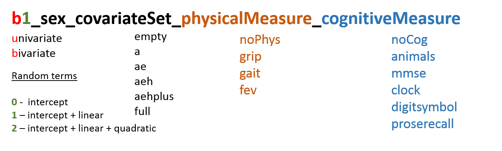

# OCTO-Twin: Model catalog


<!--  Set the working directory to the repository's base directory; this assumes the report is nested inside of two directories.-->


<!-- Set the report-wide options, and point to the external code file. -->


<!-- Load the sources.  Suppress the output when loading sources. --> 


<!-- Load 'sourced' R files.  Suppress the output when loading packages. --> 


<!-- load global data -->


<!-- load sepecific data -->


<!-- load functions used in the report -->


This report tallies the models that you have provided to the workshop collective so far.  For frequency counts  across studies consult [Model Counts](http://htmlpreview.github.io/?https://github.com/IALSA/IALSA-2015-Portland/blob/master/reports/counts.html) report.  For correlations between random terms in bivariate models across all studies consult [Model Essentials](http://htmlpreview.github.io/?https://github.com/IALSA/IALSA-2015-Portland/blob/master/reports/essentials.html)

This report **AIMS** to accomplish two things:     
    1. Help you identify and **correct the errors** in the filenames so that your models can be processed properly  
    2. Help you identify what models should be added to **maximize replicability** effect across studies 


## Introduction and Rationale

Your study

```
[1] "octo"
```

has provided us with the total number of 

```
176
```
models, using univariate and bivariate specifications:

```

 b1 
176 
```

To remind you, **model_number** (*b1, u0, u1, u2*) refers to the model specification, as shown in the figure below.  The first letter (*b* or *u*) indicates whether the models specifies a single outcome (*u* for *univariate*) or two outcomes (*b* for *bivariate*), while the number (e.g. u*0*, u*1*, u*2*) indicates the highest random term on the first level. </br>

The figure below (next section) shows the proper naming convention for the models you estimated in your study. Please use it to correct the names of some of your models. Our scripts rely on this naming convention for the key information about the model (most importantly, names of the constructs and measures). Therefore, it is of utmost importance that these rules are followed. **If named incorrectly, models might not be used in the collective analysis**.   

Some mistakes could be corrected automatically. Other, however, require *specifically* your attention. To illustrate, consider a cognitive construct *knowledge*. We've encountered entries *knowlegde*, *knowledg*, and *knwoledge*; it is obvious that these three spellings meant to say *knowledge*, and we program the script to correct it automatically. On the other hand, consider a physical construct *pulmonary*, which has two similarly spelled measures, *fev* and *fvc*. When we see a measure of *pulmonary* called *fevc*, we don't know how to interpret it, it could be a misspelling of either one. This is where we need your help.


## Naming rules

The name of the file **must always contain 7 components** separated by an underscore ( _ ) symbol. The figure above shows the anatomy of a protypical file name with examples of particular values. For example, a bivariate model with random intercepts and slopes (b1), fitted to subsample of females, using age and height as predictors on the second level, and pairing a *pulmonary* measure *fvc* with a *reasoning* measure *block*  will have the name  
```
b1_female_ae_pulmonary_reasoning_fvc_block
```

### Filename components
From left to right, the components of filename are:

  1. Model number (*e.g.* b1, u0) - specification(u, b) and highest random term (0,1,2)  
  2. Sex (*e.g.* male, female) - model fitted using this subset of data
  3. covariateSet - a set of predictors entered into the model on the second level:
    - **empty** : no covariate included into the model  
    - **a** : age is entered as a baseline measure, second level  
    - **ae** : age + education  
    - **aeh** : age + education + height  
    - **aehplus**: age + education + height + diabetes + smoking history + cardiovascular  
    - **full** : all covariates availible in the study (will be different across studies)  
  4. Physical Construct (*e.g.* pulmonary, muscle) - general physical function that can have a number of specific operationalizations or measurements.
  5. Cognitive Construct (*e.g.* reasoning, memory) - general cognitive function that can have a number of specific operationalizations or measurements.
  6. Physical Measure (e.g. pek, grip ) - a specific way to operationalize the measurement of a physical construct
  7. Cognitive Measure (e.g. block, digitspan ) - a specific way to operationalize the measurement of a cognitive construct  
  
### Additional rules
 
 - Construct and Measure names cannot be the same  
 For example, such file names as
 ```
 u1_male_eah_pulmonary_noCog_pulmonary_noCogSpec
 ``` 
 should be avoided.  
 - In univariate models, the absence of a modeling term must be explicit:
 
 ```
 u1_male_aeh_pulmonary_noCog_pek_noCogSpec
 ```
 instead of  
 ```
 u1_male_aeh_pulmonary_pek
 ```
The exact spelling of the explicit absence is not very important: *noPhys*, *nophys*, *noghys* will work just fine and will be caught by an automatic filter.

## Errors of omission
The most common mistake is omitting some of the 7 elements in the name of the output file. The following files need to be renamed so that our scripts can understand what constructs and measures were used in your models:

```
                       ds$output_file[!is_valid]
1                   b1_female_aeh_grip_block.out
2               b1_female_aehplus_grip_block.out
3                   b1_female_age_grip_block.out
4                     b1_male_aeh_grip_block.out
5                 b1_male_aehplus_grip_block.out
6                     b1_male_age_grip_block.out
7           b1_female_aeh_grip_digitbackward.out
8       b1_female_aehplus_grip_digitbackward.out
9           b1_female_age_grip_digitbackward.out
10            b1_male_aeh_grip_digitbackward.out
11        b1_male_aehplus_grip_digitbackward.out
12            b1_male_age_grip_digitbackward.out
13           b1_female_aeh_grip_digitforward.out
14       b1_female_aehplus_grip_digitforward.out
15           b1_female_age_grip_digitforward.out
16             b1_male_aeh_grip_digitforward.out
17         b1_male_aehplus_grip_digitforward.out
18             b1_male_age_grip_digitforward.out
19            b1_female_aeh_grip_digitsymbol.out
20        b1_female_aehplus_grip_digitsymbol.out
21            b1_female_age_grip_digitsymbol.out
22              b1_male_aeh_grip_digitsymbol.out
23          b1_male_aehplus_grip_digitsymbol.out
24              b1_male_age_grip_digitsymbol.out
25            b1_female_aeh_grip_figurelogic.out
26        b1_female_aehplus_grip_figurelogic.out
27            b1_female_age_grip_figurelogic.out
28              b1_male_aeh_grip_figurelogic.out
29          b1_male_aehplus_grip_figurelogic.out
30              b1_male_age_grip_figurelogic.out
31              b1_female_aeh_grip_mirrecall.out
32          b1_female_aehplus_grip_mirrecall.out
33              b1_female_age_grip_mirrecall.out
34                b1_male_aeh_grip_mirrecall.out
35            b1_male_aehplus_grip_mirrecall.out
36                b1_male_age_grip_mirrecall.out
37            b1_female_aeh_grip_proserecall.out
38        b1_female_aehplus_grip_proserecall.out
39            b1_female_age_grip_proserecall.out
40              b1_male_aeh_grip_proserecall.out
41          b1_male_aehplus_grip_proserecall.out
42              b1_male_age_grip_proserecall.out
43             b1_female_aeh_pulmonary_block.out
44         b1_female_aehplus_pulmonary_block.out
45             b1_female_age_pulmonary_block.out
46            b1_female_full_pulmonary_block.out
47               b1_male_aeh_pulmonary_block.out
48           b1_male_aehplus_pulmonary_block.out
49               b1_male_age_pulmonary_block.out
50              b1_male_full_pulmonary_block.out
51     b1_female_aeh_pulmonary_digitbackward.out
52 b1_female_aehplus_pulmonary_digitbackward.out
53     b1_female_age_pulmonary_digitbackward.out
54       b1_male_aeh_pulmonary_digitbackward.out
55   b1_male_aehplus_pulmonary_digitbackward.out
56       b1_male_age_pulmonary_digitbackward.out
57      b1_female_aeh_pulmonary_digitforward.out
58  b1_female_aehplus_pulmonary_digitforward.out
59      b1_female_age_pulmonary_digitforward.out
60        b1_male_aeh_pulmonary_digitforward.out
61    b1_male_aehplus_pulmonary_digitforward.out
62        b1_male_age_pulmonary_digitforward.out
63       b1_female_aeh_pulmonary_digitsymbol.out
64   b1_female_aehplus_pulmonary_digitsymbol.out
65       b1_female_age_pulmonary_digitsymbol.out
66         b1_male_aeh_pulmonary_digitsymbol.out
67     b1_male_aehplus_pulmonary_digitsymbol.out
68         b1_male_age_pulmonary_digitsymbol.out
69       b1_female_aeh_pulmonary_figurelogic.out
70   b1_female_aehplus_pulmonary_figurelogic.out
71       b1_female_age_pulmonary_figurelogic.out
72         b1_male_aeh_pulmonary_figurelogic.out
73     b1_male_aehplus_pulmonary_figurelogic.out
74         b1_male_age_pulmonary_figurelogic.out
75         b1_female_aeh_pulmonary_mirrecall.out
76     b1_female_aehplus_pulmonary_mirrecall.out
77         b1_female_age_pulmonary_mirrecall.out
78           b1_male_aeh_pulmonary_mirrecall.out
79       b1_male_aehplus_pulmonary_mirrecall.out
80           b1_male_age_pulmonary_mirrecall.out
81       b1_female_aeh_pulmonary_proserecall.out
82   b1_female_aehplus_pulmonary_proserecall.out
83       b1_female_age_pulmonary_proserecall.out
84      b1_female_full_pulmonary_proserecall.out
85         b1_male_aeh_pulmonary_proserecall.out
86     b1_male_aehplus_pulmonary_proserecall.out
87         b1_male_age_pulmonary_proserecall.out
88        b1_male_full_pulmonary_proserecall.out
```

After removing incorrectly named files, there are

```
88
```
models, which output files contains all 7 components. We have corrected the obvious typos, but some names (of constructs and measures) require your attention. 

# Simple Counts
In this section, **model specification (columns)** are cross-tabulated with **constructs or measures (rows)**, displaying the number of valid models in each category. 

## Physical constructs


```
           
            b1
  muscle    44
  pulmonary 44
```


## Physical measures


```
      
       b1
  grip 44
  pek  44
```

## Cognitive constructs


```
           
            b1
  executive 8 
  knowledge 16
  memory    24
  mental    8 
  reasoning 16
  speed     16
```


## Cognitive measures


```
               
                b1
  block         8 
  digitsback    8 
  digitsforward 8 
  figurelogic   8 
  info          8 
  mirrecall     8 
  mmse          8 
  proserecall   8 
  psif          8 
  symbol        8 
  synonyms      8 
```
</br></br></br>

# BIVARIATE MODELS

In this section, **constructs (columns)** are cross-tabulated with  **measures (rows)** that opeationalize them in the models. Each non-blank element in a column indicates a unique **measure (row)** of the **construct (column)**. The numeric value shows how many different versions of this model used this specific pair of construct and measure: model may differ on the subgroup (male, female), and the set of covariates (empty, a, ae, aeh, aehplus, full).


## Physical 
Physical **constructs** (columns) by physical **measures** (rows) in BIVARIATE models

```
      
       muscle pulmonary
  grip 44     .        
  pek  .      44       
```

## Cognitive 
Cognitive **constructs** (columns) by cognitive **measures** (rows) in BIVARIATE models

```
               
                executive knowledge memory mental reasoning speed
  block         .         .         .      .      8         .    
  digitsback    8         .         .      .      .         .    
  digitsforward .         .         8      .      .         .    
  figurelogic   .         .         .      .      8         .    
  info          .         8         .      .      .         .    
  mirrecall     .         .         8      .      .         .    
  mmse          .         .         .      8      .         .    
  proserecall   .         .         8      .      .         .    
  psif          .         .         .      .      .         8    
  symbol        .         .         .      .      .         8    
  synonyms      .         8         .      .      .         .    
```


## Constructs
Number of models with the following **physical constructs** (columns) and  **cognitive constructs** (rows)


```
           
            muscle pulmonary
  executive 4      4        
  knowledge 8      8        
  memory    12     12       
  mental    4      4        
  reasoning 8      8        
  speed     8      8        
```

## Phys.Constructs
Number of models with the following  **physical constructs** (columns) and  **cognitive measures** (rows)

```
               
                muscle pulmonary
  block         4      4        
  digitsback    4      4        
  digitsforward 4      4        
  figurelogic   4      4        
  info          4      4        
  mirrecall     4      4        
  mmse          4      4        
  proserecall   4      4        
  psif          4      4        
  symbol        4      4        
  synonyms      4      4        
```

## Cog.Constructs
Number of models with the following  **physical measure** (columns) and  **cognitive constructs** (rows)

```
           
            grip pek
  executive 4    4  
  knowledge 8    8  
  memory    12   12 
  mental    4    4  
  reasoning 8    8  
  speed     8    8  
```

## Measures
Number of models with the following  **physical measures** (columns) and  **cognitive measures** (rows)

```
               
                grip pek
  block         4    4  
  digitsback    4    4  
  digitsforward 4    4  
  figurelogic   4    4  
  info          4    4  
  mirrecall     4    4  
  mmse          4    4  
  proserecall   4    4  
  psif          4    4  
  symbol        4    4  
  synonyms      4    4  
```
</br></br></br>


# UNIVARIATE MODELS

In this section, **constructs (columns)** are cross-tabulated with  **measures (rows)** that opeationalize them in the models. Each non-blank element in a column indicates a unique **measure (row)** of the **construct (column)**. The numeric value counts the different versions of the model (sex, covariates) that used this specific pair of construct and measure. 

## Physical 
Physical constructs (columns) by physical measures (rows) in UNIVARIATE models

```
Empty category
```

## Cognitive
Cognitive constructs (columns) by cognitive measures (rows) in UNIVARIATE models

```
Empty category
```
</br></br></br>

# List of models
## b1


model<br/>tag   sex      predictor<br/>set   physical<br/>construct   cognitive<br/>construct   physical<br/>measure   cognitive<br/>measure   file name                                                
--------------  -------  ------------------  -----------------------  ------------------------  ---------------------  ----------------------  ---------------------------------------------------------
b1              female   aeh                 grip                     block                     NA                     NA                      b1_female_aeh_grip_block.out                             
b1              female   aehplus             grip                     block                     NA                     NA                      b1_female_aehplus_grip_block.out                         
b1              female   age                 grip                     block                     NA                     NA                      b1_female_age_grip_block.out                             
b1              male     aeh                 grip                     block                     NA                     NA                      b1_male_aeh_grip_block.out                               
b1              male     aehplus             grip                     block                     NA                     NA                      b1_male_aehplus_grip_block.out                           
b1              male     age                 grip                     block                     NA                     NA                      b1_male_age_grip_block.out                               
b1              female   aeh                 grip                     digitbackward             NA                     NA                      b1_female_aeh_grip_digitbackward.out                     
b1              female   aehplus             grip                     digitbackward             NA                     NA                      b1_female_aehplus_grip_digitbackward.out                 
b1              female   age                 grip                     digitbackward             NA                     NA                      b1_female_age_grip_digitbackward.out                     
b1              male     aeh                 grip                     digitbackward             NA                     NA                      b1_male_aeh_grip_digitbackward.out                       
b1              male     aehplus             grip                     digitbackward             NA                     NA                      b1_male_aehplus_grip_digitbackward.out                   
b1              male     age                 grip                     digitbackward             NA                     NA                      b1_male_age_grip_digitbackward.out                       
b1              female   aeh                 grip                     digitforward              NA                     NA                      b1_female_aeh_grip_digitforward.out                      
b1              female   aehplus             grip                     digitforward              NA                     NA                      b1_female_aehplus_grip_digitforward.out                  
b1              female   age                 grip                     digitforward              NA                     NA                      b1_female_age_grip_digitforward.out                      
b1              male     aeh                 grip                     digitforward              NA                     NA                      b1_male_aeh_grip_digitforward.out                        
b1              male     aehplus             grip                     digitforward              NA                     NA                      b1_male_aehplus_grip_digitforward.out                    
b1              male     age                 grip                     digitforward              NA                     NA                      b1_male_age_grip_digitforward.out                        
b1              female   aeh                 grip                     digitsymbol               NA                     NA                      b1_female_aeh_grip_digitsymbol.out                       
b1              female   aehplus             grip                     digitsymbol               NA                     NA                      b1_female_aehplus_grip_digitsymbol.out                   
b1              female   age                 grip                     digitsymbol               NA                     NA                      b1_female_age_grip_digitsymbol.out                       
b1              male     aeh                 grip                     digitsymbol               NA                     NA                      b1_male_aeh_grip_digitsymbol.out                         
b1              male     aehplus             grip                     digitsymbol               NA                     NA                      b1_male_aehplus_grip_digitsymbol.out                     
b1              male     age                 grip                     digitsymbol               NA                     NA                      b1_male_age_grip_digitsymbol.out                         
b1              female   aeh                 grip                     figurelogic               NA                     NA                      b1_female_aeh_grip_figurelogic.out                       
b1              female   aehplus             grip                     figurelogic               NA                     NA                      b1_female_aehplus_grip_figurelogic.out                   
b1              female   age                 grip                     figurelogic               NA                     NA                      b1_female_age_grip_figurelogic.out                       
b1              male     aeh                 grip                     figurelogic               NA                     NA                      b1_male_aeh_grip_figurelogic.out                         
b1              male     aehplus             grip                     figurelogic               NA                     NA                      b1_male_aehplus_grip_figurelogic.out                     
b1              male     age                 grip                     figurelogic               NA                     NA                      b1_male_age_grip_figurelogic.out                         
b1              female   aeh                 grip                     mirrecall                 NA                     NA                      b1_female_aeh_grip_mirrecall.out                         
b1              female   aehplus             grip                     mirrecall                 NA                     NA                      b1_female_aehplus_grip_mirrecall.out                     
b1              female   age                 grip                     mirrecall                 NA                     NA                      b1_female_age_grip_mirrecall.out                         
b1              male     aeh                 grip                     mirrecall                 NA                     NA                      b1_male_aeh_grip_mirrecall.out                           
b1              male     aehplus             grip                     mirrecall                 NA                     NA                      b1_male_aehplus_grip_mirrecall.out                       
b1              male     age                 grip                     mirrecall                 NA                     NA                      b1_male_age_grip_mirrecall.out                           
b1              female   aeh                 grip                     proserecall               NA                     NA                      b1_female_aeh_grip_proserecall.out                       
b1              female   aehplus             grip                     proserecall               NA                     NA                      b1_female_aehplus_grip_proserecall.out                   
b1              female   age                 grip                     proserecall               NA                     NA                      b1_female_age_grip_proserecall.out                       
b1              male     aeh                 grip                     proserecall               NA                     NA                      b1_male_aeh_grip_proserecall.out                         
b1              male     aehplus             grip                     proserecall               NA                     NA                      b1_male_aehplus_grip_proserecall.out                     
b1              male     age                 grip                     proserecall               NA                     NA                      b1_male_age_grip_proserecall.out                         
b1              female   aeh                 muscle                   global                    grip                   mmse                    b1_female_aeh_muscle_global_grip_mmse.out                
b1              female   age                 muscle                   global                    grip                   mmse                    b1_female_age_muscle_global_grip_mmse.out                
b1              male     aeh                 muscle                   global                    grip                   mmse                    b1_male_aeh_muscle_global_grip_mmse.out                  
b1              male     age                 muscle                   global                    grip                   mmse                    b1_male_age_muscle_global_grip_mmse.out                  
b1              female   aeh                 muscle                   knowledge                 grip                   information             b1_female_aeh_muscle_knowledge_grip_information.out      
b1              female   aeh                 muscle                   knowledge                 grip                   synonyms                b1_female_aeh_muscle_knowledge_grip_synonyms.out         
b1              female   age                 muscle                   knowledge                 grip                   information             b1_female_age_muscle_knowledge_grip_information.out      
b1              female   age                 muscle                   knowledge                 grip                   synonyms                b1_female_age_muscle_knowledge_grip_synonyms.out         
b1              male     aeh                 muscle                   knowledge                 grip                   information             b1_male_aeh_muscle_knowledge_grip_information.out        
b1              male     aeh                 muscle                   knowledge                 grip                   synonyms                b1_male_aeh_muscle_knowledge_grip_synonyms.out           
b1              male     age                 muscle                   knowledge                 grip                   information             b1_male_age_muscle_knowledge_grip_information.out        
b1              male     age                 muscle                   knowledge                 grip                   synonyms                b1_male_age_muscle_knowledge_grip_synonyms.out           
b1              female   aeh                 muscle                   memory                    grip                   digitspanbackward       b1_female_aeh_muscle_memory_grip_digitspanbackward.out   
b1              female   aeh                 muscle                   memory                    grip                   digitspanforward        b1_female_aeh_muscle_memory_grip_digitspanforward.out    
b1              female   aeh                 muscle                   memory                    grip                   mirrecall               b1_female_aeh_muscle_memory_grip_mirrecall.out           
b1              female   aeh                 muscle                   memory                    grip                   proserecall             b1_female_aeh_muscle_memory_grip_proserecall.out         
b1              female   age                 muscle                   memory                    grip                   digitspanbackward       b1_female_age_muscle_memory_grip_digitspanbackward.out   
b1              female   age                 muscle                   memory                    grip                   digitspanforward        b1_female_age_muscle_memory_grip_digitspanforward.out    
b1              female   age                 muscle                   memory                    grip                   mirrecall               b1_female_age_muscle_memory_grip_mirrecall.out           
b1              female   age                 muscle                   memory                    grip                   proserecall             b1_female_age_muscle_memory_grip_proserecall.out         
b1              male     aeh                 muscle                   memory                    grip                   digitspanbackward       b1_male_aeh_muscle_memory_grip_digitspanbackward.out     
b1              male     aeh                 muscle                   memory                    grip                   digitspanforward        b1_male_aeh_muscle_memory_grip_digitspanforward.out      
b1              male     aeh                 muscle                   memory                    grip                   mirrecall               b1_male_aeh_muscle_memory_grip_mirrecall.out             
b1              male     aeh                 muscle                   memory                    grip                   proserecall             b1_male_aeh_muscle_memory_grip_proserecall.out           
b1              male     age                 muscle                   memory                    grip                   digitspanbackward       b1_male_age_muscle_memory_grip_digitspanbackward.out     
b1              male     age                 muscle                   memory                    grip                   digitspanforward        b1_male_age_muscle_memory_grip_digitspanforward.out      
b1              male     age                 muscle                   memory                    grip                   mirrecall               b1_male_age_muscle_memory_grip_mirrecall.out             
b1              male     age                 muscle                   memory                    grip                   proserecall             b1_male_age_muscle_memory_grip_proserecall.out           
b1              female   aeh                 muscle                   reasoning                 grip                   blockdesign             b1_female_aeh_muscle_reasoning_grip_blockdesign.out      
b1              female   aeh                 muscle                   reasoning                 grip                   figurelogic             b1_female_aeh_muscle_reasoning_grip_figurelogic.out      
b1              female   age                 muscle                   reasoning                 grip                   blockdesign             b1_female_age_muscle_reasoning_grip_blockdesign.out      
b1              female   age                 muscle                   reasoning                 grip                   figurelogic             b1_female_age_muscle_reasoning_grip_figurelogic.out      
b1              male     aeh                 muscle                   reasoning                 grip                   blockdesign             b1_male_aeh_muscle_reasoning_grip_blockdesign.out        
b1              male     aeh                 muscle                   reasoning                 grip                   figurelogic             b1_male_aeh_muscle_reasoning_grip_figurelogic.out        
b1              male     age                 muscle                   reasoning                 grip                   blockdesign             b1_male_age_muscle_reasoning_grip_blockdesign.out        
b1              male     age                 muscle                   reasoning                 grip                   figurelogic             b1_male_age_muscle_reasoning_grip_figurelogic.out        
b1              female   aeh                 muscle                   speed                     grip                   digitsymbol             b1_female_aeh_muscle_speed_grip_digitsymbol.out          
b1              female   aeh                 muscle                   speed                     grip                   psif                    b1_female_aeh_muscle_speed_grip_psif.out                 
b1              female   age                 muscle                   speed                     grip                   digitsymbol             b1_female_age_muscle_speed_grip_digitsymbol.out          
b1              female   age                 muscle                   speed                     grip                   psif                    b1_female_age_muscle_speed_grip_psif.out                 
b1              male     aeh                 muscle                   speed                     grip                   digitsymbol             b1_male_aeh_muscle_speed_grip_digitsymbol.out            
b1              male     aeh                 muscle                   speed                     grip                   psif                    b1_male_aeh_muscle_speed_grip_psif.out                   
b1              male     age                 muscle                   speed                     grip                   digitsymbol             b1_male_age_muscle_speed_grip_digitsymbol.out            
b1              male     age                 muscle                   speed                     grip                   psif                    b1_male_age_muscle_speed_grip_psif.out                   
b1              female   aeh                 pulmonary                block                     NA                     NA                      b1_female_aeh_pulmonary_block.out                        
b1              female   aehplus             pulmonary                block                     NA                     NA                      b1_female_aehplus_pulmonary_block.out                    
b1              female   age                 pulmonary                block                     NA                     NA                      b1_female_age_pulmonary_block.out                        
b1              female   full                pulmonary                block                     NA                     NA                      b1_female_full_pulmonary_block.out                       
b1              male     aeh                 pulmonary                block                     NA                     NA                      b1_male_aeh_pulmonary_block.out                          
b1              male     aehplus             pulmonary                block                     NA                     NA                      b1_male_aehplus_pulmonary_block.out                      
b1              male     age                 pulmonary                block                     NA                     NA                      b1_male_age_pulmonary_block.out                          
b1              male     full                pulmonary                block                     NA                     NA                      b1_male_full_pulmonary_block.out                         
b1              female   aeh                 pulmonary                digitbackward             NA                     NA                      b1_female_aeh_pulmonary_digitbackward.out                
b1              female   aehplus             pulmonary                digitbackward             NA                     NA                      b1_female_aehplus_pulmonary_digitbackward.out            
b1              female   age                 pulmonary                digitbackward             NA                     NA                      b1_female_age_pulmonary_digitbackward.out                
b1              male     aeh                 pulmonary                digitbackward             NA                     NA                      b1_male_aeh_pulmonary_digitbackward.out                  
b1              male     aehplus             pulmonary                digitbackward             NA                     NA                      b1_male_aehplus_pulmonary_digitbackward.out              
b1              male     age                 pulmonary                digitbackward             NA                     NA                      b1_male_age_pulmonary_digitbackward.out                  
b1              female   aeh                 pulmonary                digitforward              NA                     NA                      b1_female_aeh_pulmonary_digitforward.out                 
b1              female   aehplus             pulmonary                digitforward              NA                     NA                      b1_female_aehplus_pulmonary_digitforward.out             
b1              female   age                 pulmonary                digitforward              NA                     NA                      b1_female_age_pulmonary_digitforward.out                 
b1              male     aeh                 pulmonary                digitforward              NA                     NA                      b1_male_aeh_pulmonary_digitforward.out                   
b1              male     aehplus             pulmonary                digitforward              NA                     NA                      b1_male_aehplus_pulmonary_digitforward.out               
b1              male     age                 pulmonary                digitforward              NA                     NA                      b1_male_age_pulmonary_digitforward.out                   
b1              female   aeh                 pulmonary                digitsymbol               NA                     NA                      b1_female_aeh_pulmonary_digitsymbol.out                  
b1              female   aehplus             pulmonary                digitsymbol               NA                     NA                      b1_female_aehplus_pulmonary_digitsymbol.out              
b1              female   age                 pulmonary                digitsymbol               NA                     NA                      b1_female_age_pulmonary_digitsymbol.out                  
b1              male     aeh                 pulmonary                digitsymbol               NA                     NA                      b1_male_aeh_pulmonary_digitsymbol.out                    
b1              male     aehplus             pulmonary                digitsymbol               NA                     NA                      b1_male_aehplus_pulmonary_digitsymbol.out                
b1              male     age                 pulmonary                digitsymbol               NA                     NA                      b1_male_age_pulmonary_digitsymbol.out                    
b1              female   aeh                 pulmonary                figurelogic               NA                     NA                      b1_female_aeh_pulmonary_figurelogic.out                  
b1              female   aehplus             pulmonary                figurelogic               NA                     NA                      b1_female_aehplus_pulmonary_figurelogic.out              
b1              female   age                 pulmonary                figurelogic               NA                     NA                      b1_female_age_pulmonary_figurelogic.out                  
b1              male     aeh                 pulmonary                figurelogic               NA                     NA                      b1_male_aeh_pulmonary_figurelogic.out                    
b1              male     aehplus             pulmonary                figurelogic               NA                     NA                      b1_male_aehplus_pulmonary_figurelogic.out                
b1              male     age                 pulmonary                figurelogic               NA                     NA                      b1_male_age_pulmonary_figurelogic.out                    
b1              female   aeh                 pulmonary                global                    pek                    mmse                    b1_female_aeh_pulmonary_global_pek_mmse.out              
b1              female   age                 pulmonary                global                    pek                    mmse                    b1_female_age_pulmonary_global_pek_mmse.out              
b1              male     aeh                 pulmonary                global                    pek                    mmse                    b1_male_aeh_pulmonary_global_pek_mmse.out                
b1              male     age                 pulmonary                global                    pek                    mmse                    b1_male_age_pulmonary_global_pek_mmse.out                
b1              female   aeh                 pulmonary                knowledge                 pek                    information             b1_female_aeh_pulmonary_knowledge_pek_information.out    
b1              female   aeh                 pulmonary                knowledge                 pek                    synonyms                b1_female_aeh_pulmonary_knowledge_pek_synonyms.out       
b1              female   age                 pulmonary                knowledge                 pek                    information             b1_female_age_pulmonary_knowledge_pek_information.out    
b1              female   age                 pulmonary                knowledge                 pek                    synonyms                b1_female_age_pulmonary_knowledge_pek_synonyms.out       
b1              male     aeh                 pulmonary                knowledge                 pek                    information             b1_male_aeh_pulmonary_knowledge_pek_information.out      
b1              male     aeh                 pulmonary                knowledge                 pek                    synonyms                b1_male_aeh_pulmonary_knowledge_pek_synonyms.out         
b1              male     age                 pulmonary                knowledge                 pek                    information             b1_male_age_pulmonary_knowledge_pek_information.out      
b1              male     age                 pulmonary                knowledge                 pek                    synonyms                b1_male_age_pulmonary_knowledge_pek_synonyms.out         
b1              female   aeh                 pulmonary                memory                    pek                    digitspanbackward       b1_female_aeh_pulmonary_memory_pek_digitspanbackward.out 
b1              female   aeh                 pulmonary                memory                    pek                    digitspanforward        b1_female_aeh_pulmonary_memory_pek_digitspanforward.out  
b1              female   aeh                 pulmonary                memory                    pek                    mirrecall               b1_female_aeh_pulmonary_memory_pek_mirrecall.out         
b1              female   aeh                 pulmonary                memory                    pek                    proserecall             b1_female_aeh_pulmonary_memory_pek_proserecall.out       
b1              female   age                 pulmonary                memory                    pek                    digitspanbackward       b1_female_age_pulmonary_memory_pek_digitspanbackward.out 
b1              female   age                 pulmonary                memory                    pek                    digitspanforward        b1_female_age_pulmonary_memory_pek_digitspanforward.out  
b1              female   age                 pulmonary                memory                    pek                    mirrecall               b1_female_age_pulmonary_memory_pek_mirrecall.out         
b1              female   age                 pulmonary                memory                    pek                    proserecall             b1_female_age_pulmonary_memory_pek_proserecall.out       
b1              male     aeh                 pulmonary                memory                    pek                    digitspanbackward       b1_male_aeh_pulmonary_memory_pek_digitspanbackward.out   
b1              male     aeh                 pulmonary                memory                    pek                    digitspanforward        b1_male_aeh_pulmonary_memory_pek_digitspanforward.out    
b1              male     aeh                 pulmonary                memory                    pek                    mirrecall               b1_male_aeh_pulmonary_memory_pek_mirrecall.out           
b1              male     aeh                 pulmonary                memory                    pek                    proserecall             b1_male_aeh_pulmonary_memory_pek_proserecall.out         
b1              male     age                 pulmonary                memory                    pek                    digitspanbackward       b1_male_age_pulmonary_memory_pek_digitspanbackward.out   
b1              male     age                 pulmonary                memory                    pek                    digitspanforward        b1_male_age_pulmonary_memory_pek_digitspanforward.out    
b1              male     age                 pulmonary                memory                    pek                    mirrecall               b1_male_age_pulmonary_memory_pek_mirrecall.out           
b1              male     age                 pulmonary                memory                    pek                    proserecall             b1_male_age_pulmonary_memory_pek_proserecall.out         
b1              female   aeh                 pulmonary                mirrecall                 NA                     NA                      b1_female_aeh_pulmonary_mirrecall.out                    
b1              female   aehplus             pulmonary                mirrecall                 NA                     NA                      b1_female_aehplus_pulmonary_mirrecall.out                
b1              female   age                 pulmonary                mirrecall                 NA                     NA                      b1_female_age_pulmonary_mirrecall.out                    
b1              male     aeh                 pulmonary                mirrecall                 NA                     NA                      b1_male_aeh_pulmonary_mirrecall.out                      
b1              male     aehplus             pulmonary                mirrecall                 NA                     NA                      b1_male_aehplus_pulmonary_mirrecall.out                  
b1              male     age                 pulmonary                mirrecall                 NA                     NA                      b1_male_age_pulmonary_mirrecall.out                      
b1              female   aeh                 pulmonary                proserecall               NA                     NA                      b1_female_aeh_pulmonary_proserecall.out                  
b1              female   aehplus             pulmonary                proserecall               NA                     NA                      b1_female_aehplus_pulmonary_proserecall.out              
b1              female   age                 pulmonary                proserecall               NA                     NA                      b1_female_age_pulmonary_proserecall.out                  
b1              female   full                pulmonary                proserecall               NA                     NA                      b1_female_full_pulmonary_proserecall.out                 
b1              male     aeh                 pulmonary                proserecall               NA                     NA                      b1_male_aeh_pulmonary_proserecall.out                    
b1              male     aehplus             pulmonary                proserecall               NA                     NA                      b1_male_aehplus_pulmonary_proserecall.out                
b1              male     age                 pulmonary                proserecall               NA                     NA                      b1_male_age_pulmonary_proserecall.out                    
b1              male     full                pulmonary                proserecall               NA                     NA                      b1_male_full_pulmonary_proserecall.out                   
b1              female   aeh                 pulmonary                reasoning                 pek                    blockdesign             b1_female_aeh_pulmonary_reasoning_pek_blockdesign.out    
b1              female   aeh                 pulmonary                reasoning                 pek                    figurelogic             b1_female_aeh_pulmonary_reasoning_pek_figurelogic.out    
b1              female   age                 pulmonary                reasoning                 pek                    blockdesign             b1_female_age_pulmonary_reasoning_pek_blockdesign.out    
b1              female   age                 pulmonary                reasoning                 pek                    figurelogic             b1_female_age_pulmonary_reasoning_pek_figurelogic.out    
b1              male     aeh                 pulmonary                reasoning                 pek                    blockdesign             b1_male_aeh_pulmonary_reasoning_pek_blockdesign.out      
b1              male     aeh                 pulmonary                reasoning                 pek                    figurelogic             b1_male_aeh_pulmonary_reasoning_pek_figurelogic.out      
b1              male     age                 pulmonary                reasoning                 pek                    blockdesign             b1_male_age_pulmonary_reasoning_pek_blockdesign.out      
b1              male     age                 pulmonary                reasoning                 pek                    figurelogic             b1_male_age_pulmonary_reasoning_pek_figurelogic.out      
b1              female   aeh                 pulmonary                speed                     pek                    digitsymbol             b1_female_aeh_pulmonary_speed_pek_digitsymbol.out        
b1              female   aeh                 pulmonary                speed                     pek                    psif                    b1_female_aeh_pulmonary_speed_pek_psif.out               
b1              female   age                 pulmonary                speed                     pek                    digitsymbol             b1_female_age_pulmonary_speed_pek_digitsymbol.out        
b1              female   age                 pulmonary                speed                     pek                    psif                    b1_female_age_pulmonary_speed_pek_psif.out               
b1              male     aeh                 pulmonary                speed                     pek                    digitsymbol             b1_male_aeh_pulmonary_speed_pek_digitsymbol.out          
b1              male     aeh                 pulmonary                speed                     pek                    psif                    b1_male_aeh_pulmonary_speed_pek_psif.out                 
b1              male     age                 pulmonary                speed                     pek                    digitsymbol             b1_male_age_pulmonary_speed_pek_digitsymbol.out          
b1              male     age                 pulmonary                speed                     pek                    psif                    b1_male_age_pulmonary_speed_pek_psif.out                 


# Session Information
For the sake of documentation and reproducibility, the current report was rendered on a system using the following software.


```
Report rendered by koval_000 at 2015-06-26, 08:54 -0700
```

```
R version 3.2.0 (2015-04-16)
Platform: x86_64-w64-mingw32/x64 (64-bit)
Running under: Windows 8 x64 (build 9200)

locale:
[1] LC_COLLATE=English_United States.1252  LC_CTYPE=English_United States.1252    LC_MONETARY=English_United States.1252
[4] LC_NUMERIC=C                           LC_TIME=English_United States.1252    

attached base packages:
[1] grid      stats     graphics  grDevices utils     datasets  methods   base     

other attached packages:
 [1] MplusAutomation_0.6-3 RColorBrewer_1.1-2    scales_0.2.5          testit_0.4            knitr_1.10.5         
 [6] rpivotTable_0.1.4.1   lattice_0.20-31       ggplot2_1.0.1         dplyr_0.4.1           shiny_0.12.1         

loaded via a namespace (and not attached):
 [1] Rcpp_0.11.6       highr_0.5         formatR_1.2       plyr_1.8.2        tools_3.2.0       boot_1.3-16      
 [7] digest_0.6.8      jsonlite_0.9.16   evaluate_0.7      gtable_0.1.2      texreg_1.35       DBI_0.3.1        
[13] rstudioapi_0.3.1  yaml_2.1.13       parallel_3.2.0    proto_0.3-10      coda_0.17-1       stringr_1.0.0    
[19] htmlwidgets_0.4.2 R6_2.0.1          tcltk_3.2.0       gsubfn_0.6-6      rmarkdown_0.7     tidyr_0.2.0      
[25] reshape2_1.4.1    magrittr_1.5      htmltools_0.2.6   MASS_7.3-40       rsconnect_0.3.79  assertthat_0.1   
[31] mime_0.3          xtable_1.7-4      colorspace_1.2-6  httpuv_1.3.2      labeling_0.3      stringi_0.4-1    
[37] lazyeval_0.1.10   munsell_0.4.2    
```
