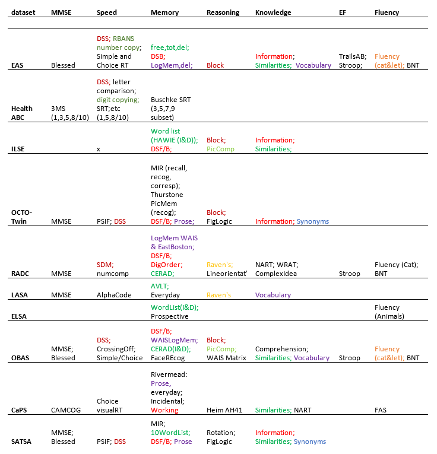

<!--  Set the working directory to the repository's base directory; this assumes the report is nested inside of two directories.-->
```{r, echo=F, message=F} 
# cat("Working directory: ", getwd())
  library(knitr)
  opts_knit$set(root.dir='../../')  #Don't combine this call with any other chunk -especially one that uses file paths.
```

<!-- Set the report-wide options, and point to the external code file. -->
```{r set_options, echo=F}
# cat("Working directory: ", getwd())
opts_chunk$set(
  results='show', 
  comment = NA, 
  tidy = FALSE,
  fig.width = 6.5, 
  fig.height = 4, 
  fig.path = 'cog-domain-map-2/'
)
# dpi = 400,
# out.width = "650px", #This affects only the markdown, not the underlying png file.  The height will be scaled appropriately.

echoChunks <- FALSE
options(width=120) #So the output is 50% wider than the default.
read_chunk("./reports/model_space/cog-domain-map-2.R") #This allows knitr to call chunks tagged in the underlying *.R file.
```

<!-- Load the sources.  Suppress the output when loading sources. --> 
```{r load_sources, echo=echoChunks, message=FALSE}
```

<!-- Load 'sourced' R files.  Suppress the output when loading packages. --> 
```{r load_packages, echo=echoChunks, message=FALSE}
```

<!-- Load any Global functions and variables declared in the R file.  Suppress the output. --> 
```{r declare_globals, echo=echoChunks, results='show', message=FALSE}
```

<!-- Declare any global functions specific to a Rmd output.  Suppress the output. --> 
```{r, echo=echoChunks, message=FALSE}
#Put code in here.  It doesn't call a chunk in the codebehind file.
```

<!-- Load the datasets.   -->
```{r load_data, echo=echoChunks, results='show', message=FALSE}
```

<!-- Tweak the datasets.   -->
```{r tweak_data, echo=echoChunks, results='show', message=FALSE}
```


```{r define_themes, echo=echoChunks, results='show', message=FALSE}
```
## Prototype

Andrea, you've suggested the followed  structure to investigate replication potential across studies and cognitive domains:
  

I like how it simplifies the search for overlaps among measures. I developed the following interpretation of the demensionality in the graph above. 

## Domain Map

```{r define_graph_functions, echo=echoChunks, results='hide', message=FALSE}
```

```{r domain_map, echo=echoChunks, results='show', message=FALSE, warning=FALSE, fig.width=15, fig.height=10, dpi=300}
domain_map(ds)
```

The domain map above is the actual data provided by the model in the Portland modeling collective right now. The colors  represent various cognitive domains, as identified by the participants in the model names. The colors are meant to be categorical, the change in hue is coincidental with alphabetic name.


## Session Information
For the sake of documentation and reproducibility, the current report was rendered on a system using the following software.

```{r session_info, echo=FALSE}
cat("Report rendered by", Sys.info()["user"], "at", strftime(Sys.time(), "%Y-%m-%d, %H:%M %z"))
sessionInfo()
```
