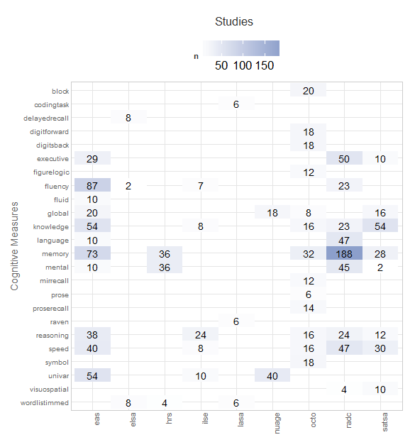
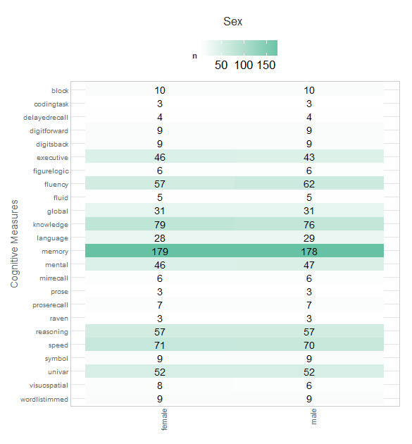
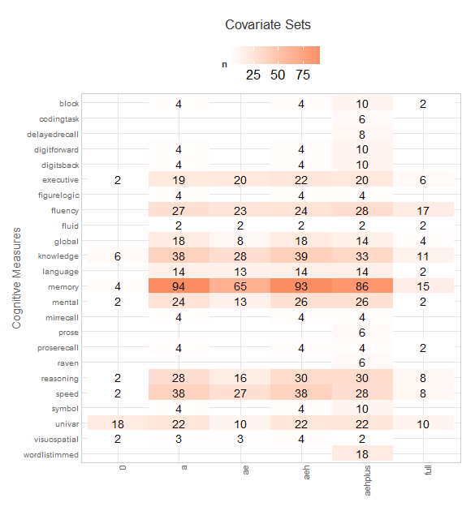
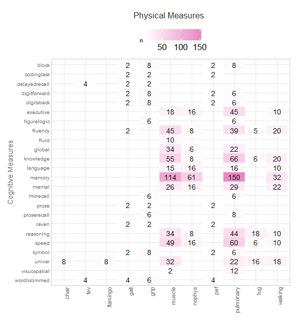

# Model Space in 5D


<!--  Set the working directory to the repository's base directory; this assumes the report is nested inside of two directories.-->


<!-- Set the report-wide options, and point to the external code file. -->


<!-- Load the sources.  Suppress the output when loading sources. --> 


<!-- Load 'sourced' R files.  Suppress the output when loading packages. --> 


<!-- Load any Global functions and variables declared in the R file.  Suppress the output. --> 


<!-- Declare any global functions specific to a Rmd output.  Suppress the output. --> 


<!-- Load the datasets.   -->


<!-- Tweak the datasets.   -->


<!-- Frequency counts   -->


This report establishes four key graphs that go into compiling the Model Catalog, which will be used to find and view replicated models. The following table gives model counts presently available in the collectivs. Rows list model specifications: *u* or *b* for univariate or bivariate growth model respectively. The numeric suffix (*0*, *1*, *2*) indicate the highest random growth term on the first level (*0* - intercept, *1* - linear, *2* - quadratic).


```
    
     eas elsa habc ilse nas nuage octo radc satsa
  b1 219 60   48   72   41  6     88   137  92   
  u0 6   60   10   16   2   10    .    .    .    
  u1 129 57   30   49   2   36    .    4    .    
  u2 131 30   .    .    .   .     .    .    .    
```


## Fi5ve dimensions of model space

Each bivariate growth model in our collective can be described with respect to the following **fi5e** primary dimensions: study, physical measure, cognitive measure, subgroup,and model type.     
**Study** - (eas, elsa, ilse, habc,...) - separate data collection efforts. Longitudinal studies vary on sampling procedure, sample composition, temporal design, availablity and type of anthropometric measures. ["Table 1" Report](./reports/table_1/table_1.md) records these descriptives for each study.   
**Physical measure** - (gait, grip, pek, fvc,...)  - **add more**   
**Cognitive measure** - (mmse, symbol, block, synonyms, ...  )  -    
**Subgroup** - Sex. The models were run separately for males and females. Sex was not a part of the model.   
**Model type** - (0, a, ae, aeh, aehplus, full)   

*Cognitive measure* is the longest and thus chosen to span the **vertical axis** of the 2D surface of the graph. The other fou4 primary dimensions are designed into the **horizontal axis**. Each cell contains a  **number** counting models with those  specifications. Number on the background of the same color add to 100% of the submitted models. Transparancy is mapped onto the magnitude of the number. The hue is categorical. Combining cognitive measure with each of the four demensions results in **four tile plots**

These four graphs  can be united into a display of a quantitative invormation, necessary to identify overlaps in models across studies. The following graph is the current draft of the 5-dimensional model space of the Portland-2105 collective. The graph is produced with  [./reports/model_space/scripts/tile_model_5D.R](https://github.com/IALSA/IALSA-2015-Portland/blob/master/reports/model_space/reports/model_space/scripts/tile_model_5D.R) script. 

 


## Individual dimensions
To inspect the built of each graph

### Study

 


### Subgroup / Sex

 

### Covariate set / Model type
 


### Phys Measures

 


# Session Information
For the sake of documentation and reproducibility, the current report was rendered on a system using the following software.


```
Report rendered by koval_000 at 2015-06-24, 21:54 -0700
```

```
R version 3.2.0 (2015-04-16)
Platform: x86_64-w64-mingw32/x64 (64-bit)
Running under: Windows 8 x64 (build 9200)

locale:
[1] LC_COLLATE=English_United States.1252  LC_CTYPE=English_United States.1252    LC_MONETARY=English_United States.1252
[4] LC_NUMERIC=C                           LC_TIME=English_United States.1252    

attached base packages:
[1] grid      stats     graphics  grDevices utils     datasets  methods   base     

other attached packages:
[1] lattice_0.20-31       shiny_0.12.1          ggplot2_1.0.1         RColorBrewer_1.1-2    scales_0.2.5         
[6] testit_0.4            knitr_1.10.5          dplyr_0.4.1           MplusAutomation_0.6-3

loaded via a namespace (and not attached):
 [1] Rcpp_0.11.6      formatR_1.2      plyr_1.8.2       highr_0.5        tools_3.2.0      boot_1.3-16     
 [7] digest_0.6.8     evaluate_0.7     gtable_0.1.2     texreg_1.35      DBI_0.3.1        yaml_2.1.13     
[13] parallel_3.2.0   proto_0.3-10     coda_0.17-1      stringr_1.0.0    R6_2.0.1         tcltk_3.2.0     
[19] rmarkdown_0.7    gsubfn_0.6-6     reshape2_1.4.1   magrittr_1.5     htmltools_0.2.6  MASS_7.3-40     
[25] rsconnect_0.3.79 assertthat_0.1   mime_0.3         xtable_1.7-4     colorspace_1.2-6 httpuv_1.3.2    
[31] labeling_0.3     stringi_0.4-1    lazyeval_0.1.10  munsell_0.4.2   
```
