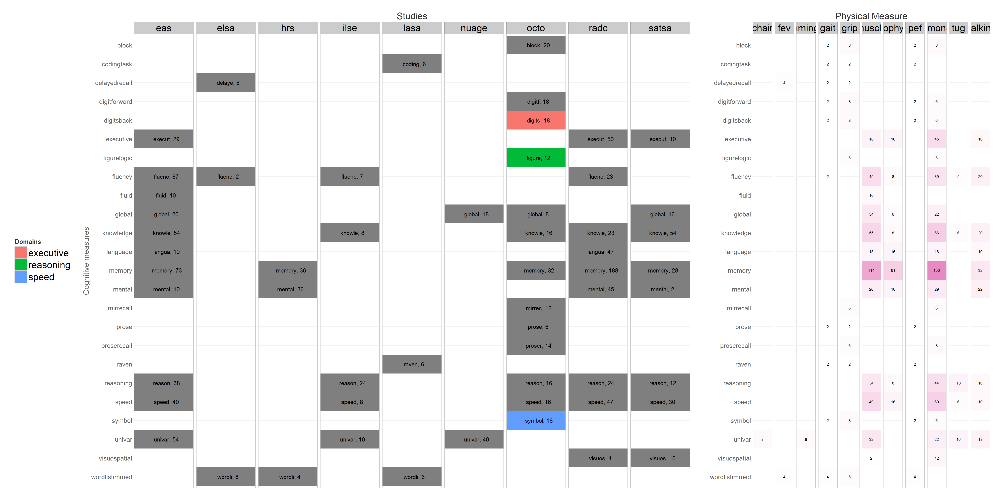

Model Space
---
  Reports tally the models and try to organize them for meta-analytics. 

## Model Space in 5D
  5 variable properties of bivariate growth models of Portland Collective: cogntive measure (vertical axis), physical measure, study, subgroup, and model type (horizontal axis). Colors add up to 100%. Transparancy maps to magnitude of numbers. Number count models. 
 

## Cognitive Domain Map
  There were over 70 distinctly named cogntive measured used in collective's models. In order to accomodate more general conclusions and to simplify meta-analysis, these cognitive measures are clustered into **Domains** or **Constructs** (we used these interchangably). Please note that clustering is arbitrary and instrumental. 
  
