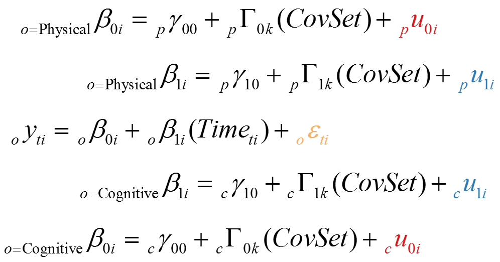
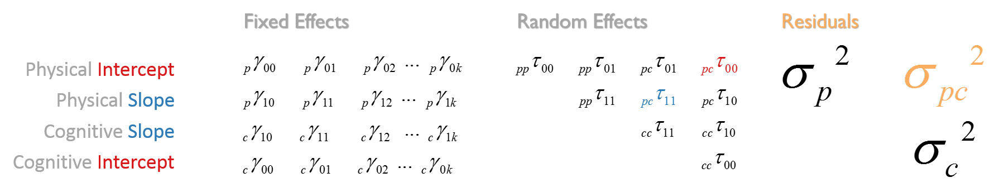

Model Specification
---
Bivariate linear growth curve model used by the Portland Collective as the fulcrum of coordination has the following specification  
      
     
where      
- *i* - individual     
- *t* - timepoint   
- *o* - outcome  (phys/cog)  
- *p* - physical measure used in estimation  
- *c* - cognitive measure used in estimation  
- *y<sub>t</sub><sub>i</sub>* - score for the individual *i* at time *t* on an outcome  
- &beta;<sub>0i</sub>  - bivariate initial status / random intercept   
- &beta;<sub>1i</sub>  - bivariate rate of change / random slope   
- *u*<sub>0i</sub> - is residual of the random intercept of an outcome  
- *u*<sub>1i</sub> - is residual of the random slope of an outcome  
- *&gamma;<sub>00</sub>* - p_GAMMA_00, c_GAMMA_00 -  average initial status / common intercept of an outcome       
- *&gamma;<sub>10</sub>* - p_GAMMA_10, c_GAMMA_10 -  average rate of change / common slope of an outcome      
- *&gamma;<sub>0k</sub>* - p_GAMMA_0k, c_GAMMA_0k -  effect of the *k*th predictor on the random intercept of an outcome  
- *&gamma;<sub>1k</sub>* - p_GAMMA_1k, c_GAMMA_1k - effect of the *k*th predictor on the random slope of an outcome
- *<sub>pp</sub>&tau;<sub>00</sub>* - pp_TAU_00 - variance of physical intercept  
- *<sub>pp</sub>&tau;<sub>11</sub>* - pp_TAU_11 - variance of physical slope  
- *<sub>cc</sub>&tau;<sub>11</sub>* - cc_TAU_11 - variance of cognitive slope  
- *<sub>cc</sub>&tau;<sub>00</sub>* - cc_TAU_00 - variance of cogntive intercept   
- *<sub>pp</sub>&tau;<sub>01</sub>* - pp_TAU_01 - covariance btw physical intercept and physical slope  
- *<sub>pc</sub>&tau;<sub>01</sub>* - pc_TAU_01 - covariance btw physical intercept and cognitive slope   
- *<sub>pc</sub>&tau;<sub>00</sub>* - pc_TAU_00 - covariance btw physical intercept and cognitive intercept - **I**  
- *<sub>pc</sub>&tau;<sub>11</sub>* - pc_TAU_11 - covariance btw physical slope and cognitive slope  - **S**  
- *<sub>pc</sub>&tau;<sub>10</sub>* - pc_TAU_10 - covariance btw physical slope and cognitive intercept   
- *<sub>cc</sub>&tau;<sub>10</sub>* - cc_TAU_10 - covariance btw cognitive slope and cognitive intercept      
- *<sub>p</sub>&#963;</sub>* - p_SIGMA - variance of the physical residual   
- *<sub>c</sub>&#963;</sub>* - c_SIGMA - variance of the cogntive residual    
- *<sub>pp</sub>&#963;</sub>* - pc_SIGMA - covariance btw physcial residual and cogntive residual - **R**    
  
THe model of this type could be fitted with the following Mplus syntax. To exemplify, we'll look at the model [b1_female_aeh_tug_speed_tug_digitsymbolsubstitutiontest.out](https://github.com/IALSA/IALSA-2015-Portland/blob/master/studies/ilse/TUG/b1_female_aeh_tug_speed_tug_digitsymbolsubstitutiontest.out) from ILSE study.  This ILSE was specified in Mplus as follows  
```
  MODEL:  ip sp | p1-p3 AT time1-time3;
          ic sc | c1-c3 AT time1-time3;
          ip; sp; ic; sc;
          ip sp ic sc WITH ip sp ic sc;

          ip sp ic sc ON Haupt second others Bage height;

          p1-p3 (res_p);
          c1-c3 (res_c);
          p1-p3 pwith c1-c3(res_cov);
```
The output of this model is processed with MplusAutomation package and the following data object produced, containing the numeric results of the estimated model solution.  The right-hand column contains alphanumeric names that map onto the algebraic specification of our bivariate growth model. 

```
> message("Getting ", study, ", model ", i, ", ",out_file)
Getting ilse, model 97, b1_female_aeh_tug_speed_tug_digitsymbolsubstitutiontest.out
> model
          paramHeader  param    est     se  est_se    pval
1               IP.ON  HAUPT -0.468  0.866  -0.541   0.589 - p_GAMMA_01
2               IP.ON SECOND  0.005  1.232   0.004   0.997 - p_GAMMA_02
3               IP.ON OTHERS -0.607  0.968  -0.627   0.531 - p_GAMMA_03
4               IP.ON   BAGE -0.172  0.209  -0.821   0.411 - p_GAMMA_04
5               IP.ON HEIGHT -0.006  0.030  -0.216   0.829 - p_GAMMA_05
6               SP.ON  HAUPT  0.111  0.138   0.806   0.420 - p_GAMMA_11
7               SP.ON SECOND  0.455  0.295   1.541   0.123 - p_GAMMA_12
8               SP.ON OTHERS  0.079  0.155   0.513   0.608 - p_GAMMA_13
9               SP.ON   BAGE  0.007  0.023   0.315   0.753 - p_GAMMA_14
10              SP.ON HEIGHT  0.002  0.003   0.595   0.552 - p_GAMMA_15
11              IC.ON  HAUPT  5.416  3.414   1.586   0.113 - c_GAMMA_01
12              IC.ON SECOND 14.395 10.836   1.328   0.184 - c_GAMMA_02
13              IC.ON OTHERS 15.247  4.121   3.700   0.000 - c_GAMMA_03
14              IC.ON   BAGE -0.252  0.934  -0.270   0.787 - c_GAMMA_04
15              IC.ON HEIGHT  0.153  0.144   1.064   0.288 - c_GAMMA_05
16              SC.ON  HAUPT -0.152  0.296  -0.513   0.608 - c_GAMMA_11
17              SC.ON SECOND -0.482  1.130  -0.426   0.670 - c_GAMMA_12
18              SC.ON OTHERS -0.166  0.318  -0.523   0.601 - c_GAMMA_13
19              SC.ON   BAGE  0.049  0.055   0.886   0.376 - c_GAMMA_14
20              SC.ON HEIGHT  0.003  0.006   0.414   0.679 - c_GAMMA_15
21            IP.WITH     SP -0.055  0.076  -0.731   0.465 - pp_TAU_01
22            IP.WITH     IC -2.513  1.901  -1.322   0.186 - pc_TAU_00
23            IP.WITH     SC -0.133  0.134  -0.994   0.320 - pc_TAU_01
24            SP.WITH     IC  0.178  0.220   0.810   0.418 - pc_TAU_10  
25            SP.WITH     SC  0.001  0.017   0.078   0.938 - pc_TAU_11  
26            IC.WITH     SC -0.514  0.621  -0.827   0.408 - cc_TAU_10
27            P1.WITH     C1  0.172  0.516   0.334   0.738 - pc_SIGMA
28            P2.WITH     C2  0.172  0.516   0.334   0.738 - pc_SIGMA
29            P3.WITH     C3  0.172  0.516   0.334   0.738 - pc_SIGMA
30         Intercepts     P1  0.000  0.000 999.000 999.000
31         Intercepts     P2  0.000  0.000 999.000 999.000
32         Intercepts     P3  0.000  0.000 999.000 999.000
33         Intercepts     C1  0.000  0.000 999.000 999.000
34         Intercepts     C2  0.000  0.000 999.000 999.000
35         Intercepts     C3  0.000  0.000 999.000 999.000
36         Intercepts     IP  5.047  1.757   2.872   0.004 - p_GAMMA_00  
37         Intercepts     SP  0.151  0.216   0.700   0.484 - p_GAMMA_10  
38         Intercepts     IC 36.655  6.672   5.494   0.000 - c_GAMMA_00  
39         Intercepts     SC  0.062  0.451   0.137   0.891 - c_GAMMA_10
40 Residual.Variances     P1  1.649  0.277   5.943   0.000 - p_SIGMA    
41 Residual.Variances     P2  1.649  0.277   5.943   0.000 - p_SIGMA  
42 Residual.Variances     P3  1.649  0.277   5.943   0.000 - p_SIGMA  
43 Residual.Variances     C1 14.190  1.094  12.973   0.000 - c_SIGMA  
44 Residual.Variances     C2 14.190  1.094  12.973   0.000 - c_SIGMA  
45 Residual.Variances     C3 14.190  1.094  12.973   0.000 - c_SIGMA  
46 Residual.Variances     IP  1.557  0.691   2.255   0.024 - pp_TAU_00
47 Residual.Variances     SP  0.003  0.010   0.267   0.789 - pp_TAU_11
48 Residual.Variances     IC 96.073 12.242   7.848   0.000 - cc_TAU_00
49 Residual.Variances     SC  0.058  0.045   1.306   0.192 - cc_TAU_11
```

  


<!-- for greek letter codes see http://www.scriptingmaster.com/html/inserting-greek-letters.asp -->
