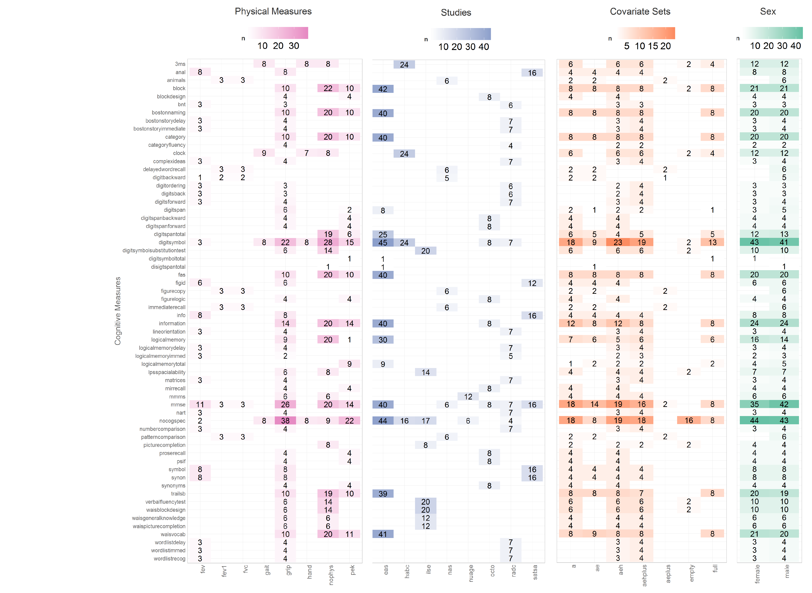
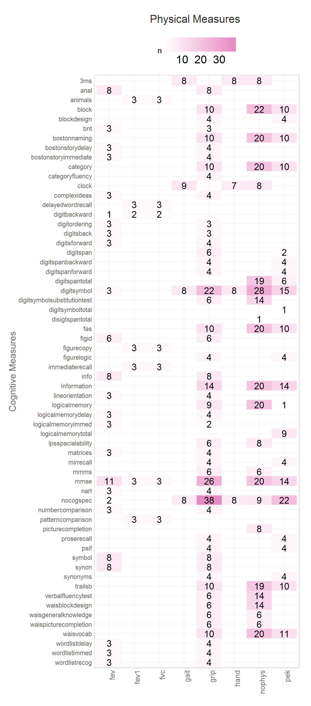
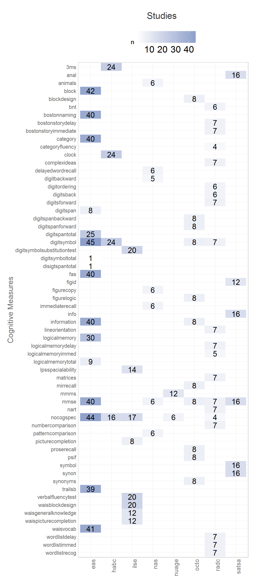
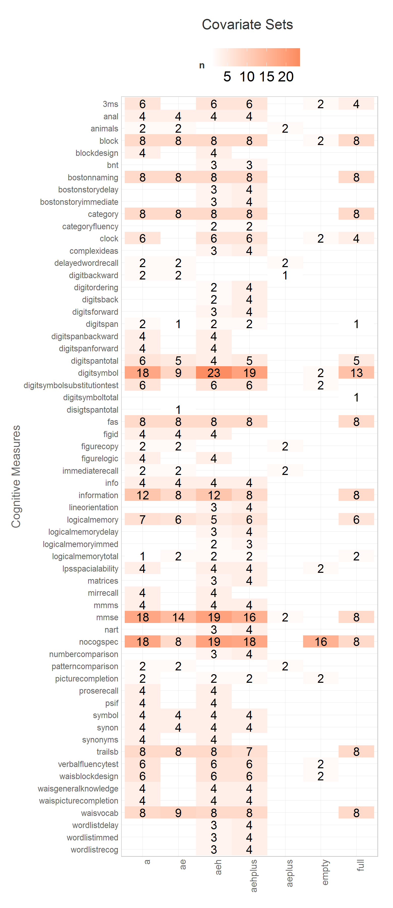
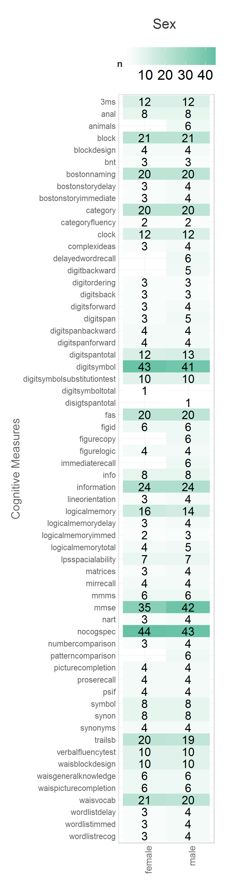

# Model Counts: IALSA Portland 2015


<!--  Set the working directory to the repository's base directory; this assumes the report is nested inside of two directories.-->


<!-- Set the report-wide options, and point to the external code file. -->


<!-- Load the sources.  Suppress the output when loading sources. --> 


<!-- Load 'sourced' R files.  Suppress the output when loading packages. --> 


<!-- Load any Global functions and variables declared in the R file.  Suppress the output. --> 


<!-- Declare any global functions specific to a Rmd output.  Suppress the output. --> 


<!-- Load the datasets.   -->


<!-- Tweak the datasets.   -->


<!-- Frequency counts   -->


This report establishes four key graphs that go into compiling the Model Catalog, which will be used to find and view replicated models. 


```
Source: local data frame [2 x 2]

  converged    n
1     FALSE    1
2      TRUE 1063
```


## Prototype

These four graphs can be united into a display of a quantitative invormation, necessary to identify overlaps in models across studies.


## Phys Measures

 


## Study

 

## Covariate Set
 

## Sex / Subtype

 


```


# Session Information
For the sake of documentation and reproducibility, the current report was rendered on a system using the following software.


```
Report rendered by koval_000 at 2015-06-06, 09:42 -0700
```

```
R version 3.2.0 (2015-04-16)
Platform: x86_64-w64-mingw32/x64 (64-bit)
Running under: Windows 8 x64 (build 9200)

locale:
[1] LC_COLLATE=English_United States.1252  LC_CTYPE=English_United States.1252    LC_MONETARY=English_United States.1252
[4] LC_NUMERIC=C                           LC_TIME=English_United States.1252    

attached base packages:
[1] grid      stats     graphics  grDevices utils     datasets  methods   base     

other attached packages:
[1] dplyr_0.4.1        testit_0.4         ggplot2_1.0.1      RColorBrewer_1.1-2 scales_0.2.4       knitr_1.10.5      

loaded via a namespace (and not attached):
 [1] Rcpp_0.11.6      magrittr_1.5     MASS_7.3-40      munsell_0.4.2    colorspace_1.2-6 stringr_1.0.0   
 [7] plyr_1.8.2       tools_3.2.0      parallel_3.2.0   gtable_0.1.2     DBI_0.3.1        htmltools_0.2.6 
[13] lazyeval_0.1.10  yaml_2.1.13      digest_0.6.8     assertthat_0.1   reshape2_1.4.1   formatR_1.2     
[19] evaluate_0.7     rmarkdown_0.6.1  labeling_0.3     stringi_0.4-1    proto_0.3-10    
```
