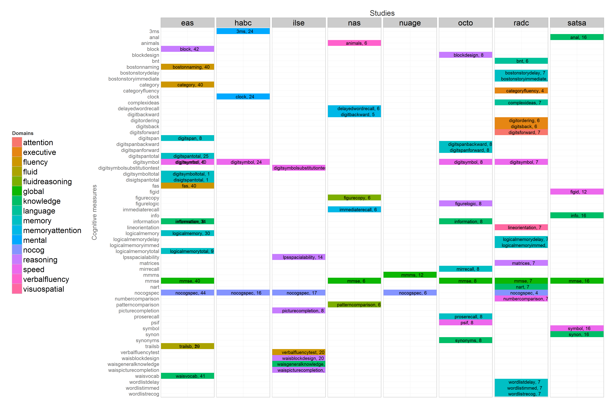
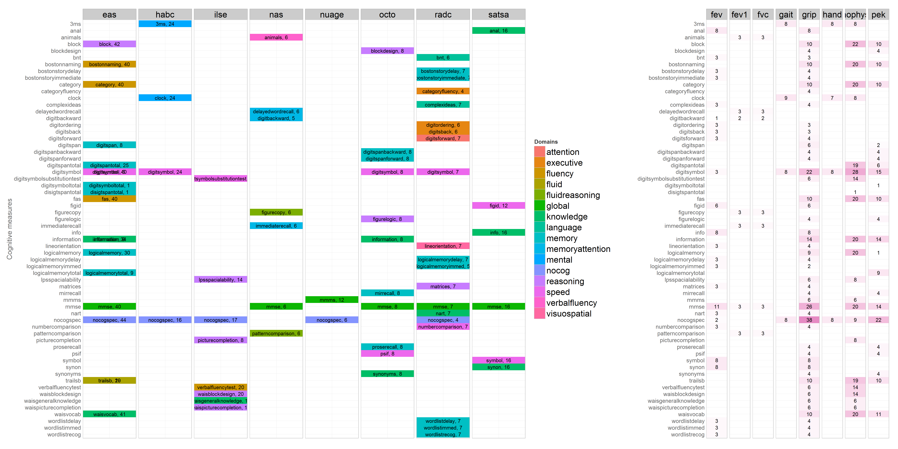
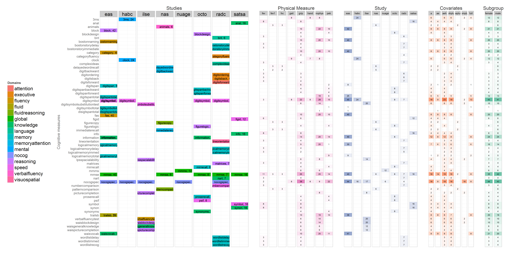

# Model Counts: IALSA Portland 2015


<!--  Set the working directory to the repository's base directory; this assumes the report is nested inside of two directories.-->


<!-- Set the report-wide options, and point to the external code file. -->


<!-- Load the sources.  Suppress the output when loading sources. --> 


<!-- Load 'sourced' R files.  Suppress the output when loading packages. --> 


<!-- Load any Global functions and variables declared in the R file.  Suppress the output. --> 


<!-- Declare any global functions specific to a Rmd output.  Suppress the output. --> 


<!-- Load the datasets.   -->


<!-- Tweak the datasets.   -->


## Prototype

Andrea, you've suggested the followed  structure to investigate replication potential across studies and cognitive domains:
  

I like how it simplifies the search for overlaps among measures. I developed the following interpretation of the demensionality in the graph above. 

## Domain Map


 

The domain map above is the actual data provided by the model in the Portland modeling collective right now. The colors  represent various cognitive domains, as identified by the participants in the model names. The colors are meant to be categorical, the change in hue is coincidental with alphabetic name.


## Cross count

We can augment this map with the tile graph of the bivariate model counts: 
 

## What to do

Now we have a better system for planning our project. Itemizing, we can distinguish the following objectives: 

  1. Reduce the number of colors in the domain map 
    a. Combine measures into domains  
    b. remove domains due to few  
  2. Reduce the number of rows  
  3. Reduce the number of columns
  4. Increase the value of numbers

## Combine with lattice

 


## Session Information
For the sake of documentation and reproducibility, the current report was rendered on a system using the following software.


```
Report rendered by koval_000 at 2015-06-10, 00:41 -0700
```

```
R version 3.2.0 (2015-04-16)
Platform: x86_64-w64-mingw32/x64 (64-bit)
Running under: Windows 8 x64 (build 9200)

locale:
[1] LC_COLLATE=English_United States.1252  LC_CTYPE=English_United States.1252    LC_MONETARY=English_United States.1252
[4] LC_NUMERIC=C                           LC_TIME=English_United States.1252    

attached base packages:
[1] grid      stats     graphics  grDevices utils     datasets  methods   base     

other attached packages:
[1] knitr_1.10.5    lattice_0.20-31 dplyr_0.4.1     ggplot2_1.0.1   shiny_0.12.0   

loaded via a namespace (and not attached):
 [1] Rcpp_0.11.6      magrittr_1.5     MASS_7.3-40      munsell_0.4.2    colorspace_1.2-6 xtable_1.7-4    
 [7] R6_2.0.1         stringr_1.0.0    plyr_1.8.2       tools_3.2.0      parallel_3.2.0   gtable_0.1.2    
[13] DBI_0.3.1        htmltools_0.2.6  yaml_2.1.13      lazyeval_0.1.10  digest_0.6.8     assertthat_0.1  
[19] formatR_1.2      reshape2_1.4.1   evaluate_0.7     mime_0.3         rmarkdown_0.6.1  stringi_0.4-1   
[25] scales_0.2.4     httpuv_1.3.2     proto_0.3-10    
```
