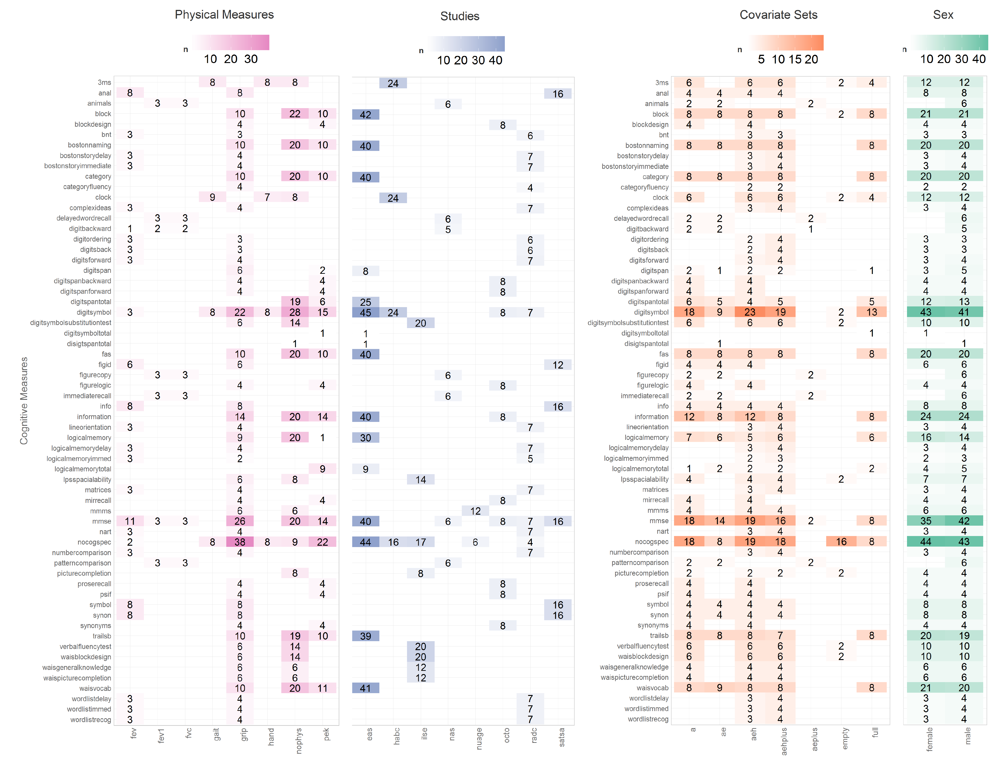

<!--  Set the working directory to the repository's base directory; this assumes the report is nested inside of two directories.-->
```{r, echo=F, message=F} 
# cat("Working directory: ", getwd())
  library(knitr)
  opts_knit$set(root.dir='../../')  #Don't combine this call with any other chunk -especially one that uses file paths.
```

<!-- Set the report-wide options, and point to the external code file. -->
```{r set_options, echo=F}
# cat("Working directory: ", getwd())
opts_chunk$set(
  results='show', 
  comment = NA, 
  tidy = FALSE,
  fig.width = 6.5, 
  fig.height = 4, 
  fig.path = 'figure_overlap/'
)
# dpi = 400,
# out.width = "650px", #This affects only the markdown, not the underlying png file.  The height will be scaled appropriately.

echoChunks <- FALSE
options(width=120) #So the output is 50% wider than the default.
read_chunk("./reports/overlap_search_graphs/2b_visualizing_overlap.R") #This allows knitr to call chunks tagged in the underlying *.R file.
```

<!-- Load the sources.  Suppress the output when loading sources. --> 
```{r load_sources, echo=echoChunks, message=FALSE}
```

<!-- Load 'sourced' R files.  Suppress the output when loading packages. --> 
```{r load_packages, echo=echoChunks, message=FALSE}
```

<!-- Load any Global functions and variables declared in the R file.  Suppress the output. --> 
```{r declare_globals, echo=echoChunks, results='show', message=FALSE}
```

<!-- Declare any global functions specific to a Rmd output.  Suppress the output. --> 
```{r, echo=echoChunks, message=FALSE}
#Put code in here.  It doesn't call a chunk in the codebehind file.
```

<!-- Load the datasets.   -->
```{r load_data, echo=echoChunks, results='show', message=FALSE}
```

<!-- Tweak the datasets.   -->
```{r tweak_data, echo=echoChunks, results='show', message=FALSE}
```

<!-- Frequency counts   -->


This report establishes four key graphs that go into compiling the Model Catalog, which will be used to find and view replicated models. 


```{r cross_table_data_dplyr, echo=echoChunks, results='show', message=FALSE}
```

```{r define_themes, echo=echoChunks, results='show', message=FALSE}
```
## Prototype

These four graphs can be united into a display of a quantitative invormation, necessary to identify overlaps in models across studies.


## Phys Measures

```{r 0_graph_phys_measure, echo=echoChunks, results='show', message=FALSE, fig.width=5.3, fig.height=12, dpi=300}
```


## Study

```{r 1_graph_study_name, echo=echoChunks, results='show', message=FALSE, fig.width=5.3, fig.height=12, dpi=300}
```

## Covariate Set
```{r 2_graph_model_type, echo=echoChunks, results='show', message=FALSE, fig.width=5.2, fig.height=12, dpi=300}
```

## Sex / Subtype

```{r 3_graph_subgroup, echo=echoChunks, results='show', message=FALSE, fig.width=3.1, fig.height=12, dpi=300}
```


## Composite
```{r dashboard_tile_graph, echo=echoChunks, results='show', message=FALSE, fig.width=12, fig.height=8, dpi=300}
```


```


# Session Information
For the sake of documentation and reproducibility, the current report was rendered on a system using the following software.

```{r session_info, echo=FALSE}
cat("Report rendered by", Sys.info()["user"], "at", strftime(Sys.time(), "%Y-%m-%d, %H:%M %z"))
sessionInfo()
```
