Go to the specific study   
-[EAS](/reports/physical/fscores_scatter/figure_rmd/README.md#eas)  
-[HRS](/reports/physical/fscores_scatter/figure_rmd/README.md#hrs)  
-[LASA](/reports/physical/fscores_scatter/figure_rmd/README.md#lasa)  
-[OCTO](/reports/physical/fscores_scatter/figure_rmd/README.md#octo)  
-[RADC](/reports/physical/fscores_scatter/figure_rmd/README.md#radc)  
-[SATSA](/reports/physical/fscores_scatter/figure_rmd/README.md#satsa)  

##EAS             
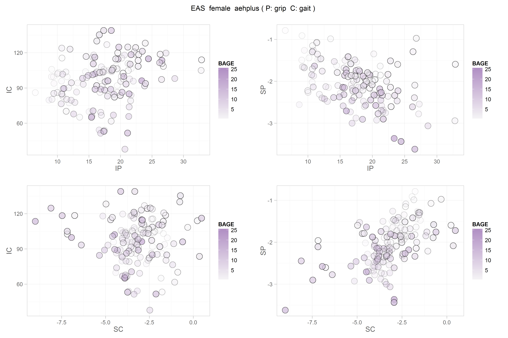  
   
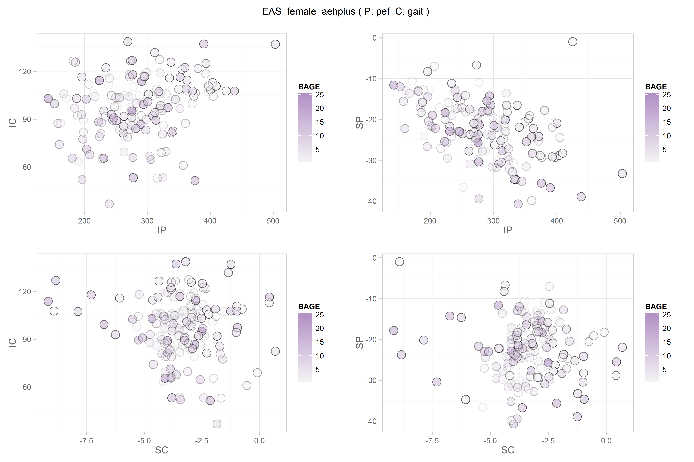   
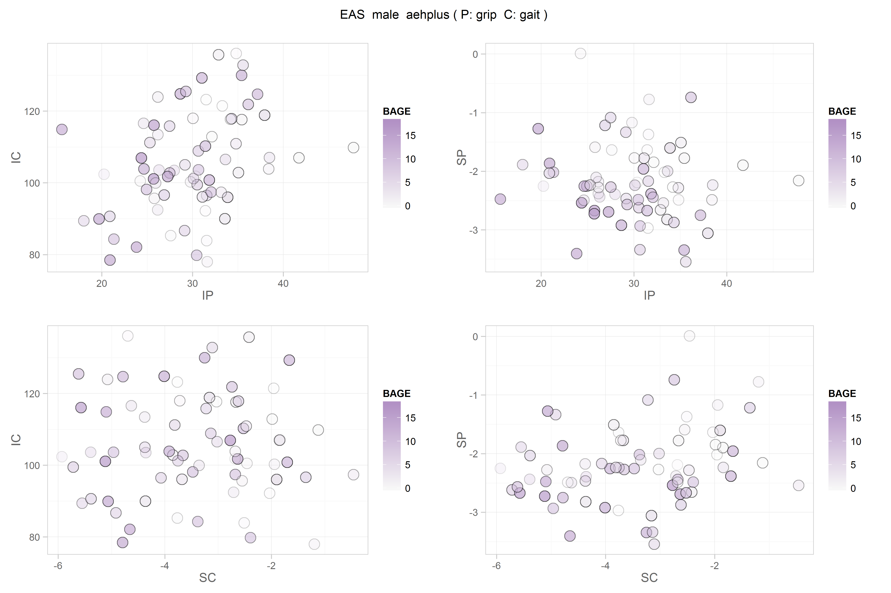    
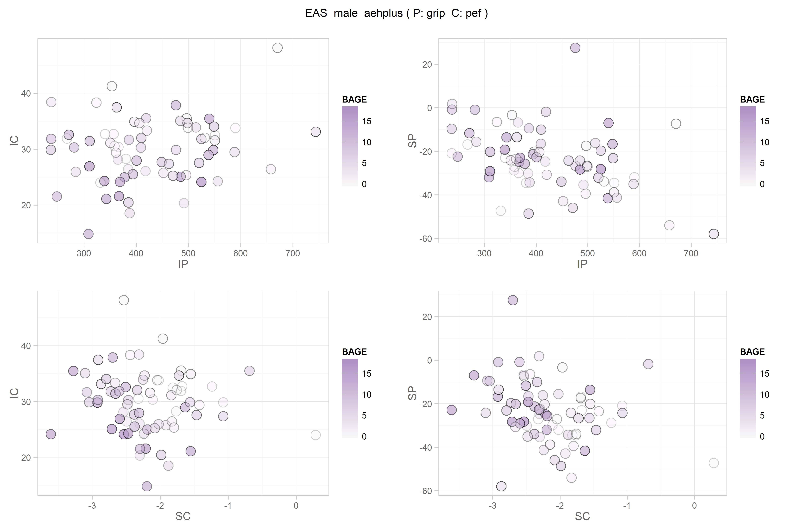     
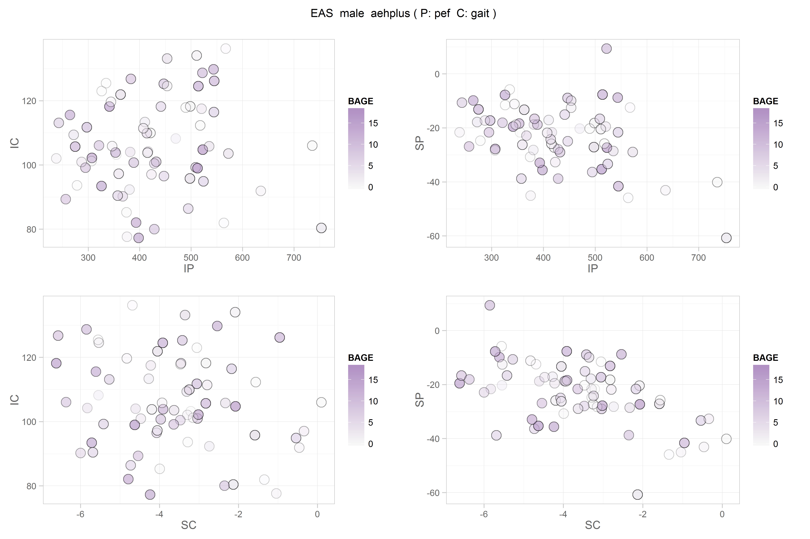     

##HRS
  
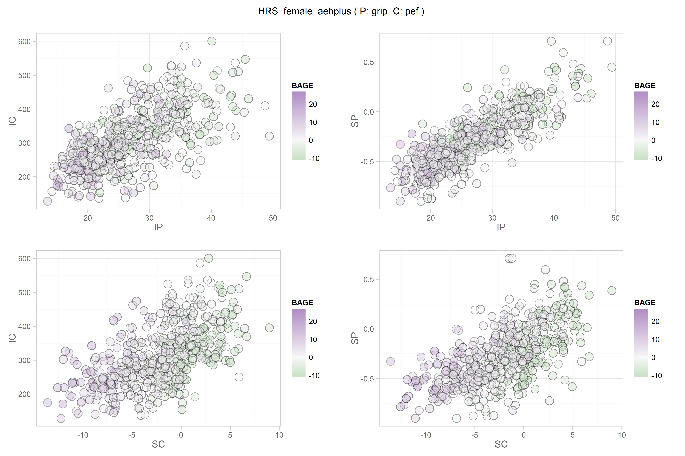   
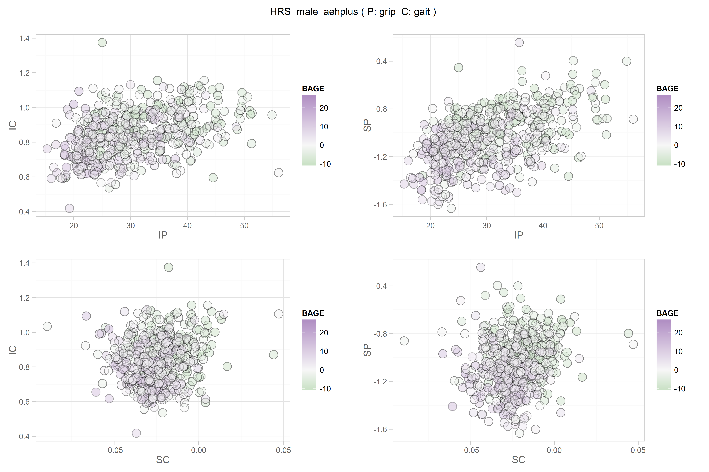    
     

##LASA
 
  
  
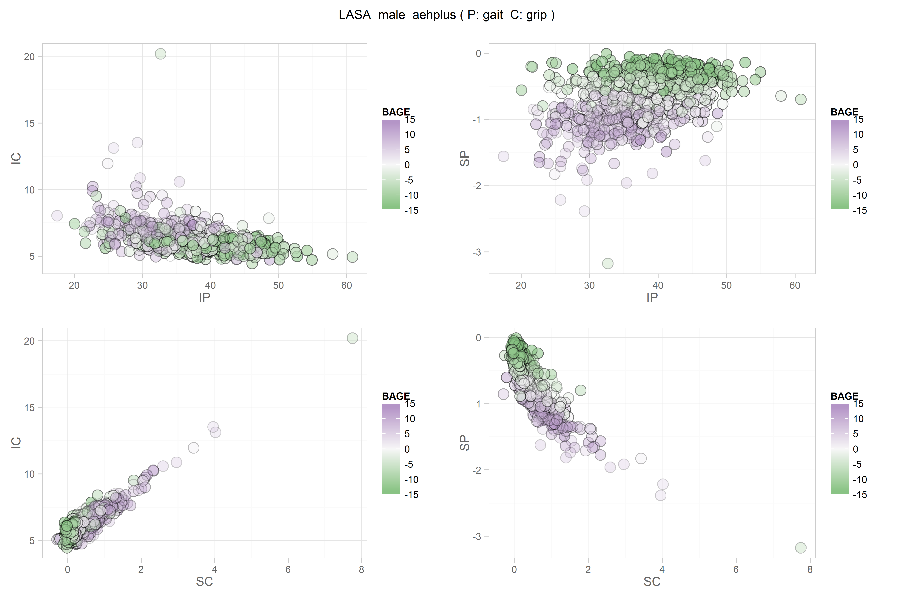   
    
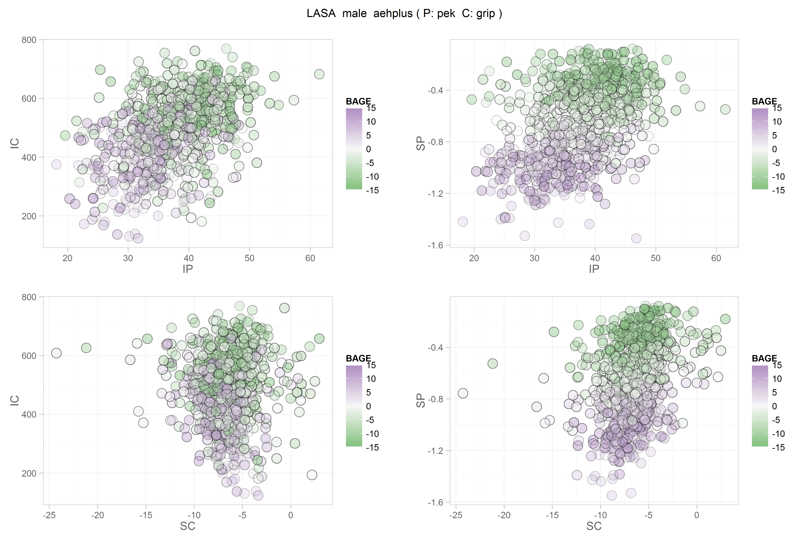    

##OCTO
 
  
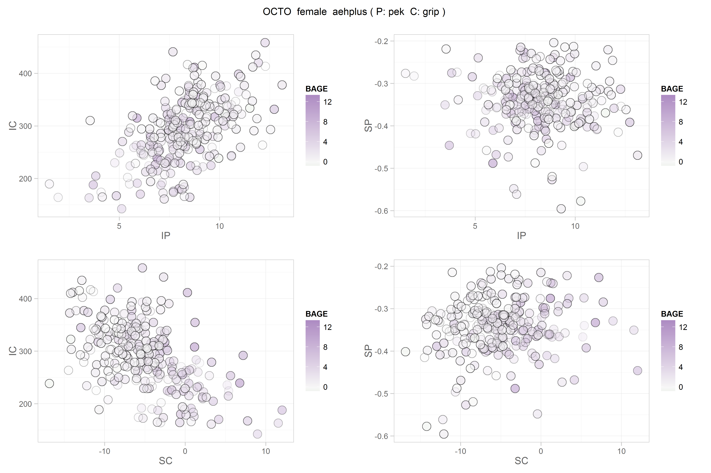  
   
    
    

##RADC
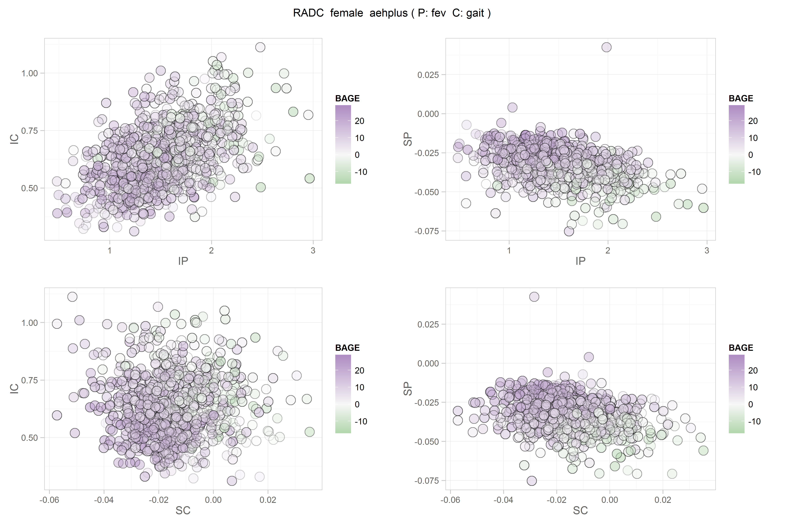  
  
 
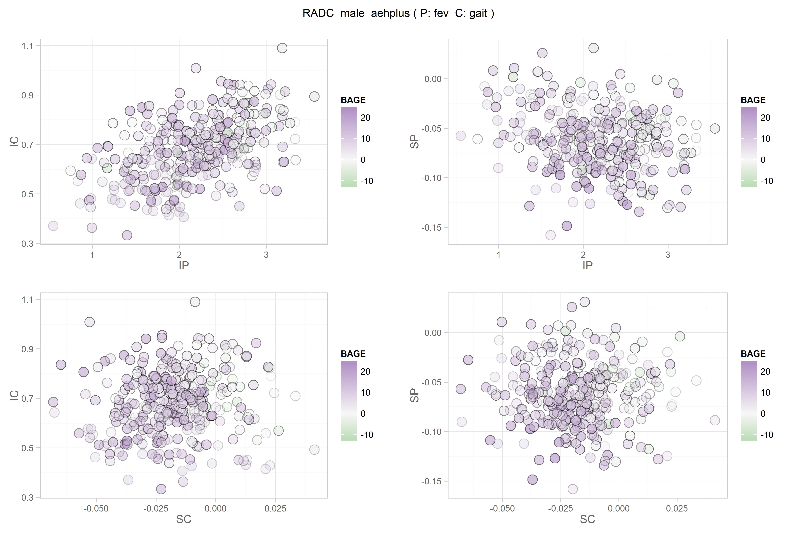    
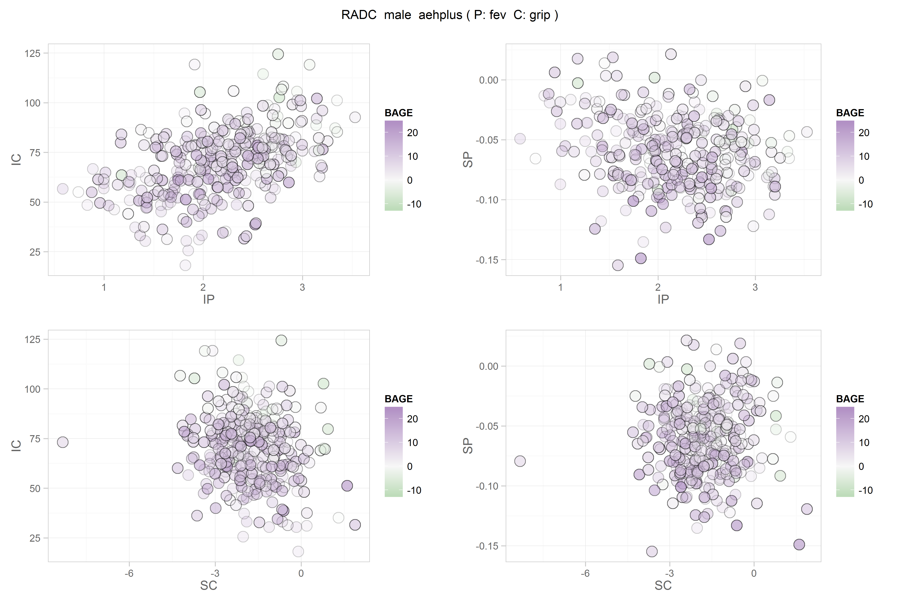    
   

##SATSA
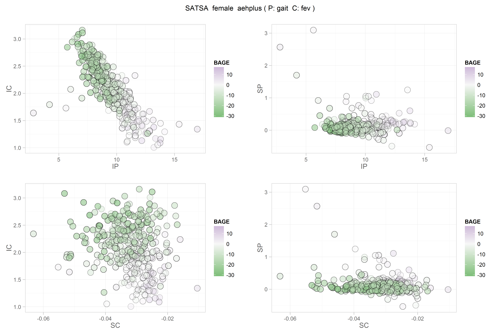 

 
   
  
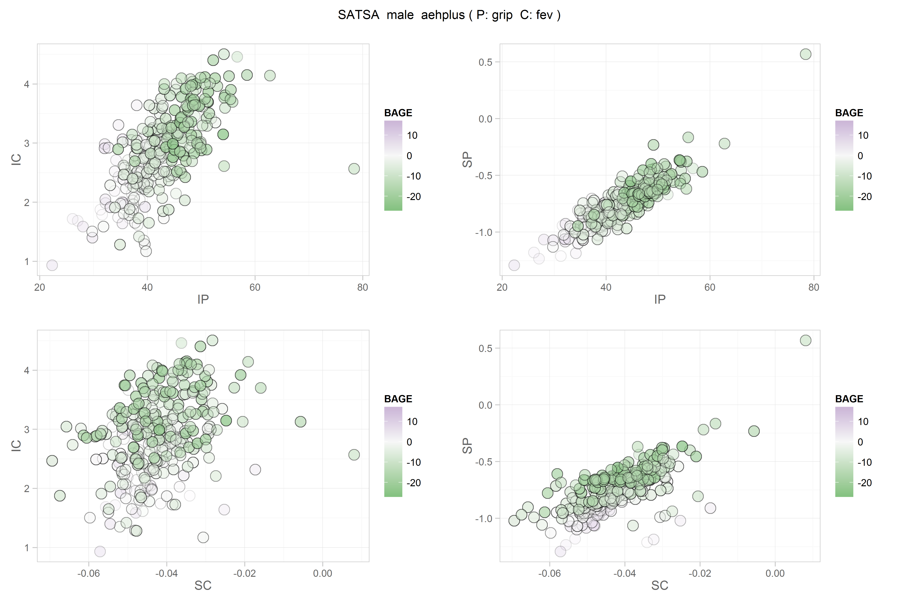  
