# FScore Scatters

<!-- These two chunks should be added in the beginning of every .Rmd that you want to source an .R script -->
<!--  The 1st mandatory chunck  -->
<!--  Set the working directory to the repository's base directory -->


<!--  The 2nd mandatory chunck  -->
<!-- Set the report-wide options, and point to the external code file. -->


<!-- Load 'sourced' R files.  Suppress the output when loading packages. --> 


<!-- Load the sources.  Suppress the output when loading sources. --> 

```
[1] "Loaded rhdf5 package"
```


<!-- Load any Global functions and variables declared in the R file.  Suppress the output. --> 


```
 [1] "./studies/eas/physical/b1_female_aehplus_grip_gait.gh5"  
 [2] "./studies/eas/physical/b1_female_aehplus_grip_pef.gh5"   
 [3] "./studies/eas/physical/b1_female_aehplus_pef_gait.gh5"   
 [4] "./studies/eas/physical/b1_male_aehplus_grip_gait.gh5"    
 [5] "./studies/eas/physical/b1_male_aehplus_grip_pef.gh5"     
 [6] "./studies/eas/physical/b1_male_aehplus_pef_gait.gh5"     
 [7] "./studies/hrs/physical/b1_female_aehplus_grip_gait.gh5"  
 [8] "./studies/hrs/physical/b1_female_aehplus_grip_pef.gh5"   
 [9] "./studies/hrs/physical/b1_female_aehplus_pef_gait.gh5"   
[10] "./studies/hrs/physical/b1_male_aehplus_grip_gait.gh5"    
[11] "./studies/hrs/physical/b1_male_aehplus_grip_pef.gh5"     
[12] "./studies/hrs/physical/b1_male_aehplus_pef_gait.gh5"     
[13] "./studies/lasa/physical/b1_female_aehplus_gait_grip.gh5" 
[14] "./studies/lasa/physical/b1_female_aehplus_pek_gait.gh5"  
[15] "./studies/lasa/physical/b1_female_aehplus_pek_grip.gh5"  
[16] "./studies/lasa/physical/b1_male_aehplus_gait_grip.gh5"   
[17] "./studies/lasa/physical/b1_male_aehplus_pek_gait.gh5"    
[18] "./studies/lasa/physical/b1_male_aehplus_pek_grip.gh5"    
[19] "./studies/octo/physical/b1_female_aehplus_gait_grip.gh5" 
[20] "./studies/octo/physical/b1_female_aehplus_pek_gait.gh5"  
[21] "./studies/octo/physical/b1_female_aehplus_pek_grip.gh5"  
[22] "./studies/octo/physical/b1_male_aehplus_gait_grip.gh5"   
[23] "./studies/octo/physical/b1_male_aehplus_pek_gait.gh5"    
[24] "./studies/octo/physical/b1_male_aehplus_pek_grip.gh5"    
[25] "./studies/radc/physical/b1_female_aehplus_fev_gait.gh5"  
[26] "./studies/radc/physical/b1_female_aehplus_fev_grip.gh5"  
[27] "./studies/radc/physical/b1_female_aehplus_gait_grip.gh5" 
[28] "./studies/radc/physical/b1_male_aehplus_fev_gait.gh5"    
[29] "./studies/radc/physical/b1_male_aehplus_fev_grip.gh5"    
[30] "./studies/radc/physical/b1_male_aehplus_gait_grip.gh5"   
[31] "./studies/satsa/physical/b1_female_aehplus_gait_fev.gh5" 
[32] "./studies/satsa/physical/b1_female_aehplus_gait_grip.gh5"
[33] "./studies/satsa/physical/b1_female_aehplus_grip_fev.gh5" 
[34] "./studies/satsa/physical/b1_male_aehplus_gait_fev.gh5"   
[35] "./studies/satsa/physical/b1_male_aehplus_gait_grip.gh5"  
[36] "./studies/satsa/physical/b1_male_aehplus_grip_fev.gh5"   
```

```
[1] "paths"      "study"      "model_name" "subgroup"   "model_type" "process1"   "process2"  
```


<!-- Declare any global functions specific to a Rmd output.  Suppress the output. --> 


<!-- Load the datasets.   -->

```

Plot functions:
 - mplus.plot.histogram('./studies/eas/physical/b1_male_aehplus_grip_pef.gh5',variable,bins)
 - mplus.plot.scatterplot('./studies/eas/physical/b1_male_aehplus_grip_pef.gh5',xvar,yvar)

Plot data extraction functions:
 - mplus.list.variables('./studies/eas/physical/b1_male_aehplus_grip_pef.gh5')
 - mplus.get.data('./studies/eas/physical/b1_male_aehplus_grip_pef.gh5',variable)

List of variable names to use in the following functions:
 - mplus.plot.histogram
 - mplus.plot.scatterplot
 - mplus.get.data

Variables:
```

```
Warning in if (index == 0) {: the condition has length > 1 and only the first element will be used
```

<!-- Tweak the datasets.   -->


<!-- Basic table view.   -->


<!-- Basic graph view.   -->

```r
proto_scatter <- function(dsL,x, y){
g <- ggplot2::ggplot(dsL,aes_string(x=x, y=y, fill="BAGE"))+
  geom_point(shape=21,size=5, alpha=.1)+
  scale_fill_gradient2(low="#7fbf7b", mid="#f7f7f7", high="#af8dc3", space="Lab")+
  main_theme
g
}
proto_scatter(dsL,x="SP", y="SC")
```

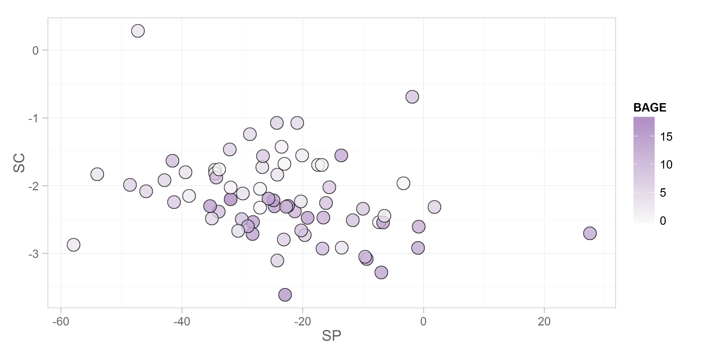

```r
# d <- dsL %>% tidyr::gather_("term","value",c("IP","SP","SC","IC"))
# d$age <- d[is.na(d$observed),"age"]
# d %>% dplyr::filter(id==1) %>% dplyr::select(id, BAGE, wave, time, outcome, observed, age, term, value )

#inspect data for one individual
dsL %>% dplyr::filter(id==1) %>% dplyr::select(id, BAGE, wave, time, outcome, observed, age, IP, SP, SC, IC )
```

```
   id     BAGE wave time   outcome observed     age       IP       SP        SC       IC
1   1 2.687201    1    1  physical      300 73.6872 380.4318 -34.5074 -1.765668 28.24879
2   1 2.687201    2    2  physical       NA 74.6872 380.4318 -34.5074 -1.765668 28.24879
3   1 2.687201    3   NA  physical       NA      NA 380.4318 -34.5074 -1.765668 28.24879
4   1 2.687201    4   NA  physical       NA      NA 380.4318 -34.5074 -1.765668 28.24879
5   1 2.687201    5   NA  physical       NA      NA 380.4318 -34.5074 -1.765668 28.24879
6   1 2.687201    6   NA  physical       NA      NA 380.4318 -34.5074 -1.765668 28.24879
7   1 2.687201    7   NA  physical       NA      NA 380.4318 -34.5074 -1.765668 28.24879
8   1 2.687201    1    1 cognitive       23 73.6872 380.4318 -34.5074 -1.765668 28.24879
9   1 2.687201    2    2 cognitive       NA 74.6872 380.4318 -34.5074 -1.765668 28.24879
10  1 2.687201    3   NA cognitive       NA      NA 380.4318 -34.5074 -1.765668 28.24879
11  1 2.687201    4   NA cognitive       NA      NA 380.4318 -34.5074 -1.765668 28.24879
12  1 2.687201    5   NA cognitive       NA      NA 380.4318 -34.5074 -1.765668 28.24879
13  1 2.687201    6   NA cognitive       NA      NA 380.4318 -34.5074 -1.765668 28.24879
14  1 2.687201    7   NA cognitive       NA      NA 380.4318 -34.5074 -1.765668 28.24879
```

```r
# create plot
```


```
 [1] "./studies/eas/physical/b1_female_aehplus_grip_gait.gh5"  
 [2] "./studies/eas/physical/b1_female_aehplus_grip_pef.gh5"   
 [3] "./studies/eas/physical/b1_female_aehplus_pef_gait.gh5"   
 [4] "./studies/eas/physical/b1_male_aehplus_grip_gait.gh5"    
 [5] "./studies/eas/physical/b1_male_aehplus_grip_pef.gh5"     
 [6] "./studies/eas/physical/b1_male_aehplus_pef_gait.gh5"     
 [7] "./studies/hrs/physical/b1_female_aehplus_grip_gait.gh5"  
 [8] "./studies/hrs/physical/b1_female_aehplus_grip_pef.gh5"   
 [9] "./studies/hrs/physical/b1_female_aehplus_pef_gait.gh5"   
[10] "./studies/hrs/physical/b1_male_aehplus_grip_gait.gh5"    
[11] "./studies/hrs/physical/b1_male_aehplus_grip_pef.gh5"     
[12] "./studies/hrs/physical/b1_male_aehplus_pef_gait.gh5"     
[13] "./studies/lasa/physical/b1_female_aehplus_gait_grip.gh5" 
[14] "./studies/lasa/physical/b1_female_aehplus_pek_gait.gh5"  
[15] "./studies/lasa/physical/b1_female_aehplus_pek_grip.gh5"  
[16] "./studies/lasa/physical/b1_male_aehplus_gait_grip.gh5"   
[17] "./studies/lasa/physical/b1_male_aehplus_pek_gait.gh5"    
[18] "./studies/lasa/physical/b1_male_aehplus_pek_grip.gh5"    
[19] "./studies/octo/physical/b1_female_aehplus_gait_grip.gh5" 
[20] "./studies/octo/physical/b1_female_aehplus_pek_gait.gh5"  
[21] "./studies/octo/physical/b1_female_aehplus_pek_grip.gh5"  
[22] "./studies/octo/physical/b1_male_aehplus_gait_grip.gh5"   
[23] "./studies/octo/physical/b1_male_aehplus_pek_gait.gh5"    
[24] "./studies/octo/physical/b1_male_aehplus_pek_grip.gh5"    
[25] "./studies/radc/physical/b1_female_aehplus_fev_gait.gh5"  
[26] "./studies/radc/physical/b1_female_aehplus_fev_grip.gh5"  
[27] "./studies/radc/physical/b1_female_aehplus_gait_grip.gh5" 
[28] "./studies/radc/physical/b1_male_aehplus_fev_gait.gh5"    
[29] "./studies/radc/physical/b1_male_aehplus_fev_grip.gh5"    
[30] "./studies/radc/physical/b1_male_aehplus_gait_grip.gh5"   
[31] "./studies/satsa/physical/b1_female_aehplus_gait_fev.gh5" 
[32] "./studies/satsa/physical/b1_female_aehplus_gait_grip.gh5"
[33] "./studies/satsa/physical/b1_female_aehplus_grip_fev.gh5" 
[34] "./studies/satsa/physical/b1_male_aehplus_gait_fev.gh5"   
[35] "./studies/satsa/physical/b1_male_aehplus_gait_grip.gh5"  
[36] "./studies/satsa/physical/b1_male_aehplus_grip_fev.gh5"   
```
#FEMALES
# EAS
## grip_pef

```r
dsL <- get_gh5_data(file=ls_gh5,
                    study = "eas",
                    subgroup = "female",
                    model_type = "aehplus",
                    process1 = "grip",
                    process2 = "pef")
```

```

Plot functions:
 - mplus.plot.histogram('./studies/eas/physical/b1_female_aehplus_grip_pef.gh5',variable,bins)
 - mplus.plot.scatterplot('./studies/eas/physical/b1_female_aehplus_grip_pef.gh5',xvar,yvar)

Plot data extraction functions:
 - mplus.list.variables('./studies/eas/physical/b1_female_aehplus_grip_pef.gh5')
 - mplus.get.data('./studies/eas/physical/b1_female_aehplus_grip_pef.gh5',variable)

List of variable names to use in the following functions:
 - mplus.plot.histogram
 - mplus.plot.scatterplot
 - mplus.get.data

Variables:
```

```r
fscore_scatter(dsL) # create scatterplot
```

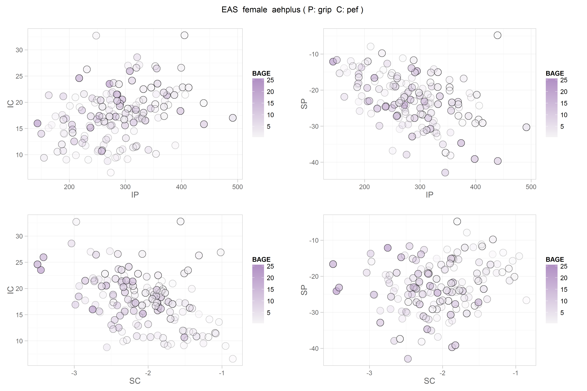

## pef_gait

```r
dsL <- get_gh5_data(file=ls_gh5,
                    study = "eas",
                    subgroup = "female",
                    model_type = "aehplus",
                    process1 = "pef",
                    process2 = "gait")
```

```

Plot functions:
 - mplus.plot.histogram('./studies/eas/physical/b1_female_aehplus_pef_gait.gh5',variable,bins)
 - mplus.plot.scatterplot('./studies/eas/physical/b1_female_aehplus_pef_gait.gh5',xvar,yvar)

Plot data extraction functions:
 - mplus.list.variables('./studies/eas/physical/b1_female_aehplus_pef_gait.gh5')
 - mplus.get.data('./studies/eas/physical/b1_female_aehplus_pef_gait.gh5',variable)

List of variable names to use in the following functions:
 - mplus.plot.histogram
 - mplus.plot.scatterplot
 - mplus.get.data

Variables:
```

```r
fscore_scatter(dsL) # create scatterplot
```


## grip_gait

```r
dsL <- get_gh5_data(file=ls_gh5,
                    study = "eas",
                    subgroup = "female",
                    model_type = "aehplus",
                    process1 = "grip",
                    process2 = "gait")
```

```

Plot functions:
 - mplus.plot.histogram('./studies/eas/physical/b1_female_aehplus_grip_gait.gh5',variable,bins)
 - mplus.plot.scatterplot('./studies/eas/physical/b1_female_aehplus_grip_gait.gh5',xvar,yvar)

Plot data extraction functions:
 - mplus.list.variables('./studies/eas/physical/b1_female_aehplus_grip_gait.gh5')
 - mplus.get.data('./studies/eas/physical/b1_female_aehplus_grip_gait.gh5',variable)

List of variable names to use in the following functions:
 - mplus.plot.histogram
 - mplus.plot.scatterplot
 - mplus.get.data

Variables:
```

```r
fscore_scatter(dsL) # create scatterplot
```


```r
#### HRS ####
```

# HRS
## grip_gait

```r
dsL <- get_gh5_data(file=ls_gh5,
                    study = "hrs",
                    subgroup = "female",
                    model_type = "aehplus",
                    process1 = "grip",
                    process2 = "gait")
```

```

Plot functions:
 - mplus.plot.histogram('./studies/hrs/physical/b1_female_aehplus_grip_gait.gh5',variable,bins)
 - mplus.plot.scatterplot('./studies/hrs/physical/b1_female_aehplus_grip_gait.gh5',xvar,yvar)

Plot data extraction functions:
 - mplus.list.variables('./studies/hrs/physical/b1_female_aehplus_grip_gait.gh5')
 - mplus.get.data('./studies/hrs/physical/b1_female_aehplus_grip_gait.gh5',variable)

List of variable names to use in the following functions:
 - mplus.plot.histogram
 - mplus.plot.scatterplot
 - mplus.get.data

Variables:
```

```r
fscore_scatter(dsL) # create scatterplot
```

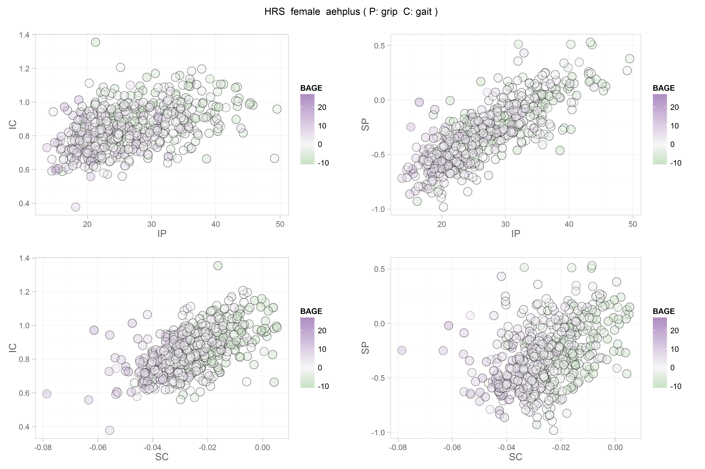

## grip_pef

```r
dsL <- get_gh5_data(file=ls_gh5,
                    study = "hrs",
                    subgroup = "female",
                    model_type = "aehplus",
                    process1 = "grip",
                    process2 = "pef")
```

```

Plot functions:
 - mplus.plot.histogram('./studies/hrs/physical/b1_female_aehplus_grip_pef.gh5',variable,bins)
 - mplus.plot.scatterplot('./studies/hrs/physical/b1_female_aehplus_grip_pef.gh5',xvar,yvar)

Plot data extraction functions:
 - mplus.list.variables('./studies/hrs/physical/b1_female_aehplus_grip_pef.gh5')
 - mplus.get.data('./studies/hrs/physical/b1_female_aehplus_grip_pef.gh5',variable)

List of variable names to use in the following functions:
 - mplus.plot.histogram
 - mplus.plot.scatterplot
 - mplus.get.data

Variables:
```

```r
fscore_scatter(dsL) # create scatterplot
```


## pef_gait

```r
dsL <- get_gh5_data(file=ls_gh5,
                    study = "hrs",
                    subgroup = "female",
                    model_type = "aehplus",
                    process1 = "pef",
                    process2 = "gait")
```

```

Plot functions:
 - mplus.plot.histogram('./studies/hrs/physical/b1_female_aehplus_pef_gait.gh5',variable,bins)
 - mplus.plot.scatterplot('./studies/hrs/physical/b1_female_aehplus_pef_gait.gh5',xvar,yvar)

Plot data extraction functions:
 - mplus.list.variables('./studies/hrs/physical/b1_female_aehplus_pef_gait.gh5')
 - mplus.get.data('./studies/hrs/physical/b1_female_aehplus_pef_gait.gh5',variable)

List of variable names to use in the following functions:
 - mplus.plot.histogram
 - mplus.plot.scatterplot
 - mplus.get.data

Variables:
```

```r
fscore_scatter(dsL) # create scatterplot
```

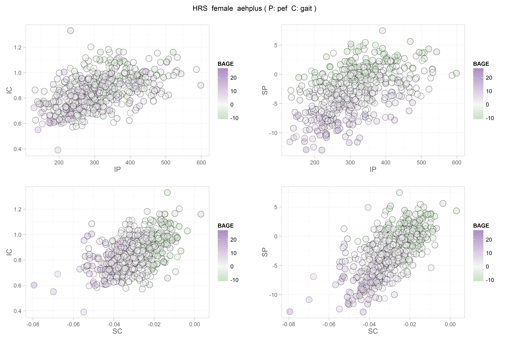

```r
##### LASA ####
```


# LASA
## gait_grip

```r
dsL <- get_gh5_data(file=ls_gh5,
                    study = "lasa",
                    subgroup = "female",
                    model_type = "aehplus",
                    process1 = "gait",
                    process2 = "grip")
```

```

Plot functions:
 - mplus.plot.histogram('./studies/lasa/physical/b1_female_aehplus_gait_grip.gh5',variable,bins)
 - mplus.plot.scatterplot('./studies/lasa/physical/b1_female_aehplus_gait_grip.gh5',xvar,yvar)

Plot data extraction functions:
 - mplus.list.variables('./studies/lasa/physical/b1_female_aehplus_gait_grip.gh5')
 - mplus.get.data('./studies/lasa/physical/b1_female_aehplus_gait_grip.gh5',variable)

List of variable names to use in the following functions:
 - mplus.plot.histogram
 - mplus.plot.scatterplot
 - mplus.get.data

Variables:
```

```r
fscore_scatter(dsL) # create scatterplot
```

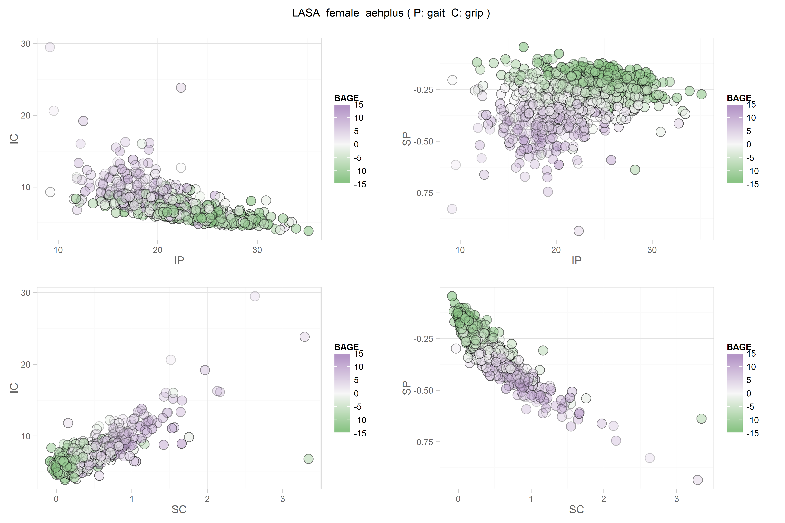

## pek_gait

```r
dsL <- get_gh5_data(file=ls_gh5,
                    study = "lasa",
                    subgroup = "female",
                    model_type = "aehplus",
                    process1 = "pek",
                    process2 = "gait")
```

```

Plot functions:
 - mplus.plot.histogram('./studies/lasa/physical/b1_female_aehplus_pek_gait.gh5',variable,bins)
 - mplus.plot.scatterplot('./studies/lasa/physical/b1_female_aehplus_pek_gait.gh5',xvar,yvar)

Plot data extraction functions:
 - mplus.list.variables('./studies/lasa/physical/b1_female_aehplus_pek_gait.gh5')
 - mplus.get.data('./studies/lasa/physical/b1_female_aehplus_pek_gait.gh5',variable)

List of variable names to use in the following functions:
 - mplus.plot.histogram
 - mplus.plot.scatterplot
 - mplus.get.data

Variables:
```

```r
fscore_scatter(dsL) # create scatterplot
```

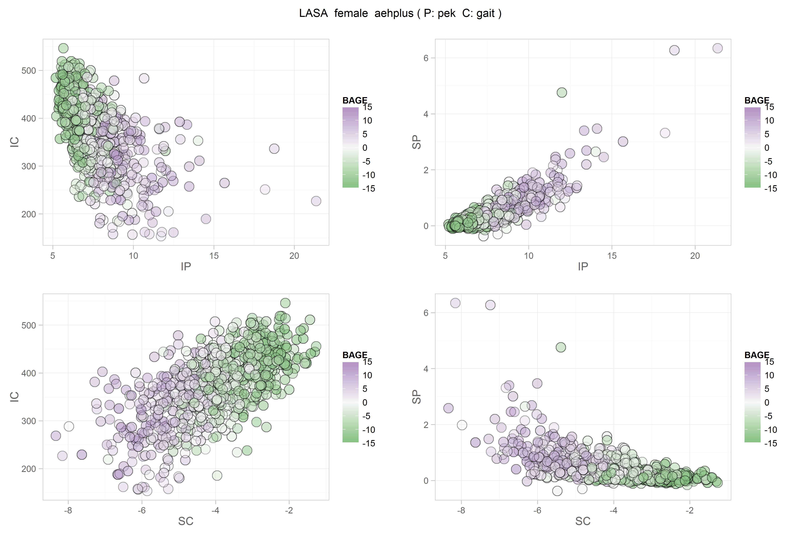

## pek_grip

```r
dsL <- get_gh5_data(file=ls_gh5,
                    study = "lasa",
                    subgroup = "female",
                    model_type = "aehplus",
                    process1 = "pek",
                    process2 = "grip")
```

```

Plot functions:
 - mplus.plot.histogram('./studies/lasa/physical/b1_female_aehplus_pek_grip.gh5',variable,bins)
 - mplus.plot.scatterplot('./studies/lasa/physical/b1_female_aehplus_pek_grip.gh5',xvar,yvar)

Plot data extraction functions:
 - mplus.list.variables('./studies/lasa/physical/b1_female_aehplus_pek_grip.gh5')
 - mplus.get.data('./studies/lasa/physical/b1_female_aehplus_pek_grip.gh5',variable)

List of variable names to use in the following functions:
 - mplus.plot.histogram
 - mplus.plot.scatterplot
 - mplus.get.data

Variables:
```

```r
fscore_scatter(dsL) # create scatterplot
```

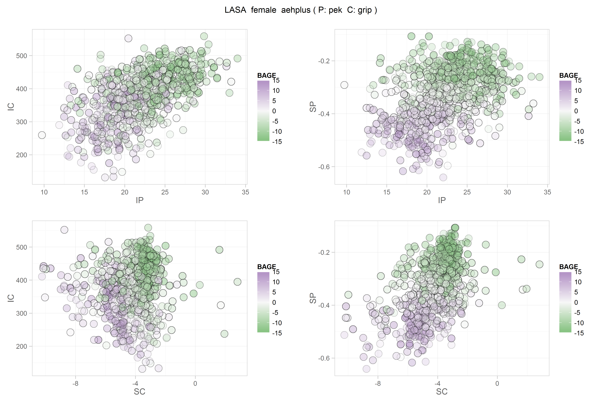

```r
#### OCTO ####
```


# OCTO
## gait_grip

```r
dsL <- get_gh5_data(file=ls_gh5,
                    study = "octo",
                    subgroup = "female",
                    model_type = "aehplus",
                    process1 = "gait",
                    process2 = "grip")
```

```

Plot functions:
 - mplus.plot.histogram('./studies/octo/physical/b1_female_aehplus_gait_grip.gh5',variable,bins)
 - mplus.plot.scatterplot('./studies/octo/physical/b1_female_aehplus_gait_grip.gh5',xvar,yvar)

Plot data extraction functions:
 - mplus.list.variables('./studies/octo/physical/b1_female_aehplus_gait_grip.gh5')
 - mplus.get.data('./studies/octo/physical/b1_female_aehplus_gait_grip.gh5',variable)

List of variable names to use in the following functions:
 - mplus.plot.histogram
 - mplus.plot.scatterplot
 - mplus.get.data

Variables:
```

```r
fscore_scatter(dsL) # create scatterplot
```

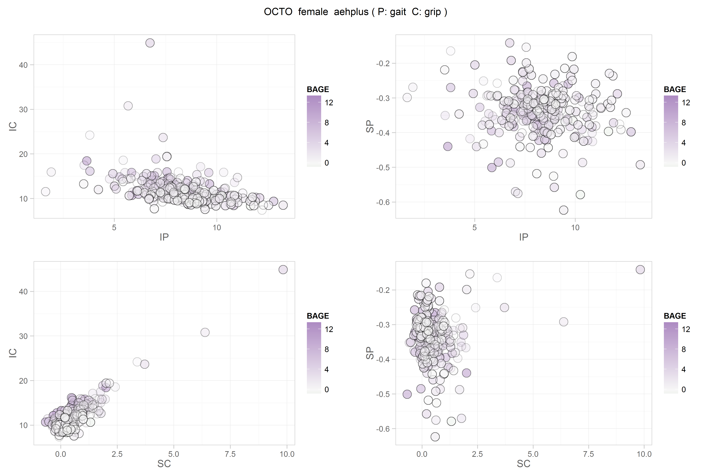

## pek_gait

```r
dsL <- get_gh5_data(file=ls_gh5,
                    study = "octo",
                    subgroup = "female",
                    model_type = "aehplus",
                    process1 = "pek",
                    process2 = "gait")
```

```

Plot functions:
 - mplus.plot.histogram('./studies/octo/physical/b1_female_aehplus_pek_gait.gh5',variable,bins)
 - mplus.plot.scatterplot('./studies/octo/physical/b1_female_aehplus_pek_gait.gh5',xvar,yvar)

Plot data extraction functions:
 - mplus.list.variables('./studies/octo/physical/b1_female_aehplus_pek_gait.gh5')
 - mplus.get.data('./studies/octo/physical/b1_female_aehplus_pek_gait.gh5',variable)

List of variable names to use in the following functions:
 - mplus.plot.histogram
 - mplus.plot.scatterplot
 - mplus.get.data

Variables:
```

```r
fscore_scatter(dsL) # create scatterplot
```

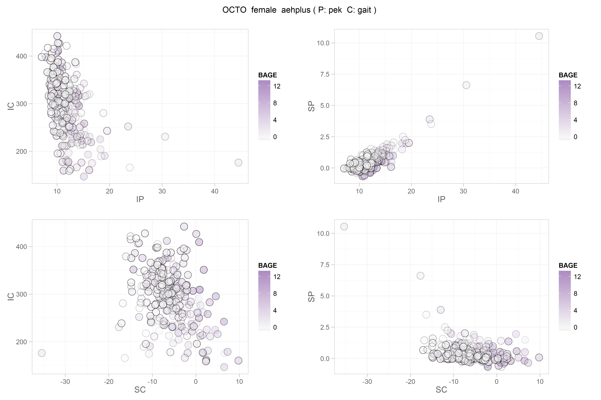

## pek_grip

```r
dsL <- get_gh5_data(file=ls_gh5,
                    study = "octo",
                    subgroup = "female",
                    model_type = "aehplus",
                    process1 = "pek",
                    process2 = "grip")
```

```

Plot functions:
 - mplus.plot.histogram('./studies/octo/physical/b1_female_aehplus_pek_grip.gh5',variable,bins)
 - mplus.plot.scatterplot('./studies/octo/physical/b1_female_aehplus_pek_grip.gh5',xvar,yvar)

Plot data extraction functions:
 - mplus.list.variables('./studies/octo/physical/b1_female_aehplus_pek_grip.gh5')
 - mplus.get.data('./studies/octo/physical/b1_female_aehplus_pek_grip.gh5',variable)

List of variable names to use in the following functions:
 - mplus.plot.histogram
 - mplus.plot.scatterplot
 - mplus.get.data

Variables:
```

```r
fscore_scatter(dsL) # create scatterplot
```


```r
#### RADC ####
```


# RADC
## fev_gait

```r
dsL <- get_gh5_data(file=ls_gh5,
                    study = "radc",
                    subgroup = "female",
                    model_type = "aehplus",
                    process1 = "fev",
                    process2 = "gait")
```

```

Plot functions:
 - mplus.plot.histogram('./studies/radc/physical/b1_female_aehplus_fev_gait.gh5',variable,bins)
 - mplus.plot.scatterplot('./studies/radc/physical/b1_female_aehplus_fev_gait.gh5',xvar,yvar)

Plot data extraction functions:
 - mplus.list.variables('./studies/radc/physical/b1_female_aehplus_fev_gait.gh5')
 - mplus.get.data('./studies/radc/physical/b1_female_aehplus_fev_gait.gh5',variable)

List of variable names to use in the following functions:
 - mplus.plot.histogram
 - mplus.plot.scatterplot
 - mplus.get.data

Variables:
```

```r
fscore_scatter(dsL) # create scatterplot
```


## fev_grip

```r
dsL <- get_gh5_data(file=ls_gh5,
                    study = "radc",
                    subgroup = "female",
                    model_type = "aehplus",
                    process1 = "fev",
                    process2 = "grip")
```

```

Plot functions:
 - mplus.plot.histogram('./studies/radc/physical/b1_female_aehplus_fev_grip.gh5',variable,bins)
 - mplus.plot.scatterplot('./studies/radc/physical/b1_female_aehplus_fev_grip.gh5',xvar,yvar)

Plot data extraction functions:
 - mplus.list.variables('./studies/radc/physical/b1_female_aehplus_fev_grip.gh5')
 - mplus.get.data('./studies/radc/physical/b1_female_aehplus_fev_grip.gh5',variable)

List of variable names to use in the following functions:
 - mplus.plot.histogram
 - mplus.plot.scatterplot
 - mplus.get.data

Variables:
```

```r
fscore_scatter(dsL) # create scatterplot
```

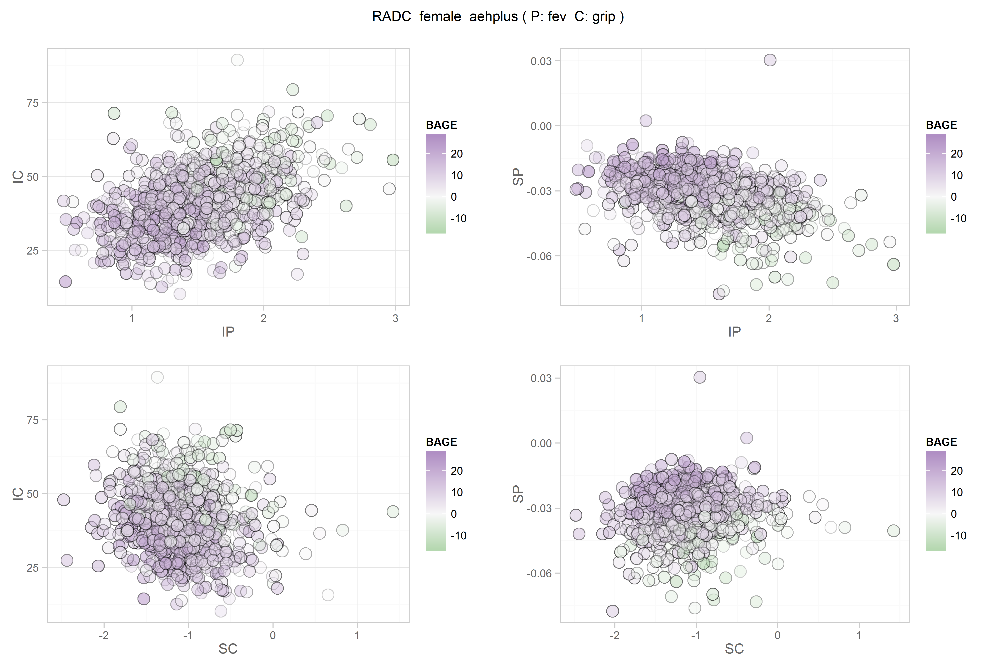

## gait_grip

```r
dsL <- get_gh5_data(file=ls_gh5,
                    study = "radc",
                    subgroup = "female",
                    model_type = "aehplus",
                    process1 = "gait",
                    process2 = "grip")
```

```

Plot functions:
 - mplus.plot.histogram('./studies/radc/physical/b1_female_aehplus_gait_grip.gh5',variable,bins)
 - mplus.plot.scatterplot('./studies/radc/physical/b1_female_aehplus_gait_grip.gh5',xvar,yvar)

Plot data extraction functions:
 - mplus.list.variables('./studies/radc/physical/b1_female_aehplus_gait_grip.gh5')
 - mplus.get.data('./studies/radc/physical/b1_female_aehplus_gait_grip.gh5',variable)

List of variable names to use in the following functions:
 - mplus.plot.histogram
 - mplus.plot.scatterplot
 - mplus.get.data

Variables:
```

```r
fscore_scatter(dsL) # create scatterplot
```

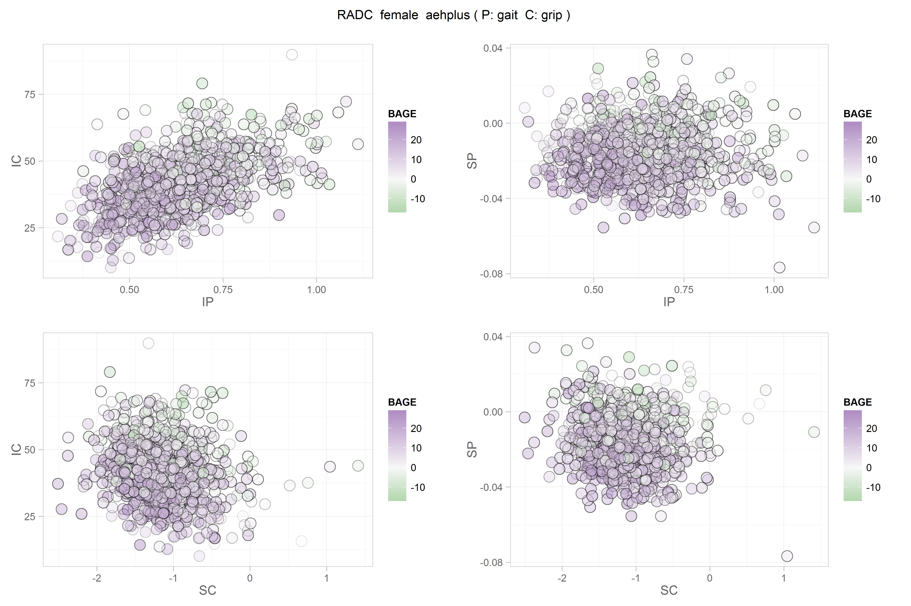

```r
gh5_paths
```

```
 [1] "./studies/eas/physical/b1_female_aehplus_grip_gait.gh5"  
 [2] "./studies/eas/physical/b1_female_aehplus_grip_pef.gh5"   
 [3] "./studies/eas/physical/b1_female_aehplus_pef_gait.gh5"   
 [4] "./studies/eas/physical/b1_male_aehplus_grip_gait.gh5"    
 [5] "./studies/eas/physical/b1_male_aehplus_grip_pef.gh5"     
 [6] "./studies/eas/physical/b1_male_aehplus_pef_gait.gh5"     
 [7] "./studies/hrs/physical/b1_female_aehplus_grip_gait.gh5"  
 [8] "./studies/hrs/physical/b1_female_aehplus_grip_pef.gh5"   
 [9] "./studies/hrs/physical/b1_female_aehplus_pef_gait.gh5"   
[10] "./studies/hrs/physical/b1_male_aehplus_grip_gait.gh5"    
[11] "./studies/hrs/physical/b1_male_aehplus_grip_pef.gh5"     
[12] "./studies/hrs/physical/b1_male_aehplus_pef_gait.gh5"     
[13] "./studies/lasa/physical/b1_female_aehplus_gait_grip.gh5" 
[14] "./studies/lasa/physical/b1_female_aehplus_pek_gait.gh5"  
[15] "./studies/lasa/physical/b1_female_aehplus_pek_grip.gh5"  
[16] "./studies/lasa/physical/b1_male_aehplus_gait_grip.gh5"   
[17] "./studies/lasa/physical/b1_male_aehplus_pek_gait.gh5"    
[18] "./studies/lasa/physical/b1_male_aehplus_pek_grip.gh5"    
[19] "./studies/octo/physical/b1_female_aehplus_gait_grip.gh5" 
[20] "./studies/octo/physical/b1_female_aehplus_pek_gait.gh5"  
[21] "./studies/octo/physical/b1_female_aehplus_pek_grip.gh5"  
[22] "./studies/octo/physical/b1_male_aehplus_gait_grip.gh5"   
[23] "./studies/octo/physical/b1_male_aehplus_pek_gait.gh5"    
[24] "./studies/octo/physical/b1_male_aehplus_pek_grip.gh5"    
[25] "./studies/radc/physical/b1_female_aehplus_fev_gait.gh5"  
[26] "./studies/radc/physical/b1_female_aehplus_fev_grip.gh5"  
[27] "./studies/radc/physical/b1_female_aehplus_gait_grip.gh5" 
[28] "./studies/radc/physical/b1_male_aehplus_fev_gait.gh5"    
[29] "./studies/radc/physical/b1_male_aehplus_fev_grip.gh5"    
[30] "./studies/radc/physical/b1_male_aehplus_gait_grip.gh5"   
[31] "./studies/satsa/physical/b1_female_aehplus_gait_fev.gh5" 
[32] "./studies/satsa/physical/b1_female_aehplus_gait_grip.gh5"
[33] "./studies/satsa/physical/b1_female_aehplus_grip_fev.gh5" 
[34] "./studies/satsa/physical/b1_male_aehplus_gait_fev.gh5"   
[35] "./studies/satsa/physical/b1_male_aehplus_gait_grip.gh5"  
[36] "./studies/satsa/physical/b1_male_aehplus_grip_fev.gh5"   
```

```r
#### SATSA ####
```


# SATSA
## gait_fev

```r
dsL <- get_gh5_data(file=ls_gh5,
                    study = "satsa",
                    subgroup = "female",
                    model_type = "aehplus",
                    process1 = "gait",
                    process2 = "fev")
```

```

Plot functions:
 - mplus.plot.histogram('./studies/satsa/physical/b1_female_aehplus_gait_fev.gh5',variable,bins)
 - mplus.plot.scatterplot('./studies/satsa/physical/b1_female_aehplus_gait_fev.gh5',xvar,yvar)

Plot data extraction functions:
 - mplus.list.variables('./studies/satsa/physical/b1_female_aehplus_gait_fev.gh5')
 - mplus.get.data('./studies/satsa/physical/b1_female_aehplus_gait_fev.gh5',variable)

List of variable names to use in the following functions:
 - mplus.plot.histogram
 - mplus.plot.scatterplot
 - mplus.get.data

Variables:
```

```r
fscore_scatter(dsL) # create scatterplot
```


## gait_grip

```r
dsL <- get_gh5_data(file=ls_gh5,
                    study = "satsa",
                    subgroup = "female",
                    model_type = "aehplus",
                    process1 = "gait",
                    process2 = "grip")
```

```

Plot functions:
 - mplus.plot.histogram('./studies/satsa/physical/b1_female_aehplus_gait_grip.gh5',variable,bins)
 - mplus.plot.scatterplot('./studies/satsa/physical/b1_female_aehplus_gait_grip.gh5',xvar,yvar)

Plot data extraction functions:
 - mplus.list.variables('./studies/satsa/physical/b1_female_aehplus_gait_grip.gh5')
 - mplus.get.data('./studies/satsa/physical/b1_female_aehplus_gait_grip.gh5',variable)

List of variable names to use in the following functions:
 - mplus.plot.histogram
 - mplus.plot.scatterplot
 - mplus.get.data

Variables:
```

```r
fscore_scatter(dsL) # create scatterplot
```

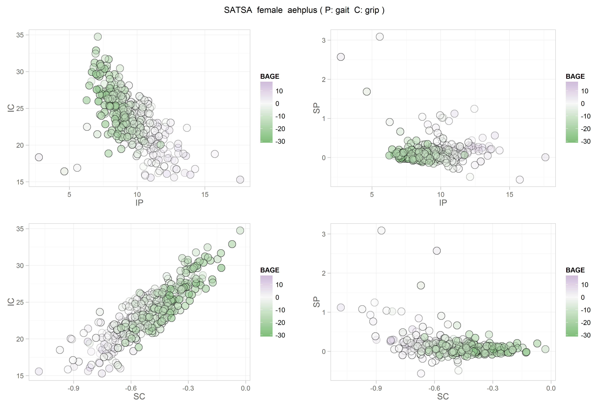

## grip_fev

```r
dsL <- get_gh5_data(file=ls_gh5,
                    study = "satsa",
                    subgroup = "female",
                    model_type = "aehplus",
                    process1 = "grip",
                    process2 = "fev")
```

```

Plot functions:
 - mplus.plot.histogram('./studies/satsa/physical/b1_female_aehplus_grip_fev.gh5',variable,bins)
 - mplus.plot.scatterplot('./studies/satsa/physical/b1_female_aehplus_grip_fev.gh5',xvar,yvar)

Plot data extraction functions:
 - mplus.list.variables('./studies/satsa/physical/b1_female_aehplus_grip_fev.gh5')
 - mplus.get.data('./studies/satsa/physical/b1_female_aehplus_grip_fev.gh5',variable)

List of variable names to use in the following functions:
 - mplus.plot.histogram
 - mplus.plot.scatterplot
 - mplus.get.data

Variables:
```

```r
fscore_scatter(dsL) # create scatterplot
```

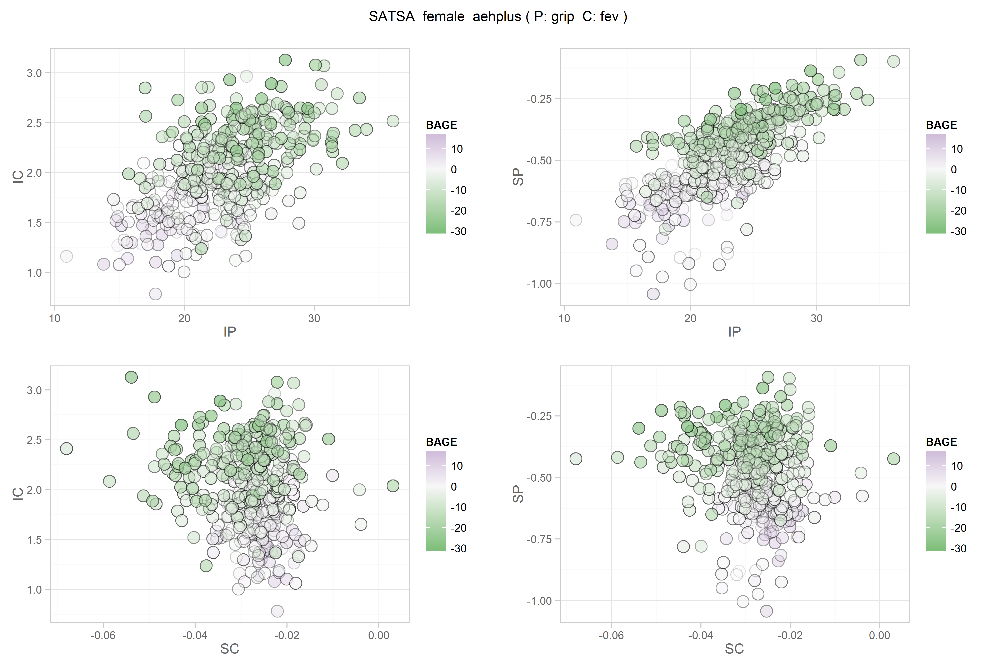

```r
#### MALES ####
#### EAS ####
```

#MALES
# EAS
## grip_pef

```r
dsL <- get_gh5_data(file=ls_gh5,
                    study = "eas",
                    subgroup = "male",
                    model_type = "aehplus",
                    process1 = "grip",
                    process2 = "pef")
```

```

Plot functions:
 - mplus.plot.histogram('./studies/eas/physical/b1_male_aehplus_grip_pef.gh5',variable,bins)
 - mplus.plot.scatterplot('./studies/eas/physical/b1_male_aehplus_grip_pef.gh5',xvar,yvar)

Plot data extraction functions:
 - mplus.list.variables('./studies/eas/physical/b1_male_aehplus_grip_pef.gh5')
 - mplus.get.data('./studies/eas/physical/b1_male_aehplus_grip_pef.gh5',variable)

List of variable names to use in the following functions:
 - mplus.plot.histogram
 - mplus.plot.scatterplot
 - mplus.get.data

Variables:
```

```r
fscore_scatter(dsL) # create scatterplot
```


## pef_gait

```r
dsL <- get_gh5_data(file=ls_gh5,
                    study = "eas",
                    subgroup = "male",
                    model_type = "aehplus",
                    process1 = "pef",
                    process2 = "gait")
```

```

Plot functions:
 - mplus.plot.histogram('./studies/eas/physical/b1_male_aehplus_pef_gait.gh5',variable,bins)
 - mplus.plot.scatterplot('./studies/eas/physical/b1_male_aehplus_pef_gait.gh5',xvar,yvar)

Plot data extraction functions:
 - mplus.list.variables('./studies/eas/physical/b1_male_aehplus_pef_gait.gh5')
 - mplus.get.data('./studies/eas/physical/b1_male_aehplus_pef_gait.gh5',variable)

List of variable names to use in the following functions:
 - mplus.plot.histogram
 - mplus.plot.scatterplot
 - mplus.get.data

Variables:
```

```r
fscore_scatter(dsL) # create scatterplot
```


## grip_gait

```r
dsL <- get_gh5_data(file=ls_gh5,
                    study = "eas",
                    subgroup = "male",
                    model_type = "aehplus",
                    process1 = "grip",
                    process2 = "gait")
```

```

Plot functions:
 - mplus.plot.histogram('./studies/eas/physical/b1_male_aehplus_grip_gait.gh5',variable,bins)
 - mplus.plot.scatterplot('./studies/eas/physical/b1_male_aehplus_grip_gait.gh5',xvar,yvar)

Plot data extraction functions:
 - mplus.list.variables('./studies/eas/physical/b1_male_aehplus_grip_gait.gh5')
 - mplus.get.data('./studies/eas/physical/b1_male_aehplus_grip_gait.gh5',variable)

List of variable names to use in the following functions:
 - mplus.plot.histogram
 - mplus.plot.scatterplot
 - mplus.get.data

Variables:
```

```r
fscore_scatter(dsL) # create scatterplot
```


```r
#### HRS ####
```

# HRS
## grip_gait

```r
dsL <- get_gh5_data(file=ls_gh5,
                    study = "hrs",
                    subgroup = "male",
                    model_type = "aehplus",
                    process1 = "grip",
                    process2 = "gait")
```

```

Plot functions:
 - mplus.plot.histogram('./studies/hrs/physical/b1_male_aehplus_grip_gait.gh5',variable,bins)
 - mplus.plot.scatterplot('./studies/hrs/physical/b1_male_aehplus_grip_gait.gh5',xvar,yvar)

Plot data extraction functions:
 - mplus.list.variables('./studies/hrs/physical/b1_male_aehplus_grip_gait.gh5')
 - mplus.get.data('./studies/hrs/physical/b1_male_aehplus_grip_gait.gh5',variable)

List of variable names to use in the following functions:
 - mplus.plot.histogram
 - mplus.plot.scatterplot
 - mplus.get.data

Variables:
```

```r
fscore_scatter(dsL) # create scatterplot
```


## grip_pef

```r
dsL <- get_gh5_data(file=ls_gh5,
                    study = "hrs",
                    subgroup = "male",
                    model_type = "aehplus",
                    process1 = "grip",
                    process2 = "pef")
```

```

Plot functions:
 - mplus.plot.histogram('./studies/hrs/physical/b1_male_aehplus_grip_pef.gh5',variable,bins)
 - mplus.plot.scatterplot('./studies/hrs/physical/b1_male_aehplus_grip_pef.gh5',xvar,yvar)

Plot data extraction functions:
 - mplus.list.variables('./studies/hrs/physical/b1_male_aehplus_grip_pef.gh5')
 - mplus.get.data('./studies/hrs/physical/b1_male_aehplus_grip_pef.gh5',variable)

List of variable names to use in the following functions:
 - mplus.plot.histogram
 - mplus.plot.scatterplot
 - mplus.get.data

Variables:
```

```r
fscore_scatter(dsL) # create scatterplot
```

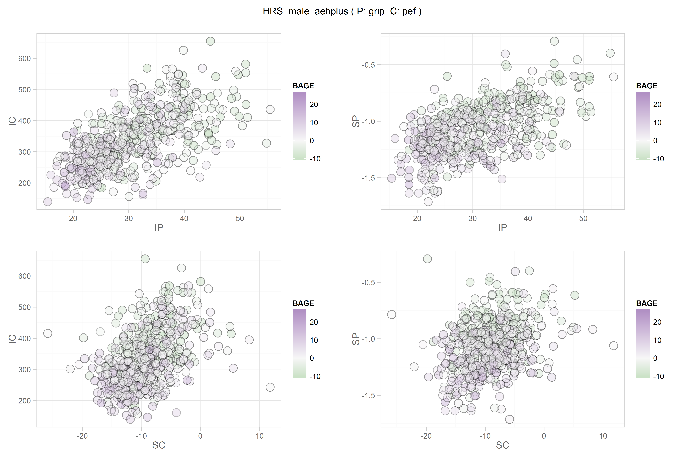

## grip_pef

```r
dsL <- get_gh5_data(file=ls_gh5,
                    study = "hrs",
                    subgroup = "male",
                    model_type = "aehplus",
                    process1 = "grip",
                    process2 = "pef")
```

```

Plot functions:
 - mplus.plot.histogram('./studies/hrs/physical/b1_male_aehplus_grip_pef.gh5',variable,bins)
 - mplus.plot.scatterplot('./studies/hrs/physical/b1_male_aehplus_grip_pef.gh5',xvar,yvar)

Plot data extraction functions:
 - mplus.list.variables('./studies/hrs/physical/b1_male_aehplus_grip_pef.gh5')
 - mplus.get.data('./studies/hrs/physical/b1_male_aehplus_grip_pef.gh5',variable)

List of variable names to use in the following functions:
 - mplus.plot.histogram
 - mplus.plot.scatterplot
 - mplus.get.data

Variables:
```

```r
fscore_scatter(dsL) # create scatterplot
```


# LASA
## gait_grip

```r
dsL <- get_gh5_data(file=ls_gh5,
                    study = "lasa",
                    subgroup = "male",
                    model_type = "aehplus",
                    process1 = "gait",
                    process2 = "grip")
```

```

Plot functions:
 - mplus.plot.histogram('./studies/lasa/physical/b1_male_aehplus_gait_grip.gh5',variable,bins)
 - mplus.plot.scatterplot('./studies/lasa/physical/b1_male_aehplus_gait_grip.gh5',xvar,yvar)

Plot data extraction functions:
 - mplus.list.variables('./studies/lasa/physical/b1_male_aehplus_gait_grip.gh5')
 - mplus.get.data('./studies/lasa/physical/b1_male_aehplus_gait_grip.gh5',variable)

List of variable names to use in the following functions:
 - mplus.plot.histogram
 - mplus.plot.scatterplot
 - mplus.get.data

Variables:
```

```r
fscore_scatter(dsL) # create scatterplot
```


## pek_gait

```r
dsL <- get_gh5_data(file=ls_gh5,
                    study = "lasa",
                    subgroup = "male",
                    model_type = "aehplus",
                    process1 = "pek",
                    process2 = "gait")
```

```

Plot functions:
 - mplus.plot.histogram('./studies/lasa/physical/b1_male_aehplus_pek_gait.gh5',variable,bins)
 - mplus.plot.scatterplot('./studies/lasa/physical/b1_male_aehplus_pek_gait.gh5',xvar,yvar)

Plot data extraction functions:
 - mplus.list.variables('./studies/lasa/physical/b1_male_aehplus_pek_gait.gh5')
 - mplus.get.data('./studies/lasa/physical/b1_male_aehplus_pek_gait.gh5',variable)

List of variable names to use in the following functions:
 - mplus.plot.histogram
 - mplus.plot.scatterplot
 - mplus.get.data

Variables:
```

```r
fscore_scatter(dsL) # create scatterplot
```


## pek_grip

```r
dsL <- get_gh5_data(file=ls_gh5,
                    study = "lasa",
                    subgroup = "male",
                    model_type = "aehplus",
                    process1 = "pek",
                    process2 = "grip")
```

```

Plot functions:
 - mplus.plot.histogram('./studies/lasa/physical/b1_male_aehplus_pek_grip.gh5',variable,bins)
 - mplus.plot.scatterplot('./studies/lasa/physical/b1_male_aehplus_pek_grip.gh5',xvar,yvar)

Plot data extraction functions:
 - mplus.list.variables('./studies/lasa/physical/b1_male_aehplus_pek_grip.gh5')
 - mplus.get.data('./studies/lasa/physical/b1_male_aehplus_pek_grip.gh5',variable)

List of variable names to use in the following functions:
 - mplus.plot.histogram
 - mplus.plot.scatterplot
 - mplus.get.data

Variables:
```

```r
fscore_scatter(dsL) # create scatterplot
```


```r
#### OCTO ####
```


# OCTO
## gait_grip

```r
dsL <- get_gh5_data(file=ls_gh5,
                    study = "octo",
                    subgroup = "male",
                    model_type = "aehplus",
                    process1 = "gait",
                    process2 = "grip")
```

```

Plot functions:
 - mplus.plot.histogram('./studies/octo/physical/b1_male_aehplus_gait_grip.gh5',variable,bins)
 - mplus.plot.scatterplot('./studies/octo/physical/b1_male_aehplus_gait_grip.gh5',xvar,yvar)

Plot data extraction functions:
 - mplus.list.variables('./studies/octo/physical/b1_male_aehplus_gait_grip.gh5')
 - mplus.get.data('./studies/octo/physical/b1_male_aehplus_gait_grip.gh5',variable)

List of variable names to use in the following functions:
 - mplus.plot.histogram
 - mplus.plot.scatterplot
 - mplus.get.data

Variables:
```

```r
fscore_scatter(dsL) # create scatterplot
```

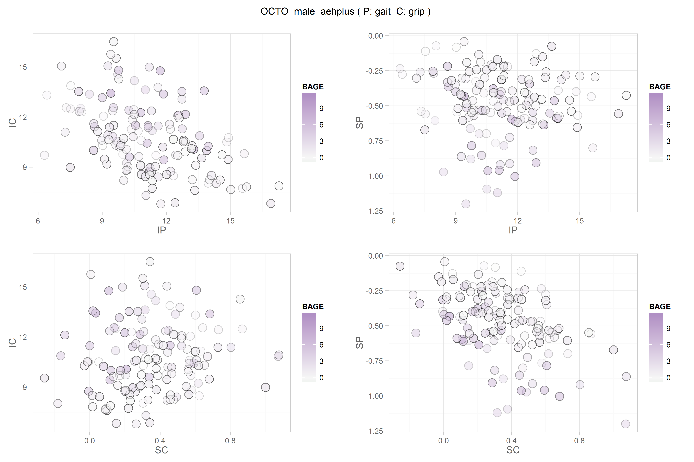

## pek_gait

```r
dsL <- get_gh5_data(file=ls_gh5,
                    study = "octo",
                    subgroup = "male",
                    model_type = "aehplus",
                    process1 = "pek",
                    process2 = "gait")
```

```

Plot functions:
 - mplus.plot.histogram('./studies/octo/physical/b1_male_aehplus_pek_gait.gh5',variable,bins)
 - mplus.plot.scatterplot('./studies/octo/physical/b1_male_aehplus_pek_gait.gh5',xvar,yvar)

Plot data extraction functions:
 - mplus.list.variables('./studies/octo/physical/b1_male_aehplus_pek_gait.gh5')
 - mplus.get.data('./studies/octo/physical/b1_male_aehplus_pek_gait.gh5',variable)

List of variable names to use in the following functions:
 - mplus.plot.histogram
 - mplus.plot.scatterplot
 - mplus.get.data

Variables:
```

```r
fscore_scatter(dsL) # create scatterplot
```

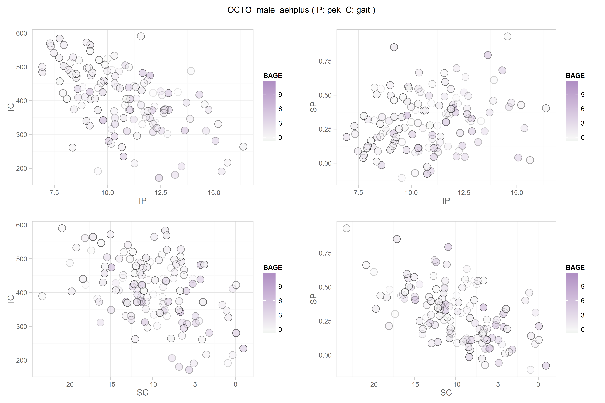

## pek_grip

```r
dsL <- get_gh5_data(file=ls_gh5,
                    study = "octo",
                    subgroup = "male",
                    model_type = "aehplus",
                    process1 = "pek",
                    process2 = "grip")
```

```

Plot functions:
 - mplus.plot.histogram('./studies/octo/physical/b1_male_aehplus_pek_grip.gh5',variable,bins)
 - mplus.plot.scatterplot('./studies/octo/physical/b1_male_aehplus_pek_grip.gh5',xvar,yvar)

Plot data extraction functions:
 - mplus.list.variables('./studies/octo/physical/b1_male_aehplus_pek_grip.gh5')
 - mplus.get.data('./studies/octo/physical/b1_male_aehplus_pek_grip.gh5',variable)

List of variable names to use in the following functions:
 - mplus.plot.histogram
 - mplus.plot.scatterplot
 - mplus.get.data

Variables:
```

```r
fscore_scatter(dsL) # create scatterplot
```

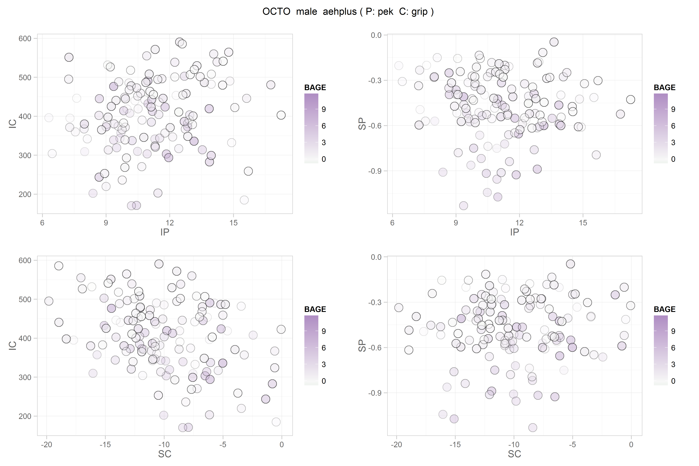

```r
#### RADC ####
```


# RADC
## fev_gait

```r
dsL <- get_gh5_data(file=ls_gh5,
                    study = "radc",
                    subgroup = "male",
                    model_type = "aehplus",
                    process1 = "fev",
                    process2 = "gait")
```

```

Plot functions:
 - mplus.plot.histogram('./studies/radc/physical/b1_male_aehplus_fev_gait.gh5',variable,bins)
 - mplus.plot.scatterplot('./studies/radc/physical/b1_male_aehplus_fev_gait.gh5',xvar,yvar)

Plot data extraction functions:
 - mplus.list.variables('./studies/radc/physical/b1_male_aehplus_fev_gait.gh5')
 - mplus.get.data('./studies/radc/physical/b1_male_aehplus_fev_gait.gh5',variable)

List of variable names to use in the following functions:
 - mplus.plot.histogram
 - mplus.plot.scatterplot
 - mplus.get.data

Variables:
```

```r
fscore_scatter(dsL) # create scatterplot
```


## fev_grip

```r
dsL <- get_gh5_data(file=ls_gh5,
                    study = "radc",
                    subgroup = "male",
                    model_type = "aehplus",
                    process1 = "fev",
                    process2 = "grip")
```

```

Plot functions:
 - mplus.plot.histogram('./studies/radc/physical/b1_male_aehplus_fev_grip.gh5',variable,bins)
 - mplus.plot.scatterplot('./studies/radc/physical/b1_male_aehplus_fev_grip.gh5',xvar,yvar)

Plot data extraction functions:
 - mplus.list.variables('./studies/radc/physical/b1_male_aehplus_fev_grip.gh5')
 - mplus.get.data('./studies/radc/physical/b1_male_aehplus_fev_grip.gh5',variable)

List of variable names to use in the following functions:
 - mplus.plot.histogram
 - mplus.plot.scatterplot
 - mplus.get.data

Variables:
```

```r
fscore_scatter(dsL) # create scatterplot
```


## gait_grip

```r
dsL <- get_gh5_data(file=ls_gh5,
                    study = "radc",
                    subgroup = "male",
                    model_type = "aehplus",
                    process1 = "gait",
                    process2 = "grip")
```

```

Plot functions:
 - mplus.plot.histogram('./studies/radc/physical/b1_male_aehplus_gait_grip.gh5',variable,bins)
 - mplus.plot.scatterplot('./studies/radc/physical/b1_male_aehplus_gait_grip.gh5',xvar,yvar)

Plot data extraction functions:
 - mplus.list.variables('./studies/radc/physical/b1_male_aehplus_gait_grip.gh5')
 - mplus.get.data('./studies/radc/physical/b1_male_aehplus_gait_grip.gh5',variable)

List of variable names to use in the following functions:
 - mplus.plot.histogram
 - mplus.plot.scatterplot
 - mplus.get.data

Variables:
```

```r
fscore_scatter(dsL) # create scatterplot
```

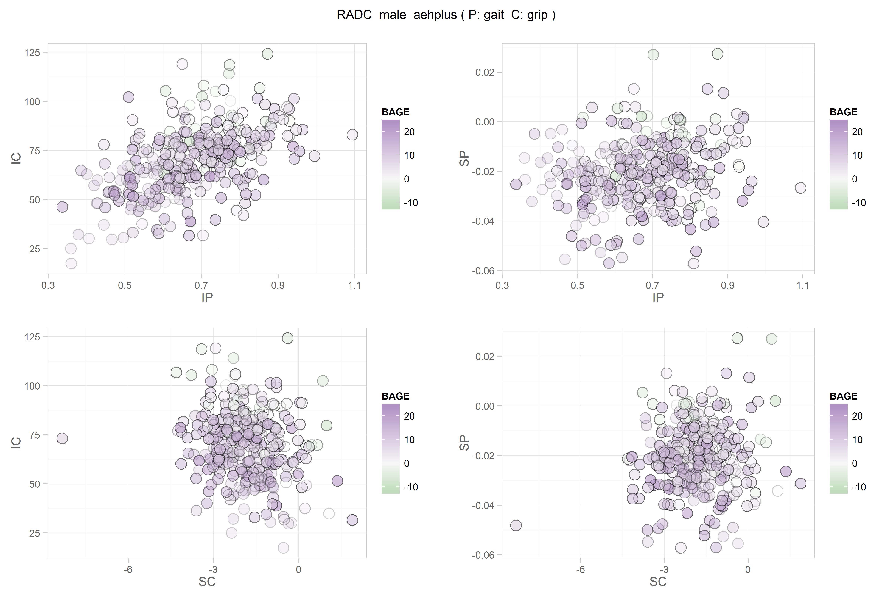

```r
gh5_paths
```

```
 [1] "./studies/eas/physical/b1_female_aehplus_grip_gait.gh5"  
 [2] "./studies/eas/physical/b1_female_aehplus_grip_pef.gh5"   
 [3] "./studies/eas/physical/b1_female_aehplus_pef_gait.gh5"   
 [4] "./studies/eas/physical/b1_male_aehplus_grip_gait.gh5"    
 [5] "./studies/eas/physical/b1_male_aehplus_grip_pef.gh5"     
 [6] "./studies/eas/physical/b1_male_aehplus_pef_gait.gh5"     
 [7] "./studies/hrs/physical/b1_female_aehplus_grip_gait.gh5"  
 [8] "./studies/hrs/physical/b1_female_aehplus_grip_pef.gh5"   
 [9] "./studies/hrs/physical/b1_female_aehplus_pef_gait.gh5"   
[10] "./studies/hrs/physical/b1_male_aehplus_grip_gait.gh5"    
[11] "./studies/hrs/physical/b1_male_aehplus_grip_pef.gh5"     
[12] "./studies/hrs/physical/b1_male_aehplus_pef_gait.gh5"     
[13] "./studies/lasa/physical/b1_female_aehplus_gait_grip.gh5" 
[14] "./studies/lasa/physical/b1_female_aehplus_pek_gait.gh5"  
[15] "./studies/lasa/physical/b1_female_aehplus_pek_grip.gh5"  
[16] "./studies/lasa/physical/b1_male_aehplus_gait_grip.gh5"   
[17] "./studies/lasa/physical/b1_male_aehplus_pek_gait.gh5"    
[18] "./studies/lasa/physical/b1_male_aehplus_pek_grip.gh5"    
[19] "./studies/octo/physical/b1_female_aehplus_gait_grip.gh5" 
[20] "./studies/octo/physical/b1_female_aehplus_pek_gait.gh5"  
[21] "./studies/octo/physical/b1_female_aehplus_pek_grip.gh5"  
[22] "./studies/octo/physical/b1_male_aehplus_gait_grip.gh5"   
[23] "./studies/octo/physical/b1_male_aehplus_pek_gait.gh5"    
[24] "./studies/octo/physical/b1_male_aehplus_pek_grip.gh5"    
[25] "./studies/radc/physical/b1_female_aehplus_fev_gait.gh5"  
[26] "./studies/radc/physical/b1_female_aehplus_fev_grip.gh5"  
[27] "./studies/radc/physical/b1_female_aehplus_gait_grip.gh5" 
[28] "./studies/radc/physical/b1_male_aehplus_fev_gait.gh5"    
[29] "./studies/radc/physical/b1_male_aehplus_fev_grip.gh5"    
[30] "./studies/radc/physical/b1_male_aehplus_gait_grip.gh5"   
[31] "./studies/satsa/physical/b1_female_aehplus_gait_fev.gh5" 
[32] "./studies/satsa/physical/b1_female_aehplus_gait_grip.gh5"
[33] "./studies/satsa/physical/b1_female_aehplus_grip_fev.gh5" 
[34] "./studies/satsa/physical/b1_male_aehplus_gait_fev.gh5"   
[35] "./studies/satsa/physical/b1_male_aehplus_gait_grip.gh5"  
[36] "./studies/satsa/physical/b1_male_aehplus_grip_fev.gh5"   
```

```r
#### SATSA ####
```


# SATSA
## gait_fev

```r
dsL <- get_gh5_data(file=ls_gh5,
                    study = "satsa",
                    subgroup = "male",
                    model_type = "aehplus",
                    process1 = "gait",
                    process2 = "fev")
```

```

Plot functions:
 - mplus.plot.histogram('./studies/satsa/physical/b1_male_aehplus_gait_fev.gh5',variable,bins)
 - mplus.plot.scatterplot('./studies/satsa/physical/b1_male_aehplus_gait_fev.gh5',xvar,yvar)

Plot data extraction functions:
 - mplus.list.variables('./studies/satsa/physical/b1_male_aehplus_gait_fev.gh5')
 - mplus.get.data('./studies/satsa/physical/b1_male_aehplus_gait_fev.gh5',variable)

List of variable names to use in the following functions:
 - mplus.plot.histogram
 - mplus.plot.scatterplot
 - mplus.get.data

Variables:
```

```r
fscore_scatter(dsL) # create scatterplot
```

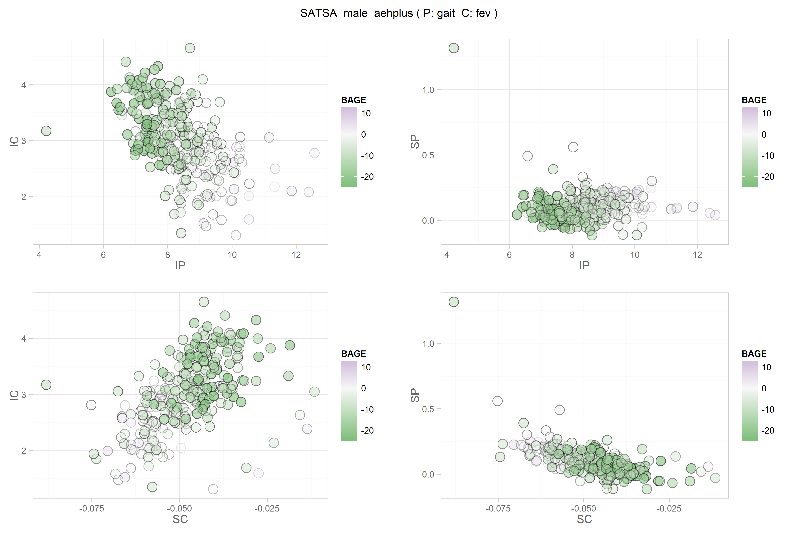

## gait_grip

```r
dsL <- get_gh5_data(file=ls_gh5,
                    study = "satsa",
                    subgroup = "male",
                    model_type = "aehplus",
                    process1 = "gait",
                    process2 = "grip")
```

```

Plot functions:
 - mplus.plot.histogram('./studies/satsa/physical/b1_male_aehplus_gait_grip.gh5',variable,bins)
 - mplus.plot.scatterplot('./studies/satsa/physical/b1_male_aehplus_gait_grip.gh5',xvar,yvar)

Plot data extraction functions:
 - mplus.list.variables('./studies/satsa/physical/b1_male_aehplus_gait_grip.gh5')
 - mplus.get.data('./studies/satsa/physical/b1_male_aehplus_gait_grip.gh5',variable)

List of variable names to use in the following functions:
 - mplus.plot.histogram
 - mplus.plot.scatterplot
 - mplus.get.data

Variables:
```

```r
fscore_scatter(dsL) # create scatterplot
```

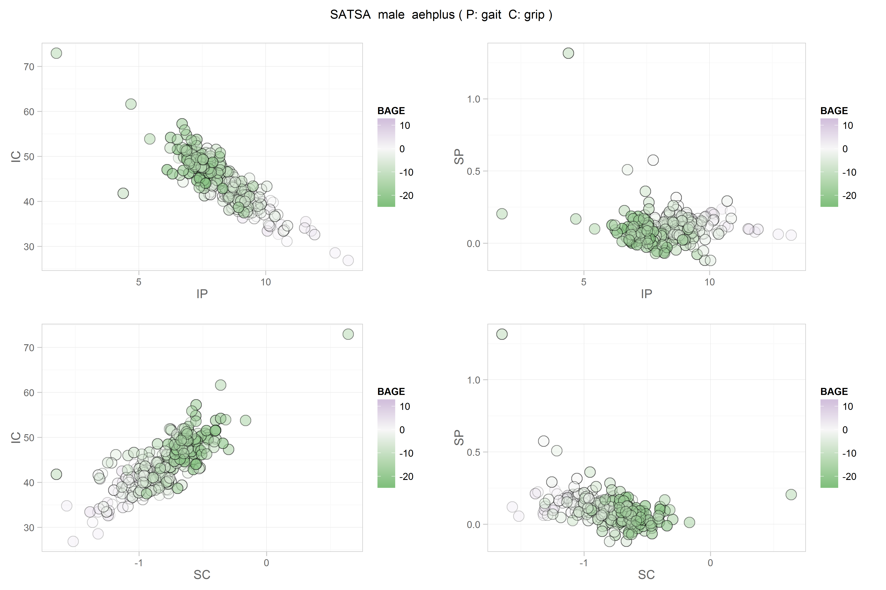

## grip_fev

```r
dsL <- get_gh5_data(file=ls_gh5,
                    study = "satsa",
                    subgroup = "male",
                    model_type = "aehplus",
                    process1 = "grip",
                    process2 = "fev")
```

```

Plot functions:
 - mplus.plot.histogram('./studies/satsa/physical/b1_male_aehplus_grip_fev.gh5',variable,bins)
 - mplus.plot.scatterplot('./studies/satsa/physical/b1_male_aehplus_grip_fev.gh5',xvar,yvar)

Plot data extraction functions:
 - mplus.list.variables('./studies/satsa/physical/b1_male_aehplus_grip_fev.gh5')
 - mplus.get.data('./studies/satsa/physical/b1_male_aehplus_grip_fev.gh5',variable)

List of variable names to use in the following functions:
 - mplus.plot.histogram
 - mplus.plot.scatterplot
 - mplus.get.data

Variables:
```

```r
fscore_scatter(dsL) # create scatterplot
```


