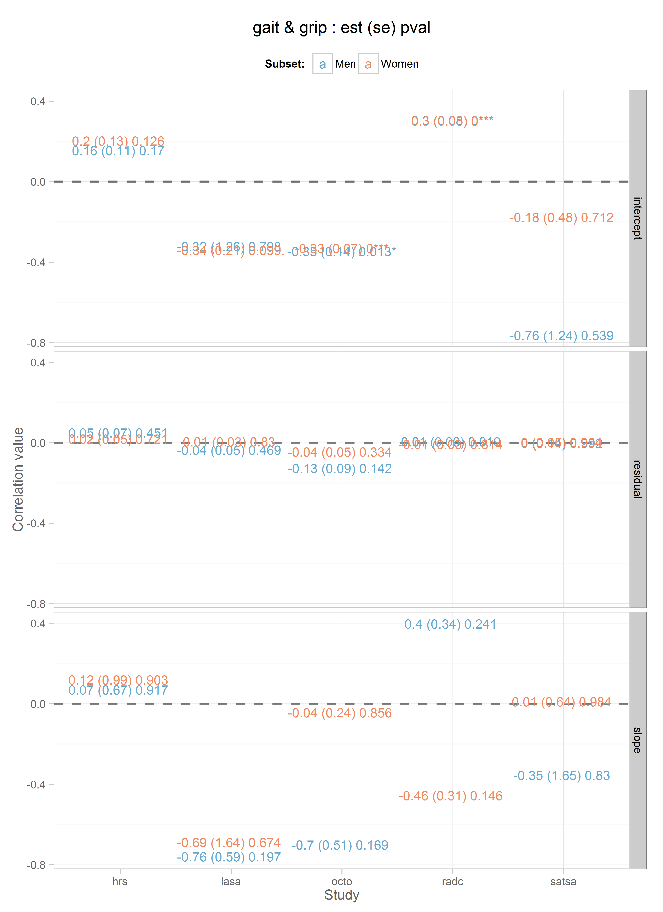

# Title

<!-- These two chunks should be added in the beginning of every .Rmd that you want to source an .R script -->
<!--  The 1st mandatory chunck  -->
<!--  Set the working directory to the repository's base directory -->


<!--  The 2nd mandatory chunck  -->
<!-- Set the report-wide options, and point to the external code file. -->


<!-- Load 'sourced' R files.  Suppress the output when loading packages. --> 


<!-- Load the sources.  Suppress the output when loading sources. --> 


<!-- Load any Global functions and variables declared in the R file.  Suppress the output. --> 


<!-- Declare any global functions specific to a Rmd output.  Suppress the output. --> 


<!-- Load the datasets.   -->


<!-- Tweak the datasets.   -->

```
  study_name subgroup model_type physical_measure cognitive_measure subject_count wave_count parameter_count R_SPSC_est
1        hrs    Women    aehplus             grip              gait           286          3              41      0.120
2        hrs    Women    aehplus             grip               pef           286          3              41     -0.523
3        hrs    Women    aehplus              pef              gait           286          3              41      0.578
4        hrs      Men    aehplus             grip              gait           238          3              41      0.070
5        hrs      Men    aehplus             grip               pef           238          3              41     -0.262
6        hrs      Men    aehplus              pef              gait           238          3              41      0.816
  R_SPSC_se R_SPSC_wald R_SPSC_pval R_IPIC_est R_IPIC_se R_IPIC_wald R_IPIC_pval R_RES_PC_est R_RES_PC_se R_RES_PC_wald
1     0.987       0.122       0.903      0.203     0.132       1.531       0.126        0.019       0.052         0.357
2     1.109      -0.471       0.638      0.288     0.087       3.306       0.001        0.083       0.067         1.234
3     1.189       0.486       0.627      0.287     0.113       2.551       0.011        0.137       0.060         2.303
4     0.667       0.105       0.917      0.155     0.113       1.373       0.170        0.050       0.067         0.754
5     0.913      -0.287       0.774      0.115     0.077       1.500       0.134        0.122       0.068         1.781
6     0.311       2.620       0.009      0.303     0.099       3.065       0.002        0.033       0.076         0.438
  R_RES_PC_pval
1         0.721
2         0.217
3         0.021
4         0.451
5         0.075
6         0.662
```

```
      
       gait grip pef
  fev     2    2   0
  gait    0    6   0
  grip    2    0   2
  pef     2    0   0
  pek     4    4   0
```


<!-- Basic table view.   -->


<!-- Basic graph view.   -->


```r
outcome_pair <- function(data=ds,process1, process2){


  d <- ds
  d <- dplyr::filter(d, physical_measure==process1 | cognitive_measure==process1)
  d <- dplyr::filter(d, physical_measure==process2 | cognitive_measure==process2)

  d <- d %>% tidyr::gather_("parameter","value", select_components)
  # head(d)
  d$parameter <- as.character(d$parameter)
  d <- d[order(d$study_name), ]
  # head(d)

  for(i in 1:nrow(d)){
    d[i, "term"] <- strsplit(d[i,"parameter"], split="_")[[1]][2]
    test <- length(strsplit(d[i,"parameter"], split="_")[[1]])
    d[i, "record"] <- strsplit(d[i,"parameter"], split="_")[[1]][test]
  } # close fore loop
  d[d$term=="SPSC","term"] <- "slope"
  d[d$term=="IPIC","term"] <- "intercept"
  d[d$term=="RES","term"] <- "residual"
  head(d)
  table(d$term)
  d$parameter <- NULL
  # View(d)
  d <- tidyr::spread(d,record,value)

  d$signif[d$pval>.1] <- " "
  d$signif[d$pval<.1 & d$pval>.05] <- "."
  d$signif[d$pval<.05 & d$pval>.01] <- "*"
  d$signif[d$pval<.01 & d$pval>.001] <- "**"
  d$signif[d$pval<.001 ] <- "***"

  # View(d)
  d$display <- paste0(round(d$est,2)," (",round(d$se,2),") ", round(d$pval,3), d$signif)
  return(d)
}
# d <- outcome_pair(data=ds,process1="fev",process2="gait")
# d
```


```r
gender_colors <- c("Men"="#67a9cf", "Women"="#ef8a62")
basic_graph_1 <- function(data, process1, process2){
  d <- outcome_pair(data, process1=process1, process2=process2)

  g <- ggplot2::ggplot(d, aes(x=study_name, y=est, color=subgroup))+
    geom_abline(intercept=0,slope=0, size=1, color="black", alpha=.5, linetype="dashed")+
    scale_color_manual(values=gender_colors)+
    main_theme +
    geom_text(aes(label=display), size=4)+
    facet_grid(term~.)+
    theme(legend.position = 'top')+
    labs(title=paste0(process1, " & ", process2," : est (se) pval"), y=paste0("Correlation value"),
         x="Study", color="Subset: ")
  g
}
```

## Fev & Gait

```r
g <- basic_graph_1(data=d, process1 = "fev", process2 = 'gait')
g
```


## Fev & Grip

```r
g <- basic_graph_1(data=d, process1 = "fev", process2 = 'grip')
g
```


## Gait & Grip

```r
g <- basic_graph_1(data=d, process1 = "gait", process2 = 'grip')
g
```



## Gait & Pef

```r
g <- basic_graph_1(data=d, process1 = "gait", process2 = 'pef')
g
```


## Gait & Pek

```r
g <- basic_graph_1(data=d, process1 = "gait", process2 = 'pek')
g
```


## Grip & Pef

```r
g <- basic_graph_1(data=d, process1 = "grip", process2 = 'pef')
g
```


## Grip & Pek

```r
g <- basic_graph_1(data=d, process1 = "grip", process2 = 'pek')
g
```


