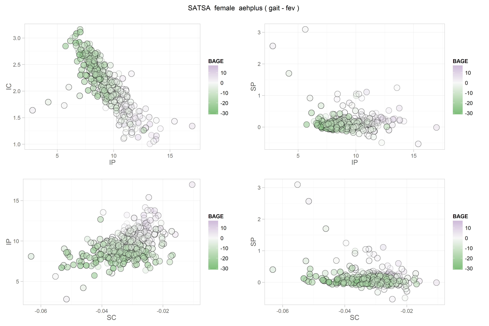
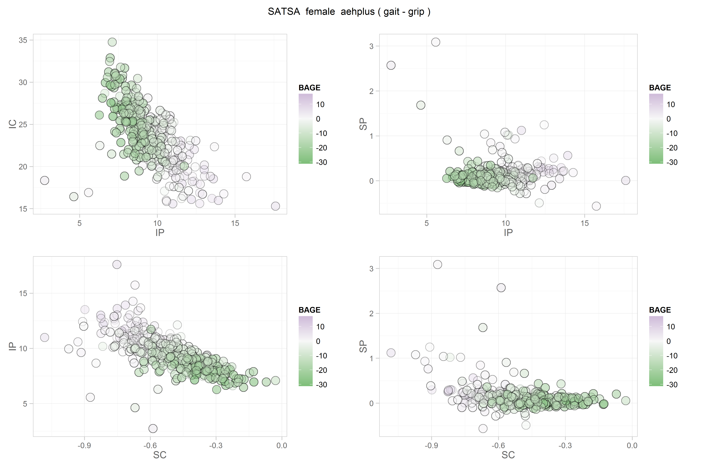
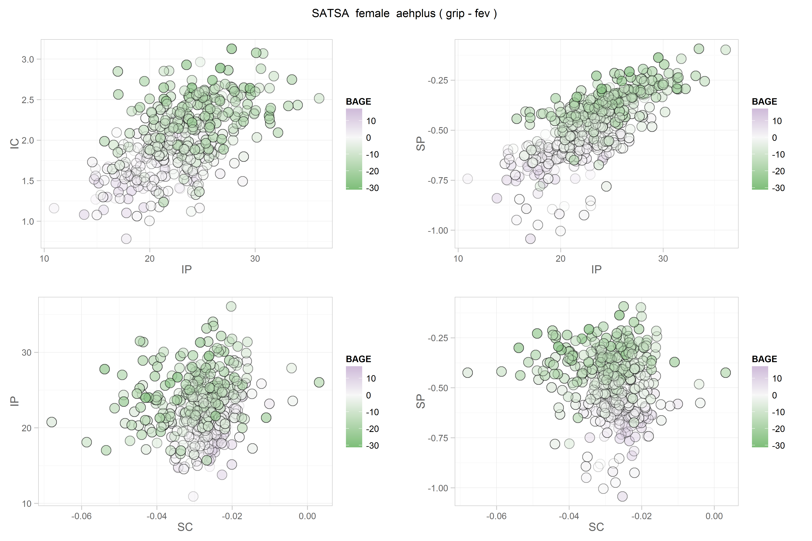
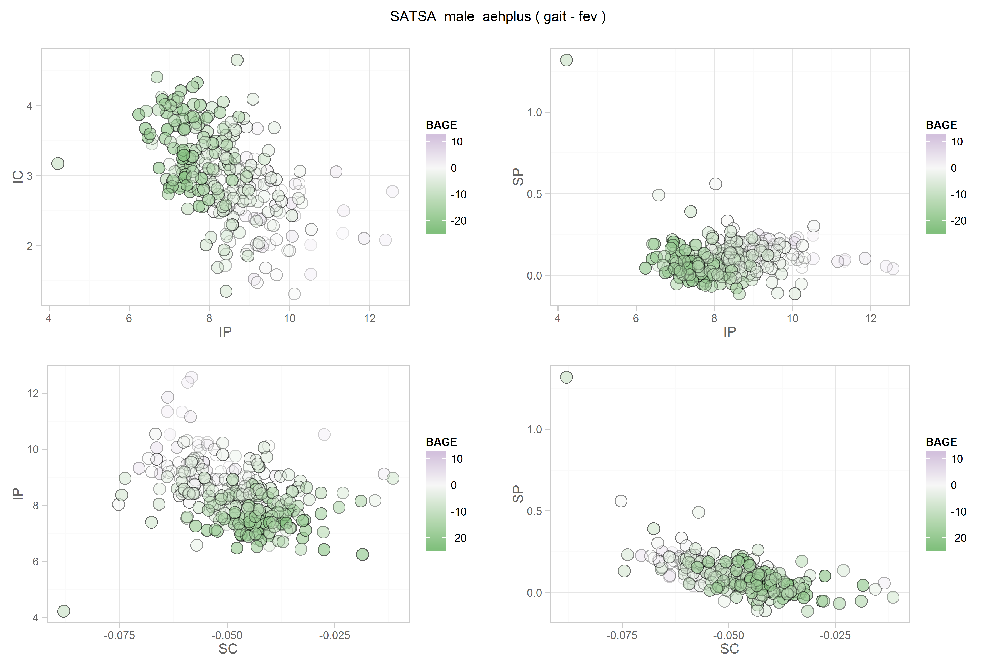
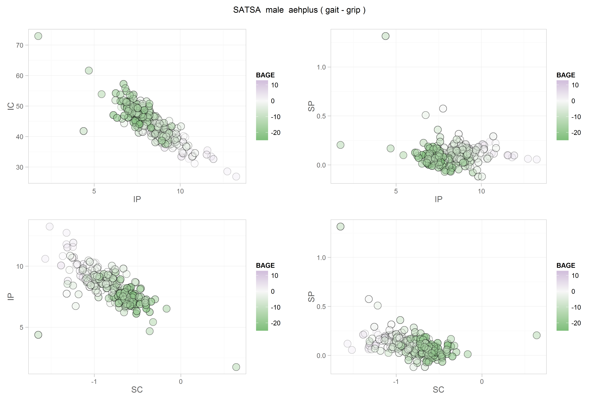

# FScore Scatters

<!-- These two chunks should be added in the beginning of every .Rmd that you want to source an .R script -->
<!--  The 1st mandatory chunck  -->
<!--  Set the working directory to the repository's base directory -->


<!--  The 2nd mandatory chunck  -->
<!-- Set the report-wide options, and point to the external code file. -->


<!-- Load 'sourced' R files.  Suppress the output when loading packages. --> 


<!-- Load the sources.  Suppress the output when loading sources. --> 

```
[1] "Loaded rhdf5 package"
```


<!-- Load any Global functions and variables declared in the R file.  Suppress the output. --> 


```

Plot functions:
 - mplus.plot.histogram('./studies/satsa/physical/b1_male_aehplus_grip_fev.gh5',variable,bins)
 - mplus.plot.scatterplot('./studies/satsa/physical/b1_male_aehplus_grip_fev.gh5',xvar,yvar)

Plot data extraction functions:
 - mplus.list.variables('./studies/satsa/physical/b1_male_aehplus_grip_fev.gh5')
 - mplus.get.data('./studies/satsa/physical/b1_male_aehplus_grip_fev.gh5',variable)

List of variable names to use in the following functions:
 - mplus.plot.histogram
 - mplus.plot.scatterplot
 - mplus.get.data

Variables:
```

```
Warning in if (index == 0) {: the condition has length > 1 and only the first element will be used
```

```
     id DIABETE EVERSMOK CHD   BAGE CEDUC HEIGHT       IP        SP        IC          SC wave time   outcome observed
1     1       0        0   0 17.816     0     -8 22.32216 -1.292397 0.9320986 -0.05712793    1    0  physical      8.0
301   1       0        0   0 17.816     0     -8 22.32216 -1.292397 0.9320986 -0.05712793    2    3  physical       NA
601   1       0        0   0 17.816     0     -8 22.32216 -1.292397 0.9320986 -0.05712793    3    6  physical       NA
901   1       0        0   0 17.816     0     -8 22.32216 -1.292397 0.9320986 -0.05712793    5   13  physical       NA
1201  1       0        0   0 17.816     0     -8 22.32216 -1.292397 0.9320986 -0.05712793    6   16  physical       NA
1501  1       0        0   0 17.816     0     -8 22.32216 -1.292397 0.9320986 -0.05712793    7   19  physical       NA
1801  1       0        0   0 17.816     0     -8 22.32216 -1.292397 0.9320986 -0.05712793    1    0 cognitive      0.7
2101  1       0        0   0 17.816     0     -8 22.32216 -1.292397 0.9320986 -0.05712793    2    3 cognitive       NA
2401  1       0        0   0 17.816     0     -8 22.32216 -1.292397 0.9320986 -0.05712793    3    6 cognitive       NA
2701  1       0        0   0 17.816     0     -8 22.32216 -1.292397 0.9320986 -0.05712793    5   13 cognitive       NA
3001  1       0        0   0 17.816     0     -8 22.32216 -1.292397 0.9320986 -0.05712793    6   16 cognitive       NA
3301  1       0        0   0 17.816     0     -8 22.32216 -1.292397 0.9320986 -0.05712793    7   19 cognitive       NA
         age study_name subgroup model_type process1 process2
1     87.816      satsa     male    aehplus     grip      fev
301   90.816      satsa     male    aehplus     grip      fev
601   93.816      satsa     male    aehplus     grip      fev
901  100.816      satsa     male    aehplus     grip      fev
1201 103.816      satsa     male    aehplus     grip      fev
1501 106.816      satsa     male    aehplus     grip      fev
1801  87.816      satsa     male    aehplus     grip      fev
2101  90.816      satsa     male    aehplus     grip      fev
2401  93.816      satsa     male    aehplus     grip      fev
2701 100.816      satsa     male    aehplus     grip      fev
3001 103.816      satsa     male    aehplus     grip      fev
3301 106.816      satsa     male    aehplus     grip      fev
```


<!-- Declare any global functions specific to a Rmd output.  Suppress the output. --> 


<!-- Load the datasets.   -->


<!-- Tweak the datasets.   -->


<!-- Basic table view.   -->


<!-- Basic graph view.   -->

```r
proto_scatter <- function(dsL,x, y){
g <- ggplot2::ggplot(dsL,aes_string(x=x, y=y, fill="BAGE"))+
  geom_point(shape=21,size=5, alpha=.1)+
  scale_fill_gradient2(low="#7fbf7b", mid="#f7f7f7", high="#af8dc3", space="Lab")+
  main_theme
g
}
# proto_scatter(dsL,x="SP", y="SC")


# d <- dsL %>% tidyr::gather_("term","value",c("IP","SP","SC","IC"))
# d$age <- d[is.na(d$observed),"age"]
# d %>% dplyr::filter(id==1) %>% dplyr::select(id, BAGE, wave, time, outcome, observed, age, term, value )

#inspect data for one individual
dsL %>% dplyr::filter(id==1) %>% dplyr::select(id, BAGE, wave, time, outcome, observed, age, IP, SP, SC, IC )
```

```
   id   BAGE wave time   outcome observed     age       IP        SP          SC        IC
1   1 17.816    1    0  physical      8.0  87.816 22.32216 -1.292397 -0.05712793 0.9320986
2   1 17.816    2    3  physical       NA  90.816 22.32216 -1.292397 -0.05712793 0.9320986
3   1 17.816    3    6  physical       NA  93.816 22.32216 -1.292397 -0.05712793 0.9320986
4   1 17.816    5   13  physical       NA 100.816 22.32216 -1.292397 -0.05712793 0.9320986
5   1 17.816    6   16  physical       NA 103.816 22.32216 -1.292397 -0.05712793 0.9320986
6   1 17.816    7   19  physical       NA 106.816 22.32216 -1.292397 -0.05712793 0.9320986
7   1 17.816    1    0 cognitive      0.7  87.816 22.32216 -1.292397 -0.05712793 0.9320986
8   1 17.816    2    3 cognitive       NA  90.816 22.32216 -1.292397 -0.05712793 0.9320986
9   1 17.816    3    6 cognitive       NA  93.816 22.32216 -1.292397 -0.05712793 0.9320986
10  1 17.816    5   13 cognitive       NA 100.816 22.32216 -1.292397 -0.05712793 0.9320986
11  1 17.816    6   16 cognitive       NA 103.816 22.32216 -1.292397 -0.05712793 0.9320986
12  1 17.816    7   19 cognitive       NA 106.816 22.32216 -1.292397 -0.05712793 0.9320986
```

```r
# create plot
```


## Satsa: 1

```r
(gh5_file <- gh5_paths[1])
```

```
[1] "./studies/satsa/physical/b1_female_aehplus_gait_fev.gh5"
```

```r
# dsL <- get_gh5_data(file=gh5_file) # get graph-ready data
fscore_scatter(file=gh5_file) # create scatterplot
```

```

Plot functions:
 - mplus.plot.histogram('./studies/satsa/physical/b1_female_aehplus_gait_fev.gh5',variable,bins)
 - mplus.plot.scatterplot('./studies/satsa/physical/b1_female_aehplus_gait_fev.gh5',xvar,yvar)

Plot data extraction functions:
 - mplus.list.variables('./studies/satsa/physical/b1_female_aehplus_gait_fev.gh5')
 - mplus.get.data('./studies/satsa/physical/b1_female_aehplus_gait_fev.gh5',variable)

List of variable names to use in the following functions:
 - mplus.plot.histogram
 - mplus.plot.scatterplot
 - mplus.get.data

Variables:
```



## Satsa: 2

```r
(gh5_file <- gh5_paths[2])
```

```
[1] "./studies/satsa/physical/b1_female_aehplus_gait_grip.gh5"
```

```r
# dsL <- get_gh5_data(file=gh5_file) # get graph-ready data
fscore_scatter(file=gh5_file) # create scatterplot
```

```

Plot functions:
 - mplus.plot.histogram('./studies/satsa/physical/b1_female_aehplus_gait_grip.gh5',variable,bins)
 - mplus.plot.scatterplot('./studies/satsa/physical/b1_female_aehplus_gait_grip.gh5',xvar,yvar)

Plot data extraction functions:
 - mplus.list.variables('./studies/satsa/physical/b1_female_aehplus_gait_grip.gh5')
 - mplus.get.data('./studies/satsa/physical/b1_female_aehplus_gait_grip.gh5',variable)

List of variable names to use in the following functions:
 - mplus.plot.histogram
 - mplus.plot.scatterplot
 - mplus.get.data

Variables:
```



## Satsa: 3

```r
(gh5_file <- gh5_paths[3])
```

```
[1] "./studies/satsa/physical/b1_female_aehplus_grip_fev.gh5"
```

```r
# dsL <- get_gh5_data(file=gh5_file) # get graph-ready data
fscore_scatter(file=gh5_file) # create scatterplot
```

```

Plot functions:
 - mplus.plot.histogram('./studies/satsa/physical/b1_female_aehplus_grip_fev.gh5',variable,bins)
 - mplus.plot.scatterplot('./studies/satsa/physical/b1_female_aehplus_grip_fev.gh5',xvar,yvar)

Plot data extraction functions:
 - mplus.list.variables('./studies/satsa/physical/b1_female_aehplus_grip_fev.gh5')
 - mplus.get.data('./studies/satsa/physical/b1_female_aehplus_grip_fev.gh5',variable)

List of variable names to use in the following functions:
 - mplus.plot.histogram
 - mplus.plot.scatterplot
 - mplus.get.data

Variables:
```



## Satsa: 4

```r
(gh5_file <- gh5_paths[4])
```

```
[1] "./studies/satsa/physical/b1_male_aehplus_gait_fev.gh5"
```

```r
# dsL <- get_gh5_data(file=gh5_file) # get graph-ready data
fscore_scatter(file=gh5_file) # create scatterplot
```

```

Plot functions:
 - mplus.plot.histogram('./studies/satsa/physical/b1_male_aehplus_gait_fev.gh5',variable,bins)
 - mplus.plot.scatterplot('./studies/satsa/physical/b1_male_aehplus_gait_fev.gh5',xvar,yvar)

Plot data extraction functions:
 - mplus.list.variables('./studies/satsa/physical/b1_male_aehplus_gait_fev.gh5')
 - mplus.get.data('./studies/satsa/physical/b1_male_aehplus_gait_fev.gh5',variable)

List of variable names to use in the following functions:
 - mplus.plot.histogram
 - mplus.plot.scatterplot
 - mplus.get.data

Variables:
```



## Satsa: 5

```r
(gh5_file <- gh5_paths[5])
```

```
[1] "./studies/satsa/physical/b1_male_aehplus_gait_grip.gh5"
```

```r
# dsL <- get_gh5_data(file=gh5_file) # get graph-ready data
fscore_scatter(file=gh5_file) # create scatterplot
```

```

Plot functions:
 - mplus.plot.histogram('./studies/satsa/physical/b1_male_aehplus_gait_grip.gh5',variable,bins)
 - mplus.plot.scatterplot('./studies/satsa/physical/b1_male_aehplus_gait_grip.gh5',xvar,yvar)

Plot data extraction functions:
 - mplus.list.variables('./studies/satsa/physical/b1_male_aehplus_gait_grip.gh5')
 - mplus.get.data('./studies/satsa/physical/b1_male_aehplus_gait_grip.gh5',variable)

List of variable names to use in the following functions:
 - mplus.plot.histogram
 - mplus.plot.scatterplot
 - mplus.get.data

Variables:
```



## Satsa: 6

```r
(gh5_file <- gh5_paths[6])
```

```
[1] "./studies/satsa/physical/b1_male_aehplus_grip_fev.gh5"
```

```r
# dsL <- get_gh5_data(file=gh5_file) # get graph-ready data
fscore_scatter(file=gh5_file) # create scatterplot
```

```

Plot functions:
 - mplus.plot.histogram('./studies/satsa/physical/b1_male_aehplus_grip_fev.gh5',variable,bins)
 - mplus.plot.scatterplot('./studies/satsa/physical/b1_male_aehplus_grip_fev.gh5',xvar,yvar)

Plot data extraction functions:
 - mplus.list.variables('./studies/satsa/physical/b1_male_aehplus_grip_fev.gh5')
 - mplus.get.data('./studies/satsa/physical/b1_male_aehplus_grip_fev.gh5',variable)

List of variable names to use in the following functions:
 - mplus.plot.histogram
 - mplus.plot.scatterplot
 - mplus.get.data

Variables:
```


