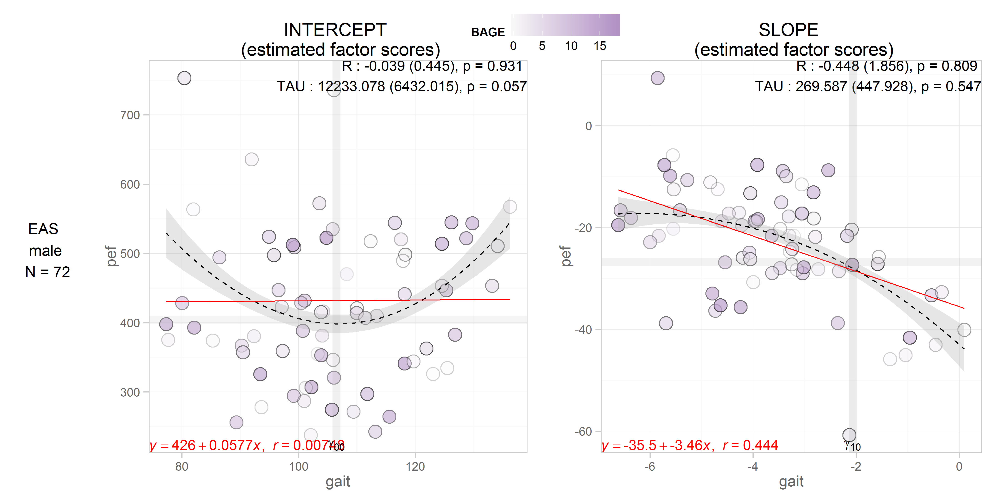
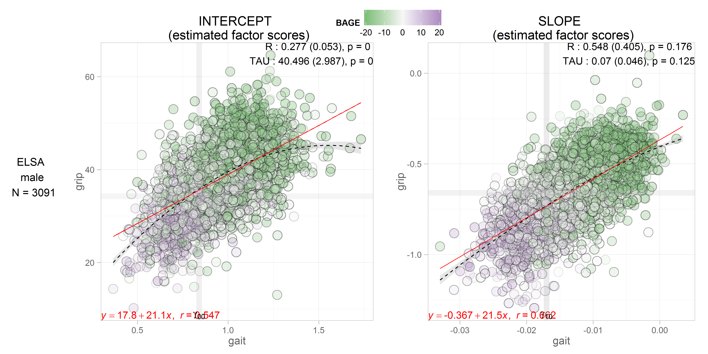
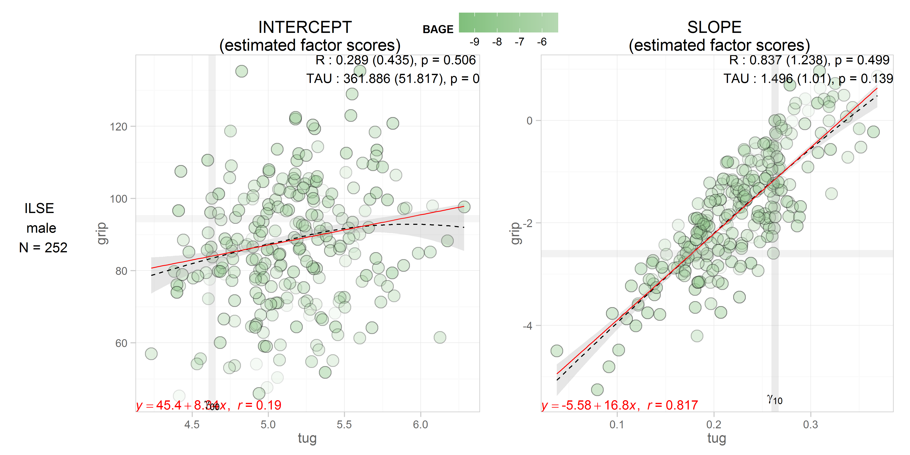
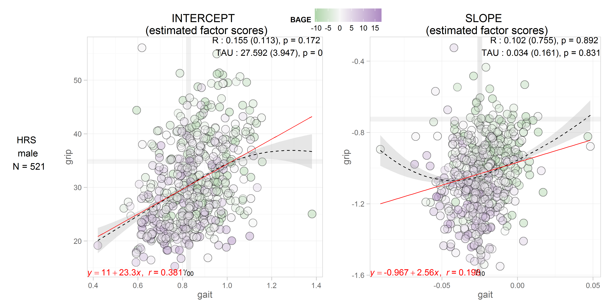
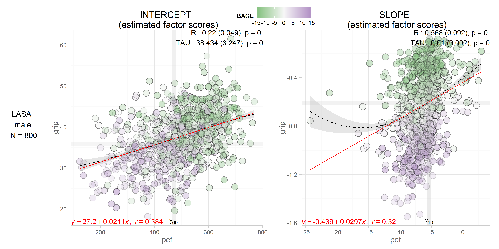
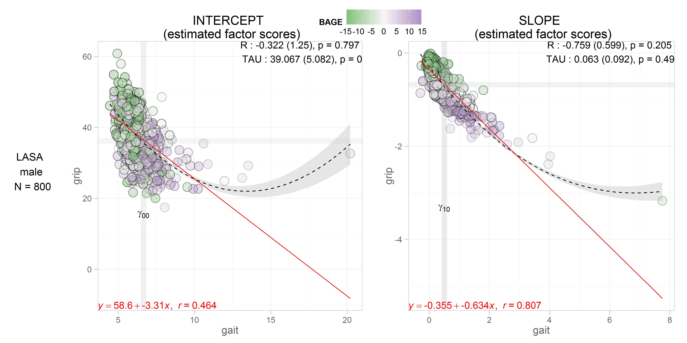
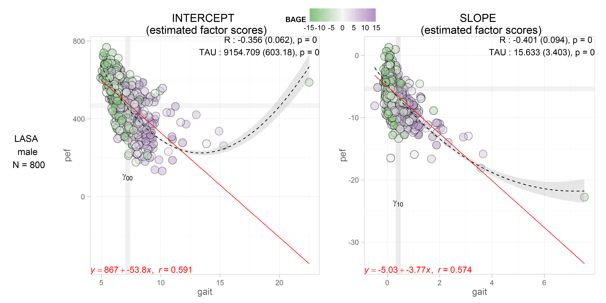
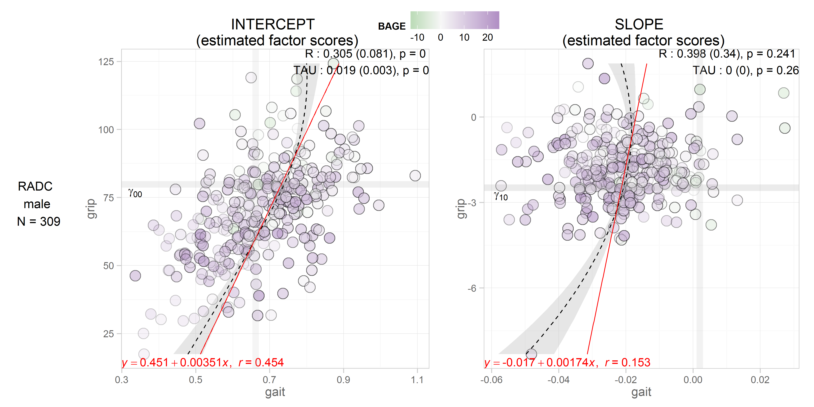
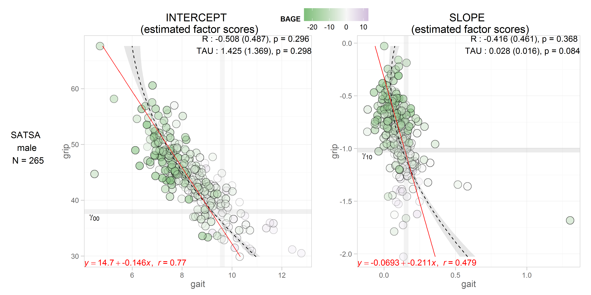
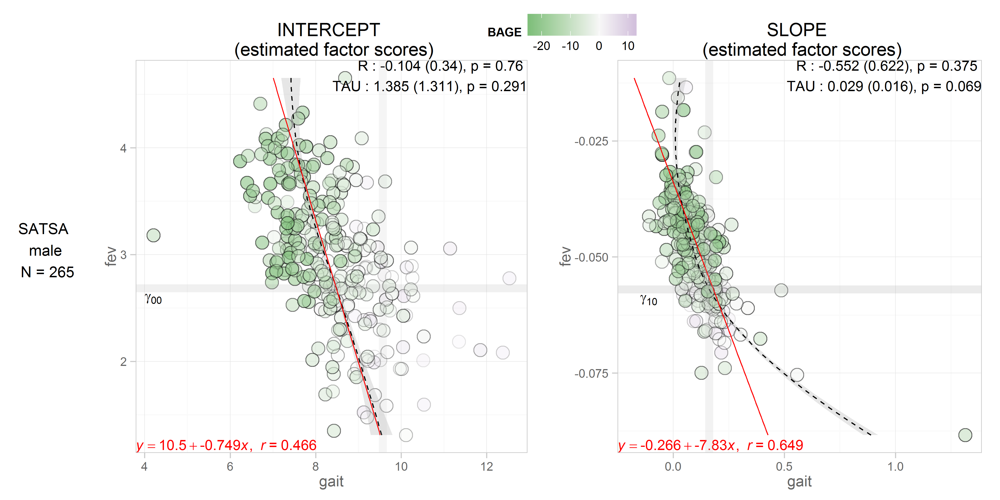

# FScore Scatters

<!-- These two chunks should be added in the beginning of every .Rmd that you want to source an .R script -->
<!--  The 1st mandatory chunck  -->
<!--  Set the working directory to the repository's base directory -->


<!--  The 2nd mandatory chunck  -->
<!-- Set the report-wide options, and point to the external code file. -->


<!-- Load 'sourced' R files.  Suppress the output when loading packages. --> 


<!-- Load the sources.  Suppress the output when loading sources. --> 

```
[1] "Loaded rhdf5 package"
```


<!-- Load any Global functions and variables declared in the R file.  Suppress the output. --> 


<!-- Declare any global functions specific to a Rmd output.  Suppress the output. --> 


<!-- Load the datasets.   -->

```
[1] "path_out"     "path_gh5"     "study_name"   "model_number" "subgroup"     "model_type"   "process1"    
[8] "process2"    
```

<!-- Tweak the datasets.   -->


<!-- Basic table view.   -->


<!-- Basic graph view.   -->


#MALES
#EAS
##grip_pef

```r
dsL <- get_gh5_data(file=model_list,
                    study = "eas",
                    subgroup = "male",
                    model_type = "aehplus",
                    process1 = "grip",
                    process2 = "pef")
```

```

Plot functions:
 - mplus.plot.histogram('C:/Users/koval_000/Documents/GitHub/IALSA-2015-Portland/studies/eas/physical/b1_male_aehplus_grip_pef.gh5',variable,bins)
 - mplus.plot.scatterplot('C:/Users/koval_000/Documents/GitHub/IALSA-2015-Portland/studies/eas/physical/b1_male_aehplus_grip_pef.gh5',xvar,yvar)

Plot data extraction functions:
 - mplus.list.variables('C:/Users/koval_000/Documents/GitHub/IALSA-2015-Portland/studies/eas/physical/b1_male_aehplus_grip_pef.gh5')
 - mplus.get.data('C:/Users/koval_000/Documents/GitHub/IALSA-2015-Portland/studies/eas/physical/b1_male_aehplus_grip_pef.gh5',variable)

List of variable names to use in the following functions:
 - mplus.plot.histogram
 - mplus.plot.scatterplot
 - mplus.get.data

Variables:
```

```r
# dsL <- dsL[dsL$id %in% sample(unique(dsL$id), 100), ]
int_slope(dsL) # create scatterplot
```


##grip_gait

```r
dsL <- get_gh5_data(file=model_list,
                    study = "eas",
                    subgroup = "male",
                    model_type = "aehplus",
                    process1 = "grip",
                    process2 = "gait")
```

```

Plot functions:
 - mplus.plot.histogram('C:/Users/koval_000/Documents/GitHub/IALSA-2015-Portland/studies/eas/physical/b1_male_aehplus_grip_gait.gh5',variable,bins)
 - mplus.plot.scatterplot('C:/Users/koval_000/Documents/GitHub/IALSA-2015-Portland/studies/eas/physical/b1_male_aehplus_grip_gait.gh5',xvar,yvar)

Plot data extraction functions:
 - mplus.list.variables('C:/Users/koval_000/Documents/GitHub/IALSA-2015-Portland/studies/eas/physical/b1_male_aehplus_grip_gait.gh5')
 - mplus.get.data('C:/Users/koval_000/Documents/GitHub/IALSA-2015-Portland/studies/eas/physical/b1_male_aehplus_grip_gait.gh5',variable)

List of variable names to use in the following functions:
 - mplus.plot.histogram
 - mplus.plot.scatterplot
 - mplus.get.data

Variables:
```

```r
# dsL <- dsL[dsL$id %in% sample(unique(dsL$id), 100), ]
int_slope(dsL) # create scatterplot
```


##pef_gait

```r
dsL <- get_gh5_data(file=model_list,
                    study = "eas",
                    subgroup = "male",
                    model_type = "aehplus",
                    process1 = "pef",
                    process2 = "gait")
```

```

Plot functions:
 - mplus.plot.histogram('C:/Users/koval_000/Documents/GitHub/IALSA-2015-Portland/studies/eas/physical/b1_male_aehplus_pef_gait.gh5',variable,bins)
 - mplus.plot.scatterplot('C:/Users/koval_000/Documents/GitHub/IALSA-2015-Portland/studies/eas/physical/b1_male_aehplus_pef_gait.gh5',xvar,yvar)

Plot data extraction functions:
 - mplus.list.variables('C:/Users/koval_000/Documents/GitHub/IALSA-2015-Portland/studies/eas/physical/b1_male_aehplus_pef_gait.gh5')
 - mplus.get.data('C:/Users/koval_000/Documents/GitHub/IALSA-2015-Portland/studies/eas/physical/b1_male_aehplus_pef_gait.gh5',variable)

List of variable names to use in the following functions:
 - mplus.plot.histogram
 - mplus.plot.scatterplot
 - mplus.get.data

Variables:
```

```r
# dsL <- dsL[dsL$id %in% sample(unique(dsL$id), 100), ]
int_slope(dsL) # create scatterplot
```



```r
#### ELSA ####
```

#ELSA
## grip_fev

```r
dsL <- get_gh5_data(file=model_list,
                    study = "elsa",
                    subgroup = "male",
                    model_type = "aehplus",
                    process1 = "grip",
                    process2 = "fev")
```

```

Plot functions:
 - mplus.plot.histogram('C:/Users/koval_000/Documents/GitHub/IALSA-2015-Portland/studies/elsa/physical/b1_male_aehplus_grip_fev.gh5',variable,bins)
 - mplus.plot.scatterplot('C:/Users/koval_000/Documents/GitHub/IALSA-2015-Portland/studies/elsa/physical/b1_male_aehplus_grip_fev.gh5',xvar,yvar)

Plot data extraction functions:
 - mplus.list.variables('C:/Users/koval_000/Documents/GitHub/IALSA-2015-Portland/studies/elsa/physical/b1_male_aehplus_grip_fev.gh5')
 - mplus.get.data('C:/Users/koval_000/Documents/GitHub/IALSA-2015-Portland/studies/elsa/physical/b1_male_aehplus_grip_fev.gh5',variable)

List of variable names to use in the following functions:
 - mplus.plot.histogram
 - mplus.plot.scatterplot
 - mplus.get.data

Variables:
```

```r
# dsL <- dsL[dsL$id %in% sample(unique(dsL$id), 100), ]
int_slope(dsL) # create scatterplot
```


##grip_gait

```r
dsL <- get_gh5_data(file=model_list,
                    study = "elsa",
                    subgroup = "male",
                    model_type = "aehplus",
                    process1 = "grip",
                    process2 = "gait")
```

```

Plot functions:
 - mplus.plot.histogram('C:/Users/koval_000/Documents/GitHub/IALSA-2015-Portland/studies/elsa/physical/b1_male_aehplus_grip_gait.gh5',variable,bins)
 - mplus.plot.scatterplot('C:/Users/koval_000/Documents/GitHub/IALSA-2015-Portland/studies/elsa/physical/b1_male_aehplus_grip_gait.gh5',xvar,yvar)

Plot data extraction functions:
 - mplus.list.variables('C:/Users/koval_000/Documents/GitHub/IALSA-2015-Portland/studies/elsa/physical/b1_male_aehplus_grip_gait.gh5')
 - mplus.get.data('C:/Users/koval_000/Documents/GitHub/IALSA-2015-Portland/studies/elsa/physical/b1_male_aehplus_grip_gait.gh5',variable)

List of variable names to use in the following functions:
 - mplus.plot.histogram
 - mplus.plot.scatterplot
 - mplus.get.data

Variables:
```

```r
# dsL <- dsL[dsL$id %in% sample(unique(dsL$id), 100), ]
int_slope(dsL) # create scatterplot
```


##fev_gait

```r
dsL <- get_gh5_data(file=model_list,
                    study = "elsa",
                    subgroup = "male",
                    model_type = "aehplus",
                    process1 = "fev",
                    process2 = "gait")
```

```

Plot functions:
 - mplus.plot.histogram('C:/Users/koval_000/Documents/GitHub/IALSA-2015-Portland/studies/elsa/physical/b1_male_aehplus_fev_gait.gh5',variable,bins)
 - mplus.plot.scatterplot('C:/Users/koval_000/Documents/GitHub/IALSA-2015-Portland/studies/elsa/physical/b1_male_aehplus_fev_gait.gh5',xvar,yvar)

Plot data extraction functions:
 - mplus.list.variables('C:/Users/koval_000/Documents/GitHub/IALSA-2015-Portland/studies/elsa/physical/b1_male_aehplus_fev_gait.gh5')
 - mplus.get.data('C:/Users/koval_000/Documents/GitHub/IALSA-2015-Portland/studies/elsa/physical/b1_male_aehplus_fev_gait.gh5',variable)

List of variable names to use in the following functions:
 - mplus.plot.histogram
 - mplus.plot.scatterplot
 - mplus.get.data

Variables:
```

```r
# dsL <- dsL[dsL$id %in% sample(unique(dsL$id), 100), ]
int_slope(dsL) # create scatterplot
```


```r
#### ILSE ####
```

#ILSE
##grip_tug

```r
dsL <- get_gh5_data(file=model_list,
                    study = "ilse",
                    subgroup = "male",
                    model_type = "aehplus",
                    process1 = "grip",
                    process2 = "tug")
```

```

Plot functions:
 - mplus.plot.histogram('C:/Users/koval_000/Documents/GitHub/IALSA-2015-Portland/studies/ilse/physical/b1_male_aehplus_grip_tug.gh5',variable,bins)
 - mplus.plot.scatterplot('C:/Users/koval_000/Documents/GitHub/IALSA-2015-Portland/studies/ilse/physical/b1_male_aehplus_grip_tug.gh5',xvar,yvar)

Plot data extraction functions:
 - mplus.list.variables('C:/Users/koval_000/Documents/GitHub/IALSA-2015-Portland/studies/ilse/physical/b1_male_aehplus_grip_tug.gh5')
 - mplus.get.data('C:/Users/koval_000/Documents/GitHub/IALSA-2015-Portland/studies/ilse/physical/b1_male_aehplus_grip_tug.gh5',variable)

List of variable names to use in the following functions:
 - mplus.plot.histogram
 - mplus.plot.scatterplot
 - mplus.get.data

Variables:
```

```r
# dsL <- dsL[dsL$id %in% sample(unique(dsL$id), 100), ]
int_slope(dsL) # create scatterplot
```



```r
#### HRS ####
```


#HRS
##grip_pef

```r
dsL <- get_gh5_data(file=model_list,
                    study = "hrs",
                    subgroup = "male",
                    model_type = "aehplus",
                    process1 = "grip",
                    process2 = "pef",
                    age_center = 75)
```

```

Plot functions:
 - mplus.plot.histogram('C:/Users/koval_000/Documents/GitHub/IALSA-2015-Portland/studies/hrs/physical/b1_male_aehplus_grip_pef.gh5',variable,bins)
 - mplus.plot.scatterplot('C:/Users/koval_000/Documents/GitHub/IALSA-2015-Portland/studies/hrs/physical/b1_male_aehplus_grip_pef.gh5',xvar,yvar)

Plot data extraction functions:
 - mplus.list.variables('C:/Users/koval_000/Documents/GitHub/IALSA-2015-Portland/studies/hrs/physical/b1_male_aehplus_grip_pef.gh5')
 - mplus.get.data('C:/Users/koval_000/Documents/GitHub/IALSA-2015-Portland/studies/hrs/physical/b1_male_aehplus_grip_pef.gh5',variable)

List of variable names to use in the following functions:
 - mplus.plot.histogram
 - mplus.plot.scatterplot
 - mplus.get.data

Variables:
```

```r
# dsL <- dsL[dsL$id %in% sample(unique(dsL$id), 100), ]
int_slope(dsL) # create scatterplot
```


##grip_gait

```r
dsL <- get_gh5_data(file=model_list,
                    study = "hrs",
                    subgroup = "male",
                    model_type = "aehplus",
                    process1 = "grip",
                    process2 = "gait",
                    age_center = 75)
```

```

Plot functions:
 - mplus.plot.histogram('C:/Users/koval_000/Documents/GitHub/IALSA-2015-Portland/studies/hrs/physical/b1_male_aehplus_grip_gait.gh5',variable,bins)
 - mplus.plot.scatterplot('C:/Users/koval_000/Documents/GitHub/IALSA-2015-Portland/studies/hrs/physical/b1_male_aehplus_grip_gait.gh5',xvar,yvar)

Plot data extraction functions:
 - mplus.list.variables('C:/Users/koval_000/Documents/GitHub/IALSA-2015-Portland/studies/hrs/physical/b1_male_aehplus_grip_gait.gh5')
 - mplus.get.data('C:/Users/koval_000/Documents/GitHub/IALSA-2015-Portland/studies/hrs/physical/b1_male_aehplus_grip_gait.gh5',variable)

List of variable names to use in the following functions:
 - mplus.plot.histogram
 - mplus.plot.scatterplot
 - mplus.get.data

Variables:
```

```r
# dsL <- dsL[dsL$id %in% sample(unique(dsL$id), 100), ]
int_slope(dsL) # create scatterplot
```


##pef_gait

```r
dsL <- get_gh5_data(file=model_list,
                    study = "hrs",
                    subgroup = "male",
                    model_type = "aehplus",
                    process1 = "pef",
                    process2 = "gait",
                    age_center = 75)
```

```

Plot functions:
 - mplus.plot.histogram('C:/Users/koval_000/Documents/GitHub/IALSA-2015-Portland/studies/hrs/physical/b1_male_aehplus_pef_gait.gh5',variable,bins)
 - mplus.plot.scatterplot('C:/Users/koval_000/Documents/GitHub/IALSA-2015-Portland/studies/hrs/physical/b1_male_aehplus_pef_gait.gh5',xvar,yvar)

Plot data extraction functions:
 - mplus.list.variables('C:/Users/koval_000/Documents/GitHub/IALSA-2015-Portland/studies/hrs/physical/b1_male_aehplus_pef_gait.gh5')
 - mplus.get.data('C:/Users/koval_000/Documents/GitHub/IALSA-2015-Portland/studies/hrs/physical/b1_male_aehplus_pef_gait.gh5',variable)

List of variable names to use in the following functions:
 - mplus.plot.histogram
 - mplus.plot.scatterplot
 - mplus.get.data

Variables:
```

```r
# dsL <- dsL[dsL$id %in% sample(unique(dsL$id), 100), ]
int_slope(dsL) # create scatterplot
```


```r
##### LASA ####
```


# EAS
##grip_pef

```r
dsL <- get_gh5_data(file=model_list,
                    study = "lasa",
                    subgroup = "male",
                    model_type = "aehplus",
                    process1 = "grip",
                    process2 = "pef")
```

```

Plot functions:
 - mplus.plot.histogram('C:/Users/koval_000/Documents/GitHub/IALSA-2015-Portland/studies/lasa/physical/b1_male_aehplus_grip_pef.gh5',variable,bins)
 - mplus.plot.scatterplot('C:/Users/koval_000/Documents/GitHub/IALSA-2015-Portland/studies/lasa/physical/b1_male_aehplus_grip_pef.gh5',xvar,yvar)

Plot data extraction functions:
 - mplus.list.variables('C:/Users/koval_000/Documents/GitHub/IALSA-2015-Portland/studies/lasa/physical/b1_male_aehplus_grip_pef.gh5')
 - mplus.get.data('C:/Users/koval_000/Documents/GitHub/IALSA-2015-Portland/studies/lasa/physical/b1_male_aehplus_grip_pef.gh5',variable)

List of variable names to use in the following functions:
 - mplus.plot.histogram
 - mplus.plot.scatterplot
 - mplus.get.data

Variables:
```

```r
# dsL <- dsL[dsL$id %in% sample(unique(dsL$id), 100), ]
int_slope(dsL) # create scatterplot
```


##grip_gait

```r
dsL <- get_gh5_data(file=model_list,
                    study = "lasa",
                    subgroup = "male",
                    model_type = "aehplus",
                    process1 = "grip",
                    process2 = "gait")
```

```

Plot functions:
 - mplus.plot.histogram('C:/Users/koval_000/Documents/GitHub/IALSA-2015-Portland/studies/lasa/physical/b1_male_aehplus_grip_gait.gh5',variable,bins)
 - mplus.plot.scatterplot('C:/Users/koval_000/Documents/GitHub/IALSA-2015-Portland/studies/lasa/physical/b1_male_aehplus_grip_gait.gh5',xvar,yvar)

Plot data extraction functions:
 - mplus.list.variables('C:/Users/koval_000/Documents/GitHub/IALSA-2015-Portland/studies/lasa/physical/b1_male_aehplus_grip_gait.gh5')
 - mplus.get.data('C:/Users/koval_000/Documents/GitHub/IALSA-2015-Portland/studies/lasa/physical/b1_male_aehplus_grip_gait.gh5',variable)

List of variable names to use in the following functions:
 - mplus.plot.histogram
 - mplus.plot.scatterplot
 - mplus.get.data

Variables:
```

```r
# dsL <- dsL[dsL$id %in% sample(unique(dsL$id), 100), ]
int_slope(dsL) # create scatterplot
```


##pef_gait

```r
dsL <- get_gh5_data(file=model_list,
                    study = "lasa",
                    subgroup = "male",
                    model_type = "aehplus",
                    process1 = "pef",
                    process2 = "gait")
```

```

Plot functions:
 - mplus.plot.histogram('C:/Users/koval_000/Documents/GitHub/IALSA-2015-Portland/studies/lasa/physical/b1_male_aehplus_pef_gait.gh5',variable,bins)
 - mplus.plot.scatterplot('C:/Users/koval_000/Documents/GitHub/IALSA-2015-Portland/studies/lasa/physical/b1_male_aehplus_pef_gait.gh5',xvar,yvar)

Plot data extraction functions:
 - mplus.list.variables('C:/Users/koval_000/Documents/GitHub/IALSA-2015-Portland/studies/lasa/physical/b1_male_aehplus_pef_gait.gh5')
 - mplus.get.data('C:/Users/koval_000/Documents/GitHub/IALSA-2015-Portland/studies/lasa/physical/b1_male_aehplus_pef_gait.gh5',variable)

List of variable names to use in the following functions:
 - mplus.plot.histogram
 - mplus.plot.scatterplot
 - mplus.get.data

Variables:
```

```r
# dsL <- dsL[dsL$id %in% sample(unique(dsL$id), 100), ]
int_slope(dsL) # create scatterplot
```



```r
#### OCTO ####
```


# EAS
##grip_pef

```r
dsL <- get_gh5_data(file=model_list,
                    study = "octo",
                    subgroup = "male",
                    model_type = "aehplus",
                    process1 = "grip",
                    process2 = "pef")
```

```

Plot functions:
 - mplus.plot.histogram('C:/Users/koval_000/Documents/GitHub/IALSA-2015-Portland/studies/octo/physical/b1_male_aehplus_grip_pef.gh5',variable,bins)
 - mplus.plot.scatterplot('C:/Users/koval_000/Documents/GitHub/IALSA-2015-Portland/studies/octo/physical/b1_male_aehplus_grip_pef.gh5',xvar,yvar)

Plot data extraction functions:
 - mplus.list.variables('C:/Users/koval_000/Documents/GitHub/IALSA-2015-Portland/studies/octo/physical/b1_male_aehplus_grip_pef.gh5')
 - mplus.get.data('C:/Users/koval_000/Documents/GitHub/IALSA-2015-Portland/studies/octo/physical/b1_male_aehplus_grip_pef.gh5',variable)

List of variable names to use in the following functions:
 - mplus.plot.histogram
 - mplus.plot.scatterplot
 - mplus.get.data

Variables:
```

```r
# dsL <- dsL[dsL$id %in% sample(unique(dsL$id), 100), ]
int_slope(dsL) # create scatterplot
```


##grip_gait

```r
dsL <- get_gh5_data(file=model_list,
                    study = "octo",
                    subgroup = "male",
                    model_type = "aehplus",
                    process1 = "grip",
                    process2 = "gait")
```

```

Plot functions:
 - mplus.plot.histogram('C:/Users/koval_000/Documents/GitHub/IALSA-2015-Portland/studies/octo/physical/b1_male_aehplus_grip_gait.gh5',variable,bins)
 - mplus.plot.scatterplot('C:/Users/koval_000/Documents/GitHub/IALSA-2015-Portland/studies/octo/physical/b1_male_aehplus_grip_gait.gh5',xvar,yvar)

Plot data extraction functions:
 - mplus.list.variables('C:/Users/koval_000/Documents/GitHub/IALSA-2015-Portland/studies/octo/physical/b1_male_aehplus_grip_gait.gh5')
 - mplus.get.data('C:/Users/koval_000/Documents/GitHub/IALSA-2015-Portland/studies/octo/physical/b1_male_aehplus_grip_gait.gh5',variable)

List of variable names to use in the following functions:
 - mplus.plot.histogram
 - mplus.plot.scatterplot
 - mplus.get.data

Variables:
```

```r
# dsL <- dsL[dsL$id %in% sample(unique(dsL$id), 100), ]
int_slope(dsL) # create scatterplot
```


##pef_gait

```r
dsL <- get_gh5_data(file=model_list,
                    study = "octo",
                    subgroup = "male",
                    model_type = "aehplus",
                    process1 = "pef",
                    process2 = "gait")
```

```

Plot functions:
 - mplus.plot.histogram('C:/Users/koval_000/Documents/GitHub/IALSA-2015-Portland/studies/octo/physical/b1_male_aehplus_pef_gait.gh5',variable,bins)
 - mplus.plot.scatterplot('C:/Users/koval_000/Documents/GitHub/IALSA-2015-Portland/studies/octo/physical/b1_male_aehplus_pef_gait.gh5',xvar,yvar)

Plot data extraction functions:
 - mplus.list.variables('C:/Users/koval_000/Documents/GitHub/IALSA-2015-Portland/studies/octo/physical/b1_male_aehplus_pef_gait.gh5')
 - mplus.get.data('C:/Users/koval_000/Documents/GitHub/IALSA-2015-Portland/studies/octo/physical/b1_male_aehplus_pef_gait.gh5',variable)

List of variable names to use in the following functions:
 - mplus.plot.histogram
 - mplus.plot.scatterplot
 - mplus.get.data

Variables:
```

```r
# dsL <- dsL[dsL$id %in% sample(unique(dsL$id), 100), ]
int_slope(dsL) # create scatterplot
```


```r
# #### RADC ####
```


# EAS
##grip_fev

```r
dsL <- get_gh5_data(file=model_list,
                    study = "radc",
                    subgroup = "male",
                    model_type = "aehplus",
                    process1 = "fev",
                    process2 = "grip")
```

```

Plot functions:
 - mplus.plot.histogram('C:/Users/koval_000/Documents/GitHub/IALSA-2015-Portland/studies/radc/physical/b1_male_aehplus_fev_grip.gh5',variable,bins)
 - mplus.plot.scatterplot('C:/Users/koval_000/Documents/GitHub/IALSA-2015-Portland/studies/radc/physical/b1_male_aehplus_fev_grip.gh5',xvar,yvar)

Plot data extraction functions:
 - mplus.list.variables('C:/Users/koval_000/Documents/GitHub/IALSA-2015-Portland/studies/radc/physical/b1_male_aehplus_fev_grip.gh5')
 - mplus.get.data('C:/Users/koval_000/Documents/GitHub/IALSA-2015-Portland/studies/radc/physical/b1_male_aehplus_fev_grip.gh5',variable)

List of variable names to use in the following functions:
 - mplus.plot.histogram
 - mplus.plot.scatterplot
 - mplus.get.data

Variables:
```

```r
# dsL <- dsL[dsL$id %in% sample(unique(dsL$id), 100), ]
int_slope(dsL) # create scatterplot
```


```r
#
# # @knitr radc_male_aehplus_grip_gait ---------------------------------------
dsL <- get_gh5_data(file=model_list,
                    study = "radc",
                    subgroup = "male",
                    model_type = "aehplus",
                    process1 = "gait",
                    process2 = "grip")
```

```

Plot functions:
 - mplus.plot.histogram('C:/Users/koval_000/Documents/GitHub/IALSA-2015-Portland/studies/radc/physical/b1_male_aehplus_gait_grip.gh5',variable,bins)
 - mplus.plot.scatterplot('C:/Users/koval_000/Documents/GitHub/IALSA-2015-Portland/studies/radc/physical/b1_male_aehplus_gait_grip.gh5',xvar,yvar)

Plot data extraction functions:
 - mplus.list.variables('C:/Users/koval_000/Documents/GitHub/IALSA-2015-Portland/studies/radc/physical/b1_male_aehplus_gait_grip.gh5')
 - mplus.get.data('C:/Users/koval_000/Documents/GitHub/IALSA-2015-Portland/studies/radc/physical/b1_male_aehplus_gait_grip.gh5',variable)

List of variable names to use in the following functions:
 - mplus.plot.histogram
 - mplus.plot.scatterplot
 - mplus.get.data

Variables:
```

```r
# dsL <- dsL[dsL$id %in% sample(unique(dsL$id), 100), ]
int_slope(dsL) # create scatterplot
```


##grip_gait

##fev_gait

```r
dsL <- get_gh5_data(file=model_list,
                    study = "radc",
                    subgroup = "male",
                    model_type = "aehplus",
                    process1 = "fev",
                    process2 = "gait")
```

```

Plot functions:
 - mplus.plot.histogram('C:/Users/koval_000/Documents/GitHub/IALSA-2015-Portland/studies/radc/physical/b1_male_aehplus_fev_gait.gh5',variable,bins)
 - mplus.plot.scatterplot('C:/Users/koval_000/Documents/GitHub/IALSA-2015-Portland/studies/radc/physical/b1_male_aehplus_fev_gait.gh5',xvar,yvar)

Plot data extraction functions:
 - mplus.list.variables('C:/Users/koval_000/Documents/GitHub/IALSA-2015-Portland/studies/radc/physical/b1_male_aehplus_fev_gait.gh5')
 - mplus.get.data('C:/Users/koval_000/Documents/GitHub/IALSA-2015-Portland/studies/radc/physical/b1_male_aehplus_fev_gait.gh5',variable)

List of variable names to use in the following functions:
 - mplus.plot.histogram
 - mplus.plot.scatterplot
 - mplus.get.data

Variables:
```

```r
# dsL <- dsL[dsL$id %in% sample(unique(dsL$id), 100), ]
int_slope(dsL) # create scatterplot
```


```r
### SATSA ####
```


# EAS
##grip_fev

```r
dsL <- get_gh5_data(file=model_list,
                    study = "satsa",
                    subgroup = "male",
                    model_type = "aehplus",
                    process1 = "grip",
                    process2 = "fev")
```

```

Plot functions:
 - mplus.plot.histogram('C:/Users/koval_000/Documents/GitHub/IALSA-2015-Portland/studies/satsa/physical/b1_male_aehplus_grip_fev.gh5',variable,bins)
 - mplus.plot.scatterplot('C:/Users/koval_000/Documents/GitHub/IALSA-2015-Portland/studies/satsa/physical/b1_male_aehplus_grip_fev.gh5',xvar,yvar)

Plot data extraction functions:
 - mplus.list.variables('C:/Users/koval_000/Documents/GitHub/IALSA-2015-Portland/studies/satsa/physical/b1_male_aehplus_grip_fev.gh5')
 - mplus.get.data('C:/Users/koval_000/Documents/GitHub/IALSA-2015-Portland/studies/satsa/physical/b1_male_aehplus_grip_fev.gh5',variable)

List of variable names to use in the following functions:
 - mplus.plot.histogram
 - mplus.plot.scatterplot
 - mplus.get.data

Variables:
```

```r
# dsL <- dsL[dsL$id %in% sample(unique(dsL$id), 100), ]
int_slope(dsL) # create scatterplot
```


##grip_gait

```r
dsL <- get_gh5_data(file=model_list,
                    study = "satsa",
                    subgroup = "male",
                    model_type = "aehplus",
                    process1 = "gait",
                    process2 = "grip")
```

```

Plot functions:
 - mplus.plot.histogram('C:/Users/koval_000/Documents/GitHub/IALSA-2015-Portland/studies/satsa/physical/b1_male_aehplus_gait_grip.gh5',variable,bins)
 - mplus.plot.scatterplot('C:/Users/koval_000/Documents/GitHub/IALSA-2015-Portland/studies/satsa/physical/b1_male_aehplus_gait_grip.gh5',xvar,yvar)

Plot data extraction functions:
 - mplus.list.variables('C:/Users/koval_000/Documents/GitHub/IALSA-2015-Portland/studies/satsa/physical/b1_male_aehplus_gait_grip.gh5')
 - mplus.get.data('C:/Users/koval_000/Documents/GitHub/IALSA-2015-Portland/studies/satsa/physical/b1_male_aehplus_gait_grip.gh5',variable)

List of variable names to use in the following functions:
 - mplus.plot.histogram
 - mplus.plot.scatterplot
 - mplus.get.data

Variables:
```

```r
# dsL <- dsL[dsL$id %in% sample(unique(dsL$id), 100), ]
int_slope(dsL) # create scatterplot
```


##fev_gait

```r
dsL <- get_gh5_data(file=model_list,
                    study = "satsa",
                    subgroup = "male",
                    model_type = "aehplus",
                    process1 = "gait",
                    process2 = "fev")
```

```

Plot functions:
 - mplus.plot.histogram('C:/Users/koval_000/Documents/GitHub/IALSA-2015-Portland/studies/satsa/physical/b1_male_aehplus_gait_fev.gh5',variable,bins)
 - mplus.plot.scatterplot('C:/Users/koval_000/Documents/GitHub/IALSA-2015-Portland/studies/satsa/physical/b1_male_aehplus_gait_fev.gh5',xvar,yvar)

Plot data extraction functions:
 - mplus.list.variables('C:/Users/koval_000/Documents/GitHub/IALSA-2015-Portland/studies/satsa/physical/b1_male_aehplus_gait_fev.gh5')
 - mplus.get.data('C:/Users/koval_000/Documents/GitHub/IALSA-2015-Portland/studies/satsa/physical/b1_male_aehplus_gait_fev.gh5',variable)

List of variable names to use in the following functions:
 - mplus.plot.histogram
 - mplus.plot.scatterplot
 - mplus.get.data

Variables:
```

```r
# dsL <- dsL[dsL$id %in% sample(unique(dsL$id), 100), ]
int_slope(dsL) # create scatterplot
```




