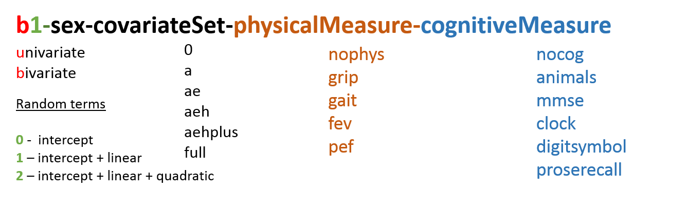

# Track renaming in IALSA Portland 2015 model collective


<!--  Set the working directory to the repository's base directory; this assumes the report is nested inside of two directories.-->


<!-- Set the report-wide options, and point to the external code file. -->


<!-- Load the sources.  Suppress the output when loading sources. --> 


<!-- Load 'sourced' R files.  Suppress the output when loading packages. --> 


<!-- Load any Global functions and variables declared in the R file.  Suppress the output. --> 


<!-- Declare any global functions specific to a Rmd output.  Suppress the output. --> 


<!-- Load the datasets.   -->
Load the data from the rawest source.

```r
ds1 <- readRDS('./data/shared/ds0.rds')
# ds <- ds1 %>% dplyr::filter(study_name=="satsa")
ds <- ds1 %>% dplyr::arrange_("cognitive_measure")
# ds <- ds1[ds1$study_name=="eas",]
head(ds[c("cognitive_construct","cognitive_measure","output_file")])
```

```
  cognitive_construct cognitive_measure                                  output_file
1              mental               3ms     b1_female_aeh_muscle_mental_hand_3ms.out
2              mental               3ms b1_female_aehplus_muscle_mental_hand_3ms.out
3              mental               3ms     b1_female_age_muscle_mental_hand_3ms.out
4              mental               3ms    b1_female_full_muscle_mental_hand_3ms.out
5              mental               3ms       b1_male_aeh_muscle_mental_hand_3ms.out
6              mental               3ms   b1_male_aehplus_muscle_mental_hand_3ms.out
```

```r
tail(ds[c("cognitive_construct","cognitive_measure","output_file")])
```

```
     cognitive_construct cognitive_measure                                 output_file
1662         proserecall              <NA>       b1_male_aeh_pulmonary_proserecall.out
1663         proserecall              <NA>   b1_male_aehplus_pulmonary_proserecall.out
1664         proserecall              <NA>       b1_male_age_pulmonary_proserecall.out
1665         proserecall              <NA>      b1_male_full_pulmonary_proserecall.out
1666              memory              <NA> b1_female_a_pulmonary_memory_wmslmimmed.out
1667              memory              <NA>   b1_male_a_pulmonary_memory_wmslmimmed.out
```

```r
nrow(ds)
```

```
[1] 1667
```
Each row is a model.
<!-- Tweak the datasets.   -->


Now I will throw out the models which were named illegaly, that is did not contain exactly 7 components.

```r
desired_subpart_count <- 7L # necessary number of componets in legal filename
ds$model_name <- gsub(pattern=".out",replacement="",ds$output_file) # remove .out ending
subparts <- strsplit(ds$model_name,"_") # break up each  model_name, store in a list
subpart_count <- sapply(subparts, length) # count compents in each element of the list
is_valid <- (subpart_count==desired_subpart_count) # create logical vector
length(ds$output_file[!is_valid]) # that many models with omitted elements in the name
```

```
[1] 90
```

```r
# Define what models have invalid names and print them
if(sum(!is_valid)>0){ print(ds$output_file[!is_valid])}else{
  cat("All your models were named properly")
}
```

```
 [1] "b1_female_aeh_grip_block.out"                  "b1_female_aehplus_grip_block.out"             
 [3] "b1_female_age_grip_block.out"                  "b1_male_aeh_grip_block.out"                   
 [5] "b1_male_aehplus_grip_block.out"                "b1_male_age_grip_block.out"                   
 [7] "b1_female_aeh_grip_digitbackward.out"          "b1_female_aehplus_grip_digitbackward.out"     
 [9] "b1_female_age_grip_digitbackward.out"          "b1_male_aeh_grip_digitbackward.out"           
[11] "b1_male_aehplus_grip_digitbackward.out"        "b1_male_age_grip_digitbackward.out"           
[13] "b1_female_aeh_grip_digitforward.out"           "b1_female_aehplus_grip_digitforward.out"      
[15] "b1_female_age_grip_digitforward.out"           "b1_male_aeh_grip_digitforward.out"            
[17] "b1_male_aehplus_grip_digitforward.out"         "b1_male_age_grip_digitforward.out"            
[19] "b1_female_aeh_grip_digitsymbol.out"            "b1_female_aehplus_grip_digitsymbol.out"       
[21] "b1_female_age_grip_digitsymbol.out"            "b1_male_aeh_grip_digitsymbol.out"             
[23] "b1_male_aehplus_grip_digitsymbol.out"          "b1_male_age_grip_digitsymbol.out"             
[25] "b1_female_aeh_grip_figurelogic.out"            "b1_female_aehplus_grip_figurelogic.out"       
[27] "b1_female_age_grip_figurelogic.out"            "b1_male_aeh_grip_figurelogic.out"             
[29] "b1_male_aehplus_grip_figurelogic.out"          "b1_male_age_grip_figurelogic.out"             
[31] "b1_female_aeh_grip_mirrecall.out"              "b1_female_aehplus_grip_mirrecall.out"         
[33] "b1_female_age_grip_mirrecall.out"              "b1_male_aeh_grip_mirrecall.out"               
[35] "b1_male_aehplus_grip_mirrecall.out"            "b1_male_age_grip_mirrecall.out"               
[37] "b1_female_aeh_grip_proserecall.out"            "b1_female_aehplus_grip_proserecall.out"       
[39] "b1_female_age_grip_proserecall.out"            "b1_male_aeh_grip_proserecall.out"             
[41] "b1_male_aehplus_grip_proserecall.out"          "b1_male_age_grip_proserecall.out"             
[43] "b1_female_aeh_pulmonary_block.out"             "b1_female_aehplus_pulmonary_block.out"        
[45] "b1_female_age_pulmonary_block.out"             "b1_female_full_pulmonary_block.out"           
[47] "b1_male_aeh_pulmonary_block.out"               "b1_male_aehplus_pulmonary_block.out"          
[49] "b1_male_age_pulmonary_block.out"               "b1_male_full_pulmonary_block.out"             
[51] "b1_female_aeh_pulmonary_digitbackward.out"     "b1_female_aehplus_pulmonary_digitbackward.out"
[53] "b1_female_age_pulmonary_digitbackward.out"     "b1_male_aeh_pulmonary_digitbackward.out"      
[55] "b1_male_aehplus_pulmonary_digitbackward.out"   "b1_male_age_pulmonary_digitbackward.out"      
[57] "b1_female_aeh_pulmonary_digitforward.out"      "b1_female_aehplus_pulmonary_digitforward.out" 
[59] "b1_female_age_pulmonary_digitforward.out"      "b1_male_aeh_pulmonary_digitforward.out"       
[61] "b1_male_aehplus_pulmonary_digitforward.out"    "b1_male_age_pulmonary_digitforward.out"       
[63] "b1_female_aeh_pulmonary_digitsymbol.out"       "b1_female_aehplus_pulmonary_digitsymbol.out"  
[65] "b1_female_age_pulmonary_digitsymbol.out"       "b1_male_aeh_pulmonary_digitsymbol.out"        
[67] "b1_male_aehplus_pulmonary_digitsymbol.out"     "b1_male_age_pulmonary_digitsymbol.out"        
[69] "b1_female_aeh_pulmonary_figurelogic.out"       "b1_female_aehplus_pulmonary_figurelogic.out"  
[71] "b1_female_age_pulmonary_figurelogic.out"       "b1_male_aeh_pulmonary_figurelogic.out"        
[73] "b1_male_aehplus_pulmonary_figurelogic.out"     "b1_male_age_pulmonary_figurelogic.out"        
[75] "b1_female_aeh_pulmonary_mirrecall.out"         "b1_female_aehplus_pulmonary_mirrecall.out"    
[77] "b1_female_age_pulmonary_mirrecall.out"         "b1_male_aeh_pulmonary_mirrecall.out"          
[79] "b1_male_aehplus_pulmonary_mirrecall.out"       "b1_male_age_pulmonary_mirrecall.out"          
[81] "b1_female_aeh_pulmonary_proserecall.out"       "b1_female_aehplus_pulmonary_proserecall.out"  
[83] "b1_female_age_pulmonary_proserecall.out"       "b1_female_full_pulmonary_proserecall.out"     
[85] "b1_male_aeh_pulmonary_proserecall.out"         "b1_male_aehplus_pulmonary_proserecall.out"    
[87] "b1_male_age_pulmonary_proserecall.out"         "b1_male_full_pulmonary_proserecall.out"       
[89] "b1_female_a_pulmonary_memory_wmslmimmed.out"   "b1_male_a_pulmonary_memory_wmslmimmed.out"    
```

```r
ds <- ds[is_valid,] # keep only model the valid names
nrow(ds) # how many models we ended up with.
```

```
[1] 1577
```

To simplify editing of the names, we'll convert them to lowercase

```r
ds$physical_construct <- tolower(stringr::str_trim(ds$physical_construct))
ds$physical_measure <- tolower(stringr::str_trim(ds$physical_measure))
ds$cognitive_construct <- tolower(stringr::str_trim(ds$cognitive_construct))
ds$cognitive_measure <- tolower(stringr::str_trim(ds$cognitive_measure))
```

## Spelling mistakes
Now we will correct for what seemed to us were benign spelling issues. We'll keep the order from the model naming convention


### Model number

```r
t <- table(ds$model_number, ds$study_name);t[t==0]<-".";t
```

```
    
     eas elsa habc ilse nas nuage octo radc satsa
  b1 218 60   48   71   48  12    88   150  152  
  u0 6   60   10   16   6   10    .    .    .    
  u1 129 57   30   48   6   36    .    149  .    
  u2 131 30   .    .    6   .     .    .    .    
```
No obvious typos were detected.

### Subgroup

```r
t <- table(ds$subgroup, ds$study_name);t[t==0]<-".";t
```

```
        
         eas elsa habc ilse nas nuage octo radc satsa
  female 243 105  44   68   .   29    44   149  76   
  male   241 102  44   67   66  29    44   150  76   
```
No obvious typos were detected.

### Model type

```r
t <- table(ds$model_type, ds$study_name);t[t==0]<-".";t
```

```
         
          eas elsa habc ilse nas nuage octo radc satsa
  0       .   .    .    .    .   .     .    .    20   
  a       .   .    .    22   .   10    .    72   10   
  ae      96  42   .    .    11  .     .    74   34   
  aeh     95  42   22   39   11  16    44   77   34   
  aehplus 94  41   22   40   11  16    .    76   30   
  age     96  41   22   18   11  6     44   .    24   
  aheplus 1   .    .    .    .   .     .    .    .    
  empty   6   41   10   16   11  10    .    .    .    
  full    96  .    12   .    11  .     .    .    .    
```
obvious typo "aheplus" was detected.  

#### Correct model type


```r
# rename obvious typo
ds[ds$model_type=="aheplus","model_type"] <- "aehplus"
# rename values for consistency
ds[ds$model_type=="age","model_type"] <- "a" # rename for sorting/consistency purposes
ds[ds$model_type=="empty","model_type"] <- "0"
# inspect new names
t <- table(ds$model_type, ds$study_name);t[t==0]<-".";t
```

```
         
          eas elsa habc ilse nas nuage octo radc satsa
  0       6   41   10   16   11  10    .    .    20   
  a       96  41   22   40   11  16    44   72   34   
  ae      96  42   .    .    11  .     .    74   34   
  aeh     95  42   22   39   11  16    44   77   34   
  aehplus 95  41   22   40   11  16    .    76   30   
  full    96  .    12   .    11  .     .    .    .    
```

```r
# we also remove "aeplus" for now, while Lewina is reruning models with data unadjusted for height
ds <- ds %>% dplyr::filter(!(model_type %in% c("aeplus")))
```
#### QUESTIONS 
 1. Is "aeplus" a typo or particular model?  

### Physical domain

```r
t <- table(ds$physical_construct, ds$study_name);t[t==0]<-".";t
```

```
            
             eas elsa habc ilse nas nuage octo radc satsa
  chair      .   .    .    .    .   8     .    .    .    
  flamingo   .   .    .    .    .   8     .    .    .    
  muscle     131 37   32   43   .   20    44   .    46   
  nophys     220 90   24   48   .   6     .    149  .    
  nophysspec 1   .    .    .    .   .     .    .    .    
  pulmonary  132 80   .    .    66  .     44   150  105  
  pumonary   .   .    .    .    .   .     .    .    1    
  tug        .   .    .    44   .   8     .    .    .    
  walking    .   .    32   .    .   8     .    .    .    
```

#### Correct Physical domain


```r
# rename obvious typo
ds[ds$physical_construct %in% c("pumonary"),"physical_construct"] <- "pulmonary"
# Rename the absense of physical construct
ds[ds$physical_construct %in% c("nophys", "nophysspec"),"physical_construct"] <- "Univar"
# inspect new names
t <- table(ds$physical_construct, ds$study_name);t[t==0]<-".";t
```

```
           
            eas elsa habc ilse nas nuage octo radc satsa
  chair     .   .    .    .    .   8     .    .    .    
  flamingo  .   .    .    .    .   8     .    .    .    
  muscle    131 37   32   43   .   20    44   .    46   
  pulmonary 132 80   .    .    66  .     44   150  106  
  tug       .   .    .    44   .   8     .    .    .    
  Univar    221 90   24   48   .   6     .    149  .    
  walking   .   .    32   .    .   8     .    .    .    
```

#### QUESTIONS 

### Physical measure

```r
t <- table(ds$physical_measure, ds$study_name);t[t==0]<-".";t
```

```
            
             eas elsa habc ilse nas nuage octo radc satsa
  fev        .   40   .    .    .   .     .    150  106  
  fev1       .   .    .    .    66  .     .    .    .    
  fvc        .   40   .    .    .   .     .    .    .    
  gait       .   .    32   .    .   .     .    .    .    
  grip       131 37   .    43   .   21    44   .    46   
  hand       .   .    32   .    .   .     .    .    .    
  nophsyspec 1   .    .    .    .   .     .    .    .    
  nophyspec  8   .    .    .    .   .     .    .    .    
  nophyssec  5   .    .    .    .   .     .    .    .    
  nophysspec 207 90   24   48   .   37    .    149  .    
  pek        132 .    .    .    .   .     44   .    .    
  tug        .   .    .    44   .   .     .    .    .    
```

#### Correct Physical measure


```r
# rename obvious type
ds[ds$physical_measure %in% c("fevc", "fev1", "fvc") ,"physical_measure"] <- "fev"
## iN ILSE, look up philipp about tug
ds[(ds$physical_measure == "nophysspec" | ds$physical_measure == "nophyscog")  & ds$physical_construct == "tug","physical_measure"] <- "tug"
t <- table(ds$physical_measure, ds$study_name);t[t==0]<-".";t
```

```
            
             eas elsa habc ilse nas nuage octo radc satsa
  fev        .   80   .    .    66  .     .    150  106  
  gait       .   .    32   .    .   .     .    .    .    
  grip       131 37   .    43   .   21    44   .    46   
  hand       .   .    32   .    .   .     .    .    .    
  nophsyspec 1   .    .    .    .   .     .    .    .    
  nophyspec  8   .    .    .    .   .     .    .    .    
  nophyssec  5   .    .    .    .   .     .    .    .    
  nophysspec 207 90   24   48   .   29    .    149  .    
  pek        132 .    .    .    .   .     44   .    .    
  tug        .   .    .    44   .   8     .    .    .    
```

```r
# rename the absense of physical measure
ds[ds$physical_measure %in% c("nophysspec","nophsyspec","nophyscog", "nophyspec", "nophyssec" ), "physical_measure"] <- "univar"
# collapse a category
ds[ds$physical_measure == "hand","physical_measure"] <- "grip"


# inspect new names
t <- table(ds$physical_measure, ds$study_name);t[t==0]<-".";t
```

```
        
         eas elsa habc ilse nas nuage octo radc satsa
  fev    .   80   .    .    66  .     .    150  106  
  gait   .   .    32   .    .   .     .    .    .    
  grip   131 37   32   43   .   21    44   .    46   
  pek    132 .    .    .    .   .     44   .    .    
  tug    .   .    .    44   .   8     .    .    .    
  univar 221 90   24   48   .   29    .    149  .    
```

#### QUESTIONS 

### Cognitive domain

```r
t <- table(ds$cognitive_construct, ds$study_name);t[t==0]<-".";t
```

```
                
                 eas elsa habc ilse nas nuage octo radc satsa
  executive      29  .    .    .    .   .     .    32   10   
  fluency        126 30   .    34   .   .     .    16   .    
  fluid          10  .    .    .    .   .     .    .    .    
  fluidreasoning .   .    .    .    12  .     .    .    .    
  global         40  .    .    .    6   18    8    .    16   
  knoledge       1   .    .    .    .   .     .    .    .    
  knowledge      72  .    .    12   .   .     16   16   54   
  knowlegde      1   .    .    .    .   .     .    .    .    
  language       .   .    .    .    .   .     .    32   .    
  memory         79  120  .    .    12  .     32   123  20   
  mental         .   .    48   .    .   .     .    30   2    
  nocog          44  57   16   16   18  40    .    .    .    
  reasoning      42  .    .    53   .   .     16   16   10   
  speed          40  .    24   20   .   .     16   32   30   
  verbalfluency  .   .    .    .    6   .     .    .    .    
  visuospatial   .   .    .    .    .   .     .    2    10   
  workingmemory  .   .    .    .    12  .     .    .    .    
```

#### Correct Cognitive domain


```r
# rename obvious typos
ds[ds$cognitive_construct %in% c(" knowledge", "knoledge", "knowlegde"),"cognitive_construct"] <- "knowledge"
# rename the absense of physical measure
ds[ds$cognitive_construct %in% c("nocog", "nocogspec"),"cognitive_construct"] <- "Univar"
# collape categories
ds[ds$cognitive_construct == "memoryattention","cognitive_construct"] <- "memory"
ds[ds$cognitive_construct %in% c("fluid","fluidreasoning"),"cognitive_construct"] <- "reasoning"
ds[ds$cognitive_construct %in% c("verbalfluency"),"cognitive_construct"] <- "fluency"
# inspect new names
t <- table(ds$cognitive_construct, ds$study_name);t[t==0]<-".";t
```

```
               
                eas elsa habc ilse nas nuage octo radc satsa
  executive     29  .    .    .    .   .     .    32   10   
  fluency       126 30   .    34   6   .     .    16   .    
  global        40  .    .    .    6   18    8    .    16   
  knowledge     74  .    .    12   .   .     16   16   54   
  language      .   .    .    .    .   .     .    32   .    
  memory        79  120  .    .    12  .     32   123  20   
  mental        .   .    48   .    .   .     .    30   2    
  reasoning     52  .    .    53   12  .     16   16   10   
  speed         40  .    24   20   .   .     16   32   30   
  Univar        44  57   16   16   18  40    .    .    .    
  visuospatial  .   .    .    .    .   .     .    2    10   
  workingmemory .   .    .    .    12  .     .    .    .    
```


#### QUESTIONS 

### Cognitive measure

```r
t <- table(ds$cognitive_measure, ds$study_name);t[t==0]<-".";t
```

```
                             
                              eas elsa habc ilse nas nuage octo radc satsa
  3ms                         .   .    24   .    .   .     .    .    .    
  anal                        .   .    .    .    .   .     .    .    16   
  analogies                   .   .    .    .    .   .     .    .    2    
  animals                     .   30   .    .    6   .     .    .    .    
  block                       42  .    .    .    .   .     .    .    10   
  blockdesign                 .   .    .    .    .   .     8    .    .    
  bnt                         .   .    .    .    .   .     .    16   .    
  bostonmaning                1   .    .    .    .   .     .    .    .    
  bostonnaming                38  .    .    .    .   .     .    .    .    
  bostonstorydelay            .   .    .    .    .   .     .    16   .    
  bostonstoryimmediate        .   .    .    .    .   .     .    16   .    
  categories                  .   .    .    .    .   .     .    16   .    
  category                    40  .    .    .    .   .     .    .    .    
  clock                       .   .    24   .    .   .     .    .    .    
  complexideas                .   .    .    .    .   .     .    16   .    
  delayedrecall               .   60   .    .    6   .     .    .    .    
  digitbackwardspan           .   .    .    .    6   .     .    .    .    
  digitbackwardtotal          .   .    .    .    6   .     .    .    .    
  digitordering               .   .    .    .    .   .     .    16   .    
  digitsback                  .   .    .    .    .   .     .    16   10   
  digitsforward               .   .    .    .    .   .     .    16   10   
  digitspan                   14  .    .    .    .   .     .    .    .    
  digitspanbackward           .   .    .    .    .   .     8    .    .    
  digitspanforward            .   .    .    .    .   .     8    .    .    
  digitspantotal              25  .    .    .    .   .     .    .    .    
  digitsymbol                 39  .    24   .    .   .     8    16   .    
  digitsymbolsubstitution     .   .    .    2    .   .     .    .    .    
  digitsymbolsubstitutiontest .   .    .    18   .   .     .    .    .    
  digitsymol                  1   .    .    .    .   .     .    .    .    
  disigtspantotal             1   .    .    .    .   .     .    .    .    
  fas                         40  .    .    .    .   .     .    .    .    
  figid                       .   .    .    .    .   .     .    .    12   
  figurecopy                  .   .    .    .    6   .     .    .    .    
  figurelogic                 .   .    .    .    .   .     8    .    .    
  figurememory                .   .    .    .    .   .     .    .    10   
  immediaterecall             .   60   .    .    6   .     .    .    .    
  info                        .   .    .    .    .   .     .    .    18   
  information                 40  .    .    .    .   .     8    .    .    
  lineorientation             .   .    .    .    .   .     .    18   .    
  logicalmemory               30  .    .    .    .   .     .    .    .    
  logicalmemorydelay          .   .    .    .    .   .     .    12   .    
  logicalmemoryimmed          .   .    .    .    .   .     .    12   .    
  logicalmemorytotal          9   .    .    .    .   .     .    .    .    
  lpsspacialability           .   .    .    7    .   .     .    .    .    
  lpsspatialability           .   .    .    12   .   .     .    .    .    
  matrices                    .   .    .    .    .   .     .    16   .    
  mirrecall                   .   .    .    .    .   .     8    .    .    
  mmms                        .   .    .    .    .   12    .    .    .    
  mmse                        40  .    .    .    6   6     8    14   18   
  nart                        .   .    .    .    .   .     .    16   .    
  nocogm                      .   .    .    .    18  .     .    .    .    
  nocogspec                   44  57   16   16   .   40    .    .    .    
  nostonnaming                1   .    .    .    .   .     .    .    .    
  numbercomparison            .   .    .    .    .   .     .    16   .    
  patterncomparison           .   .    .    .    6   .     .    .    .    
  proserecall                 .   .    .    .    .   .     8    .    .    
  psif                        .   .    .    .    .   .     8    .    .    
  rotations                   .   .    .    .    .   .     .    .    10   
  symbol                      .   .    .    .    .   .     .    .    18   
  synon                       .   .    .    .    .   .     .    .    16   
  synonyms                    .   .    .    .    .   .     8    .    2    
  trailsb                     39  .    .    .    .   .     .    .    .    
  verbalfluencytest           .   .    .    20   .   .     .    .    .    
  waisblockdesign             .   .    .    20   .   .     .    .    .    
  waisgeneralknowledge        .   .    .    20   .   .     .    .    .    
  waispicturecompletion       .   .    .    20   .   .     .    .    .    
  waisvocab                   38  .    .    .    .   .     .    .    .    
  wasivocab                   2   .    .    .    .   .     .    .    .    
  wmslmdel                    .   .    .    .    .   .     .    4    .    
  wmslmimmed                  .   .    .    .    .   .     .    2    .    
  wordlistdelay               .   .    .    .    .   .     .    16   .    
  wordlistimmed               .   .    .    .    .   .     .    16   .    
  wordlistrecog               .   .    .    .    .   .     .    13   .    
```

#### Correct Cognitive measure


```r
# rename obvious typos
ds[ds$cognitive_measure %in% c("wasivocab"),"cognitive_measure"] <- "waisvocab"
ds[ds$cognitive_measure %in% c("digitsymol"),"cognitive_measure"] <- "digitsymbol"

# rename the absense of physical measure
ds[ds$cognitive_measure %in% c("nocog", "nocogspec"),"cognitive_measure"] <- "univar"

# renaming categories
ds[ds$cognitive_measure %in% c("anal"),"cognitive_measure"] <- "analogies"

# collapse categories
ds[ds$cognitive_measure %in% c("bostonmaning","nostonnaming", "bostonnaming"),"cognitive_measure"] <- "bnt"
#
ds[ds$cognitive_measure %in% c("mmms"),"cognitive_measure"] <- "3ms"
#
ds[ds$cognitive_measure %in% c("blockdesign","waisblockdesign"),"cognitive_measure"] <- "block"
#
ds[ds$cognitive_measure %in% c("delayedwordrecall"),"cognitive_measure"] <- "wordlistdelay"
#
ds[ds$cognitive_measure %in% c("animals","categoryfluency","category"),"cognitive_measure"] <- "categories"
#
ds[ds$cognitive_measure %in% c("figid"),"cognitive_measure"] <- "figureid"
#
ds[ds$cognitive_measure %in% c("information"),"cognitive_measure"] <- "info"
#
ds[ds$cognitive_measure %in% c("immediaterecall"),"cognitive_measure"] <- "wordlistimmed"
#
ds[ds$cognitive_measure %in% c("synon"),"cognitive_measure"] <- "synonyms"
#
ds[ds$cognitive_measure %in% c("fas","verbalfluencytest"),"cognitive_measure"] <- "verbalfluency"
#
ds[ds$cognitive_measure %in% c("digitsymbol","digitsymbolsubstitutiontest","digitsymboltotal"),"cognitive_measure"] <- "symbol"
#
ds[ds$cognitive_measure %in% c("digitbackward","digitspanbackward"),"cognitive_measure"] <- "digitsback"
#
ds[ds$cognitive_measure %in% c("digitsforward","digitspanforward"),"cognitive_measure"] <- "digitsforward"
#
ds[ds$cognitive_measure %in% c("digitspantotal","disigtspantotal"),"cognitive_measure"] <- "digitspan"
#
ds[ds$cognitive_measure %in% c("logicalmemorytotal"),"cognitive_measure"] <- "logicalmemory"

# recategorize
ds[ds$cognitive_measure %in% c("info"),"cognitive_construct"] <- "knowledge"
ds[ds$cognitive_measure %in% c("symbol"),"cognitive_construct"] <- "speed"
ds[ds$cognitive_measure %in% c("bnt"),"cognitive_construct"] <- "language"
ds[ds$cognitive_measure %in% c("categories"),"cognitive_construct"] <- "fluency"
ds[ds$cognitive_measure %in% c("bnt"),"cognitive_construct"] <- "language"
ds[ds$cognitive_measure %in% c("digitsback"),"cognitive_construct"] <- "executive"
ds[ds$cognitive_measure %in% c("figurelogic"),"cognitive_construct"] <- "speed"
ds[ds$cognitive_measure %in% c("trailsb"),"cognitive_construct"] <- "executive"
ds[ds$cognitive_measure %in% c("figureid"),"cognitive_construct"] <- "speed"
ds[ds$cognitive_measure %in% c("3ms"),"cognitive_construct"] <- "mental"
ds[ds$cognitive_measure %in% c("digitsforward"),"cognitive_construct"] <- "memory"
ds[ds$cognitive_measure %in% c("figurelogic"),"cognitive_construct"] <- "reasoning"
ds[ds$cognitive_measure %in% c("mmse"),"cognitive_construct"] <- "mental"
# Pending
ds[ds$cognitive_measure %in% c("patterncomparison"),"cognitive_construct"] <- "speed"


t <- table(ds$cognitive_measure, ds$study_name);t[t==0]<-".";t
```

```
                         
                          eas elsa habc ilse nas nuage octo radc satsa
  3ms                     .   .    24   .    .   12    .    .    .    
  analogies               .   .    .    .    .   .     .    .    18   
  block                   42  .    .    20   .   .     8    .    10   
  bnt                     40  .    .    .    .   .     .    16   .    
  bostonstorydelay        .   .    .    .    .   .     .    16   .    
  bostonstoryimmediate    .   .    .    .    .   .     .    16   .    
  categories              40  30   .    .    6   .     .    16   .    
  clock                   .   .    24   .    .   .     .    .    .    
  complexideas            .   .    .    .    .   .     .    16   .    
  delayedrecall           .   60   .    .    6   .     .    .    .    
  digitbackwardspan       .   .    .    .    6   .     .    .    .    
  digitbackwardtotal      .   .    .    .    6   .     .    .    .    
  digitordering           .   .    .    .    .   .     .    16   .    
  digitsback              .   .    .    .    .   .     8    16   10   
  digitsforward           .   .    .    .    .   .     8    16   10   
  digitspan               40  .    .    .    .   .     .    .    .    
  digitsymbolsubstitution .   .    .    2    .   .     .    .    .    
  figurecopy              .   .    .    .    6   .     .    .    .    
  figureid                .   .    .    .    .   .     .    .    12   
  figurelogic             .   .    .    .    .   .     8    .    .    
  figurememory            .   .    .    .    .   .     .    .    10   
  info                    40  .    .    .    .   .     8    .    18   
  lineorientation         .   .    .    .    .   .     .    18   .    
  logicalmemory           39  .    .    .    .   .     .    .    .    
  logicalmemorydelay      .   .    .    .    .   .     .    12   .    
  logicalmemoryimmed      .   .    .    .    .   .     .    12   .    
  lpsspacialability       .   .    .    7    .   .     .    .    .    
  lpsspatialability       .   .    .    12   .   .     .    .    .    
  matrices                .   .    .    .    .   .     .    16   .    
  mirrecall               .   .    .    .    .   .     8    .    .    
  mmse                    40  .    .    .    6   6     8    14   18   
  nart                    .   .    .    .    .   .     .    16   .    
  nocogm                  .   .    .    .    18  .     .    .    .    
  numbercomparison        .   .    .    .    .   .     .    16   .    
  patterncomparison       .   .    .    .    6   .     .    .    .    
  proserecall             .   .    .    .    .   .     8    .    .    
  psif                    .   .    .    .    .   .     8    .    .    
  rotations               .   .    .    .    .   .     .    .    10   
  symbol                  40  .    24   18   .   .     8    16   18   
  synonyms                .   .    .    .    .   .     8    .    18   
  trailsb                 39  .    .    .    .   .     .    .    .    
  univar                  44  57   16   16   .   40    .    .    .    
  verbalfluency           40  .    .    20   .   .     .    .    .    
  waisgeneralknowledge    .   .    .    20   .   .     .    .    .    
  waispicturecompletion   .   .    .    20   .   .     .    .    .    
  waisvocab               40  .    .    .    .   .     .    .    .    
  wmslmdel                .   .    .    .    .   .     .    4    .    
  wmslmimmed              .   .    .    .    .   .     .    2    .    
  wordlistdelay           .   .    .    .    .   .     .    16   .    
  wordlistimmed           .   60   .    .    6   .     .    16   .    
  wordlistrecog           .   .    .    .    .   .     .    13   .    
```

```r
#
```


#### QUESTIONS 


```r
saveRDS(ds,"./data/shared/ds1.rds") # save corrected dataset
```

## Session Information
For the sake of documentation and reproducibility, the current report was rendered on a system using the following software.


```
Report rendered by koval_000 at 2015-07-13, 05:32 -0700
```

```
R version 3.2.0 (2015-04-16)
Platform: x86_64-w64-mingw32/x64 (64-bit)
Running under: Windows 8 x64 (build 9200)

locale:
[1] LC_COLLATE=English_United States.1252  LC_CTYPE=English_United States.1252    LC_MONETARY=English_United States.1252
[4] LC_NUMERIC=C                           LC_TIME=English_United States.1252    

attached base packages:
[1] grid      stats     graphics  grDevices utils     datasets  methods   base     

other attached packages:
[1] dplyr_0.4.1           testit_0.4            ggplot2_1.0.1         RColorBrewer_1.1-2    scales_0.2.5         
[6] knitr_1.10.5          MplusAutomation_0.6-3

loaded via a namespace (and not attached):
 [1] Rcpp_0.11.6      magrittr_1.5     MASS_7.3-40      munsell_0.4.2    colorspace_1.2-6 xtable_1.7-4    
 [7] lattice_0.20-31  stringr_1.0.0    plyr_1.8.2       tcltk_3.2.0      tools_3.2.0      parallel_3.2.0  
[13] gtable_0.1.2     texreg_1.35      coda_0.17-1      DBI_0.3.1        htmltools_0.2.6  yaml_2.1.13     
[19] lazyeval_0.1.10  assertthat_0.1   digest_0.6.8     formatR_1.2      reshape2_1.4.1   evaluate_0.7    
[25] rmarkdown_0.7    gsubfn_0.6-6     stringi_0.4-1    boot_1.3-16      proto_0.3-10    
```
