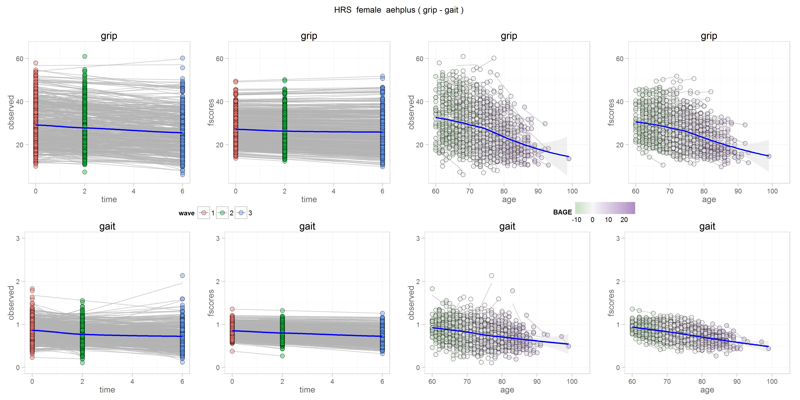
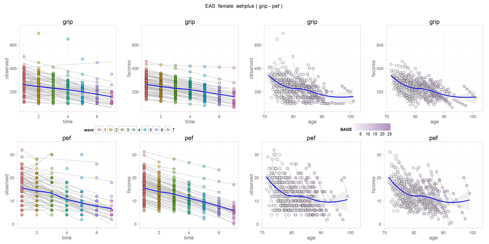
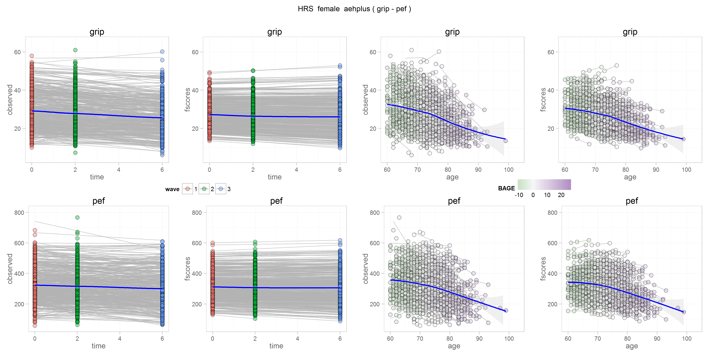
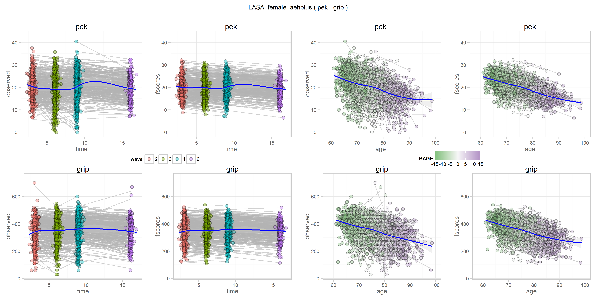
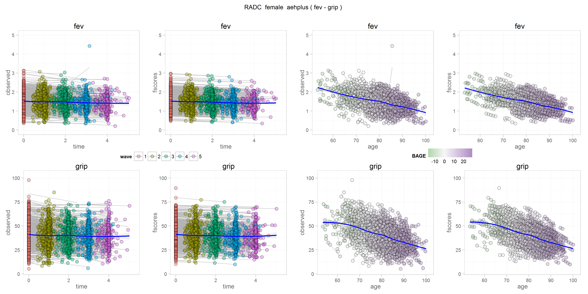
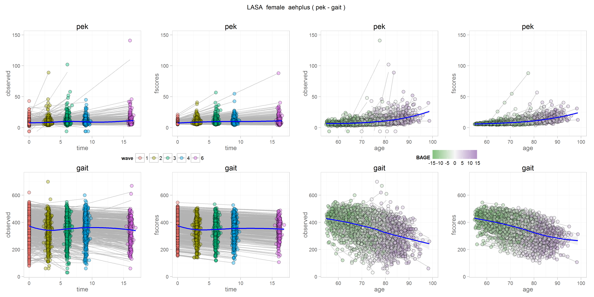
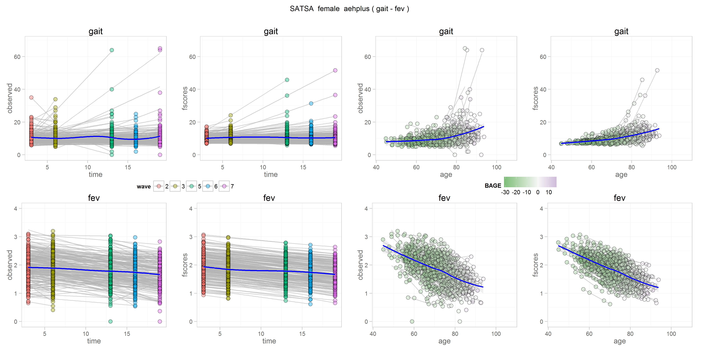
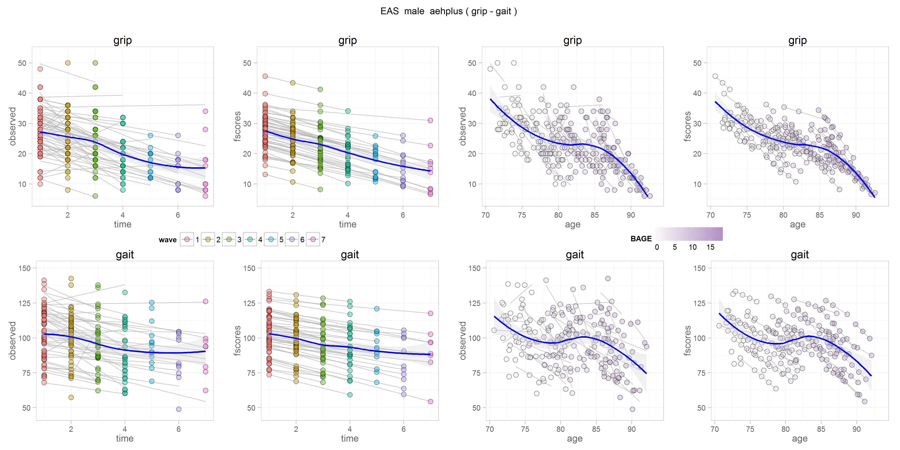
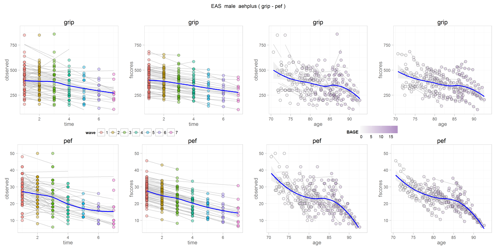
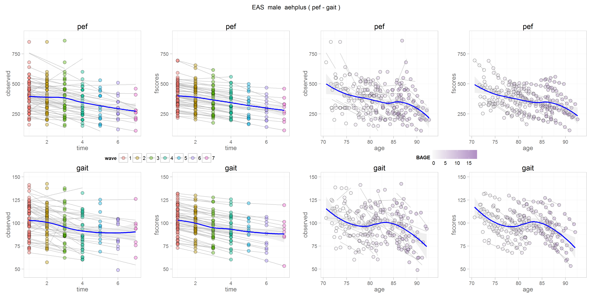

Go to the specific process pair   
-[Grip-Gait](/reports/physical/fscores_scatter/figure_rmd/README.md#grip-gait)  
-[Grip-Pulmonary](/reports/physical/fscores_scatter/figure_rmd/README.md#grip-pulmonary)  
-[Gait-Pulmonary](/reports/physical/fscores_scatter/figure_rmd/README.md#gait-pulmonary)  
 

#Females

##Grip-Gait
  

 
 
 

##Grip-Pulmonary
   
 

    
  
##Gait-Pulmonary

 
  
 

#Males

##Grip-Gait
  

 
 
 

##Grip-Pulmonary
   
 

    
  
##Gait-Pulmonary

 
  
 

