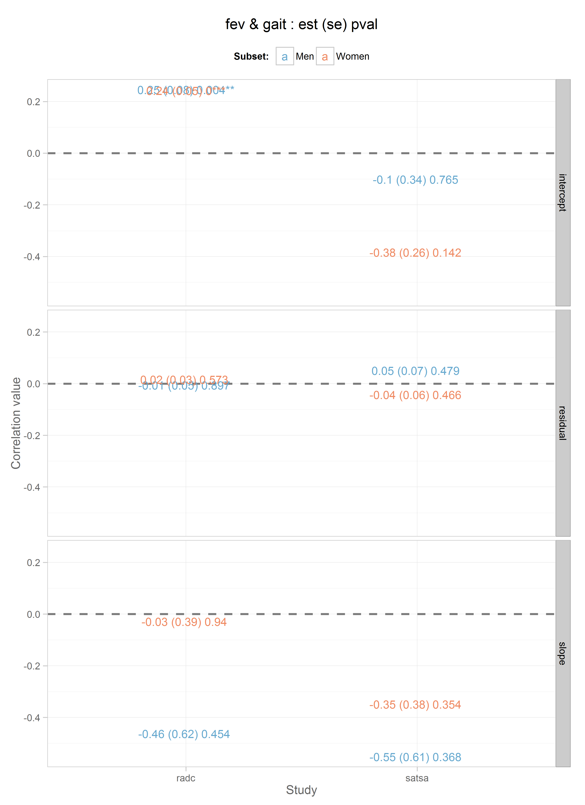
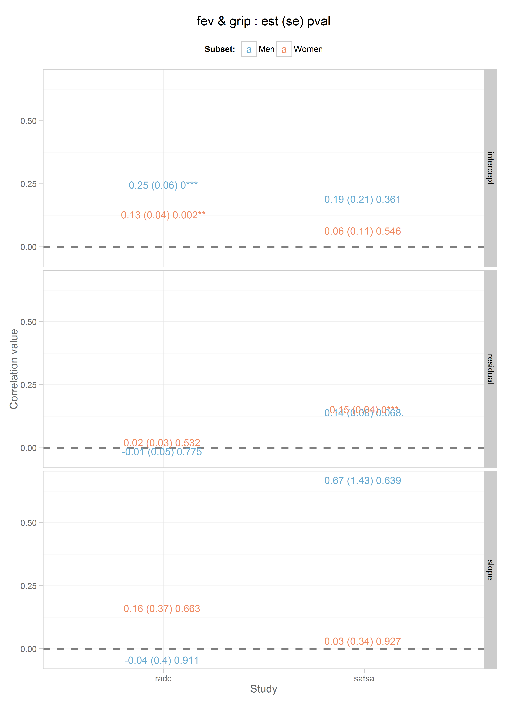
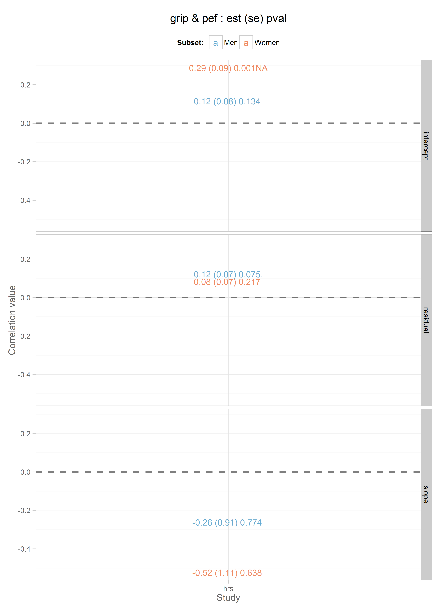

# Title

<!-- These two chunks should be added in the beginning of every .Rmd that you want to source an .R script -->
<!--  The 1st mandatory chunck  -->
<!--  Set the working directory to the repository's base directory -->


<!--  The 2nd mandatory chunck  -->
<!-- Set the report-wide options, and point to the external code file. -->


<!-- Load 'sourced' R files.  Suppress the output when loading packages. --> 


<!-- Load the sources.  Suppress the output when loading sources. --> 


<!-- Load any Global functions and variables declared in the R file.  Suppress the output. --> 


<!-- Declare any global functions specific to a Rmd output.  Suppress the output. --> 


<!-- Load the datasets.   -->


<!-- Tweak the datasets.   -->

```
      
       fev gait grip pef
  fev    0    2    2   0
  gait   2    0    8   0
  grip   2    2    0   2
  pef    0    2    0   0
  pek    0    4    4   0
```


<!-- Basic table view.   -->


<!-- Basic graph view.   -->


```r
outcome_pair <- function(data=ds,process1, process2){


  d <- ds
  d <- dplyr::filter(d, physical_measure==process1 | cognitive_measure==process1)
  d <- dplyr::filter(d, physical_measure==process2 | cognitive_measure==process2)

  d <- d %>% tidyr::gather_("parameter","value", select_components)
  # head(d)
  d$parameter <- as.character(d$parameter)
  d <- d[order(d$study_name), ]
  # head(d)

  for(i in 1:nrow(d)){
    d[i, "term"] <- strsplit(d[i,"parameter"], split="_")[[1]][2]
    test <- length(strsplit(d[i,"parameter"], split="_")[[1]])
    d[i, "record"] <- strsplit(d[i,"parameter"], split="_")[[1]][test]
  } # close fore loop
  d[d$term=="SPSC","term"] <- "slope"
  d[d$term=="IPIC","term"] <- "intercept"
  d[d$term=="RES","term"] <- "residual"
  head(d)
  table(d$term)
  d$parameter <- NULL
  # View(d)
  d <- tidyr::spread(d,record,value)

  d$signif[d$pval>.1] <- " "
  d$signif[d$pval<.1 & d$pval>.05] <- "."
  d$signif[d$pval<.05 & d$pval>.01] <- "*"
  d$signif[d$pval<.01 & d$pval>.001] <- "**"
  d$signif[d$pval<.001 ] <- "***"

  # View(d)
  d$display <- paste0(round(d$est,2)," (",round(d$se,2),") ", round(d$pval,3), d$signif)
  return(d)
}
# d <- outcome_pair(data=ds,process1="fev",process2="gait")
# d
```


## Fev & Gait

```r
g <- basic_graph_1(data=d, process1 = "fev", process2 = 'gait')
g
```



## Fev & Grip

```r
g <- basic_graph_1(data=d, process1 = "fev", process2 = 'grip')
g
```



## Gait & Grip

```r
g <- basic_graph_1(data=d, process1 = "gait", process2 = 'grip')
g
```


## Gait & Pef

```r
g <- basic_graph_1(data=d, process1 = "gait", process2 = 'pef')
g
```


## Gait & Pek

```r
g <- basic_graph_1(data=d, process1 = "gait", process2 = 'pek')
g
```


## Grip & Pef

```r
g <- basic_graph_1(data=d, process1 = "grip", process2 = 'pef')
g
```



## Grip & Pek

```r
g <- basic_graph_1(data=d, process1 = "grip", process2 = 'pek')
g
```


