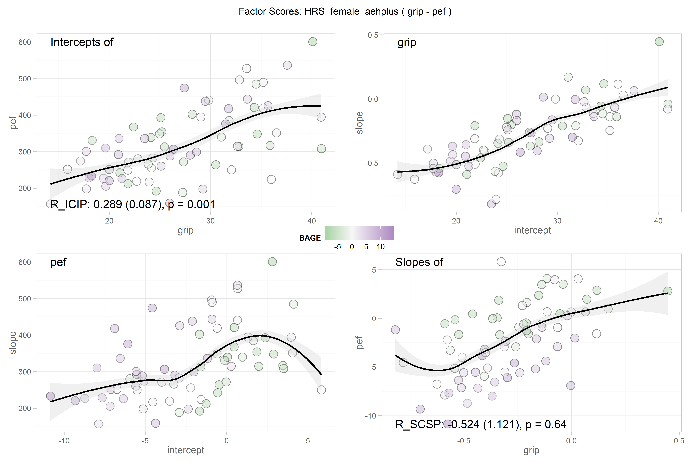

Go to the specific process pair   
-[Grip-Gait](/reports/physical/fscores_scatter/figure_rmd/README.md#grip-gait)  
-[Grip-Pulmonary](/reports/physical/fscores_scatter/figure_rmd/README.md#grip-pulmonary)  
-[Pulmonary-Gait](/reports/physical/fscores_scatter/figure_rmd/README.md#pulmonary-gait)  
 

##Grip-Pulmonary   
  
 
 
  
  
  
 

##Grip-Gait

 
 
   
  
 
  

##Pulmonary-Gait
 
  
 
  

  

