# FScore Scatters

<!-- These two chunks should be added in the beginning of every .Rmd that you want to source an .R script -->
<!--  The 1st mandatory chunck  -->
<!--  Set the working directory to the repository's base directory -->


<!--  The 2nd mandatory chunck  -->
<!-- Set the report-wide options, and point to the external code file. -->


<!-- Load 'sourced' R files.  Suppress the output when loading packages. --> 


<!-- Load the sources.  Suppress the output when loading sources. --> 

```
[1] "Loaded rhdf5 package"
```


<!-- Load any Global functions and variables declared in the R file.  Suppress the output. --> 


```
[1] "path_out"     "path_gh5"     "study_name"   "model_number" "subgroup"     "model_type"   "process1"    
[8] "process2"    
```


<!-- Declare any global functions specific to a Rmd output.  Suppress the output. --> 


<!-- Load the datasets.   -->

```

Plot functions:
 - mplus.plot.histogram('C:/Users/koval_000/Documents/GitHub/IALSA-2015-Portland/studies/eas/physical/b1_male_aehplus_grip_pef.gh5',variable,bins)
 - mplus.plot.scatterplot('C:/Users/koval_000/Documents/GitHub/IALSA-2015-Portland/studies/eas/physical/b1_male_aehplus_grip_pef.gh5',xvar,yvar)

Plot data extraction functions:
 - mplus.list.variables('C:/Users/koval_000/Documents/GitHub/IALSA-2015-Portland/studies/eas/physical/b1_male_aehplus_grip_pef.gh5')
 - mplus.get.data('C:/Users/koval_000/Documents/GitHub/IALSA-2015-Portland/studies/eas/physical/b1_male_aehplus_grip_pef.gh5',variable)

List of variable names to use in the following functions:
 - mplus.plot.histogram
 - mplus.plot.scatterplot
 - mplus.get.data

Variables:
```

```
Warning in if (index == 0) {: the condition has length > 1 and only the first element will be used
```

<!-- Tweak the datasets.   -->


<!-- Basic table view.   -->


<!-- Basic graph view.   -->

```r
# display the empirical regression equation on the graph
#http://stackoverflow.com/questions/7549694/ggplot2-adding-regression-line-equation-and-r2-on-graph
proto_scatter <- function(dsL,x, y){
g <- ggplot2::ggplot(dsL,aes_string(x=x, y=y, fill="BAGE"))+
  geom_point(shape=21,size=5, alpha=.1)+
  geom_smooth(aes_string(y=y), method="loess",color="black", size=1, fill="gray80", alpha=.3, na.rm=T)+
  scale_fill_gradient2(low="#7fbf7b", mid="#f7f7f7", high="#af8dc3", space="Lab")+
  theme(legend.position="none")+
  main_theme
g

}
# proto_scatter(dsL,x="IP", y="IC")
# proto_scatter(dsL,x_name="SP", y_name="SC")
# proto_scatter(dsL,x_name="SP", y_name="IP")

#inspect data for one individual
dsL %>% dplyr::filter(id==1) %>% dplyr::select(id, BAGE, wave, time, outcome, observed, age, IP, SP, SC, IC )
```

```
   id     BAGE wave time   outcome observed     age       IP       SP        SC       IC
1   1 2.687201    1    1  physical      300 73.6872 380.4318 -34.5074 -1.765668 28.24879
2   1 2.687201    2    2  physical       NA 74.6872 380.4318 -34.5074 -1.765668 28.24879
3   1 2.687201    3   NA  physical       NA      NA 380.4318 -34.5074 -1.765668 28.24879
4   1 2.687201    4   NA  physical       NA      NA 380.4318 -34.5074 -1.765668 28.24879
5   1 2.687201    5   NA  physical       NA      NA 380.4318 -34.5074 -1.765668 28.24879
6   1 2.687201    6   NA  physical       NA      NA 380.4318 -34.5074 -1.765668 28.24879
7   1 2.687201    7   NA  physical       NA      NA 380.4318 -34.5074 -1.765668 28.24879
8   1 2.687201    1    1 cognitive       23 73.6872 380.4318 -34.5074 -1.765668 28.24879
9   1 2.687201    2    2 cognitive       NA 74.6872 380.4318 -34.5074 -1.765668 28.24879
10  1 2.687201    3   NA cognitive       NA      NA 380.4318 -34.5074 -1.765668 28.24879
11  1 2.687201    4   NA cognitive       NA      NA 380.4318 -34.5074 -1.765668 28.24879
12  1 2.687201    5   NA cognitive       NA      NA 380.4318 -34.5074 -1.765668 28.24879
13  1 2.687201    6   NA cognitive       NA      NA 380.4318 -34.5074 -1.765668 28.24879
14  1 2.687201    7   NA cognitive       NA      NA 380.4318 -34.5074 -1.765668 28.24879
```


```
[1] 72
```
#MALES
#EAS
##grip_pef

```r
dsL <- get_gh5_data(file=model_list,
                    study = "eas",
                    subgroup = "male",
                    model_type = "aehplus",
                    process1 = "grip",
                    process2 = "pef")
```

```

Plot functions:
 - mplus.plot.histogram('C:/Users/koval_000/Documents/GitHub/IALSA-2015-Portland/studies/eas/physical/b1_male_aehplus_grip_pef.gh5',variable,bins)
 - mplus.plot.scatterplot('C:/Users/koval_000/Documents/GitHub/IALSA-2015-Portland/studies/eas/physical/b1_male_aehplus_grip_pef.gh5',xvar,yvar)

Plot data extraction functions:
 - mplus.list.variables('C:/Users/koval_000/Documents/GitHub/IALSA-2015-Portland/studies/eas/physical/b1_male_aehplus_grip_pef.gh5')
 - mplus.get.data('C:/Users/koval_000/Documents/GitHub/IALSA-2015-Portland/studies/eas/physical/b1_male_aehplus_grip_pef.gh5',variable)

List of variable names to use in the following functions:
 - mplus.plot.histogram
 - mplus.plot.scatterplot
 - mplus.get.data

Variables:
```

```r
d <- dsL[dsL$id %in% sample(unique(dsL$id), sample_size), ]
fscore_scatter(data=dsL) # create scatterplot
```

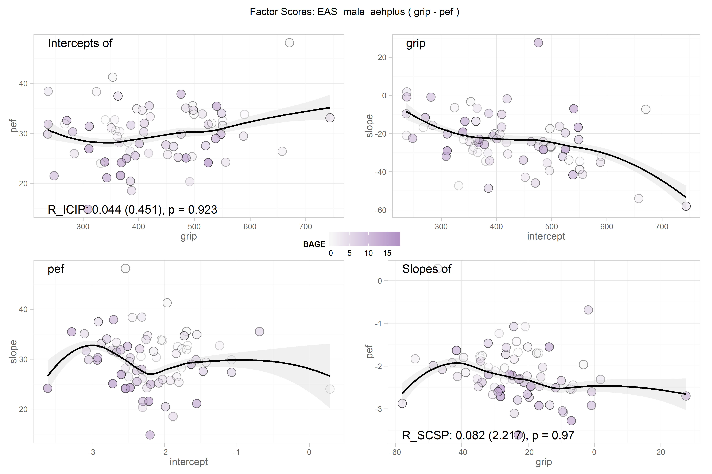
##grip_gait

```r
dsL <- get_gh5_data(file=model_list,
                    study = "eas",
                    subgroup = "male",
                    model_type = "aehplus",
                    process1 = "grip",
                    process2 = "gait")
```

```

Plot functions:
 - mplus.plot.histogram('C:/Users/koval_000/Documents/GitHub/IALSA-2015-Portland/studies/eas/physical/b1_male_aehplus_grip_gait.gh5',variable,bins)
 - mplus.plot.scatterplot('C:/Users/koval_000/Documents/GitHub/IALSA-2015-Portland/studies/eas/physical/b1_male_aehplus_grip_gait.gh5',xvar,yvar)

Plot data extraction functions:
 - mplus.list.variables('C:/Users/koval_000/Documents/GitHub/IALSA-2015-Portland/studies/eas/physical/b1_male_aehplus_grip_gait.gh5')
 - mplus.get.data('C:/Users/koval_000/Documents/GitHub/IALSA-2015-Portland/studies/eas/physical/b1_male_aehplus_grip_gait.gh5',variable)

List of variable names to use in the following functions:
 - mplus.plot.histogram
 - mplus.plot.scatterplot
 - mplus.get.data

Variables:
```

```r
d <- dsL[dsL$id %in% sample(unique(dsL$id), sample_size), ]
fscore_scatter(d) # create scatterplot
```

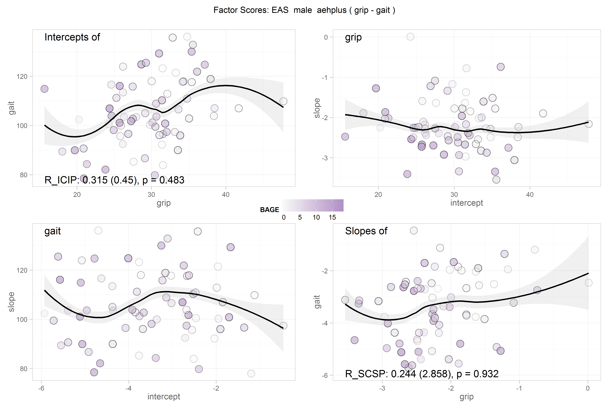
##pef_gait

```r
dsL <- get_gh5_data(file=model_list,
                    study = "eas",
                    subgroup = "male",
                    model_type = "aehplus",
                    process1 = "pef",
                    process2 = "gait")
```

```

Plot functions:
 - mplus.plot.histogram('C:/Users/koval_000/Documents/GitHub/IALSA-2015-Portland/studies/eas/physical/b1_male_aehplus_pef_gait.gh5',variable,bins)
 - mplus.plot.scatterplot('C:/Users/koval_000/Documents/GitHub/IALSA-2015-Portland/studies/eas/physical/b1_male_aehplus_pef_gait.gh5',xvar,yvar)

Plot data extraction functions:
 - mplus.list.variables('C:/Users/koval_000/Documents/GitHub/IALSA-2015-Portland/studies/eas/physical/b1_male_aehplus_pef_gait.gh5')
 - mplus.get.data('C:/Users/koval_000/Documents/GitHub/IALSA-2015-Portland/studies/eas/physical/b1_male_aehplus_pef_gait.gh5',variable)

List of variable names to use in the following functions:
 - mplus.plot.histogram
 - mplus.plot.scatterplot
 - mplus.get.data

Variables:
```

```r
d <- dsL[dsL$id %in% sample(unique(dsL$id), sample_size), ]
fscore_scatter(d) # create scatterplot
```

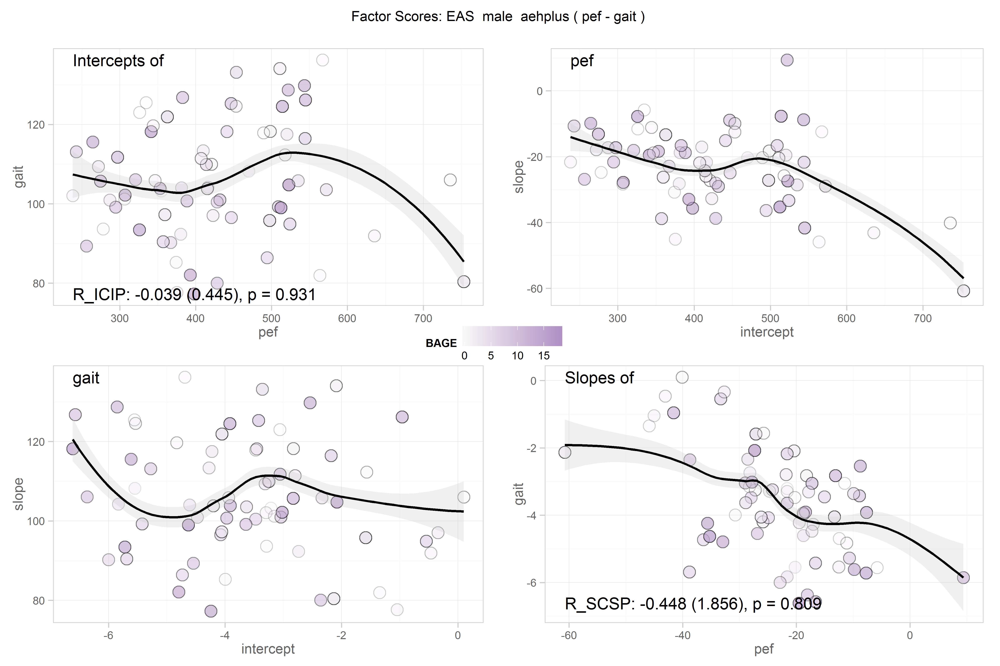

```r
#### ELSA ####
```

#ELSA
## grip_fev

```r
dsL <- get_gh5_data(file=model_list,
                    study = "elsa",
                    subgroup = "male",
                    model_type = "aehplus",
                    process1 = "grip",
                    process2 = "fev")
```

```

Plot functions:
 - mplus.plot.histogram('C:/Users/koval_000/Documents/GitHub/IALSA-2015-Portland/studies/elsa/physical/b1_male_aehplus_grip_fev.gh5',variable,bins)
 - mplus.plot.scatterplot('C:/Users/koval_000/Documents/GitHub/IALSA-2015-Portland/studies/elsa/physical/b1_male_aehplus_grip_fev.gh5',xvar,yvar)

Plot data extraction functions:
 - mplus.list.variables('C:/Users/koval_000/Documents/GitHub/IALSA-2015-Portland/studies/elsa/physical/b1_male_aehplus_grip_fev.gh5')
 - mplus.get.data('C:/Users/koval_000/Documents/GitHub/IALSA-2015-Portland/studies/elsa/physical/b1_male_aehplus_grip_fev.gh5',variable)

List of variable names to use in the following functions:
 - mplus.plot.histogram
 - mplus.plot.scatterplot
 - mplus.get.data

Variables:
```

```r
d <- dsL[dsL$id %in% sample(unique(dsL$id), sample_size), ]
fscore_scatter(data=dsL) # create scatterplot
```

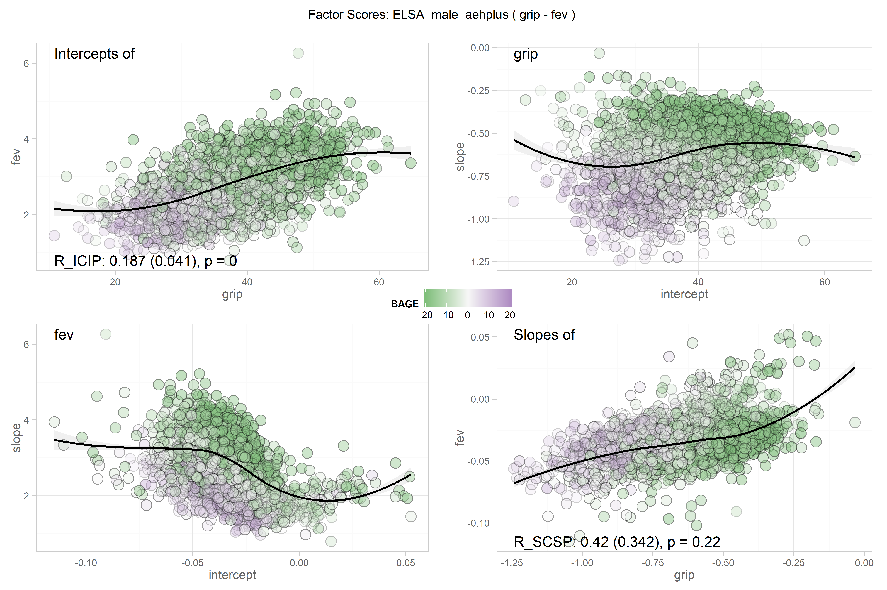
##grip_gait

```r
dsL <- get_gh5_data(file=model_list,
                    study = "elsa",
                    subgroup = "male",
                    model_type = "aehplus",
                    process1 = "grip",
                    process2 = "gait")
```

```

Plot functions:
 - mplus.plot.histogram('C:/Users/koval_000/Documents/GitHub/IALSA-2015-Portland/studies/elsa/physical/b1_male_aehplus_grip_gait.gh5',variable,bins)
 - mplus.plot.scatterplot('C:/Users/koval_000/Documents/GitHub/IALSA-2015-Portland/studies/elsa/physical/b1_male_aehplus_grip_gait.gh5',xvar,yvar)

Plot data extraction functions:
 - mplus.list.variables('C:/Users/koval_000/Documents/GitHub/IALSA-2015-Portland/studies/elsa/physical/b1_male_aehplus_grip_gait.gh5')
 - mplus.get.data('C:/Users/koval_000/Documents/GitHub/IALSA-2015-Portland/studies/elsa/physical/b1_male_aehplus_grip_gait.gh5',variable)

List of variable names to use in the following functions:
 - mplus.plot.histogram
 - mplus.plot.scatterplot
 - mplus.get.data

Variables:
```

```r
d <- dsL[dsL$id %in% sample(unique(dsL$id), sample_size), ]
fscore_scatter(data=dsL) # create scatterplot
```


##fev_gait

```r
dsL <- get_gh5_data(file=model_list,
                    study = "elsa",
                    subgroup = "male",
                    model_type = "aehplus",
                    process1 = "fev",
                    process2 = "gait")
```

```

Plot functions:
 - mplus.plot.histogram('C:/Users/koval_000/Documents/GitHub/IALSA-2015-Portland/studies/elsa/physical/b1_male_aehplus_fev_gait.gh5',variable,bins)
 - mplus.plot.scatterplot('C:/Users/koval_000/Documents/GitHub/IALSA-2015-Portland/studies/elsa/physical/b1_male_aehplus_fev_gait.gh5',xvar,yvar)

Plot data extraction functions:
 - mplus.list.variables('C:/Users/koval_000/Documents/GitHub/IALSA-2015-Portland/studies/elsa/physical/b1_male_aehplus_fev_gait.gh5')
 - mplus.get.data('C:/Users/koval_000/Documents/GitHub/IALSA-2015-Portland/studies/elsa/physical/b1_male_aehplus_fev_gait.gh5',variable)

List of variable names to use in the following functions:
 - mplus.plot.histogram
 - mplus.plot.scatterplot
 - mplus.get.data

Variables:
```

```r
d <- dsL[dsL$id %in% sample(unique(dsL$id), sample_size), ]
fscore_scatter(data=dsL) # create scatterplot
```

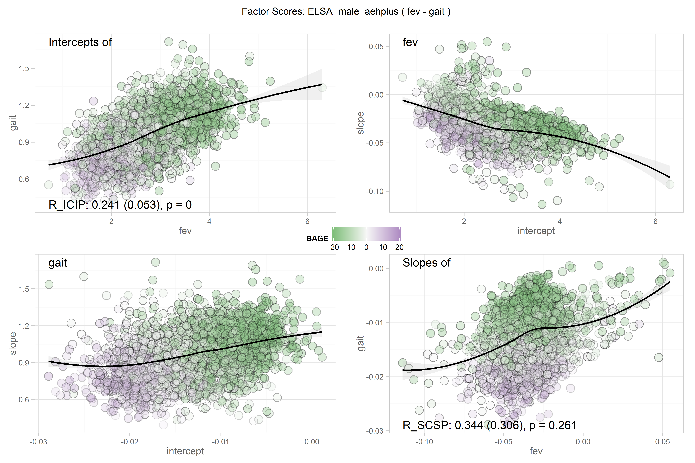

```r
#### HRS ####
```


#HRS
##grip_pef

```r
dsL <- get_gh5_data(file=model_list,
                    study = "hrs",
                    subgroup = "male",
                    model_type = "aehplus",
                    process1 = "grip",
                    process2 = "pef")
```

```

Plot functions:
 - mplus.plot.histogram('C:/Users/koval_000/Documents/GitHub/IALSA-2015-Portland/studies/hrs/physical/b1_male_aehplus_grip_pef.gh5',variable,bins)
 - mplus.plot.scatterplot('C:/Users/koval_000/Documents/GitHub/IALSA-2015-Portland/studies/hrs/physical/b1_male_aehplus_grip_pef.gh5',xvar,yvar)

Plot data extraction functions:
 - mplus.list.variables('C:/Users/koval_000/Documents/GitHub/IALSA-2015-Portland/studies/hrs/physical/b1_male_aehplus_grip_pef.gh5')
 - mplus.get.data('C:/Users/koval_000/Documents/GitHub/IALSA-2015-Portland/studies/hrs/physical/b1_male_aehplus_grip_pef.gh5',variable)

List of variable names to use in the following functions:
 - mplus.plot.histogram
 - mplus.plot.scatterplot
 - mplus.get.data

Variables:
```

```r
d <- dsL[dsL$id %in% sample(unique(dsL$id), sample_size), ]
fscore_scatter(d) # create scatterplot
```

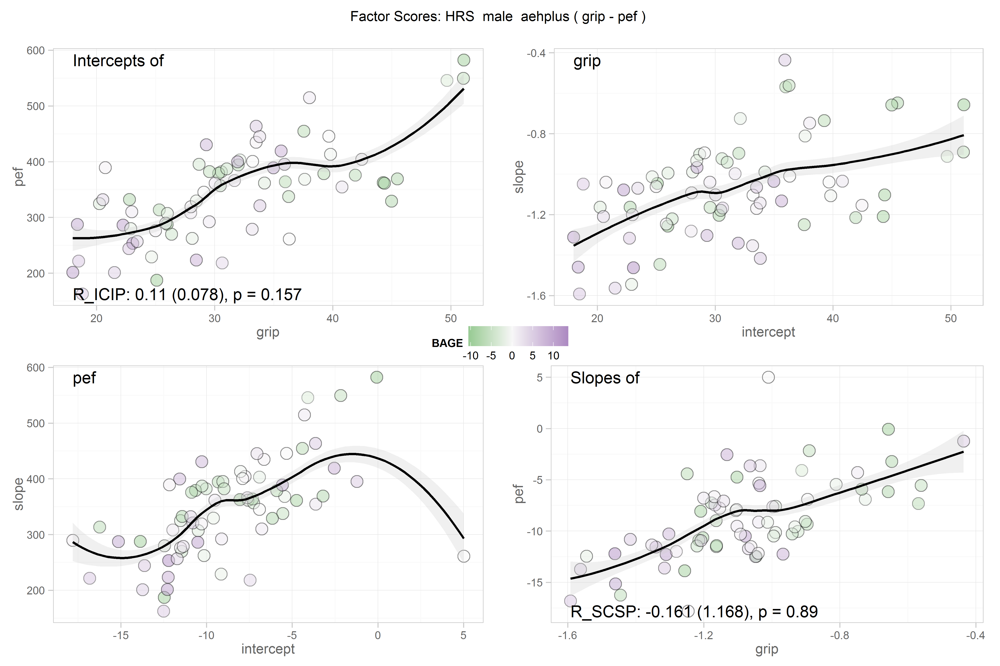
##grip_gait

```r
dsL <- get_gh5_data(file=model_list,
                    study = "hrs",
                    subgroup = "male",
                    model_type = "aehplus",
                    process1 = "grip",
                    process2 = "gait")
```

```

Plot functions:
 - mplus.plot.histogram('C:/Users/koval_000/Documents/GitHub/IALSA-2015-Portland/studies/hrs/physical/b1_male_aehplus_grip_gait.gh5',variable,bins)
 - mplus.plot.scatterplot('C:/Users/koval_000/Documents/GitHub/IALSA-2015-Portland/studies/hrs/physical/b1_male_aehplus_grip_gait.gh5',xvar,yvar)

Plot data extraction functions:
 - mplus.list.variables('C:/Users/koval_000/Documents/GitHub/IALSA-2015-Portland/studies/hrs/physical/b1_male_aehplus_grip_gait.gh5')
 - mplus.get.data('C:/Users/koval_000/Documents/GitHub/IALSA-2015-Portland/studies/hrs/physical/b1_male_aehplus_grip_gait.gh5',variable)

List of variable names to use in the following functions:
 - mplus.plot.histogram
 - mplus.plot.scatterplot
 - mplus.get.data

Variables:
```

```r
d <- dsL[dsL$id %in% sample(unique(dsL$id), sample_size), ]
fscore_scatter(d) # create scatterplot
```

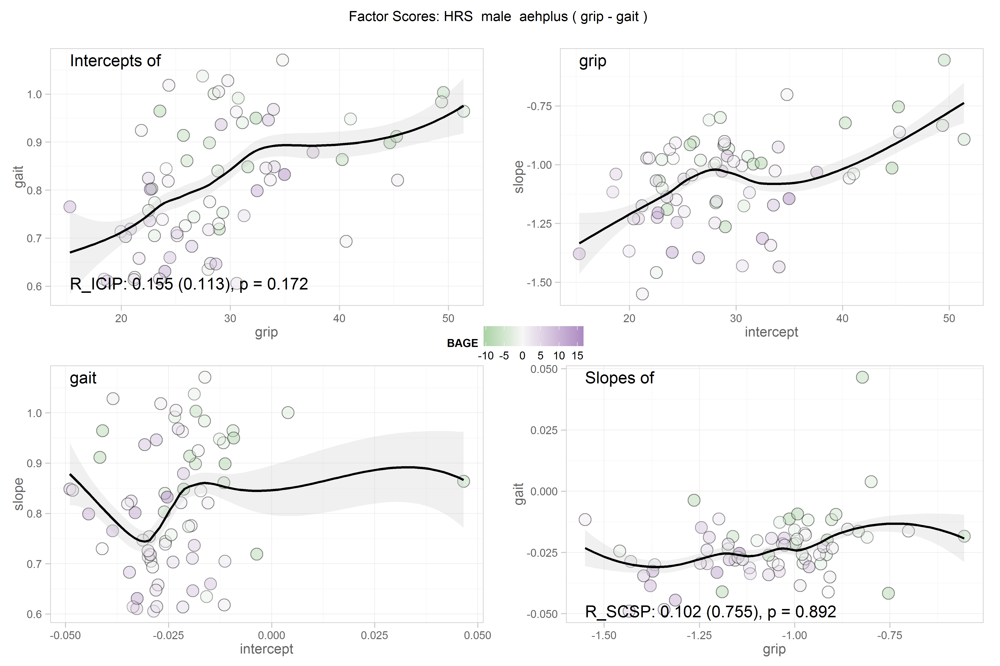
##pef_gait

```r
dsL <- get_gh5_data(file=model_list,
                    study = "hrs",
                    subgroup = "male",
                    model_type = "aehplus",
                    process1 = "pef",
                    process2 = "gait")
```

```

Plot functions:
 - mplus.plot.histogram('C:/Users/koval_000/Documents/GitHub/IALSA-2015-Portland/studies/hrs/physical/b1_male_aehplus_pef_gait.gh5',variable,bins)
 - mplus.plot.scatterplot('C:/Users/koval_000/Documents/GitHub/IALSA-2015-Portland/studies/hrs/physical/b1_male_aehplus_pef_gait.gh5',xvar,yvar)

Plot data extraction functions:
 - mplus.list.variables('C:/Users/koval_000/Documents/GitHub/IALSA-2015-Portland/studies/hrs/physical/b1_male_aehplus_pef_gait.gh5')
 - mplus.get.data('C:/Users/koval_000/Documents/GitHub/IALSA-2015-Portland/studies/hrs/physical/b1_male_aehplus_pef_gait.gh5',variable)

List of variable names to use in the following functions:
 - mplus.plot.histogram
 - mplus.plot.scatterplot
 - mplus.get.data

Variables:
```

```r
d <- dsL[dsL$id %in% sample(unique(dsL$id), sample_size), ]
fscore_scatter(d) # create scatterplot
```

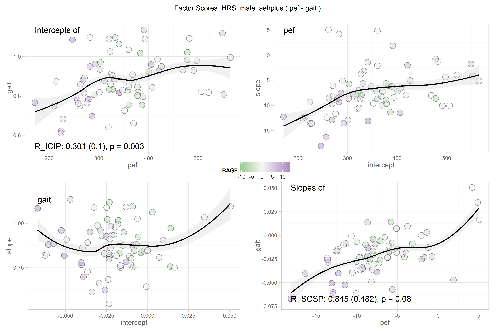

```r
##### LASA ####
```


# EAS
##grip_pef

```r
dsL <- get_gh5_data(file=model_list,
                    study = "lasa",
                    subgroup = "male",
                    model_type = "aehplus",
                    process1 = "grip",
                    process2 = "pef")
```

```

Plot functions:
 - mplus.plot.histogram('C:/Users/koval_000/Documents/GitHub/IALSA-2015-Portland/studies/lasa/physical/b1_male_aehplus_grip_pef.gh5',variable,bins)
 - mplus.plot.scatterplot('C:/Users/koval_000/Documents/GitHub/IALSA-2015-Portland/studies/lasa/physical/b1_male_aehplus_grip_pef.gh5',xvar,yvar)

Plot data extraction functions:
 - mplus.list.variables('C:/Users/koval_000/Documents/GitHub/IALSA-2015-Portland/studies/lasa/physical/b1_male_aehplus_grip_pef.gh5')
 - mplus.get.data('C:/Users/koval_000/Documents/GitHub/IALSA-2015-Portland/studies/lasa/physical/b1_male_aehplus_grip_pef.gh5',variable)

List of variable names to use in the following functions:
 - mplus.plot.histogram
 - mplus.plot.scatterplot
 - mplus.get.data

Variables:
```

```r
d <- dsL[dsL$id %in% sample(unique(dsL$id), sample_size), ]
fscore_scatter(d) # create scatterplot
```

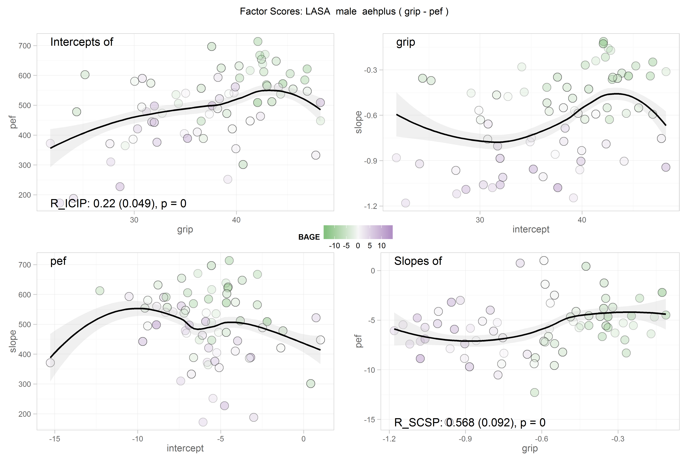
##grip_gait

```r
dsL <- get_gh5_data(file=model_list,
                    study = "lasa",
                    subgroup = "male",
                    model_type = "aehplus",
                    process1 = "grip",
                    process2 = "gait")
```

```

Plot functions:
 - mplus.plot.histogram('C:/Users/koval_000/Documents/GitHub/IALSA-2015-Portland/studies/lasa/physical/b1_male_aehplus_grip_gait.gh5',variable,bins)
 - mplus.plot.scatterplot('C:/Users/koval_000/Documents/GitHub/IALSA-2015-Portland/studies/lasa/physical/b1_male_aehplus_grip_gait.gh5',xvar,yvar)

Plot data extraction functions:
 - mplus.list.variables('C:/Users/koval_000/Documents/GitHub/IALSA-2015-Portland/studies/lasa/physical/b1_male_aehplus_grip_gait.gh5')
 - mplus.get.data('C:/Users/koval_000/Documents/GitHub/IALSA-2015-Portland/studies/lasa/physical/b1_male_aehplus_grip_gait.gh5',variable)

List of variable names to use in the following functions:
 - mplus.plot.histogram
 - mplus.plot.scatterplot
 - mplus.get.data

Variables:
```

```r
d <- dsL[dsL$id %in% sample(unique(dsL$id), sample_size), ]
fscore_scatter(d) # create scatterplot
```

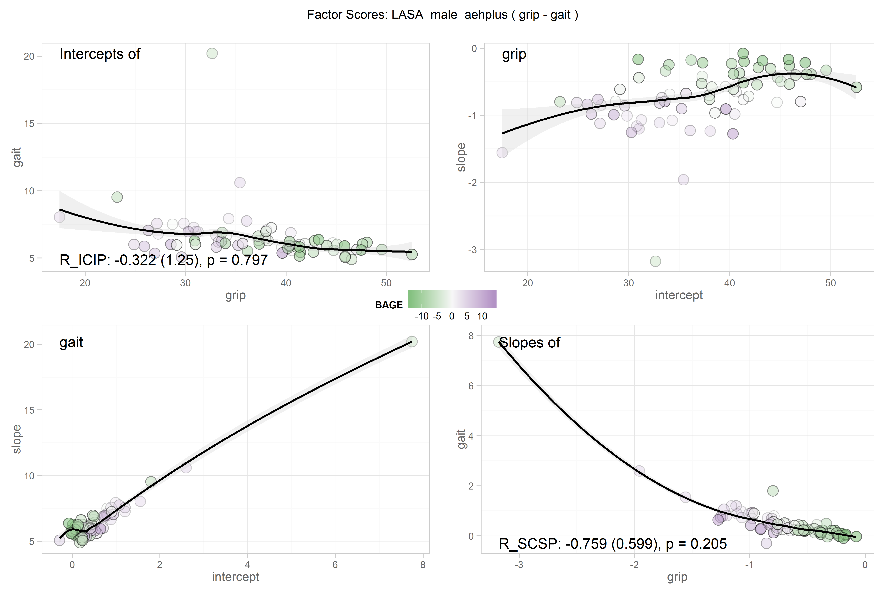
##pef_gait

```r
dsL <- get_gh5_data(file=model_list,
                    study = "lasa",
                    subgroup = "male",
                    model_type = "aehplus",
                    process1 = "pef",
                    process2 = "gait")
```

```

Plot functions:
 - mplus.plot.histogram('C:/Users/koval_000/Documents/GitHub/IALSA-2015-Portland/studies/lasa/physical/b1_male_aehplus_pef_gait.gh5',variable,bins)
 - mplus.plot.scatterplot('C:/Users/koval_000/Documents/GitHub/IALSA-2015-Portland/studies/lasa/physical/b1_male_aehplus_pef_gait.gh5',xvar,yvar)

Plot data extraction functions:
 - mplus.list.variables('C:/Users/koval_000/Documents/GitHub/IALSA-2015-Portland/studies/lasa/physical/b1_male_aehplus_pef_gait.gh5')
 - mplus.get.data('C:/Users/koval_000/Documents/GitHub/IALSA-2015-Portland/studies/lasa/physical/b1_male_aehplus_pef_gait.gh5',variable)

List of variable names to use in the following functions:
 - mplus.plot.histogram
 - mplus.plot.scatterplot
 - mplus.get.data

Variables:
```

```r
d <- dsL[dsL$id %in% sample(unique(dsL$id), sample_size), ]
fscore_scatter(d) # create scatterplot
```

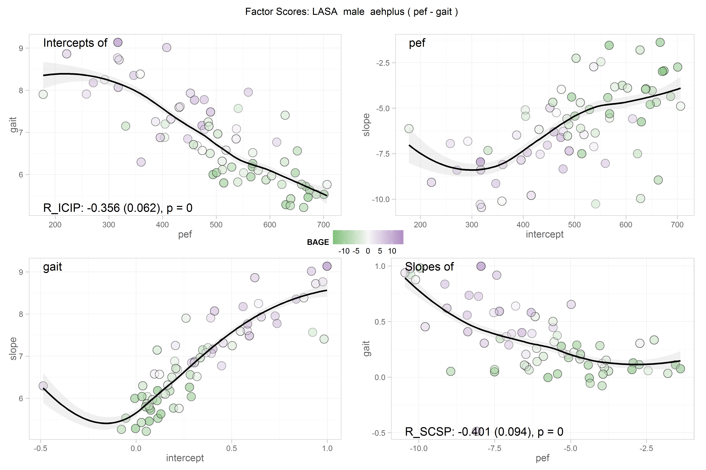

```r
#### OCTO ####
```


# EAS
##grip_pef

```r
dsL <- get_gh5_data(file=model_list,
                    study = "octo",
                    subgroup = "male",
                    model_type = "aehplus",
                    process1 = "grip",
                    process2 = "pef")
```

```

Plot functions:
 - mplus.plot.histogram('C:/Users/koval_000/Documents/GitHub/IALSA-2015-Portland/studies/octo/physical/b1_male_aehplus_grip_pef.gh5',variable,bins)
 - mplus.plot.scatterplot('C:/Users/koval_000/Documents/GitHub/IALSA-2015-Portland/studies/octo/physical/b1_male_aehplus_grip_pef.gh5',xvar,yvar)

Plot data extraction functions:
 - mplus.list.variables('C:/Users/koval_000/Documents/GitHub/IALSA-2015-Portland/studies/octo/physical/b1_male_aehplus_grip_pef.gh5')
 - mplus.get.data('C:/Users/koval_000/Documents/GitHub/IALSA-2015-Portland/studies/octo/physical/b1_male_aehplus_grip_pef.gh5',variable)

List of variable names to use in the following functions:
 - mplus.plot.histogram
 - mplus.plot.scatterplot
 - mplus.get.data

Variables:
```

```r
d <- dsL[dsL$id %in% sample(unique(dsL$id), sample_size), ]
fscore_scatter(d) # create scatterplot
```

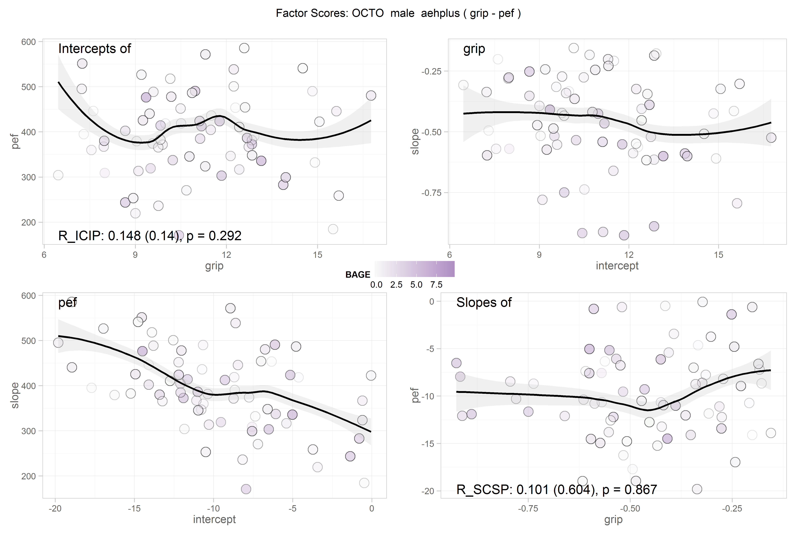
##grip_gait

```r
dsL <- get_gh5_data(file=model_list,
                    study = "octo",
                    subgroup = "male",
                    model_type = "aehplus",
                    process1 = "grip",
                    process2 = "gait")
```

```

Plot functions:
 - mplus.plot.histogram('C:/Users/koval_000/Documents/GitHub/IALSA-2015-Portland/studies/octo/physical/b1_male_aehplus_grip_gait.gh5',variable,bins)
 - mplus.plot.scatterplot('C:/Users/koval_000/Documents/GitHub/IALSA-2015-Portland/studies/octo/physical/b1_male_aehplus_grip_gait.gh5',xvar,yvar)

Plot data extraction functions:
 - mplus.list.variables('C:/Users/koval_000/Documents/GitHub/IALSA-2015-Portland/studies/octo/physical/b1_male_aehplus_grip_gait.gh5')
 - mplus.get.data('C:/Users/koval_000/Documents/GitHub/IALSA-2015-Portland/studies/octo/physical/b1_male_aehplus_grip_gait.gh5',variable)

List of variable names to use in the following functions:
 - mplus.plot.histogram
 - mplus.plot.scatterplot
 - mplus.get.data

Variables:
```

```r
d <- dsL[dsL$id %in% sample(unique(dsL$id), sample_size), ]
fscore_scatter(d) # create scatterplot
```

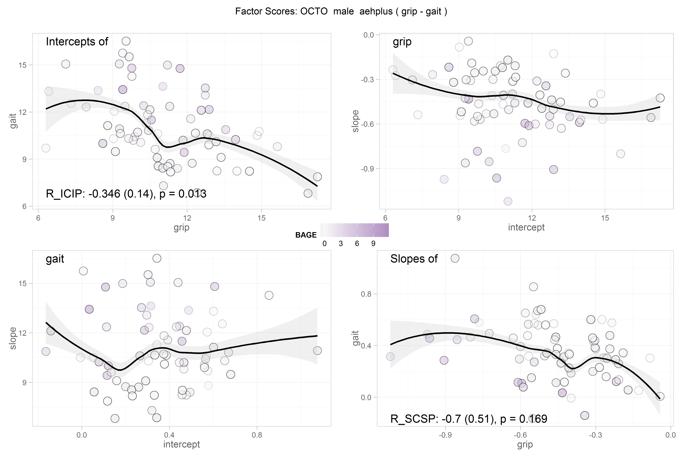
##pef_gait

```r
dsL <- get_gh5_data(file=model_list,
                    study = "octo",
                    subgroup = "male",
                    model_type = "aehplus",
                    process1 = "pef",
                    process2 = "gait")
```

```

Plot functions:
 - mplus.plot.histogram('C:/Users/koval_000/Documents/GitHub/IALSA-2015-Portland/studies/octo/physical/b1_male_aehplus_pef_gait.gh5',variable,bins)
 - mplus.plot.scatterplot('C:/Users/koval_000/Documents/GitHub/IALSA-2015-Portland/studies/octo/physical/b1_male_aehplus_pef_gait.gh5',xvar,yvar)

Plot data extraction functions:
 - mplus.list.variables('C:/Users/koval_000/Documents/GitHub/IALSA-2015-Portland/studies/octo/physical/b1_male_aehplus_pef_gait.gh5')
 - mplus.get.data('C:/Users/koval_000/Documents/GitHub/IALSA-2015-Portland/studies/octo/physical/b1_male_aehplus_pef_gait.gh5',variable)

List of variable names to use in the following functions:
 - mplus.plot.histogram
 - mplus.plot.scatterplot
 - mplus.get.data

Variables:
```

```r
d <- dsL[dsL$id %in% sample(unique(dsL$id), sample_size), ]
fscore_scatter(d) # create scatterplot
```

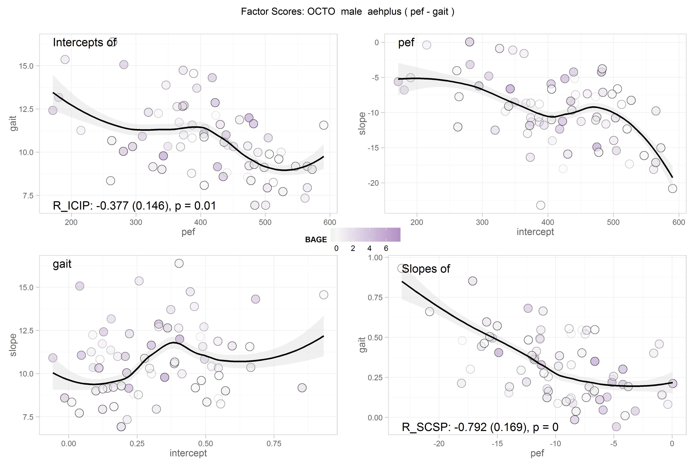

```r
#### RADC ####
```


# EAS
##grip_fev

```r
dsL <- get_gh5_data(file=model_list,
                    study = "radc",
                    subgroup = "male",
                    model_type = "aehplus",
                    process1 = "fev",
                    process2 = "grip")
```

```

Plot functions:
 - mplus.plot.histogram('C:/Users/koval_000/Documents/GitHub/IALSA-2015-Portland/studies/radc/physical/b1_male_aehplus_fev_grip.gh5',variable,bins)
 - mplus.plot.scatterplot('C:/Users/koval_000/Documents/GitHub/IALSA-2015-Portland/studies/radc/physical/b1_male_aehplus_fev_grip.gh5',xvar,yvar)

Plot data extraction functions:
 - mplus.list.variables('C:/Users/koval_000/Documents/GitHub/IALSA-2015-Portland/studies/radc/physical/b1_male_aehplus_fev_grip.gh5')
 - mplus.get.data('C:/Users/koval_000/Documents/GitHub/IALSA-2015-Portland/studies/radc/physical/b1_male_aehplus_fev_grip.gh5',variable)

List of variable names to use in the following functions:
 - mplus.plot.histogram
 - mplus.plot.scatterplot
 - mplus.get.data

Variables:
```

```r
d <- dsL[dsL$id %in% sample(unique(dsL$id), sample_size), ]
fscore_scatter(d) # create scatterplot
```

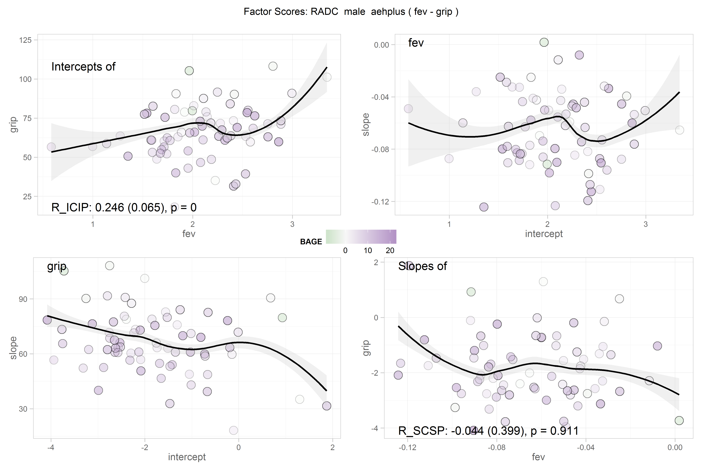
##grip_gait

```r
dsL <- get_gh5_data(file=model_list,
                    study = "radc",
                    subgroup = "male",
                    model_type = "aehplus",
                    process1 = "gait",
                    process2 = "grip")
```

```

Plot functions:
 - mplus.plot.histogram('C:/Users/koval_000/Documents/GitHub/IALSA-2015-Portland/studies/radc/physical/b1_male_aehplus_gait_grip.gh5',variable,bins)
 - mplus.plot.scatterplot('C:/Users/koval_000/Documents/GitHub/IALSA-2015-Portland/studies/radc/physical/b1_male_aehplus_gait_grip.gh5',xvar,yvar)

Plot data extraction functions:
 - mplus.list.variables('C:/Users/koval_000/Documents/GitHub/IALSA-2015-Portland/studies/radc/physical/b1_male_aehplus_gait_grip.gh5')
 - mplus.get.data('C:/Users/koval_000/Documents/GitHub/IALSA-2015-Portland/studies/radc/physical/b1_male_aehplus_gait_grip.gh5',variable)

List of variable names to use in the following functions:
 - mplus.plot.histogram
 - mplus.plot.scatterplot
 - mplus.get.data

Variables:
```

```r
d <- dsL[dsL$id %in% sample(unique(dsL$id), sample_size), ]
fscore_scatter(d) # create scatterplot
```

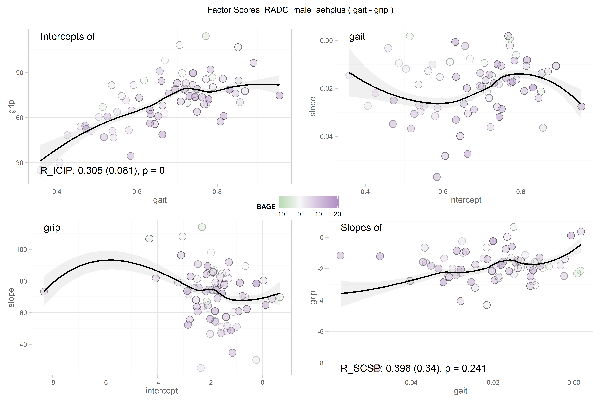
##fev_gait

```r
dsL <- get_gh5_data(file=model_list,
                    study = "radc",
                    subgroup = "male",
                    model_type = "aehplus",
                    process1 = "fev",
                    process2 = "gait")
```

```

Plot functions:
 - mplus.plot.histogram('C:/Users/koval_000/Documents/GitHub/IALSA-2015-Portland/studies/radc/physical/b1_male_aehplus_fev_gait.gh5',variable,bins)
 - mplus.plot.scatterplot('C:/Users/koval_000/Documents/GitHub/IALSA-2015-Portland/studies/radc/physical/b1_male_aehplus_fev_gait.gh5',xvar,yvar)

Plot data extraction functions:
 - mplus.list.variables('C:/Users/koval_000/Documents/GitHub/IALSA-2015-Portland/studies/radc/physical/b1_male_aehplus_fev_gait.gh5')
 - mplus.get.data('C:/Users/koval_000/Documents/GitHub/IALSA-2015-Portland/studies/radc/physical/b1_male_aehplus_fev_gait.gh5',variable)

List of variable names to use in the following functions:
 - mplus.plot.histogram
 - mplus.plot.scatterplot
 - mplus.get.data

Variables:
```

```r
d <- dsL[dsL$id %in% sample(unique(dsL$id), sample_size), ]
fscore_scatter(d) # create scatterplot
```

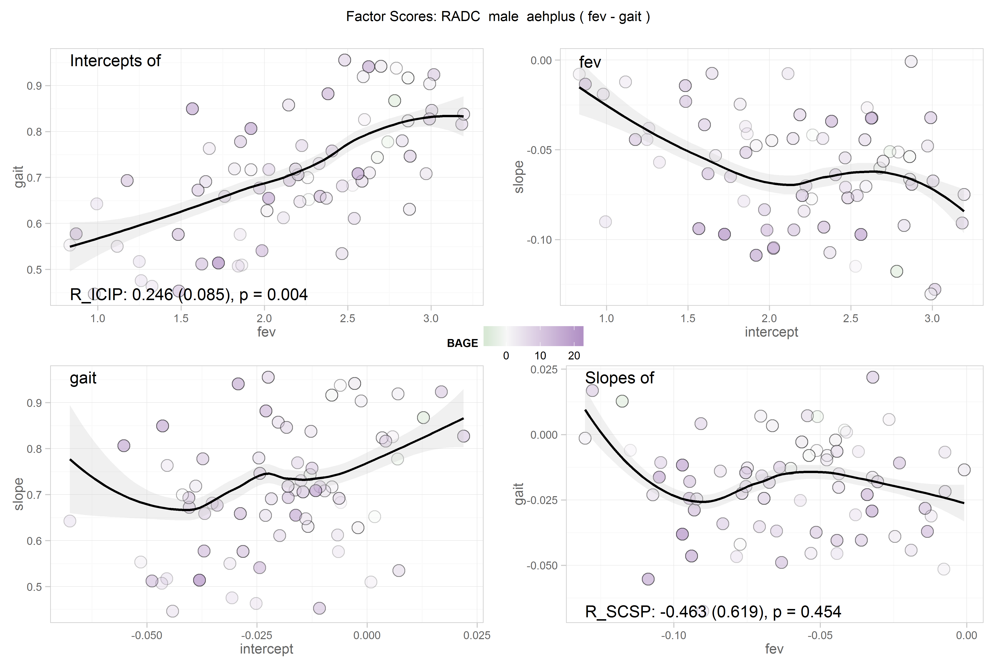

```r
#### SATSA ####
```


# EAS
##grip_fev

```r
dsL <- get_gh5_data(file=model_list,
                    study = "satsa",
                    subgroup = "male",
                    model_type = "aehplus",
                    process1 = "grip",
                    process2 = "fev")
```

```

Plot functions:
 - mplus.plot.histogram('C:/Users/koval_000/Documents/GitHub/IALSA-2015-Portland/studies/satsa/physical/b1_male_aehplus_grip_fev.gh5',variable,bins)
 - mplus.plot.scatterplot('C:/Users/koval_000/Documents/GitHub/IALSA-2015-Portland/studies/satsa/physical/b1_male_aehplus_grip_fev.gh5',xvar,yvar)

Plot data extraction functions:
 - mplus.list.variables('C:/Users/koval_000/Documents/GitHub/IALSA-2015-Portland/studies/satsa/physical/b1_male_aehplus_grip_fev.gh5')
 - mplus.get.data('C:/Users/koval_000/Documents/GitHub/IALSA-2015-Portland/studies/satsa/physical/b1_male_aehplus_grip_fev.gh5',variable)

List of variable names to use in the following functions:
 - mplus.plot.histogram
 - mplus.plot.scatterplot
 - mplus.get.data

Variables:
```

```r
d <- dsL[dsL$id %in% sample(unique(dsL$id), sample_size), ]
fscore_scatter(d) # create scatterplot
```

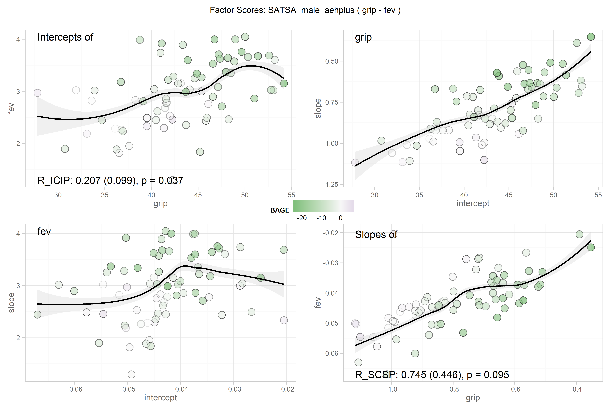
##grip_gait

```r
dsL <- get_gh5_data(file=model_list,
                    study = "satsa",
                    subgroup = "male",
                    model_type = "aehplus",
                    process1 = "gait",
                    process2 = "grip")
```

```

Plot functions:
 - mplus.plot.histogram('C:/Users/koval_000/Documents/GitHub/IALSA-2015-Portland/studies/satsa/physical/b1_male_aehplus_gait_grip.gh5',variable,bins)
 - mplus.plot.scatterplot('C:/Users/koval_000/Documents/GitHub/IALSA-2015-Portland/studies/satsa/physical/b1_male_aehplus_gait_grip.gh5',xvar,yvar)

Plot data extraction functions:
 - mplus.list.variables('C:/Users/koval_000/Documents/GitHub/IALSA-2015-Portland/studies/satsa/physical/b1_male_aehplus_gait_grip.gh5')
 - mplus.get.data('C:/Users/koval_000/Documents/GitHub/IALSA-2015-Portland/studies/satsa/physical/b1_male_aehplus_gait_grip.gh5',variable)

List of variable names to use in the following functions:
 - mplus.plot.histogram
 - mplus.plot.scatterplot
 - mplus.get.data

Variables:
```

```r
d <- dsL[dsL$id %in% sample(unique(dsL$id), sample_size), ]
fscore_scatter(d) # create scatterplot
```

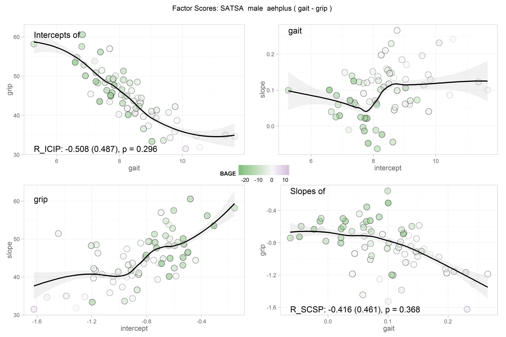
##fev_gait

```r
dsL <- get_gh5_data(file=model_list,
                    study = "satsa",
                    subgroup = "male",
                    model_type = "aehplus",
                    process1 = "gait",
                    process2 = "fev")
```

```

Plot functions:
 - mplus.plot.histogram('C:/Users/koval_000/Documents/GitHub/IALSA-2015-Portland/studies/satsa/physical/b1_male_aehplus_gait_fev.gh5',variable,bins)
 - mplus.plot.scatterplot('C:/Users/koval_000/Documents/GitHub/IALSA-2015-Portland/studies/satsa/physical/b1_male_aehplus_gait_fev.gh5',xvar,yvar)

Plot data extraction functions:
 - mplus.list.variables('C:/Users/koval_000/Documents/GitHub/IALSA-2015-Portland/studies/satsa/physical/b1_male_aehplus_gait_fev.gh5')
 - mplus.get.data('C:/Users/koval_000/Documents/GitHub/IALSA-2015-Portland/studies/satsa/physical/b1_male_aehplus_gait_fev.gh5',variable)

List of variable names to use in the following functions:
 - mplus.plot.histogram
 - mplus.plot.scatterplot
 - mplus.get.data

Variables:
```

```r
d <- dsL[dsL$id %in% sample(unique(dsL$id), sample_size), ]
fscore_scatter(d) # create scatterplot
```

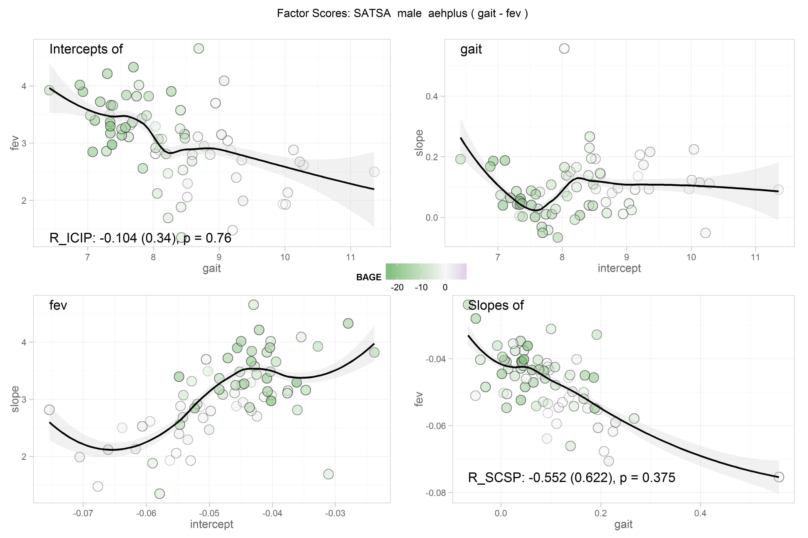


