MALE subgroup. Jump to a process pair or view [female](https://github.com/IALSA/IALSA-2015-Portland/blob/master/reports/physical/scatter_matrix/figure_rmd_female/by_process_pair.md) subgroup.   

* [Grip-Pulmonary](/reports/physical/scatter_matrix/figure_rmd_male/by_process_pair.md#grip-pulmonary)  
* [Grip-Gait](/reports/physical/scatter_matrix/figure_rmd_male/by_process_pair.md#grip-gait)  
* [Pulmonary-Gait](/reports/physical/scatter_matrix/figure_rmd_male/by_process_pair.md#pulmonary-gait)  

##Grip-Pulmonary   
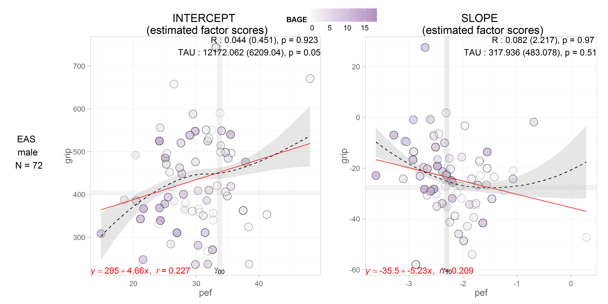  
 
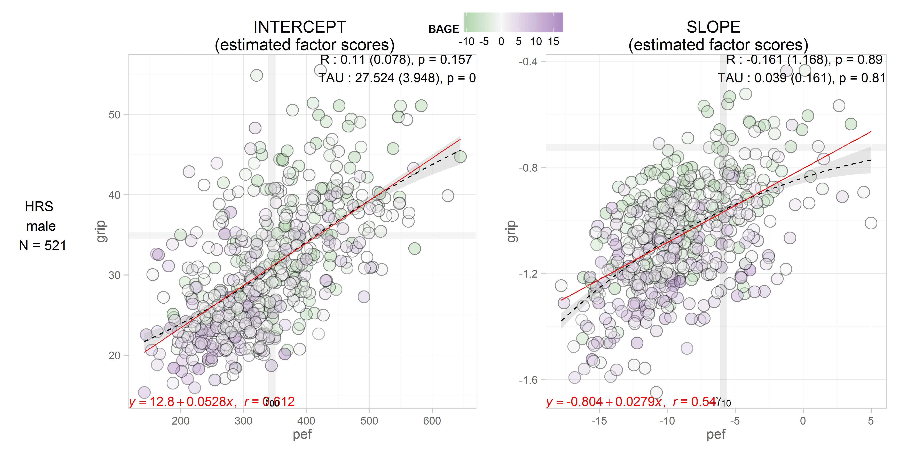 
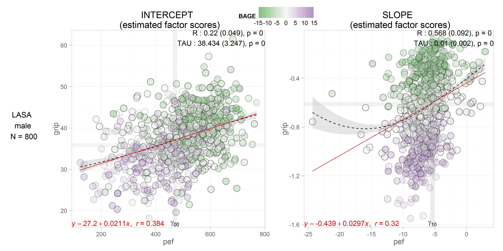  
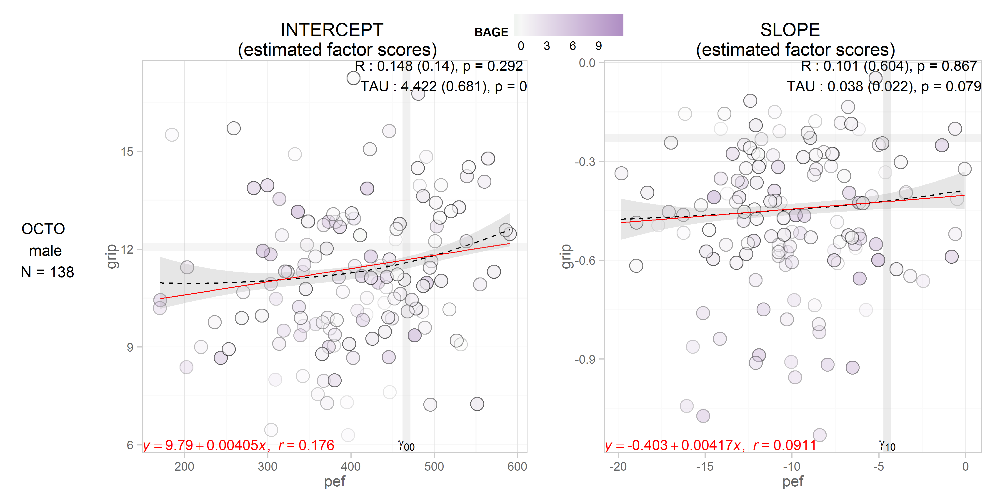  
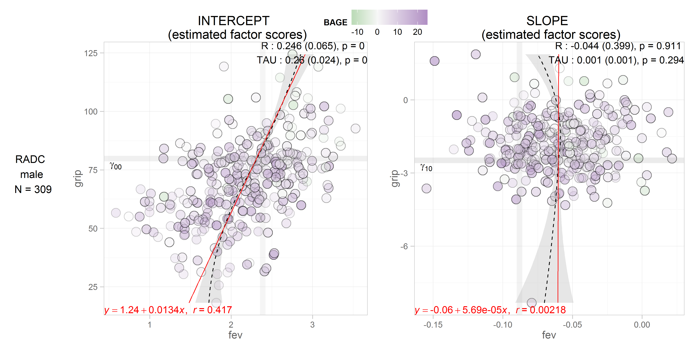  
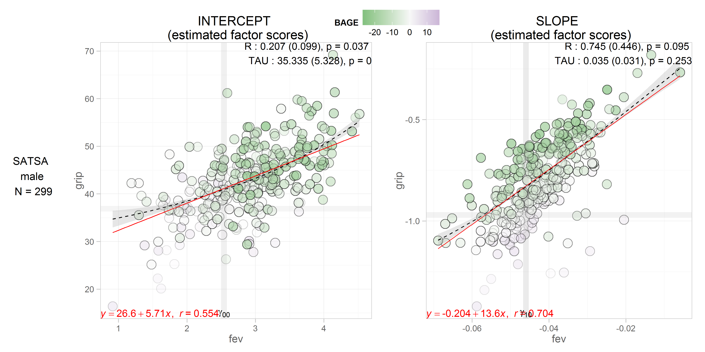 

##Grip-Gait
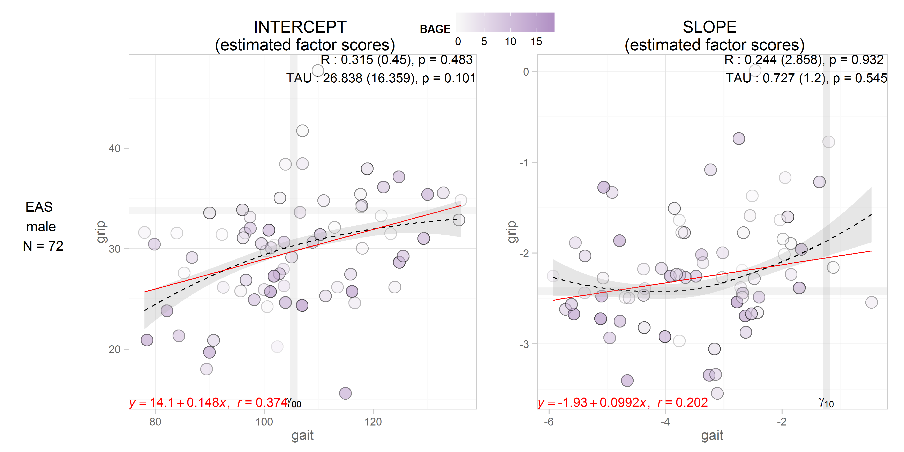
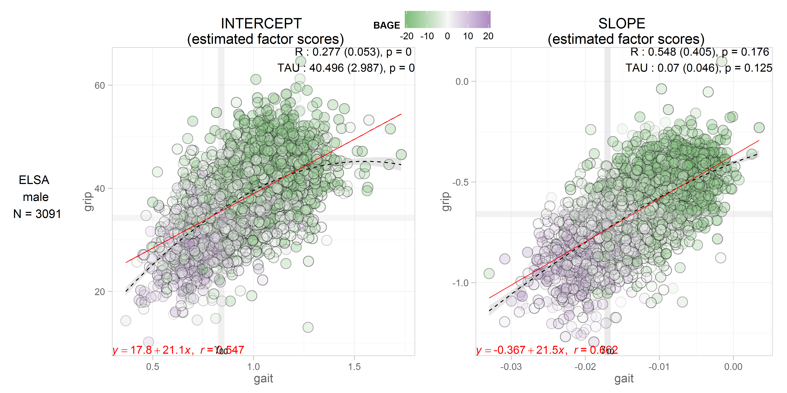 
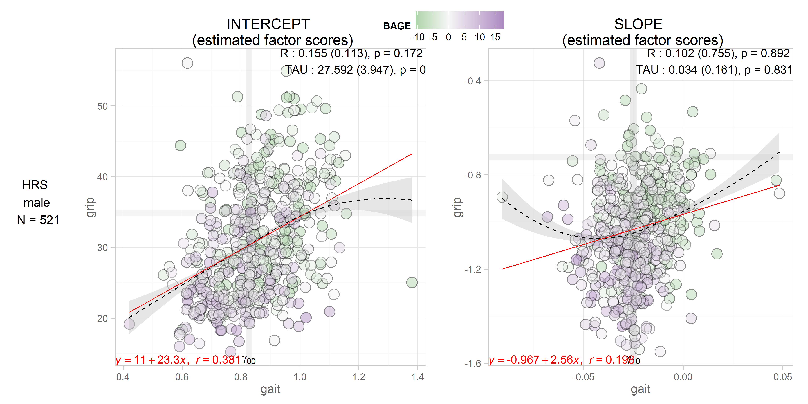 
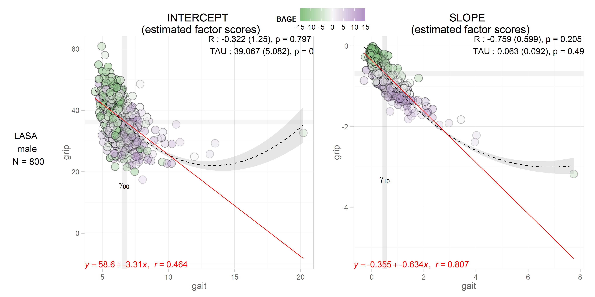   
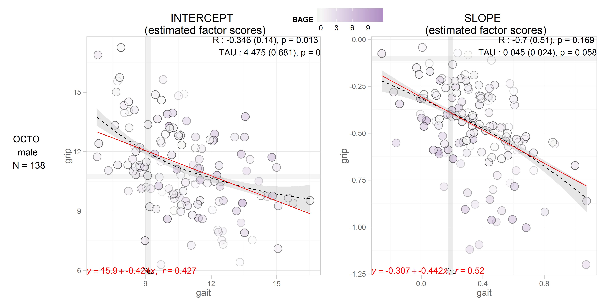  
 
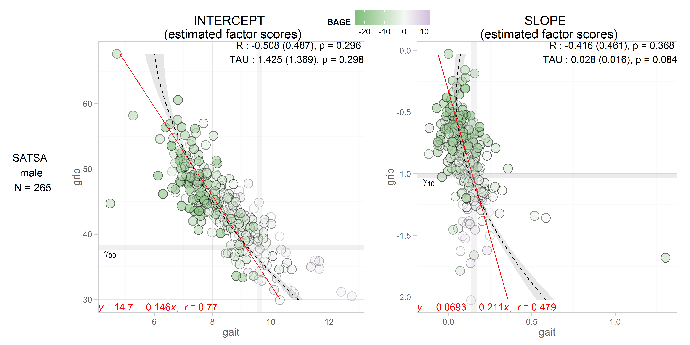  

##Pulmonary-Gait
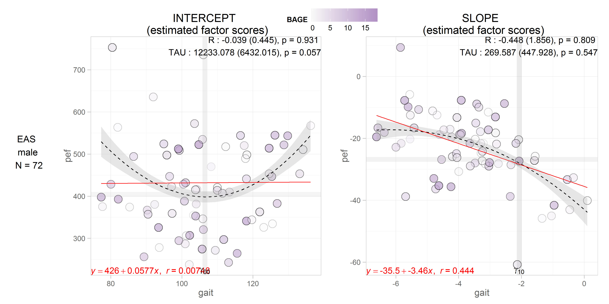 
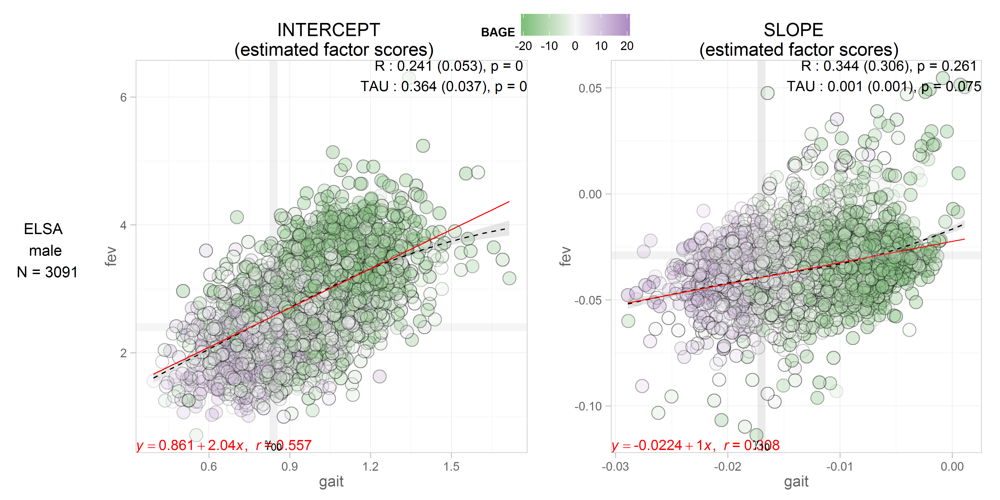  
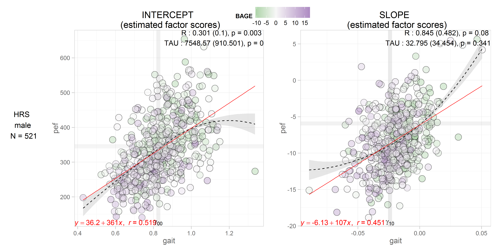 
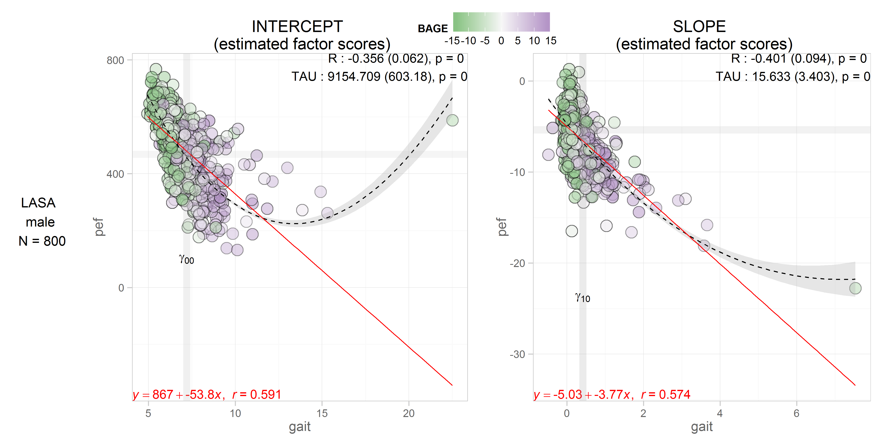  
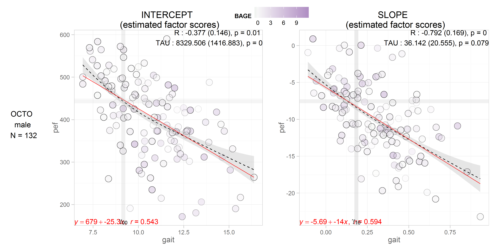
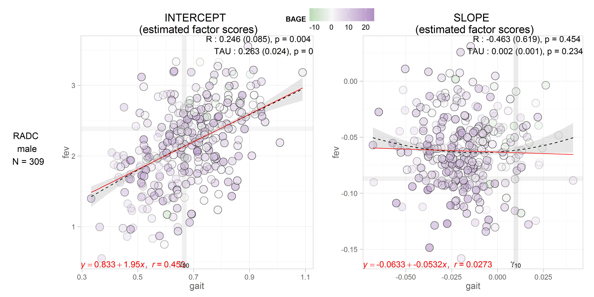  
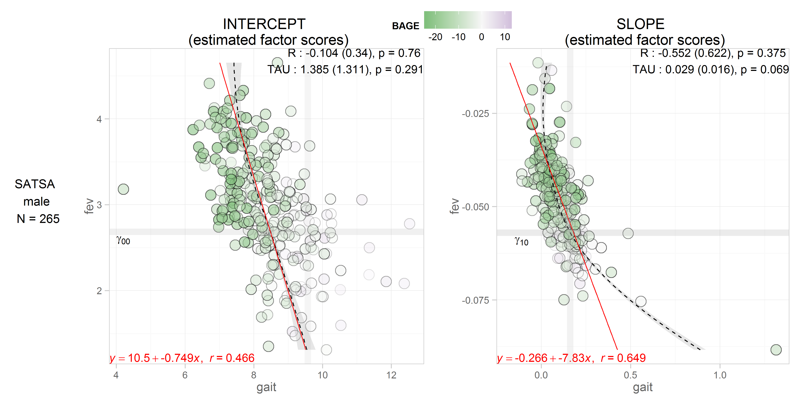
