# Bivariate Outcomes -- Combining Studies


This report covers the analyses used in the ZZZ project (Marcus Mark, PI).

<!--  Set the working directory to the repository's base directory; this assumes the report is nested inside of one directory.-->


<!-- Set the report-wide options, and point to the external code file. -->


<!-- Load the sources.  Suppress the output when loading sources. --> 


<!-- Load 'sourced' R files.  Suppress the output when loading packages. --> 


<!-- Load any Global functions and variables declared in the R file.  Suppress the output. --> 


<!-- Declare any global functions specific to a Rmd output.  Suppress the output. --> 


<!-- Load the datasets.   -->


<!-- Tweak the datasets.   -->


<!-- Calculate the forest results (but don't plot yet).   -->


## Notes

**Note 1**: The current report covers 9 studies: eas, habc, ilse, nas, nuage, obas, octo, radc, satsa.


# Forest Plot (Static)

## `gait` 

Studies with this physical variable listed in the model output: satsa 


study_name   cognitive_outcome   subgroup   model_type    subject_count   wave_count  converged 
-----------  ------------------  ---------  -----------  --------------  -----------  ----------
satsa        memory              female     ae                      430            7  TRUE      
satsa        memory              female     aec                     385            7  TRUE      
satsa        memory              female     age                     339            7  TRUE      
satsa        memory              male       ae                      306            7  TRUE      
satsa        memory              male       age                     211            7  TRUE      
satsa        spatial             female     ae                      339            7  TRUE      
satsa        spatial             female     aec                     385            7  TRUE      
satsa        spatial             female     age                     339            7  TRUE      
satsa        spatial             male       ae                      211            7  TRUE      
satsa        spatial             male       age                     211            7  TRUE      
satsa        speed               female     ae                      430            7  TRUE      
satsa        speed               female     aec                     385            7  TRUE      
satsa        speed               female     age                     339            7  TRUE      
satsa        speed               male       ae                      306            7  TRUE      
satsa        speed               male       age                     211            7  TRUE      
satsa        verbal              female     ae                      430            7  TRUE      
satsa        verbal              female     aec                     385            7  TRUE      
satsa        verbal              female     age                     339            7  TRUE      
satsa        verbal              male       ae                      306            7  TRUE      
satsa        verbal              male       age                     211            7  TRUE      


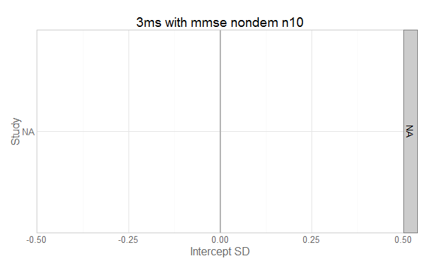 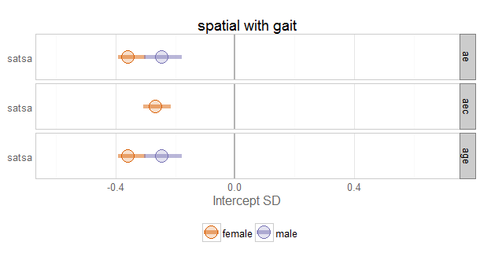 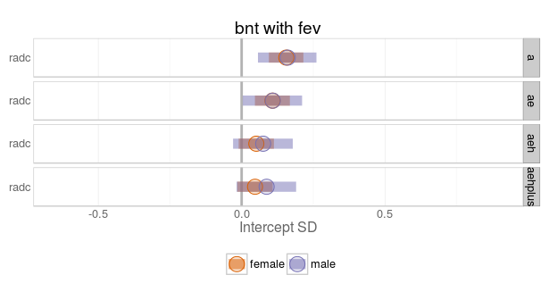 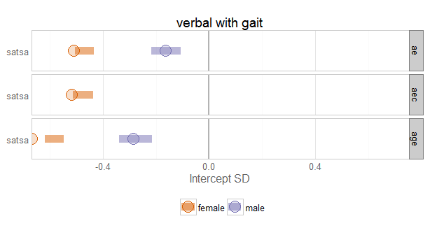 

## `grip` 

Studies with this physical variable listed in the model output: octo, satsa 


study_name   cognitive_outcome   subgroup   model_type    subject_count   wave_count  converged 
-----------  ------------------  ---------  -----------  --------------  -----------  ----------
octo         block               female     aeh                     275            5  TRUE      
octo         block               female     aehplus                 274            5  TRUE      
octo         block               female     age                     303            5  TRUE      
octo         block               male       aeh                     139            5  TRUE      
octo         block               male       aehplus                 139            5  TRUE      
octo         block               male       age                     158            5  TRUE      
octo         digitbackward       female     aeh                     276            5  TRUE      
octo         digitbackward       female     aehplus                 275            5  TRUE      
octo         digitbackward       female     age                     305            5  TRUE      
octo         digitbackward       male       aeh                     139            5  TRUE      
octo         digitbackward       male       aehplus                 139            5  TRUE      
octo         digitbackward       male       age                     161            5  TRUE      
octo         digitforward        female     aeh                     276            5  TRUE      
octo         digitforward        female     aehplus                 275            5  TRUE      
octo         digitforward        female     age                     306            5  TRUE      
octo         digitforward        male       aeh                     139            5  TRUE      
octo         digitforward        male       aehplus                 139            5  TRUE      
octo         digitforward        male       age                     161            5  TRUE      
octo         digitsymbol         female     aeh                     272            5  TRUE      
octo         digitsymbol         female     aehplus                 271            5  TRUE      
octo         digitsymbol         female     age                     299            5  TRUE      
octo         digitsymbol         male       aeh                     138            5  TRUE      
octo         digitsymbol         male       aehplus                 138            5  TRUE      
octo         digitsymbol         male       age                     156            5  TRUE      
octo         figurelogic         female     aeh                     274            5  TRUE      
octo         figurelogic         female     aehplus                 273            5  TRUE      
octo         figurelogic         female     age                     302            5  TRUE      
octo         figurelogic         male       aeh                     138            5  TRUE      
octo         figurelogic         male       aehplus                 138            5  TRUE      
octo         figurelogic         male       age                     157            5  TRUE      
octo         mirrecall           female     aeh                     273            5  TRUE      
octo         mirrecall           female     aehplus                 272            5  TRUE      
octo         mirrecall           female     age                     303            5  TRUE      
octo         mirrecall           male       aeh                     139            5  TRUE      
octo         mirrecall           male       aehplus                 139            5  TRUE      
octo         mirrecall           male       age                     159            5  TRUE      
octo         proserecall         female     aeh                     273            5  TRUE      
octo         proserecall         female     aehplus                 272            5  TRUE      
octo         proserecall         female     age                     302            5  TRUE      
octo         proserecall         male       aeh                     139            5  TRUE      
octo         proserecall         male       aehplus                 139            5  TRUE      
octo         proserecall         male       age                     161            5  TRUE      
satsa        memory              female     ae                      486            7  TRUE      
satsa        memory              female     aec                     430            7  TRUE      
satsa        memory              female     age                     395            7  TRUE      
satsa        memory              male       ae                      341            7  TRUE      
satsa        memory              male       age                     247            7  TRUE      
satsa        spatial             female     ae                      486            7  TRUE      
satsa        spatial             female     aec                     430            7  TRUE      
satsa        spatial             female     age                     395            7  TRUE      
satsa        spatial             male       ae                      340            7  TRUE      
satsa        spatial             male       age                     246            7  TRUE      
satsa        speed               female     ae                      486            7  TRUE      
satsa        speed               female     aec                     429            7  TRUE      
satsa        speed               female     age                     395            7  TRUE      
satsa        speed               male       ae                      341            7  TRUE      
satsa        speed               male       age                     247            7  TRUE      
satsa        verbal              female     ae                      486            7  TRUE      
satsa        verbal              female     aec                     430            7  TRUE      
satsa        verbal              female     age                     395            7  TRUE      
satsa        verbal              male       ae                      341            7  TRUE      
satsa        verbal              male       age                     247            7  TRUE      


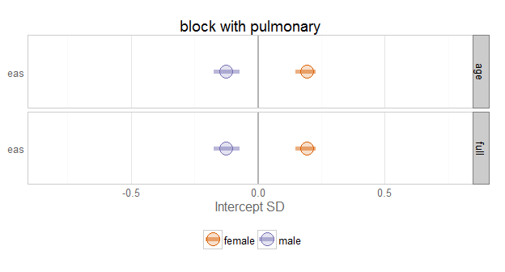 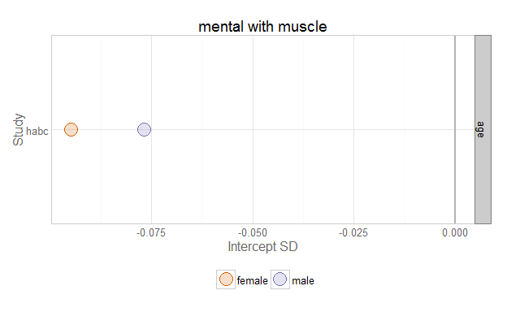 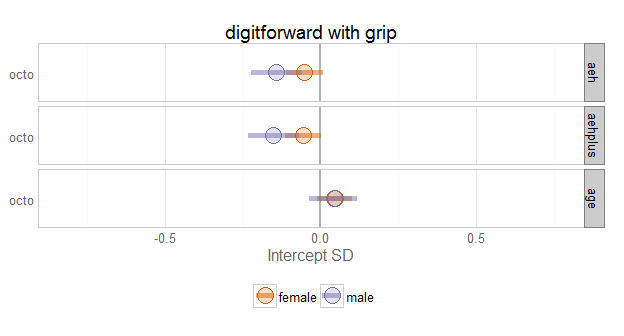 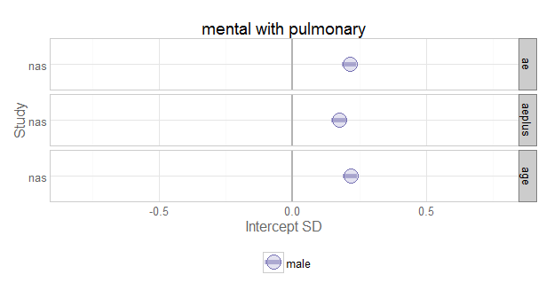 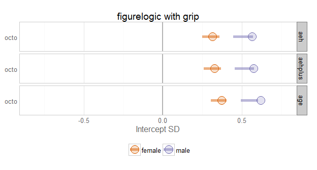 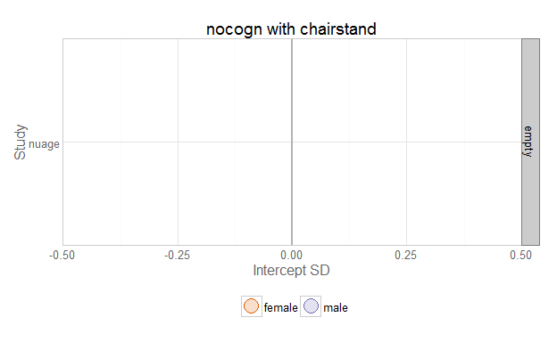 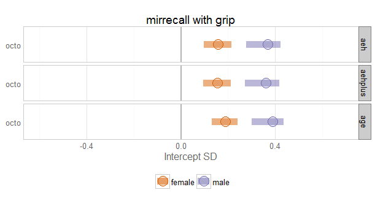 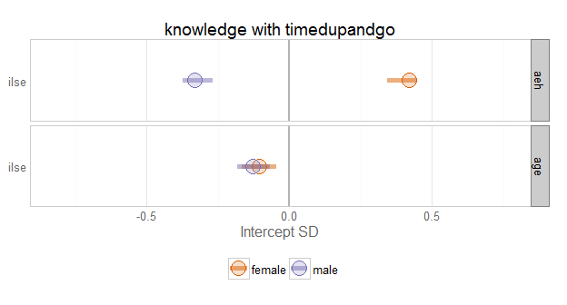 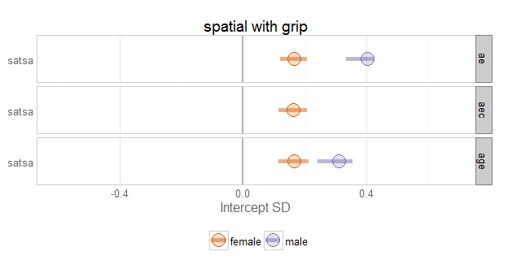 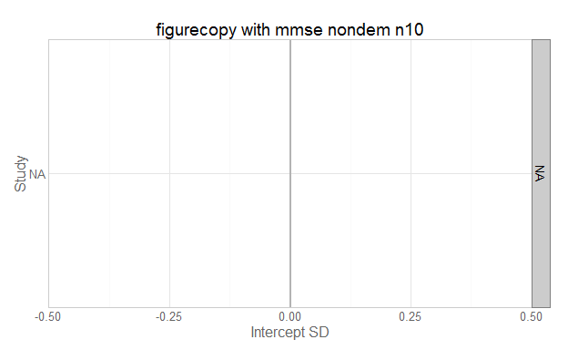 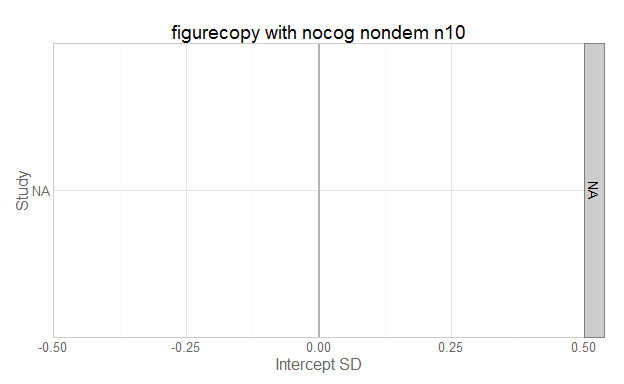 

## `memory` 

Studies with this physical variable listed in the model output: radc 


study_name   cognitive_outcome   subgroup   model_type    subject_count   wave_count  converged 
-----------  ------------------  ---------  -----------  --------------  -----------  ----------
radc         memory              female     aeh                     964            5  TRUE      


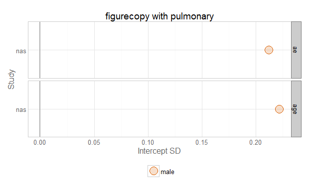 

## `muscle` 

Studies with this physical variable listed in the model output: eas, habc, ilse, octo, radc 


study_name   cognitive_outcome   subgroup   model_type    subject_count   wave_count  converged 
-----------  ------------------  ---------  -----------  --------------  -----------  ----------
eas          reasoning           female     ae                      563            8   TRUE     
eas          reasoning           female     aeh                     150            8   TRUE     
eas          reasoning           female     aehplus                 150            8   TRUE     
eas          reasoning           female     age                     563            8   TRUE     
eas          reasoning           female     full                    150            8   TRUE     
eas          reasoning           male       ae                      350            8   TRUE     
eas          reasoning           male       aeh                      72            8   TRUE     
eas          reasoning           male       aehplus                  72            8   TRUE     
eas          reasoning           male       age                     350            8   TRUE     
eas          reasoning           male       full                     72            8   TRUE     
habc         mental              female     aeh                    1578           11   TRUE     
habc         mental              female     aeh                    1575           10   TRUE     
habc         mental              female     aehplus                1538           11   TRUE     
habc         mental              female     aehplus                1535           10   TRUE     
habc         mental              female     age                    1584           11   TRUE     
habc         mental              female     age                    1581           10   TRUE     
habc         mental              female     full                   1536           11   TRUE     
habc         mental              female     full                   1533           10   TRUE     
habc         mental              male       aeh                    1489           11   TRUE     
habc         mental              male       aeh                    1489           10   TRUE     
habc         mental              male       aehplus                1464           11   TRUE     
habc         mental              male       aehplus                1464           10   TRUE     
habc         mental              male       age                    1491           11   TRUE     
habc         mental              male       age                    1491           10   TRUE     
habc         mental              male       full                   1454           10   TRUE     
habc         mental              male       full                   1454           11   TRUE     
habc         speed               female     aeh                    1578           11   TRUE     
habc         speed               female     aehplus                1538           11   TRUE     
habc         speed               female     age                    1584           11   TRUE     
habc         speed               female     full                   1536           11   TRUE     
habc         speed               male       aeh                    1488           11   TRUE     
habc         speed               male       aehplus                1463           11   TRUE     
habc         speed               male       age                    1490           11   TRUE     
habc         speed               male       full                   1453           11   TRUE     
ilse         fluency             female     aeh                     226            3   TRUE     
ilse         fluency             female     aehplus                 225            3   TRUE     
ilse         fluency             female     age                     228            3   TRUE     
ilse         fluency             male       aeh                     253            3   TRUE     
ilse         fluency             male       aehplus                 252            3   TRUE     
ilse         fluency             male       age                     253            3   TRUE     
ilse         knowledge           female     aeh                     226            3   TRUE     
ilse         knowledge           female     aehplus                 225            3   TRUE     
ilse         knowledge           female     age                     228            3   TRUE     
ilse         knowledge           male       aeh                     253            3   TRUE     
ilse         knowledge           male       aehplus                 252            3   TRUE     
ilse         knowledge           male       age                     253            3   TRUE     
ilse         reasoning           female     aeh                     226            3   TRUE     
ilse         reasoning           female     aeh                     226            3   TRUE     
ilse         reasoning           female     aeh                     226            3   TRUE     
ilse         reasoning           female     aehplus                 225            3   TRUE     
ilse         reasoning           female     aehplus                 225            3   TRUE     
ilse         reasoning           female     age                     228            3   TRUE     
ilse         reasoning           female     age                     228            3   TRUE     
ilse         reasoning           female     age                     228            3   TRUE     
ilse         reasoning           male       aeh                     253            3   TRUE     
ilse         reasoning           male       aeh                     253            3   TRUE     
ilse         reasoning           male       aeh                     253            3   TRUE     
ilse         reasoning           male       aehplus                 252            3   TRUE     
ilse         reasoning           male       age                     253            3   TRUE     
ilse         reasoning           male       age                     253            3   TRUE     
ilse         speed               female     aeh                     226            3   TRUE     
ilse         speed               female     aehplus                 225            3   TRUE     
ilse         speed               female     age                     228            3   TRUE     
ilse         speed               male       aeh                     253            3   TRUE     
ilse         speed               male       aehplus                 252            3   TRUE     
ilse         speed               male       age                     253            3   TRUE     
octo         global              female     aeh                     276            5   TRUE     
octo         global              female     age                     311            5   TRUE     
octo         global              male       aeh                     140            5   TRUE     
octo         global              male       age                     164            5   TRUE     
octo         knowledge           female     aeh                     275            5   TRUE     
octo         knowledge           female     aeh                     273            5   TRUE     
octo         knowledge           female     age                     305            5   TRUE     
octo         knowledge           female     age                     301            5   TRUE     
octo         knowledge           male       aeh                     140            5   TRUE     
octo         knowledge           male       aeh                     139            5   TRUE     
octo         knowledge           male       age                     162            5   TRUE     
octo         knowledge           male       age                     157            5   TRUE     
octo         memory              female     aeh                     276            5   TRUE     
octo         memory              female     aeh                     276            5   TRUE     
octo         memory              female     aeh                     273            5   TRUE     
octo         memory              female     aeh                     273            5   TRUE     
octo         memory              female     age                     305            5   TRUE     
octo         memory              female     age                     306            5   TRUE     
octo         memory              female     age                     303            5   TRUE     
octo         memory              female     age                     302            5   TRUE     
octo         memory              male       aeh                     139            5   TRUE     
octo         memory              male       aeh                     139            5   TRUE     
octo         memory              male       aeh                     139            5   TRUE     
octo         memory              male       aeh                     139            5   TRUE     
octo         memory              male       age                     161            5   TRUE     
octo         memory              male       age                     161            5   TRUE     
octo         memory              male       age                     159            5   TRUE     
octo         memory              male       age                     161            5   TRUE     
octo         reasoning           female     aeh                     275            5   TRUE     
octo         reasoning           female     aeh                     274            5   TRUE     
octo         reasoning           female     age                     303            5   TRUE     
octo         reasoning           female     age                     302            5   TRUE     
octo         reasoning           male       aeh                     139            5   TRUE     
octo         reasoning           male       aeh                     138            5   TRUE     
octo         reasoning           male       age                     158            5   TRUE     
octo         reasoning           male       age                     157            5   TRUE     
octo         speed               female     aeh                     272            5   TRUE     
octo         speed               female     aeh                     271            4   TRUE     
octo         speed               female     age                     299            5   TRUE     
octo         speed               female     age                     298            4   TRUE     
octo         speed               male       aeh                     138            5   TRUE     
octo         speed               male       aeh                     138            4   TRUE     
octo         speed               male       age                     156            5   TRUE     
octo         speed               male       age                     156            4   TRUE     
radc         attention           female     aeh                     964            5   TRUE     
radc         attention           female     aehplus                 962            5   TRUE     
radc         attention           male       aeh                     335            5   TRUE     
radc         attention           male       aehplus                 334            5   TRUE     
radc         executive           female     aeh                     964            5   TRUE     
radc         executive           female     aeh                     964            5   TRUE     
radc         executive           female     aeh                     964            5   TRUE     
radc         executive           female     aehplus                 962            5   TRUE     
radc         executive           female     aehplus                 962            5   TRUE     
radc         executive           female     aehplus                 962            5   TRUE     
radc         executive           female     age                    1951            5   TRUE     
radc         executive           male       aeh                     335            5   TRUE     
radc         executive           male       aehplus                 334            5   TRUE     
radc         executive           male       aehplus                 334            5   TRUE     
radc         executive           male       aehplus                 334            5   TRUE     
radc         executive           male       age                     722            5   TRUE     
radc         global              female     aeh                     964            5   TRUE     
radc         global              female     aehplus                 962            5   TRUE     
radc         global              male       aeh                     335            5   TRUE     
radc         global              male       aehplus                 334            5   TRUE     
radc         knowledge           female     aeh                     963            5   TRUE     
radc         knowledge           female     aehplus                 961            5   TRUE     
radc         knowledge           female     age                    1946            5   TRUE     
radc         knowledge           male       aeh                     335            5   TRUE     
radc         knowledge           male       aehplus                 334            5   TRUE     
radc         knowledge           male       age                     722            5   TRUE     
radc         language            female     aeh                     963            5   TRUE     
radc         language            female     aeh                     964            5   TRUE     
radc         language            female     aehplus                 961            5   TRUE     
radc         language            female     aehplus                 962            5   TRUE     
radc         language            male       aeh                     335            5   TRUE     
radc         language            male       aeh                     335            5   TRUE     
radc         language            male       aehplus                 334            5   TRUE     
radc         memory              female     aeh                     964            5   TRUE     
radc         memory              female     aeh                     964            5   TRUE     
radc         memory              female     aeh                     964            5   TRUE     
radc         memory              female     aeh                     964            5   TRUE     
radc         memory              female     aeh                     964            5   TRUE     
radc         memory              female     aeh                     964            5   TRUE     
radc         memory              female     aehplus                 962            5   TRUE     
radc         memory              female     aehplus                 962            5   TRUE     
radc         memory              female     aehplus                 962            5   TRUE     
radc         memory              female     aehplus                 962            5   TRUE     
radc         memory              female     aehplus                 962            5   TRUE     
radc         memory              female     aehplus                 962            5   TRUE     
radc         memory              female     aehplus                 962            5   TRUE     
radc         memory              male       aeh                     335            5   TRUE     
radc         memory              male       aeh                     335            5   TRUE     
radc         memory              male       aeh                     335            5   TRUE     
radc         memory              male       aeh                     335            5   TRUE     
radc         memory              male       aeh                     335            5   TRUE     
radc         memory              male       aeh                     335            5   TRUE     
radc         memory              male       aeh                     335            5   TRUE     
radc         memory              male       aehplus                 334            5   TRUE     
radc         memory              male       aehplus                 334           NA  FALSE     
radc         memory              male       aehplus                 334            5   TRUE     
radc         memory              male       aehplus                 334            5   TRUE     
radc         memory              male       aehplus                 334            5   TRUE     
radc         memory              male       aehplus                 334            5   TRUE     
radc         reasoning           female     aeh                     947            5   TRUE     
radc         reasoning           female     aehplus                 945            5   TRUE     
radc         reasoning           female     age                    1930            5   TRUE     
radc         reasoning           male       aeh                     317            5   TRUE     
radc         reasoning           male       aehplus                 316            5   TRUE     
radc         reasoning           male       age                     704            5   TRUE     
radc         speed               female     aeh                     963            5   TRUE     
radc         speed               female     aeh                     963            5   TRUE     
radc         speed               female     aehplus                 961            5   TRUE     
radc         speed               female     aehplus                 961            5   TRUE     
radc         speed               female     age                    1950            5   TRUE     
radc         speed               male       aeh                     335            5   TRUE     
radc         speed               male       aeh                     335            5   TRUE     
radc         speed               male       aehplus                 334            5   TRUE     
radc         speed               male       aehplus                 334            5   TRUE     
radc         speed               male       age                     722            5   TRUE     
radc         visuospatial        female     aeh                     963            5   TRUE     
radc         visuospatial        female     aehplus                 961            5   TRUE     
radc         visuospatial        female     age                    1950            5   TRUE     
radc         visuospatial        male       aeh                     335            5   TRUE     
radc         visuospatial        male       aehplus                 334            5   TRUE     
radc         visuospatial        male       age                     722            5   TRUE     


 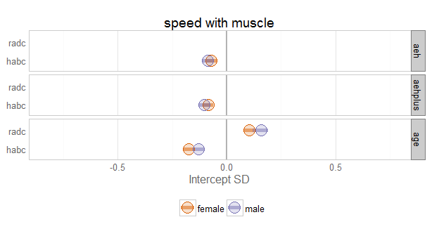 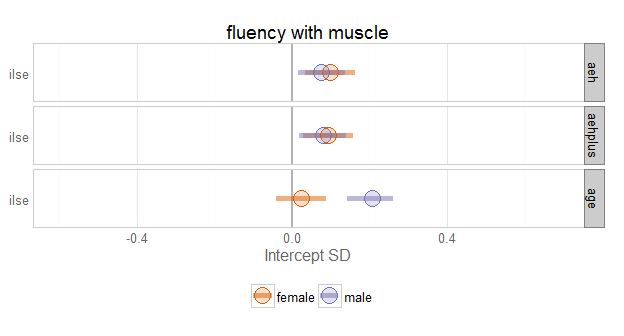  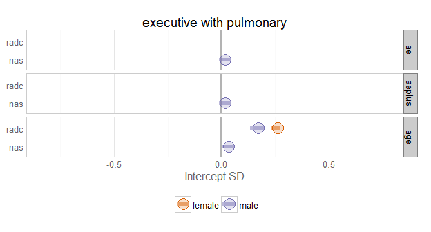 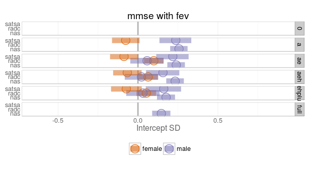 

```
Warning: Removed 1 rows containing missing values (geom_segment).
```

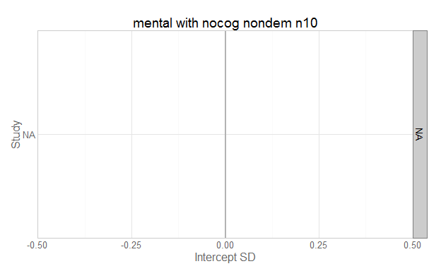 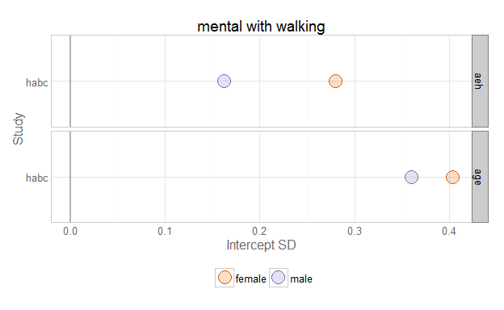 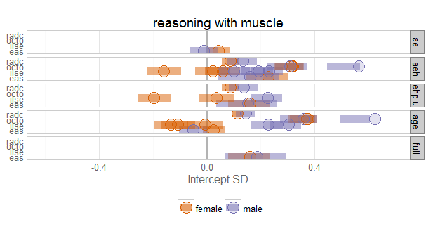 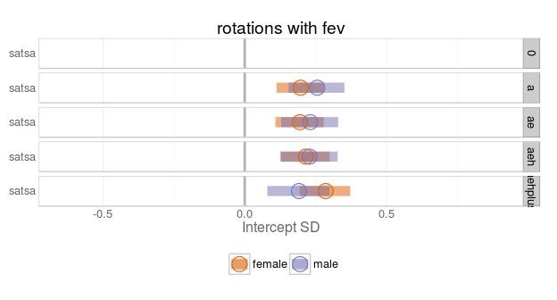 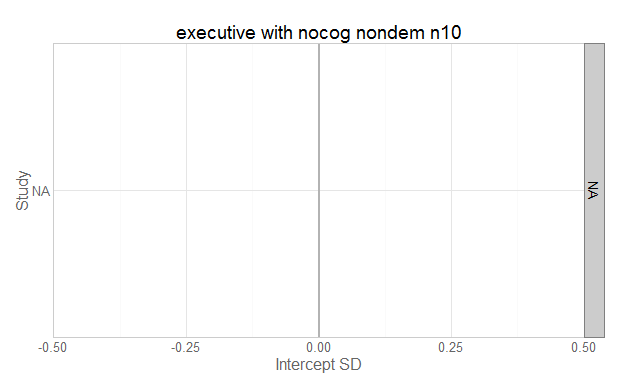 

## `pulmonary` 

Studies with this physical variable listed in the model output: eas, nas, octo, radc, satsa 


study_name   cognitive_outcome   subgroup   model_type    subject_count   wave_count  converged 
-----------  ------------------  ---------  -----------  --------------  -----------  ----------
eas          knowledge           female     ae                      594            8  TRUE      
eas          executive           female     ae                      580            9  TRUE      
eas          executive           female     aeh                     150            8  TRUE      
eas          executive           female     aehplus                 150            8  TRUE      
eas          executive           female     age                     580            9  TRUE      
eas          executive           female     full                    150            8  TRUE      
eas          executive           male       ae                      368            9  TRUE      
eas          executive           male       aeh                      72            8  TRUE      
eas          executive           male       aehplus                  72            8  TRUE      
eas          executive           male       age                     368            9  TRUE      
eas          executive           male       full                     72            8  TRUE      
eas          fluency             female     ae                      594            8  TRUE      
eas          fluency             female     ae                      593            9  TRUE      
eas          fluency             female     ae                      571            8  TRUE      
eas          fluency             female     aeh                     150            8  TRUE      
eas          fluency             female     aeh                     150            9  TRUE      
eas          fluency             female     aeh                     150            8  TRUE      
eas          fluency             female     aehplus                 150            8  TRUE      
eas          fluency             female     aehplus                 150            9  TRUE      
eas          fluency             female     aehplus                 150            8  TRUE      
eas          fluency             female     age                     594            8  TRUE      
eas          fluency             female     age                     593            9  TRUE      
eas          fluency             female     age                     571            8  TRUE      
eas          fluency             female     full                    150            8  TRUE      
eas          fluency             female     full                    150            9  TRUE      
eas          fluency             female     full                    150            8  TRUE      
eas          fluency             male       ae                      376            8  TRUE      
eas          fluency             male       ae                      376            9  TRUE      
eas          fluency             male       ae                      358            8  TRUE      
eas          fluency             male       aeh                      72            8  TRUE      
eas          fluency             male       aeh                      72            8  TRUE      
eas          fluency             male       aeh                      72            8  TRUE      
eas          fluency             male       aehplus                  72            8  TRUE      
eas          fluency             male       aehplus                  72            8  TRUE      
eas          fluency             male       aehplus                  72            8  TRUE      
eas          fluency             male       age                     376            8  TRUE      
eas          fluency             male       age                     376            9  TRUE      
eas          fluency             male       age                     358            9  TRUE      
eas          fluency             male       full                     72            8  TRUE      
eas          fluency             male       full                     72            8  TRUE      
eas          fluency             male       full                     72            8  TRUE      
eas          global              female     ae                      600            7  TRUE      
eas          global              female     aeh                     150            7  TRUE      
eas          global              female     aehplus                 150            7  TRUE      
eas          global              female     age                     600            7  TRUE      
eas          global              female     full                    150            7  TRUE      
eas          global              male       ae                      383            7  TRUE      
eas          global              male       aeh                      72            7  TRUE      
eas          global              male       aehplus                  72            7  TRUE      
eas          global              male       age                     383            7  TRUE      
eas          global              male       full                     72            7  TRUE      
eas          knowledge           female     ae                      543            7  TRUE      
eas          knowledge           female     ae                      571            8  TRUE      
eas          knowledge           female     aeh                     150            7  TRUE      
eas          knowledge           female     aeh                     150            8  TRUE      
eas          knowledge           female     aehplus                 150            7  TRUE      
eas          knowledge           female     aehplus                 150            8  TRUE      
eas          knowledge           female     age                     543            7  TRUE      
eas          knowledge           female     age                     594            8  TRUE      
eas          knowledge           female     full                    150            7  TRUE      
eas          knowledge           female     full                    150            8  TRUE      
eas          knowledge           male       ae                      353            7  TRUE      
eas          knowledge           male       ae                      377            8  TRUE      
eas          knowledge           male       aeh                      72            7  TRUE      
eas          knowledge           male       aeh                      72            8  TRUE      
eas          knowledge           male       aehplus                  72            7  TRUE      
eas          knowledge           male       aehplus                  72            8  TRUE      
eas          knowledge           male       age                     353            7  TRUE      
eas          knowledge           male       age                     358            8  TRUE      
eas          knowledge           male       full                     72            7  TRUE      
eas          knowledge           male       full                     72            8  TRUE      
eas          memory              female     ae                      595            8  TRUE      
eas          memory              female     ae                      554            9  TRUE      
eas          memory              female     aeh                     150            8  TRUE      
eas          memory              female     aeh                     150            9  TRUE      
eas          memory              female     aehplus                 150            8  TRUE      
eas          memory              female     aehplus                 150            9  TRUE      
eas          memory              female     age                     595            8  TRUE      
eas          memory              female     age                     554            9  TRUE      
eas          memory              female     full                    150            9  TRUE      
eas          memory              female     full                    150            9  TRUE      
eas          memory              male       ae                      379            8  TRUE      
eas          memory              male       ae                      349            9  TRUE      
eas          memory              male       aeh                      72            7  TRUE      
eas          memory              male       aeh                      72            8  TRUE      
eas          memory              male       aehplus                  72            8  TRUE      
eas          memory              male       aehplus                  72            8  TRUE      
eas          memory              male       age                     379            8  TRUE      
eas          memory              male       age                     349            9  TRUE      
eas          memory              male       full                     72            8  TRUE      
eas          memory              male       full                     72            8  TRUE      
eas          reasoning           female     ae                      563            9  TRUE      
eas          reasoning           female     aeh                     150            8  TRUE      
eas          reasoning           female     aehplus                 150            8  TRUE      
eas          reasoning           female     age                     563            9  TRUE      
eas          reasoning           female     full                    150            8  TRUE      
eas          reasoning           male       ae                      350            9  TRUE      
eas          reasoning           male       aeh                      72            8  TRUE      
eas          reasoning           male       aehplus                  72            8  TRUE      
eas          reasoning           male       age                     350            9  TRUE      
eas          reasoning           male       full                     72            8  TRUE      
eas          speed               female     ae                      592            7  TRUE      
eas          speed               female     aeh                     150            6  TRUE      
eas          speed               female     aehplus                 150            6  TRUE      
eas          speed               female     age                     592            9  TRUE      
eas          speed               female     full                    150            6  TRUE      
eas          speed               male       ae                      377            5  TRUE      
eas          speed               male       aeh                      72            6  TRUE      
eas          speed               male       aehplus                  72            6  TRUE      
eas          speed               male       age                     377            9  TRUE      
eas          speed               male       full                     72            6  TRUE      
nas          fluidreasoning      male       ae                     1125            6  TRUE      
nas          fluidreasoning      male       ae                     1123            4  TRUE      
nas          fluidreasoning      male       ae                     1125            6  TRUE      
nas          fluidreasoning      male       ae                     1123            4  TRUE      
nas          fluidreasoning      male       aeplus                 1124            6  TRUE      
nas          fluidreasoning      male       aeplus                 1122            4  TRUE      
nas          fluidreasoning      male       aeplus                 1124            6  TRUE      
nas          fluidreasoning      male       aeplus                 1122            4  TRUE      
nas          fluidreasoning      male       age                    1130            6  TRUE      
nas          fluidreasoning      male       age                    1128            4  TRUE      
nas          fluidreasoning      male       age                    1130            6  TRUE      
nas          fluidreasoning      male       age                    1128            4  TRUE      
nas          global              male       ae                     1127            6  TRUE      
nas          global              male       ae                     1127            6  TRUE      
nas          global              male       aeplus                 1126            6  TRUE      
nas          global              male       aeplus                 1126            6  TRUE      
nas          global              male       age                    1132            6  TRUE      
nas          global              male       age                    1132            6  TRUE      
nas          memoryattention     male       ae                     1124            6  TRUE      
nas          memoryattention     male       ae                     1122            6  TRUE      
nas          memoryattention     male       ae                     1124            6  TRUE      
nas          memoryattention     male       ae                     1124            6  TRUE      
nas          memoryattention     male       ae                     1122            6  TRUE      
nas          memoryattention     male       ae                     1124            6  TRUE      
nas          memoryattention     male       aeplus                 1123            6  TRUE      
nas          memoryattention     male       aeplus                 1123            6  TRUE      
nas          memoryattention     male       aeplus                 1123            6  TRUE      
nas          memoryattention     male       aeplus                 1121            6  TRUE      
nas          memoryattention     male       aeplus                 1123            6  TRUE      
nas          memoryattention     male       age                    1129            6  TRUE      
nas          memoryattention     male       age                    1127            6  TRUE      
nas          memoryattention     male       age                    1129            6  TRUE      
nas          memoryattention     male       age                    1127            6  TRUE      
nas          memoryattention     male       age                    1129            6  TRUE      
nas          memoryattention     male       age                    1129            6  TRUE      
nas          verbalfluency       male       ae                     1124            6  TRUE      
nas          verbalfluency       male       ae                     1124            6  TRUE      
nas          verbalfluency       male       aeplus                 1123            6  TRUE      
nas          verbalfluency       male       aeplus                 1123            6  TRUE      
nas          verbalfluency       male       age                    1129            6  TRUE      
nas          verbalfluency       male       age                    1129            6  TRUE      
octo         block               female     aeh                     272            5  TRUE      
octo         block               female     aehplus                 271            5  TRUE      
octo         block               female     age                     293            5  TRUE      
octo         block               female     full                    289            5  TRUE      
octo         block               male       aeh                     136            5  TRUE      
octo         block               male       aehplus                 136            5  TRUE      
octo         block               male       age                     151            5  TRUE      
octo         block               male       full                    151            5  TRUE      
octo         digitbackward       female     aeh                     276            5  TRUE      
octo         digitbackward       female     aehplus                 275            5  TRUE      
octo         digitbackward       female     age                     299            5  TRUE      
octo         digitbackward       male       aeh                     138            5  TRUE      
octo         digitbackward       male       aehplus                 138            5  TRUE      
octo         digitbackward       male       age                     158            5  TRUE      
octo         digitforward        female     aeh                     276            5  TRUE      
octo         digitforward        female     aehplus                 275            5  TRUE      
octo         digitforward        female     age                     276            5  TRUE      
octo         digitforward        male       aeh                     138            5  TRUE      
octo         digitforward        male       aehplus                 138            5  TRUE      
octo         digitforward        male       age                     158            5  TRUE      
octo         digitsymbol         female     aeh                     264            5  TRUE      
octo         digitsymbol         female     aehplus                 263            5  TRUE      
octo         digitsymbol         female     age                     278            5  TRUE      
octo         digitsymbol         male       aeh                     133            5  TRUE      
octo         digitsymbol         male       aehplus                 133            5  TRUE      
octo         digitsymbol         male       age                     142            5  TRUE      
octo         figurelogic         female     aeh                     268            5  TRUE      
octo         figurelogic         female     aehplus                 267            5  TRUE      
octo         figurelogic         female     age                     284            5  TRUE      
octo         figurelogic         male       aeh                     133            5  TRUE      
octo         figurelogic         male       aehplus                 133            5  TRUE      
octo         figurelogic         male       age                     146            5  TRUE      
octo         global              female     aeh                     276            5  TRUE      
octo         global              female     age                     311            5  TRUE      
octo         global              male       aeh                     140            5  TRUE      
octo         global              male       age                     164            5  TRUE      
octo         knowledge           female     aeh                     275            5  TRUE      
octo         knowledge           female     aeh                     265            5  TRUE      
octo         knowledge           female     age                     301            5  TRUE      
octo         knowledge           female     age                     280            5  TRUE      
octo         knowledge           male       aeh                     138            5  TRUE      
octo         knowledge           male       aeh                     132            5  TRUE      
octo         knowledge           male       age                     156            5  TRUE      
octo         knowledge           male       age                     142            5  TRUE      
octo         memory              female     aeh                     276            5  TRUE      
octo         memory              female     aeh                     276            5  TRUE      
octo         memory              female     aeh                     271            5  TRUE      
octo         memory              female     aeh                     268            5  TRUE      
octo         memory              female     age                     299            5  TRUE      
octo         memory              female     age                     300            5  TRUE      
octo         memory              female     age                     293            5  TRUE      
octo         memory              female     age                     289            5  TRUE      
octo         memory              male       aeh                     138            5  TRUE      
octo         memory              male       aeh                     138            5  TRUE      
octo         memory              male       aeh                     137            5  TRUE      
octo         memory              male       aeh                     136            5  TRUE      
octo         memory              male       age                     158            5  TRUE      
octo         memory              male       age                     158            5  TRUE      
octo         memory              male       age                     153            5  TRUE      
octo         memory              male       age                     153            5  TRUE      
octo         mirrecall           female     aeh                     271            5  TRUE      
octo         mirrecall           female     aehplus                 270            5  TRUE      
octo         mirrecall           female     age                     293            5  TRUE      
octo         mirrecall           male       aeh                     137            5  TRUE      
octo         mirrecall           male       aehplus                 137            5  TRUE      
octo         mirrecall           male       age                     153            5  TRUE      
octo         proserecall         female     aeh                     268            5  TRUE      
octo         proserecall         female     aehplus                 267            5  TRUE      
octo         proserecall         female     age                     289            5  TRUE      
octo         proserecall         female     full                    286            5  TRUE      
octo         proserecall         male       aeh                     136            5  TRUE      
octo         proserecall         male       aehplus                 136            5  TRUE      
octo         proserecall         male       age                     153            5  TRUE      
octo         proserecall         male       full                    153            5  TRUE      
octo         reasoning           female     aeh                     272            5  TRUE      
octo         reasoning           female     aeh                     268            5  TRUE      
octo         reasoning           female     age                     293            5  TRUE      
octo         reasoning           female     age                     284            5  TRUE      
octo         reasoning           male       aeh                     136            5  TRUE      
octo         reasoning           male       aeh                     133            5  TRUE      
octo         reasoning           male       age                     151            5  TRUE      
octo         reasoning           male       age                     146            5  TRUE      
octo         speed               female     aeh                     264            5  TRUE      
octo         speed               female     aeh                     254            4  TRUE      
octo         speed               female     age                     278            5  TRUE      
octo         speed               female     age                     268            4  TRUE      
octo         speed               male       aeh                     133            5  TRUE      
octo         speed               male       aeh                     127            4  TRUE      
octo         speed               male       age                     142            5  TRUE      
octo         speed               male       age                     135            4  TRUE      
radc         attention           female     aehplus                 962            5  TRUE      
radc         attention           male       aeh                     335            5  TRUE      
radc         attention           male       aehplus                 334            5  TRUE      
radc         executive           female     aehplus                 962            5  TRUE      
radc         executive           female     aehplus                 962            5  TRUE      
radc         executive           female     age                    1950            5  TRUE      
radc         executive           male       aeh                     335            5  TRUE      
radc         executive           male       aeh                     335            5  TRUE      
radc         executive           male       aehplus                 334            5  TRUE      
radc         executive           male       aehplus                 334            5  TRUE      
radc         executive           male       age                     722            5  TRUE      
radc         global              female     aehplus                 962            5  TRUE      
radc         global              male       aeh                     335            5  TRUE      
radc         global              male       aehplus                 334            5  TRUE      
radc         knowledge           female     aehplus                 961            5  TRUE      
radc         knowledge           female     age                    1516            5  TRUE      
radc         knowledge           male       aeh                     335            5  TRUE      
radc         knowledge           male       aehplus                 334            5  TRUE      
radc         knowledge           male       age                     590            5  TRUE      
radc         language            female     aehplus                 961            5  TRUE      
radc         language            female     aehplus                 962            5  TRUE      
radc         language            male       aeh                     335            5  TRUE      
radc         language            male       aeh                     335            5  TRUE      
radc         language            male       aehplus                 334            5  TRUE      
radc         language            male       aehplus                 334            5  TRUE      
radc         memory              female     aehplus                 962            5  TRUE      
radc         memory              female     aehplus                 962            5  TRUE      
radc         memory              female     aehplus                 962            5  TRUE      
radc         memory              female     aehplus                 962            5  TRUE      
radc         memory              female     aehplus                 962            5  TRUE      
radc         memory              female     aehplus                 962            5  TRUE      
radc         memory              female     aehplus                 962            5  TRUE      
radc         memory              male       aeh                     335            5  TRUE      
radc         memory              male       aeh                     335            5  TRUE      
radc         memory              male       aeh                     335            5  TRUE      
radc         memory              male       aeh                     335            5  TRUE      
radc         memory              male       aeh                     335            5  TRUE      
radc         memory              male       aeh                     335            5  TRUE      
radc         memory              male       aeh                     335            5  TRUE      
radc         memory              male       aehplus                 334            5  TRUE      
radc         memory              male       aehplus                 334            5  TRUE      
radc         memory              male       aehplus                 334            5  TRUE      
radc         memory              male       aehplus                 334            5  TRUE      
radc         memory              male       aehplus                 334            5  TRUE      
radc         memory              male       aehplus                 334            5  TRUE      
radc         memory              male       aehplus                 334            5  TRUE      
radc         reasoning           female     aehplus                 945            5  TRUE      
radc         reasoning           female     age                    1927            5  TRUE      
radc         reasoning           male       aeh                     317            5  TRUE      
radc         reasoning           male       aehplus                 316            5  TRUE      
radc         reasoning           male       age                     702            5  TRUE      
radc         speed               female     aehplus                 961            5  TRUE      
radc         speed               female     aehplus                 961            5  TRUE      
radc         speed               female     age                    1947            5  TRUE      
radc         speed               male       aeh                     335            5  TRUE      
radc         speed               male       aeh                     335            5  TRUE      
radc         speed               male       aehplus                 334            5  TRUE      
radc         speed               male       aehplus                 334            5  TRUE      
radc         speed               male       age                     720            5  TRUE      
radc         visuospatial        female     aehplus                 961            5  TRUE      
radc         visuospatial        female     age                    1947            5  TRUE      
radc         visuospatial        male       aeh                     335            5  TRUE      
radc         visuospatial        male       aehplus                 334            5  TRUE      
radc         visuospatial        male       age                     720            5  TRUE      
satsa        memory              female     ae                      487            7  TRUE      
satsa        memory              female     aec                     430            7  TRUE      
satsa        memory              female     age                     395            7  TRUE      
satsa        memory              male       ae                      340            7  TRUE      
satsa        memory              male       age                     246            7  TRUE      
satsa        spatial             female     ae                      485            7  TRUE      
satsa        spatial             female     aec                     428            7  TRUE      
satsa        spatial             female     age                     393            7  TRUE      
satsa        spatial             male       ae                      340            7  TRUE      
satsa        spatial             male       age                     246            7  TRUE      
satsa        speed               female     ae                      486            7  TRUE      
satsa        speed               female     aec                     429            7  TRUE      
satsa        speed               female     age                     394            7  TRUE      
satsa        speed               male       ae                      341            7  TRUE      
satsa        speed               male       age                     247            7  TRUE      
satsa        verbal              female     ae                      485            7  TRUE      
satsa        verbal              female     aec                     428            7  TRUE      
satsa        verbal              male       ae                      341            7  TRUE      
satsa        verbal              male       age                     247            7  TRUE      


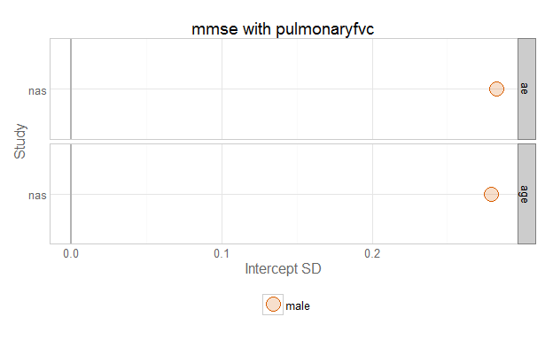 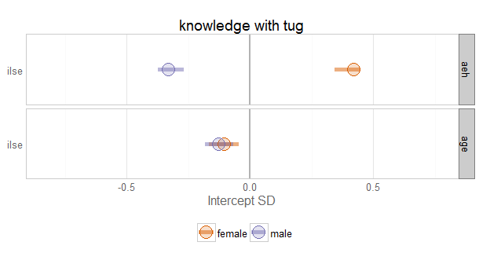 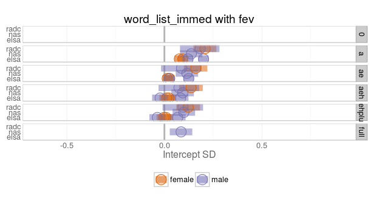 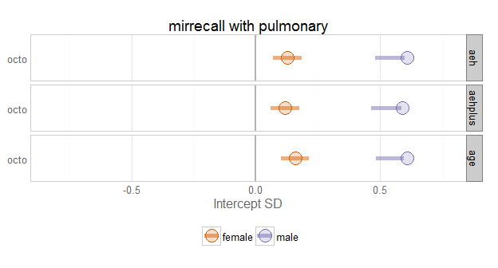 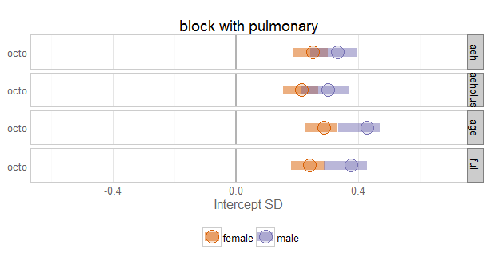 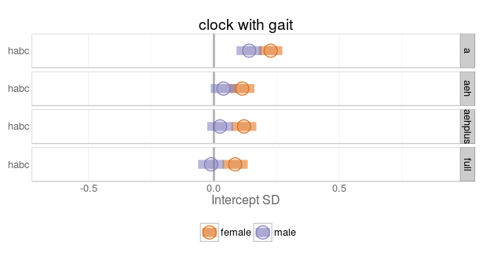 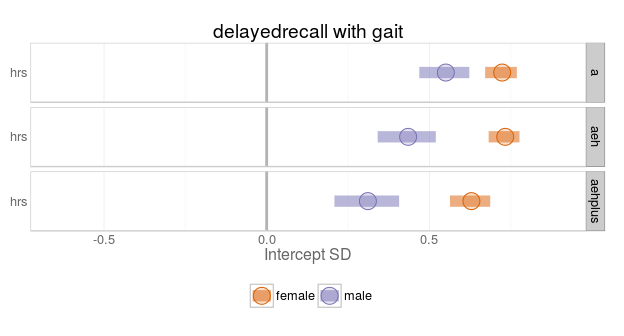 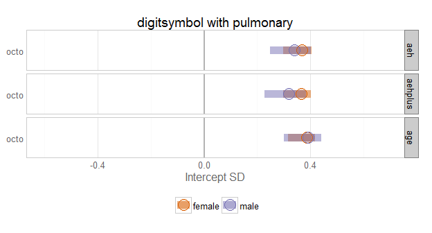 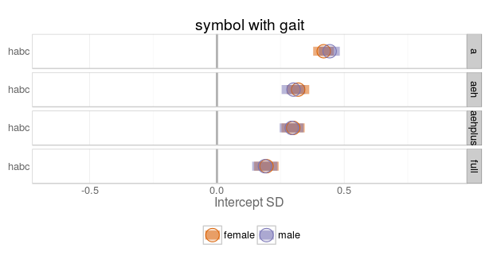 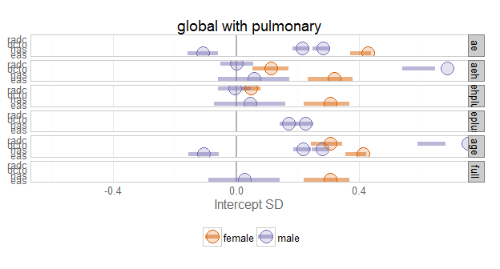 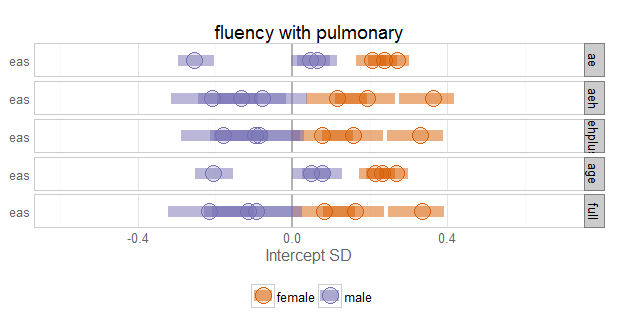 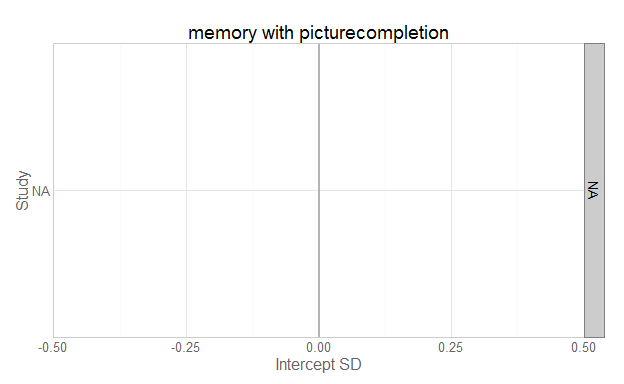  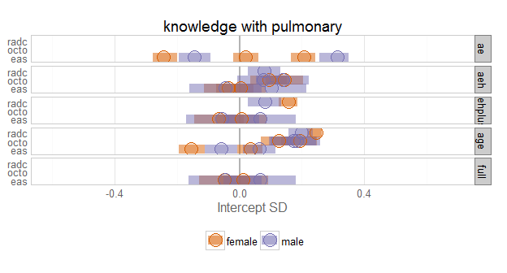  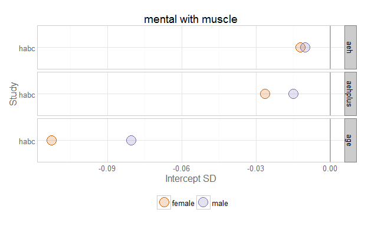 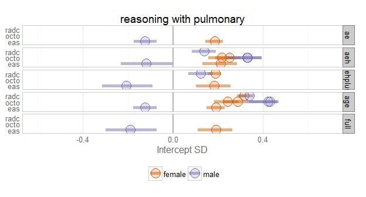 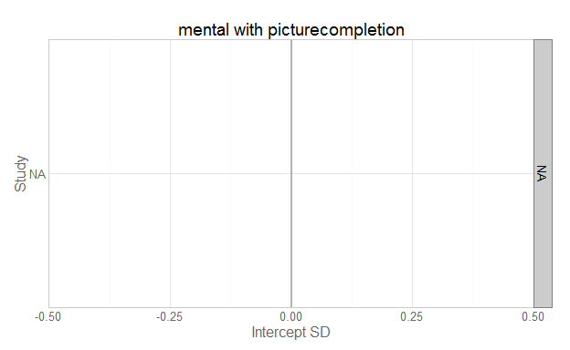 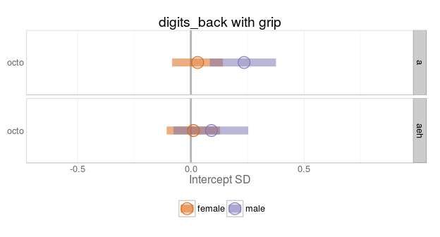 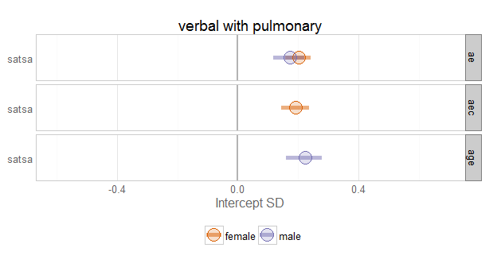 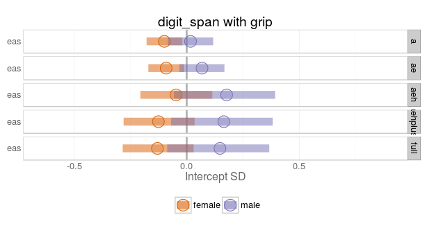 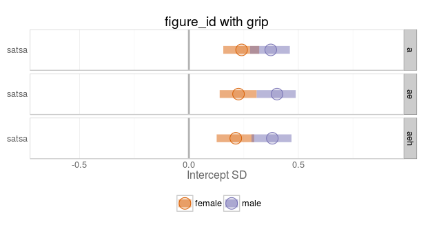 

## `tug` 

Studies with this physical variable listed in the model output: ilse 


study_name   cognitive_outcome   subgroup   model_type    subject_count   wave_count  converged 
-----------  ------------------  ---------  -----------  --------------  -----------  ----------
ilse         fluency             female     age                     228            3  TRUE      
ilse         fluency             male       age                     253            3  TRUE      
ilse         knowledge           female     age                     228            3  TRUE      
ilse         knowledge           male       age                     253            3  TRUE      
ilse         reasoning           female     age                     228            3  TRUE      
ilse         reasoning           female     age                     228            3  TRUE      
ilse         reasoning           female     age                     228            3  TRUE      
ilse         reasoning           male       age                     253            3  TRUE      
ilse         reasoning           male       age                     253            3  TRUE      
ilse         reasoning           male       age                     253            3  TRUE      
ilse         speed               female     age                     228            3  TRUE      
ilse         speed               male       age                     253            3  TRUE      


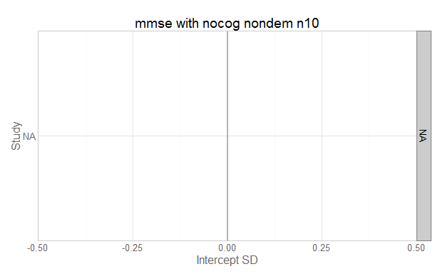 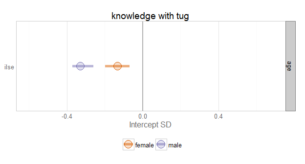 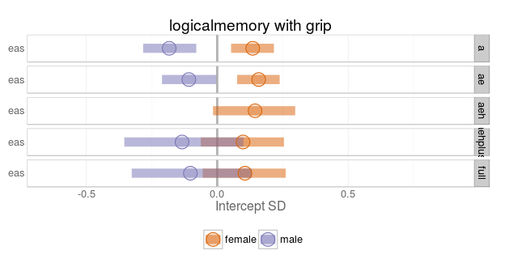 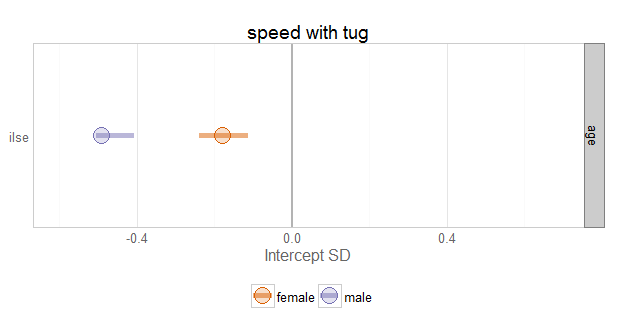 

## `walking` 

Studies with this physical variable listed in the model output: habc, obas 


study_name   cognitive_outcome   subgroup   model_type    subject_count   wave_count  converged 
-----------  ------------------  ---------  -----------  --------------  -----------  ----------
habc         mental              female     aeh                    1578           11  TRUE      
habc         mental              female     aeh                    1552           10  TRUE      
habc         mental              female     aehplus                1538           11  TRUE      
habc         mental              female     aehplus                1513           10  TRUE      
habc         mental              female     age                    1584           11  TRUE      
habc         mental              female     age                    1558           10  TRUE      
habc         mental              female     full                   1536           11  TRUE      
habc         mental              female     full                   1511           10  TRUE      
habc         mental              male       aeh                    1489           11  TRUE      
habc         mental              male       aeh                    1471           10  TRUE      
habc         mental              male       aehplus                1464           11  TRUE      
habc         mental              male       aehplus                1446           10  TRUE      
habc         mental              male       age                    1491           11  TRUE      
habc         mental              male       age                    1473           10  TRUE      
habc         mental              male       full                   1454           11  TRUE      
habc         mental              male       full                   1436           10  TRUE      
habc         speed               female     aeh                    1575           11  TRUE      
habc         speed               female     aehplus                1535           11  TRUE      
habc         speed               female     age                    1581           11  TRUE      
habc         speed               female     full                   1533           11  TRUE      
habc         speed               male       aeh                    1485           11  TRUE      
habc         speed               male       aehplus                1460           11  TRUE      
habc         speed               male       age                    1487           11  TRUE      
habc         speed               male       full                   1450           11  TRUE      
obas         global              female     aeh                     145           10  TRUE      
obas         global              female     age                     155           10  TRUE      
obas         global              male       aeh                     108           10  TRUE      
obas         global              male       age                     111           10  TRUE      


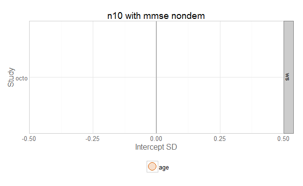 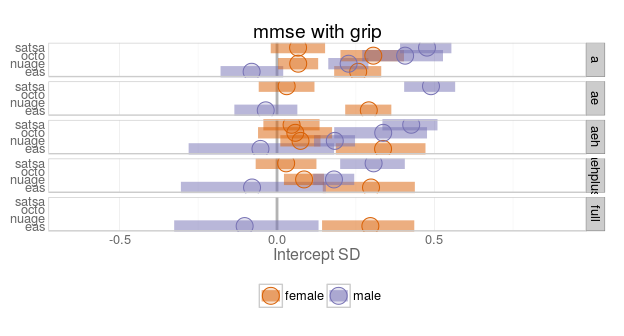  

# Forest Plot (Animated)


# Questions
## Unanswered Questions
 1. What does `VS` stand for?  How was it measured?
 1. Where the cars at the Philly track measured with the same phluguerstometer and the Cleveland track?
 
## Answered Questions
 1. The Seattle track's phluguerstometer was producing flaky negative values; it's measurements have been dropped.

# Session Information
For the sake of documentation and reproducibility, the current report was rendered on a system using the following software.


```
Report rendered by koval_000 at 2015-04-03, 17:24 Pacific Daylight Time
```

```
R version 3.0.3 (2014-03-06)
Platform: x86_64-w64-mingw32/x64 (64-bit)

locale:
[1] LC_COLLATE=English_United States.1252  LC_CTYPE=English_United States.1252    LC_MONETARY=English_United States.1252
[4] LC_NUMERIC=C                           LC_TIME=English_United States.1252    

attached base packages:
[1] grid      stats     graphics  grDevices utils     datasets  methods   base     

other attached packages:
[1] testit_0.4         ggplot2_1.0.0      RColorBrewer_1.1-2 scales_0.2.4       knitr_1.9         

loaded via a namespace (and not attached):
 [1] colorspace_1.2-6 digest_0.6.8     evaluate_0.5.5   formatR_1.0      gtable_0.1.2     htmltools_0.2.6 
 [7] labeling_0.3     MASS_7.3-35      munsell_0.4.2    plyr_1.8.1       proto_0.3-10     Rcpp_0.11.2     
[13] reshape2_1.4     rmarkdown_0.5.1  stringr_0.6.2    tools_3.0.3      yaml_2.1.13     
```
