# Bivariate Outcomes -- Combining Studies


This report covers the analyses used in the ZZZ project (Marcus Mark, PI).

<!--  Set the working directory to the repository's base directory; this assumes the report is nested inside of two directories.-->


<!-- Set the report-wide options, and point to the external code file. -->


<!-- Load the sources.  Suppress the output when loading sources. --> 


<!-- Load 'sourced' R files.  Suppress the output when loading packages. --> 


<!-- Load any Global functions and variables declared in the R file.  Suppress the output. --> 


<!-- Declare any global functions specific to a Rmd output.  Suppress the output. --> 


<!-- Load the datasets.   -->


<!-- Tweak the datasets.   -->


<!-- Calculate the forest results (but don't plot yet).   -->


## Notes

**Note 1**: The current report covers 8 studies: eas, habc, ilse, nas, nuage, obas, octo, radc.


# Forest Plot (Static)
                                                        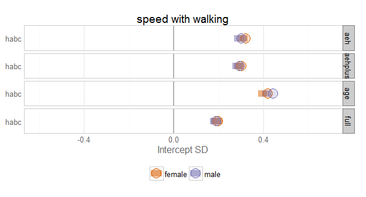 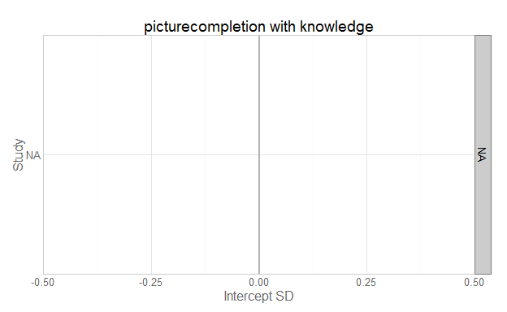 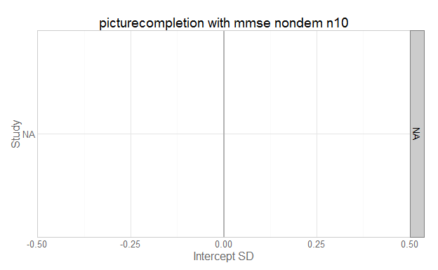 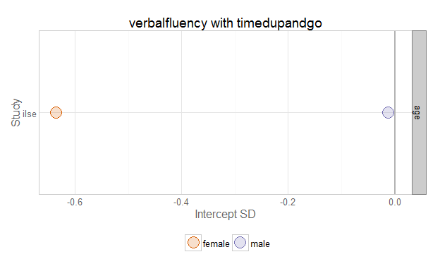 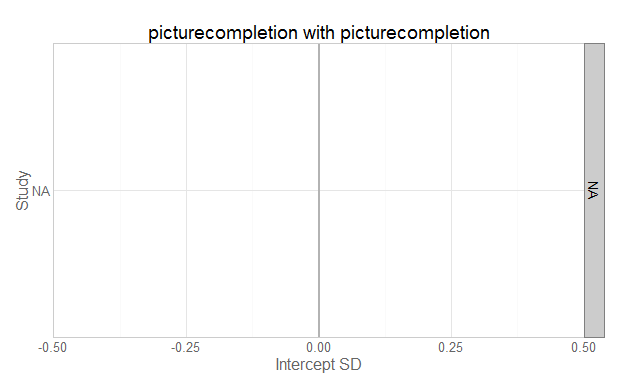  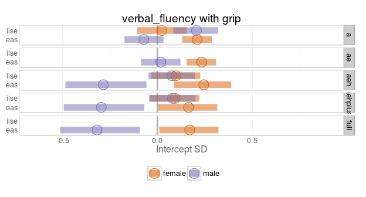  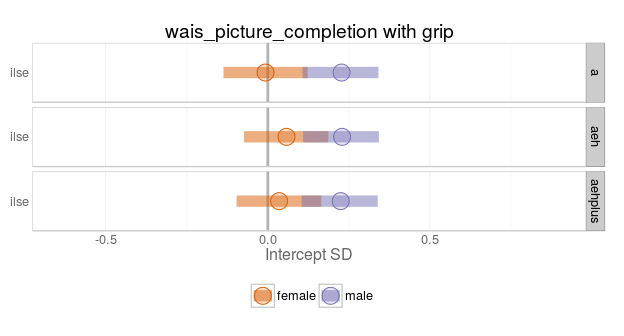 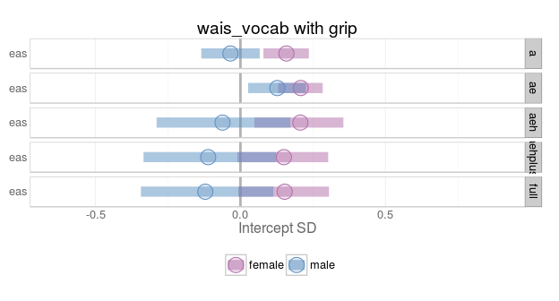 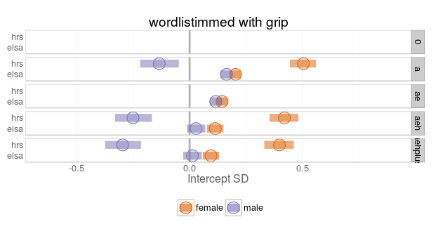   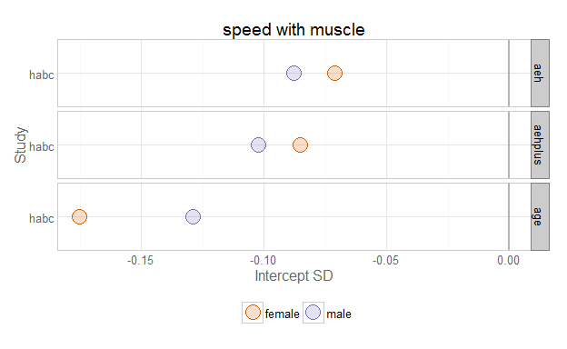 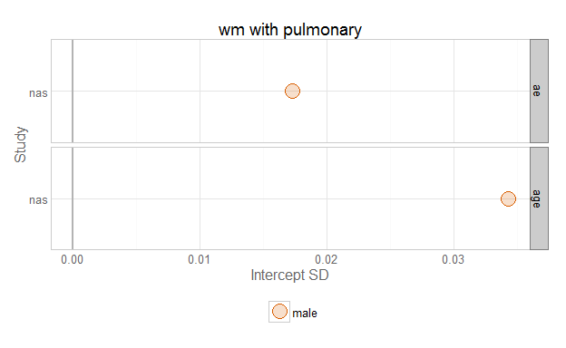  

# Forest Plot (Animated)


# Questions
## Unanswered Questions
 1. What does `VS` stand for?  How was it measured?
 1. Where the cars at the Philly track measured with the same phluguerstometer and the Cleveland track?
 
## Answered Questions
 1. The Seattle track's phluguerstometer was producing flaky negative values; it's measurements have been dropped.

# Session Information
For the sake of documentation and reproducibility, the current report was rendered on a system using the following software.


```
Report rendered by koval_000 at 2015-02-24, 16:49 Pacific Standard Time
```

```
R version 3.0.3 (2014-03-06)
Platform: x86_64-w64-mingw32/x64 (64-bit)

locale:
[1] LC_COLLATE=English_United States.1252  LC_CTYPE=English_United States.1252    LC_MONETARY=English_United States.1252
[4] LC_NUMERIC=C                           LC_TIME=English_United States.1252    

attached base packages:
[1] stats     graphics  grDevices utils     datasets  methods   base     

other attached packages:
[1] testit_0.3         ggplot2_1.0.0      RColorBrewer_1.0-5 scales_0.2.4       knitr_1.9         

loaded via a namespace (and not attached):
 [1] colorspace_1.2-4 digest_0.6.8     evaluate_0.5.5   formatR_1.0      grid_3.0.3       gtable_0.1.2    
 [7] htmltools_0.2.6  labeling_0.3     MASS_7.3-35      munsell_0.4.2    plyr_1.8.1       proto_0.3-10    
[13] Rcpp_0.11.2      reshape2_1.4     rmarkdown_0.4.2  stringr_0.6.2    tools_3.0.3      yaml_2.1.13     
```
