# Bivariate Outcomes -- Combining Studies


This report covers the analyses used in the ZZZ project (Marcus Mark, PI).

<!--  Set the working directory to the repository's base directory; this assumes the report is nested inside of one directory.-->


<!-- Set the report-wide options, and point to the external code file. -->


<!-- Load the sources.  Suppress the output when loading sources. --> 


<!-- Load 'sourced' R files.  Suppress the output when loading packages. --> 


<!-- Load any Global functions and variables declared in the R file.  Suppress the output. --> 


<!-- Declare any global functions specific to a Rmd output.  Suppress the output. --> 


<!-- Load the datasets.   -->


<!-- Tweak the datasets.   -->


<!-- FREQS across studies and outcomes.  

```
        
         eas elsa habc hrs ilse nas nuage octo radc satsa
  fev      0   80    0   0    0  66     0    0  151   106
  gait     0    0   32  24    0   0     0    0    0     0
  grip   131   37   32  24   43   0    21   44    0    46
  pek    131    0    0  24    0   0     0   44    0     0
  tug      0    0    0   0   44   0     8    0    0     0
  univar 221   90   24   0   48   0    29    0  149     0
```

```
                           
                            eas elsa habc hrs ilse nas nuage octo radc satsa
  3ms                         0    0   24   0    0   0    12    0    0     0
  analogies                   0    0    0   0    0   0     0    0    0    18
  block                      42    0    0   0   20   0     0    8    0    10
  bnt                        40    0    0   0    0   0     0    0   16     0
  boston_story_delay          0    0    0   0    0   0     0    0   16     0
  boston_story_immediate      0    0    0   0    0   0     0    0   16     0
  categories                 40   30    0   0    0   6     0    0   16     0
  clock                       0    0   24   0    0   0     0    0    0     0
  complex_ideas               0    0    0   0    0   0     0    0   16     0
  delayed_recall              0   60    0  18    0   6     0    0    0     0
  digit_backward_span         0    0    0   0    0   6     0    0    0     0
  digit_backward_total        0    0    0   0    0   6     0    0    0     0
  digit_ordering              0    0    0   0    0   0     0    0   16     0
  digits_back                 0    0    0   0    0   0     0    8   16    10
  digits_forward              0    0    0   0    0   0     0    8   16    10
  digit_span                 40    0    0   0    0   0     0    0    0     0
  digit_symbol_substitution   0    0    0   0    2   0     0    0    0     0
  figure_copy                 0    0    0   0    0   6     0    0    0     0
  figure_id                   0    0    0   0    0   0     0    0    0    12
  figure_logic                0    0    0   0    0   0     0    8    0     0
  figure_memory               0    0    0   0    0   0     0    0    0    10
  info                       40    0    0   0    0   0     0    8    0    18
  line_orientation            0    0    0   0    0   0     0    0   18     0
  logical_memory             39    0    0   0    0   0     0    0    0     0
  logical_memory_delay        0    0    0   0    0   0     0    0   14     0
  logical_memory_immed        0    0    0   0    0   0     0    0   13     0
  lps_spacial_ability         0    0    0   0    7   0     0    0    0     0
  lps_spatial_ability         0    0    0   0   12   0     0    0    0     0
  matrices                    0    0    0   0    0   0     0    0   16     0
  mir_recall                  0    0    0   0    0   0     0    8    0     0
  mmse                       40    0    0   0    0   6     6    8   14    18
  nart                        0    0    0   0    0   0     0    0   16     0
  nocogm                      0    0    0   0    0  18     0    0    0     0
  number_comparison           0    0    0   0    0   0     0    0   16     0
  pattern_comparison          0    0    0   0    0   6     0    0    0     0
  prose_recall                0    0    0   0    0   0     0    8    0     0
  psif                        0    0    0   0    0   0     0    8    0     0
  rotations                   0    0    0   0    0   0     0    0    0    10
  serial7                     0    0    0  18    0   0     0    0    0     0
  symbol                     40    0   24   0   18   0     0    8   16    18
  synonyms                    0    0    0   0    0   0     0    8    0    18
  tics                        0    0    0  18    0   0     0    0    0     0
  trailsb                    39    0    0   0    0   0     0    0    0     0
  univar                     43   57   16   0   16   0    40    0    0     0
  verbal_fluency             40    0    0   0   20   0     0    0    0     0
  wais_general_knowledge      0    0    0   0   20   0     0    0    0     0
  wais_picture_completion     0    0    0   0   20   0     0    0    0     0
  wais_vocab                 40    0    0   0    0   0     0    0    0     0
  wmslmdel                    0    0    0   0    0   0     0    0    2     0
  wmslmimmed                  0    0    0   0    0   0     0    0    2     0
  word_list_delay             0    0    0   0    0   0     0    0   16     0
  word_list_immed             0   60    0  18    0   6     0    0   16     0
  word_list_recog             0    0    0   0    0   0     0    0   13     0
```

```
                           
                            fev gait grip pek tug univar
  3ms                         0    8   14   0   0     14
  analogies                  10    0    8   0   0      0
  block                      10    0   20  14   6     30
  bnt                         8    0   10  10   0     28
  boston_story_delay          8    0    0   0   0      8
  boston_story_immediate      8    0    0   0   0      8
  categories                 14    0   10  10   0     58
  clock                       0    8    8   0   0      8
  complex_ideas               8    0    0   0   0      8
  delayed_recall             26    6   16   6   0     30
  digit_backward_span         6    0    0   0   0      0
  digit_backward_total        6    0    0   0   0      0
  digit_ordering              8    0    0   0   0      8
  digits_back                18    0    4   4   0      8
  digits_forward             18    0    4   4   0      8
  digit_span                  0    0   10  10   0     20
  digit_symbol_substitution   0    0    0   0   2      0
  figure_copy                 6    0    0   0   0      0
  figure_id                   6    0    6   0   0      0
  figure_logic                0    0    4   4   0      0
  figure_memory              10    0    0   0   0      0
  info                       10    0   22  14   0     20
  line_orientation           10    0    0   0   0      8
  logical_memory              0    0    9  10   0     20
  logical_memory_delay        8    0    0   0   0      6
  logical_memory_immed        7    0    0   0   0      6
  lps_spacial_ability         0    0    0   0   6      1
  lps_spatial_ability         0    0    5   0   0      7
  matrices                    8    0    0   0   0      8
  mir_recall                  0    0    4   4   0      0
  mmse                       22    0   28  14   0     28
  nart                        8    0    0   0   0      8
  nocogm                     18    0    0   0   0      0
  number_comparison           8    0    0   0   0      8
  pattern_comparison          6    0    0   0   0      0
  prose_recall                0    0    4   4   0      0
  psif                        0    0    4   4   0      0
  rotations                  10    0    0   0   0      0
  serial7                     0    6    6   6   0      0
  symbol                     18    8   36  14   4     44
  synonyms                   10    0   12   4   0      0
  tics                        0    6    6   6   0      0
  trailsb                     0    0   10  10   0     19
  univar                     40    8   64  21  16     23
  verbal_fluency              0    0   16  10   6     28
  wais_general_knowledge      0    0    6   0   6      8
  wais_picture_completion     0    0    6   0   6      8
  wais_vocab                  0    0   10  10   0     20
  wmslmdel                    0    0    0   0   0      2
  wmslmimmed                  0    0    0   0   0      2
  word_list_delay             8    0    0   0   0      8
  word_list_immed            34    6   16   6   0     38
  word_list_recog             8    0    0   0   0      5
```
 -->
<!-- Calculate the forest results (but don't plot yet).  

 -->

## Notes

**Note 1**: The current report covers 10 studies: eas, elsa, habc, hrs, ilse, nas, nuage, octo, radc, satsa.


# Forest Plot (Static -BISR)
*TODO: Andrey, this is just a single graph for tomorrow's presentation.  Decide how you want to iterated through all the possible bivariates.  It's also just for slopes.*
 

# Forest Plot (Static)

## `fev` 

Studies with this physical variable listed in the model output: elsa, nas, radc, satsa 


study_name   cognitive_measure        subgroup   model_type    subject_count   wave_count  converged 
-----------  -----------------------  ---------  -----------  --------------  -----------  ----------
satsa        analogies                female     ae                      485            7  TRUE      
satsa        analogies                female     aeh                     476            7  TRUE      
satsa        analogies                female     aehplus                 408            7  TRUE      
satsa        analogies                female     a                       507            7  TRUE      
satsa        analogies                male       ae                      341            7  TRUE      
satsa        analogies                male       aeh                     338            7  TRUE      
satsa        analogies                male       aehplus                 300            7  TRUE      
satsa        analogies                male       a                       347            7  TRUE      
satsa        analogies                female     0                       512            7  TRUE      
satsa        analogies                male       0                       347            7  TRUE      
nas          categories               male       ae                     1132            5  TRUE      
nas          categories               male       aeh                    1132            5  TRUE      
nas          categories               male       aehplus                1131            5  TRUE      
nas          categories               male       a                      1132            5  TRUE      
nas          categories               male       0                      1131            5  TRUE      
nas          categories               male       full                   1131            5  TRUE      
satsa        block                    female     0                       512            7  TRUE      
satsa        block                    female     a                       512            7  TRUE      
satsa        block                    female     ae                      490            7  TRUE      
satsa        block                    female     aeh                     477            7  TRUE      
satsa        block                    female     aehplus                 409            7  TRUE      
satsa        block                    male       0                       347            7  TRUE      
satsa        block                    male       a                       347            7  TRUE      
satsa        block                    male       ae                      341            7  TRUE      
satsa        block                    male       aeh                     338            7  TRUE      
satsa        block                    male       aehplus                 300            7  TRUE      
radc         bnt                      female     a                      1010            5  TRUE      
radc         bnt                      female     ae                     1010            5  TRUE      
radc         bnt                      female     aeh                    1010            5  TRUE      
radc         bnt                      female     aehplus                1010            5  TRUE      
radc         bnt                      male       a                       351            5  TRUE      
radc         bnt                      male       ae                      351            5  TRUE      
radc         bnt                      male       aeh                     351            5  TRUE      
radc         bnt                      male       aehplus                 351            5  TRUE      
radc         boston_story_delay       female     a                      1010            5  TRUE      
radc         boston_story_delay       female     ae                     1010            5  TRUE      
radc         boston_story_delay       female     aeh                    1010            5  TRUE      
radc         boston_story_delay       female     aehplus                1010            5  TRUE      
radc         boston_story_delay       male       a                       351            5  TRUE      
radc         boston_story_delay       male       ae                      351            5  TRUE      
radc         boston_story_delay       male       aeh                     351            5  TRUE      
radc         boston_story_delay       male       aehplus                 351            5  TRUE      
radc         boston_story_immediate   female     a                      1010            5  TRUE      
radc         boston_story_immediate   female     ae                     1010            5  TRUE      
radc         boston_story_immediate   female     aeh                    1010            5  TRUE      
radc         boston_story_immediate   female     aehplus                1010            5  TRUE      
radc         boston_story_immediate   male       a                       351            5  TRUE      
radc         boston_story_immediate   male       ae                      351            5  TRUE      
radc         boston_story_immediate   male       aeh                     351            5  TRUE      
radc         boston_story_immediate   male       aehplus                 351            5  TRUE      
radc         categories               female     a                      1010            5  TRUE      
radc         categories               female     ae                     1010            5  TRUE      
radc         categories               female     aeh                    1010            5  TRUE      
radc         categories               female     aehplus                1010            5  TRUE      
radc         categories               male       a                       351            5  TRUE      
radc         categories               male       ae                      351            5  TRUE      
radc         categories               male       aeh                     351            5  TRUE      
radc         categories               male       aehplus                 351            5  TRUE      
radc         complex_ideas            female     a                      1010            5  TRUE      
radc         complex_ideas            female     ae                     1010            5  TRUE      
radc         complex_ideas            female     aeh                    1010            5  TRUE      
radc         complex_ideas            female     aehplus                1010            5  TRUE      
radc         complex_ideas            male       a                       351            5  TRUE      
radc         complex_ideas            male       ae                      351            5  TRUE      
radc         complex_ideas            male       aeh                     351            5  TRUE      
radc         complex_ideas            male       aehplus                 351            5  TRUE      
elsa         delayed_recall           female     ae                     6106            6  TRUE      
elsa         delayed_recall           female     ae                     6106            6  TRUE      
elsa         delayed_recall           female     aeh                    2795            6  TRUE      
elsa         delayed_recall           female     aeh                    2795            6  TRUE      
elsa         delayed_recall           female     aehplus                2782            6  TRUE      
elsa         delayed_recall           female     aehplus                2782            6  TRUE      
elsa         delayed_recall           female     a                      6117            6  TRUE      
elsa         delayed_recall           female     a                      6117            6  TRUE      
elsa         delayed_recall           female     0                      3811            6  TRUE      
elsa         delayed_recall           female     0                      3811            6  TRUE      
elsa         delayed_recall           male       ae                     5123            6  TRUE      
elsa         delayed_recall           male       ae                     5123            6  TRUE      
elsa         delayed_recall           male       aeh                    2269            6  TRUE      
elsa         delayed_recall           male       aeh                    2269            6  TRUE      
elsa         delayed_recall           male       aehplus                2256            6  TRUE      
elsa         delayed_recall           male       aehplus                2256            6  TRUE      
elsa         delayed_recall           male       a                      5140            6  TRUE      
elsa         delayed_recall           male       a                      5140            6  TRUE      
elsa         delayed_recall           male       0                      3075            6  TRUE      
elsa         delayed_recall           male       0                      3075            6  TRUE      
nas          delayed_recall           male       ae                     1132            6  TRUE      
nas          delayed_recall           male       aeh                    1132            6  TRUE      
nas          delayed_recall           male       aehplus                1131            6  TRUE      
nas          delayed_recall           male       a                      1132            6  TRUE      
nas          delayed_recall           male       0                      1131            6  TRUE      
nas          delayed_recall           male       full                   1131            6  TRUE      
nas          digit_backward_span      male       ae                     1132            6  TRUE      
nas          digit_backward_span      male       aeh                    1132            6  TRUE      
nas          digit_backward_span      male       aehplus                1131            6  TRUE      
nas          digit_backward_span      male       a                      1132            6  TRUE      
nas          digit_backward_span      male       0                      1130            6  TRUE      
nas          digit_backward_span      male       full                   1131            6  TRUE      
nas          digit_backward_total     male       ae                     1132            6  TRUE      
nas          digit_backward_total     male       aeh                    1132            6  TRUE      
nas          digit_backward_total     male       aehplus                1131            6  TRUE      
nas          digit_backward_total     male       a                      1132            6  TRUE      
nas          digit_backward_total     male       0                      1130            6  TRUE      
nas          digit_backward_total     male       full                   1131            6  TRUE      
radc         digit_ordering           female     a                      1010            5  TRUE      
radc         digit_ordering           female     ae                     1010            5  TRUE      
radc         digit_ordering           female     aeh                    1010            5  TRUE      
radc         digit_ordering           female     aehplus                1010            5  TRUE      
radc         digit_ordering           male       a                       351            5  TRUE      
radc         digit_ordering           male       ae                      351            5  TRUE      
radc         digit_ordering           male       aeh                     351            5  TRUE      
radc         digit_ordering           male       aehplus                 351            5  TRUE      
radc         digits_back              female     a                      1010            5  TRUE      
radc         digits_back              female     ae                     1010            5  TRUE      
radc         digits_back              female     aeh                    1010            5  TRUE      
radc         digits_back              female     aehplus                1010            5  TRUE      
radc         digits_back              male       a                       351            5  TRUE      
radc         digits_back              male       ae                      351            5  TRUE      
radc         digits_back              male       aeh                     351            5  TRUE      
radc         digits_back              male       aehplus                 351            5  TRUE      
satsa        digits_back              female     0                       512            7  TRUE      
satsa        digits_back              female     a                       512            7  TRUE      
satsa        digits_back              female     ae                      490            7  TRUE      
satsa        digits_back              female     aeh                     478            7  TRUE      
satsa        digits_back              female     aehplus                 410            7  TRUE      
satsa        digits_back              male       0                       347            7  TRUE      
satsa        digits_back              male       a                       347            7  TRUE      
satsa        digits_back              male       ae                      341            7  TRUE      
satsa        digits_back              male       aeh                     338            7  TRUE      
satsa        digits_back              male       aehplus                 300            7  TRUE      
radc         digits_forward           female     a                      1010            5  TRUE      
radc         digits_forward           female     ae                     1010            5  TRUE      
radc         digits_forward           female     aeh                    1010            5  TRUE      
radc         digits_forward           female     aehplus                1010            5  TRUE      
radc         digits_forward           male       a                       351            5  TRUE      
radc         digits_forward           male       ae                      351            5  TRUE      
radc         digits_forward           male       aeh                     351            5  TRUE      
radc         digits_forward           male       aehplus                 351            5  TRUE      
satsa        digits_forward           female     0                       512            7  TRUE      
satsa        digits_forward           female     a                       512            7  TRUE      
satsa        digits_forward           female     ae                      490            7  TRUE      
satsa        digits_forward           female     aeh                     478            7  TRUE      
satsa        digits_forward           female     aehplus                 410            7  TRUE      
satsa        digits_forward           male       0                       347            7  TRUE      
satsa        digits_forward           male       a                       347            7  TRUE      
satsa        digits_forward           male       ae                      341            7  TRUE      
satsa        digits_forward           male       aeh                     338            7  TRUE      
satsa        digits_forward           male       aehplus                 300            7  TRUE      
radc         symbol                   female     a                      1010            5  TRUE      
radc         symbol                   female     ae                     1010            5  TRUE      
radc         symbol                   female     aeh                    1010            5  TRUE      
radc         symbol                   female     aehplus                1010            5  TRUE      
radc         symbol                   male       a                       351            5  TRUE      
radc         symbol                   male       ae                      351            5  TRUE      
radc         symbol                   male       aeh                     351            5  TRUE      
radc         symbol                   male       aehplus                 351            5  TRUE      
satsa        figure_id                female     ae                      487            7  TRUE      
satsa        figure_id                female     aeh                     478            7  TRUE      
satsa        figure_id                female     a                       509            7  TRUE      
satsa        figure_id                male       ae                      341            7  TRUE      
satsa        figure_id                male       aeh                     338            7  TRUE      
satsa        figure_id                male       a                       347            7  TRUE      
nas          figure_copy              male       ae                     1132            6  TRUE      
nas          figure_copy              male       aeh                    1132            6  TRUE      
nas          figure_copy              male       aehplus                1131            6  TRUE      
nas          figure_copy              male       a                      1132            6  TRUE      
nas          figure_copy              male       0                      1132            6  TRUE      
nas          figure_copy              male       full                   1131            6  TRUE      
satsa        figure_memory            female     0                       512            7  TRUE      
satsa        figure_memory            female     a                       512            7  TRUE      
satsa        figure_memory            female     ae                      490            7  TRUE      
satsa        figure_memory            female     aeh                     478            7  TRUE      
satsa        figure_memory            female     aehplus                 410            7  TRUE      
satsa        figure_memory            male       0                       347            7  TRUE      
satsa        figure_memory            male       a                       347            7  TRUE      
satsa        figure_memory            male       ae                      341            7  TRUE      
satsa        figure_memory            male       aeh                     337            7  TRUE      
satsa        figure_memory            male       aehplus                 299            7  TRUE      
elsa         word_list_immed          female     ae                     6106            6  TRUE      
elsa         word_list_immed          female     ae                     6106            6  TRUE      
elsa         word_list_immed          female     aeh                    2795            6  TRUE      
elsa         word_list_immed          female     aeh                    2795            6  TRUE      
elsa         word_list_immed          female     aehplus                2782            6  TRUE      
elsa         word_list_immed          female     aehplus                2782            6  TRUE      
elsa         word_list_immed          female     a                      6117            6  TRUE      
elsa         word_list_immed          female     a                      6117            6  TRUE      
elsa         word_list_immed          female     0                      3809            6  TRUE      
elsa         word_list_immed          female     0                      3809            6  TRUE      
elsa         word_list_immed          male       ae                     5123            6  TRUE      
elsa         word_list_immed          male       ae                     5123            6  TRUE      
elsa         word_list_immed          male       aeh                    2269            6  TRUE      
elsa         word_list_immed          male       aeh                    2269            6  TRUE      
elsa         word_list_immed          male       aehplus                2256            6  TRUE      
elsa         word_list_immed          male       aehplus                2256            6  TRUE      
elsa         word_list_immed          male       a                      5140            6  TRUE      
elsa         word_list_immed          male       a                      5140            6  TRUE      
elsa         word_list_immed          male       0                      3072            6  TRUE      
elsa         word_list_immed          male       0                      3072            6  TRUE      
nas          word_list_immed          male       ae                     1132            6  TRUE      
nas          word_list_immed          male       aeh                    1132            6  TRUE      
nas          word_list_immed          male       aehplus                1131            6  TRUE      
nas          word_list_immed          male       a                      1132            6  TRUE      
nas          word_list_immed          male       0                      1131            6  TRUE      
nas          word_list_immed          male       full                   1131            6  TRUE      
satsa        info                     female     0                       512            7  TRUE      
satsa        info                     female     ae                      490            7  TRUE      
satsa        info                     female     aeh                     479            7  TRUE      
satsa        info                     female     aehplus                 411            7  TRUE      
satsa        info                     female     a                       512            7  TRUE      
satsa        info                     male       0                       347            7  TRUE      
satsa        info                     male       ae                      341            7  TRUE      
satsa        info                     male       aeh                     338            7  TRUE      
satsa        info                     male       aehplus                 300            7  TRUE      
satsa        info                     male       a                       347            7  TRUE      
radc         line_orientation         female     a                      1010            5  TRUE      
radc         line_orientation         female     ae                     1010            5  TRUE      
radc         line_orientation         female     aeh                    1010            5  TRUE      
radc         line_orientation         female     aehplus                1010            5  TRUE      
radc         line_orientation         male       a                       351            5  TRUE      
radc         line_orientation         male       ae                      351            5  TRUE      
radc         line_orientation         male       aeh                     351            5  TRUE      
radc         line_orientation         male       aehplus                 351            5  TRUE      
radc         line_orientation         female     aeh                     951            5  TRUE      
radc         line_orientation         male       aeh                     327            5  TRUE      
radc         logical_memory_delay     female     a                      1010            5  TRUE      
radc         logical_memory_delay     female     ae                     1010            5  TRUE      
radc         logical_memory_delay     female     aeh                    1010            5  TRUE      
radc         logical_memory_delay     female     aehplus                1010            5  TRUE      
radc         logical_memory_delay     male       a                       351            5  TRUE      
radc         logical_memory_delay     male       ae                      351            5  TRUE      
radc         logical_memory_delay     male       aeh                     351            5  TRUE      
radc         logical_memory_delay     male       aehplus                 351            5  TRUE      
radc         logical_memory_immed     female     ae                     1010            5  TRUE      
radc         logical_memory_immed     female     aeh                    1010            5  TRUE      
radc         logical_memory_immed     female     aehplus                1010            5  TRUE      
radc         logical_memory_immed     male       a                       351            5  TRUE      
radc         logical_memory_immed     male       ae                      351            5  TRUE      
radc         logical_memory_immed     male       aeh                     351            5  TRUE      
radc         logical_memory_immed     male       aehplus                 351            5  TRUE      
radc         matrices                 female     a                      1010            5  TRUE      
radc         matrices                 female     ae                     1010            5  TRUE      
radc         matrices                 female     aeh                    1010            5  TRUE      
radc         matrices                 female     aehplus                1010            5  TRUE      
radc         matrices                 male       a                       351            5  TRUE      
radc         matrices                 male       ae                      351            5  TRUE      
radc         matrices                 male       aeh                     351            5  TRUE      
radc         matrices                 male       aehplus                 351            5  TRUE      
nas          mmse                     male       ae                     1132            6  TRUE      
nas          mmse                     male       aeh                    1132            6  TRUE      
nas          mmse                     male       aehplus                1131            6  TRUE      
nas          mmse                     male       a                      1132            6  TRUE      
nas          mmse                     male       0                      1132            6  TRUE      
nas          mmse                     male       full                   1131            6  TRUE      
radc         mmse                     female     ae                     1010            5  TRUE      
radc         mmse                     female     aeh                    1010            5  TRUE      
radc         mmse                     female     aehplus                1010            5  TRUE      
radc         mmse                     male       ae                      351            5  TRUE      
radc         mmse                     male       aeh                     351            5  TRUE      
radc         mmse                     male       aehplus                 351            5  TRUE      
satsa        mmse                     female     ae                      489            7  TRUE      
satsa        mmse                     female     aeh                     480            7  TRUE      
satsa        mmse                     female     aehplus                 412            7  TRUE      
satsa        mmse                     female     a                       511            7  TRUE      
satsa        mmse                     male       ae                      341            7  TRUE      
satsa        mmse                     male       aeh                     338            7  TRUE      
satsa        mmse                     male       aehplus                 300            7  TRUE      
satsa        mmse                     male       a                       346            7  TRUE      
satsa        mmse                     female     0                       512            7  TRUE      
satsa        mmse                     male       0                       347            7  TRUE      
radc         nart                     female     a                      1010            5  TRUE      
radc         nart                     female     ae                     1010            5  TRUE      
radc         nart                     female     aeh                    1010            5  TRUE      
radc         nart                     female     aehplus                1010            5  TRUE      
radc         nart                     male       a                       351            5  TRUE      
radc         nart                     male       ae                      351            5  TRUE      
radc         nart                     male       aeh                     351            5  TRUE      
radc         nart                     male       aehplus                 351            5  TRUE      
nas          nocogm                   male       ae                     1132            6  TRUE      
nas          nocogm                   male       ae                     1132            6  TRUE      
nas          nocogm                   male       ae                     1132            6  TRUE      
nas          nocogm                   male       aeh                    1132            6  TRUE      
nas          nocogm                   male       aeh                    1132            6  TRUE      
nas          nocogm                   male       aeh                    1132            6  TRUE      
nas          nocogm                   male       aehplus                1131            6  TRUE      
nas          nocogm                   male       aehplus                1131            6  TRUE      
nas          nocogm                   male       aehplus                1131            6  TRUE      
nas          nocogm                   male       a                      1132            6  TRUE      
nas          nocogm                   male       a                      1132            6  TRUE      
nas          nocogm                   male       a                      1132            6  TRUE      
nas          nocogm                   male       0                      1125            6  TRUE      
nas          nocogm                   male       0                      1125            6  TRUE      
nas          nocogm                   male       0                      1125            6  TRUE      
nas          nocogm                   male       full                   1131            6  TRUE      
nas          nocogm                   male       full                   1131            6  TRUE      
nas          nocogm                   male       full                   1131            6  TRUE      
elsa         univar                   female     ae                     6106            6  TRUE      
elsa         univar                   female     ae                     6106            6  TRUE      
elsa         univar                   female     ae                     6106            6  TRUE      
elsa         univar                   female     aeh                    2795            6  TRUE      
elsa         univar                   female     aeh                    2795            6  TRUE      
elsa         univar                   female     aeh                    2795            6  TRUE      
elsa         univar                   female     aeh                    2795            6  TRUE      
elsa         univar                   female     aehplus                2782            6  TRUE      
elsa         univar                   female     aehplus                2782            6  TRUE      
elsa         univar                   female     aehplus                2782            6  TRUE      
elsa         univar                   female     aehplus                2782            6  TRUE      
elsa         univar                   female     a                      6117            6  TRUE      
elsa         univar                   female     a                      6117            6  TRUE      
elsa         univar                   female     a                      6117            6  TRUE      
elsa         univar                   female     a                      6117            6  TRUE      
elsa         univar                   female     0                      3457            6  TRUE      
elsa         univar                   female     0                      3457            6  TRUE      
elsa         univar                   female     0                      3457            6  TRUE      
elsa         univar                   female     0                      3457            6  TRUE      
elsa         univar                   male       ae                     5123            6  TRUE      
elsa         univar                   male       ae                     5123            6  TRUE      
elsa         univar                   male       ae                     5123            6  TRUE      
elsa         univar                   male       ae                     5123            6  TRUE      
elsa         univar                   male       aeh                    2269            6  TRUE      
elsa         univar                   male       aeh                    2269            6  TRUE      
elsa         univar                   male       aeh                    2269            6  TRUE      
elsa         univar                   male       aeh                    2269            6  TRUE      
elsa         univar                   male       aehplus                2256            6  TRUE      
elsa         univar                   male       aehplus                2256            6  TRUE      
elsa         univar                   male       aehplus                2256            6  TRUE      
elsa         univar                   male       aehplus                2256            6  TRUE      
elsa         univar                   male       a                      5140            6  TRUE      
elsa         univar                   male       a                      5140            6  TRUE      
elsa         univar                   male       a                      5140            6  TRUE      
elsa         univar                   male       a                      5140            6  TRUE      
elsa         univar                   male       0                      2828            6  TRUE      
elsa         univar                   male       0                      2828            6  TRUE      
elsa         univar                   male       0                      2828            6  TRUE      
elsa         univar                   male       0                      2828            6  TRUE      
elsa         univar                   female     ae                     6106            6  TRUE      
radc         number_comparison        female     a                      1010            5  TRUE      
radc         number_comparison        female     ae                     1010            5  TRUE      
radc         number_comparison        female     aeh                    1010            5  TRUE      
radc         number_comparison        female     aehplus                1010            5  TRUE      
radc         number_comparison        male       a                       351            5  TRUE      
radc         number_comparison        male       ae                      351            5  TRUE      
radc         number_comparison        male       aeh                     351            5  TRUE      
radc         number_comparison        male       aehplus                 351            5  TRUE      
nas          pattern_comparison       male       ae                     1132            4  TRUE      
nas          pattern_comparison       male       aeh                    1132            4  TRUE      
nas          pattern_comparison       male       aehplus                1131            4  TRUE      
nas          pattern_comparison       male       a                      1132            4  TRUE      
nas          pattern_comparison       male       0                      1131            4  TRUE      
nas          pattern_comparison       male       full                   1131            4  TRUE      
satsa        rotations                female     0                       512            7  TRUE      
satsa        rotations                female     a                       512            7  TRUE      
satsa        rotations                female     ae                      490            7  TRUE      
satsa        rotations                female     aeh                     476            7  TRUE      
satsa        rotations                female     aehplus                 408            7  TRUE      
satsa        rotations                male       0                       347            7  TRUE      
satsa        rotations                male       a                       347            7  TRUE      
satsa        rotations                male       ae                      341            7  TRUE      
satsa        rotations                male       aeh                     337            7  TRUE      
satsa        rotations                male       aehplus                 299            7  TRUE      
satsa        symbol                   female     0                       512            7  TRUE      
satsa        symbol                   female     ae                      486            7  TRUE      
satsa        symbol                   female     aeh                     477            7  TRUE      
satsa        symbol                   female     aehplus                 409            7  TRUE      
satsa        symbol                   female     a                       508            7  TRUE      
satsa        symbol                   male       0                       347            7  TRUE      
satsa        symbol                   male       ae                      341            7  TRUE      
satsa        symbol                   male       aeh                     338            7  TRUE      
satsa        symbol                   male       aehplus                 300            7  TRUE      
satsa        symbol                   male       a                       347            7  TRUE      
satsa        synonyms                 female     ae                      487            7  TRUE      
satsa        synonyms                 female     aeh                     478            7  TRUE      
satsa        synonyms                 female     aehplus                 410            7  TRUE      
satsa        synonyms                 female     a                       509            7  TRUE      
satsa        synonyms                 male       ae                      341            7  TRUE      
satsa        synonyms                 male       aeh                     338            7  TRUE      
satsa        synonyms                 male       aehplus                 300            7  TRUE      
satsa        synonyms                 male       a                       347            7  TRUE      
satsa        synonyms                 female     0                       512            7  TRUE      
satsa        synonyms                 male       0                       347            7  TRUE      
radc         word_list_delay          female     a                      1010            5  TRUE      
radc         word_list_delay          female     ae                     1010            5  TRUE      
radc         word_list_delay          female     aeh                    1010            5  TRUE      
radc         word_list_delay          female     aehplus                1010            5  TRUE      
radc         word_list_delay          male       a                       351            5  TRUE      
radc         word_list_delay          male       ae                      351            5  TRUE      
radc         word_list_delay          male       aeh                     351            5  TRUE      
radc         word_list_delay          male       aehplus                 351            5  TRUE      
radc         word_list_immed          female     a                      1010            5  TRUE      
radc         word_list_immed          female     ae                     1010            5  TRUE      
radc         word_list_immed          female     aeh                    1010            5  TRUE      
radc         word_list_immed          female     aehplus                1010            5  TRUE      
radc         word_list_immed          male       a                       351            5  TRUE      
radc         word_list_immed          male       ae                      351            5  TRUE      
radc         word_list_immed          male       aeh                     351            5  TRUE      
radc         word_list_immed          male       aehplus                 351            5  TRUE      
radc         word_list_recog          female     a                      1010            5  TRUE      
radc         word_list_recog          female     ae                     1010            5  TRUE      
radc         word_list_recog          female     aeh                    1010            5  TRUE      
radc         word_list_recog          female     aehplus                1010            5  TRUE      
radc         word_list_recog          male       a                       351            5  TRUE      
radc         word_list_recog          male       ae                      351            5  TRUE      
radc         word_list_recog          male       aeh                     351            5  TRUE      
radc         word_list_recog          male       aehplus                 351            5  TRUE      

```
Warning: Removed 1 rows containing missing values (geom_segment).
```

```
Warning: Removed 1 rows containing missing values (geom_segment).
```

 

```
Warning: Removed 1 rows containing missing values (geom_segment).
```

```
Warning: Removed 1 rows containing missing values (geom_segment).
```

    

```
Warning: Removed 1 rows containing missing values (geom_segment).
```

  

```
Warning: Removed 2 rows containing missing values (geom_segment).
```

```
Warning: Removed 2 rows containing missing values (geom_segment).
```

```
Warning: Removed 1 rows containing missing values (geom_segment).
```

 

```
Warning: Removed 1 rows containing missing values (geom_segment).
```

 

```
Warning: Removed 1 rows containing missing values (geom_segment).
```

  

```
Warning: Removed 1 rows containing missing values (geom_segment).
```

```
Warning: Removed 1 rows containing missing values (geom_segment).
```

 

```
Warning: Removed 1 rows containing missing values (geom_segment).
```

```
Warning: Removed 1 rows containing missing values (geom_segment).
```

 

```
Warning: Removed 1 rows containing missing values (geom_segment).
```

  

```
Warning: Removed 1 rows containing missing values (geom_segment).
```

```
Warning: Removed 1 rows containing missing values (geom_segment).
```

 

```
Warning: Removed 1 rows containing missing values (geom_segment).
```

```
Warning: Removed 1 rows containing missing values (geom_segment).
```

     

```
Warning: Removed 1 rows containing missing values (geom_segment).
```

```
Warning: Removed 1 rows containing missing values (geom_segment).
```

```
Warning: Removed 1 rows containing missing values (geom_segment).
```

   

```
Warning: Removed 1 rows containing missing values (geom_segment).
```

 

```
Warning: Removed 1 rows containing missing values (geom_segment).
```

```
Warning: Removed 1 rows containing missing values (geom_segment).
```

 

```
Warning: Removed 1 rows containing missing values (geom_segment).
```

```
Warning: Removed 1 rows containing missing values (geom_segment).
```

 

```
Warning: Removed 1 rows containing missing values (geom_segment).
```

```
Warning: Removed 1 rows containing missing values (geom_segment).
```

  

```
Warning: Removed 2 rows containing missing values (geom_segment).
```

```
Warning: Removed 2 rows containing missing values (geom_segment).
```

```
Warning: Removed 1 rows containing missing values (geom_segment).
```

  

## `gait` 

Studies with this physical variable listed in the model output: habc, hrs 


study_name   cognitive_measure   subgroup   model_type    subject_count   wave_count  converged 
-----------  ------------------  ---------  -----------  --------------  -----------  ----------
habc         3ms                 female     aeh                    1578           11  TRUE      
habc         3ms                 female     aehplus                1538           11  TRUE      
habc         3ms                 female     a                      1584           11  TRUE      
habc         3ms                 female     full                   1536           11  TRUE      
habc         3ms                 male       aeh                    1489           11  TRUE      
habc         3ms                 male       aehplus                1464           11  TRUE      
habc         3ms                 male       a                      1491           11  TRUE      
habc         3ms                 male       full                   1454           11  TRUE      
habc         clock               female     aeh                    1552           10  TRUE      
habc         clock               female     aehplus                1513           10  TRUE      
habc         clock               female     a                      1558           10  TRUE      
habc         clock               female     full                   1511           10  TRUE      
habc         clock               male       aeh                    1471           10  TRUE      
habc         clock               male       aehplus                1446           10  TRUE      
habc         clock               male       a                      1473           10  TRUE      
habc         clock               male       full                   1436           10  TRUE      
hrs          delayed_recall      female     aeh                     370            5  TRUE      
hrs          delayed_recall      female     aehplus                 370            5  TRUE      
hrs          delayed_recall      female     a                       370            5  TRUE      
hrs          delayed_recall      male       aeh                     318            5  TRUE      
hrs          delayed_recall      male       aehplus                 318            5  TRUE      
hrs          delayed_recall      male       a                       318            5  TRUE      
habc         symbol              female     aeh                    1575           11  TRUE      
habc         symbol              female     aehplus                1535           11  TRUE      
habc         symbol              female     a                      1581           11  TRUE      
habc         symbol              female     full                   1533           11  TRUE      
habc         symbol              male       aeh                    1485           11  TRUE      
habc         symbol              male       aehplus                1460           11  TRUE      
habc         symbol              male       a                      1487           11  TRUE      
habc         symbol              male       full                   1450           11  TRUE      
hrs          word_list_immed     female     aeh                     370            5  TRUE      
hrs          word_list_immed     female     aehplus                 370            5  TRUE      
hrs          word_list_immed     female     a                       370            5  TRUE      
hrs          word_list_immed     male       aeh                     318            5  TRUE      
hrs          word_list_immed     male       aehplus                 318            5  TRUE      
hrs          word_list_immed     male       a                       318            5  TRUE      
habc         univar              female     aeh                    1553           10  TRUE      
habc         univar              female     aehplus                1513           10  TRUE      
habc         univar              female     a                      1559           10  TRUE      
habc         univar              female     0                      1559           10  TRUE      
habc         univar              male       aeh                    1468           10  TRUE      
habc         univar              male       aehplus                1443           10  TRUE      
habc         univar              male       a                      1470           10  TRUE      
habc         univar              male       0                      1470           10  TRUE      
hrs          serial7             female     aeh                     370            5  TRUE      
hrs          serial7             female     aehplus                 370            5  TRUE      
hrs          serial7             female     a                       370            5  TRUE      
hrs          serial7             male       aeh                     318            5  TRUE      
hrs          serial7             male       aehplus                 318            5  TRUE      
hrs          serial7             male       a                       318            5  TRUE      
hrs          tics                female     aeh                     370            5  TRUE      
hrs          tics                female     aehplus                 370            5  TRUE      
hrs          tics                female     a                       370            5  TRUE      
hrs          tics                male       aeh                     318            5  TRUE      
hrs          tics                male       aehplus                 318            5  TRUE      
hrs          tics                male       a                       318            5  TRUE      


       

## `grip` 

Studies with this physical variable listed in the model output: eas, elsa, habc, hrs, ilse, nuage, octo, satsa 


study_name   cognitive_measure         subgroup   model_type    subject_count   wave_count  converged 
-----------  ------------------------  ---------  -----------  --------------  -----------  ----------
habc         3ms                       female     aeh                    1578           11  TRUE      
habc         3ms                       female     aehplus                1538           11  TRUE      
habc         3ms                       female     a                      1584           11  TRUE      
habc         3ms                       female     full                   1536           11  TRUE      
habc         3ms                       male       aeh                    1489           11  TRUE      
habc         3ms                       male       aehplus                1464           11  TRUE      
habc         3ms                       male       a                      1491           11  TRUE      
habc         3ms                       male       full                   1454           11  TRUE      
satsa        analogies                 female     ae                      486            7  TRUE      
satsa        analogies                 female     aeh                     477            7  TRUE      
satsa        analogies                 female     aehplus                 410            7  TRUE      
satsa        analogies                 female     a                       508            7  TRUE      
satsa        analogies                 male       ae                      341            7  TRUE      
satsa        analogies                 male       aeh                     338            7  TRUE      
satsa        analogies                 male       aehplus                 300            7  TRUE      
satsa        analogies                 male       a                       347            7  TRUE      
eas          block                     female     ae                      563            8  TRUE      
eas          block                     female     aeh                     150            8  TRUE      
eas          block                     female     aehplus                 150            8  TRUE      
eas          block                     female     a                       563            8  TRUE      
eas          block                     female     full                    150            8  TRUE      
eas          block                     male       ae                      350            8  TRUE      
eas          block                     male       aeh                      72            8  TRUE      
eas          block                     male       aehplus                  72            8  TRUE      
eas          block                     male       a                       350            8  TRUE      
eas          block                     male       full                     72            8  TRUE      
octo         block                     female     aeh                     275            5  TRUE      
octo         block                     female     a                       303            5  TRUE      
octo         block                     male       aeh                     139            5  TRUE      
octo         block                     male       a                       158            5  TRUE      
eas          bnt                       female     ae                      594            8  TRUE      
eas          bnt                       female     aeh                     150            8  TRUE      
eas          bnt                       female     aehplus                 150            8  TRUE      
eas          bnt                       female     a                       594            8  TRUE      
eas          bnt                       female     full                    150            8  TRUE      
eas          bnt                       male       ae                      376            8  TRUE      
eas          bnt                       male       aeh                      72            8  TRUE      
eas          bnt                       male       aehplus                  72            8  TRUE      
eas          bnt                       male       a                       376            8  TRUE      
eas          bnt                       male       full                     72            8  TRUE      
eas          categories                female     ae                      593            8  TRUE      
eas          categories                female     aeh                     150            8  TRUE      
eas          categories                female     aehplus                 150            8  TRUE      
eas          categories                female     a                       593            8  TRUE      
eas          categories                female     full                    150            8  TRUE      
eas          categories                male       ae                      376            8  TRUE      
eas          categories                male       aeh                      72            8  TRUE      
eas          categories                male       aehplus                  72            8  TRUE      
eas          categories                male       a                       376            8  TRUE      
eas          categories                male       full                     72            8  TRUE      
habc         clock                     female     aeh                    1575           10  TRUE      
habc         clock                     female     aehplus                1535           10  TRUE      
habc         clock                     female     a                      1581           10  TRUE      
habc         clock                     female     full                   1533           10  TRUE      
habc         clock                     male       aeh                    1489           10  TRUE      
habc         clock                     male       aehplus                1464           10  TRUE      
habc         clock                     male       a                      1491           10  TRUE      
habc         clock                     male       full                   1454           10  TRUE      
elsa         delayed_recall            female     ae                     6106            6  TRUE      
elsa         delayed_recall            female     aeh                    2795            6  TRUE      
elsa         delayed_recall            female     aehplus                2782            6  TRUE      
elsa         delayed_recall            female     a                      6117            6  TRUE      
elsa         delayed_recall            female     0                      3811            6  TRUE      
elsa         delayed_recall            male       ae                     5123            6  TRUE      
elsa         delayed_recall            male       aeh                    2269            6  TRUE      
elsa         delayed_recall            male       aehplus                2256            6  TRUE      
elsa         delayed_recall            male       a                      5140            6  TRUE      
elsa         delayed_recall            male       0                      3075            6  TRUE      
hrs          delayed_recall            female     aeh                     641            5  TRUE      
hrs          delayed_recall            female     aehplus                 641            5  TRUE      
hrs          delayed_recall            female     a                       641            5  TRUE      
hrs          delayed_recall            male       aeh                     507            5  TRUE      
hrs          delayed_recall            male       aehplus                 507            5  TRUE      
hrs          delayed_recall            male       a                       507            5  TRUE      
eas          digit_span                female     ae                      595            8  TRUE      
eas          digit_span                female     aeh                     150            8  TRUE      
eas          digit_span                female     aehplus                 150            8  TRUE      
eas          digit_span                female     a                       595            8  TRUE      
eas          digit_span                female     full                    150            8  TRUE      
eas          digit_span                male       ae                      379            8  TRUE      
eas          digit_span                male       aeh                      72            8  TRUE      
eas          digit_span                male       aehplus                  72            8  TRUE      
eas          digit_span                male       a                       379            8  TRUE      
eas          digit_span                male       full                     72            8  TRUE      
octo         digits_back               female     aeh                     276            5  TRUE      
octo         digits_back               female     a                       305            5  TRUE      
octo         digits_back               male       aeh                     139            5  TRUE      
octo         digits_back               male       a                       161            5  TRUE      
octo         digits_forward            female     aeh                     276            5  TRUE      
octo         digits_forward            female     a                       306            5  TRUE      
octo         digits_forward            male       aeh                     139            5  TRUE      
octo         digits_forward            male       a                       161            5  TRUE      
eas          symbol                    female     ae                      592            8  TRUE      
eas          symbol                    female     aeh                     150            8  TRUE      
eas          symbol                    female     aehplus                 150            8  TRUE      
eas          symbol                    female     a                       592            8  TRUE      
eas          symbol                    female     full                    150            8  TRUE      
eas          symbol                    male       ae                      377            8  TRUE      
eas          symbol                    male       aeh                      72            8  TRUE      
eas          symbol                    male       aehplus                  72            8  TRUE      
eas          symbol                    male       a                       377            8  TRUE      
habc         symbol                    female     aeh                    1578           11  TRUE      
habc         symbol                    female     aehplus                1538           11  TRUE      
habc         symbol                    female     a                      1584           11  TRUE      
habc         symbol                    female     full                   1536           11  TRUE      
habc         symbol                    male       aeh                    1488           11  TRUE      
habc         symbol                    male       aehplus                1463           11  TRUE      
habc         symbol                    male       a                      1490           11  TRUE      
habc         symbol                    male       full                   1453           11  TRUE      
octo         symbol                    female     aeh                     272            5  TRUE      
octo         symbol                    female     a                       299            5  TRUE      
octo         symbol                    male       aeh                     138            5  TRUE      
octo         symbol                    male       a                       156            5  TRUE      
ilse         symbol                    female     a                       228            3  TRUE      
ilse         symbol                    female     aeh                     226            3  TRUE      
ilse         symbol                    female     aehplus                 225            3  TRUE      
ilse         symbol                    male       a                       253            3  TRUE      
ilse         symbol                    male       aeh                     253            3  TRUE      
ilse         symbol                    male       aehplus                 252            3  TRUE      
eas          symbol                    male       full                     72            8  TRUE      
eas          verbal_fluency            female     ae                      571            8  TRUE      
eas          verbal_fluency            female     aeh                     150            8  TRUE      
eas          verbal_fluency            female     aehplus                 150            8  TRUE      
eas          verbal_fluency            female     a                       571            8  TRUE      
eas          verbal_fluency            female     full                    150            8  TRUE      
eas          verbal_fluency            male       ae                      358            8  TRUE      
eas          verbal_fluency            male       aeh                      72            8  TRUE      
eas          verbal_fluency            male       aehplus                  72            8  TRUE      
eas          verbal_fluency            male       a                       358            8  TRUE      
eas          verbal_fluency            male       full                     72            8  TRUE      
satsa        figure_id                 female     ae                      486            7  TRUE      
satsa        figure_id                 female     aeh                     477            7  TRUE      
satsa        figure_id                 female     a                       508            7  TRUE      
satsa        figure_id                 male       ae                      341            7  TRUE      
satsa        figure_id                 male       aeh                     338            7  TRUE      
satsa        figure_id                 male       a                       347            7  TRUE      
octo         figure_logic              female     aeh                     274            5  TRUE      
octo         figure_logic              female     a                       302            5  TRUE      
octo         figure_logic              male       aeh                     138            5  TRUE      
octo         figure_logic              male       a                       157            5  TRUE      
elsa         word_list_immed           female     ae                     6106            6  TRUE      
elsa         word_list_immed           female     aeh                    2795            6  TRUE      
elsa         word_list_immed           female     aehplus                2782            6  TRUE      
elsa         word_list_immed           female     a                      6117            6  TRUE      
elsa         word_list_immed           female     0                      3810            6  TRUE      
elsa         word_list_immed           male       ae                     5123            6  TRUE      
elsa         word_list_immed           male       aeh                    2269            6  TRUE      
elsa         word_list_immed           male       aehplus                2256            6  TRUE      
elsa         word_list_immed           male       a                      5140            6  TRUE      
elsa         word_list_immed           male       0                      3073            6  TRUE      
hrs          word_list_immed           female     aeh                     641            5  TRUE      
hrs          word_list_immed           female     aehplus                 641            5  TRUE      
hrs          word_list_immed           female     a                       641            5  TRUE      
hrs          word_list_immed           male       aeh                     507            5  TRUE      
hrs          word_list_immed           male       aehplus                 507            5  TRUE      
hrs          word_list_immed           male       a                       507            5  TRUE      
satsa        info                      female     ae                      488            7  TRUE      
satsa        info                      female     aeh                     479            7  TRUE      
satsa        info                      female     aehplus                 411            7  TRUE      
satsa        info                      female     a                       510            7  TRUE      
satsa        info                      male       ae                      341            7  TRUE      
satsa        info                      male       aeh                     338            7  TRUE      
satsa        info                      male       aehplus                 300            7  TRUE      
satsa        info                      male       a                       347            7  TRUE      
eas          info                      female     a                       538            7  TRUE      
eas          info                      male       ae                      353            7  TRUE      
eas          info                      male       aeh                      72            7  TRUE      
eas          info                      male       aehplus                  72            7  TRUE      
eas          info                      male       a                       353            7  TRUE      
eas          info                      male       full                     72            7  TRUE      
eas          info                      female     ae                      538            7  TRUE      
eas          info                      female     aeh                     145            7  TRUE      
eas          info                      female     aehplus                 145            7  TRUE      
eas          info                      female     full                    145            7  TRUE      
octo         info                      female     aeh                     275            5  TRUE      
octo         info                      female     a                       305            5  TRUE      
octo         info                      male       aeh                     140            5  TRUE      
octo         info                      male       a                       162            5  TRUE      
eas          logical_memory            female     ae                      554            8  TRUE      
eas          logical_memory            female     aeh                     150            8  TRUE      
eas          logical_memory            female     aehplus                 150            8  TRUE      
eas          logical_memory            female     a                       554            8  TRUE      
eas          logical_memory            female     full                    150            8  TRUE      
eas          logical_memory            male       ae                      349            8  TRUE      
eas          logical_memory            male       aehplus                  72            8  TRUE      
eas          logical_memory            male       a                       349            8  TRUE      
eas          logical_memory            male       full                     72            8  TRUE      
ilse         lps_spatial_ability       female     a                       228            3  TRUE      
ilse         lps_spatial_ability       female     aeh                     226            3  TRUE      
ilse         lps_spatial_ability       female     aehplus                 225            3  TRUE      
ilse         lps_spatial_ability       male       a                       253            3  TRUE      
ilse         lps_spatial_ability       male       aehplus                 252            3  TRUE      
octo         mir_recall                female     aeh                     273            5  TRUE      
octo         mir_recall                female     a                       303            5  TRUE      
octo         mir_recall                male       aeh                     139            5  TRUE      
octo         mir_recall                male       a                       159            5  TRUE      
nuage        3ms                       female     aeh                     934            4  TRUE      
nuage        3ms                       female     aehplus                 934            4  TRUE      
nuage        3ms                       female     a                       939            4  TRUE      
nuage        3ms                       male       aeh                     847            4  TRUE      
nuage        3ms                       male       aehplus                 847            4  TRUE      
nuage        3ms                       male       a                       851            4  TRUE      
eas          mmse                      female     ae                      600            8  TRUE      
eas          mmse                      female     aeh                     150            8  TRUE      
eas          mmse                      female     aehplus                 150            8  TRUE      
eas          mmse                      female     a                       600            8  TRUE      
eas          mmse                      female     full                    150            8  TRUE      
eas          mmse                      male       ae                      383            8  TRUE      
eas          mmse                      male       aeh                      72            8  TRUE      
eas          mmse                      male       aehplus                  72            8  TRUE      
eas          mmse                      male       a                       383            8  TRUE      
eas          mmse                      male       full                     72            8  TRUE      
nuage        mmse                      female     a                       939            4  TRUE      
nuage        mmse                      female     aeh                     934            4  TRUE      
nuage        mmse                      female     aehplus                 934            4  TRUE      
nuage        mmse                      male       a                       851            4  TRUE      
nuage        mmse                      male       aeh                     847            4  TRUE      
nuage        mmse                      male       aehplus                 847            4  TRUE      
octo         mmse                      female     aeh                     276            5  TRUE      
octo         mmse                      female     a                       311            5  TRUE      
octo         mmse                      male       aeh                     140            5  TRUE      
octo         mmse                      male       a                       164            5  TRUE      
satsa        mmse                      female     ae                      489            7  TRUE      
satsa        mmse                      female     aeh                     480            7  TRUE      
satsa        mmse                      female     aehplus                 412            7  TRUE      
satsa        mmse                      female     a                       511            7  TRUE      
satsa        mmse                      male       ae                      341            7  TRUE      
satsa        mmse                      male       aeh                     338            7  TRUE      
satsa        mmse                      male       aehplus                 300            7  TRUE      
satsa        mmse                      male       a                       347            7  TRUE      
habc         univar                    female     aeh                    1574           10  TRUE      
habc         univar                    female     aehplus                1534           10  TRUE      
habc         univar                    female     a                      1580           10  TRUE      
habc         univar                    female     0                      1580           10  TRUE      
habc         univar                    male       aeh                    1487           10  TRUE      
habc         univar                    male       aehplus                1462           10  TRUE      
habc         univar                    male       a                      1489           10  TRUE      
habc         univar                    male       0                      1489           10  TRUE      
eas          univar                    female     ae                      215            8  TRUE      
eas          univar                    female     ae                      215            8  TRUE      
eas          univar                    female     aeh                     145            8  TRUE      
eas          univar                    female     aeh                     145            8  TRUE      
eas          univar                    female     aehplus                 145            8  TRUE      
eas          univar                    female     aehplus                 145            8  TRUE      
eas          univar                    female     a                       215            8  TRUE      
eas          univar                    female     a                       215            8  TRUE      
eas          univar                    female     0                       215            8  TRUE      
eas          univar                    female     full                    145            8  TRUE      
eas          univar                    female     full                    145            8  TRUE      
eas          univar                    male       ae                      123            8  TRUE      
eas          univar                    male       ae                      123            8  TRUE      
eas          univar                    male       aeh                      72            8  TRUE      
eas          univar                    male       aeh                      72            8  TRUE      
eas          univar                    male       aehplus                  72            8  TRUE      
eas          univar                    male       aehplus                  72            8  TRUE      
eas          univar                    male       a                       123            8  TRUE      
eas          univar                    male       a                       123            8  TRUE      
eas          univar                    male       0                       123            8  TRUE      
eas          univar                    male       full                     72            8  TRUE      
eas          univar                    male       full                     72            8  TRUE      
elsa         univar                    female     ae                     6106            6  TRUE      
elsa         univar                    female     ae                     6106            6  TRUE      
elsa         univar                    female     aeh                    2795            6  TRUE      
elsa         univar                    female     aeh                    2795            6  TRUE      
elsa         univar                    female     aehplus                2782            6  TRUE      
elsa         univar                    female     aehplus                2782            6  TRUE      
elsa         univar                    female     a                      6117            6  TRUE      
elsa         univar                    female     a                      6117            6  TRUE      
elsa         univar                    female     0                      3603            6  TRUE      
elsa         univar                    female     0                      3603            6  TRUE      
elsa         univar                    male       ae                     5123            6  TRUE      
elsa         univar                    male       ae                     5123            6  TRUE      
elsa         univar                    male       aeh                    2269            6  TRUE      
elsa         univar                    male       aeh                    2269            6  TRUE      
elsa         univar                    male       aehplus                2256            6  TRUE      
elsa         univar                    male       a                      5140            6  TRUE      
elsa         univar                    male       0                      2967            6  TRUE      
ilse         univar                    female     a                       226            3  TRUE      
ilse         univar                    female     aeh                     224            3  TRUE      
ilse         univar                    female     aehplus                 223            3  TRUE      
ilse         univar                    female     0                       238            3  TRUE      
ilse         univar                    male       a                       253            3  TRUE      
ilse         univar                    male       aeh                     253            3  TRUE      
ilse         univar                    male       aehplus                 252            3  TRUE      
ilse         univar                    male       0                       260            3  TRUE      
nuage        univar                    female     aeh                     933            4  TRUE      
nuage        univar                    female     aehplus                 933            4  TRUE      
nuage        univar                    female     a                       937            4  TRUE      
nuage        univar                    female     0                       940            4  TRUE      
nuage        univar                    male       aeh                     846            4  TRUE      
nuage        univar                    male       aehplus                 846            4  TRUE      
nuage        univar                    male       a                       848            4  TRUE      
nuage        univar                    male       0                       853            4  TRUE      
nuage        univar                    male       0                       853            4  TRUE      
octo         prose_recall              female     aeh                     273            5  TRUE      
octo         prose_recall              female     a                       302            5  TRUE      
octo         prose_recall              male       aeh                     139            5  TRUE      
octo         prose_recall              male       a                       161            5  TRUE      
octo         psif                      female     aeh                     271            4  TRUE      
octo         psif                      female     a                       298            4  TRUE      
octo         psif                      male       aeh                     138            4  TRUE      
octo         psif                      male       a                       156            4  TRUE      
hrs          serial7                   female     aeh                     641            5  TRUE      
hrs          serial7                   female     aehplus                 641            5  TRUE      
hrs          serial7                   female     a                       641            5  TRUE      
hrs          serial7                   male       aeh                     507            5  TRUE      
hrs          serial7                   male       aehplus                 507            5  TRUE      
hrs          serial7                   male       a                       507            5  TRUE      
satsa        symbol                    female     ae                      486            7  TRUE      
satsa        symbol                    female     aeh                     477            7  TRUE      
satsa        symbol                    female     aehplus                 410            7  TRUE      
satsa        symbol                    female     a                       508            7  TRUE      
satsa        symbol                    male       ae                      341            7  TRUE      
satsa        symbol                    male       aeh                     338            7  TRUE      
satsa        symbol                    male       aehplus                 300            7  TRUE      
satsa        symbol                    male       a                       347            7  TRUE      
satsa        synonyms                  female     ae                      486            7  TRUE      
satsa        synonyms                  female     aeh                     477            7  TRUE      
satsa        synonyms                  female     aehplus                 410            7  TRUE      
satsa        synonyms                  female     a                       508            7  TRUE      
satsa        synonyms                  male       ae                      341            7  TRUE      
satsa        synonyms                  male       aeh                     338            7  TRUE      
satsa        synonyms                  male       aehplus                 300            7  TRUE      
satsa        synonyms                  male       a                       347            7  TRUE      
octo         synonyms                  female     aeh                     273            5  TRUE      
octo         synonyms                  female     a                       301            5  TRUE      
octo         synonyms                  male       aeh                     139            5  TRUE      
octo         synonyms                  male       a                       157            5  TRUE      
hrs          tics                      female     aeh                     641            5  TRUE      
hrs          tics                      female     aehplus                 641            5  TRUE      
hrs          tics                      female     a                       641            5  TRUE      
hrs          tics                      male       aeh                     507            5  TRUE      
hrs          tics                      male       aehplus                 507            5  TRUE      
hrs          tics                      male       a                       507            5  TRUE      
eas          trailsb                   female     ae                      580            8  TRUE      
eas          trailsb                   female     aeh                     150            8  TRUE      
eas          trailsb                   female     aehplus                 150            8  TRUE      
eas          trailsb                   female     a                       580            8  TRUE      
eas          trailsb                   female     full                    150            8  TRUE      
eas          trailsb                   male       ae                      368            8  TRUE      
eas          trailsb                   male       aeh                      72            8  TRUE      
eas          trailsb                   male       aehplus                  72            8  TRUE      
eas          trailsb                   male       a                       368            8  TRUE      
eas          trailsb                   male       full                     72            8  TRUE      
ilse         verbal_fluency            female     a                       228            3  TRUE      
ilse         verbal_fluency            female     aeh                     226            3  TRUE      
ilse         verbal_fluency            female     aehplus                 225            3  TRUE      
ilse         verbal_fluency            male       a                       253            3  TRUE      
ilse         verbal_fluency            male       aeh                     253            3  TRUE      
ilse         verbal_fluency            male       aehplus                 252            3  TRUE      
ilse         block                     female     a                       228            3  TRUE      
ilse         block                     female     aeh                     226            3  TRUE      
ilse         block                     female     aehplus                 225            3  TRUE      
ilse         block                     male       a                       253            3  TRUE      
ilse         block                     male       aeh                     253            3  TRUE      
ilse         block                     male       aehplus                 252            3  TRUE      
ilse         wais_general_knowledge    female     a                       228            3  TRUE      
ilse         wais_general_knowledge    female     aeh                     226            3  TRUE      
ilse         wais_general_knowledge    female     aehplus                 225            3  TRUE      
ilse         wais_general_knowledge    male       a                       253            3  TRUE      
ilse         wais_general_knowledge    male       aeh                     253            3  TRUE      
ilse         wais_general_knowledge    male       aehplus                 252            3  TRUE      
ilse         wais_picture_completion   female     a                       228            3  TRUE      
ilse         wais_picture_completion   female     aeh                     226            3  TRUE      
ilse         wais_picture_completion   female     aehplus                 225            3  TRUE      
ilse         wais_picture_completion   male       a                       253            3  TRUE      
ilse         wais_picture_completion   male       aeh                     253            3  TRUE      
ilse         wais_picture_completion   male       aehplus                 252            3  TRUE      
eas          wais_vocab                female     ae                      594            8  TRUE      
eas          wais_vocab                female     aeh                     150            8  TRUE      
eas          wais_vocab                female     aehplus                 150            8  TRUE      
eas          wais_vocab                female     a                       594            8  TRUE      
eas          wais_vocab                female     full                    150            8  TRUE      
eas          wais_vocab                male       ae                      377            8  TRUE      
eas          wais_vocab                male       aeh                      72            8  TRUE      
eas          wais_vocab                male       aehplus                  72            8  TRUE      
eas          wais_vocab                male       a                       377            8  TRUE      
eas          wais_vocab                male       full                     72            8  TRUE      


      

```
Warning: Removed 1 rows containing missing values (geom_segment).
```

```
Warning: Removed 1 rows containing missing values (geom_segment).
```

                      

```
Warning: Removed 1 rows containing missing values (geom_segment).
```

```
Warning: Removed 1 rows containing missing values (geom_segment).
```

 

## `pek` 

Studies with this physical variable listed in the model output: eas, hrs, octo 


study_name   cognitive_measure   subgroup   model_type    subject_count   wave_count  converged 
-----------  ------------------  ---------  -----------  --------------  -----------  ----------
eas          block               female     ae                      563            9  TRUE      
eas          block               female     aeh                     150            8  TRUE      
eas          block               female     aehplus                 150            8  TRUE      
eas          block               female     a                       563            9  TRUE      
eas          block               female     full                    150            8  TRUE      
eas          block               male       ae                      350            9  TRUE      
eas          block               male       aeh                      72            8  TRUE      
eas          block               male       aehplus                  72            8  TRUE      
eas          block               male       a                       350            9  TRUE      
eas          block               male       full                     72            8  TRUE      
octo         block               female     aeh                     272            5  TRUE      
octo         block               female     a                       293            5  TRUE      
octo         block               male       aeh                     136            5  TRUE      
octo         block               male       a                       151            5  TRUE      
eas          bnt                 male       ae                      376            8  TRUE      
eas          bnt                 female     ae                      594            8  TRUE      
eas          bnt                 female     aeh                     150            8  TRUE      
eas          bnt                 female     aehplus                 150            8  TRUE      
eas          bnt                 female     a                       594            8  TRUE      
eas          bnt                 female     full                    150            8  TRUE      
eas          bnt                 male       aeh                      72            8  TRUE      
eas          bnt                 male       aehplus                  72            8  TRUE      
eas          bnt                 male       a                       376            8  TRUE      
eas          bnt                 male       full                     72            8  TRUE      
eas          categories          female     ae                      593            9  TRUE      
eas          categories          female     aeh                     150            9  TRUE      
eas          categories          female     aehplus                 150            9  TRUE      
eas          categories          female     a                       593            9  TRUE      
eas          categories          female     full                    150            9  TRUE      
eas          categories          male       ae                      376            9  TRUE      
eas          categories          male       aeh                      72            8  TRUE      
eas          categories          male       aehplus                  72            8  TRUE      
eas          categories          male       a                       376            9  TRUE      
eas          categories          male       full                     72            8  TRUE      
hrs          delayed_recall      female     aeh                     715            5  TRUE      
hrs          delayed_recall      female     aehplus                 715            5  TRUE      
hrs          delayed_recall      female     a                       715            5  TRUE      
hrs          delayed_recall      male       aeh                     535            5  TRUE      
hrs          delayed_recall      male       aehplus                 535            5  TRUE      
hrs          delayed_recall      male       a                       535            5  TRUE      
eas          digit_span          female     aeh                     150            8  TRUE      
eas          digit_span          female     aehplus                 150            8  TRUE      
eas          digit_span          female     full                    150            9  TRUE      
eas          digit_span          male       aeh                      72            7  TRUE      
octo         digits_back         female     aeh                     276            5  TRUE      
octo         digits_back         female     a                       299            5  TRUE      
octo         digits_back         male       aeh                     138            5  TRUE      
octo         digits_back         male       a                       158            5  TRUE      
octo         digits_forward      female     aeh                     276            5  TRUE      
octo         digits_forward      female     a                       300            5  TRUE      
octo         digits_forward      male       aeh                     138            5  TRUE      
octo         digits_forward      male       a                       158            5  TRUE      
eas          digit_span          female     ae                      595            8  TRUE      
eas          digit_span          female     a                       595            8  TRUE      
eas          digit_span          male       ae                      379            8  TRUE      
eas          digit_span          male       aehplus                  72            8  TRUE      
eas          digit_span          male       a                       379            8  TRUE      
eas          digit_span          male       full                     72            8  TRUE      
eas          symbol              female     ae                      592            7  TRUE      
eas          symbol              female     aeh                     150            6  TRUE      
eas          symbol              female     aehplus                 150            6  TRUE      
eas          symbol              female     a                       592            9  TRUE      
eas          symbol              female     full                    150            6  TRUE      
eas          symbol              male       ae                      377            5  TRUE      
eas          symbol              male       aeh                      72            6  TRUE      
eas          symbol              male       aehplus                  72            6  TRUE      
eas          symbol              male       a                       377            9  TRUE      
eas          symbol              male       full                     72            6  TRUE      
octo         symbol              female     aeh                     264            5  TRUE      
octo         symbol              female     a                       278            5  TRUE      
octo         symbol              male       aeh                     133            5  TRUE      
octo         symbol              male       a                       142            5  TRUE      
eas          verbal_fluency      female     ae                      571            8  TRUE      
eas          verbal_fluency      female     aeh                     150            8  TRUE      
eas          verbal_fluency      female     aehplus                 150            8  TRUE      
eas          verbal_fluency      female     a                       571            8  TRUE      
eas          verbal_fluency      female     full                    150            8  TRUE      
eas          verbal_fluency      male       ae                      358            8  TRUE      
eas          verbal_fluency      male       aeh                      72            8  TRUE      
eas          verbal_fluency      male       aehplus                  72            8  TRUE      
eas          verbal_fluency      male       a                       358            9  TRUE      
eas          verbal_fluency      male       full                     72            8  TRUE      
octo         figure_logic        female     aeh                     268            5  TRUE      
octo         figure_logic        female     a                       284            5  TRUE      
octo         figure_logic        male       aeh                     133            5  TRUE      
octo         figure_logic        male       a                       146            5  TRUE      
hrs          word_list_immed     female     aeh                     715            5  TRUE      
hrs          word_list_immed     female     aehplus                 715            5  TRUE      
hrs          word_list_immed     female     a                       715            5  TRUE      
hrs          word_list_immed     male       aeh                     535            5  TRUE      
hrs          word_list_immed     male       aehplus                 535            5  TRUE      
hrs          word_list_immed     male       a                       535            5  TRUE      
eas          info                female     ae                      543            7  TRUE      
eas          info                female     aeh                     150            7  TRUE      
eas          info                female     aehplus                 150            7  TRUE      
eas          info                female     a                       543            7  TRUE      
eas          info                female     full                    150            7  TRUE      
eas          info                male       ae                      353            7  TRUE      
eas          info                male       aeh                      72            7  TRUE      
eas          info                male       aehplus                  72            7  TRUE      
eas          info                male       a                       353            7  TRUE      
eas          info                male       full                     72            7  TRUE      
octo         info                female     aeh                     275            5  TRUE      
octo         info                female     a                       301            5  TRUE      
octo         info                male       aeh                     138            5  TRUE      
octo         info                male       a                       156            5  TRUE      
eas          logical_memory      female     a                       554            9  TRUE      
eas          logical_memory      female     ae                      554            9  TRUE      
eas          logical_memory      female     aeh                     150            9  TRUE      
eas          logical_memory      female     aehplus                 150            9  TRUE      
eas          logical_memory      female     full                    150            9  TRUE      
eas          logical_memory      male       ae                      349            9  TRUE      
eas          logical_memory      male       aeh                      72            8  TRUE      
eas          logical_memory      male       aehplus                  72            8  TRUE      
eas          logical_memory      male       a                       349            9  TRUE      
eas          logical_memory      male       full                     72            8  TRUE      
octo         mir_recall          female     aeh                     271            5  TRUE      
octo         mir_recall          female     a                       293            5  TRUE      
octo         mir_recall          male       aeh                     137            5  TRUE      
octo         mir_recall          male       a                       153            5  TRUE      
eas          mmse                female     ae                      600            7  TRUE      
eas          mmse                female     aeh                     150            7  TRUE      
eas          mmse                female     aehplus                 150            7  TRUE      
eas          mmse                female     a                       600            7  TRUE      
eas          mmse                female     full                    150            7  TRUE      
eas          mmse                male       ae                      383            7  TRUE      
eas          mmse                male       aeh                      72            7  TRUE      
eas          mmse                male       aehplus                  72            7  TRUE      
eas          mmse                male       a                       383            7  TRUE      
eas          mmse                male       full                     72            7  TRUE      
octo         mmse                female     aeh                     276            5  TRUE      
octo         mmse                female     a                       311            5  TRUE      
octo         mmse                male       aeh                     140            5  TRUE      
octo         mmse                male       a                       164            5  TRUE      
eas          univar              female     ae                      217            9  TRUE      
eas          univar              female     ae                      217            9  TRUE      
eas          univar              female     aeh                     150            8  TRUE      
eas          univar              female     aeh                     150            8  TRUE      
eas          univar              female     aehplus                 150            8  TRUE      
eas          univar              female     aehplus                 150            8  TRUE      
eas          univar              female     a                       217            9  TRUE      
eas          univar              female     a                       217            9  TRUE      
eas          univar              female     0                       217            9  TRUE      
eas          univar              female     full                    150            8  TRUE      
eas          univar              female     full                    150            8  TRUE      
eas          univar              male       ae                      122            9  TRUE      
eas          univar              male       aeh                      72            8  TRUE      
eas          univar              male       aeh                      72            8  TRUE      
eas          univar              male       aehplus                  72            8  TRUE      
eas          univar              male       aehplus                  72            8  TRUE      
eas          univar              male       a                       122            9  TRUE      
eas          univar              male       a                       122            9  TRUE      
eas          univar              male       0                       217            9  TRUE      
eas          univar              male       full                     72            8  TRUE      
eas          univar              male       full                     72            8  TRUE      
octo         prose_recall        female     aeh                     268            5  TRUE      
octo         prose_recall        female     a                       289            5  TRUE      
octo         prose_recall        male       aeh                     136            5  TRUE      
octo         prose_recall        male       a                       153            5  TRUE      
octo         psif                female     aeh                     254            4  TRUE      
octo         psif                female     a                       268            4  TRUE      
octo         psif                male       aeh                     127            4  TRUE      
octo         psif                male       a                       135            4  TRUE      
hrs          serial7             female     aeh                     715            5  TRUE      
hrs          serial7             female     aehplus                 715            5  TRUE      
hrs          serial7             female     a                       715            5  TRUE      
hrs          serial7             male       aeh                     535            5  TRUE      
hrs          serial7             male       aehplus                 535            5  TRUE      
hrs          serial7             male       a                       535            5  TRUE      
octo         synonyms            female     aeh                     265            5  TRUE      
octo         synonyms            female     a                       280            5  TRUE      
octo         synonyms            male       aeh                     132            5  TRUE      
octo         synonyms            male       a                       142            5  TRUE      
hrs          tics                female     aeh                     715            5  TRUE      
hrs          tics                female     aehplus                 715            5  TRUE      
hrs          tics                female     a                       715            5  TRUE      
hrs          tics                male       aeh                     535            5  TRUE      
hrs          tics                male       aehplus                 535            5  TRUE      
hrs          tics                male       a                       535            5  TRUE      
eas          trailsb             female     a                       580            9  TRUE      
eas          trailsb             male       a                       368            9  TRUE      
eas          trailsb             female     ae                      580            9  TRUE      
eas          trailsb             female     aeh                     150            8  TRUE      
eas          trailsb             female     aehplus                 150            8  TRUE      
eas          trailsb             female     full                    150            8  TRUE      
eas          trailsb             male       ae                      368            9  TRUE      
eas          trailsb             male       aeh                      72            8  TRUE      
eas          trailsb             male       aehplus                  72            8  TRUE      
eas          trailsb             male       full                     72            8  TRUE      
eas          wais_vocab          female     ae                      594            8  TRUE      
eas          wais_vocab          female     aeh                     150            8  TRUE      
eas          wais_vocab          female     aehplus                 150            8  TRUE      
eas          wais_vocab          female     a                       594            8  TRUE      
eas          wais_vocab          female     full                    150            8  TRUE      
eas          wais_vocab          male       ae                      377            8  TRUE      
eas          wais_vocab          male       aeh                      72            8  TRUE      
eas          wais_vocab          male       aehplus                  72            8  TRUE      
eas          wais_vocab          male       a                       358            8  TRUE      
eas          wais_vocab          male       full                     72            8  TRUE      


     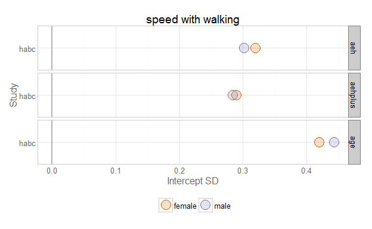 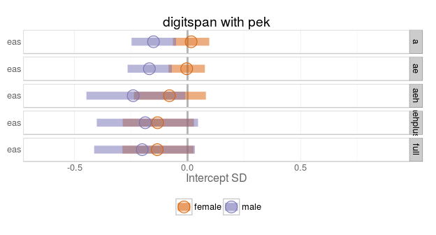 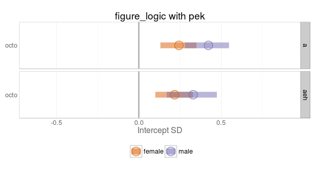 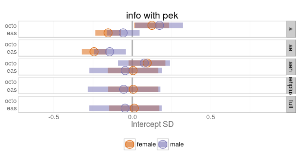 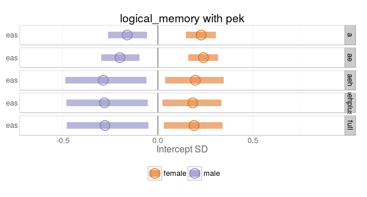 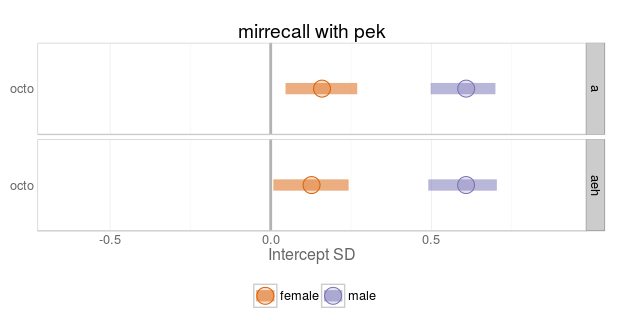 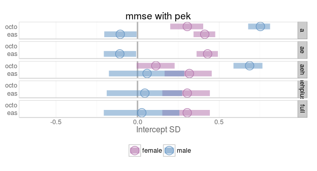 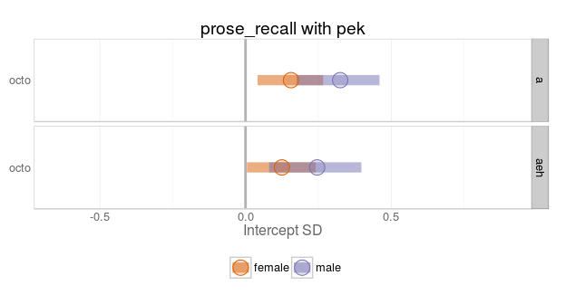 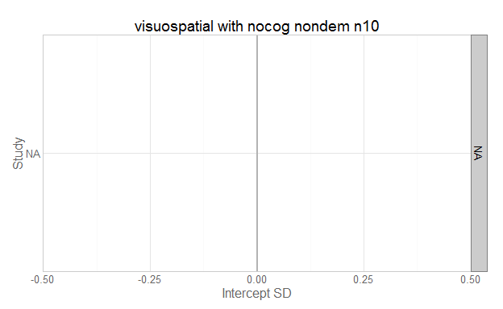 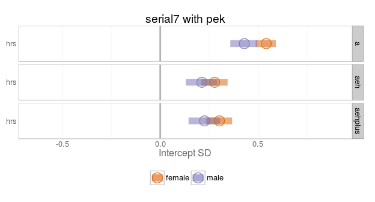 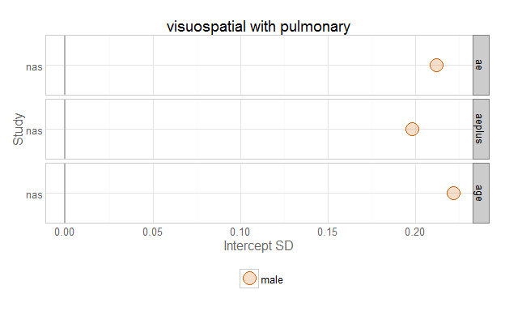 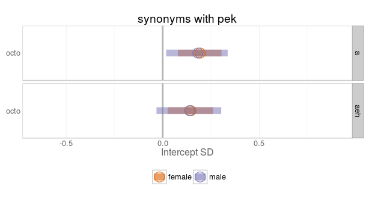 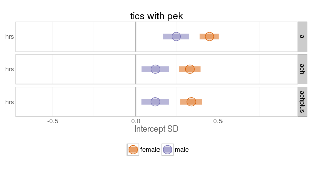 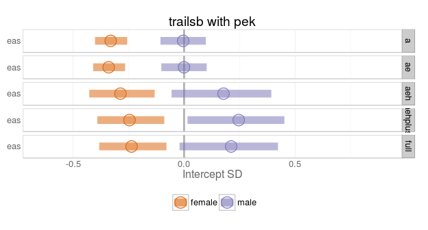  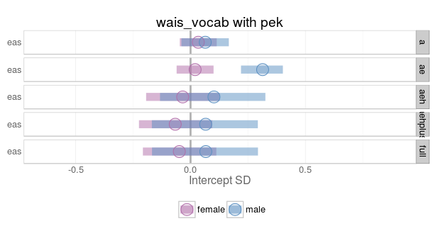 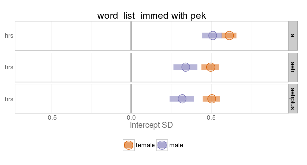 

## `tug` 

Studies with this physical variable listed in the model output: ilse, nuage 


study_name   cognitive_measure           subgroup   model_type    subject_count   wave_count  converged 
-----------  --------------------------  ---------  -----------  --------------  -----------  ----------
ilse         digit_symbol_substitution   female     aehplus                 225            3  TRUE      
ilse         digit_symbol_substitution   male       aehplus                 252            3  TRUE      
ilse         symbol                      female     aeh                     226            3  TRUE      
ilse         symbol                      female     a                       228            3  TRUE      
ilse         symbol                      male       aeh                     253            3  TRUE      
ilse         symbol                      male       a                       253            3  TRUE      
ilse         lps_spacial_ability         female     aeh                     226            3  TRUE      
ilse         lps_spacial_ability         female     aehplus                 225            3  TRUE      
ilse         lps_spacial_ability         female     a                       228            3  TRUE      
ilse         lps_spacial_ability         male       aeh                     253            3  TRUE      
ilse         lps_spacial_ability         male       aehplus                 252            3  TRUE      
ilse         lps_spacial_ability         male       a                       253            3  TRUE      
ilse         univar                      female     aeh                     215            3  TRUE      
ilse         univar                      female     aehplus                 214            3  TRUE      
ilse         univar                      female     a                       217            3  TRUE      
ilse         univar                      female     0                       229            3  TRUE      
ilse         univar                      male       aeh                     238            3  TRUE      
ilse         univar                      male       aehplus                 237            3  TRUE      
ilse         univar                      male       a                       238            3  TRUE      
ilse         univar                      male       0                       245            3  TRUE      
nuage        univar                      female     a                       938            4  TRUE      
nuage        univar                      female     aeh                     934            4  TRUE      
nuage        univar                      female     aehplus                 934            4  TRUE      
nuage        univar                      female     0                       940            4  TRUE      
nuage        univar                      male       a                       848            4  TRUE      
nuage        univar                      male       aeh                     846            4  TRUE      
nuage        univar                      male       aehplus                 846            4  TRUE      
nuage        univar                      male       0                       853            4  TRUE      
ilse         verbal_fluency              female     aeh                     226            3  TRUE      
ilse         verbal_fluency              female     aehplus                 225            3  TRUE      
ilse         verbal_fluency              female     a                       228            3  TRUE      
ilse         verbal_fluency              male       aeh                     253            3  TRUE      
ilse         verbal_fluency              male       aehplus                 252            3  TRUE      
ilse         verbal_fluency              male       a                       253            3  TRUE      
ilse         block                       female     aeh                     226            3  TRUE      
ilse         block                       female     aehplus                 225            3  TRUE      
ilse         block                       female     a                       228            3  TRUE      
ilse         block                       male       aeh                     253            3  TRUE      
ilse         block                       male       aehplus                 252            3  TRUE      
ilse         block                       male       a                       253            3  TRUE      
ilse         wais_general_knowledge      female     aeh                     226            3  TRUE      
ilse         wais_general_knowledge      female     aehplus                 225            3  TRUE      
ilse         wais_general_knowledge      female     a                       228            3  TRUE      
ilse         wais_general_knowledge      male       aeh                     253            3  TRUE      
ilse         wais_general_knowledge      male       aehplus                 252            3  TRUE      
ilse         wais_general_knowledge      male       a                       253            3  TRUE      
ilse         wais_picture_completion     female     aeh                     226            3  TRUE      
ilse         wais_picture_completion     female     aehplus                 225            3  TRUE      
ilse         wais_picture_completion     female     a                       228            3  TRUE      
ilse         wais_picture_completion     male       aeh                     253            3  TRUE      
ilse         wais_picture_completion     male       aehplus                 252            3  TRUE      
ilse         wais_picture_completion     male       a                       253            3  TRUE      


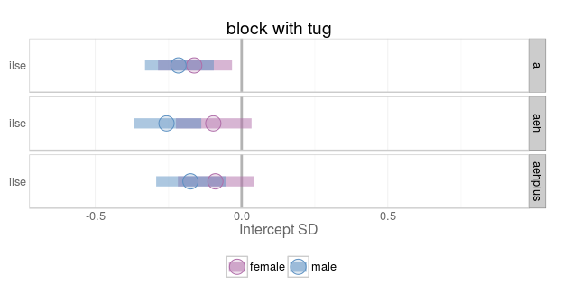 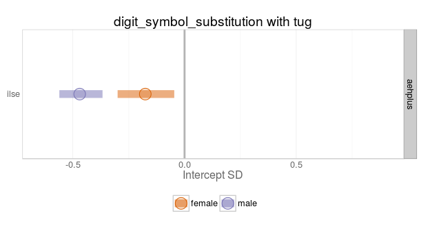 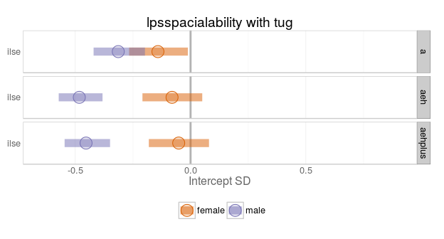 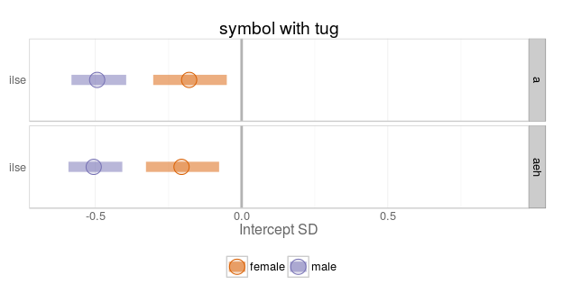 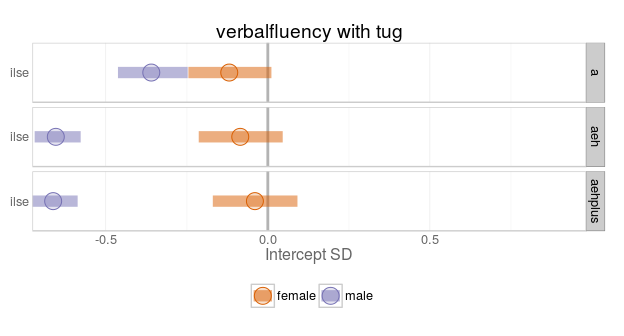 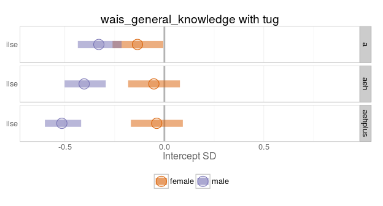 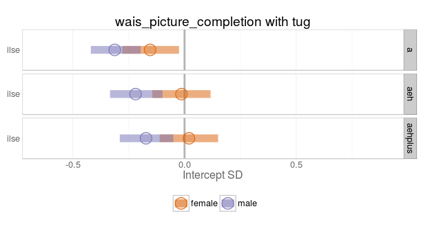 

## `univar` 

Studies with this physical variable listed in the model output: eas, elsa, habc, ilse, nuage, radc 


study_name   cognitive_measure         subgroup   model_type    subject_count   wave_count  converged 
-----------  ------------------------  ---------  -----------  --------------  -----------  ----------
habc         3ms                       female     aeh                    1578           11  TRUE      
habc         3ms                       female     aehplus                1538           11  TRUE      
habc         3ms                       female     a                      1584           11  TRUE      
habc         3ms                       female     0                      1584           11  TRUE      
habc         3ms                       male       aeh                    1484           11  TRUE      
habc         3ms                       male       aehplus                1459           11  TRUE      
habc         3ms                       male       a                      1486           11  TRUE      
habc         3ms                       male       0                      1486           11  TRUE      
elsa         categories                female     ae                     6106            5  TRUE      
elsa         categories                female     ae                     6106            5  TRUE      
elsa         categories                female     ae                     6106            5  TRUE      
elsa         categories                female     aeh                    2795            5  TRUE      
elsa         categories                female     aeh                    2795            5  TRUE      
elsa         categories                female     aeh                    2795            5  TRUE      
elsa         categories                female     aehplus                2782            5  TRUE      
elsa         categories                female     aehplus                2782            5  TRUE      
elsa         categories                female     aehplus                2782            5  TRUE      
elsa         categories                female     a                      6117            5  TRUE      
elsa         categories                female     a                      6117            5  TRUE      
elsa         categories                female     a                      6117            5  TRUE      
elsa         categories                female     0                      6008            5  TRUE      
elsa         categories                female     0                      6008            5  TRUE      
elsa         categories                female     0                      6008            5  TRUE      
elsa         categories                male       ae                     5123            5  TRUE      
elsa         categories                male       ae                     5123            5  TRUE      
elsa         categories                male       ae                     5123            5  TRUE      
elsa         categories                male       aeh                    2269            5  TRUE      
elsa         categories                male       aeh                    2269            5  TRUE      
elsa         categories                male       aeh                    2269            5  TRUE      
elsa         categories                male       aehplus                2256            5  TRUE      
elsa         categories                male       aehplus                2256            5  TRUE      
elsa         categories                male       aehplus                2256            5  TRUE      
elsa         categories                male       a                      5140            5  TRUE      
elsa         categories                male       a                      5140            5  TRUE      
elsa         categories                male       a                      5140            5  TRUE      
elsa         categories                male       0                      5018            5  TRUE      
elsa         categories                male       0                      5018            5  TRUE      
elsa         categories                male       0                      5018            5  TRUE      
eas          block                     female     0                       563            9  TRUE      
eas          block                     male       0                       350            9  TRUE      
eas          block                     female     ae                      563            9  TRUE      
eas          block                     female     ae                      563            9  TRUE      
eas          block                     female     aeh                     150            8  TRUE      
eas          block                     female     aeh                     150            8  TRUE      
eas          block                     female     aehplus                 150            8  TRUE      
eas          block                     female     aehplus                 150            8  TRUE      
eas          block                     female     a                       563            9  TRUE      
eas          block                     female     a                       563            9  TRUE      
eas          block                     female     full                    150            8  TRUE      
eas          block                     female     full                    150            8  TRUE      
eas          block                     male       ae                      350            9  TRUE      
eas          block                     male       ae                      350            9  TRUE      
eas          block                     male       aeh                      72            8  TRUE      
eas          block                     male       aeh                      72            8  TRUE      
eas          block                     male       aehplus                  72            8  TRUE      
eas          block                     male       aehplus                  72            8  TRUE      
eas          block                     male       a                       350            9  TRUE      
eas          block                     male       a                       350            9  TRUE      
eas          block                     male       full                     72            8  TRUE      
eas          block                     male       full                     72            8  TRUE      
radc         bnt                       female     a                      1010            5  TRUE      
radc         bnt                       female     ae                     1010            5  TRUE      
radc         bnt                       female     aeh                    1010            5  TRUE      
radc         bnt                       female     aehplus                1010            5  TRUE      
radc         bnt                       male       a                       351            5  TRUE      
radc         bnt                       male       ae                      351            5  TRUE      
radc         bnt                       male       aeh                     351            5  TRUE      
radc         bnt                       male       aehplus                 351            5  TRUE      
eas          bnt                       female     ae                      594            9  TRUE      
eas          bnt                       female     ae                      594            9  TRUE      
eas          bnt                       female     aeh                     150            9  TRUE      
eas          bnt                       female     aeh                     150            9  TRUE      
eas          bnt                       female     aehplus                 150            9  TRUE      
eas          bnt                       female     aehplus                 150            9  TRUE      
eas          bnt                       female     a                       594            9  TRUE      
eas          bnt                       female     a                       600            9  TRUE      
eas          bnt                       female     full                    150            9  TRUE      
eas          bnt                       female     full                    150            9  TRUE      
eas          bnt                       male       ae                      376            9  TRUE      
eas          bnt                       male       ae                      376            9  TRUE      
eas          bnt                       male       aeh                      72            9  TRUE      
eas          bnt                       male       aeh                      72            9  TRUE      
eas          bnt                       male       aehplus                  72            9  TRUE      
eas          bnt                       male       a                       384            9  TRUE      
eas          bnt                       male       aehplus                  72            9  TRUE      
eas          bnt                       male       full                     72            9  TRUE      
eas          bnt                       male       full                     72            9  TRUE      
radc         boston_story_delay        female     a                      1010            5  TRUE      
radc         boston_story_delay        female     ae                     1010            5  TRUE      
radc         boston_story_delay        female     aeh                    1010            5  TRUE      
radc         boston_story_delay        female     aehplus                1010            5  TRUE      
radc         boston_story_delay        male       a                       351            5  TRUE      
radc         boston_story_delay        male       ae                      351            5  TRUE      
radc         boston_story_delay        male       aeh                     351            5  TRUE      
radc         boston_story_delay        male       aehplus                 351            5  TRUE      
radc         boston_story_immediate    female     a                      1010            5  TRUE      
radc         boston_story_immediate    female     ae                     1010            5  TRUE      
radc         boston_story_immediate    female     aeh                    1010            5  TRUE      
radc         boston_story_immediate    female     aehplus                1010            5  TRUE      
radc         boston_story_immediate    male       a                       351            5  TRUE      
radc         boston_story_immediate    male       ae                      351            5  TRUE      
radc         boston_story_immediate    male       aeh                     351            5  TRUE      
radc         boston_story_immediate    male       aehplus                 351            5  TRUE      
radc         categories                female     a                      1010            5  TRUE      
radc         categories                female     ae                     1010            5  TRUE      
radc         categories                female     aeh                    1010            5  TRUE      
radc         categories                female     aehplus                1010            5  TRUE      
radc         categories                male       a                       351            5  TRUE      
radc         categories                male       ae                      351            5  TRUE      
radc         categories                male       aeh                     351            5  TRUE      
radc         categories                male       aehplus                 351            5  TRUE      
eas          categories                female     ae                      593            9  TRUE      
eas          categories                female     ae                      593            9  TRUE      
eas          categories                female     aeh                     150            9  TRUE      
eas          categories                female     aeh                     150            9  TRUE      
eas          categories                female     aehplus                 150            9  TRUE      
eas          categories                female     aehplus                 150            9  TRUE      
eas          categories                female     a                       593            9  TRUE      
eas          categories                female     a                       593            9  TRUE      
eas          categories                female     full                    150            9  TRUE      
eas          categories                female     full                    150            9  TRUE      
eas          categories                male       ae                      376            9  TRUE      
eas          categories                male       ae                      376            9  TRUE      
eas          categories                male       aeh                      72            9  TRUE      
eas          categories                male       aeh                      72            9  TRUE      
eas          categories                male       aehplus                  72            9  TRUE      
eas          categories                male       aehplus                  72            9  TRUE      
eas          categories                male       a                       376            9  TRUE      
eas          categories                male       a                       376            9  TRUE      
eas          categories                male       full                     72            9  TRUE      
eas          categories                male       full                     72            9  TRUE      
habc         clock                     female     aeh                    1402           10  TRUE      
habc         clock                     female     aehplus                1369           10  TRUE      
habc         clock                     female     a                      1407           10  TRUE      
habc         clock                     female     0                      1407           10  TRUE      
habc         clock                     male       aeh                    1282           10  TRUE      
habc         clock                     male       aehplus                1263           10  TRUE      
habc         clock                     male       a                      1284           10  TRUE      
habc         clock                     male       0                      1284           10  TRUE      
radc         complex_ideas             female     a                      1010            5  TRUE      
radc         complex_ideas             female     ae                     1010            5  TRUE      
radc         complex_ideas             female     aeh                    1010            5  TRUE      
radc         complex_ideas             female     aehplus                1010            5  TRUE      
radc         complex_ideas             male       a                       351            5  TRUE      
radc         complex_ideas             male       ae                      351            5  TRUE      
radc         complex_ideas             male       aeh                     351            5  TRUE      
radc         complex_ideas             male       aehplus                 351            5  TRUE      
elsa         delayed_recall            female     ae                     6106            6  TRUE      
elsa         delayed_recall            female     ae                     6106            6  TRUE      
elsa         delayed_recall            female     ae                     6106            6  TRUE      
elsa         delayed_recall            female     aeh                    2795            6  TRUE      
elsa         delayed_recall            female     aeh                    2795            6  TRUE      
elsa         delayed_recall            female     aeh                    2795            6  TRUE      
elsa         delayed_recall            female     aehplus                2782            6  TRUE      
elsa         delayed_recall            female     aehplus                2782            6  TRUE      
elsa         delayed_recall            female     aehplus                2782            6  TRUE      
elsa         delayed_recall            female     a                      6117            6  TRUE      
elsa         delayed_recall            female     a                      6117            6  TRUE      
elsa         delayed_recall            female     a                      6117            6  TRUE      
elsa         delayed_recall            female     0                      6003            6  TRUE      
elsa         delayed_recall            female     0                      6003            6  TRUE      
elsa         delayed_recall            female     0                      6003            6  TRUE      
elsa         delayed_recall            male       ae                     5123            6  TRUE      
elsa         delayed_recall            male       ae                     5123            6  TRUE      
elsa         delayed_recall            male       ae                     5123            6  TRUE      
elsa         delayed_recall            male       aeh                    2269            6  TRUE      
elsa         delayed_recall            male       aeh                    2269            6  TRUE      
elsa         delayed_recall            male       aeh                    2269            6  TRUE      
elsa         delayed_recall            male       aehplus                2256            6  TRUE      
elsa         delayed_recall            male       aehplus                2256            6  TRUE      
elsa         delayed_recall            male       aehplus                2256            6  TRUE      
elsa         delayed_recall            male       a                      5140            6  TRUE      
elsa         delayed_recall            male       a                      5140            6  TRUE      
elsa         delayed_recall            male       a                      5140            6  TRUE      
elsa         delayed_recall            male       0                      5022            6  TRUE      
elsa         delayed_recall            male       0                      5022            6  TRUE      
elsa         delayed_recall            male       0                      5022            6  TRUE      
radc         digit_ordering            female     a                      1010            5  TRUE      
radc         digit_ordering            female     ae                     1010            5  TRUE      
radc         digit_ordering            female     aeh                    1010            5  TRUE      
radc         digit_ordering            female     aehplus                1010            5  TRUE      
radc         digit_ordering            male       a                       351            5  TRUE      
radc         digit_ordering            male       ae                      351            5  TRUE      
radc         digit_ordering            male       aeh                     351            5  TRUE      
radc         digit_ordering            male       aehplus                 351            5  TRUE      
radc         digits_back               female     a                      1010            5  TRUE      
radc         digits_back               female     ae                     1010            5  TRUE      
radc         digits_back               female     aeh                    1010            5  TRUE      
radc         digits_back               female     aehplus                1010            5  TRUE      
radc         digits_back               male       a                       351            5  TRUE      
radc         digits_back               male       ae                      351            5  TRUE      
radc         digits_back               male       aeh                     351            5  TRUE      
radc         digits_back               male       aehplus                 351            5  TRUE      
radc         digits_forward            female     a                      1010            5  TRUE      
radc         digits_forward            female     ae                     1010            5  TRUE      
radc         digits_forward            female     aeh                    1010            5  TRUE      
radc         digits_forward            female     aehplus                1010            5  TRUE      
radc         digits_forward            male       a                       351            5  TRUE      
radc         digits_forward            male       ae                      351            5  TRUE      
radc         digits_forward            male       aeh                     351            5  TRUE      
radc         digits_forward            male       aehplus                 351            5  TRUE      
eas          digit_span                female     ae                      595            9  TRUE      
eas          digit_span                female     ae                      595            9  TRUE      
eas          digit_span                female     aeh                     150            9  TRUE      
eas          digit_span                female     aeh                     150            9  TRUE      
eas          digit_span                female     aehplus                 150            9  TRUE      
eas          digit_span                female     aehplus                 150            9  TRUE      
eas          digit_span                female     a                       595            9  TRUE      
eas          digit_span                female     a                       595            9  TRUE      
eas          digit_span                female     full                    150            9  TRUE      
eas          digit_span                female     full                    150            9  TRUE      
eas          digit_span                male       ae                      379            9  TRUE      
eas          digit_span                male       aeh                      72            9  TRUE      
eas          digit_span                male       aeh                      72            9  TRUE      
eas          digit_span                male       aehplus                  72            9  TRUE      
eas          digit_span                male       aehplus                  72            9  TRUE      
eas          digit_span                male       a                       379            9  TRUE      
eas          digit_span                male       a                       379            9  TRUE      
eas          digit_span                male       full                     72            9  TRUE      
eas          digit_span                male       full                     72            9  TRUE      
eas          symbol                    female     ae                      592            6  TRUE      
eas          symbol                    female     ae                      592            6  TRUE      
eas          symbol                    female     aeh                     150            6  TRUE      
eas          symbol                    female     aeh                     150            6  TRUE      
eas          symbol                    female     aehplus                 150            6  TRUE      
eas          symbol                    female     aehplus                 150            6  TRUE      
eas          symbol                    female     a                       592           10  TRUE      
eas          symbol                    female     a                       592            9  TRUE      
eas          symbol                    female     full                    150            6  TRUE      
eas          symbol                    female     full                    150            6  TRUE      
eas          symbol                    male       ae                      377            6  TRUE      
eas          symbol                    male       ae                      377            6  TRUE      
eas          symbol                    male       aeh                      72            6  TRUE      
eas          symbol                    male       aeh                      72            6  TRUE      
eas          symbol                    male       aehplus                  72            6  TRUE      
eas          symbol                    male       aehplus                  72            6  TRUE      
eas          symbol                    male       a                       377            9  TRUE      
eas          symbol                    male       a                       377            9  TRUE      
eas          symbol                    male       full                     72            6  TRUE      
eas          symbol                    male       full                     72            6  TRUE      
habc         symbol                    female     aeh                    1570           11  TRUE      
habc         symbol                    female     aehplus                1531           11  TRUE      
habc         symbol                    female     a                      1576           11  TRUE      
habc         symbol                    female     0                      1576           11  TRUE      
habc         symbol                    male       aeh                    1471           11  TRUE      
habc         symbol                    male       aehplus                1446           11  TRUE      
habc         symbol                    male       a                      1473           11  TRUE      
habc         symbol                    male       0                      1473           11  TRUE      
radc         symbol                    female     a                      1010            5  TRUE      
radc         symbol                    female     ae                     1010            5  TRUE      
radc         symbol                    female     aeh                    1010            5  TRUE      
radc         symbol                    female     aehplus                1010            5  TRUE      
radc         symbol                    male       a                       351            5  TRUE      
radc         symbol                    male       ae                      351            5  TRUE      
radc         symbol                    male       aeh                     351            5  TRUE      
radc         symbol                    male       aehplus                 351            5  TRUE      
ilse         symbol                    female     a                       228            3  TRUE      
ilse         symbol                    female     aeh                     226            3  TRUE      
ilse         symbol                    female     aehplus                 225            3  TRUE      
ilse         symbol                    female     0                       240            3  TRUE      
ilse         symbol                    male       a                       253            3  TRUE      
ilse         symbol                    male       aeh                     253            3  TRUE      
ilse         symbol                    male       aehplus                 252            3  TRUE      
ilse         symbol                    male       0                       259            3  TRUE      
eas          digit_span                male       ae                      379            9  TRUE      
eas          verbal_fluency            female     ae                      571            9  TRUE      
eas          verbal_fluency            female     ae                      571            9  TRUE      
eas          verbal_fluency            female     aeh                     150            9  TRUE      
eas          verbal_fluency            female     aeh                     150            9  TRUE      
eas          verbal_fluency            female     aehplus                 150            9  TRUE      
eas          verbal_fluency            female     aehplus                 150            9  TRUE      
eas          verbal_fluency            female     a                       571            9  TRUE      
eas          verbal_fluency            female     a                       571            9  TRUE      
eas          verbal_fluency            female     full                    150            9  TRUE      
eas          verbal_fluency            female     full                    150            9  TRUE      
eas          verbal_fluency            male       ae                      358            9  TRUE      
eas          verbal_fluency            male       ae                      358            9  TRUE      
eas          verbal_fluency            male       aeh                      72            9  TRUE      
eas          verbal_fluency            male       aeh                      72            9  TRUE      
eas          verbal_fluency            male       aehplus                  72            9  TRUE      
eas          verbal_fluency            male       aehplus                  72            9  TRUE      
eas          verbal_fluency            male       a                       358            9  TRUE      
eas          verbal_fluency            male       a                       358            9  TRUE      
eas          verbal_fluency            male       full                     72            9  TRUE      
eas          verbal_fluency            male       full                     72            9  TRUE      
elsa         word_list_immed           female     ae                     6106            6  TRUE      
elsa         word_list_immed           female     ae                     6106            6  TRUE      
elsa         word_list_immed           female     ae                     6106            6  TRUE      
elsa         word_list_immed           female     aeh                    2795            6  TRUE      
elsa         word_list_immed           female     aeh                    2795            6  TRUE      
elsa         word_list_immed           female     aeh                    2795            6  TRUE      
elsa         word_list_immed           female     aehplus                2782            6  TRUE      
elsa         word_list_immed           female     aehplus                2782            6  TRUE      
elsa         word_list_immed           female     aehplus                2782            6  FALSE     
elsa         word_list_immed           female     a                      6117            6  TRUE      
elsa         word_list_immed           female     a                      6117            6  TRUE      
elsa         word_list_immed           female     a                      6117            6  TRUE      
elsa         word_list_immed           female     0                      6008            6  TRUE      
elsa         word_list_immed           female     0                      6008            6  TRUE      
elsa         word_list_immed           female     0                      6008            6  TRUE      
elsa         word_list_immed           male       ae                     5123            6  TRUE      
elsa         word_list_immed           male       ae                     5123            6  TRUE      
elsa         word_list_immed           male       ae                     5123            6  TRUE      
elsa         word_list_immed           male       aeh                    2269            6  TRUE      
elsa         word_list_immed           male       aeh                    2269            6  TRUE      
elsa         word_list_immed           male       aeh                    2269            6  TRUE      
elsa         word_list_immed           male       aehplus                2256            6  TRUE      
elsa         word_list_immed           male       aehplus                2256            6  TRUE      
elsa         word_list_immed           male       aehplus                2256            6  TRUE      
elsa         word_list_immed           male       a                      5140            6  TRUE      
elsa         word_list_immed           male       a                      5140            6  TRUE      
elsa         word_list_immed           male       a                      5140            6  TRUE      
elsa         word_list_immed           male       0                      5023            6  TRUE      
elsa         word_list_immed           male       0                      5023            6  TRUE      
elsa         word_list_immed           male       0                      5023            6  TRUE      
eas          info                      female     a                       503            7  TRUE      
eas          info                      female     ae                      503            7  TRUE      
eas          info                      female     ae                      503            7  TRUE      
eas          info                      female     aeh                     110            7  TRUE      
eas          info                      female     aeh                     110            7  TRUE      
eas          info                      female     aehplus                 110            7  TRUE      
eas          info                      female     aehplus                 110            7  TRUE      
eas          info                      female     a                       503            7  TRUE      
eas          info                      female     full                    110            7  TRUE      
eas          info                      female     full                    110            7  TRUE      
eas          info                      male       ae                      337            7  TRUE      
eas          info                      male       ae                      337            7  TRUE      
eas          info                      male       aeh                      56            7  TRUE      
eas          info                      male       aeh                      56            7  TRUE      
eas          info                      male       aehplus                  56            7  TRUE      
eas          info                      male       aehplus                  56            7  TRUE      
eas          info                      male       a                       337            7  TRUE      
eas          info                      male       a                       337            7  TRUE      
eas          info                      male       full                     56            7  TRUE      
eas          info                      male       full                     56            7  TRUE      
radc         line_orientation          female     a                      1010            5  TRUE      
radc         line_orientation          female     ae                     1010            5  TRUE      
radc         line_orientation          female     aeh                    1010            5  TRUE      
radc         line_orientation          female     aehplus                1010            5  TRUE      
radc         line_orientation          male       a                       351            5  TRUE      
radc         line_orientation          male       ae                      351            5  TRUE      
radc         line_orientation          male       aeh                     351            5  TRUE      
radc         line_orientation          male       aehplus                 351            5  TRUE      
eas          logical_memory            female     ae                      554            9  TRUE      
eas          logical_memory            female     ae                      554            9  TRUE      
eas          logical_memory            female     aeh                     150            9  TRUE      
eas          logical_memory            female     aeh                     150            9  TRUE      
eas          logical_memory            female     aehplus                 150            9  TRUE      
eas          logical_memory            female     aehplus                 150            9  TRUE      
eas          logical_memory            female     a                       554            9  TRUE      
eas          logical_memory            female     a                       554            9  TRUE      
eas          logical_memory            female     full                    150            9  TRUE      
eas          logical_memory            female     full                    150            9  TRUE      
eas          logical_memory            male       ae                      349            9  TRUE      
eas          logical_memory            male       ae                      349            9  TRUE      
eas          logical_memory            male       aeh                      72            9  TRUE      
eas          logical_memory            male       aeh                      72            9  TRUE      
eas          logical_memory            male       aehplus                  72            9  TRUE      
eas          logical_memory            male       aehplus                  72            9  TRUE      
eas          logical_memory            male       a                       349            9  TRUE      
eas          logical_memory            male       a                       349            9  TRUE      
eas          logical_memory            male       full                     72            9  TRUE      
eas          logical_memory            male       full                     72            9  TRUE      
radc         logical_memory_delay      female     ae                     1010            5  TRUE      
radc         logical_memory_delay      female     aeh                    1010            5  TRUE      
radc         logical_memory_delay      female     aehplus                1010            5  TRUE      
radc         logical_memory_delay      male       ae                      351            5  TRUE      
radc         logical_memory_delay      male       aeh                     351            5  TRUE      
radc         logical_memory_delay      male       aehplus                 351            5  TRUE      
radc         logical_memory_immed      female     ae                     1010            5  TRUE      
radc         logical_memory_immed      female     aeh                    1010            5  TRUE      
radc         logical_memory_immed      female     aehplus                1010            5  TRUE      
radc         logical_memory_immed      male       ae                      351            5  TRUE      
radc         logical_memory_immed      male       aeh                     351            5  TRUE      
radc         logical_memory_immed      male       aehplus                 351            5  TRUE      
ilse         lps_spacial_ability       male       0                       260            3  TRUE      
ilse         lps_spatial_ability       female     aeh                     226            3  TRUE      
ilse         lps_spatial_ability       female     aehplus                 225            3  TRUE      
ilse         lps_spatial_ability       female     a                       228            3  TRUE      
ilse         lps_spatial_ability       male       aeh                     253            3  TRUE      
ilse         lps_spatial_ability       male       aehplus                 252            3  TRUE      
ilse         lps_spatial_ability       male       a                       253            3  TRUE      
ilse         lps_spatial_ability       female     0                       240            3  TRUE      
radc         matrices                  female     a                      1010            5  TRUE      
radc         matrices                  female     ae                     1010            5  TRUE      
radc         matrices                  female     aeh                    1010            5  TRUE      
radc         matrices                  female     aehplus                1010            5  TRUE      
radc         matrices                  male       a                       351            5  TRUE      
radc         matrices                  male       ae                      351            5  TRUE      
radc         matrices                  male       aeh                     351            5  TRUE      
radc         matrices                  male       aehplus                 351            5  TRUE      
nuage        3ms                       female     aeh                     934            4  TRUE      
nuage        3ms                       female     aehplus                 934            4  TRUE      
nuage        3ms                       female     a                       939            4  TRUE      
nuage        3ms                       male       aeh                     847            4  TRUE      
nuage        3ms                       male       aehplus                 847            4  TRUE      
nuage        3ms                       male       a                       851            4  TRUE      
eas          mmse                      female     ae                      600            9  TRUE      
eas          mmse                      female     ae                      600            9  TRUE      
eas          mmse                      female     aeh                     150            9  TRUE      
eas          mmse                      female     aeh                     150            9  TRUE      
eas          mmse                      female     aehplus                 150            9  TRUE      
eas          mmse                      female     aehplus                 150            9  TRUE      
eas          mmse                      female     a                       600            9  TRUE      
eas          mmse                      female     a                       600            9  TRUE      
eas          mmse                      female     full                    150            9  TRUE      
eas          mmse                      female     full                    150            9  TRUE      
eas          mmse                      male       ae                      383            9  TRUE      
eas          mmse                      male       ae                      383            9  TRUE      
eas          mmse                      male       aeh                      72            9  TRUE      
eas          mmse                      male       aeh                      72            9  TRUE      
eas          mmse                      male       aehplus                  72            9  TRUE      
eas          mmse                      male       aehplus                  72            9  TRUE      
eas          mmse                      male       a                       383            9  TRUE      
eas          mmse                      male       a                       383            9  TRUE      
eas          mmse                      male       full                     72            9  TRUE      
eas          mmse                      male       full                     72            9  TRUE      
radc         mmse                      female     a                      1010            5  TRUE      
radc         mmse                      female     ae                     1010            5  TRUE      
radc         mmse                      female     aeh                    1010            5  TRUE      
radc         mmse                      female     aehplus                1010            5  TRUE      
radc         mmse                      male       a                       351            5  TRUE      
radc         mmse                      male       ae                      351            5  TRUE      
radc         mmse                      male       aeh                     351            5  TRUE      
radc         mmse                      male       aehplus                 351            5  TRUE      
radc         nart                      female     a                      1010            5  TRUE      
radc         nart                      female     ae                     1010            5  TRUE      
radc         nart                      female     aeh                    1010            5  TRUE      
radc         nart                      female     aehplus                1010            5  TRUE      
radc         nart                      male       a                       351            5  TRUE      
radc         nart                      male       ae                      351            5  TRUE      
radc         nart                      male       aeh                     351            5  TRUE      
radc         nart                      male       aehplus                 351            5  TRUE      
nuage        univar                    female     a                       919            4  TRUE      
nuage        univar                    female     aeh                     915            4  TRUE      
nuage        univar                    female     aehplus                 915            4  TRUE      
nuage        univar                    female     0                       940            4  TRUE      
nuage        univar                    male       a                       845            4  TRUE      
nuage        univar                    male       aeh                     843            4  TRUE      
nuage        univar                    male       aehplus                 843            4  TRUE      
nuage        univar                    male       0                       853            4  TRUE      
nuage        univar                    female     a                       937            4  TRUE      
nuage        univar                    female     aeh                     933            4  TRUE      
nuage        univar                    female     aehplus                 933            4  TRUE      
nuage        univar                    female     0                       940            4  TRUE      
nuage        univar                    male       a                       848            4  TRUE      
nuage        univar                    male       aeh                     846            4  TRUE      
nuage        univar                    male       aehplus                 846            4  TRUE      
nuage        univar                    male       0                       853            4  TRUE      
nuage        univar                    female     a                       938            4  TRUE      
nuage        univar                    female     aeh                     934            4  TRUE      
nuage        univar                    female     aehplus                 934            4  TRUE      
nuage        univar                    female     0                       940            4  TRUE      
nuage        univar                    male       a                       848            4  TRUE      
nuage        univar                    male       aeh                     846            4  TRUE      
nuage        univar                    male       aehplus                 846            4  TRUE      
eas          bnt                       male       a                       376            9  TRUE      
radc         number_comparison         female     a                      1010            5  TRUE      
radc         number_comparison         female     ae                     1010            5  TRUE      
radc         number_comparison         female     aeh                    1010            5  TRUE      
radc         number_comparison         female     aehplus                1010            5  TRUE      
radc         number_comparison         male       a                       351            5  TRUE      
radc         number_comparison         male       ae                      351            5  TRUE      
radc         number_comparison         male       aeh                     351            5  TRUE      
radc         number_comparison         male       aehplus                 351            5  TRUE      
eas          trailsb                   female     ae                      580            9  TRUE      
eas          trailsb                   female     ae                      580            9  TRUE      
eas          trailsb                   female     aeh                     150            8  TRUE      
eas          trailsb                   female     aeh                     150            8  TRUE      
eas          trailsb                   female     aehplus                 150            8  TRUE      
eas          trailsb                   female     aehplus                 150            5  TRUE      
eas          trailsb                   female     a                       580            9  TRUE      
eas          trailsb                   female     a                       580            9  TRUE      
eas          trailsb                   female     full                    150            8  TRUE      
eas          trailsb                   female     full                    150            8  TRUE      
eas          trailsb                   male       ae                      368            9  TRUE      
eas          trailsb                   male       ae                      368            9  TRUE      
eas          trailsb                   male       aeh                      72            5  TRUE      
eas          trailsb                   male       aeh                      72            5  TRUE      
eas          trailsb                   male       aehplus                  72            5  TRUE      
eas          trailsb                   male       a                       368            9  TRUE      
eas          trailsb                   male       a                       368            9  TRUE      
eas          trailsb                   male       full                     72            8  TRUE      
eas          trailsb                   male       full                     72            8  TRUE      
ilse         verbal_fluency            female     a                       228            3  TRUE      
ilse         verbal_fluency            female     aeh                     226            3  TRUE      
ilse         verbal_fluency            female     aehplus                 225            3  TRUE      
ilse         verbal_fluency            female     0                       240            3  TRUE      
ilse         verbal_fluency            male       a                       252            3  TRUE      
ilse         verbal_fluency            male       aeh                     252            3  TRUE      
ilse         verbal_fluency            male       aehplus                 251            3  TRUE      
ilse         verbal_fluency            male       0                       259            3  TRUE      
ilse         block                     female     a                       228            3  TRUE      
ilse         block                     female     aeh                     226            3  TRUE      
ilse         block                     female     aehplus                 225            3  TRUE      
ilse         block                     female     0                       240            3  TRUE      
ilse         block                     male       a                       253            3  TRUE      
ilse         block                     male       aeh                     253            3  TRUE      
ilse         block                     male       aehplus                 252            3  TRUE      
ilse         block                     male       0                       259            3  TRUE      
ilse         wais_general_knowledge    female     aeh                     226            3  TRUE      
ilse         wais_general_knowledge    female     aehplus                 225            3  TRUE      
ilse         wais_general_knowledge    female     a                       228            3  TRUE      
ilse         wais_general_knowledge    female     0                       240            3  TRUE      
ilse         wais_general_knowledge    male       aeh                     253            3  TRUE      
ilse         wais_general_knowledge    male       aehplus                 252            3  TRUE      
ilse         wais_general_knowledge    male       a                       253            3  TRUE      
ilse         wais_general_knowledge    male       0                       260            3  TRUE      
ilse         wais_picture_completion   female     a                       228            3  TRUE      
ilse         wais_picture_completion   female     aeh                     226            3  TRUE      
ilse         wais_picture_completion   female     aehplus                 225            3  TRUE      
ilse         wais_picture_completion   female     0                       240            3  TRUE      
ilse         wais_picture_completion   male       a                       253            3  TRUE      
ilse         wais_picture_completion   male       aeh                     253            3  TRUE      
ilse         wais_picture_completion   male       aehplus                 252            3  TRUE      
ilse         wais_picture_completion   male       0                       260            3  TRUE      
eas          wais_vocab                female     ae                      594            9  TRUE      
eas          wais_vocab                female     ae                      594            9  TRUE      
eas          wais_vocab                female     aeh                     150            9  TRUE      
eas          wais_vocab                female     aehplus                 150            9  TRUE      
eas          wais_vocab                female     a                       594            9  TRUE      
eas          wais_vocab                female     a                       594            9  TRUE      
eas          wais_vocab                female     full                    150            9  TRUE      
eas          wais_vocab                female     full                    150            9  TRUE      
eas          wais_vocab                male       ae                      377            9  TRUE      
eas          wais_vocab                male       ae                      377            9  TRUE      
eas          wais_vocab                male       aeh                      72            9  TRUE      
eas          wais_vocab                male       aeh                      72            9  TRUE      
eas          wais_vocab                male       aehplus                  72            9  TRUE      
eas          wais_vocab                male       aehplus                  72            9  TRUE      
eas          wais_vocab                male       a                       377            9  TRUE      
eas          wais_vocab                male       full                     72            9  TRUE      
eas          wais_vocab                male       full                     72            9  TRUE      
eas          wais_vocab                male       a                       377            9  TRUE      
eas          wais_vocab                female     aeh                     150            9  TRUE      
eas          wais_vocab                female     aehplus                 150            9  TRUE      
radc         wmslmdel                  female     a                      1010            5  TRUE      
radc         wmslmdel                  male       a                       351            5  TRUE      
radc         wmslmimmed                female     a                      1010            5  TRUE      
radc         wmslmimmed                male       a                       351            5  TRUE      
radc         word_list_delay           female     a                      1010            5  TRUE      
radc         word_list_delay           female     ae                     1010            5  TRUE      
radc         word_list_delay           female     aeh                    1010            5  TRUE      
radc         word_list_delay           female     aehplus                1010            5  TRUE      
radc         word_list_delay           male       a                       351            5  TRUE      
radc         word_list_delay           male       ae                      351            5  TRUE      
radc         word_list_delay           male       aeh                     351            5  TRUE      
radc         word_list_delay           male       aehplus                 351            5  TRUE      
radc         word_list_immed           female     a                      1010            5  TRUE      
radc         word_list_immed           female     ae                     1010            5  TRUE      
radc         word_list_immed           female     aeh                    1010            5  TRUE      
radc         word_list_immed           female     aehplus                1010            5  TRUE      
radc         word_list_immed           male       a                       351            5  TRUE      
radc         word_list_immed           male       ae                      351            5  TRUE      
radc         word_list_immed           male       aeh                     351            5  TRUE      
radc         word_list_immed           male       aehplus                 351            5  TRUE      
radc         word_list_recog           female     a                      1010            5  TRUE      
radc         word_list_recog           female     aehplus                1010            5  TRUE      
radc         word_list_recog           male       a                       351            5  TRUE      
radc         word_list_recog           male       aeh                     351            5  TRUE      
radc         word_list_recog           male       aehplus                 351            5  TRUE      

# Forest Plot (Animated)


# Questions
## Unanswered Questions
 1. What does `VS` stand for?  How was it measured?
 1. Where the cars at the Philly track measured with the same phluguerstometer and the Cleveland track?
 
## Answered Questions
 1. The Seattle track's phluguerstometer was producing flaky negative values; it's measurements have been dropped.

# Session Information
For the sake of documentation and reproducibility, the current report was rendered on a system using the following software.


```
Report rendered by wibeasley at 2015-07-22, 00:44 +0100
```

```
R version 3.2.1 (2015-06-18)
Platform: x86_64-pc-linux-gnu (64-bit)
Running under: Ubuntu 14.04.2 LTS

locale:
 [1] LC_CTYPE=en_US.UTF-8       LC_NUMERIC=C               LC_TIME=en_US.UTF-8        LC_COLLATE=en_US.UTF-8    
 [5] LC_MONETARY=en_US.UTF-8    LC_MESSAGES=en_US.UTF-8    LC_PAPER=en_US.UTF-8       LC_NAME=C                 
 [9] LC_ADDRESS=C               LC_TELEPHONE=C             LC_MEASUREMENT=en_US.UTF-8 LC_IDENTIFICATION=C       

attached base packages:
[1] grid      stats     graphics  grDevices utils     datasets  methods   base     

other attached packages:
[1] testit_0.4         ggplot2_1.0.1      RColorBrewer_1.1-2 scales_0.2.5       knitr_1.10.5      

loaded via a namespace (and not attached):
 [1] Rcpp_0.11.6        digest_0.6.8       MASS_7.3-43        plyr_1.8.3         gtable_0.1.2       formatR_1.2       
 [7] magrittr_1.5       evaluate_0.7       highr_0.5          stringi_0.5-5      reshape2_1.4.1     rmarkdown_0.7     
[13] labeling_0.3       proto_0.3-10       tools_3.2.1        stringr_1.0.0.9000 munsell_0.4.2      yaml_2.1.13       
[19] colorspace_1.2-6   htmltools_0.2.6   
```
