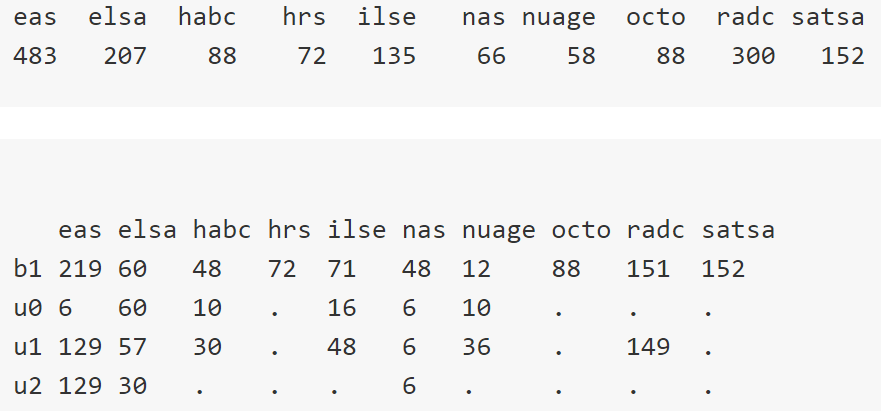
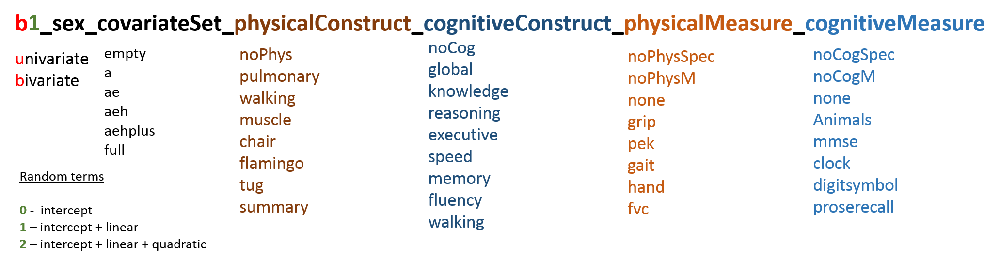
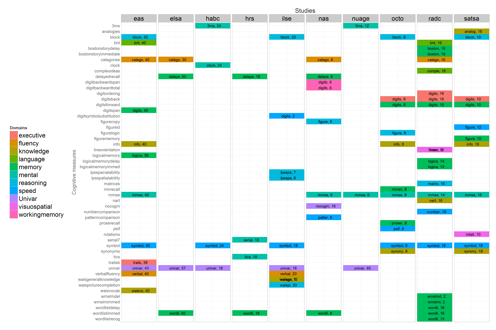

<style type="text/css">
.small-code pre code {
   font-size: 1.1em;
}
</style>

A Collaborative Modeling Framework for Multi-Study Coordinated Analyses
========================================================
Andriy Koval, University of Victoria

[IALSA network](http://ialsa.org)

July-22-2015, *Wellcome Trust Conference*

Portland Workshop
======
-  examine associations between changes in **physical** functioning
 (i.e., grip strength, pulmonary function, chair stands, walking speed)
-  and **cognitive** functioning (i.e., measures of speed, memory, reasoning, executive functioning)
- in **multiple-study** comparative framework using
- **bivariate growth models**


Publication Model
======

## Association between changes in
- [**pulmonary**](./projects/pulmonary/README.md), [**grip**](./projects/grip/README.md),  [**gait**](./projects/gait/README.md) and cognitive functioning
- [**cognitive**](./projects/cognitive/README.md) variables,  [**physical**](./projects/physical/README.md) variables

Open Science & Reproducible Research
====

- [GitHub repository](https://github.com/IALSA/IALSA-2015-Portland)
- no data is shared, only models
- all scripts and reports available online
- 1649 models submitted so far



Dashboard
===

- built with ```shinydashboard``` R package
- interactive html interface on top of R script

About: Model ID
===


- each file with model output provided model ID


About: Domain Mapping
====
- constructs/domains are flexible
- here is our current organization
- first six characters, counts



Model Collective
====
 - counting models
 - each color adds to 100%
 - pivot table
  - study_name: EAS
  - physical_measure: grip
  - model_type: aeh
  - list unique values
  - pc_CORR_11

Specification
===
- random intercepts, slopes, residuals (ISR)
- Bivariate ISR (BISR) graph


BISR
===

Compare
- (EAS, grip, aeh) vs. (OCTO, grip, aeh)
- (EAS, grip, aeh) vs. (EAS, grip, a)


Forest
===

Compare

- block : (eas,males) vs. (octo, females)
- mmse : (octo, males) vs. (oct, females)


Future
===
 - [IalsaSynthesis](https://github.com/IALSA/IalsaSynthesis/blob/master/README.md) - R package to service collaborative workshops
 - add data : new **models**
 - add data : new **studies**
 - add data : new **outcomes**
 - add models: new **specifications**
 - add questions: new **analyses**


Thanks
====
- IALSA team
- Andrea Piccinin
- Scott Hofer
- Will Beasley


